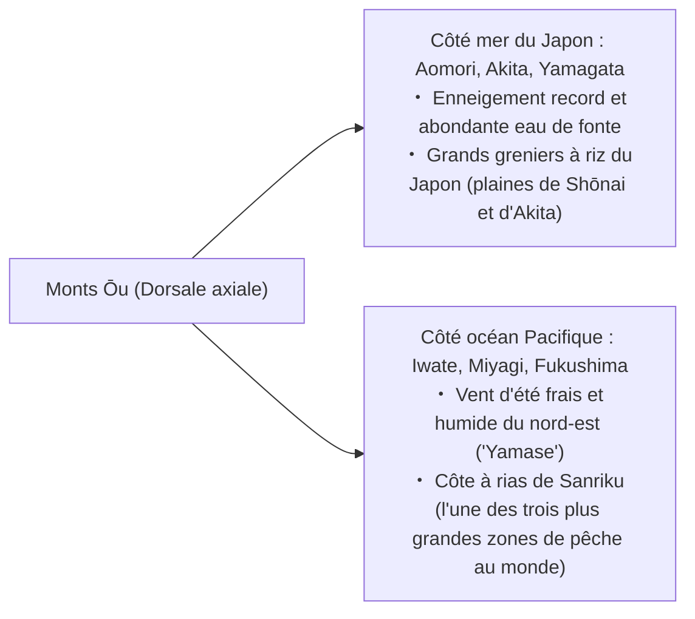
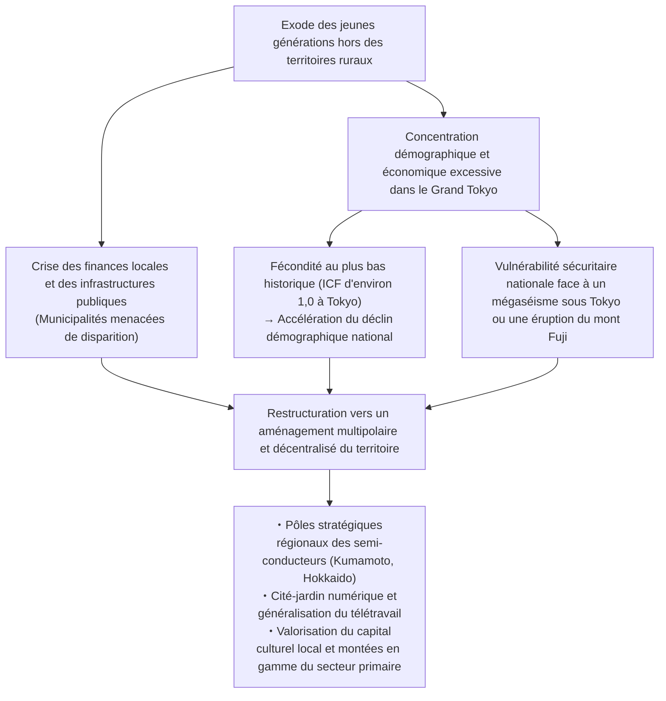
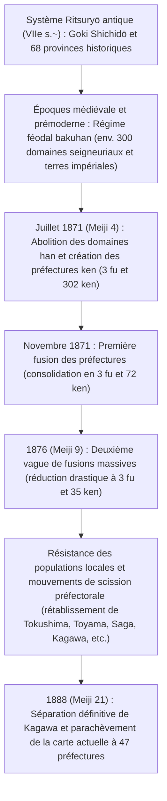

## Introduction : La diversité de l'archipel japonais et la genèse des 47 préfectures

S'étirant en un arc majestueux sur près de 3 000 kilomètres du nord au sud, l'archipel japonais est un pays insulaire éminemment montagneux et escarpé, né des formidables bouleversements tectoniques de la ceinture de feu du Pacifique — à la zone de friction et de subduction de quatre plaques lithosphériques majeures : la plaque eurasienne, la plaque nord-américaine, la plaque pacifique et la plaque de la mer des Philippines.

Près de 70 % du territoire national est couvert de forêts et de massifs montagneux. Délimitée par une haute dorsale montagneuse axiale qui traverse l'archipel de part en part, une mosaïque saisissante de climats se trouve concentrée dans cet espace insulaire pourtant exigu : le « climat de la mer du Japon », caractérisé par d'abondantes chutes de neige en hiver ; le « climat de la côte Pacifique », chaud et humide en été et ponctué de journées sèches et lumineuses en hiver ; le « climat de la mer intérieure de Seto », doux, abrité et remarquablement peu arrosé ; le « climat des hauts plateaux du centre », soumis à de vigoureuses amplitudes thermiques ; et enfin le « climat des îles du Sud-Ouest », de nature subtropicale océanique.

```
【Classification climatique de l'archipel japonais et mécanismes géographiques】

┌─────────────────┬───────────────────────────────┬───────────────────────────────┐
│ Zone climatique │ Périmètre géographique        │ Caractéristiques et mécanismes│
├─────────────────┼───────────────────────────────┼───────────────────────────────┤
│ Climat de la    │ Façade mer du Japon d'Hokkaido│ Les vents de mousson du       │
│ mer du Japon    │ jusqu'au Hokuriku et au San'in│ nord-ouest s'imbibent d'eau   │
│                 │                               │ sur le Tsushima chaud et      │
│                 │                               │ butent contre la dorsale      │
├─────────────────┼───────────────────────────────┼───────────────────────────────┤
│ Climat de la    │ Littoral océanique Pacifique  │ Pluies d'été et typhons issus │
│ côte Pacifique  │ jusqu'au sud de Kyushu        │ de la mousson du sud-est ;    │
│                 │                               │ hivers secs et ensoleillés    │
├─────────────────┼───────────────────────────────┼───────────────────────────────┤
│ Climat de la mer│ Zone enserrée par les monts   │ Les nuages de pluie sont      │
│ de Seto         │ Chūgoku et les monts Shikoku  │ arrêtés par les massifs :     │
│                 │                               │ douceur, sécheresse, soleil   │
├─────────────────┼───────────────────────────────┼───────────────────────────────┤
│ Climat des hauts│ Nagano, Yamanashi, région de  │ Haute altitude et enclavement │
│ plateaux        │ Hida dans la préfecture de    │ montagneux : amplitudes       │
│ du centre       │ Gifu, etc.                    │ thermiques diurnes et annuelles│
├─────────────────┼───────────────────────────────┼───────────────────────────────┤
│ Climat des îles │ Préfecture d'Okinawa, archipel│ Climat subtropical maritime   │
│ du Sud-Ouest    │ d'Amami, etc.                 │ réchauffé par le Kuroshio :   │
│                 │                               │ chaleur, forte humidité, typhon│
└─────────────────┴───────────────────────────────┴───────────────────────────────┘
```

Le découpage territorial du Japon puise ses fondements historiques les plus profonds dans l'ancien système juridique et administratif du Ritsuryō, articulé autour du principe des « Cinq provinces de la capitale et Sept circuits » (*Goki Shichidō* : Kinai, Tōkaidō, Tōsandō, Hokurikudō, San'indō, San'yōdō, Nankaidō et Saikaidō), qui délimitait les 68 provinces historiques (*ryōseikoku*). Au lendemain immédiat de la restauration de Meiji, le décret d'abolition du système féodal des domaines seigneuriaux et d'établissement des préfectures (*Haihan Chiken*) de 1871 donna naissance dans un premier temps à plus de 300 préfectures et gouvernements urbains. Après une série de fusions, de démantèlements et de réajustements administratifs successifs, la carte territoriale se stabilisa définitivement en 1888 (21e année de l'ère Meiji) avec la scission et l'indépendance de la préfecture de Kagawa, fixant ainsi l'architecture institutionnelle actuelle dite des « 1 métropole, 1 circuit/territoire, 2 préfectures urbaines et 43 préfectures » (*1 to, 1 dō, 2 fu, 43 ken*), soit 47 préfectures au total.

La présente monographie propose une exploration minutieuse et intégrale des 47 préfectures réparties en huit grands blocs régionaux (Hokkaido, Tōhoku, Kanto, Chūbu, Kinki, Chūgoku, Shikoku, Kyushu et Okinawa), en examinant pour chacune d'elles ses racines historiques, sa géographie physique, son tissu industriel, son patrimoine culturel et matériel, ainsi que les défis socio-démographiques du XXIe siècle auxquels elle se trouve aujourd'hui confrontée.

---

## 1. Région d'Hokkaido : Frontière septentrionale et vaste secteur primaire

### 1.1 Hokkaido (Anciennement : Ezochi / 11 provinces dont Ishikari, Oshima, Shiribeshi, etc.)
- **Chef-lieu** : Ville de Sapporo
- **Superficie et géographie physique** : 83 424 km² (1er rang national, représentant environ 22 % de la superficie totale du Japon). La dorsale axiale est constituée par le groupe volcanique de Daisetsuzan et la chaîne des monts Hidaka, d'où se déploient les plus vastes plaines et plateaux de l'archipel : la plaine d'Ishikari, la plaine de Tokachi et le plateau d'ondulation de Konsen. Appartenant à la zone climatique subarctique, l'île connaît des étés doux et frais, ainsi que des hivers extrêmement rigoureux marqués par d'abondantes précipitations neigeuses sur de longues périodes.
- **Structure industrielle et économie** :
  - **Agriculture** : Véritable grenier alimentaire de la nation japonaise. Grandes cultures arables de plein champ (blé, betterave sucrière, pomme de terre, haricot azuki) et élevage bovin laitier d'envergure (Hokkaido concentre à elle seule plus de 50 % de la production nationale de lait cru). Dans la plaine de Tokachi notamment, le paysage agraire est dominé par des exploitations hautement mécanisées de type euro-américain s'étendant sur plusieurs dizaines d'hectares par foyer.
  - **Pêche et aquaculture** : Numéro un national absolu tant par le tonnage des captures en mer que par le volume d'aquaculture (coquilles Saint-Jacques et pétoncles géants *hotate*, saumon du Pacifique, colin d'Alaska, grandes algues marines *kombu*).
  - **Tourisme et secteur tertiaire** : Rayonnement planétaire de la station de sports d'hiver de Niseko, prisée par les flux internationaux pour sa neige poudreuse (*powder snow*) d'une incomparable légèreté ; péninsule sauvage de Shiretoko (inscrite au patrimoine naturel mondial de l'UNESCO) ; vallonnements couverts de lavande de Furano ; et le célèbre Festival de la neige de Sapporo (*Sapporo Yuki Matsuri*).
- **Histoire et patrimoine culturel** : Culture ancestrale du peuple autochtone Aïnou, aujourd'hui valorisée et préservée au sein du complexe national Upopoy (Espace symbolique pour la coexistence ethnique à Shiraoi). Histoire pionnière du défrichage moderne au XIXe siècle menée sous la houlette de la Commission de colonisation (*Kaitakushi*) et des soldats-colons agricoles (*Tondenhei*). Fondation du collège d'agriculture de Sapporo sous l'égide du Dr William S. Clark, qui insuffla les méthodes de l'agronomie moderne et les préceptes moraux protestants (« *Boys, be ambitious!* »).
- **Défis régionaux** : Déclin démographique accéléré doublé d'une hyper-concentration des populations et des capitaux vers l'aire urbaine de Sapporo, déséquilibres financiers structurels et menaces d'abandon des lignes ferroviaires déficitaires de la compagnie JR Hokkaido, et coûts considérables de maintien des infrastructures publiques sur un territoire aux dimensions continentales.

---

## 2. Région du Tohoku : Les bienfaits des monts Ou et le terroir historique du Michinoku

La région du Tōhoku est scindée du nord au sud par la formidable barrière orographique des monts Ōu, qui engendre deux visages géographiques et climatiques radicalement contrastés : le versant de la mer du Japon (territoire de fort enneigement et grenier à riz) et le versant de l'océan Pacifique (vulnérable aux vagues de froid estival apportées par le vent maritime *yamase*).



### 2.1 Préfecture d'Aomori (Anciennement : Tsugaru, Mutsu)
- **Chef-lieu** : Ville d'Aomori
- **Géographie physique** : Située à la pointe septentrionale de l'île de Honshū. Les péninsules de Tsugaru à l'ouest et de Shimokita à l'est enserrent la vaste baie de Mutsu, tandis que le massif des monts Hakkōda trône en son centre et que le sanctuaire forestier de Shirakami-Sanchi (patrimoine naturel mondial de l'UNESCO) s'étend à la frontière occidentale.
- **Industrie et économie** : Monopole national de fait dans l'arboriculture pomicole avec environ 60 % de la production japonaise de pommes (bassin de Hirosaki et plaine de Tsugaru). Élevage de coquilles Saint-Jacques dans la baie de Mutsu, thon rouge d'exception d'Ōma pêché à la ligne unitaire, importantes criées du port de pêche de Hachinohe. Dans les secteurs de pointe, la commune de Rokkasho accueille les installations névralgiques du cycle du combustible nucléaire de l'archipel.
- **Culture et traditions** : Défilés monumentaux de lanternes géantes illuminées lors du festival Aomori Nebuta et du Hirosaki Neputa ; virtuosité percutante du luth traditionnel *Tsugaru-jamisen* ; terre d'inspiration littéraire et artistique ayant vu naître l'écrivain Osamu Dazai et le graveur Shikō Munakata. Fabuleux patrimoine archéologique de l'époque préhistorique Jōmon, illustré par le site sédentaire de Sannai-Maruyama.

### 2.2 Préfecture d'Iwate (Anciennement : Rikuchū, Rikuzen, Mutsu)
- **Chef-lieu** : Ville de Morioka
- **Géographie physique** : Deuxième plus vaste préfecture du Japon après Hokkaido, couvrant 15 275 km². Elle se structure autour du long couloir alluvionnaire du fleuve Kitakami, bordé à l'est par les hauts plateaux sauvages de Kitakami et par le littoral Pacifique escarpé à rias de la côte de Sanriku.
- **Industrie et économie** : Développement d'un puissant pôle de pointe dédié aux composants semi-conducteurs et aux équipements automobiles le long du bassin de Kitakami (notamment les méga-usines de mémoires du groupe Kioxia). Récolte d'algues alimentaires *wakame*, d'ormeaux sauvages et pêche au saumon et au balaou sur la côte de Sanriku. Métallurgie traditionnelle d'artisanat d'art de la fonte de fer de Nanbu (*Nanbu tekki*).
- **Culture et traditions** : Pavillon d'or Konjikidō du temple Chūson-ji à Hiraizumi (patrimoine culturel mondial de l'UNESCO, matérialisant l'idéal bouddhique de la Terre Pure de la dynastie des seigneurs Fujiwara du Nord). Cosmologie poétique et écologique d'« Ihatov » imaginée par l'écrivain Kenji Miyazawa ; recueil folklorique des *Légendes de Tōno* (*Tōno Monogatari*, immortalisé par Kunio Yanagita, acte de naissance de l'ethnologie japonaise).

### 2.3 Préfecture de Miyagi (Anciennement : Rikuzen, Mutsu)
- **Chef-lieu** : Ville de Sendai (unique métropole régionale désignée par ordonnance gouvernementale du Tōhoku)
- **Géographie physique** : Riches terres alluviales de la plaine de Sendai propices à la riziculture, paysage maritime légendaire de la baie de Matsushima (classée parmi les Trois Vues les plus célèbres du Japon), avancée rocheuse de la péninsule d'Oshika et golfe abrité de Sendai.
- **Industrie et économie** : Cœur battant décisionnel, commercial et administratif du Tōhoku. Terroir rizicole d'élite ayant donné naissance aux variétés renommées *Sasanishiki* et *Hitomebore*. Importants complexes de transformation des produits de la mer dans les ports de pêche d'Ishinomaki et de Kesennuma. Pôle d'excellence universitaire et scientifique incarné par l'Université du Tōhoku et le centre de rayonnement synchrotron de pointe NanoTerasu.
- **Culture et traditions** : Héritage aristocratique du grand domaine féodal de Sendai (620 000 koku) fondé par le prestigieux daimyo Date Masamune. Somptueux festival estival de Sendai Tanabata Matsuri.

### 2.4 Préfecture d'Akita (Anciennement : Ugo, Dewa)
- **Chef-lieu** : Ville d'Akita
- **Géographie physique** : Vaste plaine côtière d'Akita, cuvette fertile de Yokote, relief volcanique imposant du mont Chōkai et eaux d'un bleu profond du lac Tazawa (le plus profond du Japon).
- **Industrie et économie** : Terre rizicole par excellence, célèbre dans tout l'archipel pour sa variété de référence *Akitakomachi*. Sylviculture séculaire du cèdre noble d'Akita (*Akita-sugi*). Volaille d'appellation gastronomique Hinai (*Hinai-jidori*), pêche hivernale du poisson des sables *hatahata*. La façade maritime de la préfecture est devenue le fer de lance national du développement des parcs éoliens offshore en mer du Japon.
- **Culture et traditions** : Équilibres spectaculaires des mâts chargés de lanternes lors du festival Akita Kantō Matsuri ; rituels d'admonition hivernaux des génies masqués Namahage de la péninsule d'Oga (inscrits au patrimoine culturel immatériel de l'UNESCO) ; massifs inviolés de Shirakami-Sanchi.

### 2.5 Préfecture de Yamagata (Anciennement : Uzen, Dewa)
- **Chef-lieu** : Ville de Yamagata
- **Géographie physique** : Façade maritime de la plaine de Shōnai et succession de bassins intérieurs échelonnés le long des méandres du fleuve Mogami (Yonezawa, Yamagata, Shinjō). Sanctuaires sacrés des Trois Monts de Dewa (Dewa Sanzan : Gassan, Haguro-san et Yudono-san) et crêtes volcaniques de la chaîne de Zaō.
- **Industrie et économie** : Premier verger du Japon (plus de 70 % de la production nationale de cerises, poires européennes raffinées *La France*). Riziculture de prestige dans la plaine de Shōnai (variété vedette *Tsuyahime*). Élevage bovin d'exception fournissant le bœuf de Yonezawa. Forte concentration continentale d'industries électroniques et de mécanique de précision.
- **Culture et traditions** : Rites initiatiques et ascétiques ancestraux du Shugendō au sein des monts de Dewa ; défilé costumé au son des chapeaux fleuris du festival Yamagata Hanagasa Matsuri ; charme architectural suranné de l'époque Taishō préservé à la station thermale de Ginzan Onsen.

### 2.6 Préfecture de Fukushima (Anciennement : Iwashiro, Iwaki)
- **Chef-lieu** : Ville de Fukushima
- **Géographie physique** : Territoire clairement subdivisé en trois bandes géographiques distinctes : la région d'Aizu (secteur montagneux, fort enneigement, traditions historiques), le Nakadōri (couloir central urbain, politique et économique) et le Hamadōri (façade maritime ouverte sur le Pacifique, au climat tempéré).
- **Industrie et économie** : Vergers réputés de pêches et de poires d'eau dans le bassin du Nakadōri. Artisanat d'art de la laque d'Aizu et nombreuses distilleries et brasseries de saké médaillées. Programme avant-gardiste « Fukushima Innovation Coast » sur le littoral de Hamadōri (zone d'essais pour drones et robots *Robot Test Field*, développement des technologies industrielles de l'hydrogène vert).
- **Culture et traditions** : Mémoire martiale et rigueur morale des samouraïs d'Aizuwakamatsu (légende héroïque du corps des jeunes guerriers du Byakkotai), culture populaire du ramen de Kitakata, joutes équestres féodales en armures d'époque du Sōma Nomaoi. Région modèle de résilience post-catastrophe du 11 mars 2011 et pionnière de la transition énergétique décarbonée.

---

## 3. Région du Kanto : Concentration du pouvoir métropolitain et complexes industriels intégrés

S'adossant à la plaine du Kanto — la plus vaste plaine alluviale du pays —, la région du Kanto articule de façon organique l'hyper-concentration des fonctions politiques, financières, scientifiques et logistiques de l'État avec une agriculture périurbaine intensive et d'immenses combinats industriels côtiers.

```
【Structure de répartition fonctionnelle de la mégalopole de la région capitale (Grand Tokyo)】

・Métropole de Tokyo : Fonctions régaliennes de l'État, finance mondiale, cabinets juridiques d'affaires, technologies informatiques de pointe, rayonnement culturel.
・Préfecture de Kanagawa : Ceinture industrielle de Keihin, port de commerce international (Yokohama), centres de recherche et développement, tourisme à Shōnan et Hakone.
・Préfecture de Saitama : Nœud logistique intérieur (réseaux denses de Shinkansen et autoroutes), agriculture périurbaine, parcs industriels de machinerie et de distribution.
・Préfecture de Chiba : Aéroport international de Narita, combinat pétrochimique et sidérurgique du littoral de Keiyō, pêche et agriculture maraîchère (arachides, légumes de plein champ).
・Préfecture d'Ibaraki : Cité scientifique de Tsukuba, zone industrielle littorale de Kashima, industries mécaniques lourdes et électriques d'Hitachi, melons et racines de lotus.
・Préfecture de Tochigi : Zone industrielle du nord du Kanto (automobile continentale et optique de haute précision), sanctuaires et temples de Nikkō (Tōshō-gū), production de fraises (Tochiotome).
・Préfecture de Gunma : Cœur industriel automobile structuré autour de SUBARU, stations thermales réputées (Kusatsu, Ikaho), patrimoine soyeux et sériciculture.
```

### 3.1 Préfecture d'Ibaraki (Anciennement : Hitachi)
- **Chef-lieu** : Ville de Mito
- **Industrie et économie** : Troisième place nationale pour la valeur des productions agricoles (melons de table, racines de lotus comestibles *renkon*, patates douces séchées *hoshi-imo*). La ville de Tsukuba accueille à elle seule près d'un tiers des laboratoires et instituts nationaux de recherche publique du Japon, incarnant le premier cerveau scientifique de la nation. Foyer historique des constructions électromécaniques lourdes d'Hitachi, combinat industrialo-portuaire sidérurgique et chimique de Kashima.
- **Culture et patrimoine** : Rayonnement intellectuel de l'école de Mito (*Mitogaku*) fondée par la lignée princière des Tokugawa de Mito (ferment idéologique du loyalisme impérial *Sonnō Jōi* à l'aube de Meiji), jardin paysager classique Kairaku-en, grandioses cascades étagées de Fukuroda (l'une des trois plus célèbres chutes d'eau du Japon).

### 3.2 Préfecture de Tochigi (Anciennement : Shimotsuke)
- **Chef-lieu** : Ville d'Utsunomiya
- **Industrie et économie** : Premier producteur de fraises de l'archipel depuis un demi-siècle sans interruption (marques de référence *Tochiotome* et *Tochiaika*). Importants parcs manufacturiers continentaux établis autour d'Utsunomiya et d'Oyama (dispositifs médicaux, véhicules et machinerie industrielle de précision). Inauguration novatrice de la ligne de tramway moderne rapide Utsunomiya Light Rail Transit (LRT), première du genre au Japon dédiée à une mobilité urbaine décarbonée de nouvelle génération.
- **Culture et patrimoine** : Sanctuaires et temples de Nikkō inscrits au patrimoine mondial de l'UNESCO (somptuosité architecturale du mausolée Nikkō Tōshō-gū), école d'Ashikaga (reconnue comme la plus ancienne université générale du Japon médiéval), grès céramiques traditionnels de Mashiko (*Mashiko-yaki*).

### 3.3 Préfecture de Gunma (Anciennement : Kōzuke)
- **Chef-lieu** : Ville de Maebashi
- **Industrie et économie** : Berceau industriel historique de la marque automobile SUBARU (héritière des anciennes usines aéronautiques Nakajima) concentré dans la ville d'Ōta, formant une puissante filière de métallurgie, de plasturgie et d'emboutissage. Monopole national écrasant sur la production du tubercule de konjac (près de 90 % du marché japonais). Haut lieu du thermalisme réunissant de grandes stations renommées : Kusatsu Onsen, Ikaho Onsen et Minakami Onsen.
- **Culture et patrimoine** : Filature de soie de Tomioka et ensemble du patrimoine industriel de la sériciculture moderne (inscrits au patrimoine mondial de l'UNESCO). Sentiment d'identité régionale vigoureusement perpétué par l'apprentissage du jeu de cartes traditionnel *Jōmō Karuta*.

### 3.4 Préfecture de Saitama (Anciennement : majeure partie de la province de Musashi)
- **Chef-lieu** : Ville de Saitama (métropole désignée par ordonnance gouvernementale)
- **Industrie et économie** : Cinquième préfecture la plus peuplée du Japon (environ 7,3 millions d'habitants). La gare d'Ōmiya constitue le carrefour d'interconnexion ferroviaire et autoroutier le plus stratégique de l'Est du Japon. Rang de premier plan au niveau national pour la valeur des livraisons de l'industrie agroalimentaire. Terroirs agricoles réputés : oignons nouveaux de Fukaya (*Fukaya-negi*), thé vert aromatique de Sayama, galettes de riz grillé artisanales *Sōka senbei*.
- **Culture et patrimoine** : Quartier historique préservé d'entrepôts marchands en pisé noir *kura-zukuri* à Kawagoe (surnommée la « Petite Edo »), festival nocturne de chars de Chichibu (Chichibu Yomatsuri, inscrit au patrimoine culturel immatériel de l'UNESCO).

### 3.5 Préfecture de Chiba (Anciennement : Shimōsa, Kazusa, Awa)
- **Chef-lieu** : Ville de Chiba (métropole désignée par ordonnance gouvernementale)
- **Industrie et économie** : Aéroport international de Narita, plaque tournante indispensable du fret aérien et des flux marchands mondiaux du Japon. Immenses raffineries pétrochimiques et aciéries de la ceinture industrielle de Keiyō bordant la baie de Tokyo. Premier rang national pour de nombreuses productions maraîchères de plein champ (arachides, poireaux, épinards). Criées très actives du port de pêche océanique de Chōshi. Pôle de loisirs international de Tokyo Disney Resort.
- **Culture et patrimoine** : Bourg monastique et marchand entourant le vénérable temple Naritasan Shinshō-ji, hauts lieux du surf et villégiatures maritimes de la péninsule de Bōsō.

### 3.6 Métropole de Tokyo (Anciennement : Musashi, Izu, Ogasawara)
- **Siège du gouvernement métropolitain** : Arrondissement de Shinjuku
- **Géographie physique** : Environ 14 millions d'habitants intramuros (centre névralgique de la plus grande agglomération urbaine de la planète). Englobe les 23 arrondissements spéciaux, l'espace urbain de Tama, les îles de l'archipel d'Izu et les îles Ogasawara (sanctuaire de biodiversité océanique classé au patrimoine naturel mondial de l'UNESCO).
- **Industrie et économie** : Gigantesque moteur économique générant à lui seul près de 20 % du PIB du Japon. Quartiers d'affaires et de haute finance internationale de Marunouchi et Ōtemachi, écosystème numérique et technologique foisonnant de Shibuya et Roppongi, épicentre mondial des sous-cultures pop et de l'électronique à Akihabara, hub aérien intérieur et mondial de l'aéroport international de Haneda.
- **Culture et patrimoine** : Traces historiques du donjon du château d'Edo (actuel Palais impérial), ferveur bouddhique populaire du temple Sensō-ji à Asakusa, majesté boisée du grand sanctuaire shinto Meiji-jingū, coexistant harmonieusement avec une avant-garde architecturale de gratte-ciels et une créativité contemporaine sans égale.

### 3.7 Préfecture de Kanagawa (Anciennement : Sagami, sud de Musashi)
- **Chef-lieu** : Ville de Yokohama (environ 3,77 millions d'habitants, la plus vaste commune du pays)
- **Industrie et économie** : Deuxième préfecture la plus peuplée du Japon (environ 9,2 millions d'habitants). Pôle industriel de la zone de Keihin (siège mondial et usines de Nissan Motor, aciéries JFE Steel, etc.). Grappe d'excellence de centres de recherche et développement dans le quartier futuriste de Minato Mirai 21. Technologies vertes et mécanique avancée dans la ville industrielle de Kawasaki.
- **Culture et patrimoine** : Cité historique de Kamakura, berceau du premier shogunat militaire au XIIe siècle (matrice de la culture martiale des samouraïs), charme cosmopolite et portuaire issu de l'ouverture du pays à Yokohama, culture balnéaire et spots côtiers de Shōnan, villégiature thermale séculaire de Hakone.

---

## 4. Région du Chubu : Épine dorsale manufacturière du Japon et relief alpin

Située au centre géographique de l'île de Honshū, la région du Chūbu se subdivise en sous-régions très diversifiées : le Hokuriku (façade mer du Japon), les Hauts plateaux du centre (*Chūō Kōchi*, intérieur des terres) et le Tōkai (façade océanique Pacifique). Elle abrite le tissu manufacturier le plus puissant et le plus compétitif du Japon.

### 4.1 Préfecture de Niigata (Anciennement : Echigo, Sado)
- **Chef-lieu** : Ville de Niigata (métropole désignée par ordonnance gouvernementale)
- **Industrie et économie** : Bassin rizicole d'élite de la plaine d'Echigo arrosée par les bassins fluviaux du Shinano et de l'Agano (premier producteur national de la prestigieuse variété de riz *Koshihikari*). Production d'envergure mondiale d'arts de la table métalliques et de coutellerie industrielle de haute précision dans la conurbation de Tsubame-Sanjō. Élevage très prisé de carpes d'ornement *Nishikigoi*. Importante extraction nationale de gaz naturel et de pétrole brut.
- **Culture et patrimoine** : Mines d'or et d'argent historiques de l'île de Sado (patrimoine mondial de l'UNESCO), feux d'artifice monumentaux du festival estival de Nagaoka, renouveau artistique rural de la Triennale d'art contemporain d'Echigo-Tsumari.

### 4.2 Préfecture de Toyama (Anciennement : Etchū)
- **Chef-lieu** : Ville de Toyama
- **Industrie et économie** : Énergie hydroélectrique abondante fournie par les barrages de Hokuriku Electric Power, alimentant des industries de laminage d'aluminium, de chimie industrielle lourde et de biopharmacie. Premier pôle pharmaceutique du Japon, héritier de la renommée séculaire des colporteurs de médicaments d'Etchū (*Toyama no baiyaku*). Baie de Toyama, véritable « vivier naturel » (calmar luciole *hotaru-ika*, crevette blanche translucide *shiro-ebi*, sériole du Japon).
- **Culture et patrimoine** : Massif alpin des monts Tateyama et vertigineux barrage de Kurobe (Route alpine Tateyama-Kurobe). Architecture traditionnelle en toit de chaume pentu des hameaux de Gokayama (inscrits au patrimoine mondial de l'UNESCO).

### 4.3 Préfecture d'Ishikawa (Anciennement : Kaga, Noto)
- **Chef-lieu** : Ville de Kanazawa
- **Industrie et économie** : Tourisme culturel à haute valeur ajoutée capitalisant sur l'héritage d'opulence du domaine féodal de Kaga (« le fief au million de koku »). Machinerie textile spécialisée, engins de chantiers et de travaux publics (berceau historique de la firme Komatsu), matériaux composites avancés en fibre de carbone.
- **Culture et patrimoine** : Splendeur classique du jardin seigneurial Kenroku-en, quasi-monopole de la production de feuilles d'or (99 % du marché japonais), céramique polychrome raffinée Kutani-yaki, art ancestral de la laque de Wajima (*Wajima-nuri*). Dynamique courageuse de reconstruction créative à la suite du séisme de la péninsule de Noto.

### 4.4 Préfecture de Fukui (Anciennement : Echizen, Wakasa)
- **Chef-lieu** : Ville de Fukui
- **Industrie et économie** : Monopole absolu de la lunetterie japonaise avec 95 % des montures fabriquées dans la ville de Sabae. Textiles techniques de pointe et composants électroniques avancés (usines de Murata Manufacturing, etc.). Berceau historique de la création de la variété de riz Koshihikari. Pêche très réputée du crabe géant d'Echizen (*Echizen-gani*). Important parc de réacteurs électronucléaires dans la région littorale de Reinan.
- **Culture et patrimoine** : Monastère de pèlerinage Eihei-ji (temple directeur fondé par le maître zen Dōgen pour l'école Sōtō), musée préfectoral des dinosaures de Fukui (renommée mondiale), falaises basaltiques escarpées de Tōjinbō. Régulièrement classée au sommet des indices nationaux de bonheur et de qualité de vie.

### 4.5 Préfecture de Yamanashi (Anciennement : Kai)
- **Chef-lieu** : Ville de Kōfu
- **Industrie et économie** : Premier producteur national de raisins de table, de pêches et de prunes. Berceau historique de la viticulture japonaise dans la région de Katsunuma. Capitale nationale de la joaillerie et de la taille de pierres précieuses. Siège mondial du géant de la robotique industrielle et des commandes numériques CNC FANUC. Ligne d'expérimentation à grande vitesse du train à sustentation magnétique Maglev (futur Chūō Shinkansen).
- **Culture et patrimoine** : Lieux de mémoire du chef de guerre Shingen Takeda, panorama grandiose des cinq lacs au pied du mont Fuji (Fuji Goko), gorges spectaculaires de Shōsenkyō.

### 4.6 Préfecture de Nagano (Anciennement : Shinano)
- **Chef-lieu** : Ville de Nagano
- **Industrie et économie** : Département montagneux abritant le cœur des Alpes japonaises (massifs de Hida, Kiso et Akaishi). Industrie de mécanique de haute précision (Seiko Epson, etc., conférant à la région le titre de « Suisse de l'Orient »). Maraîchage d'altitude de légumes de saison (laitues, choux de Chine), vergers de pommiers. Première préfecture japonaise pour l'espérance de vie et la longévité en bonne santé.
- **Culture et patrimoine** : Vénérable temple Zenkō-ji, château de Matsumoto (donjon d'origine classé trésor national), villégiatures alpines d'altitude de Kamikōchi et Karuizawa.

### 4.7 Préfecture de Gifu (Anciennement : Mino, Hida)
- **Chef-lieu** : Ville de Gifu
- **Industrie et économie** : Coutellerie renommée de Seki (l'un des trois pôles historiques mondiaux de la forge et du taillant avec Solingen et Sheffield). Céramiques Mino-yaki (représentant plus de la moitié de la production nationale de vaisselle en céramique). Filière aéronautique et aérospatiale d'avant-garde à Kakamigahara (installations de Kawasaki Heavy Industries). Ébénisterie et mobilier traditionnel en bois massif de Hida-Takayama.
- **Culture et patrimoine** : Village historique de Shirakawa-gō (classé au patrimoine mondial de l'UNESCO), quartiers préservés aux façades de bois sombre de Takayama, art séculaire de la pêche nocturne au cormoran sur la rivière Nagara (*Ukai*).

### 4.8 Préfecture de Shizuoka (Anciennement : Tōtōmi, Suruga, Izu)
- **Chef-lieu** : Ville de Shizuoka (métropole désignée par ordonnance gouvernementale)
- **Industrie et économie** : Rangs de tête nationaux pour la valeur des expéditions de biens manufacturés. Terre natale et métropole industrielle des pionniers mondiaux du transport motorisé (Suzuki, Yamaha, Honda). Premier producteur national de thé vert. Capitale planétaire de la maquette plastique et du modélisme (usines et sièges de Tamiya, Bandai, Aoshima). Port de pêche océanique de Yaizu (bonite et thon).
- **Culture et patrimoine** : Majesté du mont Fuji (patrimoine mondial), chapelet de stations thermales de la péninsule d'Izu, terre de retraite du shogun Tokugawa Ieyasu (château de Sumpu et sanctuaire Kunōzan Tōshō-gū).

### 4.9 Préfecture d'Aichi (Anciennement : Owari, Mikawa)
- **Chef-lieu** : Ville de Nagoya (métropole désignée par ordonnance gouvernementale)
- **Industrie et économie** : **Premier pôle manufacturier du Japon depuis plus de 40 années consécutives en valeur de livraisons industrielles**. Empire industriel mondial propulsé par la société Toyota Motor Corporation et son immense écosystème de fournisseurs et de sous-traitants. Cœur de la construction aérospatiale japonaise (usines de Mitsubishi Heavy Industries). Aciers spéciaux, machines-outils de haute précision, céramiques techniques.
- **Culture et patrimoine** : Berceau des trois grands héros de l'unification nationale féodale (Oda Nobunaga, Toyotomi Hideyoshi et Tokugawa Ieyasu). Ancien sanctuaire shinto d'Atsuta-jingū, donjon historique du château de Nagoya. Gastronomie identitaire affirmée de Nagoya (*Nagoya-meshi* : côtelettes frites au miso rouge *miso-katsu*, anguille grillée *hitsumabushi*, ailes de poulet caramélisées *tebasaki*).

---

## 5. Région du Kinki / Kansai : Capitales millénaires et stratification de l'économie du Kansai

Foyer spirituel et politique ininterrompu du Japon de l'Antiquité jusqu'à l'aube de l'époque moderne, la région historique du Kinai concilie harmonieusement le dynamisme marchand d'Osaka, l'ouverture portuaire cosmopolite de Kobe et le rayonnement patrimonial universel des anciennes capitales de Kyoto et de Nara.

```
【Répartition fonctionnelle et diversité historique du bassin du Kinki (Kansai)】

・Préfecture d'Osaka : L'ADN historique du négoce marchand, finance internationale, expositions universelles (1970/2025), sciences de la vie et biotechnologies, gastronomie populaire (Kuidāore).
・Préfecture de Kyoto : Capital culturel millénaire de l'ancienne Heian-kyō, géants de la haute technologie (Nintendo, Kyocera), artisanat d'art séculaire, tourisme international de premier plan.
・Préfecture de Hyōgo : Pôle maritime mondial (port de Kobe), zone industrielle littorale de Harima, brasseries de saké de Nada-Gogō, productions agricoles et maritimes de Tamba et Tajima.
・Préfecture de Nara : Berceau du pouvoir royal de Yamato dans l'Antiquité, ancienne Heijō-kyō, joyaux d'art bouddhique mondial (Hōryū-ji, Tōdai-ji).
・Préfecture de Shiga : Lac Biwa (le plus grand lac du Japon, réservoir vital de 14 millions d'habitants dans le Kinki), berceau des marchands d'Ōmi (Ōmi Shōnin), industrie manufacturière continentale de pointe.
・Préfecture de Mie : Grand sanctuaire d'Ise (sommet du shintoïsme), circuit international de Suzuka, perliculture d'Ago, combinat pétrochimique de Yokkaichi.
・Préfecture de Wakayama : Hauts lieux spirituels du mont Kōya et de Kumano Sanzan (sites sacrés et chemins de pèlerinage), premier producteur national de mandarines mikan et de prunes marinées umeboshi.
```

### 5.1 Préfecture de Mie (Anciennement : Ise, Iga, Shima, est de Kii)
- **Chef-lieu** : Ville de Tsu
- **Industrie et économie** : Combinat industriel de Yokkaichi (pétrochimie lourde et méga-usines de mémoires flash à semi-conducteurs). Élevage d'excellence du bœuf noir de Matsusaka, perliculture d'huîtres Akoya dans la baie abritée d'Ago, pêche à la langouste épineuse d'Ise (*Ise-ebi*).
- **Culture et patrimoine** : Grand sanctuaire shintoïste d'Ise (sanctuaire intérieur d'Amaterasu et sanctuaire extérieur de Toyouke), berceau historique des combattants de l'ombre de l'école des ninjas d'Iga, chemins sacrés du Kumano Kodō (voie d'Iseji).

### 5.2 Préfecture de Shiga (Anciennement : Ōmi)
- **Chef-lieu** : Ville d'Ōtsu
- **Industrie et économie** : Nœud logistique majeur encerclant le lac Biwa. Usines mères et centres de production stratégiques de grands groupes industriels (Toray, Panasonic). Céramique rustique de Shigaraki (*Shigaraki-yaki*). Terroir rizicole d'Ōmi et bœuf de boucherie réputé d'Ōmi.
- **Culture et patrimoine** : Monastère Enryaku-ji sur le mont Hiei (considéré comme le berceau spirituel et la montagne mère de toutes les grandes écoles du bouddhisme japonais), château historique de Hikone (donjon classé trésor national), éthique commerciale d'avant-garde des marchands d'Ōmi résumée par le principe du *Sanpō-yoshi* (triple bénéfice : bon pour le vendeur, bon pour l'acheteur, bon pour la société).

### 5.3 Préfecture de Kyoto (Anciennement : Yamashiro, Tamba, Tango)
- **Chef-lieu** : Ville de Kyoto (métropole désignée par ordonnance gouvernementale)
- **Industrie et économie** : Capitale culturelle et touristique d'un prestige mondial exceptionnel. Siège planétaire de multinationales de haute technologie parmi les plus performantes (Nintendo, Kyocera, OMRON, Shimadzu, Nidec). Perfection de l'artisanat traditionnel : soieries précieuses de Nishijin (*Nishijin-ori*), faïences et grès Kiyomizu-yaki, terroirs de thé vert d'exception à Uji (*Uji-cha*).
- **Culture et patrimoine** : Monuments historiques de l'ancienne Kyoto (17 ensembles majeurs de temples bouddhistes et sanctuaires shinto classés au patrimoine mondial de l'UNESCO), splendeur millénaire du festival de Gion, brasiers rituels monumentaux du Gozan no Okuribi sur les collines entourant la cité.

### 5.4 Préfecture d'Osaka (Anciennement : est de Settsu, Kawachi, Izumi)
- **Chef-lieu** : Ville d'Osaka (métropole désignée par ordonnance gouvernementale)
- **Industrie et économie** : Deuxième métropole économique et financière du Japon, cœur névralgique de l'Ouest du pays. Berceau des grandes firmes japonaises de négoce international généraliste (Itochu, Sumitomo), géants de la pharmacie et des sciences de la santé (Takeda, etc.), tissu industriel extrêmement dense d'ateliers et de PME de métallurgie et mécanique de haute précision à Higashi-Osaka. Hub aéroportuaire maritime de l'aéroport international du Kansai (KIX).
- **Culture et patrimoine** : Forteresse emblématique du château d'Osaka, effervescence populaire du quartier de Dōtonbori, répertoires scéniques du théâtre de marionnettes Bunraku, du Kamigata Rakugo et de la comédie burlesque Yoshimoto Shinkigeki, gastronomie populaire et décomplexée centrée sur les spécialités à base de pâte (*Kona-mon* : beignets de poulpe *takoyaki*, crêpes garnies *okonomiyaki*). Ensemble grandiose de tumulus antiques funéraires de Mozu-Furuichi (mausolée colossal de l'empereur Nintoku, inscrit au patrimoine mondial de l'UNESCO).

### 5.5 Préfecture de Hyōgo (Anciennement : ouest de Settsu, Tamba, Tajima, Harima, Awaji)
- **Chef-lieu** : Ville de Kobe (métropole désignée par ordonnance gouvernementale)
- **Industrie et économie** : Rôle logistique de premier ordre du port international de Kobe. Cœur de l'industrie lourde nationale (chantiers et machinerie de Kawasaki Heavy Industries, aciéries Kobe Steel). Complexe industriel côtier de Harima. Premier pôle brassicole de saké traditionnel du Japon dans le district historique des Cinq Villages de Nada (*Nada-Gogō*). Oignons doux de l'île d'Awaji, viande bovine renommée de Kobe.
- **Culture et patrimoine** : Majestueux château de Himeji (premier bien japonais inscrit au patrimoine culturel mondial de l'UNESCO, célèbre sous l'appellation du « héron blanc »), sources thermales millénaires d'Arima Onsen, demeures patriciennes occidentales historiques d'Ijinkan à Kitano.

### 5.6 Préfecture de Nara (Anciennement : Yamato)
- **Chef-lieu** : Ville de Nara
- **Industrie et économie** : Rayonnement touristique mondial d'un patrimoine architectural inestimable. Sylviculture noble du cèdre et du cyprès des monts Yoshino. Premier producteur national de bonneterie et chaussettes (agglomération de Kōryō-chō). Artisanat de précision des bâtons d'encre de suie pour la calligraphie (*Nara-sumi*) et fouets à thé en bambou fendu (*chasen*).
- **Culture et patrimoine** : Monuments historiques de l'ancienne Nara (sanctuaires et monastères du Tōdai-ji avec son grand Bouddha Daibutsu, Kōfuku-ji, Kasuga Taisha), ensemble bouddhique du Hōryū-ji abritant les plus anciennes constructions en bois conservées au monde, floraison printanière légendaire des cerisiers du mont Yoshino et spiritualité ascétique du Shugendō.

### 5.7 Préfecture de Wakayama (Anciennement : ouest de Kii)
- **Chef-lieu** : Ville de Wakayama
- **Industrie et économie** : Premier verger du Japon pour la mandarine douce *Unshū mikan*, la prune noble *Nankō-ume* (base des *umeboshi* traditionnels), les agrumes *hassaku* et les baies aromatiques du poivrier japonais *sanshō*. Complexe sidérurgique majeur de Nippon Steel sur la baie de Wakayama.
- **Culture et patrimoine** : Sites sacrés et chemins de pèlerinage dans les monts Kii (monastère Kongōbu-ji sur le haut plateau sacré du mont Kōya, les trois sanctuaires majeurs de Kumano Sanzan, patrimoine mondial de l'UNESCO), villégiature thermale et balnéaire de Shirahama Onsen.

---

## 6. Région du Chugoku : Combinats de la mer de Seto et univers mythologique du San'in

Séparée par la chaîne axiale des monts Chūgoku, la région offre une saisissante opposition géographique entre le « San'yō » (versant méridional de la mer intérieure de Seto, baigné de soleil et hautement industrialisé) et le « San'in » (versant septentrional de la mer du Japon, réputé pour sa nature préservée et ses récits mythologiques).

### 6.1 Préfecture de Tottori (Anciennement : Inaba, Hōki)
- **Chef-lieu** : Ville de Tottori
- **Géographie et économie** : Préfecture la moins peuplée de tout l'archipel (environ 540 000 habitants). Agriculture spécifique sur le sol aride des spectaculaires dunes côtières de Tottori (bulbes d'échalotes chinoises *rakkyō*). Premier verger national pour la poire asiatique du 20e siècle (*Nijisseiki-nashi*). Poireaux blancs *shiro-negi*, débarquements maritimes records de crabes au port de Sakaiminato.
- **Culture et patrimoine** : Mythe fondateur du Lièvre blanc d'Inaba, eaux thermales d'une exceptionnelle concentration en radon de Misasa Onsen, prouesse d'architecture en bois suspendue à la paroi rocheuse de l'ermitage Nageire-dō du temple Sanbutsu-ji sur le mont Mitoku (trésor national).

### 6.2 Préfecture de Shimane (Anciennement : Izumo, Iwami, Oki)
- **Chef-lieu** : Ville de Matsue
- **Géographie et économie** : Plaine côtière d'Izumo, eaux saumâtres du lac Shinji (premier producteur national de petites palourdes *shijimi*). Aciers spéciaux de réputation légendaire issus de la tradition métallurgique du bas-fourneau *tatara* (acier *Yasuki-hagane*, fabriqué par Hitachi Metals / Proterial). Floriculture de cyclamens, raisins de table Delaware.
- **Culture et patrimoine** : Grand sanctuaire Izumo Taisha (haut lieu de la mythologie shintoïste où toutes les divinités du Japon se rassemblent au dixième mois du calendrier lunaire), site minier historique des mines d'argent d'Iwami Ginzan (inscrit au patrimoine mondial de l'UNESCO), paysages insulaires et géologiques exceptionnels du Géoparc mondial des îles Oki.

### 6.3 Préfecture d'Okayama (Anciennement : Mimasaka, Bizen, Bitchū)
- **Chef-lieu** : Ville d'Okayama (métropole désignée par ordonnance gouvernementale)
- **Industrie et économie** : Gigantesque complexe industriel littoral de Mizushima (pétrochimie de base, aciéries intégrées, assemblage automobile). Royaume des fruits de luxe baigné par un ensoleillement remarquable (pêches blanches *shimizu-hakutō*, raisins Muscat d'Alexandrie). District de Kojima réputé comme le berceau historique et la capitale mondiale de la confection de jeans en denim haut de gamme et d'uniformes scolaires.
- **Culture et patrimoine** : Quartier historique préservé de Kurashiki Bikan (façades immaculées blanchies à la chaux et canaux bordés de saules), jardin classique seigneurial Kōraku-en (l'un des trois plus célèbres jardins d'agrément du pays), céramiques brutes non vernissées de Bizen-yaki.

### 6.4 Préfecture de Hiroshima (Anciennement : Aki, Bingo)
- **Chef-lieu** : Ville de Hiroshima (métropole désignée par ordonnance gouvernementale)
- **Industrie et économie** : Première métropole économique et industrielle des régions de Chūgoku et de Shikoku. Pôle automobile structuré autour du constructeur Mazda et de son réseau de sous-traitance, aciéries ultramodernes de JFE Steel à Fukuyama, chantiers navals de renommée séculaire à Kure et Onomichi. Ostréiculture en tête du pays (fournissant plus de la moitié des huîtres consommées au Japon). Premier producteur national de citrons.
- **Culture et patrimoine** : Deux trésors mondiaux inscrits au patrimoine de l'UNESCO : le sanctuaire shintoïste marin d'Itsukushima sur l'île de Miyajima et le mémorial de la paix d'Hiroshima (Dôme de Genbaku). Message universel de paix et de désarmement nucléaire. Atmosphère nostalgique des ruelles en pente face à la mer intérieure et mémoire littéraire d'Onomichi.

### 6.5 Préfecture de Yamaguchi (Anciennement : Suō, Nagato)
- **Chef-lieu** : Ville de Yamaguchi
- **Industrie et économie** : Vaste combinat pétrochimique et de chimie minérale de Shūnan le long du littoral de Seto. Berceau industriel chimique et cimentier d'Ube Industries. Spécialité culinaire et criées marchandes de poisson-globe toxique préparé (*fugu*) et de baudroie au port historique de Shimonoseki.
- **Culture et patrimoine** : Berceau des penseurs et des dirigeants politiques de la restauration de Meiji dans la ville féodale de Hagi (académie Shōka Sonjuku du maître Shōin Yoshida, inscrite au patrimoine mondial de l'UNESCO). Pont de bois à cinq arches de Kintai-kyō, vaste plateau calcaire karstique et cavité géante souterraine d'Akiyoshidai / Akiyoshidō, élégance maritime du viaduc de Tsunoshima.

---

## 7. Région de Shikoku : Patrimoine de la route du Nankaido, industrie de Seto et ressources halieutiques du Pacifique

Les monts Shikoku traversent l'île d'est en ouest, sculptant deux versants aux paysages contrastés : la côte septentrionale abritée de la mer intérieure (Kagawa et Ehime) et la côte méridionale océanique battue par les flots du Pacifique (Tokushima et Kōchi). Trois spectaculaires réseaux de ponts suspendus (pont Ōnaruto, grand pont de Seto et route Shimanami Kaidō) la relient intimement à l'île de Honshū.

### 7.1 Préfecture de Tokushima (Anciennement : Awa)
- **Chef-lieu** : Ville de Tokushima
- **Industrie et économie** : Monopole national de l'agrume aromatique *sudachi* (plus de 90 % des récoltes du pays), patates douces sucrées de terroir *Naruto Kintoki*, volaille fermière d'appellation *Awa Odori*. Émergence d'un cluster technologique d'envergure mondiale dans le domaine des semi-conducteurs optoélectroniques et des luminophores à partir du berceau de Nichia Corporation (pionnier et leader mondial de la diode électroluminescente bleue LED).
- **Culture et patrimoine** : Énergie festive du festival de danses populaires Awa Odori fort de plus de quatre siècles d'histoire, tourbillons marins spectaculaires du détroit de Naruto, nature sauvage et ponts suspendus en lianes tressées (*Kazurabashi*) dans les gorges reculées d'Iya.

### 7.2 Préfecture de Kagawa (Anciennement : Sanuki)
- **Chef-lieu** : Ville de Takamatsu
- **Industrie et économie** : Plus petite préfecture du Japon par sa superficie géographique, affichant cependant une très forte densité démographique. Phénomène socio-économique et touristique majeur lié à la consommation et à l'attractivité des nouilles de blé épaisses *Sanuki udon*. Premier producteur d'olives et d'huile d'olive de l'archipel (île de Shōdoshima). Zone industrialo-portuaire lourde de Bannosu.
- **Culture et patrimoine** : Sanctuaire de pèlerinage Kotohira-gū (affectueusement nommé « Konpira-san »), parc paysager exceptionnel Ritsurin-kōen, sanctuaire d'art contemporain et lieu d'accueil de la Triennale de Setouchi sur les îles de Naoshima, Teshima et Inujima.

### 7.3 Préfecture d'Ehime (Anciennement : Iyo)
- **Chef-lieu** : Ville de Matsuyama
- **Industrie et économie** : Territoire emblématique de la culture des agrumes et de la mandarine *mikan*. Capitale mondiale du linge de maison et de la serviette éponge haut de gamme à Imabari. Première cité maritime du Japon concentrant armateurs de marine marchande et chantiers navals majeurs à Imabari. Industrie papetière de pointe et transformation de cellulose à Niihama et Shikokuchūō, raffinage de métaux non ferreux.
- **Culture et patrimoine** : Bâtiment thermal historique de Dōgo Onsen Honkan (la plus ancienne source thermale attestée du pays), château féodal préservé de Matsuyama, itinéraire cyclable maritime mondialement réputé de la Shimanami Kaidō reliant les îles de la mer intérieure.

### 7.4 Préfecture de Kochi (Anciennement : Tosa)
- **Chef-lieu** : Ville de Kōchi
- **Industrie et économie** : Exploitation de l'ensoleillement et de la douceur océanique pour le maraîchage primeur sous serre (aubergines primeurs), première place nationale pour la production de gingembre et de pousses de *myōga*. Pêche côtière traditionnelle de la bonite à la ligne unitaire (*katsuo no ipponzuri*). Valorisation industrielle et cosmétique des eaux océaniques profondes prélevées au large.
- **Culture et patrimoine** : Tempérament libertaire, franc et démocratique incarné par le patriote Ryōma Sakamoto (figure de proue de la fin de l'époque d'Edo), défilés dansants d'une exubérante vitalité du festival Yosakoi Matsuri, plage pittoresque de Katsurahama, pureté cristalline du fleuve Shimanto (le « dernier fleuve sauvage » sans barrage du Japon).

---

## 8. Région de Kyushu et Okinawa : Passerelle vers l'Asie et culture des îles du Sud-Ouest

Proches du continent asiatique, ces terres insulaires ont constitué l'avant-garde des échanges extérieurs du Japon depuis l'Antiquité (garnisons de *Sakimori*, ambassades des *Kentōshi* vers la Chine des Tang, négoce hollandais de Dejima). La région vit aujourd'hui une résurrection spectaculaire de sa filière semi-conducteurs (« Silicon Island »), conjuguée à un exceptionnel potentiel touristique volcanique et maritime.

```
【Dynamisme territorial et profils industriels de Kyushu et Okinawa】

・Préfecture de Fukuoka : Cœur névralgique de Kyushu, porte d'entrée sur l'Asie continentale, métropole dotée d'un aéroport ultra-accessible, zone spéciale pour les startups et l'IT.
・Préfecture de Saga : Berceau de la porcelaine japonaise (Arita, Imari), festival Karatsu Kunchi, riz de la plaine de Saga et algues nori de la mer d'Ariake.
・Préfecture de Nagasaki : Histoire marchande avec les Occidentaux (Nanban) et Dejima, patrimoine des chrétiens cachés, constructions navales, pêche d'exception sur une côte à rias découpée.
・Préfecture de Kumamoto : Méga-cluster des semi-conducteurs stimulé par l'implantation de TSMC (JASM), caldeira spectaculaire du mont Aso, ville alimentée à 100 % en eau souterraine pure.
・Préfecture d'Ōita : Capitale des sources chaudes affichant le débit géothermal le plus élevé du Japon (Beppu, Yufuin), énergie géothermique, combinat littoral d'Ōita.
・Préfecture de Miyazaki : Ensoleillement exceptionnel et douceur subtropicale (mangues mûres, poivrons verts, bœuf de Miyazaki), spots de surf renommés de Hyūga-nada.
・Préfecture de Kagoshima : Empire de l'élevage de porc noir (kurobuta), bœuf noir, patates douces et spiritueux shōchū, volcan actif Sakurajima, îles inscrites au patrimoine naturel mondial (Yakushima, Amami).
・Préfecture d'Okinawa : Histoire singulière du royaume des Ryūkyū, château de Shuri, complexe marin de Churaumi, villégiature balnéaire subtropicale, économie post-bases et émancipation économique.
```

### 8.1 Préfecture de Fukuoka (Anciennement : Chikuzen, Chikugo, Buzen)
- **Chef-lieu** : Ville de Fukuoka (métropole désignée par ordonnance gouvernementale, environ 1,6 million d'habitants)
- **Industrie et économie** : Premier moteur économique de l'ensemble de Kyushu. Zone industrielle historique de Kitakyushu (berceau des aciéries d'État de Yawata fondées en 1901, berceau du leader mondial de la robotique Yaskawa Electric). Port international de Hakata et aéroport de Fukuoka (dont l'extrême proximité, à 5 minutes en métro du centre-ville, confère un avantage logistique unique en Asie). Zone spéciale d'expérimentation pour les jeunes entreprises innovantes et technopôle IT. Fraises de luxe réputées *Amaō*.
- **Culture et patrimoine** : Ferveur populaire de la course de chars votifs du Hakata Gion Yamakasa, sanctuaire historique Dazaifu Tenmangu (dédié au lettré Sugawara no Michizane), convivialité nocturne des échoppes de rue ambulantes *yatai*, grand sanctuaire insulaire de Munakata Taisha (classé au patrimoine mondial de l'UNESCO).

### 8.2 Préfecture de Saga (Anciennement : est de Hizen)
- **Chef-lieu** : Ville de Saga
- **Industrie et économie** : Hauts lieux séculaires de la porcelaine japonaise à Arita et Imari (berceau de la céramique émaillée nippone au début du XVIIe siècle). Culture des algues comestibles *nori* dans la mer d'Ariake (champion national ininterrompu pour la valeur des ventes). Élevage bovin de haute lignée du bœuf de Saga. Centrale électronucléaire côtière de Genkai.
- **Culture et patrimoine** : Site archéologique exceptionnel du village fortifié de Yoshinogari (époque Yayoi), thermes historiques de Takeo Onsen, défilé grandiose de chars zoomorphes laqués du festival d'automne Karatsu Kunchi.

### 8.3 Préfecture de Nagasaki (Anciennement : ouest de Hizen, Iki, Tsushima)
- **Chef-lieu** : Ville de Nagasaki
- **Industrie et économie** : Longue tradition navale incarnée par les chantiers historiques de construction navale de Mitsubishi Heavy Industries. Valorisation de la deuxième plus longue façade littorale de l'archipel pour le débarquement halieutique (chinchards, maquereaux). Premier producteur national de nèfles du Japon (*biwa*).
- **Culture et patrimoine** : Sites des chrétiens cachés de la région de Nagasaki et d'Amakusa (patrimoine mondial de l'UNESCO), vestiges de la révolution industrielle sous l'ère Meiji (île minière fortifiée de Gunkanjima / Hashima), architecture et canaux inspirés des Pays-Bas au parc Huis Ten Bosch.

### 8.4 Préfecture de Kumamoto (Anciennement : Higo)
- **Chef-lieu** : Ville de Kumamoto (métropole désignée par ordonnance gouvernementale)
- **Industrie et économie** : **L'implantation historique de la méga-fonderie de puces du numéro un mondial des semi-conducteurs TSMC (via sa filiale JASM) dans le bourg de Kikuyō** a déclenché une vague d'investissements technologiques et immobiliers sans précédent au Japon. Première place nationale pour la récolte de tomates, production massive de pastèques. Système municipal d'approvisionnement en eau potable alimenté à 100 % par des nappes phréatiques d'une pureté exceptionnelle.
- **Culture et patrimoine** : Majestueux château de Kumamoto (forteresse légendaire aux murailles incurvées imprenables conçue par Katō Kiyomasa), caldeira spectaculaire du volcan Aso comptant parmi les plus imposantes de la planète, les Cinq Ponts d'Amakusa.

### 8.5 Préfecture d'Oita (Anciennement : Bungo, sud de Buzen)
- **Chef-lieu** : Ville d'Ōita
- **Industrie et économie** : Surnommée « la préfecture Onsen », elle détient le premier rang national tant pour le nombre de sources thermales que pour le débit volumétrique d'eau chaude minérale (stations vedettes de Beppu et Yufuin). Zone industrielle côtière d'Ōita (sidérurgie lourde, raffinage pétrolier et chimie). Monopole national de l'agrume à jus *kabosu* (environ 90 % de la production japonaise). Champignons noirs parfumés shiitaké séchés.
- **Culture et patrimoine** : Grand sanctuaire Usa Jingū (sanctuaire mère de tous les sanctuaires Hachiman de l'archipel), réseau de temples montagnards syncrétiques shinto-bouddhistes de Rokugō Manzan sur la péninsule de Kunisaki.

### 8.6 Préfecture de Miyazaki (Anciennement : Hyūga)
- **Chef-lieu** : Ville de Miyazaki
- **Industrie et économie** : Climat subtropical chaud et humide favorisant l'élevage d'élite du bœuf de Miyazaki (couronné à de multiples reprises par le Prix du Premier ministre lors des olympiades du Wagyu), mangues mûres cueillies à maturité (*Taiyō no Tamago*), rangs de tête pour l'élevage de poulets et de porcs. Premier producteur national de grumes de cèdre du Japon (*sugi*).
- **Culture et patrimoine** : Gorges volcaniques encaissées de Takachiho associées au mythe de la descente sur terre des divinités (*Tenson Kōrin*) et danses masquées nocturnes *Yokagura*, sanctuaire insulaire tropical d'Aoshima, sanctuaire shinto d'Udo-jingū niché dans une grotte marine face au ressac du Pacifique.

### 8.7 Préfecture de Kagoshima (Anciennement : Satsuma, Ōsumi)
- **Chef-lieu** : Ville de Kagoshima
- **Industrie et économie** : Deuxième rang national pour la valeur totale de la production agricole. Élevage de bœuf noir Kuroge Wagyu, viande de porc noir de Kagoshima (*kurobuta*), patates douces, première place nationale pour l'anguille d'élevage (*unagi*), volaille de chair. Production artisanale du spiritueux distillé traditionnel *honkaku shōchū*. Base spatiale de Tanegashima (pas de tir principal des fusées orbitales de la JAXA).
- **Culture et patrimoine** : Vue imprenable sur le volcan actif Sakurajima crachant ses fumerolles au milieu de la baie de Kinkō. Fief pionnier de Satsuma lors de la restauration de Meiji (hauts faits de Saigō Takamori et Ōkubo Toshimichi). Sanctuaires de biodiversité classés au patrimoine naturel mondial de l'UNESCO (forêts de cèdres millénaires *Jōmon-sugi* de l'île de Yakushima, faune endémique d'Amami-Ōshima).

### 8.8 Préfecture d'Okinawa (Anciennement : Royaume des Ryūkyū)
- **Chef-lieu** : Ville de Naha
- **Géographie physique** : Préfecture insulaire subtropicale située à l'extrême sud et à l'extrême ouest de l'archipel japonais. Comprend de nombreuses îles habitées remarquables, notamment Miyakojima et l'archipel Yaeyama (Ishigaki, Iriomote).
- **Industrie et économie** : Première destination balnéaire et touristique internationale du Japon. Politique incitative d'attraction des entreprises des technologies de l'information et de la communication. Culture de la canne à sucre, élevage du porc autochtone de race Agū, melon amer *gōyā*, spiritueux distillé de riz *awamori*. Diminution progressive de la part des revenus dépendant des bases militaires américaines au profit d'un développement économique autonome.
- **Culture et patrimoine** : Trésors de l'époque du royaume des Ryūkyū classés au patrimoine mondial de l'UNESCO (vestiges architecturaux des châteaux forts *gusuku*, dont le château de Shuri). Danses traditionnelles martiales Eisa, luth à trois cordes tendu de peau de serpent *sanshin*, techniques raffinées de laque des Ryūkyū et étoffes teintes au pochoir *bingata*. Art culinaire de longévité imprégné par le principe d'une alimentation comme médecine de vie (*Kusuimun* / *Nuchigusui*).

---

## 9. Défis régionaux du XXIe siècle : Hyper-concentration tokyoïte et aménagement multipolaire du territoire national

En observant la géographie physique et la trame productive des 47 préfectures, le défi structurel le plus critique auquel le Japon contemporain fait face apparaît avec acuité : **l'hyper-concentration démographique et financière dans le Grand Tokyo, face à la désertification et au dépeuplement foudroyant des provinces**.



### 9.1 Municipalités menacées de disparition et limites de la pérennité des infrastructures publiques
D'après les projections du « rapport Masuda » de 2014 et les réévaluations récentes du Conseil de stratégie sur la population (*Jinkō Senryaku Kaigi*), plus de 40 % des collectivités locales du pays sont désormais classées parmi les « communes susceptibles de disparaître ». L'hémorragie des jeunes générations, et plus particulièrement des jeunes femmes quittant leur région natale pour s'établir dans la métropole tokyoïte, ne faiblit pas. Dans les territoires ruraux dépeuplés, la fermeture et le regroupement d'écoles élémentaires et de collèges, le démantèlement des dessertes d'autobus et des lignes de train locales, ainsi que la vétusté avancée des réseaux de distribution d'eau potable, des ponts et du réseau routier rendent le renouvellement de ces équipements techniquement et budgétairement insoutenable pour les petites communes.

### 9.2 Renaissance régionale par les semi-conducteurs et la transition énergétique
Néanmoins, la décennie 2020 voit poindre les prémices d'un changement de paradigme historique.
En premier lieu, sous l'impulsion impérative de la sécurité économique et de la souveraineté technologique, les nouvelles méga-usines de semi-conducteurs de nouvelle génération s'implantent de nouveau au cœur des provinces japonaises. Les investissements colossaux chiffrés en dizaines de milliards d'euros consentis dans la préfecture de Kumamoto (TSMC / JASM) ou à Chitose sur l'île d'Hokkaido (Rapidus) entraînent un retour massif vers les régions d'entreprises sous-traitantes, d'équipes de recherche académique et d'emplois hautement rémunérés.
En second lieu, dans la dynamique de décarbonation industrielle (GX - Green Transformation), les provinces disposant de vastes réserves d'espace et d'atouts naturels hors normes (éolien offshore le long du Tōhoku et de la mer du Japon, énergie solaire, géothermie profonde et biomasse à Hokkaido et Kyushu) sont en passe d'être redéfinies comme les centres d'approvisionnement énergétique les plus stratégiques de toute la nation.

---

## 0. Histoire de l'évolution des divisions administratives : Des provinces historiques du Ritsuryo à l'abolition des domaines féodaux et à la grande fusion préfectorale

Le découpage institutionnel contemporain des « 47 préfectures » n'est nullement une réalité immuable issue d'un lointain passé : il est le résultat concret des tâtonnements politiques acharnés et des réorganisations radicales qui ont jalonné la fondation de l'État moderne sous l'ère Meiji.



### 0.1 Dynamiques politiques de l'abolition des domaines féodaux (Haihan Chiken) en 1871
Pour le nouveau gouvernement issu de la restauration impériale de 1868, le défi le plus impérieux était d'asseoir la souveraineté de l'État et d'unifier l'armée et la fiscalité. Certes, la restitution des terres et des registres d'habitants à l'empereur (*Hanseki Hōkan*) en 1869 avait nommé les anciens daimyos gouverneurs de leurs anciens fiefs (*chihanshi*), mais ceux-ci conservaient leurs troupes armées privées et leur prérogative de lever des impôts, rendant l'autorité de l'État central extrêmement précaire.

Le 14 juillet 1871 (4e année de l'ère Meiji), les chefs de file du gouvernement — Saigō Takamori, Ōkubo Toshimichi et Kido Takayoshi —, appuyés par la garde impériale (*Goshinpei*) mise à disposition par les fiefs fidèles de Satsuma, Chōshū et Tosa, accomplirent un coup de force décisif en promulguant l'« abolition des domaines féodaux et l'établissement des préfectures » (*Haihan Chiken*). Les domaines seigneuriaux furent abolis d'un seul trait, les anciens seigneurs reçurent l'ordre de résider à Tokyo, et des gouverneurs et préfets nommés directement par le pouvoir central furent dépêchés sur place. C'est à cet instant précis que vit le jour la première cartographie administrative moderne, divisée en « 3 gouvernements urbains et 302 préfectures » (*3 fu, 302 ken*).

### 0.2 Première et deuxième fusions préfectorales et séisme des « mouvements de scission » (Bunken Undō)
Ce morcellement initial en plus de trois cents entités locales était intenable, l'assiette fiscale de chacune s'avérant bien trop modeste. Le gouvernement entreprit sans tarder un vaste plan de rationalisation.
Dès novembre 1871, la « première fusion des préfectures » ramena la carte à 3 gouvernements urbains et 72 préfectures. Puis, en 1876 (Meiji 9), sous l'égide du ministère de l'Intérieur, une « deuxième vague de fusions » amena une coupe sombre réduisant le pays à seulement 3 gouvernements urbains et 35 préfectures.

Cette politique de fusion forcée heurta frontalement les identités territoriales.
À titre d'illustration, l'actuelle préfecture de Kagawa fut annexée à la préfecture de Myōdō (Tokushima) puis à celle d'Ehime ; Toyama fut absorbée par Ishikawa ; Saga fut rattachée à Nagasaki ; Miyazaki fut intégrée à Kagoshima ; et Fukui fut dépecée et partagée entre Ishikawa et Shiga.
Dans les anciennes villes castrales, les notables ruraux et les anciens samouraïs se révoltèrent contre ce qu'ils considéraient comme un mépris insupportable de leurs traditions séculaires, fustigeant le fait que leurs impôts étaient siphonnés au profit des métropoles centrales tandis que l'entretien de leurs routes et de leurs ponts était délaissé. Ces contestations fusionnèrent avec le Mouvement pour la liberté et les droits du peuple (*Jiyū Minken Undō*) pour donner naissance aux puissants « mouvements de scission et de rétablissement préfectoral » (*Bunken Undō* / *Fukuken Undō*).

Face à cette fronde générale, le gouvernement dut faire machine arrière : il rétablit la préfecture de Fukui en 1881, puis celles de Toyama, Saga et Miyazaki en 1883. Enfin, en décembre 1888 (Meiji 21), la préfecture de Kagawa obtint sa séparation définitive d'avec Ehime, parachevant pour de bon le tracé des frontières territoriales actuelles du Japon : 1 métropole, 1 circuit, 2 préfectures urbaines et 43 préfectures.

---

## 8.9 Paysage linguistique des 47 préfectures : Théorie concentrique des dialectes et ligne de démarcation Est-Ouest

La prodigieuse diversité de l'archipel se reflète de façon éclatante dans les nuances de ses dialectes et parlers régionaux (*hōgen*).

Dans son célèbre ouvrage de 1930 intitulé *Kagyū-kō* (Étude sur l'escargot), l'ethnologue et linguiste Kunio Yanagita dressa la carte de répartition géographique de tous les termes employés au Japon pour désigner l'escargot. Il y formula sa retentissante **« théorie concentrique des dialectes » (*Hōen Shūken-ron*)**, selon laquelle les innovations linguistiques apparues à Kyoto (cœur culturel et politique durant des siècles) se sont propagées vers les provinces périphériques par vagues circulaires successives, à la manière d'ondes se propageant à la surface de l'eau.

```
【Structure de la diffusion concentrique des dialectes selon le « Kagyū-kō » de Kunio Yanagita】

[Kyoto (Centre historique et culturel)] : Dendenmushi (terme le plus récent, époque moderne / Edo)
  ↓ (Diffusion vers la périphérie)
[Périphérie du Kinki, Hokuriku, Tōkai] : Maimai (terme apparu à l'époque de Muromachi)
  ↓
[Chūbu, Kanto, Chūgoku, Shikoku] : Katatsumuri (terme de l'époque de Heian)
  ↓
[Tōhoku, Kyushu] : Tsuburi, Tsubu (formes anciennes de l'Antiquité)
  ↓
[Aux deux extrémités de l'archipel (Tsugaru à Aomori / Satsuma à Kagoshima)] : Namekuji, Name (archaïsmes les plus anciens conservés)
```

En outre, la langue japonaise est traversée par une grande « ligne de démarcation linguistique Est-Ouest » reliant approximativement la région d'Itoigawa (Niigata) au lac Hamana et au fleuve Fuji (Shizuoka) :
- **Dialectes de l'Est du Japon** : Copule d'affirmation « da », négation verbale en « nai », terminaison de l'impératif en « -ro » (*okiro*), système d'accentuation de hauteur de type tokyoïte.
- **Dialectes de l'Ouest du Japon** : Copule d'affirmation « ja / ya », négation verbale en « -n / -hen », terminaison de l'impératif en « -yo » (*okiyo*), système d'accentuation de hauteur de type Keihan (Kyoto-Osaka).

Par ailleurs, la prononciation nasale et la centralisation vocalique si caractéristiques du dialecte *Zū-zū ben* du Tōhoku, ou encore les contractions phonétiques abruptes et les consonnes fermées du dialecte de Satsuma à Kagoshima — qui jouèrent jadis un rôle effectif de code cryptographique inviolable face aux espions du shogunat —, constituent un précieux patrimoine culturel immatériel forgé par des siècles d'isolement géographique au creux des défilés montagneux et des détroits maritimes.

---

## 9.3 Géographie économique des 47 préfectures : Grappes industrielles et Quotient de Localisation (Location Quotient: LQ)

Pour évaluer de manière scientifique et comparative le profil d'excellence productive de chaque préfecture, la géographie économique a recours au **« Quotient de Localisation » (Location Quotient : LQ)**. Cet indicateur mesure l'intensité de concentration d'une filière économique par rapport à la moyenne nationale :

$$LQ = \frac{e_i / e}{E_i / E}$$

Dans cette formule, $e_i$ représente le nombre d'actifs (ou la valeur de la production manufacturière) rattachés à la branche $i$ dans la préfecture étudiée, $e$ le volume global de l'emploi dans cette même préfecture, $E_i$ le nombre d'actifs travaillant dans la branche $i$ à l'échelle de tout le pays, et $E$ l'effectif global des actifs du Japon. Lorsqu'un résultat affiche $LQ > 1,0$, la collectivité territoriale présente une spécialisation relative supérieure à la norme nationale.

```
【Profils saillants de spécialisation régionale des 47 préfectures】

1. Industrie du matériel de transport (automobile, aéronautique et aérospatiale) :
   ・Préfectures à très forte spécialisation : Aichi (LQ ≈ 3,2), Gunma (LQ ≈ 2,8), Shizuoka (LQ ≈ 2,5), Hiroshima (LQ ≈ 2,1).
   ・Caractéristiques : Pyramide hiérarchisée de sous-traitance dense, couronnée par des usines géantes d'assemblage final (Toyota, SUBARU, Suzuki, Mazda).

2. Composants électroniques, dispositifs et semi-conducteurs :
   ・Préfectures à très forte spécialisation : Yamagata (LQ ≈ 2,9), Fukui (LQ ≈ 2,7), Kumamoto (LQ ≈ 2,6), Iwate (LQ ≈ 2,4).
   ・Caractéristiques : « Silicon Road » et « Silicon Island » continentales tirant parti de la pureté des ressources hydriques et de l'air, ainsi que de l'accès direct aux réseaux autoroutiers.

3. Secteur primaire (agriculture, sylviculture et pêche) :
   ・Préfectures à très forte spécialisation : Aomori, Hokkaido, Kagoshima, Miyazaki, Kochi (LQ > 3,0).
   ・Caractéristiques : Piliers névralgiques de la souveraineté alimentaire nationale. Accélération contemporaine vers l'agriculture intelligente (smart agriculture) et la « sexticiarisation » (transformation et valorisation locale).

4. Finance internationale, technologies de l'information et services aux entreprises :
   ・Collectivités à très forte spécialisation : Métropole de Tokyo (LQ ≈ 2,5), Préfecture d'Osaka (LQ ≈ 1,4).
   ・Caractéristiques : Concentration oligopolistique des sièges sociaux, de la gestion des droits de propriété intellectuelle et des investissements en capital-risque.
```

L'appareil économique japonais ne fonctionne pas au moyen d'un cylindre unique : il tire sa formidable résilience de la synchronisation d'un « moteur manufacturier » (porté par Aichi et le Tōkai), d'un « moteur décisionnel, financier et numérique » (concentré à Tokyo) et d'un « moteur fondamental nourricier, énergétique et électronique » assumé par l'ensemble des préfectures provinciales.

---

## 0.3 Histoire politique de la divergence entre le nom de la préfecture et celui de sa capitale : Déconstruction de la thèse du châtiment des factions anti-Meiji

Un observateur attentif de la géographie administrative du Japon remarque immédiatement une curieuse dualité : alors que dans certaines préfectures le nom du territoire coïncide parfaitement avec celui de sa ville-siège (Akita/Akita, Niigata/Niigata, Hiroshima/Hiroshima), d'autres affichent une dissociation totale (Iwate/Morioka, Miyagi/Sendai, Ibaraki/Mito, Tochigi/Utsunomiya, Gunma/Maebashi, Ishikawa/Kanazawa, Mie/Tsu, Shiga/Ōtsu, Hyōgo/Kobe, Shimane/Matsue, Ehime/Matsuyama, Okinawa/Naha).

Une croyance populaire répandue prétend que les anciens fiefs ayant combattu dans le camp du shogunat d'Edo ou s'étant dressés contre les armées impériales lors de la guerre de Boshin (les « rebelles » ou *Zokugun*) se seraient vu interdire par les vainqueurs d'utiliser le nom prestigieux de leur ville castrale pour leur nouvelle préfecture, étant relégués au nom de leur district rural d'implantation (thèse dite du « châtiment des clans rebelles » ou *Zokugun Chōbatsu-setsu*). Les exemples des chefs-lieux de la ligue du Nord comme Aizu-Wakamatsu, Sendai, Morioka, Maebashi ou Mito sont fréquemment invoqués à l'appui de cette thèse.

Toutefois, les recherches contemporaines en histoire administrative ont définitivement réfuté cette interprétation punitive. Les critères arrêtés par le gouvernement de Meiji ne procédaient pas d'une rancœur vengeresse, mais obéissaient à des principes administratifs strictement rationnels et pragmatiques.

```
【Logique administrative de dénomination des préfectures au début de l'ère Meiji】

1. Volonté d'émancipation de la tutelle des anciennes villes castrales féodales et adoption des noms de « districts » (gun) :
   Afin de démanteler l'hégémonie politique des anciens daimyos et d'effacer les réminiscences de l'ordre féodal d'Edo, le gouvernement de Meiji posa pour principe fondamental de ne pas baptiser les préfectures d'après le nom de la ville castrale où siégeait l'administration préfectorale, mais d'adopter le nom du « district » (gun, division administrative séculaire issue du code Ritsuryō) auquel cette ville appartenait.
   ・Ville castrale de Morioka (district d'Iwate) → Préfecture d'Iwate
   ・Ville castrale de Sendai (district de Miyagi) → Préfecture de Miyagi
   ・Ville castrale de Mito (district d'Ibaraki) → Préfecture d'Ibaraki
   ・Ville castrale de Kanazawa (district d'Ishikawa) → Préfecture d'Ishikawa
   ・Ville castrale de Matsue (district de Shimane) → Préfecture de Shimane
   ・Ville castrale de Matsuyama (district d'Onsen / nom mythologique d'Ehime) → Préfecture d'Ehime

2. Prise en compte des ports ouverts au commerce international et des nouvelles implantations stratégiques :
   Cas où le chef-lieu fut établi non dans une ancienne capitale féodale, mais dans une cité portuaire ou un pôle émergent ayant pris un essor foudroyant avec l'ouverture internationale :
   ・Hyōgo (administration directe de la zone portuaire ouverte de Kobe) → Préfecture de Hyōgo (siège préfectoral établi à Kobe)
   ・Yokohama (relais de poste de Kanagawa / port de commerce ouvert) → Préfecture de Kanagawa (siège préfectoral établi à Yokohama)

3. Vestiges de transferts administratifs répétés et de fusions préfectorales :
   ・Préfecture de Tochigi : Le chef-lieu, initialement situé dans le bourg de Tochigi (district de Tsuga), fut transféré à Utsunomiya, mais la dénomination de Tochigi fut conservée pour la préfecture.
   ・Préfecture de Gunma : Après plusieurs hésitations et allers-retours entre Takasaki et Maebashi, le nom de Gunma fut pérennisé, en souvenir du district de Gunma où se trouvait Takasaki.
```

Cette non-concordance fréquente entre le nom de la préfecture et celui de son chef-lieu porte ainsi le témoignage vivant de la lutte engagée par le Japon de Meiji pour substituer à l'arbitraire des domaines privés seigneuriaux (*han*) l'autorité universelle d'un droit public moderne.

---

## 8.10 Théorie du terroir de l'archipel japonais : Écosystèmes régionaux, arts de la table et science de la fermentation

L'originalité la plus intime des 47 préfectures se révèle avec force dans leurs traditions gastronomiques régionales et leurs procédés séculaires d'affinage et d'aliments fermentés (saké, pâtes de miso, sauce soja, condiments saumurés *tsukemono*). Le concept français de « terroir » — qui appréhende dans un même ensemble le sol, le climat, le relief, la biodiversité et les savoir-faire humains — s'incarne au Japon sous une forme d'une prodigieuse pureté.

```
【Matrice comparative des 47 préfectures selon le climat, la fermentation et la culture culinaire】

┌─────────────────┬───────────────────────────────┬───────────────────────────────┐
│ Typologie de    │ Préfectures représentatives et│ Mécanismes climatiques,       │
│ terroir         │ cultures gastronomiques       │ biologiques et microbiens     │
├─────────────────┼───────────────────────────────┼───────────────────────────────┤
│ Zones froides et│ Akita (shottsuru, iburigakko) │ Techniques de haute salinité  │
│ de fort enneige-│ Yamagata (imoni, nattō-jiru)  │ et fermentation lente pour    │
│ ment (conserves)│ Niigata (hegi-soba, condiments)│ l'hiver. Chambres à neige     │
│                 │                               │ (yukimuro) pour la maturation │
├─────────────────┼───────────────────────────────┼───────────────────────────────┤
│ Mer de Seto et  │ Kagawa (Sanuki udon),         │ Culture du blé et du soja en  │
│ bassins arides  │ Hiroshima (huîtres, citrons), │ terrasses sèches sans rizière.│
│ (saumure, malt) │ Ehime (tai-meshi),            │ Sel marin d'Akō et sauce soja │
│                 │ Okayama (fruits, bara-zushi)  │ de Shōdoshima (nœud maritime) │
├─────────────────┼───────────────────────────────┼───────────────────────────────┤
│ Bassins montag- │ Nagano (Shinshū soba, oyaki,  │ Protéines alternatives dans un│
│ neux intérieurs │ insectes), Yamanashi (hōtō,   │ milieu montagnard sans mer.   │
│ (sécherie)      │ abats), Gifu (Hōba miso)      │ Gel et dégel pour le tofu     │
│                 │                               │ séché (shimi-dōfu) et l'agar  │
├─────────────────┼───────────────────────────────┼───────────────────────────────┤
│ Îles du Sud-    │ Okinawa (cuisine porcine,     │ Recours au kōji noir producteur│
│ Ouest et courant│ awamori, tōfu-yō),            │ d'acide citrique contre les   │
│ du Kuroshio     │ Kagoshima (porc noir, vinaigre│ putréfactions en milieu chaud.│
│ (gras, vinaigre)│ Kōchi (katsuo tataki, sawachi)│ Rôle des lipides et vinaigres │
└─────────────────┴───────────────────────────────┴───────────────────────────────┘
```

À titre d'exemple, les renommées nouilles *Sanuki udon* de Kagawa ne sont nullement nées d'une simple inclination gustative de ses habitants. La plaine de Sanuki, abritée des nuages pluvieux du sud par la ligne tectonique médiane et la muraille des monts Shikoku, est la région la moins arrosée du Japon. Confrontés à des sécheresses chroniques et au manque d'eau pour les rizières, les paysans cultivèrent le blé dur en contre-saison de riziculture sur des terres drainantes. Parallèlement, l'ensoleillement généreux de la mer intérieure et ses hauts-fonds sablonneux favorisèrent l'essor de salines marines fournissant un sel d'une grande pureté ; la douceur thermique de l'île de Shōdoshima permit le développement d'un brassage artisanal de sauce soja ; et les eaux calmes ceinturant l'île d'Ibuki fournirent d'abondantes prises d'anchois séchés (*iriko*) pour le bouillon. Les Sanuki udon sont l'aboutissement parfait et nécessaire d'un écosystème géographique singulier.

De même, la tradition culinaire d'Okinawa s'écarte radicalement de l'esthétique continentale de Honshū, caractérisée par la frugalité et la subtilité des bouillons clairs. Ouvert sur l'Asie du Sud-Est et la Chine à l'époque florissante du royaume des Ryūkyū, l'archipel insulaire a élaboré une culture culinaire intégrale du porc — où l'on a coutume de dire que « tout se mange sauf le cri » (*rafute*, *mimigā*, soupes d'abats *nakami-jiru*) — et a perfectionné la distillation de l'alcool de riz *awamori* en sélectionnant la souche de moisissure noire *kōji* (*Aspergillus luchuensis*), dont la forte sécrétion d'acide citrique neutralise les bactéries pathogènes sous climat chaud et humide. La philosophie okinawaïenne de l'aliment conçu comme un médicament de vie (*Kusuimun* / *Nuchigusui*) constitue une remarquable science de la longévité adaptée à un milieu insulaire rigoureux.

---

## 10. Conclusion : La diversité comme véritable puissance fondamentale du Japon

Au terme de ce voyage au cœur des 47 préfectures, une vérité éclatante s'impose : la véritable force de la nation japonaise ne réside nullement dans son centre métropolitain tokyoïte hyper-densifié, mais dans **l'extraordinaire mosaïque vivante de ses 47 terroirs, de ses climats, de ses tissus industriels et de ses mémoires historiques**.

L'endurance stoïque face aux blizzards glacés de Tsugaru, la quête d'absolue précision technique forgée au cœur des ateliers d'Owari et de Mikawa, la clarté lumineuse de la culture maritime de Seto, l'exubérante vitalité populaire des danses d'Awa et de Tosa, ou encore la spiritualité marine sereine qui émane des îles Ryūkyū — tous ces traits sont le fruit séculaire de l'adaptation patiente des communautés humaines aux caprices et aux richesses de la géographie.

À l'heure où souffle le vent nivelant d'une mondialisation uniforme, la capacité de chaque préfecture à chérir son identité propre et son terroir pour en projeter la valeur sur la scène mondiale constitue le gage le plus sûr de la prospérité future du pays. C'est lorsque chacune de ces 47 étoiles brille de son éclat singulier et illumine les autres, à l'image d'une vaste constellation céleste, que l'archipel japonais conquiert sa pleine souveraineté humaine, culturelle et économique pour les siècles à venir.
