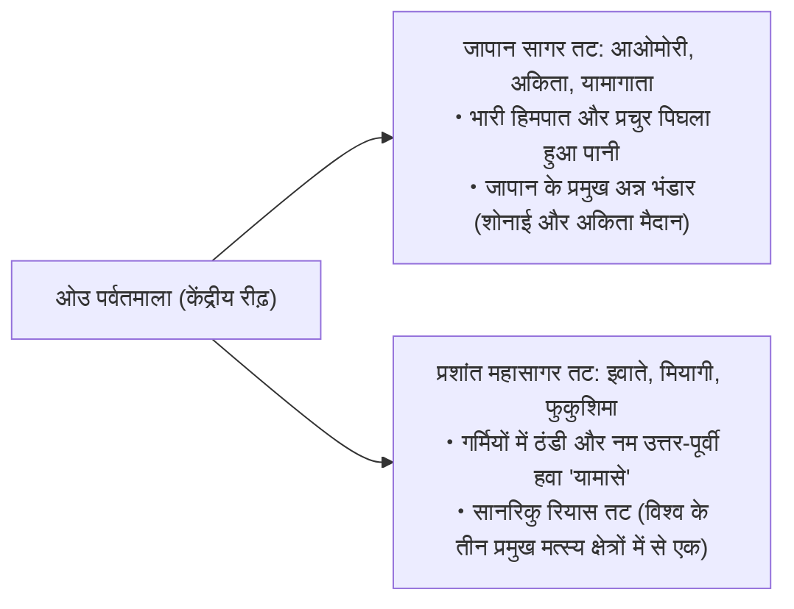
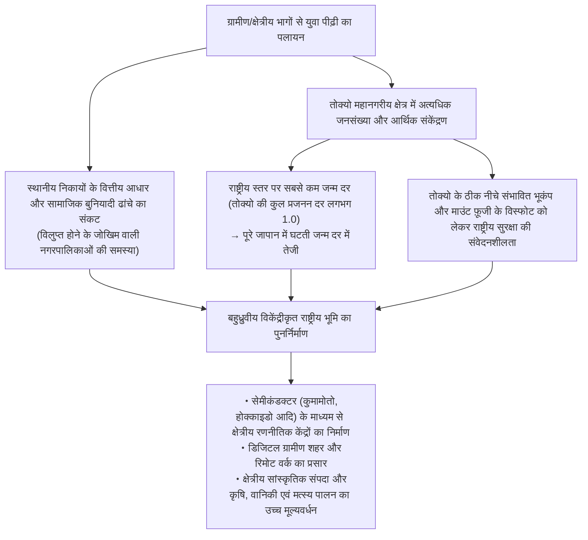
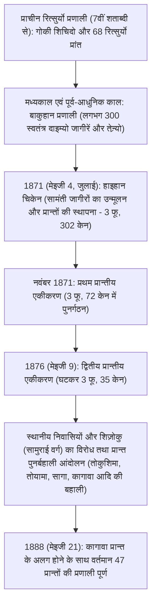

## प्रस्तावना: जापानी द्वीपसमूह की विविधता और 47 प्रान्तों का उद्भव इतिहास

उत्तर से दक्षिण तक लगभग 3,000 किलोमीटर में धनुषाकार रूप से फैला जापानी द्वीपसमूह, प्रशांत महासागरीय रिंग ऑफ फायर में तीव्र विवर्तनिक हलचलों (चार प्लेटों—यूरेशियाई प्लेट, उत्तरी अमेरिकी प्लेट, प्रशांत प्लेट और फिलीपीन सागर प्लेट—के टकराव) द्वारा निर्मित विश्व के सबसे दुर्गम और तीव्र ढलान वाले पर्वतीय द्वीपीय देशों में से एक है।

राष्ट्रीय भूभाग का लगभग 70% हिस्सा वनों और पर्वतों से आच्छादित है। देश के केंद्र से गुजरने वाली रीढ़ पर्वतमाला (脊梁山脈) के विभाजन से, सर्दियों में अत्यधिक हिमपात लाने वाली "जापान सागर तटीय जलवायु", गर्मियों में गर्म व आर्द्र और सर्दियों में साफ धूप वाली "प्रशांत महासागरीय तटीय जलवायु", कम वर्षा और समशीतोष्ण वाली "सेतो अंतर्देशीय सागर प्रकार की जलवायु", दिन-रात और ऋतुओं के तापमान में भारी अंतर वाली "केंद्रीय उच्चभूमि प्रकार की जलवायु", तथा उपोष्णकटिबंधीय "नानसेई द्वीपसमूह जलवायु" जैसी अत्यंत विविधतापूर्ण मौसमी परिस्थितियाँ एक संकीर्ण भूभाग के भीतर संकेंद्रित हैं।

```
【जापानी द्वीपसमूह के जलवायु वर्गीकरण और स्थलाकृतिक तंत्र】

┌─────────────────┬───────────────────────────────┬───────────────────────────────┐
│ जलवायु वर्गीकरण │ भौगोलिक विस्तार               │ मुख्य जलवायु विशेषताएँ व तंत्र│
├─────────────────┼───────────────────────────────┼───────────────────────────────┤
│ जापान सागर तटीय │ होक्काइडो जापान सागर तट से    │ सर्दियों की उत्तर-पश्चिमी     │
│ जलवायु          │ होकुरिकु और सान'इन तक         │ मानसूनी हवाएँ त्शुशिमा गर्म   │
│                 │                               │ जलधारा की नमी सोखकर रीढ़      │
│                 │                               │ पर्वतमाला से टकराती हैं और भारी│
│                 │                               │ हिमपात उत्पन्न करती हैं       │
├─────────────────┼───────────────────────────────┼───────────────────────────────┤
│ प्रशांत महासागरीय│ प्रशांत तट से दक्षिणी क्यूशू   │ गर्मियों में दक्षिण-पूर्वी    │
│ तटीय जलवायु     │ तक                            │ मानसूनी हवाओं से वर्षा व तूफान;│
│                 │                               │ सर्दियों में शुष्क और साफ मौसम│
│                 │                               │ (काराक्काज़े - शुष्क हवाएँ)   │
├─────────────────┼───────────────────────────────┼───────────────────────────────┤
│ सेतो अंतर्देशीय  │ चूगोकू पर्वतमाला और शिकोकू    │ पर्वतों द्वारा बादलों के रुकने│
│ सागर जलवायु     │ पर्वतमाला के बीच का क्षेत्र   │ से वर्ष भर समशीतोष्ण, अल्पवृष्टि│
│ (सेतोउची)       │                               │ और लंबा धूप का समय            │
├─────────────────┼───────────────────────────────┼───────────────────────────────┤
│ केंद्रीय        │ नागानो, यामानाशी, गिफू का     │ उच्च तुंगता (ऊँचाई) और चारों ओर│
│ उच्चभूमि जलवायु │ हिदा क्षेत्र आदि              │ पहाड़ों से घिरे होने के कारण  │
│                 │                               │ दिन-रात व ग्रीष्म-शीत में भारी│
│                 │                               │ तापांतर                       │
├─────────────────┼───────────────────────────────┼───────────────────────────────┤
│ नानसेई द्वीपसमूह│ ओकिनावा प्रान्त, अमामी        │ कुरोशियो गर्म जलधारा से प्रभावित│
│ जलवायु          │ द्वीपसमूह आदि                 │ उपोष्णकटिबंधीय समुद्री जलवायु;│
│                 │                               │ वर्ष भर गर्म और आर्द्र, लगातार│
│                 │                               │ तूफानों (टायफून) का क्षेत्र   │
└─────────────────┴───────────────────────────────┴───────────────────────────────┘
```

जापान का क्षेत्रीय विभाजन प्राचीन रित्सुर्यो व्यवस्था (律令制) के "गोकी शिचिदो" (五畿七道 - पाँच गृह प्रांत: किनाई, और सात परिपथ: तोकाइदो, तोसान्दो, होकुरिकुदो, सान'इन्दो, सान्योदो, ननकाइदो, सैकाइदो) पर आधारित 68 "रित्सुर्यो प्रांतों (प्राचीन प्रांतों के नाम)" को आधारशिला मानता है। मेइजी पुनर्स्थापना के तुरंत बाद 1871 (मेइजी 4) में लागू किए गए "हाइहान चिकेन" (सामंती जागीरों का उन्मूलन और प्रान्तों की स्थापना) के समय प्रारंभ में 300 से अधिक फू और केन (प्रान्त) थे, जो क्रमिक विलय और पुनर्गठन से गुजरते हुए 1888 (मेइजी 21) में कागावा प्रान्त की स्वतंत्रता के साथ वर्तमान "1 तो, 1 दो, 2 फू और 43 केन (47 प्रान्त)" के स्थायी ढांचे में स्थिर हुए।

इस लेख में सभी 47 प्रान्तों को आठ प्रमुख क्षेत्रीय ब्लॉकों (होक्काइडो, तोहोकू, कांतो, चू्बू, किंकी/कंसाई, चूगोकू, शिकोकू, और क्यूशू-ओकिनावा) में वर्गीकृत किया गया है। यहाँ प्रत्येक प्रान्त के प्राचीन नाम, स्थलाकृति, औद्योगिक संरचना, इतिहास, संस्कृति और 21वीं सदी में क्षेत्रीय पुनरुद्धार व जनसांख्यिकीय चुनौतियों का व्यापक और सूक्ष्म विश्लेषण प्रस्तुत किया गया है।

---

## 1. होक्काइडो क्षेत्र: उत्तरी सीमांत और विशाल प्राथमिक उद्योग

### 1.1 होक्काइडो (प्राचीन: एज़ोची / इशिकारी, ओशिमा सहित 11 प्रांत)
- **प्रान्तीय राजधानी (दोचो)**: साप्पोरो (札幌市)
- **क्षेत्रफल व स्थलाकृति**: 83,424 वर्ग किमी (जापान में प्रथम स्थान, देश के कुल क्षेत्रफल का लगभग 22%)। दैसेत्सुज़ान पर्वत श्रृंखला और हिदाका पर्वतमाला इसकी रीढ़ हैं, जहाँ इशिकारी मैदान, तोकाची मैदान और कोन्सेन पठार जैसे जापान के सबसे विशाल मैदान और पठार फैले हैं। उप-आर्कटिक जलवायु क्षेत्र में स्थित होने के कारण यहाँ गर्मियाँ ठंडी और सर्दियाँ अत्यधिक ठंडी तथा व्यापक बर्फबारी वाली होती हैं।
- **औद्योगिक संरचना एवं अर्थव्यवस्था**:
  - **कृषि**: जापान का अन्न भंडार (खाद्य आधार)। शुष्क भूमि खेती (गेहूँ, चुकंदर, आलू, लाल लोबिया/अज़ुकी) और बड़े पैमाने पर डेयरी फार्मिंग (कच्चे दूध का उत्पादन राष्ट्रीय स्तर पर 50% से अधिक)। तोकाची मैदान पर केंद्रित प्रति परिवार कई दसियों हेक्टेयर का विशाल पश्चिमी शैली का मशीनीकृत कृषि ढांचा।
  - **मत्स्य पालन**: स्कैलप (होताते), सैल्मन, पोलक और केल्प (कोम्बू) जैसे समुद्री उत्पादों में मछली पकड़ने और जलीय कृषि उत्पादन दोनों में देश में प्रथम स्थान।
  - **पर्यटन और सेवा उद्योग**: निसेको का पाउडर स्नो रिज़ॉर्ट (वैश्विक इनबाउंड पर्यटकों का केंद्र), शिरेतोको (विश्व प्राकृतिक धरोहर), फुरानो के लैवेंडर के खेत, साप्पोरो हिम महोत्सव (स्नो फेस्टिवल)।
- **इतिहास और संस्कृति**: आइनू जनजाति की पारंपरिक संस्कृति (उपोपोई - राष्ट्रीय आइनू संग्रहालय एवं पार्क)। मेइजी काल के बाद काइताकुशी (उपनिवेशन आयोग) और तोनदेनहेई (किसान-सैनिकों) द्वारा आधुनिक अन्वेषण और विकास का इतिहास। साप्पोरो कृषि कॉलेज (डॉ. विलियम एस. क्लार्क) द्वारा आधुनिक कृषि विज्ञान और ईसाई मानवीय भावना का समावेश।
- **क्षेत्रीय चुनौतियाँ**: तीव्र गति से घटती जनसंख्या और साप्पोरो में एकाधिकार संकेंद्रण, जेआर होक्काइडो की घाटे में चल रही रेल लाइनों के रखरखाव की समस्या, और विशाल बुनियादी ढांचे की अत्यधिक रखरखाव लागत।

---

## 2. तोहोकू क्षेत्र: ओउ पर्वतमाला का वरदान और मिचिनोकु की ऐतिहासिक परंपरा

तोहोकू क्षेत्र को उत्तर से दक्षिण तक बीचोंबीच विभाजित करने वाली ओउ पर्वतमाला के कारण जापान सागर तट (भारी बर्फबारी वाला क्षेत्र और प्रमुख चावल उत्पादक बेल्ट) और प्रशांत महासागर तट (शीत लहर और 'यामासे' हवाओं से प्रभावित होने वाला संवेदनशील क्षेत्र) में एक-दूसरे के विपरीत विशिष्ट भौगोलिक और सांस्कृतिक वातावरण बनता है।



### 2.1 आओमोरी प्रान्त (प्राचीन: त्सुगारु, मुत्सु)
- **प्रान्तीय राजधानी**: आओमोरी शहर
- **स्थलाकृति**: होन्शू का सबसे उत्तरी छोर। त्सुगारु प्रायद्वीप और शिमोकिता प्रायद्वीप मुत्सु खाड़ी को घेरे हुए हैं; केंद्र में हक्कोदा पर्वत श्रृंखला और पश्चिम में विश्व प्राकृतिक धरोहर शिराकामी सांची (पर्वत) स्थित हैं।
- **उद्योग**: सेब उत्पादन में राष्ट्रीय हिस्सेदारी लगभग 60% (हिरोसाकी शहर और त्सुगारु मैदान)। स्कैलप जलीय कृषि (मुत्सु खाड़ी), ओमा का प्रसिद्ध ब्लूफिन टूना, हाचिनोहे बंदरगाह पर भारी मत्स्य अवतरण। अत्याधुनिक तकनीक में रोक्काशो गाँव का परमाणु ईंधन चक्र संयंत्र।
- **संस्कृति और जनजीवन**: आओमोरी नेबुता महोत्सव, हिरोसाकी नेपुता महोत्सव, त्सुगारु शामिसेन (पारंपरिक तार वाद्य), ओसामु दाजई और शिको मुनाकाता जैसे महान साहित्यकारों व कलाकारों को जन्म देने वाली त्सुगारु संस्कृति। जोमोन पुरातात्विक स्थल (सान्नाई मारुयामा स्थल)।

### 2.2 इवाते प्रान्त (प्राचीन: रिकुचू, रिकुज़ेन, मुत्सु)
- **प्रान्तीय राजधानी**: मोरिओका शहर
- **स्थलाकृति**: होक्काइडो के बाद प्रान्तों में दूसरा सबसे बड़ा क्षेत्रफल (15,275 वर्ग किमी)। किताकामी नदी के किनारे किताकामी बेसिन, और पूर्व में किताकामी उच्चभूमि तथा सानरिकु रियास तट।
- **उद्योग**: किताकामी बेसिन में सेमीकंडक्टर और ऑटोमोटिव उद्योगों का संकेंद्रण (किओक्सिया आदि)। सानरिकु का वाकामे (समुद्री शैवाल), अबालोन, सैल्मन और सौरी मत्स्य उद्योग। नान्बू लोहे के बर्तन (नान्बू तेत्सुकी) जैसे पारंपरिक हस्तशिल्प।
- **संस्कृति और जनजीवन**: हिराइज़ुमी का चू्सों-जी कोनजिकीदो (ओशू फुजिवारा कबीले की शुद्ध भूमि/प्योर लैंड बौद्ध विचारधारा - विश्व सांस्कृतिक धरोहर)। केंजी मियाज़ावा की 'इहातव' की कल्पना, तोनो मोनोगतारी (कुनियो यानागिता का लोककथा ग्रंथ - जापानी लोकसंस्कृति की पावन भूमि)।

### 2.3 मियागी प्रान्त (प्राचीन: रिकुज़ेन, मुत्सु)
- **प्रान्तीय राजधानी**: सेंदाई शहर (तोहोकू का एकमात्र सरकारी अध्यादेश द्वारा नामित शहर - ऑर्डिनेंस डिजिग्नेटेड सिटी)
- **स्थलाकृति**: सेंदाई मैदान का उपजाऊ धान क्षेत्र, मात्सुशिमा (जापान के तीन सबसे सुंदर दृश्यों में से एक), ओशिका प्रायद्वीप और सेंदाई खाड़ी।
- **उद्योग**: तोहोकू क्षेत्र का आर्थिक और प्रशासनिक केंद्र। सासानिशिकी और हितोमेबोरे किस्मों का उत्पादन करने वाला प्रमुख धान उत्पादक क्षेत्र। इशिनोमाकी और केसेन्नुमा बंदरगाहों का समुद्री खाद्य प्रसंस्करण उद्योग। तोहोकू विश्वविद्यालय के नेतृत्व में शैक्षणिक हब और अगली पीढ़ी के सिंक्रोट्रॉन विकिरण केंद्र 'नैनोटेरेस' (NanoTerasu) जैसी उन्नत वैज्ञानिक अनुसंधान सुविधाएँ।
- **संस्कृति और जनजीवन**: दाते मासाउने द्वारा स्थापित 620,000 कोकू वाले सेंदाई डोमेन की महल-नगर संस्कृति। भव्य सेंदाई तानाबाता महोत्सव।

### 2.4 अकिता प्रान्त (प्राचीन: उगो, देवा)
- **प्रान्तीय राजधानी**: अकिता शहर
- **स्थलाकृति**: अकिता मैदान, योकोते बेसिन, चोकाई पर्वत, तज़ावा झील (जापान की सबसे गहरी झील)।
- **उद्योग**: 'अकिताकोमाची' चावल की किस्म के लिए प्रसिद्ध जापान का प्रमुख धान उत्पादक केंद्र। अकिता देवदार (सुगी) का वानिकी उद्योग। हिनाई-जिदोरी चिकन, हाताहाता मछली। हाल के वर्षों में जापान सागर तट पर अपतटीय पवन ऊर्जा (ऑफशोर विंड पावर) के बड़े केंद्र के रूप में उभरता क्षेत्र।
- **संस्कृति और जनजीवन**: अकिता कांतो महोत्सव, ओगा का नामाहागे (यूनेस्को अमूर्त सांस्कृतिक धरोहर), शिराकामी सांची।

### 2.5 यामागाता प्रान्त (प्राचीन: उज़ेन, देवा)
- **प्रान्तीय राजधानी**: यामागाता शहर
- **स्थलाकृति**: शोनाई मैदान और मोगामी नदी द्वारा जुड़े योनेज़ावा, यामागाता और शिन्जो बेसिन। देवा संज़ान (गस्सान, हागुरोसान, युदोनोसान पर्वत), ज़ाओ पर्वत श्रृंखला।
- **उद्योग**: चेरी (राष्ट्रीय बाजार में 70% से अधिक हिस्सेदारी), ला फ्रांस नाशपाती आदि फलों का साम्राज्य। शोनाई मैदान में धान की खेती (त्सुयाहिमे किस्म)। योनेज़ावा बीफ। इलेक्ट्रॉनिक उपकरण और सटीक मशीनरी उद्योग।
- **संस्कृति और जनजीवन**: देवा संज़ान की शुगेंदो (पर्वतीय तपस्या) संस्कृति, यामागाता हानागासा महोत्सव, गिनज़ान ओनसेन का ताइशो-रोमांटिक स्थापत्य सौंदर्य।

### 2.6 फुकुशिमा प्रान्त (प्राचीन: इवाशिरो, इवाकी)
- **प्रान्तीय राजधानी**: फुकुशिमा शहर
- **स्थलाकृति**: आइज़ू (पर्वतीय, अत्यधिक हिमपात, ऐतिहासिक धरोहर), नाकादोरी (राजनीतिक, आर्थिक और बेसिन क्षेत्र), तथा हामादोरी (प्रशांत तटीय, समशीतोष्ण) नामक तीन स्पष्ट भौगोलिक भागों में विभाजित।
- **उद्योग**: आड़ू और जापानी नाशपाती की बागवानी (नाकादोरी)। आइज़ू लाख के बर्तन (लैकवेयर) और पारंपरिक साके मद्यनिर्माण। हामादोरी में 'फुकुशिमा इनोवेशन कोस्ट फ्रेमवर्क' (रोबोट टेस्ट फील्ड, हाइड्रोजन ऊर्जा और उन्नत स्वच्छ तकनीक)।
- **संस्कृति और जनजीवन**: आइज़ू वाकामात्सु की समुराई भावना (ब्याक्कोताई - व्हाइट टाइगर कोर), किताकाता रेमन, सोमा नोमाओइ (पारंपरिक अश्वारोही योद्धा उत्सव)। 2011 के ग्रेट ईस्ट जापान भूकंप और परमाणु दुर्घटना के बाद पुनर्निर्माण तथा हरित ऊर्जा परिवर्तन का अग्रणी केंद्र।

---

## 3. कांतो क्षेत्र: राजधानी के कार्यों का संकेंद्रण और बहुस्तरीय औद्योगिक ढांचा

कांतो क्षेत्र, जापान के सबसे बड़े मैदान 'कांतो मैदान' की पृष्ठभूमि पर स्थित है, जहाँ राजनीति, अर्थव्यवस्था, शिक्षा, और लॉजिस्टिक्स का अत्यधिक संकेंद्रण है, और पड़ोसी प्रान्तों की अत्यधिक कुशल पृष्ठभूमि कृषि तथा तटीय भारी उद्योग एक-दूसरे से जैविक रूप से जुड़े हुए हैं।

```
【तोक्यो महानगरीय क्षेत्र (मेगालोपोलिस) का कार्यात्मक विभाजन ढांचा】

・तोक्यो महानगर: राष्ट्रीय संप्रभुता के मुख्य कार्य, वैश्विक वित्त व कॉर्पोरेट मुख्यालय, उन्नत आईटी, और वैश्विक सांस्कृतिक प्रवाह
・कानागावा प्रान्त: केइहिन औद्योगिक क्षेत्र, अंतरराष्ट्रीय व्यापार बंदरगाह (योकोहामा), प्रमुख आरएंडडी (R&D) केंद्र, शोनान व हाकोने पर्यटन
・साइतामा प्रान्त: अंतर्देशीय परिवहन हब (शिंकानसेन और एक्सप्रेसवे नेटवर्क), उपनगरीय कृषि, मशीनरी और लॉजिस्टिक्स हब
・चिबा प्रान्त: नरीता अंतरराष्ट्रीय हवाई अड्डा, केइयो तटीय औद्योगिक परिसर, मत्स्य पालन व उपनगरीय कृषि (मूंगफली, ताजी सब्जियाँ)
・इबाराकी प्रान्त: त्सुकुबा साइंस सिटी, काशिमा तटीय औद्योगिक क्षेत्र, हिताची के भारी विद्युत उपकरण, खरबूजा और कमल ककड़ी
・तोचिगी प्रान्त: उत्तरी कांतो औद्योगिक क्षेत्र (अंतर्देशीय ऑटोमोबाइल और सटीक मशीनरी), निक्को तोशोगू मंदिर, स्ट्रॉबेरी (तोचिओतोमे)
・गुन्मा प्रान्त: सुबारू (SUBARU) पर आधारित ऑटोमोटिव उद्योग, गर्म जल स्रोत (ओनसेन) पर्यटन (कुसात्सु, इकाहो), रेशम कीट पालन और रेशम धरोहर
```

### 3.1 इबाराकी प्रान्त (प्राचीन: हिताची)
- **प्रान्तीय राजधानी**: मीतो शहर
- **उद्योग**: राष्ट्रीय कृषि उत्पादन मूल्य में देश में तीसरा स्थान (खरबूजा, कमल ककड़ी/लोटस रूट, सुखाया हुआ शकरकंद/होशीइमो)। त्सुकुबा शहर, जहाँ जापान के राष्ट्रीय अनुसंधान संस्थानों का एक-तिहाई हिस्सा केंद्रित है, देश का सबसे बड़ा बौद्धिक व वैज्ञानिक हब है। हिताची शहर में भारी विद्युत मशीनरी उद्योग, और काशिमा बंदरगाह पर विशाल इस्पात व पेट्रोकेमिकल परिसर।
- **संस्कृति**: मीतो तोकुगावा घराने की 'मीतो विचारधारा' (सोनो जोई - सम्राट का सम्मान करो और विदेशियों को बाहर निकालो आंदोलन का बौद्धिक स्रोत), काइराकु-एन उद्यान (जापान के तीन महान उद्यानों में से एक), और फुकुरोदा जलप्रपात (जापान के तीन प्रसिद्ध झरनों में से एक)।

### 3.2 तोचिगी प्रान्त (प्राचीन: शिमोत्सुके)
- **प्रान्तीय राजधानी**: उत्सुनोमिया शहर
- **उद्योग**: स्ट्रॉबेरी की पैदावार में लगातार आधी सदी से जापान में प्रथम (तोचिओतोमे, तोचिआइका)। उत्सुनोमिया और ओयामा शहरों के आसपास अंतर्देशीय औद्योगिक पार्क (चिकित्सा उपकरण, परिवहन मशीनरी)। उत्सुनोमिया लाइट रेल (LRT) के संचालन से अगली पीढ़ी के अग्रणी शहरी सार्वजनिक परिवहन का मॉडल।
- **संस्कृति**: विश्व धरोहर 'निक्को के मंदिर और देवालय' (निक्को तोशोगू), आशिकागा गाक्को (जापान का सबसे पुराना उच्च शिक्षा संस्थान/विश्वविद्यालय), माशिको पॉटरी (पारंपरिक चीनी मिट्टी के बर्तन)।

### 3.3 गुन्मा प्रान्त (प्राचीन: कोज़ुके)
- **प्रान्तीय राजधानी**: माएबाशी शहर
- **उद्योग**: सुबारू (पूर्व नाकाजिमा एयरक्राफ्ट) के मुख्यालय (ओता शहर) पर केंद्रित ऑटोमोबाइल और मेटल स्टैम्पिंग उद्योग। कोन्याकु आलू (Konjac) में राष्ट्रीय स्तर पर 90% की हिस्सेदारी। कुसात्सु ओनसेन, इकाहो ओनसेन, और मिनाकामी ओनसेन जैसे जापान के शीर्ष गर्म जल स्रोत रिसॉर्ट्स।
- **संस्कृति**: तोमिओका सिल्क मिल और रेशम उद्योग धरोहर (विश्व सांस्कृतिक धरोहर)। 'जोमो कारुता' (पारंपरिक ताश खेल) द्वारा प्रान्तीय पहचान और एकता की सुदृढ़ भावना।

### 3.4 साइतामा प्रान्त (प्राचीन: मुसाशी का अधिकांश भाग)
- **प्रान्तीय राजधानी**: साइतामा शहर (नामित शहर - ऑर्डिनेंस डिजिग्नेटेड सिटी)
- **उद्योग**: देश में 5वीं सबसे बड़ी आबादी (लगभग 73 लाख)। ओमिया स्टेशन पर केंद्रित पूर्वी जापान का सबसे बड़ा रेलवे जंक्शन। खाद्य विनिर्माण शिपमेंट मूल्य में देश में शीर्ष पायदान पर। फुकाया स्प्रिंग अनियन (नेगी), सायामा ग्रीन टी, सोका सेन्बेई (राइस क्रैकर्स)।
- **संस्कृति**: कावागोए का 'को-एदो' (छोटा एदो) कुराज़ुकुरी ऐतिहासिक शहर, चिचिबू योमात्सुरी (चिचिबू रात्रि महोत्सव - यूनेस्को अमूर्त सांस्कृतिक धरोहर)।

### 3.5 चिबा प्रान्त (प्राचीन: शिमोसा, काज़ुसा, आवा)
- **प्रान्तीय राजधानी**: चिबा शहर (नामित शहर)
- **उद्योग**: नरीता अंतरराष्ट्रीय हवाई अड्डा (जापान के अंतरराष्ट्रीय हवाई कार्गो और लॉजिस्टिक्स का मुख्य प्रवेश द्वार)। केइयो तटीय औद्योगिक क्षेत्र में विशाल पेट्रोकेमिकल रिफाइनरियाँ और इस्पात संयंत्र। उच्च कृषि उत्पादन (हरा प्याज/नेगी, मूंगफली, पालक)। चोशी बंदरगाह पर विशाल मत्स्य अवतरण। तोक्यो डिज्नी रिज़ॉर्ट।
- **संस्कृति**: नरीतासान शिंशो-जी मंदिर का ऐतिहासिक मंदिर-नगर, बोसो प्रायद्वीप का सर्फिंग और समुद्री रिसॉर्ट संस्कृति।

### 3.6 तोक्यो महानगर (प्राचीन: मुसाशी, इज़ू, ओगासावारा)
- **महानगरीय सरकार का स्थान (तोचो)**: शिंजुकु वार्ड
- **स्थलाकृति**: लगभग 1.4 करोड़ की आबादी (महानगरीय शहरी संकुल के रूप में विश्व का सबसे बड़ा मेगालोपोलिस)। 23 विशेष वार्ड, तामा क्षेत्र, इज़ू द्वीपसमूह और विश्व प्राकृतिक धरोहर ओगासावारा द्वीपसमूह इसमें शामिल हैं।
- **उद्योग**: जापान की कुल जीडीपी का लगभग 20% उत्पन्न करने वाला विशाल आर्थिक संकेंद्रण। मारुनोउची और ओतेमाची का वैश्विक बैंकिंग, वित्त व व्यापारिक घराने (सोगो शोशा), शिबुया और रोप्पोन्गी का आईटी व स्टार्टअप इकोसिस्टम, अकिहाबारा का सब-कल्चर व टेक हब, हानेदा अंतरराष्ट्रीय हवाई अड्डा (घरेलू और अंतरराष्ट्रीय हब)।
- **संस्कृति**: एदो कैसल के अवशेष, असकुसा सेनसो-जी मंदिर और मेइजी जिंगू मंदिर की ऐतिहासिक विरासत के साथ गगनचुंबी इमारतों का सह-अस्तित्व, जो इसे विश्व की अत्याधुनिक वैश्विक सांस्कृतिक राजधानी बनाता है।

### 3.7 कानागावा प्रान्त (प्राचीन: सागामी, दक्षिणी मुसाशी)
- **प्रान्तीय राजधानी**: योकोहामा शहर (आबादी लगभग 37.7 लाख, जापान की सबसे बड़ी नगरपालिका)
- **उद्योग**: जनसंख्या में देश में दूसरा स्थान (लगभग 92 लाख)। केइहिन औद्योगिक क्षेत्र का मुख्य आधार (निसान मोटर, जेएफई स्टील आदि)। मिनातो मिराई 21 में कॉर्पोरेट अनुसंधान एवं विकास (R&D) केंद्रों का विशाल संकेंद्रण। कावासाकी शहर की उन्नत हाई-टेक और पर्यावरण प्रौद्योगिकियाँ।
- **संस्कृति**: कामाकुरा शोगुनत की प्राचीन समुराई राजधानी (योद्धा संस्कृति), योकोहामा का बंदरगाह और अंतरराष्ट्रीय ऐतिहासिक माहौल, शोनान की तटीय जीवनशैली और सर्फिंग संस्कृति, हाकोने का प्रसिद्ध हॉट स्प्रिंग रिसॉर्ट।

---

## 4. चू्बू क्षेत्र: जापानी विनिर्माण (मोनोज़ुकुरी) का मेरुदंड और पर्वतीय स्थलाकृति

होन्शू के मध्य भाग में स्थित चू्बू क्षेत्र, तीन अत्यधिक विविध उप-क्षेत्रों—होकुरिकु (जापान सागर तट), केंद्रीय उच्चभूमि (अंतर्देशीय पर्वत), और तोकाई (प्रशांत तट)—से मिलकर बना है, और यहाँ जापान का सबसे मजबूत विनिर्माण बेल्ट स्थित है।

### 4.1 निगाता प्रान्त (प्राचीन: एचिगो, सादो)
- **प्रान्तीय राजधानी**: निगाता शहर (नामित शहर)
- **उद्योग**: शिनानो नदी और अगानो नदी प्रणालियों द्वारा सिंचित एचिगो मैदान में चावल की सघन खेती (कोशिहिकारी चावल की पैदावार में जापान में प्रथम)। त्सुबामे-सांजो के धातु के पश्चिमी टेबलवेयर और दस्तकारी चाकू/ब्लेड (वैश्विक बाजार में प्रसिद्ध)। सजावटी कार्प (निशिकिगोई) का प्रजनन। प्राकृतिक गैस और कच्चे तेल का घरेलू उत्पादन।
- **संस्कृति**: सादो गोल्ड माइन (सादो सोने की खदान - विश्व धरोहर), नागाओका महोत्सव का भव्य आतिशबाजी प्रदर्शन (ग्रैंड फायरवर्क्स), एचिगो-त्सुमारी आर्ट ट्रिएन्नेल।

### 4.2 तोयामा प्रान्त (प्राचीन: एच्चू)
- **प्रान्तीय राजधानी**: तोयामा शहर
- **उद्योग**: होकुरिकु इलेक्ट्रिक पावर के प्रचुर जलविद्युत संसाधनों पर आधारित एल्यूमीनियम रोलिंग, रसायन और बायो-फार्मास्युटिकल उद्योग। 'तोयामा की पारंपरिक दवा बिक्री' (तोयामा नो कुसुरी-उरी) की ऐतिहासिक परंपरा पर विकसित अत्याधुनिक फार्मास्युटिकल क्लस्टर। तोयामा खाड़ी का 'प्राकृतिक मत्स्य ताल' (फायरफ्लाई स्क्विड/होतुरुइका, सफेद झींगा/शिरोएबी, येलोपेल/बुरी)।
- **संस्कृति**: तातेयामा पर्वत श्रृंखला और कुरोबे बांध (तातेयामा कुरोबे अल्पाइन रूट)। विश्व धरोहर गोकायामा के गस्शो-ज़ुकुरी ऐतिहासिक गाँव।

### 4.3 इशिकावा प्रान्त (प्राचीन: कागा, नोतो)
- **प्रान्तीय राजधानी**: कानाज़ावा शहर
- **उद्योग**: 'कागा हयाकुमानगोकू' (दस लाख कोकू) की सांस्कृतिक विरासत पर आधारित उच्च-मूल्य संवर्धित पर्यटन। कपड़ा मशीनरी, निर्माण मशीनरी (कोमात्सु की जन्मस्थली), कार्बन फाइबर मिश्रित सामग्री।
- **संस्कृति**: केनरोकु-एन उद्यान, गोल्ड लीफ (सोने का वर्क - घरेलू उत्पादन का 99%), कुतानी मिट्टी के बर्तन, वाजिमा लैकवेयर। नोतो प्रायद्वीप में हालिया भूकंप के बाद का सृजनात्मक पुनर्निर्माण।

### 4.4 फुकुई प्रान्त (प्राचीन: एचिज़ेन, वाकासा)
- **प्रान्तीय राजधानी**: फुकुई शहर
- **उद्योग**: आईवियर (चश्मे के फ्रेम) के घरेलू उत्पादन का 95% (साबाए शहर)। सिंथेटिक फाइबर और इलेक्ट्रॉनिक घटक (मुराता मैन्युफैक्चरिंग आदि)। कोशिहिकारी चावल की मूल जन्मस्थली। एचिज़ेन केकड़ा (एचिज़ेन-गानी)। रेइनान क्षेत्र में परमाणु ऊर्जा उत्पादन संयंत्रों का समूह।
- **संस्कृति**: दाइहोनज़ान एइहेई-जी (दोगेन द्वारा स्थापित सोतो ज़ेन बौद्ध संप्रदाय का मुख्य मठ), फुकुई प्रान्तीय डायनासोर संग्रहालय, तोजिनबो की खड़ी चट्टानें। जापानी प्रान्तों के खुशहाली सूचकांक (हैप्पीनेस रैंकिंग) में लगातार शीर्ष स्थान पर।

### 4.5 यामानाशी प्रान्त (प्राचीन: काई)
- **प्रान्तीय राजधानी**: कोफू शहर
- **उद्योग**: अंगूर, आड़ू और जापानी बेर (सुमोमो) की पैदावार में जापान में प्रथम। जापानी वाइन की जन्मस्थली (कात्सुनुमा)। कीमती रत्नों की तराशी और आभूषण उद्योग (देश में नंबर एक)। फैनुक (FANUC - सीएनसी सिस्टम और औद्योगिक रोबोटों की वैश्विक दिग्गज कंपनी)। एससीमैगलेव (लिनियर चुओ शिंकानसेन) प्रायोगिक ट्रैक।
- **संस्कृति**: ताकेदा शिनगेन से जुड़े ऐतिहासिक स्थल, माउंट फ़ूजी की पाँच झीलें (फ़ूजी फाइव लेक्स), शोसेंक्यो घाटी।

### 4.6 नागानो प्रान्त (प्राचीन: शिनानो)
- **प्रान्तीय राजधानी**: नागानो शहर
- **उद्योग**: जापानी आल्प्स (हिदा, किसो, अकाइशी) की गोद में बसा पर्वतीय प्रान्त। सटीक मशीनरी उद्योग (सेइको एप्सन आदि - जिसे 'पूरब का स्विट्जरलैंड' कहा जाता है)। उच्चभूमि सब्जियाँ (लेट्यूस, चीनी गोभी), सेब। जापान में स्वास्थ्य और दीर्घायु में शीर्ष स्थान।
- **संस्कृति**: ज़ेंको-जी मंदिर, मात्सुमोतो कैसल (राष्ट्रीय धरोहर दुर्ग), कामिकोची और कारुइज़ावा के प्रसिद्ध पर्वतीय रिज़ॉर्ट।

### 4.7 गिफू प्रान्त (प्राचीन: मिनो, हिदा)
- **प्रान्तीय राजधानी**: गिफू शहर
- **उद्योग**: सेकी शहर के चाकू और धारदार औजार (विश्व के तीन प्रमुख कटलरी केंद्रों में से एक)। मिनो-याकी सिरेमिक्स (घरेलू टेबलवेयर उत्पादन का आधे से अधिक)। एयरोस्पेस और विमानन उद्योग (काकामिगाहारा शहर - कावासाकी हेवी इंडस्ट्रीज)। हिदा ताकायामा का पारंपरिक लकड़ी का फर्नीचर।
- **संस्कृति**: विश्व धरोहर शिराकावा-गो, हिदा ताकायामा की प्राचीन सड़कें, नागारा नदी पर पारंपरिक कोरमोरेंट फिशिंग (उकाई)।

### 4.8 शिज़ुओका प्रान्त (प्राचीन: तोतोमी, सुरुगा, इज़ू)
- **प्रान्तीय राजधानी**: शिज़ुओका शहर (नामित शहर)
- **उद्योग**: विनिर्मित वस्तुओं के शिपमेंट मूल्य में जापान में शीर्ष पर। सुजुकी, यामाहा और होंडा की जन्मस्थली होने के कारण परिवहन मशीनरी और ऑटोमोटिव साम्राज्य। हरी चाय के उत्पादन में जापान में प्रथम। प्लास्टिक मॉडल किट शिपमेंट में दुनिया में नंबर एक (तामिया, बंदाई आदि)। याइज़ु बंदरगाह पर टूना और बोनिटो का भारी अवतरण।
- **संस्कृति**: माउंट फ़ूजी (विश्व सांस्कृतिक धरोहर), इज़ू प्रायद्वीप के गर्म पानी के झरने (ओनसेन रिसॉर्ट्स), तोकुगावा इएयासु की सेवानिवृत्ति का स्थान (सुरुम्पु कैसल और कुनोज़ान तोशोगू मंदिर)।

### 4.9 आइची प्रान्त (प्राचीन: ओवारी, मिकावा)
- **प्रान्तीय राजधानी**: नागोया शहर (नामित शहर)
- **उद्योग**: **लगातार 40 से अधिक वर्षों से औद्योगिक उत्पादन मूल्य में जापान में प्रथम स्थान** पर काबिज देश का सबसे शक्तिशाली विनिर्माण साम्राज्य। टोयोटा मोटर कॉर्पोरेशन और उसका विशाल आपूर्ति श्रृंखला तंत्र। एयरोस्पेस उद्योग (मित्सुबिशी हेवी इंडस्ट्रीज आदि)। सिरेमिक्स (नोरिताके), विशेष इस्पात, उन्नत मशीन टूल्स।
- **संस्कृति**: जापान के तीन महान एकीकरणकर्ताओं (ओदा नोबुनागा, तोयोतोमी हिदेयोशी, तोकुगावा इएयासु) की जन्मस्थली। अत्सुता जिंगू मंदिर, नागोया कैसल। विशिष्ट 'नागोया मेशी' भोजन संस्कृति (मिसो कात्सु, हित्सुमाबुशी, तेबासाकी)।

---

## 5. किंकी / कंसाई क्षेत्र: हज़ार वर्ष की प्राचीन राजधानी और बहुस्तरीय कंसाई आर्थिक क्षेत्र

प्राचीन काल से लेकर आधुनिक युग के प्रारंभ तक जापान का राजनीतिक और सांस्कृतिक केंद्र रहे 'किनाई' के इर्द-गिर्द, वाणिज्यिक महानगर ओसाका, अंतरराष्ट्रीय बंदरगाह शहर कोबे, तथा प्राचीन राजधानियाँ क्योतो और नारा एक उत्कृष्ट संतुलन के साथ सह-अस्तित्व में हैं।

```
【किंकी क्षेत्र का कार्यात्मक विभाजन और ऐतिहासिक विविधता】

・ओसाका प्रान्त: व्यापारिक महानगर का डीएनए, अंतरराष्ट्रीय वित्त, विश्व एक्सपो (1970/2025), लाइफ साइंसेज, पाक संस्कृति
・क्योतो प्रान्त: हेइआन-क्यो की सहस्राब्दी सांस्कृतिक संपदा, निनटेंडो व क्योसेरा जैसी वैश्विक हाई-टेक कंपनियाँ, पारंपरिक शिल्प, अंतरराष्ट्रीय पर्यटन
・ह्योगो प्रान्त: अंतरराष्ट्रीय समुद्री व्यापार (कोबे), हरिमा तटीय भारी उद्योग, नादा की प्रसिद्ध साके, ताम्बा व ताजिमा के कृषि-मत्स्य उत्पाद
・नारा प्रान्त: प्राचीन यामातो राजसत्ता का उद्गम स्थल, हेइजो-क्यो, होरियू-जी व तोदाई-जी (बौद्ध कला और वास्तुकला का वैश्विक खजाना)
・शिगा प्रान्त: जापान की सबसे बड़ी बीवा झील (किंकी के 1.4 करोड़ लोगों का जल स्रोत), ओमी व्यापारी, उन्नत अंतर्देशीय विनिर्माण
・मिए प्रान्त: इसे जिंगू (शिंतो धर्म का सर्वोच्च तीर्थ), सुजुका सर्किट, मोती की खेती (पर्ल फार्मिंग), योक्काइची पेट्रोकेमिकल परिसर
・वाकायामा प्रान्त: कोयासान और कुमानो संज़ान (पवित्र तीर्थ स्थल व तीर्थ मार्ग), मैंडरिन संतरा और उमेबोशी उत्पादन में जापान में नंबर एक
```

### 5.1 मिए प्रान्त (प्राचीन: इसे, इगा, शिमा, पूर्वी कीई)
- **प्रान्तीय राजधानी**: त्सु शहर
- **उद्योग**: योक्काइची पेट्रोकेमिकल और सेमीकंडक्टर कॉम्प्लेक्स। मात्सुसाका बीफ, आकोया मोतियों की खेती (अगो खाड़ी), इसे लॉबस्टर (इसे-एबी)।
- **संस्कृति**: इसे जिंगू (नाइकु और गेकु - शिंतो का सर्वोच्च तीर्थ), इगा-रयू निंजा परंपरा, कुमानो कोदो (इसेजी मार्ग)।

### 5.2 शिगा प्रान्त (प्राचीन: ओमी)
- **प्रान्तीय राजधानी**: ओत्सु शहर
- **उद्योग**: बीवा झील को घेरने वाला रणनीतिक परिवहन जंक्शन। तोरे (Toray), पैनासोनिक जैसी कंपनियों के मदर प्लांट्स। शिगराकी मिट्टी के बर्तन। ओमी चावल और ओमी बीफ।
- **संस्कृति**: हीई पर्वत पर स्थित एनर्याकु-जी मंदिर (जापानी बौद्ध धर्म की जननी), हिकोन कैसल (राष्ट्रीय धरोहर दुर्ग), 'सम्पो-योशी' (क्रेता, विक्रेता और समाज तीनों का हित - ओमी व्यापारियों का व्यापारिक दर्शन)।

### 5.3 क्योतो प्रान्त (प्राचीन: यामाशिरो, ताम्बा, तांगो)
- **प्रान्तीय सरकार का स्थान (फूचो)**: क्योतो शहर (नामित शहर)
- **उद्योग**: दुनिया के शीर्ष सांस्कृतिक पर्यटन नगरों में से एक। निनटेंडो, ओमरॉन, क्योसेरा, शिमाद्ज़ु कॉर्पोरेशन, निडेक (Nidec) जैसी वैश्विक हाई-टेक कंपनियों का वैश्विक मुख्यालय। निशिजिन-ओरी रेशमी वस्त्र, कियोमिज़ु-याकी मिट्टी के बर्तन, उजी ग्रीन टी।
- **संस्कृति**: प्राचीन क्योतो के ऐतिहासिक स्मारक (17 विश्व धरोहर मंदिर और देवालय), गिओन महोत्सव, गोज़ान ओकुरिबी (अलाव उत्सव)।

### 5.4 ओसाका प्रान्त (प्राचीन: पूर्वी सेत्त्सु, कावाचि, इज़ुमी)
- **प्रान्तीय सरकार का स्थान**: ओसाका शहर (नामित शहर)
- **उद्योग**: पश्चिमी जापान का सबसे बड़ा आर्थिक संकेंद्रण। सामान्य व्यापारिक कंपनियाँ (इतोचू और सुमितोमो का उद्गम स्थल), ताकेदा फार्मास्युटिकल्स आदि पर आधारित बायो-फार्मास्युटिकल व लाइफ साइंसेज क्लस्टर, हिगाशी-ओसाका का अत्यधिक सूक्ष्म सटीक विनिर्माण। कंसाई अंतरराष्ट्रीय हवाई अड्डा (KIX)।
- **संस्कृति**: ओसाका कैसल, दोतोम्बोरी, कामिगाता राकुगो, बूनराकु (कठपुतली नाटक), योशिमोतो शिन्किगेकी, 'कोनामोने' खाद्य संस्कृति (ताकोयाकी, ओकोनोमियाकी)। मोज़ु-फुरुइची कोफुन समूह (सम्राट निंतोकू का मकबरा - विश्व सांस्कृतिक धरोहर)।

### 5.5 ह्योगो प्रान्त (प्राचीन: पश्चिमी सेत्त्सु, ताम्बा, ताजिमा, हरिमा, अवाजी)
- **प्रान्तीय राजधानी**: कोबे शहर (नामित शहर)
- **उद्योग**: कोबे बंदरगाह का अंतरराष्ट्रीय समुद्री परिवहन। कावासाकी हेवी इंडस्ट्रीज, कोबे स्टील आदि के भारी विनिर्माण संयंत्र। हरिमा तटीय औद्योगिक क्षेत्र। नादा गोगो का पारंपरिक साके मद्यनिर्माण (जापान में प्रथम)। अवाजी द्वीप के मीठे प्याज, प्रसिद्ध कोबे बीफ।
- **संस्कृति**: हिमेजी कैसल (जापान की पहली विश्व सांस्कृतिक धरोहर - व्हाइट हेरॉन कैसल), अरिमा ओनसेन, कोबे का ऐतिहासिक विदेशी बस्ती क्षेत्र (कितानो इजिनकान)।

### 5.6 नारा प्रान्त (प्राचीन: यामातो)
- **प्रान्तीय राजधानी**: नारा शहर
- **उद्योग**: पर्यटन उद्योग, योशिनो देवदार और सरू (हिनोकी) की वानिकी, मोज़ों (सॉक्स) के उत्पादन में जापान में प्रथम (कोर्यो शहर क्षेत्र), सुमी स्याही और चाय के झागदार विस्क (चासेन) का पारंपरिक शिल्प।
- **संस्कृति**: प्राचीन नारा के ऐतिहासिक स्मारक (तोदाई-जी, कोफुकु-जी, कासुगा ताइशा), होरियू-जी क्षेत्र के बौद्ध स्मारक (विश्व की सबसे पुरानी जीवित लकड़ी की इमारतें), योशिनो पर्वत के चेरी ब्लॉसम और शुगेंदो परंपरा।

### 5.7 वाकायामा प्रान्त (प्राचीन: पश्चिमी कीई)
- **प्रान्तीय राजधानी**: वाकायामा शहर
- **उद्योग**: उनशू मैंडरिन संतरा, नानको-उमे (उमेबोशी नमकीन बेर), हस्साकु खट्टे फल और सांशो (जापानी काली मिर्च) के उत्पादन में जापान में नंबर एक। निप्पॉन स्टील वाकायामा वर्क्स।
- **संस्कृति**: कीई पर्वत श्रृंखला के पवित्र स्थल और तीर्थ मार्ग (कोयासान कोंगोज़ामाई-जी, कुमानो संज़ान - विश्व धरोहर), शिराहामा ओनसेन।

---

## 6. चूगोकू क्षेत्र: सेतो अंतर्देशीय सागर परिसर और सान'इन का पौराणिक संसार

चूगोकू क्षेत्र, चूगोकू पर्वतमाला द्वारा दो सर्वथा भिन्न भागों में विभाजित है: भारी रासायनिक उद्योगों और धूपदार समशीतोष्ण जलवायु से समृद्ध 'सान्यो' (सेतोउची तट) और प्राचीन जापानी पौराणिक गाथाओं की पृष्ठभूमि तथा अक्षुण्ण प्रकृति से आच्छादित 'सान'इन' (जापान सागर तट)।

### 6.1 तोत्तोरी प्रान्त (प्राचीन: इनाबा, होकी)
- **प्रान्तीय राजधानी**: तोत्तोरी शहर
- **स्थलाकृति व उद्योग**: जापान में सबसे कम आबादी वाला प्रान्त (लगभग 5.4 लाख)। तोत्तोरी सैंड ड्यून्स (रेत के टीले) पर विशिष्ट रेतीली कृषि (राक्क्यो - मैरीनेटेड शैलोट्स)। 20वीं सदी के नाशपाती (निजुसेइकी नाशी - देश में प्रथम)। सफेद प्याज (नेगी), साकाईमिनातो बंदरगाह पर केकड़ों का विशाल मत्स्य अवतरण।
- **संस्कृति**: 'इनाबा का सफेद खरगोश' (व्हाइट हेयर ऑफ इनाबा) की पौराणिक कथा, मिसासा ओनसेन (विश्व का प्रसिद्ध उच्च-रेडॉन हॉट स्प्रिंग), सान्तोकुसान संबुत्सु-जी नागेइरेदो (पहाड़ की चट्टान में निर्मित राष्ट्रीय धरोहर मंदिर)।

### 6.2 शिमाने प्रान्त (प्राचीन: इज़ुमो, इवामी, ओकी)
- **प्रान्तीय राजधानी**: मात्सुए शहर
- **स्थलाकृति व उद्योग**: इज़ुमो मैदान, शिंजी झील (ताजे पानी की क्लैम/शिजिमी मछली पकड़ने में देश में प्रथम)। विशेष उच्च-ग्रेड स्टील (यासुकी हागाने - हिताची मेटल्स)। साइक्लेमेन फूल, डेलावेयर अंगूर।
- **संस्कृति**: इज़ुमो ताइशा (जहाँ वर्ष में एक बार देश भर के आठ लाख देवी-देवता एकत्र होते हैं - कुनिज़ुरु पौराणिक कथा का सर्वोच्च तीर्थ), विश्व धरोहर इवामी गिनज़ान चांदी की खदान, ओकी द्वीपसमूह का यूनेस्को ग्लोबल जियोपार्क।

### 6.3 ओकायामा प्रान्त (प्राचीन: मिमासाका, बिज़ेन, बिच्चू)
- **प्रान्तीय राजधानी**: ओकायामा शहर (नामित शहर)
- **उद्योग**: मिज़ुशिमा तटीय औद्योगिक क्षेत्र (पेट्रोकेमिकल्स, इस्पात विनिर्माण, ऑटोमोबाइल निर्माण)। सफेद आड़ू और मस्कट अंगूर का लक्जरी फलों का साम्राज्य। कोजिमा जिले का घरेलू जापानी डेनिम जीन्स और स्कूल यूनिफॉर्म का जन्मस्थान।
- **संस्कृति**: कुराशिकी बिकान ऐतिहासिक क्षेत्र (सफेद दीवारों और नहरों का सुंदर शहर), कोराकु-एन (जापान के तीन महान उद्यानों में से एक), बिज़ेन-याकी पॉटरी।

### 6.4 हिरोशिमा प्रान्त (प्राचीन: अकी, बिंगो)
- **प्रान्तीय राजधानी**: हिरोशिमा शहर (नामित शहर)
- **उद्योग**: चूगोकू और शिकोकू क्षेत्रों का सबसे बड़ा आर्थिक केंद्र। माज़दा (Mazda) पर आधारित ऑटोमोबाइल उद्योग, जेएफई स्टील फुकुयामा, जहाज निर्माण (कुरे शहर, ओनोमिची शहर)। सीप (ऑयस्टर) की खेती (राष्ट्रीय उत्पादन का आधे से अधिक)। नींबू उत्पादन में जापान में नंबर एक।
- **संस्कृति**: दो विश्व धरोहर स्थल (इत्सुकुशिमा शिंतो देवालय - मियाजिमा, और हिरोशिमा शांति स्मारक - परमाणु बम डोम)। शांति स्मारक नगर के रूप में वैश्विक शांति का प्रतीक। ओनोमिची की ढलानों और जापानी साहित्य का शहर।

### 6.5 यामागुची प्रान्त (प्राचीन: सुओ, नागातो)
- **प्रान्तीय राजधानी**: यामागुची शहर
- **उद्योग**: सेतोउची तट पर स्थित शुनान औद्योगिक परिसर (पेट्रोकेमिकल्स, अकार्बनिक रसायन)। उबे इंडस्ट्रीज का रासायनिक और सीमेंट उद्योग। शिमोnoseकी बंदरगाह पर पफरफिश (फुगु) और एंग्लरफिश का प्रसिद्ध व्यापार।
- **संस्कृति**: मेइजी पुनर्स्थापना के शीर्ष नेताओं और विचारकों को तैयार करने वाला हागी का शोका सोनजुकु (विश्व सांस्कृतिक धरोहर)। किंताइक्यो ऐतिहासिक लकड़ी का आर्च ब्रिज, अकियोशिदाई और अकियोशिदो (जापान का सबसे बड़ा कार्स्ट पठार और विशाल चूना पत्थर की गुफा), त्सुनोशिमा ब्रिज।

---

## 7. शिकोकू क्षेत्र: ननकाइदो की ऐतिहासिक विरासत, सेतोउची उद्योग और प्रशांत महासागरीय मत्स्य पालन

शिकोकू पर्वतमाला पूर्व से पश्चिम तक फैली हुई है, जिससे उत्तर का सेतोउची भाग (कागावा और एहिमे) और दक्षिण का प्रशांत महासागरीय भाग (कोची और तोकुशिमा) अलग-अलग प्राकृतिक और सांस्कृतिक वातावरण बनाते हैं। होन्शू-शिकोकू संपर्क पुलों (ओनारुतो ब्रिज, सेतो ओहाशी ब्रिज, और शिमानामी काइदो) के माध्यम से यह होन्शू के साथ गहराई से जुड़ा हुआ है।

### 7.1 तोकुशिमा प्रान्त (प्राचीन: आवा)
- **प्रान्तीय राजधानी**: तोकुशिमा शहर
- **उद्योग**: सुदाची खट्टे फल (राष्ट्रीय बाजार हिस्सेदारी 90% से अधिक), नारुतो किंतोकी शकरकंद, आवाओदोरी चिकन। निशिया केमिकल इंडस्ट्रीज (ब्लू एलईडी और फॉस्फोरस सामग्री की वैश्विक दिग्गज) पर आधारित उन्नत ऑप्टोइलेक्ट्रॉनिक्स और एलईडी उद्योग क्लस्टर।
- **संस्कृति**: 400 वर्षों के गौरवशाली इतिहास वाला 'आवा ओदोरी' नृत्य महोत्सव, नारुतो के विशाल समुद्री भंवर (व्हर्लपूल), इया घाटी का रहस्यमयी दुर्गम क्षेत्र (कज़ुराबाशी - लताओं का झूला पुल)।

### 7.2 कागावा प्रान्त (प्राचीन: सानुकी)
- **प्रान्तीय राजधानी**: ताकामात्सु शहर
- **उद्योग**: जापान का सबसे छोटा क्षेत्रफल वाला प्रान्त होने के बावजूद यहाँ उच्च जनसंख्या घनत्व है। 'सानुकी उडोन' पर आधारित विश्वप्रसिद्ध नूडल संस्कृति और खाद्य पर्यटन। जैतून (ऑलिव) के उत्पादन में देश में प्रथम (शोदोशिमा द्वीप)। बान'नोसु तटीय औद्योगिक परिसर।
- **संस्कृति**: कोतोहिरा-गू मंदिर (कोंपिरा-सान), विशेष दर्शनीय स्थल रित्सुरिन गार्डन, सेतोउची त्रि-वार्षिक अंतरराष्ट्रीय कला महोत्सव (नाओशिमा और तोशिमा जैसे समकालीन कला के वैश्विक द्वीप)।

### 7.3 एहिमे प्रान्त (प्राचीन: इयो)
- **प्रान्तीय राजधानी**: मात्सुयामा शहर
- **उद्योग**: उनशू मैंडरिन संतरे और विभिन्न खट्टे फलों के उत्पादन का पर्याय। इमाबारी टॉवल (विश्वस्तरीय उच्च गुणवत्ता वाले तौलिये का ब्रांड)। इमाबारी का समुद्री शिपिंग और जहाज निर्माण संकेंद्रण (जापान का सबसे बड़ा समुद्री व्यापार नगर)। निहामा और शिकोकुचूओ शहरों का लुगदी, कागज प्रसंस्करण और अलौह धातु उद्योग।
- **संस्कृति**: दोगु ओनसेन होन्कान (जापान का सबसे प्राचीन गर्म जल स्रोत), मात्सुयामा कैसल, शिमानामी काइदो साइकिलिंग रूट।

### 7.4 कोची प्रान्त (प्राचीन: तोसा)
- **प्रान्तीय राजधानी**: कोची शहर
- **उद्योग**: गर्म जलवायु का लाभ उठाते हुए बैंगन (एगप्लांट) की ऑफ-सीजन ग्रीनहाउस खेती; अदरक और म्योगा (जापानी अदरक) के उत्पादन में जापान में प्रथम। प्रशांत महासागर में सिंगल-लाइन पोल-एंड-लाइन फिशिंग से बोनिटो (कात्सुओ) पकड़ना। गहरे समुद्री जल के उपयोग पर आधारित नवाचारी उद्योग।
- **संस्कृति**: साकामोतो र्योमा जैसे दूरदर्शी योद्धा को जन्म देने वाला स्वतंत्रता और नागरिक अधिकारों (जियू मिकेन) का प्रगतिशील वातावरण, योसाकोइ महोत्सव, कात्सुराहामा समुद्र तट, और जापान की अंतिम स्वच्छ नदी शिमान्तो नदी।

---

## 8. क्यूशू और ओकिनावा क्षेत्र: एशिया का प्रवेश द्वार और नानसेई द्वीपसमूह संस्कृति

पूर्वी एशियाई महाद्वीप के सबसे करीब स्थित यह क्षेत्र प्राचीन काल में साकीमोरी (सीमा रक्षक सैनिकों) और केंटोशी (तांग राजवंश के दूतों) के समय से ही जापान के विदेश व्यापार और सांस्कृतिक आदान-प्रदान की सबसे अगली पंक्ति रहा है। वर्तमान में यहाँ सेमीकंडक्टर उद्योग ('सिलिकॉन आइलैंड') का ऐतिहासिक पुनरुत्थान और प्रचुर ज्वालामुखीय व समुद्री पर्यटन का अद्भुत संगम देखने को मिलता है।

```
【क्यूशू और ओकिनावा क्षेत्र की क्षेत्रीय शक्ति और औद्योगिक विशेषताएँ】

・फुकुओका प्रान्त: क्यूशू का प्रशासनिक व व्यापारिक केंद्र, एशिया का प्रवेश द्वार, हवाई अड्डे से सटा जीवंत महानगर, आईटी व स्टार्टअप विशेष क्षेत्र
・सागा प्रान्त: आरिता व इमारी पॉटरी, कारात्सु कुंची उत्सव, सागा मैदान का चावल और अरियाके सागर की प्रसिद्ध नोरी (समुद्री शैवाल)
・नागासाकी प्रान्त: नानबान व देजिमा व्यापार, छिपे हुए ईसाइयों की ऐतिहासिक धरोहर, जहाज निर्माण, रियास तट का समृद्ध मत्स्य उद्योग
・कुमामोतो प्रान्त: टीएसएमसी (JASM) के आगमन से निर्मित सेमीकंडक्टर मेगा-क्लस्टर, आसो का विशाल काल्डेरा, 100% भूमिगत जल वाला शहर
・ओइता प्रान्त: देश में सबसे अधिक गर्म जल स्रोत और प्रवाह वाला 'ओनसेन प्रान्त' (बेप्पू और युफुइन), भूतापीय ऊर्जा, ओइता तटीय औद्योगिक परिसर
・मियाज़ाकी प्रान्त: भरपूर धूप और समशीतोष्ण जलवायु (पका हुआ आम, शिमला मिर्च, मियाज़ाकी बीफ), ह्यूगा-नादा तट की सर्फिंग
・कागोशिमा प्रान्त: ब्लैक पोर्क (कुरोबुता), जापानी ब्लैक बीफ, शकरकंद और शोचू का साम्राज्य, साकुराजीमा सक्रिय ज्वालामुखी, याकुशिमा व अमामी विश्व धरोहर
・ओकिनावा प्रान्त: रयूक्यू साम्राज्य का विशिष्ट इतिहास, शुरी कैसल, चुराउमी एक्वेरियम, उपोष्णकटिबंधीय रिज़ॉर्ट, सैन्य ठिकाना अर्थव्यवस्था और आत्मनिर्भरता
```

### 8.1 फुकुओका प्रान्त (प्राचीन: चिकुज़ेन, चिकुगो, बुज़ेन)
- **प्रान्तीय राजधानी**: फुकुओका शहर (नामित शहर, आबादी लगभग 16 लाख)
- **उद्योग**: क्यूशू का सबसे बड़ा आर्थिक केंद्र। किताक्यूशू औद्योगिक क्षेत्र (सरकारी याहाता स्टील वर्क्स की जन्मस्थली, यास्कावा इलेक्ट्रिक)। हाकाता बंदरगाह और फुकुओका हवाई अड्डा (शहरी केंद्र से सबवे द्वारा केवल 5 मिनट की अभूतपूर्व सुविधा)। आईटी और स्टार्टअप्स का सघन संकेंद्रण। अमाओउ स्ट्रॉबेरी।
- **संस्कृति**: हाकाता गिओन यामाकासा, दाज़ाइफु तेन्मान्गू (सुगावारा नो मिचिज़ाने), पारंपरिक सड़क किनारे फूड स्टॉल (याताई) संस्कृति, मुनाकाता ताइशा (विश्व धरोहर)।

### 8.2 सागा प्रान्त (प्राचीन: पूर्वी हिज़ेन)
- **प्रान्तीय राजधानी**: सागा शहर
- **उद्योग**: आरिता-याकी और इमारी-याकी (जापानी पोर्सिलेन/चीनी मिट्टी के बर्तनों की जन्मस्थली)। अरियाके सागर की संवर्धित नोरी (बिक्री मूल्य में लगातार जापान में प्रथम)। प्रीमियम सागा बीफ। गेन्काई परमाणु ऊर्जा संयंत्र।
- **संस्कृति**: योशिनोगारी पुरातात्विक स्थल (यायोई काल की खाई से घिरी बस्ती), ताकेओ ओनसेन, कारात्सु कुंची महोत्सव।

### 8.3 नागासाकी प्रान्त (प्राचीन: पश्चिमी हिज़ेन, इकी, त्शुशिमा)
- **प्रान्तीय राजधानी**: नागासाकी शहर
- **उद्योग**: मित्सुबिशी हेवी इंडस्ट्रीज नागासाकी शिपयार्ड का ऐतिहासिक जहाज निर्माण। जापान की दूसरी सबसे लंबी तटरेखा का उपयोग करते हुए हॉर्स मैकेरल (आजी) और मैकेरल (साबा) का भारी मत्स्य अवतरण। लोक्वाट (बीवा) फल के उत्पादन में जापान में प्रथम।
- **संस्कृति**: नागासाकी और अमाकुसा क्षेत्र के छिपे हुए ईसाई स्थल (विश्व सांस्कृतिक धरोहर), मेइजी जापान के औद्योगिक क्रांति स्थल (गुन्कानजिमा / हाशिमा द्वीप), हॉउस टेन बॉश थीम पार्क।

### 8.4 कुमामोतो प्रान्त (प्राचीन: हिगो)
- **प्रान्तीय राजधानी**: कुमामोतो शहर (नामित शहर)
- **उद्योग**: **विश्व की सबसे बड़ी सेमीकंडक्टर फाउंड्री TSMC (JASM) के किकुयो शहर में आगमन** के साथ जापान में अब तक का सबसे बड़ा सेमीकंडक्टर निवेश बूम। टमाटर और तरबूज की पैदावार में जापान में प्रथम स्थान। शहर का 100% नल का पानी शुद्ध प्राकृतिक भूमिगत जल से प्राप्त।
- **संस्कृति**: कुमामोतो कैसल (कातो कियोमासा द्वारा निर्मित अभेद्य दुर्ग), विश्व के सबसे बड़े ज्वालामुखीय काल्डेरा में से एक आसो पर्वत, अमाकुसा गोक्यो (अमाकुसा के पाँच पुल)।

### 8.5 ओइता प्रान्त (प्राचीन: बुंगो, दक्षिणी बुज़ेन)
- **प्रान्तीय राजधानी**: ओइता शहर
- **उद्योग**: गर्म जल स्रोतों की संख्या और जल निर्वहन मात्रा दोनों में जापान में प्रथम 'ओनसेन प्रान्त' (बेप्पू ओनसेन, युफुइन ओनसेन)। ओइता तटीय औद्योगिक क्षेत्र (इस्पात, पेट्रोलियम, रसायन)। काबोसू साइट्रस फल के उत्पादन में राष्ट्रीय बाजार हिस्सेदारी 90%। सूखे शीताके मशरूम।
- **संस्कृति**: उसा जिंगू (देश भर के 40,000 से अधिक हाचिमान मंदिरों का मुख्य तीर्थ), कुनिसकी प्रायद्वीप की रोकुगो मान्जान संस्कृति (शिंतो-बौद्ध समन्वय का अनूठा रूप)।

### 8.6 मियाज़ाकी प्रान्त (प्राचीन: ह्युगा)
- **प्रान्तीय राजधानी**: मियाज़ाकी शहर
- **उद्योग**: गर्म और नम जलवायु का उपयोग कर उत्पादित विश्वविख्यात मियाज़ाकी बीफ (लगातार कई बार प्रधानमंत्री पुरस्कार विजेता), पूरी तरह पके हुए प्रीमियम आम ('ताइयो नो तामागो' - सूर्य का अंडा), ब्रॉयलर चिकन और सुअर पालन में शीर्ष रैंक। जापानी देवदार (सुगी) की लकड़ी के लट्ठों के उत्पादन में देश में नंबर एक।
- **संस्कृति**: ताकाचिहो कण्ठ में तेनसन कोरिन (स्वर्ग से देवताओं के अवतरण) की पौराणिक कथा (योकागुरा रात्रि नृत्य), आओशिमा मंदिर, उदो जिंगू।

### 8.7 कागोशिमा प्रान्त (प्राचीन: सात्सुमा, ओसुमी)
- **प्रान्तीय राजधानी**: कागोशिमा शहर
- **उद्योग**: कृषि उत्पादन मूल्य में देश में दूसरा स्थान। जापानी ब्लैक कैटल (कुरोगे वाग्यू), सात्सुमा ब्लैक पोर्क (कुरोबुता), शकरकंद, संवर्धित ईल (उनागी), और ब्रॉयलर मुर्गियाँ। प्रामाणिक शोचू (होनकाकु शोचू)। तानेगाशिमा स्पेस सेंटर (जाक्सा का मुख्य रॉकेट प्रक्षेपण स्थल)।
- **संस्कृति**: किन्को खाड़ी के पार स्थित सक्रिय ज्वालामुखी साकुराजीमा का विहंगम दृश्य। मेइजी पुनर्स्थापना का शक्तिशाली डोमेन (सात्सुमा डोमेन - साइगो ताकामोरी, ओकुबो तोशिमिची)। विश्व प्राकृतिक धरोहर स्थल (याकुशिमा के प्राचीन जोमोन सुगी देवदार, और अमामी ओशिमा)।

### 8.8 ओकिनावा प्रान्त (प्राचीन: रयूक्यू साम्राज्य)
- **प्रान्तीय राजधानी**: नाहा शहर
- **स्थलाकृति**: जापान का सबसे दक्षिणी और पश्चिमी उपोष्णकटिबंधीय द्वीपीय प्रान्त। मियाकोजिमा, याएयामा द्वीपसमूह (इशिगाकी द्वीप, इरिओमोटे द्वीप) सहित कई दर्जन आबाद द्वीप।
- **उद्योग**: जापान का प्रमुख अंतरराष्ट्रीय महासागरीय रिसॉर्ट पर्यटन उद्योग। सूचना और संचार प्रौद्योगिकी (आईसीटी) कंपनियों का आमंत्रण। गन्ना, आगू पोर्क, कड़वा करेला (गोया), और आवामोरी मद्य। अमेरिकी सैन्य ठिकानों से संबंधित आय के सापेक्ष आत्मनिर्भर अर्थव्यवस्था का निर्माण।
- **संस्कृति**: रयूक्यू साम्राज्य के गुसुकू स्थल और संबंधित संपदा (शुरी कैसल खंडहर आदि - विश्व धरोहर)। ईसर पारंपरिक नृत्य, सानशिन (तीन तारों वाला वाद्य), रयूक्यू लैकवेयर, बिंगाता पारंपरिक रंगाई कला। विशिष्ट दीर्घायु और स्वास्थ्यवर्धक आहार परंपरा।

---

## 9. 21वीं सदी की क्षेत्रीय चुनौतियाँ: तोक्यो में एकाधिकार संकेंद्रण और बहुध्रुवीय विकेंद्रीकृत राष्ट्रीय भूमि का सिद्धांत

जब हम सभी 47 प्रान्तों की स्थलाकृति और औद्योगिक संरचना का विहंगम अवलोकन करते हैं, तो आधुनिक जापान के सामने सबसे बड़ी संरचनात्मक चुनौती के रूप में **"तोक्यो महानगरीय क्षेत्र में अत्यधिक एकाधिकार संकेंद्रण और ग्रामीण/क्षेत्रीय क्षेत्रों में जनसंख्या की तीव्र गिरावट व निर्जनीकरण"** उभर कर सामने आती है।



### 9.1 विलुप्त होने के जोखिम वाली नगरपालिकाएँ और बुनियादी ढांचे के रखरखाव की सीमाएँ
2014 की चर्चित 'मासुदा रिपोर्ट' और हाल के वर्षों में जनसंख्या रणनीति परिषद (पॉपुलेशन स्ट्रैटेजी काउंसिल) के आकलनों के अनुसार, जापान की 40% से अधिक नगरपालिकाओं को 'विलुप्त होने के जोखिम' का सामना करना पड़ रहा है। विशेष रूप से ग्रामीण क्षेत्रों से तोक्यो महानगरीय क्षेत्र में युवा महिलाओं का निरंतर पलायन नहीं थम रहा है, जिसके परिणामस्वरूप वंचित क्षेत्रों में स्कूलों का विलय, सार्वजनिक परिवहन का बंद होना, और जल आपूर्ति, पुलों तथा सड़कों जैसे सामाजिक बुनियादी ढांचे के पुराने पड़ने पर उनके पुनर्निर्माण में गंभीर वित्तीय बाधाएँ उत्पन्न हो रही हैं।

### 9.2 सेमीकंडक्टर और नवीकरणीय ऊर्जा द्वारा क्षेत्रीय पुनरुद्धार की नई लहर
हालाँकि, 2020 के दशक में एक ऐतिहासिक आदर्श बदलाव (पैराडाइम शिफ्ट) के संकेत दिखाई देने लगे हैं।
पहला, आर्थिक सुरक्षा के दृष्टिकोण से अगली पीढ़ी के अत्याधुनिक सेमीकंडक्टर मेगाफैब्स का क्षेत्रीय क्षेत्रों में स्थापित होना है। कुमामोतो प्रान्त (TSMC / JASM) और होक्काइडो के चितोसे शहर (रैपिडस - Rapidus) में कई ट्रिलियन येन के विशाल निवेश ने संबंधित सहायक कंपनियों, अनुसंधान संस्थानों और उच्च वेतन वाले रोजगारों को बड़े पैमाने पर स्थानीय क्षेत्रों की ओर आकर्षित किया है।
दूसरा, डीकार्बोनाइजेशन (हरित परिवर्तन - GX) के वैश्विक प्रवाह में, विशाल भूमि और प्रचुर प्राकृतिक वातावरण वाले ग्रामीण व क्षेत्रीय क्षेत्रों (तोहोकू और जापान सागर तट पर अपतटीय पवन ऊर्जा, होक्काइडो और क्यूशू में सौर, भूतापीय और बायोमास ऊर्जा) को अब देश के सबसे महत्वपूर्ण ऊर्जा आपूर्ति आधार के रूप में फिर से परिभाषित किया जा रहा है।

---

## 0. प्रशासनिक विभाजनों का ऐतिहासिक विकास: रित्सुर्यो प्रांतों से सामंती जागीरों के उन्मूलन (हाइहान चिकेन) और प्रान्तीय महा-विलय तक का मार्ग

वर्तमान 47 प्रान्तों का प्रशासनिक विभाजन अनादि काल से स्वतः विद्यमान नहीं था, बल्कि यह मेइजी पुनर्स्थापना के दौरान आधुनिक राष्ट्र-राज्य के निर्माण हेतु किए गए अनेक परीक्षणों, भूलों और तीव्र विलय-पुनर्गठन के दौर से उपजा एक युगांतरकारी ऐतिहासिक परिणाम है।



### 0.1 सामंती जागीरों के उन्मूलन (हाइहान चिकेन, 1871) की राजनीतिक गतिशीलता
1868 में मेइजी पुनर्स्थापना के परिणामस्वरूप गठित नई सरकार के लिए सबसे बड़ी चुनौती 'राष्ट्रीय संप्रभुता की स्थापना' और 'सैन्य व वित्तीय शक्तियों का एकीकरण' थी। यद्यपि हान्सेकि होकान (1869 में भूमि और जनता का सम्राट को समर्पण) के माध्यम से पूर्व सामंती प्रभुओं (दाइम्यो) को 'चिहानजी' (जागीर गवर्नर) नियुक्त किया गया था, फिर भी प्रत्येक जागीर के पास अपनी स्वतंत्र सेना (हान्पेई) और कर वसूलने का अधिकार बना रहा, जिससे एक एकीकृत राष्ट्र के रूप में केंद्रीय सत्ता अत्यंत दुर्बल थी।

14 जुलाई 1871 (मेइजी 4) को साइगो ताकामोरी, ओकुबो तोशिमिची, और किदो ताकायोशी ने सात्सुमा, चोशू और तोसा की शाही रक्षक सेना (गोशिन्पेई) के सैन्य समर्थन से अचानक ऐतिहासिक 'हाइहान चिकेन' का फरमान जारी कर दिया। सामंती जागीरों को एक ही झटके में पूरी तरह समाप्त कर दिया गया, पूर्व दाइम्यो को तोक्यो में स्थायी रूप से बसने का आदेश दिया गया, और केंद्र सरकार द्वारा नियुक्त सरकारी गवर्नर (चिजी/केनरेई) सीधे जिलों में भेजे गए। इस समय जो व्यवस्था स्थापित हुई, वह '3 फू और 302 केन' (3 शहरी प्रान्त और 302 ग्रामीण प्रान्त) थी।

### 0.2 प्रथम व द्वितीय प्रान्तीय एकीकरण और 'प्रान्त पुनर्बहाली आंदोलन' का जनउभार
प्रारंभिक 300 से अधिक प्रान्त अत्यधिक छोटे और विखंडित थे, और उनका वित्तीय आकार भी बहुत सीमित था, जिसके कारण सरकार ने तुरंत उनके व्यापक विलय और पुनर्गठन की प्रक्रिया शुरू की।
नवंबर 1871 के 'प्रथम प्रान्तीय एकीकरण' में इन्हें घटाकर 3 फू और 72 केन कर दिया गया, और फिर 1876 (मेइजी 9) के 'द्वितीय प्रान्तीय एकीकरण' में गृह मंत्रालय (नाइमुशो) के नेतृत्व में इन्हें और भी आक्रामक रूप से घटाकर केवल '3 फू और 35 केन' कर दिया गया।

इस कठोर और जल्दबाजी में किए गए विलय ने पूरे देश में तीव्र क्षेत्रीय असंतोष और संघर्ष को जन्म दिया।
उदाहरण के लिए, वर्तमान कागावा प्रान्त को म्योटो प्रान्त (तोकुशिमा) और फिर एहिमे प्रान्त में मिला दिया गया था; तोयामा प्रान्त को इशिकावा में; सागा प्रान्त को नागासाकी में; मियाज़ाकी प्रान्त को कागोशिमा में; तथा फुकुई प्रान्त को इशिकावा और शिगा प्रान्तों के बीच विभाजित कर दिया गया था।
इसके विरुद्ध पूर्व महल-नगरों के नागरिकों, धनी किसानों (गोशिन), और असंतुष्ट सामुराई वर्ग (शिज़ोकु) ने उग्र विरोध दर्ज कराया: "यह हमारी ऐतिहासिक और सांस्कृतिक परंपराओं को नजरअंदाज करने वाली तानाशाही है," "हमारा सारा टैक्स केंद्रीय शहर खींच लेता है, जबकि परिधीय क्षेत्रों के बुनियादी ढांचे की घोर उपेक्षा की जाती है।" यह असंतोष उस समय राष्ट्रीय संसद की स्थापना की मांग कर रहे 'स्वतंत्रता और जन-अधिकार आंदोलन' (जियू मिकेन उन्दो) के साथ जुड़ गया और पूरे देश में 'प्रान्त पुनर्बहाली आंदोलन' (फुकुकेन/बुन्केन उन्दो) की एक शक्तिशाली लहर दौड़ गई।

इसके परिणामस्वरूप सरकार को झुकना पड़ा और उसने एक-एक करके प्रान्तों के पुनरुद्धार को मान्यता दी: 1881 में फुकुई प्रान्त, 1883 में तोयामा, सागा, और मियाज़ाकी प्रान्त, और अंत में दिसंबर 1888 (मेइजी 21) में जब कागावा प्रान्त औपचारिक रूप से एहिमे प्रान्त से पूरी तरह अलग हुआ, तब जाकर वर्तमान '1 तो, 1 दो, 2 फू, और 43 केन' की स्थायी और सुदृढ़ प्रशासनिक सीमाएँ सुनिश्चित हुईं।

---

## 8.9 47 प्रान्तों का भाषाई परिदृश्य: बोली संकेंद्रण सिद्धांत और पूर्व-पश्चिम भाषाई विभाजन रेखा

जापानी द्वीपसमूह की विविधता का सबसे जीवंत प्रमाण देश के विभिन्न कोनों में प्रचलित 'क्षेत्रीय बोलियों' (होएन) का समृद्ध और मनमोहक विस्तार है।

प्रसिद्ध लोकसंस्कृति शास्त्री और भाषाविद् यानागिता कुनियो ने अपनी 1930 की युगांतरकारी पुस्तक *काग्यू-को* (घोंघा अध्ययन / स्नेल स्टडीज़) में पूरे देश में 'घोंघे' (स्नेल) के लिए प्रयुक्त होने वाले विभिन्न स्थानीय शब्दों के वितरण का सर्वेक्षण किया। उन्होंने पाया कि ऐतिहासिक भाषाई परिवर्तनों की लहरें क्योतो (प्राचीन व मध्ययुगीन सांस्कृतिक केंद्र) से पानी में पत्थर फेंकने पर बनने वाली तरंगों की तरह संकेंद्रित वृत्तों में दूरदराज के क्षेत्रों की ओर बाहर फैली थीं। इसे उन्होंने **"बोली संकेंद्रण सिद्धांत" (होएन शूकेन-रोन / परिधीय बोली प्रसार सिद्धांत)** नाम दिया।

```
【यानागिता कुनियो के 'काग्यू-को' (घोंघा अध्ययन) में बोली संकेंद्रण की संरचना】

［क्योतो (सांस्कृतिक केंद्र)］: देन्देनमुशी (पूर्व-आधुनिक काल का नया शब्द)
  ↓ (बाहर की ओर प्रसार)
［किंकी परिधि, होकुरिकु, तोकाई］: माइमाइ (मुरोमाची काल का शब्द)
  ↓
［चू्बू, कांतो, चूगोकू, शिकोकू］: कातात्सुमुरी (हेइआन काल का शब्द)
  ↓
［तोहोकू, क्यूशू］: त्सुबुरी, त्सुबु (प्राचीन काल का पुराना शब्द)
  ↓
［होन्शू के दोनों सुदूर छोर (आओमोरी त्सुगारु और कागोशिमा सात्सुमा)］: नामेकुजी, नामे (सबसे प्राचीन भाषाई परत के जीवाश्म अवशेष)
```

इसके अतिरिक्त, जापानी भाषा में निगाता प्रान्त के इतोइगावा से शिज़ुओका प्रान्त की हामाना झील और फ़ूजी नदी को जोड़ने वाली एक प्रसिद्ध "पूर्व-पश्चिम भाषाई विभाजन रेखा" मौजूद है:
- **पूर्वी जापानी बोलियाँ**: निश्चयवाचक सहायक क्रिया 'दा' (da), निषेधात्मक सहायक क्रिया 'नाई' (nai), आज्ञार्थक रूप 'रो' (ro - जैसे ओकिरो), और तोक्यो-शैली का सुर-स्वर (पिच एक्सेंट)।
- **पश्चिमी जापानी बोलियाँ**: निश्चयवाचक सहायक क्रिया 'जा / या' (ja / ya), निषेधात्मक सहायक क्रिया 'न / हेन' (n / hen), आज्ञार्थक रूप 'यो' (yo - जैसे ओकियो), और केइहान (क्योतो-ओसाका) शैली का सुर-स्वर।

इसके अलावा, तोहोकू क्षेत्र की 'ज़ूज़ू-बेन' (जापान सागर तटीय बोलियाँ) में केंद्रीय स्वरों का विशिष्ट उच्चारण, या सात्सुमा बोली में पाई जाने वाली अनूठी संवृत शब्दांश संरचना (जिसमें ध्वनियाँ हलन्त और अनुनासिक में बदल जाती हैं), जिसका उपयोग पुराने समय में जासूसों और शत्रुओं से अपनी रक्षा हेतु कूटभाषा (साइफर) के रूप में भी किया जाता था—ये सभी पहाड़ और जलडमरूमध्य द्वारा अलग-थलग किए गए प्रत्येक क्षेत्र की जलवायु, भूगोल और इतिहास से उपजी अमूल्य अमूर्त सांस्कृतिक धरोहरें हैं।

---

## 9.3 47 प्रान्तों का आर्थिक भूगोल: औद्योगिक संकेंद्रण और स्थान भागफल (Location Quotient: LQ)

प्रत्येक प्रान्त की औद्योगिक प्रतिस्पर्धात्मकता का वैज्ञानिक रूप से मूल्यांकन करने के लिए आर्थिक भूगोल में **"स्थान भागफल" (Location Quotient: LQ / क्षेत्रीय विशिष्टीकरण गुणांक)** का उपयोग किया जाता है। यह सूचकांक राष्ट्रीय औसत की तुलना में किसी विशेष उद्योग के किसी क्षेत्र में संकेंद्रण की तीव्रता को मापता है।

$$LQ = \frac{e_i / e}{E_i / E}$$

यहाँ, $e_i$ लक्षित क्षेत्र में उद्योग $i$ के श्रमिकों की संख्या (या औद्योगिक उत्पादन शिपमेंट मूल्य) है, $e$ लक्षित क्षेत्र के सभी उद्योगों में कुल श्रमिकों की संख्या है, $E_i$ राष्ट्रीय स्तर पर उद्योग $i$ के कुल श्रमिकों की संख्या है, और $E$ राष्ट्रीय स्तर पर सभी उद्योगों के कुल श्रमिकों की संख्या है। यदि $LQ > 1.0$ है, तो यह दर्शाता है कि उस क्षेत्र में उस विशेष उद्योग का संकेंद्रण राष्ट्रीय औसत से अधिक है।

```
【47 प्रान्तों के प्रमुख क्षेत्रीय विशिष्टीकरण (LQ) पैटर्न】

1. परिवहन मशीनरी और उपकरण विनिर्माण (ऑटोमोबाइल एवं एयरोस्पेस):
   ・अत्यधिक विशिष्टीकृत प्रान्त: आइची प्रान्त (LQ ≈ 3.2), गुन्मा प्रान्त (LQ ≈ 2.8), शिज़ुओका प्रान्त (LQ ≈ 2.5), हिरोशिमा प्रान्त (LQ ≈ 2.1)
   ・विशेषता: विशाल असेंबली संयंत्रों (टोयोटा, सुबारू, सुजुकी, माज़दा) के नेतृत्व में बहुस्तरीय उप-ठेकेदारों (सब-कॉन्ट्रैक्टर्स) का विशाल आपूर्ति पिरामिड।

2. इलेक्ट्रॉनिक घटक, उपकरण और सेमीकंडक्टर विनिर्माण:
   ・अत्यधिक विशिष्टीकृत प्रान्त: यामागाता प्रान्त (LQ ≈ 2.9), फुकुई प्रान्त (LQ ≈ 2.7), कुमामोतो प्रान्त (LQ ≈ 2.6), इवाते प्रान्त (LQ ≈ 2.4)
   ・विशेषता: स्वच्छ जल और शुद्ध हवा, तथा एक्सप्रेसवे नेटवर्क का लाभ उठाने वाले अंतर्देशीय 'सिलिकॉन रोड' और 'सिलिकॉन आइलैंड' हब।

3. प्राथमिक उद्योग (कृषि और मत्स्य पालन):
   ・अत्यधिक विशिष्टीकृत प्रान्त: आओमोरी प्रान्त, होक्काइडो, कागोशिमा प्रान्त, मियाज़ाकी प्रान्त, कोची प्रान्त (LQ > 3.0)
   ・विशेषता: राष्ट्रीय खाद्य सुरक्षा के मुख्य आधार। हाल के वर्षों में स्मार्ट कृषि और 'षष्ठम उद्योगीकरण' (उत्पादन, प्रसंस्करण व विपणन का एकीकरण) की ओर तेजी से बढ़ता रूपांतरण।

4. अंतरराष्ट्रीय वित्त, सूचना प्रौद्योगिकी एवं कॉर्पोरेट व्यावसायिक सेवाएँ:
   ・अत्यधिक विशिष्टीकृत प्रान्त/महानगर: तोक्यो महानगर (LQ ≈ 2.5), ओसाका प्रान्त (LQ ≈ 1.4)
   ・विशेषता: कॉर्पोरेट मुख्यालय, बौद्धिक संपदा प्रबंधन, और उद्यम पूंजी (वेंचर कैपिटल) स्टार्टअप निवेश का एकाधिकार संकेंद्रण।
```

जापान का आर्थिक ढांचा किसी एक इंजन पर नहीं चलता, बल्कि आइची और तोकाई पर आधारित 'विनिर्माण इंजन', तोक्यो पर आधारित 'वित्त, सूचना और मुख्यालय इंजन', तथा ग्रामीण व क्षेत्रीय भागों द्वारा संचालित 'खाद्य, पर्यावरण और सेमीकंडक्टर बुनियादी ढांचा इंजन' के एक-दूसरे के साथ पूर्ण सामंजस्य में घूमने से ही देश की आर्थिक प्रगति संभव होती है।

---

## 0.3 प्रान्त के नाम और प्रान्त की राजधानी के नाम में भिन्नता का राजनीतिक इतिहास: मेइजी काल के प्रारंभ में 'शाही सेना बनाम बाकुफू समर्थक सजा सिद्धांत' का ऐतिहासिक परीक्षण

जापान के 47 प्रान्तों का अध्ययन करते समय मन में उठने वाले सबसे स्वाभाविक प्रश्नों में से एक यह है कि कुछ प्रान्तों में प्रान्त का नाम और उसकी राजधानी का नाम एक समान है (जैसे अकिता प्रान्त-अकिता शहर, निगाता प्रान्त-निगाता शहर, हिरोशिमा प्रान्त-हिरोशिमा शहर आदि), जबकि कई अन्य प्रान्तों में प्रान्त का नाम और उसकी राजधानी का नाम पूरी तरह भिन्न है (जैसे इवाते प्रान्त-मोरिओका शहर, मियागी प्रान्त-सेंदाई शहर, इबाराकी प्रान्त-मीतो शहर, तोचिगी प्रान्त-उत्सुनोमिया शहर, गुन्मा प्रान्त-माएबाशी शहर, इशिकावा प्रान्त-कानाज़ावा शहर, मिए प्रान्त-त्सु शहर, शिगा प्रान्त-ओत्सु शहर, ह्योगो प्रान्त-कोबे शहर, शिमाने प्रान्त-मात्सुए शहर, एहिमे प्रान्त-मात्सुयामा शहर, ओकिनावा प्रान्त-नाहा शहर आदि)।

लंबे समय तक जनमानस और कुछ लोकप्रिय सिद्धांतों में यह कहा जाता रहा कि "मेइजी पुनर्स्थापना के दौरान जिन सामंती जागीरों ने बाकुफू (शोगुनत) का साथ दिया था (जिन्हें विद्रोही सेना या 'ज़ोकुगुन' माना गया), उन्हें नई सरकार द्वारा सजा के तौर पर उनके ऐतिहासिक महल-नगर का नाम प्रान्त के नाम के रूप में उपयोग करने की अनुमति नहीं दी गई, और उसके बदले उन्हें उस जिले (गुन) का नाम दिया गया जहाँ वे स्थित थे (दंड सिद्धांत / पनिशमेंट थ्योरी)।"
उदाहरण के लिए, ओउएत्सु रेप्पन डोमेई (उत्तरी गठबंधन) के केंद्र रहे आइज़ू (वाकामात्सु), सेंदाई, मोरिओका, माएबाशी, और मीतो को अक्सर इस सिद्धांत के प्रमाण के रूप में प्रस्तुत किया जाता रहा है।

हालाँकि, आधुनिक ऐतिहासिक और प्रशासनिक अनुसंधान के दस्तावेजी साक्ष्यों ने इस "विद्रोही सजा सिद्धांत" को पूरी तरह खारिज कर दिया है। मेइजी सरकार द्वारा प्रान्तों के नाम तय करते समय कोई राजनीतिक प्रतिशोध आधार नहीं था, बल्कि यह पूरी तरह व्यावहारिक और प्रशासनिक सिद्धांतों पर आधारित निर्णय था।

```
【प्रारंभिक मेइजी काल में प्रान्तों के नामकरण का व्यावहारिक प्रशासनिक तर्क】

1. पुराने महल-नगर केंद्रवाद से मुक्ति और 'जिला नाम' (गुन-मेई) अपनाने का सिद्धांत:
   नई सरकार पूर्व सामंती प्रभुओं (दाइम्यो) की शक्ति और सामंती प्रभाव के अवशेषों को मिटाना चाहती थी। इसलिए उसने यह सामान्य सिद्धांत बनाया कि प्रान्त का नाम उस शहर के नाम पर न रखा जाए जहाँ प्रान्तीय कार्यालय स्थित है, बल्कि उस 'जिले' (प्राचीन रित्सुर्यो काल से चली आ रही प्रशासनिक इकाई - गुन) के नाम पर रखा जाए जिसके अंतर्गत वह शहर आता है।
   ・मोरिओका महल-नगर (इवाते जिला) → इवाते प्रान्त
   ・सेंदाई महल-नगर (मियागी जिला) → मियागी प्रान्त
   ・मीतो महल-नगर (इबाराकी जिला) → इबाराकी प्रान्त
   ・कानाज़ावा महल-नगर (इशिकावा जिला) → इशिकावा प्रान्त
   ・मात्सुए महल-नगर (शिमाने जिला) → शिमाने प्रान्त
   ・मात्सुयामा महल-नगर (ओनसेन जिला / एहिमे का पौराणिक नाम) → एहिमे प्रान्त

2. खुले बंदरगाहों और नवनिर्मित महत्वपूर्ण रणनीतिक केंद्रों को प्राथमिकता:
   पुराने सामंती महल-नगरों के बजाय अंतरराष्ट्रीय व्यापार के लिए तेजी से उभरे नए बंदरगाह शहरों या केंद्रों को प्रान्तीय राजधानी बनाए जाने के मामले:
   ・ह्योगो (कोबे बंदरगाह को केंद्र शासित क्षेत्र के रूप में प्रशासित किया गया) → ह्योगो प्रान्त (राजधानी: कोबे)
   ・योकोहामा (कानागावा पोस्ट-टाउन और खुला बंदरगाह) → कानागावा प्रान्त (राजधानी: योकोहामा)

3. प्रान्तीय कार्यालयों के बार-बार स्थानांतरण और विलय के निशान:
   ・तोचिगी प्रान्त: प्रारंभ में प्रान्तीय कार्यालय तोचिगी शहर (त्सुगा जिला) में था, बाद में इसे उत्सुनोमिया स्थानांतरित कर दिया गया, लेकिन प्रान्त का नाम वही बना रहा।
   ・गुन्मा प्रान्त: ताकासाकी और माएबाशी के बीच कार्यालय स्थानांतरित होने के बाद, गुन्मा जिले के ताकासाकी की स्मृति में इसका नाम गुन्मा प्रान्त रखा गया।
```

इस प्रकार, प्रान्त के नाम और राजधानी के नाम में भिन्नता किसी राजनीतिक बदले की भावना से नहीं, बल्कि पूर्व-आधुनिक सामंती प्रभुत्व वाले निजी क्षेत्रों को समाप्त कर पूरे देश में आधुनिक, सार्वभौमिक सार्वजनिक प्रशासनिक व्यवस्था स्थापित करने के मेइजी राष्ट्र-निर्माण के गहन संघर्ष और व्यावहारिक प्रयोगों का ऐतिहासिक प्रमाण है।

---

## 8.10 जापानी द्वीपसमूह का तेरोइर सिद्धांत: स्थानीय परिवेश द्वारा विकसित 47 प्रान्तों की खाद्य संस्कृति और किण्वन विज्ञान

47 प्रान्तों की क्षेत्रीय विशिष्टता का सबसे समृद्ध और सजीव प्रकटीकरण वहाँ की विशिष्ट सूक्ष्म-जलवायु और स्थलाकृति द्वारा उत्पन्न "पारंपरिक स्थानीय व्यंजनों" (क्योदो र्योरी) और "किण्वित खाद्य पदार्थों" (साके, मिसो, सोया सॉस/शोयु, अचार/त्सुकेमोनो) की अनूठी प्रणालियों में दिखाई देता है। फ्रांसीसी वाइन से जुड़ा प्रसिद्ध शब्द "तेरोइर" (Terroir - मिट्टी, जलवायु, स्थलाकृति, और मानवीय इतिहास का समग्र संगम) जापानी पाक संस्कृति में अपने सबसे विशुद्ध रूप में मूर्त रूप लेता है।

```
【जलवायु-परिवेश और किण्वन व खाद्य संस्कृति का 47 प्रान्त तुलनात्मक मैट्रिक्स】

┌─────────────────┬───────────────────────────────┬───────────────────────────────┐
│ क्षेत्र /       │ प्रतिनिधि प्रान्त एवं खाद्य   │ जलवायु व सूक्ष्मजीव पारिस्थितिक│
│ परिवेशीय प्रकार │ संस्कृति                      │ तंत्र                         │
├─────────────────┼───────────────────────────────┼───────────────────────────────┤
│ शीत व भारी हिमपात│ अकिता प्रान्त (शोत्तसुरु,     │ सर्दियों की भीषण ठंड में जीवन │
│ क्षेत्र         │ इबुरिगाक्को), यामागाता प्रान्त│ रक्षा हेतु उच्च लवणता व दीर्घ-│
│ (संरक्षित भोजन व│ (इमोनी, नट्टो-जिरु), निगाता   │ कालिक किण्वन तकनीक। 'हिम कक्ष'│
│ किण्वन)         │ प्रान्त (हेगिसोबा, किण्वित मसाले│ (युकिकुरो) द्वारा निम्न ताप पर │
│                 │                               │ परिपक्वता (एजिंग) का ज्ञान    │
├─────────────────┼───────────────────────────────┼───────────────────────────────┤
│ सेतोउची शुष्क   │ कागावा प्रान्त (सानुकी उडोन), │ अल्प वर्षा के कारण धान के लिए │
│ क्षेत्र         │ हिरोशिमा प्रान्त (सीप, नींबू),│ अनुपयुक्त सीढ़ीदार खेतों में   │
│ (शुष्क खाद्य व  │ एहिमे प्रान्त (ताई-मेशी),     │ गेहूँ व सोयाबीन की खेती। आको का│
│ ब्रूइंग)        │ ओकायामा प्रान्त (फल, बाराज़ुशी)│ नमक व शोदोशिमा की सोया सॉस    │
│                 │                               │ जैसे जलमार्ग लॉजिस्टिक्स जंक्शन│
├─────────────────┼───────────────────────────────┼───────────────────────────────┤
│ अंतर्देशीय पर्वतीय│ नागानो प्रान्त (शिन्शू सोबा,   │ समुद्र से कटे पर्वतीय परिवेश  │
│ व बेसिन क्षेत्र │ ओयाकी, कीटाहार), यामानाशी     │ में दुर्लभ प्रोटीन स्रोतों की │
│ (सूखे उत्पाद व  │ प्रान्त (होतो, तोरी-मोत्सुनी), │ सुरक्षा। तापांतर का लाभ उठाकर │
│ प्रोटीन)        │ गिफू प्रान्त (होबा मिसो)      │ फ्रोजन टोफू (कोरी-दोफू) व अगर-│
│                 │                               │ अगर (कांतेन) का निर्माण      │
├─────────────────┼───────────────────────────────┼───────────────────────────────┤
│ नानसेई द्वीप व  │ ओकिनावा प्रान्त (पोर्क व्यंजन,│ उच्च तापमान व आर्द्रता में    │
│ कुरोशियो बेल्ट  │ आवामोरी, तोफूयो), कागोशिमा    │ सड़ांध के जोखिम से बचने हेतु  │
│ (सूअर का मांस,  │ प्रान्त (काला सूअर, काला सिरका,│ काले कोजी फंगस (साइट्रिक एसिड  │
│ तेल व सिरका)    │ शोचू), कोची प्रान्त (कात्सुओ  │ उत्पादन) का प्रयोग तथा वसा व  │
│                 │ ताताकी, सावाची व्यंजन)        │ सिरके के प्रचुर उपयोग की कला  │
└─────────────────┴───────────────────────────────┴───────────────────────────────┘
```

उदाहरण के लिए, कागावा प्रान्त का "सानुकी उडोन" केवल नूडल्स के प्रति लोगों के शौक से उत्पन्न नहीं हुआ। सानुकी मैदान चूओ संरचनात्मक रेखा और शिकोकू पर्वतमाला द्वारा दक्षिण से आने वाले वर्षा बादलों से कट जाता है, जिससे यह जापान का सबसे कम वर्षा वाला शुष्क क्षेत्र बन जाता है। पानी की कमी से जूझते किसानों ने धान की कटाई के बाद के मौसम में सूखे को सहन करने वाले गेहूँ की खेती की। इसके अतिरिक्त, सेतो अंतर्देशीय सागर की प्रचुर धूप और उथले तटीय क्षेत्रों ने उच्च गुणवत्ता वाले 'नमक' (नमक के खेत) दिए, शोदोशिमा की समशीतोष्ण जलवायु ने 'सोया सॉस' के किण्वन को बढ़ावा दिया, और इबुकिजिमा द्वीप के शांत पानी ने स्वादिष्ट एंकोवी मछली से 'इरिको' (सूखा शोरबा आधार) प्रदान किया। संक्षेप में, सानुकी उडोन सेतो अंतर्देशीय सागर की भौगोलिक और भूवैज्ञानिक परिस्थितियों के आदर्श सम्मिश्रण से उपजा एक "अनिवार्य प्राकृतिक उत्पाद" था।

इसी प्रकार, ओकिनावा प्रान्त की खाद्य संस्कृति होन्शू की "दाशी शोरबा और सामग्रियों के हल्के स्वाद" से सर्वथा भिन्न है। चीन और दक्षिण-पूर्व एशिया के साथ समुद्री व्यापार (बांकोकु शिन्र्यो - सभी देशों का सेतु) के दौर में विकसित रयूक्यू साम्राज्य में यह कहावत प्रचलित थी कि "सूअर की केवल चीख को छोड़कर बाकी सब कुछ खाया जाता है।" यहाँ सूअर के मांस पर आधारित एक सघन पाक संस्कृति (राफूते, मिमिगा, नाकामी-जिरु) विकसित हुई, और उपोष्णकटिबंधीय वातावरण में भोजन को खराब होने से बचाने के लिए अत्यधिक अम्लीय काले कोजी फफूंद से 'आवामोरी' मद्य के आसवन की तकनीक खोजी गई। यहाँ की "भोजन ही औषधि है" (कुसुइमुन / नूचीगुसुई - जीवन की संजीवनी) की दार्शनिक अवधारणा विषम द्वीपीय वातावरण में मानव जीवन की रक्षा के लिए विकसित किया गया एक अत्यंत परिष्कृत जीवन-विज्ञान था।

---

## 10. निष्कर्ष: विविधता ही जापान की वास्तविक राष्ट्रीय शक्ति है

जापान के सभी 47 प्रान्तों की इस विस्तृत यात्रा से जो सत्य स्पष्ट रूप से सामने आता है, वह यह है कि जापानी राष्ट्र की वास्तविक शक्ति तोक्यो जैसे किसी एक विशाल महाकाय केंद्र में निहित नहीं है, बल्कि **"47 सर्वथा भिन्न जलवायु, भौगोलिक परिवेश, उद्योग, इतिहास और सांस्कृतिक धाराओं से मिलकर बने एक विस्मयकारी मोज़ेक जैसी विविधता"** में बसी है।

त्सुगारु के भीषण हिमपात को झेलने वाली अदम्य सहनशीलता, ओवारी और मिकावा के शिल्पकारों का अत्यंत सूक्ष्म और त्रुटिहीन विनिर्माण के प्रति अटूट समर्पण, सेतोउची की शांत धूप में पली-बढ़ी समृद्ध समुद्री संस्कृति, आवा और तोसा के जनमानस द्वारा रचे गए ऊर्जावान और जीवंत पारंपरिक लोकनृत्य, और रयूक्यू के नीले सागर में रची-बसी एक अनूठी आध्यात्मिक और दार्शनिक दुनिया—ये सभी सैकड़ों और हज़ारों वर्षों से प्रकृति के साथ हमारे पूर्वजों के संघर्ष, तालमेल और अनुकूलन से उपजे ज्ञान की अमूल्य धरोहरें हैं।

समानतावादी वैश्वीकरण की तीव्र आंधी के बीच, यदि प्रत्येक क्षेत्र अपने विशिष्ट इतिहास और अद्वितीय भौगोलिक परिवेश (तेरोइर) पर गर्व महसूस करे और अपने मौलिक मूल्यों को पूरे विश्व के सामने प्रस्तुत करे, तो ये 47 प्रान्त आकाश में तारों के समान अपनी-अपनी अद्वितीय आभा बिखेरेंगे। जब ये सभी नक्षत्रों की तरह एक-दूसरे को आलोकित करेंगे, तब जापानी द्वीपसमूह भविष्य की ओर बढ़ते हुए वास्तविक समृद्धि और सतत विकास का नया क्षितिज प्राप्त करेगा।
