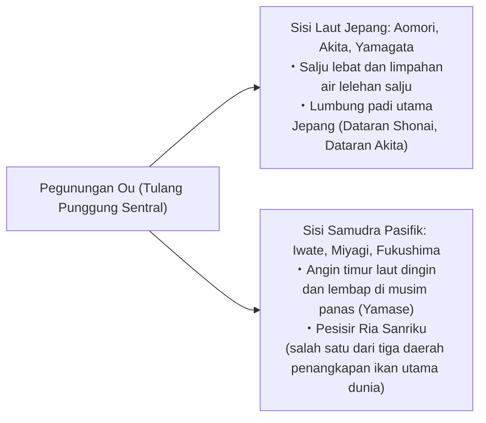
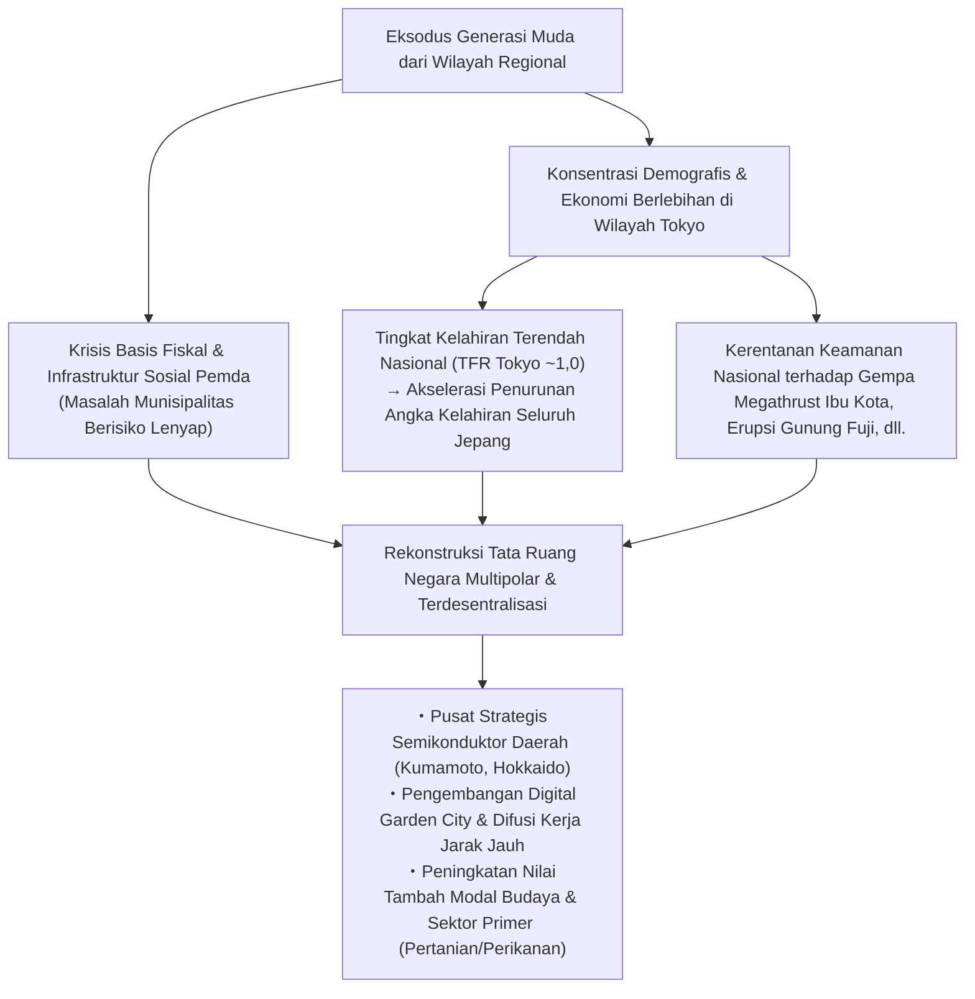
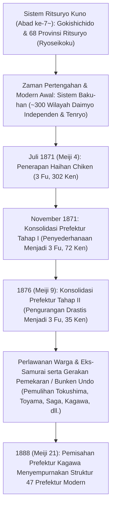

## Pendahuluan: Keanekaragaman Kepulauan Jepang dan Sejarah Pembentukan 47 Prefektur

Membentang sekitar 3.000 kilometer dalam bentuk busur kepulauan dari utara ke selatan, Kepulauan Jepang merupakan negara kepulauan pegunungan yang sangat terjal—salah satu yang paling curam di dunia—yang terbentuk akibat aktivitas tektonik intensif di Cincin Api Pasifik (tumbukan empat lempeng tektonik utama: Lempeng Eurasia, Lempeng Amerika Utara, Lempeng Pasifik, dan Lempeng Laut Filipina).

Sekitar 70% luas daratan Jepang tertutup oleh hutan dan pegunungan. Terbagi oleh pegunungan tulang punggung (*sekiryō sanmyaku*) yang membujur di tengah daratan, wilayah kepulauan ini memiliki variasi lingkungan iklim yang luar biasa kaya dan terkonsentrasi dalam wilayah daratan yang sempit: "Iklim Sisi Laut Jepang" yang membawa salju lebat di musim dingin; "Iklim Sisi Samudra Pasifik" yang bersuhu panas dan lembap di musim panas namun kering dan cerah di musim dingin; "Iklim Laut Pedalaman Seto" yang hangat dengan curah hujan rendah; "Iklim Dataran Tinggi Pedalaman" dengan fluktuasi suhu ekstrem; serta "Iklim Kepulauan Nansei" yang berkarakter subtropis.

| Klasifikasi Iklim | Cakupan Geografis | Karakteristik Iklim & Mekanisme Geofisika Utama |
| :--- | :--- | :--- |
| **Iklim Sisi Laut Jepang** (*Nihonkai-gawa Kikō*) | Pesisir Laut Jepang dari Hokkaido hingga Hokuriku dan San'in | Angin monsun barat laut musim dingin menyerap uap air dari Arus Hangat Tsushima, membentur pegunungan tulang punggung dan menghasilkan akumulasi salju lebat (salah satu kawasan bersalju tertinggi di dunia). |
| **Iklim Sisi Samudra Pasifik** (*Taiheiyō-gawa Kikō*) | Pesisir Samudra Pasifik hingga Kyushu selatan | Hujan lebat dan badai topan akibat angin monsun tenggara di musim panas. Musim dingin didominasi cuaca cerah dan udara kering berangin kencang (*karakkaze*). |
| **Iklim Laut Pedalaman Seto** (*Setouchi-shiki Kikō*) | Daerah yang diapit Pegunungan Chugoku dan Pegunungan Shikoku | Awan hujan terhalang oleh deretan pegunungan di kedua sisi, menghasilkan iklim yang hangat, curah hujan minim, dan durasi penyinaran matahari yang panjang sepanjang tahun. |
| **Iklim Dataran Tinggi Pedalaman** (*Chūō Kōchi-shiki Kikō*) | Prefektur Nagano, Yamanashi, wilayah Hida di Gifu, dll. | Terletak di elevasi tinggi dan dikelilingi pegunungan tinggi, mengakibatkan perbedaan suhu harian (siang-malam) serta tahunan (musim panas-dingin) yang sangat ekstrem. |
| **Iklim Kepulauan Nansei** (*Nansei Shotō Kikō*) | Prefektur Okinawa, Kepulauan Amami, dll. | Iklim laut subtropis yang dipengaruhi Arus Kuroshio hangat. Suhu tinggi dan kelembapan konstan sepanjang tahun, serta kerap dilanda badai topan. |

Pembagian wilayah administratif tradisional Jepang berakar dari sistem kuno Ritsuryō, yaitu *Gokishichidō* (Lima Provinsi Kinai dan Tujuh Sirkuit: Kinai, Tōkaidō, Tōsandō, Hokurikudō, San'indō, San'yōdō, Nankaidō, Saikaidō) yang menjadi fondasi bagi 68 *Ryōseikoku* (provinsi kuno). Segera setelah Restorasi Meiji pada tahun 1871 (Meiji 4), kebijakan *Haihan Chiken* (Penghapusan Han dan Pembentukan Prefektur) pada awalnya menghasilkan lebih dari 300 prefektur (*fu* dan *ken*). Melalui serangkaian konsolidasi dan reorganisasi bertahap hingga kembalinya kemandirian Prefektur Kagawa pada tahun 1888 (Meiji 21), struktur administratif modern yang kita kenal sekarang—"1 To, 1 Do, 2 Fu, 43 Ken" (47 Prefektur: Tokyo-to, Hokkaido, Osaka-fu, Kyoto-fu, dan 43 Ken)—menjadi mapan secara permanen.

Artikel ini membagi 47 prefektur ke dalam delapan blok wilayah utama (Hokkaido, Tohoku, Kanto, Chubu, Kinki, Chugoku, Shikoku, serta Kyushu & Okinawa). Kami akan membedah secara komprehensif dan mendalam nama provinsi kuno (*ryōseikoku*), bentang alam topografis, struktur industri, sejarah dan kebudayaan, hingga tantangan revitalisasi daerah (*chihō sōsei*) serta dinamika demografis abad ke-21 di setiap prefektur.

---

## 1. Wilayah Hokkaido: Garis Depan Utara dan Sektor Primer Raksasa

### 1.1 Hokkaido (Provinsi kuno: Ezochi / 11 Provinsi termasuk Ishikari, Oshima, dll.)
- **Ibu Kota Prefektur (Dōchō)**: Kota Sapporo
- **Luas Wilayah & Bentang Alam**: 83.424 km² (Peringkat 1 nasional, mencakup sekitar 22% dari total luas daratan Jepang). Berporos pada jajaran Pegunungan Daisetsuzan dan Pegunungan Hidaka sebagai tulang punggungnya, wilayah ini memiliki dataran dan dataran tinggi terluas di Jepang seperti Dataran Ishikari, Dataran Tokachi, dan Dataran Tinggi Konsen. Beriklim subarktik dengan musim panas yang sejuk serta musim dingin yang sangat beku disertai akumulasi salju yang meluas.
- **Struktur Industri & Perekonomian**:
  - **Pertanian**: Lumbung pangan utama Jepang (*food base*). Pertanian lahan kering skala luas (gandum, bit gula, kentang, kacang azuki) dan peternakan sapi perah berskala masif (memproduksi lebih dari 50% pasokan susu mentah nasional). Dataran Tokachi menjadi pusat pertanian mekanisasi gaya Barat modern dengan kepemilikan lahan rata-rata mencapai puluhan hektare per rumah tangga petani.
  - **Perikanan**: Peringkat 1 nasional baik dalam tangkapan laut maupun produksi akuakultur, menghasilkan kerang simping (*hotate*), salmon, pollock Alaska (*suketoudara*), dan rumput laut kelp (*kombu*).
  - **Pariwisata & Jasa**: Resor ski bersalju bubuk (*powder snow*) kelas dunia di Niseko (kluster wisatawan mancanegara ternama dunia), Shiretoko (Situs Warisan Alam Dunia UNESCO), padang lavender di Furano, serta Festival Salju Sapporo (*Sapporo Snow Festival*).
- **Sejarah & Budaya**: Budaya asli suku Ainu (telah dibukanya *Upopoy* atau Ruang Simbolis Harmoni Etnis). Sejarah perintisan modern melalui Komisi Pembukaan Lahan (*Kaitakushi*) dan tentara petani perintis (*Tondenhei*) sejak era Meiji. Pengenalan agronomi modern dan etika Kristen melalui Sekolah Pertanian Sapporo (*Sapporo Agricultural College*) yang dipelopori oleh Dr. William S. Clark ("Boys, be ambitious").
- **Tantangan Regional**: Penurunan populasi yang cepat dan konsentrasi demografi ekstrem di Sapporo (*Sapporo ikkyoku shūchū*), krisis pemeliharaan jalur kereta api defisit JR Hokkaido, serta beban biaya pemeliharaan infrastruktur yang membentang sangat luas.

---

## 2. Wilayah Tohoku: Berkah Pegunungan Ou dan Warisan Historis Michinoku

Wilayah Tohoku dibelah secara membujur dari utara ke selatan oleh Pegunungan Ou di bagian tengah, menciptakan kontras bentang alam yang tegas antara sisi Laut Jepang (wilayah bersalju lebat dan lumbung padi subur) dan sisi Samudra Pasifik (rentan terhadap kerusakan tanaman akibat iklim dingin ekstrem dan angin dingin musim panas *Yamase*).



### 2.1 Prefektur Aomori (Provinsi kuno: Tsugaru, Mutsu)
- **Ibu Kota**: Kota Aomori
- **Bentang Alam**: Ujung paling utara Pulau Honshu. Semenanjung Tsugaru dan Semenanjung Shimokita mengapit Teluk Mutsu; di bagian tengah menjulang Pegunungan Hakkoda, dan di bagian barat terdapat Pegunungan Shirakami (Situs Warisan Alam Dunia UNESCO).
- **Industri**: Memproduksi sekitar 60% pasokan apel nasional (berpusat di Kota Hirosaki dan Dataran Tsugaru). Budi daya kerang simping di Teluk Mutsu, tuna Oma yang bernilai tinggi (*Oma tuna*), serta volume bongkar muat hasil laut di Pelabuhan Hachinohe. Di sektor teknologi tinggi, Desa Rokkasho menjadi rumah bagi fasilitas siklus bahan bakar nuklir nasional.
- **Budaya & Tradisi**: Festival Aomori Nebuta dan Hirosaki Neputa, musik petik tradisional Tsugaru Shamisen, serta kebudayaan Tsugaru yang melahirkan sastrawan legendaris Osamu Dazai dan seniman cetak balok kayu Shiko Munakata. Kawasan peninggalan Zaman Jomon (Situs Sannai-Maruyama).

### 2.2 Prefektur Iwate (Provinsi kuno: Rikuchu, Rikuzen, Mutsu)
- **Ibu Kota**: Kota Morioka
- **Bentang Alam**: Prefektur terluas kedua di Jepang setelah Hokkaido (15.275 km²). Terdiri dari Cekungan Kitakami yang dialiri Sungai Kitakami, serta Dataran Tinggi Kitakami dan Pesisir Ria Sanriku di bagian timur.
- **Industri**: Aglomerasi industri semikonduktor dan otomotif di Cekungan Kitakami (pabrik Kioxia, rantai pasok Toyota, dll.). Perikanan rumput laut wakame, abalon, salmon, dan saury Pasifik di Sanriku. Kerajinan besi tradisional *Nambu Tekki*.
- **Budaya & Tradisi**: Kuil Chuson-ji Konjikido di Hiraizumi (pengejawantahan kosmologi Tanah Suci Pure Land oleh Klan Oshu Fujiwara, Situs Warisan Budaya Dunia UNESCO). Konsep utopia sastra "Ihatov" karya Kenji Miyazawa, serta antologi cerita rakyat *Tono Monogatari* karya Kunio Yanagita (tanah suci folklor Jepang).

### 2.3 Prefektur Miyagi (Provinsi kuno: Rikuzen, Mutsu)
- **Ibu Kota**: Kota Sendai (satu-satunya kota metropolitan yang ditetapkan peraturan pemerintah / *Seirei Shitei Toshi* di Tohoku)
- **Bentang Alam**: Dataran Sendai yang subur dengan persawahan luas, Matsushima (satu dari Tiga Pemandangan Terindah Jepang / *Nihon Sankei*), Semenanjung Oshika, dan Teluk Sendai.
- **Industri**: Pusat administrasi dan ekonomi seluruh Wilayah Tohoku. Lumbung padi beras varietas unggul Sasanishiki dan Hitomebore. Pengolahan hasil laut di Pelabuhan Ishinomaki dan Pelabuhan Kesennuma. Basis riset sains mutakhir berpusat di Universitas Tohoku serta fasilitas radiasi sinkrotron generasi berikutnya, NanoTerasu.
- **Budaya & Tradisi**: Kebudayaan kota benteng (*jōkamachi*) berkekuatan 620.000 koku yang dibangun oleh daimyo legendaris Date Masamune. Festival Sendai Tanabata.

### 2.4 Prefektur Akita (Provinsi kuno: Ugo, Dewa)
- **Ibu Kota**: Kota Akita
- **Bentang Alam**: Dataran Akita, Cekungan Yokote, Gunung Chokai, dan Danau Tazawa (danau terdalam di Jepang).
- **Industri**: Salah satu lumbung padi termasyhur di Jepang, produsen varietas legendaris "Akitakomachi". Industri kehutanan kayu cedar Akita (*Akita Sugi*). Daging ayam lokal unggulan Hinai-jidori dan ikan sailfin sandfish (*hatahata*). Belakangan ini menjadi sorotan nasional sebagai basis pembangkit listrik tenaga bayu (PLTB lepas pantai / *offshore wind power*) di sepanjang pesisir Laut Jepang.
- **Budaya & Tradisi**: Festival Akita Kanto, ritual Namahage di Oga (Warisan Budaya Takbenda UNESCO), dan kawasan hutan purba Pegunungan Shirakami.

### 2.5 Prefektur Yamagata (Provinsi kuno: Uzen, Dewa)
- **Ibu Kota**: Kota Yamagata
- **Bentang Alam**: Dataran Shonai dan serangkaian cekungan (Yonezawa, Yamagata, Shinjo) yang dihubungkan oleh aliran Sungai Mogami. Pegunungan Dewa Sanzan (Gassan, Hagurosan, Yudonosan) dan Pegunungan Zao.
- **Industri**: Dijuluki "Kerajaan Buah", menguasai lebih dari 70% pangsa pasar ceri (*sakuranbo*) nasional serta pir La France. Pertanian padi berkualitas tinggi di Dataran Shonai (varietas Tsuyahime). Daging sapi wagyu Yonezawa. Manufaktur komponen elektronik dan permesinan presisi.
- **Budaya & Tradisi**: Tradisi asketis pertapaan gunung *Shugendō* di Dewa Sanzan, Festival Yamagata Hanagasa, serta keanggunan bernuansa romantisme era Taisho di pemandian air panas Ginzan Onsen.

### 2.6 Prefektur Fukushima (Provinsi kuno: Iwashiro, Iwaki)
- **Ibu Kota**: Kota Fukushima
- **Bentang Alam**: Terbagi secara tegas menjadi tiga wilayah dengan karakter geografis berbeda: Aizu (pegunungan, salju lebat, sarat sejarah), Nakadori (jantung administrasi, ekonomi, dan cekungan lembah), dan Hamadori (pesisir Samudra Pasifik beriklim maritim yang hangat).
- **Industri**: Hortikultura buah persik (*momo*) dan pir (*nashi*) di Nakadori. Kerajinan pernis Aizu (*Aizu shikki*) dan industri penyulingan sake. Hamadori menjadi pusat inisiatif "Fukushima Innovation Coast Framework" (Fasilitas Uji Coba Robot Fukushima Robot Test Field dan teknologi energi hidrogen mutakhir).
- **Budaya & Tradisi**: Semangat bushido samurai Aizuwakamatsu (Ksatria Muda Byakkotai), ramen Kitakata yang melegenda, dan tradisi menunggang kuda berkuda perang Soma Nomaoi. Menjadi garda terdepan pemulihan pasca-Gempa Bumi Besar Jepang Timur dan kecelakaan nuklir, serta pelopor transisi energi masa depan.

---

## 3. Wilayah Kanto: Konsentrasi Fungsi Ibu Kota dan Aglomerasi Industri Berlapis

Membentang di Dataran Kanto—dataran terluas di seantero Jepang—Wilayah Kanto memadukan hiperkonsentrasi fungsi politik, ekonomi, akademik, dan logistik nasional dengan pertanian daerah penyangga (*hinterland*) serta kawasan industri maritim yang saling terintegrasi secara organik.

```
【Struktur Pembagian Fungsi Megalopolis Tokyo Raya (Shutoken)】

・Tokyo-to: Fungsi pusat pemerintahan negara, pusat keuangan & hukum global, industri IT terdepan, pusat produksi budaya pop global
・Prefektur Kanagawa: Kawasan Industri Keihin, pelabuhan perdagangan internasional (Yokohama), pusat riset & pengembangan (R&D), pariwisata pesisir Shonan & Hakone
・Prefektur Saitama: Hub transportasi pedalaman (jaringan Shinkansen & jalan tol), pertanian suburban, kawasan industri permesinan & logistik
・Prefektur Chiba: Bandara Internasional Narita, Kompleks Petrokimia & Baja Pesisir Keiyo, perikanan dan pertanian suburban (kacang tanah & sayuran)
・Prefektur Ibaraki: Kota Sains Tsukuba (Tsukuba Science City), Kawasan Industri Pesisir Kashima, manufaktur alat berat Hitachi, perkebunan melon & akar teratai (renkon)
・Prefektur Tochigi: Kawasan Industri Kanto Utara (otomotif & permesinan presisi pedalaman), Warisan Budaya Nikko Toshogu, stroberi nomor satu Jepang (Tochiotome & Tochiaika)
・Prefektur Gunma: Industri otomotif berbasis kantor pusat SUBARU, resor pemandian air panas (Kusatsu & Ikaho), warisan industri ulat sutra dan tekstil Tomioka
```

### 3.1 Prefektur Ibaraki (Provinsi kuno: Hitachi)
- **Ibu Kota**: Kota Mito
- **Industri**: Nilai output pertanian peringkat ke-3 nasional (melon, akar teratai/renkon, ubi kering *hoshi-imo*). Kota Sains Tsukuba menampung sepertiga lembaga riset nasional Jepang, menjadikannya pusat intelektual dan sains terbesar di negara ini. Industri mesin dan kelistrikan berat di Kota Hitachi, serta kompleks terpadu baja dan petrokimia di Pelabuhan Kashima.
- **Budaya**: Aliran pemikiran Mitogaku dari Klan Mito Tokugawa (akar ideologis gerakan Sonno Joi / Hormati Kaisar, Usir Orang Asing), Taman Kairakuen, dan Air Terjun Fukuroda (satu dari Tiga Air Terjun Termasyhur Jepang).

### 3.2 Prefektur Tochigi (Provinsi kuno: Shimotsuke)
- **Ibu Kota**: Kota Utsunomiya
- **Industri**: Memimpin panen stroberi nomor satu di Jepang selama lebih dari setengah abad berturut-turut (varietas Tochiotome, Tochiaika). Kompleks industri pedalaman di sekitar Utsunomiya dan Oyama (peralatan medis dan mesin transportasi). Pengoperasian Utsunomiya Light Rail Transit (LRT) sebagai transportasi publik perkotaan generasi baru yang pionir di Jepang.
- **Budaya**: Kuil dan Tempat Suci Nikko (Situs Warisan Dunia UNESCO / Nikko Toshogu), Sekolah Ashikaga (perguruan tinggi tertua di Jepang), keramik Mashiko-yaki.

### 3.3 Prefektur Gunma (Provinsi kuno: Kozuke)
- **Ibu Kota**: Kota Maebashi
- **Industri**: Kluster manufaktur otomotif dan pencetakan logam yang berporos pada markas besar SUBARU (eks-Nakajima Aircraft) di Kota Ota. Memproduksi 90% umbi konnyaku (*konjac*) nasional. Resor pemandian air panas raksasa legendaris seperti Kusatsu Onsen, Ikaho Onsen, dan Minakami Onsen.
- **Budaya**: Pabrik Sutra Tomioka dan Warisan Industri Terkait (Situs Warisan Dunia UNESCO). Permainan kartu tradisional *Jomo Karuta* yang mengakar kuat sebagai perekat kesadaran warganya.

### 3.4 Prefektur Saitama (Provinsi kuno: Sebagian besar Musashi)
- **Ibu Kota**: Kota Saitama (Kota Berstatus Khusus / *Seirei Shitei Toshi*)
- **Industri**: Populasi peringkat ke-5 nasional (sekitar 7,3 juta jiwa). Stasiun Omiya berfungsi sebagai persimpangan rel kereta terbesar di Jepang Timur. Nilai pengiriman manufaktur makanan peringkat atas nasional. Sayuran daun bawang Fukaya Negi, teh Sayama, dan kerupuk beras Soka Senbei.
- **Budaya**: Arsitektur gudang berdinding tebal Zaman Edo di kawasan "Koedo" Kawagoe, serta Festival Malam Chichibu (*Chichibu Yomatsuri*, Warisan Budaya Takbenda UNESCO).

### 3.5 Prefektur Chiba (Provinsi kuno: Shimosa, Kazusa, Awa)
- **Ibu Kota**: Kota Chiba (Kota Berstatus Khusus / *Seirei Shitei Toshi*)
- **Industri**: Bandara Internasional Narita (gerbang utama logistik kargo udara internasional Jepang). Industri petrokimia dan peleburan baja di Kawasan Industri Pesisir Keiyo. Penghasil produk pertanian terkemuka nasional (daun bawang, kacang tanah, bayam). Volume bongkar muat hasil laut Pelabuhan Choshi. Tokyo Disney Resort.
- **Budaya**: Kota kuil di sekitar Kuil Naritasan Shinsho-ji, resor selancar dan wisata bahari di Semenanjung Boso.

### 3.6 Tokyo-to (Metropolitan Tokyo) (Provinsi kuno: Musashi, Izu, Ogasawara)
- **Pusat Pemerintahan Metropolitan (Tochō)**: Distrik Shinjuku
- **Bentang Alam**: Populasi sekitar 14 juta jiwa (wilayah megapolitan metropolitan terbesar di dunia dengan lebih dari 37 juta jiwa). Mencakup 23 Distrik Khusus (*Tokubetsu-ku*), wilayah Tama di barat, Kepulauan Izu, dan Kepulauan Ogasawara (Situs Warisan Alam Dunia).
- **Industri**: Raksasa penggerak ekonomi yang menyumbang sekitar 20% dari total PDB Jepang. Jantung finansial dan konglomerasi perdagangan umum (*sogo shosha*) di Marunouchi dan Otemachi; pusat startup IT dan inovasi di Shibuya dan Roppongi; episentrum subkultur pop global di Akihabara; serta Bandara Haneda (hub penerbangan domestik dan internasional utama).
- **Budaya**: Metropolis internasional terdepan di mana gedung-gedung pencakar langit futuristik berdampingan harmonis dengan situs warisan sejarah adiluhung seperti pelataran Istana Kekaisaran (bekas Kastel Edo), Kuil Senso-ji di Asakusa, dan Kuil Meiji Jingu.

### 3.7 Prefektur Kanagawa (Provinsi kuno: Sagami, Musashi Bagian Selatan)
- **Ibu Kota**: Kota Yokohama (populasi sekitar 3,77 juta jiwa, munisipalitas dasar terbesar di Jepang)
- **Industri**: Populasi peringkat ke-2 nasional (sekitar 9,2 juta jiwa). Jantung dari Kawasan Industri Keihin (Nissan Motor, JFE Steel, dll.). Aglomerasi pusat R&D global di Minato Mirai 21. Industri teknologi tinggi dan teknologi lingkungan di Kota Kawasaki.
- **Budaya**: Kota kuno Keshogunan Kamakura (pusat lahirnya budaya ksatria samurai), atmosfer kosmopolitan pelabuhan Yokohama sejak pembukaan era isolasi, budaya pesisir selancar di Shonan, dan resor onsen bersejarah di Hakone.

---

## 4. Wilayah Chubu: Tulang Punggung Manufaktur Jepang (*Monozukuri*) dan Topografi Pegunungan Alpin

Terletak di pusat Pulau Honshu, Wilayah Chubu tersusun atas subwilayah yang sangat beragam: Hokuriku (pesisir Laut Jepang), Chuo Kochi / Dataran Tinggi Pedalaman (wilayah pegunungan tengah), serta Tokai (pesisir Samudra Pasifik). Kawasan ini menampung koridor industri manufaktur terkuat dan paling tangguh di seluruh Jepang.

### 4.1 Prefektur Niigata (Provinsi kuno: Echigo, Sado)
- **Ibu Kota**: Kota Niigata (Kota Berstatus Khusus / *Seirei Shitei Toshi*)
- **Industri**: Daerah aliran sungai Shinano dan Agano membentuk Dataran Echigo yang subur, menjadikannya produsen beras Koshihikari terbesar di Jepang. Industri peralatan makan logam barat dan pisau tempa di Tsubame-Sanjo yang menguasai pangsa pasar global. Budi daya ikan mas hias Nishikigoi. Sumber produksi gas alam dan minyak bumi domestik.
- **Budaya**: Tambang Emas Pulau Sado (*Sado Island Gold Mines*, Warisan Dunia UNESCO), Festival Kembang Api Raksasa Nagaoka, Triennale Seni Echigo-Tsumari.

### 4.2 Prefektur Toyama (Provinsi kuno: Etchu)
- **Ibu Kota**: Kota Toyama
- **Industri**: Memanfaatkan kelimpahan energi hidroelektrik dari Hokuriku Electric Power untuk industri peleburan dan pencetakan aluminium, kimia, serta bio-farmasi. Aglomerasi industri farmasi modern yang mewarisi tradisi berabad-abad penjual obat keliling "Toyama no Baiyaku". Teluk Toyama dijuluki "akuarium alami" penghasil cumi-cumi kunang-kunang (*hotaru-ika*), udang putih (*shiro-ebi*), dan ikan buri/yellowtail.
- **Budaya**: Pegunungan Tateyama dan Bendungan Kurobe (Rute Alpen Tateyama Kurobe). Desa bersejarah rumah beratap jerami miring Gokayama Gassho-zukuri (Warisan Dunia UNESCO).

### 4.3 Prefektur Ishikawa (Provinsi kuno: Kaga, Noto)
- **Ibu Kota**: Kota Kanazawa
- **Industri**: Pariwisata bernilai tambah tinggi berlandaskan modal budaya warisan Domain Kaga Maeda (Domain Satu Juta Koku / *Kaga Hyakumangoku*). Manufaktur mesin tekstil dan alat berat konstruksi (tempat lahir Komatsu), serta material komposit serat karbon.
- **Budaya**: Taman Kenrokuen, lembaran emas *kanazawa haku* (menguasai 99% pangsa pasar domestik), keramik Kutani-yaki, dan kerajinan pernis Wajima-nuri. Langkah pemulihan dan rekonstruksi kreatif pasca-Gempa Bumi Semenanjung Noto.

### 4.4 Prefektur Fukui (Provinsi kuno: Echizen, Wakasa)
- **Ibu Kota**: Kota Fukui
- **Industri**: Menguasai 95% pangsa pasar bingkai kacamata optik nasional di Kota Sabae. Industri tekstil sintesis dan komponen elektronik presisi (Murata Manufacturing, dll.). Tempat kelahiran varietas beras Koshihikari. Kepiting salju Echizen-gani yang tersohor. Kawasan pesisir Wakasa (Reinan) menampung konsentrasi fasilitas pembangkit listrik tenaga nuklir.
- **Budaya**: Kuil Utama Eihei-ji (kuil Zen aliran Soto yang didirikan oleh Guru Dogen), Museum Dinosaurus Prefektur Fukui, Tebing Terjal Tojinbo. Secara konsisten menempati peringkat teratas dalam Indeks Kebahagiaan Nasional Jepang (*Japan Happiness Ranking*).

### 4.5 Prefektur Yamanashi (Provinsi kuno: Kai)
- **Ibu Kota**: Kota Kofu
- **Industri**: Produsen anggur, persik, dan plum nomor satu di Jepang. Tempat lahirnya industri minuman anggur Jepang (wilayah Katsunuma). Industri pemrosesan batu permata dan perhiasan nomor satu nasional. Kantor pusat Fanuc (raksasa global pengendali CNC mesin perkakas dan robot industri). Jalur eksperimen kereta maglev berkecepatan super tinggi Linear Chuo Shinkansen.
- **Budaya**: Situs sejarah yang berkaitan dengan panglima perang Takeda Shingen, Lima Danau Fuji (*Fuji Five Lakes*), Ngarai Shosenkyo.

### 4.6 Prefektur Nagano (Provinsi kuno: Shinano)
- **Ibu Kota**: Kota Nagano
- **Industri**: Wilayah pegunungan tinggi yang memeluk Pegunungan Alpen Jepang (Hida, Kiso, Akaishi). Industri mesin presisi seperti Seiko Epson, dijuluki "Swiss dari Timur" (*Switzerland of the East*). Sayuran dataran tinggi (selada, kubis cina) dan apel. Dikenal luas sebagai prefektur dengan angka harapan hidup dan kesehatan tertinggi di Jepang.
- **Budaya**: Kuil Zenko-ji, Kastel Matsumoto (benteng bersejarah dengan menara utama Pusaka Nasional Jepang), resor dataran tinggi berhawa sejuk di Kamikochi dan Karuizawa.

### 4.7 Prefektur Gifu (Provinsi kuno: Mino, Hida)
- **Ibu Kota**: Kota Gifu
- **Industri**: Industri pisau dan bilah baja di Kota Seki (satu dari Tiga Pusat Pembuatan Bilah Pisau Utama Dunia). Keramik Mino-yaki (memproduksi lebih dari separuh tembikar porselen Jepang). Industri kedirgantaraan pesawat terbang di Kakamigahara (Kawasaki Heavy Industries). Industri mebel kayu ukir tradisional Hida Takayama.
- **Budaya**: Desa Bersejarah Shirakawa-go (Situs Warisan Dunia UNESCO), kawasan kota tua kayu Hida Takayama, tradisi memancing dengan burung pecuk (*ukai*) di Sungai Nagara.

### 4.8 Prefektur Shizuoka (Provinsi kuno: Totomi, Suruga, Izu)
- **Ibu Kota**: Kota Shizuoka (Kota Berstatus Khusus / *Seirei Shitei Toshi*)
- **Industri**: Salah satu raksasa nilai pengiriman manufaktur tertinggi di Jepang. Kerajaan mesin transportasi yang melahirkan Suzuki, Yamaha, dan Honda. Produsen teh hijau nomor satu di Jepang. Produsen model plastik (*plastic model kit*) nomor satu dunia (markas Tamiya, Bandai Hobby Center, dll.). Hasil tangkapan tuna dan cakalang di Pelabuhan Yaizu.
- **Budaya**: Gunung Fuji (Situs Warisan Dunia UNESCO), resor air panas di Semenanjung Izu, situs peristirahatan masa tua shogun Tokugawa Ieyasu (Kastel Sunpu dan Kuil Kunozan Toshogu).

### 4.9 Prefektur Aichi (Provinsi kuno: Owari, Mikawa)
- **Ibu Kota**: Kota Nagoya (Kota Berstatus Khusus / *Seirei Shitei Toshi*)
- **Industri**: **Peringkat 1 nasional dalam nilai pengiriman produk manufaktur selama lebih dari 40 tahun berturut-turut**—imperium manufaktur terkuat di Jepang. Kantor pusat raksasa Toyota Motor Corporation beserta jaringan rantai pasok ribuan vendor komponennya. Industri kedirgantaraan (Mitsubishi Heavy Industries, perakitan badan pesawat Boeing). Keramik industri, baja khusus, dan mesin perkakas presisi tinggi.
- **Budaya**: Tempat lahir Tiga Tokoh Pemersatu Besar Jepang (Oda Nobunaga, Toyotomi Hideyoshi, Tokugawa Ieyasu). Kuil Agung Atsuta Jingu, Kastel Nagoya. Khazanah kuliner unik khas Nagoya (*Nagoya-meshi* seperti miso katsu, hitsumabushi belut panggang, dan sayap ayam tebasaki).

---

## 5. Wilayah Kinki / Kansai: Ibu Kota Seribu Tahun dan Struktur Berlapis Zona Ekonomi Kansai

Sebagai episentrum politik dan kebudayaan Jepang sejak zaman kuno hingga awal era modern, kawasan Kinai memadukan harmoni luar biasa antara pusat niaga internasional Osaka, kota pelabuhan modern Kobe, serta dua ibu kota kuno sarat warisan peradaban, Kyoto dan Nara.

```
【Pembagian Fungsi dan Keberagaman Historis Wilayah Kinki】

・Osaka-fu: DNA kota saudagar perdagangan, keuangan internasional, World Expo (1970/2025), sains kehidupan & farmasi, surga gastronomi
・Kyoto-fu: Modal budaya seribu tahun Heian-kyo, markas raksasa teknologi tinggi global (Nintendo, Kyocera, dll.), kerajinan adiluhung, pariwisata internasional
・Hyogo-ken: Perdagangan pelabuhan maritim internasional (Kobe), Kawasan Industri Pesisir Harima, sentra sake tradisional Nada-Gogo, komoditas agrikultur Tamba & Tajima
・Nara-ken: Tempat lahirnya Wangsa Yamato kuno, Heijo-kyo, Kuil Horyu-ji & Todai-ji (gudang mahakarya seni patung Buddha)
・Shiga-ken: Danau Biwa terluas di Jepang (sumber air bersih bagi 14 juta jiwa Kinki), filosofi etika saudagar Omi Shonin, manufaktur teknologi tinggi pedalaman
・Mie-ken: Kuil Agung Ise Jingu (puncak hierarki spiritual Shinto), Sirkuit Balap F1 Suzuka, budi daya mutiara Akoya, industri petrokimia Yokkaichi
・Wakayama-ken: Gunung Koya & Tiga Kuil Suci Kumano Sanzan (jalur ziarah spiritual), produsen jeruk mikan dan manisan plum umeboshi nomor satu di Jepang
```

### 5.1 Prefektur Mie (Provinsi kuno: Ise, Iga, Shima, Kii Bagian Timur)
- **Ibu Kota**: Kota Tsu
- **Industri**: Kompleks Petrokimia Yokkaichi (petrokimia dan fabrikasi semikonduktor memori canggih). Daging sapi wagyu Matsusaka, budi daya mutiara Akoya di Teluk Ago, serta lobster Ise (*Ise-ebi*).
- **Budaya**: Kuil Agung Ise Jingu (Kotaijingu / Naiku dan Toyo'uke-daijingu / Geku), seni bela diri ninja aliran Iga (*Iga-ryū ninja*), serta rute ziarah kuno Kumano Kodo (jalur Iseji).

### 5.2 Prefektur Shiga (Provinsi kuno: Omi)
- **Ibu Kota**: Kota Otsu
- **Industri**: Titik temu logistik strategis yang mengitari Danau Biwa. Kluster pabrik induk (*mother factories*) industri teknologi tinggi pedalaman seperti Toray Industries dan Panasonic. Keramik tembikar Shigaraki-yaki. Beras Omi-mai dan daging sapi wagyu Omi.
- **Budaya**: Kuil Enryaku-ji di Gunung Hiei (gunung induk seluruh mazhab Buddhisme Jepang), Kastel Hikone (menara kastel Pusaka Nasional), serta etika bisnis *Sanpo-yoshi* ("Tiga Kebaikan": baik bagi penjual, pembeli, dan masyarakat) yang diwariskan oleh saudagar Omi Shonin.

### 5.3 Kyoto-fu (Prefektur Kyoto) (Provinsi kuno: Yamashiro, Tamba, Tango)
- **Ibu Kota**: Kota Kyoto (Kota Berstatus Khusus / *Seirei Shitei Toshi*)
- **Industri**: Salah satu destinasi pariwisata budaya terkemuka di dunia. Markas besar korporasi teknologi tinggi global seperti Nintendo, OMRON, Kyocera, Shimadzu Corporation, dan Nidec. Tekstil tenun sutra Nishijin-ori, keramik Kiyomizu-yaki, dan perkebunan teh hijau Uji-cha.
- **Budaya**: Monumen Bersejarah Kyoto Kuno (17 kuil dan tempat suci Warisan Dunia UNESCO), Festival Gion Matsuri, dan ritual api unggun raksasa Gozan no Okuribi.

### 5.4 Osaka-fu (Prefektur Osaka) (Provinsi kuno: Settsu Bagian Timur, Kawachi, Izumi)
- **Ibu Kota**: Kota Osaka (Kota Berstatus Khusus / *Seirei Shitei Toshi*)
- **Industri**: Aglomerasi ekonomi terbesar di Jepang Barat. Tempat lahir konglomerat perdagangan umum *sogo shosha* (Itochu, Sumitomo), raksasa farmasi dan sains kehidupan seperti Takeda Pharmaceutical, serta ribuan bengkel manufaktur presisi skala kecil-menengah berteknologi tinggi di Higashi-Osaka. Bandara Internasional Kansai (KIX).
- **Budaya**: Kastel Osaka, distrik gemerlap Dotonbori, seni teater tradisional Kamigata Rakugo, Bunraku, komedi panggung Yoshimoto Shinkigeki, serta budaya kuliner berbasis tepung gandum (*konamon* seperti takoyaki dan okonomiyaki). Gugus Makam Kuno Mozu-Furuichi Kofungun (Makam Kaisar Nintoku, Situs Warisan Dunia UNESCO).

### 5.5 Prefektur Hyogo (Provinsi kuno: Settsu Bagian Barat, Tamba, Tajima, Harima, Awaji)
- **Ibu Kota**: Kota Kobe (Kota Berstatus Khusus / *Seirei Shitei Toshi*)
- **Industri**: Transportasi kargo laut internasional melalui Pelabuhan Kobe. Industri berat raksasa seperti Kawasaki Heavy Industries dan Kobe Steel. Kawasan Industri Pesisir Harima. Sentra penyulingan sake Nada-Gogo (penghasil sake nomor satu di Jepang). Bawang bombai Pulau Awaji dan daging sapi Kobe Beef (Tajima-gyu).
- **Budaya**: Kastel Himeji (Situs Warisan Budaya Dunia UNESCO pertama di Jepang, berjuluk "Kastel Bangau Putih" / Shirasagi-jo), sumber air panas purba Arima Onsen, kawasan pemukiman warga asing bersejarah Kitano Ijinkan di Kobe.

### 5.6 Prefektur Nara (Provinsi kuno: Yamato)
- **Ibu Kota**: Kota Nara
- **Industri**: Industri pariwisata sejarah, kehutanan kayu cedar dan cemara Yoshino (Yoshino Sugi & Hinoki), produksi kaus kaki nomor satu di Jepang (berpusat di Kota Koryo), serta kerajinan tradisional tinta kaligrafi (*sumi*) dan pengocok teh bambu (*chasen*).
- **Budaya**: Monumen Bersejarah Nara Kuno (Kuil Todai-ji dengan Daibutsu, Kofuku-ji, Kasuga Taisha), Bangunan Buddha di Kawasan Kuil Horyu-ji (struktur kayu tertua di dunia yang masih berdiri), serta keindahan ribuan pohon sakura dan pertapaan Shugendo di Gunung Yoshino.

### 5.7 Prefektur Wakayama (Provinsi kuno: Kii Bagian Barat)
- **Ibu Kota**: Kota Wakayama
- **Industri**: Penghasil jeruk Unshu Mikan, prem Nanko-ume (umeboshi), buah kesemek, dan lada sansho nomor satu di Jepang. Pabrik baja terpadu Nippon Steel Wakayama Works.
- **Budaya**: Situs Suci dan Rute Ziarah di Barisan Pegunungan Kii (Kuil Kongobuji Gunung Koya, Tiga Kuil Suci Kumano Sanzan, Situs Warisan Dunia UNESCO), resor pantai dan onsen Shirahama Onsen.

---

## 6. Wilayah Chugoku: Kompleks Industri Setouchi dan Alam Mitologi San'in

Terbelah oleh jajaran Pegunungan Chugoku, Wilayah Chugoku menyajikan kontras dramatis antara kawasan "San'yo" di selatan (pesisir Laut Pedalaman Seto) yang beriklim hangat dengan kawasan industri petrokimia dan baja berat, serta kawasan "San'in" di utara (pesisir Laut Jepang) yang kaya akan alam alami dan menjadi panggung legenda mitologi kuno Shinto.

### 6.1 Prefektur Tottori (Provinsi kuno: Inaba, Hoki)
- **Ibu Kota**: Kota Tottori
- **Bentang Alam & Industri**: Prefektur dengan jumlah penduduk paling sedikit di Jepang (sekitar 540.000 jiwa). Pertanian lahan pasir di Bukit Pasir Tottori (*Tottori Sand Dunes*) yang menghasilkan bawang lokio *rakkyo*. Buah pir Nijisseiki (peringkat 1 nasional). Daun bawang putih (*shiro-negi*), serta tangkapan kepiting melimpah di Pelabuhan Sakaiminato.
- **Budaya**: Legenda Kelinci Putih dari Inaba (*Inaba no Shiro-usagi*), Misasa Onsen (sumber air panas dengan konsentrasi radon tertinggi di dunia), dan bangunan kuil gantung Nageire-do di Gunung Mitoku (Kuil Sanbutsu-ji, Pusaka Nasional).

### 6.2 Prefektur Shimane (Provinsi kuno: Izumo, Iwami, Oki)
- **Ibu Kota**: Kota Matsue
- **Bentang Alam & Industri**: Dataran Izumo, Danau Shinji (tangkapan kerang remis air payau *shijimi* nomor satu di seantero Jepang). Industri baja paduan khusus presisi tinggi (*Yasuki Hagane*, warisan teknik metalurgi kuno tatara oleh Hitachi Metals). Bunga cyclamen dan anggur Delaware.
- **Budaya**: Kuil Agung Izumo Taisha (tempat berkumpulnya para dewa Shinto dalam mitologi Penyerahan Negeri / *Kuni-yuzuri*), Situs Tambang Perak Iwami Ginzan (Situs Warisan Dunia UNESCO), serta Geopark Global Kepulauan Oki.

### 6.3 Prefektur Okayama (Provinsi kuno: Mimasaka, Bizen, Bitchu)
- **Ibu Kota**: Kota Okayama (Kota Berstatus Khusus / *Seirei Shitei Toshi*)
- **Industri**: Kawasan Industri Pesisir Mizushima (kompleks terpadu petrokimia, peleburan baja, dan perakitan otomotif). Kerajaan buah premium persik putih (*shimizu hakuto*) dan anggur Muscat of Alexandria. Distrik Kojima sebagai tempat kelahiran celana jins denim domestik Jepang dan seragam sekolah.
- **Budaya**: Kawasan Kanal Bersejarah Kurashiki Bikan (deretan rumah berdinding plester putih bergaya komersial tradisional Zaman Edo), Taman Korakuen (satu dari Tiga Taman Terindah Jepang), dan kerajinan tembikar bakar Bizen-yaki.

### 6.4 Prefektur Hiroshima (Provinsi kuno: Aki, Bingo)
- **Ibu Kota**: Kota Hiroshima (Kota Berstatus Khusus / *Seirei Shitei Toshi*)
- **Industri**: Kota metropolis ekonomi terbesar di kawasan Chugoku dan Shikoku. Industri perakitan otomotif berpusat di Mazda Motor Corporation, pabrik baja JFE Steel Fukuyama, dan galangan kapal raksasa di Kure dan Onomichi. Budi daya tiram yang menguasai lebih dari separuh pasokan nasional. Penghasil buah lemon nomor satu di Jepang.
- **Budaya**: Memiliki dua Situs Warisan Dunia UNESCO (Kuil Itsukushima di Miyajima dengan gerbang torii terapung, dan Kubah Bom Atom / *Genbaku Dome*). Pesan perdamaian dunia sebagai Kota Peringatan Perdamaian. Lereng bukit berjenjang dan atmosfer sastra romantis di Onomichi.

### 6.5 Prefektur Yamaguchi (Provinsi kuno: Suo, Nagato)
- **Ibu Kota**: Kota Yamaguchi
- **Industri**: Kompleks Industri Shunan di pesisir Seto (petrokimia dasar dan kimia anorganik). Korporasi bahan bangunan, kimia, dan semen Ube Industries (sekarang UBE Corporation). Pelabuhan Shimonoseki sebagai sentra penangkapan ikan buntal (*fugu*) dan monkfish (*ankō*).
- **Budaya**: Akademi Shoka Sonjuku di Hagi yang melahirkan para pemimpin Restorasi Meiji (Situs Warisan Dunia UNESCO). Jembatan kayu Kintaikyo, dataran karst terbesar di Jepang Akiyoshidai dan gua kapur Akiyoshido, serta panorama spektakuler Jembatan Tsunoshima.

---

## 7. Wilayah Shikoku: Warisan Jalur Nankaido, Industri Setouchi, dan Bahari Pasifik

Dibelah secara melintang oleh deretan Pegunungan Shikoku yang membentang dari timur ke barat, Pulau Shikoku membentuk karakter geografis yang berlainan antara bagian utara pesisir Setouchi (Kagawa dan Ehime) dan bagian selatan pesisir Pasifik (Kochi dan Tokushima). Pulau ini terhubung erat dengan Pulau Honshu melalui tiga proyek jembatan raksasa Jalur Penghubung Honshu-Shikoku (Jembatan Onaruto, Jembatan Besar Seto, dan Shimanami Kaido).

### 7.1 Prefektur Tokushima (Provinsi kuno: Awa)
- **Ibu Kota**: Kota Tokushima
- **Industri**: Jeruk sitrun sudachi (menguasai lebih dari 90% pangsa pasar nasional), ubi jalar Naruto Kintoki, dan ayam pedaging lokal unggulan Awaodori. Menjadi kluster industri optoelektronika global berbasis Nichia Corporation (pelopor dunia dalam pengembangan lampu LED biru dan bahan fosfor).
- **Budaya**: Tarian rakyat berenergi tinggi Awa Odori yang memiliki sejarah 400 tahun, Pusaran Air Selat Naruto (*Naruto whirlpools*), serta ngarai terpencil Ngarai Iya dengan jembatan akar merambat Kazurabashi.

### 7.2 Prefektur Kagawa (Provinsi kuno: Sanuki)
- **Ibu Kota**: Kota Takamatsu
- **Industri**: Prefektur dengan wilayah terkecil di seluruh Jepang, namun memiliki kepadatan penduduk yang tinggi. Budaya kuliner mi yang sangat kuat melalui "Sanuki Udon" yang menarik jutaan wisatawan gastronomi. Penghasil zaitun nomor satu di Jepang di Pulau Shodoshima. Kawasan Industri Pesisir Bannosu.
- **Budaya**: Kuil Kotohira-gu (akrab disapa *Konpira-san*), Taman Ritsurin yang ditetapkan sebagai Tempat Keindahan Pemandangan Khusus, serta Triennale Seni Internasional Setouchi (pusat seni kontemporer global di Pulau Naoshima, Teshima, dll.).

### 7.3 Prefektur Ehime (Provinsi kuno: Iyo)
- **Ibu Kota**: Kota Matsuyama
- **Industri**: Sentra produksi jeruk mandarin Unshu Mikan dan aneka ragam buah sitrus terkemuka di Jepang. Imabari Towel (merek handuk berkualitas tinggi bereputasi global). Kluster industri maritim galangan kapal dan pelayaran laut terbesar di Jepang di Kota Imabari. Industri pengolahan bubur kertas dan kertas di Niihama dan Shikokuchuo, serta peleburan logam nonferrous.
- **Budaya**: Pemandian air panas tertua di Jepang Dogo Onsen Honkan, Kastel Matsuyama, serta jalur bersepeda melintasi pulau Shimanami Kaido.

### 7.4 Prefektur Kochi (Provinsi kuno: Tosa)
- **Ibu Kota**: Kota Kochi
- **Industri**: Pemanfaatan iklim hangat untuk budi daya sayuran di luar musim (*forcing culture*) seperti terung, serta produsen jahe dan jahe liar myoga nomor satu nasional. Penangkapan ikan cakalang dengan teknik pancing ulur tradisional (*ippon-zuri*). Industri pemanfaatan air laut dalam (*deep sea water*).
- **Budaya**: Semangat egaliter dan Gerakan Kebebasan dan Hak Rakyat yang dipelopori Sakamoto Ryoma, Festival Yosakoi Matsuri, Pantai Katsurahama, serta Sungai Shimanto yang dijuluki "aliran sungai murni terakhir di Jepang".

---

## 8. Wilayah Kyushu dan Okinawa: Gerbang Asia dan Khazanah Kebudayaan Kepulauan Nansei

Sebagai wilayah Jepang yang paling dekat dengan benua Asia Timur, kawasan ini telah menjadi garis depan pertukaran hubungan luar negeri Jepang sejak zaman penjaga perbatasan *Sakimori* dan misi duta kekaisaran ke Dinasti Tang (*Kentōshi*). Saat ini, kawasan ini menyaksikan kebangkitan dramatis industri semikonduktor ("Silicon Island") yang berpadu dengan kekayaan pariwisata vulkanik dan maritim tropis.

```
【Dinamika Regional dan Karakteristik Industri Kyushu & Okinawa】

・Prefektur Fukuoka: Episentrum Kyushu, gerbang menuju Asia, kota metropolitan berakses bandara 5 menit, Kawasan Khusus Startup & IT
・Prefektur Saga: Porselen Arita & Imari, festival Karatsu Kunchi, lumbung beras & rumput laut nori Dataran Saga (Laut Ariake)
・Prefektur Nagasaki: Jejak perdagangan Nanban & Pulau Dejima, Situs Warisan Umat Kristen Tersembunyi, galangan kapal, kekayaan perikanan pesisir ria
・Prefektur Kumamoto: Megaklaster semikonduktor akibat ekspansi TSMC (JASM), kaldera raksasa Gunung Aso, kota air tanah murni 100%
・Prefektur Oita: "Prefektur Onsen" nomor satu di Jepang (Beppu & Yufuin), pembangkit listrik tenaga panas bumi, Kawasan Industri Pesisir Oita
・Prefektur Miyazaki: Wilayah bermandikan surya dan beriklim hangat (mangga Taiyo no Tamago, paprika, daging wagyu Miyazaki), selancar di Laut Hyuga
・Prefektur Kagoshima: Kerajaan daging babi hitam Kurobuta, sapi hitam Kuroge Wagyu, ubi jalar, shochu, gunung berapi aktif Sakurajima, Warisan Alam Dunia Yakushima & Amami
・Prefektur Okinawa: Sejarah otonom Kerajaan Ryukyu, Kastel Shuri, Akuarium Churaumi, resor bahari subtropis, transisi ekonomi pangkalan militer menuju kemandirian
```

### 8.1 Prefektur Fukuoka (Provinsi kuno: Chikuzen, Chikugo, Buzen)
- **Ibu Kota**: Kota Fukuoka (Kota Berstatus Khusus / *Seirei Shitei Toshi*, populasi ~1,6 juta jiwa)
- **Industri**: Pusat perekonomian dan komersial terbesar di Kyushu. Kawasan Industri Kitakyushu (tempat lahir Pabrik Baja Yawata milik negara, Yaskawa Electric). Pelabuhan Hakata dan Bandara Fukuoka (dengan konektivitas luar biasa hanya 5 menit subway dari pusat bisnis Tenjin/Hakata). Kluster startup teknologi informasi. Stroberi varietas Amaou yang legendaris.
- **Budaya**: Festival Hakata Gion Yamakasa, Kuil Dazaifu Tenmangu (tempat bersemayam dewa ilmu pengetahuan Sugawara no Michizane), budaya kedai jalanan *yatai*, serta Kuil Munakata Taisha (Situs Warisan Dunia UNESCO).

### 8.2 Prefektur Saga (Provinsi kuno: Hizen Bagian Timur)
- **Ibu Kota**: Kota Saga
- **Industri**: Keramik porselen Arita-yaki dan Imari-yaki (tempat lahirnya industri porselen Jepang). Budi daya rumput laut nori di Laut Ariake (meraih nilai penjualan tertinggi di Jepang selama bertahun-tahun berturut-turut). Daging sapi wagyu Saga Beef. Pembangkit Listrik Tenaga Nuklir Genkai.
- **Budaya**: Situs Arkeologi Yoshinogari (pemukiman berparit pertahanan Zaman Yayoi), pemandian air panas kuno Takeo Onsen, dan Festival Karatsu Kunchi.

### 8.3 Prefektur Nagasaki (Provinsi kuno: Hizen Bagian Barat, Iki, Tsushima)
- **Ibu Kota**: Kota Nagasaki
- **Industri**: Industri galangan kapal yang disimbolkan oleh Galangan Kapal Nagasaki Mitsubishi Heavy Industries. Memanfaatkan garis pantai terpanjang kedua di Jepang untuk hasil tangkapan ikan kembung, makerel (*aji*, *saba*), dan ikan karang. Produsen buah loquat (*biwa*) nomor satu di Jepang.
- **Budaya**: Situs Terkait Umat Kristen Tersembunyi di Wilayah Nagasaki dan Amakusa (Situs Warisan Dunia UNESCO), Situs Revolusi Industri Zaman Meiji di Jepang (Pulau Hashima / Gunkanjima), serta taman bertema Eropa Huis Ten Bosch.

### 8.4 Prefektur Kumamoto (Provinsi kuno: Higo)
- **Ibu Kota**: Kota Kumamoto (Kota Berstatus Khusus / *Seirei Shitei Toshi*)
- **Industri**: Menyusul **ekspansi pabrik fabrikasi semikonduktor terbesar dunia TSMC (melalui anak perusahaannya JASM) di Kota Kikuyo**, Prefektur Kumamoto kini memicu gelombang investasi semikonduktor terbesar dalam sejarah modern Jepang. Produsen tomat dan semangka nomor satu nasional. Menjadi salah satu kota di dunia dengan sistem air perpipaan yang 100% dipasok dari air tanah alami yang murni.
- **Budaya**: Kastel Kumamoto (salah satu dari tiga benteng terkuat dan termegah di Jepang yang dibangun oleh panglima perang Kato Kiyomasa), kaldera Gunung Aso yang merupakan salah satu yang terbesar di dunia, serta Jembatan Lima Amakusa (*Amakusa Gokyo*).

### 8.5 Prefektur Oita (Provinsi kuno: Bungo, Buzen Bagian Selatan)
- **Ibu Kota**: Kota Oita
- **Industri**: Berjuluk "Onsen-ken", memimpin peringkat 1 di Jepang baik dalam jumlah sumber mata air panas maupun volume debit luapan airnya (Beppu Onsen dan Yufuin Onsen). Kawasan Industri Pesisir Oita (peleburan baja, kilang minyak, dan kimia). Memproduksi sekitar 90% pasokan buah sitrus kabosu nasional. Jamur shiitake kering berkualitas tinggi.
- **Budaya**: Kuil Agung Usa Jingu (kuil pusat dari puluhan ribu kuil Hachiman di seantero Jepang), serta kebudayaan sinkretisme Shinto-Buddha (*Shinbutsu-shūgō*) Rokugo Manzan di Semenanjung Kunisaki.

### 8.6 Prefektur Miyazaki (Provinsi kuno: Hyuga)
- **Ibu Kota**: Kota Miyazaki
- **Industri**: Memanfaatkan iklim subtropis hangat dan bercurah hujan tinggi untuk peternakan sapi wagyu Miyazaki Beef (pemenang berturut-turut Penghargaan Perdana Menteri Jepang), mangga ranum premium "Taiyo no Tamago", serta produksi ayam broiler dan daging babi peringkat atas nasional. Peringkat 1 di Jepang dalam produksi kayu gelondongan cedar (*Sugi*).
- **Budaya**: Ngarai Takachiho yang sarat dengan mitologi turunnya cucu dewa matahari ke bumi (*Tenson Korin*) beserta tarian ritual malam Takachiho Yoru Kagura, Kuil Aoshima Jinja, dan Kuil Udo Jingu yang menjorok di tebing samudra.

### 8.7 Prefektur Kagoshima (Provinsi kuno: Satsuma, Osumi)
- **Ibu Kota**: Kota Kagoshima
- **Industri**: Menempati peringkat ke-2 nasional dalam nilai output pertanian. Produsen utama daging sapi Kuroge Wagyu, babi hitam Berkshire Kagoshima Kurobuta, ubi jalar (*satsuma-imo*), sidat air tawar akuakultur (*unagi*), dan ayam pedaging. Kerajaan minuman distilasi keras Honkaku Shochu. Pusat Antariksa Tanegashima (fasilitas peluncuran roket wahana antariksa utama JAXA).
- **Budaya**: Teluk Kinko dengan latar belakang megah gunung berapi aktif Sakurajima. Sejarah klan pejuang tangguh Domain Satsuma yang memotori Restorasi Meiji (tokoh besar Saigo Takamori dan Okubo Toshimichi). Situs Warisan Alam Dunia UNESCO (pohon cedar purba Jomon Sugi di Pulau Yakushima, serta keanekaragaman hayati Pulau Amami Oshima).

### 8.8 Prefektur Okinawa (Provinsi kuno: Kerajaan Ryukyu)
- **Ibu Kota**: Kota Naha
- **Bentang Alam**: Prefektur kepulauan subtropis di ujung paling selatan dan paling barat Jepang. Meliputi puluhan pulau berpenghuni termasuk Pulau Okinawa, Pulau Miyako, dan Kepulauan Yaeyama (Pulau Ishigaki, Pulau Iriomote).
- **Industri**: Industri pariwisata resor bahari internasional terkemuka di Asia. Insentif penarikan industri teknologi informasi dan komunikasi. Pertanian tebu, daging babi Agu, peria pahit (*goya*), dan penyulingan minuman tradisional Awamori. Transformasi bertahap mengurangi ketergantungan pendapatan dari pangkalan militer AS menuju ekonomi mandiri berbasis perdagangan dan jasa.
- **Budaya**: Situs Gusuku dan Warisan Terkait Kerajaan Ryukyu (Kastel Shurijo, Situs Warisan Dunia UNESCO). Seni tari Eisa, dawai petik Sanshin, kerajinan pernis Ryukyu, dan kain tenun celup Bingata. Tradisi pola makan sehat berumur panjang yang berakar pada filosofi medis tradisional.

---

## 9. Tantangan Regional Abad ke-21: Hiperkonsentrasi Tokyo dan Diskursus Tata Ruang Terdesentralisasi Multipolar

Ketika kita meninjau secara menyeluruh bentang alam dan struktur industri di 47 prefektur Jepang, masalah struktural paling mendesak yang dihadapi negara ini di era modern adalah **"konsentrasi ekstrem masyarakat dan ekonomi di Wilayah Metropolitan Tokyo yang berbanding terbalik dengan penurunan populasi dan depopulasi parah di daerah-daerah regional."**



### 9.1 Ancaman Munisipalitas yang Berisiko Lenyap dan Batas Ketahanan Infrastruktur
Berdasarkan "Laporan Masuda" (2014) yang mengguncang opini publik serta proyeksi terbaru oleh Population Strategy Council, lebih dari 40% dari seluruh pemerintah daerah (munisipalitas) di Jepang dikategorikan menghadapi "risiko kepunahan" (*Shōmetsu Kanōsei Jichitai*). Secara khusus, arus eksodus perempuan usia muda ke Wilayah Metropolitan Tokyo yang terus mengalir tanpa henti telah memperparah krisis regenerasi penduduk. Di daerah-daerah yang mengalami depopulasi parah (*kaso-chi*), pemerintah daerah menghadapi kendala fiskal yang berat untuk mempertahankan layanan publik dasar: penggabungan dan penutupan sekolah, penghapusan trayek transportasi umum perdesaan, serta ketidakmampuan membiayai peremajaan infrastruktur sosial yang menua seperti jaringan pipa air minum, jembatan, dan jalan raya.

### 9.2 Gejala Kebangkitan Daerah: Semikonduktor dan Revolusi Energi Terbarukan
Kendati demikian, memasuki dekade 2020-an, tanda-tanda pergeseran paradigma bersejarah mulai bermunculan ke permukaan.
Pertama, dari sudut pandang ketahanan ekonomi nasional (*economic security*), fasilitas manufaktur canggih semikonduktor generasi berikutnya (*megafab*) mulai didirikan di daerah-daerah regional. Arus investasi bernilai triliunan yen ke Prefektur Kumamoto (TSMC / JASM) dan Kota Chitose di Hokkaido (Rapidus) telah memicu gelombang kembalinya industri rantai pasok pendukung, lembaga riset, dan lapangan kerja bergaji tinggi ke kawasan non-metropolitan.
Kedua, di tengah gelombang dekarbonisasi dan Transformasi Hijau (GX / *Green Transformation*), daerah-daerah regional yang memiliki bentang daratan luas dan kekayaan alam (seperti ladang turbin angin lepas pantai di Tohoku dan pesisir Laut Jepang, serta energi surya, panas bumi, dan biomassa di Hokkaido dan Kyushu) kini didefinisikan ulang sebagai basis pasokan energi terbarukan yang paling strategis bagi kelangsungan hidup negara.

---

## 0. Sejarah Evolusi Pembagian Administratif: Dari Ryōseikoku ke Haihan Chiken dan Konsolidasi Prefektur

Pembagian wilayah pemerintahan administratif "47 Prefektur" yang kita saksikan saat ini bukanlah sesuatu yang telah ada secara terberi sejak masa purba. Sebaliknya, struktur ini merupakan produk historis dari serangkaian pergulatan intensif, uji coba kebijakan (*trial and error*), serta proses merger dan konsolidasi politik berskala masif dalam pembentukan negara modern pada masa Restorasi Meiji.



### 0.1 Dinamika Politik Peristiwa Haihan Chiken (1871)
Bagi pemerintahan baru yang terbentuk pasca-Restorasi Meiji tahun 1868, misi paling mendesak yang dihadapi adalah "penegakan kedaulatan negara tunggal" serta "unifikasi kekuatan militer dan otoritas fiskal". Meskipun para mantan tuan tanah feodal (daimyo) telah menyerahkan catatan kepemilikan tanah dan populasi melalui peristiwa *Hanseki Hōkan* (1869) dan ditunjuk sebagai gubernur domain (*Chihanji*), masing-masing domain (*han*) pada kenyataannya masih mempertahankan kekuatan militer pribadi (*hanpei*) dan otoritas pemungutan pajak mereka sendiri. Struktur kesatuan negara pada saat itu masih sangat rapuh.

Pada tanggal 14 Juli 1871 (Meiji 4), para pemimpin inti pemerintahan Meiji—Saigo Takamori, Okubo Toshimichi, dan Kido Takayoshi—dengan perlindungan militer pasukan pengawal kekaisaran (*Goshinpei*) dari Satsuma, Choshu, dan Tosa, mengeksekusi dekret kilat yang revolusioner: **Haihan Chiken** (Penghapusan Han dan Pembentukan Prefektur). Seluruh domain feodal dibubarkan seketika, para mantan penguasa (chihanji) diperintahkan untuk pindah dan menetap di Tokyo, dan pemerintah pusat menugaskan gubernur prefektur (*chiji / kenrei*) yang diangkat secara birokratis dari pusat. Pada momentum inilah lahir struktur awal yang terdiri atas "3 Fu dan 302 Ken".

### 0.2 Konsolidasi Prefektur Tahap I & II dan Guncangan "Gerakan Pemekaran Prefektur"
Jumlah lebih dari 300 prefektur pada awalnya terlalu terfragmentasi dan memiliki skala fiskal yang terlampau kecil untuk menjalankan fungsi administrasi modern, sehingga pemerintah segera melancarkan konsolidasi berskala masif.
Pada November 1871, melalui "Konsolidasi Prefektur Tahap I", jumlah tersebut disederhanakan secara drastis menjadi 3 Fu dan 72 Ken. Selanjutnya, pada tahun 1876 (Meiji 9), di bawah inisiatif Kementerian Dalam Negeri (*Naimushō*), "Konsolidasi Prefektur Tahap II" memangkas jumlah prefektur hingga tinggal separuhnya: menjadi "3 Fu dan 35 Ken".

Penggabungan paksa yang terlalu ekstrem ini memicu gesekan sosio-politik regional yang sangat tajam.
Sebagai contoh, Prefektur Kagawa masa kini digabungkan ke dalam Prefektur Myodo (Tokushima) lalu ke Prefektur Ehime; Prefektur Toyama ditelan ke dalam Prefektur Ishikawa; Prefektur Saga digabungkan ke Prefektur Nagasaki; Prefektur Miyazaki dilebur ke Prefektur Kagoshima; serta Prefektur Fukui dipecah dan digabungkan ke dalam Prefektur Ishikawa dan Prefektur Shiga.

Tindakan sewenang-wenang ini memicu amarah besar dari kalangan mantan ksatria samurai (*shizoku*), tuan tanah terkemuka (*gōnō*), dan warga kota benteng bersejarah. Mereka melayangkan protes keras: "Pemerintah pusat telah menginjak-injak tradisi historis kami secara sewenang-wenang," dan "Uang pajak hasil keringat daerah kami disedot ke kota pusat prefektur, sementara pembangunan infrastruktur daerah pinggiran ditelantarkan sama sekali!"
Kemarahan lokal ini kemudian berkristalisasi dengan Gerakan Kebebasan dan Hak Rakyat (*Jiyū Minken Undō*) yang sedang menuntut pembentukan Parlemen Kekaisaran, memicu gelombang gerakan pembangkangan dan tuntutan otonomi yang dikenal sebagai **"Gerakan Pemekaran Prefektur" (Bunken Undo / Fukken Undo)**.

Menghadapi perlawanan sengit yang tak kunjung padam, pemerintah Meiji akhirnya mengalah dan menyetujui tuntutan pemekaran satu demi satu: Prefektur Fukui dipulihkan pada tahun 1881; Prefektur Toyama, Saga, dan Miyazaki didirikan kembali pada tahun 1883; dan puncaknya pada Desember 1888 (Meiji 21), Prefektur Kagawa secara resmi memisahkan diri dari Prefektur Ehime. Peristiwa pemisahan Kagawa inilah yang menandai pembentukan batas wilayah stabil dari sistem administratif "1 To, 1 Do, 2 Fu, 43 Ken" yang bertahan hingga hari ini.

---

## 8.9 Lanskap Linguistik 47 Prefektur: Teori Konsentris Dialek dan Garis Batas Bahasa Timur-Barat

Keberagaman Kepulauan Jepang tercermin paling hidup dalam gradasi linguistik yang kaya dari berbagai "dialek regional (*hōgen*)" yang mengakar di seluruh pelosok kepulauan.

Tokoh folkloris dan linguis terkemuka Jepang, Kunio Yanagita, dalam karyanya tahun 1930 berjudul *Kagyū-kō* (Kajian tentang Siput), meneliti distribusi geografis istilah-istilah dialek untuk menyebut "siput" atau "bekicot" di seluruh pelosok Jepang. Berdasarkan penelitian lapangan tersebut, ia mencetuskan **"Teori Konsentris Dialek" (*Hōen Shūkenron*)**, yang mempostulatkan bahwa gelombang inovasi linguistik historis menyebar secara bertahap dalam lingkaran-lingkaran konsentris dari Kyoto (pusat kebudayaan politik zaman kuno hingga abad pertengahan) menuju daerah-daerah periferi terluar layaknya riak gelombang air di kolam.

```
【Struktur Penyebaran Konsentris Dialek dalam Kajian Siput (Kagyū-kō) karya Kunio Yanagita】

[Kyoto (Pusat Kebudayaan)] : Dendenmushi (Istilah baru pada awal zaman modern / Edo)
  ↓ (Menyebar ke lingkar luar)
[Sekitar Kinki, Hokuriku, Tokai] : Maimai (Istilah zaman Muromachi)
  ↓
[Chubu, Kanto, Chugoku, Shikoku] : Katatsumuri (Istilah zaman Heian)
  ↓
[Tohoku, Kyushu] : Tsuburi, Tsubu (Istilah arkais dari zaman kuno)
  ↓
[Kedua Ujung Ekstrem Honshu (Tsugaru di Aomori & Satsuma di Kagoshima)] : Namekuji, Name (Fosil linguistik dari lapisan bahasa tertua purba)
```

Selain itu, dalam bahasa Jepang juga terdapat sebuah "Garis Batas Bahasa Timur-Barat" (*Tōzai Gengo Kyōkaisen*) yang membentang dari Itoigawa di Prefektur Niigata hingga Danau Hamana dan Sungai Fuji di Prefektur Shizuoka.
- **Dialek Jepang Timur (*Higashi-Nihon Hōgen*)**: Menggunakan kopula penegas *da*, partikel negasi *nai*, bentuk imperatif *-ro* (contoh: *okiro* [bangunlah]), serta sistem aksen nada bergaya Tokyo (*Tōkyō-shiki akusento*).
- **Dialek Jepang Barat (*Nishi-Nihon Hōgen*)**: Menggunakan kopula penegas *ja* atau *ya*, partikel negasi *n* atau *hen*, bentuk imperatif *-yo* (contoh: *okiyo* [bangunlah]), serta sistem aksen nada bergaya Keihan (*Keihan-shiki akusento*).

Lebih jauh lagi, vokalisasi sentralisasi vokal yang khas pada dialek Zūzū-ben di wilayah Tohoku (dialek Ura-Nihon) serta desonorisasi dan pembentukan suku kata tertutup yang unik pada dialek Satsuma di Kagoshima (seperti reduksi fonetis menjadi konsonan kembar hambat *sokuon* dan sengau *hatsuon* yang secara historis konon berfungsi sebagai kode kriptografi rahasia untuk menangkal infiltrasi mata-mata Keshogunan) merupakan warisan budaya takbenda yang tak ternilai harganya, lahir dari adaptasi alamiah dan keterisolasian geografis antargunung dan selat lautan.

---

## 9.3 Geografi Ekonomi 47 Prefektur: Aglomerasi Industri dan Koefisien Spesialisasi Regional (Location Quotient)

Sebagai metode untuk mengevaluasi daya saing industri di setiap prefektur secara ilmiah, geografi ekonomi memanfaatkan **"Koefisien Spesialisasi Regional" (Location Quotient: LQ)**. Indikator ini mengukur tingkat konsentrasi atau aglomerasi suatu sektor industri tertentu di suatu daerah relatif terhadap rata-rata nasional.

$$LQ = \frac{e_i / e}{E_i / E}$$

Di mana $e_i$ adalah jumlah tenaga kerja (atau nilai output pengiriman) pada sektor industri $i$ di wilayah yang dianalisis, $e$ adalah total tenaga kerja seluruh sektor industri di wilayah yang dianalisis, $E_i$ adalah jumlah tenaga kerja pada sektor industri $i$ di tingkat nasional, dan $E$ adalah total tenaga kerja seluruh sektor industri di tingkat nasional. Jika nilai $LQ > 1,0$, hal ini mengindikasikan bahwa wilayah tersebut memiliki tingkat spesialisasi industri yang melampaui rata-rata nasional.

```
【Pola Spesialisasi Regional Menonjol di 47 Prefektur Jepang】

1. Manufaktur Peralatan Transportasi (Otomotif & Kedirgantaraan):
   ・Prefektur dengan LQ Ekstrem Tinggi: Prefektur Aichi (LQ ≈ 3,2), Prefektur Gunma (LQ ≈ 2,8), Prefektur Shizuoka (LQ ≈ 2,5), Prefektur Hiroshima (LQ ≈ 2,1)
   ・Karakteristik: Struktur piramida subkontrak berlapis vertikal yang berpuncak pada fasilitas perakitan akhir berskala masif (Toyota, SUBARU, Suzuki, Mazda).

2. Manufaktur Komponen Elektronik, Perangkat Keras, dan Semikonduktor:
   ・Prefektur dengan LQ Ekstrem Tinggi: Prefektur Yamagata (LQ ≈ 2,9), Prefektur Fukui (LQ ≈ 2,7), Prefektur Kumamoto (LQ ≈ 2,6), Prefektur Iwate (LQ ≈ 2,4)
   ・Karakteristik: Koridor "Silicon Road" dan "Silicon Island" pedalaman yang memanfaatkan kemurnian air pegunungan, udara bersih bebas debu, serta aksesibilitas jaringan jalan tol berkecepatan tinggi.

3. Sektor Primer (Pertanian dan Perikanan):
   ・Prefektur dengan LQ Ekstrem Tinggi: Prefektur Aomori, Hokkaido, Prefektur Kagoshima, Prefektur Miyazaki, Prefektur Kochi (LQ > 3,0)
   ・Karakteristik: Jantung ketahanan kedaulatan pangan nasional. Akhir-akhir ini bertransformasi pesat menuju "pertanian cerdas" (smart agriculture) dan "industrialisasi sektor keenam" (hilirisasi pengolahan dan pemasaran produk primer).

4. Keuangan Internasional, Teknologi Informasi-Komunikasi, dan Layanan Profesional Korporat:
   ・Prefektur Metropolitan dengan LQ Ekstrem Tinggi: Tokyo-to (LQ ≈ 2,5), Osaka-fu (LQ ≈ 1,4)
   ・Karakteristik: Monopoli oligopolistik fungsi kantor pusat korporasi multinasional, manajemen kekayaan intelektual global, dan permodalan ventura rintisan (startup).
```

Struktur perekonomian Jepang bukanlah digerakkan oleh satu mesin tunggal, melainkan merupakan sebuah sistem organik yang hanya dapat berfungsi optimal melalui perpaduan harmonis antara tiga penggerak utama: "Mesin Manufaktur Monozukuri" yang berpusat di Aichi dan Tokai; "Mesin Finansial, Informasi, dan Fungsi Kantor Pusat" di Tokyo Raya; serta "Mesin Ketahanan Pangan, Kelestarian Lingkungan, dan Basis Fabrikasi Semikonduktor" yang diemban oleh daerah-daerah regional.

---

## 0.3 Sejarah Politik Perbedaan Nama Prefektur dan Ibu Kota Prefektur: Menguji Mitos Hukuman Pro-Keshogunan pada Era Meiji

Ketika mempelajari peta 47 prefektur Jepang, salah satu pertanyaan yang paling sering memicu rasa penasaran adalah mengapa ada kelompok "prefektur yang nama prefekturnya identik persis dengan nama kota ibu kotanya" (seperti Prefektur Akita - Kota Akita, Prefektur Niigata - Kota Niigata, Prefektur Hiroshima - Kota Hiroshima), berdampingan dengan kelompok "prefektur yang nama prefekturnya berbeda sama sekali dari nama kota ibu kotanya" (seperti Prefektur Iwate - Kota Morioka, Prefektur Miyagi - Kota Sendai, Prefektur Ibaraki - Kota Mito, Prefektur Tochigi - Kota Utsunomiya, Prefektur Gunma - Kota Maebashi, Prefektur Ishikawa - Kota Kanazawa, Prefektur Mie - Kota Tsu, Prefektur Shiga - Kota Otsu, Prefektur Hyogo - Kota Kobe, Prefektur Shimane - Kota Matsue, Prefektur Ehime - Kota Matsuyama, dan Prefektur Okinawa - Kota Naha).

Selama bertahun-tahun, di tengah masyarakat awam beredar sebuah mitos populer yang mengklaim bahwa "domain-domain yang memihak kepada Keshogunan Tokugawa (kubu lawan / *zokugun*) selama Perang Boshin sengaja dihukum oleh pemerintah Meiji dengan mencabut nama kota benteng kebanggaan mereka sebagai nama prefektur, dan menggantinya dengan nama distrik (*gun*) pedesaan yang tidak bergengsi (Teori Penghukuman Zokugun / *Chōbatsusetsu*)".
Sebagai contoh, kota-kota benteng dari klan-klan Aliansi Ouetsu Reppan Domei seperti Aizu (Wakamatsu), Sendai, Morioka, Maebashi, hingga Mito kerap dijadikan dalih pendukung teori tersebut.

Namun demikian, riset historiografi modern dan kajian sejarah administrasi publik telah membuktikan secara empiris bahwa **"Teori Hukuman Zokugun" ini merupakan mitos historis yang keliru**. Ketika pemerintahan baru Meiji menetapkan nama-nama prefektur, dasar pertimbangan yang mereka gunakan bukanlah dendam politik kekanak-kanakan, melainkan prinsip-prinsip rasional administrasi publik modern yang sangat pragmatis.

```
【Logika Administratif Pragmatis Penetapan Nama Prefektur pada Awal Era Meiji】

1. Pelepasan Hegemoni Kota Benteng Feodal dan Prinsip Adopsi "Nama Distrik (Gun)":
   Untuk membongkar struktur feodal lama domain samurai dan menghapus bayang-bayang legitimasi kekuasaan para daimyo, pemerintah Meiji menetapkan pedoman standar umum: nama prefektur tidak dinamai berdasarkan nama kota benteng (jōkamachi), melainkan mengadopsi nama distrik kuno ("gun"—unit administratif ritsuryō bersejarah) tempat kantor prefektur berlokasi.
   ・Kota Benteng Morioka (Distrik Iwate) → Prefektur Iwate
   ・Kota Benteng Sendai (Distrik Miyagi) → Prefektur Miyagi
   ・Kota Benteng Mito (Distrik Ibaraki) → Prefektur Ibaraki
   ・Kota Benteng Kanazawa (Distrik Ishikawa) → Prefektur Ishikawa
   ・Kota Benteng Matsue (Distrik Shimane) → Prefektur Shimane
   ・Kota Benteng Matsuyama (Distrik Onsen / Nama mitologi Ehime) → Prefektur Ehime

2. Pertimbangan Khusus bagi Pelabuhan Perdagangan Terbuka dan Titik Strategis Baru:
   Pemerintah sengaja memilih kota pelabuhan modern yang berkembang pesat akibat perdagangan internasional sebagai pusat prefektur, bukan kota benteng kuno.
   ・Hyogo (mengelola pelabuhan terbuka Kobe sebagai wilayah khusus) → Prefektur Hyogo (ibu kota di Kobe)
   ・Yokohama (bekas pos Kanagawa-juku & pelabuhan terbuka) → Prefektur Kanagawa (ibu kota di Yokohama)

3. Jejak Perpindahan Kantor Prefektur dan Fusi Administratif yang Kompleks:
   ・Prefektur Tochigi: Kantor prefektur awalnya berkedudukan di Kota Tochigi (Distrik Tsuga), kemudian dipindahkan ke Utsunomiya, namun nama Prefektur Tochigi tetap dipertahankan.
   ・Prefektur Gunma: Kantor prefektur sempat berpindah-pindah antara Takasaki dan Maebashi, hingga akhirnya menetap di Maebashi, namun nama Distrik Gunma (di Takasaki) tetap diabadikan sebagai nama prefektur.
```

Dengan demikian, diskrepansi antara nama prefektur dan nama kota ibu kota bukanlah manifestasi hukuman politik balas dendam, melainkan saksi bisu dari pergulatan radikal negara Meiji dalam membongkar wilayah kekuasaan privat feodal para ksatria pedang (*han*) dan menegakkan otoritas hukum publik universal yang modern di seluruh penjuru kepulauan.

---

## 8.10 Teori Terroir Kepulauan Jepang: Kebudayaan Kuliner dan Sains Fermentasi yang Ditempa oleh Alam 47 Prefektur

Ekspresi paling autentik dan beraneka warna dari keunikan lokal 47 prefektur terwujud dalam kuliner tradisional (*kyōdo ryōri*) serta khazanah makanan fermentasi (*sake*, miso, kecap *shōyu*, dan acar *tsukemono*) yang dilahirkan oleh mikroklimat dan topografi masing-masing daerah. Konsep "Terroir" (kesatuan utuh antara tanah, iklim, topografi, dan tradisi historis)—yang semula dikenal dalam tradisi anggur Prancis—termanifestasi secara murni dan mendalam dalam ekosistem gastronomi Jepang.

| Tipologi Wilayah & Karakter Alam | Contoh Prefektur & Kuliner Khas | Mekanisme Ekologis Iklim & Sains Mikrobiologi |
| :--- | :--- | :--- |
| **Zona Dingin Bersalju Ekstrem**<br/>*(Pengawetan & Fermentasi Dingin)* | **Prefektur Akita** (*shottsuru*, *iburigakko*)<br/>**Prefektur Yamagata** (*imoni*, sup *nattō-jiru*)<br/>**Prefektur Niigata** (*hegi-soba*, bumbu fermentasi) | Teknologi fermentasi berkadar garam tinggi dan berjangka panjang untuk bertahan hidup melewati musim dingin beku yang panjang. Pemanfaatan ruangan salju (*yukimuro*) untuk pematangan enzimatik suhu rendah yang menghasilkan rasa manis dan umami alami. |
| **Zona Kering Laut Pedalaman Seto**<br/>*(Bahan Kering & Peragian Maritim)* | **Prefektur Kagawa** (*Sanuki udon*)<br/>**Prefektur Hiroshima** (tiram, lemon)<br/>**Prefektur Ehime** (*taimeshi* / nasi ikan kakap merah)<br/>**Prefektur Okayama** (buah premium, *bara-zushi*) | Kondisi curah hujan minim yang kurang cocok untuk sawah padi basah dialihkan ke penanaman gandum dan kedelai di lahan terasering. Persimpangan logistik perdagangan maritim yang mempertemukan garam laut bermutu tinggi dari Ako dengan peragian kecap shōyu tradisional di Shodoshima. |
| **Zona Pegunungan & Cekungan Pedalaman**<br/>*(Pangan Kering Awet & Sumber Protein Unik)* | **Prefektur Nagano** (*Shinshu soba*, *oyaki*, serangga pangan)<br/>**Prefektur Yamanashi** (*hōtō*, jeroan ayam *torimotsu-ni*)<br/>**Prefektur Gifu** (*hōba miso*) | Keharusan mengamankan sumber protein vital di lingkungan pegunungan terisolasi yang jauh dari laut. Pemanfaatan fluktuasi suhu beku-cair untuk memproduksi tahu kering beku (*shimi-dōfu* / *kōya-dōfu*) dan agar-agar batangan (*kanten*). |
| **Zona Kepulauan Selatan & Arus Kuroshio**<br/>*(Daging Babi, Minyak Nabati, Asam Cuka)* | **Prefektur Okinawa** (daging babi, *awamori*, *tōfu-yō*)<br/>**Prefektur Kagoshima** (babi hitam, cuka hitam *kurozu*, *shōchū*)<br/>**Prefektur Kochi** (*katsuo no tataki*, tradisi pesta *sawachi*) | Penggunaan kapang jamur *kuro-kōji* (*Aspergillus luchuensis*) penghasil asam sitrat tinggi untuk mencegah risiko pembusukan bakteri di iklim panas-lembap subtropis. Teknik memasak kaya lemak babi dan cuka untuk preservasi dan pemulihan stamina fisik dari kelelahan panas. |

Sebagai contoh konkret, keagungan hidangan "Sanuki Udon" di Prefektur Kagawa bukanlah sekadar kebetulan kultural dari penduduk yang gemar makan mi. Dataran Sanuki terhimpit di antara Sesar Besar Garis Tektonik Median (*Chūō Kōzōsen*) dan Pegunungan Shikoku yang menghalangi pergerakan awan hujan dari selatan, menjadikannya salah satu daerah paling kering dengan curah hujan terendah di seantero Jepang. Terbelit krisis defisit air berkepanjangan, para petani menanam gandum tahan kering sebagai tanaman rotasi setelah panen padi. Terlebih lagi, pancaran sinar matahari berlimpah dan paparan pasang surut di perairan dangkal Seto menghasilkan garam bermutu tinggi (*endun* / ladang garam); iklim maritim moderat Pulau Shodoshima menyempurnakan peragian kecap kedelai *shōyu*; dan perairan tenang di sekitar Pulau Ibukijima memasok tangkapan melimpah ikan teri jepang (*anchovy*) untuk dikeringkan menjadi kaldu *iriko* (*niboshi*). Ringkasnya, Sanuki Udon merupakan mahakarya di mana kondisi geografis dan geologis Laut Pedalaman Seto berpadu secara sempurna sebagai "produk keniscayaan alam".

Begitu pula halnya dengan peradaban kuliner Prefektur Okinawa yang secara fundamental berbeda dari tradisi kuliner Pulau Honshu yang mengagungkan kehalusan kaldu dashi dan kesegaran bahan mentah. Sebagai kerajaan maritim yang berkembang melalui perdagangan transit lintas benua Asia Timur dan Asia Tenggara (*Bankoku Shinryō*), Kerajaan Ryukyu menciptakan budaya kuliner babi yang begitu paripurna—hingga muncul ungkapan "semua bagian tubuh babi dapat dimakan kecuali suaranya" (seperti *rafute*, *mimigaa*, dan sup *nakamijiru*). Mereka juga menguasai teknik distilasi minuman keras *Awamori* menggunakan kapang jamur hitam (*kuro-kōji*) tahan asam tinggi untuk menaklukkan pembusukan di iklim subtropis. Filosofi luhur *Ishoku Dōgen* ("makanan dan obat berasal dari sumber yang sama", termanifestasi dalam konsep lokal *Kusuimun* dan *Nuchigusui* / obat kehidupan) merupakan sains bertahan hidup yang sangat maju untuk menjaga daya tahan tubuh manusia di lingkungan kepulauan yang terik dan menantang.

---

## 10. Kesimpulan: Keberagaman Adalah Kekuatan Sejati Bangsa Jepang

Menjelajahi 47 prefektur Jepang dari ujung utara hingga ke selatan membuka mata kita pada sebuah kebenaran fundamental: bahwa ketangguhan sejati bangsa Jepang tidak berakar pada satu megacity tunggal bernama Tokyo, melainkan terletak pada **"keberagaman mosaik yang luar biasa dari 47 entitas wilayah yang masing-masing ditempa oleh iklim, bentang alam, struktur industri, dan lintasan sejarah yang sepenuhnya unik."**

Ketabahan pantang menyerah masyarakat Tsugaru dalam menaklukkan dinginnya salju lebat; kegigihan tanpa batas para perajin dan insinyur Owari-Mikawa dalam menggapai kesempurnaan rekayasa industri (*monozukuri*); kearifan maritim masyarakat pesisir Setouchi yang bermandikan kehangatan mentari; kegairahan tarian rakyat penuh daya hidup yang diletupkan warga Awa dan Tosa; serta kedalaman spiritualitas bahari yang terpancar dari samudra biru Ryukyu—semua ini adalah kristalisasi dari adaptasi, perjuangan, dan kearifan para leluhur yang berinteraksi dengan alam selama berabad-abad bahkan ribuan tahun.

Di tengah gelombang globalisasi yang kerap menyeragamkan identitas manusia, keberanian setiap prefektur untuk bangga terhadap sejarah dan terroir tanah kelahirannya, serta kemampuan mereka untuk mengemas dan memancarkan nilai-nilai autentik tersebut ke panggung dunia, adalah kunci masa depan. Ketika ke-47 bintang daerah ini masing-masing memancarkan cahaya terangnya yang unik dan saling menerangi layaknya gugusan rasi bintang, Kepulauan Jepang akan menemukan kemakmuran sejati, ketahanan nasional yang kokoh, dan keberlanjutan hidup yang abadi menyongsong masa depan.
