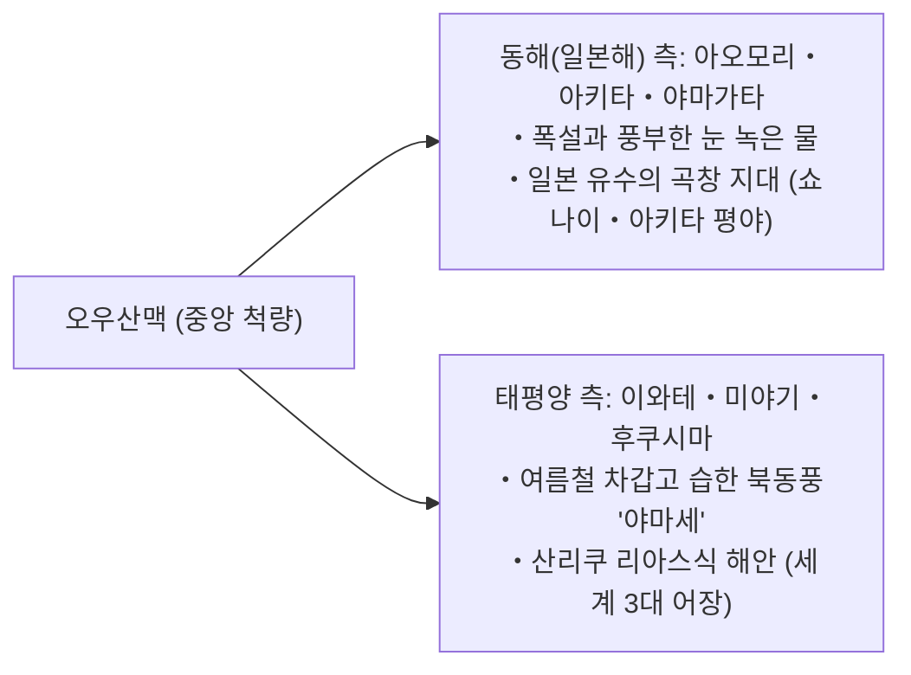
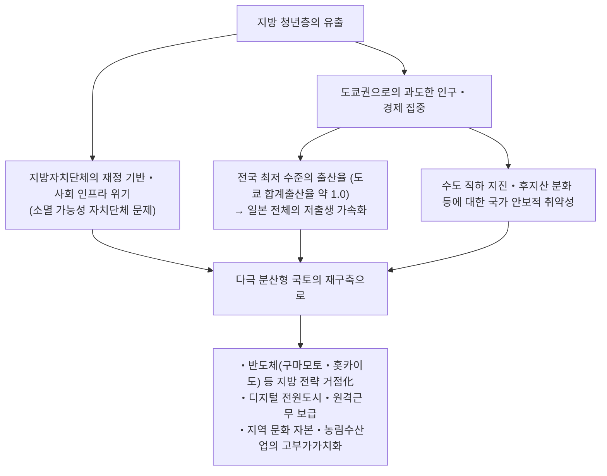
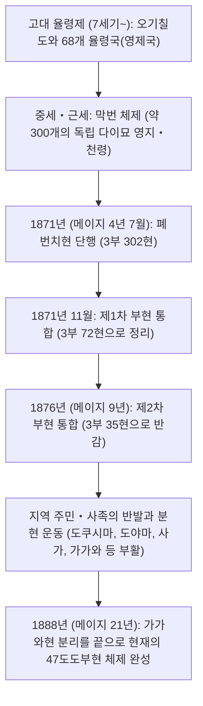

## 서론: 일본열도의 다양성과 47도도부현의 성립사

남북으로 약 3,000킬로미터에 걸쳐 호(弧) 모양으로 길게 늘어선 일본열도는 환태평양 조산대의 격렬한 지각 변동(유라시아판, 북아메리카판, 태평양판, 필리핀해판의 4개 플레이트의 충돌)에 의해 형성된 세계 유수의 험준한 산악 섬나라이다.

국토의 약 70%를 산림이 차지하며, 중앙을 가로지르는 척량산맥(脊梁山脈)을 경계로 하여 겨울철 폭설을 몰고 오는 '동해(일본해) 측 기후', 여름철 고온다습하고 겨울철 맑은 날씨가 이어지는 '태평양 측 기후', 강수량이 적고 온난한 '세토내해식 기후', 기온의 일교차와 연교차가 극심한 '중앙고지식 기후', 그리고 아열대의 '남서제도 기후'에 이르기까지 지극히 다채로운 기후 환경이 좁은 국토 안에 응축되어 있다.

```
【일본열도의 기후 구분과 지세적 메커니즘】

┌─────────────────┬───────────────────────────────┬───────────────────────────────┐
│ 기후 구분       │ 지리적 범위                   │ 주요 기후 특성 및 메커니즘   │
├─────────────────┼───────────────────────────────┼───────────────────────────────┤
│ 동해(일본해) 측 │ 홋카이도 동해 측 ~ 호쿠리쿠・ │ 겨울철 북서 계절풍이 쓰시마   │
│ 기후            │ 산인                          │ 난류의 수분을 흡수, 척량산맥  │
│                 │                               │ 에 부딪히며 폭설 발생         │
│ 태평양 측 기후  │ 태평양 연안 ~ 규슈 남부       │ 여름철 남동 계절풍에 의한 강우│
│                 │                               │ 및 태풍, 겨울철은 건조하고 맑 │
│                 │                               │ 은 날씨(가랏카제/건조풍)      │
│ 세토내해식 기후 │ 주고쿠 산지와 시코쿠 산지     │ 산지가 비구름을 차단하여 연중 │
│                 │ 사이의 해역 및 연안           │ 온난・과우・긴 일조시간 지속  │
│ 중앙고지식 기후 │ 나가노・야마나시・기후 히다   │ 해발고도가 높고 산으로 둘러싸 │
│                 │ 지방 등                       │ 여 주야 및 동하의 한난차 극심 │
│ 남서제도 기후   │ 오키나와현・아마미 군도 등    │ 구로시오 난류의 영향을 받는   │
│                 │                               │ 아열대 해양성, 연중 고온다습, │
│                 │                               │ 태풍의 상습 내습지            │
└─────────────────┴───────────────────────────────┴───────────────────────────────┘
```

일본의 지역 구분은 고대 율령제 하의 '오기칠도(五畿七道: 기내・동해도・동산도・북륙도・산음도・산양도・남해도・서해도)'에 기초한 68개 '율령국(令制国, 옛 국명)'을 기층으로 삼고 있다. 메이지 유신 직후인 1871년(메이지 4년)의 '폐번치현(廃藩置県)' 당시에는 초기에 300개를 넘었던 부・현이 통폐합 과정을 거쳐, 1888년(메이지 21년) 가가와현의 독립을 끝으로 현재의 '1도(都) 1도(道) 2부(府) 43현(県)(총 47도도부현)'이라는 틀로 확립되었다.

본고에서는 전 47개 도도부현을 8개 지방 블록(홋카이도, 도호쿠, 간토, 주부, 긴키, 주고쿠, 시코쿠, 규슈・오키나와)으로 대별하여, 각각의 옛 율령국명, 지세, 산업 구조, 역사・문화, 그리고 21세기에 직면한 지방 창생과 인구 동태의 과제에 이르기까지 포괄적이면서도 치밀하게 분석해 나간다.

---

## 1. 홋카이도 지방: 북방 프런티어와 광대한 1차 산업

### 1.1 홋카이도 (옛: 에조치 / 이시카리・오시마 등 11개 국)
- **도청 소재지**: 삿포로시
- **면적・지세**: 83,424 km²(전국 1위, 일본 총면적의 약 22%). 다이세쓰산계와 히다카산맥을 등뼈로 삼고 있으며, 이시카리 평야, 도카치 평야, 곤센 대지 등 일본 최대급의 평야와 대지가 펼쳐져 있다. 아한대 기후에 속하여 여름은 서늘하고, 겨울은 혹한과 함께 광범위한 적설을 기록한다.
- **산업 구조・경제**:
  - **농업**: 일본의 식량 기지. 밭농사(밀, 사탕무, 감자, 팥) 및 대규모 낙농업(원유 생산량 전국 50% 초과). 도카치 평야를 중심으로 가구당 수십 헥타르에 달하는 초대규모 구미형 기계화 농업 전개.
  - **수산업**: 가리비, 연어, 명태, 다시마 등 어획량 및 양식 생산량 모두 전국 1위.
  - **관광・서비스업**: 니세코의 파우더 스노 리조트(세계적인 인바운드 관광객 집적), 시레토코(세계자연유산), 후라노의 라벤더 밭, 삿포로 눈축제.
- **역사・문화**: 아이누 민족의 전통문화(우포포이=민족공생상징공간 개관). 메이지 시대 이후 개척사와 둔전병에 의한 근대 개척사. 삿포로 농학교(클라크 박사)를 통한 근대 농학과 기독교 정신의 도입.
- **지역 과제**: 급속한 인구 감소와 삿포로 일극 집중, JR 홋카이도의 적자 노선 유지 문제, 광대한 인프라 유지 관리 비용.

---

## 2. 도호쿠 지방: 오우산맥의 은혜와 미치노쿠의 역사 풍토

도호쿠 지방은 중앙부를 남북으로 관통하는 오우산맥을 경계로 동해(일본해) 측(폭설 지대・곡창 지대)과 태평양 측(냉해・야마세의 영향을 받기 쉬움)이 극명하게 대비되는 풍토를 형성하고 있다.



### 2.1 아오모리현 (옛: 쓰가루・무쓰)
- **현청 소재지**: 아오모리시
- **지세**: 혼슈 최북단. 쓰가루반도와 시모키타반도가 무쓰만을 감싸 안고 있으며, 중앙에는 핫코다산계, 서부에는 세계자연유산인 시라카미 산지가 우뚝 솟아 있다.
- **산업**: 사과 생산량 전국 점유율 약 60%(히로사키시・쓰가루 평야). 가리비 양식(무쓰만), 오마의 참다랑어, 하치노헤항의 수산물 양륙. 첨단 분야에서는 롯카쇼촌의 원자연료 사이클 시설.
- **문화・풍토**: 아오모리 네부타 축제・히로사키 네푸타 축제, 쓰가루 샤미센, 다자이 오사무와 무나카타 시코를 배출한 쓰가루 문화. 조몬 유적군(산나이마루야마 유적).

### 2.2 이와테현 (옛: 리쿠추・리쿠젠・무쓰)
- **현청 소재지**: 모리오카시
- **지세**: 도도부현 단위로서 홋카이도에 이어 전국 2위의 광대한 면적(15,275 km²). 기타카미강을 따라 형성된 기타카미 분지와 동부의 기타카미 고지・산리쿠 리아스식 해안.
- **산업**: 기타카미 분지를 중심으로 한 반도체・자동차 관련 산업 집적(키오시아 등). 산리쿠의 미역, 전복, 연어・꽁치 어업. 남부 철기 등 유서 깊은 전통공예.
- **문화・풍토**: 히라이즈미의 주손지 곤지키도(오슈 후지와라씨의 정토 사상・세계문화유산). 미야자와 겐지의 이하토브 사상, 토오노 모노가타리(야나기타 구니오・민속학의 성지).

### 2.3 미야기현 (옛: 리쿠젠・무쓰)
- **현청 소재지**: 센다이시 (도호쿠 유일의 정령지정도시)
- **지세**: 센다이 평야의 비옥한 수전 지대와 마쓰시마(일본 3경), 오시카반도・센다이만.
- **산업**: 도호쿠 지방의 경제・행정 중추. 사사니시키・히토메보레를 생산하는 곡창 지대. 이시노마키항・게센누마항의 수산 가공업. 도호쿠대학을 중심으로 한 학술 및 나노테라스(NanoTerasu, 차세대 방사광 시설) 등 첨단 과학 거점.
- **문화・풍토**: 다테 마사무네가 세운 센다이번 62만 석의 조카마치(성하마을) 문화. 센다이 칠석 축제(다나바타 마쓰리).

### 2.4 아키타현 (옛: 우고・데와)
- **현청 소재지**: 아키타시
- **지세**: 아키타 평야, 요코테 분지, 조카이산, 다자와호(일본에서 가장 깊은 호수).
- **산업**: '아키타코마치'로 대표되는 전국 굴지의 쌀 생산지. 아키타 삼나무 임업. 히나이지도리(토종닭), 도루묵(하타하타). 최근에는 동해 연안의 풍력 발전(해상 풍력) 거점으로 주목.
- **문화・풍토**: 아키타 간토 축제, 오가의 나마하게(유네스코 인류무형문화유산), 시라카미 산지.

### 2.5 야마가타현 (옛: 우젠・데와)
- **현청 소재지**: 야마가타시
- **지세**: 쇼나이 평야와 모가미강이 연결하는 요네자와・야마가타・신조 등 각 분지. 데와 삼산(갓산・하구로산・유도노산), 자오 연봉.
- **산업**: 버찌(체리, 전국 점유율 70% 초과), 라 프랑스(서양배) 등의 과수 왕국. 쇼나이 평야의 벼농사(쓰야히메). 요네자와규(소고기). 전자 부품・정밀기계 산업.
- **문화・풍토**: 데와 삼산의 슈험도(수험도) 문화, 야마가타 하나가사 축제, 긴잔 온천의 다이쇼 로망 정취.

### 2.6 후쿠시마현 (옛: 이와시로・이와키)
- **현청 소재지**: 후쿠시마시
- **지세**: 아이즈(산악・폭설・역사), 나카도리(정치・경제・분지), 하마도리(태평양 연안・온난)의 세 지역으로 명확히 구분.
- **산업**: 복숭아・배 과수 재배(나카도리). 아이즈 칠기・양조업. 하마도리의 '후쿠시마 이노베이션 코스트 구상'(로봇 테스트 필드, 수소 에너지 첨단 기술).
- **문화・풍토**: 아이즈와카마쓰의 무사도(백호대/뱌코타이), 기타카타 라멘, 소마 노마오이. 동일본 대지진 및 원전 사고로부터의 부흥과 에너지 전환의 프런트러너.

---

## 3. 간토 지방: 수도 기능의 집중과 중층적 산업 집적

간토 지방은 일본 최대의 평야인 간토 평야를 무대로 정치・경제・학술・물류의 초집중과 주변 현들의 고도화된 배후지 농업 및 임해 공업이 유기적으로 결합되어 있다.

```
【수도권 메갈로폴리스의 기능 분담 구조】

・도쿄도: 국가 중추 기능, 글로벌 금융・법무, 첨단 IT, 문화 발신
・가나가와현: 게이힌 공업지대, 국제 무역항(요코하마), 연구개발 거점, 쇼난・하코네 관광
・사이타마현: 내륙 교통 허브(신칸센・고속도로망), 근교 농업, 기계・물류 유통단지
・지바현: 나리타 국제공항, 게이요 임해 콤비나트, 수산・근교 농업(낙화생・채소)
・이바라키현: 쓰쿠바 연구학원도시, 가시마 임해 공업지대, 히타치의 중전기, 멜론・연근
・도치기현: 기타간토 공업지역(내륙형 자동차・정밀기계), 닛코 도쇼궁, 딸기(도치오토메)
・군마현: SUBARU를 핵심으로 한 자동차 산업, 온천 관광(구사쓰・이카호), 양잠・비단 유산
```

### 3.1 이바라키현 (옛: 히타치)
- **현청 소재지**: 미토시
- **산업**: 농업 산출액 전국 3위(멜론, 연근, 말린 고구마). 쓰쿠바시에 국립 연구기관의 3분의 1이 집적된 일본 최대의 두뇌 거점. 히타치시의 중전기・기계 산업, 가시마항의 철강・화학 콤비나트.
- **문화**: 미토 도쿠가와가의 미토학(존왕양이 사상의 사상적 원류), 가이라쿠엔, 일본 3대 명폭인 후쿠로다 폭포.

### 3.2 도치기현 (옛: 시모쓰케)
- **현청 소재지**: 우쓰노미야시
- **산업**: 딸기 수확량 반세기 연속 일본 1위(도치오토메, 도치아이카). 우쓰노미야시・오야마시 주변의 내륙 공업단지(의료기기・수송용 기계). 우쓰노미야 라이트레일(LRT) 개통에 따른 선구적 차세대 도시교통 실현.
- **문화**: 세계유산 닛코의 신사와 사찰(닛코 도쇼궁), 아시카가 학교(일본에서 가장 오래된 종합대학), 마시코 도자기.

### 3.3 군마현 (옛: 고즈케)
- **현청 소재지**: 마에바시시
- **산업**: SUBARU(옛 나카지마 비행기)의 본거지(오타시)를 중심으로 한 자동차・금속 프레스 산업. 곤약 감자 전국 점유율 90%. 구사쓰 온천, 이카호 온천, 미나카미 온천 등 굴지의 온천향.
- **문화**: 도미오카 제사장과 비단 산업 유산군(세계유산). 조모 카루타를 통한 도민 의식의 결속.

### 3.4 사이타마현 (옛: 무사시의 대부분)
- **현청 소재지**: 사이타마시 (정령지정도시)
- **산업**: 전국 5위의 인구(약 730만 명). 오미야역을 중심으로 한 동일본 최대의 철도 결절점. 식품 제조업 출하액 전국 최고 수준. 후카야 파, 사야마 차, 소카 센베이.
- **문화**: 가와고에의 '작은 에도(고에도)' 전통 창고 가옥(구라즈쿠리) 거리 풍경, 지치부 요마쓰리(유네스코 인류무형문화유산).

### 3.5 지바현 (옛: 시모우사・가즈사・아와)
- **현청 소재지**: 지바시 (정령지정도시)
- **산업**: 나리타 국제공항(일본 국제 항공물류의 관문). 게이요 임해 공업지대의 석유화학・제철. 농업 산출액 전국 상위권(파, 땅콩, 시금치). 조시항의 풍부한 어획물 양륙. 도쿄 디즈니 리조트.
- **문화**: 나리타산 신쇼지의 몬젠마치(사찰 앞 마을), 보소반도의 서핑・해양 리조트.

### 3.6 도쿄도 (옛: 무사시・이즈・오가사와라)
- **도청 소재지**: 신주쿠구
- **지세**: 인구 약 1,400만 명(도시권으로는 세계 최대의 메갈로폴리스). 23개 구, 다마 지역, 이즈 제도, 세계자연유산인 오가사와라 제도를 포함.
- **산업**: 일본 GDP의 약 20%를 창출하는 거대 경제 중추. 마루노우치・오테마치의 금융・상사, 시부야・롯폰기의 IT・스타트업, 아키하바라의 서브컬처, 하네다 공항(국내선・국제선 허브).
- **문화**: 에도성 천수대・센소지・메이지 신궁의 역사 유산과 초고층 빌딩 숲이 공존하는 세계 최첨단 국제 문화 도시.

### 3.7 가나가와현 (옛: 사가미・무사시 남부)
- **현청 소재지**: 요코하마시 (인구 약 377만 명, 전국 최대의 기초자치단체)
- **산업**: 인구 전국 2위(약 920만 명). 게이힌 공업지대의 핵심(닛산자동차, JFE스틸 등). 미나토미라이21의 연구개발(R&D) 거점 집적. 가와사키시의 첨단 하이테크・환경 기술.
- **문화**: 가마쿠라 막부의 고도(무가 문화), 요코하마의 개항・이국 정취, 쇼난의 해안 문화, 하코네의 온천 리조트.

---

## 4. 주부 지방: 일본 제조업의 중추와 산악 지세

혼슈의 중앙부에 위치한 주부 지방은 호쿠리쿠(동해 측), 중앙고지(내륙), 도카이(태평양 측)라는 지극히 다양한 하위 지역(서브리전)으로 구성되어 있으며, 일본 최강의 제조업 벨트를 보유하고 있다.

### 4.1 니가타현 (옛: 에치고・사도)
- **현청 소재지**: 니가타시 (정령지정도시)
- **산업**: 시나노강・아가노강 수계가 가져다주는 에치고 평야의 벼농사(고시히카리 수확량 일본 1위). 쓰바메산조의 금속 양식기・단조 칼(세계적 점유율). 비단잉어 양식. 천연가스・원유 생산.
- **문화**: 사도 광산(세계유산), 나가오카 축제 대불꽃놀이, 에치고 쓰마리 아트 트리엔날레.

### 4.2 도야마현 (옛: 엣추)
- **현청 소재지**: 도야마시
- **산업**: 호쿠리쿠 전력의 풍부한 수력 발전을 활용한 알루미늄 압연・화학・바이오 의약품 산업. '도야마의 행상 약(바이약)' 전통을 계승한 제약 기업 집적. 도야마만의 '천연 어항'(불가사리꼴오징어/호타루이카, 흰돗대기새우/시로에비, 방어).
- **문화**: 다테야마 연봉과 구로베 댐(다테야마 구로베 알펜루트). 세계유산 고카야마 갓쇼즈쿠리 마을.

### 4.3 이시카와현 (옛: 가가・노토)
- **현청 소재지**: 가나자와시
- **산업**: 가가 100만 석의 문화 자본을 배경으로 한 고부가가치 관광. 섬유기계・건설기계(고마쓰의 발상지), 탄소섬유 복합재료.
- **문화**: 겐로쿠엔, 금박(일본 국내 점유율 99%), 구타니 도자기, 와지마 칠기. 노토반도 지진으로부터의 창조적 복구・부흥.

### 4.4 후쿠이현 (옛: 에치젠・와카사)
- **현청 소재지**: 후쿠이시
- **산업**: 안경테 국내 점유율 95%(사바에시). 섬유・전자부품(무라타제작소 등). 고시히카리의 발상지. 에치젠게(대게). 레이난 지방의 원자력 발전 시설군.
- **문화**: 대본산 에이헤이지(도겐의 조동종 선종 사찰), 후쿠이현립 공룡박물관, 도진보. 행복도 순위 전국 최상위권 단골.

### 4.5 야마나시현 (옛: 가이)
- **현청 소재지**: 고후시
- **산업**: 포도・복숭아・자두 수확량 일본 1위. 일본 와인의 발상지(가쓰누마). 보석 가공・주얼리 산업(일본 1위). 화낙(FANUC, 공작기계용 CNC・산업용 로봇 세계 선도기업). 자기부상열차(리니어 주오 신칸센) 시험선.
- **문화**: 다케다 신겐 관련 사적, 후지 5호, 쇼센쿄.

### 4.6 나가노현 (옛: 시나노)
- **현청 소재지**: 나가노시
- **산업**: 일본 알프스(히다・기소・아카이시)를 품은 산악 현. 정밀기계(세이코 엡손 등・'동양의 스위스'). 고랭지 채소(양상추, 배추), 사과. 건강 장수 지수 일본 1위.
- **문화**: 善光寺(젠코지), 마쓰모토성(국보 천수각), 가미코치・가루이자와의 고원 리조트.

### 4.7 기후현 (옛: 미노・히다)
- **현청 소재지**: 기후시
- **산업**: 세키시의 칼날 제조(세계 3대 칼날 산지). 미노 도자기(도자기 국내 점유율 과반). 항공우주 산업(가카미가하라시・가와사키 중공업). 히다 다카야마의 목공 가구.
- **문화**: 세계유산 시라카와고, 히다 다카야마의 옛 전통 거리, 나가라강 가마우지 낚시(우카이).

### 4.8 시즈오카현 (옛: 도토미・스루가・이즈)
- **현청 소재지**: 시즈오카시 (정령지정도시)
- **산업**: 제조품 출하액 전국 최고 수준. 스즈키, 야마하, 혼다의 발상지인 수송기기 왕국. 녹차 생산량 일본 1위. 프라모델 출하액 세계 1위(타미야, 반다이 등). 야이즈항의 가다랑어・참치.
- **문화**: 후지산(세계유산), 이즈반도의 온천향, 도쿠가와 이에야스 은거지(슨푸성・구노잔 도쇼궁).

### 4.9 아이치현 (옛: 오와리・미카와)
- **현청 소재지**: 나고야시 (정령지정도시)
- **산업**: **40년 이상 연속 제조품 출하액 전국 1위**를 자랑하는 일본 최강의 모노즈쿠리 제국. 도요타자동차 및 방대한 공급망 클러스터. 항공우주 산업(미쓰비시 중공업 등). 도자기, 특수강, 공작기계.
- **문화**: 3영걸(오다 노부나가, 도요토미 히데요시, 도쿠가와 이에야스)의 탄생지. 아쓰타 신궁, 나고야성. 독특한 나고야 요리(미소카쓰, 히쓰마부시, 데바사키).

---

## 5. 긴키 지방: 천년의 고도와 간사이 경제권의 중층성

고대부터 근세에 이르기까지 일본의 정치・문화의 중심지 역할을 해 온 기내(畿内)를 중심으로 상업 도시 오사카, 국제 항만 도시 고베, 고도(古都) 교토와 나라가 절묘한 균형을 이루며 공존하고 있다.

```
【긴키권의 기능 분담과 역사적 다양성】

・오사카부: 상도의 유전자, 국제 금융, 엑스포(1970/2025), 라이프 사이언스, 음식 문화
・교토부: 헤이안쿄 천년의 문화 자본, 닌텐도・교세라 등 하이테크, 전통공예, 국제 관광
・효고현: 항만 무역(고베), 하리마 임해 공업지대, 나다의 청주, 단바・다지마의 농수산
・나라현: 고대 야마토 왕권의 요람, 헤이조쿄, 호류지・도다이지(불교 미술의 보고)
・시가현: 일본 최대의 비와호(긴키 1,400만 명의 식수원), 오미 상인, 내륙형 첨단 공업
・미에현: 이세 신궁(신도의 정점), 스즈카 서킷, 진주 양식, 욧카이치 석유화학
・와카야마현: 고야산・구마노 삼산(영지와 참배길), 귤・우메보시 생산 일본 1위
```

### 5.1 미에현 (옛: 이세・이가・시마・기이 동부)
- **현청 소재지**: 쓰시
- **산업**: 욧카이치 콤비나트(석유화학・반도체). 마쓰사카규(소고기), 아코야 진주 양식(아고만), 닭새우(이세에비).
- **문화**: 이세 신궁(황태신궁/내궁・풍수대신궁/외궁), 이가류 닌자, 구마노 고도(이세로).

### 5.2 시가현 (옛: 오미)
- **현청 소재지**: 오쓰시
- **산업**: 비와호를 둘러싼 교통 요충지. 도레이, 파나소닉 등의 내륙 마더 팩토리(핵심 거점 공장)군. 시가라키 도자기. 오미 쌀, 오미 소고기.
- **문화**: 히에이산 엔랴쿠지(일본 불교의 모태), 히코네성(국보 천수각), 산포요시(오미 상인의 3자 이로움 철학).

### 5.3 교토부 (옛: 야마시로・단바・단고)
- **부청 소재지**: 교토시 (정령지정도시)
- **산업**: 세계 굴지의 문화 관광 도시. 닌텐도, 오므론, 교세라, 시마즈제작소, 니덱(Nidec) 등 세계적 하이테크 기업의 본거지. 니시진직(견직물), 기요미즈 도자기, 우지 차.
- **문화**: 고도 교토의 문화재(세계유산 17개 사찰・신사), 기온 축제, 고잔 오쿠리비.

### 5.4 오사카부 (옛: 셋쓰 동부・가와치・이즈미)
- **부청 소재지**: 오사카시 (정령지정도시)
- **산업**: 서일본 최대의 경제 집적지. 종합상사(이토추・스미토모의 발상지), 다케다약품공업 등 제약・라이프 사이언스, 중소 정밀 모노즈쿠리(히가시오사카시). 간사이 국제공항.
- **문화**: 오사카성, 도톤보리, 가미가타 라쿠고・분라쿠・요시모토 신희극, 분식(고나모노) 음식 문화(다코야키, 오코노미야키). 모즈・후루이치 고분군(닌토쿠 천황릉・세계유산).

### 5.5 효고현 (옛: 셋쓰 서부・단바・다지마・하리마・아와지)
- **현청 소재지**: 고베시 (정령지정도시)
- **산업**: 고베항의 국제 해상 운송. 가와사키 중공업, 고베제강소 등 중후장대 산업. 하리마 임해 공업지대. 나다 고고의 청주 양조(일본 1위). 아와지섬의 양파, 고베 비프.
- **문화**: 히메지성(일본 최초의 세계문화유산・백로성), 아리마 온천, 고베 구 거류지・기타노 이진칸.

### 5.6 나라현 (옛: 야마토)
- **현청 소재지**: 나라시
- **산업**: 관광업, 요시노 삼나무・노송나무 임업, 양말 생산량 일본 1위(고료초 주변), 먹・다센(차 솔)의 전통공예.
- **문화**: 고도 나라의 문화재(도다이지, 고후쿠지, 가스가 대사), 호류지 지역의 불교 건조물(세계 최고 목조 건축군), 요시노산의 벚꽃과 슈험도.

### 5.7 와카야마현 (옛: 기이 서부)
- **현청 소재지**: 와카야마시
- **산업**: 온주 밀감, 난코우메(매실・우메보시), 핫사쿠, 산초 수확량 일본 1위. 일본제철 와카야마 제철소.
- **문화**: 기이 산지의 영지와 참배길(고야산 곤고부지・구마노 삼산・세계유산), 시라하마 온천.

---

## 6. 주고쿠 지방: 세토내해 콤비나트와 산인의 신화 세계

주고쿠 지방은 주고쿠 산지를 사이에 두고 중화학 공업과 온난한 기후의 혜택을 입은 '산요(세토내해 측)'와 고대 신화의 무대이자 풍요로운 자연이 보존된 '산인(동해 측)'이 선명한 대비를 이룬다.

### 6.1 돗토리현 (옛: 이나바・호키)
- **현청 소재지**: 돗토리시
- **지세・산업**: 인구 최소 현(약 54만 명). 돗토리 사구의 모래땅 농업(락교/염교). 20세기 배(전국 1위). 흰파, 사카이미나토항의 게 어획 양륙.
- **문화**: 이나바의 흰 토끼 신화, 미사사 온천(고농도 라돈 온천), 미토쿠산 산부쓰지 나게이레도(국보).

### 6.2 시마네현 (옛: 이즈모・이와미・오키)
- **현청 소재지**: 마쓰에시
- **지세・산업**: 이즈모 평야, 신지호(재첩 어획량 일본 1위). 특수강(야스키 하가네・히타치 금속). 시클라멘, 델라웨어(포도).
- **문화**: 이즈모 대사(신들이 모이는 국토 양보 신화의 성지), 세계유산 이와미 은광 유적, 오키 제도의 지오파크.

### 6.3 오카야마현 (옛: 미마사카・비젠・빗추)
- **현청 소재지**: 오카야마시 (정령지정도시)
- **산업**: 미즈시마 임해 공업지대(석유화학・제철・자동차). 백도・머스캣의 고급 과일 왕국. 고지마 지구의 국산 청바지(데님) 및 학생복 발상지.
- **문화**: 구라시키 미관지구(흰 벽의 옛 거리), 일본 3대 명원 고라쿠엔, 비젠 도자기.

### 6.4 히로시마현 (옛: 아키・빙고)
- **현청 소재지**: 히로시마시 (정령지정도시)
- **산업**: 주고쿠・시코쿠 지방 최대의 경제 도시. 마쓰다를 핵심으로 한 자동차 산업, JFE스틸 후쿠야마, 조선업(구레시・오노미치시). 굴 양식(전국 점유율 과반). 레몬 생산 일본 1위.
- **문화**: 2개의 세계유산(이쓰쿠시마 신사・원폭 돔). 평화기념도시로서의 국제적 발신. 오노미치의 언덕길과 문학의 거리.

### 6.5 야마구치현 (옛: 스오・나가토)
- **현청 소재지**: 야마구치시
- **산업**: 세토내해 연안의 슈난 콤비나트(석유화학・무기화학). 우베코산(UBE)의 화학・시멘트. 시모노세키항의 복어・아귀.
- **문화**: 메이지 유신의 지도자들을 배출한 하기의 쇼카손주쿠(세계유산). 긴타이교, 아키요시다이・아키요시도(일본 최대급 카르스트 대지 및 종유동), 쓰노시마 대교.

---

## 7. 시코쿠 지방: 남해도의 역사 유산과 세토내해 공업・태평양 수산

시코쿠 산지가 동서로 뻗어 있어 북부 세토내해 측(가가와・에히메)과 남부 태평양 측(고치・도쿠시마)이 서로 다른 풍토를 형성한다. 혼슈-시코쿠 연락교(오나루토교・세토대교・시마나미 해도)를 통해 혼슈와 긴밀하게 연결되어 있다.

### 7.1 도쿠시마현 (옛: 아와)
- **현청 소재지**: 도쿠시마시
- **산업**: 스다치(영귤, 전국 점유율 90% 초과), 나루토 킨토키(고구마), 아와오도리(토종닭). 니치아 화학공업(청색 LED・형광체 세계 최대 기업)을 중심으로 한 LED 관련 산업 집적.
- **문화**: 400년의 역사를 자랑하는 아와오도리 축제, 나루토의 소용돌이, 이야 계곡의 비경(가즈라바시/넝쿨다리).

### 7.2 가가와현 (옛: 사누키)
- **현청 소재지**: 다카마쓰시
- **산업**: 전국 최소 면적의 현이면서도 높은 인구 밀도 보유. '사누키 우동'을 통한 압도적인 면류 식문화와 관광객 유치. 올리브 생산 일본 1위(쇼도시마). 반노스 임해 공업지대.
- **문화**: 고토히라궁(곤피라상), 특별명승 리쓰린 공원, 세토우치 국제예술제(나오시마, 데시마 등 현대 미술의 성지).

### 7.3 에히메현 (옛: 이요)
- **현청 소재지**: 마쓰야마시
- **산업**: 온주 밀감 및 감귤류 생산의 대명사. 이마바리 타월(고품질 타월의 세계적 브랜드). 이마바리의 해운・조선 집적(일본 최대의 해사 도시). 니하마・시코쿠추오시의 펄프・제지 가공, 비철금속.
- **문화**: 도고 온천 본관(일본에서 가장 오래된 온천), 마쓰야마성, 시마나미 해도 사이클링 로드.

### 7.4 고치현 (옛: 도사)
- **현청 소재지**: 고치시
- **산업**: 온난한 기후를 이용한 가지 촉성 재배, 생강・양하 생산량 일본 1위. 근해 외줄낚시 가다랑어. 해양심층수 이용 산업.
- **문화**: 사카모토 료마를 배출한 자유민권의 기풍, 요사코이 축제, 가쓰라하마, 마지막 청류 시만토강.

---

## 8. 규슈・오키나와 지방: 아시아의 게이트웨이와 남서제도 문화

동아시아 대륙과 가장 인접하여 고대의 사키모리(방인)・견당사 이래 일본 대외 교류의 최전선 역할을 지속해 왔다. 현재는 반도체 산업(실리콘 아일랜드)의 극적인 부활과 풍요로운 화산・해양 관광이 교차하고 있다.

```
【규슈・오키나와 지방의 지역 역량과 산업 특성】

・후쿠오카현: 규슈의 중추, 아시아의 관문, 공항 인접 메가시티, IT・스타트업 특구
・사가현: 아리타・이마리 도자기, 가라쓰 쿤치, 사가 평야의 쌀・김(아리아케해)
・나가사키현: 남만・데지마 무역, 잠복 기리시탄 유산, 조선, 리아스식 해안의 수산
・구마모토현: TSMC(JASM) 진출에 따른 반도체 메가 클러스터, 아소 칼데라, 지하수 도시
・오이타현: 일본 1위의 용출량을 자랑하는 벳푸・유후인 온천, 지열 발전, 오이타 임해 콤비나트
・미야자키현: 긴 일조시간과 온난 기후(망고・피망・미야자키 소고기), 휴가나다 서핑
・가고시마현: 흑돼지・흑우・고구마・소주 왕국, 사쿠라지마, 세계자연유산 야쿠시마・아마미
・오키나와현: 류큐 왕국의 고유사, 슈리성, 추라우미 수족관, 아열대 리조트, 기지 경제와 자립
```

### 8.1 후쿠오카현 (옛: 지쿠젠・지쿠고・부젠)
- **현청 소재지**: 후쿠오카시 (정령지정도시, 인구 약 160만 명)
- **산업**: 규슈 최대의 경제 중추. 기타규슈 공업지대(관영 야하타 제철소 발상지・야스카와 전기). 하카타항・후쿠오카 공항(도심까지 지하철 5분의 압도적 편의성). IT 스타트업 집적. 아마오우(딸기).
- **문화**: 하카타 기온 야마카사, 다자이후 텐만구(스가와라 노 미치자네), 포장마차(야타이) 문화, 무나카타 대사(세계유산).

### 8.2 사가현 (옛: 히젠 동부)
- **현청 소재지**: 사가시
- **산업**: 아리타 도자기・이마리 도자기(일본 자기의 발상지). 아리아케해의 양식 김(판매액 연속 일본 1위). 사가규(소고기). 겐카이 원자력 발전소.
- **문화**: 요시노가리 유적(야요이 시대 환호 취락), 다케오 온천, 가라쓰 쿤치.

### 8.3 나가사키현 (옛: 히젠 서부・이키・쓰시마)
- **현청 소재지**: 나가사키시
- **산업**: 미쓰비시 중공업 나가사키 조선소로 상징되는 조선업. 전국 2위의 긴 해안선을 살린 전갱이・고등어 등 풍부한 어획물 양륙. 비파 생산 일본 1위.
- **문화**: 나가사키와 아마쿠사 지방의 잠복 기리시탄 관련 유산(세계유산), 메이지 일본의 산업혁명 유산(군함도=하시마섬), 하우스텐보스.

### 8.4 구마모토현 (옛: 히고)
- **현청 소재지**: 구마모토시 (정령지정도시)
- **산업**: **세계 최대 반도체 파운드리 기업 TSMC(JASM)의 기쿠요마치 진출**과 함께 일본 최대의 반도체 투자 열풍 분출. 토마토 수확량 일본 1위, 수박. 100% 천연 지하수로 공급되는 상수원.
- **문화**: 구마모토성(가토 기요마사가 축성한 난공불락의 명성), 세계 최대급의 아소 칼데라, 아마쿠사 5교.

### 8.5 오이타현 (옛: 분고・부젠 남부)
- **현청 소재지**: 오이타시
- **산업**: 원천 수와 용출량 모두 일본 1위인 '온천현'(벳푸 온천・유후인 온천). 오이타 임해 공업지대(제철・석유・화학). 카보스 생산량 전국 점유율 90%. 건표고버섯.
- **문화**: 우사 신궁(전국 하치만궁의 총본궁), 구니사키 반도의 로쿠고만잔(신불습합 문화).

### 8.6 미야자키현 (옛: 휴가)
- **현청 소재지**: 미야자키시
- **산업**: 온난 다우한 기후를 살린 미야자키 소고기(내각총리대신상 연속 수상), 완숙 망고('태양의 알'), 육계・양돈 생산 상위권. 삼나무 소재 생산량 일본 1위.
- **문화**: 다카치호 협곡의 천손강림 신화(요카구라), 아오시마 신사, 우도 신궁.

### 8.7 가고시마현 (옛: 사쓰마・오스미)
- **현청 소재지**: 가고시마시
- **산업**: 농업 산출액 전국 2위. 흑모화우, 흑돼지, 고구마, 양식 뱀장어, 육계. 본격 소주(이모쇼추). 다네가시마 우주센터(JAXA 로켓 발사장).
- **문화**: 활화산 사쿠라지마를 바라보는 긴코만. 메이지 유신의 웅번(사쓰마번・사이고 다카모리・오쿠보 도시미치). 세계자연유산(야쿠시마의 조몬스기, 아마미오시마).

### 8.8 오키나와현 (옛: 류큐 왕국)
- **현청 소재지**: 나하시
- **지세**: 일본 최남단・최서단의 아열대 도서현. 미야코지마, 야에야마 제도(이시가키지마, 이리오모테지마) 등 다수의 유인 낙도 보유.
- **산업**: 일본 굴지의 국제 해양 리조트 관광업. 정보통신 산업 유치. 사탕수수, 아구 돼지, 고야(여주), 아와모리. 미군 기지 관련 수입 추이와 자립 경제 확립.
- **문화**: 류큐 왕국의 구스쿠 및 관련 유산군(슈리성 터 등・세계유산). 에이사, 산신, 류큐 칠기, 빈가타. 고유의 장수・건강 식문화.

---

## 9. 21세기의 지역 과제: 도쿄 일극 집중과 국토 다극 분산론

전 47개 도도부현의 지세와 산업 구조를 조망할 때, 현대 일본이 직면한 가장 거대한 구조적 과제로 떠오르는 것이 바로 **'도쿄권으로의 극단적인 일극 집중과 지방의 급격한 인구 감소・과소화'**이다.



### 9.1 소멸 가능성 자치단체와 인프라 유지의 한계
2014년의 '마스다 보고서' 및 최근 인구전략회의의 추산에 따르면, 전국 자치단체의 40% 이상이 '소멸 가능성'에 직면해 있는 것으로 나타났다. 특히 젊은 여성 인구의 도쿄권 유출이 멈추지 않아, 과소지에서는 학교의 통폐합, 대중교통망 폐지, 상하수도・교량・도로와 같은 사회기반시설(인프라)의 노후화에 따른 갱신이 재정적으로 불가능해지고 있다.

### 9.2 반도체・재생에너지에 의한 지방 부흥의 태동
그러나 2020년대에 접어들며 역사적인 패러다임 전환의 조짐이 나타나고 있다.
첫째, 경제안전보장 관점에서 차세대 반도체의 메가팹(대규모 제조공장)이 지방에 들어서기 시작했다는 점이다. 구마모토현(TSMC / JASM)과 홋카이도 지토세시(Rapidus)를 향한 수조 엔 규모의 투자는 관련 협력업체와 연구기관, 고임금 일자리의 대대적인 지방 유입을 이끌어내고 있다.
둘째, 탈탄소(GX, 그린 트랜스포메이션)의 거대한 흐름 속에서 광대한 부지와 자연환경을 보유한 지방(도호쿠・동해 연안의 해상 풍력 발전, 홋카이도・규슈의 태양광・지열・바이오매스)이 국가의 가장 중요한 핵심 에너지 공급 기지로 재정의되고 있다는 점이다.

---

## 0. 행정구역 변천사: 율령국에서 폐번치현・부현 대통합의 길로

현재의 '47도도부현'이라는 통치 구역은 태고부터 자명하게 존재했던 것이 결코 아니며, 메이지 유신 당시 근대 국가 건설 과정에서 겪은 시행착오와 치열한 통폐합의 산물로 탄생한 역사적 결과물이다.



### 0.1 폐번치현(1871년)의 정치역학
1868년 메이지 유신으로 성립된 메이지 신정부에게 최대 과제는 '국가 주권의 확립'과 '군사・재정의 통일'이었다. 판적봉환(1869년)을 통해 옛 번주들이 치번사(知藩事)로 임명되었으나, 각 번은 여전히 독자적인 군사력(번병)과 징세권을 쥐고 있어 근대 국가로서의 통일성은 지극히 취약한 상태였다.

1871년(메이지 4년) 7월 14일, 사이고 다카모리, 오쿠보 도시미치, 기도 다카요시 등은 사쓰마・조슈・도사의 고신병(御親兵, 국왕 직속 군대)을 배경으로 전격적으로 '폐번치현'을 단행했다. 번은 일거에 폐지되었고, 치번사들에게는 도쿄 이주 명령이 내려졌으며, 중앙정부에서 관선 지사・현령이 파견되었다. 이때 성립된 것이 바로 '3부 302현'이다.

### 0.2 제1차・제2차 부현 통합과 '분현 운동'의 격진
초기의 300개가 넘는 현은 지나치게 세분화되어 있었고 재정 규모도 턱없이 영세했기 때문에 정부는 곧바로 통폐합에 착수했다.
1871년 11월의 '제1차 부현 통합'을 통해 3부 72현으로 정리되었고, 이어 1876년(메이지 9년)의 '제2차 부현 통합'에서는 내무성의 주도 하에 단숨에 '3부 35현'으로 대폭 축소되었다.

이러한 과격한 강제 병합은 격렬한 지역적 마찰을 촉발했다.
예를 들어 현재의 가가와현은 묘도현(도쿠시마) 및 에히메현에 편입되었고, 도야마현은 이시카와현에, 사가현은 나가사키현에, 미야자키현은 가고시마현에, 후쿠이현은 이시카와현과 시가현에 각각 분할 병합되었다.
이에 대해 옛 조카마치 주민들과 호농층, 사족들 사이에서 "역사적 전통을 무시한 횡포", "지방세가 중심 도시로만 빨려 들어가고 주변부의 인프라 정비는 방치되고 있다"는 강렬한 반발이 들끓었으며, 제국의회 개설을 향한 자유민권운동과 결합하여 치열한 '분현 운동(복현 운동)'이 전개되었다.

그 결과 정부는 연이어 분현을 승인할 수밖에 없었고, 1881년에 후쿠이현, 1883년에 도야마현・사가현・미야자키현, 그리고 1888년(메이지 21년) 12월 에히메현으로부터 가가와현이 최종적으로 분리 독립함으로써 현재의 '1도 1도 2부 43현'이라는 안정적인 행정 경계선이 획정되었다.

---

## 8.9 47도도부현의 언어경관: 방언주권론(방언주변론)과 동서 언어 경계선

일본열도의 다양성을 가장 생생하게 방증하는 것이 바로 열도 곳곳에 숨 쉬고 있는 '방언(지역어)'의 풍부한 그라데이션이다.

민속학자이자 언어학자인 야나기타 구니오(柳田国男)는 1930년 저서 『달팽이고(蝸牛考, 가규코)』에서 '달팽이'를 뜻하는 방언의 전국적 분포를 조사하여, 역사적인 언어 변화의 물결이 교토(고대~중세의 문화 중심지)로부터 동심원을 그리며 파문처럼 지방으로 전파되었다는 **'방언주변론(方言周圏論, 방언주권론)'**을 제창했다.

```
【야나기타 구니오 『달팽이고』에 나타난 방언주권(주변) 구조】

［교토 (중심)］: 덴덴무시(デンデンムシ, 근세의 신조어)
  ↓ (외곽으로 확산)
［긴키 주변・호쿠리쿠・도카이］: 마이마이(マイマイ, 무로마치 시대 어휘)
  ↓
［주부・간토・주고쿠・시코쿠］: 가타쓰무리(カタツムリ, 헤이안 시대 어휘)
  ↓
［도호쿠・규슈］: 쓰부리, 쓰부(ツブリ, ツブ, 고대의 오랜 어휘)
  ↓
［혼슈 양단 (아오모리 쓰가루・가고시마 사쓰마)］: 나메쿠지, 나메(ナメクジ, ナメ, 최고층 고어의 흔적)
```

또한 일본어에는 니가타현 이토이가와에서 시즈오카현 하마나호・후지강 부근을 잇는 '동서 언어 경계선'이 존재한다.
- **동일본 방언**: 단정 조동사 '다(だ)', 부정 조동사 '나이(ない)', 명령형 '로(ろ, 일어나라: 起きろ)', 액센트(도쿄식 액센트).
- **서일본 방언**: 단정 조동사 '자 / 야(じゃ / や)', 부정 조동사 '응 / 헨(ん / へん)', 명령형 '요(よ, 일어나라: 起きよ)', 액센트(게이한식 액센트).

나아가 도호쿠 지방의 '즈즈벤(동해 측 방언)'에서 관찰되는 모음의 중설모음화 현상이나, 사쓰마 방언에서 나타나는 독특한 폐음절화(촉음・발음으로의 전이)는 과거 사키모리나 밀정에 대한 방첩(암호) 역할을 수행했다는 역사적 배경과 함께, 산악과 해협으로 단절된 각 지역의 풍토와 역사가 빚어낸 소중한 무형문화유산이다.

---

## 9.3 47도도부현의 경제지리학: 산업 집적과 입지계수(Location Quotient)

각 도도부현의 산업 경쟁력을 과학적으로 평가하는 방법론으로 경제지리학에서는 **'입지계수(Location Quotient: LQ, 지역특화계수)'**가 활용된다. 이는 전국 평균 대비 특정 산업의 집적도를 측정하는 지표이다.

$$LQ = \frac{e_i / e}{E_i / E}$$

여기서 $e_i$는 대상 지역 내 산업 $i$의 종사자 수(또는 제조품 출하액), $e$는 대상 지역의 전 산업 종사자 수, $E_i$는 전국의 산업 $i$ 종사자 수, $E$는 전국의 전 산업 종사자 수이다. $LQ > 1.0$이면 해당 지역이 해당 산업에 대해 전국 평균 이상의 특화도를 지니고 있음을 나타낸다.

```
【47도도부현의 두드러진 지역 특화 패턴】

1. 수송용 기계기구 제조업 (자동차・항공우주):
   ・초고특화 현: 아이치현 (LQ ≈ 3.2), 군마현 (LQ ≈ 2.8), 시즈오카현 (LQ ≈ 2.5), 히로시마현 (LQ ≈ 2.1)
   ・특징: 거대 조립 공장(도요타, SUBARU, 스즈키, 마쓰다)을 정점으로 하는 중층적 하청 피라미드.

2. 전자부품・디바이스・반도체 제조업:
   ・초고특화 현: 야마가타현 (LQ ≈ 2.9), 후쿠이현 (LQ ≈ 2.7), 구마모토현 (LQ ≈ 2.6), 이와테현 (LQ ≈ 2.4)
   ・특징: 청정 수자원과 공기, 고속도로망을 활용한 내륙형 실리콘 로드・실리콘 아일랜드.

3. 1차 산업 (농업・수산업):
   ・초고특화 도・현: 아오모리현, 홋카이도, 가고시마현, 미야자키현, 고치현 (LQ > 3.0)
   ・특징: 식량안전보장의 국가적 중핵. 최근 스마트 농업 및 6차 산업화로의 구조 전환 가속.

4. 국제 금융・정보통신・사업체 서비스업:
   ・초고특화 도・부: 도쿄도 (LQ ≈ 2.5), 오사카부 (LQ ≈ 1.4)
   ・특징: 본사 기능, 지식재산권 관리, 스타트업 투자의 과점적 집중.
```

일본의 경제 구조는 단 하나의 단일 엔진으로 돌아가는 것이 아니라, 아이치・도카이를 중심으로 한 '제조업 엔진', 도쿄를 중심으로 한 '금융・정보・본사 기능 엔진', 지방부가 떠받치는 '식량・환경・반도체 기반 엔진'이 정교하게 맞물림으로써 비로소 힘차게 구동되고 있는 것이다.

---

## 0.3 현명과 현청 소재지 '괴리'의 정치사: 메이지 초기 관군・막부 측 징벌설 검증

일본의 47개 도도부현을 살펴볼 때 누구나 품게 되는 의문 중 하나는 '현명과 현청 소재지 도시명이 일치하는 현(아키타현 아키타시, 니가타현 니가타시, 히로시마현 히로시마시 등)'과 '현명과 도시명이 서로 다른 현(이와테현 모리오카시, 미야기현 센다이시, 이바라키현 미토시, 도치기현 우쓰노미야시, 군마현 마에바시시, 이시카와현 가나자와시, 미에현 쓰시, 시가현 오쓰시, 효고현 고베시, 시마네현 마쓰에시, 에히메현 마쓰야마시, 오키나와현 나하시 등)'이 병존한다는 사실이다.

오랫동안 민간과 일부 야사(속설)에서는 "메이지 유신 당시 막부 측・구막부군 편에 섰던 번(적군/반역군)은 조카마치의 도시명을 현명으로 쓰지 못하게 하고 군(郡) 이름 따위를 붙이는 징벌을 내렸다(징벌설)"라는 이야기가 회자되어 왔다.
예컨대 오우에쓰 열번동맹의 주축이었던 아이즈(와카마쓰)나 센다이, 모리오카, 마에바시, 미토 등이 전형적인 사례로 거론되곤 했다.

그러나 현대 역사학 및 행정사 연구의 엄밀한 실증에 따르면 이러한 '적군 징벌설'은 역사적 사실로서 명백히 부정된다. 메이지 신정부가 현명을 결정할 때 기준으로 삼았던 것은 정치적 보복이 아니라 지극히 실무적인 행정 원칙이었다.

```
【메이지 초기의 현명 획정 실무 로직】

1. 옛 조카마치 중심주의 탈피와 '군명(郡名)' 채택 원칙:
   신정부는 옛 번벌의 다이묘 권력을 해체하고 근세 봉건 영주 지배의 잔재를 불식하기 위해, 현청이 설치된 도시명이 아니라 그 도시가 속한 '군(郡)의 이름(율령 이래의 행정 단위)'을 현명으로 채택하는 것을 기본 원칙으로 삼았다.
   ・모리오카 조카 (이와테군) → 이와테현
   ・센다이 조카 (미야기군) → 미야기현
   ・미토 조카 (이바라키군) → 이바라키현
   ・가나자와 조카 (이시카와군) → 이시카와현
   ・마쓰에 조카 (시마네군) → 시마네현
   ・마쓰야마 조카 (온센군・에히메라는 고대 신화 명칭) → 에히메현

2. 개항장・신설 중요 거점에 대한 배려:
   옛 번의 조카마치가 아닌, 국제 무역항으로서 급속히 발전한 항만 도시나 신흥 거점을 현청 소재지로 삼은 경우.
   ・효고 (고베 개항장을 직할지로 통치) → 효고현 (현청은 고베)
   ・요코하마 (가나가와주쿠・개항장) → 가나가와현 (현청은 요코하마)

3. 현청의 잦은 이전과 합병의 흔적:
   ・도치기현: 당초 현청이 있던 도치기마치(쓰가군)에서 우쓰노미야로 이전했으나 현명은 그대로 존속.
   ・군마현: 다카사키와 마에바시를 오가다가 군마군 다카사키의 자취를 남겨 군마현으로 확정.
```

이처럼 현명과 도시명의 불일치는 전근대의 '번(무가 영지)'이라는 사적 지배 공간을 해체하고 근대적인 보편적 공권력을 열도 전역에 세우고자 분투했던 메이지 국가 형성기의 치열한 격투의 흔적인 것이다.

---

## 8.10 일본열도 테루아르론: 풍토가 빚어낸 47도도부현의 식문화와 발효과학

47개 도도부현의 지역적 독자성을 가장 풍요롭게 웅변하는 것은 각지의 미기후(microclimate)와 지세가 빚어낸 '향토 요리'와 '발효식품(술・된장・간장・절임)'의 정교한 체계이다. 프랑스 와인에서 유래된 개념인 '테루아르(Terroir, 토양・기후・지형・역사의 총체)'는 일본의 식문화에서 지극히 순도 높은 형태로 구현되어 있다.

```
【기후 풍토와 발효・식문화의 47도도부현 비교 매트릭스】

┌─────────────────┬───────────────────────────────┬───────────────────────────────┐
│ 지역 / 풍토 유형│ 대표적 도도부현 및 식문화     │ 기후・미생물 생태학적 메커니즘│
├─────────────────┼───────────────────────────────┼───────────────────────────────┤
│ 한랭 폭설 지대  │ 아키타현(숏쓰루, 이부리가코), │ 겨울철 혹독한 추위를 견뎌내기 │
│ (보존식・발효)  │ 야마가타현(이모니, 낫토지루), │ 위한 고염분・장기 발효 기술.  │
│                 │ 니가타현(헤기소바, 발효조미료)│ 설실(눈 창고)을 활용한 저온   │
│                 │                               │ 숙성의 지혜                   │
├─────────────────┼───────────────────────────────┼───────────────────────────────┤
│ 세토내해・      │ 가가와현(사누키 우동),        │ 강수량이 적어 논농사에 부적합 │
│ 건조 지대       │ 히로시마현(굴, 레몬),         │ 한 계단식 밭에서의 밀・대두   │
│ (건어물・양조)  │ 에히메현(도미밥/타이메시),    │ 재배. 아코의 소금, 쇼도시마의 │
│                 │ 오카야마현(과수, 바라즈시)    │ 간장 양조라는 물류 결절점     │
├─────────────────┼───────────────────────────────┼───────────────────────────────┤
│ 내륙 산악・분지 │ 나가노현(신슈 소바, 오야키,   │ 바다와 격리된 산악 환경 속    │
│ (건조식품・     │ 곤충식), 야마나시현(호토,     │ 귀중한 단백질원의 확보. 일교  │
│ 단백질 보존)    │ 고슈 토종닭 모래집 조림),     │ 차를 이용한 동결건조 두부     │
│                 │ 기후현(호바미소/후박나무잎된장│ (시미도후) 및 한천 제조       │
├─────────────────┼───────────────────────────────┼───────────────────────────────┤
│ 남서 도서・     │ 오키나와현(돼지고기 식문화,   │ 고온다습한 기후의 부패 위험을 │
│ 구로시오 해류대 │ 아와모리, 도부요), 가고시마현 │ 회피하기 위한 흑누룩균(구연산 │
│ (돼지고기・유지 │ (흑돼지, 흑식초, 고구마소주), │ 생성)의 활용과 식용유・식초를 │
│ ・식초)         │ 고치현(가다랑어 타타키, 사와치│ 적극적으로 중용하는 조리 기법 │
└─────────────────┴───────────────────────────────┴───────────────────────────────┘
```

예를 들어 가가와현의 '사누키 우동'은 단순히 면을 좋아하는 도민성에서 우연히 태어난 것이 아니다. 사누키 평야는 중앙구조선과 시코쿠 산지에 가로막혀 남쪽에서 유입되는 비구름이 차단되는, 일본 전국에서 가장 강수량이 적은 건조 지대이다. 물 부족에 시달리던 농민들은 벼농사의 이모작(뒷그루 작물)으로 건조한 환경에 강한 밀을 재배했다. 나아가 세토내해의 풍부한 일조량과 완만한 갯벌이 양질의 천일염(염전)을 낳았고, 쇼도시마의 온난한 기후가 '간장' 양조를 발달시켰으며, 이부키섬 주변의 잔잔한 바다가 멸치(이리코/디포리)를 풍성하게 제공했다. 즉, 사누키 우동이란 세토내해의 지리적・지학적 조건이 완벽하게 융합되어 필연적으로 빚어진 '결정체'였던 것이다.

또한 오키나와현의 식문화는 혼슈의 '다시마・가쓰오부시 육수와 원재료 본연의 담백한 맛'을 추구하는 경향과 극명하게 궤를 달리한다. 중국 및 동남아시아와의 중계무역(만국진량) 속에서 번영했던 류큐 왕국은 "돼지는 울음소리 빼고 다 먹는다"는 말이 있을 정도로 철저한 돼지고기 식문화(라프테, 미미가, 나카미지루)와 함께 아열대 기후의 부패를 방지하는 강산성의 흑누룩균을 사용한 '아와모리' 증류 기술을 확립했다. 의식동원(쿠스이문 / 약이 되는 음식=누치구스이) 사상은 혹독한 섬 환경 속에서 생명을 보전하기 위한 고도의 생활과학이었던 것이다.

## 10. 결론: 다양성이야말로 일본의 진정한 국력이다

일본의 전 47개 도도부현을 두루 횡단하는 여정을 통해 명확해지는 것은, 일본이라는 국가의 진정한 회복탄력성과 강인함이 도쿄라는 거대한 단일 중추에 존재하는 것이 아니라, **'47개의 완전히 서로 다른 기후・풍토・산업・역사 문화가 직조해 내는 경이로운 모자이크식 다양성'**에 있다는 사실이다.

쓰가루의 폭설을 묵묵히 견뎌내는 끈기, 오와리・미카와의 극도로 정밀한 모노즈쿠리의 집념, 세토내해의 온화한 햇살이 길러낸 해양 문화, 아와와 도사의 민중들이 창조한 역동적인 예능, 그리고 류큐의 푸른 바다가 품고 있는 독자적인 정신세계에 이르기까지――. 이 모든 것은 수백 년, 수천 년에 걸쳐 조상들이 자연과 격투하고 적응해 온 지혜의 결정체이다.

획일화된 글로벌리즘의 파도 속에서 각 지역이 자신만의 고유한 역사와 지세(테루아르)에 자부심을 품고 독창적인 가치를 세계를 향해 발신해 나가는 것. 47개의 별이 저마다 고유한 빛을 발하며 밤하늘의 성좌처럼 서로를 비출 때, 일본이라는 열도는 미래를 향한 진정한 풍요로움과 지속가능성을 획득하게 될 것이다.
