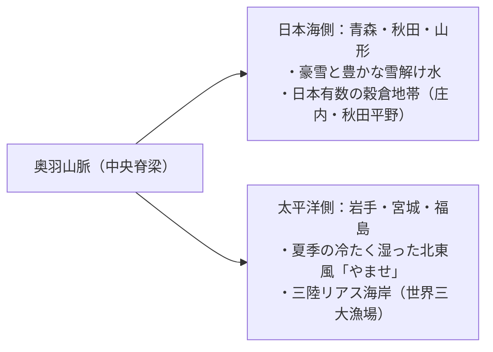
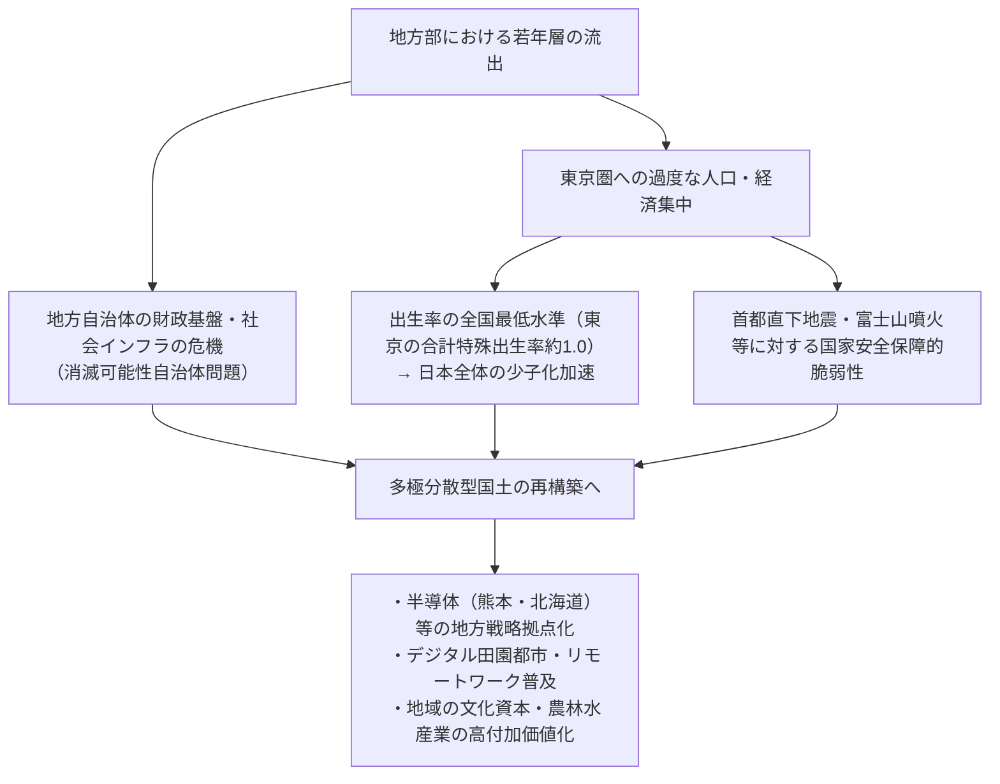
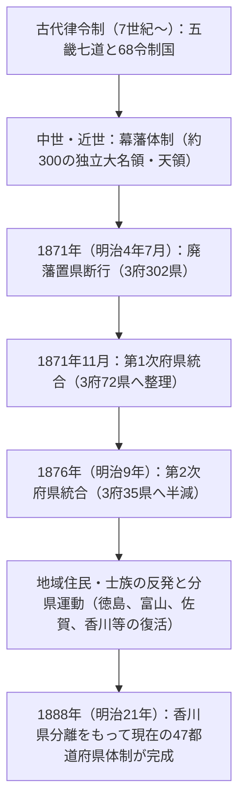

## 序論：日本列島の多様性と47都道府県の成立史

南北約3,000キロメートルにわたって弧状に連なる日本列島は、環太平洋造山帯の激しい地殻変動（ユーラシアプレート、北米プレート、太平洋プレート、フィリピン海プレートの四つのプレートの衝突）によって形成された、世界有数の急峻な山岳島国である。

国土の約7割を山林が占め、中央を走る脊梁山脈を境として、冬季に豪雪をもたらす「日本海側気候」と、夏季に高温多湿で冬季に晴天が続く「太平洋側気候」、雨量が少なく温暖な「瀬戸内海式気候」、寒暖差の激しい「中央高地式気候」、そして亜熱帯の「南西諸島気候」という、極めて多彩な気候環境が狭い国土の中に凝縮されている。

```
【日本列島の気候区分と地勢的メカニズム】

┌─────────────────┬───────────────────────────────┬───────────────────────────────┐
│ 気候区分        │ 地理的範囲                    │ 主な気候特性・メカニズム      │
├─────────────────┼───────────────────────────────┼───────────────────────────────┤
│ 日本海側気候    │ 北海道日本海側〜北陸・山陰    │ 冬季の北西季節風が対馬暖流の水分│
│                 │                               │ を吸収し、脊梁山脈に衝突して豪雪│
│ 太平洋側気候    │ 太平洋沿岸〜九州南部          │ 夏季の南東季節風による降雨・台風│
│                 │                               │ 冬季は乾燥した晴天（空っ風）  │
│ 瀬戸内海式気候  │ 中国山地と四国山地に挟まれた域│ 山地に雨雲が遮られ、年間を通じ│
│                 │                               │ 温暖少雨・日照時間が長い      │
│ 中央高地式気候  │ 長野・山梨・岐阜飛騨地方など  │ 標高が高く周囲を山に囲まれ、  │
│                 │                               │ 昼夜・冬夏の寒暖差が極めて大  │
│ 南西諸島気候    │ 沖縄県・奄美群島など          │ 黒潮の影響を受けた亜熱帯海洋性│
│                 │                               │ 年間通じ高温多湿、台風の常襲地│
└─────────────────┴───────────────────────────────┴───────────────────────────────┘
```

日本の地域区分は、古代律令制における「五畿七道（畿内・東海道・東山道・北陸道・山陰道・山陽道・南海道・西海道）」に基づく68箇所の「令制国（旧国名）」を基層としている。明治維新直後の1871年（明治4年）の「廃藩置県」では当初300を超えた府・県が、統廃合を経て1888年（明治21年）の香川県独立をもって、現在の「1都1道2府43県（47都道府県）」の枠組みへと定着した。

本稿では、全47都道府県を八つの地方ブロック（北海道、東北、関東、中部、近畿、中国、四国、九州・沖縄）に大別し、それぞれの旧国名、地勢、産業構造、歴史・文化、そして21世紀における地域創生・人口動態の課題に至るまで、網羅的かつ緻密に解読していく。

---

## 1. 北海道地方：北方フロンティアと広大な一次産業

### 1.1 北海道（旧：蝦夷地 / 石狩・渡島など11国）
- **道庁所在地**: 札幌市
- **面積・地勢**: 83,424 km²（全国第1位、日本の総面積の約22%）。大雪山系や日高山脈を脊梁とし、石狩平野、十勝平野、根釧台地など日本最大級の平野・台地が広がる。亜寒帯気候に属し、夏季は冷涼、冬季は極寒で広範な積雪を見る。
- **産業構造・経済**:
  - **農業**: 日本の食糧基地。畑作（小麦、甜菜、ジャガイモ、小豆）および大規模酪農（生乳生産量は全国の50%超）。十勝平野を中心とする一戸あたり数十ヘクタールの超大規模欧米型機械化農業。
  - **水産業**: ホタテガイ、サケ、スケトウダラ、コンブなど漁獲量・養殖生産量ともに全国第1位。
  - **観光・サービス業**: ニセコのパウダースノーリゾート（世界的なインバウンド集積）、知床（世界自然遺産）、富良野のラベンダー畑、さっぽろ雪まつり。
- **歴史・文化**: アイヌ民族の伝統文化（ウポポイ＝民族共生象徴空間の開設）。明治以降の開拓使と屯田兵による近代開拓史。札幌農学校（クラーク博士）による近代農学とキリスト教精神の導入。
- **地域課題**: 急速な人口減少と札幌一極集中、JR北海道の赤字路線維持問題、広大なインフラ維持コスト。

---

## 2. 東北地方：奥羽山脈の恩恵とみちのくの歴史風土

東北地方は、中央を南北に貫く奥羽山脈によって、日本海側（豪雪地帯・米どころ）と太平洋側（冷害・やませの影響を受けやすい）で対照的な風土を形成している。



### 2.1 青森県（旧：津軽・陸奥）
- **県庁所在地**: 青森市
- **地勢**: 本州最北端。津軽半島と下北半島が陸奥湾を抱き込み、中央に八甲田山系、西部に世界自然遺産・白神山地が聳える。
- **産業**: リンゴ生産量全国シェア約60%（弘前市・津軽平野）。ホタテ養殖（陸奥湾）、大間のマグロ、八戸港の水揚げ。先端分野では六ヶ所村の原子燃料サイクル施設。
- **文化・風土**: 青森ねぶた祭・弘前ねぷたまつり、津軽三味線、太宰治・棟方志功を生んだ津軽文化。縄文遺跡群（三内丸山遺跡）。

### 2.2 岩手県（旧：陸中・陸前・陸奥）
- **県庁所在地**: 盛岡市
- **地勢**: 都道府県として北海道に次ぐ全国第2位の広大な面積（15,275 km²）。北上川沿いの北上盆地と、東部の北上高地・三陸リアス海岸。
- **産業**: 北上盆地における半導体・自動車関連産業の集積（キオクシア等）。三陸のワカメ、アワビ、サケ・サンマ漁。南部鉄器などの伝統工芸。
- **文化・風土**: 平泉の中尊寺金色堂（奥州藤原氏の浄土思想・世界文化遺産）。宮沢賢治のイーハトーブ思想、遠野物語（柳田国男・民俗学の聖地）。

### 2.3 宮城県（旧：陸前・陸奥）
- **県庁所在地**: 仙台市（東北唯一の政令指定都市）
- **地勢**: 仙台平野の肥沃な水田地帯と、松島（日本三景）、牡鹿半島・仙台湾。
- **産業**: 東北地方の経済・行政の中枢。ササニシキ・ひとめぼれを産する米どころ。石巻港・気仙沼港の水産加工。東北大学を中心とする学術・ナノテラス（次世代放射光施設）などの先端科学拠点。
- **文化・風土**: 伊達政宗が築いた仙台藩62万石の城下町文化。仙台七夕まつり。

### 2.4 秋田県（旧：羽後・出羽）
- **県庁所在地**: 秋田市
- **地勢**: 秋田平野、横手盆地、鳥海山、田沢湖（日本最深湖）。
- **産業**: 「あきたこまち」に代表される全国有数の米どころ。秋田スギの林業。比内地鶏、ハタハタ。近年は日本海沿岸の風力発電（洋上風力）拠点として注目。
- **文化・風土**: 秋田竿燈まつり、男鹿のナマハゲ（ユネスコ無形文化遺産）、白神山地。

### 2.5 山形県（旧：羽前・出羽）
- **県庁所在地**: 山形市
- **地勢**: 庄内平野と、最上川が結ぶ米沢・山形・新庄の各盆地。出羽三山（月山・羽黒山・湯殿山）、蔵王連峰。
- **産業**: サクランボ（全国シェア7割超）、ラ・フランス等の果樹王国。庄内平野の稲作（つや姫）。米沢牛。電子部品・精密機械産業。
- **文化・風土**: 出羽三山の修験道文化、山形花笠まつり、銀山温泉の大正ロマン風情。

### 2.6 福島県（旧：岩代・磐城）
- **県庁所在地**: 福島市
- **地勢**: 会津（山岳・豪雪・歴史）、中通り（政治・経済・盆地）、浜通り（太平洋岸・温暖）の三地域に明確に区分される。
- **産業**: モモ・ナシの果樹栽培（中通り）。会津漆器・酒造業。浜通りの「福島イノベーション・コースト構想」（ロボットテストフィールド、水素エネルギー先端技術）。
- **文化・風土**: 会津若松の武士道（白虎隊）、喜多方ラーメン、相馬野馬追。東日本大震災および原発事故からの復興とエネルギー転換のフロントランナー。

---

## 3. 関東地方：首都機能の集中と重層的産業集積

関東地方は、日本最大の平野である関東平野を舞台に、政治・経済・学術・物流の超集中と、周辺県の高度な後背地農業・臨海工業が有機的に結合している。

```
【首都圏メガロポリスの機能分担構造】

・東京都：国家中枢機能、世界金融・法務、先端IT、カルチャー発信
・神奈川県：京浜工業地帯、国際貿易港（横浜）、研究開発拠点、湘南・箱根観光
・埼玉県：内陸交通ハブ（新幹線・高速網）、近郊農業、機械・流通団地
・千葉県：成田国際空港、京葉臨海コンビナート、水産・近郊農業（落花生・野菜）
・茨城県：つくば研究学園都市、鹿島臨海工業地帯、日立の重電、メロン・レンコン
・栃木県：北関東工業地域（内陸型自動車・精密）、日光東照宮、イチゴ（とちおとめ）
・群馬県：SUBARUを核とする自動車産業、温泉観光（草津・伊香保）、養蚕・絹遺産
```

### 3.1 茨城県（旧：常陸）
- **県庁所在地**: 水戸市
- **産業**: 農業産出額全国第3位（メロン、レンコン、干し芋）。つくば市に国の研究機関の3分の1が集積する日本最大の頭脳拠点。日立市の重電・機械産業、鹿島港の鉄鋼・化学コンビナート。
- **文化**: 水戸徳川家の水戸学（尊王攘夷の思想的源流）、偕楽園、日本三名瀑・袋田の滝。

### 3.2 栃木県（旧：下野）
- **県庁所在地**: 宇都宮市
- **産業**: イチゴ収穫量半世紀連続日本一（とちおとめ、とちあいか）。宇都宮市・小山市周辺の内陸工業団地（医療機器・輸送用機械）。宇都宮ライトレール（LRT）の開業による先駆的次世代都市交通。
- **文化**: 世界遺産・日光の社寺（日光東照宮）、足利学校（日本最古の総合大学）、益子焼。

### 3.3 群馬県（旧：上野）
- **県庁所在地**: 前橋市
- **産業**: SUBARU（旧中島飛行機）の本拠地（太田市）を中心とする自動車・金属プレス産業。コンニャクイモ全国シェア9割。草津温泉、伊香保温泉、水上温泉などの大温泉郷。
- **文化**: 富岡製糸場と絹産業遺産群（世界遺産）。上毛かるたによる県民意識の結束。

### 3.4 埼玉県（旧：武蔵の大部分）
- **県庁所在地**: さいたま市（政令指定都市）
- **産業**: 全国第5位の人口（約730万人）。大宮駅を中心とする東日本最大の鉄道結節点。食品製造業出荷額全国トップクラス。深谷ネギ、狭山茶、草加煎餅。
- **文化**: 川越の「小江戸」蔵造りの町並み、秩父夜祭（ユネスコ無形文化遺産）。

### 3.5 千葉県（旧：下総・上総・安房）
- **県庁所在地**: 千葉市（政令指定都市）
- **産業**: 成田国際空港（日本の国際航空物流の玄関口）。京葉臨海工業地帯の石油化学・製鉄。農業産出額全国上位（ネギ、落花生、ホウレンソウ）。銚子港の水揚げ。東京ディズニーリゾート。
- **文化**: 成田山新勝寺の門前町、房総半島のサーフィン・海洋リゾート。

### 3.6 東京都（旧：武蔵・伊豆・小笠原）
- **都庁所在地**: 新宿区
- **地勢**: 人口約1,400万人（都市圏としては世界最大のメガロポリス）。23区、多摩地域、伊豆諸島、世界自然遺産・小笠原諸島を含む。
- **産業**: 日本のGDPの約2割を叩き出す巨大経済中枢。丸の内・大手町の金融・商社、渋谷・六本木のIT・スタートアップ、秋葉原のサブカルチャー、羽田空港（国内・国際ハブ）。
- **文化**: 江戸城天守台・浅草寺・明治神宮の歴史遺産と、超高層ビル群が共存する世界最先端の国際文化都市。

### 3.7 神奈川県（旧：相模・武蔵南部）
- **県庁所在地**: 横浜市（人口約377万人、全国最大の基礎自治体）
- **産業**: 人口全国第2位（約920万人）。京浜工業地帯の中核（日産自動車、JFEスチール等）。みなとみらい2overの研究開発拠点集積。川崎市のハイテク・環境技術。
- **文化**: 鎌倉幕府の古都（武家文化）、横浜の開国・異国情緒、湘南のコースタルカルチャー、箱根の温泉リゾート。

---

## 4. 中部地方：日本のものづくり屋台骨と山岳地勢

本州の中央部に位置する中部地方は、北陸（日本海側）、中央高地（内陸）、東海（太平洋側）という極めて多様なサブリージョンから構成され、日本最強の製造業ベルトを擁する。

### 4.1 新潟県（旧：越後・佐渡）
- **県庁所在地**: 新潟市（政令指定都市）
- **産業**: 信濃川・阿賀野川水系がもたらす越後平野の稲作（コシヒカリ収穫量日本一）。燕三条の金属洋食器・鍛造刃物（世界シェア）。錦鯉の養殖。天然ガス・原油産出。
- **文化**: 佐渡金山（世界遺産）、長岡まつり大花火大会、越後妻有アートトリエンナーレ。

### 4.2 富山県（旧：越中）
- **県庁所在地**: 富山市
- **産業**: 北陸電力の豊富な水力発電を活用したアルミ圧延・化学・バイオ医薬品産業。「富山の売薬」の伝統を受け継ぐ製薬企業集積。富山湾の「天然の生け簀」（ホタルイカ、シロエビ、ブリ）。
- **文化**: 立山連峰と黒部ダム（立山黒部アルペンルート）。世界遺産・五箇山の合掌造り集落。

### 4.3 石川県（旧：加賀・能登）
- **県庁所在地**: 金沢市
- **産業**: 加賀百万石の文化資本を背景とする高付加価値観光。繊維機械・建設機械（コマツ発祥地）、炭素繊維複合材料。
- **文化**: 兼六園、金箔（国内シェア99%）、九谷焼、輪島塗。能登半島地震からの創造的復興。

### 4.4 福井県（旧：越前・若狭）
- **県庁所在地**: 福井市
- **産業**: メガネフレーム国内シェア95%（鯖江市）。繊維・電子部品（村田製作所等）。コシヒカリ発祥の地。越前ガニ。嶺南地方の原子力発電施設群。
- **文化**: 大本山永平寺（道元の曹洞宗禅寺）、福井県立恐竜博物館、東尋坊。幸福度ランキング全国上位常連。

### 4.5 山梨県（旧：甲斐）
- **県庁所在地**: 甲府市
- **産業**: ブドウ・モモ・スモモ収穫量日本一。日本ワイン発祥の地（勝沼）。宝石加工・ジュエリー産業（日本一）。ファナック（工作機械用CNC・ロボット世界大手）。リニア中央新幹線実験線。
- **文化**: 武田信玄ゆかりの史跡、富士五湖、昇仙峡。

### 4.6 長野県（旧：信濃）
- **県庁所在地**: 長野市
- **産業**: 日本アルプス（飛騨・木曽・赤石）を抱く山岳県。精密機械（セイコーエプソン等・「東洋のスイス」）。高原野菜（レタス、ハクサイ）、リンゴ。健康長寿県日本一。
- **文化**: 善光寺、松本城（国宝天守）、上高地・軽井沢の高原リゾート。

### 4.7 岐阜県（旧：美濃・飛騨）
- **県庁所在地**: 岐阜市
- **産業**: 関市の刃物（世界三大刃物産地）。美濃焼（陶磁器国内シェア過半）。航空宇宙産業（各務原市・川崎重工）。飛騨高山の木工家具。
- **文化**: 世界遺産・白川郷、飛騨高山の古い町並み、長良川の鵜飼。

### 4.8 静岡県（旧：遠江・駿河・伊豆）
- **県庁所在地**: 静岡市（政令指定都市）
- **産業**: 製造品出荷額全国トップクラス。スズキ、ヤマハ、ホンダ発祥の輸送機器王国。茶の生産量日本一。プラモデル出荷額世界一（タミヤ、バンダイ等）。焼津港のカツオ・マグロ。
- **文化**: 富士山（世界遺産）、伊豆半島の温泉郷、徳川家康隠居の地（駿府城・久能山東照宮）。

### 4.9 愛知県（旧：尾張・三河）
- **県庁所在地**: 名古屋市（政令指定都市）
- **産業**: **40年以上連続製造品出荷額全国第1位**の日本最強のものづくり帝国。トヨタ自動車およびサプライチェーン群。航空宇宙産業（三菱重工等）。陶磁器、特殊鋼、工作機械。
- **文化**: 三英傑（織田信長・豊臣秀吉・徳川家康）の生誕地。熱田神宮、名古屋城。独特の名古屋めし（味噌カツ、ひつまぶし、手羽先）。

---

## 5. 近畿地方：千年の都と関西経済圏の重層性

古代から近世に至るまで日本の政治・文化の中心であり続けた畿内を中心に、商業都市・大阪、国際港湾都市・神戸、古都・京都と奈良が絶妙なバランスで共存する。

```
【近畿圏の機能分担と歴史的多様性】

・大阪府：商都の遺伝子、国際金融、万博（1970/2025）、ライフサイエンス、食文化
・京都府：平安京千年の文化資本、任天堂・京セラ等のハイテク、伝統工芸、国際観光
・兵庫県：港湾貿易（神戸）、播磨臨海工業地帯、灘の酒、丹波・但馬の農水産
・奈良県：古代ヤマト王権の揺籃、平城京、法隆寺・東大寺（仏教美術の宝庫）
・滋賀県：日本最大の琵琶湖（近畿1,400万人の水瓶）、近江商人、内陸型高度工業
・三重県：伊勢神宮（神道の頂点）、鈴鹿サーキット、真珠養殖、四日市石油化学
・和歌山県：高野山・熊野三山（霊場と参詣道）、ミカン・梅干し生産日本一
```

### 5.1 三重県（旧：伊勢・伊賀・志摩・紀伊東部）
- **県庁所在地**: 津市
- **産業**: 四日市コンビナート（石油化学・半導体）。松阪牛、アコヤ真珠養殖（英虞湾）、伊勢エビ。
- **文化**: 伊勢神宮（皇大神宮・豊受大神宮）、伊賀流忍者、熊野古道（伊勢路）。

### 5.2 滋賀県（旧：近江）
- **県庁所在地**: 大津市
- **産業**: 琵琶湖を囲む交通の要衝。東レ、パナソニック等の内陸マザー工場群。信楽焼。近江米、近江牛。
- **文化**: 比叡山延暦寺（日本仏教の母山）、彦根城（国宝天守）、三方よし（近江商人哲学）。

### 5.3 京都府（旧：山城・丹波・丹後）
- **府庁所在地**: 京都市（政令指定都市）
- **産業**: 世界屈指の文化観光都市。任天堂、オムロン、京セラ、島津製作所、日本電産（ニデック）など世界的ハイテク企業の本拠地。西陣織、清水焼、宇治茶。
- **文化**: 古都京都の文化財（世界遺産17寺社）、祇園祭、五山送り火。

### 5.4 大阪府（旧：摂津東部・河内・和泉）
- **府庁所在地**: 大阪市（政令指定都市）
- **産業**: 西日本最大の経済集積。総合商社（伊藤忠・住友発祥地）、武田薬品等の製薬・ライフサイエンス、中小精密ものづくり（東大阪市）。関西国際空港。
- **文化**: 大阪城、道頓堀、上方落語・文楽・吉本新喜劇、粉もん食文化（たこ焼き、お好み焼き）。百舌鳥・古市古墳群（仁徳天皇陵・世界遺産）。

### 5.5 兵庫県（旧：摂津西部・丹波・但馬・播磨・淡路）
- **県庁所在地**: 神戸市（政令指定都市）
- **産業**: 神戸港の国際海上輸送。川崎重工、神戸製鋼所等の重厚長大産業。播磨臨海工業地帯。灘五郷の清酒醸造（日本一）。淡路島のタマネギ、神戸ビーフ。
- **文化**: 姫路城（日本初の世界文化遺産・白鷺城）、有馬温泉、神戸旧居留地・北野異人館。

### 5.6 奈良県（旧：大和）
- **県庁所在地**: 奈良市
- **産業**: 観光業、吉野スギ・ヒノキの林業、靴下生産量日本一（広陵町周辺）、墨・茶筅の伝統工芸。
- **文化**: 古都奈良の文化財（東大寺、興福寺、春日大社）、法隆寺地域の仏教建造物（世界最古の木造建築群）、吉野山の桜と修験道。

### 5.7 和歌山県（旧：紀伊西部）
- **県庁所在地**: 和歌山市
- **産業**: 温州ミカン、南高梅（梅干し）、ハッサク、山椒の収穫量日本一。日本製鉄和歌山製鉄所。
- **文化**: 紀伊山地の霊場と参詣道（高野山金剛峯寺・熊野三山・世界遺産）、白浜温泉。

---

## 6. 中国地方：瀬戸内海コンビナートと山陰の神話世界

中国地方は、中国山地を挟んで、重化学工業と温暖な気候に恵まれた「山陽（瀬戸内側）」と、古代神話の舞台であり豊かな自然が残る「山陰（日本海側）」で鮮烈な対比を描く。

### 6.1 鳥取県（旧：因幡・伯耆）
- **県庁所在地**: 鳥取市
- **地勢・産業**: 人口最小県（約54万人）。鳥取砂丘の砂地農業（ラッキョウ）。二十世紀梨（全国一）。白ネギ、境港のカニ水揚げ。
- **文化**: 因幡の白兎神話、三朝温泉（高濃度ラドン温泉）、三徳山三仏寺投入堂（国宝）。

### 6.2 島根県（旧：出雲・石見・隠岐）
- **県庁所在地**: 松江市
- **地勢・産業**: 出雲平野、宍道湖（シジミ漁獲量日本一）。特殊鋼（ヤスキハガネ・日立金属）。シクラメン、デラウェア。
- **文化**: 出雲大社（神々の集う国譲り神話の聖地）、世界遺産・石見銀山遺跡、隠岐諸島のジオパーク。

### 6.3 岡山県（旧：美作・備前・備中）
- **県庁所在地**: 岡山市（政令指定都市）
- **産業**: 水島臨海工業地帯（石油化学・製鉄・自動車）。白桃・マスカットの高級フルーツ王国。児島地区の国産ジーンズ・学生服発祥地。
- **文化**: 倉敷美観地区（白壁の町並み）、日本三名園・後楽園、備前焼。

### 6.4 広島県（旧：安芸・備後）
- **県庁所在地**: 広島市（政令指定都市）
- **産業**: 中国・四国地方最大の経済都市。マツダを核とする自動車産業、JFEスチール福山、造船業（呉市・尾道市）。カキ養殖（全国シェア過半）。レモン生産日本一。
- **文化**: 二つの世界遺産（厳島神社・原爆ドーム）。平和記念都市としての国際的発信。尾道の坂道と文学の街。

### 6.5 山口県（旧：周防・長門）
- **県庁所在地**: 山口市
- **産業**: 瀬戸内沿岸の周南コンビナート（石油化学・無機化学）。宇部興産の化学・セメント。下関港のフグ・アンコウ。
- **文化**: 明治維新の指導者を輩出した萩・松下村塾（世界遺産）。錦帯橋、秋吉台・秋芳洞（日本最大級のカルスト台地）、角島大橋。

---

## 7. 四国地方：南海道の歴史遺産と瀬戸内工業・太平洋水産

四国山地が東西に連なり、北部の瀬戸内側（香川・愛媛）と南部の太平洋側（高知・徳島）で異なる風土を形成。本州四国連絡橋（大鳴門橋・瀬戸大橋・しまなみ海道）によって本州と緊密に連結している。

### 7.1 徳島県（旧：阿波）
- **県庁所在地**: 徳島市
- **産業**: すだち（全国シェア9割超）、鳴門金時（サツマイモ）、阿波尾鶏。日亜化学工業（青色LED・蛍光体世界最大手）を核とするLED関連産業集積。
- **文化**: 400年の歴史を誇る阿波おどり、鳴門の渦潮、祖谷渓の秘境（かずら橋）。

### 7.2 香川県（旧：讃岐）
- **県庁所在地**: 高松市
- **産業**: 全国最小面積の県ながら高い人口密度。「讃岐うどん」による圧倒的麺食文化と観光誘致。オリーブ生産日本一（小豆島）。番の州臨海工業地帯。
- **文化**: 金刀比羅宮（こんぴらさん）、特別名勝・栗林公園、瀬戸内国際芸術祭（直島・豊島等の現代アートの聖地）。

### 7.3 愛媛県（旧：伊予）
- **県庁所在地**: 松山市
- **産業**: 温州ミカン・かんきつ類生産の代名詞。今治タオル（高品質タオルの世界ブランド）。今治の海運・造船集積（日本最大の海事都市）。新居浜・四国中央市のパルプ・紙加工、非鉄金属。
- **文化**: 道後温泉本館（日本最古の温泉）、松山城、しまなみ海道サイクリングロード。

### 7.4 高知県（旧：土佐）
- **県庁所在地**: 高知市
- **産業**: 温暖な気候を利用したナスの促成栽培、ショウガ・ミョウガ生産量日本一。近海一本釣りカツオ。海洋深層水利用産業。
- **文化**: 坂本龍馬を輩出した自由民権の気風、よさこい祭り、桂浜、最後の清流・四万十川。

---

## 8. 九州・沖縄地方：アジアのゲートウェイと南西諸島文化

東アジア大陸に最も近接し、古代の防人・遣唐使以来、日本の対外交流の最前線であり続けた。現在は半導体産業（シリコンアイランド）の劇的復活と、豊かな火山・海洋観光が交差する。

```
【九州・沖縄地方の地域力と産業特性】

・福岡県：九州の中枢、アジアの玄関口、空港近接メガシティ、IT・スタートアップ特区
・佐賀県：有田・伊万里焼、唐津くんち、佐賀平野の米・海苔（有明海）
・長崎県：南蛮・出島貿易、潜伏キリシタン遺産、造船、リアス式海岸の水産
・熊本県：TSMC（JASM）進出による半導体メガクラスター、阿蘇カルデラ、地下水都市
・大分県：日本一の湧出量を誇る別府・由布院温泉、地熱発電、大分臨海コンビナート
・宮崎県：日照時間と温暖気候（マンゴー・ピーマン・宮崎牛）、日向灘サーフィン
・鹿児島県：黒豚・黒牛・サツマイモ・焼酎王国、桜島、世界自然遺産・屋久島・奄美
・沖縄県：琉球王国の固有史、首里城、美ら海水族館、亜熱帯リゾート、基地経済と自立
```

### 8.1 福岡県（旧：筑前・筑後・豊前）
- **県庁所在地**: 福岡市（政令指定都市、人口約160万人）
- **産業**: 九州最大の経済中枢。北九州工業地帯（官営八幡製鐵所発祥地・安川電機）。博多港・福岡空港（都心まで地下鉄5分の超利便性）。ITスタートアップ集積。あまおう（イチゴ）。
- **文化**: 博多祇園山笠、太宰府天満宮（菅原道真）、屋台文化、宗像大社（世界遺産）。

### 8.2 佐賀県（旧：肥前東部）
- **県庁所在地**: 佐賀市
- **産業**: 有田焼・伊万里焼（日本磁器発祥の地）。有明海の養殖海苔（販売額連続日本一）。佐賀牛。玄海原子力発電所。
- **文化**: 吉野ヶ里遺跡（弥生時代環濠集落）、武雄温泉、唐津くんち。

### 8.3 長崎県（旧：肥前西部・壱岐・対馬）
- **県庁所在地**: 長崎市
- **産業**: 三菱重工長崎造船所に象徴される造船業。海岸線延長全国第2位を活かしたアジ・サバ等の水揚げ。ビワ生産日本一。
- **文化**: 長崎と天草地方の潜伏キリシタン関連遺産（世界遺産）、明治日本の産業革命遺産（軍艦島＝端島）、ハウステンボス。

### 8.4 熊本県（旧：肥後）
- **県庁所在地**: 熊本市（政令指定都市）
- **産業**: **世界最大手半導体ファウンドリTSMC（JASM）の菊陽町進出**に伴い、日本最大の半導体投資ラッシュが沸騰。トマト収穫量日本一、スイカ。地下水100%の水道水源。
- **文化**: 熊本城（加藤清正築城の難攻不落の名城）、世界最大級の阿蘇カルデラ、天草五橋。

### 8.5 大分県（旧：豊後・豊前南部）
- **県庁所在地**: 大分市
- **産業**: 源泉数・湧出量ともに日本一の「おんせん県」（別府温泉・由布院温泉）。大分臨海工業地帯（製鉄・石油・化学）。カボス生産量全国シェア9割。干し椎茸。
- **文化**: 宇佐神宮（全国八幡宮の総本宮）、国東半島の六郷満山（神仏習合文化）。

### 8.6 宮崎県（旧：日向）
- **県庁所在地**: 宮崎市
- **産業**: 温暖多雨な気候を活かした宮崎牛（内閣総理大臣賞連続受賞）、完熟マンゴー（太陽のタマゴ）、ブロイラー・豚肉生産上位。スギ素材生産量日本一。
- **文化**: 高千穂峡の天孫降臨神話（夜神楽）、青島神社、鵜戸神宮。

### 8.7 鹿児島県（旧：薩摩・大隅）
- **県庁所在地**: 鹿児島市
- **産業**: 農業産出額全国第2位。黒毛和牛、黒豚、サツマイモ、養殖ウナギ、ブロイラー。本格焼酎。種子島宇宙センター（JAXAロケット発射場）。
- **文化**: 活火山・桜島を望む錦江湾。明治維新の雄藩（薩摩藩・西郷隆盛・大久保利通）。世界自然遺産（屋久島の縄文杉、奄美大島）。

### 8.8 沖縄県（旧：琉球王国）
- **県庁所在地**: 那覇市
- **地勢**: 日本最南端・最西端の亜熱帯島嶼県。宮古島、八重山諸島（石垣島、西表島）など多数の有人離島。
- **産業**: 日本屈指の国際海洋リゾート観光業。情報通信産業の誘致。サトウキビ、アグー豚、ゴーヤー、泡盛。米軍基地関連収入の推移と自立経済の確立。
- **文化**: 琉球王国のグスク及び関連遺産群（首里城跡等・世界遺産）。エイサー、三線、琉球漆器、紅型。独自の長寿・健康食文化。

---

## 9. 21世紀の地域課題：東京一極集中と国土多極分散論

全47都道府県の地勢と産業構造を概観したとき、現代日本が直面する最大の構造的課題として浮かび上がるのが、**「東京圏への極端な一極集中と、地方の急激な人口減少・過疎化」**である。



### 9.1 消滅可能性自治体とインフラ維持の限界
2014年の「増田レポート」および近年の人口戦略会議の試算によれば、全国の自治体の4割以上が「消滅可能性」に直面しているとされる。特に若年女性人口の東京圏への流出が止まらず、過疎地においては学校の統廃合、公共交通網の廃止、水道や橋梁・道路といった社会インフラの老朽化更新が財政的に困難となっている。

### 9.2 半導体・再生可能エネルギーによる地方再興の胎動
しかし、2020年代に入り、歴史的なパラダイム転換の兆しが現れている。
第一に、経済安全保障の観点から、次世代半導体のメガファブが地方に立地し始めたことである。熊本県（TSMC / JASM）や北海道千歳市（Rapidus）への数兆円規模の投資は、関連企業や研究機関、高給雇用の地方への大還流を引き起こしている。
第二に、脱炭素（GX）の潮流において、広大な敷地と自然環境を持つ地方（東北・日本海側の洋上風力発電、北海道・九州の太陽光・地熱・バイオマス）が、国家の最重要エネルギー供給基地として再定義されていることである。

---


---

## 0. 行政区画の変遷史：令制国から廃藩置県・府県大統合への道

現在の「47都道府県」という統治区分は、決して太古から自明に存在していたわけではなく、明治維新における近代国家建設の試行錯誤と激しい統廃合の果てに生み出された歴史的所産である。



### 0.1 廃藩置県（1871年）の政治力学
1868年の明治維新によって成立した新政府にとって、最大の課題は「国家主権の確立」と「軍事・財政の統一」であった。版籍奉還（1869年）によって旧藩主が知藩事に任命されたものの、各藩は依然として独自の軍事力（藩兵）と徴税権を保持しており、国家としての統一性は極めて脆弱であった。

1871年（明治4年）7月14日、西郷隆盛、大久保利通、木戸孝允らは薩摩・長州・土佐の御親兵を背景に、電撃的に「廃藩置県」を断行した。藩は一挙に廃止され、知藩事は東京への移住を命じられ、政府から官選の知事・県令が派遣された。このとき成立したのが「3府302県」である。

### 0.2 第1次・第2次府県統合と「分県運動」の激震
当初の300を超える県はあまりに細分化され、財政規模も小さすぎたため、政府は直ちに統廃合に着手した。
1871年11月の「第1次府県統合」で3府72県へと整理され、さらに1876年（明治9年）の「第2次府県統合」では、内務省の主導により一挙に「3府35県」にまで削減された。

この過激な合併は、激しい地域的摩擦を引き起こした。
例えば、現在の香川県は名東県（徳島）や愛媛県に編入され、富山県は石川県に、佐賀県は長崎県に、宮崎県は鹿児島県に、福井県は石川県と滋賀県に分割併合された。
これに対し、旧城下町や豪農層、士族たちから「歴史的伝統を無視した横暴」「税金が中心都市に吸い上げられ、周縁部のインフラ整備が放置されている」という強烈な反発が巻き起こり、帝国議会開設に向けた自由民権運動と結びついて激しい「分県運動（復県運動）」が展開された。

その結果、政府は次々と分県を認め、1881年に福井県、1883年に富山県・佐賀県・宮崎県、そして1888年（明治21年）12月に愛媛県から香川県が最終的に分離独立したことで、現在の「1都1道2府43県」という安定的な境界線が画定されたのである。

---

## 8.9 47都道府県の言語景観：方言周圏論と東西言語境界線

日本列島の多様性を最も鮮烈に物語るのが、列島各地に息づく「方言（地域言語）」の豊かなグラデーションである。

民俗学者・言語学者である柳田国男は、1930年の著書『蝸牛考（かぎゅうこう）』において、カタツムリを指す方言の全国的分布を調査し、歴史的な言語変化の波が京都（古代〜中世の文化中心）から同心円状に波紋のように地方へと伝播したという**「方言周圏論（ほうえんしゅうけんろん）」**を提唱した。

```
【柳田国男『蝸牛考』における方言周圏の構造】

［京都（中心）］： デンデンムシ（近世の新語）
  ↓ （外側へ拡散）
［近畿周辺・北陸・東海］： マイマイ（室町期の語）
  ↓
［中部・関東・中国・四国］： カタツムリ（平安期の語）
  ↓
［東北・九州］： ツブリ、ツブ（古代の古い語）
  ↓
［本州両端（青森津軽・鹿児島薩摩）］： ナメクジ、ナメ（最古層の古語の遺構）
```

また、日本語には新潟県の糸魚川から静岡県の浜名湖・富士川付近を結ぶ「東西言語境界線」が存在する。
- **東日本方言**: 断定の助動詞「だ」、否定の助動詞「ない」、命令形「ろ（起きろ）」、アクセント（東京式アクセント）。
- **西日本方言**: 断定の助動詞「じゃ / や」、否定の助動詞「ん / へん」、命令形「よ（起きよ）」、アクセント（京阪式アクセント）。

さらに、東北地方の「ズーズー弁（裏日本方言）」に見られる母音の中舌化や、薩摩弁に見られる独特の閉音節化（促音・撥音への転化）は、かつて防人や隠密に対する防諜（暗号）として機能したという歴史的背景も含め、山岳と海峡によって隔てられた各地域の風土と歴史が生み出した貴重な無形文化遺産である。

---

## 9.3 47都道府県の経済地理学：産業集積と地域特化係数（Location Quotient）

各都道府県の産業競争力を科学的に評価する手法として、経済地理学では**「地域特化係数（Location Quotient: LQ）」**が用いられる。これは、全国平均に対する特定の産業の集積度を測定する指標である。

$$LQ = rac{e_i / e}{E_i / E}$$

ここで、$e_i$ は対象地域における産業 $i$ の就業者数（または出荷額）、$e$ は対象地域の全産業就業者数、$E_i$ は全国の産業 $i$ の就業者数、$E$ は全国の全産業就業者数である。$LQ > 1.0$ であれば、その地域はその産業に全国平均以上の特化度を持っていることを示す。

```
【47都道府県の際立った地域特化パターン】

1. 輸送用機械器具製造業（自動車・航空宇宙）：
   ・超高特化県：愛知県（LQ ≈ 3.2）、群馬県（LQ ≈ 2.8）、静岡県（LQ ≈ 2.5）、広島県（LQ ≈ 2.1）
   ・特徴：巨大組立工場（トヨタ、SUBARU、スズキ、マツダ）を頂点とする重層的下請けピラミッド。

2. 電子部品・デバイス・半導体製造業：
   ・超高特化県：山形県（LQ ≈ 2.9）、福井県（LQ ≈ 2.7）、熊本県（LQ ≈ 2.6）、岩手県（LQ ≈ 2.4）
   ・特徴：清澄な水と空気、高速道路網を活かした内陸型シリコンロード・シリコンアイランド。

3. 一次産業（農業・水産業）：
   ・超高特化県：青森県、北海道、鹿児島県、宮崎県、高知県（LQ > 3.0）
   ・特徴：食料安全保障の国家的中核。近年はスマート農業や6次産業化への構造転換が加速。

4. 国際金融・情報通信・対事業所サービス：
   ・超高特化都府県：東京都（LQ ≈ 2.5）、大阪府（LQ ≈ 1.4）
   ・特徴：本社機能、知的財産管理、スタートアップ投資の寡占的集中。
```

日本の経済構造は、単一のエンジンではなく、愛知・東海を中心とする「ものづくりエンジン」、東京を中心とする「金融・情報・本社機能エンジン」、地方部が担う「食料・環境・半導体基盤エンジン」が絶妙に噛み合うことで初めて駆動しているのである。


---

## 0.3 県名と県庁所在地の「乖離」の政治史：明治初期の官軍・幕府側懲罰説の検証

日本の47都道府県を観察するとき、誰もが抱く疑問のひとつに、「県名と県庁所在地の都市名が一致している県（秋田県秋田市、新潟県新潟市、広島県広島市など）」と、「県名と都市名が異なっている県（岩手県盛岡市、宮城県仙台市、茨城県水戸市、栃木県宇都宮市、群馬県前橋市、石川県金沢市、三重県津市、滋賀県大津市、兵庫県神戸市、島根県松江市、愛媛県松山市、沖縄県那覇市など）」が存在するという事実がある。

長年、民間や一部の俗説において「明治維新の際に幕府側・旧幕府軍についた藩（賊軍）は、城下町の都市名を県名にさせてもらえず、郡名などをつけられた（懲罰説）」と語られてきた。
例えば、奥羽越列藩同盟の中心であった会津（若松）や仙台、盛岡、前橋、水戸などがその典型例として引き合いに出される。

しかし、現代の歴史学・行政史研究の実証によれば、この「賊軍懲罰説」は史実としては否定されている。明治新政府が県名を決定する際、基準となったのは政治的意趣返しではなく、極めて実務的な行政原則であった。

```
【明治初期における県名策定の実務的ロジック】

1. 旧城下町中心主義からの脱却と「郡名」採用原則：
   新政府は、旧藩閥の大名権力を解体し、近世封建領主の支配の残滓を払拭するため、県庁が置かれた都市名ではなく、その都市が所属する「郡の名（律令以来の行政単位）」を県名に採用することを基本原則とした。
   ・盛岡城下（岩手郡） → 岩手県
   ・仙台城下（宮城郡） → 宮城県
   ・水戸城下（茨城郡） → 茨城県
   ・金沢城下（石川郡） → 石川県
   ・松江城下（島根郡） → 島根県
   ・松山城下（温泉郡・愛媛の神話名） → 愛媛県

2. 開港場・新設重要拠点への配慮：
   旧藩の城下町ではなく、国際貿易港として急速に発展した港湾都市や新興拠点を県庁所在地としたケース。
   ・兵庫（神戸開港場を直轄地として統治） → 兵庫県（県庁は神戸）
   ・横浜（神奈川宿・開港場） → 神奈川県（県庁は横浜）

3. 県庁の度重なる移転と合併の痕跡：
   ・栃木県：当初県庁のあった栃木町（都賀郡）から宇都宮に移転したが、県名はそのまま存続。
   ・群馬県：高崎、前橋を行き来したのち、群馬郡高崎の名残を残して群馬県に。
```

このように、県名と都市名の不一致は、前近代の「藩（武家領国）」という私的支配空間を解体し、近代的な普遍的公権力を列島全域に打ち立てようとした明治国家形成の生々しい格闘の痕跡なのである。

---

## 8.10 日本列島テロワール論：風土が育んだ47都道府県の食文化と発酵科学

47都道府県の地域的独自性を最も豊かに表現しているのが、それぞれの微気候と地勢が生み出した「郷土料理」と「発酵食品（酒・味噌・醤油・漬物）」の体系である。フランスワインの概念として知られる「テロワール（Terroir / 土壌、気候、地形、歴史の総体）」は、日本の食文化において極めて純度の高い形で具現化されている。

```
【気候風土と発酵・食文化の47都道府県比較マトリクス】

┌─────────────────┬───────────────────────────────┬───────────────────────────────┐
│ 地域 / 風土類型 │ 代表的都道府県・食文化        │ 気候・微生物生態学的メカニズム│
├─────────────────┼───────────────────────────────┼───────────────────────────────┤
│ 寒冷豪雪地帯    │ 秋田県（しょっつる、いぶりがっ│ 冬季の厳しい寒冷を生き抜くため│
│ （保存食・発酵）│ こ）、山形県（芋煮、納豆汁）  │ の高塩分・長期発酵技術。雪室（│
│                 │ 新潟県（へぎそば、発酵調味料）│ ゆきむろ）による低温熟成の知恵│
├─────────────────┼───────────────────────────────┼───────────────────────────────┤
│ 瀬戸内・乾燥地帯│ 香川県（讃岐うどん）、広島県（│ 少雨で水田に向かない段々畑での│
│ （乾物・醸造）  │ カキ・レモン）、愛媛県（鯛めし│ 小麦・大豆栽培。赤穂の塩、小豆│
│                 │ 岡山県（果樹・ばら寿司）      │ 島の醤油醸造という物流の結節点│
├─────────────────┼───────────────────────────────┼───────────────────────────────┤
│ 内陸山岳・盆地  │ 長野県（信州そば、おやき、昆虫│ 海から隔絶された山岳環境におけ│
│ （乾物・タンパク│ 食）、山梨県（ほうとう、甲州鳥│ る貴重なタンパク源の確保。寒暖│
│                  │ もつ煮）、岐阜県（朴葉味噌）  │ 差を活かした凍み豆腐・寒天製造│
├─────────────────┼───────────────────────────────┼───────────────────────────────┤
│ 南西島嶼・黒潮帯│ 沖縄県（豚肉食・泡盛・豆腐よう│ 高温多湿の腐敗リスクを回避する│
│ （豚肉・油脂・酢│ 鹿児島県（黒豚・黒酢・焼酎）  │ ための黒麹菌（クエン酸生成）の│
│                 │ 高知県（カツオのたたき・皿鉢）│ 活用と、油脂・食酢を重用する技│
└─────────────────┴───────────────────────────────┴───────────────────────────────┘
```

例えば、香川県の「讃岐うどん」は、単なる麺好きの県民性から生まれたものではない。讃岐平野は中央構造線と四国山地に南からの雨雲を遮られ、全国で最も降水量が少ない乾燥地帯である。水不足に苦しむ農民たちは、稲作の裏作として乾燥に強い小麦を栽培した。さらに、瀬戸内海の豊かな日光と遠浅の干潟が良質な「塩（塩田）」を生み、小豆島の温暖な気候が「醤油」の醸造を発達させ、伊吹島周辺の穏やかな海がカタクチイワシの「いりこ（煮干し）」をもたらした。すなわち、讃岐うどんとは、瀬戸内海の地理的・地学的条件が完璧に融合した「必然の産物」であった。

また、沖縄県の食文化は、本州の「出汁と素材の淡泊な味わい」とは劇的に一線を画す。中国や東南アジアとの中継貿易（万国津梁）の中で発展した琉球王国は、「豚は鳴き声以外すべて食べる」と言われるほど徹底した豚肉食文化（ラフテー、ミミガー、中身汁）と、亜熱帯の腐敗を防ぐ強酸性の黒麹菌を用いた「泡盛」の蒸留技術を確立した。医食同源（クスイムン / 命薬＝ヌチグスイ）の思想は、過酷な島嶼環境において生命を維持するための高度な生活科学であった。

## 10. 結論：多様性こそが日本の真の国力である

日本の全47都道府県を巡る旅を通じて明らかになるのは、日本という国家の真の強靭さは、東京という巨大な単一中枢にあるのではなく、**「47のまったく異なる気候・風土・産業・歴史文化が織りなす驚異的なモザイク状の多様性」**にあるという事実である。

津軽の豪雪に耐え抜く粘り強さ、尾張・三河の精緻極まるものづくりの執念、瀬戸内の穏やかな陽光が育む海洋文化、阿波や土佐の民衆が生んだ躍動する芸能、そして琉球の海が湛える独自の精神世界――。これらは、何百年、何千年にわたる祖先たちの自然との格闘と適応の知恵の結晶である。

均一化されたグローバリズムの波の中で、それぞれの地域が自らの固有の歴史と地勢（テロワール）に誇りを持ち、独自の価値を世界に向けて発信していくこと。47の星がそれぞれに固有の光を放ち、星座のように互いを照らし合うとき、日本という列島は未来に向けて真の豊かさと持続可能性を獲得するのである。
