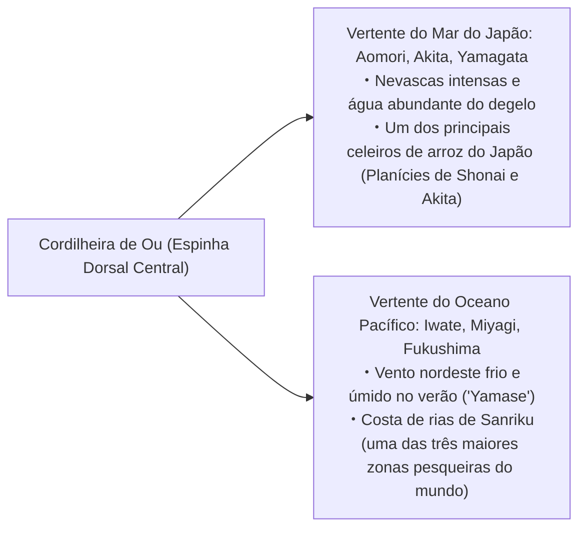
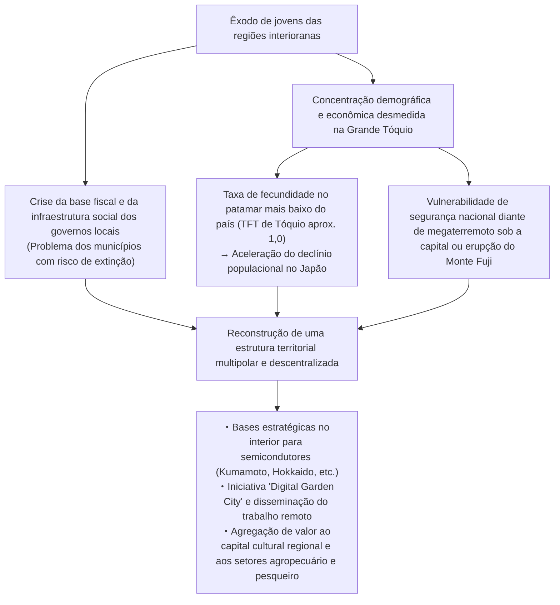
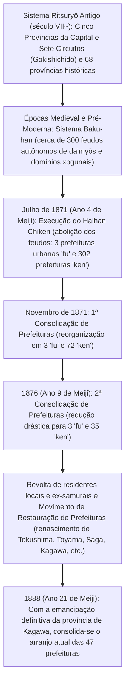

## Introdução: A Diversidade do Arquipélago Japonês e a História de Formação das 47 Prefeituras

Estendendo-se por aproximadamente 3.000 quilômetros de norte a sul em formato de arco, o arquipélago japonês é uma das nações insulares e montanhosas mais íngremes do planeta, moldada pela intensa atividade tectônica do Círculo de Fogo do Pacífico — decorrente da colisão de quatro placas litosféricas: a Placa Euroasiática, a Placa Norte-Americana, a Placa do Pacífico e a Placa do Mar das Filipinas.

Cerca de 70% do território nacional é formado por florestas e relevo montanhoso. Tendo como divisória as cordilheiras que formam a espinha dorsal do país, uma extraordinária multiplicidade climática encontra-se condensada em uma extensão territorial restrita: o "Clima do Mar do Japão", caracterizado por nevascas colossais no inverno; o "Clima do Oceano Pacífico", quente e úmido no verão e com dias secos e ensolarados no inverno; o "Clima do Mar Interior de Seto", ameno e de baixa pluviosidade; o "Clima das Terras Altas Centrais", com amplitudes térmicas extremas; e o "Clima das Ilhas do Sudoeste", de feição marcadamente subtropical.

```
【Classificação Climática e Mecanismos Geográficos do Arquipélago Japonês】

┌──────────────────────┬────────────────────────────────┬──────────────────────────────────────────┐
│ Divisão Climática    │ Abrangência Geográfica         │ Principais Características e Mecanismos  │
├──────────────────────┼────────────────────────────────┼──────────────────────────────────────────┤
│ Clima do Mar do Japão│ Da costa do Mar do Japão em    │ As monções de noroeste no inverno        │
│                      │ Hokkaido até Hokuriku e San'in │ absorvem a umidade da Corrente de Tsushima│
│                      │                                │ e colidem com a cordilheira central,     │
│                      │                                │ gerando nevascas recordes.               │
│ Clima do Pacífico    │ Da costa do Pacífico ao sul de │ Chuvas intensas e tufões no verão pelas  │
│                      │ Kyushu                         │ monções de sudeste. No inverno, tempo    │
│                      │                                │ seco e ensolarado (vento karakkaze).     │
│ Clima do Mar Interior│ Região entre as montanhas de   │ As nuvens de chuva são bloqueadas pelas  │
│ de Seto (Setouchi)   │ Chugoku e Shikoku              │ montanhas; clima ameno, pouca chuva e    │
│                      │                                │ alta insolação durante todo o ano.       │
│ Clima das Terras     │ Nagano, Yamanashi, região de   │ Altitude elevada e cercada de montanhas; │
│ Altas Centrais       │ Hida em Gifu, etc.             │ amplitude térmica diária e sazonal       │
│ (Chūō Kōchi)         │                                │ (verão/inverno) extremamente acentuada.  │
│ Clima das Ilhas do   │ Província de Okinawa, Ilhas de │ Clima subtropical oceânico influenciado  │
│ Sudoeste (Nansei)    │ Amami, etc.                    │ pela Corrente de Kuroshio. Alta          │
│                      │                                │ temperatura e umidade; rota de tufões.   │
└──────────────────────┴────────────────────────────────┴──────────────────────────────────────────┘
```

A divisão regional do Japão tem como alicerce histórico as 68 "províncias históricas" (ryōseikoku) estruturadas a partir do antigo sistema Ritsuryō sob a égide do "Gokishichidō" (Cinco Províncias da Capital e Sete Circuitos: Kinai, Tōkaidō, Tōsandō, Hokurikudō, San'indō, San'yōdō, Nankaidō e Saikaidō). Logo após a Restauração Meiji, a "Abolição dos Domínios Feudais e Estabelecimento das Prefeituras" (Haihan Chiken), realizada em 1871 (ano 4 de Meiji), deu origem inicialmente a mais de 300 prefeituras e governos urbanos. Após sucessivas ondas de consolidação e fusões, o arranjo institucional estabilizou-se em 1888 (ano 21 de Meiji) com a emancipação definitiva da província de Kagawa, consolidando a estrutura contemporânea de "1 To, 1 Dō, 2 Fu e 43 Ken" (as 47 prefeituras do Japão).

Neste ensaio geográfico e econômico, examinamos as 47 prefeituras agrupadas em oito blocos regionais (Hokkaido, Tohoku, Kanto, Chubu, Kinki, Chugoku, Shikoku e Kyushu-Okinawa), decifrando meticulosamente suas antigas províncias, relevo, matriz industrial, história, manifestações culturais e os prementes desafios demográficos e de revitalização territorial no século XXI.

---

## 1. Região de Hokkaido: A Fronteira Setentrional e a Vasta Agropecuária Primária

### 1.1 Hokkaido (Antiga: Terra de Ezo / 11 províncias históricas, incluindo Ishikari e Oshima)
- **Sede do Governo Regional**: Sapporo
- **Área e Topografia**: 83.424 km² (1º lugar nacional, representando aproximadamente 22% da área territorial do Japão). Tendo como espinha dorsal os sistemas montanhosos de Daisetsuzan e Hidaka, Hokkaido abriga algumas das maiores planícies e platôs do país, como a Planície de Ishikari, a Planície de Tokachi e o Planalto de Konsen. Pertence ao domínio climático subártico, com verões amenos e invernos rigorosos marcados por congelamento generalizado e densa cobertura de neve.
- **Estrutura Industrial e Economia**:
  - **Agricultura e Pecuária**: O grande celeiro alimentar do Japão. Agricultura de sequeiro em larga escala (trigo, beterraba sacarina, batata, feijão azuki) e pecuária leiteira massiva (responsável por mais de 50% de toda a produção nacional de leite cru). Na Planície de Tokachi, destaca-se um modelo de mecanização intensiva de padrão ocidental, com propriedades rurais que se estendem por dezenas de hectares por família.
  - **Pesca e Maricultura**: Líder absoluto nacional tanto em volume de captura quanto em produção de aquicultura marinha, destacando-se vieiras (hotate-gai), salmão selvagem, polaca-do-alasca (suketōdara) e algas kombu.
  - **Turismo e Serviços**: O resort internacional de esqui com neve powder em Niseko (que atrai expressivos investimentos e fluxos turísticos globais), a Península de Shiretoko (Patrimônio Natural Mundial da UNESCO), os campos de lavanda de Furano e o célebre Festival de Neve de Sapporo (Sapporo Snow Festival).
- **História e Cultura**: A cultura ancestral do povo indígena Ainu (valorizada nacionalmente com a inauguração do Upopoy — Espaço Simbólico para a Coexistência Étnica em Shiraoi). A epopeia do desbravamento moderno da Era Meiji impulsionada pela Comissão de Colonização (Kaitakushi) e pelos soldados-colonos (Tondenhei). A introdução do ensino agronômico moderno e dos valores do humanismo ocidental pela Escola Agrícola de Sapporo, sob a mentoria do Dr. William S. Clark.
- **Desafios Regionais**: O rápido declínio demográfico conjugado com a hipercentralização populacional em Sapporo, a crise de sustentabilidade econômico-financeira de linhas ferroviárias deficitárias da JR Hokkaido e os custos astronômicos de conservação da vasta malha de infraestrutura rodoviária e urbana sob invernos rigorosos.

---

## 2. Região de Tohoku: As Bênçãos da Cordilheira de Ou e as Tradições Históricas de Michinoku

A região de Tohoku é atravessada de norte a sul pela imponente Cordilheira de Ou, configurando ambientes biogeográficos e socioeconômicos contrastantes entre a vertente do Mar do Japão (zona de nevascas abundantes e celeiro orizícola) e a vertente do Oceano Pacífico (sujeita a verões frios provocados pelo vento úmido marítimo "yamase").



### 2.1 Província de Aomori (Antiga: Tsugaru, Mutsu)
- **Capital**: Aomori
- **Topografia**: O extremo setentrional de Honshu. As penínsulas de Tsugaru e Shimokita circundam a Baía de Mutsu; o maciço montanhoso de Hakkoda ergue-se na região central, enquanto a oeste despontam as Montanhas Shirakami, Patrimônio Natural Mundial da UNESCO.
- **Indústria**: Respondedora por cerca de 60% da safra nacional de maçãs, concentrada em Hirosaki e na Planície de Tsugaru. Maricultura intensiva de vieiras na Baía de Mutsu, o afamado atum-rabilho de Oma e expressivos desembarques pesqueiros no porto de Hachinohe. No setor tecnológico avançado, abriga em Rokkasho as instalações estratégicas do complexo do ciclo do combustível nuclear japonês.
- **Cultura e Tradições**: Os monumentais festivais Aomori Nebuta e Hirosaki Neputa, os acordes percussivos do Tsugaru-shamisen e o patrimônio literário e pictórico de autores e artistas consagrados como Osamu Dazai e Shiko Munakata. Sítios arqueológicos do Período Jomon, destacando-se as ruínas pré-históricas de Sannai-Maruyama.

### 2.2 Província de Iwate (Antiga: Rikuchu, Rikuzen, Mutsu)
- **Capital**: Morioka
- **Topografia**: A segunda maior prefeitura do Japão em extensão territorial após Hokkaido (15.275 km²). É caracterizada pela fértil Bacia de Kitakami ao longo do Rio Kitakami, pelas vastas Terras Altas de Kitakami a leste e pela dramática costa recortada de rias em Sanriku.
- **Indústria**: Polo avançado de fabricação de semicondutores e componentes automotivos ao longo do vale de Kitakami (com a presença de gigantes fabris como a Kioxia). Na costa de Sanriku, extração e cultivo de algas wakame, abalone e frotas de pesca oceânica de salmão e sanma (agulhão). Produção secular de ferro fundido tradicional de Nambu (Nambu Tekki).
- **Cultura e Tradições**: O complexo do Templo Chuson-ji e seu reluzente Salão Dourado (Konjikido) em Hiraizumi, materialização da filosofia da Terra Pura pelo clã Oshu Fujiwara (Patrimônio Cultural Mundial da UNESCO). A cosmologia poética de "Ihatov" concebida por Kenji Miyazawa e a coletânea "Tono Monogatari" (Lendas de Tono), de Kunio Yanagita, marco seminal dos estudos folclóricos do Japão.

### 2.3 Província de Miyagi (Antiga: Rikuzen, Mutsu)
- **Capital**: Sendai (única cidade designada por decreto governamental na região de Tohoku)
- **Topografia**: Composta pela fértil Planície de Sendai, entrecortada por arrozais de alto rendimento, e pelas deslumbrantes ilhotas de pinheiros de Matsushima (uma das Três Grandes Vistas Cênicas do Japão — Nihon Sankei), além da Península de Oshika e da Baía de Sendai.
- **Indústria**: O centro nervoso administrativo e econômico de toda a região de Tohoku. Celeiro de prestigiadas linhagens de arroz, como Sasanishiki e Hitomebore. Polos de processamento e conservas pesqueiras de escala global nos portos de Ishinomaki e Kesennuma. Vanguarda em pesquisa acadêmica e física de partículas liderada pela Universidade de Tohoku, destacando-se o NanoTerasu (fonte de luz síncrotron de 3ª geração).
- **Cultura e Tradições**: A sofisticada civilização de cidade-castelo dos 620 mil koku do feudo de Sendai, estabelecida pelo lendário samurai Date Masamune. O festival Sendai Tanabata Matsuri, um dos mais requintados espetáculos folclóricos do verão japonês.

### 2.4 Província de Akita (Antiga: Ugo, Dewa)
- **Capital**: Akita
- **Topografia**: Delimitada pela Planície de Akita, pela Bacia de Yokote, pelo vulcânico Monte Chokai e pelas profundezas azuladas do Lago Tazawa (o lago mais profundo do Japão, com 423 metros de profundidade).
- **Indústria**: Um dos núcleos mais reverenciados da orizicultura nipônica, celebre pela variedade nobre "Akitakomachi". Extração florestal e manejo sustentável do cedro-de-akita (Akita Sugi). Produtos gastronômicos de denominação protegida, como o frango caipira Hinai-jidori e o peixe-areia hatahata. Nos últimos anos, consolidou-se como a principal fronteira nacional para parques de geração de energia eólica litorânea e marítima (offshore).
- **Cultura e Tradições**: O Akita Kanto Matsuri, no qual acrobatas equilibram mastros de bambu com lanternas flamejantes; os rituais purificadores dos demônios Namahage na Península de Oga (Patrimônio Cultural Imaterial da UNESCO) e o ecossistema pristino das Montanhas Shirakami.

### 2.5 Província de Yamagata (Antiga: Uzen, Dewa)
- **Capital**: Yamagata
- **Topografia**: Abrigando a fértil Planície de Shonai e as bacias intramontanas de Yonezawa, Yamagata e Shinjo conectadas pelas águas caudalosas do Rio Mogami. É coroada pelos três picos sagrados de Dewa Sanzan (Gassan, Hagurosan e Yudonosan) e pelas formações glaciais de Zao.
- **Indústria**: O incontestável reino das frutas do Japão, detentor de mais de 70% da safra nacional de cerejas (sakuranbo), além de peras europeias La France. Orizicultura de excelência em Shonai com a cultivar Tsuyahime. A carne bovina de alto marmoreio Yonezawa Beef. Relevante concentração de manufatura eletrônica, semicondutores e usinagem de precisão.
- **Cultura e Tradições**: A tradição ascética milenar do Shugendo nos santuários de Dewa Sanzan, o festivo Yamagata Hanagasa Matsuri e a atmosfera do período Taisho preservada nos sobrados de madeira das termas de Ginzan Onsen.

### 2.6 Província de Fukushima (Antiga: Iwashiro, Iwaki)
- **Capital**: Fukushima
- **Topografia**: Estrutura-se de forma nítida em três zonas geográficas com identidades próprias: Aizu (área alpina, de invernos rigorosos e densa herança histórica), Nakadori (o eixo das bacias centrais, polo político e de transportes) e Hamadori (a faixa litorânea do Pacífico, com clima marítimo ameno).
- **Indústria**: Fruticultura intensiva de pêssegos e peras japonesas em Nakadori. Tradição secular em artigos de laca artesanal de Aizu (Aizu-shikki) e premiadas destilarias de saquê artesanal. Em Hamadori, desdobra-se a arrojada iniciativa governamental "Fukushima Innovation Coast Framework", criando um megacomplexo de testes robóticos (Robot Test Field) e usinas piloto de hidrogênio verde.
- **Cultura e Tradições**: A bravura e o código de honra do bushido imortalizados pelo Batalhão do Tigre Branco (Byakkotai) em Aizuwakamatsu, a gastronomia típica do Kitakata Ramen e a cavalgada marcial feudal do Soma Nomaoi. Fukushima posiciona-se hoje na linha de frente da reconstrução e da transição energética do país após o desastre de 2011.

---

## 3. Região de Kanto: Concentração das Funções da Capital e Complexos Industriais Integrados

Centrada na Planície de Kanto — a mais vasta extensão plana contínua do Japão —, a região de Kanto articula uma extraordinária hiperconcentração das rédeas políticas, financeiras, acadêmicas e logísticas do país, perfeitamente sinergizada com uma produtiva retaguarda agropecuária nas províncias limítrofes e com titânicos cinturões industriais costeiros.

```
【Estrutura de Divisão Funcional da Megalópole da Região da Capital (Shutoken)】

・Tóquio: Funções centrais de Estado, finanças e advocacia globais, TI de ponta, vanguarda cultural
・Kanagawa: Cinturão Industrial de Keihin, porto de comércio internacional (Yokohama), polos de P&D, turismo em Shonan e Hakone
・Saitama: Hub de transporte terrestre (redes de Shinkansen e rodovias expressas), agricultura suburbana, complexos mecânicos e de distribuição
・Chiba: Aeroporto Internacional de Narita, Polo Petroquímico e Siderúrgico de Keiyo, pesca e hortifrutigranjeiros suburbanos (amendoim e vegetais)
・Ibaraki: Cidade Científica de Tsukuba, Complexo Industrial Costeiro de Kashima, indústria de maquinário pesado da Hitachi, melões e raiz de lótus
・Tochigi: Região Industrial do Norte de Kanto (automóveis no interior e equipamentos de precisão), Santuário Nikko Toshogu, morangos (Tochiotome)
・Gunma: Indústria automotiva centrada na SUBARU, estâncias termais (Kusatsu, Ikaho), patrimônio da sericicultura e da seda
```

### 3.1 Província de Ibaraki (Antiga: Hitachi)
- **Capital**: Mito
- **Indústria**: 3º lugar nacional em valor de produção agropecuária, liderando a colheita de melões nobres, raiz de lótus (renkon) e batata-doce desidratada (hoshi-imo). Em Tsukuba Science City, concentra-se um terço de todos os laboratórios e institutos públicos federais de pesquisa do Japão. No município de Hitachi floresce a indústria de equipamentos pesados e maquinário elétrico, enquanto o Porto de Kashima sedia um monumental complexo siderúrgico e petroquímico.
- **Cultura**: O pensamento patriótico e confucionista da Escola de Mito (Mito-gaku) fundada pela linhagem Tokugawa de Mito, o jardim histórico Kairaku-en e as majestosas Cataratas de Fukuroda, uma das três quedas d'água mais espetaculares do país.

### 3.2 Província de Tochigi (Antiga: Shimotsuke)
- **Capital**: Utsunomiya
- **Indústria**: Campeã incontestável na produção e colheita de morangos por mais de cinco décadas consecutivas (marcas célebres como Tochiotome e Tochiaika). Robusta faixa industrial no interior em torno de Utsunomiya e Oyama, englobando fábricas de instrumentação médica e montadoras de equipamentos de transporte. Implantação pioneira do Utsunomiya Light Rail (LRT), modelo de transporte elétrico de vanguarda no Japão.
- **Cultura**: Os Santuários e Templos de Nikko (Patrimônio Cultural Mundial da UNESCO), encabeçados pelo faustoso Nikko Toshogu; a histórica Escola Ashikaga (a mais antiga instituição de ensino superior do arquipélago) e a produção de cerâmica rústica Mashiko-yaki.

### 3.3 Província de Gunma (Antiga: Kozuke)
- **Capital**: Maebashi
- **Indústria**: Um dos polos da indústria automotiva japonesa, centrado na sede e complexos fabris da SUBARU (antiga Nakajima Aircraft) no município de Ota, com ampla cadeia de autopeças e estampagem de metais. Produção hegemônica de batata-konjac (konnyaku-imo), responsável por cerca de 90% do mercado nacional. Conhecida internacionalmente por suas estâncias termais de altitude: Kusatsu Onsen, Ikaho Onsen e Minakami Onsen.
- **Cultura**: A Usina de Seda de Tomioka e Sítios Conexos da Indústria da Seda (Patrimônio Cultural Mundial da UNESCO). A unificação do senso de identidade regional por meio do popular jogo de cartas Jomo Karuta, praticado por todos os cidadãos da província.

### 3.4 Província de Saitama (Antiga: a maior parte de Musashi)
- **Capital**: Saitama (cidade designada por decreto governamental)
- **Indústria**: A 5ª prefeitura mais populosa do Japão (cerca de 7,3 milhões de habitantes). A Estação de Omiya constitui o mais movimentado entroncamento ferroviário de passageiros e trens-bala do leste japonês. Uma das maiores potências nacionais em valor de remessas da indústria de processamento de alimentos. Produtos agroalimentares icônicos como a cebolinha Fukaya Negi, o refinado chá verde Sayama-cha e os tradicionais biscoitos crocantes de arroz Soka Senbei.
- **Cultura**: As ruelas preservadas com armazéns mercantis de adobe negro (kurazukuri) em Kawagoe, apelidada de "Koedo" (Pequena Edo), e o espetacular cortejo noturno do Chichibu Yomatsuri (Patrimônio Cultural Imaterial da UNESCO).

### 3.5 Província de Chiba (Antiga: Shimosa, Kazusa, Awa)
- **Capital**: Chiba (cidade designada por decreto governamental)
- **Indústria**: Abriga o Aeroporto Internacional de Narita, porta de entrada fulcral para o transporte de cargas de alto valor e tráfego aéreo de passageiros. O Cinturão Industrial Costeiro de Keiyo forma uma vasta fileira ininterrupta de refinarias petroquímicas e usinas siderúrgicas. Liderança consistente na agropecuária suburbana de hortaliças (amendoim, cebolinha verde e espinafre). Grandes volumes de captura marinha no Porto de Choshi e o megacomplexo de entretenimento Tokyo Disney Resort.
- **Cultura**: As históricas ruas de peregrinos que levam ao milenar templo budista Naritasan Shinsho-ji e a costa da Península de Boso, consagrada pelo surfe e resorts marítimos.

### 3.6 Metrópole de Tóquio (Antiga: Musashi, Izu, Ogasawara)
- **Sede do Governo Metropolitano**: Shinjuku
- **Topografia**: População de cerca de 14 milhões de habitantes (e núcleo de uma megalópole contígua com mais de 37 milhões de residentes, a maior aglomeração urbana do planeta). Seu território compreende os 23 distritos especiais centrais, a pujante Região de Tama e arquipélagos oceânicos como as Ilhas Izu e as remotas Ilhas Ogasawara (Patrimônio Natural Mundial da UNESCO).
- **Indústria**: O titânico dínamo econômico responsável por cerca de 20% de todo o Produto Interno Bruto japonês. O quadrilátero financeiro e de corporações mercantis transnacionais de Marunouchi e Otemachi; os ecossistemas globais de TI e startups de Shibuya e Roppongi; a meca mundial da cultura pop e eletrônicos em Akihabara e o supermovimentado Aeroporto Internacional de Haneda.
- **Cultura**: Um cenário fascinante onde o santuário sintoísta Meiji Jingu, as fundações do Castelo de Edo e o tradicional templo Senso-ji em Asakusa convivem harmoniosamente com arranha-céus futuristas e galerias de arte contemporânea, compondo um dos mais cintilantes centros culturais do planeta.

### 3.7 Província de Kanagawa (Antiga: Sagami, sul de Musashi)
- **Capital**: Yokohama (população de aproximadamente 3,77 milhões de habitantes, a maior cidade municipal do Japão)
- **Indústria**: A 2ª prefeitura em contingente populacional (cerca de 9,2 milhões de habitantes). O epicentro do lendário Cinturão Industrial de Keihin, sediando a matriz global e complexos industriais da Nissan Motor, usinas da JFE Steel e congêneres. Concentração de centros internacionais de P&D corporativo no distrito futurista de Minato Mirai 21, conjugada com a indústria de química fina e tecnologias sustentáveis em Kawasaki.
- **Cultura**: A atmosfera solene da antiga capital guerreira do xogunato Kamakura (berço do budismo zen e dos samurais), o charme cosmopolita da abertura dos portos e o bairro chinês de Yokohama, o estilo de vida praiano de Shonan e as águas termais milenares encravadas nas montanhas de Hakone.

---

## 4. Região de Chubu: A Coluna Dorsal da Manufatura Japonesa e a Topografia Alpina

Localizada estrategicamente no centro da ilha principal de Honshu, a região de Chubu desdobra-se em três sub-regiões nitidamente diferenciadas: Hokuriku (voltada ao Mar do Japão), as Terras Altas Centrais (Chūō Kōchi, no interior montanhoso) e Tokai (na faixa costeira do Pacífico), compondo o mais pujante e produtivo cinturão industrial manufatureiro do Japão.

### 4.1 Província de Niigata (Antiga: Echigo, Sado)
- **Capital**: Niigata (cidade designada por decreto governamental)
- **Indústria**: Orizicultura de renome mundial na Planície de Echigo, fertilizada pelas bacias dos rios Shinano e Agano (campeã nacional isolada em colheita de arroz Koshihikari). Os polos metalúrgicos de Tsubame e Sanjo (Tsubame-Sanjo), detentores de expressiva fatia do mercado internacional de talheres finos de aço inoxidável e lâminas forjadas de alta precisão. Criação e exportação de carpas ornamentais nishikigoi. Histórica extração comercial de gás natural e petróleo bruto nacional.
- **Cultura**: As históricas Minas de Ouro da Ilha de Sado (Patrimônio Cultural Mundial da UNESCO), o espetacular Festival de Fogos de Artifício de Nagaoka no Rio Shinano e a influente Trienal de Arte de Echigo-Tsumari, pioneira mundial na revitalização regional pela arte contemporânea.

### 4.2 Província de Toyama (Antiga: Etchu)
- **Capital**: Toyama
- **Indústria**: Transformou a abundância de energia hidrelétrica gerada no maciço alpino em uma vigorosa indústria de laminação de alumínio, química pesada e fármacos biológicos. É o coração da indústria farmacêutica japonesa, herdando a tradição secular dos "vendedores ambulantes de remédios de Toyama" (Toyama no baiyaku). A Baía de Toyama, denominada "aquário marinho natural", é famosa pelas lulas-vaga-lume bioluminescentes (hotaru-ika), camarões-brancos (shiro-ebi) e peixes buri (olho-de-boi) invernais.
- **Cultura**: A espetacular travessia da Rota Alpina Tateyama Kurobe pelas muralhas de neve e a grandiosa Represa de Kurobe. As aldeias históricas de casas de telhado íngreme de palha em estilo gassho-zukuri em Gokayama (Patrimônio Cultural Mundial da UNESCO).

### 4.3 Província de Ishikawa (Antiga: Kaga, Noto)
- **Capital**: Kanazawa
- **Indústria**: Turismo de altíssimo valor agregado ancorado no riquíssimo patrimônio cultural deixado pelo domínio feudal de Kaga Hyakumangoku ("o feudo de um milhão de koku"). Manufatura de máquinas de construção pesada e equipamentos de tecelagem (berço da multinacional Komatsu) e compósitos de ponta de fibra de carbono.
- **Cultura**: O admirável jardim histórico Kenroku-en, produção de 99% de todas as folhas de ouro finas do Japão (Kanazawa Haku), cerâmica policromada Kutani-yaki e a sofisticada arte de laca Wajima-nuri. A província lidera hoje um processo de restauração criativa após o terremoto na Península de Noto em 2024.

### 4.4 Província de Fukui (Antiga: Echizen, Wakasa)
- **Capital**: Fukui
- **Indústria**: O município de Sabae domina com maestria 95% do mercado japonês de armações de óculos em titânio e acetato, com enorme prestígio internacional. Componentes eletrônicos avançados (fábricas da Murata Manufacturing) e tecelagem sintética. Terra natal de desenvolvimento agronômico da variedade de arroz Koshihikari. Pesca nobre do caranguejo da neve Echizen-gani. Na região de Reinan (Wakasa), concentra-se um relevante complexo de reatores nucleares geradores de eletricidade.
- **Cultura**: O monastério Daihonzan Eihei-ji, principal templo da seita Soto do Budismo Zen fundado pelo mestre Dogen; o renomado Museu Provincial de Dinossauros de Fukui e os imponentes paredões basálticos de Tojinbo. A província ocupa invariavelmente os primeiros lugares nos índices nacionais de qualidade de vida e felicidade dos cidadãos.

### 4.5 Província de Yamanashi (Antiga: Kai)
- **Capital**: Kofu
- **Indústria**: Líder absoluta na safra japonesa de uvas, pêssegos e ameixas. Berço e capital do vinho de casta japonesa (como o emblemático Koshu), centrado na região vinícola de Katsunuma. Maior polo do país em lapidação de pedras preciosas e confecção de joalheria fina. Sede corporativa da FANUC, gigante absoluta da automação fabril que domina os mercados globais de controles CNC e robótica industrial. Pista experimental de testes de supercondutividade do trem de levitação magnética Linear Chuo Shinkansen.
- **Cultura**: Fortalezas e santuários vinculados à memória do general estrategista Takeda Shingen, as paisagens idílicas da Região dos Cinco Lagos do Monte Fuji e o desfiladeiro de Shosenkyo.

### 4.6 Província de Nagano (Antiga: Shinano)
- **Capital**: Nagano
- **Indústria**: Província alpina que abraça as três majestosas cordilheiras dos Alpes Japoneses (Hida, Kiso e Akaishi). Desenvolveu uma invejável indústria de maquinário e eletrônica de precisão (como a matriz da Seiko Epson, rendendo à província o apelido de "Suíça do Oriente"). Cultivo massivo de hortaliças de altitude (alface, acelga) e maçãs doces. Campeã do ranking nacional de longevidade saudável para ambos os sexos.
- **Cultura**: O milenar Templo Zenko-ji, que acolhe peregrinos sem distinção de seita; o Castelo de Matsumoto (tesouro nacional com a mais antiga torre original de cinco andares do Japão); e elegantes refúgios de montanha como o vale de Kamikochi e a estância aristocrática de Karuizawa.

### 4.7 Província de Gifu (Antiga: Mino, Hida)
- **Capital**: Gifu
- **Indústria**: A cutelaria forjada de Seki, reconhecida ao lado de Solingen e Sheffield como um dos três maiores centros históricos de forja de facas e lâminas cirúrgicas do mundo. Cerâmica Mino-yaki, responsável por mais da metade de toda a louça cerâmica de mesa consumida no Japão. Fabricação de estruturas aeroespaciais no polo de Kakamigahara (Kawasaki Heavy Industries). Nobre mobiliário artesanal em madeira maciça nas oficinas de Hida-Takayama.
- **Cultura**: O vilarejo de Shirakawa-go, tombado como Patrimônio Cultural Mundial pela UNESCO; o preservado casario feudal de comerciantes em Takayama e o método milenar de pesca fluvial noturna com corvos-marinhos (ukai) sob as tochas do Rio Nagara.

### 4.8 Província de Shizuoka (Antiga: Totomi, Suruga, Izu)
- **Capital**: Shizuoka (cidade designada por decreto governamental)
- **Indústria**: Destaca-se consistentemente entre as maiores províncias em valor total de remessas industriais do país. O lendário império das máquinas de transporte: berço e matriz de colossos industriais como Suzuki, Yamaha e as origens da Honda. O maior polo nacional de cultivo e processamento de chá verde. Capital mundial indiscutível dos kits plásticos de plastimodelismo e miniaturas em escala (Tamiya, Bandai, Hasegawa). O Porto de Yaizu registra os maiores desembarques de atum oceânico e bonito do Japão.
- **Cultura**: A face sul do soberbo Monte Fuji (Patrimônio Cultural Mundial da UNESCO), a rede termal da Península de Izu e os monumentos onde o xogum Tokugawa Ieyasu passou seus anos de retiro (o Castelo de Sunpu e o Santuário Kunozan Toshogu).

### 4.9 Província de Aichi (Antiga: Owari, Mikawa)
- **Capital**: Nagoya (cidade designada por decreto governamental)
- **Indústria**: **O mais incontestável império manufatureiro do Japão, liderando o ranking nacional de valor de remessas industriais por mais de 40 anos ininterruptos**. Sede global da Toyota Motor Corporation e de sua colossal pirâmide de suprimentos e autopeças. Polo de ponta da indústria aeroespacial militar e comercial (instalações da Mitsubishi Heavy Industries). Aços especiais, usinagem de máquinas-ferramenta e cerâmicas industriais.
- **Cultura**: Terra natal dos três grandes unificadores supremos do Japão feudal (Oda Nobunaga, Toyotomi Hideyoshi e Tokugawa Ieyasu). O solene Santuário Atsuta-jingu, guardião da lendária espada Kusanagi; o imponente Castelo de Nagoya com seus delfins dourados (kinshachi); e a singular e vigorosa gastronomia local "Nagoya-meshi" (miso katsu, hitsumabushi de enguia e asinhas de frango tebasaki).

---

## 5. Região de Kinki: A Capital Milenar e a Estrutura Multicamadas da Esfera Econômica de Kansai

Centro político, religioso e intelectual do arquipélago desde a aurora da civilização japonesa na Antiguidade clássica até a transferência da corte para Tóquio na Era Moderna, a região de Kinki (ou Kansai) equilibra de forma fascinante a energia mercantil cosmopolita de Osaka, o dinamismo portuário de Kobe e o inestimável patrimônio espiritual e artístico acumulado em Quioto e Nara.

```
【Divisão Funcional e Diversidade Histórica da Região de Kinki / Kansai】

・Osaka: O DNA da metrópole comercial, finanças internacionais, Exposições Universais (1970/2025), ciências da vida, gastronomia popular
・Quioto: Mil anos de capital cultural de Heian-kyo, tecnologia de ponta (Nintendo, Kyocera), artesanato tradicional, turismo internacional
・Hyogo: Comércio portuário (Kobe), Cinturão Industrial Costeiro de Harima, saquê de Nada, agropecuária e pesca de Tanba e Tajima
・Nara: Berço do antigo regime de Yamato, capital Heijo-kyo, templos Horyu-ji e Todai-ji (tesouro da arte budista)
・Shiga: Lago Biwa, o maior do Japão (manancial de 14 milhões de pessoas em Kinki), mercadores de Omi, manufatura avançada no interior
・Mie: Grande Santuário de Ise (o cume do Xintoísmo), Circuito de Suzuka, cultivo de pérolas, petroquímica de Yokkaichi
・Wakayama: Monte Koya e Kumano Sanzan (locais sagrados e rotas de peregrinação), maior produtor nacional de tangerinas mikan e umeboshi
```

### 5.1 Província de Mie (Antiga: Ise, Iga, Shima, leste de Kii)
- **Capital**: Tsu
- **Indústria**: O Polo Industrial de Yokkaichi, abrigando refinarias petroquímicas e modernas gigafábricas de memórias flash e semicondutores. Na agropecuária e pesca costeira, brilha a seleta carne bovina de Matsusaka Beef, a pioneira maricultura de pérolas cultivadas akoya na Baía de Ago e a pesca da lagosta-de-ise (Ise-ebi).
- **Cultura**: O venerável Grande Santuário de Ise (Jingu), cume espiritual máximo da religião xintoísta composto pelo Santuário Interior (Naiku) e Santuário Exterior (Geku); a tradição secreta dos espiões da linhagem Iga Ninja e as rotas sagradas de peregrinação do Kumano Kodo (rota de Iseji).

### 5.2 Província de Shiga (Antiga: Omi)
- **Capital**: Otsu
- **Indústria**: Nó estratégico de circulação de mercadorias abraçando as margens do Lago Biwa. Atuando como sede de complexos fabris industriais de alta tecnologia e plantas-matriz de corporações como Toray e Panasonic. A produção de cerâmica rústica Shigaraki-yaki. O cultivo de arroz de Omi e a criação de gado de corte de linhagem pura Omi Beef.
- **Cultura**: O secular Mosteiro Enryaku-ji no sagrado Monte Hiei, considerado a montanha-mãe de praticamente todas as vertentes do budismo japonês medieval; o altivo Castelo de Hikone, com sua torre original preservada como Tesouro Nacional; e a ética corporativa e mercantil dos comerciantes de Omi condensada no preceito "Sanpō-yoshi" (bom para quem vende, bom para quem compra e bom para a sociedade).

### 5.3 Prefeitura Urbana de Quioto (Antiga: Yamashiro, Tanba, Tango)
- **Capital**: Quioto (cidade designada por decreto governamental)
- **Indústria**: Um dos polos de atração cultural e turística de maior renome em escala planetária. Paralelamente, atua como o quartel-general de empresas globais de vanguarda que dominam nichos de alta tecnologia eletrônica: Nintendo, Kyocera, OMRON, Shimadzu Corporation e Nidec. Centros artesanais de tecelagem em seda Nishijin-ori, porcelanas finas Kiyomizu-yaki e os nobres vinhedos e plantações de chá verde de Uji (Uji-cha).
- **Cultura**: O conjunto de Monumentos Históricos da Antiga Quioto (composto por 17 templos budistas, santuários xintoístas e o Castelo Nijo, todos declarados Patrimônio Mundial pela UNESCO). O lendário festival Gion Matsuri e as piras rituais que iluminam as encostas montanhosas no Gozan no Okuribi.

### 5.4 Prefeitura Urbana de Osaka (Antiga: leste de Settsu, Kawachi, Izumi)
- **Capital**: Osaka (cidade designada por decreto governamental)
- **Indústria**: O indiscutível coração comercial e financeiro de todo o oeste japonês. Berço histórico das grandes corporações transnacionais de comércio geral (sogo shosha como Itochu e Sumitomo); polo de indústrias biofarmacêuticas e ciências médicas avançadas em Doshomachi (com a Takeda Pharmaceutical e pares); e a maior densidade de oficinas de engenharia mecânica de alta precisão em pequenas e médias empresas (Higashiosaka). Conectividade intercontinental pelo Aeroporto Internacional de Kansai (KIX).
- **Cultura**: O grandioso Castelo de Osaka; o distrito de entretenimento de Dotonbori; as artes performáticas clássicas como o teatro de comédia Kamigata Rakugo, os fantoches do Ningyo Joruri Bunraku e a trupe moderna do Yoshimoto Shinkigeki; e a inconfundível cultura gastronômica dos pratos populares à base de massa grelhada "konamon" (takoyaki e okonomiyaki). Abriga o Grupo de Túmulos Antigos de Mozu-Furuichi, coroado pelo gigantesco túmulo em forma de fechadura do Imperador Nintoku (Patrimônio Cultural Mundial da UNESCO).

### 5.5 Província de Hyogo (Antiga: oeste de Settsu, Tanba, Tajima, Harima, Awaji)
- **Capital**: Kobe (cidade designada por decreto governamental)
- **Indústria**: O Porto de Kobe, veterano motor das rotas de navegação oceânica do Japão. Indústria pesada, turbinas e siderurgia de alto calibre encabeçadas pela Kawasaki Heavy Industries e Kobe Steel. O complexo petroquímico e siderúrgico ao longo da costa de Harima. As seculares adegas do distrito de Nada-Gogo, o maior produtor e destilador de saquê fino do Japão. As premiadas cebolas doces da Ilha de Awaji e a grife gastronômica global da carne bovina Kobe Beef.
- **Cultura**: O deslumbrante Castelo de Himeji, cognominado Castelo da Garça Branca (Shirasagi-jo) e consagrado como o primeiro Patrimônio Cultural Mundial do Japão; os banhos termais de Arima Onsen e a elegância ocidental do antigo assentamento mercantil (Kyū-Kyoryūchi) e das mansões históricas de Kitano Ijinkan em Kobe.

### 5.6 Província de Nara (Antiga: Yamato)
- **Capital**: Nara
- **Indústria**: Economia amplamente alicerçada no turismo arqueológico e de peregrinação histórica. Manejo florestal sustentável dos afamados cedros e ciprestes de Yoshino (Yoshino Sugi e Yoshino Hinoki). Líder na indústria nacional de malharia e produção de meias no pólo de Koryo e cercanias. Antigas oficinas artesanais de bastões de tinta nanquim tradicional (sumi) e batedores de bambu para a cerimônia do chá (chasen).
- **Cultura**: Os Monumentos Históricos da Antiga Nara, abrigando o templo Todai-ji e seu colossal Grande Buda de Bronze, o Kofuku-ji e o Santuário Kasuga Taisha; os Monumentos Budistas na Região de Horyu-ji (as mais antigas estruturas de madeira remanescentes na face da Terra); e os milhares de pés de cerejeiras em flor e a tradição dos ascetas da montanha (Shugendo) no sagrado Monte Yoshino.

### 5.7 Província de Wakayama (Antiga: oeste de Kii)
- **Capital**: Wakayama
- **Indústria**: A campeã incontestável do agronegócio de fruticultura arbórea do país, ostentando a maior colheita nacional de tangerinas Unshu mikan, ameixas nobres Nanko-ume (utilizadas para os apreciados umeboshi), frutas cítricas hassaku e a aromática pimenta japonesa sansho. Siderurgia pesada e tubos sem costura na Usina de Wakayama da Nippon Steel.
- **Cultura**: Os santuários e trilhas místicas dos Locais Sagrados e Rotas de Peregrinação nos Montes Kii (Patrimônio Cultural Mundial da UNESCO), englobando o mosteiro Kongobu-ji fundado por Kobo Daishi no Monte Koya e os três templos sagrados de Kumano Sanzan. Águas termais costeiras de areia branca em Shirahama Onsen.

---

## 6. Região de Chugoku: O Polo Industrial de Setouchi e o Mundo Mítico de San'in

A região de Chugoku exibe uma acentuada dicotomia territorial proporcionada pela barreira das Montanhas de Chugoku: de um lado, a vertente de San'yo (voltada para o abrigado Mar Interior de Seto), usufruindo de clima ensolarado e abrigando um colossal cinturão industrial pesado; do outro, a vertente de San'in (voltada para o tempestuoso Mar do Japão), preservando ecossistemas preservados e o berço dos grandes ciclos mitológicos da criação do arquipélago.

### 6.1 Província de Tottori (Antiga: Inaba, Hoki)
- **Capital**: Tottori
- **Topografia e Indústria**: A prefeitura de menor contingente demográfico do arquipélago (cerca de 540 mil habitantes). Notabilizou-se pela agricultura pioneira de irrigação em ambiente arenoso nas Dunas de Tottori (cultivo intensivo de chalotas em conserva rakkyo). Líder isolada no cultivo das célebres peras asiáticas de casca verde Nijusseiki. Produção expressiva de cebolinha branca tenra (shiro-negi) e os maiores desembarques de caranguejos das neves do país no agitado Porto de Sakaiminato.
- **Cultura**: A saga lendária da Lebre Branca de Inaba (Inaba no Shiro-usagi); os banhos curativos de Misasa Onsen, ricos em emanações de gás radônio; e a arquitetura acrobática do pavilhão Sanbutsu-ji Nageiredo no Monte Mitoku, erguido como milagre de equilíbrio em uma fenda de penhasco rochoso vertical (Tesouro Nacional).

### 6.2 Província de Shimane (Antiga: Izumo, Iwami, Oki)
- **Capital**: Matsue
- **Topografia e Indústria**: Estende-se pela Planície de Izumo e pelas margens do Lago Shinji (que concentra a maior captura nacional de mariscos de água salobra shijimi). É a guardiã da fundição siderúrgica secular de aços especiais de alta pureza (o ferro Yasuki Hagane / Hitachi Metals - atual Proterial), derivado do método tatara. Floricultura de ciclames e vinhedos da variedade Delaware.
- **Cultura**: O portentoso complexo do Grande Santuário Izumo Taisha, santuário primordial para onde convergem todos os oito milhões de deuses (kami) do panteão nipônico durante o décimo mês lunar para a assembleia mítica da cessão da terra (Kuniyuzuri). As históricas Minas de Prata de Iwami Ginzan e sua paisagem florestal cultural (Patrimônio Cultural Mundial da UNESCO) e o Geoparque Mundial da UNESCO nas Ilhas Oki.

### 6.3 Província de Okayama (Antiga: Mimasaka, Bizen, Bitchu)
- **Capital**: Okayama (cidade designada por decreto governamental)
- **Indústria**: O Cinturão Industrial Costeiro de Mizushima, que opera como um titânico polo de refino de petróleo, complexos de craqueamento químico, usinas de aço bruto e montadoras automotivas. Reconhecida em todo o Japão como o reino das frutas finas de mesa: pêssegos brancos de casca aveludada e uvas nobres moscatel. O distrito histórico costeiro de Kojima estabeleceu-se como a meca mundial do denim premium japonês (jeans artesanais) e o polo pioneiro na tecelagem de uniformes escolares do Japão.
- **Cultura**: O idílico Distrito Histórico de Kurashiki Bikan, ladeado por canais com salgueiros e armazéns mercantis de paredes caiadas de branco; o jardim feudal Koraku-en (um dos Três Mais Ilustres Jardins do Japão); e a robusta cerâmica desprovida de esmalte Bizen-yaki, queimada em fornos a lenha durante semanas.

### 6.4 Província de Hiroshima (Antiga: Aki, Bingo)
- **Capital**: Hiroshima (cidade designada por decreto governamental)
- **Indústria**: A maior metrópole econômica e produtiva das regiões de Chugoku e Shikoku. Matriz e complexo fabril montador de veículos da Mazda Corporation, os fornos de aço da JFE Steel em Fukuyama e conceituados estaleiros navais espalhados por Kure e Onomichi. Na aquicultura marinha, responde por mais da metade de todas as ostras cultivadas do Japão. Campeã absoluta no cultivo de limões sicilianos de casca pura comestível em suas ilhas ensolaradas.
- **Cultura**: Abriga dois insignes sítios do Patrimônio Mundial da UNESCO: o Santuário de Itsukushima em Miyajima, com seu torii vermelho flutuante sobre a maré, e a Cúpula da Bomba Atômica (Genbaku Dome), símbolo indelével do clamor planetário pela paz mundial e desarmamento nuclear. As encostas cênicas de ruelas e escadarias com vista para o mar em Onomichi, imortalizadas pela literatura e pelo cinema japonês.

### 6.5 Província de Yamaguchi (Antiga: Suo, Nagato)
- **Capital**: Yamaguchi
- **Indústria**: Ao longo de sua costa abrigada em Seto estende-se o Polo Petroquímico de Shunan, polo estratégico da química pesada orgânica e inorgânica. Manufatura de elastômeros e materiais de cimento liderada pela histórica Ube Industries (atual UBE). No setor pesqueiro, o histórico Porto de Shimonoseki domina o comércio atacadista de peixe baiacu venenoso (fugu) e tamboril (anko).
- **Cultura**: A antiga cidade feudal de Hagi e a célebre academia particular Shoka Sonjuku fundada por Yoshida Shoin, de onde emergiram os jovens líderes revolucionários que fundaram o moderno Estado Meiji (Patrimônio Cultural Mundial da UNESCO). A espetacular Ponte de madeira em arcos múltiplos Kintaikyo, o gigantesco planalto cárstico de Akiyoshidai pontilhado pela colossal caverna calcária de Akiyoshido, e as águas azul-turquesa sob a Ponte Tsunoshima Ohashi.

---

## 7. Região de Shikoku: O Patrimônio Histórico de Nankaido, a Manufatura de Setouchi e a Pesca do Pacífico

A ilha de Shikoku é dividida transversalmente pela imponente Cordilheira de Shikoku: ao norte desfruta-se da tranquilidade ensolarada do Mar Interior de Seto (Kagawa e Ehime), enquanto ao sul abre-se a imensidão tempestuosa do Oceano Pacífico (Tokushima e Kochi). A ilha conecta-se intimamente com Honshu através de três espetaculares sistemas de pontes e rodovias expressas suspensas (a Ponte Onaruto, a Grande Ponte de Seto / Seto Ohashi e a rota panorâmica Shimanami Kaido).

### 7.1 Província de Tokushima (Antiga: Awa)
- **Capital**: Tokushima
- **Indústria**: Líder suprema na produção do cítrico verde perfumado sudachi (detendo mais de 90% do mercado nacional), batatas-doces doces Naruto Kintoki e frangos caipiras nobres Awa-odori. No âmbito da indústria eletroeletrônica de fronteira, sedia a matriz mundial e plantas fabris da Nichia Corporation (pioneira e maior produtora mundial de LEDs azuis de nitreto de gálio e materiais luminescentes de fósforo).
- **Cultura**: O eletrizante festival Awa Odori, cujos cortejos rítmicos de dançarinos e músicos de shamisen encantam as ruas da capital com quatro séculos de tradição ininterrupta; os gigantescos redemoinhos marinhos de maré no Estreito de Naruto (Naruto no Uzushio); e os despenhadeiros remotos do Vale de Iya, cruzados por pontes de cipós suspensas (Iya no Kazurabashi).

### 7.2 Província de Kagawa (Antiga: Sanuki)
- **Capital**: Takamatsu
- **Indústria**: Não obstante seja a menor prefeitura em área territorial de todo o arquipélago, possui uma elevadíssima densidade demográfica e dinamismo econômico. Notabilizou-se globalmente pela cultura culinária e pelo turismo de massa impulsionado pelo genuíno "Sanuki Udon". Liderança absoluta no cultivo de oliveiras e produção de azeite extravirgem (Ilha de Shodoshima). O Cinturão Industrial Costeiro de Bannosu, voltado para refinarias de petróleo, construção naval e metalurgia pesada.
- **Cultura**: O sagrado e concorrido Santuário Kotohira-gu (afetuosamente apelidado de Konpira-san); o Jardim Ritsurin, consagrado como Obra-Prima Especial de Beleza Cênica Nacional; e a prestigiada Trienal de Arte de Setouchi, que converteu ilhotas desabitadas como Naoshima e Teshima em santuários internacionais da arte contemporânea e arquitetura mundial.

### 7.3 Província de Ehime (Antiga: Iyo)
- **Capital**: Matsuyama
- **Indústria**: O sinônimo japonês indiscutível para o cultivo de tangerinas e cítricos nobres. As toalhas felpudas de algodão de Imabari (Imabari Towel), consolidadas como uma respeitada marca de luxo e maciez em âmbito global. O cluster marítimo da Baía de Imabari, constituindo o maior polo de estaleiros de construção naval e armadores comerciais do Japão. Parques de celulose, tecidos especiais e papel nos municípios de Shikokuchuo e Niihama, ao lado de fundições de metais não ferrosos.
- **Cultura**: O histórico pavilhão Dogo Onsen Honkan, venerado como a estância termal mais antiga de todo o Japão; o altivo Castelo de Matsuyama dominando a colina central; e a rota cicloviária internacional Shimanami Kaido, permitindo cruzar o mar de bicicleta por ilhas e pontes monumentais.

### 7.4 Província de Kochi (Antiga: Tosa)
- **Capital**: Kochi
- **Indústria**: Aproveitando o clima ameno e a intensa insolação da costa sul, desponta na horticultura precoce protegida em estufas, detendo a liderança nacional absoluta na colheita comercial de berinjelas, gengibre fresco e botões florais de myoga. Pesca oceânica artesanal de bonito (katsuo) através da tradicional e sustentável técnica de linha e vara individual (ippon-zuri). Atividades pioneiras na extração e aproveitamento industrial de águas marinhas ultraprofundas.
- **Cultura**: O pioneirismo libertário e republicano associado à figura de Sakamoto Ryoma e aos pensadores do Movimento pelos Direitos da Liberdade Popular (Jiyu Minken Undo); o contagiante festival coreográfico Yosakoi Matsuri; a idílica praia em arco de Katsurahama; e as águas translúcidas do Rio Shimanto, carinhosamente chamado de "o último rio de águas puras do Japão".

---

## 8. Região de Kyushu e Okinawa: O Portal da Ásia e a Cultura Singular das Ilhas do Sudoeste

Por sua proximidade física imediata com o continente do leste asiático, a região de Kyushu desempenhou o papel de vanguarda incontestável nos fluxos diplomáticos e comerciais do Japão desde a Antiguidade (época das tropas de fronteira Sakimori e das missões imperiais Kentoshi à China) até os séculos de comércio no porto de Nagasaki. Atualmente, vivencia um estrondoso renascimento na produção de semicondutores ("Silicon Island"), em fascinante sinergia com vulcões ativos e praias subtropicais.

```
【Vigor Regional e Perfil Industrial da Região de Kyushu e Okinawa】

・Fukuoka: O coração de Kyushu, porta de entrada para a Ásia, megacidade com aeroporto no centro urbano, zona especial para TI e startups
・Saga: Cerâmicas de Arita e Imari, festival Karatsu Kunchi, arroz e algas nori na Planície de Saga (Mar de Ariake)
・Nagasaki: Comércio com os Nanban (portugueses) e Dejima, patrimônio dos cristãos ocultos, construção naval, pesca na costa de rias
・Kumamoto: Megacluster de semicondutores impulsionado pela TSMC (JASM), caldeira vulcânica de Aso, cidade abastecida 100% por águas subterrâneas
・Oita: Maior volume e fluxo de águas termais do Japão (Beppu e Yufuin), energia geotérmica, complexo costeiro industrial de Oita
・Miyazaki: Alta insolação e clima ameno (manga madura, pimentão, gado Miyazaki Beef), paraíso do surfe na costa de Hyuga-nada
・Kagoshima: O império da carne suína Kurobuta, gado Kuroge Wagyu, batata-doce e shochu, vulcão Sakurajima, patrimônios mundiais de Yakushima e Amami
・Okinawa: História singular do Reino de Ryukyu, Castelo de Shuri, Aquário Churaumi, resorts subtropicais, economia de bases e autonomia financeira
```

### 8.1 Província de Fukuoka (Antiga:筑前/Chikuzen, 筑後/Chikugo, 豊前/Buzen)
- **Capital**: Fukuoka (cidade designada por decreto governamental, com cerca de 1,6 milhão de habitantes)
- **Indústria**: O centro de comando econômico de toda a ilha de Kyushu. A histórica Zona Industrial de Kitakyushu (berço da estatal Usina Siderúrgica de Yawata e de líderes em robótica como a Yaskawa Electric). O Porto de Hakata e o Aeroporto de Fukuoka (cuja proximidade inacreditável de 5 minutos de metrô até o centro da cidade converte a metrópole em um hub de mobilidade único na Ásia). Polo de concentração de startups digitais e serviços de TI. Fruticultura nobre com o morango gigante Amaou.
- **Cultura**: O enérgico cortejo de carros andores no festival Hakata Gion Yamakasa; o Santuário Dazaifu Tenmangu, consagrado a Sugawara no Michizane; as pitorescas barracas gastronômicas noturnas de rua (yatai) em Nakasu e Tenjin; e o sagrado complexo de Munakata Taisha e a Ilha de Okinoshima (Patrimônio Cultural Mundial da UNESCO).

### 8.2 Província de Saga (Antiga: leste de Hizen)
- **Capital**: Saga
- **Indústria**: As requintadas porcelanas Arita-yaki e Imari-yaki (o berço ancestral da porcelana vitrificada japonesa). Cultivo em marés nobres de algas comestíveis nori no Mar de Ariake, liderando as receitas do setor no país por duas décadas consecutivas. Pecuária de elite de gado bovino Saga Beef. Geração de energia nuclear na Usina de Genkai.
- **Cultura**: As monumentais ruínas do sítio arqueológico de Yoshinogari (grande povoado fortificado com fossos do Período Yayoi); os históricos banhos curativos de Takeo Onsen; e o faustoso desfile de andores em forma de leões e peixes gigantes no festival de outono Karatsu Kunchi.

### 8.3 Província de Nagasaki (Antiga: oeste de Hizen, Iki, Tsushima)
- **Capital**: Nagasaki
- **Indústria**: Secular polo de construção naval pesada e navios mercantes de grande porte, personificado nos estaleiros da Mitsubishi Heavy Industries. Tirando proveito de possuir a segunda maior extensão de linha de costa recortada de todo o Japão, desponta nos desembarques de peixes de alto valor comercial, como o carapau (aji) e a cavala (saba). Campeã nacional no cultivo de nêsperas doces (biwa).
- **Cultura**: Os Sítios dos Cristãos Ocultos na Região de Nagasaki e Amakusa (Patrimônio Cultural Mundial da UNESCO); os marcos pioneiros da modernização industrial em Hashima (a Ilha Gunkanjima); a atmosfera exótica herdada dos mercadores portugueses e holandeses na ilha artificial de Dejima; e o famoso resort e parque temático holandês Huis Ten Bosch.

### 8.4 Província de Kumamoto (Antiga: Higo)
- **Capital**: Kumamoto (cidade designada por decreto governamental)
- **Indústria**: **Com a histórica implantação da fábrica de fundição de wafers da TSMC (JASM) no município de Kikuyo**, a província tornou-se o epicentro da maior corrida de investimentos industriais em semicondutores de toda a história recente do Japão, atraindo centenas de fornecedores globais. No agronegócio, lidera a produção nacional de tomates e melancias. O município de Kumamoto destaca-se no mundo por abastecer 100% de sua rede pública de água potável exclusivamente a partir de aquíferos subterrâneos límpidos.
- **Cultura**: O Castelo de Kumamoto, lendária e impenetrável fortificação militar desenhada pelo general samurai Kato Kiyomasa; a majestosa caldeira vulcânica do Monte Aso (uma das maiores do planeta); e as sinuosas Cinco Pontes de Amakusa (Amakusa Gokyo).

### 8.5 Província de Oita (Antiga: Bungo, sul de Buzen)
- **Capital**: Oita
- **Indústria**: Oficialmente cognominada "A Província das Fontes Termais" (Onsen-ken), ostentando o primeiro lugar incontestável do Japão tanto em número de nascentes geotérmicas quanto em volume de vazão diária de águas minerais (famosa pelos resorts termais de Beppu Onsen e Yufuin Onsen). O Polo Industrial Litorâneo de Oita congrega siderúrgicas de alto-forno, refinarias e usinas petroquímicas. Responde por cerca de 90% de todo o mercado japonês do cítrico verde aromático kabosu, além de cogumelos shiitake desidratados.
- **Cultura**: O ancestral Santuário Usa Jingu, santuário matriz de onde derivam os mais de 40 mil santuários filiais dedicados à divindade Hachiman em todo o território japonês; e a espiritualidade sincrética xinto-budista (Shinbutsu-shugo) esculpida em estátuas de pedra nos vilarejos de Rokugo Manzan na Península de Kunisaki.

### 8.6 Província de Miyazaki (Antiga: Hyuga)
- **Capital**: Miyazaki
- **Indústria**: Fazendo uso primoroso de seus dias ensolarados e clima subtropical de alta pluviosidade, produz a consagrada carne bovina Miyazaki Beef (vencedora consecutiva do Prêmio do Primeiro-Ministro nas olimpíadas zootécnicas nacionais de Wagyu), além das cobiçadas mangas doces "Taiyo no Tamago" (Ovos do Sol). Destaca-se nos primeiros postos em volume de carnes de aves e suínos. Campeã nacional absoluta no fornecimento de madeira bruta de reflorestamento de cedro japonês (sugi).
- **Cultura**: As falésias basálticas da Garganta de Takachiho, onde teriam ocorrido os acontecimentos da descida à Terra dos deuses solares da dinastia imperial (mitologia de Tenson Korin) e as danças sacras noturnas de Yokagura; o idílico Santuário Aoshima Jinja; e o Santuário Udo Jingu, encravado no interior de uma gruta marinha.

### 8.7 Província de Kagoshima (Antiga: Satsuma, Osumi)
- **Capital**: Kagoshima
- **Indústria**: A 2ª prefeitura em volume total de produção agropecuária do Japão. É a meca de criações de gado de corte bovino Kuroge Wagyu, carne suína nobre Kurobuta, raízes de batata-doce (satsumaimo), maricultura intensiva de enguias de água doce (unagi) e aves de corte. Polo supremo dos destilados de shochu autêntico (honkaku shochu). No extremo sul, abriga o Centro Espacial de Tanegashima, base de lançamento aeroespacial da JAXA reconhecida como a plataforma de foguetes mais bela do planeta.
- **Cultura**: A esplêndida Baía de Kinko, emoldurada pelo perfil do vulcão ativo Sakurajima expelindo fumaça vulcânica contínua. Berço histórico do poderoso feudo de Satsuma, que produziu os grandes líderes da Restauração Meiji, como Saigo Takamori e Okubo Toshimichi. Abrigando santuários da biosfera mundial da UNESCO (as florestas milenares do cedro Jomon Sugi na Ilha de Yakushima e a biodiversidade endêmica da Ilha de Amami Oshima).

### 8.8 Província de Okinawa (Antiga: Reino de Ryukyu)
- **Capital**: Naha
- **Topografia**: A província arquipelágica insular mais austral e ocidental de todo o Japão, composta por dezenas de ilhas habitadas, como a Ilha de Miyako e as Ilhas Yaeyama (Ishigaki e Iriomote).
- **Indústria**: O maior polo do turismo de sol, praia e mergulho oceânico internacional do Japão. Implantação de incentivos fiscais e infraestrutura de tecnologia de informação e comunicação de dados. Cultivo de cana-de-açúcar, criação da raça suína autóctone Agu, produção do melão-amargo goya e destilação ancestral da aguardente awamori. Evolução na diversificação das receitas outrora atreladas às bases militares norte-americanas rumo a uma sólida emancipação econômica própria.
- **Cultura**: Os Castelos "Gusuku" e Sítios Conexos do Reino de Ryukyu (englobando as majestosas ruínas do Castelo de Shuri, tombados como Patrimônio Mundial pela UNESCO). As danças folclóricas de percussão Eisa, os sons melódicos do alaúde de pele de cobra sanshin, as lacas decoradas de Ryukyu e as pinturas em tecidos bingata. Uma culinária milenar profundamente voltada para a longevidade e saúde, associada ao preceito medicinal tradicional.

---

## 9. Desafios Regionais do Século XXI: A Concentração Unipolar em Tóquio e o Debate sobre a Descentralização Multipolar

Ao analisar a radiografia geográfica e o tecido industrial das 47 prefeituras, o mais alarmante dilema estrutural com o qual o Japão hodierno se depara é a **"hipercentralização demográfica e econômica na Grande Tóquio, contrastando com o vertiginoso declínio populacional e esvaziamento das regiões periféricas"**.



### 9.1 Municípios com Risco de Extinção e os Limites da Sustentação de Infraestruturas
Conforme demonstrado pelo impactante "Relatório Masuda" de 2014 e corroborado pelas estimativas recentes do Conselho de Estratégia Populacional (Jinkō Senryaku Kaigi), mais de 40% de todos os governos municipais do Japão encontram-se em situação de "risco de extinção". O fluxo contínuo de evasão de mulheres jovens para a esfera metropolitana de Tóquio não cessa. Como resultado direto nas áreas rurais e interioranas, o fechamento ou aglutinação de escolas fundamentais, o colapso e cancelamento de linhas de ônibus e trens e a deterioração de pontes, sistemas de esgoto e asfalto tornam a recomposição da infraestrutura pública financeiramente inviável para as combalidas prefeituras locais.

### 9.2 O Renascimento Regional Impulsionado por Semicondutores e Energias Renováveis
Não obstante esse cenário sombrio, a década de 2020 trouxe os primeiros sinais concretos de uma inflexão histórica de paradigmas.
Em primeiro lugar, à luz da urgência de assegurar a segurança nacional das cadeias de suprimentos de tecnologia, as fabulosas megaprojetos de fabricação de semicondutores de última geração passaram a ser instalados propositadamente no interior do país. Os investimentos de trilhões de ienes aportados na Província de Kumamoto (TSMC / JASM) e na cidade de Chitose em Hokkaido (projeto governamental Rapidus) desencadearam uma inédita onda de migração reversa de laboratórios, corporações coligadas e postos de trabalho de altíssima remuneração de volta às províncias.
Em segundo lugar, a grande transição para a neutralidade de carbono (Green Transformation / GX) reposicionou os vastos terrenos descampados e os abundantes recursos hídricos e costeiros das prefeituras do interior (como as centrais eólicas offshore no litoral do Mar do Japão e em Tohoku, bem como usinas solares, biomassa e energia geotérmica em Hokkaido e Kyushu) como a mais valiosa base soberana de abastecimento energético de toda a nação.

---

## 0. História da Evolução das Divisões Administrativas: Das Províncias Ritsuryō ao Haihan Chiken e à Grande Consolidação Provincial

A divisão administrativa atual das "47 prefeituras" (todōfuken) não existiu de forma estática e imanente desde a Antiguidade; ela representa uma construção histórica consolidada a duras penas durante a turbulenta transição para o Estado moderno inaugurado pela Restauração Meiji.



### 0.1 A Dinâmica Política do Haihan Chiken (1871)
Para o governo imperial instaurado pela Restauração Meiji em 1868, o mais imediato e vital desafio consistia em estabelecer a soberania política indivisível e centralizar o poderio bélico e fiscal da nação. Embora os antigos senhores feudais (daimyōs) tivessem sido investidos do cargo de governadores de domínio (chihanji) mediante o decreto de devolução das terras e registros de súditos ao trono (Hanseki Hōkan em 1869), cada feudo (han) mantinha suas próprias milícias armadas locais e prerrogativas tributárias independentes, deixando a coesão nacional em um estágio perigosamente fragmentado.

Em 14 de julho de 1871 (ano 4 de Meiji), valendo-se do apoio das tropas de elite imperiais (Goshinpei) recrutadas junto aos clãs vencedores de Satsuma, Choshu e Tosa, líderes como Saigo Takamori, Okubo Toshimichi e Kido Takayoshi executaram em um golpe de mestre o decreto da **"Abolição dos Domínios e Criação das Prefeituras" (Haihan Chiken)**. Todos os feudos foram imediatamente extintos por decreto; os chihanji foram destituídos e obrigados a transferir residência permanente para Tóquio, enquanto magistrados provinciais (kenrei) e governadores nomeados pelo poder central foram enviados para governar as províncias. Essa medida revolucionária pariu uma divisão inicial composta por 3 prefeituras urbanas (fu: Tóquio, Quioto e Osaka) e espombosas 302 prefeituras provinciais (ken).

### 0.2 A 1ª e a 2ª Consolidações Provinciais e o Abalo do "Movimento de Restauração de Prefeituras"
O número original de mais de 300 prefeituras pecava pela excessiva pulverização e fragilidade de arrecadação financeira, o que forçou o Ministério do Interior a deflagrar fusões expeditas.
Logo em novembro de 1871, a "Primeira Onda de Consolidação de Prefeituras" reduziu esse contingente para 3 fu e 72 ken. Não satisfeito, o governo central, sob o punho de ferro de Okubo Toshimichi no Ministério do Interior, decretou em 1876 (ano 9 de Meiji) a "Segunda Onda de Consolidação de Prefeituras", ceifando praticamente metade das divisões e estabelecendo uma estrutura esquelética de apenas **3 fu e 35 ken**.

Essas fusões forçadas e precipitadas suscitaram violentos choques regionais e rancores identitários.
A título de exemplo: a área da atual Kagawa foi anexada compulsoriamente ora a Myoto (Tokushima), ora a Ehime; Toyama foi engolida por Ishikawa; Saga foi anexada a Nagasaki; Miyazaki, submetida a Kagoshima; e a região de Fukui acabou fatiada e dividida entre Ishikawa e Shiga.
Perante esse quadro, as antigas elites mercantis das cidades-castelo, proprietários de terras e ex-samurais mobilizaram uma firme oposição cívica, denunciando que seus tributos eram integralmente drenados para as capitais metropolitanas e que a manutenção das estradas e pontes locais fora abandonada ao descaso. Esse descontentamento conectou-se organicamente às mobilizações populares do **Movimento pelos Direitos da Liberdade Popular (Jiyu Minken Undo)** que exigiam a fundação do parlamento nacional, explodindo no combativo "Movimento de Desmembramento e Restauração de Prefeituras" (Bunken Undō / Fukuken Undō).

Encurralado pelas pressões populares e riscos de insurreição civil, o governo Meiji viu-se obrigado a restabelecer sucessivamente as províncias suprimidas: recriou Fukui em 1881; restabeleceu Toyama, Saga e Miyazaki em 1883; e, por fim, em dezembro de 1888 (ano 21 de Meiji), oficializou a separação definitiva de Kagawa em relação a Ehime. Selava-se, assim, o formato estável de 47 prefeituras que perdura até os dias de hoje.

---

## 8.9 A Paisagem Linguística das 47 Prefeituras: A Teoria das Zonas Concêntricas Dialetais e a Fronteira Linguística Leste-Oeste

A impressionante diversidade que perpassa o arquipélago japonês manifesta-se de forma exemplar na rica tapeçaria de seus dialetos regionais (hōgen), cujas variações guardam profundas camadas arqueológicas da evolução sociolinguística do país.

Em sua célebre obra de 1930, intitulada "Kagyūkō" (蝸牛考, *Reflexões sobre o Caracol*), o pai dos estudos folclóricos japoneses, Kunio Yanagita, cartografou a distribuição geográfica de todos os nomes populares atribuídos ao caracol ao longo do Japão. Com isso, formulou a célebre **"Teoria das Zonas Concêntricas Dialetais" (Hōen Shūkenron)**, postulando que as transformações linguísticas geradas no centro cultural de Quioto (o coração irradiador de tendências do período clássico e medieval) propagavam-se para as províncias periféricas em ondas concêntricas ondulantes ao longo dos séculos.

```
【A Estrutura Espacial das Zonas Dialetais em "Kagyūkō" de Kunio Yanagita】

[Quioto (Centro Cultural Histórico)]: DENDENMUSHI (vocábulo recente da Era Moderna)
  ↓ (difusão para a periferia)
[Arredores de Kinki, Hokuriku e Tokai]: MAIMAI (termo do Período Muromachi)
  ↓
[Chubu, Kanto, Chugoku, Shikoku]: KATATSUMURI (termo do Período Heian)
  ↓
[Tohoku e Kyushu]: TSUBURI, TSUBU (vocábulos arcaicos da Antiguidade)
  ↓
[Extremos de Honshu (Tsugaru em Aomori e Satsuma em Kagoshima)]: NAMEKUJI, NAME (vestígios da camada linguística mais remota)
```

Além dessa estratificação temporal concêntrica, o idioma japonês é marcado por uma nítida linha divisória fonético-gramatical: a **Fronteira Linguística Leste-Oeste**, que corre ao longo do curso do Rio Fuji e Lago Hamana em Shizuoka até o município de Itoigawa em Niigata.
- **Dialetos do Leste do Japão (Higashi-Nihon)**: Emprego da cópula declarativa "da", partícula de negação "nai", desinência imperativa "ro" (como em *okiro*, acorde), com padrões tonais assentados no sistema de acentuação de Tóquio.
- **Dialetos do Oeste do Japão (Nishi-Nihon)**: Emprego da cópula declarativa "ja" ou "ya", partícula de negação "n" ou "hen", desinência imperativa "yo" (como em *okiyo*), e padrões tonais no complexo sistema de acentuação de Quioto-Osaka (Keihan).

Acrescente-se a isso as notáveis particularidades fonéticas do dialeto de Tohoku — o chamado *Zūzū-ben*, caracterizado pela neutralização vocálica e pronúncia semifechada que protegia os falantes contra o ar gélido do inverno —, bem como as contrações oclusivas e glotais impenetráveis do dialeto de Satsuma em Kagoshima (que na época feudal servia estrategicamente como código ininteligível contra os espiões enviados pelo xogunato de Edo). Essas linguagens constituem monumentos vivos da herança imaterial forjada pela geografia de ilhas e vales isolados.

---

## 9.3 Geografia Econômica das 47 Prefeituras: Aglomeração Industrial e o Quociente de Localização (Location Quotient)

Para mensurar com rigor científico o grau de especialização e competitividade produtiva de cada prefeitura em relação ao restante do país, a disciplina de geografia econômica vale-se habitualmente do indicador denominado **"Quociente de Localização" (Location Quotient: LQ)**. Trata-se de uma métrica quantitativa que compara a concentração de um determinado setor econômico local em relação ao peso médio desse mesmo setor no total da economia nacional.

$$LQ = \frac{e_i / e}{E_i / E}$$

Nessa formulação matemática, $e_i$ representa o número de empregos formais (ou o valor bruto das remessas industriais) gerados pelo setor $i$ na prefeitura avaliada; $e$ denota o contingente total de empregos em todas as atividades produtivas daquela mesma prefeitura; $E_i$ expressa o número de postos de trabalho no setor $i$ em nível nacional; e $E$ sintetiza o volume global de empregos em todo o território japonês. Um índice $LQ > 1,0$ comprova que aquela unidade federativa ostenta um grau de especialização produtiva superior à média nacional naquele segmento específico.

```
【Padrões Notáveis de Especialização Regional nas 47 Prefeituras】

1. Indústria de Equipamentos de Transporte (Automóveis e Aeroespacial):
   ・Prefeituras com Altíssimo LQ: Aichi (LQ ≈ 3,2), Gunma (LQ ≈ 2,8), Shizuoka (LQ ≈ 2,5), Hiroshima (LQ ≈ 2,1)
   ・Características: Robusta arquitetura piramidal de fornecedores de subcontratação em camadas, encabeçada por gigantes montadoras mundiais (Toyota, SUBARU, Suzuki, Mazda).

2. Componentes Eletrônicos, Dispositivos e Semicondutores:
   ・Prefeituras com Altíssimo LQ: Yamagata (LQ ≈ 2,9), Fukui (LQ ≈ 2,7), Kumamoto (LQ ≈ 2,6), Iwate (LQ ≈ 2,4)
   ・Características: Clusters industriais que aliam mananciais de água límpida e ar puro à infraestrutura logística de rodovias expressas no interior (as rotas do silício de Tohoku e Kyushu).

3. Setor Primário (Agricultura, Pecuária e Pesca):
   ・Prefeituras com Altíssimo LQ: Aomori, Hokkaido, Kagoshima, Miyazaki, Kochi (LQ > 3,0)
   ・Características: Pilares centrais da soberania e segurança alimentar do Japão, liderando hoje a virada tecnológica para a agricultura de precisão (Smart Agriculture) e a verticalização industrial do campo (a chamada 'Sexta Industrialização').

4. Serviços Financeiros Globais, Telecomunicações e Apoio Corporativo Avançado:
   ・Prefeituras com Altíssimo LQ: Metrópole de Tóquio (LQ ≈ 2,5), Prefeitura Urbana de Osaka (LQ ≈ 1,4)
   ・Características: Concentração quase monopolística de sedes corporativas internacionais, registro e gestão de propriedade intelectual e fundos de capital de risco para startups.
```

O complexo econômico japonês jamais deve ser interpretado como um mecanismo de motor único: ele opera e prospera unicamente graças à engrenagem perfeitamente acoplada entre o "motor manufatureiro" de Aichi e Tokai, o "motor de comando financeiro, de serviços e de gestão corporativa" sediado em Tóquio, e o "motor de sustentação soberana primária e tecnológica de semicondutores" salvaguardado pelas prefeituras do interior.

---

## 0.3 A História Política da "Discrepância" entre o Nome da Prefeitura e sua Capital: Verificação da Tese de Punição aos Clãs do Antigo Xogunato

Uma das interrogações mais instigantes levantadas por qualquer estudioso da divisão administrativa japonesa reside no motivo pelo qual certas prefeituras possuem capitais com nomes estritamente homônimos aos seus respectivos territórios (como a Província de Akita / Cidade de Akita; Província de Niigata / Cidade de Niigata; Província de Hiroshima / Cidade de Hiroshima), ao passo que outras tantas ostentam flagrante discrepância entre o nome da província e o nome de sua cidade-sede (casos de Província de Iwate / Cidade de Morioka; Província de Miyagi / Cidade de Sendai; Província de Ibaraki / Cidade de Mito; Província de Tochigi / Cidade de Utsunomiya; Província de Gunma / Cidade de Maebashi; Província de Ishikawa / Cidade de Kanazawa; Província de Mie / Cidade de Tsu; Província de Shiga / Cidade de Otsu; Província de Hyogo / Cidade de Kobe; Província de Shimane / Cidade de Matsue; Província de Ehime / Cidade de Matsuyama; Província de Okinawa / Cidade de Naha).

Durante décadas, circulou no imaginário popular e em compêndios não especializados a tese conspiratória de que o jovem governo Meiji teria deliberadamente punido os feudos que apoiaram as forças do xogunato Tokugawa durante a Guerra Boshin (os chamados feudos rebeldes, ou *zokugun*), negando-lhes o direito de batizar suas prefeituras com os gloriosos nomes de suas cidades-castelo originais e rebaixando-as a nomes de distritos rurais secundários (a chamada "Tese da Punição" — *Chōbatsusetsu*). Ilustravam essa lenda citando cidades-castelo como Aizu (Wakamatsu), Sendai, Morioka, Mito e Maebashi, núcleos de alianças leais ao antigo regime.

Contudo, os avanços historiográficos e documentais modernos no campo da história do direito público sepultaram de vez o mito da punição. As decisões adotadas pelo governo imperial na época não visavam a retaliações ideológicas infantis, mas sim a critérios pragmáticos e universais de reorganização territorial moderna.

```
【A Lógica Pragmática da Nomeação das Prefeituras no Início da Era Meiji】

1. Rompimento com o centralismo das antigas cidades-castelo e adoção do "nome do distrito (gun)":
   Para desmantelar o poder dos clãs feudais dos daimyōs e erradicar os vestígios do domínio feudal do período Edo, o novo governo adotou como princípio não o nome da cidade onde estava localizada a sede administrativa provincial, mas sim o nome do distrito tradicional ("gun", unidade administrativa desde o sistema Ritsuryō) ao qual essa cidade pertencia.
   ・Cidade-castelo de Morioka (Distrito de Iwate) → Província de Iwate
   ・Cidade-castelo de Sendai (Distrito de Miyagi) → Província de Miyagi
   ・Cidade-castelo de Mito (Distrito de Ibaraki) → Província de Ibaraki
   ・Cidade-castelo de Kanazawa (Distrito de Ishikawa) → Província de Ishikawa
   ・Cidade-castelo de Matsue (Distrito de Shimane) → Província de Shimane
   ・Cidade-castelo de Matsuyama (Distrito de Onsen / nome mítico de Ehime) → Província de Ehime

2. Consideração por portos abertos e novos polos estratégicos:
   Casos em que centros emergentes ou portos de comércio internacional, desenvolvidos rapidamente, foram escolhidos como capitais provinciais, em detrimento das cidades-castelo dos antigos feudos.
   ・Hyogo (administração do porto aberto de Kobe como território sob controle governamental direto) → Província de Hyogo (capital em Kobe)
   ・Yokohama (posto de Kanagawa / porto aberto) → Província de Kanagawa (capital em Yokohama)

3. Vestígios de transferências reiteradas de capitais e fusões provinciais:
   ・Província de Tochigi: a sede administrativa provincial original ficava na vila de Tochigi (distrito de Tsuga), tendo sido posteriormente transferida para Utsunomiya, enquanto o nome da província foi mantido.
   ・Província de Gunma: após oscilar entre Takasaki e Maebashi, manteve o nome de Gunma herdado do distrito de Gunma em Takasaki.
```

Portanto, a incongruência entre nomes provinciais e nomes urbanos não resulta de revanchismos pueris, mas cristaliza os cicatrizados esforços do nascente Estado Meiji para erradicar o loteamento feudal privatista do território nacional e inaugurar a autoridade pública universal e igualitária sobre cada recanto do arquipélago.

---

## 8.10 A Teoria do Terroir do Arquipélago Japonês: A Cultura Gastronômica e a Ciência da Fermentação Moldadas pelo Meio Físico

A mais requintada e autêntica manifestação da identidade das 47 prefeituras reside na extraordinária constelação de suas culinárias regionais típicas (*kyōdo ryōri*) e no seu magistral domínio dos processos biológicos de fermentação artesanal (saquê, pasta de missô, molho de soja shoyu, vinagres e conservas vegetais tsukemono). O conceito enológico francês de **"Terroir"** — a interação indissociável entre características do solo, microclima, relevo e o saber-fazer histórico de uma comunidade humana — expressa-se com pureza ímpar nas tradições alimentares do Japão.

```
【Matriz Comparativa do Clima, Terroir e Cultura da Fermentação nas 47 Prefeituras】

┌──────────────────────┬───────────────────────────────┬──────────────────────────────────────────┐
│ Região / Biótipo     │ Prefeituras e Pratos          │ Mecanismos Climáticos e Ecológico-       │
│ de Terroir           │ Representativos               │ Microbiológicos                          │
├──────────────────────┼───────────────────────────────┼──────────────────────────────────────────┤
│ Zona Fria de         │ Akita (shottsuru, iburigakko),│ Alto teor de sal e técnicas de fer-      │
│ Nevasca Rigorosa     │ Yamagata (imonabe, nattō-     │ mentação prolongada para superar o       │
│ (Preservação e       │ jiru), Niigata (hegisoba,     │ rigor do inverno. Sabedoria da matu-     │
│ Fermentação)         │ condimentos fermentados)      │ ração em baixa temperatura nas 'yukimuro'│
│                      │                               │ (câmaras de neve).                       │
├──────────────────────┼───────────────────────────────┼──────────────────────────────────────────┤
│ Zona do Mar Interior │ Kagawa (Sanuki udon),         │ Cultivo de trigo e soja em encostas      │
│ de Seto e Áreas Secas│ Hiroshima (ostras, limão),    │ terraceadas inadequadas para arrozal por │
│ (Alimentos Desidra-  │ Ehime (taimeshi), Okayama     │ escassez hídrica. Hub logístico do sal   │
│ tados e Fabricação)  │ (fruticultura, barazushi)     │ de Ako e do molho de soja de Shodoshima. │
├──────────────────────┼───────────────────────────────┼──────────────────────────────────────────┤
│ Região Montanhosa do │ Nagano (Shinshu soba, oyaki,  │ Obtenção de fontes preciosas de proteína │
│ Interior e Bacias    │ entomofagia), Yamanashi       │ em ambiente montanhoso isolado do mar.   │
│ (Desidratados e      │ (hōtō, miúdos de frango de    │ Produção de shimi-dōfu e ágar-ágar apro- │
│ Proteína Alternativa)│ Kōshū), Gifu (Hōba miso)      │ veitando a forte oscilação térmica.      │
├──────────────────────┼───────────────────────────────┼──────────────────────────────────────────┤
│ Ilhas do Sudoeste e  │ Okinawa (carne suína, awamori,│ Uso do fungo kōji-preto (produtor de     │
│ Cinturão de Kuroshio │ tōfu-yō), Kagoshima (porco    │ ácido cítrico) para neutralizar o risco  │
│ (Carne Suína,        │ Kurobuta, vinagre negro,      │ de putrefação sob calor e umidade, e     │
│ Gorduras e Vinagre)  │ shochu), Kochi (katsuo no     │ técnicas baseadas em gorduras e vinagre. │
│                      │ tataki, sawachi ryōri)        │                                          │
└──────────────────────┴───────────────────────────────┴──────────────────────────────────────────┘
```

A título de exemplo magistral, o reverenciado "Sanuki Udon" da Província de Kagawa não brotou de uma mera predileção folclórica por macarrão. A Planície de Sanuki é flanqueada ao sul pelas montanhas de Shikoku e pela Linha Tectônica Mediana, que barram impiedosamente as nuvens carregadas de chuva vindas do Pacífico, tornando-a a região de menor índice pluviométrico de todo o Japão. Castigados historicamente pela seca extrema que arruinava os arrozais, os lavradores locais passaram a plantar trigo de inverno em terraços secos. Paralelamente, o mar calmo e ensolarado de Seto ensejou a criação de salinas marinhas produtoras de sal puro; a Ilha de Shodoshima, beneficiada pelo clima mediterrâneo, desenvolveu uma primorosa manufatura de molho de soja shoyu envelhecido em barris de cedro; e as águas límpidas ao redor da Ilha de Ibuki forneceram o ingrediente final: o caldo límpido extraído das sardinhas-japonesas desidratadas (*iriko*). O Sanuki Udon constitui, portanto, a consequência geoquímica inevitável da perfeita síntese do ecossistema do Mar Interior de Seto.

No outro extremo geográfico, a gastronomia de Okinawa afasta-se de forma retumbante do paradigma culinário da ilha de Honshu, historicamente focado em caldos dashi sutis e ingredientes frescos crus. Desenvolvendo-se ao longo dos séculos de intenso intercâmbio comercial com a China imperial e o Sudeste Asiático na época do Reino de Ryukyu, a sociedade okinawana criou uma sofisticada cultura do aproveitamento integral da carne suína — sob o prolífico lema popular de que "do porco consome-se tudo, exceto o grunhido" (originando pratos como o cozido rafute, as orelhas crocantes mimigar e a sopa de miúdos nakamijiru). Além disso, para fermentar bebidas alcoólicas sem o risco de contaminação bacteriana sob o calor e umidade implacáveis do clima subtropical insular, os mestres destiladores adotaram a linhagem especial do fungo Aspergillus luchuensis (*kōji-preto*), cuja formidável produção de ácido cítrico atua como antisséptico biológico natural durante a fermentação da aguardente nobre Awamori. A filosofia tradicional do *kusuimun* ("o alimento como medicamento salutar") e do *nuchigusui* ("o remédio sagrado para a vida") reflete a mais sublime ciência empírica desenvolvida por um povo para assegurar sua vitalidade e longevidade em um ecossistema rigoroso.

---

## 10. Conclusão: A Diversidade como a Verdadeira Força da Nação Japonesa

Ao término desta ampla travessia geofísica, histórica e humana pelas 47 prefeituras do Japão, uma verdade fundamental sobressai com cristalina evidência: a resiliência primordial e o vigor econômico da nação japonesa não emanam da hipertrofia solitária de sua colossal megalópole em Tóquio, mas sim da **extraordinária diversidade em mosaico articulada por 47 identidades biogeográficas, industriais e culturais inteiramente singulares**.

A tenacidade inquebrantável das comunidades de Tsugaru sob as neves intermináveis; a obsessão milimétrica pela perfeição da manufatura (*monozukuri*) nos vales de Owari e Mikawa; o idílico estilo de vida voltado para o sol e o mar que floresce nas enseadas de Setouchi; a paixão artística contagiante com que os povos de Awa e Tosa celebram a música de rua; e a rica sabedoria de convivência pacífica e respeito à natureza preservada nos recifes e ilhas de Ryukyu — todos esses traços representam o legado vivo de séculos e milênios de convivência adaptativa e criativa de sucessivas gerações com seus ecossistemas locais.

Perante as pressões uniformizadoras da globalização tecnológica do século XXI, a vitalidade do Japão dependerá da coragem de cada uma de suas 47 prefeituras em cultuar seu terroir e suas memórias fundacionais, afirmando sua voz autêntica perante o cenário global. Quando cada uma dessas 47 estrelas irradiar seu próprio brilho singular, desenhando no firmamento uma constelação policromática e harmônica, o arquipélago japonês encontrará sua mais sustentável e duradoura prosperidade para as gerações vindouras.
