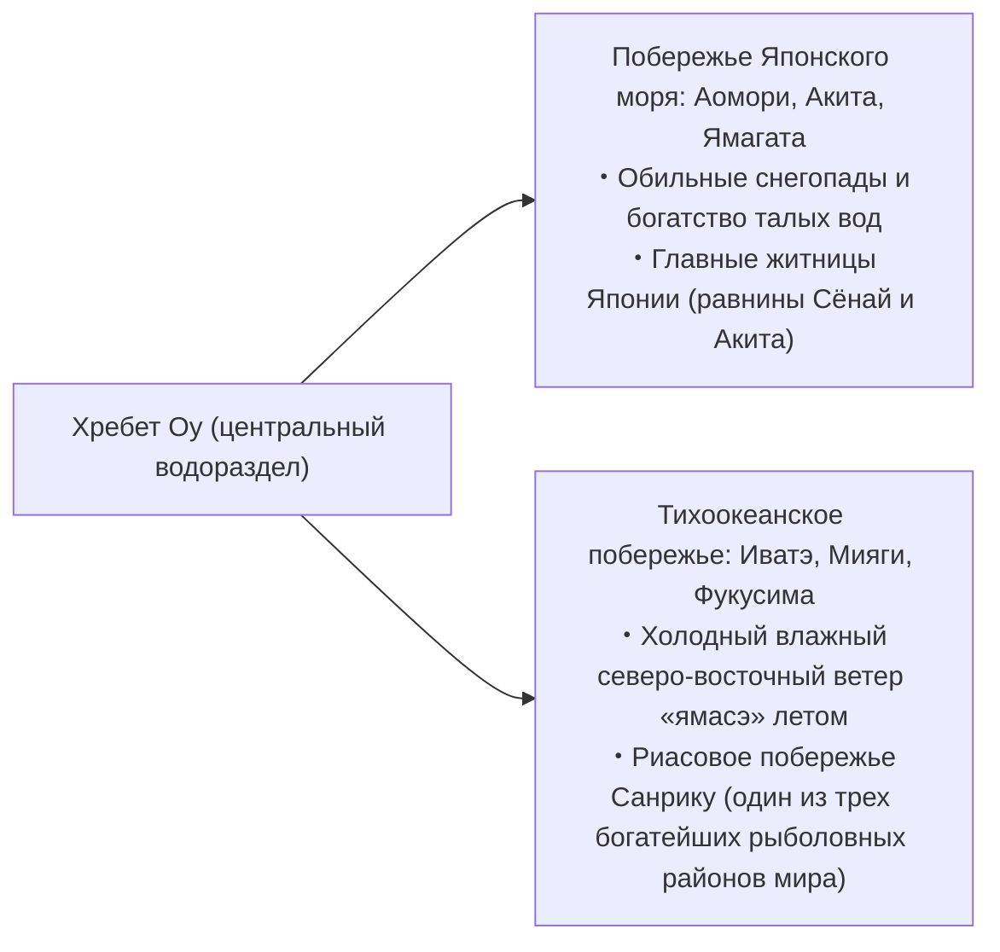
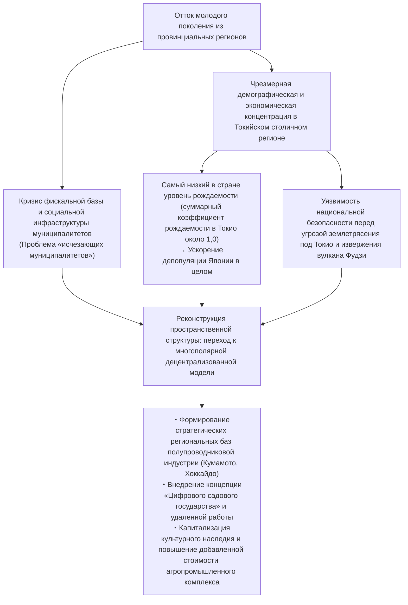
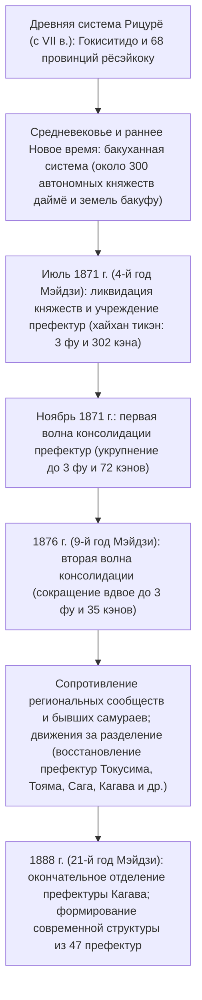

## Введение: Природное разнообразие Японского архипелага и история становления 47 префектур

Японский архипелаг, вытянувшийся гигантской дугой с севера на юг почти на 3000 километров, представляет собой одну из самых крутых и тектонически активных горных островных систем планеты. Он сформировался в зоне Тихоокеанского огненного кольца под воздействием интенсивных коллизий четырех литосферных плит: Евразийской, Северо-Американской (Охотоморской микроплиты), Тихоокеанской и Филиппинской.

Около 70% территории страны занимают покрытые лесом горы. Центральный водораздельный хребет делит архипелаг на контрастные природные зоны: климатическую область побережья Японского моря с колоссальными зимними снегопадами, тихоокеанскую климатическую область с жарким влажным летом и сухой ясной зимой, аридную умеренно теплую зону Внутреннего Японского моря Сэто, зону Центрального нагорья с резкими перепадами суточных и сезонных температур, а также субтропическую климатическую зону Юго-Западных островов (Нансэй). На сравнительно компактной площади архипелага сконцентрировано поразительное разнообразие ландшафтно-климатических экосистем.

```
【Климатические зоны Японского архипелага и орографические механизмы】

┌─────────────────┬───────────────────────────────┬───────────────────────────────┐
│ Климатическая   │ Географический охват          │ Основные климатические харак- │
│ зона            │                               │ теристики и механизмы         │
├─────────────────┼───────────────────────────────┼───────────────────────────────┤
│ Климат побережья│ От побережья Японского моря   │ Северо-западный зимний муссон │
│ Японского моря  │ Хоккайдо до Хокурику и Санъин │ вбирает влагу Цусимского тече-│
│                 │                               │ ния и дает колоссальные снега │
│                 │                               │ при столкновении с хребтами   │
├─────────────────┼───────────────────────────────┼───────────────────────────────┤
│ Климат тихооке- │ Тихоокеанское побережье от    │ Обильные дожди и тайфуны от   │
│ анского побере- │ Тохоку до юга Кюсю            │ юго-восточного летнего муссона│
│ жья             │                               │ Сухая и ясная погода зимой    │
│                 │                               │ с сильным ветром «каракадзэ»  │
├─────────────────┼───────────────────────────────┼───────────────────────────────┤
│ Климат Внутрен- │ Акватория между горами Тюгоку │ Горы задерживают дождевые тучи│
│ него Японского  │ и горами Сикоку (бассейн      │ Теплый малоосадочный климат   │
│ моря (Сэтоути)  │ Сэто-Найкай)                  │ и обилие солнечных дней в году│
├─────────────────┼───────────────────────────────┼───────────────────────────────┤
│ Климат Централь-│ Префектуры Нагано, Яманаси,   │ Высокогорье в кольце хребтов; │
│ ного нагорья    │ субрегион Хида (Гифу) и др.   │ экстремальные перепады темпе- │
│ (Тюо Коти)      │                               │ ратур (зима/лето, день/ночь)  │
├─────────────────┼───────────────────────────────┼───────────────────────────────┤
│ Климат Юго-За-  │ Префектура Окинава, острова   │ Влияние теплого течения Куро- │
│ падных островов │ Амами (Кагосима) и др.        │ сио; субтропический морской   │
│ (Нансэй)        │                               │ климат, жара, влажность, тай- │
│                 │                               │ фуны в течение всего года     │
└─────────────────┴───────────────────────────────┴───────────────────────────────┘
```

Древнее административное районирование Японии опиралось на систему «Гокиситидо» (Пять столичных провинций и Семь путей: Кинай, Токайдо, Тосандо, Хокурикудо, Санъиндо, Санъёдо, Нанкайдо, Сайкайдо), заложенную сводами законов эпохи Рицурё, и насчитывало 68 исторических провинций (рёсэйкоку). Сразу после Реставрации Мэйдзи в ходе реформы «хайхан тикэн» («ликвидация княжеств и учреждение префектур») 1871 года (4-й год Мэйдзи) первоначально возникло более 300 префектур и столичных палат. Пройдя через масштабные волны слияний и разделений, административно-территориальное устройство стабилизировалось лишь в 1888 году (21-й год Мэйдзи) с повторным выделением префектуры Кагава, закрепив современную структуру: «1 то, 1 до, 2 фу, 43 кэна» (47 административных единиц префектурного уровня).

В настоящем фундаментальном исследовании все 47 префектур структурированы по восьми историко-географическим регионам (Хоккайдо, Тохоку, Канто, Тюбу, Кинки, Тюгоку, Сикоку, Кюсю и Окинава). Для каждой территории детально проанализированы исторические провинции, геоморфология, отраслевая структура экономики, социокультурная специфика, а также ключевые вызовы XXI века — демографическая депопуляция и стратегии регионального возрождения.

---

## 1. Регион Хоккайдо: Северный фронтир и масштабный первичный сектор экономики

### 1.1 Префектура Хоккайдо (историч.: земли Эдзо / 11 провинций, включая Исикари, Осима и др.)
- **Административный центр**: г. Саппоро
- **Площадь и орография**: 83 424 км² (1-е место в стране, около 22% общей площади суши Японии). Осевую горную систему образуют хребты Дайсэцудзан и Хидака, окруженные крупнейшими равнинами и плато страны — равниной Исикари, равниной Токати и плато Консэн. Территория расположена в субарктическом климатическом поясе: лето здесь прохладное, а зима суровая, с устойчивым многометровым снежным покровом на обширных пространствах.
- **Отраслевая структура и экономика**:
  - **Сельское хозяйство**: Главная продовольственная база Японии. Развито полеводство (пшеница, сахарная свекла, картофель, фасоль адзуки) и масштабное молочное животноводство (на долю префектуры приходится более 50% общенационального производства сырого молока). В равнине Токати доминируют высокомеханизированные фермерские хозяйства западного типа с наделами в десятки гектаров на одно домохозяйство.
  - **Рыбная промышленность**: 1-е место в стране по объемам вылова и аквакультуры (приморский гребешок, лососевые, минтай, ламинария/комбу).
  - **Туризм и индустрия гостеприимства**: Международный горнолыжный кластер Нисэко с исключительным сухим порошкообразным снегом («пудрой»), полуостров Сирэтоко (объект всемирного природного наследия ЮНЕСКО), лавандовые поля Фурано, снежный фестиваль в Саппоро (Саппоро юки-мацури).
- **История и культура**: Традиционная культура коренного народа айнов (открытие национального комплекса «Упопой» — символического пространства межэтнической гармонии в Сираои). Эпоха освоения периода Мэйдзи силами Колонизационного бюро (Кайтакуси) и военных поселенцев (тондэнхэй). Создание Сельскохозяйственного колледжа Саппоро под руководством доктора Уильяма Кларка, заложившего основы современной агрономии и христианской этики труда.
- **Региональные вызовы**: Стремительная депопуляция периферии на фоне моноцентрической гиперконцентрации населения в Саппоро, хроническая убыточность и угроза закрытия линий железнодорожной компании JR Hokkaido, колоссальные издержки на поддержание протяженной транспортной и социальной инфраструктуры.

---

## 2. Регион Тохоку: Дары хребта Оу и историко-культурный ландшафт Митиноку

Регион Тохоку разделен протянувшимся с севера на юг хребтом Оу на две контрастные природно-климатические и хозяйственные зоны: западную (побережье Японского моря — «снежная страна» и рисоводческая житница) и восточную (тихоокеанское побережье — зона риска холодных летних ветров «ямасэ» и выдающегося морского промысла).



### 2.1 Префектура Аомори (историч.: Цугару, Муцу)
- **Административный центр**: г. Аомори
- **Геоморфология**: Самая северная оконечность острова Хонсю. Полуострова Цугару и Симокита охватывают залив Муцу; в центральной части возвышается горный массив Хаккода, а на западе — горы Сираками (объект всемирного природного наследия ЮНЕСКО).
- **Промышленность и хозяйство**: Национальное лидерство по сбору яблок — около 60% общеяпонского рынка (г. Хиросаки, равнина Цугару). Выращивание морского гребешка в заливе Муцу, всемирно известный тунец из Омы, рыболовный порт Хатинохе. В сфере высоких технологий — ядерный кластер в селе Роккасё (комплекс предприятий ядерного топливного цикла).
- **Культура и традиции**: Фестивали огненных гигантских платформ Аомори Нэбута и Хиросаки Нэпута, виртуозное искусство игры на цугару-дзямисэне, литературное и художественное наследие Осаму Дадзая и Сико Мунакаты. Комплекс стоянок эпохи Дзёмон (Саннай-Маруяма).

### 2.2 Префектура Иватэ (историч.: Рикутю, Рикудзэн, Муцу)
- **Административный центр**: г. Мориока
- **Геоморфология**: 2-е место по площади среди всех префектур после Хоккайдо (15 275 км²). Котловина Китаками вдоль одноименной реки, возвышенность Китаками на востоке и изрезанное глубокими заливами риасовое побережье Санрику.
- **Промышленность и хозяйство**: Кластер полупроводниковых и автомобильных производств в котловине Китаками (заводы Kioxia и др.). Добыча морских водорослей вакамэ, морского ушка (аваби), промысел тихоокеанского лосося и сайры на побережье Санрику. Традиционные ремесла, включая чугунное литье намбу (намбу тэкки).
- **Культура и традиции**: Золотой павильон храма Тюсондзи в Хираидзуми (буддийская концепция Чистой земли клана Осю Фудзивара — объект всемирного культурного наследия ЮНЕСКО). Мировоззрение поэта Кэндзи Миядзавы и его сказочная страна «Ихатов», «Предания Тоно» Кунио Янагиты (колыбель японской этнографии и фольклористики).

### 2.3 Префектура Мияги (историч.: Рикудзэн, Муцу)
- **Административный центр**: г. Сэндай (единственный город, определенный указами правительства, в Тохоку)
- **Геоморфология**: Плодородные заливные рисовые чеки равнины Сэндай, острова Мацусима (один из «Трех знаменитых пейзажей Японии»), полуостров Осика и залив Сэндай.
- **Промышленность и хозяйство**: Административный, деловой и финансовый нервный центр всего региона Тохоку. Выращивание элитных сортов риса «сасанисики» и «хитомэборэ». Крупные центры рыбопереработки в портах Исиномаки и Кэсэннума. Университет Тохоку как фундаментальное ядро науки и инноваций, включая передовой синхротрон нового поколения NanoTerasu.
- **Культура и традиции**: Культурное наследие самурайского княжества Сэндай с доходом в 620 000 коку риса, основанного легендарным полководцем Масамунэ Датэ. Грандиозный летний фестиваль Сэндай Танабата.

### 2.4 Префектура Акита (историч.: Уго, Дэва)
- **Административный центр**: г. Акита
- **Геоморфология**: Равнина Акита, межгорная котловина Ёкотэ, священный вулкан Тёкай, кальдерное озеро Тадзава (самое глубокое озеро Японии — 423 м).
- **Промышленность и хозяйство**: Один из ключевых рисоводческих центров страны, родина всемирно известного сорта «акитакомати». Заготовка ценной деловой древесины акитского кедра (криптомерии акита-суги). Разведение мясной породы кур хинай-дзидори, промысел рыбы хатахата (японского волосозуба). В последние годы — общенациональный флагман ветроэнергетики (включая морские шельфовые ветропарки в Японском море).
- **Культура и традиции**: Фестиваль парящих фонарей Акита Канто-мацури, ритуальные процессии духов Намахагэ на полуострове Ога (нематериальное культурное наследие ЮНЕСКО), девственные буковые леса Сираками.

### 2.5 Префектура Ямагата (историч.: Удзэн, Дэва)
- **Административный центр**: г. Ямагата
- **Геоморфология**: Равнина Сёнай и цепь межгорных котловин (Ёнэдзава, Ямагата, Синдзё), нанизанных на русло реки Могами. Священный комплекс Трех гор Дэва (Гассан, Хагуросан, Юдоносан), вулканический хребет Дзао.
- **Промышленность и хозяйство**: «Плодовое королевство»: на долю префектуры приходится более 70% национального сбора черешни (сорт «Сатонисики»), а также лидерство по грушам сорта «Ла Франс». Элитное рисоводство на равнине Сёнай (сорт «цуяхимэ»). Мраморная говядина Ёнэдзава-гю. Высокоразвитое производство электронных компонентов и точного приборостроения.
- **Культура и традиции**: Древнейшая традиция горного аскетизма сюгэндо на горах Дэва Сандзан, яркий танцевальный фестиваль Ямагата Ханагаса-мацури, ностальгическая атмосфера эпохи Тайсё на термальном курорте Гиндзан-онсэн.

### 2.6 Префектура Фукусима (историч.: Ивасиро, Иваки)
- **Административный центр**: г. Фукусима
- **Геоморфология**: Четко делится на три контрастных субрегиона: горный и снежный Айдзу с богатой самурайской историей, центральную долинную зону Накадори (политическое и экономическое ядро) и прибрежную тихоокеанскую зону Хамадори с мягким океаническим климатом.
- **Промышленность и хозяйство**: Высокоинтенсивное плодоводство в котловине Накадори (персики, груши). Традиционное производство лаковых изделий Айдзу-нури и сакэварение. В прибрежной зоне Хамадори развернута масштабная программа «Fukushima Innovation Coast Framework» (робототехнический полигон Fukushima Robot Test Field, центры водородной энергетики и передовых безуглеродных технологий).
- **Культура и традиции**: Самурайский кодекс чести княжества Айдзувакамацу (подвиг юных воинов отряда «Бяккотай»), знаменитый на всю страну китакатский рамен, конный фестиваль самурайских традиций Сома Номаой. Префектура выступает глобальным первопроходцем посткатастрофического возрождения и зеленого энергетического перехода после Великого восточнояпонского землетрясения 2011 года.

---

## 3. Регион Канто: Концентрация столичных функций и эшелонированный промышленный каркас

Регион Канто, развернувшийся на просторах крупнейшей в Японии равнины Канто, представляет собой органический симбиоз сверхконцентрации политической, финансовой, исследовательской и транспортно-логистической мощи с высокоинтенсивным пригородным агрокомплексом и тяжелой прибрежной индустрией.

```
【Функциональная структура мегалополиса Столичного региона (Канто)】

・Токио: функции общегосударственного центра, мировые финансы и юриспруденция, передовые IT, генерация и экспорт современной культуры
・Префектура Канагава: промышленный пояс Кэйхин, международный торговый порт (Иокогама), научно-исследовательские центры (R&D), туризм и курорты (Сёнан, Хаконэ)
・Префектура Сайтама: внутриконтинентальный транспортно-логистический узел (сеть синкансэнов и скоростных автомагистралей), пригородное сельское хозяйство, машиностроение и логистические хабы
・Префектура Тиба: международный аэропорт Нарита, прибрежный промышленный комплекс Кэйё, рыболовство и пригородное сельское хозяйство (арахис, овощи)
・Префектура Ибараки: наукоград Цукуба, прибрежная промышленная зона Касима, тяжелое машиностроение Hitachi, бахчевые культуры (дыни), корень лотоса (рэнкон)
・Префектура Тотиги: промышленный район Северного Канто (внутриконтинентальное автомобилестроение и точная механика), храмовый комплекс Никко Тосёгу, земляника/клубника (сорт тотиотомэ)
・Префектура Гумма: автомобилестроительный кластер на базе корпорации SUBARU, бальнеологический туризм (Кусацу, Икахо), шелководство и памятники шелковой индустрии
```

### 3.1 Префектура Ибараки (историч.: Хитати)
- **Административный центр**: г. Мито
- **Промышленность и хозяйство**: 3-е место в Японии по стоимости валовой продукции сельского хозяйства (дыни, корень лотоса рэнкон, сушеный батат хоси-имо). Наукоград Цукуба — крупнейший интеллектуальный мозговой центр страны, где сосредоточена треть всех государственных НИИ Японии. Тяжелое электромашиностроение в г. Хитати (родина корпорации Hitachi), металлургический и нефтехимический комбинат в порту Касима.
- **Культура и традиции**: Идеологическая школа Митогаку княжества Мито ветви Токугава (идейный исток движения за свержение сёгуната и лозунга «Сонно дзёи»), один из трех великих садов Японии Кайраку-эн, водопад Фукурода (один из трех красивейших водопадов страны).

### 3.2 Префектура Тотиги (историч.: Симоцукэ)
- **Административный центр**: г. Уцуномия
- **Промышленность и хозяйство**: Непрерывное лидерство в Японии по сбору земляники садовой на протяжении более полувека (элитные сорта «тотиотомэ», «тотиайка»). Развитые внутренние индустриальные парки в районе Уцуномии и Оямы (медицинское оборудование, автомобилестроение и точная механика). Запуск первой в стране современной системы легкорельсового транспорта (LRT) в Уцуномии как передовой образец экологичной урбанистики.
- **Культура и традиции**: Синтоистские и буддийские памятники Никко (святилище Никко Тосёгу — объект всемирного наследия ЮНЕСКО), школа Асикага (старейшее высшее учебное заведение Японии), традиционная керамика масико-яки.

### 3.3 Префектура Гумма (историч.: Кодзукэ)
- **Административный центр**: г. Маэбаси
- **Промышленность и хозяйство**: Крупнейший автомобилестроительный кластер корпорации SUBARU (бывшая авиастроительная компания Накадзима) с эпицентром в г. Ота, сопровождаемый развитой штамповочной и металлообрабатывающей промышленностью. Около 90% общенационального производства конняку (растения аморфофаллус коньяк). Крупнейшие термальные курорты Восточной Японии: Кусацу-онсэн, Икахо-онсэн, Минаками-онсэн.
- **Культура и традиции**: Шёлковая фабрика в Томиоке и памятники шелковой промышленности (объект всемирного культурного наследия ЮНЕСКО). Сплоченность префектурного самосознания на основе краеведческих карт «Дзёмо карута».

### 3.4 Префектура Сайтама (историч.: большая часть провинции Мусаси)
- **Административный центр**: г. Сайтама (город, определенный указами правительства)
- **Промышленность и хозяйство**: 5-е место по численности населения в Японии (около 7,3 млн человек). Станция Омия служит ключевым железнодорожным узлом всей Восточной Японии. Лидирующие позиции в стране по объемам отгрузки продукции пищевой промышленности. Локальные сельскохозяйственные бренды: лук-батун Фукая, чай саяма, рисовые крекеры Сока сэмбэй.
- **Культура и традиции**: Исторический ансамбль купеческих глинобитных складов курадзукури в Кавагоэ («Малый Эдо»), грандиозный ночной фестиваль Титибу ёмацури (нематериальное культурное наследие ЮНЕСКО).

### 3.5 Префектура Тиба (историч.: Симоса, Кадзуса, Ава)
- **Административный центр**: г. Тиба (город, определенный указами правительства)
- **Промышленность и хозяйство**: Международный аэропорт Нарита — главные воздушные грузовые и пассажирские ворота Японии. Прибрежная промышленная зона Кэйё (нефтехимия, черная металлургия). Ведущие позиции в национальном агросекторе (зеленый лук, арахис, шпинат). Рыболовный порт Тёси с рекордными уловами. Индустрия развлечений мирового уровня: Tokyo Disney Resort в Ураясу.
- **Культура и традиции**: Паломнический храмовый комплекс Нарита-сан Синсё-дзи, океанические серфинг- и курортные зоны полуострова Босо.

### 3.6 Токио (историч.: Мусаси, острова Идзу и Огасавара)
- **Административный центр**: спец. район Синдзюку
- **Геоморфология и масштаб**: Население около 14 млн человек (ядро крупнейшего мегалополиса мира с населением столичной агломерации свыше 37 млн человек). Включает 23 специальных района, урбанизированный регион Тама, островную гряду Идзу и удаленные острова Огасавара (объект всемирного природного наследия ЮНЕСКО).
- **Промышленность и экономика**: Колоссальный экономический гигант, генерирующий около 20% ВВП всей Японии. Финансовые и корпоративные центры Маруноути и Отэмати, IT-кластеры и стартап-хабы Сибуи и Роппонги, глобальная столица поп-культуры и электроники Акихабара, международный авиахаб Ханэда.
- **Культура**: Ультрасовременный мировой мегаполис, где зеркальные небоскребы гармонично соседствуют с историческими реликвиями: фундаментом главной башни замка Эдо, древним храмом Сэнсо-дзи в Асакусе и священным лесом святилища Мэйдзи дзингу.

### 3.7 Префектура Канагава (историч.: Сагами, южная часть Мусаси)
- **Административный центр**: г. Иокогама (население около 3,77 млн человек — крупнейший базовый муниципалитет Японии)
- **Промышленность и экономика**: 2-е место по численности населения в стране (около 9,2 млн человек). Центральное звено промышленной зоны Кэйхин (штаб-квартира Nissan Motor, металлургические комбинаты JFE Steel и др.). Высокая концентрация исследовательских центров в футуристическом прибрежном деловом районе Минато Мирай 21. Кластер высоких и экологических технологий в г. Кавасаки.
- **Культура и традиции**: Древняя самурайская столица Камакура (колыбель первого сёгуната и воинской культуры), космополитичный колорит открытого порта Иокогама, морская молодежная субкультура побережья Сёнан, исторические термы Хаконэ.

---

## 4. Регион Тюбу: Промышленный хребет Японии и альпийская орография

Расположенный в самом сердце острова Хонсю, регион Тюбу подразделяется на три выраженных субрегиона: Хокурику (побережье Японского моря), Центральное нагорье (внутриконтинентальные горные плато) и Токай (тихоокеанское побережье). Именно здесь бьется самое мощное индустриальное сердце японского машиностроения («монодзукури»).

### 4.1 Префектура Ниигата (историч.: Этиго, Садо)
- **Административный центр**: г. Ниигата (город, определенный указами правительства)
- **Промышленность и хозяйство**: Бассейны рек Синано и Агано питают плодородную равнину Этиго — абсолютного национального лидера по производству риса сорта «косихикари». Города Цубамэ и Сандзё образуют всемирно признанный центр металлообработки, кованого инструмента и столовых приборов европейского типа. Разведение декоративных карпов кои (нисикигои). Добыча природного газа и нефти.
- **Культура и традиции**: Золотые прииски острова Садо (объект всемирного наследия ЮНЕСКО), легендарный фестиваль фейерверков в Нагаоке, международное триеннале современного искусства Этиго-Цумари.

### 4.2 Префектура Тояма (историч.: Эттю)
- **Административный центр**: г. Тояма
- **Промышленность и хозяйство**: Дешевая гидроэлектроэнергия альпийских рек компании Hokuriku Electric Power сформировала мощный кластер прокатки алюминия, тяжелой химии и биофармацевтики. Высокая концентрация фармацевтических предприятий, унаследовавших многовековые традиции тоямских странствующих аптекарей («Тояма-но кусуриури»). Залив Тояма служит «естественным садком» деликатесных морепродуктов (кальмар-светлячок хотару-ика, белая креветка широ-эби, зимний желтохвост бури).
- **Культура и традиции**: Пики хребта Татэяма и колоссальная арочная плотина Куробэ (Альпийский экскурсионный маршрут Татэяма-Куробэ). Деревни с традиционными соломенными домами в стиле гассё-дзукури в Гокаяме (всемирное культурное наследие ЮНЕСКО).

### 4.3 Префектура Исикава (историч.: Кага, Ното)
- **Административный центр**: г. Канадзава
- **Промышленность и хозяйство**: Высокодоходный культурный туризм, опирающийся на богатое наследие самурайского княжества Кага («Кага хякумангоку» с доходом в миллион коку). Текстильное машиностроение, тяжелая строительная техника (родина корпорации Komatsu), углеродные композитные материалы.
- **Культура и традиции**: Сад Кэнроку-эн (один из трех великих садов Японии), сусальное золото (99% национального рынка), керамика кутани-яки, лак вадзима-нури. Творческое преодоление последствий разрушительного землетрясения на полуострове Ното 2024 года.

### 4.4 Префектура Фукуи (историч.: Этидзэн, Вакаса)
- **Административный центр**: г. Фукуи
- **Промышленность и хозяйство**: Город Сабаэ обеспечивает 95% общеяпонского производства оправ для очков. Текстильная индустрия и электронные компоненты (заводы Murata Manufacturing и др.). Историческая родина селекции риса сорта «косихикари». Деликатесный глубоководный краб Этидзэн-гани. Крупный комплекс атомных электростанций в субрегионе Рэйнан.
- **Культура и традиции**: Главный монастырь школы Сото-дзэн Эйхэй-дзи, основанный патриархом Догэном; всемирно признанный Музей динозавров префектуры Фукуи; базальтовые прибрежные утесы Тодзимбо. Префектура традиционно удерживает верхние строчки в национальном рейтинге уровня счастья населения.

### 4.5 Префектура Яманаси (историч.: Каи)
- **Административный центр**: г. Кофу
- **Промышленность и хозяйство**: Первое место в Японии по урожаю винограда, персиков и японской сливы сумомо. Историческая колыбель японского промышленного виноделия (район Кацунума). Лидер страны по огранке драгоценных камней и ювелирному делу. Штаб-квартира и производственные мощности FANUC — мирового гиганта робототехники и систем ЧПУ для станков. Экспериментальный участок сверхскоростной магнитолевитационной дороги Chuo Shinkansen (Маглев).
- **Культура и традиции**: Исторические памятники эпохи полководца Сингэна Такэды, Пять озёр Фудзи у подножия священной горы, живописное ущелье Сёсэнке.

### 4.6 Префектура Нагано (историч.: Синано)
- **Административный центр**: г. Нагано
- **Промышленность и хозяйство**: Горная префектура, увенчанная хребтами Японских Альп (Хида, Кисо, Акаиси). Высокоразвитое точное машиностроение и микроэлектроника («Швейцария Востока» — Seiko Epson и др.). Выращивание высокогорных овощей (салат-латук, пекинская капуста), яблок. Национальный лидер по продолжительности здоровой жизни граждан.
- **Культура и традиции**: Древний паломнический буддийский храм Дзэнко-дзи, замок Мацумото (национальное сокровище с подлинным черным деревянным донжоном), элитные горные и дачные курорты Камикоти и Каруидзава.

### 4.7 Префектура Гифу (историч.: Мино, Хида)
- **Административный центр**: г. Гифу
- **Промышленность и хозяйство**: Город Сэки — один из трех величайших мировых центров ножевого и клинкового производства. Керамика мино-яки (более половины всей столовой посуды Японии). Аэрокосмический кластер в Какамигахаре (заводы Kawasaki Heavy Industries). Традиционное производство деревянной мебели в Хида-Такаяме.
- **Культура и традиции**: Историческая деревня Сиракава-го (объект всемирного наследия ЮНЕСКО), старинные деревянные кварталы купеческой Такаямы, традиционная ночная рыбалка с бакланами на реке Нагара (укаи).

### 4.8 Префектура Сидзуока (историч.: Тотоми, Суруга, Идзу)
- **Административный центр**: г. Сидзуока (город, определенный указами правительства)
- **Промышленность и хозяйство**: Входит в число безусловных лидеров страны по стоимости отгруженной промышленной продукции. Мировое царство транспортного машиностроения — колыбель корпораций Suzuki, Yamaha и Honda. 1-е место в Японии по производству зеленого чая. Абсолютное мировое лидерство по выпуску масштабных пластиковых сборных моделей (Tamiya, Bandai, Hasegawa). Крупнейший океанический порт Яидзу по разгрузке тунца и пеламиды (кацуо).
- **Культура и традиции**: Священная гора Фудзи (объект всемирного наследия ЮНЕСКО), бальнеологические курорты полуострова Идзу, историческое место упокоения и отставки сёгуна Иэясу Токугавы (замок Сумпу и святилище Кунодзан Тосёгу).

### 4.9 Префектура Айти (историч.: Овари, Микава)
- **Административный центр**: г. Нагоя (город, определенный указами правительства)
- **Промышленность и хозяйство**: **Более 40 лет подряд удерживает абсолютное 1-е место в Японии по объему производства промышленной продукции** — несокрушимая империя японского «монодзукури». Глобальная цитадель автоконцерна Toyota Motor Corporation и колоссального созвездия поставщиков автокомпонентов. Центр японской аэрокосмической промышленности (предприятия Mitsubishi Heavy Industries). Выпуск специальной стали, станкостроение, техническая керамика.
- **Культура и традиции**: Родина «Трех великих объединителей Японии» (Нобунаги Оды, Хидэёси Тоётоми, Иэясу Токугавы). Древнее императорское святилище Ацута-дзингу (место хранения священного меча Кусанаги), замок Нагоя с золотыми сячихоко. Самобытная гастрономия «Нагоя-мэси» (мисо-кацу, угорь хицумабуси, куриные крылышки тэбасаки).

---

## 5. Регион Кинки (Кансай): Тысячелетняя столица и многослойный экономический конгломерат

Регион Кинки (Кансай), служивший политическим, духовным и культурным центром японского государства с древнейших времен до эпохи раннего Нового времени, демонстрирует уникальный баланс: гигантский коммерческий центр Осака, космополитичный глубоководный порт Кобе и древние имперские столицы Киото и Нара образуют сложную полицентрическую экосистему.

```
【Функциональная дифференциация и историческое многообразие региона Кинки (Кансай)】

・Префектура Осака: купеческий дух и коммерческий центр, международные финансы, всемирные выставки Экспо (1970/2025), науки о жизни (биофармацевтика), гастрономическая культура
・Префектура Киото: тысячелетний культурный капитал Хэйан-кё, штаб-квартиры мировых высокотехнологичных корпораций (Nintendo, Kyocera и др.), традиционные ремесла, международный туризм
・Префектура Хёго: морская торговля (порт Кобе), прибрежный промышленный пояс Харима, винокурение саке района Нада, аграрная и морская продукция провинций Тамба и Тадзима
・Префектура Нара: колыбель древнего царства Ямато, древняя столица Хэйдзё-кё, сокровищница буддийского искусства (храмы Хорю-дзи, Тодай-дзи)
・Префектура Сига: крупнейшее в Японии озеро Бива («водохранилище» для 14 млн жителей Кинки), традиции торговцев Оми, высокотехнологичное внутреннее производство
・Префектура Миэ: святилище Исэ (вершина синтоистского пантеона), гоночная трасса Судзука, жемчужные фермы, нефтехимический комплекс Ёккаити
・Префектура Вакаяма: священные горы Коя-сан и Кумано Сандзан (места паломничества и священные тропы), национальное лидерство по сбору мандаринов унсю и слив умэбоси
```

### 5.1 Префектура Миэ (историч.: Исэ, Ига, Сима, восточная часть Кии)
- **Административный центр**: г. Цу
- **Промышленность и хозяйство**: Нефтехимический и микроэлектронный комплекс Ёккаити. Всемирно известная элитная мраморная говядина Мацусака-гю, культивация морского жемчуга акоя в заливе Аго, промысел колючих лангустов Исэ-эби.
- **Культура и традиции**: Главное святилище нации Исэ-дзингу (храмы Котайдзингу и Тоёукэ-дайдзингу), колыбель ниндзя школы Ига-рю, паломнические маршруты Кумано-кодо (тракт Исэдзи).

### 5.2 Префектура Сига (историч.: Оми)
- **Административный центр**: г. Оцу
- **Промышленность и хозяйство**: Стратегический транспортный перекресток вокруг озера Бива. Кластер материнских заводов и R&D-центров таких гигантов, как Toray и Panasonic. Древняя керамика сигараки-яки. Рисоводство (рис Оми) и мраморная говядина Оми-гю.
- **Культура и традиции**: Монастырь Энряку-дзи на горе Хиэй (колыбель всех основных школ японского буддизма), замок Хиконэ (национальное сокровище), этический кодекс купцов Оми «сампо-ёси» («благо для покупателя, продавца и общества»).

### 5.3 Префектура Киото (историч.: Ямасиро, Тамба, Танго)
- **Административный центр**: г. Киото (город, определенный указами правительства)
- **Промышленность и хозяйство**: Один из величайших историко-культурных центров планеты. Родина и штаб-квартиры глобальных технологических лидеров: Nintendo, Kyocera, OMRON, Shimadzu, Nidec. Шелковое ткачество нисидзин-ори, художественная керамика киёмидзу-яки, элитный зеленый чай из Удзи.
- **Культура и традиции**: Памятники исторической части Киото (17 храмов и святилищ в списке всемирного наследия ЮНЕСКО), легендарный праздник Гион-мацури, ритуал зажжения огней на пяти горах Годзан Окуриби.

### 5.4 Префектура Осака (историч.: восточная часть Сэтцу, Кавати, Идзуми)
- **Административный центр**: г. Осака (город, определенный указами правительства)
- **Промышленность и хозяйство**: Крупнейшая экономическая агломерация Западной Японии. Родина универсальных торговых домов (Itochu, Sumitomo), глобальный кластер фармацевтики и наук о жизни (Takeda Pharmaceutical и др.), непревзойденная концентрация малых и средних высокоточных производств в г. Хигасиосака. Международный аэропорт Кансай, возведенный на искусственном острове.
- **Культура и традиции**: Замок Осака, бурлящий неоном район Дотонбори, театр марионеток бунраку, комедийный жанр камигата-ракуго и театр Ёсимото сингигэки; культ сытной уличной мучной еды «конамон» (такояки, окономияки). Группа древних курганов кофун Модзу-Фуруити (включая грандиозную усыпальницу императора Нинтоку — объект всемирного наследия ЮНЕСКО).

### 5.5 Префектура Хёго (историч.: западная часть Сэтцу, Тамба, Тадзима, Харима, Авадзи)
- **Административный центр**: г. Кобе (город, определенный указами правительства)
- **Промышленность и хозяйство**: Морской контейнерный хаб международного значения в порту Кобе. Тяжелое машиностроение, металлургия и транспортное судостроение (Kawasaki Heavy Industries, Kobe Steel). Приморский индустриальный пояс Харима. Район Нада-гого — абсолютный лидер Японии по производству сакэ премиум-класса. Сладкий лук с острова Авадзи, всемирно признанная мраморная говядина Кобе-биф.
- **Культура и традиции**: Замок Химэдзи (первый объект всемирного наследия ЮНЕСКО в Японии, шедевр фортификации «Замок Белой Цапли»), древнейший термальный курорт Арима-онсэн, квартал исторических особняков иностранных купцов Китано Идзинкана в Кобе.

### 5.6 Префектура Нара (историч.: Ямато)
- **Административный центр**: г. Нара
- **Промышленность и хозяйство**: Индустрия международного культурного туризма, заготовка ценного леса (криптомерия и кипарисовик из Ёсино), национальное первенство по пошиву трикотажных носков (район городка Корё), традиционное производство туши для каллиграфии (суми) и бамбуковых венчиков для чая (тясэн).
- **Культура и традиции**: Памятники древней Нары (храмы Тодай-дзи с гигантской статуей Великого Будды Дайбуцу, Кофуку-дзи, святилище Касуга-тайся), древнейшие в мире сохранившиеся деревянные сооружения храмового комплекса Хорю-дзи, тысячелетние цветущие сакуры горы Ёсино и святыни сюгэндо.

### 5.7 Префектура Вакаяма (историч.: западная часть Кии)
- **Административный центр**: г. Вакаяма
- **Промышленность и хозяйство**: Абсолютное лидерство в Японии по урожаю мандаринов унсю, сортовых слив «нанко-умэ» (для соленых слив умэбоси), цитрусовых хассаку и японского душистого перца сансё. Металлургический комбинат Nippon Steel в Вакаяме.
- **Культура и традиции**: Священные места и паломнические тропы в горах Кии (монастырский комплекс Коя-сан школы Сингон с храмом Конгобу-дзи, три святилища Кумано Сандзан — объект всемирного наследия ЮНЕСКО), морской курорт с белыми пляжами Сирахама-онсэн.

---

## 6. Регион Тюгоку: Побережье комбината Сэтоути и сакральный мир Санъин

Регион Тюгоку разделен хребтом Тюгоку на две контрастные половины: процветающий промышленный и залитый солнцем южный субширотный коридор «Санъё» (побережье Внутреннего моря Сэто) и северный субширотный коридор «Санъин» (побережье Японского моря), где сохранились первозданная природа и священные ландшафты синтоистских мифов о сотворении земли.

### 6.1 Префектура Тоттори (историч.: Инаба, Хоки)
- **Административный центр**: г. Тоттори
- **Геоморфология и промышленность**: Префектура с наименьшей численностью населения в Японии (около 540 тыс. человек). Песчаное земледелие на знаменитых песчаных дюнах Тоттори (лук-шалот раккё). Абсолютное первенство по выращиванию груш сорта «Нидзиссэйки» («XX век»). Выращивание лука-порея сиронэги, крупнейшая выгрузка снежного краба в порту Сакаиминато.
- **Культура и традиции**: Миф о Белом кролике из Инабы, радиоактивные радоновые ванны курорта Мисаса-онсэн, висячий деревянный павильон Нагеирэдо храма Самбуцу-дзи на скале горы Митоку (национальное сокровище Японии).

### 6.2 Префектура Симанэ (историч.: Идзумо, Ивами, Оки)
- **Административный центр**: г. Мацуэ
- **Геоморфология и промышленность**: Равнина Идзумо, солоноватое озеро Синдзи (1-е место в стране по добыче моллюсков сидзими). Производство специализированной инструментальной стали высочайшей чистоты (традиционная сталь «ясуки-хаганэ» / завод Hitachi Metals). Выращивание цикламенов и винограда «Делавэр».
- **Культура и традиции**: Великое святилище Идзумо-тайся (место ежегодного схода всех богов пантеона ками и колыбель мифа о передаче страны Ниниги), памятники серебряных рудников Ивами Гиндзан (объект всемирного наследия ЮНЕСКО), геопарк ЮНЕСКО на островах Оки.

### 6.3 Префектура Окаяма (историч.: Мимасака, Бидзэн, Биттю)
- **Административный центр**: г. Окаяма (город, определенный указами правительства)
- **Промышленность и хозяйство**: Мощный прибрежный промышленный узел Мидзусима (нефтепереработка, металлургия, автосборка). «Плодовое царство» элитных белых персиков хакуто и мускатного винограда «Александрийский мускат». Историческая родина первого в Японии производства джинсовой ткани и студенческой униформы в районе Кодзима.
- **Культура и традиции**: Исторический заповедный квартал беленых складов Курасики Бикан, классический сад Кораку-эн (один из трех великих садов Японии), старейшая неглазурованная керамика бидзэн-яки.

### 6.4 Префектура Хиросима (историч.: Аки, Бинго)
- **Административный центр**: г. Хиросима (город, определенный указами правительства)
- **Промышленность и хозяйство**: Крупнейший мегаполис и экономический центр регионов Тюгоку и Сикоку. Автомобильный кластер во главе с корпорацией Mazda, металлургический комбинат JFE Steel в Фукуяме, историческое военное и торговое судостроение (гг. Курэ, Ономити). Лидерство в стране по культивации съедобных устриц (более половины общеяпонского урожая). 1-е место по производству лимонов.
- **Культура и традиции**: Два выдающихся объекта всемирного наследия ЮНЕСКО: парящее над волнами святилище Ицукусима на острове Миядзима и Мемориал мира Купол Гэмбаку. Международная миссия города как всемирного глашатая ядерного разоружения и мира. Литературные крутые улочки и кинематографические холмы приморского Ономити.

### 6.5 Префектура Ямагути (историч.: Суо, Нагато)
- **Административный центр**: г. Ямагути
- **Промышленность и хозяйство**: Нефтехимический и неорганический комбинат Сюнан на побережье Внутреннего моря. Химические предприятия и цементные заводы корпорации UBE в г. Убэ. Вылов деликатесной рыбы фугу и морского черта (анко) в порту Симоносэки.
- **Культура и традиции**: Школа Сёка сондзюку реформатора Сёина Ёсиды в Хаги, воспитавшая ключевых лидеров Реставрации Мэйдзи (объект всемирного наследия ЮНЕСКО). Пятиарочный деревянный мост Кинтайкё в Ивакуни, карстовое плато Акиёсидаи с пещерой Акиёсидо, мост над бирюзовым проливом Цуносима.

---

## 7. Регион Сикоку: Историческое наследие Нанкайдо, индустрия Сэтоути и тихоокеанский промысел

Горный массив Сикоку рассекает остров в широтном направлении, создавая разительный контраст между теплым и засушливым северным побережьем Внутреннего моря Сэто (префектуры Кагава и Эхимэ) и влажным океаническим южным склоном (префектуры Коти и Токусима). Остров прочно интегрирован в экономику Хонсю посредством трех грандиозных мостовых систем: моста Онаруто, мостового перехода Сэто Охаси и эстакады Симанами Кайдо.

### 7.1 Префектура Токусима (историч.: Ава)
- **Административный центр**: г. Токусима
- **Промышленность и хозяйство**: Выращивание цитрусовых судачи (более 90% национального сбора), элитного сладкого картофеля «Наруто Кинтоки», разведение мясных кур породы аваодори. Мировой центр оптоэлектроники и светодиодов, сформировавшийся вокруг штаб-квартиры корпорации Nichia Corporation (мирового лидера в создании синих светодиодов и люминофоров).
- **Культура и традиции**: Всемирно известный 400-летний танцевальный карнавал Ава-одори, гигантские морские водовороты в проливе Наруто, уединенные дикие ущелья долины Ия с висячими мостами из виноградной лозы (Кадзурабаси).

### 7.2 Префектура Кагава (историч.: Сануки)
- **Административный центр**: г. Такамацу
- **Промышленность и хозяйство**: Обладая самой маленькой географической площадью среди всех префектур Японии, отличается исключительно высокой плотностью населения и экономической активности. Общеяпонский феномен «сануки-удон», ставший драйвером массового гастрономического туризма. 1-е место в стране по культивации оливковых деревьев и выпуску оливкового масла (остров Сёдосима). Индустриальная зона Банносю (нефтепереработка, судостроение).
- **Культура и традиции**: Паломнический комплекс Котохира-гу (святилище Компира-сан), шедевр ландшафтного искусства сад Рицурин-коэн, Триеннале современного искусства Сетоути (мекка мирового арт-туризма на островах Наосима, Тэсима и др.).

### 7.3 Префектура Эхимэ (историч.: Иё)
- **Административный центр**: г. Мацуяма
- **Промышленность и хозяйство**: Национальный синоним первоклассных цитрусовых — мандаринов унсю и сортовых гибридов. Премиальные полотенца Имабари (всемирно признанный бренд бескомпромиссного качества). Город Имабари образует крупнейший морской кластер Японии (судовладельческие компании и судоверфи). Целлюлозно-бумажный и упаковочный кластер в Сикокутюо, металлургия цветных металлов в Ниихаме (медеплавильное наследие Sumitomo).
- **Культура и традиции**: Старейший бальнеологический термальный комплекс страны Дого-онсэн (историческое главное здание Хонкан), замок Мацуяма на холме, живописный морской велосипедный маршрут Симанами Кайдо.

### 7.4 Префектура Коти (историч.: Тоса)
- **Административный центр**: г. Коти
- **Промышленность и хозяйство**: Раннее тепличное овощеводство в условиях теплого климата (баклажаны), абсолютное первенство в стране по сбору имбиря и пряного миога. Традиционный промысел тунца-пеламиды (кацуо) методом ярусного и прибрежного удебного лова. Комплексные отрасли глубоководной океанической воды.
- **Культура и традиции**: Свободолюбивый бунтарский дух движения за свободу и народные права, взрастивший легендарного героя Рёму Сакамото; экспрессивный фестиваль танца Ёсакой, лунный океанический пляж Кацурахама, кристально чистая река Симанто — «последняя нетронутая река Японии».

---

## 8. Регион Кюсю и Окинава: Ворота в Азию и культурная самобытность Юго-Западных островов

Расположенный ближе всего к восточноазиатскому материку, этот регион со времен древних пограничных стражей «сакимори» и посольств в танский Китай «кэнтоси» всегда служил передовым рубежом внешней торговли и культурного обмена Японии. Сегодня здесь наблюдается бурное возрождение полупроводниковой индустрии («Кремниевый остров») наряду с развитием вулканического и морского туризма.

```
【Региональный потенциал и структура промышленности региона Кюсю и Окинава】

・Префектура Фукуока: экономический центр Кюсю, ворота в Азию, мегаполис с аэропортом в 5 минутах от центра, специальная зона для IT и стартапов
・Префектура Сага: фарфор Арита и Имари, осенний фестиваль Карацу кунти, выращивание риса на равнине Сага и сбор водорослей нори в заливе Ариаке
・Префектура Нагасаки: торговля намбан и фактория Дэдзима, наследие тайных христиан, судостроение, добыча морепродуктов на риасовом побережье
・Префектура Кумамото: полупроводниковый мегакластер мирового уровня благодаря заводу TSMC (JASM), кальдера вулкана Асо, город со 100% водоснабжением из подземных источников
・Префектура Оита: первое место в Японии по числу горячих источников и дебиту термальных вод («онсэн-префектура» — Бэппу, Юфуин), геотермальная энергетика, прибрежный промышленный комплекс Оита
・Префектура Миядзаки: рекордная продолжительность солнечного сияния и субтропический климат (манго, сладкий перец, говядина Миядзаки-гю), серфинг в море Хюга-нада
・Префектура Кагосима: королевство черных свиней (куробута), черной говядины (куроуси), батата и дистиллята сётю, вулкан Сакурадзима, объекты всемирного природного наследия ЮНЕСКО (острова Якусима и Амами)
・Префектура Окинава: самобытная история Королевства Рюкю, замок Сюри, океанариум Тюрауми, субтропические курорты, трансформация экономики военных баз и курс на экономическую автономию
```

### 8.1 Префектура Фукуока (историч.: Тикудзэн, Тикуго, Будзэн)
- **Административный центр**: г. Фукуока (город, определенный указами правительства, население около 1,6 млн человек)
- **Промышленность и хозяйство**: Главный торгово-финансовый нервный центр острова Кюсю. Индустриальный район Китакюсю (родина государственного металлургического завода Явата, робототехнический концерн Yaskawa Electric). Международный порт Хаката и международный аэропорт Фукуока (уникальная доступность — всего 5 минут на метро до делового центра Хаката). Специальная регуляторная зона для IT-стартапов. Выращивание элитной земляники «амаоу».
- **Культура и традиции**: Экспрессивный фестиваль Хаката Гион Ямакаса, святилище Дадзайфу Тэммангу (усыпальница покровителя наук Митидзанэ Сугавары), самобытная культура ночных уличных лавок «ятай», островной храмовый комплекс Мунаката-тайся (объект всемирного наследия ЮНЕСКО).

### 8.2 Префектура Сага (историч.: восточная часть Хидзэн)
- **Административный центр**: г. Сага
- **Промышленность и хозяйство**: Керамика арита-яки и имари-яки (колыбель японского благородного фарфора). Аквакультура морских водорослей нори в заливе Ариаке (многолетнее непрерывное 1-е место в стране по объему продаж). Мраморная говядина Сага-гю. Атомная электростанция Гэнкай.
- **Культура и традиции**: Археологический парк Ёсиногари (крупнейшее в Японии укрепленное рвом поселение эпохи Яёй), древние термы Такэо-онсэн, осенний парад гигантских платформ Карацу кунти.

### 8.3 Префектура Нагасаки (историч.: западная часть Хидзэн, острова Ики и Цусима)
- **Административный центр**: г. Нагасаки
- **Промышленность и хозяйство**: Флагман японского тяжелого военного и коммерческого судостроения на верфях Mitsubishi Heavy Industries в Нагасаки. 2-е место по протяженности береговой линии среди всех префектур страны, обусловившее колоссальные уловы ставриды и скумбрии. 1-е место по урожаю мушмулы японской (бива).
- **Культура и традиции**: Памятники тайных христиан в регионе Нагасаки и Амакуса (объект всемирного наследия ЮНЕСКО), объекты промышленной революции эпохи Мэйдзи (включая необитаемый шахтерский остров-крепость Гункандзима / Хасима), голландский тематический парк Huis Ten Bosch.

### 8.4 Префектура Кумамото (историч.: Хиго)
- **Административный центр**: г. Кумамото (город, определенный указами правительства)
- **Промышленность и хозяйство**: В связи со строительством гигантских фабрик мирового полупроводникового лидера TSMC (JASM) в городке Кикуё префектура переживает **беспрецедентный инвестиционный бум в сфере полупроводников**. 1-е место в стране по урожаю томатов и арбузов. Уникальная городская гидросистема: 100% питьевого водоснабжения миллионной агломерации обеспечивается чистейшими подземными артезианскими водами вулканического бассейна Асо.
- **Культура и традиции**: Замок Кумамото (неприступный фортификационный шедевр полководца Киёмасы Като), одна из крупнейших в мире обитаемых вулканических кальдер вулкана Асо, мостовая группа Пяти мостов Амакуса.

### 8.5 Префектура Оита (историч.: Бунго, южная часть Будзэн)
- **Административный центр**: г. Оита
- **Промышленность и хозяйство**: «Онсэн-префектура» с абсолютным национальным первенством по количеству действующих минеральных источников и суммарному дебиту термальных вод (мировые курорты Бэппу-онсэн и Юфуин-онсэн). Прибрежный индустриальный комплекс Оита (черная металлургия, нефтепереработка, полимерная химия). Сбор цитрусовых кабосу (около 90% общенационального объема), заготовка сушеных древесных грибов шиитаке.
- **Культура и традиции**: Древнее синтоистское святилище Уса-дзингу (главный храм среди всех святилищ Хатимана в Японии), буддийско-синтоистский монастырский ансамбль Рокуго Мандзан на полуострове Кунисаки.

### 8.6 Префектура Миядзаки (историч.: Хюга)
- **Административный центр**: г. Миядзаки
- **Промышленность и хозяйство**: Мягкий субтропический климат и обилие осадков обеспечивают триумф мясного животноводства: говядина Миядзаки-гю (многократный обладатель высшей премии Премьер-министра на Всеяпонском конкурсе вагю), элитное культивирование спелых манго («Яйцо Солнца» — Таё-но тамаго), лидирующие объемы производства свинины и цыплят-бройлеров. 1-е место в стране по заготовке деловой древесины японского кедра (суги).
- **Культура и традиции**: Базальтовое ущелье Такатихо — место сошествия внука богини Аматэрасу на землю в синтоистской мифологии (священные ночные танцы ёкагура), островное святилище Аосима, пещерное святилище Удо-дзингу на отвесной океанической скале.

### 8.7 Префектура Кагосима (историч.: Сацума, Осуми)
- **Административный центр**: г. Кагосима
- **Промышленность и хозяйство**: 2-е место по совокупной стоимости аграрного производства в Японии. Знаменитая порода черных свиней Кагосима куробута, мясной скот курогэ вагю, батат, промышленное разведение речного угря унаги, бройлерное птицеводство. Производство традиционного крепкого дистиллята хонкаку-сётю. Космический центр Танэгасима Японского агентства аэрокосмических исследований (JAXA) — главный космодром страны.
- **Культура и традиции**: Панорама действующего вулкана Сакурадзима над гладью залива Кинко (Кагосима). Могущественное самурайское княжество Сацума — лидер буржуазной Реставрации Мэйдзи (родина Такамори Сайго и Тосимити Окубо). Объекты всемирного природного наследия ЮНЕСКО: гигантские реликтовые криптомерии острова Якусима («Дзёмон-суги») и девственные субтропические леса острова Амами-Осима.

### 8.8 Префектура Окинава (историч.: Королевство Рюкю)
- **Административный центр**: г. Наха
- **Геоморфология**: Самая южная и западная префектура Японии, состоящая из десятков субтропических атоллов и островов архипелагов Мияко и Яэяма (Исигаки, Ириомотэ и др.).
- **Промышленность и хозяйство**: Международный морской и курортный туризм высшего класса. Целенаправленное привлечение IT-компаний и центров обработки данных. Плантации сахарного тростника, автохтонная порода свиней агу, горький огурец гоя, дистиллят авамори. Снижение зависимости от доходов, связанных с размещением военных баз США, и укрепление экономической автономии.
- **Культура и традиции**: Памятники гусуку и материальное наследие Королевства Рюкю (руины замка Сюри и др. — объект всемирного наследия ЮНЕСКО). Динамичный танец эйса, трехструнный лютневый инструмент сансин, тончайший лак рюкю-нури, техника окрашивания тканей бингата. Философия питания «исику догэн» («медицина и пища происходят из одного корня») и феномен долгожительства («нутигусуи» — целебная пища для жизни).

---

## 9. Региональные вызовы XXI века: Гиперконцентрация в Токио и доктрина многополярного расселения

Панорамный анализ орографии и структуры экономики всех 47 префектур обнажает ключевое фундаментальное противоречие современной Японии: **«экстремальную пространственную сверхконцентрацию населения и капитала в Большом Токио на фоне стремительной депопуляции, старения и угасания провинциальных территорий»**.



### 9.1 «Исчезающие муниципалитеты» и предел износа инфраструктуры
Согласно резонансному «докладу Масуды» 2014 года и обновленным расчетам Совета по демографической стратегии, более 40% всех муниципалитетов Японии находятся под угрозой исчезновения. Непрерывный отток молодых женщин в Столичный регион лишает периферию демографического воспроизводства. В отдаленных поселениях закрываются и объединяются школы, свертываются маршруты общественного транспорта, а у местных бюджетов иссякают финансовые ресурсы для поддержания и капитального ремонта критической физической инфраструктуры: водопроводных сетей, мостовых переходов и автодорог.

### 9.2 Импульс возрождения провинций: Полупроводники и возобновляемая энергетика
Тем не менее, в 2020-е годы наметился исторический тектонический сдвиг.
Во-первых, соображения экономической безопасности подтолкнули размещение мегафабрик по производству передовых полупроводников за пределами столичного ареала. Многотриллионные инвестиции в префектуру Кумамото (заводы TSMC / JASM) и город Титосэ на Хоккайдо (консорциум Rapidus) вызвали мощный возвратный приток смежных высокотехнологичных производств, исследовательских центров и высокооплачиваемых рабочих мест в регионы.
Во-вторых, глобальный тренд на декарбонизацию и зеленый переход (Green Transformation, GX) превращает обширные провинциальные пространства (офшорные ветропарки в Тохоку и на побережье Японского моря, геотермальные, солнечные и биомассовые мощности Хоккайдо и Кюсю) в важнейшие национальные узлы энергетической безопасности страны.

---

## 0. История эволюции административно-территориального деления: От древних провинций через ликвидацию княжеств к великому слиянию префектур

Существующая сетка административного управления из «47 префектур» отнюдь не является извечной исторической константой. Это результат драматических социально-политических экспериментов, проб и ошибок эпохи Мэйдзи по построению унитарного современного национального государства.



### 0.1 Политическая динамика ликвидации княжеств (1871 г.)
Перед новым императорским правительством, пришедшим к власти в результате Реставрации Мэйдзи 1868 года, стояли две главные задачи: утверждение абсолютного государственного суверенитета и унификация вооруженных сил и фискальной системы. Хотя в 1869 году в ходе «возвращения земель и народа императору» (хансэки хокан) бывшие феодальные князья (даймё) были переназначены губернаторами своих княжеств (тиханси), феодальные владения («ханы») продолжали сохранять собственные воинские формирования и право сбора налогов, из-за чего единство нации оставалось иллюзорным.

14 июля 1871 года (4-й год Мэйдзи) ключевые деятели правительства — Такамори Сайго, Тосимити Окубо и Коин Кидо, опираясь на верные части императорской гвардии (госимпей) из Сацумы, Тёсю и Тосы, молниеносно провозгласили указ о «ликвидации княжеств и учреждении префектур» (хайхан тикэн). Княжества были одномоментно упразднены, губернаторам-даймё предписано переехать на постоянное жительство в Токио, а на места направлены правительственные чиновники — назначаемые губернаторы (тидзи и кэнрэй). В этот момент на карте Японии возникло 3 столичных округа («фу» — Токио, Киото, Осака) и 302 префектуры («кэн»).

### 0.2 Волны консолидации префектур и накал «движений за разделение»
Первоначальная мозаика из более чем 300 карликовых префектур была слишком фрагментарна и не обладала достаточной налоговой базой, поэтому центральное правительство немедленно приступило к их укрупнению.
В ноябре 1871 года в рамках «Первого слияния префектур» число административных единиц сократилось до 3 фу и 72 кэнов. В 1876 году (9-й год Мэйдзи) под жестким руководством Министерства внутренних дел («Наймусё») было проведено радикальное «Второе слияние префектур», сократившее сетку ровно вдвое — до 3 фу и 35 кэнов.

Это механическое объединение породило ожесточенное сопротивление на местах.
Так, территория современной Кагавы была поглощена сначала префектурой Мёдо (Токусима), а затем включена в префектуру Эхимэ; Тояму насильственно объединили с Исикавой, Сагу — с Нагасаки, Миядзаки — с Кагосимой, а Фукуи была разорвана на части между Исикавой и Сигой.
Старинные замковые центры, зажиточные землевладельцы и бывшие самураи восприняли это как «произвол, растаптывающий многовековые исторические традиции». Они возмущались тем, что собранные с них налоги оседают в чужих административных центрах, а дорожное строительство и развитие школ на их исконных землях полностью заморожены. Протест слился с общенациональным «Движением за свободу и народные права» (Дзию минкэн ундо), требовавшим открытия Имперского парламента, и вылился в волну петиций и восстаний за «восстановление префектур» (бункэн / фукукэн ундо).

Под давлением сопротивления правительство было вынуждено пойти на уступки: в 1881 году была восстановлена префектура Фукуи, в 1883 году — Тояма, Сага и Миядзаки, и наконец, в декабре 1888 года (21-й год Мэйдзи) префектура Кагава окончательно отделилась от Эхимэ. Так сложилась и кристаллизовалась нерушимая матрица «1 то, 1 до, 2 фу, 43 кэна», определяющая географический контур современной Японии.

---

## 8.9 Языковой ландшафт 47 префектур: Теория концентрических зон распространения диалектов и граница Восток-Запад

Богатство и самобытность Японского архипелага с максимальной наглядностью раскрываются в тончайшей градации живых территориальных диалектов (хогэн), звучащих во всех уголках страны.

Выдающийся этнограф и фольклорист Кунио Янагита в своем классическом труде 1930 года «Исследование улитки» («Кагюко») проанализировал географическое распространение диалектных наименований улитки по всей Японии и сформулировал фундаментальную **«теорию концентрических зон распространения диалектов» (хоэн сюкэнрон)**. Согласно этой теории, волны языковых инноваций зарождались в древней культурной столице — Киото — и концентрическими кругами распространялись во все стороны, постепенно вытесняя архаичные формы на далекую периферию.

```
【Структура концентрических зон распространения диалектов в трактате Кунио Янагиты «Кагюко» («Исследование улитки»)】

［Киото (культурно-исторический центр)］: Дэндэнмуси (инновация эпохи Эдо)
  ↓ (диффузия на периферию)
［Окрестности Кинки, Хокурику, Токай］: Маймай (лексема эпохи Муромати)
  ↓
［Тюбу, Канто, Тюгоку, Сикоку］: Катацумури (лексема эпохи Хэйан)
  ↓
［Тохоку, Кюсю］: Цубури, Цубу (архаичная древнеяпонская форма)
  ↓
［Оконечности архипелага (Цугару в Аомори, Сацума в Кагосиме)］: Намэкудзи, Намэ (реликты древнейшего лексического пласта)
```

Кроме того, по диагональной линии от города Итоигава в префектуре Ниигата до озера Хамана и реки Фудзи в префектуре Сидзуока пролегает фундаментальная «Великая лингвистическая граница Востока и Запада»:
- **Восточнояпонские диалекты**: утвердительная связка «да», отрицательный суффикс глаголов «най», повелительное наклонение на «-ро» («окиро» — вставай), токийский тип музыкального тонического ударения (акцентуации).
- **Западнояпонские диалекты**: утвердительная связка «дзя / я», отрицательный суффикс глаголов «н / хэн», повелительное наклонение на «-ё» («окиё» — вставай), киотоско-осакский (кэйханский) тип тонического ударения.

Специфические фонетические черты — такие как централизация гласных в диалектах региона Тохоку («дзу-дзу-бэн», распространенный на побережье Японского моря — Ура-Нихон) или феномен редукции и образования закрытых слогов (переход в гортанную смычку «сокуон» и носовой согласный «хацуон») в воинственном сацумском говоре Кагосимы, некогда служившем надежным шифром против лазутчиков сёгуната (онмицу), — представляют собой бесценное нематериальное наследие, рожденное изоляцией межгорных долин и морских проливов.

---

## 9.3 Экономическая география 47 префектур: Промышленные кластеры и коэффициент локализации (Location Quotient)

Для строгого научного анализа конкурентоспособности и производственного профиля каждой префектуры пространственная экономика использует аналитический инструмент — **«коэффициент локализации» (Location Quotient: LQ)**. Данный индекс измеряет относительную концентрацию конкретной отрасли в регионе по сравнению со среднеяпонским уровнем:

$$LQ = \frac{e_i / e}{E_i / E}$$

В этой формуле:
- $e_i$ — число занятых (или объем промышленной отгрузки) в исследуемой отрасли $i$ на территории префектуры;
- $e$ — совокупное число занятых во всех отраслях экономики префектуры;
- $E_i$ — общенациональная численность занятых в отрасли $i$;
- $E$ — общая численность занятых во всех отраслях экономики Японии.

Если значение $LQ > 1,0$, это служит математическим доказательством того, что префектура обладает более высокой степенью отраслевой специализации, чем в среднем по стране.

```
【Выраженные паттерны региональной специализации 47 префектур】

1. Производство транспортных машин и оборудования (автомобилестроение, аэрокосмическая отрасль):
   ・Префектуры сверхвысокой специализации: Айти (LQ ≈ 3,2), Гумма (LQ ≈ 2,8), Сидзуока (LQ ≈ 2,5), Хиросима (LQ ≈ 2,1)
   ・Особенности: эшелонированная субподрядная пирамида с гигантскими сборочными заводами на вершине (Toyota, SUBARU, Suzuki, Mazda).

2. Производство электронных компонентов, полупроводников и электронных устройств:
   ・Префектуры сверхвысокой специализации: Ямагата (LQ ≈ 2,9), Фукуи (LQ ≈ 2,7), Кумамото (LQ ≈ 2,6), Иватэ (LQ ≈ 2,4)
   ・Особенности: внутриконтинентальные кластеры «Кремниевой дороги» и «Кремниевого острова» (Silicon Road / Silicon Island), использующие кристально чистую воду, незагрязненный воздух и развитые скоростные автотрассы.

3. Первичный сектор (сельское хозяйство, рыболовство, аквакультура):
   ・Префектуры сверхвысокой специализации: Аомори, Хоккайдо, Кагосима, Миядзаки, Коти (LQ > 3,0)
   ・Особенности: опора общенациональной продовольственной безопасности; ускоренный переход к «умному сельскому хозяйству» (smart agriculture) и 6-й отрасли экономики (интеграция производства, переработки и сбыта).

4. Международные финансы, информационные технологии и B2B-сервисы:
   ・Префектуры сверхвысокой специализации: Токио (LQ ≈ 2,5), Осака (LQ ≈ 1,4)
   ・Особенности: олигополистическая концентрация штаб-квартир транснациональных корпораций, центров управления интеллектуальной собственностью и венчурного капитала.
```

Японская макроэкономическая модель приводится в движение не одним-единственным локомотивом, а гармоничной синхронизацией трех взаимодополняющих двигателей: «индустриального мотора монодзукури» во главе с Айти и регионом Токай, «финансово-информационного и штаб-квартирного мотора» Большого Токио и «продовольственно-экологического и полупроводникового мотора» регионов периферии.

---

## 0.3 Политическая история несовпадения названий префектур и их административных центров: Развенчание теории «наказания сторонников сёгуната»

При внимательном изучении административной карты Японии неизбежно возникает вопрос: почему в одних префектурах название субъекта и его административного центра полностью совпадают (префектура Акита — г. Акита, префектура Ниигата — г. Ниигата, префектура Хиросима — г. Хиросима), а в других — кардинально различаются (префектура Иватэ — г. Мориока, префектура Мияги — г. Сэндай, префектура Ибараки — г. Мито, префектура Тотиги — г. Уцуномия, префектура Гумма — г. Маэбаси, префектура Исикава — г. Канадзава, префектура Миэ — г. Цу, префектура Сига — г. Оцу, префектура Хёго — г. Кобе, префектура Симанэ — г. Мацуэ, префектура Эхимэ — г. Мацуяма, префектура Окинава — г. Наха)?

На протяжении многих десятилетий в массовом сознании и популярной литературе циркулировал миф о «карательной дискриминации» (тёбацу-сэцу): якобы те самурайские княжества, которые в Войне Босин (1868–1869 гг.) выступили на стороне свергнутого сёгуната Токугава против императорской армии («мятежники» / дзокугун), были наказаны правительством Мэйдзи лишением права дать имя своего замкового города новой префектуре. В качестве классических примеров сторонники этой версии приводили княжества Северного союза (Оуэцу рэппан домэй) — Айдзувакамацу, Сэндай, Мориоку, а также Маэбаси и Мито.

Однако современные исторические и архивно-правовые исследования убедительно доказали полную несостоятельность «карательной теории». При определении названий префектур правительство Мэйдзи руководствовалось не политической местью, а строгой и прагматичной бюрократической логикой модернизации.

```
【Прагматическая логика формирования названий префектур в ранний период Мэйдзи】

1. Отказ от привязки к феодальным замковым городам и выбор названий уездов («гун»):
   Новое правительство стремилось демонтировать клановую власть бывших даймё и стереть следы феодального подчинения. В качестве базового принципа названия префектурам присваивались не по городам, где размещалась префектурная администрация, а по названиям уездов (гун), восходящим к древней системе Рицурё:
   ・Замковый город Мориока (уезд Иватэ) → префектура Иватэ
   ・Замковый город Сэндай (уезд Мияги) → префектура Мияги
   ・Замковый город Мито (уезд Ибараки) → префектура Ибараки
   ・Замковый город Канадзава (уезд Исикава) → префектура Исикава
   ・Замковый город Мацуэ (уезд Симанэ) → префектура Симанэ
   ・Замковый город Мацуяма (уезд Онсэн / древнее мифологическое имя провинции Эхимэ) → префектура Эхимэ

2. Приоритет открытых портов и вновь созданных стратегических узлов:
   В ряде случаев административные центры префектур размещались не в старых замковых городах, а в бурно растущих международных портах или новых узлах:
   ・Порт Хёго (управление открытым портом Кобе как правительственной территорией) → префектура Хёго (административный центр — Кобе)
   ・Иокогама (почтовая станция Канагава-дзюку / открытый порт) → префектура Канагава (административный центр — Иокогама)

3. Следы неоднократных переносов административных центров и слияния префектур:
   ・Префектура Тотиги: изначально центр находился в городке Тотиги (уезд Цуга), затем был перенесен в Уцуномию, однако название «Тотиги» сохранилось.
   ・Префектура Гумма: административный центр несколько раз перемещался между Такасаки и Маэбаси, закрепив в названии память об уезде Гумма (Такасаки).
```

Таким образом, несовпадение названий префектур и их главных городов — это наглядное материальное свидетельство титанической борьбы эпохи Мэйдзи по слому феодальных частновладельческих структур («ханов») и утверждению единой публичной власти правового государства на всей территории Японского архипелага.

---

## 8.10 Теория терруара Японского архипелага: Кулинарные традиции 47 префектур и наука о ферментации

Кулинарные традиции и сложнейшие технологии ферментации (производство сакэ, пасты мисо, соевого соуса сёю и солений цукэмоно), сформировавшиеся в каждой из 47 префектур под влиянием их уникального микроклимата и орографии, служат ярчайшим выражением региональной самобытности. Концепция «терруара» (Terroir), известная в виноделии как неразрывное единство почвы, климата, ландшафта и человеческих традиций, находит в японской гастрономии свое эталонное воплощение.

```
【Сравнительная матрица климатических условий, ферментации и кулинарных традиций 47 префектур】

┌─────────────────┬───────────────────────────────┬───────────────────────────────┐
│ Регион / Климати│ Характерные префектуры        │ Климатические и микробиологи- │
│ ческий тип      │ и кулинарные традиции         │ ческие механизмы              │
├─────────────────┼───────────────────────────────┼───────────────────────────────┤
│ Холодные снежные│ Акита (рыбный соус сёцуру,    │ Высокосолевая и длительная    │
│ зоны (консерва- │ копченые соленья ибуригакко)  │ ферментация для выживания в   │
│ ция, ферментация│ Ямагата (суп имони, суп с нат-│ суровые зимы. Выдержка в снеж-│
│                 │ то — наттодзиру)              │ ных хранилищах (юкимуро) для  │
│                 │ Ниигата (хэги-соба, кадзури)  │ медленного созревания         │
├─────────────────┼───────────────────────────────┼───────────────────────────────┤
│ Аридная зона Вну│ Кагава (сануки-удон)          │ Выращивание пшеницы и сои на  │
│ треннего моря   │ Хиросима (устрицы, лимоны)    │ террасах из-за маловодья.     │
│ (сушка, варка)  │ Эхимэ (рис с карасем таимэси) │ Солеварни Ако и соевые соусы  │
│                 │ Окаяма (фрукты, барадзуси)    │ острова Сёдосима как хабы     │
├─────────────────┼───────────────────────────────┼───────────────────────────────┤
│ Внутриконтинен- │ Нагано (синсю-соба, ояки,     │ Восполнение дефицита белка в  │
│ тальные котлови-│ энтомофагия)                  │ условиях изоляции от моря.    │
│ ны (горные белки│ Яманаси (лапша хото, потроха) │ Производство замороженного    │
│ и перепады темп)│ Гифу (мисо на листьях хоба)   │ тофу и агара на контрасте темп│
├─────────────────┼───────────────────────────────┼───────────────────────────────┤
│ Субтропические  │ Окинава (свинина, авамори,    │ Применение черных кодзи       │
│ острова и пояс  │ ферментированный тофу тофуё)  │ (лимонная кислота) против бак-│
│ Куросио (свинина│ Кагосима (куробута, черный    │ терий в жаре; широкое исполь- │
│ жиры, кислоты)  │ уксус куродзу, сётю)          │ зование животных жиров и      │
│                 │ Коти (тунец татаки, савачи)   │ натурального уксуса           │
└─────────────────┴───────────────────────────────┴───────────────────────────────┘
```

Так, феномен «сануки-удон» в префектуре Кагава вовсе не случаен. Равнина Сануки, отгороженная хребтом Сикоку и Срединной тектонической линией от южных дождевых облаков, является самым засушливым районом Японии. В условиях хронической нехватки поливной воды крестьяне издревле высевали на сухих полях устойчивую к засухе пшеницу в качестве второй культуры после риса. При этом яркое солнце и мелководные песчаные отмели Внутреннего моря благоприятствовали созданию солеварен (знаменитая соль Ако), мягкий климат острова Сёдосима стимулировал пивоварение соевого соуса, а в тихих водах у острова Ибукидзима велся масштабный промысел анчоуса для сушки отвара «ирико». Таким образом, классический бульон и упругая лапша сануки-удон — это закономерный итог филигранного синтеза геологии, климата и морских путей Сэтоути.

Напротив, гастрономия Окинавы разительно контрастирует с классическим вкусовым идеалом Хонсю, построенным на утонченных бульонах даси и деликатном сыром вкусе ингредиентов. Королевство Рюкю, веками процветавшее в качестве транзитного торгового моста («Банкоку симрё») между Китаем и Юго-Восточной Азией, сформировало культуру практически безотходного потребления свинины, породив поговорку: «У свиньи едят всё, кроме её визга» (рафутэ, свиные ушки мимигар, суп из субпродуктов накадзиру). Чтобы защитить сусло от быстрой порчи в условиях удушливой субтропической жары и влажности, окинавские мастера применили уникальные черные плесневые грибы Aspergillus luchuensis (куродзи-кин), активно вырабатывающие бактерицидную лимонную кислоту, что сделало возможным дистилляцию крепкого напитка «авамори». А концепция «нутигусуи» («лекарство жизни») и медицины питания («кусуимун») стала вершиной народной науки адаптации человека к экстремальной островной среде.

---

## 10. Заключение: Разнообразие как истинная национальная сила Японии

Путешествие по всем 47 префектурам Японии приводит к непреложному выводу: подлинная стойкость и жизнеспособность японского государства зиждется вовсе не в гигантском столичном мегаполисе Токио, а **«в поразительной мозаике 47 совершенно самобытных ландшафтов, климатических зон, индустриальных укладов и вековых культурных традиций»**.

Стойкость жителей Цугару, веками преодолевающих многометровые снежные заносы; фанатичная преданность тончайшему ремеслу мастеров Овари и Микавы; морская культура побережья Сэтоути, озаренная ласковым солнцем; бунтарская энергия народных празднеств Авы и Тосы; глубокая духовность океанических просторов древнего Рюкю — все это кристаллизованный опыт сотен поколений наших предков, результат их непрерывного диалога, борьбы и адаптации к грозным силам природы.

В эпоху глобальной культурной стандартизации первостепенная задача каждого региона — гордиться собственной неповторимой историей и географическим терруаром, неся их непреходящую ценность всему миру. И когда 47 звезд японского небосклона излучают свой собственный яркий свет, озаряя друг друга в едином созвездии, Японский архипелаг обретает подлинное процветание, нерушимую устойчивость и уверенный путь в будущее.
