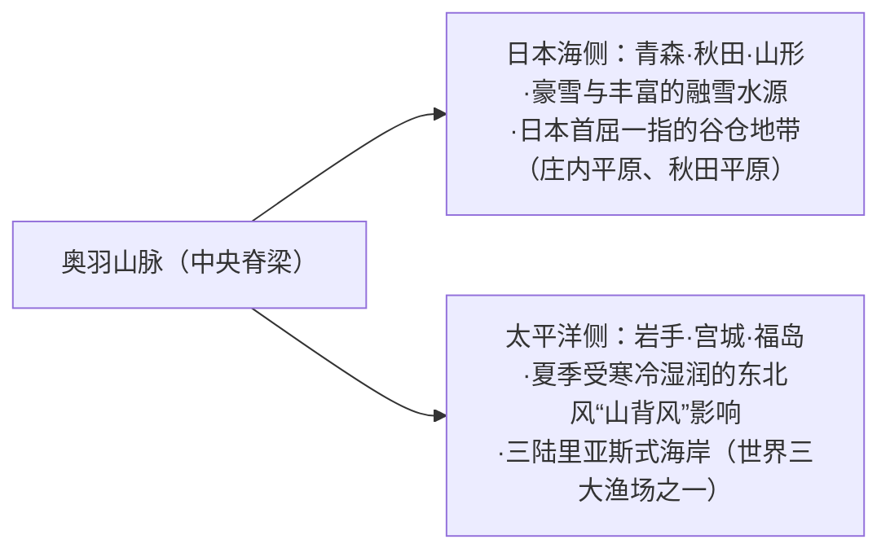
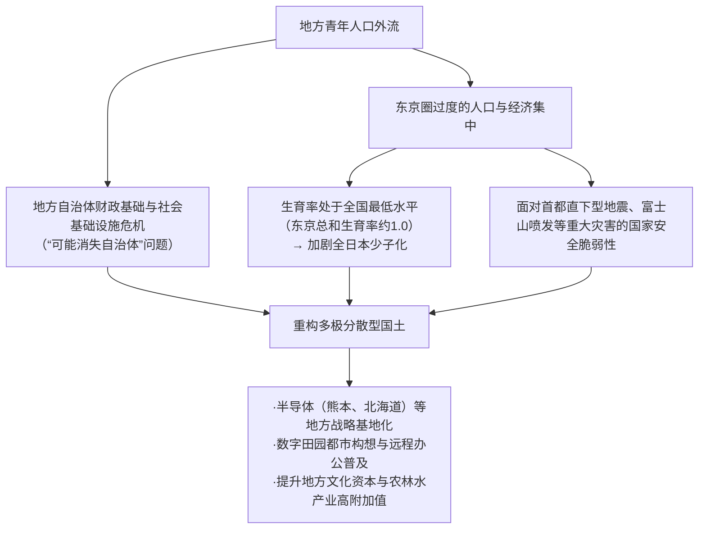
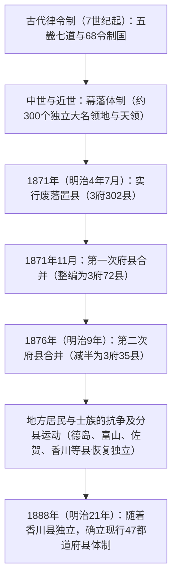

## 序论：日本列岛的多样性与47都道府县的建制史

南北绵延约3000公里的日本列岛呈弧状分布，是在环太平洋造山带剧烈的地壳运动（欧亚板块、北美板块、太平洋板块与菲律宾海板块四大板块相互碰撞挤压）下形成的、世界上首屈一指的险峻山岳岛国。

国土约七成被山林覆盖，以纵贯中央的脊梁山脉为界，冬季带来丰沛暴雪的“日本海侧气候”、夏季高温多湿而冬季晴朗干燥的“太平洋侧气候”、雨量稀少且气候温和的“濑户内海式气候”、昼夜及冬夏温差剧烈的“中央高地式气候”，以及亚热带的“西南诸岛气候”——极其丰富多样的气候环境高度浓缩在这片狭长的国土之中。

```
【日本列岛的气候分区与地形机制】

┌─────────────────┬───────────────────────────────┬───────────────────────────────┐
│ 气候分区        │ 地理范围                      │ 主要气候特征与形成机制        │
├─────────────────┼───────────────────────────────┼───────────────────────────────┤
│ 日本海侧气候    │ 北海道日本海沿岸〜北陆·山阴  │ 冬季西北季风吸收对马暖流的水汽│
│                 │                               │ 遇中央脊梁山脉阻挡，形成暴雪  │
│ 太平洋侧气候    │ 太平洋沿岸〜九州南部          │ 夏季受东南季风与台风影响多雨；│
│                 │                               │ 冬季干燥晴朗，常刮强劲干风    │
│ 濑户内海式气候  │ 中国山地与四国山地夹峙区域    │ 雨云受两侧山地阻隔，全年温暖  │
│                 │                               │ 少雨，日照充足                │
│ 中央高地式气候  │ 长野、山梨、岐阜飞驒地区等    │ 地势高耸，四周群山环绕，昼夜  │
│                 │                               │ 及冬夏温差极为悬殊            │
│ 西南诸岛气候    │ 冲绳县、奄美群岛等            │ 受黑潮影响的亚热带海洋性气候，│
│                 │                               │ 全年高温多湿，常遭台风侵袭    │
└─────────────────┴───────────────────────────────┴───────────────────────────────┘
```

日本的区域划分，深植于古代律令制下“五畿七道（畿内、东海道、东山道、北陆道、山阴道、山阳道、南海道、西海道）”体系中的68个“令制国（旧国名）”。明治维新伊始，1871年（明治4年）推行“废藩置县”，最初设立了300多个府与县；历经多次大刀阔斧的统并重组，最终在1888年（明治21年）香川县脱离爱媛县独立之后，定型为现行的“1都1道2府43县（47都道府县）”行政区划框架。

本文将全日本47都道府县划分为八大地方板块（北海道、东北、关东、中部、近畿、中国、四国、九州·冲绳），对其各自的旧国名、地形地貌、产业结构、历史文化，乃至迈入21世纪后的地方创生与人口动态课题，展开全景式且兼具深度的系统性剖析。

---

## 1. 北海道地方：北方拓荒前沿与辽阔的第一产业

### 1.1 北海道（旧：虾夷地 / 石狩、渡岛等11国）
- **道厅所在地**：札幌市
- **面积与地形**：83,424 km²（居全国首位，约占日本总面积的22%）。以大雪山系与日高山脉为脊梁，分布着石狩平原、十胜平原、根钏台地等日本最大规模的平原与台地。属亚寒带气候，夏季凉爽，冬季严寒且伴随广泛积雪。
- **产业结构与经济**：
  - **农业**：日本的国家粮食基地。旱作农业（小麦、甜菜、马铃薯、红豆）与大规模奶牛养殖业（生鲜乳产量占全国50%以上）极其发达。以十胜平原为核心，户均耕地达数十公顷，呈现高度机械化的大规模欧美型农场模式。
  - **水产业**：扇贝、鲑鱼、狭鳕、海带等不论捕捞量还是水产养殖产量均位列全国第一。
  - **观光与服务业**：二世古（Niseko）粉雪度假区（全球知名的入境游集聚地）、知床（世界自然遗产）、富良野薰衣草花海、札幌冰雪节。
- **历史与文化**：阿伊努族的传统文化（阿伊努文化空间“民族共生象征空间 Upopoy”设立）。明治以降开拓使与屯田兵谱写的近代拓荒史。札幌农学校（克拉克博士）引入的近代农学与基督教开拓精神。
- **区域课题**：人口急剧减少与札幌“单极集中”、JR北海道赤字铁路线的维系危机、广袤疆域内高昂的基础设施维护成本。

---

## 2. 东北地方：奥羽山脉的恩赐与陆奥的历史风土

东北地方由贯穿中央南北的奥羽山脉所纵剖，在日本海侧（豪雪地带、传统粮仓）与太平洋侧（易受冷害、“山背风”影响）形成了对比鲜明的地理风貌与人文环境。



### 2.1 青森县（旧：津轻、陆奥）
- **县厅所在地**：青森市
- **地形**：本州最北端。津轻半岛与下北半岛环抱陆奥湾，中央耸立八甲田山系，西部横亘世界自然遗产白神山地。
- **产业**：苹果产量占全国市场份额约60%（以弘前市、津轻平原为中心）。陆奥湾的扇贝养殖、大间金枪鱼、八户港的水产卸港量居前。高新技术与能源领域建有六所村核燃料循环设施。
- **文化与风土**：青森睡魔祭（Aomori Nebuta）、弘前睡魔祭（Hirosaki Neputa）、津轻三味线，孕育了太宰治、栋方志功等大师的津轻文化。拥有以三内丸山遗址为代表的绳文遗址群。

### 2.2 岩手县（旧：陆中、陆前、陆奥）
- **县厅所在地**：盛冈市
- **地形**：面积仅次于北海道，居全国各都道府县第2位（15,275 km²）。主要由沿北上川分布的北上盆地，以及东部的北上高地和三陆里亚斯式海岸构成。
- **产业**：北上盆地集聚了以铠侠（Kioxia）为代表的半导体及汽车相关产业。三陆沿岸盛产裙带菜、鲍鱼、鲑鱼与秋刀鱼。传统工艺有南部铁器等。
- **文化与风土**：平泉中尊寺金色堂（奥州藤原氏净土思想的结晶，世界文化遗产）。宫泽贤治的“理想乡（Ihatov）”思想，柳田国男民俗学圣地《远野物语》。

### 2.3 宫城县（旧：陆前、陆奥）
- **县厅所在地**：仙台市（东北地区唯一的政令指定都市）
- **地形**：由肥沃的仙台平原水田区，与日本三景之一松岛、牡鹿半岛及仙台湾交织而成。
- **产业**：东北地方的经济与行政中枢。以出产“笹锦（Sasanishiki）”与“一见钟情（Hitomebore）”闻名的著名粮仓。石卷港、气仙沼港水产加工业发达。依托东北大学等学术力量，建有新一代同步辐射光源设施“NanoTerasu”，成为尖端科学重镇。
- **文化与风土**：伊达政宗开创的仙台藩62万石城下町文化。仙台七夕祭。

### 2.4 秋田县（旧：羽后、出羽）
- **县厅所在地**：秋田市
- **地形**：涵盖秋田平原、横手盆地、鸟海山，以及日本最深湖泊田泽湖。
- **产业**：以“秋田小町（Akitakomachi）”大米为代表的全国著名谷仓。秋田杉林业发达。特色物产有比内地鸡、鰰鱼（日本叉牙鱼）。近年来作为日本海沿岸的风力发电（海上风电）战略基地备受瞩目。
- **文化与风土**：秋田竿灯祭、男鹿生剥鬼节（Namahage，联合国教科文组织非物质文化遗产）、白神山地。

### 2.5 山形县（旧：羽前、出羽）
- **县厅所在地**：山形市
- **地形**：庄内平原与最上川串联起的米泽、山形、新庄等盆地群。出羽三山（月山、羽黑山、汤殿山）与藏王连峰矗立其间。
- **产业**：樱桃（全国市场份额逾七成）、法兰西梨（La France）等构筑的水果王国。庄内平原的优质稻作（“艳姬 / Tsuyahime”大米）。名贵肉牛米泽牛。电子零部件与精密机械产业基础雄厚。
- **文化与风土**：出羽三山修验道文化、山形花笠祭、银山温泉的大正浪漫风情。

### 2.6 福岛县（旧：岩代、磐城）
- **县厅所在地**：福岛市
- **地形**：地形与气候清晰地划分为三大区域：会津（崇山峻岭、豪雪与历史文化）、中通（政治经济重心、盆地地形）、滨通（太平洋沿岸、气候温和）。
- **产业**：中通地区的桃、梨等优质水果栽培。会津漆器与日本酒酿造业历史悠久。滨通地区正全面推进“福岛创新海岸构想”（机器人测试场、氢能源等尖端前沿科技）。
- **文化与风土**：会津若松的武士道精神（白虎队悲壮史诗）、喜多方拉面、相马野马追。如今走在东日本大地震与核事故后重建及能源转型的最前沿。

---

## 3. 关东地方：首都功能的集聚与多层次产业集群

关东地方立足于日本最大的平原——关东平原，政治、经济、学术与现代物流高度集中，与周边各县高度发达的腹地农业、临海重化工业形成了有机共生的网络体系。

```
【首都圈大都市圈的功能分工格局】

·东京都：国家中枢功能、全球金融与法务、尖端IT、全球流行文化策源地
·神奈川县：京滨工业地带、国际贸易枢纽港（横滨）、研发创新基地、湘南与箱根观光
·埼玉县：内陆交通枢纽（新干线与高速公路网）、近郊农业、机械装备制造与现代物流园区
·千叶县：成田国际机场、京叶临海重化工业区、水产与近郊农业（花生、蔬菜）
·茨城县：筑波研究学园都市、鹿岛临海工业地带、日立重电产业、哈密瓜与莲藕
·枥木县：北关东工业地域（内陆型汽车与精密制造）、日光东照宫、草莓（枥乙女）
·群马县：以斯巴鲁（SUBARU）为核心的汽车制造业、温泉观光（草津、伊香保）、蚕丝产业遗产
```

### 3.1 茨城县（旧：常陆）
- **县厅所在地**：水户市
- **产业**：农业产出额位列全国第3位（哈密瓜、莲藕、红薯干产量居前）。筑波市集聚了全日本约三分之一的国家级科研机构，是日本最大的智慧科研中枢。日立市的重电与机械装备制造业底蕴深厚，鹿岛港建有大型钢铁与化学联合企业群。
- **文化**：水户德川家开创的水户学（尊王攘夷思想理论源头）、偕乐园、日本三名瀑之一袋田瀑布。

### 3.2 枥木县（旧：下野）
- **县厅所在地**：宇都宫市
- **产业**：草莓收获量连续半个世纪蝉联日本第一（“枥乙女 / Tochiotome”、“枥爱果 / Tochiaika”等名品）。宇都宫市及小山市周边形成了发达的内陆工业园区（医疗器械、运输机械制造）。宇都宫轻轨（LRT）的开通，树立了次世代绿色城市公共交通的先驱典范。
- **文化**：世界文化遗产“日光的神社与寺院”（日光东照宫）、足利学校（日本最古老的综合大学）、益子烧陶瓷。

### 3.3 群马县（旧：上野）
- **县厅所在地**：前桥市
- **产业**：以太田市为大本营的斯巴鲁汽车（SUBARU，前身为中岛飞行机）为核心，带动了庞大的汽车整车及冲压金属零部件配套产业链。魔芋薯产量占据全国90%的市场份额。坐拥草津温泉、伊香保温泉、水上温泉等著名温泉胜地。
- **文化**：富冈制丝厂及丝绸产业遗产群（世界文化遗产）。通过普及“上毛歌留多（Jomo Karuta）”形成的深厚县民认同纽带。

### 3.4 埼玉县（旧：武藏大部）
- **县厅所在地**：埼玉市（政令指定都市）
- **产业**：全县人口约730万（居全国第5位）。以大宫站为核心构建了东日本最大的铁路交通咽喉枢纽。食品制造业出货额位列全国前茅。特产有深谷大葱、狭山茶、草加仙贝。
- **文化**：川越被誉为“小江户”的藏造建筑街区，秩父夜祭（联合国教科文组织非物质文化遗产）。

### 3.5 千叶县（旧：下总、上总、安房）
- **县厅所在地**：千叶市（政令指定都市）
- **产业**：成田国际机场（日本面向全球的航空客货运大门）。京叶临海工业地带汇集了大规模石油化工与钢铁联合企业。农业产出额稳居全国前列（大葱、花生、菠菜等）。铫子港水产卸港量极高。坐拥东京迪士尼度假区。
- **文化**：成田山新胜寺门前町风情，房总半岛的冲浪胜地与海洋休闲度假区。

### 3.6 东京都（旧：武藏、伊豆、小笠原）
- **都厅所在地**：新宿区
- **地形**：东京都总人口约1400万人（若按都市圈计算则是全球规模最大的超级大都市圈）。行政辖区包括东京23区、多摩地区、伊豆诸岛以及世界自然遗产小笠原群岛。
- **产业**：贡献了日本国内生产总值（GDP）的约两成，是庞大的国家经济心脏。丸之内与大手町汇聚了全球顶尖金融机构与综合商社，涩谷与六本木是数字科技与创业孵化高地，秋叶原为亚文化圣地，羽田机场则是重要的国内与国际双枢纽航空港。
- **文化**：江户城天守台遗址、浅草寺、明治神宫等厚重历史文化遗产，与鳞次栉比的现代化摩天大楼群在此完美交融，构筑出走在时代前列的全球性国际文化大都会。

### 3.7 神奈川县（旧：相模、武藏南部）
- **县厅所在地**：横滨市（人口约377万，日本规模最大的基础自治体）
- **产业**：常住人口居全国第2位（约920万人）。京滨工业地带的核心承载区（日产汽车、JFE钢铁等）。横滨港未来21地区集聚了众多全球顶尖企业的研发中心。川崎市在高新技术与绿色环保科技领域实力卓著。
- **文化**：镰仓幕府开创的武家文化古都、横滨开埠留下的开港历史与异国情调、湘南海岸独特的滨海生活文化，以及箱根世界知名的温泉度假胜地。

---

## 4. 中部地方：日本制造业的脊梁与山岳地势

中部地方地处本州中央，由北陆（日本海侧）、中央高地（内陆山岳）与东海（太平洋侧）三大差异极大的次级板块构成，孕育了全日本实力最为雄厚的制造业产业带。

### 4.1 新潟县（旧：越后、佐渡）
- **县厅所在地**：新潟市（政令指定都市）
- **产业**：依托信浓川与阿贺野川两大水系冲积而成的越后平原，水稻种植业极为发达（顶级大米“越光米 / Koshihikari”产量蝉联全日之冠）。燕三条地区的西式金属餐具与精密锻造刀具享誉全球。锦鲤养殖享誉世界。此外还拥有日本少有的天然气与原油开采工业。
- **文化**：佐渡金山（世界文化遗产）、长冈祭大花火大会、越后妻有大地艺术祭。

### 4.2 富山县（旧：越中）
- **县厅所在地**：富山市
- **产业**：充分利用北陆电力丰沛廉价的水电资源，发展出铝压延加工、基础化工及生物医药制造集群。承袭江户时代“富山卖药郎”传统，现代医药产业高度集聚。富山湾被誉为“天然活鱼池”（盛产荧光乌贼、白虾、寒蛳鱼）。
- **文化**：立山连峰与黑部水坝（立山黑部阿尔卑斯路线）。世界文化遗产五箇山合掌造村落。

### 4.3 石川县（旧：加贺、能登）
- **县厅所在地**：金泽市
- **产业**：依托“加贺百万石”丰厚的文化底蕴，高附加值文化旅游业独树一帜。纤维机械与工程机械产业强劲（小松制作所 KOMATSU 发祥地），碳纤维复合材料制造技术领先。
- **文化**：日本三名园之一兼六园、金箔工艺（占据日本国内99%份额）、九谷烧彩绘瓷器、轮岛涂漆器。当前正全力推进能登半岛地震后的创造性灾后重建。

### 4.4 福井县（旧：越前、若狭）
- **县厅所在地**：福井市
- **产业**：鲭江市占据全日本95%的眼镜架制造份额。纺织化纤与电子元器件（村田制作所等）产业集聚。这里是著名稻种“越光米”的发源地。越前蟹名扬全日。岭南地区分布着密集的核电设施群。
- **文化**：曹洞宗大本山永平寺（道元禅师创立的禅修圣地）、福井县立恐龙博物馆、壮观的东寻坊海蚀崖壁。在全日本居民幸福度排名中常年名列前茅。

### 4.5 山梨县（旧：甲斐）
- **县厅所在地**：甲府市
- **产业**：葡萄、桃、李等温带水果收获量居全国第一。胜沼是日本现代葡萄酒酿造的发祥地。珠宝加工与宝石首饰产业位居日本榜首。全球工业机器人与数控系统巨头发那科（FANUC）总部所在地。磁悬浮中央新干线试验线在此贯通。
- **文化**：战国名将武田信玄相关的历史古迹、富士五湖胜景、御岳升仙峡。

### 4.6 长野县（旧：信浓）
- **县厅所在地**：长野市
- **产业**：坐拥日本阿尔卑斯山脉（飞驒山脉、木曾山脉、赤石山脉）的典型山岳县。以精工爱普生（Seiko Epson）为代表的高精度精密仪器制造业高度发达，被誉为“东方瑞士”。高原蔬菜（生菜、大白菜）与苹果种植发达。人均预期寿命位居日本前列，是著名的健康长寿县。
- **文化**：国宝善光寺、松本城（国宝现存天守）、上高地及轻井泽等世界级避暑与高原度假胜地。

### 4.7 岐阜县（旧：美浓、飞驒）
- **县厅所在地**：岐阜市
- **产业**：关市的刀具制造闻名遐迩（位列世界三大刀具产地之一）。美浓烧陶瓷占据日本国内市场过半份额。各务原市航空航天产业发达（川崎重工航空基地）。飞驒高山的高档实木家具工艺享誉业界。
- **文化**：世界文化遗产白川乡合掌村、飞驒高山古老街区、长良川传统鸬鹚捕鱼（鹈饲）。

### 4.8 静冈县（旧：远江、骏河、伊豆）
- **县厅所在地**：静冈市（政令指定都市）
- **产业**：工业制成品出货额稳居全国前列。这里是铃木（Suzuki）、雅马哈（Yamaha）、本田（Honda）起家与壮大的交通运输装备制造业王国。日本绿茶产量第一。塑料拼装模型出货额居世界第一（田宫 TAMIYA、万代 BANDAI 等模型制造重镇）。烧津港金枪鱼与鲣鱼捕捞及加工规模庞大。
- **文化**：富士山（世界文化遗产）、伊豆半岛温泉群、德川家康晚年隐居归隐之地（骏府城、久能山东照宫）。

### 4.9 爱知县（旧：尾张、三河）
- **县厅所在地**：名古屋市（政令指定都市）
- **产业**：**工业制成品出货额连续40年以上雄踞全日本第1位**，是日本实力最强劲的实体制造工业帝国。丰田汽车（Toyota）及其庞大严密的企业供应链网络深植于此。三菱重工等企业的航空航天制造集群同样底蕴深厚。高端陶瓷、特种钢材及高端数控机床产业全球领先。
- **文化**：战国“日本三英杰”（织田信长、丰臣秀吉、德川家康）的共同诞生地。热田神宫、名古屋城。独具特色的“名古屋美食”（味增炸猪排、鳗鱼饭三吃、名古屋炸鸡翅等）。

---

## 5. 近畿地方：千年古都与关西经济圈的多重底蕴

近畿地方以自古代至近世始终作为日本政治与文化轴心的“畿内”为核心，商业之都大阪、国际门户港口神户、千年古都京都与奈良，在这里构成了精妙平衡且底蕴深厚的区域共生格局。

```
【近畿圈的功能分工与历史多样性】

·大阪府：商都基因、国际金融、世博会（1970/2025）、生命科学、平民美食文化
·京都府：平安京千年的文化资本、任天堂与京瓷等高科技巨头、传统工艺、国际文化观光
·兵库县：港口远洋贸易（神户）、播磨临海重化工业带、滩五乡名酒、丹波与但马优质农水产
·奈良县：古代大和王权摇篮、平城京遗址、法隆寺与东大寺（佛教艺术的无尽宝库）
·滋贺县：日本最大湖泊琵琶湖（滋养近畿1400万人口的水塔）、近江商人、内陆高端制造业
·三重县：伊势神宫（神道信仰顶点）、铃鹿赛道、珍珠养殖、四日市大型石化基地
·和歌山县：高野山与熊野三山（深山圣地与朝圣参拜道）、蜜柑与高级梅干产量全日第一
```

### 5.1 三重县（旧：伊势、伊贺、志摩、纪伊东部）
- **县厅所在地**：津市
- **产业**：四日市联合工业区（石油化工、先进半导体）。顶级和牛松阪牛、英虞湾阿古屋海水珍珠养殖、伊势龙虾。
- **文化**：伊势神宫（皇大神宫内宫、丰受大神宫外宫）、伊贺流忍者文化源头、世界遗产“纪伊山地的灵场和参拜道”（伊势路朝圣路）。

### 5.2 滋贺县（旧：近江）
- **县厅所在地**：大津市
- **产业**：环抱琵琶湖的重要陆路交通枢纽。东丽（Toray）、松下（Panasonic）等大型制造企业的内陆核心母工厂聚集地。信乐烧陶器名闻遐迩。盛产近江米与名品近江牛。
- **文化**：比叡山延历寺（日本天台宗总本山，被誉为“日本佛教之母山”）、国宝彦根城天守、近江商人世代传承的“三方好”（买方好、卖方好、世间好）商业经营哲学。

### 5.3 京都府（旧：山城、丹波、丹后）
- **府厅所在地**：京都市（政令指定都市）
- **产业**：世界顶级的历史文化旅游胜地。同时是任天堂（Nintendo）、欧姆龙（Omron）、京瓷（Kyocera）、岛津制作所（Shimadzu）、日本电产（Nidec）等一大批全球知名硬核科技跨国巨头的全球总部基地。传统手工业享有盛誉，如西阵织、清水烧陶瓷、宇治抹茶。
- **文化**：“古都京都的文化财产”（包含17座寺社在内的世界文化遗产）、祇园祭、五山送火。

### 5.4 大阪府（旧：摄津东部、河内、和泉）
- **府厅所在地**：大阪市（政令指定都市）
- **产业**：西日本最大的经济与金融集聚枢纽。大型综合商社（伊藤忠商事、住友集团发祥地）、武田药品工业等领衔的医药与前沿生命科学产业、东大阪市密集的超精密中小微制造企业群。建有关西国际机场。
- **文化**：大阪城、道顿堀、上方落语、文乐木偶净瑠璃、吉本新喜剧。以章鱼烧、御好烧为代表的市井面食料理文化。拥有百舌鸟·古市古坟群（仁德天皇陵，世界文化遗产）。

### 5.5 兵库县（旧：摄津西部、丹波、但马、播磨、淡路）
- **县厅所在地**：神户市（政令指定都市）
- **产业**：神户港承担着关键的国际远洋集装箱海运功能。川崎重工、神户制钢所等重化工业与大型机械制造业巨头林立。播磨临海工业地带实力雄厚。“滩五乡”是日本产量第一的清酒酿造摇篮。此外还以淡路岛洋葱、神户牛肉闻名天下。
- **文化**：姬路城（日本首座世界文化遗产，别名“白鹭城”）、有马温泉、神户旧居留地及北野异人馆欧式街区。

### 5.6 奈良县（旧：大和）
- **县厅所在地**：奈良市
- **产业**：历史文化旅游业蓬勃。吉野杉与吉野扁柏优质林业木材。广陵町周边是全日本袜子产量最高的产业集群基地。传统工艺保存完好，如制墨、奈良茶筅制作。
- **文化**：“古都奈良的文化财产”（东大寺、兴福寺、春日大社等）、“法隆寺地区的佛教建筑”（世界上最古老的木结构建筑群）、吉野山漫山樱花与修验道圣地。

### 5.7 和歌山县（旧：纪伊西部）
- **县厅所在地**：和歌山市
- **产业**：温州蜜柑、南高梅（高级梅干原料）、八朔柑、花椒收获量稳居全国榜首。日本製铁和歌山制铁所大型钢铁制造。
- **文化**：世界文化遗产“纪伊山地的灵场和参拜道”（高野山金刚峰寺、熊野三山）、白滨温泉度假胜地。

---

## 6. 中国地方：濑户内海工业带与山阴的神话世界

中国地方以中央起伏的中国山地为界，在南侧临海、气候温暖且重化工业密布的“山阳（濑户内海沿岸）”，与北侧保留着古代日本神话遗迹与原始壮美自然风光的“山阴（日本海沿岸）”之间，呈现出截然不同的区域性格。

### 6.1 鸟取县（旧：因幡、伯耆）
- **县厅所在地**：鸟取市
- **地形与产业**：日本人口最少的县（约54万人）。利用鸟取沙丘独特地貌发展沙地特色农业（如薤白/辣韭）。“二十世纪梨”产量居全国首位。白葱种植与境港市的松叶蟹捕捞卸港量瞩目。
- **文化**：“因幡之白兔”神话起源地、三朝温泉（世界罕见的高浓度氡温泉）、三德山三佛寺投入堂（国宝建筑奇迹）。

### 6.2 岛根县（旧：出云、石见、隐岐）
- **县厅所在地**：松江市
- **地形与产业**：坐拥出云平原与宍道湖（日本蚬/花蚬捕捞量全日第一）。传承古代“踏鞴制铁”传统的特种钢（日立金属安来钢 Yasuki Hagane）。仙客来花卉、德拉瓦尔葡萄（Delaware）种植。
- **文化**：出云大社（众神云集、“让国神话”的至高圣地）、世界文化遗产石见银山遗址、隐岐诸岛世界地质公园。

### 6.3 冈山县（旧：美作、备前、备中）
- **县厅所在地**：冈山市（政令指定都市）
- **产业**：水岛临海工业地带（石油化工、大型钢铁、汽车整车制造基地）。以高品质白桃、亚历山大麝香葡萄闻名的高端水果王国。儿岛地区是日本国产牛仔裤与学生校服的发祥地及产业重镇。
- **文化**：仓敷美观地区（白壁土藏传统水乡街市）、日本三名园之一后乐园、备前烧炻器。

### 6.4 广岛县（旧：安艺、备后）
- **县厅所在地**：广岛市（政令指定都市）
- **产业**：中国与四国地方规模最大的经济中枢都市。以马自达（Mazda）为核心的汽车整车制造业，JFE钢铁福山制铁所，吴市与尾道市历史悠久的造船重工业。牡蛎养殖占据全国过半份额。柠檬产量位居全日第一。
- **文化**：坐拥两大世界文化遗产（严岛神社与广岛和平纪念馆原爆圆顶塔）。作为国际和平纪念都市向全球传递和平倡议。尾道市依山傍海的坡道街景与深厚的近代文学底蕴。

### 6.5 山口县（旧：周防、长门）
- **县厅所在地**：山口市
- **产业**：沿濑户内海分布的周南工业基地（以有机化工与基础无机化工为主）。宇部兴产（UBE）的基础化学品与水泥建材制造业。下关港是著名的河豚与鮟鱇鱼水产集散地。
- **文化**：培育出多位明治维新核心先驱与政治领袖的萩市松下村塾（世界文化遗产）。锦带桥、秋吉台与秋芳洞（日本规模最大的喀斯特石灰岩高原与溶洞群）、角岛大桥碧海胜景。

---

## 7. 四国地方：南海道的历史遗产与濑户内工业·太平洋水产

横贯四国中央的四国山地东西绵延，将四国分隔为北部的濑户内海一侧（香川、爱媛）与南部的太平洋一侧（高知、德岛），形成了迥异的气候与风土。如今通过本州四国联络桥的三条大通道（大鸣门桥、濑户大桥、岛波海道），四国与本州陆路紧密相连。

### 7.1 德岛县（旧：阿波）
- **县厅所在地**：德岛市
- **产业**：酸橘（Sudachi，占据全国90%以上份额）、鸣门金时红薯、名牌优质肉鸡阿波尾鸡。以日亚化学工业（Nichia，全球蓝光LED与荧光粉巨头）为核心，构筑了高密度的光电LED产业集群。
- **文化**：拥有400余年辉煌历史的阿波舞（Awa Odori）、壮观的鸣门漩涡、神秘幽深的原生态祖谷溪秘境（祖谷藤蔓桥）。

### 7.2 香川县（旧：赞岐）
- **县厅所在地**：高松市
- **产业**：虽然是日本面积最小的县，但人口密度相当高。依托“赞岐乌冬面”构建了极具统治力的面食饮食文化与文化旅游号召力。小豆岛橄榄产量位列全国第一。番之州临海工业地带基础重工业实力雄厚。
- **文化**：金刀比罗宫（被民间亲切称为“金比罗仙人”）、国家特别名胜栗林公园、濑户内国际艺术祭（以直岛、丰岛等为核心的全球当代艺术殿堂）。

### 7.3 爱媛县（旧：伊予）
- **县厅所在地**：松山市
- **产业**：日本温州蜜柑与高品质柑橘栽培的代名词。今治毛巾（驰名世界的日本高端毛巾第一品牌）。今治市聚集了密集的远洋航运与造船工业集群，是日本最大的海洋海事都市。新居滨与四国中央市则是造纸印刷及纸制品加工、有色金属冶炼重镇。
- **文化**：道后温泉本馆（日本最古老的温泉胜地之一）、松山城天守、风靡全球的岛波海道跨海自行车道。

### 7.4 高知县（旧：土佐）
- **县厅所在地**：高知市
- **产业**：充分利用温和湿润的光热资源，大规模开展茄子等蔬菜的大棚促成栽培，生姜、茗荷收获量居全国首位。近海鲣鱼单钩竿钓捕捞享有盛誉。开发了深层海水综合利用产业。
- **文化**：诞生了维新志士坂本龙马的自由民权思想沃土、热情奔放的夜来祭（Yosakoi）、名胜桂滨海滩、被誉为“日本最后的清流”的四万十川。

---

## 8. 九州·冲绳地方：亚洲门户与南西诸岛文化

这里与东亚大陆地理距离最近，自古代的防人戍边、遣唐使扬帆以来，始终是日本对外交流最前线的桥头堡。如今，这里既迎来了半导体制造业（“硅岛”）的跨越式全面复苏，又汇聚了极其丰富的火山温泉与亚热带海洋生态旅游资源。

```
【九州·冲绳地方的区域实力与产业特征】

·福冈县：九州中枢、亚洲门户、机场无缝衔接的超级都市、国家级IT创新与创业特区
·佐贺县：有田烧与伊万里烧瓷器、唐津宫日节、佐贺平原优质水稻、有明海高品质海苔
·长崎县：南蛮贸易与出岛开港史、潜伏基督徒文化遗产、现代造船工业、曲折海岸线带来的丰饶渔产
·熊本县：台积电（TSMC/JASM）建厂掀起的超级半导体产业集群、阿苏巨大破火山口、优质纯地下水源城市
·大分县：温泉涌出量与泉眼数均居全日之首的别府与由布院温泉、地热清洁能源、大分临海重化工业区
·宫崎县：充沛日照与温暖湿润气候（太阳之子芒果、青椒、宫崎牛）、日向滩绝佳冲浪胜地
·鹿儿岛县：黑猪·黑牛·红薯·本格烧酒王国、巍峨活火山樱岛、世界自然遗产屋久岛与奄美大岛
·冲绳县：琉球王国的独特建制史、首里城遗迹、美丽海水族馆、亚热带海洋度假圣地、驻日美军基地经济转型与自立探索
```

### 8.1 福冈县（旧：筑前、筑后、丰前）
- **县厅所在地**：福冈市（政令指定都市，人口约160万人）
- **产业**：九州最大的政治、经济与商贸中心。北九州工业地带（近代官营八幡制铁所发源地、工业机器人龙头安川电机总部）。博多港客货运繁忙，福冈机场具备直通市中心地铁仅需5分钟的无匹区位优势。现代IT创新创业企业高度聚集。特产优质草莓“甘王（Amaou）”。
- **文化**：博多祇园山笠祭典、供奉学问之神菅原道真的太宰府天满宫、闻名遐迩的博多中洲路边摊小吃（屋台）文化、世界文化遗产宗像大社。

### 8.2 佐贺县（旧：肥前东部）
- **县厅所在地**：佐贺市
- **产业**：有田烧、伊万里烧（日本瓷器的诞生地与工艺高峰）。有明海条斑海苔养殖（销售额长期蝉联日本首位）。高端肉牛佐贺牛。建有玄海核电站。
- **文化**：吉野里历史遗址（弥生时代大规模环壕聚落）、武雄温泉古汤、唐津宫日节（Karatsu Kunchi）。

### 8.3 长崎县（旧：肥前西部、壹岐、对马）
- **县厅所在地**：长崎市
- **产业**：以三菱重工长崎造船所为标杆的现代造船重工业。依托全国第二长的曲折海岸线，竹刀鱼、竹荚鱼、青花鱼等水产捕捞卸港量巨大。枇杷产量位列全国第一。
- **文化**：“长崎与天草地区的潜伏基督徒相关遗产群”（世界文化遗产）、“明治日本工业革命遗产”（军舰岛/端岛）、豪斯登堡欧洲主题度假区。

### 8.4 熊本县（旧：肥后）
- **县厅所在地**：熊本市（政令指定都市）
- **产业**：**随着全球最大的晶圆代工巨头台积电（TSMC/JASM）入驻菊阳町**，引发了日本近年来规模最大的半导体产业链资本投资热潮。番茄收获量稳居全日第一，西瓜产量名列前茅。熊本市全市自来水水源100%取自纯净地下天然水。
- **文化**：熊本城（战国名将加藤清正设计修筑的坚不可摧的日本三大名城之一）、世界最大破火山口之一阿苏火山、风景如画的天草五桥。

### 8.5 大分县（旧：丰后、丰前南部）
- **县厅所在地**：大分市
- **产业**：泉眼数量与温泉水涌出量均居日本第一的“温泉县”（坐拥别府温泉、由布院温泉两大胜地）。大分临海工业地带（大型钢铁联合企业、石油化工）。香母子柑橘（Kabosu）产量占据全国90%份额。高品质干香菇产地。
- **文化**：宇佐神宫（全日本逾四万座八幡宫的总本宫）、国东半岛“六乡满山”神佛习合深厚宗教文化。

### 8.6 宫崎县（旧：日向）
- **县厅所在地**：宫崎市
- **产业**：利用温暖湿润、日照充沛的气候，培育出蝉联日本内阁总理大臣奖的名贵“宫崎牛”、高级完熟芒果（“太阳之子”品牌）、肉鸡及生猪饲养量居全国前列。优质杉木木材原木产量全日第一。
- **文化**：高千穗峡天孙降临神话圣地（高千穗夜神乐）、青岛神社海蚀鬼之洗衣板、鹈户神宫绝壁奇景。

### 8.7 鹿儿岛县（旧：萨摩、大隅）
- **县厅所在地**：鹿儿岛市
- **产业**：农业产出额位列全国第2位。鹿儿岛黑毛和牛、鹿儿岛黑猪、红薯、人工养殖鳗鱼、肉鸡养殖规模庞大。以甘薯为原料的本格烧酒名震列岛。建有日本宇宙航空研究开发机构（JAXA）种子岛宇宙中心（运载火箭发射场）。
- **文化**：眺望巍峨活火山樱岛的锦江湾壮景。明治维新西南雄藩大本营（萨摩藩、西乡隆盛、大久保利通故里）。拥有屋久岛绳文杉与奄美大岛世界自然遗产。

### 8.8 冲绳县（旧：琉球王国）
- **县厅所在地**：那霸市
- **地形**：日本最南端、最西端的亚热带岛屿群构成的海洋县。拥有宫古岛、八重山诸岛（石垣岛、西表岛等）众多有人居住的离岛。
- **产业**：享誉全日本的国际海洋休闲海岛观光旅游业。积极招商引资发展现代信息通讯产业。特产有甘蔗、阿古猪（Agu）、苦瓜、传统蒸馏酒泡盛。随着驻日美军基地相关经济收入占比的变化，当地正全力构建不依赖基地经济的自主性多元产业。
- **文化**：琉球王国御城及相关遗产群（首里城遗迹等世界文化遗产）。冲绳传统祭典埃萨舞（Eisa）、三线琴乐器、琉球漆器、传统红型印染。具有独特养生理念的长寿健康饮食文化。

---

## 9. 21世纪的地域课题：东京单极集中与国土多极分散论

在系统纵览全日本47都道府县的地形地貌与产业结构后，当今日本社会所面临的最深刻、最严峻的结构性挑战豁然显现——即**“向东京圈的极度单极集中，与地方区域人口断崖式减少与空心过疏化”**。



### 9.1 “可能消失自治体”与基础设施维护极限
依据2014年著名的“增田报告”以及近年来日本人口战略会议的严密测算，全日本超过四成的基层自治体已处于面临“消失风险”的边缘。尤其是育龄年轻女性源源不断地流向东京圈，导致许多偏远过疏地区不得不大规模撤并中小学校、停运衰退的公共交通路线，同时自来水管网、桥梁、公路等老化公共基础设施的更新改造在财政上面临难以为继的窘境。

### 9.2 半导体与可再生能源带来的地方复兴契机
然而，跨入21世纪20年代，一系列具有历史意义的范式转移正在日本悄然拉开序幕。
首先，出于国家经济安全保障的战略考量，下一代半导体超级晶圆代工厂（Mega-fab）开始规模化重返地方投资建厂。台积电进驻熊本县（JASM）以及Rapidus落子北海道千岁市，带来了数万亿日元级别的庞大资本支出，有力带动了上下游配套企业、顶尖研发机构及高薪技术就业岗位向地方腹地的大规模回流。
其次，在推进绿色转型（GX）与碳中和的全球浪潮下，坐拥广阔土地与丰沛自然资源的非都市区域（如东北地方与日本海沿岸的海上风力发电，北海道与九州丰富的太阳能、地热能及生物质能），正在被重新确立为日本最重要的国家级绿色能源战略供应大后方。

---

## 0. 行政区划变迁史：从令制国到废藩置县·府县大合并之路

当今日本由“47都道府县”构成的国家治理版图，绝非自古以来便理所当然地存在，而是明治维新时期探索建立近代中央集权民族国家过程中，历经无数次激烈试验、政治博弈与残酷裁并整合后淬炼出的历史产物。



### 0.1 废藩置县（1871年）的政治博弈
对于1868年通过明治维新诞生的新政府而言，彼时首要且最紧迫的政治目标，是“确立马基雅维利式的国家最高主权”以及“实现全国军事与财政的绝对大一统”。虽然1869年的“版籍奉还”将原本的各藩藩主改任为朝廷命官性质的“知藩事”，但各藩在实际上依然各自拥戴私家武装（藩兵），掌握着各自领地内的征税特权，新兴国家的中央集权基础极为脆弱涣散。

1871年（明治4年）7月14日，西乡隆盛、大久保利通、木户孝允等维新三杰以由萨摩、长州、土佐三藩精锐组成的“御亲兵”为坚强军事后盾，以雷霆万钧之势闪击宣布推行“废藩置县”。各藩一夜之间被悉数取缔，知藩事被强令解职并迁居东京，明治中央政府直接向各地方派出由官派的知事与县令接管民政。在此历史瞬间宣告诞生的，正是由“3府302县”构成的庞杂初始版图。

### 0.2 第一次与第二次府县合并及“分县运动”的激震
然而，初始设立的300多个县在空间上过度支离破碎，单一辖区财税规模过于微弱，难以承担近代化公共行政职能。因此，明治政府随即启动了激进的撤并重组。
1871年11月，明治政府推行“第一次府县合并”，将全国版图规整缩减为3府72县；到了1876年（明治9年），在内务省的强势主导下更进一步推行“第二次府县合并”，全国府县数量被腰斩至仅剩“3府35县”。

这种罔顾地缘传统与人文脉络的激进机械兼并，随即在全日本各地引发了强烈的地域反弹与政治风暴。
例如，如今的香川县曾先后被强行并入名东县（德岛）与爱媛县；富山县被并入石川县；佐贺县被并入长崎县；宫崎县被并入鹿儿岛县；福井县更是被一分为二，强行割裂给石川县与滋贺县管辖。
对此，原藩国城下町士绅、富农阶层及前士族愤慨抨击这种兼并是“无视千年历史传统的专横暴政”、“地方税赋全被抽吸至核心城市，而边缘偏远地区的基础设施建设完全遭到漠视抛弃”。这种抗议浪潮迅速与呼吁开设帝国议会的“自由民权运动”汇流激荡，在全国掀起了汹涌澎湃的“分县运动（复县运动）”。

面对不可遏止的民意抗争与治理危机，明治中央政府不得不做出妥协让步，陆续批准恢复独立建制：1881年恢复福井县；1883年相继恢复富山县、佐贺县与宫崎县；直至1888年（明治21年）12月，香川县最终成功从爱媛县剥离并恢复独立设县。至此，现代日本“1都1道2府43县”这套高度稳定的行政版图边界最终得以彻底奠定。

---

## 8.9 47都道府县的语言景观：方言周圈论与东西语言分界线

最能生动诠释日本列岛多元风土与历史积淀的，莫过于散布在列岛各个角落、生生不息的“方言（地域语言）”所呈现出的丰富色彩与渐变纹理。

著名民俗学者与语言学家柳田国男在1930年出版的划时代名著《蜗牛考》中，详尽调查了全日本指代“蜗牛”的方言词汇分布图景，由此提出了著名的**“方言周圈论”**。他深刻指出：历史上语言演变的波澜，乃是以作为古代至中世政治文化核心的京都为中心，如向水中投石激起的涟漪一般，呈同心圆状向偏远地方一圈圈扩散传播开来的。

```
【柳田国男《蜗牛考》中的方言周圈传播结构】

［京都（文化核心中枢）］： Dendenmushi（田螺虫/蜗牛，近世产生的新词）
  ↓ （向外圈扩散）
［近畿周边·北陆·东海］： Maimai（舞舞/蜗牛，室町时代流行语）
  ↓
［中部·关东·中国·四国］： Katatsumuri（蜗牛，平安时代的雅语）
  ↓
［东北·九州］： Tsuburi、Tsubu（螺蛳类古称，古代使用的旧语）
  ↓
［本州南北两端（青森津轻·鹿儿岛萨摩）］： Namekuji、Name（蛞蝓/涕蝓，最古层古语的遗存残迹）
```

与此同时，现代日语在地理上存在着一条横贯日本本州中央的大分水岭——即连接新潟县糸鱼川至静冈县滨名湖与富士川一带的“东西语言分界线”：
- **东日本方言**：断定助动词多用“da（断定）”，否定助动词多用“nai（否定）”，命令形词尾为“ro（如“oki-ro”）”，声调体系普遍采用东京式声调。
- **西日本方言**：断定助动词多用“ja / ya（断定）”，否定助动词多用“n / hen（否定）”，命令形词尾为“yo（如“oki-yo”）”，声调体系普遍采用京阪式声调。

不仅如此，东北地方“Zuu-Zuu方言”（里日本方言）中显著的元音中舌化舌位特征，以及萨摩方言（鹿儿岛方言）中特有的闭音节化倾向（促音、拨音的高频转化），在历史上甚至兼具防范外地斥候与密探暗中刺探军情的“天然防谍密码”功能。这些在群山叠嶂与险阻海峡阻隔下孕育出的语言景观，是各地方风土与悠久历史交织而成的不可替代的珍贵非物质文化遗产。

---

## 9.3 47都道府县的经济地理学：产业集聚与区位商（Location Quotient）

在对各都道府县的产业综合竞争力进行科学量化评估时，经济地理学普遍引入**“区位商（Location Quotient: LQ）”**（或称“地域特化系数”）。该指标主要用来精确衡量某一特定产业在目标区域内的集聚水平相对于全国平均基准的偏离程度。

$$LQ = \frac{e_i / e}{E_i / E}$$

在上述公式中，$e_i$ 代表目标区域内特定产业 $i$ 的从业人数（或工业出货额），$e$ 代表目标区域内全部产业的总从业人数，$E_i$ 代表全国范围内特定产业 $i$ 的从业人数，$E$ 代表全国全部产业的总从业人数。当计算所得的 $LQ > 1.0$ 时，即清晰表明该区域在该产业领域的专业化集聚程度显著超越了全国平均水平。

```
【47都道府县极具特色的区域产业特化格局】

1. 运输用机械器具制造业（汽车产业与航空航天）：
   ·超高区位商县份：爱知县（LQ ≈ 3.2）、群马县（LQ ≈ 2.8）、静冈县（LQ ≈ 2.5）、广岛县（LQ ≈ 2.1）
   ·产业特征：以庞大的整车制造总装企业（丰田、斯巴鲁、铃木、马自达）为金字塔尖，构建起分工严密的多层级外协配套产业链金字塔。

2. 电子元器件·器件·半导体制造业：
   ·超高区位商县份：山形县（LQ ≈ 2.9）、福井县（LQ ≈ 2.7）、熊本县（LQ ≈ 2.6）、岩手县（LQ ≈ 2.4）
   ·产业特征：充分依托清冽丰富的水源、纯净空气及畅通的高速公路物流网络，所构建起的内陆型“硅谷走廊（Silicon Road）”与“硅岛（Silicon Island）”。

3. 第一产业（农业与水产业）：
   ·超高区位商县份：青森县、北海道、鹿儿岛县、宫崎县、高知县（LQ > 3.0）
   ·产业特征：构成了捍卫国家粮食安全的核心基石。近年来向智慧农业、农业工业商业深度融合的“六次产业化”转型步伐明显加快。

4. 国际金融·信息通信·高端专业商务服务业：
   ·超高区位商都府：东京都（LQ ≈ 2.5）、大阪府（LQ ≈ 1.4）
   ·产业特征：形成了跨国企业总部功能、知识产权战略运营管理以及硬科技初创企业投资的高度寡头垄断式集聚。
```

由此可见，日本的国民经济运行机制绝非依赖单具孤立的增长引擎，而是由以爱知和东海地区为核心的“高端制造引擎”、以东京为核心的“金融·信息·总部枢纽引擎”，以及由广阔地方腹地所坚实支撑的“粮食·生态·半导体制造基础引擎”之间严丝合缝、相互咬合驱动的有机复合巨型系统。

---

## 0.3 县名与县厅所在地“背离”的政治史：明治初期官军与幕府侧惩罚说之考证

在观察日本47都道府县的命名体系时，任何初涉者往往都会产生一个浓厚的疑问：为何存在“县名与县厅所在城市名完全吻合的行政区”（如秋田县秋田市、新潟县新潟市、广岛县广岛市等），而与此同时，又广泛存在“县名与城市名截然不同、彼此背离的行政区”（如岩手县盛冈市、宫城县仙台市、茨城县水户市、枥木县宇都宫市、群马县前桥市、石川县金泽市、三重县津市、滋贺县大津市、兵库县神户市、岛根县松江市、爱媛县松山市、冲绳县那霸市等）？

长期以来，在日本民间乃至部分普及读物中广为流传着一种所谓“贼军惩罚说”，即断言：“在明治维新戊辰战争期间站在幕府及旧幕府军一方的藩国（被新政府定为‘贼军’），在战后设立新政权时遭到了政治清算，被剥夺了以其原有城下町城市名作为县名的资格，只能被强制降格改用管辖郡名等来命名。”
诸如奥羽越列藩同盟的核心支柱会津（若松）、仙台、盛冈，以及关东的前桥、水户等，常常被民间援引为这一论调的“典型证据”。

然而，近现代严谨的历史学与行政制度史实证研究表明，这种所谓的“贼军惩罚说”完全违背了真实的历史史实。明治新政府在厘定各县县名时，其根本出发点绝非出于政治上的意气报复，而是遵循了极其理性而务实的近代行政建制准则。

```
【明治初期制定县名所遵循的务实行政逻辑】

1. 摆脱旧城下町藩镇观念与推行采用“郡名”原则：
   新政府为了彻底摧毁旧有藩阀大名的封建割据权威，消除近世封建领主封邑人身依附的历史残余，在制度设计上确立了基本指导原则：即尽量不沿用原有藩主修筑的城下町城市名称，而是优先采用该城市所隶属的“郡名（自古代律令制以来延绵千年的中立地理行政单元）”作为新县名。
   ·盛冈城下（岩手郡） → 岩手县
   ·仙台城下（宫城郡） → 宫城县
   ·水户城下（茨城郡） → 茨城县
   ·金泽城下（石川郡） → 石川县
   ·松江城下（岛根郡） → 岛根县
   ·松山城下（温泉郡·取自《古事记》中四国的神话美称“爱比卖/爱媛”） → 爱媛县

2. 对国际开放通商口岸与新兴战略要地的优先考量：
   不拘泥于封建旧藩的古老城下町，而是直接将因开埠通商而迅速崛起的现代化贸易港口或新兴枢纽城市确定为县厅驻地。
   ·兵库（将神户开港场作为朝廷直辖地接管治理） → 兵库县（县厅设于神户）
   ·横滨（由原神奈川宿与横滨开港场拓展而来） → 神奈川县（县厅设于横滨）

3. 县厅历次迁移与行政兼并遗留的历史烙印：
   ·枥木县：建县之初县厅原本设立在枥木町（都贺郡），其后行政中心虽搬迁至宇都宫，但“枥木”这一县名得以继续保留沿用。
   ·群马县：县厅曾反复在高崎与前桥之间多番迁移交替，最终沿袭了早期高崎所属的群马郡之名，定名为群马县。
```

由是观之，县名与中心城市名称的不一致，绝非狭隘的政治惩戒所致，而是明治维新国家在解构前近代“藩（武家割据领国）”这一私法属性的封建统治空间、并在日本列岛全境全面确立近代普遍性公共国家权力的激荡历程中，所镌刻下的真实历史博弈印记。

---

## 8.10 日本列岛风土论（Terroir）：风土孕育的47都道府县饮食文化与发酵科学

全日本47都道府县的区域独特个性，在其各自独特的微气候与地势所滋养出的“乡土风味”与“传统发酵食品（日本清酒、味噌、酱油、渍物酱菜）”体系中得到了最淋漓尽致的呈现。在法国葡萄酒文化中被奉为核心要义的“风土（Terroir，指代特定土地上的土壤、微气候、地形地貌与人类历史积淀的完整有机体）”概念，在日本各地的饮食文化中展现出了极高的纯度与契合度。

```
【气候风土与发酵·饮食文化的47都道府县对比矩阵】

┌─────────────────┬───────────────────────────────┬───────────────────────────────┐
│ 地域 / 风土类型 │ 代表性都道府县与特色饮食文化  │ 气候机制与微生物生态学原理    │
├─────────────────┼───────────────────────────────┼───────────────────────────────┤
│ 寒冷豪雪地带    │ 秋田县（鱼露 Shottsuru、烟熏萝│ 为熬过漫长寒冬而发展出的高盐分│
│ （保存食·发酵）│ 卜干 Iburigakko）、山形县（芋 │ 、长周期发酵工艺。利用“雪室”│
│                 │ 煮、纳豆汁）、新潟县（片木荞麦│ （天然雪窖）实现低温缓慢熟化  │
│                 │ 面 Hegi Soba、传统发酵调味品）│ 的先民生存智慧                │
├─────────────────┼───────────────────────────────┼───────────────────────────────┤
│ 濑户内·干燥地带│ 香川县（赞岐乌冬面）、广岛县（│ 降水稀少不宜种稻，转而在梯田坡│
│ （干物·酿造）  │ 牡蛎、柠檬）、爱媛县（鲷鱼饭）│ 地广种小麦与大豆。赤穗的海盐与│
│                 │ 、冈山县（白桃果品、散寿司）  │ 小豆岛酱油酿造构建了海运交汇点│
├─────────────────┼───────────────────────────────┼───────────────────────────────┤
│ 内陆山岳·盆地  │ 长野县（信州荞麦面、御烧饼    │ 在与海洋完全隔绝的高山闭塞环境│
│ （干物·蛋白质）│ Oyaki、传统昆虫食）、山梨县（ │ 下寻觅宝贵蛋白质。利用昼夜剧烈│
│                 │ 馎饦 Hoto、甲州炖鸡杂）、岐阜 │ 温差发展冻豆腐、琼脂寒天等制作│
│                 │ 县（朴叶味噌）                │ 工艺                          │
├─────────────────┼───────────────────────────────┼───────────────────────────────┤
│ 西南岛屿·黑潮带│ 冲绳县（全猪料理、泡盛蒸馏酒、│ 为规避亚热带高温高湿腐败风险，│
│ （猪肉·油脂·醋│ 豆腐乳 Tofuyo）、鹿儿岛县（黑 │ 广泛培育产柠檬酸的黑曲菌；重用│
│ ）              │ 猪、黑醋、本格甘薯烧酒）、高知│ 动物油脂烹饪与食醋调味防腐保鲜│
│                 │ 县（炙烤鲣鱼、皿钵料理）      │ 的精妙工艺                    │
└─────────────────┴───────────────────────────────┴───────────────────────────────┘
```

以香川县闻名遐迩的“赞岐乌冬面”为例，它的诞生绝非单纯源于当地人偏嗜面食的偶然天性。赞岐平原南侧横亘着中央构造线与险峻的四国山地，自南方太平洋吹来的充沛雨云被群山严密阻挡，致使该地沦为全日本年降水量最少的干旱缺水地带之一。饱受水资源匮乏煎熬的当地农人，不得不选择在水稻收割后的休耕期间，利用干涸土地大面积套种耐旱的小麦。与此同时，濑户内海明媚灿烂的充足日照与浅滩潮间带，孕育了高品质的海水晒盐场（“赤穗盐”）；小豆岛温和干燥的海洋小气候催生了繁盛发达的“浓口酱油”酿造业；伊吹岛周边风平浪静的温暖海域又为捕捞和加工优质日本鳀鱼制成“煮干鱼干（小鱼干熬汤底）”提供了无尽宝藏。可以说，赞岐乌冬面的诞生，是濑户内海特有的地理、地质与气候条件完美融合后必然结出的“风土结晶”。

与之形成鲜明对照的，是冲绳县独树一帜的饮食风貌，它与日本本州推崇“出汁清汤、彰显食材清淡原味”的审美传统有着本质分野。在与中国及东南亚各王国频繁开展繁盛转口贸易（“万国津梁”）的历史长河中，琉球王国建立起极其彻底的猪肉饮食文明，民间素有“猪身上除了叫声什么都能吃”的俗谚，衍生出以罗附手（Rafute，冲绳风红烧肉）、猪耳脆皮（Mimiga）、中身汁（猪杂清汤）为代表的繁复全猪宴；同时，为了在炎热多湿的亚热带环境下有效阻遏杂菌滋生腐败，冲绳先民独创性地驯化了能分泌大量强酸性柠檬酸的“黑曲菌”，并以此为核心酿制出烈度纯正的蒸馏酒“泡盛”。深植于这片群岛的“药食同源（在琉球语中被称为 Kusuimun，意为‘命之药’Nuchigusui）”观念，正是岛民在严酷海岛环境中维系族群繁衍与生命健康的卓越生活科学。

## 10. 结论：多样性才是日本真正的国家力量

通过这场纵贯全日本47都道府县的地理与文明漫游，一个无比清晰的真理跃然纸上：日本这一国家最坚不可摧的深层韧性，绝非依托于东京这一座超级单一都会心脏，而恰恰深藏于**“由47个截然不同的气候风土、产业支柱与历史文化所交相辉映、拼贴构筑出的惊人多样性马赛克图景”**之中。

津轻平原对抗漫天风雪锤炼出的坚忍耐力、尾张与三河平原对精益求精现代工业制造倾注的极致匠心执念、濑户内海温柔明朗阳光哺育出的开阔海洋文明、阿波与土佐民间底层迸发出的充满狂欢与生命张力的民俗艺能，以及琉球碧海蓝天所深沉涵养的独特心灵宇宙——凡此种种，皆是千百年来列岛先民在同自然严酷抗争与长久适应中所淬炼出的至高生存智慧结晶。

在当下全球化浪潮带来文化同质化冲击的背景下，每一个地域唯有深深扎根于自身独一无二的历史根基与风土特质（Terroir），重塑自信，方能向世界源源不断地输出无法被替代的独特文明价值。当47颗璀璨的星辰各自散发其无可比拟的光辉、如深邃夜空中的星座般彼此守望映照之时，日本这片列岛方能在通向未来的漫漫征途中，真正汲取到历久弥新的繁盛与可持续发展的澎湃源泉。
