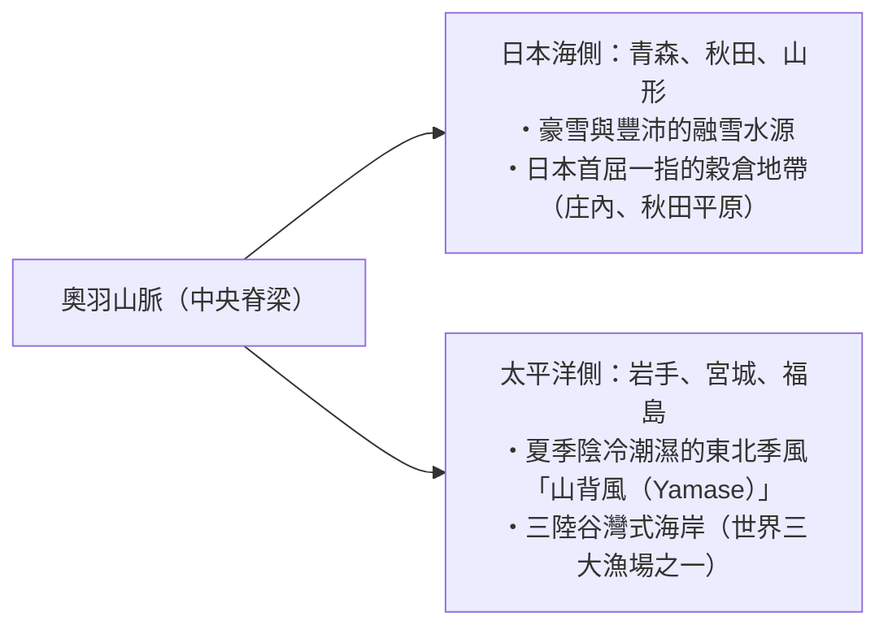
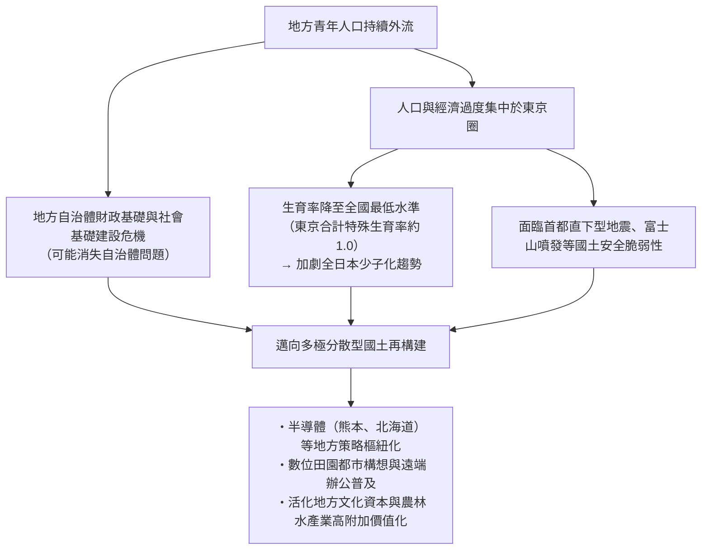
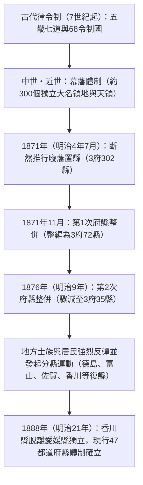

## 序論：日本列島的多樣性與47都道府縣成立史

南北延伸約3,000公里的日本列島呈弧狀綿延，由環太平洋造山帶劇烈的地殼運動（歐亞板塊、北美板塊、太平洋板塊、菲律賓海板塊等四大板塊的擠壓碰撞）所形成，是世界上數一數二的陡峭山嶽島國。

國土約七成為山林所覆蓋，以貫穿中央的脊梁山脈為界，冬季帶來豪雪的「日本海側氣候」、夏季高溫多濕而冬季晴朗乾燥的「太平洋側氣候」、雨量稀少且溫暖的「瀨戶內海式氣候」、日夜及季節溫差劇烈的「中央高地式氣候」，以及亞熱帶海洋性的「南西諸島氣候」，這些極為多元豐富的氣候環境皆濃縮於狹長緊湊的國土之中。

```
【日本列島氣候分區與地勢機制】

┌─────────────────┬───────────────────────────────┬───────────────────────────────┐
│ 氣候分區        │ 地理範圍                      │ 主要氣候特性與機制            │
├─────────────────┼───────────────────────────────┼───────────────────────────────┤
│ 日本海側氣候    │ 北海道日本海側至北陸‧山陰    │ 冬季西北季風吸收對馬暖流水氣，│
│                 │                               │ 迎面撞擊脊梁山脈而帶來豪雪    │
│ 太平洋側氣候    │ 太平洋沿岸至九州南部          │ 夏季受東南季風與颱風影響多雨；│
│                 │                               │ 冬季乾燥晴朗（強勁乾冷落山風）│
│ 瀨戶內海式氣候  │ 中國山地與四國山地包夾區域    │ 雨雲受南北兩側山地阻隔，全年  │
│                 │                               │ 氣候溫暖少雨、日照時數長      │
│ 中央高地式氣候  │ 長野、山梨、岐阜飛驒地方等    │ 地勢標高較高且群山環抱，      │
│                 │                               │ 晝夜與夏冬之溫差極大          │
│ 南西諸島氣候    │ 沖繩縣、奄美群島等            │ 受黑潮暖流影響之亞熱帶海洋性，│
│                 │                               │ 全年高溫多濕，為颱風頻繁侵襲地│
└─────────────────┴───────────────────────────────┴───────────────────────────────┘
```

日本的行政區劃，奠基於古代律令制「五畿七道（畿內、東海道、東山道、北陸道、山陰道、山陽道、南海道、西海道）」所劃分的68處「令制國（舊國名）」。明治維新直後的1871年（明治4年）推行「廢藩置縣」，最初設置超過300個府與縣，歷經多次整併與重組，最終於1888年（明治21年）香川縣獨立設縣後，確立了現行的「1都1道2府43縣（47都道府縣）」統治架構。

本文將全日本47都道府縣劃分為八大地方板塊（北海道、東北、關東、中部、近畿、中國、四國、九州‧沖繩），從各自的令制舊國名、地勢、產業結構、歷史文化，乃至21世紀地方創生與人口動態所面臨的結構性課題，進行全面且深入的系統性解構。

---

## 1. 北海道地方：北方拓荒前線與廣袤的第一級產業

### 1.1 北海道（舊名：蝦夷地／石狩、渡島等11國）
- **道廳所在地**：札幌市
- **面積‧地勢**：83,424 平方公里（全日本第1位，約占日本總面積22%）。以大雪山系與日高山脈為脊梁，坐擁石狩平原、十勝平原、根釧台地等全日本規模最大的平原與台地。屬於亞寒帶氣候，夏季涼爽，冬季酷寒且有大範圍積雪。
- **產業結構‧經濟**：
  - **農業**：日本的糧食基地。旱作（小麥、甜菜、馬鈴薯、紅豆）與大規模酪農業（生乳產量占全國50%以上）。以十勝平原為中心，每戶農家平均耕作面積達數十公頃，呈現超大規模的歐美型機械化農業。
  - **水產業**：扇貝、鮭魚、狹鱈、昆布等捕撈量與養殖產量均為全日本第1位。
  - **觀光與服務業**：二世谷（Niseko）粉雪度假勝地（全球知名頂級入境滑雪觀光聚落）、知床（世界自然遺產）、富良野薰衣草花田、札幌雪祭。
- **歷史‧文化**：愛努族傳統文化（設立民族共生象徵空間「UPOPOY」）。明治時期開拓使與屯田兵開創的近代拓荒開拓史。札幌農學校（克拉克博士，Dr. William S. Clark）導入的近代農業科學與基督宗教博愛精神。
- **地方課題**：人口急遽減少與札幌單極集中、JR北海道虧損鐵路路線維護困境、龐大廣袤基礎建設的維護成本重擔。

---

## 2. 東北地方：奧羽山脈的恩惠與陸奧歷史風土

東北地方由南北貫穿中央的奧羽山脈一分為二，在日本海側（豪雪地帶、名產米糧倉）與太平洋側（易受冷害與山背風影響）形成鮮明對比的風土特徵。



### 2.1 青森縣（舊名：津輕、陸奧）
- **縣廳所在地**：青森市
- **地勢**：本州最北端。津輕半島與下北半島懷抱陸奧灣，中央縱貫八甲田山系，西部矗立著世界自然遺產白神山地。
- **產業**：蘋果產量占全日本市場份額約60%（弘前市、津輕平原）。陸奧灣的扇貝養殖、大間黑鮪魚、八戶港的水產卸貨量。高科技領域則設有位於六所村的核燃料循環設施。
- **文化‧風土**：青森睡魔祭（Aomori Nebuta）、弘前睡魔祭（Hirosaki Neputa）、津輕三味線、孕育太宰治與棟方志功的津輕文化。三內丸山繩文時代遺跡群。

### 2.2 岩手縣（舊名：陸中、陸前、陸奧）
- **縣廳所在地**：盛岡市
- **地勢**：面積僅次於北海道，位居都道府縣全日本第2位（15,275 平方公里）。由沿北上川開展的北上盆地，以及東部的北上高地、三陸谷灣式海岸所構成。
- **產業**：北上盆地的半導體（鎧俠 Kioxia 等）與汽車製造零組件產業聚落。三陸地區的裙帶菜、鮑魚、鮭魚與秋刀魚漁業。南部鐵器等傳統工藝。
- **文化‧風土**：平泉中尊寺金色堂（奧州藤原氏淨土思想‧世界文化遺產）。宮澤賢治筆下的「IHATOV」理想鄉哲學、《遠野物語》（柳田國男創立日本民俗學的發祥聖地）。

### 2.3 宮城縣（舊名：陸前、陸奧）
- **縣廳所在地**：仙台市（東北地方唯一的政令指定都市）
- **地勢**：仙台平原的肥沃水田地帶，松島（日本三景之一），以及牡鹿半島與仙台灣。
- **產業**：東北地方的政治與經濟中樞。「笹錦（Sasanishiki）」與「一見鍾情（Hitomebore）」名牌米的產地穀倉。石卷港、氣仙沼港的水產加工業。以東北大學為核心的學術研發與次世代同步輻射設施「NanoTerasu」等尖端科學研究樞紐。
- **文化‧風土**：伊達政宗開創的仙台藩62萬石城下町武家文化。仙台七夕祭。

### 2.4 秋田縣（舊名：羽後、出羽）
- **縣廳所在地**：秋田市
- **地勢**：秋田平原、橫手盆地、鳥海山、田澤湖（全日本最深湖泊）。
- **產業**：以「秋田小町（Akitakomachi）」為代表的全國知名稻米之鄉。秋田杉林業。比內地雞、鰰魚（日本叉牙魚）。近年作為日本海沿岸離岸風力發電的新能源策略重鎮備受矚目。
- **文化‧風土**：秋田竿燈祭、男鹿生剝鬼節（Namahage，聯合國教科文組織非物質文化遺產）、白神山地。

### 2.5 山形縣（舊名：羽前、出羽）
- **縣廳所在地**：山形市
- **地勢**：庄內平原與最上川貫穿連結的米澤、山形、新莊等各大盆地。出羽三山（月山、羽黑山、湯殿山）、藏王連峰。
- **產業**：櫻桃產量全日本占比逾七成，法國梨等各類高級水果的水果王國。庄內平原的頂級稻作（艷姬米／Tsuyahime）。頂級和牛米澤牛。電子零組件與精密機械製造業。
- **文化‧風土**：出羽三山修驗道山岳信仰文化、山形花笠祭、銀山溫泉的大正浪漫風情建築。

### 2.6 福島縣（舊名：岩代、磐城）
- **縣廳所在地**：福島市
- **地勢**：地勢鮮明地劃分為三大地域：會津（山嶽‧豪雪‧歷史古都）、中通（政治‧經濟‧盆地群）、濱通（太平洋沿岸‧氣候溫暖）。
- **產業**：中通的水蜜桃與水梨果樹栽培。會津漆器與日本清酒釀造業。濱通積極推動「福島創新海岸構想」（涵蓋機器人測試場、綠能氫能尖端技術開發）。
- **文化‧風土**：會津若松的武士道精神（白虎隊）、喜多方拉麵、相馬野馬追祭典。東日本大地震與福島第一核電廠事故後的災後創造性重建與能源轉型前沿陣地。

---

## 3. 關東地方：首都機能集中與多層次產業聚落

關東地方以全日本面積最大的關東平原為舞台，政治、經濟、學術、物流的超高度集中，與周邊各縣的高效後背地農業、沿海重化工業形成了緊密的有機共生鏈結。

```
【首都圈巨型都會區之機能分工結構】

‧東京都：國家中樞機能、全球金融與國際商務法務、尖端資訊科技、引領世界文化潮流
‧神奈川縣：京濱工業地帶、國際貿易港（橫濱）、先端研發樞紐、湘南海岸與箱根溫泉觀光
‧埼玉縣：內陸交通樞紐（新幹線與高速公路網交匯）、近郊蔬果農業、精密機械與綜合物流基地
‧千葉縣：成田國際機場、京葉臨海石化鋼鐵專區、水產與近郊農業（花生、各類蔬菜）
‧茨城縣：筑波研究學園都市、鹿島臨海工業地帶、日立製作所重電製造、哈密瓜與蓮藕
‧栃木縣：北關東工業地域（內陸型汽車組裝與精密零件）、日光東照宮、草莓（栃乙女等）
‧群馬縣：以速霸陸（SUBARU）為核心的汽車產業、溫泉觀光（草津、伊香保）、養蠶絲綢遺產
```

### 3.1 茨城縣（舊名：常陸）
- **縣廳所在地**：水戶市
- **產業**：農業產值居全日本第3位（哈密瓜、蓮藕、番薯乾等）。筑波市匯聚全日本三分之一的國立研究機構，為日本頂級科技研發智庫大腦基地。日立市的重電機械產業，鹿島港的鋼鐵與石化工業綜合專區。
- **文化**：水戶德川家孕育之水戶學（尊王攘夷思想的源流）、偕樂園、日本三大名瀑之一袋田瀑布。

### 3.2 栃木縣（舊名：下野）
- **縣廳所在地**：宇都宮市
- **產業**：草莓產量連續半世紀蟬聯日本第一（栃乙女／Tochiotome、栃愛香／Tochiaika）。宇都宮市與小山市周邊蓬勃發展的內陸工業園區（醫療精密器材、運輸機械設備）。宇都宮輕軌系統（LRT）通車樹立次世代綠色都市交通先驅典範。
- **文化**：世界遺產日光社寺（日光東照宮）、足利學校（日本最古老的綜合大學歷史遺蹟）、益子燒陶器。

### 3.3 群馬縣（舊名：上野）
- **縣廳所在地**：前橋市
- **產業**：以太田市為大本營的速霸陸（SUBARU，原中島飛行機）汽車組裝與金屬衝壓精密產業鏈。魔芋（蒟蒻芋）產量占全日本90%。坐擁草津溫泉、伊香保溫泉、水上溫泉等全國級溫泉勝地。
- **文化**：富岡製絲廠與絲綢產業遺產群（世界文化遺產）。以「上毛紙牌（Jomo Karuta）」凝聚深刻的縣民鄉土認同。

### 3.4 埼玉縣（舊名：武藏大部）
- **縣廳所在地**：埼玉市（Saitama，政令指定都市）
- **產業**：全日本人口第5大縣（約730萬人）。以大宮站為核心的東日本最大鐵路網絡交匯點。食品製造業產值位居全國前列。深谷蔥、狹山茶、草加煎餅。
- **文化**：川越市保存完好的「小江戶」土藏造傳統建築街區、秩父夜祭（聯合國教科文組織非物質文化遺產）。

### 3.5 千葉縣（舊名：下總、上總、安房）
- **縣廳所在地**：千葉市（政令指定都市）
- **產業**：成田國際機場（日本國際航空貨運與客運的主要門戶）。京葉臨海工業地帶發達的石油化學與鋼鐵工業。農業產值位居全日本前茅（蔥、落花生、菠菜等）。銚子港的水產卸貨量。東京迪士尼度假區。
- **文化**：成田山新勝寺的繁華門前町、房總半島的衝浪盛地與海洋度假勝地。

### 3.6 東京都（舊名：武藏、伊豆、小笠原）
- **都廳所在地**：新宿區
- **地勢**：人口約1,400萬人（其都市圈為全球規模最大的巨型都會區）。管轄涵蓋23區、多摩地域、伊豆群島，以及世界自然遺產小笠原群島。
- **產業**：產出日本GDP約20%的超級經濟中樞。丸之內與大手町的跨國金融機構與大型綜合商社、澀谷與六本木的尖端資通訊科技與新創企業圈、秋葉原的次文化中心、羽田國際機場（國內外空運樞紐）。
- **文化**：江戶城天守台遺址、淺草寺、明治神宮等深厚歷史古蹟，與摩天大樓群和諧並存的全球尖端國際文化都市。

### 3.7 神奈川縣（舊名：相模、武藏南部）
- **縣廳所在地**：橫濱市（人口約377萬人，為全日本人口最多的基礎自治體）
- **產業**：人口居全日本第2位（約920萬人）。京濱工業地帶的核心主幹（日產汽車、JFE鋼鐵等跨國巨頭）。橫濱港未來21區集聚的高端企業研發中心。川崎市先進的高科技材料與環保節能技術。
- **文化**：鎌倉幕府的武家文化古都、橫濱開港歷史與異國風情、湘南海岸休閒風尚、箱根頂級溫泉度假勝地。

---

## 4. 中部地方：日本製造業中流砥柱與崇山峻嶺地勢

位於本州中央的中部地方，由北陸（日本海側）、中央高地（內陸山區）、東海（太平洋側）三大性格迥異的副分區所組成，擁有日本實力最為雄厚的製造業重工業走廊。

### 4.1 新潟縣（舊名：越後、佐渡）
- **縣廳所在地**：新潟市（政令指定都市）
- **產業**：信濃川與阿賀野川水系滋養的越後平原優質稻作（越光米收穫量全日本第一）。燕市與三條市（燕三條）的西餐金屬餐具與頂級鍛造刀具（享有極高全球市場占有率）。高級錦鯉養殖。全日本少數的天然氣與原油開採產地。
- **文化**：佐渡金山（世界文化遺產）、長岡祭大花火大會、越後妻有大地藝術祭（越後妻有大地藝術三年展）。

### 4.2 富山縣（舊名：越中）
- **縣廳所在地**：富山市
- **產業**：運用北陸電力充沛廉價的水力發電資源，發展起鋁合金壓延、基礎化學與生技製藥產業。承襲江戶時代「富山賣藥」行商傳統所構築的高密度製藥企業聚落。富山灣以「天然生鮮水族箱」著稱（盛產螢烏賊、白蝦、鰤魚）。
- **文化**：立山連峰與黑部水壩（立山黑部阿爾卑斯路線）。世界文化遺產五箇山合掌造聚落。

### 4.3 石川縣（舊名：加賀、能登）
- **縣廳所在地**：金澤市
- **產業**：依託加賀百萬石雄厚文化資產所開展的高附加價值觀光產業。紡織機械、大型工程建設機械（小松製作所 Komatsu 發源地）、頂級碳纖維複合材料製造。
- **文化**：兼六園（日本三名園之一）、金箔工藝（占全日本市占率99%）、九谷燒陶瓷、輪島塗漆藝。積極推進能登半島地震後的創造性重建工程。

### 4.4 福井縣（舊名：越前、若狹）
- **縣廳所在地**：福井市
- **產業**：鯖江市的眼鏡鏡框產業占全日本市占率95%。高品質紡織業與尖端電子零組件（村田製作所等生產基地）。頂級品種越光米的誕生地。冬季極品越前蟹。嶺南地區密集的大型核能發電廠群。
- **文化**：曹洞宗大本山永平寺（道元禪師創立之禪宗祖庭）、福井縣立恐龍博物館、奇岩景觀東尋坊。全日本居民幸福度綜合評比常年名列前茅。

### 4.5 山梨縣（舊名：甲斐）
- **縣廳所在地**：甲府市
- **產業**：葡萄、水蜜桃、李子的收穫量位居全日本第一。日本國產葡萄酒發祥地（勝沼地區）。全日本第一的寶石研磨加工與高級珠寶首飾產業。工業機器人與數值控制裝置（CNC）全球龍頭發那科（FANUC）總部所在地。磁浮中央新幹線實驗線。
- **文化**：名將武田信玄歷史古蹟、富士五湖景觀、御嶽昇仙峽。

### 4.6 長野縣（舊名：信濃）
- **縣廳所在地**：長野市
- **產業**：雄踞日本阿爾卑斯山脈（飛驒、木曾、赤石山脈）的山嶽高原之縣。以精工愛普生（Seiko Epson）為代表的精密機械聚落（譽為「東洋瑞士」）。高原高冷地蔬菜（萵苣、大白菜）、高品質蘋果。全日本平均壽命最長之健康長壽第一縣。
- **文化**：信州善光寺、國寶松本城（現存最古老五重六階天守）、上高地與輕井澤高原度假避暑勝地。

### 4.7 岐阜縣（舊名：美濃、飛驒）
- **縣廳所在地**：岐阜市
- **產業**：關市的刀具鍛造工藝（與德國索林根、英國雪菲爾並列世界三大刀具產地）。美濃燒（日用陶瓷器占全日本產量過半）。各務原市以川崎重工為核心的航空宇宙軍工產業。飛驒高山的高級木工家具工藝。
- **文化**：世界文化遺產白川鄉合掌村、飛驒高山古老典雅傳統街區、長良川傳承千年的鵜飼（鸕鶿捕魚）技藝。

### 4.8 靜岡縣（舊名：遠江、駿河、伊豆）
- **縣廳所在地**：靜岡市（政令指定都市）
- **產業**：工業製造品出貨額位居全日本最頂尖行列。鈴木（Suzuki）、山葉（Yamaha）、本田（Honda）三大汽機車龍頭發跡的運輸機器王國。綠茶生產量居全日本首位。精密組裝塑膠模型出貨額雄霸全球第一（田宮 Tamiya、萬代 Bandai 等大廠）。燒津港的鰹魚與鮪魚遠洋卸貨量全日本第一。
- **文化**：富士山（世界文化遺產）、伊豆半島溫泉度假勝地、德川家康晚年隱居與長眠之地（駿府城、久能山東照宮）。

### 4.9 愛知縣（舊名：尾張、三河）
- **縣廳所在地**：名古屋市（政令指定都市）
- **產業**：**連續逾40年蟬聯工業製造品出貨額全日本第1位**，為日本實力最強大的製造業工藝帝國。豐田汽車（Toyota）及其周邊多層次全球供應鏈網絡。以三菱重工等為核心的航空宇宙製造基地。高級陶瓷器（Noritake等）、特殊鋼合金、高精密工作母機。
- **文化**：戰國三英傑（織田信長、豐臣秀吉、德川家康）誕生之地。熱田神宮、名古屋城。獨樹一格的名古屋道地飲食文化（味噌炸豬排、鰻魚飯三吃、風味炸雞翅）。

---

## 5. 近畿地方：千年古都與關西經濟圈的厚重底蘊

從古代直至近世始終作為日本政治與文化中心的「畿內」為核心，商業大都會大阪、國際港口城市神戶、兩大千年古都京都與奈良，展現出高度均衡且互相輝映的共生共榮格局。

```
【近畿圈之機能分工與歷史多樣性】

‧大阪府：商賈巨埠歷史基因、國際金融樞紐、世界博覽會（1970/2025）、生命科學醫療、庶民飲食文化
‧京都府：平安京千年的豐厚文化資產、任天堂與京瓷等世界高科技名企、極致傳統工藝、頂級國際觀光
‧兵庫縣：國際港口海運貿易（神戶）、播磨臨海重化工業地帶、灘五鄉頂級清酒釀造、丹波與但馬農水產
‧奈良縣：古代大和王權的搖籃、平城京遺跡、法隆寺與東大寺（世界頂級佛教藝術與古建築寶庫）
‧滋賀縣：坐擁全日本第一大琵琶湖（近畿1,400萬人命脈水庫）、近江商人哲學、發達內陸型尖端工業
‧三重縣：伊勢神宮（神道教最高殿堂）、鈴鹿賽車場、頂級珍珠養殖、四日市石油化學專區
‧和歌山縣：高野山真言宗與熊野三山（聖地與參拜道）、溫州蜜柑與南高梅梅乾產量全日本第一
```

### 5.1 三重縣（舊名：伊勢、伊賀、志摩、紀伊東部）
- **縣廳所在地**：津市
- **產業**：四日市石化綜合工業專區（涵蓋石油化學與尖端半導體快閃記憶體大廠）。頂級品牌松阪牛、英虞灣的阿古屋珍珠養殖、伊勢龍蝦。
- **文化**：伊勢神宮（皇大神宮內宮、豐受大神宮外宮）、伊賀流忍者文化發祥地、熊野古道（伊勢路）。

### 5.2 滋賀縣（舊名：近江）
- **縣廳所在地**：大津市
- **產業**：環繞琵琶湖的水陸交通要衝。東麗（Toray）、松下（Panasonic）等跨國企業的大型內陸母工廠群聚。信樂燒陶瓷。近江米、近江牛。
- **文化**：比叡山延曆寺（日本佛教天台宗總本山與母山）、國寶彥根城（現存天守）、「三方好（買方好、賣方好、社會好）」的近江商人商道哲學。

### 5.3 京都府（舊名：山城、丹波、丹後）
- **府廳所在地**：京都市（政令指定都市）
- **產業**：全球公認的頂級文化觀光大城。任天堂（Nintendo）、歐姆龍（Omron）、京瓷（Kyocera）、島津製作所、尼得科（Nidec）等世界頂尖高科技製造跨國巨擘總部所在地。西陣織、清水燒、宇治抹茶。
- **文化**：古都京都文化財（17處聯合國教科文組織世界文化遺產寺院神社）、祇園祭、五山送火。

### 5.4 大阪府（舊名：攝津東部、河內、和泉）
- **府廳所在地**：大阪市（政令指定都市）
- **產業**：西日本最大的經濟火車頭。日本綜合商社發源地（伊藤忠商事、住友商事等）。以武田藥品工業為首的國際製藥與生命科學研發重鎮。東大阪市的中小型高精密金屬與零部件製造聚落。關西國際機場（全天候海上人工島國際樞紐）。
- **文化**：大阪城、道頓堀、上方落語、文樂人形淨琉璃、吉本新喜劇、庶民麵粉料理文化（章魚燒、大阪燒）。百舌鳥‧古市古墳群（仁德天皇陵等世界文化遺產）。

### 5.5 兵庫縣（舊名：攝津西部、丹波、但馬、播磨、淡路）
- **縣廳所在地**：神戶市（政令指定都市）
- **產業**：神戶港的大型國際海運物流門戶。川崎重工、神戶製鋼所等重厚長大工業骨幹。播磨臨海工業地帶。全日本清酒釀造產量第一的灘五鄉。淡路島高品質洋蔥、神戶牛。
- **文化**：國寶姬路城（日本首座世界文化遺產，素有「白鷺城」美名）、日本最古老名湯有馬溫泉、神戶舊居留地與北野異人館西洋風情建築。

### 5.6 奈良縣（舊名：大和）
- **縣廳所在地**：奈良市
- **產業**：國際古蹟觀光業。吉野杉、吉野檜高級木材林業。全日本第一的襪子生產聚落（廣陵町周邊）。奈良墨、茶道專用竹茶筅等極致傳統手工藝。
- **文化**：古都奈良文化財（東大寺、興福寺、春日大社等世界遺產）、法隆寺地區佛教建築群（現存世界最古老的木造建築群）、吉野山春櫻與修驗道聖地。

### 5.7 和歌山縣（舊名：紀伊西部）
- **縣廳所在地**：和歌山市
- **產業**：溫州蜜柑、紀州南高梅（梅乾）、八朔柑、山椒的產量均居全日本第一位。日本製鐵和歌山製鐵所的大型鋼鐵製造基地。
- **文化**：紀伊山地之靈場及參詣道（高野山金剛峯寺、熊野三山‧世界文化遺產）、南紀白濱溫泉。

---

## 6. 中國地方：瀨戶內海石化聚落與山陰神話世界

中國地方以橫貫中央的中國山地為天然屏障，在依傍瀨戶內海、氣候溫暖少雨且重化工業密集的「山陽地區」，與面向日本海、充滿神話色彩且保留雄奇原生態自然風貌的「山陰地區」之間，形成了極為深刻鮮明的地理與人文對照。

### 6.1 鳥取縣（舊名：因幡、伯耆）
- **縣廳所在地**：鳥取市
- **地勢‧產業**：全日本人口最少之縣（約54萬人）。鳥取砂丘特殊的乾燥沙地農業（以蕎頭／薤聞名）。二十世紀梨產量居全日本第一。優質白蔥產地。境港豐富的螃蟹捕撈與水產加工卸貨量。
- **文化**：因幡白兔神話發祥地、三朝溫泉（世界罕見高濃度氡泉療養勝地）、三德山三佛寺投入堂（建於絕壁凹洞之國寶奇蹟建築）。

### 6.2 島根縣（舊名：出雲、石見、隱岐）
- **縣廳所在地**：松江市
- **地勢‧產業**：出雲平原、宍道湖（蜆捕獲量居全日本第一）。特殊鋼冶煉傳統（日立金屬高級安來鋼／Yasuki Hagane）。高級溫室仙客來盆花、德拉瓦葡萄（Delaware）。
- **文化**：出雲大社（全日本八百萬神明於農曆十月齊聚之「讓國神話」至高聖地）、世界文化遺產石見銀山遺跡、隱岐群島世界地質公園。

### 6.3 岡山縣（舊名：美作、備前、備中）
- **縣廳所在地**：岡山市（政令指定都市）
- **產業**：水島臨海工業地帶（全日本代表性大型石化、鋼鐵冶煉、汽車組裝綜合專區）。以頂級白桃、晴王麝香葡萄聞名遐邇的「水果王國」。兒島地區為日本國產高級牛仔褲與學生制服產業的發祥大本營。
- **文化**：倉敷美觀地區（典雅白壁宅邸與古運河柳樹街景）、日本三名園之一岡山後樂園、古樸質實的備前燒陶器。

### 6.4 廣島縣（舊名：安藝、備後）
- **縣廳所在地**：廣島市（政令指定都市）
- **產業**：中國與四國地方規模最大的經濟龍頭核心。以馬自達汽車（Mazda）為骨幹的汽車工業聚落、JFE鋼鐵福山鋼鐵廠、吳市與尾道市的大型現代造船業。牡蠣養殖產量占全日本市場過半。全日本第一的檸檬生產地。
- **文化**：坐擁兩大世界文化遺產（嚴島神社海上大鳥居、象徵世界和平祈願的廣島和平紀念碑／原爆圓頂館）。作為國際和平紀念都市的全球影響力。尾道依山傍海的石階坂道與文學名城氛圍。

### 6.5 山口縣（舊名：周防、長門）
- **縣廳所在地**：山口市
- **產業**：瀨戶內沿岸周南石化專區（高階石油化學、無機化學材料）。宇部興產（現UBE）的高級合成化學與水泥製造。下關港享譽全國的頂級虎河豚與鮟鱇魚水產集散。
- **文化**：孕育明治維新諸多維新志士與政治領袖的萩市松下村塾（世界文化遺產）。岩國錦帶橋、秋吉台與秋芳洞（日本規模最大之喀斯特石灰岩溶洞台地）、角島大橋壯闊海景。

---

## 7. 四國地方：南海道歷史遺產、瀨戶內工業與太平洋水產

四國山地橫亙東西中央，將四國島隔絕為北側面向瀨戶內海的溫和地帶（香川、愛媛）與南側直面太平洋驚濤駭浪的濕潤多雨地帶（高知、德島）。透過本州四國聯絡橋的三大跨海動脈（大鳴門橋、瀨戶大橋、島波海道），四國與本州陸路保持緊密無縫的經濟物流連結。

### 7.1 德島縣（舊名：阿波）
- **縣廳所在地**：德島市
- **產業**：酸橘（Sudachi，全日本市占率超過90%）、鳴門金時甘藷（地瓜）、頂級地雞阿波尾雞。以發明並實現藍光LED商業量產之日亞化學工業為核心的世界級光電LED高科技產業聚落。
- **文化**：擁有400餘年悠久歷史並享譽國際的阿波舞（Awa Odori）、鳴門海峽世界級奇景鳴門漩渦、深山秘境祖谷溪（祖谷蔓橋）。

### 7.2 香川縣（舊名：讚岐）
- **縣廳所在地**：高松市
- **產業**：全日本行政面積最小之縣份，卻具備極高的人口密度。以「讚岐烏龍麵」為核心構築起無可撼動的麵食飲食文化與全日本級觀光號召力。小豆島的橄欖栽培產量居全日本第一。番之州臨海工業地帶（造船、化學）。
- **文化**：金刀比羅宮（參道石階名剎「金比羅山」）、國家特別名勝栗林公園、三年一度的瀨戶內國際藝術祭（直島、豐島等聞名全球的現代當代藝術聖地）。

### 7.3 愛媛縣（舊名：伊予）
- **縣廳所在地**：松山市
- **產業**：溫州蜜柑及各類雜柑柑橘類生產的代名詞（「蜜柑王國」）。今治毛巾（高品質吸水純棉毛巾的頂級國際品牌）。今治市聚集的全國最大海運船東與造船造機聚落（日本第一大海事都市）。新居濱市與四國中央市的大型紙漿造紙、住友集團非鐵金屬冶煉製造。
- **文化**：道後溫泉本館（日本最古老的溫泉名湯）、國寶松山城天守、吸引全球自行車愛好者朝聖的島波海道跨海自行車道。

### 7.4 高知縣（舊名：土佐）
- **縣廳所在地**：高知市
- **產業**：善用太平洋充沛陽光與溫暖氣候所發展的溫室茄子促成栽培。生薑、茗荷產量居全日本第一位。近海傳統單線鰹魚一本釣漁業。室戶海洋深層水多元開發產業。
- **文化**：誕生明治維新靈魂人物坂本龍馬所孕育的自由奔放與自由民權風骨、夜來祭（Yosakoi祭）熱情群舞、桂濱海灣美景、被譽為「日本最後清流」的四萬十川。

---

## 8. 九州‧沖繩地方：亞洲門戶與南西諸島文化

此處地處東亞大陸與朝鮮半島的最前沿，自古代防人防衛與遣唐使渡海以來，長久擔當日本對外交流與文化輸入的第一線門戶。在當代，隨著半導體超級產業（日本矽島）的強勢復活，與島嶼內部豐沛活躍的火山地熱、南國海洋觀光資源激盪出蓬勃生機。

```
【九州‧沖繩地方之區域實力與產業特性】

‧福岡縣：全九州政經核心樞紐、亞洲交流門戶、市中心直達機場之極致都會、國家級新創特區
‧佐賀縣：有田燒與伊萬里燒瓷器祖庭、唐津宮日節、佐賀平原水稻、有明海頂級養殖紫菜（海苔）
‧長崎縣：南蠻貿易與出島對外窗口歷史、長崎天草潛伏基督徒遺產、大型現代造船、谷灣海岸優質水產
‧熊本縣：台積電（TSMC / JASM）進駐帶動超級半導體聚落熱潮、阿蘇世界級火山臼、百分之百純淨地下水之都
‧大分縣：溫泉湧出量與泉眼數均霸居日本第一（別府、由布院）、發達地熱發電、大分臨海重化工業專區
‧宮崎縣：充沛日照與溫暖宜人氣候（頂級宮崎牛、太陽之子完熟芒果、甜椒）、日向灘知名衝浪勝地
‧鹿兒島縣：黑豬、黑毛和牛、番薯、道地本格燒酎王國、櫻島活火山、世界自然遺產（屋久島、奄美大島）
‧沖繩縣：琉球王國璀璨獨特歷史、首里城、美麗海水族館、國際亞熱帶度假島嶼、基地經濟轉型自立
```

### 8.1 福岡縣（舊名：筑前、筑後、豐前）
- **縣廳所在地**：福岡市（政令指定都市，人口約160萬人）
- **產業**：全九州規模最大的經濟與消費核心。北九州工業地帶（官營八幡製鐵所發源地、工業機器人巨頭安川電機等）。博多國際港口與福岡機場（距市中心博多站僅需搭乘地下鐵5分鐘的極致交通便捷性）。資訊科技軟體與國家戰略新創企業特區。「甘王（Amaou）」頂級草莓產地。
- **文化**：盛大壯觀的博多祇園山笠、學問之神太宰府天滿宮（菅原道真）、夜間特色屋台（路邊攤）美食文化、宗像大社（世界文化遺產）。

### 8.2 佐賀縣（舊名：肥前東部）
- **縣廳所在地**：佐賀市
- **產業**：有田燒、伊萬里燒（日本最早成功燒製白瓷之瓷器發祥祖庭）。有明海養殖海苔（銷售額連續蟬聯全日本第一）。高品質頂級佐賀牛。玄海核能發電廠。
- **文化**：吉野里歷史遺跡（彌生時代日本最大規模環壕聚落國寶遺址）、武雄溫泉樓門、唐津宮日節（Karatsu Kunchi 曳山巡遊）。

### 8.3 長崎縣（舊名：肥前西部、壹岐、對馬）
- **縣廳所在地**：長崎市
- **產業**：以三菱重工長崎造船廠為歷史象徵的高水準造船重工業。依託全日本第2長的曲折海岸線，造就竹筴魚、鯖魚等漁獲量高居全日本前茅。枇杷收穫量全日本第一。
- **文化**：長崎與天草地區的潛伏基督徒相關遺產（世界文化遺產）、明治日本工業革命遺產（軍艦島／端島）、豪斯登堡主題度假區。

### 8.4 熊本縣（舊名：肥後）
- **縣廳所在地**：熊本市（政令指定都市）
- **產業**：**隨著全球半導體晶圓代工龍頭台積電（TSMC旗下JASM）進駐菊陽町建廠**，引爆全日本戰後數十年來規模最大、高達數兆日圓的半導體關聯資本投資狂潮，帶動相關設備、材料廠商與高薪科研人才大規模向九州回流。番茄收穫量全日本第一，西瓜名產地。全市自來水百分之百取自阿蘇山脈過濾之純淨優質天然地下水。
- **文化**：熊本城（戰國名將加藤清正親自構建之難攻不落天下名城）、全球規模最大級別的阿蘇火山臼（Caldera）、天草五橋海上風光。

### 8.5 大分縣（舊名：豐後、豐前南部）
- **縣廳所在地**：大分市
- **產業**：溫泉泉眼數量與湧出量雙雙高居全日本第一，以「溫泉縣」品牌馳名（別府溫泉、由布院溫泉）。大分臨海工業地帶（新日鐵住金大分製鐵廠、大型石化與精密化學）。臭橙（Kabosu）產量占全日本市場份額90%。頂級乾燥原木香菇。
- **文化**：宇佐神宮（全日本4萬餘座八幡宮的總本宮）、國東半島六鄉滿山（珍貴的日本神佛習合山岳佛教文化遺產）。

### 8.6 宮崎縣（舊名：日向）
- **縣廳所在地**：宮崎市
- **產業**：善用溫暖多雨的天候優勢，培育出連續多次榮獲日本「內閣總理大臣獎」的最高等級宮崎牛；頂級完熟芒果「太陽之子（Taiyo no Tamago）」；肉雞與優質毛豬產量名列全日本前茅。天然杉木原木產量位居全日本第一。
- **文化**：高千穗峽的日本神話「天孫降臨」聖地（高千穗夜神樂）、日南海岸青島神社、坐落於海蝕洞穴內的鵜戶神宮。

### 8.7 鹿兒島縣（舊名：薩摩、大隅）
- **縣廳所在地**：鹿兒島市
- **產業**：農業產值居全日本第2位。鹿兒島黑毛和牛、黑豬、番薯、人工養殖鰻魚、肉雞產量均居全日本頂尖。傳統道地本格燒酎釀造產業。種子島宇宙中心（JAXA大型運載火箭核心發射場）。
- **文化**：隔著錦江灣雄視活火山櫻島的壯麗景觀。明治維新西南雄藩大本營（薩摩藩、西鄉隆盛、大久保利通）。世界自然遺產（屋久島千年繩文杉、奄美大島珍稀生態系統）。

### 8.8 沖繩縣（舊名：琉球王國）
- **縣廳所在地**：那霸市
- **地勢**：日本最南端與最西端的亞熱帶島嶼縣份。涵蓋本島及宮古島、八重山群島（石垣島、西表島）等為數眾多的有人離島。
- **產業**：全日本頂尖的國際海島度假休閒觀光業。積極招徠資訊通信（ICT）後勤與資料中心產業。甘蔗、原生種阿古豬（Agu豬）、苦瓜、傳統蒸餾烈酒泡盛。美軍基地租金收入比重的遞減與民間自主自立型高產值經濟體的轉型。
- **文化**：琉球王國城跡及相關遺產群（首里城跡等世界文化遺產）。充滿活力的沖繩盆踊舞（Eisa）、傳統弦樂器三線、琉球漆器工藝、鮮豔典雅的紅型染。獨樹一幟的養生長壽食膳文化。

---

## 9. 21世紀的地域課題：東京單極集中與國土多極分散論

在縱覽全日本47都道府縣之地勢與產業結構後，當代日本所面臨的最大結構性經濟與社會危機，無疑便是**「東京首都圈極端嚴重的單極過度集中，以及地方廣大區域面臨的人口急遽凋零與極限過疏化」**。



### 9.1 消滅可能性自治體與基礎建設維護極限
依據2014年著名的「增田報告（Masuda Report）」以及近年民間智庫「人口戰略會議」的最新嚴密精算推估，全日本超過四成以上的市町村自治體正面臨「可能消失自治體（消滅可能性自治體）」的存亡絕境。特別是年輕育齡女性人口持續單向流入東京圈的趨勢難以遏止，導致廣大過疏偏鄉地區陷入了公立學校整併廢校、大眾公共交通系統停駛、自來水管網與公路橋樑等龐大公共社會基礎設施老化卻無財力翻新的系統性崩潰邊緣。

### 9.2 半導體與再生能源驅動的地方振興胎動
然而，進入2020年代後，日本地方發展歷史性轉折的變革契機已悄然浮現。
首先，在經濟安全保障戰略的驅使下，次世代尖端半導體巨型晶圓廠（Megafab）開始全面轉向地方設廠。台積電（TSMC / JASM）進駐熊本縣菊陽町，以及次世代晶片國家隊Rapidus進駐北海道千歲市，帶動高達數兆日圓規模的國家級資金挹注，掀起了上游供應鏈企業、頂尖研究機構以及大量高薪工程師職缺重返地方的龐大人才與資本回流潮。
其次，在綠色轉型與脫碳（GX）的全球趨勢下，擁有遼闊腹地與充沛自然環境的廣大地方（東北地方與日本海沿岸的龐大離岸風力發電場、北海道與九州的大規模太陽能、地熱與生質能發電基地），正被重新賦予作為國家最關鍵能源安全供給大後方的戰略地位。

---

## 0. 行政區劃變遷史：從令制國到廢藩置縣與府縣大合併之路

當今日本「47都道府縣」的統治行政疆界，絕非自古以來便天然存在，而是明治維新時期近代民族國家建設過程中，歷經無數政策試錯、激烈的權力妥協與大規模強制整併後所造就的歷史產物。



### 0.1 廢藩置縣（1871年）的政治力學
對於1868年明治維新後誕生的大日本帝國新政權而言，首要面臨的核心死生存亡難題，乃是「建立統一的國家主權」與「整合中央的軍事及財政權力」。儘管1869年推行了「版籍奉還」，任命各藩舊藩主為「知藩事」，但各藩實質上依舊牢牢掌握各自的軍隊（藩兵）與獨立徵稅特權，中央政權本質上仍是一個虛弱鬆散的聯邦式同盟。

1871年（明治4年）7月14日，西鄉隆盛、大久保利通、木戶孝允等薩摩、長州、土佐三藩核心元老，調集一萬名直屬「御親兵」進駐東京作為武力後盾，以迅雷不及掩耳之勢斷然頒布「廢藩置縣」詔令。各藩一夕之間全數廢除，知藩事被勒令解除職務並遷居東京，中央新政府隨即指派官選的知事與縣令進駐地方掌權。此時最初誕生的統治架構為「3府302縣」。

### 0.2 第1次與第2次府縣整併與「分縣運動」的激盪
最初設立的三百餘個縣，因其直接承襲自大小各異的舊藩領地，規模過於破碎細小，財政稅收根本難以維持現代官僚體系的運轉，中央政府隨即著手展開激進的整併措施。
1871年11月推行「第1次府縣整併」，將全日本整編為3府72縣；隨後在1876年（明治9年）由內務省主導推動更為極端的「第2次府縣整併」，大刀闊斧將全日本行政區劃腰斬驟減至「3府35縣」。

這種純粹自中央由上而下、強行抹殺歷史人文脈絡的粗暴合併，隨即在全日本引爆了激烈的地域摩擦與衝突。
舉例而言，現今的香川縣在當時被強行併入名東縣（德島）隨後又被併入愛媛縣；富山縣被併入石川縣；佐賀縣被併入長崎縣；宮崎縣被併入鹿兒島縣；福井縣甚至被一分為二分別併入石川縣與滋賀縣。
面對此一局面，各地舊城下町的仕紳、地方豪農與士族階層爆發出滔天怒火，痛斥此舉「橫暴無理、踐踏歷史鄉土情感」，並指責「地方繳納的血汗稅金全數被吸往合併後的中心城市，周邊附庸地區的基礎建設完全遭到漠視廢棄」。這股怨憤迅速與當時席捲全日本爭取開設民選帝國議會的「自由民權運動」相互結合，爆發了席捲全國的「分縣運動（復縣運動）」。

面對全日本此起彼伏的抗爭壓力，明治政府被迫退讓並陸續批准分縣：1881年恢復福井縣，1883年恢復富山縣、佐賀縣與宮崎縣。最終於1888年（明治21年）12月，香川縣獲准正式脫離愛媛縣分離獨立。至此，現今所見穩固成熟的「1都1道2府43縣」行政地圖版圖終於徹底定型。

---

## 8.9 47都道府縣的語言景觀：方言周圈論與東西語言分界線

最能生動體現日本列島多樣性的文化載體，莫過於在列島各個角落生生不息、層次豐富多元的「方言（地域語言）」漸變色彩。

著名民俗學者與語言學家柳田國男，在其1930年出版的名著《蝸牛考》中，詳盡調查了全日本各地對於「蝸牛」一詞的方言稱呼分布，進而發現歷史上語言變遷的浪潮，乃是以古代至中世的文化中心京都為核心，猶如水波漣漪般呈同心圓狀層層向偏遠地方擴散傳播，由此確立了震撼學界的**「方言周圈論」**。

```
【柳田國男《蝸牛考》中的方言周圈構造】

［京都（文化中心）］： Dendenmushi（出出蟲，近世江戶期流行之新詞）
  ↓ （由中心向外圈擴散）
［近畿周邊‧北陸‧東海］： Maimai（舞舞螺，室町時期的流行詞彙）
  ↓
［中部‧關東‧中國‧四國］： Katatsumuri（蝸牛，平安時期的古雅詞彙）
  ↓
［東北‧九州］： Tsuburi、Tsubu（螺螄／圓螺，古代上古舊詞）
  ↓
［本州南北兩端極地（青森津輕‧鹿兒島薩摩）］： Namekuji、Name（蛞蝓，最古層原始古語遺存）
```

此外，日本語在地理空間上還存在一條沿新潟縣糸魚川延伸至靜岡縣濱名湖‧富士川一帶的**「東西語言分界線」**：
- **東日本方言**：斷定助動詞普遍使用「da」、否定助動詞使用「nai」、命令形語尾為「-ro」（例如以「okiro」表示「起床」）、聲調系統採用「東京式聲調」。
- **西日本方言**：斷定助動詞普遍使用「ja / ya」、否定助動詞使用「n / hen」、命令形語尾為「-yo」（例如以「okiyo」表示「起床」）、聲調系統採用「京阪式聲調」。

更進一步，東北地方以母音央化著稱的「Zuzu方言（裏日本方言）」，以及薩摩方言（鹿兒島）中極具特色的閉音節化現象（大量轉化為促音與撥音），在歷史上甚至曾具備抵禦外敵刺探、令間諜密探無法聽懂情報的戰略「防諜密碼」防衛機能。這些在崇山峻嶺與洶湧海峽長期地理阻隔下所孕育的獨特語言景觀，是日本列島極為珍貴的無形文化資產。

---

## 9.3 47都道府縣的經濟地理學：產業集聚與區位商（Location Quotient）

在經濟地理學中，用以客觀量化與科學評估各個都道府縣產業核心競爭力與專業化程度的經典分析工具，即為**「區位商（地域特化係數，Location Quotient: LQ）」**。該指標專門衡量特定地域在某一產業上的集聚度相對於全國平均水準的集中倍率。

$$LQ = \frac{e_i / e}{E_i / E}$$

在此數學公式中：
- $e_i$ 代表該目標地域在產業 $i$ 的就業人數（或工業製造品出貨額）；
- $e$ 代表該目標地域的全體產業就業總人數；
- $E_i$ 代表全日本在產業 $i$ 的就業總人數；
- $E$ 代表全日本的全體產業就業總人數。

當計算結果呈現 $LQ > 1.0$ 時，即客觀表明該地域在該項產業上的專業化集聚水準顯著高於全日本平均水準。

```
【47都道府縣之顯著地域特化模式】

1. 輸送用機械器具製造業（汽車組裝、零組件、航太軍工）：
   ‧超高度特化縣：愛知縣（LQ ≈ 3.2）、群馬縣（LQ ≈ 2.8）、靜岡縣（LQ ≈ 2.5）、廣島縣（LQ ≈ 2.1）
   ‧產業結構特徵：以全球整車組裝巨頭（豐田、速霸陸、鈴木、馬自達）為金字塔頂層，構建極具深度之龐大多層次外包零件體系。

2. 電子零組件‧元件‧半導體製造業：
   ‧超高度特化縣：山形縣（LQ ≈ 2.9）、福井縣（LQ ≈ 2.7）、熊本縣（LQ ≈ 2.6）、岩手縣（LQ ≈ 2.4）
   ‧產業結構特徵：依託清澈甘冽的水質、潔淨空氣環境與高速公路網絡，在內陸地帶建立起高度發達之「矽島」與「矽路」專區。

3. 第一級產業（農業、水產養殖業）：
   ‧超高度特化縣：青森縣、北海道、鹿兒島縣、宮崎縣、高知縣（LQ > 3.0）
   ‧產業結構特徵：擔當國家糧食安全的核心生命線。近年正加速向智慧農業（Smart AgTech）與六級產業化（結合生產、加工、行銷）大步邁進。

4. 國際金融‧資訊通信‧企業專業商務服務：
   ‧超高度特化都府：東京都（LQ ≈ 2.5）、大阪府（LQ ≈ 1.4）
   ‧產業結構特徵：跨國企業全球總部、智財專利管理、高階法務會計、風險投資與新創生態圈的絕對壟斷性集聚。
```

日本整體的總體經濟引擎，絕非依賴單一核心在空轉，而是由愛知與東海地區所代表的「實體工藝製造業引擎」、以東京與大阪為核心的「國際金融‧總部資訊決策引擎」，以及廣大地方各縣所肩負的「糧食‧綠能‧半導體實體防禦基石引擎」，三者彼此緊密咬合、相輔相成，方才得以推動這部世界大型經濟巨輪的穩定前行。

---

## 0.3 縣名與縣廳所在地的「背離」政治史：明治初期官軍與幕府懲罰說之考證

在深入觀察日本47都道府縣時，許多人心中總會浮現一個經典的歷史謎團：為何日本既存在「縣名與縣廳所在地都市名稱完全一致的縣」（如秋田縣秋田市、新潟縣新潟市、廣島縣廣島市等），同時又大量存在「縣名與首府城市名稱截然不同、彼此背離的縣」（如岩手縣盛岡市、宮城縣仙台市、茨城縣水戶市、栃木縣宇都宮市、群馬縣前橋市、石川縣金澤市、三重縣津市、滋賀縣大津市、兵庫縣神戶市、島根縣松江市、愛媛縣松山市、沖繩縣那霸市等）？

長久以來，在日本民間與諸多大眾通俗讀物中廣為流傳著一種說法：在明治維新戊辰戰爭中站在舊幕府軍一方對抗薩長官軍的藩（即所謂的「賊軍」），在維新後遭到明治政府的政治打壓與懲戒，新政府刻意剝奪其以傳統城下町名作為縣名的權利，而強制降格改用郡名命名（即所謂的「賊軍懲罰說」）。
持此論者往往舉出奧羽越列藩同盟的盟主會津若松、仙台、盛岡，以及親藩大名據點前橋、水戶等作為佐證。

然而，當代歷史學界與行政制度史專家的嚴謹實證史料考證，早已徹底推翻了這項「懲罰說」。明治新政府在制定府縣名稱時，根本並非出於幼稚的政治報復或恩怨清算，而是嚴格遵循著極具前瞻性與制度理性的實務行政準則。

```
【明治初期制定縣名之實務行政邏輯】

1. 破除舊城下町中心主義與推行「採用郡名」之普遍原則：
   新政府為徹底瓦解舊藩閥封建大名的割據私權，洗刷前近代領主專制統治的殘餘印記，樹立近代國家的普遍公權力，確立了一項基本原則：避免直接採用舊大名統治的城下町名稱，而優先採用縣廳辦公署所在地所屬的「郡之名稱」（源自律令制以來的廣域古代行政單位）。
   ‧盛岡城下（位於岩手郡） → 定名為「岩手縣」
   ‧仙台城下（位於宮城郡） → 定名為「宮城縣」
   ‧水戶城下（位於茨城郡） → 定名為「茨城縣」
   ‧金澤城下（位於石川郡） → 定名為「石川縣」
   ‧松江城下（位於島根郡） → 定名為「島根縣」
   ‧松山城下（位於溫泉郡，並取自古事記中伊予國的神話美稱「愛比賣」） → 定名為「愛媛縣」

2. 對新興國際貿易開港場與重要策略樞紐的特殊考量：
   不以封建舊藩城下町為行政中心，而是因應國際通商開港潮流，直接以急速崛起的新興港灣口岸作為縣名與治理核心。
   ‧兵庫（將神戶開港場劃為中央直轄管轄） → 定名為「兵庫縣」（縣廳設於神戶）
   ‧橫濱（以條約開港場神奈川宿為命名依據） → 定名為「神奈川縣」（縣廳設於橫濱）

3. 行政中心歷經頻繁遷移與合併所遺留的歷史痕跡：
   ‧栃木縣：最初縣廳設立於下野國栃木町（都賀郡），後因交通與行政考量遷往宇都宮，但沿用既定之「栃木」縣名。
   ‧群馬縣：縣廳在群馬郡高崎與勢多郡前橋之間歷經多次遷徙交替，最終定址前橋，但保留了源自群馬郡高崎的「群馬」之名。
```

由此可見，縣名與首府城市名稱的不一致，絕非幕府派受懲罰的政治私怨私刑，而是明治維新政權為了徹底解構前近代武家封建莊園領地、在列島全面奠定近代普遍法治公權力體系所刻劃下的鮮明制度搏鬥印記。

---

## 8.10 日本列島風土論（Terroir）：風土孕育的47都道府縣飲食文化與發酵科學

將47都道府縣深層地域獨特性演繹得最為淋漓盡致的，當屬各地微氣候與獨特地勢所滋養出的「鄉土料理」以及源遠流長的「發酵食品體系（清酒、味噌、醬油、漬物）」。在法國葡萄酒文化中被奉為靈魂概念的**「風土條件（Terroir，即土壤、微氣候、地形與人文歷史交織之總體環境）」**，在日本飲食文化中同樣展現出極致純粹的在地具象化。

```
【氣候風土與發酵‧飲食文化之47都道府縣對比矩陣】

┌─────────────────┬───────────────────────────────┬───────────────────────────────┐
│ 地域 / 風土類型 │ 代表性都道府縣與道地食文化    │ 氣候環境與微生物生態學機制    │
├─────────────────┼───────────────────────────────┼───────────────────────────────┤
│ 寒冷豪雪地帶    │ 秋田縣（魚露鹽魚汁、煙燻蘿蔔）│ 為度過酷寒漫長冬季而演化出之  │
│ （長期保存‧發酵│ 山形縣（芋煮鍋、納豆湯）      │ 高鹽分、長期發酵技術；運用雪室│
│  低溫熟成）     │ 新潟縣（片木盒蕎麥麵、發酵麴）│ （天然低溫雪庫）之低溫慢熟成  │
├─────────────────┼───────────────────────────────┼───────────────────────────────┤
│ 瀨戶內‧乾燥地帶│ 香川縣（讚岐烏龍麵）、廣島縣（│ 雨量稀少不適水稻之梯田轉作    │
│ （乾物‧醬油釀造│ 牡蠣、檸檬）、愛媛縣（鯛魚飯）│ 小麥與大豆；赤穗海鹽、小豆島  │
│  航運物流樞紐） │ 岡山縣（高級果物、散壽司）    │ 醬油釀造，結合海運物流要衝    │
├─────────────────┼───────────────────────────────┼───────────────────────────────┤
│ 內陸山嶽‧盆地  │ 長野縣（信州蕎麥麵、烤餡餅、  │ 隔絕於海洋之險峻山區所發展之  │
│ （乾物‧植物蛋白│ 昆蟲食）、山梨縣（餺飥麵、甲州│ 珍貴蛋白質保存；善用晝夜劇烈  │
│  高低溫差熟成） │ 燉雞雜）、岐阜縣（朴葉味噌）  │ 溫差製作凍豆腐與天然寒天      │
├─────────────────┼───────────────────────────────┼───────────────────────────────┤
│ 南西島嶼‧黑潮帶│ 沖繩縣（全豬料理、泡盛、豆腐餻│ 高溫多濕環境下為避免食材腐敗，│
│ （油脂防腐‧黑麴│ 鹿兒島縣（黑豬、黑醋、燒酎）  │ 巧妙利用黑麴菌生成之檸檬酸防腐│
│  食醋熱帶智慧） │ 高知縣（炙烤鰹魚、皿鉢料理）  │ 大量運用油脂封存與食醋殺菌技藝│
└─────────────────┴───────────────────────────────┴───────────────────────────────┘
```

以香川縣享譽全日本的「讚岐烏龍麵」為例，這項美食的誕生絕非源自當地人偶然的麵食喜好，而是瀨戶內海地質氣象學的必然結晶。讚岐平原南受中央構造線與高聳四國山地的屏障，來自太平洋的雨雲全數被阻隔於山南，使其成為全日本降雨量最為匱乏的乾旱地帶之一。千百年來飽受缺水之苦的農民，只能在稻作休耕期或旱田上大量改種耐旱的小麥。與此同時，瀨戶內海強烈的日照與平緩廣闊的潮間帶泥灘孕育了發達的「海鹽曬鹽業（鹽田）」；小豆島溫和的地中海式氣候促成了頂級「醬油」釀造業的興起；而伊吹島周邊平緩溫暖的海域，更源源不絕產出製作高湯不可或缺的乾燥「炒手小魚乾（煮干小魚乾 / Iriko）」。小麥、海鹽、醬油與小魚乾高湯，在瀨戶內海的地形氣候條件下產生了完美的化學反應，這正是「風土論（Terroir）」最經典的生動詮釋。

同樣地，沖繩縣的飲食文化結構，與日本本州追求「清淡高湯與食材原味」的和食美學呈現出顛覆性的強烈對比。琉球王國在作為東亞與東南亞海上轉口貿易樞紐（「萬國津梁」）的歷史進程中，發展出「除了豬叫聲之外全身無處不吃」的極致豬肉烹調文化（包含東坡肉「Rafute」、涼拌豬耳「Mimiga」、內臟湯「Nakajiru」等），並掌握了利用能生成大量檸檬酸、具備強力抑菌特性的黑麴菌來釀造高酒精濃度蒸餾烈酒「泡盛」的尖端生物發酵技術。在酷熱高溫的亞熱帶海島環境中，將飲食視為調養生命的「藥膳（Kusuimun）」與滋養萬物的「命藥（Nuchigusui）」，展現了先民以精湛生活科學戰勝嚴苛自然環境的非凡智慧。

## 10. 結論：多樣性乃日本真正的國力泉源

在走遍全日本47都道府縣的地理與歷史長河後，我們得以清晰地洞察：日本這個國家真正的強大韌性與生命力，絕非建立在東京這座單一超級繁華中樞之上，而是深植於**「47個截然不同的氣候風土、產業結構與歷史文化交織而成的驚人馬賽克多樣性」**之中。

津輕先民在漫天豪雪中磨礪出的堅忍不拔、尾張與三河匠人對製造工藝登峰造極的偏執追求、瀨戶內海和煦陽光下滋養的開朗海洋性格、阿波與土佐民眾在群舞中迸發的奔放活力，乃至於琉球群島浩瀚蔚藍大海所蘊蓄的獨特精神哲學――這一切，無一不是這座列島上千百年來祖先們在與大自然的搏鬥、對話與適應中所凝結出的智慧結晶。

在當代全球化均質浪潮的猛烈衝擊下，每一個地域若能重新深刻體認自身無可替代的獨特歷史與地勢風土（Terroir），並自信地將其獨特價值轉化為面向世界的創新動能；當夜空中47顆璀璨星辰各自綻放出專屬於自己的耀目光芒、如星座般在浩瀚星海中交相輝映之際，日本列島方能在未來的世紀洪流中，真正贏得永續發展的繁榮基業與充實豐沛的內在靈魂。
