## مقدمة: جرس إنذار 2026 — «الدولة المتخلفة أمنياً»؛ الأزمة الوطنية التي تواجه اليابان

منذ منتصف عشرينيات القرن الحالي وحتى عام 2026 الحاضر، تعيش الفضاءات السيبرانية اليابانية في خضم عاصفة هوجاء مدمرة غير مسبوقة في تاريخها الحديث.

في الماضي، سادت قطاع الصناعة والأعمال في اليابان «أسطورة أمان» زائفة لا تستند إلى أي دليل عقلاني: «نحن لسنا شركة عالمية كبرى، لذا لن نكون هدفاً للمخترقين»، «حاجز اللغة اليابانية المعقدة يشكل حصناً طبيعياً ضد الهجمات السيبرانية العالمية»، «لقد ثبتنا برامج مكافحة الفيروسات من كبرى شركات الحماية الأمنية، لذا نحن في أمان تام» ―― واليوم، تحطمت هذه الأوهام الوردية الساذجة وتناثرت شظاياها في مهب الريح.

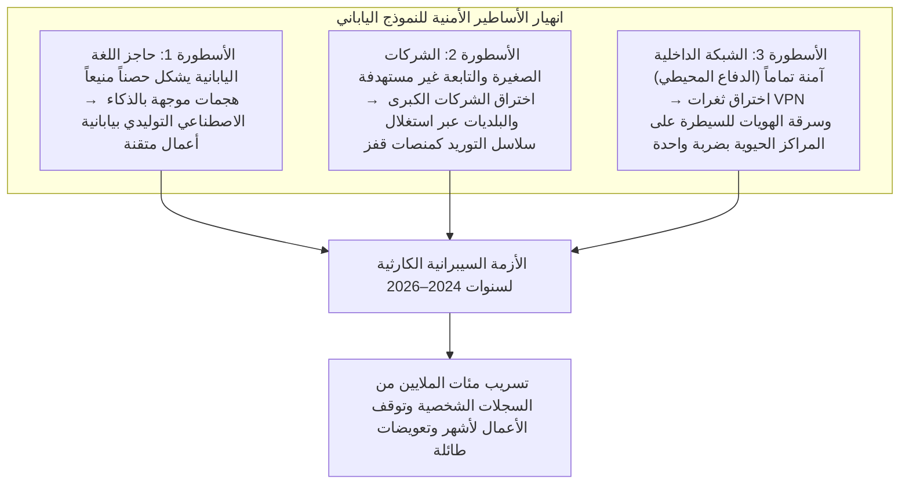

الواقع الراهن قتّام وقاسٍ إلى أبعد الحدود؛ من عمالقة صناعة الترفيه والإعلام، والبنوك العملاقة، وشركات الاتصالات، ومؤسسات البنية التحتية الحيوية، وصولاً إلى الأنظمة الإدارية للبلديات والحكومات المحلية، خضعت مؤسسات يابانية عريقة الواحدة تلو الأخرى لمنطق عصابات برامج الفدية (Ransomware)، أو شهدت تسريب ملايين، بل عشرات الملايين من سجلات البيانات الشخصية بالغة الحساسية إلى أسواق الويب المظلم (Dark Web).

ولم تعد البيانات المسربة تقتصر على البيانات الأساسية مثل الأسماء والعناوين وأرقام الهواتف فحسب، بل امتدت لتشمل بيانات بطاقات الائتمان، ونتائج الفحوصات الطبية، وأرقام الهوية الوطنية (My Number)، والعقود السرية مع الشركاء التجاريين، وسجلات المحادثات الداخلية للشركات، وحتى الصور الممسوحة ضوئياً لرخص قيادة الموظفين. لقد أصبحت البيانات التي تمس الصميم الأخلاقي والاجتماعي والكرامة الإنسانية رهائن في أيدي نقابات الجريمة السيبرانية الدولية تُعرض في مزادات علنية للمزايدة على بيعها.

وحين يقع المحذور وينفجر الحادث السيبراني، يظهر مسؤولو الإدارة التنفيذية في قاعات المؤتمرات الصحفية يطأطئون رؤوسهم في انحناءات اعتذار عميقة، ليرددوا البيانات النمطية المعلبة: «السبب لا يزال قيد التحقيق»، «سنعمل على تعزيز وتكثيف دورات التوعية الأمنية لجميع الموظفين».

ولكن، بات لزاماً علينا أن نطرح السؤال الجوهري دون مواربة: **لماذا تفشل كل هذه الاستثمارات التقنية الهائلة وتلك الدورات التدريبية السنوية الإلزامية في منع استمرار نزيف تسريب البيانات والحوادث الكارثية داخل الشركات اليابانية؟**

إن السبب الجذري لا يكمن في مجرد هفوة موظف مسكين «نقر على رابط مشبوه في بريد إلكتروني»، بل هو انهيار هيكلي محتوم تولّد من تضافر أمراض عضال مزمنة تجاهلها قطاع الأعمال الياباني لعقود طويلة: **«المرض الهيكلي المتمثل في الإلقاء الكامل لأعباء تقنية المعلومات على الخارج (IT Outsourcing Dumping) وتعدد طبقات المقاولات من الباطن»**، و**«الإيمان الأعمى بنموذج الدفاع المحيطي (Perimeter Model) المتوارث والمنهار»**، و**«هشاشة وتفكك قواعد الهوية والمصادقة مع الانتقال المتسرع نحو السحابة»**، و**«فشل حوكمة الإدارة العليا التي تعتبر الأمن تكلفة مالية عبثية بدلاً من كونه استثماراً استراتيجياً وجودياً»**.

تضع هذه الورقة البيضاء المرجعية، من منظور رئيس تنفيذي لأمن المعلومات (CISO) وخبير في تحليل التهديدات السيبرانية المتقدمة، الحوادث الكبرى التي هزت أركان اليابان بين عامي 2024 و2026 تحت مبضع التشريح التقني الصارم، كاشفةً اللثام عن حقيقة تلك العلل الهيكلية، لتقدم بعد ذلك منظومة دفاعية وعملية متكاملة تضمن بقاء واستمرارية المؤسسات: من **التطبيق الشامل لبنية انعدام الثقة (Zero Trust Architecture - ZTA)** بافتراض الاختراق الحتمي، وإحكام الرقابة على سلاسل التوريد، وفرض المصادقة المقاومة للتصيد الاحتيالي (Phishing-Resistant MFA)، إلى ترسيخ الصمود السيبراني عبر النسخ الاحتياطية غير القابلة للتغيير (Immutable Backups).

---

## الفصل 1: تشريح الحوادث الكبرى في الشركات اليابانية (2024–2026)

لفهم حقيقة الأزمة التي تواجهها الشركات اليابانية، يجب أولاً دراسة «سلسلة القتل السيبرانية (Cyber Kill Chain)» لأبرز الحوادث التي وقعت في السنوات الأخيرة، استناداً إلى الحقائق التقنية الملموسة والدروس المستفادة منها.

### 1.1 دروس حادثة KADOKAWA وNiconico: الإبادة الشاملة لمركز البيانات وفدية BlackSuit

مثّل الهجوم السيبراني الذي استهدف عملاق النشر والإعلام الياباني KADOKAWA وشركتها التابعة Dwango في يونيو 2024، أكبر نقطة تحول ومنعطف مأساوي في تاريخ الحوادث السيبرانية باليابان.

نُفذ الهجوم على يد جماعة برامج الفدية **«BlackSuit»**، وهي الجماعة التي تُعد الوريث المباشر لمنظمة «Conti» سيئة السمعة التي هزت العالم سابقاً. وأسفر هذا الهجوم عن شلل وإغلاق كامل لخدمات الإنترنت التي تقدمها المجموعة، وفي مقدمتها منصة بث الفيديو الأيقونية في اليابان «Niconico»، وتوقفت العمليات الأساسية للمجموعة لأشهر متواصلة، بما في ذلك شبكات التوزيع وسلاسل إمداد الكتب والمطبوعات والمعاملات المحاسبية. والأفظع من ذلك، تسريب أكثر من 250 ألف سجل من البيانات الحساسة إلى الويب المظلم، شملت بيانات الموظفين والمبدعين والمتعاقدين والعقود والاتفاقيات السرية للمجموعة.

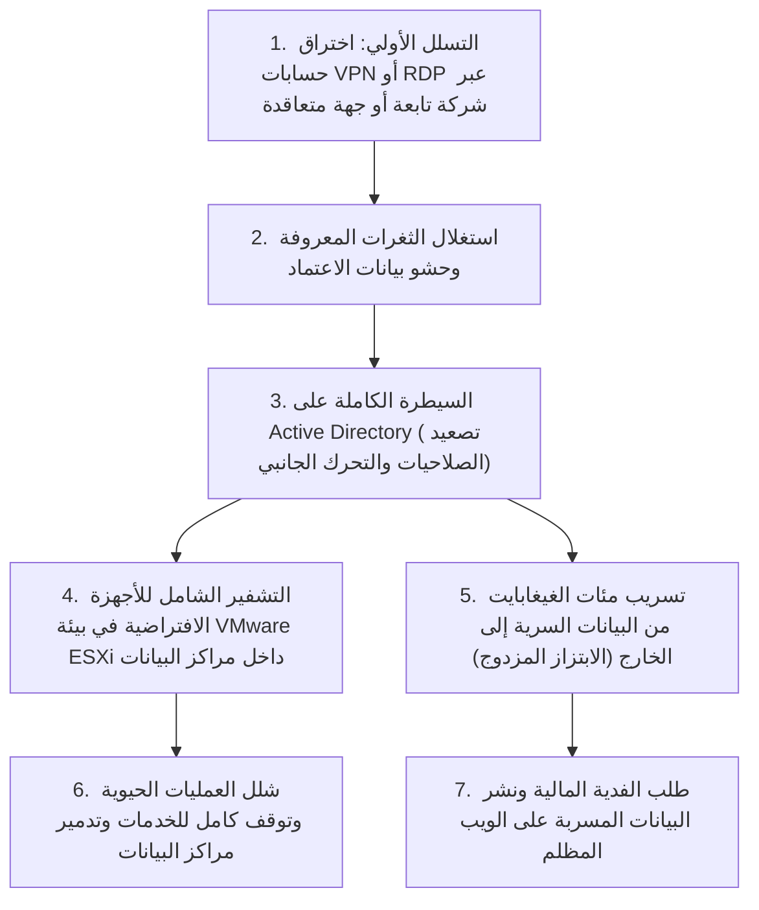

كانت الصدمة الكبرى التي زلزلت مجتمع أمن المعلومات في اليابان إثر هذا الهجوم متمثلة في أن **«البنية التحتية للسحابة الخاصة المحلية (بيئة المحاكاة الافتراضية) قد تم سحقها وإبادتها بالكامل من جذورها»**.

فالمهاجمون لم يستهدفوا شبكة المقر الرئيسي الحصينة بشكل مباشر، بل اتخذوا من بيئة الوصول عن بُعد (بوابات VPN أو بروتوكول سطح المكتب البعيد RDP) الخاصة بإحدى الشركات التابعة أو مقاولي الخدمات موطئ قدم ومنصة انطلاق. وبمجرد التسلل خلف أسوار المحيط الخارجي، استغل المهاجمون حقيقة أن الشبكة الداخلية للشركة كانت «مسطحة وغير مجزأة (Flat Network)» لتنفيذ تحرك جانبي مدمر (Lateral Movement)، حتى نجحوا في نهاية المطاف في **الاستيلاء الكامل على صلاحيات مسؤول النطاق (Domain Admin) في خوادم Active Directory**، وهي القلب النابض والعقل المدبر لمنظومة تكنولوجيا المعلومات في المؤسسة.

وبعد إحكام قبضتهم على النطاق بالكامل، لم يكتفِ مهاجمو BlackSuit بتشفير خوادم التطبيقات الفردية، بل نفذوا وصولاً مباشراً إلى طبقة البرامج المشرفة على البيئة الافتراضية (Hypervisors) مثل VMware ESXi، وقاموا بعملية تشفير مجمعة وفائقة السرعة لجميع صور الأجهزة الافتراضية (ملفات VMDK) المخزنة في وحدات التخزين المركزية (Datastores). والأسوأ من كل ذلك أنهم **قاموا بحذف وتشفير النسخ الاحتياطية المتصلة بالشبكة (Online Backups) عن بكرة أبيها**.

لقد كانت هذه الحادثة بمثابة إعلان وفاة رسمي ونهائي لنموذج «الدفاع القائم على المحيط»، وبرهاناً عملياً صارخاً أثبت لجميع مجالس الإدارات في اليابان أنه: «إذا استطاع المهاجم النفاذ إلى داخل شبكتك المحلية، فإن أضخم مراكز البيانات وأكثرها تطوراً ستُباد وتتحول إلى رماد بضربة واحدة».

### 1.2 قضية LINE Yahoo والبنية التحتية المشتركة مع NAVER: انهيار حوكمة التعهيد عبر الحدود

أما الحادثة التي كُشف النقاب عنها في خريف 2023 وتصاعدت تداعياتها بين عامي 2024 و2026 لتصل إلى توجيه وزارة الشؤون الداخلية والاتصالات اليابانية توجيهات إدارية استثنائية متكررة وصارمة، فهي «قضية تسريب البيانات الشخصية في شركة LINE Yahoo»، والتي سلطت الضوء على **«النقاط العمياء القاتلة في حوكمة تكنولوجيا المعلومات الناتجة عن العلاقات الرأسمالية وعقود التعهيد المتداخلة»**.

أدى هذا الحادث إلى تسريب قرابة 510 آلاف سجل من البيانات الشخصية للمستخدمين والشركاء التجاريين والموظفين، وكان زناد الانفجار قادماً من البيئة السحابية لشركة NAVER الكورية الجنوبية، التي كانت تمثل الشريك المؤسس والمالك الأم لشركة LINE Yahoo.

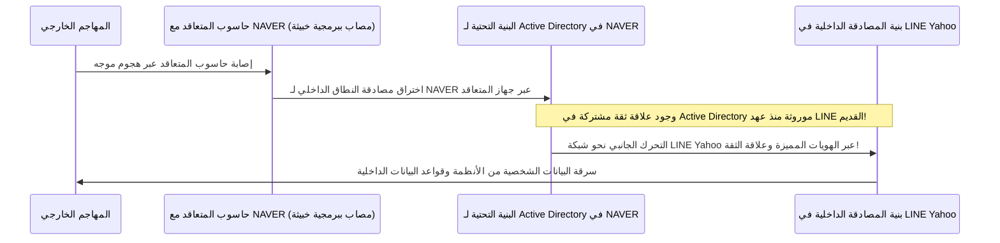

يكمن الجوهر التقني لهذه الكارثة في **«بقاء البنية التحتية لمصادقة الهويات الداخلية، مثل Active Directory، مشتركة ومترابطة بعلاقات ثقة غير مقيدة بين LINE القديمة وشركة NAVER دون فصل حقيقي»**.

فقد أصيب حاسوب تابع لأحد المقاولين الخارجيين لشركة NAVER ببرمجية خبيثة، مما مكّن المهاجمين من النفاذ إلى الشبكة الداخلية لـ NAVER، ومن هناك، استغلوا «علاقة الثقة العابرة للحدود في خوادم المصادقة» ليتسللوا بحرية تامة ودون اعتراض من أي جدار أمني إضافي إلى قواعد البيانات والأنظمة الداخلية لشركة LINE Yahoo في اليابان.

كشفت هذه الحادثة زيف الطمأنينة التي تتذرع بها الشركات اليابانية في مشاريع «تقسيم العمل العالمي» و«التطوير البرمجي في الخارج (Offshore)»؛ حيث تعاملت بإفراط في الثقة وتساهل تام مع شبكات الشركات التابعة لمجرد أنها «شركة شقيقة» أو «الشركة الأم». وقد أكدت التدخلات الصارمة للحكومة اليابانية بمطالبة الشركة «بمراجعة الهيكل الرأسمالي مع NAVER» و«الفصل التام والشامل لأنظمة المصادقة المشتركة»، أن حوكمة سلاسل التوريد والتبعيات التكنولوجية العابرة للحدود باتت ترتبط بشكل وثيق بالأمن القومي والسيادة الوطنية للدول.

### 1.3 الانهيار المتسلسل لسلسلة التوريد الذي ضرب البلديات وشركات التعهيد (Iseto وغيرها)

ابتداءً من عام 2024 فصاعداً، اجتاحت موجة من الذعر الحكومات المحلية والمؤسسات المالية وشركات البنية التحتية في اليابان نتيجة **هجمات برامج الفدية التي استهدفت كبرى شركات تعهيد العمليات التجارية والطباعة ومعالجة البيانات (BPO)، مثل شركة Iseto وغيرها**.

دأبت البلديات والجهات الحكومية في اليابان على الاستعانة بمصادر خارجية عبر مناقصات عامة، لإسناد عمليات طباعة وتغليف وإرسال إشعارات الضرائب المحلية، وبطاقات التأمين الصحي الوطني، وإشعارات رسوم رعاية المسنين، والكتيبات الانتخابية. واشتملت هذه العمليات على تسليم ملفات ضخمة تحوي بيانات شخصية في غاية الحساسية للمواطنين، مثل الأسماء، والعناوين، وأرقام الهوية الشخصية (My Number)، والدخول المالية، وتفاصيل الضرائب المفروضة.

ولم يكلف المهاجمون أنفسهم عناء محاولة اختراق الشبكات الحكومية المركزية المحصنة بعناية (شبكات LGWAN الخاضعة لنموذج الدفاع ثلاثي الطبقات). وبدلاً من ذلك، وجهوا ضربتهم القاتلة إلى **الشبكات الفرعية لشركات المقاولات والطباعة المتعاقدة مع تلك الجهات الحكومية**.

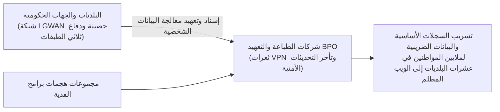

ونتيجة لإصابة شبكات المقاولين ببرامج الفدية، لم تُشفر بياناتهم الداخلية فحسب، بل شُفرت وسُربت إلى الويب المظلم كافة البيانات الحساسة المودعة لديهم والخاصة بعشرات البلديات والملايين من المواطنين اليابانيين.

إن الدرس القاسي والمؤلم المستفاد من هذه الكارثة هو تلك الحقيقة الصارمة في فيزياء أمن المعلومات: **«مهما أنفقت الجهة الرئيسية مئات الملايين من الين على تحصين أنظمتها، فإن تدني المستوى الأمني لدى أي مقاول فرعي في سلسلة التوريد كفيل بانهيار المنظومة برمتها في طرفة عين»**. لقد أثبت الواقع أن اكتفاء الإدارات الحكومية والشركات الكبرى بالتدقيق الورقي الشكلي واعتبار «وجود بنود والتزامات أمنية في عقود التوريد كافياً لضمان الأمان» كان وهماً إدارياً قاد إلى كارثة محققة.

### 1.4 سوء التكوين السحابي (Salesforce / AWS / Azure): مأساة الخزائن المفتوحة المعروضة للعالم

ليست الهجمات الموجهة المعقدة وبرامج الفدية هي وحدها المسؤولة عن كوارث تسريب البيانات؛ فحتى منتصف عشرينيات القرن الحالي، ما تزال نسبة هائلة من التسريبات تعود إلى سبب بدائي ومثير للدهشة: **«الأخطاء وسوء التكوين في الخدمات السحابية (Cloud Misconfiguration)»**.

ومن أشهر الأمثلة التي ضربت كبرى شركات الوساطة المالية والمصارف ومواقع التجارة الإلكترونية والوزارات في اليابان، **تسريب بيانات العملاء الناجم عن سوء تكوين منصة إدارة علاقات العملاء Salesforce**.

تتضمن Salesforce ميزات لبناء مجتمعات وبوابات تفاعلية ومواقع عامة تتيح وصول الزوار (Guest Access). ولكن بسبب إغفال تغيير التكوينات الافتراضية لقواعد مشاركة البيانات (Sharing Rules) والأخطاء الفادحة في تصميم صلاحيات الوصول، تُركت قوائم عملاء تحتوي على الأسماء، وأرقام الهواتف، وأرقام الحسابات، وسجلات العمليات المالية في حالة جعلتها **«متاحة بالكامل للبحث والاطلاع دون الحاجة لأي مصادقة أو تسجيل دخول من قبل أي متصفح للإنترنت حول العالم»** وظلت على هذا الحال لسنوات طويلة.

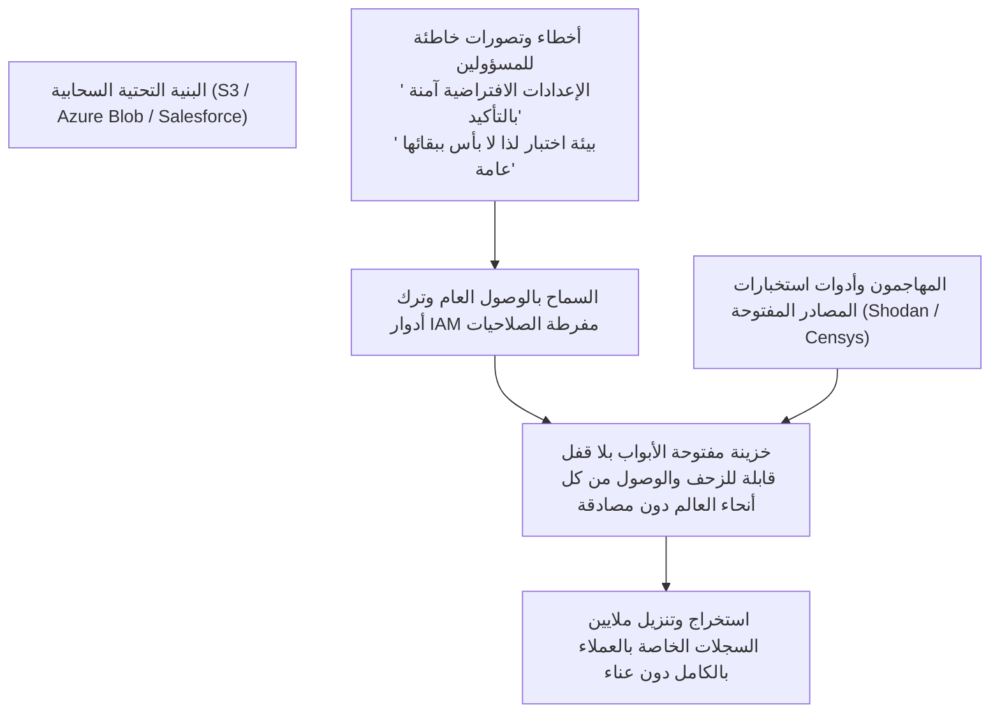

وينطبق الأمر ذاته على التكوين الخاطئ لحاويات التخزين S3 Buckets في منصة Amazon Web Services (AWS) التي تُترك مفتوحة للعامة، وأخطاء الصلاحيات في حسابات التخزين بـ Microsoft Azure، فضلاً عن الحوادث المتكررة لنشر المطورين لمفاتيح الوصول البرمجية وأسرار API عن طريق الخطأ داخل مستودعات GitHub العامة.

دون الحاجة لتنفيذ هجمات ثغرات اليوم الصفر (Zero-day) المعقدة، كان الواقع المرير للعمليات السحابية في الشركات اليابانية هو أنها **«قامت بأيدي مسؤوليها بفتح أبواب الخزائن على مصراعيها، وعرضت أسرارها وبيانات عملائها أمام أعين الجميع في ساحة الإنترنت العالمية»**.

---

## الفصل 2: التشريح العميق للأسباب الجذرية (1) — الأمراض الهيكلية والتنظيمية (إلقاء مهام تقنية المعلومات والمقاولات المتعددة)

لماذا تعجز المؤسسات اليابانية عن استباق هذه المخاطر وتفاديها على الرغم من وضوحها التام؟ في هذا الفصل، نضع «الأمراض الهيكلية لبيئة الأعمال اليابانية» تحت المجهر.

### 2.1 «تقنية المعلومات مركز تكلفة»: عدم مبالاة الإدارة العليا وتهميش دور مسؤول أمن المعلومات (CISO)

إن نقطة الضعف القاتلة في الأمن السيبراني للشركات اليابانية لا تكمن في ضبط جدران الحماية، بل تكمن في **«قاعة اجتماعات مجلس الإدارة»**.

في الشركات العالمية الرائدة بالولايات المتحدة وأوروبا، يُنظر إلى تكنولوجيا المعلومات والأمن السيبراني على أنهما «جوهر القدرة التنافسية للشركة، وبند ثابت على رأس جدول أعمال القيادة التنفيذية العليا». ويمتلك رئيس أمن المعلومات (CISO) سلطات وصلاحيات تنفيذية نافذة وخط اتصال مباشر مع الرئيس التنفيذي (CEO)، ويملك حق النقض الصريح (Veto Power) الذي يخوله إيقاف أي نظام تقني عن العمل إذا تبين وجود خطر أمني يهدد المؤسسة، حتى لو تعارض ذلك مع المصالح الآنية لقطاعات الأعمال.

وعلى النقيض التام من ذلك، عوملت إدارات تكنولوجيا المعلومات في معظم الشركات اليابانية لعقود من الزمن باعتبارها «إدارات غير منتجة ومراكز استنزاف للتكاليف (Cost Centers)»:
- تكاد تخلو مجالس الإدارات تماماً من أي مسؤول تنفيذي يتمتع بخلفية تقنية أو أمنية، وغالباً ما يُعهد بمنصب CIO أو CISO إلى مسؤول تنفيذي ذي خلفية أدبية أو قانونية على سبيل «التكليف الإضافي الشكلي» بجانب مهامه في الشؤون الإدارية أو القانونية.
- عندما يرفع مسؤولو الأمن الميدانيون تقريراً يفيد بأن: «أجهزة VPN الحالية تحتوي على ثغرة أمنية حرجة وتتطلب ميزانية عاجلة للتحديث مع فترة صيانة تستوجب إيقاف الخدمة لعدة ساعات»، تقابل الإدارة العليا ذلك بالرفض الفوري بحجة أن: «النتائج المالية للربع الحالي مضغوطة ويجب تأجيل الميزانية للعام القادم»، أو «إيقاف الأعمال والخدمات أمر غير مقبول بتاتاً».

ونتيجة لذلك، تحول منصب CISO في الشركات اليابانية إلى مجرد **«كبش فداء شكلي، مجرد من الصلاحيات والميزانيات، وتقتصر مهمته الحقيقية على الانحناء والاعتذار في المؤتمرات الصحفية عند وقوع الكارثة»**. إن إصرار الإدارة على معاملة الأمن كعبء مالي يجب تقليصه قدر الإمكان، بدلاً من التعامل معه كاستثمار تأسيسي لا غنى عنه لإدارة المخاطر، هو الصانع الحقيقي لهذه الأزمة الوطنية.

### 2.2 المقاولات من الباطن وإعادة التعهيد: خلق «الحلقة الأضعف (Weakest Link)»

تتمثل الظاهرة الأكثر تجذراً ومرضية في صناعة تقنية المعلومات باليابان في بنية **«المقاولات المتعددة الطبقات (هيكل المقاول العام لتكنولوجيا المعلومات - IT General Contractors)»** الشبيهة بقطاع الإنشاءات التقليدي.

تقوم الشركات والمؤسسات الحكومية المستفيدة بـ «إلقاء وإسناد كامل» لعمليات تصميم النظم وتطويرها وتشغيلها وصيانتها الأمنية إلى شركات تكامل النظم الكبرى (المقاول الرئيسي - Prime SIer). ولكن هذا المقاول الرئيسي لا ينفذ الأعمال بنفسه عملياً، بل يقتطع نسبة أرباحه ويعيد تعهيد المهمة إلى مقاول من المستوى الثاني، والذي يمررها بدوره إلى المستوى الثالث، وصولاً إلى مقاولين من المستوى الرابع والخامس من الشركات البرمجية الصغيرة والمطورين المستقلين.

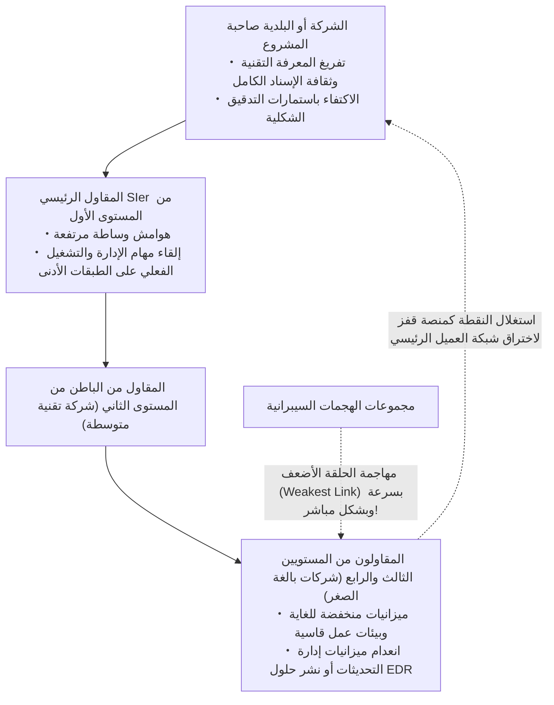

في هندسة الأمان والتشفير، هناك قاعدة ذهبية أزلية: **«تُقاس قوة أي سلسلة بقوة الحلقة الأضعف فيها (The chain is only as strong as its weakest link)»**.

فمهما امتلك المقاول الرئيسي الأول من جدران حماية متقدمة وسياسات أمنية صارمة، فإن الشركات الصغيرة في المستويين الثالث والرابع تعيش تحت وطأة ميزانيات خانقة، ولا تملك أدنى مقومات الإنفاق لنشر حلول الكشف والاستجابة عند النقاط الطرفية (EDR)، أو التعاقد مع مراكز عمليات أمنية (SOC) للمراقبة المستمرة.
- في تلك المستويات الدنيا، تُستخدم حواسيب شخصية تعمل بأنظمة Windows 10 منتهية الدعم، أو أجهزة خاصة غير خاضعة للإدارة (BYOD)، وتُلصق كلمات مرور مديري النظام على شاشات الأجهزة بواسطة أوراق الملاحظات اللاصقة.
- وفوق كل ذلك، تُمنح هذه الأجهزة الضعيفة صلاحيات وصول مميزة وحسابات تحكم عن بُعد تتيح لها الولوج المباشر إلى قواعد البيانات والخوادم المركزية للمؤسسة الكبرى صاحبة المشروع لإنجاز أعمالها.

وبالنسبة للمهاجمين، يمثل هذا الترتيب أفضل سيناريو يمكن أن يحلموا به؛ فلا حاجة إطلاقاً لمحاولة اقتحام الباب الرئيسي الحصين للمؤسسة الكبرى. كل ما يتطلبه الأمر هو إصابة جهاز واحد تابع لمقاول فرعي صغير في أقصى أطراف سلسلة التوريد، وسرقة بيانات الاعتماد المخزنة فيه، ليدلف المهاجم بعد ذلك إلى قلب الشبكة المركزية للشركة الأم «مرتدياً قناع مستخدم شرعي ومصرح له بالكامل».

### 2.3 حدود نظام التوظيف الياباني والنقص الهيكلي في الكفاءات الأمنية

لا يقل الجانب البشري في هذه المنظومة مأساوية وتدهوراً.

تشير تقارير وزارة الاقتصاد والتجارة والصناعة (METI) ووكالة ترويج تكنولوجيا المعلومات (IPA) باستمرار إلى وجود عجز يقدر بمئات الآلاف من المتخصصين في الأمن السيبراني باليابان. غير أن لب القضية لا يرتبط بالعوامل الديموغرافية فحسب، بل يرجع إلى **«عجز نظام التوظيف التقليدي في اليابان عن تقدير ومكافأة الكفاءات التقنية المتفوقة»**.

في الولايات المتحدة وإسرائيل وسنغافورة، تتراوح الرواتب السنوية لمهندسي العمارة الأمنية والمخترقين الأخلاقيين وخبراء الهندسة العكسية للمصنفات الخبيثة بين 20 إلى 40 مليون ين ياباني أو أكثر؛ ويحظى هؤلاء بتقدير ومكانة رفيعة كنخبة تقنية تحمي أعمال المؤسسة.

في المقابل، تخضع الشركات اليابانية التقليدية القائمة على مبادئ التوظيف مدى الحياة والتدرج الوظيفي القائم على الأقدمية، الكوادر التقنية لنفس السلالم الوظيفية الموحدة للموظفين الإداريين:
- ومهما بلغت مهارة المهندس الشاب وقدرته على التصدي للاختراقات، يظل محصوراً في سلم الرواتب العام (من 4 إلى 6 ملايين ين سنوياً) شأنه شأن زملائه في أقسام المبيعات أو الشؤون الإدارية.
- المسار الوظيفي الوحيد للترقي هو التحول إلى «مدير إداري»، حيث تنعدم المسارات المهنية المتخصصة التي تتيح للمهندس الاستمرار في كتابة الشيفرات، وتحليل السجلات، وتفكيك البرمجيات الخبيثة. وإذا أراد زيادة راتبه، فعليه ترك العمل الأمني الميداني والتفرغ لإدارة الميزانيات وإعداد التقارير الإدارية على برامج Excel.

أدى ذلك إلى هجرة ونزيف حاد للعقول التقنية الفذة نحو الشركات الأجنبية والشركات الناشئة، مما أفرغ إدارات تقنية المعلومات داخل المؤسسات اليابانية من أي مهندس قادر على رصد الهجمات وتحليلها والتعامل معها ذاتياً. ولم يتبقَ داخل تلك الإدارات سوى «سعاة بريد إداريين» يقتصر دورهم على استلام تقارير الشركات المزودة وتمريرها للمسؤولين. هذا التجويف المعرفي هو المسؤول المباشر عن التخبط وسوء اتخاذ القرار في الساعات الأولى الحرجة لأي هجوم، مما يحول الحوادث العابرة إلى كوارث شاملة.

---

## الفصل 3: التشريح العميق للأسباب الجذرية (2) — الانهيار التقني (سقوط الدفاع المحيطي وفخ Active Directory)

إلى جانب العلل التنظيمية والإدارية، فإن تقادم البنية التحتية لتكنولوجيا المعلومات والعيوب الهندسية الفادحة في تصميم الأنظمة جعلا من الشركات اليابانية صيداً سهلاً لعصابات الاختراق.

### 3.1 أجهزة VPN وسطح المكتب البعيد: حقيقة «الباب الخلفي»

مع انتشار جائحة كورونا، سارعت الشركات اليابانية إلى فرض العمل عن بُعد بين عشية وضحاها. وكان الحل الإسعافي الترقيعي السريع هو تركيب بوابات وأجهزة SSL-VPN (مثل Fortinet FortiGate وPulse Secure / Ivanti Connect Secure) على حدود الشبكة الداخلية، لإنشاء أنفاق اتصال تمتد من منازل الموظفين إلى داخل الشركة.

وكان هذا الإجراء بمثابة **فتح أكبر باب خلفي قاتل في منظومة الدفاع السيبراني الياباني**.

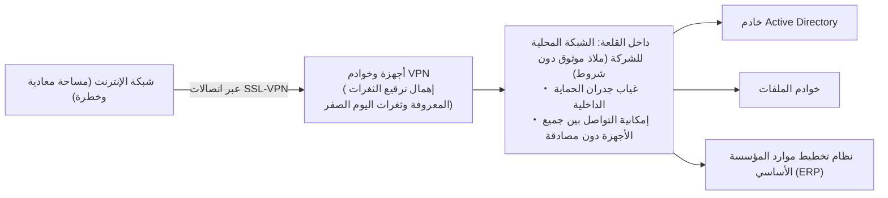

إن أجهزة VPN هي في جوهرها «بوابات القلعة الفيزيائية» المعرضة مباشرة لرياح الإنترنت العاتية؛ ومن الطبيعي أن تعكف عصابات الجريمة ومجموعات التهديد المتقدم المستمر (APT) التابعة للدول على فحص هذه البوابات ليلاً ونهاراً بحثاً عن أي ثغرة تنفذ من خلالها.
- وبالفعل، شهدت الفترة ما بين 2023 و2026 توالي اكتشاف ثغرات أمنية كارثية في بوابات VPN التابعة لشركات مثل Ivanti وFortinet (بتقييم خطورة CVSS تراوح بين 9.0 و10.0)، تتيح للمهاجمين تجاوز المصادقة وتنفيذ أوامر برمجية عشوائية عن بُعد دون أي قيود.
- والمصيبة الكبرى تمثلت في أنه حتى بعد إصدار التحديثات والترقيعات الأمنية، تلكأت مئات الشركات اليابانية لأشهر أو حتى لأكثر من عام دون تطبيقها، متعللة بـ «الخوف من تأثر سير الأعمال» أو «صعوبة إعادة تشغيل الأجهزة».

يستعين المهاجمون بمحركات بحث عامة مثل Shodan وCensys لمسح واكتشاف أجهزة VPN غير المحدثة تلقائياً. وبمجرد استغلال الثغرة وسحب بيانات الاعتماد (أسماء المستخدمين، وكلمات المرور، ورموز الجلسات النشطة) من ذاكرة الجهاز، **يتمكن المهاجم في غضون دقائق معدودة من ولوج أعمق نقاط الشبكة الداخلية متنكراً بصفة موظف شرعي**.

### 3.2 الانهيار التام لأسطورة شبكة الشركة الموثوقة (نموذج المحيط / القلعة والخندق)

بعد اختراق بوابة VPN، تصطدم الشركات اليابانية بنتيجة تمسكها بـ **«نموذج الدفاع المحيطي القديم (Perimeter Model / Castle-and-Moat Architecture)»**.

يقوم هذا النموذج على فرضية تبسيطية ساذجة: «كل ما هو خارج جدار الحماية (الإنترنت) شرير وخطير، وكل ما هو داخل جدار الحماية (الشبكة المحلية LAN) آمن وموثوق بنسبة 100%».

وبناءً على هذه الفرضية، صُممت الشبكات الداخلية للشركات لتكون **«مسطحة ومفتوحة بالكامل (Flat Network)»**:
- يمكن لأي جهاز حاسوب متصل بالشبكة المحلية التواصل بحرية ودون أي قيود أو مصادقة إضافية مع بقية الحواسيب، وخوادم الملفات، والطابعات، وقواعد البيانات الواقعة في نفس القطاع أو القطاعات المجاورة.
- لا تخضع حزم البيانات المتداولة داخل الشبكة الداخلية لأي تفتيش أو مراقبة من جدران الحماية.

يشبه هذا الوضع قلعة محاطة بأسوار وخنادق مائية حصينة، ولكن **«بمجرد أن ينجح جاسوس في عبور البوابة والتسلل إلى باحة القلعة، يجد أبواب البرج الرئيسي، وغرف الخزائن، ومستودعات المؤن مشرعة دون أقفال أو حراس، لينهب ما يشاء دون حسيب أو رقيب»**.

إن نموذج الدفاع المحيطي يقف عاجزاً ومشلولاً تماماً أمام عمليات الاستطلاع الداخلي والتحرك الجانبي (Lateral Movement) التي يقوم بها المهاجم بمجرد إصابة أول جهاز والانتقال منه إلى بقية مفاصل المؤسسة.

### 3.3 تضخم Active Directory (AD) وفشل إدارة الهويات المميزة

في بيئات الأعمال المعتمدة على أنظمة Microsoft، يمثل دليل **Active Directory (AD)** نقطة الفشل الفردية الأخطر (Single Point of Failure - SPOF)، والهدف الأسمى والأثمن (الكأس المقدسة) لأي مهاجم.

تعتمد أكثر من 90% من الشركات اليابانية على Active Directory لإدارة أجهزة الحواسيب، وحسابات المستخدمين، وأذونات الوصول، وسياسات الأمان المركزية. ومع ذلك، يعاني واقع إدارة هذه الخوادم من إهمال كارثي:
- غابات أدلة AD أُنشئت قبل أكثر من عشرين عاماً، وخضعت لتعديلات وإضافات فوضوية متراكمة جعلت منها صندوقاً أسود يستحيل فهمه أو ضبطه.
- ترك آلاف الحسابات المعطلة أو المنسية للموظفين السابقين، وحسابات الخدمات للخوادم المحذوفة، والحسابات المؤقتة التي استُخدمت للاختبارات دون إيقاف أو حذف.
- والأخطر هو **«سوء استخدام وتفشي صلاحيات مسؤولي النطاق (Domain Admin)»**؛ حيث تلجأ فرق الدعم الفني والمقاولون الخارجيون، طلباً للراحة وتسهيلاً للعمل، إلى منح صلاحيات الإدارة العليا لحواسيب الموظفين العاديين وتوحيد كلمات المرور واستخدامها عبر أجهزة متعددة.

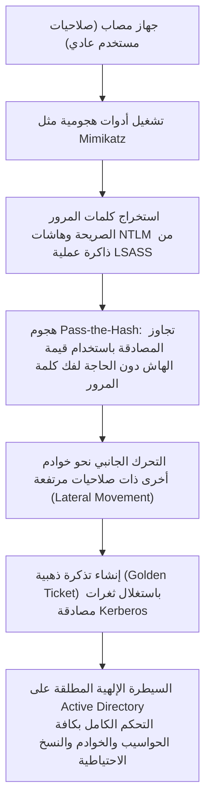

يقوم المهاجمون اليوم بتشغيل أدوات متخصصة مثل `Mimikatz` على الجهاز المصاب، واستخراج قيم الهاش المشفرة لـ NTLM وتذاكر Kerberos مباشرة من ذاكرة عملية المصادقة في نظام ويندوز (`lsass.exe`).

ولا يحتاج المهاجم إلى تكسير كلمات المرور أو كشف نصوصها؛ إذ يمكنه استغلال قيمة الهاش مباشرة لتسجيل الدخول عبر هجمات **«Pass-the-Hash»**، أو الاستيلاء على المفتاح التشفيري لحساب `krbtgt` لإنشاء **«التذكرة الذهبية (Golden Ticket)»** في بروتوكول Kerberos، والتي تمنحه وصولاً مطلقاً ودائماً لأي نظام.

بمجرد اكتمال هذا السيناريو، يتحول المهاجم إلى «الحاكم المطلق للبنية التحتية للمؤسسة»؛ وما هي إلا نقرة واحدة لنشر برمجيات الفدية عبر سياسات المجموعة (GPO) على جميع أجهزة وخوادم المؤسسة في وقت متزامن، لتباد عشرات الآلاف من الأنظمة خلال دقائق معدودة.

### 3.4 ظلال الهجرة السحابية: تقنية المعلومات الخفية (Shadow IT) وأدوار IAM مفرطة الصلاحيات

مع اندفاع الشركات نحو الانتقال من البنى التحتية المحلية إلى السحب العامة مثل AWS وAzure وGoogle Cloud، تفجرت أمراض تقنية جديدة:

1. **تقنية المعلومات الخفية (Shadow IT) والحسابات السائبة**:
   هروباً من البيروقراطية الداخلية الصارمة، تعمد إدارات الأعمال وفرق التطوير إلى تدشين حسابات سحابية مستقلة وشراء خدمات SaaS ببطاقات الائتمان دون علم قسم تقنية المعلومات. تظل هذه البيئات خارج نطاق المراقبة والحوكمة الأمنية، لتصبح بؤراً مهجورة للمصادر العامة والثغرات المكشوفة.
2. **أدوار IAM مفرطة الامتيازات (Over-Privileged IAM Roles)**:
   في إدارة الهوية والوصول (IAM) التي تمثل صمام الأمان للسحابة، يتم تجاهل مبدأ الحد الأدنى من الامتيازات (PoLP: Principle of Least Privilege) عمداً تجنباً لأي تعقيدات تقنية؛ فتُمنح أدوار برمجية وحسابات عادية صلاحيات مطلقة مثل `AdministratorAccess` و`*.*`.
   وعند ظهور ثغرة برمجية بسيطة مثل حقن SQL أو تزوير الطلبات عبر الخادم (SSRF) في تطبيق ويب متواضع، يتم تسريب المفاتيح المؤقتة لتلك الأدوار السحابية، مما يمنح المهاجم على الفور مفاتيح السيطرة المطلقة على كافة حاويات التخزين، وقواعد البيانات، والخوادم الافتراضية للشركة دون استثناء.

---

## الفصل 4: التشريح العميق للأسباب الجذرية (3) — الهشاشة البشرية وتطور أحدث أساليب الهجوم

إلى جانب الانكشاف التقني والهيكلي، شهدت أساليب الهجوم التي تستهدف الثغرات النفسية والسلوكية للبشر قفزات نوعية مرعبة بفضل توظيف تقنيات الذكاء الاصطناعي التوليدي.

### 4.1 التصيد الموجه والتزييف العميق في عصر الذكاء الاصطناعي التوليدي

في السابق، كانت رسائل التصيد الاحتيالي تعاني من ضعف لغوي فادح وركاكة واضحة في القواعد والأساليب والترجمة الآلية للغة اليابانية، وكان يسهل على أي موظف يملك الحد الأدنى من الانتباه تفاديها وكشفها.

ولكن مع ظهور **النماذج اللغوية الكبيرة (LLMs)** مثل ChatGPT وتطويعها في الهجمات، أصبحت هذه الافتراضات مجرد ذكرى من الماضي.

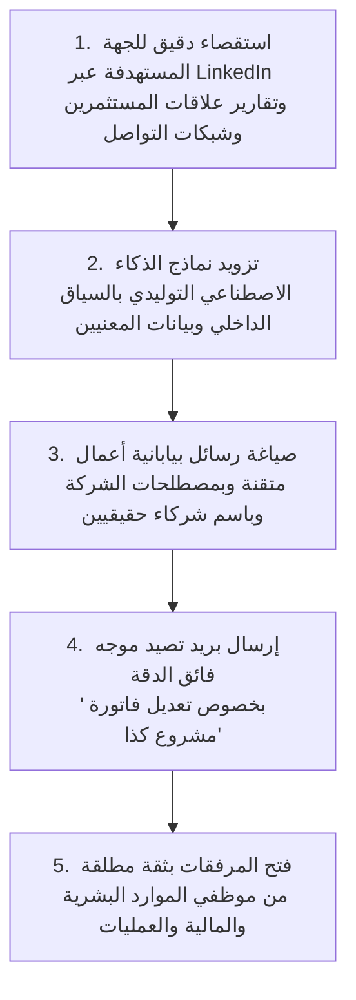

تعتمد هجمات التصيد الموجه المعاصرة (Spear Phishing) على جمع المعلومات الاستخباراتية مفتوحة المصدر (OSINT) من موقع الشركة، وبياناتها الصحفية، ومنصة LinkedIn، وحسابات موظفيها، وتغذية نماذج الذكاء الاصطناعي بهذه البيانات لصياغة **«رسائل بريد إلكتروني بيابانية أعمال راقية ومتطابقة تماماً مع السياق الداخلي للمؤسسة وبأسماء مسؤوليها وشركائها الحقيقيين»**.

والأخطر من ذلك هو توظيف **التزييف العميق (Deepfakes) للصوت والفيديو** في الهندسة الاجتماعية:
- تعرضت شركات دولية وفرعياتها في اليابان بالفعل لمكالمات احتيالية استُنسخت فيها نبرات أصوات الرؤساء التنفيذيين والمدراء الماليين بدقة متناهية، طالبت بإجراء تحويلات بنكية عاجلة بمئات الملايين من الين بداعي «صفقة استحواذ سرية وطارئة»، ونُفذت تلك التحويلات بنجاح.
- أمام هذا المستوى من محاكاة الحواس والقرائن البشرية، أصبحت أساليب التوعية الأمنية التقليدية المبنية على المواعظ والنصائح النفسية عديمة الفائدة تماماً.

### 4.2 اختطاف الجلسات وبرمجيات سرقة المعلومات (Infostealer)

من الأسباب المباشرة لإبطال مفعول المصادقة الثنائية (2FA/MFA) التقليدية في الشركات، التفشي الهائل لـ **«برمجيات سرقة المعلومات (Infostealers)»**.

تتسلل هذه البرمجيات الخبيثة (مثل RedLine وRaccoon وLumma) إلى أجهزة الموظفين أو المقاولين عبر البرمجيات المقرصنة، أو حزم التثبيت المزيفة لأدوات العمل، أو المواقع المشبوهة.

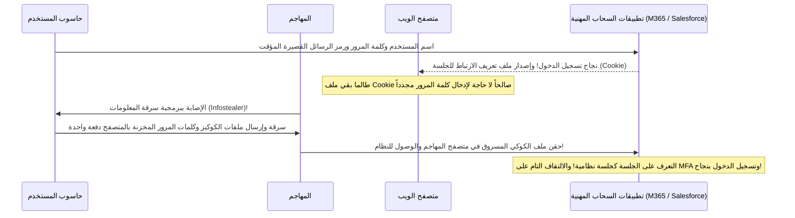

لا تهدف هذه البرمجيات إلى تشفير البيانات، بل تتجه مباشرة إلى قواعد بيانات المتصفحات (مثل Chrome وEdge) لـ **«سرقة كلمات المرور المحفوظة وملفات تعريف الارتباط للجلسات النشطة (Session Cookies) بالكامل»**.

عندما يقوم المستخدم بتسجيل الدخول باستخدام كلمة المرور ورمز MFA (مثل رسائل SMS أو تطبيقات التوليد الرقمي)، يُصدر الخادم ملف تعريف ارتباط لجلسة العمل ويخزنه في المتصفح. كل ما يفعله المهاجم هو استخراج هذا الملف وحقنه في متصفحه الخاص (Cookie Hijacking)، **ليصبح داخل النظام السحابي للمؤسسة على الفور بهوية الضحية ودون أن يُطلب منه إدخال كلمة مرور أو تقديم أي رمز مصادقة إضافي**.

تُباع اليوم مئات الآلاف من ملفات الجلسات الصالحة للشركات اليابانية في الويب المظلم بأسعار زهيدة لا تتعدى بضعة دولارات، ليشتريها المخترقون ويدخلوا عبر الباب الأمامي كـ «مستخدمين معتمدين» دون أدنى عناء تقني.

### 4.3 التهديدات الداخلية: سرقة البيانات من قبل الموظفين المستقيلين والمتعاقدين

لا تقتصر التهديدات السيبرانية على الجبهة الخارجية؛ فوفقاً لإحصائيات الجمعية اليابانية لأمن شبكات المعلومات (JNSA)، تشكل **«سرقة البيانات وتسريبها عمداً بواسطة عناصر داخلية (الموظفون الحاليون، والموظفون المستقيلون، والعمالة المؤقتة والمقاولون)»** نسبة كارثية من مجمل حوادث التسريب.

- **حراك سوق العمل وتسريب البيانات عند الاستقالة**:
  مع تراجع مبدأ التوظيف مدى الحياة وتزايد الانتقال الوظيفي بين الشركات، يُقدم العديد من موظفي المبيعات والمهندسين الذين تقرر انتقالهم لشركات منافسة على تحميل قوائم العملاء، والشيفرات المصدرية، ومخططات التصاميم على وحدات تخزين USB أو رفعها إلى حساباتهم السحابية الشخصية (Google Drive وDropbox) بدعوى أنها «نتاج جهدهم الشخصي».
- **انحرافات المقاولين ذوي الصلاحيات المميزة**:
  يقوم مهندسو المقاولين الفرعيين الذين يملكون صلاحيات تشغيلية مباشرة على قواعد البيانات، تحت وطأة الديون أو الضوائق المالية، بتحميل ملايين السجلات لبيانات العملاء وبيعها لسماسرة البيانات ولعصابات الجريمة المنظمة.

تعمل غالبية المؤسسات اليابانية وفق مبدأ «افتراض حسن النوايا الإنسانية»، وتفتقر تماماً لحلول منع فقدان البيانات (DLP) وأنظمة تحليل سلوك المستخدمين والكيانات (UEBA) القادرة على رصد ومنع عمليات التنزيل الجماعية والمشبوهة في الوقت الفعلي. وفي كثير من الحالات، لا يُكتشف التسريب إلا بعد أشهر أو سنوات عبر تحقيقات الشرطة أو عند ظهور منتجات مقلدة في السوق للمنافسين.

---

## الفصل 5: خارطة طريق الانتقال الكامل إلى بنية انعدام الثقة (Zero Trust Architecture - ZTA)

في مواجهة هذه المخاطر المركبة والتهديدات الوجودية، فإن المسار الحتمي والوحيد المتاح أمام الشركات اليابانية هو التخلي النهائي والكامل عن نموذج الدفاع المحيطي المنهار، والتحول الجذري نحو **«بنية انعدام الثقة (Zero Trust Architecture - ZTA)»**.

### 5.1 جوهر انعدام الثقة: «لا تثق بأحد، وتحقق دائماً (Never Trust, Always Verify)»

إن مفهوم «انعدام الثقة» ليس مجرد اسم لمنتج أمني فردي يتم شراؤه وتثبيته، بل هو **«تحول نموذجي جذري في الفكر الأمني وإعادة كتابة شاملة لنظام تشغيل العقل المؤسسي»**، وفق ما أصدره المعهد الوطني للمعايير والتقنية الأمريكي (NIST) في معياره المرجعي «NIST SP 800-207».

> **المبادئ الجوهرية لبنية انعدام الثقة (Core Principles)**:
> 1. **لا تثق بأحد إطلاقاً، وتحقق دائماً (Never Trust, Always Verify)**:
>    سواء كان مصدر الاتصال من داخل الشبكة المحلية للشركة، أو من حاسوب في مكتب رئيس مجلس الإدارة، لا يُعامل أي طرف أو جهاز أو مستخدم باعتباره «آمناً» بشكل مسبق. يُعامل كل طلب وصول على أنه وارد من بيئة معادية ويخضع للتحقق الصارم.
> 2. **منح الحد الأدنى من الامتيازات (Grant Least Privilege Access)**:
>    يُمنح المستخدم والجهاز فقط «الحد الأدنى الدقيق من الصلاحيات» اللازمة لإنجاز مهمة وظيفية محددة في تلك اللحظة، وتُمنح هذه الصلاحيات للوقت الفعلي المطلوب فقط (Just-In-Time).
> 3. **افتراض حدوث الاختراق حتماً (Assume Breach)**:
>    العمل انطلاقاً من القناعة الواقعية الصارمة بأن: «الأسوار الخارجية قد اختُرقت بالفعل، والمهاجم يتجول الآن متخفياً داخل شبكتنا الداخلية»، والتركيز على محاصرة الأضرار وتقليص «نطاق الانفجار (Blast Radius)» وسرعة الرصد والعزل الفوري.

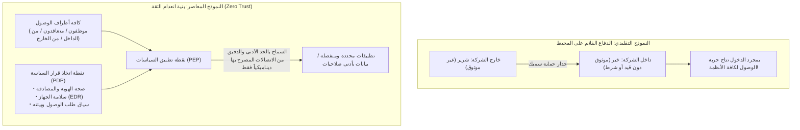

### 5.2 الإلغاء الكامل لشبكات VPN والتحول إلى ZTNA (Zero Trust Network Access)

تتمثل الخطوة الإلزامية الأولى في رحلة انعدام الثقة في **«التفكيك والإلغاء النهائي لأجهزة وبوابات VPN»**، والانتقال الفوري إلى **«الوصول الشبكي القائم على انعدام الثقة (ZTNA: Zero Trust Network Access)»**.

يكمن الفارق الجوهري بين VPN وZTNA في نطاق الربط والاتصال:
- **شبكات VPN التقليدية**: بمجرد نجاح المصادقة، يتم ربط حاسوب المستخدم فيزيائياً بكامل الشبكة المحلية (نطاق IP Subnet). ونتيجة لذلك، يستطيع الجهاز المصاب التواصل مع كافة خوادم الشركة والانتشار في كل مكان.
- **تقنية ZTNA**: لا تسمح للجهاز بالارتباط بالشبكة المحلية مطلقاً. يقوم وسيط سحابي محايد بالتحقق الصارم من هوية المستخدم وسلامة جهازه في كل طلب، و**«يقوم بإنشاء قناة وساطة آمنة ومحددة حصرياً للتطبيق المطلوب أو المنفذ المحدد فقط»**. ولا يرى الجهاز أي عنوان IP للشبكة الداخلية ولا يمكنه استكشاف بنيتها الطبوغرافية (إخفاء الشبكة التام)، مما يجعل التحرك الجانبي مستحيلاً فيزيائياً وبرمجياً.

### 5.3 البنية المتكاملة لـ SASE (Secure Access Service Edge) وSSE

تُعد منصة **«SASE (حافة خدمة الوصول الآمن)»** التي صاغتها شركة Gartner، ونواتها الأمنية **«SSE (حافة خدمة الأمان)»**، المنظومة السحابية الموحدة لتحقيق أمان انعدام الثقة على أرض الواقع.

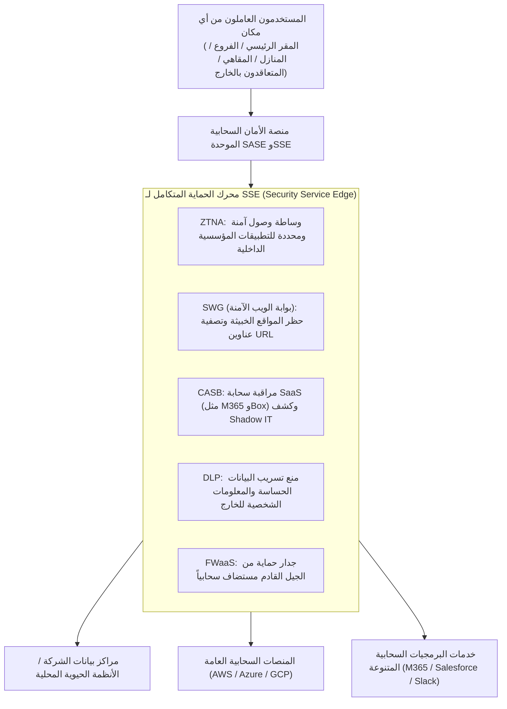

في بيئة SASE، يمر كل اتصال أياً كان موقعه الجغرافي (في المقر الرئيسي، أو المنزل، أو في مصنع متعاقد خارجي) عبر سحابة SASE العالمية الموزعة:
- **بوابة الويب الآمنة (SWG)**: تعترض وتفحص حركة الإنترنت وتحجب المواقع الخبيثة وروابط التصيد.
- **وسيط أمان الوصول السحابي (CASB)**: يراقب ويضبط حركة البيانات مع تطبيقات SaaS الخارجية ويكتشف Shadow IT.
- **منع فقدان البيانات (DLP)**: يرصد تلقائياً ويشفر أو يحجب أي محاولة لإرسال أرقام بطاقات الائتمان أو أرقام الهوية الوطنية للخارج.
- **خدمة ZTNA**: توفر القنوات الآمنة للوصول إلى التطبيقات الداخلية الحساسة.

يسمح هذا الهيكل بالتخلص من تكاليف وصيانة أجهزة VPN ومزودات البروكسي المحلية القديمة، وتطبيق سياسة أمنية موحدة وعالية الصلابة عبر أرجاء العالم.

### 5.4 التجزئة الدقيقة (Micro-Segmentation) لمنع التحرك الجانبي مادياً

مهما بلغت متانة التحصينات الخارجية، يستحيل ضمان مناعة الأجهزة ضد الإصابة بالبرمجيات الخبيثة بنسبة 100%. وهنا تبرز أهمية تقنية **«التجزئة الدقيقة (Micro-Segmentation)»**.

تستبدل التجزئة الدقيقة أسلوب تقسيم الشبكات الكلاسيكي حسب الأدوار أو الفروع، بإنشاء **«جدران حماية افتراضية دقيقة ومستقلة لكل خادم منفرد، وكل جهاز افتراضي، وكل حاوية برمجية (Container)»**.

- على سبيل المثال، يُسمح لخادم الأنظمة المالية بالتواصل فقط عبر منفذ مشفر محدد قادم من أجهزة موظفي الإدارة المالية المعتمدة حصراً، مع رفض وقفل أي اتصال آخر وارد من أجهزة المطورين أو الأقسام العامة (حتى اتصالات اختبار الشبكة مثل ping تُرفض تماماً).
- وحتى بين الخوادم المتجاورة في نفس الرف بمركز البيانات، يُحظر أي اتصال بيني ما لم يكن مصرحاً به صراحة عبر استدعاءات API موثقة.

وبفضل هذا العزل المجهري، إذا أصيب حاسوب مكتبي بفدية وحاول المهاجم الزحف داخل الشبكة، فإنه يصطدم بأبواب حديدية مغلقة بإحكام تحيط به من كل صوب، مما **«يحصر الهجوم تماماً داخل الجهاز المصاب ويقلص نطاق الانفجار (Blast Radius) ويمنع التفشي لبقية الأنظمة فيزيائياً»**.

---

## الفصل 6: تحصين البنية التحتية للهوية والمصادقة (IAM/PAM)

في معمارية انعدام الثقة، لم تعد خطوط الشبكة المادية هي المحيط الأمني، بل أصبح **«المحيط الأمني الجديد هو الهوية والمصادقة (Identity is the New Perimeter)»**؛ فالهوية هي المحور الذي تدور حوله كافة أدوات التحكم والرقابة.

### 6.1 الإلزام المطلق بالمصادقة متعددة العوامل المقاومة للتصيد المستندة إلى FIDO2 / Passkeys

يجب على الشركات التخلي الفوري عن أساليب المصادقة الثنائية القديمة المعتمدة على الرسائل القصيرة (SMS)، أو رسائل البريد الإلكتروني، أو إشعارات التطبيقات الساذجة (الموافقة بضغطة زر دون مطابقة أرقام).

فكما فصّلنا سابقاً، يستطيع المهاجمون عبر خوادم البروكسي العكسية (مثل Evilginx) وبرمجيات سرقة المعلومات اعتراض هذه الرموز بسهولة. والحل الوحيد القادر على إحباط هذه الهجمات بنسبة 100% هو **المصادقة متعددة العوامل المقاومة للتصيد (Phishing-Resistant MFA) المتوافقة مع معايير FIDO2 / WebAuthn ومفاتيح المرور (Passkeys)**.

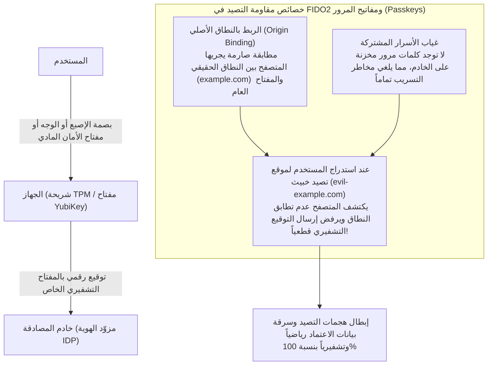

تنبع القوة التشفيرية لمعيار FIDO2 من خاصية **«الربط بالنطاق الأصلي (Origin Binding)»**.
حتى لو انخدع المستخدم ودخل إلى صفحة تسجيل دخول مزيفة تشبه الصفحة الأصلية تماماً، فإن متصفح الويب نفسه يقوم بالتحقق التلقائي والصارم من النطاق (FQDN)، وإذا لم يتطابق النطاق الحقيقي المسجل مع الموقع الحالي، يرفض المتصفح والشريحة الأمنية في الجهاز إرسال التوقيع التشفيري إطلاقاً.

هذا التصميم يلغي رياضياً وتشفيرياً أي إمكانية لسرقة بيانات الاعتماد. ويتعين على الشركات فرض استخدام مفاتيح الأمان الفيزيائية (مثل YubiKey) أو المصادقة البيومترية للأجهزة عبر Windows Hello وTouch ID لجميع المسؤولين والموظفين الذين يتعاملون مع البيانات الحساسة دون أي استثناء.

### 6.2 نموذج الطبقات (Tiering Model) لـ Active Directory والوصول في الوقت المناسب (JIT)

بالنسبة للشركات التي تضطر لتشغيل خوادم Active Directory المحلية، فإن المنهجية الهندسية الصارمة لمنع اختراق الهويات المميزة هي تطبيق **«نموذج التقسيم الطبقي (Tiering Architecture)»** الموصى به من Microsoft.

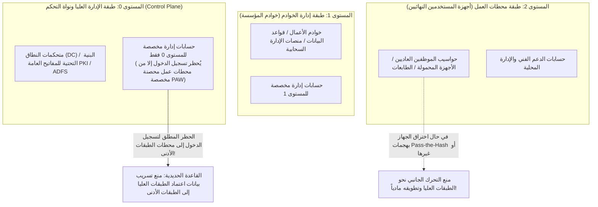

ترتكز القاعدة الحديدية لنموذج الطبقات على: **«منع أي حساب يحمل صلاحيات عليا من تسجيل الدخول على أجهزة تنتمي لمستويات أدنى، لتجنب ترك أي أثر تشفيري لبيانات اعتماده في ذاكرة تلك الأجهزة»**:
- **المستوى 0 (Tier 0 - قلب النطاق)**: حسابات مديري النطاق. يقتصر وصولها حصرياً على متحكمات النطاق وخوادم الهوية، ويُحظر تسجيل دخولها قطعياً على أجهزة الموظفين (Tier 2) أو خوادم التطبيقات (Tier 1). وتُدار هذه البيئة حصراً عبر محطات عمل الإدارة المميزة فائقة التحصين والمفصولة عن الإنترنت (PAW: Privileged Access Workstations).
- **المستوى 1 (Tier 1 - إدارة الخوادم)**: إدارة خوادم التطبيقات والخدمات السحابية فقط.
- **المستوى 2 (Tier 2 - إدارة محطات العمل)**: إدارة أجهزة المستخدمين الطرفية فقط.

كما يجب إلغاء مبدأ الصلاحيات الدائمة (Standing Privileges)، واستبداله بـ **«الوصول في الوقت المناسب (JIT: Just-In-Time Access)»**؛ حيث يعمل الإداريون بحسابات مستخدمين عادية، ولا تُمنح الصلاحيات الإدارية إلا عند الحاجة الطارئة ولمدة ساعات معدودة وبناءً على موافقة مسجلة. وبذلك، حتى إذا نجح المهاجم في الاستيلاء على الحساب، فإنه يجد حساباً مجرداً من أي صلاحيات ذات قيمة.

### 6.3 التقييم الديناميكي للسياسات عبر الوصول المشروط (Conditional Access)

لا يجوز أن تكون المصادقة حدثاً «نقطياً استاتيكياً» ينتهي بمجرد تسجيل الدخول، بل يجب أن تتحول في بنية انعدام الثقة إلى **«تقييم مستمر وديناميكي يواكب سياق الجلسة (Continuous Evaluation)»**.

توفر منصات مثل Microsoft Entra ID وOkta ميزة **«الوصول المشروط (Conditional Access)»** التي تقوم بفحص وتقييم الإشارات المتعددة في أجزاء من الثانية:
1. **هوية المستخدم ومجموعته الوظيفية**.
2. **عنوان IP والموقع الجغرافي**: رصد «السفر المستحيل (Impossible Travel)» كأن يسجل مستخدم الدخول من طوكيو، وبعد عشر دقائق يظهر طلب وصول لنفس الحساب من روسيا أو نيجيريا، ليتم حظره تلقائياً على الفور.
3. **سلامة الجهاز وامتثاله (Compliance)**: هل الجهاز مزود ببرنامج EDR المعتمد؟ هل نظام التشغيل محدث بالكامل؟ هل التشفير الكامل للقرص (BitLocker) مفعل؟ هل توجد أي مؤشرات على إصابة ببرمجيات خبيثة؟
4. **درجة الخطورة اللحظية وتحليل السلوك**: رصد السلوكيات الشاذة مثل تسجيل الدخول في ساعات الفجر المتأخرة، أو محاولة تنزيل مئات الملفات دفعة واحدة، مما يفرض فوراً طلب مصادقة بيومترية إضافية أو قطع الجلسة فوراً.

إذا اختل أي شرط من هذه المعايير، يظل باب النظام مغلقاً بإحكام مهما كانت كلمة المرور المدخلة صحيحة.

---

## الفصل 7: نموذج الرقابة على أمن سلسلة التوريد والمقاولين

مهما حصنت المؤسسة أنظمتها، فلن تنجو إذا بقي باب سلسلة التوريد الخلفي مفتوحاً على مصراعيه. كيف يمكن إحكام الرقابة الأمنية على المقاولين؟

### 7.1 تحقيق الرؤية الشاملة والتقييم الفعلي لأمن المتعاقدين

الخطوة الأساسية هي **«الجرد الشامل والكامل لجميع أطراف سلسلة التوريد»**.

تعرف معظم الشركات مقاولها من المستوى الأول، لكنها تجهل تماماً الشركات في المستويين الثاني والثالث وبيئات عملها ومستواها الأمني:
- يجب تضمين شروط صريحة في كافة عقود التوريد تفرض «الحظر الصارم لإعادة التعهيد للمقاولين من الباطن دون إذن وموافقة خطية مسبقة».
- الإلغاء التام لأسلوب التدقيق الشكلي المعتمد على استمارات واستبيانات التقييم الذاتي الورقية السنوية.
- اعتماد تقييمات الجهات الرقابية المستقلة، أو استخدام **منصات تصنيف الأمان السيبراني (Security Rating Services مثل BitSight وSecurityScorecard)** لإجراء مراقبة وتقييم موضوعي مستمر لنطاقات وعناوين IP التابعة للمقاولين، واكتشاف الثغرات المكشوفة والتحديثات المتأخرة وتفشي بيانات الاعتماد في الوقت الفعلي.

### 7.2 الحظر المبدئي لـ BYOD لمحطات المقاولين والاعتماد على VDI القائم على انعدام الثقة

الحل الفيزيائي الأكثر فاعلية لمنع تسريب البيانات وإحباط تسلل البرمجيات الخبيثة من أجهزة المقاولين هو تطبيق مبدأ: **«عدم تسليم بايت واحد من البيانات الحقيقية لأجهزة المتعاقدين»**.

يجب فرض حظر شامل على ربط الحواسيب الخاصة للمقاولين أو الأجهزة غير الخاضعة للإدارة المؤسسية (BYOD) بشبكات الشركة أو مساحات التخزين السحابية مباشرة.

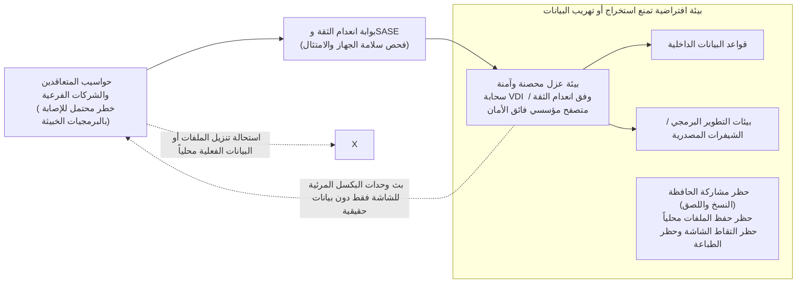

يقتصر عمل موظفي المقاولين على استخدام **«بيئات سطح المكتب الافتراضي السحابية القائمة على انعدام الثقة (Cloud VDI / DaaS)»** أو **«المتصفحات المؤسسية الآمنة»** التي تتحكم بها الشركة:
- تعطيل وظائف تنزيل الملفات محلياً، وقفل خاصية النسخ واللصق عبر الحافظة المشتركة، وحظر التقاط الشاشة والطباعة الخارجية برمجياً وتقنياً.
- ما يُعرض على شاشة جهاز المقاول هو مجرد «بث مرئي لوحدات البكسل (Pixels)»، وبالتالي حتى لو أصيب جهازه بأخطر برمجيات سرقة المعلومات (Infostealer)، فلن يجد المهاجم أي بيانات أو ملفات حقيقية أو رموز جلسات صالحة للاستيلاء عليها.

### 7.3 قائمة مكونات البرمجيات (SBOM) وتطبيق مبدأ الحد الأدنى من الامتيازات على تكامل واجهات برمجة التطبيقات (APIs)

تتمثل النقطة العمياء الكبرى في سلاسل التوريد الرقمية في تطوير البرمجيات بالتعاقد الخارجي؛ حيث تعج التطبيقات البرمجية المسلمة من المقاولين بحزم ومكتبات مفتوحة المصدر قديمة تعاني من ثغرات قاتلة (مثل مكتبات Apache Log4j وإصدارات Spring القديمة) دون أن يلتفت إليها أحد.

يتعين على المؤسسات إلزام كافة شركات التطوير بتقديم **«قائمة مكونات البرمجيات (SBOM: Software Bill of Materials)»** الشاملة لجميع المكونات مفتوحة المصدر وإصداراتها وتراخيصها مع كل تسليم برمجي. يتيح ذلك للشركة تحديد الأنظمة المتأثرة خلال دقائق معدودة فور الإعلان عن أي ثغرة عالمية جديدة وعلاجها على الفور.

وعند التكامل عبر واجهات برمجة التطبيقات (APIs) مع الشركاء والسحب الخارجية، يجب حظر المفاتيح الدائمة والمفتوحة، وتطبيق بروتوكول OAuth 2.0 بنطاقات صلاحيات دقيقة ومقيدة للغاية وفترات صلاحية قصيرة الأجل (TTL).

---

## الفصل 8: الصمود السيبراني (Cyber Resilience) المقاوم لبرامج الفدية وتدمير البيانات

انطلاقاً من مبدأ انعدام الثقة الجوهري «افتراض حدوث الاختراق (Assume Breach)»، يمثل **«الصمود السيبراني (Cyber Resilience) واستمرارية الأعمال»** خط الدفاع الأخير والحاسم للمؤسسة.

ففي مواجهة قراصنة ترعاهم دول ومجموعات احترافية، يستحيل ضمان صد الهجمات بنسبة 100%؛ والمعيار الحقيقي للبقاء هو: «مدى سرعة وقدرة المؤسسة على استعادة أعمالها وتشغيلها بعد وقوع الكارثة».

### 8.1 قاعدة النسخ الاحتياطي 3-2-1-1-0 والتخزين غير القابل للتغيير (Immutable Storage)

في هجمات الفدية المعاصرة (مثل BlackSuit وLockBit)، لا يبدأ المهاجم بتشفير البيانات، بل يبدأ بـ **«محو وإبادة النسخ الاحتياطية بالكامل»**؛ لإدراكه التام أن وجود نسخ احتياطية سليمة يعني امتناع المؤسسة عن دفع الفدية.

إن طرق النسخ الاحتياطي التقليدية المعتمدة على النسخ اليومي إلى وحدات تخزين متصلة بالشبكة أصبحت عديمة الجدوى. فإذا كان خادم النسخ الاحتياطي منضماً إلى دليل Active Directory، فإن المهاجم بمجرد استيلائه على صلاحيات النطاق سيقوم بمسح كافة النسخ الاحتياطية في بضع ثوانٍ.

لذا، يجب على المؤسسات الانتقال فوراً إلى تطبيق **«المعيار الحديث للنسخ الاحتياطي 3-2-1-1-0»**:

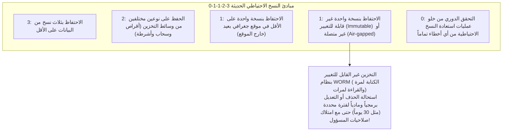

الركن الأكثر حسمية في هذه القاعدة هو **«النسخ الاحتياطي غير القابل للتغيير (Immutable Backup)»**.
يعتمد هذا الحل على تقنية **WORM (الكتابة مرة واحدة والقراءة لمرات متعددة)** المدعومة سحابياً (مثل AWS S3 Object Lock) أو في الأجهزة المخصصة (مثل Veeam وCohesity وRubrik)؛ حيث تُقفل البيانات فيزيائياً وبرمجياً فور كتابتها، بحيث **«يستحيل حذفها أو تعديلها أو تشفيرها نهائياً طوال المدة المحددة (مثل 30 يوماً)»**، حتى لو امتلك المهاجم صلاحيات المسؤول الأعلى للنظام أو مدير النطاق.

حتى إذا دُمر مركز البيانات الرئيسي بالكامل وشُفرت كافة الخوادم الافتراضية، فإن وجود النسخ غير القابلة للتغيير يمنح المؤسسة القدرة على رفض دفع الفدية واستعادة أنظمتها الحيوية في غضون أيام قلائل.

### 8.2 عزل «نطاق مصادقة مستقل» مخصص لأنظمة النسخ الاحتياطي

لا يكفي استخدام التخزين غير القابل للتغيير، بل يجب الالتزام بقاعدة تنظيمية حاسمة: **«الفصل التام لمستوى إدارة النسخ الاحتياطي عن نطاق Active Directory المؤسسي العام»**.

- استخدام مزود هوية محلي ومستقل بالكامل لأنظمة النسخ الاحتياطي دون أي مزامنة مع AD، مع فرض المصادقة متعددة العوامل (MFA) المستقلة.
- حظر إدارة النسخ الاحتياطي عبر الشبكة المحلية أو الإنترنت، وقصرها حصراً على محطات عمل مخصصة تعمل ضمن شبكة مغلقة ومعزولة مادياً.

هذا الفصل يحمي منظومة التعافي من السقوط المشترك عندما ينهار نطاق الشركة الرئيسي أمام هجمات المخترقين.

### 8.3 العزل الفوري عبر EDR/XDR ومركز عمليات أمنية (SOC) يعمل على مدار الساعة 24/7/365

في المعركة ضد الهجمات المتطورة، يتحدد الفارق بين النجاة والفناء بمؤشرين رئيسيين: **متوسط زمن الاكتشاف (MTTD: Mean Time to Detect)** و**متوسط زمن الاستجابة (MTTR: Mean Time to Respond)**.

بينما كانت برامج مكافحة الفيروسات القديمة (EPP) تعتمد على مطابقة التواقيع للملفات الخبيثة المعروفة، فإن تقنيات **EDR (الكشف والاستجابة عند النقاط الطرفية)** و**XDR (الكشف والاستجابة الممتدة)** تركز على المراقبة اللحظية لـ «السلوكيات والأنشطة المشبوهة» للعمليات داخل الأجهزة:
- مثل رصد تشغيل أداة PowerShell لمحاولة قراءة ذاكرة عملية LSASS، أو بدء عمليات إعادة تسمية مكثفة للملفات في ساعات متأخرة من الليل (مؤشر تشفير الفدية).
- فور رصد الخطر، يقوم برنامج EDR آلياً، أو بتوجيه من مسؤولي الأمن، بـ **«عزل الجهاز المصاب فورياً على مستوى برامج تشغيل NDIS في نظام التشغيل»**، مما يقطع اتصاله بالشبكة تماماً ويمنع المهاجم من التحرك جانباً.

يعمد المهاجمون إلى شن ضرباتهم في أوقات فراغ فرق الحماية (مثل ليلة الجمعة، أو العطلات الطويلة كالأسبوع الذهبي ورأس السنة)؛ ولذا فإن المراقبة خلال أوقات الدوام الرسمي فقط هي محض عبث. إن وجود **مركز عمليات أمنية مدار (MDR / Managed SOC) يعمل على مدار الساعة وطوال أيام الأسبوع (24/7/365)** وقادر على تنفيذ إجراءات العزل والمحاصرة الفورية، هو شرط أساسي لبقاء أي مؤسسة.

---

## الفصل 9: إصلاح الحوكمة بقيادة الإدارة العليا واللوائح التشريعية

لا يمكن إنجاز التحول الأمني بجهود إدارة تقنية المعلومات بمفردها؛ فالأمن السيبراني هو مشروع استراتيجي متكامل يرتبط مباشرة بالتشريعات القانونية، والمسؤولية التضامنية لأعضاء مجالس الإدارات، واستراتيجية الأعمال للمؤسسة.

### 9.1 تشديد العقوبات بموجب قانون حماية المعلومات الشخصية ومخاطر الغرامات والتعويضات

تسير اليابان بخطى متسارعة نحو تشديد القوانين واللوائح التنظيمية أسوة باللائحة العامة لحماية البيانات الأوروبية (GDPR).

فبموجب التعديلات الأخيرة على قانون حماية المعلومات الشخصية (APPI)، أصبح **الإبلاغ الفوري للجنة حماية المعلومات الشخصية (PPC) وإخطار الأفراد المتضررين إلزامياً بنص القانون** عند وقوع أي تسريب لبيانات شخصية تتجاوز حداً معيناً (أو عند الاشتباه في ذلك).
- رُفعت العقوبة المالية القصوى المفروضة على الشركات إلى 100 مليون ين ياباني.
- بالإضافة إلى ذلك، تواجه الشركات دعاوى قضائية جماعية من العملاء والمساهمين؛ حيث تتراوح مبالغ التعويضات أو التسويات بين آلاف وعشرات الآلاف من الين لكل عميل متضرر، مما يترتب عليه استنزاف سيولة نقدية تتراوح بين مئات الملايين إلى عشرات، بل مئات المليارات من الين في حالات التسريب الكبرى.

وعلاوة على ذلك، يفرض قانون حماية واستخدام المعلومات الاقتصادية الحيوية الصادر عام 2024 والتشريعات الأمنية المشددة، معايير أمنية صارمة وتفتيشاً حكومياً على مشغلي البنية التحتية وسلاسل التوريد. وبات الإهمال الأمني يقود مباشرة إلى عقوبات قانونية ومالية تهدد وجود المؤسسة التجاري.

### 9.2 واجب العناية الواجبة (Duty of Care) لمجلس الإدارة: الأمن «مسؤولية إدارية»

ينص قانون الشركات الياباني على أن أعضاء مجلس الإدارة يتحملون تجاه الشركة **«واجب العناية الواجبة للمدير الحريص (Duty of Care / 善管注意義務)»**.

ووفقاً للاجتهادات القضائية الحديثة والإرشادات التوجيهية المشتركة بين وزارة الاقتصاد (METI) وهيئة IPA، فإن إخفاق الإدارة في اتخاذ التدابير الأمنية الكافية مما يؤدي لتسريب البيانات أو توقف الأعمال، يُعد **«إخلالاً صريحاً بواجب العناية يفتح الباب أمام دعاوى محاسبة الإدارة ومطالبتها بتعويضات شخصية من أموال المديرين الخاصة»**.

لم يعد بإمكان أعضاء مجلس الإدارة التذرع أمام المحاكم بعبارات من قبيل: «لقد أوكلنا المسائل التقنية للمختصين في الميدان ولم نكن على علم بذلك». فمجلس الإدارة ملزم قانونياً بمراجعة تقييم المخاطر السيبرانية دورياً، والتحقق من كفاية الميزانيات المخصصة، والإشراف المؤسسي على خطط استمرارية الأعمال عند الأزمات.

### 9.3 منح سلطات حقيقية لمسؤول أمن المعلومات (CISO) وإعادة تعريف العائد على الاستثمار (ROI)

تكتمل منظومة الحوكمة بإنجاز الإصلاح الهيكلي الأهم: **«تعزيز وتمكين سلطات رئيس أمن المعلومات (CISO)»**.

يتعين على المؤسسات الشروع الفوري في تنفيذ الإصلاحات التالية:
1. **ترقية CISO إلى رتبة عضو مجلس إدارة أو مسؤول تنفيذي أول**:
   فصل منصب CISO عن التبعية لإدارة تقنية المعلومات (CIO)، ليصبح في مرتبة مكافئة تتبع مباشرة للرئيس التنفيذي (CEO) ومجلس الإدارة.
2. **منح CISO سلطة الأمر بوقف العمليات وحق النقض الأمني (Veto Power)**:
   تخويله الصلاحية الصريحة لمنع إطلاق أي نظام جديد لا يستوفي المعايير الأمنية، وإنهاء التعاقد مع أي مورد يخالف الاشتراطات، وإصدار أوامر العزل وقطع الأنظمة عند وقوع الحوادث وفق تقديره للمخاطر.
3. **إعادة تعريف العائد على الاستثمار (ROI) للإنفاق الأمني**:
   لا يمكن قياس الإنفاق الأمني بالأرباح المباشرة؛ بل يجب تقييمه كـ **«تأمين استراتيجي يمنع خسائر توقف الأعمال الكارثية (التي تقدر بعشرات المليارات) ويحمي سمعة الشركة وقيمتها السوقية، وكرخصة إلزامية لممارسة الأعمال (License to Operate)»**.

---

## خاتمة: ما وراء اليأس — عزم الشركات اليابانية على البقاء لما بعد عام 2026

في عام 2026، لم يعد هناك سبيل للعودة إلى «عالم هادئ يخلو من التهديدات السيبرانية»؛ فالجيوش السيبرانية المنظمة تعمل تحت ظلال الصراعات الجيوسياسية، ونقابات الجريمة تستخدم الذكاء الاصطناعي التوليدي لرفع كفاءة هجماتها، وملايين الهويات المميزة تباع يومياً في الويب المظلم. المخاطر تتضاعف بمتوالية هندسية وتحاصر الشركات من كل جانب.

ومع ذلك، لا مكان لليأس.

فحقيقة الأزمة التي تعصف بالشركات اليابانية ليست «قضاءً وقدراً لا حيلة للبشر في رده»، بل هي **أزمة من صنع أيدينا** تولدت عن التواكل في إلقاء مهام التقنية على الغير، والتمسك العقيم بالدفاع المحيطي وشبكات VPN، والتراخي في إدارة الهويات، وغفلة الإدارة العليا. وما دام الخلل من صنع البشر، فإن الإرادة والقرارات الشجاعة كفيلة بتجاوزه والتغلب عليه.

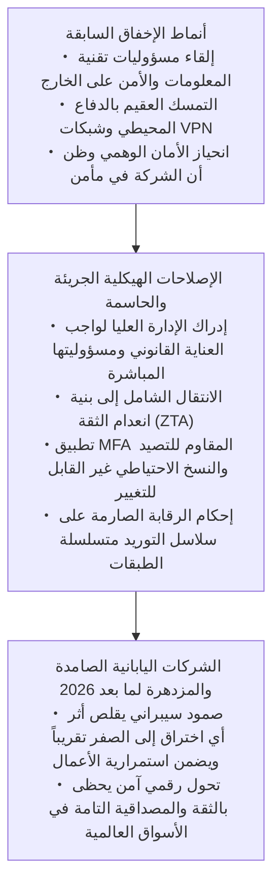

إن الأمن السيبراني ليس عائقاً يعطل سرعة الأعمال، بل هو في المجتمع الرقمي المتسارع بمثابة **«المكابح فائقة التطور والأداء»**؛ فالسيارات التي تمتلك أقوى المكابح وأكثرها موثوقية هي وحدها القادرة على الضغط على دواسة السرعة إلى أقصاها واجتياز المنعطفات الخطرة بجرأة وسلام.

وكما بنت الصناعة اليابانية مجدها التاريخي على التفاني في الجودة والإتقان الهندسي، فقد حان الوقت لترفع الشركات اليابانية شعارها الراسخ: **«لن نخون أبداً ثقة عملائنا وموظفينا ومجتمعنا»**، وتبادر فوراً إلى خوض معركة الإصلاح المعماري والتنظيمي الشامل. وحدها المؤسسات التي تمتلك هذه الشجاعة والجاهزية ستعبر رياح الأزمات العاتية وتظفر بالريادة والازدهار في الاقتصاد الرقمي لعالم ما بعد 2026.
