## Einleitung: Das Alarmsignal des Jahres 2026 – Die nationale Krise Japans als digitales Nachzüglerland

Von Mitte der 2020er Jahre bis ins heutige Jahr 2026 hinein wird der japanische Cyberraum von einem beispiellosen, verheerenden Sturm heimgesucht.

Über Jahrzehnte hinweg herrschte in der japanischen Industrie ein unbegründeter „Sicherheitsmythos“. Annahmen wie: *„Wir sind kein globaler Weltkonzern, also geraten wir nicht ins Visier“*, *„Die Barriere der japanischen Sprache dient als natürlicher Schutzwall gegen Cyberangriffe“* oder *„Wir haben die Antivirensoftware eines renommierten Herstellers installiert, daher sind wir sicher“* – diese trügerischen Illusionen wurden nun endgültig zerschlagen.

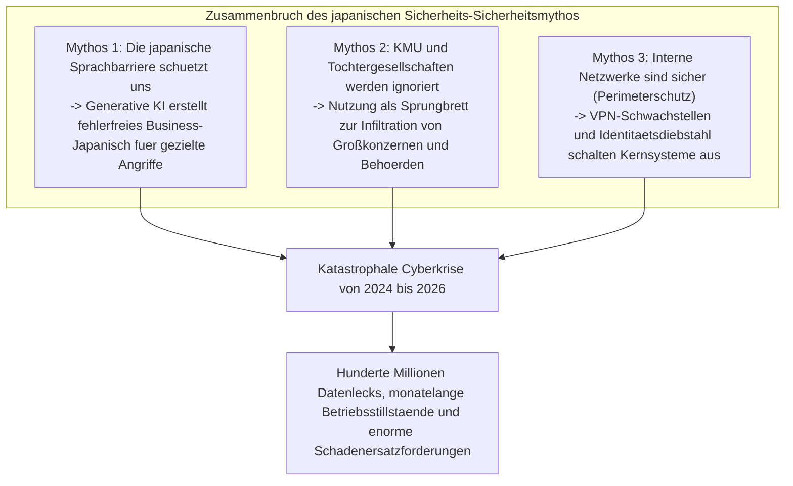

Die Realität ist schonungslos und brutal. Ob Medien- und Unterhaltungsgiganten, Großbanken, Telekommunikationsanbieter, kritische Infrastrukturbetreiber oder kommunale Verwaltungssysteme: Ein namhaftes Unternehmen nach dem anderen musste vor Ransomware-Kartellen kapitulieren oder zusehen, wie Millionen bis Zehnmillionen hochsensibler Datensätze ins Darknet abflossen.

Die entwendeten Daten beschränken sich längst nicht mehr auf grundlegende Stammdaten wie Namen, Adressen und Telefonnummern. Kreditkarteninformationen, medizinische Untersuchungsberichte, die staatliche Sozialversicherungsnummer „My Number“, vertrauliche Unternehmensverträge, interne Chatprotokolle und sogar eingescannte Führerscheine von Mitarbeitern wurden von internationalen Cybercrime-Syndikaten als Geiseln genommen und versteigert. Das Fundament der gesellschaftlichen Integrität und des individuellen Schutzes wurde tief erschüttert.

Tritt ein Vorfall ein, verneigen sich Vorstände auf Pressekonferenzen tief vor der Öffentlichkeit. Stereotype Entschuldigungsformeln wie *„Die Ursache wird derzeit untersucht“* und *„Wir werden die Sicherheitsschulungen für unsere Belegschaft intensivieren“* wiederholen sich wie ein festes Ritual.

Doch wir müssen die entscheidende Frage stellen: **Warum nehmen verheerende Cybervorfälle und Datenlecks in japanischen Unternehmen trotz massiver IT-Budgets und jährlicher Mitarbeiterschulungen im Jahr 2026 kein Ende?**

Die wahre Ursache liegt keineswegs in banalen Versehen wie dem „Anklicken eines verdächtigen E-Mail-Links“ durch einzelne Mitarbeiter. Vielmehr handelt es sich um das unausweichliche Versagen eines Systems, das jahrzehntelang vernachlässigt wurde: **die strukturelle Pathologie der vollständigen IT-Auslagerung und mehrstufiger Subunternehmerketten (IT-Generalunternehmertum)**, **das veraltete Festhalten am Perimeterschutz („Burg-und-Graben-Modell“)**, **die Vernachlässigung von Identitäts- und Authentifizierungsstrukturen im Zuge überstürzter Cloud-Migrationen** und **ein Führungsversagen der Chefetagen, die Informationssicherheit als reinen Kostenfaktor statt als strategische Investition abtun**.

Aus der Perspektive eines führenden Chief Information Security Officers (CISO) und Cyber-Bedrohungsanalysten seziert dieses Whitepaper die technischen Hintergründe der Vorfälle, die Japan zwischen 2024 und 2026 erschüttert haben. Es deckt die strukturellen Schwachstellen japanischer Unternehmen auf und liefert ein umfassendes, praxiserprobtes Schutzkonzept: den vollständigen Übergang zu einer **Zero-Trust-Architektur (ZTA) unter der Annahme eines bereits erfolgten Einbruchs (Assume Breach)**, **eine strenge Beherrschung der Lieferkette**, **Phishing-resistente MFA** und **robuste Cyber-Resilienz durch unveränderliche Backups**.

---

## Kapitel 1: Anatomie der schwersten Sicherheitsvorfälle in japanischen Unternehmen (2024–2026)

Um den Ernst der Lage zu begreifen, müssen wir die Angriffsketten (Cyber Kill Chains) der prominentesten Vorfälle der letzten Jahre auf Basis technischer Fakten analysieren.

### 1.1 Die Lehren aus dem Fall KADOKAWA / Niconico: Totalverlust des Rechenzentrums durch BlackSuit-Ransomware

Im Juni 2024 traf ein verheerender Cyberangriff den Medien- und Verlagskonzern KADOKAWA sowie dessen Tochtergesellschaft Dwango. Dieser Vorfall markiert den bisher tiefsten Wendepunkt in der japanischen Cybersicherheitsgeschichte.

Verantwortlich für die Attacke war die Gruppe **BlackSuit**, die als Nachfolgeorganisation des berüchtigten Conti-Ransomware-Kartells gilt. Der Angriff zwang die führende japanische Videoplattform *Niconico* und zahlreiche Webdienste des Konzerns zur vollständigen Abschaltung. Über Monate hinweg waren logistische Abläufe im Buchvertrieb, Abrechnungssysteme und Kernfunktionen gelähmt. Mehr als 250.000 vertrauliche Datensätze – darunter persönliche Informationen von Mitarbeitern, Vertragspartnern und Kreativen sowie interne Geschäftsverträge – wurden im Darknet veröffentlicht.

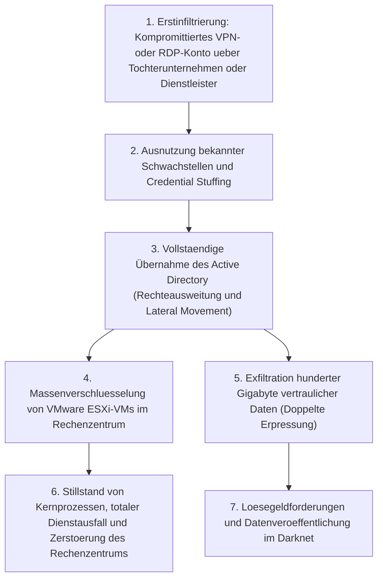

Der größte Schock für die japanische Sicherheitsgemeinschaft bestand darin, dass **die hauseigene Private-Cloud-Infrastruktur (die Virtualisierungsplattform selbst) an ihren Wurzeln zerstört wurde**.

Die Angreifer griffen nicht das zentrale Netzwerk der Konzernzentrale frontal an. Stattdessen nutzten sie Fernzugänge (VPN-Gateways oder RDP-Zugänge) einer Tochtergesellschaft bzw. eines Dienstleisters als Einfallstor. Einmal im internen Netz angelangt, nutzten sie das flache, kaum segmentierte Unternehmensnetzwerk für eine aggressive laterale Ausbreitung (Lateral Movement). Schließlich erlangten sie die vollkommene Kontrolle über das Herzstück der IT-Infrastruktur: **die Domänen-Administratorrechte im Active Directory (Domain Controller)**.

Mit diesen uneingeschränkten Rechten griff BlackSuit direkt auf die Hypervisoren (VMware ESXi) zu und verschlüsselte die Abbilder der virtuellen Maschinen (.vmdk-Dateien) im Datenspeicher mit hoher Geschwindigkeit. Besonders verheerend: **Auch sämtliche online angebundenen Backups wurden von den Angreifern systematisch gelöscht oder verschlüsselt**.

Dieser Vorfall führte den Vorstandsetagen im ganzen Land vor Augen, dass der klassische Perimeterschutz tot ist: Hat der Angreifer erst einmal Fuß im internen Netzwerk gefasst, kann selbst ein gigantisches Rechenzentrum mit einem einzigen Schlag vernichtet werden.

### 1.2 Der Fall LINE Yahoo und die NAVER-Infrastruktur: Das Scheitern grenzüberschreitender Dienstleister-Governance

Im Spätherbst 2023 aufgedeckt und in den Jahren 2024 bis 2026 von mehreren beispiellosen Rügen des japanischen Ministeriums für Innere Angelegenheiten und Kommunikation (MIC) begleitet, offenbarte der Datenabfluss bei LINE Yahoo **die gravierenden Schwachstellen, die aus verflochtenen Kapital- und Auslagerungsverhältnissen entstehen**.

Auslöser des Vorfalls, bei dem rund 510.000 Datensätze von Nutzern, Geschäftspartnern und Mitarbeitern abflossen, war die Cloud-Umgebung des südkoreanischen IT-Konzerns NAVER, einem Hauptanteilseigner von LINE Yahoo.

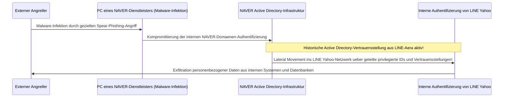

Der technische Kern des Problems lag darin, **dass Authentifizierungssysteme wie das Active Directory zwischen dem früheren LINE und NAVER weiterhin geteilt und über Vertrauensstellungen ungehindert miteinander verbunden waren**.

Nachdem der PC eines Subunternehmers von NAVER mit Schadsoftware infiziert worden war, drangen die Angreifer in das interne Netzwerk von NAVER ein. Von dort aus nutzten sie die grenzüberschreitende Vertrauensstellung der Domänen aus, um ohne weitere Hürden oder Nachweise tief in die internen Datenbanken von LINE Yahoo in Japan vorzudringen.

Dieser Vorfall demonstrierte eindringlich das fatale Risiko, Netzwerke und Benutzerverwaltungen allein deshalb ungeprüft zu koppeln, weil es sich um „Konzerngesellschaften“ oder „Mutterkonzerne“ handelt. Die Forderung der japanischen Aufsichtsbehörden nach einer Entflechtung der Kapitalstrukturen und einer vollständigen Trennung der Identitätsplattformen belegt, dass Supply-Chain-Governance und geopolitische Risiken heute die wirtschaftliche Sicherheit und Souveränität eines Landes unmittelbar berühren.

### 1.3 Kaskadierende Ausfälle bei Kommunen und BPO-Dienstleistern (z. B. Iseto)

Ab 2024 gerieten Kommunen, Finanzinstitute und Energieversorger in ganz Japan in helle Aufregung, als **große BPO-Dienstleister (Business Process Outsourcing) für Druck- und Versanddienstleistungen wie Iseto von Ransomware getroffen wurden**.

Kommunalverwaltungen lagern den Druck und Versand von Steuerbescheiden, Krankenkassenkarten, Pflegeversicherungsnachweisen und Wahlbenachrichtigungen regelmäßig an private Dienstleister aus. Dabei werden hochsensible Bürgerdaten übermittelt: Namen, Meldeadressen, Einkommensdaten und Sozialversicherungsnummern.

Die Cyberkriminellen attackierten nicht die strikt isolierten Netze der Verwaltungen (LGWAN und das dreistufige Abwehrmodell). Ihr Angriffsziel waren **die Netzwerke der beauftragten Subunternehmer**.

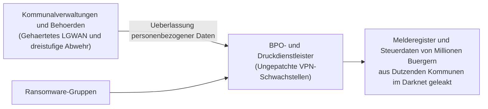

Durch die Infektion des Dienstleisternetzes wurden nicht nur dessen interne Systeme verschlüsselt, sondern auch die anvertrauten Daten von Millionen Bürgern aus Dutzenden Städten und Gemeinden entwendet und im Darknet zum Verkauf angeboten.

Die bittere Erkenntnis lautet: **Ganz gleich, wie viele Millionen ein Auftraggeber in ein vermeintlich uneinnehmbares Kernnetz investiert – wenn das Sicherheitsniveau eines Dienstleisters unzureichend ist, bricht die gesamte Kette in sich zusammen**. Die Praxis, sich bei Dienstleistern auf formale Verträge und Selbstauskünfte zu verlassen, hat im Desaster geendet.

### 1.4 Fehlkonfigurationen in der Cloud (Salesforce, AWS, Azure): Offene Tresore für jedermann

Nicht jeder Datenabfluss basiert auf hochkomplexen Zero-Day-Exploits. Ein immenser Teil der Datenlecks der letzten Jahre geht auf **Konfigurationsfehler in Cloud-Umgebungen (Cloud Misconfigurations)** zurück.

Häufig betroffen waren renommierte Wertpapierhäuser, Banken, E-Commerce-Plattformen und Ministerien durch **Fehlkonfigurationen der CRM-Plattform Salesforce**.

Salesforce bietet Funktionen für Kundenportale (Experience Cloud) und Gastbenutzer an. Aufgrund unzureichend geprüfter Standardeinstellungen und fehlerhafter Freigaberegeln (Sharing Rules) blieben Kundendatenbanken mit Namen, Telefonnummern, Kontoverbindungen und Transaktionsverläufen – die eigentlich nur angemeldeten internen Sachbearbeitern zugänglich sein sollten – **über lange Zeiträume hinweg ohne jegliche Authentifizierung für das gesamte Internet einsehbar und durchsuchbar**.

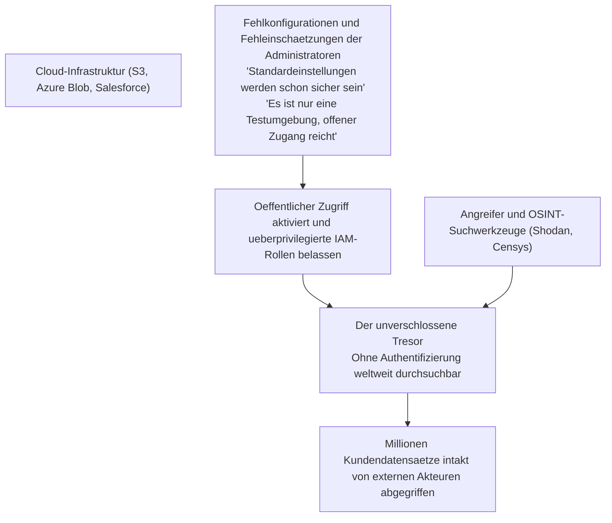

Ähnliche Fehler wiederholen sich bei öffentlich lesbaren Amazon S3 Buckets, fehlerhaften Zugriffsrechten in Azure Blob Storage oder internen Entwicklern, die unbeabsichtigt API-Schlüssel in öffentliche GitHub-Repositories hochladen.

Ohne dass ein Angreifer eine einzige Sicherheitsbarriere knacken musste, **wurde die Tresortür von innen aufgestoßen und der gesamte Inhalt weltweit zur Schau gestellt**. Das ist die traurige Realität vieler Cloud-Implementierungen.

---

## Kapitel 2: Ursachenanalyse ① – Strukturelle und organisatorische Pathologien (IT-Auslagerung und Subunternehmerketten)

Warum gelingt es japanischen Unternehmen trotz offensichtlicher Risiken nicht, solche Katastrophen zu verhindern? Kapitel 2 beleuchtet die tief sitzenden strukturellen Probleme der japanischen Unternehmenslandschaft.

### 2.1 Die Denkweise „IT ist nur ein Kostenfaktor“ und die Ohnmacht der CISOs

Die gravierendste Sicherheitslücke japanischer Konzerne befindet sich nicht in den Firewall-Regeln, sondern **im Sitzungssaal des Vorstands**.

In westlichen Industrieunternehmen gelten IT und Informationssicherheit als zentrale Faktoren der Wettbewerbsfähigkeit und oberste Vorstandsaufgabe. Der Chief Information Security Officer (CISO) berichtet direkt an den CEO und verfügt über weitreichende Vetorechte, um bei untragbaren Risiken Systeme notfalls stillzulegen.

In Japan hingegen wurde die IT-Abteilung traditionell als reiner Kostenfaktor und lästige Verwaltungseinheit betrachtet:
- In Vorständen finden sich kaum Persönlichkeiten mit fundiertem IT- oder Sicherheitswissen. Die Funktion des CIO oder CISO wird häufig kurz vor der Pensionierung stehenden Führungskräften aus Rechts- oder Verwaltungsabteilungen nebenbei übertragen.
- Melden Sicherheitsbeauftragte, dass veraltete VPN-Gateways kritische Lücken aufweisen und dringend erneuert werden müssen, lehnt die Geschäftsleitung dies oft ab: *„Das Budget ist dieses Quartal knapp, verschieben wir es auf das nächste Jahr“* oder *„Ein Betriebsstillstand für Wartungsarbeiten kommt nicht infrage.“*

In der Folge verkümmern CISOs in Japan zu **Rechtfertigungsfiguren ohne Realeinfluss und ohne Budget, deren einzige Aufgabe darin besteht, sich nach einer Katastrophe vor den Kameras zu verneigen**. Wer Sicherheit als reinen Kostenfaktor behandelt, den es um jeden Yen zu kürzen gilt, statt als fundamentale Existenzsicherung, legt das Fundament für das Scheitern.

### 2.2 Mehrstufige Subunternehmerketten: Die Entstehung des schwächsten Glieds (Weakest Link)

Eine der verheerendsten Besonderheiten der japanischen IT-Wirtschaft ist das **mehrstufige Subunternehmersystem (die sogenannte „IT-Generalunternehmer-Struktur“)**, das der Bauindustrie nachempfunden ist.

Auftraggeber lagern Systementwicklung, IT-Betrieb und Sicherheitswartung vollständig an primäre Systemintegratoren (Prime SIer) aus. Diese Hauptauftragnehmer führen die technischen Arbeiten selten selbst aus, sondern behalten erhebliche Margen ein und reichen die Aufgaben an Subunternehmer der zweiten, dritten oder gar fünften Ebene weiter.

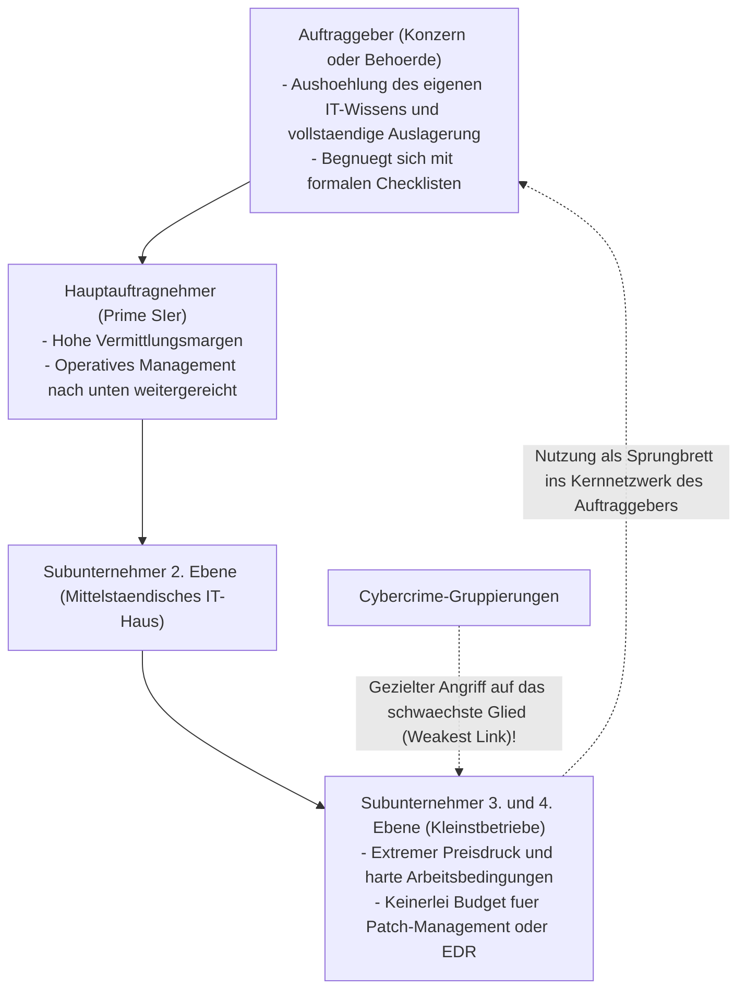

Ein Grundsatz der Sicherheitstechnik besagt: **„Eine Kette ist nur so stark wie ihr schwächstes Glied.“**

Selbst wenn der Hauptauftragnehmer über hochmoderne Firewalls und strenge Richtlinien verfügt: Bei den Subunternehmern der unteren Ebenen fehlen schlicht die finanziellen Mittel für moderne Endpoint-Detection-and-Response-Systeme (EDR) oder ein rund um die Uhr besetztes Security Operations Center (SOC).
- Dort kommen häufig veraltete Windows-Rechner oder private Laptops (unverwaltetes BYOD) zum Einsatz, und Passwörter kleben auf Notizzetteln am Bildschirm.
- Gleichzeitig verfügen diese Rechner über weitreichende Fernzugriffsrechte auf die Produktivdatenbanken des Endkunden, um Wartungsarbeiten durchzuführen.

Für Angreifer gibt es kein leichteres Ziel. Sie müssen nicht die befestigte Front des Hauptauftragnehmers attackieren. Es genügt, einen einzigen ungeschützten Laptop eines kleinen Subunternehmens zu infizieren, um legitime Anmeldedaten zu erbeuten und als scheinbar autorisierter Benutzer ins Herz des Großkonzerns spazieren zu können.

### 2.3 Die Grenzen traditioneller Beschäftigungsmodelle und der Mangel an Sicherheitsexperten

Auch auf personeller Ebene offenbaren sich gravierende Defizite.

Zwar weisen Erhebungen des Wirtschaftsministeriums (METI) und der IPA regelmäßig auf einen Fehlbestand von Hunderttausenden Sicherheitskräften hin. Das Kernproblem ist jedoch nicht allein der demografische Wandel, sondern **ein starres Beschäftigungssystem, das hochspezialisierte Fachkräfte weder angemessen vergütet noch fördert**.

In den USA, Israel oder Singapur erzielen herausragende Sicherheitsarchitekten, Reverse-Engineer-Experten und Penetrationstester Jahresgehälter von 150.000 bis über 300.000 Euro. Sie werden als unverzichtbare Experten geschätzt, die das Unternehmen vor dem Ruin bewahren.

In vielen traditionellen japanischen Betrieben mit Senioritätsprinzip und lebenslanger Beschäftigung hingegen werden IT-Kräfte oft als bloße Erfüllungsgehilfen eingestuft:
- Unabhängig von herausragenden technischen Fähigkeiten sind junge Sicherheitsexperten an dieselben engen Gehaltstabellen gebunden wie Berufsanfänger in der Verwaltung.
- Eine Beförderung führt ausschließlich über den Wechsel ins allgemeine Management. Wer weiter Quellcode analysieren, Malware untersuchen und Sicherheitsarchitekturen bauen will, stößt schnell an die Gehaltsgrenze.
- Spitzenkräfte wandern daher scharenweise zu ausländischen Technologiekonzernen ab.

In den internen IT-Abteilungen traditioneller Betriebe bleibt am Ende oft niemand mehr übrig, der Sicherheitswarnungen selbstständig analysieren, Bedrohungen isolieren und Gegenmaßnahmen einleiten kann. Zurück bleiben Koordinatoren, die Berichte externer Anbieter weiterleiten. Dieser Verlust an internem Know-how ist der Hauptgrund für das fatale Versagen der Erstmaßnahmen im Ernstfall.

---

## Kapitel 3: Ursachenanalyse ② – Technisches Scheitern (Perimeter-Kollaps und Active-Directory-Fallen)

Neben organisatorischen und personellen Fehlentwicklungen bildet die veraltete Architektur der japanischen IT-Landschaften den idealen Nährboden für Cyberangriffe.

### 3.1 VPN-Gateways und Remote Desktop als unverschlossene Hintertüren

Mit dem Ausbruch der COVID-19-Pandemie sahen sich japanische Firmen gezwungen, über Nacht Heimarbeit zu ermöglichen. Die Mehrheit entschied sich für eine Notreparatur: Man installierte SSL-VPN-Appliances (wie Fortinet FortiGate oder Pulse Secure / Ivanti Connect Secure) am Unternehmensnetzwerkrand und tunnelte die privaten Rechner der Mitarbeiter direkt ins Firmennetz.

Diese Maßnahme erwies sich als **die verhängnisvollste Schwachstelle (die offene Hintertür)** in Japans Cybersicherheitsarchitektur.

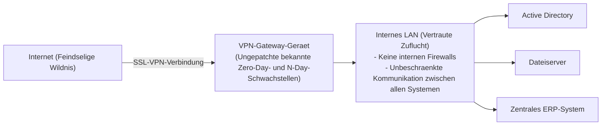

Ein VPN-Gateway ist das physische Burgtor, dessen Schnittstellen direkt der feindseligen Wildnis des Internets ausgesetzt sind. Dementsprechend suchen Cyberkriminelle und staatlich gelenkte APT-Gruppen weltweit unerbittlich nach Lücken in genau diesen Systemen.
- Zwischen 2023 und 2026 wurden in führenden VPN-Lösungen von Ivanti, Fortinet und anderen Anbietern immer wieder kritische Schwachstellen entdeckt (CVSS 9.0 bis 10.0), die das Umgehen von Authentifizierungen und die Ausführung beliebigen Codes aus der Ferne erlaubten.
- Erschreckenderweise ignorierten viele japanische Unternehmen verfügbare Patches monatelang oder über ein Jahr lang – mit Ausflüchten wie: *„Das würde den Geschäftsbetrieb stören“* oder *„Wir können das Gerät nicht neu starten.“*

Mithilfe spezialisierter Suchmaschinen wie Shodan oder Censys scannen Angreifer das Netz automatisiert nach ungepatchten Geräten ab. Haben sie eine Schwachstelle gefunden, lesen sie Anmeldedaten und Sitzungstoken direkt aus dem Arbeitsspeicher des Geräts aus. Innerhalb weniger Minuten stehen sie **als scheinbar legitime Mitarbeiter mitten im Herz des Firmennetzes**.

### 3.2 Der Zusammenbruch des internen Netzwerkvertrauens (Perimeterschutzmodell)

Haben Angreifer das VPN-Tor erst einmal durchbrochen, führt das traditionelle **Perimeterschutzmodell (Burg-und-Graben-Prinzip)** unmittelbar in die Katastrophe.

Dieses Modell basiert auf der überholten Annahme: *„Das externe Internet ist gefährlich, aber das interne LAN hinter der Firewall ist absolut sicher und vertrauenswürdig.“*

Ein nach dieser Doktrin aufgebautes Unternehmensnetzwerk ist beängstigend **flach**:
- Jeder Rechner im internen Netz kann ohne zusätzliche Authentifizierung oder Verschlüsselung mit sämtlichen Servern, Datenbanken, Druckern und Arbeitsplätzen im selben Subnetz oder benachbarten Segmenten kommunizieren.
- Der interne Datenverkehr wird von internen Firewalls weder gefiltert noch tiefgehend inspiziert.

Dies gleicht einer mittelalterlichen Festung, bei der zwar die Außenmauer stabil ist, **aber sobald ein Spion das Eingangstor passiert hat, weder die Schatzkammer noch das Waffenlager noch das Archiv verschlossen sind und ungehindert geplündert werden können**.

Das Perimeterschutzmodell besitzt keinerlei Mechanismen, um die Erkundung (Reconnaissance) und die seitliche Ausbreitung (Lateral Movement) eines Angreifers im internen Netz aufzuhalten.

### 3.3 Das überbordende Active Directory und das Scheitern des Privileged Access Managements

In Windows-Unternehmensumgebungen stellt Microsofts **Active Directory (AD)** den gefährlichsten Single Point of Failure (SPOF) und zugleich den heiligen Gral für Angreifer dar.

Über 90 Prozent der japanischen Großkonzerne steuern Rechner, Benutzerkonten, Zugriffsrechte und Sicherheitsrichtlinien zentral über Active Directory. Die administrative Realität ist jedoch oft verheerend:
- Vor über zwanzig Jahren aufgesetzte Domänenstrukturen wurden über Jahrzehnte hinweg unkontrolliert erweitert und haben sich in unüberschaubare Blackboxes verwandelt.
- Tausende verwaiste Konten von ausgeschiedenen Mitarbeitern, stillgelegten Servern und Testläufen werden niemals gelöscht.
- Das gravierendste Problem ist jedoch **der leichtfertige Umgang mit Domänen-Administratorrechten (Domain Admin)**. Um Arbeitsabläufe zu vereinfachen, weisen interne Administratoren und externe Dienstleister normalen Büro-PCs weitreichende Administrationsrechte zu und nutzen überall dieselben Standardkennwörter.

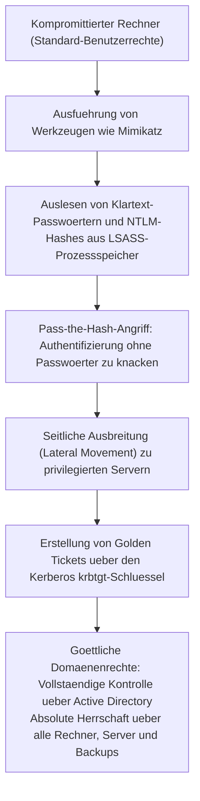

Moderne Angreifer führen auf kompromittierten Systemen Werkzeuge wie `Mimikatz` aus und extrahieren NTLM-Hashes sowie Kerberos-Tickets direkt aus dem Speicher des Windows-Authentifizierungsdienstes (`lsass.exe`).

Sie müssen die Passwörter nicht einmal entschlüsseln. Mittels **Pass-the-Hash** nutzen sie die Hashes direkt zur Authentifizierung. Gelingt es ihnen, das Kerberos-Konto (`krbtgt`) zu kompromittieren, generieren sie ein **Golden Ticket**, das ihnen uneingeschränkten, dauerhaften Zugriff auf jede Ressource der Domäne sichert.

In diesem Moment wird der Angreifer zum uneingeschränkten Herrscher über die gesamte IT-Landschaft. Über Gruppenrichtlinien (GPO) verteilt er Ransomware innerhalb weniger Minuten auf Zehntausende Rechner und Server und schaltet den gesamten Betrieb aus.

### 3.4 Schattenseiten der Cloud-Migration: Shadow-IT und überprivilegierte IAM-Rollen

Mit dem massenhaften Umstieg auf Public Clouds wie AWS, Azure und Google Cloud sind neue architektonische Brandherde entstanden:

1. **Schatten-IT und unkontrollierte Cloud-Instanzen**:
   Fachabteilungen und Entwicklungsteams, die von schwerfälligen internen Genehmigungsprozessen frustriert sind, buchen eigenmächtig Cloud-Dienste per Firmenkreditkarte. Diese Systeme entziehen sich der zentralen Überwachung, bleiben fehlerhaft konfiguriert und öffnen Angreifern Tür und Tor.
2. **Überprivilegierte IAM-Rollen (Over-Privileged Roles)**:
   Bei der Vergabe von Rechten im Identity and Access Management (IAM) wird das Prinzip der geringsten Rechte (Principle of Least Privilege) oft ignoriert. Aus Bequemlichkeit oder zur Vermeidung von Fehlern weisen Administratoren Instanzen und Dienstkonten unbedacht `AdministratorAccess` oder pauschale Vollzugriffsrechte (`*.*`) zu.
   Wird eine kleine Webanwendung über SQL-Injection oder Server-Side Request Forgery (SSRF) verwundbar, genügt das Abfangen temporärer Instanz-Metadaten-Schlüssel, damit der Angreifer die Kontrolle über den gesamten Cloud-Bestand an Datenbanken, Speichern und Servern übernimmt.

---

## Kapitel 4: Ursachenanalyse ③ – Menschliche Verwundbarkeiten und die Evolution von Angriffsmethoden

Ergänzend zu architektonischen Schwächen haben sich Angriffsmethoden, die auf die psychologischen und kognitiven Schwachstellen des Menschen zielen, durch generative KI rasant weiterentwickelt.

### 4.1 Gezieltes Spear-Phishing und Deepfakes im Zeitalter generativer KI

Frühere Phishing-Mails fielen meist durch holpriges Japanisch, fehlerhafte Grammatik und seltsame Höflichkeitsformen auf, die aufmerksame Angestellte leicht erkennen konnten.

Der Missbrauch von **großen Sprachmodellen (LLMs)** hat dieses Erkennungsmerkmal vollständig beseitigt.

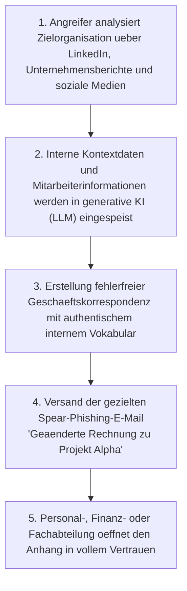

Heutige Spear-Phishing-Angriffe speisen Organigramme, aktuelle Pressemitteilungen, LinkedIn-Daten und Projektbeschreibungen in KI-Modelle ein. Das Ergebnis ist **perfektes, hochgradig geschliffenes Business-Japanisch, das authentische Namen von Kollegen und Vertragspartnern enthält**.

Noch bedrohlicher sind **Deepfakes (Audio- und Videofälschungen)**:
- Bei internationalen Konzernen und japanischen Niederlassungen mehren sich Vorfälle, bei denen Angreifer die Stimme des CEOs oder Finanzchefs per KI täuschend echt imitierten. Per Telefon wiesen sie Mitarbeiter im Rechnungswesen an, im Rahmen einer angeblich streng vertraulichen Firmenübernahme Millionenbeträge auf ausländische Konten zu überweisen.
- Gegen Angriffe, die das menschliche Wahrnehmungsvermögen direkt täuschen, sind gut gemeinte Appelle zur „erhöhten Achtsamkeit“ vollkommen wirkungslos.

### 4.2 Session-Hijacking und die Flut von Infostealern

Dass viele herkömmliche Multi-Faktor-Authentifizierungen (MFA) ins Leere laufen, liegt an der explosionsartigen Verbreitung von **Infostealer-Malware**.

Schadprogramme wie RedLine, Raccoon oder Lumma infizieren Endgeräte über Raubkopien, manipulierte Suchmaschinenwerbung (Malvertising) oder manipulierte E-Mail-Anhänge.

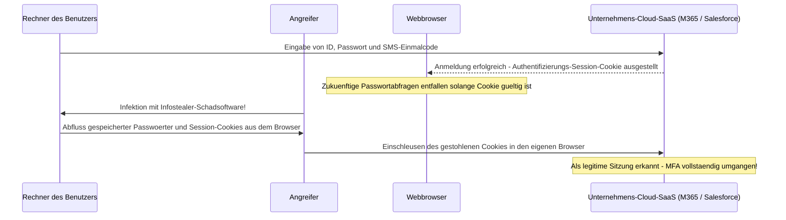

Infostealer verschlüsseln keine Dateien. Ihr alleiniges Ziel ist es, die internen Datenbanken gängiger Browser (Chrome, Edge usw.) auszulesen und **gespeicherte Passwörter sowie aktive Sitzungs-Cookies abzugreifen**.

Meldet sich ein Mitarbeiter per Passwort und SMS-Code bei Microsoft 365 oder Salesforce an, hinterlegt der Dienst ein Sitzungs-Cookie im Browser. Kopiert der Angreifer dieses Cookie in seinen eigenen Browser, **ist er sofort als der betreffende Mitarbeiter angemeldet – ganz ohne Kenntnis des Passworts und ohne eine MFA-Abfrage auszulösen**.

Im Darknet werden gültige Sitzungs-Cookies japanischer Unternehmen massenhaft für wenige Dollar gehandelt. Angreifer müssen keine Netze mehr hacken – sie kaufen sich einfach gültige Eintrittskarten.

### 4.3 Insider-Bedrohungen: Datenabfluss durch ausscheidende Mitarbeiter und Dienstleister

Sicherheitsrisiken lauern nicht nur im Außenraum. Statistiken der Japan Network Security Association (JNSA) belegen, dass ein erheblicher Teil gravierender Datenlecks auf **Handlungen interner Personen (Mitarbeiter, Abgänger, externe Dienstleister)** zurückzuführen ist.

- **Fluktuation und Datendiebstahl beim Stellenwechsel**:
  Mit dem Wandel des Arbeitsmarktes laden Vertriebsmitarbeiter oder Softwareingenieure vor ihrem Wechsel zur Konkurrenz immer häufiger Kundenlisten, Entwicklungspläne und Quellcodes auf private USB-Sticks oder private Cloud-Speicher (Google Drive, Dropbox) hoch.
- **Missbrauch von Rechten durch externe Dienstleister**:
  Wartungstechniker von Subunternehmen mit direktem Datenbankzugriff haben in der Vergangenheit sensible Datenbestände massenhaft heruntergeladen und an unseriöse Datenhändler veräußert.

Da viele japanische Firmen aus falsch verstandenem Vertrauen auf Kontrollen verzichten, fehlen Überwachungssysteme wie Data Loss Prevention (DLP) oder Verhaltensanalysen (User and Entity Behavior Analytics – UEBA). Oft wird der Datendiebstahl erst Monate oder Jahre später durch polizeiliche Ermittlungen aufgedeckt.

---

## Kapitel 5: Der vollständige Transformationspfad zur Zero-Trust-Architektur (ZTA)

Angesichts dieser verheerenden Bedrohungslage bleibt japanischen Unternehmen nur ein Ausweg: der vollständige Abschied von der überholten Perimetersicherheit und die konsequente Einführung einer **Zero-Trust-Architektur (ZTA)**.

### 5.1 Das Wesen von Zero Trust: „Never Trust, Always Verify“

Zero Trust ist kein einzelnes Produkt, sondern ein vom National Institute of Standards and Technology (NIST) im Standard **NIST SP 800-207** definiertes Sicherheits-Paradigma.

> **Die Kernprinzipien von Zero Trust**:
> 1. **Niemals vertrauen, immer verifizieren (Never Trust, Always Verify)**:
>    Kein Zugriff, kein Gerät und kein Benutzer gilt von vornherein als vertrauenswürdig – unabhängig davon, ob sich das Gerät im Firmen-LAN oder im Büro der Geschäftsführung befindet. Jede Anfrage wird kontinuierlich überprüft.
> 2. **Vergabe von Minimalrechten (Grant Least Privilege Access)**:
>    Benutzer und Endgeräte erhalten ausschließlich die Rechte, die für die jeweilige Aufgabe zwingend erforderlich sind – und dies nur zeitlich begrenzt (Just-In-Time).
> 3. **Von einer Kompromittierung ausgehen (Assume Breach)**:
>    Man plant unter der Prämisse, dass Barrieren bereits durchbrochen wurden und sich Angreifer im Netz aufhalten. Ziel ist die Begrenzung des Schadensradius (Blast Radius), sofortige Erkennung und automatische Isolation.

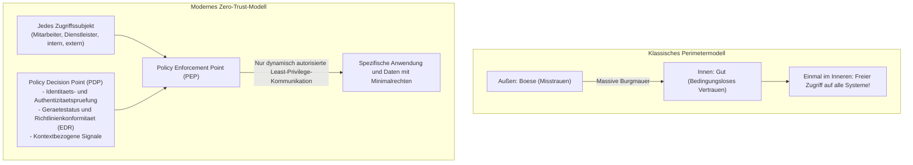

### 5.2 Abschaffung von Legacy-VPNs zugunsten von ZTNA (Zero Trust Network Access)

Der erste konkrete Schritt besteht in der **vollständigen Demontage klassischer VPN-Gateways** und dem Umstieg auf **ZTNA (Zero Trust Network Access)**.

Der fundamentale Unterschied liegt im Zugriffsziel:
- **Klassisches VPN**: Verbindet das Endgerät des Benutzers nach erfolgreicher Anmeldung direkt mit dem internen IP-Subnetz. Das Gerät hat Zugriff auf alle umliegenden Systeme; Schadsoftware kann sich ungehindert im gesamten Netz ausbreiten.
- **ZTNA**: Das Endgerät wird niemals direkt mit dem Unternehmensnetzwerk gekoppelt. Ein Cloud-Broker verifiziert Identität und Gerätezustand und **schaltet punktgenau nur den Zugriff auf die autorisierte Anwendung bzw. den spezifischen Port frei**. Die interne Netzwerktopologie und IP-Adressen bleiben für den Client unsichtbar (Cloaking), was Lateral Movement unmöglich macht.

### 5.3 Integrierte SASE- und SSE-Architektur

Die praktische Umsetzung von Zero Trust im Großmaßstab erfolgt über **SASE (Secure Access Service Edge)** und dessen Sicherheitskern **SSE (Security Service Edge)**.

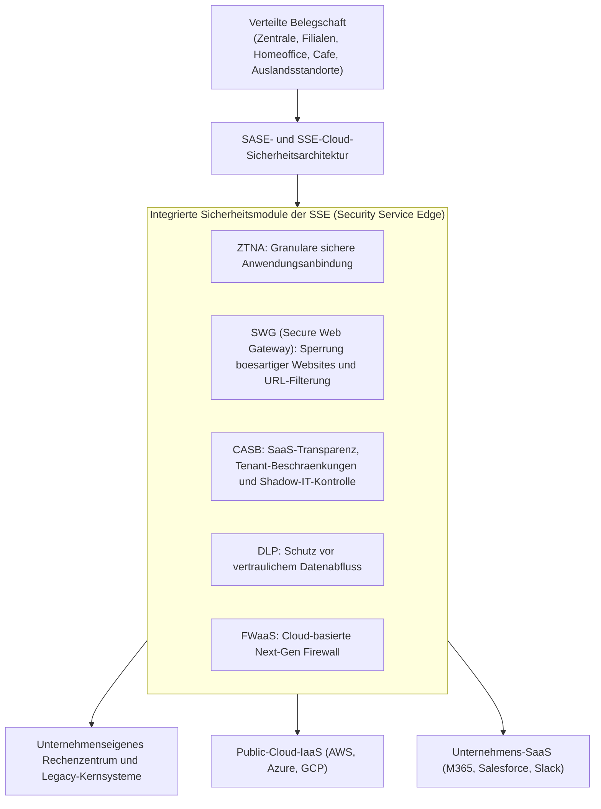

In einer SASE-Architektur wird jeglicher Datenverkehr – egal ob aus der Zentrale, dem Homeoffice oder von einem Zulieferer – über eine global verteilte Cloud-Sicherheitsplattform geleitet:
- **SWG (Secure Web Gateway)** blockiert schädliche Websites und Phishing-Links.
- **CASB (Cloud Access Security Broker)** kontrolliert Datenbewegungen zu Cloud-Diensten und stoppt Schatten-IT.
- **DLP (Data Loss Prevention)** erkennt vertrauliche Daten (wie Kreditkartendaten oder Personalausweisnummern) und verhindert deren unbefugten Upload.
- **ZTNA** stellt gesicherte Verbindungen zu internen Kernsystemen bereit.

Hierdurch entfallen teure standortbezogene VPN-Router und veraltete Proxyserver. Überall auf der Welt gelten dieselben strengen Sicherheitsregeln.

### 5.4 Mikrosegmentierung zur physischen Unterbindung von Lateral Movement

Da kein System eine Infektion zu 100 Prozent ausschließen kann, ist die **Mikrosegmentierung (Micro-Segmentation)** unerlässlich.

Mikrosegmentierung ersetzt grobe Netzwerkaufteilungen nach Stockwerken oder Standorten durch **virtuelle Sicherheitsgrenzen auf Ebene einzelner Server, virtueller Maschinen oder Container**.

- So akzeptiert ein Finanzbuchhaltungsserver ausschließlich verschlüsselte Verbindungen von authentifizierten Rechnern der Buchhaltung; Zugriffsversuche aus Entwicklungsabteilungen oder Standardnetzen werden ausnahmslos blockiert.
- Selbst zwischen benachbarten Servern im selben Rechenzentrumsrack wird der Datenverkehr unterbunden, sofern er nicht explizit autorisiert ist.

Sollte ein Rechner von Ransomware befallen werden, sorgt die Mikrosegmentierung dafür, dass **der Schaden auf das eine Gerät beschränkt bleibt (Eindämmung des Blast Radius)** und eine Ausbreitung auf benachbarte Systeme unterbunden wird.

---

## Kapitel 6: Festung Identitäts- und Zugriffsmanagement (IAM/PAM)

In einer Zero-Trust-Architektur ist das Netzwerkkabel nicht länger die Grenze. **Identität und Authentifizierung bilden die neue Verteidigungslinie**.

### 6.1 FIDO2- und Passkey-konforme Phishing-resistente MFA als absolute Pflicht

Unternehmen müssen veraltete Multi-Faktor-Verfahren, die auf SMS-Codes, E-Mail-Tokens oder einfachen Push-Bestätigungen ohne Nummernvergleich beruhen, umgehend abschaffen.

Angreifer fangen diese klassischen Verfahren mithilfe von Reverse-Proxy-Phishing (wie Evilginx) und Infostealern mühelos ab. Der einzige wirksame Schutz gegen diese Angriffe ist **Phishing-resistente MFA nach FIDO2- und WebAuthn-Standards (Passkeys)**.

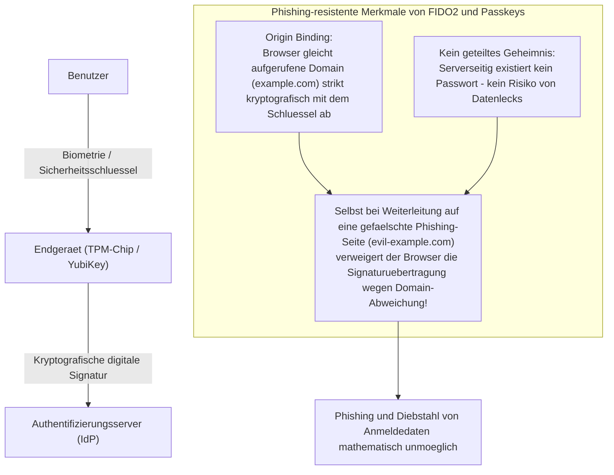

Die kryptografische Stärke von FIDO2 beruht auf dem **Origin Binding**.
Selbst wenn ein Benutzer auf eine täuschend echte Phishing-Seite gelockt wird, prüft der Webbrowser die Domain (FQDN) kryptografisch. Stimmt die Adresse nicht exakt mit dem hinterlegten Dienst überein, wird die Signatur nicht an den Server übermittelt.

Ein Abfangen von Anmeldedaten ist damit mathematisch unmöglich. Unternehmen müssen FIDO2 – über physische Sicherheitsschlüssel (wie YubiKey) oder integrierte Plattform-Authentifikatoren (Windows Hello, Touch ID) – für alle Administratoren und Benutzer sensibler Systeme ausnahmslos vorschreiben.

### 6.2 Tiering-Architektur im Active Directory und Just-In-Time (JIT) Access

Für Organisationen, die Active Directory on-premises weiterbetreiben müssen, ist die Einführung des **Tiering-Modells (Ebenenmodell)** von Microsoft unverzichtbar, um Rechteausweitungen zu stoppen.

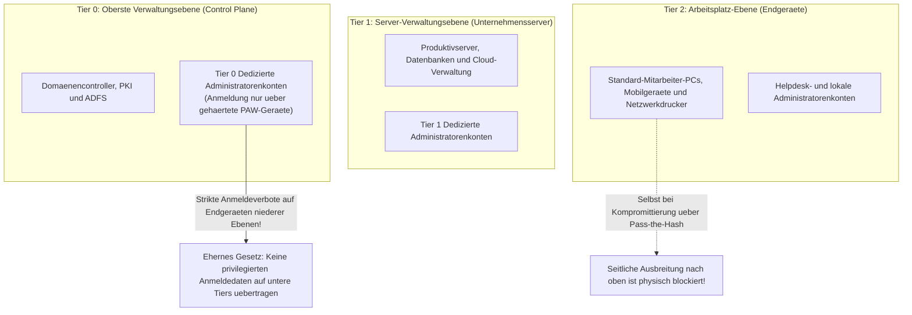

Die eiserne Regel des Tiering-Modells lautet: **Höher privilegierte Konten dürfen sich niemals an Systemen einer niedrigeren Ebene anmelden oder dort Anmeldedaten im Speicher hinterlassen**:
- **Tier 0 (Domänenkern)**: Domänen-Administratoren. Der Zugriff ist strikt auf Domänencontroller und Identitätsserver begrenzt. Anmeldungen an Datei- oder Büro-PCs sind untersagt. Wartungsarbeiten erfolgen ausschließlich über isolierte, gehärtete Administrationsarbeitsplätze (Privileged Access Workstations – PAWs).
- **Tier 1 (Server-Ebene)**: Verwaltung der Anwendungsserver und Datenbanken.
- **Tier 2 (Client-Ebene)**: Verwaltung der Benutzer-PCs.

Darüber hinaus müssen dauerhafte Administratorrechte (Standing Privileges) abgeschafft und durch **Just-In-Time (JIT) Access** ersetzt werden. Administratoren arbeiten im Alltag mit Standardbenutzerrechten und erhalten über automatisierte Freigabeprozesse nur im konkreten Wartungsfall für begrenzte Zeitfenster (z. B. zwei Stunden) erweiterte Rechte. Wird ein Konto im Normalbetrieb kompromittiert, besitzt der Angreifer keinerlei administrative Befugnisse.

### 6.3 Dynamische Richtlinienbewertung durch Conditional Access

Authentifizierung darf kein statischer Momentakt beim Anmelden sein. Im Zero-Trust-Konzept muss die Autorisierung **kontinuierlich und kontextabhängig während der gesamten Sitzung bewertet werden**.

Moderne Identitätsplattformen wie Microsoft Entra ID oder Okta setzen dies über **Conditional Access** um:
1. **Benutzer- und Gruppenstatus**: Überprüfung von Rollen und Berechtigungsebenen.
2. **IP-Adresse und Standort (Geolokalisierung)**:
   - Erkennung unmöglicher Reisebewegungen (Impossible Travel – z. B. ein Login aus Tokio und 15 Minuten später aus Russland) führt zum sofortigen Sitzungsabbruch.
3. **Gerätezustand und Richtlinienkonformität**:
   - Ist der offizielle EDR-Agent aktiv? Sind alle Betriebssystem-Patches eingespielt? Ist die Festplattenverschlüsselung (BitLocker) scharfgeschaltet?
4. **Echtzeit-Risikobewertung des Verhaltens**:
   - Ungewöhnliche Zugriffszeiten mitten in der Nacht oder das massenhafte Herunterladen von Daten lösen sofortige Re-Authentifizierungsanforderungen oder den Verbindungsabbruch aus.

Wird nur eine einzige Sicherheitsanforderung nicht erfüllt, bleibt der Zugriff auf interne Systeme verwehrt – ungeachtet der Richtigkeit des Kennworts.

---

## Kapitel 7: Sicherheits- und Kontrollmodelle für Lieferketten und Dienstleister

Ein sicheres internes Netzwerk nützt wenig, wenn die Hintertür der Lieferkette offensteht. Wie lässt sich das Risiko durch externe Dienstleister und Subunternehmer wirksam beherrschen?

### 7.1 Transparenz in der Lieferkette und wirksame Sicherheitsbewertungen

Der erste Schritt ist **eine lückenlose Bestandsaufnahme und Sichtbarmachung des gesamten Lieferantennetzwerks**.

Viele Unternehmen kennen lediglich ihren Hauptauftragnehmer, haben jedoch keinen Einblick in nachgelagerte Subunternehmer der Ebenen 2 und 3, die tagtäglich mit sensiblen Daten arbeiten.
- Verträge müssen **ein striktes Verbot eigenmächtiger Weiterbeauftragung ohne vorherige Genehmigung** enthalten.
- Reine Selbstauskünfte auf Papier einmal im Jahr müssen durch verbindliche Prüfungen abgelöst werden.
- Durch den Einsatz kontinuierlicher Sicherheits-Rating-Dienste (wie BitSight oder SecurityScorecard) müssen externe Angriffsflächen, offene Ports, ungepatchte Schwachstellen und Datenabflüsse von Partnern **fortlaufend und objektiv überwacht werden**.

### 7.2 Striktes BYOD-Verbot für Dienstleister und Zero-Trust-VDI

Die wirksamste Methode gegen Datenabflüsse und Infektionen über Partner besteht darin, **dass echte Unternehmensdaten die Dienstleistergeräte niemals physisch erreichen**.

Der direkte Zugriff ungesicherter Rechner (BYOD) auf interne Netzwerke oder Cloud-Speicher muss grundsätzlich verboten werden.

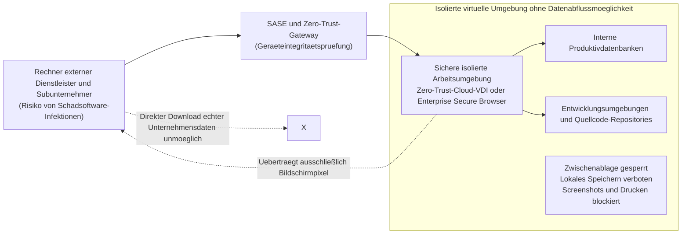

Dienstleister dürfen Aufgaben ausschließlich über eine **Zero-Trust-Cloud-VDI (Virtual Desktop Infrastructure)** oder einen **Enterprise Secure Browser** ausführen:
- Das lokale Speichern von Dateien, Kopieren über die Zwischenablage, Screenshots und das Drucken werden systemseitig blockiert.
- Auf den Monitoren der Dienstleister werden ausschließlich verschlüsselte Bildschirmpixel dargestellt. Selbst wenn das Gerät des Dienstleisters mit einem Infostealer infiziert ist, können weder echte Datenbankbestände noch Tokens abgegriffen werden.

### 7.3 SBOM (Software Bill of Materials) und minimale Rechtevergabe bei API-Schnittstellen

Auch die Softwareentwicklung durch externe Dienstleister birgt erhebliche Risiken für die Lieferkette.

In maßgeschneiderter Software finden sich häufig veraltete, verwundbare Open-Source-Komponenten (wie veraltete Versionen von Apache Log4j oder dem Spring Framework), die über Jahre hinweg unbemerkt bleiben.

Unternehmen müssen von ihren Softwarelieferanten die Vorlage einer standardisierten **Software-Stückliste (SBOM – Software Bill of Materials)** für alle gelieferten Systeme verlangen. So lässt sich beim Bekanntwerden neuer Schwachstellen innerhalb von Minuten feststellen, welche Systeme betroffen sind.

Zudem dürfen bei API-Verbindungen zu Partnern keine unbegrenzt gültigen Masterschlüssel mehr vergeben werden. Alle Schnittstellen müssen auf OAuth 2.0 mit minimalen Berechtigungsszenarien und kurzen Token-Gültigkeitsdauern umgestellt werden.

---

## Kapitel 8: Unerschütterliche Cyber-Resilienz gegen Ransomware und Datenzerstörung

Im Leitbild von Zero Trust – der Annahme einer bereits erfolgten Kompromittierung (Assume Breach) – bildet **die Cyber-Resilienz (Geschäftskontinuität und Wiederherstellungsfähigkeit)** die letzte und entscheidende Verteidigungslinie.

Keine Mauer kann hoch genug gebaut werden, um professionelle, staatlich alimentierte Angreifer dauerhaft zu 100 Prozent abzuwehren. Entscheidend ist: *Wie schnell kann der Geschäftsbetrieb nach einem Einschlag wieder anlaufen?*

### 8.1 Die 3-2-1-1-0-Backup-Regel und unveränderlicher Speicher (Immutable Storage)

Bei modernen Ransomware-Angriffen (wie BlackSuit oder LockBit) gilt das Hauptaugenmerk der Angreifer nicht der sofortigen Verschlüsselung von Produktivsystemen, sondern **der gezielten Vernichtung aller Backups**. Wer über intakte Sicherungen verfügt, zahlt kein Lösegeld.

Traditionelle nächtliche Kopien auf einfache Netzwerkspeicher sind im Ernstfall wertlos. Ist der Backup-Server Mitglied der Active-Directory-Domäne, löschen die Angreifer mit den erbeuteten Administratorrechten alle Sicherungsdaten innerhalb weniger Sekunden.

Unternehmen müssen den **3-2-1-1-0-Backup-Standard** einführen:

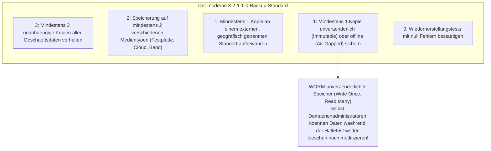

Der entscheidende Baustein ist der **unveränderliche Speicher (Immutable Storage)**.
Mithilfe der **WORM-Technologie (Write Once, Read Many)** – umgesetzt über dedizierte Backup-Appliances (Veeam, Cohesity, Rubrik) oder Cloud-Objektspeicher (wie AWS S3 Object Lock im Compliance-Modus) – werden geschriebene Sicherungsblöcke auf Hardware- und API-Ebene physisch gesperrt. **Niemand – weder die Geschäftsführung noch Systemadministratoren oder eingedrungene Angreifer – kann diese Daten vor Ablauf der definierten Frist (z. B. 30 Tage) löschen, überschreiben oder verschlüsseln**.

Selbst wenn ein Rechenzentrum vollständig verschlüsselt wird, garantieren unveränderliche Backups, dass Lösegeldforderungen standhaft zurückgewiesen und Produktivsysteme aus eigener Kraft zeitnah wiederhergestellt werden können.

### 8.2 Trennung der Authentifizierungsdomänen für Backup-Systeme

Ein unveränderlicher Speicher verfehlt seine Wirkung, wenn die Administration an dieselbe zentrale Benutzerverwaltung gekoppelt ist. Ein unumstößlicher Grundsatz lautet daher: **Die Verwaltungsebene der Datensicherung muss vollständig von der unternehmensweiten Active-Directory-Domäne getrennt werden**:

- Zur Authentifizierung an Backup-Systemen sind eigenständige Identitätsanbieter oder lokale Konten mit zwingender Hardware-MFA zu nutzen, die keinesfalls mit dem Firmen-AD synchronisiert werden.
- Der Zugriff auf Backup-Konsolen darf ausschließlich über ein abgeschottetes Managementnetzwerk erfolgen, das weder mit dem Firmen-LAN noch mit dem öffentlichen Internet verbunden ist.

Nur durch diese strikte Isolation wird verhindert, dass eine Kompromittierung der Domänencontroller automatisch auf die Datensicherung durchschlägt.

### 8.3 EDR/XDR und 24/7 Managed SOC zur schnellen Isolation

Bei einem Eindringen entscheidet die Reaktionsgeschwindigkeit über das Überleben des Unternehmens. Die maßgeblichen Kennzahlen sind **MTTD (Mean Time to Detect)** und **MTTR (Mean Time to Respond)**.

Während herkömmlicher Virenschutz (EPP) auf statische Signaturen bekannter Schädlinge setzte, analysieren moderne **EDR- (Endpoint Detection and Response)** und **XDR-Systeme (Extended Detection and Response)** das Prozessverhalten auf den Endgeräten in Echtzeit.
- Sie registrieren sofort verdächtige Verhaltensmuster: etwa wenn legitime PowerShell-Befehle versuchen, den LSASS-Speicher auszulesen, oder wenn Dateien schlagartig massenhaft umbenannt werden.
- Erkennt das EDR-System eine Bedrohung, vollzieht es **eine sofortige logische Isolation des betroffenen Rechners auf Treiberebene des Betriebssystems**, um eine seitliche Ausbreitung im Keim zu ersticken.

Da Cyberkriminelle Angriffe bevorzugt zu Zeiten starten, in denen IT-Abteilungen unterbesetzt sind – etwa freitags vor Mitternacht oder an Feiertagen –, ist eine reine Arbeitszeit-Überwachung unzureichend. Der Einsatz eines **rund um die Uhr besetzten Managed Detection and Response (MDR) Security Operations Centers (SOC)** mit direkten Isolationsbefugnissen ist eine Überlebensnotwendigkeit.

---

## Kapitel 9: Unternehmensführung und regulatorische Rahmenbedingungen als Treiber der Reform

Die Neuausrichtung der Cybersicherheit lässt sich nicht allein durch technische Maßnahmen der IT-Abteilung bewältigen. Sie ist eine strategische Führungsaufgabe, die eng mit rechtlichen Verpflichtungen, Vorstandsverantwortung und Unternehmensstrategie verknüpft ist.

### 9.1 Verschärfung des Datenschutzrechts, Bußgelder und Schadenersatzrisiken

Auch in Japan schließt sich der regulatorische Kreis in Anlehnung an die europäische Datenschutz-Grundverordnung (DSGVO) zusehends.

Durch Reformen des Gesetzes zum Schutz personenbezogener Informationen (APPI) sind **Meldungen an die Aufsichtsbehörde (Personal Information Protection Commission) sowie Benachrichtigungen der betroffenen Personen bei qualifizierten Vorfällen gesetzlich zwingend vorgeschrieben**.
- Der behördliche Bußgeldrahmen für juristische Personen wurde auf **bis zu 100 Millionen Yen** angehoben.
- Weitaus gravierender sind zivilrechtliche Sammelklagen, Vertragsstrafen von Geschäftspartnern sowie Entschädigungszahlungen an betroffene Kunden (oft mehrere Tausend bis Zehntausende Yen pro Datensatz). Bei Datenlecks, die Millionen Menschen betreffen, summieren sich diese Zahlungen schnell auf zweistellige Milliardenbeträge.

Hinzu kommen neue Gesetze zur wirtschaftlichen Sicherheit und zum Schutz kritischer Infrastrukturen, die behördliche Überprüfungen und strenge Sicherheitsvorgaben vorschreiben. Eine unzureichende Sicherheitslage bedroht unmittelbar die wirtschaftliche Existenz von Unternehmen.

### 9.2 Sorgfaltspflicht des Vorstands: Cybersicherheit ist Leitungsverantwortung

Nach dem japanischen Gesellschaftsrecht unterliegen Vorstandsmitglieder gegenüber dem Unternehmen der **Sorgfaltspflicht eines ordentlichen Geschäftsleiters (Duty of Due Care)**.

Gerichtliche Urteile und die Leitlinien des Wirtschaftsministeriums (METI/IPA) stellen klar: Versäumen es Unternehmensleiter, angemessene Sicherheitsvorkehrungen zu treffen, und kommt es dadurch zu gravierenden Vorfällen oder Betriebsstillständen, **handeln sie pflichtwidrig**. Sie können im Rahmen von Aktionärsklagen persönlich mit ihrem Privatvermögen auf Schadenersatz in Millionenhöhe in Anspruch genommen werden.

Vorstände können sich vor Gericht nicht mehr darauf herausreden, *„die IT-Details an die Fachabteilung delegiert zu haben“*. Die Geschäftsleitung ist rechtlich verpflichtet, Cyberrisiken regelmäßig zu prüfen, angemessene Budgets bereitzustellen und die Resilienz des Betriebs aktiv zu steuern.

### 9.3 Echte Vollmachten für den CISO und Neudefinition des Sicherheits-ROI

Der letzte Schritt für eine wirksame Sicherheitsarchitektur ist **die institutionelle Stärkung des Chief Information Security Officers (CISO)**.

Unternehmen müssen drei fundamentale Governance-Reformen durchführen:
1. **Ernennung des CISO zum Mitglied der Geschäftsführung bzw. Vorstand**:
   Der CISO darf kein Untergebener des IT-Leiters (CIO) sein, sondern muss auf Augenhöhe mit diesem direkt an den Vorstandsvorsitzenden (CEO) und den Aufsichtsrat berichten.
2. **Ausstattung des CISO mit Vetorechten und Notfall-Abschaltbefugnissen**:
   Dem CISO muss vertraglich das Recht eingeräumt werden, den Rollout unsicherer Systeme zu stoppen, Verträge mit unzureichend geschützten Dienstleistern zu kündigen und Systeme bei einem Einbruch unverzüglich vom Netz zu trennen.
3. **Neubewertung des Return on Investment (ROI) von Sicherheitsausgaben**:
   Sicherheitsinvestitionen dürfen nicht danach beurteilt werden, ob sie unmittelbaren Gewinn erwirtschaften. Sie müssen als **unverzichtbare Versicherung und fundamentale Betriebslizenz (License to Operate)** verstanden werden – zum Schutz vor monatelangen Stillständen im zweistelligen Milliardenbereich, regulatorischen Sanktionen und dem endgültigen Vertrauensverlust an den Kapitalmärkten.

---

## Fazit: Jenseits der Verzweiflung – Die strategische Entschlossenheit japanischer Unternehmen ab 2026

Im Jahr 2026 gibt es keinen Weg mehr zurück in eine friedliche, unbedrohte digitale Welt. Staatlich geförderte Cyberarmeen, durch generative KI hochgradig automatisierte Syndikate und florierende Schwarzmärkte für Anmeldedaten haben den digitalen Raum in eine permanente Krisenzone verwandelt.

Doch Verzweiflung ist unbegründet.

Die Krise japanischer Unternehmen ist kein unabwendbares Schicksal höherer Gewalt. Sie ist **ein hausgemachtes Desaster**, entstanden aus jahrzehntelanger bequemer Gesamtauslagerung, unkontrollierten Subunternehmerketten, blindem Vertrauen in überholte Burgmauern und Unwissenheit in den Führungsetagen. Da die Ursachen organisatorischer und menschlicher Natur sind, können sie durch Entschlossenheit, strategische Weitsicht und technologische Konsequenz überwunden werden.

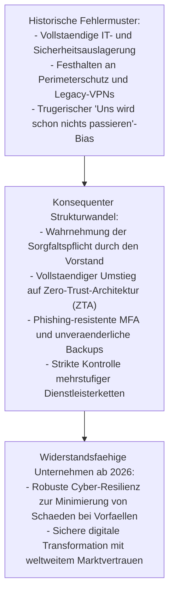

Sicherheit ist kein Hindernis für Innovationsgeschwindigkeit; sie ist **die Hochleistungsbremse**, die es einem Fahrzeug erst ermöglicht, mit maximaler Geschwindigkeit sicher durch schwierige Kurven zu steuern. Nur Unternehmen mit einer unerschütterlichen Sicherheitsarchitektur können im digitalen Zeitalter furchtlos und schnell neue Märkte erschließen.

So wie japanische Ingenieurskunst einst für unübertroffene Fertigungsqualität stand, müssen japanische Unternehmen heute den Grundsatz verankern: **Das Vertrauen von Kunden, Mitarbeitern und Gesellschaft darf unter keinen Umständen aufs Spiel gesetzt werden**. Wer den Mut zu tiefgreifenden architektonischen Erneuerungen und mutigen Führungsentscheidungen aufbringt, wird die Herausforderungen des Jahres 2026 meistern und als vertrauenswürdiger Gewinner der digitalen Weltwirtschaft hervorgehen.
