## Introduction: The Alarm Bells of 2026 — The National Crisis of a "Cybersecurity-Laggard" Japan

From the mid-2020s through 2026, Japanese cyberspace has been battered by an unprecedented, catastrophic storm.

For decades, Japanese industry was lulled into a baseless "safety myth." Beliefs such as *"We are not a global titan, so we won't be targeted,"* *"The Japanese language barrier serves as a natural fortress against cyber attacks,"* and *"We installed antivirus software from a major security vendor, so we are safe"*—these sweet illusions have now been shattered into pieces.

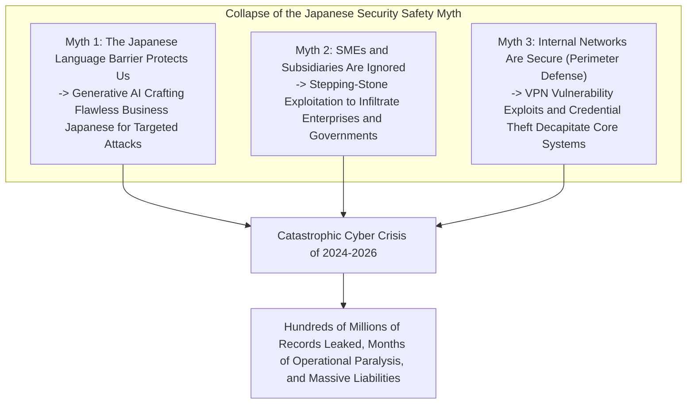

The reality is brutally unforgiving. Entertainment conglomerates, megabanks, telecom carriers, critical infrastructure operators, and municipal administrative systems alike—one household name after another has fallen to ransomware syndicates or suffered the leak of millions to tens of millions of sensitive records onto the dark web.

The compromised information goes far beyond basic records like names, postal addresses, and phone numbers. Credit card numbers, medical examination records, My Number national identification data, confidential partnership contracts, internal messaging logs, and even scanned driver's licenses of employees have been held hostage and auctioned off by international cybercrime syndicates, undermining the fundamental social trust and dignity of individuals.

Whenever an incident occurs, corporate executives line up at press conferences, bowing deeply in contrition. Formulaic apologies such as *"The cause is under investigation"* and *"We will thoroughly reinforce security training for employees"* are endlessly reiterated.

However, a fundamental question must be asked: **Why do catastrophic cyber incidents and data leaks continue unabated in Japanese corporations, despite massive IT investments and annual compliance training?**

The root cause does not lie in trivial human errors such as an employee "clicking a suspicious email link." Rather, it is a structural collapse resulting from decades of systemic negligence: **the structural pathology of "total IT outsourcing" and multi-tier contractor cascades**, a dogmatic and obsolete **blind faith in "perimeter defense" (the castle-and-moat model)**, **weakened identity and authentication foundations** during hasty cloud migrations, and **executive governance failures that dismiss cybersecurity as a cost rather than an investment**.

Written from the perspective of an elite CISO (Chief Information Security Officer) and cyber threat analyst, this definitive whitepaper dissects the technical anatomy of major incidents that rocked Japan between 2024 and 2026. It unmasks the structural pathologies plaguing corporate Japan and presents a comprehensive, battle-tested defense architecture: transitioning to an **assumed-breach Zero Trust Architecture (ZTA)**, **rigorous supply chain control**, **phishing-resistant MFA**, and **cyber resilience forged by immutable backups**.

---

## Chapter 1: Anatomy of Major Incidents at Japanese Enterprises (2024–2026)

To grasp the reality of the crisis facing Japanese enterprises, we must first examine the technical attack chains (Cyber Kill Chains) of the most iconic incidents in recent years based on technical facts.

### 1.1 Lessons from the KADOKAWA / Niconico Incident: Complete Data Center Destruction by BlackSuit Ransomware

In June 2024, a massive cyber attack struck publishing and media conglomerate KADOKAWA and its subsidiary Dwango, marking the most significant watershed moment in Japanese cybersecurity history.

The attack was orchestrated by **BlackSuit**, widely believed to be the successor syndicate to the notorious Conti ransomware cartel. The attack forced the complete shutdown of Dwango's flagship video streaming platform *Niconico* and crippled core enterprise operations—including publishing logistics, distribution, and accounting systems—for months. Furthermore, over 250,000 sensitive records, including personal information of employees, contracted creative partners, and internal business contracts, were leaked and auctioned on the dark web.

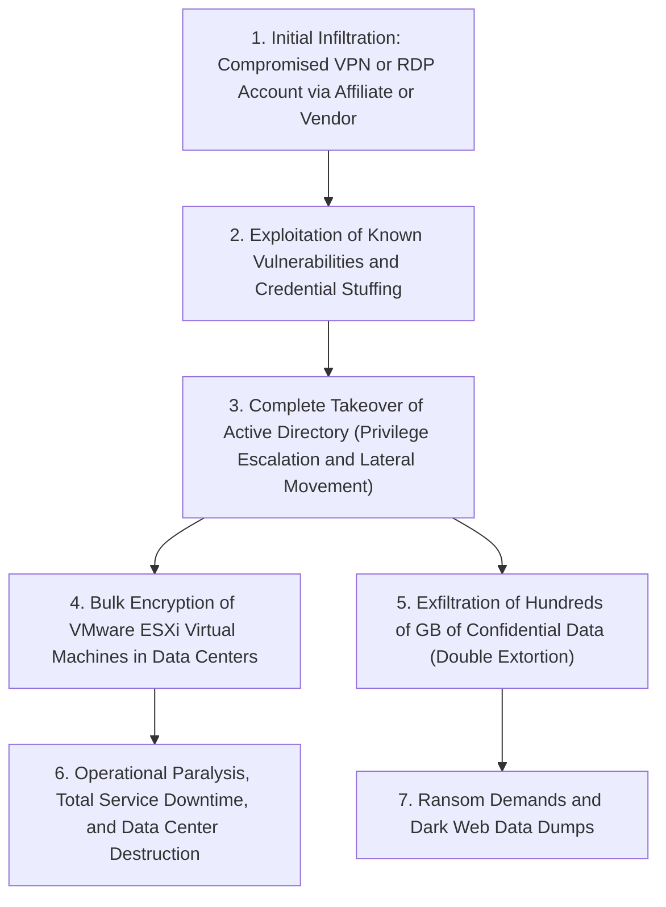

The greatest shock this incident delivered to the Japanese security community was that **the on-premises private cloud (the virtualization infrastructure itself) was annihilated at its foundations**.

The threat actors did not launch a frontal assault on corporate headquarters' core network. Instead, they leveraged remote access infrastructure (VPN appliances and RDP endpoints) belonging to an affiliated subsidiary or operational vendor as a stepping stone. Once a foothold was established inside the perimeter, the attackers capitalized on the company's flat, unsegmented internal network to execute aggressive lateral movement. Ultimately, they compromised the crown jewel of the enterprise infrastructure: **Domain Administrator privileges within Active Directory (Domain Controllers)**.

Armed with absolute domain supremacy, BlackSuit bypassed individual server operating systems, accessing hypervisors such as VMware ESXi directly to execute high-speed, mass encryption of virtual machine disk images (.vmdk files). Crucially, **the attackers also systematically wiped and encrypted online-connected backup repositories**.

This incident starkly demonstrated to enterprise boards across Japan the complete death of the perimeter defense model: once an attacker breaches the internal network, even a massive, multi-tenant enterprise data center can be wiped out in a single blow.

### 1.2 The LINE Yahoo Incident and NAVER Shared Infrastructure: Breakdown of Cross-Border Vendor Governance

Unveiled in late autumn 2023 and triggering multiple unprecedented administrative guidance orders from the Ministry of Internal Affairs and Communications (MIC) throughout 2024 to 2026, the LINE Yahoo data leak laid bare the **governance blind spots arising from intertwined capital and outsourcing relationships**.

The incident, which compromised approximately 510,000 records belonging to users, business partners, and employees, originated in the cloud environment of South Korean technology giant NAVER Corporation, a key shareholder of LINE Yahoo.

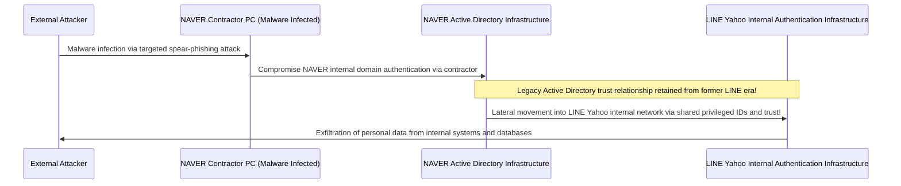

The technical core of the breach lay in **the legacy Active Directory and authentication infrastructure shared and interconnected between the former LINE entity and NAVER, which had been left unsegregated**.

When a PC belonging to an operational subcontractor of NAVER was infected with malware, the attackers infiltrated NAVER's internal network. From there, exploiting cross-border authentication trust relationships, they moved laterally into LINE Yahoo's Japanese databases without facing any secondary verification or barrier.

This event exposed the catastrophic danger of blindly trusting networks and authentication systems simply because an entity is a "group affiliate" or "parent organization" in global outsourcing and offshore development models. The Japanese government's intervention—demanding a re-evaluation of the capital structure with NAVER and the complete decoupling of shared authentication directories—underscored that supply chain governance and geopolitical risk have become matters of national economic security and sovereignty.

### 1.3 Cascading Supply Chain Collapses at Municipalities and BPO Vendors (e.g., Iseto)

Starting in 2024, local governments, financial institutions, and utilities across Japan were thrown into panic by **ransomware attacks targeting major Business Process Outsourcing (BPO) and printing contractors (such as Iseto)**.

Municipalities throughout Japan routinely outsource printing, enveloping, and mailing operations for resident tax notices, national health insurance cards, nursing care insurance assessments, and election bulletins to private BPO firms selected through public bidding. These processes involve handling extraordinarily sensitive personal records, including citizen names, residential addresses, My Number identifiers, and household income figures.

The cybercriminals did not directly target municipal networks (which are defended by the strictly isolated LGWAN and the government-mandated three-tier defense model). Instead, they directed their firepower against **the regional networks of outsourced BPO contractors**.

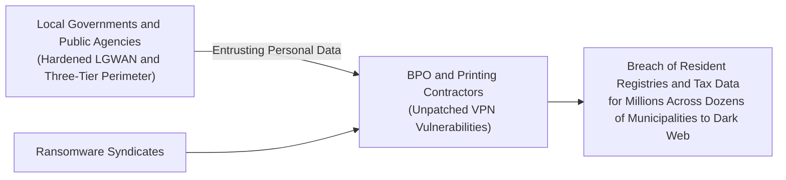

When ransomware compromised the contractor's network, not only was the vendor's internal data encrypted, but the entrusted resident data of millions of citizens spanning dozens of local governments nationwide was stolen and published on the dark web.

This incident offers a sobering lesson in physics: **no matter how many millions of dollars a client organization invests in building a fortified, isolated network, if an outsourced vendor possesses a weak security posture, the entire supply chain collapses instantaneously**. The reliance of public administrations and large enterprises on formal paper audits—assuming safety merely because a contractual security clause was signed—was exposed in the worst possible manner.

### 1.4 Cloud Misconfigurations (Salesforce, AWS, Azure): Unlocked Vaults Exposed to the World

Sophisticated targeted ransomware is not the sole driver of mass data breaches. Throughout the mid-2020s, a staggering proportion of leaks stemmed from **Cloud Misconfigurations**.

A prime example observed across Japanese securities firms, banking institutions, e-commerce platforms, and government agencies was **customer data leakage resulting from misconfigured Salesforce environments**.

Salesforce offers "Experience Cloud" (formerly Community Cloud) and guest user features for building public-facing web portals. However, due to flawed access control designs (Sharing Rules) and unreviewed default settings, customer directories containing names, telephone numbers, bank account numbers, and transaction histories—which should only have been visible to authenticated internal operators—were left **freely searchable and browsable by any unauthenticated person on the internet** for extended periods.

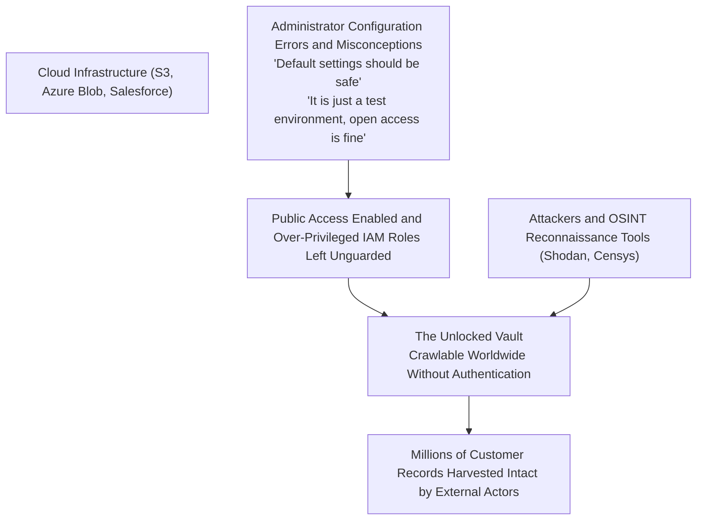

Similar incidents persist with publicly accessible Amazon Web Services (AWS) S3 buckets, permissive Microsoft Azure Blob Storage access policies, and internal developers inadvertently committing hardcoded API credentials and private access keys to public GitHub repositories.

Without requiring zero-day exploits, organizations have repeatedly **thrown open their vault doors with their own hands, displaying their crowns to the world**. This represents the sobering reality of corporate cloud operations in Japan.

---

## Chapter 2: Deep-Dive Root Cause ① — Structural and Organizational Pathologies (Total IT Outsourcing and Multi-Tier Contracting)

Why are Japanese corporations unable to preempt these risks despite their obvious severity? Chapter 2 examines the structural pathologies of Japanese corporate management underlying the technology.

### 2.1 The "IT as a Cost Center" Executive Mindset and the De-fanging of the CISO

The single greatest vulnerability in Japanese corporate cybersecurity does not reside in firewall configurations; it resides inside **the boardroom**.

In global Western enterprises, IT and cybersecurity are treated as core competitive drivers and top-tier board agendas that determine corporate survival. The Chief Information Security Officer (CISO) reports directly to the Chief Executive Officer (CEO), possessing strong veto power to halt revenue-generating systems if security risks exceed risk tolerance thresholds.

In stark contrast, Japanese corporate leadership has long treated the IT division as an overhead cost center that produces zero revenue.
- Boards rarely feature executives with technical engineering or cybersecurity backgrounds. Appointments to CIO or CISO positions are frequently handed to near-retirement non-technical directors as an afterthought, dual-hatted alongside General Affairs or Legal.
- When frontline security engineers report that a legacy VPN gateway harbors critical vulnerabilities requiring millions of yen in upgrade budgets and planned operational downtime, boards routinely dismiss them: *"Profits are down this quarter, push it to next fiscal year"* or *"Halting operations is out of the question."*

Consequently, CISOs in corporate Japan are rendered **scapegoats devoid of budget and decision-making authority, brought out only to bow deeply at press conferences when disaster strikes**. The corporate neglect of viewing cybersecurity as an indispensable capital investment to minimize existential risk—treating it instead as an expense to be trimmed down to the last yen—is the true architect of this national crisis.

### 2.2 Multi-Tier Subcontracting Cascades: The Genesis of the "Weakest Link"

The most deeply entrenched pathology defining Japan's IT industry is the **multi-tier subcontracting cascade (the "IT General Contractor" structure)**, mirroring the traditional construction sector.

Client enterprises completely outsource system design, software development, daily operations, and security maintenance to primary system integrators (Prime SIers). Prime SIers rarely perform hands-on technical execution; instead, they skim intermediary margins and cascade the work downward to Tier-2, Tier-3, and even Tier-5 or Tier-6 independent software houses, subcontractors, and individual freelancers.

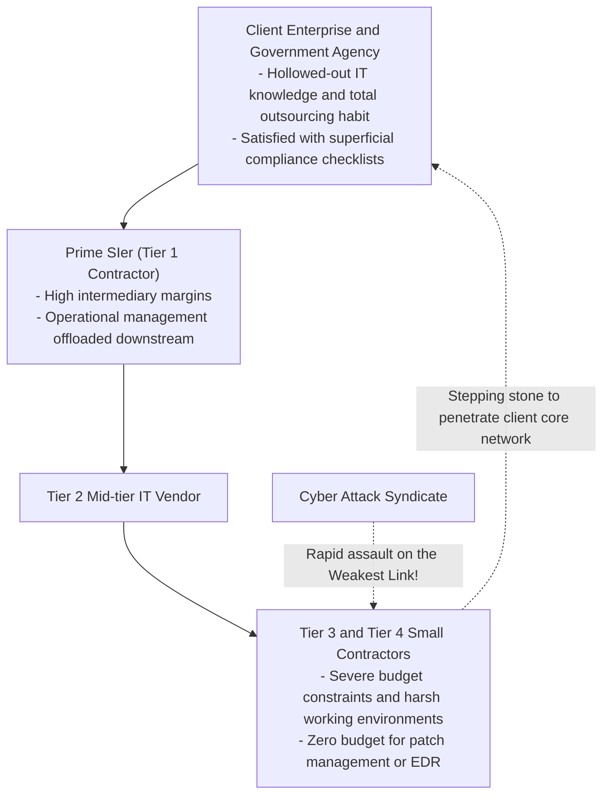

In cryptography and systems safety engineering, an unbreakable axiom states: **"A chain is only as strong as its weakest link."**

No matter how sophisticated the next-generation firewalls purchased by a prime SIer are, downstream subcontractors at Tiers 3 and 4 have neither the budget to license modern Endpoint Detection and Response (EDR) platforms nor the capital to engage a 24/7 Security Operations Center (SOC).
- In these environments, end-of-life Windows 10 PCs or personal laptops (unmanaged BYOD) are routinely deployed for business, with administrator passwords jotted down on sticky notes.
- Crucially, to carry out operational maintenance, these unmanaged endpoints are granted privileged remote access credentials into the primary client's core production databases and enterprise servers.

For an adversary, there is no easier target. There is zero need to attack the fortified front gate of the prime contractor. By infecting a single unprotected laptop belonging to a subcontractor at the bottom of the supply chain, the attacker steals legitimate privileged credentials and walks directly into the enterprise's inner sanctum disguised as an authorized user.

### 2.3 The Limits of Traditional Japanese Employment and the Severe Shortage of Security Talent

The human capital dimension is equally degraded.

Surveys by the Ministry of Economy, Trade and Industry (METI) and the Information-technology Promotion Agency (IPA) consistently highlight a national shortage of hundreds of thousands of cybersecurity personnel. However, the root of this shortage is not simply demographic decline; it is the institutional fatigue of **the traditional Japanese employment system, which fails to evaluate or compensate specialized technical talent**.

In the United States, Israel, and Singapore, top-tier security architects, reverse engineers, and penetration testers command annual salaries ranging from $150,000 to over $350,000. They are respected as elite defenders safeguarding the enterprise's bottom line.

In contrast, under Japan's lifetime employment and seniority-based pay ladders, technical specialists are relegated to the bottom of the corporate hierarchy:
- Compensation is homogenized; regardless of how exceptional a young security researcher's exploit analysis capabilities are, their compensation is strictly bound to the standard graduate pay scale ($25,000 to $40,000 per year) identical to their peers in sales or administrative tracks.
- Career progression is tied exclusively to generalist "people management." A specialist who wishes to continue analyzing code, investigating packets, and dissecting malware has no viable executive compensation track. To earn a promotion, they must abandon the keyboard to manage budgets and draw Excel gantt charts.

As a direct consequence, elite technical talent flees to multinational corporations and modern tech startups. Internal IT departments in traditional Japanese enterprises are left without a single engineer capable of independently inspecting logs, triaging alerts, or containing an active intrusion. What remains are mere "liaisons" who pass vendor reports up the management chain. This intellectual hollowing-out is the primary reason why initial incident responses fail catastrophically, transforming minor breaches into company-ending disasters.

---

## Chapter 3: Deep-Dive Root Cause ② — Technical Breakdown (Perimeter Collapse and Active Directory Traps)

Beyond organizational and leadership failures, the aging architecture and inherent structural defects of corporate Japan's IT infrastructure provide adversaries with an irresistible attack surface.

### 3.1 The Reality of VPN Appliances and Remote Desktop as Unlocked "Backdoors"

Following the COVID-19 pandemic, Japanese enterprises rushed into remote work. The overwhelming majority chose a quick-fix patch: deploying SSL-VPN appliances (such as Fortinet FortiGate or Pulse Secure / Ivanti Connect Secure) along the corporate network perimeter, tunneling employee home PCs directly into the internal network.

This setup proved to be the **single most lethal backdoor** in Japanese cyber defense history.

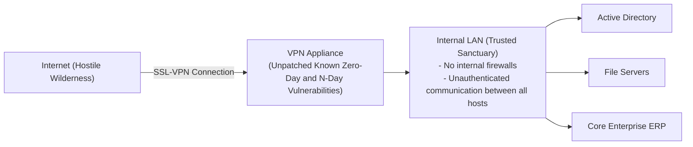

A VPN appliance is a physical castle gate exposing its network interface directly to the hostile wilderness of the public internet. Unsurprisingly, cybercrime syndicates and Advanced Persistent Threat (APT) groups relentlessly scour the globe for vulnerabilities in these exact devices.
- Between 2023 and 2026, severe remote code execution and authentication bypass vulnerabilities (rated CVSS 9.0 to 10.0) were repeatedly disclosed and weaponized in leading enterprise VPN devices from Ivanti, Fortinet, and others.
- Shockingly, even after vendors published emergency patches, hundreds of Japanese enterprises neglected patching for months—or over a year—citing excuses such as *"It would disrupt business hours"* or *"We cannot restart the core appliance."*

Adversaries leverage automated search engines such as Shodan and Censys to scan and enumerate unpatched appliances at scale. By exploiting these flaws, they dump user credentials, plaintext passwords, and active session tokens directly from appliance memory, **infiltrating the inner sanctum of the enterprise network as an authorized employee in mere minutes**.

### 3.2 The Total Collapse of the "Trusted Internal Network" (Perimeter Model)

Once the VPN perimeter is breached, the factor driving Japanese enterprises into total destruction is the antiquated **"Perimeter Defense Model" (the Castle-and-Moat Architecture)**.

The perimeter model operates on an outdated assumption: *"The external internet is hostile, but the internal corporate LAN behind the firewall is 100% secure and trustworthy."*

Networks engineered under this philosophy are notoriously **flat**:
- Any endpoint connected to the internal LAN can freely communicate with all other endpoints, file servers, network printers, and core databases on the same subnet or adjacent VLANs without secondary authentication or encryption.
- Internal network traffic undergoes zero deep packet inspection or behavioral filtering by internal firewalls.

This is analogous to a medieval castle with reinforced stone walls where, **the moment an infiltrator slips past the front portcullis, the doors to the armory, the treasury, and the royal bedchamber have no locks, allowing unchecked plunder**.

When an adversary lands malware on a single internal workstation, the perimeter defense model provides zero controls to detect or suppress internal reconnaissance and lateral movement as the attacker pivots across servers and workstations.

### 3.3 Active Directory Bloat and the Collapse of Privileged Access Management

Within enterprise Windows environments, Microsoft's **Active Directory (AD)** serves as the single point of failure (SPOF) and the ultimate prize for adversaries.

Over 90% of Japanese enterprises rely on Active Directory for centralized identity management, user permissions, device policies, and access controls. Yet, its operational governance is frequently in shambles:
- AD forests deployed two decades ago have morphed into sprawling, unmaintainable black boxes due to continuous, undocumented modifications.
- Thousands of orphaned accounts belonging to former employees, retired servers, and temporary testing environments linger unrevoked.
- Worst of all is the widespread **misuse and sharing of "Domain Admin" privileges**. To simplify operational routines, enterprise IT staff and external support vendors routinely assign Domain Administrator credentials to standard workstations and share root passwords across multiple operators.

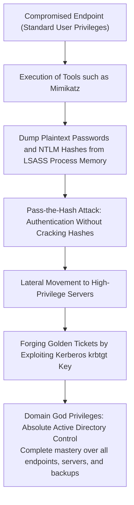

Modern cyber adversaries leverage post-exploitation tooling such as `Mimikatz` on compromised endpoints to harvest NTLM password hashes and Kerberos tickets directly from the memory of the Windows Local Security Authority Subsystem Service (`lsass.exe`).

Attackers do not even need to crack the underlying passwords. Through **Pass-the-Hash** techniques, they authenticate using the raw hash. By compromising the Active Directory Kerberos Key Distribution Center service account (`krbtgt`), they execute **Golden Ticket** attacks to issue forged, perpetual Kerberos tickets granting unrestricted access to every resource in the domain.

Once this kill chain succeeds, the adversary attains absolute administrative control over the entire enterprise IT ecosystem. Deploying ransomware enterprise-wide via Group Policy Objects (GPO) takes mere minutes, resulting in the instantaneous destruction of tens of thousands of endpoints and servers.

### 3.4 The Dark Side of Cloud Migration: Shadow IT and Over-Privileged IAM Roles

As enterprises migrate workloads from on-premises environments to public clouds such as AWS, Microsoft Azure, and Google Cloud, a new frontier of architectural pathology has emerged.

1. **Shadow IT and Rogue Cloud Accounts**:
   Frustrated by rigid internal approval cycles, business units and development teams bypass corporate IT to spin up autonomous cloud environments and SaaS services using corporate credit cards. These environments lack centralized security monitoring, leaving public access controls misconfigured and creating fertile ground for vulnerabilities.
2. **Over-Privileged Identity and Access Management (IAM) Roles**:
   In configuring cloud IAM, administrators routinely abandon the Principle of Least Privilege (PoLP). Driven by convenience or fears of application downtime, they recklessly attach `AdministratorAccess` or broad wildcard policies (`*.*`) to compute instances and service roles.
   Consequently, when an attacker exploits a minor SQL injection or Server-Side Request Forgery (SSRF) flaw in a public-facing web app to extract temporary instance metadata credentials, they instantly acquire administrative dominion over the entire cloud tenant's storage buckets, databases, and compute fleets.

---

## Chapter 4: Deep-Dive Root Cause ③ — Human Vulnerabilities and Evolving Attack Vectors

Compounding architectural flaws, attack methodologies exploiting human psychological and cognitive vulnerabilities have undergone an unprecedented leap with the rise of Generative Artificial Intelligence.

### 4.1 Targeted Spear-Phishing and Deepfakes in the Generative AI Era

Historically, phishing emails were characterized by broken syntax, odd grammar, and awkward honorifics that alert employees could easily flag.

The weaponization of **Large Language Models (LLMs)** such as ChatGPT has rendered that defensive assumption obsolete.

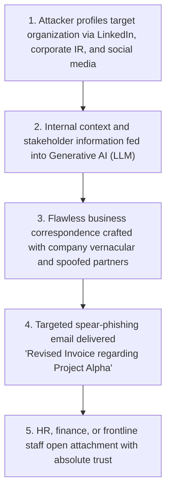

Today's targeted spear-phishing campaigns scrape corporate disclosures, press releases, LinkedIn rosters, and employee social feeds into AI prompts. The resulting messages emulate **natural, sophisticated corporate correspondence incorporating genuine internal terminology, specific project names, and authentic executive personas**.

Even more insidious is the rise of **audio and video Deepfakes** in social engineering:
- Multinational organizations operating in Japan have fallen prey to incidents where attackers cloned the voices of CEOs or Chief Financial Officers using AI. Posing as executives on urgent phone calls, they instructed finance personnel to execute emergency multi-million-dollar wire transfers for confidential acquisitions.
- Against attacks that manipulate human auditory and visual perception, passive reminders to *"check sender addresses carefully"* offer virtually zero defense.

### 4.2 Session Hijacking and the Explosion of Infostealers

A primary driver behind the failure of traditional Multi-Factor Authentication (MFA) across Japanese enterprises is the proliferation of **Infostealers (Credential and Information-Stealing Malware)**.

Infostealers such as RedLine, Raccoon, and Lumma infiltrate employee and contractor laptops via pirated software, cracked utilities, malicious search engine advertisements (malvertising), or weaponized email attachments.

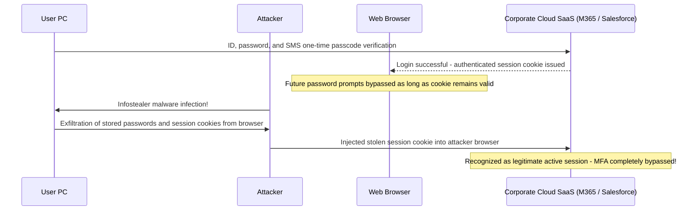

Infostealers do not encrypt files. Their objective is to harvest local browser databases (in Chrome, Edge, Firefox, etc.) to exfiltrate **stored passwords and active session cookies**.

When an employee authenticates to Microsoft 365, Salesforce, or AWS using credentials and standard MFA (SMS codes or push notifications), the cloud service issues an authenticated session cookie stored locally in the browser. By extracting and importing this session cookie into their own browser, **adversaries access corporate cloud systems instantly without knowing the password or triggering MFA challenges**.

On dark web marketplaces, active session cookies of major Japanese corporations are sold in bulk for negligible sums, allowing adversaries to walk straight through the front door using authentic credentials purchased off the shelf.

### 4.3 Insider Threats: Data Exfiltration by Departing Employees and Contractors

Cyber threats do not originate solely from external syndicates. Statistics from the Japan Network Security Association (JNSA) consistently highlight that a substantial proportion of catastrophic data leaks stem from **insider misconduct by current employees, departing staff, and outsourced personnel**.

- **Workforce Mobility and Post-Resignation Theft**:
  As the tradition of lifelong employment recedes, departing sales professionals and software engineers increasingly exfiltrate customer databases, source code, and proprietary product blueprints to personal USB drives or personal cloud accounts (such as Google Drive or Dropbox), rationalizing them as their personal achievements.
- **Malicious Contractors with Elevated Privileges**:
  Overburdened or financially stressed contractors handling system operations have repeatedly abused database access rights to download millions of customer records and sell them to underground broker syndicates.

Most Japanese corporations continue to operate under a philosophy of "assumed innocence," lacking the tooling—such as Data Loss Prevention (DLP) engines or User and Entity Behavior Analytics (UEBA)—to detect or block unauthorized bulk downloads in real time. Exfiltrated intellectual property often surfaces only months or years later during law enforcement inquiries or competitor product releases.

---

## Chapter 5: Complete Roadmap to Zero Trust Architecture (ZTA)

To counteract these pervasive and sophisticated threats, Japanese enterprises must discard obsolete perimeter security and execute a comprehensive transition to a **Zero Trust Architecture (ZTA)**.

### 5.1 The Essence of Zero Trust: "Never Trust, Always Verify"

Zero Trust is not a single product or software license. As codified by the National Institute of Standards and Technology in **NIST SP 800-207**, it represents a fundamental paradigm shift in cybersecurity philosophy.

> **Core Principles of Zero Trust**:
> 1. **Never Trust, Always Verify**:
>    No communication, endpoint, or user—whether inside the corporate LAN or within an executive office—is assumed secure. Every access request is treated as originating from a hostile network and verified continuously.
> 2. **Grant Least Privilege Access**:
>    Users and devices are granted only the minimum permissions necessary to accomplish a specific task, strictly scoped in duration (Just-In-Time access).
> 3. **Assume Breach**:
>    Security architecture is designed around the reality that perimeter defenses have already failed and threat actors are already dwelling within the internal network. Design focuses on containment (minimizing the blast radius), rapid detection, and automated isolation.

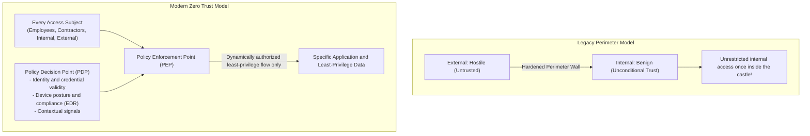

### 5.2 Decommissioning Legacy VPNs in Favor of ZTNA (Zero Trust Network Access)

The foundational milestone in Zero Trust migration is **the complete decommissioning of legacy VPN appliances** and the deployment of **Zero Trust Network Access (ZTNA)**.

The critical architectural distinction between VPN and ZTNA lies in whether access is granted to an **entire network** or to an **isolated application**.
- **Legacy VPNs**: Once authenticated, the user's endpoint is bridged directly onto the internal IP subnet. The device gains broad network reachability to all adjacent servers, allowing malware on an infected endpoint to propagate freely.
- **ZTNA**: The endpoint is never bridged onto the corporate network. A cloud-hosted security broker validates user identity and endpoint posture, **proxying encrypted micro-tunnels exclusively to authorized applications or ports**. Internal network topologies and IP subnets remain entirely invisible (cloaked from discovery), making lateral movement physically impossible.

### 5.3 Integrated SASE (Secure Access Service Edge) and SSE Architecture

The operational realization of enterprise Zero Trust relies on **SASE (Secure Access Service Edge)** and its core security framework, **SSE (Security Service Edge)**.

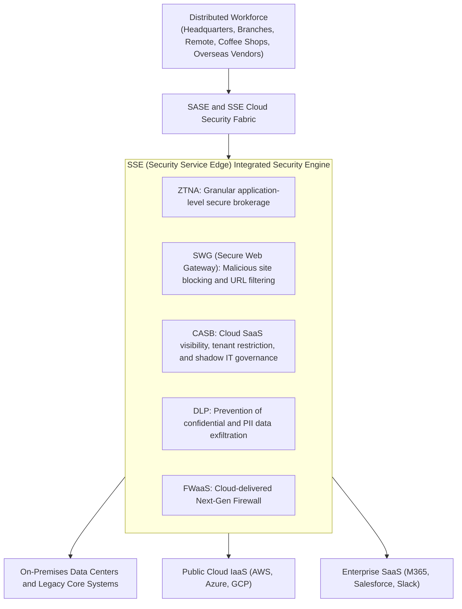

Under a unified SASE/SSE architecture, all outbound and inbound traffic flows through a globally distributed cloud security fabric, regardless of user location:
- **Secure Web Gateway (SWG)** filters web traffic, blocking malicious domains and weaponized URLs.
- **Cloud Access Security Broker (CASB)** inspects sanctioned and unsanctioned SaaS usage, enforcing tenant restrictions and stopping Shadow IT.
- **Data Loss Prevention (DLP)** inspects payloads for sensitive patterns (credit cards, national IDs) and prevents unauthorized uploads.
- **ZTNA** brokered tunnels secure connections to private enterprise workloads.

This model allows organizations to retire costly on-premises security proxies and brittle branch office VPNs, enforcing a uniform, high-assurance security baseline across the globe.

### 5.4 Micro-Segmentation: Physically Halting Lateral Movement

Because endpoint infections can never be reduced to absolute zero, **Micro-Segmentation** is essential.

Micro-segmentation replaces coarse, perimeter-style VLAN boundaries with **granular, workload-level security boundaries applied to individual virtual machines, containers, and servers**.

- For instance, a core financial database accepts incoming connections exclusively from verified accounting endpoints over encrypted application ports, dropping all other traffic (including ICMP ping probes) originating from engineering workstations or general office subnets.
- East-West traffic between servers in the same rack or cluster is blocked unless specifically whitelisted by cryptographic service identity.

When an endpoint falls victim to ransomware, micro-segmentation acts as a system of fireproof bulkheads: **the blast radius is strictly confined to the infected device, stopping lateral traversal across the corporate estate**.

---

## Chapter 6: Fortifying Identity and Access Management (IAM/PAM)

In a Zero Trust Architecture, the true perimeter is no longer the physical network cable. **Identity and Authentication** form the definitive security boundary.

### 6.1 Mandating FIDO2 and Passkey Phishing-Resistant MFA

Organizations must decisively eliminate legacy Multi-Factor Authentication methods that rely on SMS codes, email passcodes, or push notifications without number matching.

Adversaries routinely neutralize legacy MFA using reverse-proxy attack frameworks (such as Evilginx) and Infostealer malware. The only cryptographic defense capable of defeating these attacks is **Phishing-Resistant MFA built upon FIDO2 and WebAuthn standards (Passkeys)**.

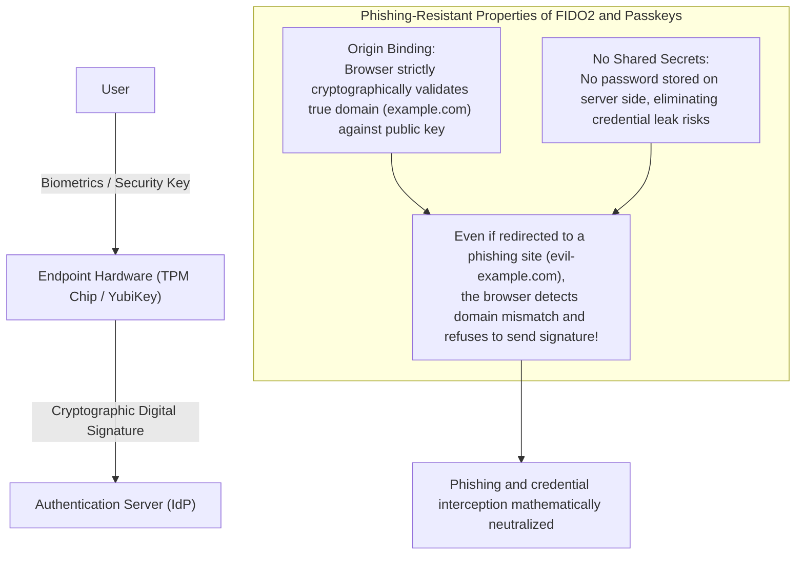

The mathematical strength of FIDO2 resides in **Origin Binding**.
Even if an employee is deceived into visiting an identical spoofed login portal, the web browser independently verifies the Fully Qualified Domain Name (FQDN). If the domain fails to match the cryptographic credential registered on the hardware security token, the browser flatly refuses to sign or release the challenge.

Credentials cannot be intercepted, regardless of the sophistication of the phishing lure. Organizations must prioritize enforcing FIDO2 authentication—via hardware tokens (such as YubiKeys) or platform authenticators (Windows Hello, Touch ID)—for all administrators and personnel accessing critical data assets.

### 6.2 Active Directory Tiering Architecture and Just-In-Time (JIT) Access

For enterprises maintaining legacy Active Directory installations, the foundational framework to halt privilege escalation is Microsoft’s **Tiering Architecture**.

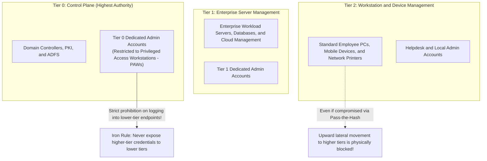

The cardinal rule of the Tiering model is an irreversible law: **Higher-tier administrative credentials must never authenticate against or be cached on lower-tier assets**:
- **Tier 0 (Domain Core)**: Governs Domain Controllers and identity infrastructure. Tier 0 administrators are strictly barred from logging into application servers (Tier 1) or user endpoints (Tier 2). Administrative sessions must originate exclusively from hardened, logically isolated Privileged Access Workstations (PAWs).
- **Tier 1 (Server Plane)**: Manages enterprise application servers and databases.
- **Tier 2 (Workstation Plane)**: Restricts support staff to user endpoints.

Furthermore, enterprises must decommission "Standing Privileges" in favor of **Just-In-Time (JIT) Privileged Access Management (PAM)**. Administrators operate with non-privileged standard accounts by default. Elevated privileges are granted dynamically via automated approval workflows for temporary, time-bound intervals (e.g., two hours). Even if an administrative account is compromised outside of an authorized operational window, the adversary inherits zero elevated rights.

### 6.3 Dynamic Continuous Policy Evaluation via Conditional Access

Authentication can no longer be treated as a single, static gate check executed at login. In Zero Trust, authorization must be a **continuous, dynamic evaluation across the entire lifecycle of a session**.

Platforms such as Microsoft Entra ID and Okta provide **Conditional Access engines** that evaluate multi-dimensional signals in real time:
1. **User and Group Membership**: Evaluating role, privilege tier, and baseline access entitlements.
2. **Geographical Location and Network Reputation**:
   - Immediate termination upon detecting impossible travel patterns (e.g., logins from Tokyo and Eastern Europe within a 15-minute window).
3. **Device Health and Compliance Posture**:
   - Verification that enterprise EDR is running, OS kernel patches are current, disk encryption (BitLocker) is active, and no signs of compromise exist.
4. **Real-Time Behavioral Risk Telemetry**:
   - Unusual off-hours access patterns or bulk file staging immediately trigger step-up biometric re-authentication or automated session revocation.

If a single risk threshold is breached, access to enterprise systems is denied immediately, regardless of password validity.

---

## Chapter 7: Supply Chain and Vendor Security Governance Models

Securing the core enterprise infrastructure is futile if the supply chain backdoor remains unmonitored. How can organizations establish authoritative oversight across vendors and subcontractors?

### 7.1 Supply Chain Visibility and Continuous Security Ratings

The primary mandate is **a comprehensive inventory and mapping of the entire vendor ecosystem**.

Most major enterprises possess visibility into their Tier-1 primary vendors, yet remain entirely blind to downstream Tier-2 and Tier-3 contractors handling day-to-day data processing.
- Procurement contracts must legally mandate that **unauthorized secondary and tertiary subcontracting is strictly prohibited**.
- The practice of relying on annual self-attestation questionnaires (paper check-the-box exercises) must be discontinued.
- Enterprises must implement continuous third-party cyber risk monitoring platforms (such as BitSight or SecurityScorecard) to **objectively and continuously track external attack surfaces, exposed ports, unpatched CVEs, and credential leaks** across vendor domains.

### 7.2 Prohibiting Contractor BYOD and Enforcing Zero Trust VDI

The most effective physical control against contractor-driven data breaches and malware infiltration is **ensuring that enterprise data never touches an unmanaged vendor endpoint**.

Direct network or cloud storage connectivity from unmanaged personal computers (BYOD) or contractor-owned laptops must be universally forbidden under Zero Trust policy.

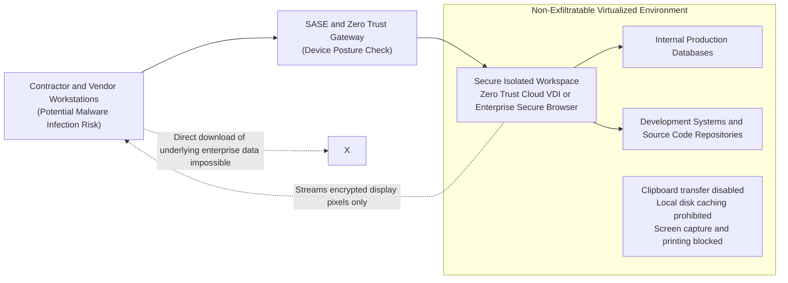

External vendors and third-party contractors must execute all operational tasks exclusively through **Zero Trust Cloud Virtual Desktop Infrastructure (VDI / DaaS)** or managed **Enterprise Secure Browsers**.
- Local file downloads, clipboard copying, local disk synchronization, and screen recording are disabled via programmatic policy.
- Only encrypted screen display pixels are rendered on the contractor's screen. Even if an infostealer compromises the vendor's physical machine, actual enterprise data, database tables, and session tokens remain untouchable inside the cloud enclave.

### 7.3 Software Bill of Materials (SBOM) and Least-Privilege API Integration

In the software development lifecycle, outsourced code represents another critical supply chain blind spot.

Applications delivered by external system integrators frequently bundle abandoned, vulnerable open-source components (such as vulnerable versions of Apache Log4j or Spring Framework) that remain unpatched for years.

Enterprises must require development partners to provide an automated **Software Bill of Materials (SBOM)** formatted to standard specifications (e.g., CycloneDX or SPDX) for all deliverables. When a critical zero-day is disclosed, internal teams can instantly identify vulnerable libraries within their application portfolio within minutes.

Furthermore, API integrations with external partners must eliminate long-lived, high-privilege API tokens. All programmatic integrations must implement OAuth 2.0 with strictly scoped access roles and brief Time-to-Live (TTL) tokens.

---

## Chapter 8: Unyielding Cyber Resilience Against Ransomware and Destructive Attacks

In the "Assume Breach" doctrine that underpins Zero Trust, the ultimate line of defense is **Cyber Resilience: the capacity to maintain operational continuity and rapidly reconstruct core enterprise systems following catastrophic destruction**.

No defensive perimeter is completely impenetrable against determined nation-state or well-funded syndicates. The real benchmark of organizational survival is: *Once an intrusion occurs, how quickly can the business recover?*

### 8.1 The 3-2-1-1-0 Backup Standard and Immutable Storage

In modern ransomware operations (such as BlackSuit or LockBit), the adversary's primary objective is not immediate data encryption; it is **the total destruction of backups**. Attackers recognize that organizations with intact recovery capabilities refuse to pay extortion demands.

Legacy daily tape rotations or periodic disk backups attached to internal networks are useless in this landscape. If backup servers are joined to the primary Active Directory domain, threat actors wielding Domain Administrator privileges wipe repositories within seconds.

Enterprises must adopt the **3-2-1-1-0 Backup Standard**:

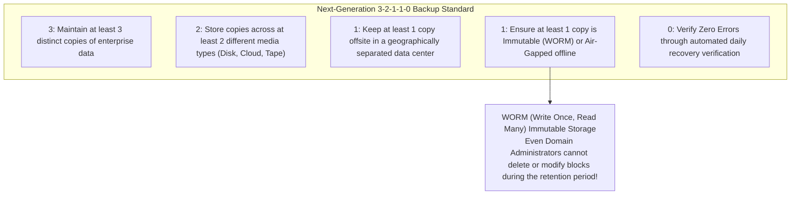

The cornerstone of this framework is **Immutable Storage**.
Leveraging **WORM (Write Once, Read Many)** capabilities—enforced via dedicated appliances (e.g., Veeam, Cohesity, Rubrik) or cloud object storage (such as AWS S3 Object Lock in Compliance Mode)—backup datasets are locked at the hardware and API layers. Once committed, data blocks **cannot be altered, overwritten, or deleted by any identity—including corporate executives, storage administrators, or rogue threat actors—until the retention timer (e.g., 30 days) expires**.

Even if an enterprise data center suffers catastrophic total encryption, immutable backups guarantee that leadership can firmly reject extortion demands and restore production services independently.

### 8.2 Segregating Backup Control Planes into Isolated Authentication Domains

Deploying immutable hardware is ineffective if access controls share credentials with production systems. A foundational architectural requirement is **the absolute decoupling of the backup management plane from corporate Active Directory**:

- Backup repositories and hypervisor management portals must utilize an entirely independent Identity Provider (IdP) or hardened local accounts requiring dedicated hardware-based MFA.
- Access to backup consoles must be strictly restricted to an out-of-band management network isolated from both the corporate LAN and public internet.

This authentication air-gap ensures that the compromise of corporate domain controllers cannot cascade into the backup infrastructure.

### 8.3 EDR/XDR and 24/7 Managed SOC for Rapid Incident Containment

When an intrusion occurs, the speed of response determines enterprise survival. The key operational metrics are **Mean Time to Detect (MTTD)** and **Mean Time to Respond (MTTR)**.

While legacy antivirus (EPP) relied on static signature matching, modern **Endpoint Detection and Response (EDR)** and **Extended Detection and Response (XDR)** continuously analyze kernel-level process telemetry.
- EDR engines detect anomalous behavioral sequences in real time: unapproved PowerShell instances executing memory scraping against `lsass.exe`, or rapid file renaming operations indicative of ransomware staging.
- Upon flagging high-fidelity indicators of compromise, EDR agents execute **automated host isolation at the network driver layer**, neutralizing lateral movement before human operators even review the alert.

Adversaries intentionally execute destructive payloads during operational blind spots: Friday midnight, national holidays, or year-end closures. Consequently, continuous oversight via a **24/7/365 Managed Detection and Response (MDR) Security Operations Center (SOC)** with programmatic authority to isolate hosts is an existential operational requirement.

---

## Chapter 9: Executive and Regulatory Drivers of Governance Reform

Cybersecurity excellence cannot be achieved through technical efforts within the IT division alone. It is an enterprise-wide mandate intertwined with corporate strategy, board liability, and legal compliance.

### 9.1 The Act on the Protection of Personal Information: Penalties and Civil Liabilities

Following the regulatory trajectory set by the European Union’s GDPR, Japan’s legal landscape has tightened significantly.

Revisions to the Act on the Protection of Personal Information (APPI) have established **mandatory reporting obligations to the Personal Information Protection Commission (PPC) and mandatory notification to affected data subjects** upon confirming or suspecting qualifying data leaks.
- Corporate statutory fines for legal entities were elevated to **up to 100 million yen**.
- Beyond regulatory penalties, organizations face crushing civil liabilities: class-action consumer litigation, partner indemnifications, and solatium payouts (ranging from several thousand to tens of thousands of yen per affected individual). A breach compromising millions of records translates to dozens of billions of yen in direct cash outflow.

Compounding this, recent economic security legislation and critical infrastructure cybersecurity mandates authorize regulatory inspections and strict operational penalties for non-compliant organizations. Cybersecurity posture has transformed into a direct determinant of commercial solvency.

### 9.2 Board of Directors' Duty of Due Care: Cybersecurity as a Direct Executive Liability

Under Japanese corporate law, directors owe a fiduciary **Duty of Due Care (Duty of a Good Manager)** to the corporation.

Court precedents and the METI/IPA *Cybersecurity Management Guidelines* affirm that failure by corporate officers to establish adequate cybersecurity controls constitutes **a breach of the Duty of Due Care**. In the event of a crippling breach, directors face personal liability in shareholder derivative lawsuits, placing their personal assets at risk.

Executive boards can no longer plead ignorance in court with claims that *"IT was delegated entirely to operational teams."* Corporate boards must formally review cyber risk assessments, approve adequate defensive budgets, and maintain direct oversight of operational cyber resilience.

### 9.3 Empowering the CISO and Redefining Security ROI

The final component of governance maturity is **the institutional empowerment of the Chief Information Security Officer (CISO)**.

Enterprises must institute three vital governance reforms immediately:
1. **Elevate the CISO to Executive Officer / Board Status**:
   The CISO must operate as an independent executive reporting directly to the CEO and Board of Directors, functioning as an equal counterweight to the Chief Information Officer (CIO) rather than a subordinate.
2. **Vest the CISO with Operational Veto and Shutdown Authority**:
   The CISO must hold explicit authority to block the deployment of non-compliant applications, terminate vendor engagements failing security baselines, and order the immediate shutdown of production systems during active compromises.
3. **Redefine Security ROI**:
   Cybersecurity investments must not be judged on direct revenue generation. They must be evaluated as **existential business insurance and a fundamental License to Operate**—protecting the enterprise against multi-billion-yen operational outages, regulatory fines, and reputational insolvency.

---

## Conclusion: Beyond Despair — The Strategic Resolve for Japanese Enterprises Beyond 2026

Entering 2026, the notion of retreating to a peaceful, unthreatened digital sanctuary is a bygone fantasy. Cyber warfare groups operating under geopolitical mandates, hyper-automated criminal cartels weaponizing generative AI, and dark web commodity markets have transformed cyberspace into a hostile theater.

Yet there is no cause for fatalism.

The crises engulfing Japanese corporations are not inscrutable acts of god. They are **man-made systemic failures** stemming from decades of total IT outsourcing, unmanaged contractor cascades, blind faith in obsolete network perimeters, and executive apathy. Because these causes are organizational in nature, they can be dismantled and overcome through human intelligence, architectural rigor, and decisive leadership.

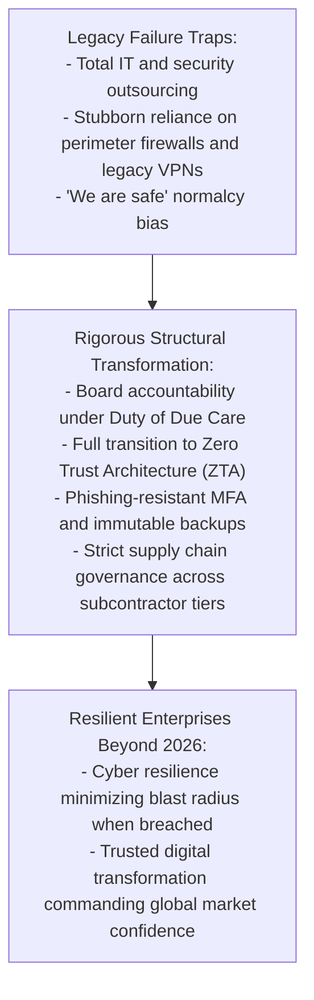

Security is not an impedance to operational velocity; it is **the high-performance braking system** that enables an enterprise to corner at maximum speed. Only organizations equipped with unyielding cyber defenses can aggressively innovate and lead in the global digital economy.

Just as engineering discipline once forged world-class industrial excellence, Japanese enterprises must now embrace a resolute commitment: **never betray the trust of customers, employees, or society**. By executing profound architectural renewal and corporate governance reform, organizations will not only survive the cyber tempest of 2026, but thrive as resilient leaders of the digital age.
