## Prólogo: La clarinada de alerta de 2026 —— La crisis nacional de Japón como «país rezagado en ciberseguridad»

Desde mediados de la década de 2020 hasta el presente año 2026, el ciberespacio japonés se ha visto sacudido por una tormenta de ferocidad sin precedentes.

En el pasado, la industria japonesa se cobijaba bajo un infundado «mito de la seguridad absoluta». Argumentos complacientes como: «Nuestra empresa no es un gigante global, así que nadie nos atacará», «La barrera lingüística del idioma japonés actúa como un baluarte natural frente al ciberdelito internacional» o «Contratamos el antivirus de un gran proveedor de seguridad, así que estamos a salvo» flotaban en el ambiente empresarial. Hoy en día, todas esas dulces ilusiones han quedado reducidas a cenizas.

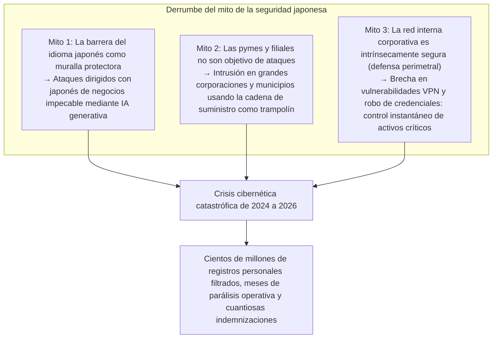

La realidad es abrumadoramente implacable. Desde colosos del entretenimiento, megabancos, gigantes de las telecomunicaciones y consorcios de infraestructura básica, hasta los sistemas administrativos de gobiernos locales y ayuntamientos, organizaciones emblemáticas se han rendido sucesivamente ante el chantaje del ransomware (secuestro de datos extorsivo) o han visto cómo decenas de millones de registros de datos confidenciales eran arrojados a los rincones más oscuros de la Dark Web.

Los datos expuestos van mucho más allá de nombres, domicilios o números de teléfono convencionales. Registros de tarjetas de crédito, historiales médicos y revisiones de salud, identificadores del sistema My Number, contratos comerciales ultrasecretos, transcripciones de chats internos corporativos y copias escaneadas de licencias de conducir de los empleados —información crítica que compromete la reputación social y la dignidad fundamental de las personas— han sido tomados como rehenes y subastados al mejor postor por sindicatos internacionales del cibercrimen.

Cada vez que estalla un incidente, la escena se repite de manera ritual: salas de conferencias de prensa donde los miembros de la junta directiva se inclinan profundamente en señal de reverencia de disculpa, repitiendo declaraciones estereotipadas como «las causas aún se encuentran bajo investigación» o «reforzaremos la capacitación de concienciación en seguridad para todos nuestros empleados».

Sin embargo, es imperativo formular una pregunta ineludible: **¿Por qué las fugas de información y los ciberincidentes devastadores continúan sin freno en las empresas japonesas, a pesar de que realizan colosales inversiones en TI y organizan capacitaciones anuales de seguridad?**

La causa fundamental no radica en el error insignificante de un empleado que «hizo clic en un enlace sospechoso de un correo electrónico». Se trata de una quiebra estructural inevitable, originada por la combinación letal de **«la patología estructural de la delegación absoluta de TI y la subcontratación en múltiples niveles»** desatendida durante décadas, **«la fe ciega en un modelo caduco de defensa perimetral (el castillo y el foso)»**, **«el debilitamiento de las plataformas de identidad y autenticación»** en el proceso de migración a la nube, y **«la flagrante deficiencia de gobernanza corporativa en cúpulas directivas que consideran la ciberseguridad como un costo prescindible en lugar de una inversión estratégica»**.

El presente libro blanco ha sido concebido desde la óptica de un CISO (Director de Seguridad de la Información) de élite y analista estratégico de ciberamenazas. Su objetivo es diseccionar técnicamente los principales incidentes que estremecieron a Japón entre 2024 y 2026, poner al descubierto la verdadera naturaleza de la patología que corroe a las organizaciones del país y brindar un compendio definitivo y pragmático para la supervivencia corporativa: desde **la implementación integral de la Arquitectura Zero Trust (ZTA)** bajo la premisa de la brecha asumida (Assume Breach), el control estricto de la cadena de suministro, la obligatoriedad de MFA resistente al phishing y la resiliencia operativa garantizada por copias de seguridad inmutables.

---

## Capítulo 1: Anatomía de los principales incidentes en corporaciones japonesas (2024–2026)

Para comprender la magnitud tangible de la crisis que encaran las organizaciones en Japón, es indispensable examinar la cadena de ataque (Kill Chain) de los incidentes más emblemáticos con rigor técnico y factual.

### 1.1 Lecciones del incidente de KADOKAWA y Niconico: La aniquilación del centro de datos y el ransomware BlackSuit

El ataque cibernético perpetrado en junio de 2024 contra el conglomerado editorial y mediático KADOKAWA y su filial digital Dwango representó el punto de inflexión más dramático en los anales de la ciberseguridad corporativa japonesa.

La ofensiva fue conducida por el grupo de ransomware **«BlackSuit»**, señalado en los círculos de inteligencia de amenazas como el heredero directo de la temida organización cibercriminal Conti. Como consecuencia directa de este ataque, la plataforma insignia de transmisión de video en línea de Japón, *Niconico Douga*, junto con una miríada de servicios web corporativos, quedó completamente inaccesible. La parálisis se propagó a los sistemas logísticos editoriales, contables y administrativos centrales durante varios meses. Además, más de 250.000 documentos confidenciales que abarcaban datos personales de empleados, creadores de contenido asociados y contratos legales privados fueron exfiltrados y publicados en la Dark Web.

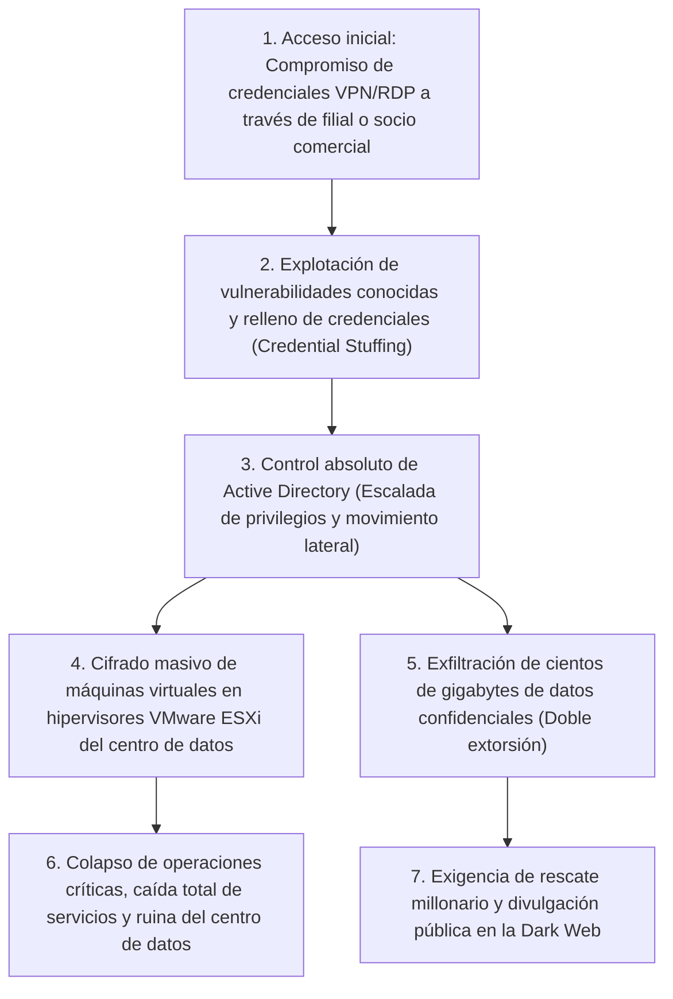

El choque más profundo que este incidente asestó a la comunidad tecnológica japonesa radicó en que **«la nube privada local (la infraestructura física de virtualización) fue destruida desde sus cimientos»**.

Los atacantes no penetraron a través de la red central de la sede corporativa de forma frontal. Su punto de entrada fue el entorno de acceso remoto (dispositivos VPN y protocolos RDP) de una empresa asociada y un proveedor de servicios externos. Una vez que ganaron una cabeza de playa en el perímetro interno, los intrusos explotaron la naturaleza «plana» (carente de segmentación interna) de la red para desplegar un agresivo movimiento lateral (Lateral Movement). El objetivo culminante fue **la captura de privilegios de Administrador de Dominio (Domain Admin) en el controlador de Active Directory**, el auténtico cerebro de la infraestructura empresarial.

Al apoderarse de la soberanía del dominio corporativo, BlackSuit no se limitó a infectar los servidores de aplicaciones individuales; accedió directamente a los hipervisores VMware ESXi que alojaban los clústeres virtuales de la compañía y procedió al cifrado ultrarrápido y masivo de los archivos de imagen de disco virtual (archivos VMDK) contenidos en los almacenes de datos (datastores). Como remate devastador, **las copias de seguridad conectadas en línea fueron localizadas, corrompidas y borradas deliberadamente por los atacantes**.

Este trágico suceso demostró a los comités ejecutivos de todo el país la defunción inapelable del modelo de defensa perimetral: si un atacante logra poner un pie dentro de la red corporativa, incluso el centro de datos más colosal del país puede ser aniquilado de un solo golpe.

### 1.2 El caso de LINE Yahoo y la infraestructura común de NAVER: Quiebra de la gobernanza sobre contratistas transfronterizos

El incidente de filtración masiva de datos personales en LINE Yahoo —descubierto en el otoño de 2023 y que provocó directivas administrativas y requerimientos extraordinarios por parte del Ministerio de Asuntos Internos y Comunicaciones (MIC) entre 2024 y 2026— puso al descubierto **«el grave punto ciego de gobernanza derivado de complejas relaciones de capital y contratos de desarrollo transfronterizos»**.

En este incidente se comprometieron aproximadamente 510.000 registros pertenecientes a usuarios, socios comerciales y trabajadores. La chispa que desató la catástrofe se localizó en el entorno en la nube de la corporación surcoreana NAVER, entidad matriz histórica de LINE.

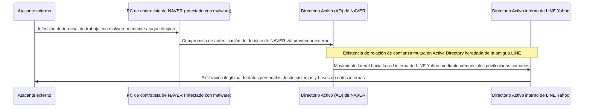

El nudo gordiano técnico de esta crisis radicó en que **«entre la antigua LINE y NAVER se mantenía activa y desatendida una infraestructura de autenticación compartida de Active Directory, junto con una relación de confianza mutua sin restricciones»**.

A partir de la infección con malware del ordenador de un proveedor externo subcontratado por NAVER en Corea del Sur, los atacantes penetraron en la red corporativa de dicha empresa. Desde allí, abusando de la «relación de confianza transfronteriza del directorio de autenticación», navegaron sin toparse con ninguna barrera adicional de contención hacia las bases de datos y sistemas neurálgicos de LINE Yahoo en Japón.

Este caso abrió los ojos a la industria sobre el peligro latente de las estrategias de «externalización global offshore» y «división transnacional del trabajo». **Conectar y confiar ciegamente en redes e identidades basándose únicamente en que \'se trata de una empresa del mismo grupo\' o \'es nuestra matriz\' acarrea un riesgo existencial descomunal**. El hecho de que el gobierno japonés interviniera exigiendo la revisión de los vínculos de capital y la desconexión física total de las plataformas de autenticación compartidas evidenció que la gobernanza de la cadena de suministro se ha convertido en una cuestión de soberanía y seguridad nacional.

### 1.3 El colapso en cadena del suministro en administraciones locales y BPO (Caso Iseto y otros)

A partir de 2024, un estado de alarma cundió entre decenas de gobiernos locales, entidades bancarias y compañías de servicios públicos en Japón tras el devastador **ataque de ransomware contra grandes contratistas de BPO (Externalización de Procesos de Negocio) e imprentas comerciales especializadas (como Iseto y similares)**.

Los ayuntamientos y prefecturas subcontratan habitualmente, a través de licitaciones públicas, la impresión, ensobrado y franqueo masivo de documentos confidenciales: notificaciones de tributos municipales, tarjetas del seguro de salud, liquidaciones de pensiones e información del censo electoral. Estas operaciones conllevan la transferencia masiva de bases de datos que contienen nombres, direcciones postales, identificadores My Number, niveles de ingresos y retenciones fiscales de millones de ciudadanos.

Los ciberdelincuentes no intentaron asaltar de frente las redes centrales gubernamentales (protegidas por la estricta arquitectura de \'tres capas\' y la red LGWAN). En su lugar, enfocaron sus baterías contra el objetivo más vulnerable: **la infraestructura informática de las empresas contratistas de servicios que procesaban dichos datos**.

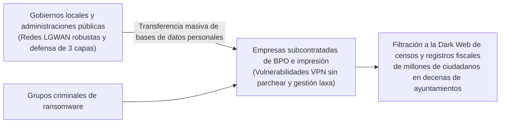

Al ser alcanzadas por el ransomware las redes de estas imprentas y centros BPO, no solo quedaron secuestrados los datos operacionales de la empresa, sino que la información fiscal y demográfica de millones de ciudadanos custodiada en sus servidores fue cifrada y volcada a la Dark Web para su extorsión pública.

La lección que este episodio dejó grabada a fuego es que **«por muchos cientos de millones de yenes que un organismo gaste en blindar sus sistemas principales, si el nivel de seguridad de sus proveedores subcontratados es deficiente, la cadena de suministro se desmoronará en un parpadeo»**. La práctica habitual de considerar que la seguridad estaba resuelta simplemente firmando cláusulas genéricas de confidencialidad en un contrato en papel quedó desenmascarada de la manera más dolorosa.

### 1.4 Configuraciones erróneas en la nube (Salesforce/AWS/Azure): La tragedia de cajas fuertes abiertas expuestas al mundo

Las intrusiones complejas no son la única causa de desastre. A lo largo de la década de 2020 y hasta 2026, una proporción abrumadora de incidentes de fuga de datos en Japón sigue teniendo como origen **«las malas configuraciones en servicios de nube pública (Cloud Misconfigurations)»**.

Un caso recurrente en prestigiosas casas de bolsa, aseguradoras, comercios electrónicos y ministerios nipones ha sido la **exposición masiva de datos de clientes alojados en la plataforma CRM Salesforce**.

Salesforce ofrece capacidades de «sitios comunitarios» para interacción pública o con socios. Sin embargo, a causa de la falta de comprensión de las reglas de compartición de datos (Sharing Rules) y de errores humanos en la asignación de permisos a usuarios invitados (Guest Users), listas enteras de clientes con nombres, teléfonos, saldos de cuentas y números de pólizas **quedaron configuradas de modo que cualquier internauta podía consultarlas, buscarlas y descargarlas sin requerir ninguna clase de autenticación**.

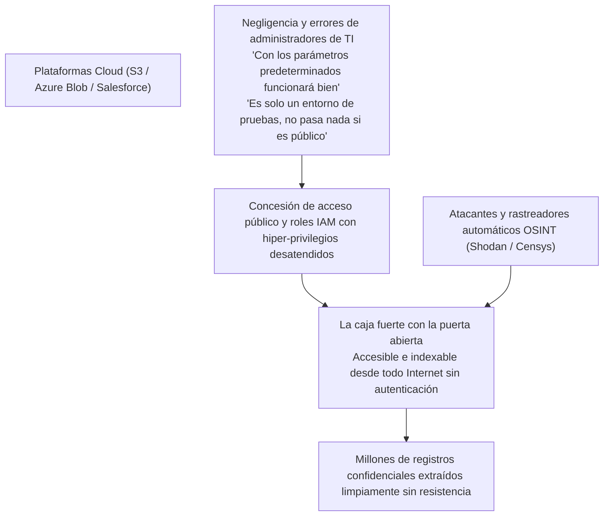

Patrones idénticos se repiten cotidianamente con cubos S3 de Amazon Web Services (AWS) con acceso de lectura universal descontrolado, cuentas de almacenamiento de Microsoft Azure mal configuradas, o ingenieros que suben inadvertidamente claves de acceso API y secretos de infraestructura a repositorios públicos de GitHub.

Sin requerir complejas vulnerabilidades de día cero, la triste realidad de la nube corporativa en Japón era que **las organizaciones abrían las puertas de sus propias cajas de caudales y las exhibían al planeta entero**.

---

## Capítulo 2: Disección de las causas profundas I —— Patologías estructurales y organizativas (Delegación pasiva de TI y subcontratación en cascada)

¿Por qué razón, ante riesgos tan evidentes, las organizaciones de Japón son incapaces de prevenir estos desastres? En este segundo capítulo analizamos las patologías culturales y estructurales del ecosistema corporativo nipón.

### 2.1 La indiferencia directiva que ve a TI como «centro de costos» y la reducción del CISO a una figura meramente decorativa

La vulnerabilidad más crítica en la ciberdefensa de una empresa japonesa no se encuentra en las reglas de su firewall, sino en **«la sala de la junta directiva»**.

En las corporaciones globales de Occidente, las tecnologías de la información y la ciberseguridad se consideran motores estratégicos del negocio y asuntos prioritarios de máxima jerarquía. El Director de Seguridad de la Información (CISO) reporta directamente al CEO, maneja presupuestos robustos y posee poder de veto (Veto Power) con autoridad para ordenar la desconexión o suspensión inmediata de cualquier sistema si el riesgo cibernético supera los umbrales tolerables, por encima de las conveniencias comerciales.

En marcado contraste, en la inmensa mayoría de corporaciones japonesas, los departamentos de TI han sido históricamente marginados y tratados como meros «centros de costos administrativos que no producen ingresos».
- Es excepcional encontrar directores con experiencia técnica o criterio de ciberseguridad en los consejos de administración. Lo habitual es que el cargo de CISO sea una responsabilidad secundaria asignada a un ejecutivo senior de perfil humanístico a punto de jubilarse, acumulada a sus tareas de Asuntos Generales o Legales.
- Cuando los especialistas de ciberseguridad en primera línea alertan sobre la necesidad urgente de reemplazar una pasarela VPN obsoleta que presenta graves vulnerabilidades —lo cual exige una inversión de decenas de millones de yenes y una ventana de mantenimiento que detenga temporalmente las operaciones—, la cúpula rechaza la solicitud alegando: «Este trimestre los márgenes son estrechos, pospónganlo al siguiente año fiscal» o «Es inconcebible interrumpir los flujos de trabajo diarios».

En tales circunstancias, el CISO en Japón se ha convertido en **«un chivo expiatorio (Scapegoat) desprovisto de presupuesto y poder decisorio, cuyo único papel consiste en inclinarse ante las cámaras de televisión cuando sobreviene el escándalo»**. Esta negligencia directiva, que concibe la seguridad informática como un costo que se debe recortar hasta el último yen en lugar de una inversión de capital indispensable para la preservación del valor corporativo, constituye el auténtico origen de la crisis nacional.

### 2.2 El eslabón más débil originado por la estructura de subcontratación y cascada de delegaciones

El rasgo estructural más enquistado de la industria tecnológica en Japón es su **«estructura de subcontratación en cascada (el modelo de contratistas generales de TI)»**, calcada del sector de la construcción tradicional.

Las empresas usuarias (clientes contratantes) eligen delegar en bloque («marunage») el diseño, desarrollo, operación y mantenimiento de la seguridad a un gran integrador de sistemas primario (Prime SIer). Dicho integrador rara vez ejecuta las tareas operativas con personal propio; en su lugar, retiene un alto margen de intermediación y subcontrata las tareas a empresas secundarias, las cuales a su vez delegan en terceras, cuartas o quintas capas integradas por pequeñas compañías informáticas o trabajadores autónomos.

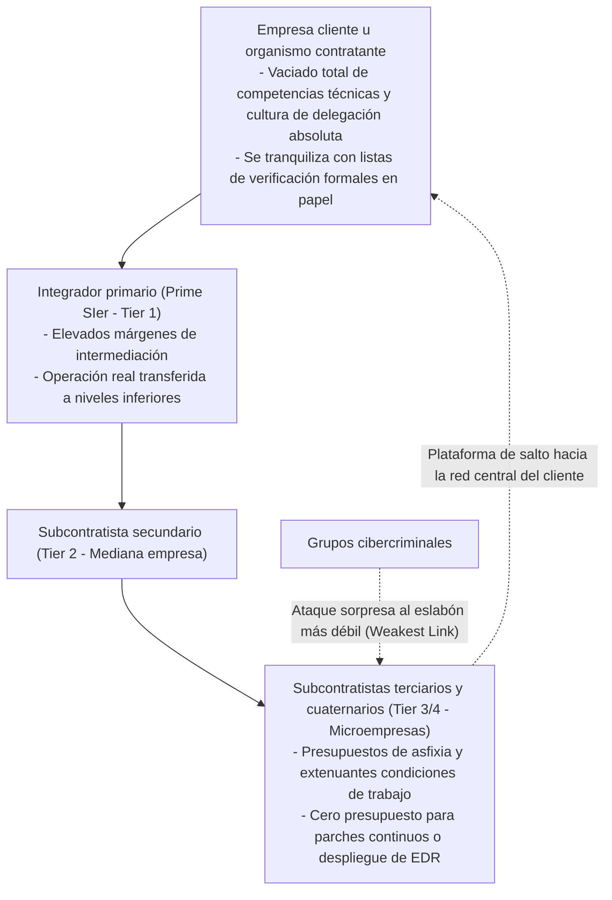

Tanto en la teoría criptográfica como en la ingeniería de confiabilidad rige un principio inquebrantable: **«Una cadena es tan fuerte como su eslabón más débil (The Weakest Link)»**.

Por muy sofisticados que sean los cortafuegos de última generación del integrador primario o por muy estrictas que figuren sus políticas corporativas sobre el papel, las pequeñas empresas ubicadas en el tercer o cuarto escalón de la subcontratación carecen de los recursos financieros mínimos para licenciar herramientas EDR (Endpoint Detection and Response) modernas o contratar un servicio de vigilancia de SOC (Security Operations Center) 24/7.
- En esas microempresas terminales proliferan estaciones de trabajo con versiones obsoletas de Windows sin soporte o portátiles personales de los trabajadores (BYOD), donde las contraseñas administrativas se anotan en notas adhesivas pegadas a las pantallas.
- Y lo más alarmante: para permitirles desempeñar sus tareas operativas, se conceden a esos ordenadores personales cuentas con privilegios de acceso remoto directo a los servidores de producción y bases de datos del cliente principal.

Para un atacante moderno, no existe objetivo más sencillo. No hay ninguna necesidad de desgastarse atacando la fortaleza principal. Basta con infectar una máquina vulnerable de una subcontrata en el extremo de la cadena, cosechar sus credenciales legítimas y acceder al corazón de la red del cliente matriz **«caminando tranquilamente por la puerta de servicio con la apariencia de un usuario autorizado»**.

### 2.3 Los límites del modelo de empleo tradicional japonés y la escasez estructural de talento técnico

La dimensión del capital humano refleja un desgaste igualmente profundo.

Los informes del Ministerio de Economía, Comercio e Industria (METI) y de la Agencia de Promoción de Tecnologías de la Información (IPA) llevan años advirtiendo de un déficit de cientos de miles de profesionales de ciberseguridad en Japón. No obstante, el problema medular no es demográfico, sino institucional: **la incapacidad del sistema de empleo tradicional japonés para retribuir, valorar e integrar perfiles técnicos de alta cualificación**.

En economías líderes como Estados Unidos, Israel o Singapur, los arquitectos de seguridad defensiva, ingenieros de ingeniería inversa o evaluadores de intrusión (hackers éticos) de primer nivel perciben salarios que oscilan habitualmente entre los 150.000 y más de 300.000 dólares anuales, siendo respetados como activos estratégicos de élite.

En contraste, en las corporaciones tradicionales japonesas regidas por la antigüedad y el empleo vitalicio, los ingenieros informáticos ocupan los peldaños inferiores de la escala salarial respecto a los graduados administrativos:
- Las tablas salariales son uniformes y rígidas; un joven talento con destrezas excepcionales en mitigación de amenazas percibe exactamente el mismo sueldo modesto que sus coetáneos en tareas burocráticas rutinarias.
- El único sendero de promoción interna es convertirse en «Kacho» o «Bucho» (gerente general de gestión de personal). Si un ingeniero desea ascender salarialmente, debe abandonar los teclados, dejar de analizar paquetes de red y dedicar sus jornadas a gestionar presupuestos y redactar informes en Excel.

Como consecuencia directa, el talento técnico más prometedor emigra de manera masiva hacia corporaciones multinacionales extranjeras o startups tecnológicas de vanguardia. Las áreas de TI de las grandes firmas tradicionales quedan completamente vacías de ingenieros capaces de detectar, analizar e interceptar una amenaza en tiempo real, transformándose en meros «mensajeros» que se limitan a reenviar correos entre la directiva y los proveedores subcontratados. Este vaciamiento cognitivo imposibilita cualquier respuesta eficaz ante incidentes, permitiendo que una intrusión menor se convierta en una hecatombe corporativa.

---

## Capítulo 3: Disección de las causas profundas II —— Colapso tecnológico (La caída de la defensa perimetral y la trampa de Active Directory)

Sumada a la degradación organizativa, la infraestructura tecnológica sobre la que operan las empresas japonesas arrastra una obsolescencia arquitectónica letal que los atacantes aprovechan sistemáticamente.

### 3.1 La cruda realidad de las puertas traseras: Dispositivos VPN y escritorios remotos

Con la irrupción súbita del teletrabajo durante la pandemia de COVID-19, las empresas niponas se apresuraron a desplegar soluciones improvisadas. La opción predilecta fue instalar dispositivos concentradores de SSL-VPN (como Fortinet FortiGate, Pulse Secure / Ivanti Connect Secure, entre otros) en el perímetro de sus redes para habilitar túneles cifrados desde los hogares de los empleados.

Esta decisión se transformó en **la mayor herida mortal y puerta trasera de la ciberseguridad japonesa**.

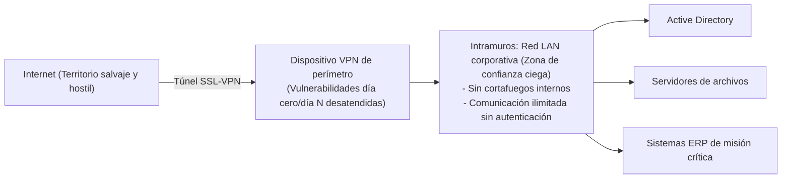

Un concentrador VPN es un muro físico expuesto directamente a las inclemencias de Internet. Naturalmente, los grupos de ransomware y las amenazas persistentes avanzadas (APT) patrocinadas por Estados vigilan obsesivamente cada fallo en sus cerraduras.
- Entre 2023 y 2026 se divulgaron sucesivas vulnerabilidades críticas (con puntuaciones CVSS de 9.0 a 10.0) que permitían la ejecución remota de código y la evasión de autenticación en los equipos líderes de Ivanti y Fortinet.
- A pesar de que los fabricantes emitían parches de urgencia, cientos de organizaciones japonesas postergaron su aplicación durante meses aduciendo que «no se podía reiniciar el equipo en días laborables» o que «podría haber incompatibilidades operativas».

Mediante motores de búsqueda de activos en línea como Shodan o Censys, los atacantes rastrean automáticamente estos dispositivos desprotegidos. Explotando estas fallas para volcar la memoria RAM del concentrador VPN, logran sustraer credenciales de usuario, contraseñas y tokens de sesión en cuestión de segundos, **ingresando a las redes corporativas como si fueran empleados legítimos**.

### 3.2 El colapso total del mito de confianza en la red corporativa (Modelo perimetral)

Una vez traspasada la frontera de la VPN, la doctrina que sella la destrucción de la organización es el caduco **«modelo de defensa perimetral (el esquema de murallas y fosos medievales)»**.

Bajo esta filosofía se asume el axioma ilusorio de que «el exterior (Internet) es inherentemente malévolo y peligroso, pero todo lo que resida dentro de los muros de la red corporativa (la LAN interna) es seguro, benevolente y digno de confianza incondicional».

Por consiguiente, las redes internas corporativas se diseñaron bajo esquemas alarmantemente **«planos»**:
- Cualquier estación de trabajo conectada a la red puede establecer comunicación con todos los demás ordenadores, impresoras, servidores de archivos y sistemas contables situados en el mismo segmento o subredes adyacentes, sin requerir reautenticación alguna ni cifrado interno.
- Los paquetes que transitan dentro de la red corporativa no son inspeccionados por cortafuegos internos ni sistemas de prevención de intrusiones.

La analogía es transparente: un castillo con gigantescas murallas exteriores que carece por completo de cerraduras en su interior. **Si un infiltrado cruza la puerta principal, puede saquear la armería, la tesorería y las dependencias reales sin hallar un solo obstáculo**. El modelo perimetral es incapaz de contener el movimiento lateral (Lateral Movement) mediante el cual un intruso explora la red desde un único equipo comprometido hasta infectar toda la empresa.

### 3.3 La hipertrofia de Active Directory (AD) y la quiebra de la gestión de identidades privilegiadas

En los ecosistemas empresariales de Windows, el talón de Aquiles neurálgico y el trofeo codiciado por todo atacante es **Microsoft Active Directory (AD)**.

Más del 90% de las corporaciones niponas confían en Active Directory para centralizar usuarios, ordenadores, privilegios de acceso y directivas de seguridad (GPO). Sin embargo, su estado operativo suele ser deplorable:
- Bosques y dominios de AD creados hace dos décadas han sufrido mutaciones desordenadas, convirtiéndose en gigantescas cajas negras inescrutables.
- Miles de cuentas huérfanas de antiguos empleados, cuentas de servicio vinculadas a aplicaciones dadas de baja hace años y accesos temporales jamás revocados conviven en el directorio.
- Lo más peligroso: **la proliferación y reutilización de privilegios de Administrador de Dominio (Domain Admin)**. Por comodidad técnica, contratas externas y personal de soporte local configuran rutinariamente derechos de administración global en ordenadores ordinarios o comparten contraseñas maestras idénticas en decenas de servidores.

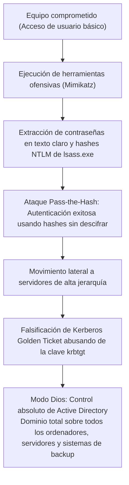

Los ciberdelincuentes despliegan herramientas como `Mimikatz` en las máquinas comprometidas, extrayendo en segundos los hashes NTLM o tickets Kerberos almacenados en la memoria del proceso del subsistema de autoridad de seguridad local (`lsass.exe`).

Ni siquiera necesitan descifrar las contraseñas originales. Utilizando técnicas de **«Pass-the-Hash»** o falsificando credenciales maestras mediante la técnica del **«Golden Ticket»** (tras comprometer la cuenta `krbtgt`), el atacante asume el rol de Administrador de Dominio. En ese instante se transforma en el soberano indiscutible de toda la infraestructura informática. Bastará con desplegar un script mediante Directivas de Grupo (GPO) para ordenar la distribución y ejecución sincronizada del ransomware en miles de equipos en pocos minutos.

### 3.4 Las sombras de la migración a la nube: Shadow IT y roles IAM con privilegios excesivos

El proceso desordenado de adopción de nubes públicas como AWS, Azure y Google Cloud ha detonado nuevas vulnerabilidades críticas:

1. **Shadow IT y entornos de nube descontrolados**:
   Equipos de desarrollo o áreas de negocio que, desesperados ante la lentitud burocrática del departamento central de sistemas, contratan plataformas cloud o servicios SaaS por su cuenta usando tarjetas de crédito corporativas. Estos entornos quedan completamente al margen de la supervisión de seguridad, carecen de monitoreo y exponen datos a Internet por defecto.
2. **Roles IAM con privilegios desmedidos (Over-Privileged IAM)**:
   Al configurar el control de accesos (IAM), los administradores violan flagrantemente el principio de mínimo privilegio (Principle of Least Privilege). Para evitar incidencias operativas, asignan indistintamente políticas globales como `AdministratorAccess` a aplicaciones y funciones serverless.
   Una vulnerabilidad menor de inyección SQL o una falla de falsificación de peticiones del lado del servidor (SSRF) en una aplicación web basta para que los atacantes roben las credenciales temporales del rol IAM asociado, conquistando el control de todos los recursos y bases de datos del entorno en la nube corporativo.

---

## Capítulo 4: Disección de las causas profundas III —— Vulnerabilidad humana y la sofisticación de los vectores de ataque modernos

En conjunción con las deficiencias tecnológicas y de gestión, la explotación de la psicología humana ha experimentado una aceleración exponencial gracias al advenimiento de la Inteligencia Artificial Generativa.

### 4.1 Spear phishing dirigido y deepfakes en la era de la IA generativa

Históricamente, los correos de phishing se delataban por un japonés artificioso: caracteres incorrectos, partículas gramaticales incongruentes y fórmulas de cortesía traducidas toscamente por herramientas mecánicas, lo que permitía a un receptor perspicaz advertir el engaño.

Con la masificación de los **Modelos de Lenguaje de Gran Escala (LLM)**, esa salvaguarda ha desaparecido por completo.

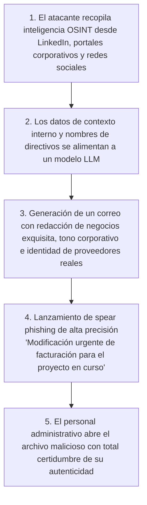

Los ciberatacantes extraen organigramas, nombres de ejecutivos y proyectos en marcha desde LinkedIn, comunicados de prensa y perfiles de redes sociales. Alimentando esa información a la IA generativa, diseñan correos de phishing dirigidos redactados en **un japonés de negocios pulcro, formal y perfectamente adaptado a las convenciones de la organización**.

A esto se suman los ataques impulsados por **deepfakes multimedia (clonación vocal e hiperrealismo de video)**:
- Ya se han documentado estafas multimillonarias en filiales de corporaciones multinacionales donde directores financieros recibieron llamadas telefónicas en las que la voz de su CEO era clonada a la perfección por una IA, ordenándoles transferir con urgencia fondos millonarios a cuentas secretas bajo pretexto de adquisiciones corporativas confidenciales.
- Pretender contrarrestar este nivel de sofisticación psicológica con charlas que apelan a que «el empleado esté más atento» raya en la negligencia.

### 4.2 Secuestro de sesiones e Infostealers: La neutralización del MFA tradicional

Gran parte del esfuerzo invertido por las empresas niponas en adoptar la autenticación de doble factor (2FA / MFA) ha quedado en jaque frente al vertiginoso ascenso del **malware de robo de información (Infostealers)**.

Familias de malware como RedLine, Raccoon y Lumma se propagan mediante programas piratas, software troyanizado o campañas de phishing dirigidas hacia empleados y colaboradores externos.

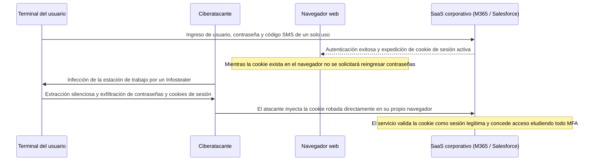

El cometido prioritario de un Infostealer no es destruir o cifrar datos, sino saquear las bases de datos SQLite de los navegadores web (Chrome, Edge) para **extraer las contraseñas almacenadas y, de modo crítico, las cookies de sesión autenticadas**.

Cuando un usuario supera el inicio de sesión con su contraseña y su segundo factor (SMS o aplicación de autenticación), el servidor web emite una cookie de sesión que queda alojada en el equipo local. Al robar esta cookie e importarla en su propio navegador (Cookie Hijacking), **el atacante accede a los sistemas corporativos instantáneamente como si fuera el usuario legítimo, sin necesidad de teclear contraseñas ni de validar ningún código MFA**.

En los mercados de la Dark Web se comercializan actualmente lotes de millones de cookies válidas pertenecientes a empresas japonesas por precios irrisorios, lo que permite a delincuentes de todo el mundo penetrar en redes corporativas con la alfombra roja desplegada.

### 4.3 Amenazas internas (Fraude interno): Fuga de datos por empleados dimisionarios y personal subcontratado

Las ciberamenazas no provienen exclusivamente del exterior. Los informes de la Asociación de Seguridad de Redes de Japón (JNSA) revelan que un porcentaje considerable de las fugas de información más destructivas son causadas por **«la sustracción ilícita de datos por parte de actores internos (empleados activos, personal en proceso de renuncia y colaboradores subcontratados)»**.

- **La erosión del empleo de por vida y la fuga de información estratégica**:
  En un mercado laboral japonés donde la rotación laboral se ha normalizado, ingenieros y comerciales que cambian de empresa consideran de forma errónea que sus creaciones laborales les pertenecen, descargando carteras de clientes, código fuente y planos confidenciales en memorias USB o servicios personales en la nube (Google Drive, Dropbox) antes de su partida.
- **Corrupción y extorsión sobre personal externo privilegiado**:
  Técnicos subcontratados de terceras capas que administran bases de datos y atraviesan situaciones de precariedad económica han sustraído y vendido cientos de miles de registros de clientes a corredores ilegales de datos y organizaciones criminales.

La mayoría de las compañías japonesas operan bajo una anacrónica «presunción de bondad inherente (Seizensetsu)», careciendo de plataformas DLP (Prevención de Fuga de Datos) o UEBA (Analítica de Comportamiento de Usuarios y Entidades) que detecten en tiempo real descargas anómalas de información confidencial. Con frecuencia, la filtración solo se descubre años después, a raíz de una investigación penal o del lanzamiento de un producto idéntico por parte de un competidor.

---

## Capítulo 5: Hoja de ruta para la transición integral a la Arquitectura Zero Trust (ZTA)

Frente a este ecosistema de amenazas devastadoras, la única vía de supervivencia para las organizaciones japonesas radica en abandonar definitivamente la vetusta defensa perimetral y abrazar la **«Arquitectura Zero Trust (Zero Trust Architecture: ZTA)»**.

### 5.1 La esencia de Zero Trust: «Never Trust, Always Verify»

Zero Trust no es un producto que se adquiere en una caja, sino un **«cambio radical de paradigma en el sistema operativo mental de la seguridad corporativa»**, formalizado por el Instituto Nacional de Estándares y Tecnología de los Estados Unidos en la publicación especial **NIST SP 800-207**.

> **Principios Fundamentales de Zero Trust**:
> 1. **Nunca confíes, verifica siempre (Never Trust, Always Verify)**:
>    Ninguna conexión, dispositivo o identidad debe considerarse segura por defecto, sin importar si proviene de la sala de juntas o de una red externa. Cada solicitud de acceso debe ser evaluada como hostil y verificada rigurosamente.
> 2. **Conceder el mínimo privilegio necesario (Grant Least Privilege Access)**:
>    Se deben otorgar exclusivamente los permisos mínimos indispensables para la tarea específica que el usuario debe ejecutar, y solo durante el intervalo de tiempo estrictamente requerido (Just-In-Time).
> 3. **Asumir la brecha de seguridad (Assume Breach)**:
>    Diseñar la seguridad bajo la premisa indiscutible de que el atacante ya ha penetrado y opera dentro de la red corporativa, priorizando la compartimentación de activos (reducción del radio de impacto) y la detección y aislamiento automáticos.

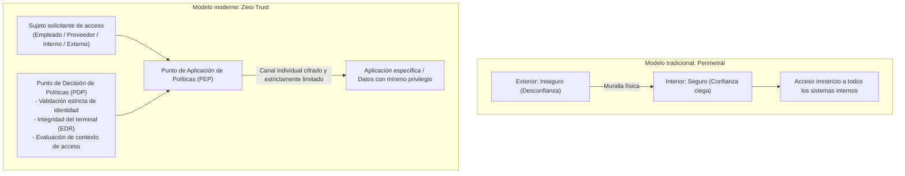

### 5.2 Erradicación total de VPN y sustitución por ZTNA (Zero Trust Network Access)

El primer imperativo estratégico de la transformación Zero Trust es **«el desmantelamiento total de los concentradores VPN»** y su reemplazo por **«ZTNA (Zero Trust Network Access)»**.

La diferencia conceptual y técnica entre ambos esquemas es radical:
- **VPN convencional**: Al autenticarse, el equipo del usuario se acopla físicamente a la subred corporativa completa a nivel de capa de red (Capa 3). Esto permite que la máquina se comunique con cualquier servidor interno, de modo que si el dispositivo aloja malware, este se propagará sin barreras.
- **ZTNA**: El terminal nunca se conecta a la red corporativa. Un agente de enlace en la nube actúa como intermediario seguro, verificando de forma continua la identidad y la salud del dispositivo para **«establecer un túnel exclusivo y cifrado hacia una aplicación web o servicio específico»**. Desde la perspectiva del dispositivo, la topología interna y las direcciones IP corporativas permanecen invisibles, haciendo imposible el movimiento lateral.

### 5.3 Arquitectura convergente SASE (Secure Access Service Edge) y SSE

La consagración práctica de este modelo converge en el marco de **«SASE (Secure Access Service Edge)»**, acuñado por Gartner, y su subsistema de seguridad consolidado, **«SSE (Security Service Edge)»**.

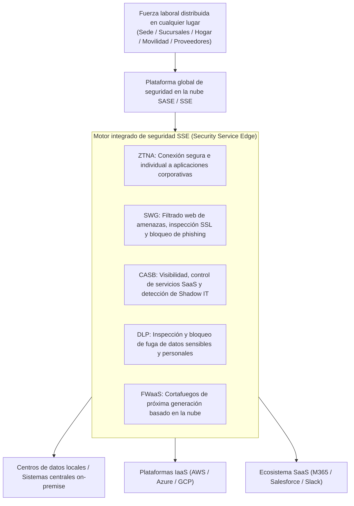

Bajo la arquitectura SASE, el tráfico de cualquier colaborador —independientemente de que opere desde la sede corporativa, su domicilio o una planta subcontratada en el extranjero— converge en nodos cloud hiperdistribuidos:
- **SWG (Secure Web Gateway)** neutraliza dominios maliciosos e intercepta descargas maliciosas inspeccionando el tráfico cifrado TLS.
- **CASB (Cloud Access Security Broker)** fiscaliza la interacción con servicios SaaS e intercepta transferencias de archivos no autorizadas.
- **DLP (Data Loss Prevention)** identifica y frena en tránsito cualquier patrón numérico de tarjetas de crédito o información protegida.
- **ZTNA** canaliza de manera aislada los accesos a los sistemas corporativos on-premise y entornos cloud.

Este enfoque permite suprimir los costosos y vulnerables enrutadores VPN por sede, unificando la postura de seguridad bajo una única consola global.

### 5.4 Aislamiento físico del movimiento lateral mediante microsegmentación

Dado que la infección de un dispositivo nunca puede descartarse al 100%, el escudo definitivo para mitigar el daño es la **«Microsegmentación (Micro-Segmentation)»**.

Esta técnica extingue la tradicional división de redes en amplias VLAN por pisos o plantas y despliega barreras de filtrado a nivel granular: **«servidor por servidor, máquina virtual por máquina virtual, y contenedor por contenedor»**.

- Por ejemplo, el clúster contable únicamente atenderá peticiones originadas desde los puertos criptográficos autorizados de las máquinas verificadas del área financiera, descartando cualquier tráfico proveniente de estaciones de trabajo operativas o de desarrollo (incluidos paquetes ping).
- Entre servidores que conviven en el mismo bastidor o segmento se bloquea todo tráfico este-oeste que no haya sido homologado explícitamente en la matriz de servicios autorizados.

Si un equipo es víctima de ransomware, las persianas de acero de la microsegmentación descienden de inmediato, **encapsulando la infección dentro del dispositivo afectado y salvaguardando el resto de la empresa de cualquier contaminación colateral**.

---

## Capítulo 6: Fortificación de la infraestructura de identidad y autenticación (IAM/PAM)

En la era Zero Trust, la nueva frontera de contención no son los cables de fibra ni los conmutadores de red: es **«la Identidad (Identity and Access Management)»**. Desaparecido el perímetro tradicional, la identidad es el eje gravitacional de todo control de seguridad.

### 6.1 Obligatoriedad absoluta de MFA resistente al phishing conforme a FIDO2 / Passkeys

El primer paso no negociable es desterrar de manera fulminante los métodos de autenticación de doble factor obsoletos: códigos SMS, confirmaciones por correo o notificaciones push simples en el smartphone (vulnerables a la fatiga de alertas y al consentimiento involuntario).

Dado que herramientas de proxy inverso como Evilginx o los infostealers interceptan fácilmente contraseñas y códigos SMS efímeros, la única respuesta invulnerable es **el despliegue mandatorio de MFA resistente al phishing basado en los estándares FIDO2 / WebAuthn (Passkeys)**.

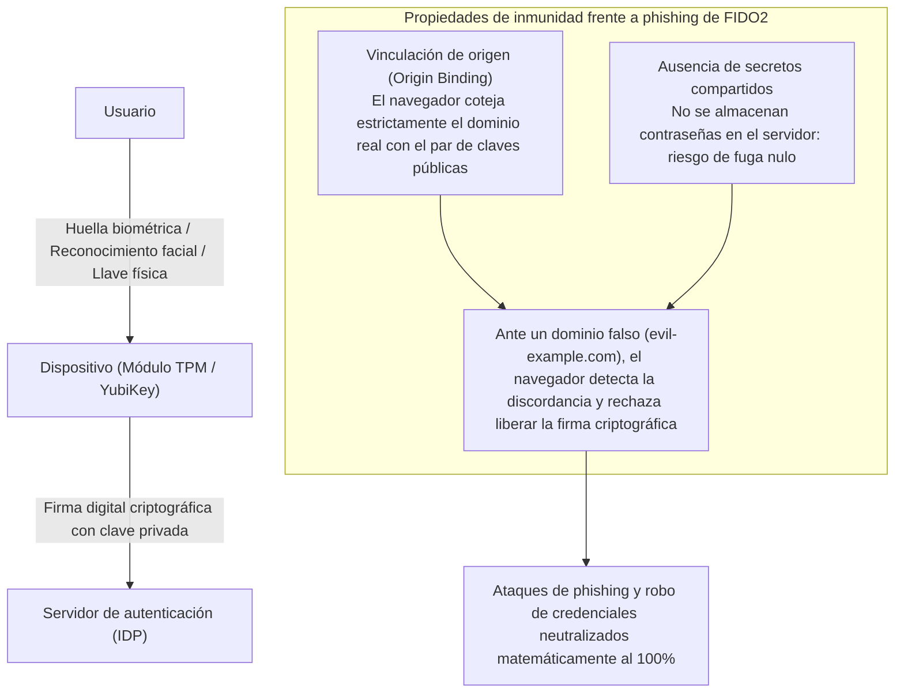

La invulnerabilidad criptográfica de FIDO2 descansa en la **«vinculación al origen (Origin Binding)»**.
Si un trabajador es engañado por un correo y accede a un portal idéntico visualmente al sitio corporativo pero alojado en un dominio malicioso, el navegador coteja el FQDN y, al advertir la discordancia con la clave registrada, se niega categóricamente a expedir la firma digital generada por el chip TPM o la llave física YubiKey.

Bajo este modelo, la sustracción de credenciales se torna matemáticamente imposible. Las organizaciones deben imponer esta directiva de inmediato, comenzando obligatoriamente por administradores de sistemas y custodios de datos confidenciales.

### 6.2 Modelo de niveles (Tiering) en Active Directory y acceso Just-In-Time (JIT)

Para las infraestructuras que continúan operando Active Directory local, la metodología indiscutible para neutralizar el colapso de identidades privilegiadas es el **«Modelo de Niveles (Tiering Architecture)»** promovido por Microsoft.

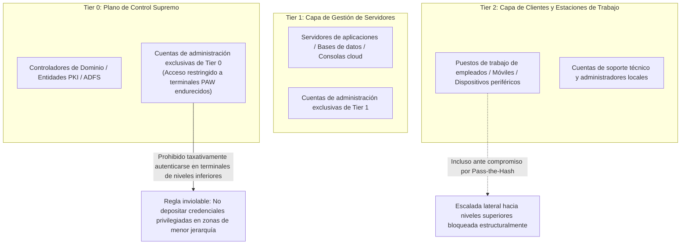

La regla cardinal del modelo Tiering dicta que **«un identificador con privilegios de un nivel jerárquico superior jamás debe iniciar sesión ni dejar rastro de credenciales en un equipo de nivel inferior»**:
- **Tier 0 (Cúspide de Dominio)**: Administradores de Dominio. Solo operan contra los controladores de dominio e infraestructuras de identidad, aislados por completo de servidores ordinarios o PCs de empleados. Las gestiones deben efectuarse exclusivamente desde Estaciones de Trabajo de Acceso Privilegiado (PAW: Privileged Access Workstations), equipos físicamente blindados e impermeabilizados de Internet.
- **Tier 1 (Servidores de Negocio)**: Gestión exclusiva de servidores corporativos.
- **Tier 2 (Puestos de Usuario)**: Gestión de clientes finales y puestos departamentales.

Asimismo, es imprescindible erradicar los privilegios permanentes (Standing Privileges) e instaurar **«Acceso Just-In-Time (JIT)»**. Los administradores operan de forma rutinaria como usuarios rasos; únicamente ante labores de mantenimiento extraordinarias solicitan una elevación de privilegios efímera mediante flujos de aprobación, la cual expira automáticamente a las pocas horas.

### 6.3 Evaluación dinámica de políticas con Acceso Condicional

La autenticación corporativa no puede limitarse a un acto estático que valida el acceso una única vez en el instante del login. En Zero Trust, la autorización es un proceso continuo que evalúa en tiempo real **múltiples variables contextuales durante la totalidad de la sesión**.

Soluciones como Microsoft Entra ID Conditional Access u Okta ejecutan una ponderación continua de señales de telemetría:
1. **Identidad del sujeto y pertenencia a grupos**.
2. **Ubicación geográfica e IPs de origen**:
   - Bloqueo instantáneo ante escenarios de \'viaje imposible\' (Impossible Travel), como accesos simultáneos desde Tokio y Europa con minutos de diferencia.
3. **Postura de seguridad del endpoint**:
   - Comprobación de que el agente EDR corporativo esté activo, el disco cifrado con BitLocker y las actualizaciones de parches del sistema operativo al día.
4. **Puntuación de riesgo comportamental**:
   - Detección de descargas masivas inusuales o peticiones en horarios atípicos, disparando la solicitud inmediata de un re-desafío biométrico o la revocación inmediata del token de sesión.

Si un solo criterio de seguridad es vulnerado, el acceso se interrumpe al instante sin importar que la contraseña sea correcta.

---

## Capítulo 7: Modelo de control de seguridad para la cadena de suministro y proveedores externos

De nada sirve que una organización blinde sus muros si la puerta de servicio de sus proveedores y contratistas permanece vulnerable. ¿Cómo gobernar a los actores externos?

### 7.1 Visibilidad integral de proveedores y evaluación efectiva de la seguridad

La medida inaugural debe ser **«el inventario exhaustivo y mapeo fidedigno de la cadena de suministro»**.

La mayoría de las grandes corporaciones solo interactúan formalmente con sus contratistas directos (Tier 1), ignorando por completo qué microempresas de segundo o tercer nivel manejan sus sistemas confidenciales.
- Se debe estipular contractualmente la prohibición terminante de subcontrataciones sucesivas no autorizadas.
- Se deben desterrar los autodiagnósticos basados en cuestionarios de papel rellenados una vez al año por cortesía burocrática.
- Se impone la adopción de plataformas continuas de evaluación de ciberriesgo de terceros (Security Rating Services como BitSight o SecurityScorecard), monitoreando de forma automatizada y objetiva la exposición externa, certificados caducados, puertos abiertos y fugas de credenciales de los proveedores.

### 7.2 Prohibición terminante de BYOD para contratistas y despliegue de VDI Zero Trust

La medida más contundente para frenar la fuga de información provocada por contratas y teletrabajadores es consolidar una arquitectura donde **«los dispositivos de proveedores no almacenen físicamente ni un solo byte de datos»**.

El uso de ordenadores personales o equipos no gestionados (BYOD) por parte de contratistas externos debe vetarse de forma irrevocable en el acceso a recursos centrales.

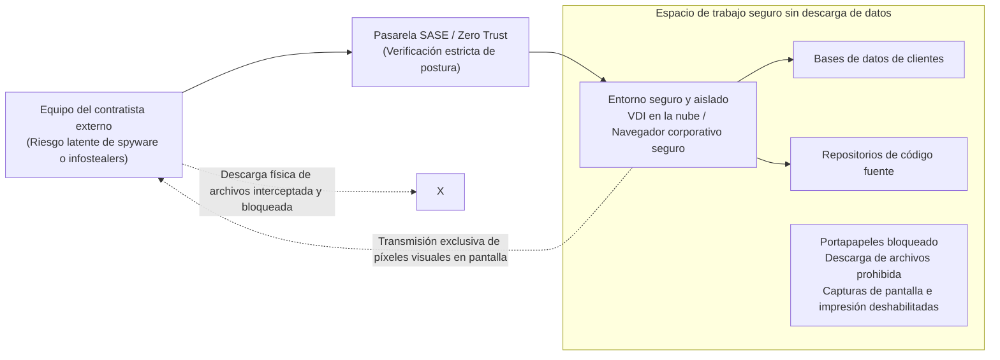

Toda labor de soporte, desarrollo o administración encomendada a terceros debe canalizarse a través de **entornos virtuales VDI en la nube (DaaS) bajo premisas Zero Trust** o navegadores corporativos securizados:
- Las funciones de descarga a discos locales, copiado y pegado en el portapapeles, capturas de pantalla e impresión deben deshabilitarse a nivel de sistema operativo.
- El terminal del proveedor solo recibe los píxeles de renderizado en pantalla. Si su máquina está contaminada por infostealers, estos no podrán cosechar tokens de sesión corporativos ni volcar archivos de datos.

### 7.3 SBOM (Lista de materiales de software) y principio de mínimo privilegio en integraciones API

En el ámbito del desarrollo de software encomendado a fábricas externas, otro foco de riesgo reside en las librerías de código abierto desactualizadas (como la histórica crisis de Apache Log4j o versiones vulnerables de frameworks comunes).

Las organizaciones deben exigir a las factorías de software la entrega obligatoria de un **SBOM (Software Bill of Materials: Lista de Materiales de Software)** con cada versión entregada. Este inventario digital automatizado permite contrastar las dependencias de código con bases de datos de vulnerabilidades conocidas (CVE) e intervenir en minutos cuando surge un fallo crítico en el mercado.

Del mismo modo, las interconexiones API con sistemas de colaboradores deben restringirse rigurosamente mediante el estándar OAuth 2.0, aplicando ámbitos de mínimo privilegio y tiempos de expiración reducidos (TTL cortos) para las claves de acceso programáticas.

---

## Capítulo 8: Ciberresiliencia inquebrantable frente al ransomware y la destrucción de datos

Bajo el postulado central de Zero Trust de «Asumir la Brecha (Assume Breach)», el último bastión de defensa reside en la **«Ciberresiliencia: la capacidad de restablecer la continuidad operativa ante una catástrofe consumada»**.

Detener al 100% de los adversarios más avanzados con recursos estatales es una utopía. La verdadera métrica del éxito radica en cuán velozmente es capaz una organización de resurgir tras el impacto.

### 8.1 La regla de copia de seguridad 3-2-1-1-0 y el almacenamiento inmutable

En las ofensivas de ransomware modernas (como BlackSuit, LockBit o Akira), el blanco primario de los intrusos no es el cifrado de las bases de datos de negocio: **es la localización y aniquilación de las copias de seguridad**. Si los respaldos son funcionales, la extorsión carece de poder coercitivo.

Los viejos procedimientos de volcado nocturno a discos en red conectados al dominio corporativo son inútiles. Si el almacenamiento de backup está integrado en Active Directory, el atacante que obtiene privilegios de administrador de dominio lo borra en cuestión de segundos.

El estándar ineludible para la supervivencia es la **regla de respaldo 3-2-1-1-0**:

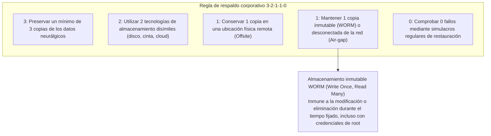

El pilar decisivo de este esquema es el **«Almacenamiento Inmutable (Immutable Backup)»**.
Haciendo uso de mecanismos **WORM (Write Once, Read Many)** y funcionalidades como S3 Object Lock en proveedores cloud o consolas especializadas (Veeam, Rubrik, Cohesity), las copias quedan bloqueadas a nivel de hardware y API. Durante el periodo de retención programado (por ejemplo, 30 días), **ningún operador, ningún administrador de sistemas, ni ningún ciberdelincuente con las credenciales maestras puede borrar, sobrescribir o alterar dichos bloques de información**.

Aunque el centro de datos principal sea asolado y todas las máquinas virtuales queden cifradas, los respaldos inmutables permanecen intactos, facultando a la dirección corporativa para rechazar tajantemente cualquier chantaje y restablecer la operatividad en un plazo predecible.

### 8.2 Segregación de un dominio de autenticación dedicado e independiente para copias de seguridad

Como regla arquitectónica sagrada, **el plano de control de las copias de seguridad debe escindirse de manera absoluta del Active Directory general de la empresa**.

- Los servidores de respaldo deben autenticarse mediante un proveedor de identidad local completamente desvinculado, protegido obligatoriamente por MFA físico propio.
- Las estaciones de gestión autorizadas para interactuar con la infraestructura de backup deben ubicarse en una red cerrada y fuera de banda, inaccesible desde la LAN corporativa o Internet.

Solo materializando este divorcio de identidades se erradica el riesgo de que la caída de los controladores de dominio arrastre consigo la pérdida irreparable del repositorio de salvaguarda.

### 8.3 Aislamiento instantáneo con EDR/XDR y operaciones SOC 24/7/365

En la carrera contrarreloj que se libra desde el momento en que se produce una intrusión hasta la detonación del malware, las métricas vitales son el **MTTD (Tiempo Medio de Detección: Mean Time to Detect)** y el **MTTR (Tiempo Medio de Respuesta: Mean Time to Respond)**.

A diferencia del antivirus tradicional (EPP) que dependía de firmas estáticas, los sistemas modernos de **EDR (Endpoint Detection and Response)** y **XDR (Extended Detection and Response)** analizan en tiempo real los patrones de comportamiento de los procesos en ejecución.
- Si detectan una anomalía crítica —como un proceso legítimo de PowerShell intentando volcar la memoria de `lsass.exe` o una ráfaga anómala de renombrado de archivos a altas horas de la madrugada—, disparan alertas en milisegundos.
- Inmediatamente, la solución EDR ejecuta de forma autónoma o asistida **el aislamiento lógico del equipo a nivel del controlador NDIS del sistema operativo**, cortando todas las comunicaciones de red de la máquina contaminada y truncando el movimiento lateral antes de que el adversario reaccione.

Dado que los atacantes seleccionan meticulosamente momentos de baja guardia —las madrugadas de los fines de semana o los periodos festivos de Año Nuevo y la Golden Week—, los centros de monitoreo que operan solo en horario comercial son inservibles. La cobertura ininterrumpida de **un SOC gestionado (MDR) operativo 24 horas al día, 365 días al año**, dotado de potestades para ejecutar aislamientos automáticos de emergencia, constituye un requisito indispensable para la supervivencia de cualquier entidad.

---

## Capítulo 9: Reforma de gobernanza impulsada por la alta dirección y el marco regulatorio

El fortalecimiento de la ciberseguridad jamás podrá culminarse únicamente con el esfuerzo heroico de los equipos técnicos de TI. Representa un compromiso corporativo de primer orden, indivisible de las obligaciones legales del consejo de administración y de la estrategia corporativa integral.

### 9.1 Endurecimiento de la Ley de Protección de Datos Personales (APPI) y riesgos de sanciones e indemnizaciones

En sintonía con las regulaciones internacionales más rigurosas como el GDPR europeo, el ordenamiento jurídico japonés ha intensificado sustancialmente sus sanciones.

Tras las enmiendas a la **Ley de Protección de Información Personal (APPI)**, ante cualquier brecha que involucre un volumen significativo de datos o información altamente sensible, **la notificación perentoria a la Comisión de Protección de Información Personal (PPC) y la comunicación formal a los afectados es una obligación legal estricta**.
- Las sanciones corporativas para personas jurídicas infractoras se elevaron hasta los 100 millones de yenes.
- A esto se añade el tsunami de demandas colectivas interpuestas por clientes o accionistas, y el abono de compensaciones directas a los afectados, que pueden generar pasivos de miles de millones de yenes en incidentes que comprometen a millones de personas.

Asimismo, normativas recientes como la Ley para la Protección y Utilización de Información Crítica de Seguridad Económica de 2024 y los nuevos marcos legislativos gubernamentales de ciberseguridad nacional imponen auditorías estatales y estándares estrictos de homologación para operadores de infraestructuras críticas y sus cadenas de aprovisionamiento. Una fuga de datos no es una simple contingencia técnica: es una crisis financiera y jurídica que amenaza la viabilidad de la compañía.

### 9.2 El deber fiduciario de diligencia del Directorio: La seguridad informática como responsabilidad ejecutiva indelegable

En virtud de la Ley de Sociedades de Japón, los consejeros y directores tienen contraído un **«Deber Fiduciario de Diligencia de un Buen Administrador (Zenkan Chūi Gimu)»**.

La jurisprudencia y las directrices corporativas emanadas del Ministerio de Economía, Comercio e Industria (METI) y la IPA han establecido con meridiana claridad que los miembros de la junta directiva que descuiden la supervisión de las medidas de ciberseguridad, dando pie a filtraciones masivas de datos o a la interrupción de servicios esenciales, **pueden ser demandados directamente por los accionistas a través de juicios de responsabilidad societaria (Shareholder Derivative Suits), respondiendo civilmente con su patrimonio personal por daños y perjuicios**.

Ningún consejero delegado puede escudarse ya ante los tribunales en el pretexto de que «los temas tecnológicos se habían delegado íntegramente en los mandos intermedios de TI». Es responsabilidad indelegable del consejo de administración evaluar periódicamente el perfil de ciberriesgo de la corporación, auditar la suficiencia presupuestaria de los controles de protección y garantizar la solidez de los planes de contingencia para la continuidad del negocio.

### 9.3 Concesión de autoridad ejecutiva real al CISO y redefinición del ROI en ciberseguridad

La pieza culminante para articular una gobernanza efectiva es **la investidura del CISO con autoridad real y ejecutiva**.

Las organizaciones deben acometer de inmediato las siguientes transformaciones institucionales:
1. **Promover la figura del CISO al rango de Director Ejecutivo o Miembro de la Junta Directiva**:
   Establecer una línea de reporte directo e independiente hacia el CEO y el consejo de administración, operando de igual a igual con el CIO en lugar de figurar como un subordinado dependiente de la dirección de sistemas.
2. **Conceder al CISO poder vinculante de veto y autoridad para ordenar paradas técnicas de emergencia**:
   El CISO debe disponer de facultades estatutarias para frenar el lanzamiento de sistemas que incumplan las directrices de seguridad, cancelar acuerdos con proveedores de riesgo y, ante la sospecha fundada de una intrusión en curso, ordenar la desconexión cautelar de sistemas críticos para frenar la exfiltración de activos.
3. **Redefinir el Retorno de la Inversión (ROI) en ciberdefensa**:
   El gasto en seguridad no puede evaluarse con la estrecha métrica de los rendimientos a corto plazo. Debe entenderse como una **póliza de seguro existencial que previene pérdidas multimillonarias derivadas de meses de inactividad operativa y la ruina de la confianza pública**, constituyendo la verdadera «licencia para operar (License to Operate)» en la economía digital moderna.

---

## Conclusión: Más allá de la desesperanza —— La resolución inquebrantable que las corporaciones japonesas deben asumir para sobrevivir a partir de 2026

Al adentrarnos en 2026, el anhelo nostálgico de regresar a un entorno cibernético pacífico es una quimera imposible. Ciberfuerzas estatales operan en la sombra de los conflictos geopolíticos, sindicatos criminales transnacionales automatizan sus ataques con inteligencia artificial y millones de credenciales corporativas se subastan diariamente. El asedio es total.

No obstante, no hay lugar para el derrotismo.

La crisis que sacude a las corporaciones de Japón no es una catástrofe natural imprevisible e ingobernable. Es, en su raíz, **un desastre causado por decisiones humanas erróneas**: la comodidad de la delegación absoluta, la irresponsabilidad en la cascada de subcontrataciones, la fe ingenua en la red interna y la indolencia de cúpulas directivas ciegas a la realidad tecnológica. Y dado que se trata de un problema creado por el ser humano, la inteligencia, el coraje y la determinación humana son plenamente capaces de superarlo.

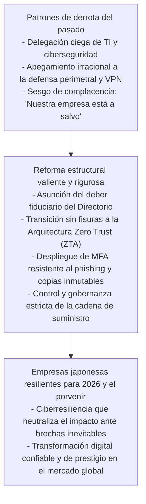

La ciberseguridad no es un obstáculo que entorpece la agilidad del negocio. En un ecosistema digital convulso, representa **«el sistema de frenos de más alto rendimiento de un automóvil de carreras»**. Solo los vehículos dotados de los mejores frenos pueden correr a velocidades de vértigo y sortear las curvas más peligrosas sin estrellarse.

Del mismo modo en que la industria japonesa construyó su prestigio mundial forjando productos manufacturados con un estándar de calidad implacable, hoy las organizaciones de Japón deben abrazar la máxima inquebrantable de **«jamás traicionar la confianza de sus clientes, de sus trabajadores y de la sociedad»**. Acometiendo la modernización de sus arquitecturas y la refundación de su gobernanza, las empresas que asuman este compromiso sobrevivirán a los turbulentos años venideros y liderarán con orgullo y solvencia el futuro de la economía digital global.
