## Introduction : Le signal d'alarme de 2026 — La crise nationale du Japon face à son retard en cybersécurité

Du milieu des années 2020 jusqu'en ce début d'année 2026, le cyberespace japonais subit une tempête d'une violence sans précédent.

Pendant des décennies, l'industrie japonaise s'est bercée d'un « mythe sécuritaire » totalement infondé. Des croyances tenaces telles que : *« Nous ne sommes pas un titan mondial, nous ne serons donc pas pris pour cible »*, *« La barrière linguistique du japonais constitue une forteresse naturelle contre les attaques »*, ou encore *« Nous avons installé l'antivirus d'un grand éditeur, nous sommes donc à l'abri »* — ces douces illusions sont aujourd'hui pulvérisées.

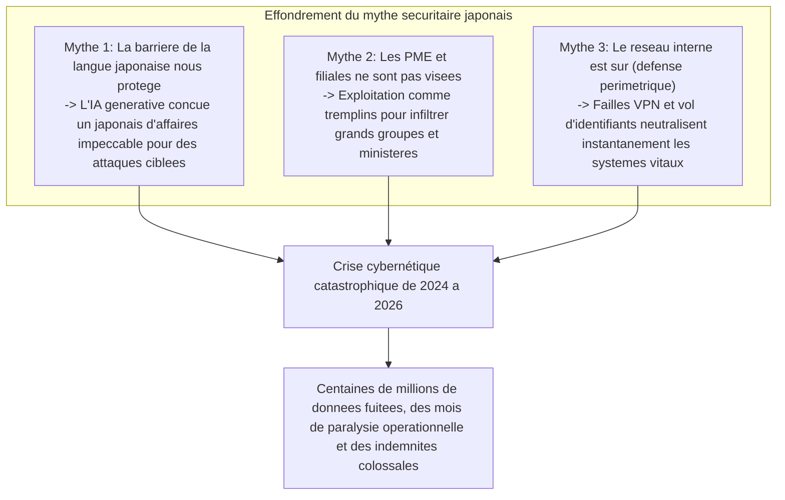

La réalité est d'une cruauté implacable. Géants du divertissement, mégabanques, opérateurs de télécommunications, gestionnaires d'infrastructures critiques et systèmes administratifs municipaux : les organisations les plus prestigieuses ont successivement capitulé devant les cartels de ransomware ou ont vu des dizaines de millions de dossiers de données personnelles sensibles déversés sur le dark web.

Les données compromises dépassent largement les simples coordonnées comme le nom, l'adresse ou le numéro de téléphone. Numéros de cartes bancaires, bilans médicaux, identifiants nationaux « My Number », contrats commerciaux confidentiels, journaux de messagerie interne et scans de permis de conduire d'employés ont été pris en otage et vendus aux enchères par des syndicats cybercriminels internationaux, sapant la confiance et la dignité des personnes.

À chaque nouvel incident, les dirigeants d'entreprise s'alignent lors de conférences de presse pour s'incliner profondément devant les caméras. Des formules d'excuses stéréotypées telles que *« La cause exacte fait l'objet d'une enquête approfondie »* et *« Nous allons renforcer drastiquement la sensibilisation de nos collaborateurs »* sont répétées en boucle.

Mais une question fondamentale s'impose : **Pourquoi, malgré des investissements technologiques massifs et des formations annuelles obligatoires, les fuites de données et les désastres cybernétiques ne cessent-ils pas dans les entreprises japonaises ?**

La cause profonde ne réside pas dans l'erreur insignifiante d'un employé qui aurait « cliqué sur un lien suspect ». Elle résulte d'une faillite systémique que l'industrie a laissé prospérer pendant des décennies : **la pathologie structurelle de l'externalisation intégrale et de la sous-traitance en cascade (le modèle des intégrateurs généraux)**, **une foi aveugle et obsolète dans la défense périmétrique (le modèle du château fort et des douves)**, **la fragilisation des fondations d'identité et d'authentification lors de migrations cloud précipitées**, et **une carence de gouvernance au niveau des conseils d'administration qui continuent de traiter la sécurité comme un centre de coûts plutôt que comme un investissement stratégique**.

Rédigé du point de vue d'un CISO (Chief Information Security Officer) de haut rang et d'analystes de menaces, ce livre blanc dissèque l'anatomie technique des incidents majeurs qui ont secoué le Japon entre 2024 et 2026. Il met en lumière les failles structurelles des entreprises japonaises et présente un système de défense complet, concret et éprouvé : la transition vers une **Architecture Zero Trust (ZTA) fondée sur l'hypothèse de la compromission (Assume Breach)**, **le contrôle strict de la chaîne logistique logicielle et humaine**, **le MFA résistant au phishing** et **la résilience opérationnelle garantie par des sauvegardes immuables**.

---

## Chapitre 1 : Anatomie des incidents majeurs survenus dans les entreprises japonaises (2024–2026)

Pour mesurer l'ampleur de la crise, il convient d'analyser en détail la chaîne d'attaque (Cyber Kill Chain) des incidents les plus emblématiques survenus ces dernières années, à la lumière des faits techniques vérifiables.

### 1.1 Les enseignements de l'affaire KADOKAWA / Niconico : Destruction totale du datacenter par le ransomware BlackSuit

En juin 2024, une cyberattaque massive a frappé de plein fouet le géant des médias et de l'édition KADOKAWA ainsi que sa filiale technologique Dwango. Cet événement constitue le tournant le plus critique de l'histoire de la cybersécurité au Japon.

L'opération a été menée par **BlackSuit**, un syndicat criminel largement considéré comme l'héritier du redoutable cartel Conti. L'attaque a forcé l'arrêt complet de la plateforme de streaming emblématique *Niconico*, paralysant pendant plusieurs mois les chaînes logistiques de distribution de livres, les fonctions comptables et les services métiers fondamentaux. Plus de 250 000 dossiers hautement sensibles — informations personnelles de salariés, créateurs affiliés et contrats internes confidentiels — ont été dérobés et divulgués sur le dark web.

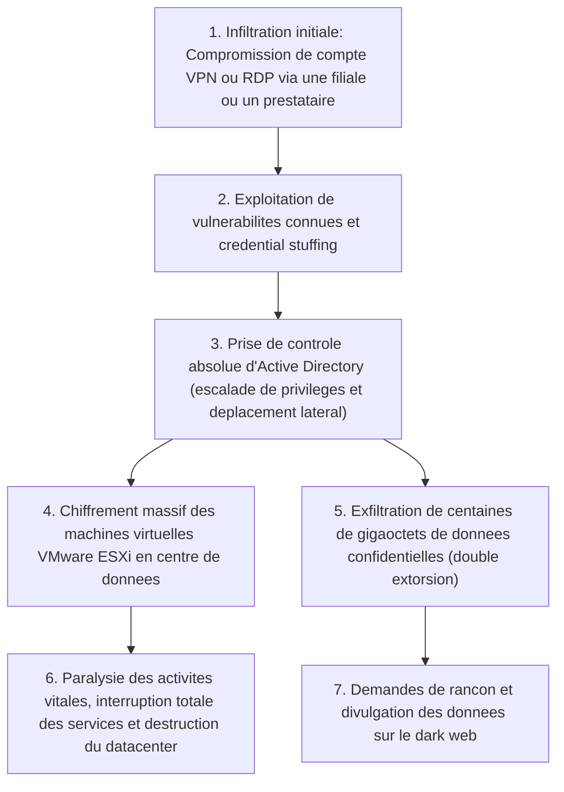

Le séisme provoqué par cette affaire au sein de la communauté technique japonaise découle d'un fait brutal : **l'infrastructure de cloud privé sur site (la plateforme de virtualisation elle-même) a été anéantie à la racine**.

Les attaquants n'ont pas ciblé de front le réseau central du siège social. Ils ont emprunté les accès distants (passerelles VPN ou serveurs RDP) d'une filiale ou d'un prestataire tiers comme tremplin. Une fois introduits au sein du périmètre, ils ont tiré parti d'un réseau interne totalement « plat » (dépourvu de micro-segmentation) pour orchestrer un déplacement latéral fulgurant. Ils ont ainsi conquis le joyau suprême de l'infrastructure d'entreprise : **les droits d'administrateur de domaine au sein d'Active Directory (contrôleurs de domaine)**.

Disposant des pleins pouvoirs sur le domaine, BlackSuit a directement pris pour cible les hyperviseurs VMware ESXi du datacenter, chiffrant à très haute vitesse les images de disques virtuels (.vmdk). Pire encore : **les dépôts de sauvegarde connectés au réseau ont été méthodiquement effacés ou chiffrés**.

Cet événement a démontré de manière irréfutable aux conseils d'administration du pays entier la mort définitive du modèle périmétrique : une fois le périmètre franchi, même le plus grand centre de données d'entreprise peut être anéanti d'un seul coup.

### 1.2 L'affaire LINE Yahoo et l'infrastructure partagée NAVER : Faillite de la gouvernance des prestataires transfrontaliers

Révélée à la fin de l'automne 2023 et ayant conduit le ministère japonais des Affaires intérieures et des Communications (MIC) à prononcer de multiples rappels à l'ordre administratifs historiques entre 2024 et 2026, l'affaire de fuite de données chez LINE Yahoo a mis en exergue **les failles majeures de gouvernance découlant de liens capitalistiques et d'externalisations croisées**.

L'incident, qui a exposé environ 510 000 dossiers personnels d'utilisateurs, partenaires et collaborateurs, a pris sa source dans l'environnement cloud de la firme sud-coréenne NAVER, actionnaire de référence de LINE Yahoo.

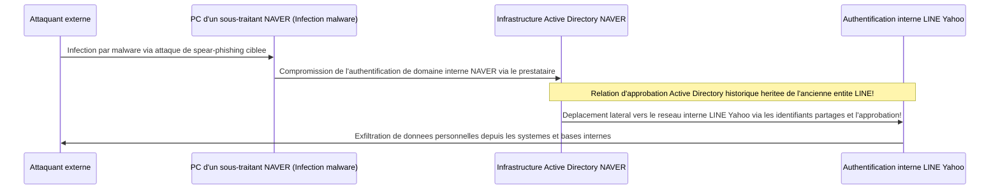

La réalité technique du problème reposait sur **le maintien imprudent d'une infrastructure d'authentification Active Directory partagée et interconnectée sans cloisonnement entre l'ancienne entité LINE et NAVER**.

Lorsqu'un terminal appartenant à un sous-traitant de NAVER a été infecté par un logiciel malveillant, les pirates se sont infiltrés dans le réseau d'entreprise de NAVER. De là, exploitant des relations de confiance transfrontalières non contrôlées, ils ont pénétré sans obstacle supplémentaire au cœur des bases de données internes de LINE Yahoo au Japon.

Ce cas a mis en lumière le danger extrême consistant à accorder une confiance aveugle à des réseaux distants sous prétexte qu'il s'agit d'une « société du groupe » ou de la « maison-mère ». Les injonctions de l'État japonais réclamant la séparation intégrale des annuaires d'authentification prouvent que la gouvernance de la chaîne de valeur et les risques géopolitiques relèvent désormais de la souveraineté économique nationale.

### 1.3 L'effondrement en cascade des municipalités et des sous-traitants BPO (Iseto, etc.)

À partir de 2024, une vague de panique a submergé les municipalités, établissements financiers et régies de services publics du Japon suite aux **attaques par ransomware ayant frappé de grands prestataires d'externalisation de processus métiers (BPO), notamment dans les services d'impression et d'envoi postal (tels qu'Iseto)**.

Les collectivités locales japonaises confient traditionnellement l'impression et l'expédition des avis d'imposition locale, cartes d'assurance santé, notifications de retraite et bulletins électoraux à des prestataires privés de BPO retenus par appels d'offres publics. Ces opérations impliquent la manipulation de données citoyennes ultra-sensibles : identités, adresses postales, numéros d'identification nationale et niveaux de revenus.

Les cybercriminels n'ont pas cherché à franchir de front le réseau administratif hautement protégé des collectivités (le réseau LGWAN et son architecture de défense à trois niveaux). Ils ont choisi de frapper **les réseaux des sous-traitants mandatés**.

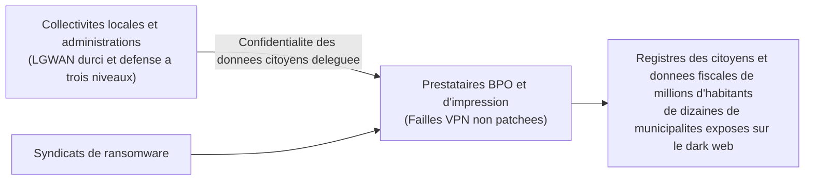

L'infection par ransomware des réseaux de ces sous-traitants a entraîné le chiffrement de leurs systèmes ainsi que l'exfiltration et la vente sur le dark web des données personnelles de millions de résidents issus de dizaines de municipalités à travers le Japon.

Cet incident illustre une loi d'airain de la sécurité : **peu importe que le donneur d'ordre investisse des millions dans une forteresse informatique, si la posture de sécurité d'un sous-traitant est défaillante, l'ensemble de la chaîne s'effondre instantanément**. L'illusion de sécurité entretenue par la simple signature de clauses contractuelles sur papier a volé en éclats.

### 1.4 Les erreurs de configuration cloud (Salesforce, AWS, Azure) : Le coffre-fort laissé ouvert aux yeux du monde

Les attaques sophistiquées par ransomware ne sont pas les seules responsables des fuites massives. Au cours des dernières années, un volume gigantesque de données compromises est imputable à de simples **erreurs de configuration des services cloud (Cloud Misconfigurations)**.

Un cas récurrent au sein des sociétés de courtage, banques, plateformes d'e-commerce et ministères japonais concerne **les fuites de données clients sur la plateforme CRM Salesforce**.

Salesforce propose des fonctionnalités de portail (Experience Cloud) et des accès invités pour interagir avec des usagers externes. En raison d'un mauvais paramétrage des règles de partage (Sharing Rules) et d'un manque de révision des valeurs par défaut, des bases entières de données clients (noms, téléphones, coordonnées bancaires, historiques de transactions) — qui auraient dû être réservées aux gestionnaires internes authentifiés — sont restées **librement consultables et indexables sans la moindre authentification par n'importe quel internaute** pendant de longues périodes.

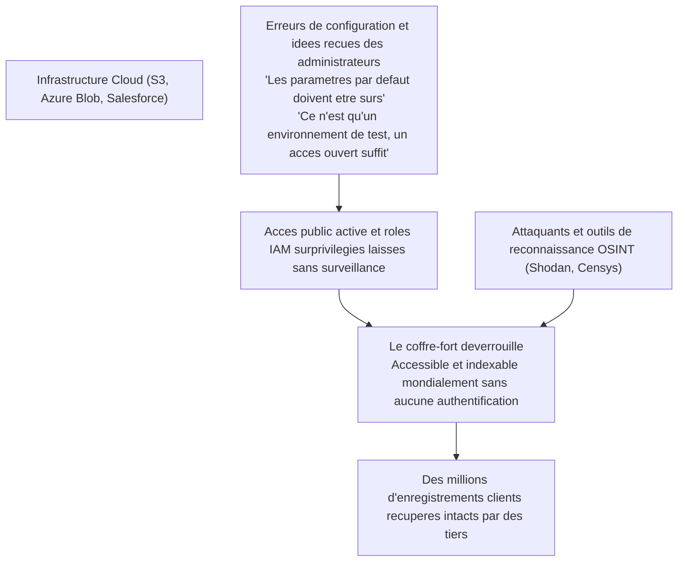

Des drames identiques se répètent régulièrement avec des compartiments Amazon S3 laissés publics, des comptes de stockage Microsoft Azure mal restreints, ou des clés d'accès API publiées par mégarde par des développeurs internes sur des dépôts GitHub publics.

Sans qu'aucun exploit zéro-day n'ait été nécessaire, **les organisations ont ouvert les portes de leur propre coffre-fort et exposé leurs joyaux au monde entier**. Voilà l'amère réalité de nombreuses opérations cloud au Japon.

---

## Chapitre 2 : Analyse des causes profondes ① — Pathologies structurelles et organisationnelles (Externalisation totale et sous-traitance en cascade)

Pourquoi les entreprises japonaises se montrent-elles incapables de prévenir ces défaillances pourtant manifestes ? Le Chapitre 2 examine les dysfonctionnements managériaux et culturels qui sous-tendent ces faillites techniques.

### 2.1 La doctrine de « l'IT comme centre de coûts » et la marginalisation des CISO

La faille la plus critique de la cybersécurité des entreprises japonaises ne réside pas dans la table de routage d'un pare-feu, mais **dans la salle du conseil d'administration**.

Dans les grands groupes occidentaux, l'informatique et la cybersécurité sont considérées comme des moteurs essentiels de compétitivité et des priorités stratégiques au plus haut niveau. Le Chief Information Security Officer (CISO / RSSI) est rattaché directement à la direction générale (CEO) et possède un droit de veto absolu pour ordonner l'interruption d'un système si le risque cyber compromet la survie de l'entreprise.

En contraste frappant, les états-majors japonais ont longtemps relégué la direction informatique au rang de simple fonction support sans valeur ajoutée, un pur centre de coûts :
- La présence d'administrateurs maîtrisant les enjeux technologiques ou cybernétiques au sein des conseils d'administration est rarissime. La fonction de CISO est fréquemment confiée, à titre accessoire, à des cadres non techniques proches de la retraite issus des ressources humaines ou du juridique.
- Lorsqu'un ingénieur sécurité signale qu'une passerelle VPN présente une vulnérabilité critique nécessitant un investissement et une interruption planifiée des services pour maintenance, la direction rejette la demande : *« Les résultats de ce trimestre sont serrés, reportons cela à l'année prochaine »* ou *« Il est hors de question d'interrompre l'activité »*.

Par conséquent, les CISO japonais sont réduits à **des boucs émissaires sans budget ni autorité réelle, dont la seule fonction concrète est de s'incliner lors des conférences de presse en cas de crise**. Considérer la cybersécurité comme une dépense à comprimer au dernier centime plutôt que comme un investissement vital constitue le véritable péché originel de cette crise.

### 2.2 La sous-traitance en cascade : La genèse du maillon le plus faible (Weakest Link)

La pathologie la plus enracinée de l'écosystème technologique japonais réside dans **sa structure de sous-traitance en cascade (le modèle des intégrateurs généraux, calqué sur le secteur du bâtiment)**.

Le donneur d'ordre externalise l'intégralité de la conception, du développement, de l'exploitation et de la maintenance de ses systèmes à de grands intégrateurs principaux (Prime SIers). Ces derniers n'exécutent que très rarement les tâches techniques en interne : ils conservent d'importantes marges de courtage et délèguent le travail à des sous-traitants de rang 2, qui à leur tour répercutent la charge sur des rangs 3, 4 ou 5, composés de TPE ou de développeurs indépendants.

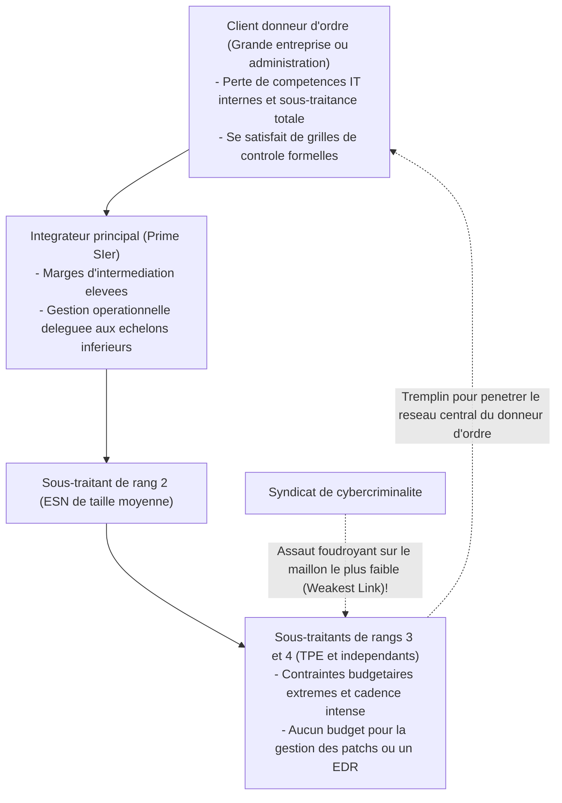

En ingénierie de sécurité, un principe immuable s'impose : **« La résistance d'une chaîne se mesure à celle de son maillon le plus faible. »**

Même si le grand intégrateur déploie des pare-feux de nouvelle génération et des chartes de sécurité exhaustives, les sous-traitants des rangs 3 et 4 n'ont ni les ressources pour acquérir des solutions modernes d'EDR (Endpoint Detection and Response) ni les moyens de souscrire aux services d'un SOC (Security Operations Center) 24/7.
- Sur le terrain, des ordinateurs sous Windows 10 obsolètes ou des machines personnelles non gérées (BYOD) sont utilisés pour la production, avec des mots de passe collés sur des post-it.
- Pire encore : ces postes vulnérables se voient attribuer des identifiants distants hautement privilégiés pour accéder directement aux bases de données centrales du donneur d'ordre afin d'effectuer les tâches de maintenance.

Pour les cyberattaquants, il s'agit d'une cible idéale. Il est inutile de se heurter à la porte blindée de l'intégrateur principal. Il suffit d'infecter un seul poste non sécurisé chez un sous-traitant situé au fin fond de la chaîne pour dérober des accès légitimes et pénétrer au cœur du réseau du client final sous l'apparence d'un utilisateur régulier.

### 2.3 Les limites du modèle d'emploi traditionnel et la pénurie structurelle d'experts cyber

Sur le plan humain, la dégradation est tout aussi manifeste.

Les rapports du ministère de l'Économie, du Commerce et de l'Industrie (METI) et de l'Agence de promotion des technologies de l'information (IPA) dénoncent régulièrement une pénurie de centaines de milliers de professionnels de la cybersécurité au Japon. Pourtant, la véritable cause n'est pas simplement démographique : elle découle de **l'inadaptation du modèle d'emploi japonais traditionnel, incapable d'évaluer et de valoriser les compétences techniques d'élite**.

En Amérique du Nord, en Israël ou à Singapour, les architectes de sécurité, ingénieurs en rétro-ingénierie et testeurs d'intrusion d'élite bénéficient de rémunérations annuelles s'échelonnant de 150 000 à plus de 350 000 euros. Ils sont reconnus comme des remparts indispensables protégeant la valeur même de l'organisation.

À l'inverse, au sein des entreprises japonaises traditionnelles régies par l'ancienneté et l'emploi à vie, les compétences techniques sont dépréciées :
- Les grilles salariales sont rigides et indifférenciées. Quel que soit le génie d'un jeune analyste capable de disséquer des malwares complexes, sa rémunération est calquée sur celle des débutants administratifs ou commerciaux.
- L'unique perspective d'évolution hiérarchique passe par le management généraliste. Les filières d'expertise technique pure sont quasi inexistantes. Pour progresser, un technicien d'exception doit cesser d'analyser du code et se consacrer à la gestion budgétaire et aux rapports bureautiques.

En conséquence, les meilleurs talents fuient vers les multinationales étrangères ou les startups technologiques. Les départements informatiques des entreprises traditionnelles se retrouvent vidés de tout personnel capable d'analyser des journaux d'événements, d'isoler une menace ou de neutraliser une intrusion en cours. Il ne reste que des gestionnaires administratifs relayant les comptes-rendus des prestataires. Cette vacuité technique interne explique pourquoi les premières réactions lors d'un incident sont quasi systématiquement défaillantes, transformant un incident mineur en désastre national.

---

## Chapitre 3 : Analyse des causes profondes ② — Faillite technique (Effondrement du périmètre et pièges d'Active Directory)

Au-delà des carences managériales et organisationnelles, l'obsolescence architecturale des infrastructures informatiques japonaises offre aux cybercriminels une surface d'attaque idéale.

### 3.1 Passerelles VPN et bureaux à distance : la réalité des « portes dérobées »

Lors de la pandémie de COVID-19, les entreprises japonaises ont dû déployer le télétravail dans l'urgence. La grande majorité a opté pour un palliatif de fortune : intercaler des passerelles SSL-VPN (telles que Fortinet FortiGate ou Pulse Secure / Ivanti Connect Secure) à la lisière de leur réseau pour tunneliser directement les postes personnels des salariés vers le réseau interne.

Cette décision s'est transformée en **la plus redoutable porte dérobée** de l'histoire de la cybersécurité japonaise.

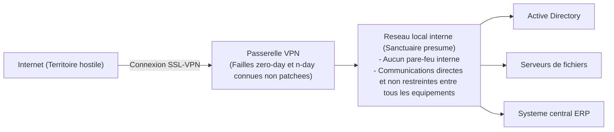

Une passerelle VPN est une porte de forteresse dont l'interface est directement exposée à la jungle d'Internet. Les syndicats du cybercrime et les groupes de menaces persistantes avancées (APT) traquent sans relâche les vulnérabilités de ces équipements.
- Entre 2023 et 2026, des failles d'une gravité exceptionnelle (scores CVSS compris entre 9.0 et 10.0), permettant le contournement d'authentification et l'exécution de code à distance, ont été continuellement révélées et exploitées sur les principales solutions VPN du marché (Ivanti, Fortinet, etc.).
- Fait effarant : même après la publication des correctifs de sécurité par les éditeurs, de nombreuses entreprises japonaises ont différé leur déploiement pendant des mois, voire plus d'un an, invoquant des prétextes futiles : *« Cela perturberait les opérations »* ou *« Il est impossible de redémarrer le boîtier »*.

À l'aide de moteurs d'indexation spécialisés tels que Shodan ou Censys, les attaquants balaient automatiquement le Web pour identifier les boîtiers non corrigés. En exploitant ces failles, ils déversent directement depuis la mémoire de l'équipement les identifiants, mots de passe et jetons de session en clair, **pénétrant au cœur du réseau d'entreprise en quelques minutes sous l'identité d'un collaborateur légitime**.

### 3.2 L'effondrement complet du mythe du réseau interne de confiance (modèle périmétrique)

Une fois le rempart VPN franchi, c'est l'antique **modèle de défense périmétrique (l'approche château et douves)** qui précipite les entreprises vers le désastre.

Ce modèle repose sur un postulat archaïque : *« L'Internet extérieur est dangereux, mais le réseau local interne abrité derrière le pare-feu est un havre d'absolue confiance. »*

Les architectures conçues selon ce dogme sont désespérément **plates** :
- N'importe quel poste connecté au réseau local d'entreprise peut dialoguer sans restriction, sans chiffrement et sans nouvelle authentification avec l'ensemble des serveurs, bases de données, imprimantes et autres postes du même sous-réseau ou de segments voisins.
- Les flux réseau internes ne font l'objet d'aucune inspection approfondie ni d'aucun filtrage comportemental par des pare-feux internes.

Cela revient à ériger de lourds remparts extérieurs autour d'une ville fortifiée, mais **dès lors qu'un espion en franchit la porte, les accès à la salle du trésor, à l'armurerie et aux réserves ne disposent d'aucun verrou, autorisant un pillage en toute impunité**.

Le modèle périmétrique est incapable d'entraver les phases de reconnaissance interne et de déplacement latéral (Lateral Movement) qu'orchestre un pirate depuis un terminal infecté.

### 3.3 L'hypertrophie d'Active Directory et la défaillance de la gestion des privilèges

Au sein des infrastructures d'entreprise sous Windows, la plateforme **Active Directory (AD)** de Microsoft constitue le point de défaillance unique (SPOF) le plus vulnérable et le Saint Graal pour les assaillants.

Plus de 90 % des grandes entreprises japonaises confient à Active Directory la gestion centralisée de leurs parcs d'ordinateurs, comptes d'utilisateurs, droits d'accès et stratégies de sécurité. Pourtant, son administration réelle relève souvent du chaos :
- Des forêts AD créées il y a plus de vingt ans ont enflé au gré d'aménagements désordonnés pour devenir de véritables boîtes noires impossibles à auditer.
- Des milliers de comptes orphelins appartenant à d'anciens collaborateurs, à des serveurs déclassés ou à des tests temporaires subsistent sans jamais être révoqués.
- Plus grave encore : **l'abus banalisé des privilèges d'administrateur de domaine (Domain Admin)**. Pour simplifier les opérations d'assistance, les équipes informatiques et les prestataires externes assignent fréquemment des privilèges d'administration globale à de simples postes bureautiques et partagent des mots de passe génériques entre opérateurs.

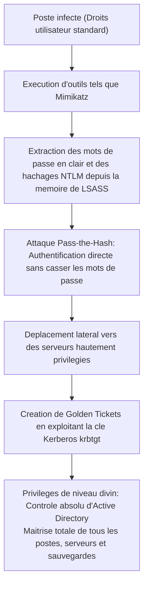

Les cybercriminels contemporains exécutent sur les postes compromis des utilitaires tels que `Mimikatz` pour extraire instantanément les hachages NTLM et les tickets Kerberos logés dans la mémoire du service de sécurité Windows (`lsass.exe`).

Les attaquants n'ont même pas besoin de décrypter les mots de passe. Par la technique du **Pass-the-Hash**, ils réutilisent directement le hachage pour s'authentifier. En dérobant la clé cryptographique du compte Kerberos central (`krbtgt`), ils forgent un **Golden Ticket**, s'octroyant un accès illimité et perpétuel à l'ensemble des ressources du domaine.

Dès lors que cette séquence aboutit, le pirate devient le maître souverain de l'infrastructure d'entreprise. Il ne lui reste plus qu'à utiliser les objets de stratégie de groupe (GPO) pour diffuser le ransomware sur des dizaines de milliers de serveurs et de postes de travail en quelques dizaines de minutes.

### 3.4 Les zones d'ombre de la migration cloud : Shadow IT et rôles IAM surprivilégiés

La transition massive des charges de travail vers des clouds publics comme AWS, Azure ou Google Cloud engendre de nouvelles dérives architecturales critiques :

1. **Le Shadow IT et les environnements cloud sauvages** :
   Irritées par la lenteur des circuits d'approbation internes, les directions métiers ou les équipes de développement souscrivent de leur propre initiative des abonnements cloud ou des SaaS à l'aide de cartes bancaires professionnelles. Échappant à la surveillance de la direction de la sécurité, ces environnements deviennent des nids à vulnérabilités et d'accès publics non maîtrisés.
2. **Les rôles IAM surprivilégiés (Over-Privileged Roles)** :
   Lors du paramétrage des autorisations IAM (Identity and Access Management), le principe du moindre privilège (Principle of Least Privilege) est régulièrement bafoué. Par commodité ou pour éviter tout blocage technique, des droits d'administration totale (`AdministratorAccess`) ou des privilèges génériques (`*.*`) sont attribués à des machines virtuelles ou à des comptes de service.
   Lorsqu'une application Web présente une vulnérabilité d'injection SQL ou de falsification de requête côté serveur (SSRF), la capture de jetons temporaires de métadonnées permet à l'attaquant de s'emparer en un clin d'œil de l'ensemble des bases de données, espaces de stockage et machines du cloud d'entreprise.

---

## Chapitre 4 : Analyse des causes profondes ③ — Vulnérabilités humaines et évolution des modes opératoires

Parallèlement aux faiblesses d'architecture, les méthodes ciblant la psychologie et les réflexes cognitifs humains ont franchi un bond qualitatif décisif avec l'émergence de l'intelligence artificielle générative.

### 4.1 Spear-phishing ciblé et deepfakes à l'ère de l'IA générative

Historiquement, les courriels d'hameçonnage se repéraient à leur formulation hésitante, à des approximations grammaticales ou à des formules de politesse inadaptées qu'un œil averti décelait facilement.

L'exploitation des **grands modèles de langage (LLM)** a réduit cet avantage défensif à néant.

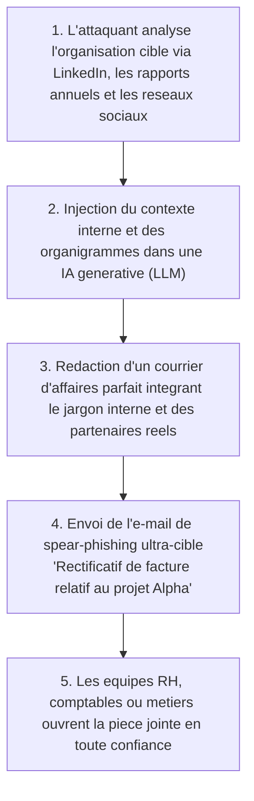

Les campagnes contemporaines d'hameçonnage ciblé (spear-phishing) intègrent dans leurs requêtes IA les communiqués de presse officiels, les organigrammes LinkedIn et l'actualité des projets de l'entreprise. Les e-mails générés adoptent un **japonais d'affaires irréprochable, intégrant les codes rédactionnels internes, le nom de vrais collaborateurs et l'identité de véritables partenaires commerciaux**.

Plus inquiétant encore est l'essor des **deepfakes audio et vidéo** dans l'ingénierie sociale :
- Des entreprises implantées au Japon ont été victimes de scénarios où la voix du directeur général ou du directeur financier a été clonée à la perfection par l'IA. Par téléphone, ces faux dirigeants ont ordonné à des comptables de virer d'urgence plusieurs millions d'euros sur des comptes étrangers au titre d'une acquisition confidentielle.
- Face à des vecteurs qui abusent directement la perception auditive et visuelle humaine, les consignes morales appelant à « redoubler de vigilance » sont d'une totale inutilité.

### 4.2 Piratage de session et prolifération des voleurs d'informations (Infostealers)

Si les mécanismes d'authentification multifacteur (MFA) classiques échouent à endiguer les intrusions, c'est principalement en raison de l'essor fulgurant des **logiciels malveillants voleurs d'informations (Infostealers)**.

Des souches telles que RedLine, Raccoon ou Lumma pénètrent sur les ordinateurs des collaborateurs ou des sous-traitants via des logiciels piratés, de fausses publicités sur les moteurs de recherche (malvertising) ou des pièces jointes frauduleuses.

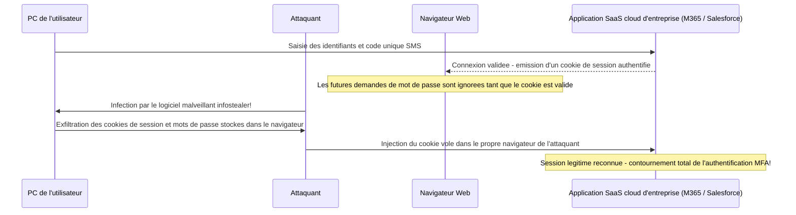

Les infostealers n'ont pas pour mission de chiffrer des fichiers. Leur unique dessein est de fouiller les bases de données internes des navigateurs Web (Chrome, Edge, etc.) afin d'en **extraire les identifiants enregistrés et les cookies de session actifs**.

Lorsqu'un employé s'authentifie sur Microsoft 365 ou Salesforce à l'aide de ses identifiants et d'un code MFA par SMS, l'application génère un cookie de session conservé localement dans le navigateur. Il suffit à l'assaillant de voler ce cookie et de l'importer dans son propre navigateur pour **se connecter instantanément en lieu et place du collaborateur légitime, sans avoir à saisir de mot de passe ni à valider de défi MFA**.

Sur les places de marché du dark web, des paquets entiers de cookies de session valides appartenant à des entreprises japonaises sont commercialisés pour quelques dollars, permettant aux pirates d'entrer directement par la grande porte avec des accès authentiques achetés au rabais.

### 4.3 Menaces internes : exfiltration de données par des employés démissionnaires et prestataires

Les menaces pour la sécurité ne proviennent pas exclusivement de l'extérieur. Les statistiques de la Japan Network Security Association (JNSA) révèlent qu'une fraction substantielle des fuites majeures découle **d'actes de malveillance interne commis par des salariés en poste, d'anciens collaborateurs ou des prestataires externes**.

- **Mobilité professionnelle et vol de données lors du départ** :
  L'effritement du modèle de l'emploi à vie pousse de plus en plus de commerciaux ou d'ingénieurs sur le départ à considérer les fichiers clients, les codes sources ou les plans techniques comme leur production personnelle, les transférant sur des clés USB privées ou des clouds personnels (Google Drive, Dropbox).
- **Abus de privilèges par des intervenants externes** :
  Des techniciens de sous-traitance disposant d'accès directs aux bases de données ont, sous la pression de dettes personnelles, téléchargé et revendu des millions de dossiers clients à des courtiers en données clandestins.

Fonctionnant encore selon le principe d'une bienveillance présumée, la majorité des entreprises nippones ne disposent pas d'outils de prévention des fuites de données (DLP) ou d'analyse du comportement des entités et utilisateurs (UEBA) capables d'intercepter les téléchargements massifs en temps réel. Le larcin n'est alors découvert que des mois ou des années plus tard, à l'occasion d'investigations judiciaires.

---

## Chapitre 5 : Feuille de route complète pour la transition vers l'Architecture Zero Trust (ZTA)

Face à ces périls multiples, l'unique voie salutaire pour les entreprises japonaises consiste à abandonner définitivement la défense périmétrique moribonde pour adopter sans concession une **Architecture Zero Trust (ZTA)**.

### 5.1 L'essence du Zero Trust : « Never Trust, Always Verify »

Le Zero Trust n'est pas un logiciel individuel ou une référence commerciale. Formalisé par le National Institute of Standards and Technology dans le standard **NIST SP 800-207**, il constitue **une refonte paradigmatique intégrale de la philosophie de sécurité**.

> **Principes directeurs du Zero Trust** :
> 1. **Ne jamais faire confiance, toujours vérifier (Never Trust, Always Verify)** :
>    Aucune connexion, aucun équipement et aucun utilisateur — qu'il se trouve sur le réseau local interne ou dans le bureau de la présidence — n'est considéré comme sûr a priori. Chaque demande d'accès est traitée comme émanant d'un environnement hostile.
> 2. **Accorder le moindre privilège (Grant Least Privilege Access)** :
>    Les utilisateurs et périphériques ne reçoivent que les privilèges strictement indispensables à l'exécution de la mission du moment, et pour une durée strictement encadrée (Just-In-Time).
> 3. **Présumer la compromission (Assume Breach)** :
>    L'architecture est pensée selon l'évidence que les lignes de défense ont déjà été franchies et que des attaquants rôdent déjà au sein du réseau. L'objectif cardinal est la réduction drastique de la zone d'impact (Blast Radius), la détection instantanée et l'isolation automatique.

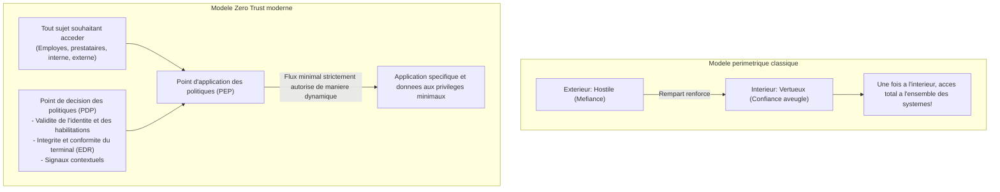

### 5.2 Démantèlement total des VPN et transition vers le ZTNA (Zero Trust Network Access)

La première étape indispensable est **le retrait complet des boîtiers VPN traditionnels** et leur remplacement par des solutions de **Zero Trust Network Access (ZTNA)**.

La distinction technique majeure réside dans le périmètre d'exposition :
- **VPN traditionnel** : Raccorde physiquement le poste de l'utilisateur à l'ensemble du sous-réseau IP interne dès que la session est ouverte. L'ordinateur peut communiquer avec tous les serveurs adjacents ; s'il est infecté, le malware se dissémine sans entrave.
- **ZTNA** : L'ordinateur n'est jamais raccordé au réseau d'entreprise. Un courtier sécurisé dans le cloud évalue l'identité et la conformité du terminal, et **n'établit un micro-tunnel chiffré qu'exclusivement vers l'application Web ou le port autorisé**. La topologie interne et les adresses IP demeurent invisibles pour le terminal (cloaking), rendant tout déplacement latéral techniquement impossible.

### 5.3 Architecture intégrée SASE (Secure Access Service Edge) et SSE

La matérialisation opérationnelle du Zero Trust à l'échelle de l'entreprise s'articule autour du **SASE (Secure Access Service Edge)** et de son volet de sécurité unifié, le **SSE (Security Service Edge)**.

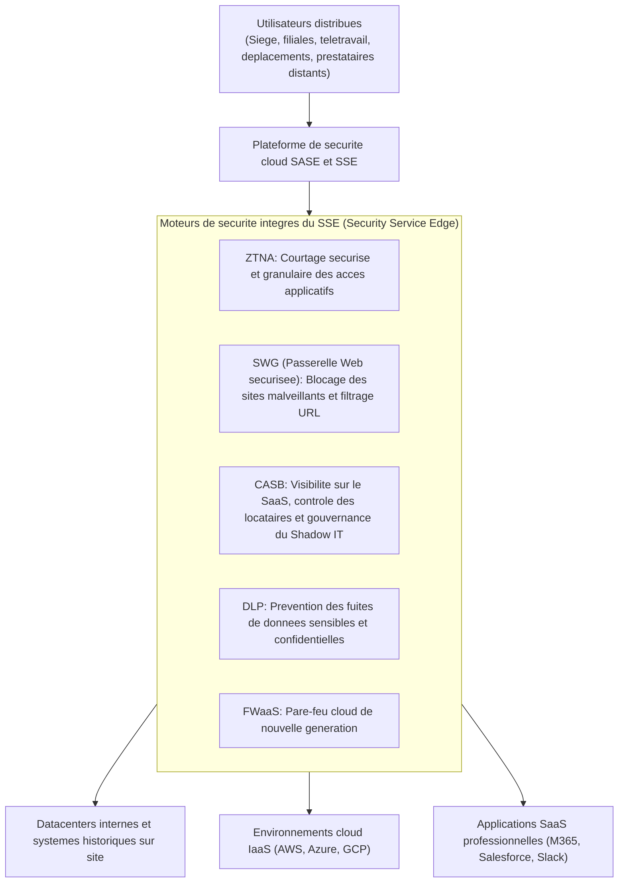

Dans une architecture SASE/SSE, que l'utilisateur soit au siège, à son domicile ou chez un sous-traitant à l'étranger, tous les flux transitent par une matrice de sécurité cloud mondialement répartie :
- La passerelle Web sécurisée (**SWG**) neutralise les domaines frauduleux et les liens d'hameçonnage.
- Le courtier de sécurité d'accès cloud (**CASB**) supervise les transferts vers les SaaS d'entreprise et neutralise le Shadow IT.
- La prévention des pertes de données (**DLP**) inspecte les flux pour bloquer l'exfiltration d'informations confidentielles ou de données d'identité.
- Le module **ZTNA** fournit un chemin d'accès chiffré et ultra-ciblé aux applicatifs métiers privés.

Cette convergence permet de déclasser les routeurs VPN coûteux et les proxys obsolètes, tout en garantissant une politique de sécurité homogène et de niveau maximal sur l'ensemble du globe.

### 5.4 Micro-segmentation : rupture physique des déplacements latéraux

Puisqu'aucun système ne peut prétendre interdire à 100 % l'infection d'un poste, la mise en œuvre de la **micro-segmentation** s'impose impérativement.

La micro-segmentation substitue au partitionnement réseau grossier par étage ou par site des **frontières de sécurité virtuelles individualisées pour chaque serveur, machine virtuelle ou conteneur**.

- Ainsi, le serveur de gestion comptable n'acceptera de connexions chiffrées que sur un port applicatif précis en provenance des terminaux dûment habilités de la direction financière, rejetant systématiquement toute tentative de communication (y compris une simple requête ICMP ping) issue des réseaux de développement ou administratifs.
- Même entre serveurs voisins au sein d'une même baie de datacenter, les échanges non déclarés explicitement sont systématiquement interdits.

Dès lors, si un poste bureautique succombe à un ransomware, la micro-segmentation agit comme un réseau de cloisons étanches : **l'impact est strictement confiné à l'équipement infecté (réduction du rayon de souffle), prévenant toute propagation vers le reste du système d'information**.

---

## Chapitre 6 : Sanctuarisation de l'identité et de l'authentification (IAM/PAM)

Dans une Architecture Zero Trust, la véritable frontière de sécurité n'est plus le câble réseau physique. **L'identité et l'authentification constituent le nouveau périmètre défensif**.

### 6.1 Obligation absolue du MFA phishing-résistant conforme à FIDO2 et aux Passkeys

Les entreprises doivent impérativement abolir les anciennes méthodes d'authentification multifacteur reposant sur les codes SMS, les courriels ou les simples notifications push sans mise en correspondance de nombres.

Les cybercriminels déjouent quotidiennement ces mécanismes obsolètes grâce à des serveurs mandataires d'interception (tels qu'Evilginx) et à des infostealers. Le seul rempart cryptographique inviolable réside dans **l'authentification multifacteur résistante au phishing (Phishing-Resistant MFA) basée sur les standards FIDO2 et WebAuthn (Passkeys)**.

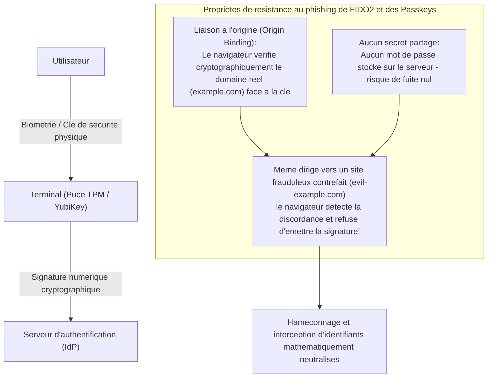

L'invulnérabilité de FIDO2 découle de **la liaison à l'origine (Origin Binding)**.
Même si un employé est abusé par une copie visuelle parfaite d'une mire de connexion, le navigateur compare de manière cryptographique le nom de domaine complet (FQDN). En cas de discordance avec l'adresse enregistrée sur la clé matérielle, le composant refuse catégoriquement d'émettre la signature cryptographique.

Le vol d'identifiants devient ainsi mathématiquement impossible. Les organisations doivent imposer sans délai le MFA FIDO2 — par clés matérielles (type YubiKey) ou authentificateurs de plateforme (Windows Hello, Touch ID) — à l'ensemble des administrateurs et des collaborateurs manipulant des données critiques.

### 6.2 Modèle de hiérarchisation (Tiering) d'Active Directory et accès Just-In-Time (JIT)

Pour les entreprises contraintes de maintenir un environnement Active Directory sur site, la méthodologie de référence pour juguler l'escalade de privilèges est **l'architecture de hiérarchisation en couches (Tiering Model)** préconisée par Microsoft.

```mermaid
flowchart TD
    subgraph Tier0 ["Tier 0: Plan de controle supreme (Autorite d'administration)"]
        DC["Controleurs de domaine, PKI et ADFS"]
        T0_Admin["Comptes d'administration Tier 0 dedies<br/>(Connexion restreinte aux stations securisees PAW)"]
    end

    subgraph Tier1 ["Tier 1: Gestion des serveurs d'entreprise"]
        Servers["Serveurs de production, bases de donnees et console cloud"]
        T1_Admin["Comptes d'administration Tier 1 dedies"]
    end

    subgraph Tier2 ["Tier 2: Gestion des postes de travail et equipements"]
        Clients["PC des collaborateurs, terminaux mobiles et imprimantes"]
        T2_Admin["Comptes de support et d'administration locale"]
    end

    T0_Admin -->|Interdiction absolue de connexion sur les terminaux des niveaux inferieurs!| ProhibitDown["Regle d'airain: Ne jamais exposer d'identifiants de haut niveau aux tiers inferieurs"]
    Clients -.->|Meme en cas de compromission par Pass-the-Hash| BlockUp["Le deplacement lateral ascendant vers les tiers superieurs est bloque!"]
```

Le principe fondamental du Tiering repose sur une règle absolue et irréversible : **les comptes à hauts privilèges ne doivent sous aucun prétexte s'authentifier sur des équipements de niveau inférieur, ni y laisser d'empreintes en mémoire** :
- **Tier 0 (Cœur de domaine)** : Administrateurs de domaine. Leurs accès sont strictement circonscrits aux contrôleurs de domaine et serveurs d'identité, avec interdiction d'ouvrir une session sur un poste de travail (Tier 2) ou un serveur de fichiers (Tier 1). Leurs interventions s'exécutent obligatoirement depuis des postes d'accès à privilèges renforcés (Privileged Access Workstations — PAW), isolés d'Internet.
- **Tier 1 (Serveurs d'applications)** : Administration des serveurs métiers et bases de données.
- **Tier 2 (Postes clients)** : Administration des ordinateurs utilisateurs.

Parallèlement, il est indispensable de proscrire les privilèges permanents (Standing Privileges) au profit d'une gestion des accès **Just-In-Time (JIT)**. Les administrateurs utilisent des comptes ordinaires au quotidien ; lors d'opérations de maintenance, des privilèges temporaires leur sont alloués pour une fenêtre horaire restreinte (ex. 2 heures) via un circuit d'approbation automatique. Dès lors, si un compte est compromis en dehors d'une fenêtre autorisée, l'attaquant ne recueille aucun privilège opérationnel.

### 6.3 Évaluation dynamique et continue des politiques par l'Accès Conditionnel

L'authentification ne doit plus se limiter à une validation statique et ponctuelle lors de la connexion initiale. Dans une architecture Zero Trust, l'habilitation doit être soumise à une **évaluation dynamique et contextuelle continue pendant toute la durée de la session**.

C'est ce que matérialisent les moteurs d'**Accès Conditionnel (Conditional Access)** d'éditeurs tels que Microsoft Entra ID ou Okta, qui analysent en direct une multitude de signaux :
1. **Identité et appartenance aux groupes** : Vérification des attributions de rôles.
2. **Adresse IP et localisation géographique (Géolocalisation)** :
   - Détection des voyages impossibles (Impossible Travel — par exemple, une connexion depuis Tokyo suivie d'un accès depuis l'Europe de l'Est 15 minutes plus tard), provoquant une déconnexion immédiate.
3. **Conformité et intégrité du poste** :
   - Présence effective de l'agent EDR d'entreprise, niveau de correctifs du système d'exploitation, chiffrement des disques (BitLocker) et absence d'indicateurs de compromission.
4. **Score de risque comportemental en temps réel** :
   - Connexions atypiques au milieu de la nuit ou téléchargements massifs anormaux déclenchant une ré-authentification biométrique immédiate ou la révocation de la session.

Dès lors qu'une seule condition fait défaut, l'accès aux ressources internes demeure totalement verrouillé, quelle que soit l'exactitude du mot de passe saisi.

---

## Chapitre 7 : Modèles de gouvernance de la sécurité des chaînes logistiques et des prestataires

Sécuriser son infrastructure centrale est illusoire si la porte dérobée des prestataires reste sans surveillance. Comment encadrer efficacement les intervenants et sous-traitants ?

### 7.1 Visibilité sur la chaîne logistique et mise en œuvre d'évaluations de sécurité effectives

La priorité fondamentale consiste en **un recensement cartographique exhaustif de l'intégralité de l'écosystème de sous-traitance**.

Beaucoup d'organisations connaissent leurs prestataires de premier rang, mais ignorent tout des sous-traitants de rangs 2 et 3 manipulant quotidiennement leurs données stratégiques.
- Les contrats doivent stipuler **l'interdiction stricte de toute sous-traitance en cascade sans agrément formel préalable**.
- Les questionnaires d'auto-évaluation annuels sur papier, purement déclaratifs, doivent être définitivement abandonnés.
- L'adoption de services d'évaluation continue de la sécurité cybernétique (tels que BitSight ou SecurityScorecard) permet de **mesurer de façon objective et continue la surface d'exposition externe, les ports ouverts, les retards de correctifs et les identifiants compromis** de l'ensemble des partenaires.

### 7.2 Interdiction formelle du BYOD pour les prestataires et adoption de postes virtuels VDI Zero Trust

La barrière technique la plus décisive pour neutraliser les fuites de données imputables aux sous-traitants est d'imposer une règle architecturale d'or : **les données d'entreprise ne doivent jamais être physiquement transmises sur un terminal tiers**.

La connexion directe d'équipements informatiques personnels non gérés (BYOD) ou d'ordinateurs appartenant aux sous-traitants vers le réseau ou les espaces de stockage de l'entreprise doit être formellement interdite.

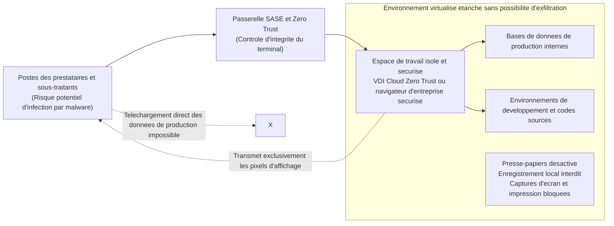

Les prestataires doivent intervenir exclusivement au travers d'une **infrastructure de postes virtuels dans le cloud (VDI / DaaS) Zero Trust** ou d'un **navigateur d'entreprise sécurisé** :
- Le téléchargement de fichiers sur le poste local, la copie via le presse-papiers, les captures d'écran et les impressions locales sont verrouillés au niveau système.
- Seul le flux de pixels d'affichage chiffré est projeté sur l'écran du sous-traitant. Même si son ordinateur physique est infecté par un infostealer, aucune donnée réelle de production ni aucun jeton de session n'est accessible pour l'attaquant.

### 7.3 Inventaire logiciel (SBOM) et restriction des privilèges sur les API partenaires

La fourniture de développements logiciels externalisés représente un autre angle mort critique de la chaîne logistique numérique.

Les applications développées sur mesure par des ESN contiennent fréquemment des composants open source anciens et vulnérables (tels que des versions non corrigées d'Apache Log4j ou de Spring Framework) qui demeurent en production sans maintenance.

Les entreprises doivent exiger de leurs prestataires la remise systématique d'un **inventaire logiciel complet (SBOM — Software Bill of Materials)** conforme aux formats normalisés pour tout livrable applicatif. Cela permet, dès la divulgation d'une faille critique, d'identifier en quelques minutes les composants impactés dans l'ensemble du patrimoine applicatif.

De même, les interconnexions applicatives (API) avec des partenaires doivent abandonner les clés permanentes à privilèges étendus au profit du protocole OAuth 2.0, encadré par des portées (scopes) de moindre privilège et des durées de vie de jetons ultra-courtes.

---

## Chapitre 8 : Une cyber-résilience inébranlable face aux ransomwares et au sabotage de données

Dans la doctrine Zero Trust — reposant sur l'hypothèse de la compromission inévitable (Assume Breach) —, le rempart ultime réside dans **la cyber-résilience : la faculté de préserver la continuité d'activité et de reconstruire rapidement les systèmes vitaux après un désastre**.

Aucune muraille ne peut garantir une étanchéité absolue et perpétuelle face à des assaillants étatiques ou des cartels criminels surentraînés. La véritable mesure de la pérennité d'une entreprise réside dans cette question : *Une fois l'intrusion consommée, avec quelle célérité l'activité peut-elle renaître ?*

### 8.1 La règle de sauvegarde 3-2-1-1-0 et le stockage immuable

Dans les attaques modernes par ransomware (telles que BlackSuit ou LockBit), la priorité absolue des assaillants n'est pas le chiffrement immédiat des serveurs de production, mais **l'anéantissement méthodique de toutes les sauvegardes**. Les criminels savent parfaitement qu'une entreprise capable de restaurer ses données refusera de payer la rançon.

Les mécanismes traditionnels de copie nocturne sur des volumes de stockage connectés au réseau sont dorénavant inutiles. Si le serveur de sauvegarde est rattaché au domaine Active Directory, les attaquants munis des privilèges d'administrateur de domaine détruiront la totalité des dépôts de sauvegarde en quelques secondes.

Les entreprises doivent impérativement adopter le **standard de sauvegarde 3-2-1-1-0** :

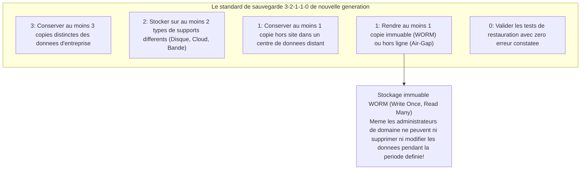

Le pilier central de ce modèle est la **sauvegarde immuable (Immutable Backup)**.
En s'appuyant sur la technologie **WORM (Write Once, Read Many)** — matérialisée par des appliances spécialisées (Veeam, Cohesity, Rubrik) ou le verrouillage d'objets cloud (tel qu'AWS S3 Object Lock en mode Conformité) —, les blocs de données sont verrouillés au niveau matériel et au niveau de l'API. **Aucune identité — qu'il s'agisse de la direction générale, d'un administrateur système ou d'un pirate ayant dérobé les identifiants racines — ne peut supprimer, écraser ou chiffrer les sauvegardes avant l'expiration irréversible du délai de rétention défini (ex. 30 jours)**.

Même si l'intégralité du centre de données de production est anéantie et tous les serveurs virtuels chiffrés, l'immuabilité garantit que la direction pourra rejeter avec fermeté tout chantage et reconstruire ses environnements de manière autonome.

### 8.2 Ségrégation des domaines d'authentification pour l'infrastructure de sauvegarde

Mettre en place du matériel immuable reste stérile si l'accès à son interface d'administration dépend du même annuaire que la production. Une discipline architecturale d'airain s'impose : **découpler intégralement le plan d'administration des sauvegardes du domaine Active Directory d'entreprise** :

- L'authentification sur les consoles de sauvegarde doit s'effectuer via un fournisseur d'identité totalement isolé ou des comptes locaux durcis protégés par un MFA matériel dédié, sans aucune synchronisation avec l'AD général.
- L'administration des sauvegardes doit être cantonnée à un réseau de gestion hors bande (out-of-band), rigoureusement isolé du réseau local bureautique et d'Internet.

Ce cloisonnement absolu de l'authentification empêche la compromission des contrôleurs de domaine de se répercuter en cascade sur la survie des données.

### 8.3 EDR/XDR et SOC managé 24/7 pour un confinement immédiat

Lors d'une intrusion, la rapidité d'intervention conditionne la survie de l'organisation. Les indicateurs clés de performance sont le **temps moyen de détection (MTTD)** et le **temps moyen de réponse (MTTR)**.

Alors que les antivirus classiques (EPP) reposaient sur l'analyse de signatures statiques, les solutions contemporaines d'**EDR (Endpoint Detection and Response)** et de **XDR (Extended Detection and Response)** surveillent en permanence le comportement des processus au niveau du noyau des systèmes.
- Elles identifient immédiatement les séquences suspectes : une commande PowerShell légitime tentant d'extraire la mémoire de `lsass.exe`, ou un renommage massif et accéléré de fichiers typique de la phase d'exécution d'un ransomware.
- Dès la détection d'un comportement hostile, l'EDR réalise **l'isolation logique instantanée du terminal au niveau des pilotes réseau du système d'exploitation**, privant l'attaquant de toute faculté de rebond latéral.

Les cybercriminels lancent délibérément leurs assauts lors des périodes de moindre vigilance : les vendredis en fin de soirée, les jours fériés ou les congés de fin d'année. Dès lors, une surveillance limitée aux heures ouvrées est illusoire : le recours à un **Security Operations Center (SOC) managé (service MDR) opérationnel 24 heures sur 24, 7 jours sur 7 et 365 jours par an**, habilité à ordonner des isolements d'urgence, constitue un impératif vital de survie.

---

## Chapitre 9 : Gouvernance d'entreprise et réformes réglementaires comme leviers de transformation

L'élévation du niveau de cybersécurité ne peut être l'apanage exclusif des équipes techniques. C'est un projet d'entreprise global, indissociable de la stratégie de gouvernance, des responsabilités juridiques des administrateurs et des obligations légales.

### 9.1 Renforcement de la législation sur la protection des données, amendes et risques de dommages-intérêts

À l'instar du RGPD européen, le carcan législatif japonais s'est considérablement durci.

Les réformes de la Loi sur la protection des données personnelles (APPI) ont instauré **l'obligation légale et absolue de notifier sans délai la Commission de protection des données personnelles (PPC) et d'informer directement les personnes concernées en cas de fuite avérée ou suspectée**.
- Les sanctions pénales maximales pour les personnes morales ont été portées à **100 millions de yens**.
- Au-delà des amendes publiques, les entreprises font face au risque dévastateur d'actions collectives en justice intentées par les clients et actionnaires, assorties d'indemnités d'indemnisation (souvent plusieurs milliers à plusieurs dizaines de milliers de yens par dossier). Une compromission touchant des millions de citoyens représente une hémorragie de trésorerie directe de plusieurs dizaines de milliards de yens.

À cela s'ajoutent les récentes lois sur la sécurité économique et la protection des infrastructures critiques, prévoyant des contrôles gouvernementaux inopinés et des sanctions administratives lourdes. Une posture de sécurité déficiente met aujourd'hui en jeu la viabilité commerciale de l'entreprise.

### 9.2 Devoir de diligence du conseil d'administration : la cybersécurité est une responsabilité de gouvernance

Au titre du droit japonais des sociétés, les membres du conseil d'administration sont soumis à un **devoir de diligence d'un bon gestionnaire (Duty of Due Care)** envers l'organisation.

La jurisprudence et les *Lignes directrices pour la gouvernance de la cybersécurité* publiées par le METI et l'IPA disposent que l'omission d'instaurer des mesures de sécurité adaptées conduisant à une fuite massive ou à une interruption prolongée d'activité constitue **un manquement caractérisé au devoir de diligence**. Les administrateurs peuvent être directement poursuivis dans le cadre d'actions sociales intentées par les actionnaires, engageant leur responsabilité financière personnelle.

Les dirigeants ne peuvent plus plaider l'ignorance devant les tribunaux en affirmant que *« ces aspects informatiques avaient été délégués aux techniciens »*. Le conseil d'administration a le devoir formel d'examiner régulièrement la cartographie des risques cyber, de voter des budgets d'investissement adaptés et de superviser activement la résilience opérationnelle.

### 9.3 Habilitation effective du CISO et redéfinition du ROI de la sécurité

La pierre angulaire d'une gouvernance cyber digne de ce nom réside dans **le renforcement institutionnel du statut du CISO**.

Les entreprises doivent sans attendre adopter trois réformes de structure :
1. **Ériger le CISO au rang de membre du comité de direction ou du conseil** :
   Ne plus subordonner la sécurité à la direction informatique (CIO), mais instaurer une ligne hiérarchique indépendante rendant compte directement au directeur général (CEO) et au conseil d'administration.
2. **Conférer au CISO un pouvoir de veto opérationnel et d'arrêt d'urgence** :
   Donner au CISO le pouvoir statutaire d'interdire la mise en production de tout système ne répondant pas aux exigences de sécurité, de résilier un contrat avec un prestataire sous-performant en matière de sécurité, et d'ordonner l'arrêt immédiat des systèmes compromis lors d'un incident majeur.
3. **Redéfinir le retour sur investissement (ROI) des budgets de sécurité** :
   La sécurité ne doit plus être évaluée à l'aune des profits directs qu'elle génère, mais comprise comme **une assurance de survie vitale et un permis d'opérer (License to Operate)** — protégeant l'entreprise contre des pertes d'exploitation de dizaines de milliards de yens, des condamnations judiciaires et la perte définitive de réputation sur les marchés mondiaux.

---

## Conclusion : Au-delà du découragement — La résolution stratégique des entreprises japonaises pour l'après-2026

En 2026, l'illusion d'un retour vers un cyberespace pacifié et sanctuarisé appartient définitivement au passé. Armées numériques agissant dans l'ombre des tensions géopolitiques, cartels criminels internationaux démultipliés par l'intelligence artificielle et marchés noirs de données d'authentification encerclent durablement les organisations.

Pour autant, tout défaitisme serait coupable.

Les épreuves qui frappent les entreprises japonaises ne sont pas des catastrophes naturelles inévitables. Elles représentent **des désastres d'origine humaine**, nés d'années d'externalisation paresseuse, de sous-traitance non supervisée, d'attachement anachronique à des lignes de défense périmétriques révolues et d'indifférence managériale. Et précisément parce que les causes sont organisationnelles et humaines, la volonté, la rigueur architecturale et la détermination stratégique des dirigeants peuvent les surmonter.

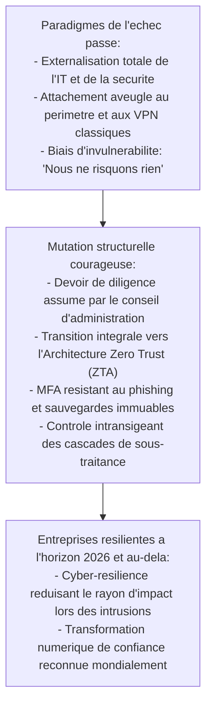

La cybersécurité ne constitue en rien un frein à la vélocité opérationnelle : elle représente **le système de freinage de haute précision** qui permet à un véhicule de compétition d'aborder les virages les plus audacieux à pleine vitesse. Seules les entreprises dotées d'une armure cybernétique infaillible pourront innover avec audace et s'imposer durablement dans l'économie numérique internationale.

Tout comme le génie industriel japonais a jadis façonné des standards de qualité légendaires, les entreprises doivent aujourd'hui graver un engagement d'acier : **ne jamais trahir la confiance des clients, des collaborateurs et de la société**. Celles qui s'engageront avec courage dans cette refonte architecturale et managériale ne se contenteront pas de survivre aux turbulences de 2026 : elles s'affirmeront comme les bâtisseurs résilients du monde numérique de demain.
