## प्रस्तावना: 2026 की चेतावनी — «सुरक्षा में पिछड़ा देश»; जापान के सामने राष्ट्रीय संकट

2020 के दशक के मध्य से लेकर वर्तमान 2026 तक, जापान का साइबर स्पेस इतिहास के सबसे भयंकर और अभूतपूर्व तूफ़ान का सामना कर रहा है।

अतीत में, जापानी उद्योग जगत में एक निराधार «सुरक्षा मिथक» व्याप्त था: «हम कोई वैश्विक बहुराष्ट्रीय कंपनी नहीं हैं, इसलिए हमें निशाना नहीं बनाया जाएगा», «जापानी भाषा की जटिल दीवार साइबर हमलों के खिलाफ एक प्राकृतिक सुरक्षा प्राचीर है», «हमने शीर्ष सुरक्षा वेंडरों का एंटीवायरस सॉफ़्टवेयर स्थापित किया है, इसलिए हम पूरी तरह सुरक्षित हैं» ―― आज ये मीठे भ्रम तिनके की तरह बिखर चुके हैं।

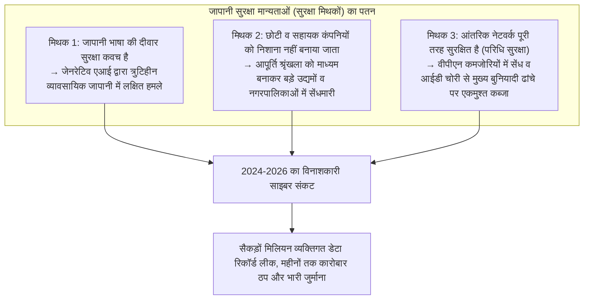

वास्तविकता अत्यंत कठोर और निर्मम है। मनोरंजन जगत के दिग्गज समूहों, मेगा-बैंकों, दूरसंचार ऑपरेटरों, प्रमुख बुनियादी ढांचा कंपनियों से लेकर स्थानीय सरकारी नगरपालिकाओं की प्रशासनिक प्रणालियों तक ―― एक के बाद एक प्रतिष्ठित संगठन रैनसमवेयर (फिरौती मांगने वाले मैलवेयर) के शिकार बने हैं, या उनके लाखों से करोड़ों संवेदनशील व्यक्तिगत डेटा रिकॉर्ड डार्क वेब पर नीलाम हुए हैं।

लीक हुआ डेटा केवल नाम, पते या फ़ोन नंबर जैसी बुनियादी जानकारी तक सीमित नहीं है। इसमें क्रेडिट कार्ड विवरण, स्वास्थ्य जांच रिपोर्ट, व्यक्तिगत पहचान संख्या (My Number), साझेदारों के साथ गोपनीय अनुबंध, आंतरिक व्यावसायिक चैट लॉग और कर्मचारियों के ड्राइविंग लाइसेंस की स्कैन प्रतियां तक शामिल हैं। व्यक्तियों की सामाजिक प्रतिष्ठा और मानवीय गरिमा को हिला देने वाला यह डेटा अंतरराष्ट्रीय साइबर अपराध सिंडिकेट्स द्वारा बंधक बनाकर खुलेआम बेचा जा रहा है।

जब भी कोई बड़ा साइबर हमला होता है, प्रेस कॉन्फ्रेंस में शीर्ष प्रबंधकों की गहरी झुककर माफ़ी मांगने की तस्वीरें सामने आती हैं, और वही रटे-रटाए बयान दोहराए जाते हैं: «घटना के कारणों की जांच जारी है», «हम सभी कर्मचारियों के सुरक्षा प्रशिक्षण को और अधिक मजबूत करेंगे»।

लेकिन अब हमें स्पष्ट रूप से यह प्रश्न पूछना ही होगा: **भारी-भरकम आईटी निवेश और अनिवार्य वार्षिक सुरक्षा प्रशिक्षणों के बावजूद, जापानी कंपनियों में डेटा लीक और विनाशकारी साइबर हमलों का सिलसिला 2026 में भी क्यों नहीं रुक रहा है?**

इसका मूल कारण किसी कर्मचारी द्वारा «गलती से किसी संदिग्ध ईमेल लिंक पर क्लिक कर देना» जैसी मामूली मानवीय भूल नहीं है। यह उन संरचनात्मक व्याधियों का अपरिहार्य परिणाम है जिन्हें जापानी उद्योग जगत दशकों से नजरअंदाज करता आ रहा है: **«आईटी कार्यों की पूर्ण आउटसोर्सिंग और बहु-स्तरीय उप-ठेकेदारी (IT Dumping & Multi-tier Subcontracting) की संरचनात्मक विकृति»**, पुरानी पड़ चुकी **«परिधि-आधारित सुरक्षा (Perimeter Defense Model) पर अंधविश्वास»**, क्लाउड संक्रमण के दौरान **«पहचान और प्रमाणीकरण आधार की अनदेखी»**, तथा **«सुरक्षा को रणनीतिक निवेश के बजाय एक अनावश्यक लागत (Cost Center) मानने वाली निदेशक मंडल की लचर कॉर्पोरेट गवर्नेंस»**।

यह श्वेतपत्र, मुख्य सूचना सुरक्षा अधिकारी (CISO) और वरिष्ठ साइबर खतरा विश्लेषक के दृष्टिकोण से, 2024 से 2026 के बीच जापान को झकझोर देने वाले प्रमुख साइबर हमलों का गहन तकनीकी विश्लेषण प्रस्तुत करता है। यह जापानी कंपनियों को भीतर से खोखला करने वाली व्याधियों को उजागर करता है और घुसपैठ को अपरिहार्य मानने वाले आधुनिक सुरक्षा दर्शन ―― **«ज़ीरो ट्रस्ट आर्किटेक्चर (Zero Trust Architecture - ZTA)» का पूर्ण क्रियान्वयन, आपूर्ति श्रृंखला नियंत्रण, फ़िशिंग-प्रतिरोधी बहु-कारक प्रमाणीकरण (Phishing-Resistant MFA), और अपरिवर्तनीय बैकअप द्वारा साइबर लचीलापन (Cyber Resilience) स्थापित करने** ―― के लिए कंपनियों के अस्तित्व की रक्षा हेतु एक व्यावहारिक व संपूर्ण रक्षा प्रणाली प्रस्तुत करता है।

---

## अध्याय 1: 2024-2026 में जापानी कंपनियों पर हुए प्रमुख साइबर हमलों का तकनीकी विश्लेषण

जापानी कंपनियों के समक्ष उपस्थित संकट की गंभीरता को समझने के लिए, हाल के वर्षों की प्रमुख घटनाओं की «साइबर किल चेन (Cyber Kill Chain)» को तथ्यात्मक और तकनीकी आधार पर देखना आवश्यक है।

### 1.1 KADOKAWA / Niconico घटना के सबक: डेटा सेंटर का पूर्ण विनाश और BlackSuit रैनसमवेयर

जून 2024 में प्रकाशन और मीडिया दिग्गज KADOKAWA तथा उसकी सहायक कंपनी Dwango पर हुआ साइबर हमला, जापान के साइबर सुरक्षा इतिहास का सबसे बड़ा मोड़ साबित हुआ।

यह हमला **«BlackSuit»** रैनसमवेयर समूह द्वारा किया गया था, जिसे दुनिया भर में आतंक मचाने वाले कुख्यात «Conti» समूह का उत्तराधिकारी माना जाता है। इस हमले के कारण जापान के लोकप्रिय वीडियो स्ट्रीमिंग प्लेटफॉर्म 'Niconico' सहित कंपनी की संपूर्ण वेब सेवाएं पूरी तरह बंद हो गईं। प्रकाशन वितरण प्रणाली और लेखांकन कार्यों सहित कंपनी का मुख्य व्यवसाय महीनों तक पंगु बना रहा। इतना ही नहीं, कर्मचारियों, अनुबंधित रचनाकारों (क्रिएटर्स) के व्यक्तिगत डेटा और गोपनीय व्यावसायिक अनुबंधों सहित लगभग 250,000 संवेदनशील रिकॉर्ड डार्क वेब पर उजागर कर दिए गए।

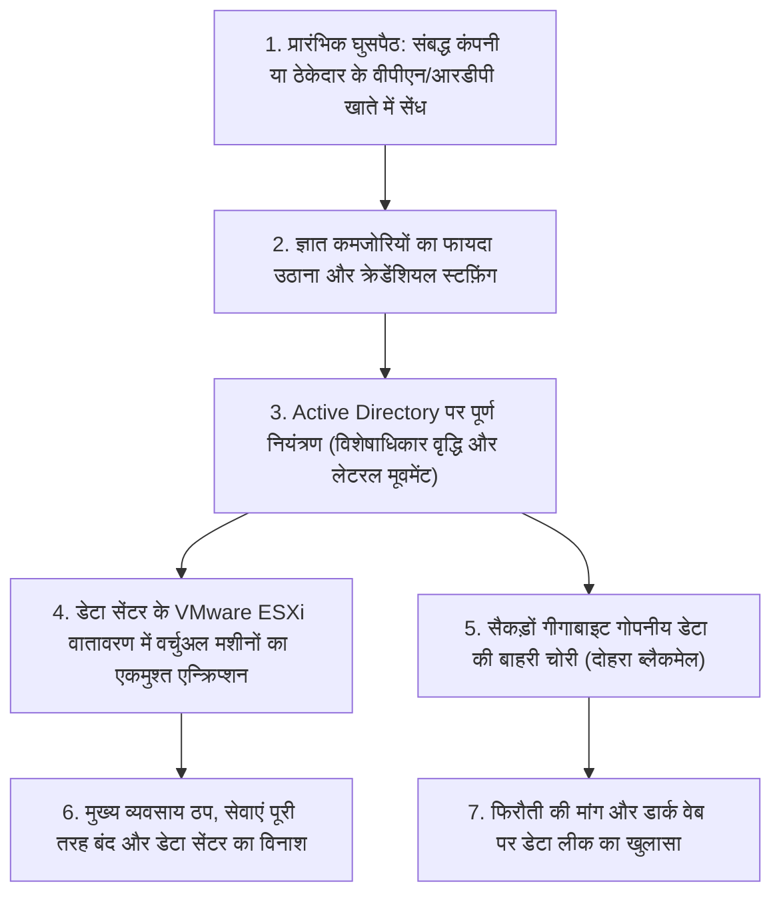

इस घटना ने जापानी सुरक्षा समुदाय को जो सबसे बड़ा झटका दिया, वह यह था कि **«ऑन-प्रिमाइसेस प्राइवेट क्लाउड (वर्चुअलाइजेशन प्लेटफॉर्म) को जड़ से नष्ट कर दिया गया था»**।

हमलावरों ने मुख्यालय के मुख्य नेटवर्क पर सीधे हमला नहीं किया था। उन्होंने किसी संबद्ध कंपनी या आउटसोर्सिंग भागीदार के रिमोट एक्सेस वातावरण (वीपीएन उपकरण या आरडीपी) को माध्यम बनाकर आंतरिक नेटवर्क में घुसपैठ की। एक बार परिधि के भीतर प्रवेश करने के बाद, हमलावरों ने इस बात का फायदा उठाया कि कंपनी का आंतरिक नेटवर्क «सपाट (फ्लैट और अपर्याप्त रूप से विभाजित)» था। उन्होंने आसानी से लेटरल मूवमेंट (पार्श्व संचलन) किया और अंततः पूरे उद्यम के केंद्र ―― **Active Directory (डोमेन कंट्रोलर) के व्यवस्थापक विशेषाधिकार (Domain Admin) पर पूर्ण नियंत्रण प्राप्त कर लिया**।

डोमेन का पूर्ण नियंत्रण हाथ में आने के बाद, BlackSuit ने केवल व्यक्तिगत सर्वरों को ही निशाना नहीं बनाया, बल्कि VMware ESXi जैसे हाइपरवाइज़र प्लेटफॉर्म तक सीधी पहुंच बनाई और डेटास्टोर में संग्रहीत वर्चुअल मशीन छवियों (VMDK फ़ाइलों) को सामूहिक रूप से तीव्र गति से एन्क्रिप्ट कर दिया। इससे भी अधिक विनाशकारी यह था कि **नेटवर्क से जुड़े ऑनलाइन बैकअप को भी पूरी तरह से मिटा और एन्क्रिप्ट कर दिया गया था**।

इस घटना ने देश भर के कॉर्पोरेट प्रबंधन को यह कठोर सत्य दिखा दिया कि «यदि हमलावर आपके आंतरिक नेटवर्क में प्रवेश कर जाता है, तो आपका डेटा सेंटर कितना भी विशाल और आधुनिक क्यों न हो, एक ही वार में पूरी तरह नष्ट हो सकता है»।

### 1.2 LINE Yahoo प्रकरण और NAVER साझा इन्फ्रास्ट्रक्चर: सीमा पार आउटसोर्सिंग गवर्नेंस की विफलता

शरद ऋतु 2023 में उजागर हुआ और 2024 से 2026 तक आंतरिक मामलों और संचार मंत्रालय (MIC) द्वारा कई बार असाधारण प्रशासनिक निर्देश जारी किए जाने का कारण बना «LINE Yahoo व्यक्तिगत डेटा लीक मामला», जापानी आईटी उद्योग में **«पूंजी संबंधों और आउटसोर्सिंग संबंधों से उत्पन्न गवर्नेंस के अंधे मोड़ों»** को स्पष्ट रूप से उजागर करता है।

लगभग 510,000 उपयोगकर्ताओं, व्यापारिक साझेदारों और कर्मचारियों के व्यक्तिगत डेटा लीक होने की इस घटना की शुरुआत दक्षिण कोरियाई कंपनी NAVER के क्लाउड वातावरण से हुई थी, जो LINE Yahoo की मूल कंपनी की स्थिति में थी।

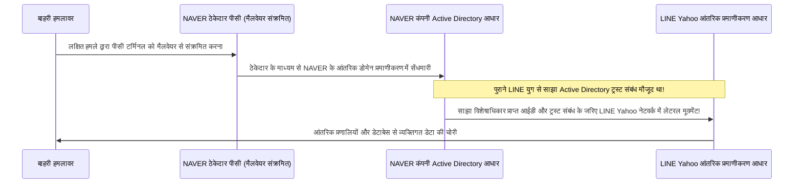

इस घटना का तकनीकी मूल कारण यह था कि **«पुरानी LINE और NAVER के बीच Active Directory जैसे आंतरिक प्रमाणीकरण सिस्टम साझा और परस्पर जुड़े हुए थे, और बिना किसी अतिरिक्त सुरक्षा अवरोध के छोड़ दिए गए थे»**।

NAVER के एक आउटसोर्सिंग ठेकेदार का पीसी मैलवेयर से संक्रमित हुआ, जिससे हमलावर NAVER के आंतरिक नेटवर्क में घुस गए। वहां से, उन्होंने दोनों कंपनियों के बीच «सीमा पार प्रमाणीकरण ट्रस्ट संबंध» का दुरुपयोग किया और बिना किसी अतिरिक्त अवरोध का सामना किए, सीधे जापान स्थित LINE Yahoo के आंतरिक डेटाबेस और प्रणालियों में घुसपैठ कर ली।

इस घटना ने जापानी कंपनियों द्वारा अपनाए गए «वैश्विक कार्य-विभाजन» और «ऑफशोर विकास/विदेशी आउटसोर्सिंग» में इस घातक जोखिम को उजागर किया कि **«केवल इसलिए कि वे समूह की कंपनी हैं या मूल कंपनी हैं, नेटवर्क और प्रमाणीकरण बुनियादी ढांचे को आसानी से जोड़ना और उन पर अंधविश्वास करना कितना विनाशकारी हो सकता है»**। मंत्रालय द्वारा NAVER के साथ पूंजी संबंधों की समीक्षा और साझा प्रमाणीकरण प्रणालियों को पूरी तरह अलग करने की मांग ने यह सिद्ध कर दिया कि भू-राजनीतिक जोखिमों सहित आपूर्ति श्रृंखला गवर्नेंस अब राष्ट्रीय संप्रभुता और सुरक्षा का विषय बन चुका है।

### 1.3 नगरपालिकाओं और बीपीओ ठेकेदारों (Iseto आदि) पर आपूर्ति श्रृंखला का श्रृंखलाबद्ध संकट

2024 के बाद से, देश भर की स्थानीय नगरपालिकाओं, वित्तीय संस्थानों और बुनियादी ढांचा कंपनियों में भारी दहशत फैलाने वाली घटना **प्रिंटिंग, मेलिंग और डेटा प्रोसेसिंग सेवाएं प्रदान करने वाली प्रमुख बीपीओ (बिजनेस प्रोसेस आउटसोर्सिंग) कंपनियों (जैसे Iseto आदि) पर रैनसमवेयर हमला** थी।

स्थानीय नगरपालिकाएं निवासी कर निर्धारण नोटिस, राष्ट्रीय स्वास्थ्य बीमा कार्ड, नर्सिंग केयर बीमा प्रीमियम नोटिस और चुनावी सामग्री भेजने के लिए निविदाओं के माध्यम से निजी बीपीओ कंपनियों को व्यापक आउटसोर्सिंग अनुबंध देती थीं। इन कार्यों में नागरिकों के नाम, पते, माय नंबर, आय और कर विवरण जैसे अत्यंत संवेदनशील डेटा वाली फ़ाइलें निजी ठेकेदारों को सौंपी जाती थीं।

हमलावरों ने नगरपालिकाओं के कड़े सुरक्षा वाले कोर नेटवर्क (तथाकथित त्रि-स्तरीय सुरक्षा प्रणाली) पर सीधे हमला नहीं किया। उनका निशाना बना **नगरपालिकाओं से अनुबंध प्राप्त करने वाली आउटसोर्सिंग कंपनियों का नेटवर्क**।

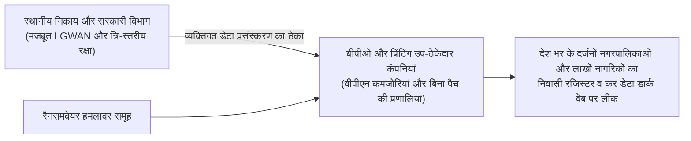

उप-ठेकेदार कंपनी के नेटवर्क के रैनसमवेयर से संक्रमित होने के परिणामस्वरूप, न केवल उस कंपनी का आंतरिक डेटा, बल्कि देश भर की दर्जनों नगरपालिकाओं के लाखों नागरिकों का गोपनीय डेटा भी एन्क्रिप्ट हो गया और डार्क वेब पर लीक हो गया।

इस घटना का सबसे भयानक सबक साइबर सुरक्षा का यह अकाट्य भौतिक नियम है: **«मुख्य ग्राहक संगठन अपनी प्रणालियों को मजबूत करने के लिए चाहे करोड़ों खर्च कर ले, यदि उसके किसी उप-ठेकेदार का सुरक्षा स्तर कमजोर है, तो पूरी आपूर्ति श्रृंखला एक पल में ढह जाती है»**। सरकारी निकायों और बड़े निगमों द्वारा औपचारिक चेकलिस्ट भरकर यह मान लेना कि «अनुबंध में सुरक्षा शर्तें शामिल हैं, इसलिए हम सुरक्षित हैं», एक भयानक प्रशासनिक भूल साबित हुआ।

### 1.4 क्लाउड कॉन्फ़िगरेशन की खामियां (Salesforce / AWS / Azure): दुनिया के सामने खुली तिजोरी की त्रासदी

डेटा लीक केवल रैनसमवेयर जैसे परिष्कृत लक्षित हमलों से ही नहीं होते। 2020 के दशक के मध्य में भी, लीक की घटनाओं का एक बहुत बड़ा हिस्सा **«क्लाउड सेवाओं के गलत कॉन्फ़िगरेशन (Cloud Misconfiguration)»** के कारण होता है।

विशेष रूप से प्रमुख जापानी प्रतिभूति कंपनियों, वित्तीय संस्थानों, ई-कॉमर्स साइटों और सरकारी एजेंसियों में ग्राहक संबंध प्रबंधन (CRM) प्लेटफॉर्म **Salesforce के गलत कॉन्फ़िगरेशन के कारण ग्राहकों की जानकारी सार्वजनिक होने की घटनाएं बार-बार हुईं**।

Salesforce में सार्वजनिक पोर्टल और कम्युनिटी साइट्स बनाने के लिए गेस्ट एक्सेस (Guest Access) सेटिंग्स होती हैं। हालांकि, एक्सेस कंट्रोल (Sharing Rules) में डिफ़ॉल्ट परिवर्तनों की अनदेखी और अनुमतियों के दोषपूर्ण डिज़ाइन के कारण, जिन ग्राहक सूचियों (नाम, फ़ोन नंबर, खाता संख्या, लेन-देन इतिहास) को केवल अधिकृत आंतरिक कर्मचारियों द्वारा देखा जाना चाहिए था, वे **«बिना किसी प्रमाणीकरण के इंटरनेट पर किसी के भी द्वारा खोजने और देखने योग्य»** स्थिति में वर्षों तक खुली रहीं।

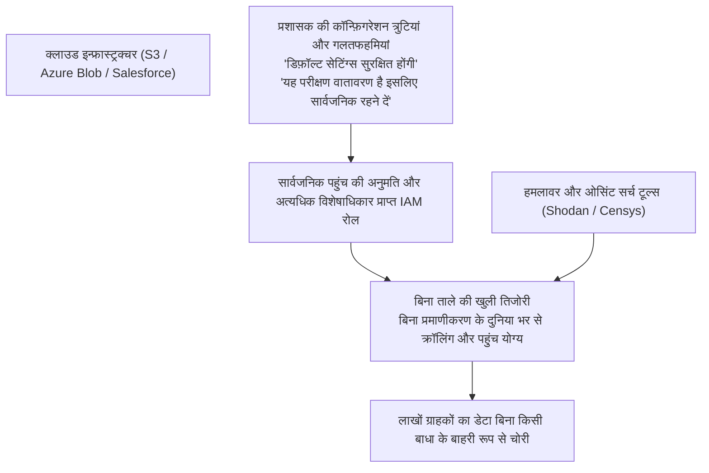

Amazon Web Services (AWS) की S3 बकेट की सार्वजनिक सेटिंग्स में गलतियां, Microsoft Azure स्टोरेज खातों की एक्सेस अनुमतियों में खामियां, और आंतरिक डेवलपर्स द्वारा GitHub पर अनजाने में एक्सेस कीज़ (API टोकन) को सार्वजनिक रूप से कमिट कर देने की घटनाएं भी लगातार सामने आ रही हैं।

किसी परिष्कृत ज़ीरो-डे हमले की आवश्यकता के बिना ही, **«कंपनियों ने अपने हाथों से तिजोरी का दरवाज़ा खोलकर दुनिया के सामने रख दिया था»** ―― यही जापानी क्लाउड संचालन की उजागर हुई लचर वास्तविकता थी।

---

## अध्याय 2: मूल कारणों का गहन विश्लेषण ① ―― संरचनात्मक व संगठनात्मक व्याधियां (आईटी आउटसोर्सिंग और बहु-स्तरीय उप-ठेकेदारी)

खतरों के इतने स्पष्ट होने के बावजूद जापानी कंपनियां इन घटनाओं को पहले से रोकने में क्यों विफल रहती हैं? इस अध्याय में हम प्रौद्योगिकी के पीछे छिपी «पारंपरिक जापानी कॉर्पोरेट व्यवस्था की संरचनात्मक व्याधियों» की पड़ताल करेंगे।

### 2.1 «आईटी एक लागत विभाग है»: प्रबंधन की उदासीनता और CISO का नाममात्र अस्तित्व

जापानी कंपनियों में साइबर सुरक्षा की सबसे बड़ी कमजोरी फ़ायरवॉल सेटिंग्स में नहीं, बल्कि **«निदेशक मंडल के बैठक कक्ष (Boardroom)»** में निहित है।

पश्चिमी वैश्विक कंपनियों में, आईटी और साइबर सुरक्षा को «कंपनी के अस्तित्व और प्रतिस्पर्धात्मक बढ़त को तय करने वाला शीर्ष रणनीतिक एजेंडा» माना जाता है। मुख्य सूचना सुरक्षा अधिकारी (CISO) के पास सीधे सीईओ से जुड़ा भारी अधिकार होता है, और उसके पास किसी भी व्यावसायिक सुविधा की तुलना में सुरक्षा जोखिम को प्राथमिकता देकर प्रणालियों को बंद करने का वीटो पावर (Veto Power) होता है।

इसके विपरीत, अधिकांश जापानी कंपनियों में, आईटी विभाग को लंबे समय से «कोई लाभ न कमाने वाला अप्रत्यक्ष विभाग और कॉस्ट सेंटर (Cost Center)» मानकर उपेक्षित किया गया है:
- निदेशक मंडल में तकनीकी या सुरक्षा पृष्ठभूमि वाले अधिकारी लगभग न के बराबर होते हैं। CIO या CISO के रूप में किसी गैर-तकनीकी पृष्ठभूमि वाले वरिष्ठ अधिकारी को जनरल अफेयर्स या लीगल विभाग के साथ अतिरिक्त प्रभार के रूप में नियुक्त कर दिया जाता है।
- जब ज़मीनी सुरक्षा विशेषज्ञ यह रिपोर्ट करते हैं कि «इस वीपीएन उपकरण में गंभीर भेद्यता है, इसके तत्काल अपडेट के लिए बजट और कुछ घंटों के रखरखाव हेतु सेवा बंद करने की आवश्यकता है», तो शीर्ष प्रबंधन यह कहकर खारिज कर देता है कि «इस तिमाही में वित्तीय स्थिति कठिन है, इसे अगले साल देखेंगे» या «व्यापारिक कार्यों को रोकना पूरी तरह अस्वीकार्य है»।

परिणामस्वरूप, जापानी कंपनियों में CISO **«बिना किसी बजट या अधिकार के, केवल घटना घटने पर प्रेस कॉन्फ्रेंस में माथा टेकने वाला बलि का बकरा (Scapegoat)»** बनकर रह गया है। सुरक्षा को जोखिम कम करने के अपरिहार्य निवेश के रूप में न देखकर, «जितना हो सके उतना काटा जाने वाला खर्च» मानने की प्रबंधन की लापरवाही ही इस राष्ट्रीय संकट का वास्तविक कारण है।

### 2.2 बहु-स्तरीय उप-ठेकेदारी और पुनः-आउटसोर्सिंग: «सबसे कमजोर कड़ी (Weakest Link)» का निर्माण

जापानी आईटी उद्योग की सबसे गहरी विकृति निर्माण उद्योग की तर्ज पर बनी **«बहु-स्तरीय उप-ठेकेदारी संरचना (IT General Contractor Model)»** है।

मुख्य ग्राहक कंपनी सिस्टम डिज़ाइन, विकास, संचालन और सुरक्षा रखरखाव का सारा काम प्रमुख सिस्टम इंटीग्रेटर्स (प्राइम SIer) को सौंप (डंप) देती है। प्राइम SIer स्वयं तकनीकी काम नहीं करते, बल्कि अपना भारी मार्जिन काटकर काम को टियर-2 कंपनियों को सौंपते हैं, जो इसे आगे टियर-3, टियर-4 और टियर-5 की छोटी आईटी फर्मों और फ्रीलांसरों को पुनः आउटसोर्स करती चली जाती हैं।

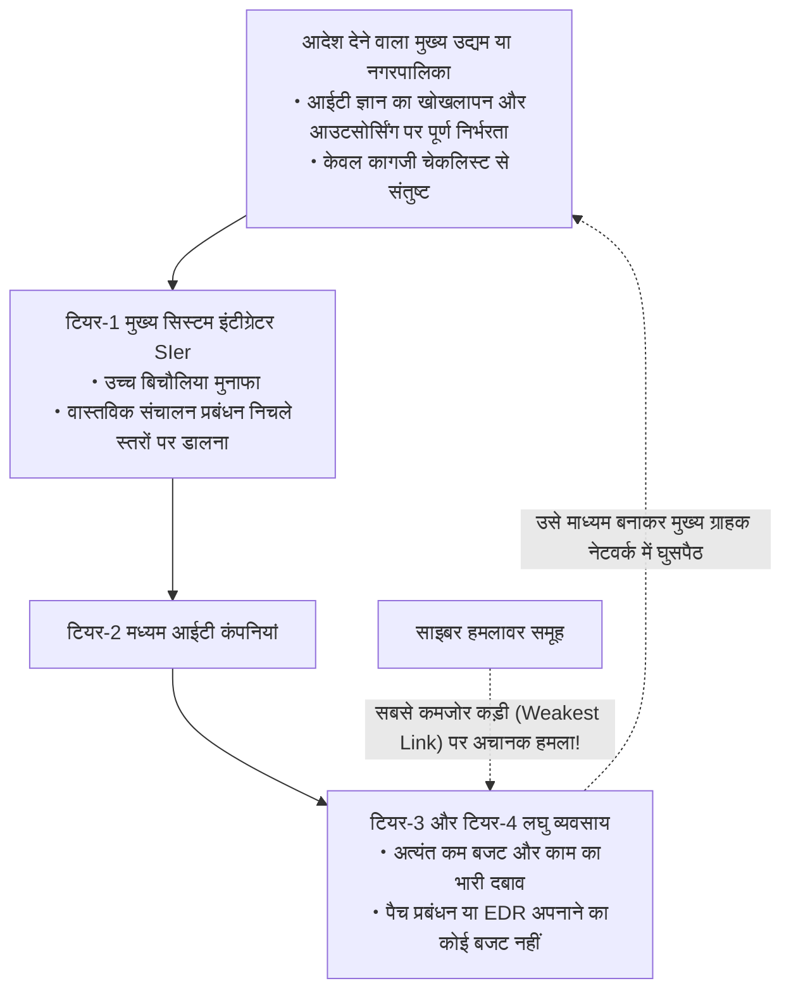

क्रिप्टोग्राफी और सुरक्षा इंजीनियरिंग का एक बुनियादी सिद्धांत है: **«किसी भी श्रृंखला की मजबूती उसकी सबसे कमजोर कड़ी (Weakest Link) से तय होती है»**।

प्राइम SIer के पास चाहे कितने भी महंगे नेक्स्ट-जेनरेशन फ़ायरवॉल और सख्त सुरक्षा नीतियां हों, आपूर्ति श्रृंखला के अंतिम छोर पर मौजूद टियर-3 और टियर-4 कंपनियों के पास न तो आधुनिक एंडपॉइंट डिटेक्शन एंड रिस्पॉन्स (EDR) लगाने का बजट होता है, और न ही 24/7 सुरक्षा संचालन केंद्र (SOC) की सेवाएं लेने के संसाधन होते हैं।
- वहां अप्रचलित Windows 10 उपकरण या निजी अनियंत्रित लैपटॉप (BYOD) का उपयोग होता है, और एडमिनिस्ट्रेटर पासवर्ड चिपचिपे नोटों (Sticky Notes) पर लिखकर साझा किए जाते हैं।
- इसके अतिरिक्त, काम पूरा करने के लिए उन अंतिम छोर के असुरक्षित उपकरणों को मुख्य ग्राहक कंपनी के डेटाबेस और कोर सर्वरों तक सीधे एक्सेस वाले विशेषाधिकार प्राप्त रिमोट क्रेडेंशियल्स दिए जाते हैं।

हमलावरों के लिए इससे आसान लक्ष्य कोई नहीं हो सकता। उन्हें मजबूत मुख्य द्वार पर हमला करने की तनिक भी आवश्यकता नहीं होती। आपूर्ति श्रृंखला के सबसे निचले और रक्षाहीन छोर पर स्थित किसी एक ठेकेदार के पीसी को संक्रमित करके, वे वहां से वैध क्रेडेंशियल्स चुराते हैं और मुख्य ग्राहक के कोर नेटवर्क में «एक अधिकृत कर्मचारी का रूप धरकर» शान से प्रवेश कर जाते हैं।

### 2.3 पारंपरिक रोजगार प्रणाली की सीमाएं और सुरक्षा प्रतिभाओं की संरचनात्मक कमी

मानवीय पहलू पर भी स्थिति उतनी ही चिंताजनक है।

अर्थव्यवस्था, व्यापार और उद्योग मंत्रालय (METI) और सूचना प्रौद्योगिकी संवर्धन एजेंसी (IPA) की रिपोर्टों के अनुसार, जापान में लाखों योग्य साइबर सुरक्षा विशेषज्ञों की भारी कमी है। हालांकि, इसका मूल कारण केवल जनसांख्यिकीय नहीं है, बल्कि **«उच्च कुशल साइबर सुरक्षा प्रतिभाओं का उचित मूल्यांकन और पुरस्कृत करने में असमर्थ पारंपरिक जापानी रोजगार प्रणाली»** है।

अमेरिका, इजरायल और सिंगापुर में, उद्यमों की रक्षा करने वाले शीर्ष सुरक्षा आर्किटेक्ट्स, रिवर्स इंजीनियर्स और एथिकल हैकर्स का वार्षिक वेतन 20 मिलियन से 40 मिलियन येन से अधिक होना सामान्य बात है। उन्हें व्यवसाय की रक्षा करने वाले विशिष्ट तकनीकी विशेषज्ञों के रूप में अत्यधिक सम्मानित किया जाता है।

इसके विपरीत, आजीवन रोजगार और वरिष्ठता-आधारित वेतन प्रणाली वाली पारंपरिक जापानी कंपनियों में, तकनीकी इंजीनियरों को सामान्य प्रशासनिक संवर्ग के निचले स्तर पर रखा जाता है:
- वेतनमान एक समान होता है; चाहे किसी युवा इंजीनियर में साइबर खतरों को विफल करने का कितना भी असाधारण कौशल क्यों न हो, उसे उसी आयु वर्ग के सेल्स या एचआर कर्मचारियों के समान वेतन ब्रैकेट (वार्षिक 4 से 6 मिलियन येन) में ही सीमित रखा जाता है।
- करियर का सर्वोच्च पद «प्रबंधन (मैनेजमेंट)» होता है, जहां कोडिंग करने, लॉग्स का विश्लेषण करने और मैलवेयर का रिवर्स इंजीनियरिंग करने वाले विशुद्ध तकनीकी विशेषज्ञों के लिए कोई अलग करियर ट्रैक नहीं होता। वेतन बढ़ाने के लिए उन्हें तकनीकी काम छोड़कर बजट प्रबंधन और एक्सेल शीट बनाने में लगना पड़ता है।

नतीजतन, शीर्ष सुरक्षा प्रतिभाएं विदेशी कंपनियों या तकनीकी स्टार्टअप्स की ओर पलायन कर जाती हैं। जापानी कंपनियों के आंतरिक आईटी विभागों में ऐसा एक भी इंजीनियर नहीं बचता जो स्वतंत्र रूप से खतरों का पता लगा सके, उनका विश्लेषण कर सके और उन्हें बाहर निकाल सके। वहां केवल वेंडरों की रिपोर्टों को आगे बढ़ाने वाले «डाकिए» ही शेष रह जाते हैं। ज्ञान का यह खोखलापन ही संकट के समय शुरुआती कार्रवाई में भारी गलतियां करने और नुकसान को विनाशकारी स्तर तक बढ़ाने का मूल कारण है।

---

## अध्याय 3: मूल कारणों का गहन विश्लेषण ② ―― तकनीकी विफलताएं (परिधि सुरक्षा का पतन और AD का जाल)

संगठनात्मक और प्रबंधन संबंधी विफलताओं के अलावा, जापानी कंपनियों के आईटी बुनियादी ढांचे की तकनीकी अप्रचलनता और आर्किटेक्चरल कमियां हमलावरों के लिए सबसे आसान शिकार साबित हो रही हैं।

### 3.1 वीपीएन उपकरण और रिमोट डेस्कटॉप: «चोर दरवाजे» की वास्तविकता

कोरोना महामारी के बाद जापानी कंपनियों को आनन-फानन में टेलीवर्क अपनाने के लिए मजबूर होना पड़ा। उस समय अधिकांश कंपनियों ने अपने आंतरिक नेटवर्क की सीमाओं पर एसएसएल-वीपीएन उपकरण (जैसे Fortinet FortiGate, Pulse Secure / Ivanti Connect Secure आदि) लगाकर घर से नेटवर्क में सुरंग (टनल) बनाने का तात्कालिक अस्थायी उपाय अपनाया।

यही निर्णय जापानी साइबर सुरक्षा में **सबसे बड़ा घातक चोर दरवाजा** साबित हुआ।

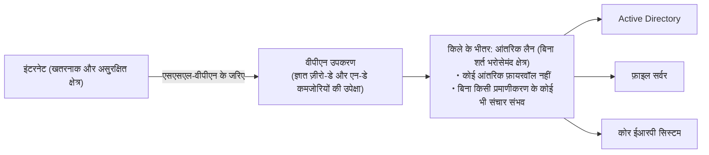

वीपीएन उपकरण इंटरनेट के खतरनाक तूफ़ान के सामने सीधे खुला हुआ «भौतिक मुख्य द्वार» हैं। स्वाभाविक रूप से, दुनिया भर के साइबर अपराधी और राज्य-प्रायोजित हैकर समूह इस द्वार के तालों की कमजोरियों (Vulnerabilities) की निरंतर तलाश में रहते हैं।
- वास्तव में, 2023 से 2026 के बीच, प्रमुख वीपीएन उपकरणों में प्रमाणीकरण को बायपास करके रिमोट से मनमाना कोड निष्पादित करने वाली अत्यंत गंभीर कमजोरियां (CVSS स्कोर 9.0 से 10.0 की घातक कमजोरियां) लगातार खोजी और दुरुपयोग की गईं।
- सबसे भयानक बात यह रही कि सुरक्षा पैच जारी होने के बाद भी, सैकड़ों जापानी कंपनियों ने «काम में बाधा आएगी» या «उपकरण रीस्टार्ट नहीं किया जा सकता» जैसे बहानों से महीनों या एक वर्ष से अधिक समय तक पैच लागू नहीं किए।

हमलावर Shodan और Censys जैसे सार्वजनिक सर्च इंजनों का उपयोग करके बिना पैच वाले वीपीएन उपकरणों को स्वचालित रूप से स्कैन करते हैं। उपकरण की मेमोरी से क्रेडेंशियल्स (यूज़रनेम, पासवर्ड, सक्रिय सत्र टोकन) निकालने के बाद, **हमलावर केवल कुछ ही मिनटों में एक वैध कर्मचारी बनकर आंतरिक नेटवर्क के सबसे गहरे हिस्से में प्रवेश कर जाते हैं**।

### 3.2 आंतरिक नेटवर्क पर अंधविश्वास (परिधि सुरक्षा मॉडल) का पूर्ण पतन

वीपीएन के टूटने के बाद, कंपनियों को विनाश की खाई में धकेलने वाला कारक पुराना **«परिधि-आधारित सुरक्षा मॉडल (Castle-and-Moat Architecture)»** है।

यह मॉडल इस पूर्वधारणा पर आधारित है कि «बाहरी इंटरनेट खतरनाक और दुर्भावनापूर्ण है, लेकिन फ़ायरवॉल के भीतर का आंतरिक नेटवर्क (LAN) 100% सुरक्षित और भरोसेमंद है»।

इस सोच के तहत बनाए गए आंतरिक नेटवर्क आश्चर्यजनक रूप से **«सपाट (Flat Network)»** होते हैं:
- आंतरिक लैन से जुड़ा कोई भी पीसी उसी सबनेट या आस-पास के सेगमेंट के अन्य सभी कंप्यूटरों, फ़ाइल सर्वरों, प्रिंटरों और डेटाबेस के साथ बिना किसी अतिरिक्त प्रमाणीकरण या एन्क्रिप्शन के स्वतंत्र रूप से संचार कर सकता है।
- आंतरिक नेटवर्क के भीतर चलने वाले ट्रैफ़िक पर आंतरिक फ़ायरवॉल द्वारा कोई निगरानी नहीं रखी जाती।

यह मध्यकालीन किले जैसा है, जहां **«यदि कोई जासूस एक बार मुख्य द्वार पार करके किले के अंदर घुस जाए, तो राजमहल, खजाने के कमरे और अन्न भंडार पर कोई ताला नहीं मिलता और वह बिना किसी रोक-टोक के सब कुछ लूट सकता है»**।

जब हमलावर किसी एक संक्रमित कंप्यूटर से आंतरिक नेटवर्क की टोह (Reconnaissance) लेता है और एक कंप्यूटर से दूसरे कंप्यूटर व सर्वर पर मैलवेयर फैलाता है, तो परिधि सुरक्षा इस «लेटरल मूवमेंट (पार्श्व संचलन)» को रोकने में पूरी तरह लाचार साबित होती है।

### 3.3 Active Directory (AD) का अनियंत्रित विस्तार और विशेषाधिकार प्रबंधन की विफलता

विंडोज़-आधारित एंटरप्राइज वातावरण में, विफलता का सबसे बड़ा एकल बिंदु (SPOF) और हमलावरों के लिए «सर्वोच्च खजाना (Holy Grail)» Microsoft का **Active Directory (AD)** है।

90% से अधिक जापानी कंपनियां अपने पीसी, उपयोगकर्ता खातों, एक्सेस अनुमतियों और सुरक्षा नीतियों के केंद्रीय प्रबंधन के लिए Active Directory पर निर्भर हैं। हालांकि, इसके प्रबंधन की वास्तविक स्थिति अत्यंत दयनीय है:
- 20 साल से अधिक पुराने एडी फ़ॉरेस्ट अव्यवस्थित संशोधनों के कारण एक विशाल ब्लैक बॉक्स बन चुके हैं।
- पुराने सेवानिवृत्त कर्मचारियों के खाते, हटाए गए सर्वरों के सर्विस खाते और परीक्षण के लिए बनाए गए अस्थायी खाते बिना हटाए हजारों की संख्या में निष्क्रिय पड़े रहते हैं।
- और सबसे बदतर स्थिति **«डोमेन एडमिनिस्ट्रेटर (Domain Admin) विशेषाधिकारों का दुरुपयोग और साझाकरण»** है; जहां आईटी सहायता कर्मी अपनी सुविधा के लिए सामान्य कर्मचारियों के कंप्यूटरों पर भी एडमिन अधिकार दे देते हैं और सभी जगह एक ही पासवर्ड का उपयोग करते हैं।

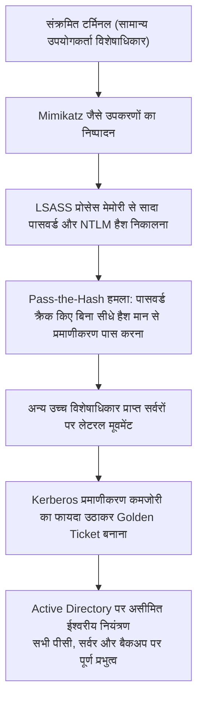

आधुनिक हमलावर संक्रमित कंप्यूटर पर `Mimikatz` जैसे उपकरण चलाते हैं और विंडोज प्रमाणीकरण प्रक्रिया (`lsass.exe`) की मेमोरी से NTLM हैश और Kerberos टिकट तुरंत निकाल लेते हैं।

हमलावरों को पासवर्ड क्रैक करने की भी आवश्यकता नहीं होती। वे सीधे हैश मान का उपयोग करके प्रमाणीकरण प्राप्त करने वाले **«Pass-the-Hash»** हमले करते हैं, या Kerberos की एन्क्रिप्शन कुंजी (krbtgt खाता) चुराकर असीमित एक्सेस अधिकारों वाला जाली टिकट बनाने वाले **«Golden Ticket»** हमले करते हैं।

जैसे ही यह हमला सफल होता है, हमलावर कंपनी के पूरे आईटी बुनियादी ढांचे का स्वामी (डोमेन एडमिन) बन जाता है। इसके बाद, ग्रुप पॉलिसी (GPO) के माध्यम से कुछ ही मिनटों में कंपनी भर के हजारों कंप्यूटरों और सर्वरों पर एक साथ रैनसमवेयर फैलाकर पूरे संगठन को नष्ट कर दिया जाता है।

### 3.4 क्लाउड संक्रमण के साये: शैडो आईटी और अत्यधिक विशेषाधिकार प्राप्त IAM रोल

ऑन-प्रिमाइसेस से AWS, Azure और Google Cloud जैसे सार्वजनिक क्लाउड पर जाने की होड़ में नई तकनीकी विकृतियां सामने आई हैं:

1. **शैडो आईटी (Shadow IT) और लावारिस क्लाउड खाते**:
   सख्त आंतरिक प्रक्रियाओं से बचने के लिए व्यावसायिक विभाग और डेवलपर टीमें आईटी विभाग की जानकारी के बिना क्रेडिट कार्ड से स्वतंत्र क्लाउड खाते खरीदकर चलाने लगती हैं। इन खातों पर केंद्रीय सुरक्षा निगरानी नहीं होती, जिससे वे सार्वजनिक पहुंच और कमजोरियों के अड्डे बन जाते हैं।
2. **अत्यधिक विशेषाधिकार प्राप्त (Over-Privileged) IAM रोल**:
   क्लाउड सुरक्षा के केंद्र 'IAM (पहचान व पहुँच प्रबंधन)' के डिज़ाइन में न्यूनतम विशेषाधिकार के सिद्धांत (PoLP) की अनदेखी की जाती है। जटिलता से बचने के लिए सामान्य खातों को भी लापरवाही से `AdministratorAccess` जैसे असीमित अधिकार दे दिए जाते हैं।
   जब किसी वेब एप्लिकेशन में मामूली SQL इंजेक्शन या सर्वर-साइड रिक्वेस्ट फोर्जरी (SSRF) की कमजोरी सामने आती है, तो IAM की अस्थायी क्रेडेंशियल कुंजियां लीक हो जाती हैं, जिससे हमलावर को कंपनी के सभी क्लाउड स्टोरेज, डेटाबेस और वर्चुअल मशीनों पर तुरंत पूर्ण नियंत्रण मिल जाता है।

---

## अध्याय 4: मूल कारणों का गहन विश्लेषण ③ ―― मानवीय कमजोरियां और हमलों के आधुनिक तरीकों का विकास

तकनीकी और संरचनात्मक कमजोरियों के अलावा, मानवीय मनोविज्ञान को निशाना बनाने वाले हमलों के तरीके जेनरेटिव एआई के आगमन के साथ खतरनाक रूप से विकसित हुए हैं।

### 4.1 जेनरेटिव एआई के युग में लक्षित स्पीयर-फ़िशिंग और डीपफ़ेक

पारंपरिक फ़िशिंग ईमेल अपनी अशुद्ध भाषा, अजीब व्याकरण और मशीनी अनुवाद के कारण थोड़े सतर्क व्यक्ति द्वारा आसानी से पहचान लिए जाते थे।

हालांकि, ChatGPT जैसे **बड़े भाषा मॉडलों (LLMs)** के दुरुपयोग ने इस स्थिति को पूरी तरह बदल दिया है।

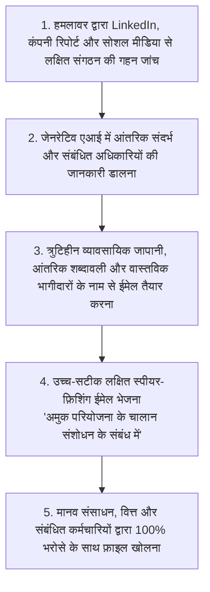

आधुनिक स्पीयर-फ़िशिंग हमलों में, हमलावर कंपनी की वेबसाइट, प्रेस विज्ञप्तियों, LinkedIn और कर्मचारियों के सोशल मीडिया से संगठनात्मक चार्ट और चल रही परियोजनाओं की जानकारी एकत्र करके एआई को प्रशिक्षित करते हैं। इसके बाद वे **«आंतरिक अधिकारियों या वास्तविक व्यापारिक साझेदारों द्वारा लिखी गई प्रतीत होने वाली स्वाभाविक और परिष्कृत भाषा में ईमेल तैयार करते हैं»**।

इससे भी अधिक भयानक **डीपफ़ेक (आवाज़ और वीडियो का जाली निर्माण)** का उपयोग करके किया जाने वाला सोशल इंजीनियरिंग हमला है:
- जापानी और बहुराष्ट्रीय कंपनियों में सीईओ या सीएफओ की आवाज़ की एआई क्लोनिंग करके तात्कालिक गोपनीय अधिग्रहण के बहाने करोड़ों येन का तत्काल बैंक ट्रांसफर कराने वाली धोखाधड़ी की वास्तविक घटनाएं सामने आ चुकी हैं।
- मानवीय इंद्रियों और सहज विश्वास को हैक करने वाले इन हमलों के सामने, «सावधानी से ईमेल जांचें» जैसी आध्यात्मिक व उपदेशात्मक सुरक्षा शिक्षा पूरी तरह बेअसर साबित हो चुकी है।

### 4.2 सत्र अपहरण (Session Hijacking) और इन्फ़ोस्टीलर (Infostealer) मैलवेयर

जापानी कंपनियों द्वारा अपनाए गए पारंपरिक दो-कारक प्रमाणीकरण (2FA/MFA) को बेअसर करने वाला मुख्य कारक **«इन्फ़ोस्टीलर (सूचना चुराने वाले मैलवेयर)»** का विस्फोटक प्रसार है।

RedLine, Raccoon, और Lumma जैसे इन्फ़ोस्टीलर मैलवेयर पायरेटेड सॉफ़्टवेयर, फर्जी वर्क टूल्स या फ़िशिंग साइटों के जरिए कर्मचारियों या बाहरी ठेकेदारों के पीसी में घुसपैठ करते हैं।

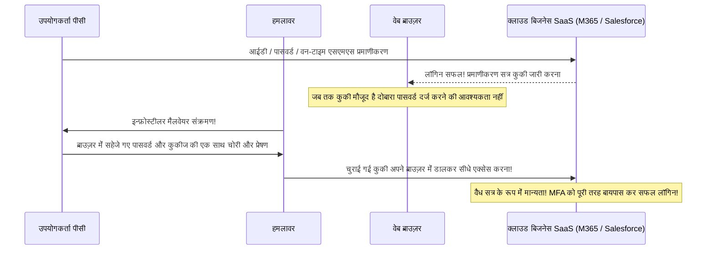

इन्फ़ोस्टीलर का उद्देश्य फ़ाइलों को एन्क्रिप्ट करना नहीं होता। वे सीधे वेब ब्राउज़र (Chrome, Edge आदि) के डेटाबेस में जाकर **«सहेजे गए पासवर्ड और सक्रिय सत्र कुकीज़ (Session Cookies) को पूरी तरह चुरा लेते हैं»**।

जब कोई उपयोगकर्ता आईडी, पासवर्ड और एसएमएस या ऐप कोड द्वारा सफलतापूर्वक लॉगिन करता है, तो ब्राउज़र सत्र कुकी सहेज लेता है। हमलावर इस कुकी को चुराकर अपने ब्राउज़र में इंजेक्ट (Cookie Hijacking) कर लेते हैं, जिससे उन्हें **पासवर्ड दर्ज किए बिना और एमएफए कोड दिए बिना सीधे पीड़ित उपयोगकर्ता के रूप में आंतरिक प्रणालियों में प्रवेश मिल जाता है**।

वर्तमान में डार्क वेब पर जापानी कंपनियों की वैध सत्र कुकीज़ कुछ ही डॉलर में थोक के भाव बेची जा रही हैं, और हमलावर बिना किसी हैकिंग प्रयास के खरीदे गए क्रेडेंशियल्स के साथ मुख्य द्वार से शान से प्रवेश कर रहे हैं।

### 4.3 आंतरिक खतरे: सेवानिवृत्त कर्मचारियों और ठेकेदारों द्वारा डेटा की चोरी

साइबर खतरे केवल बाहर से ही नहीं आते। जापान नेटवर्क सुरक्षा संघ (JNSA) के आंकड़ों के अनुसार, डेटा लीक की एक बहुत बड़ी संख्या **«आंतरिक व्यक्तियों (वर्तमान कर्मचारियों, सेवानिवृत्त कर्मचारियों, अनुबंधित कर्मियों) द्वारा जानबूझकर डेटा चुराने»** के कारण होती है।

- **रोजगार की तरलता और नौकरी छोड़ने पर डेटा चोरी**:
  आजीवन रोजगार के कमजोर पड़ने और नौकरी बदलने के सामान्य होने के कारण, प्रतिस्पर्धी कंपनियों में जाने वाले सेल्स या तकनीकी कर्मचारी ग्राहक सूचियों, सोर्स कोड और डिज़ाइनों को «अपनी उपलब्धि» बताकर व्यक्तिगत यूएसबी ड्राइव या निजी क्लाउड (Google Drive, Dropbox आदि) पर अपलोड करके ले जाते हैं।
- **विशेषाधिकार प्राप्त ठेकेदारों द्वारा धोखाधड़ी**:
  सिस्टम रखरखाव का काम करने वाले उप-ठेकेदारों के कर्मचारी कर्ज या वित्तीय तंगी के कारण डेटाबेस तक अपनी सीधी पहुंच का दुरुपयोग करके लाखों ग्राहकों की जानकारी डाउनलोड करके डेटा दलालों या अपराधियों को बेच देते हैं।

अधिकांश जापानी कंपनियां «मानवीय अच्छाई के विश्वास» पर काम करती हैं और उनके पास डेटा हानि रोकथाम (DLP) या उपयोगकर्ता और इकाई व्यवहार विश्लेषण (UEBA) उपकरण नहीं होते, जो असामान्य डाउनलोड्स को वास्तविक समय में पहचानकर रोक सकें। अधिकांश मामलों में डेटा चोरी का पता महीनों या सालों बाद पुलिस जांच या प्रतिस्पर्धी उत्पाद आने पर ही चलता है।

---

## अध्याय 5: ज़ीरो ट्रस्ट आर्किटेक्चर (ZTA) पर पूर्ण संक्रमण की व्यावहारिक रूपरेखा

इन बहुआयामी और अस्तित्वगत खतरों के सामने, जापानी कंपनियों के पास मृतप्राय परिधि सुरक्षा को पूरी तरह त्यागने और **«ज़ीरो ट्रस्ट आर्किटेक्चर (Zero Trust Architecture - ZTA)»** पर पूर्ण रूप से स्थानांतरित होने के अलावा कोई अन्य विकल्प नहीं है।

### 5.1 ज़ीरो ट्रस्ट का मूल सार: «कभी भरोसा न करें, हमेशा सत्यापित करें (Never Trust, Always Verify)»

ज़ीरो ट्रस्ट किसी एकल सुरक्षा उत्पाद का नाम नहीं है। यह नेशनल इंस्टीट्यूट ऑफ स्टैंडर्ड्स एंड टेक्नोलॉजी (NIST) द्वारा अपने मानक «NIST SP 800-207» में संहिताबद्ध **«सुरक्षा दर्शन का एक मौलिक प्रतिमान बदलाव (सोच के ऑपरेटिंग सिस्टम का पुनर्लेखन)»** है।

> **ज़ीरो ट्रस्ट के मूल सिद्धांत (Core Principles)**:
> 1. **कभी भरोसा न करें, हमेशा सत्यापित करें (Never Trust, Always Verify)**:
>    चाहे कनेक्शन आंतरिक लैन के भीतर से आ रहा हो या निदेशक मंडल के पीसी से, किसी भी उपयोगकर्ता, डिवाइस या संचार को पहले से सुरक्षित नहीं माना जाता। हर एक्सेस अनुरोध को शत्रुतापूर्ण मानकर सत्यापित किया जाता है।
> 2. **न्यूनतम विशेषाधिकार प्रदान करना (Grant Least Privilege Access)**:
>    उपयोगकर्ता और डिवाइस को उस समय के विशिष्ट कार्य को करने के लिए केवल आवश्यक «न्यूनतम विशेषाधिकार» ही दिए जाते हैं, और वह भी केवल आवश्यक समय के लिए (Just-In-Time)।
> 3. **सेंधमारी को अपरिहार्य मानें (Assume Breach)**:
>    इस कठोर वास्तविकता को स्वीकार करना कि «बाहरी दीवारें पहले ही टूट चुकी हैं और हमलावर हमारे आंतरिक नेटवर्क में मौजूद है», और डिज़ाइन के केंद्र में नुकसान को न्यूनतम रखने (ब्लास्ट रेडियस को सीमित करने) तथा तत्काल पहचान व अलगाव को रखना।

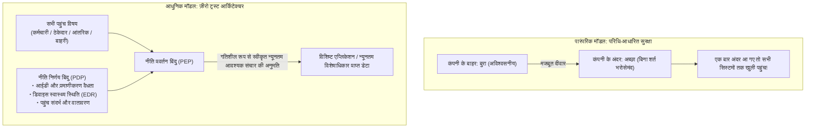

### 5.2 वीपीएन का पूर्ण उन्मूलन और ZTNA (Zero Trust Network Access) पर संक्रमण

ज़ीरो ट्रस्ट की ओर पहला अनिवार्य कदम सबसे बड़ी कमजोरी बने **«वीपीएन उपकरणों का पूर्ण उन्मूलन»** और **«ZTNA (ज़ीरो ट्रस्ट नेटवर्क एक्सेस)»** को अपनाना है।

पारंपरिक वीपीएन और ZTNA के बीच निर्णायक अंतर यह है कि कनेक्शन पूरे नेटवर्क से जुड़ता है या किसी विशिष्ट व्यक्तिगत एप्लिकेशन से:
- **पारंपरिक वीपीएन**: प्रमाणीकरण सफल होने पर उपयोगकर्ता के उपकरण को आंतरिक नेटवर्क (आईपी सबनेट) से सीधे जोड़ देता है। परिणामस्वरूप, उपकरण कंपनी के सभी सर्वरों से जुड़ सकता है और संक्रमित होने पर पूरे नेटवर्क में मैलवेयर फैला सकता है।
- **ZTNA**: उपकरण को नेटवर्क से कभी भी सीधे नहीं जोड़ता। क्लाउड में स्थित एक ब्रोकर उपयोगकर्ता की पहचान और डिवाइस की सुरक्षा का कड़ाई से सत्यापन करता है, और **«केवल स्वीकृत विशिष्ट वेब ऐप या पोर्ट के लिए ही सुरक्षित रिले संचार स्थापित करता है»**। उपकरण आंतरिक नेटवर्क का आईपी पता या टोपोलॉजी नहीं देख पाता (अदृश्यता), जिससे लेटरल मूवमेंट भौतिक रूप से असंभव हो जाता है।

### 5.3 SASE (Secure Access Service Edge) और SSE का एकीकृत आर्किटेक्चर

आधुनिक ज़ीरो ट्रस्ट को साकार करने वाला व्यापक प्लेटफॉर्म गार्टनर द्वारा प्रस्तावित **«SASE (सिक्योर एक्सेस सर्विस एज)»** और इसका सुरक्षा केंद्र **«SSE (सिक्योरिटी सर्विस एज)»** है।

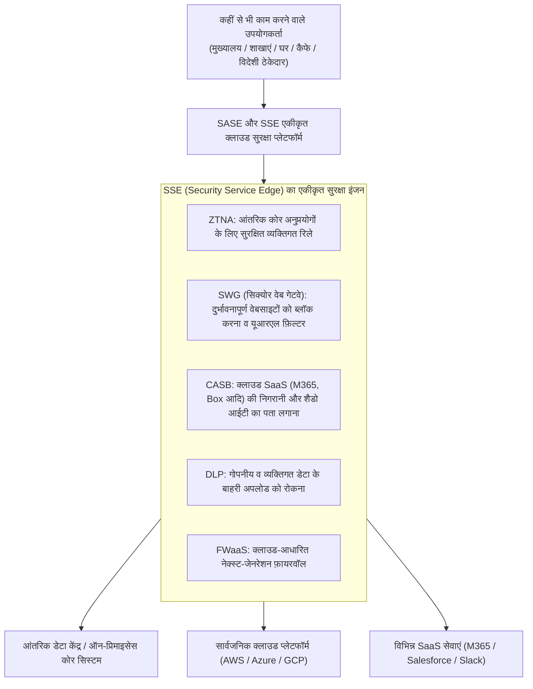

SASE वातावरण में, चाहे उपयोगकर्ता मुख्यालय में हो, घर पर हो या विदेश में किसी कारखाने में, सारा ट्रैफ़िक पहले विश्व स्तर पर वितरित «SASE क्लाउड» से होकर गुजरता है:
- **SWG (सिक्योर वेब गेटवे)** दुर्भावनापूर्ण साइटों और फ़िशिंग लिंक को ब्लॉक करता है।
- **CASB (क्लाउड एक्सेस सिक्योरिटी ब्रोकर)** बाहरी SaaS पर डेटा अपलोड की निगरानी करता है और शैडो आईटी को रोकता है।
- **DLP (डेटा हानि रोकथाम)** क्रेडिट कार्ड और व्यक्तिगत पहचान संख्याओं के बाहरी प्रेषण को स्वचालित रूप से रोककर एन्क्रिप्ट या ब्लॉक करता है।
- **ZTNA** आंतरिक कोर प्रणालियों के लिए सुरक्षित मार्ग प्रदान करता है।

यह महंगे और जटिल ऑन-प्रिमाइसेस प्रॉक्सी और वीपीएन राउटरों को समाप्त करके, दुनिया भर में समान और उच्चतम स्तर की सुरक्षा नीति लागू करने में सक्षम बनाता है।

### 5.4 माइक्रो-सेगमेंटेशन द्वारा लेटरल मूवमेंट की भौतिक रोकथाम

बाहरी सुरक्षा कितनी भी मजबूत क्यों न हो, किसी उपकरण के मैलवेयर संक्रमित होने की संभावना को 100% समाप्त नहीं किया जा सकता। इसलिए **«माइक्रो-सेगमेंटेशन (Micro-Segmentation)»** अपरिहार्य हो जाता है।

माइक्रो-सेगमेंटेशन पारंपरिक फ़्लोर-स्तरीय या शाखा-स्तरीय नेटवर्क विभाजन को समाप्त करता है और **«प्रत्येक व्यक्तिगत सर्वर, प्रत्येक वर्चुअल मशीन और प्रत्येक कंटेनर»** के स्तर पर एक आभासी फ़ायरवॉल परिधि स्थापित करता है।

- उदाहरण के लिए, वित्तीय लेखांकन सर्वर केवल लेखा विभाग के प्रमाणित कंप्यूटरों के विशिष्ट एन्क्रिप्टेड पोर्ट से ही संचार स्वीकार करता है, और विकास विभाग या सामान्य कर्मचारियों के कंप्यूटरों से आने वाले किसी भी संचार (यहां तक कि ping अनुरोध) को पूरी तरह अस्वीकार कर देता है।
- एक ही रैक में अगल-बगल रखे सर्वरों के बीच भी, जब तक स्पष्ट रूप से स्वीकृत एपीआई संचार न हो, आपस में कोई संचार संभव नहीं होता।

इसके परिणामस्वरूप, यदि कोई पीसी रैनसमवेयर से संक्रमित हो भी जाता है, तो चारों ओर के सभी दरवाजे लोहे के शटर से बंद होने के कारण **«हमला पूरी तरह उसी संक्रमित कंप्यूटर के भीतर सीमित (ब्लास्ट रेडियस न्यूनतम) रह जाता है और अन्य प्रणालियों में फैलना भौतिक रूप से अवरुद्ध हो जाता है»**।

---

## अध्याय 6: पहचान और प्रमाणीकरण बुनियादी ढांचे (IAM/PAM) की किलेबंदी

ज़ीरो ट्रस्ट आर्किटेक्चर में नई सुरक्षा परिधि कोई भौतिक नेटवर्क लाइन नहीं है। **«पहचान और प्रमाणीकरण (Identity is the New Perimeter)»** ही सुरक्षा नियंत्रण का मुख्य आधार है।

### 6.1 FIDO2 / Passkeys आधारित फ़िशिंग-रोधी MFA का अनिवार्य क्रियान्वयन

कंपनियों को सबसे पहले एसएमएस, ईमेल या स्मार्टफोन के पुश नोटिफिकेशन (बिना नंबर मिलान की साधारण स्वीकृति) पर निर्भर पुराने बहु-कारक प्रमाणीकरण को तुरंत समाप्त करना चाहिए।

जैसा कि पहले बताया गया है, हमलावर रिवर्स प्रॉक्सी फ़िशिंग (जैसे Evilginx) और इन्फ़ोस्टीलर मैलवेयर के माध्यम से एसएमएस कोड और सत्र टोकन आसानी से चुरा सकते हैं। इसका एकमात्र पूर्ण समाधान **FIDO2 / WebAuthn (Passkeys) पर आधारित फ़िशिंग-प्रतिरोधी MFA (Phishing-Resistant MFA)** है।

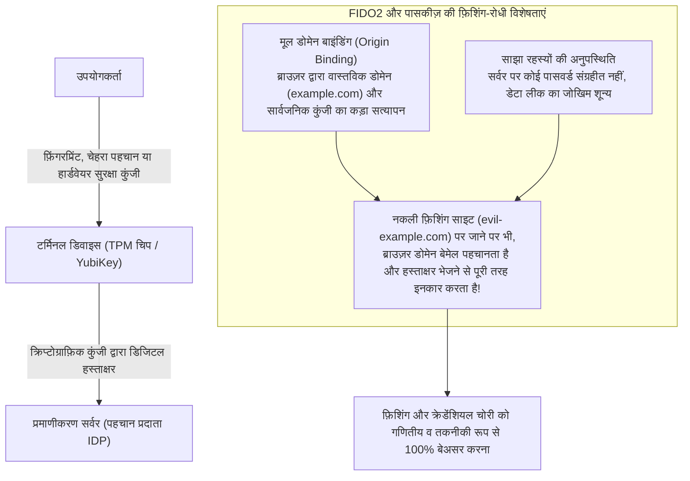

FIDO2 की क्रिप्टोग्राफ़िक मजबूती इसकी **«मूल डोमेन बाइंडिंग (Origin Binding)»** विशेषता में निहित है।
यदि उपयोगकर्ता किसी धोखेबाज फ़िशिंग पेज पर चला भी जाता है जो मूल साइट जैसा दिखता है, तो वेब ब्राउज़र स्वयं कनेक्टेड डोमेन (FQDN) का कड़ाई से मिलान करता है। यदि डोमेन वास्तविक नहीं है, तो ब्राउज़र और डिवाइस की सुरक्षा चिप किसी भी परिस्थिति में डिजिटल हस्ताक्षर भेजने से पूरी तरह इनकार कर देती है।

यह गणितीय रूप से क्रेडेंशियल चोरी को असंभव बना देता है। कंपनियों को तुरंत YubiKey जैसी भौतिक सुरक्षा कुंजियों या Windows Hello / Touch ID के माध्यम से FIDO2 प्रमाणीकरण को व्यवस्थापकों और संवेदनशील डेटा संभालने वाले सभी कर्मचारियों के लिए अनिवार्य बनाना चाहिए।

### 6.2 Active Directory का टियरिंग (Tiering) मॉडल और JIT एक्सेस

जिन कंपनियों को ऑन-प्रिमाइसेस Active Directory चलाना ही पड़ता है, उनके लिए विशेषाधिकार प्राप्त पहचानों की सुरक्षा हेतु Microsoft द्वारा अनुशंसित **«टियरिंग (Tiering) आर्किटेक्चर»** एकमात्र अचूक उपाय है।

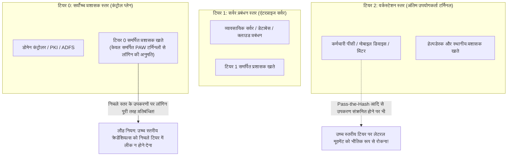

टियरिंग मॉडल का अटल नियम है: **«उच्च विशेषाधिकार प्राप्त खाते को कभी भी निचले स्तर के उपकरणों में लॉगिन नहीं करने देना चाहिए (क्रेडेंशियल के अंश न छोड़ना)»**:
- **टियर 0 (डोमेन कोर)**: डोमेन एडमिन खाते। इनकी पहुंच केवल डोमेन कंट्रोलर और पहचान सर्वरों तक सीमित होती है, और वे सामान्य कर्मचारियों के पीसी (टियर 2) या फ़ाइल सर्वर (टियर 1) पर कभी लॉगिन नहीं करते। यह कार्य केवल इंटरनेट से अलग किए गए समर्पित विशेषाधिकार प्राप्त वर्कस्टेशन (PAW: Privileged Access Workstation) से ही किया जाता है।
- **टियर 1 (सर्वर प्रबंधन)**: केवल व्यावसायिक सर्वरों और डेटाबेस का प्रबंधन।
- **टियर 2 (क्लाइंट प्रबंधन)**: केवल अंतिम उपयोगकर्ता कंप्यूटरों का प्रबंधन।

इसके अतिरिक्त, चौबीसों घंटे डोमेन एडमिन अधिकार रखने की व्यवस्था समाप्त करके **«JIT (Just-In-Time) एक्सेस»** लागू किया जाना चाहिए। व्यवस्थापक सामान्य समय में सामान्य उपयोगकर्ता के रूप में कार्य करते हैं और केवल आवश्यक रखरखाव के समय अनुमोदित वर्कफ़्लो के माध्यम से कुछ घंटों के लिए अस्थायी विशेषाधिकार प्राप्त करते हैं। इससे खाता चोरी होने पर भी हमलावर को कोई विशेषाधिकार नहीं मिल पाता।

### 6.3 सशर्त पहुंच (Conditional Access) द्वारा गतिशील नीति मूल्यांकन

प्रमाणीकरण एक बार लॉगिन करने तक सीमित «स्थैतिक घटना» नहीं होनी चाहिए। ज़ीरो ट्रस्ट में प्रमाणीकरण और प्राधिकरण को पूरे सत्र के दौरान **«गतिशील और निरंतर मूल्यांकन (Continuous Evaluation)»** होना चाहिए।

Microsoft Entra ID और Okta जैसे प्लेटफॉर्म **«सशर्त पहुंच (Conditional Access)»** के माध्यम से मिलीसेकंड में बहुआयामी संकेतों का वास्तविक समय में मूल्यांकन करते हैं:
1. **उपयोगकर्ता और समूह की पहचान**।
2. **आईपी पता और भौगोलिक स्थान**: «असंभव यात्रा (Impossible Travel)» का पता लगाना ―― उदाहरण के लिए, टोक्यो से लॉगिन करने के 10 मिनट बाद उसी खाते से अचानक रूस या नाइजीरिया से अनुरोध आने पर तत्काल ब्लॉक करना।
3. **डिवाइस का स्वास्थ्य और अनुपालन (Compliance)**: क्या उपकरण में कंपनी द्वारा निर्धारित EDR स्थापित है? क्या ओएस सुरक्षा पैच अद्यतित हैं? क्या BitLocker एन्क्रिप्शन सक्षम है? क्या मैलवेयर का कोई संकेत है?
4. **वास्तविक समय जोखिम स्कोर और व्यवहार विश्लेषण**: देर रात के असामान्य लॉगिन या अचानक बड़ी संख्या में फ़ाइलें डाउनलोड करने की कोशिश का पता चलने पर तुरंत बायोमेट्रिक सत्यापन की मांग करना या सत्र को समाप्त करना।

यदि इनमें से कोई भी शर्त पूरी नहीं होती, तो सही पासवर्ड दर्ज होने पर भी सिस्टम का दरवाज़ा बिल्कुल नहीं खुलता।

---

## अध्याय 7: आपूर्ति श्रृंखला और ठेकेदार सुरक्षा का नियंत्रण मॉडल

कंपनी चाहे अपनी सुरक्षा कितनी भी पुख्ता कर ले, यदि आपूर्ति श्रृंखला का पिछला दरवाजा खुला है, तो संगठन की रक्षा नहीं हो सकती। बाहरी ठेकेदारों को कैसे नियंत्रित किया जाना चाहिए?

### 7.1 ठेकेदारों की पूर्ण दृश्यता और प्रभावी सुरक्षा ऑडिट

पहला कदम **«आपूर्ति श्रृंखला का पूर्ण इन्वेंट्री और दृश्यता सुनिश्चित करना»** है।

अधिकांश बड़ी कंपनियां टियर-1 ठेकेदारों को जानती हैं, लेकिन टियर-2 और टियर-3 के ठेकेदार कौन हैं, कहां काम कर रहे हैं और उनका सुरक्षा स्तर क्या है, इसका उन्हें कोई भान नहीं होता:
- सभी अनुबंधों में «पूर्व लिखित अनुमति के बिना पुनः-आउटसोर्सिंग (सबकॉन्ट्रैक्टिंग) पर सख्त प्रतिबंध» स्पष्ट रूप से शामिल होना चाहिए।
- साल में एक बार कागजी चेकलिस्ट भेजकर औपचारिक ऑडिट करने की निरर्थक प्रथा को पूरी तरह समाप्त किया जाना चाहिए।
- तीसरे पक्ष के स्वतंत्र सुरक्षा ऑडिट या **सुरक्षा रेटिंग सेवाओं (जैसे BitSight, SecurityScorecard आदि)** का उपयोग करके ठेकेदारों के डोमेन और आईपी पतों पर मौजूद कमजोरियों, पैच की स्थिति और लीक हुए क्रेडेंशियल्स की वास्तविक समय में निरंतर निगरानी की व्यवस्था बनाई जानी चाहिए।

### 7.2 ठेकेदारों के उपकरणों पर BYOD का पूर्ण निषेध और ज़ीरो ट्रस्ट VDI

ठेकेदारों के माध्यम से डेटा लीक और मैलवेयर संक्रमण को रोकने का सबसे प्रभावी भौतिक समाधान **«ठेकेदार के उपकरण को वास्तविक डेटा का एक बाइट भी न सौंपना»** है।

ठेकेदारों के व्यक्तिगत पीसी या अनियंत्रित उपकरणों (BYOD) का कंपनी के आंतरिक नेटवर्क या क्लाउड स्टोरेज से सीधा कनेक्शन पूरी तरह प्रतिबंधित (Zero Trust) होना चाहिए।

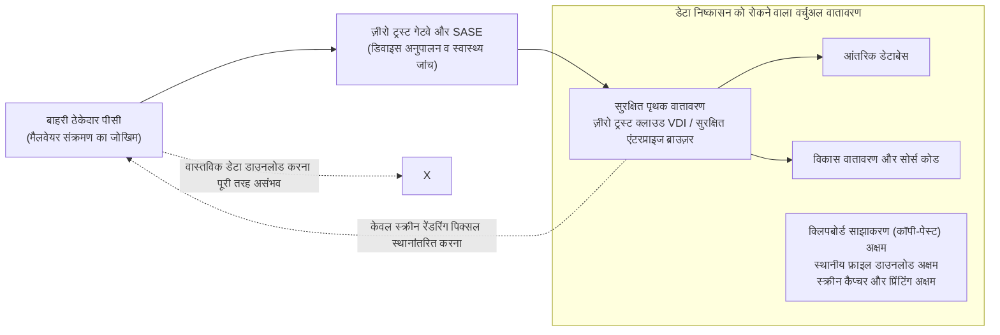

बाहरी ठेकेदारों को केवल कंपनी द्वारा प्रबंधित **«ज़ीरो ट्रस्ट क्लाउड VDI (DaaS)»** या **«सुरक्षित एंटरप्राइज ब्राउज़र»** के माध्यम से ही काम करने की अनुमति दी जानी चाहिए:
- स्थानीय कंप्यूटर पर फ़ाइल डाउनलोड करना, क्लिपबोर्ड के जरिए कॉपी-पेस्ट करना, स्क्रीनशॉट लेना और प्रिंट निकालना तकनीकी रूप से पूरी तरह अक्षम किया जाता है।
- ठेकेदार के उपकरण पर केवल «स्क्रीन रेंडरिंग पिक्सल» ही भेजे जाते हैं। यदि ठेकेदार का कंप्यूटर किसी इन्फ़ोस्टीलर मैलवेयर से संक्रमित भी हो जाता है, तो भी वास्तविक डेटा या सत्र टोकन चुराए जाने का जोखिम शून्य हो जाता है।

### 7.3 सॉफ़्टवेयर बिल ऑफ मैटेरियल्स (SBOM) और न्यूनतम विशेषाधिकार एपीआई एकीकरण

डिजिटल आपूर्ति श्रृंखला में एक और बड़ा अंधा मोड़ आउटसोर्स सॉफ़्टवेयर विकास है।

बाहरी वेंडरों द्वारा विकसित अनुप्रयोगों में पुरानी और असुरक्षित ओपन-सोर्स लाइब्रेरीज़ (जैसे Apache Log4j या पुराने Spring फ़्रेमवर्क) शामिल होकर उपेक्षित पड़ी रहने की घटनाएं बहुत आम हैं।

कंपनियों को सॉफ़्टवेयर वेंडरों से सभी ओपन-सोर्स घटकों, उनके संस्करणों और लाइसेंसों को सूचीबद्ध करने वाला **«SBOM (Software Bill of Materials)»** अनिवार्य रूप से मांगना चाहिए। इससे जब भी दुनिया में कोई नई ज़ीरो-डे भेद्यता सामने आती है, तो कंपनी कुछ ही मिनटों में यह पहचान सकती है कि उसके कौन से सिस्टम प्रभावित हैं और तत्काल सुधारात्मक कदम उठा सकती है।

इसके अलावा, साझेदारों और बाहरी क्लाउड के साथ एपीआई एकीकरण में असीमित एक्सेस टोकन जारी करने पर रोक लगाई जानी चाहिए और OAuth 2.0 पर आधारित न्यूनतम विशेषाधिकार स्कोप और छोटी समाप्ति अवधि (TTL) का कड़ाई से पालन किया जाना चाहिए।

---

## अध्याय 8: रैनसमवेयर और डेटा विनाश के खिलाफ «साइबर लचीलापन (Cyber Resilience)»

ज़ीरो ट्रस्ट के मूल दर्शन «सेंधमारी को अपरिहार्य मानना (Assume Breach)» के तहत, रक्षा की अंतिम पंक्ति **«साइबर लचीलापन (कारोबार निरंतरता और पुनर्प्राप्ति क्षमता)»** है।

चाहे सुरक्षा कितनी भी पुख्ता हो, राज्य-प्रायोजित साइबर अपराधियों को 100% रोकना असंभव है। असली कसौटी यह है कि «हमला होने के बाद आप कितनी तेजी से व्यवसाय को दोबारा शुरू कर सकते हैं»।

### 8.1 3-2-1-1-0 बैकअप नियम और «अपरिवर्तनीय स्टोरेज (Immutable Storage)»

आधुनिक रैनसमवेयर हमलों (जैसे BlackSuit, LockBit आदि) में हमलावरों का पहला लक्ष्य डेटा एन्क्रिप्शन नहीं, बल्कि **«बैकअप को पूरी तरह नष्ट करना»** होता है। यदि बैकअप सुरक्षित रहता है, तो कोई भी कंपनी फिरौती नहीं देती।

पारंपरिक रूप से रात में नेटवर्क स्टोरेज पर बैकअप कॉपी करने की प्रणाली अब पूरी तरह व्यर्थ हो चुकी है। यदि बैकअप सर्वर Active Directory डोमेन से जुड़ा है, तो डोमेन एडमिन अधिकार छीनने वाला हमलावर कुछ ही सेकंड में बैकअप को मिटा देता है।

कंपनियों को आधुनिक **«3-2-1-1-0 बैकअप नियम»** को तत्काल अपनाना चाहिए:

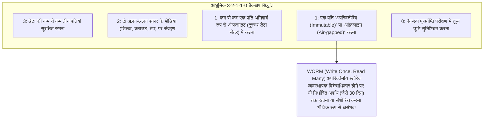

इस नियम का सबसे निर्णायक हिस्सा **«अपरिवर्तनीय बैकअप (Immutable Backup)»** है।
यह तकनीक क्लाउड (जैसे AWS S3 Object Lock) या समर्पित बैकअप उपकरणों (जैसे Veeam, Cohesity, Rubrik) की **WORM (Write Once, Read Many)** कार्यक्षमता का उपयोग करती है। एक बार बैकअप लिखे जाने के बाद, कंपनी के सर्वोच्च व्यवस्थापक या घुसपैठ करने वाले हमलावर के पास पूर्ण अधिकार होने पर भी, निर्धारित अवधि (जैसे 30 दिन) तक डेटा को **हटाना, ओवरराइट करना या एन्क्रिप्ट करना हार्डवेयर व एपीआई स्तर पर भौतिक रूप से असंभव** बना दिया जाता है।

भले ही मुख्य डेटा सेंटर नष्ट हो जाए और सभी वर्चुअल मशीनें एन्क्रिप्ट हो जाएं, अपरिवर्तनीय स्टोरेज में सुरक्षित बैकअप के बल पर कंपनी फिरौती देने से इनकार कर सकती है और कुछ ही दिनों में अपनी प्रणालियों को पूरी तरह बहाल कर सकती है।

### 8.2 बैकअप प्रणालियों के लिए «स्वतंत्र प्रमाणीकरण डोमेन» का अलगाव

केवल अपरिवर्तनीय स्टोरेज लगाना ही पर्याप्त नहीं है, बल्कि एक अनिवार्य परिचालन नियम के रूप में **«बैकअप सिस्टम के प्रबंधन को आंतरिक Active Directory डोमेन से पूरी तरह अलग रखना»** आवश्यक है।

- बैकअप सर्वरों के लिए कॉर्पोरेट एडी से असंबंधित पूरी तरह से स्वतंत्र पहचान प्रदाता (स्वतंत्र एमएफए वाला स्थानीय प्रमाणीकरण) का उपयोग किया जाना चाहिए।
- बैकअप प्रबंधन केवल इंटरनेट और आंतरिक लैन से कटे हुए एक पृथक और सुरक्षित नेटवर्क के टर्मिनलों से ही संभव होना चाहिए।

यह अलगाव मुख्य डोमेन के पतन की स्थिति में बैकअप प्लेटफॉर्म को विनाश से बचाता है।

### 8.3 EDR/XDR और 24/7/365 SOC द्वारा त्वरित अलगाव

घुसपैठ से लेकर क्षति फैलने तक की दौड़ में हार-जीत का फैसला दो पैमानों पर होता है: **पहचान का औसत समय (MTTD: Mean Time to Detect)** और **प्रतिक्रिया का औसत समय (MTTR: Mean Time to Respond)**।

पारंपरिक एंटीवायरस (EPP) जहां ज्ञात मैलवेयर के निशानों पर निर्भर थे, वहीं आधुनिक **EDR (एंडपॉइंट डिटेक्शन एंड रिस्पॉन्स)** और नेटवर्क व क्लाउड लॉग्स का विश्लेषण करने वाले **XDR** उपकरणों के भीतर चलने वाली प्रक्रियाओं के «व्यवहार (Behavior)» की निरंतर निगरानी करते हैं:
- जैसे कि यह पहचानना कि वैध PowerShell शुरू होकर LSASS प्रोसेस की मेमोरी निकालने की कोशिश कर रहा है, या देर रात अचानक बड़ी संख्या में फ़ाइलों का नाम बदला जा रहा है (एन्क्रिप्शन का संकेत)।
- असामान्यता का पता चलते ही EDR स्वचालित रूप से या सुरक्षा दल के आदेश पर **«संक्रमित कंप्यूटर के नेटवर्क संचार को ओएस के NDIS ड्राइवर स्तर पर तुरंत रोककर अलग (Logical Isolation) कर देता है»**, जिससे हमलावर को लेटरल मूवमेंट का कोई मौका नहीं मिलता।

हमलावर जापानी कंपनियों की रक्षा कमजोर होने के समय (जैसे शुक्रवार की देर रात या नए साल व गोल्डन वीक की छुट्टियों) पर हमला करते हैं। इसलिए केवल कार्यदिवसों में निगरानी करना व्यर्थ है; **24 घंटे 365 दिन तत्काल अलगाव कार्रवाई करने में सक्षम प्रबंधित सुरक्षा संचालन केंद्र (Managed SOC / MDR)** की तैनाती अस्तित्व की बुनियादी शर्त है।

---

## अध्याय 9: शीर्ष प्रबंधन और कानूनी विनियमों द्वारा संचालित गवर्नेंस सुधार

साइबर सुरक्षा का सुदृढ़ीकरण केवल आईटी विभाग के प्रयासों से कभी पूरा नहीं हो सकता। यह विधिक नियमों, निदेशक मंडल की कानूनी जिम्मेदारियों और कंपनी की समग्र व्यावसायिक रणनीति से जुड़ा एक व्यापक उपक्रम है।

### 9.1 व्यक्तिगत सूचना संरक्षण अधिनियम की सख्ती और वित्तीय दंड का जोखिम

यूरोपीय संघ के जीडीपीआर (GDPR) के अनुरूप जापान में भी नियामक दबाव तेजी से बढ़ रहा है।

व्यक्तिगत सूचना संरक्षण अधिनियम (APPI) में हालिया संशोधनों के अनुसार, किसी निश्चित सीमा से अधिक व्यक्तिगत डेटा लीक होने (या होने की आशंका) पर **व्यक्तिगत सूचना संरक्षण आयोग (PPC) को तुरंत रिपोर्ट करना और प्रभावित व्यक्तियों को सूचित करना कानूनी रूप से पूरी तरह अनिवार्य** हो गया है।
- कॉर्पोरेट निकायों के लिए अधिकतम जुर्माना बढ़ाकर 100 मिलियन येन कर दिया गया है।
- इसके अलावा, प्रभावित ग्राहकों और शेयरधारकों द्वारा सामूहिक मुकदमों का जोखिम, और प्रति ग्राहक हजारों से लेकर दसियों हजार येन तक के मुआवजे या हर्जाने का भुगतान, बड़े पैमाने के लीक मामलों में अरबों से लेकर दसियों अरब येन के भारी वित्तीय नुकसान का कारण बनता है।

2024 में पारित महत्वपूर्ण आर्थिक सुरक्षा सूचना संरक्षण कानून और राष्ट्रीय साइबर सुरक्षा कानूनों के कड़े होने के कारण बुनियादी ढांचा ऑपरेटरों और आपूर्ति श्रृंखला कंपनियों के लिए सरकारी निरीक्षण और सख्त सुरक्षा मानकों का पालन अनिवार्य किया जा रहा है। सुरक्षा में लापरवाही अब कंपनी के अस्तित्व को हिला देने वाले कानूनी और वित्तीय दंडों में परिणत हो रही है।

### 9.2 निदेशक मंडल का उचित सावधानी का कर्तव्य (Duty of Care): सुरक्षा एक «प्रबंधकीय जिम्मेदारी» है

कंपनी अधिनियम के तहत, निदेशकों का कंपनी के प्रति **«उचित सावधानी बरतने का कर्तव्य (Duty of Care / 善管注意義務)»** होता है।

हालिया अदालती फैसलों और आर्थिक मंत्रालय (METI) व IPA के «साइबर सुरक्षा प्रबंधन दिशानिर्देशों» के अनुसार, उचित साइबर सुरक्षा उपाय करने में विफल रहने और गंभीर डेटा लीक या व्यवसाय बंद होने की स्थिति में, प्रबंधकों को **«कर्तव्य के उल्लंघन के लिए शेयरधारक प्रतिनिधि मुकदमों का सामना करना पड़ सकता है, जिसमें अधिकारियों को अपनी व्यक्तिगत संपत्ति से भारी क्षतिपूर्ति देनी पड़ सकती है»**।

प्रबंधन अब अदालतों में यह बहाना नहीं बना सकता कि «हमने आईटी का काम तकनीकी विशेषज्ञों पर छोड़ दिया था और हमें इसकी जानकारी नहीं थी»। निदेशक मंडल कानूनी रूप से अपने साइबर जोखिम मूल्यांकन की नियमित समीक्षा करने, सुरक्षा बजट की पर्याप्तता तय करने और संकट के समय व्यवसाय निरंतरता की देखरेख करने के लिए बाध्य है।

### 9.3 CISO को वास्तविक अधिकार प्रदान करना और ROI की पुनर्रचना

गवर्नेंस सुधार का अंतिम निर्णायक तत्व **«मुख्य सूचना सुरक्षा अधिकारी (CISO) के अधिकारों को मजबूत करना»** है।

कंपनियों को निम्नलिखित सुधार तत्काल लागू करने चाहिए:
1. **CISO को कार्यकारी अधिकारी या निदेशक स्तर पर पदोन्नत करना**:
   सीआईएसओ को सीआईओ के अधीन रखने के बजाय, सीआईओ के समकक्ष और सीधे सीईओ व निदेशक मंडल को रिपोर्ट करने वाली स्वतंत्र व्यवस्था स्थापित करना।
2. **CISO को प्रणालियां बंद करने का अधिकार और वीटो पावर (Veto Power) देना**:
   सुरक्षा मानकों को पूरा न करने वाले नए सिस्टम के रिलीज को रोकने, सुरक्षा शर्तों का उल्लंघन करने वाले वेंडरों के अनुबंध समाप्त करने और आपातकाल में व्यापार जोखिम को देखते हुए सिस्टम को तुरंत बंद करने का स्पष्ट अधिकार देना।
3. **सुरक्षा निवेश के आरओआई (ROI) को पुनर्परिभाषित करना**:
   सुरक्षा निवेश को केवल प्रत्यक्ष लाभ के आधार पर नहीं आंका जा सकता; इसे **«व्यवसाय के महीनों तक ठप होने से होने वाले सैकड़ों अरब येन के नुकसान और प्रतिष्ठा के विनाश को रोकने वाले रणनीतिक बीमा और संचालन के लाइसेंस (License to Operate)»** के रूप में देखा जाना चाहिए।

---

## निष्कर्ष: निराशा से परे ―― 2026 के बाद टिके रहने का जापानी कंपनियों का संकल्प

2026 में, हम अब उस शांत दुनिया में वापस नहीं लौट सकते जहां साइबर हमले नहीं होते थे। भू-राजनीतिक संघर्षों की छाया में सक्रिय परिष्कृत साइबर सेनाएं, जेनरेटिव एआई से लैस अंतरराष्ट्रीय अपराध सिंडिकेट्स, और डार्क वेब पर बिकते अनगिनत क्रेडेंशियल्स ―― खतरे तेजी से बढ़ रहे हैं और कंपनियों को घेरे हुए हैं।

लेकिन निराश होने की आवश्यकता नहीं है।

जापानी कंपनियों पर मंडरा रहा यह संकट कोई «अपरिहार्य प्राकृतिक आपदा (दैवीय घटना)» नहीं है। यह दशकों से आईटी को बाहर फेंकने की लापरवाही, बहु-स्तरीय उप-ठेकेदारी की गैर-जिम्मेदारी, आंतरिक नेटवर्क पर अंधविश्वास और शीर्ष प्रबंधन की अज्ञानता के कारण उत्पन्न **एक पूरी तरह मानव-निर्मित संकट** है। और जो संकट मानव-निर्मित है, उसे मानवीय बुद्धिमत्ता, साहस और सही निर्णयों से निश्चित रूप से दूर किया जा सकता है।

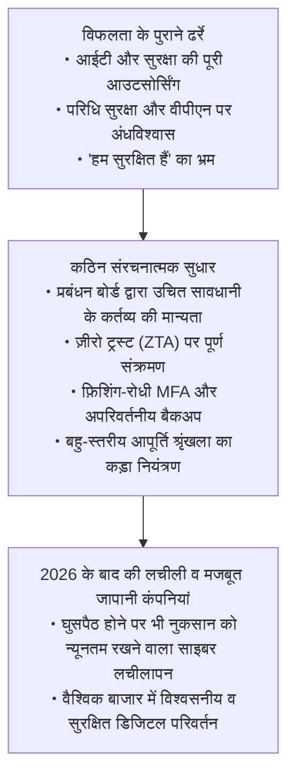

सुरक्षा कोई रुकावट पैदा करने वाला रोड़ा नहीं है। तीव्र गति से बदलते डिजिटल समाज में यह गति बढ़ाने के लिए आवश्यक **«सर्वोच्च प्रदर्शन वाला ब्रेक»** है। जिन कारों में सबसे मजबूत ब्रेक होते हैं, केवल वे ही बिना डरे तेज गति से दौड़ सकती हैं।

जिस प्रकार जापानी उद्योग ने कभी गुणवत्ता और विश्वसनीयता के प्रति अटूट निष्ठा से अपना वैश्विक मुकाम बनाया था, ठीक उसी प्रकार आज कंपनियों को **«अपने ग्राहकों, कर्मचारियों और समाज के विश्वास को कभी न तोड़ने»** का दृढ़ संकल्प लेना चाहिए। संरचनात्मक आधुनिकीकरण और साहसिक संगठनात्मक सुधार करने वाले संगठन ही 2026 के बाद के इस तूफ़ानी युग में जीवित रहेंगे और भविष्य की डिजिटल अर्थव्यवस्था में नेतृत्व करेंगे।
