## Pengantar: Lonceng Peringatan 2026 —— Krisis Nasional Jepang Sebagai «Negara Tertinggal dalam Keamanan Siber»

Sejak pertengahan dekade 2020-an hingga memasuki tahun 2026 saat ini, ruang siber Jepang terus dihantam oleh badai serangan digital dengan intensitas yang belum pernah terjadi sebelumnya.

Dahulu, di kalangan industri Jepang berkembang sebuah «mitos rasa aman» yang sama sekali tidak berdasar. Ilusi-ilusi yang meninabobokan seperti: «Perusahaan kami bukan raksasa global terkemuka, jadi tidak mungkin menjadi target peretas», «Hambatan bahasa Jepang bertindak sebagai benteng pertahanan alami terhadap penjahat siber internasional», atau «Kami sudah memasang perangkat lunak antivirus dari vendor keamanan ternama, jadi semuanya pasti aman» — kini seluruh angan-angan manis tersebut telah hancur berkeping-keping.

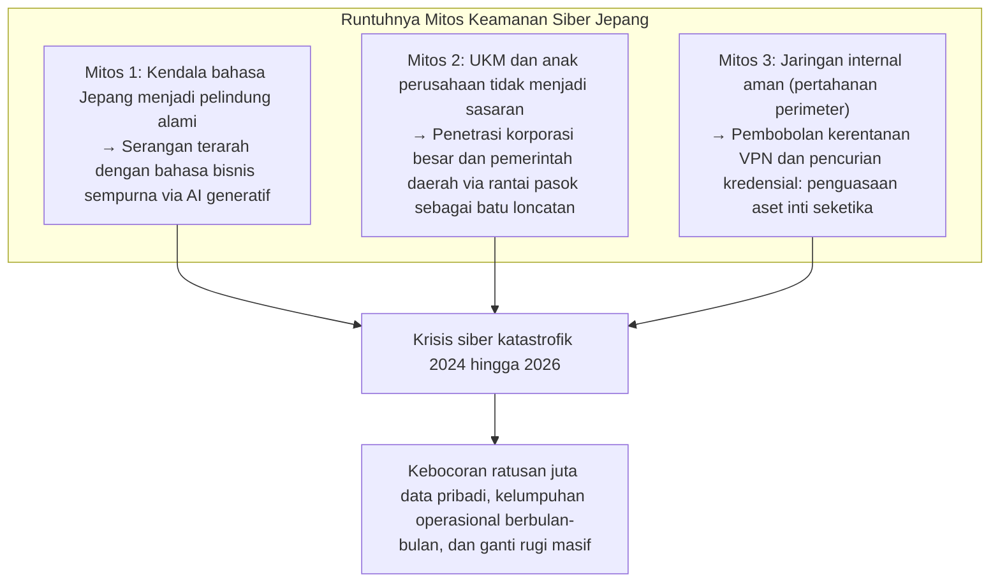

Kenyataan di lapangan teramat kejam. Mulai dari konglomerat hiburan terkemuka, megabank nasional, operator telekomunikasi papan atas, penyedia infrastruktur publik vital, hingga sistem administrasi pemerintahan daerah dan kotamadya — satu per satu entitas bergengsi bertekuk lutut di hadapan serangan ransomware (perangkat pemeras pengunci data) atau menyaksikan puluhan juta data pribadi sensitif mereka bocor ke pasar gelap Dark Web.

Data yang terekspos jauh melampaui informasi dasar seperti nama, alamat tempat tinggal, atau nomor telepon. Nomor kartu kredit lengkap, rekam medis dan hasil pemeriksaan kesehatan tahunan, nomor identitas kependudukan My Number, dokumen kontrak bisnis yang sangat rahasia, rekaman percakapan internal karyawan, hingga pindaian surat izin mengemudi staf — aset-aset data yang menopang kepercayaan sosial dan kehormatan mendasar individu — disandera dan dilelang kepada penawar tertinggi oleh sindikat kejahatan siber internasional.

Setiap kali insiden terjadi, panggung permintaan maaf publik selalu mengulang pola yang sama: jajaran direksi berbaris membungkuk sedalam-dalamnya di ruang konferensi pers, melontarkan pernyataan klise seperti «penyebab pasti masih dalam proses penyelidikan» dan «kami akan memperketat pelatihan kesadaran keamanan bagi seluruh staf».

Namun, sebuah pertanyaan mendasar harus diajukan: **Mengapa, di tengah kucuran investasi teknologi informasi bernilai triliunan yen dan agenda pelatihan kepatuhan tahunan, rentetan kebocoran data dan insiden siber yang melumpuhkan tidak pernah berhenti menghantam perusahaan-perusahaan Jepang?**

Akar masalahnya sama sekali bukan terletak pada kesalahan remeh seorang karyawan rendahan yang «tidak sengaja mengklik tautan mencurigakan di dalam surel». Ini adalah keruntuhan struktural yang tak terelakkan, hasil akumulasi dari **«patologi struktural pengalihan penuh (marunage) sistem IT dan pola subkontrak berlapis»** yang dibiarkan berkarat selama berpuluh-puluh tahun, **«keterikatan buta pada model pertahanan perimeter (benteng dan parit) yang telah usang»**, **«rapuhnya fondasi manajemen identitas dan autentikasi»** dalam gelombang migrasi cloud yang tergesa-gesa, serta **«kegagalan tata kelola di tingkat dewan direksi yang masih memandang keamanan siber sebagai pos biaya pemborosan alih-alih investasi kelangsungan bisnis yang vital»**.

Buku putih ini disusun dari sudut pandang CISO (Chief Information Security Officer) tingkat atas dan analis ancaman siber strategis. Tujuannya adalah membedah secara teknis anatomi insiden-insiden besar yang mengguncang Jepang sepanjang periode 2024 hingga 2026, menyingkap borok struktural yang menggerogoti korporasi Jepang, dan menyajikan panduan arsitektur pertahanan yang konkret dan tanpa kompromi demi kelangsungan hidup perusahaan: mulai dari **implementasi menyeluruh Arsitektur Zero Trust (ZTA)** berlandaskan paradigma asumsi pelanggaran (Assume Breach), pengawasan ketat rantai pasok mitra, kewajiban penerapan MFA tahan phishing, hingga penguatan resiliensi siber melalui pencadangan data tak berubah (immutable backup).

---

## Bab 1: Anatomi Insiden Kunci Korporasi Jepang (2024–2026)

Untuk memahami kenyataan getir dari krisis siber yang melanda dunia usaha di Jepang, kita harus menelaah rantai pembunuhan serangan (Kill Chain) dari insiden-insiden paling representatif secara objektif berdasarkan fakta-fakta teknis.

### 1.1 Pembelajaran dari Kasus KADOKAWA / Niconico: Kehancuran Pusat Data dan Ransomware BlackSuit

Serangan siber berskala masif yang menimpa raksasa media dan penerbitan KADOKAWA beserta anak perusahaannya, Dwango, pada Juni 2024 menjadi titik balik paling bersejarah dalam catatan insiden siber modern Jepang.

Operasi serangan tersebut dilancarkan oleh sindikat ransomware **«BlackSuit»**, yang diidentifikasi oleh para analis intelijen ancaman sebagai pewaris langsung dari kelompok kejahatan siber legendaris Conti. Akibat serangan ini, platform berbagi video terpopuler di Jepang, *Niconico Douga*, beserta puluhan portal web perusahaan lumpuh total. Dampak kelumpuhan merembet ke sistem logistik pengiriman buku, sistem pembukuan, hingga operasional bisnis inti selama berbulan-bulan. Lebih parah lagi, lebih dari 250.000 dokumen internal yang memuat data pribadi karyawan, mitra kreator konten, serta kontrak bisnis rahasia dieksfiltrasi dan dipublikasikan di Dark Web.

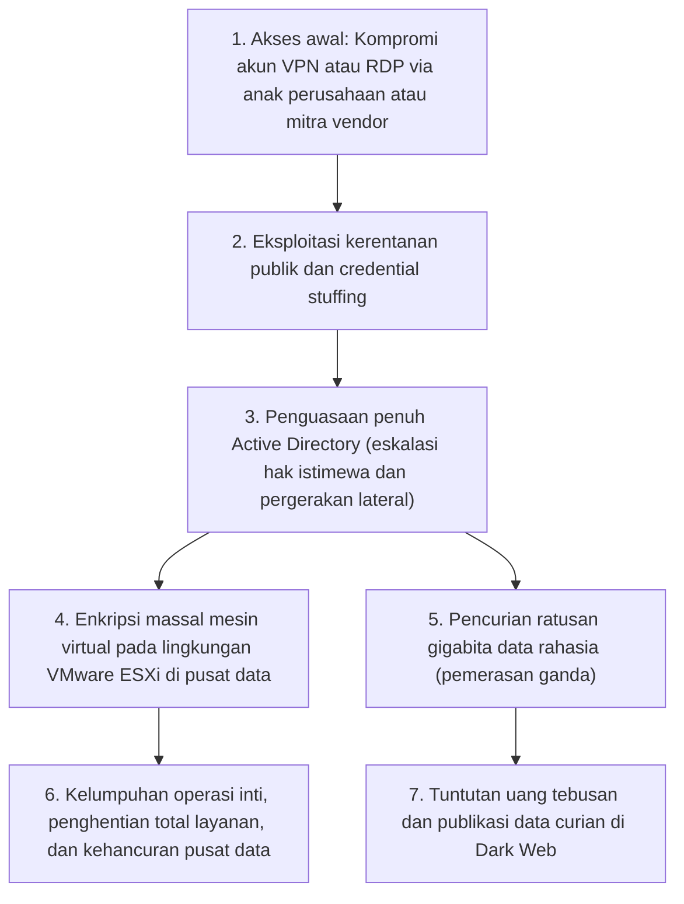

Guncangan terbesar yang menghantam komunitas teknologi Jepang dari kasus ini adalah fakta bahwa **«infrastruktur cloud privat lokal (fondasi virtualisasi fisik perusahaan) dihancurkan langsung hingga ke akar-akarnya»**.

Para penyerang tidak merangsek masuk melalui jaringan kantor pusat secara frontal. Pintu masuk mereka adalah perangkat akses jarak jauh (konsentrator VPN dan protokol RDP) milik anak perusahaan dan vendor operasional luar. Begitu berhasil menancapkan kaki di balik pagar perimeter, penyerang memanfaatkan arsitektur jaringan internal yang «flat» (datar, tanpa segmentasi ketat) untuk melancarkan pergerakan lateral (Lateral Movement) secara agresif. Sasaran pamungkas mereka adalah **merebut hak istimewa Administrator Domain (Domain Admin) pada pengendali domain Active Directory** — pusat kendali seluruh infrastruktur perusahaan.

Dengan memegang otoritas dewa atas domain tersebut, operator BlackSuit tidak sekadar menyasar server aplikasi individual; mereka langsung mengakses kluster hipervisor VMware ESXi yang menopang seluruh virtualisasi perusahaan dan mengeksekusi enkripsi berkas citra mesin virtual (berkas VMDK) di datastore dengan kecepatan sangat tinggi. Yang paling mengenaskan, **seluruh data cadangan (backup) yang terhubung secara daring di jaringan yang sama berhasil dilacak, dirusak, dan dihapus total oleh para peretas**.

Peristiwa tragis ini membuktikan di depan mata seluruh jajaran direksi di Jepang bahwa pertahanan perimeter telah mati: jika penyerang berhasil melangkah masuk ke dalam jaringan kantor, pusat data paling megah sekalipun dapat dimusnahkan dalam hitungan jam.

### 1.2 Kasus LINE Yahoo dan Infrastruktur Bersama NAVER: Runtuhnya Tata Kelola Alih Daya Lintas Negara

Insiden kebocoran data pribadi berskala masif di LINE Yahoo —yang terungkap pada musim gugur 2023 dan berujung pada rentetan instruksi administratif serta peringatan keras dari Kementerian Urusan Internal dan Komunikasi Jepang (MIC) sepanjang 2024 hingga 2026— menyingkap **«titik buta tata kelola keamanan yang timbul dari relasi modal saham dan kontrak pengembangan lintas negara»**.

Sekitar 510.000 data pengguna, mitra bisnis, dan karyawan terekspos ke pihak luar. Pemicu insiden bermula dari lingkungan komputasi awan milik perusahaan induk asal Korea Selatan, NAVER.

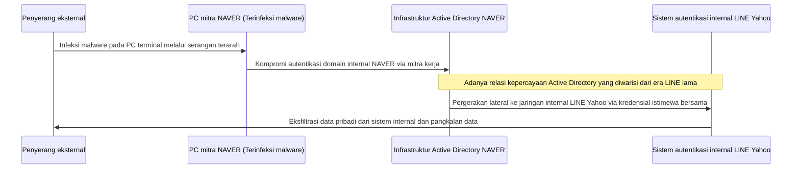

Esensi teknis dari kerentanan ini berakar pada kenyataan bahwa **«antara entitas LINE lama dan NAVER, infrastruktur direktori autentikasi Active Directory dan relasi saling percaya (trust relationship) dibiarkan terhubung secara permanen tanpa isolasi yang memadai»**.

Bermula dari infeksi malware pada komputer kerja salah satu subkontraktor pihak ketiga yang dipekerjakan NAVER di Korea Selatan, para peretas berhasil menyusup ke jaringan internal NAVER. Memanfaatkan relasi kepercayaan autentikasi lintas batas negara tersebut, para penyerang dapat melenggang masuk tanpa rintangan keamanan yang berarti ke dalam pangkalan data dan sistem penting LINE Yahoo di Jepang.

Kasus ini menyadarkan industri akan bahaya besar dari model alih daya global dan pembagian kerja lintas negara tanpa pagar pengaman. **Menghubungkan jaringan dan autentikasi atas dasar asumsi naif \'karena mereka masih satu grup perusahaan\' atau \'karena mereka adalah perusahaan induk kita\' adalah tindakan bunuh diri operasional**. Ketegasan pemerintah Jepang yang menuntut peninjauan ulang struktur kepemilikan modal dan pemutusan total integrasi sistem autentikasi menegaskan bahwa tata kelola rantai pasok kini telah menjadi persoalan kedaulatan digital dan keamanan nasional.

### 1.3 Runtuhnya Rantai Pasok Administrasi Daerah dan Industri BPO (Kasus Iseto dan Lainnya)

Mulai tahun 2024, kepanikan massal melanda puluhan pemerintah daerah (pemda), lembaga keuangan, dan badan utilitas publik di seluruh Jepang akibat **serangan ransomware yang menghantam perusahaan besar penyedia jasa BPO (Business Process Outsourcing) dan percetakan dokumen (seperti Iseto dan rekanan sejenis)**.

Pemerintah daerah di Jepang secara rutin menyerahkan pengerjaan pencetakan, pengemasan amplop, dan pengiriman surat-surat pemberitahuan resmi kepada perusahaan percetakan dan BPO swasta melalui mekanisme lelang: mulai dari surat ketetapan pajak daerah, kartu asuransi kesehatan nasional, pemberitahuan dana pensiun, hingga kartu pemilih pemilu. Operasi ini menuntut penyerahan berkas data kependudukan dalam jumlah masif yang memuat nama lengkap, alamat domisili, nomor My Number, dan rincian penghasilan kena pajak dari jutaan warga.

Kelompok peretas tidak membuang energi menyerang jaringan tertutup milik pemerintah daerah yang dijaga ketat oleh sistem LGWAN dan arsitektur tiga lapis. Titik yang mereka bidik adalah **jaringan komputer milik perusahaan rekanan swasta yang bertugas memproses data tersebut**.

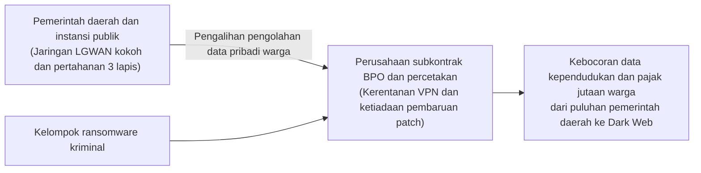

Ketika server-server milik perusahaan BPO ini terinfeksi ransomware, bukan hanya data bisnis internal mereka yang lumpuh; seluruh pangkalan data kependudukan dan catatan pajak milik jutaan warga dari puluhan kotamadya yang tersimpan di server ikut terenkripsi dan dibocorkan ke Dark Web sebagai alat pemerasan.

Pelajaran pahit yang tak terbantahkan adalah: **«Sebesar apa pun dana ratusan juta yen yang dikucurkan suatu instansi untuk membentengi sistem internalnya, jika postur keamanan mitra pihak ketiga rapuh, seluruh rantai pasok akan rontok dalam sekejap mata»**. Praktik formalitas yang menganggap keamanan terjamin hanya dengan menandatangani dokumen perjanjian kerahasiaan di atas kertas telah terbongkar kebobrokannya secara menyakitkan.

### 1.4 Kesalahan Konfigurasi Cloud (Salesforce/AWS/Azure): Tragedi Brankas Terbuka Lebar ke Seluruh Dunia

Serangan siber tingkat tinggi bukanlah satu-satunya dalang di balik kebocoran data. Memasuki pertengahan dekade 2020-an hingga tahun 2026, porsi terbesar dari total insiden kebocoran data di Jepang tetap didominasi oleh **«kesalahan konfigurasi layanan komputasi awan (Cloud Misconfiguration)»**.

Salah satu pola yang terjadi berulang kali pada perusahaan sekuritas terkemuka, perbankan, platform e-commerce, dan kementerian di Jepang adalah **bocornya jutaan data nasabah dari platform CRM Salesforce**.

Salesforce menyediakan fitur portal komunitas dan situs eksternal. Namun, akibat ketidakpahaman administrator terhadap aturan pembagian data (Sharing Rules) serta kecerobohan konfigurasi hak akses pengguna tamu (Guest User), berkas-berkas pangkalan data pelanggan yang mencakup nama lengkap, nomor telepon, nomor rekening, dan histori transaksi keuangan **berada dalam kondisi terbuka di mana siapa pun di internet dapat mencari, membaca, dan mengunduhnya tanpa memerlukan autentikasi apa pun**.

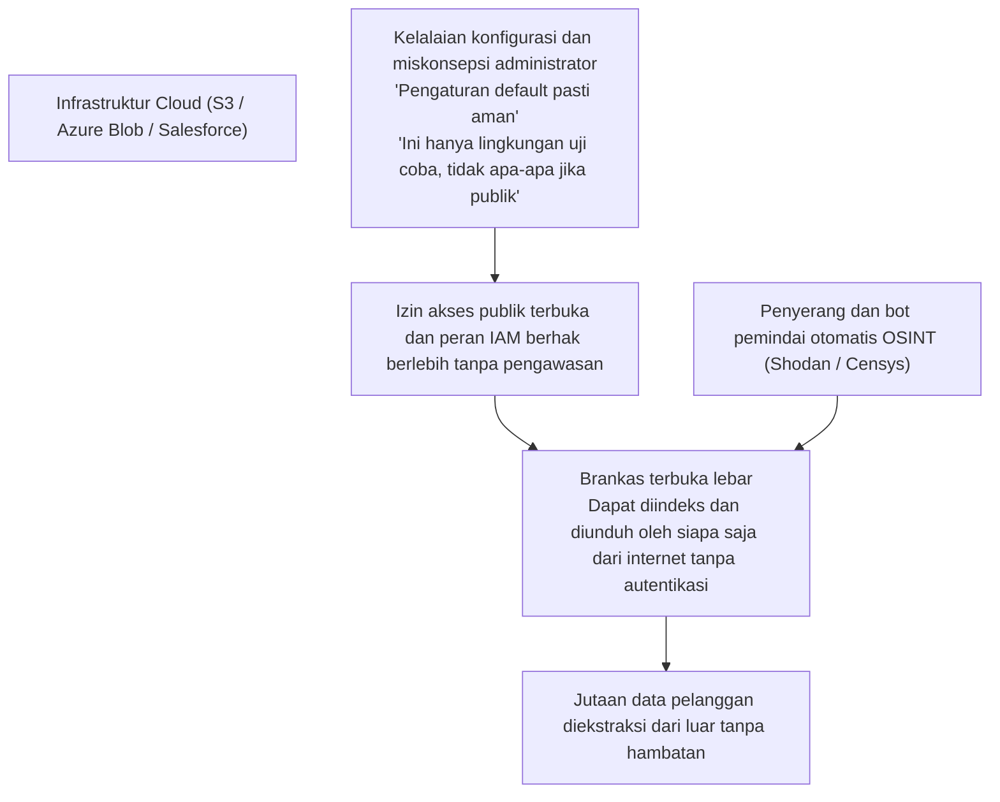

Pola kelalaian serupa terjadi secara terus-menerus pada bucket Amazon Web Services (AWS) S3 yang diatur ke akses publik tanpa kendali, akun penyimpanan Microsoft Azure yang salah konfigurasi, hingga kecerobohan pengembang perangkat lunak yang tidak sengaja mengunggah kunci akses API dan kredensial rahasia ke repositori publik GitHub.

Tanpa perlu mengeksploitasi celah zero-day yang rumit, realitas memalukan dari tata kelola cloud di Jepang adalah bahwa **perusahaan sendiri yang membuka pintu brankas mereka lebar-lebar dan memamerkannya ke hadapan dunia**.

---

## Bab 2: Membedah Akar Penyebab I —— Patologi Struktural dan Organisasi (Budaya Lepas Tangan dan Subkontrak Berlapis)

Mengapa, di hadapan risiko yang sedemikian nyata, korporasi Jepang terus gagal mengantisipasi dan mencegah insiden-insiden fatal ini? Pada bab ini, kita menyoroti borok kultural dan struktural di balik ekosistem industri Jepang.

### 2.1 Pola Pikir «IT Adalah Beban Biaya» dan Menjadikan CISO Sekadar Pajangan

Kelemahan paling fatal dalam pertahanan siber korporasi Jepang sesungguhnya tidak bertempat di tabel pengaturan firewall, melainkan **«di ruang rapat dewan direksi»**.

Di korporasi multinasional terkemuka di Barat, teknologi informasi dan keamanan siber ditempatkan sebagai pilar keunggulan kompetitif inti dan agenda prioritas tertinggi kepemimpinan puncak. CISO (Chief Information Security Officer) berada di bawah garis komando langsung CEO, mengelola alokasi anggaran mandiri yang masif, serta dibekali hak veto (Veto Power) berkekuatan hukum untuk memerintahkan penghentian operasional sistem apabila risiko siber dinilai melampaui batas toleransi, mengesampingkan kepentingan kenyamanan bisnis sesaat.

Sebaliknya, di mayoritas korporasi Jepang, divisi IT telah lama dipandang rendah sebagai «pos biaya administratif yang tidak menghasilkan laba sepeser pun».
- Nyaris tidak ada jajaran direksi yang memiliki latar belakang pemahaman teknis IT atau kualifikasi keamanan siber. Jabatan CISO umumnya dibebankan sebagai tugas sampingan kepada direktur senior berlatar belakang non-teknis yang mendekati masa pensiun, merangkap tugasnya di bagian Personalia atau Hubungan Masyarakat.
- Ketika staf keamanan di garis depan mengajukan usulan genting bahwa perangkat VPN perimeter mereka memiliki kerentanan parah dan membutuhkan anggaran puluhan juta yen serta jadwal pemeliharaan yang mengharuskan penghentian sistem sementara, jajaran pimpinan serta-merta menolak: «Kinerja kuartal ini sedang tertekan, tunda sampai tahun fiskal berikutnya» atau «Menghentikan operasional bisnis hanya untuk pemeliharaan adalah tindakan konyol».

Akibatnya, posisi CISO di Jepang terdegradasi menjadi **«kambing hitam (Scapegoat) tanpa anggaran dan tanpa kekuasaan nyata, yang fungsinya hanya untuk menundukkan kepala meminta maaf di depan sorotan kamera media saat bencana terjadi»**. Pengabaian tata kelola yang memandang belanja keamanan sebagai beban yang harus dipangkas hingga yen terakhir ketimbang investasi mutlak demi menjaga keberlanjutan usaha adalah biang keladi sesungguhnya dari krisis nasional ini.

### 2.2 Struktur Subkontrak Berlapis dan Fenomena «Mata Rantai Terlemah (Weakest Link)»

Penyakit struktural paling akut yang membelenggu industri teknologi Jepang adalah **«struktur subkontrak bertingkat (model kontraktor umum IT / IT Zenekon)»**, yang diadopsi dari industri konstruksi fisik tradisional.

Perusahaan pengguna (klien) memilih untuk mengalihkan secara penuh («marunage») seluruh perancangan, pengembangan, pengoperasian, hingga pemeliharaan keamanan kepada satu integrator sistem primer (Prime SIer). Integrator utama ini jarang mengerjakannya dengan tenaga kerja sendiri; mereka mengambil margin keuntungan perantara yang besar lalu melemparkan pekerjaan ke subkontraktor tingkat 2, yang kemudian meneruskannya lagi ke subkontraktor tingkat 3, 4, bahkan hingga tingkat 5 dan 6 yang diisi oleh usaha mikro atau pekerja lepas independen.

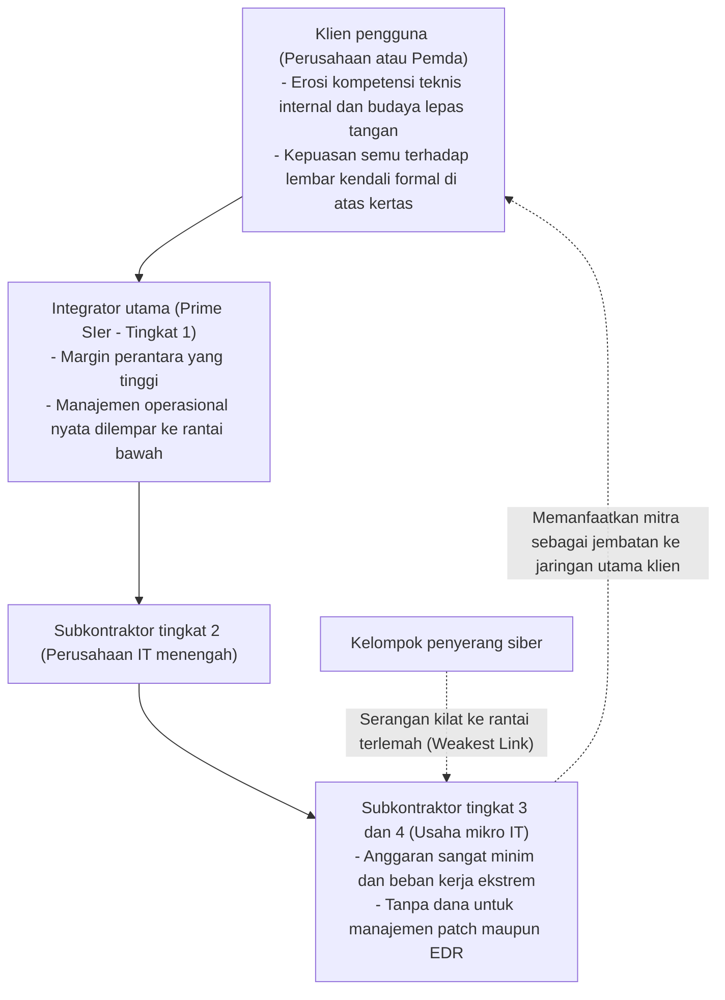

Dalam ilmu kriptografi dan rekayasa keandalan, berlaku prinsip besi yang tak terbantahkan: **«Kekuatan sebuah rantai ditentukan oleh kekuatan mata rantai yang paling lemah (The Weakest Link)»**.

Secanggih apa pun firewall generasi baru yang dipasang oleh kontraktor utama tingkat 1 dan seketat apa pun buku panduan keamanan yang mereka susun, subkontraktor di tingkat 3 atau 4 yang berada di ujung rantai tidak memiliki anggaran untuk melisensi perangkat EDR (Endpoint Detection and Response) modern, apalagi berlangganan layanan SOC (Security Operations Center) 24 jam sehari.
- Di kantor-kantor subkontraktor kecil ini, komputer jinjing pribadi karyawan (BYOD) yang menggunakan sistem operasi lawas tanpa pembaruan keamanan digunakan setiap hari untuk bekerja, sementara kata sandi administrator ditempel di layar menggunakan kertas memo.
- Dan yang paling berbahaya: agar mereka dapat menyelesaikan pekerjaannya, komputer-komputer tanpa pengawasan tersebut diberikan akun akses jarak jauh berpriveleged tinggi yang terhubung langsung ke server produksi dan pangkalan data milik perusahaan klien utama.

Bagi penyerang siber masa kini, tidak ada sasaran yang lebih mudah. Tidak perlu repot-repot mendobrak gerbang depan yang dijaga ketat. Cukup dengan menginfeksi satu laptop milik subkontraktor di ujung rantai pasok dengan malware pencuri data, peretas dapat merampas kredensial resminya dan melenggang masuk ke pusat saraf jaringan klien utama **«dengan mengenakan topeng identitas pengguna yang sah»**.

### 2.3 Keterbatasan Pola Kerja Tradisional dan Kelangkaan Struktural Talenta Siber

Dari sisi sumber daya manusia, situasinya tidak kalah menyedihkan.

Laporan resmi Kementerian Ekonomi, Perdagangan dan Industri (METI) serta Badan Promosi Teknologi Informasi (IPA) secara konsisten mengumandangkan kelangkaan ratusan ribu tenaga ahli keamanan siber di Jepang. Namun, esensi masalah ini bukan sekadar pergeseran demografi penduduk, melainkan **ketidakmampuan sistem ketenagakerjaan tradisional Jepang dalam menghargai, memberi kompensasi, dan mengembangkan talenta teknis berkeahlian tinggi**.

Di negara-negara seperti Amerika Serikat, Israel, atau Singapura, arsitek keamanan siber papan atas, perekayasa balik perangkat lunak (reverse engineer), dan peretas etis (pentester) mendapatkan paket remunerasi tahunan antara 200.000 hingga lebih dari 400.000 dolar AS, dihormati sebagai aset pertahanan paling strategis bagi korporasi.

Sebaliknya, di mayoritas korporasi konvensional Jepang yang masih memberlakukan sistem kerja seumur hidup dan skala gaji berdasarkan senioritas usia, para insinyur teknis ditempatkan di kasta bawah hierarki perusahaan:
- Struktur kompensasi seragam dan kaku: seorang insinyur muda brilian yang mampu memitigasi serangan siber kompleks digaji sama persis dengan rekan seangkatannya yang mengerjakan tugas-tugas administratif rutin.
- Satu-satunya jalan promosi karier adalah beralih menjadi manajer administratif umum (Kacho, Bucho). Jika seorang insinyur ingin gajinya naik, ia terpaksa melepaskan keahlian teknisnya, berhenti menganalisis lalu lintas jaringan, dan menghabiskan hari-harinya mengurus anggaran dan menyusun laporan di Microsoft Excel.

Dampaknya sangat gamblang: talenta-talenta teknis terbaik berbondong-bondong pindah ke perusahaan multinasional asing atau perusahaan rintisan teknologi baru. Departemen IT internal korporasi tradisional mengalami kekosongan total dari personel yang mampu mendeteksi dan menangkal serangan secara mandiri. Yang tersisa hanyalah staf «penyambung lidah» yang tugasnya semata meneruskan laporan dari vendor ke direksi. Kekosongan kompetensi ini membuat korporasi salah mengambil langkah mitigasi awal saat serangan terjadi, mengubah insiden kecil menjadi bencana nasional.

---

## Bab 3: Membedah Akar Penyebab II —— Keruntuhan Teknologi (Kematian Perimeter dan Jebakan Active Directory)

Di samping disfungsi kelembagaan dan manajerial, infrastruktur teknologi yang menopang dunia usaha Jepang memendam keusangan arsitektural yang parah, menjadi santapan empuk bagi para penyerang.

### 3.1 Pintu Belakang Nyata Bernama Gateway VPN dan Desktop Jarak Jauh

Ketika pandemi merebak, korporasi Jepang dipaksa beralih mendadak ke skema kerja jarak jauh. Solusi instan yang dipilih secara masif adalah memasang perangkat konsentrator SSL-VPN (seperti Fortinet FortiGate, Pulse Secure / Ivanti Connect Secure, dan lainnya) di gerbang perimeter jaringan internal untuk menggelar terowongan akses dari rumah karyawan.

Pilihan jalan pintas ini menjelma menjadi **pintu belakang dan titik fatal paling mematikan bagi keamanan siber Jepang**.

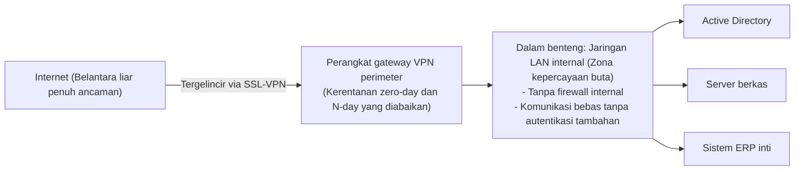

Perangkat gateway VPN adalah perangkat keras fisik yang antarmukanya terpapar langsung ke belantara internet yang penuh bahaya. Tentu saja, kelompok peretas ransomware dan kelompok spionase siber tingkat negara (APT) memantau lubang kunci perangkat ini siang dan malam.
- Sepanjang periode 2023 hingga 2026, kerentanan kritis yang memungkinkan pembobolan autentikasi dan eksekusi kode jarak jauh tanpa izin (skor CVSS 9.0 hingga 10.0) ditemukan bertubi-tubi pada perangkat buatan Ivanti dan Fortinet.
- Ironisnya, kendati produsen telah merilis patch pembaruan darurat, ratusan perusahaan di Jepang membiarkan kerentanan tersebut selama berminggu-minggu bahkan berbulan-bulan dengan dalih «pembaruan akan mengganggu jadwal kerja» atau «perangkat tidak boleh dimatikan ulang».

Menggunakan mesin pencari terbuka seperti Shodan atau Censys, penyerang memindai perangkat VPN yang belum ditambal secara otomatis. Dengan mengeksploitasi celah ini untuk mengekstrak isi memori perangkat, mereka menyedot kredensial pengguna, kata sandi, dan token sesi dalam hitungan detik, lalu **melenggang masuk ke jantung jaringan korporasi seolah-olah mereka adalah pegawai resmi**.

### 3.2 Runtuhnya Mitos Kepercayaan Jaringan Internal (Model Perimeter)

Setelah pertahanan VPN ditembus, doktrin yang memastikan kehancuran total perusahaan adalah **«model pertahanan perimeter (model benteng dan parit)»**.

Pertahanan perimeter berpijak pada asumsi usang bahwa «dunia luar internet adalah rimba yang penuh bahaya, namun segala sesuatu di dalam jaringan internal (LAN kantor) di balik firewall adalah entitas yang 100% aman dan tepercaya».

Jaringan internal yang dibangun di atas filosofi ini berwujud sangat **«datar (flat)»**:
- Terminal komputer yang terhubung ke jaringan kantor dapat berkomunikasi secara bebas dengan seluruh komputer lain, server berkas, printer, dan aplikasi akuntansi pada subnet yang sama maupun segmen terdekat tanpa perlu autentikasi ulang maupun enkripsi komunikasi.
- Lalu lintas data di dalam jaringan kantor sama sekali tidak diperiksa oleh firewall internal.

Kondisinya persis seperti benteng abad pertengahan dengan tembok luar kokoh, namun **«begitu seorang mata-mata berhasil menyelinap melewati gerbang utama, seluruh pintu ruang penyimpanan senjata, perbendaharaan emas, dan lumbung makanan di dalam benteng tidak memiliki kunci dan dapat dijarah tanpa rintangan»**. Pertahanan perimeter sama sekali tidak memiliki daya tangkal terhadap pergerakan lateral (Lateral Movement) saat peretas menyebarkan infeksi dari satu komputer ke seluruh penjuru jaringan korporasi.

### 3.3 Hipertrofi Active Directory dan Keruntuhan Tata Kelola Hak Istimewa

Dalam ekosistem korporat berbasis Windows, titik kegagalan tunggal (Single Point of Failure / SPOF) terbesar dan trofi paling diburu peretas adalah **Microsoft Active Directory (AD)**.

Lebih dari 90% perusahaan Jepang mempercayakan pengelolaan akun pengguna, komputer karyawan, hak akses, dan kebijakan keamanan global (GPO) kepada Active Directory. Namun, tata kelola operasionalnya kerap berada dalam kondisi menyedihkan:
- Hutan dan domain AD yang dibangun 15–20 tahun lalu mengalami tambal sulam yang tidak teratur, berubah menjadi kotak hitam raksasa yang tidak lagi dipahami strukturnya.
- Ribuan akun peninggalan mantan karyawan, akun layanan dari server yang sudah lama dimatikan, dan akun sementara yang lupa dihapus dibiarkan gentayangan di dalam sistem.
- Yang paling mengerikan adalah **penyalahgunaan hak istimewa Administrator Domain (Domain Admin)**. Demi kepraktisan kerja, staf pendukung IT dan vendor eksternal sering memberikan hak akses admin global kepada komputer staf biasa atau menyeragamkan kata sandi master di puluhan server produksi.

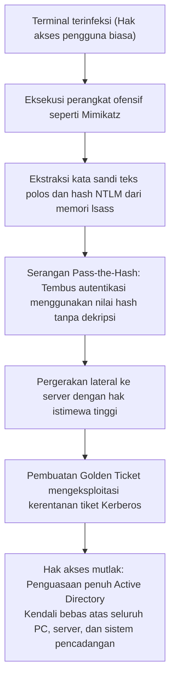

Begitu berhasil menyusup ke salah satu komputer pengguna, peretas menjalankan alat seperti `Mimikatz` untuk membongkar memori proses subsistem keamanan Windows (`lsass.exe`), mengekstrak hash NTLM dan tiket Kerberos.

Penyerang bahkan tidak perlu repot-repot memecahkan kata sandi aslinya. Dengan teknik **«Pass-the-Hash»** atau membuat tiket palsu serbaguna melalui serangan **«Golden Ticket»** (setelah mencuri hash akun layanan `krbtgt`), penyerang langsung mengangkat dirinya menjadi Administrator Domain. Pada saat itu, penyerang telah menjadi penguasa mutlak seluruh infrastruktur IT perusahaan. Cukup dengan menyebarkan skrip melalui Group Policy Object (GPO), ransomware akan terpasang dan tereksekusi secara serentak di puluhan ribu komputer dan server dalam hitungan menit.

### 3.4 Sisi Gelap Adopsi Cloud: Shadow IT dan Peran IAM Berhak Akses Berlebih

Migrasi yang tidak terkontrol ke layanan cloud publik seperti AWS, Azure, dan Google Cloud melahirkan kerentanan baru yang sangat kritis:

1. **Shadow IT dan Lingkungan Cloud Liar**:
   Divisi bisnis atau tim pengembangan perangkat lunak yang frustrasi dengan lambatnya birokrasi departemen IT nekat membuka akun cloud atau berlangganan SaaS sendiri menggunakan kartu kredit korporasi. Lingkungan liar ini beroperasi tanpa pengawasan keamanan, tanpa pencatatan log terpusat, dan sering kali dibiarkan dengan port akses terbuka ke internet.
2. **Peran IAM Berhak Akses Berlebih (Over-Privileged IAM Roles)**:
   Saat merancang manajemen akses identitas (IAM), para administrator kerap mengabaikan prinsip hak istimewa minimal (Principle of Least Privilege). Demi menghindari kegagalan eksekusi aplikasi, mereka secara serampangan menyematkan izin mutlak seperti `AdministratorAccess` pada mesin virtual maupun fungsi serverless.
   Akibatnya, satu celah kecil injeksi SQL atau kerentanan Server-Side Request Forgery (SSRF) pada aplikasi web sudah cukup bagi peretas untuk mencuri kredensial sementara mesin, memberi mereka kendali penuh atas seluruh penyimpanan, pangkalan data, dan server cloud milik korporasi.

---

## Bab 4: Membedah Akar Penyebab III —— Kerentanan Manusia dan Evolusi Taktik Penyerang

Di samping kerentanan teknologi dan sistem tata kelola, teknik serangan yang memanipulasi psikologi manusia telah mengalami lonjakan evolusi yang sangat dramatis berkat kehadiran Kecerdasan Buatan (AI) Generatif.

### 4.1 Spear Phishing Presisi Tinggi dan Rekayasa Deepfake di Era AI Generatif

Dahulu, surel penipuan (phishing) dapat diidentifikasi dengan mudah karena penggunaan bahasa Jepang yang janggal: kesalahan partikel tata bahasa, pilihan kata terjemahan mesin yang aneh, serta gaya bahasa sopan (keigo) yang tidak lazim.

Namun, dengan kehadiran **Model Bahasa Besar (LLM)** seperti ChatGPT dan turunannya, tameng pertahanan alami tersebut telah runtuh total.

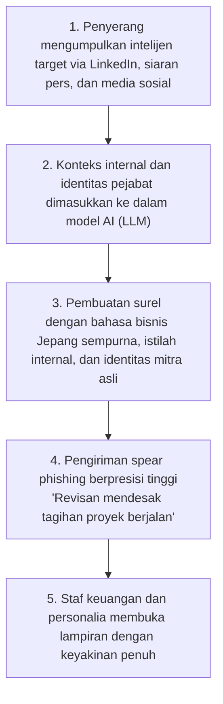

Penyerang mengumpulkan informasi mendalam seputar struktur organisasi perusahaan, nama-nama pejabat eksekutif, dan proyek kerja sama yang sedang berjalan melalui LinkedIn, siaran pers, dan media sosial. Data intelijen ini kemudian diolah oleh AI untuk menyusun surel spear phishing berpresisi tinggi dengan **gaya bahasa Jepang bisnis yang sangat luwes, anggun, dan persis dengan tata cara komunikasi internal perusahaan target**.

Ancaman semakin mengerikan dengan maraknya serangan rekayasa sosial berbasis **deepfake multimedia (kloning suara dan video)**:
- Berbagai kasus nyata di Jepang dan mancanegara mencatat insiden penipuan bernilai jutaan dolar ketika direktur keuangan menerima panggilan telepon di mana suara CEO dikloning secara sempurna oleh AI, memerintahkan pengiriman dana darurat ratusan juta yen ke rekening luar negeri dengan dalih akuisisi rahasia.
- Menghadapi serangan yang meretas persepsi panca indra manusia semacam ini, pendekatan kuno yang sekadar menuntut karyawan «lebih berhati-hati saat membaca surel» telah menjadi lelucon usang.

### 4.2 Pembajakan Sesi Kerja dan Ancaman Malware Pencuri Data (Infostealer)

Sebagian besar upaya korporasi Jepang dalam mengimplementasikan autentikasi multifaktor (MFA) berbasis SMS dan kode aplikasi telah dilumpuhkan oleh penyebaran masif **malware pencuri informasi (Infostealer)**.

Varian malware seperti RedLine, Raccoon, dan Lumma menyusup ke perangkat kerja karyawan atau staf mitra alih daya melalui unduhan perangkat lunak bajakan, instalasi palsu dokumen bisnis, atau tautan surel pancingan.

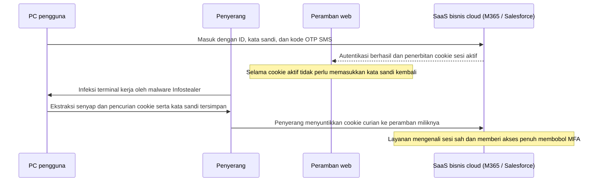

Sasaran utama Infostealer bukanlah mengenkripsi berkas, melainkan membobol pangkalan data peramban web (seperti Chrome dan Edge) untuk **mencuri kata sandi yang tersimpan serta cookie sesi kerja yang sedang aktif**.

Ketika seorang karyawan berhasil masuk ke aplikasi cloud menggunakan kata sandi dan kode verifikasi MFA, server akan menerbitkan «cookie sesi» yang disimpan di peramban lokal. Dengan mencuri berkas cookie ini dan menyuntikkannya ke peramban peretas (Cookie Hijacking), **penyerang dapat langsung masuk ke sistem internal perusahaan sebagai pengguna sah tanpa perlu mengetahui kata sandi dan tanpa memicu verifikasi MFA sama sekali**.

Di pasar gelap Dark Web, jutaan cookie sesi aktif milik perusahaan-perusahaan Jepang diperjualbelikan dengan harga murah, memungkinkan peretas dari seluruh belahan dunia memasuki sistem perusahaan melalui pintu depan yang sah.

### 4.3 Ancaman Orang Dalam: Pencurian Data oleh Karyawan Keluar dan Tenaga Kontrak

Ancaman siber tidak hanya datang dari luar. Statistik Asosiasi Keamanan Jaringan Jepang (JNSA) menegaskan bahwa sebagian besar insiden kebocoran data terparah dipicu oleh **«tindakan pencurian data ilegal oleh pihak internal (karyawan aktif, staf yang hendak mengundurkan diri, dan personel vendor alih daya)»**.

- **Erosi Loyalitas Kerja dan Pencurian Aset Saat Resign**:
  Di era meningkatnya mobilitas perpindahan kerja di Jepang, staf penjualan dan insinyur yang hendak pindah ke kompetitor kerap menganggap hasil kerja mereka sebagai milik pribadi, lalu mengunduh daftar kontak klien, kode sumber program, dan rancangan teknis ke dalam flashdisk pribadi atau penyimpanan cloud personal (Google Drive, Dropbox) sebelum masa kerja berakhir.
- **Kecurangan Tenaga Alih Daya Berhak Akses Tinggi**:
  Teknisi dari subkontraktor lapis bawah yang mengelola pangkalan data sensitif dan terdesak beban utang pribadi menyalahgunakan wewenangnya untuk mengunduh dan menjual ratusan ribu data pribadi pelanggan kepada calo data gelap.

Banyak perusahaan Jepang masih beroperasi dengan filosofi «kepercayaan mutlak pada kebaikan manusia (Seizensetsu)», tanpa memasang teknologi DLP (Data Loss Prevention) maupun UEBA (User and Entity Behavior Analytics) untuk mendeteksi dan memblokir unduhan data masif secara langsung. Kebocoran semacam ini kerap baru terbongkar bertahun-tahun kemudian melalui penyelidikan kepolisian atau saat produk serupa diluncurkan oleh pesaing.

---

## Bab 5: Peta Jalan Menyeluruh Menuju Arsitektur Zero Trust (ZTA)

Menghadapi spektrum ancaman yang begitu kompleks dan mematikan, satu-satunya jalan keselamatan bagi korporasi Jepang adalah membuang doktrin pertahanan perimeter yang telah usang dan beralih sepenuhnya ke **«Arsitektur Zero Trust (Zero Trust Architecture: ZTA)»**.

### 5.1 Esensi Zero Trust: «Never Trust, Always Verify»

Zero Trust bukanlah nama produk yang dapat dibeli dalam kemasan kotak, melainkan **«pergeseran mendasar dalam sistem operasi mental pertahanan korporasi»**, yang distandarisasi oleh National Institute of Standards and Technology (NIST) Amerika Serikat melalui dokumen acuan **NIST SP 800-207**.

> **Tiga Prinsip Fundamental Zero Trust**:
> 1. **Jangan pernah percaya, selalu verifikasi (Never Trust, Always Verify)**:
>    Tidak ada koneksi, perangkat, maupun identitas yang boleh dianggap aman secara mutlak, baik itu permintaan dari laptop direktur utama di ruang rapat kantor maupun perangkat di jaringan luar. Setiap permintaan akses harus dievaluasi secara ketat sebagai potensi ancaman.
> 2. **Berikan hak akses minimal (Grant Least Privilege Access)**:
>    Pengguna dan sistem hanya diberikan hak akses seminimal mungkin yang diperlukan untuk menjalankan tugas tertentu, dan hanya berlaku selama jangka waktu yang dibutuhkan (Just-In-Time).
> 3. **Asumsikan telah terjadi pelanggaran (Assume Breach)**:
>    Infrastruktur dirancang berdasarkan premis mutlak bahwa sistem pertahanan luar telah dibobol dan penyerang telah berada di dalam jaringan, sehingga desain sistem berfokus pada isolasi dampak (meminimalkan radius ledakan) serta deteksi dan pengusiran ancaman secara instan.

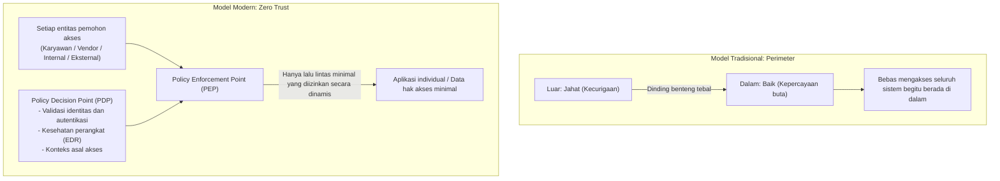

### 5.2 Pembongkaran Total VPN dan Transisi Menuju ZTNA

Langkah paling krusial dalam migrasi Zero Trust adalah **«penghapusan total konsentrator VPN perimeter»** dan menggantikannya dengan teknologi **«ZTNA (Zero Trust Network Access)»**.

Perbedaan mendasar antara keduanya terletak pada lingkup akses yang diberikan:
- **VPN Konvensional**: Saat proses autentikasi berhasil, perangkat pengguna langsung disambungkan secara fisik ke seluruh subnet jaringan kantor pada lapisan jaringan (Layer 3). Komputer tersebut dapat melihat dan berkomunikasi dengan seluruh server internal, sehingga jika perangkat tersebut terinfeksi malware, seluruh kantor akan ikut tertular.
- **ZTNA**: Komputer pengguna tidak pernah dihubungkan ke jaringan kantor. Sebuah perantara aman di cloud (broker) memvalidasi identitas pengguna dan kesehatan perangkat secara ketat, lalu **«membuka jalur komunikasi terisolasi yang hanya mengarah tepat ke satu aplikasi web atau port yang diizinkan»**. Topologi jaringan dan alamat IP internal korporasi tetap tidak terlihat (terselubung) dari perangkat, sehingga pergerakan lateral menjadi mustahil secara fisik.

### 5.3 Konvergensi Arsitektur SASE dan SSE

Penerapan praktis dari paradigma ini bermuara pada kerangka kerja **«SASE (Secure Access Service Edge)»**, yang dicetuskan oleh Gartner, dan subsistem keamanannya, **«SSE (Security Service Edge)»**.

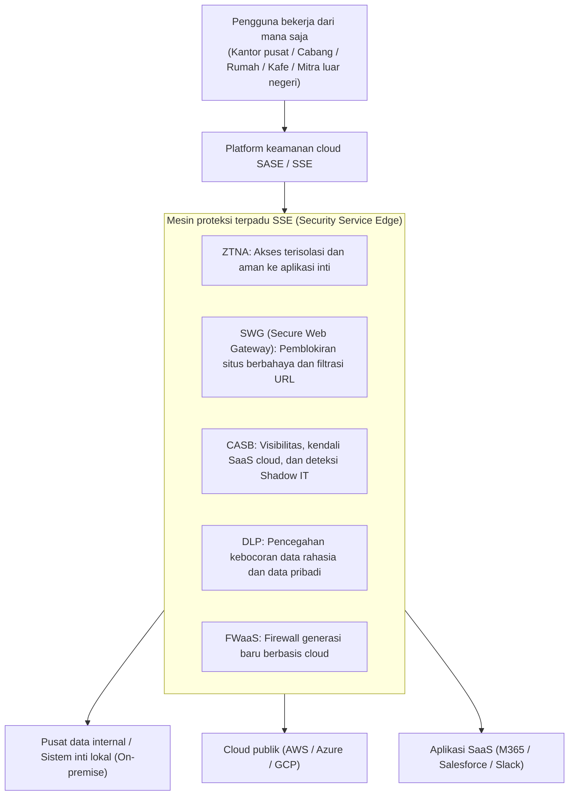

Di bawah arsitektur SASE, ke mana pun karyawan bepergian —baik di kantor pusat, di rumah, maupun di fasilitas manufaktur mitra di luar negeri— seluruh lalu lintas datanya diarahkan melalui platform keamanan cloud global:
- **SWG (Secure Web Gateway)** memblokir situs berbahaya, memeriksa lalu lintas TLS terenkripsi, dan mencegah serangan phishing.
- **CASB (Cloud Access Security Broker)** mengawasi penggunaan aplikasi SaaS dan mencegah munculnya Shadow IT.
- **DLP (Data Loss Prevention)** secara otomatis mendeteksi dan menggagalkan transmisi data kartu kredit maupun dokumen rahasia.
- **ZTNA** mengamankan akses langsung ke aplikasi internal on-premise maupun cloud.

Pendekatan ini melenyapkan kebutuhan pengadaan router VPN mahal di setiap kantor cabang dan menyatukan seluruh tata kelola keamanan di bawah satu kendali global.

### 5.4 Mengisolasi Pergerakan Lateral Melalui Mikrosegmentasi

Karena pencegahan infeksi 100% pada perangkat pengguna adalah hal yang mustahil, lapisan perlindungan berikutnya yang mutlak dibutuhkan adalah **«Mikrosegmentasi (Micro-Segmentation)»**.

Mikrosegmentasi meniadakan pembagian jaringan kuno berbasis VLAN departemen yang luas, menerapkan batas-batas firewall virtual secara granular: **«per server individual, per mesin virtual, dan per kontainer»**.

- Sebagai contoh, server akuntansi keuangan hanya akan menerima lalu lintas dari port terenkripsi komputer staf bagian keuangan yang telah terverifikasi, dan menolak mentah-mentah segala komunikasi (termasuk ping) dari komputer tim pengembang atau staf umum.
- Antarserver yang berada dalam satu rak fisik sekalipun tidak diizinkan berkomunikasi satu sama lain, kecuali terdaftar secara eksplisit dalam daftar putih layanan yang disetujui.

Apabila salah satu laptop pengguna terinfeksi ransomware, sekat-sekat baja mikrosegmentasi akan langsung tertutup, **mengurung ancaman di dalam perangkat yang terinfeksi dan melindungi sistem perusahaan lainnya dari penularan**.

---

## Bab 6: Memperkokoh Fondasi Manajemen Identitas dan Autentikasi (IAM/PAM)

Dalam lanskap Zero Trust, benteng pertahanan utama bukanlah kabel serat optik atau sakelar jaringan, melainkan **«Identitas (Identity and Access Management)»**. Ketika perimeter fisik telah sirna, identitas menjadi tumpuan dari seluruh kendali keamanan.

### 6.1 Mewajibkan MFA Tahan Phishing Berbasis Standar FIDO2 dan Passkeys

Langkah pertama yang tidak dapat ditawar adalah memusnahkan mekanisme autentikasi dua faktor generasi lama: pengiriman OTP melalui SMS, kode verifikasi surel, maupun konfirmasi notifikasi push sederhana di ponsel pintar.

Dengan mudahnya peretas mencegat kode SMS menggunakan proksi terbalik (seperti Evilginx) dan mencuri sesi dengan infostealer, solusi mutlak satu-satunya adalah **kewajiban penerapan MFA tahan phishing (Phishing-Resistant MFA) berstandar FIDO2 / WebAuthn (Passkeys)**.

```mermaid
flowchart TD
    User["Pengguna"] -->|Sidik jari / Pengenalan wajah / Kunci fisik| Device["Perangkat (Chip TPM / YubiKey)"]
    Device -->|Tanda tangan digital kriptografis kunci privat| RelyingParty["Server autentikasi (IDP)"]
    
    subgraph FIDO2_Mechanism ["Karakteristik ketahanan phishing FIDO2 dan Passkeys"]
        DomainBound["Origin Binding<br/>Peramban mencocokkan secara ketat domain asli (example.com) dengan pasangan kunci publik"]
        NoSecret["Tanpa rahasia bersama<br/>Tidak ada kata sandi yang disimpan di server: risiko kebocoran nol"]
        PhishImmune["Bahkan jika diarahkan ke situs palsu (evil-example.com),<br/>peramban mendeteksi ketidakcocokan domain dan menolak mengirim tanda tangan"]
    end

    DomainBound --> PhishImmune
    NoSecret --> PhishImmune
    PhishImmune --> AbsoluteSafety["Phishing dan pencurian kredensial dinetralkan 100% secara matematis"]
```

Kekuatan kriptografis FIDO2 terletak pada fitur **«Pengikatan Asal (Origin Binding)»**.
Meskipun seorang karyawan teperdaya dan membuka situs tiruan yang menyerupai portal perusahaan, peramban web akan mencocokkan nama domain (FQDN) secara ketat. Ketika peramban menemukan ketidaksesuaian dengan domain terdaftar, peramban akan menolak mentah-mentah untuk merilis tanda tangan digital yang tersimpan di chip TPM atau kunci keamanan fisik YubiKey.

Dengan mekanisme ini, pencurian kredensial menjadi mustahil secara matematis. Korporasi harus mewajibkan standar ini segera, dimulai dari para administrator sistem dan pengelola data sensitif.

### 6.2 Model Berjenjang (Tiering) Active Directory dan Akses Just-In-Time (JIT)

Bagi perusahaan yang masih harus mengoperasikan Active Directory lokal, arsitektur terbaik untuk mencegah keruntuhan hak istimewa adalah **«Model Arsitektur Berjenjang (Tiering Architecture)»** yang dipelopori oleh Microsoft.

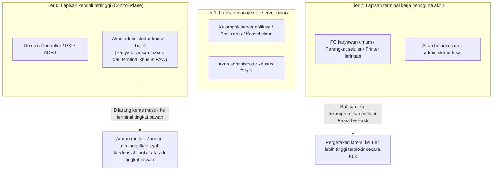

Hukum besi dari model berjenjang ini menetapkan bahwa **«akun dengan hak istimewa lebih tinggi tidak boleh masuk maupun meninggalkan jejak kredensial pada perangkat di lapisan yang lebih rendah»**:
- **Tier 0 (Kendali Puncak)**: Administrator Domain. Akses dibatasi secara eksklusif hanya untuk Domain Controller dan server identitas. Dilarang keras masuk ke komputer pengguna (Tier 2) atau server aplikasi (Tier 1). Seluruh pekerjaan administratif hanya boleh dilakukan dari terminal khusus terisolasi (PAW: Privileged Access Workstations).
- **Tier 1 (Manajemen Server)**: Pengelolaan kelompok server aplikasi dan basis data.
- **Tier 2 (Perangkat Klien)**: Pengelolaan workstation karyawan dan printer.

Selain itu, perusahaan harus menghapus hak istimewa permanen (Standing Privileges) dan menggantinya dengan prinsip **«Akses Just-In-Time (JIT)»**. Dalam kesehariannya, administrator beraktivitas menggunakan akun pengguna biasa; saat membutuhkan hak akses tinggi untuk pemeliharaan, mereka mengajukan persetujuan berbatas waktu yang akan kedaluwarsa secara otomatis dalam beberapa jam.

### 6.3 Evaluasi Kebijakan Dinamis Melalui Conditional Access

Proses autentikasi tidak boleh berhenti sebagai peristiwa statis satu kali saat login. Dalam Zero Trust, evaluasi hak akses berlangsung secara **dinamis dan berkesinambungan sepanjang sesi kerja**.

Mesin kebijakan akses kondisional (seperti Microsoft Entra ID Conditional Access atau Okta) mengevaluasi berbagai sinyal telemetri secara real-time:
1. **Identitas Pengguna dan Keanggotaan Grup**.
2. **Lokasi Geografis dan Alamat IP**:
   - Pemblokiran langsung jika terdeteksi anomali perjalanan mustahil (Impossible Travel), misalnya login tercatat di Tokyo dan beberapa menit kemudian di Eropa.
3. **Kepatuhan dan Kesehatan Perangkat**:
   - Memastikan perangkat terpasang agen EDR korporasi yang aktif, enkripsi BitLocker berjalan, dan pembaruan sistem operasi dalam kondisi mutakhir.
4. **Skor Risiko Perilaku**:
   - Mendeteksi anomali unduhan berkas dalam volume masif pada jam-jam tidak wajar, memicu permintaan verifikasi biometrik ulang seketika atau pemutusan sesi kerja.

Jika salah satu parameter keamanan gagal dipenuhi, pintu akses ke sistem internal akan terkunci rapat, tidak peduli seberapa benar kata sandi yang dimasukkan.

---

## Bab 7: Model Tata Kelola Keamanan Rantai Pasok dan Pihak Ketiga

Upaya memagari sistem sendiri akan sia-sia jika pintu belakang mitra subkontrak dibiarkan terbuka lebar. Bagaimana cara menertibkan ekosistem pihak ketiga ini?

### 7.1 Visibilitas Penuh Rantai Pasok dan Audit Berkelanjutan

Langkah awal yang mutlak adalah **«inventarisasi dan pemetaan menyeluruh terhadap seluruh rantai pasok»**.

Mayoritas korporasi besar hanya menjalin kontak dengan kontraktor utama tingkat 1, tanpa pernah mengetahui vendor tingkat 2 atau 3 mana saja yang memegang kendali atas data sensitif mereka.
- Cantumkan klausul tegas yang melarang praktik subkontrak lanjutan tanpa persetujuan tertulis resmi.
- Hentikan audit formalitas berbasis kuesioner kertas tahunan yang sekadar diisi di atas meja kerja.
- Adopsi platform pemeringkat risiko siber pihak ketiga (Security Rating Services seperti BitSight atau SecurityScorecard) yang memindai dan memantau eksposur port luar, sertifikat kedaluwarsa, dan kebocoran kredensial mitra secara terus-menerus dan objektif.

### 7.2 Larangan BYOD Bagi Tenaga Kontrak dan Penerapan VDI Zero Trust

Pendekatan paling efektif untuk mencegah kebocoran data akibat komputer vendor adalah memastikan bahwa **«tidak ada satu bita pun data perusahaan yang tersimpan secara fisik di perangkat pihak ketiga»**.

Penggunaan komputer jinjing pribadi atau perangkat yang tidak dikelola (BYOD) oleh staf subkontrak untuk terhubung langsung ke jaringan korporasi harus dilarang secara mutlak.

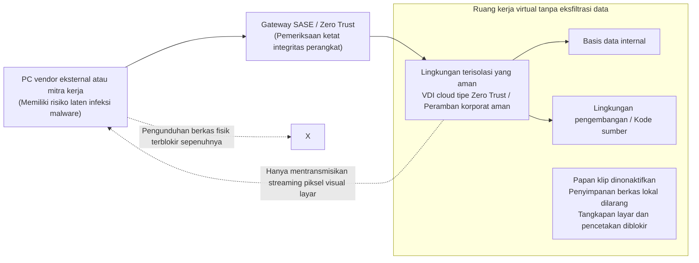

Seluruh pekerjaan alih daya harus disalurkan melalui **lingkungan desktop virtual cloud (DaaS) tipe Zero Trust** atau peramban perusahaan terisolasi:
- Fungsi pengunduhan berkas ke cakram lokal, salin-tempel papan klip (clipboard), tangkapan layar, dan pencetakan dokumen dinonaktifkan secara terpusat pada level sistem operasi.
- Terminal kerja mitra hanya menerima aliran piksel visual yang dirender di layar. Bahkan jika komputer vendor terinfeksi infostealer, tidak ada berkas data maupun cookie sesi yang dapat dicuri.

### 7.3 Pengawasan Komponen Perangkat Lunak (SBOM) dan Pembatasan Izin API

Dalam pengembangan perangkat lunak pesanan, risiko laten yang sangat berbahaya adalah penyusupan pustaka kode sumber terbuka (open-source) yang kedaluwarsa dan rentan (seperti kasus Log4j dan celah pada pustaka framework web populer).

Perusahaan wajib menuntut vendor perangkat lunak untuk menyerahkan **SBOM (Software Bill of Materials / Daftar Komponen Perangkat Lunak)** pada setiap rilis kode. Dokumen inventaris digital ini memungkinkan pemindaian otomatis terhadap basis data kerentanan publik (CVE) sehingga tim keamanan dapat mengambil tindakan dalam hitungan menit saat kerentanan zero-day diumumkan.

Demikian pula pada integrasi antarmuka pemrograman aplikasi (API) dengan mitra bisnis: penggunaan token akses tanpa batas harus dilarang, menerapkan protokol OAuth 2.0 dengan cakupan hak akses minimal dan masa kedaluwarsa yang sangat singkat (short TTL).

---

## Bab 8: Membangun Resiliensi Siber Terhadap Ransomware dan Perusakan Data

Berpijak pada pilar Zero Trust «Asumsikan Pelanggaran (Assume Breach)», benteng pertahanan terakhir bagi korporasi adalah **«Resiliensi Siber: kemampuan memulihkan dan melanjutkan operasional bisnis di tengah bencana yang tak terhindarkan»**.

Menghalau 100% serangan dari kelompok peretas elit tingkat negara adalah ilusi. Tolok ukur sesungguhnya dari ketahanan korporasi adalah seberapa cepat roda bisnis dapat berputar kembali pascaserangan.

### 8.1 Aturan Pencadangan Data 3-2-1-1-0 dan Penyimpanan Tak Berubah (Immutable Storage)

Dalam serangan ransomware modern (seperti BlackSuit, LockBit, atau Akira), sasaran utama peretas bukanlah mengenkripsi data produksi: **melainkan melacak dan memusnahkan seluruh cadangan data (backup)**. Tanpa adanya salinan data yang selamat, perusahaan tidak memiliki pilihan selain membayar uang tebusan.

Prosedur pencadangan tradisional yang menyalin data ke penyimpanan jaringan yang tergabung dalam domain kantor sudah tidak lagi berguna. Jika server backup terhubung ke Active Directory, penyerang yang memegang hak Domain Admin dapat melenyapkan seluruh arsip data cadangan dalam sekejap.

Standar yang wajib diadopsi untuk menjamin kelangsungan hidup korporasi adalah **Aturan Pencadangan Data 3-2-1-1-0**:

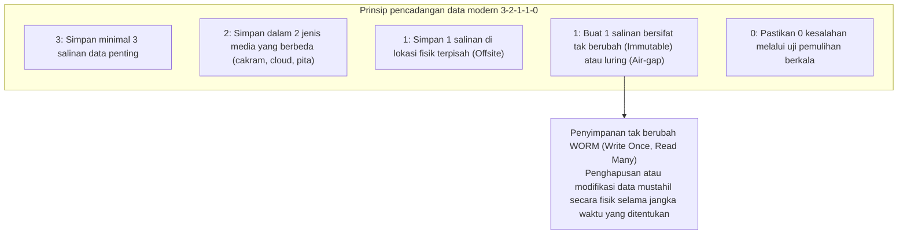

Inti terpenting dari aturan ini adalah **«Pencadangan Data Tak Berubah (Immutable Backup)»**.
Menggunakan teknologi **WORM (Write Once, Read Many)** dan fitur seperti S3 Object Lock di cloud atau perangkat cadangan khusus (seperti Veeam, Rubrik, Cohesity), data cadangan dikunci secara fisik pada tingkat perangkat keras dan API. Selama masa retensi yang ditetapkan (misalnya 30 hari), **siapa pun —termasuk administrator sistem, pemilik otoritas tertinggi, bahkan peretas dengan hak akses root— secara fisik mustahil dapat menghapus, menimpa, atau mengenkripsi data tersebut**.

Sekalipun seluruh pusat data produksi hancur dan semua mesin virtual terenkripsi, data cadangan yang terkunci di penyimpanan tak berubah tetap utuh, memungkinkan jajaran direksi menolak pemerasan dan memulihkan sistem secara mandiri dalam waktu singkat.

### 8.2 Isolasi Total Domain Autentikasi Pengelolaan Cadangan Data

Sebagai aturan arsitektur yang tidak boleh dilanggar, **bidang kendali sistem pencadangan data harus dipisahkan secara mutlak dari domain Active Directory kantor**.

- Server pencadangan data harus menggunakan sistem autentikasi lokal yang sepenuhnya independen dan terlindungi oleh MFA perangkat fisik tersendiri.
- Terminal kerja untuk mengelola sistem pencadangan harus ditempatkan di jaringan terisolasi (out-of-band) yang terputus dari jaringan kantor umum maupun internet.

Hanya dengan pemisahan domain autentikasi secara menyeluruh inilah risiko kehancuran sistem cadangan data saat pengendali domain kantor jatuh ke tangan peretas dapat dicegah.

### 8.3 Isolasi Cepat Melalui EDR/XDR dan Pengawasan SOC 24/7/365

Dalam perlombaan waktu antara saat penyerang pertama kali menyusup hingga malware meledak, indikator yang menentukan hidup mati perusahaan adalah **MTTD (Mean Time to Detect / Waktu Rata-rata Deteksi)** dan **MTTR (Mean Time to Respond / Waktu Rata-rata Respons)**.

Jika antivirus tradisional (EPP) hanya mengandalkan pencocokan tanda tangan berkas statis, platform modern **EDR (Endpoint Detection and Response)** dan **XDR (Extended Detection and Response)** memantau anomali perilaku proses kerja secara real-time.
- Ketika EDR mendeteksi aktivitas mencurigakan —seperti proses PowerShell resmi yang mencoba mengekstrak memori proses `lsass.exe` atau lonjakan penggantian nama ratusan berkas di tengah malam— sistem akan membunyikan alarm dalam hitungan milidetik.
- Secara instan, agen EDR akan melakukan **isolasi jaringan logis pada perangkat yang terinfeksi di tingkat driver NDIS sistem operasi**, memutuskan seluruh komunikasi jaringan perangkat tersebut dan memutus rantai pergerakan lateral peretas.

Mengingat penyerang sengaja melancarkan aksi mereka di waktu lengah —seperti dini hari akhir pekan atau masa libur panjang Tahun Baru dan Golden Week— pemantauan yang hanya beroperasi pada jam kerja biasa tidak memiliki nilai guna. Penempatan **layanan SOC terkelola (MDR) yang beroperasi 24 jam sehari, 365 hari setahun**, dengan kewenangan langsung untuk mengeksekusi isolasi perangkat darurat, adalah syarat mutlak bagi kelangsungan hidup perusahaan.

---

## Bab 9: Reformasi Tata Kelola Eksekutif dan Tuntutan Regulasi

Upaya memperkuat ketahanan siber tidak akan pernah dapat diselesaikan hanya melalui keringat tim teknis IT. Ini adalah agenda korporasi tingkat tinggi yang terkait langsung dengan tanggung jawab hukum dewan direksi dan strategi kelangsungan bisnis.

### 9.1 Pengetatan Sanksi UU Perlindungan Data Pribadi (APPI) dan Risiko Finansial

Mengikuti jejak regulasi internasional yang ketat seperti GDPR di Eropa, instrumen hukum di Jepang telah memperberat sanksi secara drastis.

Berdasarkan revisi **Undang-Undang Perlindungan Informasi Pribadi Jepang (APPI)**, ketika terjadi insiden kebocoran data pribadi berskala tertentu atau melibatkan data sensitif, **kewajiban melapor secara cepat kepada Komisi Perlindungan Informasi Pribadi (PPC) dan pemberitahuan langsung kepada para pemilik data yang terdampak merupakan keharusan hukum yang mutlak**.
- Hukuman denda pidana korporasi bagi badan hukum yang melanggar telah dinaikkan hingga 100 juta yen.
- Selain itu, ancaman gugatan perdata kelompok (class action) dari konsumen atau pemegang saham, serta pembayaran dana kompensasi langsung kepada jutaan nasabah yang terdampak dapat menelan kerugian finansial bernilai puluhan miliar yen.

Ditambah lagi dengan disahkannya Undang-Undang Perlindungan Informasi Keamanan Ekonomi Kritis tahun 2024 serta kerangka kerja undang-undang keamanan siber nasional, para pengelola infrastruktur vital dan rantai pasoknya kini diwajibkan menjalani audit pemerintah dan memenuhi standar keamanan yang sangat ketat. Kebocoran data bukan lagi sekadar persoalan gangguan teknis: ini adalah ancaman hukum dan finansial yang dapat menggulung eksistensi bisnis perusahaan.

### 9.2 Kewajiban Fidusia Dewan Direksi: Keamanan Siber Adalah Tanggung Jawab Eksekutif

Berdasarkan Undang-Undang Korporasi Jepang, para direktur dan anggota dewan komisaris memikul **«Kewajiban Fidusia Perhatian Pengelola yang Baik (Zenkan Chūi Gimu)»**.

Yurisprudensi pengadilan dan Pedoman Manajemen Keamanan Siber Kementerian Ekonomi, Perdagangan dan Industri (METI) bersama IPA telah menetapkan dengan tegas bahwa jajaran pimpinan yang lalai mengawasi tata kelola keamanan siber sehingga menyebabkan kebocoran data masif atau kelumpuhan operasional **dapat digugat secara langsung oleh pemegang saham melalui gugatan derivatif (Shareholder Derivative Suits), dan para direktur harus membayar ganti rugi kerugian perusahaan menggunakan harta kekayaan pribadi mereka**.

Tidak ada lagi direktur yang dapat berkilah di depan pengadilan dengan dalih «urusan IT sudah saya serahkan sepenuhnya kepada staf teknis di lapangan». Dewan direksi memikul kewajiban hukum yang tidak dapat dialihkan untuk secara berkala meninjau profil risiko siber perusahaan, mengesahkan kecukupan anggaran pengamanan, dan memastikan keandalan rencana pemulihan operasional bisnis saat krisis terjadi.

### 9.3 Memberikan Wewenang Nyata Kepada CISO dan Mendefinisikan Ulang ROI Keamanan

Kunci terakhir dalam mewujudkan tata kelola keamanan yang kokoh adalah **memberikan wewenang eksekutif nyata kepada CISO**.

Korporasi harus segera melancarkan reformasi kelembagaan berikut:
1. **Menaikkan Kedudukan CISO ke Tingkat Dewan Direksi**:
   Membangun garis pelaporan langsung dan independen kepada CEO dan dewan komisaris secara setara dengan CIO, melepaskan CISO dari posisi bawahan yang tersubordinasi di bawah divisi IT.
2. **Memberikan Hak Veto Keamanan dan Otoritas Penghentian Operasional Darurat Kepada CISO**:
   CISO harus memiliki wewenang formal untuk menolak peluncuran sistem yang tidak memenuhi standar keamanan, memutus kontrak vendor berisiko tinggi, dan memerintahkan pemutusan darurat sistem produksi demi menghentikan eksfiltrasi data saat serangan siber terdeteksi.
3. **Mendefinisikan Ulang Perhitungan ROI (Return on Investment) Keamanan Siber**:
   Belanja keamanan siber tidak boleh lagi diukur dengan kacamata sempit keuntungan finansial langsung. Investasi ini harus diposisikan sebagai **premi asuransi eksistensial guna menghindari kerugian triliunan yen akibat kelumpuhan operasional berbulan-bulan dan kehancuran reputasi publik**, yang merupakan «izin kelayakan beroperasi (License to Operate)» yang sesungguhnya di era ekonomi digital.

---

## Kesimpulan: Melampaui Keputusasaan —— Keteguhan Hati Perusahaan Jepang Menghadapi 2026 dan Masa Depan

Memasuki tahun 2026, kita harus menyadari bahwa tidak ada jalan kembali ke «dunia maya yang damai dan tenteram». Angkatan siber bentukan negara beroperasi di balik konflik geopolitik, sindikat kejahatan siber internasional mengotomatisasi serangannya dengan bantuan kecerdasan buatan, dan jutaan kredensial perusahaan diperjualbelikan setiap hari di pasar gelap. Pengepungan terhadap dunia usaha terjadi secara total.

Namun, kita tidak boleh berputus asa.

Krisis yang menghantam perusahaan-perusahaan di Jepang bukanlah kutukan alam yang tidak dapat dihindari. Pada hakikatnya, ini adalah **bencana buatan manusia sendiri**: akibat dari budaya lepas tangan terhadap teknologi, kebiasaan subkontrak tanpa tanggung jawab, kepercayaan buta pada mitos benteng internal, dan kelalaian dewan direksi yang abai terhadap realitas digital. Dan karena penyebabnya adalah kesalahan manusia, masalah ini niscaya dapat diatasi melalui akal budi, keberanian, dan tekad strategis manusia.

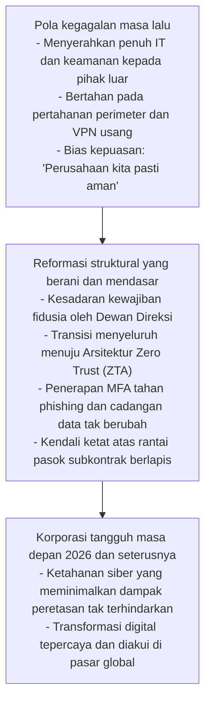

Keamanan siber bukanlah batu sandungan yang memperlambat kelincahan bisnis. Di tengah samudra digital yang bergejolak, keamanan siber berfungsi laksana **«sistem rem berdaya cengkeram tertinggi pada sebuah mobil balap Formula 1»**. Hanya mobil balap yang memiliki rem paling sempurna di dunialah yang mampu melaju kencang di lintasan lurus dan melibas tikungan paling tajam tanpa tergelincir hancur menabrak dinding pembatas.

Sebagaimana industri Jepang di masa lampau berhasil memukau dunia dengan komitmen mutlak terhadap kualitas produk manufaktur, kini tiba saatnya korporasi Jepang menjunjung tinggi ikrar baja: **«Jangan pernah mengkhianati kepercayaan pelanggan, karyawan, dan masyarakat luas»**. Hanya organisasi yang berani merombak arsitektur sistem dan membenahi tata kelola kepemimpinan inilah yang akan selamat melewati badai krisis siber dan bangkit menjadi pemimpin ekonomi digital dunia di masa depan.
