## 서론: 2026년의 경종 ——「보안 후진국」 일본이 직면한 국가적 위기

2020년대 중반을 지나 2026년에 이른 현재, 일본의 사이버 공간은 전례 없는 격심한 폭풍우를 맞이하고 있다.

과거 일본 산업계에는 일종의 근거 없는 '안전 신화'가 만연해 있었다. "우리 회사는 세계적인 대기업이 아니므로 표적이 되지 않는다", "일본어라는 언어의 장벽이 사이버 공격에 대한 자연의 요새 역할을 해준다", "대형 보안 벤더의 백신 프로그램을 도입했으니 문제없다"——그러나 이러한 감미로운 환상은 지금에 이르러 산산조각이 났다.

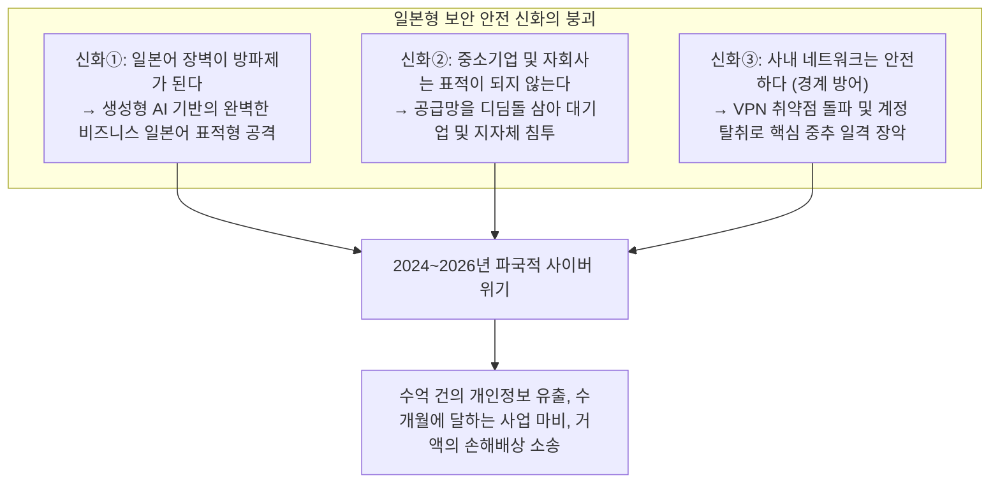

현실은 너무나도 잔혹하다. 엔터테인먼트 공룡 기업, 메가뱅크, 통신사, 기간 인프라 기업, 그리고 지방자치단체의 행정 시스템에 이르기까지 내로라하는 조직들이 줄지어 랜섬웨어(몸값 요구형 악성코드)의 군문 아래 무릎을 꿇거나, 수백만 건에서 수천만 건에 달하는 민감한 개인정보를 다크웹에 유출당했다.

유출된 데이터는 이름, 주소, 전화번호와 같은 기본 정보에 그치지 않는다. 신용카드 번호, 건강검진 결과, 마이넘버(주민등록번호 격), 거래처와의 비밀 계약서, 사내 메신저 채팅 로그, 심지어 임직원의 운전면허증 스캔 이미지에 이르기까지 개인의 사회적 신용과 존엄을 근본부터 뒤흔드는 데이터가 국제 사이버 범죄 신디케이트의 인질이 되어 다크웹 경매에 부쳐지고 있다.

일단 침해사고가 발생하면 기자회견장에는 고개를 깊이 숙이는 경영진의 모습이 늘어서고, "원인은 조사 중", "임직원을 대상으로 보안 교육을 철저히 하겠다"는 판에 박힌 사과 성명이 반복된다.

그러나 우리는 준엄하게 물어야 한다. **왜 이토록 막대한 IT 투자를 집행하고 매년 보안 교육을 실시해 온 일본 기업에서 정보 유출과 파멸적인 사이버 침해사고가 멈추지 않는 것인가?**

그 근본 원인은 일선 직원이 '의심스러운 이메일 링크를 무심코 클릭했다'는 식의 지엽적인 과실에 있지 않다. 일본 산업계가 수십 년간 방치해 온 **「IT 전면 외주화와 다중 하도급이라는 구조적 병리」**, 시대에 뒤떨어진 **「경계형 방어(Perimeter Model)에 대한 맹신」**, 클라우드 전환에 따른 **「ID 및 인증 기반의 취약화」**, 그리고 **「보안을 투자가 아닌 단순 비용으로 치부하는 경영진의 거버넌스 부전」**이 복합적으로 얽혀 발생한 필연적인 구조적 붕괴인 것이다.

본 백서는 최고 수준의 CISO(최고정보보호책임자) 및 사이버 위협 분석가의 시각에서 2024년부터 2026년에 걸쳐 일본을 뒤흔든 주요 침해사고의 기술적 심층을 해부하고, 일본 기업을 좀먹는 병리의 실체를 명명백백히 밝히는 동시에, 침입을 전제로 한 차세대 방어 철학인 **「제로 트러스트 아키텍처(ZTA)의 완전한 구현, 공급망 통제, 피싱 내성 MFA, 불변 백업 기반의 사이버 레질리언스 확립」**에 이르기까지 기업이 생존하기 위한 구체적이고 실천적인 방어 체계를 남김없이 제시하는 결정판 백서이다.

---

## 제1章: 2024~2026년 일본 기업의 주요 침해사고 심층 해부

일본 기업이 직면한 위기의 실체를 직시하기 위해서는 먼저 최근 발생한 상징적인 침해사고들의 '공격 체인(Kill Chain)'을 기술적 팩트에 기반하여 면밀히 검토해야 한다.

### 1.1 KADOKAWA/니코니코 동화 사건의 교훈: 데이터센터 전멸과 BlackSuit 랜섬웨어

2024년 6월에 발생한 출판·미디어 대기업 KADOKAWA 및 드완고(DWANGO)에 대한 사이버 공격은 일본 사이버 보안 역사상 최대의 분수령이 되었다.

공격을 감행한 조직은 과거 전 세계를 공포에 떨게 했던 랜섬웨어 조직 'Conti'의 후계 그룹으로 알려진 **「BlackSuit」**이다. 이 공격으로 인해 일본을 대표하는 동영상 스트리밍 플랫폼 '니코니코 동화'를 비롯한 회사의 웹 서비스 전반이 전면 중단되었으며, 도서 출판 물류 시스템과 회계 정산 기능을 포함한 핵심 기간 업무가 수개월 동안 마비되었다. 나아가 임직원과 거래처 크리에이터의 개인정보, 사내 비밀 계약서 등 약 25만 건 이상의 기밀 데이터가 다크웹에 폭로되는 파멸적인 피해를 입었다.

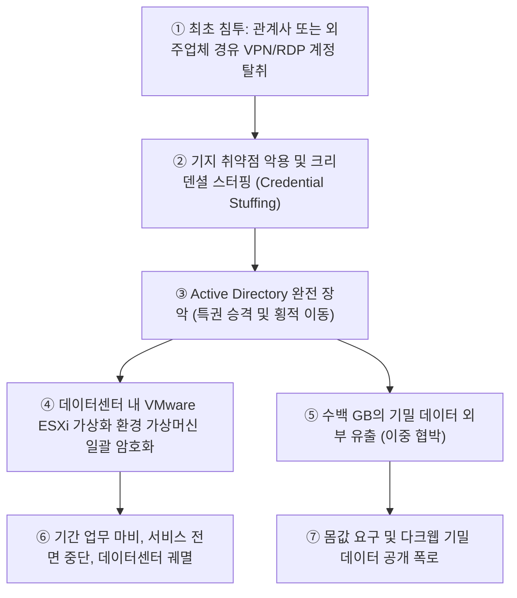

이 사고가 일본 보안 커뮤니티에 안겨준 가장 큰 기술적 충격은 **「온프레미스 프라이빗 클라우드(가상화 인프라) 그 자체가 뿌리째 파괴되었다」**는 점에 있다.

공격자는 본사의 핵심 네트워크를 직접 공격하지 않았다. 방어가 취약한 관계사나 업무 위탁 업체의 원격 접속 환경(SSL-VPN 장비 또는 RDP 포트)을 발판 삼아 사내망 내부로 발을 들였다. 일단 경계 내부의 교두보를 확보한 공격자는 사내망이 '평면적(세그멘테이션 부족)'이라는 치명적 허점을 파고들어 횡적 이동(Lateral Movement)을 거침없이 전개했다. 그리고 마침내 기업 IT 인프라의 심장부인 **Active Directory(도메인 컨트롤러)의 도메인 관리자 권한(Domain Admin)**을 완전히 탈취했다.

도메인의 전권을 쥐게 된 BlackSuit는 일반 윈도우 서버뿐만 아니라 VMware ESXi 등 하이퍼바이저 가상화 인프라의 관리 콘솔에 직접 접근하여 데이터스토어 내에 보관되어 있던 가상머신 디스크 이미지(.vmdk) 파일들을 일괄적으로 초고속 암호화했다. 더욱 치명적인 점은, **온라인으로 마운트되어 연결되어 있던 모든 백업 데이터까지 철저하게 삭제 및 덮어쓰기 암호화**했다는 사실이다.

이 사건은 "내부망 진입을 허용하는 순간, 아무리 거대하고 견고한 데이터센터라 할지라도 단 한 방에 전멸할 수 있다"는 경계형 방어의 완전한 사망 선고를 일본 기업 경영진의 뇌리에 각인시켰다.

### 1.2 라인야후 사태와 NAVER 공통 인프라: 국경을 넘는 외주 거버넌스의 파탄

2023년 가을에 발각되어 2024년부터 2026년에 걸쳐 일본 총무성으로부터 이례적으로 수차례의 강력한 행정지도를 받는 사태로 비화된 '라인야후(LY Corporation) 대규모 개인정보 유출 사건'은 일본 IT 산업이 안고 있는 **「자본 관계 및 위탁 관계에 기인한 거버넌스의 치명적 사각지대」**를 여실히 드러냈다.

약 51만 건에 달하는 이용자, 거래처, 임직원의 개인정보가 유출된 본 침해사고의 도화선은 라인야후의 지분 모회사이자 기술적 모태 역할을 하던 한국 네이버(NAVER)의 클라우드 인프라 환경이었다.

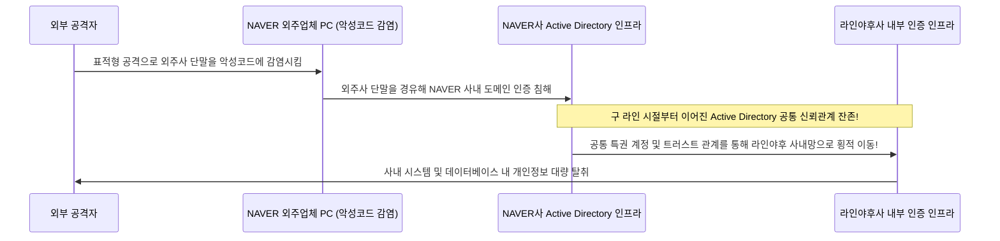

사태의 기술적 본질은 **「구 라인과 네이버 간에 조직 통합 이후에도 Active Directory 등 사내 핵심 인증 인프라가 분리되지 않고 무조건적인 상호 신뢰 상태로 장기간 방치되어 있었다」**는 데 있다.

공격자는 먼저 네이버의 업무 위탁 협력사 PC를 악성코드에 감염시켰다. 이를 발판 삼아 네이버 내부망에 침투한 뒤, 국경을 가로지르는 '도메인 트러스트(Domain Trust) 신뢰 관계'를 악용하여 아무런 추가적인 인증 장벽에 가로막히지 않고 일본 라인야후 본사의 내부 데이터베이스로 침입을 확대해 나갔다.

이 사건은 일본 기업들이 추진해 온 '글로벌 분업'과 '오프쇼어 개발·해외 거점 위탁'에 있어, **"그룹사이기 때문에", "모회사이기 때문에"라는 안일한 이유로 네트워크와 인증 인프라를 연결하고 신뢰하는 행위가 얼마나 파멸적인 연쇄 위험을 초래하는지**를 만천하에 드러냈다. 총무성이 개입하여 "네이버와의 자본 관계 재검토"와 "공통 인증 인프라의 완전 분리"를 명령한 것은, 지정학적 리스크를 내포한 IT 공급망 거버넌스가 이제 국가 주권과 안보 문제에 직결되어 있음을 명백히 입증한다.

### 1.3 지방자치단체와 대형 BPO(이세토 등)를 덮친 공급망의 연쇄 붕괴

2024년 이후 일본 전역의 지방자치단체, 금융기관, 공공 인프라 기업을 공황에 빠뜨린 사건은 인쇄, 우편 발송, 데이터 전산 처리를 대행하는 **대형 BPO(비즈니스 프로세스 아웃소싱) 전문 기업(이세토 등)에 대한 랜섬웨어 표적 공격**이었다.

지방자치단체들은 주민세 결정통지서, 국민건강보험증, 개호보험료 고지서, 선거공보 등의 우편 발송 업무에서 주민의 성명, 주소, 마이넘버, 소득 정보와 같은 최고 수준의 민감 개인정보가 포함된 인쇄 및 봉입 작업을 일반 입찰을 통해 민간 BPO 업체에 일괄 위탁해 왔다.

공격자들은 삼계(三階) 분리 방어 모델(LGWAN)로 철저히 격리된 자치단체의 핵심 내부망을 정면 돌파하려 하지 않았다. 대신 전체 공급망 사슬에서 가장 방어가 취약했던 **지자체로부터 업무를 위탁받은 하청 BPO 기업의 거점 지사 네트워크**를 정조준했다.

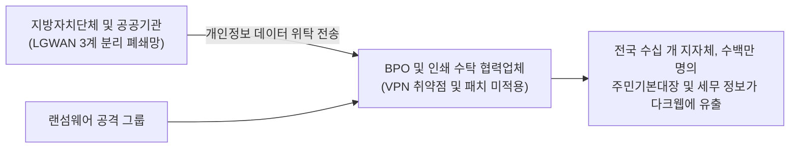

하청 BPO 업체의 지사 네트워크가 외부로 노출된 VPN 장비 취약점을 통해 랜섬웨어에 감염되면서, 외주사 자체 데이터뿐만 아니라 보관 중이던 일본 전국 수십 개 지자체 수백만 명 주민의 민감 세무 행정 데이터가 통째로 암호화되고 다크웹에 유출되었다.

이 사건이 남긴 냉혹한 물리적 법칙은 **"발주처가 자체 데이터센터에 수십억 엔을 들여 철옹성 같은 요새를 구축해 두었더라도, 업무를 수탁한 외주 협력사의 보안 수준이 낮다면 전체 공급망은 일순간에 붕괴한다"**는 사실이다. 지자체와 대기업들이 "계약서에 보안 준수 조항을 명시했으니 안심이다"라며 형식적인 서류 점검 체크리스트로 일관해 온 관행이 최악의 형태로 파탄 난 것이다.

### 1.4 클라우드 설정 오류(Salesforce / AWS / Azure): 열려 있는 금고 문과 전 세계에 노출된 데이터

데이터 대량 유출의 원인이 오직 랜섬웨어와 같은 고도화된 APT 공격에만 국한되는 것은 아니다. 2020년대 중반에 발생한 천문학적인 유출 건수 중 상당한 비중을 차지한 또 다른 축은 바로 **「클라우드 서비스 설정 오류(Cloud Misconfiguration)」**였다.

특히 일본의 대형 증권사, 시중은행, 이커머스 포털, 정부 부처 등에서 잇따라 발생한 사고는 고객관계관리(CRM) 플랫폼인 **Salesforce의 설정 미숙으로 인한 고객 데이터 무방비 노출**이었다.

Salesforce에는 외부 고객 포털을 구축하기 위한 '익스피리언스 클라우드(커뮤니티 기능)'와 게스트 사용자(Guest User) 권한 설정이 존재한다. 관리자가 공유 규칙(Sharing Rules)을 구성할 때 기본값에 대한 이해 부족과 권한 설계 오류를 범함으로써, 본래 사내 공인 상담원만 조회할 수 있어야 할 VIP 고객 명단(성명, 전화번호, 계좌번호, 상세 거래 내역)이 **인터넷상의 그 누구라도 아무런 계정 인증 없이 검색 엔진 크롤러로 긁어갈 수 있는 상태**로 수개월에서 수년간 방치되었다.

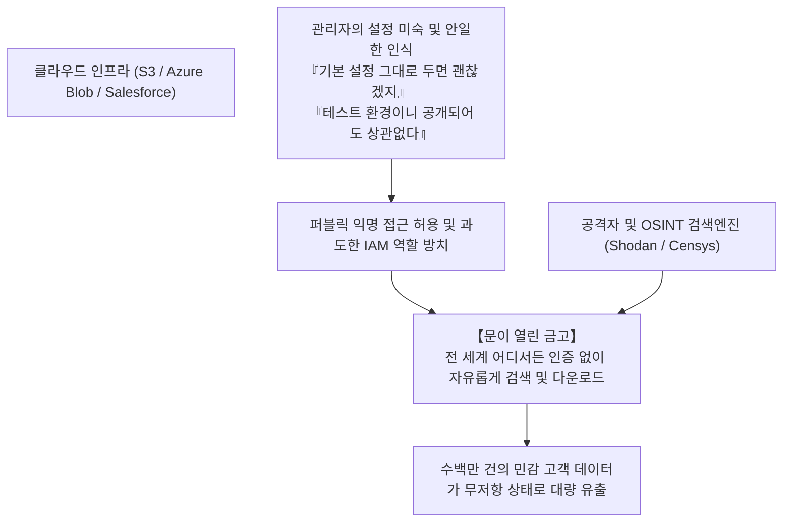

아마존 웹 서비스(AWS)의 S3 버킷 퍼블릭 읽기 권한 방치, 마이크로소프트 애저(Azure) 스토리지 계정의 접근 제어 누락, 심지어 사내 개발자가 깃허브(GitHub) 공개 저장소에 관리자 API 토큰을 실수로 커밋하는 사고 역시 끊이지 않고 있다.

해커가 정교한 제로데이 취약점을 사용할 필요조차 없이, **"기업 관리자가 제 손으로 금고 문을 활짝 열어젖히고 전 세계를 향해 전시하고 있었다"**는 것이 일본의 클라우드 운영 실태가 드러낸 부끄러운 현실이다.

---

## 제2章: 근본 원인의 심층 해부① —— 구조적·조직적 병리 (전면 외주화와 다중 하도급)

왜 이처럼 명백한 위험이 도사리고 있음에도 일본 기업들은 사고를 사전에 차단하지 못하는가? 제2장에서는 기술적 결함의 이면에 자리 잡은 '일본 기업 사회의 구조적 병리'를 메스로 도려내듯 분석한다.

### 2.1 「IT는 비용 부서」라는 경영진의 무관심과 허수아비 CISO

일본 기업의 사이버 보안에서 가장 취약한 지점은 방화벽 규칙 설정에 있는 것이 아니다. 바로 **「이사회 회의실(Boardroom)」**에 있다.

서구 글로벌 선도 기업에서 IT 및 사이버 보안은 "기업의 생사를 좌우하는 핵심 경쟁력이자 최우선 아젠다"로 인식된다. 최고정보보호책임자(CISO)는 CEO에게 직속 보고하며, 사업 부서의 편의보다 보안 리스크를 우선시하여 시스템 가동 중단을 명령할 수 있는 강력한 거부권(Veto Power)을 행사한다.

반면 대다수 전통적 일본 기업에서 IT 부서는 오랫동안 "직접적인 이익을 창출하지 못하는 간접 비용 센터(Cost Center)"로 홀대받아 왔다.
- 이사회 구성원 중 IT나 정보보안 백그라운드를 가진 임원은 전무에 가깝고, CIO나 CISO로 임명되는 인물은 정년을 앞둔 문과 출신 관리직 임원이 총무나 법무를 담당하면서 '곁다리로 겸임'하는 것이 관례화되어 있다.
- 실무 보안 엔지니어가 "현재 사용 중인 노후 VPN 장비에 치명적인 취약점이 발견되어 수천만 엔의 교체 예산과 전사 시스템 일시 중단 점검이 시급합니다"라고 상신해도, 경영진은 "이번 분기 영업이익 목표가 빠듯하니 다음 회계연도로 미뤄라", "업무를 중단하는 것은 절대 용납할 수 없다"며 기각해 버린다.

그 결과 일본 기업의 CISO는 **"예산도 실질 권한도 전혀 주어지지 않은 채, 사고가 터졌을 때 기자회견장에서 고개를 숙이기 위해 세워둔 희생양(Scapegoat)"**으로 전락했다. 보안 투자를 '기업 존속을 위한 필수적인 자본 설비 투자'로 보지 않고 '깎을 수 있다면 1엔이라도 깎아야 할 비용 부담'으로 취급해 온 경영진의 태만이 국가적인 데이터 유출 대란을 초래한 진정한 주범이다.

### 2.2 다중 하도급 및 재위탁 구조가 낳은 「가장 취약한 고리(Weakest Link)」

일본 IT 산업의 구조적 모순을 가장 극명하게 보여주는 병리는 건설업계를 그대로 모방한 **「다중 하도급 구조(IT 제네콘 구조)」**이다.

발주 기업은 시스템의 기획, 개발, 운영, 보안 유지보수 일체를 대형 시스템 통합 업체(프라임 SIer)에 전면 일괄 위탁(丸投げ)한다. 원청 SIer는 직접 실무를 수행하기보다 높은 마진을 취한 후, 2차 하청, 3차 하청, 나아가 5차·6차 하청에 이르는 영세 중소 IT 기업이나 프리랜서에게 업무를 꼬리 물기식으로 재위탁(캐스케이드 위탁)한다.

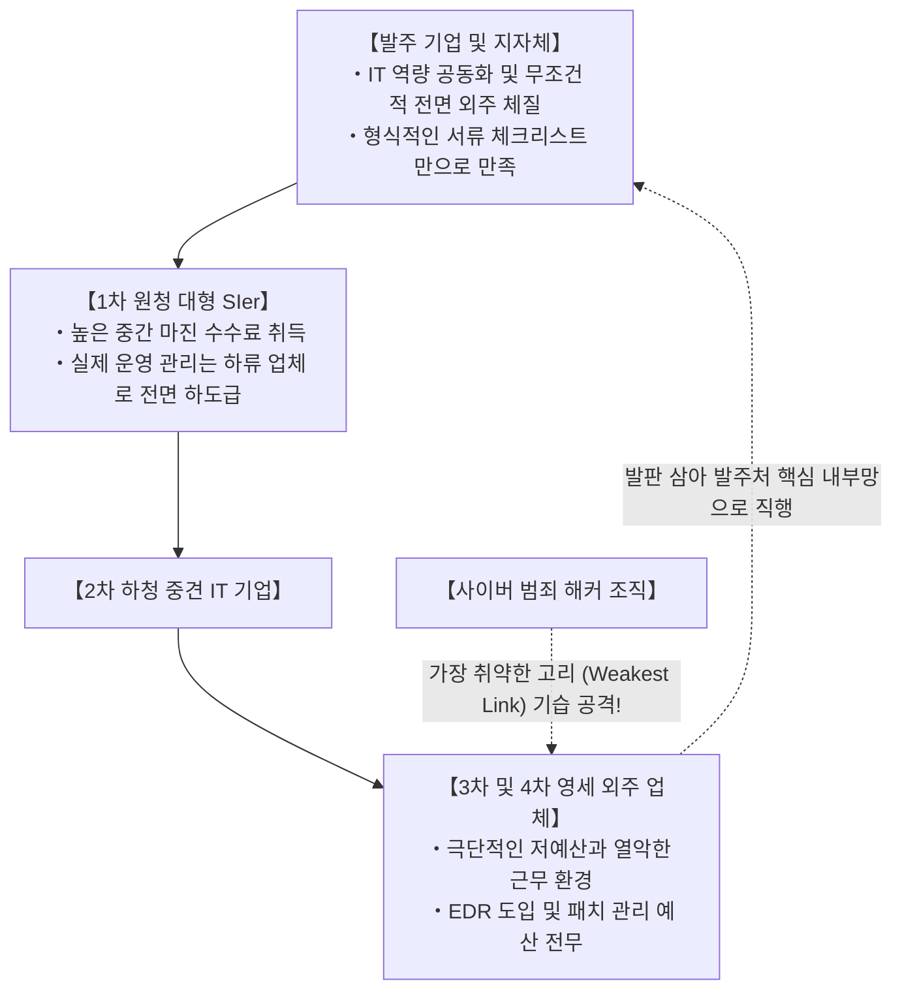

암호공학과 안전공학에는 **「사슬의 강도는 가장 약한 고리(Weakest Link)의 강도에 의해 결정된다」**는 절대 불변의 철칙이 있다.

원청 대기업 SIer가 아무리 값비싼 차세대 방화벽을 배치하고 수백 쪽에 달하는 보안 규정을 작성해 두었다 한들, 먹이사슬 맨 밑바닥에 위치한 3차, 4차 하청 영세 기업에는 최신 EDR(엔드포인트 탐지 및 대응) 라이선스를 도입할 예산도, 24시간 365일 관제하는 전문 SOC를 계약할 자금도 존재하지 않는다.
- 그곳에서는 기술 지원이 종료된 구형 윈도우 단말기나 보안 통제를 받지 않는 개인 노트북(BYOD)이 실무에 사용되고, 관리자 비밀번호는 포스트잇에 적혀 모니터에 붙어 있다.
- 더욱 심각한 것은, 원격 유지보수를 수행한다는 명목하에 이들 하청 단말기에 **「발주 기업의 핵심 데이터베이스와 운영 서버에 직접 접속할 수 있는 특권 원격 계정」**이 무제한으로 발급되어 있다는 점이다.

공격자 입장에서 이보다 쉬운 먹잇감은 없다. 방어가 견고한 원청의 정문을 뚫을 필요가 전혀 없다. 공급망 최말단에 위치한 가장 무력한 하청 업체의 PC 단 한 대만 악성코드에 감염시키면, 합법적인 인증 정보를 탈취하여 발주처의 네트워크 심장부로 '정상 임직원의 얼굴을 하고' 당당히 걸어 들어갈 수 있기 때문이다.

### 2.3 일본형 고용 체계의 한계와 전문 보안 인재의 구조적 결핍

'사람'이라는 핵심 요소에서도 병리는 심각한 수준에 도달해 있다.

일본 경제산업성(METI)과 정보처리추진기구(IPA)의 조사에 따르면, 일본의 사이버 보안 전문 인력 부족 규모는 수만에서 수십만 명에 달한다고 지속적으로 경고되고 있다. 그러나 그 본질은 단순한 인구 통계학적 저출산 문제가 아니다. **「고급 사이버 보안 전문가를 합당하게 평가하고 대우하지 못하는 일본식 인사 고용 시스템의 제도적 피로」**가 근본 원인이다.

미국, 이스라엘, 싱가포르 등 선진 시장에서 기업의 방어선을 총괄하는 최정상급 보안 아키텍트, 바이너리 리버스 엔지니어, 모의해킹 전문가(화이트해커)의 연봉은 2,000만 엔에서 4,000만 엔을 훌쩍 뛰어넘는다. 그들은 기업의 디지털 자산을 침몰로부터 지켜내는 핵심 엘리트 기술자로 대우받는다.

반면 종신고용과 연공서열을 고수하는 대다수 전통적 일본 기업에서 IT 기술자는 '종합직 서열의 하류'에 묶여 있다.
- 인사 급여 테이블은 일괄적이어서, 아무리 뛰어난 취약점 분석 능력을 갖춘 청년 화이트해커라 할지라도 같은 연차의 일반 영업직이나 관리직과 동일한 급여(연봉 400만~600만 엔대)에 묶인다.
- 엔지니어로서의 최고 정점 커리어 패스는 '관리직(팀장, 부장)'뿐이며, 코드를 분석하고 로그를 추적하며 악성코드를 역공학하는 전문 기술 트랙은 전무하다. 출세하려면 기술의 일선을 떠나 예산 절충과 엑셀 보고서 작성에 매달려야 한다.

결국 우수한 보안 인재들은 외국계 빅테크나 신흥 스타트업으로 이탈하고, 일본 기업 내부 IT 부서에는 '직접 손을 움직여 위협을 탐지하고 분석하며 격리할 수 있는 실전형 엔지니어'가 단 한 명도 남지 않게 된다. 남은 것은 외부 벤더가 작성해 온 보고서를 이리저리 전달하기만 하는 '메신저'뿐이다. 이 지적 역량의 공동화가 바로 침해사고 발생 시 초동 대응을 완전히 그르치고 사태를 파멸적 규모로 키우는 근본적 요인이다.

---

## 제3章: 근본 원인의 심층 해부② —— 기술적 붕괴 (경계형 방어의 파탄과 AD의 함정)

조직과 거버넌스의 결함에 더해, 일본 기업의 IT 인프라 그 자체가 떠안고 있는 '노후화된 아키텍처와 치명적인 구조적 결함'은 공격자들에게 거부할 수 없는 최상의 먹잇감이 되고 있다.

### 3.1 VPN 장비와 원격 데스크톱이라는 취약한 「뒷문 통로」

코로나19 팬데믹을 거치며 일본 기업들은 급격한 재택근무 전환을 강행했다. 이때 대다수 기업이 선택한 방식은 "기존 사내망 경계에 하드웨어 SSL-VPN 장비(Fortinet FortiGate, Pulse Secure / Ivanti Connect Secure 등)를 설치하고 직원의 자택 PC에서 회사 내부로 암호화 터널을 뚫어주는" 손쉬운 임시변통이었다.

이 선택이 일본 기업 방어선에 있어 **가장 치명적인 급소(뒷문)**가 되었다.

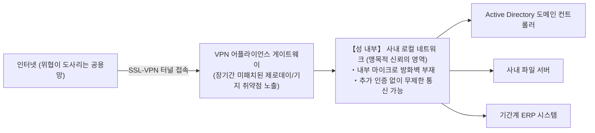

VPN 장비는 위험천만한 인터넷 공용망에 IP와 관리 포트를 정면으로 드러내고 있는 '물리적 성문'이다. 전 세계의 사이버 범죄 조직과 국가 후원형 해커 조직(APT)은 이 성문의 열쇠구멍(소프트웨어 취약점)을 밤낮으로 노리고 있다.
- 실제로 2023년부터 2026년에 걸쳐 Ivanti, Fortinet 등 주요 VPN 장비에서 인증을 우회하여 원격에서 임의의 악성 코드를 실행할 수 있는 치명적인 고위험 취약점(CVSS 9.0~10.0 만점)이 잇따라 터져 나왔다.
- 경악스러운 것은, 제조사가 긴급 보안 패치를 배포한 이후에도 일본의 수많은 기업이 "업무에 지장이 생긴다", "장비 재부팅 일정을 잡기 어렵다"는 이유로 수개월에서 1년 이상 패치 적용을 차일피일 미루었다는 점이다.

공격자들은 Shodan, Censys와 같은 글로벌 자산 스캐너를 사용하여 패치되지 않은 취약한 VPN 장비를 전자동으로 탐색한다. 취약점을 찔러 장비의 메모리에서 유효한 로그인 세션 토큰과 계정 정보를 덤프해 내면, **불과 몇 분 만에 '정상적인 정규 직원'으로 둔갑하여 내부망 깊숙한 곳으로 무혈입성**할 수 있다.

### 3.2 사내망 내생 신뢰 신화(경계형 방어 모델)의 완전한 파탄

VPN 방벽이 뚫린 후 일본 기업들을 전멸로 몰고 가는 것은 여전히 맹신되고 있는 **「전통적 경계형 방어 모델(Perimeter Defense / 성과 해자 모델)」**이다.

경계형 방어란 "외부 인터넷은 위험한 공간이지만, 외부 방화벽 안쪽에 위치한 사내 로컬 네트워크(사내 LAN)는 100% 안전하고 신뢰할 수 있다"는 지극히 순진한 가설에 입각한 아키텍처다.

이 사상에 따라 구축된 사내 네트워크는 충격적일 정도로 **「평면적(Flat Network)」**이다.
- 사내망에 연결된 PC 단말기는 동일 서브넷이나 인접 세그먼트에 위치한 다른 모든 PC, 파일 서버, 프린터, 기간계 시스템과 아무런 2차 인증이나 암호화 없이 자유롭게 통신할 수 있다.
- 사내망 내부에서 횡적으로 오가는 데이터 패킷은 내부 방화벽의 감시를 일절 받지 않는다.

이는 튼튼한 외벽으로 성을 둘러쳤지만, **"일단 스파이가 성문을 통과해 성 안으로 들어오면 천수각이든 보물창고든 식량창고든 아무런 자물쇠가 잠겨 있지 않아 누구의 제지도 받지 않고 약탈할 수 있는 중세 성곽"**과 정확히 일치한다.

감염된 단말기 한 대에서 사내망 전체를 탐색(Reconnaissance)하고 인접한 서버로 감염을 확산시키는 '횡적 이동(Lateral Movement)'을 경계형 방어 모델로는 결코 막아낼 수 없다.

### 3.3 Active Directory(AD)의 무분별한 비대화와 특권 계정 관리의 붕괴

엔터프라이즈 윈도우 환경에서 최대의 단일 장애점(SPOF)이자 공격자들에게 '최고의 성배'로 군림하는 것이 바로 마이크로소프트의 **Active Directory(AD 도메인 컨트롤러)**이다.

일본 기업의 90% 이상이 사내 단말기, 임직원 계정, 접근 권한, 보안 그룹 정책(GPO)의 통합 관리를 Active Directory에 전적으로 의존하고 있다. 그러나 실제 관리 실태는 처참하기 이를 데 없다.
- 20여 년 전에 구축된 AD 포레스트가 관리 주체의 변경과 무분별한 증개축을 거치며 아무도 손댈 수 없는 거대한 블랙박스로 방치되어 있다.
- 퇴사자의 계정, 용도 폐기된 구형 서버의 서비스 계정, 과거 테스트용으로 생성된 임시 고권한 계정이 수천 개씩 삭제되지 않은 채 방치되어 있다.
- 무엇보다 치명적인 것은 **「도메인 관리자(Domain Admin) 권한의 무분별한 남용과 비밀번호 재사용」**이다. 전산실 직원이나 외부 협력업체가 작업 편의를 위해 일반 직원 PC에 로컬 관리자 권한을 부여하고 전사적으로 동일한 비밀번호를 돌려쓰는 관행이 팽배해 있다.

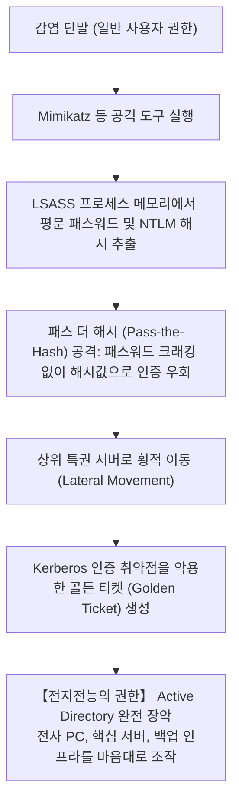

현대의 전문 해커는 침투한 단말기에서 `Mimikatz`와 같은 도구를 구동하여 윈도우 인증 프로세스(`lsass.exe`)의 메모리 상주 영역에서 NTLM 해시값과 Kerberos 티켓을 즉시 추출한다.

공격자는 비밀번호 평문을 알아낼 필요조차 없다. 추출한 해시값을 그대로 밀어 넣어 인증을 통과하는 **「패스 더 해시(Pass-the-Hash)」** 공격이나, Kerberos 인증의 마스터 암호화 키(krbtgt 계정)를 탈취하여 유효기간과 권한에 제한이 없는 위조 티켓을 발급하는 **「골든 티켓(Golden Ticket)」** 공격을 감행한다.

이 공격 체인이 완성되는 순간 공격자는 '도메인 관리자 = 기업 디지털 제국의 전능한 신'으로 등극한다. 이후 그룹 정책(GPO)을 이용해 전사 컴퓨터에 랜섬웨어를 시작 프로그램으로 일괄 배포하면, 불과 수십 분 만에 수만 대의 단말기와 서버가 일시에 암호화되어 전멸한다.

### 3.4 무분별한 클라우드 전환의 그늘: 섀도우 IT와 과도한 IAM 권한 남용

온프레미스에서 AWS, Azure, Google Cloud와 같은 퍼블릭 클라우드로의 전환이 가속화되면서 새로운 기술적 병리가 폭발하고 있다.

1. **섀도우 IT(Shadow IT)와 미인가 클라우드 자산**:
   사내 보안 부서의 엄격한 보안 심사 절차를 기피한 사업 부서나 개발팀이 법인카드로 독자적인 SaaS나 별도의 클라우드 계정을 개설하여 운영한다. 이들 자산은 전사 보안 관제 모니터링의 사각지대에 놓여 퍼블릭 접근 권한 오픈과 취약점 방치의 온상이 된다.
2. **과도한 권한(Over-Privileged)이 부여된 IAM 정책**:
   클라우드 보안의 심장인 'IAM(Identity and Access Management)' 설계에서 최소 권한의 원칙(PoLP)을 무시하고, "설정이 귀찮다", "권한 부족으로 에러가 나면 곤란하다"는 이유로 전지전능한 `AdministratorAccess`나 와일드카드(`*`) 정책을 EC2 인스턴스나 람다 함수에 무차별 부여한다.
   외부로 노출된 웹 애플리케이션의 사소한 SQL 인젝션이나 SSRF(서버 측 요청 위조) 취약점을 통해 임시 IAM 자격 증명(STS Token)이 단 한 번 유출되는 것만으로도, 클라우드 테넌트 전체의 스토리지와 데이터베이스가 공격자의 손에 송두리째 넘어가는 참사가 반복되고 있다.

---

## 제4章: 근본 원인의 심층 해부③ —— 인간의 취약성과 신종 공격 기법의 진화

시스템 아키텍처의 붕괴에 더해, 인간 심리와 인지적 한계를 파고드는 사회공학적 공격 기법이 생성형 AI의 등장으로 인해 치명적인 수준으로 진화했다.

### 4.1 생성형 AI 시대의 정밀 스피어 피싱과 딥페이크

과거의 피싱 메일은 어색한 번역투, 부자연스러운 조사 사용, 깨진 경어 표현이 많아 기본적인 주의력을 가진 임직원이라면 어느 정도 식별이 가능했다.

그러나 ChatGPT를 필두로 한 **대규모 언어 모델(LLM)이 사이버 범죄자들의 무기로 악용**되면서 이러한 판도는 완전히 뒤집혔다.

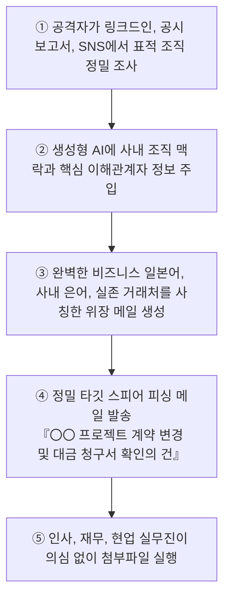

현대의 정밀 표적형 공격(스피어 피싱)은 공격자가 기업 웹사이트, 보도자료, 링크드인, 임직원 SNS를 통해 조직도와 진행 중인 프로젝트, 실제 거래처 명단을 파악한 뒤 이를 AI에 학습시켜, **"사내 상사나 실제 협력사 담당자가 직접 작성했다고 믿을 수밖에 없는 지극히 자연스럽고 세련된 비즈니스 서신"**을 자동으로 생성하여 침투한다.

더욱 무서운 것은 **딥페이크(음성·영상 위조) 기술을 활용한 전방위 사기**다.
- 실제로 일본 및 글로벌 다국적 기업에서 모회사 CEO나 CFO의 목소리와 얼굴을 실시간 AI로 정교하게 복제한 화상회의를 통해, "극비 인수합병 프로젝트를 위해 지정된 계좌로 수억 엔을 긴급 송금하라"고 지시하여 천문학적인 금액을 가로챈 사건이 연이어 발생하고 있다.
- 인간의 시각과 청각적 직관을 직접 해킹하는 고도화된 기술 앞에서 "메일을 꼼꼼히 확인하라"는 식의 정신론적 보안 교육은 완전히 무력화되었다.

### 4.2 세션 하이재킹과 인포스틸러(Infostealer)의 대유행

일본 기업들이 속속 도입해 온 '이중 인증(2FA / MFA)' 체계를 단숨에 무력화시키고 있는 주범은 바로 **「인포스틸러(Infostealer: 정보 탈취형 악성코드)」**의 폭발적 확산이다.

RedLine, Raccoon, Lumma와 같은 전문 인포스틸러 악성코드는 불법 복제 소프트웨어, 치트 툴, 업무 양식을 위장한 피싱 사이트를 통해 임직원이나 외주 개발자의 단말기에 은밀히 침투한다.

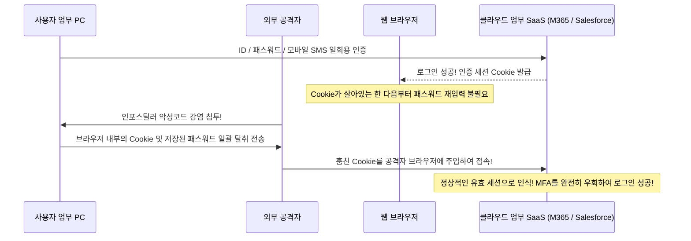

인포스틸러의 주된 목적은 파일을 암호화하는 것이 아니다. 피해자의 웹 브라우저(Chrome, Edge 등) 내부 로컬 데이터베이스를 털어 **「저장된 계정 패스워드」와 「활성화된 인증 세션 쿠키(Session Cookies)」를 통째로 탈취**하는 것이다.

웹 브라우저는 한 번 ID, 비밀번호, MFA(SMS나 모바일 OTP)를 통과하여 로그인에 성공하면 서버가 발급한 세션 쿠키를 보관한다. 공격자는 이 유효한 쿠키를 훔쳐내어 자신의 브라우저에 그대로 주입(Cookie Hijacking)하기만 하면, **아이디나 비밀번호를 입력할 필요도 없고 MFA 인증 코드를 요구받지도 않은 채 피해자 본인의 자격으로 사내 클라우드 SaaS에 즉시 무혈입성**한다.

현재 다크웹 암시장에서는 일본 주요 기업 임직원의 유효 세션 쿠키가 포함된 로그가 불과 몇 달러에서 수십 달러라는 헐값에 대량으로 거래되고 있으며, 공격자들은 크래킹 작업 없이 돈으로 산 정품 열쇠로 사내 인프라를 유유히 활보하고 있다.

### 4.3 내부자 위협(Insider Threat): 퇴사자 및 외주 인력에 의한 핵심 자산 무단 반출

보안의 위협은 결코 외부에서만 찾아오는 것이 아니다. 일본네트워크보안협회(JNSA) 통계에 따르면 전체 정보 유출 사고의 상당한 지분을 차지하는 것이 바로 **「내부 관계자(재직자, 퇴사 예정자, 파견·외주 엔지니어)에 의한 고의적 데이터 유출」**이다.

- **고용 유동화와 퇴사 직전의 데이터 절도**:
  평생직장 개념이 희미해지고 이직이 보편화된 오늘날, 경쟁사로의 이직이 확정된 핵심 개발자나 영업 관리자가 "자신이 일궈낸 성과물"이라는 그릇된 자기합리화 속에 고객 명단, 소프트웨어 소스코드, 핵심 설계 도면을 개인 USB나 클라우드 저장소(Google Drive, Dropbox)에 대량 업로드하여 반출하는 사례가 급증하고 있다.
- **특권을 쥔 외주 상주 인력의 일탈**:
  시스템 운영 유지보수를 위탁받은 하청·재하청 업체의 엔지니어가 개인 채무나 경제적 곤궁을 이유로 자신에게 부여된 데이터베이스 접근 권한을 남용하여, 수만에서 수십만 건의 고객 금융 정보나 주민등록 정보를 덤프하여 브로커에게 팔아넘기는 범죄 역시 끊이지 않고 있다.

다수의 일본 기업은 여전히 취약한 '성선설'에 기반하여 내부 통제를 운영하고 있으며, 직원이 비정상적인 대용량 파일 다운로드를 감행할 때 이를 실시간으로 감지하고 차단하는 DLP(데이터 유출 방지)나 UEBA(사용자 및 개체 행위 분석) 기술을 도입하지 않고 있다. 내부자의 정보 절도는 수개월 혹은 수년 뒤 수사기관의 적발이나 경쟁사의 복제 제품 출시를 통해서야 뒤늦게 밝혀지는 경우가 허다하다.

---

## 제5章: 제로 트러스트 아키텍처(ZTA)로의 완전 전환을 위한 전략적 로드맵

이러한 전방위적이고 입체적인 위협 앞에서 일본 기업이 택할 수 있는 유일한 생존 전략은, 사망 선고를 받은 기존의 경계형 방어 패러다임을 단호히 폐기하고 **「제로 트러스트 아키텍처(Zero Trust Architecture: ZTA)」**로의 완전한 전환을 단행하는 것이다.

### 5.1 제로 트러스트의 본질: 「절대 신뢰하지 말고, 언제나 검증하라 (Never Trust, Always Verify)」

제로 트러스트는 단순히 특정 벤더의 보안 솔루션 제품명을 뜻하지 않는다. 미국 국립표준기술연구소(NIST)가 「NIST SP 800-207」 규격을 통해 정립한 **「보안 철학의 근본적인 패러다임 전환(사고방식 OS의 전면적 재작성)」**이다.

> **제로 트러스트 3대 핵심 원칙 (Core Principles)**:
> 1. **절대 신뢰하지 말고, 언제나 검증하라 (Never Trust, Always Verify)**:
>    본사 사장실의 유선 LAN에 연결된 PC이든, 외부 카페의 모바일 단말기이든, 그 어떤 네트워크 위치나 디바이스, 사용자도 기본적으로 '안전하다'고 간주하지 않는다. 모든 접근 요청을 잠재적 위협으로 규정하고 매번 엄격히 검증한다.
> 2. **최소 권한의 원칙 (Grant Least Privilege Access)**:
>    사용자와 디바이스에는 당면한 특정 업무를 수행하는 데 필요한 '최소한의 권한'만을, 필요한 시간(Just-In-Time) 동안에만 동적으로 부여하고 회수한다.
> 3. **침해를 전제하라 (Assume Breach)**:
>    "외부 방어벽은 이미 뚫렸으며, 해커는 이미 사내 네트워크 내부에 잠복해 있다"는 냉혹한 가정을 설계의 출발점으로 삼는다. 피해 범위의 국소화(폭발 반경 최소화), 내부 횡적 이동 차단, 실시간 탐지 및 즉각적 격리를 아키텍처의 중심에 둔다.

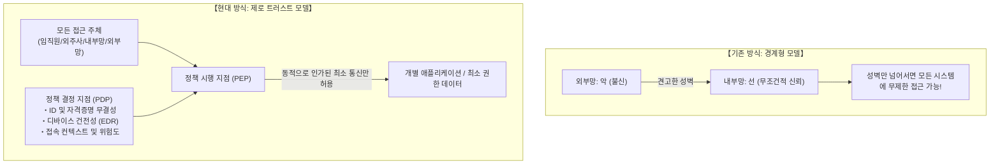

### 5.2 VPN의 전면 폐기와 ZTNA(제로 트러스트 네트워크 액세스)로의 전환

제로 트러스트 구축의 첫 번째 실천 과제는 침해사고의 온상인 **「노후 하드웨어 SSL-VPN 장비의 전면 철거」**와 **「ZTNA(Zero Trust Network Access)」**로의 완전한 세대교체이다.

VPN과 ZTNA의 결정적인 구조적 차이는 접속의 대상이 '네트워크 전체'인가, 아니면 '특정 개별 애플리케이션'인가에 있다.
- **기존 VPN**: 인증을 통과하는 순간 사용자의 PC를 사내 IP 서브넷에 물리적으로 직결시킨다. 그 결과 해당 단말기는 사내의 모든 서버와 통신할 수 있게 되며, 단말기가 악성코드에 감염되어 있다면 내부망 전체로 감염이 확산된다.
- **ZTNA**: 단말기를 사내 네트워크에 절대로 직접 연결하지 않는다. 클라우드에 배치된 중계 브로커가 사용자의 신원과 단말기의 보안 상태를 매 접속마다 엄격히 검증한 뒤, **「인가된 특정 웹 애플리케이션이나 특정 서비스 포트로의 통신만을 점대점으로 중계」**한다.
  단말기에서는 사내망의 사설 IP 대역도, 네트워크 토폴로지도 일절 보이지 않게 은폐(Network Cloaking)되므로 해커의 포트 스캔과 횡적 이동이 물리적으로 불가능해진다.

### 5.3 SASE(Secure Access Service Edge)와 SSE 통합 보안 아키텍처

현대 기업 환경에서 제로 트러스트 네트워크를 글로벌 스케일로 구현하는 통합 플랫폼이 가트너(Gartner)가 제시한 **「SASE(Secure Access Service Edge)」** 및 그 보안 핵심 엔진인 **「SSE(Security Service Edge)」**이다.

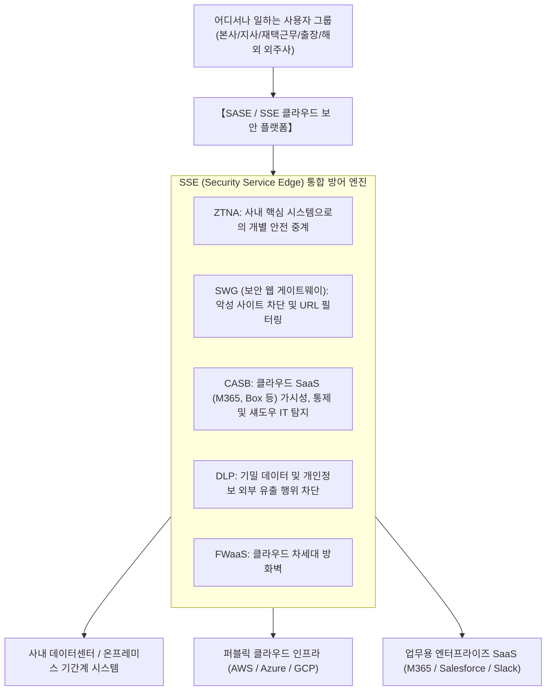

SASE 환경에서는 사용자가 본사 사무실에 있든, 자택에 있든, 해외 공장에 있든 상관없이 모든 통신 트래픽이 전 세계에 분산된 최적의 'SASE 클라우드 엣지'를 거쳐 전달된다.
- **SWG(보안 웹 게이트웨이)**가 악성 피싱 URL과 악성코드 다운로드를 실시간 차단한다.
- **CASB(클라우드 접근 보안 브로커)**가 인가되지 않은 섀도우 IT 사용을 차단하고 회사 데이터가 개인 클라우드로 유출되는 것을 감시한다.
- **DLP(데이터 유출 방지)**가 주민등록번호, 신용카드 번호, 소스코드의 외부 전송을 감지하여 실시간 암호화 및 전송 차단을 단행한다.
- **ZTNA**가 온프레미스 데이터센터와 멀티 클라우드로 향하는 안전한 은닉 경로를 제공한다.

이를 통해 지사마다 설치되어 있던 값비싸고 취약한 하드웨어 VPN 라우터와 로컬 프록시 장비를 전량 폐기하고, 전 세계 어디서나 일관된 최고 수준의 보안 정책을 단일 콘솔에서 통제할 수 있게 된다.

### 5.4 마이크로 세그멘테이션을 통한 내부 횡적 이동의 물리적 원천 차단

외부로부터의 침입을 아무리 철저히 틀어막더라도, 개별 단말기의 악성코드 감염 확률을 0%로 만드는 것은 불가능하다. 이때 단일 단말기의 감염이 전사적 재앙으로 번지는 것을 차단하는 최후의 기술적 쐐기가 바로 **「마이크로 세그멘테이션(Micro-Segmentation)」**이다.

마이크로 세그멘테이션은 기존의 '층별 네트워크'나 'VLAN 대역별 분할'과 같은 거친 단위의 경계를 해체하고, **「물리 서버 1대 단위, 가상머신(VM) 1대 단위, 심지어 컨테이너 1개 단위」**의 극소 단위로 가상 방화벽 경계를 설정하는 차세대 격리 기술이다.

- 예를 들어 재무 회계 서버는 오직 '재무팀 승인 단말기의 특정 암호화 포트'에서 인입되는 패킷만을 허용하고, 개발팀 단말기나 일반 사무 단말기로부터의 모든 통신(기초적인 Ping 요청 포함)을 커널 레벨에서 거부한다.
- 동일한 하이퍼바이저 랙 내에 위치한 동일 서브넷 상의 업무 서버들 간이라 할지라도, 사전에 명시적으로 승인된 API 통신 화이트리스트 이외의 모든 횡적 통신은 물리적으로 차단된다.

이를 통해 만에 하나 사내 PC 한 대가 랜섬웨어에 감염되어 공격자가 주변 탐색을 시도하더라도, 주위의 모든 문이 두꺼운 철문으로 용접되어 차단된 형국이 되므로 **「공격을 최초 침투 단말기 단 1대 내부에 완전히 가두고(폭발 반경의 최소화), 타 시스템으로의 확산을 물리적으로 저지」**할 수 있다.

---

## 제6章: ID 및 인증 인프라(IAM/PAM)의 요새화

제로 트러스트 아키텍처에서 새로운 '성벽(외벽)' 역할을 하는 것은 물리적 전산망 케이블이 아니다. 바로 **「아이덴티티(ID와 인증)」**이다. 경계가 사라진 시대에 ID 인프라의 건전성이야말로 기업의 존망을 결정하는 최우선 통제점이 된다.

### 6.1 FIDO2 / 패스키 기반 피싱 내성 MFA의 의무화

기업이 가장 먼저 단행해야 할 조치는 SMS 문자메시지, 이메일 인증 링크, 혹은 모바일 푸시 알림(단순 승인 버튼 클릭)에 의존하는 '구세대 2단계 인증'의 완전한 퇴출이다.

앞서 상술했듯이 공격자는 역방향 프록시 피싱 툴(Evilginx 등)과 인포스틸러 악성코드를 이용하여 SMS 인증번호와 세션 쿠키를 실시간으로 가로챈다. 이에 맞설 수 있는 유일한 수학적 해답은 **「FIDO2 / WebAuthn(패스키: Passkeys)」 표준에 입각한 피싱 내성 다중 인증(Phishing-Resistant MFA)**뿐이다.

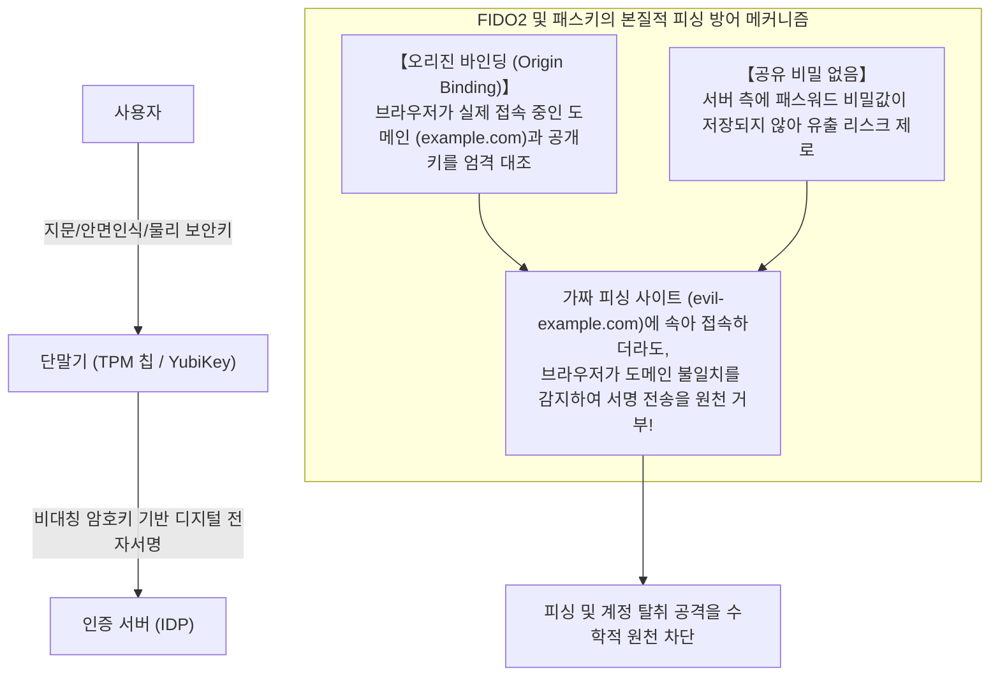

FIDO2의 독보적인 강점은 바로 **「오리진 바인딩(Origin Binding)」** 기술이다.
사용자가 외형이 완전히 똑같은 가짜 피싱 로그인 화면에 속아 접속하더라도, 브라우저 엔진이 현재 접속 중인 주소창의 도메인(FQDN)을 엄격히 대조한다. 등록된 정상 도메인과 단 한 글자라도 일치하지 않는다면 단말기 내부의 보안 칩(TPM 또는 YubiKey)은 암호화된 전자서명 값을 서버로 전송하기를 원천 거부한다.

이는 인간이 아무리 감쪽같이 속아 넘어가더라도 암호학적 알고리즘 레벨에서 계정 탈취가 불가능함을 의미한다. 기업은 핵심 시스템을 다루는 엔지니어와 관리자부터 시작하여 YubiKey와 같은 하드웨어 보안키 지급 또는 Windows Hello 기반의 FIDO2 인증 도입을 전사적으로 강제해야 한다.

### 6.2 Active Directory 계층화(Tiering) 모델과 JIT 적시 접근 통제

단기간 내에 온프레미스 Active Directory를 완전히 철거하기 어려운 기업들에게 있어, AD 도메인 컨트롤러 함락을 방지하는 결정적 설계 사상은 마이크로소프트가 권고하는 **「Active Directory 계층화(Tiering) 아키텍처」**이다.

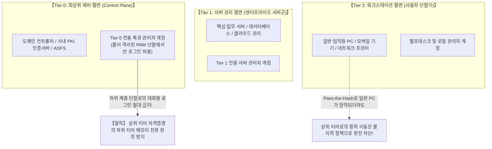

계층화 모델의 핵심 원칙은 **"상위 권한 계정은 절대로 하위 권한 단말기에 로그인해서는 안 된다(자격증명을 하위 메모리에 남기지 않는다)"**는 단방향 불변의 철칙이다.
- **Tier 0(도메인 핵심 제어 평면)**: 도메인 컨트롤러와 루트 인증 인프라. Tier 0 계정은 오직 Tier 0 시스템에만 접속하며, 일반 직원 PC(Tier 2)나 업무 서버(Tier 1)에는 절대 로그인하지 않는다. 관리는 외부 인터넷과 격리된 **「특권 접근 전용 워크스테이션(PAW: Privileged Access Workstation)」**에서만 수행한다.
- **Tier 1(서버 제어 평면)**: 전사 업무 서버 및 데이터베이스만 관리.
- **Tier 2(엔드포인트 평면)**: 일반 PC 단말기만 관리.

나아가 관리자 계정이 항시 최고 권한을 유지하는 '상시 특권(Standing Privileges)' 관행을 폐지하고, **「JIT(Just-In-Time) 적시 접근 통제」**를 도입해야 한다. 관리자도 평소에는 일반 사용자 권한으로 생활하다가, 작업 승인 결재를 득한 긴급 작업 시간 동안에만 몇 시간 한정의 임시 특권 토큰을 부여받아 작업한다. 공격자가 평상시 관리자 PC를 장악하더라도 휘두를 수 있는 특권 자체가 존재하지 않게 된다.

### 6.3 조건부 액세스(Conditional Access)를 통한 실시간 동적 신뢰 평가

제로 트러스트 환경에서 '인증'이란 아침에 출근하여 한 번 비밀번호를 치면 끝나는 정적인 점(Point)의 이벤트여서는 안 된다. 세션이 유지되는 동안 접속 환경의 리스크를 밀리초 단위로 지속 재평가하는 **「연속적 동적 신뢰(Continuous Adaptive Trust)」** 체계여야 한다.

이를 구현하는 핵심 엔진이 마이크로소프트 Entra ID나 Okta 등에서 제공하는 **「조건부 액세스(Conditional Access)」**이다.

사용자가 로그인을 시도할 때마다 정책 결정 엔진(PDP)은 다음과 같은 다차원 컨텍스트 신호를 복합 채점한다:
1. **사용자 신원 및 그룹 역할**
2. **접속 IP 및 지리적 위치(Geolocation)**:
   - 10분 전 도쿄 본사 사옥에서 로그인했던 계정이 갑자기 동유럽이나 나이지리아 IP에서 접근을 시도할 경우(물리적 불가능 이동: Impossible Travel), 즉각 차단한다.
3. **디바이스 무결성 및 컴플라이언스 건전성**:
   - 단말기에 회사가 지정한 EDR 에이전트가 정상 작동 중인가? OS 최신 보안 패치가 적용되어 있는가? 디스크 암호화(BitLocker)가 활성화되어 있는가?
4. **실시간 이상 행위 리스크 스코어**:
   - 평소와 다른 심야 시간대의 비정상 접속, 단시간 내의 급격한 파일 대량 다운로드 징후가 포착되면 즉시 추가 생체인증을 요구하거나 세션을 강제 종료시킨다.

이 조건 중 단 하나라도 충족되지 않는다면, 아무리 올바른 아이디와 비밀번호를 입력했다 할지라도 사내 시스템의 문은 단 1밀리미터도 열리지 않는다.

---

## 제7章: 공급망 및 외주 협력사 보안의 관통형 통제 모델

자사의 제로 트러스트 요새가 아무리 완벽하더라도 공급망이라는 '뒷문'이 열려 있다면 조직은 결코 살아남을 수 없다. 외주 협력사 생태계를 어떻게 효과적으로 통제해야 하는가?

### 7.1 외주 생태계 가시화와 지속적 동적 보안성 평가 체계 구축

가장 먼저 선행되어야 할 작업은 **「전체 공급망에 대한 철저한 자산 실사 및 가시화」**이다.

다수의 대기업들은 계약을 체결한 1차 원청사만을 파악하고 있을 뿐, 그 배후에서 실제 개발과 유지보수를 진행하는 2차, 3차 하청업체가 누구이며 어떤 보안 수준을 유지하고 있는지 전혀 알지 못한다.
- 모든 위탁 계약서에 **「발주처의 사전 서면 승인 없는 무단 재하도급(꼬리 물기식 외주) 엄격 금지」** 조항을 명문화해야 한다.
- 협력업체를 대상으로 연 1회 형식적인 종이 설문지(자체 점검 체크리스트)를 보내 서명받는 허례허식 감사를 전면 폐기해야 한다.
- 외부 전문 평가 기관 및 **「서드파티 보안 레이팅 서비스(BitSight, SecurityScorecard 등)」**를 도입하여, 협력업체가 외부에 노출하고 있는 도메인, 취약한 VPN 포트, 다크웹 계정 유출 여부를 **연중무휴 실시간으로 정량 평가하고 점수화하여 감시하는 동적 거버넌스 체제**를 구축해야 한다.

### 7.2 외주 인력 BYOD 전면 금지와 제로 트러스트 격리 VDI 구축

외주 인력의 개인 PC 감염으로 인한 사내망 오염을 막기 위한 가장 완벽한 물리적 해법은 **「외주사 단말기에는 단 1바이트의 실제 업무 데이터도 다운로드시키지 않는다」**는 원칙의 확립이다.

외주 협력사 인력이 자신의 개인 노트북(BYOD)이나 관리되지 않는 단말기를 회사 내부망이나 사내 클라우드 스토리지에 직접 연결하는 행위는 예외 없이 전면 금지(Zero Trust)되어야 한다.

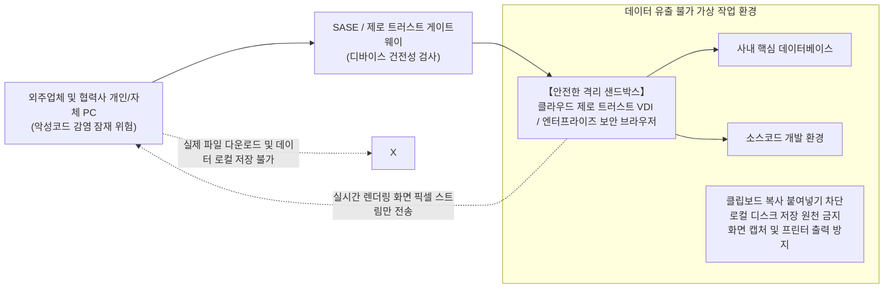

외주 인력에게는 기업 보안팀이 중앙에서 통제하는 **「클라우드 제로 트러스트 VDI(DaaS)」** 또는 **「엔터프라이즈 보안 브라우저(Enterprise Secure Browser)」**만을 통해서만 작업을 수행하도록 강제한다.
- 가상 환경 내부에서는 로컬 PC로의 파일 다운로드 기능, 클립보드를 통한 복사·붙여넣기, 화면 캡처, 외부 프린터 출력이 시스템 레벨에서 원천 차단된다. 작업 화면에는 작업자의 이름과 IP, 시간 정보가 포함된 반투명 워터마크가 상시 출력된다.
- 외주 인력의 모니터로 전송되는 것은 **「오직 화면 렌더링 픽셀 스트림뿐」**이다. 설령 외주 인력의 PC가 인포스틸러에 감염되어 있더라도 해커가 탈취할 수 있는 실제 소스코드나 데이터, 유효 세션 쿠키는 존재하지 않는다.

### 7.3 SBOM(소프트웨어 자재명세서) 의무화와 API 권한 최소화

소프트웨어 공급망에서 발생하는 또 다른 거대한 사각지대는 외주 개발 납품 소프트웨어의 오픈소스 취약점 오염이다.

외부 개발사에 외주를 주어 납품받은 웹 애플리케이션이나 사내 시스템 내부에는 검증되지 않은 취약한 구형 오픈소스 라이브러리(Apache Log4j2, 구버전 Spring Framework 등)가 포함되어 장기간 방치되는 경우가 허다하다.

기업은 개발사에 제품 납품 시 기계 가독형 컴포넌트 목록인 **「SBOM(Software Bill of Materials: 소프트웨어 자재명세서)」** 제출을 법적으로 의무화해야 한다. 이를 통해 새로운 치명적 제로데이 취약점이 전 세계에 발표되었을 때, 사내의 어떤 시스템이 해당 라이브러리를 사용하고 있는지를 단 몇 분 만에 식별하고 즉각 패치할 수 있다.

또한 외부 파트너사나 클라우드 간의 API 연동에 있어서도 만료 기한이 없는 영구 API Key 발급을 금지하고, OAuth 2.0 기반의 엄격한 최소 권한 스코프(Scope)와 짧은 수명(TTL)을 가진 토큰 자동 교체 체계를 수립해야 한다.

---

## 제8章: 랜섬웨어와 데이터 파괴에 굴복하지 않는 「사이버 레질리언스」

제로 트러스트의 핵심 철학인 "침해를 전제하라(Assume Breach)"의 연장선상에서, 기업 방어선의 최후의 보루는 바로 **「사이버 레질리언스(Cyber Resilience: 사업 지속성과 복원력)」**이다.

국가급 해커나 산업화된 전문 범죄 조직의 집요한 총공격을 영원히 100% 막아내는 것은 불가능에 가깝다. 궁극적인 승패를 가르는 척도는 **"침입을 당해 시스템이 파괴되었을 때, 해커에게 굴복하지 않고 얼마나 신속하게 비즈니스를 정상화할 수 있는가"**이다.

### 8.1 3-2-1-1-0 백업 룰과 「불변 스토리지(Immutable Storage)」

최근의 고도화된 랜섬웨어 공격(BlackSuit, LockBit 등)에서 해커의 제1 목표는 데이터 암호화가 아니다. 바로 **「사내의 모든 백업 데이터와 스냅샷의 물리적 완전 삭제」**이다. 백업이 온전히 살아있다면 거액의 몸값을 지불할 기업은 없기 때문이다.

기존의 "매일 밤 배치 파일로 다른 백업 스토리지에 데이터를 복사해 둔다"는 식의 단순 백업 방식은 랜섬웨어 앞에서 아무런 방패가 되지 못한다. 백업 서버가 사내 Active Directory 도메인에 조인되어 있다면, 도메인 관리자 권한을 손에 쥔 해커의 단 한 줄의 명령어로 백업 본체까지 수 초 만에 일괄 삭제된다.

현대 기업이 필수적으로 도입해야 할 군사적 수준의 백업 표준이 바로 **「3-2-1-1-0 법칙」**이다.

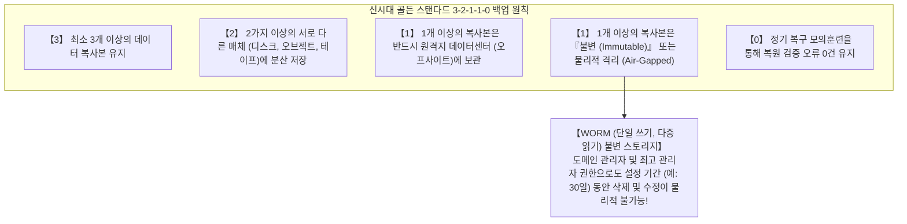

이 규칙에서 가장 결정적인 게임 체인저는 바로 **「불변 백업(Immutable Backup)」**이다.
이 기술은 클라우드(AWS S3 Object Lock)나 전용 백업 어플라이언스(Veeam, Cohesity, Rubrik) 하드웨어에 탑재된 **WORM(Write Once, Read Many: 단일 쓰기, 다중 읽기) 메커니즘**을 활용한다.
한 번 저장된 백업 데이터는 지정된 보존 기간(예: 30일) 동안, 기업의 최고 경영자나 도메인 관리자, 심지어 시스템을 장악한 최고 등급의 해커라 할지라도 **「절대로 삭제하거나 덮어쓰거나 암호화할 수 없도록」** 스토리지 펌웨어 레벨에서 물리적으로 락이 걸린다.

설령 사내 데이터센터의 가상머신 수만 대가 일제히 암호화되는 최악의 파국을 맞이하더라도, 불변 스토리지에 격리된 백업 본이 온전하다면 기업은 해커의 몸값 요구를 단호히 일축하고 독립된 망에서 깨끗하게 시스템을 단기간 내에 재건할 수 있다.

### 8.2 백업 전용 「독립 인증 도메인(Out-of-Band Auth Domain)」의 물리적 분리

불변 스토리지를 도입하는 것만으로는 충분치 않다. 백업 시스템 설계상의 절대 원칙은 **「백업 관리 제어 영역을 사내 Active Directory 도메인으로부터 물리적·논리적으로 완전히 분리하는 것」**이다.

- 백업 서버의 관리자 인증은 사내 AD와 동기화되지 않는 완전 독립된 로컬 인증(별도의 물리 하드웨어 MFA 필수)을 사용해야 한다.
- 백업 시스템 콘솔에 접속할 수 있는 네트워크는 사내 일반 LAN이나 인터넷과 차단된 독립 대역외 관리망(Out-of-Band Network)으로만 제한한다.

이 '인증 평면의 완전한 단절'이 담보되어야만, 사내 도메인 컨트롤러가 궤멸하는 최악의 사태 속에서도 최후의 방주인 백업 인프라가 연쇄 침해에 휘말리지 않는다.

### 8.3 EDR/XDR과 24/365 전문 매니지드 SOC를 통한 신속한 격리

해커가 침투한 시점부터 내부 파괴를 시작하기까지의 숨 막히는 시간 싸움에서 승패를 가르는 절대 척도는 **MTTD(평균 탐지 시간: Mean Time to Detect)**와 **MTTR(평균 대응 시간: Mean Time to Respond)**이다.

과거의 시그니처 기반 백신(EPP)이 최신 메모리 기반 악성코드 앞에서 무력화된 오늘날, 전사 단말기에 **EDR(엔드포인트 탐지 및 대응)**을 빈틈없이 전개하고 네트워크와 클라우드 로그를 통합 분석하는 **XDR(확장 탐지 및 대응)** 체계를 갖추는 것은 기본 필수 조건이다.
- 정상적인 윈도우 PowerShell 프로세스가 기습적으로 실행되어 `lsass.exe` 메모리를 덤프하려 하거나, 심야에 대규모 파일 확장자 변경이 일어나는 등의 비정상 행위를 수 밀리초 만에 감지한다.
- 이상 징후 포착 즉시 EDR 에이전트는 관리자의 지시를 기다릴 필요 없이 OS 네트워크 드라이버 레벨에서 **「해당 감염 단말기의 통신을 즉시 단절(논리적 네트워크 격리)」**시켜 공격자의 횡적 이동 경로를 끊어버린다.

공격자들은 항상 방어가 가장 허술한 '금요일 심야'나 '명절 연휴'를 틈타 공격을 감행한다. 따라서 평일 낮에만 대시보드를 바라보는 보안 관제는 무용지물에 가깝다. **24시간 365일 실시간 위협을 모니터링하고 즉각 격리 조치를 취할 수 있는 전문 매니지드 탐지 및 대응 서비스(MDR / 24/7 SOC)**의 가동이야말로 현대 기업의 생존 조건이다.

---

## 제9章: 경영진과 법률 규제가 견인하는 거버넌스 대혁신

사이버 보안의 근본적인 체질 개선은 결코 전산실 내부의 기술적 노력만으로 완결될 수 없다. 그것은 법적 규제, 이사회의 법률적 책임, 그리고 기업 경영 전략 그 자체와 직결된 전사적 거버넌스 개혁이다.

### 9.1 개인정보보호법의 대폭 강화와 징벌적 손해배상 리스크

일본을 비롯한 글로벌 주요 시장에서 데이터 보호 규제의 포위망은 숨 쉴 틈 없이 좁혀지고 있다.

일본의 개정 개인정보보호법에 따라 일정 규모 이상의 개인정보 유출(또는 유출 우려)이 발생했을 때 **개인정보보호위원회(PPC)에 대한 신속한 보고 및 정보주체(피해자)에 대한 통지가 전면 의무화**되었다.
- 법인에 대한 형사 벌금 상한선이 대폭 인상되었다.
- 나아가 피해 고객과 주주들에 의한 집단소송 리스크, 유출 피해자 1인당 수천 엔에서 수만 엔에 달하는 사죄금 및 위자료 지급 책임으로 인해 수백만 명 규모의 유출 사고 시 수십억에서 수백억 엔의 치명적 현금성 손실이 발생한다.

여기에 더해 2024년 제정된 '중요경제안보정보 보호 및 활용에 관한 법률'과 기간 인프라 사업자를 향한 보안 법제 강화에 따라, 보안이 취약하여 침해사고를 일으킨 기업은 정부 인허가 취소와 엄중한 행정 처분을 면할 수 없게 되었다. 보안 사고는 이제 단순한 IT 장애가 아니라 기업의 면허와 법인 자격을 위협하는 중대한 법률적 위기다.

### 9.2 이사회의 「선관주의의무」: 사이버 보안은 피할 수 없는 '경영진의 법적 책임'

상법 및 회사법상 이사는 회사에 대하여 **「선관주의의무(善良한 管理者의 注意義務, Duty of Care)」**를 진다.

일본 최고재판소의 판례와 경제산업성·IPA의 '사이버 보안 경영 가이드라인'이 명시하듯, 현대의 법 해석상 적절한 보안 대책을 소홀히 하여 막대한 정보 유출이나 사업 마비를 초래한 경영진은 **「선관주의의무 위반」으로 주주대표소송의 직접 대상이 되며, 임원 개인이 사재를 털어 거액의 손해를 배상해야 하는 무한 책임 리스크**에 직면해 있다.

경영진은 이제 "IT는 전문 분야라 실무진에 맡겨두어 잘 몰랐다"는 변명을 법정에서 내세울 수 없다. 이사회는 정기적으로 사이버 보안 리스크를 독립적으로 보고받고, 보안 예산 편성을 심의하며, 사업 연속성 계획을 점검해야 할 직접적이고 최종적인 법적 의무를 부담하고 있다.

### 9.3 CISO에게 실질적 결재권 부여와 보안 투자 ROI의 재정의

진정한 보안 거버넌스를 완성하기 위한 마지막 핵심 퍼즐은 바로 **「CISO(최고정보보호책임자)의 권한 대폭 강화」**이다.

기업은 다음의 세 가지 거버넌스 개혁을 제도적으로 즉시 단행해야 한다:
1. **CISO를 집행임원 또는 이사회 등기임원 레벨로 격상**:
   CIO(정보시스템부)의 하위 조직이 아니라, CIO와 대등한 입장에서 CEO와 이사회에 직접 보고하는 독립된 견제 라인을 확립해야 한다.
2. **CISO에게 '업무 중단 명령권'과 '보안 거부권' 부여**:
   보안 기준을 통과하지 못한 신규 시스템의 릴리스를 중단시킬 수 있는 권한, 보안 등급이 미달하는 외주사와의 계약을 파기할 수 있는 권한, 비상 침해사고 시 비즈니스 중단을 감수하고서라도 시스템을 강제 격리할 수 있는 권한을 사규로 보장해야 한다.
3. **보안 투자 ROI(투자수익률)의 재정의**:
   보안 투자는 "올해 1억 엔을 투자해서 얼마의 추가 매출을 올렸는가"라는 천박한 잣대로 측정될 수 없다. 보안의 ROI는 **「손실 회피 및 비즈니스 방어 가치」**이다. 즉, "이 투자를 단행함으로써 수개월의 전사 업무 마비(수백억 엔)와 천문학적 손해배상 소송, 그리고 주가 폭락과 백년 브랜드 가치 훼손이라는 파멸적 재앙을 막아낸 보험료"로 평가받아야 한다. 사이버 보안 투자는 부가적 사치품이 아니라, 디지털 시대에 사업을 지속하기 위해 반드시 지불해야 하는 '영업 면허(License to Operate)'이다.

---

## 결론: 절망을 넘어서 —— 2026년 이후를 살아남을 일본 기업의 각오

2026년의 문턱에 선 우리는 더 이상 "해킹 위협이 없는 평화로운 과거"로 되돌아갈 수 없다. 국가 간 하이브리드전의 그림자 속에서 암약하는 사이버 군대, 생성형 AI로 무장하여 산업화된 글로벌 범죄 조직, 그리고 다크웹에서 실시간으로 유통되는 무수한 기업 자격증명. 위협은 기하급수적인 곡선을 그리며 현대 기업들을 사방에서 포위하고 있다.

그러나 우리는 절망할 필요가 없다.

일본 기업을 덮치고 있는 위기의 실체는 결코 '불가항력적인 천재지변'이 아니기 때문이다. 이 참극들의 이면에는 일본 기업들이 수십 년간 묵인해 온 "IT 전면 외주화의 안일함", "다중 하도급의 무책임", "내부망 신뢰라는 낡은 신화", 그리고 "경영진의 디지털 무지와 오만"이 낳은 **명백한 '인재(人災)'**가 자리 잡고 있다. 원인이 인재라면, 인간의 지성과 결단, 그리고 철저한 엔지니어링 실천을 통해 반드시 극복할 수 있다.

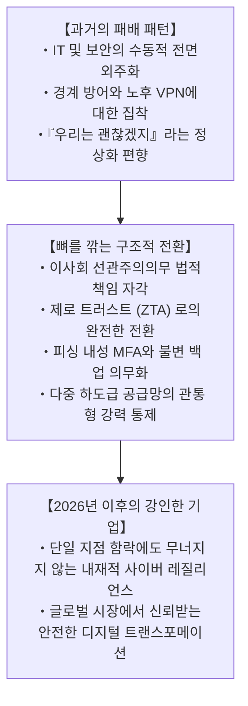

보안은 비즈니스의 발목을 잡는 '방해물'이 아니다. 격동하는 디지털 경제의 서킷 위에서 가속 페달을 바닥까지 밟기 위해 절대적으로 요구되는 **「최고 성능의 고성능 브레이크」**이다. 가장 강력하고 믿을 수 있는 브레이크를 장착한 기업만이, 아무런 두려움 없이 혁신의 코너를 극한의 속도로 질주할 수 있다.

과거 일본 제조업이 '타협 없는 품질과 디테일에 대한 집념'으로 세계의 신뢰를 쟁취했던 역사가 있듯, 이제 일본 기업들은 **「자신의 고객, 임직원, 그리고 사회가 보낸 신뢰를 결코 배신하지 않는다」**는 강철 같은 철칙을 가슴에 새기고 아키텍처의 밑바닥부터 쇄신을 단행해야 한다. 그러한 비장한 각오를 품은 조직만이 2026년 이후의 사이버 대격변기를 돌파하여, 다가올 미래 디지털 경제의 진정한 주역으로 당당히 번영을 누리게 될 것이다.
