## 序論：2026年の警鐘 ——「セキュリティ後進国」日本が直面する国家的危機

2020年代半ばから2026年に至る現在、日本のサイバー空間は、かつてない激甚な嵐に見舞われている。

かつて日本の産業界には、ある種の根拠なき「安全神話」が漂っていた。「うちは世界的な大企業ではないから標的にならない」「日本語という言語の壁がサイバー攻撃に対する自然の要塞になっている」「大手セキュリティベンダーのウイルス対策ソフトを入れているから大丈夫だ」――そうした甘美な幻想は、今や木っ端微塵に粉砕された。

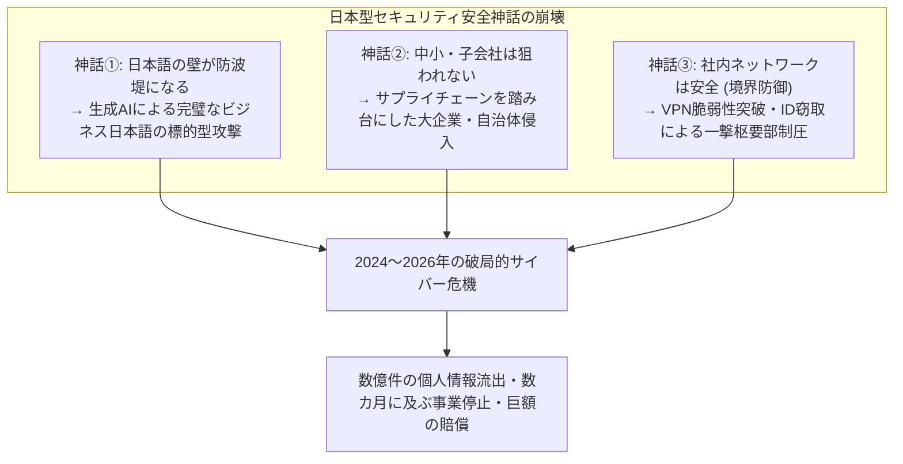

現実はあまりにも残酷である。エンターテインメントの巨人、メガバンク、通信キャリア、インフラ企業、そして地方自治体の行政システムに至るまで、名だたる組織が次々とランサムウェア（身代金要求型ウイルス）の軍門に降り、あるいは数百万件から数千万件に及ぶ機微な個人情報をダークウェブへと流出させた。

漏えいしたデータは、氏名や住所、電話番号といった基本情報にとどまらない。クレジットカード情報、健康診断結果、マイナンバー、取引先の機密契約書、社内チャットログ、果ては従業員の運転免許証スキャン画像に至るまで、人間の社会的信用と尊厳を根底から揺るがすデータが、国際的なサイバー犯罪シンジケートによって人質に取られ、競売にかけられている。

ひとたびインシデントが発生すれば、記者会見場には深々と頭を下げる経営陣の姿が並び、「原因は調査中」「社員に対するセキュリティ教育を徹底する」という判で押したような謝罪声明が繰り返される。

しかし、問わねばならない。**なぜ、これほど莫大なIT投資を行い、毎年セキュリティ研修を実施しているはずの日本企業で、情報漏えいと壊滅的サイバーインシデントが止まらないのか？**

その根本原因は、現場の従業員が「怪しいメールのリンクを踏んだこと」などという矮小なミスにあるのではない。日本の産業界が数十年にわたって放置してきた **「IT丸投げと多重下請けという構造的病理」**、時代遅れの **「境界型防御（ペリメータモデル）への盲信」**、クラウド移行に伴う **「ID・認証基盤の脆弱化」**、そして **「セキュリティを投資ではなくコストと切り捨てる経営層のガバナンス不全」** が複雑に絡み合った、必然の構造破綻なのである。

本稿は、最高峰のCISO（最高情報セキュリティ責任者）およびサイバー脅威アナリストの視点から、2024年から2026年にかけて日本を震撼させた主要インシデントの技術的深層を解剖し、日本企業を蝕む病理の正体を白日の下に晒すとともに、侵入を前提とした次世代の防衛思想である **「ゼロトラスト・アーキテクチャ（ZTA）」の完全実装、サプライチェーン統制、耐フィッシングMFA、不変バックアップによるサイバーレジリエンスの確立** に至るまで、企業が生き残るための具体的かつ実践的な防衛体系を余すところなく提示する決定版白書である。

---

## 第1章：2024〜2026年における日本企業の主要インシデント解剖

日本企業が直面している危機のリアリティを理解するためには、まず近年発生した象徴的なインシデントの「攻撃チェーン（Kill Chain）」を、技術的ファクトに基づいて直視しなければならない。

### 1.1 KADOKAWA/ニコニコ動画事件の教訓：データセンタ全滅とBlackSuitランサムウェア

2024年6月に発生した出版・メディア大手KADOKAWAおよびドワンゴに対するサイバー攻撃は、日本のサイバーインシデント史における最大の分水嶺となった。

攻撃を実行したのは、かつて世界中を震撼させたランサムウェア組織「Conti」の後継グループとされる **「BlackSuit」** である。この攻撃により、日本を代表する動画配信プラットフォーム『ニコニコ動画』をはじめとする同社のWebサービス群が全面停止に追い込まれ、出版物流システムや経理機能を含む基幹業務が数カ月にわたり麻痺した。さらには、従業員や取引先クリエイターの個人情報、社内契約書など約25万件以上の機密データがダークウェブに暴露されるという破滅的被害をもたらした。

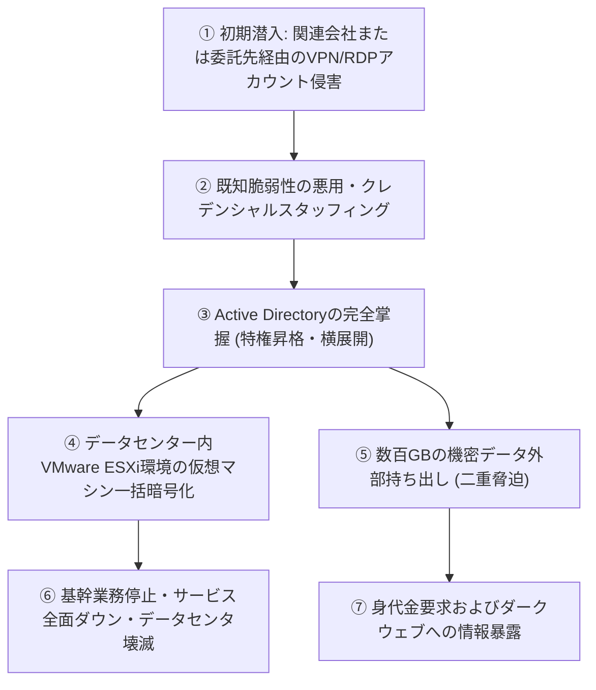

このインシデントが日本のセキュリティコミュニティに与えた最大の衝撃は、**「オンプレミスのプライベートクラウド（仮想化基盤）そのものが根底から破壊された」** という点にある。

攻撃者は、本社の中枢ネットワークを直接攻撃したのではない。関連会社や業務委託先のリモートアクセス環境（VPN装置やRDP）を踏み台にして社内ネットワークへと侵入を果たした。ひとたび境界内部への足がかりを得た攻撃者は、社内ネットワークが「フラット（セグメンテーションが不十分）」であることを利用してラテラルムーブメント（横展開）を敢行。最終的に企業インフラの心臓部である **Active Directory（ドメインコントローラ）の管理者権限を奪取** した。

ドメインの全権を掌握したBlackSuitは、各業務サーバーだけでなく、VMware ESXiなどのハイパーバイザー（仮想化基盤）に直接アクセスし、データストア内に格納されていた仮想マシンイメージ（VMDKファイル）を一括で高速暗号化した。さらに恐るべきことに、**オンラインで接続されていたバックアップデータまでをも徹底的に削除・暗号化** したのである。

この事件は、「社内ネットワークに入り込まれたら最後、どれほど巨大なデータセンターであっても一撃で全滅する」という境界型防御の完全な死を、全国の経営陣に見せつける結果となった。

### 1.2 LINEヤフー問題とNAVER共通基盤：越境委託先ガバナンスの破綻

2023年秋に発覚し、2024年から2026年にかけて総務省から異例の複数回にわたる行政指導を受ける事態に発展した「LINEヤフー個人情報流出問題」は、日本のIT産業が抱える **「資本関係・委託関係に起因するガバナンスの盲点」** を鮮明に浮き彫りにした。

約51万件におよぶユーザーや取引先、従業員の個人情報が漏えいした本インシデントの引き金となったのは、LINEヤフーの親会社的立場にあった韓国NAVER社のクラウド環境である。

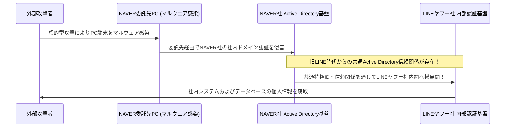

事態の技術的本質は、**「旧LINEとNAVERの間で、Active Directoryなどの社内認証基盤が共通化・相互接続されたまま放置されていたこと」** にある。

NAVERの業務委託先のPCがマルウェアに感染したことを契機に、攻撃者はNAVER側の内部ネットワークに侵入。そこから「国境を越えた認証基盤の信頼関係」を悪用して、何ら追加の強固な障壁に遮られることなく、日本のLINEヤフー側の内部データベースへと侵入を拡大したのである。

この事件は、日本企業が推進してきた「グローバル分業」や「オフショア開発・海外拠点委託」において、**「グループ会社だから」「親会社だから」という理由でネットワークや認証基盤を安易に接続・信頼することの破滅的リスク** を天下に知らしめた。総務省が踏み込んで「NAVERとの資本関係の見直し」や「共通認証基盤の完全分離」を求めたことは、地政学的リスクを含むサプライチェーン・ガバナンスが、今や国家主権と安全保障の問題に直結していることを証明している。

### 1.3 自治体・BPO（イセトー等）を襲ったサプライチェーンの連鎖崩壊

2024年以降、日本全国の地方自治体や金融機関、インフラ企業をパニックに陥れたのが、印刷・メーリング・データ処理等の業務を受託する **BPO（ビジネス・プロセス・アウトソーシング）大手企業（イセトー等）に対するランサムウェア攻撃** である。

地方自治体は、住民税決定通知書、国民健康保険証、介護保険料通知、選挙公報などの発送業務において、住民の氏名、住所、マイナンバー、所得情報といった超機微な個人データを含む印刷・封入業務を、入札によって選定した民間BPO企業に包括委託していた。

攻撃者は、セキュリティが厳重に固められた自治体の基幹系ネットワーク（いわゆる三層の構え）を直接攻めることはしなかった。ターゲットにされたのは、**自治体から委託を受けた下請け企業の拠点ネットワーク** である。

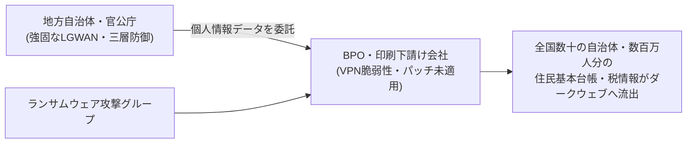

下請け企業のネットワークがランサムウェアに感染した結果、自社データのみならず、預託されていた全国数十もの自治体、数百万人分にのぼる住民の機密データが根こそぎ暗号化され、ダークウェブへと流出した。

このインシデントの恐るべき教訓は、**「発注元がどれほどセキュリティに数億円を投資して堅牢なシステムを構築していようとも、業務委託先のセキュリティレベルが低ければ、サプライチェーン全体が一瞬にして崩壊する」** という冷徹な物理法則である。行政や大企業が「委託先契約書にセキュリティ条項を盛り込んだから安心だ」と形式的な書類審査で済ませていた実態が、最悪の形で暴かれたのである。

### 1.4 クラウド設定不備（Salesforce/AWS/Azure）：鍵の開いた金庫が世界に晒された悲劇

ランサムウェアのような高度な標的型攻撃ばかりが情報漏えいの原因ではない。2020年代半ばに至ってもなお、漏えい件数の膨大な割合を占めているのが、**「クラウドサービスの設定不備（Cloud Misconfiguration）」** である。

特に日本を代表する大手証券会社、金融機関、ECサイト、官公庁などで多発したのが、顧客関係管理（CRM）プラットフォームである **Salesforceの設定不備による顧客情報露出** である。

Salesforceには「コミュニティ機能」や外部公開サイトを構築するためのゲストアクセス設定が存在するが、アクセス制御（Sharing Rules）のデフォルト変更やアクセス権の設計ミスにより、本来は認証された社内オペレーターしか閲覧できないはずの顧客リスト（氏名、電話番号、口座番号、取引履歴）が、**インターネット上の何者に対しても「認証不要で誰でも検索・閲覧可能」な状態** で長期間放置されていた。

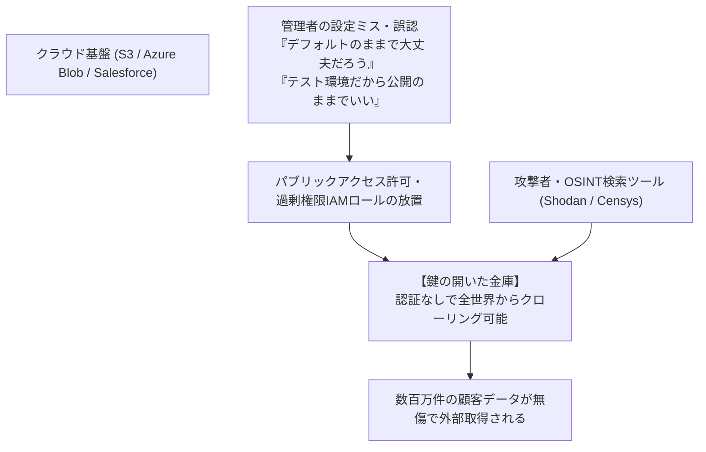

Amazon Web Services（AWS）のS3バケットの公開設定ミスや、Microsoft Azureのストレージアカウントのアクセス権不備、さらには社内エンジニアがGitHub上にアクセスキー（APIトークン）を誤って公開コミットしてしまう事故も後を絶たない。

高度なゼロデイ攻撃を受けるまでもなく、**「自分自身の手で金庫の扉を開け放ち、全世界に向けて展示していた」** というのが、日本のクラウド運用が露呈させたお粗末な現実であった。

---

## 第2章：根本原因の深層解剖① —— 構造的・組織的病理（IT丸投げと多重下請け）

なぜ、これほど明白なリスクが存在しながら、日本企業は事故を未然に防ぐことができないのか？ 第2章では、技術の背後にある「日本型企業社会の構造的病理」にメスを入れる。

### 2.1 「ITはコスト部門」という経営陣の無関心とCISOの形骸化

日本企業におけるサイバーセキュリティの最大の脆弱性は、ファイアウォールの設定にあるのではない。**「取締役会の部屋」** にある。

欧米のグローバル企業において、ITおよびサイバーセキュリティは「企業の命運を左右する中核的な競争力であり、トップアジェンダ」と位置づけられている。最高情報セキュリティ責任者（CISO）はCEOに直結する絶大な権限を持ち、事業部門の利便性よりもセキュリティリスクを優先してシステム停止を命令できる強い拒否権（Veto Power）を有している。

対照的に、日本企業の多くにおいて、IT部門は長らく「利益を生まない間接部門・コストセンター」として虐げられてきた。
- 取締役会にITやセキュリティのバックグラウンドを持つ経営陣はほぼ皆無であり、CIOやCISOに任命されるのは、定年目前の文系出身役員が「総務・法務担当のついで」として兼務するケースが常態化している。
- 現場のセキュリティ担当者が「このVPN機器は危険な脆弱性があるため、至急更新のための予算数千万円と、全社停止を伴うメンテナンスが必要です」と上申しても、経営陣は「今期は業績が厳しいから来期に回せ」「業務を止めるなど言語道断だ」と却下する。

その結果、日本企業のCISOは **「予算も権限も与えられず、インシデントが起きた時だけ記者会見で頭を下げるための生贄（Scapegoat）」** として形骸化している。セキュリティ投資を「リスクを最小化するための不可欠な設備投資」と捉えず、「削れるものなら1円でも削りたいコスト」と見なし続けた経営の怠慢こそが、国家的な情報漏えい危機の真の元凶である。

### 2.2 多重下請け・再委託構造が生む「セキュリティの抜け穴（Weakest Link）」

日本のIT産業を特徴づける最も根深い病理が、建設業界さながらの **「多重下請け構造（ITゼネコン構造）」** である。

ユーザー企業（発注元）は、システムの設計・開発・運用・セキュリティ保守のすべてを大手システムインテグレーター（プライムSIer）に「丸投げ」する。元請けSIerは自ら手を動かさず、2次請け、3次請け、果ては5次請け・6次請けの独立系中小IT企業やフリーランスへと業務を再委託（カスケード委託）していく。

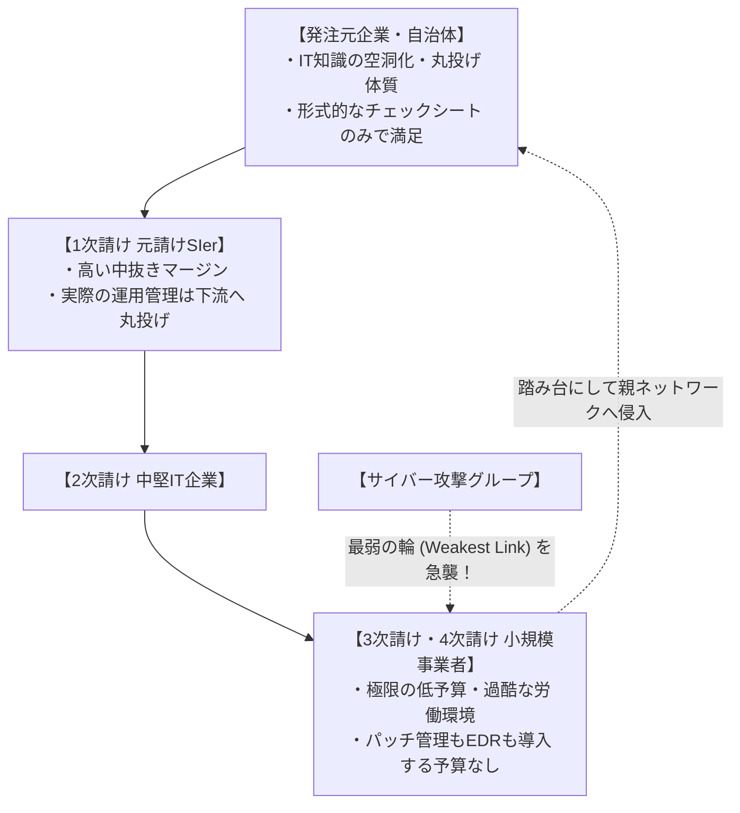

暗号工学および安全工学には、**「鎖の強度は、その最も弱い輪（Weakest Link）の強度で決まる」** という鉄則がある。

元請けの大手SIerがどれほど高価な次世代ファイアウォールを構え、厳格なセキュリティポリシーを策定していようとも、末端の3次請け・4次請け企業には、最新のEDR（Endpoint Detection and Response）を導入する予算も、24時間365日のSOC（Security Operation Center）を契約する原資も存在しない。
- そこでは、サポートの切れたWindows 10端末や、私用のノートPC（BYOD）が業務に使われ、管理者のパスワードは付箋に貼られて共有されている。
- しかも、それらの末端端末には、業務を遂行するために「発注元企業の基幹サーバーやデータベースにアクセスできる特権リモートアカウント」が付与されている。

攻撃者にとって、これほど容易な攻略目標はない。強固な正面玄関（元請け）を攻める必要など微塵もない。サプライチェーンの最末端に位置する、最も貧弱で無防備な下請け企業の端末を1台マルウェアに感染させれば、そこから正規の認証情報を奪い、発注元のネットワーク中枢へと「正規ユーザーの顔をして」悠々と歩いて侵入できるからである。

### 2.3 日本型雇用の限界とセキュリティ人材の構造的不足

「人」の側面における病理も深刻を極めている。

経済産業省や情報処理推進機構（IPA）の調査によれば、日本のサイバーセキュリティ人材は数十万人規模で不足していると叫ばれ続けている。しかし、その本質は単なる人口動態の問題ではない。**「高度なサイバーセキュリティ人材を適切に評価・処遇できない日本型雇用システム」** の制度疲労である。

欧米やイスラエル、シンガポール等において、企業の防衛を担うトップクラスのセキュリティアーキテクトやリバースエンジニア、ペネトレーションテスター（ホワイトハッカー）の年収は、2,000万円から4,000万円を超えることが珍しくない。彼らはビジネスをサイバー攻撃から防衛する最高峰のエリート技術者として尊敬されている。

ところが、終身雇用・年功序列を前提とする多くの伝統的日本企業において、IT技術者は「総合職ヒエラルキーの下流」に置かれている。
- 人事制度は一律であり、どれほど卓越したセキュリティスキルを持つ若手エンジニアであっても、同世代の営業職や人事職と同じ給与テーブル（年収400万〜600万円程度）で縛られる。
- キャリアパスの頂点は「マネジメント（管理職）」であり、コードを書き、ログを分析し、マルウェアを解析し続ける高度専門職としてのキャリアは存在しない。出世したければセキュリティの現場を離れ、予算管理とエクセル方眼紙の報告書作成に専念しなければならない。

結果として、優秀なセキュリティ人材は外資系企業やメガベンチャーへと流出し、日本企業の社内IT部門には「自ら手を動かして脅威を検知・分析・排除できるエンジニア」が一人も残らない。残ったのは、ベンダーから提出された報告書を右から左へ流すだけの「伝言係」だけである。この知性の空洞化こそが、インシデント発生時に初動対応を誤り、被害を壊滅的な規模へと拡大させる根本原因となっている。

## 第3章：根本原因の深層解剖② —— 技術的破綻（境界型防御の崩壊とADの罠）

組織やマネジメントの不全に加えて、日本企業のITインフラそのものが抱える「アーキテクチャの老朽化と構造的欠陥」が、攻撃者にとっての格好の餌食となっている。

### 3.1 VPN装置・リモートデスクトップという「裏口」の現実

コロナ禍以降、日本企業は急速なテレワークへの移行を迫られた。この時、多くの企業が選択したのが「既存の社内ネットワークの境界にSSL-VPN装置（Fortinet FortiGate、Pulse Secure / Ivanti Connect Secure等）を設置し、従業員の自宅PCからVPN経由で社内にトンネルを掘る」という急場しのぎの延命策であった。

これが、日本のサイバー防衛における **最大の致命傷（裏口）** となった。

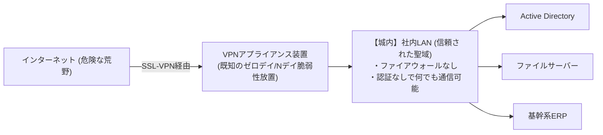

VPN装置は、インターネットという危険な荒野に直接インターフェースを晒している「物理的な城門」である。当然ながら、世界中のサイバー犯罪組織や国家支援型ハッカー（APTグループ）は、この城門の鍵穴（脆弱性）を血眼になって探し続けている。
- 実際、2023年から2026年にかけて、IvantiやFortinet等の主要VPN機器において、認証を回避してリモートから任意のコードを実行できる重大な脆弱性（CVSSスコア 9.0〜10.0の致命的脆弱性）が次々と発見・悪用された。
- 恐るべきことに、パッチ（修正プログラム）が公開された後も、日本の多くの企業は「業務に支障が出る」「機器の再起動ができない」という理由で、数カ月、あるいは1年以上も脆弱性を放置し続けた。

攻撃者は、ShodanやCensysといった公開検索エンジンを用いて、未パッチのVPN機器を全自動で探索・スキャンする。脆弱性を突いてVPN機器のメモリから認証情報（ユーザー名、パスワード、セッショントークン）をダンプすれば、**わずか数分で「正規の社員」として社内ネットワークの最深部へと侵入できる** のである。

### 3.2 社内ネットワーク信頼神話（ペリメータモデル）の完全崩壊

VPNを突破された後、日本企業を壊滅へと追い込むのが、旧態依然とした **「境界型防御（ペリメータモデル / 城と堀のモデル）」** である。

境界型防御とは、「外部のインターネットは悪意に満ちた危険な空間だが、ファイアウォールの内側にある社内ネットワーク（社内LAN）は100%安全で信頼できる」という前提に立ったアーキテクチャである。

この思想の下で構築された社内ネットワークは、驚くほど **「フラット（平坦）」** である：
- 社内LANに接続されたPC端末は、同じサブネットや隣接セグメントにある他のすべてのPC、ファイルサーバー、プリンタ、業務システムと、何らの追加認証や暗号化なしに自由に通信できる。
- 社内の通信パケットは、ファイアウォールによる監視を一切受けていない。

これは、頑丈な外壁で城を囲んでいるものの、**「一度スパイが城門をくぐり抜けて城内に足を踏み入れたら、天守閣にも宝物庫にも食糧倉庫にも鍵がかかっておらず、誰にも咎められずに自由に略奪できる」** という中世の城郭と全く同じである。

攻撃者が感染した1台の端末から社内ネットワークを探索（Reconnaissance）し、隣の端末へ、そしてサーバーへと次々に感染を広げていく「ラテラルムーブメント（横展開）」を、境界型防御は何一つ防ぐことができない。

### 3.3 Active Directory（AD）の肥大化と特権ID管理の破綻

エンタープライズのWindows環境において、最大の単一障害点（SPOF）であり、攻撃者にとっての「至高の聖杯」となっているのが、Microsoftの **Active Directory（AD）** である。

日本企業の9割以上が、社内のPC端末、ユーザーアカウント、アクセス権限、セキュリティポリシーの一括管理をActive Directoryに委ねている。しかし、その管理実態は惨憺たる状況にある：
- 20年以上前に構築されたADフォレストが、無秩序な増改築を繰り返して巨大なブラックボックスと化している。
- 過去の退職者のアカウント、退役したサーバーのサービスアカウント、テスト用に作られた一時アカウントが削除されることなく数千個放置されている。
- そして最悪なのが、**「ドメイン管理者（Domain Admin）権限」の乱用と使い回し** である。社内のITサポートや外部保守ベンダーが作業を楽にするため、一般社員のPCや共有端末にまで管理者権限を付与し、共通のパスワードを使い回しているケースが極めて多い。

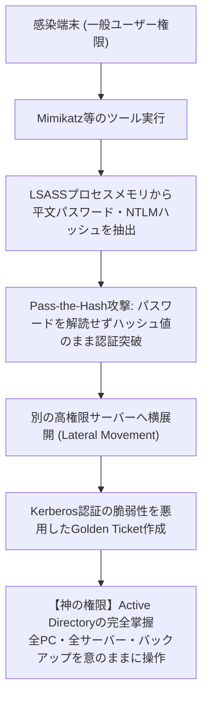

現代のサイバー犯罪者は、侵入した端末上で `Mimikatz` などのツールを動かし、Windowsの認証プロセス（`lsass.exe`）のメモリからNTLMハッシュやKerberosチケットを瞬時に奪取する。

攻撃者はパスワードを解読する必要すらない。ハッシュ値をそのまま用いて認証を偽装する **「Pass-the-Hash」** や、Kerberos認証の暗号鍵（krbtgtアカウント）を奪って無制限のアクセス権を持つ偽造チケットを発行する **「Golden Ticket」** 攻撃を繰り出す。

この一連の攻撃が決まった瞬間、攻撃者は「ドメイン管理者＝企業のITインフラの神」となる。あとはグループポリシー（GPO）を使って全社端末にランサムウェアを一斉配信するだけで、わずか数十分のうちに数万台のPCとサーバーが全滅するのである。

### 3.4 クラウド移行の影：シャドーITと過剰権限IAMロール

オンプレミスからAWS、Azure、Google Cloudといったパブリッククラウドへの移行が進む中で、新たな技術的病理が爆発している。

1. **シャドーITと野良クラウド**:
   厳格すぎる社内規定を嫌った事業部門や開発チームが、情報システム部の許可を得ずに独自のクラウド環境（AWSアカウントやSaaS）をクレジットカード決済で契約・運用する。それらの環境には全社のセキュリティ監視が届かず、パブリックアクセスの放置や脆弱性の温床となる。
2. **過剰権限（Over-Privileged）IAMロール**:
   クラウドのセキュリティの中核である「IAM（Identity and Access Management）」の設計において、最小権限の原則（PoLP: Principle of Least Privilege）を適用せず、「面倒だから」「動かないと困るから」という理由で、あらゆる操作が可能な `AdministratorAccess` やフルアクセス権限を無邪気に割り当てる。
   あるWebアプリケーションに存在するわずかなSQLインジェクションやSSRF（Server-Side Request Forgery）の脆弱性を通じてIAMのテンポラリキー（一時認証情報）が1つ漏れただけで、攻撃者にクラウド環境全体のすべてのストレージ、データベース、仮想マシンを掌握されてしまう悲劇が後を絶たない。

---

## 第4章：根本原因の深層解剖③ —— 人的脆弱性と最新攻撃手法の進化

テクノロジーの破綻に加え、人間そのものの心理的・生理的脆弱性を突く攻撃手法が、生成AIの登場によって劇的な進化を遂げている。

### 4.1 生成AI時代の標的型スピアフィッシングとディープフェイク

従来のフィッシングメールや詐欺メールは、稚拙な日本語（不自然な助詞、機械翻訳の痕跡、不自然な敬語）が多く、少し注意深い人間であれば見抜くことが可能であった。

しかし、ChatGPTをはじめとする **大規模言語モデル（LLM）の悪用** により、この前提は完全に過去のものとなった。

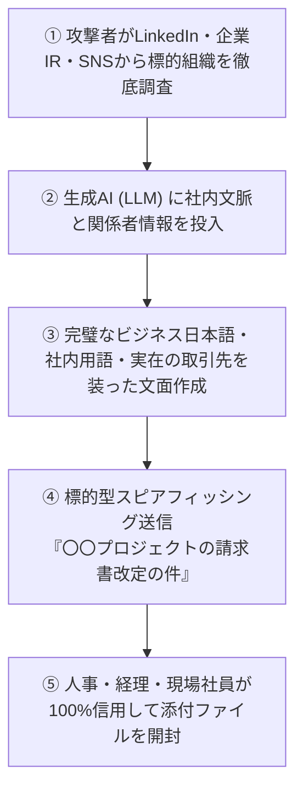

現代の標的型攻撃（スピアフィッシング）は、企業のウェブサイト、プレスリリース、LinkedIn、社員のSNSから組織図や進行中のプロジェクト、実在する取引先企業の名前をAIに学習させ、**「社内の実在する上司や提携先企業の担当者が書いたとしか思えない、極めて自然で洗練されたビジネス日本語」** で送信される。

さらに恐るべきは、**ディープフェイク（音声・映像の偽造）** を用いたソーシャルエンジニアリングである。
- 実際に海外および日本国内の多国籍企業において、CEOや財務担当役員の声をAIで完璧にクローンした電話がかかり、「緊急の極秘M&A案件のために、指定の口座に数億円を至急振り込め」と命じられて送金してしまう巨額詐欺被害が多発している。
- 人間の視覚や聴覚による直感をハックする攻撃の前に、「注意深くメールを確認しよう」という精神論的教育は完全に無力化した。

### 4.2 セッションハイジャックとインフォスティーラー（Infostealer）

日本企業が導入を進めてきた「二要素認証（2FA / MFA）」の多くを無力化しているのが、**「インフォスティーラー（Infostealer: 情報窃取型マルウェア）」** の爆発的蔓延である。

RedLine、Raccoon、Lummaといったインフォスティーラーは、海賊版ソフトウェア、チートツール、業務関連を装った悪意あるインストーラ、あるいはフィッシングサイトを通じて従業員や外部委託先のPCに潜入する。

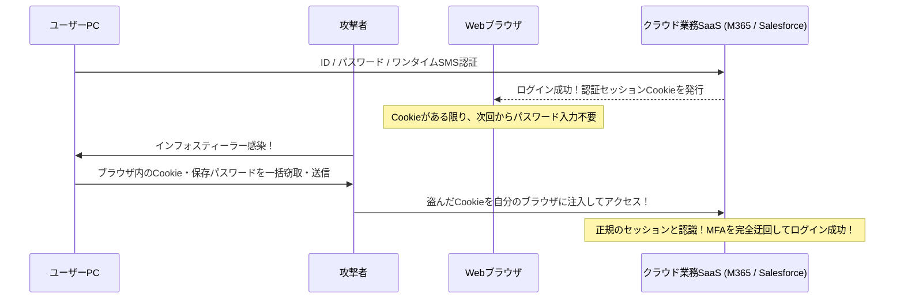

インフォスティーラーの目的は、ファイルを暗号化することではない。ターゲットのブラウザ（Chrome、Edge等）の内部データベースにアクセスし、**「保存されたパスワード」および「アクティブなセッションCookie」を丸ごと盗み出す** ことである。

Webブラウザは、一度ID・パスワードおよびMFA（SMSやアプリのワンタイムパスワード）でログインに成功すると、サーバーから発行された「セッションCookie」を端末内に保持する。攻撃者は、このCookieを盗み出して自らのブラウザにインポート（Cookieハイジャック）するだけで、**パスワードを入力することも、MFAコードを要求されることもなく、被害者本人として社内システムに一瞬でログインできる**。

現在、ダークウェブのマーケットプレイスでは、日本企業の有効なセッションCookieが数ドルから数十ドルという捨て値で大量に売買されており、攻撃者は一切のクラッキング作業なしに、金で買った認証情報で「正面玄関から堂々と」侵入している。

### 4.3 インサイダー脅威（内部不正）：退職者・業務委託による持ち出し

セキュリティの脅威は外部からのみやってくるわけではない。日本ネットワークセキュリティ協会（JNSA）の統計においても、情報漏えいインシデントの重大な割合を占めるのが、**「内部関係者（現役社員、退職者、業務委託・派遣スタッフ）によるデータの不正持ち出し」** である。

- **雇用の流動化と退職時持ち出し**:
  終身雇用が崩壊し、転職が当たり前となった現代日本において、競合他社への転職が決まった営業職やエンジニアが、「自らの成果物」と称して顧客名簿、ソースコード、設計図面を私用のUSBメモリや個人クラウド（Google Drive、Dropbox等）にアップロードして持ち出す事例が急増している。
- **特権を持つ外部委託の不正**:
  システムの運用保守を委託されている下請け・孫請け企業のエンジニアが、借金や生活苦を理由に、自らに与えられたデータベース閲覧権限を悪用し、数万件から数百件の顧客情報をダウンロードして名簿業者や反社会的勢力に売却する事件も後を絶たない。

日本企業の多くは、「性善説」に基づいて社内運用を行っており、「誰が、いつ、どの機密ファイルを大量にダウンロードしたか」をリアルタイムで検知・遮断するDLP（Data Loss Prevention）やUEBA（User and Entity Behavior Analytics: 振る舞い検知）を導入していない。持ち出された情報は、数カ月後、あるいは数年後に警察の捜査や競合製品の出現によって初めて発覚するのである。

---

## 第5章：ゼロトラスト・アーキテクチャ（ZTA）への完全移行ロードマップ

これら複合的かつ絶望的な脅威に対し、日本企業がとるべき唯一の道は、死に体の境界防御を完全に打ち捨て、**「ゼロトラスト・アーキテクチャ（Zero Trust Architecture: ZTA）」** への完全移行を果たすことである。

### 5.1 ゼロトラストの本質：「Never Trust, Always Verify」

ゼロトラストとは、単一のセキュリティ製品の名称ではない。アメリカ国立標準技術研究所（NIST）が策定した「NIST SP 800-207」において体系化された、**「セキュリティに関する抜本的なパラダイムシフト（思考のOSの書き換え）」** である。

> **ゼロトラストの核心原則（Core Principles）**:
> 1. **決して信頼せず、常に検証せよ（Never Trust, Always Verify）**:
>    社内LANの内側であろうと、役員室のPCであろうと、いかなる通信・端末・ユーザーも最初から「安全」とは見なさない。すべてのアクセス要求を敵対的なものとして検証する。
> 2. **最小権限の付与（Grant Least Privilege Access）**:
>    ユーザーやデバイスには、その瞬間の特定の業務を遂行するために必要な「最小限の権限」のみを、必要な時間（Just-In-Time）だけ付与する。
> 3. **侵害を前提とせよ（Assume Breach）**:
>    「防壁はすでに突破されている」「攻撃者はすでに社内ネットワーク内に潜伏している」という冷徹な前提に立ち、被害の局所化（爆風範囲の最小化）と即時検知・隔離を設計の中核に据える。

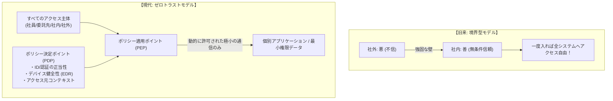

### 5.2 VPN完全撤廃とZTNA（Zero Trust Network Access）への転換

ゼロトラストへの第一歩は、最大の脆弱性の温床である **「VPNアプライアンスの完全撤廃」** と、**「ZTNA（Zero Trust Network Access）」** への移行である。

VPNとZTNAの決定的な違いは、接続の対象が「ネットワーク全体」か「特定の個別アプリケーション」かという点にある。
- **従来のVPN**: 認証に成功すると、ユーザーの端末を社内ネットワーク（IPサブネット）に物理的に直結する。その結果、端末は社内のすべてのサーバーと通信可能になり、端末が感染していればマルウェアが社内全体へ拡散する。
- **ZTNA**: 端末をネットワークに一切直結させない。クラウド上に配置されたブローカー（中継地点）が、ユーザーの身元とデバイスの安全性を毎回厳密に検証し、**「許可された特定のWebアプリや特定ポートへの通信のみをピンポイントで中継する」**。端末からは社内ネットワークのIPアドレスもトポロジーも一切見えず（不可視化）、ラテラルムーブメントが物理的に不可能となる。

### 5.3 SASE（Secure Access Service Edge）とSSEの統合アーキテクチャ

現代のゼロトラストを具現化する包括的プラットフォームが、ガートナーが提唱した **「SASE（サシー: Secure Access Service Edge）」** およびそのセキュリティ中核機能である **「SSE（Security Service Edge）」** である。

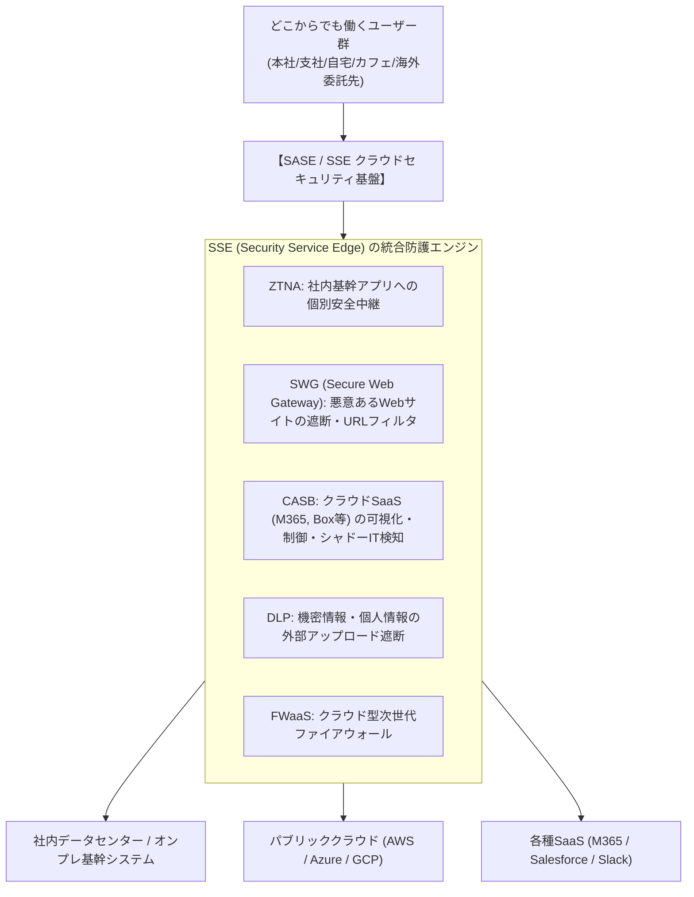

SASE環境においては、ユーザーが本社にいようが、自宅にいようが、海外の委託先工場にいようが、すべての通信はまずグローバルに分散された「SASEクラウド」を通過する。
- **SWG（セキュアWebゲートウェイ）** が危険なWebサイトやフィッシングリンクを遮断する。
- **CASB（クラウド・アクセス・セキュリティ・ブローカー）** が社外SaaSへの不正なデータアップロードやシャドーITを監視・阻止する。
- **DLP（データ損失防止）** がクレジットカード番号やマイナンバーを含むデータの外部送信を自動検知して暗号化・遮断する。
- **ZTNA** が社内基幹システムへの安全な経路を提供する。

これにより、高価で管理が煩雑な拠点ごとのVPNルーターやオンプレミスのセキュリティプロキシをすべて廃棄し、世界中どこからでも均一で最高強度のセキュリティポリシーを適用することが可能となる。

### 5.4 マイクロセグメンテーションによるラテラルムーブメントの物理的遮断

どれほど厳重に外部からの侵入を防いでも、端末のマルウェア感染を100%防ぐことは不可能である。そこで不可欠となるのが、**「マイクロセグメンテーション（Micro-Segmentation）」** である。

マイクロセグメンテーションとは、従来の「フロア単位」や「拠点単位」といった大雑把なネットワーク分割を廃止し、**「サーバー1台ごと、仮想マシン1台ごと、コンテナ1個ごと」** の極小単位で仮想的なファイアウォール境界を設定する技術である。

- 例えば、財務会計サーバーは「経理部の認証済み端末の特定の暗号化ポート」からの通信のみを許可し、開発部の端末や一般事務端末からの通信（pingすらも含む）をすべて拒絶する。
- 業務サーバー同士であっても、明示的に許可されたAPI通信以外は、同一ラック内の隣り合うマシン同士の通信であっても一切遮断する。

これにより、仮に社内のPC端末がランサムウェアに感染し、攻撃者が社内を這い回ろうとしても、周囲のすべてのドアが鉄のシャッターで閉ざされているため、**「感染した1台の端末の内部で攻撃を完全に封じ込め（Blast Radius: 爆風範囲の最小化）、他システムへの伝播を物理的に阻止する」** ことができるのである。

## 第6章：ID・認証基盤（IAM/PAM）の要塞化

ゼロトラスト・アーキテクチャにおいて、新たな「外壁（ペリメータ）」となるのは物理的なネットワーク回線ではない。**「アイデンティティ（IDと認証）」** である。境界が消失した現代において、IDこそがすべてのセキュリティ制御の要（かなめ）となる。

### 6.1 FIDO2 / パスキー準拠の耐フィッシングMFAの絶対義務化

まず断行すべきは、SMSや電子メール、あるいはスマートフォンのプッシュ通知（番号一致を伴わない単純な承認）に依存した「旧世代の多要素認証」の破棄である。

前述の通り、攻撃者はリバースプロキシ型フィッシング（Evilginx等）やインフォスティーラーを用いて、SMSコードやセッショントークンを簡単に中継・強奪できる。これらに対抗できる唯一の解が、**「FIDO2 / WebAuthn（パスキー: Passkeys）」に準拠した耐フィッシングMFA（Phishing-Resistant MFA）** である。

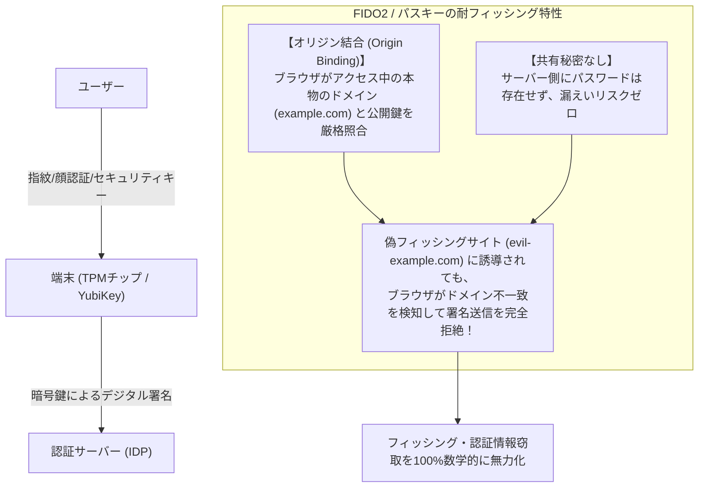

FIDO2の暗号学的強みは、**「オリジン結合（Origin Binding）」** にある。
ユーザーが誤って見た目が全く同じ偽のログイン画面に誘導されたとしても、Webブラウザ自身が接続先ドメイン（FQDN）を厳格に照合し、正規のドメインと完全に一致しない限り、端末内の秘密鍵による暗号署名を決してサーバーへ送信しない。

これにより、人間がどれほど巧妙に騙されて偽サイトを開いたとしても、認証情報の詐取が数学的に不可能となる。企業は、特権管理者や重要データを扱う従業員から優先して、YubiKeyなどの物理セキュリティキーやWindows Hello / Touch IDによるFIDO2認証の適用を直ちに義務化しなければならない。

### 6.2 Active DirectoryのTiering（階層化）モデルとJITアクセス

オンプレミスのActive Directoryを運用し続けなければならない企業にとって、特権IDの侵害を防ぐ決定的な設計思想が、Microsoftが提唱する **「Tiering（階層化）アーキテクチャ」** である。

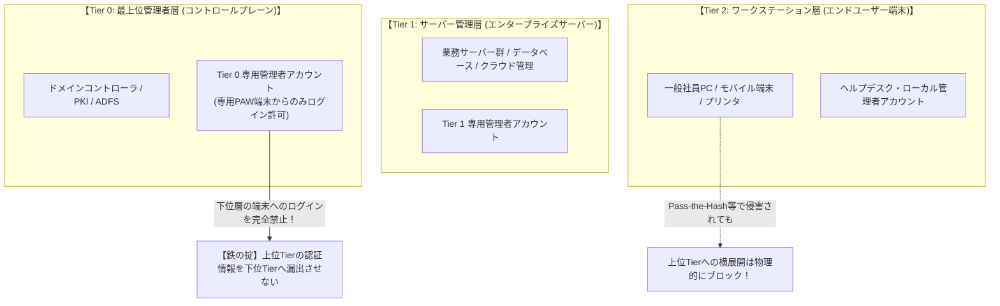

Tieringモデルの鉄則は、**「上位の権限を持つアカウントを、下位の端末に絶対にログインさせない（認証情報を残さない）」** という不可逆ルールである：
- **Tier 0（ドメイン中枢）**: ドメイン管理者アカウント。ドメインコントローラおよび認証サーバーのみにアクセスを限定し、一般社員のPC（Tier 2）やファイルサーバー（Tier 1）には絶対にログインしない。作業は、インターネットから物理的・論理的に隔離された専用の「特権アクセス端末（PAW: Privileged Access Workstation）」からのみ行う。
- **Tier 1（サーバー管理）**: 業務サーバー群のみを管理。
- **Tier 2（クライアント管理）**: 一般PCのみを管理。

さらに、24時間365日いつでもドメイン管理者権限を保持し続ける「恒久的特権（Standing Privileges）」を廃止し、**「JIT（Just-In-Time）アクセス」** を導入する。管理者は普段は一般ユーザー権限で行動し、緊急メンテナンス時のみ、承認ワークフローを経て数時間だけ一時的な特権を付与される。これにより、攻撃者が通常時にアカウントを乗っ取ったとしても、特権を行使することができなくなる。

### 6.3 条件付きアクセスの動的ポリシー評価

認証とは、一度ログインしたら終わりという「点（静的）」のイベントであってはならない。ゼロトラストにおける認証・認可は、セッション中ずっと継続的に評価される **「線（動的・コンテキスト連動）」** でなければならない。

これを実現するのが、Microsoft Entra ID（旧Azure AD）やOktaなどが提供する **「条件付きアクセス（Conditional Access）」** である。

ユーザーがログインを試みるたび、ポリシー決定エンジン（PDP）は以下の多次元のシグナルをミリ秒単位で瞬時にスコアリングする：
1. **ユーザーおよびグループの身元**
2. **アクセス元IPアドレスおよび地理的位置（ジオロケーション）**
   - 10分前に東京からログインしたユーザーが、突然ロシアやナイジェリアからアクセスしてきた場合（あり得ない移動: Impossible Travel）、即座に遮断する。
3. **デバイスの正常性とコンプライアンス（健全性）**
   - 端末に会社の指定するEDRがインストールされているか？ OSのセキュリティパッチは最新か？ 暗号化（BitLocker）は有効か？ マルウェア感染の兆候はないか？
4. **リアルタイム・リスクスコア（行動分析）**
   - 通常と異なる深夜帯のアクセス、短時間の異常な大量ファイルダウンロードを検知した場合、ステップアップ認証（生体認証の再要求）を課すか、セッションを強制切断する。

条件が1つでも満たされない場合、どれほど正しいパスワードが入力されていようとも、社内システムへの扉は1ミリも開かれない。

---

## 第7章：サプライチェーン・委託先セキュリティの統制モデル

自社がゼロトラストを固めても、サプライチェーンという「勝手口」が開いていれば組織は守れない。委託先・下請け事業者をどう統制すべきか？

### 7.1 委託先の可視化とセキュリティ評価の実効化

第一になすべきは、**「サプライチェーンの完全な棚卸しと可視化」** である。

大企業の多くは、1次請け企業こそ把握しているものの、その先の2次請け・3次請け企業がどこで、どのようなセキュリティレベルで作業しているかを全く把握していない。
- すべての外部委託契約において、「事前承認なき再委託（孫請けへの横流し）の厳格な禁止」を明文化する。
- 委託先に対して年に一度ペーパーテスト（自己申告チェックシート）を送付して済ませる形式的な監査を直ちに全廃する。
- 外部の第三者アセスメント機関によるセキュリティ評価、あるいは「セキュリティ・レーティングサービス（BitSight、SecurityScorecard等）」を導入し、委託先企業のドメインやIPアドレスが晒している外部脆弱性、パッチ適用状況、認証情報の漏えい状況を **客観的・継続的にスコアリング監視** する体制を整えなければならない。

### 7.2 業務委託端末のBYOD原則禁止とゼロトラストVDI

下請け企業や業務委託スタッフによる情報漏えい・マルウェア侵入を防ぐ最も効果的な物理的解法は、**「委託先端末にデータを1バイトも渡さない」** アーキテクチャの確立である。

下請け企業の私用PCや自社管理外の端末（BYOD）が、自社のネットワークやクラウドストレージへ直接接続することは原則として全面禁止（Zero Trust）としなければならない。

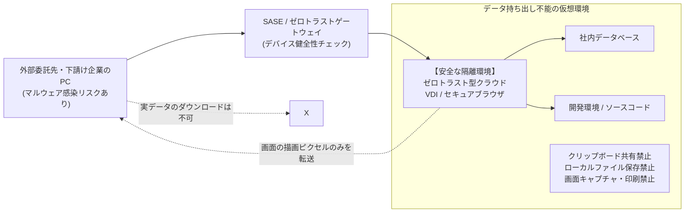

外部委託先には、自社が構成・監視する **「ゼロトラスト型クラウドVDI（DaaS: Virtual Desktop Infrastructure）」** または **「エンタープライズ・セキュアブラウザ」** を経由してのみ業務を行わせる。
- ローカル端末へファイルをダウンロードする機能（ファイル転送）、クリップボード経由のコピー＆ペースト、画面キャプチャ、外部印刷はシステム的に完全に無効化する。
- 外部委託先に見せるのは「画面の描画ピクセル」だけであり、万が一委託先のPCがインフォスティーラーに感染したとしても、業務実データやセッショントークンが盗まれるリスクを根本から遮断する。

### 7.3 SBOM（ソフトウェア部品表）とAPI連携の最小権限化

デジタル・サプライチェーンにおけるもう一つの巨大な盲点が、ソフトウェアの受託開発である。

外部ベンダーに外注して開発させたWebアプリケーションや社内システムの中に、脆弱性だらけの古いオープンソース・ライブラリ（Apache Log4jや古いバージョンのSpring Framework等）が組み込まれ、放置されている事例が極めて多い。

企業は開発ベンダーに対し、納品物に含まれるすべてのオープンソースコンポーネントとそのバージョン、ライセンスを網羅した **「SBOM（Software Bill of Materials: ソフトウェア部品表）」** の提出を義務付けなければならない。これにより、新たなゼロデイ脆弱性が世界で公開された際、自社システムのどのコンポーネントが影響を受けるかを数分以内に特定し、即座に対処することが可能となる。

また、提携先企業や外部クラウドとの「API連携」においても、無制限のアクセストークンを払い出すことを禁止し、OAuth 2.0に基づく最小権限スコープと短期有効期限（TTL）を徹底しなければならない。

---

## 第8章：ランサムウェア・データ破壊に屈しない「サイバーレジリエンス」

ゼロトラストの核心である「侵害を前提とする（Assume Breach）」という思想において、最終防衛ラインとなるのが **「サイバーレジリエンス（事業継続と復元力）」** である。

どれほど防御を固めても、国家規模のサイバー攻撃者を100%防ぎ続けることは不可能である。問われるのは、「侵入された後、いかに迅速にビジネスを再開できるか」である。

### 8.1 3-2-1-1-0バックアップルールと「不変ストレージ」

現代のランサムウェア攻撃（BlackSuit、LockBit等）において、攻撃者の第一目標は「データの暗号化」ではない。**「バックアップの完全消去」** である。バックアップが生きていれば身代金を払う企業など存在しないからである。

従来の単純な「夜間バッチによる外部ストレージへのコピー」は、もはや何の役にも立たない。バックアップサーバーがActive Directoryのドメインに参加していれば、ドメイン管理者権限を奪った攻撃者によって、バックアップデータもろとも数秒で一括消去される。

企業が採用すべき新時代のバックアップ基準が、**「3-2-1-1-0ルール」** である：

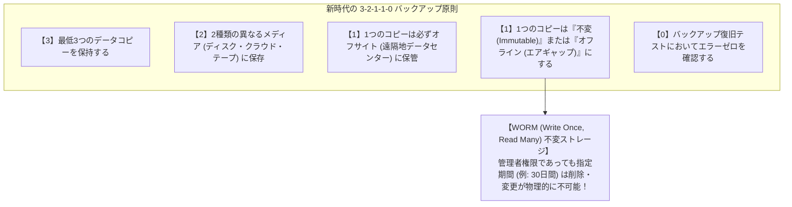

このルールの中で最も決定的なのが、**「不変バックアップ（Immutable Backup）」** である。
これは、クラウド（AWS S3 Object Lock等）や専用アプライアンス（Veeam、Cohesity、Rubrik等）の **WORM（Write Once, Read Many）機能** を用い、一度書き込まれたバックアップデータは、たとえ企業の最高権限者やドメイン管理者、果ては不正侵入した攻撃者であっても、設定された保持期間（例: 30日間）が経過するまでは **「絶対に削除も上書きも暗号化もできない」** ようにハードウェア・APIレベルで物理ロックする技術である。

本番環境のデータセンターが全滅し、すべての仮想マシンが暗号化されたとしても、不変ストレージに隔離されたバックアップが生きていれば、企業は身代金の支払いを毅然と拒否し、自力でシステムを短期間に復元することができる。

### 8.2 バックアップ専用の「独立した認証ドメイン」の分離

不変ストレージを導入するだけでなく、運用上の絶対規律として、**「バックアップシステムの管理プレーンを、社内のActive Directoryドメインから完全に切り離す」** ことが不可欠である。

- バックアップサーバーの認証は、社内ADとは一切同期しない完全に独立したIDプロバイダ（独立したMFA必須のローカル認証）を用いる。
- バックアップシステムを操作できる管理端末は、インターネットや社内LANから遮断された閉域専用ネットワークからのみ接続を許可する。

この「認証ドメインの完全分離」がなされて初めて、ドメインコントローラが陥落した際にもバックアップ基盤が巻き添えを食らう最悪のシナリオを回避できる。

### 8.3 EDR/XDRと24/365 SOCによる迅速な隔離

侵入されてから被害が拡大するまでの時間勝負において、勝敗を分ける指標が **MTTD（平均検知時間: Mean Time to Detect）** と **MTTR（平均復旧・対応時間: Mean Time to Respond）** である。

従来のアンチウイルス（EPP）が「既知のマルウェアのシグネチャ照合」に依存していたのに対し、現代の必須装備である **EDR（Endpoint Detection and Response）** およびネットワークやクラウドログを横断分析する **XDR（Extended Detection and Response）** は、端末内のプロセスの「挙動（振る舞い）」を常時監視する。
- 例えば、「正規のPowerShellが起動され、LSASSプロセスのメモリダンプを試みている」「深夜に急激にファイルの大量リネーム（暗号化の予兆）が始まった」といった異常をミリ秒単位で検知する。
- 異常を検知した瞬間、EDRは自動的、あるいは管理者の指示により、**「その感染端末のネットワーク通信をOSのNDISドライバレベルで即座に遮断（論理隔離）」** し、攻撃者が横展開する隙を与えない。

攻撃者は、日本企業の守りが手薄になる「金曜日の深夜」や「ゴールデンウィーク・年末年始」を狙って攻撃を仕掛けてくる。したがって、アラートを監視する体制は平日日中だけでは無意味であり、**24時間365日体制で即時遮断アクションを実行できるマネージドSOC（MDRサービス）の配備** が、企業の生存要件となる。

---

## 第9章：経営陣と法規制が牽引するガバナンス改革

サイバーセキュリティの強化は、IT部門の努力だけで完遂することは絶対にできない。それは、法規制、取締役会の法的責任、そして企業の経営戦略そのものと直結した全社的プロジェクトである。

### 9.1 個人情報保護法の厳罰化と課徴金・損害賠償リスク

日本においても、欧州のGDPR（一般データ保護規則）に追随する形で、法規制の包囲網が急速に狭まっている。

令和2年・令和3年改正個人情報保護法により、一定規模以上の個人データ漏えい（またはそのおそれ）が発生した場合、**個人情報保護委員会への速やかな報告、および本人への通知が法的に完全義務化** された。
- 法人に対する最高罰金刑は「1億円以下」へと引き上げられた。
- さらに、被害者である顧客や株主による集団訴訟のリスク、漏えいした顧客1人あたり数千円から数万円に及ぶお詫び金・損害賠償金の総額は、数万人規模の漏えいで数億円、数百万人規模の漏えいであれば数十億円から数百億円のキャッシュアウトを意味する。

これに加えて、2024年に成立した「重要経済安保情報の保護・活用に関する法律」や、政府が進めるサイバー安全保障法制の強化により、基幹インフラ事業者やサプライチェーンを構成する企業には、政府による立入検査や厳格なセキュリティ基準の適合が義務付けられつつある。セキュリティ不備による情報漏えいは、企業の存続そのものを揺るがす直接的な法的・財務的制裁へと直結している。

### 9.2 取締役会の善管注意義務：セキュリティは「経営責任」である

会社法において、取締役は会社に対して **「善管注意義務（善良なる管理者の注意義務）」** を負っている。

過去の裁判例や経済産業省・IPAの「サイバーセキュリティ経営ガイドライン」が示す通り、現代の法解釈において、適切なサイバーセキュリティ対策を怠って重大な情報漏えいや業務停止を引き起こした企業経営陣は、**「善管注意義務違反」として株主代表訴訟の対象となり、役員個人が私財を投げ打って巨額の損害賠償責任を負うリスク** に直面している。

経営陣は、もはや「ITのことは現場に任せていたから知らなかった」という言い訳を法廷で通用させることはできない。取締役会は、定期的に自社のサイバーリスク評価を受け、対策予算の妥当性を審議し、インシデント発生時の事業継続リスクをガバナンスとして監督する法的な責務を負っているのである。

### 9.3 CISOへの実質的権限付与とROIの再定義

真のセキュリティガバナンスを確立するための最後のピースが、**「CISO（最高情報セキュリティ責任者）の権限強化」** である。

企業は、直ちに以下のガバナンス改革を断行しなければならない：
1. **CISOを執行役員または取締役クラスに格上げする**:
   IT部門（CIO）の下請けではなく、CIOと対等の立場でCEOおよび取締役会に直接レポートする独立したラインを確立する。
2. **CISOに「業務停止命令権」と「セキュリティ拒否権」を与える**:
   安全性基準を満たさない新規システムのリリースを差し止める権限、委託先のセキュリティが基準を下回る場合に契約を解除する権限、そしてインシデント発生時に事業リスクを勘案してシステムを即時遮断する権限を、明文化して付与する。
3. **セキュリティ投資のROI（費用対効果）の再定義**:
   セキュリティ投資は「利益を生むか否か」で測るものではない。「この投資を行わなかった場合に発生する、数カ月の事業停止損失（数百億円）と企業価値毀損（株価暴落・信用の失墜）を回避するための保険であり、ライセンス・トゥ・オペレート（事業継続免許）」として評価しなければならない。

---

## 結論：絶望を超えて —— 2026年以降を生き抜く日本企業の覚悟

2026年、私たちはもはや「サイバー攻撃を受けない平和な世界」に戻ることはできない。国家間紛争の影で暗躍する高度なサイバー軍隊、生成AIで武装し効率化された国際犯罪シンジケート、そしてダークウェブで取引される無数の認証情報。脅威は幾何級数的に増大し、企業を包囲している。

しかし、絶望する必要はない。

日本企業を襲っている危機の正体は、「防ぐことのできない神の業（不可抗力）」ではない。私たちが長年見過ごしてきた「IT丸投げの甘え」「多重下請けの無責任」「社内ネットワークへの盲信」「経営層の無知」という、**自らが作り出した人災** に過ぎないからである。原因が人災であるならば、人間の知性と決断によって、必ず克服することができる。

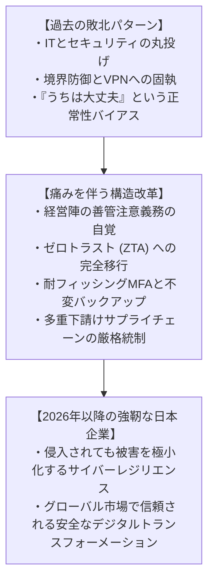

セキュリティとは、利便性を阻害する「邪魔者」ではない。激動のデジタル社会において、アクセルを限界まで踏み込むために不可欠な **「最高性能のブレーキ」** である。強固なブレーキを持つ企業だけが、恐れることなくイノベーションの道を猛スピードで駆け抜けることができる。

「過去のアプリを決して壊さない」執念でOSを磨き上げた歴史があるように、今こそ日本企業は **「自らの顧客、従業員、そして社会の信用を決して裏切らない」** という鋼の掟を掲げ、泥臭きアーキテクチャの刷新と組織改革を断行すべきである。その覚悟を持った組織だけが、2026年以降のサイバー激動期を生き残り、未来のデジタル経済の主役として繁栄を享受することができるのである。
