## Prólogo: O alerta estridente de 2026 —— A crise nacional do Japão como «país retardatário em cibersegurança»

De meados da década de 2020 até o presente ano de 2026, o ciberespaço japonês tem sido varrido por tempestades de violência sem precedentes.

No passado, o setor industrial japonês vivia sob a égide de um infundado «mito da segurança absoluta». Crenças confortáveis como: «Não somos uma multinacional gigantesca, portanto não seremos alvo de ataques», «A barreira do idioma japonês atua como uma fortaleza natural contra o crime cibernético internacional» ou «Instalamos o software antivírus de uma grande fornecedora de segurança, logo estamos plenamente protegidos» permeavam a mentalidade corporativa. Hoje em dia, todas essas doces ilusões foram reduzidas a pó.

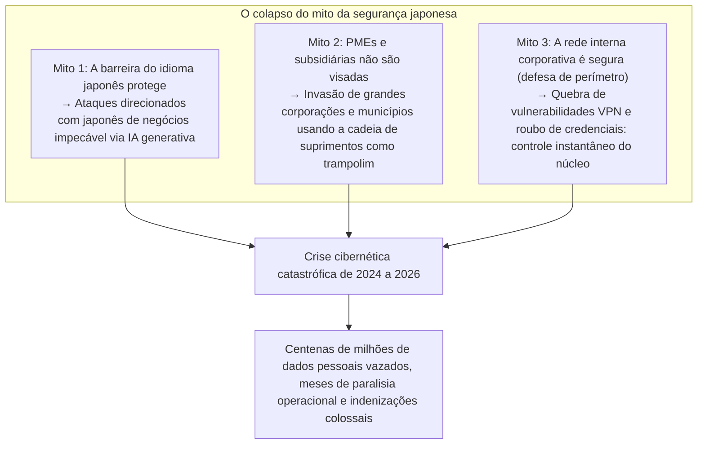

A realidade tem sido implacável. De gigantes do entretenimento, megabancos, operadoras de telecomunicações e concessionárias de infraestrutura essencial a sistemas administrativos de governos municipais e províncias, organizações de renome capitularam uma após a outra perante o ransomware (vírus extorsivo com sequestro de dados) ou assistiram impotentes ao vazamento de dezenas de milhões de registros de dados confidenciais para os mercados clandestinos da Dark Web.

As informações expostas ultrapassam em muito dados triviais como nomes, endereços e telefones. Números de cartão de crédito, prontuários de exames médicos, identificadores do My Number, minutas contratuais confidenciais, históricos de conversas em mensageiros internos corporativos e cópias digitalizadas de carteiras de habilitação de funcionários —dados que sustentam a reputação civil e a dignidade humana básica— tornaram-se moeda de barganha e leilão nas mãos de sindicatos criminosos transnacionais.

A cada novo incidente deflagrado, a cena repete-se de forma quase coreográfica: entrevistas coletivas com executivos curvando-se em profundas reverências de desculpas, proferindo declarações padronizadas como «as causas ainda se encontram sob apuração» ou «reforçaremos as ações de treinamento e conscientização em segurança para todo o quadro de colaboradores».

No entanto, impõe-se formular a questão central: **Por que, a despeito de alocarem volumes substanciais de investimentos em TI e promoverem capacitações anuais de segurança, os vazamentos de informações e os incidentes cibernéticos devastadores não cessam nas corporações japonesas?**

A causa raiz não repousa no erro prosaico de um funcionário que «clicou em um link suspeito contido em um e-mail». Trata-se de uma falência estrutural inevitável, produto da conjugação tóxica entre **«a patologia estrutural da delegação cega de TI e a terceirização em cascata (múltiplos níveis)»** perpetuada por décadas, **«a crença anacrônica no modelo de defesa de perímetro (o modelo do castelo e fosso)»**, **«a fragilização das arquiteturas de identidade e autenticação»** decorrente de migrações desordenadas para a nuvem, e **«a deficiência crônica de governança nos conselhos de administração que encaram a cibersegurança como mero centro de custos dispensável em vez de investimento vital para a continuidade dos negócios»**.

Este documento foi elaborado a partir da perspectiva de um CISO (Chief Information Security Officer) de alto nível e analista de inteligência de ciberameaças. Seu propósito é dissecar tecnicamente a anatomia dos principais incidentes que abalaram o Japão entre 2024 e 2026, expor sem concessões a patologia que assola as organizações do país e detalhar um ecossistema pragmático e holístico de proteção para a sobrevivência das empresas: desde **a implementação rigorosa da Arquitetura Zero Trust (ZTA)** sob o preceito de brecha assumida (Assume Breach), até a blindagem da cadeia de suprimentos, a adoção obrigatória de MFA resistente a phishing e a consolidação da resiliência corporativa por meio de backups imutáveis.

---

## Capítulo 1: Anatomía dos principais incidentes corporativos no Japão (2024–2026)

Para mensurar com precisão a magnitude do perigo enfrentado pelas empresas no Japão, é fundamental examinar as cadeias de ataque (Kill Chain) dos incidentes mais notórios com base em fatos e evidências técnicas.

### 1.1 Lições do caso KADOKAWA / Niconico: A destruição do data center e o ransomware BlackSuit

O ciberataque deflagrado em junho de 2024 contra o conglomerado editorial e de mídia KADOKAWA e sua subsidiária Dwango marcou o divisor de águas mais expressivo da história recente da segurança da informação no Japão.

A ação foi conduzida pelo grupo de ransomware **«BlackSuit»**, apontado pela comunidade técnica como o sucessor operacional da temível quadrilha cibercriminosa Conti. O ataque provocou a indisponibilidade total da plataforma emblemática de compartilhamento de vídeos do Japão, *Niconico Douga*, juntamente com dezenas de portais e serviços web da companhia. As operações corporativas centrais —incluindo a distribuição física de publicações, sistemas contábeis e faturamento— permaneceram paralisadas durante meses. Além disso, mais de 250 mil arquivos confidenciais contendo dados cadastrais de funcionários, criadores de conteúdo parceiros e contratos comerciais sigilosos foram vazados na Dark Web.

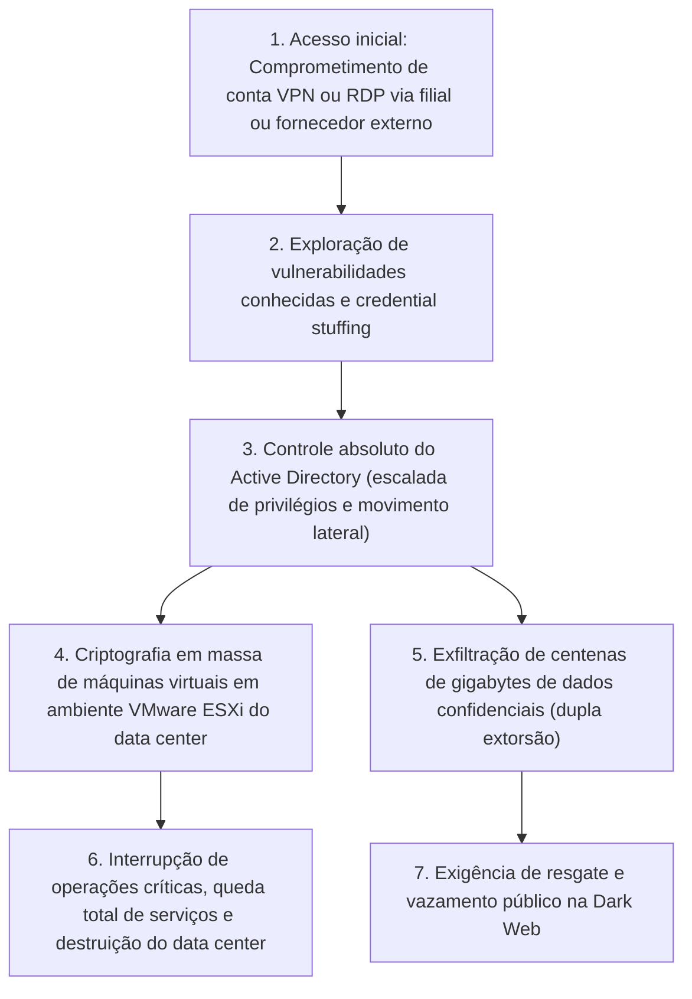

O choque mais contundente gerado por esse episódio na comunidade tecnológica japonesa deveu-se ao fato de que **«a própria nuvem privada on-premise (a infraestrutura de virtualização) foi aniquilada em suas fundações»**.

Os cibercriminosos não atacaram frontalmente a rede central da sede corporativa. O vetor de intrusão foi o ambiente de acesso remoto (equipamentos VPN e conexões RDP) de uma empresa afiliada e de prestadores de serviços externos. Uma vez estabelecido o ponto de apoio dentro da fronteira perimetral, os invasores exploraram a topologia «plana» (sem segmentação interna) da rede para orquestrar uma ampla movimentação lateral (Lateral Movement). O objetivo derradeiro foi **a captura dos privilégios de Administrador de Domínio (Domain Admin) nos controladores de Active Directory**, o coração operacional de toda a corporação.

De posse do comando absoluto do domínio, o grupo BlackSuit não se limitou a afetar servidores de aplicação isolados; conectou-se diretamente aos hipervisores VMware ESXi que sustentavam a infraestrutura virtualizada da companhia, executando a criptografia massiva e em altíssima velocidade dos arquivos de imagem de disco virtual (arquivos VMDK) nos datastores. E como golpe de misericórdia, **as cópias de segurança que se encontravam conectadas à rede interna foram rastreadas, corrompidas e completamente excluídas pelos atacantes**.

Esse caso evidenciou de forma incontestável para os conselhos administrativos do país a decrepitude do modelo de perímetro: caso um atacante transpasse a borda da rede, mesmo o data center mais robusto pode ser dizimado em questão de horas.

### 1.2 O caso LINE Yahoo e a infraestrutura comum com a NAVER: Ruptura da governança de terceirização transfronteiriça

O incidente de vazamento de dados em larga escala na LINE Yahoo —identificado no segundo semestre de 2023 e que gerou sucessivas orientações administrativas e cobranças extraordinárias do Ministério de Assuntos Internos e Comunicações (MIC) entre 2024 e 2026— escancarou **«a cegueira crônica de governança decorrente de laços acionários e terceirizações transnacionais»**.

Aproximadamente 510 mil registros de usuários, parceiros de negócios e colaboradores foram comprometidos. A faísca inicial originou-se no ecossistema de computação em nuvem da corporação sul-coreana NAVER, controladora histórica da LINE.

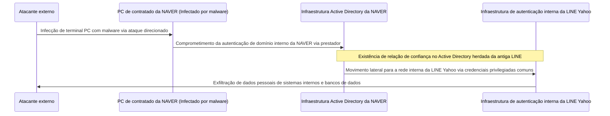

A essência técnica da vulnerabilidade residiu em que **«a infraestrutura de autenticação do Active Directory e os laços de confiança mútua entre a antiga LINE e a NAVER permaneceram conectados e compartilhados sem o devido isolamento»**.

A partir da infecção por malware do computador de um fornecedor terceirizado contratado pela NAVER na Coreia do Sul, os criminosos obtiveram acesso à rede interna daquela empresa. Aproveitando-se dessa «relação de confiança transfronteiriça de diretório de identidades», os atacantes moveram-se lateralmente sem encontrar barreiras de segurança até alcançarem as bases de dados e aplicações corporativas vitais da LINE Yahoo no Japão.

O ocorrido expôs o perigo inerente às práticas corporativas de «desenvolvimento offshore» e «divisão internacional de tarefas». **Manter redes e identidades integradas sob a justificativa de que \'é uma empresa do mesmo grupo econômico\' ou \'trata-se da nossa matriz\' constitui uma temeridade fatal**. A determinação governamental exigindo a reestruturação societária e a desvinculação absoluta dos sistemas de autenticação com a NAVER consolidou o entendimento de que a governança de cadeias de suprimentos é indissociável da soberania digital e da segurança nacional.

### 1.3 O colapso em cadeia de fornecimento no setor público e empresas de BPO (Caso Iseto e outros)

A partir de 2024, uma onda de comoção atingiu administrações municipais, instituições bancárias e companhias de serviços públicos em todo o território japonês, decorrente de **ataques de ransomware contra grandes operadoras de BPO (Business Process Outsourcing) e empresas de processamento e impressão gráfica (notadamente a Iseto e congêneres)**.

Os governos locais costumam delegar, via editais de licitação, tarefas volumosas de confecção, envelopamento e postagem de correspondências tributárias e assistenciais: carnês de impostos municipais, carteiras do seguro nacional de saúde, informes de benefícios de aposentadoria e notificações eleitorais. Esses serviços demandam o envio de bases de dados massivas com nomes, logradouros, registros My Number e dados de renda de milhões de habitantes.

Os cibercriminosos não gastaram esforços atacando as redes centrais governamentais (protegidas pelo modelo estrito de \'três camadas\' e pelo sistema LGWAN). O vetor escolhido foi **a rede das empresas prestadoras que recebiam e manipulavam esses dados sob custódia**.

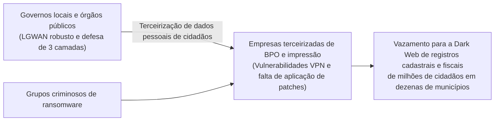

Com o sequestro e a criptografia dos servidores dessas prestadoras de BPO, não foram apenas os arquivos operacionais internos que tombaram; os dados fiscais e cadastrais de milhões de cidadãos de dezenas de municípios foram interceptados e publicados na Dark Web como parte da estratégia de extorsão.

A lição fulcral dessa tragédia é cristalina: **«Por mais que uma entidade contratante aplique centenas de milhões de ienes na blindagem de seus sistemas centrais, se a segurança dos fornecedores contratados for deficiente, toda a cadeia de valor entrará em colapso instantaneamente»**. A conveniência de considerar a segurança assegurada mediante simples assinaturas de cláusulas protocolares de confidencialidade em contratos de papel ruiu de maneira incontestável.

### 1.4 Falhas de configuração na nuvem (Salesforce/AWS/Azure): O desastre de cofres abertos expostos à Internet

As intrusões cibernéticas complexas não são os únicos vetores de vazamento. Em pleno ano de 2026, um volume descomunal de registros expostos no Japão segue sendo atribuível a **«erros de configuração em plataformas de nuvem (Cloud Misconfiguration)»**.

Um padrão alarmante registrado em corretoras de valores, seguradoras, e-commerces e órgãos públicos foi a **exposição de bases de dados de clientes no sistema de CRM Salesforce**.

O Salesforce dispõe de funcionalidades para publicação de «portais de comunidade» externos. Contudo, devido à incompreensão das regras de compartilhamento de dados (Sharing Rules) e falhas no provisionamento de permissões para usuários convidados (Guest Users), listas confidenciais com nomes de clientes, números telefônicos, saldos em conta e extratos de investimentos **ficaram configuradas de forma a permitir consultas, varreduras e downloads abertos por qualquer indivíduo na Internet, sem exigência de qualquer credencial**.

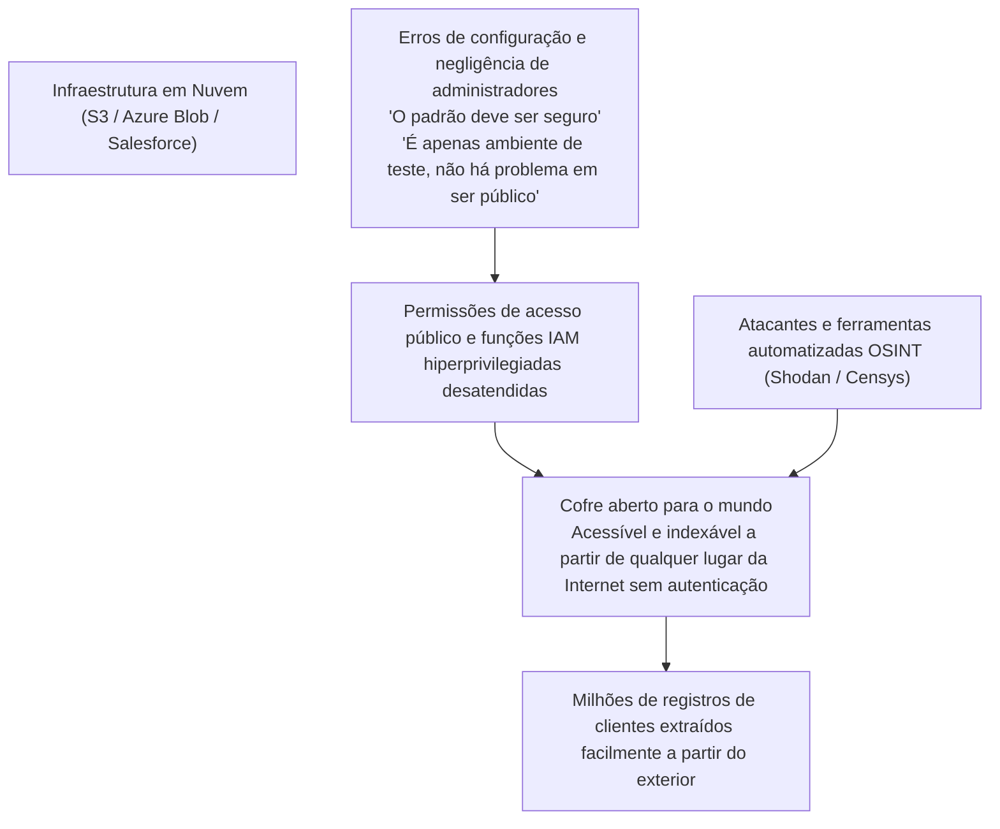

Erros conceituais semelhantes sucedem-se em baldes S3 da Amazon Web Services (AWS) com permissões globais de leitura descontroladas, contas de armazenamento mal configuradas no Microsoft Azure, e casos em que desenvolvedores publicam involuntariamente chaves secretas e credenciais de API em repositórios abertos no GitHub.

Sem a necessidade de explorar nenhuma vulnerabilidade desconhecida de dia zero, a dura constatação da gestão de nuvem no Japão é que **as próprias empresas destrancavam os portões de seus cofres de dados e os colocavam em exibição para todo o planeta**.

---

## Capítulo 2: As causas estruturais e organizacionais (Delegação cega e terceirização em cascata)

Por que motivo, diante de riscos tão transparentes, as organizações japonesas falham reiteradamente na prevenção desses incidentes? Neste capítulo, analisamos a anatomia patológica do ecossistema corporativo tradicional japonês.

### 2.1 A postura do conselho de «TI como centro de custos» e o esvaziamento da autoridade do CISO

A vulnerabilidade mais crítica na defesa digital de uma organização japonesa não reside nas configurações de seus firewalls, mas sim **«na sala do conselho de administração»**.

Em corporações globais de referência, a tecnologia da informação e a segurança cibernética são tratadas como motores indutores de competitividade e prioridades estratégicas absolutas do board. O CISO (Chief Information Security Officer) responde diretamente ao CEO, dispõe de orçamento substancial e detém poder de veto irrevogável (Veto Power) para paralisar sistemas produtivos sempre que o risco cibernético se mostre inaceitável, acima de conveniências operacionais transitórias.

Em flagrante contraste, na expressiva maioria das empresas japonesas, o setor de TI foi historicamente submetido ao status subalterno de «área-meio desprovida de lucro e mero centro de despesas a ser contido».
- É raríssimo encontrar conselheiros com bagagem técnica sólida ou preparo em cibersegurança nos boards japoneses. A praxe dita que a função de CISO seja atribuída a um executivo veterano formado em ciências humanas, próximo da aposentadoria, acumulando a função com as diretorias de Recursos Humanos ou Assuntos Gerais.
- Quando especialistas técnicos de linha de frente relatam a presença de falhas críticas em equipamentos de VPN de borda e solicitam orçamentos de emergência associados a janelas de manutenção com paralisação planejada dos sistemas, a diretoria frequentemente rechaça os pedidos com argumentos como: «A margem operacional deste trimestre está apertada, deixem para o próximo ano fiscal» ou «É inadmissível paralisar as atividades rotineiras da empresa».

Assim, o CISO no Japão é comumente reduzido a **«um bode expiatório (Scapegoat) desprovido de fundos e voz deliberativa, encarregado unicamente de fazer reverências em entrevistas coletivas quando o desastre se materializa»**. Essa inércia executiva, que encara a proteção digital como um gasto que deve ser minimizado a todo custo em vez de um ativo intangível insubstituível para a preservação do valor da firma, representa o verdadeiro cerne da crise.

### 2.2 O modelo de terceirização em múltiplos níveis e o surgimento do «elo mais fraco»

A deformidade estrutural mais arraigada no ecossistema de TI japonês é a sua **«estrutura de subcontratação em cascata (o sistema de empreiteiras gerais de TI)»**, inspirada na indústria tradicional da construção civil.

As corporações contratantes transferem a totalidade da concepção, implementação, suporte e segurança de seus sistemas a um grande integrador primário (Prime SIer). Este integrador central, com raras exceções, não realiza a operação com equipes próprias; retém uma taxa de intermediação expressiva e transfere as tarefas a subcontratadas de segundo nível, que por sua vez repassam os encargos para fornecedores de terceiro, quarto ou quinto escalão, integrados por pequenas firmas de TI e programadores autônomos.

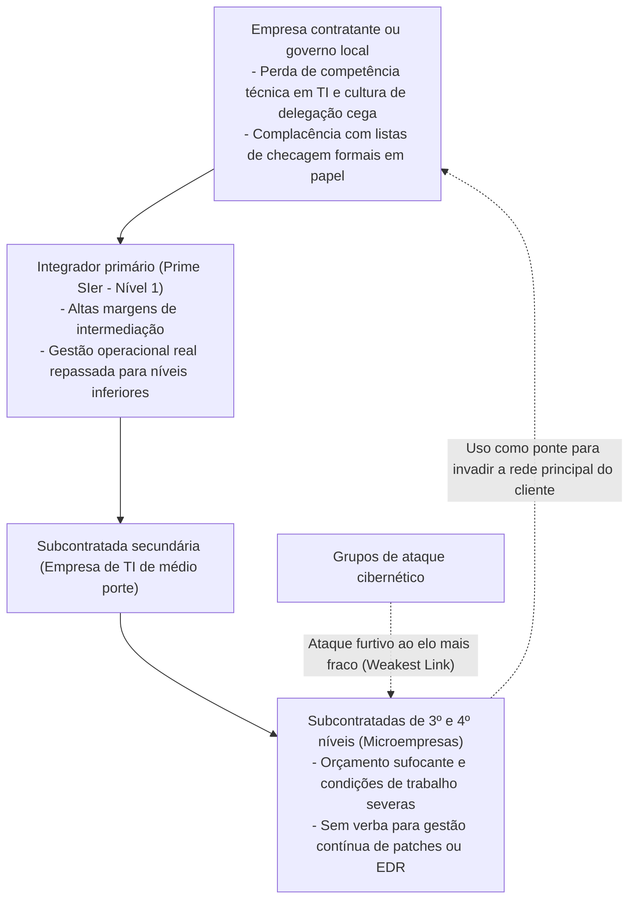

Na criptografia aplicada e na engenharia de confiabilidade vigora um axioma inescapável: **«A resistência de uma corrente é determinada pelo seu elo mais fraco (Weakest Link)»**.

Por mais refinados que sejam os firewalls de próxima geração do integrador primário e por mais volumosos que sejam seus manuais de conformidade, as microempresas alocadas no final da cadeia de repasse não dispõem de receita para licenciar ferramentas modernas de EDR (Endpoint Detection and Response) ou manter serviços contratados de SOC (Security Operations Center) 24 horas por dia.
- Nesses ambientes terminais, computadores pessoais desatualizados (BYOD) sem suporte de segurança são rotineiramente empregados no trabalho diário, com senhas de root anotadas em post-its colados nos monitores.
- Para agravar o cenário, concedem-se a essas máquinas acessos remotos com privilégios administrativos diretos sobre os bancos de produção e servidores corporativos da corporação cliente.

Para o atacante contemporâneo, a estratégia é elementar. Não há necessidade de investir recursos desproporcionais contra a fortaleza central. Basta infectar a estação desprotegida de uma subcontratada na base da cadeia, apropriar-se de suas credenciais de acesso legítimas e adentrar o núcleo da rede do cliente **«passando serenamente pela porta principal sob o disfarce de um usuário autorizado»**.

### 2.3 O esgotamento do modelo de emprego tradicional e a carência crônica de especialistas

A escassez de recursos humanos em cibersegurança representa outro sintoma agudo dessa crise.

Estimativas governamentais do METI e da IPA apontam para um déficit contínuo de centenas de milhares de especialistas em cibersegurança no Japão. Entretanto, a essência do problema não decorre unicamente de taxas demográficas: ela espelha **a incompatibilidade estrutural do modelo de gestão de pessoas corporativo japonês para atrair e remunerar talentos de ponta em segurança da informação**.

Em praças como Estados Unidos, Israel ou Cingapura, arquitetos de defesa digital, engenheiros de engenharia reversa e pentesters (hackers éticos) de excelência auferem salários anuais que superam rotineiramente a faixa de US$ 200.000 a US$ 400.000, sendo reconhecidos como peças-chave para a proteção dos negócios.

Em nítida oposição, nas corporações tradicionais japonesas baseadas na senioridade por tempo de serviço e contratações genéricas em bloco, os técnicos de tecnologia ocupam as camadas menos prestigiadas da pirâmide organizacional:
- As tabelas de remuneração são homogêneas e engessadas: um profissional jovem dotado de habilidades ímpares na caça a ameaças recebe rigorosamente o mesmo salário tabelado de seus pares em atividades operacionais burocráticas.
- A única via de progressão na carreira consiste em galgar posições na hierarquia administrativa tradicional (Kacho, Bucho). Para auferir melhor remuneração, o especialista é forçado a abandonar a análise técnica de logs e a dissecação de ameaças para gerenciar planilhas orçamentárias no Excel.

Em consequência, os talentos técnicos mais brilhantes debandam em massa para filiais de empresas estrangeiras e startups de tecnologia. As diretorias de TI das companhias tradicionais esvaziam-se de quadros qualificados capazes de identificar e estancar um ataque em andamento, restando apenas profissionais que operam como meros «retransmissores de recados» entre a chefia e os prestadores terceirizados. Esse esvaziamento técnico priva a corporação de qualquer resposta rápida a incidentes, convertendo pequenas intrusões em catástrofes irreversíveis.

---

## Capítulo 3: A falência da tecnologia (O colapso da defesa de perímetro e as ciladas do AD)

Em paralelo às fraturas estruturais de gestão, a arquitetura técnica instalada na maioria das empresas japonesas padece de uma obsolescência crítica que é rotineiramente explorada pelos cibercriminosos.

### 3.1 A vulnerabilidade crítica dos gateways de VPN e conexões de desktop remoto

Com a migração acelerada para o trabalho remoto durante a crise sanitária global, as companhias japonesas optaram por atalhos rápidos. A alternativa hegemônica foi a instalação de concentradores de SSL-VPN (como Fortinet FortiGate, Pulse Secure / Ivanti Connect Secure, entre outros) nas bordas das redes para viabilizar conexões criptografadas das residências dos funcionários.

Essa infraestrutura tornou-se **a mais letal vulnerabilidade e porta dos fundos da segurança cibernética corporativa no Japão**.

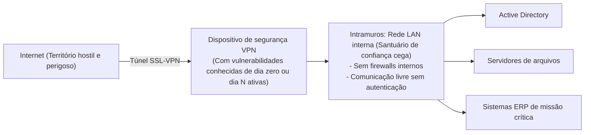

Um dispositivo concentrador de VPN é uma barreira de borda exposta diretamente às tempestades da Internet. Consequentemente, grupos de ransomware e operadores de espionagem cibernética (APT) monitoram ininterruptamente qualquer falha nessas fechaduras.
- Entre 2023 e 2026, dezenas de vulnerabilidades críticas de contorno de autenticação e execução remota de código (com escores CVSS de 9.0 a 10.0) foram descobertas e exploradas em dispositivos de ponta de marcas como Ivanti e Fortinet.
- Mesmo após a disponibilização oficial de correções de emergência pelos fabricantes, centenas de empresas no Japão negligenciaram a aplicação dos patches por meses, argumentando que «a intervenção causaria impacto na produção» ou «não era possível agendar reinicializações».

Através de ferramentas de indexação de ativos expostos como Shodan e Censys, os atacantes mapeiam esses dispositivos com varreduras automatizadas. Ao explorar essas falhas para despejar o conteúdo da memória do gateway, obtêm senhas, usuários e tokens de sessão em minutos, **ingressando na rede corporativa com credenciais legítimas**.

### 3.2 O fim definitivo da presunção de confiança na rede corporativa

Ultrapassada a fronteira da VPN, a ideologia que decreta a ruína da infraestrutura é a arcaica **«defesa de perímetro (o modelo de castelo e fosso)»**.

Essa doutrina apoia-se no dogma ingênuo de que «tudo o que provém da Internet externa é hostil, mas tudo o que trafega dentro da rede local interna (a LAN corporativa) é benigno e plenamente confiável».

Sob essa diretriz, as redes corporativas foram concebidas com topologias perigosamente **«planas»**:
- Uma estação de trabalho ligada à rede pode conectar-se livremente a qualquer outro computador, impressora, repositório de arquivos ou servidor de contabilidade na mesma sub-rede ou em segmentos vizinhos, sem necessidade de nova autenticação ou criptografia mútua.
- O tráfego interno não passa por inspeções de firewalls ou sistemas de prevenção de intrusões.

Trata-se do equivalente a um castelo medieval com muralhas externas de pedra, porém **«onde todas as portas dos aposentos reais, do tesouro e dos estoques de mantimentos encontram-se escancaradas e sem fechaduras para qualquer pessoa que transpasse o portão principal»**. A defesa perimetral é impotente para conter o movimento lateral através do qual um atacante progride de um computador modesto até dominar a empresa por inteiro.

### 3.3 A hipertrofia do Active Directory e o colapso do controle de privilégios

Nos ambientes baseados em tecnologia Microsoft, o ponto de falha mais catastrófico e o troféu máximo visado pelos invasores é o **Active Directory (AD)**.

Mais de 90% das corporações no Japão utilizam o Active Directory para administrar contas de usuários, equipamentos, autorizações de acesso e políticas globais de segurança (GPO). Contudo, a governança operacional desses ambientes encontra-se profundamente deteriorada:
- Estruturas de florestas e domínios implantadas há duas décadas acumularam alterações caóticas, tornando-se caixas-pretas ininteligíveis.
- Milhares de contas inativas de funcionários desligados, contas de serviço vinculadas a softwares aposentados e permissões provisórias jamais canceladas poluem as árvores de diretório.
- A prática mais nefasta: **o uso promíscuo de credenciais com direitos de Administrador de Domínio (Domain Admin)**. Por comodidade técnica, equipes de suporte e contratados terceirizados concedem rotineiramente privilégios administrativos globais a máquinas comuns ou padronizam senhas idênticas em dezenas de servidores.

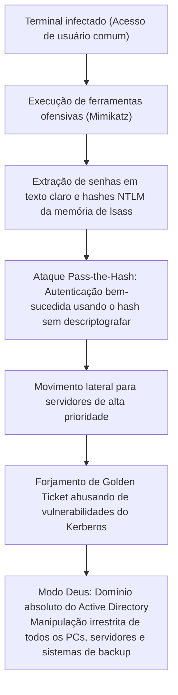

Invasores executam ferramentas ofensivas como o `Mimikatz` no primeiro equipamento comprometido, extraindo da memória do processo de autenticação do Windows (`lsass.exe`) hashes NTLM e tickets de sessão Kerberos.

Os criminosos sequer necessitam quebrar as senhas em texto plano. Mediante técnicas de **«Pass-the-Hash»** ou gerando bilhetes mestres irrestritos com ataques de **«Golden Ticket»** (após comprometer o hash da conta `krbtgt`), o atacante eleva seus privilégios a Administrador de Domínio. Nesse instante, torna-se o regente absoluto do ambiente tecnológico da companhia. Bastará utilizar as Diretivas de Grupo (GPO) para ordenar o download e a execução simultânea do ransomware em todos os terminais e servidores da organização em poucos minutos.

### 3.4 Desafios da nuvem: Shadow IT e permissões excessivas no IAM

A migração precipitada para nuvens públicas como AWS, Azure e Google Cloud desencadeou novos vetores críticos de fragilidade:

1. **Shadow IT e instâncias de nuvem paralelas**:
   Equipes de produto ou desenvolvedores que, frustrados pela morosidade das requisições corporativas de TI, contratam infraestruturas em nuvem de forma autônoma por meio de cartões corporativos. Tais ambientes operam totalmente fora do radar da equipe de segurança, sem telemetria e com portas abertas por padrão.
2. **Funções IAM hiperprivilegiadas (Over-Privileged IAM Roles)**:
   Ao desenhar políticas de controle de acesso (IAM), administradores ignoram as diretrizes de menor privilégio (Principle of Least Privilege). Para evitar bloqueios acidentais durante a implantação de códigos, associam indistintamente permissões amplas como `AdministratorAccess` a instâncias e funções serverless.
   Uma falha simples de injeção de SQL ou uma vulnerabilidade de falsificação de requisições no servidor (SSRF) em um serviço web é suficiente para que criminosos extraiam as credenciais temporárias do perfil de máquina, ganhando o controle irrestrito de todo o ambiente de computação, armazenamento e bancos de dados da companhia na nuvem.

---

## Capítulo 4: As vulnerabilidades humanas e a evolução dos vetores de ataque

Ao lado da defasagem arquitetural e das deficiências de gestão, os vetores que exploram as fraquezas cognitivas humanas passaram por um salto evolutivo avassalador impulsionado pela Inteligência Artificial Generativa.

### 4.1 Spear phishing de alta precisão e fraudes por deepfake na era da IA

No passado, os e-mails de phishing costumavam ser identificados com relativa facilidade por exibirem construções gramaticais canhestras, caracteres corrompidos e termos de etiqueta incompatíveis com a praxe corporativa japonesa, resultantes de traduções mecânicas primitivas.

Com a difusão dos **Modelos de Linguagem de Grande Escala (LLMs)**, essa barreira protetora desmoronou integralmente.

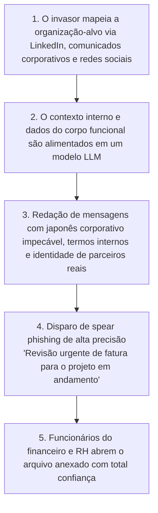

Atacantes coletam dados organizacionais, projetos vigentes e nomes de executivos a partir de redes como LinkedIn, relatórios corporativos públicos e mídias sociais. Alimentando essas informações nos modelos de IA, produzem mensagens de phishing dirigidas redigidas em **um japonês empresarial sofisticado, formal e perfeitamente sintonizado com a cultura corporativa da empresa-alvo**.

Para além dos textos perfeitos, multiplicam-se os incidentes de engenharia social amparados por **deepfakes audiovisuais (clonagem de voz e vídeo)**:
- Casos verídicos no Japão e no exterior envolveram fraudes multimilionárias em que diretores financeiros receberam telefonemas de áudio em que a voz do presidente corporativo (CEO) era clonada por IA com fidelidade absoluta, ordenando remessas urgentes de centenas de milhões de ienes para contas secretas sob pretexto de aquisições corporativas sigilosas.
- Acreditar que treinamentos que pedem ao funcionário «ficar mais atento» possam deter fraudes que hackeiam a percepção sensorial humana é uma ingenuidade inaceitável.

### 4.2 O sequestro de sessões via Infostealers e o contorno do MFA tradicional

Muitas das implementações de autenticação multifator (MFA) baseadas em SMS e aplicativos móveis de código temporário foram desarmadas pela proliferação vertiginosa dos **malwares de extração de credenciais (Infostealers)**.

Famílias ativas como RedLine, Raccoon e Lumma disseminam-se por meio de programas crackeados, falsos instaladores corporativos ou campanhas de spear phishing direcionadas a colaboradores e funcionários terceirizados.

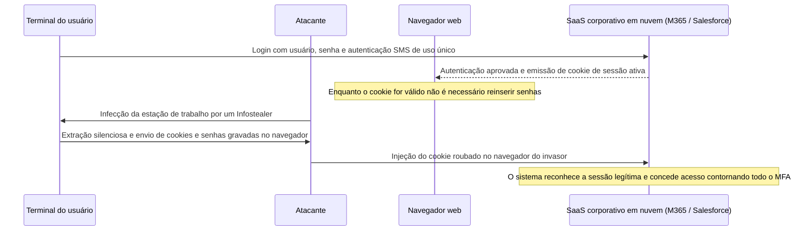

O propósito primordial de um Infostealer não é a destruição ou o sequestro de arquivos locais, mas sim vasculhar as bases de dados dos navegadores web (Chrome, Edge) para **furtar senhas salvas e, sobretudo, cookies de sessão ativos**.

Quando um usuário efetua o login legítimo com seu usuário, senha e segundo fator de autenticação, o servidor em nuvem gera um «cookie de sessão» que permanece armazenado na máquina local. Ao extrair e carregar esse cookie em seu próprio navegador (Cookie Hijacking), **o invasor acessa os sistemas em nuvem da corporação imediatamente como se fosse o usuário legítimo, sem precisar digitar a senha e sem ser solicitado por qualquer verificação MFA**.

Diariamente, lotes massivos de cookies de empresas japonesas são negociados nos fóruns da Dark Web por quantias insignificantes, permitindo que criminosos em qualquer ponto do planeta entrem em redes corporativas com tapete vermelho estendido.

### 4.3 Fraudes internas e vazamento de dados por colaboradores e terceirizados

O espectro de ameaças não emana exclusivamente de fora. Estatísticas da Associação de Segurança de Redes do Japão (JNSA) ressaltam que parcela vultosa das perdas de dados decorre da **«apropriação indébita e desvio de informações por agentes internos (funcionários da ativa, colaboradores em fase de demissão e equipes terceirizadas)»**.

- **A mobilidade laboral e o furto de ativos digitais na saída**:
  Em um Japão onde a troca de empregos tornou-se um fenômeno habitual, engenheiros e vendedores transferindo-se para concorrentes consideram indevidamente que os dados que produziram são sua propriedade privada, transferindo listas de clientes, códigos-fonte e especificações para cartões de memória USB ou contas pessoais em nuvem (Google Drive, Dropbox) antes do desligamento.
- **Desvios e fraudes cometidos por operadores terceirizados com privilégios de acesso**:
  Engenheiros de empresas subcontratadas que atuam na manutenção de bancos de dados vitais e enfrentam dificuldades financeiras pessoais chegam a desviar centenas de milhares de cadastros confidenciais para revenda a corretores de listas e sindicatos criminosos.

Muitas empresas operam sob a premissa obsoleta da «confiança incondicional no ser humano (Seizensetsu)», prescindindo de soluções como DLP (Data Loss Prevention) e UEBA (User and Entity Behavior Analytics) para monitorar e interromper em tempo real fluxos anômalos de cópia de arquivos. Os vazamentos costumam ser desvendados meses ou anos após o fato consumado, durante inquéritos policiais ou com a comercialização de produtos idênticos por rivais.

---

## Capítulo 5: O plano diretor para a migração abrangente para a Arquitetura Zero Trust (ZTA)

Perante esse ecossistema hostil e impiedoso, a única diretriz capaz de resguardar as corporações japonesas é o abandono irreversível da defesa perimetral e a adoção irrestrita da **«Arquitetura Zero Trust (Zero Trust Architecture: ZTA)»**.

### 5.1 O princípio basilar: «Never Trust, Always Verify»

Zero Trust não é um produto fechado que se instala a partir de uma caixa, mas sim **«uma profunda quebra de paradigma na filosofia fundamental da segurança corporativa»**, consolidada pelo National Institute of Standards and Technology (NIST) dos Estados Unidos na publicação de referência **NIST SP 800-207**.

> **Os Três Princípios Nucleares do Zero Trust**:
> 1. **Nunca confie, verifique sempre (Never Trust, Always Verify)**:
>    Nenhum acesso, terminal ou identidade deve ser categorizado como inerentemente seguro, provenha ele da sala da presidência ou de uma rede pública. Cada solicitação é tratada como potencialmente hostil e sujeita a rigorosa verificação contínua.
> 2. **Concessão de privilégio mínimo estrito (Grant Least Privilege Access)**:
>    Conceder aos usuários e sistemas apenas as permissões indispensáveis para o cumprimento de uma tarefa específica, e tão somente durante o tempo estritamente necessário (Just-In-Time).
> 3. **Assunção permanente de violação (Assume Breach)**:
>    Trabalhar sob a premissa imutável de que as defesas externas já foram transpostas e que o adversário já se encontra infiltrado, orientando o design da infraestrutura para a contenção imediata (minimização do raio de explosão) e a expulsão automatizada de ameaças.

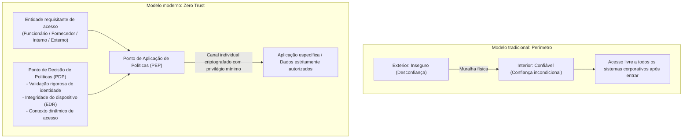

### 5.2 A extinção de equipamentos VPN e a migração estratégica para ZTNA

O passo decisivo da transformação repousa na **«erradicação definitiva de aparelhos concentradores de VPN»** e na implementação de soluções de **«ZTNA (Zero Trust Network Access)»**.

A divergência técnica entre os dois conceitos é fundamental:
- **VPN tradicional**: Ao validar as credenciais, o túnel acopla o computador do trabalhador à sub-rede corporativa inteira em nível de rede (Camada 3). O equipamento passa a ter visibilidade direta de todos os recursos da intranet, permitindo que qualquer malware instalado na máquina salte sem atrito para os demais servidores.
- **ZTNA**: O computador jamais é conectado à rede interna. Um intermediário seguro na nuvem analisa de forma perene a identidade do usuário e a higidez do dispositivo para **«estabelecer uma ponte restrita exclusivamente à aplicação web ou à porta de serviço autorizada»**. A topologia, os endereços IP e a estrutura interna dos servidores permanecem totalmente invisíveis para o endpoint, inviabilizando qualquer movimentação lateral.

### 5.3 A consolidação arquitetural com SASE e SSE

A operacionalização moderna desse paradigma articula-se em torno do conceito de **«SASE (Secure Access Service Edge)»**, cunhado pelo Gartner, e seu subsistema de proteção de borda, o **«SSE (Security Service Edge)»**.

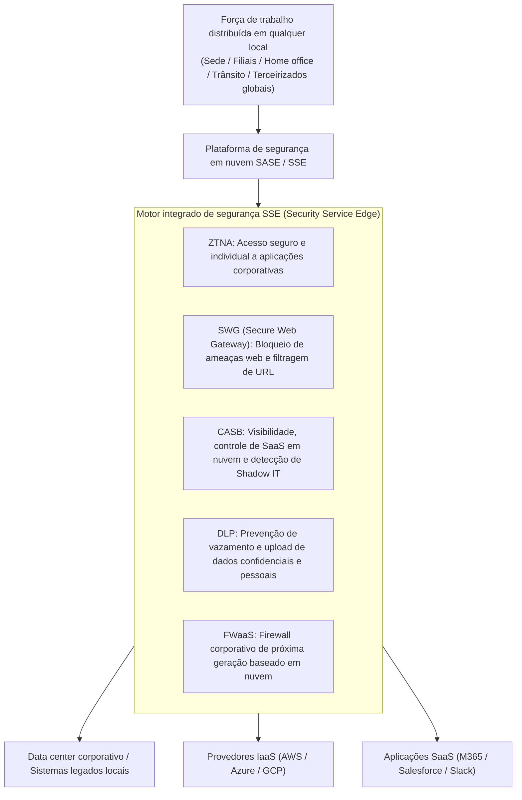

Na infraestrutura SASE, o tráfego gerado por qualquer trabalhador —esteja ele na sede, em sua residência ou em instalações no exterior— converge diretamente para a nuvem de segurança distribuída:
- O **SWG (Secure Web Gateway)** bloqueia sites infectados, examina o tráfego TLS criptografado e estanca campanhas de phishing.
- O **CASB (Cloud Access Security Broker)** supervisiona as interações com plataformas SaaS e combate o surgimento de Shadow IT.
- O **DLP (Data Loss Prevention)** identifica e intercepta transmissões de números de cartões de crédito e cadastros protegidos.
- O **ZTNA** assegura conexões exclusivas e restritas aos sistemas centrais da corporação.

Essa abordagem elimina a necessidade de manter múltiplos firewalls e roteadores VPN locais de manutenção dispendiosa, unificando a postura de governança cibernética global da companhia.

### 5.4 O confinamento do movimento lateral por microsegmentação

Como é impossível garantir que nenhum computador jamais será infectado, a salvaguarda imperativa é a **«Microsegmentação (Micro-Segmentation)»**.

A microsegmentação aposenta as tradicionais divisões de rede em VLANs genéricas por departamento ou andar, instaurando proteções rigorosas **«em nível de servidor individual, máquina virtual e contêiner»**.

- Por exemplo, os servidores da área contábil somente aceitarão requisições emitidas a partir das portas criptográficas homologadas de estações verificadas da equipe de finanças, descartando qualquer tentativa de comunicação (incluindo pings) oriunda de computadores de desenvolvimento ou operacionais.
- Mesmo entre máquinas que compartilham o mesmo rack e segmento, bloqueia-se preventivamente todo o tráfego leste-oeste que não esteja categoricamente autorizado em políticas estritas.

Caso um computador venha a ser atingido por um ransomware, os portões corta-fogo da microsegmentação fecham-se instantaneamente, **confinando a infecção no dispositivo isolado e impedindo sua disseminação pelo ecossistema corporativo**.

---

## Capítulo 6: O fortalecimento dos pilares de identidade e controle de acesso (IAM/PAM)

No modelo Zero Trust, a barreira primordial de contenção não são os cabos de rede ou roteadores: é **«a Identidade (Identity and Access Management)»**. Desaparecida a fronteira física, a identidade consolidou-se como o eixo central de todo o arcabouço de segurança.

### 6.1 A adoção mandatória de MFA resistente a phishing com padrões FIDO2 e Passkeys

A providência inicial inegociável consiste em eliminar os mecanismos obsoletos de autenticação em dois fatores: senhas temporárias por SMS, códigos por e-mail ou aprovações de notificações push simples em telas de smartphones.

Com a facilidade com que ferramentas de proxy reverso (como Evilginx) e infostealers capturam códigos SMS e tokens de sessão, a única salvaguarda definitiva é **a implantação compulsória de MFA resistente a phishing com base no protocolo FIDO2 / WebAuthn (Passkeys)**.

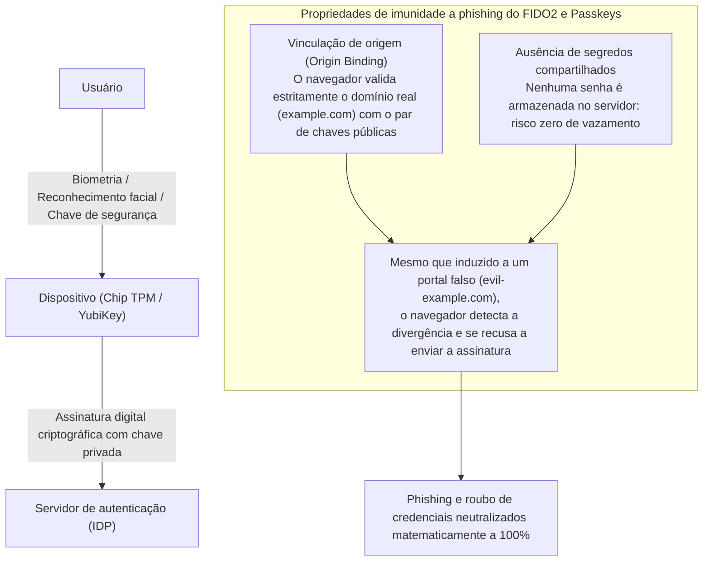

O poder matemático do FIDO2 decorre da **«Vinculação de Origem (Origin Binding)»**.
Mesmo que o empregado seja ludibriado por uma mensagem fraudulenta e navegue até uma página idêntica à do portal oficial da empresa, o navegador confronta o domínio (FQDN) e, ao detectar a divergência com a chave cadastrada, nega categoricamente a liberação da assinatura criptográfica gerada no chip TPM ou chave física YubiKey.

Dessa forma, o furto de credenciais de acesso é neutralizado matematicamente. As empresas devem tornar essa exigência universal, iniciando com urgência pelos administradores de sistemas e manipuladores de informações estratégicas.

### 6.2 O modelo de níveis (Tiering) no Active Directory e o acesso Just-In-Time (JIT)

Nas empresas que continuam dependentes do Active Directory local, o modelo consagrado para impedir a captura do ambiente é a **«Arquitetura em Níveis (Tiering Model)»** preconizada pela Microsoft.

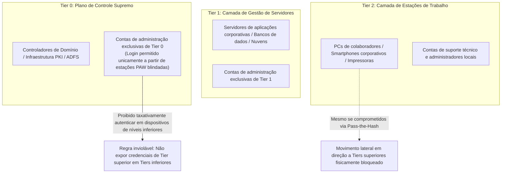

O mandamento cardeal do modelo em níveis determina que **«uma credencial com privilégios de um nível superior jamais deve autenticar-se nem depositar rastros de memória em equipamentos de níveis inferiores»**:
- **Tier 0 (Controle Máximo)**: Administradores de Domínio. Devem atuar exclusivamente sobre controladores de domínio e servidores de identidade, sendo terminantemente proibido seu login em estações comuns ou servidores departamentais. As operações são executadas apenas a partir de Estações de Trabalho de Acesso Privilegiado (PAWs), isoladas de acessos à Internet.
- **Tier 1 (Servidores de Negócio)**: Administração de bancos de dados e servidores operacionais.
- **Tier 2 (Dispositivos Finais)**: Gestão de computadores de usuários e impressoras.

Adicionalmente, deve-se extinguir privilégios permanentes (Standing Privileges), adotando políticas de **«Acesso Just-In-Time (JIT)»**. Administradores navegam no dia a dia com contas ordinárias; caso demandem privilégios elevados para intervenções pontuais, abrem chamados de concessão temporária que expiram automaticamente após algumas horas.

### 6.3 O Acesso Condicional e a avaliação contínua de riscos

O ato de autenticação não pode consistir em um evento estático encerrado no momento do login. Sob o paradigma Zero Trust, o controle de acesso é uma verificação perene e dinâmica **baseada em sinais contextuais contínuos durante toda a sessão**.

Plataformas modernas de IAM (como Microsoft Entra ID e Okta) avaliam continuamente múltiplas métricas:
1. **Identidade do usuário e grupo funcional**.
2. **Localização e dados de IP**:
   - Bloqueio imediato diante de cenários de viagem impossível (Impossible Travel), como conexões registradas em Tóquio e minutos depois na Europa.
3. **Higidez do endpoint**:
   - Validação de que a máquina possui EDR corporativo em execução, criptografia BitLocker ativada e patches de segurança instalados.
4. **Padrões de anomalia comportamental**:
   - Identificação de downloads atípicos de arquivos em horários incomuns, exigindo de imediato uma reconfirmação biométrica ou revogando os tokens de sessão.

Se qualquer uma das variáveis violar os critérios mínimos, o acesso é sumariamente bloqueado, não importando a exatidão da senha digitada.

---

## Capítulo 7: O modelo de governança para terceiros e cadeia de suprimentos

De nada adianta uma empresa blindar seus próprios perímetros se as portas de acesso de seus prestadores e subcontratados permanecerem escancaradas. Como estender a governança a esses parceiros?

### 7.1 Mapeamento e auditoria permanente dos prestadores

A providência prioritária consiste no **«inventário abrangente e mapeamento minucioso de toda a cadeia de fornecedores»**.

A imensa maioria das corporações apenas monitora seus contratados de primeiro nível (Tier 1), desconhecendo os fornecedores de terceiro ou quarto escalão que processam seus dados sigilosos.
- Exigir contratualmente a vedação expressa de repasses e subcontratações em cascata sem consentimento prévio formal.
- Abolir os formulários de autoavaliação em papel preenchidos anualmente apenas para fins formais de conformidade.
- Adotar plataformas contínuas de classificação de risco cibernético de terceiros (Security Rating Services como BitSight ou SecurityScorecard), que realizam varreduras automatizadas e monitoram a exposição a vulnerabilidades, certificados vencidos e credenciais comprometidas dos fornecedores em tempo real.

### 7.2 Vetar o BYOD em fornecedores e adotar VDI Zero Trust

A estratégia definitiva para anular os vazamentos decorrentes de máquinas de fornecedores é garantir que **«nenhum byte de dado confidencial seja armazenado fisicamente em computadores terceirizados»**.

A conexão de estações de trabalho particulares ou equipamentos não homologados (BYOD) de empresas contratadas às redes corporativas deve ser categoricamente vetada.

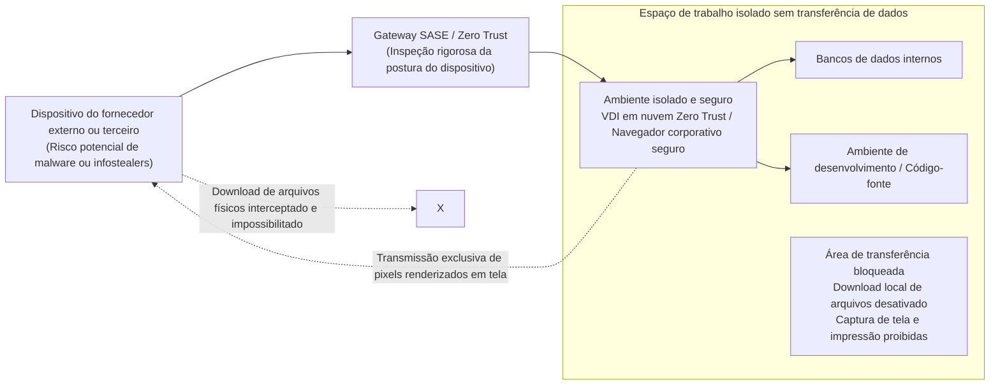

Toda atividade prestada por terceiros deve ser realizada por meio de **ambientes VDI na nuvem (DaaS) sob preceitos Zero Trust** ou navegadores empresariais isolados:
- O download de arquivos para a máquina local, o uso da área de transferência (copiar e colar), a impressão e capturas de tela devem ser bloqueados via sistema operacional.
- O terminal do fornecedor recebe unicamente o streaming de pixels da tela. Caso a máquina do terceiro seja infectada por um infostealer, nenhum arquivo de dados ou cookie corporativo poderá ser capturado.

### 7.3 SBOM e controle estrito de integrações API

Nas contratações de desenvolvimento de software sob demanda, outro risco latente são os componentes de código aberto desatualizados ou vulneráveis (a exemplo de bibliotecas desatualizadas de frameworks comuns e incidentes do tipo Log4j).

As empresas devem exigir de suas fábricas de software o fornecimento obrigatório de um **SBOM (Software Bill of Materials: Lista de Componentes de Software)** a cada release de código. Esse inventário permite confrontar as dependências com bases públicas de vulnerabilidades (CVE) e responder em minutos diante da publicação de falhas de dia zero.

Similarmente, as integrações de sistemas via API com parceiros de negócios devem subordinar-se estritamente ao protocolo OAuth 2.0, com escopos mínimos de privilégio e prazos de validade curtos (TTL reduzido) para todos os tokens programáticos.

---

## Capítulo 8: A ciberresiliência diante de ataques de ransomware e destruição de dados

Sob o pilar do Zero Trust de «Assumir a Violação (Assume Breach)», a derradeira linha de contenção corporativa é a **«Ciberresiliência: a aptidão de reconstruir e sustentar a operação diante de uma crise consumada»**.

Conter com 100% de eficácia adversários apoiados por Estados ou quadrilhas globais é irrealizável. O diferencial entre a sobrevivência e a falência de uma empresa é a agilidade em restabelecer seus serviços após o impacto.

### 8.1 A regra de backup 3-2-1-1-0 e os armazenamentos imutáveis

Nos ataques contemporâneos de ransomware (como BlackSuit, LockBit ou Akira), a prioridade absoluta dos atacantes não é criptografar os dados em produção: **é a localização e destruição meticulosa dos backups**. Sem a integridade das cópias de segurança, as empresas são encurraladas a pagar as extorsões.

Procedimentos antiquados de salvaguarda em discos compartilhados integrados ao domínio tornaram-se inúteis. Se o sistema de backup estiver atrelado ao Active Directory corporativo, o invasor munido de privilégios de administrador de domínio apagará todos os repositórios em segundos.

O padrão compulsório para garantir a continuidade dos negócios é a **regra 3-2-1-1-0 de cópias de segurança**:

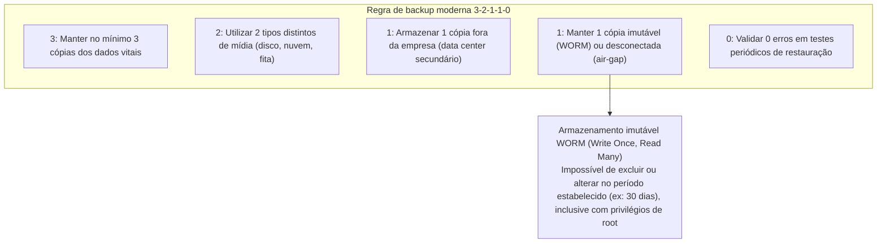

A pedra angular dessa metodologia é o **«Backup Imutável (Immutable Backup)»**.
Valendo-se de capacidades **WORM (Write Once, Read Many)** e soluções como S3 Object Lock ou sistemas especializados de proteção de dados (Veeam, Rubrik, Cohesity), os dados de backup são bloqueados em nível de hardware e interface de programação (API). Durante o período de guarda estabelecido (por exemplo, 30 dias), **nenhum usuário, administrador de domínio ou invasor munido de privilégios máximos consegue excluir, sobrescrever ou criptografar esses arquivos**.

Mesmo que toda a infraestrutura física de servidores virtuais seja arrasada, as cópias imutáveis mantêm-se protegidas, permitindo que a liderança corporativa recuse chantagens financeiras e reconstrua os ambientes operacionais em prazo previsível.

### 8.2 Segregação estrita de um domínio de autenticação dedicado a backups

Uma disciplina arquitetural sagrada determina que **o plano de gestão de cópias de segurança deve ser totalmente isolado do Active Directory corporativo geral**.

- Os servidores e sistemas de salvaguarda devem operar sob um mecanismo de autenticação local independente, dotado de autenticação multifator física obrigatória.
- As estações de gerenciamento dos sistemas de backup devem residir em uma rede restrita e fora de banda, sem comunicação com a Internet ou com a rede local comum.

Somente essa segregação estrutural assegura que a capitulação dos controladores de domínio corporativos não condene o acervo de restauração da organização.

### 8.3 Resposta ágil com EDR/XDR e cobertura SOC 24/7/365

Na disputa temporal entre o momento da invasão inicial e o espalhamento do ataque, os indicadores críticos de sobrevivência são o **MTTD (Mean Time to Detect: Tempo Médio de Detecção)** e o **MTTR (Mean Time to Respond: Tempo Médio de Resposta)**.

Enquanto os antivírus convencionais (EPP) limitavam-se a cruzar assinaturas conhecidas de arquivos, as ferramentas contemporâneas de **EDR (Endpoint Detection and Response)** e **XDR (Extended Detection and Response)** vigiam o comportamento das rotinas em execução em tempo real.
- Ao detectar anomalias severas —como uma sessão de PowerShell tentando capturar a memória de `lsass.exe` ou processos renomeando arquivos em cascata no meio da noite—, disparam contra-ataques automáticos em frações de segundo.
- O agente de EDR bloqueia a máquina infectada diretamente na camada de driver NDIS do sistema operacional, **isolando o computador da rede e barrando qualquer movimentação lateral**.

Como os criminosos coordenam seus ataques em horários desprotegidos —madrugadas de fins de semana ou recessos de feriados prolongados—, monitoramentos que operam somente em horário de expediente são ineficazes. Dispor da cobertura permanente de **um SOC gerenciado (MDR) em regime de 24 horas por dia, 365 dias por ano**, com prerrogativas técnicas para realizar isolamentos imediatos de endpoints, constitui requisito inegociável de sobrevivência.

---

## Capítulo 9: A reestruturação da governança executiva e os marcos legais

A elevação da postura de cibersegurança não se conclui apenas com a dedicação dos times de tecnologia. Constitui um compromisso institucional de primeira linha, indissociável das responsabilidades legais dos conselhos de administração e do plano estratégico de negócios.

### 9.1 O endurecimento da Lei de Proteção de Dados (APPI) e os passivos de indenização

Alinhando-se aos parâmetros internacionais rígidos consolidados pelo GDPR europeu, o marco regulatório japonês intensificou consideravelmente suas penalidades.

Com as reformas na **Lei de Proteção de Informações Pessoais (APPI)**, diante da ocorrência de vazamentos expressivos ou incidentes envolvendo dados altamente sensíveis, **a notificação imediata à Comissão de Proteção de Informações Pessoais (PPC) e a comunicação individual compulsória aos titulares dos dados tornou-se uma obrigação legal formal**.
- O teto das sanções financeiras aplicadas a corporações foi majorado para 100 milhões de ienes.
- Somam-se a isso os passivos gerados por ações civis coletivas movidas por clientes ou investidores, bem como os desembolsos de indenizações diretas por titular, os quais podem atingir cifras de dezenas de bilhões de ienes em incidentes de grande repercussão.

Ademais, normativas recentes como a Lei para Proteção e Utilização de Informações Críticas de Segurança Econômica de 2024 e o reforço da legislação de segurança cibernética nacional impõem auditorias governamentais compulsórias a concessionárias de serviços essenciais e seus ecossistemas de fornecedores. Um vazamento de dados já não é um mero desvio operacional: é um passivo regulatório e financeiro que ameaça a continuidade da própria empresa.

### 9.2 O dever fiduciário de diligência dos conselheiros: A segurança como responsabilidade executiva

Nos termos da Lei das Sociedades Comerciais do Japão, os diretores e membros do conselho respondem pelo **«Dever de Diligência de um Administrador Prudente (Zenkan Chūi Gimu)»**.

A jurisprudência contemporânea e as diretrizes do Ministério da Economia, Comércio e Indústria (METI) e da IPA consolidaram o entendimento de que os administradores que negligenciarem a supervisão e os investimentos adequados em cibersegurança, abrindo caminho para colapsos operacionais ou vazamentos massivos de informações, **podem ser acionados diretamente pelos investidores por meio de ações de responsabilidade societária (Shareholder Derivative Suits), respondendo com seu próprio patrimônio pessoal pelos danos causados à empresa**.

Nenhum diretor corporativo pode se eximir de responsabilidade alegando em juízo que «assuntos de informática eram delegados aos times técnicos». O conselho de administração tem o dever legal indelegável de avaliar os riscos cibernéticos da companhia com regularidade, fiscalizar a suficiência orçamentária dos mecanismos de proteção e garantir a existência de planos de continuidade operacional diante de crises severas.

### 9.3 O empoderamento executivo do CISO e o reordenamento do cálculo de ROI

O elemento estrutural culminante para materializar uma governança moderna é **a emancipação e o empoderamento real do CISO**.

As corporações devem concretizar com urgência os seguintes pilares institucionais:
1. **Elevar a posição de CISO ao escalão da diretoria executiva ou assento no conselho**:
   Instituir uma linha de reporte direto e independente ao CEO e ao conselho administrativo, dialogando em pé de igualdade com o CIO e superando a subserviência hierárquica à diretoria de sistemas.
2. **Atribuir formalmente ao CISO poder de veto técnico e prerrogativa de suspensão operacional**:
   O CISO deve ter legitimidade estatutária para embargar o lançamento de sistemas que desrespeitem as normas de segurança, rescindir acordos com prestadores de alto risco e determinar a desconexão cautelar imediata de sistemas em caso de invasões confirmadas.
3. **Ressignificar o Retorno sobre o Investimento (ROI) em proteção digital**:
   Os recursos aplicados em cibersegurança não podem ser mensurados sob a ótica restrita da geração de receitas imediatas. Devem ser encarados como **uma apólice de seguro vital que previne perdas irreparáveis decorrentes de meses de paralisia fabril e destruição de credibilidade corporativa**, constituindo a indispensável «licença social para operar (License to Operate)» na economia digital moderna.

---

## Conclusão: Além do desânimo —— A determinação inabalável necessária para a sobrevivência corporativa a partir de 2026

Ao ingressarmos em 2026, é imperativo reconhecer que não haverá retorno a um ciberespaço imune a agressões. Exércitos cibernéticos estatais operam nos bastidores de conflitos internacionais, quadrilhas organizadas valem-se de inteligência artificial generativa para potencializar seus golpes e credenciais corporativas são transacionadas aos milhões diariamente. O cerco às empresas é generalizado.

Entretanto, não há motivos para capitulação.

A crise vivenciada pelas organizações japonesas não deriva de um desastre natural incontrolável. Trata-se, essencialmente, de **um prejuízo decorrente de escolhas e omissões humanas**: a conveniência da delegação cega de TI, a irresponsabilidade na terceirização desregrada, a fé ingênua na segurança da rede interna e a indiferença de conselhos administrativos alheios à realidade tecnológica. E se a crise decorre de falhas humanas, ela é plenamente passível de reversão pela lucidez, pela liderança e pela firmeza técnica e estratégica do ser humano.

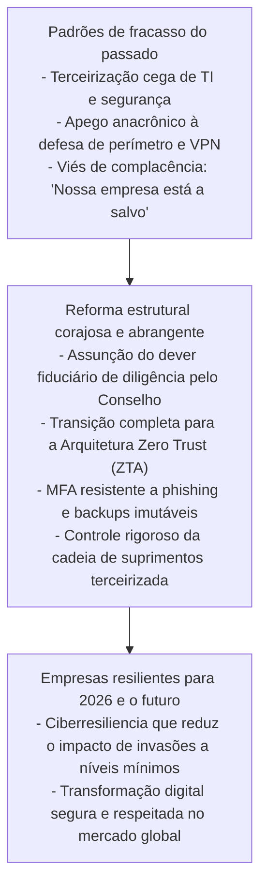

A segurança da informação não é um estorvo à inovação ou à produtividade corporativa. No dinamismo de um mercado digitalizado, ela equivale **«aos freios de alto desempenho de um carro de corrida de ponta»**. Somente os veículos dotados dos freios mais refinados do mundo podem acelerar ao extremo nas retas e contornar as curvas mais perigosas com segurança e velocidade.

Da mesma forma como as corporações japonesas conquistaram prestígio global ao forjar produtos manufaturados com um rigor de qualidade inquebrantável, impõe-se agora consagrar o compromisso supremo de **«jamais trair a confiança de seus clientes, de seus funcionários e da sociedade»**. Somente as organizações dispostas a promover a modernização profunda de suas arquiteturas tecnológicas e a refundação de suas estruturas de governança superarão as tempestades cibernéticas de 2026 e prosperarão como protagonistas da nova economia digital global.
