## Введение: Тревожный набат 2026 года —— Национальный кризис Японии как «отстающей в безопасности державы»

С середины 2020-х годов и по сей день, в 2026 году, японское киберпространство сотрясают штормы невиданной доселе разрушительной силы.

Долгое время в деловых кругах Японии царил безосновательный «миф об абсолютной безопасности». Самоуспокоительные иллюзии вроде: «Наша компания — не транснациональный гигант, мы никому не интересны», «Японский языковой барьер служит естественной крепостной стеной от международных киберпреступников» или «Мы установили антивирус от именитого вендора, значит, мы под надежной защитой» — всё это сегодня разбито вдребезги.

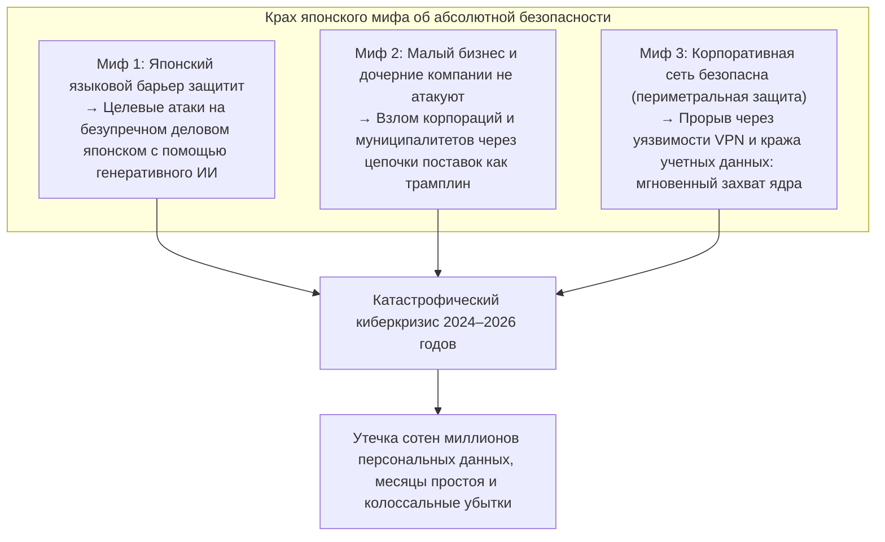

Действительность оказалась беспощадной. Медиагиганты, мегабанки, телекоммуникационные операторы, компании критической инфраструктуры и даже информационные системы префектур и муниципалитетов — одно за другим известнейшие имена капитулировали перед программами-вымогателями (ransomware) или допустили утечку десятков миллионов записей конфиденциальных сведений в теневой сегмент интернета (Dark Web).

Характер скомпрометированных данных давно вышел за рамки банальных имен, адресов и телефонных номеров. Номера банковских карт, подробные результаты медицинских осмотров, государственные идентификаторы My Number, закрытые коммерческие контракты, дампы внутренних корпоративных мессенджеров и отсканированные копии водительских удостоверений сотрудников — информация, от которой напрямую зависят общественное доверие и человеческое достоинство, оказалась захвачена международными преступными синдикатами в качестве заложника и выставлена на подпольные аукционы.

Каждый раз при возникновении очередного ЧП разыгрывается привычный ритуал: пресс-конференции с глубокими поклонами топ-менеджеров и заученными фразами вроде «причины инцидента выясняются» и «мы усилим обучение сотрудников основам информационной безопасности».

Однако пора задать бескомпромиссный вопрос: **почему, несмотря на астрономические инвестиции в IT и регулярные тренинги персонала, волна утечек конфиденциальных данных и сокрушительных кибератак в японских корпорациях не только не спадает, но и нарастает?**

Коренная причина кроется вовсе не в оплошности рядового служащего, который «кликнул по подозрительной ссылке в письме». Это неизбежный системный крах, вызванный гремучей смесью **«структурной патологии слепого IT-аутсорсинга и многоярусного субподряда»**, копившейся десятилетиями, **«слепой веры в безнадежно устаревшую периметральную модель обороны (крепость и ров)»**, **«деградации систем идентификации и аутентификации»** в ходе спонтанной миграции в облака и **«полного паралича корпоративного управления в советах директоров, которые упорно воспринимают кибербезопасность как статью расходов, подлежащую урезанию, а не как ключевую стратегическую инвестицию»**.

Данный аналитический доклад подготовлен с позиций CISO (директора по информационной безопасности) высшей квалификации и аналитика киберугроз. Его цель — провести глубокое техническое вскрытие резонансных инцидентов 2024–2026 годов, обнажить системные болезни японского корпоративного мира и предоставить исчерпывающую, бескомпромиссную систему защиты: от **полного развертывания архитектуры Zero Trust (ZTA)** на основе парадигмы гарантированного взлома (Assume Breach) и жесткого контроля цепочек поставок до внедрения устойчивой к фишингу аутентификации (Phishing-Resistant MFA) и неизменяемых резервных копий (Immutable Backup), обеспечивающих реальную киберрезильентность бизнеса.

---

## Глава 1: Анатомия ключевых инцидентов в японских корпорациях (2024–2026 годы)

Чтобы осознать подлинный масштаб угрозы, стоящей перед японским бизнесом, необходимо беспристрастно и на базе строгих технических фактов разобрать цепочки атак (Kill Chain) самых знаковых инцидентов последних лет.

### 1.1 Уроки дела KADOKAWA / Niconico: Уничтожение дата-центра и программа-вымогатель BlackSuit

Кибератака, совершенная в июне 2024 года на медиахолдинг KADOKAWA и его дочернюю цифровую компанию Dwango, стала поворотным моментом во всей истории корпоративной информационной безопасности Японии.

Нападение осуществила группировка **«BlackSuit»**, считающаяся экспертами прямым наследником печально известного синдиката Conti. В результате атаки флагманский японский видеохостинг *Niconico Douga* и множество сопутствующих веб-сервисов компании были мгновенно парализованы. Коллапс охватил издательскую логистику, бухгалтерский учет и ключевые административные операции, растянувшись на долгие месяцы. Более того, в Dark Web было опубликовано свыше 250 000 конфиденциальных документов, включая персональные данные сотрудников, контракты с авторами контента и закрытую переписку.

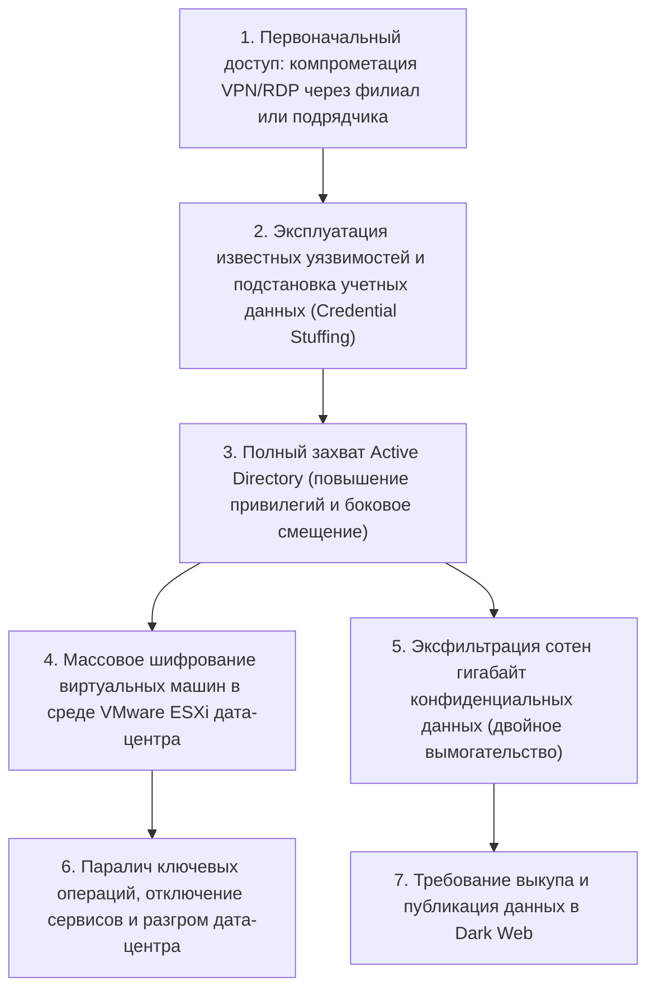

Главным шоком для японского IT-сообщества стало то, что **«собственное частное облако (локальная инфраструктура виртуализации) было разрушено до самого основания»**.

Злоумышленники не штурмовали центральную сеть штаб-квартиры в лоб. Точкой входа послужил внешний шлюз удаленного доступа (VPN-устройства и протокол RDP) одной из дочерних фирм и субподрядной организации. Закрепившись за внешним периметром, атакующие воспользовались «плоской» (лишенной внутренней сегментации) топологией корпоративной сети для стремительного бокового перемещения (Lateral Movement). Их финальной целью стал **захват учетной записи Администратора домена (Domain Admin) на контроллерах Active Directory** — командного центра всей корпорации.

Получив абсолютную власть над доменом, операторы BlackSuit не стали размениваться на шифрование отдельных пользовательских ПК: они подключились напрямую к гипервизорам VMware ESXi, на которых базировалась виртуальная инфраструктура, и запустили высокоскоростное массовое шифрование файлов образов виртуальных дисков (VMDK-файлов) в хранилищах данных (datastores). И в довершение разгрома, **все резервные копии, находившиеся в онлайновом доступе в той же сети, были хладнокровно найдены и уничтожены**.

Этот инцидент наглядно продемонстрировал советам директоров по всей стране: концепция периметральной защиты мертва — если враг перешагнул порог сети, даже колоссальный дата-центр превращается в руины за считанные часы.

### 1.2 Кризис LINE Yahoo и общая платформа с NAVER: Провал трансграничного контроля подрядчиков

Инцидент с масштабной утечкой персональных данных в корпорации LINE Yahoo, вскрывшийся осенью 2023 года и вылившийся в беспрецедентную серию административных предписаний со стороны Министерства внутренних дел и коммуникаций Японии (MIC) в 2024–2026 годах, высветил **«колоссальное слепое пятно в управлении безопасностью, порожденное сложными акционерными связями и трансграничным аутсорсингом»**.

Компрометация затронула около 510 000 учетных записей пользователей, партнеров и персонала. Источником катастрофы послужила облачная среда южнокорейской корпорации NAVER, исторического материнского холдинга LINE.

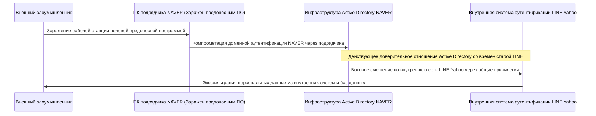

Техническая суть уязвимости заключалась в том, что **«между старой LINE и NAVER продолжала действовать оставленная без должного разграничения общая инфраструктура аутентификации Active Directory с взаимным безоговорочным доверием»**.

После того как персональный компьютер одного из субподрядчиков NAVER в Южной Корее был заражен вредоносным софтом, злоумышленники проникли во внутреннюю сеть корейской компании. Оттуда, злоупотребляя трансграничным трастом доменных служб, они без малейшего сопротивления шагнули во внутренние базы данных и продуктивные системы LINE Yahoo в Японии.

Данный прецедент раскрыл глаза на смертельную опасность стратегий «глобального разделения труда» и «офшорного субподряда». **Беспечное объединение сетей и систем аутентификации по принципу \'это же компании нашей группы\' или \'это наша материнская структура\' несет колоссальный риск**. Вмешательство регулятора, потребовавшего пересмотра структуры капитала и полного разрыва общих платформ идентификации, подтвердило: контроль безопасности цепочек поставок превратился в вопрос цифрового суверенитета и национальной безопасности.

### 1.3 Цепное разрушение цепочек поставок в муниципалитетах и BPO (Кейс Iseto и партнеров)

Начиная с 2024 года волна паники охватила органы местного самоуправления, банковские учреждения и коммунальные службы по всей Японии из-за **атак программ-вымогателей на крупнейших операторов BPO (аутсорсинг бизнес-процессов) и специализированные полиграфические центры (включая компанию Iseto и ряд других)**.

Муниципальные власти традиционно передают через тендерные закупки сторонним типографиям и сервисным центрам BPO рутинные задачи по печати, упаковке и рассылке конфиденциальных документов: уведомлений о начислении местных налогов, полисов государственного медицинского страхования, пенсионных расчетов и избирательных бюллетеней. Реализация таких контрактов требует передачи терабайтов баз данных, содержащих имена, паспортные данные, номера My Number и финансовые сведения миллионов жителей.

Киберпреступники не стали тратить силы на штурм неприступных правительственных сетей (защищенных концепцией трех рубежей и изолированной сетью LGWAN). Они нанесли удар по самому уязвимому звену: **инфраструктуре субподрядчиков, обрабатывавших доверенные им государственные данные**.

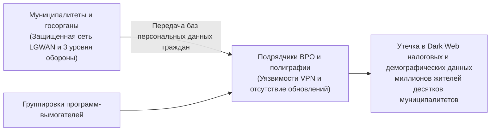

В результате заражения сетей подрядчиков шифровальщиками пострадали не только их собственные рабочие файлы — базы данных жителей десятков городов и префектур были зашифрованы и утекли в руки вымогателей для шантажа на теневых ресурсах.

Жестокий урок этого инцидента неоспорим: **«Сколько бы сотен миллионов иен заказчик ни вкладывал в защиту центрального периметра, если уровень кибербезопасности подрядчика низок, вся цепочка развалится в мгновение ока»**. Привычка закрывать глаза на реальное положение дел, ограничиваясь формальной подписью соглашений о конфиденциальности на бумаге, привела к катастрофическим последствиям.

### 1.4 Ошибки в настройках облачных сервисов (Salesforce/AWS/Azure): Трагедия открытых сейфов

Утечки данных происходят не только из-за изощренных хакерских взломов. В 2026 году львиная доля инцидентов в Японии по-прежнему вызвана банальными **«ошибками конфигурирования публичных облачных сервисов (Cloud Misconfiguration)»**.

Хрестоматийным примером для японских инвестиционных компаний, страховых гигантов, маркетплейсов и министерств стала **утечка клиентских досье из CRM-системы Salesforce**.

Платформа Salesforce предоставляет механизмы создания «сообществ» и внешних порталов. Однако из-за непонимания администраторами правил разграничения доступа (Sharing Rules) и ошибок при настройке гостевого профиля (Guest User Access) гигантские клиентские реестры с именами, телефонами, номерами счетов и историей транзакций **годами находились в состоянии, когда любой интернет-пользователь мог свободно просматривать, искать и выгружать их без какой-либо авторизации**.

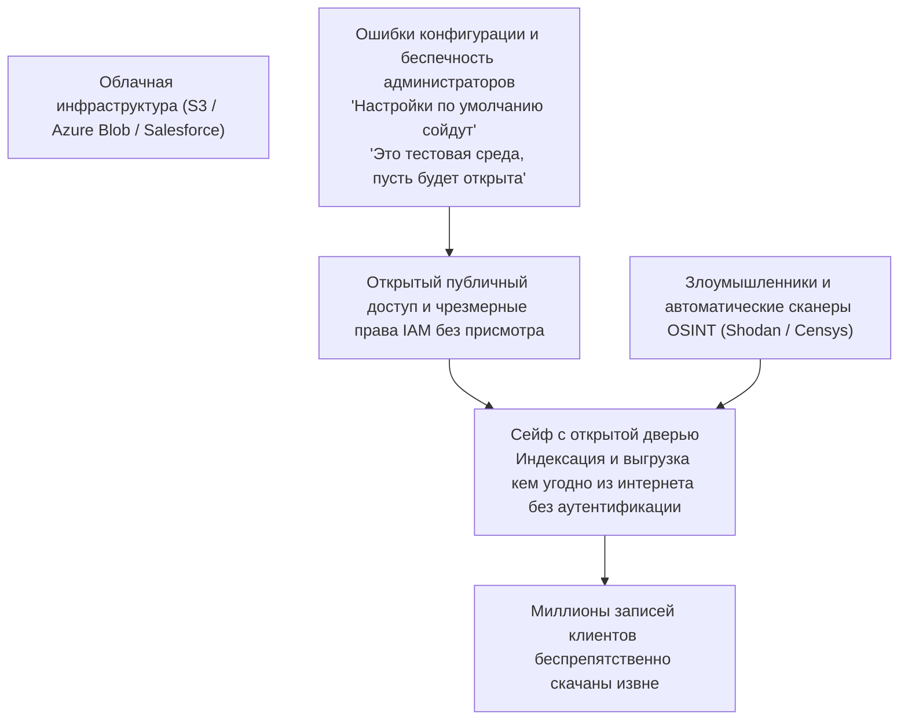

Точно такие же сценарии регулярно разворачиваются с незащищенными бакетами Amazon Web Services (AWS) S3 с глобальным публичным доступом, некорректно настроенными контейнерами Microsoft Azure Blob Storage или случайной публикацией ключей API и секретов инфраструктуры разработчиками в публичных репозиториях GitHub.

Без всяких уязвимостей нулевого дня реальность облачной эксплуатации в Японии выглядела так: **компании собственными руками распахивали дверцы сейфов с данными и выставляли их напоказ всему миру**.

---

## Глава 2: Системные и организационные патологии (Слепой аутсорсинг и каскадный субподряд)

Почему, несмотря на очевидность угроз, японские предприятия оказываются неспособны предотвратить катастрофы? В этой главе мы исследуем глубинные институциональные пороки японской деловой среды.

### 2.1 Игнорирование IT советами директоров и превращение CISO в декоративную фигуру

Критическая уязвимость японской корпоративной киберзащиты кроется не в таблицах маршрутизации межсетевых экранов. Она находится **«в зале заседаний совета директоров»**.

В ведущих мировых компаниях информационные технологии и кибербезопасность признаны ключевым фактором выживания и стратегической конкурентоспособности. CISO подчиняется напрямую генеральному директору (CEO), распоряжается мощным бюджетом и наделен абсолютным правом вето (Veto Power), позволяющим экстренно остановить любой бизнес-процесс или сервис, если уровень киберриска признан критическим.

Напротив, в подавляющем большинстве японских компаний IT-департамент исторически воспринимается как второсортное сервисное подразделение и «центр затрат, не приносящий ни иены прибыли».
- В составах советов директоров практически отсутствуют люди с техническим бэкграундом. Должность CISO чаще всего поручается в качестве необязательной общественной нагрузки престарелому топ-менеджеру гуманитарного профиля, совмещающему ее с руководством общим отделом или юридической службой.
- Когда специалисты по безопасности бьют тревогу и докладывают о наличии критических уязвимостей в пограничных VPN-устройствах, требуя бюджета на модернизацию и согласования планового простоя систем, руководство отвечает отказом: «В этом квартале слабая отчетность, отложите до следующего года» или «Останавливать производство ради профилактики недопустимо».

В итоге CISO в Японии низведен до статуса **«козла отпущения (Scapegoat), не имеющего ни бюджета, ни реальных полномочий, чья единственная обязанность — кланяться перед телекамерами, когда грянет гром»**. Эта недальновидность правления, стремящегося урезать затраты на информационную безопасность до последнего иены вместо восприятия ее как неотъемлемой инвестиции в устойчивость бизнеса, и породила общенациональный кризис.

### 2.2 Многоуровневый субподряд и закон «слабейшего звена»

Самой застарелой болезнью IT-индустрии Японии является **«пирамидальная структура многоярусного субподряда (модель генеральных IT-подрядчиков)»**, перенесенная из строительного сектора.

Компания-заказчик предпочитает «сбросить с себя всю головную боль» (подход «марунагэ»), отдавая проектирование, разработку, эксплуатацию и защиту главному системному интегратору (Prime SIer). Тот, в свою очередь, почти не выполняет работу собственными силами: сняв львиную долю посреднической маржи, он спускает контракт подрядчикам второго уровня, те — третьего, а внизу пирамиды оказываются исполнители четвертого и пятого эшелонов — микроскопические фирмы и фрилансеры.

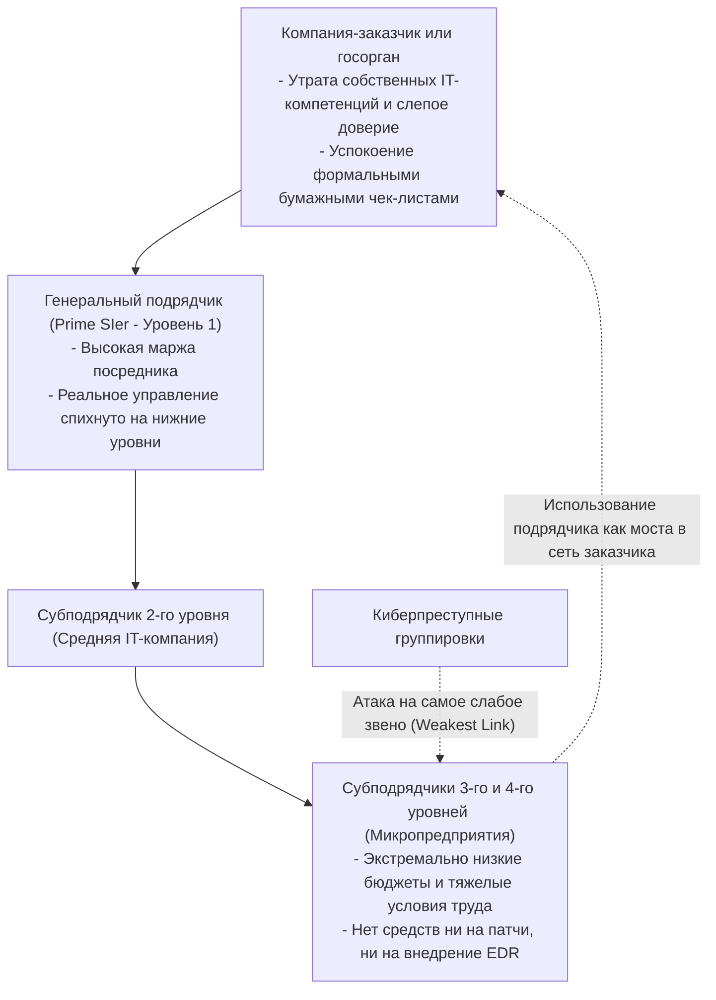

В прикладной криптографии и теории надежности существует незыблемый закон: **«Прочность цепи определяется прочностью ее самого слабого звена (The Weakest Link)»**.

Какими бы первоклассными межсетевыми экранами ни обладал генеральный интегратор и какие бы строгие регламенты ни были написаны на бумаге, у субподрядчиков третьего и четвертого уровней нет ни бюджета на лицензии современных систем EDR (Endpoint Detection and Response), ни ресурсов на круглосуточный мониторинг через профессиональный SOC.
- На рабочих местах в этих компаниях нередко используются устаревшие домашние ноутбуки без обновлений безопасности (BYOD), а пароли администраторов записываются на стикерах, приклеенных к мониторам.
- При этом для выполнения порученных задач этим незащищенным рабочим станциям выдаются привилегированные учетные записи с прямым удаленным доступом к производственным базам данных и серверам заказчика.

Для атакующих это идеальная мишень. Зачем штурмовать неприступный парадный вход, если можно заразить простейшим трояном ноутбук субподрядчика на дне цепочки, забрать легитимные учетные данные и войти в святилище корпоративной сети заказчика **«с парадного входа под видом полномочного системного инженера»**.

### 2.3 Тупик традиционной системы найма и структурный кадровый голод

Кадровый аспект кризиса носит не менее разрушительный характер.

Государственные отчеты министерства экономики (METI) и агентства IPA годами констатируют дефицит сотен тысяч специалистов по информационной безопасности в Японии. Однако корень проблемы заключается не в демографии, а **в институциональной неспособности традиционной японской модели найма адекватно оценивать и оплачивать труд технических специалистов экстра-класса**.

В США, Израиле и Сингапуре годовой доход ведущих архитекторов киберзащиты, реверс-инженеров и этичных хакеров (пентестеров) стабильно превышает 200 000–400 000 долларов, а сами они признаются стратегической элитой бизнеса.

В консервативных японских корпорациях, держащихся за систему пожизненного найма и тарифные сетки по выслуге лет, инженеры низведены до низшей ступени служебной иерархии:
- Зарплатные сетки едины: молодой инженер, способный предотвратить сложнейшую атаку, получает ровно столько же, сколько его сверстник на рутинной бумажной работе в канцелярии.
- Единственный путь служебного роста — административный менеджмент (позиции начальника сектора или отдела). Если технический специалист хочет получать достойные деньги, он обязан бросить консоль, прекратить анализ кода и трафика и заняться согласованием бюджетов и составлением отчетов в Excel.

В итоге наиболее одаренные специалисты массово уходят в иностранные корпорации и динамичные технологические стартапы. В IT-отделах традиционных корпораций не остается практиков, способных своими руками детектировать и ликвидировать атаку. Там остаются лишь «координаторы», пересылающие письма между правлением и подрядчиками. Этот интеллектуальный вакуум парализует первичное реагирование на инциденты, превращая локальное заражение в полномасштабный коллапс.

---

## Глава 3: Технологический крах (Падение периметра и ловушка Active Directory)

В дополнение к системным дефектам управления, сама архитектура корпоративных IT-систем в Японии отягощена моральным устареванием, которое атакующие используют с максимальной эффективностью.

### 3.1 Реальность черных ходов: Шлюзы VPN и протоколы удаленного рабочего стола

С наступлением эпохи удаленной работы во время пандемии японский бизнес избрал путь наименьшего сопротивления: массовую установку шлюзов SSL-VPN (оборудование Fortinet, Pulse Secure / Ivanti и др.) на границах корпоративных сетей для создания зашифрованных туннелей из домов сотрудников.

Это решение обернулось **главной ахиллесовой пятой и распахнутым черным ходом японской информационной безопасности**.

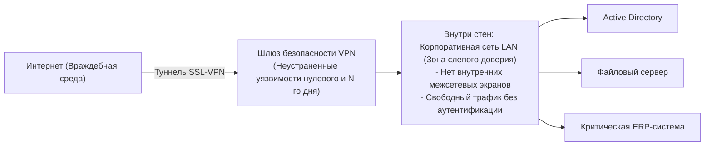

VPN-концентратор — это физическое устройство, непосредственно выставленное во враждебную внешнюю среду интернета. Естественно, что киберпреступники и проправительственные хакерские группировки ведут непрерывную охоту за уязвимостями в этих шлюзах.
- В период с 2023 по 2026 год в оборудовании Ivanti и Fortinet были выявлены критические уязвимости (с максимальными баллами CVSS 9.0–10.0), позволявшие удаленно обходить аутентификацию и исполнять произвольный код.
- Несмотря на экстренный выпуск патчей производителями, сотни японских предприятий откладывали их установку на недели и месяцы под предлогом того, что «перезагрузка нарушит непрерывность рабочих процессов».

Используя общедоступные поисковые системы вроде Shodan и Censys, злоумышленники автоматически сканируют сеть в поисках непропатченных устройств. Проэксплуатировав брешь, они снимают дамп оперативной памяти шлюза, извлекая учетные данные, открытые пароли и активные токены сессий, **после чего проникают во внутреннюю сеть под видом авторизованных сотрудников**.

### 3.2 Крах мифа о безопасности внутренней сети (Периметральная модель)

После преодоления VPN-шлюза смертельный удар организации наносит архаичная концепция **«периметральной защиты (модель замка и крепостного рва)»**.

Эта парадигма базируется на наивном допущении: «внешний интернет враждебен и опасен, но всё, что находится внутри периметра за межсетевым экраном (корпоративная сеть LAN), безопасно и заслуживает безусловного доверия».

Корпоративные сети, построенные на этой догме, отличаются катастрофической **«плоской»** топологией:
- Любой компьютер в сети может свободно взаимодействовать с любыми другими рабочими станциями, сетевыми накопителями, принтерами и базами данных в той же подсети без повторной аутентификации и без сквозного шифрования.
- Внутренний трафик между узлами локальной сети вообще не фильтруется и не анализируется межсетевыми экранами.

Ситуация абсолютно аналогична средневековой крепости: с внешней стороны возведены гранитные стены, но **«стоит вражескому шпиону проникнуть через ворота, как все двери арсенала, сокровищницы и амбаров оказываются распахнутыми настежь»**. Периметральная модель бессильна остановить горизонтальное перемещение (Lateral Movement), когда атакующий, захватив один рядовой ПК, беспрепятственно подчиняет себе всю инфраструктуру.

### 3.3 Разрастание Active Directory и крах управления привилегиями

В корпоративных Windows-инфраструктурах главной единой точкой отказа (SPOF) и вожделенным Граалем для атакующих является служба каталогов **Microsoft Active Directory (AD)**.

Свыше 90% японских компаний используют Active Directory для управления компьютерами, пользователями, политиками безопасности и правами доступа. Однако реальное состояние этих систем часто катастрофично:
- Домены и леса AD, развернутые 15–20 лет назад, подвергались бессистемным перестройкам и превратились в неуправляемые черные ящики.
- Тысячи забытых учетных записей уволенных сотрудников, служебных аккаунтов от списанных серверов и временных доступов годами висят активными.
- Самый вопиющий порок: **бесконтрольное использование и раздача привилегий Администратора домена (Domain Admin)**. Ради удобства инженеры техподдержки и сторонние интеграторы раздают полные административные права рядовым ПК или используют один и тот же суперпароль на сотнях серверов.

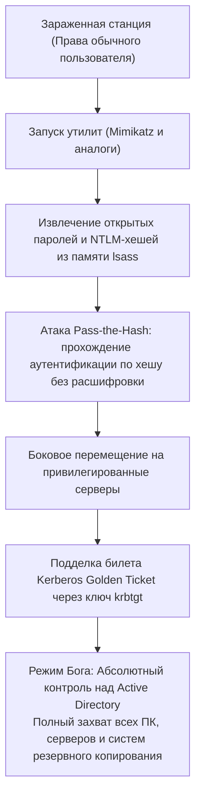

Оказавшись на любой рабочей станции, злоумышленники запускают инструменты вроде `Mimikatz` и выгружают NTLM-хеши и билеты Kerberos из памяти системного процесса авторизации Windows (`lsass.exe`).

Хакеру даже не требуется взламывать сам пароль: с помощью техник **«Pass-the-Hash»** или сгенерировав поддельный всемогущий билет **«Golden Ticket»** (скомпрометировав хэш служебной учетной записи `krbtgt`), атакующий моментально повышает свои полномочия до Администратора домена. В этот момент он получает абсолютную власть над всей IT-инфраструктурой предприятия. Достаточно создать групповую политику (GPO) — и программа-вымогатель будет синхронно разослана и запущена на десятках тысяч рабочих станций и серверов за считанные минуты.

### 3.4 Обратная сторона облачной трансформации: Теневые IT и избыточные роли IAM

Перенос рабочих нагрузок в публичные облака (AWS, Azure, Google Cloud) породил новые уязвимости критического уровня:

1. **Теневые IT и неконтролируемые облачные среды**:
   Бизнес-подразделения и команды разработчиков, устав от бюрократии внутреннего IT-отдела, заводят собственные облачные подписки по корпоративным кредитным картам. Эти ресурсы остаются вне зоны видимости служб информационной безопасности, не защищены мониторингом и часто торчат наружу с открытыми портами.
2. **Роли IAM с гипертрофированными привилегиями (Over-Privileged IAM Roles)**:
   При настройке систем управления идентификацией и доступом (IAM) инженеры пренебрегают принципом наименьших привилегий (Principle of Least Privilege). Из лени или страха сломать сервис виртуальным машинам и бессерверным функциям назначаются всеобъемлющие политики вроде `AdministratorAccess`.
   В результате малейшая уязвимость типа SQL-инъекции или SSRF (Server-Side Request Forgery) в скромном веб-сервисе позволяет злоумышленнику перехватить временные токены метаданных и получить неограниченный контроль над всеми облачными хранилищами, базами данных и виртуальными серверами компании.

---

## Глава 4: Человеческий фактор и эволюция современных векторов атак

Наряду с архитектурными пробоинами, методы психологической манипуляции и атаки на уязвимости человеческой природы вышли на принципиально иной уровень благодаря генеративному искусственному интеллекту.

### 4.1 Высокоточный целевой фишинг и дипфейки в эпоху генеративного ИИ

Раньше фишинговые письма можно было легко распознать по корявому японскому тексту: неестественным падежным частицам, ошибкам машинного перевода и неуклюжим формам вежливости (кэйго).

С появлением **больших языковых моделей (LLM)** этот защитный барьер пал окончательно.

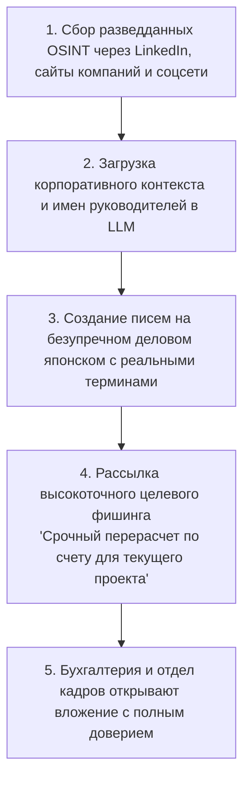

Злоумышленники собирают сведения о структуре компании, именах руководителей и актуальных проектах через LinkedIn, пресс-релизы и социальные сети. Передавая эти вводные нейросетям, они генерируют целевые письма на **изящном, естественном деловом японском языке, неотличимом от реальной служебной переписки**.

Ещё более опасным оружием стали **дипфейки (голосовая и видеоподделка)**:
- В международных и японских компаниях уже зафиксированы многомиллионные инциденты мошенничества, когда финансовые директора получали телефонные звонки, где голос генерального директора был безукоризненно клонирован ИИ. Под предлогом сверхсекретной сделки по слиянию финансистам приказывали срочно перевести миллионы долларов на подставные счета.
- Противопоставлять атакам, взламывающим базовые органы чувств человека, призывы «быть внимательнее» — верх профессиональной некомпетентности.

### 4.2 Перехват сессий и экспансия инфостилеров (Infostealers)

Огромная часть усилий японских компаний по внедрению традиционной двухфакторной аутентификации (2FA / MFA) оказалась сведена на нет взрывным распространением **вредоносного ПО для кражи данных (инфостилеров)**.

Семейства зловредов вроде RedLine, Raccoon и Lumma распространяются через взломанный софт, поддельные инсталляторы или целевые рассылки среди сотрудников и субподрядчиков.

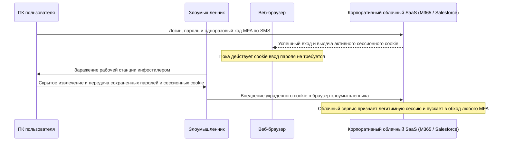

Цель инфостилера — не шифрование файлов, а хищение информации из баз данных браузеров (Chrome, Edge): **сохраненных паролей и, что самое главное, активных сессионных cookie-файлов**.

После того как легитимный пользователь успешно прошел проверку по паролю и одноразовому SMS-коду, облачный сервис выдает сессионный cookie, который сохраняется на компьютере. Перехватив этот файл и внедрив его в свой браузер (Cookie Hijacking), **атакующий входит в корпоративные сервисы напрямую от имени жертвы, не зная пароля и без повторного запроса MFA**.

Сегодня на теневых форумах миллионы валидных сессионных файлов японских компаний продаются за копейки, позволяя хакерам входить в закрытые системы буквально через парадный вход.

### 4.3 Внутренние угрозы: Хищения данных увольняющимися и подрядчиками

Опасность подстерегает не только извне. Данные Японской ассоциации сетевой безопасности (JNSA) показывают, что значительную долю инцидентов составляют **«неправомерные действия инсайдеров (действующих сотрудников, увольняющихся специалистов и внешнего обслуживающего персонала)»**.

- **Рост мобильности кадров и унос данных**:
  В условиях размывания системы пожизненного найма переходящие к конкурентам разработчики и менеджеры по продажам зачастую ошибочно считают результаты своего труда личной собственностью, выгружая клиентские базы, чертежи и исходные коды на личные USB-накопители или в личные облачные диски (Google Drive, Dropbox).
- **Злоупотребления привилегированных внешних инженеров**:
  Специалисты подрядных организаций, обслуживающие базы данных и испытывающие финансовые затруднения, похищают сотни тысяч записей клиентов для перепродажи черным брокерам данных.

Большинство японских компаний функционируют на основе доктрины «врожденной добропорядочности человека (Сэйдзэнсэцу)», игнорируя внедрение систем DLP (предотвращение утечек данных) и UEBA (поведенческий анализ действий пользователей). Хищения вскрываются спустя месяцы или годы, когда информация всплывает в ходе полицейских расследований или в линейке продукции прямых конкурентов.

---

## Глава 5: Практическая дорожная карта полного перехода на архитектуру Zero Trust (ZTA)

Перед лицом столь комплексного спектра угроз единственный путь выживания для японского бизнеса — полный отказ от периметральной обороны и безоговорочный переход к **«Архитектуре нулевого доверия (Zero Trust Architecture: ZTA)»**.

### 5.1 Сущность концепции Zero Trust: «Never Trust, Always Verify»

Zero Trust — это не конкретная утилита, а **«фундаментальный сдвиг ментальной парадигмы безопасности»**, зафиксированный в стандарте Национального института стандартов и технологий США **NIST SP 800-207**.

> **Три фундаментальных принципа Zero Trust**:
> 1. **Никогда не доверяй, всегда проверяй (Never Trust, Always Verify)**:
>    Никакое сетевое соединение, устройство или пользователь не признаются безопасными по умолчанию, будь то ноутбук в кабинете президента или терминал в публичном кафе. Любой запрос проверяется со всей строгостью как потенциально враждебный.
> 2. **Принцип наименьших привилегий (Grant Least Privilege Access)**:
>    Пользователю или системе предоставляется строго минимальный набор полномочий, достаточный для выполнения текущей задачи, и строго на необходимый промежуток времени (Just-In-Time).
> 3. **Презумпция компрометации (Assume Breach)**:
>    Инфраструктура проектируется исходя из аксиомы, что внешний контур уже взломан, а противник уже находится внутри, поэтому главный фокус направлен на изоляцию систем (минимизацию радиуса поражения) и мгновенную локализацию угроз.

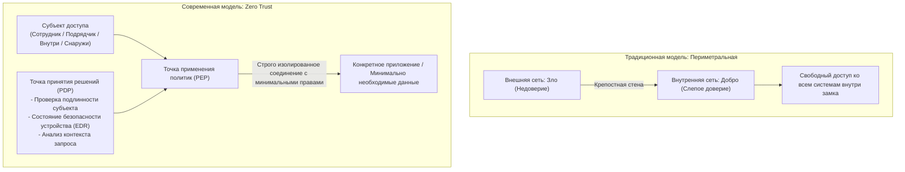

### 5.2 Полный демонтаж VPN и переход на ZTNA

Первым стратегическим шагом внедрения Zero Trust должна стать **«полная ликвидация VPN-концентраторов»** и замена их на технологию **«ZTNA (Zero Trust Network Access)»**.

Принципиальная разница между ними заключается в объекте подключения:
- **Классический VPN**: После авторизации устройство физически подключается ко всей корпоративной подсети на сетевом уровне (Layer 3). Компьютер получает видимость всех серверов, и в случае его заражения зловред беспрепятственно распространяется по компании.
- **ZTNA**: Устройство никогда не подключается к внутренней сети. Облачный брокер непрерывно валидирует личность пользователя и параметры безопасности рабочей станции, **«устанавливая изолированный туннель исключительно к одному конкретному веб-приложению или порту»**. Топология корпоративной сети и внутренние IP-адреса остаются абсолютно невидимыми для устройства, что физически исключает возможность бокового перемещения.

### 5.3 Интегрированная архитектура SASE и SSE

Практическим воплощением концепции Zero Trust выступает конвергентная платформа **«SASE (Secure Access Service Edge)»**, предложенная Gartner, и ее ядро информационной безопасности **«SSE (Security Service Edge)»**.

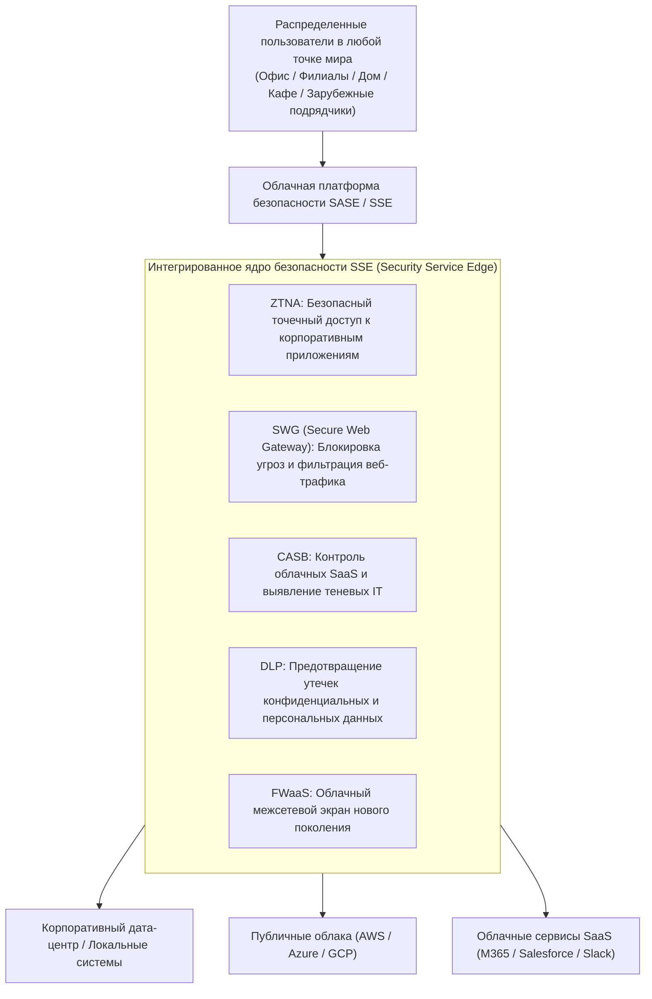

В модели SASE весь трафик пользователей — из штаб-квартиры, из дома или с производственной площадки зарубежного партнера — направляется через глобальную облачную платформу безопасности:
- **SWG (шлюз веб-безопасности)** блокирует фишинговые сайты и инспектирует зашифрованный TLS-трафик.
- **CASB (брокер безопасности облачного доступа)** отслеживает активность в сторонних облачных сервисах и блокирует теневые IT.
- **DLP (система предотвращения утечек)** на лету перехватывает передачи конфиденциальных документов и номеров кредитных карт.
- **ZTNA** обеспечивает безопасный маршрут к корпоративным серверам.

Это устраняет необходимость закупки и сопровождения сотен локальных VPN-маршрутизаторов, обеспечивая единый стандарт безопасности в масштабах всего мира.

### 5.4 Микросегментация как барьер против латерального движения

Поскольку ни одна система не может гарантировать нулевую вероятность заражения конечной станции, решающим барьером становится **«Микросегментация (Micro-Segmentation)»**.

Она ликвидирует деление сетей на громоздкие общие сегменты (VLAN), устанавливая микропериметры безопасности **«на уровне каждого отдельного сервера, каждой виртуальной машины и каждого контейнера»**.

- Например, сервер бухгалтерии будет принимать входящие запросы исключительно с проверенных компьютеров финансового отдела по строго заданным криптографическим портам, отвергая любые другие попытки связи (включая ICMP ping) от разработчиков или офисных сотрудников.
- Трафик между серверами внутри одного серверного шкафа блокируется по умолчанию, если он не разрешен белым списком служебных политик.

Если один компьютер окажется поражен шифровальщиком, стальные заслонки микросегментации мгновенно захлопнутся, **заперев угрозу внутри изолированного узла и защитив остальную инфраструктуру компании от заражения**.

---

## Глава 6: Укрепление систем идентификации и аутентификации (IAM/PAM)

В концепции Zero Trust новой крепостной стеной становится не сетевой кабель, а **«Идентичность (Identity and Access Management)»**. Когда физический периметр исчез, именно механизмы проверки подлинности пользователя принимают на себя весь груз обороны.

### 6.1 Безоговорочное внедрение устойчивой к фишингу MFA на базе FIDO2 / Passkeys

Первоочередная мера — беспощадный отказ от устаревших методов многофакторной аутентификации: одноразовых паролей по SMS, кодов из писем и простых push-уведомлений на смартфон.

Ввиду легкости перехвата SMS-кодов обратными прокси-серверами (такими как Evilginx) и стилерами единственным надежным решением является **переход на устойчивую к фишингу аутентификацию (Phishing-Resistant MFA) на основе стандартов FIDO2 / WebAuthn (Passkeys)**.

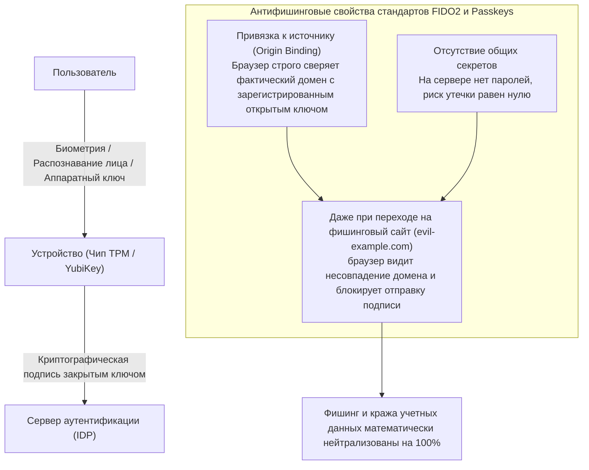

Криптографическая сила стандарта FIDO2 базируется на механизме **«привязки к источнику (Origin Binding)»**.
Даже если сотрудник попался на уловку и открыл сайт-двойник, браузер сверяет доменное имя (FQDN) и, обнаружив малейшее несовпадение с оригиналом, наотрез отказывается передавать цифровую подпись из аппаратного модуля TPM или ключа YubiKey.

Это делает перехват аутентификационных данных математически невозможным. Предприятия обязаны безотлагательно сделать FIDO2 стандартом де-факто, начав с системных администраторов и хранителей ключевой информации.

### 6.2 Модель эшелонирования (Tiering) в Active Directory и доступ Just-In-Time (JIT)

Для компаний, сохраняющих локальные среды Active Directory, ключевой методикой нейтрализации атак на привилегированные учетные записи служит **«Модель эшелонирования (Tiering Architecture)»** от Microsoft.

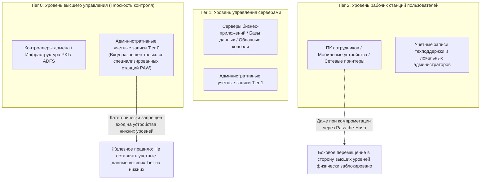

Главный закон модели эшелонирования гласит: **«Учетная запись с более высоким уровнем привилегий никогда не должна авторизовываться на узлах более низкого уровня, оставляя там учетные данные в памяти»**:
- **Tier 0 (Уровень ядра)**: Администраторы домена. Имеют доступ исключительно к контроллерам домена и сервисам идентификации. Их авторизация на рядовых ПК (Tier 2) или файловых серверах (Tier 1) строго запрещена. Работа ведется только с защищенных изолированных станций привилегированного доступа (PAW: Privileged Access Workstations).
- **Tier 1 (Уровень серверов)**: Администрирование производственных серверов и баз данных.
- **Tier 2 (Уровень клиентов)**: Обслуживание рабочих станций и оргтехники.

Кроме того, необходимо искоренить практику постоянных привилегий (Standing Privileges), внедрив модель **«Just-In-Time (JIT) доступа»**. Администраторы работают с правами обычных пользователей и запрашивают временное повышение полномочий через систему согласований только на период регламентных работ с автоматическим отзывом прав через несколько часов.

### 6.3 Динамический условный доступ (Conditional Access)

Аутентификация не должна быть разовым статическим событием. В Zero Trust проверка легитимности сессии осуществляется **непрерывно на основе многофакторного анализа контекста**.

Механизмы условного доступа (Microsoft Entra ID Conditional Access, Okta) в реальном времени анализируют входящие телеметрические сигналы:
1. **Идентичность пользователя и его членство в группах**.
2. **Геолокация и IP-адрес**:
   - Автоматическая блокировка сессий при аномалиях «невозможного перемещения» (Impossible Travel), когда вход осуществляется с разницей в минуты из Токио и Европы.
3. **Состояние устройства (Device Compliance)**:
   - Проверка наличия и активности корпоративного агента EDR, включенного шифрования диска (BitLocker) и актуальности обновлений ОС.
4. **Поведенческий риск в реальном времени**:
   - Фиксация нетипичных массовых выгрузок файлов или ночной активности с немедленным принудительным запросом биометрии или сбросом сессии.

Если хотя бы один фактор не соответствует критериям безопасности, доступ пресекается немедленно, даже если пароль был введен без ошибок.

---

## Глава 7: Модель управления безопасностью цепочек поставок и подрядчиков

Организация не может чувствовать себя в безопасности, если черный ход ее субподрядчиков открыт настежь. Как выстроить эффективный контроль внешней экосистемы?

### 7.1 Полная инвентаризация подрядчиков и переход к объективному аудиту

Первым обязательным шагом является **«исчерпывающая инвентаризация и картирование всей цепочки поставок»**.

Большинство крупных заказчиков знают только своих прямых контрагентов (Tier 1), не имея понятия, какие субподрядчики третьего или четвертого эшелона работают с их данными.
- В контрактах должен быть прямо зафиксирован запрет на несанкционированную субподрядную передачу работ третьим лицам.
- Пора упразднить формальные бумажные опросники, заполняемые подрядчиками раз в год «для галочки».
- Необходим переход на платформы непрерывного скоринга киберрисков (Security Rating Services вроде BitSight или SecurityScorecard), которые непрерывно и объективно сканируют внешние IP-адреса и домены подрядчиков, выявляя открытые порты, устаревшие сертификаты и факты утечки паролей.

### 7.2 Полный запрет BYOD для внешних исполнителей и переход на Zero Trust VDI

Самый действенный способ пресечь утечки данных и занос вирусов через подрядчиков — следование принципу: **«на устройствах внешних специалистов не должно физически оставаться ни одного байта информации»**.

Использование личных ноутбуков (BYOD) или неконтролируемых устройств сторонних компаний для прямого доступа к корпоративным системам должно быть полностью запрещено.

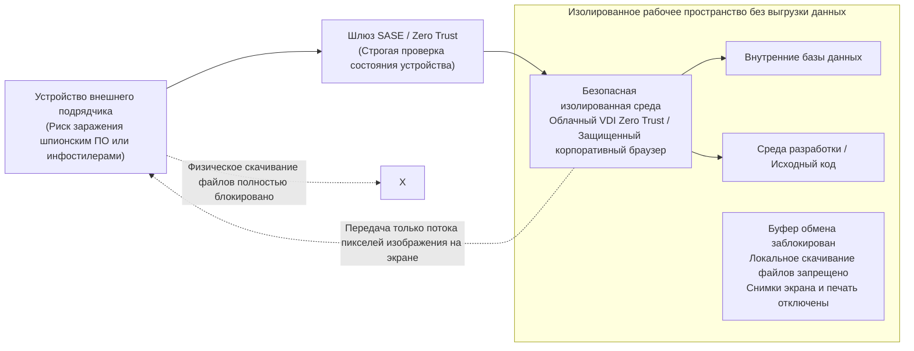

Вся работа внешних инженеров должна быть организована исключительно через **изолированные среды облачных VDI (DaaS) по стандартам Zero Trust** или защищенные корпоративные браузеры:
- На системном уровне блокируются функции сохранения файлов на локальный диск, общий буфер обмена (Copy-Paste), создание скриншотов и печать на принтерах.
- Внешний специалист видит на экране только транслируемый видеопоток пикселей. Даже если его компьютер заражен инфостилером, злоумышленники не смогут украсть корпоративные файлы или токены авторизации.

### 7.3 Контроль компонентов ПО (SBOM) и разграничение прав API-интеграций

В сфере заказной разработки программного обеспечения колоссальным источником скрытых рисков являются уязвимые библиотеки с открытым исходным кодом (яркие примеры — кризис Log4j и уязвимости популярных веб-фреймворков).

Заказчики должны требовать от вендоров обязательного предоставления **SBOM (Software Bill of Materials — спецификации программных компонентов)** с каждым релизом. Это позволяет мгновенно сверять зависимости со свежими базами уязвимостей (CVE) и принимать превентивные меры в течение минут после публикации эксплойтов нулевого дня.

Аналогично, при организации взаимодействия с внешними системами по API необходимо исключить бессрочные токены доступа, жестко закрепив использование стандарта OAuth 2.0 с минимальными областями видимости (scopes) и коротким временем жизни токенов (TTL).

---

## Глава 8: Киберрезильентность перед лицом вымогателей и деструктивных атак

В рамках концепции Zero Trust «Презумпция компрометации (Assume Breach)» последним рубежом обороны становится **«Киберрезильентность (способность к выживанию и быстрому восстановлению бизнеса)»**.

Остановить на 100% атаку высококлассных проправительственных хакеров невозможно. Истинное мерило устойчивости — способность бизнеса восстановить работу после сильнейшего удара.

### 8.1 Правило резервного копирования 3-2-1-1-0 и неизменяемые хранилища (Immutable Storage)

В современных кампаниях программ-вымогателей (BlackSuit, LockBit и др.) первоочередной целью преступников является не шифрование боевых баз данных, а **тотальное уничтожение резервных копий**. Если резервные копии целы, вымогательство теряет смысл.

Устаревшая практика выгрузки бэкапов на сетевые диски внутри общего домена полностью изжила себя. Если сервер резервного копирования входит в Active Directory, злоумышленник с правами Domain Admin уничтожит все архивы за несколько секунд.

Обязательным стандартом становится **правило резервного копирования 3-2-1-1-0**:

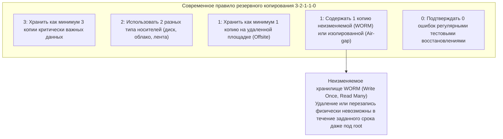

Главный элемент этой формулы — **«Неизменяемые резервные копии (Immutable Backup)»**.
Используя технологию **WORM (Write Once, Read Many)** и функции вроде S3 Object Lock в облаке или специализированные платформы (Veeam, Rubrik, Cohesity), данные аппаратно блокируются от изменений на заданный срок (например, 30 дней). **Ни администратор, ни оператор, ни взломщик с высшими правами доступа не могут удалить, перезаписать или зашифровать заблокированные блоки данных**.

Даже если рабочий дата-центр полностью разрушен, наличие неизменяемых изолированных копий позволяет руководству отвергнуть любые требования вымогателей и быстро поднять сервисы с чистого листа.

### 8.2 Полная изоляция домена управления резервным копированием

Непреложное архитектурное правило требует, чтобы **инфраструктура резервного копирования была полностью отрезана от корпоративного домена Active Directory**.

- Серверы бэкапа должны использовать полностью автономную систему локальной идентификации с обязательным аппаратным MFA.
- Консоли управления резервным копированием должны находиться в выделенной технологической сети (Out-of-Band), изолированной от общего доступа из офисной сети или интернета.

Только такая изоляция гарантирует, что даже полный захват контроллеров домена не приведет к потере резервного фонда компании.

### 8.3 Мгновенное реагирование с EDR/XDR и круглосуточный SOC (24/7/365)

В гонке между моментом проникновения и развертыванием шифровальщика решающими показателями являются **MTTD (среднее время обнаружения)** и **MTTR (среднее время реагирования)**.

В отличие от классических антивирусов (EPP), сверявших статические сигнатуры, современные комплексы **EDR (Endpoint Detection and Response)** и **XDR (Extended Detection and Response)** непрерывно отслеживают аномалии в поведении системных процессов.
- Зафиксировав подозрительную активность — например, выгрузку памяти `lsass.exe` через PowerShell или аномальное переименование сотен файлов ночью, — EDR реагирует за миллисекунды.
- Система моментально осуществляет **сетевую изоляцию зараженного компьютера на уровне NDIS-драйвера операционной системы**, лишая злоумышленников возможности развить атаку.

Поскольку хакеры намеренно наносят удары в праздничные дни и по ночам, дневной график дежурств бесполезен. Наличие **круглосуточного мониторинга в режиме 24/7/365 силами специализированного SOC (сервисов MDR)**, наделенного полномочиями немедленной изоляции узлов, — обязательное условие выживания компании.

---

## Глава 9: Трансформация корпоративного управления и законодательные императивы

Укрепление кибербезопасности не может быть завершено усилиями исключительно IT-специалистов. Это общекорпоративная задача, неразрывно связанная с юридической ответственностью совета директоров и стратегией развития компании.

### 9.1 Ужесточение закона о защите персональных данных (APPI) и финансовые риски

Вслед за жесткими международными регламентами вроде европейского GDPR, японское законодательство радикально усилило карательные механизмы.

После последних реформ **Закона о защите персональной информации (APPI)** при возникновении серьезных утечек **незамедлительное уведомление правительственной комиссии (PPC) и персональное оповещение пострадавших стали строгой законодательной обязанностью**.
- Максимальный штраф для юридических лиц увеличен до 100 миллионов иен.
- К этому добавляются риски масштабных коллективных исков со стороны клиентов и акционеров, а также прямые компенсационные выплаты пострадавшим, совокупный объем которых при утечке миллионов записей исчисляется десятками миллиардов иен.

Кроме того, закон 2024 года о защите критической экономической информации и новые национальные стандарты безопасности обязывают операторов критической инфраструктуры проходить строгие государственные проверки. Утечка данных перестала быть локальным IT-сбоем: она стала фактором экзистенциального юридического и финансового риска.

### 9.2 Фидуциарная ответственность совета директоров: Безопасность как управленческий долг

В соответствии с Законом о корпорациях Японии члены совета директоров несут **«Обязанность должной заботы добросовестного управляющего (Дзэнкан Тюи Гиму)»**.

Судебная практика и директивы министерства экономики (METI) однозначно установили: руководители, пренебрегшие мерами по обеспечению кибербезопасности и допустившие паралич работы компании или катастрофическую утечку данных, **привлекаются к ответственности в рамках исков со стороны акционеров (Shareholder Derivative Suits) и отвечают по убыткам своим личным имуществом**.

Аргумент «я ничего не смыслю в компьютерах и полностью доверился техническому отделу» больше не принимается судами. Совет директоров обязан регулярно заслушивать отчеты о состоянии киберрисков, выделять адекватные бюджеты и лично контролировать планы непрерывности бизнеса.

### 9.3 Наделение CISO реальными полномочиями и пересмотр оценки ROI

Финальным элементом зрелого корпоративного управления является **предоставление CISO реальных полномочий топ-менеджера**.

Корпорациям необходимо незамедлительно провести институциональные реформы:
1. **Повысить статус CISO до уровня исполнительного директора или члена правления**:
   Обеспечить независимую линию прямого подчинения генеральному директору и совету директоров на равных с CIO, исключив подчиненное положение безопасности перед IT-департаментом.
2. **Наделить CISO правом технического вето и экстренной остановки сервисов**:
   Закрепить право запрещать запуск небезопасных систем, расторгать контракты с ненадежными подрядчиками и отдавать приказ об экстренном отключении систем при угрозе распространения атаки.
3. **Пересмотреть формулу оценки окупаемости инвестиций (ROI)**:
   Инвестиции в безопасность нельзя оценивать критериями сиюминутной финансовой прибыли. Их следует рассматривать как **жизненно важную страховку от миллиардных убытков из-за простоев и разрушения репутации**, как обязательную «лицензию на ведение деятельности (License to Operate)» в цифровую эпоху.

---

## Заключение: Преодолевая отчаяние —— Решимость японского бизнеса выстоять в 2026 году и в будущем

Вступая в 2026 год, мы должны признать: возврата к «безмятежному и мирному интернету» уже не будет. Проправительственные хакерские группировки, вооруженные генеративным ИИ международные синдикаты и гигантский черный рынок учетных записей взяли бизнес в плотное кольцо осады.

Но это не повод для уныния.

Кризис, охвативший японские предприятия — это не неотвратимое стихийное бедствие. Это **рукотворная катастрофа**, порожденная собственными ошибками: привычкой к слепому аутсорсингу, безответственностью многоуровневого субподряда, слепой верой в периметральную оборону и близорукостью топ-менеджмента. А то, что порождено человеческими заблуждениями, может и должно быть преодолено человеческим разумом, волей и профессионализмом.

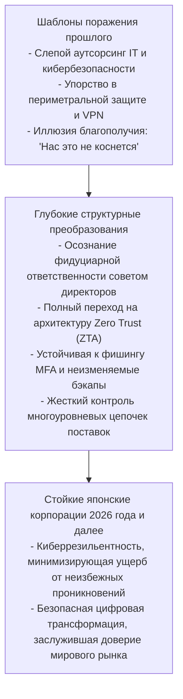

Кибербезопасность — это не досадная помеха для развития бизнеса. В бурном цифровом океане она играет роль **«высокоэффективных тормозов гоночного болида»**. Только тот суперкар, который оснащен безупречной тормозной системой, способен безопасно проходить крутые виражи на предельной скорости.

Точно так же, как японская промышленность когда-то завоевала мир бескомпромиссным качеством своей продукции, сегодня японские корпорации должны принять жесткий обет: **«Никогда не предавать доверие клиентов, сотрудников и общества»**. Только решившись на глубокую модернизацию архитектуры и перестройку корпоративного управления, бизнес сможет преодолеть испытания эпохи киберкризиса и занять достойное место в глобальной цифровой экономике будущего.
