## 序论：2026年的警钟 ——“网络安全后进国”日本直面的国家级危机

从2020年代中期迈入2026年的当下，日本的网络空间正遭受着前所未有的狂风暴雨式猛烈冲击。

长久以来，日本产业界内部一直弥漫着某种毫无根据的虚幻“安全神话”：“我们公司并非跨国巨头，不可能沦为黑客的目标”、“日语天然的语言壁垒构成了抵御网络攻击的天然要塞”、“既然采购安装了头部安全厂商的杀毒防毒软件，自然高枕无忧”——然而，这些甜美的幻想在严酷的现实面前已被碾得粉碎。

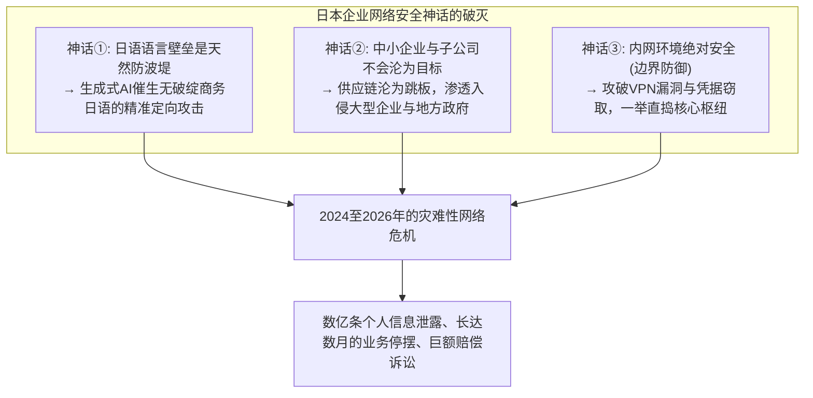

现实残酷得令人窒息。从文化传媒航母、超级巨型银行、主流电信运营商、关键基础设施枢纽，再到各级地方自治体的行政系统，诸多赫赫有名的政企巨头接二连三地在勒索软件的铁蹄下被迫俯首称臣，或是将数百万乃至数千万条极其敏感的公民个人隐私数据拱手暴露在暗网之中。

泄露的数据早已不仅限于姓名、住址、电话号码等基础档案。信用卡账号安全码、深度体检报告、个人社会保障号（My Number）、商业往来机密合同文本、内部协作通讯全量日志，甚至是核心员工的高清驾驶执照正反面扫描件等足以彻底摧毁个体社会信用与人格尊严的核心机密，全数沦为国际网络犯罪黑客辛迪加手中索要高额赎金的肉票，在暗网黑市中被大肆拍卖。

每当重大安全事故发生，闪光灯下的新闻发布会上总能看到企业高管们排成一排深深鞠躬致歉的熟悉景象，口中机械式地重复着“事故具体原因仍在调查中”、“将进一步强化全员信息安全培训”等千篇一律的官方公关辞令。

然而，我们必须直面这个尖锐的质问：**为什么那些每年投入巨额IT信息化预算、定期推行员工网络安全培训的日本企业，依然无法遏制海量数据泄露与毁灭性勒索软件攻击的接连爆发？**

其深层根源，绝非前线员工“不慎点击了可疑邮件链接”这种微观战术层面的操作失误所能解释。这实质上是日本产业界在过去数十年间刻意漠视并不断累积的深层结构性溃败：**“全盘甩手外包与深不见底的多层转包这一体制病灶”**、对早已落后于时代的**“传统边界型防御（Perimeter Model）的盲目迷信”**、云原生转型浪潮下**“身份认证与权限底座的严重空心化”**，以及**“企业高管将安全视作纯粹沉没成本而非核心战略投资的治理功能失调”**。多重顽疾交织共振，最终导向了系统性必然崩塌。

本文站在资深顶级CISO（首席信息安全官）与资深威胁情报分析师的高度，深度拆解2024至2026年间震撼日本社会的几起典型重大安全事件的技术底层逻辑，彻底揭开蚕食日本政企根基的结构性病灶；同时，全方位勾勒出一套立足于“默认系统已被攻破”现代防御理念的实战指南——涵盖**零信任架构（ZTA）的全面落地推进、端到端供应链层级穿透式管控、防钓鱼物理级MFA身份加固、底层不可变备份带来的网络韧性（Cyber Resilience）重建**，为各类企业构筑在残酷攻防对抗环境中求得生存的决定性防御体系白皮书。

---

## 第1章：2024〜2026年日本企业标志性重大安全事件深度解剖

要想真正透视日本企业面临的危机实质，首先必须基于扎实的技术事实，直面近年来爆发的几起具有分水岭意义的典型事件的完整“攻击链（Kill Chain）”。

### 1.1 角川（KADOKAWA）/ NicoNico动画事件的血泪教训：数据中心全军覆没与BlackSuit勒索软件浩劫

2024年6月，日本出版传媒巨头角川（KADOKAWA）及其旗下知名多媒体视频平台多玩国（DWANGO）遭遇网络攻击，成为日本信息安全史上伤亡最为惨重的一大历史转折点。

发起本次毁灭性打击的，是承袭了臭名昭著的国际勒索组织“Conti”核心技术衣钵的后继顶尖黑客集团——**“BlackSuit”**。该事件导致代表日本流行文化的国民级流媒体平台“NicoNico动画”在内的全线Web产品服务陷入全面瘫痪，全日本范围内的实体图书出版物流发行系统以及财务结算核心业务中断数月之久。更为致命的是，包括全体员工个人信息、知名合作创作者签约档案、企业商业合同在内的逾25万份机密数据被黑客公开发布于暗网勒索专栏，引发了不可估量的信誉崩塌。

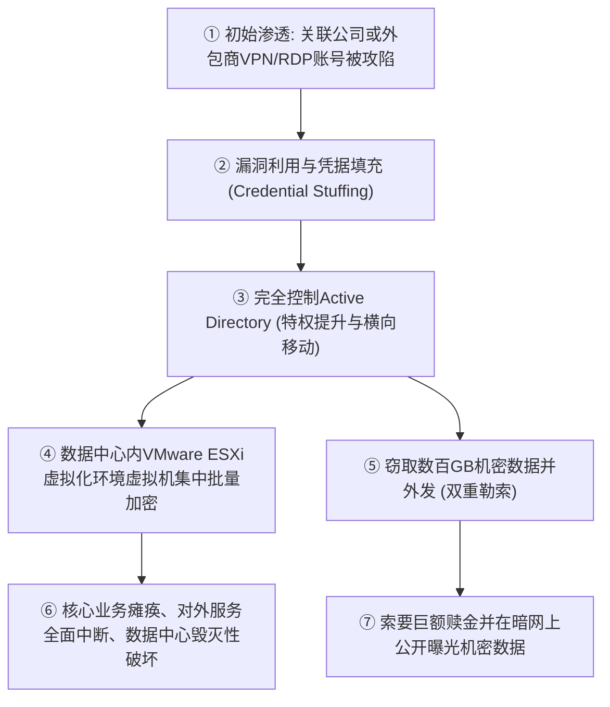

该事件给日本网络安全界带来的最大技术震动在于：**“不仅是表层应用系统，企业本地私有云数据中心（底层虚拟化基石）本身遭遇了连根拔起式的毁灭”**。

黑客并未直接正面硬撼集团总部的核心防火墙防线，而是巧妙选取了防护相对脆弱的关联子公司或业务外包合作商的远程办公环境（旧版VPN网关或公网暴露的RDP端口）作为初始跳板。在成功打入内网边界后，攻击者敏锐利用了内网“一马平川（缺乏微隔离分段）”的拓扑硬伤，展开肆无忌惮的横向渗透移动（Lateral Movement），最终彻底夺取了整座企业IT底层命脉——**Active Directory（域控制器）的最高域管理员特权（Domain Admin）**。

在将域控完全收归囊中后，BlackSuit团伙不仅锁定了常规Windows业务主机，更长驱直入底层VMware ESXi宿主机集群的底层管理控制平面，直接对物理存储池内存储的海量虚拟机磁盘镜像文件（.vmdk）实施了底层高强度并发加密。更为阴毒的是，**攻击者利用域管特权，将原本在线联机挂载的所有备份卷和备份管理服务全数实施了物理级抹除与覆盖加密**。

这一悲剧如同当头棒喝，向全日本的企业决策层揭示了一个冷酷的客观规律：一旦攻击者跨越内网边界，在扁平化信任网络下，无论规模多么庞大的高等级数据中心，都可能在数十分钟内一招毙命。

### 1.2 LINE雅虎事件与NAVER共享架构：跨境委托治理体系的全面瓦解

2023年秋曝光并于2024至2026年间招致日本总务省罕见的连续多次严厉行政指导的“LINE雅虎（LY Corporation）大规模用户信息泄露事件”，将日本IT企业在**“资本控股与外包委托深度捆绑下产生的治理盲区”**暴露无遗。

该事件导致涵盖用户、合作伙伴及企业员工在内的约51万条机密个人数据遭到未授权外泄，而整场灾难的导火索，却源自LINE雅虎大股东兼技术母体——韩国NAVER公司的云端测试与运维环境。

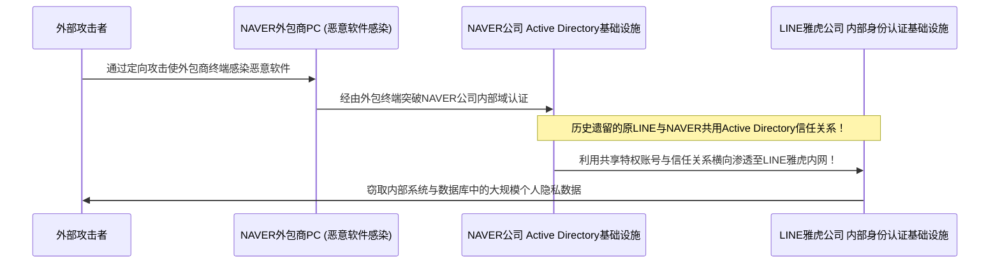

该事件在技术维度的核心命脉，在于**“原LINE与NAVER之间，在合并与组织调整多年后，底层的Active Directory等企业级身份认证体系依然保持着无条件的完全互信与跨国网络打通”**。

攻击者最初仅仅攻陷了NAVER旗下某三方外包商的一台普通办公PC。通过这台受控电脑，黑客顺藤摸瓜打入NAVER企业内网，随后大摇大摆地利用这一“毫无二次鉴权机制阻隔的跨国域林信任通道（Domain Trust）”，直接跨越国境跳板攻入日本本土LINE雅虎公司的核心生产数据库，大肆掠夺敏感数据。

此案向长期热衷于“离岸开发外包”、“跨国子公司协同”的日本跨国财团敲响了警钟：**仅仅因为“是母公司”、“是兄弟组织”，便想当然地将底层内网与目录认证全量直连信任，其背后潜藏着毁灭性的级联穿透风险**。总务省强力介入并勒令其“重塑资本结构并实现底层认证基座的彻底物理与逻辑切割”，充分证明涉及地缘政治风险的软件与IT供应链治理，已然上升为关乎国家主权与数据安全的根本议题。

### 1.3 席卷地方政府与BPO龙头（以ISETO等为代表）的供应链连环雪崩

2024年以降，在全日本数十个地方自治体、金融机构及大型公共事业组织中掀起广泛恐慌的，是针对承接打印印刷、账单邮寄与基础数据清洗录入的**大型BPO（业务流程外包）龙头企业（如ISETO等公司）的勒索软件定点猎杀**。

为降低行政开支，日本各级市町村政府在寄送居民税核定通知书、国民健康保险证、介护保险缴费凭单、选举公报等市政业务时，普遍通过公开招投标，将包含全量居民姓名、精确住址、个人税收明细、甚至是My Number国民身份证号的超高敏感数据，打包委托给私营BPO外包商进行集中制卡与邮寄。

深谙攻防博弈的攻击团伙并未正面冲击市政厅内部固若金汤的封闭内网（即所谓严格物理隔绝的“LGWAN三层架构”）。黑客敏锐地锁定了整个链条上防守最为松懈的薄弱环节——**受托承接业务的BPO外包商在各地的分支作业中心网络**。

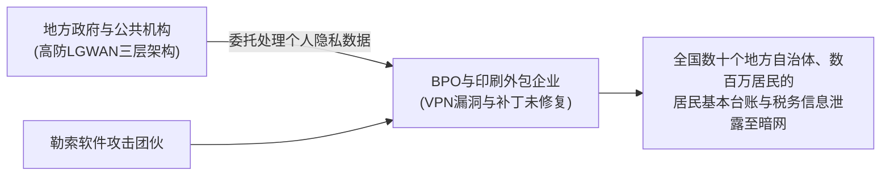

在BPO公司的分支网络因外网暴露的VPN网关漏洞被勒索软件彻底攻克后，黑客不仅加密了外包商的自营资产，更顺理成章地将服务器内暂存的来自全国几十个政府部门、涵盖数百万纳税居民核心隐私数据的庞大数据库整个打包窃取，并挂在暗网上待价而沽。

这起事件揭示了一条极其冷峻的物理防守法则：**“无论发包方在自身核心机房投入数十亿日元筑起怎样密不透风的马奇诺防线，一旦业务链条上下游外包商的安全水位低下，整个供应链体系便会在瞬间坍塌。”** 那些长久以来仅仅依靠“在合同文本中增补保密与安全条款”便自以为大功告成的纸面形式主义合规，在此类硬核攻击面前被彻底撕下了伪装。

### 1.4 云服务配置疏漏（Salesforce / AWS / Azure）：全球敞开的大门与裸奔的数据

数据大规模泄露的元凶，并不仅限于勒索软件这类高对抗性APT攻击。在2020年代中期的大规模泄密事件中，占据惊人比例的另一主因，竟然是低级到令人发指的**“云基础设施安全配置疏漏（Cloud Misconfiguration）”**。

在诸多日本一线券商、大型银行、知名电商网站及政府部委中频繁爆发的，正是以客户关系管理平台 **Salesforce 配置失误导致的客户敏感信息无阻碍裸露** 事件。

Salesforce平台内置了用于快速搭建外部客户门户或互动站点的“社区功能（Experience Cloud）”以及访客账户（Guest User）设置。由于系统管理员在实施访问控制（Sharing Rules）时出现概念混淆与默认规则误配，导致原本仅允许经过强身份验证的内部坐席查看的高净值客户档案（包含姓名、手机号、资金账户、详细交易凭证），**在完全没有任何账号密码鉴权的前提下，沦为互联网公网爬虫可以任意遍历下载的公共资源**，且这一裸露状态往往持续数月乃至数年无人察觉。

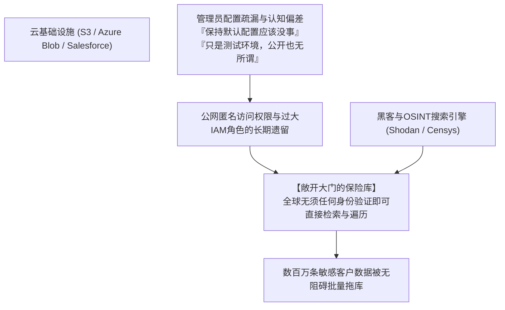

类似的情节在公有云领域频繁上演：亚马逊AWS的S3存储桶公共读写权限误开启、微软Azure Blob存储账户访问控制策略缺失、乃至内部开发团队在GitHub公开代码仓库中失手提交包含特权凭据（API Secret Key / Access Token）的源码文件……

根本不需要黑客施展复杂的0-day漏洞攻击，**“企业运营者亲手打开了金库的厚重大门，将里面的黄金向全世界公开展出”**——这便是日本企业在仓促迈向云端过程中所暴露出的令人啼笑皆非的残酷现状。

---

## 第2章：根本原因的深层解剖① —— 结构性与组织机制顽疾（全盘外包与深层转包）

为什么在风险如此明确、前车之鉴如此惨痛的背景下，日本企业依然无法从根本上遏制事故的重复发生？第二章将手术刀对准隐藏在技术故障表象之下的“日本传统企业社会组织结构性痼疾”。

### 2.1 “IT属于成本中心”的高管偏见与名存实亡的CISO机制

日本企业在网络安全领域最大的脆弱性，根本不在于外部防火墙规则写得好不好，而在于**“董事会会议室（Boardroom）的认知盲区”**。

在欧美领先跨国企业中，数字化架构与网络安全被普遍视为“决定企业生死存亡的核心战略竞争力与最高优先级议程”。首席信息安全官（CISO）通常直接向CEO汇报，拥有直接介入各业务单元的极大权威，甚至握有“当发现重大安全隐患时，哪怕影响当期业务利润亦可强制下令切断生产系统”的绝对否决权（Veto Power）。

反观绝大多数传统的日本企业，IT信息化部门长期被边缘化为“无法产生直接经济效益的后勤行政开支部门（Cost Center）”。
- 董事会成员清一色出身于销售、法务、财务或文科通才体系，几乎无人具备IT或网络攻防技术底蕴。被任命为所谓CIO或CISO的高管，往往是由即将退休的文职董事在分管总务、法务之余“顺便挂名兼任”。
- 当一线安全工程师提交紧急报告：“当前服役的旧款VPN网关存在高危已知漏洞，亟需申请数千万日元专项预算采购升级，并需要全公司停机数小时进行割接维护”时，高管层的典型反馈往往是：“本季度财报利润承压，推迟到下个财年再说”、“业务中断几小时造成的客户投诉谁来承担？绝对不能停机”。

这种治理结构注定了日本企业的CISO沦为**“既无独立预算权、亦无实权干预业务，唯独在发生安全事故时被推到镁光灯下鞠躬认错的替罪羊（Scapegoat）”**。未能将信息安全提升为“捍卫企业永续经营所不可或缺的重资本投入”，而是处处当作“能省则省的费用包袱”，这种最高管理层的结构性失职，正是日本深陷数据泄露泥潭的元凶首恶。

### 2.2 多层转包与逐级分包结构催生的“最脆弱链条（Weakest Link）”

最具日本IT产业鲜明病理特征的，莫过于完全复制了传统建筑工程行业的**“多层转包结构（IT总承包制度，俗称ITゼネコン）”**。

最终用户企业（发包方）通常将系统的架构设计、软件研发、日常运营及安全运维全部一股脑“全盘甩手（丸投げ）”给少数几家巨型系统集成商（Prime SIer）。而在大型集成商内部，高层往往不愿维持庞大的底层开发运维团队，而是通过收取高额的中间管理费，将具体执行工作层层拆解、逐级下放给二级分包、三级分包，乃至下沉到五级、六级的独立小微IT工作室或自由职业者手中（级联转包）。

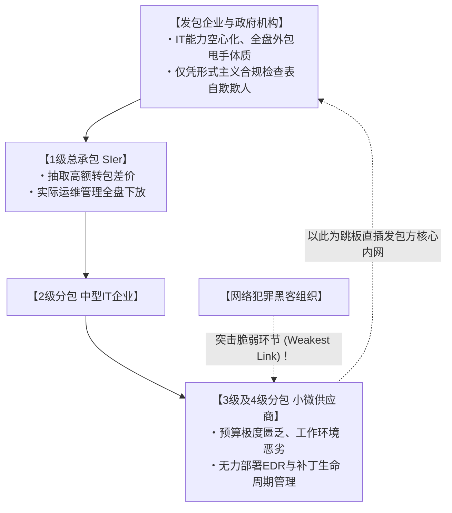

密码学与安全工程学中有一条永恒的铁律：**“链条的整体强度，完全取决于其最脆弱的那一环（A chain is only as strong as its weakest link）。”**

纵使一级总承包商自研机房部署了多么昂贵的高端下一代防火墙、制定了厚达数百页的安全红线白皮书，处于食物链最底端的三级、四级分包小微企业，其微薄的项目回款根本不足以支撑采购现代化的EDR（终端检测与响应）授权，更无力雇佣7×24小时专业的SOC（安全运营中心）团队。
- 在实际工作场景中，下级外包员工往往使用缺乏安全补丁的淘汰版Windows 10主机，甚至使用未经审计的个人电脑（BYOD）接入开发；系统管理员密码被手写在便利贴上贴在显示器边框上公开共享；
- 更荒唐的是，为了便于远程赶工排障，发包方通常直接为这些底端外包人员发放了**“直通生产核心数据库与内部服务器的特权远程访问凭证”**。

对于职业网络黑客而言，这无异于天赐良机。根本不需要费尽心机去啃防御严密的一级总承包正面防线，只要向供应链最末端、防守几乎为零的某一家微型外包商定向投递一枚恶意木马，俘获其一台终端，黑客便能瞬间拿到通往顶级名企核心资产的合法凭据，以“完全合规的员工身份”大摇大摆地漫步在目标内网中。

### 2.3 日本传统用工雇佣制度的局限与专业安全人才的结构性断层

在“人”这一决定性维度上，深层病理同样触目惊心。

根据日本经济产业省（METI）和信息处理推进机构（IPA）历年发布的数据，日本信息安全专业人才的缺口常年维持在数万乃至数十万人之巨。然而这一现象的本质，绝非单纯的人口少子老龄化问题，而是**“以终身雇佣制、年功序列制为代表的传统日式人力用工体制，已完全丧失吸纳、评价和合理激励顶尖安全人才的能力”**。

在欧美、以色列及新加坡等先进市场，负责企业整体防线构建的顶尖安全架构师、二进制逆向工程师、顶级渗透测试白帽黑客，其年薪折合日元轻松达到2000万至4000万以上。他们被视作护航商业战舰抵御深海鱼雷攻击的绝对精英技术脊梁。

然而，在恪守全员统一职级工薪表的绝大多数传统日本企业中，IT技术人才被牢牢压制在“综合职序列的偏下阶层”：
- 薪酬体系僵化死板，任凭一位年轻极客在逆向分析和内网渗透方面拥有怎样鬼斧神工的技术水准，其薪资待遇必须死死绑架在同龄文职销售或行政人员的标准区间内（年薪仅400万至600万日元区间）；
- 在职业上升通道上，技术专家路线几乎完全缺失，“升职加薪”的唯一通路是转做管理岗。如果一位工程师想要获得更高收入，就必须放下代码、停止分析流量与逆向漏洞，整天投身于预算审批撕扯和编写精美的Excel报告。

其必然结果便是：本土最精锐的技术天才持续逃离传统日企，流向外资技术大厂或新兴独角兽；留在传统日企内部IT部门的，往往不具备“亲自动手写脚本探测威胁、深挖日志定位入侵、逆向解构恶意木马”的硬核实战防守能力。整个部门沦为一帮仅仅负责把外部厂商递交的汇报PPT“从左手倒腾到右手”的传话筒。正是这种核心防御大脑的极度空心化，导致了各大企业在遭遇真实网络突袭时，初动响应错漏百出，最终将微小火苗恶化成燎原烈火。

---

## 第3章：根本原因的深层解剖② —— 技术架构溃败（边界防御瓦解与AD陷阱）

除去组织架构与管理治理层面的严重脱节，日本企业内部IT基础设施本身所背负的“老旧架构遗毒与拓扑硬伤”，更是攻击者如鱼得水、肆虐横行的核心物理温床。

### 3.1 VPN网关与远程桌面：企业防线形同虚设的“后门通道”

在新冠疫情催化下，日本企业以令人瞠目的速度强行铺开了全员远程办公（Telework）。在此期间，绝大多数企业为了快速交差，普遍采取了最为省事也最具灾难性的权宜之计：**“在传统内网边界部署几台硬件SSL-VPN设备（如Fortinet FortiGate、Pulse Secure / Ivanti Connect Secure等），允许员工利用外部终端打通一条直插内网的加密通信隧道”**。

这无异于在坚固的防洪堤坝底部，亲手凿开了一条通向城市腹地的排污暗道。

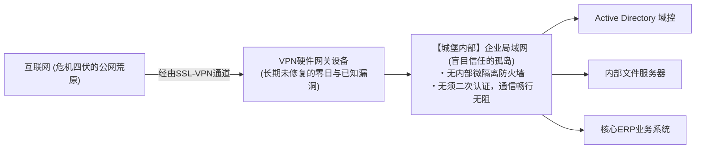

VPN硬件网关是直接将IP地址和管理端口暴露在公网风暴中的“物理城门”。全世界的专业黑客犯罪组织和国家级APT实体，无时无刻不在死死盯着这些城门的锁芯（软硬件漏洞）。
- 在2023年至2026年间，涵盖Ivanti、Fortinet、Palo Alto在内的主流边缘VPN网关相继爆出一连串允许未经身份验证直接远程执行任意代码的毁灭性高危漏洞（CVSS评分飙至9.0至10.0满分）；
- 令人啼笑皆非的是，即便是官方早已紧急发布了漏洞修补固件（Patch），日本相当数量的企业因“担心影响白天正常办公”、“设备重启需要走漫长审批流程”为由，将关键安全补丁无限期拖延数月甚至超过一年。

如今的网络黑客早已借助Shodan、Censys等全网资产探测扫描引擎实现了对全球未打补丁VPN设备的分钟级全自动巡检。黑客利用公开利用代码直接Dump掉设备内存，轻而易举剥离出合法登录凭据（明文账密、未过期Session Token），**短短几分钟内，攻击者便能化身为“如假包换的正规内部员工”，顺着VPN隧道长驱直入企业核心内网**。

### 3.2 局域网内生信任神话（边界防御模型）的彻底破产

当外部VPN防线被击穿后，真正将日本企业推向灭顶之灾的，是其内部死守不放的**“传统边界型防御模型（Perimeter Defense / 城堡与护城河模型）”**。

边界型防御的核心预设极其单纯幼稚：“外网的公网环境布满敌意与恶意威胁，而一旦穿过外部防火墙来到企业内部局域网（LAN），内部的一切通信与资产均被视为100%安全无害且值得完全信任”。

在这种过时哲学指导下搭建的企业内网，其网络拓扑结构呈现出触目惊心的**“扁平化（Flat Network）”**：
- 任何一台接入内网局域网的普通电脑，均可不经过任何二次安全拦截或双向强加密认证，随意访问同一网段乃至相邻网段内的任意其他主机、文件共享存储、网络打印机及内部ERP系统；
- 内部横向流动的所有数据流量，在传统架构下完全处于免检状态，防火墙对此视若无睹。

这宛若一座修建了高耸外墙的中世纪城堡，然而**“一旦外来间谍伪装成挑水工混过城门，便会震惊地发现整座城堡内部所有的粮仓、军械库、金库乃至君主的寝宫全都没有上锁，任何人都可以大摇大摆地任意纵火与劫掠”**。

面对受控终端在内网发起的全自动网络勘探扫描（Reconnaissance）以及从单台普通PC向高密核心服务器集群的感染扩散——即所谓“横向移动（Lateral Movement）”，传统边界防御在物理机制上彻底沦为摆设。

### 3.3 Active Directory（AD）的过度膨胀与特权凭据治理的彻底崩溃

在企业级Windows网络生态中，最大的单点故障点（Single Point of Failure），同时也是黑客眼中奉若神明的“终极圣杯”，正是微软的**Active Directory（AD 域控制器）**。

全日本超过90%的企业将全网员工PC终端、域账号体系、数据访问ACL权限与组策略下发等命脉全部托付给了Active Directory。然而，其后台实际维护治理状况往往溃烂不堪：
- 许多企业延用着二十多年前初代搭建的AD域林架构，历经数任外包团队的无序增补与违章搭建，早已演变为无人敢碰的庞大黑盒；
- 离职数年的前员工账号、废弃已久的老旧服务进程账号、用于临时调试后被彻底遗忘的高权账户，成千上万地长期沉睡在目录数据库中；
- 更致命的是**“域管理员权限（Domain Admin）的滥用与密码交叉复用”**。为了日常桌面运维图省事，IT支持人员在普通员工PC、公用前台机上随手赋予本地管理员乃至域管理员登录权限，甚至全网套用同一套弱口令。

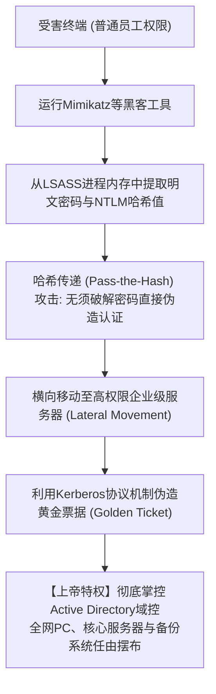

现代黑客一旦控制内网任意一台普通工作站，会立刻借助内存注入技术执行 `Mimikatz` 这类内存分析工具，瞬时从Windows认证进程 `lsass.exe` 的物理内存驻留区中强行倾倒出明文口令、NTLM哈希散列以及Kerberos认证票据。

攻击者甚至根本不需要耗费算力去反向破解密码明文，而是直接利用哈希散列发起**“哈希传递攻击（Pass-the-Hash）”**；抑或劫持Kerberos身份认证的底层密钥签名（krbtgt账户），凭空伪造出拥有全域无限最高访问权限的**“黄金票据（Golden Ticket）”**。

当这一连串教科书级的提权打击顺畅落地，黑客便彻底化身为整座企业IT帝国的“全知全能上帝”。黑客只需随手编写一条域组策略（GPO），将勒索病毒设置为开机启动脚本全网下发，数万台终端与核心服务器便会在十几分钟内瞬间迎来集体暴毙。

### 3.4 仓促上云带来的阴影：影子IT与超权IAM策略的野蛮生长

伴随企业从本地数据中心向AWS、Azure、Google Cloud等公有云环境的大规模迁移，另一类前所未见的技术病灶正呈现井喷之势。

1. **影子IT（Shadow IT）与野生云资产**:
   受够了内部信息系统部繁冗审批流程的业务创新团队和敏捷开发小组，往往绕过安全团队监管，直接使用企业信用卡在公网私自开通各类SaaS服务和独立的AWS开发账号。这些资产长期游离于企业SOC监控大盘之外，成为公网配置漏洞与弱口令滋生的法外之地。
2. **超权配置（Over-Privileged）的IAM角色机制**:
   作为云端安全心脏的“IAM（身份与访问管理）”策略配置，理应严格恪守最小特权原则（PoLP）。然而在实际业务落地中，大量赶工期的开发运维人员因“嫌单独配置API权限太繁琐”、“生怕权限不足导致业务报错”，简单粗暴地将具备全知全能管理权限的 `AdministratorAccess` 或全量读写策略无节制赋权给常规EC2实例或微服务。
   一旦某个暴露于公网的业务系统被黑客挖出一个微小的SQL注入漏洞或SSRF（服务端请求伪造）漏洞，黑客便可一举提权扒取云实例绑定的临时IAM安全凭据（STS Token），进而瞬间端掉整座云租户内的全量云盘、对象存储与关系型数据库。

---

## 第4章：根本原因的深层解剖③ —— 人性脆弱面与新型攻击手段的突变

除了系统架构与组织治理维度的彻底崩塌，直接针对人类心理缺陷与认知生理极限发起的新型社会工程学攻击，在生成式AI（Generative AI）技术的全面加持下，正在经历一场颠覆性的致命突变。

### 4.1 生成式AI纪元下的超级鱼叉式钓鱼与深度伪造（Deepfake）

过去，传统垃圾邮件与钓鱼欺诈通常充斥着蹩脚生硬的翻译腔、不自然的标点断句以及错乱的日语敬语表达，凡是受过基础训练且稍具警惕心的企业员工，往往一眼就能识别出破绽。

然而，伴随以ChatGPT、Claude为代表的**大语言模型（LLM）被网络黑客黑产深度武装**，这一维度的攻防天平彻底发生了不可逆的倾斜。

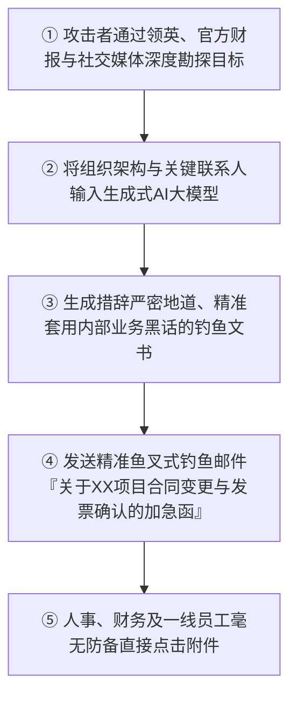

现代顶级针对性定向鱼叉钓鱼（Spear Phishing），往往由黑客利用开源网络情报搜集技术（OSINT），先期从受害企业官方财报、领英员工档案、高管社交推文中挖掘出清晰的组织架构树、正在推进的项目代号以及长期合作的真实供应商名单。攻击者随后将这些上下文投喂给大模型，生成**“在商务敬语规范度、行业专业术语契合度、甚至上下级语境拿捏上完全无懈可击的高级定制公文”**。

更令防御者陷入绝望的，是**基于AI深度伪造（Deepfake）技术的音视频全息欺诈**。
- 近年在跨国企业及日本本土分支机构中屡屡发生骇人听闻的案件：财务负责人突然接到跨国母公司CEO或CFO打来的紧急视频会议电话，画面中的面部微表情、声线音色、口吻习惯均被AI完美复刻。攻击者以“正在推进涉及高度机密的紧急并购案”为由，当面指令财务人员分批次向离岸受控账户电汇数亿日元。
- 当针对人类视听直觉认知的黑客技术已进化至如此境界，任何寄希望于“提高员工注意力、睁大眼睛仔细辨别”的精神胜利法式安全宣教，在现实对抗中已彻底沦为自欺欺人的无用功。

### 4.2 会话劫持与新型信息窃取木马（Infostealer）的野蛮扩散

令大量自认为已全面普及了“双因子认证（2FA / MFA）”的日本企业猝不及防的是，**“信息窃取型恶意软件（Infostealer）”** 正在以前所未有的烈度撕裂传统身份认证防线。

诸如RedLine、Raccoon、Lumma等专业窃密木马家族，通过盗版破解工具、作弊补丁、伪装成工作简历或行业发票的恶意安装程序，在各大企事业单位乃至外部供应商的办公终端中大肆渗透潜伏。

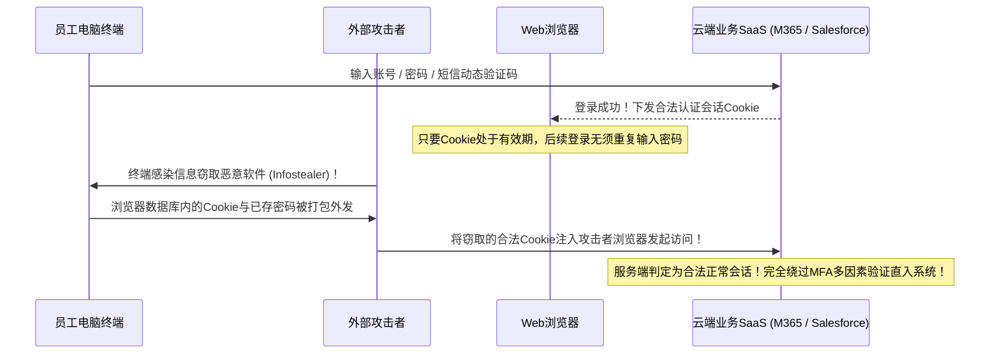

现代窃密木马的终极战术目的根本不是打草惊蛇去加密本地文件，而是悄无声息地侵入受害机器的Web浏览器（Chrome、Edge等）本地存储数据库，**全量搜刮窃取“浏览器保存的各类业务密码”以及“正处于存活状态的登录会话Cookie（Session Cookies）”**。

在现代B/S架构与云SaaS平台中，用户只要成功通过了一次账密和短信MFA验证，服务端便会向本地浏览器颁发代表合法身份通行证的会话Cookie。攻击者在暗中窃取到这些鲜活的Cookie后，只需将其直接注入自己本地的攻击机浏览器中（Cookie Hijacking），**服务器便会无条件认定“这就是刚经过二次认证的原装员工本人”，攻击者无需输入任何账号密码、无须提供任何动态二次验证码，直接在几秒钟内实现对企业SaaS后台的免密登陆漫游**。

当前，在暗网黑市和Telegram非法流通渠道中，包含了日本企业有效会话凭据的Cookie数据包被以几美元至几十美元的极其廉价白菜价按批次批量倒卖。全球黑客无需任何技术破译成本，拿着真金白银买来的合法钥匙，直接“从正门昂首阔步迈入”受害企业的业务心脏。

### 4.3 内部人威胁（Insider Threat）：离职潮与外包特权滥用引发的暗流

安全的破口不仅来自境外黑客，在严峻的网络战局中，来自内部人员的破坏与监守自盗，正在占据越来越危险的比重。根据日本网络安全协会（JNSA）历年统计披露，商业秘密被窃与大规模隐私数据泄露，相当大一部分来自于**内部人员（在职员工、跳槽离职人员、常驻外包派遣技术人员）的违规非法带出**。

- **用工流动化浪潮下的离职前夕“盗掘”**:
  随着日本传统终身雇佣制的逐步瓦解，行业跳槽成为新常态。许多在核心岗位就职的销售骨干、系统架构师在敲定下家竞品公司的offer后，抱着“这是我亲自研发的成果”或“这是我辛辛苦苦积攒的人脉资源”等自我安慰心态，利用私人U盘或个人网盘（Google Drive、Dropbox等），在离职前夕大肆拖库打包核心客户名单、底层产品源代码及精密工程设计图纸。
- **高权限第三方常驻运维人员的监守自盗**:
  大量负责核心数据库日常代运维的中下游外包工程师，其本身收入微薄、生活压力巨大，但发包方却轻率地为其开放了能够直接执行SQL查询导出的超级只读或读写权限。在经济利益驱使下，个别人员将海量居民征信档案、银行流水、高净值会员数据整库导出，偷偷转卖给地下黑灰产中介或诈骗集团牟利。

令人痛心的是，多数日本企业内部治理长久建立在脆弱的“性善论”假设之上，完全缺乏能够在内部员工异常批量检索、非工作时间大额导出核心机密时即刻触发阻断告警的DLP（数据防泄漏）与UEBA（用户和实体行为分析）技术防御手段。绝大多数内鬼作案，往往是在半年甚至数年之后由于涉案数据在黑市流窜被警方通报、或是竞品直接推出完全雷同的技术产品时，才后知后觉地被动察觉。

---

## 第5章：全面迈向零信任架构（ZTA）的战略演进路线图

面对上述犬牙交错、足以让企业顷刻覆灭的复合型危机，日本企业唯一的求生之道，就是决绝地亲手埋葬名存实亡的传统边界防御旧范式，义无反顾地推进向**“零信任架构（Zero Trust Architecture: ZTA）”**的深度全量演进。

### 5.1 零信任的哲学内核：“从不信任，始终验证（Never Trust, Always Verify）”

零信任绝非指代某一家厂商推出的某一款单一软硬件产品型号。它是经由美国国家标准与技术研究院（NIST）在权威纲领《NIST SP 800-207》中确立的**“网络安全底层哲学维度的深刻范式革命（重写防御者的思维操作系统）”**。

> **零信任三大核心戒律（Core Principles）**:
> 1. **从不信任，始终验证（Never Trust, Always Verify）**:
>    无论是来自公司总部总裁室的台式机，还是来自外部咖啡厅的移动终端；无论是来自内网核心机房的报文，还是来自公网互联网的请求，在架构层面上绝不默认赋予任何主体以“天然安全”的特权。所有的通信访问，每一次均必须经过严苛的身份与合规动态验证。
> 2. **授予最小必要权限（Grant Least Privilege Access）**:
>    严格终结粗放式全量授权。仅针对主体在当前特定业务操作所必须触碰的最小数据范围，在特定受控时间窗口内，以即时动态（Just-In-Time）的方式精准赋权，业务结束即刻收回。
> 3. **预设系统已被攻破（Assume Breach）**:
>    在所有架构顶层设计之初，必须建立在“外部防线已被彻底穿透、内网已经潜伏着敌对黑客”这一冷酷的前提之上。防御的核心目标全面转向阻断横向移动、最小化单点失守后的爆炸破坏半径（Blast Radius）、以及毫秒级的威胁检测与自动化隔离。

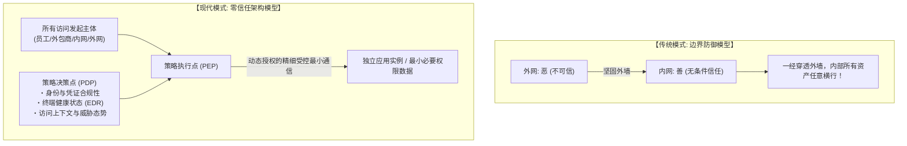

### 5.2 彻底废除VPN全面转向ZTNA（零信任网络访问）

迈向零信任实战的第一场硬仗，便是对企业内最大的安全风险发源地施行动刀——**“彻底清退下线所有旧式SSL-VPN集中接入网关设备”**，全面跃迁至**“ZTNA（Zero Trust Network Access，零信任网络访问）”**架构。

传统VPN与ZTNA之间，存在着根本性的本质断层：其连接的核心逻辑究竟是“连入整座底层网络”还是“按需代理单个特定应用”。
- **传统旧式VPN**: 只要用户通过了第一道门槛，网关就会在物理/链路层将用户的整台终端直接接入公司内部IP局域网。受害终端瞬间获得了与整座内网所有网段所有服务器直连通信的底层物理能力。一旦该终端存在病毒潜伏，整座内网立刻沦为病毒肆意感染的温床。
- **现代ZTNA架构**: 终端在任何情况下**绝对不会直连底层网络**。部署于云端的分布式中继代理节点，在每一次访问发生时，严苛审查发起者的数字身份、终端实时安全态势（是否安装合法安全组件、是否包含越狱挂钩特征），**“仅仅将用户发起的访问流量，点对点映射代理至其拥有操作权限的某一个特定Web页面或特定服务端口上”**。
  在终端视角下，整座内部网络的所有私有IP地址段、网络拓扑图与相邻服务器全数处于被物理隐匿的暗网状态（Network Cloaking），黑客惯用的端口扫描侦察与横向移动在底层机制上彻底失效。

### 5.3 SASE（安全访问服务边缘）与SSE的一体化防御网络

将零信任网络理念推向全局落地的现代工业级标准形态，正是全球权威咨询机构Gartner所定义的**“SASE（Secure Access Service Edge，安全访问服务边缘）”**及其安全能力聚集核心**“SSE（Security Service Edge，安全服务边缘）”**。

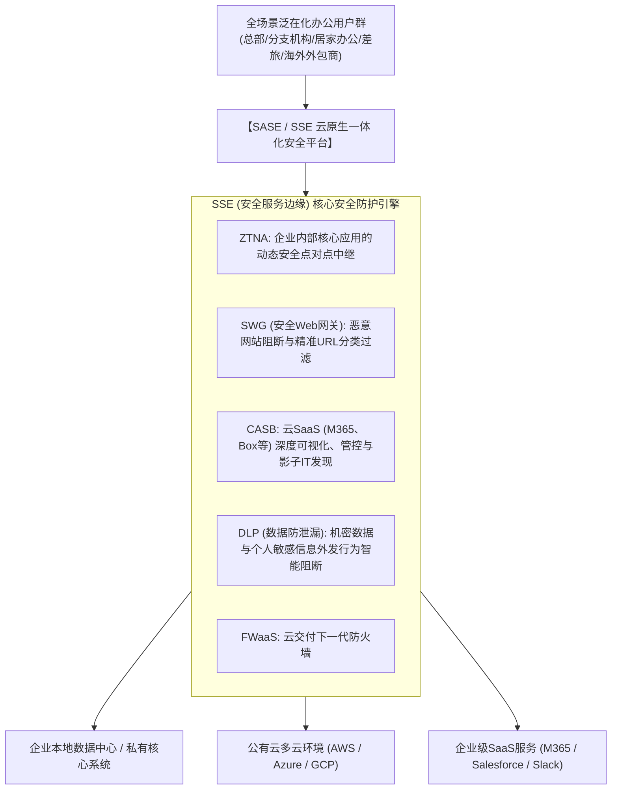

在完备的SASE架构体系下，无论企业员工身处总部现代化大楼、家中书房、旅途中的机场咖啡厅，还是位于海外的委外研发代工厂，终端发出的所有外部流量，均必须先期汇聚接入至距离最近的全球分布式SASE云原生安全骨干节点：
- **SWG（安全Web网关）** 在流量入口实时解析剥离钓鱼URL诱骗、阻断挂马网站并对恶意下载实施动态沙箱爆破检测；
- **CASB（云访问安全代理）** 对全员访问的公有云SaaS行为实施像素级审计分析，强行阻断非授权影子IT并防止企业资产被非法同步至个人私有网盘；
- **DLP（数据防泄漏引擎）** 依托内建的内容智能识别算法，动态扫描正在上载外发的数据载荷，若侦测到包含银行卡批量明细、身份证号或核心源代码特征，毫秒级施加封堵拦截并截流告警；
- **ZTNA组件** 则作为隐形信道，按需建立通往本地核心机房与多云IaaS环境的微观安全通道。

借助这套架构，企业可以一举砸碎并废弃分布在各个分支机构、不仅运维昂贵且千疮百孔的物理硬件VPN路由器和本地代理服务器，真正在全网任意角落实现“同等最高安全水位”的一致性安全策略下发与执行。

### 5.4 依托微隔离（Micro-Segmentation）在内网构筑“防火隔离舱”

即便外部防护做到了极致，在现代复杂对抗环境下，依然没有任何防守方敢断言能100%拦截单台终端的意外失陷。因此，阻止单点失守演变成全盘毁灭的核心杀招，便是**“微隔离（Micro-Segmentation）”**。

微隔离技术彻底摒弃了传统以“楼层划分”、“VLAN子网划分”为代表的粗放式网络隔离，而是将安全边界颗粒度细化推进至**“单台物理服务器、单台虚拟机乃至单个独立运行的容器实例级别”**。

- 举例而言：企业的核心财务账务管理服务器，在策略上被严苛配置为“仅允许来自财务部已通过严格验证的特定终端发起的特定加密报文通信”，研发部门的终端、一般行政终端乃至隔壁业务系统的服务器发来的任何探针报文（即便是最基础的ICMP Ping），均被内核级静默丢弃；
- 哪怕是部署在同一台物理宿主机内、处于同一虚拟子网内的两台业务应用虚拟机，只要业务调用拓扑中不存在明确经过白名单审批的API通信依赖，二者之间的所有内部横向通信一律遭到物理阻断。

借由微隔离筑起的铜墙铁壁，哪怕内网某台办公终端不慎感染了最烈性的勒索病毒，攻击者在试图探测周围环境时会发现四周的所有通道全被坚厚的重装防爆钢板彻底焊死。**“将安全事故死死闷杀在最初沦陷的那一台终端之内（实现爆炸冲击半径的最小化绝对控制），从底层逻辑上斩断横向扩散的技术可能”**。

---

## 第6章：企业身份认证中枢（IAM/PAM）的战略级要塞化

在零信任全新战场上，物理维度的网络布线与机房围栏已经不再构成企业的最外层护城河。**“身份（Identity）与认证（Authentication）”**成为崭新的第一道外围核心阵地。在无边界时代，身份底座的强弱，直接裁定整座企业帝国的生死。

### 6.1 强制推行基于FIDO2 / Passkey的抗钓鱼多因素认证（Phishing-Resistant MFA）

企业亟需落实的第一道绝对死命令，是立刻彻底淘汰并取缔严重依赖传统短信SMS验证码、电子邮件校验链接、或是手机App纯确认弹框（缺乏数字匹配机制的盲目点击）的“第一代脆弱双因子认证”。

正如前文揭示，现代攻击者借助反向代理钓鱼套件（如Evilginx）和信息窃取木马，能够轻描淡写地拦截中继短信验证码并劫持合法会话Cookie。全球工业界公认能够从根本上破解这一困局的终极护盾，唯有**全面拥抱基于“FIDO2 / WebAuthn（Passkey 通行密钥）”技术标准的抗钓鱼多因素认证（Phishing-Resistant MFA）**。

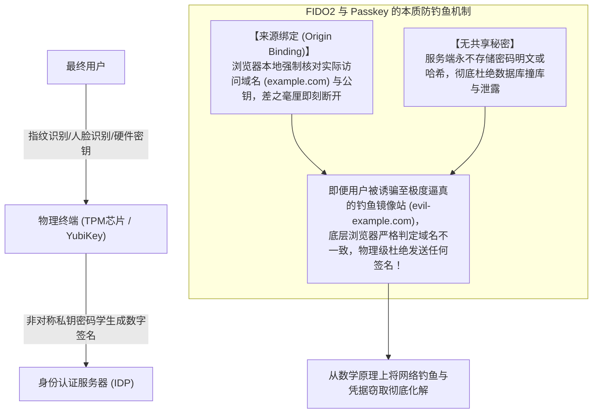

FIDO2之所以具备不可被攻破的免疫钓鱼特性，归功于其数学层面的**“来源绑定（Origin Binding）”**机制：
在整个鉴权通信过程中，操作系统的安全芯片（如硬件TPM）或物理硬件安全密钥（如YubiKey）直接与浏览器底层的通信栈原生联动。浏览器在生成加密断言时，会强行提取当前地址栏中真实访问的完全合格域名（FQDN）。如果用户不幸被诱骗点击进入了一个外观完全像素级克隆的恶意仿冒网站（例如将 `example.com` 仿冒为 `evil-example.com`），底层的硬件密钥会判定请求发起的来源域名与私钥绑定的注册域名毫无关联，**底层机制会直接拒绝向远端服务器发送任何数字签名凭据**。

这意味着，无论社会工程学欺骗手段多么逼真、即便人类雇员彻底被蒙蔽双眼，在硬核的公钥密码学数学规律面前，黑客绝无可能从客户端骗取到半点可用的认证凭据。企业必须下定决心，从掌握核心数据特权的运维管理人员及高管群体起步，强制分发YubiKey硬件密钥或开启Windows Hello / Touch ID内置安全芯片，彻底普及抗钓鱼身份认证。

### 6.2 Active Directory的三级分层（Tiering）防御模型与JIT即时特权治理

针对在短时间内无法彻底摒弃本地传统Active Directory域控体系的广大企业，挽救其免于沦陷的核心解药，便是严格贯彻落地微软官方推崇的**“Active Directory 阶梯分层控制模型（Tiering Architecture）”**。

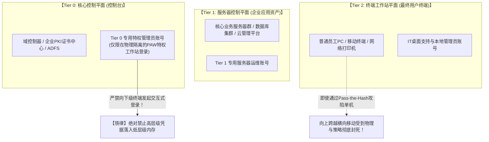

分层控制模型的核心精髓在于一条绝对不可践踏的逆向铁律：**“拥有高层级控制特权的管理账号，绝对禁止在低层级的普通资产终端上执行任何交互式登录，杜绝特权凭据遗留在低等级主机内存之中”**：
- **Tier 0（核心控制平面）**: 域控制器、PKI证书服务、ADFS联邦认证服务器及最高权限域管账号。Tier 0管理员账号的登录权限被死死锁死在Tier 0控制台之内，严禁在任何Tier 1业务服务器或Tier 2普通电脑上登录。日常的域控维护，只能在经过重重加固、与外部公网及办公局域网严密逻辑隔离的**“专用特权访问工作站（PAW: Privileged Access Workstation）”**上发起。
- **Tier 1（服务器控制平面）**: 涵盖ERP服务器、内部数据库、公有云管理中台，仅允许专职的Tier 1运维账号登录维护。
- **Tier 2（终端资产工作站平面）**: 普通办公PC、移动便携机、前台终端，仅由Tier 2桌面支持人员运维。

与此同时，彻底废止允许账号长年累月坐拥超级管理员特权的“永久性特权（Standing Privileges）”，坚决推行**“即时动态特权接入（Just-In-Time / JIT Access）”**。管理员在常规工作状态下仅具备最基础的普通只读权限；唯有当紧急故障抢修等特殊工单发生时，方可通过多因子审批工作流，临时申领一个有效窗口期仅有2小时的临时特权令牌。如此一来，即便黑客在平时处心积虑黑掉了管理员的个人电脑，也根本无法从中榨取到能够呼风唤雨的特权利用凭证。

### 6.3 依托条件访问（Conditional Access）打造毫秒级全动态策略裁决

在零信任语境下，“认证”绝不是那种“早上打卡输入一次密码、全天便能畅通无阻”的单点、静态事件。它必须被演进为在全生命周期会话中持续被评估、与上下文动态深度绑定的**“全动态持续风险度量（Continuous Adaptive Trust）”**。

这一机制的落脚点，正是诸如Microsoft Entra ID（原Azure AD）、Okta等现代统一身份中枢所承载的**“条件访问（Conditional Access）引擎”**。

每当用户发起一次资源调用请求，后端的策略决策引擎（PDP）将在几毫秒内对其进行多维度的实时风险评分与交叉验证：
1. **用户及组织身份上下文**: 发起人的账户隶属关系、职务角色权限以及是否涉及敏感特权岗位。
2. **源IP属性与地理空间轨迹（Geolocation）**:
   - 如果系统检测到某账号十分钟前刚刚在东京总部的固定公网IP登录，十分钟后却突然从东欧或非洲的IP地址发起登录请求（物理上绝不可能发生的跨国空间移动: Impossible Travel），策略引擎将在毫秒内直接掐断会话并锁死该账号。
3. **终端设备的实时合规基线与健康状态**:
   - 尝试接入的设备是否处于企业统一MDM管控名单之内？操作系统是否已打满最新的系统安全补丁？设备本地BitLocker全盘加密是否处于强制激活状态？更关键的是，终端部署的EDR组件当前是否处于健康运行状态，是否正触发未处理的高危恶意代码告警？
4. **实时行为异常分析与威胁态势打分**:
   - 识别是否存在异常时段（如凌晨三点）的非常规大批量连续访问行为、短时间内是否存在密集且异常的多文档下载外发动作。一旦指标突破动态安全阈值，系统将即刻强行要求用户追加生物识别二次验证，或是强制即时销毁会话Token踢其下线。

只要上述严苛的准入基线中有任何一项未能成功达标，哪怕攻击者输入了一组完全精确无误的登录用户名与初始密码，企业内网的大门也绝对不会为其敞开一毫米缝隙。

---

## 第7章：供应链与外部供应商生态的穿透式强管控治理模型

即使本企业内部的零信任防线打造得水泄不通，但倘若供应链这扇“后厨边门”依然大敞四开，整座城堡的安全依然难逃瞬间失守的宿运。企业应当如何穿透迷雾，对外部庞杂的供应商与外包网络实施强有力的高效治理？

### 7.1 供应商全景图谱的彻底盘点与持续动态安全评级

首当其冲的战略动作，便是**“对全量软件、业务及服务供应链实施地毯式的资产盘点与穿透式全景可视化”**。

在当今多数大型企业内部，采购部门往往仅能掌握直接签署合同的一级集成商名单，对于藏身于一级承包商背后、实际操刀代码研发与系统运维的二级、三级分包商究竟是谁、身处何地、安全水位几何，处于近乎全盲的失控状态。
- 在所有对外采购与系统外包服务合同中，必须以刚性法律条款形式严厉明确：**“未经发包方书面合规预审与正式批准，严禁将项目私自向下二次分包与转包”**，彻底终结黑盒式的逐级甩手。
- 全面取缔每年仅靠向供应商派发一份纸质选择题自查表、靠对方自行打勾签字背书的形式主义合规走过场。
- 引入权威的外部第三方量化安全审计机制，全面常态化采购部署**“供应商安全态势评级平台（如BitSight、SecurityScorecard等）”**。实时、无感且客观地监测全部在册供应商对外暴露域名的外部弱口令脆弱性、公网端口与VPN设备补丁修补滞后情况、以及在暗网黑产论坛中关于该供应商凭证外泄的蛛丝马迹，建立**全天候、动态化、量化打分的安全预警拦截准入机制**。

### 7.2 严禁外包人员自带设备（BYOD）直连，全面普及零信任隔离VDI

要想从根本上切断由于外包技术人员个人电脑遭受病毒感染进而殃及发包方生产内网的惨剧，在架构层面最直接、最无情的物理级杀招就是——**确立“绝不向外包终端下发哪怕1个字节真实核心业务数据”的绝对物理原则**。

外包协作团队私自购置的电脑、或是缺乏严苛安全基线纳管的自带设备（BYOD），必须从底层机制上全面封杀其直连企业内网或企业云端存储的任何通道。

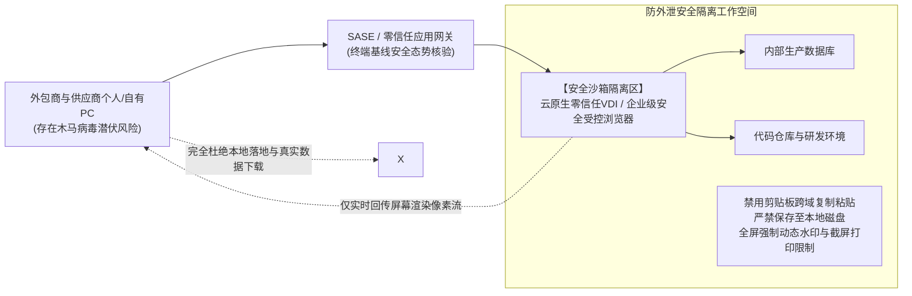

企业必须严格强制所有外部技术服务商，统一通过由企业安全团队统一加固纳管的**“云原生零信任虚拟桌面（VDI / DaaS）”**或者**“企业级安全受控浏览器（Enterprise Secure Browser）”**作为唯一受控入口开展日常作业：
- 在系统内核层面对虚拟工作空间施加深度安全限制：物理封死本地虚拟通道的文件下载功能、彻底禁用跨越虚拟桌面边界的剪贴板复制粘贴动作、关闭外部屏幕截图录屏与物理打印功能，并在整个交互界面底层全天候叠加包含操作员姓名、工号、IP及时间戳的高密度全屏半透明防溯源动态安全水印；
- 在这套受控架构下，推送到外包人员本地物理显示器上的**仅仅是一帧帧实时渲染的显示像素点阵图**。即便外包人员本地电脑不幸中招潜伏了最阴毒的信息窃取木马，黑客也休想从其操作系统中截获到任何一行核心生产源码、企业真实数据包或可重放的底层认证会话Cookie。

### 7.3 全面推行SBOM（软件物料清单）与对外API权限最小化约束

在数字化软件供应链维度，另一个极其隐蔽且破坏力极大的盲区，在于第三方定制软件研发过程中的开源组件污染。

大量外包软件开发商在为政企客户开发交付定制Web系统时，为了贪图开发进度，肆无忌惮地在代码工程中引入充斥着已知高危安全漏洞的老旧开源框架（如已被全球黑客挖穿的Apache Log4j2旧版本、未修复反序列化漏洞的Spring Framework老旧组件等）。这些系统一旦验收上线，无异于在企业腹地埋下了一枚随时可能被引爆的定时核弹。

企业必须对所有外部软件交付商强行立下规矩：在交付最终软件制件的同时，必须强制附带提交完备的**“SBOM（Software Bill of Materials，软件物料清单）”**。借由标准化的机器可读物料清单，全面厘清软件所依赖的全部开源类库层级、对应版本及哈希校验值。一旦未来全球漏洞库中爆发类似Log4j级别的毁灭性0-day漏洞，企业安全团队可在几分钟内精准检索定位全集团内部究竟有哪些生产系统引入了涉疫组件，并在几小时内实施针对性热补丁修复。

同样，针对企业与外部商业合作伙伴或公有云服务之间的“对外API数据互通接口”，坚决杜绝发放长效无限制的特权API Key，全面推行基于OAuth 2.0规范的细颗粒度最小作用域（Scope）约束，并强制设定超短生存周期（TTL）的自动轮转刷新机制。

---

## 第8章：抵御勒索病毒与毁灭性数据破坏的终极防线——重塑“网络韧性（Cyber Resilience）”

在零信任的核心理念“预设系统已被攻破（Assume Breach）”的逻辑推演下，企业在安全战场上的最后一道不可逾越的底线，就是**“网络韧性（Cyber Resilience: 业务极限承压与灾后自愈重建能力）”**。

在高度专业化的国家级APT组织或工业化黑客集团的持久立体渗透面前，全世界没有任何一家防守方敢夸口能永远做到100%御敌于国门之外。当最坏的情况不可避免地降临、内网核心资产遭遇突袭瘫痪时，真正决定一家企业生死存亡的终极考题在于：**“你是否具备在一片废墟中，迅速甩开黑客勒索、以最快速度让核心业务原地满血复活的硬核底牌？”**

### 8.1 黄金标准“3-2-1-1-0 备份准则”与底层“不可变存储（Immutable Storage）”

在近年的BlackSuit、LockBit等新型高阶勒索软件作战条令中，黑客潜入系统后的第一军事要务根本不是去加密业务虚拟机，而是**“穷尽一切手段，顺藤摸瓜将企业所有的在线备份系统、快照卷、容灾镜像全数实施物理格式化与覆写消杀”**。因为黑客非常清楚：只要企业的备份完好无损，就绝不会有任何一家明智的企业愿意掏出数百万美元的巨额赎金。

传统的、单纯依赖“每天半夜定时跑个脚本把数据冷拷贝到另一台机房NAS上”的业余做法，在现代勒索攻击面前无异于纸糊的防线。一旦备份NAS同样挂靠在Active Directory域内，掌握了域管特权的黑客只需敲下一行指令，备份卷便会连同生产库一起灰飞烟灭。

现代企业必须以军规级标准，全量重构并坚决践行**“新时代 3-2-1-1-0 备份黄金法则”**：

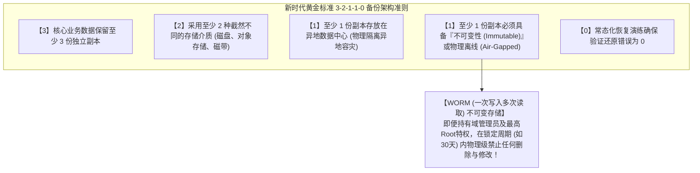

在整套法则中，最为致命、也最具决定性分水岭意义的技术支撑，正是**“不可变备份（Immutable Backup）”**。
这项技术依托底层现代化对象存储（如AWS S3 Object Lock）或高端专用备份存储一体机（如Veeam、Cohesity、Rubrik）底层微码固件所搭载的**“WORM（Write Once, Read Many，一次写入、多次读取）物理锁定机制”**。
一旦某一份备份镜像文件被加锁写入，在预先设定的安全合规锁定期内（例如设为30天内），底层硬件驱动器和存储API将形成单向绝对只读闭环——**在此期间，即便是企业的董事长亲临、哪怕是掌握了全网最高特权的域管理员Root账号、甚至是已经潜伏在存储底层的顶级黑客，任何发往底层的删除数据指令、修改覆盖指令，均会被存储微码直接在物理硬件层面直接硬性拦截驳回！**

即便外部生产数据中心遭遇了毁灭性打击，全网数万台虚拟机在短短几小时内被勒索病毒全数加密变砖，只要那一份锁死在不可变介质中的备份镜像完好无损，企业管理层便拥有无视黑客一切威胁与恫吓的坚强底气，从容在干净的隔离网络中发起全量业务系统的无损自愈重建。

### 8.2 建设完全物理隔离的“独立第三方身份认证断点（Out-of-Band Auth Domain）”

仅仅购买了具备不可变特性的备份设备还远远不够。在灾备系统工程架构规划中，必须确立一条铁律：**“备份管理控制平面，必须与企业日常生产运行的Active Directory域实现彻底的物理与逻辑断交”**。

- 备份服务器与底层存储集群的日常管理认证，绝对不允许挂靠、同步或依赖于企业主Active Directory；它必须采用一套完全自闭环、完全独立的本地高强身份认证系统（独立账号、强制挂载独立的物理硬件MFA验证）；
- 允许登录备份管理中枢的维护控制台，必须严格限制在完全脱离常规办公局域网的独立带外管理网段（Out-of-Band Network）之内，与互联网完全物理断连。

唯有彻底实现“身份与控制平面的完全物理隔离”，才能确保在主内网域控制器遭到全盘洗劫陷落的最绝望时刻，企业最后的生命诺亚方舟——备份与恢复基础设施，能够独善其身、毫发无损。

### 8.3 依托EDR/XDR与7×24小时专业托管SOC构筑毫秒级极限响应能力

在从黑客实施初始突破到展开全网大肆破坏的残酷竞速赛中，决定防御成败的核心量化指标被高度浓缩为两大军事标尺：**MTTD（平均检测时间: Mean Time to Detect）** 与 **MTTR（平均响应控制时间: Mean Time to Respond）**。

传统的静态杀毒软件（EPP）在面对现代高度定制化、无文件内存加载（Fileless）的高级威胁面前早已形同虚设。现代企业必须在全网终端不留死角地全面部署**“EDR（终端检测与响应）”**，并向上层聚合打通网络流量、云端审计日志的**“XDR（扩展检测与响应）”**引擎，将监控焦点全面聚焦于进程与内存维度的“行为动态特征（Behavioral Analytics）”：
- 比如：某台机器内正常的系统原生PowerShell突然被异常调起，并在极短时间内尝试读取 `lsass.exe` 进程的敏感内存区域；或者某个工作站后台在半夜短时间内开始疯狂遍历磁盘并高频修改海量文件的扩展名后缀。这类极具高危破坏征兆的底层异常行为，会被EDR探针在毫秒级内捕获；
- 一旦捕捉到异常信号，EDR甚至无需等待管理员的人工研判命令，即可在操作系统最底层的网络NDIS驱动层，**瞬间对该台受染终端下达网络逻辑断网指令（动态网络隔离）**。受害终端在被瞬间踢出网络的同时，仅保留与云端安全分析中心的唯一溯源通道，从物理机制上彻底掐死黑客企图横向挪动的任何通道。

然而，职业黑客往往精准挑选防守最为脆弱的空当发起总攻——例如“周五深夜临近零点”、或是“五一长假、元旦跨年等全员放假的重大节假日”。因此，如果企业的安全监控仅仅局限于朝九晚五的“工作日白天有人看大盘”，其防守依然是一张千疮百孔的筛子。**建立或采购具备7×24小时、全年365天无缝值守且拥有直接下达全网阻断处置权限的专业托管式威胁检测与响应服务（Managed Detection and Response: MDR / 托管SOC）**，是任何一家现代企业在这场不分昼夜的现代网络超限战中立于不败之地的基础配置。

---

## 第9章：高管治理格局重构与全球法律监管双轮驱动的合规革命

网络安全能力的涅槃重生，从来都不仅仅是一场局限在技术机房内部的孤立技术升级。它是一场必须由最高管理层挂帅、深度融合法律合规威慑力、并重塑全员利益考核机制的全面企业治理革命。

### 9.1 个人信息保护法的大幅重修与民事赔偿、监管巨额罚金的法律利刃

在日本乃至全球主流成熟市场，针对数据安全合规治理的法律天网正以令人窒息的速度全面收紧。

随着日本新修订《个人信息保护法》的全面落地实施，只要发生达到法定规模门槛的个人信息外泄事故（或存在外泄的高度实质风险），企业**必须在法定时限内无条件向个人信息保护委员会（PPC）提交正式报告，并强制向每一位受波及的个人履行正式告知义务**。
- 法律对违规法人的行政罚款上限被大幅提高至数倍，顶格罚金动辄数亿日元；
- 更为致命的是来自民事司法层面的毁灭性风暴：受害消费者与维权股东发起的集体诉讼浪潮、以及针对受害个体不得不支付的每人从数千至数万日元不等的大规模补偿慰问金。对于涉及数万乃至数百万规模用户信息泄露的重大事故，仅法定义务性现金赔付支出便可轻松撕开数十亿乃至数百亿日元的致命财务资金黑洞。

加之2024年日本国会正式表决通过的《重要经济安全保障情报保护与活用法》，以及针对关键基础设施运营商推行的网络安全法制强化升级，任何承担公共服务属性的企业一旦由于自身低劣的安全配置而沦为供应链沦陷跳板，将直接面临政府吊销特许经营资质、国家安全部门突击进驻审查等毁灭性法律与监管严惩。网络安全事故，已彻底完成从单纯的“技术运维事故”向“决定企业法人资格存续与否的重大法律灾难”的质变。

### 9.2 董事会成员的“善管注意义务”：网络安全已不可推卸地沦为最高层法律责任

在现代公司法体系与公司治理法理中，董事会高管对所属法人负有神圣且不可推卸的**“善管注意义务（Duty of Care: 善良管理者的注意义务）”**。

正如日本最高裁判所相关判例以及日本经济产业省、IPA联袂发布的《网络安全经营指针》所确立的权威司法解释：在现代高度数字化的商业环境下，任何因董事会未尽合理审慎职责、对显而易见的安全治理风险视而不见、拖延关键安全投资而诱发的重大网络安全瘫痪与海量数据泄露，**均将被认定为全体董事“严重违反善管注意义务”，从而直接触发股东代表诉讼。涉案高管不仅面临被撤职解雇的声誉毁灭，更有可能被判决以个人全部私有财产承担向公司及股东赔偿巨额损失的无限连带民事责任！**

这宣告了“我不懂技术，系统维护的事情我都全权委托给下面的IT部门了”这一传统日本老派管理者的万能借口，在法庭上彻底沦为自掘坟墓的供词。董事会不仅必须在例行治理议程中定期听取独立的网络安全风险客观评估，更必须对安全预算分配的充分性、灾难恢复计划的可行性承担直接的、不可转嫁的最终法律连带责任。

### 9.3 赋予CISO实质性生杀大权与“安全投资ROI”的终极重定义

要使上述所有治理机制彻底运转起来，整个组织架构变革的最后一把关键钥匙，就是**“真正打破虚设、赋予CISO以至高无上的独立实权”**。

企业必须在制度层面坚决贯彻落实以下三大组织治理改革：
1. **将CISO地位全面升格为公司执行役员（VP）乃至董事会核心成员**:
   严禁将CISO挂靠降格为IT部门（CIO）下辖的二级执行者。必须在组织架构图上确立CISO与CIO平起平坐、拥有独立向CEO和董事会审计委员会单向直接汇报的超然监督通道。
2. **在规章制度中白纸黑字赋予CISO“业务一票否决权”与“紧急生产熔断停机权”**:
   明确授权CISO：有权直接叫停任何未达到安全准入基线的新系统投产上线；有权无条件否决并终止与安全评级不达标的供应链外包商签署合作；更有权在遭遇重大黑客突袭的危急关头，出于止血避险之最高考量，绕过业务部门直接下令切断生产业务连接。
3. **彻底颠覆重构对“安全投资ROI（投资回报率）”的狭隘认知**:
   安全建设的价值，绝对不能再愚蠢地套用“今年投了1亿日元能带来多少新业务营收”这种荒谬公式来衡量。安全的ROI本质上是**“止损与避险系数”**——其衡量的是“由于实施了该项深度投资，从而为企业成功规避了长达数月的核心业务停摆、避免了数十亿日元的天价赔偿诉讼、保全了市值蒸发和百年商誉崩塌的灭顶之灾”。网络安全投资不是可买可不买的奢侈品，它是现代企业在数字洪流中安身立命、合规经营所必须缴纳的“开工执照（License to Operate）”与护身法宝。

---

## 结论：穿越绝望的迷雾 —— 2026年以降日本企业的生死觉醒

站在2026年的历史门槛前，我们必须清醒地承认：人类社会已经绝无可能再倒退回那个“天下无贼、没有任何黑客惦记”的田园牧歌时代。大国博弈背后暗潮涌动的国家级网络军团、在生成式AI高科技武装下高度产业化的跨国黑客集团、以及在暗网黑市中如自来水般肆意流淌的企业合法凭据。威胁不仅不会消减，反而正以几何级数的惊人斜率，构筑起对现代企业的立体合围之势。

然而，我们绝没有理由陷入盲目的悲观与绝望。

因为纵观横扫日本企业的这一场场惊天危机的技术底色，它们绝非“不可抗力的人类不可测天灾”。这一串串血淋淋的悲剧，其本质恰恰是日本政企多年来对“全盘外包的虚妄依赖”、“深层转包的推诿扯皮”、“内网信任的陈腐神话”以及“管理层对数字化无知与傲慢”所联袂酿成的**彻头彻尾的“人祸”**。

既然危机的本源是人祸，那么依靠人类的最高智慧、决绝魄力与工业化工程实践，它就必然能够被彻底扭转与攻克！

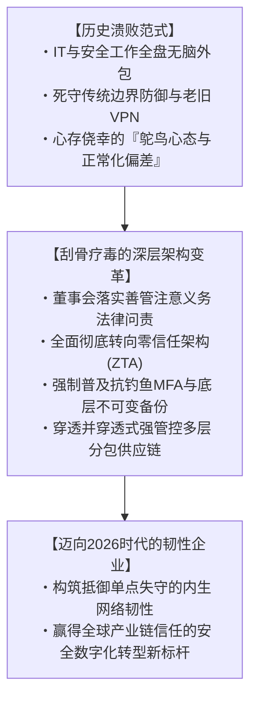

网络安全，从来都不是阻碍业务狂奔的“绊脚石”。在波谲云诡的现代数字经济竞技场上，它正如一辆顶级方程式赛车上所装配的**“最顶级的碳陶瓷制动系统”**。唯有拥有了能够在任何极限弯道前瞬间平稳制动的最强刹车，一名真正优秀的赛车手，才敢于毫无后顾之忧地将油门死死踩到底，以风驰电掣的极限速度超越所有对手。

正如过去日本工程界曾以“精益求精、对产品细节近乎偏执”的匠人精神赢得全球敬畏一样，如今面对网络空间的狂风巨浪，日本企业唯有迅速摒弃一切侥幸与傲慢，在架构底层开展一场刮骨疗毒式的全面重塑。**以“绝不背叛每一位客户、每一位员工及全社会的信任”为最高铁律**，扎扎实实推进零信任的技术跃迁与组织觉醒。唯有展现出这般破釜沉舟觉悟的组织，方能穿越这片网络战火肆虐的惊涛骇浪，在2026年以降的全球数字文明版图中，傲然屹立于世界之巅！
