## 序論：2026年的警鐘 ——「資安後進國」日本直面的國家級危機

自2020年代中期邁入2026年的當下，日本的網路空間正遭受著前所未見的狂風暴雨式猛烈衝擊。

長久以來，日本產業界內部一直瀰漫著某種毫無根據的虛幻「安全神話」：「我們公司並非跨國巨頭，不可能淪為駭客目標」、「日語天然的語言障壁構築了抵禦網路攻擊的天然防線」、「既然採購安裝了知名資安大廠的防毒軟體，自然高枕無憂」——然而，這些甜美的幻想在嚴酷的現實面前已被徹底擊得粉碎。

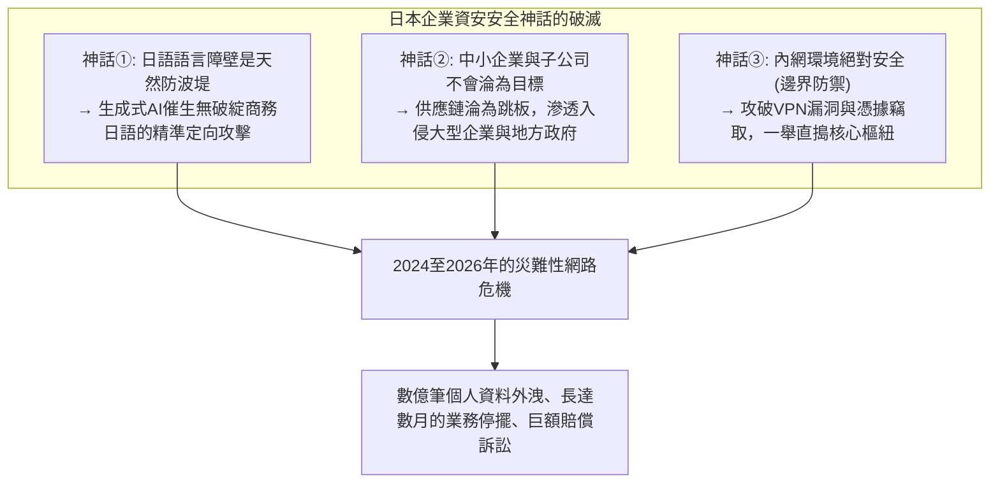

現實殘酷得令人窒息。從文化傳媒龍頭、超級巨型銀行、主要電信營運商、關鍵基礎設施樞紐，乃至於各級地方自治體的行政系統，諸多赫赫有名的政企巨頭接二連三地在勒索軟體的鐵蹄下被迫俯首稱臣，或是將數百萬乃至數千萬筆極其敏感的公民個人隱私資料拱手暴露於暗網之中。

外洩的資料早已不限於姓名、住址、電話號碼等基礎檔案。信用卡安全碼、深度體檢報告、個人社會保障碼（My Number）、商業往來機密契約、內部通訊協作全量日誌，甚至是核心員工的高解析度駕照正反面掃描檔等足以徹底摧毀個人社會信用與人格尊嚴的核心機密，全數淪為國際網路犯罪駭客集團手中勒索高額贖金的籌碼，在暗網黑市遭到大肆拍賣。

每當重大資安事件爆發，鎂光燈下的記者會上總能見到企業高層排成一列深鞠躬致歉的熟悉景象，口中機械式地重複著「事故確切原因仍在調查中」、「將進一步落實全員資訊安全教育」等千篇一律的官方公關辭令。

然而，我們必須直面這道嚴厲的拷問：**為什麼那些每年投入巨額IT資訊化預算、定期推行全員資安培訓的日本企業，依然無法遏止海量資料外洩與毀滅性勒索軟體攻擊的接連發生？**

其根本原因，絕非第一線員工「不慎點擊了可疑郵件連結」這種微觀戰術層面的操作失誤所能概括。這實質上是日本產業界在過去數十年間刻意漠視並持續累積的深層結構性潰敗：**「全盤甩手外包與深層多層轉包的體制病理」**、對早已落後於時代的**「傳統邊界型防禦（Perimeter Model）的盲目迷信」**、雲端原生轉型浪潮下**「身分驗證與權限基礎架構的嚴重空洞化」**，以及**「企業高層將資安視為純粹沉沒成本而非核心戰略投資的治理失靈」**。多重沉痾交織共振，最終導向了系統性的必然崩潰。

本文站在頂尖CISO（資安長）與資深威脅分析師的高度，深度解剖2024至2026年間震撼日本社會的幾起指標性重大資安事件的底層技術邏輯，徹底揭開侵蝕日本政企根基的結構性病灶；同時，完整端出一套立足於「預設系統已被入侵」現代防禦思維的實戰指南——涵蓋**零信任架構（ZTA）的全面落地實踐、供應鏈體系的穿透式強管控、抗釣魚硬體級MFA身分強固、底層不可變備份帶來的網路韌性（Cyber Resilience）重建**，為各類企業勾勒出一份在殘酷攻防對抗環境中求得生存的決定性防禦體系白皮書。

---

## 第1章：2024〜2026年日本企業代表性重大資安事件深度解剖

要真正洞察日本企業所面臨的危機實質，首先必須基於扎實的技術事實，直視近年來爆發的幾起具有分水嶺意義的典型事件之完整「攻擊鏈（Kill Chain）」。

### 1.1 角川（KADOKAWA）/ NicoNico動畫事件的血淚教訓：資料中心全軍覆沒與BlackSuit勒索軟體浩劫

2024年6月，日本出版傳媒巨頭角川（KADOKAWA）及其旗下知名多媒體影音平台多玩國（DWANGO）遭遇網路攻擊，成為日本資訊安全史上傷亡最為慘烈的一大歷史分水嶺。

發動本次毀滅性打擊的，是承襲了惡名昭彰的國際勒索集團「Conti」核心技術的後繼頂尖駭客組織——**「BlackSuit」**。該事件導致代表日本流行文化的國民級影音串流平台「NicoNico動畫」在內的全線Web服務陷入全面癱瘓，全日本範圍內的實體圖書出版物流發行系統以及財務結算核心業務中斷長達數月之久。更具毀滅性的是，包括全體員工個人資料、合作知名創作者合約、企業商業契約在內的逾25萬份機密資料被駭客公開發布於暗網勒索網站，引發了難以估量的商譽崩盤。

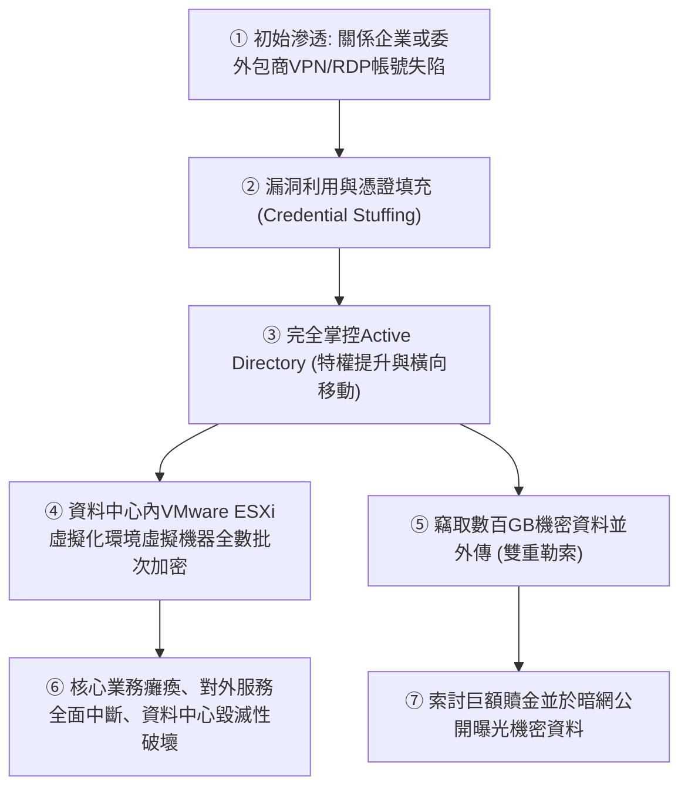

該事件給日本資安社群帶來的最大技術震撼在於：**「不僅是表層應用系統，企業地端私有雲資料中心（底層虛擬化基石）本身遭遇了連根拔起式的破壞」**。

駭客並未直接正面攻打集團總部的核心防火牆，而是巧妙挑選了防護相對薄弱的關係子公司或委外包商的遠端辦公環境（舊版VPN閘道器或對外開放的RDP連接埠）作為初始跳板。在成功切入內網邊界後，攻擊者敏銳利用了內網「一馬平川（缺乏微隔離分段）」的拓撲缺陷，展開肆無忌憚的橫向移動（Lateral Movement），最終徹底奪取了整座企業IT底層命脈——**Active Directory（網域控制器）的最高網域管理員特權（Domain Admin）**。

在徹底掌控網域主控權後，BlackSuit團伙不僅鎖定了常規Windows伺服器，更長驅直入底層VMware ESXi虛擬化架構的底層管理控制平面，直接對儲存集區內存放的海量虛擬機器磁碟映像檔（.vmdk）實施了底層高強度平行加密。更為毒辣的是，**攻擊者利用網域管理員特權，將原本在線連線掛載的所有備份磁碟區與備份管理伺服器全數實施了物理級刪除與覆寫加密**。

這場悲劇如同當頭棒喝，向全日本的企業決策層揭示了一條殘酷的客觀鐵律：一旦攻擊者跨越內網邊界，在扁平化信任網路下，無論規模多麼龐大的頂級資料中心，都可能在短短數十分鐘內一夕斃命。

### 1.2 LINE Yahoo事件與NAVER共享架構：跨境委外治理體系的全面潰敗

2023年秋曝光並於2024至2026年間招致日本總務省罕見的連續多次嚴厲行政指導的「LINE Yahoo（LY Corporation）大規模使用者個人資料外洩事件」，將日本IT企業在**「資本控股與委外合作深度捆綁下產生的治理盲區」**赤裸裸地暴露在陽光之下。

該事件導致涵蓋使用者、合作夥伴及企業員工在內的約51萬筆機密個資遭到未授權外洩，而整場災難的導火線，卻源自LINE Yahoo大股東兼技術母體——韓國NAVER公司的雲端測試與維運環境。

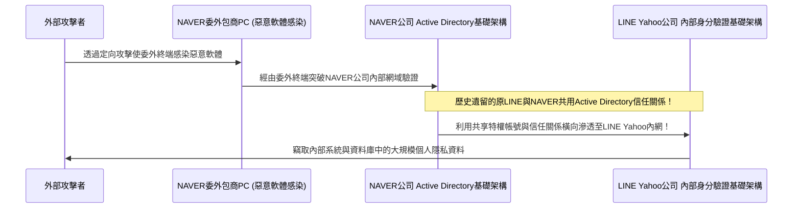

該事件在技術維度的核心本質，在於**「原LINE與NAVER之間，在組織整併多年後，底層的Active Directory等企業級身分驗證體系依然維持著無條件的完全信任與跨國網路互通」**。

攻擊者最初僅僅攻陷了NAVER旗下某三方委外包商的一台普通辦公電腦。透過這台受控電腦，駭客順藤摸瓜滲入NAVER企業內網，隨後毫無阻礙地利用這條「毫無二次鑑權機制的跨國網域信任通道（Domain Trust）」，直接跨越國境跳板攻入日本本土LINE Yahoo公司的核心生產資料庫，大肆竊取敏感資料。

此案向長期熱衷於「離岸開發委外」、「跨國子公司協同」的日本跨國集團敲響了警鐘：**僅僅因為「是母公司」、「是關係企業」，便想當然爾地將底層內網與目錄服務全盤直連信任，其背後隱藏著毀滅性的穿透風險**。總務省強勢介入並勒令其「重塑資本結構並落實底層驗證基礎架構的徹底物理與邏輯切割」，充分證明涉及地緣政治風險的軟體與IT供應鏈治理，已然上升為關乎國家主權與資訊安全的根本課題。

### 1.3 席捲地方政府與BPO大廠（以ISETO等為代表）的供應鏈連環雪崩

2024年以來，在全日本數十個地方自治體、金融機構及大型公共事業單位中引發廣泛恐慌的，是針對承攬列印印刷、帳單郵寄與基礎資料建檔處理的**大型BPO（商業流程委外）龍頭企業（如ISETO等公司）的勒索軟體精準狙擊**。

為節省行政成本，日本各級市町村政府在寄發住民稅核定通知書、國民健康保險證、長照保險繳費單、選舉公報等市政業務時，普遍透過公開招標，將包含全體居民姓名、確切地址、個人所得明細、乃至於My Number國民身分證號的極機密個資，整包委託給民營BPO廠商進行集中印製與寄送。

深諳攻防博弈的攻擊集團並未正面衝擊市政廳內部戒備森嚴的封閉內網（即所謂高度物理隔離的「LGWAN三層架構」）。駭客精準地鎖定了整條鏈路上防守最為鬆散的薄弱節點——**受託承接業務的BPO包商在各地的分支作業據點網路**。

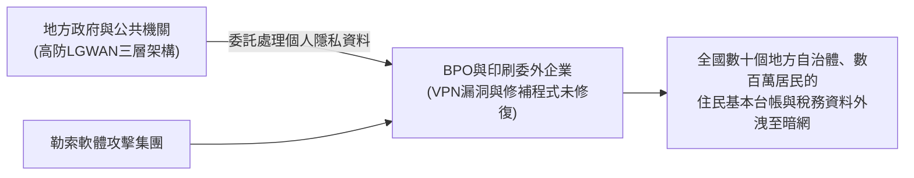

在BPO公司的分支網路因對外暴露的VPN閘道漏洞遭勒索軟體徹底攻破後，駭客不僅加密了委外廠商的自有資產，更順理成章地將伺服器內暫存的來自全國數十個政府機關、涵蓋數百萬納稅居民機密個資的龐大資料庫整批打包竊取，並放上暗網標價拍賣。

這起事件揭示了一條冷峻無情的防禦鐵律：**「無論發包方在自身核心機房投入數億日圓構築了多麼固若金湯的防線，一旦業務鏈上下游委外包商的安全水位低落，整座供應鏈體系便會在瞬間分崩離析。」** 那些長期以來僅憑「在合約中增訂保密與資安條款」便自以為萬事大吉的紙上形式主義合規，在此類硬核實戰打擊面前被徹底擊得粉碎。

### 1.4 雲端服務配置疏漏（Salesforce / AWS / Azure）：全球敞開的大門與裸奔的數據

資料大規模外洩的罪魁禍首，並非僅限於勒索軟體這類高對抗性APT攻擊。在2020年代中期的重大外洩事件中，佔據驚人比例的另一主因，竟然是低級至極的**「雲端基礎架構安全性設定疏漏（Cloud Misconfiguration）」**。

在諸多日本一線券商、大型銀行、知名電商平台及政府部會中屢見不鮮的，正是客戶關係管理平台 **Salesforce 設定失誤導致的客戶機密資料全面曝光** 事件。

Salesforce平台內建了用於快速搭建外部客戶入口網站或互動站點的「社群功能（Experience Cloud）」以及訪客帳號（Guest User）設定。由於系統管理員在設定存取控制（Sharing Rules）時觀念混淆與預設規則誤配，導致原本僅限經過強固身分驗證之內部客服人員調閱的高資產客戶檔案（包含姓名、手機號碼、帳戶號碼、完整交易紀錄），**在完全未經任何帳號密碼鑑權的前提下，淪為網際網路爬蟲可任意檢索瀏覽的公開資源**，且此種裸露狀態往往持續數月乃至數年未被察覺。

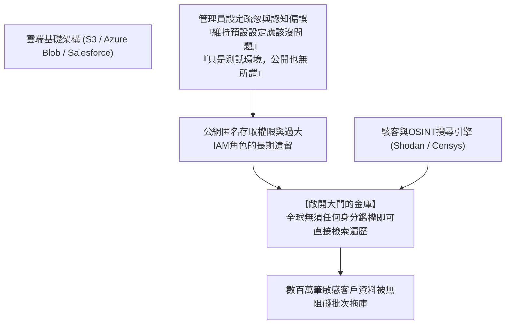

類似的情節在公有雲領域屢見不鮮：亞馬遜AWS的S3儲存貯體公開讀取權限誤設、微軟Azure儲存體帳戶存取控制策略缺失、乃至於內部開發人員在GitHub公開程式碼庫中失手推送包含特權憑據（API Secret Key / Access Token）的原始碼……

根本不需要駭客動用高深的零日（0-day）漏洞，**「企業維運者親手推開了金庫的沉重大門，將裡面的金條向全世界公開展出」**——這正是日本企業在倉促擁抱雲端過程中暴露出的極度荒謬現實。

---

## 第2章：根本原因的深層解剖① —— 結構性與組織機制痼疾（全盤外包與多層轉包）

為什麼在風險如此明確、前車之鑑歷歷在目的情況下，日本企業依然無法從根本上防範資安事故的重演？第二章將手術刀對準隱藏在技術故障表象背後的「日本傳統企業社會組織結構性病理」。

### 2.1 「IT屬於成本中心」的管理層偏見與名存實亡的CISO機制

日本企業在資訊安全領域最大的漏洞，根本不在於外部防火牆規則設定得如何，而是在於**「董事會會議室（Boardroom）的認知盲區」**。

在歐美跨國領導企業中，IT數位架構與網路資安被普遍定位為「攸關企業生死存亡的核心競爭力與最高優先級議程」。資安長（CISO）通常直接向CEO報告，擁有直接介入各事業部門的絕對權威，甚至具備「當發現重大資安隱患時，哪怕衝擊當期營收亦可強制下令中斷生產系統」的堅決否決權（Veto Power）。

相對地，在絕大多數傳統日本企業中，IT部門長期被視為「不產生直接營收的後勤行政成本中心（Cost Center）」。
- 董事會成員清一色出身自業務、法務、財務或文科體系，幾乎無人具備IT或資安攻防技術專業。被任命為所謂CIO或CISO的高階主管，往往是由即將退休的高層在掌管總務、法務之餘「順道兼任掛名」。
- 當第一線資安工程師提出緊急報告：「目前使用的舊款VPN設備存在嚴重高危險漏洞，急需申請數千萬日圓預算進行換代升級，且需要全公司停機數小時進行轉換維護」時，管理階層的典型回應往往是：「本季財報獲利面臨壓力，延後到下個會計年度再編列」、「系統停機幾小時造成的客戶反彈誰來負責？絕對不准停機」。

這種治理結構導致日本企業的CISO淪為**「既無獨立預算、亦無實質權力，唯獨在發生外洩事故時被推上第一線向大眾鞠躬道歉的替罪羔羊（Scapegoat）」**。未將資安防護提升為「確保企業永續營運所不可或缺的重大資本支出」，反而處處視為「能省則省的沉重負擔」，這種最高決策階層的體制性怠惰，正是日本深陷資料外洩泥淖的真正元兇。

### 2.2 多層轉包與層層發包結構催生的「最脆弱環節（Weakest Link）」

最能體現日本IT產業深刻病態特徵的，莫過於完全複製了傳統營造營建業的**「多層轉包結構（IT統包架構，俗稱ITゼネコン）」**。

終端發包企業通常將資訊系統的架構規劃、軟體研發、日常運作及安全維護全數「全盤甩手委外（丸投げ）」給少數幾家大型系統整合商（Prime SIer）。而在大型整合商內部，往往不維持龐大的底層工程團隊，而是抽取高額利潤後，將具體業務層層拆解、逐級轉包給二級包商、三級包商，乃至向下穿透到五級、六級的獨立微型工作室或自由接案工程師（階梯式轉包）。

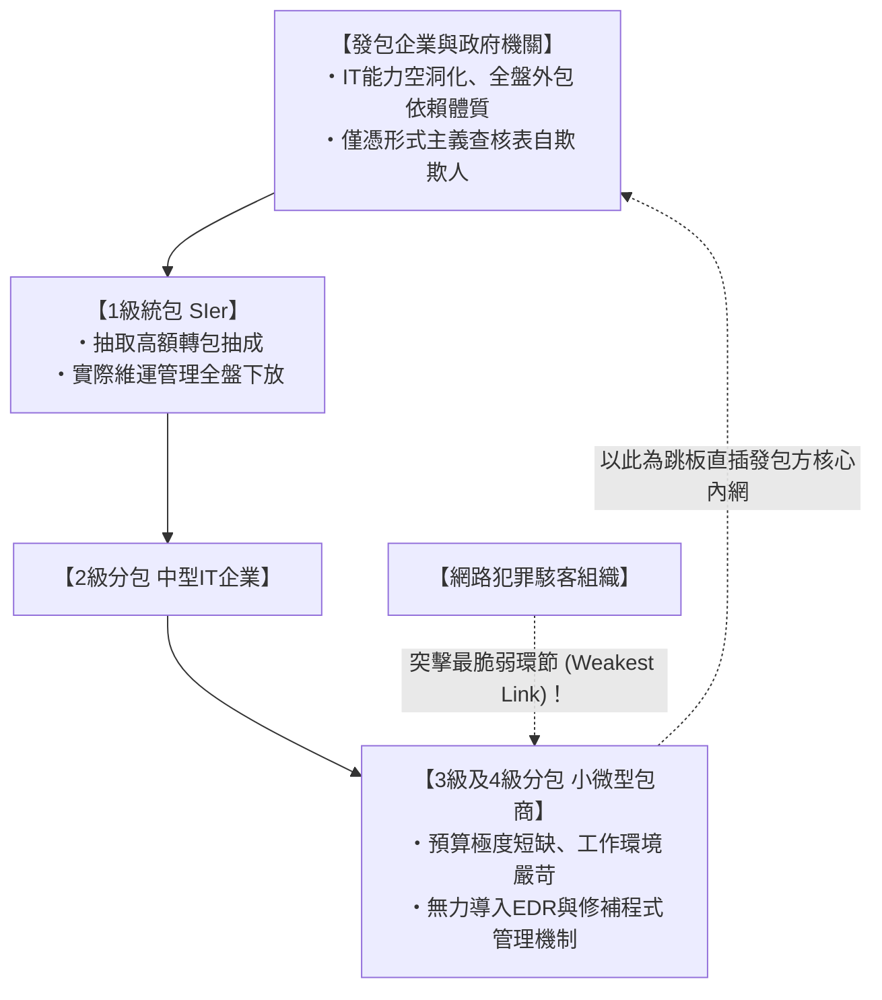

密碼學與安全工程學中有一條歷久彌新的鐵律：**「鏈條的總體強度，取決於其最脆弱的那一環（A chain is only as strong as its weakest link）。」**

即便一級統包商的企業機房部署了多麼昂貴的頂級新世代防火牆、訂定了厚達數百頁的資安防護規範手冊，身處食物鏈最底端的三級、四級微型包商，其微薄的專案費用根本無力負擔現代化的EDR（端點偵測與回應）軟體授權，更遑論委託7×24小時全年無休的SOC（資安監控中心）團隊。
- 在實際工作場域中，基層外包人員往往使用早已終止支援的淘汰版Windows 10電腦，甚至使用未受控管的個人私有筆電（BYOD）連線作業；管理員密碼被手寫在便條紙上貼在螢幕邊框上共用；
- 更荒謬的是，為了方便遠端連線除錯趕工，發包方往往直接提供這些底層外包人員**「可直通正式生產資料庫與核心主機的遠端特權存取帳號」**。

對於專業網路駭客而言，這無異於洞開的捷徑。根本不需要費心硬碰硬攻擊防守嚴密的統包商正面防線，只要鎖定供應鏈最底層、毫無防護的微型外包商投遞惡意程式、俘獲一台終端電腦，駭客便能輕取通往大企業核心資產的合法金鑰，以「完全合規的內部員工身分」大搖大擺地漫步在目標內網中。

### 2.3 日本傳統雇用制度的局限與專業資安人才的結構性斷層

在「人」這個決定性要素上，體制病理同樣觸目驚心。

根據日本經濟產業省（METI）與資訊處理推進機構（IPA）歷年調查，日本資訊安全專業人才的長期缺口高達數萬乃至數十萬人。然而，此一困境的本質絕非單純的少子化人口結構問題，而是**「以終身雇用制、年功序列制為代表的傳統日式人事薪資體系，徹底喪失了吸引、評價與留任頂尖資安戰力的人才培育機制」**。

在歐美、以色列及新加坡等先進國家，負責企業全盤防禦架構設計的頂尖資安架構師、二進位逆向工程師、頂級滲透測試白帽駭客，其年薪換算日圓普遍達到2000萬至4000萬以上。他們被視為抵禦深海數位魚雷襲擊的頂級菁英技術基石。

然而，在恪守全體員工單一薪俸級距的傳統日本企業內部，IT技術人才被牢牢壓制在「綜合職薪資表的後段階層」：
- 薪資機制僵化死板，任憑一名年輕工程師在逆向工程與漏洞挖掘方面擁有如何卓越的天賦，其薪資水準必須受限於同儕業務員或行政人員的待遇區間（年薪僅400萬至600萬日圓）；
- 在職涯發展通道上，技術職涯體系近乎空白，「升官加薪」的唯一道路就是轉型為管理職。工程師若想追求更高收入，就必須告別原始碼、停止分析封包與逆向木馬，整天埋首於預算爭取與撰寫精緻的Excel進度報表。

其必然結果便是：本土最頂尖的技術奇才持續外流至外商科技巨擘或新創獨角獸；留在傳統企業內部IT單位的，大多不具備「親自撰寫腳本探測威脅、深挖Log封包還原入侵、逆向解構未知惡意程式」的實戰防守能力。整個部門退化成只會把外部廠商遞交的PPT報告「從左手轉交給右手」的傳聲筒。正是這種核心防禦大腦的嚴重空洞化，導致各大組織在遭遇真實攻擊時初動應變頻頻失誤，將微小破口演變成不可挽回的滅頂之災。

---

## 第3章：根本原因的深層解剖② —— 技術架構潰敗（邊界防禦瓦解與AD陷阱）

除了組織治理與人力機制維度的脫節，日本企業內部IT基礎架構本身所背負的「陳舊架構包袱與拓撲死穴」，更是攻擊者長驅直入、橫行無阻的核心物理溫床。

### 3.1 VPN設備與遠端桌面：形同虛設的「後門通道」

在疫情衝擊下，日本企業以前所未見的速度全面推行遠端工作（Telework）。在此期間，多數企業為了應急交差，普遍採取了最為省事但也最為致命的妥協作法：**「在傳統內網邊界部署數台硬體SSL-VPN設備（如Fortinet FortiGate、Pulse Secure / Ivanti Connect Secure等），允許員工從外部電腦建立一條直通內網的加密連線通道」**。

這無異於在堅固的水壩基底，親手鑿開了一條通往市區內陸的排污隧道。

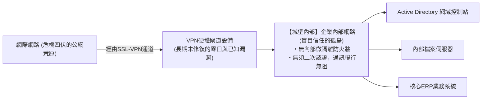

VPN硬體閘道是直接將實體IP與管理連接埠暴露於公網環境的「實體城門」。全世界的專業黑客組織與國家級APT實體，無時無刻不在死盯著這些城門的鎖孔（軟硬體漏洞）。
- 在2023年至2026年間，包含Ivanti、Fortinet、Palo Alto在內的主流VPN閘道接連爆出一連串允許未經認證即可遠端執行任意程式碼的災難性重大漏洞（CVSS評分高達9.0至10.0滿分）；
- 令人匪夷所思的是，即使官方早已緊急釋出漏洞修補程式（Patch），日本仍有大量企業以「擔心影響正常辦公」、「設備重啟需走繁複簽核程序」為由，將關鍵修補作業拖延數月甚至超過一年。

如今的網路駭客早已借助Shodan、Censys等全球資產掃描工具實現了對全球未修補VPN設備的分鐘級全自動探測。攻擊者利用公開攻擊程式碼直接Dump掉設備記憶體，輕而易舉萃取出合法登入憑據（明文帳密、未過期Session Token），**短短數分鐘內，攻擊者便能化身為「百分之百合法的正式員工」，循著VPN通道長驅直入企業核心內網**。

### 3.2 區域網路內生信任神話（邊界防禦模型）的徹底破產

當外部VPN防線失守後，真正將日本企業推向萬劫不復深淵的，是其內部深信不疑的**「傳統邊界型防禦模型（Perimeter Defense / 城堡與護城河模型）」**。

邊界型防禦的核心假設極其天真幼稚：「外部公網充滿惡意威脅，而一旦穿過外部防火牆來到企業內部區域網路（LAN），內部的一切通訊與資產均被視為絕對安全且值得完全信任」。

在這種過時哲學指導下建置的企業內網，其網路拓撲呈現出令人震驚的**「高度扁平化（Flat Network）」**：
- 任何一台連上內部網路的終端電腦，均可在未經二次安全攔截或雙向強加密驗證的情況下，自由存取同一網段乃至相鄰網段內的任意主機、檔案共享伺服器、網路印表機及內部ERP系統；
- 內部橫向流動的所有數據封包，在傳統架構下完全處於免檢狀態，防火牆對此視而不見。

這猶如一座建造了巍峨外牆的中世紀城堡，然而**「一旦外來間諜偽裝成工匠混過城門，便會驚訝地發現城堡內部所有的糧倉、軍械庫、金庫甚至君王的臥室全都未上鎖，任何人都可以毫無阻礙地隨意縱火與搜刮」**。

面對受控終端在內網發起的全自動網路偵察（Reconnaissance）以及從單台普通PC向核心伺服器群的擴散感染——即所謂「橫向移動（Lateral Movement）」，傳統邊界防禦在機制上完全形同虛設。

### 3.3 Active Directory（AD）的過度膨脹與特權憑證管理的徹底失控

在企業級Windows網路環境中，最大的單點故障點（Single Point of Failure），同時也是駭客眼中至高無上的「終極聖杯」，正是微軟的**Active Directory（AD 網域控制器）**。

全日本超過九成的企業將全網員工電腦、使用者帳號體系、存取權限控管與群組原則（GPO）派送等核心命脈全數託付給Active Directory。然而，其後台實際維護管理現況卻往往千瘡百孔：
- 許多企業沿用著二十多年前建置的AD網域架構，歷經多任外包廠商的雜亂擴建與非正規調整，早已退化為無人敢動的巨大黑盒子；
- 離職多年的前員工帳號、廢棄已久的老舊服務程序帳號、供臨時測試後被徹底遺忘的特權帳戶，成千上萬地長期沉睡在目錄服務中；
- 更致命的是**「網域管理員特權（Domain Admin）的浮濫濫用與密碼重複使用」**。為了日常桌面維修圖方便，IT人員在一般員工電腦、公用大廳電腦上隨意指派本機管理員甚至網域管理員登入權限，甚至全網通篇使用同一組弱密碼。

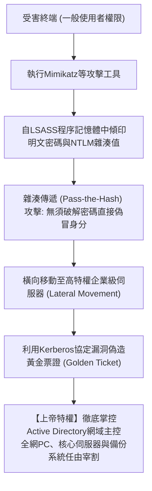

現代駭客一旦攻陷內網任意一台普通工作站，會立即透過記憶體注入技術執行 `Mimikatz` 這類分析工具，瞬間從Windows身分驗證程序 `lsass.exe` 的記憶體常駐區強行傾印出明文密碼、NTLM雜湊值以及Kerberos認證票券。

攻擊者根本不需要耗費時間去逆向破解密碼明文，而是直接利用雜湊值發動**「雜湊傳遞攻擊（Pass-the-Hash）」**；抑或竊取Kerberos身分認證的底層簽名私鑰（krbtgt帳戶），憑空簽發出擁有全網域無限存取特權的**「黃金票證（Golden Ticket）」**。

當這一連串教科書級的特權提升攻擊順利完成，駭客便徹底化身為整座企業IT帝國的「至高造物主」。駭客只需輕點滑鼠編寫一條群組原則（GPO），將勒索病毒設定為開機啟動腳本全網派發，數萬台電腦與核心伺服器便會在短短十幾分鐘內全數癱瘓覆沒。

### 3.4 倉促上雲帶來的後遺症：影子IT與過大權限IAM角色的野蠻擴張

隨著企業由地端資料中心向AWS、Azure、Google Cloud等公有雲平台大規模遷移，另一類新型技術病灶正呈現爆發之勢。

1. **影子IT（Shadow IT）與野生雲端資產**:
   不滿意內部IT資訊單位冗長審核流程的業務單位與敏捷研發團隊，往往繞過資安團隊監控，直接刷企業信用卡在外部私自開通各類SaaS服務與獨立AWS開發帳號。這些資產長期脫離企業SOC的監控雷達，成為公網配置漏洞與弱密碼滋生的灰色地帶。
2. **過大權限（Over-Privileged）的IAM政策機制**:
   作為雲端安全心臟的「IAM（身分與存取管理）」權限規劃，本應嚴格奉行最低特權原則（PoLP）。然而在實務推動中，大量趕進度的開發維運人員因「嫌單獨設定API權限太麻煩」、「生怕權限不足導致系統報錯」，粗暴地將具備全知全能管理權限的 `AdministratorAccess` 或全量讀寫政策漫無節制地指派給常規EC2執行個體或微服務容器。
   一旦某個對外公開的Web服務被駭客探測出微小的SQL注入漏洞或SSRF（伺服器端請求偽造）漏洞，駭客便能瞬間提權剝離出雲端主機綁定的臨時IAM金鑰（STS Token），進而在彈指之間接管整座雲端租戶內的所有硬碟、儲存貯體與關鍵資料庫。

---

## 第4章：根本原因的深層解剖③ —— 人性脆弱面與新型攻擊手法的演進

除了系統架構與組織治理層面的徹底崩壞，直接針對人類心理缺陷與認知極限發起的新形態社交工程攻擊，在生成式AI（Generative AI）技術的全面武裝下，正在經歷一場顛覆性的致命突變。

### 4.1 生成式AI時代的精準魚叉式釣魚與深偽技術（Deepfake）

過去，傳統釣魚郵件通常充斥著拙劣生硬的機器翻譯痕跡、不自然的文法與錯亂的敬語表達，稍具警覺心的一般員工往往能輕易辨識出破綻。

然而，隨著以ChatGPT、Claude為代表的**大型語言模型（LLM）被跨國網路犯罪集團深度武裝**，這一維度的攻防平衡已被徹底打破。

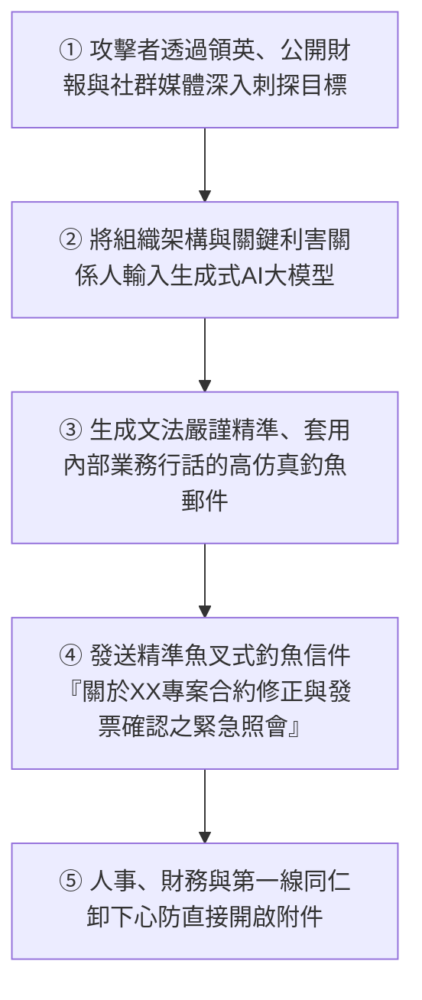

現代高階針對性魚叉釣魚（Spear Phishing），往往由駭客運用開源網路情報（OSINT），預先從受害企業官方網站、公開財報、LinkedIn同仁履歷及社群動態中，精準還原出組織架構圖、進行中的專案代號以及長期合作的真實供應商名單。攻擊者將這些背景脈絡餵給大語言模型，自動產出**「在商務日語遣詞用字、專業術語精準度、甚至上下級語境拿捏上完全挑不出破綻的高級客製化公文」**。

更令防守方防不勝防的，是**結合AI深偽（Deepfake）技術的影音全像詐欺**。
- 近年在跨國企業及日本在地據點中頻頻傳出重大案件：財務主管突然接獲跨國母公司CEO或CFO打來的緊急視訊會議電話，螢幕上的面部微表情、聲線音色、說話口吻均被AI完美重現。攻擊者以「正在執行高度機密的跨國併購案」為由，當面指示財務人員分批向海外指定帳戶匯出數億日圓。
- 當針對人類視聽覺感官認知的攻擊技術已進化至此，任何單純寄望於「提高同仁專注力、張大眼睛仔細辨別」的精神動員式宣導，在現實殘酷的對抗中已完全失去意義。

### 4.2 連線階段劫持與新型資訊竊取惡意軟體（Infostealer）的野蠻擴散

令大量自認為已全面落實「雙因素驗證（2FA / MFA）」的日本企業難以置信的是，**「資訊竊取型惡意軟體（Infostealer）」** 正在以前所未有的烈度撕碎傳統身分驗證防線。

如RedLine、Raccoon、Lumma等知名惡意軟體家族，透過盜版破解軟體、遊戲外掛、偽裝成履歷表或請款單的惡意安裝檔，在各大機關企業乃至外部協力廠商的辦公終端中無孔不入地潛伏擴散。

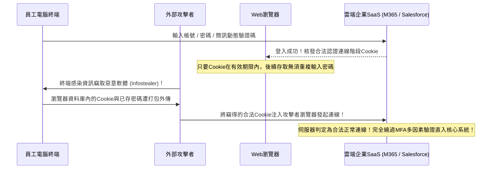

現代竊密軟體的首要戰術目標根本不是去大張旗鼓加密硬碟檔案，而是悄然侵入受害電腦的Web瀏覽器（Chrome、Edge等）本機資料庫，**全面搜刮「瀏覽器內儲存的密碼」以及「仍處於有效狀態的登入連線階段Cookie（Session Cookies）」**。

在現代雲端SaaS服務體系中，使用者只要成功完成一次帳密與簡訊MFA驗證，伺服器便會發放代表合法身分通行證的連線階段Cookie。攻擊者在暗中竊取到這些高活性Cookie後，只需將其直接注入自身電腦的瀏覽器中（Cookie Hijacking），**雲端伺服器便會毫無保留地認定「這就是剛剛通過雙因素驗證的原始員工本人」，攻擊者無須輸入帳密、無須提供任何MFA驗證碼，即可在幾秒鐘內長驅直入企業SaaS核心後台**。

當前在暗網黑市與Telegram地下交易圈中，包含日本企業有效連線階段憑證的Cookie資料包，被以幾美元至數十美元的極低銅板價批次拋售。全球駭客完全不需要高深的滲透技術，拿著真金白銀買來的合法鑰匙，即可「從大門昂首闊步邁入」受害企業的機密心臟。

### 4.3 內部人威脅（Insider Threat）：離職潮與外包特權濫用引發的暗流

資安威脅不僅來自境外駭客，在嚴峻的數位戰局中，來自組織內部人員的惡意竊密與自守自盜，正在佔據越來越危險的比重。根據日本網路安全協會（JNSA）歷年統計揭露，商業機密竊取與大規模隱私外洩事件中，相當大一部分來自於**內部人員（在職員工、跳槽離職員工、常駐委外派遣技術人員）的未授權攜出**。

- **雇用流動化浪潮下的離職前夕「盜採」**:
  隨著日本傳統終身雇用制的逐步瓦解，轉職跳槽已成常態。許多在核心技術或業務崗位的同仁在確定拿到競業公司的聘僱意向書後，抱持著「這是我親自研發的心血」或「這是我辛苦積累的人脈存摺」等自我催眠心態，利用私人隨身碟或個人雲端硬碟（Google Drive、Dropbox等），在離職前夕大肆下載備份核心客戶清冊、底層原始碼與工程設計圖。
- **高權限委外常駐維運人員的監守自盜**:
  大量負責核心資料庫日常維護的中下游包商工程師，其本身待遇微薄、生活負擔沉重，但發包方卻大意地為其配置了能夠直接執行SQL查詢匯出的極高權限。在金錢誘惑下，少數不肖人員將數十萬筆民眾信用紀錄、銀行往來憑證、高階會員個資整庫匯出，轉手倒賣給地下徵信社或詐騙集團牟利。

令人扼腕的是，多數日本企業內部治理長久以來建立在脆弱的「性善論」假設之上，普遍缺乏能夠在內部同仁出現異常批量檢索、非工作時間大量匯出機密資料時即時告警阻斷的DLP（資料防外洩）與UEBA（使用者與實體行為分析）技術工具。絕大多數內鬼竊密事件，往往是在數月甚至數年之後因涉案資料在市面上流通遭檢警查獲、或是競品推出完全雷同的技術產品時，才被動發覺。

---

## 第5章：全面邁向零信任架構（ZTA）的戰略實踐藍圖

面對上述錯綜複雜、足以令企業瞬間滅頂的複合型威脅，日本企業唯一的生存法則，就是決絕地親手告別名存實亡的傳統邊界防禦舊框架，義無反顧地推動向**「零信任架構（Zero Trust Architecture: ZTA）」**的全面深層演進。

### 5.1 零信任的哲學核心：「永不信任，始終驗證（Never Trust, Always Verify）」

零信任絕非指涉某一家廠商推出的單一特定軟硬體產品。它是經由美國國家標準與技術研究院（NIST）在權威綱領《NIST SP 800-207》中確立的**「資訊安全底層哲學的根本範式革命（重塑防禦者的思維作業系統）」**。

> **零信任三大核心戒律（Core Principles）**:
> 1. **永不信任，始終驗證（Never Trust, Always Verify）**:
>    無論連線來自總部總裁辦公室的桌上型電腦，還是來自街角咖啡廳的行動裝置；無論是來自內網核心機房的封包，還是來自公網網際網路的請求，在架構層面上絕不預先賦予任何實體以「天生安全」的特權。所有的通訊請求，每一次均必須通過嚴格的身分與安全狀態動態驗證。
> 2. **授予最低必要權限（Grant Least Privilege Access）**:
>    徹底終結粗放式授權。僅針對使用者在當下特定業務操作所必須存取的最小資料範圍，在嚴格受控的時間視窗內，以即時動態（Just-In-Time）的方式精確賦權，操作完成即刻收回權限。
> 3. **預設系統已被入侵（Assume Breach）**:
>    在所有架構規劃伊始，必須奠定在「外圍防線已被徹底攻破、內網早已潛伏著敵對駭客」這一冷酷的前提之上。防禦的重心全面轉向遏止橫向移動、限縮單點淪陷後的衝擊半徑（Blast Radius）、以及毫秒級的威脅偵測與自動化隔離。

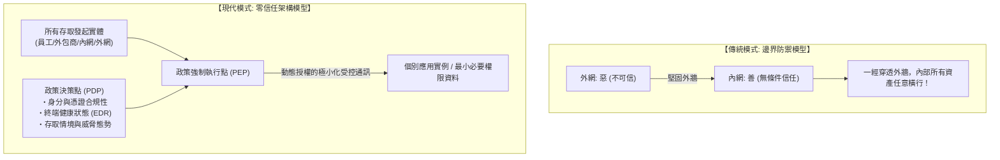

### 5.2 徹底廢除VPN全面轉向ZTNA（零信任網路存取）

實踐零信任的第一場關鍵戰役，正是對企業內部最大的資安未爆彈痛下決心——**「全面淘汰下線所有傳統硬體SSL-VPN閘道設備」**，全盤升級至**「ZTNA（Zero Trust Network Access，零信任網路存取）」**架構。

傳統VPN與ZTNA之間，存在著本質上的思維斷層：其連線的核心邏輯究竟是「接入整座底層網路」抑或是「按需代理單一特定應用」。
- **傳統舊型VPN**: 只要使用者通過了閘道驗證，系統便會在網路層將使用者的整台電腦直接連入公司內部IP區域網路。受害電腦瞬間獲得了與整座內網所有網段、所有伺服器直接建立通訊的實體能力。一旦該電腦潛伏惡意程式，整座內網隨即淪為病毒橫向擴散的溫床。
- **現代ZTNA架構**: 終端在任何情況下**絕不直接連入底層網路**。部署於雲端的分布式代理節點，在每一次存取請求發生時，嚴格審核發起者的身分、終端即時安全狀態（是否部署合規資安元件、是否具備越獄掛鉤特徵），**「僅將使用者發起的通訊流量，點對點映射代理至其擁有操作權限的某個特定Web頁面或特定服務連接埠」**。
  在終端視角下，整座企業內網的所有內部IP網段、網路拓撲架構與相鄰伺服器全數處於被隱匿的隱形狀態（Network Cloaking），駭客慣用的連接埠掃描探測與橫向移動在底層機制上徹底失效。

### 5.3 SASE（安全存取服務邊緣）與SSE的一體化防禦體系

將零信任網路理念落實於大規模現代企業環境的工業級標準架構，正是全球權威研究機構Gartner所提倡的**「SASE（Secure Access Service Edge，安全存取服務邊緣）」**及其安全核心**「SSE（Security Service Edge，安全服務邊緣）」**。

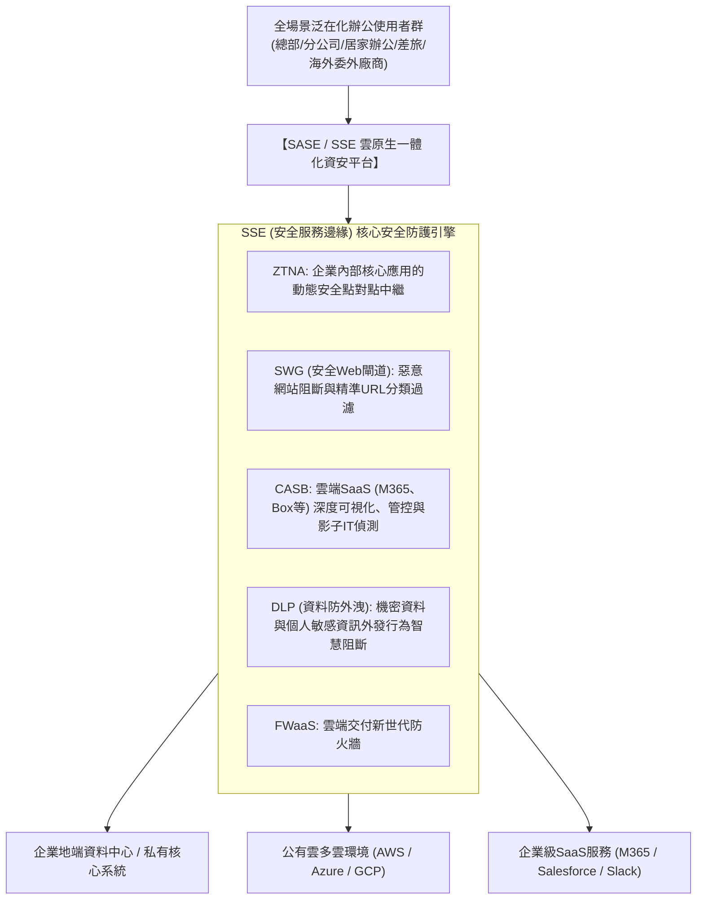

在完整的SASE架構下，無論企業同仁身處總部大樓、家中書房、出差途中的高鐵與機場，或是位於海外的委外代工廠，終端發出的所有對外連線封包，均必須優先導向至距離最近的全球分散式SASE雲端骨幹節點：
- **SWG（安全Web閘道）** 在流量入口即時剖析並阻斷釣魚惡意URL、封鎖掛馬網站並對未知下載檔案執行雲端動態沙箱引爆分析；
- **CASB（雲端存取安全代理程式）** 對全體同仁存取公有雲SaaS的行為實施深層審計，嚴格阻絕未經核准的影子IT，防止企業檔案被私自同步至個人私有雲端空間；
- **DLP（資料防外洩引擎）** 依託智慧內容識別演算法，動態掃描正在傳輸的數據載荷，一旦偵測到包含大量信用卡清冊、身分證字號或核心原始碼特徵，毫秒級予以阻斷攔截並發送告警；
- **ZTNA模組** 則作為隱形安全通道，按需建立通往地端資料中心與多雲IaaS環境的微觀受控通道。

藉由此一架構，企業得以徹底淘汰並廢棄分散於各地分支據點、維護成本高昂且漏洞百出的實體VPN路由器與地端Proxy伺服器，真正達成全球各地「同等最高安全基準」的資安政策統一下發與嚴格執行。

### 5.4 運用微隔離（Micro-Segmentation）在內網構築堅固的「防火水密艙」

縱使外部防護做到極致，在現代高度複雜的對抗環境中，依然沒有任何防守方敢保證能百分之百防堵單台終端的意外失守。因此，防止單點突破演變成全網覆沒的核心關鍵，正是**「微隔離（Micro-Segmentation）」**。

微隔離技術徹底打破了傳統以「樓層網段」或「VLAN虛擬網路」為劃分單位的粗糙邊界，而是將資安防禦邊界極致細化至**「單台實體主機、單台虛擬機器乃至單個獨立運行的容器實例」**。

- 舉例而言：企業核心財務系統伺服器，在存取規則上被嚴格限制為「僅接受來自財務部特定受信任電腦發起的特定加密連接埠通訊」，來自研發部門電腦、行政電腦乃至隔壁業務系統伺服器的任何探測封包（包含最基礎的Ping），全數於核心層直接靜默丟棄；
- 哪怕是運作在同一台實體宿主機內部、處於同一子網內的兩台應用虛擬機器，只要業務調用邏輯中未包含明確經審核放行的API通訊白名單，兩者之間的所有橫向直接溝通全數遭到阻斷。

透過微隔離所建立的滴水不漏機制，縱使內網某台辦公電腦不慎遭最烈性的勒索病毒感染，攻擊者在企圖刺探周遭網路拓撲時，會發現所有前進路徑全被堅厚的重裝防爆鋼板徹底封死。**「將資安危機嚴格封鎖在最初失陷的那一台電腦之內（達成爆炸衝擊半徑的最小化控制），在底層機制上斬斷橫向擴散的技術可能」**。

---

## 第6章：企業身分識別中樞（IAM/PAM）的戰略級要塞化

在零信任全新戰場上，實體層面的網路佈線與機房圍籬已不再構成企業的最外層護城河。**「身分（Identity）與認證（Authentication）」**成為嶄新的第一道外圍核心防線。在無邊界時代，身分基礎架構的強韌度，直接定奪整座企業帝國的存亡。

### 6.1 強制實施基於FIDO2 / Passkey的抗釣魚多因素驗證（Phishing-Resistant MFA）

企業必須落實的第一道鋼鐵指令，是立刻徹底停用並淘汰嚴重依賴傳統簡訊SMS動態碼、電子郵件確認連結、或是手機App純通知彈窗（缺乏數字配對機制的盲目確認）的「第一代脆弱多因素驗證」。

如前文所述，現代攻擊者透過反向代理釣魚框架（如Evilginx）與資訊竊取惡意程式，能夠不費吹灰之力攔截中繼簡訊驗證碼並劫持合法連線階段Cookie。全球資安業界公認能夠從根本上破解此一困局的唯一解方，便是**全面擁抱基於「FIDO2 / WebAuthn（Passkey 數位通行金鑰）」技術規範的抗釣魚多因素驗證（Phishing-Resistant MFA）**。

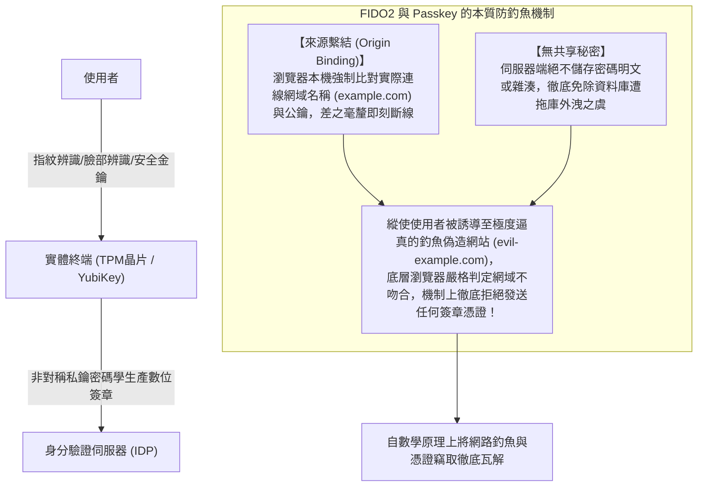

FIDO2之所以能展現出絕對免疫釣魚的卓越特性，關鍵在於其密碼學層面的**「來源繫結（Origin Binding）」**架構：
在整個鑑權過程中，作業系統內建的安全晶片（如硬體TPM）或外接實體安全金鑰（如YubiKey）直接與底層瀏覽器協定堆疊緊密連動。瀏覽器在產生簽章宣告時，會強制抓取網址列中當前實際連線的完整網域名稱（FQDN）。即便同仁不慎點擊進入外觀完全一模一樣的高仿冒釣魚網站（例如將 `example.com` 偽造成 `evil-example.com`），底層硬體金鑰會判定連線來源網域與金鑰綁定的註冊網域完全不符，**底層機制將直接拒絕向伺服器端送出任何簽章憑據**。

這意味著，無論社交工程詐欺手段多麼精妙逼真、縱使人類同仁徹底遭到蒙蔽，在堅不可摧的公鑰密碼學數學規律面前，駭客絕無可能從用戶端詐取到半點可用的登入憑據。企業必須痛下決心，優先從掌握核心權限的管理維運團隊及高階主管著手，全面強制配發YubiKey等實體安全金鑰或啟用Windows Hello / Touch ID硬體鑑權，普及抗釣魚身分驗證體系。

### 6.2 Active Directory的三級分層（Tiering）防禦模型與JIT即時存取治理

針對短期內無法徹底擺脫地端傳統Active Directory網域環境的廣大企業，拯救其免於全面淪陷的核心防禦思維，正是嚴格貫徹微軟官方推薦的**「Active Directory 階梯式分層控制架構（Tiering Architecture）」**。

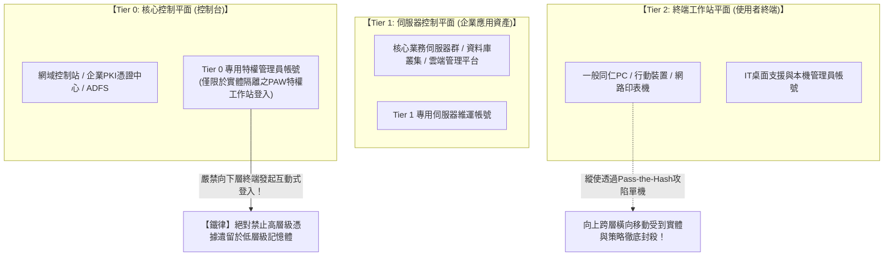

分層防護架構的精髓在於一條絕對不可違反的單向鐵律：**「擁有高階控制特權的管理帳號，絕對嚴禁在低層級的普通終端上進行任何互動式登入，避免特權憑據殘留在低等級主機記憶體之中」**：
- **Tier 0（核心控制平面）**: 網域控制器、企業憑證伺服器、ADFS聯合身分驗證伺服器以及最高網域管理員帳號。Tier 0管理員帳號僅能在Tier 0核心伺服器登入，嚴禁在任何Tier 1伺服器或Tier 2普通電腦上登入。日常網域維護，僅能在經重重安全加固、與網際網路和一般辦公網路實體/邏輯嚴密隔離的**「專用特權存取工作站（PAW: Privileged Access Workstation）」**上進行。
- **Tier 1（伺服器控制平面）**: 涵蓋ERP系統、資料庫叢集、公有雲管理後台，僅允許專職的Tier 1維運帳號登入管理。
- **Tier 2（終端資產工作站平面）**: 一般辦公電腦、行動裝置、展示終端，僅由Tier 2桌面支援人員管理。

在此同時，徹底廢除允許管理員長年坐擁超級管理員身分的「永久性特權（Standing Privileges）」，全面推行**「及時存取（Just-In-Time / JIT Access）」**機制。管理員平時僅具備基礎普通權限；唯有在遭遇緊急故障搶修等特殊情境時，方可透過多重身分審核流程，臨時取得有效期限僅數小時的暫時特權令牌。如此一來，即便駭客在平時處心積慮攻陷了管理員的個人電腦，也根本無法從中榨取到足以為非作歹的高階特權憑證。

### 6.3 依託條件式存取（Conditional Access）打造毫秒級全動態政策裁決

在零信任哲學中，「身分認證」絕不是那種「早上進辦公室打卡輸入一次密碼、整天便暢行無阻」的單點、靜態事件。它必須演進為在整個存取生命週期中持續受到評估、與情境上下文深度綁定的**「全動態持續風險評估（Continuous Adaptive Trust）」**。

落實此一機制的最佳舞台，正是微軟Microsoft Entra ID（原Azure AD）、Okta等現代身分中樞所搭載的**「條件式存取（Conditional Access）引擎」**。

每當使用者嘗試發起資源存取連線，後端的政策決策引擎（PDP）將在數毫秒內完成多維度的即時風險打分與交叉比對：
1. **使用者與群組身分情境**: 發起請求者的組織隸屬關係、職能權限及是否涉及高度敏感的核心崗位。
2. **來源IP屬性與地理位置軌跡（Geolocation）**:
   - 若系統偵測到某帳號十分鐘前剛在東京總部透過固定IP登入，十分鐘後卻突然從東歐或非洲的IP位址發起連線（物理上絕不可能發生的瞬間長途移動: Impossible Travel），策略引擎將在毫秒級直接掐斷連線並鎖定該帳號。
3. **終端設備的即時合規狀態與健康度**:
   - 嘗試連線的設備是否列於企業統一MDM納管清單之內？作業系統是否已安裝最新的安全修補程式？本機BitLocker全硬碟加密是否處於啟動狀態？更重要的是，終端部署的EDR防禦元件是否運作正常，是否正回報未處理的高風險惡意程式告警？
4. **即時行為異常分析與威脅態勢評分**:
   - 識別是否存在非正常時段（如凌晨三點）的大規模異常存取行為、短時間內是否存在密集下載大量機密文件的異常動作。一旦指標超過安全門檻，系統將即刻要求使用者追加生物識別二次驗證，或是直接銷毀存取Token強行登出。

只要上述嚴格的准入條件中有任何一項未達標準，哪怕攻擊者輸入了一組完全正確的使用者帳號與初始密碼，企業核心系統的大門也絕不會為其敞開分毫。

---

## 第7章：供應鏈與外部合作夥伴生態的穿透式強管控治理體系

即使企業內部的零信任防禦構築得滴水不漏，但倘若供應鏈這扇「側門」依然大開，整座組織的防衛依然難逃一夕崩盤的命運。企業應當如何撥開迷霧，對外部複雜龐大的供應商與委外體系實施強效的高壓治理？

### 7.1 供應商全景圖譜的澈底盤點與持續動態安全評級

首要的戰略工作，便是**「對全量軟體、業務及服務供應鏈展開地毯式的資產盤點與穿透式全貌可視化」**。

在當前多數大型企業內部，採購部門往往僅能掌握直接締約的一級統包商清冊，對於隱身於一級包商身後、實際負責程式碼編寫與系統代管的二級、三級分包商究竟是誰、位於何處、資安防護水準如何，處於近乎全盲的失控狀態。
- 在所有外部採購與委外專案合約中，必須以具備剛性拘束力的法律條款明確載明：**「未經發包方事前書面合規審查與正式核准，嚴禁將專案私自向下二次分包與轉包」**，澈底終結黑箱式的層層甩手。
- 全面廢除每年僅靠向廠商發送一份紙本選擇題自評表、由對方自行勾選簽名背書的形式主義合規虛應故事。
- 引進權威的外部第三方量化資安稽核機制，全面常態化採購部署**「第三方資安評級平台（如BitSight、SecurityScorecard等）」**。即時、自動化且客觀地評估所有列管廠商對外暴露網域的安全脆弱性、公網服務與VPN設備更新落後狀況、以及暗網地下論壇中關於該廠商外洩憑證的蛛絲馬跡，建立**全天候、動態化、量化評分的資安預警與汰弱留強機制**。

### 7.2 嚴禁外包人員自攜設備（BYOD）直連，全面普及零信任隔離VDI

要想從根本上杜絕因外包廠商個人電腦遭木馬病毒感染進而波及發包方核心內網的悲劇，在架構層面最直接、最徹底的物理級手段就是——**樹立「絕不向委外終端交付哪怕1個位元組真實核心業務資料」的絕對防禦原則**。

外部委外廠商私自購買的電腦、或是未受嚴格資安基線納管的自攜設備（BYOD），必須在架構層面徹底封鎖其直連企業內部網路或企業雲端儲存的一切管道。

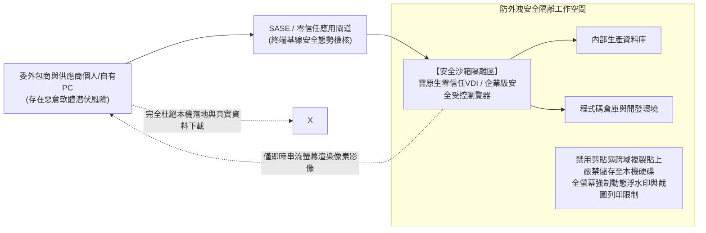

企業必須嚴格要求所有外部協力廠商，一律透過由企業資安團隊加固控管的**「雲原生零信任虛擬桌面（VDI / DaaS）」**或是**「企業級安全受控瀏覽器（Enterprise Secure Browser）」**作為唯一指定入口執行日常專案：
- 在作業系統核心層面針對虛擬工作環境施加嚴格管控：物理級封殺本機虛擬通道的檔案下載功能、徹底禁用跨越虛擬桌面邊界的剪貼簿複製貼上、停用本機螢幕擷圖錄影與實體列印功能，並在整個操作畫面上全時疊加包含操作人員姓名、員工編號、IP及時間戳記的高密度全螢幕半透明動態浮水印；
- 在這套受控架構下，傳輸至外包人員本機螢幕上的**僅僅是一幀幀即時渲染的畫面像素串流**。縱使外包人員個人電腦不幸感染了最陰險的資訊竊取惡意程式，駭客也休想從中抓取到任何一行核心業務原始碼、真實業務封包或可供重放利用的身分認證Cookie。

### 7.3 全面推行SBOM（軟體物料清單）與對外API權限極小化控管

在數位軟體供應鏈維度，另一個極其隱匿且破壞力驚人的盲點，在於第三方客製化軟體開發過程中的開源元件污染。

大量外部軟體開發商在為客戶客製化開發Web系統時，為了趕工交付，無所顧忌地在專案中引入充斥著已知高危險漏洞的老舊開源套件（如已被全球駭客攻擊至體無完膚的Apache Log4j2舊版、未修補還原序列化漏洞的Spring Framework舊版等）。這些系統一旦驗收上線，無異於在企業心臟地帶埋設了一枚隨時可能引爆的定時炸彈。

企業必須向所有外部軟體交付廠商建立嚴格規範：在交付最終軟體安裝包的同時，必須強制隨附提出完整的**「SBOM（Software Bill of Materials，軟體物料清單）」**。透過標準化的機器可讀物料清單，全盤釐清軟體所引用的所有開源函式庫層級、對應版本及雜湊校驗碼。一旦未來全球漏洞庫爆發類似Log4j等級的毁滅性0-day漏洞，企業資安團隊能在數分鐘內精確檢索定位全組織內部究竟有哪些線上系統引用了受影響元件，並在數小時內啟動針對性熱修補。

同樣地，針對企業與外部商業夥伴或公有雲服務之間的「對外API資料串接介面」，堅決杜絕核發永久無限制的特權API Key，全面推行基於OAuth 2.0規範的細緻最低必要範圍（Scope）限制，並強制設定短生命週期（TTL）的自動輪替更新機制。

---

## 第8章：抵禦勒索軟體與毁滅性資料破壞的終極防禦——重塑「網路韌性（Cyber Resilience）」

在零信任核心思維「預設系統已被入侵（Assume Breach）」的推演下，企業在資安防線上的最後一道絕對屏障，正是**「網路韌性（Cyber Resilience: 業務極限承受衝擊與災後自癒復原能力）」**。

面對高度專業化的國家級APT組織或高度組織化的跨國駭客集團之立體滲透，全球沒有任何一家防守方敢保證能永遠將敵人阻絕於千里之外。當最壞的狀況不可避免地降臨、核心生產系統遭遇毀滅性打擊癱瘓時，真正決定一家企業生死存亡的終極考驗在於：**「你是否具備在一片瓦礫廢墟中，斷然拒絕駭客勒索、以最快速度讓核心業務原地滿血重生的硬核實力？」**

### 8.1 黃金標準「3-2-1-1-0 備份準則」與底層「不可變儲存（Immutable Storage）」

在近年的BlackSuit、LockBit等新型高階勒索軟體攻擊戰術中，駭客滲入內網後的第一作戰目標根本不是去加密虛擬機器，而是**「無所不用其極地順藤摸瓜將企業所有的線上備份系統、快照複本、異地備援映像檔全數進行實體格式化與覆寫銷毀」**。因為駭客非常清楚：只要企業的備份完好無損，就絕不會有任何一家理性的企業願意支付數百萬美元的巨額贖金。

傳統單純依賴「每天半夜排程把資料拷貝至另一台NAS主機」的業餘做法，在現代勒索軟體面前脆弱如紙。一旦備份NAS同樣加入Active Directory網域，掌握了網域管理員特權的駭客只需下達一行指令，備份檔案便會連同生產資料庫一同灰飛煙滅。

現代企業必須以軍規級標準，徹底重構並堅決貫徹**「新時代 3-2-1-1-0 備份黃金準則」**：

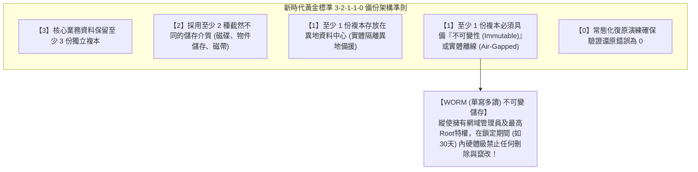

在整套法則中，最關鍵、最具決定性防禦價值的技術支柱，正是**「不可變備份（Immutable Backup）」**。
這項技術依託底層現代化物件儲存（如AWS S3 Object Lock）或高階專用備份儲存設備（如Veeam、Cohesity、Rubrik）底層韌體所具備的**「WORM（Write Once, Read Many，單寫多讀）硬體鎖定機制」**。
一旦某一份備份檔案被鎖定寫入，在預先設定的合規保護期內（例如設定30天），底層儲存硬體與控制器API將形成單向絕對唯讀狀態——**在此期間，縱使企業董事長親臨、哪怕是手握全網最高特權的網域管理員Root帳號、甚至是已潛伏在系統底層的頂尖駭客，任何發往儲存硬體的刪除請求、覆寫指令，均會被控制器韌體在硬體層面直接拒絕並攔截！**

縱使地端正式資料中心遭遇全面覆滅、全網數萬台虛擬機器在數小時內被勒索軟體全數加密癱瘓，只要鎖死在不可變儲存中的備份檔案毫髮無傷，企業高層便能擁有挺起腰桿拒絕駭客一切勒索恐嚇的底氣，從容在乾淨的隔離網路中重構並滿血復原全線業務系統。

### 8.2 打造完全實體隔離的「獨立第三方身分驗證斷點（Out-of-Band Auth Domain）」

單純引進具備不可變特性的備份設備仍嫌不足。在災難復原架構規劃中，必須確立一條鐵律：**「備份管理控制架構，必須與企業日常營運的Active Directory網域落實徹底的實體與邏輯隔離」**。

- 備份伺服器與儲存叢集的日常登入管理，絕對禁止掛載、同步或依賴企業主Active Directory；它必須採用一套完全自成一格、完全獨立的本機高強身分驗證系統（獨立帳號密碼、強制搭配獨立實體硬體MFA）；
- 允許存取備份管理中樞的維護主機，必須嚴格侷限於完全脫離一般辦公區域網路的獨立頻外管理網路（Out-of-Band Network）之內，與網際網路實體隔離。

唯有徹底落實「身分認證與控制平面的徹底實體隔離」，才能保證在主要網域控制器慘遭全面攻陷的最絕望時刻，企業最後的救命方舟——備份與還原基礎設施，依然能夠獨善其身、安全無虞。

### 8.3 依託EDR/XDR與7×24小時專業代管SOC構築毫秒級應變戰力

在駭客完成初始突破至發動全網毀滅性破壞的殘酷競速中，決定防禦勝敗的核心量化指標被高度凝練為兩大作戰標尺：**MTTD（平均偵測時間: Mean Time to Detect）** 與 **MTTR（平均回應時間: Mean Time to Respond）**。

傳統靜態防毒軟體（EPP）在面對現代高度客製化、無檔案（Fileless）記憶體加載的新型威脅時早已束手無策。現代企業必須在全網終端全面普及部署**「EDR（端點偵測與回應）」**，並向上彙整貫通網路流量、雲端日誌的**「XDR（延伸偵測與回應）」**引擎，將防禦監控視線全面鎖定在行程與記憶體層面的「行為特徵（Behavioral Analytics）」：
- 例如：某台電腦內正常的原生PowerShell突然被異常喚醒，並在極短時間內嘗試存取傾印 `lsass.exe` 程序的敏感記憶體區段；或是某台工作站後台在深夜突然開始遍歷硬碟並密集修改海量檔案的副檔名。這類極具破壞前兆的異常行為，會被EDR探針在數毫秒內精確捕捉；
- 一旦偵測到異常徵兆，EDR甚至無須等待工程師手動研判，即可在作業系統最底層的網路NDIS驅動層，**瞬間對該台遭感染終端下達網路邏輯阻斷命令（動態隔離）**。受害電腦在被瞬間踢出內網的同時，僅保留與雲端資安中心的除錯通道，在底層機制上徹底斬斷駭客企圖橫向擴散的任何管道。

然而，職業駭客往往精心挑選防守最為脆弱的時機發動總攻——例如「週五深夜接近午夜時分」、或是「春節長假、跨年連假等全員休假的重大節日」。因此，若企業的資安防護僅停留在朝九晚五的「平日上班時間有人盯盤」，其防守依舊門戶大開。**建置或委託具備7×24小時、全年365天無休監控且擁有直接下達全網阻斷處置權限的專業託管式威脅偵測與回應服務（MDR / 代管SOC）**，是任何現代企業在這場無分晝夜的數位現代超限戰中立於不敗之地的標配防線。

---

## 第9章：高層治理架構重塑與全球法規雙輪驅動的合規革命

資安體系的徹底重構，從來都不僅僅是一場侷限在機房內部的技術升級。它是一場必須由最高決策階層掛帥、深度融合法律合規威懾力、並重塑全員考評機制的全面企業治理轉型。

### 9.1 個人資料保護法規的重罰化與民事賠償、行政裁罰的法律利劍

在日本及全球主流成熟市場，針對資料安全合規治理的法律天網正以令人窒息的速度全面收緊。

隨著日本新修訂《個人情報保護法》的全面實施，只要發生達到法定門檻的個人資料外洩事故（或存在外洩的高度可能），企業**必須在法定期限內無條件向個人情報保護委員會（PPC）提交正式通報，並強制向每一位受波及當事人履行正式通知義務**。
- 法律針對違規企業法人的行政罰鍰上限被大幅提高至數倍，動輒開出上億日圓的天價罰單；
- 更為致命的是來自民事司法訴訟的滅頂風暴：受害消費者與權益受損股東發動的集體訴訟巨浪、以及針對外洩個資當事人不得不發放的每人從數千至數萬日圓不等的大規模補償慰問金。針對涉及數萬乃至數百萬規模資料外洩的重大事故，僅法定義務性現金支出便可輕易撕開數十億乃至數百億日圓的致命財務黑洞。

加上2024年日本國會正式三讀通過的《重要經濟安全保障情報保護與活用法》，以及針對關鍵基礎設施營運商所推動的資安法制強化升級，任何具備公共服務屬性的企業一旦因自身低劣的資安防護而淪為供應鏈破口跳板，將面臨政府吊銷特許執照、國安機關進駐調查等毀滅性法律與監管嚴懲。資安事故已徹底完成從單純的「技術維運缺失」向「決定企業法人能否繼續存續的重大法律災難」的質變。

### 9.2 董事會成員的「善良管理人注意義務」：資安已不可推卸地成為最高決策責任

在現代公司法體系與公司治理法理中，董事會高層對所屬公司負有神聖且不可免除的**「善良管理人注意義務（Duty of Care）」**。

正如日本最高裁判所相關裁判先例以及日本經濟產業省、IPA共同發布的《資安經營指南》所確立的權威法律見解：在現代高度數位化的商業環境下，任何因董事會未盡合理監督職責、對顯而易見的資安治理風險視而不見、拖延關鍵資安投資而引發的重大資安癱瘓與海量個資外洩，**均將被認定為全體董事「嚴重違反善良管理人注意義務」，直接面臨股東代表訴訟。涉案高層不僅將面臨解職與名譽掃地的下場，更有可能被判決必須以個人全部私有財產承擔向公司及股東賠償巨額損失的無限連帶民事責任！**

這正式宣告了「我不懂技術，系統維護的事我都全權交給底下的IT部門處理了」這種傳統老派管理者的萬靈藉口，在法庭上已徹底成為自掘墳墓的供詞。董事會不僅必須在例行會議中定期聽取獨立的資安風險客觀評估，更必須對資安預算分配的充足性、災難復原計畫的可靠性承擔直接的、不可轉嫁的最終法律責任。

### 9.3 賦予CISO實質生殺大權與「資安投資ROI」的終極重新定義

要使上述所有治理機制真正運轉落實，整場組織變革的最後一把關鍵鑰匙，正是**「徹底告別虛設、賦予CISO至高無上的獨立實權」**。

企業必須在制度架構上堅決落實以下三大治理改革：
1. **將CISO職階全面提升為公司執行役員（VP）乃至董事會核心成員**:
   嚴禁將CISO矮化為IT部門（CIO）轄下的次級執行者。必須在組織圖上確立CISO與CIO平起平坐、擁有獨立向CEO與董事會審計委員會直接報告的崇高監管通道。
2. **在管理規章中白紙黑字明定CISO的「業務一票否決權」與「緊急生產斷線權」**:
   明確授權CISO：有權直接叫停任何未達資安基準的新系統上線運作；有權無條件否決並終止與資安評級不合格的外部包商簽約合作；更有權在遭遇重大資安突襲的危急時刻，基於停損避險的最高考量，繞過業務單位直接下令中斷生產連線。
3. **徹底顛覆重構對「資安投資ROI（投資報酬率）」的狹隘認知**:
   資安建置的價值，絕對不能再短視地套用「今年投了1億日圓能創造多少新營收」這種荒謬算式來評估。資安的ROI本質上是**「止損與避險係數」**——其衡量的是「因為投入了這筆關鍵投資，為企業成功規避了長達數月的核心業務停擺、免除了數十億日圓的巨額賠償訴訟、保全了市值暴跌與百年商譽毀滅的滅頂之災」。資安投資不是可有可無的奢侈品，它是現代企業在數位浪潮中立足生根、合規營運所必須具備的「營運執照（License to Operate）」與保命符。

---

## 結論：穿越絕望的迷霧 —— 2026年以降日本企業的生存覺醒

站在2026年的歷史關口前，我們必須清醒地認知：人類社會已經絕無可能倒退回那個「天下無賊、沒有任何駭客威脅」的田園牧歌時代。大國博弈陰影下暗潮洶湧的國家級網路軍隊、在生成式AI高科技武裝下高度產業化的跨國駭客犯罪組織、以及在暗網黑市中如自來水般大肆流通的企業合法帳密。威脅不僅不會停歇，反而正以幾何級數的驚人斜率，構築起對現代企業的全面圍剿之勢。

然而，我們絕沒有理由陷入盲目的悲觀與絕望。

因為綜觀橫掃日本企業的這一場場滔天危機的本質，它們絕非「不可抗力的人類無法抵禦之天災」。這一連串血淋淋的悲劇，其本質恰恰是日本政企多年來對「全盤委外的依賴惰性」、「多層轉包的推諉卸責」、「內網信任的陳腐神話」以及「經營高層對數位化的無知與傲慢」所共同釀成的**徹頭徹尾的「人禍」**。

既然危機的根源在於人禍，那麼憑藉人類的最高智慧、堅定決心與工程實踐，它就必然能夠被徹底扭轉與克服！

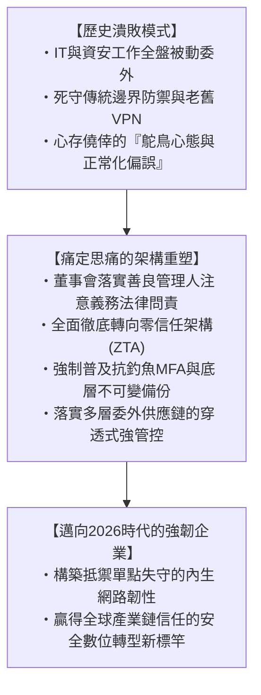

資訊安全，從來都不是阻礙業務狂奔的「絆腳石」。在風雲變幻的現代數位經濟競技場上，它正如一輛頂級一級方程式賽車上所配備的**「最頂級的碳纖維陶瓷煞車系統」**。唯有擁有了能夠在任何極限彎道前瞬間平穩制動的最強煞車，一名真正頂尖的賽車手，才敢於毫無後顧之憂地將油門踩到底，以風馳電掣的極速超越所有對手。

正如過去日本工程界曾以「精益求精、對細節近乎偏執」的工匠精神贏得全球尊敬一樣，如今面對網路空間的狂風巨浪，日本企業唯有迅速摒棄一切僥倖與傲慢，在架構底層展開一場大刀闊斧的徹底重塑。**以「絕不背叛每一位客戶、每一位員工及全社會的信任」為最高鐵律**，扎實推進零信任的技術升級與組織覺醒。唯有具備這般破釜沉舟決心的企業，方能穿越這片數位戰火肆虐的驚濤駭浪，在2026年以降的全球數位文明版圖中，傲然屹立於世界舞台！
