## 序章: 「失われた30年」とは何だったのか――世界史上類を見ない長期停滞の本質

### 用語の変遷と射程: 「失われた10年」から「20年」、そして「30年」へ
現代経済史において、「失われた30年（The Lost Decades）」という呼称ほど、巨大な経済的繁栄の絶頂から不可逆的な構造沈下へと転落した国家の苦悶を端的に象徴する言葉はありません。

1990年代初頭に発生したバブル経済の崩壊直後、日本社会を覆った停滞感は当初「一時的な循環的景気後退」と見なされていました。不良債権の処理と金融機関の再編が完了すれば、日本経済は再び右肩上がりの高成長軌道へ復帰するという楽観論が支配的でした。しかし、景気回復の足取りは極めて鈍く、1997年の金融危機を経て2000年代に入ると、この現象は **「失われた10年（The Lost Decade）」** として学術的・社会的に定着しました。

ところが、2000年代半ばの輸出主導による緩やかな景気回復（いざなみ景気）も、国内の本格的な個人消費拡大やデフレ脱却には至らず、2008年のリーマン・ショックによって呆気なく粉砕されました。停滞は2010年代へと持ち越され、呼称は **「失われた20年」** へと延伸されました。

さらに、2012年末に発足した第2次安倍政権による「アベノミクス」や日本銀行による「異次元の金融緩和」によって株価や企業利益が過去最高を更新したものの、国民の実質賃金や労働生産性の持続的上昇、潜在成長率の引き上げという根本課題は解決されず、2020年代に至ってついに **「失われた30年」** という世界史的にも類を見ない超長期停滞として総括されるに至ったのです。

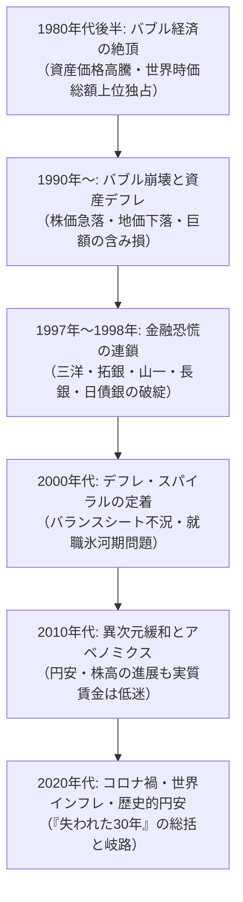

### 1980年代「ジャパン・アズ・ナンバーワン」の絶頂と構造的慢心
この30年の停滞の深度を正確に理解するためには、その直前に日本が到達していた「繁栄の頂」を振り返らねばなりません。

1979年、米国の社会学者エズラ・ヴォーゲルが著した『ジャパン・アズ・ナンバーワン（Japan as Number One: Lessons for America）』は、日本的経営（終身雇用、年功序列、企業別労働組合）、官民一体となった産業政策、高品質な製造業、高い国民貯蓄率、平等な所得分配を絶賛しました。石油危機を欧米諸国に先駆けて省エネルギー技術と徹底した品質管理（TQC運動）で克服した日本は、世界最高峰の工業国家として君臨していました。

1980年代後半には、日本の製造業が生み出す巨額の貿易黒字が対米摩擦を引き起こし、米国では日本車をハンマーで叩き壊す抗議デモが頻発しました。日本企業は得られた莫大なキャッシュを元手に、米国の象徴であるニューヨークのロックフェラー・センター（三菱地所）やペブルビーチ・ゴルフリンクス、名門映画会社コロンビア・ピクチャーズ（ソニー）を次々と買収しました。「いずれ日本経済が米国を追い抜き、世界最大の経済大国になる」という予測は、決して荒唐無稽な夢想ではなく、当時の国際機関やエコノミストの間で真剣に議論されるリアリティを持っていたのです。

しかし、この圧倒的な成功体験こそが、その後の政策決定者や企業経営陣に致命的な慢心と認知の歪みをもたらしました。「日本型システムは無敵である」「土地価格は決して下落しない（土地神話）」「金融機関は絶対に潰さない（護送船団方式）」という強固な成功バイアスが、訪れつつあったパラダイムシフトへの適応を著しく阻害することになります。

### 国際比較で見る日本の相対的地位の不可逆的沈下
30年の歳月がもたらした日本の地盤沈下は、客観的な経済諸指標に冷徹なまでに刻み込まれています。

| 指標 | 1989年〜1990年（ピーク時） | 2023年〜2024年（現在水準） | 変動の構造的意味 |
| :--- | :--- | :--- | :--- |
| **世界名目GDPに占める日本のシェア** | **約 15% 〜 18%** （米国の約7割に迫る第2位） | **約 4.0% 〜 4.2%** （ドイツに抜かれ世界4位に転落） | 世界経済の成長パイから日本が完全に取り残された実態 |
| **世界時価総額ランキング Top 50** | **日本企業が 32社** （Top 5中4社が日本の都市銀行） | **日本企業は 0社 〜 1社** （トヨタ自動車が辛うじてランクイン） | 製造業・金融からハイテク・ソフトウェアへの主役交代 |
| **OECD加盟国の実質賃金指数 (1990=100)** | 日本: 100（主要先進国と比肩） | 日本: **約 103** （米国: 150超、韓国: 190超） | 先進国で唯一、30年間にわたり賃金が実質的に横ばい |
| **一人当たり名目GDPのOECD順位** | **世界第 2位 〜 4位** （国民全員が世界屈指の富裕層） | **世界第 30位 〜 32位** （G7最下位、韓国・台湾と逆転） | 通貨安と生産性低迷に伴う購買力の劇的な凋落 |
| **IMD世界競争力ランキング** | **世界第 1位** （1989年から数年間首位独占） | **世界第 35位 〜 38位** （ビジネス効率性・IT導入の遅れ） | 意思決定の遅延、デジタル化の遅滞、硬直的ガバナンス |

このように、「失われた30年」とは単に株価や地価が下がったことではありません。世界が情報通信革命、インターネット、スマートフォン、AI、バイオテクノロジー、金融工学という未曾有のイノベーションの荒波を突き進む中で、日本だけが過去の遺産と債務処理に囚われ、所得、生産性、産業競争力のすべてにおいて構造的な地盤沈下を続けたという「不可逆的な歴史的転落」に他ならないのです。

---

## 第1章: バブル経済の形成と熱狂（1985〜1990）

### プラザ合意（1985年）と急速な円高不況への恐怖
1980年代後半のバブル経済の直接的な引き金となったのは、1985年9月22日にニューヨークのプラザホテルで合意された、いわゆる **「プラザ合意（Plaza Accord）」** でした。

当時、米国レーガン政権は「強いアメリカ」を掲げて財政支出を拡大したものの、高金利政策の影響から過度なドル高が生じ、巨額の貿易赤字と財政赤字という「双子の赤字」に苦しんでいました。特に日本に対する貿易赤字は対米摩擦の火種となっており、先進5カ国（G5: 米・英・西独・仏・日）の財務相・中央銀行総裁は、ドル高を是正するための協調介入に合意したのです。

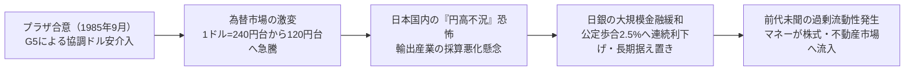

プラザ合意の波及効果は凄まじいものでした。合意前には **1ドル＝240円前後** だった為替レートは、わずか1年足らずで150円台へ、さらに1987年末には120円台へと猛烈なペースで急伸しました。日本の輸出産業は壊滅的な打撃を受けると予想され、日本国内には深刻な「円高不況」への恐怖が蔓延しました。

政府・日本銀行はこの円高不況を回避し、内需主導型経済へと構造転換を図るため、大規模な財政出動と金融緩和を矢継ぎ早に打ち出しました。日本銀行は1986年1月から1987年2月にかけて公定歩合を5回にわたり引き下げ、当時としては戦後最低水準となる **2.50%** にまで引き下げたのです。

### 日銀の過度な金融緩和政策と未曾有の過剰流動性
本来であれば、日本経済が円高による輸入物価の下落（交易条件の改善）を享受し、内需が力強く回復し始めた1987年の段階で、金融緩和の引き締めへの転換が検討されるべきでした。しかし、以下の複合的要因が日銀の政策転換を致命的に遅らせました。

1. **ブラックマンデー（1987年10月）の衝撃**:
   ニューヨーク株式市場の急落（ダウ平均が一日にして22.6%暴落）を受け、国際金融市場のシステミック・リスクを防ぐため、日米協調により金利引き上げを手控えざるを得なくなりました。
2. **ルーブル合意（1987年2月）の足かせ**:
   行き過ぎたドル安に歯止めをかける国際協調の枠組みの下、日銀はドル買い・円売り介入を継続し、市場に大量の円資金を供給し続けました。
3. **物価指数の罠（資産インフレの見落とし）**:
   急速な円高により原油や原材料の輸入価格が大幅に低下していたため、消費者物価指数（CPI）や卸売物価指数（WPI）は驚くほど安定していました。日銀は「一般物価が極めて安定している以上、金利を引き上げる理由がない」と判断し、資産価格（不動産・株式）の猛烈な膨張をインフレの予兆として警戒することを怠ったのです。

この結果、実体経済の規模をはるかに超える投機資金が市中に溢れ出す **「過剰流動性（カネ余り現象）」** が生み出されました。公定歩合2.50%という超低金利は、1987年2月から1989年5月まで、実に2年3カ月（27カ月）もの長期間にわたって据え置かれることになりました。

### 「土地神話」と株式市場の狂乱
溢れ返った流動性が向かった先が、株式市場と不動産市場でした。

#### 株式市場の熱狂
1985年に13,000円台だった日経平均株価は、1989年12月29日の大納会において、人類史上いまだ破られていない終値 **38,915円87銭（ザラ場最高値38,957円44銭）** を記録しました。株式時価総額は日本全体で約600兆円に達し、世界全体の株式時価総額の4割超を日本市場が占めるという異常事態が出現しました。

1987年に民営化・上場されたNTT株は、売出価格119万7000円から瞬く間に318万円まで急騰し、主婦や学生までもが株式投資に殺到する社会現象となりました。PER（株価収益率）は60倍〜80倍という、欧米の常識（15倍〜20倍）を完全に逸脱した水準まで買われ、「日本企業は含み資産があるから欧米のPER基準は当てはまらない」という強弁（ニューエコノミー論の原型）が堂々とまかり通ったのです。

#### 不動産市場と「土地神話」の暴走
株式を上回る熱狂を呈したのが不動産でした。「日本の国土は狭く、人口と経済活動が東京に集中する以上、土地の価格は絶対に下がらない」という **「土地神話」** が猛威を振るいました。

- **東京中心部から全国への地価高騰波及**:
  東京都心の商業地価格は1986年から1988年にかけて毎年数十パーセントずつ高騰し、数年で3倍から5倍に跳ね上がりました。やがて高騰は東京圏の住宅地、さらには大阪、名古屋、地方中核都市へと波及しました。
- **「山手線内の土地価格でアメリカ全土が買える」**:
  当時の試算では、東京都千代田区の土地価格だけでカナダ全土の国土価格に匹敵し、皇居前広場を含む皇居の土地評価額が米カリフォルニア州全体の不動産価値を上回ると算出されました。日本列島全体の理論上の土地価格合計は、米国の国土全体の4倍に達するという狂気が現出していました。
- **「地上げ屋」の暗躍**:
  都心部では、零細な土地所有者を暴力団関係者や地上げ屋が脅迫・立ち退き交渉で追い払い、土地を集約して高値でディベロッパーに転売する事案が頻発しました。

### メカニズム分析: 信用創造のレバレッジ、財テクブーム、担保価値スパイラル
なぜ、このような壊滅的なバブルが発生したのでしょうか。その背景には、銀行、一般事業法人、家計が三位一体となってレバレッジを膨らませた「信用創造の自己増殖メカニズム」がありました。

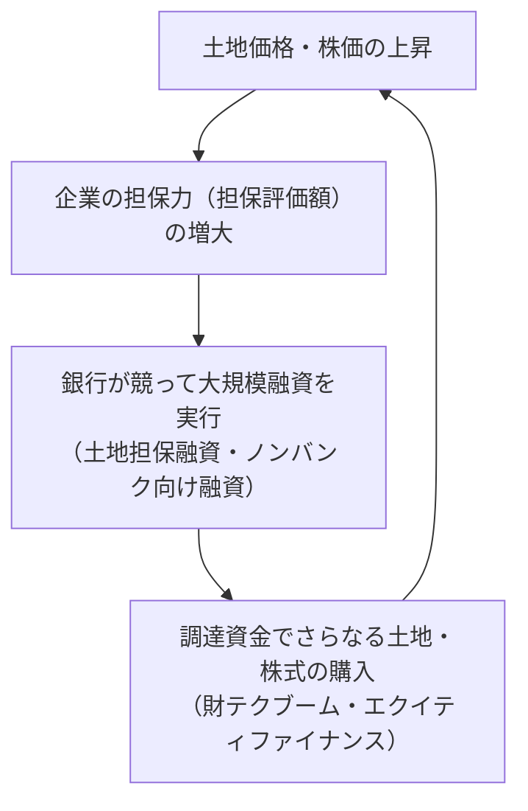

1. **大企業の銀行離れと銀行の貸出先シフト**:
   1980年代前半の金融自由化により、信用力のある大企業は銀行融資に頼らず、転換社債（CB）やワラント債などのエクイティ・ファイナンスを用いて資本市場から極めて低コストで資金調達できるようになりました。優良な貸出先を失った都市銀行・地方銀行は、焦燥感から不動産業、建設業、個人富裕層、そして「ノンバンク（住宅金融専門会社など）」に対する不動産担保融資を猛烈に拡大させました。
2. **土地担保価値のスパイラル（リフレクション・ループ）**:
   銀行は不動産の将来のキャッシュフロー（収益性）を精査するのではなく、「値上がりし続ける土地の時価」を担保に融資枠を設定しました。「地価上昇 → 担保価値増大 → 融資枠拡大 → 追加購入 → さらなる地価上昇」という正のフィードバック・ループが形成され、レバレッジが指数関数的に増大しました。
3. **「財テク」ブームの席巻**:
   事業会社は本業の研究開発や設備投資よりも、低利で調達した資金を特定金銭信託（特金）やファンド信託に預け入れ、株式や不動産で運用する「財テク」に血道を上げました。営業外収益が本業の営業利益を上回る上場企業が続出し、企業経営の本質が投機へと変質していったのです。

---

## 第2章: バブル崩壊と金融システム危機の連鎖（1990〜1998）

### 日銀・三重野総裁による急激な利上げと大蔵省「総量規制」の衝撃
過熱するバブルに対する国民の不満（一般の給与所得者では到底マイホームが買えないという深刻な格差感）が高まる中、政策当局はついに引き締めへと舵を切りました。しかし、そのブレーキの踏み込み方は、あまりにも急激で乱暴なものでした。

1989年12月に就任した日本銀行の **三重野康総裁** は、「バブル退治」を至上命題に掲げ、就任直後から怒涛の利上げを断行しました。
- 1989年5月に3.25%に引き上げられていた公定歩合は、わずか1年あまりの間に **6.00%** （1990年8月）へと急上昇しました。短期間で3.5%もの引き上げという超ド級の金融引き締めでした。

さらに決定打となったのが、1990年3月27日に大蔵省銀行局（土田正顕局長）が全国の金融機関に通達した **「不動産融資の総量規制」** です。
- 不動産業向け融資の伸び率を、総貸出の伸び率以下に抑えることを強制。
- 不動産業、建設業、ノンバンクに対する貸出の実態報告を義務付け。

この金利引き上げと総量規制という「金融と行政の二重の蛇口締め」によって、市場の流動性は一気に枯渇しました。不動産業者や投機筋は新たな借換資金を調達できなくなり、保有資産の投げ売りに追い込まれたのです。

### 資産価格の暴落（株価大暴落、地価下落、担保割れの恐怖）
流動性の蛇口が締められた瞬間、砂上の楼閣であったバブルは音を立てて崩壊し始めました。

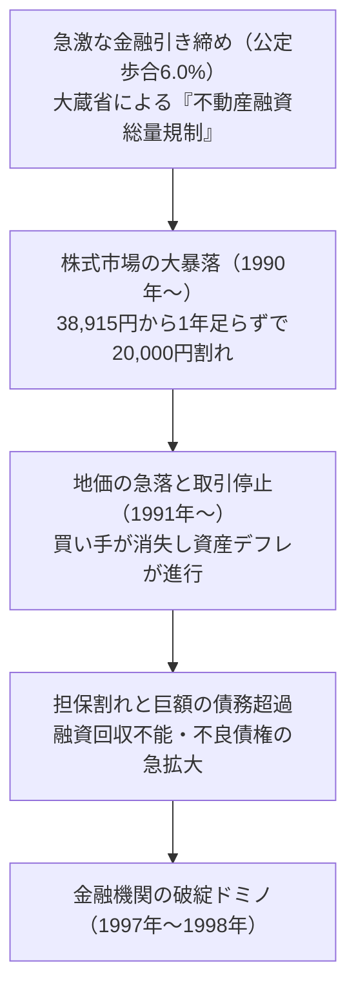

#### 株式市場の急滑降
1990年の大発会から株価は急落に転じました。
- 1990年4月には日経平均株価は30,000円を割り込み、同年10月には **20,000円の大台を割り込みました** 。わずか9カ月間で高値から半値近い水準まで叩き売られたのです。
- その後も小康状態を挟みつつ下落は止まらず、1992年8月には14,000円台へと沈み込みました。高値からの時価総額喪失額は300兆円を超えました。

#### 地価の下落と担保割れ
土地価格は株式に遅れて1991年頃から下落に転じました。買い手が完全に消失したため、市場価格がつかない流動性パニックが発生しました。
- 東京都心の商業地価はピーク時から **70%〜80%以上暴落** し、住宅地も軒並み半値以下へと沈みました。
- 銀行が土地価格の70%〜80%を上限として貸し付けていた融資は、担保価値そのものが借入元本を大幅に下回る **「担保割れ」** に陥りました。企業や個人は莫大な含み損を抱え、債務不履行に陥っていきました。

### 不良債権の暗黒期と金融機関の破綻ドミノ
資産価格の暴落によって、日本の銀行セクターは天文学的な規模の **不良債権（Non-Performing Loans: NPL）** の山に埋もれることになりました。貸出金が回収できなくなった銀行は自己資本を毀損し、貸出余力を失っていきました。

しかし、日本政府と大蔵省は「地価は早晩回復する」「時間をかければ銀行の基礎的収益で不良債権を償却できる」という甘い見通しにすがり、痛みを伴う抜本的な不良債権処理を何年にもわたって先送りし続けました。この「先送りの時間」が病巣を致命的なまでに悪化させたのです。

#### 1. 住専（住宅金融専門会社）問題（1995年〜1996年）
金融破綻の第一波となったのが「住専」でした。銀行や農林系金融機関の出資で作られた住専7社（日本住宅金融、住宅地託など）は、バブル期に不動産会社へ野放図な投機融資を行っていました。バブル崩壊により、住専が抱える不良債権は数兆円規模に達し、事実上の債務超過に陥りました。
- 政府は1996年、住専処理のために **6,850億円の公的資金（一般会計税金）** を投入することを決定しました。
- しかし、税金投入に対して国民と野党から猛烈な批判と反発が巻き起こりました（国会での座り込みデモ、国会空転）。この世論の激しい反発に怯えた政治家と官僚は、以後の金融危機において「早期の公的資金注入」という最も不可欠な救済策を講じることが政治的に不可能になってしまったのです。

#### 2. 1997年〜1998年：未曾有の金融危機と名門の崩壊
1997年秋、ついに破綻の波は日本の金融システムの中心部へと直撃しました。

| 破綻・破綻宣言時期 | 金融機関名 | 規模・格付け | 破綻の衝撃と歴史的意義 |
| :--- | :--- | :--- | :--- |
| **1997年11月3日** | **三洋証券** | 準大手証券会社 | 会社更生法適用を申請。 **インターバンク市場（無担保コール市場）で史上初の債務不履行（デフォルト）** を発生させ、金融機関同士の相互不信と信用収縮（資金の目詰まり）を一気に爆発させた。 |
| **1997年11月17日** | **北海道拓殖銀行（拓銀）** | 都市銀行（全国10大都市銀行の一角） | **戦後初の大手都市銀行の破綻** 。北海道経済を支えていたメガバンクが、不動産融資焦げ付きにより資金調達に行き詰まり営業継続を断念。北洋銀行等に事業譲渡。 |
| **1997年11月24日** | **山一證券** | 4大証券会社の一角（創業100年超の名門） | **戦後最大の企業破綻（負債総額約3兆円）** 。巨額の簿外債務（顧客の株損失を隠蔽する「飛ばし」行為、約2,600億円）が発覚し自主廃業。野澤正平社長の涙の記者会見 **「社員は悪くありませんから」** は平成史の痛恨の象徴となった。 |
| **1998年10月** | **日本長期信用銀行（長銀）** | 長期信用銀行（重厚長大産業の金融中枢） | 不良債権累増により株価が暴落。金融再生関連法に基づき **一時国有化** 。後に外国系投資ファンド（リップルウッド）に売却され「新生銀行」となる。 |
| **1998年12月** | **日本債券信用銀行（日債銀）** | 長期信用銀行の一角 | 長銀に続き債務超過と認定され **一時国有化** 。後にソフトバンク等の連合に売却され「あおぞら銀行」となる。 |

わずか1カ月の間に大手都市銀行と4大証券の一角が相次いで倒産するという事態は、国内外に筆舌に尽くしがたいパニックを引き起こしました。日本の銀行間では「次にどの銀行が倒れるかわからない」という極度の疑心暗鬼が広がり、短期金融市場は完全に凍結。日本の銀行が海外市場で資金を借りる際に法外なプレミアムを上乗せされる **「ジャパン・プレミアム」** が発生し、国家的なクレジット・クランチ（信用収縮）が現実のものとなりました。

### 早期是正措置の遅れと「護送船団方式」の終焉、公的資金注入への世論の猛反発
この破局的な危機の根本原因は、大蔵省が長年堅持してきた **「護送船団方式」** の機能不全にありました。

護送船団方式とは、最も体力の弱い銀行に合わせて金利や業務範囲を規制し、大蔵省の行政指導の下で一握りの落伍者も出さないように守り合う日本独特の金融行政モデルでした。経営が悪化した小規模銀行があれば、大手銀行に吸収合併させて水面下で処理するのが常套手段でした。

しかし、バブル崩壊で生じた不良債権の総額は **数十兆円から100兆円規模** に達しており、大手銀行自身が自らの巨額不良債権で青息吐息となっている状況下では、他行を救済する余力などどこにも存在しませんでした。

- **資産査定の欺瞞と隠蔽**:
  銀行は不良債権を「要管理先」「破綻懸念先」ではなく「正常先」として粉飾的に分類し、引当金の計上を回避し続けました。
- **政治の不作為とポピュリズム**:
  住専問題への批判を恐れた政治家は、金融システム安定化のための抜本的な公的資金注入法案を先送りし続けました。
- **「貸し渋り」と「貸し剥がし」の猛威**:
  BIS（国際決済銀行）の自己資本比率規制（8%）をクリアするため、生き残りに必死な銀行は、健全な中小企業・中堅企業に対する融資を強引に引き上げる「貸し剥がし」や新規融資を拒絶する「貸し渋り」に狂奔しました。

この結果、健全な黒字企業までもが連鎖倒産に追い込まれ、日本経済全体が本格的な信用収縮の底なし沼へと沈んでいったのです。金融機能の麻痺は、実体経済における投資と消費の息根を止め、次章で詳説する「デフレ・スパイラル」の決定的な導火線となりました。

## 第3章: デフレ・スパイラルのメカニズムとバランスシート不況

### リチャード・クーの「バランスシート不況」理論徹底解説
バブル崩壊後の日本経済が、なぜ通常のマクロ経済学（金利を引き下げれば企業や個人が借金をして投資・消費を拡大するという教科書的モデル）に従わず、数十年にわたって沈滞し続けたのか。この謎を極めて明快かつ論理的に解明したのが、野村総合研究所のチーフエコノミストであったリチャード・クーが提唱した **「バランスシート不況（Balance Sheet Recession）」** 理論です。

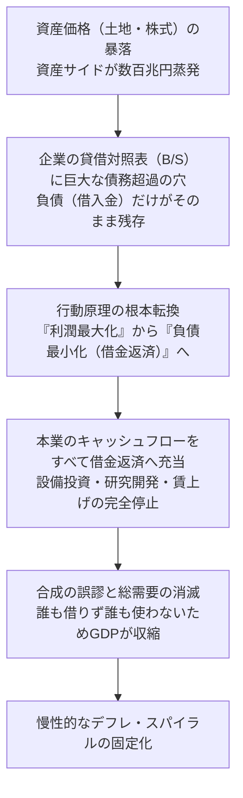

#### 1. 企業の行動原理の転換: 「利潤最大化」から「負債最小化」へ
標準的な新古典派やケインズ派の経済学は、企業は常に「利潤（利益）を最大化する」ために行動すると仮定します。金利が下がれば、投資採算ラインが低下するため、企業は銀行から資金を借りて工場を建て、技術者を雇い、設備投資を行うはずでした。

しかし、バブル崩壊後の日本企業が直面したのは、 **「貸借対照表（バランスシート）の債務超過」** という致命的な現実でした。
- バブル期に数億円〜数十億円で購入した土地や株式（資産サイド）は、価格が7割〜8割暴落して紙くず同然になりました。
- 一方、それを購入するために銀行から借り入れた借入金（負債サイド）は、1円も減らずに額面通り残りました。
- 結果として、日本企業全体で推計 **数百兆円規模の「バランスシートの巨大な穴」** が発生しました。

この状態を放置して破産宣告を受ければ、会社は即座に倒産し、従業員は路頭に迷います。そこで企業経営陣は、たとえ本業のビジネスが黒字であっても、その稼いだ営業キャッシュフローのほぼすべてを「設備投資」や「賃上げ」ではなく、 **「ひたすら借金を返済すること（負債最小化）」** へと投入せざるを得なくなったのです。

#### 2. 合成の誤謬（Fallacy of Composition）
個々の企業にとって、「借金を最優先で返済し、バランスシートを健全化する」という判断は、完全に合理的であり、称賛されるべき健全経営の鑑です。

しかし、 **日本中のほぼすべての企業が一斉に借金返済に走り、誰一人として新規に資金を借り入れなくなった時、マクロ経済全体には破滅的な悲劇** が訪れます。これが経済学でいう **「合成の誤謬」** です。
- 通常の経済循環では、「家計の貯蓄」を「企業が借入」して投資に回すことで、資金が環流しGDPが維持されます。
- しかし、企業が借入を行うどころか、家計と同じように猛烈な勢いで返済（純貯蓄）に回ったため、民間の莫大な所得が支出されずに消滅する「需要のブラックホール」が出現しました。
- 金利を実質ゼロに引き下げても、借入金そのものを消滅させたい企業にとって、金利の多寡など関係ありません。「金利がタダでも、誰も金を借りない世界」が現実のものとなったのです。

#### 3. 財政出動の不可欠性と政府の躊躇
リチャード・クーは、バランスシート不況下における唯一の処方箋は、 **「民間が返済に回した分の資金を、政府が国債を発行して借り入れ、公共投資として演出し直すこと（財政出動による需要の下支え）」** であると論じました。

日本政府が大規模な財政支出を行っていた期間はGDPが維持されましたが、政府や財務省（旧大蔵省）は財政赤字の拡大を恐れ、景気が少し持ち直すたびに「財政再建」へと舵を切り、増税や公共事業削減を強行しました（1997年の消費税5%増税と特別減税廃止がその最悪の例）。この早すぎる財政引き締めが、回復しかけた経済の息根を止め、バランスシート調整を長引かせる主因となったのです。

### 物価下落と賃金抑制の悪循環
バランスシート調整に伴う慢性的な総需要不足は、日本経済を **「デフレ・スパイラル（Deflationary Spiral）」** へと叩き落としました。

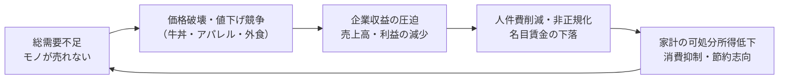

1. **「価格破壊」の幕開け**:
   1990年代半ばから、ダイエーやイトーヨーカ堂などの流通大手によるプライベートブランド（PB）展開、マクドナルドの「平日半額バーガー（65円バーガー）」、吉野家・松屋・すき家による「牛丼280円戦争」、ユニクロ（ファーストリテイリング）による高品質・低価格フリースの大ヒットなど、「より安く、より良いもの」を提供するデフレ適応型企業が台頭しました。
2. **値下げがもたらすブーメラン効果**:
   消費者は低価格化を歓迎しましたが、モノの価格が下がれば、企業の売上高は減少します。利益を確保するために企業が削ったのが、最大の固定費である「人件費（給与・ボーナス・採用費）」でした。
3. **賃金下落と消費の冷え込み**:
   給与がカットされた勤労者は、さらなる生活防衛のために支出を切り詰め、より安い商品を求めてディスカウントストアに並びました。この「値下げ → 収益悪化 → 賃下げ → 個人消費の縮小 → さらなる値下げ」という負の循環が、日本全国津々浦々に定着してしまったのです。

### デフレ・マインドの定着と流動性の罠
デフレが10年、15年と継続する中で、日本社会には深刻な **「デフレ・マインド（期待インフレ率のゼロ・マイナスへの膠着）」** が骨の髄まで染み渡りました。

- **「現金こそ最強の資産」という認知**:
 インフレ下では物価が上がるため、現金をそのまま持っていると実質価値が目減りします。しかし、デフレ下では物価が下がるため、 **「タンス預金や銀行預金に眠らせておくだけで、現金の購買力が年々勝手に上昇する」** ことになります。
- **購買延期のインセンティブ**:
  「今日買わずに、1年待ってから買えばもっと安くなっている」という期待が定着したため、住宅や自動車などの耐久消費財の買い控えが日常化しました。
- **ケインズの「流動性の罠（Liquidity Trap）」**:
  中央銀行が市場にどれほど潤沢に貨幣（マネタリーベース）を供給しても、将来の不確実性とデフレ期待から、資金は投資や消費へ向かわず、金融機関の日銀当座預金や企業の内部留保、家計の現預金としてただ死蔵される状態に陥りました。

---

## 第4章: 非正規雇用の急増と就職氷河期世代の悲劇

### 1990年代後半〜2000年代の労働市場構造改革
バブル崩壊と金融危機に直面した日本企業は、国際競争力の維持と生き残りをかけ、徹底的な「人件費の変動費化」へと突き進みました。これを強力に後押ししたのが、小泉純一郎政権を中心とする一連の **労働市場の規制緩和** でした。

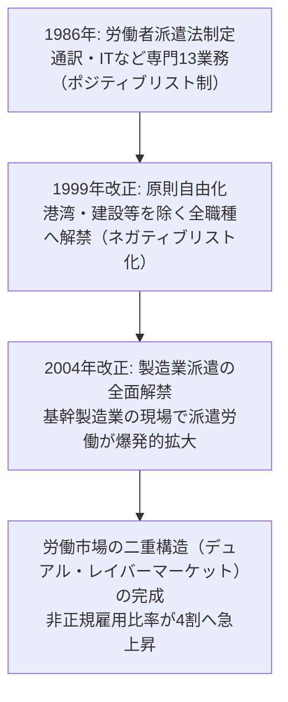

1. **1986年 労働者派遣法の制定**:
   当初は労働者の雇用安定を守るため、通訳、ソフトウェア開発など専門的知識を要する13業務（後に26業務）に限定された「ポジティブリスト方式」でした。
2. **1999年 改正労働者派遣法の施行**:
   経済界（日本経団連など）からの強いコスト削減要望を受け、港湾運送、建設、警備、医療などを除く原則すべての職種において派遣労働が自由化される「ネガティブリスト方式」へと根本的に規制緩和されました。
3. **2004年 製造業派遣の解禁**:
   日本の基幹産業である自動車や電機などの製造ラインにおいて、派遣労働者の利用が全面解禁されました。これにより、好況時には大量採用し、不況時には契約解除（いわゆる「派遣切り」）によって即座に首を切ることができる、究極の調整弁が産業界に提供されたのです。

### 就職氷河期（ロストジェネレーション）の構造的打撃
この労働規制緩和と企業の採用抑制の直撃を真正面から浴びたのが、1993年頃から2005年頃にかけて学校を卒業した **「就職氷河期世代（ロストジェネレーション）」** です。

- **新卒一括採用システムの歪み**:
  日本独特の「新卒一括採用」制度は、好況時には若年層の完全雇用を実現する優れた仕組みでしたが、企業が一斉に採用の門戸を閉ざした不況下では、残酷な「選別マシーン」と化しました。多くの企業が正社員の採用数を半減・激減させ、有効求人倍率は0.5倍前後、大卒求人倍率も1倍を割り込みました。
- **キャリア形成の初期断絶**:
  新卒時に正社員としての就職機会を奪われた若者は、派遣労働者、契約社員、アルバイト（フリーター）として社会人生活をスタートせざるを得ませんでした。当時の日本企業は中途採用市場が未成熟であり、「一度正規ルートから外れた者は二度と正社員に這い上がれない」という強固な身分障壁が立ちはだかりました。
- **生涯賃金格差と貧困の固定化**:
 正規雇用と非正規雇用の間には、生涯賃金ベースで **数千万円から1億円以上** の絶望的な格差が生じました。昇給もなく、退職金もなく、社会保険のセーフティネットからも弾き出された氷河期世代は、30代、40代になっても低賃金と雇用の不安定さに縛り付けられ続けました。

### 正規・非正規の二重構造と企業のコストカット偏重
なぜ、これほどまでに若年層に痛みが集中したのでしょうか。それは、日本の労働法制と司法判断が築き上げてきた **「正社員の解雇権濫用法理」** の強固さにありました。

日本の判例法理では、企業が正社員を整理解雇するためには、以下の「4要件（人員削減の必要性、解雇回避努力の義務、人選の妥当性、手続の妥当性）」を極めて厳格に証明しなければなりません。既存の中高年正社員の雇用と賃金を削減することが法的に極めて困難であったため、企業は **「新卒採用の極限絞り込み」と「非正規雇用の代替活用」** によってのみ、総人件費を圧縮しようとしたのです。

| 雇用区分 | 雇用保障 | 賃金カーブ | 職業訓練（OJT） | リスクの所在 |
| :--- | :--- | :--- | :--- | :--- |
| **正規雇用（正社員）** | 定年までの終身雇用が手厚く保護 | 年功序列（中高年で高賃金） | 企業が費用を投じて社内教育を実施 | 企業が景気変動リスクを抱え込む |
| **非正規雇用（派遣・パート）** | 契約期間満了で随時調整可能 | 昇給ほぼ皆無（時給ベース） | 単純作業中心でスキル形成機会なし | **労働者個人が失業・景気変動リスクを全面的に負担** |

この結果、企業は人件費を抑制して目先の最高益を計上する一方、社内での中長期的な技能伝承やイノベーション創出の基盤を自ら破壊していきました。

### 少子化・未婚化の致命的加速
就職氷河期問題の最大の悲劇は、それが単なる世代間格差にとどまらず、 **「日本の人口動態に対する取り返しのつかない致命傷」** となった点にあります。

氷河期世代は、団塊ジュニア世代（1971年〜1974年生まれ）を中核に含む、人口規模が非常に大きい世代でした。本来であれば、彼らが20代から30代を迎える1990年代後半から2000年代にかけて、 **「第3次ベビーブーム」** が到来し、日本の人口減少に歯止めをかける最後の歴史的チャンスが存在していました。

しかし、雇用が不安定で自らの生活を維持することすらままならない状況下で、結婚し、子どもを産み育てることなど不可能です。
- 30代前半の男性非正規雇用者の有配偶率は、正規雇用者の3分の1以下に低迷しました。
- 生涯未婚率は急上昇し、出生数は激減の一途をたどりました。

日本政府が氷河期世代への抜本的支援を怠り、彼らを「自己責任」として切り捨てた代償として、第3次ベビーブームは幻と消え、日本は2008年をピークに未曾有の超高齢・人口減少社会へと不可逆的に突入したのです。

---

## 第5章: 産業競争力の凋落と「デジタル敗戦」の病理

### 電機・半導体産業の没落
1980年代、「日の丸半導体」は世界の市場シェアの **50%超、DRAM（記憶保持素子）に至っては80%** を牛耳り、世界を震撼させていました。NEC、東芝、日立製作所、富士通、三菱電機の日本の電機大手5社が世界ランキングのトップを独占していました。

しかし、この圧倒的な王国は、2000年代以降、劇的な崩壊を遂げました。

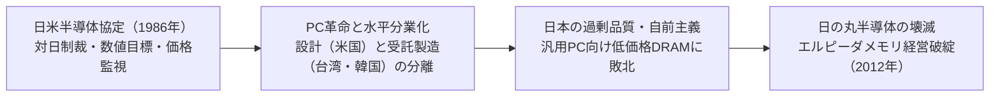

1. **日米半導体摩擦と「日米半導体協定」（1986年）**:
   日本の半導体躍進に危機感を抱いた米国は、不公正貿易慣行（通商法301条）を盾に日本政府に圧力をかけ、日本市場における外国製半導体のシェアを20%以上に引き上げる数値目標を強要しました。さらにダンピング防止協定により価格決定権を奪われ、日本企業の競争力は政治的に削ぎ落とされました。
2. **メインフレームからPCへのパラダイムシフト**:
   日本の半導体は、25年間壊れない「メインフレーム（大型汎用機）」向けに、超高品質・高信頼性を誇っていました。しかし、1990年代に訪れたのは「低価格なパーソナルコンピュータ（PC）」の爆発的普及でした。PCに求められたのは「5年持てば十分、圧倒的に安く、大量に供給できるDRAM」でした。日本企業が職人芸的な過剰品質（オーバークオリティ）に固執する間に、韓国サムスン電子や台湾勢が巨額の設備投資を断行し、低価格・標準化されたメモリ市場を一気に強奪したのです。
3. **合弁会社の迷走とエルピーダメモリの破綻**:
   生き残りを図るため、日立・NECのDRAM部門が統合して誕生した「エルピーダメモリ」は、2012年に会社更生法を申請して倒産し、米マイクロン・テクノロジーに買収されました。こうして、かつて世界を制覇した日本のDRAM産業は完全に消滅しました。

### なぜ日本はインターネット革命・ソフトウェア・GAFAMに乗り遅れたのか
半導体にとどまらず、1990年代以降のIT革命、インターネット、スマートフォンのプラットフォーム競争において、日本企業はことごとく周回遅れとなりました。この壊滅的な敗北は、現代において **「デジタル敗戦」** と呼ばれています。

#### 1. 「すり合わせ（インテグラル）」から「モジュール化・水平分業」への力学変化
東京大学の藤本隆宏教授らが提唱したアーキテクチャ論によれば、ものづくりには以下の2つの類型が存在します。
- **インテグラル型（すり合わせ型）**: 自動車や精密機械のように、部品間の相互依存性が高く、設計や現場の阿吽の呼吸・長年の職人的ノウハウのすり合わせによって高品質を実現する領域。日本企業の得意分野。
- **モジュール型（組み合わせ型）**: パソコン、スマートフォン、インターネットのように、標準化されたインターフェース（規格）に基づき、世界中から集めた部品を組み合わせるだけで製品が完成する領域。

1990年代以降のIT産業は、急速にモジュール化と「水平分業（ファブレスとファウンドリの分離）」へ移行しました。設計はシリコンバレー（Apple、Qualcomm、NVIDIA）、製造は台湾（TSMC）、OSとプラットフォームはGoogleやMicrosoftが握るというエコシステムの中で、ハードウェアからソフトウェアまですべて自社で囲い込もうとした日本の総合電機メーカーの「垂直統合モデル」は完全に競争力を喪失したのです。

#### 2. ガラパゴス化現象（iモードの栄光と挫折）
1999年にNTTドコモがサービスを開始した **「iモード」** は、世界に先駆けて携帯電話で電子メール、モバイルバンキング、着メロ、公式サイト課金を実現した、驚異的なモバイルインターネットの先駆者でした。FeliCa（おサイフケータイ）やワンセグなど、日本の「ガラケー（ガラパゴスケータイ）」は当時、世界最先端の多機能デバイスでした。

しかし、この成功があまりにも巨大であったがゆえに、以下の致命的な欠陥を生みました。
- キャリア（NTTドコモ、KDDI、ソフトバンク）を頂点とする強固な垂直統合モデルが構築され、国内市場だけで莫大な利益が出たため、海外展開を真剣に模索しなかった。
- 2007年にAppleが「iPhone」を発表し、オープンな「App Store」という世界共通のプラットフォームで世界を席巻した時、日本のキャリアと端末メーカーは「あんなものは電池が持たない」「おサイフケータイもワンセグもついていない」と見下し、反撃の機会を永遠に失いました。数年のうちに、NEC、パナソニック、東芝、富士通などの国内携帯端末メーカーは市場からの撤退を余儀なくされました。

#### 3. ソフトウェア軽視と「ITゼネコン」多重下請け構造
日本企業の組織風土には、「目に見えるモノ（ハードウェア）には対価を払うが、目に見えないソフトウェアやデータはオマケである」という根深い偏見が存在しました。
- 企業のITシステム構築は、自社で高度なIT人材を育成するのではなく、大手システムインテグレーター（SIer）に丸投げされました。
- SIer業界は建設業と全く同じ「元請け → 2次請け → 3次請け → 孫請け」という重層下請け構造（ITゼネコン）を形成しました。中間マージンを抜くだけの元請け企業と、低賃金・長時間労働で疲弊する末端プログラマーという構図が固定化し、ソフトウェアを差別化の源泉とするアジャイルな文化が育たなかったのです。

### 1989年と現在の世界時価総額ランキング比較
日本経済の凋落の惨状は、世界の企業時価総額ランキングの比較を見れば一目瞭然です。

| 順位 | 1989年（バブル絶頂期） | 国籍 | 2024年（現在水準） | 国籍 |
| :---: | :--- | :---: | :--- | :---: |
| **1位** | **日本電信電話（NTT）** | 🇯🇵 日本 | **マイクロソフト** | 🇺🇸 米国 |
| **2位** | **日本興業銀行** | 🇯🇵 日本 | **アップル** | 🇺🇸 米国 |
| **3位** | **住友銀行** | 🇯🇵 日本 | **エヌビディア** | 🇺🇸 米国 |
| **4位** | **富士銀行** | 🇯🇵 日本 | **アルファベット（Google）** | 🇺🇸 米国 |
| **5位** | **第一勧業銀行** | 🇯🇵 日本 | **アマゾン・ドット・コム** | 🇺🇸 米国 |
| **6位** | **三菱銀行** | 🇯🇵 日本 | **サウジアラムコ** | 🇸🇦 サウジ |
| **7位** | エクソン | 🇺🇸 米国 | **メタ（旧Facebook）** | 🇺🇸 米国 |
| **8位** | **東京電力** | 🇯🇵 日本 | **バークシャー・ハサウェイ** | 🇺🇸 米国 |
| **9位** | ロイヤル・ダッチ・シェル | 🇬🇧 英/蘭 | **TSMC（台湾積体電路製造）** | 🇹🇼 台湾 |
| **10位** | **三井銀行** | 🇯🇵 日本 | **イーライリリー** | 🇺🇸 米国 |
| **Top 50** | **日本企業が 32社ランクイン** | 🇯🇵 64% | **日本企業は 0社 〜 1社（トヨタ自動車のみ）** | 🇯🇵 0〜2% |

1989年当時、世界の上位5社のうち4社を日本の都市銀行が占め、トップ50社のうち実に **32社（6割以上）** が日本企業でした。しかし、35年後の現在、ランキングの上位は米国のメガテック企業（Big Tech）やTSMCが独占し、日本企業はほぼ完全に姿を消しました。この表こそが、製造業の大量生産モデルと土地担保金融に安住し、知財・ソフトウェア・プラットフォームビジネスへの転換に失敗した「失われた30年」の冷酷な通信簿なのです。

## 第6章: 非伝統的金銭政策の実験場: ゼロ金利・量的緩和から異次元緩和へ

### 速水総裁時代のゼロ金利政策と量的緩和政策
世界の中央銀行の歴史において、日本銀行は常に **「非伝統的金融政策の最前線の実験場」** であり続けました。バブル崩壊後の未曾有のデフレと金融危機に直面した日銀は、近代中央銀行がかつて経験したことのない未知の領域へと足を踏み入れました。

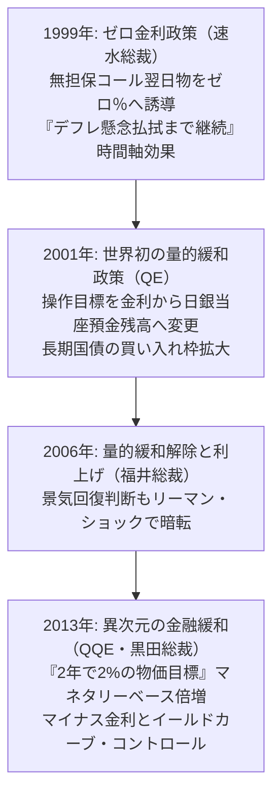

#### 1. ゼロ金利政策（1999年2月）
金融危機後の深刻な景気後退を受け、速水優総裁率いる日銀は、無担保コールレート（翌日物）を「できるだけ低めに誘導し、事実上ゼロ％とする」という **世界初の「ゼロ金利政策」** を導入しました。
さらに同年4月、「デフレ懸念が払拭されるまでゼロ金利を継続する」と宣言しました。これは、将来の政策経路についてのコミットメントを通じて長期金利を押し下げる **「フォワード・ガイダンス（時間軸効果）」** の先駆例となりました。

#### 2. 世界初の「量的緩和政策（QE）」（2001年3月）
しかし、2000年のITバブル崩壊により再び景気は悪化。政策金利が既にゼロに達しており「利下げ余地」が存在しない中で、日銀は2001年3月、 **世界初となる「量的緩和政策（Quantitative Easing）」** へ踏み切りました。
- **操作目標の変更**: 金融調節の目標を「金利（コールレート）」から、民間銀行が日銀に預けている資金である「日銀当座預金残高」へと変更。
- **資産買い入れの拡大**: 長期国債の買い入れ枠を段階的に引き上げ、マネーを銀行システムへと注ぎ込みました。

### 福井総裁時代の量的緩和解除と「いざなみ景気」
2003年に就任した福井俊彦総裁の下、世界的な好景気（米国の住宅バブルや中国の高度成長）と超円安を背景に、日本の輸出製造業は息を吹き返しました。2002年2月から2008年2月まで73カ月に及んだこの景気拡大期は、戦後最長を記録し **「いざなみ景気」** と命名されました。

景気回復とCPIの前年比プラス定着を受け、日銀は2006年3月に量的緩和政策を解除。同年7月にはゼロ金利を解除して公定歩合を引き上げ、2007年2月にはコールレートを0.5%へ引き上げました。

しかし、この「いざなみ景気」は極めて歪んだものでした。
- 企業収益は過去最高を記録したものの、前章で述べた非正規雇用の拡大とコストカットにより、 **「労働者の名目賃金はほとんど上がらない」** という「実感なき景気回復」に終始しました。
- 内需の自律的反発を欠き、海外需要と為替レートに依存した脆弱な回復であったため、世界経済の暗転に対して無防備であったのです。

### リーマン・ショックと民主党政権下の超円高（白川総裁時代）
2008年9月、米投資銀行リーマン・ブラザーズの経営破綻を契機に、 **世界金融危機（リーマン・ショック）** が勃発しました。この未曾有の金融危機への対応をめぐり、日本は再び決定的な政策的蹉跌を経験します。

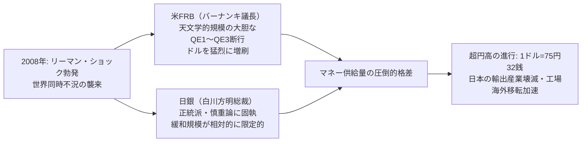

#### FRBと日銀の対応の「格差」
米連邦準備制度理事会（FRB）のバーナンキ議長や欧州中央銀行（ECB）は、直ちにゼロ金利を導入した上で、前代未聞の巨額の国債・住宅ローン担保証券（MBS）買い入れ（QE1〜QE3）を断行し、自国通貨を猛烈に増刷しました。

一方、2008年4月に就任していた白川方明総裁率いる日銀は、「非伝統的金融政策の効果には限界があり、副作用が大きい」「中央銀行が財政規律を緩めてはならない」という正統派の信念を堅持し、相対的に慎重で小規模な資産買い入れにとどまりました。

#### 1ドル＝75円の衝撃と国内産業の空洞化
マネタリーベースの拡大ペースにおける日米の圧倒的な格差は、為替市場における **猛烈な「円高・ドル安」** を招きました。
- 2011年10月には、戦後最高値となる **1ドル＝75円32銭** を記録。
- 民主党政権（鳩山・菅・野田内閣）の政治的混迷と東日本大震災（2011年3月）の災禍が重なり、日本の製造業は「六重苦（円高、高い法人税、厳しい労働規制、環境規制、電力不足、FTAの遅れ）」に喘ぎました。
- パナソニック、ソニー、シャープが巨額の赤字に沈み、日本の製造業は国内拠点を放棄して生産ラインのアジア・中国への海外移転を加速させ、国内の産業空洞化が決定打となりました。

### 黒田東彦総裁の「異次元の金融緩和（QQE）」
長引くデフレと超円高に対する産業界・国民の不満は頂点に達し、2012年末の総選挙で自民党が政権を奪還。安倍晋三首相は「輪転機をぐるぐる回して日本銀行に無制限にお金を刷ってもらう」と豪語し、日銀執行部の刷新を断行しました。

2013年3月に就任した **黒田東彦総裁** は、同年4月4日、従来の漸進的アプローチを完全に否定する **「異次元の金融緩和（量的・質的金融緩和: QQE）」** の導入を発表しました。

```
【異次元緩和の「2-2-2」ターゲット】
1. 「2年」の期間内に
2. 「2%」の物価安定目標を達成するため
3. マネタリーベースおよび長期国債・ETF保有額を「2倍」に拡大する
```

黒田日銀は、長期国債の買い入れを年間約50兆円（後に80兆円）ペースへと天文学的に拡大し、さらにETF（上場投資信託）やJ-REITの買い入れ枠も爆発的に増額しました。この「バズーカ砲」と呼ばれた強烈なアナウンスメント効果により、市場心理は一変。為替は一気に円安（1ドル＝100円超〜120円台）へと振れ、株式市場は歴史的な急上昇を演じました。

さらに日銀は、2016年1月に **「マイナス金利政策（-0.1%）」** を、同年9月には長期金利（10年物国債利回り）をゼロ％程度に固定する **「長短金利操作付き量的・質的金融緩和（イールドカーブ・コントロール: YCC）」** を導入し、金融政策の極限の実験を推進していきました。

---

## 第7章: アベノミクスの検証: 「三本の矢」は何をもたらし、何を残したのか

### 「三本の矢」の構造と初期の劇的インパクト
2012年末に発足した第2次安倍内閣が掲げた総合経済政策パッケージが **「アベノミクス（Abenomics）」** でした。その骨子は、明快な「三本の矢」によって構成されていました。

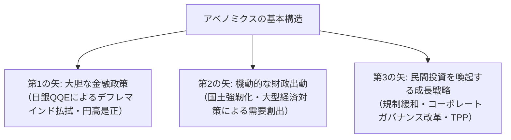

#### 初期の華々しい成果（2013年〜2015年）
アベノミクスは、民主党政権下で極限まで閉塞していた日本社会に強烈な心理的転換をもたらしました。
- **株価の劇的回復**: 民主党政権末期に8,000円台に沈んでいた日経平均株価は、2万円台へと回復。
- **円高の是正**: 1ドル＝70円〜80円台の異常な円高が是正され、トヨタ自動車をはじめとする輸出企業の収益が空前の過去最高益を更新。
- **雇用の量的改善**: 有効求人倍率は全都道府県で1倍を超え、失業率は2%台前半という「完全雇用水準」に達しました。女性や高齢者の就業者数が数百万人規模で増加しました。
- **インバウンド観光の爆発**: ビザ発給要件の緩和と円安が追い風となり、2012年に約830万人だった訪日外国人観光客数は、2019年には **3,188万人** へと4倍近くに急増しました。

### 第3の矢の停滞と岩盤規制の壁
しかし、アベノミクスが「日本経済の持続的成長」をもたらしたかといえば、専門家の評価は極めて厳しいものにならざるを得ません。最大の失敗は、最も重要とされた **「第3の矢（成長戦略）」の空文化** でした。

- **岩盤規制の打破の失敗**:
  農業（農協改革の不徹底）、医療（既得権益の抵抗）、労働市場（正社員の解雇規制緩和の見送り）といった構造問題は、自民党内の族議員や強力な支持団体の猛反発に遭い、抜本的なメスを入れることができませんでした。
- **潜在成長率の低迷**:
 日本経済の実力を示す「潜在成長率」は、アベノミクスの期間を通じて **年率0.5%前後** の低空飛行を続け、成長エンジンの再点火には至りませんでした。
- **新産業創出の欠如**:
  金融緩和と財政出動で時間を稼いでいる間に、次世代の基幹産業となるグローバルなIT・テック企業やユニコーン企業を日本発で育成することは叶いませんでした。

### 2度の消費税増税による冷却効果
アベノミクスの致命的な自己矛盾となったのが、社会保障と税の一体改革に基づく **2度の消費税増税** でした。

```
【消費税増税のタイムラインと影響】
・2014年4月: 5% → 8% への引き上げ（3%増税）
  → 駆け込み需要の反動減にとどまらず、個人消費が長期間にわたり完全に凍結。
     回復傾向にあった実質消費支出は急落し、デフレ完全脱却の芽を自ら摘み取る。
・2019年10月: 8% → 10% への引き上げ（2%増税）
  → ポイント還元事業などを講じたものの、個人消費を再び冷え込ませ、
     直後に到来したコロナショックと相まって景気を二番底へと突き落とす。
```

マクロ経済学的に見れば、日銀がアクセルを床まで踏み込んで金融緩和を行う一方で、財務省と政府が消費税増税という最強のブレーキを同時に踏み込むという、支離滅裂な政策運営が行われたのです。

### 日銀の国債・ETF爆買いによる市場機能の麻痺と財政規律の喪失
異次元緩和が長期化するにつれて、その未曾有の「副作用」が日本経済を蝕んでいきました。

1. **国債市場の死滅**:
 日銀が発行される国債の過半（ピーク時には発行残高の **50%超** ）を買い占めたため、債券市場で民間の取引が成立しない「取引ゼロ日」が頻発。金利による市場の価格発見機能が完全に麻痺しました。
2. **「クジラ」となった日銀と株式市場の歪み**:
 日銀は年間最大6兆円〜12兆円ペースで株式ETFを買い入れ続け、累計保有額は時価ベースで約50兆〜70兆円に達しました。日銀は東証プライム上場企業の半数以上で実質的な **筆頭株主・大株主** となり、コーポレートガバナンスにおける市場の規律（物言う株主による経営監視）を著しく損ないました。
3. **財政規律の完全崩壊（事実上の財政ファイナンス）**:
 「日銀がどれほど国債を発行しても超低金利で全量買い取ってくれる」という環境に政治家が完全に甘え、国の債務残高は **1,200兆円超（GDP比260%超という主要先進国最悪水準）** へと雪だるま式に膨張しました。

---

## 第8章: 社会・心理・政治の変容: 停滞が生んだ国民意識

### 「草食化」「ミニマリズム」「さとり世代」の社会心理学
30年におよぶ経済の停滞は、単に金銭的な数値にとどまらず、日本国民、とりわけ若年層の **「人生観、価値観、消費欲望の構造」** を根底から変容させました。

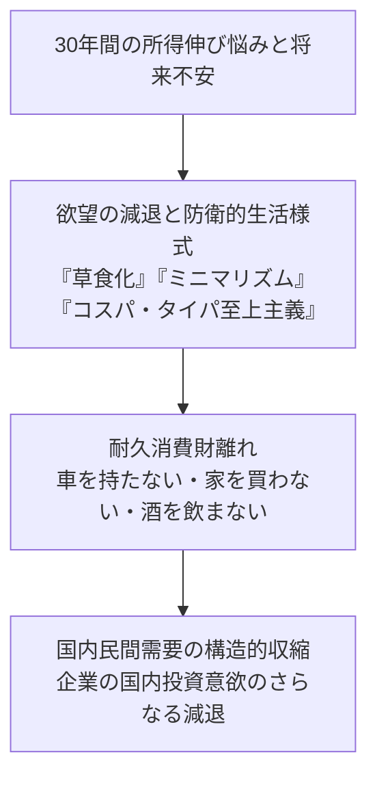

- **「モノを買わない」ことの合理化**:
  かつてのバブル世代が高級外車、ブランドバッグ、高級レストランでの消費をステータスとしたのに対し、デフレ期に育った若者（いわゆる「さとり世代」）は、車を持たず、ブランド品を忌避し、ユニクロやGU、100円ショップの高品質な衣服・日用品で満足する生活様式を確立しました。
- **「コスパ（対費用効果）」「タイパ（対時間効果）」の追求**:
  限られた可処分所得の中で失敗したくないという心理から、消費行動は極端にリスクヘッジ的になり、事前のクチコミ確認や短尺動画による要約消費が一般化しました。
- **草食化と恋愛・結婚離れ**:
  「恋愛や結婚はコストが高すぎる（贅沢品である）」という認識が定着し、性愛への淡白さや独身貴族の肯定が社会全体に浸透しました。

### 投資忌避と安全資産信仰
30年間の資産デフレのトラウマは、日本人のマネーに対する向き合い方を極端なまでに保守化させました。

日本銀行の資金循環統計によれば、日本の家計金融資産（約2,100兆円）の内訳は、 **「現金・預金」が54%前後** を占め、欧米（米国は株式・投信が約50%、現預金は約13%）と著しい対照を成しています。
- 「バブル崩壊で株式に手を出した親世代が悲惨な借金を背負った」「株はギャンブルである」という強烈な原体験が語り継がれ、株式投資へのアレルギーが何世代にもわたって固定化しました。
- 銀行に預けても金利が0.001%という実質ゼロ金利が続いても、「元本が保証されているなら一番安心」という錯覚に囚われ、資産形成のグローバルな波（S&P500や全世界株式の複利成長）から日本国民は完全に乗り遅れました。

### 政治の漂流とシルバー民主主義
日本の政治体制もまた、長期停滞と人口動態の激変によって構造的な機能不全に陥りました。それが **「シルバー民主主義（Silver Democracy）」** の猛威です。

| 政治的課題 | 高齢者層の利益・優先度 | 若年層・将来世代の利益・優先度 | 実際の政策決定の結果 |
| :--- | :--- | :--- | :--- |
| **社会保障費の配分** | 既存の年金・医療・介護給付の維持（負担増の拒絶） | 現役世代の社会保険料負担の軽減 | **高齢者向け給付を維持し、現役世代の社会保険料率を連続引き上げ** |
| **国家財政の使途** | 高齢者向け医療制度の自己負担率据え置き | 子育て支援、義務教育・高等教育無償化、科学技術投資 | **教育・研究開発予算は長年抑制、社会保障費が国家予算の3分の1を突破** |
| **投票行動の重み** | 投票率が高く（60%〜70%）、人口ボリュームが圧倒的 | 投票率が低く（30%〜40%）、少子化により絶対数が少ない | **政治家が選挙目当てに高齢者優遇政策に傾斜（若者無視の構造）** |

政治家にとって、当選のためには最大の票田である高齢者層の顔色を窺うことが合理的となり、将来世代のための大胆な教育改革、科学技術への先行投資、スタートアップ支援は常に後回しにされ続けました。

### 自信の喪失と「過去の栄光」への逃避
かつて「世界一」を誇った国家が緩やかに没落していくプロセスは、国民の集合的無意識に深いアイデンティティの危機をもたらしました。

2010年代以降の日本のメディア空間には、奇妙な現象が溢れ返るようになりました。
- テレビ各局による「外国人が日本のここを絶賛！」「日本スゴイ！」という自画自賛バラエティ番組の乱立。
- 書店のベストセラー棚を埋め尽くした、近隣諸国への過度な見下しや排外主義的な論壇本のブーム。

社会心理学的に見れば、これらは **「現実の国力低下と国際的プレゼンスの喪失から目を逸らし、過去の美名や文化的多幸感に浸ることで精神的安定を保とうとする集団的防衛機制（ナルシシズム的退行）」** に他なりませんでした。現実の直視と痛切な自己変革から逃避し続けたことこそが、停滞をさらに10年延ばす精神的土壌となったのです。

## 第9章: 「失われた30年」の終焉か、それとも新たな局面か（2020年代〜現在）

### コロナ禍後の世界同時インフレ波及とサプライチェーン再編
2020年に世界を襲った新型コロナウイルス感染症（COVID-19）のパンデミックと、2022年のロシアによるウクライナ軍事侵攻は、30年間凍結していた日本経済の物価・金利環境を根底から揺さぶる歴史的転換点となりました。

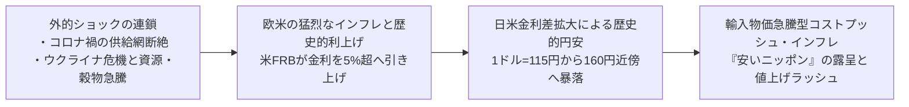

米欧各国の中央銀行が、40年ぶりの急激なインフレを抑え込むために猛烈な勢いで政策金利を引き上げ（米FRBはゼロ金利から5.25%〜5.50%へ連続利上げ）、世界的な金融引き締めへと舵を切る中、日本銀行だけは大規模な緩和姿勢を継続しました。

この未曾有の日米金利差の拡大を背景に、為替市場では **「1ドル＝115円水準から一気に160円近傍へと急降下する歴史的な円安」** が進行しました。海外から輸入するエネルギー、鉱物資源、小麦、大豆などの価格が円建てで跳ね上がり、長年「値上げは悪」と信じ込まれてきた日本企業も、原材料費の上昇を最終商品価格へ転嫁せざるを得なくなりました。30年ぶりに、街中に「値上げラッシュ」の波が押し寄せたのです。

### 歴史的円安と30年ぶりの賃上げ
「悪い円安」「コストプッシュ・インフレ」として始まった物価高でしたが、それは同時に、30年間頑として動かなかった日本社会の **「賃金と価格のノルム（社会通念・慣性）」を不可逆的に破壊する契機** ともなりました。

- **「安いニッポン」の衝撃**:
  1ドル＝150円〜160円という歴史的円安により、外貨ベースで見た日本の物価や賃金は驚くほど割安となりました。ニセコや白馬のスキー場では一杯3,000円超のラーメンが外国人観光客に飛ぶように売れ、欧米のファストフード店の時給が日本の大企業の新卒初任給を上回るという「安い国・日本」の現実が、国民に強烈な屈辱感と危機感を植え付けました。
- **春闘における30年ぶりの歴史的賃上げ（2023年〜2024年）**:
 深刻化する人手不足と物価高に対応するため、日本労働組合総連合会（連合）が主導する春季労使交渉（春闘）において、企業の賃上げ率は **2023年に3.58%、2024年には5%超（5.10%）** という、バブル期以来33年ぶりとなる記録的な水準を叩き出しました。長年賃上げを凍結してきた大企業が、相次いで初任給の大幅引き上げやベースアップ（ベア）を決断したのです。

### マイナス金利解除と日銀の金融正常化への険しい道
国内の持続的な物価上昇と賃上げの定着を確認した日本銀行は、2023年4月に就任した **植田和男総裁** の下で、ついに「異次元緩和の出口」へと舵を切りました。

2024年3月19日、日銀は金融政策決定会合において、以下の歴史的決定を下しました。
1. **マイナス金利政策（-0.1%）の解除**: 短期金利を0.0%〜0.1%程度へと引き上げ、 **17年ぶりの利上げ** を実施。
2. **イールドカーブ・コントロール（YCC）の撤廃**: 10年物長期金利を抑え込む操作を終了。
3. **ETFおよびJ-REITの新規買い入れ停止**: 10年以上に及んだ異次元緩和の象徴的ツールの完全終了。

しかし、これは「金利のある世界」への第一歩に過ぎず、日銀の目前には険しい地雷原が広がっています。
- **財政への跳ね返り**: 金利が1%上昇するだけで、1,200兆円を超える国債を抱える日本政府の利払い費は将来的に数兆円規模で膨張し、国家予算を激しく圧迫します。
- **日銀自身の財務リスク**: 大量に抱え込んだ長期国債の含み損や、民間銀行から預かっている当座預金への利払い負担が、中央銀行の財務健全性を揺るがすリスクを孕んでいます。

### 日経平均株価の最高値更新と生活実感の乖離
2024年2月22日、日本の金融市場は歴史的な瞬間を迎えました。日経平均株価が、1989年12月29日に記録したバブル期の最高値（38,915円87銭）を実に **34年2カ月ぶりに更新し、史上初めて40,000円の大台を突破** 、一時42,000円台まで駆け上がったのです。

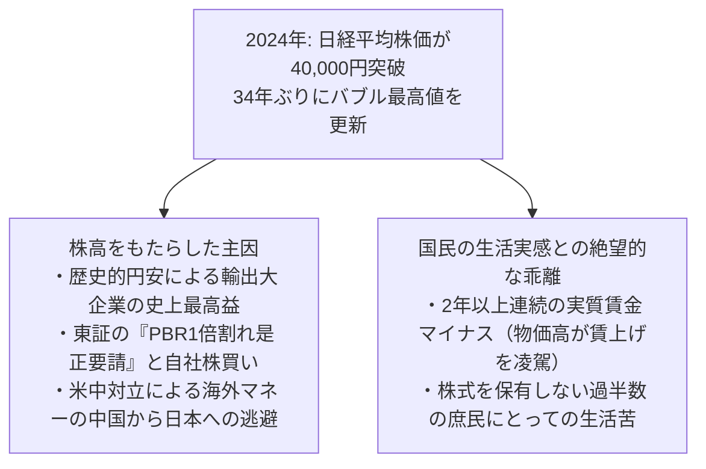

しかし、この株高を無邪気に「日本経済の完全復活」と祝福することはできません。その内実を精査すると、株価の数字と国民の生活実感の間には、深い溝が横たわっています。

1. **株高を牽引した3つの要因**:
   - 歴史的円安に伴う、海外売上比率の高い輸出大企業（自動車・商社・半導体製造装置）の会計上の見かけの最高益。
   - 東京証券取引所による「PBR（株価純資産倍率）1倍割れ企業への改善要請」を受けた、企業による巨額の自社株買いや増配などの資本効率改善。
   - 地政学的リスク（米中摩擦）を嫌気したグローバル投資マネーが、中国市場から資金を引き揚げ、相対的に政治・法制が安定した日本株へ逃避的に流入したこと。
2. **国民を苦しめる実質賃金のマイナス**:
 名目賃金は30年ぶりに上がったものの、それを上回る勢いで食料品やエネルギーなどの生活必需品が値上がりしたため、 **厚生労働省の毎月勤労統計における「実質賃金」は、2022年4月から2024年にかけて2年以上（過去最長）にわたり連続前年同月比マイナス** を記録しました。国民の実感は「好景気」どころか、「日々の生活費の圧迫と貧困化」そのものだったのです。

「失われた30年」の象徴であった資産価格のデフレとゼロ金利の呪縛は解けつつありますが、それは新たな「インフレと格差の時代」への扉を開けたに過ぎないとも言えます。

---

## 結び: 日本経済再生への処方箋――歴史の痛恨から何を学ぶべきか

### 過去30年の「痛恨の失敗」の本質
世界史を振り返っても、一時代を築いた経済大国がこれほど長期にわたり、戦争や大恐慌による破壊を経験したわけでもないのに、平和の中で緩慢にその相対的国力を低下させ続けた事例は他に類を見ません。

日本の「失われた30年」の真因を総括するならば、それは以下の3点に集約されます。
1. **痛みを伴う構造改革の先送りと延命**:
   不良債権処理の遅滞、ゾンビ企業の温存、既得権益の保護により、市場の新陳代謝を人為的に停止させたこと。
2. **人への投資（人的資本）の軽視と過度のコストカット**:
   短期的な利益を捻出するために非正規雇用を拡大し、若年層のキャリアと家庭形成の基盤を破壊したこと。
3. **成功体験への執着とデジタル・パラダイムシフトの拒絶**:
   ハードウェアのものづくりの職人芸に拘泥し、ソフトウェア、プラットフォーム、知的財産を軸とする知識集約型経済への移行を怠ったこと。

### 次なる30年に向けた国家再建のロードマップ
日本が真に長期停滞のトンネルを抜け出し、次世代に希望ある豊かな社会を継承するためには、耳あたりの良いバラマキ政策ではなく、国家の骨格を組み替える痛烈な構造改革を断行しなければなりません。

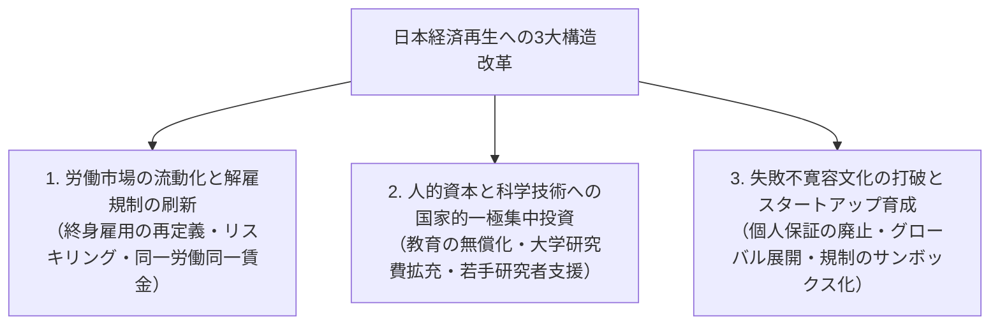

#### 1. 労働市場の流動化とセーフティネットの再構築
正社員の過剰な雇用保護（厳格すぎる解雇権濫用法理）と、非正規雇用の不安定さという「二重構造」を解体しなければなりません。企業が成長分野へ柔軟に人材を再配置できるよう、金銭解決ルールの導入を含めた解雇法制の見直しを行うと同時に、失業時の手厚い所得保障と、成長産業への移行を支援する実践的な「リスキリング（学び直し）」教育を国家が全面的に保証する **「北欧型フレキシキュリティ（柔軟性と安全性の統合）」** への転換が不可欠です。

#### 2. 「人への投資」と教育・科学技術の抜本的拡充
日本の未来を決めるのは、道路や橋のコンクリートではなく「人間」です。
- 高齢者向けに偏重した社会保障給付の構造を見直し、予算の配分を子ども・子育て支援、初等・中等・高等教育の無償化、そして基礎科学・大学研究費の拡充へと大胆にシフトさせる必要があります。
- 「教育と研究への投資はコストではなく、国家存続のための最高の設備投資である」という理念を確立しなければなりません。

#### 3. イノベーションを阻む「失敗不寛容」の打破
日本企業の意思決定を麻痺させてきた「減点主義」と「前例踏襲」の官僚主義を粉砕しなければなりません。起業時に経営者の個人資産を担保に取る「経営者保証」を完全に撤廃し、何度失敗しても再挑戦できるスタートアップ・エコシステムを構築すること。日本発のユニコーン企業が次々と誕生し、既存の停滞した大企業を創造的に破壊するダイナミズムを取り戻すことこそが、唯一の成長の道筋です。

「失われた30年」という巨大な代償を支払った私たちは、今まさに歴史の岐路に立っています。過去の痛恨の教訓を真摯に受け止め、内向きの自己満足を捨て去り、果断な変革へと踏み出す勇気を持つこと。それこそが、私たちがこの30年の停滞の歴史から汲み取るべき、最も尊い教訓なのです。
