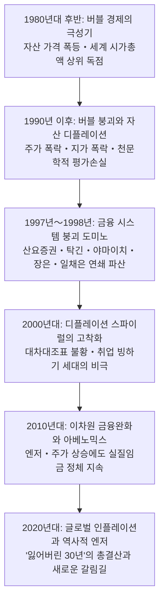
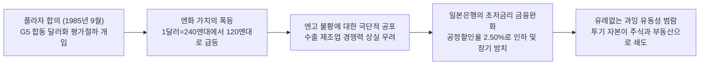
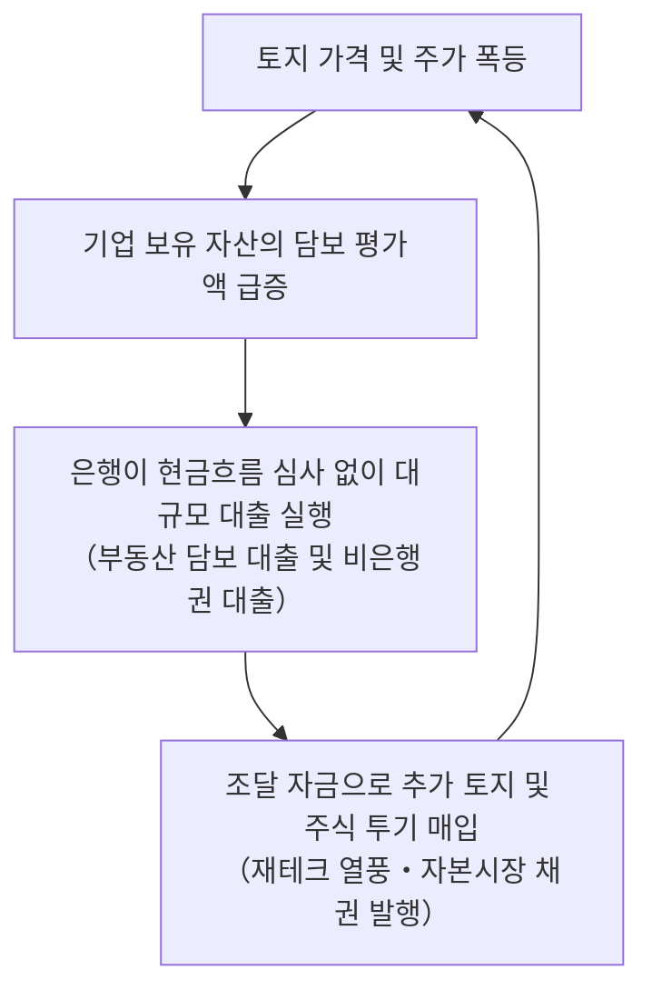
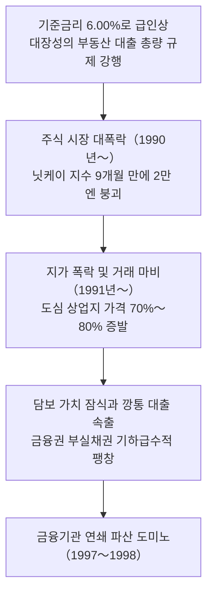
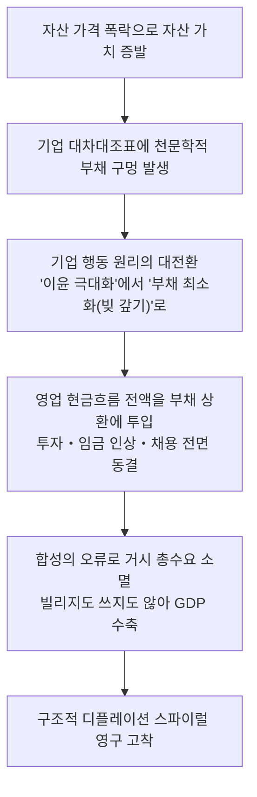
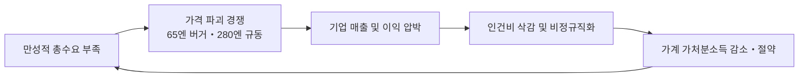

## 서론: "잃어버린 30년"이란 과연 무엇이었는가――세계사적으로 유례없는 장기 침체의 본질

### 용어의 변천과 사정: "잃어버린 10년"에서 20년, 그리고 30년으로
현대 경제사에서 "잃어버린 30년(The Lost Decades)"이라는 호칭만큼, 막대한 경제적 번영의 정점에서 불가역적인 구조적 침하로 추락한 국가의 고뇌를 단적으로 상징하는 표현은 없습니다.

1990년대 초 버블 경제 붕괴 직후, 일본 사회를 뒤덮은 침체감은 당초 정책 당국과 경제학자들에 의해 '일시적인 경기순환적 후퇴'로 간주되었습니다. 부실채권 정리와 금융기관 재편이 완료되면 일본 경제가 다시 우상향의 고성장 궤도로 복귀할 것이라는 낙관론이 지배적이었습니다. 그러나 회복의 발걸음은 지극히 무뎠으며, 1997년 금융위기를 거쳐 2000년대에 접어들자 이 역사적 현상은 학술적・사회적으로 **"잃어버린 10년(The Lost Decade)"** 으로 정착되었습니다.

하지만 2000년대 중반 수출 주도에 의한 완만한 경기 회복(이자나미 경기) 역시 국내의 본격적인 개인 소비 확대나 디플레이션 탈출로 이어지지 못했고, 2008년 리먼 브라더스 파산으로 촉발된 글로벌 금융위기로 허무하게 산산조각 났습니다. 침체는 2010년대로 연장되어 명칭은 **"잃어버린 20년"** 으로 늘어났습니다.

나아가 2012년 말 출범한 제2차 아베 정권의 '아베노믹스'와 일본은행의 '이차원 금융완화'에 힘입어 주가와 기업 이익이 사상 최고치를 경신했음에도 불구하고, 국민 실질임금의 지속적 상승, 노동생산성 제고, 잠재성장률 견인이라는 근본 과제는 해결되지 않았으며, 2020년대에 이르러 마침내 **"잃어버린 30년"** 이라는 세계사적으로 유례없는 초장기 시스템 침체로 총괄되기에 이르렀습니다.

### 1980년대 "재팬 애즈 넘버원"의 정점과 구조적 오만
이 30년 침체의 심도를 정확히 이해하기 위해서는 그 직전 일본이 도달했던 '번영의 정상'을 되돌아보아야 합니다.

1979년 미국 사회학자 에즈라 보겔이 저술한 《재팬 애즈 넘버원(Japan as Number One)》은 일본식 경영 시스템(종신고용, 연공서열, 기업별 노조), 민관 협력 산업정책, 무결점 품질의 제조업, 높은 저축률과 평등한 소득 분배를 격찬했습니다. 오일쇼크를 전원참여 품질관리(TQC)와 에너지 절약 기술로 극복한 일본은 전 세계를 호령하는 산업 제조 강국으로 군림했습니다.

1980년대 후반 일본 제조업이 창출한 천문학적 무역흑자는 극심한 대미 무역마찰을 촉발했고, 미국 노동자들이 일본차를 쇠해머로 부수는 시위가 빈발했습니다. 막대한 유동성을 쥔 일본 기업들은 미국 자존심의 상징인 뉴욕 록펠러 센터, 페블비치 골프장, 컬럼비아 영화사를 연달아 사들였습니다. "머지않아 일본 경제가 미국을 제치고 세계 최대 경제대국이 될 것"이라는 전망은 당시 국제사회에서 진지하게 논의되던 현실이었습니다.

그러나 이 압도적인 성공 체험이야말로 정책 결정권자들과 기업 경영진에게 치명적인 오만과 인지 편향을 심어주었습니다. "일본형 시스템은 불패다", "토지 가격은 결코 떨어지지 않는다(토지 신화)", "대형 금융기관은 절대 망하게 두지 않는다(호송선단 방식)"라는 맹신이, 뒤이어 닥쳐온 글로벌 디지털・모듈형 산업 패러다임 전환으로의 적응을 완전히 가로막게 됩니다.

### 국제 비교를 통해 본 일본의 불가역적 지반 침하
30년의 세월이 초래한 일본의 쇠락은 냉혹한 경제 지표에 뚜렷이 각인되어 있습니다:

| 평가지표 | 1989년〜1990년 (정점 시기) | 2023년〜2024년 (현재 수준) | 지표 변동의 구조적 의미 |
| :--- | :--- | :--- | :--- |
| **세계 명목 GDP 내 일본 비중** | **약 15% 〜 18%** (미국 GDP의 70%에 육박) | **약 4.0% 〜 4.2%** (독일에 추월당해 세계 4위로 전락) | 글로벌 경제 성장 파이에서 일본이 완전히 배제된 실태 |
| **글로벌 시가총액 상위 50대 기업** | **일본 기업 32개 사** (Top 5 중 4개가 일본 은행) | **일본 기업 0 〜 1개 사** (도요타자동차만 간신히 진입) | 하드웨어・금융에서 빅테크・소프트웨어로의 주도권 교체 |
| **OECD 실질임금 지수 (1990=100)** | 일본: 100 (주요 선진국과 대등) | 일본: **약 103** (미국: 150 이상, 한국: 190 이상) | 주요 선진국 중 유일하게 30년간 실질임금이 제자리걸음 |
| **1인당 명목 GDP OECD 순위** | **세계 2위 〜 4위** (국민 대다수가 세계 최고 부유층) | **세계 30위 〜 32위** (G7 최하위, 한국・대만에 역전 허용) | 통화가치 하락과 생산성 침체로 구매력 대폭 붕괴 |
| **IMD 국가경쟁력 순위** | **세계 1위** (1989년부터 수년간 부동의 1위) | **세계 35위 〜 38위** (의사결정 지연 및 IT 도입 낙후) | 경직된 기업 지배구조와 디지털화 지체 |

따라서 '잃어버린 30년'은 단순한 자산 가격의 하락이 아닙니다. 전 세계가 정보통신 혁명, 인터넷, 모바일, 인공지능, 바이오테크놀로지, 금융공학이라는 혁신의 거센 파도를 타고 질주하는 동안, 일본 홀로 과거의 부채 청산과 낡은 기득권에 갇혀 소득, 생산성, 산업경쟁력 전반에서 돌이킬 수 없는 역사적 침하를 겪은 비극이었습니다.

---

## 제1章: 버블 경제의 형성과 광란 (1985〜1990)

### 플라자 합의(1985년)와 급격한 엔고 불황에 대한 공포
1980년대 후반 버블 경제의 직접적 도화선이 된 사건은 1985년 9월 22일 뉴욕 플라자 호텔에서 체결된 **"플라자 합의(Plaza Accord)"** 였습니다.

당시 미국 레이건 행정부는 재정지출 확대와 고금리 정책으로 달러화가 지나치게 고평가되어 막대한 재정적자와 무역적자라는 '쌍둥이 적자'에 시달리고 있었습니다. 특히 대일 무역적자가 정치적 뇌관으로 부상하자, G5(미・영・서독・프・일) 재무장관 및 중앙은행 총재들은 달러화 약세를 유도하기 위한 외환시장 공동 개입에 합의했습니다.

플라자 합의의 파급력은 파괴적이었습니다. 합의 전 **1달러당 240엔 안팎이던 환율은 불과 1년 만에 150엔대로, 1987년 말에는 120엔대까지 폭등** 했습니다. 일본의 수출 산업이 괴멸적 타격을 입을 것이라는 공포(엔고 불황, *Endaka Fukyo*)가 열도를 집어삼켰습니다.

정부와 일본은행은 엔고 충격을 완화하고 내수 주도형 경제로 전환한다는 명분 아래 공격적인 재정지출과 금융완화를 단행했습니다. 일본은행은 1986년 1월부터 1987년 2월까지 공정할인율을 5차례 연속 인하하여 당시 전후 최저치인 **2.50%** 까지 끌어내렸습니다.

### 과도한 금융완화의 방치와 미증유의 과잉 유동성
경제학 원론에 따르면, 수입 원자재 가격 하락(교역조건 개선) 혜택으로 내수가 강하게 반등하기 시작한 1987년 시점에 일본은행은 금리를 인상했어야 마땅했습니다. 그러나 다음 세 가지 요인이 정책 전환을 치명적으로 지연시켰습니다:

1. **블랙 먼데이(1987년 10월)의 충격**:
   뉴욕 증시의 22.6% 폭락으로 글로벌 금융위기 전염을 막기 위해 국제 공조 차원에서 금리 인상을 보류했습니다.
2. **루브르 합의(1987년 2월)의 환율 방어 부담**:
   달러 급락을 저지하기 위해 일본은행이 외환시장에서 달러 매수・엔 매도 개입을 지속하며 엔화 유동성을 시중에 끊임없이 살포했습니다.
3. **물가지수 착시(자산 인플레이션 간과)**:
   엔고로 수입 공산품과 원유 가격이 하락하여 소비자물가지수(CPI)가 지극히 안정세를 보였습니다. 중앙은행은 "일반 물가가 안정되어 있으므로 긴축할 이유가 없다"는 도그마에 빠져 토지와 주식 시장의 거대한 자산 인플레이션을 경계하지 않았습니다.

결국 2.50%의 초저금리가 27개월간 방치되면서 실물경제를 아득히 초과하는 천문학적 투기 자금(**과잉 유동성**)이 시장에 넘쳐흘렀습니다.

### "토지 신화"와 주식 시장의 광란
갈 곳을 잃은 과잉 자금은 주식과 부동산 시장으로 돌진했습니다.

#### 주식 시장의 광기
1985년 13,000선이던 닛케이 225 지수는 **1989년 12월 29일 대납회에서 종가 기준 38,915.87엔(장중 최고치 38,957.44엔)** 이라는 전무후무한 역사적 고점을 찍었습니다. 일본 증시 총시가총액은 600조 엔에 달해 전 세계 주식 총액의 40% 이상을 차지했습니다.

1987년 민영화되어 상장된 NTT 주식은 공모가 119만 엔에서 318만 엔까지 치솟으며 온 국민의 주식 투기 열풍을 불렀습니다. 주가수익비율(PER)은 60배〜80배라는 비이성적 영역에 도달했으나, "일본 기업은 막대한 부동산 평가익을 쥐고 있으므로 서구 기준은 통하지 않는다"는 궤변이 정당화되었습니다.

#### 부동산 광풍과 "토지 신화"
주식보다 더 참혹했던 것은 부동산 투기였습니다. "국토가 좁고 수도권에 집중된 일본에서 땅값은 영원히 오르기만 한다"는 **"토지 신화"** 가 전국을 지배했습니다.
- 도쿄 도심 상업지 지가는 매년 수십 퍼센트씩 폭등해 3년 만에 3배〜5배로 뛰었습니다.
- 도쿄 지요다구의 땅값만으로 캐나다 전 국토를 살 수 있고, 도쿄 황거(황실 부지)의 가치가 미국 캘리포니아주 전체 땅값보다 크다는 황당한 계산이 현실로 통용되었습니다.
- 폭력배와 전문 철거업자(*지아게야*)가 결탁해 도심 소유주들을 협박・방화로 쫓아내고 필지를 합쳐 개발업자에 되파는 범죄가 횡행했습니다.

### 메커니즘 분석: 신용 창조의 레버리지, 재테크 붐, 담보 가치 스파이럴
이 파괴적 버블의 원동력은 은행, 기업, 자산 가격이 결합된 악마의 양성 피드백 루프였습니다:

1. **우량 대기업의 은행 이탈과 은행의 투기 대출**: 대기업들이 금융자유화로 저리의 전환사채 등을 발행해 자본시장에서 직접 자금을 조달하자, 고객을 잃은 시중은행들은 중소 부동산 개발업자와 비은행 주택금융전문회사(*주센*)에 무차별 토지담보대출을 퍼부었습니다.
2. **담보 가치 스파이럴**: 미래 현금흐름이 아니라 "오르는 땅값의 시가"만 믿고 대출 한도를 늘려주어 레버리지가 기하급수적으로 팽창했습니다.
3. **'재테크(Zaiteku)' 광풍**: 제조업체들이 본업의 연구개발 대신 저리로 조달한 자금을 신탁 계정에 넣어 주식과 부동산 투기에 몰두했습니다. 영업외 수익이 본업의 영업이익을 초과하는 기현상이 속출했습니다.

---

## 제2章: 버블 붕괴와 금융 시스템 위기의 연쇄 (1990〜1998)

### 미에노 총재의 급격한 금리 인상과 대장성 "총량 규제"의 충격
집값 폭등으로 성실한 월급쟁이가 평생 집 한 채 살 수 없게 되자 성난 민심이 들끓었고, 정책 당국은 폭력적으로 급브레이크를 밟았습니다.

1989년 12월 취임한 **미에노 야스시** 일본은행 총재는 '버블 파괴자'를 자임하며 공정할인율을 단기간에 **6.00%** 까지 끌어올렸습니다.

뒤이어 대장성(현 재무성) 은행국은 1990년 3월 27일, 치명적인 행정지도를 단행했습니다: **"부동산 대출 총량 규제"**.
- 부동산 관련 대출 증가율을 총대출 증가율 이하로 강제 억제.
- 건설・부동산・비은행권 대출 전수조사.

초고금리와 대출 동결이라는 '이중 옥죄기'에 자금줄이 마른 투기 세력과 개발업자들은 보유 자산을 투매하기 시작했습니다.

### 자산 가격의 대폭락: 주가 반토막과 담보 가치 잠식
유동성이 증발하자 모래 위의 누각은 굉음을 내며 무너졌습니다:

- **주식 폭락**: 1990년 10월 닛케이 지수는 **20,000엔 선을 붕괴** 시켰고, 1992년 8월 14,000선까지 추락하여 300조 엔 이상의 자산이 증발했습니다.
- **부동산 붕괴**: 1991년부터 도심 상업지 가격이 **70%〜80% 폭락** 했습니다. 부동산 담보 가치가 대출 원금 아래로 떨어지는 '깡통 담보'가 속출하며 연쇄 디폴트가 발생했습니다.

### 부실채권의 암흑기와 금융기관 파산 도미노
일본 은행권은 천문학적인 **부실채권(Non-Performing Loans)** 늪에 빠졌습니다. 그러나 정부와 은행들은 "부동산 가격은 곧 회복될 것"이라는 헛된 기대를 품고 부실 처리를 수년간 미루며 화를 키웠습니다.

#### 1. 주센(주택금융전문회사) 사태 (1995〜1996)
7개 주센 회사가 부동산 투기 대출로 수조 엔의 부실을 내고 파산하자, 정부는 **6,850억 엔의 국민 세금(공적자금)** 을 투입했습니다. 이에 국민적 분노가 폭발하면서, 정치권은 이후 대형 은행 부실에 공적자금을 제때 투입하지 못하는 마비 상태에 빠졌습니다.

#### 2. 1997년〜1998년 금융 공황
1997년 가을, 마침내 주류 대형 금융기관들이 연쇄 붕괴했습니다:

| 파산/파탄 시기 | 금융기관명 | 규모 및 위상 | 역사적 충격 및 의미 |
| :--- | :--- | :--- | :--- |
| **1997년 11월 3일** | **산요증권** | 준대형 증권사 | 회사갱생법 신청. **콜시장(금융기관 간 단기 자금시장)에서 사상 최초로 디폴트** 발생, 금융기관 간 자금 융통 전면 마비. |
| **1997年 11월 17일** | **홋카이도 다쿠쇼쿠 은행(탁긴)** | 전국 10대 시중은행 | **전후 최초의 대형 시중은행 파산**. 홋카이도 경제의 젖줄이 부동산 부실로 침몰. |
| **1997년 11월 24일** | **야마이치 증권** | 4대 메이저 증권사 (100년 전통) | **전후 최대 규모 파산 (부채 약 3조 엔)**. 거액의 분식회계(토바시 2,600억 엔) 폭로. 노자와 사장이 기자회견에서 오열: *"직원들은 잘못이 없습니다!"* |
| **1998년 10월** | **일본장기신용은행(장은)** | 중후장대 산업 금융의 중추 | 부실 누적으로 주가 폭락, **일시 국유화** 후 외국계 펀드(리플우드)에 매각(신세이은행). |
| **1998년 12월** | **일본채권신용은행(일채은)** | 3대 장기신용은행 | 심각한 자본잠식으로 **일시 국유화** 후 소프트뱅크 연합에 매각(아오조라은행). |

대형 은행과 증권사가 한 달 만에 줄도산하자 전 세계 금융시장에서 일본계 은행들에 징벌적 가산금리(**재팬 프리미엄**)가 붙으며 외화 조달이 봉쇄되었습니다.

### "호송선단 방식"의 종말과 냉혹한 대출 회수(대출 기피)
대장성이 약한 은행을 감싸고 인수합병으로 문제를 덮어주던 **'호송선단 방식'** 은 100조 엔에 달하는 부실채권 앞에서 산산조각 났습니다.

BIS 자기자본비율(8%)을 맞추기 위해 은행들은 건실한 중소기업의 대출을 강제로 회수(**대출 회수, *Kashihagashi***)하고 신규 대출을 전면 거부(**대출 기피, *Kashishiburi***)했습니다. 이로 인해 흑자 도산이 잇따르며 일본 경제 전체가 만성적인 신용 경색과 총수요 파괴의 늪으로 추락했습니다.

---

## 제3章: 디플레이션 스파이럴의 메커니즘과 대차대조표 불황

### 리차드 쿠의 "대차대조표 불황" 이론 분석
노무라종합연구소의 수석 이코노미스트 리차드 쿠는 일본이 금리 인하에도 장기 침체에 빠진 원인을 **"대차대조표 불황(Balance Sheet Recession)"** 으로 규명했습니다.

1. **행동 원리의 전면 전환: '이윤 극대화'에서 '부채 최소화'로**:
 자산은 80% 폭락했으나 부채는 100% 그대로 남았습니다. 자본잠식 상태에 빠진 기업들은 흑자를 내더라도 그 돈으로 설비투자를 하거나 월급을 올려주지 않고, **오직 은행 빚을 갚는 데(부채 최소화)** 모든 현금을 쏟아부었습니다.
2. **합성의 오류 (Fallacy of Composition)**:
 개별 기업의 부채 상환은 칭찬받을 행동이지만, **온 나라 기업이 일제히 돈을 빌리지 않고 빚 갚기에만 매달리자 거시경제 전체의 총수요가 증발** 했습니다. 금리를 제로로 낮춰도 돈을 빌리려는 사람이 사라진 '유동성 함정'이 발생했습니다.
3. **재정지출의 당위성**:
   민간이 빚을 갚느라 쓰지 않는 돈을 정부가 국채를 발행해 빌려 공공투자로 메워주지 않으면 GDP는 끝없이 붕괴합니다. 그러나 정부는 섣부른 재정건전화(1997년 소비세 5% 인상)로 경제의 숨통을 끊기를 반복했습니다.

### 물가 하락과 임금 억제의 악순환
수요 부족은 일본 경제를 **디플레이션 스파이럴** 로 밀어 넣었습니다:

맥도날드의 65엔 버거, 280엔 규동 전쟁, 유니클로의 저가 공세 등 '가격 파괴'가 번졌습니다. 하지만 물가가 내려가자 기업 매출이 줄었고, 기업은 생존을 위해 가장 큰 고정비인 '인건비'를 깎았습니다. 월급이 깎인 가계는 소비를 더 줄였고, 이는 다시 가격 인하로 이어지는 악순환이 고착화되었습니다.

### 디플레이션 마인드의 고착화
- **"현금이 최고의 자산"**: 디플레이션에서는 가만히 은행이나 장롱에 현금을 넣어두기만 해도 물가가 떨어져 실질 구매력이 매년 저절로 상승합니다.
- **소비 지연**: "지금 사지 않고 1년 뒤에 사면 더 싸진다"는 확신 때문에 내구재 소비가 실종되었습니다.
- **유동성 함정**: 중앙은행이 아무리 돈을 풀어도 시중에 돌지 않고 예금과 사내유보금으로 사장되었습니다.

---

## 제4章: 비정규직의 급증과 취업 빙하기 세대의 비극

### 노동시장 규제 완화와 이원화
기업들은 인건비를 탄력적으로 줄이기 위해 비정규직 확대를 강력히 요구했고, 정부는 노동법을 완화했습니다:
- **1986년**: 파견법 제정 (13개 전문직종만 허용).
- **1999년**: 원칙적 자유화 (네거티브 리스트 전환, 대다수 업종 개방).
- **2004년**: 제조업 파견 전면 허용 (생산직까지 파견 노동자 투입, 불황 시 일방적 계약 해지 *파견 자르기* 횡행).

### 취업 빙하기 세대(로스트 제너레이션)의 참극
1993년〜2005년 졸업생들은 기업의 채용 동결로 직격탄을 맞았습니다:
- 대졸 구인배율이 1 이하로 폭락했고, 정규직 진입에 실패한 청년들은 프리터・파견직으로 내몰렸습니다.
- 일본의 폐쇄적 고용 문화는 한번 레일에서 벗어난 이들을 영원히 비정규직에 가두었습니다.
- 정규직과의 평생 임금 격차는 **5,000만 엔〜1억 엔 이상** 벌어졌습니다.

### 해고 규제의 역설과 청년 희생
정규직의 엄격한 해고 제한 판례 법리 때문에, 기업들은 기존 중장년 직원의 일자리를 지키는 대신 **신규 청년 채용의 문을 완전히 걸어 잠그고 비정규직으로 대체** 하는 비대칭 조정을 단행했습니다.

### 인구 절벽의 결정적 도화선
빙하기 세대는 인구 규모가 거대한 **2차 베이비붐 세대(1971〜1974년생)** 였습니다. 이들이 가정을 꾸려 **제3차 베이비붐** 을 일으켜야 했으나, 저임금과 고용 불안으로 결혼과 출산을 포기했습니다. 3차 베이비붐은 오지 않았고, 일본은 2008년을 정점으로 비가역적인 초고령・인구 감소 국면에 돌입했습니다.

---

## 제5章: 산업 경쟁력의 쇠퇴와 "디지털 패전"의 병리

### 반도체와 전자 산업의 몰락
1980년대 전 세계 반도체 시장의 50% 이상, DRAM의 80%를 호령하던 일본 전자업계는 처참히 붕괴했습니다:
- **1986년 미일 반도체 협정**: 미국의 301조 제재와 20% 외산 쿼터 강제로 가격 경쟁력 상실.
- **메인프레임에서 PC로의 전환**: 25년 버티는 과잉 품질(오버 스펙)에 집착하다가, 저가 대량생산에 집중한 삼성전자와 대만 TSMC에 패권을 빼앗겼습니다.
- **엘피다 메모리 파산 (2012년)**: 유일한 DRAM 국가대표마저 쓰러지며 일본 메모리 산업은 전멸했습니다.

### "디지털 패전"의 본질
1. **모듈화・수평 분업 적응 실패**: 부품 간 긴밀한 장인정신 맞춤(스리아와세, *Integral*)에만 능했던 일본은, 개방형 인터페이스로 전 세계 부품을 조립하는 PC・스마트폰의 모듈화 혁명에서 완패했습니다.
2. **갈라파고스화 (i-모드의 좌절)**: 1999년 세계 최초 모바일 인터넷 i-모드를 만들고도 내수 시장에 안주하다가, 2007년 아이폰의 글로벌 개방형 생태계에 몰살당했습니다.
3. **소프트웨어 멸시와 IT 다단계 하청 (IT 제네콘)**: 코딩을 잡무로 취급하고 다단계 하청 구조로 외주를 돌려 소프트웨어 인재를 육성하지 못했습니다.

### 글로벌 시가총액 1989년 vs 2024년 비교
1989년 세계 50대 기업 중 **32개를 독점했던 일본 기업은 2024년 현재 도요타자동차 단 1곳** 으로 줄었습니다. 미국 빅테크와 대만 TSMC가 지배하는 현대 지식 자본주의에서 일본은 완전히 밀려났습니다.

---

## 제6章: 비전통적 통화정책의 실험장: 제로금리・양적완화에서 이차원 완화까지

- **하야미 총재 (1999〜2001)**: 사상 최초의 **제로금리 정책** 과 포워드 가이던스 도입, 2001년 세계 최초 **양적완화(QE)** 시행.
- **후쿠이 총재 (2006〜2007)**: 성급한 QE 해제와 금리 인상, 외수 의존형 '이자나미 경기'의 허탈한 종말.
- **시라카와 총재와 75엔 슈퍼 엔고 (2008〜2011)**: 버냉키 의장의 미국 Fed가 무제한 달러를 찍어낼 때 전통적 규율에 얽매여 소극적 완화에 그쳤고, 그 결과 **1달러=75.32엔** 이라는 살인적 엔고로 국내 공장이 대거 해외로 탈출했습니다.
- **구로다 총재의 "이차원 완화(QQE)" (2013)**: '2년 내 2% 물가 달성, 본원통화 2배 확대'라는 바주카포를 쏘며 마이너스 금리(-0.1%)와 수익률곡선통제(YCC)를 도입했습니다.

---

## 제7章: 아베노믹스의 검증: "세 개의 화살"은 무엇을 가져왔고, 무엇을 남겼는가

1. **성과**: 주가 폭등(8,000선에서 20,000선 돌파), 엔고 시정, 완전고용 달성, 방한・방일 관광객 3,000만 명 돌파.
2. **실패**:
 - **제3의 화살(성장전략) 좌초**: 농협・의료・고용 규제 혁파 실패로 잠재성장률은 0.5%에 정체.
 - **두 차례의 소비세 인상 (2014년 8%, 2019년 10%)**: 내수 소비를 완벽히 얼어붙게 만들어 재점화되던 경제의 불씨를 껐습니다.
 - **시장 마비와 재정 규율 상실**: 일본은행이 국채의 50% 이상을 사들여 채권시장을 고사시켰고, 국채 잔액은 GDP 대비 260%인 1,200조 엔으로 폭증했습니다.

---

## 제8章: 사회・심리・정치의 변용: 침체가 낳은 국민의식

- **사토리 세대와 미니멀리즘**: 소유욕을 버리고 차・명품・내 집 마련을 거부하는 방어적 라이프스타일 확산.
- **현금 신앙**: 가계 금융자산 2,100조 엔 중 **54%를 무이자 현금・예금** 에 묻어두며 글로벌 자산 증식 기회를 놓침.
- **실버 민주주의**: 인구와 투표율이 압도적인 노인층 복지를 위해 청년층의 사회보험료를 계속 올려 미래 세대를 쥐어짜는 정치 구조.
- **'일본 대단해' 신드롬**: 국력 쇠퇴를 직시하지 못하고 방송에서 외국인의 일본 칭찬에 열광하는 집단적 나르시시즘 퇴행.

---

## 제9章: "잃어버린 30년"의 종언인가, 새로운 국면인가 (2020년대〜현재)

- **글로벌 인플레이션과 엔화 폭락**: 1달러=160엔 육박, 30년간 굳어있던 가격 인상 금기가 깨짐.
- **33년 만의 춘투 임금 인상 (2024년 5.1%)**: 인력난과 물가 상승으로 대기업 중심 파격적 임금 인상 단행.
- **우에다 총재의 마이너스 금리 해제 (2024년 3월)**: 17년 만의 금리 인상과 YCC 철폐로 '금리 있는 세상' 진입. 그러나 1,200조 엔 빚에 대한 이자 폭탄 위험 상존.
- **닛케이 40,000 돌파 vs 실질임금 2년 연속 마이너스**: 외국인 매수와 엔저 환율 착시로 주가는 사상 최고치를 뚫었으나, 서민의 실질임금은 물가 상승을 따라잡지 못해 생활고가 가중되는 극심한 양극화.

---

## 결론: 일본 경제 재생을 위한 처방전――역사의 통한에서 무엇을 배워야 하는가

1. **노동 유연화와 유연안정성(Flexicurity)**: 해고 규제를 합리화하여 인재가 성장 산업으로 흐르게 하되, 북유럽식 재교육과 두터운 실업안전망을 국가가 보장해야 합니다.
2. **사람과 교육・기초과학에 대한 대규모 투자**: 노인 복지 편중 예산을 아동・청년 교육과 R&D로 대전환해야 합니다.
3. **도전과 실패를 용인하는 벤처 생태계**: 연대보증을 철폐하고 창업과 재도전이 자유로운 환경을 만들어 글로벌 유니콘을 키워내야 합니다.

30년의 통한을 교훈 삼아 안주와 오만을 버리고 뼈를 깎는 구조개혁에 나설 때만, 일본은 다음 30년의 새로운 번영을 열어갈 수 있을 것입니다.
