## Introdução: O que Foram as "Décadas Perdidas"? A Essência de uma Estagnação Inédita

### A Evolução do Termo: Da "Década Perdida" para 20 e, Finalmente, 30 Anos
In modern economic history, few phrases symbolize a nation's precipitous fall from the pinnacle of global prosperity into intractable structural decline as poignantly as **"The Lost Decades"**.

Following the collapse of the Japanese asset price bubble in the early 1990s, the ensuing stagnation was initially diagnosed by policymakers and economists as a standard cyclical downturn. The prevailing consensus was that once bad loans were written off and financial institutions consolidated, the Japanese economy would naturally resume its robust upward trajectory. However, the recovery proved agonizingly sluggish. Following the catastrophic banking panic of 1997 and entering the 2000s, the phenomenon became formally conceptualized as **"The Lost Decade"**.

Yet, the mid-2000s export-driven expansion (the "Izanami recovery") failed to ignite autonomous domestic consumption or vanquish deflation, and it was abruptly shattered by the 2008 Global Financial Crisis. The malaise spilled into the 2010s, extending the nomenclature to **"The Lost 20 Years"**.

Furthermore, while the "Abenomics" policy package launched in late 2012 and the Bank of Japan's aggressive quantitative easing propelled corporate profits and stock prices to historic highs, they failed to resolve underlying bottlenecks—namely, sluggish real wage growth, stagnant labor productivity, and declining potential GDP. By the 2020s, scholars and global institutions arrived at a sobering consensus: Japan had undergone **"The Lost 30 Years"**, an era of prolonged socio-economic stagnation without parallel in the modern industrialized world.

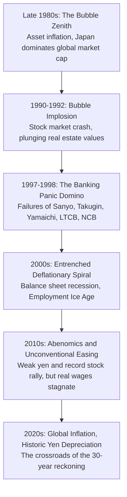

### O Zênite de "Japan as Number One" e a Soberba Estrutural
To grasp the true magnitude of this three-decade decline, one must revisit the dizzying heights Japan occupied immediately preceding the crash.

In 1979, Harvard sociologist Ezra Vogel published *Japan as Number One: Lessons for America*, celebrating Japanese corporate governance—lifetime employment, seniority wages, enterprise unions—alongside visionary state industrial planning, unmatched manufacturing craftsmanship, high domestic savings, and equitable wealth distribution. Having navigated the 1970s oil shocks far better than Western economies through total quality control (TQC) and energy-efficient engineering, Japan stood as the undisputed titan of global manufacturing.

By the late 1980s, Japan's massive trade surpluses provoked fierce friction with Washington, culminating in American workers smashing Japanese cars with sledgehammers on television. Flush with unprecedented liquidity, Japanese corporations embarked on a global shopping spree, acquiring iconic Western trophies: Mitsubishi Estate bought New York's Rockefeller Center, Sony acquired Columbia Pictures, and Japanese investors purchased Pebble Beach golf resort. Forecasters widely projected that Japan's gross domestic product would inevitably eclipse that of the United States.

However, this extraordinary success bred fatal complacency. Policymakers and business leaders succumbed to deep cognitive biases: the conviction that the Japanese economic model was invincible, that domestic land prices could never fall (the "Myth of Land"), and that major financial institutions would never be allowed to fail (the "Convoy System"). These dogmas severely paralyzed Japan's ability to adapt when global macroeconomic paradigms shifted.

### O Declínio Global Irreversível do Japão sob Perspectiva Empírica
The compounding consequences of thirty years of stagnation are etched starkly across every fundamental economic metric:

| Metric | 1989-1990 Peak | 2023-2024 Current Level | Structural Significance |
| :--- | :--- | :--- | :--- |
| **Share of World Nominal GDP** | **approx. 15% to 18%** (approached 70% of US GDP) | **approx. 4.0% to 4.2%** (slipped behind Germany to 4th) | Complete alienation from global economic growth |
| **Top 50 Companies by Market Cap** | **32 Japanese Corporations** (4 of Top 5 were Tokyo banks) | **0 to 1 Japanese Corporation** (Toyota barely clinging on) | Decisive global shift from hardware/finance to tech/software |
| **OECD Real Wage Index (1990=100)** | Japan: 100 (on par with G7 leaders) | Japan: **approx. 103** (US: >150, South Korea: >190) | The only advanced economy with three decades of zero wage growth |
| **OECD Ranking in GDP per Capita** | **2nd to 4th in the world** (citizens among the wealthiest) | **30th to 32nd in the world** (lowest in G7, overtaken by Korea/Taiwan) | Catastrophic erosion of domestic purchasing power |
| **IMD World Competitiveness Rank** | **1st in the world** (held top spot consecutively) | **35th to 38th in the world** (severe lags in digital agility) | Paralyzed decision-making and archaic corporate governance |

Thus, the Lost Decades represent far more than a routine slump in financial assets. While the rest of the world surged through the telecommunications revolution, the Internet, mobile computing, artificial intelligence, biotechnology, and financial innovation, Japan remained trapped in debt reconciliation and backward-looking structures—experiencing an irreversible erosion of its industrial might, living standards, and geopolitical relevance.

---

## Capítulo 1: A Gênese e a Euforia da Economia de Bolha (1985-1990)

### O Acordo de Plaza (1985) e o Pânico da "Endaka Fukyo"
The immediate catalyst for the bubble economy was the **Plaza Accord**, signed on September 22, 1985, at the Plaza Hotel in New York City.

Faced with mounting fiscal deficits and an unsustainable trade deficit fueled by an overvalued dollar—the so-called "twin deficits" of the Reagan administration—finance ministers and central bank governors from the G5 nations (US, UK, West Germany, France, Japan) agreed to coordinated market interventions to depreciate the US dollar against foreign currencies.

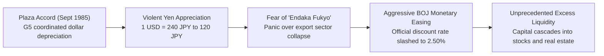

The agreement triggered a tectonic realignment of foreign exchange markets. Within months, the yen surged from approximately **240 yen per dollar to 150 yen**, eventually breaching 120 yen by late 1987. Fearing that this sudden doubling of the currency's value would decimate Japan's export-oriented manufacturing base—an economic disaster known domestically as *Endaka Fukyo* (strong-yen recession)—the Japanese government and the Bank of Japan panicked.

To cushion the blow and pivot toward domestic demand-driven growth, the Bank of Japan unleashed aggressive monetary stimulus. Between January 1986 and February 1987, the central bank cut its official discount rate five consecutive times, driving it down to **2.50%**, at the time an all-time low in postwar Japanese history.

### Afrouxamento Monetário Prolongado e Excesso de Liquidez Sem Precedentes
Economic theory dictated that once the Japanese economy began benefiting from cheaper imported commodities (favorable terms of trade) and domestic demand rebounded robustly in 1987, the BOJ should have tightened monetary policy. Instead, three critical obstacles delayed policy normalization with disastrous consequences:

1. **The Black Monday Shock (October 1987)**:
   The historic Wall Street crash (when the Dow plummeted 22.6% in a single trading session) stoked global systemic fears. Under international pressure to avert global contagion, Japanese monetary authorities suppressed interest rate hikes.
2. **The Louvre Accord (February 1987)**:
   Committed to stabilizing the dollar within target bands, the BOJ conducted massive dollar-buying and yen-selling interventions, pumping additional trillions of yen into the domestic banking system.
3. **The Mirage of Price Stability**:
   Because the surging yen dramatically depressed import prices for crude oil, agricultural produce, and raw materials, standard indices like the Consumer Price Index (CPI) and Wholesale Price Index (WPI) remained astonishingly tranquil. The BOJ operated under the flawed premise that without consumer price inflation, tightening was unwarranted, completely blinding itself to runaway asset price inflation in land and equities.

Consequently, the discount rate remained pinned at 2.50% for an astounding 27 consecutive months (February 1987 to May 1989), inundating the financial system with catastrophic surplus liquidity (*kane-amari*).

### O "Mito da Terra" e o Frenesi do Mercado de Ações
This flood of cheap capital found its way into two primary speculative arenas: the Tokyo Stock Exchange and commercial real estate.

#### The Stock Market Euphoria
From 13,000 in 1985, the Nikkei 225 surged relentlessly to close at an all-time high of **38,915.87 on December 29, 1989** (with an intraday peak of 38,957.44). Total market capitalization of the Tokyo Stock Exchange swelled to roughly 600 trillion yen, representing over 40% of the entire equity value on Earth.

The privatization and listing of Nippon Telegraph and Telephone (NTT) in 1987 exemplified the madness: offered at 1.197 million yen, shares soared to 3.18 million yen within weeks, drawing millions of ordinary citizens into active speculation. Price-to-earnings (P/E) ratios reached astronomical levels of 60x to 80x, detached from international benchmarks of 15x to 20x. Market participants rationalized this absurdity through the doctrine of "hidden asset values" (*fukumi-eki*), arguing that traditional valuation metrics were obsolete for Japan.

#### The Runaway Real Estate Market and the "Myth of Land"
Even more destructive was the speculative mania in real estate, underpinned by the absolute cultural dogma known as the **"Myth of Land" (*Tochi Shinwa*)**—the belief that in a small, mountainous island nation with economic activity concentrated in Tokyo, land prices would permanently appreciate.

- **The Epicenter of Tokyo**:
  Commercial land prices in central Tokyo escalated by dozens of percent annually between 1986 and 1988, quadrupling or quintupling in short order before radiating outward into residential suburbs and regional metropolitan hubs.
- **The "Imperial Palace Fallacy"**:
  At the height of the bubble, economists calculated that the estimated real estate value of the grounds of the Tokyo Imperial Palace alone was equivalent to the entire property value of California. Theoretically, the paper value of all land in the Japanese archipelago exceeded the value of the entire United States four times over.
- **Predatory Land Assemblage (*Jiageya*)**:
  In downtown Tokyo, organized crime-affiliated land syndicates (*jiageya*) used coercion, harassment, and arson to evict small residential homeowners and shopkeepers, aggregating fragmented plots to sell to commercial developers at exorbitant premiums.

### Mecanismos Estruturais: Multiplicadores de Crédito, Zaiteku e a Espiral de Garantias
The self-perpetuating nature of the bubble was driven by a three-way feedback loop linking commercial banks, corporations, and real estate assets:

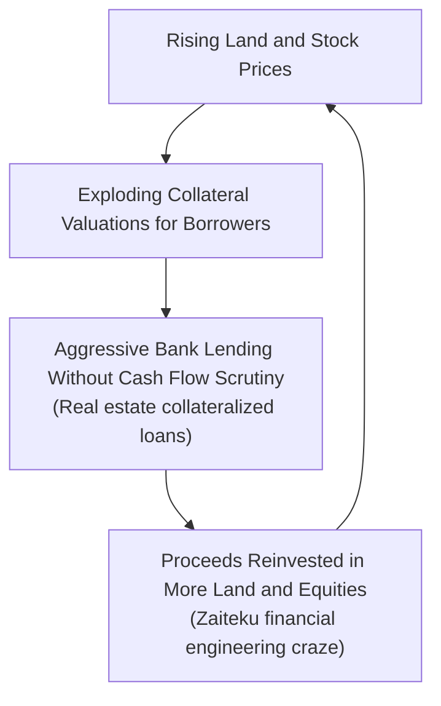

1. **Large Corporates Disintermediate the Banking Sector**:
   Financial liberalization in the early 1980s allowed blue-chip Japanese manufacturers to bypass commercial banks and raise capital directly from global equity markets via warrant bonds and convertible debt at negligible interest rates.
2. **Banks Pivot Recklessly to Real Estate and Non-Banks**:
   Deprived of their traditional corporate borrowers, city banks (*toshi-ginko*) and regional lenders scrambled to maintain asset growth by aggressively expanding mortgage lending, loans to small real estate developers, and credit lines to unregulated non-bank institutions (such as housing loan corporations, *Jusen*).
3. **The Collateral Spiral (*Reflection Loop*)**:
   Loans were underwritten not on the borrower's underlying cash-flow viability, but strictly on the assessed current market value of pledged real estate. As land appreciated, collateral values expanded, unlocking larger loans, which were immediately redeployed to acquire more property—a vicious speculative spiral.
4. **The "Zaiteku" Epidemic**:
   Industrial corporations neglected core research and development in favor of financial engineering (*zaiteku*). Companies placed cheap corporate debt proceeds into specified money trusts (*tokkin*), speculating on the stock market. For dozens of prominent corporations, non-operating investment gains dwarfed operating profits from legitimate business activity.

---

## Capítulo 2: A Implosão da Bolha e o Dominó do Pânico Bancário (1990-1998)

### Aumentos Rápidos de Juros do Governador Mieno e as Restrições Quantitativas do Ministério das Finanças
Public outrage over soaring inequality—typified by ordinary salaried workers (*salarymen*) being permanently priced out of owning a family home—forced monetary and fiscal authorities into a radical policy pivot. However, their braking mechanism was brutally abrupt.

In December 1989, **Yasushi Mieno** assumed the governorship of the Bank of Japan. Hailed by the press as the "Onihei of Heisei" (a legendary magistrate who purged corruption), Mieno launched an aggressive offensive to pop the speculative bubble.
- Between May 1989 and August 1990, the official discount rate was violently jacked up from 2.50% to **6.00%**—a crushing 350-basis-point monetary tightening delivered in rapid succession.

The coup de grâce came on March 27, 1990, when the Ministry of Finance (MOF) Banking Bureau issued a historic regulatory decree: **The Quantitative Cap on Real Estate Lending (*Soryo Kisei*)**.
- Banks were legally prohibited from growing their real estate loan books at a rate faster than their overall total lending growth.
- Stringent disclosure and audit requirements were imposed on credit flows to developers, construction firms, and non-banks.

This two-pronged assault—punitive interest rates combined with an administrative freeze on credit expansion—abruptly choked off the financial system's liquidity. Speculators and developers could no longer refinance maturing debt, forcing them into fire-sale liquidations.

### O Colapso dos Preços dos Ativos: Queda Livre das Ações e Garantias Submersas
Deprived of fresh leverage, the speculative house of cards collapsed with terrifying speed.

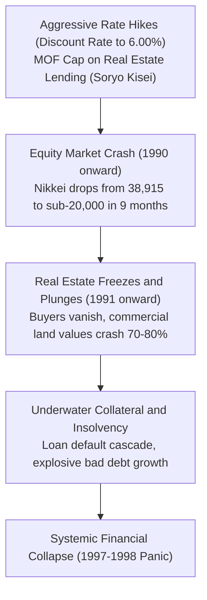

#### The Stock Market Freefall
From the very first trading day of 1990, Japanese equities entered a relentless downward spiral.
- By April 1990, the Nikkei 225 had broken below 30,000. By October 1990, it plummeted below **20,000**—losing nearly half its peak valuation in less than ten months.
- The bleeding continued unabated. By August 1992, the index touched 14,000, erasing over 300 trillion yen in equity wealth.

#### The Real Estate Crash and Underwater Loans
Land prices followed equities downward starting in 1991. The market suffered a complete liquidity freeze: buyers vanished entirely, making real price discovery impossible.
- Prime commercial land in downtown Tokyo and Osaka plunged by **70% to 80%** from peak valuations. Residential property values were halved.
- Millions of properties saw their market values fall far below the outstanding bank loan balance (*underwater collateral*). Corporate borrowers and real estate developers defaulted en masse, leaving the commercial banking sector saddled with colossal bad debt.

### A Era Sombria do Crédito Podre e das Falências Bancárias
The destruction of asset values left Japanese commercial lenders submerged under a mountain of **Non-Performing Loans (NPLs)**. With credit lines unrecoverable, bank balance sheets were depleted, paralyzing their capacity to extend new credit.

Yet for years, the Japanese government and Ministry of Finance operated in deep denial. Clinging to the illusion that real estate would inevitably rebound and that banks could gradually amortize bad loans through future operating profits, authorities kicked the can down the road. This prolonged forbearance allowed the cancer of insolvency to metastasize throughout the entire financial system.

#### 1. The Jusen Crisis (1995-1996)
The first wave of systemic insolvencies centered on the **Jusen**—seven specialized housing loan firms established by banks and agricultural cooperatives. During the bubble, the Jusen had recklessly funneled trillions of yen into speculative golf course developers and shady real estate ventures.
- In 1996, the Murayama/Hashimoto cabinets engineered a government bailout, injecting **685 billion yen of public tax money** to absorb Jusen losses.
- The bailout triggered furious public protests and parliamentary sit-ins. Traumatized by the public backlash, politicians and bureaucrats became terrified of using taxpayer funds to recapitalize the commercial banking sector—paralyzing policy response precisely when decisive public intervention was most urgent.

#### 2. The Banking Panic of 1997-1998: The Fall of the Titans
In late 1997, the crisis reached the core of the financial establishment, triggering an unprecedented series of corporate collapses.

| Date of Failure | Institution | Scale / Classification | Historical Significance and Market Impact |
| :--- | :--- | :--- | :--- |
| **Nov 3, 1997** | **Sanyo Securities** | Mid-tier Brokerage | Filed for bankruptcy. **First default in history on the unsecured call loan market**, causing interbank lending to seize up instantly as banks refused to lend to one another. |
| **Nov 17, 1997** | **Hokkaido Takushoku Bank (Takugin)** | Major City Bank (*Toshi-Ginko*) | **First failure of a major city bank in postwar history**. Crushed by non-performing property loans, the cornerstone of Hokkaido's economy collapsed and was broken up. |
| **Nov 24, 1997** | **Yamaichi Securities** | "Big Four" Brokerage (Founded 1897) | **Largest corporate collapse in postwar history (3 trillion yen liabilities)**. Massive off-balance-sheet losses (*tobashi*, 260 billion yen) exposed. President Nozawa wept on live TV: *"Our employees are not to blame!"* |
| **Oct 1998** | **Long-Term Credit Bank of Japan (LTCB)** | Historic Credit Institution | Prime financier of postwar heavy industry collapsed under insolvency. **Temporarily nationalized** by the state and later sold to foreign private equity (Ripplewood/Shinsei Bank). |
| **Dec 1998** | **Nippon Credit Bank (NCB)** | Historic Credit Institution | Found heavily insolvent, **temporarily nationalized**, and subsequently acquired by a consortium led by SoftBank (Aozora Bank). |

The simultaneous collapse of a premier city bank and one of the "Big Four" securities brokerages within a single month unleashed sheer terror. A severe **"Japan Premium"** was slapped on Japanese banks borrowing in London and New York, cutting them off from foreign currency liquidity and sparking an acute domestic credit crunch (*Kashishiburi*).

### A Ruptura do "Sistema de Comboio" e a Contração de Crédito
The crisis dealt a death blow to the **"Convoy System" (*Goso Sendan Hoshiki*)**, under which the Ministry of Finance strictly regulated interest rates and business scopes so that even the weakest bank would not fail, secretly forcing healthy banks to absorb troubled rivals.

With aggregate bad debt across the banking sector estimated at **dozens to over 100 trillion yen**, even the strongest mega-banks were fighting for their own survival and had zero capacity to bail out peers.
- **Regulatory Forbearance and Falsified Classifications**:
  Banks aggressively misclassified bankrupt and distressed borrowers as "normal loans" to avoid booking loan-loss reserves.
- **The Vicious Cycle of the Credit Crunch**:
  Desperate to maintain the Bank for International Settlements (BIS) 8% capital adequacy ratio, Japanese banks ruthlessly recalled performing loans from sound small and medium-sized enterprises (*Kashihagashi*) and refused new credit (*Kashishiburi*).

Healthy, profitable enterprises went bankrupt overnight due to liquidity starvation. The total paralysis of the banking sector's intermediation function froze capital expenditures, eviscerated corporate investment, and laid the groundwork for the prolonged deflationary depression detailed in the following chapter.

## Capítulo 3: A Mecânica da Espiral Deflacionária e a Recessão de Balanço

### A Teoria da Recessão de Balanço de Richard Koo
Why did the post-bubble Japanese economy defy standard neoclassical and Keynesian economic models—where cutting interest rates reliably stimulates borrowing, corporate capital expenditure, and consumer spending—and instead remain paralyzed for decades?

The most cogent and mathematically rigorous framework explaining this anomaly was articulated by Richard Koo, chief economist of the Nomura Research Institute, in his groundbreaking **"Balance Sheet Recession"** theory.

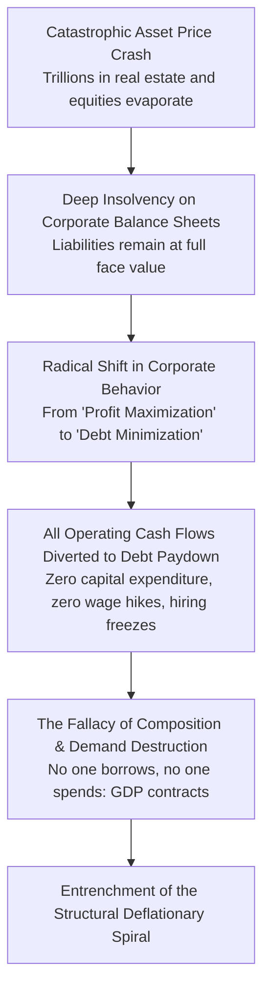

#### 1. Fundamental Shift: From "Profit Maximization" to "Debt Minimization"
Standard macroeconomics operates on the foundational assumption that private commercial enterprises always strive to **maximize profits**. Lower borrowing costs reduce the hurdle rate for capital investments, motivating firms to take out loans, build manufacturing facilities, hire personnel, and develop products.

However, the post-bubble implosion confronted the Japanese corporate sector with an existential balance sheet crisis:
- Corporate assets (real estate holdings and stock portfolios) had lost 70% to 80% of their market value overnight.
- Outstanding liabilities (bank loans used to finance bubble acquisitions) remained fixed at 100% of their contractual face value.
- Across the macroeconomy, the corporate sector suffered a collective balance sheet shortfall estimated in the **hundreds of trillions of yen**.

Faced with technical insolvency, corporate Japan underwent a silent behavioral revolution. Even when a firm's core commercial operations generated healthy operating cash flows, management could not afford to reinvest those funds into research and development or distribute them as wage increases. Instead, **every available yen of cash flow was channeled into paying down bank debt** as rapidly as possible to avert bankruptcy. The fundamental objective of Japanese capitalism shifted from *profit maximization* to *debt minimization*.

#### 2. The Fallacy of Composition
For an individual enterprise, aggressively deleveraging and repairing an impaired balance sheet is the definition of financial prudence and responsible stewardship.

Yet, when **virtually every corporation in the national economy simultaneously prioritizes debt repayment over spending**, a catastrophic macro-level crisis emerges. In economics, this dynamic is known as the **"Fallacy of Composition"**:
- In a healthy circular economic flow, households save a portion of their income, and businesses borrow those household savings through the banking system to finance capital investments, maintaining aggregate demand and GDP.
- In a balance sheet recession, businesses refuse to borrow at any price. Instead of borrowing, they become net savers, extracting cash from the income stream to extinguish debt.
- A massive **"demand leakage"** opens up. Even with policy interest rates driven down to zero, monetary policy becomes impotent. In a world where businesses are desperately trying to shed debt, borrowing at 0% is no more attractive than borrowing at 3%. You cannot push on a string.

#### 3. The Imperative of Fiscal Stimulus
Richard Koo demonstrated that in a balance sheet recession, the only mechanism capable of preventing an outright economic collapse is **fiscal policy**. The sovereign government must step into the breach, issue bonds to absorb unborrowed private savings, and inject those funds directly back into the economy via public investments.

Whenever the Japanese government sustained large-scale fiscal stimulus, national GDP held stable. However, plagued by orthodox fears of rising public debt ratios, the Ministry of Finance repeatedly aborted recoveries by hiking taxes and cutting public works (most disastrously during the 1997 consumption tax hike from 3% to 5%), repeatedly driving the economy back into recession.

### A Espiral Deflacionária Autoalimentada
This chronic shortfall of private aggregate demand plunged Japan into a debilitating **Deflationary Spiral**:

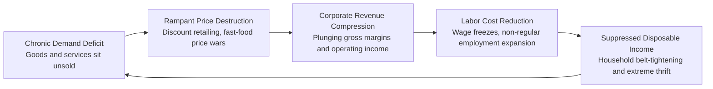

1. **The Era of "Price Destruction" (*Kakaku Hakai*)**:
   Beginning in the mid-1990s, discount retailers, chain restaurants, and apparel brands competed furiously for consumers' dwindling yen. McDonald's launched its famous 65-yen weekday hamburger campaign; fast-food chains engaged in the "280-yen Gyudon (beef bowl) wars"; and Fast Retailing (Uniqlo) skyrocketed by delivering high-quality fleece apparel at rock-bottom prices.
2. **The Boomerang Effect of Price Cuts**:
   While consumers initially celebrated cheaper goods, falling prices eroded corporate top-line revenues. To preserve operating margins, corporations aggressively slashed their largest fixed cost: payroll.
3. **The Contracting Macro Loop**:
   As wages and bonuses were reduced, working families had less disposable income, forcing them to tighten their belts and search for even cheaper goods. This negative feedback loop—falling prices leading to corporate belt-tightening, leading to declining wages, leading to weaker consumption, leading to further price cuts—became deeply entrenched across the nation.

### A Mentalidade Deflacionária e a Armadilha da Liquidez
Over decades of falling or flat prices, a psychological pathology known as the **"Deflationary Mindset"** poisoned the economic behavior of consumers and businesses alike:

- **Cash as the Ultimate Performing Asset**:
  Under inflation, holding idle cash guarantees the loss of purchasing power. Under deflation, the opposite holds true: **idle cash stored in bank accounts or home safes (*tansu yokin*) appreciates in real purchasing power every single year without risk**.
- **Perverse Incentive for Purchase Postponement**:
  If consumers believe that a car, house, or consumer electronics device will be cheaper next year than it is today, the only rational economic decision is to delay purchasing.
- **Keynes's Liquidity Trap**:
  No matter how much base money the central bank injected into the financial system, neither households nor businesses had any appetite to borrow or spend. Capital accumulated as excess reserves at the central bank, corporate retained earnings (*naibu ryubo*), and massive household cash hoardings.

---

## Capítulo 4: A Explosão do Emprego Não Regular e a Tragédia da Geração Perdida

### Desregulamentação Estrutural do Trabalho no Final dos Anos 1990 e 2000
Faced with balance sheet repair and intense global competitive pressure, Japanese corporations sought to transform labor from a fixed overhead cost into a flexible, dispensable variable expense. Business federations (such as Keidanren) lobbied the government relentlessly, resulting in a sweeping series of **labor market deregulations**:

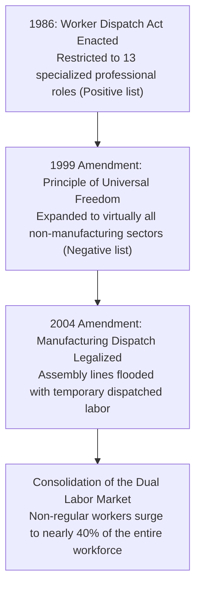

1. **The 1986 Worker Dispatching Act**:
   Initially conceived to protect core full-time employment, the original law permitted temporary agency labor only in 13 (later 26) highly specialized technical fields, such as translation and software development.
2. **The 1999 Deregulation (Negative List Shift)**:
   The Obuchi cabinet overhauled the regulatory framework, shifting from a restrictive positive list to a liberalized negative list. Temporary dispatched labor was permitted across the entire economy, with exceptions restricted only to construction, port transport, security, and healthcare.
3. **The 2004 Legalization of Manufacturing Dispatch**:
   Under Prime Minister Junichiro Koizumi, dispatched temporary workers were officially permitted on the factory floors of Japan's flagship manufacturing industries, including automotive and electronics. Corporations could now hire thousands of assembly-line workers during export booms and terminate their contracts overnight when orders dipped—a brutal dynamic that culminated in the mass layoffs of the 2008 Lehman shock (*Haken-giri*).

### A Tragédia da Geração da "Era do Gelo do Emprego"
The demographic group that bore the catastrophic brunt of these corporate austerity measures was the **"Employment Ice Age Generation" (*Shushoku Hyogaki Sedai*)**, also known as the **"Lost Generation"**—millions of young citizens who graduated from high school and university between roughly 1993 and 2005.

- **The Brutality of the Simultaneous Graduation Hiring System**:
  Japan's traditional *Shinsotsu Ikkatsu Saiyo* (simultaneous recruitment of new graduates) offered stable, cradle-to-grave career tracks during boom times. But during the post-bubble downturn, it transformed into an engine of generational exclusion. Corporations closed their hiring gates; university graduate job offers plummeted, and the effective job-to-applicant ratio cratered below 0.5.
- **The Permanent Career Penalty**:
  Because Japan lacked a fluid mid-career lateral hiring market, graduating into the Ice Age was a life sentence. Young people unable to secure regular employment upon graduation were forced into dead-end temporary jobs, contract positions, or low-wage part-time work (*freeters*). Japanese corporate recruiters reflexively stigmatized candidates who had fallen off the standard track, branding them as permanently unemployable for regular corporate positions.
- **The Multi-Decade Wealth Chasm**:
  The lifetime earnings gap between a regular employee (*seishain*) and a non-regular worker (*hiseishain*) exceeded **50 million to over 100 million yen**. Deprived of seniority-based wage increases, retirement severance packages, and occupational pensions, millions of Ice Age workers remained trapped in poverty into their 30s, 40s, and 50s.

### O Mercado de Trabalho Duplo e o Corte Assimétrico de Custos
Why did corporations concentrate the entire burden of adjustment on young entrants rather than restructuring existing staff? The answer lies in the formidable legal doctrine governing regular employment: **The Abuse of Dismissal Rights Doctrine (*Kaikoken Ranyo Hori*)**.

Under Japanese case law, terminating a regular employee requires satisfying four stringent criteria: the absolute necessity of personnel reduction, the exhaustion of all alternative mitigation measures (such as executive pay cuts and voluntary early retirement), objective fairness in candidate selection, and proper consultation with labor unions. Because shedding older, high-salaried mid-career personnel was legally fraught, companies adopted an asymmetric strategy: **ruthlessly choke off the new-graduate hiring pipeline and fill vacancies with disposable non-regular temps**.

| Labor Category | Employment Security | Wage Trajectory | Training & Skill Formation | Risk Allocation |
| :--- | :--- | :--- | :--- | :--- |
| **Regular Employees (*Seishain*)** | Ironclad lifetime tenure until mandatory retirement | Seniority-based wage curve | Company-funded OJT and career rotation | Enterprise absorbs economic volatility |
| **Non-Regular Workers (*Hiseishain*)** | Disposable contracts (3 to 6-month renewals) | Flat hourly wages with zero wage growth | Confined to basic operational tasks | **The individual worker bears 100% of economic volatility** |

This dual labor market insulated older regular workers at the direct expense of the youth, while degrading the corporate sector's long-term human capital and skill transmission pipelines.

### A Aceleração Fatal do Colapso Demográfico
The most devastating legacy of the Lost Generation was its catastrophic impact on Japan's demographic trajectory.

The Ice Age generation encompassed the **Second Baby Boomer cohort (born 1971-1974)**. In standard demographic cycles, when this massive population reached their late 20s and early 30s in the late 1990s and early 2000s, they should have married and produced a **Third Baby Boom**, replenishing the nation's workforce and sustaining the social security architecture.

Instead, millions were economically disenfranchised.
- Without stable employment or predictable future earnings, marriage rates plummeted. Among male non-regular workers in their early 30s, the marriage rate was less than one-third that of regular corporate employees.
- Unmarried rates skyrocketed, and annual births collapsed far faster than demographic models anticipated.

By abandoning the Lost Generation to "individual self-responsibility" (*jiko-sekinin*), Japan squandered its final historical window to avert demographic decline. The Third Baby Boom never materialized. In 2008, Japan's population peaked and entered an irreversible downward spiral into unprecedented hyper-aging and depopulation.

---

## Capítulo 5: A Erosão da Competitividade Industrial e a Patologia da "Derrota Digital"

### O Colapso da Hegemonia Japonesa em Semicondutores e Eletrônicos
Throughout the 1980s, Japan's semiconductor industry stood as the undisputed master of the technological universe. Japanese manufacturers controlled over **50% of the worldwide semiconductor market** and held an astonishing **80% global market share in Dynamic Random-Access Memory (DRAM)**. Corporate giants NEC, Toshiba, Hitachi, Fujitsu, and Mitsubishi Electric monopolized the upper ranks of global tech powerhouses.

Yet within two decades, this industrial empire suffered an absolute, catastrophic wipeout.

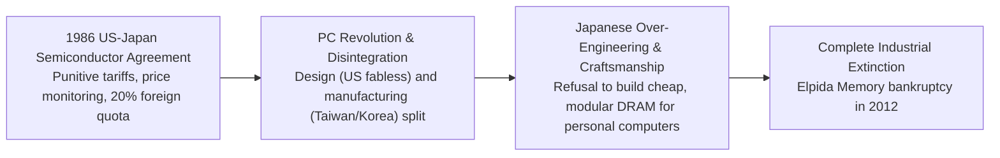

1. **The Geopolitical Assault: The US-Japan Semiconductor Agreement (1986)**:
   Alarmed by Japan's dominance, the Reagan administration deployed Section 301 trade sanctions, forcing Tokyo to sign the 1986 agreement. Japan was compelled to guarantee foreign semiconductor producers a 20% domestic market share, while Japanese memory chips were subjected to intrusive price-monitoring mechanisms that neutralized their cost competitiveness.
2. **The Paradigm Shift: From Mainframes to Personal Computers**:
   Japanese semiconductor supremacy was built on fabricating ultra-high-reliability DRAM engineered to last 25 years inside mainframe supercomputers. But the 1990s ushered in the PC revolution, which demanded inexpensive, standardized memory with a five-year lifecycle. While Japanese engineers stubbornly clung to obsessive over-engineering (*over-quality*), South Korea's Samsung and Taiwan's foundries made massive, timely capital investments in mass-producing commoditized, low-cost PC memory, stripping Japanese players of their market share.
3. **The Agony and Bankruptcy of Elpida Memory**:
   In a desperate consolidation, the DRAM operations of Hitachi, NEC, and later Mitsubishi were merged into a national champion: Elpida Memory. Plagued by bureaucratic infighting and a soaring yen, Elpida filed for corporate rehabilitation bankruptcy in 2012 and was swallowed by America's Micron Technology. Japan's DRAM industry was officially dead.

### Por Que o Japão Perdeu a Revolução da Internet, Software e Big Tech
Beyond semiconductors, Japan suffered an even more comprehensive defeat across personal computing, enterprise software, the Internet, mobile operating systems, and digital platforms—a failure so thorough that Japanese technologists mourn it as the **"Digital Defeat" (*Dejitaru Haisen*)**.

#### 1. "Integral" (Suriawase) vs. "Modular" Architectures
In his seminal work on manufacturing architecture, University of Tokyo professor Takahiro Fujimoto distinguished between two fundamental product architectures:
- **Integral Architecture (*Suriawase*)**: Products where components are interdependent and require tight, continuous coordination and tacit craftsmanship across design, engineering, and manufacturing (e.g., internal combustion automobiles, precision machine tools). This was Japan's traditional core strength.
- **Modular Architecture**: Products where components interact through standardized, globally open interfaces (e.g., personal computers, smartphones, cloud computing, Internet software).

The digital revolution of the 1990s and 2000s was intensely modular. System design was decoupled: fabless designers (Apple, Qualcomm, NVIDIA) focused entirely on software and architecture; pure-play foundries (TSMC) handled semiconductor fabrication; and open operating systems (Windows, Android) standardized platforms. Japan's integrated electronics conglomerates—which insisted on doing everything from raw silicon to final consumer appliances under one roof—were completely outflanked by agile global ecosystems.

#### 2. The Galapagos Syndrome: The Rise and Tragic Fall of i-mode
Launched by NTT Docomo in February 1999, **i-mode** was an epochal technological triumph. Years before Steve Jobs unveiled the iPhone, Japanese mobile users were already reading emails, accessing mobile web portals, executing online banking transactions, and paying for subway fares via contactless smart chips (FeliCa / Osaifu-Keitai).

Yet this extraordinary domestic success produced the fatal **"Galapagos Syndrome"**:
- Dominated by a tight cartel of domestic carriers and domestic handset vendors, the ecosystem optimized exclusively for the idiosyncratic tastes of Japan's domestic market, ignoring global standardization.
- When Apple launched the iPhone in 2007 with the global, open iOS App Store, Japanese executives scoffed, dismissing the device as having inferior battery life and lacking 1seg TV tuners. Within five years, foreign smartphones wiped domestic Japanese manufacturers—NEC, Panasonic, Toshiba, Fujitsu, Sharp—entirely off the global mobile map.

#### 3. Software Contempt and the "IT General Contractor" Hierarchy
Underlying this failure was a deep-seated cultural contempt for software. Traditional Japanese industrial culture viewed physical hardware (*mono*) as the sole repository of value, treating software and code as mere disposable accessories (*omake*).
- Japanese corporations starved internal software development teams, outsourcing enterprise IT architecture to legacy System Integrators (SIers).
- The SI industry mirrored Japan's construction sector: a multi-tier subcontracting hierarchy (*IT Zenekon*) where prime contractors captured massive margins, passing actual coding down through secondary, tertiary, and quaternary subcontractors. Talented software engineers were underpaid and burned out, while the agile, code-centric culture necessary to build modern platforms like Google, Amazon, or Meta never stood a chance.

### Capitalização de Mercado Global: 1989 vs. 2024
The sheer scale of Japan's relative economic collapse is captured in the composition of the world's most valuable public corporations:

| Rank | 1989 (Bubble Zenith) | Country | 2024 (Current Era) | Country |
| :---: | :--- | :---: | :--- | :---: |
| **1** | **Nippon Telegraph & Telephone (NTT)** | 🇯🇵 Japan | **Microsoft** | 🇺🇸 United States |
| **2** | **Industrial Bank of Japan (IBJ)** | 🇯🇵 Japan | **Apple** | 🇺🇸 United States |
| **3** | **Sumitomo Bank** | 🇯🇵 Japan | **NVIDIA** | 🇺🇸 United States |
| **4** | **Fuji Bank** | 🇯🇵 Japan | **Alphabet (Google)** | 🇺🇸 United States |
| **5** | **Dai-Ichi Kangyo Bank** | 🇯🇵 Japan | **Amazon.com** | 🇺🇸 United States |
| **6** | **Mitsubishi Bank** | 🇯🇵 Japan | **Saudi Aramco** | 🇸🇦 Saudi Arabia |
| **7** | Exxon | 🇺🇸 United States | **Meta Platforms** | 🇺🇸 United States |
| **8** | **Tokyo Electric Power (TEPCO)** | 🇯🇵 Japan | **Berkshire Hathaway** | 🇺🇸 United States |
| **9** | Royal Dutch Shell | 🇬🇧/🇳🇱 UK/Neth | **TSMC** | 🇹🇼 Taiwan |
| **10** | **Mitsui Bank** | 🇯🇵 Japan | **Eli Lilly** | 🇺🇸 United States |
| **Top 50** | **32 Japanese Corporations** | 🇯🇵 64% | **0 to 1 Japanese Corporation (Toyota only)** | 🇯🇵 0-2% |

In 1989, Japanese banks and utilities held nearly two-thirds of the top 50 corporate valuations on the planet. Thirty-five years later, that dominance has been eradicated. The table stands as an indictment of a corporate civilization that clung to industrial-era manufacturing paradigms while the global economy pivoted decisively to software, data, and global intellectual property.

## Capítulo 6: O Campo de Testes da Política Monetária Não Convencional: Dos Juros Zero ao QQE

### A Era Hayami: O Nascimento dos Juros Zero e da Flexibilização Quantitativa (QE)
In the annals of modern central banking, the Bank of Japan has served as the **world's premier experimental laboratory for unconventional monetary policy**. Confronted by a post-bubble deflationary environment unprecedented in modern industrial history, the BOJ was forced to pioneer tools that global central banks would later adopt during the 2008 financial crisis and the COVID-19 pandemic.

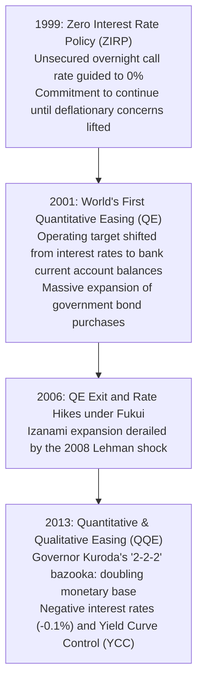

#### 1. The Zero Interest Rate Policy (ZIRP) - February 1999
In the wake of the catastrophic 1997-1998 banking crisis, Governor Masaru Hayami steered the BOJ to lower the uncollateralized overnight call rate "as low as possible, effectively to zero percent."
Two months later, in April 1999, Hayami announced that the policy would be maintained "until deflationary concerns are dispelled." This marked the modern birth of **"Forward Guidance"**—managing long-term interest rates by conditioning market expectations regarding the future path of short-term policy rates.

#### 2. The World's First Quantitative Easing (QE) - March 2001
When the dot-com bust dragged Japan back into recession, the central bank faced the zero lower bound: policy rates were already zero, rendering conventional rate cuts impossible. On March 19, 2001, the BOJ made history by unveiling **Quantitative Easing**:
- **Target Shift**: The primary operational target was transferred from the price of money (the overnight call rate) to the volume of money—specifically, the balance of commercial bank current accounts (*nichigin toza yokin*) held at the central bank.
- **Outright Bond Purchases**: The BOJ systematically expanded its monthly purchases of long-term Japanese Government Bonds (JGBs), pumping reserve liquidity directly into the banking sector.

### A Era Fukui: Saída Prematura e a Frágil "Recuperação Izanami"
Under Governor Toshihiko Fukui (appointed in 2003), a booming global economy fueled by the US housing expansion and rapid Chinese industrialization pulled Japanese exporters out of their slump. Between February 2002 and February 2008, Japan recorded 73 consecutive months of economic expansion—dubbed the **"Izanami Recovery"**, the longest in postwar history.

Encouraged by rising capacity utilization and CPI hovering slightly above zero, the BOJ terminated QE in March 2006, raised the discount rate, and lifted the call rate to 0.50% by February 2007.

Yet, this recovery was deeply flawed:
- Despite record-breaking corporate export earnings, corporations kept domestic base wages frozen, shifting profits into balance sheet reserves or overseas production.
- Domestic consumption remained anaemic. The recovery lacked organic internal momentum, leaving Japan completely exposed to any external macroeconomic shock.

### O Choque Lehman de 2008 e a Agonia do Superiene (Era Shirakawa)
When Lehman Brothers imploded in September 2008, triggering the Great Recession, Japan suffered a devastating setback. The divergence in policy responses between Tokyo and Washington proved fatal.

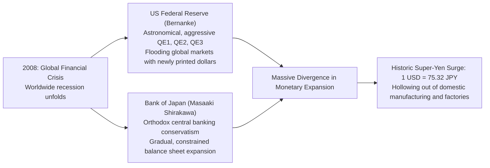

#### Federal Reserve Boldness vs. BOJ Orthodoxy
Under Ben Bernanke, the US Federal Reserve acted with unprecedented speed, slashing rates to zero and deploying massive bond-buying programs (QE1, QE2, QE3), rapidly tripling and quadrupling the Fed's balance sheet.

Conversely, the BOJ under Governor **Masaaki Shirakawa** embraced central banking orthodoxy. Convinced that aggressive monetary expansion was ineffective against structural demographic headwinds and wary of compromising fiscal discipline, Shirakawa expanded the BOJ's balance sheet at a painfully conservative pace.

#### The 75-Yen Catastrophe and Industrial Hollowing-Out
This yawning gap in the pace of money creation triggered a violent surge in the value of the Japanese currency:
- By October 2011, the yen reached a record postwar high of **75.32 yen per US dollar**.
- Combined with the chaotic governance of the Democratic Party of Japan (DPJ) administration and the March 2011 Great East Japan Earthquake, Japanese industry was subjected to the crippling "Six Sufferings" (*Rokuju-ku*): an overvalued currency, high corporate tax rates, rigid labor laws, environmental burdens, post-Fukushima electricity deficits, and delayed free-trade agreements.
- Electronics titans like Panasonic, Sony, and Sharp recorded multibillion-dollar annual losses. Factories across Japan were shuttered and production lines permanently offshored to China and Southeast Asia, inflicting permanent scars on domestic manufacturing employment.

### A "Bazuca" do Governador Kuroda: A Era do QQE e dos Juros Negativos
Public and business exasperation boiled over. In late 2012, Shinzo Abe swept back into the premiership promising to "print unlimited money to smash the strong yen." In March 2013, he installed **Haruhiko Kuroda** as BOJ Governor.

On April 4, 2013, Kuroda shattered all central banking precedent by unleashing **"Quantitative and Qualitative Monetary Easing (QQE)"**:

```
【Kuroda's "2-2-2" Bazooka Doctrine】
1. Achieve a 2% inflation target
2. Within a 2-year time horizon
3. By doubling the monetary base, JGB holdings, and average bond maturities
```

The BOJ expanded its annual JGB purchases to an astronomical 50 to 80 trillion yen while aggressively buying stock market exchange-traded funds (ETFs) and real estate investment trusts (J-REITs). The dramatic announcement effect transformed financial sentiment overnight: the yen depreciated from the 80s to the 120s per dollar, and the Nikkei doubled.

In January 2016, the BOJ introduced a **Negative Interest Rate Policy (-0.1%)** on commercial bank excess reserves. In September 2016, to prevent the yield curve from flattening too severely and hurting bank profitability, it introduced **Yield Curve Control (YCC)**, pinning the 10-year sovereign bond yield at approximately 0.00%. The BOJ had effectively commandeered and nationalized the Japanese sovereign debt market.

---

## Capítulo 7: O Julgamento da Abenomics: O Que as "Três Flechas" Trouxeram e o Que Deixaram

### A Arquitetura das Três Flechas e os Sucessos Iniciais
Launched in late 2012, **Abenomics** represented Japan's most coherent economic policy offensive in decades, organized around "Three Arrows":

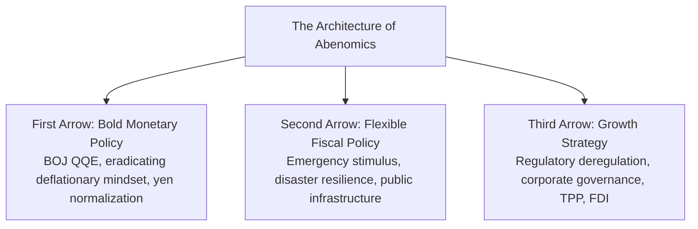

#### Early Triumphs (2013-2015)
Abenomics fundamentally altered the macroeconomic climate:
- **Financial Market Boom**: The Nikkei 225 climbed from below 9,000 to over 20,000, reigniting investor interest in Japan.
- **Export Earnings**: The end of the super-yen restored corporate operating profits, led by automotive conglomerates.
- **Job Creation**: The national unemployment rate plummeted to historic lows of 2.2% to 2.4%, achieving full employment. Millions of women and elderly citizens entered the workforce.
- **Tourism Explosion**: Relaxed visa policies and a favorable exchange rate transformed Japan into a global tourism powerhouse: international visitors surged from 8.36 million in 2012 to **31.88 million in 2019**.

### O Fracasso da Terceira Flecha: Interesses Corporativistas e Inércia Regulatória
Despite these achievements, economists agree that Abenomics failed in its primary structural mission: **The Third Arrow (Growth Strategy)** was largely smothered.

- **Intractable Vested Interests**:
  Crucial structural reforms—overhauling agricultural monopolies (JA Zenchu), liberalizing medical healthcare markets, and easing rigid labor dismissal laws—ran into fierce resistance from ruling Liberal Democratic Party (LDP) factions and conservative lobby groups.
- **Stagnant Potential Growth**:
  Japan's underlying potential growth rate remained stuck at an anemic **0.5% per annum**.
- **Absence of New Industrial Engines**:
  The macroeconomic breathing space bought by monetary and fiscal stimulus was not utilized to spawn global tech leaders or foster venture-backed innovation.

### As Feridas Autoinfligidas dos Dois Aumentos no Imposto sobre Consumo
Abenomics suffered from an irreconcilable macroeconomic contradiction: the decision to proceed with **two major consumption tax increases** in the name of fiscal consolidation:

```
【Timeline and Economic Impact of Tax Hikes】
- April 2014: Tax hiked from 5% to 8% (3-percentage-point increase)
  -> Crushed nascent domestic consumption; household spending plunged and
     failed to recover for years, aborting the domestic demand-led expansion.
- October 2019: Tax hiked from 8% to 10% (2-percentage-point increase)
  -> Chilled personal consumption once again, knocking the economy into negative
     growth right before the catastrophic arrival of the COVID-19 pandemic.
```

Monetary authorities were pressing the accelerator to generate domestic inflation while fiscal authorities slammed on the emergency brakes, freezing consumer spending.

### Efeitos Colaterais do Estímulo Extremo: Mercados Anestesiados e Dívida Recorde
As the BOJ's balance sheet swelled beyond Japan's entire annual GDP, the structural distortions mounted:

1. **The Death of the Bond Market**:
   By purchasing over **50% of all outstanding Japanese Government Bonds**, the BOJ destroyed liquidity. Days passed with zero trades in benchmark 10-year JGBs, eviscerating the pricing mechanism of the debt market.
2. **The "Central Bank as Whale" in Equities**:
   Through cumulative ETF purchases totaling over 50 to 70 trillion yen in market value, the BOJ became the de facto **largest shareholder in more than half of the prime-listed corporations on the Tokyo Stock Exchange**, blunting corporate governance and market discipline.
3. **Moral Hazard and Fiscal Dominance**:
   With the central bank guaranteeing negligible borrowing costs regardless of issuance volume, political incentives for fiscal discipline vanished. Japan's gross public debt soared beyond **1,200 trillion yen (over 260% of GDP)**—the highest ratio in the industrialized world.

---

## Capítulo 8: Transformação Social, Psicológica e Política: A Consciência Nacional Forjada pela Estagnação

### A Sociologia da "Geração Satori", dos "Homens Herbívoros" e do Minimalismo
Three decades of stagnant real wages and pervasive economic insecurity transformed the fundamental values, desires, and lifestyles of the Japanese public, particularly the youth:

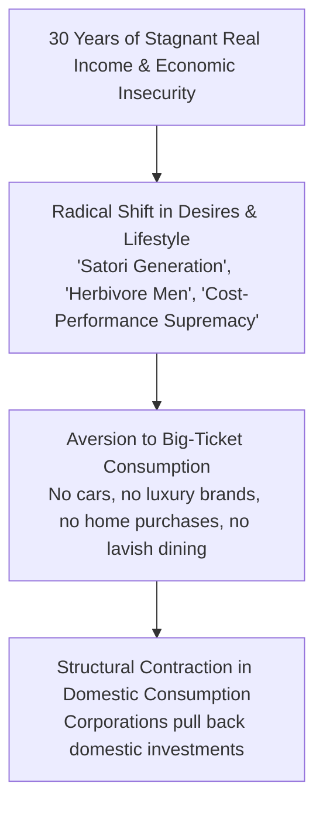

- **The Renunciation of Material Status**:
  While the bubble generation flaunted BMWs, Rolexes, and lavish golf memberships, the younger cohorts raised under deflation—the **"Satori Generation" (*Satori Sedai*, the "enlightened" youth)**—embraced voluntary minimalism. Owning a private car was seen as an irrational liability; brand-name apparel was abandoned for functional basics from Uniqlo or secondhand platforms like Mercari.
- **The Cult of "Cospa" and "Taipa"**:
  Terrified of making poor financial choices, consumers prioritized *cospa* (cost-performance) and *taipa* (time-performance) above all else, driving demand exclusively toward heavily reviewed, standardized goods.
- **The "Herbivore" Retreat from Romance and Marriage**:
  Romance, dating, and marriage were increasingly perceived as prohibitively expensive luxuries, driving a steep decline in dating activity (*herbivore men*, *soshoku-danshi*) and the mainstreaming of lifelong singlehood.

### Profunda Aversão a Investimentos e o Culto ao Dinheiro Vivo
The psychological trauma of the asset bubble collapse left the Japanese public with a profound, generational aversion to equity investment.

According to BOJ flow-of-funds data, over **54% of Japan's 2,100 trillion yen in household financial assets remains parked in zero-yielding cash and bank deposits**, compared to just 13% in the United States and roughly 30% in Europe.
- Decades of conventional wisdom held that "stocks are gambling" and that anyone dabbling in equities was destined to end up in ruin, reflecting the real trauma of parents who lost family fortunes in 1990.
- Even as global stock indices compounded at historic rates throughout the 2010s, ordinary Japanese citizens left trillions of yen sitting in negative real-yielding bank accounts, completely missing the greatest wealth creation cycle in human history.

### Paralisia Política e a "Democracia Prateada" (Silver Democracy)
The intersection of prolonged economic stagnation and demographic aging produced a deeply dysfunctional political dynamic: **"Silver Democracy" (*Shiruba Minshushugi*)**.

| Policy Sphere | Interests of Elderly Cohorts (Aged 65+) | Interests of Younger & Future Generations | The Real-World Policy Outcome |
| :--- | :--- | :--- | :--- |
| **Social Security Spending** | Preserve existing pension, medical, and long-term care entitlements | Reduce social insurance payroll contributions deducted from salaries | **Elderly benefits preserved; payroll tax rates continuously hiked on workers** |
| **National Budget Priorities** | Free or heavily subsidized medical care for seniors | Universal early childhood education, university subsidies, basic science | **Social security spending swelled to over one-third of the entire national budget** |
| **Voting Power & Mobilization** | High turnout (60% to 70%), massive demographic majority | Low turnout (30% to 40%), shrinking demographic minority | **Politicians cater obsessively to elderly voters while ignoring youth needs** |

Elected lawmakers recognized that any reform reducing benefits for current pensioners was political suicide, resulting in a systemic transfer of wealth from young working families to the retired elderly.

### Perda de Confiança Nacional e o Refúgio Psicológico no "Nihon Sugoi"
The slow-motion loss of national supremacy inflicted a deep wound on collective identity.

Starting in the 2010s, Japanese broadcast television and popular media became saturated with a bizarre genre of programming: **"Nihon Sugoi!" ("Japan is So Amazing!")** shows, where foreign visitors were brought in to shower gushing praise upon Japanese public transport, convenience store egg sandwiches, or historic craftsmanship. In bookstores, best-seller lists were dominated by xenophobic polemics disparaging neighboring Asian nations.

In the language of social psychology, these trends represented an unmistakable **collective defense mechanism (narcissistic regression)**: an insecure society seeking psychological solace in an idealized past, shielding itself from the painful reality of its eroding international stature and economic vitality.

## Capítulo 9: O Fim dos "30 Anos Perdidos" ou um Novo Capítulo Perigoso? (Anos 2020 ao Presente)

### Inflação Global Pós-Pandemia e Realinhamento das Cadeias de Suprimentos
The dual shocks of the COVID-19 pandemic (2020) and Russia's invasion of Ukraine (2022) severed global supply chains and ignited the fiercest worldwide inflationary wave in over forty years. For Japan, this external storm shattered thirty years of frozen prices and dormant interest rates.

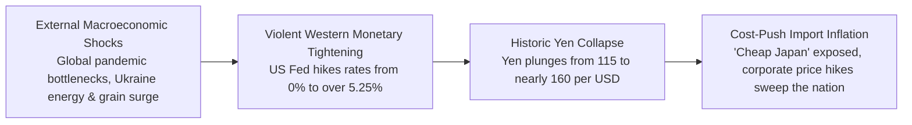

While central banks across North America and Europe responded with aggressive monetary tightening—the US Fed driving rates from 0% to over 5.25%—the Bank of Japan held steadfast to its ultra-loose stance.

The resulting divergence in real interest rate differentials triggered a **historic collapse in the Japanese yen**, which tumbled from 115 to nearly 160 yen per dollar. The cost of imported fossil fuels, minerals, grain, and microchips skyrocketed in yen terms. Japanese corporations, which had for three decades operated under the ironclad conviction that raising prices was suicidal, were finally forced to pass surging procurement costs onto consumers. A nationwide wave of consumer price hikes swept Japan for the first time in thirty years.

### A Faca de Dois Gumes da Fraqueza Histórica da Moeda e Reajustes Salariais Recordes
While import inflation compressed household budgets, it simultaneously fractured the long-standing deflationary social norm that had kept Japanese wages and prices frozen:

- **The Humiliation of "Cheap Japan" (*Yasui Nippon*)**:
  At 150 to 160 yen per dollar, Japan was exposed as an international bargain basement. Affluent foreign tourists swarmed ski resorts like Niseko, eagerly paying 3,500 yen for bowls of ramen, while entry-level wages at McDonald's in California eclipsed the starting salaries of elite university graduates entering Japanese conglomerates. This disparity instilled an acute sense of national crisis and urgency.
- **The Historic Shunto Wage Hikes (2023-2024)**:
  Squeezed by acute labor shortages and escalating living costs, the Japanese Trade Union Confederation (*Rengo*) secured landmark spring wage settlements: **3.58% in 2023 and over 5.10% in 2024**—the highest wage increases achieved in thirty-three years. Blue-chip corporations dramatically raised base salaries, and minimum wages across prefectures climbed toward the psychological threshold of 1,000 yen per hour.

### O Fim dos Juros Negativos: A Arriscada Normalização do Governador Ueda
Recognizing that sustainable wage growth and consumer price momentum were taking root, the BOJ under newly appointed Governor **Kazuo Ueda** took the historic first step out of the unconventional monetary regime.

On March 19, 2024, the BOJ Monetary Policy Board executed a watershed policy pivot:
1. **Termination of the Negative Interest Rate Policy**: Raised short-term policy rates from -0.1% to a range of 0.0% to 0.1%—the **first interest rate hike in 17 years**.
2. **Abolition of Yield Curve Control (YCC)**: Completely dismantled the artificial cap on 10-year sovereign bond yields.
3. **Cessation of Asset Purchases**: Halted all new acquisitions of stock ETFs and J-REITs, bringing the curtain down on Kuroda's decade of hyper-stimulus.

Yet the road to full monetary normalization is littered with structural landmines:
- **The Sovereign Debt Trap**: With gross government debt exceeding 1,200 trillion yen, each 100-basis-point increase in sovereign bond yields will eventually add trillions of yen to the government's annual debt-servicing costs, severely crowding out national budget expenditures.
- **Central Bank Balance Sheet Vulnerability**: The massive portfolio of JGBs accumulated by the BOJ carries catastrophic unrealized mark-to-market losses if interest rates rise rapidly, threatening central bank equity capital.

### O Nikkei 225 Rompe 40.000 Pontos vs. a Fria Realidade das Famílias Asfixiadas
On February 22, 2024, Japan's financial markets crossed a historic threshold: the Nikkei 225 shattered its legendary December 1989 bubble peak of 38,915.87, vaulting past **40,000 points** for the first time in history and later touching all-time highs above 42,000.

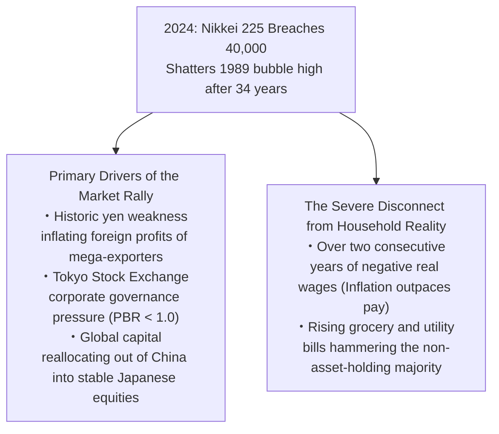

However, treating this stock market milestone as unambiguous proof of a broad-based economic renaissance ignores a gaping domestic chasm:

1. **The Three Engines of the Stock Rally**:
   - The collapsed yen mechanically inflated the paper yen profits of multinational exporters like Toyota, Tokyo Electron, and global trading houses (*sogo shosha*).
   - The Tokyo Stock Exchange mandated that listed companies trading below book value (PBR < 1.0) reform capital efficiency, sparking record share buybacks and dividend distributions.
   - Escalating geopolitical friction between Washington and Beijing prompted global institutional capital to flee Chinese markets, seeking a secure alternative in Japanese equities.
2. **The Agony of Declining Real Wages**:
   While stock prices surged, ordinary working citizens suffered. Because domestic food, energy, and daily necessity prices rose faster than paychecks, **monthly real wages declined for more than 25 consecutive months between 2022 and 2024**—the longest continuous contraction in modern recorded history. For the vast majority of households who own no equities, the 40,000 Nikkei was not a golden dawn, but a period of painful living standard compression.

The deflationary prison has broken, but it has ushered in an era of acute inflation and widening domestic wealth inequality.

---

## Conclusão: Prescrições para o Renascimento Nacional: O Que o Japão Deve Aprender com Trinta Anos de Pesar?

### The Essence of a Thirty-Year Tragedy
Surveying the sweeping expanse of world history, there are virtually no precedents for a premier economic titan suffering such a prolonged, peaceful decline in relative power—untouched by war, foreign invasion, or systemic internal collapse.

The ultimate roots of Japan's Lost Decades reduce to three fatal failures of governance:
1. **The Chronic Postponement of Painful Structural Surgery**:
   By keeping zombie banks and insolvent corporations on artificial life support for over a decade, authorities froze the process of creative destruction and structural reallocation.
2. **Underinvestment in Human Capital and Short-Sighted Labor Austerity**:
   Corporations engineered short-term accounting profits by throwing young workers into precarious, low-wage temp work, permanently destroying the nation's demographic vitality.
3. **Rigid Devotion to Industrial-Era Paradigms**:
   Obsessed with the physical craftsmanship of the 1980s manufacturing assembly line, Japan's business and bureaucratic elite actively resisted the software, Internet, and digital platform revolutions that defined modern global wealth creation.

### A Roadmap for National Rebirth
If Japan is to permanently escape the shadow of the Lost Decades and bequeath a vibrant, sustainable economy to future generations, it must abandon populist half-measures and execute radical, deep-seated structural reforms.

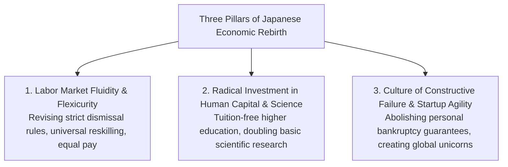

#### 1. Labor Market Fluidity and "Flexicurity"
The toxic divide between hyper-protected regular workers and disposable non-regular workers must be abolished. Japan must reform rigid dismissal regulations by introducing financial settlement frameworks, freeing capital and talent to migrate dynamically into high-growth sectors. In return, the state must build a robust **Nordic-style "Flexicurity" model**—providing comprehensive unemployment safety nets paired with fully state-funded, world-class lifelong reskilling programs.

#### 2. Radical Reallocation Toward Human Capital, Education, and Science
The wealth of a modern nation resides not in physical concrete and asphalt, but in the intellect and skills of its people:
- The state must radically restructure social spending, reallocating budgets away from passive elderly care toward universal child-rearing support, free higher education, and aggressive state funding for advanced scientific and academic research.
- Investment in talent must be recognized not as an operational expenditure, but as the supreme sovereign investment required for national survival.

#### 3. Eradicating the Stigma of Failure and Fostering Startup Agility
The crushing culture of bureaucratic precedent and "zero-defect" penalty systems that has paralyzed corporate boardrooms must be dismantled. The practice of requiring entrepreneurs to pledge personal real estate and family assets as loan guarantees must be eliminated, clearing the way for a dynamic venture ecosystem where serial entrepreneurs can fail, learn, and rebuild repeatedly.

Having paid the catastrophic price of three lost decades, Japan stands once more at the crossroads of history. Only by fearlessly confronting the painful lessons of its past, stripping away backward-looking complacency, and unleashing the creative energies of its younger generations can this great civilization secure its rightful place of prosperity in the century to come.
