## 序章: “失去的三十年”究竟是什么——世界史上罕见的长期停滞之本质

### 用语的变迁与射程：从“失去的十年”到二十年，最终延伸至三十年
在现代经济史中，“失去的三十年（The Lost Decades）”这一概念，最为直观且深刻地象征了一个国家从全球经济繁荣的顶峰跌入不可逆转的结构性沉沦之过程。

1990 年代初日本资产价格泡沫破裂之初，笼罩日本社会的停滞感普遍被政策制定者与主流经济学家定性为“普通的周期性经济衰退”。当时占压倒性优势的乐观预期认为，一旦不良资产清理完毕、金融机构完成兼并重组，日本经济必将重新回归强劲的向上增长轨道。然而，复苏步伐异常艰难迟缓。在经历了 1997 年暴发的严重金融危机后进入 2000 年代，这一历史现象被学界与舆论正式确立为 “ **失去的十年（The Lost Decade）** ” 。

然而，2000 年代中期由出口驱动的温和复苏（伊邪那美景气），并未能真正点燃日本国内的自主消费增长，亦未能打破通货紧缩的枷锁，并在 2008 年雷曼兄弟破产引发的全球金融海啸中彻底崩溃。长期停滞进一步蔓延至 2010 年代，称谓随之被延长为 “ **失去的二十年** ” 。

随后，尽管 2012 年底上台的第二届安倍晋三内阁推行了以超常规货币宽松为核心的“安倍经济学”，促使企业账面利润与股票指数刷新历史纪录，但国民实际工资停滞、全要素生产率低迷以及潜在经济增长率下滑等深层痼疾始终未能根治。及至 2020 年代，学界与国际机构终于形成了沉痛的定论：日本经历了一场在现代工业化历史上绝无仅有的超长周期系统性停滞——“ **失去的三十年** ” 。

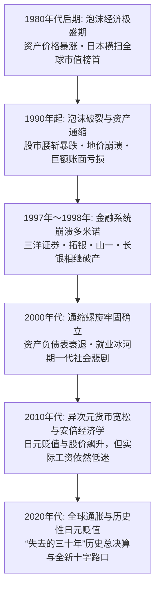

### 1980 年代“日本第一”的极盛与结构性傲慢
要精准理解这三十年停滞的深远惨烈，必须回顾此前日本曾攀登至何等惊人的繁荣顶峰。

1979 年，哈佛大学社会学者埃兹拉・沃格尔出版了轰动全球的名著《日本第一：对美国的启示（Japan as Number One）》，盛赞日本式企业治理机制（终身雇佣制、年功序列制、企业工会）、官民一体的产业政策、无懈可击的高品质制造业、极高的国民储蓄率与高度平等的财富分配。在欧美深陷滞胀困境时，日本凭借卓越的节能技术与全员质量管理（TQC），成为傲视全球的工业制造霸主。

1980 年代后半期，日本制造企业创造的天文数字般贸易顺差引发了激烈的日美贸易摩擦，甚至导致美国工人公开用大锤砸毁日本汽车。坐拥无穷流动性资本的日本财团开启了全球并购浪潮：三菱地所买下了纽约象征帝国大厦的洛克菲勒中心，索尼收购了哥伦比亚电影公司，日本私人投资者包揽了圆石滩高尔夫球场。国际权威智库甚至极为严肃地论证：“日本的 GDP 将在不久的将来彻底超越美国，登顶世界第一大经济体”。

然而，这登峰造极的成功体验，却给日本的政界与商界注入了致命的认知扭曲。“日本模式无懈可击”、“地价绝不会下跌（土地神话）”、“大型金融机构绝不会破产（护送船队方式）”的盲目傲慢，彻底麻痹了日本社会应对随后到来的全球数字化与模块化工业革命的神经。

### 国际横向对比所呈现的不可逆结构性地缘下沉
三十年的漫长蹉跎，在日本的各项关键经济指标上留下了冷酷而触目惊心的历史烙印：

| 评估指标 | 1989年〜1990年（极盛巅峰） | 2023年〜2024年（当下现状） | 指标变动的深层历史含义 |
| :--- | :--- | :--- | :--- |
| **占全球名目 GDP 的份额** | **约 15% 〜 18%** （逼近美国规模的70%） | **约 4.0% 〜 4.2%** （被德国反超，跌落至世界第4位） | 日本彻底被全球经济扩张的核心增长红利所边缘化 |
| **全球市值前 50 强企业排行榜** | **日本企业独占 32 家** （前5强中有4家为日本都市银行） | **日本企业仅剩 0 〜 1 家** （丰田汽车艰难徘徊在门槛边） | 时代主角从重工业制造与传统金融彻底转移至移动互联与科技 |
| **OECD 国家实际工资指数 (1990=100)** | 日本: 100（与欧美发达国家比肩） | 日本: **约 103** （美国: 150超、韩国: 190超） | 发达国家阵营中唯一历经整整30年实际工资零增长的国家 |
| **人均名目 GDP 的 OECD 国际排名** | **世界第 2 位 〜 4 位** （全体国民位列全球最富裕阶层） | **世界第 30 位 〜 32 位** （G7七国集团垫底，被韩国台湾逆转） | 伴随汇率贬值与生产率停滞，国民国际实际购买力雪崩 |
| **IMD 世界国家竞争力排名** | **世界第 1 位** （1989年起连续数年独占鳌头） | **世界第 35 位 〜 38 位** （深陷决策滞后与 IT 应用落后泥潭） | 企业治理僵化、数字化迟缓、组织流程沉疴难除 |

由此可见，“失去的三十年”绝非简单的资产价格下行或周期性不景气。当世界在信息革命、互联网浪潮、智能手机、人工智能、生物医药与现代金融工程的引领下飞速突进之际，唯独日本被旧时代的沉重负债与落后体制深度捆绑，在财富、创新与产业竞争力上经历了不可逆的全面衰落。

---

## 第1章: 泡沫经济的形成与狂热（1985〜1990）

### 广场协议（1985年）与对日元升值萧条的极端恐慌
1980 年代后半期日本泡沫经济诞生的最初导火索，是 1985 年 9 月 22 日在纽约广场饭店秘密达成的 “ **广场协议（Plaza Accord）** ” 。

彼时，美国里根政府一方面奉行扩张性财政政策，另一方面实行超高利率政策，导致美元汇率极度高估，形成了庞大的财政与贸易“双赤字”。由于日本对美顺差高居首位，美、英、西德、法、日五国（G5）财长与央行行长达成联合干预外汇市场、促使美元有序贬值的共识。

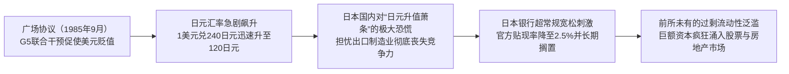

协议签署后的汇率变动幅度远超各国最初的预估。日元对美元汇率在短短一年时间内由协议前的 **1 美元兑 240 日元快速升值至 150 日元** ，至 1987 年底甚至突破 120 日元关口。面对本币价值在极短时间内直接翻倍的巨大冲击，日本社会陷入了对于出口导向型工业体系将彻底瓦解的集体恐慌（日元升值萧条，*Endaka Fukyo*）。

为了对冲强日元对出口企业的重创并刺激内需以实现产业结构转型，日本政府与央行推出了极具侵略性的刺激政策。日本银行自 1986 年 1 月至 1987 年 2 月连续五次下调官方基准贴现率，将其强力压低至当时二战以来的历史最低水准——**2.50%** 。

### 央行超常规宽松的滞后与前所未有的过剩流动性
依据现代宏观经济学逻辑，当 1987 年日本经济已经充分享受到原油与大宗进口原材料价格暴跌（贸易条件改善）红利、国内私人部门需求开始强劲反弹之际，日本银行本应迅速收紧货币政策。然而，以下三重结构性制约使日本央行的货币转向被致命地延误：

1. **黑色星期一（1987年10月）的全球恐慌**:
 纽约股市单日暴跌 22.6%，为避免引发全球系统性流动性危机，在美方协调呼吁下，日本央行被迫推迟了加息计划。
2. **卢浮宫协议（1987年2月）的汇率维稳包袱**:
 为遏制美元无序崩跌，日本央行在外汇市场持续执行“抛售日元、买入美元”的操作，源源不断地向银行体系注水。
3. **物价指数表象的严重误导**:
 由于强劲日元大幅压低了进口消费品与工业原料成本，当时的消费者物价指数（CPI）与批发物价指数呈现出令人震惊的超稳定状态。日本央行管理层拘泥于教条，认为“只要 CPI 没有显著上涨，就完全不存在紧缩货币的政策正当性”，对股票与房地产市场的资产价格极度膨胀视若无睹。

超低利息环境在 2.50% 的历史冰点上被整整维系了 27 个月之久。泛滥成灾的投机流动性无处可去，最终完全冲垮了实体资产的估值防线。

### “土地神话”与股票市场的狂乱风暴
天量过剩资金几乎在同一时间扑向了东京证券交易所与房地产市场。

#### 股市的非理性繁荣
日经平均指数从 1985 年的 13,000 点一路狂飙，最终于 **1989 年 12 月 29 日的大纳会收盘创下 38,915.87 点的历史最高纪录** （盘中最高达 38,957.44 点）。日本股市总市值突破 600 万亿日元，独占全球所有股票总市值的 40% 以上。

1987 年挂牌上市的日本电信电话（NTT），发行价从 119.7 万日元在几周内狂飙至 318 万日元，引发全民炒股热潮。当时日本上市公司市盈率（P/E）普遍飙升至 60 倍至 80 倍，彻底偏离了国际公认的 15 倍至 20 倍安全区间。“日本企业拥有天量隐性不动产增值，欧美的估值框架不适用于日本”等荒诞论调甚嚣尘上。

#### 房地产狂热与“土地神话”的极度膨胀
相比股市，房地产市场的狂乱更为癫狂。基于日本国土狭小且经济机能极度向东京一极集中的地理国情，全社会形成了坚不可摧的 “ **土地神话”（土地价格永远只会单边上涨）** 。

- **从东京核心区向全国疯狂辐射**:
 东京都核心区域的商业用地在 1986 年至 1988 年间每年以数十个百分点的速度暴涨，短短三年内翻了数倍，随后迅速传导至住宅地块及大阪、名古屋等区域中心城市。
- “ **一个东京都买下整个美国”的狂言**:
 在泡沫巅峰期，测算显示仅东京都千代田区（皇居及中央政府所在地）的地价，就足以买下整个加拿大全国的不动产；而东京皇居一处的估值更是超越了整个美国加利福尼亚州的所有土地价值总和。整个日本列岛的地价纸面财富相当于当时美国全境的四倍。
- **暴力拆迁与地下土地买卖（地上げ屋）**:
 在暴利驱动下，黑社会与职业拆迁集团（*Jiageya*）肆意横行，采取断水断电、恐吓纵火等非法手段暴力逼迁市中心原住民，将零散地块整合打包高价倒手转卖给开发商。

### 机制透视：信用杠杆乘数、“财技”狂潮与抵押担保螺旋
这一空前泡沫的底层动力机制，在于银行、企业与资产价格三者相互绑架所形成的失控信用正反馈闭环：

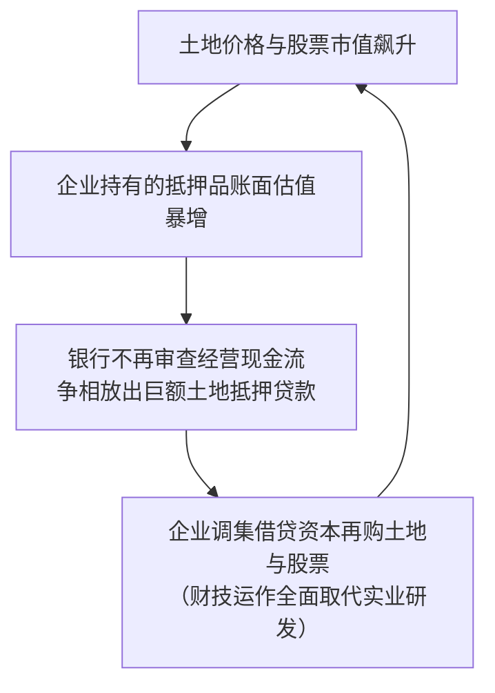

1. **优质大企业脱离银行直接融资**:
 随着 1980 年代金融自由化推进，实力雄厚的制造业龙头企业纷纷绕开传统银行贷款，利用极低成本的可转债和认股权证在国际资本市场直接发债融资。传统大银行失去了老客户，出于考核压力转而将信贷资源无限敞开给房地产中介、建筑公司及非银行金融机构（如住房金融专门公司 *Jusen*）。
2. **抵押担保价值的自我强化螺旋（反身性闭环）**:
 银行彻底放弃了依据借款人未来实际营运现金流发放贷款的审慎原则，完全以“土地当前的市价”为基准发放高额贷款。“地价上涨导致抵押物升值，抵押物升值解锁更大信贷额度，信贷资金再次用于抢购土地，进一步推高地价”，杠杆呈几何级数裂变。
3. “ **财技（Zaiteku）”对实业精神的彻底侵蚀**:
 制造业上市公司纷纷设立特定金钱信托，将在市场上低息融来的资金全数投入股市与期房炒作中。数十家知名企业的投资收益远超主营业务营业利润，踏实钻研制造业工艺被视为“愚蠢低效”，投机之风彻底蛀空了实体产业的根基。

---

## 第2章: 泡沫破裂与金融体系崩溃连锁（1990〜1998）

### 三重野总裁强硬刺破泡沫与大藏省“总量管制”冲击
面对资产泡沫导致的严重贫富分化（普通上班族哪怕倾其一生积蓄也无法在东京市区购置一套普通住宅），社会舆论的不满彻底引爆，迫使监管部门踩下了极其急躁而残暴的刹车。

1989 年 12 月就任日本银行总裁的 **三重野康** ，以铁腕“泡沫杀手”自居，上任后迅速开启了狂风暴雨式的连续加息：
- 官方基准利率在极其短暂的时间内被一路暴力推升至 **6.00%** （1990 年 8 月），一年多时间内净加息幅度达 350 个基点。

紧接着，大藏省银行局于 1990 年 3 月 27 日正式祭出了具有致命杀伤力的行政通令——“ **不动产融资总量管制”（*Soryo Kisei*）**：
- 强制规定商业银行发放给房地产行业的贷款增长率，必须严格压低在银行总贷款增长率之下；
- 严查银行向不动产业、建筑业及非银机构的全部信贷流向。

这一由货币政策极速紧缩与行政信贷断流构成的“连环双杀”，瞬间抽干了市场的全部流动性血液。投机者与房地产商因资金链彻底断裂而被迫进入抛售资产抵债的惨烈恐慌中。

### 资产价格全面暴跌：股价腰斩与抵押品深度缩水
缺乏流动性支撑的空中楼阁应声崩塌，日本资产价格迎来了历史罕见的大崩盘：

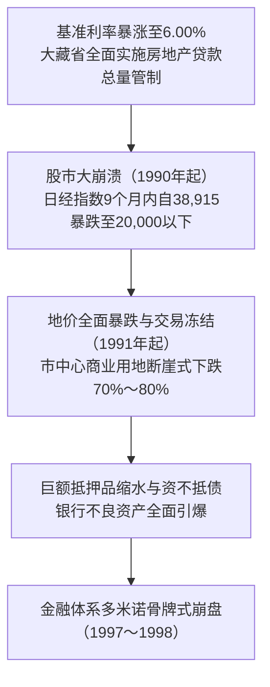

#### 股票市场的断崖暴跌
1990 年开年首个交易日，股市即掉头向下。
- 1990 年 4 月，日经指数跌破 30,000 点；至同年 10 月，便已无情 **击穿 20,000 点大关** 。仅仅 9 个月时间，股市总市值蒸发近半。
- 跌势在随后的数年间始终未能止步，1992 年 8 月下探至 14,000 点，较历史高点蒸发超过 300 万亿日元的巨额财富。

#### 房地产冻结与“抵押品缩水（资不抵债）”
地价于 1991 年前后步入雪崩通道，市场陷入深度流动性冻结。
- 东京核心商圈地价从巅峰暴跌 **70% 至 80%** ，住宅地价腰斩。
- 银行原本按照市价七八成发放的土地抵押贷款，其抵押品价值已远远不及贷款本息余额（抵押品价值腰斩成为负资产）。企业与个人集体丧失偿债能力，沦为技术性资不抵债状态。

### 不良债权暗黑期与金融机构破产多米诺骨牌
资产价格崩盘使得日本银行业背负了天文数字般的 **不良债权（Non-Performing Loans: NPL）** 。坏账无法收回，银行资本金遭受巨额侵蚀，信贷扩张机能彻底坏死。

然而，大藏省与日本政界长期沉溺于“地价早晚会反弹”、“依托银行每年正常的利息营收可以逐步在账面上消化坏账”的严重侥幸心理中，将剧烈化脓的坏账处置一拖再拖达数年之久。这种掩耳盗铃的拖延政策，最终将局部坏账酿成了全系统性的金融灾难。

#### 1. 住专（住房金融专门公司）危机（1995年〜1996年）
金融崩溃的第一道防线在非银行系统的“住专”破裂。7 家住专公司在泡沫期向房产投机公司违规发放了数以万亿计的贷款，至 1995 年已完全资不抵债。
- 1996 年，村山富市及桥本龙太郎内阁决定动用 **6,850 亿日元财政公款（国民税金）** 救助住专破产清算。
- 该举措引发了日本全社会的强烈愤慨与国会激烈对抗。被汹涌民意震慑的政客与官僚自此对“动用公款注资救助金融机构”产生了极度恐惧，致使后续真正需要国家公权力救市时完全错失良机。

#### 2. 1997年〜1998年：百年老店轰然倒下的金融海啸
1997 年秋季，破产风暴终于正面撕碎了日本顶级主流金融机构的防线：

| 破产或自愿清算时间 | 爆雷金融机构 | 性质地位与规模 | 历史冲击与深远意义 |
| :--- | :--- | :--- | :--- |
| **1997年11月3日** | **三洋证券** | 准大型证券公司 | 申请破产重整。 **在银行间同业拆借无担保市场上发生了史上首次违约** ，导致金融机构间互信彻底归零，资金借贷市场瞬间瘫痪。 |
| **1997年11月17日** | **北海道拓殖银行（拓银）** | 全国10大都市银行之一 | **战后首家倒闭的大型都市银行** 。受房地产烂账重创导致同业融资全面断绝，北海道经济支柱银行被迫倒闭破产。 |
| **1997年11月24日** | **山一证券** | 拥有百年历史的“四大券商”之一 | **战后最大规模的企业破产（负债总额约3万亿日元）** 。隐匿巨额亏损的“飞单（*tobashi*）”违规行为曝光被迫自主停业。总裁野泽正平在电视直播中嚎啕痛哭：*“员工没有任何错！”* |
| **1998年10月** | **日本长期信用银行（长银）** | 重化工业核心资金支柱 | 巨额不良贷款导致股价暴跌，被依据新金融再生法实行 **临时国有化** ，后低价贱卖给美国外资基金（重组为新生银行）。 |
| **1998年12月** | **日本债券信用银行（日债银）** | 长期信用三行之一 | 严重资不抵债被 **临时国有化** ，后被软银等财团联合接盘重组为青空银行。 |

大型都市银行与四大券商在同一个月内接连倒闭，在全球金融市场引发了史无前例的“日本恐慌”。国际资本市场上对所有日本银行强制征收极高的惩罚性溢价——“ **日本溢价（Japan Premium）** ” ，日本银行体系在海外几乎无法借入任何外币，信贷冻结全面蔓延。

### “护送船队方式”的彻底终结与严酷的“惜贷抽贷”
这场空前危机的爆发，标志着大藏省主导的“ **护送船队方式（*Goso Sendan Hoshiki*）** ”彻底破产。该机制原本指政府以最弱小的银行为标准制定极度受保护的利率与业务管制，任何个别金融机构若陷入危机，均由政府居中协调大型强行吸收并购，暗箱化解。

然而，泡沫破裂后的总坏账规模已膨胀至 **数十万亿乃至逾百万亿日元** 的惊人量级，哪怕是最强大的三菱、三井、住友等超级大行自己也在亏损濒死线上挣扎，根本没有余力去救助任何同业。
- 为了达到国际清算银行（BIS）规定的 8% 资本充足率硬指标，日本各银行开始极其冷酷地从正常盈利的实体企业中强制提前收回贷款（ **抽贷** ），并对所有中小企业的新增融资申请一概回绝（ **惜贷** ）。

这种信贷极度枯竭将大量本可健康运转的实体制造与商业企业强行拖入连环破产深渊，实体经济的投资与消费机能遭到毁灭性打击，直接将日本推进了长达三十年的通货紧缩梦魇之中。

## 第3章: 通货紧缩螺旋的深层机制与资产负债表衰退

### 辜朝明“资产负债表衰退”理论彻底剖析
泡沫破裂后的日本经济，为何没有遵循标准宏观经济学教条（降息即可刺激企业与家庭借贷投资消费）运行，反而陷入了长达数十年的死寂？

对于这一世界级经济谜题，野村综合研究所首席经济学家辜朝明（Richard Koo）提出了极具开拓性与解释力的理论框架——“ **资产负债表衰退（Balance Sheet Recession）** ” 。

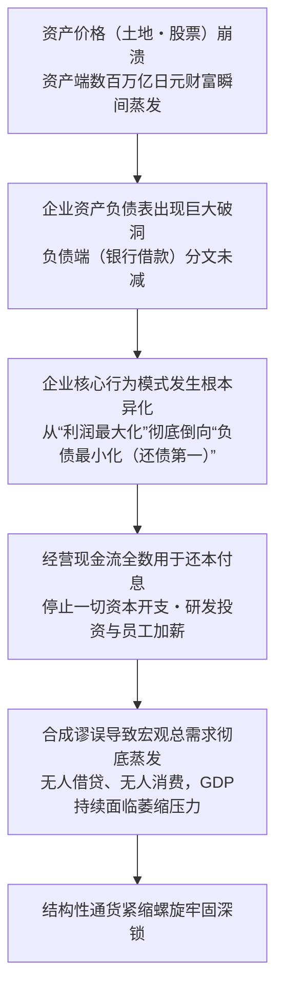

#### 1. 企业的行为目标异化: 从“利润最大化”倒向“负债最小化”
传统经济学坚信，微观企业始终以追求 “ **利润最大化** ” 为天职。只要基准利率下调，资本回报率门槛降低，企业便会顺理成章地向银行举债，购置机器厂房，招募员工，扩大再生产。

然而，泡沫破裂后的日本企业遭遇了绝无仅有的残酷现实：
- 企业在泡沫期高位接盘的土地与股票，市值暴跌了 70% 至 80%，资产端严重缩水；
- 但用于收购这些资产的银行贷款，作为硬性债务分文未减，依然以 100% 的面值趴在负债表上；
- 整个日本企业界承受了总额高达数百万亿日元的 “ **资产负债表净资不抵债黑洞** ” 。

在面临破产法庭清算的生死关头，日本企业家作出了理性的秘密共识：哪怕主营业务运转良好、现金流充盈，企业也绝对不能进行任何新的设备投资或给员工涨薪。 **企业赚取的每一分钱营业现金流，都必须毫无保留地用于偿还银行旧债（负债最小化）** ，以尽快填平资产负债表上的巨大窟窿。

#### 2. 合成谬误（Fallacy of Composition）
对单一企业而言，克勤克俭、优先偿债、修复破损的资产负债表，是无懈可击的审慎经营典范。

然而， **当一个国家成千上万家企业同时停止借款投资，并一齐将收入用于偿还债务时，宏观经济便跌入了万劫不复的深渊** 。这就是著名的 “ **合成谬误** ” ：
- 正常的经济循环有赖于家庭将储蓄存入银行，银行再将储蓄借给企业转化为资本投资，资金循环流动，支撑 GDP 扩张；
- 但在资产负债表衰退期，企业不仅不借钱，反而加入储蓄者大军狂暴还债，导致天量资金直接退出实体经济流通，形成了无法填补的“有效需求断崖”；
- 此时货币政策彻底失灵：即便央行将借贷利率砸到零，对于一心只想消除债务的企业而言，借钱依然是负罪感。这就是典型的“流动性陷阱”，犹如“推一根软绳”，毫无着力点。

#### 3. 扩张性财政政策的不可或缺性
辜朝明严密论证，在资产负债表衰退期间，唯一能够防止经济全面崩盘的救命稻草只有 **政府财政扩张** 。当私人部门集体只存不贷时，政府必须充当“最终借款人”，通过大规模发行国债将沉淀在银行里的过剩储蓄吸纳，并以公共工程和公共服务的形式直接注入市场，填补总需求缺口。

然而，大藏省与财务省长期受传统财政平衡教条支配，屡次在经济刚有微弱起色时便惊慌失措地推行“财政整顿”，加税削减支出（以 1997 年消费税提升至 5% 最为致命），数次亲手掐死了经济自然愈合的幼苗。

### 物价走低与工资受抑的恶性循环
长期的总需求匮乏，将日本经济牢牢锁死在自我强化的 “ **通货紧缩螺旋（Deflationary Spiral）** ” 之中：

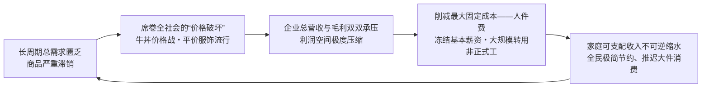

1. “ **价格破坏”狂潮席卷列岛**:
 1990 年代中后期，麦当劳推出 65 日元“平日半价汉堡”，吉野家、松屋、食其家点燃惨烈的“280 日元牛肉饭战争”，优衣库凭借极高性价比的平价摇粒绒风靡全国。廉价生活成为全社会的普遍生存法则。
2. **降价促销的“回旋镖效应** ”:
 虽然平民在短期内享受到了降价的好处，但终端产品价格走低直接摧毁了企业的利润总额。为了在价格战中活下去，企业唯有拿最大的固定开支开刀——大幅削减人工成本。
3. **工资下跌反噬消费市场**:
 工薪阶层收入受抑，进一步紧缩开支，逼迫零售业展开更惨烈的下一轮折价促销。这种“物价下跌 → 利润缩水 → 工资停滞 → 消费不振 → 物价进一步下挫”的下行螺旋，持续侵蚀了整整一代人的生机。

### 通缩心智的彻底固化与流动性陷阱
三十年的物价冰冻，使得一种极其独特的心理防线在全日本生根发芽——“ **通缩心智（Deflationary Mindset）** ” ：

- “ **持有现金才是至高真理** ”:
 在通胀时代，持有现金意味着购买力被悄然稀释；但在通缩时代， **现金放在银行甚至家中的保险柜里，其实际购买力每年都在“被动升值** ” 。
- **天然的延迟消费诱因**:
 全社会形成了坚定的预期：“无论买车、买房还是买电脑，只要耐心等待一年，价格一定会比现在更便宜”。耐用品消费遭遇断崖式冰封。
- **凯恩斯流动性陷阱的极限上演**:
 日本银行不论印出多么庞大天文数字的基础货币，既无法转化为商业银行对实体的信贷放量，亦无法激发家庭的借贷消费欲望。资金只能孤寂地沉淀在央行超额准备金账户与企业沉睡的内部留保之中。

---

## 第4章: 非正规雇佣激增与就业冰河期世代的时代悲歌

### 1990 年代后期至 2000 年代劳动力市场结构性松绑
面对资产负债表修补与全球化低成本竞争的双重夹击，日本企业迫切希望将原本刚性的人工成本全面转变为可以随时切除的“可变浮动成本”。在经团联等财界组织的强力推动下，日本政府推行了一系列 **劳动力市场自由化松绑改革** ：

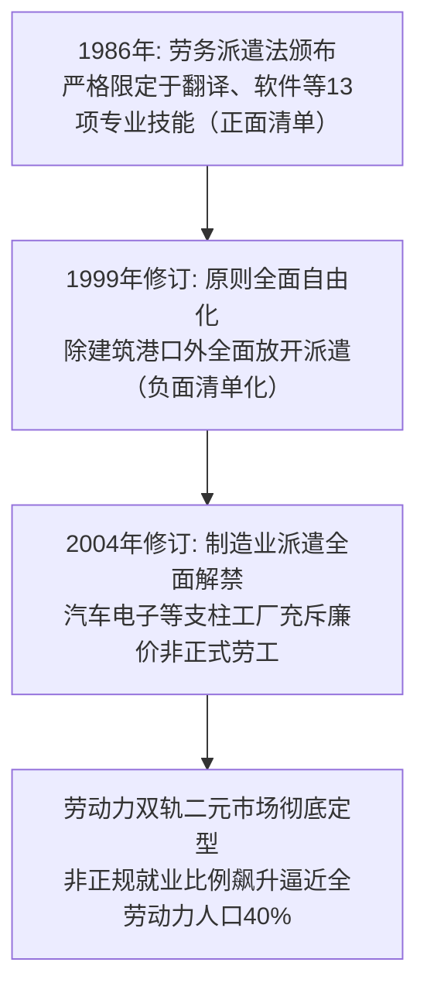

1. **1986 年《劳动者派遣法》初生**:
 起初本着保护正式工就业安全之原则，仅允许在涉外翻译、软件设计等专业度极高的极少数岗位引入派遣劳工（正面清单制）。
2. **1999 年关键性修订（负面清单化）**:
 小渊惠三内阁大幅修改法案，除港口、建筑、保安及医疗行业外，所有非制造业岗位的派遣用工全面合法化，派遣业迎来爆发式增长。
3. **2004 年制造业派遣全面解禁**:
 在小泉纯一郎内阁的强推下，日本工业制造流水线正式敞开怀抱吸纳派遣劳工。企业在繁荣期招募大批临时工人，一旦海外订单稍有风吹草动便可零成本批量解约（2008 年雷曼危机期间臭名昭著的“派遣村”与“弃用派遣工 *Haken-giri*”由此发端）。

### 就业冰河期世代（迷惘一代）遭受的毁灭性冲击
在这一波企业降本增效的狂潮中，正面承受最残酷代价的，是 1993 年至 2005 年间走出校门的“ **就业冰河期世代（*Shushoku Hyogaki Sedai*） **”，亦被称为“** 迷惘的一代（Lost Generation）** ”。

- **应届生统一招聘机制的异化成灾**:
 日本传统的新毕业生统一招募制度在繁荣期是保障年轻人充分就业的温床，但在衰退期却演变成了冷酷的绞肉机。企业一刀切缩减正式工名额，大学毕业生求职倍率跌破 1.0，无数名校才俊投递数百份简历却一无所获。
- **终生职业生涯的不可逆断层**:
 由于日本企业文化极度轻视往届生，形成了“脱离正轨者终生不得录用”的严苛偏见。未能一毕业就进入企业成为“正社员”的年轻人，被永久驱逐出晋升轨道，只能辗转于便利店打工、电话客服与短期派遣之间（沦为飞特族 *freeter*）。
- **数千万至上亿日元的终身收入鸿沟**:
 正式员工与非正规就业者之间的终生累计收入差距高达 **5000 万至 1 亿日元以上** 。没有退休金，缺乏工伤医保兜底，这批青年直至迈入 40 岁、50 岁，依然挣扎在贫困线下。

### 正规与非正规的双轨劳动力市场与极度削减成本之弊
为何企业宁可牺牲一整代年轻人，也绝不调整老员工的薪资？根源在于日本司法审判确立的 “ **解雇权滥用保护法理** ” 。

在日本判例法下，企业解雇一名正式员工必须严苛证明“人员精简的绝对必要性、穷尽降薪及提前退休等自救措施、裁员人选的完全公允性、与工会沟通程序的完备性”。解雇中高龄正社员在法律与社会层面上几乎寸步难行，逼迫企业唯有采用 “ **对年轻新生代关死求职大门、全面替换为临时工** ” 的畸形手段来实现成本压缩。

| 雇佣类型 | 工作稳定性 | 薪资晋升曲线 | 技能积累与在职培训 (OJT) | 经济周期风险承担者 |
| :--- | :--- | :--- | :--- | :--- |
| **正规员工 (正社员)** | 受法律铁律保护直至法定退休 | 年功序列制（中高龄薪酬优渥） | 企业耗费巨资进行轮岗培养 | 企业内部消化吸收周期波动 |
| **非正规员工 (派遣/兼职)** | 合同按月/季度续签随时解除 | 终生领受微薄计时时薪 | 仅从事可替代机械简单重复劳动 | **劳动者个人全面肉身硬抗宏观经济风险** |

企业虽然依靠削减人件费换取了短期财报利润，却亲手瓦解了数十年来日本引以为傲的技术传承链条，导致全要素生产率与创新能力双双枯竭。

### 少子化与未婚率飙升的历史性致命加速
就业冰河期世代悲剧给日本文明带来的最无法挽回的重创，是彻底掐断了国家的人口生机。

冰河期世代的主力恰恰是日本的 “ **第二次婴儿潮一代（1971年〜1974年出生）** ” 。按照自然的人口繁衍规律，当这批庞大人口在 1990 年代末至 2000 年代初步入适婚生育年龄时，日本本应迎来蓬勃的 “ **第三次婴儿潮** ” ，从而构筑稳健的人口梯队以支撑老龄化社会。

然而，没有体面收入、看不到未来的青年人根本不敢涉足婚姻与育儿。
- 30 岁出头的男性非正式工有配偶率甚至不足正式工的三分之一；
- 终身未婚率呈指数级飙升，新生儿出生人口出现不可逆的断崖暴跌。

日本政府当年对冰河期青年“自生自灭、个人责任”的冷漠放任，最终让整个国家付出了惨痛的文明代价：第三次婴儿潮永远化为了泡影，日本在 2008 年无可挽回地跨过了人口峰值，滑入了深度超老龄化与人口缩减的万劫不复之渊。

---

## 第5章: 产业竞争力的全面衰退与“数字化败局”的病理

### 半导体与传统消费电子霸权的毁灭性崩塌
在 1980 年代，“日之丸半导体”曾是令五角大楼夜不能寐的工业巨神。日本独揽 **全球半导体市场份额的 50% 以上，在动态随机存取内存（DRAM）领域更是垄断了全球逾 80% 的产出** 。NEC、东芝、日立、富士通、三菱五大巨头长期霸榜全球科技十强。

然而在随后的短短二十年间，这整座辉煌的产业金字塔遭遇了彻底的降维打击与雪崩解体。

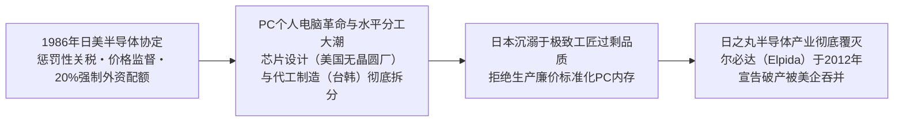

1. **地缘政治围剿：《日美半导体协定》（1986年）**:
 美国启动 301 条款逼迫日本签署不平等协定，强制要求外国芯片在日本本土市占率必须达 20% 以上，并设立价格监管机制剥夺了日本企业的自主定价权，扼杀了其技术反哺能力。
2. **大型机向 PC 个人电脑的技术范式转移**:
 日本芯片过去服务于能连续稳定运行 25 年的“大型主机计算机”，追求极致的耐久与零瑕疵。但 1990 年代引爆全球的是只需要 5 年使用寿命但价格极度低廉的个人电脑。正当日本工程师傲慢地嘲笑 PC 芯片品质粗糙之际，韩国三星与台积电（TSMC）果断以敏捷的资本开支，大规模量产高性价比标准化芯片，彻底将日本挤出了全球供应链。
3. **抱团取暖的悲剧：尔必达的陨落**:
 日立与 NEC 剥离内存业务拼凑出的国家队“尔必达”，在超强日元与技术脱节的夹击下，于 2012 年申请破产保护，最终被美光科技（Micron）全盘吞并。至此，曾经傲视寰宇的日本存储芯片产业全军覆没。

### 为何日本全面错失互联网革命、现代软件与 GAFAM 平台时代
在半导体之外，日本在互联网软件、移动操作系统、云计算及平台经济等所有高附加值赛道上，遭遇了全方位的惨烈败北。这一过程被日本学界沉痛地定性为“ **数字化败局（*Dejitaru Haisen*）** ”。

#### 1. “协调集成（*Suriawase*）”在“模块化水平分工”面前的失效
东京大学藤本隆宏教授精辟剖析了制造业的两种底层架构逻辑：
- **集成协调型架构（*Integral Architecture*）**: 如燃油汽车与超精密机床，需要各零部件在设计开发中极度精密的咬合沟通与长期沉淀的工匠默契。这是日本制造业无敌的绝对主场；
- **模块化架构（*Modular Architecture*）**: 如个人电脑、智能手机、互联网软件与云服务。各模块遵循全球开放标准接口，全球采购组装即可使用。

数字时代的底层逻辑完全是模块化与水平大分工。硅谷负责软件生态与系统架构（苹果、高通、英伟达），台积电负责专业代工制造，微软与谷歌掌握全球操作系统入口。依然抱着“从底层材料到组装一体化全包”的日本综合电机巨头，被全球敏捷生态碾压得毫无还手之力。

#### 2. 加拉帕戈斯化综合征：i-mode 的早熟与悲壮退场
1999 年 NTT Docomo 推出的 **i-mode** 是移动互联网的惊人先驱。在乔布斯发布初代 iPhone 许多年前，日本手机用户就已经在方寸屏幕上享受收发邮件、掌上炒股、移动支付（FeliCa / 手机钱包）等前卫服务。

然而，这极度的本土成功反倒酿成了毁灭性的“加拉帕戈斯效应”：
- 封闭的电信运营商垄断了产业链，本土市场丰厚利润使得各大厂商对国际标准化毫无野心；
- 2007 年苹果 iPhone 携开放统一的 App Store 席卷全球时，日本高管竟盲目嗤笑其“电池续航差、没有手机电视天线”。短短数年间，松下、NEC、东芝、富士通在智能机浪潮下被彻底扫地出门。

#### 3. 鄙视软件的“IT建筑包工头”层层转包体系
日本传统工业文明浸润着“硬件看得见摸得着才值钱，软件代码是随手赠送的附庸”的深层偏见。
- 绝大多数大型传统企业将核心 IT 系统的建设，全部推给外部传统系统集成商（SIer）；
- 软件外包行业全面复刻了建筑业的 “ **总承包商 → 二级包工头 → 三级转包 → 外包码农** ” 的“IT 建筑包工头（IT Zenekon）”模式。中介盘剥走绝大部分预算，底层程序员在低薪与内耗中备受摧残。硅谷那种以代码创造奇迹的敏捷极客文化，在日本的体制土壤中根本无法生根发芽。

### 1989 年与当下全球企业市值排行榜的残酷对照
三十年产业大溃败的最直接印证，莫过于全球商业金字塔顶端格局的翻天覆地：

| 排名 | 1989 年（泡沫极盛巅峰） | 所属国家 | 2024 年（当下时代） | 所属国家 |
| :---: | :--- | :---: | :--- | :---: |
| **1** | **日本电信电话 (NTT)** | 🇯🇵 日本 | **微软 (Microsoft)** | 🇺🇸 美国 |
| **2** | **日本兴业银行** | 🇯🇵 日本 | **苹果 (Apple)** | 🇺🇸 美国 |
| **3** | **住友银行** | 🇯🇵 日本 | **英伟达 (NVIDIA)** | 🇺🇸 美国 |
| **4** | **富士银行** | 🇯🇵 日本 | **谷歌母公司 Alphabet** | 🇺🇸 美国 |
| **5** | **第一劝业银行** | 🇯🇵 日本 | **亚马逊 (Amazon)** | 🇺🇸 美国 |
| **6** | **三菱银行** | 🇯🇵 日本 | **沙特阿美 (Saudi Aramco)** | 🇸🇦 沙特 |
| **7** | 埃克森石油 | 🇺🇸 美国 | **Meta (原 Facebook)** | 🇺🇸 美国 |
| **8** | **东京电力** | 🇯🇵 日本 | **伯克希尔・哈撒韦** | 🇺🇸 美国 |
| **9** | 皇家荷兰壳牌 | 🇬🇧/🇳🇱 英/荷 | **台积电 (TSMC)** | 🇹🇼 台湾 |
| **10** | **三井银行** | 🇯🇵 日本 | **礼来制药 (Eli Lilly)** | 🇺🇸 美国 |
| **Top 50** | **日本企业高居 32 席** | 🇯🇵 64% | **日本企业仅剩 0 〜 1 席（仅丰田一家）** | 🇯🇵 0-2% |

1989 年，前 10 强中日本企业强占 8 席，世界前 50 大企业中日本占据近三分之二。而在当下，除了丰田汽车艰难守护一隅，日本企业几乎全军覆没。这份惨烈的榜单无声地宣告：沉醉于昔日工业荣光的日本，如何彻底缺席了定义二十一世纪的科技与信息资本主义浪潮。

## 第6章: 非传统货币政策的试验场：从零利率、量化宽松至异次元宽松

### 速水总裁任内的零利率政策与世界首创的量化宽松（QE）
在世界中央银行发展史册上，日本银行始终扮演着 “ **非传统货币政策极限试验的最前沿先驱** ” 。面对泡沫崩溃后史无前例的通缩与金融休克，日本央行踏入了传统教科书从未记载过的黑暗森林。

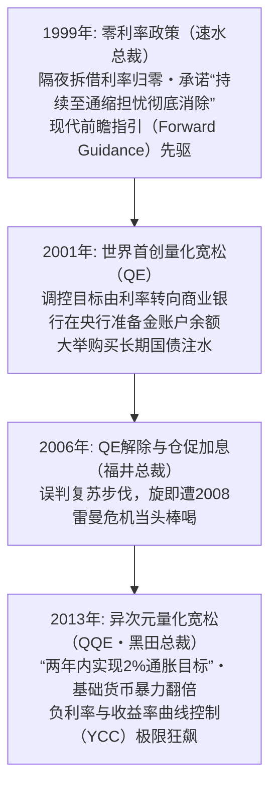

#### 1. 零利率政策（1999年2月）
在金融体系大动荡后，速水优总裁掌舵的日本银行做出决定，将无担保隔夜拆借利率直接打低至“事实上趋近于零”的水平，诞生了 **现代金融史上首个“零利率政策** ” 。随后于 4 月宣布该政策将“持续直至通缩担忧彻底消除”，这成为了日后各国央行竞相效仿的 “ **前瞻指引（Forward Guidance）** ” 鼻祖。

#### 2. 全球首创的量化宽松（QE，2001年3月）
伴随 2000 年互联网泡沫破灭，在政策基准利率已然降无可降（面临零下限约束 Zero Lower Bound）的绝境下，日银于 2001 年 3 月破天荒开启了 **量化宽松政策（Quantitative Easing）** ：
- **操作标的的历史性转移**: 将日常调控目标从“价格（拆借利率）”转向“数量（商业银行在日银的活期存款准备金账户余额）”；
- **长期国债直接大举吞吐**: 确立了按月固定采购长期国债的机制，开动印钞机强行向银行间市场注水。

### 福井总裁任内的量化宽松解除与“伊邪那美景气”的脆弱假象
2003 年福井俊彦接任总裁后，受惠于美国房地产繁荣与中国经济极速崛起的超级周期，在弱日元配合下日本出口重现生机。2002 年 2 月至 2008 年 2 月长达 73 个月的经济扩张创下战后纪录，被赋予了神话之名 “ **伊邪那美景气** ” 。

在 CPI 勉强转正的表象下，日银于 2006 年 3 月宣布解除量化宽松，同年 7 月废除零利率，并于 2007 年 2 月将拆借利率推高至 0.50%。

然而这一复苏从本质上是严重扭曲的：
- 跨国巨头利润固然刷新纪录，但在降本增效紧箍咒下， **工薪阶层的名目工资纹丝未动** ，“毫无获得感的景气”是民间最真实的叹息；
- 缺乏国内自主消费动能的支撑，极度依赖外需的畸形结构，使得日本经济在随后的外部大风暴中脆弱如纸。

### 雷曼危机与民主党执政时期的超强日元噩梦（白川方明时代）
2008 年 9 月雷曼兄弟崩塌，全球大衰退呼啸而至。美日两国货币当局在危机应对上的果决度差距，将日本推入了二次深渊。

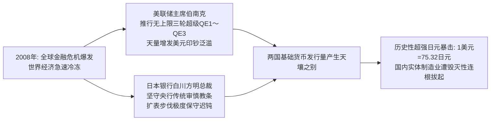

#### 美联储激进放水 vs. 日本央行刻舟求剑
美联储主席伯南克以直升机撒钱之势，瞬时将利率压至零并祭出 QE1、QE2、QE3，美联储资产负债表在短时间内膨胀了数倍。

反观白川方明掌舵的日本银行，受深层央行审慎传统约束，认定非常规货币政策对结构性人口老龄化国家效果有限且后患无穷，在印钞扩表上畏首畏尾，扩表节奏极度迟缓。

#### 1 美元兑 75 日元的灾难与国内产业彻底空心化
日美两国基础货币供应速度的天差地别，在外汇市场上掀起了毁灭性的日元狂飙：
- 2011 年 10 月，日元兑美元汇率创下二战后历史新高——**1 美元兑 75.32 日元** ；
- 叠加民主党政权经验不足的混乱施政与“3・11”东日本大地震的惨剧，日本工业界陷入了“六重苦”（超强日元、沉重法人税、僵化劳动法制、环保制约、电力短缺及自贸协定滞后）；
- 索尼、松下、夏普等传统支柱企业单季亏损达数百亿，无数优秀本土工厂被彻底拆迁流向海外，日本国内制造业基础遭遇了无可逆转的致命空心化。

### 黑田东彦总裁的“异次元量化宽松（QQE）”与负利率狂澜
面对产业界与公众对通缩与超强日元的无尽绝望，2012 年底安倍晋三打着“无限制开动印钞机”的旗号重掌政权，并全面重组了日本央行领导层。

2013 年 4 月 4 日，新任总裁 **黑田东彦** 以彻底决绝的姿态，抛弃了所有传统渐进路线，正式打响了 “ **质化与量化异次元货币宽松（QQE）** ” 第一枪：

```
【黑田“2-2-2”火箭炮教条】
1. 锚定“2年”的时间窗口
2. 彻底达成“2%”的良性物价通胀目标
3. 将基础货币、长期国债持有额与 ETF 规模全面“翻倍”
```

日银以每年购入 50 万亿（后扩至 80 万亿）日元长期国债的疯狂速度大举扩表，并亲自入场大规模购买股票 ETF。这记空前猛烈的政策震撼弹瞬间逆转了市场心理：日元自 80 迅速贬至 120 时代，日经指数实现了报复性翻倍狂飙。

此后日银更步步逼入死角：2016 年 1 月宣布 “ **负利率政策（-0.1%）** ” ；同年 9 月引入 “ **收益率曲线控制（YCC）** ” ，强行将 10 年期国债收益率钉死在 0% 左右。至此，日本央行已实质上将整个日本国债市场完全国家化。

---

## 第7章: 安倍经济学大检阅：“三支箭”带来了什么，又遗留了什么

### “三支箭”的宏观设计与初期的剧烈成效
2012 年底问世的 “ **安倍经济学（Abenomics）** ” ，其核心逻辑由著名的“三支箭”构成：

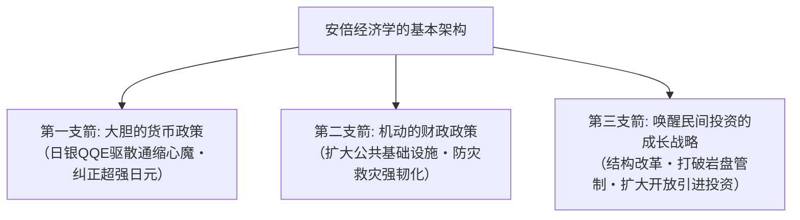

#### 初期的高光时刻（2013年〜2015年）
在政策强刺激下，深陷泥潭的日本经济确实出现了一波立竿见影的气色扭转：
- **资本市场大狂欢**: 日经指数从民主党末期的 8,000 点一路冲破 20,000 点大关；
- **超强日元被成功扭转**: 巨亏的出口企业纷纷迎来汇兑收益，丰田等大型财阀利润井喷；
- **就业数据大幅改善**: 全国有效求人倍率全线破 1，失业率压低至 2.2% 左右的完全就业极限，数百万女性与高龄退休人员重回工作岗位；
- **访日旅游业迎来黄金爆发**: 借由大幅放宽签证与汇率暴跌，访日外国游客从 2012 年的 836 万人次，暴增至 2019 年的历史巅峰 **3,188 万人次** 。

### 第三支箭的严重受阻与坚如磐石的既得利益壁垒
然而，从宏观经济学学术审视，安倍经济学未能完成其核心战略闭环：最根本的 “ **第三支箭（成长战略）”彻底流产** 。

- **岩盘管制的牢不可破**:
 涉及日本社会利益深水区的关键领域——如农业协同组合（农协）利益链、封闭保守的医疗财团、以及束缚劳动力流动的严苛正式工解雇法规，均在自民党传统票仓议员的誓死抵制下浅尝辄止；
- **潜在增长率持续低迷**:
 衡量国家内在真实经济实力的潜在增长率，在整个安倍执政期依然冰冷地徘徊在 **年均 0.5% 左右** 的超低空水准，未能激活核心造血功能；
- **新兴科技发动机的缺位**:
 借由大印钞与弱日元买来的宝贵喘息窗口，并没有被转化为孵化本土科技独角兽或人工智能核心资产的资本，反而进一步推迟了传统企业自我革命的紧迫感。

### 两次调高消费税对内需消费造成的致命冰冻效应
安倍经济学最荒谬的宏观矛盾，莫过于在强力推行再通胀政策的同时，盲目屈从于财政平衡教条，推行了 **两次摧毁内需的消费税上调** ：

```
【消费税加税的自杀式轨迹】
・2014年4月: 税率由 5% 提高至 8%（单次暴增3个百分点）
 -> 导致原本刚有回暖迹象的家庭实际消费瞬间断崖式冰冻，
 民间实际消费支出多年无法恢复元气，彻底掐死内需主导复苏苗头。
・2019年10月: 税率由 8% 进一步提升至 10%（再增2个百分点）
 -> 再次给脆弱的国内市场当头一棒，将经济直接推进负增长泥潭，
 并与随后爆发的世纪疫情形成惨烈共振。
```

央行一边把油门踩到底拼命放水，财政部一边猛拉紧急手刹抽税压抑需求，这种精神分裂式的宏观政策让货币刺激的成效被抵消大半。

### 央行爆买国债与 ETF 导致的市场机能坏死与财政纪律瓦解
超常规宽松一旦踏上不归路，其极其严重的系统性后遗症便开始反噬国家金融肌体：

1. **国债现货交易市场的灭绝**:
 日本银行最高峰时买断了全日本 **50% 以上的全部存量长期国债** 。十年期国债经常出现连续多日全市场“零成交”的荒诞奇观，国债收益率的正常价格发现机制彻底脑死亡；
2. **央行化身资本市场的“巨鲸怪兽** ”:
 日银账面上累计持有的股票 ETF 市值突破 50 至 70 万亿日元， **实质上成为了东证 Prime 市场逾半数上市公司的第一大股东** ，彻底摧毁了正常股东积极主义的企业治理与优胜劣汰规律；
3. **财政纪律荡然无存与“财政赤字货币化”常态化**:
 “只要发行国债，央行就会照单全收保底”的恶劣预期，让日本政客彻底放弃了财政约束。国家公债规模狂飙突破 **1,200 万亿日元（占 GDP 比重突破 260%）** ，位列主要工业国之首，将国家主权信用推向了不可承受之重的刀刃上。

---

## 第8章: 社会、心理与政治的深层异化：长期停滞塑造的国民意识

### “草食化”、“极简主义”与“低欲望/悟代”的社会心理剖析
长达三十年的实际收入停滞与未来黯淡预期，深刻地重塑了日本全社会的 “ **精神世界、欲望结构与人生哲学** ” ：

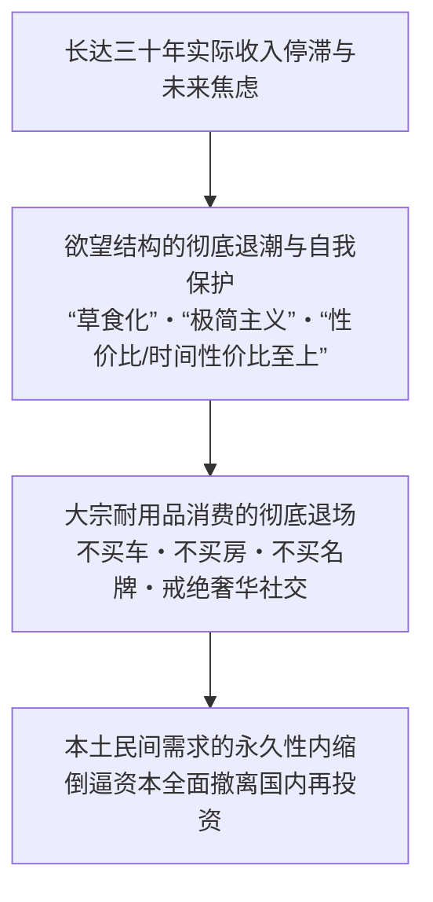

- **物欲退潮与“主动极简”的生活哲学**:
 泡沫时代的年轻人以驾驶进口宝马、手挎路易威登、流连高级俱乐部为荣；而在通缩岁月里成长起来的新一代（所谓的“悟代青年 *Satori Sedai*”），将拥有私家车视为愚蠢的经济负债，身着优衣库基础款，在二手闲鱼 Mercari 上精打细算；
- “ **性价比（Cospa）”与“时间性价比（Taipa）”教条的盛行**:
 由于承担不起犯错的成本，大众在消费时极度依赖网络评分与缩略总结，一切冒险探索与非标准消费被全面压制；
- **草食化与恋爱/婚姻绝缘**:
 恋爱与组建家庭被年轻人判定为“极高风险的奢侈品”，食草男群体的泛滥与主动不婚浪潮席卷日本社会。

### 极度厌恶投资与不可动摇的安全资产（现金）信仰
三十年资产负债崩盘的惨烈创伤，在日本人心底烙下了不可磨灭的投资恐惧症。

据日银资金循环统计，在全日本家庭持有的 2,100 万亿日元金融资产巨盘中， “ **现金与活期存款”占比竟常年高达 54% 左右** ，而欧美国家这一比例仅为 13%（美国）和 30%（欧洲）。
- 老一辈炒股亏掉半生家产的血泪教训代代相传，“股票等同于赌博”的偏见深入骨髓；
- 即便存款利率常年低至 0.001% 的侮辱性水准，大众依然坚信“保本才是唯一的安全之道”，导致日本民间完美错失了过去数十年全球高歌猛进的资本复利繁荣。

### 政治停摆与“银发民主主义”的分配困境
长期经济停滞叠加严峻的人口老龄化，直接孕育了日本独特的政治怪胎——“ **银发民主主义（Silver Democracy）** ” ：

| 关键政策博弈点 | 65岁以上老年群体之利益诉求 | 年轻世代与未来国民之利益诉求 | 最终政治妥协下的现实政策产物 |
| :--- | :--- | :--- | :--- |
| **社会保障制度改革** | 誓死捍卫既有养老金・医疗护理高额福利（绝不接受削减待遇） | 极度呼吁降低从年轻在职者工资单中强行扣除的社保费率 | **老年人既得福利分文不动，年轻人工资社保扣除率年年被动攀升** |
| **国家财政优先排序** | 要求维持高龄看病一成自付额的超低门槛 | 要求国家倾斜资源于育儿津贴、免费高等教育与前沿科研创新 | **教育科研经费常年受压，社会保障支出鲸吞掉国家预算三分之一以上** |
| **投票政治动员力** | 投票率奇高（60%〜70%），且老年绝对人口数量占绝对压倒优势 | 投票率低迷（30%〜40%），且少子化导致年轻选民人数极度单薄 | **政客出于竞选算计极度讨好老人，全方位冷漠漠视青年人前途** |

当老年人依靠庞大选票成为政客不敢得罪的特权阶层时，任何需要牺牲当下以换取未来的深层制度改革都在选举机器前被彻底封杀。

### 国家自信的丧失与借由“日本好厉害”自欺欺人的心理防卫
曾经站在“世界第一”神坛上的帝国缓缓沉沦，对全体国民的集体潜意识造成了无法抚平的尊严撕裂。

在 2010 年代之后的日本电视荧屏与图书市场上，出现了一种荒唐的集体自嗨现象：
- 电视各台铺天盖地充斥着“外国人惊叹日本有多牛！”、“让世界震惊的日本匠人！”等自吹自擂的综艺节目；
- 连锁书店的黄金畅销书架，被毫无根据贬低东亚邻国、宣扬日本血统优越的劣质地摊读物全面占领。

在社会心理学上，这种现象被精准定义为 “ **集体自恋性退行（Narcissistic Regression）** ” ：一个深感自身日益平庸脆弱的落魄群体，为了逃避国际地位下沉的残酷真相，不得不从对过往荣光的病态幻觉与虚妄赞美中寻求暂时的心理镇静剂。

---

## 第9章: “失去的三十年”宣告落幕，抑或步入崭新危局（2020年代至今）

### 疫情后全球通胀传导与地缘供应链大重组
2020 年突如其来的新冠大流行与 2022 年俄乌战事的打响，如同一道惊雷，将冰封整整三十年的日本价格与利率体系彻底震碎。

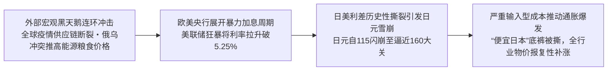

当欧美主要央行为了扑灭四十年未见的高通胀而以极其凶悍的节奏连续加息（美联储自 0% 暴拉至 5.25%〜5.50%）时，日本银行受困于沉疴依然固守着超宽松姿态。

两国利差的历史性脱节在外汇市场掀起了 “ **日元自 115 狂泻至 160 历史深渊** ” 的惨烈贬值风暴。日本赖以生存的海外石油、天然气、粮食和金属矿产价格在日元计价下急剧飙升，三十年来奉行“涨价即自杀”的企业终于撑不住了，全日本迎来了一场席卷一切生活必需品的涨价狂潮。

### 历史性日元暴跌与时隔三十年的历史性加薪潮
这场被贬斥为“恶性成本推动型”的通胀，在残酷压缩普通家庭生存空间的同时，却也奇迹般地打碎了日本全社会长达三十年不敢提价、不敢加薪的 “ **集体行动禁锢** ” ：

- “ **便宜日本（*Yasui Nippon*）”的刺痛与屈辱**:
 日元的大崩溃让日本在国际视线中沦为了廉价的旅游集市。在二世谷滑雪场，海外游客哄抢着一碗 3,500 日元的平民拉面；美国加州快餐店的打工时薪，竟然超越了东京名牌大学毕业进入顶尖企业的管培生起薪。强烈的“落后国”焦虑狠狠刺痛了自尊心；
- **春斗迎来 33 年未见的历史性加薪潮（2023〜2024年）**:
 在极度恶化的少子化劳动力短缺与通胀倒逼下，日本劳动组合总联合会（连合）在春季劳资谈判中斩获了惊人成果： **2023 年加薪幅度达 3.58%，2024 年更是狂飙破 5%（录得 5.10%）** ，刷新了泡沫破灭三十余年来的历史最高峰纪录。各大龙头企业纷纷宣布应届生起薪暴涨。

### 解除负利率：植田和男时代的货币正常化险途
在确认国内内生性通胀与加薪循环正在逐步确立后，2023 年 4 月执掌帅印的新总裁 **植田和男** ，果断启动了告别黑田超常规刺激的艰难历史撤退。

2024 年 3 月 19 日，日本银行正式宣布了一系列具有里程碑意义的决定：
1. **正式废止负利率（-0.1%）**: 将政策利率引导至 0.0%〜0.1% 范围，实现了 **时隔 17 年的首次加息** ；
2. **全面废除收益率曲线控制（YCC）**: 停止人为压制十年期国债利率上限；
3. **彻底终结股票 ETF 及 J-REIT 的新增买入**: 宣告了为期十余年大放水时代的正式落幕。

然而这一“走向正常利率时代”的航道布满了暗礁：
- **万亿国债利息核弹**: 国债收益率每提升 1 个百分点，背负着 1200 万亿日元国债包袱的日本财政，其未来的年利息支出就将暴涨数万亿日元，极度挤占国防与民生预算；
- **央行自身的财务危机**: 日银庞大资产包里的极低息国债将面临巨额浮亏，央行自身的资产负债表健康度面临极严峻的考验。

### 日经指数突破 40,000 点新高与庶民生活体感的巨大鸿沟
2024 年 2 月 22 日，日本金融市场迎来了载入史册的狂欢时刻：日经平均指数无情跨越了 1989 年 12 月 29 日高悬 34 年之久的 38,915.87 点历史巅峰， **史上首次击穿 40,000 点大关** ，并一路挺进至 42,000 点之上。

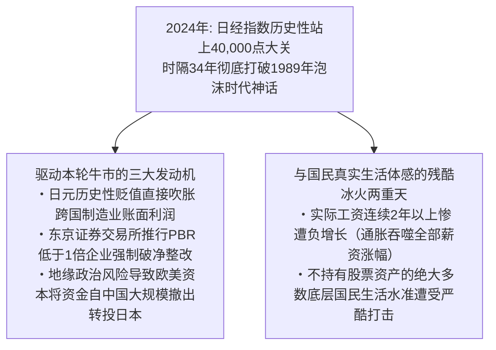

然而，如果盲目将这一数字狂欢当成“日本经济已完全凤凰涅槃”，无疑是对真相的严重粉饰：

1. **推升本轮牛市的实质驱动力**:
 - 日元极度贬值给以海外市场为主的汽车、综合商社带来的虚幻账面汇兑红利；
 - 东京证券交易所要求“破净股（PBR < 1.0）”强制改善公司治理，倒逼企业拿出大笔账面闲置现金进行回购和分红；
 - 国际机构投资者避开地缘摩擦风险，从亚洲邻国市场撤离出数千亿美元外资转而配置相对安定的日本蓝筹。
2. **实际工资连续负增长的民生苦境**:
 虽然名目工资终于开始上涨，但完全追赶不上生活必需品、水电气暖涨价的凶猛势头。 **日本厚生劳动省公布的“实际工资”数据，在 2022 年至 2024 年期间创造了连续 25 个月以上前年同月比萎缩的战后最长负增长纪录** 。对于不持有任何金融股票资产的广大普通民众而言，40,000 点的股市不过是资本豪门的盛宴，留给平民的只有菜篮子缩水的切肤之痛。

“失去的三十年”那幽灵般的资产通缩魔咒固然在瓦解，但日本推开的却可能是一扇通往“贫富急剧分化与生活成本危机”的残酷新大门。

---

## 结语: 日本经济再生的历史药方——痛定思痛我们该汲取什么

### 过去三十年“痛彻心扉的失败”之本质
回顾整部人类近代经济发展史，一个本已建立起傲视寰宇的工业帝国与富裕社会的经济霸主，在未曾遭遇任何外部战争摧毁、未曾发生内乱崩盘的和平环境之下，竟能以如此缓慢而不可逆的姿态滑向相对实力的全面沦落，这是绝无仅有的悲剧范本。

通盘审视日本“失去的三十年”的深层成因，其本质可归纳为三大致命制度性败因：
1. **对阵痛改革的长期逃避与僵尸妥协**:
 长期隐瞒处置金融坏账，对濒临破产的无竞争力传统企业实行病态政府输血，人为阻断了市场最宝贵的优胜劣汰自我修复机制；
2. **极度忽视人的价值并肆意削减教育人力投入**:
 企业为求短期账面利润最大化，将整整一代年轻人打成毫无希望的非正式工，无情碾碎了国家的未来劳动力基石；
3. **沉溺于往日硬件制造成功的路径依赖**:
 盲目崇拜老旧的机械工匠体系，傲慢排斥由互联网、代码软件、全球模块化与开放平台主导的新商业文明。

### 迈向未来三十年的国家重建路线图
日本若要真正挣脱三十年停滞的漫长阴霾，重铸可持续的繁荣文明，绝不能寄托于汇率侥幸或民粹式福利派发，而必须以刮骨疗毒的魄力重构国家机体。

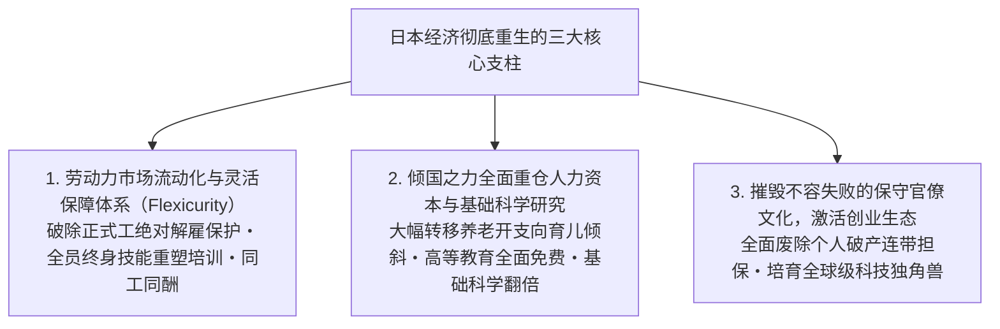

#### 1. 彻底打破二元劳动力结构，实现北欧式“灵活安全保障（Flexicurity）”
必须坚决改革僵化的正规解雇限制法规，引入合理的金钱补偿解雇制度，让被困在死气沉沉夕阳产业中的资本与人才得以顺畅流向新兴赛道。与此相配套，国家必须提供覆盖全生命周期的失业兜底保障与高额实用的再就业技能重塑（Reskilling）教育，实现“保护劳动者本身而非死保具体岗位”。

#### 2. 全面转向对“人”与科学教育的战略重仓
一个文明真正的财富绝非钢筋水泥，而是人民的智识与创造力。
- 必须拿出政治勇气，动刀调整向退休老人过度倾斜的社会保障开支结构，将战略资源坚决腾挪向婴幼儿托育、初高中及大学免费教育，以及国家前沿科学实验室的投入；
- 确立“对教育与年轻人的投入不是财政负担，而是关乎国家存亡之最高等级资本投资”的坚定理念。

#### 3. 根除“容不得失败”的文化毒瘤，激活创业生态
必须彻底荡涤弥漫在日本企业与官僚体系内部的“减分主义”与无过即功的官僚习气。在法律上全面取缔要求创业者以个人及家族不动产进行无限连带借贷担保的恶法，让创业者能够无数次试错、破产、复盘并再次出发。唯有源源不断诞生具有全球野心的本土科技独角兽，去创造性毁灭暮气沉沉的旧巨头，日本才能真正重拾其澎湃的生命力。

在付出了沉痛的三十年代价之后，日本再次站在了历史抉择的宏大路口。痛定思痛，唯有彻底剥离自满与封闭，勇敢拥抱颠覆性的自我革新，这一曾经创造过战后经济奇迹的伟大文明，方能在下一个三十年的汹涌浪潮中重登荣耀彼岸。
