## 序章: 「失去的三十年」究竟是什麼——世界史上罕見的長期停滯之本質

### 用語的變遷與射程：從「失去的十年」到二十年，最終延伸至三十年
在现代經濟史中，“失去的三十年（The Lost Decades）”这一概念，最为直观且深刻地象征了一个國家从全球經濟繁荣的顶峰跌入不可逆转的结构性沉沦之过程。

1990 年代初日本資產价格泡沫破裂之初，笼罩日本社会的停滞感普遍被政策制定者与主流經濟学家定性为“普通的周期性經濟衰退”。当时占压倒性优势的乐观预期认为，一旦不良資產清理完毕、金融机构完成兼并重组，日本經濟必将重新回归强劲的向上增长轨道。然而，复苏步伐异常艰难迟缓。在经历了 1997 年暴发的严重金融危机后进入 2000 年代，这一歷史现象被学界与舆论正式确立为 “ **失去的十年（The Lost Decade）** ” 。

然而，2000 年代中期由出口驱动的温和复苏（伊邪那美景气），并未能真正点燃日本国内的自主消費增长，亦未能打破通货緊縮的枷锁，并在 2008 年雷曼兄弟破产引发的全球金融海啸中彻底崩溃。长期停滞进一步蔓延至 2010 年代，称谓随之被延长为 “ **失去的二十年** ” 。

随后，尽管 2012 年底上台的第二届安倍晋三内阁推行了以超常规貨幣宽松为核心的“安倍經濟学”，促使企業账面利润与股票指数刷新歷史纪录，但国民实际工资停滞、全要素生产率低迷以及潜在經濟增长率下滑等深层痼疾始终未能根治。及至 2020 年代，学界与國際机构终于形成了沉痛的定论：日本经历了一场在现代工业化歷史上绝无仅有的超长周期系统性停滞——“ **失去的三十年** ” 。

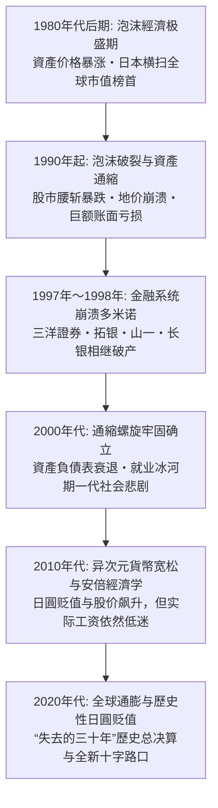

### 1980 年代「日本第一」的極盛與結構性傲慢
要精准理解这三十年停滞的深远惨烈，必须回顾此前日本曾攀登至何等惊人的繁荣顶峰。

1979 年，哈佛大学社会学者埃兹拉・沃格尔出版了轰动全球的名著《日本第一：对美国的启示（Japan as Number One）》，盛赞日本式企業治理机制（终身雇佣制、年功序列制、企業工会）、官民一体的產業政策、无懈可击的高品质製造业、极高的国民储蓄率与高度平等的财富分配。在欧美深陷滞胀困境时，日本凭借卓越的节能技术与全员质量管理（TQC），成为傲视全球的工业製造霸主。

1980 年代后半期，日本製造企業创造的天文数字般贸易顺差引发了激烈的日美贸易摩擦，甚至导致美国工人公开用大锤砸毁日本汽车。坐拥无穷流动性资本的日本财团开启了全球并购浪潮：三菱地所买下了纽约象征帝国大厦的洛克菲勒中心，索尼收购了哥伦比亚电影公司，日本私人投資者包揽了圆石滩高尔夫球场。國際权威智库甚至极为严肃地论证：“日本的 GDP 将在不久的将来彻底超越美国，登顶世界第一大經濟体”。

然而，这登峰造极的成功体验，却给日本的政界与商界注入了致命的认知扭曲。“日本模式无懈可击”、“地价绝不会下跌（土地神话）”、“大型金融机构绝不会破产（护送船队方式）”的盲目傲慢，彻底麻痹了日本社会应对随后到来的全球数字化与模块化工业革命的神经。

### 國際橫向對比所呈現的不可逆結構性地緣下沉
三十年的漫长蹉跎，在日本的各项关键經濟指標上留下了冷酷而触目惊心的歷史烙印：

| 评估指標 | 1989年〜1990年（极盛巅峰） | 2023年〜2024年（当下现状） | 指標变动的深层歷史含义 |
| :--- | :--- | :--- | :--- |
| **占全球名目 GDP 的份额** | **约 15% 〜 18%** （逼近美国规模的70%） | **约 4.0% 〜 4.2%** （被德国反超，跌落至世界第4位） | 日本彻底被全球經濟扩张的核心增长红利所边缘化 |
| **全球市值前 50 强企業排行榜** | **日本企業独占 32 家** （前5强中有4家为日本都市銀行） | **日本企業仅剩 0 〜 1 家** （丰田汽车艰难徘徊在门槛边） | 时代主角从重工业製造与传统金融彻底转移至移动互联与科技 |
| **OECD 國家实际工资指数 (1990=100)** | 日本: 100（与欧美发达國家比肩） | 日本: **约 103** （美国: 150超、韩国: 190超） | 发达國家阵营中唯一历经整整30年实际工资零增长的國家 |
| **人均名目 GDP 的 OECD 國際排名** | **世界第 2 位 〜 4 位** （全体国民位列全球最富裕阶层） | **世界第 30 位 〜 32 位** （G7七国集团垫底，被韩国台湾逆转） | 伴随匯率贬值与生产率停滞，国民國際实际购买力雪崩 |
| **IMD 世界國家竞争力排名** | **世界第 1 位** （1989年起连续数年独占鳌头） | **世界第 35 位 〜 38 位** （深陷决策滞后与 IT 应用落后泥潭） | 企業治理僵化、数字化迟缓、组织流程沉疴难除 |

由此可见，“失去的三十年”绝非简单的資產价格下行或周期性不景气。当世界在信息革命、互联网浪潮、智能手机、人工智能、生物医药与现代金融工程的引领下飞速突进之际，唯独日本被旧时代的沉重負債与落后體制深度捆绑，在财富、创新与產業竞争力上经历了不可逆的全面衰落。

---

## 第1章: 泡沫經濟的形成與狂熱（1985〜1990）

### 廣場協議（1985年）與對日圓升值蕭條的極端恐慌
1980 年代后半期日本泡沫經濟诞生的最初导火索，是 1985 年 9 月 22 日在纽约广场饭店秘密达成的 “ **广场协议（Plaza Accord）** ” 。

彼时，美国里根政府一方面奉行扩张性财政政策，另一方面实行超高利率政策，导致美元匯率极度高估，形成了庞大的财政与贸易“双赤字”。由于日本对美顺差高居首位，美、英、西德、法、日五国（G5）财长与央行行长达成联合干预外汇市場、促使美元有序贬值的共识。

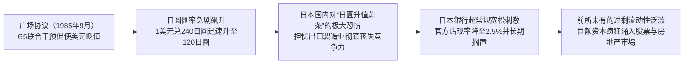

协议签署后的匯率变动幅度远超各国最初的预估。日圓对美元匯率在短短一年时间内由协议前的 **1 美元兑 240 日圓快速升值至 150 日圓** ，至 1987 年底甚至突破 120 日圓关口。面对本币价值在极短时间内直接翻倍的巨大冲击，日本社会陷入了对于出口导向型工业体系将彻底瓦解的集体恐慌（日圓升值萧条，*Endaka Fukyo*）。

为了对冲强日圓对出口企業的重创并刺激内需以实现產業结构转型，日本政府与央行推出了极具侵略性的刺激政策。日本銀行自 1986 年 1 月至 1987 年 2 月连续五次下调官方基准贴现率，将其强力压低至当时二战以来的歷史最低水准——**2.50%** 。

### 央行超常規寬鬆的滯後與前所未有的過剩流動性
依据现代宏观經濟学逻辑，当 1987 年日本經濟已经充分享受到原油与大宗进口原材料价格暴跌（贸易条件改善）红利、国内私人部门需求开始强劲反弹之际，日本銀行本应迅速收紧貨幣政策。然而，以下三重结构性制约使日本央行的貨幣转向被致命地延误：

1. **黑色星期一（1987年10月）的全球恐慌**:
 纽约股市单日暴跌 22.6%，为避免引发全球系统性流动性危机，在美方协调呼吁下，日本央行被迫推迟了加息计划。
2. **卢浮宫协议（1987年2月）的匯率维稳包袱**:
 为遏制美元无序崩跌，日本央行在外汇市場持续执行“抛售日圓、买入美元”的操作，源源不断地向銀行体系注水。
3. **物价指数表象的严重误导**:
 由于强劲日圓大幅压低了进口消費品与工业原料成本，当时的消費者物价指数（CPI）与批发物价指数呈现出令人震惊的超稳定状态。日本央行管理层拘泥于教条，认为“只要 CPI 没有显著上涨，就完全不存在緊縮貨幣的政策正当性”，对股票与房地产市場的資產价格极度膨胀视若无睹。

超低利息环境在 2.50% 的歷史冰点上被整整维系了 27 个月之久。泛滥成灾的投机流动性无处可去，最终完全冲垮了实体資產的估值防线。

### 「土地神話」與股票市場的狂亂風暴
天量过剩资金几乎在同一时间扑向了东京證券交易所与房地产市場。

#### 股市的非理性繁荣
日经平均指数从 1985 年的 13,000 点一路狂飙，最终于 **1989 年 12 月 29 日的大纳会收盘创下 38,915.87 点的歷史最高纪录** （盘中最高达 38,957.44 点）。日本股市总市值突破 600 万亿日圓，独占全球所有股票总市值的 40% 以上。

1987 年挂牌上市的日本电信电话（NTT），发行价从 119.7 万日圓在几周内狂飙至 318 万日圓，引发全民炒股热潮。当时日本上市公司市盈率（P/E）普遍飙升至 60 倍至 80 倍，彻底偏离了國際公认的 15 倍至 20 倍安全区间。“日本企業拥有天量隐性不动产增值，欧美的估值框架不适用于日本”等荒诞论调甚嚣尘上。

#### 房地产狂热与“土地神话”的极度膨胀
相比股市，房地产市場的狂乱更为癫狂。基于日本国土狭小且經濟机能极度向东京一极集中的地理国情，全社会形成了坚不可摧的 “ **土地神话”（土地价格永远只会单边上涨）** 。

- **从东京核心区向全国疯狂辐射**:
 东京都核心区域的商业用地在 1986 年至 1988 年间每年以数十个百分点的速度暴涨，短短三年内翻了数倍，随后迅速传导至住宅地块及大阪、名古屋等区域中心城市。
- “ **一个东京都买下整个美国”的狂言**:
 在泡沫巅峰期，测算显示仅东京都千代田区（皇居及中央政府所在地）的地价，就足以买下整个加拿大全国的不动产；而东京皇居一处的估值更是超越了整个美国加利福尼亚州的所有土地价值总和。整个日本列岛的地价纸面财富相当于当时美国全境的四倍。
- **暴力拆迁与地下土地买卖（地上げ屋）**:
 在暴利驱动下，黑社会与职业拆迁集团（*Jiageya*）肆意横行，采取断水断电、恐吓纵火等非法手段暴力逼迁市中心原住民，将零散地块整合打包高价倒手转卖给开发商。

### 機制透視：信用槓桿乘數、「財技」狂潮與抵押擔保螺旋
这一空前泡沫的底层动力机制，在于銀行、企業与資產价格三者相互绑架所形成的失控信用正反馈闭环：

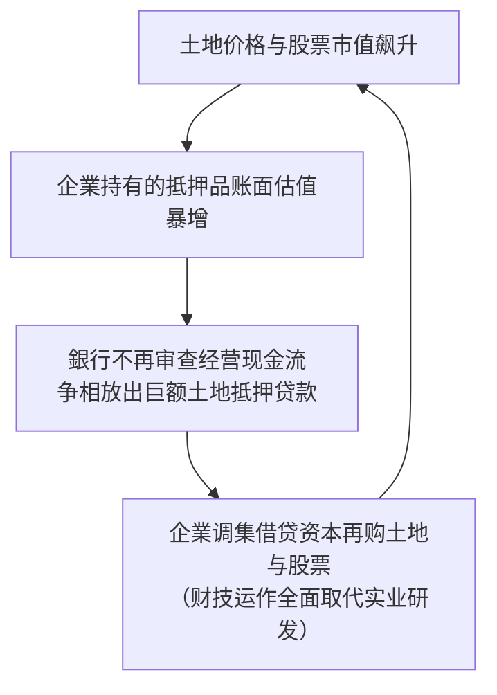

1. **优质大企業脱离銀行直接融资**:
 随着 1980 年代金融自由化推进，实力雄厚的製造业龙头企業纷纷绕开传统銀行贷款，利用极低成本的可转债和认股权证在國際资本市場直接发债融资。传统大銀行失去了老客户，出于考核压力转而将信贷资源无限敞开给房地产中介、建筑公司及非銀行金融机构（如住房金融专门公司 *Jusen*）。
2. **抵押担保价值的自我强化螺旋（反身性闭环）**:
 銀行彻底放弃了依据借款人未来实际营运现金流发放贷款的审慎原则，完全以“土地当前的市价”为基准发放高额贷款。“地价上涨导致抵押物升值，抵押物升值解锁更大信贷额度，信贷资金再次用于抢购土地，进一步推高地价”，杠杆呈几何级数裂变。
3. “ **财技（Zaiteku）”对实业精神的彻底侵蚀**:
 製造业上市公司纷纷设立特定金钱信托，将在市場上低息融来的资金全数投入股市与期房炒作中。数十家知名企業的投資收益远超主营业务营业利润，踏实钻研製造业工艺被视为“愚蠢低效”，投机之风彻底蛀空了实体產業的根基。

---

## 第2章: 泡沫破裂與金融體系崩潰連鎖（1990〜1998）

### 三重野總裁強硬刺破泡沫與大藏省「總量管制」衝擊
面对資產泡沫导致的严重贫富分化（普通上班族哪怕倾其一生积蓄也无法在东京市区购置一套普通住宅），社会舆论的不满彻底引爆，迫使监管部门踩下了极其急躁而残暴的刹车。

1989 年 12 月就任日本銀行总裁的 **三重野康** ，以铁腕“泡沫杀手”自居，上任后迅速开启了狂风暴雨式的连续加息：
- 官方基准利率在极其短暂的时间内被一路暴力推升至 **6.00%** （1990 年 8 月），一年多时间内净加息幅度达 350 个基点。

紧接着，大藏省銀行局于 1990 年 3 月 27 日正式祭出了具有致命杀伤力的行政通令——“ **不动产融资总量管制”（*Soryo Kisei*）**：
- 强制规定商业銀行发放给房地产行业的贷款增长率，必须严格压低在銀行总贷款增长率之下；
- 严查銀行向不动產業、建筑业及非银机构的全部信贷流向。

这一由貨幣政策极速緊縮与行政信贷断流构成的“连环双杀”，瞬间抽干了市場的全部流动性血液。投机者与房地产商因资金链彻底断裂而被迫进入抛售資產抵债的惨烈恐慌中。

### 資產價格全面暴跌：股價腰斬與抵押品深度縮水
缺乏流动性支撑的空中楼阁应声崩塌，日本資產价格迎来了歷史罕见的大崩盘：

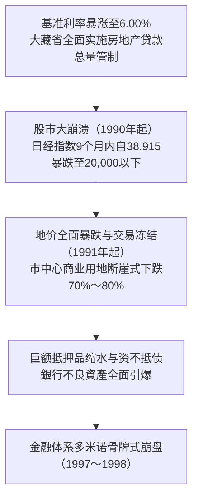

#### 股票市場的断崖暴跌
1990 年开年首个交易日，股市即掉头向下。
- 1990 年 4 月，日经指数跌破 30,000 点；至同年 10 月，便已无情 **击穿 20,000 点大关** 。仅仅 9 个月时间，股市总市值蒸发近半。
- 跌势在随后的数年间始终未能止步，1992 年 8 月下探至 14,000 点，较歷史高点蒸发超过 300 万亿日圓的巨额财富。

#### 房地产冻结与“抵押品缩水（资不抵债）”
地价于 1991 年前后步入雪崩通道，市場陷入深度流动性冻结。
- 东京核心商圈地价从巅峰暴跌 **70% 至 80%** ，住宅地价腰斩。
- 銀行原本按照市价七八成发放的土地抵押贷款，其抵押品价值已远远不及贷款本息余额（抵押品价值腰斩成为负資產）。企業与个人集体丧失偿债能力，沦为技术性资不抵债状态。

### 不良債權暗黑期與金融機構破產多米諾骨牌
資產价格崩盘使得日本銀行业背负了天文数字般的 **不良债权（Non-Performing Loans: NPL）** 。坏账无法收回，銀行资本金遭受巨额侵蚀，信贷扩张机能彻底坏死。

然而，大藏省与日本政界长期沉溺于“地价早晚会反弹”、“依托銀行每年正常的利息营收可以逐步在账面上消化坏账”的严重侥幸心理中，将剧烈化脓的坏账处置一拖再拖达数年之久。这种掩耳盗铃的拖延政策，最终将局部坏账酿成了全系统性的金融灾难。

#### 1. 住专（住房金融专门公司）危机（1995年〜1996年）
金融崩溃的第一道防线在非銀行系统的“住专”破裂。7 家住专公司在泡沫期向房产投机公司违规发放了数以万亿计的贷款，至 1995 年已完全资不抵债。
- 1996 年，村山富市及桥本龙太郎内阁决定动用 **6,850 亿日圓财政公款（国民税金）** 救助住专破产清算。
- 该举措引发了日本全社会的强烈愤慨与国会激烈对抗。被汹涌民意震慑的政客与官僚自此对“动用公款注资救助金融机构”产生了极度恐惧，致使后续真正需要國家公权力救市时完全错失良机。

#### 2. 1997年〜1998年：百年老店轰然倒下的金融海啸
1997 年秋季，破产风暴终于正面撕碎了日本顶级主流金融机构的防线：

| 破产或自愿清算时间 | 爆雷金融机构 | 性质地位与规模 | 歷史冲击与深远意义 |
| :--- | :--- | :--- | :--- |
| **1997年11月3日** | **三洋證券** | 准大型證券公司 | 申请破产重整。 **在銀行间同业拆借无担保市場上发生了史上首次违约** ，导致金融机构间互信彻底归零，资金借贷市場瞬间瘫痪。 |
| **1997年11月17日** | **北海道拓殖銀行（拓银）** | 全国10大都市銀行之一 | **战后首家倒闭的大型都市銀行** 。受房地产烂账重创导致同业融资全面断绝，北海道經濟支柱銀行被迫倒闭破产。 |
| **1997年11月24日** | **山一證券** | 拥有百年歷史的“四大券商”之一 | **战后最大规模的企業破产（負債总额约3万亿日圓）** 。隐匿巨额亏损的“飞单（*tobashi*）”违规行为曝光被迫自主停业。总裁野泽正平在电视直播中嚎啕痛哭：*“员工没有任何错！”* |
| **1998年10月** | **日本长期信用銀行（长银）** | 重化工业核心资金支柱 | 巨额不良贷款导致股价暴跌，被依据新金融再生法实行 **临时国有化** ，后低价贱卖给美国外资基金（重组为新生銀行）。 |
| **1998年12月** | **日本债券信用銀行（日债银）** | 长期信用三行之一 | 严重资不抵债被 **临时国有化** ，后被软银等财团联合接盘重组为青空銀行。 |

大型都市銀行与四大券商在同一个月内接连倒闭，在全球金融市場引发了史无前例的“日本恐慌”。國際资本市場上对所有日本銀行强制征收极高的惩罚性溢价——“ **日本溢价（Japan Premium）** ” ，日本銀行体系在海外几乎无法借入任何外币，信贷冻结全面蔓延。

### 「護送船隊方式」的徹底終結與嚴酷的「惜貸抽貸」
这场空前危机的爆发，标志着大藏省主导的“ **护送船队方式（*Goso Sendan Hoshiki*）** ”彻底破产。该机制原本指政府以最弱小的銀行为标准制定极度受保护的利率与业务管制，任何个别金融机构若陷入危机，均由政府居中协调大型强行吸收并购，暗箱化解。

然而，泡沫破裂后的总坏账规模已膨胀至 **数十万亿乃至逾百万亿日圓** 的惊人量级，哪怕是最强大的三菱、三井、住友等超级大行自己也在亏损濒死线上挣扎，根本没有余力去救助任何同业。
- 为了达到國際清算銀行（BIS）规定的 8% 资本充足率硬指標，日本各銀行开始极其冷酷地从正常盈利的实体企業中强制提前收回贷款（ **抽贷** ），并对所有中小企業的新增融资申请一概回绝（ **惜贷** ）。

这种信贷极度枯竭将大量本可健康运转的实体製造与商业企業强行拖入连环破产深渊，实体經濟的投資与消費机能遭到毁灭性打击，直接将日本推进了长达三十年的通货緊縮梦魇之中。

## 第3章: 通貨緊縮螺旋的深層機制與資產負債表衰退

### 辜朝明「資產負債表衰退」理論徹底剖析
泡沫破裂后的日本經濟，为何没有遵循标准宏观經濟学教条（降息即可刺激企業与家庭借贷投資消費）运行，反而陷入了长达数十年的死寂？

对于这一世界级經濟谜题，野村综合研究所首席經濟学家辜朝明（Richard Koo）提出了极具开拓性与解释力的理论框架——“ **資產負債表衰退（Balance Sheet Recession）** ” 。

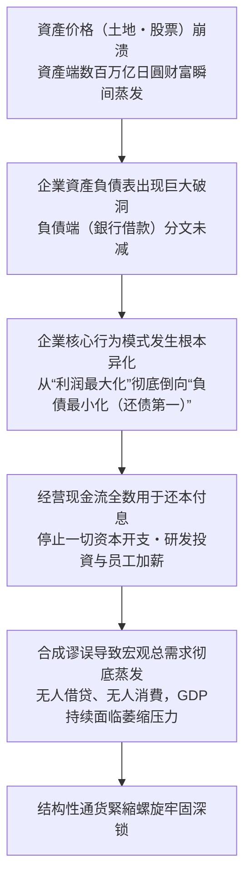

#### 1. 企業的行为目标异化: 从“利润最大化”倒向“負債最小化”
传统經濟学坚信，微观企業始终以追求 “ **利润最大化** ” 为天职。只要基准利率下调，资本回报率门槛降低，企業便会顺理成章地向銀行举债，购置机器厂房，招募员工，扩大再生产。

然而，泡沫破裂后的日本企業遭遇了绝无仅有的残酷现实：
- 企業在泡沫期高位接盘的土地与股票，市值暴跌了 70% 至 80%，資產端严重缩水；
- 但用于收购这些資產的銀行贷款，作为硬性債務分文未减，依然以 100% 的面值趴在負債表上；
- 整个日本企業界承受了总额高达数百万亿日圓的 “ **資產負債表净资不抵债黑洞** ” 。

在面临破产法庭清算的生死关头，日本企業家作出了理性的秘密共识：哪怕主营业务运转良好、现金流充盈，企業也绝对不能进行任何新的设备投資或给员工涨薪。 **企業赚取的每一分钱营业现金流，都必须毫无保留地用于偿还銀行旧债（負債最小化）** ，以尽快填平資產負債表上的巨大窟窿。

#### 2. 合成谬误（Fallacy of Composition）
对单一企業而言，克勤克俭、优先偿债、修复破损的資產負債表，是无懈可击的审慎经营典范。

然而， **当一个國家成千上万家企業同时停止借款投資，并一齐将收入用于偿还債務时，宏观經濟便跌入了万劫不复的深渊** 。这就是著名的 “ **合成谬误** ” ：
- 正常的經濟循环有赖于家庭将储蓄存入銀行，銀行再将储蓄借给企業转化为资本投資，资金循环流动，支撑 GDP 扩张；
- 但在資產負債表衰退期，企業不仅不借钱，反而加入储蓄者大军狂暴还债，导致天量资金直接退出实体經濟流通，形成了无法填补的“有效需求断崖”；
- 此时貨幣政策彻底失灵：即便央行将借贷利率砸到零，对于一心只想消除債務的企業而言，借钱依然是负罪感。这就是典型的“流动性陷阱”，犹如“推一根软绳”，毫无着力点。

#### 3. 扩张性财政政策的不可或缺性
辜朝明严密论证，在資產負債表衰退期间，唯一能够防止經濟全面崩盘的救命稻草只有 **政府财政扩张** 。当私人部门集体只存不贷时，政府必须充当“最终借款人”，通过大规模发行国债将沉淀在銀行里的过剩储蓄吸纳，并以公共工程和公共服务的形式直接注入市場，填补总需求缺口。

然而，大藏省与财务省长期受传统财政平衡教条支配，屡次在經濟刚有微弱起色时便惊慌失措地推行“财政整顿”，加税削减支出（以 1997 年消費税提升至 5% 最为致命），数次亲手掐死了經濟自然愈合的幼苗。

### 物價走低與工資受抑的惡性循環
长期的总需求匮乏，将日本經濟牢牢锁死在自我强化的 “ **通货緊縮螺旋（Deflationary Spiral）** ” 之中：

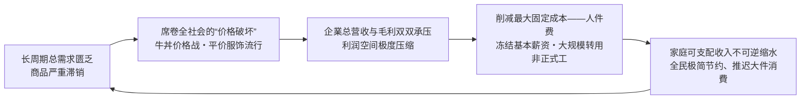

1. “ **价格破坏”狂潮席卷列岛**:
 1990 年代中后期，麦当劳推出 65 日圓“平日半价汉堡”，吉野家、松屋、食其家点燃惨烈的“280 日圓牛肉饭战争”，优衣库凭借极高性价比的平价摇粒绒风靡全国。廉价生活成为全社会的普遍生存法则。
2. **降价促销的“回旋镖效应** ”:
 虽然平民在短期内享受到了降价的好处，但终端产品价格走低直接摧毁了企業的利润总额。为了在价格战中活下去，企業唯有拿最大的固定开支开刀——大幅削减人工成本。
3. **工资下跌反噬消費市場**:
 工薪阶层收入受抑，进一步緊縮开支，逼迫零售业展开更惨烈的下一轮折价促销。这种“物价下跌 → 利润缩水 → 工资停滞 → 消費不振 → 物价进一步下挫”的下行螺旋，持续侵蚀了整整一代人的生机。

### 通縮心智的徹底固化與流動性陷阱
三十年的物价冰冻，使得一种极其独特的心理防线在全日本生根发芽——“ **通縮心智（Deflationary Mindset）** ” ：

- “ **持有现金才是至高真理** ”:
 在通膨时代，持有现金意味着购买力被悄然稀释；但在通縮时代， **现金放在銀行甚至家中的保险柜里，其实际购买力每年都在“被动升值** ” 。
- **天然的延迟消費诱因**:
 全社会形成了坚定的预期：“无论买车、买房还是买电脑，只要耐心等待一年，价格一定会比现在更便宜”。耐用品消費遭遇断崖式冰封。
- **凯恩斯流动性陷阱的极限上演**:
 日本銀行不论印出多么庞大天文数字的基础貨幣，既无法转化为商业銀行对实体的信贷放量，亦无法激发家庭的借贷消費欲望。资金只能孤寂地沉淀在央行超额准备金账户与企業沉睡的内部留保之中。

---

## 第4章: 非正規僱傭激增與就業冰河期世代的時代悲歌

### 1990 年代後期至 2000 年代勞動力市場結構性鬆綁
面对資產負債表修补与全球化低成本竞争的双重夹击，日本企業迫切希望将原本刚性的人工成本全面转变为可以随时切除的“可变浮动成本”。在经团联等财界组织的强力推动下，日本政府推行了一系列 **劳动力市場自由化松绑改革** ：

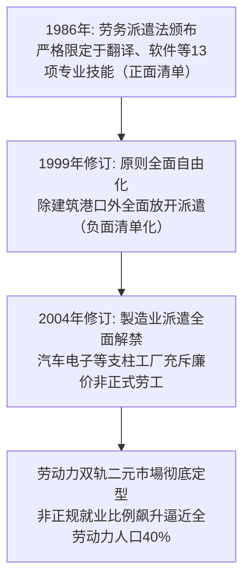

1. **1986 年《劳动者派遣法》初生**:
 起初本着保护正式工就业安全之原则，仅允许在涉外翻译、软件设计等专业度极高的极少数岗位引入派遣劳工（正面清单制）。
2. **1999 年关键性修订（负面清单化）**:
 小渊惠三内阁大幅修改法案，除港口、建筑、保安及医疗行业外，所有非製造业岗位的派遣用工全面合法化，派遣业迎来爆发式增长。
3. **2004 年製造业派遣全面解禁**:
 在小泉纯一郎内阁的强推下，日本工业製造流水线正式敞开怀抱吸纳派遣劳工。企業在繁荣期招募大批临时工人，一旦海外订单稍有风吹草动便可零成本批量解约（2008 年雷曼危机期间臭名昭著的“派遣村”与“弃用派遣工 *Haken-giri*”由此发端）。

### 就業冰河期世代（迷惘一代）遭受的毀滅性衝擊
在这一波企業降本增效的狂潮中，正面承受最残酷代价的，是 1993 年至 2005 年间走出校门的“ **就业冰河期世代（*Shushoku Hyogaki Sedai*） **”，亦被称为“** 迷惘的一代（Lost Generation）** ”。

- **应届生统一招聘机制的异化成灾**:
 日本传统的新毕业生统一招募制度在繁荣期是保障年轻人充分就业的温床，但在衰退期却演变成了冷酷的绞肉机。企業一刀切缩减正式工名额，大学毕业生求职倍率跌破 1.0，无数名校才俊投递数百份简历却一无所获。
- **终生职业生涯的不可逆断层**:
 由于日本企業文化极度轻视往届生，形成了“脱离正轨者终生不得录用”的严苛偏见。未能一毕业就进入企業成为“正社员”的年轻人，被永久驱逐出晋升轨道，只能辗转于便利店打工、电话客服与短期派遣之间（沦为飞特族 *freeter*）。
- **数千万至上亿日圓的终身收入鸿沟**:
 正式员工与非正规就业者之间的终生累计收入差距高达 **5000 万至 1 亿日圓以上** 。没有退休金，缺乏工伤医保兜底，这批青年直至迈入 40 岁、50 岁，依然挣扎在贫困线下。

### 正規與非正規的雙軌勞動力市場與極度削減成本之弊
为何企業宁可牺牲一整代年轻人，也绝不调整老员工的薪资？根源在于日本司法审判确立的 “ **解雇权滥用保护法理** ” 。

在日本判例法下，企業解雇一名正式员工必须严苛证明“人员精简的绝对必要性、穷尽降薪及提前退休等自救措施、裁员人选的完全公允性、与工会沟通程序的完备性”。解雇中高龄正社员在法律与社会层面上几乎寸步难行，逼迫企業唯有采用 “ **对年轻新生代关死求职大门、全面替换为临时工** ” 的畸形手段来实现成本压缩。

| 雇佣类型 | 工作稳定性 | 薪资晋升曲线 | 技能积累与在职培训 (OJT) | 經濟周期风险承担者 |
| :--- | :--- | :--- | :--- | :--- |
| **正规员工 (正社员)** | 受法律铁律保护直至法定退休 | 年功序列制（中高龄薪酬优渥） | 企業耗费巨资进行轮岗培养 | 企業内部消化吸收周期波动 |
| **非正规员工 (派遣/兼职)** | 合同按月/季度续签随时解除 | 终生领受微薄计时时薪 | 仅从事可替代机械简单重复劳动 | **劳动者个人全面肉身硬抗宏观經濟风险** |

企業虽然依靠削减人件费换取了短期财报利润，却亲手瓦解了数十年来日本引以为傲的技术传承链条，导致全要素生产率与创新能力双双枯竭。

### 少子化與未婚率飆升的歷史性致命加速
就业冰河期世代悲剧给日本文明带来的最无法挽回的重创，是彻底掐断了國家的人口生机。

冰河期世代的主力恰恰是日本的 “ **第二次婴儿潮一代（1971年〜1974年出生）** ” 。按照自然的人口繁衍规律，当这批庞大人口在 1990 年代末至 2000 年代初步入适婚生育年龄时，日本本应迎来蓬勃的 “ **第三次婴儿潮** ” ，从而构筑稳健的人口梯队以支撑老龄化社会。

然而，没有体面收入、看不到未来的青年人根本不敢涉足婚姻与育儿。
- 30 岁出头的男性非正式工有配偶率甚至不足正式工的三分之一；
- 终身未婚率呈指数级飙升，新生儿出生人口出现不可逆的断崖暴跌。

日本政府当年对冰河期青年“自生自灭、个人责任”的冷漠放任，最终让整个國家付出了惨痛的文明代价：第三次婴儿潮永远化为了泡影，日本在 2008 年无可挽回地跨过了人口峰值，滑入了深度超老龄化与人口缩减的万劫不复之渊。

---

## 第5章: 產業競爭力的全面衰退與「數位化敗局」的病理

### 半導體與傳統消費電子霸權的毀滅性崩塌
在 1980 年代，“日之丸半导体”曾是令五角大楼夜不能寐的工业巨神。日本独揽 **全球半导体市場份额的 50% 以上，在动态随机存取内存（DRAM）领域更是垄断了全球逾 80% 的产出** 。NEC、东芝、日立、富士通、三菱五大巨头长期霸榜全球科技十强。

然而在随后的短短二十年间，这整座辉煌的產業金字塔遭遇了彻底的降维打击与雪崩解体。

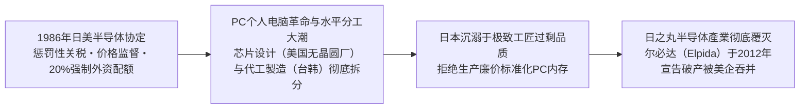

1. **地缘政治围剿：《日美半导体协定》（1986年）**:
 美国启动 301 条款逼迫日本签署不平等协定，强制要求外国芯片在日本本土市占率必须达 20% 以上，并设立价格监管机制剥夺了日本企業的自主定价权，扼杀了其技术反哺能力。
2. **大型机向 PC 个人电脑的技术范式转移**:
 日本芯片过去服务于能连续稳定运行 25 年的“大型主机计算机”，追求极致的耐久与零瑕疵。但 1990 年代引爆全球的是只需要 5 年使用寿命但价格极度低廉的个人电脑。正当日本工程师傲慢地嘲笑 PC 芯片品质粗糙之际，韩国三星与台积电（TSMC）果断以敏捷的资本开支，大规模量产高性价比标准化芯片，彻底将日本挤出了全球供应链。
3. **抱团取暖的悲剧：尔必达的陨落**:
 日立与 NEC 剥离内存业务拼凑出的國家队“尔必达”，在超强日圓与技术脱节的夹击下，于 2012 年申请破产保护，最终被美光科技（Micron）全盘吞并。至此，曾经傲视寰宇的日本存储芯片產業全军覆没。

### 為何日本全面錯失網際網路革命、現代軟體與 GAFAM 平台時代
在半导体之外，日本在互联网软件、移动操作系统、云计算及平台經濟等所有高附加值赛道上，遭遇了全方位的惨烈败北。这一过程被日本学界沉痛地定性为“ **数字化败局（*Dejitaru Haisen*）** ”。

#### 1. “协调集成（*Suriawase*）”在“模块化水平分工”面前的失效
东京大学藤本隆宏教授精辟剖析了製造业的两种底层架构逻辑：
- **集成协调型架构（*Integral Architecture*）**: 如燃油汽车与超精密机床，需要各零部件在设计开发中极度精密的咬合沟通与长期沉淀的工匠默契。这是日本製造业无敌的绝对主场；
- **模块化架构（*Modular Architecture*）**: 如个人电脑、智能手机、互联网软件与云服务。各模块遵循全球开放标准接口，全球采购组装即可使用。

数字时代的底层逻辑完全是模块化与水平大分工。硅谷负责软件生态与系统架构（苹果、高通、英伟达），台积电负责专业代工製造，微软与谷歌掌握全球操作系统入口。依然抱着“从底层材料到组装一体化全包”的日本综合电机巨头，被全球敏捷生态碾压得毫无还手之力。

#### 2. 加拉帕戈斯化综合征：i-mode 的早熟与悲壮退场
1999 年 NTT Docomo 推出的 **i-mode** 是移动互联网的惊人先驱。在乔布斯发布初代 iPhone 许多年前，日本手机用户就已经在方寸屏幕上享受收发邮件、掌上炒股、移动支付（FeliCa / 手机钱包）等前卫服务。

然而，这极度的本土成功反倒酿成了毁灭性的“加拉帕戈斯效应”：
- 封闭的电信运营商垄断了產業链，本土市場丰厚利润使得各大厂商对國際标准化毫无野心；
- 2007 年苹果 iPhone 携开放统一的 App Store 席卷全球时，日本高管竟盲目嗤笑其“电池续航差、没有手机电视天线”。短短数年间，松下、NEC、东芝、富士通在智能机浪潮下被彻底扫地出门。

#### 3. 鄙视软件的“IT建筑包工头”层层转包体系
日本传统工业文明浸润着“硬件看得见摸得着才值钱，软件代码是随手赠送的附庸”的深层偏见。
- 绝大多数大型传统企業将核心 IT 系统的建设，全部推给外部传统系统集成商（SIer）；
- 软件外包行业全面复刻了建筑业的 “ **总承包商 → 二级包工头 → 三级转包 → 外包码农** ” 的“IT 建筑包工头（IT Zenekon）”模式。中介盘剥走绝大部分预算，底层程序员在低薪与内耗中备受摧残。硅谷那种以代码创造奇迹的敏捷极客文化，在日本的體制土壤中根本无法生根发芽。

### 1989 年與當下全球企業市值排行榜的殘酷對照
三十年產業大溃败的最直接印证，莫过于全球商业金字塔顶端格局的翻天覆地：

| 排名 | 1989 年（泡沫极盛巅峰） | 所属國家 | 2024 年（当下时代） | 所属國家 |
| :---: | :--- | :---: | :--- | :---: |
| **1** | **日本电信电话 (NTT)** | 🇯🇵 日本 | **微软 (Microsoft)** | 🇺🇸 美国 |
| **2** | **日本兴业銀行** | 🇯🇵 日本 | **苹果 (Apple)** | 🇺🇸 美国 |
| **3** | **住友銀行** | 🇯🇵 日本 | **英伟达 (NVIDIA)** | 🇺🇸 美国 |
| **4** | **富士銀行** | 🇯🇵 日本 | **谷歌母公司 Alphabet** | 🇺🇸 美国 |
| **5** | **第一劝业銀行** | 🇯🇵 日本 | **亚马逊 (Amazon)** | 🇺🇸 美国 |
| **6** | **三菱銀行** | 🇯🇵 日本 | **沙特阿美 (Saudi Aramco)** | 🇸🇦 沙特 |
| **7** | 埃克森石油 | 🇺🇸 美国 | **Meta (原 Facebook)** | 🇺🇸 美国 |
| **8** | **东京电力** | 🇯🇵 日本 | **伯克希尔・哈撒韦** | 🇺🇸 美国 |
| **9** | 皇家荷兰壳牌 | 🇬🇧/🇳🇱 英/荷 | **台积电 (TSMC)** | 🇹🇼 台湾 |
| **10** | **三井銀行** | 🇯🇵 日本 | **礼来制药 (Eli Lilly)** | 🇺🇸 美国 |
| **Top 50** | **日本企業高居 32 席** | 🇯🇵 64% | **日本企業仅剩 0 〜 1 席（仅丰田一家）** | 🇯🇵 0-2% |

1989 年，前 10 强中日本企業强占 8 席，世界前 50 大企業中日本占据近三分之二。而在当下，除了丰田汽车艰难守护一隅，日本企業几乎全军覆没。这份惨烈的榜单无声地宣告：沉醉于昔日工业荣光的日本，如何彻底缺席了定义二十一世纪的科技与信息资本主义浪潮。

## 第6章: 非傳統貨幣政策的試驗場：從零利率、量化寬鬆至異次元寬鬆

### 速水總裁任內的零利率政策與世界首創的量化寬鬆（QE）
在世界中央銀行发展史册上，日本銀行始终扮演着 “ **非传统貨幣政策极限试验的最前沿先驱** ” 。面对泡沫崩溃后史无前例的通縮与金融休克，日本央行踏入了传统教科书从未记载过的黑暗森林。

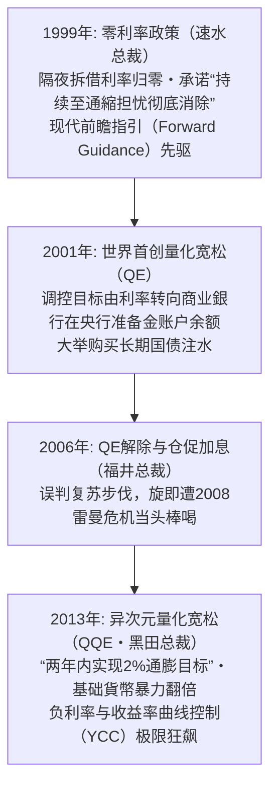

#### 1. 零利率政策（1999年2月）
在金融体系大动荡后，速水优总裁掌舵的日本銀行做出决定，将无担保隔夜拆借利率直接打低至“事实上趋近于零”的水平，诞生了 **现代金融史上首个“零利率政策** ” 。随后于 4 月宣布该政策将“持续直至通縮担忧彻底消除”，这成为了日后各国央行竞相效仿的 “ **前瞻指引（Forward Guidance）** ” 鼻祖。

#### 2. 全球首创的量化宽松（QE，2001年3月）
伴随 2000 年互联网泡沫破灭，在政策基准利率已然降无可降（面临零下限约束 Zero Lower Bound）的绝境下，日银于 2001 年 3 月破天荒开启了 **量化宽松政策（Quantitative Easing）** ：
- **操作标的的歷史性转移**: 将日常调控目标从“价格（拆借利率）”转向“数量（商业銀行在日银的活期存款准备金账户余额）”；
- **长期国债直接大举吞吐**: 确立了按月固定采购长期国债的机制，开动印钞机强行向銀行间市場注水。

### 福井總裁任內的量化寬鬆解除與「伊邪那美景氣」的脆弱假象
2003 年福井俊彦接任总裁后，受惠于美国房地产繁荣与中国經濟极速崛起的超级周期，在弱日圓配合下日本出口重现生机。2002 年 2 月至 2008 年 2 月长达 73 个月的經濟扩张创下战后纪录，被赋予了神话之名 “ **伊邪那美景气** ” 。

在 CPI 勉强转正的表象下，日银于 2006 年 3 月宣布解除量化宽松，同年 7 月废除零利率，并于 2007 年 2 月将拆借利率推高至 0.50%。

然而这一复苏从本质上是严重扭曲的：
- 跨国巨头利润固然刷新纪录，但在降本增效紧箍咒下， **工薪阶层的名目工资纹丝未动** ，“毫无获得感的景气”是民间最真实的叹息；
- 缺乏国内自主消費动能的支撑，极度依赖外需的畸形结构，使得日本經濟在随后的外部大风暴中脆弱如纸。

### 雷曼危機與民主黨執政時期的超強日圓噩夢（白川方明時代）
2008 年 9 月雷曼兄弟崩塌，全球大衰退呼啸而至。美日两国貨幣当局在危机应对上的果决度差距，将日本推入了二次深渊。

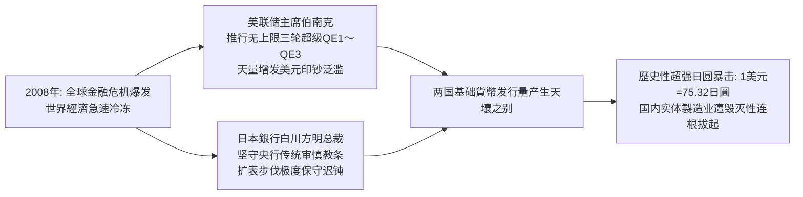

#### 美联储激进放水 vs. 日本央行刻舟求剑
美联储主席伯南克以直升机撒钱之势，瞬时将利率压至零并祭出 QE1、QE2、QE3，美联储資產負債表在短时间内膨胀了数倍。

反观白川方明掌舵的日本銀行，受深层央行审慎传统约束，认定非常规貨幣政策对结构性人口老龄化國家效果有限且后患无穷，在印钞扩表上畏首畏尾，扩表节奏极度迟缓。

#### 1 美元兑 75 日圓的灾难与国内產業彻底空心化
日美两国基础貨幣供应速度的天差地别，在外汇市場上掀起了毁灭性的日圓狂飙：
- 2011 年 10 月，日圓兑美元匯率创下二战后歷史新高——**1 美元兑 75.32 日圓** ；
- 叠加民主党政权经验不足的混乱施政与“3・11”东日本大地震的惨剧，日本工业界陷入了“六重苦”（超强日圓、沉重法人税、僵化劳动法制、环保制约、电力短缺及自贸协定滞后）；
- 索尼、松下、夏普等传统支柱企業单季亏损达数百亿，无数优秀本土工厂被彻底拆迁流向海外，日本国内製造业基础遭遇了无可逆转的致命空心化。

### 黑田東彥總裁的「異次元量化寬鬆（QQE）」與負利率狂瀾
面对產業界与公众对通縮与超强日圓的无尽绝望，2012 年底安倍晋三打着“无限制开动印钞机”的旗号重掌政权，并全面重组了日本央行领导层。

2013 年 4 月 4 日，新任总裁 **黑田东彦** 以彻底决绝的姿态，抛弃了所有传统渐进路线，正式打响了 “ **质化与量化异次元貨幣宽松（QQE）** ” 第一枪：

```
【黑田“2-2-2”火箭炮教条】
1. 锚定“2年”的时间窗口
2. 彻底达成“2%”的良性物价通膨目标
3. 将基础貨幣、长期国债持有额与 ETF 规模全面“翻倍”
```

日银以每年购入 50 万亿（后扩至 80 万亿）日圓长期国债的疯狂速度大举扩表，并亲自入场大规模购买股票 ETF。这记空前猛烈的政策震撼弹瞬间逆转了市場心理：日圓自 80 迅速贬至 120 时代，日经指数实现了报复性翻倍狂飙。

此后日银更步步逼入死角：2016 年 1 月宣布 “ **负利率政策（-0.1%）** ” ；同年 9 月引入 “ **收益率曲线控制（YCC）** ” ，强行将 10 年期国债收益率钉死在 0% 左右。至此，日本央行已实质上将整个日本国债市場完全國家化。

---

## 第7章: 安倍經濟學大檢閱：「三支箭」帶來了什麼，又遺留了什麼

### 「三支箭」的巨觀設計與初期的劇烈成效
2012 年底问世的 “ **安倍經濟学（Abenomics）** ” ，其核心逻辑由著名的“三支箭”构成：

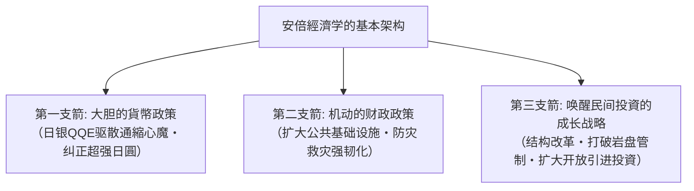

#### 初期的高光时刻（2013年〜2015年）
在政策强刺激下，深陷泥潭的日本經濟确实出现了一波立竿见影的气色扭转：
- **资本市場大狂欢**: 日经指数从民主党末期的 8,000 点一路冲破 20,000 点大关；
- **超强日圓被成功扭转**: 巨亏的出口企業纷纷迎来汇兑收益，丰田等大型财阀利润井喷；
- **就业数据大幅改善**: 全国有效求人倍率全线破 1，失业率压低至 2.2% 左右的完全就业极限，数百万女性与高龄退休人员重回工作岗位；
- **访日旅游业迎来黄金爆发**: 借由大幅放宽签证与匯率暴跌，访日外国游客从 2012 年的 836 万人次，暴增至 2019 年的歷史巅峰 **3,188 万人次** 。

### 第三支箭的嚴重受阻與堅如磐石的既得利益壁壘
然而，从宏观經濟学学术审视，安倍經濟学未能完成其核心战略闭环：最根本的 “ **第三支箭（成长战略）”彻底流产** 。

- **岩盘管制的牢不可破**:
 涉及日本社会利益深水区的关键领域——如农业协同组合（农协）利益链、封闭保守的医疗财团、以及束缚劳动力流动的严苛正式工解雇法规，均在自民党传统票仓议员的誓死抵制下浅尝辄止；
- **潜在增长率持续低迷**:
 衡量國家内在真实經濟实力的潜在增长率，在整个安倍执政期依然冰冷地徘徊在 **年均 0.5% 左右** 的超低空水准，未能激活核心造血功能；
- **新兴科技发动机的缺位**:
 借由大印钞与弱日圓买来的宝贵喘息窗口，并没有被转化为孵化本土科技独角兽或人工智能核心資產的资本，反而进一步推迟了传统企業自我革命的紧迫感。

### 兩次調高消費稅對內需消費造成的致命冰凍效應
安倍經濟学最荒谬的宏观矛盾，莫过于在强力推行再通膨政策的同时，盲目屈从于财政平衡教条，推行了 **两次摧毁内需的消費税上调** ：

```
【消費税加税的自杀式轨迹】
・2014年4月: 税率由 5% 提高至 8%（单次暴增3个百分点）
 -> 导致原本刚有回暖迹象的家庭实际消費瞬间断崖式冰冻，
 民间实际消費支出多年无法恢复元气，彻底掐死内需主导复苏苗头。
・2019年10月: 税率由 8% 进一步提升至 10%（再增2个百分点）
 -> 再次给脆弱的国内市場当头一棒，将經濟直接推进负增长泥潭，
 并与随后爆发的世纪疫情形成惨烈共振。
```

央行一边把油门踩到底拼命放水，财政部一边猛拉紧急手刹抽税压抑需求，这种精神分裂式的宏观政策让貨幣刺激的成效被抵消大半。

### 央行爆買國債與 ETF 導致的市場機能壞死與財政紀律瓦解
超常规宽松一旦踏上不归路，其极其严重的系统性后遗症便开始反噬國家金融肌体：

1. **国债现货交易市場的灭绝**:
 日本銀行最高峰时买断了全日本 **50% 以上的全部存量长期国债** 。十年期国债经常出现连续多日全市場“零成交”的荒诞奇观，国债收益率的正常价格发现机制彻底脑死亡；
2. **央行化身资本市場的“巨鲸怪兽** ”:
 日银账面上累计持有的股票 ETF 市值突破 50 至 70 万亿日圓， **实质上成为了东证 Prime 市場逾半数上市公司的第一大股东** ，彻底摧毁了正常股东积极主义的企業治理与优胜劣汰规律；
3. **财政纪律荡然无存与“财政赤字貨幣化”常态化**:
 “只要发行国债，央行就会照单全收保底”的恶劣预期，让日本政客彻底放弃了财政约束。國家公债规模狂飙突破 **1,200 万亿日圓（占 GDP 比重突破 260%）** ，位列主要工业国之首，将國家主权信用推向了不可承受之重的刀刃上。

---

## 第8章: 社會、心理與政治的深層異化：長期停滯塑造的國民意識

### 「草食化」、「極簡主義」與「低欲望/悟代」的社會心理剖析
长达三十年的实际收入停滞与未来黯淡预期，深刻地重塑了日本全社会的 “ **精神世界、欲望结构与人生哲学** ” ：

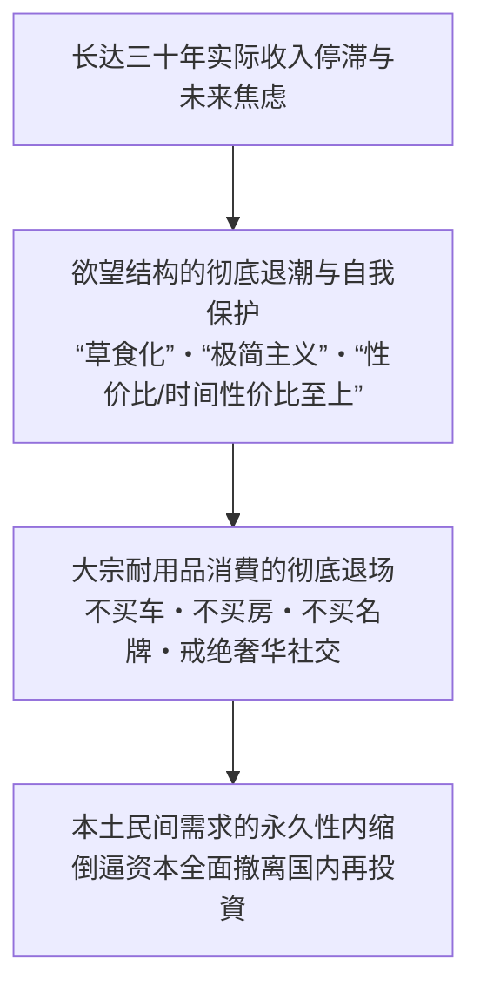

- **物欲退潮与“主动极简”的生活哲学**:
 泡沫时代的年轻人以驾驶进口宝马、手挎路易威登、流连高级俱乐部为荣；而在通縮岁月里成长起来的新一代（所谓的“悟代青年 *Satori Sedai*”），将拥有私家车视为愚蠢的經濟負債，身着优衣库基础款，在二手闲鱼 Mercari 上精打细算；
- “ **性价比（Cospa）”与“时间性价比（Taipa）”教条的盛行**:
 由于承担不起犯错的成本，大众在消費时极度依赖网络评分与缩略总结，一切冒险探索与非标准消費被全面压制；
- **草食化与恋爱/婚姻绝缘**:
 恋爱与组建家庭被年轻人判定为“极高风险的奢侈品”，食草男群体的泛滥与主动不婚浪潮席卷日本社会。

### 極度厭惡投資與不可動搖的安全資產（現金）信仰
三十年資產負債崩盘的惨烈创伤，在日本人心底烙下了不可磨灭的投資恐惧症。

据日银资金循环统计，在全日本家庭持有的 2,100 万亿日圓金融資產巨盘中， “ **现金与活期存款”占比竟常年高达 54% 左右** ，而欧美國家这一比例仅为 13%（美国）和 30%（欧洲）。
- 老一辈炒股亏掉半生家产的血泪教训代代相传，“股票等同于赌博”的偏见深入骨髓；
- 即便存款利率常年低至 0.001% 的侮辱性水准，大众依然坚信“保本才是唯一的安全之道”，导致日本民间完美错失了过去数十年全球高歌猛进的资本复利繁荣。

### 政治停擺與「銀髮民主主義」的分配困境
长期經濟停滞叠加严峻的人口老龄化，直接孕育了日本独特的政治怪胎——“ **银发民主主义（Silver Democracy）** ” ：

| 关键政策博弈点 | 65岁以上老年群体之利益诉求 | 年轻世代与未来国民之利益诉求 | 最终政治妥协下的现实政策产物 |
| :--- | :--- | :--- | :--- |
| **社会保障制度改革** | 誓死捍卫既有养老金・医疗护理高额福利（绝不接受削减待遇） | 极度呼吁降低从年轻在职者工资单中强行扣除的社保费率 | **老年人既得福利分文不动，年轻人工资社保扣除率年年被动攀升** |
| **國家财政优先排序** | 要求维持高龄看病一成自付额的超低门槛 | 要求國家倾斜资源于育儿津贴、免费高等教育与前沿科研创新 | **教育科研经费常年受压，社会保障支出鲸吞掉國家预算三分之一以上** |
| **投票政治动员力** | 投票率奇高（60%〜70%），且老年绝对人口数量占绝对压倒优势 | 投票率低迷（30%〜40%），且少子化导致年轻选民人数极度单薄 | **政客出于竞选算计极度讨好老人，全方位冷漠漠视青年人前途** |

当老年人依靠庞大选票成为政客不敢得罪的特权阶层时，任何需要牺牲当下以换取未来的深层制度改革都在选举机器前被彻底封杀。

### 國家自信的喪失與藉由「日本好厲害」自欺欺人的心理防衛
曾经站在“世界第一”神坛上的帝国缓缓沉沦，对全体国民的集体潜意识造成了无法抚平的尊严撕裂。

在 2010 年代之后的日本电视荧屏与图书市場上，出现了一种荒唐的集体自嗨现象：
- 电视各台铺天盖地充斥着“外国人惊叹日本有多牛！”、“让世界震惊的日本匠人！”等自吹自擂的综艺节目；
- 连锁书店的黄金畅销书架，被毫无根据贬低东亚邻国、宣扬日本血统优越的劣质地摊读物全面占领。

在社会心理学上，这种现象被精准定义为 “ **集体自恋性退行（Narcissistic Regression）** ” ：一个深感自身日益平庸脆弱的落魄群体，为了逃避國際地位下沉的残酷真相，不得不从对过往荣光的病态幻觉与虚妄赞美中寻求暂时的心理镇静剂。

---

## 第9章: 「失去的三十年」宣告落幕，抑或步入嶄新危局（2020年代至今）

### 疫情後全球通膨傳導與地緣供應鏈大重組
2020 年突如其来的新冠大流行与 2022 年俄乌战事的打响，如同一道惊雷，将冰封整整三十年的日本价格与利率体系彻底震碎。

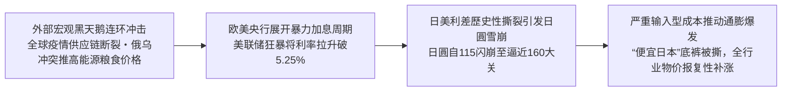

当欧美主要央行为了扑灭四十年未见的高通膨而以极其凶悍的节奏连续加息（美联储自 0% 暴拉至 5.25%〜5.50%）时，日本銀行受困于沉疴依然固守着超宽松姿态。

两国利差的歷史性脱节在外汇市場掀起了 “ **日圓自 115 狂泻至 160 歷史深渊** ” 的惨烈贬值风暴。日本赖以生存的海外石油、天然气、粮食和金属矿产价格在日圓计价下急剧飙升，三十年来奉行“涨价即自杀”的企業终于撑不住了，全日本迎来了一场席卷一切生活必需品的涨价狂潮。

### 歷史性日圓暴跌與時隔三十年的歷史性加薪潮
这场被贬斥为“恶性成本推动型”的通膨，在残酷压缩普通家庭生存空间的同时，却也奇迹般地打碎了日本全社会长达三十年不敢提价、不敢加薪的 “ **集体行动禁锢** ” ：

- “ **便宜日本（*Yasui Nippon*）”的刺痛与屈辱**:
 日圓的大崩溃让日本在國際视线中沦为了廉价的旅游集市。在二世谷滑雪场，海外游客哄抢着一碗 3,500 日圓的平民拉面；美国加州快餐店的打工时薪，竟然超越了东京名牌大学毕业进入顶尖企業的管培生起薪。强烈的“落后国”焦虑狠狠刺痛了自尊心；
- **春斗迎来 33 年未见的歷史性加薪潮（2023〜2024年）**:
 在极度恶化的少子化劳动力短缺与通膨倒逼下，日本劳动组合总联合会（连合）在春季劳资谈判中斩获了惊人成果： **2023 年加薪幅度达 3.58%，2024 年更是狂飙破 5%（录得 5.10%）** ，刷新了泡沫破灭三十余年来的歷史最高峰纪录。各大龙头企業纷纷宣布应届生起薪暴涨。

### 解除負利率：植田和男時代的貨幣正常化險途
在确认国内内生性通膨与加薪循环正在逐步确立后，2023 年 4 月执掌帅印的新总裁 **植田和男** ，果断启动了告别黑田超常规刺激的艰难歷史撤退。

2024 年 3 月 19 日，日本銀行正式宣布了一系列具有里程碑意义的决定：
1. **正式废止负利率（-0.1%）**: 将政策利率引导至 0.0%〜0.1% 范围，实现了 **时隔 17 年的首次加息** ；
2. **全面废除收益率曲线控制（YCC）**: 停止人为压制十年期国债利率上限；
3. **彻底终结股票 ETF 及 J-REIT 的新增买入**: 宣告了为期十余年大放水时代的正式落幕。

然而这一“走向正常利率时代”的航道布满了暗礁：
- **万亿国债利息核弹**: 国债收益率每提升 1 个百分点，背负着 1200 万亿日圓国债包袱的日本财政，其未来的年利息支出就将暴涨数万亿日圓，极度挤占国防与民生预算；
- **央行自身的财务危机**: 日银庞大資產包里的极低息国债将面临巨额浮亏，央行自身的資產負債表健康度面临极严峻的考验。

### 日經指數突破 40,000 點新高與庶民生活體感的巨大鴻溝
2024 年 2 月 22 日，日本金融市場迎来了载入史册的狂欢时刻：日经平均指数无情跨越了 1989 年 12 月 29 日高悬 34 年之久的 38,915.87 点歷史巅峰， **史上首次击穿 40,000 点大关** ，并一路挺进至 42,000 点之上。

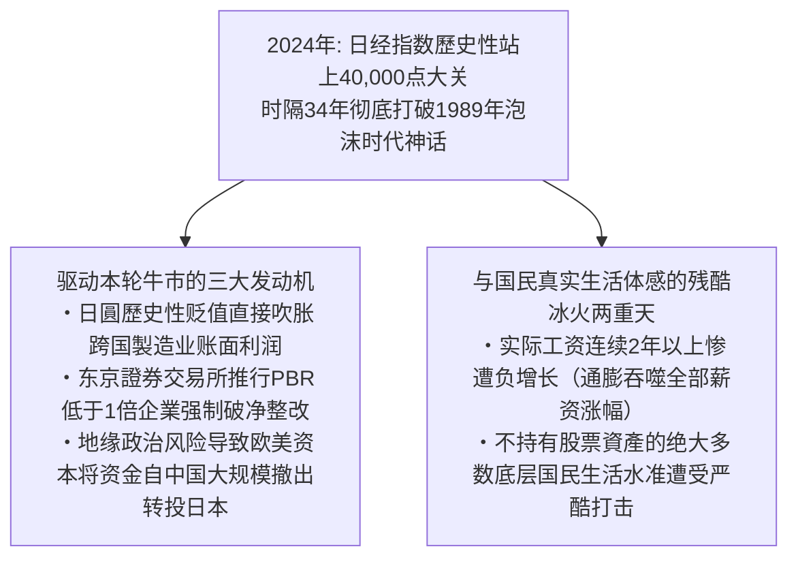

然而，如果盲目将这一数字狂欢当成“日本經濟已完全凤凰涅槃”，无疑是对真相的严重粉饰：

1. **推升本轮牛市的实质驱动力**:
 - 日圓极度贬值给以海外市場为主的汽车、综合商社带来的虚幻账面汇兑红利；
 - 东京證券交易所要求“破净股（PBR < 1.0）”强制改善公司治理，倒逼企業拿出大笔账面闲置现金进行回购和分红；
 - 國際机构投資者避开地缘摩擦风险，从亚洲邻国市場撤离出数千亿美元外资转而配置相对安定的日本蓝筹。
2. **实际工资连续负增长的民生苦境**:
 虽然名目工资终于开始上涨，但完全追赶不上生活必需品、水电气暖涨价的凶猛势头。 **日本厚生劳动省公布的“实际工资”数据，在 2022 年至 2024 年期间创造了连续 25 个月以上前年同月比萎缩的战后最长负增长纪录** 。对于不持有任何金融股票資產的广大普通民众而言，40,000 点的股市不过是资本豪门的盛宴，留给平民的只有菜篮子缩水的切肤之痛。

“失去的三十年”那幽灵般的資產通縮魔咒固然在瓦解，但日本推开的却可能是一扇通往“贫富急剧分化与生活成本危机”的残酷新大门。

---

## 結語: 日本經濟再生的歷史藥方——痛定思痛我們該汲取什麼

### 過去三十年「痛徹心扉的失敗」之本質
回顾整部人类近代經濟发展史，一个本已建立起傲视寰宇的工业帝国与富裕社会的經濟霸主，在未曾遭遇任何外部战争摧毁、未曾发生内乱崩盘的和平环境之下，竟能以如此缓慢而不可逆的姿态滑向相对实力的全面沦落，这是绝无仅有的悲剧范本。

通盘审视日本“失去的三十年”的深层成因，其本质可归纳为三大致命制度性败因：
1. **对阵痛改革的长期逃避与僵尸妥协**:
 长期隐瞒处置金融坏账，对濒临破产的无竞争力传统企業实行病态政府输血，人为阻断了市場最宝贵的优胜劣汰自我修复机制；
2. **极度忽视人的价值并肆意削减教育人力投入**:
 企業为求短期账面利润最大化，将整整一代年轻人打成毫无希望的非正式工，无情碾碎了國家的未来劳动力基石；
3. **沉溺于往日硬件製造成功的路径依赖**:
 盲目崇拜老旧的机械工匠体系，傲慢排斥由互联网、代码软件、全球模块化与开放平台主导的新商业文明。

### 邁向未來三十年的國家重建路線圖
日本若要真正挣脱三十年停滞的漫长阴霾，重铸可持续的繁荣文明，绝不能寄托于匯率侥幸或民粹式福利派发，而必须以刮骨疗毒的魄力重构國家机体。

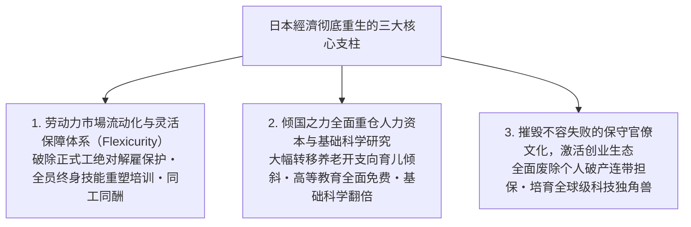

#### 1. 彻底打破二元劳动力结构，实现北欧式“灵活安全保障（Flexicurity）”
必须坚决改革僵化的正规解雇限制法规，引入合理的金钱补偿解雇制度，让被困在死气沉沉夕阳產業中的资本与人才得以顺畅流向新兴赛道。与此相配套，國家必须提供覆盖全生命周期的失业兜底保障与高额实用的再就业技能重塑（Reskilling）教育，实现“保护劳动者本身而非死保具体岗位”。

#### 2. 全面转向对“人”与科学教育的战略重仓
一个文明真正的财富绝非钢筋水泥，而是人民的智识与创造力。
- 必须拿出政治勇气，动刀调整向退休老人过度倾斜的社会保障开支结构，将战略资源坚决腾挪向婴幼儿托育、初高中及大学免费教育，以及國家前沿科学实验室的投入；
- 确立“对教育与年轻人的投入不是财政负担，而是关乎國家存亡之最高等级资本投資”的坚定理念。

#### 3. 根除“容不得失败”的文化毒瘤，激活创业生态
必须彻底荡涤弥漫在日本企業与官僚体系内部的“减分主义”与无过即功的官僚习气。在法律上全面取缔要求创业者以个人及家族不动产进行无限连带借贷担保的恶法，让创业者能够无数次试错、破产、复盘并再次出发。唯有源源不断诞生具有全球野心的本土科技独角兽，去创造性毁灭暮气沉沉的旧巨头，日本才能真正重拾其澎湃的生命力。

在付出了沉痛的三十年代价之后，日本再次站在了歷史抉择的宏大路口。痛定思痛，唯有彻底剥离自满与封闭，勇敢拥抱颠覆性的自我革新，这一曾经创造过战后經濟奇迹的伟大文明，方能在下一个三十年的汹涌浪潮中重登荣耀彼岸。
