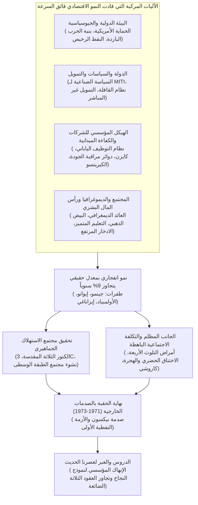
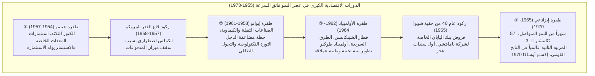
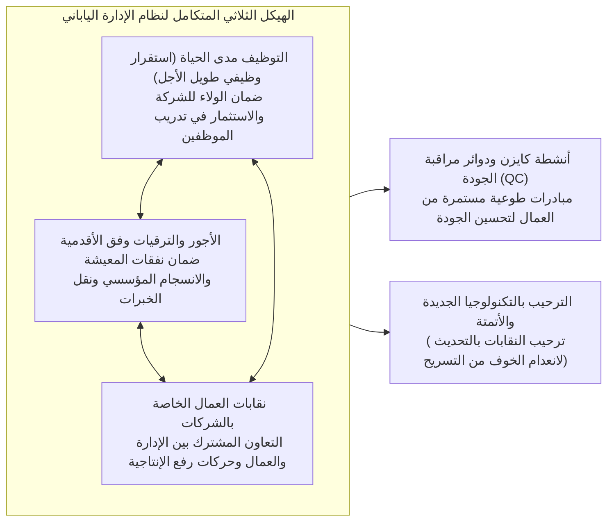
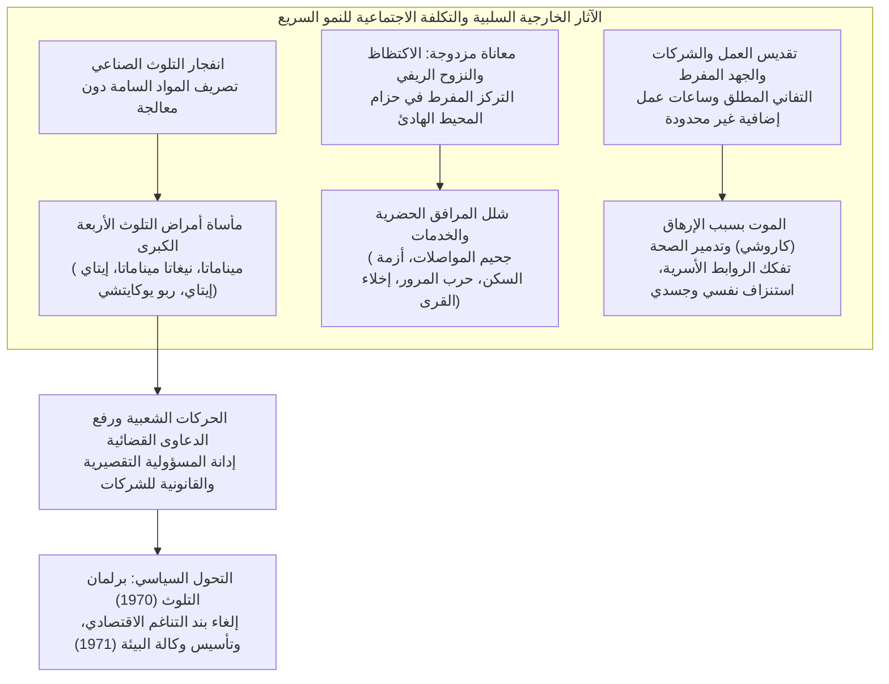

## مقدمة: «المعجزة الاقتصادية» الفريدة في التاريخ الإنساني وجوهرها العميق

في 15 أغسطس 1945، عندما وضعت الحرب العالمية الثانية أوزارها في مسرح المحيط الهادئ بإعلان الإمبراطورية اليابانية استسلامها غير المشروط، كان الأرخبيل الياباني قد تحول حرفياً إلى رماد وركام متفحم. فقد دمرت الغارات الجوية العنيفة لقوات الحلفاء نحو 40% من البنية التحتية والمساكن في المدن الكبرى، وتحول قرابة ربع الثروة القومية للبلاد (نحو 36% من إجمالي الأصول غير العسكرية) إلى هباء منثور. وخسرت اليابان كل مستعمراتها وأراضيها فيما وراء البحار، وتدفق أكثر من ستة ملايين عائد من الجنود والمدنيين إلى الداخل دون مأوى يؤويهم أو عمل يقتاتون منه. وكان السواد الأعظم من أبناء الشعب يرزحون تحت وطأة مجاعة مدقعة تعثرت معها حتى خطوط توزيع الحصص التموينية اليومية، مرتعدين من كابوس التضخم الجامح الذي عصف بكل مدخراتهم. وفي تلك الأيام، أجمع الصحفيون الأجانب وكبار مسؤولي القيادة العامة لقوات الحلفاء (GHQ) الذين زاروا اليابان على القول: «إن استعادة اليابان لمستوى اقتصادي مستقل يؤهلها لتكون دولة حديثة سيتطلب على أقل تقدير نصف قرن من الزمان».

إلا أن هذا التوقع سُحق وتبدد على نحو مذهل أذهل العالم بأسره.

فبعد عقد واحد فقط من نهاية الحرب، وتحديداً منذ عام 1955 وحتى اندلاع الصدمة النفطية الأولى في عام 1973، حقق الاقتصاد الياباني على مدار ما يقارب عشرين عاماً **متوسط معدل نمو سنوي حقيقي بلغ نحو 9.3%**، وهو ما يُعد وتيرة نمو اقتصادي فائقة السرعة نادراً ما شهد لها التاريخ البشري مثيلاً. وتضخم الناتج القومي الإجمالي (GNP) لليابان من نحو 8 تريليونات ين في عام 1955 إلى قرابة 112 تريليون ين في عام 1973، متضاعفاً بمقدار 14 ضعفاً. وفي عام 1968، تفوقت اليابان على ألمانيا الغربية — القلعة الصناعية لأوروبا الغربية والهدف المنشود لليابان منذ عصر تحديث مييجي — لتتربع رسمياً على عرش **ثاني أكبر قوة اقتصادية في المعسكر الرأسمالي العالمي** بعد الولايات المتحدة الأمريكية.



حظيت هذه القفزة الانفجارية بإعجاب دولي واسع النطاق، وسُميت بـ «**المعجزة الاقتصادية الشرقية (Economic Miracle)**». وانتشرت الأجهزة المنزلية الحديثة، المتمثلة في «الكنوز الثلاثة المقدسة» — التلفاز بالأبيض والأسود، والغسالة الكهربائية، والثلاجة الكهربائية — لتصل إلى كل بيت في أرجاء البلاد، ثم سرعان ما ارتقت الرغبات الاستهلاكية إلى اقتناء ثالوث الرفاهية «3C»: التلفاز الملون (Color TV)، ومكيف الهواء (Cooler)، والسيارة الشخصية (Car). وتبدلت أنماط معيشة المواطنين جذرياً من مجتمعات القرى الزراعية التقليدية إلى الأسر النووية الحضرية، مستمتعة بثراء غير مسبوق في عصر الإنتاج والوفورات والاستهلاك الضخم. ووُلد مجتمع «المائة مليون من الطبقة الوسطى» (Ichioku So-Churyu)، حيث كان نحو 90% من الشعب يعتبرون أنفسهم جزءاً من الطبقة الوسطى، وتأسس مجتمع صناعي يُعد من الأكثر أماناً واستقراراً وأعلى تعليماً في العالم.

ومع ذلك، لم تكن هذه «المعجزة» منحة هبطت من السماء أو وليدة صدفة تاريخية عابرة؛ بل كانت نتيجة تشابك محكم وتوافق عبقري بين تروس متعددة: القاعدة التكنولوجية والخبرات الإدارية البيروقراطية في الصناعات الثقيلة والكيماوية المتراكمة قبل الحرب وأثناءها؛ والتحولات الجيوسياسية الحادة مع اشتعال الحرب الباردة وتغير الاستراتيجية الأمريكية تجاه اليابان؛ والسياسات الصناعية الموجهة بدقة بالغة من قِبل وزارة التجارة الدولية والصناعة (MITI)؛ ونظام القوافل المالية الصارم بقيادة وزارة المالية؛ والتقاليد العمالية اليابانية الراسخة القائمة على التوظيف مدى الحياة والأقدمية؛ فضلاً عن التفاني الفائق والميل العالي للادخار لدى جحافل العمال الشباب القادمين من الأرياف، والذين لُقبوا بـ «البيض الذهبي».

وفي الوقت ذاته، رافقت مسيرة المجد هذه ظلال قاتمة شديدة القسوة؛ إذ دمرت النفايات الصناعية غير المعالجة والانبعاثات الغازية السامة صحة وحياة المواطنين الأبرياء من خلال «أمراض التلوث الأربعة الكبرى»، وعلى رأسها مرض ميناماتا وربو يوكايتشي. وتسبب النزوح الهائل من الريف إلى المدن في اختناق حضري خانق وأزمة سكن حادة وحرب مرورية طاحنة في شريط المحيط الهادئ الصناعي، بينما غرقت المناطق الريفية في ركود وتصحر سكاني وانهيار للقطاع الأولي. وفُرض على الموظفين والعمال، الذين سُمّوا بـ «الموظفين المتحمسين» أو «محاربي الشركات»، تفانٍ أعمى وصل حد التضحية بالذات والعمل الإضافي اللانهائي، مما ولّد جذور ظاهرة مرضية واجتماعية خطيرة عُرفت دولياً فيما بعد بلفظها الياباني «كاروشي» (Karoshi: الموت من فرط الإرهاق في العمل).

تسعى هذه الدراسة المتعمقة إلى إماطة اللثام عن الصورة الكاملة لظاهرة النمو الاقتصادي السريع في يابان ما بعد الحرب (1955-1973)؛ ليس فقط بتتبع التقلبات الدورية للمؤشرات، بل بالتشريح البنيوي المعمق لأبعاد الاقتصاد الكلي، والسياسة الصناعية، والهيكل المالي، وحوكمة الشركات، والتحولات المجتمعية، والجيوسياسة الدولية، والأثمان البيئية الفادحة. ومن ثم، نستخلص الدروس التاريخية الجوهرية لكيفية تحول نشوة النجاح آنذاك إلى قيود مؤسسية خانقة (الإنهاك المؤسسي) قادت اليابان لاحقاً إلى فخ «العقود الثلاثة الضائعة» منذ تسعينيات القرن العشرين، مستشرفين آفاق إعادة بعث الاقتصاد في القرن الحادي والعشرين.

---

## الفصل الأول: المخاض من بين الركام —— إرهاصات النمو السريع (1945-1954)

إذا اعتبرنا عام 1955 نقطة الانطلاق الرسمية للنمو الاقتصادي فائق السرعة، فإن العقد الذي تلا الحرب مباشرة (1945-1954) كان يمثل مرحلة التمهيد والتهيؤ الحاسمة: مرحلة إزالة أنقاض الاقتصاد القومي المنهار، وإعادة إرساء دعائم اقتصاد السوق، وبناء منصة الإطلاق الصاروخية التي جعلت القفزة اللاحقة أمراً ممكناً.

### 1.1 الهزيمة الكارثية والتضخم الجامح

عقب استسلام اليابان في أغسطس 1945، كان الاقتصاد الوطني مشلولاً على حافة التوقف التام. وبفعل تعليق الإنتاج العسكري وانقطاع إمدادات المواد الخام من الخارج، هوى مؤشر الإنتاج الصناعي والتعديني في عام 1946 إلى **نحو 30%** فقط مقارنة بمتوسط مستويات ما قبل الحرب (1934-1936). وأصبح التأخير والغياب التام في توزيع الحصص التموينية للأرز — الغذاء الأساسي — أمراً معتاداً، مما اضطر سكان الحواضر إلى حمل ملابسهم وأثاث بيوتهم لقطع مسافات طويلة نحو القرى لمبادلتها بالطعام، في نمط حياة بائس عُرف بـ «حياة براعم الخيزران» (تقشير الممتلكات طبقة تلو الأخرى للبقاء على قيد الحياة).

وما زاد الطين بلة هو التضخم المالي الجامح الذي اندلع كالنار في الهشيم. فبسبب التوسع الهائل في نفقات الحرب الطارئة التي أصدرتها القيادة العسكرية في أواخر أيام النزاع، والتعويضات الضخمة التي صُرفت لمصانع السلاح عقب الاستسلام، ومكافآت التسريح الممنوحة للجيش المنحل، تضخمت كتلة الين المصدرة من بنك اليابان بصورة فلكية. ففي الفترة الممتدة من خريف 1945 إلى عام 1949، قفز الرقم القياسي لأسعار الجملة بنحو **70 ضعفاً**.

ولمواجهة هذه الأزمة المستعرة، أصدرت الحكومة في فبراير 1946 «مرسوم التدابير المالية الطارئة»، واتخذت إجراءً استثنائياً صارماً تمثل في «تجميد الودائع المصرفية» بالكامل وإلغاء صلاحية الأوراق النقدية القديمة المتداولة وإجبار السكان على استبدالها بـ «الين الجديد» مع فرض قيود صارمة على السحب النقدي. غير أن كبح جماح الأسعار ظل مستحيلاً ما دامت معضلة العجز الهيكلي في طاقات الإنتاج الحقيقية بلا حل.

```
【التغيرات الدراماتيكية في المؤشرات الاقتصادية الرئيسية لبدايات مرحلة ما بعد الحرب】
・مستوى الإنتاج الصناعي والتعديني (1946): 30.7% مقارنة بمستوى ما قبل الحرب (1934-1936 = 100)
・معدل ارتفاع مؤشر أسعار الجملة في طوكيو (1946): +364.5% على أساس سنوي
・الحصة التموينية الرسمية للأرز (نهاية 1945): خُفضت إلى 2 غو و1 شاكو (حوالي 297 غراماً) للبالغ يومياً، مع تأخر متكرر
・إجمالي عدد العائدين من خارج اليابان (1945-1950): نحو 6.25 مليون نسمة
```

ولكسر حلقة هذا الشلل الإنتاجي الخانق، استحدثت الحكومة **«نظام الإنتاج ذي الأولوية» (Priority Production System / Keisha Seisan Hoshiki)**، الذي صاغه البروفيسور هيرومي أريساوا من جامعة طوكيو وزملاؤه (أقره مجلس الوزراء في نهاية 1946 وطُبق في 1947). وكان جوهر هذه الاستراتيجية يكمن في سحب الموارد الشحيحة للبلاد (الأموال، الخامات، العملات الصعبة، وقوة العمل) من آليات السوق الحرة العشوائية، وتركيزها بصورة حصرية ومكثفة على قطاعين قاعديين استراتيجيين هما: **«الفحم الحجري»** و**«الحديد والصلب»**، للاستفادة من التشابك والترابط المتبادل بينهما في قيادة عملية بعث الصناعات كافة.

وعلى الصعيد العملي، كان الفحم المحلي يُخصص بأعلى أولوية لصناعة الفولاذ لتشغيل الأفران، وكان الفولاذ المتزايد إنتاجه يُعاد توجيهه فوراً إلى مناجم الفحم لدعم وتشييد دعامات الأنفاق وتوفير آلات الحفر. ومن خلال هذه «الحلقة الحميدة بين الفحم والفولاذ»، جرى توجيه الفوائض الإنتاجية الناتجة تباعاً نحو قطاعات توليد الكهرباء، والأسمدة الكيماوية، والنقل بالسكك الحديدية.

ولدعم هذه الخطة تمويلياً، أُنشئ في يناير 1947 **«صندوق تمويل إعادة الإعمار» (Fukkin)**. حيث أصدر هذا الصندوق سندات مضمونة من الحكومة، تولى بنك اليابان المركزي شراء واكتتاب الجزء الأكبر منها مباشرة، مما وفر سيولة ائتمانية طويلة الأجل وبفوائد منخفضة جداً للقطاعات الاستراتيجية. وبحلول أواخر عام 1948، شكلت قروض الصندوق نحو 70% من إجمالي التمويل الموجه لمعدات الصناعات الأساسية.

حقق نظام الإنتاج ذو الأولوية نجاحاً باهراً في استعادة مستويات الإنتاج الصناعي المدمر بسرعة فائقة. لكن شراء البنك المركزي المباشر لسندات الصندوق قاد إلى تضخم نقدي حاد أطلق عليه الاقتصاديون **«تضخم فوكّين»**، كأثر جانبي خطير كاد يعصف بالاستقرار المالي.

### 1.2 خط دودج وتوصيات شوب: إرساء البنية التحتية لاقتصاد السوق

أمام تفاقم تضخم فوكّين، اتخذت الإدارة الأمريكية قراراً تاريخياً بإعادة توجيه سياسات الاحتلال جذرياً. ومع تصاعد وتيرة الحرب الباردة (تأسيس جمهورية الصين الشعبية عام 1949 واحتدام الصراع بين المعسكرين الشرقي والغربي)، أعادت واشنطن تعريف موقع اليابان الاستراتيجي؛ فلم تعد «دولة مهزومة يجب تجريدها من السلاح ومعاقبتها»، بل أصبحت «سداً منيعاً لمناهضة الشيوعية وقلعة متقدمة للرأسمالية في الشرق الأقصى». ولكي تضطلع اليابان بهذا الدور، كان لزاماً عليها التوقف عن الاعتماد على المعونات الأمريكية الضخمة (أموال GARIOA وEROA)، والوقوف على أقدامها كاقتصاد سوق حر ومستقل.

وفي فبراير 1949، وصل رئيس بنك ديترويت، **جوزيف م. دودج (Joseph M. Dodge)**، إلى اليابان بصفة مبعوث مفوض، وقدم للاقتصاد الياباني وصفة علاجية حاسمة وصادمة عُرفت باسم **«خط دودج» (Dodge Line)**. وقامت هذه الخطة على ثلاثة مبادئ قاطعة:

1. **إقرار ميزانية مالية شديدة التوازن (فائقة التوازن)**: الحظر المطلق لإصدار السندات الحكومية، والتصفية الفورية لأي عجز مالي، وتجاوز التطابق الحرفي بين الإيرادات والمصروفات إلى فرض تحقيق «فائض حقيقي» يُكرس لسداد الديون والالتزامات السابقة.
2. **الوقف التام للقروض الجديدة لصندوق إعادة الإعمار وإلغاء الدعم الحكومي**: التصفية الكاملة لما كان يُعرف بـ «إعانات فروق الأسعار»، وهي أموال طائلة كانت تدفعها الخزانة لتغطية الفجوة بين تكاليف الإنتاج والأسعار الرسمية المحددة.
3. **تثبيت سعر صرف موحد للعملة**: في 25 أبريل 1949، جرى رسمياً تثبيت سعر صرف العملة الوطنية عند **1 دولار أمريكي = 360 يناً**.

كان إلغاء أسعار الصرف المتعددة السابقة (التي كانت تعد بالعشرات والمئات حسب السلع) وربط الاقتصاد الياباني بالسوق الدولية بنافذة تسعير واحدة (360 يناً للدولار) خطوة كبرى وضعت الشركات اليابانية في مواجهة مباشرة مع معايير الكفاءة والتنافسية العالمية. وقد أثبت هذا السعر، الذي كان منخفضاً قياساً بالقوة الشرائية لليابان آنذاك، أنه سيكون أمضى سلاح بيد الصناعات التصديرية اليابانية لعقود تالية.

غير أن الصدمة قصيرة الأجل لخط دودج كانت هائلة وقاسية؛ فمع سحب السيولة الحكومية والتشديد النقدي العنيف، هوى الاقتصاد الياباني في قاع انكماش حاد عُرف بـ «ركود دودج». وتوالت إفلاسات الشركات الصغيرة والمتوسطة، واضطرت الشركات الكبرى إلى خوض عمليات هيكلة وتسريح جماعي ضخمة للعمالة. وخرج مئات الآلاف من العاطلين إلى الشوارع من هيئة السكك الحديدية ومؤسسة التبغ الحكومية والشركات الخاصة، وخيّم على المجتمع قلق واضطراب شديدان جسدتهما حوادث السكك الحديدية الغامضة الكبرى (قضايا شيموياما، ميتاكا، وماتسوكاوا).

وبالتوازي مع خط دودج، تحدد الهيكل المالي والمؤسسي لليابان بفضل بعثة الخبراء الضريبيين برئاسة البروفيسور **كارل س. شوب (Carl S. Shoup)** من جامعة كولومبيا في مايو 1949. حيث قدمت البعثة **«توصيات شوب»**، التي نسفت نظام الضرائب غير المباشرة المعقد والبالي، وأرست نظاماً حديثاً يقوم أساساً على **الضرائب المباشرة، وفي مقدمتها ضريبة الدخل**.

أدخلت إصلاحات شوب نظام «الإقرار الضريبي الأزرق» الذي رسخ المحاسبة ومسك الدفاتر الحديثة لدى الشركات والأفراد، وأسست المالية العامة المحلية (نموذج أموال التوزيع الضريبي المحلي)، وعقلنت ضرائب الشركات. وبفضل التناغم بين الانضباط المالي الكلي الذي فرضه خط دودج والتحديث المؤسسي الجزئي الذي رسخته توصيات شوب، حازت اليابان على القاعدة المؤسسية الصلبة اللازمة لإدارة اقتصاد رأسمالي حديث ومتطور.

### 1.3 الحرب الكورية وصدمة «الطلبيات الخاصة»: شرارة التراكم الرأسمالي

بينما كان الاقتصاد الياباني يختنق تحت وطأة انكماش دودج، اندلعت في 25 يونيو 1950 **الحرب الكورية** في شبه الجزيرة المجاورة. ورغم أن الحرب كانت مأساة جيوسياسية مروعة للشعب الكوري، إلا أنها مثلت لليابان طوق نجاة تاريخي أعاد بعث اقتصادها المحتضر؛ حتى أن رئيس الوزراء آنذاك، شيغيرو يوشيدا، أطلق عليها عبارته الشهيرة: «إنها هبة من السماء (رياح الآلهة - كاميكازي)».

ومع تحرك قوات الأمم المتحدة (القوات الأمريكية في جوهرها)، انهالت على اليابان — بوصفها الدولة الصناعية المتقدمة الأقرب جغرافياً إلى ساحة المعركة — سيل عارم من طلبيات شراء السلع والمعدات وتقديم الخدمات اللوجستية، وهي الظاهرة التي خلدت في التاريخ باسم **«الطلبيات العسكرية الخاصة للحرب الكورية» (Tokuju)**.

وتنوعت هذه الطلبيات الخاصة لتشمل قطاعات عريضة:
- **العتاد العسكري والمصنوعات المعدنية**: شاحنات، سيارات جيب، براميل وقود، أسلاك شائكة، قطع غيار للأسلحة، وصناديق ذخيرة.
- **المنسوجات والسلع الاستهلاكية**: بزات عسكرية، أكياس خيش، بطانيات، خيام قماشية، وأحذية جنود.
- **الخدمات والصيانة**: إصلاح وتفكيك وصيانة المركبات والطائرات الحربية المتضررة، النقل والإمداد، والدعم اللاسلكي والاتصالات.

بلغت العائدات الإجمالية من النقد الأجنبي المتدفق عبر هذه الطلبيات الخاصة في الفترة من 1950 وحتى توقيع الهدنة عام 1953 **نحو 2.4 مليار دولار أمريكي** (وهو ما يعادل قرابة 60% من إجمالي الصادرات اليابانية في تلك السنوات مجتمعة). وأدى هذا الطوفان من الدولارات إلى تبديد أزمة شح العملات الأجنبية التي كانت تكبل الاقتصاد لعقود.

```
【الأثر الكمي للطلبيات الكورية الخاصة على الاقتصاد الياباني (1950-1953)】
・القيمة الإجمالية لعقود الطلبيات الخاصة: نحو 2.4 مليار دولار (الطلبيات المباشرة + إنفاق الجنود الأمريكيين الشخصي)
・معدل نمو الناتج المحلي الإجمالي الحقيقي: السنة المالية 1950 (+10.8%)، 1951 (+12.3%)، 1952 (+10.0%)، 1953 (+7.3%)
・مؤشر الإنتاج الصناعي والتعديني: قفز بنحو 70% في غضون عام ونيف، ليتجاوز في 1951 مستويات ما قبل الحرب (1934-1936) بالكامل
・تحسن أرباح الشركات: سجلت معدلات ربحية المبيعات في الصناعات التحويلية الكبرى في النصف الثاني من 1950 أعلى مستوياتها في تاريخ ما بعد الحرب
```

ولم تقتصر أهمية هذه الطلبيات على مجرد تصريف المخزونات الراكدة وتحقيق فقاعة أرباح عابرة؛
فأولاً: من خلال التجميع والإصلاح الشامل لعشرات الآلاف من الشاحنات العسكرية، تعلمت شركات السيارات اليابانية (تويوتا، نيسان، إيسوزو) المعايير الصارمة لضبط الجودة العسكرية الأمريكية (MIL-SPEC)، مما طور جذرياً قدرتها على إنتاج قطع الغيار المتطابقة وإدارة خطوط الإنتاج المتسلسل. وثانياً: تحولت الأرباح الهائلة الناتجة عن الحرب إلى احتياطيات مالية محتجزة داخل الشركات، استخدمت كتمويل ذاتي لضخ استثمارات ضخمة في المعدات الحديثة (بناء مصانع الصلب واستيراد الآلات المتطورة) مع إشراقة عصر النمو السريع.

### 1.4 منظومة سان فرانسيسكو وإعلان «لم نعد في مرحلة ما بعد الحرب»

في سبتمبر 1951، وقعت اليابان على معاهدة سان فرانسيسكو للسلام والمعاهدة الأمنية الثنائية مع الولايات المتحدة، ودخلت حيز التنفيذ في 28 أبريل 1952، لتسدل الستار رسمياً على سبع سنوات من حكم الاحتلال العسكري وتستعيد اليابان سيادتها الوطنية الكاملة.

وباستعادة استقلالها، انضمت اليابان بوضوح إلى المعسكر الغربي الحر في معادلة الحرب الباردة. وقد صاغ رئيس الوزراء شيغيرو يوشيدا نهجاً استراتيجياً خالصاً عُرف بـ **«مبدأ يوشيدا» (Yoshida Doctrine)**، ركز الأهداف القومية لليابان في اتجاه عقلاني بحت: الاعتماد العسكري المطلق على المظلة الأمنية الأمريكية والقوات المتمركزة في اليابان لحماية أمن البلاد، وقصر الإنفاق الدفاعي الذاتي على أدنى مستوى ممكن (أقل من 1% من الناتج القومي الإجمالي)، وتوجيه كامل طاقات الأمة وكفاءاتها البشرية ورساميلها نحو إعادة البناء الاقتصادي وتوسيع التجارة الخارجية. وقد وفر هذا الاختيار للشركات اليابانية بيئة خصبة ومثالية، متحررة من أعباء الإنفاق العسكري الباهظ الذي استنزف دولاً أخرى.

ومع انتهاء حرب كورية عام 1953، عانى الاقتصاد من ركود مؤقت ناتج عن انحسار الطلبيات العسكرية، إلا أن تياراً داخلياً قوياً من التوسع الذاتي القائم على استثمارات المعدات كان قد بدأ دورانه التلقائي. وفي عام 1955، وبفضل المحاصيل الزراعية الوفيرة وازدهار حركة التجارة العالمية، انطلقت شرارة «طفرة الكميات» بنمو قوي وأسعار مستقرة.

وقد أُعلن عن هذا المنعطف التاريخي بصورة مدوية في التقرير الاقتصادي السنوي («الكتاب الأبيض للاقتصاد») لعام 1956 (العام 31 من حقبة شووا)، الصادر عن وكالة التخطيط الاقتصادي. وأصبحت العبارة الختامية التي سطرها رئيس قسم البحوث الداخلية في الوكالة، **يونوسوكي غوتو**، الشعار الخالد لليابان في حقبة ما بعد الحرب:

> **«لم نعد في مرحلة ‹ما بعد الحرب›. نحن الآن نواجه وضعاً مختلفاً تماماً؛ فالنمو عبر مسار التعافي قد انتهى، والنمو القادم لن تدعمه سوى حركة التحديث الشامل».**

ولم تكن هذه الكلمات مجرد احتفال بالتعافي؛ بل كانت إعلاناً بأن مرحلة «اللحاق بالماضي» واستعادة مستويات ما قبل الحرب قد اكتملت بنجاح. ولن يكون بوسع اليابان بعد اليوم الركون إلى المساعدات الخارجية أو استجداء طفرات الحروب؛ وكان التحذير صريحاً: إما استيعاب الابتكارات التكنولوجية الحديثة (الأتمتة، كيمياء البوليمرات، الترانزستور، محطات التوليد الحرارية العملاقة) والتحول الهيكلي الصارم من الصناعات الخفيفة إلى الصناعات الثقيلة والكيماوية المتقدمة، أو السقوط والاندحار في حلبة التنافسية العالمية.

وهكذا، اندفع الاقتصاد الياباني بحيوية وديناميكية كاسحة فاقت كل التوقعات، ليخوض أضخم تجربة «تحديث صناعي» شهدها العالم المعاصر.

---

## الفصل الثاني: التسلسل الزمني للدورات الاقتصادية وعصر النمو السريع (1955-1973)

خلال السنوات الثماني عشرة الممتدة من 1955 إلى 1973، لم يكن نمو الاقتصاد الياباني خطاً مستقيماً متصاعداً بالوتيرة ذاتها، بل كان في جوهره مساراً ديناميكياً متعرجاً صعدت فيه البلاد كمن يرتقي درجات سلم وثيق؛ فكانت فترات «الرواج والانتعاش» المدفوعة بانفجار الاستثمار وحمى الاستهلاك تتعاقب مع فترات «انكماش وركود» يفرضها شح النقد الأجنبي نتيجة القفزات المفاجئة في الواردات، مما كان يلزم البنك المركزي بالتدخل لكبح جماح السوق.

وفي ظل سعر الصرف الثابت الصارم «1 دولار = 360 يناً»، كان هناك سقف أعلى لاحتياطيات الذهب والنقد الأجنبي لدى البنك المركزي. وعندما يحمى وطيس الاقتصاد، كانت واردات المواد الخام والمعدات تقفز بعنف مسببة عجزاً في ميزان المدفوعات، وما إن تقترب العملة الصعبة من النفاد حتى يبادر بنك اليابان برفع سعر الخصم الرسمي لتهدئة النشاط التجاري. وكانت هذه الآلية الحاكمة تُعرف بـ **«سقف ميزان المدفوعات» (Balance of Payments Ceiling)**، وهي التي شكلت القيد الهيكلي الأكبر أمام إدارة الاقتصاد الكلي.

وفيما يلي استعراض تفصيلي للمسارات التاريخية للدورات الاقتصادية الخمس الكبرى التي صنعت ملحمة النمو الياباني السريع:



### 2.1 طفرة جينمو (1954-1957) وركود نابيزوكو: التفاعل المتسلسل للاستثمارات

أُطلق على التوسع الاقتصادي الذي انطلق في نوفمبر 1954 اسم **«طفرة جينمو»** تيمناً بالإمبراطور الأول الأسطوري لليابان جينمو، تعبيراً عن ازدهار لم تشهده البلاد منذ تأسيسها.

وكان المحرك النفاث لهذه الطفرة هو الانفجار الهائل في **استثمارات الأصول الرأسمالية والمعدات** من جانب الشركات الخاصة؛ حيث تسابقت قطاعات الصلب وبناء السفن والألياف التخليقية والبتروكيماويات والآلات الكهربائية في تدشين المنشآت الإنتاجية وشراء التجهيزات الضخمة. وقد وصفت «النسخة الاقتصادية البيضاء» لعام 1957 هذه الظاهرة بالعبارة التحليلية الشهيرة: **«الاستثمار يولد الاستثمار»**.

فعندما تتوسع شركات الفولاذ في مصانعها، تنهال عقود الشراء على مصانع الآلات الثقيلة، ولكي ترفع الأخيرة طاقتها الإنتاجية، تقوم ببناء ورش عمل جديدة، مما يقود مجدداً إلى قفزة في الطلب على الصلب والأسمنت. وهكذا أدت هذه السلسلة المتشابكة من تغذية الطلب ذاتياً إلى رفع الاقتصاد بأكمله لأعلى.

وبالتوازي مع ذلك، شهدت ساحة الاستهلاك بزوغ «ثورة الحياة المعيشية»؛ حيث بدأ انتشار **«الكنوز الثلاثة المقدسة»** — التلفاز بالأبيض والأسود، والغسالة الكهربائية، والثلاجة الكهربائية — بين أسر الطبقة الوسطى الحضرية، مما حرر ربات البيوت من مشاق العمل المنزلي وأحدث طفرة في قطاع الترفيه المنزلي.

غير أنه بحلول عام 1957 بدأت أثمان الانتعاش في الظهور؛ إذ قفزت واردات الخامات قفزة هائلة أدت إلى تدهور حاد في الميزان التجاري واستنزاف مقلق لاحتياطيات النقد الأجنبي، ليصطدم الاقتصاد بـ «سقف ميزان المدفوعات». وتدخل بنك اليابان برفع متلاحق لسعر الخصم، ممارساً تشديداً ائتمانياً صارماً. وأدى هذا الإجراء إلى كبح مفاجئ لعجلة النمو وانهيار في أسعار الصلب والمنسوجات، لتدخل البلاد في ركود امتد حتى 1958 سُمي بـ **«ركود نابيزوكو»** (ركود قاع القدر، دلالة على استقرار المؤشرات عند قاع مسطح). إلا أن شعلة الاستثمار لم تنطفئ، وتمكن الاقتصاد من معاودة الصعود سريعاً.

### 2.2 طفرة إيواتو (1958-1961) وخطة مضاعفة الدخل القومي: انفجار التصنيع الثقيل والكيماوي

خرج الاقتصاد من ركود قاع القدر في يوليو 1958 ليدخل مرحلة ازدهار أعظم سُميت بـ **«طفرة إيواتو»** — في إشارة تعود تاريخياً إلى ما قبل الإمبراطور جينمو، حين اختبأت إلهة الشمس أماتيراسو في كهف إيواتو الصخري السماوي. وخلال هذه الطفرة، سجل نمو الناتج المحلي الإجمالي الحقيقي **متوسطاً سنوياً مذهلاً بلغ 11.3%**.

وجسدت هذه الطفرة التحول الجذري في هيكل الاقتصاد الياباني؛ حيث سلمت الصناعات الخفيفة (المنسوجات والسلع المتنوعة) راية القيادة رسمياً وبصورة نهائية إلى **الصناعات الثقيلة والكيماوية المتطورة (الصلب، البتروكيماويات، السيارات، والآلات الكهربائية الثقيلة)**. وتزامنت هذه الطفرة مع ثورة الطاقة الكبرى؛ إذ تحول الوقود المغذي للصناعة بسرعة البرق من الفحم المحلي المرهق إلى البترول المستورد من الشرق الأوسط بجودته العالية وأسعاره البخسة. وعلى امتداد سواحل حزام المحيط الهادئ (خليج طوكيو، خليج إيسي، والبحر الداخلي سيتو)، شيدت مجمعات بتروكيماوية عملاقة ومصانع صلب ساحلية على مساحات شاسعة استصلحت من مياه البحر.

وعلى المسرح السياسي، وقع تحول محوري بالغ الأهمية؛ ففي عام 1960 تفجرت «احتجاجات معاهدة الأمن (أمبو)»، وهي أضخم اضطرابات سياسية واجتماعية عرفتها اليابان بعد الحرب، حين حاصر مئات الآلاف من المتظاهرين مبنى البرلمان. وعقب استقالة حكومة نوبوسوكي كيشي تحت وطأة الغضب الشعبي، تولى رئاسة الوزراء **هاياتو إيكيدا**، الذي تبنى استراتيجية سياسية ذكية تهدف إلى تحويل أنظار الجماهير من الصراعات الأيديولوجية العقيمة إلى آفاق النمو الاقتصادي، طارحاً مشروعه التاريخي: **«خطة مضاعفة الدخل القومي»** (أقرها مجلس الوزراء في ديسمبر 1960).

وهدفت هذه الخطة، التي وضع دعائمها النظرية الاقتصادي الفذ في وزارة المالية أوسامو شيمومورا، إلى تحقيق هدف وطني هائل: **«مضاعفة الناتج القومي الإجمالي الحقيقي (GNP) خلال 10 سنوات (1961-1970)، وتحقيق التوظيف الكامل، ورفع مستوى معيشة الشعب الياباني ليضاهي معايير الدول المتقدمة في أوروبا الغربية»**. وقُدِّر أن تحقيق ذلك يتطلب نمواً سنوياً بمعدل 7.2%، وهو ما وصفته أحزاب المعارضة وكثير من الأكاديميين حينها بأنه «مجرد وعود وردية غير واقعية».

إلا أن النتيجة الواقعية فاقت كل التوقعات الجامحة؛ فقد تضاعفت استثمارات الشركات الخاصة بشغف غير مسبوق، وتحقق هدف مضاعفة الدخل في غضون ما يزيد قليلاً عن أربع سنوات فقط. ومثلت رسائل إيكيدا الإيجابية المفعمة بالأمل مثل «التسامح والصبر» و«مضاعفة الرواتب» شحنة معنوية هائلة محت عقدة الهزيمة وزرعت في نفوس اليابانيين ثقة راسخة بمستقبلهم وقدرتهم على التطور.

### 2.3 طفرة الأولمبياد (1962-1964) وثورة البنية التحتية

بعد استراحة قصيرة فرضتها اختلالات ميزان المدفوعات في ختام طفرة إيواتو، انطلقت في أواخر عام 1962 **«طفرة الأولمبياد»**. حيث استنفرت الأمة اليابانية كامل طاقتها لضمان النجاح الساحق لدورة الألعاب الأولمبية الثامنة عشرة (أولمبياد طوكيو، أكتوبر 1964)، وهي الأولى من نوعها على أرض قارة آسيا.

وبلغت الميزانيات الموجهة لتشييد مشاريع البنية التحتية المرتبطة بالطرق والسكك الحديدية والتخطيط الحضري نحو تريليون ين، وهو ما كان يوازي حجم الميزانية السنوية للدولة بأكملها في ذلك الوقت:
- **قطار التوكايدو شينكانسن**: دُشن في 1 أكتوبر 1964. كان أول قطار فائق السرعة في العالم يربط بين طوكيو وشين-أوساكا بسرعة تشغيلية بلغت 210 كم/ساعة، قاطعاً المسافة في 4 ساعات فقط (تقلصت في العام التالي إلى 3 ساعات و10 دقائق)، ليعيد رسم الشريان الجغرافي والاقتصادي لليابان.
- **طريق ميشين وطرق شوتو السريعة**: شُيد طريق ميشين السريع بوصفه أول طريق سريع يربط بين المدن الكبرى (افتتح جزئياً في 1963 وكلياً في 1965)، كما عانقت شبكة طرق العاصمة المرتفعة سماء طوكيو لفك الاختناقات المرورية.
- **تحديث البيئة الحضرية**: رُبط مطار هانيدا بقلب العاصمة عبر قطار المونوريل المعلق، واكتمل خط مترو هيبيا، وشُيدت فنادق عصرية شاهقة مثل «فندق نيو أوتاني»، إلى جانب مد شبكات الصرف الصحي وتجميل الأحياء.

وفي مجال البث المرئي، سارع المواطنون لشراء أجهزة التلفاز الملون لمتابعة حفل الافتتاح والمنافسات في بث حي، ونجح أول بث فضائي عابر للمحيطات بين اليابان والولايات المتحدة عبر القمر الصناعي سينكوم 3 (Syncom 3)، ليعلن للعالم ولادة يابان رائدة في العلوم والتكنولوجيا.

### 2.4 ركود الأوراق المالية (أزمة عام 40 من شووا / 1965) والتحول في السياسات

لكن ما إن انطفأت شعلة الأولمبياد حتى اصطدم الاقتصاد بأقسى اختبار مرير في تاريخه؛ حيث حلت في عام 1965 أزمة خانقة عُرفت بـ **«ركود عام 40 من حقبة شووا» (أزمة سوق الأوراق المالية)**.

فالطاقات الإنتاجية الضخمة التي أضيفت لاستيعاب متطلبات الأولمبياد تحولت فجأة، مع هدوء فورة الطلب، إلى فوائض إنتاجية معطلة، لتسجل إفلاسات الشركات رقماً قياسياً جديداً. ونالت الأزمة من سوق الأوراق المالية الذي كان قد توسع بسرعة بعد الحرب، وبفعل الانهيار المريع لأسعار الأسهم، أصبحت شركة **يامايتشي للأوراق المالية (Yamaichi Securities)** — إحدى كبرى بيوت الاستثمار الأربعة في البلاد — على حافة إشهار الإفلاس نتيجة خسائرها الفادحة.

ولمنع تفجر أزمة ائتمانية شاملة وانهيار الثقة بالنظام المالي، اتخذ وزير المالية آنذاك **كاكوي تاناكا** ومحافظ بنك اليابان ماكوتو أوسامي قراراً استثنائياً شجاعاً؛ فاستناداً للمادة 25 من قانون بنك اليابان، تم تفعيل **«قروض بنك اليابان الخاصة غير المحدودة وبلا ضمانات» (Nichigin Tokuyu)** لصالح شركة يامايتشي، مما بدد ذعر المودعين والمستثمرين المتكدسين أمام المقار.

وعلاوة على ذلك، أقدمت الحكومة على كسر أحد أقدس المحرمات المالية منذ عهد خط دودج — والمتمثل في مبدأ الميزانية المتوازنة ومنع إصدار سندات الخزانة المنصوص عليه في المادة الرابعة من قانون المالية — فأقرت في الميزانية التكميلية لعام 1965 إصدار **«سندات استثنائية لتغطية العجز (سندات العجز المالي)»** لأول مرة بعد الحرب. وكان هذا التدخل المالي الكينزي الحاسم (ضخ استثمارات إضافية في الأشغال العامة وتخفيض الضرائب) هو الضربة القاضية التي انتشلت الاقتصاد من الركود في زمن قياسي، ليمهد الطريق نحو أطول عصور الازدهار الذهبي.

### 2.5 طفرة إيزاناغي (1965-1970): 57 شهراً من المجد وبلوغ المرتبة الثانية عالمياً

بدأت من قاع ركود عام 1965 أطول وأعظم فترات الرخاء في تاريخ اليابان الحديث، والتي استمرت من نوفمبر 1965 إلى يوليو 1970: **«طفرة إيزاناغي»**. وسُميت تيمناً بالإله الخالق في الأساطير اليابانية إيزاناغي نو ميكوتو، واستمرت مدة مذهلة بلغت **57 شهراً متتالياً**، محطمة كل الأرقام القياسية المسجلة.

وقادت هذه الطفرة قوتان جبارتان: التنافسية التصديرية الكاسحة للمنتجات اليابانية، والارتقاء النوعي الهائل في أنماط الاستهلاك المحلي. وانتقل عرش السلع الاستهلاكية من الكنوز الثلاثة السابقة إلى عهد **«3C»**:
- **التلفاز الملون (Color TV)**
- **مكيف الهواء المنزلي (Cooler)**
- **السيارة الشخصية (Car)**

ومع إطلاق سيارتي تويوتا كورولا ونيسان صاني، انطلقت شرارة «عصر الموتورايزيشن» واقتناء السيارات الخاصة ليعم أرجاء البلاد. وتمكنت الصناعة التحويلية اليابانية، بفضل الضبط الصارم للعمليات والتحسين المستمر للجودة، من غسل عار السمعة القديمة لمنتجاتها («رخيصة ورديئة») بالكامل، وغزت الأسواق العالمية منتجات تحمل شعار «صُنع في اليابان» (Made in Japan) تتميز بأعلى درجات الكفاءة وأقل معدلات الأعطال.

وفي عام 1968، سُجل إنجاز تاريخي فاصل في مسار اليابان المعاصر؛ إذ قفز الناتج القومي الإجمالي الاسمي لليابان ليبلغ **نحو 141.9 مليار دولار**، متخطياً نظيره في ألمانيا الغربية، لتصبح اليابان رسمياً **ثاني أكبر قوة اقتصادية في العالم الرأسمالي** بعد الولايات المتحدة. وبعد قرن كامل من انطلاق إصلاحات مييجي في عام 1868، نجحت الدولة الآسيوية التي خرجت محطمة من الحرب في اللحاق بالقوى الغربية العظمى والتفوق عليها.

وتوج هذا المجد في عام 1970 بافتتاح أول معرض دولي يقام في القارة الآسيوية: **«معرض إكسبو الدولي في أوساكا (إكسبو 70)»** تحت شعار «تقدم البشرية وانسجامها». واحتضنت تلال سينري هذا الحدث الأسطوري حيث انتصب «برج الشمس» للفنان تارو أوكاموتو، وتدفق على بوابات المعرض على مدار ستة أشهر رقم قياسي مذهل بلغ **64.21 مليون زائر**. وألهمت معروضات صخرة القمر في الجناح الأمريكي والسلالم المتحركة والمدن المستقبلية مخيلة الملايين، لتخلد المعرض كرمز ساطع لنهوض اليابان من كبوتها وتربعها على قمة التقدم والرفاهية.

```
【تطور أهم المؤشرات الاقتصادية الكلية لعصر النمو السريع (السنوات المالية 1955-1974)】
```

| السنة المالية | نمو الناتج المحلي الحقيقي (%) | الناتج القومي الاسمي (مائة مليون ين) | المرحلة الدورية / أهم المحطات التاريخية |
| :---: | :---: | :---: | :--- |
| **1955** | **+10.8** | 88,646 | بدء طفرة جينمو، انطلاق انتشار «الكنوز الثلاثة المقدسة» |
| **1956** | **+6.2** | 98,719 | تقرير الاقتصاد: «لم نعد في مرحلة ما بعد الحرب»، الانضمام للأمم المتحدة |
| **1957** | **+7.8** | 111,280 | ركود نابيزوكو، الاصطدام بسقف ميزان المدفوعات |
| **1958** | **+5.6** | 118,527 | بدء طفرة إيواتو، اكتمال بناء برج طوكيو |
| **1959** | **+11.2** | 134,228 | موكب زفاف ولي العهد، تسارع وتيرة انتشار أجهزة التلفاز |
| **1960** | **+12.5** | 160,332 | اضطرابات أمبو، حكومة إيكيدا تقر «خطة مضاعفة الدخل القومي» |
| **1961** | **+12.0** | 196,442 | قفزة الصناعات الثقيلة والكيماوية، ثورة التحول إلى البترول |
| **1962** | **+8.9** | 220,119 | بدء طفرة الأولمبياد، افتتاح مدينة سينري نيو تاون السكنية |
| **1963** | **+10.7** | 256,419 | افتتاح طريق ميشين السريع (ريتو - أماغاساكي) |
| **1964** | **+13.1** | 295,444 | أولمبياد طوكيو، افتتاح قطار الشينكانسن، الانضمام لمنظمة التعاون والتنمية (OECD) |
| **1965** | **+5.8** | 328,217 | ركود عام 40 من شووا، قروض إنقاذ يامايتشي، أول إصدار لسندات العجز |
| **1966** | **+10.6** | 382,900 | اشتداد طفرة إيزاناغي، سنة السيارات الأولى (إطلاق كورولا وصاني) |
| **1967** | **+11.1** | 446,953 | انتشار عاصف لسلع 3C، صدور القانون الأساسي لمكافحة التلوث |
| **1968** | **+12.2** | 528,781 | **الناتج القومي لليابان يتجاوز ألمانيا الغربية ليحتل المرتبة الثانية عالمياً** |
| **1969** | **+12.5** | 622,464 | الافتتاح الكامل لطريق تومي السريع، انفجار مبيعات التلفاز الملون |
| **1970** | **+10.7** | 733,449 | معرض إكسبو أوساكا (64.2 مليون زائر)، دورة برلمان مكافحة التلوث |
| **1971** | **+5.0** | 809,726 | صدمة نيكسون، اتفاقية سميثسونيان (تعديل الين إلى 1 دولار = 308 ينات) |
| **1972** | **+9.1** | 954,646 | حكومة تاناكا: «إعادة تشكيل الأرخبيل»، تطبيع العلاقات مع الصين |
| **1973** | **+5.1** | 1,125,487 | الانتقال لسعر الصرف العائم، الصدمة النفطية الأولى، موجة «الأسعار الجنونية» |
| **1974** | **-1.2** | 1,348,229 | **أول انكماش سلبي بعد الحرب، الإسدال الكامل لستار عصر النمو السريع** |

---

## الفصل الثالث: لماذا حدثت المعجزة؟ —— تشريح الآليات والركائز البنيوية

لم تكن المعجزة الاقتصادية اليابانية نتاجاً لقوى السوق الحرة العشوائية ودعوات «دعه يعمل دعه يمر» (Laissez-faire)، كما لم تكن مجرد نتاج أسطورة أخلاقية حول «الولع الفطري بالعمل الشاق». بل كانت انعكاساً لنموذج مؤسسي محكم ومتفرد صاغ ما يمكن تسميته بـ **«نموذج الرأسمالية اليابانية»**، حيث تضافرت التوجيهات الصناعية الذكية للدولة، مع نظام تمويلي فريد، وعلاقات عمل استثنائية، وابتكارات ميدانية لضبط الجودة، وتركيبة سكانية مواتية، ومظلة جيوسياسية داعمة في ظل الحرب الباردة، لتشكل معاً منظومة تفاعلية خارقة القوة.

ويشرح هذا الفصل بالتفصيل الركائز الهيكلية الست التي قادت هذا الصعود الأسطوري:



### 3.1 السياسة الصناعية وتوجيه الدولة: استراتيجية الصناعات المستهدفة لـ MITI

في دراسته الرائدة «وزارة التجارة الدولية والصناعة والمعجزة اليابانية»، صاغ عالم السياسة الأمريكي تشالمرز جونسون (Chalmers Johnson) مفهوماً تأصيلياً ميز به بين «الدولة التنظيمية» (Regulatory State) كالحال في الولايات المتحدة، و**«الدولة التنموية» (Developmental State)** التي تتولى فيها أجهزة الدولة تحديد الأهداف الاستراتيجية وقيادة التنمية الاقتصادية، واضعاً وزارة التجارة الدولية والصناعة اليابانية (MITI) كنموذج مجسد لهذه الدولة التنموية.

وكان حجر الزاوية في السياسة الصناعية لـ MITI هو الانقلاب الواعي على نظرية الميزة النسبية السكونية لديفيد ريكاردو (التي تحث الدول على التخصص فيما تملكه حالياً من تفوق نسبي). فلو انصاعت اليابان لتلك النظرية الكلاسيكية بعد الحرب، لظلت مجرد مصدر للقمصان الرخيصة والمنسوجات مستغلة تدني أجور عمالها. إلا أن مخططي الوزارة تعمدوا القفز فوق الواقع، واختاروا استراتيجية **«الصناعات المستهدفة» (Target Industry Policy)**، فقاموا بانتقاء قطاعات ذات كثافة رأسمالية وتكنولوجية عالية يضمنون بها السيطرة على الطلب العالمي المستقبلي: **الصلب، بناء السفن، البتروكيماويات، السيارات، الآلات الدقيقة، والصناعات الإلكترونية**.

واعتمدت الوزارة في ترويض الأسواق على أدوات سيادية نافذة:

1. **صلاحية تخصيص ميزانية النقد الأجنبي (قانون الصرف الأجنبي والتجارة الخارجية)**:
   كان الدولار الأمريكي يخضع لاحتكار ورقابة الدولة الصارمة. فكانت الوزارة تمنح العملة الصعبة حصرياً للشركات العاملة في القطاعات المستهدفة، لتمكينها من شراء براءات الاختراع والآلات والمعدات الأحدث من أمريكا وأوروبا، بينما فرضت قيوداً حديدية على استيراد السلع الاستهلاكية والمصنوعات الأجنبية المنافسة لحماية الصناعة الوطنية في مهدها.
2. **الأثر التحفيزي (الإشاري) لقروض بنك التنمية الياباني (JDB)**:
   حينما كان بنك التنمية الحكومي يقرر منح تمويل لمشروع استراتيجي (مثل بناء مجمع بتروكيماوي أو مجمع صلب ساحلي)، كانت البنوك التجارية الخاصة تعتبر ذلك «ختم ضمان حكومي مطلق»، فتسارع لضخ أموالها في المشروع. وكان هذا «الأثر الإشاري» للقروض الحكومية يوجه طوفاناً من الائتمان الخاص نحو الصناعات الثقيلة.
3. **التنسيق المشترك وتنظيم الاستثمارات والتكتلات**:
   لتفادي الوقوع في فخ «المنافسة المفرطة» وتكرار الاستثمارات الفائضة، ترأست الوزارة «مجالس تنسيقية بين القطاعين العام والخاص»، نظمت من خلالها جدول تدشين الأفران العالية وحصص الإنتاج، مما خفض مخاطر الاستثمارات الرأسمالية الضخمة ومكن الشركات من بناء مجمعات إنتاجية بلغت أحجاماً قياسية عالمية مع خفض تكاليف الإنتاج.

### 3.2 خيمياء الهيكل المالي: هيمنة التمويل غير المباشر ونظام القافلة

تمثلت الركيزة التي مولت هذا الاندفاع الاستثماري الجامح في هيكل مالي فريد باين النموذج الغربي الشائع.

ففي الاقتصادات الأنجلوسكسونية، تعتمد الشركات في تمويل توسعاتها على إصدار الأسهم والسندات في البورصة (التمويل المباشر) أو الأرباح المحتجزة. أما في اليابان بعد الحرب، فكانت رؤوس الأموال الذاتية للشركات متبخرة إثر دمار الحرب، فكان المخرج هو الاعتماد الكاسح على **«التمويل المصرفي غير المباشر»**.

وتحدد هذا الهيكل المالي بثلاث خصائص فريدة:

- **نظام البنك الرئيسي (Main Bank System)**:
  أقامت كل شركة صناعية كبرى رابطة عضوية مع بنك رئيسي محدد (بنوك المدن الكبرى مثل: ميتسوي، ميتسوبيشي، سوميتومو، فوجي، داي-إيتشي كانغيو، سانوا، أو بنك الائتمان طويل الأجل الياباني IBJ). ولم يقتصر دور البنك الرئيسي على تقديم القروض، بل امتلك حصصاً مستقرة من أسهم الشركة ضمن شبكات الملكية المتبادلة، وشارك في مجالس الإدارات وتابع سلامتها المالية عن كثب. وأتاح ذلك للشركات التخطيط لاستثمارات جريئة تمتد لـ 5 أو 10 سنوات دون خوف من تقلبات البورصة قصيرة الأجل أو ضغوط التوزيعات الفصلية للأرباح.
- **الإقراض المفرط للبنوك (Over-Loan) والاستدانة المفرطة للشركات (Over-Borrowing)**:
  تجاوزت قروض الشركات رؤوس أموالها بمراحل (استدانة مفرطة)، في حين تجاوزت قروض البنوك التجارية إجمالي ودائعها الفعلية (إقراض مفرط)، وكانت البنوك تسد هذه الفجوة التمويلية بالاقتراض المباشر من بنك اليابان المركزي. وبفضل ذلك، تمكن البنك المركزي من توجيه نبض الاقتصاد والتحكم في صنبور الائتمان عبر التلاعب بأسعار الخصم واستخدام آلية «التوجيه عبر النافذة» (Window Guidance) لتحديد سقوف الائتمان لكل مصرف.
- **نظام القافلة (Convoy System) والسياسة النقدية منخفضة الفائدة**:
  أدارت وزارة المالية قانون ضبط الفوائد المؤقت لإبقاء أسعار الفائدة منخفضة دون آليات السوق، مما قلص تكلفة الاقتراض الرأسمالي للصناعة. وفي الوقت ذاته، فرضت الوزارة رقابة إدارية لصيقة على القطاع المصرفي؛ حيث حددت بدقة فوائد الودائع وافتتاح الفروع ونطاق الأنشطة لضمان ألا يتعرض أضعف بنك للإفلاس، في استعارة من تكتيك القوافل البحرية العسكرية التي تسير بسرعة أبطأ سفينة فيها. وقد غرس هذا النظام ثقة مطلقة لدى المواطنين في الجهاز المصرفي واستأصل مخاطر الذعر المالي.

ولا يمكن إغفال دور **«برنامج الاستثمار والتمويل المالي الحكومي» (FILP / Zaito)**، الذي كان يُعرف بـ «الميزانية العامة الثانية للدولة». فكانت مدخرات مئات الملايين من المواطنين في مكاتب البريد (صناديق التوفير البريدي) وأموال صناديق التقاعد العامة تتجمع لدى مكتب إدارة الأموال بوزارة المالية لتُضخ كشرايين تمويل في المشاريع الكبرى: الشينكانسن، وشبكات الطرق السريعة، ومحطات الطاقة، ومؤسسات الإسكان، دون تحميل دافعي الضرائب أي أعباء جديدة.

### 3.3 ترسيخ تقاليد العمل اليابانية: وظيفية «الكنوز الثلاثة» في علاقات العمل

على صعيد مواقع الإنتاج والشركات، استندت المعجزة إلى **«نظام الإدارة الياباني»**، الذي استقر بعد صراعات وإضرابات عمالية دامية في أوائل الخمسينيات (مثل إضراب نيسان 1953 وإضراب منجم مييكي 1960). وكما أوضح عالم الاجتماع الأمريكي جيمس أباغلين (James Abegglen) في مؤلفه «الإدارة اليابانية»، تأسس هذا النموذج على ثلاثة أعمدة رئيسية:

1. **نظام التوظيف مدى الحياة (Shushin Koyo)**:
   توظيف الخريجين الجدد دفعة واحدة سنوياً مع التزام ضمني بعدم تسريحهم حتى بلوغ سن التقاعد. وكان هذا النظام يتيح للشركة استرداد استثماراتها الضخمة في التدريب والتأهيل الداخلي (OJT) دون خشية انتقال موظفيها للخصوم، بينما منح العمال استقراراً وطمأنينة معيشية مطلقة.
2. **هيكل الأجور والترقيات وفق الأقدمية (Nenko Joretsu)**:
   تصاعد الرواتب والمسميات الوظيفية تلقائياً بحسب العمر وعدد سنوات الخدمة. وكان دخل الشاب في سنواته الأولى يقل عن إنتاجيته الفعلية مما ساعد الشركات على تجميع رأس المال، بينما تقفز الرواتب في الأربعينيات والخمسينيات من العمر متزامنة بدقة مع متطلبات الزواج وتعليم الأبناء وشراء المنزل.
3. **نقابات العمال الخاصة بالشركات (Kigyo-betsu Kumiai)**:
   تشكيل النقابات على مستوى كل منشأة ومؤسسة وتضمين كافة موظفيها الدائمين باختلاف تخصصاتهم، بدلاً من نقابات الحرف العابرة للشركات الشائعة في الغرب. وكان مسؤولو النقابة من موظفي الشركة أنفسهم، مشبعين بقناعة راسخة أن تحسين حصة العمال من أجور ومكافآت مشروط بالضرورة بنمو الشركة وتفوقها على منافسيها.

وقد حقق هذا «الثالوث الإداري» ميزة تنافسية حاسمة في تقبل الابتكار التقني وتطبيقه.

ففي الغرب، كانت النقابات المهنية تقاوم بشراسة إدخال الآلات الأوتوماتيكية وخطوط التجميع الحديثة خوفاً من فقدان أعضائها لوظائفهم وتخصصاتهم. أما في كبرى الشركات اليابانية الملتزمة بالتوظيف الدائم، فإن مكننة قسم معين وأتمتته لم تكن تعني طرد أي عامل، بل إعادة توجيهه وتدريبه للعمل في أقسام أخرى أو فروع مستحدثة.

ولذلك، لم يُبدِ العمال ولا نقاباتهم أي مقاومة للتحديث؛ بل **رحبوا بحرارة بإدخال الأتمتة والروبوتات الصناعية**، باعتبارها رافعة لكفاءة شركتهم وضامنة لزيادة المكافآت السنوية المجزية (البونص).

ومع حلول عام 1955، استقرت آلية **«مفاوضات الربيع العمالية» (Shunto)**، حيث اتفقت نقابات القطاعات الحيوية (الصلب، السيارات، الكهرباء) على خوض مفاوضات موحدة سنوياً مع أرباب العمل لرفع الأجور. وشكلت النسب التي يتفق عليها عمال الصلب مؤشراً معيارياً قاد لرفع أجور عمال سائر الصناعات والشركات الصغيرة بمعدلات سنوية دارت حول 10%. وفجر هذا الرفع الدوري للأجور طلباً استهلاكياً محلياً عريضاً أدى إلى استرداد تكاليف الاستثمارات الصناعية، مغلقاً الدائرة الاقتصادية بنجاح مبهر.

وعلى الضفة الأخرى، لا ينبغي إغفال الوجه القاسي لهذه المنظومة، والمتمثل في «الهيكل المزدوج» للاقتصاد؛ حيث كان الأمان الوظيفي لموظفي النخبة في الشركات الكبرى مدعوماً بوجود طبقة عريضة وهشة من صغار المقاولين والموردين الفرعيين والعمالة المؤقتة المحرومة من تلك الامتيازات.

### 3.4 كفاءة مواقع العمل والابتكار: دوائر الجودة (QC) وحركات التحسين «كايزن»

كان الانقلاب الذي نقل المصنوعات اليابانية من خانة البضائع الرديئة إلى التربع على قمة الجودة العالمية مدفوعاً بـ **«ثورة ضبط الجودة الميدانية»** التي اشتعلت في قيعان المصانع.

فقبل الحرب، كانت البضائع اليابانية توصف في الأسواق الغربية بأنها «رخيصة ورديئة» (Cheap and Nasty). وعقب الهزيمة، استشعرت قيادة الاحتلال الحاجة الملحة لتحسين جودة الإنتاج، فاستدعت إلى طوكيو الخبير العالمي البارز في مراقبة الجودة الإحصائية، الدكتور **وليم إدواردز ديمنغ (W. Edwards Deming)**. وفي عام 1950، وبدعوة من اتحاد العلماء والمهندسين اليابانيين (JUSE)، ألقى ديمنغ محاضراته الشهيرة التي زرعت مفاهيم الإحصاء ودورة «خطط-نفذ-تحقق-صحح» (PDCA) في عقول قادة الصناعة والمهندسين.

وأنشأ الاتحاد «جائزة ديمنغ» تكريماً له، وتنافست الشركات اليابانية بشراسة للفوز بها، مما أشعل حمى تطبيق معايير الجودة الشاملة.

إلا أن العبقرية اليابانية الحقيقية تجلت في تحويل هذه الأساليب الإحصائية الفوقية المستوردة من أمريكا إلى حركة قاعدية طوعية تنبع من العمال أنفسهم في خطوط التجميع: تلك هي **«دوائر مراقبة الجودة» (QC Circles)** التي انتشرت كالنار في الهشيم منذ عام 1962.

فكان عمال الورش يشكلون مجموعات صغيرة تضم من 5 إلى 10 أفراد، يجتمعون طواعية بعد ساعات العمل أو في فترات الراحة لتشريح أسباب العيوب باستخدام «مخطط هيكل السمكة» (إيشيكاوا) ومخططات باريتو، ثم يبتكرون مقترحات عملية لتعديل خطوات العمل، وهي الفلسفة المعروفة بـ **«كايزن» (Kaizen - التحسين المستمر)**. وتُطبق تلك الأفكار فورياً في خطوط الإنتاج، وتُكرم الفرق المتميزة في مؤتمرات وطنية. وغرست هذه الممارسات لدى أصغر عامل إحساساً عميقاً بالفخر والمسؤولية عن جودة المنتج النهائي.

وتوجت هذه الفلسفة الإنتاجية بصياغة **«نظام إنتاج تويوتا» (Toyota Production System / TPS)**، الذي طوره تايتشي أونو وزملاؤه:
- **في الوقت المحدد (Just-In-Time)**: إنتاج «ما هو مطلوب، في الوقت المطلوب، بالكمية المطلوبة فقط»، وخفض المخزون والقطع قيد التشغيل إلى الصفر تقريباً.
- **نظام كانبان (Kanban)**: إشارات وبطاقات توجيه تتيح للمرحلة اللاحقة سحب ما تحتاجه حصراً من المرحلة السابقة بنظام سحب لامركزي ذكي.
- **الأتمتة بلمسة بشرية (Jidoka)**: تزويد الآلات بحاسة ذكية توقف الخط آلياً لحظة وقوع أدنى خلل، لمنع مرور أي قطعة معيبة إلى الخطوة التالية.
- **التخلص التام من الهدر (Muda)**: القضاء المبرم على أنواع الهدر السبعة: هدر الإفراط في الإنتاج، هدر الانتظار، هدر النقل، هدر المعالجة الزائدة، هدر المخزون، هدر الحركة، وهدر تصنيع العيوب.

ومكنت هذه الابتكارات المصانع اليابانية من إنتاج دفعات متنوعة وبأعلى جودة ممكنة وتكلفة بالغة الانخفاض، متفوقة على نموذج فورد الأمريكي التقليدي للإنتاج الكمي المتطابق.

### 3.5 الديموغرافيا ورأس المال البشري: العائد الديمغرافي وهجرة «البيض الذهبي»

كان الوقود البشري والحيوي الأكثر رسوخاً وراء هذا الانطلاق يتمثل في **التركيبة السكانية الخصبة** والنوعية الفريدة لـ **رأس المال البشري**.

ففي أعقاب الحرب (1947-1949)، شهدت اليابان أول طفرة مواليد عارمة وُلد خلالها نحو **8 ملايين طفل**، عُرفوا بجيل **«دانكاي» (جيل الطفرة)**. ومع حلول منتصف الخمسينيات، دخلت اليابان مرحلة **«العائد الديمغرافي» (النافذة الديمغرافية الذهبية)**، حيث تزايدت نسبة السكان في سن العمل والإنتاج (15-64 عاماً) بصورة متسارعة، بينما انكمشت نسبة الإعالة للأطفال والمسنين إلى أدنى مستوياتها.

```
【تطور نسبة السكان في سن العمل والإنتاج في اليابان (15-64 عاماً)】
・1950: 59.7%
・1960: 64.2%
・1970: 68.9% (ذروة العائد الديمغرافي)
```

ولم تكن هذه القوة العاملة مجرد أرقام صماء، بل ارتبطت بأكبر هجرة سكانية داخلية عرفها تاريخ البلاد من الريف نحو المراكز الحضرية.

ففي قرى اليابان، وعقب الإصلاح الزراعي، استقر المزارعون في أراضيهم، لكن قواعد الميراث كانت تقصر انتقال الحيازة على الابن البكر وحده، مما ترك ملايين الأبناء الصغار والبنات دون أرض. وما إن كان هؤلاء ينهون دراستهم الإعدادية أو الثانوية حتى يتجهوا نحو طوكيو وأوساكا وناغويا ليكونوا سواعد المصانع وورش العمل. وبفضل انضباطهم العالي وطاعتهم وذكائهم وقدرتهم على التكيف، أطلقت عليهم أوساط الأعمال اسم **«البيض الذهبي» (Kin no Tamago)**، وتنافست الشركات لاجتذابهم.

وكانت محطتا أوينو في طوكيو وأوساكا تستقبلان سنوياً قوافل **«قطارات التوظيف الجماعي» (Shudan Shushoku Ressha)** محملة بآلاف الخريجين القادمين من شمال شرق البلاد وجنوبها. وفي غضون 15 عاماً فقط (1955-1970)، تدفق أكثر من **10 ملايين إنسان** كصافي هجرة نحو المدن الكبرى الثلاث. وتراجعت نسبة المشتغلين في القطاع الأولي (الزراعة والغابات وصيد الأسماك) من **48.3%** في 1950 إلى **17.4%** فقط في 1970، مما أمد القطاعين الصناعي والخدمي بفيض متدفق من الأيدي العاملة الفتية.

وتكامل ذلك مع ميزتين استثنائيتين للشعب الياباني: **المستوى التعليمي الرفيع** و**الميل المرتفع للادخار**:
- **تعليم متجانس فائق الجودة**: استند التعليم إلى تقاليد عريقة حققت نسبة أمية تكاد تكون صفراً. وتضاعفت نسبة الالتحاق بالمدارس الثانوية من 42.5% في 1950 إلى 82.1% في 1970، لتوفر لخطوط الإنتاج عمالة يدوية تستوعب الرسوم الهندسية المعقدة وتتحكم في الآلات الحديثة بدقة متناهية.
- **معدل ادخار هو الأعلى عالمياً**: تراوح معدل ادخار العائلات اليابانية من دخلها المتاح بين **15% إلى أكثر من 20%**، مقارنة بقرابة 10% في الغرب. وتجمعت هذه المدخرات الشعبية الهائلة في البنوك ومكاتب البريد، لتتحول إلى شرايين قروض ميسرة للصناعة مكنتها من التمويل الذاتي دون ارتهان لرؤوس الأموال الأجنبية.

### 3.6 جيوسياسة الحرب الباردة والبيئة الدولية: رياح التاريخ المواتية

كانت المعجزة وليدة لحظة تاريخية مؤاتية صبت فيها قواعد النظام الدولي لما بعد الحرب (منظومة بريتون وودز والحرب الباردة) في مصلحة اليابان بأقصى صورة ممكنة.

أولاً: أتاح **«مبدأ يوشيدا»** حصر الإنفاق الدفاعي عند حدود 1% من الناتج القومي. وفي حين كانت القوى الكبرى والبلدان الواقعة على خطوط التماس الأيديولوجي (أمريكا، الاتحاد السوفيتي، بريطانيا، ألمانيا الغربية، كوريا الجنوبية، وتايوان) تستنزف ما بين 5% إلى أكثر من 10% من نواتجها في الجيوش والأسلحة والتجنيد الإجباري، أوكلت اليابان حمايتها للمظلة النووية والقواعد الأمريكية، موجهة خيرة عقولها ومواردها المالية لبناء القواعد الصناعية والمدنية.

ثانياً: الاستفادة القصوى من **نظام التجارة الحرة العالمي (منظومة GATT وصندوق النقد الدولي)**؛ فبانضمامها إلى اتفاقية الجات في 1955، وتحولها لدولة المادة الثامنة بصندوق النقد وانضمامها لمنظمة OECD في 1964، دخلت اليابان «نادي الدول المتقدمة». وفُتحت الأسواق الأمريكية والغربية الشاسعة أمام صادرات اليابان بترحيب كامل، في حين ظلت السوق اليابانية مغلقة ومحمية لسنوات طويلة بسواتر جمركية وقيود صارمة على الاستثمارات الأجنبية الوافدة.

ثالثاً: تثبيت سعر الصرف عند **«1 دولار = 360 يناً»**. ومع صعود الإنتاجية وتطور الصناعة اليابانية، تعاظمت تنافسيتها الحقيقية، إلا أن بقاء سعر الصرف مجمداً عند 360 يناً منحها ميزة سعرية ساحقة جعلت الصلب والسيارات والإلكترونيات والآلات اليابانية تغزو الأسواق الغربية بأسعار لا تقبل المنافسة.

رابعاً: **تدفق النفط الرخيص والمستقر من الشرق الأوسط**. ففي حين كان شح الوقود دافع اليابان للمقامرة بالحرب سابقاً، تدفقت إمدادات البترول عبر الشركات النفطية الكبرى (الأخوات السبع) من حقول الخليج بأسعار زهيدة دارت حول دولارين للبرميل. وغذى هذا الشريان الرخيص محطات التوليد الحرارية العملاقة ومجمعات البتروكيماويات وشبكات الطرق السريعة.

---

## الفصل الرابع: بزوغ مجتمع الاستهلاك الجماهيري وثورة الحياة اليومية

لم تكن المعجزة الاقتصادية مجرد أرقام في موازين التجارة وأطنان في مسابك الصلب، بل كانت **«ثورة معيشية شاملة»** اقتلعت النمط اليومي لحياة الإنسان البسيط، ومسكنه، ومأكله، ومشربه، ورؤيته للعالم، وصاغتها من جديد.

فحتى أوائل الخمسينيات، كان السواد الأعظم من اليابانيين، باستثناء قلة ضئيلة من النخب، يعيشون حياة كفاف شبه قروية بائسة. لكن في غضون عقد ونصف فقط، تحولت اليابان إلى واحد من أكثر مجتمعات العالم تجانساً وثراءً في ظل **«مجتمع الاستهلاك الجماهيري»**.

### 4.1 من «الكنوز الثلاثة» إلى «3C»: التحول المذهل في أنماط الاستهلاك

سار تحديث الحياة المنزلية في اليابان عبر موجتين رئيسيتين:

الموجة الأولى انطلقت في أواخر الخمسينيات مع طفرة **«الكنوز الثلاثة المقدسة»** (المستعارة رمزياً من مرآة الإمبراطور وسيفه وجوهرته): **التلفاز بالأبيض والأسود، الغسالة الكهربائية، والثلاجة الكهربائية**:
- **الغسالة الكهربائية**: وضعت حداً لمعاناة النساء اللاتي كن يمضين ساعات في فرك الملابس بالألواح الخشبية والمياه الباردة، محولة العبء إلى مجرد ضغطة زر.
- **الثلاجة الكهربائية**: حررت المنازل من شراء قوالب الثلج الذائبة والتسوق اليومي المرهق، مما ضمن حفظ الأطعمة الطازجة وقفز بمستوى الصحة الغذائية والوقاية من الأمراض.
- **التلفاز بالأبيض والأسود**: نقل الترفيه والمعرفة إلى داخل المنازل؛ وساهم حفل الزفاف الأسطوري لولي العهد الأمير أكيهيتو (الإمبراطور الفخري الحالي) والآنسة ميتشيكو شودا في أبريل 1959 في تفجير مبيعات التلفزيون، حيث تحولت الجماهير من التزاحم في الساحات العامة أمام الشاشات إلى اقتناء جهاز خاص في كل صالون.

الموجة الثانية بزغت في أواخر الستينيات مع طفرة سلع الرفاهية الأنيقة الموسومة بحرف «C»، أو **«3C» (الكنوز الثلاثة الجديدة)**:
- **التلفاز الملون (Color TV)**: نقل الألوان البهيجة لأولمبياد طوكيو 1964 وإكسبو 70 إلى حجرات المعيشة.
- **مكيف الهواء (Cooler)**: حول صيف اليابان الرطب والخانق إلى مساحات عصرية مفعمة بالانتعاش.
- **السيارة الشخصية (Car)**: مع تدشين طرازي «كورولا» و«صاني» عام 1966 حل «العام الأول للسيارة الخاصة»، لتتحول السيارة من حلم نخبوي إلى وسيلة ترفيه ونزهات أسبوعية للأسرة العادية.

```
【تطور معدلات امتلاك الأسر لأهم السلع الاستهلاكية المعمرة (1955-1975، وكالة التخطيط الاقتصادي)】
```

| السنة | الغسالة الكهربائية (%) | الثلاجة الكهربائية (%) | التلفاز أبيض وأسود (%) | التلفاز الملون (%) | السيارة الخاصة (%) | مكيف الهواء (%) |
| :---: | :---: | :---: | :---: | :---: | :---: | :---: |
| **1955** | 4.6 | 1.1 | 0.9 | — | — | — |
| **1958** | 29.3 | 5.5 | 10.4 | — | — | — |
| **1960** | 45.4 | 15.7 | 44.7 | — | — | — |
| **1962** | 62.7 | 28.0 | 79.4 | — | — | — |
| **1965** | 73.6 | 51.4 | 90.3 | 0.2 | 3.5 | 2.1 |
| **1967** | 80.7 | 70.8 | 96.0 | 1.6 | 7.7 | 3.0 |
| **1970** | 91.4 | 89.1 | 90.2 | **26.3** | **22.1** | **5.9** |
| **1973** | 96.1 | 95.8 | 60.1 | **75.8** | **36.8** | **13.3** |
| **1975** | 97.6 | 96.7 | 40.5 | **90.3** | **41.2** | **17.2** |

تكشف هذه الأرقام عن معجزة حقيقية؛ فالأجهزة التي كانت شبه معدومة في 1955 أصبحت بحلول منتصف السبعينيات تزين **أكثر من 90% من بيوت اليابان**، محققة أسرع وتيرة تحديث لحياة الإنسان في التاريخ.

### 4.2 مجمعات «دانتشي»، المدن الجديدة، والأسرة النووية: انقلاب المكان والأسرة

أدى الانفجار السكاني الحضري إلى تفكيك المسكن التقليدي والروابط الأسرية الممتدة.

تأسست عام 1955 **«هيئة الإسكان اليابانية» (JHC)** لتوفير شقق سكنية من الخرسانة المسلحة تُعرف بـ **«دانتشي» (Danchi)** للطبقة الوسطى الحضرية التي عانت أزمة سكنية خانقة. وبحلول الستينيات، ظهرت مدن الضواحي العملاقة (نيو تاون) مثل «سينري نيو تاون» في أوساكا (1962) و«تاما نيو تاون» في طوكيو (1971) لتستوعب مئات الآلاف من السكان في تلال جرى تسويتها بالكامل.

وأحدثت شقق دانتشي صدمة معمارية وحضارية كبرى:
- **إدخال المطبخ وغرفة الطعام المتصلة (Dining Kitchen / DK)**: في المنازل التقليدية، كان المطبخ يقع في أرضية ترابية رطبة ومعتمة، ويتناول أفراد الأسرة طعامهم جلوساً على التاتامي حول طاولة تشانبوداي منخفضة. أما شقق دانتشي، فجمعت حوض الجلي المصنوع من الفولاذ غير القابل للصدأ (الستانلس ستيل) وطاولة الطعام في مكان مضيء، محققة «الفصل المكاني بين الأكل والنوم»، مما ارتقى ببيئة عمل المرأة المنزلي جذرياً.
- **الأقفال الإسطوانية والخصوصية الفردية**: الأبواب الحديدية المزودة بأقفال خاصة، والمراحيض الحديثة، والحمام المستقل المزود بسخان مياه، أوجدت فضاءً أسرياً مغلقاً ومعزولاً عن تدخلات الأقارب والجيران، معلنة ولادة «الخصوصية الشخصية» واستقلالية الأسرة.

وحسمت هذه الثورة العمرانية التحول إلى **«الأسرة النووية»**؛ فتلاشت العائلات الممتدة التقليدية التي عاشت أجيالها مجتمعة في الريف، وحل محلها النمط المعياري للأسرة الحديثة: «زوج موظف، وزوجة ربة منزل، وطفلان». وأصبحت شقق دانتشي الحلم الأسمى للشباب، ونشرت ثقافة الموظفين الحضرية عبر كل أرجاء الأرخبيل.

### 4.3 تشكل وعي «المائة مليون من الطبقة الوسطى»: ميلاد المجتمع المتجانس

كان الأثر الاجتماعي الأعمق للمعجزة الاقتصادية هو ذوبان الفوارق الطبقية وترسخ الوعي المجتمعي بـ **«المائة مليون من الطبقة الوسطى» (Ichioku So-Churyu)**.

ففي استطلاعات الرأي السنوية التي كانت تجريها رئاسة الوزراء حول «الحياة المعيشية للشعب»، ورداً على سؤال: «ما هو مستواك المعيشي مقارنة بعموم المجتمع؟»، ارتفعت نسبة الذين اختاروا «الطبقة الوسطى» (بشرائحها الثلاث: العليا والوسطى والدنيا) من نحو 70% في أواخر الخمسينيات لتتجاوز 80% في منتصف الستينيات وتصل إلى **نحو 90%** بحلول عام 1970. ونشأ وعي جمعي نادر بأن الجميع يشتركون في مستوى معيشي كريم.

ولم يكن هذا الشعور مجرد وهم أو تضليل إعلامي، بل استند إلى أرضية اقتصادية ملموسة:
1. **التقلص المذهل في فجوة الدخل**:
   انخفض «معامل جيني» — مقياس التفاوت في الدخل — طوال حقبة النمو السريع ليصل إلى مستويات متقدمة تضاهي دول الشمال الأوروبي (أكثر مجتمعات العالم عدالة). وساهمت زيادات الأجور الموحدة في مفاوضات الربيع، وتطبيق الحد الأدنى للأجور على نطاق وطني، والنظام الضريبي التصاعدي الصارم (بشريحة عليا بلغت 75%)، والتحويلات المالية الهائلة من المدن الغنية إلى الأقاليم، في تضييق الهوة بين الطبقات والمناطق.
2. **عقدة التماثل والمحاكاة الاستهلاكية**:
   «ما دام جاري قد اشترى تلفازاً ملوناً، فعليّ أن أشتري واحداً»، «إذا اشترى جاري كورولا، فسأشتري صاني». ولّد هذا الضغط المجتمعي للتماثل والمحاكاة تعطشاً استهلاكياً لا ينضب وسع حجم السوق المحلي.

وتلاشت الهياكل الطبقية الإقطاعية الموروثة، وسادت قناعة راسخة بأنه ما دام المرء يتعلم بجد ويعمل بإخلاص في شركته، فإن غده سيكون أفضل من يومه، ليفيض المجتمع الياباني بأكمله بمشاعر التفاؤل والأمل بمستقبل واعد.

### 4.4 ثورة التوزيع وانفجار الثقافة الجماهيرية

امتد نضج المجتمع الاستهلاكي ليعيد صياغة المشهد التجاري والثقافي للأمة.

وقاد هذه الطليعة صعود **متاجر السوبرماركت الكبرى (GMS)**، وفي مقدمتها سلسلة «دايي» (Daiei) بزعامة مؤسسها إيساو ناكاوتشي، في ظاهرة خُلدت باسم **«ثورة التوزيع»**.
ففي مواجهة متاجر الأحياء التقليدية التي كانت تبيع بالقطعة وتخضع تماماً لأسعار المصانع الملزمة («نظام الحفاظ على أسعار إعادة البيع»)، رفعت دايي شعار: «توفير أجود السلع بأرخص الأسعار لربات البيوت»، وأطلقت **«حرب تحطيم الأسعار»** بالاعتماد على الشراء بالجملة والخدمة الذاتية وهوامش الربح الضئيلة.

ومن أشهر وقائع تلك المرحلة «حرب الثلاثين عاماً» التي خاضها ناكاوتشي ضد كونوسوكي ماتسوشيتا، مؤسس شركة ماتسوشيتا للإلكترونيات (باناسونيك حالياً). فعندما تمردت دايي وباعت أجهزة ماتسوشيتا بخصم 20%، عاقبتها الأخيرة بوقف التوريد. لكن دايي، مدعومة بتأييد جارف من جمهور المستهلكين، انتصرت في النهاية وكسرت احتكار المصنعين للتسعير، لينتزع المستهلك الياباني حقه في سلع وفيرة ورخيصة.

وفي فضاء الثقافة، أشرق **العصر الذهبي لوسائل الإعلام المرئية والمسموعة**. ومع انتقال التلفاز لقلب البيت، سجلت سهرة رأس السنة الغنائية في تلفزيون NHK («كوهّاكو أوتا غاسين») نسب مشاهدة فاقت 80%، وأصبح المصارع ريكيدوزان، وأساطير البيسبول شيغيو ناغاشيما وساداهارو أوه في فريق يوميوري جاينتس، وفرقة «ذا دريفترز» الكوميدية، أيقونات وطنية. وتفجر عصر المجلات الأسبوعية، وهواية البولينغ، وعطلات التزلج والسباحة، لتزدهر أوقات الفراغ بثقافة ترفيهية شعبية غير مسبوقة.

---

## الفصل الخامس: ضريبة النمو الباهظة —— التشوهات البيئية والمآسي الاجتماعية

لكن، بقدر ما كانت أضواء هذه النهضة الاقتصادية براقة ومبهرة، كانت الظلال التي تسللت تحت أقدامها حالكة وظالمة ومروعة. فالنمو الاقتصادي فائق السرعة لم يكن سوى «ازدهار مخضب بالآلام»، تم شراؤه بالتضحية ببيئة الأرخبيل النقية، وبصحة الآلاف من البشر، وبكرامة العمال وحياتهم.

ففي ظل الهوس الأعمى بشعارات «الشركات أولاً» و«الإنتاج فوق كل اعتبار»، أُهملت حماية البيئة وصحة الإنسان، لينحدر الأرخبيل الياباني ويصبح في عيون المراقبين أسوأ حزام تلوث صناعي على وجه الأرض.



### 5.1 الوجه المظلم لعبادة الصناعة: مأساة أمراض التلوث الأربعة الكبرى

تجسدت المأساة الكبرى للنمو السريع في ظهور **«أمراض التلوث الأربعة الكبرى»**، الناتجة عن الجشع الاستثماري للشركات وتصريفها للسموم القاتلة دون أدنى معالجة، مما أزهق أرواح الأبرياء وخلف إعاقات جسدية وعصبية لا شفاء منها.

```
【التشخيص الشامل والمقارن لأمراض التلوث الأربعة الكبرى】
```

| المرض | المنطقة والنظام المائي | الشركة والمصنع المتسبب | المادة السامة ومسار الانبعاث | الأضرار الصحية والأعراض الرئيسية | الحكم القضائي النهائي |
| :--- | :--- | :--- | :--- | :--- | :--- |
| **مرض ميناماتا** | سواحل خليج ميناماتا وبحر شيرانوي (محافظة كوماموتو) | مصنع شركة نيبون شيسو للأسمدة (Chisso) | تصريف مياه الصرف غير المعالجة الحاوية على **ميثيل الزئبق (الزئبق العضوي)** الناتج عن عملية تصنيع الأسيتالديهيد. تركز السموم عبر السلسلة الغذائية (الأسماك والمحار). | اضطرابات حسية، رنح حركي، ضيق مجال الرؤية متراكزاً، صمم، صعوبة في النطق، تدمير الجهاز العصبي المركزي. مأساة **«مرض ميناماتا الجنيني»**، حيث وُلد أطفال مصابون بشلل دماغي عبر مشيمة أمهاتهم. | محكمة كوماموتو الابتدائية (1973): إدانة الشركة بالإهمال الكامل وإلزامها بتعويضات باهظة. |
| **مرض نيغاتا ميناماتا (ميناماتا الثانية)** | حوض نهر أغانو الأدنى (محافظة نيغاتا) | مصنع كانوسي التابع لشركة شوا دينكو | تصريف نفايات ميثيل الزئبق السامة الناتجة عن تصنيع الأسيتالديهيد مباشرة في نهر أغانو. التسمم بأكل أسماك النهر. | شلل عصبي دماغي مماثل لميناماتا، خدر الأطراف، تشنجات عنيفة، وتدهور القدرات العقلية. | محكمة نيغاتا الابتدائية (1971): أول انتصار تاريخي لصالح الضحايا في قضايا التلوث الأربع. |
| **مرض إيتاي إيتاي** | حوض نهر جينزو (محافظة توياما) | منجم كاميوكا لشركة ميتسوي للتعدين والصهر (محافظة غيفو) | تصريف نفايات مياه التعدين المحملة بمعدن **الكادميوم** الثقيل أثناء استخراج الرصاص والزنك، مما لوث مياه الري والشرب ومزارع الأرز. | فشل كلوي وأضرار في الأنابيب الكلوية تمنع إعادة امتصاص الكالسيوم، لينتج عنه هشاشة ولين عظام مريع. كسور متعددة في العظام بمجرد السعال أو التقلب في الفراش، والموت البطيء وسط صرخات الألم: «مؤلم! مؤلم!» (إيتاي! إيتاي!). | محكمة ناغويا العليا (فرع كانازاوا، 1972): إقرار المسؤولية التقصيرية الموضوعية (بلا خطأ) على شركة ميتسوي لصالح الضحايا. |
| **ربو يوكايتشي** | المنطقة الساحلية لمدينة يوكايتشي (محافظة ميه) | مجمع يوكايتشي للبتروكيماويات (ميتسوبيشي يوكا، كهرباء تشوبو، وغيرها) | انبعاث كميات هائلة من **أكاسيد الكبريت (SOx / غاز ثاني أكسيد الكبريت)** والملوثات السامة الناتجة عن حرق النفط الثقيل غير المكرر. | ضيق تنفس حاد وتشنجي، التهاب شعبي مزمن، ربو قصبي، وانتفاخ الرئة. إقدام العديد من المصابين على الانتحار لعدم قدرتهم على تحمل آلام الاختناق المستمرة. | محكمة تسو الابتدائية (فرع يوكايتشي، 1972): إدانة مجمع الشركات بالمسؤولية التقصيرية المشتركة. |

وما جمع بين هذه الكوارث الأربع كان **«ثقافة التستر والكتمان لدى الشركات»** و**«تواطؤ وتراخي الأجهزة البيروقراطية الحكومية»**؛ فمدير مستشفى شركة شيسو، الدكتور هاجيمي هوسوكاوا، أثبت عبر تجارب على القطط منذ عام 1959 أن نفايات المصنع هي سبب المرض، لكن الإدارة طمست النتائج وواصلت سكب السموم في البحر. كما امتنعت وزارة التجارة والصناعة لسنوات عن فرض معايير صارمة على الصرف الصحي لحماية المصالح الصناعية.

وعانى الضحايا وذووهم ليس فقط من الآلام الجسدية المبرحة، بل ومن التمييز الاجتماعي ونبذ مجتمعاتهم المحلية الخائفة من إغلاق المصانع التي يعتاشون منها. ومثلت أحكام البراءة والتعويض التي انتزعها الضحايا في أوائل السبعينيات نقطة تحول كبرى أدانت لأول مرة في تاريخ القضاء الياباني الشركات التي تضحي بالأرواح والبيئة على مذبح الأرباح.

### 5.2 الضباب الدخاني وأوحال تاغونورا: برلمان التلوث والتحول السياسي 1970

تجاوزت الكارثة البيئية البؤر المحدودة لتخنق أجواء الأرخبيل ومياهه في كل مكان:
- **كارثة أوحال ميناء تاغونورا (مدينة فوجي، محافظة شيزوكا)**: قامت مصانع الورق والكرتون المتجمعة عند أقدام جبل فوجي بإلقاء مياه صرف عجينة الورق الملوثة بالكبريتات دون معالجة في خليج سوروغا، فتراكمت ملايين الأطنان من الأوحال السامة النتنة (الهيدورو) لتعطل حركة الملاحة في الميناء وتصيب السكان بآلام مبرحة في العيون والأنف جراء غاز كبريتيد الهيدروجين الخانق.
- **حادثة الضباب الدخاني الكيميائي الضوئي في طوكيو (1970)**: في 18 يوليو 1970، وأثناء حصة تربية رياضية في مدرسة ريشو الثانوية بحي سوغينامي بطوكيو، سقطت أكثر من 40 طالبة فجأة على الأرض يصرخن من آلام حادة في الأعين والحناجر واختناق شديد ونُقلن للمستشفيات. كان ذلك الإعلان المرعب عن وصول «الضباب الدخاني الكيميائي الضوئي» الناتج عن تفاعل عوادم السيارات ودخان المصانع مع أشعة الشمس الصيفية ليغطي سماء العاصمة في رابعة النهار.

وبلغ الغضب الجماهيري مداه وبات يهدد بقاء الحزب الليبرالي الديمقراطي الحاكم في السلطة، لا سيما مع فوز رموز معارضة تقدمية بمناصب محافظي العواصم كطوكيو (ريوكيتشي مينوبي) وأوساكا (ريويتشي كورودا). وأدركت حكومة إيساكو ساتو أن عليها الانحناء أمام العاصفة.

ففي أواخر عام 1970، دُعي البرلمان للانعقاد في دورته الاستثنائية الرابعة والستين، التي عُرفت تاريخياً بـ **«برلمان التلوث» (Kogai Kokkai)**. وخُصصت الدورة بأكملها لمناقشة الكارثة، وأسفرت عن **إقرار 14 قانوناً بيئياً دفعة واحدة**.

وكان الإنجاز الأبرز هو **الحذف التام لما كان يُعرف بـ «بند التناغم»** من المادة الأولى للفقرة الثانية من القانون الأساسي لمكافحة التلوث. فقد كان هذا البند ينص على أن: «حماية البيئة المعيشية يجب أن تتم في إطار التناغم مع التطور الاقتصادي السليم»، وهو ما استغلته الشركات لعقود كذريعة للتملص من أي تكاليف بيئية. وبإلغاء هذا البند، أقر القانون الأولوية المطلقة لصحة الإنسان وسلامة البيئة على النمو الاقتصادي.

وفي يوليو 1971، تأسست **«وكالة البيئة» (وزارة البيئة حالياً)** لتتولى زمام الإدارة البيئية، وفُرضت معايير انبعاثات صارمة بموجب قوانين منع تلوث الهواء والماء، وأُلزمت المصانع بتركيب أجهزة إزالة الكبريت والنيتروجين ومعالجة النفايات. وعلى نحو مفارق، حفزت هذه القوانين الصارمة الابتكار التكنولوجي لدى الشركات اليابانية لتطوير أحدث مرشحات ومحولات تنقية العوادم في العالم، واضعة الأساس للريادة البيئية اللاحقة.

### 5.3 المعاناة المزدوجة: الاختناق الحضري والتصحر الريفي

أدى النمو السريع إلى تشويه التوزيع المكاني للأرخبيل الياباني وشطره بين نقيضين مريرين: «الاكتظاظ الخانق» في الحواضر و«التصحر السكاني المفرط» في الأرياف.

فقد تركزت الأنشطة والسكان بكثافة جنونية في **«شريط المحيط الهادئ»** الممتد من خليج طوكيو إلى أوساكا، مما أدى لتعطل البنية التحتية للمدن الكبرى:
- **جحيم التنقل (أزمة قطارات الضواحي)**: بلغت نسبة الازدحام في قطارات طوكيو وأوساكا في ساعات الذروة نحو **300%** من طاقتها الاستيعابية، وكانت النوافذ تتحطم أحياناً تحت وطأة الأجساد المتراصة، واستعانت المحطات بطلاب جامعيين يعملون كـ «دافعي ركاب» (Oshiya) لدفع المسافرين بالقوة داخل العربات لتغلق الأبواب.
- **جنون أسعار الأراضي وأزمة السكن**: حلقت أسعار العقارات في آفاق فلكية، وبات من المستحيل على الموظف العادي شراء بيت قرب عمله، ليُطرد الملايين نحو ضواحي نائية ويقضوا ما بين 3 إلى 4 ساعات يومياً ذهاباً وإياباً في قطارات مكتظة، مضحين بصحتهم ووقتهم الأسري.
- **حرب المرور (طفرة وفيات الحوادث)**: عجزت شبكات الطرق عن مواكبة طوفان السيارات، وافتقرت الشوارع الضيقة لأرصفة المشاة، لتشتعل حمام دماء مروري بلغ ذروته عام 1970 بتسجيل **16,765 حالة وفاة في عام واحد**. وكان هذا الرقم يفوق خسائر الجيش الياباني في الحرب الصينية اليابانية بأكملها (1894-1895)، مما حدا بالإعلام لإطلاق مسمى **«حرب المرور»** على هذه الفاجعة اليومية.

وفي المقابل، فرغت القرى الجبلية والساحلية من شبابها؛ وتدهورت الزراعة واستغلال الغابات، وتلاشت المهرجانات التراثية وخدمات التكافل التشاركي لإصلاح السدود والترع، وظهر لأول مرة مصطلح **«كاسو» (Kaso - التصحر الديمغرافي)** في أواخر الستينيات، متنبئاً بظهور «القرى الهامشية المندثرة» التي تطارد اليابان المعاصرة.

### 5.4 قسوة بيئة العمل و«محاربو الشركات»: الجذور الأولى لكارثة «كاروشي»

كان الجندي المجهول الذي بنى صرح هذه المعجزة بعرقه ودمه هو الموظف الإداري أو عامل المصنع الياباني، الذي أُطلق عليه لقب **«الموظف المتحمس» (Moretsu Shain)** أو **«محارب الشركة» (Kigyo Senshi)**.

فقد أضحت الشركة بالنسبة للياباني بمثابة «عشيرة أسرية بديلة» تستحوذ على كيانه وروحه بالكامل. وتماهى ولاء العامل مع كبريائه الشخصي، فغدا السهر حتى ساعات الصباح الأولى والتنازل عن العطلات الأسبوعية أمراً بديهياً للتفوق على المنافسين وتحقيق أهداف الشركة الإنتاجية.

إلا أن هذا النمط المعيشي خلف فواتير صحية ونفسية باهظة:
- **تطبيع العمل الإضافي غير مدفوع الأجر وموت الإجازات المدفوعة**: سادت ضغوط اجتماعية خفية تعتبر طلب الإجازة الرسمية بمثابة «خيانة لروح الفريق»، لتسجل اليابان أدنى معدلات استهلاك الإجازات بين الدول الصناعية.
- **التفاني المطلق وغياب الأب**: كان الزوج يغادر بيته مع الفجر ليعود مخموراً بالإرهاق بعد منتصف الليل على آخر قطار، ليقتصر وجوده في البيت على النوم. وأُلقي عبء رعاية الأبناء والمنزل كاملاً على عاتق الزوجة، مما ولد ظاهرة «غياب الأب الأسري» وفتح الباب أمام اضطرابات تربوية وانحرافات شبابية مستجدة.
- **بزوغ ظاهرة «كاروشي» (Karoshi)**: أدى الحرمان المزمن من النوم والإجهاد العصبي المستمر إلى تساقط الرجال في ريعان شبابهم (بين الثلاثينيات والخمسينيات) موتى فجأة في مكاتبهم أو محطات القطار بسبب السكتات الدماغية والجلطات القلبية والنزيف تحت العنكبوتية. وقد خلدت هذه الظاهرة المرعبة — الموت المفاجئ من فرط العمل — في المعاجم العالمية، ودخلت قاموس أكسفورد للغة الإنجليزية باسمها الياباني الصريح: **«Karoshi»**.

إن الوفرة المادية التي نعم بها مجتمع السبعينيات كانت ثمناً دُفع من لحم ودم وأعمار هؤلاء الكادحين.

---

## الفصل السادس: صدمات النهاية —— صدمة نيكسون والأزمة النفطية (1971-1973)

انتهت حقبة النمو الاقتصادي السريع، التي تواصلت لنحو عقدين من الزمان، نهاية دراماتيكية مفاجئة في مطلع السبعينيات، إثر تعرضها لصدمتين خارجيتين مدمرتين.

فقد انهار فجأة الركنان الأساسيان اللذان قامت عليهما المعجزة: «منظومة بريتون وودز ذات الصرف الثابت (1 دولار = 360 يناً)» و«تدفقات النفط الشرق أوسطي الرخيص بلا قيود».

### 6.1 صدمة نيكسون (1971): انهيار منظومة بريتون وودز

في مساء 15 أغسطس 1971، أطل الرئيس الأمريكي ريتشارد نيكسون في خطاب متلفز مفاجئ ليعلن عن حزمة قرارات اقتصادية طارئة هزت أركان الأسواق المالية العالمية في حدث عُرف بـ **«صدمة نيكسون» (صدمة الدولار)**.

وتضمن إعلان نيكسون قرارين صاعقين:
1. **تعليق قابلية تحويل الدولار إلى ذهب**: نقض أحادي الجانب لجوهر نظام بريتون وودز الذي أرسى استبدال الذهب بـ 35 دولاراً للأونصة للبنوك المركزية العالمية.
2. **فرض رسوم جمركية إضافية بنسبة 10% على كافة الواردات**: استهدفت بصورة خاصة كبح طوفان الصادرات اليابانية والألمانية.

وجاء هذا القرار الأمريكي بعدما تورطت واشنطن في مستنقع حرب فيتنام وسجلت عجزاً مالياً ضخماً، توازى مع تسجيل الميزان التجاري الأمريكي أول عجز له في القرن العشرين جراء اجتياح السيارات والتلفزيونات اليابانية لأسواقها، مما أوشك على تصفية احتياطيات الذهب المودعة في فورت نوكس.

وكانت الصدمة في طوكيو مدوية؛ فهوت بورصة طوكيو أياماً متتالية، وخيّم الذعر على قادة الصناعة معتقدين أن ارتفاع قيمة الين سيقضي على الصادرات اليابانية إلى الأبد.

وفي ديسمبر من العام ذاته، اجتمع وزراء مالية الدول العشر الكبرى في معهد سميثسونيان بواشنطن لإبرام **اتفاقية سميثسونيان** لإعادة ضبط العملات؛ وفُرض على الين رفع قيمته من 360 يناً إلى **308 ينات للدولار (ارتفاع بنسبة 16.88%)**.

لكن محاولة ترقيع أسعار الصرف الثابتة باءت بالفشل أمام استمرار المضاربات الدولية، مما اضطر الدول الكبرى في فبراير ومارس 1973 إلى التخلي النهائي عن نظام الصرف الثابت والتحول إلى **«نظام أسعار الصرف العائمة»**. وسرعان ما قفز الين إلى مستوى 260 يناً للدولار، لتسقط المظلة الذهبية (360 يناً) التي حمت الصادرات اليابانية لربع قرن.

### 6.2 كاكوي تاناكا و«إعادة تشكيل الأرخبيل الياباني»: فورة المضاربة على الأراضي والتضخم المسبق

وسط هذه الرياح المعاكسة لسعر الصرف، تولى **كاكوي تاناكا** رئاسة الوزراء في يوليو 1972. وكان تاناكا زعيماً عصامياً لم يحصل سوى على تعليم ابتدائي، واشتهر بلقب «البلدوزر المزود بكمبيوتر» وحظي بشعبية جماهيرية جارفة.

وقدم تاناكا برنامجه السياسي الطموح من خلال كتابه واسع الانتشار **«أطروحة إعادة تشكيل الأرخبيل الياباني» (Nihon Retto Kaizoron)**. وقامت خطته على مد شبكات الشينكانسن (7200 كم) والطرق السريعة (10,000 كم) عبر الأرخبيل، للربط السريع بين الأرياف والمدن، ونقل المصانع وتوزيع السكان نحو الأقاليم لحل معضلتي الاكتظاظ والتصحر في آن واحد.

غير أن هذا المشروع الحالم ولد آثاراً عكسية كارثية.
فبمجرد نشر الخطة، تسابقت كبرى الشركات التجارية والمطورون العقاريون وشركات البناء لشراء الأراضي الزراعية والغابات المحيطة بمسارات الشينكانسن ومحولات الطرق السريعة المتوقعة، في **«حمى مضاربة جنونية على الأراضي»**. وفي عامي 1972 و1973، قفزت أسعار الأراضي في عموم اليابان بنسب سنوية تجاوزت 30%.

وعلاوة على ذلك، واصلت وزارة المالية وبنك اليابان، بدافع الخوف الشديد من ركود قد يسببه ارتفاع سعر الين، ضخ سيولة هائلة وأبقيا الفائدة عند أدنى مستوياتها، مما أوقع السوق في مستنقع **«السيولة المفرطة»**. واشتعلت المضاربات على الأسهم والعقارات لتقفز أسعار الجملة بصورة حادة، واضعة فتيل التضخم على شفا الانفجار.

### 6.3 الصدمة النفطية الأولى (1973): اجتياح كابوس «الأسعار الجنونية»

وفي هذا المرجل الاقتصادي المحتقن، انفجرت القنبلة الكبرى في أكتوبر 1973 باندلاع **حرب أكتوبر / حرب يوم الغفران (الصدمة النفطية الأولى)**.

وحين بدأت العمليات العسكرية بين مصر وسوريا وإسرائيل، قررت الدول العربية الست الأعضاء في منظمة أوبك (OPEC) استخدام النفط كسلاح استراتيجي:
1. **رفع أسعار النفط المعلنة**: قفزت الأسعار من نحو 3 دولارات للبرميل إلى **نحو 11.65 دولار** (نحو 4 أضعاف) في غضون أشهر قليلة.
2. **سلاح الحظر وخفض الإمدادات**: حظر تصدير النفط للدول الداعمة لإسرائيل، وخفض تدريجي شهري لإنتاج وتصدير النفط نحو الدول المحايدة ومنها اليابان.

وكان هذا الإجراء بمثابة حكم بالإعدام على بلد يستورد أكثر من 99% من احتياجاته النفطية، ويعتمد على النفط في توليد نحو 80% من طاقته الأولية. وخيّم ذعر هستيري على اليابان، وشاع اعتقاد جازم بأن المصانع ستتوقف، والكهرباء ستنقطع، والاقتصاد سيموت جوعاً.

وأعلنت الحكومة «خطة طوارئ نفطية»، تضمنت إغلاق محطات الوقود أيام الآحاد، وفرض قيود على السرعة في الطرق السريعة، وإطفاء لوحات النيون الإعلانية مبكراً، ووقف البث التلفزيوني الليلي.

وفي الشوارع، اندلعت مشاهد تاريخية لـ «فوضى التدافع والشراء المذعور». ففي أواخر أكتوبر 1973، انطلقت شائعة كاذبة في أحد سوبرماركتات أوساكا تزعم «أن الورق سينفد من الأسواق»، لتسارع ملايين ربات البيوت للتدافع في المتاجر لاحتكار **ورق التواليت والمحارم والمنظفات والسكر**. وفرغت الرفوف في لحظات، ووقع جرحى نتيجة التدافع في الطوابير الممتدة.

واختلطت صدمة أسعار النفط بجشع التجار في رفع الأسعار مع السيولة النقدية الفائضة، ليتفجر كابوس **«الأسعار الجنونية» (Kyoran Bukka)**؛
ففي عام 1974، **قفز مؤشر أسعار المستهلك بنسبة 24.5%**، و**ارتفع مؤشر أسعار الجملة بنسبة 31.6%**، مسجلاً مستويات تضخم قياسية لم تشهدها البلاد منذ فوضى ما بعد الحرب.

### 6.4 انكماش 1974 الأول بعد الحرب: إسدال الستار النهائي على عصر المعجزة

وللجم جماح هذا التضخم الجامح، رفع بنك اليابان سعر الخصم إلى أعلى مستوى في تاريخه (9.0%)، وجمدت الحكومة نفقات مشاريع الأشغال العامة، لتمارس سياسة انكماشية كاسحة للطلب الكلي.

ونجحت هذه الإجراءات في إخماد نيران التضخم، لكن الثمن كان فادحاً؛ إذ تجمدت استثمارات الشركات وتوقف التوظيف الجديد تماماً.

وفي السنة المالية 1974، سجل الناتج المحلي الإجمالي الحقيقي لليابان **انكماشاً سلبياً بنسبة -1.2%**. وكانت هذه المرة الأولى التي يختبر فيها الاقتصاد الياباني انكماشاً سلبياً منذ انتهاء الحرب قبل 29 عاماً.

وفي تلك اللحظة التاريخية، أُسدل الستار بصورة نهائية وحاسمة على «عصر النمو الاقتصادي السريع» (1955-1973) الذي تفاخر بمعدلات نمو ناهزت 10% سنوياً. واضطرت اليابان إلى خوض تحول هيكلي حاسم لتدخل **«عصر النمو المستقر» (1974-1985)** بنمو معتدل راوح حول 4% إلى 5%، متمحوراً حول كفاءة استخدام الطاقة وتقليص النفقات وأتمتة المصانع بالرقائق الدقيقة.

```
【التحول الهيكلي الجذري في بنية الصادرات اليابانية (1955 مقابل 1975)】
```

| الترتيب | أهم صادرات عام 1955 (الحصة %) | أهم صادرات عام 1975 (الحصة %) |
| :---: | :--- | :--- |
| **الأول** | **الأقمشة القطنية والمنسوجات** (37.3%) | **الحديد والصلب والمنتجات المعدنية** (22.5%) |
| **الثاني** | **الحديد والصلب والمنتجات المعدنية** (13.6%) | **السيارات ومركبات النقل** (16.2%) |
| **الثالث** | **المنتجات البحرية والمواد الغذائية** (6.8%) | **السفن (ناقلات النفط وسفن الشحن)** (10.9%) |
| **الرابع** | **الألعاب والخزف والسلع الخفيفة** (6.2%) | **الأجهزة الكهربائية (التلفاز، الصوتيات، أشباه الموصلات)** (10.5%) |
| **الخامس** | **الأخشاب وألواح الخشب المعاكس** (4.1%) | **الآلات العامة (آلات الورش والماكينات الصناعية)** (9.8%) |

يشهد هذا الجدول على التحول الهيكلي الملحمي؛ حيث عبرت اليابان في غضون عشرين عاماً فقط من بلد يبيع الخيوط والأقمشة وألعاب الأطفال الرخيصة إلى عملاق صناعي يهيمن على أسواق الصلب والسيارات والإلكترونيات المتقدمة في العالم.

---

## الفصل السابع: الدروس المستفادة للحاضر —— أسر نجاحات الماضي والاتصال بـ «العقود الثلاثة الضائعة»

حين يتأمل المؤرخ الاقتصادي صفحات هذا التاريخ، تصدمه مفارقة قاسية: **«إن المنظومة المؤسسية بعينها التي قادت اليابان إلى قمة المجد العالمي، هي ذاتها التي تحولت بعد تغير المعطيات الزمنية إلى القيد الأكبر الذي كبل حركتها وشل قدرتها على المبادرة»**.

فقد كانت المنظومة الرأسمالية اليابانية المؤسسة بين 1955 و1973 على قدر فائق من الإتقان والتماسك والنجاح، لدرجة جعلت المجتمع الياباني عاجزاً حتى يومنا هذا عن الفكاك من «أسر نشوة هذا النجاح التاريخي». وإن قراءة سيرة هذا الصعود والانحدار هي السبيل الوحيد لفهم الأسباب العميقة لظاهرة «العقود الثلاثة الضائعة» (الركود المزمن) التي تتخبط فيها اليابان المعاصرة منذ تسعينيات القرن العشرين.

### 7.1 نجاحات وحدود نموذج اللحاق بالغرب: «فخ العداء الأول»

تمثلت نقطة القوة القصوى لليابان في عصر النمو السريع في التطبيق المثالي لـ **«نموذج اللحاق بالركب» (Catch-up Model)**.

فقد كان أمام اليابان حينها نموذج غربي وأمريكي مكتمل المعالم يحدد بدقة ماهية السلع الناجحة (الصلب، السيارات، التلفزيونات، الثلاجات) والتقنيات الكفيلة برفع الإنتاجية. ولم تكن مهمة الشركات اليابانية اختراع مفاهيم جذرية من الصفر، بل تفكيك المنتجات الغربية وهندستها عكسياً، وإعادة إنتاجها بأحجام أصغر واستهلاك وقود أقل ومعدل أعطال أدنى وتكلفة أرخص عبر حركات «كايزن».

وفي ظل هذه القواعد، شكلت العمالة المنضبطة المتجانسة، ونظام القوافل الحكومي، والولاء المطلق داخل الشركة، قوة تنافسية كاسحة لا نظير لها.

إلا أنه بحلول أواخر الثمانينيات، عندما لحقت اليابان بالغرب وتجاوز ناتجها المحلي 70% من حجم الاقتصاد الأمريكي، وجدت نفسها فجأة في موقع **«العداء في مقدمة السباق» (Front-Runner)**. وهنا تغيرت قواعد اللعبة بالكامل.

فالمتصدر لا يملك نموذجاً يقلده، ولا خارطة طريق يسترشد بها. واقتحام المجهول يتطلب أفراداً متمردين على السائد، وتمويلاً جريئاً للمخاطر (رأس المال المغامر)، وابتكاراً يمارس «التدمير الخلاق» لنسف النماذج القديمة.

إلا أن المجتمع الياباني، المكبل بنشوة نجاحات التصنيع التحسيني، تأخر بصورة دراماتيكية عن اللحاق بموجات العصر الجديد الكبرى: **«ثورة الإنترنت»، «ثورة البرمجيات والاتصالات»، و«رأسمالية المنصات العالمية المفتوحة»**. ولم يكن غياب عمالقة تكنولوجيين يابانيين بحجم غوغل أو أبل أو أمازون سوى نتيجة مباشرة للتكيف المفرط مع نموذج اللحاق الصناعي القديم.

### 7.2 التصلب الهيكلي و«الإنهاك المؤسسي»: انقلاب الفضائل إلى قيود

أصيبت المؤسسات التي صاغت المعجزة السابقة بـ **«الإنهاك المؤسسي» (Institutional Fatigue)** عقب انفجار الفقاعة الاقتصادية في التسعينيات:

- **الأعباء المترتبة على التوظيف الدائم ونظام الأقدمية**:
  في عصر التوسع السريع، كان تدني أجور الشباب وتوقع زيادتها مستقبلاً يتناغمان مع الهيكل الهرمي للمؤسسات. أما في عصر الركود، فقد تحولت الحماية المطلقة لرواتب كبار السن المرتفعة إلى أعباء ثابتة خانقة، رمت الشركات ثقلها على عاتق جيل الشباب؛ فنشأ ما عُرف بـ «جيل الجليد الوظيفي» المحروم من العمل اللائق والمقذوف في هوة العمالة غير المستقرة. وأدى انعدام مرونة سوق العمل إلى شل انتقال الكفاءات نحو قطاعات التكنولوجيا الواعدة، ليغرق الاقتصاد في ركود مزمن للإنتاجية.
- **عقم التمويل المصرفي غير المباشر وهيمنة البنوك**:
  كانت البنوك التقليدية بارعة في إقراض مجمعات الصلب ذات الأصول العينية الثابتة (أراضٍ ومصانع)، لكنها وقفت عاجزة تماماً عن تقييم وتمويل شركات البرمجيات والذكاء الاصطناعي التي تقوم أصولها على الأفكار المجردة وبراءات الاختراع. وأدى ذلك بعد تفجر الفقاعة إلى تضخم الديون الرديئة وإنعاش «شركات الزومبي» الفاشلة، معطلاً تجديد الدورة الدموية للاقتصاد لسنوات طوال.
- **تلاشي فاعلية التوجيه البيروقراطي ونظام القافلة**:
  تحولت الرقابة الأبوية للوزارات، التي حمت الصناعة سابقاً، في عصر العولمة السريعة إلى شبكة من الإجراءات البيروقراطية واللوائح التنظيمية المعرقلة لروح المبادرة والابتكار الجريء.

### 7.3 من العائد الديمغرافي إلى العبء الديمغرافي: التروس التي تعكس اتجاهها

إن المحرك الديمغرافي الجبار الذي رفع اليابان سابقاً يدور اليوم في الاتجاه المعاكس نحو **«العبء الديمغرافي» (Demographic Onus)**.

فجيل الطفرة («دانكاي») الذي بنى المعجزة تجاوز سن الخامسة والسبعين ليدخل مرحلة الشيخوخة المتقدمة، في حين يواصل معدل المواليد انحداره الحاد، لتنكمش قوة العمل في سن الإنتاج (15-64 عاماً) بضراوة منذ ذروتها في عام 1995 (نحو 87 مليون نسمة).
وباتت منظومة الضمان الاجتماعي (التقاعد، والتأمين الصحي، ورعاية المسنين) — التي صُممت على فرضية وجود قاعدة عريضة من الشباب تمول قلة من المتقاعدين — تواجه شبح الإفلاس والانهيار الحتمي.

كما أدى التركز المفرط في طوكيو، الموروث من هجرات الستينيات، إلى فخ وجودي؛ حيث تقود تكاليف السكن الباهظة وساعات العمل الطويلة في العاصمة إلى أدنى معدلات خصوبة وإنجاب في البلاد، مما يسرع مسار الفناء الذاتي للأمة.

### 7.4 خاتمة: أي حيوية يحتاجها انبعاث اليابان في القرن الحادي والعشرين؟

إن إضفاء هالة رومانسية طوباوية على عصر النمو السريع في حقبة شووا باعتباره «الزمن الجميل الضائع» هو ضرب من السذاجة وقصر النظر؛ فتلك الحقبة كانت مخضبة بدموع ودماء ضحايا كوارث التلوث، وتضحيات شهداء الإرهاق الوظيفي (كاروشي)، والدمار الجائر الذي لحق بجمال الطبيعة اليابانية.

إلا أن الحقيقة التاريخية الساطعة التي تثبت أن شعباً خرج من رماد الهزيمة المطلقة والمجاعة ليبني في ربع قرن ثاني أقوى اقتصاد في العالم، تظل درساً حياً يشع بالأمل والإلهام.

فما حرك اليابانيين في تلك الأيام لم يكن مجرد قرارات بيروقراطية باردة أو نصوص عقود عمل؛ بل كان **إرادة فولاذية للمستقبل** نابعة من عزم شعبي مشترك على ألا يجوع أطفالهم مجدداً، وبناء دولة حديثة تفخر بها الأمم بسواعدهم الذاتية، مدفوعين بجرأة ريادية وحمية متوقدة لا تهاب الفشل (Animal Spirits). كانت تلك هي الروح الوثابة التي أسس بها ماسارو إيبوكا وأكيو موريتا شركة «سوني» في كوخ متهدم بين أطلال القصف، وانطلق بها سويتشيرو هوندا من محرك دراجة هوائية صغير ليؤسس إمبراطورية «هوندا» العالمية.

إن ما تحتاجه اليابان اليوم ليس التشبث بالقشور الميتة لمؤسسات التوظيف الدائم أو وصاية القوافل البيروقراطية البالية؛ بل الشجاعة في تفكيك تلك الأطر المتحجرة، وبناء بيئة منفتحة تمجد التنوع وتحتفي بالمغامرة وتكافئ المبادرات الفردية الخلاقة.

إن التحديق بشجاعة في وجهي المعجزة الاقتصادية اليابانية — ضوئها الساطع وظلالها القاتمة — واستيعاب أسباب مجدها وعلل تعثرها، هو البوصلة الوحيدة التي ستمكن اليابان في القرن الحادي والعشرين من كسر قيود الركود، والنهوض مجدداً نحو آفاق المستقبل.
