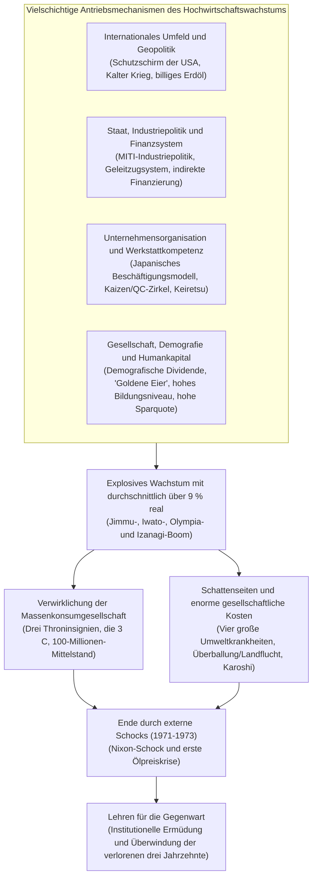
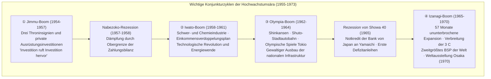
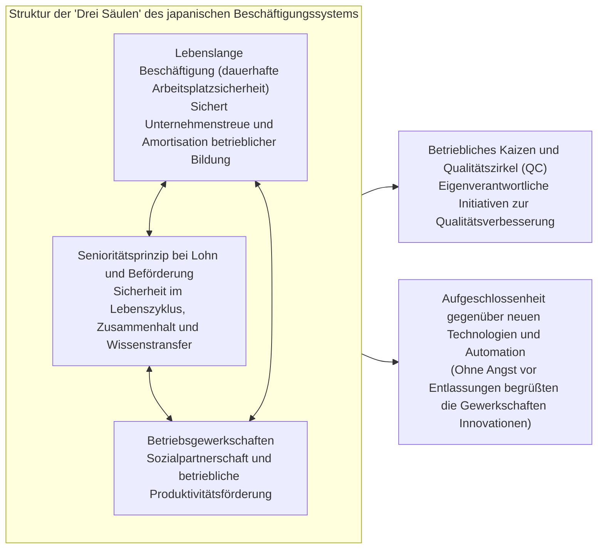
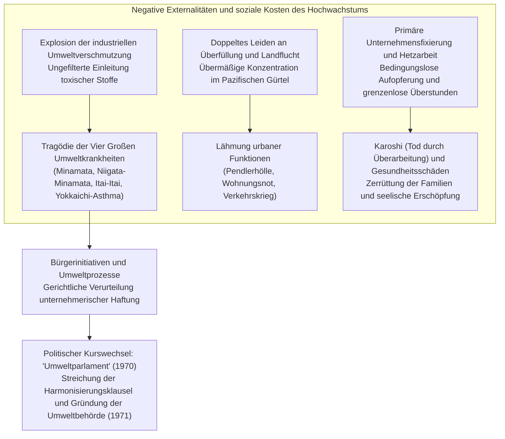

## Einleitung: Ein beispielloses „Wirtschaftswunder“ der Weltgeschichte und sein Wesen

Als am 15. August 1945 mit der bedingungslosen Kapitulation des Großjapanischen Kaiserreichs der Pazifikkrieg endete, lag der japanische Archipel buchstäblich in Schutt und Asche. Rund 40 Prozent der städtischen Fläche der Metropolen waren durch die alliierten Luftangriffe dem Erdboden gleichgemacht worden, und etwa ein Viertel des gesamten Nationalvermögens (rund 36 Prozent aller nicht-militärischen Vermögenswerte) war den Flammen zum Opfer gefallen. Nach dem vollständigen Verlust aller überseeischen Territorien strömten mehr als sechs Millionen demobilisierte Militärangehörige und zivile Rückkehrer ohne Obdach und Arbeitsplatz in das Mutterland. Große Teile der Bevölkerung litten unter chronischen Ausfällen der elementaren Lebensmittelrationierung, existierten am Rande des Hungertodes und lebten in ständiger Furcht vor einer unkontrollierbaren Hyperinflation. Ausländische Korrespondenten und hohe Offiziere des Supreme Commander for the Allied Powers (GHQ), die das Land damals bereisten, fällten unisono ein vernichtendes Urteil: „Japan wird mindestens ein halbes Jahrhundert benötigen, um den autonomen wirtschaftlichen Lebensstandard einer modernen Industrienation wiederzuerlangen.“

Diese düstere Prognose sollte jedoch auf eine Weise widerlegt werden, die in der Wirtschaftsgeschichte ihresgleichen sucht.

Nur zehn Jahre nach Kriegsende, von 1955 bis zum Ausbruch der ersten Ölpreiskrise im Jahr 1973, vollzog die japanische Volkswirtschaft über einen Zeitraum von rund zwei Jahrzehnten einen beispiellosen Aufstieg mit einer **durchschnittlichen realen Wachstumsrate von etwa 9,3 Prozent pro Jahr**. Das Bruttosozialprodukt (BSP) schoss von rund 8 Billionen Yen im Jahr 1955 auf rund 112 Billionen Yen im Jahr 1973 empor – eine Vervierzehnfachung. Bereits 1968 überholte Japan die Bundesrepublik Deutschland, das industrielle Vorbild Westeuropas seit der Meiji-Restauration, und stieg zur **zweitgrößten Wirtschaftsmacht der kapitalistischen Welt** hinter den Vereinigten Staaten auf.



Dieser kometenhafte Aufstieg wurde rund um den Globus als das **„Wirtschaftswunder des Ostens“ (Economic Miracle)** bestaunt. Elektrische Haushaltsgeräte, verkörpert in den legendären „Drei Throninsignien“ (*sanshu no jingi*: Schwarz-Weiß-Fernseher, elektrische Waschmaschine und Kühlschrank), hielten Einzug in die Haushalte bis in die entlegensten Winkel des Landes. Später verlagerte sich die Nachfrage auf die sogenannten „3 C“: Farbfernseher (*Color TV*), Klimaanlage (*Cooler*) und das eigene Automobil (*Car*). Die Lebensweise der Bürger wandelte sich unumkehrbar von traditionellen dörflichen Großfamilien hin zur städtischen Kernfamilie, die eine nie gekannte Fülle an Massenproduktion und Massenkonsum genoss. Es entstand eine Gesellschaft, in der sich rund 90 Prozent der Bürger dem Mittelstand zurechneten („100-Millionen-Mittelstandsgesellschaft“), und Japan etablierte sich als eine der sichersten und am besten ausgebildeten Industrienationen der Erde.

Dieses „Wunder“ war jedoch keineswegs ein zufälliges Himmelsgeschenk. Es war das Ergebnis eines meisterhaften Ineinandergreifens historischer Triebkräfte: des technologischen Fundaments der Schwer- und Chemieindustrie sowie bürokratischer Lenkungsmethoden aus der Vorkriegs- und Kriegszeit; der weltpolitischen Verschärfung des Kalten Krieges und des strategischen Schwenks der USA gegenüber Japan; der minutiösen Branchenförderung durch das Ministerium für internationalen Handel und Industrie (MITI) und des vom Finanzministerium orchestrierten „Geleitzugsystems“ im Bankensektor; der japanischen Beschäftigungskonventionen mit lebenslanger Anstellung und Senioritätsentlohnung; sowie des unermüdlichen Fleißes und der enormen Sparbereitschaft einer jungen Arbeiterschaft, die man respektvoll als „goldene Eier“ bezeichnete.

Zugleich lag über diesem Siegeszug von Beginn an ein düsterer, bedrückender Schatten. Die ungefilterte Einleitung giftiger Industrieabwässer und Rauchgase verursachte die verheerenden „Vier Großen Umweltkrankheiten“ – darunter die Minamata-Krankheit und das Yokkaichi-Asthma –, die Leben und Gesundheit zahlloser unschuldiger Bürger unwiderruflich zerstörten. Die massive Landflucht in die Ballungsräume führte im pazifischen Industriegürtel zu einer erdrückenden Überballung, untragbaren Wohnverhältnissen und dem sogenannten „Verkehrskrieg“, während der ländliche Raum unter dramatischer Entvölkerung und dem Verfall der Landwirtschaft litt. Die Arbeitnehmer – als „rasende Angestellte“ (*mōretsu shain*) oder „Unternehmenskrieger“ tituliert – wurden zu bedingungsloser Aufopferung für ihre Betriebe und endlosen Überstunden genötigt. Dies legte das Fundament für ein gesellschaftliches Leiden, das später weltweit unter dem Begriff **Karoshi** (Tod durch Überarbeitung) traurige Berühmtheit erlangte.

Der vorliegende Beitrag unternimmt eine tiefgehende und ganzheitliche Untersuchung des Phänomens des japanischen Hochwirtschaftswachstums der Nachkriegszeit (1955–1973). Weit über eine bloße Rekapitulation der Konjunkturzyklen hinausgehend, analysiert er das Phänomen aus den Blickwinkeln der Makroökonomie, der Industriepolitik, des Finanzsystems, der Unternehmensführung, der Sozialstruktur, der Geopolitik sowie der Umweltzerstörung. Schließlich werden wesentliche historische Lehren für das 21. Jahrhundert herausgearbeitet, die erklären, warum die damaligen Erfolgsmuster später in eine lähmende „institutionelle Ermüdung“ mündeten und Japan in die „drei verlorenen Jahrzehnte“ seit den 1990er Jahren führten.

---

## Kapitel 1: Regung in den Trümmern —— Die Vorgeschichte des Hochwachstums (1945-1954)

Setzt man den Beginn des Hochwirtschaftswachstums im Jahr 1955 an, so bildete das vorangehende Jahrzehnt der Nachkriegszeit (1945–1954) eine entscheidende Anlaufphase. In diesen zehn Jahren wurden die Trümmer der zusammengebrochenen Volkswirtschaft beseitigt, die Infrastruktur einer funktionsfähigen Marktwirtschaft wiedererrichtet und jene Startrampe erbaut, die den späteren rasanten Höhenflug erst ermöglichte.

### 1.1 Katamorphotische Niederlage und Hyperinflation

Unmittelbar nach der Kapitulation im August 1945 stand Japans Wirtschaft am Rande des völligen Stillstands. Infolge des abrupten Stopps der Rüstungsproduktion und des Ausfalls ausländischer Rohstoffzufuhren war die Bergbau- und Industrieproduktion 1946 auf **nur noch rund 30 Prozent des Vorkriegsniveaus** (Durchschnitt 1934–1936) abgestürzt. Die Zuteilung des Grundnahrungsmittels Reis wies permanente Verzögerungen und Ausfälle auf, was die Stadtbevölkerung zu einem Dasein zwang, das man als „Bambussprossenleben“ (*takenoko seikatsu*) bezeichnete: Schicht für Schicht trennten sich die Menschen von Kimonos und Hausrat, um diese auf dem Lande gegen Nahrungsmittel einzutauschen.

Diese Produktionskrise wurde durch eine verheerende Hyperinflation potenziert. Die von den Militärs in den letzten Kriegsmonaten wahllos autorisierten Zahlungen für außerordentliche Kriegsausgaben, die Begleichung gigantischer Entschädigungsforderungen der Rüstungsfirmen unmittelbar nach Kriegsende und die Abfindungen bei der Demobilisierung der kaiserlichen Armee ließen den Notenumlauf der Bank von Japan astronomisch anschwellen. Vom Herbst 1945 bis zum Jahr 1949 explodierte der Großhandelspreisindex um **das Siebzigfache**.

Um dieser Krise Herr zu werden, erließ die Regierung im Februar 1946 die „Finanzielle Notverordnung“. Mit drastischen Mitteln ordnete sie einen Einlagenstopp an, fror alle Bankguthaben ein und erklärte die umlaufenden alten Yen-Banknoten für ungültig, um einen Zwangsumtausch in den „neuen Yen“ durchzusetzen. Doch solange der fundamentale Mangel an industrieller Produktionskapazität nicht behoben war, ließ sich die Inflationsspirale nicht brechen.

```
【Dramatische Entwicklung wirtschaftlicher Kernindikatoren der frühen Nachkriegszeit】
・Bergbau- und Industrieproduktionsniveau (1946): 30,7 % im Vergleich zur Vorkriegsbasis (1934–36 = 100)
・Anstiegsrate des Großhandelspreisindex in Tokio (1946): +364,5 % im Vorjahresvergleich
・Offizielle tägliche Reisration (Ende 1945): auf 2 Gō und 1 Shaku (ca. 297 g) pro Erwachsenen gekürzt, häufige Ausfälle
・Gesamtzahl der Repatriierten aus Übersee (1945–1950): ca. 6,25 Millionen Personen
```

Um diese Produktionslähmung zu überwinden, beschloss das Kabinett Ende 1946 – mit Umsetzung ab 1947 – das von Professor Hiromi Arisawa (Universität Tokio) entwickelte **„Prioritäre Produktionssystem“ (Priority Production System)**. Das Grundprinzip bestand darin, die extrem verknappten nationalen Ressourcen (Kapital, Rohstoffe, Devisen und Arbeitskraft) nicht den Kräften des freien Marktes zu überlassen, sondern sie gezielt auf zwei Kernsektoren zu bündeln: **Kohle** und **Stahl**. Deren wechselseitige Wiederbelebung sollte den gesamten Wiederaufbau der Volkswirtschaft anführen.

Konkret wurde die geförderte heimische Kohle mit höchster Priorität der Stahlindustrie zugeführt; der produzierte Stahl wiederum ging vorrangig an den Steinkohlenbergbau für den Grubenausbau und die Fertigung von Fördermaschinen. Durch diesen „positiven Kreislauf von Eisen und Kohle“ entstanden Produktionsüberschüsse, die schrittweise auf verwandte Schlüsselbereiche wie Elektrizität, chemische Düngemittel und den Schienengüterverkehr ausgeweitet wurden.

Finanziell getragen wurde dieser Plan von der im Januar 1947 gegründeten **Wiederaufbau-Finanzkasse (Fukkō Kin'yū Kinko, kurz: Fukkin)**. Sie emittierte staatlich garantierte Wiederaufbauanleihen, die größtenteils direkt von der Bank von Japan gezeichnet wurden, und versorgte die Schlüsselindustrien mit langfristigen, zinsgünstigen Krediten. Ende 1948 stammten rund 70 Prozent der gesamten Ausrüstungsinvestitionen der Hauptindustrien aus Mitteln der Fukkin.

Das Prioritäre Produktionssystem erzielte spektakuläre Erfolge bei der raschen Wiederherstellung der Basisproduktion. Allerdings führte die direkte Zeichnung der Fukkin-Anleihen durch die Notenbank zu einer enormen Aufblähung der Geldmenge, was die gefürchtete **„Fukkin-Inflation“** als gefährliche Nebenwirkung anfachte.

### 1.2 Die Dodge-Linie und die Shoup-Empfehlungen: Errichtung des marktwirtschaftlichen Fundaments

Angesichts der wütenden Fukkin-Inflation vollzog die Regierung der Vereinigten Staaten eine fundamentale Kehrtwende in ihrer Besatzungspolitik. Vor dem Hintergrund der Zuspitzung des Kalten Krieges (Gründung der Volksrepublik China 1949, Spaltung der Weltblöcke) wandelte sich Japans Rolle in den Augen Washingtons vom „zu entmilitarisierenden Kriegsgegner“ zum „antikommunistischen Bollwerk und Vorposten des Kapitalismus in Fernost“. Dafür musste die japanische Wirtschaft von den massiven Hilfslieferungen der USA (GARIOA- und EROA-Mittel) unabhängig werden und auf eigenen Beinen im internationalen Markt stehen.

Im Februar 1949 traf **Joseph M. Dodge**, Präsident der Detroit Bank, als Sondergesandter in Tokio ein und verordnete der japanischen Wirtschaft eine rigorose Schocktherapie: die sogenannte **„Dodge-Linie“ (Dodge Line)**. Ihre drei Grundsätze lauteten:

1. **Aufstellung eines strikten Konsolidierungshaushalts (Super-Balance)**: Absolutes Verbot von Staatsanleihen, sofortige Beseitigung von Haushaltsdefiziten und die Verpflichtung, nicht nur Einnahmen und Ausgaben auszugleichen, sondern echte Überschüsse zur Schuldentilgung zu erwirtschaften.
2. **Stopp aller Neukredite der Fukkin und Streichung von Subventionen**: Vollständige Abschaffung der Preisdifferenzausgleichszahlungen (massive staatliche Subventionen, mit denen die Differenz zwischen Produktionskosten und staatlich festgesetzten Preisen ausgeglichen worden war).
3. **Festlegung eines einheitlichen Wechselkurses**: Am 25. April 1949 wurde der offizielle Festkurs von **1 US-Dollar = 360 Yen** eingeführt.

Die Abschaffung des bis dahin geltenden Wirrwarrs aus Dutzenden von differenzierten Wechselkursen für einzelne Warengruppen und die direkte Koppelung an den Weltmarkt über einen einheitlichen Kurs von 360 Yen zwangen Japans Unternehmen schlagartig in den internationalen Wettbewerb. Aus Sicht der damaligen Kaufkraftparität war der Kurs von 1 Dollar = 360 Yen jedoch unterbewertet, was sich auf lange Sicht als überaus wirksames Schutzschild und scharfe Waffe für Japans Exportindustrie erweisen sollte.

Kurzfristig war der Schock der Dodge-Linie jedoch verheerend. Durch den Entzug staatlicher Gelder und eine drastische Kreditverknappung stürzte Japan in eine schwere Deflation. Zahllose mittelständische Betriebe gingen bankrott, und Großkonzerne führten massive Entlassungswellen durch, um das Überleben zu sichern: die „Dodge-Rezession“ brach herein. Hunderttausende verloren im privaten Sektor wie auch in den Staatsbetrieben (Staatsbahn, Tabakmonopol) ihre Arbeit. Soziale Unruhen erschütterten das Land, symbolisiert durch die drei ungeklärten Kriminalfälle der Staatsbahn (Shimoyama-, Mitaka- und Matsukawa-Vorfall).

Neben der Dodge-Linie wurde das institutionelle Gerüst des modernen Japan durch die **„Shoup-Empfehlungen“** errichtet, die eine im Mai 1949 eingetroffene Steuerkommission unter Leitung von Professor **Carl S. Shoup** (Columbia University) vorlegte. Der Shoup-Bericht zerschlug das undurchschaubare Dickicht historischer indirekter Steuern und etablierte ein **modernes Steuersystem, das auf direkten Steuern mit der Einkommensteuer als Kernstück basierte**.

Die Shoup-Steuerreform führte das System der „Blauen Steuererklärung“ (*aoiro shinkoku*) ein, verankerte moderne Buchführungsmethoden, schuf ein stabiles Finanzfundament für die Kommunen und vereinheitlichte die Körperschaftsteuer. Durch die makroökonomische Haushaltsdisziplin Dodges und die mikroinstitutionelle Modernisierung Shoups erhielt Japan das unverzichtbare institutionelle Fundament für einen hochentwickelten kapitalistischen Staat.

### 1.3 Der Koreakrieg und der Schock der Sonderbeschaffung: Zündfunke der Kapitalakkumulation

Als Japans Wirtschaft unter der Dodge-Deflation zu ersticken drohte, brach am 25. Juni 1950 auf der benachbarten koreanischen Halbinsel der **Koreakrieg** aus. Dieser Krieg war eine geopolitische Tragödie, erwies sich jedoch für die daniederliegende japanische Wirtschaft als rettende Wende – was Premierminister Shigeru Yoshida zu dem Ausspruch veranlasste, es handele sich um eine „göttliche Fügung“ (*ten'yu*).

Mit dem Eingreifen der UN-Truppen (faktisch der US-Streitkräfte) wurde Japan, als das der Front am nächsten gelegene Industrieland, schlagartig zum riesigen Nachschub- und Reparaturzentrum. Dies war der Beginn des Booms der **„Korea-Sonderbeschaffungen“ (Tokuju)**.

Die Bestellungen des US-Militärs umfassten eine breite Palette:
- **Rüstungsgüter und Stahlerzeugnisse**: Lastkraftwagen, Geländewagen (Jeeps), Treibstofffässer, Stacheldraht, Waffenteile und Munitionskisten.
- **Textilien und Bedarfsartikel**: Uniformen, Jutesäcke, Decken, Zeltplanen und Armeestiefel.
- **Dienstleistungen**: Instandsetzung und Grundüberholung beschädigter Militärfahrzeuge und Flugzeuge, Transportlogistik und nachrichtendienstliche Unterstützung.

Die Deviseneinnahmen aus diesen Aufträgen summierten sich zwischen 1950 und dem Waffenstillstand 1953 auf **rund 2,4 Milliarden US-Dollar** (was etwa 60 Prozent der gesamten japanischen Exporterlöse jener vier Jahre entsprach). Dieser gewaltige Dollarzustrom beseitigte den chronischen Devisenmangel, der das Land seit Kriegsende gelähmt hatte, mit einem Schlag.

```
【Quantitative Auswirkungen der Korea-Sonderbeschaffung auf Japans Wirtschaft (1950–1953)】
・Gesamtvolumen der Beschaffungsverträge: ca. 2,4 Mrd. Dollar (Direktaufträge + Konsumausgaben der Truppen)
・Reales BIP-Wachstum: Geschäftsjahr 1950: +10,8 %; 1951: +12,3 %; 1952: +10,0 %; 1953: +7,3 %
・Industrieproduktionsindex: stieg 1950 in nur einem Jahr um rund 70 % an und erreichte 1951 wieder das Vorkriegsniveau
・Drastische Erholung der Unternehmensgewinne: Die Umsatzrenditen der Industrie erreichten Ende 1950 Nachkriegsrekordwerte
```

Die historische Tragweite dieses Beschaffungsbooms ging weit über den Abbau von Lagerbeständen hinaus.
Erstens erlernten die japanischen Automobilhersteller (wie Toyota, Nissan und Isuzu) durch die massenhafte Reparatur und Montage von Militär-Lkw die strengen Qualitätskontrollstandards des US-Militärs (Mil-Specs), wodurch die Teilekompatibilität und die Massenfertigungsmethoden sprunghaft verbessert wurden. Zweitens verblieben die immensen Gewinne als Gewinnrücklagen in den Unternehmen und dienten als Eigenkapitalbasis für die gewaltigen Ausrüstungsinvestitionen der nachfolgenden Wachstumsjahre (Neubau von Stahlwerken, Import modernster Werkzeugmaschinen).

### 1.4 Das San-Francisco-System und die Proklamation: „Die Nachkriegszeit ist vorbei“

Im September 1951 unterzeichnete Japan den Friedensvertrag von San Francisco sowie den Sicherheitsvertrag zwischen Japan und den Vereinigten Staaten. Mit deren Inkrafttreten am 28. April 1952 endete die siebenjährige alliierte Besatzungsherrschaft, und Japan erlangte seine volle staatliche Souveränität zurück.

Das wieder souveräne Land ordnete sich unmissverständlich in das westliche Lager des Kalten Krieges ein. Die von Premierminister Shigeru Yoshida geprägte außen- und sicherheitspolitische Leitlinie – die sogenannte **„Yoshida-Doktrin“** – führte zu einer extrem rationalen Bündelung der nationalen Kräfte: Die Landesverteidigung wurde dem US-Sicherheitsvertrag und dem amerikanischen Militärpotenzial anvertraut, die eigenen Rüstungsausgaben wurden strikt auf unter 1 Prozent des BSP begrenzt, und die gesamte Energie, Intelligenz und Finanzkraft der Nation wurde auf den wirtschaftlichen Wiederaufbau und die Expansion des Außenhandels konzentriert. Diese Weichenstellung sicherte Japans Industrie ein ungestörtes Umfeld ohne erdrückende militärische Steuerlasten.

Zwar kam es nach dem Waffenstillstand in Korea 1953 durch das Wegbrechen der Rüstungsnachfrage zu einer vorübergehenden Delle, doch in den Tiefen der Wirtschaft hatte sich bereits ein selbsttragender, investitionsgetriebener Aufschwung in Gang gesetzt. Begünstigt durch klimatisch bedingte Rekordernten in der Landwirtschaft und das Anziehen des Welthandels begann 1955 ein inflationsfreies Wachstum, das als „Mengenkonjunktur“ (*sūryō keiki*) gefeiert wurde.

Dieser historische Wendepunkt wurde im *Wirtschaftsweißbuch* des Geschäftsjahres 1956 durch die Wirtschaftsplanungsbehörde feierlich proklamiert. Der Schlusssatz des Berichts, verfasst von **Yonosuke Gotō** und seinem Team, brannte sich unauslöschlich in das Gedächtnis des modernen Japan ein:

> **„Wir befinden uns nicht mehr in der ‚Nachkriegszeit‘. Wir stehen nun vor einer grundlegend veränderten Lage. Das Wachstum durch bloßen Wiederaufbau ist vorüber. Künftiges Wachstum wird von der Modernisierung getragen werden.“**

Diese Worte waren kein naiver Jubel über das Erreichte. Sie bedeuteten: Die Phase des einfachen Aufholens des Vorkriegsstandes war abgeschlossen. Künftig durfte sich das Land nicht mehr auf ausländische Hilfen, Kredite oder Kriege in der Nachbarschaft verlassen. Es war ein eindringlicher Weckruf: Wenn Japan nicht rasch modernste technische Innovationen (Automation, Polymerchemie, Transistoren, thermische Großkraftwerke) einführte und seine Wirtschaftsstruktur von der traditionellen Leichtindustrie auf moderne Schwer- und Chemieindustrien umstellte, würde es im internationalen Wettbewerb unweigerlich untergehen.

Mit einer Dynamik, die selbst die kühnsten Visionen jenes Weißbuchs übertraf, stürzte sich die japanische Wirtschaft in das gewaltigste Modernisierungsexperiment der Geschichte.

---

## Kapitel 2: Chronik der Konjunkturzyklen und des Hochwachstums (1955-1973)

In den rund achtzehn Jahren von 1955 bis 1973 verlief Japans wirtschaftliche Expansion keineswegs geradlinig. Vielmehr schraubte sich die Wirtschaft über dynamische Konjunkturzyklen stufenförmig empor: Auf Phasen fieberhafter Ausrüstungsinvestitionen und Konsumbooms folgten regelmäßig Abkühlungsphasen, wenn die rasant steigenden Importe die Devisenreserven aufzehrten und die Notenbank die Zügel anziehen musste.

Unter dem starren Wechselkursregime von 1 Dollar = 360 Yen bildeten die Währungsreserven der Notenbank eine harte Grenze. Überhitzte die Konjunktur, explodierten die Einfuhren von Rohstoffen und Maschinen, was die Zahlungsbilanz ins Minus drückte; drohten die Devisen zur Neige zu gehen, musste die Bank von Japan den Diskontsatz anheben, um die Inlandsnachfrage abzuwürgen. Dieser Mechanismus wurde als **„Obergrenze der Zahlungsbilanz“** (*kokusai shūshi no tenjō*) bezeichnet und war die bestimmende makroökonomische Fessel jener Epoche.

Im Folgenden werden die fünf großen Konjunkturphasen detailliert nachgezeichnet.



### 2.1 Der Jimmu-Boom (1954-1957) und die Nabezoko-Rezession: Die Kettenreaktion der Investitionen

Der im November 1954 einsetzende Aufschwung wurde nach dem mythischen ersten Kaiser Japans als **„Jimmu-Boom“** benannt, um auszudrücken, dass es eine solche Blüte seit Anbeginn der Reichschronik nicht gegeben habe.

Der stärkste Motor dieses Aufschwungs waren die explosionsartigen **Ausrüstungsinvestitionen** der Privatwirtschaft. Stahlwerke, Schiffswerften, Kunstfaserfabriken, petrochemische Betriebe und Elektromaschinenbauer rüsteten sich synchron mit modernsten Anlagen aus. Dieses Phänomen brachte das Wirtschaftsweißbuch von 1957 auf die klassische Formel: **„Investition ruft Investition hervor“** (*tōshi ga tōshi o yobu*).

Erweiterten die Stahlkocher ihre Kapazitäten, orderten sie riesige Walzstrassen beim Maschinenbau; bauten die Maschinenbauer neue Hallen, schnellte ihrerseits die Nachfrage nach Profilstahl, Zement und Strom in die Höhe. Diese sich selbst verstärkende Kette interindustrieller Nachfrage trieb die gesamte Volkswirtschaft mit Macht voran.

Gleichzeitig begann im Alltag der Bürger eine Revolution. Die **„Drei Throninsignien“** (Schwarz-Weiß-Fernseher, Waschmaschine und Kühlschrank) hielten breiten Einzug in die städtischen Haushalte, erleichterten die Hausarbeit fundamental und bereicherten das Familienleben.

Anfang 1957 zeigten sich jedoch die Grenzen des Booms. Die Importe von Rohstoffen explodierten, die Handelsbilanz geriet tief ins Defizit, und die Währungsreserven sanken auf ein alarmierendes Niveau: Japan war mit voller Wucht gegen die „Obergrenze der Zahlungsbilanz“ geprallt. Die Bank von Japan hob mehrfach den Diskontsatz an und drosselte die Kreditvergabe. Die Konjunktur brach abrupt ein, die Rohstoffmärkte kollabierten, und das Land geriet von Ende 1957 bis 1958 in die zähe Stagnation der **„Nabezoko-Rezession“** (Bratpfannenboden-Rezession). Doch der Modernisierungswille der Betriebe war ungebrochen, und die Talsohle wurde rasch durchschritten.

### 2.2 Der Iwato-Boom (1958-1961) und der Einkommensverdoppelungsplan: Durchbruch der Schwer- und Chemieindustrie

Ab Juli 1958 setzte ein noch mächtigerer Aufschwung ein, der nach dem Mythos der Sonnengöttin Amaterasu, die aus der Felsenhöhle hervortrat, als **„Iwato-Boom“** bezeichnet wurde. In dieser Phase wuchs Japans Wirtschaft mit einer atemberaubenden realen Rate von durchschnittlich **11,3 Prozent pro Jahr**.

Der Kern des Iwato-Booms war der vollendete Strukturwandel von der Leichtindustrie (Textilien, Kleinwaren) hin zur **Schwer- und Chemieindustrie (Stahl, Petrochemie, Automobilbau, Großanlagenbau)**. Eine rasante Energiewende vollzog sich: Die heimische Kohle wurde in rasantem Tempo durch billiges, reines Erdöl aus dem Nahen Osten verdrängt. Entlang der Pazifikküste (Buchten von Tokio und Ise, Seto-Inlandsee) wurden riesige Polder dem Meer abgerungen, auf denen gigantische integrierte Hüttenwerke und petrochemische Kombinate entstanden.

Auch politisch erfolgte ein tiefgreifender Umbruch. 1960 erschütterten die Anpo-Proteste gegen den US-Sicherheitsvertrag mit Hunderttausenden Demonstranten vor dem Parlament das Land. Nach dem Rücktritt von Premierminister Nobusuke Kishi trat sein Nachfolger **Hayato Ikeda** an und lenkte das Interesse der Bevölkerung von ideologischen Grabenkämpfen radikal auf wirtschaftlichen Wohlstand um: durch den legendären **„Nationalen Einkommensverdoppelungsplan“** (*Kokumin Shotoku Baizō Keikaku*) vom Dezember 1960.

Gestützt auf die theoretischen Vorarbeiten des Ökonomen Osamu Shimomura setzte sich der Plan das Ziel, **das reale Bruttosozialprodukt innerhalb eines Jahrzehnts (1961–1970) zu verdoppeln, Vollbeschäftigung zu erreichen und den Lebensstandard an den der westeuropäischen Industrienationen heranzuführen**. Dies erforderte ein jährliches Wachstum von 7,2 Prozent – was die Opposition und viele Volkswirte als utopische Illusion abtaten.

Das Ergebnis übertraf jedoch alle Prognosen: Bereits nach gut vier Jahren war das Ziel der realen Einkommensverdoppelung vorzeitig erreicht. Ikedas Botschaft von „Toleranz und Geduld“ und das handfeste Versprechen auf „doppelte Löhne“ verliehen der kriegstraumatisierten Nation ein unerschütterliches Zukunftsvertrauen.

### 2.3 Der Olympia-Boom (1962-1964) und die Infrastrukturrevolution

Nach einer weiteren kurzen Abkühlung zur Sanierung der Zahlungsbilanz entfaltete sich ab Ende 1962 der **„Olympia-Boom“**. Für das weltweite Renommee der XVIII. Olympischen Sommerspiele in Tokio (Oktober 1964) – den ersten Spielen auf asiatischem Boden – mobilisierte der Staat gewaltige Ressourcen.

Das Gesamtvolumen der Investitionen in Verkehr, Städtebau und Sportstätten belief sich auf rund eine Billion Yen, was dem gesamten damaligen Staatshaushalt entsprach:
- **Tōkaidō-Shinkansen**: Am 1. Oktober 1964 eröffnet, verband der erste Hochgeschwindigkeitszug der Welt Tokio und Shin-Osaka mit 210 km/h in nur vier Stunden (ab 1965 in 3 Stunden 10 Minuten) und revolutionierte die verkehrsgeografische Achse des Landes.
- **Meishin- und Shuto-Autobahnen**: Japans erste Fernautobahn (Meishin) sowie das kühn geschwungene Viaduktennetz der Stadtautobahn Tokio wurden dem Verkehr übergeben.
- **Modernisierung der Metropole**: Die Einschienenbahn Tokio nach Haneda, der Vollbetrieb der U-Bahn-Linie Hibiya, moderne Großhotels wie das Hotel New Otani sowie die flächendeckende Kanalisation verwandelten Tokio in eine zukunftsorientierte Weltstadt.

Im Rundfunkwesen löste die Direktübertragung der Wettkämpfe einen Nachfrageschub nach Farbfernsehern aus, während die erfolgreiche transozeanische Satellitenübertragung via Syncom 3 der Weltgemeinschaft Japans technologische Spitzenstellung vor Augen führte.

### 2.4 Die Wertpapierkrise (1965 / Rezession von Showa 40) und der fiskalpolitische Paradigmenwechsel

Unmittelbar nach dem Verhallen des olympischen Jubels wurde Japans Wirtschaft jedoch von der bis dahin schwersten Bewährungsprobe der Nachkriegszeit heimgesucht: der **„Rezession von Showa 40“** (1965).

Die für Olympia massiv hochgezogenen Industriekapazitäten erwiesen sich nach dem Abklingen der Bauaufträge schlagartig als enorme Überkapazitäten. Firmenpleiten erreichten einen Nachkriegsrekord. Der Aktienmarkt stürzte ab, und eines der vier großen Wertpapierhäuser des Landes, **Yamaichi Securities**, geriet durch astronomische Verluste an den Rand des Zusammenbruchs.

Um einen Flächenbrand im Finanzsektor und einen Bankenansturm zu verhindern, fällten Finanzminister **Kakuei Tanaka** und Notenbankgouverneur Makoto Usami eine historische Entscheidung: Sie aktivierten Artikel 25 des Gesetzes über die Bank von Japan und stellten Yamaichi **unbegrenzte, unbesicherte Notkredite der Notenbank (*Nichigin tokuyū*)** zur Verfügung, was die Panik der Anleger augenblicklich beruhigte.

Zudem brach die Regierung mit einem eisernen Dogma der Dodge-Linie: dem im Finanzgesetz verankerten Verbot von Staatsanleihen. Im Nachtragshaushalt 1965 beschloss das Parlament erstmals seit 1945 die **Emission von Defizitfinanzierungsanleihen (Sonderanleihen)**. Diese keynesianische Konjunkturstützung – massive Ausweitung öffentlicher Bauaufträge gepaart mit Steuersenkungen – fing den Nachfrageeinbruch erfolgreich auf und leitete die längste Wachstumsära der Nachkriegsgeschichte ein.

### 2.5 Der Izanagi-Boom (1965-1970): Die goldenen 57 Monate und der Aufstieg zur weltweiten Nummer zwei

Vom Tiefpunkt im November 1965 bis zum Juli 1970 erstreckte sich eine beispiellose Prosperitätsphase von fast fünf Jahren: der **„Izanagi-Boom“**, benannt nach dem Schöpfergott Izanagi aus der japanischen Ursprungsmythologie. Die Expansion währte **57 Monate ohne Unterbrechung** und brach alle bisherigen Rekorde.

Triebfedern des Izanagi-Booms waren eine unbezwingbare Exportstärke und der anspruchsvollere Inlandskonsum. Das Konsumideal vollzog das Upgrade von den Drei Throninsignien zu den prestigeträchtigen **„3 C“**:
- **Color TV (Farbfernseher)**
- **Cooler (Raumklimagerät)**
- **Car (Privat-Pkw)**

Mit dem Erscheinen erschwinglicher Volks-Pkw wie dem Toyota Corolla und dem Nissan Sunny im Jahr 1966 brach das Zeitalter der Massenmotorisierung an. Durch minutiöse Prozessoptimierung und kompromisslose Qualitätskontrolle streifte Japans Industrie das Vorkriegsimage minderwertiger Billigware endgültig ab. Erzeugnisse mit dem Siegel *Made in Japan* eroberten die Weltmärkte als Inbegriff von Zuverlässigkeit, Präzision und Langlebigkeit.

1968 markierte den historischen Höhepunkt: Mit einem nominalen Bruttosozialprodukt von **rund 141,9 Milliarden US-Dollar** überholte Japan die Bundesrepublik Deutschland und stieg zur **zweitgrößten Wirtschaftsmacht der westlichen Welt** auf. Genau ein Jahrhundert nach der Meiji-Restauration von 1868 hatte das asiatische Land die europäischen Industriestaaten eingeholt und hinter sich gelassen.

Der feierliche Schlusspunkt dieser Epoche war die **Weltausstellung in Osaka (Expo '70)**, die erste Expo auf asiatischem Boden, unter dem Leitmotiv „Fortschritt und Harmonie für die Menschheit“. Überragt von Tarō Okamotos Monumentalskulptur „Turm der Sonne“, strömten in sechs Monaten sagenhafte **64,21 Millionen Besucher** auf das Ausstellungsgelände in den Senri-Hügeln. Das im US-Pavillon ausgestellte Mondgestein, bewegliche Bürgersteige und futuristische Pavillons brannten sich tief in das kollektive Gedächtnis ein – als Sinnbild eines Landes, das den Wiederaufbau vollendet und das Tor zur Moderne aufgestoßen hatte.

```
【Entwicklung makroökonomischer Kernindikatoren im Hochwirtschaftswachstum (GJ 1955–1974)】
```

| Geschäftsjahr | Reales BIP-Wachstum (%) | Nominales BSP (Mrd. Yen) | Konjunkturphase / Historische Meilensteine |
| :---: | :---: | :---: | :--- |
| **1955** | **+10,8** | 8.864,6 | Beginn des Jimmu-Booms; Start der Drei Throninsignien |
| **1956** | **+6,2** | 9.871,9 | Wirtschaftsweißbuch: „Nicht mehr Nachkriegszeit“; UN-Beitritt |
| **1957** | **+7,8** | 11.128,0 | Nabezoko-Rezession; Erreichen der Zahlungsbilanzobergrenze |
| **1958** | **+5,6** | 11.852,7 | Beginn des Iwato-Booms; Fertigstellung des Tokyo Tower |
| **1959** | **+11,2** | 13.422,8 | Kronprinzenhochzeit Akihitos; Siegeszug des Fernsehers |
| **1960** | **+12,5** | 16.033,2 | Anpo-Proteste; Kabinett Ikeda beschließt Einkommensverdoppelungsplan |
| **1961** | **+12,0** | 19.644,2 | Ausbau der Schwer- und Petrochemie; Energiewende zum Öl |
| **1962** | **+8,9** | 22.011,9 | Beginn des Olympia-Booms; Eröffnung der Senri New Town |
| **1963** | **+10,7** | 25.641,9 | Eröffnung der Meishin-Autobahn (Ritto–Amagasaki) |
| **1964** | **+13,1** | 29.544,4 | Olympische Spiele Tokio; Shinkansen eröffnet; OECD-Beitritt |
| **1965** | **+5,8** | 32.821,7 | Rezession von 1965; Yamaichi-Notkredit; erste Defizitanleihen |
| **1966** | **+10,6** | 38.290,0 | Beginn des Izanagi-Booms; Jahr des Pkw (Corolla, Sunny) |
| **1967** | **+11,1** | 44.695,3 | Siegeszug der 3 C; Grundgesetz zur Umweltverschmutzung |
| **1968** | **+12,2** | 52.878,1 | **Japans BSP übertrifft das der BRD (Nr. 2 der freien Welt)** |
| **1969** | **+12,5** | 62.246,4 | Eröffnung der Tomei-Autobahn; Durchbruch des Farbfernsehens |
| **1970** | **+10,7** | 73.344,9 | Expo '70 Osaka (64,21 Mio. Gäste); „Umweltparlament“ |
| **1971** | **+5,0** | 80.972,6 | Nixon-Schock; Smithsonian-Abkommen (1 Dollar = 308 Yen) |
| **1972** | **+9,1** | 95.464,6 | Kabinett Tanaka: „Umbau des Archipels“; Normalisierung mit China |
| **1973** | **+5,1** | 112.548,7 | Übergang zu Freisetzungskursen; 1. Ölkrise; „rasende Preise“ |
| **1974** | **-1,2** | 134.822,9 | **Erste Nachkriegsrezession; endgültiges Ende des Hochwachstums** |

---

## Kapitel 3: Warum geschah das „Wunder“? —— Anatomie der vielschichtigen Mechanismen

Japans Hochwirtschaftswachstum war weder das zufällige Produkt zügelloser Marktkräfte (*laissez-faire*), noch lässt es sich mit vordergründigen Gemeinplätzen über die angebliche Arbeitswut des japanischen Volkes erklären. Es beruhte vielmehr auf der Etablierung eines hochentwickelten **„japanischen Kapitalismusmodells“**, in dem staatliche Strukturpolitik, ein geschütztes Finanzsystem, kooperative Arbeitsbeziehungen, innerbetriebliche Qualitätsinnovationen, ein günstiger demografischer Rahmen und die geopolitische Konstellation des Kalten Krieges optimal zusammenwirkten.

Die folgenden Abschnitte durchleuchten die sechs Kernmechanismen dieses Erfolgsmodells.



### 3.1 Industriepolitik und staatliche Lenkung: Die strategische Branchenpolitik des MITI

In seiner bahnbrechenden Studie *MITI and the Japanese Miracle* prägte der US-Politikwissenschaftler Chalmers Johnson das Konzept des **„Entwicklungsstaates“ (Developmental State)**, um Japans Modell von den angelsächsischen „Regulierungsstaaten“ abzugrenzen. Während sich der Regulierungsstaat auf die Überwachung formaler Wettbewerbsregeln beschränkt, setzte der japanische Entwicklungsstaat strategische Wachstumsziele und steuerte die Ressourcen des Landes aktiv in zukunftsträchtige Schlüsselbranchen – mit dem Ministerium für internationalen Handel und Industrie (MITI) als lenkender Schaltzentrale.

Das Fundament der MITI-Politik bestand darin, das neoklassische Dogma komparativer statischer Kostenvorteile bewusst zu missachten (welches Japan auf Dauer zur Ausfuhr billiger Textilien oder Spielwaren verdammt hätte). Die Planer setzten stattdessen auf dynamische komparative Vorteile: Sie wählten Industrien aus, die eine hohe Einkommenselastizität der weltweiten Nachfrage versprachen und starke Verflechtungseffekte auf andere Wirtschaftszweige ausübten. So wurden kapital- und technologieintensive Branchen systematisch hochgezüchtet: **Stahl, Schiffbau, Petrochemie, Automobilbau, Maschinenbau und Elektronik**.

Dazu setzte das MITI hocheffektive Hebel ein:

1. **Devisenkontingentierung (Devisen- und Außenhandelskontrollgesetz)**:
   In Zeiten akuter Dollar-Knappheit unterlagen Devisen dem staatlichen Monopol. Das MITI teilte Devisen bevorzugt solchen Unternehmen zu, die modernste ausländische Anlagen und Patente (Warmbreitband-Walzwerke, petrochemische Lizenzen) einführen wollten. Gleichzeitig wurden Importe fertiger Konsumgüter mit strikten Devisensperren belegt, was den heimischen Markt wirksam vor ausländischer Übermacht abschirmte.
2. **Katalysatorfunktion der Kredite der Japanischen Entwicklungsbank (JDB / Kaigin)**:
   Vergab die staatliche Entwicklungsbank einen zinsgünstigen Leitkredit an ein Schwerpunktprojekt (wie ein Küstenstahlwerk oder ein petrochemisches Kombinat), interpretierten die privaten Geschäftsbanken dies als unmissverständliche Staatsgarantie. Dieses Signalisieren (*pump-priming*) löste Lawinen privater Konsortialkredite für die Schlüsselbranchen aus.
3. **Kooperation von Staat und Wirtschaft zur Investitionskoordination**:
   Um zu verhindern, dass ruinöser Verdrängungswettbewerb zu gigantischen Überkapazitäten führte, rief das MITI Runde Tische mit den Spitzen der Industrie ins Leben. In diesen Gremien wurde der Bau neuer Hochöfen oder Ethylenanlagen kartellartig abgesprochen und terminiert, was den Firmen das Risiko von Fehlinvestitionen im Megamaßstab nahm.

### 3.2 Die Alchemie des Finanzsystems: Vorherrschaft der indirekten Finanzierung und Geleitzugsystem

Die gewaltigen Ausrüstungsinvestitionen der Unternehmen (mit Quoten von oft über 30 Prozent des BIP) wurden über eine bemerkenswerte Finanzstruktur alimentiert.

Während im angelsächsischen Modell Unternehmen ihr Kapital primär über Börsenemissionen (Aktien, Anleihen) oder einbehaltene Gewinne finanzieren, besaßen japanische Betriebe nach Kriegszerstörung und Hyperinflation kaum nennenswertes Eigenkapital. Die Finanzierung erfolgte fast ausschließlich über Bankkredite: die **„indirekte Finanzierung“**.

Dieses System war durch drei Besonderheiten gekennzeichnet:

- **Das Hausbankensystem (*main bank system*)**:
  Jeder Großkonzern unterhielt eine symbiotische Bindung zu einer führenden Großbank (Mitsui, Mitsubishi, Sumitomo, Fuji, Dai-Ichi Kangyō, Sanwa oder langfristigen Kreditinstituten wie der IBJ). Die Hausbank vergab nicht nur Kredite: Sie hielt über wechselseitige Aktienverflechtungen Unternehmensanteile zur Abwehr feindlicher Übernahmen, entsandte Vorstandsmitglieder und kontrollierte fortlaufend die Bonität. Dies befreite das Management vom Druck kurzfristiger Quartalsrenditen und ermöglichte weitsichtige Investitionszyklen von fünf bis zehn Jahren.
- **Konzernüberverschuldung (*over-borrowing*) und Banküberziehung (*over-loan*)**:
  Die Unternehmen operierten mit für westliche Maßstäbe riskant hohen Fremdkapitalquoten. Die Geschäftsbanken wiederum verliehen Gelder weit über ihr Einlagenvolumen hinaus an die Industrie und deckten diese Finanzierungslücke durch permanente Kredite bei der Bank von Japan ab. Die Notenbank steuerte über ihren Diskontsatz und informelle Vorgaben („Schalterlenkung“ bzw. *madoguchi shidō*) die Geldzufuhr der gesamten Wirtschaft bis ins Detail.
- **Das „Geleitzugsystem“ (*gosō sendan hōshiki*) und Niedrigzinspolitik**:
  Das Finanzministerium hielt das Zinsniveau über das Zinsanpassungsgesetz künstlich niedrig, um die Kapitalkosten für die Industrie zu drücken. Zugleich regulierte es den Bankensektor peinlich genau: Filialneueröffnungen, Produktpaletten und Zinssätze wurden so synchronisiert, dass selbst das schwächste Institut niemals in Konkurs gehen konnte. Wie ein Marine-Geleitzug, dessen Fahrtempo sich nach dem langsamsten Frachter richtet, bannte dieses System das Risiko von Bankenpleiten und schuf ein unerschütterliches Vertrauen der Bürger in das Kreditwesen.

Ergänzt wurde dieser Kreislauf durch das **Staatliche Investitions- und Darlehensprogramm (FILP / *Zaisei Tōyūshi*)**, das als „zweiter Staatshaushalt“ galt. Die Spargelder der Bürger auf der Postsparkasse und die Rücklagen der gesetzlichen Rentenversicherung wurden beim Finanzministerium gebündelt und ohne Steuergelder direkt in Großprojekte der Staatsbahn (Shinkansen), den Autobahnbau, Wohnungsbaugesellschaften und Häfen investiert.

### 3.3 Die Etablierung der japanischen Beschäftigungspraxis: Die Funktion der „Drei Säulen“ der Arbeitsbeziehungen

Das personelle Fundament der Wachstumsdynamik bildete das **„japanische Beschäftigungsmodell“**, das sich nach der Niederlage und Befriedung der erbitterten Arbeitskämpfe der 1950er Jahre (wie dem Nissan-Streik 1953 und dem Miike-Grubenstreik 1960) herausbildete. Wie der US-Soziologe James Abegglen in *The Japanese Factory* darlegte, ruhte dieses Modell auf drei miteinander verzahnten Säulen:

1. **Lebenslange Beschäftigung (*shūshin koyō*)**:
   Betriebe stellten Schul- und Hochschulabsolventen jahrgangsweise ein, mit dem unausgesprochenen Versprechen, sie bis zum Erreichen der Altersgrenze nicht zu entlassen. Dies sicherte den Unternehmen die Amortisation hoher Ausgaben für die betriebsinterne Weiterbildung (*On-the-Job Training* - OJT) und bot den Beschäftigten existenzielle Sicherheit.
2. **Senioritätsprinzip bei Vergütung und Beförderung (*nenkō joretsu*)**:
   Grundgehalt und Rang stiegen automatisch mit dem Lebensalter und den Dienstjahren. In jungen Jahren lag der Lohn unter der erbrachten Produktivität, was der Kapitalakkumulation der Firmen zugutekam; in späteren Jahren – bei Heirat, Familiengründung und Hauserwerb – stiegen die Bezüge kräftig an und deckten optimal die Lebenshaltungskosten.
3. **Betriebsgewerkschaften (*kigyōbetsu rōdō kumiai*)**:
   Anders als die westlichen Berufs- oder Branchengewerkschaften organisierten sich die Arbeitnehmer exklusiv auf Unternehmensebene. Da auch die Gewerkschaftsführer reguläre Angestellte des Hauses waren, herrschte ein ausgeprägtes Schicksalsgemeinschaftsgefühl: Der Wohlstand der Belegschaft hing direkt von der Marktbehauptung und Rentabilität des eigenen Unternehmens ab.

Diese Konstellation entfaltete bei der Einführung neuer Technologien eine ungeheure Schubkraft.

Während in westlichen Betrieben die Einführung von Fließbändern oder Robotern am Widerstand der Facharbeitergewerkschaften scheiterte, die den Verlust ihrer Berufsstände und Entlassungen fürchteten, führten Rationalisierungen in Japans Großunternehmen dank der Beschäftigungsgarantie niemals zu Kündigungen. Freigesetzte Arbeiter wurden intern versetzt (*haiten*) und auf neue, anspruchsvollere Tätigkeiten umgeschult.

Folglich leisteten **Arbeitnehmer und Gewerkschaften keinerlei Widerstand gegen Automation und Robotertechnik, sondern begrüßten den technischen Fortschritt enthusiastisch**, wohl wissend, dass Produktivitätsgewinne zu höheren Bonuszahlungen führten.

Zudem etablierte sich ab 1955 die Frühjahrsoffensive **„Shuntō“**. Alljährlich im Frühjahr koordinierten die Gewerkschaften der Schlüsselbranchen (Stahl, Elektro, Schiffbau, Auto) ihre Lohnforderungen. Der im Stahlsektor erzielte Tarifabschluss diente als Benchmark für das gesamte Land. Durch diesen Mechanismus stiegen die Reallöhne über fast zwei Jahrzehnte hinweg um jährlich rund 10 Prozent, was die Inlandsnachfrage massiv ausweitete und die hohen Ausrüstungsinvestitionen der Industrie über den Massenkonsum rentabel machte.

Die Kehrseite dieser Privilegien für die Stammbelegschaften der Großindustrie war jedoch die Existenz eines riesigen Puffers aus **Subunternehmern zweiter und dritter Ordnung, Leiharbeitern (*rinjikō*) und weiblichen Hilfskräften**, die unter schlechter Bezahlung und unsicheren Verträgen die Lasten von Konjunkturschwankungen trugen (die „duale Struktur“ der japanischen Wirtschaft).

### 3.4 Werkstattkompetenz und Innovationsdynamik: QC-Zirkel und Kaizen-Bewegung

Dass Japans Industrie den Makel billiger Nachahmung abstreifte und zum weltweiten Maßstab für Fertigungsqualität, Langlebigkeit und Kostendisziplin aufstieg, war das Werk einer **Qualitätsrevolution in den Werkhallen**.

In der Vorkriegszeit galten japanische Exporte im Westen als „billig und schlecht“ (*cheap and nasty*). 1950 lud der Verband japanischer Wissenschaftler und Ingenieure (JUSE) den führenden US-Pionier der statistischen Qualitätskontrolle, Dr. **W. Edwards Deming**, nach Tokio ein. Demings Vorträge über den PDCA-Zyklus (Planen-Ausführen-Prüfen-Handeln) hinterließen tiefen Eindruck. Mit von Deming gestifteten Tantiemen wurde der renommierte **Deming-Preis** ins Leben gerufen, der einen beispiellosen Qualitätswettbewerb unter Japans Konzernen entfachte.

Die eigentliche historische Leistung japanischer Ingenieure lag jedoch darin, die Qualitätskontrolle – die im Westen Vorrecht von Stabsabteilungen und Prüfern war – zu einer breiten Graswurzelbewegung der Arbeiter an der Werkbank umzugestalten: den ab 1962 entstehenden **„Qualitätskontroll-Zirkeln“ (QC-Zirkel)**.

Kleine Teams von fünf bis zehn Werkern trafen sich freiwillig nach Feierabend, analysierten Fehlerquellen mittels Ursache-Wirkungs-Diagrammen (Ishikawa-Diagramme) und Pareto-Analysen und entwickelten eigenständig praktische Verbesserungsvorschläge (**Kaizen**). Diese wurden direkt am Arbeitsplatz umgesetzt, und erfolgreiche Teams wurden betriebs- und landesweit prämiert. So entwickelte sich bis zum letzten Bandarbeiter ein tiefes Berufsethos und der Stolz, persönlich für die Exzellenz des Endprodukts verantwortlich zu sein.

Die vollendete Reife dieser Betriebsphilosophie war das von Toyota-Vizepräsident Taiichi Ōno geprägte **„Toyota-Produktionssystem“ (TPS)**:
- **Just-in-Time (JIT)**: Es wird nur „das hergestellt, was gebraucht wird, wann es gebraucht wird und in der Menge, wie es gebraucht wird“, um Zwischenlager und Vorräte auf null zu drücken.
- **Kanban-System**: Zettelkarten signalisieren dem vorgelagerten Arbeitsschritt genau den Materialbedarf, der im nachgelagerten Schritt verbraucht wurde (Pull-Prinzip).
- **Jidoka (Intelligente Automation)**: Maschinen schalten sich bei der kleinsten Unregelmäßigkeit automatisch ab, sodass niemals fehlerhafte Teile an den nächsten Schritt weitergegeben werden.
- **Radikale Beseitigung von Verschwendung (*Muda*)**: Die konsequente Tilgung der sieben Arten der Verschwendung: Überproduktion, Wartezeit, unnötiger Transport, überflüssige Bearbeitung, Überbestände, unergonomische Bewegungen und Ausschussfertigung.

Mit diesen Innovationen überwand Japan das starre fordistische Massenproduktionsmodell des Westens (Fertigung riesiger Serien identischer Güter auf Halde) und begründete die moderne flexible, fehlerfreie und extrem kostengünstige Serienfertigung.

### 3.5 Demografischer Wandel und Humankapital: Demografische Dividende und die Wanderung der „Goldenen Eier“

Die biologische Urkraft des Wachstums entsprang einer historisch einzigartigen **demografischen Konstellation** und einem exzellenten **Humankapital**.

In den Nachkriegsjahren von 1947 bis 1949 erlebte Japan einen gewaltigen Babyboom, in dem rund **acht Millionen Kinder** geboren wurden – die Generation der **Dankai no Sedai**. Ab Mitte der 1950er Jahre trat die Altersstruktur in die Phase der **„demografischen Dividende“** ein: Der Anteil der Bevölkerung im erwerbsfähigen Alter (15–64 Jahre) wuchs rasant, während der Anteil der zu versorgenden Kinder und Senioren vergleichsweise gering war.

```
【Entwicklung des Anteils der Erwerbsbevölkerung (15–64 Jahre) in Japan】
・1950: 59,7 %
・1960: 64,2 %
・1970: 68,9 % (Historischer Zenit der demografischen Dividende)
```

Diese jungen Arbeitskräfte waren nicht nur zahlenmäßig stark, sondern trugen eine gigantische **Binnenwanderung vom Land in die Metropolen**.

Durch die Agrarreform der Besatzungszeit waren zwar Millionen Pächter zu Eigentümern geworden, doch erbte traditionsgemäß nur der erstgeborene Sohn den Hof. Zweit- und drittgeborene Söhne sowie Töchter strömten nach Schulabschluss in die Fabriken der Ballungsräume (Tokio, Osaka, Nagoya). Wegen ihres Fleißes, ihrer Disziplin und Anpassungsfähigkeit wurden diese Jugendlichen liebevoll als **„goldene Eier“** (*kin no tamago*) bezeichnet.

An den Bahnhöfen Ueno und Osaka trafen alljährlich die Sonderzüge zur **„kollektiven Arbeitsaufnahme“** (*shūdan shūshoku ressha*) ein, vollbesetzt mit Absolventen aus Tōhoku oder Kyūshū. Zwischen 1955 und 1970 zogen per Saldo über **zehn Millionen Menschen** in die drei großen Metropolregionen. Die Beschäftigungsstruktur wandelte sich radikal: 1950 arbeiteten noch **48,3 Prozent** aller Erwerbstätigen im Primärsektor (Land-, Forst- und Fischwirtschaft); bis 1970 schrumpfte dieser Anteil auf **17,4 Prozent** zusammen. Millionen Arbeitskräfte wechselten in die Industrie, das Baugewerbe und den städtischen Dienstleistungssektor.

Hinzu kamen zwei entscheidende Trümpfe:
- **Homogenes Bildungsniveau und vollkommene Alphabetisierung**: Aufbauend auf den Tempelschulen (*terakoya*) der Edo-Zeit und dem Meiji-Schulwesen lag die Alphabetisierungsrate bei praktisch 100 Prozent. Die Übertrittsquote an weiterführende Oberschulen verdoppelte sich von 42,5 Prozent (1950) auf 82,1 Prozent (1970). Die Fabriken verfügten über Fabrikarbeiter, die technische Zeichnungen mühelos lasen und komplizierte Steuerungen schnell beherrschten.
- **Weltweit unübertroffene Sparneigung**: Während die Sparquote privater Haushalte in Europa oder den USA um 10 Prozent lag, verharrte sie in Japan kontinuierlich bei **15 bis über 20 Prozent**. Rasant steigende Einkommen, private Vorsorge mangels ausgebauter Sozialversicherungen, Bonuszahlungen und Steuerbefreiungen für Postsparguthaben (*Maru-yū*) füllten die Bankkonten. Diese Ersparnisse wurden von den Banken zu niedrigen Zinsen an die Industrie weitergeleitet – ein Wachstum aus eigener Kraft ohne Auslandsverschuldung.

### 3.6 Geopolitik des Kalten Krieges und internationales Umfeld: Der günstige Rückenwind der Geschichte

Nicht zuletzt war das Hochwirtschaftswachstum das Produkt einer für Japan idealen internationalen Ordnung (Bretton-Woods-System und Kalter Krieg).

Erstens erlaubte die **Yoshida-Doktrin**, die Wehrausgaben auf etwa 1 Prozent des BSP zu deckeln. Während die Westmächte und Frontstaaten des Kalten Krieges (USA, UdSSR, Großbritannien, Bundesrepublik Deutschland, Südkorea, Taiwan) zwischen 5 und über 10 Prozent ihrer Wirtschaftskraft für Rüstung und Wehrpflicht aufwendeten, lagerte Japan seine Sicherheit an den nuklearen Schutzschirm der USA aus und lenkte seine besten Talente und Steuergelder in die zivile Infrastruktur.

Zweitens profitierte Japan maximal vom **liberalen Welthandelssystem (GATT / IWF)** unter Führung der USA. Nach dem GATT-Beitritt 1955, dem Übergang zu den Verpflichtungen nach Artikel 8 des IWF-Abkommens und dem OECD-Beitritt 1964 stieg das Land in den Club der westlichen Industriestaaten auf. Während die westlichen Absatzmärkte für Japans Exporte weitgehend offenstanden, schützte Tokio über Jahrzehnte seine jungen Branchen durch Zölle und Investitionsverbote vor ausländischer Konkurrenz.

Drittens wirkte der **feste Wechselkurs von 1 Dollar = 360 Yen** wie ein gewaltiges Exportsubventionsprogramm. Während Produktivität und Verarbeitungsqualität in Japans Werken sprunghaft zulegten, blieb die Parität unverändert, was zu einer zunehmenden realen Unterbewertung des Yen führte. Japanischer Stahl, Elektrogeräte, Autos, Kameras und Uhren besaßen dadurch auf den Weltmärkten eine unschlagbare Preiskompetenz.

Viertens profitierte das Land von **billigem, verlässlichem Erdöl aus dem Nahen Osten**. Hatte die Rohstoffblockade einst Japans Weg in den Weltkrieg besiegelt, lieferten die internationalen Ölkonzerne („Die Sieben Schwestern“) aus den riesigen Feldern am Persischen Golf unbegrenzte Mengen Rohöl für spottbillige **zwei Dollar pro Barrel**. Dieses flüssige Gold befeuerte die Wärmekraftwerke an den Küsten, lieferte den Rohstoff für die Petrochemie und trieb die Motorisierung des Archipels voran.

---

## Kapitel 4: Der Durchbruch der Massenkonsumgesellschaft und die Lebensrevolution

Das Hochwirtschaftswachstum erschöpfte sich keineswegs in den nüchternen Ziffernreihen ministerieller Bilanzen, dem Rauch der Hochöfen oder der Tonnage geschmolzenen Stahls: Es vollzog sich als eine tiefgreifende **„Revolution des Alltagslebens“**, welche die Ernährung, die Kleidung, das Wohnen, die Familienstrukturen und das geistige Lebensgefühl der Menschen von Grund auf umwälzte.

Im Japan der Vorkriegszeit hatte die überwältigende Mehrheit der Bevölkerung – abgesehen von einer schmalen großbürgerlichen Oberschicht und reichen Landbesitzern – ein entbehrungsreiches Dasein in dörflicher Selbstversorgung gefristet. Doch in der atemberaubend kurzen Spanne von nur fünfzehn Jahren zwischen Mitte der fünfziger und Beginn der siebziger Jahre verwandelte sich das Land in eine der wohlhabendsten, homogensten und konsumfreudigsten **Massenkonsumgesellschaften** der Erde.

### 4.1 Von den „Drei Throninsignien“ zu den „3 C“: Der radikale Wandel des Haushaltskonsums

Die Modernisierung des japanischen Heims vollzog sich in zwei aufeinanderfolgenden Wellen langlebiger Konsumgüter.

Die erste Welle brandete Ende der fünfziger Jahre (während des Jimmu- und Iwato-Booms) unter der Bezeichnung der **„Drei Throninsignien“** (*sanshu no jingi*) auf. In Anlehnung an die heiligen Reichskleinodien des Kaiserhauses (Spiegel, Krummjuwel und Schwert) verklärte der Volksmund damit **den Schwarz-Weiß-Fernseher, die elektrische Waschmaschine und den elektrischen Kühlschrank**.
- **Die elektrische Waschmaschine**: Sie befreite die Frauen von der kräftezehrenden Plackerei, Wäsche stundenlang von Hand mit eiskaltem Wasser auf hölzernen Waschbrettern zu reiben, und reduzierte den Waschvorgang auf das Umlegen eines Schalters.
- **Der elektrische Kühlschrank**: Er ersetzte die mit Stangeneis gekühlten Holzboxen und machte das tägliche Einkaufen verderblicher Waren überflüssig, was die Lebensmittelhygiene schlagartig verbesserte.
- **Der Schwarz-Weiß-Fernseher**: Er veränderte den häuslichen Freizeitraum grundlegend, indem er das Radio und die Zeitung durch die suggestive Wucht bewegter Bilder ablöste. Als die Heirat von Kronprinz Akihito mit Michiko Shōda im April 1959 live übertragen wurde, löste der Festzug einen beispiellosen Kaufrausch aus: Millionen Familien schafften ihr erstes Fernsehgerät an, um das Ereignis im eigenen Wohnzimmer mitzuerleben.

In der zweiten Hälfte der sechziger Jahre (während des Izanagi-Booms) war das Wohlstandsniveau so weit gestiegen, dass die Wünsche der Konsumenten nach exklusiveren Statussymbolen verlangten: den legendären **„3 C“ (den Neuen Drei Throninsignien)**:
- **Color TV (Farbfernseher)**: Er brachte die Olympischen Sommerspiele in Tokio (1964) und die Weltausstellung in Osaka (1970) in leuchtenden Farben auf die Bildschirme.
- **Cooler (Raumklimagerät)**: Er machte das schwülheiße, drückende Sommerklima auf den japanischen Inseln erträglich.
- **Car (Das eigene Familienauto)**: 1966 läutete das zeitgleiche Erscheinen des Toyota Corolla und des Nissan Sunny das „erste Jahr der Motorisierung des Bürgers“ (*my car*) ein. Das Automobil wandelte sich vom Luxusgut der Eliten zum selbstverständlichen Gefährt für Wochenendausflüge normaler Familien.

```
【Ausstattungsquoten der japanischen Privathaushalte mit langlebigen Konsumgütern (1955–1975 / Quelle: EPA)】
```

| Jahr | Waschmaschine (%) | Kühlschrank (%) | Fernseher s/w (%) | Farbfernseher (%) | Privat-Pkw (%) | Klimagerät (%) |
| :---: | :---: | :---: | :---: | :---: | :---: | :---: |
| **1955** | 4,6 | 1,1 | 0,9 | — | — | — |
| **1958** | 29,3 | 5,5 | 10,4 | — | — | — |
| **1960** | 45,4 | 15,7 | 44,7 | — | — | — |
| **1962** | 62,7 | 28,0 | 79,4 | — | — | — |
| **1965** | 73,6 | 51,4 | 90,3 | 0,2 | 3,5 | 2,1 |
| **1967** | 80,7 | 70,8 | 96,0 | 1,6 | 7,7 | 3,0 |
| **1970** | 91,4 | 89,1 | 90,2 | **26,3** | **22,1** | **5,9** |
| **1973** | 96,1 | 95,8 | 60,1 | **75,8** | **36,8** | **13,3** |
| **1975** | 97,6 | 96,7 | 40,5 | **90,3** | **41,2** | **17,2** |

Wie diese Zahlen eindrucksvoll belegen, stieg der Ausstattungsgrad mit modernen Haushaltsgeräten, der 1955 noch verschwindend gering gewesen war, bis Mitte der siebziger Jahre auf **über 90 Prozent aller Haushalte** an – ein zivilisatorischer Modernisierungssprung von einer im Weltmaßstab beispiellosen Geschwindigkeit.

### 4.2 Danchi-Siedlungen, New Towns und die Entstehung der Kernfamilie

Der massive Menschenstrom in die Ballungsräume sprengte das traditionelle Wohngefüge und die altvertrauten Familienbande der Agrargesellschaft.

Die 1955 gegründete **Japanische Wohnungsbaugesellschaft** reagierte auf die akute Wohnungsnot mit dem großflächigen Bau von standardisierten Mehrfamilienhaussiedlungen aus Stahlbeton, den berühmten **Danchi**, die an den Rändern der Großstädte emporwuchsen. In den sechziger Jahren wurden riesige Trabantenstädte auf kahlgeschlagenen Hügeln errichtet, darunter Senri New Town bei Osaka (ab 1962 bezogen) und Tama New Town bei Tokio (1971 eröffnet), die für Hunderttausende konzipiert waren.

Das Leben in den Danchi stellte einen radikalen architektonischen und sozialen Bruch dar:
- **Die Etablierung der Dining Kitchen (DK)**: In traditionellen japanischen Holzhäusern war die Küche ein dunkler, feuchter Lehmbodenbereich (*doma*), und die Mahlzeiten wurden auf niedrigen Klapptischen auf den Tatami-Matten eingenommen. Die Danchi-Wohnungen führten einen hellen, kombinierten Küchen- und Essbereich mit integrierter Edelstahlspüle ein. Dies trennte das Essen räumlich vom Schlafen (*shoku-shin bunri*) und wertete die Stellung der Hausfrau massiv auf.
- **Zylinderschlösser und die Entdeckung der Privatsphäre**: Abschließbare Stahltüren, Spültoiletten und ein eigenes Bad mit Gasdurchlauferhitzer schufen erstmals einen intimen Rückzugsraum für die Familie, abgeschirmt vor den neugierigen Blicken von Verwandten und Dorfnachbarn.

Dieser Wandel der Wohnform besiegelte die **Herausbildung der modernen Kernfamilie**. Das traditionelle patriarchale Mehrgenerationenhaus (*ie*), in dem Großeltern, Eltern und Kinder unter einem Dach lebten, verschwand rasch. An seine Stelle trat das Leitbild der städtischen Kleinfamilie: der erwerbstätige Büroangestellte (*Salaryman*), die Vollzeit-Hausfrau (*shufu*) und zwei schulpflichtige Kinder. Eine Wohnung in einer Danchi-Siedlung wurde zum Sehnsuchtsziel junger Paare und vereinheitlichte die Lebenskultur im ganzen Land.

### 4.3 Die Entstehung des Bewusstseins der „100-Millionen-Mittelschicht“

Die tiefgreifendste gesellschaftliche Folge des Hochwachstums war die Einebnung ständischer Unterschiede und die Etablierung des Mythos der **„100-Millionen-Mittelschicht“** (*ichioku sō-chūryū*).

In den alljährlichen repräsentativen Umfragen des Amts des Premierministers zur Lebenssituation der Bürger stieg der Anteil jener, die ihren Lebensstandard im Vergleich zur Allgemeinheit als „mittel“ (obere, mittlere oder untere Mitte) einstuften, von rund 70 Prozent Ende der fünfziger Jahre auf über 80 Prozent Mitte der sechziger und erreichte um 1970 **annähernd 90 Prozent**. Nahezu die gesamte Nation teilte unabhängig von Beruf und Herkunft die feste Überzeugung, einer homogenen, bürgerlichen Mitte anzugehören.

Dieses Mittelschichtsbewusstsein war keine bloße Propaganda, sondern besaß reale materielle Grundlagen:
1. **Dramatischer Rückgang der Einkommensungleichheit**:
   Der Gini-Koeffizient, das Standardmaß für Einkommensungleichheit, sank in den Nachkriegsjahrzehnten kontinuierlich und erreichte ein Niveau, das dem der skandinavischen Wohlfahrtsstaaten glich. Flächendeckende Reallohnsteigerungen durch die Shuntō-Offensiven, ein bundesweiter Mindestlohn, eine stark progressive Einkommensteuer mit einem Spitzensteuersatz von bis zu 75 Prozent sowie der kommunale Finanzausgleich, der Steuergelder der reichen Metropolen in strukturschwache Präfekturen umverteilte, verringerten die sozialen und regionalen Gräben enorm.
2. **Sozialer Konformismus und Konsumdruck**:
   Das Bestreben, dem Nachbarn in nichts nachzustehen („Wenn die Nachbarsfamilie einen Farbfernseher besitzt, müssen wir auch einen haben; fahren sie einen Corolla, kaufen wir uns einen Sunny“), trieb den Konsum unaufhörlich an und nivellierte die Lebensstile.

Es herrschte ein beflügelnder Optimismus: Wer eine solide Ausbildung genoss und im Unternehmen fleißig seine Pflicht tat, dem war der soziale Aufstieg gewiss – das Morgen würde zweifellos reicher sein als das Gestern.

### 4.4 Die Vertriebsrevolution und die Massenkultur

Mit der Reife der Konsumgesellschaft veränderten sich auch die Handelslandschaft und die Unterhaltungskultur von Grund auf.

Die Speerspitze dieses Umbruchs bildete der Siegeszug der **Supermärkte und SB-Warenhäuser (GMS)**, allen voran die Kette Daiei unter ihrem Gründer Isao Nakauchi. Dieser Vorgang ging als **„Vertriebsrevolution“** in die Geschichte ein.

Gegenüber den althergebrachten Tante-Emma-Läden und der vertikalen Preisbindung der Hersteller, bei der die Großkonzerne die Endverbraucherpreise diktierten, traten die neuen Supermärkte mit dem Slogan an: „Gute Waren immer billiger verkaufen“ und „Der Laden der Hausfrauen“. Durch Direkteinkauf riesiger Mengen, Selbstbedienung und minimale Margen setzten sie eine radikale **„Preiseinschmelzung“** durch.

Legendär wurde die drei Jahrzehnte währende Auseinandersetzung zwischen Isao Nakauchi und Konosuke Matsushita, dem Gründer von Matsushita Electric (heute Panasonic). Als Daiei Matsushita-Haushaltsgeräte mit einem Rabatt von 20 Prozent anbot, stoppte Matsushita die Belieferung. Doch getragen vom bedingungslosen Zuspruch der Konsumenten brach der Handel schließlich die Preisdiktate der Herstellerkartelle und sicherte dem Verbraucher das Recht auf erschwingliche Markenartikel.

Kulturell brach das **goldene Zeitalter der audiovisuellen Massenmedien** an. Das Fernsehen schweißte die Nation zusammen: Der alljährliche Silvester-Liederwettstreit der NHK (*Kōhaku Uta Gassen*) erreichte Einschaltquoten von über 80 Prozent; die Schaukämpfe des Profi-Wrestlers Rikidōzan elektrisierten die Massen; die Yomiuri Giants dominierten den Nationalsport Baseball mit neun Meistertiteln in Folge (die V9-Ära) dank ihrer Idole Shigeo Nagashima und Sadaharu Oh; und die Comedy-Shows der Gruppe The Drifters fesselten Jung und Alt am Samstagabend. Die Flut populärer Wochenmagazine, der Bowling-Boom sowie Urlaubsreisen an die Strände und Skipisten machten die organisierte Freizeit zu einem festen Bestandteil des Lebensstils.

---

## Kapitel 5: Der Preis des Wachstums —— Fehlentwicklungen, Umweltzerstörung und soziale Verwerfungen

Doch je strahlender das Licht dieses wirtschaftlichen Aufstiegs schien, desto finsterer, schmerzhafter und unbarmherziger war der Schatten, den es warf. Das Hochwirtschaftswachstum forderte einen erschütternden Blutzoll: Es wurde erkauft durch die rücksichtslose Ausbeutung der Natur, die Zerstörung der Gesundheit Tausender unschuldiger Menschen und die rücksichtslose Unterordnung der menschlichen Würde unter ökonomische Verwertungsinteressen.

Unter dem Schlachtruf „Vorrang für die Produktion“ und „Das Wohl des Unternehmens zuerst“ wurden Umweltschutz und Lebensqualität völlig vernachlässigt. Der japanische Archipel verwandelte sich binnen kurzem in eine der am schlimmsten von Umweltgiften verseuchten Regionen der Erde.



### 5.1 Die dunkle Seite des industriellen Vorrangs: Die Tragödie der Vier Großen Umweltkrankheiten und ihre wissenschaftlichen Mechanismen

Die bitterste menschliche Tragödie jener Jahre manifestierte sich in den **„Vier Großen Umweltkrankheiten“**, die durch das skrupellose Verklappen von Giftmüll durch Konzerne verursacht wurden, welche die Entsorgungskosten einsparen wollten.

```
【Synoptische Übersicht der Vier Großen Umweltkrankheiten】
```

| Krankheitsbezeichnung | Betroffenes Gebiet und Gewässer | Verursachendes Unternehmen und Werk | Schadstoff und Übertragungsweg | Klinisches Bild und Symptome | Rechtskräftiges Gerichtsurteil |
| :--- | :--- | :--- | :--- | :--- | :--- |
| **Minamata-Krankheit** | Minamata-Bucht und Shiranui-See (Präfektur Kumamoto) | Werk Minamata der Shin Nihon Chisso Hiryō (Chisso) | Ungefilterte Einleitung von **Methylquecksilber (organischem Quecksilber)**, das als Katalysator-Nebenprodukt bei der Acetaldehyd-Synthese entstand. Anreicherung über die marine Nahrungskette (Fische, Schalentiere). | Sensorische Störungen, Ataxie, Gesichtsfeldeinengung, Gehörverlust, Schädigung des Zentralnervensystems. Übertragung über die Plazenta auf Ungeborene, die mit schweren Hirnschäden zur Welt kamen (**angeborene Minamata-Krankheit**). | 1973 (Bezirksgericht Kumamoto): Volle Feststellung grober Fahrlässigkeit von Chisso, Verurteilung zu Rekordschadenersatz. |
| **Niigata-Minamata-Krankheit (Zweite Minamata)** | Unterlauf des Agano-Flusses (Präfektur Niigata) | Werk Kase der Shōwa Denkō | Direkte Einleitung quecksilberhaltiger Abwässer aus der Acetaldehyd-Produktion in den Fluss Agano. Verzehr vergifteter Flussfische. | Identische schwere neurologische Ausfälle wie bei Minamata: Schüttelkrämpfe, Taubheitsgefühle, Verlust der Motorik und geistiger Verfall. | 1971 (Bezirksgericht Niigata): Erster historischer Sieg der Opfer in den vier großen Umweltprozessen. |
| **Itai-Itai-Krankheit** | Becken des Jinzū-Flusses (Präfektur Toyama) | Zink-Blei-Bergwerk Kamioka der Mitsui Mining & Smelting (Präfektur Gifu) | Auswaschung von **Cadmium** aus Erzaufbereitungsabfällen in den Fluss Jinzū; Kontamination von Trinkwasser und Reisfeldern flussabwärts. | Schwere Nierenschäden (Tubulusstörungen), die die Rückresorption von Kalzium verhindern; extreme Osteomalazie und Osteoporose. Knochenbrüche bei geringster Belastung oder Niesen. Qualvoller Tod unter den Verzweiflungsschreien: „Itai, itai!“ („Es tut weh, es tut weh!“). | 1972 (Oberlandesgericht Nagoya, Außenstelle Kanazawa): Bestätigung der verschuldensunabhängigen Gefährdungshaftung von Mitsui Mining. |
| **Yokkaichi-Asthma** | Küstenstreifen der Stadt Yokkaichi (Präfektur Mie) | Petrochemisches Kombinat Yokkaichi (Firmenkonglomerat um Mitsubishi Yuka, Chūbu Electric u. a.) | Massive Ausstöße von **Schwefeloxiden (Schwefeldioxid: SOx)** und Rußpartikeln durch Verbrennung schwerer, schwefelreicher Heizöle in Raffinerien und Kraftwerken. | Akute Erstickungsanfälle, chronisch obstruktive Bronchitis, Lungenemphysem. Verzweifelte Kranke wählten den Freitod, um den unerträglichen Erstickungsqualen zu entgehen. | 1972 (Bezirksgericht Tsu, Außenstelle Yokkaichi): Anerkennung der gesamtschuldnerischen Haftung für gemeinschaftliche unerlaubte Handlung. |

Allen vier Katastrophen war ein zynisches Muster gemeinsam: **die Vertuschungspolitik der Konzerne und das schuldhafte Wegsehen der Behörden**. Im Falle von Minamata hatte Dr. Hajime Hosokawa, der Leiter des werkseigenen Chisso-Krankenhauses, bereits 1959 in Tierexperimenten an Katzen nachgewiesen, dass das Fabrikabwasser die Krankheit auslöste; die Unternehmensleitung untersagte die Publikation und leitete das Gift weiter ins Meer. Das MITI verhinderte jahrelang Stilllegungsverfügungen, um das Wachstum der Petrochemie nicht zu gefährden.

Gepeinigt von unsäglichen Schmerzen, ausgegrenzt von einer Umwelt, die wirtschaftlich von den Verursacherbetrieben abhing, erstritten die Opfer in zähen Gerichtsprozessen historische Urteile. Diese Judikatur ankerte erstmals den Grundsatz im japanischen Recht, dass kein wirtschaftlicher Profit das Recht auf Leben und körperliche Unversehrtheit überwiegen darf.

### 5.2 Luftverschmutzung, photochemischer Smog und Giftschlamm: Der verseuchte Archipel und die politische Wende

Die Umweltkrise war kein lokales Randphänomen, sondern erfasste die Luft, die Flüsse und das Meer im gesamten Pazifikgürtel.

- **Die Schlammpest im Hafen von Tagonoura (Fuji, Präfektur Shizuoka)**:
  Zellstofffabriken leiteten ihre ungeklärten Sulfitablaugen ungebremst in die Bucht von Suruga ein. Der Hafenboden erstickte unter Millionen Tonnen fauligen, schwefelwasserstoffhaltigen Schlamms (*hedoro*), der die Schifffahrt blockierte und bei den Anwohnern chronische Augen- und Atembeschwerden hervorrief.
- **Der photochemische Smog von Tokio (1970)**:
  Am 18. Juli 1970 brachen auf dem Sportplatz der Risshō-Oberschule im Tokioter Bezirk Suginami über vierzig Schülerinnen während des Sportunterrichts plötzlich mit stechenden Schmerzen in Augen und Kehle sowie akuter Atemnot zusammen und mussten ins Krankenhaus eingeliefert werden. Mitten in der Hauptstadt war die toxische Wirkung von Autoabgasen und Industrieemissionen unter starker UV-Strahlung sichtbar geworden.

Die Wut der Bevölkerung bedrohte die Vormachtstellung der regierenden Liberaldemokratischen Partei (LDP). Die Wahl progressiver Kommunalpolitiker in den Metropolen – wie Ryōkichi Minobe in Tokio und Ryōichi Kuroda in Osaka –, die den Umweltschutz zur Priorität erklärten, versetzte das Kabinett von Premierminister Eisaku Satō in Alarmbereitschaft.

Ende 1970 trat die 64. außerordentliche Sitzungsperiode des Parlaments zusammen, die als **„Umweltparlament“** (*Kōgai Kokkai*) in die Geschichte einging. In diesem denkwürdigen Plenum wurden **vierzehn bahnbrechende Umweltgesetze auf einen Schlag verabschiedet**.

Der entscheidende Meilenstein war die **ersatzlose Streichung der sogenannten „Harmonisierungsklausel“** aus dem Grundgesetz zur Umweltverschmutzung von 1967. Dort hatte es geheißen, der Umweltschutz solle „in Harmonie mit der gesunden Entwicklung der Wirtschaft“ erfolgen – eine Schutzklausel, hinter der sich die Industrie jahrelang verschanzt hatte. Mit ihrer Tilgung erhielt der Schutz von Umwelt und Gesundheit uneingeschränkten Vorrang vor wirtschaftlichen Wachstumszielen.

Im Juli 1971 wurde die **Umweltbehörde** (das spätere Umweltministerium) gegründet. Strenge Emissionsnormen für Luft und Wasser sowie die Pflicht zum Einbau von Rauchgasentschwefelungs- und Kläranlagen zwangen die Industrie zu massiven Investitionen. Dies befeuerte Japans Umwelttechnik und verhalf dem Land zur weltweiten Spitzenstellung bei Filtern und Katalysatoren.

### 5.3 Das doppelte Dilemma von Überballung und Entvölkerung: Die Zerrüttung der Raumordnung

Das Hochwachstum zerriss den japanischen Raum durch zwei gegensätzliche Pathologien: extreme Überballung (*kōmitsu*) im Zentrum und Ausblutung (*kaso*) der Peripherie.

Die Überkonzentration im **Pazifischen Gürtel** führte zum Kollaps der städtischen Infrastruktur:
- **Die Pendlerhölle (*tsūkin jigoku*)**:
  In den Vorortzügen von Tokio und Osaka erreichte der Auslastungsgrad zur Hauptverkehrszeit **300 Prozent der Normkapazität**. An den Bahnsteigen wurden studentische Aushilfen als „Drücker“ (*oshiya*) postiert, um die Menschenmassen mit Gewalt in die Waggons zu pressen, damit die Türen schlossen, während Scheiben unter dem Druck barsten.
- **Bodenpreisexplosion und Wohnungsnot**:
  Die Bodenpreise schossen in astronomische Höhen. Normalverdiener wurden in weit entfernte Schlafstädte abgedrängt; tägliche Pendelzeiten von drei bis vier Stunden raubten den Pendlern Schlaf und Familienleben.
- **Der „Verkehrskrieg“ (*kōtsū sensō*)**:
  Das Straßennetz konnte mit der Flut an Automobilen nicht Schritt halten; Gehwege fehlten weitgehend. Die Zahl der Verkehrstoten explodierte und erreichte 1970 mit **16.765 Toten** einen traurigen Höchststand. Da diese Zahl die militärischen Verluste Japans im Ersten Japanisch-Chinesischen Krieg von 1894/95 (ca. 13.000 Gefallene) übertraf, sprach die Öffentlichkeit vom „Verkehrskrieg“.

Umgekehrt erlebten die ländlichen Berg- und Fischerdörfer den Zerfall ihrer Gemeinschaften. Da die Jugend geschlossen in die Industriestädte abwanderte, verfielen Felder und Wälder; traditionelle Feste und Nachbarschaftshilfen erloschen. Ende der sechziger Jahre bürgerte sich der Begriff **Kaso** (extreme Entvölkerung) ein – die Vorstufe der heutigen überalterten, vom Aussterben bedrohten „Grenzdörfer“ (*genkai shūraku*).

### 5.4 Unerbittliche Arbeitsbedingungen und „Unternehmenskrieger“: Die Wurzeln von Karoshi

Getragen wurde das Wirtschaftswunder von Angestellten und Arbeitern, die man als **„rasende Mitarbeiter“ (*mōretsu shain*)** oder „Unternehmenskrieger“ bezeichnete.

Geprägt von der patriarchalen Doktrin des „Unternehmens als Schicksalsgemeinschaft“ betrachteten die Beschäftigten ihre Firma als Zentrum ihrer gesamten Existenz. Aus Loyalität und Ehrgeiz leisteten sie endlose Überstunden und Wochenendarbeit, um Termine zu halten und die Konkurrenz zu schlagen.

Die Schattenseiten dieser Aufopferung waren verheerend:
- **Unerfasste Überstunden und Urlaubsverzicht**: Urlaub zu beantragen galt als unkollegial, sodass die Inanspruchnahme von Erholungsurlaub auf den niedrigsten Stand aller Industrienationen sank.
- **Der abwesende Vater und familiäre Entfremdung**: Der Angestellte verließ das Haus im Morgengrauen, fuhr spät nachts mit dem letzten Zug heim und schlief nur wenige Stunden. Die gesamte Last der Erziehung ruhte auf den Schultern der Mütter, was zu tiefgreifenden familiären Krisen führte.
- **Die Geburt von Karoshi**: Chronischer Schlafmangel und unbarmherziger Leistungsdruck führten dazu, dass Männer in den besten Lebensjahren (zwischen 30 und 50 Jahren) plötzlich an Hirnschlägen, Hirnblutungen oder Herzinfarkten starben. Dieses Phänomen des plötzlichen Todes durch Überarbeitung erlangte als japanisches Lehnwort **Karoshi** Aufnahme in das renommierte *Oxford English Dictionary*.

Der materielle Wohlstand der Nation war mit dem physischen Verschleiß und dem stillen Opfer einer ganzen Generation erkauft worden.

---

## Kapitel 6: Die Auslöser des Endes —— Nixon-Schock und Ölpreiskrisen (1971-1973)

Der fast zwanzig Jahre währende Höhenflug des Hochwirtschaftswachstums fand Anfang der siebziger Jahre durch zwei gewaltige externe Erschütterungen ein jähes und dramatisches Ende.

Sie zerstörten die beiden Grundpfeiler des japanischen Wachstumsmodells: das starre Wechselkurssystem von Bretton Woods (1 Dollar = 360 Yen) und den unbeschränkten Zufluss spottbilligen Erdöls aus dem Nahen Osten.

### 6.1 Der Nixon-Schock (1971): Der Einsturz der Bretton-Woods-Ordnung

Am 15. August 1971 kündigte US-Präsident Richard Nixon in einer überraschenden Fernsehansprache ein Notprogramm an, das die internationalen Finanzmärkte in ihren Grundfesten erschütterte: der **„Nixon-Schock“ (Dollar-Schock)**.

Die beiden Kernpunkte lauteten:
1. **Einseitige Aussetzung der Goldeinlösepflicht für den US-Dollar**: Die USA brachen ihr Versprechen von 1944, ausländischen Notenbanken Dollar zum Festpreis von 35 Dollar je Unze Feingold umzutauschen, und zerstörten damit die Basis der Nachkriegswährungsordnung.
2. **Einführung eines Importzollzuschlags von 10 Prozent**: Ein drastischer Schutzwall gegen die Einfuhr konkurrenzfähiger Waren aus Japan und Westdeutschland.

Ursache dieses Schritts waren die astronomischen Kosten des Vietnamkriegs und das erste US-Handelsbilanzdefizit des 20. Jahrhunderts, ausgelöst durch Japans massive Exporte von Stahl, Autos und Elektronik, welche die Goldreserven von Fort Knox bedrohten.

Für Japan war der Schock traumatisch. An der Börse in Tokio brach Panik aus; Wirtschaft und Politik fürchteten den Zusammenbruch des Exports durch eine Währungsaufwertung.

Im Dezember 1971 einigten sich die G10-Staaten im Smithsonian Institute in Washington auf eine Währungsneupassung (**Smithsonian-Abkommen**). Der Yen wurde um drastische **16,88 Prozent** aufgewertet: von 360 Yen auf **1 Dollar = 308 Yen**.

Doch die Spekulationswellen gegen den Dollar rissen nicht ab. Im Februar und März 1973 gaben die führenden Industrienationen die festen Wechselkurse auf und gingen zum **System flexibler Wechselkurse (Floating)** über. Der Yen kletterte rasch auf rund 260 Yen je Dollar. Der Schutzwall des 360-Yen-Kurses war unwiederbringlich Geschichte.

### 6.2 Kakuei Tanaka und der „Umbau des japanischen Archipels“: Bodenspekulation und Vorlaufinflation

Inmitten dieser Währungswirren übernahm im Juli 1972 das Kabinett von **Kakuei Tanaka** die Regierungsgeschäfte. Als volksnaher Politiker ohne akademische Vorbildung stieg er mit dem Spitznamen „computerisierter Bulldozer“ (*konpyūta tsuki burudōzā*) zur Symbolfigur auf.

Das Herzstück seiner Politik war sein programmatischer Bestseller **„Umbau des japanischen Archipels“** (*Nihon Rettō Kaizōron*). Sein Plan sah vor, das Land mit 7.200 Kilometern Shinkansen-Strecken und 10.000 Kilometern Autobahnen zu überziehen, um Industrie und Bevölkerung aus den überfüllten Metropolen in strukturschwache Regionen umzusiedeln und Überfüllung und Landflucht gleichzeitig zu heilen.

Doch dieser Plan löste eine verheerende Spekulationswelle aus.
Kaum waren die Trassenpläne bekannt, kauften Handelshäuser (*sōgō shōsha*), Immobilienfirmen und Baukonzerne systematisch Acker- und Waldflächen an den künftigen Autobahnknoten und Bahnhöfen auf. 1972 und 1973 schossen die Grundstückspreise landesweit um **über 30 Prozent im Jahresvergleich** in die Höhe.

Aus Angst vor einer Aufwertungsrezession hielten Finanzministerium und Notenbank die Zinsen extrem niedrig und fluteten den Markt mit Geld. Die daraus resultierende **Überschussliquidität** heizte die Spekulation weiter an und zündete die Lunte einer gefährlichen Vorlaufinflation.

### 6.3 Die erste Ölpreiskrise (1973): Der Ansturm der „rasenden Preise“

In diese überhitzte Konjunktur schlug im Oktober 1973 der tödliche Schlag ein: der Ausbruch des **Vierten Nahostkriegs (Jom-Kippur-Krieg)**, der die **erste Ölpreiskrise** entfesselte.

Die sechs OPEP-Staaten am Persischen Golf setzten Erdöl als politische Waffe ein:
1. **Drastische Erhöhung der Rohöl-Richtpreise**: Der Preis je Barrel stieg binnen weniger Monate von etwa 3 Dollar auf **rund 11,65 Dollar – eine Vervierfachung**.
2. **Förderkürzungen und selektives Embargo**: Vollständiger Lieferstopp für Länder, die Israel unterstützten, und schrittweise Drosselung für neutrale Staaten wie Japan.

Für ein Land, dessen Primärenergieversorgung zu fast 80 Prozent auf Erdöl basierte und das über 99 Prozent seines Erdöls importieren musste (ganz überwiegend aus dem Nahen Osten), glich dies einem nationalen Notstand. Panik brach aus: Man fürchtete, die Lichter würden ausgehen, die Werke einfrieren und das Wirtschaftsleben kollabieren.

Die Regierung ordnete Sparmaßnahmen an: Abschaltung von Leuchtreklamen, Tempolimits auf Autobahnen, sonntägliche Schließung von Tankstellen und Verzicht auf spätabendliche Fernsehsendungen.

Auf den Straßen kam es zu hysterischen Szenen. Ende Oktober 1973 löste ein Gerücht über Papiermangel in einem Supermarkt in Osaka eine landesweite **Hamsterwelle bei Toilettenpapier, Taschentüchern, Waschmitteln und Zucker** aus. Regale wurden in Minuten geplündert; in den Drängeleien gab es Verletzte.

Ölpreisschock, Spekulation und Geldmengenausweitung führten zu einer galoppierenden Inflation, die man als **„rasende Preise“** (*kyōran bukka*) brandmarkte. 1974 schoss der **Verbraucherpreisindex um 24,5 Prozent** empor, während der **Großhandelspreisindex um erschreckende 31,6 Prozent** explodierte – Werte, wie man sie seit den Wirren der unmittelbaren Nachkriegszeit nicht mehr erlebt hatte.

### 6.4 1974: Das erste negative Nachkriegswachstum – Der endgültige Vorhang für das Hochwachstum

Um die Inflationswelle zu brechen, hob die Bank von Japan den Diskontsatz auf den historischen Nachkriegshöchststand von 9,0 Prozent an, während die Regierung die öffentlichen Bauausgaben drastisch zusammenstrich.

Dies dämpfte die Inflation, versetzte der Realwirtschaft jedoch einen schweren Schlag. Ausrüstungsinvestitionen und Konsum froren ein; Fabriken drosselten die Produktion und stoppten Neueinstellungen.

Im Geschäftsjahr 1974 verzeichnete Japans reales BIP ein Wachstum von **-1,2 Prozent**. Zum ersten Mal in den 29 Jahren seit dem Zusammenbruch von 1945 erlebte das Land eine echte Rezession mit schrumpfender Wirtschaftskraft.

Damit ging die Ära des Hochwirtschaftswachstums (1955–1973) mit ihren zehnprozentigen Zuwachsraten endgültig zu Ende. Japan trat unumkehrbar in die Phase des **„Stabilen Wachstums“ (1974–1985)** mit moderaten Raten von 4 bis 5 Prozent ein, geprägt von Energiespartechnologien, schlanker Unternehmensführung und Mechatronik.

```
【Dramatischer Wandel der japanischen Exportgüterstruktur (1955 vs. 1975)】
```

| Rang | Wichtigste Exportgüter 1955 (Anteil in %) | Wichtigste Exportgüter 1975 (Anteil in %) |
| :---: | :--- | :--- |
| **1.** | **Baumwollgewebe und Textilprodukte** (37,3 %) | **Stahl und Metallerzeugnisse** (22,5 %) |
| **2.** | **Eisen- und Stahlerzeugnisse** (13,6 %) | **Automobile und Transportmittel** (16,2 %) |
| **3.** | **Fischereiprodukte und Nahrungsmittel** (6,8 %) | **Handelsschiffe (Tanker, Frachter)** (10,9 %) |
| **4.** | **Spielwaren, Keramik und Kleinwaren** (6,2 %) | **Elektrische Geräte (TV, Halbleiter)** (10,5 %) |
| **5.** | **Schnittholz und Sperrholz** (4,1 %) | **Maschinenbau und Industrieanlagen** (9,8 %) |

Wie dieser historische Vergleich verdeutlicht, war das Hochwirtschaftswachstum kein bloßes quantitatives Anschwellen, sondern eine vollständige strukturelle Häutung: Japan wandelte sich vom Exporteur billiger Garne zum Lieferanten der modernsten Autos, Schiffe, Stähle und Halbleiter für den Weltmarkt.

---

## Kapitel 7: Lehren für die Gegenwart —— Der Fluch des vergangenen Erfolgs und der Übergang zu den „verlorenen drei Jahrzehnten“

Rückblickend offenbart sich die tiefste geschichtliche Ironie darin, dass **jene institutionellen Mechanismen, die Japan einst zum weltweiten Triumph führten, sich nach dem Wandel der Rahmenbedingungen in die schwersten Fesseln verwandelten, die das Land lähmten**.

Das zwischen 1955 und 1973 geschaffene System war von so vollendeter Funktionsfähigkeit und so durchschlagendem Erfolg gekrönt, dass Japans Gesellschaft bis heute im Bann dieser Erfolgsmuster gefangen bleibt. Eine schonungslose Bilanz von Licht und Schatten des Hochwachstums ist der einzig fruchtbare Schlüssel, um das Wesen der chronischen Stagnation – der sogenannten „drei verlorenen Jahrzehnte“ seit den 1990er Jahren – zu begreifen.

### 7.1 Erfolg und Grenzen des Aufholmodells: Die „Spitzenreiterfalle“

Japans ungeheure Stärke während des Hochwachstums beruhte auf der perfekten Vollendung des **„Aufholmodells“ (Catch-up Model)**.

Damals besaß das Land mit den USA und Westeuropa klare, vorgezeichnete Zielkoordinaten. Man wusste genau, welche Produkte auf den Weltmärkten gebraucht wurden (Stahlbleche, langlebige Pkw, Fernsehapparate, Kühlschränke) und welche Technologien die Produktivität steigerten. Japans Aufgabe bestand nicht darin, kühne abstrakte Konzepte aus dem Nichts zu erfinden, sondern westliche Erzeugnisse im Wege des Reverse Engineering akribisch zu zerlegen und die gesamte Genialität der betrieblichen Organisation auf die **Prozessoptimierung (Kaizen)** zu richten: kompakter, sparsamer, langlebiger und fehlerfrei in Serie zu fertigen.

Für diese Spielregeln waren disziplinierte Stammbelegschaften, ein vom Staat geschützter Bankensektor und Senioritätshierarchien die schlagkräftigste Waffe der Welt.

Als Japan jedoch Ende der achtziger Jahre den Aufholprozess vollendet hatte und sein nominales BIP fast 70 Prozent des amerikanischen Niveaus erreichte, fand sich das Land plötzlich in der Rolle des **„Spitzenreiters“ (Front-runner)** wieder. Und in diesem Augenblick veränderten sich die weltweiten Spielregeln radikal.

Für den Spitzenreiter gibt es keine Vorbilder und keine fertigen Baupläne mehr. An den vordersten Grenzen der Wertschöpfung genügen inkrementelle Verbesserungen in der Werkhalle nicht mehr; verlangt sind unkonventionelle Querdenker, risikobereites Wagniskapital (*Venture Capital*) und die schöpferische Zerstörung veralteter Geschäftsmodelle.

Gefangen in der Selbstzufriedenheit vergangener Erfolge verpasste Japans Gesellschaft jedoch den Anschluss an die drei Megatrends, die den globalen Kapitalismus seit den 1990er Jahren umwälzten: **die digitale Internet-Revolution, den Siegeszug von Software und Informationstechnologie sowie den globalisierten Finanzkapitalismus**. Dass globale Plattform-Giganten wie GAFA (Google, Apple, Facebook, Amazon) nicht in Japan entstanden, wurzelt in der fatalen Überanpassung an das industrielle Aufholmodell des 20. Jahrhunderts.

### 7.2 Institutionelle Verkrustung und „Systemermüdung“: Wenn frühere Tugenden zu Fesseln werden

Die Institutionen des Nachkriegsmodells zeigten ab den neunziger Jahren dramatische Symptome einer unheilbaren **„institutionellen Ermüdung“**:

- **Das vergiftete Erbe von Lebenszeitbeschäftigung und Senioritätsprinzip**:
  Solange die Wirtschaft mit zweistelligen Raten wuchs, ließ sich die üppige Bezahlung älterer Mitarbeiter durch Heere junger, billiger Nachwuchskräfte finanzieren. In Zeiten minimalen Wachstums und fortschreitender Überalterung wandelte sich dieser Kündigungsschutz jedoch zu untragbaren Fixkosten. Die Konzerne wälzten diese Last auf die nachrückende Jugend ab: Während der „Eiszeit der Stellenvergabe“ wurden Neueinstellungen drastisch gekürzt und Millionen junger Menschen in schlecht bezahlte, prekäre Arbeitsverhältnisse gedrängt, was die berufliche Mobilität lähmte und die gesamtwirtschaftliche Produktivität abwürgte.
- **Die Ohnmacht des Hausbankensystems und der indirekten Finanzierung**:
  Kreditvergabe gegen Sachwerte (Fabrikhallen, Grundstücke) funktionierte in der Ära der Schwerindustrie glänzend. Zur Finanzierung von IT-, Software- und Biotech-Startups, deren Substanz aus Code und Patenten besteht, erwiesen sich traditionelle Banken jedoch als völlig unfähig. Nach dem Platzen der Spekulationsblase von 1990 hielten die Institute insolvente „Zombiefirmen“ künstlich am Leben, um faule Kredite zu verschleiern, was das Finanzsystem über ein Jahrzehnt hinweg paralysierte.
- **Die Grenzen des Geleitzugsystems und bürokratischer Regulierung**:
  Konsenssuche und staatliche Fürsorge, einst ideal zur Vermeidung von Überkapazitäten, mutierten zu strukturellen Blockaden, die den Schutz von Pfründen zementierten und überfällige Deregulierungen im Zeitalter der Globalisierung verschleppten.

### 7.3 Von der demografischen Dividende zur demografischen Last: Das Rad dreht sich rückwärts

Die primäre biologische Antriebskraft des Hochwachstums – die scheinbar unerschöpfliche Jugend – hat sich unumkehrbar in eine lähmende **„demografische Last“ (Demographic Onus)** verwandelt.

Die Babyboomer der Dankai-Generation, die einst mit jungem Elan die Werke aufbauten, haben die Schwelle des 75. Lebensjahres überschritten und Japan in eine weltweit beispiellose Super-Aging-Gesellschaft geführt. Zugleich sinkt die Geburtenrate unaufhaltsam, und Japans Erwerbsbevölkerung (15–64 Jahre) schrumpft seit ihrem historischen Höchststand von 87,16 Millionen im Jahr 1995 in dramatischem Tempo.

Die sozialen Sicherungssysteme – Renten-, Kranken- und Pflegeversicherung –, die auf dem Umlageverfahren basieren (wo eine breite Masse an Beitragszahlern für wenige Rentner aufkommt), stehen vor dem versicherungsmathematischen Kollaps.

Zudem wirkt die im Hochwachstum begründete extreme Ballung auf Tokio heute wie eine demografische Falle: Enge Wohnungen, exorbitante Mieten und auszehrende Arbeitszeiten drücken die Geburtenrate in der Hauptstadt auf ein Rekordtief und beschleunigen das Aussterben ganzer Regionen im Rest des Landes.

### 7.4 Epilog: Welche „wahre Vitalität“ das Japan des 21. Jahrhunderts wiedererwecken muss

Das Hochwirtschaftswachstum der Shōwa-Zeit als verklärte Nostalgie einer „guten alten Zeit“ zu verklären, wäre historisch blind. Jene Epoche forderte das unermessliche Leid der Opfer von Industrieabfällen, die Zerstörung des dörflichen Lebens, die menschlichen Tragödien des Karoshi und irreversible Narben in der Natur des Landes.

Doch jenseits aller Verklärung birgt die historische Leistung einer Nation, die sich aus dem Nichts und dem Hunger von 1945 innerhalb eines Vierteljahrhunderts zur zweitgrößten Industriemacht der freien Welt emporarbeitete, eine zeitlose Lektion an kollektivem Mut.

Was die Menschen damals antrieb, waren weder ministerielle Verordnungen noch reine Managementsysteme. Es war ein **von einer gesamten Gesellschaft getragener unbezwingbarer Zukunftswille**, aus der Demütigung der Niederlage heraus die Zukunft so zu gestalten, dass die eigenen Kinder nie wieder hungern müssten, gepaart mit unerschrockenen Unternehmerinstinkten (*Animal Spirits*). Es war der Wagemut von Masaru Ibuka und Akio Morita, die Sony in einer improvisierten Baracke im kriegszerstörten Tokio gründeten, oder die kühne Leidenschaft von Sōichirō Honda, der Fahrradhilfsmotoren baute, um die etablierten Monopole herauszufordern.

Das Japan des 21. Jahrhunderts wird seine Vitalität nicht dadurch wiedergewinnen, dass es krampfhaft an den erstarrten Hüllen von Lebenszeitbeschäftigung oder staatlichen Subventionen festhält. Es muss vielmehr den Mut aufbringen, diese überholten Schalen aufzubrechen, um ein offenes gesellschaftliches Klima zu schaffen, in dem Risikobereitschaft belohnt, Vielfalt gefeiert und das Scheitern als fruchtbarer Nährboden für Innovation begriffen wird.

Licht und Schatten des Hochwirtschaftswachstums ungeschminkt ins Auge zu blicken und die Mechanismen seines Erfolgs wie seines Scheiterns tief zu verinnerlichen – dies ist der einzig verlässliche Kompass, mit dem die japanische Gesellschaft die Erstarrung der verlorenen Jahrzehnte abschütteln und ihre schöpferische Kraft im 21. Jahrhundert neu entfachen kann.
