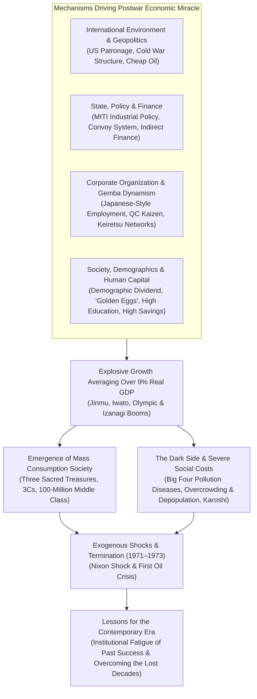
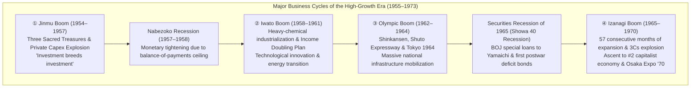
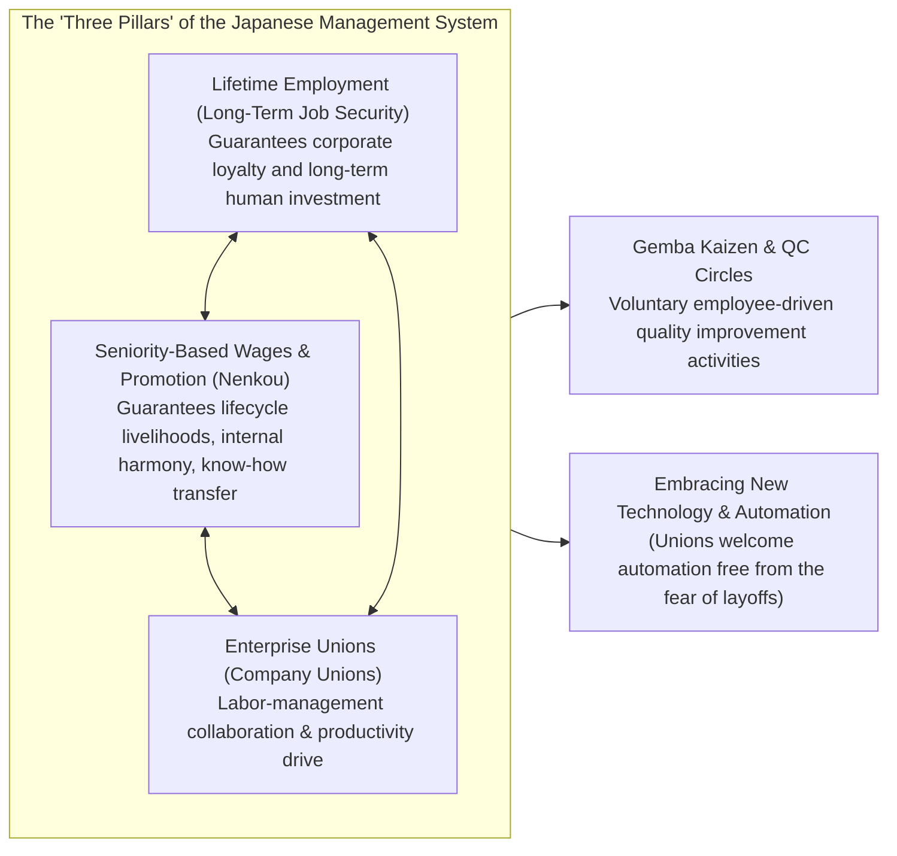
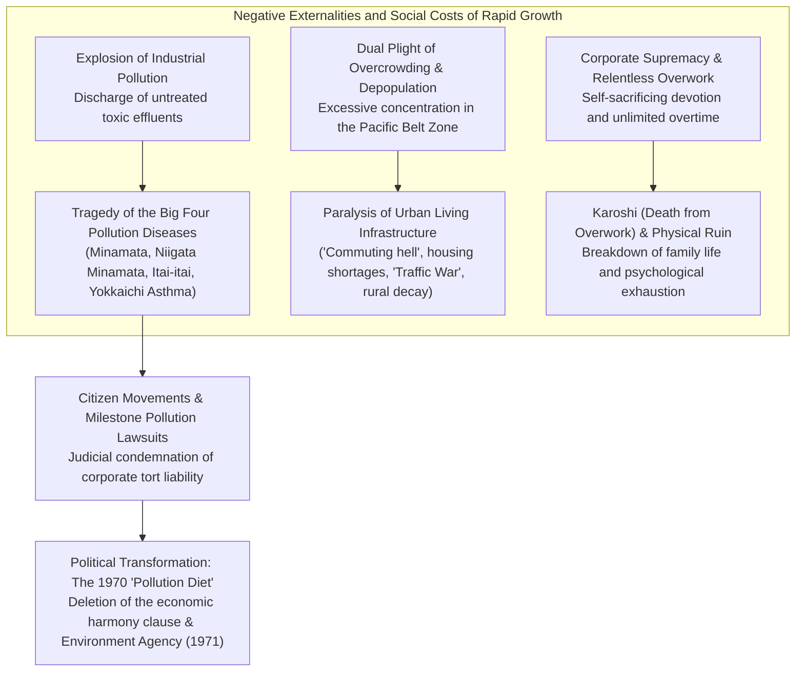

## Introduction: The Nature and Trajectory of an Unprecedented "Economic Miracle"

On August 15, 1945, when the Pacific War came to an end with the unconditional surrender of the Empire of Japan, the Japanese archipelago was reduced to literal scorched earth. Approximately 40 percent of its urban areas had been obliterated by aerial bombardments, and roughly one-quarter of the national wealth (accounting for some 36 percent of all non-military tangible assets) had vanished into ashes. All overseas territories were stripped away, and over six million repatriated military personnel and civilians flooded into the home islands with neither shelter nor employment. The vast majority of the populace lived in terror of extreme starvation and hyperinflation as even daily food rations broke down. Foreign correspondents and senior officials of the Supreme Commander for the Allied Powers (GHQ) visiting Japan at the time unanimously predicted that it would take at least half a century or more for Japan to restore an autonomous, functioning economic standard worthy of a modern state.

Yet, that grim forecast was overturned in the most dramatic fashion imaginable.

Just a decade after the war's conclusion, spanning roughly eighteen years from 1955 until the outbreak of the First Oil Crisis in the autumn of 1973, the Japanese economy achieved an **average annual real economic growth rate of approximately 9.3%**—a sustained supersonic expansion unprecedented in modern human history. Gross National Product (GNP) exploded fourteenfold, rocketing from roughly 8 trillion yen in 1955 to approximately 112 trillion yen in 1973. In 1968, Japan surpassed West Germany—the preeminent Western European industrial giant that had served as the benchmark of modernization since the Meiji Restoration—vaulting into position as the **second-largest economy in the capitalist world**, trailing only the United States.



This astonishing leap was lauded across the globe as the "**Economic Miracle of the Orient**." Consumer durables epitomized by the "Three Sacred Treasures"—the black-and-white television, the electric washing machine, and the electric refrigerator—permeated households throughout every corner of the nation, eventually evolving into the aspirational "3Cs": color televisions, room air conditioners (coolers), and privately owned passenger cars. The lifestyle of the Japanese populace underwent an irreversible transformation from traditional agrarian village communes to urban nuclear households, basking in the newfound abundance of an unprecedented mass-production and mass-consumption society. A unique social compact emerged: the "100-Million Middle-Class Society" (ichioku sou-churyu), wherein nearly 90 percent of citizens identified themselves as belonging to the middle class, constructing a world-leading industrial society celebrated for its public safety and high educational standards.

Nevertheless, this "miracle" was by no means a windfall bestowed by pure happenstance. It was the product of an intricate, interlocking machine: the prewar and wartime legacy of heavy-chemical industrial expertise and bureaucratic control mechanisms; the tectonic shifts of Cold War geopolitics and the reversal of United States occupation strategy; the sophisticated targeting strategies orchestrated by the Ministry of International Trade and Industry (MITI) alongside the Ministry of Finance's financial "convoy system"; the institutional triumvirate of Japanese-style employment characterized by lifetime job security and seniority wages; and the tireless diligence and extraordinary thrift of a youthful labor force celebrated as "golden eggs."

At the same time, this glorious march was shadowed by deep, tragic scars. The unchecked discharge of untreated toxic effluents and factory smoke gave rise to the "Big Four Pollution Diseases"—most notably Minamata disease and Yokkaichi asthma—irreversibly devastating the health and lives of countless innocent citizens. The relentless human migration from farming villages to metropolis corridors overwhelmed the Pacific Belt Zone with severe overcrowding, horrific commuter conditions, and a deadly "Traffic War," while gutting rural regions through rapid depopulation and the decline of primary agriculture. White-collar workers, christened "mo-retsu (super-intense) employees" and "corporate warriors," were subjected to unconditional corporate loyalty and unmeasured overtime, laying the groundwork for a structural pathology that would subsequently gain international notoriety under the untranslated Japanese noun *Karoshi* (death from overwork).

This treatise presents a comprehensive, multi-dimensional dissection of Japan's Postwar High Economic Growth Era (1955–1973). Going far beyond a superficial chronology of business cycles, it examines macroeconomic dynamics, industrial targeting, financial engineering, corporate governance, social restructuring, Cold War geopolitics, and environmental devastation. Furthermore, it traces how the very success formulas forged during this golden era calcified into institutional fatigue, ultimately locking Japan into the "Lost Decades" following the 1990s—extracting indispensable historical lessons for the revival of the Japanese economy in the twenty-first century.

---

## Chapter 1: Stirrings from the Ashes — The Prehistory of High Economic Growth (1945–1954)

If the year 1955 marks the official inception of the High Economic Growth period, the antecedent postwar decade (1945–1954) must be understood as the vital runway during which the nation cleared the rubble of economic collapse, rebuilt market mechanisms, and engineered the launchpad that made the subsequent supersonic takeoff possible.

### 1.1 Catastrophic Defeat and Hyperinflation

In the immediate aftermath of the August 1945 surrender, the Japanese domestic economy stood paralyzed on the brink of total collapse. Due to the abrupt cessation of military procurement and the complete severance of overseas raw material imports, the mining and manufacturing production index in 1946 plummeted to **approximately 30%** of its prewar benchmark (the 1934–1936 average). Delays and total shortfalls in regular rice rationing became chronic, forcing urban dwellers to pack clothing and household heirlooms into rucksacks and travel into farming villages to barter for sweet potatoes and grains—a degrading mode of survival remembered as "bamboo-shoot living" (*takenoko seikatsu*), in which people stripped their possessions layer by layer merely to stay alive.

This collapse of physical output was exacerbated by ferocious hyperinflation. The profligate disbursement of emergency military funds during the final months of the war, the payout of massive wartime munitions indemnities immediately following surrender, and the distribution of demobilization allowances to returning soldiers caused the volume of Bank of Japan notes in circulation to balloon to astronomical heights. Between the autumn of 1945 and 1949, the wholesale price index surged by an astonishing factor of **roughly 70 times**.

To arrest this runaway spiral, the government promulgated the Emergency Financial Measures Ordinance in February 1946. It enforced a draconian "deposit freeze" that blocked all bank withdrawals and declared circulating old banknotes null and void, forcibly swapping them for newly minted "new yen" notes in limited rations. However, because the fundamental bottleneck—a devastating shortfall in physical industrial capacity—remained unresolved, these financial band-aids could not stop the inflationary blaze.

```
[Dramatic Upheaval in Early Postwar Economic Indicators]
• Mining and Manufacturing Production Index (1946): 30.7 against prewar baseline (1934-36 = 100)
• Tokyo Wholesale Price Index Inflation Rate (1946): +364.5% year-on-year
• Official Daily Rice Ration (Late 1945): Reduced to 2 go 1 shaku (approx. 297g) per adult; chronic delays
• Total Repatriates from Overseas (1945–1950): Approximately 6.25 million individuals
```

To break this paralyzing structural impasse, the Japanese government adopted the **Priority Production System** (*Keisha Seisan Hoshiki*), conceptualized by Marxist economist and Tokyo Imperial University professor Hiromi Arisawa (approved by the Cabinet in late 1946 and implemented in 1947). The core philosophy of the Priority Production System was to reject pure free-market allocation of critically depleted resources (capital, raw materials, foreign exchange, and labor) and instead concentrate them exclusively into two foundational sectors: **coal mining** and **steel manufacturing**, using their mutual reinforcement to resurrect the entire industrial apparatus.

Under this blueprint, all available domestic coal was directed on a priority basis to steel mills to forge crude steel; the increased steel production was then channeled directly back into coal mines as structural pit props, shafts, and excavation machinery to boost coal extraction. This virtuous loop of "steel and coal" yielded an industrial surplus that was progressively distributed outward to downstream core industries, including electric power utilities, chemical fertilizer plants, and railway transportation networks.

The financial engine behind this industrial offensive was the **Reconversion Finance Bank** (RFB, or *Fukko Kinyu Kinko*, commonly abbreviated as *Fukkin*), established in January 1947. The RFB issued government-guaranteed reconversion bonds, the vast majority of which were directly underwritten by the Bank of Japan, thereby pumping vast sums of long-term, low-interest capital into coal, steel, and electrical power. By the close of 1948, RFB financing accounted for approximately 70 percent of all capital equipment loans extended to key industries nationwide.

The Priority Production System achieved spectacular success in reviving devastated heavy industries. However, the direct monetization of RFB debt by the Bank of Japan caused an enormous expansion of the money supply, igniting a secondary inflationary firestorm known as "**Fukkin inflation**."

### 1.2 The Dodge Line and the Shoup Recommendations: Establishing the Foundations of a Market Economy

Confronted with the ravages of Fukkin inflation, the United States government executed a fundamental pivot in its occupation policy. With the intensifying Cold War—punctuated by the 1949 victory of the Chinese Communist Party and escalating friction between the Eastern and Western blocs—Washington recast Japan's geopolitical identity: no longer a defeated aggressor to be permanently pastoralized and disarmed, but the vital capitalist fortress and anti-communist rampart in East Asia. To fulfill this mandate, Japan had to stand on its own economic feet without relying on massive, taxpayer-funded American relief subsidies (GARIOA and EROA aid funds).

In February 1949, **Joseph M. Dodge**, president of the Detroit Bank, arrived in Tokyo as a special minister with plenipotentiary financial authority. He administered a bitter, unsparing dose of shock therapy to the Japanese economy, known historically as the **Dodge Line**. The Dodge Line rested upon three unbending pillars:

1. **Formulation of a Super-Balanced Budget**: A complete prohibition on issuing new government debt, immediate eradication of fiscal deficits, and the enforcement of a "true surplus budget" that matched revenues to expenditures while setting aside surpluses for the mandatory redemption of accumulated public debt.
2. **Suspension of RFB Lending and Elimination of State Subsidies**: Total cessation of new loans from the Reconversion Finance Bank and the outright abolition of price-differential subsidies (massive government outlays that had artificially bridged the gap between state-mandated official consumer prices and actual corporate production costs).
3. **Establishment of a Single Exchange Rate**: On April 25, 1949, the Japanese yen was pegged to the US dollar at the uniform rate of **1 USD = 360 JPY**.

Hitherto, Japanese trade had operated under an opaque web of dozens of disparate, product-specific exchange rates. Dismantling this labyrinth and anchoring the entire economy to a single foreign exchange window exposed domestic enterprises unbuffered to the rigors of international price competition. While viewed as harsh at the time, the peg of 360 yen to the dollar was deeply undervalued relative to Japan's long-term purchasing power parity, transforming over the following decades into an extraordinary commercial advantage for Japanese export manufacturing.

However, the immediate impact of the Dodge Line was crushing. The sudden withdrawal of state liquidity coupled with fierce monetary contraction plunged the nation into severe deflation: the "Dodge Slump." Waves of small and medium-sized enterprises collapsed, while major corporations instituted brutal mass redundancies to survive. Hundreds of thousands of retrenched workers from the Japanese National Railways (JNR) and the Japan Monopoly Corporation spilled into the streets. Dark social unrest gripped the country, punctuated by the mysterious JNR incidents of the summer of 1949 (the Shimoyama, Mitaka, and Matsukawa incidents).

Parallel to the Dodge Line, the structural foundation of modern Japanese governance was established by the **Shoup Mission**, dispatched in May 1949 under Columbia University professor **Carl S. Shoup**. The Shoup Recommendations thoroughly dismantled the convoluted, prewar-style system dominated by indirect commodity duties, replacing it with a modern tax architecture **centered primarily on direct taxes, specifically personal and corporate income taxes**.

The Shoup reforms established the "Blue Return" (*Ao-iro Shinkoku*) system, institutionalizing modern double-entry bookkeeping and accounting transparency among businesses. It codified independent local tax bases (laying the framework for the modern Local Allocation Tax system) and stabilized corporate tax governance. Armed with the macroeconomic fiscal discipline of the Dodge Line and the microeconomic institutional modernism of the Shoup tax code, Japan acquired the solid institutional bedrock required to operate an advanced capitalist market economy.

### 1.3 The Korean War and the Shock of "Special Procurements": Catalyst for Capital Accumulation

Just as the Japanese economy was suffocating under the weight of the Dodge deflation, history intervened violently. On June 25, 1950, the **Korean War** erupted across the Tsushima Strait. While a geopolitical tragedy of monumental proportions, for the moribund Japanese economy, the conflict acted as an miraculous lifesaver. It is said that Prime Minister Shigeru Yoshida could not conceal his relief, describing the outbreak of the war as "a gift from the gods" (*Ten'yu*).

With the rapid deployment of United Nations forces (predominantly the US military), vast procurement orders for supplies, transport, and maintenance flooded into Japan, the closest advanced industrial base to the theater of war. This windfall was christened the **Korean War Special Procurements** (*Chosen Tokuju*).

Procurement orders spanned an extraordinary array of sectors:
- **Military Hardware & Fabricated Steel**: Trucks, jeeps, steel drums, concertina wire, barbed wire, weapon components, ammunition crates.
- **Textiles & Camp Supplies**: Military uniforms, burlap sandbags, wool blankets, canvas tents, combat boots.
- **Support Services**: Repair, overhaul, and maintenance of damaged tanks, combat aircraft, and military vehicles; naval transport; communications logistics.

Foreign exchange revenues earned through special procurements between 1950 and the signing of the armistice in 1953 reached a **cumulative total of roughly 2.4 billion USD**—an amount equivalent to approximately 60 percent of Japan's entire export earnings during that four-year window. This colossal torrent of US dollars swept away the chronic foreign exchange bottleneck that had paralyzed Japan's ability to import basic industrial inputs.

```
[Quantitative Impact of Korean War Special Procurements (1950–1953)]
• Total Procurement Contracts: Approx. $2.4 billion (direct military procurement + GI personal expenditure)
• Real GDP Growth Rates: FY1950 +10.8%, FY1951 +12.3%, FY1952 +10.0%, FY1953 +7.3%
• Mining and Manufacturing Index: Surged roughly 70% in 1950 alone, regaining prewar (1934-36) levels by 1951
• Rebound in Corporate Profits: Manufacturing profit-to-sales ratios touched all-time postwar highs in late 1950
```

The historical significance of the Special Procurements extended far beyond a transient inventory clearance bubble:
First, through the mass overhaul and assembly of military trucks, the nascent Japanese automotive industry (Toyota, Nissan, Isuzu) was compelled to assimilate the rigorous quality benchmarks of the United States military (Mil-Specs). Japanese engineers mastered parts interchangeability, tight tolerances, and modern mass-production assembly lines. Second, the colossal profits harvested from procurement contracts were retained internally within corporate balance sheets, serving as the equity foundation that funded massive capital expenditures—such as newly built coastal blast furnaces and imported state-of-the-art machine tools—during the High Growth era that followed.

### 1.4 The San Francisco System and "The Postwar Era Is Over"

In September 1951, Japan signed the San Francisco Peace Treaty alongside the US-Japan Security Treaty. On April 28, 1952, the treaty entered into full legal force, terminating seven years of Allied military occupation and officially restoring national sovereignty.

Regaining its independence, Japan anchored itself firmly within the Western liberal-capitalist camp of the Cold War. The foreign and national security doctrine engineered by Prime Minister Shigeru Yoshida—subsequently known as the **Yoshida Doctrine**—streamlined Japan's national ambitions with single-minded pragmatism. Under this grand bargain, Japan relied completely on the US nuclear umbrella and the forward-deployed military presence of US forces for its national defense, capping domestic defense outlays at less than 1 percent of GNP. This enabled the state to channel the totality of its national intellect, human talent, and financial capital into domestic economic reconstruction and industrial commerce. This strategic choice provided Japanese corporations with an ideal business sanctuary, unburdened by the ruinous fiscal costs of large-scale rearmament.

Although the 1953 Korean War armistice induced a brief cyclical slowdown due to the tapering of special procurements, an autonomous capital investment cycle was already gaining powerful momentum beneath the surface. In 1955, blessed by bumper agricultural harvests and an expanding world trade environment, a non-inflationary "quantity boom" (*suryo keiki*) commenced.

This watershed moment was captured in a legendary phrase published in the FY1956 *Economic White Paper* compiled by the Economic Planning Agency. Authored primarily by **Yonosuke Goto**, head of the Domestic Research Section, the conclusion declared:

> **"The 'postwar' period is over. We are now confronting a different situation. Growth through recovery has ended. Growth henceforth will be sustained by modernization."**

These words were not merely a celebratory eulogy for reconstruction. They sounded a clarion warning. The low-hanging fruit of postwar catch-up—merely restoring prewar productive benchmarks—had been fully harvested. Moving forward, Japan could no longer lean on foreign emergency aid or external war windfalls. Unless domestic industries aggressively absorbed the latest frontiers of technological innovation—automation, synthetic polymer chemistry, transistors, high-capacity thermal power generation—and transformed their fundamental industrial structure from premodern light manufacturing into capital-intensive heavy-chemical engineering, they would inevitably succumb to global competition.

With an explosive dynamism that far exceeded the predictions of the white paper itself, the Japanese economy plunged into the greatest experiment in industrial modernization in modern history.

---

## Chapter 2: Chronicles of the Business Cycles and High Growth (1955–1973)

The eighteen years spanning 1955 through 1973 were not characterized by smooth, uninterrupted linear expansion. Rather, the economy climbed upward in a stair-step trajectory through a sequence of dynamic business cycles: exhilarating booms fueled by private capital investment and consumer rushes, followed by sharp cyclical slowdowns triggered when surging imports depleted the nation's foreign exchange reserves, compelling the central bank to slam on the monetary brakes.

Because Japan operated under the Bretton Woods fixed exchange rate peg of 1 USD = 360 JPY, the gold and foreign exchange reserves held by the central bank imposed a hard boundary. Whenever an economic expansion overheated, imports of raw materials, capital machinery, and fuel soared, plunging the current account into deficit. As foreign exchange reserves neared exhaustion, the Bank of Japan was forced to raise the official discount rate and choke off bank lending to cool aggregate demand. This cyclical feedback loop was dubbed the **"balance-of-payments ceiling"** (*kokusai shushi no tenjo*) and represented the absolute macroeconomic ceiling governing Japanese economic policy throughout this era.

The sections below chronicle the five defining business cycles that forged the High Economic Growth era.



### 2.1 The Jinmu Boom (1954–1957) and the Nabezoko Recession: The Chain Reaction of Capital Investment

The economic expansion that gathered momentum in November 1954 was christened the **Jinmu Boom**—evoking a level of prosperity so unprecedented that nothing like it had occurred since Emperor Jinmu, the mythological first emperor of Japan, ascended the throne.

The prime locomotive of this boom was a torrential wave of private **plant and equipment investment** (*setsubi toshi*). Foundational industries—including steel, shipbuilding, synthetic textiles, petrochemicals, and electrical machinery—embarked simultaneously on constructing world-class continuous production facilities and installing state-of-the-art machinery. This self-reinforcing phenomenon was captured in the celebrated maxim of the FY1957 *Economic White Paper*: **"Investment breeds investment."**

When integrated steelmakers erected modern coastal blast furnaces, machine tool builders received massive orders for fabrication equipment. To expand their own output, machinery builders were in turn forced to build new assembly plants, driving up secondary demand for structural steel, heavy electrical switchboards, and cement. This inter-industry chain reaction generated a powerful, autonomous multiplier effect across the macroeconomy.

Simultaneously, the front lines of consumption witnessed the opening act of a "lifestyle revolution." The **Three Sacred Treasures** (*Sanshu no Jingi*)—the black-and-white television, the electric washing machine, and the electric refrigerator—penetrated urban middle-class households at blistering speed. The dramatic emancipation from domestic drudgery alongside the advent of domestic visual entertainment altered the texture of everyday Japanese life.

By early 1957, however, the structural cost of this euphoria became undeniable. Surging raw material imports pushed the trade balance deep into the red, depleting foreign exchange reserves to critical thresholds. The economy had collided head-on with the balance-of-payments ceiling. The Bank of Japan responded with rapid discount rate hikes and harsh credit ceilings. Economic activity plummeted, commodity prices for steel and textiles collapsed, and the economy slid into the **Nabezoko Recession** ("saucepan-bottom recession") of late 1957 into 1958. However, because underlying corporate appetite for capital investment remained fundamentally unextinguished, the stagnation proved brief.

### 2.2 The Iwato Boom (1958–1961) and the National Income Doubling Plan: The Explosion of Heavy-Chemical Industrialization

Emerging from the trough of the Nabezoko slump in July 1958, the economy embarked on an even more ferocious expansion. In popular lore, it was christened the **Iwato Boom**—surpassing even the Jinmu Boom, implying prosperity unseen since the sun goddess Amaterasu had emerged from the Heavenly Rock Cave (*Ame no Iwato*). Across this period, Japan's real GDP expanded at a dizzying **annual average rate of 11.3%**.

The hallmark of the Iwato Boom was the decisive structural migration of Japanese manufacturing away from light industries (textiles, apparel, toys) toward full-fledged **heavy-chemical industrialization** (integrated steel, petrochemicals, automotive manufacturing, heavy electrical machinery). This coincided with a monumental energy revolution: the foundational fuel of the economy shifted decisively from domestic coal to cheap, high-caloric crude oil imported from the Middle East. Along the Pacific coastline—spanning Tokyo Bay, Ise Bay, and the Seto Inland Sea—vast coastal land reclamation projects gave birth to sprawling petrochemical complexes (*kombinats*) and integrated steel mills equipped with deep-water docks capable of unloading supertankers.

This economic surge coincided with high-stakes political realignment. In 1960, the national controversy surrounding the revision of the US-Japan Security Treaty culminated in the "Anpo Protests," which saw hundreds of thousands of demonstrators surround the National Diet building in the greatest civil upheaval of postwar Japan. Following the resignation of Prime Minister Nobusuke Kishi in the wake of the crisis, his successor, **Hayato Ikeda**, executed a brilliant political pivot: redirecting public energy away from ideological warfare toward the unifying ambition of economic prosperity. In December 1960, the Cabinet officially promulgated the **National Income Doubling Plan** (*Kokumin Shotoku Baizo Keikaku*).

Constructed upon the theoretical formulations of Ministry of Finance economist Osamu Shimomura, the plan laid down a breathtaking goal: **double the real Gross National Product within ten years (1961–1970), attain full employment, and elevate the standard of living to parity with advanced Western European nations**. This required an average annual real growth rate of 7.2 percent—a target derided by opposition parties and academic economists as reckless political fantasy.

Yet, the actual results crushed all conservative projections. Domestic businesses, viewing the government's target as an unshakeable sovereign guarantee, unleashed an unprecedented torrent of capital investment. The target of doubling national income was achieved in just over four years. Prime Minister Ikeda's reassuring rhetoric of "tolerance and patience" alongside the tangible promise of "doubled wages" acted as an immense psychological catalyst, infusing a war-traumatized populace with unwavering confidence in the future.

### 2.3 The Olympic Boom (1962–1964) and the Infrastructure Revolution

Following another cyclical balance-of-payments cooldown after the Iwato Boom, the **Olympic Boom** ignited in late 1962. Mobilizing the full resources of the state, Japan embarked on vast engineering feats to ensure the triumphant execution of the 18th Summer Olympic Games—the Tokyo Olympics of October 1964, the first Olympiad ever staged in Asia.

The capital outlays mobilized for Olympic-related infrastructure reached approximately one trillion yen, an amount on par with the entire national general budget of the era:
- **The Tokaido Shinkansen**: Inaugurated on October 1, 1964. The world's first high-speed bullet train spanned the 515 kilometers between Tokyo and Shin-Osaka at a maximum operating speed of 210 km/h, slashing travel time from six and a half hours down to four hours (and 3 hours 10 minutes the following year), radically restructuring Japan's territorial trunk line.
- **The Meishin and Shuto Expressway Networks**: Japan's first intercity expressway, the Meishin Expressway (linking Nagoya and Kobe, fully opened in 1965), and the elevated Shuto Expressway weaving through the congested heart of Tokyo were constructed at a furious pace.
- **Urban Modernization**: The Tokyo Monorail linked Haneda Airport to central Tokyo in fifteen minutes; the Hibiya Subway Line was completed; architectural landmarks such as the Hotel New Otani were erected; and modern municipal sewerage systems were rapidly expanded.

In the realm of telecommunications, consumer demand for color television sets soared as households prepared to witness the opening ceremonies and athletic competitions in full spectrum. The successful transpacific satellite telecast via Syncom 3 beamed live footage across the globe, broadcasting the high-tech resurrection of a peaceful, industrialized Japan to millions of international viewers.

### 2.4 The Securities Recession (The 1965 Showa 40 Slump) and a Decisive Policy Shift

However, the moment the Olympic flame was extinguished, the Japanese economy collided with the most chilling cyclical test of the High Growth era: the **Showa 40 Recession (Securities Slump) of 1965**.

The vast production capacity rushed into operation to meet Olympic demand suddenly confronted an inventory overhang as capital spending peaked. Corporate bankruptcies spiked to postwar highs. The domestic securities industry, which had expanded aggressively during the retail investment frenzy of the late 1950s, was devastated by collapsing equity valuations. In May 1965, **Yamaichi Securities**—one of the nation's "Big Four" brokerage houses—incurred staggering trading and underwriting losses, tumbling to the precipice of imminent insolvency.

Fearing that a collapse of Yamaichi would trigger a domino cascade of commercial bank runs and systemic financial panic, Finance Minister **Kakuei Tanaka** and Bank of Japan Governor Makoto Usami orchestrated an unprecedented rescue. Invoking Article 25 of the Bank of Japan Act, the central bank injected **unlimited, unsecured special loans** (*Nichigin Tokuyu*) into Yamaichi Securities, immediately guaranteeing all client balances and stemming retail runs on brokerage branches.

Even more consequentially, the government shattered the cardinal fiscal taboo that had anchored state finance since the Dodge Line: Article 4 of the Public Finance Act, which prohibited the issuance of government deficit bonds. In the supplementary budget for FY1965, the government issued **special deficit-financing bonds** (*tokurei kokusai*) for the first time in the postwar era. This aggressive Keynesian countercyclical pump-priming—combining accelerated public works expenditures with corporate tax cuts—successfully cushioned collapsing private demand. By breaking the balanced-budget dogma, policymakers swiftly engineered an exit from the slump, laying the foundation for the longest expansionary cycle in the nation's history.

### 2.5 The Izanagi Boom (1965–1970): The Golden 57 Months and Ascent to Global Number Two

Hitting bottom in November 1965, the economy surged into a five-year golden era lasting until July 1970: the **Izanagi Boom**. Named after Izanagi-no-Mikoto, the divine progenitor who according to Japanese myth created the Japanese islands themselves, this uninterrupted expansion lasted for **57 consecutive months**, establishing a postwar longevity record that stood unbroken for decades.

The twin drivers of the Izanagi Boom were blistering international export competitiveness and the qualitative maturation of mass consumer culture. Consumer aspirations were upgraded from the Three Sacred Treasures to the **"3Cs"**:
- **Color Television**
- **Cooler (Room Air Conditioner)**
- **Car (Privately owned passenger automobile)**

The year 1966 was celebrated as the dawn of the "My Car Era" (*Mai Kaa Gannen*), marked by the commercial debuts of the Toyota Corolla and the Nissan Sunny. Passenger cars, once the exclusive luxury of high-net-worth elites, became staples of suburban working-class households. On shop floors, comprehensive total quality control and shop-floor Kaizen completely eliminated the prewar stigma of "cheap and shoddy," replacing it with a global reputation for flawless reliability, fuel efficiency, and cutting-edge engineering.

In 1968, modern Japanese history crossed an epochal threshold. Japan's nominal GNP reached **approximately $141.9 billion**, overtaking West Germany. Exactly one century after the Meiji Restoration of 1868, Japan stood as the **second-largest economy in the capitalist world**, trailing only the United States. A non-Western nation, shattered by war and destitute of domestic natural resources, had overtaken all the historic industrial empires of Europe.

In 1970, Asia's first world's fair, the **Japan World Exposition (Osaka Expo '70)**, opened in the Senri Hills of Osaka under the banner of "Progress and Harmony for Mankind." Over its six-month run, an astonishing **64.21 million visitors** passed beneath Taro Okamoto's iconic "Tower of the Sun." Glimpsing the Apollo moon rock, moving pedestrian walkways, and futuristic pavilion cityscapes, the Japanese public embraced the exposition as the definitive celebration of postwar resurrection and the arrival of national affluence.

```
[Key Macroeconomic Indicators During the High Growth Era (FY1955–FY1974)]
```

| Fiscal Year | Real GDP Growth Rate (%) | Nominal GNP (100 Million Yen) | Economic Phase / Historic Milestone |
| :---: | :---: | :---: | :--- |
| **1955** | **+10.8** | 88,646 | Inception of the Jinmu Boom; Three Sacred Treasures begin diffusion |
| **1956** | **+6.2** | 98,719 | *Economic White Paper*: "The postwar era is over"; UN accession |
| **1957** | **+7.8** | 111,280 | Nabezoko Recession; collision with balance-of-payments ceiling |
| **1958** | **+5.6** | 118,527 | Inception of the Iwato Boom; completion of Tokyo Tower |
| **1959** | **+11.2** | 134,228 | Crown Prince's wedding parade sparks explosive TV sales |
| **1960** | **+12.5** | 160,332 | Anpo Protests; Ikeda Cabinet adopts Income Doubling Plan |
| **1961** | **+12.0** | 196,442 | Heavy-chemical industrialization deepens; energy revolution |
| **1962** | **+8.9** | 220,119 | Inception of Olympic Boom; opening of Senri New Town |
| **1963** | **+10.7** | 256,419 | Opening of Meishin Expressway (Ritto–Amagasaki section) |
| **1964** | **+13.1** | 295,444 | Tokyo Olympics; Tokaido Shinkansen inaugurated; OECD accession |
| **1965** | **+5.8** | 328,217 | Securities Recession; BOJ special loan to Yamaichi; first deficit bonds |
| **1966** | **+10.6** | 382,900 | Izanagi Boom begins; "My Car Era" (debut of Corolla & Sunny) |
| **1967** | **+11.1** | 446,953 | Rapid diffusion of 3Cs; Basic Law for Environmental Pollution Control |
| **1968** | **+12.2** | 528,781 | **Japan's GNP surpasses West Germany to rank #2 in capitalist world** |
| **1969** | **+12.5** | 622,464 | Tomei Expressway fully opens; color TV ownership explodes |
| **1970** | **+10.7** | 733,449 | Osaka Expo '70 (64.2M attendees); landmark "Pollution Diet" |
| **1971** | **+5.0** | 809,726 | Nixon Shock; Smithsonian Agreement revalues yen to 1 USD = 308 JPY |
| **1972** | **+9.1** | 954,646 | Tanaka Cabinet's *Remodeling of Archipelago*; China ties normalized |
| **1973** | **+5.1** | 1,125,487 | Floating exchange rates; First Oil Crisis; runaway "Frantic Prices" |
| **1974** | **-1.2** | 1,348,229 | **First postwar negative growth; complete end of High Growth era** |

---

## Chapter 3: Deconstructing the "Miracle" — Anatomy of a Multifaceted Growth Engine

The Japanese economic miracle cannot be explained by neoclassical laissez-faire market mechanisms alone, nor can it be reduced to culturalist cliches regarding ethnic diligence. Instead, it was powered by a highly coordinated institutional architecture—a tailored **"Japanese-style capitalist model"**—wherein industrial policy, financial structures, labor practices, shop-floor innovations, demographic tailwinds, and Cold War geopolitics functioned in synchronized harmony.

This chapter dissects the six core structural mechanisms that powered the growth engine.



### 3.1 Industrial Policy and State Stewardship: MITI's Targeted Industry Strategy

In his classic study *MITI and the Japanese Miracle*, American political scientist Chalmers Johnson challenged the prevailing Anglo-American paradigm of the "regulatory state"—wherein government limits itself to setting market rules and enforcing anti-monopoly laws—by proposing the alternative concept of the **"Developmental State."** In a developmental state, the sovereign government actively formulates strategic industrial priorities, mobilizes capital, and steers the trajectory of national economic development. The preeminent exemplar of this model was Japan's Ministry of International Trade and Industry (MITI).

The core of MITI's industrial targeting was a deliberate rejection of static comparative advantage theory. Under textbook classical trade theory, a war-devastated, resource-poor nation with a capital shortage like Japan should have specialized in low-wage, labor-intensive consumer goods such as cotton textiles and ceramic sundries. However, MITI technocrats recognized that the global income elasticity of demand for light consumer sundries was low. They consciously chose to target capital- and technology-intensive industries: **steel, shipbuilding, petrochemicals, automobiles, industrial machinery, and electronics**.

MITI deployed a formidable arsenal of administrative tools to guide and protect these targeted sectors:

1. **Foreign Exchange Budget Allocations (The Foreign Exchange and Foreign Trade Control Act)**:
   During the era when US dollars were strictly controlled by the state, MITI held sovereign discretion over foreign exchange allocation. It channeled scarce foreign exchange preferentially to designated priority firms, enabling them to license cutting-edge Western patents and purchase advanced machinery (e.g., continuous strip mills, advanced precision lathes, polymer synthesis rights). Conversely, imports of non-essential consumer goods and competing foreign manufactures were choked off, providing an impenetrable protective greenhouse for infant domestic industries.
2. **The "Signaling Effect" of the Japan Development Bank (JDB / Kaigin)**:
   When the government-owned Japan Development Bank extended low-interest policy loans to a targeted project (such as a coastal integrated blast furnace or an ethylene cracking center), it functioned as an official stamp of sovereign backing. Private commercial banks interpreted this as an implicit state guarantee, unleashing a flood of private syndication capital into the targeted sector.
3. **Public-Private Coordination and Capex Cartels**:
   Unchecked market competition carried the risk that rival firms would simultaneously over-expand capacity, inducing destructive market gluts. MITI coordinated regular "Public-Private Roundtables" with corporate leaders in steel and petrochemicals, orchestrating the sequencing of new blast furnace groundbreakings and allocating production quotas. This insulated corporations from devastating investment cycles, giving them the confidence to construct facilities of unprecedented scale.

### 3.2 The Alchemy of the Financial System: Indirect Financing and the Convoy System

The ferocious pace of corporate capital expenditure during the High Growth period required astronomical volumes of capital that could not have been supplied by traditional capital markets.

In Western market economies, capital expenditures were traditionally funded via retained earnings or the issuance of corporate equities and bonds in open capital markets (direct financing). However, Japanese corporations in the 1950s possessed virtually nonexistent equity cushions due to wartime physical destruction and hyperinflation. Consequently, corporate Japan relied almost entirely on commercial bank borrowings: the **indirect financing system**.

This financial apparatus was defined by three institutional characteristics:

- **The Main Bank System**:
  Large industrial enterprises forged deep, permanent affiliations with a primary commercial bank (such as Mitsui, Mitsubishi, Sumitomo, Fuji, Dai-Ichi Kangyo, or Sanwa) or a long-term credit institution (such as the Industrial Bank of Japan, IBJ). Main banks were far more than transactional creditors: they held stable cross-shareholdings in client firms, dispatched senior directors to corporate boards, and maintained intrusive, real-time monitoring of corporate cash flows. This insulation from quarterly capital-market pressures and hostile takeover threats allowed Japanese executives to pursue long-range capital investment horizons spanning five to ten years.
- **Corporate Over-Borrowing and Bank Over-Loaning**:
  Industrial corporations operated with debt-to-equity ratios that appeared reckless by Western accounting standards, borrowing far in excess of their capitalization (over-borrowing). Concurrently, commercial city banks extended loans that exceeded their aggregate retail deposit bases (over-loaning), bridging their perpetual liquidity deficits by borrowing directly from the discount window of the Bank of Japan. The Bank of Japan sat at the apex of this credit pyramid, manipulating the macro-financial throttle through discount rate policy and administrative **"Window Guidance"** (*Madoguchi Shido*)—direct quantitative quotas capping the quarterly lending expansion of each commercial bank.
- **The Convoy System (*Goso Sendan Hoshiki*) and Low-Interest Regimes**:
  Under the Temporary Interest Rate Adjustment Law, the Ministry of Finance suppressed official bank deposit and lending rates below market-clearing equilibrium, deliberately lowering capital costs for manufacturing heavyweights. Simultaneously, the Ministry exercised draconian oversight over the banking sector: branch licensing, interest rates, and service fees were strictly standardized. The ministry ensured that even the weakest regional bank would never be allowed to fail—an administrative doctrine christened the "convoy system," after naval armadas that calibrate their cruising speed to the slowest vessel. This ironclad guarantee established absolute public confidence in banking institutions, entirely eliminating bank runs and mobilizing the aggregate savings of the nation.

Equally vital was the **Fiscal Investment and Loan Program** (FILP / *Zaisei Toyushi*), popularly known as the "Second National Budget." The state mobilized the vast ocean of retail deposits pooling in the postal savings system (*Yucho*) alongside public pension reserves, concentrating them within the Ministry of Finance's Trust Fund Bureau. This capital was directed through government financial vehicles to underwrite massive national infrastructure: the Tokaido Shinkansen, the expressway network, port facilities, the Housing Loan Corporation, and heavy industrial facilities.

### 3.3 The Consolidation of Japanese-Style Employment Practices: The "Three Sacred Pillars" of Labor Relations

On the factory floor and in corporate offices, High Economic Growth was sustained by the institutionalization of **Japanese-style employment practices**. Crystallizing out of the fierce labor disputes of the early postwar era (such as the 1953 Nissan strike and the bitter 1960 Miike Coal Mine strike), this management model was famously categorized by American sociologist James Abegglen in his 1958 work *The Japanese Factory* as resting upon three foundational pillars:

1. **The Lifetime Employment System (*Shushin Koyo*)**:
   Corporations recruited new cohorts of fresh school and university graduates every April, offering implicit job security until mandatory retirement. This long-term contract incentivized companies to invest heavily in extensive on-the-job training (OJT) without fearing that rival firms would poach their talent, while providing employees with total economic security.
2. **Seniority-Based Wages and Promotion (*Nenkou Joretsu*)**:
   Remuneration and corporate rank escalated predictably with age and length of service. During their early twenties, workers were intentionally undercompensated relative to their marginal productivity, acting as a direct capital subsidy for corporate expansion. As employees reached their forties and fifties—facing the heavy expenses of marriage, child-rearing, and home mortgages—their pay rose substantially to align with family lifecycle costs.
3. **Enterprise Unionism (*Kigyo-betsu Kumiai*)**:
   Rather than organizing across entire crafts or industries as in Western economies, Japanese unions were organized strictly within the boundaries of a single enterprise, encompassing all regular blue-collar and white-collar personnel. Union officials were regular employees who shared an existential stake in corporate health. The prevailing union ethos recognized that the expansion of worker welfare (wage gains, retirement allowances, bonuses) was entirely dependent on corporate market share and operational profitability.

This institutional triad exerted a profound, positive influence on technological innovation.

In Western craft-union environments, the introduction of automated machinery or labor-saving process engineering was routinely met with wildcat strikes and sabotage, as workers feared their craft skills would be rendered obsolete, leading to layoffs. Under Japan's lifetime employment compact, however, a worker whose line was automated was never dismissed; instead, they were retrained and redeployed to expanding operational wings or new facilities.

Consequently, Japanese industrial unions and rank-and-file workers **enthusiastically championed the introduction of automation, numerical control machinery, and industrial robotics**. They viewed technological modernization as the direct engine that elevated company revenues, secured annual bonuses, and eliminated hazardous manual drudgery.

Furthermore, the **Spring Wage Offensive** (*Shunto*), established in 1955, synchronized annual wage negotiations across foundational heavy industries (steel, shipbuilding, electrical machinery, automotive). The percentage wage hike negotiated in core steel set the pattern for the entire economy, cascading downward to small suppliers and the service sector. *Shunto* drove consistent nationwide annual wage increases averaging nearly 10 percent, continually expanding domestic purchasing power and creating a flourishing domestic mass market that absorbed the output of massive factory investments.

However, this corporate stability had a darker side: it rested upon a vast, precarious shock absorber of **subcontractors, sub-subcontractors, and temporary non-regular workers** who bore the brunt of every cyclical downturn—the institutionalized "dual structure" of the Japanese economy.

### 3.4 Gemba Dynamism and Shop-Floor Innovation: QC Circles and the Kaizen Movement

The transformation of Japanese manufacturing from an exporter of shoddy trinkets into a benchmark of global engineering perfection was powered by a shop-floor revolution in quality management.

Immediately following the war, General Headquarters (GHQ) recognized that the abysmal quality of Japanese telecommunications and electrical hardware posed an acute operational liability. Under GHQ sponsorship and the invitation of the Union of Japanese Scientists and Engineers (JUSE), American statistical control expert **Dr. W. Edwards Deming** arrived in Japan in 1950. Deming delivered a series of legendary lectures to corporate chieftains and plant managers, introducing statistical quality control and the iterative Plan-Do-Check-Act (PDCA) cycle.

Deeply inspired, Japanese industry instituted the prestigious **Deming Prize** using book royalties donated by Deming, unleashing fierce nationwide corporate competition to master statistical process control.

Yet, the definitive breakthrough occurred when Japanese engineers transformed Deming's top-down, management-centric statistical theory into a decentralized, bottom-up grassroots movement: the **Quality Control Circle (QC Circle)**, which began sweeping manufacturing plants around 1962.

Frontline shop-floor workers organized themselves into small autonomous teams of five to ten colleagues. Meeting during breaks and after shifts, they utilized analytical tools—such as Kaoru Ishikawa's "fishbone diagrams" (cause-and-effect charts) and Pareto charts—to dissect the root causes of assembly defects, proposing their own process modifications: **Kaizen** (continuous incremental improvement). Successful Kaizen proposals were integrated directly into standard operating procedures, and top-performing circles were celebrated at corporate and national conventions. This grassroots empowerment fostered an extraordinary sense of craft pride and engineering ownership among front-line blue-collar workers.

The zenith of this gemba-centric philosophy was the **Toyota Production System (TPS)**, architected by executive vice president Taiichi Ohno:
- **Just-in-Time (JIT)**: Producing only "what is needed, when it is needed, and in the amount needed," eliminating intermediate inventory and warehouse backlogs.
- **The Kanban System**: A decentralized pull mechanism utilizing physical routing cards (kanban) to signal upstream stations to produce only the exact quantity consumed downstream.
- **Autonomation (*Jidoka*)**: Endowing machinery with human intelligence so that equipment instantly stops automatically the microsecond an abnormality or defect arises, guaranteeing that zero defects pass downstream.
- **The Elimination of Seven Wastes (*Muda*)**: The ruthless eradication of waste in overproduction, waiting, transportation, processing, excess inventory, unnecessary motion, and defect correction.

These shop-floor innovations allowed Japanese assembly lines to produce high-mix, low-volume product variations at costs and defect rates far superior to the rigid, batch-oriented Fordist mass-production systems of the West.

### 3.5 Demographics and Human Capital: The Demographic Dividend and the Migration of the "Golden Eggs"

At the bedrock of the High Growth era lay an extraordinarily favorable **demographic dividend** coupled with world-class **human capital**.

Between 1947 and 1949, Japan experienced an unprecedented first baby boom, with roughly **8 million children** born in three years—the *Dankai* generation. By the late 1950s, Japan entered a historic demographic sweet spot: the proportion of working-age individuals (ages 15 to 64) expanded rapidly relative to the dependent population of children and retirees.

```
[Trajectory of Japan's Working-Age Population Ratio (15–64 Years)]
• 1950: 59.7%
• 1960: 64.2%
• 1970: 68.9% (Peak of the demographic dividend)
```

This expanding sea of young labor was defined not merely by sheer volume, but by its spatial reallocation from the agrarian countryside to industrial metropolitan corridors.

Postwar land reform had created millions of independent, land-owning family farmers. However, small plots could support only the eldest son. Millions of younger sons and daughters faced limited prospects in the countryside. Upon graduating from junior high and high schools, they were recruited into metropolitan machine shops, assembly lines, and department stores. Highly valued for their discipline, strong work ethic, and quick learning, they were celebrated by the media as **"Golden Eggs"** (*Kin no Tamago*).

Special dedicated trains—the "Group Employment Trains" (*Shudan Shushoku Ressha*)—steamed out of agricultural regions in Tohoku, Hokuriku, and Kyushu, arriving at Tokyo's Ueno Station and Osaka Station packed with thousands of young graduates. Between 1955 and 1970, **over 10 million individuals** migrated into the three great metropolitan basins (Tokyo, Osaka, Nagoya). The sectoral employment structure was upended: primary sector employment (agriculture, forestry, fisheries), which commanded **48.3%** of all Japanese workers in 1950, plummeted to **17.4%** by 1970, releasing an enormous ocean of productive human capital into manufacturing and construction.

Furthermore, this demographic wave possessed exceptional educational and financial characteristics:
- **Homogeneous, High-Standard Education**: Rooted in the primary schooling traditions of the Edo-period *terakoya* and the Meiji educational system, Japan boasted virtually 100 percent functional literacy. High school enrollment rates surged from 42.5 percent in 1950 to 82.1 percent by 1970, supplying factory floors with shop-floor workers who could read complex engineering blueprints, master intricate machinery manuals, and perform statistical calculations without difficulty.
- **World-Leading Household Savings Rates**: The household savings rate out of disposable income remained remarkably elevated, consistently fluctuating between **15% and over 20%**—more than double that of contemporary Western economies. This extraordinary thrift was driven by rapid income gains, an underdeveloped state welfare net, biannual lump-sum bonus customs, and the tax-exempt postal savings system (*Maru-yu*). Channeled through the banking network, these massive domestic household savings funded corporate plant and equipment investments at minimal interest rates, shielding the country from dependence on foreign debt.

### 3.6 Geopolitics of the Cold War and International Environment: Tailwinds of History

Japan's High Economic Growth was also the beneficiary of a uniquely favorable postwar international architecture: the Bretton Woods system operating under the geopolitical umbrella of Pax Americana.

First, under the **Yoshida Doctrine**, Japan capped its defense spending at roughly 1 percent of GNP. While the United States, the Soviet Union, Great Britain, and frontline Cold War nations (such as South Korea, Taiwan, and West Germany) diverted between 5 and 10 percent of their national wealth into military readiness and universal conscription, Japan outsourced its defense to the US military presence. This allowed Japan to channel virtually its entire national budget and intellectual elite into civilian technological innovation and commercial infrastructure.

Second, Japan was granted privileged access to the US-sponsored **multilateral free-trade regime**. Japan acceded to the General Agreement on Tariffs and Trade (GATT) in 1955, transitioned to IMF Article 8 status (forbidding foreign exchange restrictions on current transactions) in 1964, and entered the Organisation for Economic Co-operation and Development (OECD) that same year, joining the "developed nations club." The open US market absorbed vast volumes of Japanese exports, while Washington indulged Japan's continued use of domestic tariffs, import quotas, and stringent restrictions on foreign direct investment to shield its domestic industries.

Third, the **undervalued peg of 1 USD = 360 JPY** provided an enduring commercial advantage. As Japanese labor productivity surged across the 1960s, the nominal exchange rate remained locked at 360 yen. This deep currency undervaluation acted as a continuous export subsidy, allowing Japanese steel, transistor radios, color televisions, precision cameras, and compact cars to undercut competitors in Western markets.

Fourth, the era enjoyed an unceasing torrent of **dirt-cheap Middle Eastern petroleum**. Controlled by the Western international oil majors (the "Seven Sisters"), crude oil was supplied to Japanese refiners at bargain prices of roughly $1.80 to $2.00 per barrel. This inexpensive oil fueled high-capacity coastal thermal power plants, served as virtually free feedstock for petrochemical crackers, and underwrote the rapid motorization of the archipelago.

---

## Chapter 4: The Advent of Mass Consumption and the Lifestyle Revolution

High Economic Growth was far more than an abstract macroeconomic triumph measured in industrial production indices and blast furnace capacity. It ignited a profound **lifestyle revolution** that completely transformed the domestic existence, family structures, material expectations, and psychological consciousness of the Japanese people.

Prior to the mid-1950s, the vast majority of ordinary citizens—excluding a thin stratum of prewar urban elites and landed gentry—led a frugal, quasi-subsistence existence rooted in traditional rural practices. Over an extraordinarily compressed span of less than two decades, Japan reshaped itself into one of the most egalitarian and affluent **mass-consumption societies** on earth.

### 4.1 From the "Three Sacred Treasures" to the "3Cs": The Dramatic Metamorphosis of Consumer Life

The modernization of the Japanese household advanced in two distinct, iconic waves of consumer durable acquisition.

The opening wave struck in the late 1950s (spanning the Jinmu and Iwato Booms) with the frenzy for the **Three Sacred Treasures** (*Sanshu no Jingi*). Humorously named after the imperial regalia of mirror, jewel, and sword, this trinity comprised the **black-and-white television**, the **electric washing machine**, and the **electric refrigerator**:
- **The Electric Washing Machine**: Emancipated housewives from freezing washbasins, washboards, and hand-wringing, reducing hours of physical labor to the turn of a dial.
- **The Electric Refrigerator**: Replaced iceboxes and daily neighborhood market runs, enabling the hygienic preservation of perishables and revolutionizing nutrition.
- **The Black-and-White Television**: Transformed home entertainment and connected isolated family parlors to national news. A defining catalyst was the April 1959 royal wedding parade of Crown Prince Akihito and Michiko Shoda. Millions of citizens rushed to buy televisions to witness the fairy-tale procession, bringing the era of gathering around outdoor public street televisions (*gaito terebi*) to an end.

A decade later, during the Izanagi Boom of the late 1960s, consumer ambitions escalated to the **"3Cs"** (the "New Three Sacred Treasures"):
- **Color Television (Color TV)**: Captured events such as the 1964 Tokyo Olympics and the 1970 Osaka Expo in vivid living-room color.
- **Cooler (Room Air Conditioner)**: Tamed the oppressive humidity of Japanese summers, converting homes into climate-controlled modern sanctuaries.
- **Car (Privately Owned Passenger Automobile)**: The 1966 commercial rollout of the Toyota Corolla and the Nissan Sunny inaugurated the "My Car Era," transforming personal automobiles from elite status symbols into vehicles for weekend family leisure.

```
[Household Penetration Rates of Major Consumer Durables (1955–1975, Economic Planning Agency)]
```

| Year | Washing Machine (%) | Refrigerator (%) | B&W TV (%) | Color TV (%) | Passenger Car (%) | Air Conditioner (%) |
| :---: | :---: | :---: | :---: | :---: | :---: | :---: |
| **1955** | 4.6 | 1.1 | 0.9 | — | — | — |
| **1958** | 29.3 | 5.5 | 10.4 | — | — | — |
| **1960** | 45.4 | 15.7 | 44.7 | — | — | — |
| **1962** | 62.7 | 28.0 | 79.4 | — | — | — |
| **1965** | 73.6 | 51.4 | 90.3 | 0.2 | 3.5 | 2.1 |
| **1967** | 80.7 | 70.8 | 96.0 | 1.6 | 7.7 | 3.0 |
| **1970** | 91.4 | 89.1 | 90.2 | **26.3** | **22.1** | **5.9** |
| **1973** | 96.1 | 95.8 | 60.1 | **75.8** | **36.8** | **13.3** |
| **1975** | 97.6 | 96.7 | 40.5 | **90.3** | **41.2** | **17.2** |

As these statistics demonstrate, basic household appliances that were virtually nonexistent in Japanese homes in 1955 reached **over 90 percent penetration** by the early 1970s—a compressed trajectory of domestic material modernization without historical parallel.

### 4.2 Danchi Housing Projects, New Towns, and Nuclear Families: Transformations in Living Spaces and Kinship

The tidal wave of human migration into metropolitan regions overwhelmed the urban housing stock, prompting a revolution in residential architecture and family life.

Established in 1955, the **Japan Housing Corporation** (*Nihon Jutaku Kodan*) embarked on the mass construction of multi-story reinforced-concrete apartment complexes, popularly known as **Danchi**, across suburban greenfields. In the 1960s, master-planned satellite bedroom communities of colossal scale were carved out of forested hills, including Osaka's **Senri New Town** (opened 1962) and Tokyo's **Tama New Town** (opened 1971), designed to house hundreds of thousands of residents.

The Danchi architecture fundamentally restructured domestic living:
- **The Dining-Kitchen (DK)**: In traditional Japanese dwellings, the kitchen (*daidokoro*) was relegated to a dark, dirt-floored corner, while family dining took place around low folding tables (*chabudai*) placed on tatami straw mats. The public corporation's Danchi introduced a combined dining-kitchen featuring a stainless steel sink and modern dining table. This spatial innovation separated food preparation and dining from sleeping areas (*shoku-shin bunri*), revolutionizing domestic life and kitchen sanitation.
- **Cylinder Locks and Personal Privacy**: Reinforced concrete construction, individual cylinder door locks, private flush toilets, and private bathtubs offered young families complete isolation from the inquisitive surveillance of neighborhood communities and rural kinship networks.

This spatial transformation accelerated the emergence of the **nuclear family** (*kaku-kazoku*). Multi-generational rural stem families—where grandparents, parents, and grandchildren cohabited under patriarchal authority (*ie*)—receded into the past. In their place emerged the modern nuclear archetype: the corporate salaryman husband, the stay-at-home housewife (*sengyo shufu*), and two children. Danchi living became the aspirational lifestyle benchmark of the Showa era, standardizing middle-class consumer expectations across the nation.

### 4.3 Emergence of the "100-Million Middle-Class" Consciousness: The Birth of a Homogeneous Society

The most significant social consequence of the High Growth era was the evaporation of prewar class antagonism and the consolidation of the **"100-Million Middle-Class Society"** (*ichioku sou-churyu*).

In the Cabinet Office's annual *Public Opinion Survey on the Life of the People*, respondents were asked: "Compared to society at large, how would you evaluate your standard of living?" The percentage of citizens choosing the "Middle" category (encompassing Upper-Middle, Middle-Middle, and Lower-Middle) climbed from roughly 70 percent in the late 1950s to over 80 percent by the mid-1960s, touching **nearly 90 percent by 1970**. Across income levels and occupational backgrounds, virtually the entire population came to share an unshakeable conviction that they belonged to an egalitarian middle class.

This middle-class identity was grounded in measurable economic reality:
1. **Dramatic Compression of Income Disparities**:
   Japan's Gini coefficient fell steadily across the High Growth era, reaching levels of income equality comparable to Scandinavian social democracies. Equalized wage increases driven by the *Shunto* framework, the spread of a national minimum wage, steeply progressive income tax schedules (topping out at a 75 percent marginal rate), and massive fiscal wealth transfers from metropolitan tax bases to rural prefectures through the Local Allocation Tax system compressed regional and class chasms.
2. **"Keeping Up with the Tanaka's" (*Yokonarabi* Conformism)**:
   A powerful egalitarian conformism gripped the populace: "If the family next door bought a color TV, we must buy one too; if the neighbors drive a Corolla, we shall purchase a Sunny." This competitive consumption drove sustained demand for consumer durables.

The rigid social hierarchies of prewar Japan were dismantled. The widespread conviction that hard work, academic credentials, and corporate loyalty guaranteed a brighter tomorrow infused society with optimism and forward momentum.

### 4.4 The Distribution Revolution and the Explosion of Mass Culture

The maturation of consumer society reshaped the commercial and cultural landscape.

The vanguard of this transformation was the rise of the **supermarket and general merchandise store (GMS)**, championed by visionary entrepreneurs such as Isao Nakauchi, founder of **Daiei**. This structural shift was hailed as the **"Distribution Revolution"** (*Ryutsu Kakumei*).

Challenging traditional neighborhood shopping arcades and the "resale price maintenance system" (wherein corporate manufacturers dictated non-negotiable retail list prices), Nakauchi declared a war for the consumer wallet under the banner: "For the Customers: Selling Good Merchandise at Ever-Cheaper Prices." Daiei implemented bulk purchasing, self-service shopping, and lean profit margins, pioneering the concept of "price destruction" (*kakaku hakai*).

This conflict culminated in the legendary "Thirty Years' War" between Daiei and Konosuke Matsushita, founder of Matsushita Electric Industrial (now Panasonic). When Daiei began discounting Matsushita home appliances by 20 percent, Matsushita halted factory shipments. Backed by the patronage of price-conscious housewives, Daiei held its ground. The retail sector successfully wrested pricing power from monopolistic manufacturers, securing the public's access to high-quality, affordable consumer goods.

Concurrently, the domestic cultural sphere entered the **Golden Age of Mass Media**, anchored by nationwide television networks. The NHK annual New Year's Eve music extravaganza *Kohaku Uta Gassen* captured viewing shares exceeding 80 percent. Professional wrestling broadcasts starring Rikidozan, the golden era of the Yomiuri Giants baseball dynasty (the nine-consecutive-championship "V9" era led by Sadaharu Oh and Shigeo Nagashima), and weekly sketch comedy shows like The Drifters' *Hachijidyo! Zen'in Shugo* became unifying cultural touchstones. The proliferation of mass-circulation weekly magazines, a national bowling craze, and seasonal leisure trips to beach resorts and ski slopes signaled the arrival of a modern recreation economy.

---

## Chapter 5: The Toll of Growth — Distortions, Pollution, and Escalating Social Maladies

Yet, the brighter the light cast by this economic triumph, the darker, deeper, and more tragic were the shadows falling across the Japanese archipelago. High Economic Growth exacted a terrible, bloody price in degraded ecosystems, destroyed health, and lost human lives.

Under the state-sponsored creed of "Industry First" and "Production Supremacy," environmental preservation, public health, and basic human dignity were sidelined. By the late 1960s, the archipelago was internationally condemned as a toxic "Pollution Archipelago."



### 5.1 The Dark Underbelly of Industrial Primacy: Tragedy and Scientific Mechanisms of the Big Four Pollution Diseases

The darkest tragedies of the High Growth era were the **Big Four Pollution Diseases**, where corporate cost-cutting and the unmonitored discharge of toxic chemical industrial waste caused catastrophic casualties among local communities.

```
[The Big Four Pollution Diseases: Comparative Anatomy]
```

| Disease | Affected Region | Responsible Corporation | Toxic Agent & Emission Vector | Health Symptoms & Pathology | Judicial Judgment (Final Ruling) |
| :--- | :--- | :--- | :--- | :--- | :--- |
| **Minamata Disease** | Minamata Bay & Shiranui Sea, Kumamoto Pref. | Shin Nippon Chisso Fertilizer (Chisso Corp.) | **Methylmercury** discharged untreated in acetaldehyde wastewater. Concentrated up marine food chain via fish/shellfish. | Sensory loss, ataxia, concentric constriction of visual fields, hearing impairment, severe brain lesions. Devastating **Congenital Minamata Disease** in newborns via transplacental transmission. | 1973 Kumamoto District Court: Ruled Chisso guilty of gross negligence; levied massive damage awards. |
| **Niigata Minamata Disease (Second Minamata)** | Lower Agano River basin, Niigata Pref. | Showa Denko Kanose Plant | **Methylmercury** wastewater from acetaldehyde synthesis dumped directly into the Agano River; ingestion of river fish. | Severe central nervous system destruction, extremity numbness, uncontrollable convulsions, neurological deterioration. | 1971 Niigata District Court: First victory for victims among the Big Four civil pollution suits. |
| **Itai-itai Disease** | Jinzu River basin, Toyama Pref. | Mitsui Mining & Smelting Kamioka Mining Station (Gifu Pref.) | **Cadmium** slag runoff discharged into the Jinzu River; contaminated downstream rice paddies and drinking water. | Renal tubular dysfunction blocking calcium reabsorption, inducing extreme osteoporosis and osteomalacia. Skeletal fractures from slight coughs; victims died in agony crying "It hurts, it hurts!" (*Itai, itai*). | 1972 Nagoya High Court (Kanazawa Branch): Upheld strict liability (*muka-shitsu sekinin*); total plaintiff victory. |
| **Yokkaichi Asthma** | Coastal belt of Yokkaichi, Mie Pref. | Yokkaichi Petrochemical Complex (Mitsubishi Petrochem, Chubu Electric, etc.) | High concentrations of **sulfur oxides (SOx)** and toxic particulate air pollutants emitted from heavy oil combustion. | Severe asthmatic choking fits, chronic bronchitis, emphysema. Multiple despairing victims committed suicide to escape the physical agony of suffocation. | 1972 Tsu District Court (Yokkaichi Branch): Found all defendant firms jointly liable for collective torts (*kyodo fuhou-koi*). |

These four disasters shared common features: **corporate cover-ups** and **bureaucratic complicity**. At Chisso, Dr. Hajime Hosokawa, director of the company hospital, proved as early as 1959 via laboratory cat experiments (specifically "Cat No. 400") that factory wastewater was the direct cause of Minamata disease. Chisso management suppressed his findings and continued dumping untreated mercury effluents into the sea. For years, MITI prioritized industrial expansion over public health, resisting effluent bans and plant closures.

Victims and their families suffered physical agony compounded by public stigma, community ostracism, and retaliatory harassment within company-dominated towns. Through courage and persistence, they pursued legal redress. The landmark plaintiff victories handed down in the early 1970s marked a historic legal turning point, establishing for the first time in Japanese jurisprudence that corporate tort liability and negligence must be held accountable when human life and ecosystems are sacrificed for commercial profit.

### 5.2 Air Pollution, Photochemical Smog, and Sludge: The Polluted Archipelago and Political Reckoning

Environmental degradation was not confined to industrial enclaves; it engulfed the skies, rivers, and coastal waters of the entire archipelago:
- **The Tagonoura Port Toxic Sludge Crisis (Fuji City, Shizuoka)**:
  Paper pulp mills clustered along the southern slopes of Mount Fuji discharged millions of tons of untreated, foul-smelling sulfite pulp waste directly into Suruga Bay. The seafloor accumulated massive beds of toxic, rotting sludge (*hedoro*), paralyzing maritime navigation. Toxic hydrogen sulfide emissions sickened nearby neighborhoods with severe eye inflammation and respiratory distress.
- **The Tokyo Photochemical Smog Incident (July 1970)**:
  On July 18, 1970, over forty female students at Rissho High School in Suginami Ward, Tokyo, suddenly collapsed during outdoor physical education classes, gasping for breath with burning eyes and throat pain. High concentrations of nitrogen oxides (NOx) and volatile hydrocarbons emitted by automotive traffic and factory smokestacks had reacted under intense solar ultraviolet radiation to generate toxic photochemical oxidants, illustrating that environmental pollution now threatened the capital city itself.

Public outrage over environmental degradation triggered a political crisis for the ruling Liberal Democratic Party. Progressive reformist mayors and governors backed by leftist coalitions swept into municipal office in major urban centers, including Ryokichi Minobe in Tokyo and Ryoichi Kuroda in Osaka. Confronted with a growing political backlash, the conservative government of Prime Minister Eisaku Sato was forced to act.

In late 1970, the 64th Extraordinary Session of the Diet was convened. Devoting its entire schedule to environmental legislation, it passed into history as the **"Pollution Diet"** (*Kogai Kokkai*). In a single legislative session, **fourteen landmark environmental protection statutes were enacted or overhauled**.

The central breakthrough was the complete excision of the notorious **"Harmonization Clause"** (*Chowa Joko*) from Article 1, Paragraph 2 of the Basic Law for Environmental Pollution Control. The original 1967 text had mandated that "the preservation of the living environment shall be harmonized with the sound development of the economy"—a loophole long exploited by industrial lobbyists to stall environmental regulations. By striking down this clause, the law established an unambiguous statutory doctrine: **public health and environmental conservation must take absolute precedence over economic growth**.

In July 1971, the government established the **Environment Agency** (now the Ministry of the Environment) to centralize environmental administration. Draconian emission limits were mandated under updated Air and Water Pollution Control Acts, compelling heavy industry to develop flue-gas desulfurization scrubbers, selective catalytic reduction systems, and advanced wastewater treatment facilities. These strict mandates positioned Japanese industry as an early leader in global pollution-control technologies.

### 5.3 The Dual Agony of Overcrowding and Depopulation: Distortions in National Spatial Structure

High Economic Growth tore Japan's territorial fabric in two, generating twin regional crises: **overcrowding** (*kamitsu*) in urban corridors and **depopulation** (*kaso*) in the countryside.

The extreme concentration of capital and human populations within the **Pacific Belt Zone**—stretching from Tokyo through Nagoya and Osaka to the Seto Inland Sea—overwhelmed urban infrastructure:
- **"Commuting Hell" (*Tsukin Jigoku*)**:
  During morning rush hours on the metropolitan rail networks of Tokyo and Osaka, carriage congestion rates reached **300% of nominal capacity**. Windows shattered under the crush of human bodies, and passengers lost shoes and umbrellas in the crush. Train stations deployed squads of part-time university students as "pushers" (*oshiya*) to physically shove commuters into rail carriages so the doors could slide shut.
- **Runaway Real Estate Inflation and Urban Sprawl**:
  Urban land prices skyrocketed, putting detached homes or condominiums near city centers out of reach for average corporate salarymen. Commuters were pushed into distant suburban developments, spending three to four hours round-trip in daily transit.
- **The "Traffic War" (*Kotsu Senso*)**:
  The rapid adoption of automobiles far outpaced the construction of pedestrian sidewalks, guardrails, and overpasses. Heavy trucks and private cars crowded narrow residential lanes. Traffic fatalities rose year after year, peaking in 1970 at an all-time high of **16,765 deaths**. Because this annual domestic toll surpassed total Japanese military combat casualties during the First Sino-Japanese War of 1894–1895, the media termed the crisis the "Traffic War."

Conversely, rural farming, forestry, and fishing villages were drained of their youth, suffering community decline. With the departure of younger generations, rural communities struggled to maintain basic agricultural cooperative work, local fire brigades, road maintenance (*fushin*), and traditional festival customs. By the late 1960s, the neologism **depopulation (*kaso*)** entered the Japanese lexicon, laying the foundation for what would later be termed "marginal settlements" (*genkai shuraku*) populated almost entirely by elderly citizens.

### 5.4 Harsh Labor Conditions and the "Corporate Warrior": The Genesis of Karoshi

The human power that drove the economic miracle was extracted from millions of white-collar salarymen and factory personnel who surrendered their personal health, family life, and psychological well-being to their employers: the **"corporate warriors"** (*kigyo senshi*) and "mo-retsu employees."

Corporate cultures—epitomized by the "familism" of Idemitsu Kosan or the "industrial patriotism" of Matsushita Electric—fostered an atmosphere where the enterprise was not merely an employer, but a totalizing community of shared destiny. Workers identified their personal pride with the market triumph of their firm, working around the clock to meet delivery deadlines and outmaneuver competitors.

Yet behind this corporate esprit de corps lay structural exploitation:
- **Chronic Unpaid Overtime and Unused Leave**: "Service overtime" (*sabisu zangyo*) became an unspoken norm. Taking paid annual vacation was viewed as an act of corporate betrayal, leaving Japan's annual vacation usage rates among the lowest in the developed world.
- **The Absent Father and Domestic Estrangement**: Husbands commuted before sunrise and returned home on the final midnight trains, a routine known as the "post-midnight lifestyle" (*gozen-sama*). The total burden of child-rearing and domestic labor fell upon the shoulders of stay-at-home wives. The physical absence of fathers from the home became a source of social friction, fueling public debate over youth alienation and juvenile delinquency.
- **The Genesis of *Karoshi***: Under constant quota pressures and chronic sleep deprivation, men in the prime of life—in their thirties, forties, and fifties—began dying suddenly of cerebral hemorrhages, myocardial infarctions, and acute heart failure. This phenomenon of "sudden death from overwork," virtually unknown in other advanced industrial economies, was later absorbed directly into the Oxford English Dictionary under its Japanese pronunciation: **Karoshi**.

The material comforts acquired by postwar Japanese society were purchased with the physical exhaustion and personal sacrifice of its workforce.

---

## Chapter 6: The Triggers of Collapse — The Nixon Shock and the Oil Crisis (1971–1973)

The High Economic Growth era that had rolled forward for nearly two decades came to an abrupt, traumatic close in the early 1970s, triggered by two exogenous international shocks.

The unraveling was precipitated by the collapse of the twin international pillars that had sustained the Japanese miracle: the Bretton Woods system of fixed exchange rates (1 USD = 360 JPY) and the uninterrupted flow of cheap Middle Eastern crude oil.

### 6.1 The Nixon Shock (1971): The Collapse of the Bretton Woods System

On Sunday evening, August 15, 1971, United States President Richard Nixon delivered an unannounced nationwide television address outlining an emergency economic program. The announcement sent shockwaves through international financial capitals, entering history as the **Nixon Shock** (or the "Dollar Shock").

Nixon announced two sweeping measures:
1. **The Unilateral Suspension of Gold-Dollar Convertibility**: The United States terminated the bedrock commitment of the 1944 Bretton Woods Agreement: the promise to redeem US dollars presented by foreign central banks for gold bullion at the fixed price of $35 per ounce.
2. **Imposition of a 10% Surcharge on All Dutiable Imports**: An emergency tariff aimed directly at stemming the inflow of manufactures from Japan and West Germany.

The background to this move was the erosion of American economic hegemony. Staggering fiscal deficits from the Vietnam War and the Great Society programs, combined with the flood of Japanese automobiles, televisions, and German machinery into the US market, had pushed the United States trade balance into its first deficit of the twentieth century, threatening to deplete Fort Knox of its gold reserves.

For Japan, the Nixon Shock was an unexpected crisis. The Tokyo Stock Exchange endured consecutive days of panic selling. Government ministries and corporate executives warned that a strengthening yen would destroy Japan's export-reliant industrial base.

In December 1971, finance ministers of the Group of Ten convened at the Smithsonian Institution in Washington, DC, to negotiate a multilateral currency realignment (the **Smithsonian Agreement**). Under this pact, the Japanese yen was revalued from its longstanding peg of 360 yen to **308 yen per dollar**—a sharp upward revaluation of 16.88 percent.

Yet the Smithsonian peg could not arrest speculative capital flows. Between February and March 1973, major industrial powers abandoned fixed exchange parities entirely, transitioning to a **floating exchange rate system**. The yen appreciated to roughly 260 yen per dollar. The protective currency umbrella that had sheltered Japanese export industries for twenty-four years was gone.

### 6.2 Kakuei Tanaka and the "Remodeling of the Japanese Archipelago": Runaway Land Speculation and Precursor Inflation

Amid this currency turbulence, an ambitious political figure ascended to the premiership: **Kakuei Tanaka**, who formed his Cabinet in July 1972. A self-made political operator without an elite imperial university pedigree, Tanaka was celebrated as the "Human Bulldozer" and enjoyed widespread public popularity.

The centerpiece of Tanaka's policy platform was his bestselling manifesto, ***Building a New Japan: A Plan for Remodeling the Japanese Archipelago* (*Nihon Retto Kaizoron*)**. Tanaka proposed laying 7,200 kilometers of high-speed Shinkansen railway lines and 10,000 kilometers of expressways across the country. By linking remote prefectures directly to Tokyo and Osaka, his plan sought to relocate industrial plants and populations out of congested urban centers into rural regions, resolving overcrowding and rural depopulation simultaneously.

However, the timing of this ambitious development program produced destabilizing side effects.

The moment the plan was published, trading conglomerates (*sogo shosha*), real estate syndicates, and construction firms launched a wave of land speculation, buying up farmland and forested hills around proposed Shinkansen stations and expressway interchanges. Between 1972 and 1973, residential and industrial land prices across the nation surged by over **30% year-on-year**.

Simultaneously, the Ministry of Finance and the Bank of Japan, fearing that the post-Nixon currency revaluation would cause an economic slump, maintained an ultra-loose monetary stance alongside expansive supplementary budgets. The economy was flooded with capital, creating an **"excess liquidity"** bubble. Speculative funds poured into real estate, corporate equities, and commodities markets, lighting the fuse of domestic inflation before the oil shock even arrived.

### 6.3 The First Oil Crisis (1973): The Assault of "Frantic Prices"

Upon this overheated economy fell a devastating geopolitical blow: the outbreak of the **Fourth Arab-Israeli War (The Yom Kippur War)** on October 6, 1973, triggering the **First Oil Crisis**.

As fighting erupted between Israel and the Arab coalition led by Egypt and Syria, the six Gulf member states of the Organization of Petroleum Exporting Countries (OPEC) wielded petroleum as a geopolitical weapon:
1. **Unilateral Price Increases**: The posted price of Arabian Light crude was raised from roughly $3.00 per barrel to **$11.65 per barrel within months—a nearly fourfold price hike**.
2. **Selective Supply Reductions**: OPEC instituted progressive production cutbacks and enacted total oil embargoes against nations deemed supportive of Israel.

For Japan, which relied on petroleum for approximately 80 percent of its primary energy consumption and imported more than 99 percent of that oil (predominantly from the Middle East), this sudden supply disruption and cost explosion posed an existential threat. Panic swept the country amid fears that power grids would shut down, factory assembly lines would freeze, and the economy would grind to a halt.

The government responded with emergency conservation decrees: Sunday gas station closures, highway speed limits, the dimming of neon signs, and reductions in late-night television broadcasts.

In late October 1973, an unsubstantiated rumor spread through an Osaka supermarket that paper supplies were running out. The panic spread nationwide: millions of housewives rushed into grocery stores and department stores, **fighting to hoard rolls of toilet paper, facial tissues, laundry detergent, and sugar**. Supermarket shelves were stripped bare within minutes, and crowds in long queues suffered injuries in stampedes.

The combination of surging import costs for crude oil, corporate price gouging, and excess domestic liquidity sparked hyperinflation, popularly known as **"Frantic Prices"** (*Kyoran Bukka*).
In 1974, the **Consumer Price Index soared by 24.5% year-on-year**, while the **Wholesale Price Index skyrocketed by 31.6%**—the worst inflationary spike Japan had experienced since the chaotic aftermath of the Second World War.

### 6.4 The Postwar Era's First Negative Growth in 1974: The Final Curtain on High Economic Growth

To arrest this runaway inflation, the Bank of Japan raised its official discount rate to a postwar record of 9.0 percent, while the government deferred public works projects to suppress aggregate demand.

While this contractionary squeeze eventually quelled inflation, the cost to real economic output was severe. Domestic capital spending and consumer expenditures contracted simultaneously. Industrial enterprises cut back operations and instituted freezes on new hiring.

In fiscal year 1974, Japan's real GDP contracted by **-1.2%**. For the first time in the twenty-nine years since the end of World War II, the Japanese economy recorded negative annual growth.

With this contraction, Japan's High Economic Growth era (1955–1973), which had averaged nearly 10 percent real annual expansion, drew to a close. The nation had to adapt to a lower-growth environment, transitioning into the **Stable Growth Era (1974–1985)**, marked by annual growth rates of 4 to 5 percent centered on energy efficiency, administrative rationalization, and technological lean manufacturing.

```
[The Structural Transformation of Japan's Top Export Commodities (1955 vs. 1975)]
```

| Rank | Top Export Commodities in 1955 (Share %) | Top Export Commodities in 1975 (Share %) |
| :---: | :--- | :--- |
| **#1** | **Cotton Textiles & Apparel** (37.3%) | **Iron, Steel & Primary Metals** (22.5%) |
| **#2** | **Iron, Steel & Primary Metals** (13.6%) | **Motor Vehicles & Transport Machinery** (16.2%) |
| **#3** | **Marine Products & Canned Foods** (6.8%) | **Vessels (Super-tankers & Cargo Ships)** (10.9%) |
| **#4** | **Toys, Ceramics & Sundry Goods** (6.2%) | **Electrical Equipment (TVs, Audio, Chips)** (10.5%) |
| **#5** | **Timber & Plywood Products** (4.1%) | **General Machinery (Machine Tools & Industrial)** (9.8%) |

As this comparison illustrates, the High Economic Growth period transformed Japan's export basket: from labor-intensive, low-margin light goods (cotton textiles and sundries) into high-value-added, capital-intensive heavy-chemical and high-tech manufactured goods.

---

## Chapter 7: Lessons for the Contemporary Era — The Curse of Past Success and the Link to the "Lost Decades"

When reflecting upon the historical trajectory of modern Japan, one is confronted by a central irony: **the very institutional architecture that propelled the nation to global industrial supremacy in the 1960s later became the structural shackle that bound it to economic stagnation when the global operating environment shifted.**

The Japanese-style capitalist model forged between 1955 and 1973 was so well integrated and achieved such spectacular success that Japanese society struggled to shake off its nostalgia. Tracing the light and shadow of the High Growth era provides vital context for understanding the "Lost Decades" that have gripped the nation since the 1990s.

### 7.1 Success and Limits of the Catch-Up Model: The "Frontrunner's Trap"

The core strength of the High Growth era lay in the perfection of the **"Catch-Up Model."**

Throughout this period, Japan operated with clear benchmarks provided by the United States and Western Europe. What products commanded global demand (automobiles, consumer electronics, steel, synthetic materials) and what production technologies elevated manufacturing productivity were already established in the West. Japanese enterprises did not need to invent new categories from scratch; their mission was to reverse-engineer Western prototypes and channel their engineering talent into **process innovation (Kaizen)**: making products more compact, more fuel-efficient, more reliable, and less expensive to manufacture.

Within this catch-up paradigm, homogeneous and disciplined workforces, lifetime corporate loyalty, the consensus-driven convoy system, and seniority-based organizational structures functioned with great efficiency.

However, once Japan caught up with the West in the late 1980s—its nominal GDP approaching 70 percent of the US economy—it found itself at the technological frontier. In this position, the rules of global competition shifted.

Frontrunners operate without templates or borrowed blueprints. Forging new industries requires unconventional thinkers, high-risk venture capital, flexible labor markets, and disruptive innovation that dismantles legacy business models.

Clinging to its legacy success formulas, Japanese society was slow to adapt to the three technological and economic transformations that redefined the late twentieth century: **the Internet and software revolution, the shift to information networks, and globalized financial capitalism**. The structural inability of the Japanese corporate system to nurture digital platform pioneers comparable to the American "Big Tech" giants (Google, Apple, Microsoft, Amazon) stems directly from this over-adaptation to the industrial catch-up model.

### 7.2 Institutional Sclerosis and "System Fatigue": When Former Virtues Turn into Shackles

The institutional foundations of the High Growth era gradually succumbed to **systemic fatigue** (*seido hiro*) from the 1990s onward:
- **The Legacy Costs of Lifetime Employment and Seniority Wages**:
  During decades of rapid output expansion, junior workers' suppressed wages were balanced by guaranteed future seniority raises. In an era of prolonged low growth, however, maintaining older employees on seniority salaries became a crushing fixed cost for corporations. To preserve legacy job protections for older staff, corporations restricted the hiring of younger workers, disproportionately passing the burden onto the "Employment Ice Age" generation through precarious, low-wage non-regular contracts. This dynamic depressed domestic labor mobility, leaving workers locked in declining sectors and stunting aggregate productivity.
- **The Vulnerabilities of Indirect Financing and the Main Bank System**:
  Bank lending based on tangible collateral (real estate and factory plant) was effective for funding heavy-chemical infrastructure, but proved ill-suited for underwriting modern software platforms, digital startups, and intangible intellectual property. Following the collapse of the asset price bubble in the early 1990s, main banks spent over a decade burdened with massive non-performing loans, keeping insolvent "zombie firms" afloat while starving new ventures of growth capital.
- **The Limits of Bureaucratic Guidance and the Convoy System**:
  Consensus-driven coordination under ministerial guidance became a liability in a globalized, fast-moving digital economy. This framework favored established interests, entrenched legacy regulations, and slowed executive decision-making.

### 7.3 From Demographic Dividend to Demographic Onus: The Gears Reversing Direction

The physical engine of High Growth—a favorable demographic balance—has shifted into reverse: an era of **demographic onus** (*jinko onasu*).

As the postwar baby-boom generation (*Dankai*) ages into their late seventies and eighties, Japan faces a severe super-aging challenge, compounded by a persistently low birth rate. Japan's working-age population (ages 15–64) has contracted steadily from its 1995 peak of 87.16 million, shrinking by millions of workers.

The pay-as-you-go social welfare apparatus—encompassing public pensions, national healthcare, and elderly long-term nursing care—was designed on the assumption that a broad base of active workers would support a modest retired cohort. Under current demographic realities, this architecture faces chronic fiscal strain.

Furthermore, the urban migration dynamic that concentrated human and capital resources into Tokyo has turned into a geographic trap. The extreme concentration of population in the Tokyo capital region has accelerated the depopulation of regional communities, while exorbitant housing costs and long working hours in the capital have suppressed urban birth rates, compounding the national demographic decline.

### 7.4 Epilogue: The "True Vitality" That Twenty-First Century Japan Must Reclaim

Looking back at Showa-era High Economic Growth merely through the lens of nostalgic sentimentality is a mistake. That era carried real costs: the suffering of pollution victims, the human toll of corporate overwork, and the degradation of natural ecosystems.

Yet the raw historical achievement—climbing from the devastation of defeat and urban ash to become the world's second-largest economy in twenty-five years—offers enduring insights.

The ultimate driver of that era was neither bureaucratic planning nor lifetime employment contracts alone. Rather, it was an **unshakable forward-looking resolve and a bold appetite for calculated risk** shared across society: the collective determination to rebuild the nation and ensure future generations would never know hunger. This was the era when Masaru Ibuka and Akio Morita built Sony from a radio repair shop in a bombed-out Tokyo department store, and Soichiro Honda built a global mobility empire starting from war-surplus motorized bicycles.

What contemporary Japan requires is not the nostalgic preservation of ossified structures, but the courage to reform them: clearing away barriers, embracing diversity, fostering entrepreneurial risk-taking, and empowering individual talent.

By examining both the triumphs and the tragedies of the High Economic Growth period, twenty-first-century Japan can find its footing, rediscovering the energy and strategic insight needed to navigate the challenges of the future.
