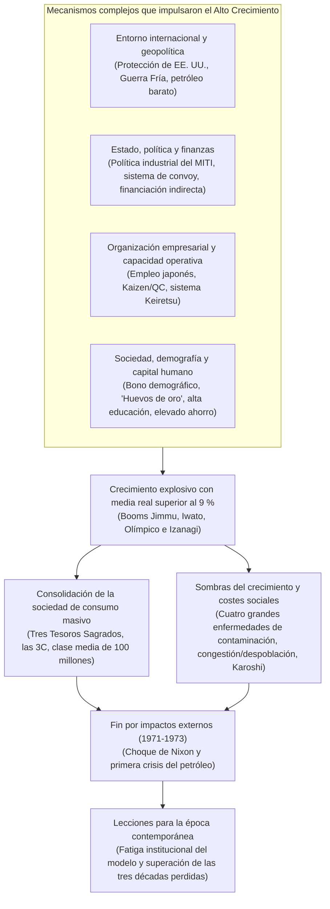
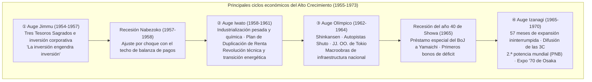
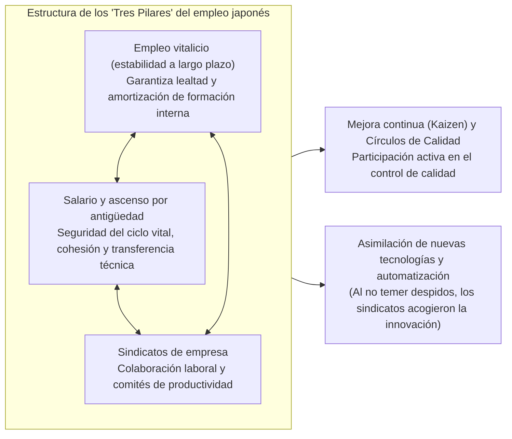
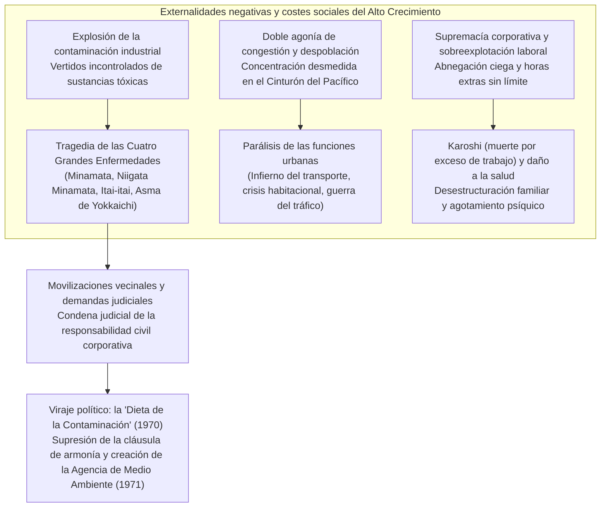

## Introducción: Un «milagro económico» sin precedentes en la historia y su verdadera naturaleza

El 15 de agosto de 1945, cuando el Imperio del Japón capituló incondicionalmente poniendo fin a la Guerra del Pacífico, el archipiélago nipón se encontraba literalmente reducido a cenizas. Cerca del 40 % de la superficie de las principales ciudades había sido aniquilada por los bombardeos aéreos sistemáticos, y aproximadamente una cuarta parte de la riqueza nacional (el 36 % de los activos no militares) había quedado consumida por el fuego. Habiendo perdido la totalidad de sus territorios de ultramar, más de seis millones de militares y civiles repatriados abarrotaron el país sin hogar ni empleo. La inmensa mayoría de la población vivía aterrorizada ante la falta cotidiana de raciones alimentarias, la amenaza de la hambruna extrema y una hiperinflación desbocada. Los corresponsales extranjeros y los altos mandos del Cuartel General de las Potencias Aliadas (GHQ) que visitaron el país por aquel entonces coincidieron unánimemente en un sombrío pronóstico: «Japón tardará al menos medio siglo en recuperar el nivel económico autónomo propio de una nación moderna».

Sin embargo, aquella predicción fue desmentida de la manera más contundente y espectacular que la historia económica recuerde.

Apenas una década después del fin de la conflagración bélica, entre 1955 y 1973 —año en que estalló la primera crisis del petróleo—, la economía japonesa experimentó un crecimiento vertiginoso con una **tasa media de crecimiento real anual de aproximadamente el 9,3 %**, un fenómeno casi sin parangón en los anales de la humanidad. El Producto Nacional Bruto (PNB) pasó de cerca de 8 billones de yenes en 1955 a unos 112 billones de yenes en 1973, multiplicándose por catorce. Ya en 1968, Japón superó a Alemania Occidental —la gran potencia industrial de Europa occidental y objetivo de referencia desde la Restauración Meiji— para erigirse en la **segunda mayor potencia económica del mundo capitalista**, solo por detrás de Estados Unidos.



Este salto prodigioso fue aclamado en todo el orbe como el **«Milagro Económico Oriental» (Economic Miracle)**. Los electrodomésticos, encarnados en los célebres «Tres Tesoros Sagrados» (el televisor en blanco y negro, la lavadora eléctrica y el frigorífico eléctrico), llegaron hasta el último rincón de los hogares japoneses, para dar paso más tarde al consumo sofisticado de las «3C»: el televisor en color (Color TV), el aire acondicionado (Cooler) y el automóvil particular (Car). El modo de vida de los ciudadanos transitó de forma irreversible desde las comunidades rurales tradicionales hacia la familia nuclear urbana, disfrutando de una abundancia sin precedentes sostenida en la producción y el consumo en masa. Emergió así una sociedad donde cerca del 90 % de los ciudadanos se percibía a sí mismo como parte de la clase media («sociedad de clase media de 100 millones de personas»), consolidando una de las naciones industriales más seguras y educadas del planeta.

No obstante, semejante «milagro» no fue en modo alguno un regalo caído del cielo o fruto del azar. Fue el resultado de una perfecta sincronización de múltiples engranajes históricos: la sólida base técnica de la industria química pesada y los métodos de control burocrático heredados del periodo prebélico y bélico; el brusco giro geopolítico de la Guerra Fría y el cambio estratégico de Washington hacia Japón; la rigurosa tutela industrial del Ministerio de Comercio Internacional e Industria (MITI) y el sistema de convoy financiero comandado por el Ministerio de Finanzas; las prácticas laborales japonesas articuladas en torno al empleo vitalicio y el salario por antigüedad; y la abnegada disciplina laboral y la altísima propensión al ahorro de una joven mano de obra bautizada como «los huevos de oro».

Al mismo tiempo, tras esta marcha triunfal se proyectó siempre una sombra densa, oscura y lacerante. El vertido descontrolado de aguas residuales industriales sin depurar y la emanación de humos tóxicos causaron las «Cuatro Grandes Enfermedades de la Contaminación» —entre ellas la enfermedad de Minamata y el asma de Yokkaichi—, destruyendo de forma irreversible la salud y la vida de miles de ciudadanos inocentes. El éxodo demográfico masivo del campo a la ciudad provocó una asfixiante «sobreconcentración urbana», la degradación habitacional y la denominada «guerra del tráfico» en el Cinturón del Pacífico, mientras condenaba a las zonas rurales a una severa despoblación y al declive del sector primario. Los trabajadores, conocidos como «asalariados feroces» (*mōretsu shain*) o «soldados corporativos», se vieron sometidos a jornadas de trabajo extenuantes y a una devoción corporativa ciega, sembrando la semilla de una patología social que más tarde adquiriría repercusión internacional bajo el término **Karoshi** (muerte por exceso de trabajo).

El presente estudio analiza en profundidad y de manera integral este colosal fenómeno histórico del Alto Crecimiento Económico de posguerra en Japón (1955-1973). Lejos de limitarse a una simple crónica de los ciclos económicos, aborda la cuestión desde múltiples perspectivas: la macroeconomía, la política industrial, el sistema financiero, el gobierno corporativo, la estructura social, la geopolítica internacional y el impacto ecológico de la contaminación. Finalmente, extrae lecciones históricas fundamentales para la reactivación económica del siglo XXI, dilucidando por qué el éxito incontestable de aquella época se transformó en la «fatiga institucional» que ató de pies y manos a la sociedad japonesa, desembocando en las «tres décadas perdidas» a partir de los años noventa.

---

## Capítulo 1: El latido entre las cenizas —— Prehistoria del Alto Crecimiento (1945-1954)

Si se sitúa el punto de partida del Alto Crecimiento Económico en 1955, el decenio inmediatamente posterior al conflicto (1945-1954) constituyó un periodo de aceleración crucial. Durante estos diez años se desescombraron las ruinas de una economía nacional devastada, se reconstruyó la infraestructura de la economía de mercado y se edificó la plataforma de lanzamiento que haría posible el posterior despegue fulgurante.

### 1.1 Derrota catastrófica e hiperinflación

Tras la capitulación de agosto de 1945, la economía nipona se hallaba al borde de la parálisis total. Con la cancelación inmediata de los pedidos militares y el corte absoluto del suministro de materias primas procedentes del exterior, el nivel de producción minera e industrial en 1946 se había desplomado hasta situarse en torno al **30 % del nivel de preguerra** (promedio del periodo 1934-1936). El racionamiento de arroz, alimento básico de la población, sufría retrasos y suspensiones constantes, obligando a los habitantes de las urbes a practicar la denominada «vida de brote de bambú» (*takenoko seikatsu*), desprendiéndose paulatinamente de kimonos y enseres domésticos para intercambiarlos en el campo por algo de comida.

A este colapso productivo se sumó una hiperinflación arrolladora. Los pagos de gastos militares extraordinarios autorizados de forma indiscriminada por las autoridades castrenses en los estertores de la contienda, la liquidación de multimillonarias deudas de compensación a los contratistas de guerra tras la rendición y las indemnizaciones por licenciamiento abonadas tras la disolución del ejército imperial dispararon la emisión de billetes del Banco de Japón a cotas astronómicas. Entre el otoño de 1945 y 1949, el índice de precios al por mayor se multiplicó por un asombroso factor de **aproximadamente setenta**.

Para contener esta sangría, el gobierno promulgó en febrero de 1946 la «Ordenanza de Medidas Financieras de Emergencia». Mediante esta disposición extraordinaria se procedió al bloqueo de los depósitos bancarios, prohibiendo la retirada de fondos, y se declaró la nulidad del papel moneda circulante para imponer el canje obligatorio por el «nuevo yen». Sin embargo, mientras no se remediara la penuria estructural de la capacidad productiva, resultaba imposible detener la espiral inflacionaria.

```
【Evolución de los principales indicadores económicos en la posguerra temprana】
・Nivel de producción minera e industrial (1946): 30,7 % respecto al nivel de preguerra (1934-36 = 100)
・Tasa de aumento del índice de precios al por mayor de Tokio (1946): +364,5 % interanual
・Ración oficial de arroz (finales de 1945): reducida a 2 gō y 1 shaku (aprox. 297 g) diarios por adulto, con demoras frecuentes
・Número total de repatriados de ultramar (1945-1950): aprox. 6,25 millones de personas
```

Para superar esta parálisis, el gabinete adoptó a finales de 1946 —con ejecución a partir de 1947— el **«Sistema de Producción Prioritaria» (Priority Production System)**, formulado por el profesor Hiromi Arisawa de la Universidad de Tokio y su equipo. El núcleo de esta estrategia consistía en sustraer a las fuerzas libres del mercado la asignación de los escasísimos recursos nacionales (capital, materias primas, divisas y mano de obra) para concentrarlos masivamente en dos sectores vertebrales: el **carbón** y el **acero**, con el propósito de que su retroalimentación recíproca liderara la recuperación del conjunto del tejido productivo.

En la práctica, el carbón nacional se asignaba de manera preferente a la siderurgia para fundir acero; a su vez, el acero obtenido se destinaba con máxima prioridad a la minería del carbón para entibar galerías y fabricar maquinaria extractiva, logrando así un aumento sostenido en la extracción de combustible fósil. Este círculo virtuoso del hierro y el carbón generó excedentes que fueron transferidos paulatinamente a otras industrias básicas como la energía eléctrica, los fertilizantes químicos y el transporte ferroviario.

El pilar financiero de este ambicioso esquema fue la creación, en enero de 1947, de la **Caja Financiera de Reconstrucción (Fukkō Kin'yū Kinko, comúnmente llamada Fukkin)**. Esta entidad gubernamental emitía bonos avalados por el Estado que eran suscritos en su gran mayoría directamente por el Banco de Japón, suministrando ingentes sumas de crédito a largo plazo y a bajo interés a las industrias prioritarias. A finales de 1948, cerca del 70 % de la financiación para instalaciones de las industrias clave procedía de los préstamos de la Fukkin.

El Sistema de Producción Prioritaria logró un éxito indiscutible al reactivar en tiempo récord la producción de las industrias básicas. No obstante, la suscripción directa de los bonos de la Fukkin por parte del banco emisor provocó una colosal expansión monetaria, desatando una virulenta secuela conocida como la **«inflación Fukkin»**.

### 1.2 La Línea Dodge y las Recomendaciones Shoup: Forjando las bases de la economía de mercado

Frente a los estragos de la inflación provocada por la Fukkin, el gobierno de los Estados Unidos decidió transformar radicalmente su política de ocupación en Japón. Con el recrudecimiento de la Guerra Fría —la proclamación de la República Popular China en 1949 y la creciente fractura entre los bloques occidental y oriental—, Washington dejó de considerar a Japón como un «enemigo derrotado que debía ser desmilitarizado» para redefinirlo como «el bastión anticomunista y fortaleza del capitalismo en Extremo Oriente». Para consolidar esta posición, resultaba perentorio que la economía nipona dejara de depender de las millonarias ayudas asistenciales estadounidenses (fondos GARIOA y EROA) y se sostuviera sobre sus propios pies dentro de una economía de mercado liberalizada.

En febrero de 1949 llegó a Tokio en calidad de enviado extraordinario **Joseph M. Dodge**, presidente del Detroit Bank, quien aplicó a la economía nipona una severísima terapia de choque. Fue el nacimiento de la conocida **«Línea Dodge» (Dodge Line)**, fundamentada en tres pilares inexorables:

1. **Elaboración de un presupuesto de superávit estricto (superbalanceado)**: Prohibición absoluta de emitir deuda pública, eliminación fulminante del déficit fiscal y obligación no solo de equilibrar ingresos y gastos, sino de generar superávits reales para amortizar deudas acumuladas.
2. **Cese de nuevos créditos de la Fukkin y supresión total de subsidios**: Eliminación de las compensaciones por diferencial de precios (las cuantiosas subvenciones estatales que sufragaban la brecha entre los costes reales de producción y los precios oficiales fijados administrativamente).
3. **Establecimiento de un tipo de cambio único**: El 25 de abril de 1949 se fijó formalmente la paridad invariable de **1 dólar = 360 yenes**.

La eliminación de la caótica multiplicidad de tipos de cambio que existían hasta la fecha para cientos de productos específicos y la vinculación directa con el mercado mundial a través de una ventana única de 360 yenes por dólar obligaron a las empresas japonesas a competir de lleno en el tablero internacional. Por otra parte, este tipo de cambio de 1 dólar = 360 yenes representaba una infravaloración del yen en términos de paridad de poder adquisitivo para la época, lo que a largo plazo se convertiría en un escudo y un arma excepcionalmente favorable para la industria exportadora nipona.

A corto plazo, sin embargo, el impacto de la Línea Dodge fue devastador. La retirada súbita de los fondos públicos y una rigurosa restricción crediticia sumieron a Japón de inmediato en una profunda deflación. Las pequeñas y medianas empresas quebraron en cadena y las grandes corporaciones ejecutaron despidos masivos para evitar la insolvencia: había llegado la «recesión Dodge». Centenares de miles de trabajadores quedaron en la calle, tanto en el sector privado como en las corporaciones públicas (Ferrocarriles Nacionales, Monopolio del Tabaco), mientras una densa zozobra social se apoderaba del país, simbolizada por los tres grandes misterios no resueltos de los Ferrocarriles Nacionales (los incidentes Shimoyama, Mitaka y Matsukawa).

Junto a la Línea Dodge, el otro gran pilar institucional que moldeó el Japón contemporáneo fueron las **«Recomendaciones Shoup»**, formuladas por la misión tributaria encabezada por el profesor **Carl S. Shoup** de la Universidad de Columbia, que arribó al archipiélago en mayo de 1949. El informe Shoup desmanteló el opaco y laberíntico régimen de tributación indirecta tradicional e implantó un **sistema tributario moderno basado en los impuestos directos, con el impuesto sobre la renta como eje vertebrador**.

La reforma Shoup instauró el régimen de la «declaración azul» (*aoiro shinkoku*), promoviendo la contabilidad formal y ordenada en los negocios; consolidó las finanzas locales (embrión del sistema de transferencias tributarias a los municipios); y racionalizó el impuesto de sociedades, asentando un marco fiscal transparente y equitativo. Gracias a la disciplina macroeconómica impuesta por Dodge y a la modernización microinstitucional de Shoup, Japón adquirió los cimientos organizativos indispensables para gestionar una economía capitalista moderna.

### 1.3 La Guerra de Corea y el impacto de los «pedidos especiales»: Detonante de la acumulación de capital

Cuando la economía japonesa se asfixiaba bajo el yugo de la recesión Dodge, el 25 de junio de 1950 estalló la **Guerra de Corea** en la península vecina. Esta contienda, que representó una inmensa tragedia humana en el plano geopolítico, operó como un auténtico salvavidas para la maltrecha economía japonesa, llevando al entonces primer ministro Shigeru Yoshida a calificarla en privado como una «ayuda del cielo» (*ten'yu*).

La movilización de las fuerzas de las Naciones Unidas (encabezadas en la práctica por las tropas estadounidenses) convirtió a Japón, la nación industrializada más próxima al teatro de operaciones, en el gran centro logístico de aprovisionamiento de suministros y servicios bélicos. Fue el inicio del boom de los **«pedidos especiales de la Guerra de Corea» (Tokuju)**.

Las compras cursadas por el ejército estadounidense abarcaron un espectro sumamente amplio:
- **Material bélico y siderúrgico**: Camiones, todoterrenos militares (jeeps), bidones de combustible, alambradas de púas, piezas de repuesto para armamento y cajas de munición.
- **Textiles y pertrechos**: Uniformes de campaña, sacos de arpillera, mantas, lonas para tiendas y botas de combate.
- **Servicios**: Reparación y puesta a punto de vehículos de combate y aeronaves averiadas, transporte de suministros y apoyo en telecomunicaciones.

Entre 1950 y la firma del armisticio en 1953, los ingresos en divisas devengados por estos pedidos alcanzaron un total acumulado de **aproximadamente 2.400 millones de dólares**, cifra equivalente a casi el 60 % de las exportaciones totales de Japón durante esos cuatro años. Esta formidable inyección de dólares eliminó de un plumazo la escasez crónica de divisas que había estrangulado al país desde la posguerra.

```
【Impacto cuantitativo de los pedidos especiales de Corea en la economía japonesa (1950-1953)】
・Valor total de los contratos de pedidos especiales: aprox. 2.400 millones de dólares (compras directas + gasto privado de tropas aliadas)
・Crecimiento real del PIB: ejercicio 1950: +10,8 %; 1951: +12,3 %; 1952: +10,0 %; 1953: +7,3 %
・Índice de producción minera e industrial: creció cerca de un 70 % en solo un año (1950), recuperando en 1951 el nivel de preguerra (1934-36)
・Extraordinaria mejora de los beneficios corporativos: el margen sobre ventas de las manufacturas alcanzó niveles récord de posguerra a finales de 1950
```

La trascendencia de los pedidos de Corea rebasó ampliamente la mera liquidación de inventarios obsoletos.
En primer lugar, a través de la reparación masiva y la fabricación de camiones militares, los fabricantes automovilísticos japoneses (como Toyota, Nissan e Isuzu) asimilaron los rigurosos estándares de control de calidad militar de EE. UU. (normas mil-spec), mejorando de forma sustancial la intercambiabilidad de componentes y la ingeniería de fabricación en serie. En segundo lugar, los extraordinarios beneficios obtenidos fueron retenidos por las empresas como reservas internas, sirviendo de capital propio fundamental para financiar las ingentes inversiones en planta y equipo (nuevos altos hornos, importación de maquinaria de precisión) que desatarían el posterior Alto Crecimiento.

### 1.4 El Régimen de San Francisco y la proclamación de que «ya no estamos en posguerra»

En septiembre de 1951, Japón firmó el Tratado de Paz de San Francisco y el Tratado de Seguridad Bilateral entre Japón y Estados Unidos. Con su entrada en vigor el 28 de abril de 1952 concluyeron formalmente los siete años de ocupación militar aliada, restaurándose la soberanía nacional.

Reinsertado en la comunidad internacional, el país quedó plenamente adscrito al bloque occidental liderado por Estados Unidos en el marco de la Guerra Fría. La directriz diplomática y estratégica fijada por Shigeru Yoshida, conocida como la **«Doctrina Yoshida»**, perfiló el rumbo nacional con extraordinario pragmatismo: delegar la defensa del territorio en el paraguas militar estadounidense y el Tratado de Seguridad, limitar el gasto en defensa a un nivel mínimo inferior al 1 % del PNB y canalizar toda la energía, el talento y los recursos financieros de la nación hacia la reconstrucción económica y la expansión comercial internacional. Esta opción estratégica confirió a las empresas japonesas un entorno operativo envidiable, libres del oneroso lastre fiscal del gasto militar.

A pesar de una breve desaceleración económica motivada por el cese de los pedidos de guerra en 1953, en las entrañas del aparato productivo ya se había puesto en marcha un ciclo de expansión autosostenido impulsado por la inversión corporativa. En 1955, gracias a cosechas agrícolas récord favorecidas por el clima y a la expansión del comercio internacional, se inició una fase expansiva de crecimiento sin tensiones inflacionarias, bautizada como el «auge cuantitativo» (*sūryō keiki*).

Este hito histórico fue solemnemente certificado por el célebre *Libro Blanco de la Economía* correspondiente al ejercicio fiscal de 1956 (año 31 de la era Showa), publicado por la Agencia de Planificación Económica. En su texto de conclusiones, redactado entre otros por **Yonosuke Gotō**, jefe de la sección de investigación interna de dicha agencia, figuraba una frase que se grabaría indeleblemente en la memoria colectiva del Japón moderno:

> **«Ya no estamos en "posguerra". Nos encontramos ante una coyuntura enteramente distinta. El crecimiento a través de la recuperación ha concluido. El crecimiento que viene será sustentado por la modernización.»**

Aquel célebre pasaje no pretendía ser un simple brindis por el éxito de la reconstrucción. Significaba que la fase de recuperación de los niveles productivos de preguerra había finalizado. A partir de entonces, el país no podría seguir confiando en la generosidad exterior, en préstamos internacionales o en rentas extraordinarias derivadas de conflictos ajenos. Constituía una enérgica llamada de alerta: si Japón no asimilaba con celeridad las grandes innovaciones tecnológicas (automatización, petroquímica, transistores, generación termoeléctrica de gran capacidad) y no reconvertía su aparato productivo desde la industria ligera tradicional hacia la industria pesada y química avanzada, sucumbiría irremediablemente en la arena competitiva mundial.

Con un dinamismo que superaría con creces las previsiones más optimistas de aquel informe, la economía japonesa se lanzó de lleno al experimento modernizador más formidable de la historia contemporánea.

---

## Capítulo 2: Crónica de los ciclos económicos y del Alto Crecimiento (1955-1973)

A lo largo de los casi dieciocho años transcurridos entre 1955 y 1973, la economía de Japón no progresó mediante una trayectoria lineal uniforme. En realidad, avanzó escalón a escalón a través de intensos ciclos económicos que combinaban etapas de euforia inversora y consumista con fases de ajuste contractivo provocadas por el drenaje de las reservas de divisas ante el aumento masivo de las importaciones.

En una época en que el país operaba bajo un tipo de cambio fijo e inamovible de 1 dólar = 360 yenes, las reservas exteriores del banco central constituían una barrera insalvable. Cuando la actividad económica se recalentaba, las compras de materias primas y maquinaria extranjera se disparaban, arrojando la balanza de pagos a números rojos; en cuanto las reservas tocaban fondo, el Banco de Japón se veía forzado a elevar el tipo de descuento oficial para enfriar la demanda. Este mecanismo cíclico fue conocido como el **«techo de la balanza de pagos»** (*kokusai shūshi no tenjō*) y constituyó la principal restricción macroeconómica del periodo.

A continuación se examina la secuencia histórica de los cinco grandes auges que pautaron esta era prodigiosa.



### 2.1 El Auge Jimmu (1954-1957) y la recesión Nabezoko: La reacción en cadena de la inversión

La fase expansiva iniciada en noviembre de 1954 recibió el nombre de **«Auge Jimmu»**, aludiendo con orgullo a una prosperidad sin precedentes desde la entronización del mítico primer emperador de Japón, Jimmu.

El motor supremo de este ciclo fue la impresionante **inversión en bienes de equipo** acometida por el sector privado. Corporaciones de sectores tan diversos como la siderurgia, la construcción naval, las fibras sintéticas, la petroquímica y la maquinaria eléctrica acometieron de forma simultánea la compra de maquinaria puntera y la construcción de complejos fabriles de escala colosal. Aquel fenómeno fue sintetizado magistralmente en el *Libro Blanco de la Economía* de 1957 con un aforismo ya clásico: **«la inversión engendra inversión»** (*tōshi ga tōshi o yobu*).

En efecto, cuando las acerías ampliaban su capacidad, encargaban ingentes volúmenes de maquinaria pesada; para abastecer esos pedidos, los fabricantes de bienes de equipo debían levantar nuevas naves, reactivando a su vez la demanda de perfiles de acero, cemento y energía. Este ciclo autorreforzado de demanda interindustrial impulsó de forma formidable el PIB.

En el ámbito doméstico, dio comienzo la gran revolución del bienestar cotidiano. Los **«Tres Tesoros Sagrados»** (el televisor en blanco y negro, la lavadora eléctrica y el frigorífico) penetraron con fuerza en los hogares de las clases medias urbanas, transformando radicalmente la vida familiar al aligerar las pesadas cargas del trabajo del hogar y democratizar el entretenimiento.

Sin embargo, a comienzos de 1957 se manifestaron las primeras tensiones. El vertiginoso incremento de las importaciones de materias primas deterioró con rapidez el saldo comercial, mermando las reservas monetarias exteriores hasta niveles de alarma: el país se había estrellado frontalmente contra el «techo de la balanza de pagos». El Banco de Japón reaccionó de inmediato aplicando subidas consecutivas de los tipos de interés e imponiendo una férrea contracción del crédito. La economía frenó bruscamente, los precios de las materias primas se hundieron y entre el tramo final de 1957 y 1958 se prolongó una fase de atonía bautizada como la **«recesión Nabezoko»** (fondo de sartén). Con todo, los planes de modernización empresarial mantuvieron su vigor y la economía tocó fondo con notable rapidez.

### 2.2 El Auge Iwato (1958-1961) y el Plan de Duplicación del Ingreso: La eclosión petroquímica y siderúrgica

Superada la bache de la recesión Nabezoko, en julio de 1958 despegó un ciclo todavía más impetuoso. Los cronistas de la época, agotadas las referencias históricas convencionales, recurrieron al mito sintoísta de la diosa del sol Amaterasu y su reaparición tras ocultarse en la cueva celestial para denominarlo el **«Auge Iwato»**. Durante este periodo, la economía nipona registró una asombrosa tasa media de crecimiento real del **11,3 % anual**.

El rasgo estructural definitorio del Auge Iwato fue la consolidación definitiva de la **industria química y pesada (acero, petroquímica, automóviles y maquinaria eléctrica de gran potencia)** como eje central de la estructura productiva, relegando a un segundo plano a la industria ligera tradicional (textiles y manufacturas diversas). Paralelamente, se consumó una vertiginosa revolución energética: el carbón nacional fue sustituido con celeridad por el petróleo importado de Oriente Medio, abundante, de alta calidad y de coste extraordinariamente reducido. A lo largo del litoral pacífico (bahías de Tokio e Ise, Mar Interior de Seto) se ganaron miles de hectáreas al mar para albergar inmensos polos siderúrgicos integrados y complejos petroquímicos (*kombinats*).

En el terreno político, se produjo un punto de inflexión decisivo. En 1960, la ratificación parlamentaria del Tratado de Seguridad con EE. UU. desencadenó las protestas de Anpo, la mayor convulsión sociopolítica de la posguerra, con cientos de miles de manifestantes rodeando la Dieta. Tras la dimisión del primer ministro Nobusuke Kishi para apaciguar las calles, su sucesor, **Hayato Ikeda**, reorientó audazmente la atención ciudadana desde el conflicto ideológico hacia la prosperidad material mediante el emblemático **«Plan de Duplicación del Ingreso Nacional»** (*Kokumin Shotoku Baizō Keikaku*), aprobado en diciembre de 1960.

Inspirado en los fundamentos teóricos del economista Osamu Shimomura, el plan fijaba como meta **duplicar el Producto Nacional Bruto real en un decenio (1961-1970), garantizando el pleno empleo y elevando las condiciones de vida de la ciudadanía al nivel de las democracias industriales de Europa occidental**. Aquello requería crecer a un promedio anual del 7,2 %, una meta que la oposición y gran parte de la academia tildaron de utopía propagandística.

No obstante, los hechos desbordaron los cálculos más halagüeños. El dinamismo empresarial redobló su vigor y el objetivo de duplicar el ingreso se alcanzó con creces en poco más de cuatro años. El mensaje integrador de Ikeda, sintetizado en el lema de «tolerancia y paciencia» y en la promesa tangible de duplicar los salarios reales, inyectó en una sociedad aún marcada por las heridas bélicas una confianza arrolladora en el progreso colectivo.

### 2.3 El Auge Olímpico (1962-1964) y la revolución de las infraestructuras

Tras el ciclo Iwato y una breve pausa de enfriamiento dictada nuevamente por la balanza de pagos, en la segunda mitad de 1962 cobró fuerza el **«Auge Olímpico»**. El Estado volcó todo su empeño en culminar con éxito los XVIII Juegos Olímpicos de Tokio (octubre de 1964), los primeros celebrados en suelo asiático, concebidos como el escaparate internacional de la resurrección nacional.

El volumen de gasto movilizado en obras públicas y de comunicaciones alcanzó cerca de un billón de yenes, cifra comparable al presupuesto estatal de aquel entonces:
- **Tokaido Shinkansen**: Inaugurado el 1 de octubre de 1964, el primer tren de alta velocidad del mundo conectó Tokio y Shin-Osaka a una velocidad máxima de 210 km/h en apenas cuatro horas (reducidas a 3 horas y 10 minutos al año siguiente), reconfigurando por completo el eje vertebral del territorio.
- **Autopistas Meishin y red urbana Shuto**: Se abrió el primer gran tramo de la autopista Meishin (conectando Nagoya, Kioto, Osaka y Kobe) y se tendieron las arterias elevadas de la autopista urbana de Tokio, desatascando la metrópoli.
- **Transformación de la trama urbana**: Se inauguró el monorraíl entre el aeropuerto de Haneda y el centro de la capital, concluyó la línea Hibiya del metro tokiota, se erigieron iconos hoteleros como el Hotel New Otani y se acometió la canalización del alcantarillado y el embellecimiento del espacio público.

En el ámbito de las telecomunicaciones, la transmisión de las ceremonias y competiciones en vivo impulsó las primeras compras masivas de televisores en color, mientras el éxito de la retransmisión transoceánica vía satélite (mediante el Syncom 3) exhibió ante la comunidad internacional el imponente nivel tecnológico del archipiélago.

### 2.4 La crisis de los valores (1965 / Recesión del año 40 de Showa) y el giro doctrinal de la política fiscal

Sin embargo, una vez apagado el pebetero olímpico, la economía japonesa se topó con el escollo más áspero de toda la posguerra: la llamada **«recesión del año 40 de Showa»** (1965).

La ingente capacidad productiva instalada al calor de la fiebre olímpica se transformó repentinamente en un peligroso exceso de oferta al remitir la demanda de infraestructuras, disparando la morosidad y las quiebras mercantiles a máximos históricos. El sector de intermediación financiera sufrió un duro quebranto; la Bolsa se desplomó y una de las cuatro grandes firmas de corretaje del país, **Yamaichi Securities**, quedó al borde de la bancarrota técnica lastrada por colosales pérdidas acumuladas.

Para atajar un efecto dominó que amenazaba con derivar en una catástrofe sistémica y en el pánico bancario, el ministro de Finanzas, **Kakuei Tanaka**, en estrecha coordinación con el gobernador del Banco de Japón, Makoto Usami, adoptó una decisión sin precedentes: la concesión de **créditos especiales ilimitados y sin garantías reales (préstamos especiales del Banco de Japón o *Nichigin tokuyū*)** a favor de Yamaichi Securities en virtud del artículo 25 de la Ley del Banco de Japón, disipando de raíz la histeria de los ahorradores e inversores.

Simultáneamente, el gobierno rompió un tabú sacrosanto imperante desde las directrices presupuestarias de Joseph Dodge: el principio de presupuesto equilibrado consagrado en el artículo 4 de la Ley de Finanzas Públicas. En el presupuesto suplementario del ejercicio fiscal 1965, el Estado autorizó por primera vez la **emisión de bonos de deuda especial para enjugar el déficit (bonos de déficit)**. Esta decidida inyección de estímulo fiscal keynesiano —mediante gasto suplementario en obras públicas y reducciones fiscales— apuntaló con éxito la demanda agregada y permitió dejar atrás la recesión en un plazo mínimo. Esta exitosa gestión anticíclica allanó el camino para la mayor era dorada de toda la posguerra.

### 2.5 El Auge Izanagi (1965-1970): Los 57 meses de oro y la cumbre mundial

Tras tocar fondo en noviembre de 1965, la economía japonesa entró en una fase de florecimiento sin parangón que se prolongó hasta julio de 1970: el **«Auge Izanagi»**, denominado así en honor al dios creador Izanagi, remontándose a los orígenes cósmicos de la mitología japonesa. La expansión encadenó **57 meses ininterrumpidos**, quebrando con holgura todas las marcas previas de longevidad cíclica.

El impulso del Auge Izanagi se nutrió de una extraordinaria competitividad exportadora y de una notable sofisticación del consumo doméstico. Las aspiraciones de compra de los hogares se desplazaron de los antiguos Tres Tesoros Sagrados a las codiciadas **«3C»**:
- **Color TV (Televisión en color)**
- **Cooler (Aire acondicionado doméstico)**
- **Car (Automóvil particular)**

El lanzamiento en 1966 de vehículos accesibles como el Toyota Corolla y el Nissan Sunny inauguró el denominado «primer año de la motorización privada» (*maikā gannen*). Las plantas de fabricación japonesas, tras depurar sus procesos mediante un riguroso control estadístico y continuas mejoras de diseño, desterraron para siempre el viejo estigma de fabricar artículos «baratos y de mala calidad». Los bienes manufacturados *Made in Japan*, reconocidos por su extraordinaria fiabilidad, bajo consumo y escasa tasa de averías, conquistaron con paso firme los mercados de los cinco continentes.

En 1968, Japón inscribió su nombre con letras de oro en los anales del siglo XX: con un PNB nominal de **aproximadamente 141.900 millones de dólares**, rebasó a la República Federal de Alemania para consolidarse como la **segunda potencia económica mundial del bloque capitalista**, situándose únicamente por detrás de Estados Unidos. Un siglo exacto después de la Restauración Meiji de 1868, aquella nación insular asiática que había emergido en ruinas de una guerra devastadora se encaramaba a la cumbre de la industrialización mundial.

La culminación festiva de este proceso tuvo lugar en 1970 con la **Exposición Universal de Osaka (Expo '70)**, la primera organizada en Asia, bajo el lema «El progreso y la armonía de la humanidad». El recinto de las colinas de Senri, coronado por la enigmática Torre del Sol de Tarō Okamoto, congregó en seis meses la vertiginosa cifra de **64,21 millones de visitantes**. La exhibición del fragmento de roca lunar en el pabellón estadounidense, las cintas transportadoras para peatones y los pabellones de vanguardia arquitectónica quedaron grabados en la memoria colectiva como la apoteosis de un país que había superado definitivamente las penurias de la posguerra y abrazado la modernidad.

```
【Evolución de los principales indicadores macroeconómicos del Alto Crecimiento (ejercicios 1955-1974)】
```

| Ejercicio | Crecimiento real del PIB (%) | PNB nominal (cien millones de yenes) | Fase cíclica / Hitos históricos destacados |
| :---: | :---: | :---: | :--- |
| **1955** | **+10,8** | 88.646 | Comienzo del Auge Jimmu; despegue de los Tres Tesoros Sagrados |
| **1956** | **+6,2** | 98.719 | Libro Blanco: «Ya no estamos en posguerra»; ingreso en la ONU |
| **1957** | **+7,8** | 111.280 | Recesión Nabezoko; choque con el techo de la balanza de pagos |
| **1958** | **+5,6** | 118.527 | Comienzo del Auge Iwato; conclusión de la Torre de Tokio |
| **1959** | **+11,2** | 134.228 | Boda del príncipe heredero Akihito; difusión fulgurante del televisor |
| **1960** | **+12,5** | 160.332 | Protestas de Anpo; gabinete Ikeda y Plan de Duplicación del Ingreso |
| **1961** | **+12,0** | 196.442 | Consolidación de la petroquímica y siderurgia; transición energética |
| **1962** | **+8,9** | 220.119 | Comienzo del Auge Olímpico; inauguración de Senri New Town |
| **1963** | **+10,7** | 256.419 | Inauguración de la autopista Meishin (tramo Ritto-Amagasaki) |
| **1964** | **+13,1** | 295.444 | JJ. OO. de Tokio; apertura del Tokaido Shinkansen; ingreso en la OCDE |
| **1965** | **+5,8** | 328.217 | Recesión de 1965; crédito especial a Yamaichi; primeros bonos de déficit |
| **1966** | **+10,6** | 382.900 | Despegue del Auge Izanagi; año del utilitario (lanzamiento de Corolla y Sunny) |
| **1967** | **+11,1** | 446.953 | Expansión vertiginosa de las 3C; Ley Básica de Medidas contra la Contaminación |
| **1968** | **+12,2** | 528.781 | **El PNB de Japón supera al de Alemania Occidental (2.ª potencia capitalista)** |
| **1969** | **+12,5** | 622.464 | Apertura completa de la autopista Tomei; explosión del televisor en color |
| **1970** | **+10,7** | 733.449 | Expo '70 de Osaka (64,21 millones de visitas); «Dieta de la Contaminación» |
| **1971** | **+5,0** | 809.726 | Choque de Nixon; Acuerdo Smithsoniano (fijación de 1 dólar = 308 yenes) |
| **1972** | **+9,1** | 954.646 | Gabinete Tanaka: «Remodelación del Archipiélago»; normalización con China |
| **1973** | **+5,1** | 1.125.487 | Adopción de tipos flotantes; primera crisis del petróleo; «precios demenciales» |
| **1974** | **-1,2** | 1.348.229 | **Primer crecimiento negativo de posguerra; clausura del Alto Crecimiento** |

---

## Capítulo 3: Por qué se produjo el «milagro» —— Anatomía de sus mecanismos multidimensionales

El Alto Crecimiento Económico japonés no fue el producto espontáneo de las fuerzas del libre mercado (*laissez-faire*), ni puede explicarse a través de tópicos moralizantes sobre la laboriosidad innata de sus habitantes. Obedeció a la configuración premeditada de un sofisticado **«modelo de capitalismo a la japonesa»**, donde coincidieron de forma armónica la orientación estatal, un singular engranaje financiero, pactos sociolaborales cooperativos, innovaciones operativas en la planta fabril, un óptimo demográfico irrepetible y una coyuntura internacional extraordinariamente propicia en el marco de la Guerra Fría.

A continuación se analizan en detalle los seis pilares estructurales que hicieron posible este fenómeno.



### 3.1 Política industrial y dirección estatal: La estrategia de sectores estratégicos del MITI

En su célebre obra *MITI and the Japanese Miracle*, el politólogo estadounidense Chalmers Johnson acuñó el concepto de **«Estado Desarrollista» (Developmental State)** para diferenciar el modelo nipón del «Estado regulador» anglosajón. Mientras que este último se desentiende de los fines económicos sustantivos y se limita a fijar las reglas formales de la competencia, el Estado desarrollista japonés intervino de manera activa seleccionando objetivos industriales estratégicos y guiando los recursos de la nación para lograrlos, encarnado arquetípicamente en el Ministerio de Comercio Internacional e Industria (MITI).

El núcleo de la política industrial del MITI consistió en desafiar deliberadamente la teoría ortodoxa de la ventaja comparativa estática (que sugería que un país empobrecido de posguerra debía especializarse en sectores de mano de obra intensiva y bajo valor añadido, como los textiles o los juguetes de hojalata). Los tecnócratas del MITI apostaron, por el contrario, por una ventaja comparativa dinámica: identificar aquellas industrias que gozarían de una enorme elasticidad de demanda en el comercio mundial futuro y una elevada capacidad de arrastre sobre el resto del aparato productivo. Así, seleccionaron y protegieron sectores intensivos en capital y tecnología: **acero, construcción naval, petroquímica, automoción, maquinaria industrial y electrónica**.

Los resortes de intervención desplegados por el MITI fueron extraordinariamente eficaces:

1. **Control sobre la asignación del presupuesto de divisas (Ley de Control de Cambios y Comercio Exterior)**:
   En una época de severa escasez de dólares, el Estado monopolizaba las divisas. El MITI asignaba de forma preferencial las cuotas de dólares a las empresas de los sectores que deseaba promover, facilitándoles la compra de patentes extranjeras, tecnología puntera y maquinaria pesada (laminadores continuos de acero, patentes petroquímicas, etc.). Por el contrario, cerraba el grifo de divisas a las importaciones de bienes de consumo o de industrias prescindibles, levantando una sólida muralla proteccionista frente a los gigantes multinacionales.
2. **Efecto catalizador del crédito público del Banco de Desarrollo de Japón (JDB / Kaigin)**:
   Cuando el Banco de Desarrollo de Japón (entidad estatal) decidía conceder un crédito blando a largo plazo a un proyecto prioritario (como una acería en el litoral o un complejo petroquímico), la banca comercial privada interpretaba de inmediato que la iniciativa contaba con el respaldo incondicional del Estado. Este efecto de señalización (*pump-priming*) desataba una avalancha de financiación privada sindicada hacia los sectores clave.
3. **Concertación público-privada y coordinación de inversiones**:
   Con el fin de impedir que la competencia encarnizada entre grupos industriales derivara en sobrecapacidad y ruina financiera (la temida «competencia excesiva»), el MITI promovió mesas de concertación con los presidentes de las principales firmas siderúrgicas y químicas. En estos foros corporativos se acordaba el orden de encendido de los nuevos altos hornos o se fijaban cuotas de producción mediante acuerdos informales de cártel legalmente tutelados.

### 3.2 La alquimia del sistema financiero: Predominio de la financiación indirecta y el sistema de convoy

La ingente movilización de fondos necesaria para sostener tasas de inversión superiores al 30 % del PIB se articuló sobre una arquitectura financiera singular.

A diferencia del modelo anglosajón, donde las empresas captan su capital a través de emisiones bursátiles de acciones u obligaciones (financiación directa) o de sus propios beneficios acumulados, en el Japón de posguerra las corporaciones disponían de niveles de capital propio insignificantes tras la destrucción bélica. El engranaje básico de intermediación fue la **«financiación indirecta»**, canalizada a través de los bancos comerciales.

Este modelo descansó en tres pilares institucionales:

- **El sistema del banco principal (*main bank*)**:
  Cada gran conglomerado industrial forjó una alianza indisoluble con un gran banco urbano de referencia (Mitsui, Mitsubishi, Sumitomo, Fuji, Dai-Ichi Kangyō, Sanwa) o un banco de crédito a largo plazo (como el Banco Industrial de Japón - IBJ). El banco principal no se limitaba a suministrar préstamos continuos: sellaba participaciones accionariales cruzadas para blindar a la empresa frente a tomas hostiles de control, designaba directores en su consejo de administración y fiscalizaba permanentemente sus balances. Este vínculo de largo recorrido liberó a la gerencia japonesa de la tiranía del valor trimestral de la acción en Bolsa, facultándola para acometer inversiones arriesgadas con horizontes de maduración de cinco a diez años.
- **Sobreendeudamiento empresarial (*over-borrowing*) y sobrepréstamo bancario (*over-loan*)**:
  Las grandes empresas operaban con ratios de apalancamiento que habrían sido catalogados de temerarios en Occidente, financiando la mayor parte de sus activos con deuda bancaria. A su vez, los bancos comerciales prestaban a la industria por encima de sus depósitos captados, cubriendo ese desfase estructural mediante el redescuento continuo ante el Banco de Japón. El banco emisor, mediante el tipo de descuento y la «orientación de ventanilla» (*madoguchi shidō*, cupos directos de crédito fijados a cada banco), controlaba de forma milimétrica el flujo monetario de toda la economía.
- **El «sistema de convoy» (*gosō sendan hōshiki*) y la represión financiera**:
  El Ministerio de Finanzas regulaba con mano de hierro las tasas de interés mediante la Ley Temporal de Ajuste de Tipos de Interés, manteniendo el coste del dinero deliberadamente bajo para abaratar la inversión productiva. Al mismo tiempo, protegía celosamente a las entidades de crédito: regulaba la apertura de oficinas bancarias, la gama de productos permitidos y los tipos de interés pasivos, garantizando márgenes confortables para que ni la entidad más pequeña o ineficiente pudiera quebrar jamás. Esta política, bautizada con la metáfora naval del convoy de guerra (donde la velocidad de la flota entera se adapta al barco más lento), eliminó el riesgo de pánicos bancarios e inspiró en la ciudadanía una confianza ciega en el sistema financiero.

A este esquema se sumó el gigantesco caudal de las **Inversiones y Préstamos del Sector Público (FILP / *Zaisei Tōyūshi*)**, denominado a menudo el «segundo presupuesto del Estado». Los fondos depositados por millones de ahorradores modestos en el sistema postal (Caja Postal de Ahorros) y las cotizaciones de las pensiones públicas se centralizaban en el Fondo Fiduciario del Ministerio de Finanzas. Esta inmensa masa de liquidez libre de impuestos se inyectaba directamente, a través de agencias públicas, en la construcción del Shinkansen, las autopistas nacionales, la vivienda social y las instalaciones portuarias.

### 3.3 Las prácticas de empleo a la japonesa: La santísima trinidad de las relaciones laborales

En las fábricas y oficinas, el Alto Crecimiento fue sustentado por el denominado **«sistema de empleo japonés»**, cristalizado tras la derrota y posterior apaciguamiento de las virulentas huelgas obreras de los años cincuenta (como el conflicto de Nissan en 1953 o la histórica huelga del carbón de Miike en 1960). Como describió tempranamente el sociólogo estadounidense James Abegglen en su obra *The Japanese Factory*, este modelo descansaba sobre tres pilares interconectados:

1. **Empleo vitalicio (*shūshin koyō*)**:
   Las empresas contrataban formalmente a jóvenes recién graduados de escuelas y universidades con el compromiso tácito de no rescindir su contrato hasta la edad obligatoria de jubilación. Este principio reducía a cero la rotación laboral, garantizando a la empresa la rentabilidad de las inversiones efectuadas en la formación continua en el puesto de trabajo (*On-the-Job Training* - OJT) y otorgando al empleado una seguridad material inquebrantable.
2. **Retribución y promoción por antigüedad (*nenkō joretsu*)**:
   La escala salarial y el escalafón jerárquico se determinaban fundamentalmente por la edad y los años de servicio ininterrumpido en la corporación. En la juventud, el salario percibido se situaba por debajo de la productividad real aportada, contribuyendo a la acumulación de capital corporativo; en la madurez, coincidiendo con los costes del matrimonio, la crianza de los hijos y la compra de vivienda, los emolumentos aumentaban generosamente, cubriendo de forma precisa el ciclo vital familiar.
3. **Sindicatos de empresa (*kigyōbetsu rōdō kumiai*)**:
   A diferencia del sindicalismo de oficio o industrial imperante en Europa y Norteamérica, en Japón las organizaciones sindicales se circunscribían a los trabajadores fijos de una empresa individual. Los dirigentes sindicales eran a su vez empleados de plantilla llamados a proseguir su carrera interna, lo que forjó una profunda comunidad de destino: existía el convencimiento unánime de que el bienestar de la plantilla dependía inexorablemente de la competitividad y rentabilidad de su propia empresa frente a sus rivales directos.

Esta arquitectura institucional desplegó un efecto colosal en la asimilación tecnológica.

En los sistemas laborales occidentales, la introducción de cadenas de montaje robotizadas o métodos automáticos solía chocar frontalmente con los sindicatos de oficio, temerosos de que la innovación destruyera sus categorías laborales y arrojara a los operarios al paro. Por el contrario, en las fábricas japonesas bajo el empleo vitalicio, la automatización de una línea de montaje nunca desembocaba en despidos, sino en el traslado interno (*haiten*) y la reconversión profesional del trabajador hacia puestos de mayor cualificación técnica.

Lejos de oponerse a las máquinas, **los sindicatos y operarios acogieron con entusiasmo el progreso técnico y la robótica**, conscientes de que una mayor productividad redundaría en cuantiosas pagas extraordinarias semestrales (bonus).

Asimismo, en 1955 se instauró el mecanismo del **«Shuntō» (Ofensiva Laboral de Primavera)**. Cada año, las federaciones sindicales de los sectores motrices (acero, construcción naval, química, electrónica) coordinaban sus demandas salariales frente a la patronal. El aumento porcentual pactado en el acero operaba como pauta rectora para el resto de la economía, incluidas las pequeñas y medianas empresas. Gracias a este mecanismo anual, los sueldos reales crecieron a un ritmo cercano al 10 % anual a lo largo de casi dos décadas, ensanchando incesantemente la demanda de consumo interna y cerrando un colosal círculo virtuoso macroeconómico.

Debe advertirse, no obstante, que la contrapartida de este blindaje laboral de la plantilla fija fue la existencia de un vasto colchón de amortiguación: una tupida red de **empresas subcontratadas de segundo y tercer nivel, trabajadores eventuales (*rinjikō*) y trabajadoras auxiliares**, sometidos a salarios precarios y a una desprotección contractual permanente (la «estructura dual» de la economía japonesa).

### 3.4 Capacidad operativa e innovación fabril: Círculos de Calidad y la filosofía Kaizen

La capacidad de la industria manufacturera nipona para abandonar la condición de imitadora barata y convertirse en el referente indiscutible de precisión, durabilidad y eficiencia de costes tuvo su epicentro en una auténtica **revolución de la calidad en la planta de producción**.

En el periodo de entreguerras, los productos japoneses eran desdeñados como artículos «baratos pero defectuosos» (*cheap and nasty*). En 1950, la Unión Japonesa de Científicos e Ingenieros (JUSE) invitó a Tokio al eminente experto estadounidense en control estadístico de procesos, el Dr. **W. Edwards Deming**. Las conferencias magistrales de Deming sobre el ciclo PDCA (Planificar-Hacer-Verificar-Actuar) y la reducción sistemática de variaciones causaron una honda conmoción entre ingenieros y directivos. Con los derechos de autor cedidos por Deming se instituyó el prestigioso **Premio Deming**, que desató una febril emulación entre las corporaciones niponas.

No obstante, la auténtica genialidad japonesa consistió en metamorfosear el control de calidad —que en Occidente constituía una función elitista reservada a especialistas e inspectores de despacho— en una cruzada democrática y participativa de las bases operativas. Hacia 1962 brotaron en las factorías los primeros **«Círculos de Control de Calidad» (Círculos QC)**.

Grupos autogestionados de entre cinco y diez obreros de línea se reunían voluntariamente al término de sus turnos para analizar los defectos de producción mediante diagramas de espina de pescado (diagramas de Ishikawa) y análisis de Pareto, ideando propuestas prácticas de mejora continua (**Kaizen**). Estas aportaciones se aplicaban de inmediato en el puesto de trabajo y los círculos más destacados eran recompensados y galardonados en convenciones nacionales. De este modo, hasta el último peón de cadena interiorizó el orgullo profesional y la responsabilidad de que la excelencia del producto final dependía directamente de su ingenio y minuciosidad.

La expresión más depurada de esta cultura operativa fue el **«Sistema de Producción Toyota» (TPS)**, concebido por el vicepresidente de la firma automotriz, Taiichi Ōno:
- **Just-in-Time (JIT)**: Producir «solo lo necesario, en el momento preciso y en la cantidad requerida», suprimiendo de raíz los inventarios intermedios y el almacenaje ocioso.
- **Sistema Kanban**: Utilización de tarjetas de señalización física para que cada estación de trabajo solicite a la estación precedente únicamente las piezas que acaba de consumir, articulando una producción flexible en régimen de arrastre (*pull*).
- **Jidoka (Automatización con toque humano)**: Dotar a las máquinas de dispositivos mecánicos capaces de detectar fallos y detenerse instantáneamente al producirse una anomalía, impidiendo que una pieza defectuosa continúe hacia el proceso siguiente.
- **Erradicación absoluta de los «desperdicios» (Muda)**: Eliminación sistemática de las siete categorías de ineficiencia operativa: sobreproducción, esperas, transporte innecesario, sobreprocesamiento, exceso de inventario, movimientos improductivos y elaboración de productos defectuosos.

Gracias a estas innovaciones organizativas, Japón superó el clásico modelo rígido de producción en masa fordista (basado en fabricar millones de unidades idénticas a costa de enormes stocks), conquistando la vanguardia mundial en la fabricación flexible de series variadas con costes mínimos y una tasa de defectos prácticamente nula.

### 3.5 Dinámica demográfica y capital humano: El bono demográfico y la migración de los «huevos de oro»

La energía física primordial sobre la que gravitó el despegue económico descansó en una excepcional **coyuntura demográfica** y en una extraordinaria calidad del **capital humano**.

Entre 1947 y 1949, Japón asistió a su primer gran *baby boom* de posguerra, durante el cual nacieron cerca de **ocho millones de niños**, generación conocida como los **Dankai no Sedai**. A partir de mediados de la década de 1950, la pirámide poblacional entró de lleno en la fase de **«bono demográfico»**, caracterizada por una rápida expansión de la población activa en edad de trabajar (15-64 años) y una menguante tasa de dependencia de menores y ancianos.

```
【Evolución de la proporción de población en edad de trabajar en Japón】
・1950: 59,7 %
・1960: 64,2 %
・1970: 68,9 % (Cúspide histórica del bono demográfico)
```

Aquella pujante marea humana no solo fue abundante en términos cuantitativos, sino que protagonizó una colosal **migración interna desde el campo a las urbes**.

Tras la reforma agraria de posguerra impuesta por la ocupación, millones de campesinos se convirtieron en propietarios de sus parcelas; sin embargo, al transmitirse la tierra únicamente al primogénito, una inmensa masa de segundones, terceros hijos e hijas quedaron disponibles para el empleo industrial. Al graduarse de la enseñanza secundaria obligatoria o del bachillerato, estos jóvenes partían de las zonas rurales para nutrir las líneas de ensamblaje y los talleres de las metrópolis (Tokio, Osaka, Nagoya). Por su disciplina, docilidad y rápida capacidad de asimilación, fueron bautizados afectuosamente como los **«huevos de oro»** (*kin no tamago*).

Las estaciones de Ueno (Tokio) y Osaka recibían puntualmente los llamados **«trenes de empleo colectivo»** (*shūdan shūshoku ressha*), abarrotados de muchachos procedentes de las regiones agrícolas de Tōhoku o Kyūshū. Entre 1955 y 1970, más de **diez millones de personas netas** se trasladaron a las tres grandes áreas metropolitanas. La estructura del empleo nacional dio un vuelco copernicano: si en 1950 el sector primario (agricultura, pesca y silvicultura) absorbía al **48,3 %** de los trabajadores, en 1970 su peso se había derrumbado al **17,4 %**, liberando una ingente cantidad de brazos que se reubicaron en las fábricas, la construcción y los servicios urbanos.

A ello se sumaban dos activos intangibles inestimables:
- **Homogeneidad educativa y alfabetización plena**: Sobre la base de una sólida tradición pedagógica, Japón garantizaba una tasa de alfabetización prácticamente del 100 %. La tasa de escolarización en educación secundaria superior (bachillerato) saltó del 42,5 % en 1950 al 82,1 % en 1970. Las factorías dispusieron así de una mano de obra fabril capaz de interpretar planos complejos, ejecutar cálculos numéricos y operar maquinaria de precisión sin requerir supervisores extranjeros.
- **Una tasa de ahorro familiar récord a nivel planetario**: Mientras que en Europa o EE. UU. la tasa de ahorro de las familias sobre la renta disponible rondaba el 10 %, en Japón se situó de forma sistemática en el **15 % e incluso por encima del 20 %**. El continuo crecimiento de los salarios, la previsión ante la precariedad inicial de la seguridad social pública, las cuantiosas gratificaciones extraordinarias anuales y las exenciones fiscales al ahorro postal (régimen *Maru-yū*) nutrieron las cuentas bancarias. Este inmenso caudal de depósitos populares fue canalizado por la banca hacia la inversión fabril a bajos tipos de interés, haciendo posible un crecimiento financiado íntegramente con recursos propios, sin caer en el endeudamiento externo.

### 3.6 Geopolítica de la Guerra Fría y entorno internacional: Vientos favorables de la historia

Por último, el Alto Crecimiento no puede comprenderse sin el marco geopolítico global surgido de la Segunda Guerra Mundial: los acuerdos de Bretton Woods y la confrontación de bloques, que operaron como un formidable catalizador para Japón.

En primer término, al amparo de la citada **Doctrina Yoshida**, Japón mantuvo su gasto en defensa estabilizado en torno al 1 % del PNB. Mientras las grandes potencias occidentales y los países en primera línea de choque (Estados Unidos, la Unión Soviética, el Reino Unido, Alemania Occidental, Corea del Sur o Taiwán) desviaban entre el 5 % y más del 10 % de su producto nacional a presupuestos armamentísticos o al servicio militar obligatorio, Japón delegó su seguridad exterior en el escudo nuclear y convencional de Washington, canalizando la práctica totalidad de sus mentes brillantes y recursos tributarios a la modernización industrial y la obra civil.

En segundo lugar, Japón aprovechó con maestría el **sistema multilateral de libre comercio (GATT / FMI)** capitaneado por Estados Unidos. Tras ingresar en el GATT en 1955 y aceptar las obligaciones del artículo 8 del FMI y adherirse a la OCDE en 1964, el país accedió en condiciones de reciprocidad a los mercados de consumo más prósperos del planeta. Mientras que las fronteras comerciales de Norteamérica y Europa se abrían a los productos manufacturados nipones, las autoridades de Tokio mantuvieron cerradas sus puertas durante décadas a la inversión extranjera directa y a las importaciones que pudieran amenazar a sus industrias nacientes.

En tercer lugar figuraba el anclaje del **tipo de cambio en 1 dólar = 360 yenes**. A medida que la productividad y la calidad técnica de las plantas japonesas crecían exponencialmente, la paridad monetaria se mantuvo congelada en ese nivel fijado en 1949. Esto redundó en una paulatina infravaloración del yen, otorgando a las acerías, astilleros, fábricas de televisores, automóviles y cámaras fotográficas una agresiva competitividad en precios en los mercados foráneos.

Por último, el país se benefició de la **abundancia y baratura del crudo de Oriente Medio**. La escasez de petróleo había sido el detonante directo que arrastró al Japón prebélico a la guerra; sin embargo, en la posguerra, los yacimientos del Golfo Pérsico explotados por las grandes corporaciones petroleras angloestadounidenses («Las Siete Hermanas») surtieron a las islas de barriles de crudo a un precio irrisorio de apenas **dos dólares por unidad**. Este maná fósil y baratísimo alimentó las grandes centrales termoeléctricas litorales, nutrió las refinerías petroquímicas y suministró la gasolina indispensable para la vertiginosa motorización del país.

---

## Capítulo 4: La eclosión de la sociedad de consumo masivo y la revolución del bienestar

El Alto Crecimiento Económico trascendió con mucho las cifras macroeconómicas de las memorias estadísticas, el humo de las chimeneas fabriles o las toneladas de acero vertidas en las lingoteras: constituyó una auténtica **«revolución de la vida cotidiana»** que refundó la alimentación, el vestido, la vivienda, las estructuras de parentesco y el horizonte anímico de la ciudadanía nipona.

En el Japón anterior a la contienda mundial, con la excepción de una reducida élite aristocrática y de acaudalados terratenientes, la inmensa mayoría de las clases populares llevaba una vida sumamente austera, anclada en economías agrarias de semisubsistencia. Sin embargo, en el lapso vertiginoso de apenas quince años comprendido entre mediados de la década de 1950 y los albores de los años setenta, el país se transmutó en una de las **sociedades de consumo de masas** más opulentas y equitativas del planeta.

### 4.1 De los «Tres Tesoros Sagrados» a las «3C»: La metamorfosis del consumo familiar

La modernización del hogar japonés progresó acompasada por la difusión secuencial de emblemáticos bienes de consumo duradero.

La primera oleada aconteció a finales de los años cincuenta (entre los auges Jimmu e Iwato) con el fulgor de los llamados **«Tres Tesoros Sagrados»** (*sanshu no jingi*). Bautizados así en alusión simbólica a las tres reliquias de la legitimidad imperial (el espejo de bronce, la joya curvada y la espada), estos fetiches de la modernidad doméstica fueron **el televisor en blanco y negro, la lavadora eléctrica y el frigorífico eléctrico**.
- **La lavadora eléctrica**: Reemplazó los extenuantes lavados a mano donde las mujeres pasaban horas frotando prendas sobre tablas de madera con agua helada, reduciendo la colada a pulsar un botón.
- **El frigorífico eléctrico**: Desterró las viejas neveras enfriadas con barras de hielo y la necesidad de acudir a diario al mercado, posibilitando la conservación prolongada de alimentos perecederos y transformando la salubridad nutricional.
- **El televisor en blanco y negro**: Reconfiguró el espacio lúdico familiar, desplazando a la radio y la prensa escrita mediante la fascinación del lenguaje audiovisual. Un hito decisivo fue la boda del príncipe heredero Akihito con Michiko Shōda en abril de 1959: el desfile nupcial televisado provocó una fiebre compradora sin precedentes, haciendo que millones de familias adquirieran su primer aparato receptor para no perderse el acontecimiento.

Hacia la segunda mitad de los años sesenta (durante el auge Izanagi), habiéndose elevado sensiblemente el nivel de renta, el deseo de los consumidores escaló hacia artículos de mayor prestigio y precio, conocidos colectivamente como las **«3C» (o Nuevos Tres Tesoros Sagrados)**:
- **Color TV (Televisión en color)**: Llevó a las salas de estar la retransmisión cromática de las gestas olímpicas de Tokio (1964) y la deslumbrante modernidad de la Expo de Osaka (1970).
- **Cooler (Acondicionador de aire doméstico)**: Hizo habitables y confortables los asfixiantes y húmedos veranos del archipiélago.
- **Car (Automóvil particular de uso familiar)**: En 1966, el estreno comercial del Toyota Corolla y del Nissan Sunny inauguró la era del «coche para todos» (*my car*), transformando el automóvil de símbolo de estatus reservado a las clases adineradas en el instrumento habitual de las excursiones familiares de fin de semana.

```
【Evolución de la tasa de equipamiento en los hogares japoneses (1955-1975 / Datos de la EPA)】
```

| Año | Lavadora eléctrica (%) | Frigorífico (%) | Televisor b/n (%) | Televisor en color (%) | Automóvil utilitario (%) | Aire acondicionado (%) |
| :---: | :---: | :---: | :---: | :---: | :---: | :---: |
| **1955** | 4,6 | 1,1 | 0,9 | — | — | — |
| **1958** | 29,3 | 5,5 | 10,4 | — | — | — |
| **1960** | 45,4 | 15,7 | 44,7 | — | — | — |
| **1962** | 62,7 | 28,0 | 79,4 | — | — | — |
| **1965** | 73,6 | 51,4 | 90,3 | 0,2 | 3,5 | 2,1 |
| **1967** | 80,7 | 70,8 | 96,0 | 1,6 | 7,7 | 3,0 |
| **1970** | 91,4 | 89,1 | 90,2 | **26,3** | **22,1** | **5,9** |
| **1973** | 96,1 | 95,8 | 60,1 | **75,8** | **36,8** | **13,3** |
| **1975** | 97,6 | 96,7 | 40,5 | **90,3** | **41,2** | **17,2** |

Como revelan las series estadísticas, artefactos domésticos que en 1955 eran testimoniales o inexistentes alcanzaron en los primeros años setenta cotas de implantación superiores al **90 % del total de hogares**, certificando un proceso de homologación del bienestar material de una celeridad asombrosa en el contexto internacional.

### 4.2 Los polígonos Danchi, las New Towns y la nuclearización familiar

La abrupta afluencia demográfica hacia las metrópolis desarticuló los patrones residenciales y familiares heredados de la tradición agraria.

La **Corporación Pública de la Vivienda de Japón** (creada en 1955) acometió la edificación masiva de urbanizaciones públicas de bloques de hormigón armado, conocidas popularmente como **Danchi**, emplazadas en las periferias de las grandes ciudades para alojar a las jóvenes familias de asalariados. En los años sesenta se proyectaron gigantescas ciudades dormitorio satélites levantadas sobre colinas deforestadas, como Senri New Town en Osaka (habitada a partir de 1962) o Tama New Town en Tokio (inaugurada en 1971), concebidas para albergar a cientos de miles de almas.

El hábitat de los Danchi supuso una auténtica ruptura antropológica:
- **La implantación del concepto Dining Kitchen (DK)**: En las viviendas vernáculas de madera, la cocina solía quedar relegada a un suelo de tierra batida húmedo y sombrío, comiéndose en esteras de paja (*tatami*) alrededor de mesas bajas plegables. Los pisos de los Danchi introdujeron una luminosa estancia combinada de cocina y comedor dotada de fregadero de acero inoxidable, materializando la «separación entre el comer y el dormir» (*shoku-shin bunri*) y dignificando la condición cotidiana del ama de casa.
- **La cerradura cilíndrica y la conquista de la intimidad privada**: Puertas metálicas exteriores con llave personal, inodoros con descarga de agua y cuartos de baño privados con calentador de gas dotaron a cada unidad familiar de un espacio estanco, a salvo de las miradas de parientes y vecinos de la aldea.

Esta transformación del espacio físico consagró la **nuclearización de la familia**. El modelo tradicional de familia extensa patriarcal (*ie*), donde convivían bajo el mismo techo abuelos, hijos y nietos, se disolvió con rapidez. En su lugar se erigió como estándar hegemónico la familia nuclear urbana: el varón como empleado corporativo asalariado (*salaryman*), la esposa como administradora doméstica a tiempo completo (*shufu*) y dos descendientes en edad escolar. Vivir en un piso de un polígono Danchi se convirtió en el anhelo aspiracional de millones de jóvenes, propagando un estilo de vida rigurosamente uniforme en todo el país.

### 4.3 La forja de la conciencia de «100 millones de clase media»

El fenómeno sociológico más sobresaliente destilado por el Alto Crecimiento fue la difuminación de la conciencia de clase y la eclosión de la creencia compartida en una **«sociedad de 100 millones de clase media»** (*ichioku sō-chūryū*).

En la «Encuesta de Opinión Pública sobre la Vida Ciudadana» realizada periódicamente por la Oficina del Primer Ministro, ante la pregunta «¿Cómo evalúa usted su nivel de vida material en comparación con el conjunto de la sociedad?», los encuestados que escogían la opción intermedia («medio-alto», «medio-medio» o «medio-bajo») pasaron de rondar el 70 % a finales de los años cincuenta a superar el 80 % a mediados de los sesenta, rozando el **90 % hacia 1970**. Con independencia de su profesión, la inmensa mayoría de la población japonesa compartía la convicción íntima de pertenecer a una holgada capa media común.

Lejos de ser un mero espejismo publicitario, esta percepción descansaba sobre realidades distributivas tangibles:
1. **Contracción acusada de la desigualdad de rentas**:
   El coeficiente de Gini para la distribución del ingreso se redujo sustancialmente a lo largo de las décadas de 1950 y 1960, situando a Japón como uno de los países más igualitarios del orbe industrializado, en niveles equiparables a las socialdemocracias escandinavas. Los incrementos salariales generalizados del Shuntō, un salario mínimo uniforme, un régimen de impuesto sobre la renta con tramos fuertemente progresivos (cuyo tipo marginal máximo alcanzó el 75 %) y el Fondo de Compensación Local —que transfería cuantiosas rentas fiscales recaudadas en las ricas urbes hacia las prefecturas rurales— estrecharon las distancias interclasistas y territoriales.
2. **Pautas de consumo miméticas y presión al conformismo**:
   El imperativo colectivo de no desentonar con el vecino («si en la casa de al lado han comprado un televisor en color, nosotros no podemos ser menos; si ellos tienen un Corolla, nosotros adquiriremos un Sunny») azuzó una emulación consumista insaciable, pero profundamente estandarizada.

Se consolidó una sociedad cohesionada donde el origen familiar o los privilegios de cuna ya no determinaban de forma fatal el destino del individuo: si se cursaban estudios con dedicación y se trabajaba con denuedo en la empresa, el ascenso social y la mejora económica personal año tras año estaban plenamente garantizados.

### 4.4 La revolución de la distribución y la cultura de masas

La maduración del consumo modificó asimismo la fisonomía del comercio minorista y el ocio popular.

La vanguardia de esta mutación fue el impetuoso ascenso de los **grandes hipermercados y supermercados de descuento (GMS)**, encabezados por la cadena Daiei, fundada por Isao Nakauchi. Este proceso fue bautizado como la **«revolución de la distribución»**.

Frente al viejo esquema del pequeño comercio de barrio dependiente de mayoristas tradicionales, y frente al régimen de «mantenimiento de precios de reventa» con el que los fabricantes oligopólicos imponían precios fijos al consumidor, los nuevos supermercados abanderaron consignas como «ofrecer mejores artículos a precios cada vez más bajos» y «la tienda de las amas de casa». Introdujeron el autoservicio, la compra masiva de inventarios y la reducción drástica de márgenes comerciales para provocar una auténtica **«democratización de los precios»**.

Memorable en este sentido fue la encarnizada pugna que enfrentó durante décadas a Isao Nakauchi con Konosuke Matsushita, fundador de Matsushita Electric (actual Panasonic). Cuando Daiei empezó a comercializar electrodomésticos de la marca con descuentos directos del 20 %, Matsushita interrumpió de inmediato los suministros de fábrica. Sin embargo, respaldada por la lealtad incondicional de los consumidores, la cadena minorista acabó doblegando las prácticas restrictivas de los grandes conglomerados industriales, consagrando el derecho de las clases populares a acceder a manufacturas de calidad a precios asequibles.

En el ámbito cultural, se inauguró la **edad de oro de los medios de comunicación de masas**, hegemonizada por la televisión. El espacio audiovisual común aglutinó al país: el festival musical de Nochevieja de la NHK (*Kōhaku Uta Gassen*) pulverizaba registros con cuotas de pantalla superiores al 80 %; los combates de lucha libre profesional de Rikidōzan convocaban a multitudes; el legendario club de béisbol Yomiuri Giants encadenó nueve campeonatos consecutivos (la era V9) gracias a sus figuras Shigeo Nagashima y Sadaharu Oh; y los programas cómicos de The Drifters paralizaban las tardes de sábado. La proliferación de semanarios de actualidad, la moda masiva de las boleras, las escapadas a las pistas de esquí y los balnearios costeros inauguraron el ocio popularizado como nuevo derecho de la civilización del salario.

---

## Capítulo 5: El precio del crecimiento —— Desequilibrios, contaminación y exacerbación de los problemas sociales

No obstante, cuanto más deslumbrante fue el fulgor de la prosperidad económica, más densa, trágica e implacable fue la penumbra que se abatió sobre sus cimientos. El Alto Crecimiento no puede ser comprendido con rigor sin exponer su faz lacerante: una prosperidad comprada al elevadísimo precio del sacrificio premeditado del medio ambiente, la salud de las poblaciones vulnerables y la propia dignidad humana de la clase trabajadora.

Bajo la consigna imperante de la «prioridad absoluta a la producción» y los «intereses superiores de la empresa», la protección ecológica y el bienestar social de los ciudadanos quedaron postergados a un plano irrelevante, transformando al archipiélago nipón en uno de los territorios más castigados por la polución industrial de todo el planeta.



### 5.1 La vertiente oscura de la primacía industrial: La tragedia de las Cuatro Grandes Enfermedades y sus mecanismos científicos

El drama humano más estremecedor de aquellos años estuvo encarnado en las **«Cuatro Grandes Enfermedades de la Contaminación»**, causadas por el vertido impune de venenos industriales al ecosistema en aras de la maximización del beneficio empresarial.

```
【Cuadro integral y comparativo de las Cuatro Grandes Enfermedades de la Contaminación】
```

| Denominación | Región y cuenca hidrográfica | Empresa y factoría causante | Agente patógeno y vía de propagación | Manifestaciones clínicas y secuelas | Dictamen judicial definitivo |
| :--- | :--- | :--- | :--- | :--- | :--- |
| **Enfermedad de Minamata** | Bahía de Minamata y costa del mar de Shiranui (Kumamoto) | Factoría de Minamata de Shin Nihon Chisso Hiryō (Chisso) | Vertido directo de efluentes contaminados con **metilmercurio (mercurio orgánico)**, generado como subproducto catalítico en la síntesis de acetaldehído. Biomagnificación en la cadena trófica marina. | Ataxia motora, entumecimiento periférico de extremidades, constricción concéntrica del campo visual, hipoacusia, parálisis bulbar. Nacimiento de criaturas con daños cerebrales irreversibles a través de la placenta materna (**enfermedad de Minamata congénita**). | 1973 (Tribunal de Distrito de Kumamoto): Se declara la negligencia temeraria de Chisso, imponiendo indemnizaciones récord. |
| **Enfermedad de Niigata Minamata (Segunda Minamata)** | Tramo inferior del río Agano (Niigata) | Planta de Kase de Shōwa Denkō | Vertido directo al cauce fluvial del río Agano de aguas residuales con **metilmercurio** procedentes de la manufactura de acetaldehído. Consumo de peces de río contaminados. | Sintomatología neurotóxica idéntica a la de Minamata: temblores convulsivos, pérdida de facultades intelectuales, degeneración sensorial atroz. | 1971 (Tribunal de Distrito de Niigata): Primera victoria histórica de las víctimas en los juicios de las cuatro grandes enfermedades. |
| **Enfermedad de Itai-itai** | Cuenca del río Jinzū (Toyama) | Factoría minera de Kamioka (Gifu) de Mitsui Mining & Smelting | Evacuación de aguas de relave y escorias ricas en **cadmio** originadas en la flotación y refinado de plomo y zinc, contaminando el río Jinzū y anegando arrozales y pozos de abastecimiento. | Daño renal severo (disfunción de los túbulos proximales) que inhibe la reabsorción de calcio, provocando osteomalacia aguda y osteoporosis galopante. Fracturas óseas múltiples y espontáneas con un leve estornudo. Muerte lenta en medio de desgarradores alaridos de agonía: «¡Itai, itai!» («¡Duele, duele!»). | 1972 (Tribunal Superior de Nagoya, sala de Kanazawa): Consagración de la responsabilidad objetiva estricta de Mitsui Mining. |
| **Asma de Yokkaichi** | Litoral urbano de Yokkaichi (Mie) | Complejo petroquímico de Yokkaichi (conglomerado de Mitsubishi Yuka, Chūbu Electric y afines) | Emisión masiva de **óxidos de azufre (dióxido de azufre: SOx)** y aerosoles de hidrocarburos generados por la combustión continua de crudos pesados de alto contenido sulfuroso en refinerías y calderas. | Asfixia paroxística aguda, bronquitis obstructiva crónica, enfisema pulmonar y crisis asmáticas letales. Víctimas desesperadas se quitan voluntariamente la vida para no prolongar el calvario de la asfixia. | 1972 (Tribunal de Distrito de Tsu, sección de Yokkaichi): Reconocimiento de la responsabilidad solidaria por actos ilícitos colectivos de las empresas del polo petroquímico. |

En todas estas tragedias se repitió un perverso patrón común: **la complicidad en el encubrimiento corporativo y la pasividad cómplice de los poderes públicos**. En el caso de Minamata, el Dr. Hajime Hosokawa, director del hospital propio de la empresa Chisso, comprobó experimentalmente en gatos ya en 1959 que el vertido fabril provocaba la enfermedad; sin embargo, la dirección de la empresa confinó los informes bajo secreto de sumario y continuó arrojando el veneno al mar. Por su parte, el MITI, cegado por la defensa a ultranza de la expansión petroquímica, bloqueó sistemáticamente las inspecciones e impidió la paralización preventiva de los focos contaminantes.

Sometidas al dolor desgarrador de sus afecciones, a la incomprensión de unas comunidades locales dependientes económicamente de las propias fábricas infractoras y al estigma social, las víctimas y sus letrados libraron una batalla jurídica épica. Las sentencias favorables emitidas a comienzos de los años setenta sentaron un hito en la jurisprudencia japonesa, reconociendo por vez primera que ningún afán de lucro corporativo puede anteponerse a la intangibilidad de la vida humana y a la indemnidad del medio natural.

### 5.2 Contaminación atmosférica, esmog fotoquímico y lodos tóxicos: El archipiélago contaminado y el viraje político

La devastación ambiental no se circunscribió a focos aislados, sino que envolvió a los principales ejes geográficos de la nación.

- **La contaminación por lodos residuales en el puerto de Tagonoura (Fuji, Shizuoka)**:
  Las papeleras asentadas al pie del monte Fuji evacuaron sin tratamiento millones de toneladas de efluentes cargados de sulfito y pulpa celulósica directamente a la bahía de Suruga. El puerto quedó anegado bajo una pestilente masa de lodo negro cargada de ácido sulfhídrico que bloqueó la navegación y causó afecciones respiratorias y oculares crónicas a los vecindarios limítrofes.
- **El episodio de esmog fotoquímico de Tokio (1970)**:
  El 18 de julio de 1970, en el patio del instituto Risshō del distrito tokiota de Suginami, más de cuarenta alumnas que realizaban ejercicios gimnásticos se desplomaron repentinamente quejándose de irritación ocular intensa, dolores de garganta y ahogo, requiriendo su urgente hospitalización. Fue la constatación de que la densa nube de oxidantes fotoquímicos originada por los gases de escape de los automóviles y las emisiones fabriles bajo la radiación solar cubría el corazón de la capital.

La cólera popular frente a la impunidad contaminante se tornó ingobernable, transformándose en una grave amenaza para la hegemonía del gobernante Partido Liberal Democrático (PLD). La elección de alcaldes y gobernadores de signo progresista en plazas clave —como Ryōkichi Minobe en Tokio o Ryōichi Kuroda en Osaka—, con programas volcados en el bienestar cívico y la salud pública, encendió todas las alarmas en el gobierno central del primer ministro Eisaku Satō.

En respuesta a esta ola de descontento, se convocó a finales de 1970 la 64.ª sesión extraordinaria de la Dieta, célebre en la historia parlamentaria como la **«Dieta de la Contaminación»** (*Kōgai Kokkai*). En aquel periodo de sesiones monográfico, el parlamento aprobó de forma fulgurante **un paquete de catorce leyes de protección ambiental**.

El logro político más trascendental fue la **supresión radical de la «cláusula de armonía económica»**, consagrada en el artículo 1.º de la Ley Básica de Medidas contra la Contaminación de 1967, que estipulaba que «la protección del medio ambiente se procurará en armonía con el sano desarrollo de la economía». Dicha cláusula había servido de coartada a los grupos de presión industriales para torpedear cualquier normativa que incrementara sus costes de explotación. Con su derogación, quedó jurídicamente fijado el principio de que la preservación ecológica y la salvaguarda de la salud ciudadana priman de manera absoluta sobre los balances mercantiles.

En julio de 1971 se fundó la **Agencia de Medio Ambiente** (actual Ministerio de Medio Ambiente), fijando límites rigurosos de emisión, exigiendo la instalación obligatoria de plantas de desulfuración y tratamiento de aguas, e incentivando a la ingeniería japonesa para desarrollar catalizadores y filtros industriales punteros que situarían al país a la vanguardia internacional en tecnologías de mitigación ambiental.

### 5.3 El doble drama de la sobreconcentración y la despoblación: La fractura del territorio nacional

El Alto Crecimiento desgarró el espacio geográfico del archipiélago mediante dos patologías territoriales simétricas y complementarias: la sobrecongestión urbana (*kōmitsu*) y la despoblación rural (*kaso*).

La hipertrofia demográfica e industrial radicada en el **Cinturón del Pacífico** colapsó por completo los servicios urbanos de las grandes áreas metropolitanas:
- **El infierno del transporte (*tsūkin jigoku*)**:
  En las líneas de cercanías de Tokio y Osaka, la tasa de saturación de los trenes en hora punta rebasó con frecuencia el **300 % de su capacidad teórica**. Los andenes se poblaron de «empujadores» (*oshiya*) —estudiantes universitarios contratados a tiempo parcial— cuya misión consistía en empujar a la masa humana para encajarla dentro de los vagones y permitir el cierre forzado de las puertas automáticas, en medio de cristales rotos por la presión física.
- **La carestía habitacional y el exilio periférico**:
  La escalada especulativa del suelo expulsó a los asalariados a zonas cada vez más remotas. Trayectos diarios de ida y vuelta de entre tres y cuatro horas detrajeron a los trabajadores el tiempo de descanso y convivencia familiar.
- **La «guerra del tráfico» (*kōtsū sensō*)**:
  El parque automovilístico creció a un ritmo vertiginoso que desbordó con creces la red viaria, desprovista de aceras segregadas en la mayoría de los barrios. El número de fallecidos en accidentes de circulación se disparó de forma dramática, alcanzando en 1970 el funesto récord de **16.765 muertos al año**. Al constatar que esta mortandad en las carreteras superaba las bajas mortales del ejército nipón en la Guerra Chino-Japonesa de 1894-1895 (unos 13.000 caídos), los medios de comunicación bautizaron esta masacre como la «guerra del tráfico».

En el extremo opuesto del espectro territorial, las comarcas rurales y pesqueras del interior experimentaron la amarga sangría del abandono. Al marcharse la totalidad de los jóvenes hacia las factorías costeras, las aldeas quedaron privadas de mano de obra para sostener los arrozales, gestionar los montes comunitarios y preservar los bosques protectores. Se acuñó en aquella época el vocablo **Kaso** (despoblación extrema), anticipando la emergencia de las «aldeas marginales» (*genkai shūraku*), abocadas a la extinción comunitaria y la asfixia demográfica.

### 5.4 La dureza de las condiciones laborales y los «soldados corporativos»: El origen del Karoshi

En la base de la pirámide productiva, la prosperidad fue costeada con la salud mental y física de legiones de oficinistas y operarios conocidos como los **«asalariados feroces» (*mōretsu shain*)** o «soldados corporativos».

Influidas por la doctrina paternalista corporativa de la «empresa como una gran familia», las corporaciones operaban como comunidades omnímodas de absorción total. El trabajador interiorizaba la lealtad ciega hacia su compañía como un deber moral indiscutible, asumiendo jornadas inacabables y fines de semana dedicados al trabajo para doblegar a los competidores comerciales.

Esta entrega devocional acarreó secuelas nefastas:
- **Horas extraordinarias impagadas y renuncia sistemática al descanso**: La solicitud de vacaciones retribuidas era juzgada socialmente como una traición al grupo de trabajo, de modo que las tasas de disfrute de los descansos cayeron a los niveles más raquíticos del mundo desarrollado.
- **La ausencia del padre y la crisis familiar**: El empleado medio salía de casa al alba, soportaba horas de transporte y regresaba de madrugada en el último tren de cercanías tras sesiones obligadas de sociabilidad laboral en tabernas, limitándose a dormir unas pocas horas. El peso integral del hogar y la educación de los vástagos recayó en solitario sobre las espaldas de las esposas, generando una figura paterna ausente que daría origen a crecientes desajustes afectivos y escolares.
- **La génesis del Karoshi (muerte por exceso de trabajo)**: El estrés implacable, la privación crónica de sueño y la autoexigencia desmedida desembocaron en el fallecimiento fulminante de millares de varones en la plenitud de sus carreras productivas, víctimas de accidentes cerebrovasculares, hemorragias subaracnoideas o infartos agudos de miocardio. Aquella plaga social, exclusiva en tal magnitud de la sociedad japonesa de posguerra, terminaría siendo incorporada con su denominación en caracteres latinos, **Karoshi**, en las páginas del prestigioso *Oxford English Dictionary*.

La opulencia material alcanzada por Japón fue financiada, en última instancia, con el tributo de la extenuación biológica y la inmolación silenciosa de toda una generación de trabajadores.

---

## Capítulo 6: Los detonantes del desenlace —— El Choque de Nixon y las crisis del petróleo (1971-1973)

La fulgurante trayectoria del Alto Crecimiento Económico, que parecía dotada de un dinamismo inextinguible, se vio truncada de forma súbita y dramática en los primeros años de la década de 1970 a causa de dos formidables cataclismos geopolíticos y macroeconómicos foráneos.

Aquellos dos golpes echaron por tierra los dos pilares externos que habían sustentado la ventaja japonesa: la rigidez del tipo de cambio fijo de Bretton Woods (1 dólar = 360 yenes) y la disponibilidad infinita de petróleo barato en Oriente Medio.

### 6.1 El Choque de Nixon (1971): La caída de los pilares de Bretton Woods

El 15 de agosto de 1971, el presidente de los Estados Unidos, Richard Nixon, compareció en televisión para anunciar por sorpresa un paquete de medidas económicas de emergencia que sacudió los cimientos del orden financiero global: el llamado **«Choque de Nixon» (o Choque del Dólar)**.

Las dos disposiciones estelares del programa fueron:
1. **Suspensión unilateral de la convertibilidad del dólar en oro**: Estados Unidos quebró el compromiso asumido en 1944 de canjear oro a los bancos centrales a razón fija de 35 dólares por onza troy, destruyendo el núcleo de la estabilidad monetaria de posguerra.
2. **Imposición de un recargo arancelario extraordinario del 10 % a las importaciones**: Medida proteccionista destinada a frenar en seco la penetración de productos competitivos procedentes de Japón y Alemania Occidental.

La raíz de esta drástica decisión residía en la hemorragia presupuestaria provocada por la Guerra de Vietnam y en el histórico deterioro de la balanza comercial estadounidense, arrojada a los números rojos por la avalancha de exportaciones de automóviles, siderurgia y televisores nipones, lo que amenazaba con liquidar las menguadas reservas áureas de Fort Knox.

Para Japón, la noticia cayó como una auténtica bomba. La Bolsa de Tokio se hundió en jornadas de pánico financiero y la clase dirigente temió la destrucción total de su sector exterior por la inminente revaluación de la moneda nacional.

En diciembre de ese mismo año, las potencias del G10 acordaron en Washington una reorganización multilateral de las paridades (el **Acuerdo Smithsoniano**). En virtud de dicho pacto, el yen japonés sufrió una severa revaluación del **16,88 %**, pasando de la histórica marca de 360 yenes a una nueva cotización oficial de **1 dólar = 308 yenes**.

Sin embargo, las dudas sobre el billete verde no remitieron y la marea de especulación forzó a las principales naciones industrializadas, entre febrero y marzo de 1973, a abandonar definitivamente los tipos fijos para abrazar el **régimen de tipos de cambio flotantes**. La divisa nipona continuó apreciándose con rapidez hasta situarse en el entorno de los 260 yenes por dólar. El paraguas de competitividad artificial que había protegido las exportaciones de Tokio durante casi un cuarto de siglo quedaba pulverizado para siempre.

### 6.2 Kakuei Tanaka y la «Remodelación del Archipiélago Japonés»: Especulación del suelo e inflación previa

En este agitado contexto de reconfiguración monetaria accedió al poder en julio de 1972 el gabinete presidido por **Kakuei Tanaka**. Político atípico, hecho a sí mismo sin haber pisado la universidad, fue vitoreado por las masas bajo apodos como «la excavadora informatizada» (*konpyūta tsuki burudōzā*).

El núcleo doctrinario de su gobierno se condensó en su famoso ensayo programático, convertido en superventas: el **«Plan de Remodelación del Archipiélago Japonés»** (*Nihon Rettō Kaizōron*). La tesis de Tanaka consistía en coser el país mediante una malla tupida de 7.200 kilómetros de líneas ferroviarias Shinkansen y 10.000 kilómetros de autopistas de alta velocidad, redistribuyendo industrias y habitantes hacia las prefecturas deprimidas del mar de Japón y el norte, para resolver simultáneamente la congestión metropolitana y la despoblación rural.

No obstante, la materialización de aquella utopía urbanística desató un descalabro especulativo colosal.
Nada más hacerse públicas las trazas previstas de las infraestructuras, conglomerados comerciales (*sōgō shōsha*), promotoras inmobiliarias y fondos financieros se lanzaron en masa a la compra masiva y acaparamiento de montes y tierras agrícolas en las inmediaciones de los futuros enlaces de autopistas y terminales ferroviarias. Entre 1972 y 1973, el precio medio del suelo en todo el país se disparó en más de un **30 % interanual**.

Paralelamente, aterrados ante la posibilidad de que la apreciación del yen estrangulara la actividad fabril, el Ministerio de Finanzas y el Banco de Japón mantuvieron una política de tipos de interés ultrabajos e insuflaron una gigantesca expansión monetaria. La economía se inundó de un exceso de liquidez desbocado que alimentó la especulación bursátil e inmobiliaria, prendiendo la mecha de una seria espiral de inflación latente antes de que aconteciera el siguiente desastre.

### 6.3 La primera crisis del petróleo (1973): La pesadilla de los «precios demenciales»

Sobre este escenario recalentado cayó en octubre de 1973 el golpe de gracia: el estallido de la **Cuarta Guerra Árabe-Israelí (Guerra de Yom Kipur)**, que desencadenó la **primera crisis del petróleo**.

Ante las hostilidades bélicas, los seis países ribereños del Golfo Pérsico pertenecientes a la OPEP utilizaron el petróleo como arma geopolítica:
1. **Cuadruplicación del precio del crudo**: El barril de crudo se elevó unilateralmente en cuestión de meses desde unos 3 dólares hasta **cerca de 11,65 dólares**.
2. **Reducción programada de las extracciones y embargo selectivo**: Bloqueo absoluto de envíos a las naciones que apoyaran a Israel y recortes del suministro a los países considerados neutrales, entre los que se hallaba Japón.

Para un archipiélago que dependía del petróleo para cubrir cerca del 80 % de sus necesidades energéticas primarias, y que importaba del exterior más del 99 % de dicho hidrocarburo (fundamentalmente de los países árabes), el embargo y el alza cuadrúple de los precios equivalieron a una sentencia de muerte industrial. Se extendió el terror colectivo de que las centrales térmicas se apagarían, los altos hornos se helarían y la sociedad entera colapsaría en cuestión de semanas.

El gobierno impuso severas restricciones de consumo energético: apagado de letreros luminosos publicitarios, reducción de la velocidad en autopistas, gasolineras cerradas los domingos y cancelación anticipada de las emisiones nocturnas de televisión.

En las calles se vivieron episodios de histeria desatada. A finales de octubre de 1973, a raíz de rumores infundados sobre un supuesto desabastecimiento de pasta de papel propagados en un supermercado de Osaka, se desató una oleada nacional de **acaparamiento de papel higiénico, servilletas, detergentes y azúcar**. Millones de amas de casa asaltaron los comercios en frenéticas carreras matinales, vaciando los estantes en cuestión de minutos y registrándose avalanchas con decenas de heridos.

La suma del alza del petróleo, la especulación de las grandes casas comerciales y el mar de liquidez monetaria desató una pavorosa espiral inflacionaria bautizada oficialmente como **«precios demenciales»** (*kyōran bukka*). En 1974, el **Índice de Precios al Consumo (IPC) experimentó un aumento interanual del 24,5 %**, mientras que el **Índice de Precios al Por Mayor se disparó un escalofriante 31,6 %**, guarismos inéditos desde el desorden monetario de la inmediata posguerra.

### 6.4 El primer crecimiento negativo de posguerra en 1974: El adiós definitivo al Alto Crecimiento

Para aplacar el fuego devastador de la hiperinflación, el Banco de Japón elevó de emergencia su tipo de descuento oficial hasta un insólito 9,0 %, al tiempo que el ejecutivo congelaba drásticamente la adjudicación de obra civil para contener la demanda agregada.

El drástico frenazo monetario y fiscal surtió efecto en la contención de los precios, pero a costa de asestar una cornada letal a la actividad productiva. Las cadenas de montaje detuvieron sus turnos, la inversión empresarial se desplomó y las corporaciones congelaron la contratación de nuevos empleados.

En el ejercicio fiscal de 1974, la economía nipona registró una tasa de crecimiento real del PIB del **-1,2 %**. Por primera vez en los veintinueve años transcurridos desde la hecatombe de 1945, el país conocía la amargura del crecimiento negativo.

Aquel registro negativo marcó el réquiem formal de la era del Alto Crecimiento Económico (1955-1973). En adelante, Japón ingresaría en la etapa del **«Crecimiento Estable» (1974-1985)**, caracterizada por tasas moderadas del 4 % al 5 % anual, donde las consignas ya no serían la expansión cuantitativa desmedida, sino la eficiencia energética, la reconversión electrónica de procesos (*mechatronics*) y la contención de costes.

```
【Transformación radical de la canasta exportadora japonesa (1955 vs. 1975)】
```

| Posición | Principales partidas exportadas en 1955 (Cuota %) | Principales partidas exportadas en 1975 (Cuota %) |
| :---: | :--- | :--- |
| **1.ª** | **Hilados y tejidos de algodón · Fibras textiles** (37,3 %) | **Siderurgia y productos metálicos elaborados** (22,5 %) |
| **2.ª** | **Siderurgia y manufacturas de hierro y acero** (13,6 %) | **Automóviles y material de transporte** (16,2 %) |
| **3.ª** | **Productos pesqueros y conservas alimenticias** (6,8 %) | **Construcción naval (petroleros y graneleros)** (10,9 %) |
| **4.ª** | **Juguetes, porcelana y manufacturas varias** (6,2 %) | **Aparatos eléctricos (TV, audio, semiconductores)** (10,5 %) |
| **5.ª** | **Madera aserrada y contrachapados** (4,1 %) | **Maquinaria industrial y bienes de equipo** (9,8 %) |

Como demuestra de manera palmaria este cuadro comparativo, el Alto Crecimiento no fue una mera acumulación cuantitativa de riqueza: supuso una mutación genética completa de la base material de la nación, que pasó de vender tejidos de bajo coste a abastecer al mercado planetario de los automóviles, barcos, acerías y semiconductores más avanzados de la época.

---

## Capítulo 7: Lecciones para la época contemporánea —— La trampa del éxito pretérito y su vínculo con las «tres décadas perdidas»

Al contemplar retrospectivamente la historia económica, la paradoja más punzante y amarga que emerge es constatar cómo **los mismos mecanismos institucionales que propulsaron a Japón hasta la cúspide de la hegemonía industrial global se convirtieron, al cambiar los tiempos, en las cadenas más pesadas que estrangularon su dinamismo**.

El modelo socioeconómico forjado a sangre y fuego entre 1955 y 1973 fue tan perfecto en su diseño y tan aplastante en sus triunfos que la sociedad japonesa quedó presa de un profundo embrujo psicológico e institucional del que no ha logrado liberarse cabalmente hasta el día de hoy. Analizar las luces y sombras de aquella era irrepetible constituye el único prisma válido para desentrañar la patología de fondo de las llamadas «tres décadas perdidas» de atonía económica (1990-2020).

### 7.1 Éxito y límites del modelo de alcance: La «trampa del corredor de cabeza»

La formidable fortaleza exhibida por Japón durante el Alto Crecimiento fue, en esencia, la apoteosis insuperable del **«modelo de alcance o convergencia» (Catch-up Model)**.

En aquella etapa, la economía nipona gozaba de una colosal ventaja estratégica: existían en Occidente (encabezado por Estados Unidos y Europa) modelos acabados, objetivos incontrovertibles y mapas de navegación claros. No cabía dudar sobre qué bienes era preciso fabricar en masa (aceros laminados, coches fiables, frigoríficos, televisores), ni sobre qué metodologías técnicas incrementaban la productividad. El cometido de las empresas niponas no estribaba en inventar conceptos abstractos revolucionarios desde la nada, sino en despiezar minuciosamente las creaciones foráneas mediante ingeniería inversa y volcar todo el ingenio y disciplina de la nación en su **optimización de procesos (Kaizen)**: fabricarlos en mayor volumen, con tolerancias milimétricas, menor coste unitario, menor consumo energético y cero defectos.

Bajo esas coordenadas de juego, una fuerza de trabajo homogénea y devota, una banca comercial disciplinada por el Estado y una política ministerial de convoy industrial constituían la maquinaria más letalmente competitiva del planeta.

Sin embargo, a finales de los años ochenta, cuando Japón completó su convergencia y su PIB llegó a rozar el 70 % del producto estadounidense, el archipiélago se situó en la posición de **«corredor de cabeza» (Front-runner)**. Y en ese instante, las reglas de la competición mundial se transformaron de raíz.

Al corredor en vanguardia no le quedan espejos en los que mirarse, ni hojas de ruta trazadas que imitar. Para ensanchar las fronteras de la economía ya no basta el refinamiento incremental de la manufactura pesada; se requieren mentes heterodoxas e individualistas, capital riesgo audaz (*venture capital*) dispuesto a asumir quiebras y procesos de «destrucción creativa» que revienten los viejos modelos de negocio.

Anclada en la autocomplacencia de sus éxitos industriales, la sociedad japonesa quedó rezagada de forma irreparable ante las tres grandes olas que redefinieron el capitalismo global a partir de la década de 1990: **la revolución digital de Internet, la hegemonía del software y las telecomunicaciones, y la financiarización globalizada**. La incapacidad estructural de Japón para alumbrar colosos tecnológicos disruptivos comparables a los GAFA (Google, Apple, Facebook, Amazon) hunde sus raíces en la hiperadaptación ciega a las recetas fabriles del modelo de alcance del siglo XX.

### 7.2 La esclerosis institucional y la «fatiga del sistema»: Virtudes de ayer convertidas en lastres de hoy

Los pilares de la gobernanza corporativa que cimentaron la gloria económica de la posguerra acabaron aquejados de una severa **«fatiga institucional»**:

- **El reverso tenebroso del empleo vitalicio y la antigüedad**:
  Mientras la economía crecía a tasas de dos dígitos, abonar sueldos elevados a los veteranos resultaba perfectamente sostenible gracias a la legión de jóvenes subordinados mal remunerados. Sin embargo, en un entorno de crecimiento exiguo y envejecimiento demográfico, el blindaje retributivo de las capas directivas veteranas se trocó en un gravamen ruinoso. Para aliviar esa carga, las corporaciones descargaron el ajuste sobre las nuevas generaciones, cercenando el acceso al empleo fijo durante la llamada «década de hielo laboral» y propagando un empleo temporal y precario que precarizó a millones de jóvenes, bloqueando la reasignación de talento hacia los sectores emergentes y desplomando la productividad global.
- **La ineficacia de la intermediación bancaria tradicional**:
  El sistema del banco principal y la financiación indirecta funcionaban a la perfección cuando se trataba de prestar dinero contra garantías físicas tangibles (terrenos, altos hornos o naves industriales). No obstante, demostró una impotencia absoluta para evaluar y respaldar empresas del sector del software o de la biotecnología, cuyos activos residían en algoritmos abstractos y patentes inmateriales. Tras el estallido de la burbuja financiera de 1990, los bancos se dedicaron a refinanciar ficticiamente a «empresas zombi» insolventes con tal de no admitir pérdidas contables, cronificando el colapso crediticio durante decenios.
- **La parálisis de la concertación burocrática y el sistema de convoy**:
  La toma de decisiones por consenso y la tutela paternalista de los ministerios, idóneas para evitar la sobrecapacidad en la industria pesada, se convirtieron en un corsé asfixiante que blindó a los sectores tradicionales no expuestos frente a la competencia foránea, postergando reformas estructurales inaplazables.

### 7.3 Del bono demográfico al lastre demográfico: El engranaje que gira en sentido inverso

La fuerza motriz física fundamental que posibilitó el prodigio del Alto Crecimiento —la abundancia inagotable de juventud— ha experimentado una inversión trágica e irreversible, pasando a transformarse en un angustioso **«lastre demográfico» (Demographic Onus)**.

La generación del *baby boom* (los Dankai), que levantó las fábricas con su ardor juvenil, ha superado ya el umbral de los 75 años, adentrando al país en una sociedad superenvejecida sin precedentes históricos. Al mismo tiempo, la tasa de fecundidad no ha dejado de hundirse, de suerte que la población japonesa en edad activa (15-64 años), tras tocar techo en 1995 con 87,16 millones de personas, decrece a una velocidad vertiginosa año tras año.

Los esquemas de seguridad social articulados en los años sesenta y setenta —un sistema de pensiones públicas, asistencia sanitaria universal y cobertura de dependencia cimentado sobre el modelo de reparto intergeneracional (donde una muchedumbre de asalariados activos financia a un menguado número de ancianos retirados)— afrontan una crisis de sostenibilidad matemática insoslayable.

Por añadidura, la desaforada concentración humana en Tokio inducida en la posguerra actúa hoy como una auténtica trampa demográfica: al forzar a las nuevas generaciones a convivir en espacios minúsculos bajo alquileres exorbitantes y horarios laborales agobiantes, deprime al mínimo las tasas de nupcialidad y fecundidad en la capital, al tiempo que acelera la desertización y desaparición de municipios en el resto del archipiélago.

### 7.4 Epílogo: La «verdadera vitalidad» que el Japón del siglo XXI debe recuperar

Idealizar el Alto Crecimiento como una postal edulcorada de «los buenos y viejos tiempos» del Japón tradicional no es solo un anacronismo ingenuo, sino una ceguera histórica imperdonable. Aquella prosperidad conllevó el calvario atroz de los millares de víctimas destrozadas por la contaminación, la condena al desarraigo campesino, las muertes silenciadas por Karoshi y la mutilación de una parte sustancial de la belleza natural del país.

No obstante, admitidas todas sus sombras, la gesta histórica de un pueblo que, partiendo de la desolación más absoluta y del hambre física en 1945, fue capaz de erigir en un cuarto de siglo la segunda economía industrial del orbe democrático alberga una lección de coraje colectivo de vigor imperecedero.

Lo que impulsó a aquellos japoneses no fueron las circulares ministeriales de los tecnócratas ni las ventajas técnicas de un organigrama corporativo. Fue una **voluntad arrolladora de futuro compartida por toda una sociedad**, conjurada tras la humillación bélica para reconstruir su nación sobre la premisa de no tolerar jamás que sus hijos volvieran a pasar hambre, aunada a un indómito «espíritu animal» (*animal spirits*) que desafió todas las probabilidades. Fue el arrojo temerario de Masaru Ibuka y Akio Morita levantando Sony en un barracón destartalado de un Tokio en escombros, o la audacia heterodoxa de Sōichirō Honda acoplando motores auxiliares a bicicletas para desafiar a los grandes oligopolios del motor.

La salvación del Japón contemporáneo no radica en aferrarse con nostalgia a las viejas corazas del empleo vitalicio o a la complacencia del subsidio estatal. Radica en atreverse a quebrar esas inercias fósiles para regenerar una atmósfera cívica donde el riesgo no sea condenado, donde la diversidad sea festejada y donde el fracaso sea considerado el peaje fecundo de la innovación.

Mirar cara a cara las luces deslumbrantes y las sombras tenebrosas del Alto Crecimiento Económico, asimilando lúcidamente sus aciertos operativos y sus trampas estructurales, constituye la brújula indispensable para que la sociedad japonesa se sacuda su largo letargo y recupere su grandeza creadora en el siglo XXI.
