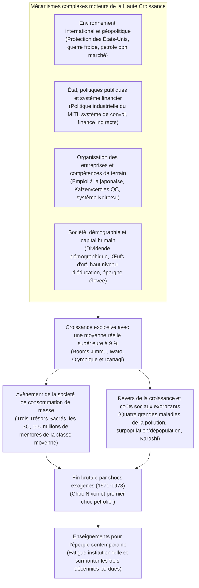
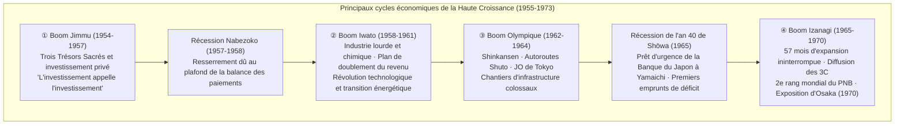
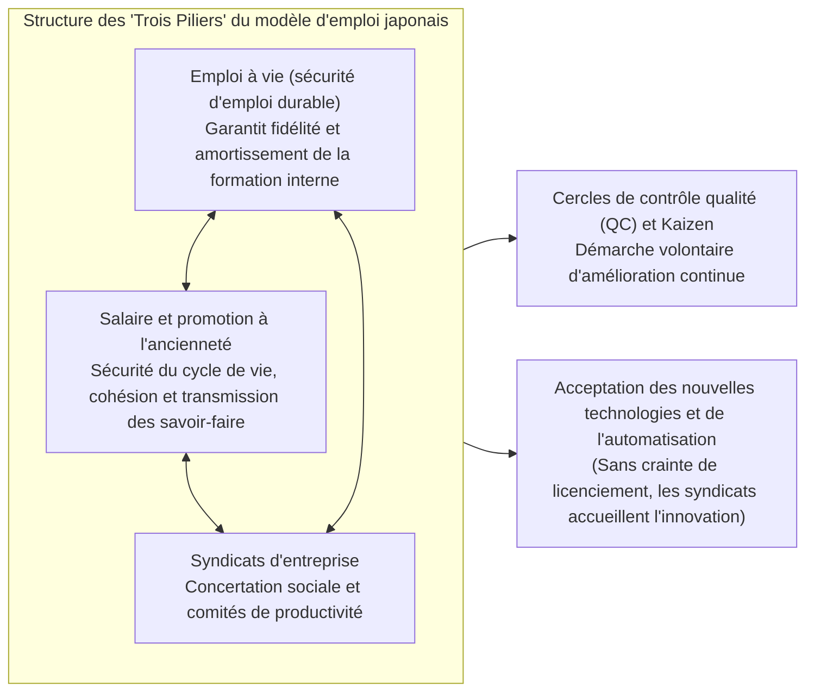
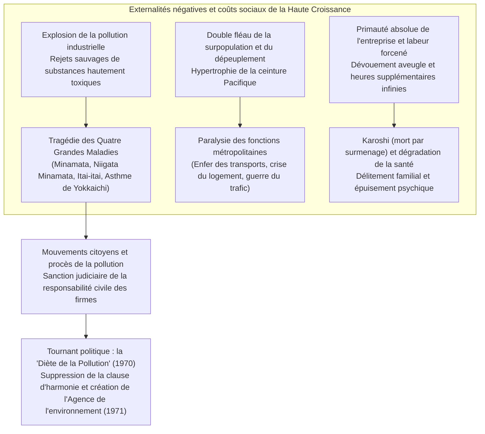

## Introduction : Un « miracle économique » sans précédent dans l'histoire et sa véritable nature

Le 15 août 1945, lorsque la capitulation sans condition de l'Empire du Japon scella la fin de la guerre du Pacifique, l'archipel nippon n'était plus qu'un champ de ruines calcinées. Près de 40 % de la superficie des principales agglomérations urbaines avaient été anéantis sous les déluges de bombes incendiaires, et environ un quart du patrimoine national (près de 36 % des actifs non militaires) avait été réduit en cendres. Ayant perdu la totalité de ses possessions coloniales d'outre-mer, le pays vit affluer plus de six millions de soldats démobilisés et de civils rapatriés, errant sans toit ni travail. Une immense partie de la population luttait au quotidien contre les défaillances criantes du rationnement, hantée par le spectre de la famine et d'une hyperinflation galopante. Les journalistes étrangers et les hauts dignitaires du Commandement suprême des forces alliées (GHQ) alors présents au Japon s'accordaient sur un constat d'une noirceur sans appel : « Il faudra au moins un demi-siècle au Japon pour retrouver le niveau d'une économie autonome digne d'un État moderne. »

Pourtant, cette sombre prédiction allait être démentie avec un éclat spectaculaire qui bouleversa l'histoire économique mondiale.

À peine dix ans après la fin des hostilités, de 1955 jusqu'au premier choc pétrolier de 1973, l'économie japonaise réalisa pendant près de deux décennies une progression fulgurante affichant **un taux de croissance réel annuel moyen d'environ 9,3 %**, une performance presque unique dans les annales de l'humanité. Le produit national brut (PNB), qui s'élevait à environ 8 000 milliards de yens en 1955, fit un bond prodigieux pour atteindre 112 000 milliards de yens en 1973, soit une multiplication par quatorze. En 1968, réalisant l'ambition séculaire poursuivie depuis la restauration de Meiji, le Japon dépassa l'Allemagne de l'Ouest — colosse industriel d'Europe occidentale — pour s'ériger au rang de **deuxième puissance économique mondiale du monde capitaliste**, juste derrière les États-Unis.



Cet élan irrésistible fut salué dans le monde entier sous le nom de **« Miracle Économique Oriental » (Economic Miracle)**. Les appareils électroménagers emblématiques, érigés au rang de « Trois Trésors Sacrés » (le téléviseur noir et blanc, la machine à laver électrique et le réfrigérateur électrique), pénétrèrent le quotidien des foyers dans les moindres recoins de l'archipel, avant de céder le pas à la consommation plus raffinée des « 3C » : le téléviseur couleur (*Color TV*), le climatiseur individuel (*Cooler*) et l'automobile particulière (*Car*). Le mode de vie de la population rompit de manière irréversible avec les communautés rurales traditionnelles pour embrasser le modèle de la famille nucléaire urbaine, goûtant à une aisance matérielle inédite fondée sur la production et la consommation de masse. Une société où près de 90 % des citoyens s'identifiaient à la classe moyenne vit le jour (« société de 100 millions de membres de la classe moyenne »), édifiant une nation industrielle parmi les plus sûres et les plus instruites du globe.

Pour autant, ce prétendu « miracle » n'avait rien d'un don providentiel tombé du ciel. Il fut le produit d'un emboîtement d'engrenages historiques remarquables : l'appareil technique de l'industrie lourde et chimique et les méthodes de dirigisme bureaucratique hérités de l'avant-guerre et de la période du conflit mondial ; le basculement géopolitique majeur de la guerre froide et le revirement stratégique de Washington à l'égard de Tokyo ; l'orchestration méthodique de la politique industrielle par le ministère du Commerce international et de l'Industrie (MITI) et le système financier de « convoi » mené par le ministère des Finances ; les pratiques socioprofessionnelles fondées sur l'emploi à vie et le salaire à l'ancienneté ; enfin, l'ardeur au travail sans réserve et la très forte propension à l'épargne d'une jeunesse laborieuse que l'on surnommait « les œufs d'or ».

Cependant, cette marche triomphale s'accompagna en permanence d'une ombre sinistre et douloureuse. Les rejets sauvages d'effluents industriels toxiques et de fumées d'usines engendrèrent les « Quatre Grandes Maladies de la Pollution » — parmi lesquelles la maladie de Minamata et l'asthme de Yokkaichi —, détruisant irrémédiablement la santé et la vie d'innombrables citoyens innocents. L'exode rural massif vers les mégapoles provoqua une congestion urbaine asphyxiante, la « guerre du trafic » et la dégradation de l'habitat dans la mégalopole côtière de la ceinture Pacifique, tout en infligeant aux campagnes un dépeuplement accéléré et le déclin du secteur primaire. Les travailleurs, qualifiés d'« employés féroces » (*mōretsu shain*) ou de « soldats d'entreprise », furent contraints à un dévouement aveugle envers leur employeur et à des heures supplémentaires sans fin, semant les germes d'une tragédie sociale qui allait acquérir une sinistre réputation internationale sous le nom de **Karoshi** (mort par surmenage).

Cette étude se propose d'embrasser dans toute sa complexité le phénomène historique de la Haute Croissance Économique de l'après-guerre au Japon (1955-1973). Dépassant la simple narration des fluctuations conjoncturelles, elle examine les dynamiques macroéconomiques, la stratégie industrielle, les mécanismes financiers, la gouvernance d'entreprise, la structure sociale, la géopolitique mondiale ainsi que les ravages écologiques de la pollution. Enfin, elle met en lumière les leçons historiques décisives pour le XXIe siècle, expliquant comment l'enfermement dans les succès d'hier s'est mué en une profonde « fatigue institutionnelle », précipitant le Japon dans ses « trois décennies perdues » à partir des années 1990.

---

## Chapitre 1 : Frémissements sur les ruines —— La préhistoire de la Haute Croissance (1945-1954)

Si l'on fixe le point de départ de la Haute Croissance en 1955, la décennie qui suivit immédiatement la fin de la guerre (1945-1954) constitua une phase d'élan déterminante. Durant ces dix années, le pays déblaya les décombres de son économie brisée, reconstruisit l'armature de l'économie de marché et érigea le pas de tir indispensable au formidable décollage ultérieur.

### 1.1 Défaite catastrophique et hyperinflation

Au lendemain de la capitulation d'août 1945, l'économie nippone se trouvait au bord de la paralysie totale. En raison de l'interruption brutale des fabrications d'armement et de la coupure complète des importations de matières premières, le niveau de la production minière et manufacturière s'était effondré en 1946 à **environ 30 % du niveau d'avant-guerre** (moyenne de référence 1934-1936). Les retards et les ruptures d'approvisionnement en riz, base de l'alimentation, devinrent monnaie courante, contraignant les citadins à la « vie de pousse de bambou » (*takenoko seikatsu*), vendant progressivement vêtements et biens domestiques aux paysans en échange de vivres.

Cet effondrement productif fut aggravé par une hyperinflation foudroyante. Le règlement des dépenses militaires extraordinaires débloquées sans compter à la fin des hostilités, le versement d'indemnités colossales aux fournisseurs de guerre immédiatement après la reddition et les pensions de licenciement allouées lors de la dissolution de l'armée impériale firent enfler la masse des billets émis par la Banque du Japon dans des proportions astronomiques. Entre l'automne 1945 et 1949, l'indice des prix de gros fut multiplié par un facteur vertigineux de **près de soixante-dix**.

Pour enrayer la déroute monétaire, le gouvernement promulgua en février 1946 l'« Ordonnance sur les mesures financières d'urgence ». Il décréta le blocage intégral des dépôts bancaires et annula la validité des anciens billets de banque, contraignant les citoyens à un échange forcé contre le « nouveau yen ». Cependant, tant que le déficit criant de l'appareil productif n'était pas résolu, il demeurait impossible d'endiguer la spirale inflationniste.

```
【Indicateurs économiques clés de la période immédiate d'après-guerre】
・Niveau de la production minière et industrielle (1946) : 30,7 % du niveau d'avant-guerre (1934-36 = 100)
・Taux de hausse de l'indice des prix de gros à Tokyo (1946) : +364,5 % sur un an
・Ration officielle de riz (fin 1945) : réduite à 2 gō et 1 shaku (env. 297 g) par adulte et par jour, pénuries chroniques
・Nombre total de rapatriés d'outre-mer (1945-1950) : environ 6,25 millions de personnes
```

Pour surmonter cette paralysie productive, le gouvernement adopta à la fin de 1946 — avec mise en œuvre effective en 1947 — le **« Système de production prioritaire » (Priority Production System)**, conçu par une équipe d'universitaires sous la houlette du professeur Hiromi Arisawa de l'université de Tokyo. Le principe fondateur consistait à ne pas abandonner les rares ressources subsistantes (capitaux, matières premières, devises, main-d'œuvre) au libre jeu des marchés, mais à les concentrer massivement sur deux secteurs primordiaux : le **charbon** et **l'acier**, afin que leur relance conjuguée entraîne l'ensemble de l'appareil productif national.

Dans la pratique, le charbon extrait dans le pays était alloué en priorité absolue à la sidérurgie pour alimenter les hauts fourneaux ; l'acier produit était aussitôt réaffecté aux mines de charbon pour le soutènement des galeries et la fabrication d'engins d'extraction, décuplant ainsi le rendement minier. Cette dynamique vertueuse du fer et du charbon permit de dégager des surplus matériels qui irriguèrent par étapes l'énergie électrique, les engrais chimiques et le transport ferroviaire.

Le bras financier de cette stratégie fut la création, en janvier 1947, de la **Caisse financière de reconstruction (Fukkō Kin'yū Kinko, abrégée en Fukkin)**. Cet organisme public émettait des obligations garanties par l'État, souscrites en majeure partie directement par la Banque du Japon, afin de déverser d'abondants crédits à long terme et à taux modéré dans les industries de base. À la fin de 1948, les crédits de la Fukkin représentaient près de 70 % des fonds d'équipement des grands secteurs industriels.

Le Système de production prioritaire remporta un éclatant succès en ranimant à un rythme accéléré la production de base. Cependant, la souscription directe des obligations de la Fukkin par la banque centrale provoqua une colossale création monétaire, attisant une nouvelle vague d'inflation dévastatrice connue sous le nom d'**« inflation Fukkin »**.

### 1.2 La Ligne Dodge et les Recommandations Shoup : Établissement des fondements de l'économie de marché

Devant l'ampleur de cette dérive inflationniste, l'administration américaine opéra un virage géopolitique radical dans sa gestion de l'occupation. L'intensification de la guerre froide — matérialisée par la fondation de la République populaire de Chine en 1949 et la bipolarisation mondiale — amena Washington à redéfinir le statut du Japon : de « puissance vaincue à démilitariser », l'archipel fut mu en « rempart anticommuniste et forteresse du capitalisme en Extrême-Orient ». Dès lors, l'économie nippone ne pouvait plus demeurer tributaire de l'assistance financière des fonds d'aide américains (GARIOA et EROA) ; elle devait acquérir son autonomie sur les bases rigoureuses d'une économie de marché saine.

En février 1949, **Joseph M. Dodge**, président de la Detroit Bank, débarqua à Tokyo en qualité de ministre plénipotentiaire et administra à l'économie japonaise un traitement de choc d'une sévérité implacable : la célèbre **« Ligne Dodge » (Dodge Line)**. Ses trois commandements cardinaux étaient les suivants :

1. **Établissement d'un budget en super-équilibre** : Interdiction formelle de toute émission d'emprunts d'État, résorption immédiate des déficits et obligation non seulement d'équilibrer recettes et dépenses, mais de dégager un excédent net pour rembourser les dettes antérieures.
2. **Arrêt des crédits de la Fukkin et démantèlement total des subventions** : Suppression des indemnités de compensation de prix (les colossales aides publiques comblant l'écart entre coûts de revient et prix officiels administrés).
3. **Fixation d'un taux de change unique** : Le 25 avril 1949, la parité fixe et intangible de **1 dollar = 360 yens** fut officiellement instaurée.

La fin du maquis des taux de change multiples, qui comptaient jusqu'alors des dizaines de barèmes pour chaque marchandise, et l'arrimage direct au marché mondial via le guichet unique de 360 yens exposèrent sans ménagement les entreprises japonaises à la concurrence internationale. Du point de vue de la parité de pouvoir d'achat de l'époque, ce cours de 1 dollar = 360 yens sous-évaluait le yen, ce qui allait constituer à terme un puissant avantage compétitif pour les exportations nippones.

À court terme néanmoins, la Ligne Dodge porta un coup d'une extrême violence. Le tarissement des dépenses publiques et la rigueur monétaire draconienne précipitèrent le Japon dans une déflation aiguë. Les faillites de PME se multiplièrent et les grandes firmes durent licencier massivement pour survivre : ce fut la « récession Dodge ». Des centaines de milliers de travailleurs furent jetés à la rue dans le privé comme dans le secteur public (Chemins de fer nationaux, Monopole du tabac), dans un climat de vive tension sociale incarné par les trois grandes énigmes non élucidées du rail japonais (les affaires Shimoyama, Mitaka et Matsukawa).

Parallèlement à la thérapie Dodge, le second grand pilier institutionnel du Japon d'après-guerre fut posé par la mission fiscale conduite par le professeur **Carl S. Shoup**, de l'université Columbia, arrivée en mai 1949 : les **« Recommandations Shoup »**. Le rapport Shoup balaya le régime complexe de taxes indirectes d'avant-guerre pour instaurer un **système fiscal moderne reposant sur la fiscalité directe, avec l'impôt sur le revenu comme pierre angulaire**.

La réforme Shoup introduisit le régime de la « déclaration bleue » (*aoiro shinkoku*), encourageant la tenue d'une comptabilité d'entreprise transparente ; elle assura l'autonomie financière des collectivités locales (ébauche du mécanisme de dotation globale) et rationalisa l'impôt sur les sociétés. Grâce à la rigueur macroéconomique de Dodge et à la modernisation institutionnelle microéconomique de Shoup, le Japon se dota des assises pérennes indispensables à la gestion d'un capitalisme moderne.

### 1.3 La guerre de Corée et le choc des « commandes spéciales » : Détonateur de l'accumulation de capital

Alors que l'économie japonaise suffoquait sous la déflation consécutive à la Ligne Dodge, le 25 juin 1950 éclata la **guerre de Corée** sur la péninsule voisine. Si ce conflit représenta une épouvantable tragédie sur le plan humain et géopolitique, il joua le rôle d'un sauveur inespéré pour l'économie japonaise en détresse, conduisant le Premier ministre Shigeru Yoshida à saluer en privé une véritable « aide divine » (*ten'yu*).

La riposte des forces des Nations unies (constituées pour l'essentiel de troupes américaines) transforma le Japon, pays industriel le plus proche du théâtre des combats, en base arrière logistique stratégique pour la fourniture massive de biens et de prestations de service : ce fut l'explosion des **« commandes spéciales de la guerre de Corée » (Tokuju)**.

Les commandes passées par l'armée américaine furent d'une grande diversité :
- **Matériels militaires et métallurgie** : Camions, jeeps tout-terrain, fûts d'essence, fils de fer barbelés, pièces de rechange d'armement et caisses de munitions.
- **Textiles et fournitures** : Draps d'uniformes, sacs de jute, couvertures de campement, toiles de tentes et rangers.
- **Prestations de services** : Réparation, révision et remise en état de blindés, véhicules et aéronefs endommagés, acheminement logistique et soutien en télécommunications.

Entre 1950 et la conclusion de l'armistice en 1953, les devises drainées par ces commandes spéciales atteignirent un montant cumulé de **près de 2,4 milliards de dollars** (l'équivalent d'environ 60 % de l'ensemble des exportations japonaises sur cette période). Cet afflux massif de dollars résorba instantanément la pénurie de devises qui étranglait l'archipel depuis 1945.

```
【Impact quantitatif des commandes spéciales de Corée sur l'économie nippone (1950-1953)】
・Montant total des contrats d'approvisionnement : env. 2,4 milliards de dollars (commandes directes + dépenses des troupes)
・Taux de croissance annuel réel du PIB : exercice 1950 : +10,8 % ; 1951 : +12,3 % ; 1952 : +10,0 % ; 1953 : +7,3 %
・Indice de la production industrielle : bondit d'environ 70 % en une seule année (1950) et recouvra dès 1951 son niveau d'avant-guerre
・Redressement spectaculaire des marges : le taux de rentabilité commerciale de l'industrie manufacturière battit tous ses records d'après-guerre fin 1950
```

La portée historique des commandes de Corée dépassa de très loin une simple liquidation de stocks excédentaires.
D'une part, en s'attelant à la réfection et à la fabrication en série de camions militaires, les constructeurs automobiles japonais (tels que Toyota, Nissan ou Isuzu) assimilèrent les normes draconiennes d'assurance qualité de l'armée américaine (spécifications *mil-spec*), faisant progresser à pas de géant l'interchangeabilité des pièces et la gestion de la production de masse. D'autre part, les profits colossaux engrangés furent conservés au sein des entreprises sous forme de réserves internes, fournissant les fonds propres nécessaires pour financer les vagues massives d'investissements productifs ultérieurs (construction de complexes sidérurgiques modernes, acquisition de machines-outils de pointe à l'étranger).

### 1.4 Le régime de San Francisco et la proclamation que « l'après-guerre est révolu »

En septembre 1951, le Japon signa le traité de paix de San Francisco ainsi que le traité de sécurité nippo-américain. Leur entrée en vigueur le 28 avril 1952 mit un terme officiel à sept années d'occupation militaire interalliée, restaurant la pleine souveraineté de l'État japonais.

Ayant recouvré son indépendance, le Japon s'ancra résolument dans le bloc occidental des démocraties libérales. La doctrine diplomatique formulée par le Premier ministre Shigeru Yoshida, connue sous le nom de **« Doctrine Yoshida »**, définit les priorités nationales avec une rationalité chirurgicale : confier intégralement la sécurité du pays au parapluie militaire des États-Unis et au traité de sécurité, contenir les dépenses de défense à un niveau minimal inférieur à 1 % du PNB, et mobiliser l'ensemble de l'énergie créatrice, des compétences humaines et des capitaux vers la reconstruction industrielle et le commerce extérieur. Ce choix stratégique offrit aux entreprises japonaises un environnement d'affaires privilégié, exempt du fardeau budgétaire de l'armement.

Après un ralentissement conjoncturel passager consécutif à l'armistice coréen de 1953, un cycle d'expansion autonome tiré par l'investissement productif se mit en place dans les profondeurs de l'économie. Dès 1955, sous l'impulsion de récoltes agricoles exceptionnelles et de la vitalité des échanges mondiaux, s'ouvrit une phase de croissance non inflationniste qualifiée de « boom quantitatif » (*sūryō keiki*).

Cette mutation historique majeure fut solennellement consacrée par le célèbre *Livre blanc de l'économie* de l'exercice fiscal 1956 (an 31 de l'ère Shōwa), rédigé sous la houlette de **Yonosuke Gotō**, haut fonctionnaire de l'Agence de planification économique. La phrase conclusive de ce rapport est passée à la postérité comme la formule la plus retentissante de toute l'histoire japonaise contemporaine :

> **« L’"après-guerre" est désormais révolu. Nous sommes désormais confrontés à une situation radicalement nouvelle. La croissance par le simple rattrapage a touché à son terme. La croissance qui s'ouvre sera portée par la modernisation. »**

Cet avertissement ne se voulait nullement une autosatisfaction stérile. Il signifiait que la phase consistant à retrouver les standards productifs de l'avant-guerre était achevée. Désormais, le Japon ne pouvait plus compter sur l'aide extérieure, les emprunts internationaux ou la manne des guerres régionales. C'était un appel pressant : faute d'assimiler sans délai les grandes ruptures technologiques (l'automatisation, la chimie des polymères, les transistors, la génération thermique de haute puissance) et de convertir en profondeur la structure industrielle du pays des manufactures légères vers les industries lourdes et chimiques de pointe, le Japon serait irrémédiablement balayé sur les marchés mondiaux.

Avec une énergie qui allait surpasser les espérances les plus audacieuses de ce rapport, l'économie nippone s'engageait dans la plus gigantesque expérience de modernisation industrielle de l'époque contemporaine.

---

## Chapitre 2 : Chronique des cycles économiques et de la Haute Croissance (1955-1973)

Au cours des dix-huit années qui s'écoulèrent de 1955 à 1973, l'économie du Japon ne connut pas une trajectoire d'expansion rectiligne et uniforme. Elle progressa en réalité par à-coups successifs, franchissant les paliers de sa croissance à travers des cycles marqués par l'alternance d'expansions euphoriques — portées par la frénésie d'investissement des firmes et la soif de consommation des ménages — et de phases de resserrement forcé déclenchées par l'épuisement des réserves de devises sous l'effet du bond des importations.

Le pays étant soumis au carcan d'un taux de change rigide de 1 dollar = 360 yens, les avoirs extérieurs de la banque centrale constituaient une butée infranchissable. Dès que la surchauffe s'installait, les achats de machines et d'hydrocarbures étrangers s'envolaient, creusant le déficit commercial ; dès lors que les réserves de change menaçaient de s'épuiser, la Banque du Japon relevait sans tarder son taux d'escompte pour juguler la demande intérieure. Ce mécanisme régulateur, baptisé le **« plafond de la balance des paiements »** (*kokusai shūshi no tenjō*), représenta la contrainte macroéconomique maîtresse de l'époque.

Le tableau chronologique ci-après retrace la succession des cinq grandes vagues d'expansion qui ont rythmé cette ère prodigieuse.



### 2.1 Le Boom Jimmu (1954-1957) et la récession Nabezoko : La réaction en chaîne des investissements

L'expansion amorcée en novembre 1954 reçut le nom de **« Boom Jimmu »**, en référence fière à une prospérité sans précédent depuis l'avènement du mythique premier empereur du Japon, Jimmu.

Le moteur souverain de cette poussée fut l'explosion des **investissements privés en biens d'équipement**. Les secteurs moteurs — sidérurgie, construction navale, fibres synthétiques, pétrochimie, machines électriques — rivalisèrent dans l'acquisition de machines dernier cri et la mise en chantier de méga-usines. Cette dynamique fut immortalisée dans le *Livre blanc de l'économie* de 1957 par la formule devenue emblématique : **« l'investissement appelle l'investissement »** (*tōshi ga tōshi o yobu*).

Dès lors que les aciéristes développaient leurs capacités, ils passaient d'immenses commandes aux constructeurs de machines ; pour y répondre, ces derniers devaient à leur tour construire de nouveaux ateliers, ce qui relançait en retour la demande d'acier, de ciment et d'électricité. Cet enchaînement autoréalisateur d'interdépendances industrielles propulsa l'ensemble de l'activité économique vers des sommets inédits.

Simultanément s'enclenchait la révolution du confort domestique. Les **« Trois Trésors Sacrés »** (le téléviseur noir et blanc, le lave-linge électrique et le réfrigérateur) firent une entrée remarquée dans les foyers de la classe moyenne urbaine, soulageant le travail domestique et transformant les loisirs familiaux.

Toutefois, dès le début de 1957, le contrecoup du surrégime se fit sentir. L'envolée des importations de matières brutes plongea la balance des paiements dans un déficit préoccupant, amenuisant les réserves de devises jusqu'à un seuil critique. S'étant heurtée au « plafond de la balance des paiements », la Banque du Japon resserra énergiquement sa politique monétaire en multipliant les hausses de taux. L'activité connut un coup de frein violent, les cours de l'acier et des textiles s'effondrèrent, entraînant l'économie, de la fin de 1957 à 1958, dans la phase de stagnation dite de la **« récession Nabezoko »** (fond de poêle). Néanmoins, l'appétit d'investissement des entreprises demeura intact et la reprise ne tarda guère.

### 2.2 Le Boom Iwato (1958-1961) et le Plan de doublement du revenu national : L'envolée de l'industrie lourde et chimique

Au sortir de la récession Nabezoko en juillet 1958 s'ouvrit une phase encore plus magistrale, baptisée le **« Boom Iwato »**, par allusion au mythe de la déesse solaire Amaterasu sortant de sa caverne céleste. Sur l'ensemble de ce cycle, le Japon maintint une cadence époustouflante avec une croissance réelle moyenne de **11,3 % par an**.

L'essence du Boom Iwato résida dans le basculement définitif du centre de gravité de l'industrie : les manufactures légères cédèrent le premier rôle à l'**industrie lourde et chimique (sidérurgie, pétrochimie, automobile, équipements électriques lourds)**. Une révolution énergétique éclair s'opéra : le charbon indigène fut prestement évincé au profit d'un pétrole moyen-oriental abondant, pur et extraordinairement économique. Sur les littoraux des baies de Tokyo et d'Ise ou de la mer Intérieure de Seto, d'immenses terre-pleins furent conquis sur les eaux pour y ériger des complexes sidérurgiques intégrés et des combinats pétrochimiques géants.

Sur la scène politique, un tournant décisif se produisit. En 1960, la révision du traité de sécurité nippo-américain provoqua les manifestations monstres d'Anpo, la plus grave crise politique d'après-guerre, encerclant le parlement de foules immenses. Après la démission du Premier ministre Nobusuke Kishi pour apaiser la nation, son successeur, **Hayato Ikeda**, prit le parti audacieux de détourner les passions idéologiques vers le bien-être économique en promulguant le célèbre **« Plan de doublement du revenu national »** (*Kokumin Shotoku Baizō Keikaku*) en décembre 1960.

Sous l'impulsion théorique de l'économiste Osamu Shimomura, ce programme se fixait pour ambition de **doubler le PNB réel en dix ans (1961-1970), de réaliser le plein emploi et d'élever les conditions matérielles du peuple japonais aux standards des démocraties industrielles d'Europe occidentale**. Cela exigeait une croissance moyenne de 7,2 % par an, objectif jugé chimérique par les partis d'opposition et de nombreux universitaires.

La réalité dépassa pourtant les anticipations les plus hardies. L'enthousiasme des entreprises s'enflamma et l'objectif de doublement des revenus réels fut atteint en un peu plus de quatre ans. Le discours bienveillant d'Ikeda, prônant « tolérance et patience » tout en promettant « le doublement des salaires », instilla au sein d'une société marquée par la guerre une foi inébranlable dans l'avenir et le progrès national.

### 2.3 Le Boom Olympique (1962-1964) et la révolution des infrastructures

À la suite du cycle Iwato et d'un nouveau coup de frein dicté par la balance des paiements, la dynamique reprit de plus belle à la fin de 1962 avec le **« Boom Olympique »**. Pour célébrer avec faste les XVIIIes Jeux olympiques d'été de Tokyo (octobre 1964), premières olympiades organisées en terre d'Asie, l'État déploya un gigantesque programme de grands travaux.

L'enveloppe allouée aux réseaux de transport et à l'urbanisme avoisinait le millier de milliards de yens, un montant équivalent au budget national de l'époque :
- **Tokaido Shinkansen** : Inauguré le 1er octobre 1964, le premier train à grande vitesse du monde reliait Tokyo à Shin-Osaka à 210 km/h en seulement quatre heures (ramenées à 3 h 10 dès l'année suivante), restructurant de fond en comble l'épine dorsale géographique du pays.
- **Autoroutes Meishin et réseau Shuto** : L'ouverture de l'axe autoroutier Meishin et la construction hardie des voies surélevées de l'autoroute urbaine de Tokyo permirent de fluidifier la circulation métropolitaine.
- **Modernisation de l'écosystème urbain** : Le monorail de Tokyo reliant Haneda au cœur de la capitale, l'achèvement de la ligne de métro Hibiya, l'édification de prestigieux palaces comme l'Hôtel New Otani, ainsi que l'extension du tout-à-l'égout métamorphosèrent le visage de la capitale.

Sur les écrans, la retransmission en direct des épreuves fit décoller les ventes de téléviseurs couleur, tandis que le triomphe de la première diffusion télévisée transpacifique par satellite spatial (Syncom 3) présenta au monde entier le nouveau visage d'un Japon à la pointe des technologies de pointe.

### 2.4 La récession de l'an 40 de Shōwa (1965) et le tournant doctrinal de la politique budgétaire

Toutefois, la fête olympique retombée, l'économie nippone essuya la plus rude bourrasque de sa période de prospérité : la **« récession de l'an 40 de Shōwa »** (1965).

Les capacités manufacturières surdimensionnées pour les besoins olympiques se muèrent soudainement en excédents structurels d'offre, précipitant un nombre record d'entreprises dans la faillite. Les marchés boursiers furent terrassés par la panique, et l'une des quatre grandes maisons de courtage de la nation, **Yamaichi Securities**, accumula des pertes si écrasantes qu'elle se trouva au bord d'une faillite frauduleuse imminente.

Afin de conjurer l'effondrement en chaîne du crédit et le péril d'un krach systémique, le ministre des Finances de l'époque, **Kakuei Tanaka**, en étroite concertation avec le gouverneur de la Banque du Japon, Makoto Usami, prit une décision d'une exceptionnelle audace juridique. Il activa les dispositions de l'article 25 de la loi sur la Banque du Japon pour octroyer **des prêts d'urgence sans limite et sans garantie réelle (crédit d'urgence de la Banque du Japon ou *Nichigin tokuyū*)** à Yamaichi Securities, éteignant immédiatement le début de panique bancaire.

En outre, brisant le tabou absolu de l'orthodoxie budgétaire dicté par la Ligne Dodge et sanctuarisé à l'article 4 de la loi sur les finances publiques, le gouvernement s'autorisa, lors du collectif budgétaire de 1965, à émettre pour la première fois de l'après-guerre des **« obligations spéciales pour combler le déficit » (emprunts de déficit)**. Cet élan budgétaire keynésien — conjuguant relance des travaux publics et allégements fiscaux — soutint efficacement la demande globale et permit d'abréger la récession. Cette gestion anticrise jeta les bases de la plus longue phase dorée de l'histoire du pays.

### 2.5 Le Boom Izanagi (1965-1970) : Les 57 mois dorés et le deuxième rang mondial

Prenant son élan sur le point bas de novembre 1965, l'économie s'engagea dans une vague d'opulence sans précédent qui s'étira jusqu'en juillet 1970 : le **« Boom Izanagi »**, nommé d'après la divinité créatrice Izanagi, remontant aux origines mythologiques de l'archipel. L'expansion se prolongea pendant **57 mois consécutifs**, pulvérisant tous les records de longévité enregistrés jusqu'alors.

Ce boom fut alimenté par une formidable pénétration commerciale sur les marchés extérieurs et par la sophistication accrue de la consommation populaire. L'appétit d'équipement des ménages délaissa les anciens trésors pour jeter son dévolu sur les prestigieuses **« 3C »** :
- **Color TV (Télévision couleur)**
- **Cooler (Climatiseur individuel)**
- **Car (Automobile particulière)**

L'arrivée sur le marché en 1966 de modèles populaires tels que la Toyota Corolla ou la Nissan Sunny déclencha l'« an I de la motorisation de masse ». Grâce à des processus d'ingénierie rigoureux et au culte de l'assurance qualité, l'industrie manufacturière japonaise effaça définitivement son ancienne réputation de fabriquer des pacotilles : les produits arborant le label *Made in Japan*, renommés pour leur fiabilité sans faille et leur faible taux de panne, s'imposèrent sur tous les marchés de la planète.

En 1968, une étape capitale fut franchie dans l'histoire contemporaine du Japon : avec un PNB nominal d'**environ 141,9 milliards de dollars**, le Japon dépassa la République fédérale d'Allemagne pour s'installer au **deuxième rang des puissances économiques du monde capitaliste**, derrière les États-Unis. Un siècle jour pour jour après le déclenchement de la restauration de Meiji en 1868, l'archipel vaincu avait surclassé les métropoles impériales d'Europe occidentale pour atteindre le sommet de la prospérité mondiale.

Ce triomphe culmina en 1970 avec l'ouverture de l'**Exposition universelle d'Osaka (Expo '70)**, première du genre en Asie, placée sous la devise « Progrès et harmonie pour l'humanité ». Dominé par la monumentale Tour du Soleil conçue par Tarō Okamoto, le parc des collines de Senri accueillit en l'espace de six mois l'affluence inouïe de **64,21 millions de visiteurs**. La roche lunaire exposée au pavillon américain, les tapis roulants urbains et les pavillons futuristes demeurèrent dans les cœurs comme le symbole éclatant d'un Japon victorieux des épreuves de l'après-guerre et parvenu à l'apogée de sa grandeur.

```
【Évolution des principaux agrégats macroéconomiques de la Haute Croissance (exercices 1955-1974)】
```

| Exercice | Croissance réelle du PIB (%) | PNB nominal (centaines de millions de yens) | Cycle conjoncturel / Événements historiques majeurs |
| :---: | :---: | :---: | :--- |
| **1955** | **+10,8** | 88 646 | Début du Boom Jimmu ; décollage des Trois Trésors Sacrés |
| **1956** | **+6,2** | 98 719 | Livre blanc : « L'après-guerre est révolu » ; adhésion à l'ONU |
| **1957** | **+7,8** | 111 280 | Récession Nabezoko ; butée sur le plafond de la balance des paiements |
| **1958** | **+5,6** | 118 527 | Début du Boom Iwato ; inauguration de la Tour de Tokyo |
| **1959** | **+11,2** | 134 228 | Mariage princier d'Akihito ; diffusion explosive du téléviseur |
| **1960** | **+12,5** | 160 332 | Émeutes d'Anpo ; cabinet Ikeda et « Plan de doublement du revenu » |
| **1961** | **+12,0** | 196 442 | Consolidation de l'industrie lourde ; révolution énergétique du pétrole |
| **1962** | **+8,9** | 220 119 | Début du Boom Olympique ; inauguration de Senri New Town |
| **1963** | **+10,7** | 256 419 | Inauguration de l'autoroute Meishin (Ritto-Amagasaki) |
| **1964** | **+13,1** | 295 444 | JO de Tokyo ; mise en service du Shinkansen ; adhésion à l'OCDE |
| **1965** | **+5,8** | 328 217 | Récession de 1965 ; prêt d'urgence à Yamaichi ; premiers bons de déficit |
| **1966** | **+10,6** | 382 900 | Boom Izanagi ; an I de la voiture populaire (Corolla, Sunny) |
| **1967** | **+11,1** | 446 953 | Essor des 3C ; loi fondamentale sur la lutte contre la pollution |
| **1968** | **+12,2** | 528 781 | **Le PNB du Japon dépasse celui de la RFA (2e rang capitaliste mondial)** |
| **1969** | **+12,5** | 622 464 | Achèvement de l'autoroute Tomei ; percée de la télévision couleur |
| **1970** | **+10,7** | 733 449 | Expo '70 d'Osaka (64,21 millions d'entrées) ; « Dieta de la pollution » |
| **1971** | **+5,0** | 809 726 | Choc Nixon ; accord smithsonien (fixation à 1 dollar = 308 yens) |
| **1972** | **+9,1** | 954 646 | Cabinet Tanaka : « Remodelage de l'archipel » ; normalisation avec Pékin |
| **1973** | **+5,1** | 1 125 487 | Passage aux changes flottants ; 1er choc pétrolier ; « prix affolants » |
| **1974** | **-1,2** | 1 348 229 | **1re récession de l'après-guerre ; fin définitive de la Haute Croissance** |

---

## Chapitre 3 : Pourquoi le « miracle » a-t-il eu lieu ? —— Autopsie des mécanismes multidimensionnels

La Haute Croissance Économique japonaise ne fut en aucune manière le fruit spontané du laissez-faire libéral, pas plus qu'elle ne saurait être réduite à des considérations moralisatrices sur l'abnégation légendaire des travailleurs nippons. Elle découle de l'agencement méticuleux d'un **« capitalisme managérial à la japonaise »**, au sein duquel se combinèrent en une puissante synergie le pilotage étatique, une organisation financière protectrice, des relations de travail coopératives, des méthodes de contrôle qualité en atelier, une configuration démographique exceptionnelle et un ordre géopolitique favorable issu de la guerre froide.

Ce chapitre décortique les six rouages structurels qui ont animé cette dynamique.



### 3.1 Politique industrielle et pilotage étatique : La stratégie sectorielle ciblée du MITI

Dans son ouvrage fondamental, *MITI and the Japanese Miracle*, le politologue américain Chalmers Johnson a forgé le concept d'**« État développeur » (Developmental State)** pour singulariser l'expérience japonaise face aux « États régulateurs » de tradition anglo-saxonne. Alors que l'État régulateur se borne à faire respecter les règles de droit et la neutralité concurrentielle, l'État développeur nippon a défini de façon volontariste des objectifs économiques prioritaires et orienté l'affectation des ressources productives vers les filières d'avenir, avec pour bras séculier le ministère du Commerce international et de l'Industrie (MITI).

L'audace conceptuelle de la politique industrielle du MITI consista à enfreindre délibérément le dogme libéral des avantages comparatifs statiques (qui aurait condamné le Japon d'après-guerre à exporter indéfiniment des soieries, de la cotonnade ou des babioles bon marché). Les stratèges du ministère firent le pari des avantages comparatifs dynamiques : identifier par anticipation les secteurs appelés à connaître une très forte élasticité de la demande mondiale et de puissants effets d'entraînement interindustriels. Ils sélectionnèrent et choyèrent ainsi des industries lourdes à haute intensité de capital et de savoir-faire : **la sidérurgie, la construction navale, la pétrochimie, l'automobile, les machines-outils et l'électronique**.

Pour concrétiser cette orientation, le MITI maniait trois leviers redoutables :

1. **Le contrôle discrétionnaire des devises (loi sur le contrôle des changes et du commerce extérieur)** :
   À une époque de rareté aiguë de monnaies fortes, les devises étrangères (le dollar américain) étaient sous le monopole rigoureux de l'État. Le MITI accordait en priorité absolue les allocations de devises aux firmes des secteurs jugés d'intérêt national, leur permettant d'acheter des brevets occidentaux, des laminoirs modernes ou des procédés chimiques innovants. À l'inverse, il verrouillait l'accès aux devises pour l'importation de produits de consommation ou de produits concurrents, préservant jalousement le marché intérieur.
2. **L'effet d'entraînement des prêts de la Banque de développement du Japon (JDB / Kaigin)** :
   Dès lors que la Banque de développement du Japon (institution publique) consentait un prêt bonifié à un grand projet (complexe sidérurgique maritime ou combinat pétrochimique), le secteur bancaire privé y voyait le label de garantie inconditionnel de l'État. Cet « effet de signal » déclenchait aussitôt une ruée de crédits bancaires privés vers les branches prioritaires.
3. **La concertation public-privé et la régulation des capacités productives** :
   Pour éviter qu'une concurrence sauvage entre conglomérats industriels n'aboutisse à de dangereuses surcapacités, le MITI réunissait les capitaines d'industrie au sein de « comités consultatifs mixtes ». Les ouvertures de nouveaux hauts fourneaux et les quotas de production y étaient planifiés de manière concertée au moyen de cartels légaux de rationalisation, prémunissant les entreprises contre le risque d'investissements massifs infructueux.

### 3.2 L'alchimie du système financier : Prépondérance de la finance indirecte et système de convoi

L'effort d'équipement colossal consenti par le secteur privé (dépassant fréquemment 30 % du PIB) reposait sur une architecture financière originale.

Dans le modèle de marché anglo-saxon, les entreprises mobilisent l'épargne par l'émission directe d'actions et d'obligations en Bourse ou puisent dans leurs bénéfices non distribués. Dans le Japon d'après-guerre, ruiné par le conflit et en pleine réorganisation, les entreprises ne possédaient que des capitaux propres dérisoires. La solution retenue fut le recours massif à la **« finance indirecte »**, c'est-à-dire au crédit bancaire intermédiaire.

Ce montage institutionnel reposait sur trois particularités interdépendantes :

- **Le système de la « banque principale » (*main bank*)** :
  Toute grande firme industrielle entretenait une relation intime et durable avec une grande banque de la place (banques de ville telles que Mitsui, Mitsubishi, Sumitomo, Fuji, Dai-Ichi Kangyō, Sanwa, ou établissements de crédit à long terme comme l'IBJ). La banque principale ne se limitait pas à octroyer des découverts : elle consolidait l'actionnariat par des participations croisées protectrices, siégeait au conseil d'administration et surveillait étroitement la gestion de l'entreprise. Cet engagement sur le long terme affranchissait les dirigeants de la dictature du rendement trimestriel et de la volatilité boursière, leur conférant l'assurance nécessaire pour risquer des investissements amortissables sur cinq ou dix ans.
- **Surinvestissement par l'endettement (*over-borrowing*) et surendettement bancaire (*over-loan*)** :
  Les entreprises empruntaient aux banques des sommes qui excédaient très largement leurs fonds propres ; parallèlement, les banques de ville prêtaient au tissu productif au-delà du volume de leurs dépôts collectés, comblant leur découvert structurel par un refinancement permanent auprès de la Banque du Japon. La banque centrale, maniant son taux directeur et ses instructions discrétionnaires (« directives de guichet » ou *madoguchi shidō* fixant les plafonds d'octroi de crédit), contrôlait avec précision le robinet de la liquidité nationale.
- **Le « système de convoi » (*gosō sendan hōshiki*) et la modération des taux** :
  Le ministère des Finances maintenait délibérément le loyer de l'argent à des niveaux très modérés par la loi temporaire de régulation des taux d'intérêt, allégeant la charge financière des entreprises. Dans le même temps, il exerçait une tutelle tatillonne sur le secteur bancaire : contingentement de l'ouverture des agences, uniformisation des taux d'intérêt créditeurs et cloisonnement strict des métiers. Inspirée de la tactique militaire où la vitesse de l'escadre est réglée sur celle du bâtiment le plus lent, cette doctrine garantissait qu'aucune banque, même la plus fragile, ne ferait faillite. Ce système garantit une invulnérabilité totale contre le risque de panique bancaire et suscita une confiance inébranlable des citoyens dans leurs banques.

À cet édifice s'ajoutait la gigantesque manne du **Programme d'investissements et de prêts publics (FILP / *Zaisei Tōyūshi*)**, fréquemment surnommé le « second budget de l'État ». L'épargne populaire déposée par les ménages dans les agences de la Caisse d'épargne postale et les réserves des caisses de retraite de base étaient drainées vers le Fonds de placement du Trésor. Cette manne considérable était réinjectée, sans recours à l'impôt, dans les grands chantiers du Shinkansen, des autoroutes nationales, du logement social et des infrastructures énergétiques.

### 3.3 L'enracinement des pratiques d'emploi japonaises : Les « Trois Piliers » des relations professionnelles

Dans les ateliers comme dans les bureaux, la Haute Croissance s'appuya sur le **« modèle d'emploi japonais »**, institutionalisé après l'essoufflement et la défaite des rudes grèves ouvrières du début des années cinquante (telles que le conflit de Nissan en 1953 ou la grande grève de la mine de charbon de Miike en 1960). Analysé avec acuité par le sociologue américain James Abegglen dans son essai *The Japanese Factory*, ce système reposait sur un trépied indissociable :

1. **L'emploi à vie (*shūshin koyō*)** :
   Les firmes recrutaient les jeunes diplômés à leur sortie de l'école ou de l'université avec l'engagement moral implicite de ne jamais les licencier jusqu'à l'âge de la retraite. Ce principe garantissait à l'entreprise la rentabilisation de ses investissements dans la formation professionnelle continue en interne (*On-the-Job Training* - OJT) et offrait au salarié une sécurité existentielle absolue.
2. **La rémunération et la promotion à l'ancienneté (*nenkō joretsu*)** :
   Les barèmes salariaux et les échelons hiérarchiques progressaient automatiquement avec l'âge et les années de fidélité dans la maison. Durant la jeunesse, le salaire demeurait inférieur à la productivité fournie, favorisant l'accumulation du capital d'entreprise ; avec la maturité, au moment des dépenses du mariage, de l'éducation des enfants et de l'acquisition du logement, le salaire augmentait généreusement, épousant parfaitement le cycle de vie économique du travailleur.
3. **Le syndicalisme d'entreprise (*kigyōbetsu rōdō kumiai*)** :
   À la différence des syndicats de métier ou de branche répandus en Occident, les syndicats japonais étaient structurés à l'échelle exclusive de chaque entreprise individuelle, regroupant l'ensemble des employés permanents. Les cadres syndicaux étant eux-mêmes des salariés appelés à poursuivre leur carrière dans l'entreprise, ils développèrent un sentiment de destin commun indissociable : la prospérité et la compétitivité de la firme étaient perçues comme le préalable incontournable à toute amélioration du pouvoir d'achat des employés (bonus semestriels et hausses de salaire).

Ce modèle joua un rôle déterminant dans l'adoption des innovations technologiques.

Dans les ateliers occidentaux, la mise en service de machines automatisées se heurtait fréquemment aux syndicats de branche, soucieux de défendre leurs spécialités manuelles et redoutant les suppressions de postes. En revanche, dans les usines japonaises régies par l'emploi à vie, l'automatisation d'une chaîne de montage ne débouchait jamais sur un renvoi : le personnel rendu disponible était immédiatement réaffecté en interne (*haiten*) et requalifié pour manœuvrer des équipements plus complexes.

Dès lors, **les salariés et leurs représentants ne manifestèrent aucune réticence envers les nouvelles technologies, accueillant avec enthousiasme la robotisation et l'automatisation**, persuadés que l'élévation des rendements se traduirait par des primes de fin d'année plus généreuses.

Par ailleurs, à partir de 1955 s'imposa la pratique du **« Shuntō » (Offensive des luttes printanières)**. Chaque printemps, les fédérations syndicales des secteurs clés (acier, construction navale, chimie, électronique) synchronisaient leurs revendications salariales face au patronat. Le taux d'augmentation arraché dans la sidérurgie servait d'étalon de référence pour l'ensemble du tissu économique, y compris les PME. Grâce à ce rendez-vous régulier, les rémunérations réelles s'élevèrent d'environ 10 % par an pendant près de deux décennies, entretenant un formidable dynamisme de la consommation intérieure et bouclant un vertueux circuit macroéconomique d'expansion autonome.

Il convient toutefois de souligner l'envers du décor : pour préserver l'emploi à vie de l'aristocratie ouvrière des grandes firmes, l'économie s'appuyait sur une vaste armée de réserve composée de **PME sous-traitantes et sous-traitées de rang deux et trois, d'ouvriers temporaires (*rinjikō*) et de femmes cantonnées à des tâches auxiliaires**, condamnés à des salaires comprimés et à une précarité endémique (la fameuse « structure duale » de l'économie japonaise).

### 3.4 Compétences de terrain et dynamisme de l'innovation : Cercles QC et mouvement Kaizen

Si l'industrie manufacturière japonaise a pu s'affranchir de son statut d'imitatrice bon marché pour devenir la référence planétaire en matière de précision, d'endurance et de rentabilité, elle le doit à une profonde **révolution de la qualité menée au cœur même des usines**.

Avant la guerre, les fabrications nippones étaient décriées à l'étranger sous l'étiquette de produits « de pacotille et de piètre facture » (*cheap and nasty*). En 1950, l'Union japonaise des scientifiques et ingénieurs (JUSE) invita à Tokyo le grand maître américain du contrôle statistique des procédés, le Dr **W. Edwards Deming**. Ses cours magistraux sur la méthode PDCA (Planifier-Faire-Vérifier-Agir) et l'éradication des dispersions de production marquèrent durablement les ingénieurs et patrons d'industrie. Les droits d'auteur offerts par Deming permirent d'instituer le prestigieux **Prix Deming**, déclenchant une émulation acharnée entre les plus grandes corporations du pays.

La singularité de l'ingénierie japonaise résida cependant dans sa capacité à métamorphoser le contrôle de la qualité — qui constituait en Occident une discipline élitiste confinée à des inspecteurs et des statisticiens de laboratoire — en une aventure collective et participative portée par les opérateurs eux-mêmes. Vers 1962 émergèrent dans les usines les premiers **« Cercles de contrôle de qualité » (Cercles QC)**.

De petites équipes autogérées de cinq à dix ouvriers de ligne se rassemblaient spontanément après les heures de travail ou pendant les pauses pour analyser les défauts constatés, utilisant les diagrammes de causes à effets d'Ishikawa (« arêtes de poisson ») et les analyses de Pareto, afin de proposer des perfectionnements pratiques des postes de travail (**Kaizen**). Les suggestions d'amélioration étaient appliquées sans délai dans les ateliers et les cercles les plus méritants étaient récompensés lors de concours nationaux. Par ce dispositif, jusqu'au dernier ouvrier sur la chaîne acquit le sens des responsabilités et la fierté artisanale de fabriquer l'excellence technique.

L'aboutissement suprême de cette culture d'atelier fut la mise au point du **« Système de production Toyota » (TPS)**, pensé par le vice-président du groupe, Taiichi Ōno :
- **Juste-à-temps (*Just-in-Time* - JIT)** : Ne fabriquer que « ce qui est nécessaire, au moment où c'est nécessaire et dans la quantité requise », pour éliminer presque totalement les stocks et les encours d'atelier.
- **Le système Kanban** : Recours à des étiquettes et fiches d'instructions circulant en flux inversé (*pull*) pour ordonner à l'étape amont de ne fabriquer que les pièces consommées par l'étape aval.
- **Jidoka (Autonomisation / automatisation avec discernement humain)** : Dotation des machines d'organes d'arrêt automatique en cas de dysfonctionnement imprévu, interdisant formellement le passage d'une pièce imparfaite au poste suivant.
- **La traque sans merci des gaspillages (*Muda*)** : Élimination méthodique des sept catégories de déperdition : surproduction, temps d'attente, transports inutiles, usinages superflus, stocks pléthoriques, gestes inopérants et reprises de malfaçons.

Par ces innovations méthodologiques, le modèle japonais surclassa le schéma fordien traditionnel de production de masse rigide (fondé sur des séries colossales poussées sur le marché et gagées sur d'immenses stocks régulateurs), instaurant la suprématie de la fabrication en séries variées, flexibles et exemptes de défauts à des coûts imbattables.

### 3.5 Dynamique démographique et capital humain : Dividende démographique et migration des « œufs d'or »

L'énergie vitale primaire qui insuffla sa vigueur au redressement économique découla d'une configuration **démographique** d'une редdevance inouïe et de la remarquable valeur intrinsèque du **capital humain**.

Au lendemain immédiat du conflit, de 1947 à 1949, le Japon traversa son premier baby-boom d'après-guerre, donnant le jour à près de **huit millions d'enfants**, génération que l'on appela les **Dankai no Sedai**. Dès le milieu des années 1950, la pyramide des âges s'engagea dans sa phase d'or : le **« dividende démographique »**, caractérisé par l'explosion de la part des classes d'âge en âge de travailler (15-64 ans) conjuguée au faible poids relatif des aînés dépendants et des nourrissons.

```
【Évolution de la part de la population active (15-64 ans) au Japon】
・1950 : 59,7 %
・1960 : 64,2 %
・1970 : 68,9 % (Apogée historique du dividende démographique)
```

Cette marée de jeunes bras laborieux ne fut pas seulement considérable par son volume : elle fut le moteur d'une gigantesque **migration intérieure des terroirs agricoles vers les mégapoles industrielles**.

À la suite de la réforme agraire de l'occupation qui avait émancipé les métayers en petits propriétaires, la terre revenait de droit au fils aîné, laissant les puînés, cadets et cadettes sans terre à cultiver. À la sortie du collège ou du lycée, ces cohortes de jeunes ruraux prirent le chemin des usines et des ateliers de Tokyo, Osaka et Nagoya. Appréciés pour leur probité morale, leur discipline rigoureuse et leur facilité d'adaptation, ces adolescents furent appelés avec reconnaissance les **« œufs d'or »** (*kin no tamago*).

Les gares de Tokyo-Ueno et d'Osaka virent défiler les célèbres **« trains d'embauche collective »** (*shūdan shūshoku ressha*), affrétés pour convoyer ces volées de diplômés depuis les provinces reculées du Tōhoku ou de Kyūshū. De 1955 à 1970, en l'espace de quinze ans seulement, plus de **dix millions de personnes nettes** migrèrent vers les trois métropoles de Tokyo, Nagoya et Keihanshin. La ventilation socioprofessionnelle subit une recomposition fulgurante : alors qu'en 1950 le secteur primaire accaparait **48,3 %** de l'ensemble de la population active, ce ratio chuta à **17,4 %** en 1970, libérant une formidable réserve de main-d'œuvre réaffectée au secteur secondaire (mines, usines, bâtiment) et aux services urbains.

À ces atouts s'ajoutaient deux leviers d'une efficacité décisive :
- **Un socle éducatif égalitaire et une alphabétisation intégrale** : Héritier des écoles de temple (*terakoya*) de l'époque d'Edo et du système scolaire de Meiji, le Japon affichait un taux d'alphabétisation de près de 100 %. Le taux de poursuite d'études au lycée fit un bond spectaculaire, passant de 42,5 % en 1950 à 82,1 % en 1970. Les ateliers bénéficièrent ainsi d'ouvriers d'usine instruits, capables d'appréhender des schémas techniques élaborés et de maîtriser des commandes numériques sans exiger de personnel d'encadrement étranger.
- **Un taux d'épargne des ménages sans égal dans les pays industrialisés** : Alors que le taux d'épargne sur revenu disponible oscillait autour de 10 % en Europe ou aux États-Unis, il se maintint au Japon de façon constante entre **15 % et plus de 20 %**. La hausse rapide des revenus, l'obligation de se prémunir soi-même contre les aléas de la vie avant la généralisation d'un État-providence complet, les généreuses primes annuelles et les exonérations fiscales accordées aux dépôts postaux (système *Maru-yū*) alimentèrent les comptes d'épargne. Drainée par le réseau bancaire et postal, cette formidable réserve financière fut prêtée à l'industrie à des taux avantageux, rendant possible une accumulation capitalistique nationale sans appel aux capitaux extérieurs.

### 3.6 Géopolitique de la guerre froide et conjoncture internationale : Les vents porteurs de l'histoire

Enfin, la Haute Croissance ne saurait être isolée de l'architecture internationale issue du second conflit mondial (les accords de Bretton Woods et la confrontation Est-Ouest), qui opéra au bénéfice du Japon avec une bienveillance historique exceptionnelle.

En premier lieu, la mise en œuvre de la **Doctrina Yoshida** permit de maintenir les dépenses d'armement aux alentours de 1 % du PNB. Tandis que les nations occidentales et les États situés aux avant-postes de la guerre froide (États-Unis, URSS, Grande-Bretagne, RFA, Corée du Sud, Taïwan) gaspillaient entre 5 % et plus de 10 % de leur richesse en dépenses d'armement ou en service militaire obligatoire, le Japon sous-traita sa sécurité à la protection militaire des États-Unis et consacra l'intégralité de ses élites intellectuelles et de ses deniers publics à la réorganisation industrielle et à la viabilisation de son territoire.

En second lieu, le Japon récolta pleinement les fruits du **système multilatéral de libre-échange (GATT / FMI)** sous égide américaine. Après son adhésion au GATT en 1955, son accession au statut d'article 8 du FMI et son entrée dans l'OCDE en 1964, le pays intégra le club des grandes nations développées. Alors que les marchés de consommation nord-américains s'ouvraient largement aux cargaisons manufacturées de l'archipel, le Japon parvint à préserver son marché intérieur par des barrières douanières protectrices et des restrictions sévères sur les investissements étrangers directs afin de consolider ses industries émergentes.

En troisième lieu, le maintien inébranlable du **taux de change fixe de 1 dollar = 360 yens** joua un rôle capital. Tandis que les gains de productivité et la maîtrise technique des usines japonaises s'envolaient, la valeur officielle de la monnaie demeurait gelée à son niveau de 1949, entraînant une sous-évaluation grandissante du yen en termes réels. Les exportateurs de tôles d'acier, de postes de radio, de téléviseurs, de voitures, de montres et d'appareils photographiques bénéficièrent ainsi d'un avantage de prix imbattable sur les marchés occidentaux.

En quatrième lieu, l'archipel jouit d'un **approvisionnement régulier et bon marché en pétrole brut du Moyen-Orient**. Si la disette de combustible avait constitué le mobile fatal de l'entrée en guerre de 1941, le Japon d'après-guerre vit affluer les barils forés dans le golfe Persique sous la coupe des grandes majors anglo-américaines (« Les Sept Sœurs ») à un prix dérisoire ne dépassant pas **deux dollars le baril**. Cette énergie fossile quasi gratuite fit tourner à plein régime les grandes centrales thermiques littorales, nourrit les raffineries pétrochimiques et assura le carburant indispensable au triomphe de la motorisation de l'archipel.

---

## Chapitre 4 : L'avènement de la société de consommation de masse et la révolution du quotidien

La Haute Croissance Économique dépassa de très loin les froides séries statistiques des bilans ministériels, la fumée des aciéries géantes ou les volumes de fonte coulée : elle s'incarna dans une véritable **« révolution des modes de vie »** qui bouleversa de fond en comble l'alimentation, le vêtement, le logement, les structures familiales et les représentations mentales de la population japonaise.

Dans le Japon d'avant la Seconde Guerre mondiale, à l'exception d'une mince aristocratie urbaine et de riches propriétaires fonciers, la très grande majorité des citoyens menait une existence frugale, enserrée dans les limites d'une économie agricole de subsistance. Or, en l'espace fulgurant de quinze années — du milieu des années cinquante au début des années soixante-dix —, l'archipel se mua en l'une des **sociétés de consommation de masse** les plus opulentes et les plus égalitaires de la planète.

### 4.1 Des « Trois Trésors Sacrés » aux « 3C » : La métamorphose de la consommation des ménages

La modernisation du confort domestique progressa au rythme de la diffusion échelonnée d'équipements ménagers durables.

La première vague déferla à la fin des années cinquante (au cours des booms Jimmu et Iwato) sous la bannière des **« Trois Trésors Sacrés »** (*sanshu no jingi*). Qualifiés ainsi par analogie symbolique avec les insignes sacrés de la maison impériale (le miroir de bronze, le joyau incurvé et l'épée), ces fétiches de la vie moderne furent **le téléviseur noir et blanc, la machine à laver électrique et le réfrigérateur électrique**.
- **La machine à laver électrique** : Elle libéra les femmes de la corvée harassante du lavage à la main à l'eau glacée sur des planches à récurer en bois, ramenant la lessive à la simple pression d'un interrupteur.
- **Le réfrigérateur électrique** : Il mit fin à la dépendance envers les glacières à blocs de glace et les corvées d'achats quotidiens, autorisant la conservation prolongée des denrées périssables et améliorant considérablement l'hygiène alimentaire.
- **Le téléviseur noir et blanc** : Il transforma l'espace domestique en supplantant la radio et la presse par la puissance évocatrice de l'image animée. Le mariage du prince héritier Akihito avec Michiko Shōda en avril 1959 constitua le détonateur majeur : le défilé nuptial retransmis en direct provoqua une ruée sans précédent dans les magasins, incitant des millions de familles à acquérir leur propre récepteur pour communier dans cet événement national.

Vers la fin des années soixante (durant le boom Izanagi), le pouvoir d'achat des ménages ayant franchi un nouveau palier, la quête d'aisance se porta vers des biens plus sophistiqués et plus onéreux, désignés sous le sigle des **« 3C » (ou Nouveaux Trois Trésors Sacrés)** :
- **Color TV (Téléviseur couleur)** : Il fit entrer dans les salons le spectacle vivant des Jeux olympiques de Tokyo (1964) et le gigantisme de l'Exposition universelle d'Osaka (1970).
- **Cooler (Climatiseur individuel)** : Il rendit habitables et tempérés les étés torrides et moites de l'archipel.
- **Car (Automobile particulière à usage familial)** : En 1966, la commercialisation conjointe de la Toyota Corolla et de la Nissan Sunny marqua l'« an I de la motorisation individuelle » (*my car*), démocratisant une automobile jusqu'alors réservée aux couches fortunées pour en faire le compagnon privilégié des escapades dominicales.

```
【Taux d'équipement des ménages japonais en biens durables (1955-1975 / Source : EPA)】
```

| Année | Machine à laver (%) | Réfrigérateur (%) | Téléviseur n&b (%) | Téléviseur couleur (%) | Voiture particulière (%) | Climatiseur (%) |
| :---: | :---: | :---: | :---: | :---: | :---: | :---: |
| **1955** | 4,6 | 1,1 | 0,9 | — | — | — |
| **1958** | 29,3 | 5,5 | 10,4 | — | — | — |
| **1960** | 45,4 | 15,7 | 44,7 | — | — | — |
| **1962** | 62,7 | 28,0 | 79,4 | — | — | — |
| **1965** | 73,6 | 51,4 | 90,3 | 0,2 | 3,5 | 2,1 |
| **1967** | 80,7 | 70,8 | 96,0 | 1,6 | 7,7 | 3,0 |
| **1970** | 91,4 | 89,1 | 90,2 | **26,3** | **22,1** | **5,9** |
| **1973** | 96,1 | 95,8 | 60,1 | **75,8** | **36,8** | **13,3** |
| **1975** | 97,6 | 96,7 | 40,5 | **90,3** | **41,2** | **17,2** |

Ces données quantitatives illustrent une réalité saisissante : des appareils qui étaient confidentiels ou inexistants en 1955 dépassèrent au milieu des années soixante-dix **le seuil de 90 % d'équipement de l'ensemble des ménages**, signant une modernisation matérielle d'une rapidité sans équivalent dans les pays occidentaux.

### 4.2 Les grands ensembles Danchi, les New Towns et la nucléarisation familiale

La marée humaine déferlant sur les agglomérations dynamita les modèles traditionnels d'habitat et de cohabitation issus de la société rurale.

Fondée en 1955, la **Société publique du logement du Japon** déploya un vaste programme de construction d'ensembles collectifs en béton armé, les fameux **Danchi**, érigés à la périphérie des grandes cités pour loger les jeunes couples d'employés de bureau. Au cours des années soixante furent aménagées de vastes villes nouvelles en lisière des métropoles, telles que Senri New Town à Osaka (peuplée dès 1962) ou Tama New Town à Tokyo (inaugurée en 1971), taillées pour abriter des centaines de milliers de résidents.

L'agencement des Danchi constitua une rupture architecturale et anthropologique majeure :
- **L'instauration du concept Dining Kitchen (DK)** : Dans l'habitat vernaculaire traditionnel, la cuisine était confinée à un sol de terre battue obscur et froid, et les repas se prenaient à même les tatamis sur de basses tables pliantes. Les appartements des Danchi inaugurèrent une pièce lumineuse combinant salle à manger et cuisine équipée d'un évier en inox, consacrant la « séparation entre l'espace du repas et celui du sommeil » (*shoku-shin bunri*) et valorisant la condition de la maîtresse de maison.
- **La serrure cylindrique et l'émergence de la sphère privée** : La porte d'entrée métallique munie d'une serrure individuelle, les toilettes à chasse d'eau et la salle de bains privée avec chauffe-eau au gaz dotèrent chaque foyer d'une bulle étanche, préservée de l'intrusion des voisins et des lignages patriarcaux.

Cette mutation de l'espace intime scella la **nucléarisation de la famille**. Le modèle séculaire de la famille souche élargie (*ie*), regroupant trois générations sous l'autorité du patriarche, s'effaça promptement. Il laissa la place au standard de la famille nucléaire moderne : le mari salarié de bureau (*salaryman*), l'épouse maîtresse de maison à plein temps (*shufu*) et deux enfants en âge scolaire. S'installer dans un logement de Danchi devint l'idéal partagé de millions de jeunes ménages, uniformisant les modes de vie à l'échelle de l'archipel.

### 4.3 L'avènement de la conscience des « 100 millions de membres de la classe moyenne »

La métamorphose sociologique la plus frappante de la Haute Croissance résida dans l'effacement des clivages de classe traditionnels et l'émergence d'une puissante identité collective : la **« société de 100 millions de membres de la classe moyenne »** (*ichioku sō-chūryū*).

Dans l'« Enquête d'opinion publique sur les conditions de vie » menée annuellement par les services du Premier ministre, à la question « Comment évaluez-vous votre niveau de vie matériel par rapport à la moyenne de la société ? », la proportion des sondés se rattachant aux échelons intermédiaires (« moyen supérieur », « moyen médian » ou « moyen inférieur ») passa d'environ 70 % à la fin des années cinquante à plus de 80 % au milieu des années soixante, pour frôler les **90 % vers 1970**. Quels que fussent leur niveau d'instruction ou leur branche professionnelle, la quasi-totalité des Japonais en vint à partager la conviction d'appartenir à une grande communauté bourgeoise unifiée.

Cette conscience de classe moyenne n'avait rien d'une illusion d'optique : elle reposait sur des assises économiques concrètes :
1. **Un resserrement exceptionnel de l'éventail des revenus** :
   Le coefficient de Gini, baromètre des inégalités de répartition des richesses, connut une décrue continue tout au long des décennies 1950 et 1960, hissant le Japon au rang des nations les plus égalitaires de l'OCDE, à parité avec les modèles nordiques. Les hausses salariales homogènes arrachées lors du Shuntō, un salaire minimum nationalisé, un barème de l'impôt sur le revenu hautement progressif (avec un taux marginal culminant à 75 %) et les péréquations financières du Trésor public versant les impôts des métropoles aux départements ruraux réduisirent de manière spectaculaire les fractures territoriales et sociales.
2. **La pression sociale à la conformité de consommation** :
   Le souci scrupuleux de ne point paraître en reste par rapport à son voisin (« s'ils ont acheté une télévision couleur, nous devons en posséder une ; s'ils roulent en Corolla, nous prendrons une Sunny ») engendra un mimétisme consumériste forcené mais extraordinairement homogénéisateur.

Le pays vivait au rythme d'une certitude partagée : dans une société où la naissance n'imposait plus aucune fatalité, l'assiduité scolaire et le travail consciencieux dans l'entreprise garantissaient à chacun que le lendemain serait immanquablement plus prospère que la veille.

### 4.4 La révolution de la grande distribution et la culture de masse

La maturation de la société de consommation remodela pareillement l'appareil commercial et les loisirs populaires.

La locomotive de cette transformation fut l'irruption des **hypermarchés et supermarchés généralistes (GMS)**, au premier rang desquels figurait la chaîne Daiei, bâtie par Isao Nakauchi. Ce mouvement porta le nom de **« révolution de la distribution »**.

En rupture avec le commerce traditionnel de quartier aux marges élevées et avec le carcan du « maintien des prix de vente imposés » par lequel les cartels de fabricants dictaient leurs tarifs au détail, les nouveaux distributeurs se réclamèrent de la devise : « Proposer d'excellents articles à des prix toujours plus bas » et « Le magasin des mères de famille ». Par des achats de masse directs, le libre-service et la compression drastique des intermédiaires, ils orchestrèrent une véritable **« cassure des prix »**.

Un épisode mémorable fut la guerre commerciale impitoyable de près de trente ans qui opposa Isao Nakauchi à Konosuke Matsushita, fondateur de Matsushita Electric (l'actuelle marque Panasonic). Lorsque Daiei vendit des appareils électroménagers avec un rabais systématique de 20 % en défiant les consignes du constructeur, Matsushita riposta par le blocage des livraisons. Soutenu par l'adhésion massive des consommateurs, le grand distributeur finit par faire plier l'autorité des fabricants, consacrant le sacre du consommateur et son droit à une abondance accessible.

Sur le front de la culture, ce fut l'**âge d'or des médias de masse audiovisuels**. La télévision s'imposa comme le grand prisme de la culture nationale : le concert du Nouvel An de la NHK (*Kōhaku Uta Gassen*) dépassait régulièrement les 80 % d'audience ; les empoignades de catch de Rikidōzan réunissaient le pays ; le club de baseball des Yomiuri Giants régna sans partage en remportant neuf titres d'affilée (l'ère V9) sous la houlette de ses idoles Shigeo Nagashima et Sadaharu Oh ; et les émissions comiques des Drifters rassemblaient petits et grands le samedi soir. L'explosion de la presse hebdomadaire de grand tirage, la ferveur pour le bowling, les vacances au ski et sur les plages scellèrent l'entrée des classes laborieuses dans la civilisation des loisirs.

---

## Chapitre 5 : Le prix de la croissance —— Dérives, pollutions et exacerbation des maux sociaux

Cependant, plus vif était l'éclat de cette prospérité insolente, plus épaisses, cruelles et insupportables étaient les ténèbres qui en rongeaient les soubassements. La Haute Croissance recelait une dimension tragique incontestable : celle d'une puissance acquise au prix délibéré du saccage de l'environnement naturel, de la santé physique de milliers de citoyens et du sacrifice de la dignité même des travailleurs.

Au nom du culte de l'« entreprise d'abord » et du « rendement productif absolu », la protection de la biosphère et la qualité de vie des personnes furent purement et simplement sacrifiées, transformant l'archipel en l'un des territoires les plus dévastés par la pollution industrielle du monde développé.



### 5.1 Le revers tragique de la priorité industrielle : L'hécatombe des Quatre Grandes Maladies et leurs mécanismes scientifiques

La tragédie humaine la plus insoutenable de cette époque fut l'apparition des **« Quatre Grandes Maladies de la Pollution »**, consécutives au déversement sans vergogne de poisons chimiques par des firmes soucieuses d'économiser sur les coûts de traitement des déchets.

```
【Tableau synoptique et comparatif des Quatre Grandes Maladies de la Pollution】
```

| Pathologie | Bassin géographique touché | Usine et firme responsable | Agent toxique et vecteur de contamination | Symptomatologie et tableaux cliniques | Décision judiciaire définitive |
| :--- | :--- | :--- | :--- | :--- | :--- |
| **Maladie de Minamata** | Baie de Minamata et mer de Shiranui (Kumamoto) | Usine de Minamata de la Shin Nihon Chisso Hiryō (Chisso) | Rejet sauvage d'eaux chargées de **méthylmercure (mercure organique)**, sous-produit de synthèse catalytique de l'acétaldéhyde. Bioaccumulation le long de la chaîne trophique halieutique. | Troubles de la sensibilité, ataxie cérébelleuse, rétrécissement concentrique du champ visuel, surdité, altérations du système nerveux central. Naissance de fœtus atteints d'infirmité motrice cérébrale irréversible via le placenta maternel (**Minamata congénitale**). | 1973 (tribunal de district de Kumamoto) : Reconnaissance de la faute lourde de Chisso et condamnations pécuniaires sans précédent. |
| **Maladie de Niigata Minamata (Seconde Minamata)** | Cours inférieur du fleuve Agano (Niigata) | Usine de Kase de la firme Shōwa Denkō | Déversement direct dans le lit de l'Agano d'effluents chargés en **méthylmercure** issus de la fabrication d'acétaldéhyde. Ingestion de poissons fluviaux empoisonnés. | Neurotoxicité identique à la maladie de Minamata : convulsions tétaniques, tremblements involontaires, perte progressive de la motricité et affaiblissement mental. | 1971 (tribunal de district de Niigata) : Première victoire historique des plaignants dans les procès de la pollution. |
| **Maladie Itai-itai** | Bassin du fleuve Jinzū (Toyama) | Concession minière de Kamioka (Gifu) de la Mitsui Mining & Smelting | Évacuation sans filtration de résidus de flottation minérale chargés de **cadmium** dans les eaux du fleuve Jinzū, polluant rizières et nappes phréatiques destinées à la consommation. | Lésions rénales tubulaires sévères empêchant la réabsorption du calcium, provoquant une ostéomalacie galopante et une porosité osseuse aiguë. Fractures multiples au moindre éternuement. Mort dans d'atroces souffrances au cri déchirant de « Itai, itai ! » (« Ça fait mal, ça fait mal ! »). | 1972 (cour d'appel de Nagoya, antenne de Kanazawa) : Consécration de la responsabilité sans faute de Mitsui Mining. |
| **Asthme de Yokkaichi** | Façade portuaire de Yokkaichi (Mie) | Combinat pétrochimique de Yokkaichi (regroupement d'entreprises : Mitsubishi Yuka, Chūbu Electric, etc.) | Émission massive d'**oxydes de soufre (dioxyde de soufre : SOx)** et d'hydrocarbures par la combustion permanente de fiouls lourds à haute teneur en soufre dans les raffineries. | Détresse respiratoire aiguë récurrente, bronchite chronique obstructive, emphysème pulmonaire létal. Multiplications des suicides de malades désespérés ne pouvant plus endurer l'étouffement. | 1972 (tribunal de district de Tsu, section de Yokkaichi) : Condamnation au titre de la responsabilité civile conjointe pour délit collectif. |

Un trait d'une rare noirceur unit ces quatre drames : **la collusion dans la dissimulation industrielle et l'inertie complice de l'appareil d'État**. À Minamata, le docteur Hajime Hosokawa, directeur de l'hôpital de l'entreprise Chisso, avait démontré dès 1959 sur des chats que les effluents de l'usine causaient la pathologie ; pourtant, la direction séquestra les rapports et continua de rejeter ses poisons dans la mer. De son côté, le MITI, focalisé sur la grandeur de la pétrochimie, refusa pendant de longues années de décréter l'arrêt d'exploitation des unités incriminées.

Accablées par d'atroces souffrances corporelles, victimes de l'ostracisme de villages ouvriers inféodés aux usines polluantes, les victimes menèrent au prix de leur sang une lutte judiciaire acharnée. Les condamnations historiques prononcées au début des années soixante-dix marquèrent une rupture jurisprudentielle majeure dans l'histoire du droit japonais, établissant pour la première fois que la quête du profit des entreprises ne pouvait prévaloir sur le caractère sacré de la vie et de la santé des populations.

### 5.2 Pollution de l'air, smog photochimique et boues toxiques : L'archipel pollué et le tournant politique

Les atteintes à l'environnement ne se limitèrent pas à des désastres ponctuels, mais submergèrent l'atmosphère, les fleuves et les rivages de l'archipel entier.

- **Le scandale des boues toxiques du port de Tagonoura (Fuji, préfecture de Shizuoka)** :
  Les papeteries exploitant les abondantes résurgences du mont Fuji déversèrent sans traitement des millions de tonnes de résidus de pâte à papier chargés de sulfite directement dans la baie de Suruga. Le fond du bassin portuaire se couvrit d'une croûte visqueuse de boues toxiques dégageant de l'hydrogène sulfuré nauséabond, paralysant la navigation et causant d'incessantes conjonctivites et irritations respiratoires aux populations riveraines.
- **L'épisode de smog photochimique de Tokyo (1970)** :
  Le 18 juillet 1970, sur le terrain de sport du lycée Risshō dans l'arrondissement tokyoïte de Suginami, plus de quarante élèves s'effondrèrent subitement en pleine séance d'éducation physique, prises d'asphyxie et de douleurs insoutenables aux yeux et à la gorge, nécessitant leur transport en urgence à l'hôpital. La capitale découvrait avec stupeur l'apparition d'un nuage d'oxydants toxiques engendré par la réaction des gaz d'échappement automobiles et des rejets industriels sous le rayonnement ultraviolet estival.

L'indignation publique face à ces fléaux devint si vive qu'elle ébranla les assises électorales du Parti libéral-démocrate (PLD). L'élection à la tête des grandes métropoles de figures de la gauche progressiste — telles que Ryōkichi Minobe à Tokyo ou Ryōichi Kuroda à Osaka —, qui faisaient de la santé publique leur priorité de combat, fit souffler un vent de panique au sein du cabinet du Premier ministre Eisaku Satō.

Face à la fronde citoyenne, le gouvernement convoqua à la fin de 1970 la 64e session extraordinaire de la Diète, que l'histoire retint sous l'appellation de **« Diète de la Pollution »** (*Kōgai Kokkai*). Lors de ces assises historiques exclusivement dédiées à la question environnementale, le parlement vota coup sur coup **quatorze textes législatifs majeurs relatifs à la préservation de l'environnement**.

Le moment charnière de cette session fut la **suppression sans appel de la « clause d'harmonie économique »**, inscrite à l'article 1er alinéa 2 de la loi fondamentale de 1967, qui disposait que la sauvegarde de l'environnement devait s'opérer « en harmonie avec le développement régulier de l'économie ». Cette formule servait depuis toujours de prétexte aux industriels pour écarter tout investissement environnemental jugé dommageable pour leurs profits. Sa radiation consacra solennellement dans le droit nippon la primauté indiscutable de la santé des citoyens et de l'intégrité de la nature sur les impératifs mercantiles.

En juillet 1971 fut instaurée l'**Agence de l'environnement** (devenue aujourd'hui le ministère de l'Environnement). Des normes rigoureuses d'émission pour l'eau et l'air furent décrétées, obligeant les usines à se doter de coûteuses tours de désulfuration et de stations d'épuration. Cette contrainte légale incita la recherche nippone à concevoir des technologies antipollution de pointe (pots catalytiques de dépollution automobile, filtres d'épuration des fumées) qui allaient hisser le pays aux premiers rangs des nations en matière d'écologie industrielle.

### 5.3 Le double fardeau de la congestion urbaine et de la désertification rurale

La dynamique de la Haute Croissance déchira le territoire japonais selon deux trajectoires pathologiques inverses : l'entassement métropolitain (*kōmitsu*) et le vide rural (*kaso*).

La polarisation forcenée des usines et des hommes dans la **ceinture Pacifique** satura complètement les équipements publics des agglomérations :
- **L'enfer des transports quotidiens (*tsūkin jigoku*)** :
  Sur les réseaux ferroviaires de Tokyo et d'Osaka, le taux de remplissage des rames aux heures de pointe atteignait fréquemment **300 % de la capacité théorique des trains**. Les quais durent être équipés de « pousseurs » (*oshiya*) — des étudiants employés à temps partiel dont la tâche consistait à repousser physiquement les grappes de voyageurs à l'intérieur des wagons pour permettre la fermeture des portes, sous le poids desquelles les vitres volaient parfois en éclats.
- **Flambée foncière et exil dans les lointaines banlieues** :
  La spéculation galopante sur les terrains urbains rendit inabordable l'acquisition d'un logement proche des lieux de travail. Les salariés furent refoulés vers des périphéries lointaines, supportant des trajets quotidiens harassants de trois à quatre heures aller-retour qui amputaient lourdement leur repos et leur temps familial.
- **La « guerre du trafic » (*kōtsū sensō*)** :
  L'expansion effrénée du parc automobile dépassa largement les capacités d'une voirie urbaine dépourvue de trottoirs sur la plupart de ses axes. Le bilan annuel des victimes de la route monta en flèche, culminant en 1970 avec le chiffre tragique de **16 765 morts par an**. Constatant que cette saignée annuelle dépassait le nombre total des pertes de l'armée japonaise lors de la guerre sino-japonaise de 1894-1895 (environ 13 000 morts), la presse désigna ce massacre routier sous l'expression de « guerre du trafic ».

À l'autre extrémité de la chaîne géographique, les terroirs agraires et les villages de pêcheurs, vidés de leurs forces vives, sombrèrent dans la déréliction. Privées de leurs jeunes générations, les localités rurales ne purent plus entretenir les digues, gérer les parcelles forestières ni perpétuer les fêtes ancestrales. Vers la fin des années soixante s'imposa le terme de **Kaso** (dépeuplement aigu), prélude à l'émergence des « hameaux marginaux » (*genkai shūraku*), désertés et guettés par la disparition pure et simple.

### 5.4 Conditions de travail impitoyables et « soldats corporatifs » : Les racines du Karoshi

Au bas de l'édifice économique, les ouvriers d'usine et les cols blancs qui servirent de chevilles ouvrières à l'expansion furent baptisés les **« employés forcenés » (*mōretsu shain*)** ou « soldats d'entreprise ».

Sous l'emprise de l'idéologie corporatiste de l'« entreprise comme grande famille unie », le lieu de travail ne se réduisait pas à un cadre contractuel neutre : il représentait une communauté quasi sacrée d'appartenance existentielle. L'employé intériorisait le succès commercial de son employeur comme une dette morale personnelle, acceptant sans ciller des cadences épuisantes, des heures supplémentaires non rémunérées et des sacrifices réguliers de ses jours de congé pour abattre la concurrence.

Cette dévotion aveugle se solda par un lourd tribut humain :
- **Heures supplémentaires dissimulées et sacrifice du droit au repos** : Poser des congés payés était tacitement perçu comme un manque de loyauté envers le collectif de travail, de sorte que le taux de prise de vacances s'effondra au niveau le plus misérable du monde industrialisé.
- **Le père absent et la détresse du foyer** : Quittant son domicile à l'aube pour monter dans des trains bondés et ne rentrant qu'au milieu de la nuit après d'interminables libations professionnelles obligatoires, le travailleur moyen n'était plus qu'une silhouette fugitive chez lui. La charge exclusive du foyer et de l'éducation des enfants reposa sur les seules épaules des mères au foyer, amorçant une crise du lien paternel qui nourrirait plus tard de profondes névroses familiales.
- **La genèse du Karoshi (mort subite par surmenage)** : Le manque chronique de sommeil, le stress pathologique et la pression constante des objectifs commerciaux finirent par terrasser des hommes dans la force de l'âge (entre trente et cinquante ans), fauchés brutalement par des accidents vasculaires cérébraux, des hémorragies méningées ou des infarctus du myocarde. Cette pathologie industrielle mortelle, inconnue sous une forme aussi endémique dans les autres nations développées, allait être intégrée telle quelle sous sa translittération japonaise, **Karoshi**, au sein de l'illustre *Oxford English Dictionary*.

Le confort matériel conquis par la société japonaise d'après-guerre fut chèrement payé : il le fut au prix de l'épuisement biologique et du sacrifice silencieux de toute une génération de travailleurs.

---

## Chapitre 6 : Les coups de grâce —— Le choc Nixon et les chocs pétroliers (1971-1973)

La trajectoire insolente de la Haute Croissance Économique, que l'on croyait dotée d'une vigueur inépuisable, fut brutalement brisée au début des années soixante-dix sous l'impact de deux déflagrations géopolitiques et macroéconomiques externes.

Ces deux secousses anéantirent les deux piliers internationaux sur lesquels s'était bâtie la compétitivité du miracle japonais : la stabilité du taux de change fixe issu des accords de Bretton Woods (1 dollar = 360 yens) et l'accès illimité à un pétrole moyen-oriental à vil prix.

### 6.1 Le choc Nixon (1971) : L'écroulement de l'ordre de Bretton Woods

Le 15 août 1971, le président américain Richard Nixon prononça une allocution télévisée surprise au cours de laquelle il dévoila une batterie de mesures de redressement économique d'urgence qui ébranla les places financières de la planète entière : le **« choc Nixon » (ou choc du dollar)**.

Les deux annonces fracassantes de ce discours furent :
1. **La suspension unilatérale de la convertibilité du dollar en or** : Les États-Unis rompaient unilatéralement leur engagement historique pris en 1944 de racheter l'once d'or fin aux banques centrales étrangères au taux garanti de 35 dollars, torpillant le fondement même du système monétaire international de l'après-guerre.
2. **L'application d'une surtaxe douanière exceptionnelle de 10 % sur l'ensemble des importations** : Une riposte protectionniste frontale visant à endiguer le déferlement des marchandises japonaises et ouest-allemandes sur le marché intérieur américain.

Cette décision radicale était motivée par la dérive budgétaire colossale induite par l'enlisement dans la guerre du Vietnam, conjuguée à l'apparition du tout premier déficit commercial américain du XXe siècle, provoqué par le raz-de-marée des exportations d'acier, de téléviseurs et d'automobiles nippons, qui menaçait d'assécher définitivement les coffres de Fort Knox.

Pour le Japon, cette décision eut l'effet d'un coup de foudre dans un ciel serein. La Bourse de Tokyo connut des journées de panique noire, et les milieux d'affaires virent planer le spectre d'une récession dévastatrice provoquée par la réévaluation inéluctable du yen.

En décembre de la même année, les dix grandes puissances du G10 réunies au Smithsonian Institute de Washington s'accordèrent sur une révision générale des parités monétaires (l'**Accord Smithsonien**). À cette occasion, la devise japonaise fut soumise à une réévaluation draconienne de **16,88 %**, troquant son cours historique de 360 yens pour un nouveau cours officiel de **1 dollar = 308 yens**.

Cette concession n'apaisa cependant pas la défiance envers le billet vert, et la spéculation internationale força les principales banques centrales, en février et mars 1973, à renoncer définitivement aux cours fixes pour adopter le **régime des changes flottants**. Le cours de la monnaie nippone s'envola rapidement pour s'établir aux alentours de 260 yens pour un dollar. Le bouclier protecteur du cours de 1 dollar = 360 yens, qui avait choyé l'industrie exportatrice japonaise pendant près d'un quart de siècle, s'était à jamais dissipé.

### 6.2 Kakuei Tanaka et le « Plan de remodelage de l'archipel japonais » : Spéculation foncière et flambée pré-inflationniste

C'est dans ce contexte troublé de mutation monétaire que prit ses fonctions en juillet 1972 le cabinet de **Kakuei Tanaka**. Figure politique atypique, homme du peuple sans formation universitaire ayant gravi les échelons à la force du poignet, Tanaka suscita une immense ferveur populaire sous le surnom de « bulldozer informatisé » (*konpyūta tsuki burudōzā*).

Son manifeste politique fut un ouvrage programmatique qui battit des records de vente : le **« Plan de remodelage de l'archipel japonais »** (*Nihon Rettō Kaizōron*). Le projet de Tanaka ambitionnait de mailler le pays entier d'un réseau ferroviaire de 7 200 km de lignes Shinkansen et de 10 000 km d'autoroutes, reliant les provinces déshéritées de la mer du Japon aux grands centres de consommation pour inciter les usines et les populations à quitter la mégalopole saturée, résorbant ainsi d'un seul élan l'entassement urbain et le vide rural.

Hélas, cette vision grandiose engendra des effets pervers dévastateurs.
Sitôt les tracés des infrastructures projetées rendus publics, conglomérats commerciaux (*sōgō shōsha*), promoteurs immobiliers et spéculateurs de tout poil se précipitèrent pour acquérir massivement les terres agricoles et les massifs forestiers situés à proximité des futurs échangeurs et des gares nouvelles. Entre 1972 et 1973, le prix moyen des terrains à l'échelle nationale connut une envolée vertigineuse de **plus de 30 % sur un an**.

Dans le même temps, hantés par la perspective qu'une flambée du yen n'asphyxie les usines exportatrices, le ministère des Finances et la Banque du Japon injectèrent des tombereaux de liquidités en abaissant les taux d'intérêt au plancher. L'économie fut submergée par une masse d'argent facile (*surliquidité*) qui se déversa dans la spéculation sur les terrains et les valeurs mobilières, allumant la mèche d'une inflation latente avant même que n'éclate la tempête suivante.

### 6.3 Le premier choc pétrolier (1973) : La tourmente des « prix affolants »

Sur cette économie en surchauffe manifeste s'abattit en octobre 1973 le coup de massue décisif : le déclenchement de la **quatrième guerre israélo-arabe (guerre du Kippour)**, point de départ du **premier choc pétrolier**.

Face aux hostilités, les six monarchies et pays producteurs du golfe Persique membres de l'OPEP décidèrent d'utiliser le brut comme une arme de guerre diplomatique :
1. **La hausse unilatérale des prix d'affichage du brut** : Le prix officiel du baril passa en quelques mois de 3 dollars à **près de 11,65 dollars, soit un quadruplement pur et simple**.
2. **La réduction programmée de la production et l'embargo sélectif** : Arrêt total des exportations d'hydrocarbures vers les nations pro-israéliennes et abaissement par paliers des livraisons vers les pays réputés neutres, catégorie à laquelle appartenait le Japon.

Pour un archipel dont le bouquet énergétique primaire dépendait à près de 80 % du pétrole, et dont la quasi-totalité (plus de 99 %) de cet or noir devait être importée de l'étranger (notamment des émirats arabes), ce rationnement et l'explosion des prix équivalaient à un arrêt de mort industriel. La panique s'empara du pays : on redoutait que les centrales électriques ne s'éteignent, que les aciéries ne gèlent et que l'activité nationale ne s'asphyxie en quelques semaines.

Le gouvernement décréta des plans d'urgence : extinction anticipée des enseignes au néon, baisse de la vitesse maximale autorisée sur autoroute, fermeture dominicale des stations-service et interruption des émissions télévisées en fin de soirée.

Dans les grandes villes éclatèrent des mouvements d'hystérie collective. À la fin du mois d'octobre 1973, à la suite d'une rumeur infondée prophétisant la rupture imminente des approvisionnements en papier dans un supermarché d'Osaka, une vague effrénée de **ruée sur le papier hygiénique, les mouchoirs en papier, les poudres à lessiver et le sucre** submergea le pays tout entier. Des marées de ménagères dévalisèrent les gondoles en quelques minutes, provoquant des bousculades désordonnées qui firent de nombreux blessés.

Le quadruplement du pétrole, les pratiques spéculatives des grossistes et le déluge de monnaie en circulation se conjuguèrent pour engendrer une flambée de hausses de prix affolante, baptisée officiellement la période des **« prix affolants »** (*kyōran bukka*). En 1974, **l'indice des prix à la consommation s'envola de 24,5 % sur un an**, tandis que **l'indice des prix de gros bondissait d'un chiffre terrifiant de 31,6 %**, des sommets inédits depuis le désordre économique de la capitulation de 1945.

### 6.4 1974, première contraction économique de l'après-guerre : Le rideau tombe sur la Haute Croissance

Pour éteindre l'incendie de cette spirale inflationniste, la Banque du Japon releva brutalement son taux d'escompte à 9,0 % — le niveau le plus élevé de toute la période d'après-guerre —, tandis que l'État ajournait drastiquement les programmes de commande publique pour comprimer la demande globale.

Cette politique de rigueur parvint à juguler l'inflation, mais au prix d'un coup de frein mortel asséné à l'activité industrielle. La demande intérieure et les investissements des firmes s'effondrèrent d'un coup, contraignant les usines à ralentir leurs chaînes et à geler toute embauche de nouveaux diplômés.

Lors de l'exercice fiscal 1974, le taux de croissance réel du PIB japonais s'établit à **-1,2 %**. Pour la première fois depuis vingt-neuf années d'avancée ininterrompue depuis la défaite de 1945, le Japon faisait la douloureuse expérience de la croissance négative.

À cet instant précis se fermait définitivement la parenthèse dorée de l'ère de la Haute Croissance Économique (1955-1973), marquée par un rythme moyen annuel de 10 %. L'économie japonaise s'engageait de manière irréversible dans l'ère de la **« Croissance Stable » (1974-1985)**, caractérisée par un rythme de croisière tempéré de 4 % à 5 % par an, où les maîtres-mots ne seraient plus l'expansion quantitative débridée, mais la chasse aux gaspillages énergétiques, la gestion allégée des effectifs et l'avènement de la mécatronique industrielle.

```
【Mutation spectaculaire de la structure des exportations japonaises (1955 vs 1975)】
```

| Rang | Principaux postes exportés en 1955 (Part en %) | Principaux postes exportés en 1975 (Part en %) |
| :---: | :--- | :--- |
| **1er** | **Filés et toiles de coton · Textiles** (37,3 %) | **Sidérurgie et produits métalliques ouvrés** (22,5 %) |
| **2e** | **Produits de la sidérurgie et de la fonte** (13,6 %) | **Automobiles et matériels de transport** (16,2 %) |
| **3e** | **Produits de la pêche et conserves alimentaires** (6,8 %) | **Navires marchands (pétroliers et vraquiers)** (10,9 %) |
| **4e** | **Jouets, céramiques et articles manufacturés divers** (6,2 %) | **Appareils électriques (téléviseurs, semi-conducteurs)** (10,5 %) |
| **5e** | **Bois d'œuvre et contreplaqués** (4,1 %) | **Machines d'équipement et engins industriels** (9,8 %) |

Comme en témoigne avec éclat ce tableau historique, l'épopée de la Haute Croissance ne fut pas une simple accumulation de richesses : elle représenta une métamorphose intégrale du profil productif du Japon, qui troqua ses cotonnades d'antan contre les automobiles, les superpétroliers, les aciers spéciaux et les puces électroniques les plus performants du monde contemporain.

---

## Chapitre 7 : Enseignements contemporains —— Le piège du triomphe passé et la genèse des « trois décennies perdues »

Au moment de jeter un regard rétrospectif sur cette épopée, l'ironie la plus déchirante réside dans ce constat lucide : **le système socio-économique précis qui avait porté le Japon au sommet de la réussite industrielle s'est mué, lorsque le monde a changé de base, en un carcan paralysant qui a étouffé sa capacité de rebond**.

Le modèle de capitalisme nippon édifié entre 1955 et 1973 atteignit une telle perfection opératoire et remporta de si éclatantes victoires que la nation demeura prisonnière de la mémoire sacralisée de ses succès passés. Prendre la mesure exacte des lumières et des ombres de la Haute Croissance constitue l'exercice indispensable pour comprendre l'origine profonde de la stagnation séculaire — les « trois décennies perdues » — qui frappe le Japon depuis le début des années quatre-vingt-dix.

### 7.1 Succès et butée du modèle de rattrapage : Le « piège du coureur de tête »

La prodigieuse force déployée par le Japon durant la Haute Croissance fut, par essence, l'apothéose du **« modèle de rattrapage » (Catch-up Model)**.

Durant cette période, l'industrie nippone bénéficiait d'un avantage stratégique inestimable : les démocraties occidentales, États-Unis en tête, lui fournissaient une feuille de route balisée, des modèles parfaits et des cibles certaines. Nul besoin d'hésiter sur la nature des marchandises à fabriquer en masse (tôles d'acier, voitures endurantes, téléviseurs, machines à laver), ni sur les technologies à adopter pour hausser la productivité. La vocation des firmes japonaises n'était pas d'inventer des concepts abstraits révolutionnaires ex nihilo, mais de décortiquer les produits occidentaux par rétro-ingénierie pour concentrer tout le génie de leurs équipes sur l'**amélioration continue des processus (Kaizen)** : fabriquer des produits plus compacts, plus fiables, moins gourmands en énergie et exempts de tout défaut.

Dans cette configuration concurrentielle, une main-d'œuvre dévouée et disciplinée, un système financier de convoi piloté par l'État et des hiérarchies à l'ancienneté formaient le dispositif industriel le plus redoutablement efficace de la planète.

Cependant, à la fin des années quatre-vingt, lorsque le Japon acheva son rattrapage et que son PIB nominal tutoya les 70 % de celui des États-Unis, l'archipel se retrouva propulsé dans la posture inédite du **« coureur de tête » (Front-runner)**. Dès cet instant, les règles du jeu économique mondial se trouvèrent bouleversées de fond en comble.

Pour le coureur en tête de peloton, il n'existe plus de maître à imiter ni de plans certifiés. Explorer les frontières inconnues de la création de valeur n'exige plus le perfectionnement incrémental des chaînes d'assemblage : cela requiert des individualités rebelles et visionnaires, du capital-risque prêt à essuyer de lourdes faillites et des secousses de « destruction créatrice » renversant les positions acquises.

Or, engourdie par ses victoires passées, la société japonaise manqua cruellement les trois grandes révolutions qui ont redéfini le capitalisme contemporain depuis les années 1990 : **la révolution numérique de l'Internet, l'hégémonie des logiciels et des télécommunications, et le capitalisme financier mondialisé**. Si le Japon n'a pas vu naître de géants numériques de la trempe des GAFA (Google, Apple, Facebook, Amazon), c'est avant tout en raison de sa suradaptation pathologique aux recettes industrielles du modèle de rattrapage du XXe siècle.

### 7.2 L'ankylose des institutions et la « fatigue du système » : Quand les vertus d'hier se muent en fardeaux

Les dispositifs qui avaient fait la gloire de l'économie de posguerre furent frappés à partir des années 1990 d'une incurable **« fatigue institutionnelle »** :

- **Le legs empoisonné de l'emploi à vie et du salaire à l'ancienneté** :
  Tant que la croissance caracolait à 10 %, accorder de confortables salaires aux cadres âgés était équilibré par le recrutement massif d'une jeunesse laborieuse sous-payée. Or, dans une ère de basse croissance doublée du vieillissement démographique, cette garantie salariale devint une charge fixe écrasante pour les bilans des entreprises. Pour s'en délester, le patronat reporta tout le poids de l'ajustement sur les jeunes diplômés des années 1990-2000 (la sinistre « génération de la banquise de l'emploi »), précarisant des millions de personnes sous des contrats temporaires sous-payés, entravant la mobilité professionnelle vers les filières d'avenir et installant durablement la déprime des gains de productivité.
- **Les apories de la finance indirecte et du système de la banque principale** :
  L'intermédiation bancaire traditionnelle convenait à merveille aux investissements matériels de l'industrie lourde, gagés sur des garanties physiques tangibles (terrains, usines, entrepôts). Elle se révéla en revanche dramatiquement inadaptée pour financer les jeunes pousses du logiciel, des biotechnologies ou des services, dont les seuls actifs sont des lignes de code et de la propriété intellectuelle. Après l'éclatement de la bulle spéculative en 1990, les banques s'acharnèrent à maintenir artificiellement en vie des « firmes zombies » insolvables pour dissimuler leurs créances douteuses, stérilisant l'allocation du crédit pendant plus d'une décennie.
- **Les limites du dirigisme bureaucratique et du système de convoi** :
  La recherche permanente du consensus et la protection de tous les acteurs sous tutelle ministérielle, si efficaces pour éviter les surcapacités dans la sidérurgie, se muèrent en un verrou corporatiste rigide qui protégea les rentes de situation des secteurs protégés, freinant l'adaptation face à la concurrence ouverte de la mondialisation.

### 7.3 Du dividende au fardeau démographique : L'engrenage qui tourne à l'envers

Le carburant physique souverain qui avait rendu possible le prodige de la Haute Croissance — l'abondance d'une jeunesse instruite — a subi une inversion inexorable, se transformant en un pesant **« fardeau démographique » (Demographic Onus)**.

La génération du baby-boom (les Dankai), dont les bras juvéniles avaient bâti les usines, a désormais franchi le cap des 75 ans, installant le pays dans une société super-âgée inédite à l'échelle planétaire. Parallèlement, l'effondrement de la fécondité fait décroître à un rythme accéléré la population active (15-64 ans), passée sous son plafond historique de 87,16 millions atteint en 1995.

L'architecture de protection sociale échafaudée dans les années soixante et soixante-dix — assurance maladie universelle et régimes de retraite par répartition fondés sur le postulat d'une masse imposante d'actifs cotisant pour une poignée de retraités — affronte une crise de viabilité arithmétique insurmontable.

Qui plus est, l'extrême centralisation humaine et économique sur Tokyo, forgée durant l'après-guerre, opère aujourd'hui comme un redoutable piège démographique : en condamnant les jeunes générations à des loyers écrasants et à des horaires de travail épuisants au sein d'espaces réduits, elle plonge la natalité de la métropole à des niveaux désespérément bas, tout en accélérant la désertification et la mort des provinces régionales.

### 7.4 Épilogue : Quelle « véritable vitalité » le Japon du XXIe siècle doit-il retrouver ?

Idéaliser la Haute Croissance de l'ère Shōwa comme une carte postale nostalgique d'un âge d'or révolu serait une impardonnable naïveté historique. Cette ère coûta le martyre des victimes des pollutions industrielles, le déracinement des campagnes, les drames intimes du Karoshi et l'altération profonde des paysages naturels de l'archipel.

Pour autant, dépouillée de ses mythes, l'épopée d'une nation qui, émergeant du néant et de la famine de 1945, parvint en un quart de siècle à bâtir la deuxième économie industrielle du monde libre recèle une leçon de courage collectif d'une portée universelle.

Ce qui animait les bâtisseurs de cette époque ne résidait ni dans les organigrammes bureaucratiques ni dans la seule ingénierie managériale. C'était une **volonté d'avenir indomptable partagée par un peuple tout entier**, résolu au sortir de l'humiliation à ne plus jamais voir ses enfants souffrir de la faim et à redonner à sa patrie une place respectée dans le concert des nations, servie par des « esprits animaux » (*animal spirits*) qui ne reculaient devant aucun risque. C'était l'audace téméraire de Masaru Ibuka et Akio Morita fondant Sony dans une bicoque de fortune au milieu d'un Tokyo en cendres, ou la passion frondeuse de Sōichirō Honda greffant de petits moteurs sur des bicyclettes pour bousculer les monopoles établis.

Ce dont le Japon contemporain a besoin pour briser l'engourdissement de ses « décennies perdues », ce n'est pas de s'accrocher aux reliques fossilisées du modèle d'emploi à vie ou à la complaisance des subventions publiques. C'est d'avoir l'audace de briser ces armures institutionnelles périmées pour recréer un écosystème ouvert où la prise de risque est encouragée, où la diversité des talents est célébrée et où l'échec est réhabilité comme le terreau fertile de l'audace.

Regarder en face les feux éclatants et les ténèbres tragiques de la Haute Croissance Économique, pour en assimiler avec lucidité les ressorts féconds et les impasses structurelles : voilà la seule boussole qui permettra à la société japonaise du XXIe siècle de se relever avec fierté et de réinventer sa grandeur.
