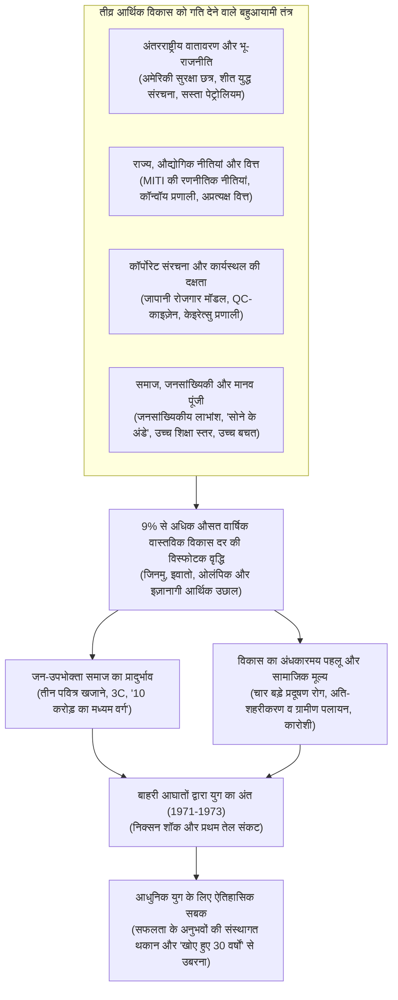
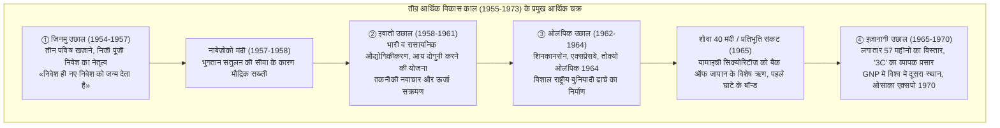
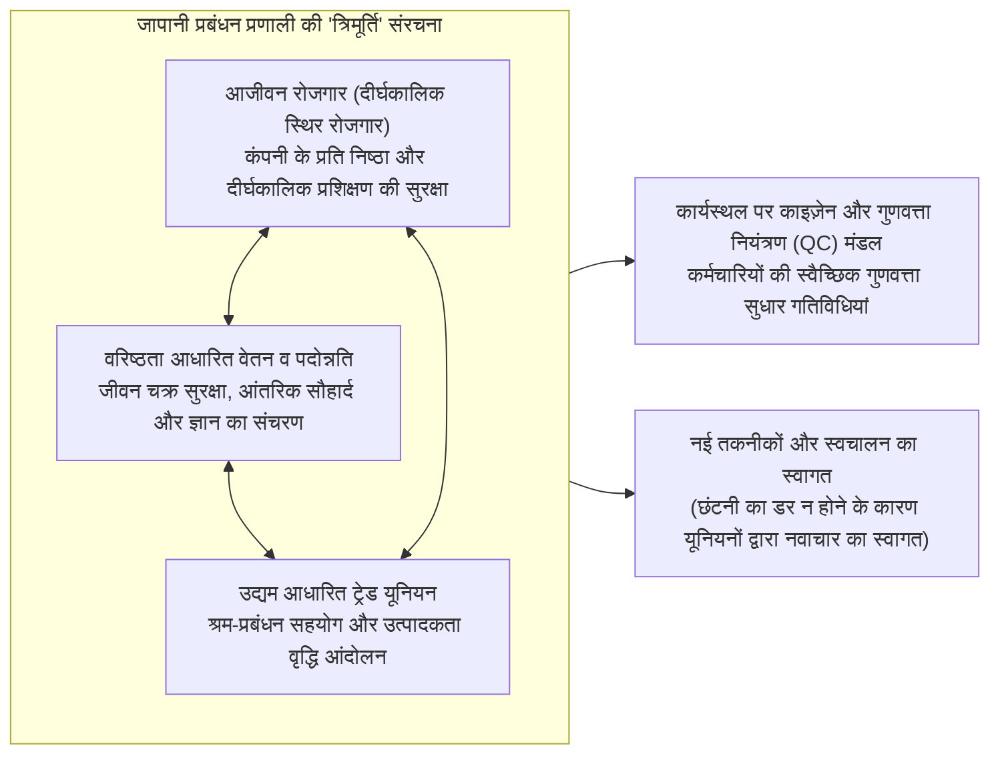
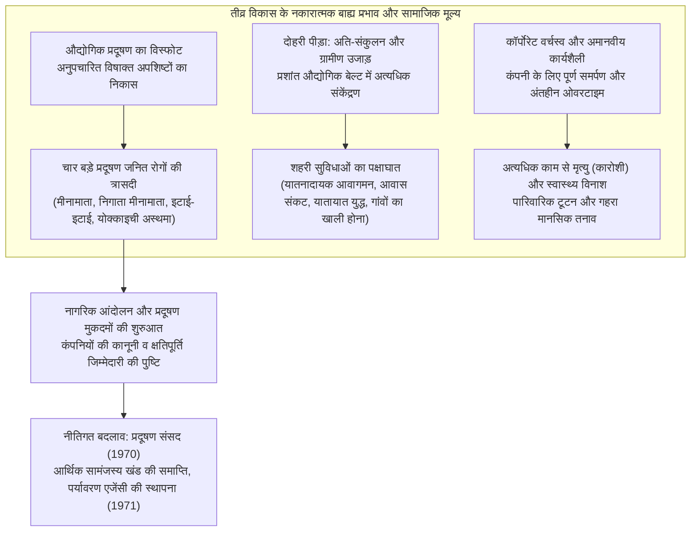

## प्रस्तावना: इतिहास में अभूतपूर्व «आर्थिक चमत्कार» और उसका वास्तविक सार

15 अगस्त 1945 को जब जापानी साम्राज्य के बिना शर्त आत्मसमर्पण के साथ प्रशांत युद्ध समाप्त हुआ, तब जापानी द्वीपसमूह वस्तुतः मलबे और राख का ढेर बन चुका था। मित्र देशों की विनाशकारी बमबारी से प्रमुख शहरों का लगभग 40% हिस्सा खंडहर में तब्दील हो गया था, और देश की राष्ट्रीय संपत्ति का लगभग एक-चौथाई (गैर-सैन्य संपत्तियों का लगभग 36%) स्वाहा हो चुका था। जापान ने अपने सभी विदेशी उपनिवेश और क्षेत्र खो दिए थे, और 60 लाख से अधिक सैनिक तथा नागरिक बिना घर और आजीविका के स्वदेश लौटे थे। अधिकांश जनता भुखमरी के कगार पर थी, यहाँ तक कि दैनिक राशन की आपूर्ति भी ठप हो गई थी, और लोग बेलगाम अति-मुद्रास्फीति (हाइपरइन्फ्लेशन) के खौफ में जी रहे थे। उस समय जापान का दौरा करने वाले विदेशी पत्रकारों और मित्र देशों की सेना के सर्वोच्च कमांडर (GHQ) के वरिष्ठ अधिकारियों ने एक स्वर में भविष्यवाणी की थी: «जापान को एक आधुनिक राष्ट्र के रूप में आत्मनिर्भर आर्थिक स्तर हासिल करने में कम से कम आधी सदी से अधिक का समय लगेगा।»

लेकिन यह भविष्यवाणी आश्चर्यजनक रूप से गलत साबित हुई।

युद्ध समाप्ति के मात्र दस वर्ष बाद 1955 से लेकर, 1973 में प्रथम तेल संकट के भड़कने तक के लगभग बीस वर्षों में, जापानी अर्थव्यवस्था ने **लगभग 9.3% की औसत वार्षिक वास्तविक आर्थिक विकास दर** हासिल की — एक ऐसी तीव्रतम आर्थिक छलांग जो मानव इतिहास में अत्यंत दुर्लभ है। जापान का सकल राष्ट्रीय उत्पाद (GNP) 1955 के लगभग 8 ट्रिलियन येन से 14 गुना बढ़कर 1973 में लगभग 112 ट्रिलियन येन तक पहुँच गया। 1968 में, जापान ने पश्चिमी यूरोप की सबसे बड़ी औद्योगिक महाशक्ति — पश्चिम जर्मनी — को पीछे छोड़ दिया, जो मेइजी पुनर्स्थापना के बाद से उसका राष्ट्रीय लक्ष्य था, और संयुक्त राज्य अमेरिका के बाद **पूंजीवादी दुनिया की दूसरी सबसे बड़ी आर्थिक महाशक्ति** बन गया।



इस अभूतपूर्व छलांग को विश्वभर में «**प्राच्य आर्थिक चमत्कार (Economic Miracle)**» के रूप में सराहा गया। ब्लैक-एंड-व्हाइट टेलीविजन, इलेक्ट्रिक वाशिंग मशीन और इलेक्ट्रिक रेफ्रिजरेटर के रूप में जाने जाने वाले «तीन पवित्र खजाने» देश के कोने-कोने में हर घर तक पहुँच गए। शीघ्र ही उपभोक्ताओं की आकांक्षाएं «3C» — रंगीन टीवी (Color TV), एयर कंडीशनर (Cooler) और निजी कार (Car) — की ओर बढ़ गईं। जापानी जनता की जीवनशैली पारंपरिक ग्रामीण समुदायों से निकलकर शहरी एकल परिवारों में रूपांतरित हो गई, और लोगों ने बड़े पैमाने पर उत्पादन और उपभोग की उस समृद्धि का आनंद लिया जो उन्होंने पहले कभी नहीं देखी थी। लगभग 90% आबादी स्वयं को मध्यम वर्ग मानने लगी, जिसे «10 करोड़ का मध्यम वर्ग» (इचियोकु सो-च्यूरयू) कहा गया, और दुनिया के सबसे सुरक्षित, शिक्षित और समतामूलक औद्योगिक समाज का निर्माण हुआ।

हालाँकि, यह «चमत्कार» कोई आकस्मिक संयोग या आसमान से टपका उपहार नहीं था। इसके पीछे कई ऐतिहासिक पहियों का अद्भुत सामंजस्य था: युद्ध से पहले और युद्ध के दौरान भारी और रासायनिक उद्योगों में संचित तकनीकी आधार और नौकरशाही का नियंत्रण तंत्र; शीत युद्ध के उभार के साथ बदलती अंतरराष्ट्रीय भू-राजनीति और अमेरिका की जापान नीति में आया परिवर्तन; अंतरराष्ट्रीय व्यापार और उद्योग मंत्रालय (MITI) द्वारा संचालित सुनियोजित औद्योगिक नीतियां; वित्त मंत्रालय के नेतृत्व वाली कॉन्वॉय (काफिला) वित्तीय प्रणाली; आजीवन रोजगार और वरिष्ठता-आधारित वेतन पर आधारित जापानी श्रम संस्कृति; और ग्रामीण क्षेत्रों से आए अनुशासित युवा श्रमिकों («सोने के अंडे») का कठिन परिश्रम और उच्च बचत प्रवृत्ति।

लेकिन इस गौरवशाली यात्रा के पीछे एक गहरा और अंधकारमय पहलू भी हमेशा मौजूद रहा। कारखानों से बिना उपचार के बहाए जाने वाले अपशिष्ट जल और जहरीले धुएं ने मीनामाता रोग और योक्काइची अस्थमा जैसी «चार बड़ी प्रदूषण बीमारियों» को जन्म दिया, जिसने अनगिनत निर्दोष नागरिकों के स्वास्थ्य और जीवन को तबाह कर दिया। गांवों से शहरों की ओर हुए विशाल पलायन ने प्रशांत महासागरीय औद्योगिक बेल्ट में भीषण जाम, आवास संकट और दुर्घटनाओं की विकट स्थिति पैदा की, जबकि ग्रामीण अंचल वीरान और उजड़ते चले गए। «उत्साही कर्मचारी» या «कॉर्पोरेट योद्धा» कहे जाने वाले श्रमिकों को कंपनी के प्रति पूर्ण निष्ठा और अंतहीन ओवरटाइम करने के लिए विवश किया गया, जिससे आगे चलकर एक ऐसी सामाजिक व्याधि उत्पन्न हुई जिसे अंतरराष्ट्रीय स्तर पर «कारोशी» (अत्यधिक काम से मृत्यु) के नाम से जाना गया।

यह लेख 1955 से 1973 के बीच जापान के युद्धोत्तर तीव्र आर्थिक विकास की इस ऐतिहासिक घटना का समग्र विश्लेषण प्रस्तुत करता है। इसमें केवल आर्थिक चक्रों की समीक्षा नहीं की गई है, बल्कि समष्टि अर्थशास्त्र (मैक्रोइकॉनॉमिक्स), औद्योगिक नीति, वित्तीय प्रणाली, कॉर्पोरेट प्रशासन, सामाजिक संरचना, अंतरराष्ट्रीय भू-राजनीति तथा पर्यावरण प्रदूषण के बहुआयामी दृष्टिकोण से इस कालखंड की पड़ताल की गई है। इसके साथ ही, यह भी स्पष्ट किया गया है कि इस युग की सफलताएं आगे चलकर जापानी समाज के लिए एक बंधन («संस्थागत थकान») कैसे बन गईं, जिसके कारण 1990 के दशक के बाद «खोए हुए तीन दशक» का दौर आया, और 21वीं सदी में आर्थिक पुनरुद्धार के लिए इससे क्या ऐतिहासिक सबक लिए जा सकते हैं।

---

## अध्याय 1: राख के ढेर से नवजीवन —— तीव्र विकास की पूर्वपीठिका (1945-1954)

यदि हम तीव्र आर्थिक विकास की शुरुआत 1955 से मानते हैं, तो उससे पहले के दस वर्ष (1945-1954) एक अत्यंत महत्वपूर्ण तैयारी का कालखंड थे। यह वह दौर था जब नष्ट-भ्रष्ट राष्ट्रीय अर्थव्यवस्था के मलबे को हटाया गया, बाजार अर्थव्यवस्था की बुनियादी संरचना को पुनः स्थापित किया गया, और वह प्रक्षेपण स्थल तैयार किया गया जिसने बाद में रॉकेट जैसी तेज छलांग को संभव बनाया।

### 1.1 विनाशकारी पराजय और अनियंत्रित अति-मुद्रास्फीति

अगस्त 1945 में युद्ध समाप्त होने के तुरंत बाद जापानी अर्थव्यवस्था पूर्ण गतिरोध के कगार पर थी। सैन्य उत्पादन के ठप होने और विदेशों से कच्चे माल की आपूर्ति कट जाने के कारण 1946 में खनन और विनिर्माण उत्पादन स्तर युद्ध-पूर्व (1934-1936 के औसत) के **लगभग 30%** तक गिर गया था। मुख्य भोजन चावल का आधिकारिक वितरण प्रायः देरी से होता था या पूरी तरह रुक जाता था, जिससे शहरों के लोगों को कपड़े और घरेलू सामान गांवों में ले जाकर अनाज के बदले में देने के लिए मजबूर होना पड़ा, जिसे «बांस के अंकुर जैसी जिंदगी» (ताकेनोको सेइकात्सु — जीवित रहने के लिए अपनी संपत्ति की परतें छीलना) कहा गया।

इस उत्पादन पतन को भीषण अति-मुद्रास्फीति ने और अधिक भयावह बना दिया। युद्ध के अंतिम दिनों में सेना द्वारा जारी किए गए अत्यधिक आपातकालीन खर्चों, युद्ध समाप्ति के तुरंत बाद सैन्य आपूर्ति कंपनियों को चुकाए गए विशाल मुआवजे, और विघटित जापानी सेना के सैनिकों को दिए गए भत्तों के कारण बैंक ऑफ जापान के नोटों का संचलन खगोलीय पैमाने पर बढ़ गया। 1945 की शरद ऋतु से 1949 के बीच थोक मूल्य सूचकांक में लगभग **70 गुना** की भारी वृद्धि हुई।

इस संकट से निपटने के लिए सरकार ने फरवरी 1946 में «वित्तीय आपातकालीन उपाय अध्यादेश» जारी किया। सभी बैंक जमाओं की निकासी पर रोक («डिपॉजिट फ्रीज») लगा दी गई, पुराने बैंक नोटों को अमान्य कर दिया गया और अनिवार्य रूप से «नए येन» में बदलने का आपातकालीन कदम उठाया गया। लेकिन जब तक उत्पादन क्षमता की बुनियादी कमी दूर नहीं हुई, तब तक कीमतों में वृद्धि के दुष्चक्र को रोका नहीं जा सका।

```
【युद्धोत्तर प्रारंभिक काल के प्रमुख आर्थिक संकेतकों में भारी बदलाव】
・खनन व औद्योगिक उत्पादन स्तर (1946): युद्ध-पूर्व स्तर (1934-36 = 100) का मात्र 30.7%
・तोक्यो थोक मूल्य सूचकांक वृद्धि दर (1946): पिछले वर्ष की तुलना में +364.5%
・चावल का आधिकारिक राशन (1945 के अंत में): वयस्क के लिए प्रतिदिन 2 गो 1 शाकु (लगभग 297 ग्राम) तक घटाया गया, भारी देरी
・विदेशों से लौटे कुल शरणार्थियों/सैनिकों की संख्या (1945-1950): लगभग 62.5 लाख लोग
```

इस उत्पादन गतिरोध को तोड़ने के लिए तोक्यो विश्वविद्यालय के प्रोफेसर हिरोमी अरीसावा और अन्य विद्वानों द्वारा प्रस्तावित **«प्राथमिकता उत्पादन प्रणाली» (Priority Production System / Keisha Seisan Hoshiki)** को लागू किया गया (1946 के अंत में कैबिनेट द्वारा स्वीकृत, 1947 में लागू)। इस प्रणाली का मूल सिद्धांत यह था कि घरेलू स्तर पर अत्यधिक दुर्लभ संसाधनों (धन, सामग्री, विदेशी मुद्रा और श्रम) को बाजार की शक्तियों पर छोड़ने के बजाय, उन्हें दो बुनियादी क्षेत्रों — **«कोयला»** और **«इस्पात (लोहा)»** — में सघन रूप से केंद्रित किया जाए, और दोनों के परस्पर संबंध के माध्यम से सभी उद्योगों के पुनरुद्धार को गति दी जाए।

व्यावहारिक रूप से, घरेलू कोयले को सर्वोच्च प्राथमिकता के साथ इस्पात उद्योग को आपूर्ति की गई ताकि लोहे का उत्पादन बढ़ सके, और उत्पादित इस्पात को पुनः कोयला खदानों में सुरंगों के खंभों और खनन मशीनों के लिए प्राथमिकता से दिया गया ताकि कोयले का उत्पादन बढ़ाया जा सके। इस «लोहे और कोयले के सकारात्मक चक्र» से उत्पन्न अधिशेष को बाद में बिजली, रासायनिक उर्वरक, रेल परिवहन जैसे संबंधित प्रमुख उद्योगों तक क्रमिक रूप से पहुंचाया गया।

इस योजना को वित्तीय संबल देने के लिए जनवरी 1947 में **«पुनर्निर्माण वित्त बैंक» (फुकुकिन / Fukkin)** की स्थापना की गई। फुकुकिन ने सरकारी गारंटी वाले पुनर्निर्माण बांड जारी किए, जिनका अधिकांश हिस्सा बैंक ऑफ जापान ने सीधे खरीदा। इससे कोयला, इस्पात और बिजली जैसे उद्योगों को भारी मात्रा में कम ब्याज पर दीर्घकालिक ऋण उपलब्ध कराए गए। 1948 के अंत तक प्रमुख उद्योगों के संयंत्र व उपकरण निवेश का लगभग 70% फुकुकिन के ऋणों से पूरा होता था।

प्राथमिकता उत्पादन प्रणाली ने नष्ट हुए बुनियादी उद्योगों के उत्पादन को तेजी से बहाल करने में शानदार सफलता प्राप्त की। लेकिन साथ ही, बैंक ऑफ जापान द्वारा फुकुकिन बांडों की सीधी खरीद से मुद्रा आपूर्ति बेतहाशा बढ़ गई, जिससे **«फुकुकिन मुद्रास्फीति»** नामक एक नई मुद्रास्फीति की लपटें भड़क उठीं।

### 1.2 डॉज लाइन और शाउप सिफारिशें: बाजार अर्थव्यवस्था की नींव

फुकुकिन मुद्रास्फीति के प्रकोप को देखते हुए अमेरिकी सरकार ने अपनी जापान नीति को मौलिक रूप से बदलने का निर्णय लिया। शीत युद्ध के तीव्र होने (1949 में चीनी जनवादी गणराज्य की स्थापना, पूर्वी और पश्चिमी गुटों के बीच टकराव) की पृष्ठभूमि में, अमेरिका ने जापान को «निरस्त्रीकृत किए जाने वाले पराजित देश» से बदलकर «सुदूर पूर्व में साम्यवाद-विरोधी सुरक्षा दीवार और पूंजीवाद का मजबूत गढ़» बना दिया। इसके लिए आवश्यक था कि जापानी अर्थव्यवस्था अमेरिकी सहायता (GARIOA और EROA फंड) पर निर्भर रहने के बजाय एक आत्मनिर्भर बाजार अर्थव्यवस्था के रूप में अपने पैरों पर खड़ी हो।

फरवरी 1949 में डेट्रायट बैंक के अध्यक्ष **जोसेफ एम. डॉज (Joseph M. Dodge)** विशेष दूत के रूप में जापान आए और उन्होंने जापानी अर्थव्यवस्था को एक कड़वी दवा दी। इसे **«डॉज लाइन» (Dodge Line)** कहा जाता है। इसके तीन मुख्य सिद्धांत निम्नलिखित थे:

1. **अति-संतुलित बजट तैयार करना**: सरकारी बांड जारी करने पर पूर्ण प्रतिबंध, बजटीय घाटे का तत्काल निवारण, और न केवल राजस्व व व्यय को कड़ाई से संतुलित करना, बल्कि पिछले ऋणों के पुनर्भुगतान सहित एक वास्तविक अधिशेष बजट अनिवार्य करना।
2. **पुनर्निर्माण वित्त बैंक के नए ऋणों पर रोक और सरकारी सब्सिडी की पूर्ण समाप्ति**: मूल्य अंतर सब्सिडी (जिसके द्वारा सरकार उत्पादन लागत और आधिकारिक कीमतों के अंतर की भरपाई करती थी) को पूरी तरह समाप्त करना।
3. **एकल विनिमय दर का निर्धारण**: 25 अप्रैल 1949 को आधिकारिक रूप से **1 अमेरिकी डॉलर = 360 येन** की एकल विनिमय दर तय की गई।

उस समय तक विभिन्न वस्तुओं के लिए दर्जनों या सैकड़ों अलग-अलग विनिमय दरें थीं। उन्हें समाप्त करके 1 डॉलर = 360 येन की एकल दर से विश्व बाजार से जुड़ने का अर्थ था जापानी कंपनियों को सीधे अंतरराष्ट्रीय प्रतिस्पर्धा के मैदान में उतारना। यह 360 येन की दर उस समय जापान की क्रय शक्ति समता की तुलना में सस्ती (येन का अवमूल्यन) थी, जिसने आगे चलकर जापानी निर्यात उद्योगों के लिए एक अत्यंत शक्तिशाली हथियार के रूप में काम किया।

हालाँकि, अल्पकाल में डॉज लाइन का झटका अत्यंत क्रूर था। राजकोषीय धन की वापसी और मौद्रिक सख्ती के कारण जापानी अर्थव्यवस्था तत्काल भीषण मंदी (अपस्फीति) में गिर गई। छोटे और मझोले उद्योग दिवालिया होने लगे, और बड़े उद्यमों ने भी जीवित रहने के लिए बड़े पैमाने पर श्रमिकों की छंटनी की। इसे «डॉज मंदी» कहा गया। सरकारी रेलवे और निजी उद्यमों से लाखों बेरोजगार सड़कों पर आ गए, और देश में गहरी सामाजिक अशांति फैल गई, जिसका प्रतीक रेलवे की रहस्यमयी घटनाएं (शिमोयामा, मिताका और मात्सुकावा घटनाएं) बनीं।

डॉज लाइन के साथ ही, युद्धोत्तर जापान की वित्तीय व्यवस्था को आकार देने में मई 1949 में कोलंबिया विश्वविद्यालय के प्रोफेसर **कार्ल एस. शाउप (Carl S. Shoup)** के नेतृत्व वाले मिशन द्वारा प्रस्तुत **«शाउप सिफारिशें»** मील का पत्थर साबित हुईं। शाउप मिशन ने जटिल अप्रत्यक्ष करों की पुरानी प्रणाली को समाप्त कर **आयकर पर केंद्रित प्रत्यक्ष कर प्रणाली** की स्थापना की।

शाउप कर प्रणाली ने 'ब्लू टैक्स रिटर्न' की शुरुआत करके आधुनिक बहीखाता और लेखांकन प्रथाओं को स्थापित किया, स्थानीय वित्त को सुदृढ़ किया, और कॉर्पोरेट करों को युक्तिसंगत बनाया। डॉज लाइन द्वारा स्थापित समष्टि आर्थिक अनुशासन और शाउप सिफारिशों द्वारा किए गए सूक्ष्म संस्थागत आधुनिकीकरण ने जापान को एक आधुनिक पूंजीवादी अर्थव्यवस्था संचालित करने के लिए ठोस संस्थागत आधार प्रदान किया।

### 1.3 कोरियाई युद्ध और «विशेष मांग» का प्रभाव: पूंजी संचय का उत्प्रेरक

जब जापानी अर्थव्यवस्था डॉज मंदी के कारण दम तोड़ रही थी, तभी 25 जून 1950 को पड़ोसी कोरियाई प्रायद्वीप में **कोरियाई युद्ध** भड़क उठा। यह युद्ध जहां एक ओर एक भीषण मानवीय और भू-राजनीतिक त्रासदी था, वहीं मरणासन्न जापानी अर्थव्यवस्था के लिए यह एक चमत्कारी संजीवनी साबित हुआ। तत्कालीन प्रधानमंत्री शिगेरु योशिदा ने इसे अनायास ही «दैवीय वरदान (कामीकाज़े)» कहा था।

संयुक्त राष्ट्र सेना (वास्तव में अमेरिकी सेना) के युद्ध में उतरने के साथ ही, युद्धक्षेत्र के सबसे नजदीक स्थित उन्नत औद्योगिक देश जापान पर भारी मात्रा में सैन्य सामग्री की खरीद और सेवाओं के ऑर्डर की बौछार हो गई। इसे **«कोरियाई विशेष खरीद (विशेष मांग उछाल - तोकुजू)»** कहा जाता है।

अमेरिकी सेना द्वारा दिए गए ऑर्डर विविध श्रेणियों में फैले थे:
- **सैन्य सामग्री और इस्पात उत्पाद**: ट्रक, जीप, ईंधन ड्रम, कंटीले तार, हथियारों के कलपुर्जे, गोला-बारूद के बक्से।
- **वस्त्र और दैनिक वस्तुएं**: सैन्य वर्दी, जूट के बोरे, कंबल, तंबू के कैनवास, सैन्य जूते।
- **सेवाएं**: क्षतिग्रस्त सैन्य वाहनों और विमानों की मरम्मत व ओवरहालिंग, लॉजिस्टिक्स परिवहन, संचार सहायता।

1950 से 1953 (युद्धविराम) तक के 4 वर्षों में विशेष मांग से प्राप्त कुल विदेशी मुद्रा **लगभग 2.4 अरब डॉलर** तक पहुँच गई (जो उस समय के जापान के कुल वार्षिक निर्यात के लगभग 60% के बराबर थी)। इस विशाल डॉलर प्रवाह ने जापान में वर्षों से चली आ रही विदेशी मुद्रा की गंभीर कमी को एक झटके में समाप्त कर दिया।

```
【कोरियाई विशेष मांग का जापानी अर्थव्यवस्था पर मात्रात्मक प्रभाव (1950-1953)】
・विशेष खरीद अनुबंधों का कुल मूल्य: लगभग 2.4 अरब डॉलर (प्रत्यक्ष सैन्य मांग + अमेरिकी सैनिकों का व्यक्तिगत खर्च)
・वास्तविक जीडीपी विकास दर: वित्तीय वर्ष 1950 (+10.8%), 1951 (+12.3%), 1952 (+10.0%), 1953 (+7.3%)
・खनन व औद्योगिक उत्पादन सूचकांक: एक वर्ष में लगभग 70% बढ़ा और 1951 में युद्ध-पूर्व स्तर को पार कर गया
・कंपनियों की लाभप्रदता में भारी सुधार: विनिर्माण क्षेत्र का बिक्री लाभ मार्जिन 1950 के उत्तरार्ध में युद्धोत्तर रिकॉर्ड स्तर पर पहुँचा
```

विशेष मांग का महत्व केवल पुराने स्टॉक को बेचने तक सीमित नहीं था;
पहला, भारी संख्या में सैन्य ट्रकों की मरम्मत और निर्माण के माध्यम से जापानी ऑटोमोबाइल कंपनियों (टोयोटा, निसान, इसुजु आदि) ने अमेरिकी सेना के कड़े गुणवत्ता मानकों (MIL-SPEC) को सीखा, जिससे उनके कलपुर्जों की गुणवत्ता और बड़े पैमाने पर उत्पादन की तकनीक में क्रांतिकारी सुधार हुआ। दूसरा, इस दौर में कंपनियों ने जो भारी मुनाफा कमाया, उसे अपने पास संचित पूंजी के रूप में सुरक्षित रखा, जिसने आने वाले तीव्र विकास काल में अत्याधुनिक कारखानों की स्थापना और नई विदेशी मशीनों के आयात के लिए स्व-वित्तपोषण का काम किया।

### 1.4 सैन फ्रांसिस्को प्रणाली और «अब युद्धोत्तर काल समाप्त हो चुका है»

सितंबर 1951 में जापान ने सैन फ्रांसिस्को शांति संधि और अमेरिका-जापान सुरक्षा संधि पर हस्ताक्षर किए। 28 अप्रैल 1952 को यह संधि प्रभावी हुई, जिससे सात वर्षों के मित्र देशों के कब्जे का अंत हुआ और जापान ने अपनी राष्ट्रीय संप्रभुता पुनः प्राप्त कर ली।

स्वतंत्रता प्राप्त करने के बाद जापान शीत युद्ध में स्पष्ट रूप से पश्चिमी पूंजीवादी गुट का हिस्सा बन गया। प्रधानमंत्री शिगेरु योशिदा द्वारा निर्देशित विदेश और सुरक्षा नीति, जिसे **«योशिदा सिद्धांत» (Yoshida Doctrine)** कहा जाता है, ने जापान के राष्ट्रीय लक्ष्य को अत्यंत व्यावहारिक दिशा में केंद्रित किया: अपनी राष्ट्रीय सुरक्षा के लिए अमेरिका-जापान सुरक्षा संधि और अमेरिकी सैन्य शक्ति पर निर्भर रहना, अपने रक्षा खर्च को सकल राष्ट्रीय उत्पाद के 1% से कम तक सीमित रखना, और देश की संपूर्ण ऊर्जा, प्रतिभा और पूंजी को आर्थिक पुनर्निर्माण व व्यापार विस्तार में लगाना। इस रणनीति ने जापानी कंपनियों को भारी सैन्य खर्चों के बोझ से मुक्त एक आदर्श व्यापारिक वातावरण प्रदान किया।

1953 में कोरियाई युद्धविराम के बाद विशेष मांग में कमी से अल्पकालिक मंदी आई, लेकिन जापानी अर्थव्यवस्था की अंतर्धारा में संयंत्र और उपकरण निवेश पर आधारित एक स्वायत्त विस्तार चक्र पहले ही शुरू हो चुका था। 1955 में कृषि की बंपर पैदावार और वैश्विक व्यापार के विस्तार के साथ स्थिर कीमतों के बीच तीव्र विकास का दौर शुरू हुआ।

इस ऐतिहासिक मोड़ की घोषणा आर्थिक योजना एजेंसी द्वारा प्रकाशित वित्तीय वर्ष 1956 (शोवा 31) की «आर्थिक श्वेत पत्र» में की गई थी। इसके आंतरिक अनुसंधान प्रभाग के प्रमुख **योनोसुके गोतो** द्वारा लिखी गई उपसंहार की पंक्तियां युद्धोत्तर जापान का अमर नारा बन गईं:

> **«अब 'युद्धोत्तर' काल समाप्त हो चुका है। हम अब एक भिन्न स्थिति का सामना करने जा रहे हैं। पुनर्प्राप्ति के माध्यम से होने वाला विकास समाप्त हो गया है। अब से विकास केवल आधुनिकीकरण के बल पर ही संभव होगा।»**

इन शब्दों का अर्थ केवल पुनर्निर्माण का जश्न मनाना नहीं था। युद्ध-पूर्व स्तर तक पहुँचने का दौर समाप्त हो चुका था; अब विदेशी सहायता या युद्ध संबंधी विशेष मांग पर निर्भर नहीं रहा जा सकता था। यह एक गंभीर चेतावनी थी: यदि देश ने अत्याधुनिक नवाचारों (ऑटोमेशन, बहुलक रसायन, ट्रांजिस्टर, विशाल थर्मल पावर) को तेजी से नहीं अपनाया और अपने औद्योगिक ढांचे को पुरानी हल्की विनिर्माण से बदलकर भारी व रासायनिक उद्योगों में रूपांतरित नहीं किया, तो वह अंतरराष्ट्रीय बाजार की प्रतिस्पर्धी दौड़ में पिछड़ जाएगा।

और जापानी अर्थव्यवस्था इस चेतावनी को सच करते हुए अद्वितीय ऊर्जा के साथ विश्व इतिहास के सबसे बड़े «आधुनिकीकरण के महायज्ञ» में कूद पड़ी।

---

## अध्याय 2: आर्थिक चक्रों का इतिहास और तीव्र विकास का घटनाक्रम (1955-1973)

1955 से 1973 तक के लगभग 18 वर्षों के दौरान जापानी अर्थव्यवस्था एक सीधी रेखा में विकसित नहीं हुई। वास्तव में, यह पूंजी निवेश के विस्फोट और उपभोक्ता मांग के कारण आने वाले «आर्थिक उछाल» और आयात में भारी वृद्धि के कारण विदेशी मुद्रा भंडार के घटने से पैदा होने वाले «मंदी व मौद्रिक सख्ती के दौर» के बीच झूलते हुए, सीढ़ियों की तरह ऊपर चढ़ती रही।

उस समय जापान 1 डॉलर = 360 येन की निश्चित विनिमय दर प्रणाली पर काम कर रहा था, और केंद्रीय बैंक के सोने व विदेशी मुद्रा भंडार की एक सख्त सीमा थी। जब अर्थव्यवस्था बहुत अधिक गर्म हो जाती, तो कच्चे माल और मशीनों का आयात तेजी से बढ़ता, जिससे भुगतान संतुलन घाटे में चला जाता। जैसे ही विदेशी मुद्रा समाप्त होने लगती, बैंक ऑफ जापान ब्याज दरों को बढ़ाकर विकास की गति को धीमा करने के लिए बाध्य हो जाता। इस चक्र को उस समय **«भुगतान संतुलन की सीमा» (Balance of Payments Ceiling)** कहा जाता था, जो मैक्रोइकॉनॉमिक नीतियों की सबसे बड़ी बाधा थी।

नीचे तीव्र आर्थिक विकास काल के पांच प्रमुख आर्थिक चक्रों का विवरण दिया गया है:



### 2.1 जिनमु उछाल (1954-1957) और नाबेज़ोको मंदी: पूंजी निवेश की श्रृंखला प्रतिक्रिया

नवंबर 1954 से शुरू हुए आर्थिक विस्तार को जापान के पहले पौराणिक सम्राट जिनमु के नाम पर **«जिनमु उछाल»** कहा गया, जिसका तात्पर्य था ऐसी समृद्धि जो देश के निर्माण के बाद से कभी नहीं देखी गई थी।

इस उछाल का मुख्य इंजन निजी कंपनियों द्वारा किया गया विस्फोटक **संयंत्र व उपकरण निवेश** था। इस्पात, जहाज निर्माण, सिंथेटिक फाइबर, पेट्रोकेमिकल और विद्युत मशीनरी जैसे प्रमुख उद्योगों ने एक साथ अत्याधुनिक संयंत्रों और मशीनों की स्थापना शुरू की। इस परिघटना को 1957 के आर्थिक श्वेत पत्र में प्रसिद्ध वाक्य द्वारा परिभाषित किया गया: **«निवेश ही नए निवेश को जन्म देता है»**।

जब इस्पात निर्माता अपनी उत्पादन क्षमता बढ़ाते, तो मशीन निर्माताओं को नए औजारों के ऑर्डर मिलते; और मशीन निर्माता जब उत्पादन बढ़ाने के लिए नए कारखाने बनाते, तो इस्पात और सीमेंट की मांग फिर से बढ़ जाती। इस अंतर-उद्योग मांग चक्र ने पूरी अर्थव्यवस्था को तीव्र गति से आगे बढ़ाया।

इसी समय उपभोक्ता स्तर पर «दैनिक जीवन की क्रांति» शुरू हुई। ब्लैक-एंड-व्हाइट टीवी, इलेक्ट्रिक वाशिंग मशीन और इलेक्ट्रिक रेफ्रिजरेटर के रूप में **«तीन पवित्र खजाने»** शहरी मध्यम वर्ग के घरों में पहुंचने लगे। घरेलू श्रम में भारी कमी और मनोरंजन के नए साधनों ने जापानी घरों का परिदृश्य पूरी तरह बदल दिया।

लेकिन 1957 में समृद्धि की कीमत चुकानी पड़ी। कच्चे माल के भारी आयात से व्यापार घाटा गहरा गया और विदेशी मुद्रा भंडार खतरनाक स्तर तक घट गया। अर्थव्यवस्था «भुगतान संतुलन की सीमा» से टकरा गई। बैंक ऑफ जापान ने तुरंत ब्याज दरें बढ़ा दीं और मौद्रिक सख्ती लागू की। इससे अर्थव्यवस्था अचानक धीमी हो गई, इस्पात और वस्त्रों के दाम गिर गए, और 1957 के उत्तरार्ध से 1958 तक अर्थव्यवस्था **«नाबेज़ोको मंदी»** (कड़ाही के चपटे पेंदे जैसी मंदी) में प्रवेश कर गई। हालाँकि, निवेश का मूल प्रवाह पूरी तरह नहीं रुका और मंदी का दौर जल्द ही समाप्त हो गया।

### 2.2 इवातो उछाल (1958-1961) और राष्ट्रीय आय दोगुनी करने की योजना: भारी औद्योगिकीकरण का विस्फोट

नाबेज़ोको मंदी से निकलकर जुलाई 1958 में शुरू हुए नए विस्तार को **«इवातो उछाल»** कहा गया — यह नाम उस पौराणिक कथा से लिया गया था जब सूर्य देवी अमातेरासु स्वर्ग की गुफा (इवातो) से बाहर आई थीं। इस दौरान जापान की वास्तविक जीडीपी वृद्धि दर **औसत 11.3% प्रति वर्ष** के विस्मयकारी स्तर पर रही।

इवातो उछाल का सार यह था कि जापान का औद्योगिक ढांचा हल्के उद्योगों (वस्त्र आदि) से पूरी तरह बदलकर **भारी और रासायनिक उद्योगों (इस्पात, पेट्रोकेमिकल्स, ऑटोमोबाइल, भारी मशीनरी)** में रूपांतरित हो गया। ऊर्जा क्रांति तेजी से आगे बढ़ी और उद्योगों का मुख्य ईंधन घरेलू कोयले से बदलकर मध्य पूर्व का सस्ता और उच्च गुणवत्ता वाला कच्चा तेल बन गया। प्रशांत महासागर के तटीय क्षेत्रों (तोक्यो की खाड़ी, इसे की खाड़ी, सेतो अंतर्देशीय सागर) में समुद्र को पाटकर विशाल भूमि तैयार की गई और वहां विशाल इस्पात संयंत्र व पेट्रोकेमिकल परिसर खड़े किए गए।

राजनीतिक मोर्चे पर भी भारी बदलाव आया। 1960 में अमेरिका-जापान सुरक्षा संधि के नवीनीकरण को लेकर संसद के घेराव और भारी हिंसक विरोध प्रदर्शन («अम्पो संघर्ष») हुए। इस अशांति के बाद नोबुसुके किशी कैबिनेट को इस्तीफा देना पड़ा। उनके उत्तराधिकारी प्रधानमंत्री **हायातो इकेदा** ने देश का ध्यान वैचारिक संघर्षों से हटाकर आर्थिक विकास की ओर मोड़ने के लिए एक साहसिक नीति प्रस्तुत की: **«राष्ट्रीय आय दोगुनी करने की योजना»** (दिसंबर 1960 में कैबिनेट द्वारा स्वीकृत)।

अर्थशास्त्री ओसामु शिमोमुरा के सिद्धांतों पर आधारित इस योजना का लक्ष्य था: **«अगले 10 वर्षों (1961-1970) में वास्तविक सकल राष्ट्रीय उत्पाद (GNP) को दोगुना करना, पूर्ण रोजगार हासिल करना और जापानी नागरिकों के जीवन स्तर को पश्चिमी यूरोपीय देशों के समकक्ष पहुंचाना»**। इसके लिए वार्षिक 7.2% की वृद्धि दर की आवश्यकता आंकी गई थी, जिसे विपक्ष और कई अर्थशास्त्रियों ने आरंभ में «अवास्तविक कल्पना» कहकर खारिज कर दिया था।

लेकिन परिणाम सभी अनुमानों से परे रहे। निजी क्षेत्र के उत्साह ने इस लक्ष्य को मात्र चार वर्षों में ही समय से पहले प्राप्त कर लिया। इकेदा के सकारात्मक नारों — «सहिष्णुता और धैर्य» तथा «वेतन दोगुना» — ने युद्ध की पराजय से उबर रहे जापानी जनमानस में भविष्य के प्रति अटूट विश्वास भर दिया।

### 2.3 ओलंपिक उछाल (1962-1964) और बुनियादी ढांचे की क्रांति

इवातो उछाल के बाद भुगतान संतुलन के एक और झटके के उपरांत, 1962 के उत्तरार्ध में **«ओलंपिक उछाल»** शुरू हुआ। एशिया में पहली बार आयोजित होने वाले 18वें ओलंपिक खेलों (तोक्यो ओलंपिक, अक्टूबर 1964) की सफलता के लिए पूरे देश ने अपनी पूरी शक्ति झोंक दी।

सड़कों, रेलवे और शहरी पुनर्विकास के लिए खर्च किया गया कुल बजट लगभग 1 ट्रिलियन येन तक पहुँच गया, जो उस समय के पूरे राष्ट्रीय बजट के बराबर था:
- **तोकाइदो शिनकानसेन**: 1 अक्टूबर 1964 को शुरू हुई। तोक्यो और शिन-ओसाका के बीच 210 किमी/घंटा की गति से चलने वाली विश्व की पहली हाई-स्पीड बुलेट ट्रेन ने यात्रा के समय को घटाकर केवल 4 घंटे (अगले वर्ष 3 घंटे 10 मिनट) कर दिया।
- **मेशिन और शुतो एक्सप्रेसवे**: जापान का पहला अंतर-शहरी एक्सप्रेसवे (मेशिन) और तोक्यो के घने शहरी ढांचे के ऊपर से गुजरने वाले एलिवेटेड शुतो एक्सप्रेसवे नेटवर्क का तेजी से निर्माण किया गया।
- **शहरी कायाकल्प**: हानेडा हवाई अड्डे को जोड़ने वाली तोक्यो मोनोरेल, सबवे हिबिया लाइन का विस्तार, होटल न्यू ओतानी जैसे विश्वस्तरीय होटलों का निर्माण और जल निकासी व्यवस्था का आधुनिकीकरण किया गया।

रंगीन टीवी पर खेलों के सजीव प्रसारण और संचार उपग्रह सिनकॉम 3 के माध्यम से अमेरिका तक प्रशांत महासागरीय अंतरिक्ष प्रसारण की ऐतिहासिक सफलता ने विज्ञान और प्रौद्योगिकी में जापान की शक्ति का डंका पूरे विश्व में बजा दिया।

### 2.4 प्रतिभूति मंदी (1965 / शोवा 40 मंदी) का झटका और नीतिगत मोड़

लेकिन जैसे ही ओलंपिक का उन्माद समाप्त हुआ, 1965 में जापानी अर्थव्यवस्था तीव्र विकास काल की सबसे ठंडी और क्रूर परीक्षा के दौर में प्रवेश कर गई, जिसे **«शोवा 40 मंदी» (प्रतिभूति मंदी)** कहा गया।

ओलंपिक की मांग को पूरा करने के लिए खड़े किए गए विशाल कारखाने मांग कम होते ही अतिरिक्त बोझ बन गए, और कंपनियों के दिवालिया होने की घटनाएं रिकॉर्ड स्तर पर पहुँच गईं। शेयर बाजार बुरी तरह ढह गया, जिससे जापान की चार सबसे बड़ी ब्रोकरेज फर्मों में से एक, **यामाइची सिक्योरिटीज (Yamaichi Securities)**, भारी घाटे के कारण दिवालिया होने के कगार पर पहुँच गई।

वित्तीय प्रणाली को ढहने से बचाने के लिए तत्कालीन वित्त मंत्री **काकुई तनाका** और बैंक ऑफ जापान के गवर्नर माकोतो उसामी ने अभूतपूर्व साहसिक कदम उठाया। बैंक ऑफ जापान अधिनियम की धारा 25 के तहत यामाइची सिक्योरिटीज को **«असीमित और बिना गारंटी के विशेष ऋण» (Nichigin Tokuyu)** दिए गए, जिससे घबराए निवेशकों की भगदड़ शांत हुई।

इसके अलावा, सरकार ने डॉज लाइन के बाद से चले आ रहे राजकोषीय वित्त अधिनियम की धारा 4 के पवित्र नियम («संतुलित बजट और घाटे के बांड पर प्रतिबंध») को तोड़ते हुए 1965 के पूरक बजट में युद्ध के बाद पहली बार **«विशेष घाटे के बांड (डेफिसिट-कवरिंग बांड)»** जारी किए। इस कीन्सवादी राजकोषीय प्रोत्साहन (सार्वजनिक कार्यों में निवेश और करों में कटौती) ने गिरती अर्थव्यवस्था को तुरंत संभाल लिया और मंदी से बाहर निकालकर देश को सबसे लंबे स्वर्णिम काल में पहुंचा दिया।

### 2.5 इज़ानागी उछाल (1965-1970): स्वर्णिम 57 महीने और विश्व में दूसरा स्थान

शोवा 40 मंदी के बाद नवंबर 1965 से जुलाई 1970 तक लगभग पांच वर्षों तक चलने वाली अभूतपूर्व समृद्धि को **«इज़ानागी उछाल»** कहा गया। जापान के पौराणिक सृजनकर्ता देवता इज़ानागी के नाम पर रखा गया यह उछाल लगातार **57 महीनों** तक चला, जिसने तत्कालीन सभी रिकॉर्ड तोड़ दिए।

इस उछाल के दो मुख्य इंजन थे: अजेय निर्यात प्रतिस्पर्धा और घरेलू जन-उपभोग का उच्चीकरण। उपभोक्ताओं की प्राथमिकताओं में पुराने तीन खजानों का स्थान **«3C»** ने ले लिया:
- **रंगीन टीवी (Color TV)**
- **रूम एयर कंडीशनर (Cooler)**
- **निजी कार (Car)**

टोयोटा कोरोला और निसान सनी जैसी किफायती कारों की शुरुआत के साथ मोटर वाहन क्रांति पूरे देश में फैल गई। जापानी विनिर्माण ने कठोर गुणवत्ता नियंत्रण के बल पर «सस्ता और घटिया» होने का पुराना कलंक हमेशा के लिए धो दिया। «Made in Japan» का अर्थ बन गया — अत्यधिक विश्वसनीय, टिकाऊ और तकनीकी रूप से बेजोड़ उत्पाद।

और 1968 में एक ऐतिहासिक मील का पत्थर स्थापित हुआ: जापान का नाममात्र सकल राष्ट्रीय उत्पाद (GNP) **लगभग 141.9 अरब डॉलर** तक पहुँच गया, जिसने पश्चिम जर्मनी को पीछे छोड़ दिया। जापान अमेरिका के बाद **पूंजीवादी दुनिया की दूसरी सबसे बड़ी आर्थिक महाशक्ति** बन गया। 1868 की मेइजी पुनर्स्थापना के ठीक 100 वर्ष बाद, युद्ध में तबाह हुआ एक एशियाई देश पश्चिमी शक्तियों को पछाड़कर दुनिया के शीर्ष पर पहुंच चुका था।

1970 में एशिया का पहला विश्व मेला — **«ओसाका एक्सपो 1970»** — «मानव जाति की प्रगति और सामंजस्य» के विषय पर आयोजित हुआ। तारो ओकामोटो के विशाल «टॉवर ऑफ द सन» के नीचे छह महीनों में **6.42 करोड़ लोगों** का रिकॉर्ड हुजूम उमड़ा। अमेरिकी पवेलियन में चांद का पत्थर, स्वचालित चलते फुटपाथ और भविष्य के नगरों के दृश्यों ने पूरे देश को आश्वस्त कर दिया कि जापान ने युद्ध के बाद समृद्धि का शिखर छू लिया है।

```
【तीव्र आर्थिक विकास काल के प्रमुख समष्टि आर्थिक संकेतक (वित्तीय वर्ष 1955-1974)】
```

| वित्तीय वर्ष | वास्तविक जीडीपी वृद्धि दर (%) | नाममात्र GNP (10 करोड़ येन) | व्यापार चक्र / ऐतिहासिक मील के पत्थर |
| :---: | :---: | :---: | :--- |
| **1955** | **+10.8** | 88,646 | जिनमु उछाल शुरू, 'तीन पवित्र खजानों' का प्रसार शुरू |
| **1956** | **+6.2** | 98,719 | आर्थिक श्वेत पत्र: «अब युद्धोत्तर काल समाप्त», संयुक्त राष्ट्र में प्रवेश |
| **1957** | **+7.8** | 111,280 | नाबेज़ोको मंदी, भुगतान संतुलन की सीमा का सामना |
| **1958** | **+5.6** | 118,527 | इवातो उछाल शुरू, तोक्यो टॉवर का निर्माण पूर्ण |
| **1959** | **+11.2** | 134,228 | युवराज का विवाह जुलूस, टीवी के प्रसार में विस्फोटक वृद्धि |
| **1960** | **+12.5** | 160,332 | अम्पो विरोध, इकेदा कैबिनेट ने «आय दोगुनी करने की योजना» बनाई |
| **1961** | **+12.0** | 196,442 | भारी व रासायनिक उद्योगों का उभार, पेट्रोलियम की ओर ऊर्जा संक्रमण |
| **1962** | **+8.9** | 220,119 | ओलंपिक उछाल शुरू, सेनरी न्यू टाउन आवासीय परियोजना की शुरुआत |
| **1963** | **+10.7** | 256,419 | मेशिन एक्सप्रेसवे का उद्घाटन (रित्तो - अमागासाकी) |
| **1964** | **+13.1** | 295,444 | तोक्यो ओलंपिक, तोकाइदो शिनकानसेन शुरू, OECD में प्रवेश |
| **1965** | **+5.8** | 328,217 | शोवा 40 मंदी, यामाइची सिक्योरिटीज को आपात ऋण, पहले घाटे के बांड |
| **1966** | **+10.6** | 382,900 | इज़ानागी उछाल तेज, कार युग का पहला वर्ष (कोरोला व सनी लॉन्च) |
| **1967** | **+11.1** | 446,953 | 3C का तीव्र प्रसार, प्रदूषण नियंत्रण बुनियादी अधिनियम पारित |
| **1968** | **+12.2** | 528,781 | **जापान का GNP पश्चिम जर्मनी से आगे निकला, विश्व में दूसरा स्थान** |
| **1969** | **+12.5** | 622,464 | तोमेई एक्सप्रेसवे पूर्ण, रंगीन टीवी के स्वामित्व में भारी उछाल |
| **1970** | **+10.7** | 733,449 | ओसाका एक्सपो (6.42 करोड़ दर्शक), संसद का विशेष प्रदूषण सत्र |
| **1971** | **+5.0** | 809,726 | निक्सन शॉक, स्मिथसोनियन समझौता (1 डॉलर = 308 येन) |
| **1972** | **+9.1** | 954,646 | तनाका कैबिनेट: «द्वीपसमूह का कायाकल्प», चीन के साथ संबंध सामान्य |
| **1973** | **+5.1** | 1,125,487 | फ्लोटिंग विनिमय दर प्रणाली, प्रथम तेल संकट, «उन्मत्त महंगाई» |
| **1974** | **-1.2** | 1,348,229 | **युद्धोत्तर पहली बार नकारात्मक वृद्धि, तीव्र विकास काल का पूर्ण अंत** |

---

## अध्याय 3: यह «चमत्कार» क्यों हुआ? —— बहुआयामी तंत्र का विच्छेदन

जापान का तीव्र आर्थिक विकास न तो केवल अनियंत्रित मुक्त बाजार (laissez-faire) की देन था और न ही इसे केवल «कड़ी मेहनत» की भावनात्मक अवधारणा से समझाया जा सकता है। इसके मूल में राज्य के सुनियोजित औद्योगिक मार्गदर्शन, अनूठी बैंकिंग संरचना, सुदृढ़ श्रम-प्रबंधन संबंधों, कार्यस्थल पर गुणवत्ता नियंत्रण के नवाचारों, अनुकूल जनसांख्यिकी और शीत युद्ध के अंतरराष्ट्रीय वातावरण का एक अद्भुत समन्वय था, जिसने **«जापानी पूंजीवादी मॉडल»** को जन्म दिया।

इस अध्याय में इस विकास को संचालित करने वाले छह संरचनात्मक तंत्रों का विश्लेषण किया गया है:



### 3.1 औद्योगिक नीति और राज्य का मार्गदर्शन: MITI की रणनीतिक उद्योग नीति

अमेरिकी राजनीति विज्ञानी चाल्मर्स जॉनसन (Chalmers Johnson) ने अपनी प्रसिद्ध पुस्तक «MITI और जापानी चमत्कार» में आधुनिक राज्यों के वर्गीकरण में अमेरिका जैसे «नियामक राज्य» (Regulatory State) के विपरीत एक नए मॉडल की अवधारणा प्रस्तुत की, जिसे **«विकासात्मक राज्य» (Developmental State)** कहा जाता है, जहां सरकार रणनीतिक लक्ष्य निर्धारित करके आर्थिक विकास का नेतृत्व करती है। उन्होंने इसका आदर्श उदाहरण जापान के अंतरराष्ट्रीय व्यापार और उद्योग मंत्रालय (MITI) को माना।

MITI की औद्योगिक नीति का मूल आधार डेविड रिकार्डो के पारंपरिक तुलनात्मक लाभ के सिद्धांत की जानबूझकर उपेक्षा करना था। यदि युद्ध के बाद जापान तुलनात्मक लाभ के सिद्धांत पर चलता, तो वह कम मजदूरी वाले वस्त्रों और खिलौनों का निर्यातक ही बना रहता। लेकिन MITI के नौकरशाहों ने भविष्य के वैश्विक बाजारों में भारी मांग वाले पूंजी-गहन और ज्ञान-गहन क्षेत्रों — **इस्पात, जहाज निर्माण, पेट्रोकेमिकल, ऑटोमोबाइल, भारी मशीनरी और इलेक्ट्रॉनिक्स** — को चुना और पूरी राष्ट्रीय शक्ति उनके विकास में झोंक दी।

इस औद्योगिक मार्गदर्शन के तीन प्रमुख हथियार थे:

1. **विदेशी मुद्रा बजट आवंटन का अधिकार (विदेशी मुद्रा व विदेशी व्यापार नियंत्रण कानून)**:
   उस समय विदेशी मुद्रा (डॉलर) पर सरकार का कड़ा नियंत्रण था। MITI ने केवल अपने द्वारा चुने गए प्राथमिकता वाले उद्योगों की कंपनियों को ही विदेशी मुद्रा आवंटित की, जिससे वे पश्चिमी देशों की अत्याधुनिक तकनीकों, पेटेंटों और मशीनों को खरीद सकें। इसके विपरीत, गैर-जरूरी उपभोक्ता वस्तुओं के आयात को रोककर घरेलू बाजार को सुरक्षित रखा गया।
2. **जापान डेवलपमेंट बैंक (JDB) के नीतिगत ऋणों का उत्प्रेरक प्रभाव**:
   जब सरकारी विकास बैंक किसी विशेष परियोजना (जैसे तटीय इस्पात संयंत्र या पेट्रोकेमिकल परिसर) को ऋण देने का फैसला करता, तो निजी वाणिज्यिक बैंक इसे «सरकार द्वारा प्रमाणित सबसे सुरक्षित परियोजना» मानकर भारी मात्रा में निजी पूंजी झोंक देते थे। इस उत्प्रेरक प्रभाव ने भारी उद्योगों की ओर निजी धन की बाढ़ ला दी।
3. **सार्वजनिक-निजी समन्वय और क्षमता नियंत्रण**:
   यदि सब कुछ खुली प्रतिस्पर्धा पर छोड़ दिया जाता, तो कंपनियां अत्यधिक क्षमता बनाकर संकट में पड़ सकती थीं। MITI ने उद्योगपतियों के साथ समन्वय बैठकें कीं, जिनमें नई भट्टियों के निर्माण के क्रम और उत्पादन कोटा को कार्टेल शैली में तय किया गया। इसने निवेश जोखिमों को कम किया और दुनिया के सबसे बड़े संयंत्र बनाने में मदद की।

### 3.2 वित्तीय प्रणाली का रसायन: अप्रत्यक्ष वित्त और कॉन्वॉय प्रणाली

तीव्र विकास काल में कंपनियों के भारी निवेश को जिस अनूठी वित्तीय व्यवस्था ने संभाला, वह पश्चिमी व्यवस्था से बिल्कुल अलग थी।

पश्चिमी देशों में कंपनियां मुख्यतः शेयर और बांड जारी करके (प्रत्यक्ष वित्त) या अपने मुनाफे से निवेश करती हैं। लेकिन युद्ध के बाद जापानी कंपनियों की अपनी पूंजी नष्ट हो चुकी थी। इसलिए बैंक ऋणों पर आधारित **«अप्रत्यक्ष वित्त प्रणाली»** को अपनाया गया।

इसकी तीन प्रमुख विशेषताएं थीं:

- **मुख्य बैंक प्रणाली (Main Bank System)**:
  प्रत्येक बड़ा औद्योगिक समूह एक मुख्य बैंक (जैसे मित्सुई, मित्सुबिशी, सुमितोमो, फूजी, दाई-इची कांग्यो, सानवा या दीर्घकालिक ऋण बैंक IBJ) से गहराई से जुड़ा हुआ था। मुख्य बैंक केवल कर्ज ही नहीं देता था, बल्कि क्रॉस-शेयरहोल्डिंग के माध्यम से स्थिर शेयरधारक बना रहता था, निदेशक मंडल में अपने अधिकारी भेजता था और वित्तीय निगरानी रखता था। इससे कंपनियों को शेयर बाजार के दैनिक उतार-चढ़ाव की चिंता किए बिना 5 से 10 वर्ष आगे की सोच के साथ साहसिक निवेश करने की छूट मिली।
- **अत्यधिक उधारी (Over-Borrowing) और अत्यधिक ऋण (Over-Loan)**:
  कंपनियों ने अपनी पूंजी से कई गुना अधिक कर्ज बैंकों से लिया, और बैंकों ने अपनी कुल जमा राशि से अधिक कर्ज कंपनियों को बांट दिया। बैंकों ने इस कमी को बैंक ऑफ जापान से सीधे कर्ज लेकर पूरा किया। बैंक ऑफ जापान ने ब्याज दरों और «विंडो गाइडेंस» (प्रत्येक बैंक के ऋण कोटा का सीधा नियमन) के माध्यम से मुद्रा के प्रवाह को पूरी तरह नियंत्रित किया।
- **कॉन्वॉय प्रणाली (Convoy System) और कम ब्याज दर नीति**:
  वित्त मंत्रालय ने ब्याज दरों को कृत्रिम रूप से कम रखा ताकि कंपनियों के लिए पूंजी की लागत सस्ती रहे। साथ ही, प्रशासनिक मार्गदर्शन के तहत बैंकों की शाखाओं, ब्याज दरों और सेवाओं को इस तरह नियंत्रित किया गया कि सबसे कमजोर बैंक भी कभी दिवालिया न हो। नौसेना के उस काफिले की रणनीति की तरह, जहां सभी जहाज सबसे धीमे जहाज की गति से चलते हैं, इसे «कॉन्वॉय प्रणाली» कहा गया। इसने जनता में बैंकों के प्रति अटूट विश्वास पैदा किया और वित्तीय संकट को पूरी तरह रोके रखा।

इसके अतिरिक्त, **«राजकोषीय निवेश और ऋण कार्यक्रम» (FILP / ज़ाइतो)** की भूमिका को नकारा नहीं जा सकता, जिसे «दूसरा राष्ट्रीय बजट» कहा जाता था। डाकघरों में जमा डाक बचत और पेंशन फंड के खरबों येन वित्त मंत्रालय द्वारा शिनकानसेन, राजमार्गों और बिजली संयंत्रों के निर्माण में झोंके गए, जिसके लिए जनता पर कोई नया कर नहीं लगाना पड़ा।

### 3.3 जापानी रोजगार प्रणाली: 'त्रिमूर्ति' श्रम संबंधों की प्रभावशीलता

कारखानों और कार्यालयों में विकास की नींव उस **«जापानी रोजगार प्रणाली»** पर टिकी थी, जो 1950 के दशक के भीषण श्रमिक संघर्षों के बाद विकसित हुई थी। समाजशास्त्री जेम्स एबेग्लेन (James Abegglen) ने अपनी पुस्तक 'द जापानी फैक्ट्री' में इसके तीन मुख्य स्तंभ बताए:

1. **आजीवन रोजगार प्रणाली (Shushin Koyo)**:
   कंपनियां नए स्नातकों को नियमित रूप से भर्ती करती थीं और सेवानिवृत्ति तक उनकी नौकरी की गारंटी देती थीं। कंपनी के लिए इसका लाभ यह था कि वह कर्मचारियों के प्रशिक्षण (OJT) में बेहिचक निवेश कर सकती थी क्योंकि उनके दूसरी कंपनी में जाने का डर नहीं था; वहीं कर्मचारियों को जीवन की पूर्ण सुरक्षा मिली।
2. **वरिष्ठता आधारित वेतन व पदोन्नति (Nenko Joretsu)**:
   कर्मचारी की उम्र और सेवाकाल बढ़ने के साथ वेतन और पद अपने आप बढ़ते थे। युवावस्था में कर्मचारी को उसके योगदान से कम वेतन मिलता था, जिससे कंपनी पूंजी संचित कर पाती थी; लेकिन शादी, बच्चों की शिक्षा और घर खरीदने की उम्र (40-50 वर्ष) में उसे उदार वेतन मिलता था, जो जीवन चक्र की जरूरतों से पूरी तरह मेल खाता था।
3. **उद्यम आधारित ट्रेड यूनियन (Kigyo-betsu Kumiai)**:
   पश्चिमी देशों की तरह पूरे उद्योग की यूनियन होने के बजाय, प्रत्येक कंपनी के नियमित कर्मचारियों की अपनी यूनियन होती थी। यूनियन के नेता भी कंपनी के कर्मचारी होते थे, जो यह भली-भांति समझते थे कि यदि कंपनी प्रतिस्पर्धियों से जीतेगी, तभी कर्मचारियों का बोनस और वेतन बढ़ेगा।

इस त्रिमूर्ति ने तकनीकी नवाचार को अपनाने में क्रांतिकारी भूमिका निभाई।

पश्चिमी देशों में जब नई स्वचालित मशीनें लाई जाती थीं, तो विशिष्ट ट्रेड यूनियनें छंटनी के डर से हड़ताल और तोड़फोड़ पर उतर आती थीं। लेकिन आजीवन रोजगार वाले जापानी उद्यमों में ऑटोमेशन आने पर भी किसी को नौकरी से नहीं निकाला जाता था; बल्कि उन्हें नई मशीनों का प्रशिक्षण देकर अन्य विभागों में तैनात कर दिया जाता था।

इसलिए, जापानी श्रमिकों और यूनियनों ने कभी भी ऑटोमेशन का विरोध नहीं किया, बल्कि **रोबोट और स्वचालित मशीनों का गर्मजोशी से स्वागत किया**, क्योंकि वे जानते थे कि इससे कंपनी की उत्पादकता बढ़ेगी और उनका अपना बोनस भी बढ़ेगा।

1955 से शुरू हुआ **«शुंतो» (वसंतकालीन वेतन संघर्ष)** हर साल सभी प्रमुख उद्योगों (इस्पात, ऑटो, इलेक्ट्रॉनिक्स) के कर्मचारियों के वेतन में एक साथ लगभग 10% की वृद्धि सुनिश्चित करता था। इसने घरेलू उपभोक्ता बाजार का विस्तार किया और बड़े पैमाने पर किए गए पूंजी निवेश को पूरी तरह सफल बनाया।

हालाँकि, इस व्यवस्था की दूसरी सच्चाई यह थी कि बड़े उद्योगों के नियमित कर्मचारियों की सुरक्षा के पीछे छोटे उप-ठेकेदारों, अस्थायी मजदूरों और सहायक कारखानों की एक विशाल आबादी थी, जो कम वेतन और असुरक्षित परिस्थितियों में पिसती रही («दोहरी संरचना»)।

### 3.4 कार्यस्थल की क्षमता और नवाचार: QC मंडल और काइज़ेन आंदोलन

जापानी विनिर्माण ने जिस शक्ति के बल पर दुनिया भर में गुणवत्ता और लागत प्रतिस्पर्धा का परचम लहराया, वह थी कारखानों के निचले स्तर पर शुरू हुई **«गुणवत्ता नियंत्रण क्रांति»**।

युद्ध से पहले जापानी सामानों को दुनिया में «सस्ता और घटिया» माना जाता था। युद्ध के बाद इस छवि को सुधारने के लिए अमेरिकी सांख्यिकीय गुणवत्ता नियंत्रण विशेषज्ञ डॉ. **डब्ल्यू. एडवर्ड्स डेमिंग (W. Edwards Deming)** को 1950 में जापान बुलाया गया। यूनियन ऑफ जापानी साइंटिस्ट्स एंड इंजीनियर्स (JUSE) के निमंत्रण पर आए डेमिंग ने जापानी इंजीनियरों को PDCA चक्र और सांख्यिकीय विधियों का गहन प्रशिक्षण दिया।

जापानियों ने उनकी स्मृति में प्रतिष्ठित «डेमिंग पुरस्कार» की स्थापना की, जिसे जीतने के लिए कंपनियों में होड़ मच गई।

लेकिन जापान की वास्तविक मौलिकता यह थी कि उसने अमेरिका के शीर्ष-से-नीचे (top-down) प्रबंधन को बदलकर नीचे-से-ऊपर (bottom-up) जन-आंदोलन बना दिया। यह 1962 में शुरू हुआ **«QC मंडल» (गुणवत्ता नियंत्रण मंडल)** आंदोलन था।

कारखाने के 5 से 10 श्रमिक काम के बाद या भोजन अवकाश में स्वेच्छा से इकट्ठा होते थे। वे 'फिशबोन आरेख' (इशिकावा आरेख) और पारेटो चार्ट का उपयोग करके कमियों का विश्लेषण करते थे और काम के तरीकों को बेहतर बनाने के उपाय — **«काइज़ेन» (सतत सुधार)** — खोजते थे। इन सुझावों को तुरंत लागू किया जाता था और सफल टीमों को सम्मानित किया जाता था। इससे अंतिम स्तर के मजदूर में भी यह गौरव पैदा हुआ कि «उत्पाद की गुणवत्ता मेरे हाथ में है»।

इस कार्यसंस्कृति का चरमोत्कर्ष उपाध्यक्ष ताइची ओह्नो द्वारा विकसित **«टोयोटा उत्पादन प्रणाली» (TPS / Toyota Production System)** में दिखाई दिया:
- **जस्ट-इन-टाइम (Just-In-Time)**: केवल वही बनाना जो आवश्यक है, जब आवश्यक हो, और जितनी मात्रा में आवश्यक हो, जिससे अतिरिक्त स्टॉक शून्य हो जाए।
- **कानबान प्रणाली**: भौतिक पर्चियों (कानबान) के माध्यम से पिछली प्रक्रिया से केवल आवश्यक कलपुर्जे खींचने की विकेंद्रीकृत स्वायत्त प्रणाली।
- **जिदोका (मानवीय स्पर्श वाला स्वचालन)**: खराबी आते ही मशीन का स्वयं रुक जाना, ताकि कोई भी दोषपूर्ण उत्पाद आगे न जा सके।
- **अपव्यय का उन्मूलन (Muda)**: सात प्रकार के व्यर्थ खर्चों (अति-उत्पादन, प्रतीक्षा, परिवहन, अनावश्यक प्रक्रिया, स्टॉक, अनावश्यक गति, दोष) को पूरी तरह समाप्त करना।

इन नवाचारों ने जापान को फोर्ड के पुराने भारी अमेरिकी मॉडल को पछाड़कर दुनिया की सबसे कुशल उत्पादन प्रणाली का स्वामी बना दिया।

### 3.5 जनसांख्यिकी और मानव पूंजी: जनसांख्यिकीय लाभांश और «सोने के अंडे»

तीव्र विकास को संभव बनाने वाली सबसे बुनियादी भौतिक ऊर्जा जापान की उर्वर **जनसांख्यिकी** और उसकी अद्वितीय **मानव पूंजी** थी।

1947 से 1949 के बीच जापान में पहला बेबी बूम आया, जिसमें लगभग **80 लाख बच्चों** का जन्म हुआ, जिन्हें «दानकाई पीढ़ी» कहा जाता है। 1950 के दशक के मध्य से जापान **«जनसांख्यिकीय लाभांश काल»** में प्रवेश कर गया, जहां कामकाजी उम्र की आबादी (15-64 वर्ष) तेजी से बढ़ रही थी और आश्रित बच्चों व बुजुर्गों का अनुपात न्यूनतम था।

```
【जापान की कामकाजी आयु जनसंख्या (15-64 वर्ष) के अनुपात का रुझान】
・1950: 59.7%
・1960: 64.2%
・1970: 68.9% (जनसांख्यिकीय लाभांश का चरमोत्कर्ष)
```

यह युवा श्रम केवल संख्या में अधिक नहीं था, बल्कि इसने ग्रामीण क्षेत्रों से शहरों की ओर एक विशाल आंतरिक प्रवास को जन्म दिया।

कृषि भूमि सुधार के बाद किसान अपनी जमीन के मालिक तो बन गए थे, लेकिन जमीन केवल बड़े बेटे को मिलती थी। छोटे बेटे और बेटियां मिडिल या हाई स्कूल पास करते ही तोक्यो, ओसाका और नागोया के कारखानों में काम करने निकल पड़े। उनकी निष्ठा, अनुशासन और सीखने की ललक के कारण उद्योगपतियों ने उन्हें **«सोने के अंडे» (Kin no Tamago)** कहा।

तोक्यो के उएनो स्टेशन और ओसाका स्टेशन पर ग्रामीण युवाओं से भरी **«सामूहिक रोजगार विशेष ट्रेनें» (Shudan Shushoku Ressha)** लगातार पहुंचती थीं। 1955 से 1970 के मात्र 15 वर्षों में तीन बड़े महानगरीय क्षेत्रों में **1 करोड़ से अधिक लोगों** का शुद्ध प्रवास हुआ। प्राथमिक क्षेत्र (कृषि, वानिकी, मत्स्य पालन) में काम करने वालों का अनुपात 1950 के **48.3%** से घटकर 1970 में मात्र **17.4%** रह गया, जिसने विनिर्माण और सेवा क्षेत्रों को ऊर्जावान कार्यबल की निरंतर आपूर्ति सुनिश्चित की।

इसके अतिरिक्त, दो अन्य कारकों ने निर्णायक भूमिका निभाई:
- **विश्वस्तरीय समरूप शिक्षा**: देश में साक्षरता दर लगभग 100% थी। हाई स्कूल जाने वालों का अनुपात 1950 के 42.5% से दोगुना होकर 1970 में 82.1% हो गया, जिससे ऐसे कुशल मजदूर मिले जो जटिल इंजीनियरिंग नक्शों को आसानी से समझ सकते थे।
- **अत्यधिक उच्च बचत दर**: घरेलू डिस्पोजेबल आय की बचत दर पश्चिमी देशों के 10% की तुलना में जापान में **15% से 20% से अधिक** थी। नागरिकों की इस विशाल बचत ने बैंकों के माध्यम से उद्योगों को सस्ती पूंजी प्रदान की, जिससे विदेशी कर्ज के बिना विकास संभव हुआ।

### 3.6 शीत युद्ध की भू-राजनीति और अंतरराष्ट्रीय परिस्थितियां: इतिहास की अनुकूल हवाएं

तीव्र विकास द्वितीय विश्व युद्ध के बाद की अंतरराष्ट्रीय व्यवस्था (ब्रेटन वुड्स प्रणाली और शीत युद्ध) से जापान को मिले अत्यधिक लाभों का परिणाम भी था।

पहला, **योशिदा सिद्धांत** के तहत रक्षा खर्च को GNP के लगभग 1% तक सीमित रखना संभव हुआ। उस समय अमेरिका, सोवियत संघ, ब्रिटेन, पश्चिम जर्मनी, दक्षिण कोरिया और ताइवान जैसे देश अपने राष्ट्रीय उत्पाद का 5% से 10% या उससे अधिक हिस्सा सेना और हथियारों पर बर्बाद कर रहे थे; जबकि जापान ने अपनी सुरक्षा की जिम्मेदारी अमेरिकी परमाणु छतरी पर छोड़ दी और अपने सभी संसाधनों व प्रतिभाओं को नागरिक उद्योगों और बुनियादी ढांचे के निर्माण में लगा दिया।

दूसरा, अमेरिका के नेतृत्व वाली **मुक्त व्यापार व्यवस्था (GATT / IMF प्रणाली)** का पूरा लाभ उठाना। 1955 में गैट में प्रवेश और 1964 में ओईसीडी की सदस्यता के साथ जापान विकसित देशों की श्रेणी में शामिल हो गया। अमेरिकी बाजार जापानी आयातों के लिए पूरी तरह खुले रहे, जबकि जापान ने लंबे समय तक टैरिफ और विदेशी निवेश प्रतिबंधों के माध्यम से अपने नवजात उद्योगों को सुरक्षित रखा।

तीसरा, **1 डॉलर = 360 येन की निश्चित विनिमय दर** का वरदान। जैसे-जैसे जापानी विनिर्माण की उत्पादकता बढ़ी, उसकी वास्तविक प्रतिस्पर्धात्मकता मजबूत होती गई, लेकिन विनिमय दर 360 येन पर टिकी रही। इसने जापानी इस्पात, कारों और टीवी को पश्चिमी बाजारों में भारी मूल्य लाभ प्रदान किया।

चौथा, **मध्य पूर्व से सस्ते और निर्बाध कच्चे तेल की आपूर्ति**। युद्ध से पहले तेल की कमी के कारण जापान युद्ध में कूदा था, लेकिन युद्ध के बाद प्रमुख तेल कंपनियों (सेवन सिस्टर्स) ने मध्य पूर्व के विशाल कुओं से 2 डॉलर प्रति बैरल के बेहद सस्ते दाम पर असीमित तेल उपलब्ध कराया, जिसने विशाल बिजलीघरों और पेट्रोकेमिकल कारखानों को ऊर्जा दी।

---

## अध्याय 4: जन-उपभोक्ता समाज का आगमन और जीवनशैली की क्रांति

तीव्र आर्थिक विकास केवल कारखानों की चिमनियों से निकलते धुएं या सकल उत्पादन के आंकड़ों तक सीमित नहीं था; यह आम जनता के रहन-सहन, खान-पान, पारिवारिक संरचना और सोच को पूरी तरह बदल देने वाली एक **«दैनिक जीवन की क्रांति»** थी।

युद्ध से पहले के जापानी समाज में कुछ विशेषाधिकार प्राप्त वर्गों को छोड़कर अधिकांश जनता लगभग आत्मनिर्भर और अत्यंत सादा जीवन जीती थी। लेकिन 1950 के दशक के मध्य से 1970 के दशक की शुरुआत के मात्र डेढ़ दशक में जापान दुनिया के सबसे समृद्ध और समरूप **«जन-उपभोक्ता समाज»** में बदल गया।

### 4.1 «तीन पवित्र खजानों» से «3C» तक: उपभोग का नाटकीय कायाकल्प

जापानी परिवारों के आधुनिकीकरण की यात्रा टिकाऊ उपभोक्ता वस्तुओं के आगमन के साथ दो चरणों में आगे बढ़ी।

पहला दौर 1950 के दशक के उत्तरार्ध में **«तीन पवित्र खजानों»** के उन्माद के साथ शुरू हुआ। शाही खजाने (दर्पण, तलवार, रत्न) के नाम पर जनता ने तीन घरेलू उपकरणों को यह नाम दिया: **«ब्लैक-एंड-व्हाइट टीवी», «इलेक्ट्रिक वाशिंग मशीन», और «इलेक्ट्रिक रेफ्रिजरेटर»**:
- **इलेक्ट्रिक वाशिंग मशीन**: इसने महिलाओं को कड़ाके की ठंड में हाथ से कपड़े धोने के कठोर परिश्रम से मुक्त कर दिया और एक बटन दबाकर काम पूरा होने लगा।
- **इलेक्ट्रिक रेफ्रिजरेटर**: इसने बर्फ की सिल्लियों वाले पुराने डिब्बों से मुक्ति दिलाई और भोजन को लंबे समय तक ताजा रखने की सुविधा देकर स्वच्छता और पोषण में क्रांतिकारी सुधार किया।
- **ब्लैक-एंड-व्हाइट टीवी**: इसने परिवारों के मनोरंजन को रेडियो से विजुअल मीडिया में बदल दिया। अप्रैल 1959 में युवराज अकिहितो और राजकुमारी मिचिको के ऐतिहासिक शाही विवाह जुलूस ने टीवी की मांग में विस्फोट कर दिया, और चौराहों पर लगी भीड़ अपने घरों में टीवी खरीदने लगी।

1960 के दशक के उत्तरार्ध में जीवन स्तर और ऊपर उठा, और उपभोग की लालसा अंग्रेजी के 'C' अक्षर से शुरू होने वाली विलासिता की वस्तुओं **«3C» (नए तीन पवित्र खजाने)** की ओर मुड़ गई:
- **रंगीन टीवी (Color TV)**: 1964 तोक्यो ओलंपिक और 1970 ओसाका एक्सपो को रंगीन रूप में ड्राइंग रूम तक पहुंचाया।
- **एयर कंडीशनर (Cooler)**: जापान की उमस भरी गर्मियों को सुखद आधुनिक वातावरण में बदल दिया।
- **निजी कार (Car)**: 1966 में टोयोटा कोरोला और निसान सनी के आने से «माई कार युग» शुरू हुआ। कार केवल अमीरों का शौक न रहकर आम परिवारों के सप्ताहांत की सैर का साधन बन गई।

```
【प्रमुख टिकाऊ उपभोक्ता वस्तुओं की घरेलू स्वामित्व दर का रुझान (1955-1975, आर्थिक योजना एजेंसी)】
```

| वर्ष | वाशिंग मशीन (%) | रेफ्रिजरेटर (%) | ब्लैक-एंड-व्हाइट टीवी (%) | रंगीन टीवी (%) | निजी कार (%) | एयर कंडीशनर (%) |
| :---: | :---: | :---: | :---: | :---: | :---: | :---: |
| **1955** | 4.6 | 1.1 | 0.9 | — | — | — |
| **1958** | 29.3 | 5.5 | 10.4 | — | — | — |
| **1960** | 45.4 | 15.7 | 44.7 | — | — | — |
| **1962** | 62.7 | 28.0 | 79.4 | — | — | — |
| **1965** | 73.6 | 51.4 | 90.3 | 0.2 | 3.5 | 2.1 |
| **1967** | 80.7 | 70.8 | 96.0 | 1.6 | 7.7 | 3.0 |
| **1970** | 91.4 | 89.1 | 90.2 | **26.3** | **22.1** | **5.9** |
| **1973** | 96.1 | 95.8 | 60.1 | **75.8** | **36.8** | **13.3** |
| **1975** | 97.6 | 96.7 | 40.5 | **90.3** | **41.2** | **17.2** |

ये आंकड़े स्पष्ट करते हैं कि जो उपकरण 1955 में नगण्य थे, वे 1970 के दशक के मध्य तक **90% से अधिक घरों** तक पहुँच चुके थे। यह इतिहास में घरेलू आधुनिकीकरण की सबसे तेज गति थी।

### 4.2 'दांची' आवासीय परिसर, न्यू टाउन और एकल परिवार का उदय

शहरी आबादी के भारी दबाव ने जापानी घरों की पारंपरिक संरचना को पूरी तरह बदल दिया।

1955 में स्थापित **«जापान हाउसिंग कॉर्पोरेशन» (JHC)** ने शहरों के मध्यम वर्ग के लिए कंक्रीट के बहुमंजिला आवासीय फ्लैट, जिन्हें **«दांची» (Danchi)** कहा गया, भारी संख्या में बनाए। 1960 के दशक में ओसाका के 'सेनरी न्यू टाउन' (1962) और तोक्यो के 'तामा न्यू टाउन' (1971) जैसे विशाल उपनगरीय शहरों का निर्माण जंगलों और पहाड़ियों को काटकर किया गया।

दांची फ्लैटों ने रहन-सहन में भारी परिवर्तन किए:
- **डाइनिंग किचन (DK) की शुरुआत**: पारंपरिक जापानी घर में रसोई घर अंधेरी मिट्टी की सतह पर होता था और भोजन तातामी पर बैठकर किया जाता था। दांची ने स्टेनलेस स्टील सिंक वाली उज्ज्वल डाइनिंग किचन दी, जिसने भोजन और सोने के स्थान को अलग-अलग («ईट-स्लीप सेपरेशन») कर दिया, जिससे महिलाओं की स्थिति में सुधार हुआ।
- **सिलेंडर लॉक और व्यक्तिगत गोपनीयता (प्राइवेसी)**: लोहे का मजबूत दरवाजा, आधुनिक फ्लश शौचालय और व्यक्तिगत बाथरूम ने रिश्तेदारों और पड़ोसियों की दखलंदाजी से मुक्त एक निजी पारिवारिक दुनिया का निर्माण किया।

इस आवास क्रांति ने **«एकल परिवार» (Nuclear Family)** की अवधारणा को स्थापित किया। दादा-दादी, माता-पिता और बच्चों वाले पुराने संयुक्त परिवार पीछे छूट गए और «सैलरीमैन पति, गृहिणी पत्नी और दो बच्चे» वाला परिवार समाज का मानक बन गया।

### 4.3 «10 करोड़ का मध्यम वर्ग» की चेतना: एक समरूप समाज का जन्म

तीव्र आर्थिक विकास का सबसे बड़ा सामाजिक परिणाम वर्ग-भेद का समाप्त होना और **«10 करोड़ का मध्यम वर्ग» (Ichioku So-Churyu)** की चेतना का उदय था।

प्रधानमंत्री कार्यालय द्वारा हर साल किए जाने वाले सर्वेक्षण में जब पूछा गया कि «आप सामान्य समाज की तुलना में अपने जीवन स्तर को कहाँ पाते हैं?», तो स्वयं को «मध्यम वर्ग» बताने वालों का अनुपात 1950 के दशक के 70% से बढ़कर 1970 में **लगभग 90%** तक पहुँच गया। अमीर हो या गरीब, लगभग सभी नागरिक यह मानने लगे कि वे एक सामान्य मध्यम वर्ग का हिस्सा हैं।

यह भावना केवल भ्रम नहीं थी, इसके पीछे वास्तविक आर्थिक आधार थे:
1. **आय असमानता में भारी कमी**:
   आय असमानता का पैमाना «गिनी गुणांक» (Gini Coefficient) इस दौरान लगातार घटा और नॉर्डिक देशों के स्तर पर पहुँच गया, जो दुनिया के सबसे समान समाजों में गिने जाते हैं। शुंतो के माध्यम से वार्षिक वेतन वृद्धि, राष्ट्रीय न्यूनतम मजदूरी प्रणाली, अत्यधिक प्रगतिशील आयकर (सर्वोच्च दर 75%) और बड़े शहरों से ग्रामीण क्षेत्रों में बजटीय पुनर्वितरण ने वर्ग और क्षेत्रीय अंतर को मिटा दिया।
2. **उपभोग में बराबरी की होड़**:
   «पड़ोसी ने रंगीन टीवी लिया है, तो हमें भी लेना चाहिए», «पड़ोसी के पास कोरोला है, तो हम सनी लेंगे» जैसी सामाजिक अनुरूपता की भावना ने उपभोक्ता मांग को असीम रूप से बढ़ाया।

जन्म या कुल के आधार पर तय होने वाला पुराना ढांचा टूट गया और यह दृढ़ विश्वास फैल गया कि कड़ी मेहनत और अच्छी शिक्षा से कल का दिन आज से बेहतर होगा।

### 4.4 वितरण क्रांति और जन-संस्कृति का विस्फोट

उपभोक्ता समाज के विकास ने व्यापार और संस्कृति के स्वरूप को भी बदल दिया।

इसकी अगुवाई इसाओ नाकाउची के नेतृत्व वाले «दाईई» (Daiei) जैसे **सुपरमार्केटों (GMS)** ने की, जिसे **«वितरण क्रांति»** कहा गया।
पारंपरिक दुकानों और निर्माताओं द्वारा तय की गई मनमानी एमआरपी प्रणाली के खिलाफ, दाईई ने «ग्राहकों को अच्छी चीजें सस्ती दरों पर देना» का नारा दिया और भारी मात्रा में सीधी खरीद तथा कम मार्जिन के बल पर **«मूल्य क्रांति»** शुरू की।

विशेष रूप से दाईई और मात्सुशिता इलेक्ट्रिक (अब पैनासोनिक) के संस्थापक कोनोसुके मात्सुशिता के बीच 30 साल तक चला मूल्य-निर्धारण का विवाद प्रसिद्ध है। मात्सुशिता ने आपूर्ति रोक दी, लेकिन जनता के भारी समर्थन से दाईई ने जीत हासिल की, जिससे उपभोक्ताओं को सस्ती वस्तुएं प्राप्त करने का अधिकार मिला।

सांस्कृतिक मोर्चे पर **मास मीडिया का स्वर्ण युग** आया। एनएचके के नए साल के संगीत कार्यक्रम 'कोहाकु' को 80% से अधिक रेटिंग मिली। पहलवान रिकीदोजन, बेसबॉल स्टार शिगेओ नागाशिमा और सदाहारू ओह, तथा 'द ड्रिफ्टर्स' कॉमेडी ग्रुप राष्ट्रीय नायक बन गए। पत्रिकाओं की बाढ़, बॉलिंग का बुखार और छुट्टियों में स्कीइंग जैसे जन-मनोरंजन के साधनों ने पूरे समाज को रंगीन बना दिया।

---

## अध्याय 5: विकास का भारी मूल्य —— विकृतियां, प्रदूषण और सामाजिक त्रासदी

लेकिन आर्थिक समृद्धि का यह सूर्य जितना चमकीला था, उसके नीचे की छाया उतनी ही अंधेरी, ठंडी और भयानक थी। तीव्र आर्थिक विकास एक ऐसी समृद्धि थी जो जापानी द्वीपसमूह के पर्यावरण, अनगिनत निर्दोष लोगों के स्वास्थ्य और श्रमिकों के मानवीय सम्मान की भारी बलि देकर खरीदी गई थी।

«उद्योग प्रथम» और «उत्पादन पहले» के अंधे नारे तले पर्यावरण संरक्षण और नागरिकों के स्वास्थ्य को पूरी तरह नजरअंदाज कर दिया गया, जिससे जापानी द्वीप समूह दुनिया के सबसे खराब प्रदूषण का केंद्र बन गया।



### 5.1 औद्योगिक प्राथमिकता का अंधकार: चार बड़े प्रदूषण रोगों की त्रासदी

तीव्र विकास काल की सबसे बड़ी त्रासदी **«चार बड़े प्रदूषण जनित रोग»** थे, जो कंपनियों के अंधाधुंध मुनाफे और जहरीले रसायनों के बहाव के कारण पैदा हुए थे:

```
【चार बड़े प्रदूषण रोगों का व्यापक विवरण और तुलना】
```

| रोग का नाम | प्रभावित क्षेत्र / नदी घाटी | जिम्मेदार कंपनी / कारखाना | प्रदूषक तत्व / उत्सर्जन मार्ग | मुख्य स्वास्थ्य क्षति व लक्षण | अदालती फैसला |
| :--- | :--- | :--- | :--- | :--- | :--- |
| **मीनामाता रोग** | मीनामाता की खाड़ी और शिरानुई सागर (कुमामोतो प्रान्त) | शिन निप्पॉन चिसो फर्टिलाइजर (चिसो) | एसिटैल्डिहाइड उत्पादन से निकला **मिथाइल मरकरी (जैविक पारा)** बिना उपचार के बहाया गया। समुद्री जीवों द्वारा खाद्य श्रृंखला में संकेंद्रण। | संवेदी पक्षाघात, दृष्टि क्षेत्र का संकुचित होना, बहरापन, बोलने में कठिनाई, केंद्रीय तंत्रिका तंत्र का विनाश। गर्भनाल के जरिए बच्चों में होने वाले **«जन्मजात मीनामाता रोग»** की मर्मभेदी त्रासदी। | 1973 कुमामोतो जिला अदालत: चिसो को पूर्ण दोषी ठहराया गया, भारी मुआवजे का आदेश। |
| **निगाता मीनामाता रोग (दूसरा मीनामाता)** | अगाना नदी का निचला बेसिन (निगाता प्रान्त) | शोवा डेंको कानोसे कारखाना | एसिटैल्डिहाइड का जहरीला अपशिष्ट जल (**मिथाइल मरकरी**) सीधे अगाना नदी में बहाया गया। नदी की मछलियां खाने से विषबाधा। | मीनामाता रोग जैसे ही लक्षण: हाथ-पैर सुन्न होना, भीषण ऐंठन, मस्तिष्क क्षति। | 1971 निगाता जिला अदालत: चार बड़े प्रदूषण मुकदमों में पीड़ितों की पहली ऐतिहासिक जीत। |
| **इटाई-इटाई रोग** | जिंजू नदी बेसिन (तोयामा प्रान्त) | मित्सुई माइनिंग एंड स्मेल्टिंग कामिओका खदान | जस्ता और सीसा खनन से निकला भारी धातु **कैडमियम** जिंजू नदी में बहाया गया। सिंचाई और पीने का पानी दूषित। | गुर्दे की विफलता से कैल्शियम अवशोषण ठप, भीषण ऑस्टियोपोरोसिस (हड्डियों का क्षय)। छींकने या करवट लेने मात्र से हड्डियां टूट जाती थीं। «दर्द हो रहा है! दर्द हो रहा है!» (इटाई! इटाई!) चीखते हुए तड़प-तड़प कर मौत। | 1972 नागोया उच्च न्यायालय कनाज़ावा शाखा: मित्सुई की बिना शर्त गलती मानी गई, पीड़ितों की पूर्ण जीत। |
| **योक्काइची अस्थमा** | योक्काइची शहर का तटीय क्षेत्र (मी प्रान्त) | योक्काइची पेट्रोकेमिकल कॉम्प्लेक्स (मित्सुबिशी युका, चुबू इलेक्ट्रिक आदि) | भारी ईंधन तेल जलाने से निकले **सल्फर ऑक्साइड (SOx / सल्फर डाइऑक्साइड)** का विशाल वायु प्रदूषण। | भयानक सांस का दौरा, क्रोनिक ब्रोंकाइटिस, फेफड़ों की बीमारी। सांस न ले पाने के असहनीय दर्द के कारण कई पीड़ितों ने आत्महत्या कर ली। | 1972 त्सू जिला अदालत: सभी कंपनियों की संयुक्त कानूनी जिम्मेदारी तय की गई। |

इन त्रासदियों में कंपनियों की लीपापोती और प्रशासनिक संवेदनहीनता समान थी। चिसो के अस्पताल निदेशक डॉ. हाजिमे होसोकावा ने बिल्लियों पर प्रयोग करके 1959 में ही साबित कर दिया था कि बीमारी कारखाने के पानी से हो रही है, लेकिन प्रबंधन ने इसे छिपाया और जहर बहाना जारी रखा। MITI ने भी औद्योगिक विकास को प्राथमिकता देते हुए कड़े कदम उठाने में वर्षों लगा दिए।

पीड़ितों को न केवल असाध्य शारीरिक पीड़ा झेलनी पड़ी, बल्कि उन्हें समाज के बहिष्कार का भी सामना करना पड़ा। 1970 के दशक की शुरुआत में अदालतों द्वारा दिए गए फैसलों ने जापानी इतिहास में पहली बार यह स्थापित किया कि कॉर्पोरेट मुनाफे के लिए मानव जीवन की बलि नहीं दी जा सकती।

### 5.2 वायु प्रदूषण, स्मॉग और कीचड़: प्रदूषण द्वीपसमूह और 1970 का राजनीतिक मोड़

प्रदूषण केवल कुछ क्षेत्रों तक सीमित नहीं रहा, इसने पूरे देश के जल, थल और नभ को जकड़ लिया:
- **तागोनौरा बंदरगाह कीचड़ त्रासदी (शिज़ुओका प्रान्त)**: माउंट फूजी के नीचे के कागज कारखानों ने सल्फाइट लुगदी का बदबूदार जहरीला कचरा समुद्र में बहा दिया, जिससे बंदरगाह में लाखों टन जहरीला कीचड़ (हेडोरो) जमा हो गया और जहरीली गैसों से जनता का जीना दूभर हो गया।
- **तोक्यो फोटोकेमिकल स्मॉग घटना (1970)**: 18 जुलाई 1970 को तोक्यो के सुगिनामी वार्ड में हाई स्कूल की छात्राएं खेल के मैदान में अचानक आंखों में तेज जलन और सांस रुकने से बेहोश होकर गिरने लगीं। धूप और वाहनों के धुएं की रासायनिक क्रिया से बना फोटोकेमिकल स्मॉग दिनदहाड़े राजधानी पर कहर बनकर टूटा था।

जनता का आक्रोश चरम पर पहुँच गया। तोक्यो और ओसाका में विपक्षी दलों के प्रगतिशील गवर्नर चुने गए। संकट को भांपते हुए सातो कैबिनेट ने अंततः अपनी दिशा बदली।

1970 के अंत में संसद का 64वां विशेष सत्र बुलाया गया, जिसे इतिहास में **«प्रदूषण संसद» (Kogai Kokkai)** कहा जाता है। इसमें **प्रदूषण से संबंधित 14 ऐतिहासिक कानून एक साथ पारित किए गए**।

सबसे महत्वपूर्ण कदम पुराने कानून से उस विवादास्पद खंड को हटाना था, जिसमें लिखा था कि: «पर्यावरण संरक्षण को अर्थव्यवस्था के स्वस्थ विकास के साथ सामंजस्य में होना चाहिए» («सामंजस्य खंड»)। इसे हटाकर कानून ने स्पष्ट कर दिया कि मानव स्वास्थ्य और पर्यावरण की रक्षा किसी भी आर्थिक लाभ से सर्वोपरि है।

जुलाई 1971 में **«पर्यावरण एजेंसी» (अब पर्यावरण मंत्रालय)** की स्थापना हुई। सख्त मानकों ने जापानी कंपनियों को गैस-सफाई उपकरण और उत्प्रेरक कनवर्टर विकसित करने के लिए मजबूर किया, जिसने आगे चलकर जापान को हरित ऊर्जा और पर्यावरण प्रौद्योगिकी में विश्व का अग्रणी देश बना दिया।

### 5.3 अति-संकुलन और ग्रामीण उजड़ने की दोहरी मार: विकृत भू-भाग

तीव्र विकास ने जापान के भूगोल को दो विपरीत व्याधियों में बांट दिया: महानगरों में दमघोंटू भीड़ और गांवों में वीराना।

**प्रशांत औद्योगिक बेल्ट** में उद्योग और आबादी के अत्यधिक संकेंद्रण ने बुनियादी ढांचे को ध्वस्त कर दिया:
- **यातनादायक आवागमन (कम्यूटर रश)**: तोक्यो और ओसाका की ट्रेनों में भीड़ की दर क्षमता से **300%** तक पहुँच गई। खिड़कियों के शीशे टूट जाते थे, और यात्रियों को धक्का देकर जबरन डिब्बों में भरने के लिए छात्रों को 'पुशर' (ओशिया) के रूप में तैनात किया गया।
- **जमीन की आसमान छूती कीमतें और आवास संकट**: शहरों में जमीन इतनी महंगी हो गई कि आम आदमी के लिए घर खरीदना असंभव हो गया। लोगों को दूर-दराज के इलाकों में रहने के लिए मजबूर होना पड़ा, जिससे आने-जाने में रोज तीन से चार घंटे बर्बाद होने लगे।
- **यातायात युद्ध (सड़क दुर्घटनाओं में भारी मौतें)**: बढ़ती कारों के सामने फुटपाथ नहीं थे। 1970 में सड़क हादसों में मरने वालों की संख्या **16,765** तक पहुँच गई, जो 1894-95 के चीन-जापान युद्ध में मारे गए कुल जापानी सैनिकों से भी अधिक थी। इसे अखबारों ने «यातायात युद्ध» का नाम दिया।

दूसरी ओर, युवाओं के चले जाने से गांव उजड़ गए। जंगलों और खेतों की देखभाल बंद हो गई, और पारंपरिक उत्सव व बांधों की मरम्मत की सामूहिक व्यवस्था बिखर गई। 1960 के दशक के अंत में **«कासो» (ग्रामीण उजाड़)** शब्द गढ़ा गया, जिसने आज के खाली होते गांवों की नींव रखी।

### 5.4 अमानवीय कार्य परिस्थितियां और «कॉर्पोरेट योद्धा»: 'कारोशी' की उत्पत्ति

इस विकास को अपने कंधों पर उठाने वाले जापानी कर्मचारियों को **«उत्साही कर्मचारी» (Moretsu Shain)** या **«कॉर्पोरेट योद्धा» (Kigyo Senshi)** कहा गया।

कंपनी को केवल रोजगार का स्थान नहीं बल्कि परिवार जैसा जीवन-समुदाय माना जाता था। कर्मचारियों ने कंपनी के लक्ष्यों को ही अपना जीवन बना लिया और बिना किसी शिकायत के रात-दिन और सप्ताहांत में भी काम किया।

लेकिन इसकी भारी व्यक्तिगत कीमत चुकानी पड़ी:
- **बिना वेतन का ओवरटाइम और छुट्टियों का त्याग**: छुट्टी की मांग करना अनुशासनहीनता माना जाता था, जिससे जापान में सवेतन छुट्टियों की दर विकसित देशों में सबसे नीचे आ गई।
- **परिवार से विमुखता**: पति तड़के घर से निकलता था और आधी रात के बाद अंतिम ट्रेन से सिर्फ सोने के लिए लौटता था। बच्चों की पूरी जिम्मेदारी पत्नी पर आ गई, जिससे «अनुपस्थित पिता» की समस्या पैदा हुई।
- **'कारोशी' (Karoshi) का जन्म**: अत्यधिक थकान, नींद की कमी और तनाव के कारण 30 से 50 वर्ष की आयु के स्वस्थ पुरुष अचानक ब्रेन हेमरेज या हार्ट अटैक से कार्यस्थल पर ही दम तोड़ने लगे। अत्यधिक काम से अचानक मौत की यह जापानी त्रासदी बाद में ऑक्सफोर्ड इंग्लिश डिक्शनरी में **«Karoshi»** के रूप में दर्ज हुई।

जापान की भौतिक समृद्धि लाखों कर्मचारियों के खून-पसीने और प्राणों की आहुति पर खड़ी की गई थी।

---

## अध्याय 6: अंत की शुरुआत —— निक्सन शॉक और तेल संकट (1971-1973)

लगभग 20 वर्षों तक चला यह चमत्कारी तीव्र विकास 1970 के दशक की शुरुआत में अचानक आए दो बाहरी झटकों के कारण समाप्त हो गया।

इसके दो सबसे बड़े आधार — निश्चित विनिमय दर (1 डॉलर = 360 येन) और मध्य पूर्व का असीमित सस्ता कच्चा तेल — ताश के पत्तों की तरह ढह गए।

### 6.1 निक्सन शॉक (1971): ब्रेटन वुड्स व्यवस्था का पतन

15 अगस्त 1971 को अमेरिकी राष्ट्रपति रिचर्ड निक्सन ने टेलीविजन पर एक आपातकालीन आर्थिक घोषणा की जिसने दुनिया भर के बाजारों को हिलाकर रख दिया। इसे **«निक्सन शॉक» (डॉलर शॉक)** कहा गया।

इसके दो मुख्य बिंदु थे:
1. **डॉलर की सोने में परिवर्तनीयता पर रोक**: विदेशी केंद्रीय बैंकों को 35 डॉलर प्रति औंस की दर से सोना देने की व्यवस्था समाप्त कर दी गई, जिससे ब्रेटन वुड्स व्यवस्था का मूल आधार नष्ट हो गया।
2. **सभी आयातों पर 10% का अतिरिक्त शुल्क**: मुख्य रूप से जापानी और जर्मन उत्पादों को रोकने के लिए लगाया गया आपातकालीन टैरिफ।

वियतनाम युद्ध के भारी खर्च और जापानी कारों व टीवी के अमेरिकी बाजार में छा जाने से अमेरिका का व्यापार पहली बार घाटे में चला गया था और उसका स्वर्ण भंडार खाली हो रहा था।

जापान के लिए यह बिजली गिरने जैसा था। तोक्यो शेयर बाजार कई दिनों तक गिरता रहा और उद्योगपति रोने लगे कि मजबूत येन जापानी निर्यात को बर्बाद कर देगा।

दिसंबर 1971 में वाशिंगटन के स्मिथसोनियन संस्थान में जी-10 देशों ने **स्मिथसोनियन समझौते** पर हस्ताक्षर किए। येन को 360 येन से बढ़ाकर **308 येन प्रति डॉलर (16.88% की बढ़त)** कर दिया गया।

लेकिन यह व्यवस्था भी नहीं टिकी और फरवरी-मार्च 1973 में प्रमुख देशों ने निश्चित दर छोड़कर **«फ्लोटिंग (परिवर्तनशील) विनिमय दर प्रणाली»** अपना ली। येन तुरंत 260 येन के स्तर तक चढ़ गया। 360 येन का वह सुनहरा सुरक्षा छत्र, जिसने 25 वर्षों तक जापानी निर्यात को पाला-पोसा था, हमेशा के लिए छिन गया।

### 6.2 काकुई तनाका और «द्वीपसमूह का कायाकल्प»: सट्टेबाजी और बेलगाम महंगाई

मुद्रा के इस संकट के बीच जुलाई 1972 में **काकुई तनाका** प्रधानमंत्री बने। बिना किसी विश्वविद्यालय की डिग्री के शीर्ष पर पहुंचे तनाका को «कंप्यूटरीकृत बुलडोजर» कहा जाता था और वे जनता में बेहद लोकप्रिय थे।

उनका मुख्य नीतिगत घोषणापत्र उनकी सर्वाधिक बिकने वाली पुस्तक **«जापानी द्वीपसमूह के कायाकल्प का सिद्धांत» (Nihon Retto Kaizoron)** थी। उनका विचार था कि पूरे देश में शिनकानसेन (7,200 किमी) और एक्सप्रेसवे (10,000 किमी) का जाल बिछाया जाए, जिससे बड़े शहरों से कारखानों और आबादी को गांवों की ओर स्थानांतरित किया जा सके और अत्यधिक संकुलन व ग्रामीण वीराने दोनों को एक साथ हल किया जा सके।

लेकिन इस भव्य योजना का भयानक दुष्प्रभाव सामने आया।
योजना की घोषणा होते ही रियल एस्टेट और निर्माण कंपनियों ने शिनकानसेन के प्रस्तावित स्टेशनों और एक्सप्रेसवे के पास की जमीनों को अंधाधुंध खरीदना शुरू कर दिया («जमीन की सट्टेबाजी का बुखार»)। 1972 से 1973 के बीच देश भर में जमीन की कीमतें 30% से अधिक की दर से उछल गईं।

इसके अलावा, वित्त मंत्रालय और बैंक ऑफ जापान ने येन के मजबूत होने से मंदी आने के डर से ब्याज दरों को बहुत कम रखा और भारी नकदी डाली, जिससे **«अत्यधिक तरलता»** पैदा हो गई। सट्टेबाजी और मुद्रा की बहुलता ने तेल संकट से पहले ही भीषण मुद्रास्फीति का बारूद बिछा दिया था।

### 6.3 प्रथम तेल संकट (1973): «उन्मत्त महंगाई» का तांडव

इस तपती हुई अर्थव्यवस्था पर अक्टूबर 1973 में **चौथा अरब-इजरायल युद्ध (योम किप्पुर युद्ध / प्रथम तेल संकट)** कहर बनकर टूटा।

ओपेक (OPEC) के छह अरब देशों ने तेल को एक रणनीतिक हथियार बना लिया:
1. **कच्चे तेल की कीमतों में चार गुना वृद्धि**: 3 डॉलर प्रति बैरल से बढ़ाकर कुछ ही महीनों में **लगभग 11.65 डॉलर** कर दिया गया।
2. **आपूर्ति में कटौती और प्रतिबंध**: इजरायल समर्थक देशों को तेल निर्यात बंद और जापान जैसे तटस्थ देशों को आपूर्ति में क्रमिक कटौती।

अपनी ऊर्जा का 80% तेल से प्राप्त करने वाले और उसका 99% हिस्सा आयात करने वाले जापान के लिए यह मौत के फरमान जैसा था। देश भर में घबराहट फैल गई कि बिजली चली जाएगी, कारखाने बंद हो जाएंगे और देश भूखा मर जाएगा।

सरकार ने पेट्रोल पंपों को रविवार को बंद करने, हाईवे पर गति सीमा तय करने और आधी रात को टीवी प्रसारण बंद करने की घोषणा की।

सड़कों पर ऐतिहासिक घबराहट फैल गई। अक्टूबर 1973 के अंत में ओसाका के एक स्टोर से अफवाह उड़ी कि «कागज खत्म होने वाला है»। लाखों गृहिणियां स्टोर्स में टूट पड़ीं और **टॉयलेट पेपर, टिशू, डिटर्जेंट और चीनी की जमाखोरी** करने लगीं। अलमारियां खाली हो गईं और लाइनों में भगदड़ से लोग घायल हो गए।

महंगे तेल, जमाखोरी और अत्यधिक तरलता ने मिलकर कीमतों को पागलपन की हद तक बढ़ा दिया, जिसे **«उन्मत्त महंगाई» (Kyoran Bukka)** कहा गया;
1974 में **उपभोक्ता मूल्य सूचकांक में 24.5%** और **थोक मूल्य सूचकांक में 31.6%** की भारी वृद्धि हुई, जो युद्ध के बाद का सबसे भीषण स्तर था।

### 6.4 1974 में युद्धोत्तर पहली बार नकारात्मक वृद्धि: तीव्र विकास का पटाक्षेप

इस बेलगाम महंगाई को कुचलने के लिए बैंक ऑफ जापान ने अपनी ब्याज दर को रिकॉर्ड 9.0% तक बढ़ा दिया और सरकार ने सार्वजनिक परियोजनाओं को फ्रीज कर दिया।

इससे महंगाई तो काबू में आ गई, लेकिन अर्थव्यवस्था पूरी तरह ठंडी पड़ गई। पूंजी निवेश रुक गया और नई भर्तियां बंद हो गईं।

वित्तीय वर्ष 1974 में जापान की वास्तविक जीडीपी वृद्धि दर **माइनस 1.2%** दर्ज की गई। युद्ध के बाद के 29 वर्षों में यह पहला मौका था जब जापान ने पूर्ण आर्थिक संकुचन का सामना किया।

इस क्षण 10% की गति से भागने वाले जापान के तीव्र आर्थिक विकास काल (1955-1973) का पर्दा हमेशा के लिए गिर गया। जापानी अर्थव्यवस्था ऊर्जा संरक्षण और खर्चों में कटौती पर आधारित 4% से 5% की **«स्थिर विकास अवधि» (1974-1985)** में प्रवेश करने के लिए विवश हो गई।

```
【जापान के मुख्य निर्यात मदों में क्रांतिकारी परिवर्तन (1955 बनाम 1975)】
```

| रैंक | 1955 के मुख्य निर्यात (हिस्सेदारी %) | 1975 के मुख्य निर्यात (हिस्सेदारी %) |
| :---: | :--- | :--- |
| **1** | **सूती वस्त्र व कपड़े** (37.3%) | **लोहा व इस्पात उत्पाद** (22.5%) |
| **2** | **लोहा व इस्पात उत्पाद** (13.6%) | **मोटर वाहन व परिवहन मशीनरी** (16.2%) |
| **3** | **मत्स्य उत्पाद व भोजन** (6.8%) | **जहाज निर्माण (टैंकर व मालवाहक)** (10.9%) |
| **4** | **खिलौने, चीनी मिट्टी व विविध सामान** (6.2%) | **इलेक्ट्रॉनिक्स (टीवी, ऑडियो, सेमीकंडक्टर)** (10.5%) |
| **5** | **लकड़ी व प्लाईवुड** (4.1%) | **सामान्य मशीनरी (औद्योगिक उपकरण)** (9.8%) |

यह तालिका स्पष्ट रूप से दर्शाती है कि मात्र बीस वर्षों में जापान सस्ते कपड़ों के निर्यातक से बदलकर विश्वस्तरीय इस्पात, ऑटोमोबाइल और उन्नत इलेक्ट्रॉनिक्स का सिरमौर बन गया था।

---

## अध्याय 7: आधुनिक युग के लिए सबक —— सफलता के अनुभवों का बंधन और «खोए हुए तीन दशक»

जब इतिहासकार पीछे मुड़कर देखते हैं, तो एक दर्दनाक विडंबना सामने आती है: **«जिस संस्थागत व्यवस्था ने कभी जापान को दुनिया के शीर्ष पर पहुंचाया, वही व्यवस्था समय बदलने के बाद उसकी सबसे बड़ी बेड़ी बन गई»**।

1955 से 1973 के बीच बनी पूंजीवादी व्यवस्था इतनी परिपूर्ण और सफल थी कि जापानी समाज आज तक उसके सम्मोहन से पूरी तरह बाहर नहीं निकल पाया है। उस दौर के प्रकाश और अंधकार का विश्लेषण करना वस्तुतः आज के जापान के «खोए हुए 30 वर्षों» (दीर्घकालिक आर्थिक ठहराव) के मूल कारणों को उजागर करने जैसा है।

### 7.1 'कैच-अप' मॉडल की सफलता और सीमाएं: «अग्रणी की दुविधा»

तीव्र विकास काल में जापान की शक्ति का रहस्य उसका सर्वश्रेष्ठ **«कैच-अप मॉडल» (पीछा करने वाला मॉडल)** होना था।

उस समय जापान के सामने अमेरिका और पश्चिमी यूरोप का एक स्पष्ट और तैयार मॉडल था। दुनिया को किस उत्पाद की जरूरत है (इस्पात, कार, टीवी, फ्रिज) और कौन सी तकनीक सफल होगी, यह पश्चिम पहले ही साबित कर चुका था। जापानी कंपनियों का काम किसी नई अवधारणा की खोज करना नहीं था, बल्कि पश्चिमी उत्पादों की रिवर्स इंजीनियरिंग करना, उन्हें छोटा, कम ईंधन खपत वाला, टिकाऊ और 'काइज़ेन' के जरिए सस्ता बनाना था।

इस खेल में अनुशासित मजदूर, सरकारी कॉन्वॉय व्यवस्था और वरिष्ठता-आधारित सामंजस्य अजेय हथियार साबित हुए।

लेकिन 1980 के दशक के उत्तरार्ध में जब जापान पश्चिम के बराबर पहुँच गया और उसकी अर्थव्यवस्था अमेरिकी अर्थव्यवस्था के 70% तक पहुँच गई, तो वह **«दौड़ में सबसे आगे दौड़ने वाला» (Front-Runner)** बन गया। और अचानक खेल के सारे नियम बदल गए।

सबसे आगे चलने वाले के सामने न कोई नकल करने योग्य मॉडल होता है और न कोई ब्लूप्रिंट। अज्ञात भविष्य में आगे बढ़ने के लिए जोखिम लेने वाले स्वतंत्र विचारक, वेंचर कैपिटल और पुराने ढांचों को तोड़ने वाले 'रचनात्मक विनाश' की आवश्यकता होती है।

लेकिन जापानी समाज अपनी पुरानी विनिर्माण सफलता से इतना चिपका रहा कि वह 1990 के दशक के बाद आई **«इंटरनेट क्रांति», «सॉफ्टवेयर क्रांति» और «वैश्विक प्लेटफॉर्म पूंजीवाद»** की लहर में बुरी तरह पिछड़ गया। जापान से Google, Apple या Amazon जैसी कंपनियां पैदा न होने का सबसे बड़ा कारण कैच-अप मॉडल का अत्यधिक अनुकूलन था।

### 7.2 संस्थागत कठोरता और «संस्थागत थकान»: जब पूर्व के गुण दोष बन गए

तीव्र विकास को सहारा देने वाले संस्थानों ने 1990 के बाद भयानक **«संस्थागत थकान» (Institutional Fatigue)** प्रदर्शित की:

- **आजीवन रोजगार और वरिष्ठता प्रणाली का नकारात्मक प्रभाव**:
  तीव्र विकास काल में युवाओं को कम वेतन देना और बुजुर्गों को अधिक देना पूरी तरह संतुलित था। लेकिन मंदी के दौर में बुजुर्गों का भारी वेतन कंपनियों के लिए असहनीय बोझ बन गया, और इसका सारा खामियाजा नई पीढ़ी पर पड़ा। इससे «रोजगार की बर्फानी पीढ़ी» (Employment Ice Age Generation) पैदा हुई, जिसे संविदा और अस्थायी नौकरियों में धकेल दिया गया। कर्मचारियों की गतिशीलता रुक जाने से नए आईटी उद्योगों को प्रतिभाएं नहीं मिल सकीं।
- **अप्रत्यक्ष बैंकिंग वित्तपोषण की विफलता**:
  बैंकों को इस्पात और कारखानों जैसी भौतिक संपत्तियों के बदले कर्ज देने का अभ्यास था, लेकिन वे सॉफ्टवेयर और बौद्धिक संपदा जैसे अमूर्त विचारों वाले नए स्टार्टअप्स को कर्ज देने में पूरी तरह असमर्थ रहे। इसने अनगिनत 'ज़ॉम्बी कंपनियों' को जीवित रखा और बैंकिंग संकट को लंबा खींचा।
- **नौकरशाही के काफिले (कॉन्वॉय) का पतन**:
  मंत्रालयों का मार्गदर्शन, जो पहले उद्योग की रक्षा करता था, आधुनिक तेज और प्रतिस्पर्धी वैश्वीकरण में लालफीताशाही और नवाचार को रोकने वाली दीवार बन गया।

### 7.3 जनसांख्यिकीय लाभांश से जनसांख्यिकीय बोझ की ओर: उल्टा घूमता पहिया

जापान के विकास का सबसे बड़ा भौतिक इंजन — जनसांख्यिकी — अब पूरी तरह उलट चुका है और **«जनसांख्यिकीय बोझ» (Demographic Onus)** बन गया है।

विकास को गति देने वाली 'दानकाई पीढ़ी' अब 75 वर्ष से अधिक के अति-वृद्ध वर्ग में पहुँच चुकी है, और जन्म दर लगातार गिर रही है। कामकाजी आबादी (15-64 वर्ष) 1995 के अपने चरम (लगभग 8.7 करोड़) के बाद से तेजी से घट रही है।
सक्रिय कार्यबल अधिक और पेंशनभोगी कम होने के आधार पर बनाई गई सामाजिक सुरक्षा और पेंशन प्रणाली अब दिवालिया होने के कगार पर है।

1960 के दशक में शुरू हुए तोक्यो में आबादी के अत्यधिक संकेंद्रण ने ऐसा जाल बिछाया है कि वहां अत्यधिक आवास लागत और लंबे कार्य घंटों के कारण जन्म दर देश में सबसे निचले स्तर पर चली गई है, जो राष्ट्र के लिए आत्मघाती साबित हो रही है।

### 7.4 निष्कर्ष: 21वीं सदी के जापान के लिए आवश्यक «सच्ची जीवन-ऊर्जा»

शोवा युग के तीव्र विकास को केवल «बीते दिनों की मीठी यादों» के रूप में देखना मूर्खता होगी। वह युग प्रदूषण के पीड़ितों के आंसुओं, कारोशी में मरे कर्मचारियों के बलिदान और प्राकृतिक विनाश की भारी कीमत पर आधारित था।

लेकिन साथ ही, यह ऐतिहासिक तथ्य भी निर्विवाद है कि युद्ध की पूर्ण राख और भुखमरी से उठकर केवल 25 वर्षों में दुनिया की दूसरी आर्थिक महाशक्ति बनने की जो यात्रा जापान ने तय की, वह आज भी असीम प्रेरणा से भरी है।

उस समय के जापानियों को किसी सरकारी आदेश या रोजगार नियमों ने नहीं चलाया था; उन्हें उस **अदम्य इच्छाशक्ति** ने चलाया था जो पराजय के अपमान से उपजी थी — «अपने बच्चों को फिर कभी भूखा नहीं सोने देंगे», «अपने हाथों से एक ऐसा देश बनाएंगे जिस पर दुनिया गर्व करे», और असफलता से न डरने वाला उनका साहसी उद्यमी जज्बा (Animal Spirits)। जिस अदम्य साहस से मसारू इबुका और अकियो मोरिता ने बमबारी से तबाह बैरक में 'सोनी' की स्थापना की, या सोइचिरो होंडा ने साइकिल के छोटे इंजन से 'होंडा' का साम्राज्य खड़ा किया, वह साहस पूरे समाज में धड़क रहा था।

आज के जापान को आजीवन रोजगार या सरकारी संरक्षण के पुराने खोल को बचाए रखने की आवश्यकता नहीं है। उसे इन पुराने ढांचों को निडरता से तोड़कर एक ऐसा खुला और जीवंत समाज बनाने की जरूरत है जो नए प्रयोगों, विविधता और व्यक्तिगत प्रतिभा का सम्मान करे।

तीव्र आर्थिक विकास के उस विशाल प्रयोग के दोनों पहलुओं — उसकी दिव्य रोशनी और उसकी भयानक छाया — को निष्पक्षता से देखकर उसके सबकों को आत्मसात करना ही वह ध्रुवतारा है, जो 21वीं सदी के जापान को लंबे ठहराव से बाहर निकालकर पुनः शक्ति के साथ खड़े होने की दिशा दिखा सकता है।
