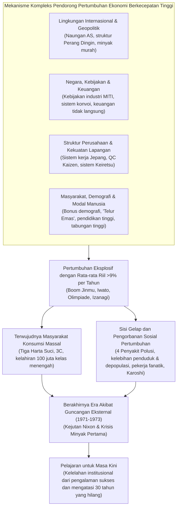
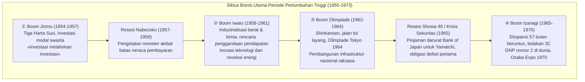
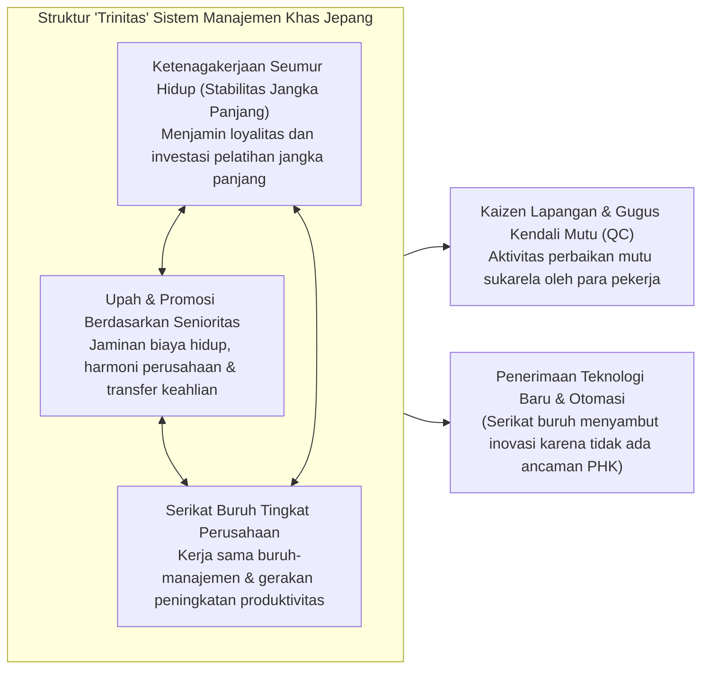
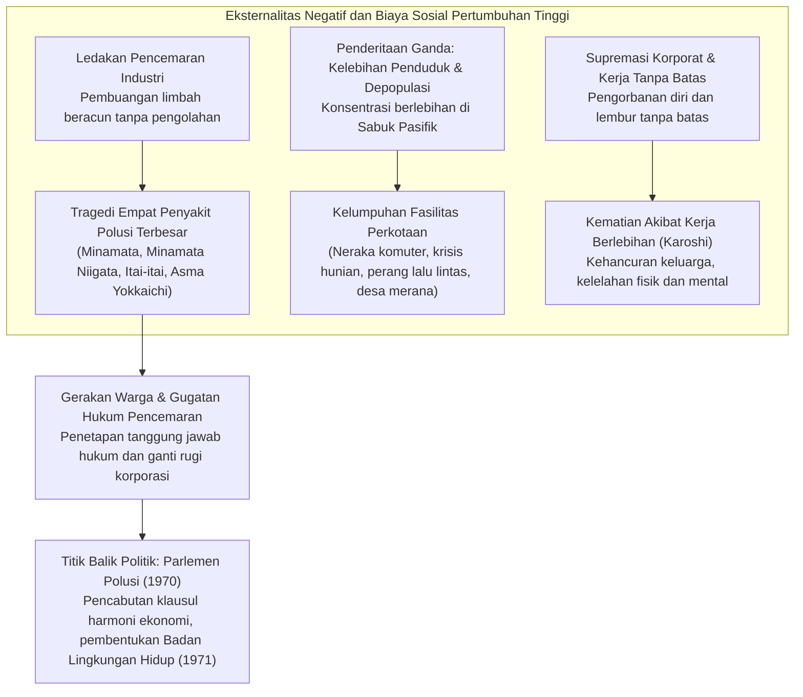

## Pendahuluan: «Keajaiban Ekonomi» yang Tiada Duanya dalam Sejarah dan Hakikat Dasarnya

Pada tanggal 15 Agustus 1945, ketika Perang Pasifik berakhir dengan kapitulasi tanpa syarat Kekaisaran Jepang, kepulauan Jepang secara harfiah telah berubah menjadi lautan abu dan puing-puing yang terbakar. Sekitar 40% wilayah perkotaan utama hancur lebur akibat serangan bom udara Sekutu, dan sekitar seperempat dari kekayaan nasional (sekitar 36% dari total aset non-militer) musnah menjadi abu. Seluruh wilayah seberang laut lenyap, dan lebih dari enam juta tentara serta warga sipil yang dipulangkan membanjiri tanah air tanpa rumah untuk bernaung maupun pekerjaan untuk menyambung hidup. Sebagian besar rakyat dihadapkan pada kelaparan ekstrem di mana jatah beras harian pun kerap macet, sembari hidup dalam teror hiperinflasi yang tak terkendali. Para jurnalis asing dan pejabat tinggi Markas Besar Panglima Tertinggi Sekutu (GHQ) yang mengunjungi Jepang saat itu serempak meramalkan: «Jepang akan membutuhkan setidaknya lebih dari setengah abad hanya untuk memulihkan standar ekonomi mandiri sebagai sebuah negara modern.»

Namun, ramalan suram tersebut dipatahkan secara dramatis dalam skala yang mencengangkan dunia.

Hanya berselang sepuluh tahun sejak perang usai, yakni dari tahun 1955 hingga meletusnya Krisis Minyak Pertama pada tahun 1973, perekonomian Jepang berhasil mencatatkan **laju pertumbuhan riil rata-rata sekitar 9,3% per tahun** selama hampir dua dekade — sebuah laju pertumbuhan ekonomi super-cepat yang nyaris tiada tandingannya dalam sejarah umat manusia. Produk Nasional Bruto (GNP) Jepang melonjak dahsyat dari sekitar 8 triliun yen pada tahun 1955 menjadi sekitar 112 triliun yen pada tahun 1973, menggelembung hingga 14 kali lipat. Pada tahun 1968, Jepang menyalip Jerman Barat — raksasa industri Eropa Barat yang telah menjadi tolok ukur sejak Restorasi Meiji — dan melesat menduduki posisi sebagai **negara adidaya ekonomi nomor dua di dunia kapitalis** setelah Amerika Serikat.



Lompatan fenomenal ini disanjung oleh seantero dunia sebagai «**Keajaiban Ekonomi Timur (Economic Miracle)**». Peralatan rumah tangga elektronik modern yang disimbolkan oleh «Tiga Harta Suci» — televisi hitam-putih, mesin cuci listrik, dan kulkas listrik — merambah ke seluruh pelosok rumah tangga. Tak lama berselang, selera konsumsi melesat menuju «3C»: televisi berwarna (Color TV), pendingin ruangan (Cooler), dan mobil pribadi (Car). Pola kehidupan masyarakat bermutasi secara permanen dari komunitas perdesaan tradisional menjadi keluarga batih (nuklir) perkotaan yang menikmati kemakmuran era produksi massal dan konsumsi massal yang belum pernah dirasakan sebelumnya. Sekitar 90% warga memandang diri mereka berada di lapisan menengah, melahirkan masyarakat «Seratus Juta Kelas Menengah» (Ichioku So-Churyu), serta mengokohkan salah satu tatanan masyarakat industri paling aman, stabil, dan berpendidikan tinggi di dunia.

Kendati demikian, «keajaiban» ini bukanlah berkah yang jatuh begitu saja dari langit. Di baliknya, terdapat keterpaduan roda-roda penggerak struktural yang saling bertaut secara presisi: fondasi teknologi industri berat dan kimia serta keahlian kontrol birokrasi yang terakumulasi sejak sebelum dan selama perang; pergeseran tajam geopolitik Perang Dingin yang mengubah haluan strategi pendudukan AS terhadap Jepang; rancangan kebijakan industri yang terarah dari Kementerian Perdagangan Internasional dan Industri (MITI); sistem pengawalan finansial (sistem konvoi) di bawah komando Kementerian Keuangan; relasi industrial khas Jepang yang bertumpu pada ketenagakerjaan seumur hidup dan senioritas; serta etos kerja keras yang tak kenal lelah dan kecenderungan menabung yang sangat tinggi dari para pekerja muda lepasan sekolah perdesaan yang dijuluki «Telur Emas».

Namun pada saat yang sama, di balik langkah megah ini selalu membayangi sisi gelap yang kelam dan getir. Limbah cair beracun dan asap pabrik yang dibuang tanpa pengolahan memicu «Empat Penyakit Polusi Terbesar», termasuk Penyakit Minamata dan Asma Yokkaichi, yang merenggut nyawa serta meremukkan kesehatan warga tak bersalah tanpa bisa dipulihkan. Gelombang eksodus demografis besar-besaran dari desa ke kota memicu «kelebihan penduduk yang parah», neraka kemacetan komuter, dan degradasi hunian di kawasan Sabuk Pasifik, sementara daerah perdesaan mengalami «depopulasi akut» dan keruntuhan sektor primer. Para buruh dan pegawai yang dijuluki «karyawan fanatik» (Moretsu Shain) atau «pejuang korporat» dipaksa mengabdi tanpa pamrih dengan jam lembur tanpa batas, menanamkan benih patologi sosial yang kelak diakui secara global dengan istilah bahasa Jepang: «Karoshi» (kematian akibat kelelahan kerja akut).

Artikel ini mengupas tuntas seluruh panorama fenomena historis pertumbuhan ekonomi berkecepatan tinggi Jepang pascaperang (1955-1973) secara komprehensif dan tiga dimensi. Kajian ini tidak sekadar menelusuri fluktuasi siklus bisnis, melainkan membedah dimensi ekonomi makro, kebijakan industri, arsitektur keuangan, tata kelola perusahaan, struktur kemasyarakatan, geopolitik global, hingga malapetaka pencemaran lingkungan. Lebih jauh lagi, tulisan ini menganalisis mengapa euforia kesuksesan era tersebut kelak menjadi belenggu «kelelahan institusional» yang menjerat masyarakat Jepang hingga menyeretnya ke dalam «Tiga Dekade yang Hilang» sejak era 1990-an, guna memetik bekal pelajaran sejarah yang berharga bagi kebangkitan ekonomi di abad ke-21.

---

## Bab 1: Denyut Awal dari Puing Reruntuhan —— Masa Pra-Pertumbuhan Tinggi (1945-1954)

Bila tahun 1955 ditetapkan sebagai titik tolak pertumbuhan ekonomi tinggi, maka dekade pertama pascaperang (1945-1954) adalah masa persiapan yang sangat krusial: era pembersihan puing-puing ekonomi nasional yang runtuh, peletakan kembali fondasi infrastruktur ekonomi pasar, dan pembangunan landasan pacu yang memungkinkan lompatan roket di kemudian hari.

### 1.1 Kekalahan Perang yang Menghancurkan dan Teror Hiperinflasi

Segera setelah perang berakhir pada Agustus 1945, perekonomian Jepang berada di ambang kelumpuhan total. Akibat terhentinya produksi perlengkapan militer dan terputusnya rantai pasok bahan mentah dari luar negeri, tingkat produksi pertambangan dan manufaktur pada tahun 1946 anjlok hingga hanya mencapai **sekitar 30%** dari level sebelum perang (rata-rata 1934-1936). Distribusi beras sebagai makanan pokok mengalami keterlambatan dan kelangkaan kronis, memaksa penduduk perkotaan membawa pakaian dan perabot rumah tangga mereka ke desa-desa untuk ditukarkan dengan makanan dalam pola hidup memprihatinkan yang dikenal sebagai «hidup rebung» (Takenoko Seikatsu — mengupas harta benda lapis demi lapis demi bertahan hidup).

Kelumpuhan produksi ini diperparah oleh hiperinflasi yang mengganas. Pengeluaran biaya militer darurat yang dicetak serampangan oleh otoritas militer di akhir perang, kompensasi utang produksi perang yang dibayarkan dalam jumlah raksasa pascakapitulasi, serta tunjangan pesangon pembubaran tentara kekaisaran menyebabkan peredaran uang kertas Bank of Japan membengkak ke angka astronomis. Dari musim gugur 1945 hingga 1949, indeks harga grosir melesat hampir **70 kali lipat**.

Menghadapi krisis ini, pemerintah mengundangkan «Ordonansi Tindakan Darurat Keuangan» pada Februari 1946. Langkah ekstrem diambil dengan membekukan seluruh tabungan bank («deposit freeze»), mencabut masa berlaku uang kertas lama yang beredar, dan secara paksa menggantinya dengan «yen baru» disertai pembatasan penarikan tunai yang sangat ketat. Namun, selama kelangkaan kapasitas produksi riil belum teratasi, lingkaran setan kenaikan harga barang tetap tak terbendung.

```
【Perubahan Drastis Indikator Ekonomi Utama Pascaperang Awal】
・Tingkat produksi industri dan tambang (1946): 30,7% dibandingkan standar praperang (1934-1936 = 100)
・Tingkat lonjakan indeks harga grosir Tokyo (1946): +364,5% dibanding tahun sebelumnya
・Jatah resmi beras pemerintah (akhir 1945): dipangkas menjadi 2 go 1 shaku (sekitar 297 gram) per dewasa/hari, sering tertunda
・Jumlah total pemulangan warga dan tentara dari luar negeri (1945-1950): sekitar 6,25 juta jiwa
```

Guna mendobrak kelumpuhan produksi ini, pemerintah meluncurkan strategi yang digagas oleh Profesor Universitas Tokyo, Hiromi Arisawa, yakni **«Sistem Produksi Prioritas» (Keisha Seisan Hoshiki / Priority Production System)** (disahkan kabinet akhir 1946, dilaksanakan 1947). Inti dari sistem produksi prioritas adalah menarik alokasi sumber daya domestik yang sangat langka (dana, bahan mentah, devisa, dan tenaga kerja) dari mekanisme pasar bebas, untuk kemudian dipusatkan secara terarah pada dua sektor tulang punggung utama: **«batu bara»** dan **«baja»**, di mana keterkaitan resiprokal keduanya diharapkan dapat menarik kebangkitan seluruh industri.

Secara teknis, batu bara domestik diprioritaskan bagi pabrik peleburan baja; lalu peningkatan produksi baja dipasok kembali secara prioritas ke tambang batu bara sebagai pilar terowongan dan mesin penggali guna menggenjot produksi batu bara. Surplus yang tercipta dari «lingkaran kebajikan baja dan batu bara» ini kemudian disalurkan bertahap ke pembangkit listrik, pupuk kimia, perkeretaapian, dan industri dasar lainnya.

Pilar finansial penopang strategi ini adalah **«Bank Keuangan Rekonstruksi» (Fukko Kinyu Kinko / Fukkin)** yang didirikan pada Januari 1947. Fukkin menerbitkan obligasi rekonstruksi yang dijamin pemerintah dan sebagian besarnya dibeli langsung oleh Bank of Japan, sehingga dapat mengalirkan kredit berbunga rendah dalam skala raksasa ke industri batu bara, baja, dan listrik. Pada akhir 1948, pinjaman Fukkin mencakup sekitar 70% dari seluruh pembiayaan peralatan industri dasar.

Sistem produksi prioritas membuahkan hasil nyata dalam memulihkan kapasitas produksi dasar yang tadinya hancur. Namun, pembelian langsung obligasi Fukkin oleh bank sentral memicu ekspansi jumlah uang beredar yang masif, menyulut kembali kobaran inflasi baru yang dikenal sebagai **«Inflasi Fukkin»**.

### 1.2 Garis Dodge dan Rekomendasi Shoup: Meletakkan Fondasi Ekonomi Pasar

Menghadapi inflasi Fukkin yang merajalela, pemerintah Amerika Serikat memutuskan untuk mengubah haluan kebijakan pendudukannya secara fundamental. Di tengah memanasnya Perang Dingin (berdirinya Republik Rakyat Tiongkok pada 1949 dan mengerasnya rivalitas blok Barat-Timur), AS mendefinisikan ulang posisi Jepang: dari «musuh kalah perang yang harus dilucuti dan didemiliterisasi» menjadi «benteng anti-komunis dan pilar kapitalisme terdepan di Timur Jauh». Untuk itu, perekonomian Jepang harus berhenti menyusu pada bantuan dana AS (dana GARIOA dan EROA) dan berdiri mandiri sebagai ekonomi pasar yang kokoh.

Pada Februari 1949, Presiden Detroit Bank, **Joseph M. Dodge**, tiba di Jepang sebagai utusan khusus dan meresepkan terapi kejut yang sangat keras bagi perekonomian Jepang, yang dikenal sebagai **«Garis Dodge» (Dodge Line)**. Tiga pilar utama Garis Dodge meliputi:

1. **Penyusunan anggaran belanja super-seimbang**: larangan total penerbitan obligasi pemerintah, eliminasi defisit anggaran secara instan, kewajiban menyamakan pengeluaran dan pemasukan secara ketat, serta menciptakan surplus riil untuk melunasi utang masa lalu.
2. **Penghentian pinjaman baru Bank Keuangan Rekonstruksi dan penghapusan total subsidi**: pencabutan subsidi selisih harga (bantuan raksasa pemerintah yang menambal jurang antara ongkos produksi dan harga resmi).
3. **Penetapan kurs mata uang tunggal**: pada 25 April 1949, nilai tukar mata uang dipatok secara resmi pada angka **1 Dolar AS = 360 Yen**.

Penghapusan puluhan hingga ratusan kurs ganda yang sebelumnya berlaku untuk aneka komoditas dan penyatuan pintu perdagangan dunia pada kurs 360 yen memaksa korporasi Jepang terjun langsung ke medan kompetisi global. Kurs 1 dolar = 360 yen ini, yang dinilai terdepresiasi bila dilihat dari paritas daya beli Jepang saat itu, kelak bertransformasi menjadi senjata paling ampuh bagi ekspansi industri ekspor Jepang dalam jangka panjang.

Kendati demikian, dampak jangka pendek dari Garis Dodge sangat menyakitkan. Penarikan likuiditas negara dan pengetatan moneter drastis menjerumuskan Jepang ke dalam deflasi yang mencekik («Resesi Dodge»). Gelombang kebangkrutan melanda usaha kecil dan menengah; perusahaan-perusahaan besar terpaksa memangkas karyawan secara masif («rasionalisasi») demi bertahan hidup. Ratusan ribu buruh dari Kereta Api Nasional, monopoli tembakau, dan swasta terlempar ke jalanan, memicu keresahan sosial hebat yang ditandai oleh rentetan peristiwa misterius perkeretaapian (Kasus Shimoyama, Mitaka, dan Matsukawa).

Bersamaan dengan Garis Dodge, arsitektur perpajakan modern Jepang dibentuk oleh misi perpajakan pimpinan Profesor Universitas Columbia, **Carl S. Shoup**, yang tiba pada Mei 1949 melalui **«Rekomendasi Shoup»**. Misi Shoup merombak sistem pajak tidak langsung warisan masa lalu yang rumit dan korup, lalu menggantinya dengan sistem yang bertumpu pada **pajak langsung dengan poros utama pajak penghasilan**.

Sistem Shoup memperkenalkan mekanisme «Surat Pemberitahuan Pajak Biru» (Blue Return) yang membiasakan pembukuan dan akuntansi modern pada dunia usaha, membentuk sistem desentralisasi fiskal daerah, serta menata pajak korporasi secara adil. Sinergi antara disiplin ekonomi makro Garis Dodge dan modernisasi kelembagaan mikro Rekomendasi Shoup memberikan Jepang fondasi institusional yang kokoh untuk menjalankan perekonomian kapitalis modern.

### 1.3 Perang Korea dan Sengatan «Rezeki Nomplok»: Bahan Bakar Akumulasi Modal

Di saat ekonomi Jepang hampir mati lemas akibat deflasi Dodge, pada 25 Juni 1950 meletuslah **Perang Korea** di semenanjung tetangga. Perang ini di satu sisi merupakan tragedi kemanusiaan dan geopolitik yang mengerikan, namun di sisi lain menjadi penyelamat ajaib yang membalikkan nasib perekonomian Jepang yang sekarat. Itulah alasan mengapa Perdana Menteri Shigeru Yoshida saat itu sempat terlontar ucapan bahwa perang ini adalah «anugerah para dewa (angin dewa / Kamikaze)».

Dengan dikerahkannya pasukan PBB (yang secara de facto adalah militer AS), Jepang sebagai negara industri maju terdekat ke medan pertempuran menerima banjir pesanan barang dan jasa dalam jumlah raksasa. Fenomena inilah yang dikenal sebagai **«Rezeki Nomplok Perang Korea» (Korean War Special Procurements / Tokuju)**.

Pesanan militer khusus dari tentara AS mencakup spektrum luas:
- **Perlengkapan militer dan produk baja**: truk, jip, drum bahan bakar, kawat berduri, suku cadang senjata, peti amunisi.
- **Tekstil dan perlengkapan harian**: seragam militer, karung goni, selimut, terpal tenda, sepatu lars tentara.
- **Jasa dan perbaikan**: perbaikan dan bongkar-pasang kendaraan militer dan pesawat terbang yang rusak, logistik dan transportasi, serta dukungan telekomunikasi.

Pendapatan devisa dari pesanan khusus militer ini sepanjang empat tahun (dari 1950 hingga gencatan senjata 1953) mencapai **akumulasi sekitar 2,4 miliar dolar AS** (setara dengan sekitar 60% dari total nilai ekspor tahunan Jepang pada periode tersebut). Aliran deras dolar ini melenyapkan kelangkaan devisa kronis yang telah membelenggu Jepang selama bertahun-tahun.

```
【Dampak Kuantitatif Pesanan Khusus Perang Korea terhadap Ekonomi Jepang (1950-1953)】
・Total nilai kontrak pesanan khusus: sekitar 2,4 miliar dolar (pesanan militer langsung + belanja pribadi tentara AS)
・Tingkat pertumbuhan PDB riil: Tahun Fiskal 1950 (+10,8%), 1951 (+12,3%), 1952 (+10,0%), 1953 (+7,3%)
・Indeks produksi industri tambang dan manufaktur: melonjak sekitar 70% hanya dalam satu tahun lebih, dan pada 1951 melampaui level praperang (1934-1936)
・Pemulihan laba korporasi: margin laba bersih terhadap penjualan industri manufaktur mencatat rekor tertinggi pascaperang pada semester kedua 1950
```

Signifikansi rezeki nomplok ini jauh melampaui sekadar berkah sesaat pengurasan stok gudang:
Pertama, melalui perbaikan dan perakitan massal truk-truk militer AS, pabrikan otomotif Jepang (seperti Toyota, Nissan, Isuzu) mempelajari standar kontrol kualitas militer AS yang luar biasa ketat (MIL-SPEC), yang melesatkan presisi suku cadang dan teknologi produksi massal mereka. Kedua, laba raksasa yang diraup perusahaan-perusahaan Jepang dikonversi menjadi laba ditahan (retained earnings), yang kelak menjadi modal dasar bagi investasi peralatan besar-besaran (pembangunan pabrik baja baru, impor mesin perkakas mutakhir) menyongsong era pertumbuhan tinggi.

### 1.4 Sistem San Francisco dan Deklarasi «Masa Pascaperang Telah Berakhir»

Pada September 1951, Jepang menandatangani Perjanjian Perdamaian San Francisco dan Perjanjian Keamanan AS-Jepang. Pada 28 April 1952, perjanjian tersebut mulai berlaku, mengakhiri tujuh tahun masa pendudukan militer Sekutu dan memulihkan kedaulatan nasional Jepang seutuhnya.

Setelah merdeka kembali, Jepang secara tegas menempatkan diri dalam kubu Barat pimpinan AS di era Perang Dingin. Haluan diplomasi dan keamanan yang dipelopori Perdana Menteri Shigeru Yoshida, yang dikenal sebagai **«Doktrin Yoshida»**, merumuskan strategi nasional ke arah yang sangat rasional: mempercayakan pertahanan negara sepenuhnya pada Perjanjian Keamanan dan payung militer AS, membatasi anggaran pertahanan sendiri pada tingkat minimal (di bawah 1% dari GNP), dan mengerahkan seluruh energi, bakat manusia, serta sumber daya finansial bangsa untuk pemulihan ekonomi dan ekspansi perdagangan. Pilihan cerdas ini memberikan dunia usaha Jepang lingkungan bisnis yang ideal tanpa dibebani ongkos militer yang mematikan.

Meskipun berakhirnya Perang Korea pada 1953 sempat memicu resesi singkat akibat hilangnya pesanan militer, arus bawah perekonomian Jepang telah menyalakan mesin ekspansi otonom yang digerakkan oleh investasi modal. Pada tahun 1955, didukung oleh panen raya pertanian dan pulihnya perdagangan internasional, terbukalah tirai era pertumbuhan pesat dengan stabilitas harga («booming kuantitatif»).

Deklarasi atas titik balik bersejarah ini dikumandangkan secara bertenaga dalam «Buku Putih Ekonomi» Tahun Fiskal 1956 (Showa 31) yang diterbitkan oleh Badan Perencanaan Ekonomi. Kalimat penutup yang ditulis oleh kepala bagian riset domestik, **Yonosuke Goto**, menjadi adagium abadi yang mengukir sejarah pascaperang:

> **«Masa ‹pascaperang› kini telah berakhir. Kita sekarang tengah berhadapan dengan situasi yang sama sekali berbeda. Pertumbuhan melalui fase pemulihan telah usai. Pertumbuhan masa depan hanya akan ditopang oleh modernisasi.»**

Makna kata-kata ini bukan sekadar perayaan atas keberhasilan rekonstruksi. Era mengejar ketertinggalan untuk memulihkan standar sebelum perang telah tuntas. Jepang tak bisa lagi bermanja-manja pada bantuan luar negeri atau pesanan perang dadakan. Kalimat itu adalah lonceng peringatan: jika Jepang tidak secara agresif mengadopsi inovasi teknologi terkini (otomasi, kimia polimer, transistor, pembangkit listrik termal berdaya raksasa) dan merombak struktur industrinya dari industri ringan kuno menuju industri berat dan kimia modern, bangsa ini niscaya akan tergilas dalam kancah persaingan pasar global.

Dan perekonomian Jepang pun melesat dengan dinamisme yang luar biasa, memasuki eksperimen modernisasi terbesar dalam sejarah dunia modern.

---

## Bab 2: Kronik Siklus Bisnis dan Panggung Pertumbuhan Tinggi (1955-1973)

Selama rentang waktu sekitar delapan belas tahun dari 1955 hingga 1973, ekspansi ekonomi Jepang tidaklah berlangsung mulus secara linier. Perekonomian melaju layaknya menaiki anak tangga: fase «kemakmuran» yang ditiup oleh ledakan investasi modal dan konsumsi bergiliran dengan fase «resesi pengetatan», yakni saat lonjakan impor menguras cadangan devisa hingga otoritas moneter terpaksa mengerem perekonomian.

Kala itu, Jepang menerapkan sistem kurs tetap «1 Dolar = 360 Yen», sehingga cadangan emas dan devisa di bank sentral memiliki batas atas yang kaku. Saat ekonomi terlalu panas, impor bahan mentah dan mesin meroket, neraca pembayaran memburuk menjadi defisit, dan ketika devisa menipis, Bank of Japan terpaksa menaikkan suku bunga diskonto resmi untuk mendinginkan pasar. Mekanisme pembatas ini dinamai **«Batas Neraca Pembayaran» (Balance of Payments Ceiling)**, yang menjadi kendala makroekonomi terbesar bagi pembuat kebijakan Jepang.

Berikut adalah uraian mendalam mengenai lima siklus ekonomi utama yang mewarnai masa pertumbuhan ekonomi tinggi:



### 2.1 Boom Jinmu (1954-1957) dan Resesi Nabezoko: Reaksi Berantai Investasi Peralatan

Ekspansi ekonomi yang bermula pada November 1954 dinamai **«Boom Jinmu»**, merujuk pada Kaisar pertama Jepang, Kaisar Jinmu, yang menyiratkan kemakmuran dahsyat yang belum pernah terjadi sejak berdirinya kekaisaran Jepang.

Motor pendorong utama boom ini adalah **investasi peralatan modal swasta** yang meledak. Sektor-sektor kunci seperti baja, galangan kapal, serat sintetis, petrokimia, dan mesin listrik serentak membangun pabrik-pabrik mutakhir dan mengimpor mesin-mesin raksasa. Fenomena keterkaitan ini ditangkap dengan sangat jitu dalam Buku Putih Ekonomi 1957 lewat adagium analitisnya yang masyhur: **«Investasi melahirkan investasi»**.

Saat pabrik baja memperluas tanur tiupnya, produsen mesin menerima limpahan pesanan mesin perkakas; dan saat produsen mesin membangun bengkel kerja baru untuk memacu produksi, permintaan terhadap baja dan semen kembali melonjak tinggi. Siklus perbanyakan permintaan antar-industri ini menghela perekonomian nasional melesat ke atas.

Pada saat yang sama, panggung konsumsi rumah tangga diramaikan oleh «revolusi gaya hidup». **«Tiga Harta Suci»** — televisi hitam-putih, mesin cuci listrik, dan lemari es listrik — mulai menyebar cepat di kalangan kelas menengah perkotaan. Beban pekerjaan domestik perempuan terkurangi drastis, dan wajah hiburan keluarga berubah selamanya.

Namun pada tahun 1957, efek samping kemakmuran mulai menuntut bayaran. Lonjakan impor bahan mentah memperburuk neraca perdagangan hingga cadangan devisa menipis ke batas kritis. Perekonomian menabrak «batas neraca pembayaran». Bank of Japan merespons cepat dengan menaikkan suku bunga diskonto beberapa kali dan menerapkan pengetatan moneter ketat. Akibatnya, roda ekonomi tersentak rem mendadak, harga baja dan tekstil anjlok, dan dari paruh kedua 1957 hingga 1958 perekonomian terjerembap ke dalam masa stagnasi yang dijuluki **«Resesi Nabezoko»** (resesi «pantai wajan/kuali datar»). Namun demikian, bara investasi tidak sepenuhnya padam, dan pemulihan dapat diraih relatif cepat.

### 2.2 Boom Iwato (1958-1961) dan Rencana Penggandaan Pendapatan: Ledakan Industri Kimia dan Berat

Setelah meloloskan diri dari resesi Nabezoko pada Juli 1958, Jepang memasuki fase ekspansi baru yang dinamai **«Boom Iwato»** — merujuk pada mitos yang lebih purba lagi dari era Kaisar Jinmu, saat dewi matahari Amaterasu keluar dari Gua Batu Langit (Ame no Iwato). Pada periode ini, pertumbuhan PDB riil Jepang melesat dengan **rata-rata tahunan 11,3%** yang luar biasa.

Esensi dari Boom Iwato adalah tuntasnya pergeseran struktural industri Jepang: tongkat estafet perekonomian diserahkan sepenuhnya dari industri ringan (tekstil dan pernak-pernik) kepada **industri berat dan kimia (baja, petrokimia, mobil, dan mesin listrik berat)**. Revolusi energi bergulir kencang; pilar bahan bakar industri beralih drastis dari batu bara domestik ke minyak bumi impor dari Timur Tengah yang murah dan bermutu tinggi. Di sepanjang pesisir Sabuk Pasifik (Teluk Tokyo, Teluk Ise, Laut Pedalaman Seto), tanah reklamasi luas disulap menjadi kompleks peleburan baja raksasa dan kawasan petrokimia terpadu.

Pergeseran besar juga melanda ranah politik. Pada tahun 1960, pergolakan politik terbesar pascaperang meletus terkait revisi Perjanjian Keamanan AS-Jepang («Perjuangan Ampo»), di mana ratusan ribu demonstran mengepung gedung Parlemen. Setelah kabinet Nobusuke Kishi mundur akibat krisis politik tersebut, perdana menteri baru, **Hayato Ikeda**, mencanangkan terobosan kebijakan brilian guna mengalihkan perhatian rakyat dari pertikaian ideologis menuju pembangunan ekonomi: **«Rencana Penggandaan Pendapatan Nasional»** (disahkan kabinet Desember 1960).

Didukung oleh landasan teoretis ekonom Osamu Shimomura, rencana ini menetapkan target ambisius: **«Menggandakan Produk Nasional Bruto (GNP) riil dalam kurun waktu 10 tahun (1961-1970), mencapai kesempatan kerja penuh (full employment), dan mengangkat taraf hidup rakyat sejajar dengan standar negara-negara maju di Eropa Barat»**. Dibutuhkan pertumbuhan rata-rata 7,2% per tahun untuk mencapainya, yang awalnya dicibir oleh kubu oposisi dan sejumlah ekonom sebagai «janji muluk yang mustahil».

Namun realitas membuktikan kesuksesan yang melampaui segala ekspektasi. Hasrat investasi dunia usaha sedemikian bergelora sehingga target penggandaan pendapatan tercapai lebih awal hanya dalam waktu empat tahun lebih sedikit. Narasi optimis Ikeda mengenai «toleransi dan ketabahan» serta janji «gaji berlipat dua» memompa rasa percaya diri yang amat besar pada rakyat Jepang yang masih dibayangi trauma kekalahan perang.

### 2.3 Boom Olimpiade (1962-1964) dan Revolusi Infrastruktur

Setelah jeda sejenak akibat pengetatan neraca pembayaran di akhir Boom Iwato, paruh kedua tahun 1962 menandai bermulanya **«Boom Olimpiade»**. Jepang mengerahkan segenap daya dan sumber daya nasional untuk menyukseskan Olimpiade Musim Panas ke-18 di Tokyo (Oktober 1964) — perhelatan Olimpiade pertama di benua Asia.

Anggaran infrastruktur yang digelontorkan untuk jalan, rel kereta api, dan penataan kota mencapai sekitar 1 triliun yen, setara dengan total nilai anggaran belanja negara tahunan saat itu:
- **Tokaido Shinkansen**: resmi beroperasi pada 1 Oktober 1964. Kereta peluru berkecepatan 210 km/jam pertama di dunia yang menghubungkan Tokyo dan Shin-Osaka hanya dalam tempo 4 jam (dipersingkat menjadi 3 jam 10 menit setahun kemudian), merestrukturisasi poros konektivitas nasional Jepang.
- **Jalan Tol Meishin dan Shuto Expressway**: Jalan Tol Meishin dibuka sebagai jalan bebas hambatan antarkota pertama di Jepang (1963-1965), dan jalan tol layang perkotaan Shuto dibangun membelah langit Tokyo yang padat.
- **Modernisasi Wajah Perkotaan**: jalur monorel Tokyo Monorail menghubungkan Bandara Haneda dengan pusat kota, jalur kereta bawah tanah Hibiya Line rampung, hotel-hotel megah berkelas dunia seperti Hotel New Otani dibangun, serta pembenahan gorong-gorong dan sanitasi massal digencarkan.

Di ranah penyiaran, demam televisi berwarna meledak agar warga dapat menonton upacara pembukaan dan pertandingan secara langsung, dan keberhasilan siaran satelit lintas Samudra Pasifik pertama antara Jepang dan AS melalui satelit Syncom 3 membuktikan kepada dunia kebangkitan Jepang sebagai adidaya sains dan teknologi.

### 2.4 Resesi Pasar Sekuritas (Resesi Showa 40 / 1965) dan Putaran Kebijakan Fiskal

Namun, begitu euforia Olimpiade mereda, perekonomian Jepang dihantam ujian paling dingin sepanjang era pertumbuhan tinggi: **«Resesi Showa 40» (Krisis Sekuritas 1965)**.

Kapasitas produksi yang dibangun secara jor-joran demi menyambut Olimpiade seketika berubah menjadi kelebihan kapasitas yang masif saat permintaan mereda, memicu rekor tertinggi angka kebangkrutan korporasi pascaperang. Pukulan paling telak menghantam pasar modal; kejatuhan bursa saham membuat salah satu dari empat raksasa pialang sekuritas Jepang, **Yamaichi Securities**, menderita kerugian kolosal hingga di ambang kebangkrutan total.

Demi mencegah keruntuhan kepercayaan finansial dan reaksi berantai penarikan dana massal (bank run), Menteri Keuangan saat itu, **Kakuei Tanaka**, bersama Gubernur Bank of Japan Makoto Usami mengambil langkah luar biasa di luar kebiasaan. Berdasarkan Pasal 25 Undang-Undang Bank of Japan, mereka mengucurkan **«pinjaman khusus tanpa batas dan tanpa agunan dari Bank of Japan» (Nichigin Tokuyu)** kepada Yamaichi Securities, yang berhasil meredakan kepanikan para nasabah di depan loket.

Lebih dari itu, pemerintah mendobrak tabu lama Pasal 4 Undang-Undang Keuangan warisan Garis Dodge yang mewajibkan anggaran berimbang dan melarang utang negara, dengan menerbitkan **«Obligasi Khusus Penutup Defisit» (obligasi defisit)** untuk pertama kalinya pascaperang pada anggaran belanja tambahan 1965. Stimulus fiskal bergaya Keynesian ini (penambahan proyek infrastruktur publik dan pemotongan pajak) berhasil mendongkrak permintaan swasta yang lesu dan mengeluarkan ekonomi dari resesi dalam tempo singkat, membuka pintu gerbang menuju masa keemasan terpanjang.

### 2.5 Boom Izanagi (1965-1970): 57 Bulan Kejayaan dan Merengkuh Posisi Nomor Dua Dunia

Bangkit dari dasar resesi Showa 40 pada November 1965, perekonomian melaju kencang ke dalam periode kemakmuran tanpa tanding hingga Juli 1970: **«Boom Izanagi»**. Mengambil nama dewa pencipta kepulauan Jepang, Izanagi no Mikoto, masa ekspansi ini berlangsung selama **57 bulan berturut-turut**, memecahkan seluruh rekor durasi kemakmuran sebelumnya.

Dua pilar penopang Boom Izanagi adalah daya saing ekspor yang tak terbendung dan kenaikan kelas konsumsi massal domestik. Primadona belanja masyarakat naik kelas dari Tiga Harta Suci menuju **«3C»**:
- **Televisi Berwarna (Color TV)**
- **Pendingin Ruangan (Cooler / AC)**
- **Mobil Pribadi (Car)**

Peluncuran mobil rakyat seperti Toyota Corolla dan Nissan Sunny pada tahun 1966 menandai «Tahun Pertama Mobil Pribadi», memicu demam motorisasi di seantero negeri. Manufaktur Jepang, berkat kontrol mutu dan manajemen proses yang luar biasa ketat, sukses melucuti stigma lama «murahan dan gampang rusak»; produk-produk berlabel «Made in Japan» yang berdaya tahan tinggi dan minim kerusakan mulai mendominasi pasar global.

Pada tahun 1968, sebuah tonggak sejarah monumental terukir: GNP nominal Jepang mencapai **sekitar 141,9 miliar dolar AS**, melampaui Jerman Barat dan secara resmi mengantarkan Jepang menjadi **negara adidaya ekonomi nomor dua di dunia kapitalis** di belakang Amerika Serikat. Tepat satu abad sejak Restorasi Meiji 1868, sebuah negara Asia yang porak-poranda oleh perang berhasil menyalip kekuatan-kekuatan utama Eropa Barat.

Puncak kemegahan era ini dirayakan dalam pameran internasional pertama di Asia: **«World Expo 1970 di Osaka (Osaka Expo)»** dengan tema «Kemajuan dan Harmoni bagi Umat Manusia». Di bawah naungan «Menara Matahari» (Tower of the Sun) karya Taro Okamoto di Bukit Senri, pameran ini menyedot angka fantastis **64,21 juta pengunjung** selama enam bulan. Batu bulan di Paviliun AS, trotoar berjalan otomatis, dan paviliun-paviliun futuristik mematrikan kebanggaan mendalam di hati sanubari rakyat Jepang bahwa rekonstruksi pascaperang telah tuntas sempurna dan bangsa mereka telah berdiri sejajar di barisan terdepan kemakmuran dunia.

```
【Tren Indikator Ekonomi Makro Utama Era Pertumbuhan Tinggi (Tahun Fiskal 1955-1974)】
```

| Tahun Fiskal | Pertumbuhan PDB Riil (%) | GNP Nominal (Ratus Juta Yen) | Fase Siklus / Tonggak Sejarah Utama |
| :---: | :---: | :---: | :--- |
| **1955** | **+10,8** | 88.646 | Awal Boom Jinmu, awal penyebaran Tiga Harta Suci |
| **1956** | **+6,2** | 98.719 | Buku Putih: «Masa pascaperang telah usai», bergabung dengan PBB |
| **1957** | **+7,8** | 111.280 | Resesi Nabezoko, menabrak batas neraca pembayaran |
| **1958** | **+5,6** | 118.527 | Awal Boom Iwato, Menara Tokyo rampung dibangun |
| **1959** | **+11,2** | 134.228 | Parade pernikahan Putra Mahkota, ledakan kepemilikan TV |
| **1960** | **+12,5** | 160.332 | Demonstrasi Ampo, Kabinet Ikeda canangkan Rencana Penggandaan Pendapatan |
| **1961** | **+12,0** | 196.442 | Ledakan industri berat & kimia, revolusi energi minyak bumi |
| **1962** | **+8,9** | 220.119 | Awal Boom Olimpiade, pembukaan kota mandiri Senri New Town |
| **1963** | **+10,7** | 256.419 | Pembukaan Jalan Tol Meishin (Ritto - Amagasaki) |
| **1964** | **+13,1** | 295.444 | Olimpiade Tokyo, Shinkansen beroperasi, bergabung dengan OECD |
| **1965** | **+5,8** | 328.217 | Resesi Showa 40, dana talangan Yamaichi, penerbitan obligasi defisit perdana |
| **1966** | **+10,6** | 382.900 | Puncak Boom Izanagi, era mobil pribadi (peluncuran Corolla & Sunny) |
| **1967** | **+11,1** | 446.953 | Penetrasi kilat produk 3C, penetapan UU Dasar Pengendalian Polusi |
| **1968** | **+12,2** | 528.781 | **GNP Jepang lampaui Jerman Barat, raih posisi kedua di dunia kapitalis** |
| **1969** | **+12,5** | 622.464 | Jalan Tol Tomei beroperasi penuh, kepemilikan TV berwarna meledak |
| **1970** | **+10,7** | 733.449 | Osaka Expo (64,2 juta pengunjung), Sidang Parlemen Polusi |
| **1971** | **+5,0** | 809.726 | Kejutan Nixon, Kesepakatan Smithsonian (revaluasi 1 Dolar = 308 Yen) |
| **1972** | **+9,1** | 954.646 | Kabinet Tanaka: «Perombakan Kepulauan Jepang», normalisasi relasi dengan RRT |
| **1973** | **+5,1** | 1.125.487 | Transisi ke kurs mengambang, Krisis Minyak I, kepanikan «harga menggila» |
| **1974** | **-1,2** | 1.348.229 | **Pertumbuhan negatif perdana pascaperang: akhir mutlak era pertumbuhan tinggi** |

---

## Bab 3: Mengapa «Keajaiban» Terjadi? —— Bedah Mekanisme Multi-Dimensi

Pertumbuhan ekonomi super-cepat Jepang bukanlah hasil dari bekerjanya mekanisme pasar bebas tanpa aturan (laissez-faire), dan mustahil pula diterangkan sekadar melalui dalih romantis «etos kerja keras alami». Di balik fenomena tersebut, terdapat konstruksi institusional yang sangat canggih dan tersinkronisasi rapi yang dikenal sebagai **«Model Kapitalisme Jepang»**, di mana kebijakan bimbingan industri pemerintah, struktur perbankan yang unik, kemitraan harmonis buruh-manajemen, inovasi mutu di lantai pabrik, limpahan demografi, dan dinamika Perang Dingin berpadu dalam sinergi yang sempurna.

Bab ini membedah enam mekanisme struktural yang menjadi fondasi pendorong pertumbuhan tersebut:



### 3.1 Kebijakan Industri dan Kemudi Negara: Strategi Industri Sasaran MITI

Dalam karya klasiknya «MITI and the Japanese Miracle», ilmuwan politik Amerika Serikat, Chalmers Johnson, membedakan tipologi negara modern antara «negara regulatoris» (Regulatory State) seperti AS, dan **«negara pembangunan» (Developmental State)** seperti Jepang, di mana birokrasi negara secara visioner menetapkan sasaran strategis dan menuntun sektor swasta mencapainya.

Fondasi kebijakan industri yang dijalankan Kementerian Perdagangan Internasional dan Industri (MITI) adalah penolakan sadar terhadap teori keunggulan komparatif statis David Ricardo (yang mendikte negara agar berspesialisasi pada komoditas yang saat itu berbiaya murah). Andaikan Jepang tunduk patuh pada dalil klasik tersebut, Jepang niscaya akan selamanya terjebak sebagai pengekspor tekstil murah dan tembikar bermodalkan upah buruh rendah. Para birokrat MITI secara sengaja melompat ke depan, memilih sektor-sektor padat modal dan padat teknologi yang diproyeksikan menguasai permintaan dunia di masa depan melalui **«Kebijakan Industri Sasaran» (Target Industry Policy)**: **baja, galangan kapal, petrokimia, otomotif, mesin perkakas presisi, dan elektronik**.

Tiga instrumen ampuh yang digunakan MITI dalam menakhodai industri meliputi:

1. **Hak alokasi devisa luar negeri (UU Pengendalian Devisa dan Perdagangan Luar Negeri)**:
   Mata uang asing (Dolar AS) dimonopoli dan dikontrol secara ketat oleh negara. MITI mengalokasikan devisa secara selektif hanya kepada korporasi di sektor-sektor unggulan yang ditargetkan, memfasilitasi mereka membeli paten, cetak biru, dan mesin-mesin termahal dari Barat. Sebaliknya, impor barang jadi dan barang konsumsi konsumtif dihambat oleh proteksi tarif dan kuota yang ketat.
2. **Efek pemantik (signaling effect) pinjaman kebijakan Japan Development Bank (JDB)**:
   Kala bank pembangunan milik pemerintah (JDB) memutuskan mendanai proyek strategis tertentu (seperti pabrik baja pesisir atau kilang petrokimia), bank-bank komersial swasta menganggapnya sebagai «jaminan keselamatan absolut dari pemerintah», sehingga mereka serempak mengucurkan kredit swasta. Efek pemantik pinjaman JDB ini mengarahkan lautan likuiditas swasta ke industri berat.
3. **Koordinasi publik-swasta dan rasionalisasi investasi**:
   Jika diserahkan pada persaingan bebas mutlak, korporasi dikhawatirkan berebut membangun fasilitas secara serempak hingga memicu kelebihan kapasitas (persaingan berdarah). MITI memimpin «Musyawarah Koordinasi Publik-Swasta» bersama para pemimpin industri untuk mengatur giliran pembangunan tanur tiup dan membagi kuota produksi bergaya kartel terarah. Ini meminimalkan risiko investasi raksasa korporasi dan mewujudkan pabrik-pabrik berkapasitas terbesar di dunia dengan efisiensi skala ekonomi.

### 3.2 Alkimia Sistem Keuangan: Dominasi Keuangan Tidak Langsung dan Sistem Konvoi

Fondasi pembiayaan yang memasok darah segar bagi ledakan investasi modal bersumber dari arsitektur keuangan yang sangat berlawanan dengan sistem Anglo-Saxon.

Di negara-negara Barat, modal investasi korporasi lazimnya digalang melalui penerbitan saham dan obligasi di bursa modal (keuangan langsung) atau laba ditahan. Namun di Jepang pascaperang, ekuitas korporasi nyaris ludes akibat kehancuran perang. Jalan keluar yang ditempuh adalah ketergantungan masif pada pinjaman perbankan melalui **«Sistem Keuangan Tidak Langsung»**.

Sistem ini ditopang oleh tiga karakteristik utama:

- **Sistem Bank Utama (Main Bank System)**:
  Setiap konglomerasi industri menjalin hubungan simbiosis mutualisme dengan satu bank utama tertentu (seperti bank kota: Mitsui, Mitsubishi, Sumitomo, Fuji, Dai-Ichi Kangyo, Sanwa, atau bank kredit jangka panjang seperti IBJ). Bank utama bukan sekadar kreditur; mereka memegang saham korporasi melalui skema kepemilikan silang (cross-shareholding) untuk membentengi dari pengambilalihan bermusuhan, menempatkan direktur, dan memonitor kesehatan manajemen secara berkala. Hal ini membebaskan para CEO dari tirani fluktuasi harga saham harian dan laporan laba kuartalan, sehingga berani mengeksekusi investasi jangka panjang berjangka 5 hingga 10 tahun ke depan.
- **Over-Borrowing Korporasi dan Over-Loan Perbankan**:
  Perusahaan meminjam modal jauh melampaui modal sendiri (over-borrowing), sementara bank-bank kota meminjamkan dana melebihi jumlah simpanan nasabah riil mereka (over-loan). Kekurangan likuiditas bank ditambal langsung melalui pinjaman dari Bank of Japan. Dengan mengendalikan suku bunga diskonto dan menerapkan «Window Guidance» (bimbingan loket — instruksi kuota penambahan kredit per bank secara administratif), bank sentral memegang kendali penuh atas keran likuiditas makroekonomi.
- **Sistem Konvoi (Convoy System) dan Kebijakan Suku Bunga Rendah**:
  Kementerian Keuangan mengendalikan suku bunga simpanan dan pinjaman di bawah level pasar bebas guna meringankan beban bunga dunia industri. Bersamaan dengan itu, Kemenkeu menjalankan pengawasan administratif protektif: regulasi suku bunga, izin pembukaan cabang, dan jenis layanan diatur sedemikian rupa agar bank yang paling lemah sekalipun tidak sampai tumbang dan bangkrut. Mengadopsi taktik konvoi angkatan laut di mana kecepatan seluruh armada disesuaikan dengan kapal yang paling lambat, «sistem konvoi» ini menanamkan rasa percaya mutlak pada nasabah dan menyapu bersih risiko krisis perbankan.

Tak boleh dilupakan pula peran **«Program Investasi dan Pinjaman Fiskal» (FILP / Zaito)**, yang sering dijuluki «anggaran belanja negara kedua». Tabungan ratusan juta warga di kantor pos (tabungan pos) serta akumulasi dana pensiun dihimpun oleh Biro Pengelolaan Dana Kementerian Keuangan untuk digelontorkan ke proyek-proyek vital seperti Shinkansen, jalan tol, dan perumahan rakyat tanpa perlu menaikkan pajak sepeser pun.

### 3.3 Pelembagaan Praktik Kerja Khas Jepang: Berfungsinya «Tiga Pilar Sakral» Ketenagakerjaan

Di lantai pabrik dan perkantoran, tiang penyangga pertumbuhan adalah **«Sistem Manajemen Jepang»**, yang terkristalisasi setelah melalui pergolakan dan mogok kerja sengit di awal 1950-an (seperti pemogokan Nissan 1953 dan tambang batu bara Miike 1960). Sebagaimana diuraikan sosiolog James Abegglen dalam bukunya «The Japanese Factory», sistem ini berpijak pada tiga pilar:

1. **Sistem Ketenagakerjaan Seumur Hidup (Shushin Koyo)**:
   Perusahaan merekrut lulusan baru secara serentak setiap tahun dengan komitmen implisit untuk tidak memecat mereka hingga usia pensiun. Bagi korporasi, ini memberikan kepastian untuk mengucurkan dana besar bagi pelatihan kerja langsung (OJT) tanpa takut karyawannya dibajak pesaing; bagi buruh, sistem ini menjamin stabilitas eksistensial seumur hidup.
2. **Struktur Upah dan Promosi Berbasis Senioritas (Nenko Joretsu)**:
   Tingkat upah dan jabatan naik secara otomatis selaras dengan usia dan masa kerja. Di usia muda, pekerja menerima upah di bawah produktivitas riil mereka (membantu akumulasi modal perusahaan), namun saat menginjak usia 40-50 tahun ketika kebutuhan menikah, menyekolahkan anak, dan membeli rumah melonjak, upah mereka dinaikkan berlipat ganda, selaras sempurna dengan siklus kebutuhan hidup keluarga.
3. **Serikat Buruh Tingkat Perusahaan (Kigyo-betsu Kumiai)**:
   Alih-alih serikat buruh sektoral lintas industri seperti di Barat, serikat buruh di Jepang dibentuk di dalam masing-masing perusahaan yang mencakup seluruh pekerja reguler. Pengurus serikat adalah karyawan perusahaan itu sendiri, yang menyadari bahwa peningkatan kesejahteraan (upah dan bonus) mutlak bergantung pada kemenangan perusahaan dalam mengalahkan kompetitor.

Trinitas ketenagakerjaan ini memicu revolusi dalam menyikapi adopsi inovasi teknologi.

Di Barat, serikat buruh profesional menentang keras mesin otomatis dan lini perakitan baru karena mengancam spesialisasi mereka dengan pemutusan hubungan kerja (PHK). Sebaliknya di Jepang, dengan jaminan kerja seumur hidup, otomatisasi suatu lini pabrik tidak berujung pada PHK; pekerja hanya dipindahkan dan dilatih ulang untuk divisi lain atau pabrik baru.

Konsekuensinya, buruh dan serikat pekerja di Jepang tidak menyabotase teknologi modern, melainkan **menyambut hangat kedatangan mesin otomatis dan robot industri**, karena mereka paham bahwa lonjakan produktivitas perusahaan akan langsung bermuara pada bertambahnya bonus tahunan mereka.

Sejak 1955, dilembagakan mekanisme **«Shunto» (Perjuangan Musim Semi)**, di mana serikat-serikat sektor inti (baja, otomotif, elektronik) secara serempak menuntut kenaikan upah kepada manajemen setiap musim semi. Kenaikan upah yang disepakati buruh baja menjadi tolok ukur nasional yang merembes ke seluruh industri dan UKM, mengangkat upah riil sekitar 10% setiap tahunnya. Kenaikan gaji masif ini memperluas pasar konsumsi domestik, menyerap hasil investasi modal raksasa dalam lingkaran ekonomi kebajikan yang sempurna.

Di sisi lain, tidak boleh dinafikan kenyataan pahit bahwa kemakmuran pekerja inti di korporasi besar ini ditopang oleh keberadaan lapisan buruh alih daya, pekerja temporer, dan ribuan UKM subkontraktor yang rentan dan bergaji rendah dalam realitas «struktur ganda» ekonomi Jepang.

### 3.4 Keandalan Pabrik dan Inovasi: Gugus Kendali Mutu (QC) dan Filosofi Kaizen

Transformasi produk Jepang dari reputasi barang rongsokan menjadi standar mutu nomor satu dunia digerakkan oleh **«revolusi kendali mutu»** yang berkobar di akar rumput pabrik.

Sebelum perang, produk Jepang dicap «murah dan bermutu rendah» (Cheap and Nasty). Pada masa pendudukan, GHQ merasa perlu membenahi mutu manufaktur Jepang yang buruk, lalu mengundang pakar kendali mutu statistik ternama asal AS, Dr. **W. Edwards Deming**. Pada 1950, atas undangan Serikat Ilmuwan dan Insinyur Jepang (JUSE), Deming memberikan kuliah legendaris mengenai metode statistik dan siklus PDCA (Plan-Do-Check-Act) kepada para pemimpin industri dan insinyur Jepang.

JUSE kemudian mengabadikan jasanya dengan mendirikan «Deming Prize», yang menjadi ajang perebutan paling bergengsi bagi korporasi Jepang untuk membuktikan keunggulan kualitas.

Namun, orisinalitas sejati Jepang terletak pada kemampuannya mentransformasikan metode statistik top-down ala Amerika menjadi gerakan sukarela bottom-up dari para pekerja lantai pabrik: itulah **«Gugus Kendali Mutu» (Quality Control / QC Circles)** yang merebak sejak 1962.

Kelompok-kelompok kecil beranggotakan 5 hingga 10 buruh berkumpul secara sukarela di luar jam kerja atau saat istirahat untuk membedah cacat produksi menggunakan diagram tulang ikan Ishikawa dan diagram Pareto, lalu merumuskan langkah penyempurnaan kerja — **«Kaizen» (perbaikan berkesinambungan)**. Usulan Kaizen langsung diuji coba di lini produksi, dan tim yang berprestasi diganjar penghargaan bergengsi. Dari mandor hingga buruh perakitan terbawah terpatri rasa bangga bahwa «kamilah pencipta mutu produk ini».

Puncak dari etos manufaktur ini termanifestasi dalam **«Sistem Produksi Toyota» (Toyota Production System / TPS)** yang dipelopori wakil presiden Taiichi Ohno:
- **Tepat Waktu (Just-In-Time)**: hanya memproduksi «apa yang dibutuhkan, pada saat dibutuhkan, dalam jumlah yang dibutuhkan», memangkas inventaris barang setengah jadi dan stok gudang mendekati angka nol.
- **Sistem Kanban**: kartu instruksi fisik (kanban) yang mengatur proses hilir untuk «menarik» komponen yang diperlukan dari proses hulu secara terdesentralisasi dan otonom.
- **Jidoka (Otomasi Berpijak Sentuhan Manusia)**: mesin dirancang cerdas untuk berhenti otomatis seketika terjadi kejanggalan sekecil apa pun, guna mencegah produk cacat lolos ke proses selanjutnya.
- **Pemberantasan Pemborosan (Muda)**: mengeliminasi tujuh jenis pemborosan (produksi berlebih, waktu menunggu, transportasi, pemrosesan berlebih, inventaris, gerakan sia-sia, dan cacat produk).

Inovasi-inovasi ini memampukan lini perakitan Jepang memproduksi variasi produk yang kaya dalam mutu tertinggi dan ongkos terendah, melibas model produksi massal kaku gaya Fordisme Amerika Serikat.

### 3.5 Dinamika Kependudukan dan Modal Manusia: Bonus Demografi dan «Telur Emas»

Energi biologis dan fisik paling fundamental yang mendasari keajaiban ekonomi adalah keberuntungan **demografi** yang dipadukan dengan mutu **modal manusia (human capital)** yang luar biasa.

Antara 1947 dan 1949, Jepang mengalami ledakan kelahiran (baby boom) pertama dengan lahirnya sekitar **8 juta bayi**, yang dikenal sebagai generasi **«Dankai no Sedai»**. Sejak pertengahan 1950-an, piramida penduduk Jepang memasuki masa keemasan **«Bonus Demografi»**, di mana proporsi penduduk usia kerja produktif (15-64 tahun) melonjak pesat sementara rasio ketergantungan anak-anak dan lansia berada pada titik terendah.

```
【Tren Proporsi Penduduk Usia Kerja Jepang (15-64 Tahun)】
・1950: 59,7%
・1960: 64,2%
・1970: 68,9% (Puncak masa bonus demografi)
```

Kelimpahan tenaga kerja muda ini tidak hanya tercermin dari angka statistik, melainkan melahirkan migrasi domestik massal dari perdesaan ke perkotaan.

Di perdesaan pascareformasi agraria, para petani memiliki lahan garapan sendiri, tetapi hak waris adat hanya jatuh ke tangan anak laki-laki sulung. Akibatnya, jutaan anak laki-laki kedua, ketiga, dan anak-anak perempuan harus mencari nafkah di luar desa. Begitu menamatkan SMP atau SMA, mereka berbondong-bondong menuju pabrik dan bengkel di Tokyo, Osaka, dan Nagoya. Sikap mereka yang penurut, tertib, dan tangkas membuat dunia usaha memperebutkan mereka dan menggelarinya **«Telur Emas» (Kin no Tamago)**.

Stasiun Ueno di Tokyo dan Stasiun Osaka menjadi saksi kedatangan berkala **«Kereta Kerja Kolektif» (Shudan Shushoku Ressha)** yang sarat dengan para lulusan sekolah dari Tohoku dan Kyushu. Hanya dalam 15 tahun (1955-1970), lebih dari **10 juta jiwa** bermigrasi neto ke tiga wilayah metropolitan utama. Struktur ketenagakerjaan bergeser radikal: porsi tenaga kerja sektor primer (pertanian, kehutanan, perikanan) yang mencapai **48,3%** pada 1950 menyusut drastis menjadi tinggal **17,4%** pada 1970, mengalirkan darah segar tak terbatas bagi industri manufaktur dan jasa.

Dua pilar pendukung lainnya adalah **tingkat pendidikan yang unggul** dan **tingkat tabungan yang sangat tinggi**:
- **Pendidikan homogen bermutu tinggi**: sistem wajib belajar menorehkan angka melek huruf nyaris 100%. Porsi lulusan yang melanjutkan ke SMA melonjak dari 42,5% pada 1950 menjadi 82,1% pada 1970, mencetak pasokan buruh kerah biru yang piawai membaca cetak biru rumit dan mengoperasikan mesin-mesin canggih.
- **Tingkat tabungan tertinggi di dunia**: rasio tabungan rumah tangga terhadap pendapatan siap pakai konsisten bertengger di angka **15% hingga lebih dari 20%** (berbanding sekitar 10% di negara Barat). Tabungan rakyat yang terhimpun di bank dan kantor pos ini mengalir sebagai kredit berbunga murah ke industri tanpa perlu berutang pada pemodal asing.

### 3.6 Geopolitik Perang Dingin dan Lingkungan Internasional: Angin Buritan Sejarah

Pertumbuhan tinggi juga merupakan produk konstelasi tatanan dunia pascaperang (Sistem Bretton Woods dan Perang Dingin) yang bekerja dengan sangat menguntungkan bagi posisi Jepang.

Pertama, melalui **Doktrin Yoshida**, beban belanja militer dapat ditekan di kisaran 1% dari GNP. Di saat negara-negara besar lain yang berhadapan di garis depan Perang Dingin (AS, Uni Soviet, Inggris, Jerman Barat, Korea Selatan, Taiwan) menghamburkan 5% hingga di atas 10% dari GNP untuk persenjataan dan wajib militer, Jepang menyerahkan pertahanannya pada payung nuklir dan pangkalan AS, lalu memusatkan seluruh otak dan kocek bangsa untuk industri sipil dan infrastruktur publik.

Kedua, memanfaatkan sepenuhnya rezim **perdagangan bebas multilateral (GATT dan IMF)**; bergabung dengan GATT pada 1955, mengadopsi status Pasal 8 IMF dan menjadi anggota OECD pada 1964, Jepang resmi masuk jajaran «klub negara maju». Pasar raksasa Amerika Serikat dan Barat terbuka lebar tanpa hambatan bagi ekspor Jepang, sementara Jepang sendiri diizinkan mempertahankan tarif dan proteksi modal asing guna mematangkan industri domestiknya yang masih belia.

Ketiga, keberkahan **kurs tetap «1 Dolar = 360 Yen»**. Seiring melonjaknya produktivitas manufaktur Jepang, daya saing riilnya melesat tinggi, namun kurs mata uangnya tetap dipatok murah pada level 360 yen. Selisih depresiasi riil ini memberikan produk baja, mobil, dan elektronik Jepang keunggulan harga yang menghancurkan para pesaingnya di pasar ekspor.

Keempat, **pasokan minyak bumi murah dan melimpah dari Timur Tengah**. Faktor pemicu Jepang terjun ke Perang Pasifik dahulu adalah embargo minyak, namun pascaperang kartel raksasa migas dunia (Seven Sisters) mengalirkan minyak dari ladang-ladang raksasa Teluk Persia dengan harga luar biasa murah, sekitar 2 dolar per barel. Minyak murah tak terbatas inilah yang memutar turbin pembangkit listrik, menjadi bahan baku kilang petrokimia, dan menggerakkan roda motorisasi Jepang.

---

## Bab 4: Fajar Masyarakat Konsumsi Massal dan Revolusi Kehidupan Sehari-hari

Pertumbuhan ekonomi super-cepat tidak hanya berwujud statistik angka tonase baja dan kepulan asap pabrik, melainkan sebuah **«revolusi kehidupan sehari-hari»** yang merombak total cara hidup, sandang, pangan, papan, konsep keluarga, dan cara pandang masyarakat awam.

Hingga dekade 1950-an awal, mayoritas rakyat Jepang di luar segelintir elit hidup dalam kesederhanaan bersahaja mirip era praperang. Namun hanya dalam rentang satu setengah dekade, Jepang bermutasi menjadi salah satu **«masyarakat konsumsi massal»** paling makmur dan merata di muka bumi.

### 4.1 Dari «Tiga Harta Suci» Menuju «3C»: Mutasi Spektakuler Perilaku Konsumsi

Modernisasi kehidupan rumah tangga Jepang bergulir dalam dua gelombang besar yang ditandai oleh kepemilikan barang tahan lama.

Gelombang pertama menerjang pada paruh akhir 1950-an melalui demam **«Tiga Harta Suci»** (merujuk pada regalia kekaisaran: cermin, pedang, dan permata), yakni: **«televisi hitam-putih», «mesin cuci listrik», dan «kulkas listrik»**:
- **Mesin cuci listrik**: membebaskan kaum perempuan dari siksaan mencuci berjam-jam dengan papan gilas dan air dingin membeku, mengubahnya menjadi sekadar menekan tombol.
- **Kulkas listrik**: menyingkirkan kotak pendingin balok es yang meleleh dan repotnya belanja harian, menjamin kesegaran bahan pangan serta mendongkrak sanitasi makanan secara drastis.
- **Televisi hitam-putih**: merevolusi ruang hiburan keluarga yang semula bertumpu pada radio. Momen pernikahan akbar Putra Mahkota Akihito (kini Kaisar Emeritus) dengan Michiko Shoda pada April 1959 menjadi katalisator ledakan televisi, di mana masyarakat berbondong-bondong membeli TV agar dapat menyaksikan parade megah tersebut dari ruang duduk mereka.

Gelombang kedua tiba pada paruh akhir 1960-an seiring melompatnya pendapatan warga, di mana kiblat konsumsi beralih ke barang-barang mewah berawalan huruf «C», atau **«3C» (Tiga Harta Suci Baru)**:
- **Televisi Berwarna (Color TV)**: menyajikan kemilau Olimpiade Tokyo 1964 dan Osaka Expo 1970 dalam spektrum warna hidup di ruang keluarga.
- **Pendingin Ruangan (Cooler / AC)**: menyulap musim panas Jepang yang lembap dan terik menjadi kesejukan modern yang nyaman.
- **Mobil Pribadi (Car)**: peluncuran Toyota Corolla dan Nissan Sunny pada 1966 meresmikan «Tahun Pertama Mobil Pribadi», mengubah kendaraan roda empat dari simbol kemewahan kaum borjuis menjadi sarana rekreasi akhir pekan keluarga biasa.

```
【Tingkat Penetrasi Kepemilikan Barang Tahan Lama Utama Rumah Tangga (1955-1975, Badan Perencanaan Ekonomi)】
```

| Tahun | Mesin Cuci Listrik (%) | Kulkas Listrik (%) | TV Hitam-Putih (%) | TV Berwarna (%) | Mobil Penumpang (%) | Pendingin Ruangan / AC (%) |
| :---: | :---: | :---: | :---: | :---: | :---: | :---: |
| **1955** | 4,6 | 1,1 | 0,9 | — | — | — |
| **1958** | 29,3 | 5,5 | 10,4 | — | — | — |
| **1960** | 45,4 | 15,7 | 44,7 | — | — | — |
| **1962** | 62,7 | 28,0 | 79,4 | — | — | — |
| **1965** | 73,6 | 51,4 | 90,3 | 0,2 | 3,5 | 2,1 |
| **1967** | 80,7 | 70,8 | 96,0 | 1,6 | 7,7 | 3,0 |
| **1970** | 91,4 | 89,1 | 90,2 | **26,3** | **22,1** | **5,9** |
| **1973** | 96,1 | 95,8 | 60,1 | **75,8** | **36,8** | **13,3** |
| **1975** | 97,6 | 96,7 | 40,5 | **90.3** | **41,2** | **17,2** |

Data statistik ini membuktikan mukjizat modernisasi: peranti rumah tangga yang pada 1955 hampir nol, pada pertengahan 1970-an telah dimiliki oleh **lebih dari 90% seluruh keluarga di Jepang**, menandai laju modernisasi tercepat dalam sejarah peradaban modern.

### 4.2 Kompleks Danchi, New Town, dan Nuklearisasi Keluarga: Transformasi Ruang dan Rumah

Konsentrasi populasi yang sangat masif di perkotaan mendobrak tatanan hunian tradisional dan struktur kekerabatan masyarakat Jepang.

Didirikan pada tahun 1955, **Japan Housing Corporation (JHC)** memproduksi massal rumah susun beton bertulang modern yang dikenal sebagai **«Danchi»** di pinggiran kota metropolitan guna mengatasi kelangkaan hunian yang parah. Memasuki dekade 1960-an, kota-kota satelit raksasa (New Town) dibangun dengan meratakan bukit dan hutan, seperti Senri New Town di Osaka (1962) dan Tama New Town di Tokyo (1971).

Kehidupan di kompleks Danchi membawa disrupsi kultural dan spasial yang mendalam:
- **Konsep Dining Kitchen (DK)**: di rumah tradisional Jepang, dapur terlempar ke lantai tanah (doma) yang gelap dan becek, sementara makan dilakukan bersila di atas tikar tatami mengelilingi meja rendah chabudai. Danchi memperkenalkan dapur bersih beralas kayu lengkap dengan bak cuci piring berbahan baja tahan karat (stainless steel) dan meja makan, mewujudkan «pemisahan ruang makan dan ruang tidur» yang mengangkat derajat dan efisiensi kerja ibu rumah tangga.
- **Kunci Silinder dan Privasi Keluarga**: pintu besi berpelat kokoh dengan kunci silinder pribadi, kloset bilas modern, serta bak mandi pribadi dengan pemanas air menghadirkan ruang privasi individual yang terisolasi dari campur tangan tetangga dan kerabat, menandai lahirnya otonomi keluarga modern.

Revolusi hunian ini mempercepat proses **«nuklearisasi keluarga»**. Tatanan keluarga besar patriarkal tiga generasi khas perdesaan lenyap digantikan oleh keluarga batih beranggotakan empat orang: «suami pekerja kantoran (salaryman), istri ibu rumah tangga penuh waktu, dan dua anak». Gaya hidup Danchi menjadi dambaan generasi muda dan menstandarisasi kultur kelas menengah di seantero negeri.

### 4.3 Terbentuknya Kesadaran «Seratus Juta Kelas Menengah»: Kelahiran Masyarakat Homogen

Dampak sosiologis paling monumental dari pertumbuhan tinggi adalah lenyapnya rasa kesenjangan kelas dan berakarnya mitos sosiologis **«Seratus Juta Kelas Menengah» (Ichioku So-Churyu)**.

Dalam survei opini publik tahunan yang digelar Kantor Perdana Menteri mengenai «Kehidupan Masyarakat», ketika ditanya: «Bagaimanakah Anda menilai standar hidup Anda dibandingkan masyarakat umum?», responden yang menjawab «Menengah» (mencakup menengah atas, menengah tengah, dan menengah bawah) meningkat dari sekitar 70% di akhir 1950-an menjadi melampaui 80% pada pertengahan 1960-an, hingga menyentuh angka spektakuler **sekitar 90%** pada 1970. Nyaris segenap warga meyakini bahwa mereka berada di lapisan tengah yang setara.

Kesadaran ini bukanlah ilusi kosong, melainkan ditopang oleh fakta ekonomi riil:
1. **Penyempitan drastis jurang ketimpangan pendapatan**:
   Koefisien Gini — indikator ketimpangan distribusi pendapatan — menurun konsisten sepanjang era pertumbuhan tinggi hingga menyamai negara-negara Nordik yang paling setara di dunia. Kenaikan gaji seragam lewat Shunto, penetapan upah minimum regional, sistem pajak penghasilan super-progresif (tarif marjinal tertinggi mencapai 75%), serta subsidi penyeimbang fiskal dari kota besar ke daerah sukses memangkas jurang antarkelas dan antardaerah.
2. **Tekanan konformitas dalam berkonsumsi**:
   «Kalau tetangga sebelah beli TV berwarna, rumah kita juga harus punya», «Kalau tetangga beli Corolla, kita harus beli Sunny». Tekanan sosial untuk seragam ini memicu gelombang konsumsi massal yang tak pernah surut.

Runtuhnya stratifikasi feodal masa lalu melahirkan optimisme massal bahwa siapa pun yang belajar giat dan bekerja setia di perusahaannya akan menuai masa depan yang lebih cerah esok hari dibandingkan hari ini.

### 4.4 Revolusi Distribusi dan Ledakan Budaya Populer

Kematangan masyarakat konsumsi massal turut mentransformasikan lanskap perniagaan dan kebudayaan rakyat.

Garda terdepan perubahan ini dipelopori oleh bangkitnya jaringan **pasar swalayan besar (GMS)**, seperti jaringan «Daiei» yang dipimpin Isao Nakauchi. Fenomena ini dijuluki **«Revolusi Distribusi»**.
Melawan dominasi pertokoan tradisional dan hegemoni kartel pabrikan yang memaksakan harga eceran kaku («Sistem Pemeliharaan Harga Jual Kembali»), Daiei mengusung jargon «Menjual barang bermutu dengan harga makin murah untuk para ibu rumah tangga». Mereka melancarkan **«perang pembongkaran harga»** melalui pembelian partai besar, swalayan, dan pemangkasan margin laba.

Salah satu peristiwa legendaris adalah «Perang Tiga Puluh Tahun» antara Nakauchi dan pendiri Matsushita Electric (kini Panasonic), Konosuke Matsushita. Ketika Daiei membangkang dengan menjual radio dan TV Matsushita berdiskon 20%, Matsushita menghentikan pasokan barang. Namun Daiei, yang disokong oleh dukungan penuh para ibu rumah tangga, akhirnya keluar sebagai pemenang, meruntuhkan kekuasaan mutlak pabrikan atas penentuan harga dan memenangkan hak konsumen atas barang murah berkualitas.

Di bidang kebudayaan, merebaklah **era keemasan media massa visual**. Menjadikan televisi sebagai pusat hiburan keluarga, siaran musik malam tahun baru NHK «Kohaku Uta Gassen» mencatat rating pemirsa di atas 80%. Bintang gulat Rikidozan, pahlawan bisbol Shigeo Nagashima dan Sadaharu Oh (duo ON) dari klub Yomiuri Giants, serta grup lawak The Drifters menjadi idola nasional. Ledakan majalah mingguan, demam boling, serta wisata pantai dan ski menandai merekahnya industri rekreasi massal di kala waktu luang warga kian bertambah.

---

## Bab 5: Ongkos Pahit Kemakmuran —— Distorsi Lingkungan dan Malapetaka Sosial

Akan tetapi, semakin benderang cahaya kemakmuran ekonomi yang menyilaukan, semakin pekat, dingin, dan kejam bayangan hitam yang terbentang di bawahnya. Pertumbuhan ekonomi tingkat tinggi pada hakikatnya adalah sebuah «kemakmuran berlumur luka», yang dibeli dengan menumbalkan kelestarian alam kepulauan Jepang, kesehatan dan nyawa warga tak berdosa, serta martabat kemanusiaan para pekerja.

Di bawah panji fanatik «Korporasi yang Utama» dan «Produksi Nomor Satu», perlindungan lingkungan hidup dan kesejahteraan pribadi disingkirkan jauh ke belakang, hingga kepulauan Jepang merosot menjadi salah satu wilayah paling tercemar di kolong langit.



### 5.1 Sisi Kelam Pemujaan Industri: Tragedi Empat Penyakit Polusi Terbesar

Tragedi kemanusiaan paling mengerikan pada era pertumbuhan tinggi termanifestasi dalam **«Empat Penyakit Polusi Terbesar»**, yang dipicu oleh pembuangan limbah beracun demi mengejar laba perusahaan tanpa memedulikan keselamatan manusia.

```
【Peta dan Perbandingan Komparatif Empat Penyakit Polusi Terbesar】
```

| Nama Penyakit Polusi | Wilayah / Daerah Aliran Sungai | Korporasi & Pabrik Penyebab | Bahan Pencemar & Jalur Emisi | Gejala Klinis & Dampak Kesehatan | Putusan Pengadilan |
| :--- | :--- | :--- | :--- | :--- | :--- |
| **Penyakit Minamata** | Pesisir Teluk Minamata & Laut Shiranui (Pref. Kumamoto) | Pabrik Minamata milik Shin Nihon Chisso Hiryo (Chisso) | Pembuangan air limbah tanpa olahan yang mengandung **metilmerkuri (raksa organik)** dari proses sintesis asetaldehida. Terkonsentrasi melalui rantai makanan pada ikan dan kerang. | Ataksia sensorik, penyempitan lapang pandang konsentris, tuli, gangguan bicara, kehancuran sistem saraf pusat. Tragedi memilukan **«Penyakit Minamata Bawaan»** di mana bayi lahir menderita kelumpuhan otak akibat paparan raksa melalui plasenta ibu. | Pengadilan Distrik Kumamoto (1973): Menetapkan kelalaian mutlak Chisso, mewajibkan ganti rugi masif. |
| **Penyakit Minamata Niigata (Minamata Kedua)** | Hilir Sungai Agano (Pref. Niigata) | Pabrik Kanose milik Showa Denko | Pembuangan langsung limbah berbahaya **metilmerkuri** dari produksi asetaldehida ke Sungai Agano. Keracunan melalui konsumsi ikan sungai. | Kerusakan saraf pusat serupa dengan Minamata, mati rasa ekstremitas, kejang hebat, penurunan kecerdasan intelektual. | Pengadilan Distrik Niigata (1971): Kemenangan hukum perdana korban dalam gugatan empat penyakit polusi. |
| **Penyakit Itai-itai** | Daerah Aliran Sungai Jinzu (Pref. Toyama) | Tambang Kamioka milik Mitsui Mining and Smelting (Pref. Gifu) | Pembuangan air limbah tambang seng dan timbal yang mengandung logam berat **kadmium** ke Sungai Jinzu. Mencemari air irigasi sawah dan air minum warga. | Gangguan fungsi ginjal parah (tubulus renalis) menghambat reabsorpsi kalsium, memicu pelunakan dan kerapuhan tulang akut (osteomalasia). Tulang patah beruntun hanya karena bersin atau membalikkan badan di kasur. Meninggal tersiksa sembari menjerit «Sakit! Sakit!» (Itai! Itai!). | Pengadilan Tinggi Nagoya Cabang Kanazawa (1972): Mengakui tanggung jawab mutlak tanpa kesalahan (strict liability) pada Mitsui. |
| **Asma Yokkaichi** | Pesisir Kota Yokkaichi (Pref. Mie) | Kompleks Petrokimia Yokkaichi (Mitsubishi Yuka, Chubu Electric Power, dll.) | Emisi masif polutan udara beracun yang mengandung **oksida belerang (gas sulfur dioksida / SOx)** dari pembakaran minyak bakar residu berkadar belerang tinggi. | Sesak napas parah mendadak, bronkitis kronis, asma bronkial, emfisema paru. Banyak korban putus asa memilih mengakhiri hidup (bunuh diri) karena tak tahan menanggung siksaan sesak napas menahun. | Pengadilan Distrik Tsu Cabang Yokkaichi (1972): Menetapkan pertanggungjawaban perbuatan melawan hukum secara bersama pada grup perusahaan. |

Penyebab struktural yang menyatukan keempat tragedi ini adalah **«budaya korporasi yang menutupi kebenaran»** dan **«keberpihakan birokrasi negara yang membela industri»**. Kepala RS Pabrik Chisso, Dr. Hajime Hosokawa, lewat eksperimen pada kucing telah membuktikan sejak 1959 bahwa limbah pabrik adalah penyebab penyakit, namun direksi Chisso mengubur data tersebut dan terus membuang limbah beracun ke laut. MITI pun enggan menerapkan pembatasan pembuangan limbah demi menjaga momentum ekspansi industri kimia.

Para korban dan keluarga mereka tidak hanya menderita sakit fisik tak terperi, tetapi juga menjadi sasaran prasangka sebagai pembawa «penyakit kutukan» dan persekusi sosial oleh warga kota pabrik yang takut kehilangan mata pencaharian. Kemenangan hukum para korban di awal 1970-an menjadi titik tolak revolusioner dalam sejarah peradilan Jepang yang secara tegas menghukum korporasi yang menumbalkan nyawa manusia demi memburu laba.

### 5.2 Polusi Udara, Kabut Asap Fotokimia, dan Lumpur Beracun: Parlemen Polusi 1970

Bencana ekologis meluas melampaui kota industri kecil, menelan langit, sungai, dan laut di seluruh kepulauan Jepang:
- **Pencemaran Lumpur Beracun Pelabuhan Tagonoura (Kota Fuji, Prefektur Shizuoka)**: pabrik-pabrik kertas di kaki Gunung Fuji membuang limbah bubur kertas sulfat pekat tanpa diolah ke Teluk Suruga. Akibatnya, jutaan ton lumpur beracun busuk (hedoro) mengendap di dasar laut hingga melumpuhkan navigasi kapal dan meracuni saluran pernapasan warga sekitar dengan gas hidrogen sulfida.
- **Peristiwa Kabut Asap Fotokimia Tokyo (1970)**: pada 18 Juli 1970 di lapangan olahraga SMA Rissho di distrik Suginami, Tokyo, lebih dari 40 siswi yang sedang berolahraga tiba-tiba tumbang serempak memegangi mata dan tenggorokan mereka yang perih menyengat hingga sesak napas parah dan dilarikan ke rumah sakit. Reaksi gas buang kendaraan dan asap pabrik dengan sinar ultraviolet matahari musim panas menciptakan teror «kabut asap fotokimia» di siang bolong metropolitan.

Kemarahan publik membuncah ke titik kulminasi hingga mengguncang kekuasaan Partai Demokrat Liberal (LDP). Terpilihnya tokoh-tokoh progresif kubu oposisi sebagai gubernur di ibu kota Tokyo (Ryokichi Minobe) dan Osaka (Ryoichi Kuroda) memaksa Kabinet Eisaku Sato melakukan manuver balik secara total.

Pada akhir tahun 1970, digelarlah Sidang Parlemen Luar Biasa ke-64 yang diabadikan sebagai **«Parlemen Polusi» (Kogai Kokkai)**. Seluruh agenda sidang didedikasikan untuk membahas krisis lingkungan, menghasilkan **pengesahan serentak 14 rancangan undang-undang lingkungan hidup**.

Pencapaian paling krusial adalah **pencabutan mutlak «Klausul Harmoni»** yang tercantum dalam Pasal 1 Ayat 2 UU Dasar Penanggulangan Polusi lama. Klausul tersebut berbunyi: «Pelestarian lingkungan hidup harus diupayakan selaras dengan perkembangan ekonomi yang sehat», yang selama puluhan tahun dijadikan tameng dalih oleh korporasi untuk menolak investasi pengolahan limbah. Pencabutan klausul ini mengukuhkan prinsip hukum tertinggi bahwa keselamatan nyawa manusia dan pelestarian lingkungan mutlak berada di atas kepentingan pertumbuhan ekonomi.

Pada Juli 1971, dibentuklah **«Badan Lingkungan Hidup» (kini Kementerian Lingkungan Hidup)**. Standar baku mutu emisi diperketat melalui UU Pengendalian Pencemaran Udara dan Air, serta pabrik-pabrik diwajibkan memasang perangkat desulfurisasi dan denitrifikasi gas buang. Kebijakan ketat ini secara tak terduga memicu pabrikan Jepang mengembangkan teknologi pembersihan emisi tercanggih di dunia, mengukuhkan keunggulan teknologi hijau mereka di panggung global.

### 5.3 Penderitaan Ganda: Kelebihan Penduduk Perkotaan dan Keterlantaran Perdesaan

Pertumbuhan tinggi meremukkan tata ruang kepulauan Jepang ke dalam dua kutub patologis yang saling bertolak belakang: «kepadatan ekstrem» di kota metropolitan dan «depopulasi akut» di perdesaan.

Konsentrasi industri dan manusia di **Sabuk Pasifik** melumpuhkan kapasitas infrastruktur perkotaan:
- **Neraca «Neraka Komuter»**: kepadatan penumpang kereta rel listrik di Tokyo dan Osaka saat jam sibuk menyentuh rasio **300%** (tiga kali lipat kapasitas normal). Kaca jendela kereta kerap pecah menahan tekanan tubuh penumpang, dan stasiun harus mempekerjakan mahasiswa paruh waktu sebagai «pendorong penumpang» (Oshiya) untuk menjejalkan warga ke dalam gerbong agar pintu bisa tertutup.
- **Lonjakan Gila Harga Tanah dan Krisis Hunian**: harga tanah melambung ke luar jangkauan kantong buruh, membuat impian memiliki rumah di dekat kantor musnah. Kaum pekerja terlempar ke kawasan suburban yang sangat jauh, menghabiskan waktu perjalanan 3 hingga 4 jam pulang-pergi setiap hari di dalam gerbong sesak yang menguras energi dan waktu tidur mereka.
- **«Perang Lalu Lintas» (Lonjakan Kematian Akibat Tabrakan)**: laju pembangunan jalan setapak dan trotoar tertinggal jauh di belakang banjir mobil pribadi dan truk. Akibatnya, angka kematian akibat kecelakaan lalu lintas melonjak tajam, mencapai rekor terburuk pascaperang pada 1970 dengan **16.765 jiwa tewas dalam setahun**. Jumlah ini melampaui total korban tewas tentara Jepang dalam Perang Tiongkok-Jepang Pertama (1894-1895), membuat media menamainya «Perang Lalu Lintas».

Sebaliknya, kawasan perdesaan dan pesisir kehilangan tenaga produktif mudanya. Sektor pertanian dan kehutanan terbengkalai, festival tradisional mati suri, dan gotong royong perawatan saluran irigasi lumpuh. Pada akhir 1960-an, lahirlah istilah baru **«Kaso» (depopulasi akut)**, yang menjadi cikal bakal fenomena «desa-desa sekarat» (Genkai Shuraku) yang kini menghantui Jepang modern.

### 5.4 Kebrutalan Jam Kerja dan «Pejuang Korporat»: Hulu Petaka Karoshi

Pahlawan tanpa tanda jasa yang memeras keringat di garda depan pertumbuhan tinggi adalah para pegawai kantoran dan buruh pabrik yang dijuluki **«Karyawan Fanatik» (Moretsu Shain)** atau **«Pejuang Korporat» (Kigyo Senshi)**.

Bagi mereka, korporasi bukan sekadar tempat mencari nafkah berdasarkan kontrak kerja, melainkan sebuah «komunitas takdir semu» yang menuntut segenap jiwa raga mereka. Loyalitas pada perusahaan menyatu dengan harga diri pribadi; bekerja larut malam, lembur tanpa henti, dan mengorbankan hari libur dianggap lumrah demi memenangkan persaingan bisnis.

Namun, pengabdian buta ini memicu malapetaka kemanusiaan:
- **Normalisasi lembur tak berbayar dan matinya hak cuti**: tekanan sosial tak tertulis mengecap pengajuan cuti resmi sebagai «pengkhianatan terhadap tim», memosisikan angka pemanfaatan cuti tahunan Jepang pada level terendah di antara negara-negara industri.
- **Absennya figur ayah dalam keluarga**: sang suami berangkat saat fajar merekah dan baru pulang dengan kereta terakhir lewat tengah malam dalam kondisi kelelahan parah hanya untuk tidur sejenak. Seluruh beban pengasuhan anak dan rumah tangga dipikul sendirian oleh istri, memicu fenomena «absennya sosok ayah» yang berujung pada masalah kenakalan remaja dan disfungsi keluarga.
- **Kelahiran fenomena «Karoshi» (Kematian Akibat Kelelahan Kerja Akut)**: kurang tidur kronis, beban kerja ekstrem, dan tekanan target harian membuat pria-pria prima usia 30-an hingga 50-an tahun mendadak tumbang dan meninggal dunia di tempat kerja akibat stroke, pendarahan subaraknoid, atau serangan jantung mendadak. Fenomena kematian mendadak akibat beban kerja berlebih ini kelak diadopsi secara resmi ke dalam Oxford English Dictionary dengan istilah aslinya: **«Karoshi»**.

Kemakmuran material yang diraih bangsa Jepang dibayar mahal dengan cucuran keringat, darah, dan nyawa para pejuangnya.

---

## Bab 6: Lonceng Kematian Era Emas —— Kejutan Nixon dan Krisis Minyak (1971-1973)

Pesta kemakmuran pertumbuhan ekonomi super-cepat yang berlangsung hampir dua dekade tiba-tiba tersentak berhenti di awal dekade 1970-an akibat hantaman dua guncangan eksternal berskala seismik.

Dua pilar utama yang menjadi prasyarat mutlak keajaiban ekonomi — sistem moneter Bretton Woods dengan kurs tetap 1 Dolar = 360 Yen dan aliran minyak murah tanpa batas dari Timur Tengah — runtuh berkeping-keping hampir secara bersamaan.

### 6.1 Kejutan Nixon (1971): Runtuhnya Rezim Bretton Woods

Pada malam 15 Agustus 1971, Presiden Amerika Serikat Richard Nixon menyampaikan pidato darurat di televisi nasional yang mengguncang tatanan pasar uang dunia. Peristiwa ini dikenal sebagai **«Kejutan Nixon» (Nixon Shock / Dollar Shock)**.

Inti manuver Nixon mencakup dua kebijakan radikal:
1. **Penangguhan konvertibilitas Dolar AS ke emas**: pembatalan sepihak atas kewajiban AS menukar dolar dengan emas fisik pada rasio tetap 35 Dolar per ons bagi bank sentral asing, yang seketika menghancurkan fondasi Bretton Woods.
2. **Pengenaan bea masuk tambahan darurat sebesar 10% untuk semua barang impor**: proteksionisme darurat yang secara langsung membidik banjir produk ekspor Jepang dan Jerman Barat.

Langkah nekat AS ini dipicu oleh defisit anggaran militer yang membengkak akibat keterlibatan dalam Perang Vietnam serta defisit neraca perdagangan pertama AS pada abad ke-20 akibat invasi mobil, TV, dan baja buatan Jepang, yang menguras cadangan emas AS di Fort Knox hingga mendekati titik nadir.

Bagi Jepang, Kejutan Nixon adalah petir di siang bolong. Bursa Efek Tokyo anjlok berhari-hari; kalangan industri panik meratapi bahwa apresiasi nilai tukar yen akan mematikan daya saing ekspor Jepang selamanya.

Pada Desember 1971, pertemuan para menteri keuangan Group of Ten di Smithsonian Institution, Washington, menyepakati **Kesepakatan Smithsonian**. Kurs yen dipaksa menguat tajam dari 360 yen menjadi **1 Dolar = 308 Yen (revaluasi sebesar 16,88%)**.

Namun, tambalan kurs tetap ini gagal membendung spekulasi pasar valas, hingga pada Februari dan Maret 1973 negara-negara industri utama serentak menyerah dan beralih ke **«Sistem Kurs Mengambang Bebas» (Floating Exchange Rate System)**. Kurs yen langsung menguat ke kisaran 260 yen per dolar. Payung emas kurs 360 yen yang telah mengayomi ekspor Jepang selama seperempat abad pun lenyap untuk selamanya.

### 6.2 Kakuei Tanaka dan «Perombakan Kepulauan Jepang»: Spekulasi Tanah dan Gelembung Inflasi

Di tengah pusaran ketidakpastian moneter tersebut, pada Juli 1972 tampuk kekuasaan beralih ke tangan **Kakuei Tanaka**. Lahir dari kalangan rakyat jelata tanpa ijazah perguruan tinggi, Tanaka memikat hati rakyat luas dengan julukan «Buldoser Berkomputer».

Visi politik Tanaka dituangkan dalam buku karyanya yang laris manis, **«Pernyataan Perombakan Kepulauan Jepang» (Nihon Retto Kaizoron)**. Misinya adalah membentangkan jaringan Shinkansen sepanjang 7.200 km dan jalan tol sepanjang 10.000 km di seluruh pelosok Jepang guna menghubungkan kota metropolitan dengan daerah, memindahkan pabrik dan penduduk ke perdesaan, serta menuntaskan masalah kelebihan penduduk dan depopulasi secara serentak.

Namun, impian megah ini memicu efek samping yang destruktif.
Begitu rencana dipublikasikan, konglomerat perdagangan (Sogo Shosha), pengembang properti, dan kontraktor berebut memborong tanah pertanian dan hutan di sepanjang rencana rute Shinkansen dan gerbang tol dalam **«Demam Spekulasi Tanah»**. Sepanjang 1972 hingga 1973, harga tanah nasional meroket lebih dari 30% per tahun.

Lebih parah lagi, Kementerian Keuangan dan Bank of Japan yang teramat mencemaskan datangnya resesi akibat penguatan yen terus membanjiri pasar dengan likuiditas murah dan suku bunga rendah. Akibatnya terjadi **«kelebihan likuiditas»** akut. Spekulasi saham dan tanah menggila, menyulut sumbu inflasi harga grosir bahkan sebelum krisis minyak meletus.

### 6.3 Krisis Minyak Pertama (1973): Badai «Harga Menggila»

Di atas perekonomian yang telah mendidih tersebut, pada Oktober 1973 meletuslah **Perang Arab-Israel Keempat (Perang Yom Kippur / Krisis Minyak Pertama)** sebagai pukulan pamungkas yang mematikan.

Enam negara Teluk produsen minyak anggota OPEC meluncurkan strategi penggunaan minyak bumi sebagai senjata politik:
1. **Menaikkan harga minyak mentah secara sepihak**: dari sekitar 3 dolar per barel melonjak hampir empat kali lipat menjadi **sekitar 11,65 dolar** dalam hitungan bulan.
2. **Embargo dan pemangkasan pasokan minyak**: embargo total bagi negara-negara pendukung Israel dan pemotongan pasokan berkala ke negara-negara netral, termasuk Jepang.

Bagi Jepang, yang 80% energi primernya bertumpu pada minyak bumi dan 99% dari minyak tersebut diimpor dari luar negeri, gertakan embargo ini setara dengan hukuman mati bagi kelangsungan hidup bangsa. Kepanikan histeris menyapu negeri: masyarakat membayangkan listrik akan padam, pabrik-pabrik berhenti berputar, dan perekonomian nasional akan mati kelaparan.

Pemerintah mengumumkan «Paket Darurat Minyak», memerintahkan penutupan pom bensin pada hari Minggu, pembatasan kecepatan di jalan tol, pemadaman lampu neon pertokoan, serta penghentian siaran televisi tengah malam.

Di jalanan, meletuslah fenomena histeria massa terburuk dalam sejarah konsumen modern. Pada akhir Oktober 1973, sebuah desas-desus palsu beredar di sebuah toko swalayan di Osaka bahwa «stok kertas akan habis». Tak pelak, jutaan ibu rumah tangga menyerbu toko-toko swalayan, berebut menimbun **tisu toilet, tisu wajah, detergen, dan gula pasir**. Rak-rak toko ludes dalam sekejap, dan antrean panjang berujung pada aksi saling dorong yang memakan korban cedera.

Kenaikan biaya bahan bakar, aksi penimbunan pedagang, dan kelebihan likuiditas moneter berbaur menjadi satu, melahirkan fenomena mencekam yang disebut **«Harga Menggila» (Kyoran Bukka)**:
Pada tahun 1974, **Indeks Harga Konsumen meroket 24,5%** dan **Indeks Harga Grosir melambung 31,6%**, mencatatkan rekor inflasi terparah sejak kekacauan pascaperang.

### 6.4 Pertumbuhan Negatif Perdana 1974: Lonceng Penutup Babak Keemasan

Guna memadamkan kobaran inflasi gila ini, Bank of Japan mendongkrak suku bunga diskonto resmi ke rekor tertinggi pascaperang sebesar 9,0%, dan pemerintah menunda proyek-proyek pekerjaan umum melalui kebijakan penekanan permintaan agregat secara agresif.

Inflasi memang berhasil dijinakkan, tetapi harganya teramat mahal. Investasi peralatan swasta membeku dan perekrutan tenaga kerja baru dihentikan total.

Pada Tahun Fiskal 1974, pertumbuhan PDB riil Jepang mencatatkan angka **minus 1,2%**. Untuk pertama kalinya dalam 29 tahun pascaperang, perekonomian Jepang merasakan getirnya pertumbuhan negatif (kontraksi ekonomi).

Pada detik bersejarah itulah, tirai panggung «Era Pertumbuhan Ekonomi Berkecepatan Tinggi» (1955-1973) yang mengagungkan laju tahunan 10% resmi ditutup untuk selama-lamanya. Perekonomian Jepang dipaksa bertransformasi memasuki rel **«Era Pertumbuhan Stabil» (1974-1985)** dengan kecepatan moderat 4% hingga 5% per tahun, bertumpu pada teknologi hemat energi, efisiensi mikroprosesor, dan manajemen perampingan korporasi.

```
【Evolusi Radikal Struktur Komoditas Ekspor Utama Jepang (1955 vs 1975)】
```

| Peringkat | Komoditas Ekspor Utama 1955 (Pangsa %) | Komoditas Ekspor Utama 1975 (Pangsa %) |
| :---: | :--- | :--- |
| **1** | **Kain katun & produk tekstil** (37,3%) | **Besi, baja & produk logam** (22,5%) |
| **2** | **Besi, baja & produk logam** (13,6%) | **Mobil & kendaraan transportasi** (16,2%) |
| **3** | **Produk perikanan & makanan olahan** (6,8%) | **Kapal laut (tanker & kargo)** (10,9%) |
| **4** | **Mainan, keramik & barang kelontong** (6,2%) | **Peralatan listrik (TV, audio, semikonduktor)** (10,5%) |
| **5** | **Kayu gelondongan & kayu lapis** (4,1%) | **Mesin umum (mesin perkakas & industri)** (9,8%) |

Tabel perbandingan ini berbicara lugas: dalam tempo hanya dua dekade pertumbuhan tinggi, ekspor Jepang bermetamorfosis sempurna dari barang kerajinan murah dan kain perca menjadi raksasa manufaktur teknologi tinggi yang merajai pasar baja, kapal, otomotif, dan mikroelektronika dunia.

---

## Bab 7: Pelajaran bagi Masa Kini —— Belenggu Nostalgia Sukses dan Kaitannya dengan «Tiga Dekade yang Hilang»

Ketika sejarawan menengok kembali lembaran masa lalu, ironi paling getir yang mengemuka adalah: **«Sistem institusional yang dahulu berhasil mengantarkan Jepang ke puncak kejayaan dunia, justru bertransformasi menjadi belenggu paling mematikan yang melumpuhkan langkahnya begitu zaman berubah»**.

Model kapitalisme khas Jepang yang dibangun antara 1955 hingga 1973 terlampau sempurna dan teramat sukses, sehingga masyarakat Jepang hingga hari ini seolah tak berdaya melepaskan diri dari «kutukan pengalaman sukses masa lalu». Merangkum terang dan gelap era pertumbuhan tinggi pada hakikatnya adalah membedah akar penyakit yang melahirkan «Tiga Dekade yang Hilang» (stagnasi ekonomi berkepanjangan) yang menjerat Jepang sejak dekade 1990-an.

### 7.1 Kejayaan dan Batas Model Mengejar Ketertinggalan: «Jebakan Pelari Terdepan»

Kekuatan utama Jepang pada era pertumbuhan tinggi bersumber dari kesempurnaan implementasi **«Model Mengejar Ketertinggalan» (Catch-up Model)**.

Kala itu, Jepang memiliki cetak biru dan target jawaban yang sudah terbukti di depan mata: Amerika Serikat dan Eropa Barat. Komoditas apa yang laku di pasar dunia (baja, mobil, TV, lemari es) dan teknologi apa yang terbukti meningkatkan produktivitas telah dijawab tuntas oleh Barat. Misi korporasi Jepang bukanlah menciptakan konsep baru dari nol, melainkan melakukan rekayasa balik (reverse engineering), menyempurnakan presisinya, menghemat konsumsi energinya, menekan angka cacatnya, dan memproduksinya secara massal dengan biaya termurah lewat gerakan «Kaizen».

Dalam aturan main seperti ini, tenaga kerja yang homogen dan berdisiplin tinggi, sistem pengawalan konvoi birokrasi, serta hierarki senioritas yang harmonis menjadi senjata pemenang yang tiada tanding.

Namun pada akhir dekade 1980-an, ketika Jepang berhasil menyusul Barat dan skala PDB-nya mendekati 70% dari ukuran ekonomi AS, Jepang mendadak berada pada posisi **«Pelari Terdepan» (Front-Runner)**. Dan seketika itu pula, seluruh aturan main permainan berganti total.

Bagi pelari terdepan, tidak ada lagi contoh yang bisa dicontek dan tidak ada lagi peta jalan yang bisa disalin. Menjelajahi belantara masa depan yang belum terpetakan menuntut keberadaan individu-individu eksentrik yang mendobrak kemapanan, aliran modal ventura berani rugi (risk money), serta inovasi yang melancarkan «penghancuran kreatif» (creative destruction) untuk meremukkan model bisnis lama.

Sayangnya, masyarakat Jepang yang terbuai oleh romantisme sukses manufaktur masa lalu terlambat secara fatal dalam mengantisipasi gelombang zaman baru sejak 1990-an: **«Revolusi Internet», «Revolusi Perangkat Lunak dan Informasi», serta «Kapitalisme Platform Terbuka Global»**. Alasan mengapa raksasa platform dunia sekelas Google, Apple, Amazon, atau Meta tidak lahir dari rahim Jepang bermuara pada adaptasi berlebihan (over-adaptation) terhadap model industri masa mengejar ketertinggalan.

### 7.2 Kekakuan Struktural dan «Kelelahan Institusional»: Ketika Keutamaan Masa Lalu Menjadi Racun

Institusi-institusi penopang kejayaan masa lalu serempak menampakkan gejala **«Kelelahan Institusional» (Institutional Fatigue)** pascameletusnya ekonomi gelembung (bubble economy):

- **Warisan Beban Ketenagakerjaan Seumur Hidup dan Senioritas**:
  Di era pertumbuhan tinggi, upah murah bagi karyawan muda dan janji kenaikan gaji di masa depan bersenyawa harmonis dengan struktur piramida perusahaan. Namun di era stagnasi, proteksi upah tinggi bagi pegawai tua menjadi beban biaya tetap yang mencekik korporasi. Beban ini kemudian ditimpakan kepada generasi muda: lahirlah «Generasi Zaman Es Ketenagakerjaan» yang terlempar ke jurang pekerja tidak tetap dan outsourcing yang diskriminatif. Matinya mobilitas tenaga kerja menyumbat migrasi talenta ke industri digital baru, mengunci produktivitas nasional dalam stagnasi kronis.
- **Kemandulan Pembiayaan Perbankan Tidak Langsung**:
  Sistem perbankan sangat mahir menyalurkan kredit berbunga murah kepada industri berat yang memiliki agunan fisik nyata (tanah dan pabrik), namun sama sekali gagap dan buta dalam menilai valuasi serta mendanai perusahaan rintisan (startup) teknologi yang bertumpu pada aset tak berwujud seperti algoritma piranti lunak dan hak kekayaan intelektual. Pasca-pecahnya gelembung ekonomi, ini memicu timbunan kredit macet dan melestarikan «perusahaan zombi», memperpanjang disfungsi sistem perbankan.
- **Batas Efektivitas Sistem Konvoi Birokrasi**:
  Bimbingan paternalistik kementerian yang dahulu mengayomi industri berubah menjadi jaring regulasi kaku yang melumpuhkan fleksibilitas dan kecepatan pengambilan keputusan di era disrupsi global yang membutuhkan keberanian berinovasi.

### 7.3 Dari Bonus Demografi Menuju Beban Demografi: Roda yang Berputar Terbalik

Mesin pendorong biologis paling perkasa yang menghela kemakmuran Jepang masa lalu kini berputar terbalik secara permanen menjadi **«Beban Demografi» (Demographic Onus)**.

Generasi baby boomer («Dankai no Sedai») kini telah melintasi usia 75 tahun menjadi lansia lanjut, sementara angka kelahiran terus terjun bebas ke titik nadir sejarah. Populasi usia produktif (15-64 tahun) terus menyusut tajam sejak mencapai puncaknya pada 1995 (sekitar 87 juta jiwa).
Arsitektur jaminan sosial — dana pensiun, asuransi kesehatan, dan perawatan lansia — yang dahulu dirancang dengan asumsi bahwa generasi pekerja melimpah ruah dan jumlah lansia sedikit, kini berada di ambang kebangkrutan fiskal.

Sementara itu, konsentrasi demografi di Tokyo yang dirintis sejak era 1960-an bermutasi menjadi jebakan maut: mahalnya biaya hunian dan jam kerja yang panjang di ibu kota menekan angka fertilitas warga ke titik terendah di Jepang, mempercepat laju kepunahan demografis bangsa secara mandiri.

### 7.4 Penutup: Menemukan Kembali «Daya Hidup Sejati» bagi Jepang Abad ke-21

Meromantisasi era pertumbuhan ekonomi tinggi Showa sekadar sebagai «nostalgia masa lalu yang indah» adalah kenaifan yang dangkal. Era tersebut dibayar dengan air mata para korban malapetaka pencemaran lingkungan, nyawa para pejuang korporat yang tewas akibat Karoshi, dan kerusakan alam yang tak tergantikan.

Namun pada saat yang sama, fakta sejarah bahwa sebuah bangsa yang luluh lantak menjadi abu dan didera kelaparan mampu bangkit menjadi adidaya ekonomi nomor dua di dunia hanya dalam waktu seperempat abad tetaplah menjadi inspirasi yang tak pernah padam.

Daya penggerak yang mengobarkan semangat rakyat Jepang kala itu bukanlah kecerdasan birokrat atau teks pasal-pasal perjanjian kerja; melainkan **tekad baja menatap masa depan** yang lahir dari kegetiran kekalahan: sumpah untuk tidak membiarkan anak-anak mereka kelaparan lagi, tekad membangun bangsa terhormat dengan tangan sendiri, serta keberanian berwirausaha tanpa takut gagal (Animal Spirits). Semangat itulah yang menyala saat Masaru Ibuka dan Akio Morita mendirikan Sony di barak reyot bekas bom, atau saat Soichiro Honda merakit mesin pembantu sepeda ontel hingga mendirikan imperium otomotif Honda.

Tantangan bagi Jepang hari ini bukanlah mempertahankan cangkang usang masa lalu seperti sistem senioritas atau pengawalan konvoi birokrasi. Tugas utamanya adalah berani meremukkan kerangka yang telah membatu tersebut, lalu menyemai ekosistem masyarakat yang terbuka, menghargai keberagaman, dan memuliakan keberanian individu untuk mengambil risiko.

Menatap lurus kedua wajah keajaiban ekonomi masa lalu — baik kilau cahaya benderangnya maupun kelam pekat bayang-bayangnya — dan menyerap saripati keberhasilan serta kegagalannya, adalah satu-satunya kompas pemandu bagi masyarakat Jepang abad ke-21 untuk memutus belenggu stagnasi dan melangkah bangkit kembali dengan perkasa menyongsong masa depan.
