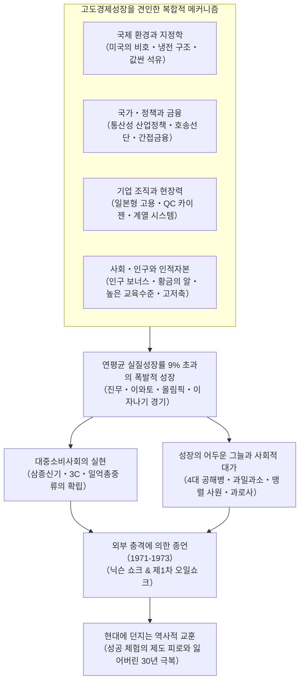
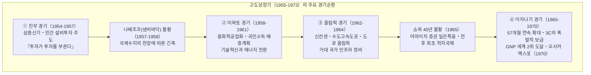
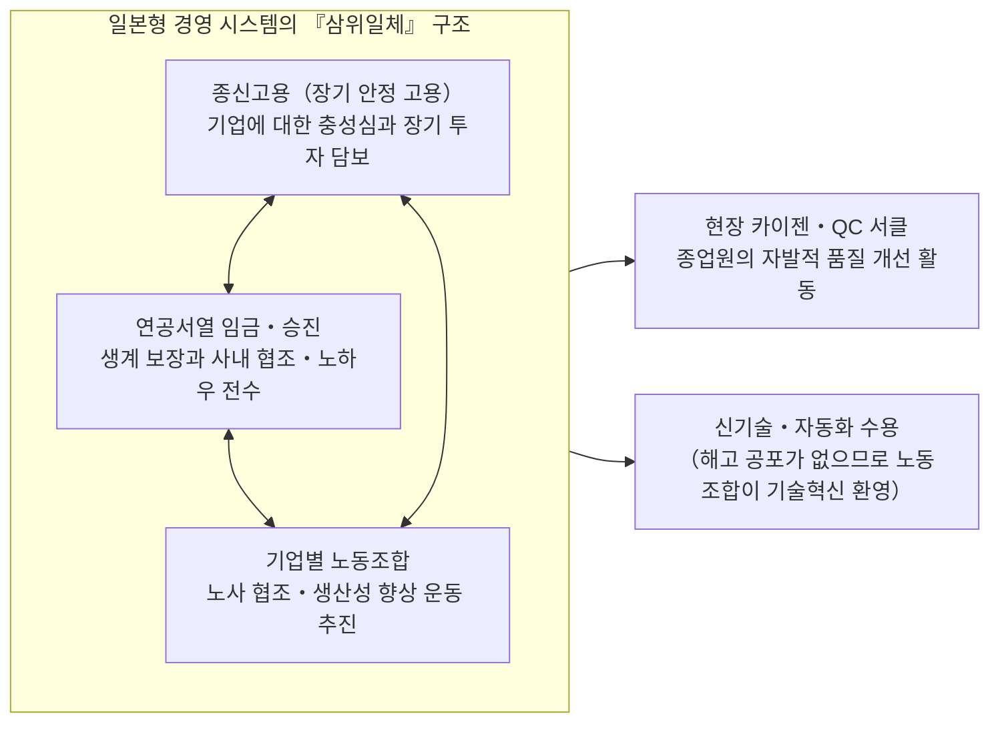
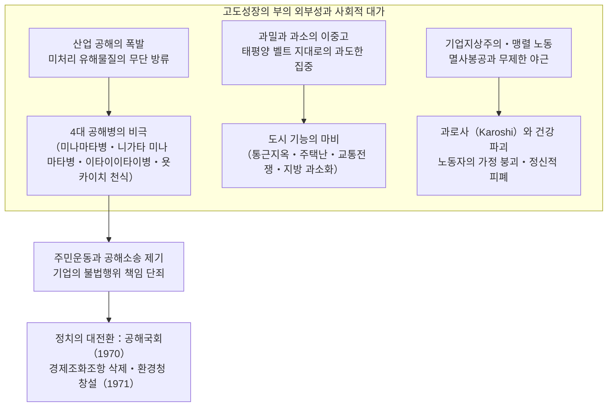

## 서론: 인류 역사상 유례없는 「경제의 기적」과 그 본질

1945년 8월 15일, 대일본제국의 무조건 항복으로 태평양전쟁이 종결되었을 때, 일본 열도는 문자 그대로 참혹한 폐허의 잿더미로 전락해 있었다. 주요 도시의 약 40%가 공습으로 괴멸되었고, 국부의 약 4분의 1(비군사 자산의 약 36%)이 잿더미로 변했다. 해외 영토를 모두 상실했고, 600만 명이 넘는 군인과 민간인 인입자(해외 거주 귀환자)들이 살 집도 일자리도 없이 국내로 쏟아져 들어왔다. 국민 대다수는 일상의 배급마저 중단되는 극도의 기아와 하이퍼인플레이션의 공포에 떨었으며, 당시 방일한 외신기자들과 연합국군 최고사령부(GHQ)의 고위 관료들은 "일본이 근대 국가로서의 자립적인 경제 수준을 회복하려면 적어도 반세기 이상의 세월이 걸릴 것이다"라고 이구동성으로 예측했다.

그러나 그 암울한 예측은 극적인 형태로 뒤집히게 되었다.

종전 후 불과 10년이 지난 1955년부터 제1차 오일쇼크가 발발하는 1973년까지의 약 20년 동안, 일본 경제는 **연평균 실질성장률 약 9.3%** 라는 인류 역사상 유례를 찾기 힘든 초고속 경제성장을 달성했다. 국민총생산(GNP)은 1955년의 약 8조 엔에서 1973년에는 약 112조 엔으로 무려 14배나 폭발적으로 팽창하였으며, 1968년에는 메이지 유신 이래의 오랜 목표였던 서구의 산업 강국 서독을 제치고 미국에 이어 **자본주의 진영 세계 2위의 경제대국** 으로 당당히 도약했다.



이 폭발적인 비약은 전 세계로부터 **「동양의 기적(Economic Miracle)」** 이라는 찬사를 받았다. 흑백TV, 전기세탁기, 전기냉장고로 대표되는 가전제품 「삼종신기」가 방방곡곡의 일반 가정에 널리 보급되었고, 이윽고 컬러TV, 쿨러(에어컨), 자동차로 구성된 「3C」로 소비 수준이 한층 고도화되었다. 국민의 생활양식은 전통적인 농촌 공동체에서 도시형 핵가족으로 불가역적인 변모를 겪었으며, 이전에 경험해보지 못한 대량생산과 대량소비의 물질적 풍요를 마음껏 향유했다. 국민의 약 90%가 스스로를 중산층으로 여기는 「일억총중류(一億総中流)」 사회가 탄생했고, 치안의 안정과 높은 교육수준을 자랑하는 세계 유수의 산업사회가 완성되었다.

그러나 이 「기적」은 결코 하늘에서 거저 떨어진 우연의 산물이 아니었다. 거기에는 전전과 전시 체제에 걸쳐 축적된 중화학공업의 기술적 기반과 관료 기구의 통제 수법, 냉전 격화라는 국제 지정학의 격변과 미국의 대일 전략 전환, 통상산업성(MITI)에 의한 정밀한 산업 육성과 대장성 주도의 금융 호송선단 방식, 종신고용과 연공서열에 지탱된 일본형 노사 관행, 그리고 「황금의 알」로 불린 젊은 노동자들의 헌신적인 근면성과 경이로운 고저축 성향이 기적적인 톱니바퀴가 되어 맞물려 돌아간 필연적 결과였다.

동시에 이 영광스러운 역사의 뒷면에는 언제나 깊고 어두운 그림자가 짙게 드리워져 있었다. 공장에서 무단 방류된 미처리 폐수와 유독 매연이 초래한 미나마타병과 욧카이치 천식을 비롯한 「4대 공해병」은 무고한 시민들의 생명과 건강을 불가역적으로 파괴했다. 농촌에서 도시로 향한 맹렬한 인구 유출은 태평양 벨트 지대에 극심한 「과밀」과 교통전쟁, 열악한 주거 환경을 초래한 반면, 지방에는 급격한 「과소화」와 1차 산업의 쇠퇴를 불러왔다. 「맹렬 사원(모레쓰 사원)」이나 「기업전사」로 불린 노동자들은 회사에 대한 멸사봉공과 끝없는 장시간 잔업을 강요당했고, 이는 훗날 **「과로사(Karoshi)」** 라는 국제적 사회 병리의 원점을 낳았다.

본고에서는 일본의 전후 고도경제성장(1955~1973년)이라는 거대한 역사적 현상의 전모를, 단순한 경기 순환의 서술을 넘어 거시경제학, 산업정책, 금융 시스템, 기업 지배구조, 사회구조, 국제 지정학, 그리고 환경 파괴와 공해 문제라는 다각적인 시좌에서 입체적으로 해부한다. 나아가 이 시대의 눈부신 성공 체험이 어째서 훗날 일본 사회를 옭아매는 「제도 피로」의 족쇄가 되어 1990년대 이후의 「잃어버린 30년」으로 이어졌는지, 21세기 경제의 재도약을 위한 깊이 있는 역사적 교훈을 도출해내고자 한다.

---

## 제1장: 폐허 속의 태동 —— 고도성장의 전사(1945〜1954년)

고도경제성장의 기점을 1955년으로 본다면, 그에 앞선 전후 10년간(1945〜1954년)은 붕괴된 국민경제의 잔해를 치우고 시장경제의 인프라를 재건하여 훗날의 로켓 발사를 가능하게 한 결정적인 도움닫기 기간이었다.

### 1.1 파멸적 패전과 하이퍼인플레이션

1945년 8월 종전 직후, 일본 경제는 기능 정지의 벼랑 끝에 몰려 있었다. 군수 생산의 중단과 해외 원자재 공급의 단절로 인해 1946년의 광공업 생산 수준은 전전(1934〜1936년 평균)의 **약 30%** 수준까지 곤두박질쳤다. 주식인 쌀 배급은 지연과 결배가 일상화되었고, 도시 주민들은 옷과 가재도구를 농촌으로 가져가 쌀과 바꾸어 먹으며 연명하는 이른바 껍질을 벗겨 먹는 「죽순 생활」을 강요당했다.

이러한 생산 붕괴에 기름을 부은 것이 바로 맹렬한 하이퍼인플레이션이었다. 일본 군부가 전쟁 말기에 남발한 임시군사비의 결제, 종전 직후 군수기업에 지급된 막대한 군수보상 채무, 나아가 구 일본군 해체에 따른 퇴직금 지급 등으로 인해 일본은행권의 발행 잔액은 천문학적인 규모로 팽창했다. 1945년 가을부터 1949년에 걸쳐 도매물가지수는 무려 **약 70배** 나 폭등했다.

정부는 이 미증유의 위기에 대처하기 위해 1946년 2월 「금융긴급조치령」을 공포했다. 모든 예금의 인출을 전면 동결하는 「예금 봉쇄」를 단행하고, 시중에 유통되던 구 지폐를 무효화하여 강제적으로 「신엔」으로 교환하는 비상수단을 썼다. 그러나 근본적인 생산 능력의 부족이 해소되지 않는 한, 물가 폭등의 악순환을 완전히 끊어낼 수는 없었다.

```
【전후 초기의 주요 경제지표 격변】
・광공업 생산 수준(1946년)：전전 기준(1934-36년=100) 대비 30.7
・도쿄 도매물가지수 상승률(1946년)：전년 대비 +364.5%
・쌀의 정규 배급량(1945년 말)：성인 1일당 2홉 1작(약 297g)으로 삭감, 잦은 배급 지연
・해외로부터의 귀환자 총수(1945〜1950년)：약 625만 명
```

이 생산 마비 상태를 타개하기 위해 도입된 타개책이 바로 도쿄대학 아리사와 히로미 교수 등이 제창한 **「경사생산방식(Priority Production System)」** 이었다(1946년 말 각료회의 결정, 1947년 본격 실시). 경사생산방식의 골자는 극도로 고갈된 국내 자원(자금, 자재, 외환, 노동력)을 자유 시장 원리에 내맡기지 않고, **「석탄」** 과 **「철강」** 이라는 2대 기간 부문에 집중적으로 배분하여, 양자의 상호 연쇄 작용을 통해 전 산업의 부흥을 견인한다는 전략이었다.

구체적으로는 국내의 석탄을 최우선으로 철강업에 공급하여 제철을 촉진하고, 증산된 철강을 다시 탄광의 갱도 지주와 채굴 기계에 우선 배분함으로써 석탄 증산을 달성한다. 이 「철과 석탄의 선순환」을 통해 생산된 잉여 생산물을 전력, 화학비료, 철도 운송 등 연관 기간산업으로 순차적으로 파급시켜 나간다는 웅대한 산업 재건 구상이었다.

이 계획을 금융 측면에서 든든하게 뒷받침한 기관이 1947년 1월에 설립된 **「복흥금융금고(훗킨)」** 였다. 복흥금융금고는 정부 보증의 복흥금융채권을 발행하고, 그 대부분을 일본은행이 직접 인수함으로써 석탄, 철강, 전력 등 기간산업에 저리의 장기 자금을 대규모로 공급했다. 1948년 말 시점에서 주요 산업 설비자금의 약 70%를 복흥금융금고 대출이 차지하기에 이르렀다.

경사생산방식은 괴멸 직전이던 기간산업의 생산 수준을 급속히 회복시키는 눈부신 성과를 거두었다. 그러나 동시에 일본은행의 복흥금융채권 직접 인수는 통화 공급량의 급격한 팽창을 초래하여, **「훗킨 인플레이션」** 이라 불리는 새로운 물가 폭등의 불길을 지피는 심각한 부작용을 낳았다.

### 1.2 닷지 라인과 샤우프 권고: 시장경제 기반의 확립

훗킨 인플레이션의 거센 위협에 직면하여 미국 정부는 대일 점령정책의 근본적인 전환을 결단하게 된다. 냉전의 격화(1949년 중화인민공화국 수립, 동서 진영 대립의 심화)를 배경으로, 미국은 일본을 「무장 해제해야 할 패전국」에서 「극동의 반공 방파제이자 자본주의의 요새」로 재규정했다. 이를 위해서는 일본 경제가 미국의 막대한 원조(GARIOA/EROA 자금)에 기대지 않고 자립적인 시장경제로 우뚝 서야만 했다.

1949년 2월, 디트로이트 은행 총재였던 **조셉 닷지(Joseph M. Dodge)** 가 공사 자격으로 방일하여 일본 경제에 가혹한 극약을 처방했다. 이것이 바로 그 유명한 **「닷지 라인(Dodge Line)」** 이다. 닷지 라인의 3대 원칙은 다음과 같았다.

1. **초균형예산 편성** : 국채 발행의 전면 금지, 적자 재정의 즉각적 시정, 세입과 세출의 엄격한 일치뿐만 아니라 과거 차입금 상환까지 포함한 「진정한 흑자 예산」의 의무화.
2. **복흥금융금고의 신규 융자 정지와 보조금 전면 폐지** : 가격차 보급금(정부가 생산 원가와 공정 가격 사이의 차액을 메워주던 막대한 보조금)의 폐지.
3. **단일 환율 설정** : 1949년 4월 25일, **1달러＝360엔** 의 단일 고정환율을 공식 설정.

그때까지 품목별로 수십 종에서 수백 종에 달하던 복잡한 복수 환율을 전면 철폐하고, 1달러=360엔이라는 단일 창구로 세계 시장과 직결시킨 조치는 일본의 수출입 기업들을 냉혹한 국제 경쟁 환경으로 내던지는 것을 의미했다. 그러나 이 1달러=360엔이라는 환율은 당시 일본의 구매력평가(PPP) 기준에서 볼 때 엔저 수준이었으며, 장기적으로는 일본의 수출 산업에 매우 유리한 무기로 작용하게 된다.

하지만 닷지 라인이 가져온 단기적 충격은 처참했다. 재정 자금의 회수와 철저한 금융 긴축으로 인해 일본 경제는 순식간에 극심한 디플레이션의 수렁에 빠졌다. 중소기업의 도산이 잇따랐고, 대기업들도 생존을 위해 대규모 인원 감축(정리해고)을 단행했다. 바로 「닷지 불황」의 도래였다. 국철과 일본전매공사를 비롯한 공기업과 민간기업에서 수십만 명의 실업자가 거리로 쏟아져 나왔고, 국철 3대 미스터리 사건(시모야마 사건, 미타카 사건, 마쓰카와 사건)으로 상징되는 흉흉한 사회적 불안이 열도를 뒤덮었다.

닷지 라인과 더불어 전후 일본 제도의 뼈대를 결정지은 것이 1949년 5월 컬럼비아대학 교수 **칼 샤우프(Carl S. Shoup)** 가 이끄는 조세사절단이 제출한 **「샤우프 권고」** 였다. 샤우프 권고는 종래의 복잡다단한 간접세 중심 세제를 해체하고, **소득세를 주축으로 하는 직접세 중심주의** 로의 대전환을 단행했다.

샤우프 세제는 청색신고 제도의 창설을 통해 근대적인 장부 기장과 회계 관행의 정착을 이끌었고, 지방세 재정의 확립(지방교부세 제도의 원형), 법인세의 합리화를 가져와 공정하고 투명한 세무 인프라를 일본 사회에 정착시켰다. 닷지 라인에 의한 거시경제적 규율과 샤우프 권고에 의한 미시적 제도 근대화라는 두 개의 강력한 기둥이 세워짐으로써, 일본은 근대 자본주의 경제를 운용하기 위한 확고부동한 제도적 토대를 비로소 손에 쥐게 된 것이다.

### 1.3 한국전쟁과 「특수」의 충격: 자본 축적의 기폭제

닷지 불황으로 일본 경제가 질식할 위기에 처해 있던 1950년 6월 25일, 이웃한 한반도에서 **한국전쟁** 이 발발했다. 이 전쟁은 한반도에는 씻을 수 없는 비극이었으나, 빈사 상태에 빠져 있던 일본 경제에는 극적인 기사회생의 전기를 마련해준 구세주가 되었다. 당시 요시다 시게루 총리가 무심코 「천우(하늘이 내린 행운)」라고 읊조렸다는 일화가 전해지는 까닭이다.

유엔군(실질적으로는 미군)의 출동에 따라 전장과 가장 가까운 공업 선진국이었던 일본에 막대한 물자 조달과 용역 제공 주문이 쏟아져 들어왔다. 이것이 바로 **「조선특수(특수 경기)」** 였다.

미군이 발주한 특수 품목은 실로 광범위했다.
- **군수물자・철강제품** : 트럭, 지프, 드럼통, 철조망, 가시철사, 무기 부품, 탄약통
- **섬유・일용품** : 군복, 마대, 모포, 텐트용 캔버스 천, 군화
- **용역(서비스)** : 파손된 군용 차량 및 항공기의 수리・오버홀, 병참 수송, 통신 지원

특수로 인한 외환 수입은 1950년부터 휴전협정이 체결되는 1953년까지 4년간 **누적 약 24억 달러** (당시 일본 연간 수출 총액의 약 60%에 필적)에 달했다. 이 막대한 달러 자금의 유입 덕분에 일본이 오랫동안 시달려온 고질적인 외환 부족 문제는 일거에 해소되었다.

```
【한국전쟁 특수가 일본 경제에 미친 정량적 영향(1950-1953년)】
・특수 계약 총액：약 24억 달러(직접 특수＋주둔군 장병의 사적 소비)
・실질 GDP 성장률：1950년도 +10.8%, 1951년도 +12.3%, 1952년도 +10.0%, 1953년도 +7.3%
・광공업 생산지수：1950년 1년여 만에 약 70% 급등하여, 1951년에는 전전 수준(1934-36년 기준)을 완전 회복
・기업 수익의 극적 개선：주요 제조업의 매출액 이익률이 1950년 하반기에 전후 최고 수준 기록
```

특수의 의의는 단순한 재고 처분 차원의 반짝 거품에 그치지 않았다.
첫째, 군용 트럭의 대량 수리와 제작 과정을 통해 일본 자동차 산업(도요타자동차, 닛산자동차, 이스즈자동차 등)은 미군의 엄격한 품질관리 기준(MIL-SPEC)을 전수받았고, 부품의 호환성과 대량생산 관리 기술을 비약적으로 끌어올렸다. 둘째, 특수로 벌어들인 막대한 이익은 기업 내부에 사내유보금으로 축적되어, 뒤이어 전개될 고도성장기의 대규모 설비투자(최신예 제철소 신설, 최첨단 공작기계 수입)를 위한 자기자본으로 값지게 활용되었다.

### 1.4 샌프란시스코 체제와 「이제 전후는 아니다」

1951년 9월, 일본은 샌프란시스코 강화조약과 미일안전보장조약에 서명했고, 이듬해인 1952년 4월 28일 조약이 발효되면서 7년에 걸친 연합국군의 점령 통치에 종지부를 찍고 국가 주권을 회복했다.

독립을 되찾은 일본은 냉전 체제하의 미국 진영(서방 자유주의 진영)에 명확히 편입되었다. 요시다 시게루 총리가 주도한 외교・안보 기조, 즉 **「요시다 독트린」** 은 일본의 국가 목표를 지극히 실리적인 방향으로 수렴시켰다. 즉, "국가의 안보 문제는 미일안보조약과 미군의 군사력에 전면 의존하고, 자국의 재군비 및 방위비 지출은 GNP 대비 1% 미만의 최소한으로 억제하며, 국가의 모든 인재와 자금, 에너지를 경제 부흥과 통상 확대에 집중 투입한다"는 전략이었다. 이 선택은 일본 기업들에 군사비 재정 부담에서 해방된 최적의 경영 환경을 보장해주었다.

1953년 한국전쟁 휴전에 따라 특수 수요가 걷히면서 일시적인 경기 후퇴를 겪기도 했으나, 일본 경제의 밑바닥에서는 이미 설비투자를 축으로 하는 자율적인 확대 사이클이 힘차게 회전하기 시작하고 있었다. 1955년에는 기후 혜택에 따른 농업 대풍작과 세계 무역의 호황을 배경으로, 물가가 안정된 상태에서 경제가 성장하는 「수량 경기」가 화려하게 막을 올렸다.

이 역사적 전환점을 가장 선명하게 선언한 문서가 바로 쇼와 31년(1956년)도 경제기획청이 펴낸 『경제백서』였다. 내각부 경제기획청 조사국 내국조사과장이었던 **고토 요시노스케** 등이 집필한 결어의 한 구절은 전후 일본을 상징하는 불멸의 명문이 되었다.

> **"이제 '전후'는 아니다. 우리는 지금 전혀 다른 사태에 직면하려 하고 있다. 복구를 통한 성장은 끝났다. 앞으로의 성장은 근대화에 의해 뒷받침된다."**

이 말이 담고 있던 뜻은 단순한 부흥의 자축이 아니었다. 전전의 수준을 회복하는 캐치업 단계는 완료되었다. 이제부터는 외국의 차관이나 원조, 혹은 전쟁 특수와 같은 외부적 요인에 기댈 수 없다. 최신 기술혁신(자동화 제어, 고분자화학, 트랜지스터, 대용량 화력발전)을 적극 도입하여 산업구조 자체를 전근대적인 경공업에서 근대적인 중화학공업으로 전환하지 않으면 국제시장의 경쟁에서 도태되고 말 것이라는 비장한 위기의식의 표명이었다.

그리고 일본 경제는 이 백서의 경고를 아득히 뛰어넘는 무서운 역동성을 발휘하며, 인류 역사상 최대 규모의 「근대화 실험」 속으로 질주해 들어가게 된다.

## 제2장: 경기순환과 고도성장의 크로니클(1955〜1973년)

1955년부터 1973년까지의 약 18년 동안, 일본 경제가 시종일관 직선적으로만 팽창했던 것은 아니다. 실제로는 설비투자의 폭발과 소비 붐이 이끄는 「호황기」와, 그에 수반된 수입 급증으로 외환보유액이 바닥나 금융 긴축을 단행해야 했던 「불황기(긴축기)」라는 역동적인 경기순환을 거듭하면서 계단을 뛰어오르듯 경제 규모를 키워나갔다.

당시 일본은 「1달러＝360엔」의 고정환율제를 채택하고 있었으며, 중앙은행이 보유한 금・외환보유액에는 언제나 한계가 있었다. 경기가 과열되면 원자재와 기계류의 수입이 급증하여 국제수지가 적자로 돌아섰고, 외환이 바닥날 위기에 처하면 일본은행이 기준금리(공정보합)를 인상하여 경기를 강제로 진정시켜야 했다. 이 순환 메커니즘은 당시 **「국제수지의 천장」** 이라 불렸으며, 일본 거시경제 운용에서 가장 중대한 제약조건이었다.

아래에서는 고도경제성장을 화려하게 수놓았던 5대 주요 경기순환의 궤적을 상세히 살펴본다.



### 2.1 진무 경기(1954〜1957년)와 나베조코 불황: 설비투자의 연쇄반응

1954년 11월부터 시작된 경기 확장은 초대 천황인 진무천황이 즉위한 이래 초유의 번영이라는 의미를 담아 **「진무 경기」** 로 명명되었다.

이 호황을 견인한 가장 강력한 기관차는 민간기업들의 폭발적인 **설비투자** 였다. 철강, 조선, 합성섬유, 석유화학, 전기기계 등 주요 기간산업들이 일제히 최첨단 대형 플랜트와 기계 도입에 뛰어들었다. 이 현상을 날카롭게 포착한 것이 쇼와 32년(1957년)도 경제백서의 유명한 명문구인 **「투자가 투자를 부른다」** 였다.

철강업체가 설비를 확장하면 기계 제조업체에 공작기계 주문이 쏟아지고, 기계 제조업체가 생산을 늘리기 위해 새 공장을 지으면 다시 철강과 시멘트 수요가 폭등했다. 이러한 산업 연관에 의한 수요의 자기 증식 사이클이 경제 전체를 수직 상승시켰다.

동시에 소비 현장에서는 「생활혁명」의 막이 올랐다. 흑백TV, 전기세탁기, 전기냉장고라는 **「삼종신기」** 가 도시 중산층을 중심으로 빠르게 보급되기 시작했다. 가사노동의 획기적인 경감과 대중오락의 시각화는 가정생활의 풍경을 완전히 탈바꿈시켰다.

그러나 1957년에 접어들자 과열의 대가가 수면 위로 드러났다. 원자재 수입 급증으로 무역수지가 급속히 악화되었고 외환보유액이 바닥을 드러냈다. 「국제수지의 천장」에 정면충돌한 것이다. 일본은행은 잇달아 기준금리를 인상하며 강력한 금융 긴축을 단행했다. 이로 인해 경기는 급속히 얼어붙었고, 철강과 섬유 시세가 폭락하면서 1957년 후반부터 1958년에 걸쳐 바닥을 기는 **「나베조코(냄비바닥) 불황」** 이라는 정체기에 진입했다. 그러나 설비투자의 근본적 동력은 꺾이지 않았으며, 경기는 비교적 신속하게 바닥을 치고 반등했다.

### 2.2 이와토 경기(1958〜1961년)와 국민소득 배증계획: 중화학공업화의 폭발

나베조코 불황을 딛고 1958년 7월부터 시작된 새로운 확장 국면은, 진무천황보다 더 거슬러 올라가 태양신 아마테라스 오오미카미가 천위의 바위동굴(이와토)에 숨은 이래 최대의 호황이라는 뜻에서 **「이와토 경기」** 라 불렸다. 이 기간 일본의 실질 GDP 성장률은 **연평균 11.3%** 라는 경이적인 수치를 기록했다.

이와토 경기의 핵심은 일본의 산업구조가 경공업(섬유, 잡화 등)에서 본격적인 **중화학공업(철강, 석유화학, 자동차, 중전기)** 으로 확실하게 주역 교체를 완료했다는 점에 있다. 에너지 혁명이 진행되어 산업의 주 연료가 「석탄」에서 중동의 값싸고 질 좋은 「석유」로 급격히 전환되었다. 태평양 연안(도쿄만, 이세만, 세토내해 등)의 임해부에는 대규모 간척지를 활용한 거대한 최신예 제철소와 석유화학 콤비나트가 잇달아 웅장한 모습을 드러냈다.

정치적으로도 커다란 전기가 마련되었다. 1960년, 미일안전보장조약 개정을 둘러싸고 국회의사당 주변을 수십만 명의 시위대가 에워싸는 전후 최대의 정치 소요인 「안보투쟁」이 발발했다. 극심한 사회적 혼란의 책임을 지고 기시 노부스케 내각이 퇴진하자, 정권을 이어받은 **이케다 하야토** 총리는 국민의 시선을 이념 대립에서 경제성장으로 단숨에 돌려놓는 획기적인 정책을 발표했다. 그것이 바로 **「국민소득 배증계획」** (1960년 12월 각료회의 결정)이었다.

대장성 관료 출신 경제학자 시모무라 오사무 등의 이론적 뒷받침을 받은 이 계획은, " **향후 10년 이내(1961〜1970년)에 실질 국민총생산(GNP)을 2배로 늘리고, 완전고용을 달성하여 국민 생활수준을 서구 선진국 수준으로 끌어올린다** "는 웅대한 목표를 내걸었다. 목표 달성을 위해서는 연평균 7.2%의 고성장이 요구되었기에, 당초 야당과 주류 경제학자들은 "현실성 없는 허풍"이라며 맹비난을 퍼부었다.

그러나 결과는 모두의 예상을 아득히 뛰어넘는 압도적 대성공이었다. 기업의 투자 의욕은 용광로처럼 달아올랐고, 불과 4년여 만에 소득 배증 목표를 조기 초과 달성해 버린 것이다. 이케다 내각의 「관용과 인내」, 「월급 2배」라는 밝고 희망찬 슬로건은 패전의 상처를 안고 살아가던 일본 국민에게 강력한 성장 확신과 자신감을 심어주는 결정적인 심리적 기폭제가 되었다.

### 2.3 올림픽 경기(1962〜1964년)와 인프라 혁명

이와토 경기 이후 다시 국제수지 악화에 따른 짧은 조정을 거쳐, 1962년 후반부터 시작된 흐름이 바로 **「올림픽 경기」** 였다. 아시아 최초로 개최되는 제18회 올림픽 경기대회(1964년 10월 개최 도쿄 올림픽)의 성공을 위해 국가의 총력을 기울인 초대형 인프라 프로젝트들이 전격 추진되었다.

이 시기 투입된 인프라 관련 예산은 도로, 철도, 도시 정비를 합쳐 당시 국가 1년 치 예산 규모에 육박하는 약 1조 엔 규모에 달했다.
- **도카이도 신칸센** : 1964년 10월 1일 개통. 도쿄와 신오사카 사이를 최고시속 210km, 불과 4시간(이듬해 3시간 10분) 만에 주파하는 세계 최초의 고속철도가 탄생하여 일본의 국토 대동맥을 근본적으로 재편했다.
- **메이신 고속도로・수도고속도로** : 일본 최초의 도시 간 고속도로인 메이신 고속도로(1963년 일부 개통, 1965년 전 구간 개통)와, 과밀 도시 도쿄의 상공을 거미줄처럼 가로지르는 수도고속도로망이 신속하게 건설되었다.
- **도시 환경의 전면 혁신** : 하네다 공항과 도심을 직결하는 도쿄 모노레일, 지하철 히비야선 전 구간 개통, 호텔 뉴오타니를 비롯한 대형 현대식 호텔들의 잇단 건립, 나아가 하수도 정비와 도시 미화 작업이 대대적으로 전개되었다.

방송 분야에서도 개막식과 주요 경기를 실시간으로 시청하기 위해 컬러TV 보급이 본격화되었고, 통신위성(신컴 3호)을 통한 사상 첫 미일 간 태평양 횡단 위성 생중계가 성공하면서 기술입국 일본의 위상이 전 세계에 강렬하게 각인되었다.

### 2.4 증권불황(1965년・쇼와 40년 불황)의 충격과 정책적 대전환

그러나 올림픽의 뜨거운 열기가 가라앉자마자 일본 경제는 고도성장기 전체를 통틀어 가장 냉혹한 시련에 직면했다. 1965년, 이른바 **「쇼와 40년 불황(증권불황)」** 이었다.

올림픽 특수를 겨냥해 경쟁적으로 증설되었던 생산 설비들은 수요가 한풀 꺾이자마자 거대한 잉여 설비로 둔갑했고, 기업 도산 건수는 전후 최고치를 경신했다. 특히 전후 급격히 팽창했던 증권시장이 직격탄을 맞아 주가가 폭락했으며, 4대 증권사의 일축이었던 **야마이치 증권** 이 천문학적인 손실을 떠안고 사실상 파산 위기에 몰렸다.

연쇄 도산에 따른 금융 시스템 붕괴와 대공황을 막기 위해 당시 **다나카 가쿠에이** 대장대신과 우사미 마코토 일본은행 총재는 지극히 이례적인 초법규적 조치를 결단했다. 일본은행법 제25조에 근거한 **「무제한・무담보 특별융자(일은특융)」** 를 야마이치 증권에 전격 발동하여 객장으로 몰려든 예금자와 투자자들의 공황을 잠재운 것이다.

나아가 일본 정부는 전후 재정을 엄격히 옭아매 오던 재정법 제4조의 「균형재정주의(국채 발행 금지)」라는 닷지 라인 이래의 금기를 깨고, 1965년도 보정예산에서 전후 최초로 **「특례국채(적자국채)」** 발행을 단행했다. 이 케인스주의적 재정 확장 정책(공공사업 추가 투자와 감세)은 얼어붙은 민간 수요를 강력하게 떠받치며 불황을 조기에 탈출시키는 결정타가 되었다. 이 위기 극복의 성공 경험은 이어지는 전후 최장의 황금기를 활짝 열어젖히게 된다.

### 2.5 이자나기 경기(1965〜1970년): 황금의 57개월과 세계 2위 도달

쇼와 40년 불황의 바닥을 친 1965년 11월부터 1970년 7월까지 장장 5년에 걸쳐 이어진 유례없는 대번영이 바로 **「이자나기 경기」** 였다. 일본의 국토 창조신 이자나기노미코토의 이름을 딴 이 호황은 연속 **57개월** 동안 이어지며 당시 전후 최장 기록을 큰 폭으로 경신했다.

이자나기 경기를 주도한 것은 막강한 수출 경쟁력과 질적으로 도약한 대중소비였다. 소비의 주역은 삼종신기에서 **「3C」** 로 업그레이드되었다.
- **컬러TV(Color TV)**
- **쿨러(Cooler: 룸 에어컨)**
- **자동차(Car: 자가용 승용차)**

도요타의 코롤라와 닛산의 써니 등 서민형 대중차가 잇달아 출시되면서 마이카 붐과 모터리제이션의 물결이 열도 전역을 휩쓸었다. 일본의 제조업은 철저한 공정 관리와 품질 개선을 통해 과거 「싸구려 저질」이라는 오명을 완벽히 벗어던졌고, 잔고장이 없고 성능이 뛰어난 메이드 인 재팬(Made in Japan) 제품들이 세계 시장을 장악하기 시작했다.

그리고 1968년, 일본 근현대사에서 결정적인 금자탑이 세워졌다. 일본의 명목 GNP(국민총생산)가 **약 1,419억 달러** 에 달하여 서독을 제치고 미국에 이어 **자본주의 세계 2위의 경제대국** 으로 도약한 것이다. 메이지 유신으로부터 정확히 100년이 되는 해에, 아시아의 패전국이 구미 열강을 모두 제치고 세계의 정점에 우뚝 선 역사적 순간이었다.

1970년에는 아시아 최초의 국제박람회인 **「일본만국박람회(오사카 엑스포)」** 가 「인류의 진보와 조화」를 테마로 센리 구릉에서 성대하게 개최되었다. 오카모토 타로의 거대 조형물 「태양의 탑」이 우뚝 솟은 박람회장에는 6개월 동안 무려 **6,421만 명** 이라는 경이적인 인파가 몰려들었다. 미국관의 「달의 암석」과 무빙워크, 파빌리온들이 선보인 미래도시의 비전은 전후 부흥의 완전한 달성과 풍요를 거머쥔 일본의 영광을 상징하는 역사의 한 페이지로 사람들의 뇌리에 깊이 각인되었다.

```
【고도경제성장기 주요 거시경제지표 추이(1955-1973년도)】
```

| 년도 | 실질 GDP 성장률 (%) | 명목 GNP (억 엔) | 경기 국면 / 주요 역사적 마일스톤 |
| :---: | :---: | :---: | :--- |
| **1955** | **+10.8** | 88,646 | 진무 경기 개막, 삼종신기 보급 시작 |
| **1956** | **+6.2** | 98,719 | 경제백서 "이제 전후는 아니다" 발표, 유엔 가입 |
| **1957** | **+7.8** | 111,280 | 나베조코 불황, 국제수지의 천장 직면 |
| **1958** | **+5.6** | 118,527 | 이와토 경기 개막, 도쿄타워 준공 |
| **1959** | **+11.2** | 134,228 | 황태자(현 상황 폐하) 결혼 퍼레이드, TV 보급 가속 |
| **1960** | **+12.5** | 160,332 | 안보투쟁, 이케다 내각 「국민소득 배증계획」 책정 |
| **1961** | **+12.0** | 196,442 | 중화학공업화 본격 진전, 에너지 혁명 전개 |
| **1962** | **+8.9** | 220,119 | 올림픽 경기 개막, 센리 뉴타운 입주 시작 |
| **1963** | **+10.7** | 256,419 | 메이신 고속도로 개통(릿토〜아마가사키) |
| **1964** | **+13.1** | 295,444 | 도쿄 올림픽 개최, 도카이도 신칸센 개통, OECD 가입 |
| **1965** | **+5.8** | 328,217 | 쇼와 40년 불황(증권불황), 야마이치 증권 특융, 첫 적자국채 발행 |
| **1966** | **+10.6** | 382,900 | 이자나기 경기 본격화, 마이카 원년(코롤라・써니 출시) |
| **1967** | **+11.1** | 446,953 | 3C 급속 보급, 공해대책기본법 공포 |
| **1968** | **+12.2** | 528,781 | **일본 GNP 서독 추월, 자본주의 세계 2위 도달** |
| **1969** | **+12.5** | 622,464 | 도메이 고속도로 전 구간 개통, 컬러TV 보급 폭발 |
| **1970** | **+10.7** | 733,449 | 오사카 엑스포 개최(관람객 6,421만 명), 공해국회 개원 |
| **1971** | **+5.0** | 809,726 | 닉슨 쇼크, 스미소니언 협정(1달러=308엔) |
| **1972** | **+9.1** | 954,646 | 다나카 가쿠에이 내각 「일본열도개조론」 제창, 중일 국교정상화 |
| **1973** | **+5.1** | 1,125,487 | 변동환율제 전환, 제1차 오일쇼크, 「광란물가」 직면 |
| **1974** | **-1.2** | 1,348,229 | **전후 최초 마이너스 성장 기록, 고도경제성장기의 완전한 종언** |

## 제3장: 왜 「기적」은 일어났는가 —— 다각적 메커니즘의 해부

일본의 고도경제성장은 결코 자유방임주의(Laissez-faire)에 입각한 시장 원리만으로 달성된 것도 아니며, 단순히 국민이 부지런했다는 식의 정신론만으로 설명될 수 있는 성질의 것도 아니다. 거기에는 국가의 정밀한 산업 유도, 독특한 금융 시스템, 견고한 노사 관행, 생산 현장의 품질관리 혁신, 축복받은 인구 통계학적 보너스, 그리고 냉전 구조라는 국제 환경의 거대한 순풍이 완벽한 시너지를 발휘한, 극도로 정교한 **「일본형 자본주의 모델」** 의 성립이 자리 잡고 있었다.

본 장에서는 고도성장을 견인한 6가지 핵심 구조적 메커니즘을 심층 해부한다.



### 3.1 산업정책과 국가의 조타술: 통산성(MITI)의 타깃 인더스트리 전략

미국의 정치학자 찰머스 존슨(Chalmers Johnson)은 그의 저서 『통산성과 일본의 기적』에서, 현대 국가의 유형으로서 미국과 같은 「규제지향형 국가(Regulatory State)」와 대비되는 개념으로, 국가가 전략적 목표를 설정하고 경제 발전을 강력히 주도하는 **「발전지향형 국가(Developmental State)」** 라는 모델을 제시하며 그 전형으로 일본 통상산업성(MITI)을 꼽았다.

통산성이 전개한 산업정책의 근간은, 정태적인 비교우위론(현재 시점에서 우위에 있는 산업에 특화해야 한다는 전통 경제학 이론)을 의도적으로 무시하고, 미래 세계 시장에서 거대한 수요가 예상되는 산업을 국가가 선견지명으로 선정하여 집중 육성하는 **「타깃 인더스트리 정책(중점산업육성책)」** 에 있었다. 전후 직후의 일본이 전통적 비교우위론에만 안주했다면, 값싼 노동력을 무기로 한 섬유나 일용잡화 수출국에 머물렀을 것이다. 그러나 통산성 관료들은 자본집약적이자 기술집약적인 **철강, 조선, 석유화학, 자동차, 기계, 전자공업** 을 국가 전략산업으로 지정하고 총력을 다해 육성했다.

이 산업 유도를 가능하게 한 구체적 정책 수단들은 다음과 같았다.

1. **외환예산 배분권(외국환 및 외국무역관리법)** :
   당시 귀중한 외환(미 달러)은 국가의 엄격한 통제하에 놓여 있었다. 통산성은 자신이 지정한 육성 산업의 기업들에 최우선으로 외환을 배정하여, 서구의 최신예 플랜트와 핵심 특허 기술(연속 스트립밀 압연 기술, 고분자화학 특허, 첨단 공작기계 등)의 도입을 전폭 지원했다. 반면 비중요 산업이나 소비재 수입에는 외환 배정을 철저히 억제하여 국내 시장을 외국 거대 기업의 공세로부터 보호하는 방파제 역할을 수행했다.
2. **일본개발은행(개은)에 의한 정책금융의 「마중물 효과(시그널링 효과)」** :
   정부계 금융기관인 일본개발은행이 특정 대형 프로젝트(임해 제철소 건설, 석유화학 콤비나트 조성 등)에 협조 융자를 결정하면, 민간 시중은행들은 이를 '정부가 보증한 가장 안전한 국가 프로젝트'로 판단하고 앞다투어 막대한 민간 자금을 공급했다. 이러한 개은 융자의 마중물 효과가 천문학적인 민간 자금을 중화학공업으로 정확히 유도했다.
3. **관민 협조와 설비투자 조정** :
   완전 자유 경쟁에 맡겨둘 경우 각 기업이 일제히 무리한 설비투자를 감행하여 공급과잉(과당경쟁)에 빠질 위험이 컸다. 통산성은 제철업계와 석유화학업계 등의 최고경영자들을 한자리에 모은 「관민협조간담회」를 주도하여, 신설 고로의 착공 순서와 생산 쿼터를 사실상의 합법적 카르텔 방식으로 조율했다. 이를 통해 기업들은 대규모 투자에 따르는 시장 위험을 최소화하면서 세계 최대 규모의 최신식 대형 플랜트를 건설할 수 있었다.

### 3.2 금융 시스템의 연금술: 간접금융 우위와 호송선단방식

고도경제성장기 설비투자의 맹렬한 에너지를 자금 측면에서 떠받친 것은 일본 특유의 금융 구조였다.

서구 선진국에서는 기업의 설비투자 자금을 주로 주식이나 회사채 발행(직접금융) 혹은 사내유보금으로 조달하는 것이 일반적이다. 그러나 전후 일본 기업들은 전쟁으로 인한 자본 소실과 지나치게 빠른 투자 확장 탓에 자기자본비율이 극도로 낮았다. 이에 따라 채택된 대안이 은행 대출을 중심으로 하는 **「간접금융 방식」** 이었다.

이 독특한 금융 메커니즘은 다음 세 가지 특징으로 정의된다.

- **메인뱅크제** :
   대기업들은 특정 주요 거래은행(미쓰이, 미쓰비시, 스미토모, 후지, 다이이치간교, 산와 등의 시중은행 혹은 일본흥업은행 등의 장기신용은행)과 끈끈한 공생 관계를 구축했다. 메인뱅크는 단순히 자금을 빌려주는 데 그치지 않고, 주식 상호보유를 통해 장기적인 우호 주주가 되어주었으며, 임원을 파견하고 기업의 재무 상태를 상시 모니터링했다. 덕분에 기업들은 단기적인 주가 변동이나 분기 실적에 연연하지 않고, 5년에서 10년 앞을 내다본 대규모 설비투자를 과감하게 단행할 수 있었다.
- **오버 보로잉(기업의 초과 차입)과 오버 론(은행의 초과 대출)** :
   기업들은 자기자본을 훨씬 웃도는 거액을 은행에서 빌려 썼고(오버 보로잉), 시중은행들은 수신한 예금 총액을 초과하는 대출을 기업에 집행한 뒤 그 부족 자금을 일본은행으로부터 차입하여 충당했다(오버 론). 일본은행은 기준금리 조절과 강력한 **「창구지도(각 은행별 분기 대출 증가액을 직접 통제하는 행정지도)」** 를 통해 거시경제의 자금 공급 밸브를 쥐락펴락했다.
- **호송선단방식과 저금리 정책** :
   대장성(현 재무성 및 금융청)은 시장 금리보다 의도적으로 낮게 금리를 묶어두는 「임시금리조정법」을 운용하여 기업들의 자금 조달 비용을 파격적으로 낮춰주었다. 동시에 가장 경영 기반이 취약한 최하위 은행조차도 결코 도산하지 않도록, 행정지도를 통해 전 금융기관의 예금금리, 점포 신설, 업무 범위를 획일적으로 규제했다. 함대에서 가장 속도가 느린 군함에 맞춰 선단 전체의 항해 속도를 결정하는 해군 전술에 빗대어 **「호송선단방식」** 이라 불린 이 제도는, 금융기관에 대한 국민의 절대적인 신뢰를 형성하여 금융위기의 발생 가능성을 사전에 완벽히 차단했다.

여기에 절대 빼놓을 수 없는 것이 바로 **「재정투융자(FILP)」** 의 존재였다. 국민들이 우체국에 맡긴 우편저금과 후생연금・국민연금의 막대한 적립금은 대장성 자금운용부에 집약되어, '제2의 국가 예산'으로서 일본개발은행, 일본도로공단, 주택금융공고, 국철 등에 집중 투입되었다. 세금에만 의존하지 않는 이 막대한 국책 정책금융이 도카이도 신칸센, 메이신 고속도로, 기간 철강 및 에너지 인프라 건설을 강력하게 견인했다.

### 3.3 일본형 고용 관행의 확립: 「삼위일체」 노사관계의 제도적 기능

고도경제성장을 산업 현장에서 지탱한 것은, 전후 복구기의 극렬한 노동쟁의(1953년 닛산 파업, 1960년 미이케 탄광 분규 등)의 아픔과 타협을 거치며 정착된 **「일본형 고용 관행(일본적 경영)」** 이었다. 미국의 사회학자 제임스 아베글렌(James Abegglen)이 그의 명저 『일본의 경영』에서 갈파했듯이, 이 시스템은 다음 세 가지 굳건한 축으로 이루어져 있었다.

1. **종신고용 제도(장기 안정 고용 보장)** :
   기업이 신규 졸업자를 정기 채용하여 정년퇴직할 때까지 해고하지 않는 관행. 기업 입장에서는 직원에게 투입한 막대한 직무훈련(OJT) 비용을 장기적으로 회수할 수 있었고, 노동자에게는 가정 생계의 절대적인 안정성이 주어졌다.
2. **연공서열형 임금・승진 체계** :
   연령과 근속연수에 비례하여 직급과 급여가 계단식으로 자동 상승하는 구조. 청년기에는 업무 기여도에 비해 임금이 낮게 억제되지만, 결혼, 자녀 양육, 주택 장만 등 목돈이 들어가는 중장년기에 접어들면 두터운 보수가 지급되도록 설계되어 있어 생애주기별 지출 흐름과 완벽히 맞아떨어졌다. 또한 청년층의 낮은 임금은 기업의 자본 축적에 결정적으로 기여했다.
3. **기업별 노동조합(Enterprise Union)** :
   서구의 직종별・산업별 횡단 노동조합과 달리, 개별 기업 단위로 정규직 직원들이 결성한 조합 형태. 노조 간부 역시 사원 신분이었기에 "회사의 번영 없이는 노동자의 몫(임금 인상과 성과급)도 없다"는 강한 공동체 의식을 공유했다.

이 「삼위일체」 고용 관행은 생산 현장의 기술혁신 수용 과정에서 가공할 위력을 발휘했다.

서구의 직종별 노조 체제에서는 새로운 자동화 기계나 노동 절약형 신기술이 도입되면 자신의 일자리가 사라져 해고당할 위험이 있었기에, 노동자들은 기계 도입에 결사적으로 저항(태업이나 파업)하는 것이 일반적이었다. 그러나 종신고용이 철저히 보장된 일본의 대기업에서는, 신기술 도입으로 특정 생산 라인이 자동화되더라도 노동자가 해고되는 일 없이 사내의 다른 부서나 신설 공정으로 재배치(전환 배치 및 재교육)될 뿐이었다.

따라서 노동자와 노조는 최신 기술 도입에 저항하기는커녕, 오히려 "회사의 경쟁력이 높아져야 상여금을 더 많이 받는다"며 **자동화 설비와 산업용 로봇의 도입을 열렬히 환영** 했던 것이다.

나아가 1955년부터 정례화된 **「춘투(봄철 임금인상 투쟁)」** 는 주요 기간산업(철강, 전기, 조선, 자동차 등) 노조들이 보조를 맞춰 매년 봄 공동으로 임금 인상을 요구하고 사측과 교섭하는 제도였다. 철강 등 주력 산업에서 타결된 임금 인상률이 일종의 기준선(벤치마크)이 되어 전 산업과 중소기업으로 일제히 파급되었다. 춘투를 통해 전국의 노동자 임금이 매년 10% 안팎으로 꾸준히 인상되었고, 이는 거대한 국내 소비시장을 지속적으로 팽창시켜 기업의 대규모 설비투자를 회수시키는 완벽한 거시경제적 내수 선순환 사이클을 완성했다.

다만 이 아름다운 노사 협력의 이면에는, 대기업 정규직의 고용 안정을 지탱하는 위험 완충장치로서 가혹한 저임금과 고용 불안을 감내해야 했던 수많은 **「하청・재하청 중소기업」** 과 **「임시공・사외공」** 이 존재했다는 '이중구조'의 냉혹한 현실 또한 결코 간과해서는 안 된다.

### 3.4 현장력과 이노베이션: QC 서클과 카이젠(Kaizen) 운동

일본 제조업이 서구 기술의 단순 모방에서 탈피하여 세계 최고 수준의 품질과 압도적인 원가 경쟁력을 쟁취하게 된 원동력은, 제조 현장의 바닥에서 일어난 **「품질관리 혁명」** 이었다.

전전의 일본 공산품은 해외 시장에서 「싸구려 저질(Cheap and Nasty)」의 대명사로 통했다. 종전 직후, 일본 제품의 열악한 품질을 시급히 개선해야 한다고 판단한 GHQ는 미국으로부터 통계적 품질관리의 세계적 권위자인 **W. 에드워즈 데밍(W. Edwards Deming)** 박사를 초빙했다. 1950년 일본과학기술연맹(일과련)의 초청으로 방일한 데밍 박사는 생산 공정에서의 통계적 기법(PDCA 사이클의 원형)과 품질관리의 중요성을 일본 경영진과 엔지니어들에게 열정적으로 전수했다.

일본의 기술자들은 이 가르침에 깊은 감명을 받았고, 일과련은 데밍 박사가 기증한 인세를 기금으로 삼아 **「데밍상」** 을 제정했다. 일본 기업들은 앞다투어 데밍상 수상을 목표로 내걸고 전사적 품질관리(TQC) 운동에 뛰어들었다.

그러나 일본 기업의 진정한 독창성은, 미국에서 수입된 엘리트 중심의 하향식 통계 관리를 현장 작업자들이 주체적으로 참여하는 상향식 풀뿌리 대중운동으로 탈바꿈시켰다는 데 있다. 그것이 바로 1962년 무렵부터 전국 공장으로 들불처럼 번져나간 **「QC 서클(품질관리 소집단)」** 이었다.

공장 현장 근로자들이 5~10명 규모의 소그룹(서클)을 결성하여, 업무 시간 외나 휴식 시간을 활용해 자발적으로 모였다. 그들은 특성요인도(생선뼈 다이어그램)나 파레토 차트 같은 알기 쉬운 분석 도구를 활용하여 불량품의 발생 원인을 치밀하게 규명하고, 작업 공정의 개선안(카이젠)을 직접 고안해 실행에 옮겼다. 효과가 입증된 개선안은 즉시 표준 작업 매뉴얼에 반영되었고, 우수한 성과를 낸 서클은 사내와 전국 대회에서 대대적인 표창을 받았다. 이 운동을 통해 말단 조립 라인의 근로자에 이르기까지 "우리가 세계 최고의 제품 품질을 빚어낸다"는 드높은 직업적 자부심과 자율적인 문제해결 역량이 길러졌다.

이 현장주의의 정점에 선 기념비적 체계가 바로 도요타자동차의 부사장 오노 다이이치 등이 완성한 **「도요타 생산방식(TPS / Toyota Production System)」** 이었다.
- **저스트 인 타임(Just In Time)** : "필요한 물건을, 필요한 때에, 필요한 만큼만" 생산하여 공장 내 재공품과 창고 재고를 극단적으로 제로에 가깝게 유지한다.
- **간판 방식(Kanban)** : 후공정이 사용한 부품만큼만 전공정에서 가져오는 '풀(Pull) 방식'을 물리적 전표(간판)로 지시하는 철저한 자율분산형 공정 제어.
- **자働화(사람 인변이 붙은 자동화)** : 기계에 인간의 지혜를 부여하여, 이상이 감지되는 순간 설비가 스스로 즉각 멈추어 불량품이 다음 공정으로 넘어가는 것을 원천 차단하는 시스템.
- **철저한 「낭비 제거」** : 과잉생산의 낭비, 대기 낭비, 운반 낭비, 가공 자체의 낭비, 재고 낭비, 동작 낭비, 불량을 만드는 낭비라는 '7대 낭비'를 철저히 색출하여 근절.

이러한 혁신을 통해 일본 제조업은 경직된 포드식 대량생산 모델(소품종 대량 밀어내기 생산)을 완벽히 압도하며, "극도로 낮은 비용과 짧은 리드타임으로 다품종 소량의 고품질 제품을 유연하게 양산하는" 새로운 생산 패러다임의 승리를 전 세계에 선언했다.

### 3.5 인구동태와 인적자본: 인구 보너스와 「황금의 알」의 대이동

고도성장을 가능케 한 가장 근본적인 물리적 에너지는 풍요로운 **인구동태(Demographics)** 와 눈부신 수준의 **인적자본(Human Capital)** 이었다.

종전 직후인 1947년부터 1949년에 걸쳐 일본은 전례 없는 제1차 베이비붐을 경험했다. 이 3년 동안 태어난 약 **800만 명** 의 아이들을 **「단카이 세대」** 라 부른다. 1950년대 중반 이후 일본의 인구 피라미드는 일하는 청장년층(15~64세 생산연령인구)이 급증하고 부양해야 할 유소년과 노년층의 비율이 상대적으로 낮아지는 완벽한 **「인구 보너스기」** 에 진입했다.

```
【일본 생산연령인구 비율의 역사적 추이】
・1950년：59.7%
・1960년：64.2%
・1970년：68.9%（인구 보너스 절정기）
```

이 막대한 청년 노동력은 단순히 숫자가 많았을 뿐만 아니라, 농촌에서 도시로의 거대한 국내 인구 대이동을 수반했다.

전후 농지개혁을 통해 자영농이 된 농가에서도 협소한 토지 사정상 장남 외의 차남, 삼남이나 딸들은 농촌에 머무를 수 없었다. 이 청년들은 중학교나 고등학교를 졸업하자마자 도쿄, 오사카, 나고야 등 대도시의 중소 공장과 대기업 조립 라인으로 대거 취업해 나갔다. 이들은 성실하고 규율이 바르며 학습 능력이 뛰어났기에 기업들로부터 **「황금의 알」** 이라 불리며 치열한 영입 경쟁의 대상이 되었다.

매년 봄이면 도호쿠와 규슈 등 농촌 각지에서 중학교 졸업생들을 가득 태운 **「집단취직열차」** 가 우에노역과 오사카역으로 쉼 없이 밀려들었다. 1955년부터 1970년까지 불과 15년 동안 3대 대도시권으로 순유입된 인구는 무려 **1,000만 명 이상** 에 달했다. 취업구조 면에서 보면, 1950년에 전체 취업자의 **48.3%** 를 차지했던 제1차 산업(농업, 임업, 어업) 인구는 1970년에 **17.4%** 로 격감했고, 토지에서 해방된 수천만 명의 청년 인력이 제2차 산업(제조업, 건설업)과 제3차 산업으로 일거에 재배치되었다.

더욱 놀라운 것은 국민 전체의 탁월한 **교육수준** 과 **초고저축률** 이었다.
- **균질하고 높은 교육 수준** : 메이지 시대 이래의 의무교육과 깊은 교육열에 힘입어 일본의 초・중등 교육은 사실상 100% 완전 문해율을 달성했다. 고등학교 진학률은 1950년의 42.5%에서 1970년에는 82.1%로 두 배 폭증했다. 복잡한 설계 도면을 오차 없이 판독하고 정밀한 기계 조작을 단기간에 습득할 수 있는 고도로 숙련된 균질한 블루칼라 인력이 전국 공장에 무진장으로 공급되었다.
- **세계 최고의 저축 성향** : 가계의 가처분소득 대비 저축률은 구미 선진국들이 10% 안팎이었던 것에 반해, 일본은 **15%~20% 초과** 라는 경이로운 수준을 꾸준히 유지했다. 소득의 가파른 증가, 미래를 대비한 예비적 동기(사회보장 미비), 상여금과 퇴직금 관행, 우편저금 비과세 혜택(마루유 제도) 등이 맞물린 결과였다. 국민이 은행과 우체국에 맡긴 이 거대한 자금 저수지는 고스란히 기업들의 설비투자 자금으로 초저리에 공급되어, 외채나 외국 자본에 의존하지 않는 자립적인 내생적 성장을 완벽히 뒷받침했다.

### 3.6 냉전의 지정학과 국제환경: 역사의 거대한 순풍

일본의 고도성장은 제2차 세계대전 후 재편된 국제 질서(브레턴우즈 체제와 동서 냉전)가 일본에 가장 이상적인 형태로 작용해 준 '지정학적 행운의 산물'이기도 했다.

첫째, 앞서 언급한 **「요시다 독트린」** 의 우산 아래서 방위비 지출을 GNP 대비 1% 안팎으로 억제할 수 있었다는 점이다. 냉전 대치의 최전선에 섰던 동시대 대국들(미국, 소련, 영국, 서독, 한국, 대만 등)이 GNP의 5~10% 이상을 군사비와 징병제 유지에 쏟아붓고 있었던 반면, 일본은 안보의 거의 전부를 미국의 핵우산과 주일미군에 외주화하고, 국가의 모든 두뇌와 재정 자금을 민간 산업 육성과 사회간접자본 정비에 100% 쏟아부을 수 있었다.

둘째, 미국이 설계하고 수호한 **자유무역체제(GATT / IMF 체제)** 의 최대 수혜자가 되었다는 점이다. 1955년 관세 및 무역에 관한 일반협정(GATT) 가입, 1964년 IMF 8조국 이행(외환거래 자유화) 및 경제협력개발기구(OECD) 가입을 거치며 일본은 '선진국 클럽'에 안착했다. 미국을 비롯한 거대한 글로벌 소비시장이 일본산 공산품에 활짝 열려 있었던 반면, 일본은 관세와 외환 규제를 통해 자국의 유치산업들을 오랫동안 보호하는 비대칭적 특혜를 마음껏 누릴 수 있었다.

셋째, **「1달러＝360엔」 고정환율** 이 제공한 강력한 가격경쟁력이다. 일본 제조업의 생산성과 품질이 서구를 위협할 만큼 눈부시게 비약했음에도 환율은 20년 넘게 360엔에 묶여 있었기 때문에, 엔화는 실질적으로 심각하게 저평가된 상태를 유지했다. 이 거대한 환율 지렛대 덕분에 일본산 철강, 가전제품, 소형차, 카메라, 시계는 미국과 유럽 시장에서 파괴적인 가격경쟁력을 발휘할 수 있었다.

넷째, **값싸고 안정적인 중동 석유의 무제한 공급** 이었다. 전전 일본이 태평양전쟁으로 폭주했던 근본 원인은 석유의 고갈 때문이었으나, 전후에는 국제 석유 메이저(세븐 시스터스)가 장악한 중동의 대유전으로부터 배럴당 2달러 안팎이라는 거저나 다름없는 초저가에 양질의 원유가 쉼 없이 실려 왔다. 이 저렴한 석유 에너지가 거대한 화력발전소를 돌리고, 석유화학 콤비나트의 원료가 되었으며, 모터리제이션의 혈액이 되어 전 국토를 내달렸다.

## 제4장: 대중소비사회의 도래와 생활혁명

일본의 전후 고도경제성장은 제철소의 조강 생산량이나 공장 굴뚝에서 피어오르는 연기, 거시경제 통계표의 건조한 숫자놀음에 머무르는 것이 아니었다. 그것은 서민들의 일상생활, 의식주, 가족관, 나아가 국민 정신의 밑바닥을 근본부터 송두리째 뒤바꾸어 놓은 거대한 **「생활혁명」** 이었다.

전전의 일본 사회는 극소수 특권층과 지주 계급을 제외하면 대다수 국민이 자급자족에 가까운 빈곤하고 질박한 전근대적 삶을 영위하고 있었다. 그러나 1950년대 중반부터 1970년대 초반까지 불과 십수 년이라는 짧은 기간 동안, 일본은 전 세계에서 유례를 찾아볼 수 없을 만큼 균질하고 풍요로운 **「대중소비사회」** 로 탈바꿈했다.

### 4.1 「삼종신기」에서 「3C」로: 소비생활의 극적 변모

일반 가정생활의 근대화는 상징적인 내구소비재의 보급과 함께 계단식으로 빠르게 진전되었다.

첫 번째 파도는 1950년대 후반(진무 경기〜이와토 경기 시기)에 불어닥친 **「삼종신기」** 열풍이었다. 역대 천황에게 계승되는 삼종신기(거울, 옥, 검)에 빗대어 불린 세 가지 혁신적인 가전제품은 바로 **「흑백TV」, 「전기세탁기」, 「전기냉장고」** 였다.
- **전기세탁기** : 살을 에는 찬물에 손을 담그고 빨래판과 대야로 몇 시간씩 씨름해야 했던 주부들의 고된 중노동을 스위치 하나로 단숨에 해방시켰다.
- **전기냉장고** : 매일 얼음 장수에게 얼음을 사서 넣어야 했던 전근대적 얼음 상자를 퇴출시키고 매일 시장을 봐야 했던 번거로움을 덜어주었으며, 신선식품의 장기 보관을 가능케 하여 공중위생을 획기적으로 개선했다.
- **흑백TV** : 라디오와 신문에 갇혀 있던 가정의 정보・오락 공간을 생생한 영상 미디어로 탈바꿈시켰다. 특히 1959년 4월 황태자 아키히토 친왕(현 상황 폐하)과 쇼다 미치코 여사의 「세기의 결혼 퍼레이드」는 TV의 폭발적 보급을 알리는 결정적 기폭제가 되었으며, 거리의 공동 TV 앞에 모여들던 시민들은 일제히 '내 집의 TV'를 장만하기 시작했다.

이윽고 1960년대 후반(이자나기 경기 시기)에 이르러 소득 수준이 한 단계 더 비약하자, 대중의 소비 욕망은 영문 머리글자 'C'로 시작하는 고급 내구소비재인 **「3C(신 삼종신기)」** 로 급속히 이전되었다.
- **컬러TV(Color TV)** : 1964년 도쿄 올림픽과 1970년 오사카 엑스포의 눈부신 감동을 생생한 천연색으로 안방 거실에 전달했다.
- **쿨러(Cooler: 룸 에어컨)** : 일본 특유의 찌는 듯한 고온다습한 여름철을 쾌적한 현대적 거주 공간으로 개조했다.
- **자동차(Car: 마이카・자가용 승용차)** : 1966년 도요타가 「코롤라」를, 닛산이 「써니」를 잇달아 출시하며 역사적인 '마이카 원년'이 도래했다. 부유층의 전유물이었던 승용차가 평범한 서민 가정이 주말 드라이브와 레저를 즐기기 위한 필수품으로 자리 잡았다.

```
【주요 내구소비재 가구 보급률 추이(1955-1975년・경제기획청 조사)】
```

| 연도 | 전기세탁기 (%) | 전기냉장고 (%) | 흑백TV (%) | 컬러TV (%) | 승용차(마이카) (%) | 에어컨(쿨러) (%) |
| :---: | :---: | :---: | :---: | :---: | :---: | :---: |
| **1955** | 4.6 | 1.1 | 0.9 | - | - | - |
| **1958** | 29.3 | 5.5 | 10.4 | - | - | - |
| **1960** | 45.4 | 15.7 | 44.7 | - | - | - |
| **1962** | 62.7 | 28.0 | 79.4 | - | - | - |
| **1965** | 73.6 | 51.4 | 90.3 | 0.2 | 3.5 | 2.1 |
| **1967** | 80.7 | 70.8 | 96.0 | 1.6 | 7.7 | 3.0 |
| **1970** | 91.4 | 89.1 | 90.2 | **26.3** | **22.1** | **5.9** |
| **1973** | 96.1 | 95.8 | 60.1 | **75.8** | **36.8** | **13.3** |
| **1975** | 97.6 | 96.7 | 40.5 | **90.3** | **41.2** | **17.2** |

이 통계가 여실히 증명하듯, 1955년에는 0%에 가까웠던 근대 가전제품들이 불과 20년도 채 되지 않아 **전체 가구의 90% 이상** 에 보급되는, 인류 문명사적으로 유례없는 초고속 생활 현대화가 완성된 것이다.

### 4.2 단지, 뉴타운, 핵가족화: 주거 공간과 가족 형태의 재편

도시로의 폭발적인 인구 집주는 일본인의 전통적인 주거 양식과 대가족 제도를 완전히 해체하고 재구성했다.

1955년에 설립된 **「일본주택공단」** 은 극심한 주택난에 허덕이던 도시 샐러리맨 계층을 겨냥하여 철근 콘크리트 구조의 아파트 단지, 즉 **「단지(公団住宅)」** 를 대도시 근교에 대량 공급했다. 1960년대에는 오사카의 「센리 뉴타운(1962년 입주 시작)」과 도쿄의 「다마 뉴타운(1971년 입주 시작)」처럼 구릉지를 통째로 깎아 수십만 명이 거주하는 거대한 인공 침상도시(베드타운)들이 속속 조성되었다.

단지 문화가 몰고 온 최대의 충격은 주거 공간의 근대적 재구성이었다.
- **다이닝 키친(DK)의 확립** : 전통 가옥에서는 부엌이 어둡고 축축한 흙바닥(도마) 구석으로 내몰려 있었고, 식사는 다다미방에 밥상(차부다이)을 펴고 이루어졌다. 주택공단이 도입한 밝고 위생적인 스테인리스 싱크대를 갖춘 「다이닝 키친(DK)」은 식사 공간(식)과 수면 공간(침)을 물리적으로 분리하는 '식침분리'를 실현하여 주부의 가사 환경과 인권을 비약적으로 개선했다.
- **실린더 자물쇠와 프라이버시의 탄생** : 열쇠 하나로 외부와 차단되는 철제 현관문, 수세식 양변기, 실내 온수 목욕탕의 완비는 이웃이나 친척들의 참견에서 벗어난 '개인의 사생활'과 '자율적인 가정 공간'을 탄생시켰다.

이러한 주거 혁명은 **「핵가족화」** 를 불가역적으로 정착시켰다. 조부모와 부모, 자녀가 함께 살던 전근대적 농촌형 대가족(가부장제 가제도의 잔재)은 급속히 사라졌고, "샐러리맨 남편, 전업주부 아내, 자녀 2명"으로 구성된 근대 핵가족이 일본 사회의 '표준 가구 모델'로 자리 잡았다. 쾌적한 단지 생활은 당시 젊은 부부들에게 선망의 대상이 되었으며, 표준화된 샐러리맨 라이프스타일이 전국적으로 급속히 확산되었다.

### 4.3 「일억총중류」 의식의 형성: 균질 사회의 탄생

고도성장이 낳은 가장 중대한 사회심리학적 결실은 계급의식의 소멸과 **「일억총중류(전 국민의 중산층화)」 의식의 정착** 이었다.

내각부(당시 총리부)가 매년 실시한 「국민생활에 관한 여론조사」에서 "당신의 생활 수준은 세상 사람들과 비교했을 때 어느 정도라고 생각하십니까?"라는 질문에 "중간(중상・중중・중하)"이라고 답한 응답자의 비율은 1950년대 후반의 약 70%에서 1960년대 중반에는 80%를 돌파했고, 1970년에는 무려 **약 90%** 에 달했다. 빈부격차와 상관없이 국민 대다수가 스스로를 중간 수준의 중산층이라고 굳게 믿는 특이한 국민적 의식이 완성된 것이다.

이 중류 의식은 단순한 착시나 정치적 프로파간다가 아니었다. 거기에는 객관적인 경제적 실체가 뒷받침되어 있었다.
1. **소득 격차의 경이적인 축소** :
   불평등도를 나타내는 대표적 지표인 지니계수(Gini coefficient)는 고도성장기 내내 뚜렷한 하향세를 그리며 북유럽 복지국가에 필적하는 세계 최고 수준의 평등 구간에 도달했다. 춘투를 통한 전국적인 기본급 인상, 전국 단일 최저임금제, 최고세율이 75%에 달했던 초고율 누진소득세, 그리고 지방교부세를 통해 도쿄 등 대도시의 세수를 낙후된 지방 농촌으로 퍼나르는 대규모 재정 재분배 정책이 계층 간, 지역 간 격차를 강력하게 압축했다.
2. **소비의 동조화 경쟁 심리** :
   "이웃집에서 컬러TV를 샀으니 우리 집도 질 수 없다", "옆집이 코롤라를 샀다면 우리는 써니를 사야 한다"는 식의 강렬한 동조 압력(Peer Pressure)과 모방 소비 성향이 내수 소비를 무한히 팽창시키는 영구기관 역할을 했다.

태생이나 신분에 얽매인 계급 구조가 해체되고, 누구나 양질의 교육을 받고 회사에서 성실히 일하면 어제보다 오늘이, 오늘보다 내일이 더 풍요로워질 것이라는 '상승에 대한 절대적 확신'이 일본 사회 전체를 뜨거운 희망과 열기로 가득 채웠다.

### 4.4 유통혁명과 대중문화의 폭발

대중소비사회의 성숙은 유통과 문화의 풍경 역시 뿌리부터 뒤바꾸어 놓았다.

그 최전선에 선 주역은 나카우치 이사오가 이끄는 '다이에(Daiei)'를 비롯한 **슈퍼마켓 체인(종합 슈퍼 / GMS)** 의 대두였다. 이를 역사적으로 **「유통혁명」** 이라 부른다.
영세한 전통 상점가 중심의 대면 판매와, 제조업체가 도소매 가격을 독점 통제하던 '재판매가격유지제도(정가 판매)'에 맞서, 다이에 등의 대형마트들은 "좋은 물건을 점점 더 싸게", "주부의 아군"을 표방하며 대량 직매입, 셀프서비스, 박리다매를 무기로 한 파격적인 **「가격 파괴」** 를 단행했다.

특히 유명한 사건이 '경영의 신' 마쓰시타 전기의 창업자 마쓰시타 고노스케와 다이에의 나카우치 이사오 사이에 벌어진 이른바 '30년 전쟁'이었다. 마쓰시타의 정가 판매 방침에 반기를 들고 전 가전제품을 20% 할인 판매한 다이에에 대해 마쓰시타는 전면 출하 중단으로 맞섰으나, 대중 소비자들의 압도적 지지를 등에 업은 유통 체인이 결국 제조업자의 가격 통제 독점권을 무너뜨렸다. 이로써 일반 서민들은 우수한 공산품을 한결 저렴한 가격에 일상적으로 구매할 권리를 쟁취하게 되었다.

문화 면에서도 TV를 중심축으로 하는 **「대중매체의 황금시대」** 가 만개했다. 동네 어귀의 가두 TV에서 안방극장으로 플랫폼이 옮겨가면서, NHK의 연말 가요제전인 『홍백가합전』은 시청률 80%를 넘기는 전설을 썼다. 프로레슬러 역도산의 박진감 넘치는 중계방송, 나가시마 시게오와 오 사다하루(ON포)가 이끄는 요미우리 자이언츠의 9연패(V9) 황금기, 더 드리프터즈의 국민 코미디 프로그램 『8시다! 전원 집합』 등이 전 국민의 안방을 들썩이게 했다. 대중 주간지의 창간 붐, 볼링 열풍, 해수욕과 겨울 스키 등 가처분소득과 여가 시간의 증가에 따른 '대중 레저 붐'이 온 열도를 화려하게 수놓았다.

## 제5장: 성장의 대가 —— 왜곡・공해・사회문제의 격화

그러나 이 눈부신 경제적 번영의 빛이 강렬하면 강렬할수록, 그 발치에 드리워진 어둠은 더욱 깊고, 짙고, 잔혹했다. 전후 일본의 고도경제성장은 열도의 아름다운 자연환경과 무고한 민초들의 육체적 생명, 그리고 노동자로서의 인간적 존엄을 거대한 제물로 바쳐 맞바꾼 '피 묻은 번영'이라는 본질적 그늘을 결코 피해 갈 수 없다.

「기업 우선」과 「생산제일주의」라는 광기 어린 질주 아래 환경보전과 개인의 삶의 질은 철저히 뒷전으로 밀려났고, 머지않아 일본 열도는 전 세계에서 가장 악명 높은 '공해 열도'로 전락하고 말았다.



### 5.1 산업 우선의 암부: 4대 공해병의 비극과 과학적 메커니즘

고도성장기가 낳은 가장 처참한 인류사적 비극은, 기업들의 맹목적인 이윤 추구와 유독물질 무단 방류로 무고한 주민들이 목숨을 빼앗기고 평생 치유되지 않는 영구 장애를 짊어져야 했던 **「4대 공해병」** 이었다.

```
【4대 공해병의 전모와 비교】
```

| 공해병 명칭 | 발생 지역・수계 | 원인 기업・공장 | 원인 물질・배출 경로 | 주요 건강 피해 및 증상 | 사법부 최종 판단(판결 확정) |
| :--- | :--- | :--- | :--- | :--- | :--- |
| **미나마타병** | 구마모토현 미나마타만・시라누이해 연안 | 신일본질소비료(칫소 / Chisso) 미나마타 공장 | 아세트알데히드 제조 공정의 무기수은 촉매가 메틸화되어 생성된 맹독성 **메틸수은(유기수은)** 미처리 폐수를 바다에 무단 방류. 먹이사슬(어패류)을 통해 수만 배로 체내 농축. | 감각 마비, 운동실조, 구심성 시야 협착, 청력 장애, 언어 상실, 중추신경계 괴멸. 임산부가 섭취한 독소가 태반을 통과해 태아가 선천성 뇌성마비 상태로 태어나는 **「태아성 미나마타병」** 의 대참사. | 1973년 구마모토지방법원：칫소의 전면적 과실 인정, 거액의 손해배상 명령. |
| **니가타 미나마타병(제2 미나마타병)** | 니가타현 아가노강 하류 유역 | 쇼와덴코 가노세 공장 | 아세트알데히드 합성 과정에서 부산된 유독 폐수( **메틸수은** )를 아가노강에 직방류. 오염된 민물고기 섭취에 따른 집단 중독. | 구마모토 미나마타병과 동일한 치명적 중추신경 손상, 사지의 극심한 통증과 마비, 전신 경련, 지능 저하. | 1971년 니가타지방법원：4대 공해 재판 중 최초로 원고(피해자) 전면 승소 판결. |
| **이타이이타이병** | 도야마현 진즈강 유역 | 미쓰이금속광업 가미오카 광업소(기후현 소재) | 아연・납 광석 채굴 및 선광 과정에서 발생한 맹독성 **카드뮴** 광산 폐수를 진즈강에 무단 방류. 하류의 농업용수와 식수를 치명적으로 오염. | 신장 기능 장애(세뇨관 손상)로 칼슘 재흡수가 차단되어 골다공증 및 골연화증 병발. 기침이나 재채기, 가벼운 뒤척임만으로도 온몸의 뼈가 다발성 병적 골절. 환자들이 밤낮으로 "아프다, 아파(이타이, 이타이)!"라고 비명을 지르며 쇠약사. | 1972년 나고야고등법원 가나자와지부：미쓰이금속광업의 무과실 배상책임을 엄격히 인정, 원고 완전 승소 확정. |
| **욧카이치 천식** | 미에현 욧카이치시 임해부 | 욧카이치 석유화학 콤비나트 입주 대기업군(미쓰비시유화, 주부전력 등) | 산업용 보일러에서 고유황 중유를 무차별 연소하여 **황산화물(아황산가스: SOx)** 등 치명적 대기오염물질을 대량 방출. | 발작성 호흡곤란, 만성 기관지염, 기관지 천식, 폐기종. 숨을 쉴 수 없는 질식의 고통을 견디다 못해 스스로 목숨을 끊는 자살 환자 속출. | 1972년 쓰지방법원 욧카이치지부：입주 기업군의 공동불법행위 책임 인정 판결. |

4대 공해병을 관통하는 추악한 공통분모는 바로 **「가해 기업의 파렴치한 진실 은폐」** 와 **「국가 행정 당국의 방조와 태만」** 이었다. 칫소는 부속병원장 호소카와 하지메가 고양이 생체실험을 통해 공장 폐수가 질병의 직간접적 원인임을 이미 1959년에 밝혀냈음에도 불구하고, 그 결정적 데이터를 영구 봉인하고 은폐한 채 독극물 방류를 멈추지 않았다. 통산성 관료들 또한 산업 발전에 차질이 빚어질까 두려워 배출 규제나 공장 조업 정지 같은 응당한 행정처분을 수년간 결사적으로 회피했다.

피해자와 그 가족들은 질병의 참혹한 통증에 시달렸을 뿐만 아니라, 공장에 생계를 의존하던 기업도시(공장 조카마치) 주민들로부터 "지역 경제를 망친다"는 매도와 차별, 집단 따돌림에 시달리는 이중의 지옥을 겪어야 했다. 그러나 생사의 갈림길에서 피를 토하는 심정으로 싸워나간 원고단의 공해 법정 투쟁은 1970년대 초 잇따른 사법부의 전면 승소 판결을 이끌어내며, "이윤을 위해 국민의 생명과 환경을 짓밟는 기업의 범죄는 절대 용납될 수 없다"는 역사적 사법 정의를 세우는 결정적 전기를 마련했다.

### 5.2 대기오염, 광화학 스모그, 헤도로: 공해 열도와 정치의 대전환

공해의 독기는 특정 지역의 비극을 넘어 일본 열도 전체의 대기와 강, 바다를 집어삼키기 시작했다.

- **다고노우라항 헤도로(유독 침전물) 공해(시즈오카현 후지시)** :
   후지산의 풍부한 지하수를 이용해 번창한 제지공장들이 펄프 제조 폐수를 무단 방류하여 스루가만의 다고노우라항 바닥에 수백만 톤의 악취 나는 유독성 펄프 진흙(헤도로)을 퇴적시켰다. 항만 기능이 완전히 마비되었고, 치명적인 황화수소 가스로 인해 인근 주민들은 극심한 안구 통증과 호흡기 질환에 시달렸다.
- **도쿄 광화학 스모그 사건(1970년)** :
   1970년 7월 18일 대낮, 도쿄도 스기나미구 릿쇼고등학교 운동장에서 체육 수업을 받던 여학생 40여 명이 갑작스러운 가슴 통증과 호흡곤란, 눈의 작열감을 호소하며 연쇄적으로 쓰러져 병원으로 긴급 후송되었다. 자동차 배기가스와 공장 매연의 질소산화물(NOx)이 한여름 자외선과 반응해 맹독성 오존을 형성하는 '광화학 스모그'의 공포가 수도 한복판을 강타한 순간이었다.

환경 파괴에 대한 국민적 분노는 마침내 보수 자민당 정권의 존립을 뒤흔드는 거대한 정치 태풍으로 번졌다. 미노베 료키치(도쿄도지사), 구로다 료이치(오사카부지사) 등 야당의 지지를 받은 혁신 자치단체장들이 대도시에서 잇달아 압승을 거두자 위기감을 느낀 사토 에이사쿠 내각은 마침내 국정 방향의 전면 수정을 단행할 수밖에 없었다.

1970년 말 소집된 제64회 임시국회는 모든 회기가 공해 방지 입법에 집중되었기에 역사적으로 **「공해국회」** 로 불린다. 이 국회에서 공해대책기본법의 전면 개정을 포함한 **14개 공해 관련 법률안이 일사천리로 통과・제정** 되었다.

가장 뜨거운 쟁점은 구법 제1조 제2항에 대못처럼 박혀 있던 **"생활환경의 보전은 경제의 건전한 발전과의 조화를 도모해야 한다"는 이른바 「경제조화조항」의 완전한 삭제** 였다. 이 독소조항은 수십 년간 기업들이 "환경 대책이 경제성장에 방해가 된다"며 책임을 회피하는 전가의 보도로 악용되어 왔다. 이 조항이 완전히 폐기됨으로써, 국민의 생명과 환경보호가 경제성장보다 무조건 우선한다는 숭고한 법적 대원칙이 비로소 확립되었다.

이듬해인 1971년 7월에는 환경 행정을 총괄하는 **「환경청(현 환경성)」** 이 공식 출범했다. 대기오염방지법과 수질오염방지법에 의거한 엄격한 배출 기준이 설정되었고, 기업들에게 배연탈황・탈질 장치와 고도 정수처리 시설 설치가 의무화되었다. 이 가혹한 규제 압박은 역설적으로 일본 기업들의 환경 정화 기술을 급속히 발전시켜, 훗날 일본이 세계 최고 수준의 친환경 고효율 기술 강국으로 거듭나는 밑거름이 되었다.

### 5.3 과밀과 과소의 이중고: 뒤틀린 국토 구조

고도성장은 일본의 국토 공간을 '과밀(過密)'과 '과소(過疎)'라는 모순적인 병리 현상으로 갈가리 찢어놓았다.

도쿄만에서 이세만, 오사카만을 거쳐 세토내해를 잇는 **「태평양 벨트 지대」** 로의 극단적인 산업 및 인구 집중은 대도시의 도시 기능을 한계치 이상으로 마비시켰다.
- **통근지옥(출퇴근 러시아워의 극단)** :
   도쿄와 오사카의 출퇴근 전철은 출퇴근 시간대 혼잡률이 정원의 3배에 달하는 **300%** 에 육박했다. 승객들의 압력으로 차창 유리가 깨지고 신발과 소지품을 분실하는 승객이 속출했다. 역 승강장에는 승객들을 억지로 차내로 밀어 넣는 대학생 아르바이트인 '푸시맨(여객정리원)'이 상시 배치되는 진풍경이 벌어졌다.
- **지가 폭등과 주택난** :
   도시부의 토지 가격이 미친 듯이 치솟아 일반 월급쟁이가 직장 근처에 내 집을 마련하는 것은 불가능해졌다. 편도 1시간 반에서 2시간 이상 걸리는 머나먼 위성도시로 밀려나야 했고, 길바닥에 버려지는 장시간 통근이 노동자들의 휴식과 삶을 갉아먹었다.
- **교통전쟁(교통사고 사망자의 폭증)** :
   도로 인프라가 급격한 모터리제이션 속도를 따라가지 못해 인도조차 없는 좁은 골목길에 트럭과 승용차가 넘쳐났다. 그 결과 전국의 교통사고 사망자 수가 폭발적으로 증가하여 1970년에는 한 해 사망자가 **1만 6,765명** 이라는 사상 최악의 정점에 달했다. 청일전쟁 당시 일본군 전사자 수(약 1만 3,000명)를 연간 교통사고 사망자가 뛰어넘는 비극적인 현실을 두고 언론은 이를 **「교통전쟁」** 이라 부르며 개탄했다.

반면 노동력을 도시에 몽땅 빼앗긴 농산어촌 지방은 급격한 인구 절벽과 공동체 붕괴의 나락으로 떨어졌다. 청년층이 사라진 마을에서는 농업과 임업의 대가 끊겼고, 전통 축제, 관혼상제, 수로 보수 같은 마을 공동 부역(울력)의 유지가 불가능해졌다. 1960년대 후반부터 **「과소(過疎)」** 라는 신조어가 사전에 공식 등재되었으며, 오늘날 노인들만 남아 소멸 위기에 직면한 '한계취락'의 비극적 원형이 바로 이때 굳어지게 되었다.

### 5.4 가혹한 노동환경과 「기업전사」: 과로사의 기원

고도성장을 산업 일선에서 온몸으로 견인한 일본의 샐러리맨과 공장 노동자들은 **「맹렬 사원(모레쓰 사원)」** , **「기업전사」** 로 불렸다.

이데미쓰 흥산의 「대가족주의」나 마쓰시타 전기의 「산업보국」 이념에서 나타나듯, 당시의 회사는 단순한 근로계약의 공간이 아니라 노동자의 삶 전체를 삼켜버리는 일종의 '의사(擬似) 운명공동체'였다. 노동자들은 회사의 성장과 자신의 자존감을 일체화하고, 납기를 지키고 라이벌 기업을 꺾기 위해 살인적인 야근과 휴일 출근을 숙명처럼 받아들였다.

그러나 그 실상은 혹독하기 짝이 없었다.
- **공짜 야근(서비스 잔업)의 일상화와 연차휴가의 사문화** : "연차휴가를 쓰는 것은 회사에 대한 배신"이라는 보이지 않는 동조 압력이 팽배했고, 유급휴가 소진율은 서방 선진국 중 최하위 바닥을 맴돌았다.
- **가정의 붕괴와 아버지의 부재** : 가장들은 새벽같이 지옥철에 몸을 싣고 출근해 자정이 넘은 막차를 타고 귀가하여 잠만 자고 나가는 '하숙생 생활'을 반복했다. 육아와 가사의 모든 짐은 전업주부의 연약한 어깨에 얹혀졌고, 가정 내 '아버지의 부재'는 청소년 비행과 공교육 붕괴를 초래하는 심각한 사회문제로 대두되었다.
- **과로사(Karoshi)의 태동** : 만성적인 수면 부족과 과중한 노동 강도, 살인적인 할당량 압박에 짓눌려 가장 왕성하게 일할 나이인 30~50대 남성들이 뇌출혈, 심근경색, 지주막하출혈로 일터에서 돌연사하는 비극이 잇따랐다. 과도한 격무로 인한 돌연사라는, 다른 나라에는 개념조차 없던 이 비극적인 현상은 훗날 일본어 발음 그대로 **「Karoshi」** 라는 표제로 권위 있는 『옥스퍼드 영어사전』에 등재되는 불명예를 안게 되었다.

일본인들이 거머쥔 눈부신 물질적 풍요는, 자신들의 피와 땀, 그리고 고귀한 생명을 담보로 지불한 참혹한 대가였던 것이다.

## 제6장: 종언의 방아쇠 —— 닉슨 쇼크와 오일쇼크(1971〜1973년)

약 20년 가까이 이어져 온 '기적의 고도경제성장'은 1970년대 초반, 예기치 않게 들이닥친 두 차례의 거대한 외생적 충격에 의해 극적인 종말을 고하게 되었다.

그 방아쇠를 당긴 것은 고도성장을 가능케 했던 국제적 핵심 전제조건, 즉 「브레턴우즈 체제(1달러＝360엔 고정환율)」와 「값싼 중동 석유의 무제한 공급」이라는 양대 기둥의 붕괴였다.

### 6.1 닉슨 쇼크(1971년): 브레턴우즈 체제의 붕괴

1971년 8월 15일, 미국의 리처드 닉슨 대통령이 대국민 TV 연설을 통해 발표한 긴급 경제 정책은 전 세계 외환 및 금융시장을 일거에 뒤흔들었다. 이른바 **「닉슨 쇼크(달러 쇼크)」** 였다.

닉슨이 발표한 충격적인 조치의 골자는 다음과 같았다.
1. **미 달러와 금의 태환 정지** : 외국 중앙은행이 가져온 35달러를 금 1온스로 바꾸어 주겠다는, 제2차 세계대전 이후 브레턴우즈 체제의 가장 신성한 근간을 일방적으로 파기.
2. **모든 수입품에 대한 10% 수입부가세 부과** : 미국 시장을 잠식하던 일본과 서독 공산품에 대한 징벌적 긴급 관세.

이러한 극단적인 조치의 배경에는, 베트남전쟁의 수렁에 빠져 천문학적인 군사 재정적자를 겪던 미국이 일본의 자동차, 가전제품과 서독산 제품의 거센 수출 공세에 밀려 전후 최초로 무역수지 적자로 전락하고 포트녹스 금고의 금 보유고가 고갈 직전에 달했다는 참담한 현실이 있었다.

대미 수출에 명운을 걸고 있던 일본 경제에 닉슨 쇼크는 마른하늘의 날벼락이었다. 도쿄 주식시장은 연일 폭락세를 면치 못했고, 통산성과 재계는 "엔화 가치 폭등으로 수출 산업이 전멸할 것"이라며 패닉 상태에 빠졌다.

같은 해 12월, 미국 워싱턴 스미소니언 박물관에서 열린 주요 10개국(G10) 재무장관 회의에서 새로운 다자간 통화 조정 합의가 타결되었다( **스미소니언 협정** ). 여기서 일본의 엔화는 기존의 1달러＝360엔에서 단숨에 **1달러＝308엔(16.88% 절상)** 이라는 대폭적인 평가절상을 강요당했다.

그러나 절상 이후에도 달러에 대한 국제 금융시장의 불신은 가라앉지 않았고 투기적 자금 이동이 멈추지 않자, 1973년 2월부터 3월에 걸쳐 주요 선진국들은 고정환율제를 포기하고 전면적인 **「변동환율제」** 로 이행했다. 엔화 시세는 순식간에 1달러＝260엔대로 수직 상승했다. 전후 복구 이래 4반세기 동안 일본의 수출 산업을 든든하게 보호해 주던 '1달러＝360엔'이라는 황금의 우산은 영원히 역사 속으로 사라지고 만 것이다.

### 6.2 다나카 가쿠에이와 『일본열도개조론』: 과열되는 토지 투기와 선행 인플레이션

환율 급변이라는 거센 역풍 속에서 1972년 7월, **다나카 가쿠에이** 내각이 화려하게 닻을 올렸다. 고등초등학교(중학교 학력) 출신의 흙수저 토건업자에서 총리 자리에까지 오른 다나카는 '지금의 다이코(현대판 도요토미 히데요시)', '컴퓨터 달린 불도저'로 불리며 전 국민적인 열광적 지지를 한 몸에 받았다.

다나카 총리가 국정의 최고 간판으로 내건 것은 자신의 저서이자 수백만 부가 팔려나간 초대형 베스트셀러 **『일본열도개조론』** 이었다. 그 구상은 전국을 거미줄처럼 연결하는 신칸센 고속철도망(전국 7,200km)과 고속도로망(전국 1만km)을 건설하여 지방과 대도시를 초고속망으로 직결하고, 대도시에 과도하게 밀집된 공장과 인구를 지방으로 분산 배치함으로써 '도시의 과밀'과 '지방의 과소'를 동시에 단번에 해결하겠다는 거대한 국토 개조 프로젝트였다.

그러나 이 지나치게 웅대한 구상은 최악의 치명적인 부작용을 촉발하고 말았다.

계획이 발표되자마자 대형 종합상사, 부동산 개발업자, 건설사들이 신칸센 예정지와 고속도로 인터체인지 주변의 임야와 농지를 마구잡이로 사들이는 **「열도개조 투기 붐(전국적 땅 투기 광풍)」** 이 휘몰아쳤다. 1972년부터 1973년에 걸쳐 전국의 지가는 전년 대비 30%를 웃도는 살인적인 폭등세를 기록했다.

설상가상으로 대장성과 일본은행은 닉슨 쇼크에 따른 '엔고 불황'을 지나치게 우려한 나머지 초저금리 정책과 대규모 재정 확장을 멈추지 않았다. 그 결과 시장에는 갈 곳을 잃은 거액의 자금이 홍수처럼 넘쳐나는 **「과잉 유동성」** 이 형성되었다. 투기의 불길은 부동산에서 주식과 일용 원자재로 급속히 번져나갔고, 도매물가가 먼저 가파르게 치솟기 시작하며 다가올 메가톤급 인플레이션의 도화선에 이미 불이 당겨져 있었다.

### 6.3 제1차 오일쇼크(1973년): 「광란물가」의 내습

이미 고열에 신음하고 있던 일본 경제의 정수리에 결정타를 날린 것은 1973년 10월에 발발한 **제4차 중동전쟁(제1차 오일쇼크 / 석유위기)** 이었다.

시리아・이집트 연합군과 이스라엘 간의 전면전이 시작되자, 페르시아만 연안의 석유수출국기구(OPEC) 6개 아랍 산유국들은 석유를 강력한 정치적 무기로 휘두르기 시작했다.
1. **원유 고시가격 대폭 인상** : 배럴당 약 3달러 수준이던 원유 가격을 불과 수개월 만에 **약 11.65달러로 4배 가까이 전격 인상** .
2. **대일 석유 공급 감축 통보** : 이스라엘 지지국에 대한 석유 수출 전면 금지 및 중립국에 대한 단계적 공급 삭감 단행.

1차 에너지 공급의 약 80%를 석유에 기대고 있었고 그 석유의 99% 이상을 해외(특히 중동) 수입에 전적으로 의존하고 있던 일본에, 원유 공급 삭감과 가격 4배 폭등은 국가적 사형선고나 다름없었다. "원유가 끊기면 일본의 전기가 꺼지고, 공장이 멈추며, 국민경제가 아사할 것"이라는 극한의 공포가 온 열도를 집어삼켰다.

정부는 즉각 '긴급석유대책'을 발표하고 주유소 일요 휴무, 고속도로 주행속도 제한, 네온사인 조기 소등, 심야 TV 방송 자제를 강력히 요청했다.

거리에서는 세계 사회학사에 기록될 기괴한 패닉 현상이 벌어졌다. 1973년 10월 하순, 오사카의 한 슈퍼마켓에서 "종이가 바닥난다"는 근거 없는 헛소문이 퍼진 것을 시작으로, 주부들이 마트로 벌떼처럼 몰려들어 **화장지와 미용 티슈, 세제, 설탕을 미친 듯이 쟁탈하는 전국적 사재기 대소동** 이 폭발했다. 진열대는 순식간에 텅 비었고, 끝없이 이어진 대기 줄 속에서 인파에 떠밀려 부상자가 속출하는 참극이 빚어졌다.

수입 원유 가격 급등과 유통업자들의 편승 인상, 그리고 시중에 넘쳐나던 과잉 유동성이 한데 뒤엉켜 일본 경제는 물가가 미친 듯이 날뛰는 **「광란물가(하이퍼인플레이션)」** 의 생지옥으로 곤두박질쳤다.
1974년 일본의 **소비자물가지수(CPI)는 전년 대비 24.5% 폭등** 했고, **도매물가지수(WPI)는 무려 31.6% 급등** 하여 종전 직후의 극심한 혼란기 이후 최악의 인플레이션을 기록했다.

### 6.4 1974년 전후 최초의 마이너스 성장: 고도성장의 완전한 폐막

광란물가를 진압하기 위해 일본은행은 기준금리를 전후 최고치인 9.0%까지 치켜올렸고, 정부 역시 공공사업을 전면 보류하는 등 철저한 총수요 억제 긴축정책을 단행했다.

이로써 인플레이션의 급한 불을 끄는 데는 성공했으나 그 대가는 참담했다. 국내 설비투자와 민간 소비는 단숨에 얼어붙었고, 기업들은 공장 가동 단축과 신규 채용 동결에 내몰렸다.

결국 1974년도 일본의 실질 GDP 성장률은 **-1.2%(마이너스 1.2%)** 를 기록했다. 1945년 패전의 잿더미에서 일어나 29년 동안 거침없이 질주해 온 일본 경제가 전후 역사상 최초로 겪은 충격적인 '마이너스 성장(역성장)'이었다.

바로 이 순간, 연평균 10% 안팎의 초고속 성장을 구가하던 영광의 「일본 고도경제성장기(1955〜1973년)」는 완전히 역사의 막을 내렸다. 일본 경제는 에너지 절약과 조직 슬림화(감량 경영)를 축으로 하는 연평균 4~5%대의 **「안정성장기(1974〜1985년)」** 로의 불가역적인 구조 전환을 단행할 수밖에 없게 되었다.

```
【일본의 주요 수출 품목의 역사적 변천(1955년 vs 1975년)】
```

| 순위 | 1955년 주요 수출 품목(수출 비중 %) | 1975년 주요 수출 품목(수출 비중 %) |
| :---: | :--- | :--- |
| **1위** | **면직물・섬유제품** (37.3%) | **철강・금속제품** (22.5%) |
| **2위** | **철강・금속제품** (13.6%) | **자동차・수송용 기계** (16.2%) |
| **3위** | **수산물・식료품** (6.8%) | **조선（유조선・화물선）** (10.9%) |
| **4위** | **완구・도자기・일용잡화** (6.2%) | **전기・전자기기（TV・음향・반도체）** (10.5%) |
| **5위** | **목재・합판제품** (4.1%) | **일반기계（공작기계・산업기계）** (9.8%) |

이 도표가 웅변하듯, 고도경제성장 20년이란 일본의 수출 주력 품목이 '값싼 면사 및 일용잡화'에서 '세계 최고 수준의 첨단 철강, 자동차, 전자제품'으로 완벽히 탈바꿈한 장엄한 산업 고도화의 여정이었다.

---

## 제7장: 현대에 던지는 교훈 —— 성공 체험의 주박과 「잃어버린 30년」으로의 연결

역사를 냉철히 돌아볼 때 가장 뼈아픈 역설은, **"과거 일본을 세계 최고의 성공으로 이끌었던 바로 그 시스템 자체가, 시대가 바뀐 뒤에는 일본을 옭아매는 가장 무거운 족쇄로 변질되었다"** 는 냉엄한 역사적 진실이다.

1955년부터 1973년에 걸쳐 완성된 일본형 자본주의 시스템은 너무나 완벽하게 기능했고 너무나 극적인 성공을 거두었기에, 일본 사회는 이 달콤한 '성공 체험의 주박'에서 오늘날까지도 완전히 벗어나지 못하고 있다. 고도경제성장의 빛과 그림자를 총괄하는 작업은, 곧 현대 일본이 겪고 있는 「잃어버린 30년(장기 복합 불황)」의 근본 원인을 해부하는 작업과 직결된다.

### 7.1 캐치업형 모델의 영광과 한계: 「선두주자의 함정」

고도경제성장기 일본 산업이 발휘했던 막강한 파괴력은, 한마디로 **「캐치업형(추격형) 모델」** 의 극한을 보여준 산물이었다.

당시 일본의 눈앞에는 미국과 서유럽 선진국이라는 '이미 완성된 명확한 정답과 목표'가 뚜렷이 존재하고 있었다. 어떤 제품을 만들어야 세계 시장에서 팔리는지(철강, 자동차, 컬러TV, 냉장고), 어떤 공정을 도입해야 생산성이 오르는지 서구 열강들이 이미 앞장서서 증명해 보여주었다. 일본 기업의 사명은 백지상태에서 새로운 개념을 창조하는 것이 아니라, 서구의 완성품을 분해・연구하는 철저한 '역설계(리버스 엔지니어링)'를 거쳐, 더 작고, 연료가 덜 들며, 고장이 없고, 더 값싸게 대량생산하기 위한 '공정 개선(카이젠)'에 국가적 총력을 기울이는 것이었다.

이 명확한 게임의 규칙 안에서는 균질하고 규율 바른 대규모 노동인력, 관료의 지휘 아래 일사불란하게 움직이는 호송선단, 사내 화합을 중시하는 연공서열 종신고용이 세상에서 가장 무서운 경쟁력을 발휘했다.

그러나 1980년대 후반에 이르러 일본이 서구 선진국을 마침내 따라잡고 명목 GDP에서 미국의 70%에 육박하여, 아무런 모범 답안도 없는 맨 앞자리인 **「선두주자(프런트러너)」** 의 위치에 올라선 순간, 게임의 룰은 뿌리부터 송두리째 바뀌어 버렸다.

선두주자에게는 베낄 수 있는 청사진도, 따라갈 수 있는 정답도 존재하지 않는다. 미지의 프런티어를 개척하려면 기존의 상식을 깨부수는 괴짜 혁신가, 실패를 두려워하지 않는 모험자본(벤처캐피털/리스크머니), 그리고 낡은 비즈니스 모델을 가차 없이 무너뜨리는 창조적 파괴(이노베이션)가 절대적으로 필요하다.

그러나 일본 사회는 과거의 점진적 개선형 성공 방정식에 지나치게 안주한 나머지, 1990년대 이후 전 세계를 강타한 **「인터넷 혁명」, 「소프트웨어・정보통신 혁명」, 「글로벌 금융자본주의」** 라는 거대한 문명사적 조류에서 결정적으로 낙오하고 말았다. 구글, 애플, 메타, 아마존(GAFA)처럼 백지상태에서 새로운 디지털 생태계를 창출하는 플랫폼 기업이 일본에서 단 하나도 탄생하지 못한 궁극적 원인은, 캐치업형 제조업 모델에 대한 '치명적인 과잉 적응'에 있었던 것이다.

### 7.2 제도의 경직화와 「제도 피로」: 과거의 미덕이 족쇄로

고도성장기를 지탱했던 자랑스러운 사회 제도들은 1990년대 이후 급속도로 **「제도 피로(Systemic Fatigue)」** 를 드러냈다.

- **종신고용・연공서열의 무거운 부채화** :
   고도성장기에는 청년층의 낮은 임금과 미래의 승진 기대가 기업의 팽창과 완벽한 조화를 이루었다. 그러나 저성장 시대로 접어들자 고액 연봉을 받는 고령층 정규직의 고용 보장이 기업의 무거운 고정비 부담이 되었고, 그 가혹한 긴축의 고통이 사회에 첫발을 디딘 청년층에게 전가되어 '취업빙하기 세대'의 피눈물과 대규모 '비정규직(파견직・계약직)' 차별 구조를 고착화시켰다. 노동시장의 유연성이 극도로 마비되면서 유망 신성장 산업으로의 인재 이동이 차단되었고, 일본 경제 전체의 생산성을 장기 침체로 몰아넣었다.
- **간접금융・메인뱅크 의존증의 폐해** :
   은행 대출 중심의 간접금융은 토지나 공장 같은 '눈에 보이는 유형 담보'가 풍부한 전통 중화학공업에는 막대한 자금을 원활히 공급할 수 있었으나, 소프트웨어, 알고리즘, 지식재산권 같은 무형자산을 무기로 하는 첨단 IT 스타트업에는 철저히 무기력했다. 버블 붕괴 후 천문학적인 부실채권을 껴안은 채 이미 회생 불가능한 '좀비 기업'에 연명 대출을 퍼부으며 금융 시스템의 신진대사 기능을 장기간 마비시켰다.
- **관민 협조와 호송선단의 한계** :
   관료의 지도 아래 업계 전체가 보조를 맞추는 관행은, 번개 같은 스피드와 파괴적 결단이 요구되는 현대 글로벌 디지털 무대에서 의사결정의 지연과 기득권 보호(규제 암반)라는 치명적인 독소로 전락했다.

### 7.3 인구 보너스에서 인구 오너스로: 역회전을 시작한 톱니바퀴

일본이 고도성장을 누릴 수 있었던 가장 든든한 물리적 엔진이었던 인구 동태는, 오늘날 정반대의 **「인구 오너스(Demographic Onus / 인구의 짐)」** 로 불가역적인 역회전을 거듭하고 있다.

고도성장을 이끌었던 거대한 「단카이 세대」가 75세 이상의 후기 고령자로 진입하는 초고령사회를 맞이한 반면, 저출산의 브레이크는 완전히 고장 나 일본의 15~64세 생산연령인구는 1995년 약 8,716만 명을 정점으로 무서운 속도로 곤두박질치고 있다.
고도성장기에 설계된, "일하는 젊은이가 압도적으로 많고 연금을 받는 노인은 극소수"라는 전제 위에 서 있던 부과방식 공적연금, 건강보험, 간병보험 등 사회보장 제도는 이제 지속가능성의 한계에 도달했다.

또한 당시 경제 효율성을 위해 국가 주도로 밀어붙였던 극단적인 '도쿄 일극 집중'은 지방의 공동화와 소멸 위기를 가속화했을 뿐 아니라, 수도권의 살인적인 주거비와 장시간 노동 압박을 통해 젊은 세대의 출산율을 극단적으로 떨어뜨리는 '국가적 자멸의 덫'으로 작용하고 있다.

### 7.4 결어: 21세기 일본이 배워야 할 「진정한 활력」이란

쇼와 시대의 고도경제성장을 단순히 "그때가 좋았지" 식의 아련한 복고적 노스탤지어로 미화하는 것은 지극히 위험하고 나태한 지적 태만이다. 거기에는 수많은 공해병 피해자들이 흘린 피눈물이 배어 있고, 과로사로 스러져간 수많은 직장인들의 소리 없는 비명이 가득하며, 파괴된 아름다운 산천이라는 돌이킬 수 없는 희생이 따랐다.

그러나 동시에, "국토가 온통 잿더미로 변하고 온 국민이 굶주림에 허덕이던 최악의 절망 속에서, 불과 4반세기 만에 세계 2위의 경제대국을 일구어냈다"는 역사적 사실 그 자체가 내뿜는 생명력은 지금도 바래지 않는 웅변을 토하고 있다.

당시의 일본인들을 움직였던 것은 관료의 영민함이나 정교한 제도 때문만은 아니었다. 패전의 굴욕을 딛고 "다시는 우리 아이들을 굶주리게 하지 않겠다", "세계에 당당한 일류 국가를 우리 손으로 다시 세우겠다"는, **온 국민이 공유했던 미래를 향한 압도적인 의지와 실패를 두려워하지 않는 야성적 충동(Animal Spirits)** 이야말로 진정한 원동력이었다. 이부카 마사루와 모리타 아키오가 폭격 맞은 방공호 잔해 속에서 소니를 창업하고, 혼다 소이치로가 자전거에 소형 모터를 달아 세계적 자동차 메이커 혼다를 일으켜 세웠듯이, 기존의 질서에 굴하지 않고 미지의 세계에 맨몸으로 부딪쳤던 무모한 열정이 사회 전체에 맥박 치고 있었다.

오늘날 깊은 방황과 무기력에 빠진 현대 사회에 진정으로 필요한 것은, 이미 낡은 유물이 되어버린 종신고용이나 호송선단방식 같은 '제도의 껍데기'를 부여잡고 지키는 일이 아니다. 그러한 과거의 껍질을 가차 없이 깨부수고, 다양성을 존중하며 개인의 과감한 도전을 격려하는 개방적인 혁신의 토양을 다시 일구어내는 일이다.

고도경제성장이라는 거대한 역사적 실험이 남긴 빛과 어둠 양면을 정직하게 응시하고, 그 눈부신 성공과 처절한 실패의 메커니즘을 온전히 자신의 피와 살로 체화하는 것만이, 기나긴 장기 침체의 안개 속을 걷고 있는 21세기의 경제가 다시금 힘차게 일어서기 위한 유일무이한 진리의 나침반이 되어줄 것이다.
