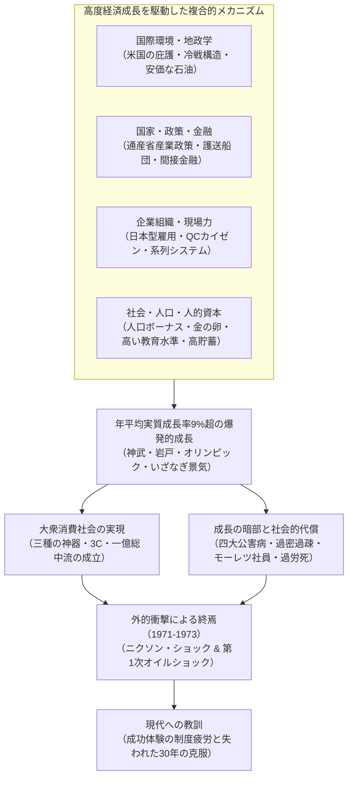
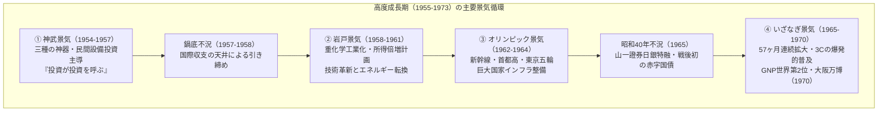
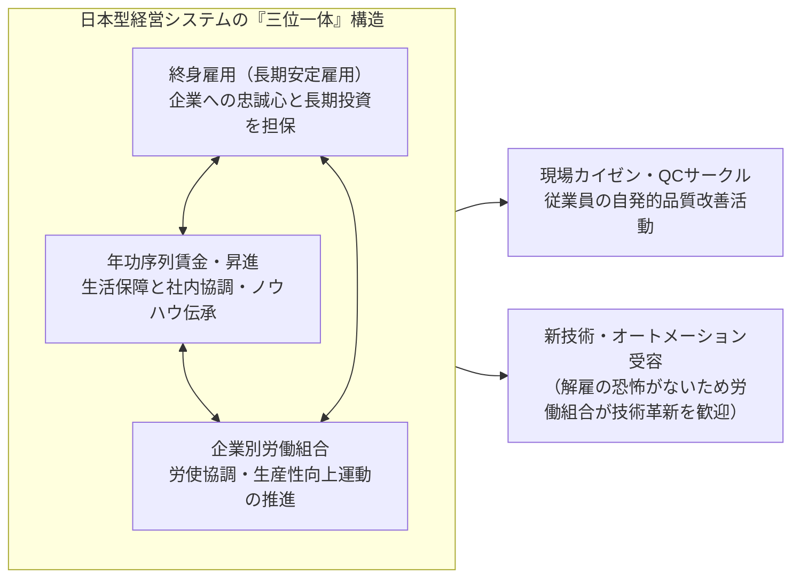
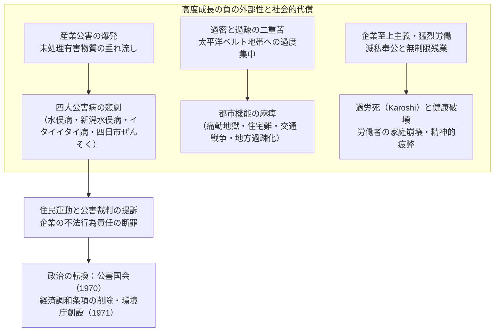

## 序論：歴史上類を見ない「経済の奇跡」とその本質

1945年8月15日、大日本帝国の無条件降伏によって太平洋戦争が終結したとき、日本列島は文字通りの焦土と化していた。主要都市の約4割が空襲によって壊滅し、国富の約4分の1（非軍事資産の約36%）が灰燼に帰した。海外領土のすべてを喪失し、600万人を超える軍人・民間引揚者が住む家も職もないまま国内に溢れかえった。国民の多くは日々の配給すら滞る極度の飢餓とハイパーインフレーションの恐怖に怯え、当時訪日した外国人ジャーナリストや連合国軍総司令部（GHQ）の高官たちは、「日本が近代国家としての自立的な経済水準を取り戻すには、少なくとも半世紀以上の歳月を要するだろう」と異口同音に予測した。

しかし、その予測は劇的な形で覆されることとなった。

終戦からわずか10年後の1955年から、第1次オイルショックが勃発する1973年までの約20年間、日本経済は ** 年平均実質成長率約9.3% ** という人類史上稀に見る超高速の経済成長を達成した。国民総生産（GNP）は1955年の約8兆円から1973年には約112兆円へと実に14倍に急膨張し、1968年には明治維新以来の目標であった西欧の工業大国・西ドイツを抜き去り、アメリカ合衆国に次ぐ ** 資本主義陣営世界第2位の経済大国 ** へと駆け上がったのである。



この爆発的な飛躍は、世界中から「 ** 東洋の奇跡（Economic Miracle） ** 」と称賛された。白黒テレビ・電気洗濯機・電気冷蔵庫の「三種の神器」に代表される家庭電化製品は津々浦々の家庭に行き渡り、やがてカラーテレビ・クーラー・自動車の「3C」へと消費は高度化した。国民の生活様式は伝統的な農村共同体から都市型の核家族へと不可逆的な変貌を遂げ、かつて経験したことのない大量生産・大量消費の豊かさを享受した。国民の約9割が自らを中流階層とみなす「一億総中流」社会が誕生し、治安の良さと高い教育水準を誇る世界有数の産業社会が完成したのである。

だが、この「奇跡」は天から降ってきた偶然の賜物では決してない。そこには、戦前から戦中にかけて蓄積された重化学工業の技術的基盤と官僚機構の統制手法、冷戦激化という国際地政学の激変とアメリカの対日戦略の転換、通商産業省（MITI）による精緻な産業育成と大蔵省主導の金融護送船団方式、終身雇用や年功序列に支えられた日本型労使慣行、そして「金の卵」と呼ばれた若年労働者たちの過酷な勤勉性と高い貯蓄性向が、奇跡的な歯車となって噛み合った結果であった。

同時に、この栄光の歩みの裏側には、常に深く暗い影がつきまとっていた。工場からの未処理廃水や排煙がもたらした水俣病や四日市ぜんそくをはじめとする「四大公害病」は、無辜の市民の生命と健康を不可逆的に破壊した。農村から都市への猛烈な人口流出は、太平洋ベルト地帯に深刻な「過密」と交通戦争、住環境の悪化をもたらす一方で、地方には急激な「過疎」と第一次産業の衰退を招いた。「モーレツ社員」や「企業戦士」と呼ばれた労働者たちは、会社への滅私奉公と無制限の長時間残業を強いられ、後に「過労死（Karoshi）」として国際問題化する社会病理の原点を生み出した。

本稿では、この日本の戦後高度経済成長（1955〜1973年）という巨大な歴史的現象の全貌を、単なる景気循環の追認にとどまらず、マクロ経済学、産業政策、金融システム、企業統治、社会構造、国際地政学、そして環境破壊と公害問題という多角的な視座から立体的に解明する。そして、この時代の成功体験がなぜその後の日本社会を縛る「制度疲労」の足枷となり、1990年代以降の「失われた30年」へとつながっていったのか、21世紀の日本経済再生に向けた歴史的教訓を導き出していく。

---

## 第1章：焦土からの胎動 —— 高度成長の前史（1945〜1954年）

高度経済成長の起点を1955年とするならば、それに先立つ戦後10年間（1945〜1954年）は、崩壊した国民経済の瓦礫を撤去し、市場経済のインフラを再構築して、後のロケットスタートを可能にする発射台を建設した決定的な助走期間であった。

### 1.1 破滅的敗戦とハイパーインフレーション

1945年8月の終戦直後、日本経済は機能停止の瀬戸際にあった。軍需生産の中断と海外からの原材料供給途絶により、1946年の鉱工業生産水準は戦前（1934〜1936年平均）の ** 約30% ** にまで落ち込んでいた。主食である米の配給は遅配・欠配が常態化し、都市部の人々は着物や家財道具を農村に運んで食料と交換する「タケノコ生活」を余儀なくされた。

この生産崩壊に拍車をかけたのが、猛烈なハイパーインフレーションである。軍部が戦争末期に乱発した臨時軍事費の支払いや、終戦直後に軍需企業へ支払われた巨額の軍需補償債務、さらには旧日本軍の解体に伴う退職手当の給付などにより、日本銀行券の発行残高は天文学的な規模に膨張した。1945年秋から1949年にかけて、卸売物価指数は実に ** 約70倍 ** に暴騰した。

政府はこの危機に対処するため、1946年2月に「金融緊急措置令」を公布。全預金の引き出しを禁止する「預金封鎖」を断行し、流通する旧紙幣を失効させて強制的に「新円」へ切り替える非常手段に打って出た。しかし、根本的な生産能力の不足が解決されない限り、物価上昇の連鎖を止めることはできなかった。

```
【戦後初期の主要経済指標の激変】
・鉱工業生産水準（1946年）：戦前基準（1934-36年=100）比 30.7
・東京卸売物価指数上昇率（1946年）：前年比 +364.5%
・米の正規配給量（1945年末）：成人1日あたり2合1勺（約297g）に削減、遅配頻発
・海外からの引揚者総数（1945〜1950年）：約625万人
```

この生産麻痺を打開すべく導入されたのが、東京大学教授の有沢広巳らが提唱した ** 「傾斜生産方式（Priority Production System）」 ** である（1946年末閣議決定、1947年実施）。傾斜生産方式の骨子は、極度に枯渇した国内資源（資金・資材・外貨・労働力）を市場原理に委ねることなく、 ** 「石炭」 ** と ** 「鉄鋼」 ** の2大基幹部門へ集中的に配分し、両者の相互連鎖によって全産業の復興を牽引するというものであった。

具体的には、国内の石炭を最優先で鉄鋼業に供給して製鉄を促し、増産された鉄鋼を再び炭鉱の坑道支柱や採掘機械に優先配分することで、石炭の増産を達成する。この「鉄と石炭の好循環」によって生まれた余剰生産物を、電力、化学肥料、鉄道輸送などの関連基幹産業へ順次波及させていくという壮大な産業再編構想であった。

この計画を金融面から支えたのが、1947年1月に設立された ** 「復興金融金庫（復金）」 ** である。復金は政府保証の復興金融債券を発行し、その大部分を日本銀行が直接引き受けることで、石炭・鉄鋼・電力などの基幹産業へ低利の長期資金を大量供給した。1948年末時点で、主要産業設備資金の約7割を復金融資が占めるに至った。

傾斜生産方式は、壊滅していた基幹産業の生産水準を急速に回復させる劇的な成果を挙げた。しかし同時に、日本銀行による復金債の直接引受は通貨供給量の膨張を招き、「 ** 復金インフレ ** 」と呼ばれる新たなインフレーションの炎を燃え上がらせるという深刻な副作用をもたらした。

### 1.2 ドッジ・ラインとシャウプ勧告：市場経済の基盤確立

復金インフレの猛威に対し、アメリカ政府は対日占領政策の根本的な転換を決断する。冷戦の激化（1949年の中華人民共和国成立、東西陣営の対立激化）を背景に、アメリカは日本を「武装解除すべき敗戦国」から「極東における反共の防波堤・資本主義の砦」へと位置づけ直した。そのためには、日本経済が米国からの巨額の援助（ガリオア・エロア資金）に依存することなく、自立した市場経済として立ち上がらなければならなかった。

1949年2月、デトロイト銀行頭取の ** ジョゼフ・ドッジ（Joseph M. Dodge） ** が公使として来日し、日本経済に苛烈な劇薬を処方した。これがいわゆる ** 「ドッジ・ライン（Dodge Line）」 ** である。ドッジ・ラインの3大原則は以下の通りであった。

1. ** 超均衡予算の編成 ** : 国債発行の全面禁止、赤字財政の即時是正、歳入と歳出を厳格に一致させるだけでなく、過去の借入金償還を含めた「真の黒字予算」の義務付け。
2. ** 復興金融金庫の新規融資停止と補助金の全廃 ** : 価格差補給金（政府が生産コストと公定価格の差額を補填していた巨額補助金）の廃止。
3. ** 単一為替レートの設定 ** : 1949年4月25日、 ** 1ドル＝360円 ** の単一為替レートを正式に設定。

それまで品目ごとに数十種から数百種も存在していた複雑な複数為替レートを撤廃し、1ドル＝360円という単一の窓口で世界市場と直結させたことは、日本の輸出入企業を国際的な競争環境に放り込むことを意味した。この「1ドル＝360円」というレートは、当時の日本の購買力平価から見れば円安水準であり、長期的には日本の輸出産業にとって極めて有利な武器となって機能することになる。

しかし、ドッジ・ラインがもたらした短期的衝撃は凄まじかった。財政資金の引き揚げと徹底的な金融引き締めにより、日本経済は瞬時に激しいデフレーションに見舞われた。中小企業の倒産が相次ぎ、大企業も生き残りを賭けて大規模な人員整理（首切り）を断行した。「ドッジ不況」の到来である。国鉄・日本専売公社をはじめとする公企業・民間企業で数十万人規模の失業者が街に溢れ、国鉄三大ミステリー事件（下山事件・三鷹事件・松川事件）に象徴される不穏な社会不安が列島を覆った。

ドッジ・ラインと並び、戦後日本の骨格を決定づけたのが、1949年5月に来日したコロンビア大学教授 ** カール・シャウプ（Carl S. Shoup） ** 率いる税制使節団による ** 「シャウプ勧告」 ** である。シャウプ勧告は、従来の複雑怪奇な間接税中心の税制を解体し、 ** 所得税を中心とする直接税中心主義 ** への転換を断行した。

シャウプ税制は、青色申告制度の創設による近代的な帳簿・会計慣行の定着、地方税財政の確立（地方交付税制度の原型）、法人税の適正化などをもたらし、公平で透明性の高い税務インフラを日本社会に根付かせた。ドッジ・ラインによるマクロ経済の規律と、シャウプ勧告によるミクロの制度的近代化という二本の強固な柱が打ち立てられたことで、日本は近代的資本主義経済を運営するための確固たる制度的土台を手に入れたのである。

### 1.3 朝鮮戦争と「特需」の衝撃：資本蓄積の起爆剤

ドッジ不況によって日本経済が窒息しかけていた1950年6月25日、隣国の朝鮮半島において ** 朝鮮戦争 ** が勃発した。この戦争は、地政学的な惨劇であると同時に、瀕死の日本経済にとっては劇的な反転をもたらす救世主となった。当時の首相・吉田茂が思わず「天佑（神風）」と漏らしたとされる所以である。

国連軍（実質的には米軍）の出動に伴い、戦場に最も近い工業先進国であった日本に対し、膨大な物資調達と役務提供の注文が殺到した。これがいわゆる ** 「朝鮮特需（特需景気）」 ** である。

米軍から発注された特需品目は多岐にわたった。
- ** 軍事物資・鉄鋼製品 ** : トラック、ジープ、ドラム缶、鉄条網、有刺鉄線、兵器部品、弾薬箱
- ** 繊維・日用品 ** : 軍服、麻袋、毛布、テント用帆布、軍靴
- ** 役務（サービス） ** : 破損した軍用車両・航空機の修理・オーバーホール、兵站輸送、通信支援

特需による外貨収入は、1950年から休戦協定が結ばれる1953年までの4年間で ** 累計約24億ドル ** （当時の日本の年間輸出総額の約6割に匹敵）に達した。この膨大なドル資金の流入により、日本が長年苦しんできた外貨不足は一挙に解消された。

```
【朝鮮特需が日本経済に与えた定量的影響（1950-1953年）】
・特需契約総額：約24億ドル（直接特需＋駐留軍将兵の私的消費）
・実質GDP成長率：1950年度 +10.8%、1951年度 +12.3%、1952年度 +10.0%、1953年度 +7.3%
・鉱工業生産指数：1950年の1年余りで約70%急上昇し、1951年には戦前水準（1934-36年）を完全回復
・企業収益の劇的改善：主要製造業の売上高利益率は1950年下半期に戦後最高水準を記録
```

特需の意義は、単なる在庫一掃のバブルにとどまらなかった。
第一に、軍用トラックの大量修理や製造を通じて、日本の自動車産業（トヨタ自動車、日産自動車、いすゞ自動車など）は米軍の厳格な品質管理基準（ミルスペック）を学び、部品の互換性や量産管理技術を飛躍的に高めた。第二に、特需で得た巨額の利益は、企業内に内部留保として蓄積され、続く高度成長期における大規模な設備投資（製鉄所の新設、最新鋭工作機械の輸入）の自己資金として活用されたのである。

### 1.4 サンフランシスコ体制と「もはや戦後ではない」

1951年9月、日本はサンフランシスコ講和条約および日米安全保障条約に調印し、翌1952年4月28日に条約が発効、7年間にわたる連合国軍の占領統治に終止符を打って国家主権を回復した。

独立を回復した日本は、冷戦下のアメリカ陣営（西側自由主義陣営）に明確に帰属することとなった。吉田茂首相が主導した外交・安全保障方針、いわゆる ** 「吉田ドクトリン」 ** は、日本の国家目標を極めて合理的な方向に純化させた。すなわち、「国の安全保障は日米安全保障条約と米軍の軍事力に全面的に依存し、自国の再軍備・防衛費支出は対GNP比1%未満の最小限にとどめ、国家の全エネルギーと人材、資金を経済復興と通商拡大に集中投下する」という戦略である。この選択が、日本企業にとって軍事費の財政負担から解放された理想的なビジネス環境を担保することになった。

1953年の朝鮮戦争休戦に伴い、特需の剥落による一時的な景気後退に見舞われたものの、日本経済の底流ではすでに設備投資を中心とする自律的な拡大サイクルが回転を始めていた。1955年には、天候に恵まれた農業の大豊作と世界貿易の拡大を背景に、物価が安定したまま成長する「数量景気」が幕を開ける。

この歴史的転換点を鮮烈に宣言したのが、昭和31年（1956年）度に発行された経済企画庁編『経済白書』である。内閣府経済企画庁調査局の内国調査課長であった ** 後藤誉之助 ** らが執筆した結語の一節は、戦後日本を象徴する不朽の名フレーズとなった。

> ** 「もはや『戦後』ではない。われわれは今や異なった事態に直面しようとしている。回復を通じての成長は終った。これからの成長は近代化によって支えられる。」 **

この言葉が意図したのは、単なる復興の祝祭ではなかった。戦前の水準を取り戻すキャッチアップの段階は完了した。これからは、外国からの借入金や援助、あるいは戦争特需といった外部要因に甘えることはできない。最新の技術革新（オートメーション、高分子化学、トランジスタ、大容量火力発電）を積極的に導入し、産業構造そのものを前近代的な軽工業から近代的な重化学工業へと転換しなければ、国際市場での競争に敗北するという強い危機感の表明であった。

そして日本経済は、この白書の警鐘を遥かに上回る凄まじいダイナミズムをもって、世界史上最大の「近代化の実験」へと突入していくのである。

---

## 第2章：景気循環と高度成長のクロニクル（1955〜1973年）

1955年から1973年までの約18年間、日本経済は一貫して直線的に拡大し続けたわけではない。実際には、設備投資の爆発と消費ブームによる「好景気」と、それに伴う輸入急増によって外貨準備が枯渇して金融引き締めを迫られる「不況（引き締め期）」という、ダイナミックな景気循環を繰り返しながら、階段を駆け上がるようにして規模を拡大させていった。

当時の日本は「1ドル＝360円」の固定為替相場制を採用しており、中央銀行が保有する金・外貨準備高には常に上限があった。景気が過熱すると原材料や機械の輸入が急増して国際収支が赤字化し、外貨が底をつきそうになると日本銀行が公定歩合を引き上げて景気を冷やさざるを得ない。この循環メカニズムは、当時 ** 「国際収支の天井」 ** と呼ばれ、日本のマクロ経済運営における最大の制約条件であった。

以下では、高度経済成長を彩った5つの主要な景気循環の軌跡を詳細にたどる。



### 2.1 神武景気（1954〜1957年）と鍋底不況：設備投資の連鎖反応

1954年11月から始まった景気拡大は、初代天皇である神武天皇が即位して以来の未曾有の繁栄という意味を込めて ** 「神武景気」 ** と命名された。

この景気を牽引した最大のエンジンは、民間企業による爆発的な ** 設備投資 ** であった。鉄鋼、造船、合成繊維、石油化学、電気機械などの主要産業が一斉に最新鋭のプラントや大型機械の導入に踏み切った。この現象を的確に捉えたのが、昭和32年（1957年）度経済白書の有名な分析語 ** 「投資が投資を呼ぶ」 ** である。

鉄鋼メーカーが設備を拡張すれば、機械メーカーに工作機械の注文が入り、機械メーカーが生産を拡大するために新たな工場を建設すれば、再び鉄鋼やセメントの需要が跳ね上がる。この産業連関による需要の自己増殖サイクルが、経済全体を急速に押し上げた。

同時に、消費の現場では「生活革命」の幕が上がった。白黒テレビ、電気洗濯機、電気冷蔵庫の ** 「三種の神器」 ** が都市部の中間層を中心に普及し始めた。家事労働の劇的な軽減と娯楽の高度化は、家庭生活の風景を一変させた。

しかし、1957年に入ると好況の代償が露呈する。原材料の輸入急増によって貿易収支が急激に悪化し、外貨準備が危機的水準にまで減少した。「国際収支の天井」に激突したのである。日本銀行は矢継ぎ早に公定歩合を引き上げ、強力な金融引き締めを発動した。これにより景気は急失速し、鉄鋼や繊維の市況が暴落、1957年後半から1958年にかけて ** 「鍋底不況」 ** と呼ばれる停滞期へ突入した。しかし、設備投資の勢いは完全に途絶えたわけではなく、底入れは比較的迅速に完了した。

### 2.2 岩戸景気（1958〜1961年）と国民所得倍増計画：重化学工業化の爆発

鍋底不況を抜けた1958年7月から始まった新たな拡大局面は、神武天皇をさらに遡り、天照大神が天の岩戸に隠れて以来の好景気という意味で ** 「岩戸景気」 ** と呼ばれた。この期間、日本の実質GDP成長率は ** 年平均11.3% ** という驚異的な数値を記録した。

岩戸景気の本質は、日本の産業構造が軽工業（繊維・雑貨など）から、本格的な ** 重化学工業（鉄鋼・石油化学・自動車・重電機） ** へと主役交代を完了した点にある。エネルギー革命が進展し、産業の基糧は「石炭」から中東の安価で高品質な「石油」へと急激にシフトした。太平洋沿岸（東京湾、伊勢湾、瀬戸内海など）の臨海部には、広大な埋め立て地を利用して巨大な製鉄所や石油化学コンビナートが次々と建設された。

政治的にも大きな転換が起きた。1960年、日米安全保障条約の改定をめぐり、国会議事堂周辺を数十万人のデモ隊が包囲する戦後最大の政治騒乱「安保闘争」が勃発。激しい社会的混乱の責任を取って岸信介内閣が退陣すると、後を継いだ ** 池田勇人 ** 首相は、国民の関心をイデオロギー対立から経済成長へと一気に振り向ける劇的な政策を打ち出した。それが ** 「国民所得倍増計画」 ** （1960年12月閣議決定）である。

下村治（大蔵官僚・エコノミスト）らの理論的支柱に支えられたこの計画は、「 ** 今後10年間（1961〜1970年）で実質国民総生産（GNP）を2倍にし、完全雇用を達成して国民生活の水準を西欧先進国並みに引き上げる ** 」という壮大な目標を掲げた。達成には年平均7.2%の成長が必要と計算され、当初は野党や多くの経済学者から「非現実的な大風呂敷」と批判された。

しかし結果は、予想を遥かに超える大成功であった。企業の投資意欲はさらに過熱し、わずか4年余りで所得倍増目標を前倒しで達成してしまったのである。池田内閣の「寛容と忍耐」「月給2倍」という明るいメッセージは、敗戦のトラウマを抱えていた日本国民に強い自信と成長への確信を植え付ける強力な心理的ブースターとなった。

### 2.3 オリンピック景気（1962〜1964年）とインフラ革命

岩戸景気の後、再び国際収支の悪化による小休止を挟み、1962年後半から始まったのが ** 「オリンピック景気」 ** である。アジア初となる第18回オリンピック競技大会（1964年10月開催の東京オリンピック）の成功に向けて、国家の総力を挙げた巨大プロジェクトが推進された。

この時期に投じられたインフラ関連予算は、道路・鉄道・都市整備を合わせて当時の国家予算規模に匹敵する約1兆円規模に達した。
- ** 東海道新幹線 ** : 1964年10月1日開業。東京と新大阪間を最高時速210km、わずか4時間（翌年には3時間10分）で結ぶ世界初の高速鉄道が誕生し、日本の国土軸を根本から再編した。
- ** 名神高速道路・首都高速道路 ** : 日本初の都市間高速道路である名神高速（1963年一部開通、1965年全通）や、過密都市・東京の頭上を縫う首都高速道路網が急速に建設された。
- ** 都市環境の刷新 ** : 羽田空港と都心を直結する東京モノレール、地下鉄日比谷線の全通、ホテルニューオータニをはじめとする大型近代ホテルの建設、さらには下水道整備や街街の美化が進められた。

テレビ放送の分野でも、開会式や競技をリアルタイムで観戦するためにカラーテレビの普及が始まり、日米間での宇宙中継（通信衛星シンコム3号による太平洋横断中継）が成功するなど、科学技術立国・日本の姿が全世界に鮮烈にアピールされた。

### 2.4 証券不況（1965年・昭和40年不況）の衝撃と政策的転換

しかし、オリンピックの熱狂が去った直後、日本経済は高度成長期において最も冷酷な試練に直面する。1965年、いわゆる ** 「昭和40年不況（証券不況）」 ** である。

オリンピック需要を見込んで一斉に増設された生産設備は、需要の一服とともに一転して巨大な過剰設備へと化し、企業の倒産件数は戦後最高を記録した。特に、戦後急速に拡大していた証券市場が直撃を受け、株価の暴落によって四大証券の一角であった ** 山一證券 ** が巨額の損失を抱えて事実上の経営破綻の危機に瀕したのである。

連鎖倒産による信用崩壊と金融恐慌を阻止するため、当時の ** 田中角栄 ** 大蔵大臣と日本銀行総裁の宇佐美洵は、極めて異例の超法規的措置を決断する。日本銀行法第25条に基づく ** 「無制限・無担保の特別融資（日銀特融）」 ** を山一證券に対して発動し、窓口に殺到した預金者や顧客の不安を沈静化させたのである。

さらに政府は、戦後財政を厳格に律してきた財政法第4条の「均衡財政主義（国債発行の禁止）」というドッジ・ライン以来のタブーを破り、1965年度補正予算において、戦後初となる ** 「特例国債（赤字国債）」 ** の発行に踏み切った。このケインズ主義的な財政出動（公共事業の追加投資と減税）は、冷え切った民間需要を強力に下支えし、不況を最小限の期間で脱出させる決定打となった。この危機対応の成功体験が、続く戦後最長の黄金期を呼び寄せることとなる。

### 2.5 いざなぎ景気（1965〜1970年）：黄金の57ヶ月と世界第2位の到達

昭和40年不況の底を打った1965年11月から、1970年7月まで足かけ5年間にわたって続いた空前の大繁栄が ** 「いざなぎ景気」 ** である。日本の祖神である伊弉諾尊（いざなぎのみこと）にちなんで名付けられたこの好況は、連続 ** 57ヶ月 ** に及び、当時の戦後最長記録を大幅に更新した。

いざなぎ景気を主導したのは、旺盛な輸出競争力と、高度化した大衆消費であった。消費の主役は、三種の神器から ** 「3C」 ** へとアップグレードされた。
- ** カラーテレビ（Color TV） **
- ** クーラー（Cooler: ルームエアコン） **
- ** カー（Car: 自家用乗用車） **

トヨタのカローラや日産のサニーといった大衆車が発売され、モータリゼーションの波が列島全土を席巻した。日本の製造業は、徹底的な工程管理と品質改善によって「安かろう悪かろう」の汚名を完全に返上し、高性能で故障の少ないMade in Japanの製品が世界中の市場を席巻し始めた。

そして1968年、日本近現代史における決定的な金字塔が打ち立てられた。日本の名目GNP（国民総生産）が ** 約1,419億ドル ** に達し、西ドイツを追い抜いて、アメリカに次ぐ ** 資本主義世界第2位の経済大国 ** へと躍進したのである。明治維新からちょうど100年目の年に、アジアの敗戦国が欧米の列強諸国を抜き去り、世界の頂点に立った瞬間であった。

1970年には、アジア初となる国際博覧会 ** 「日本万国博覧会（大阪万博）」 ** が「人類の進歩と調和」をテーマに千里丘陵で開催された。岡本太郎の「太陽の塔」がそびえ立つ会場には、半年間で延べ ** 6,421万人 ** という驚異的な数の来場者が詰めかけた。アメリカ館の「月の石」や動く歩道、パビリオン群の未来都市の姿は、戦後復興の完全な達成と、豊かさを手に入れた日本の栄光の象徴として人々の記憶に刻み込まれた。

```
【高度経済成長期の主要マクロ経済指標推移（1955-1973年度）】
```

| 年度 | 実質GDP成長率 (%) | 名目GNP (億円) | 景気局面 / 主な歴史的マイルストーン |
| :---: | :---: | :---: | :--- |
| ** 1955 ** | ** +10.8 ** | 88,646 | 神武景気開始、三種の神器普及開始 |
| ** 1956 ** | ** +6.2 ** | 98,719 | 経済白書「もはや戦後ではない」、国連加盟 |
| ** 1957 ** | ** +7.8 ** | 111,280 | 鍋底不況、国際収支の天井直面 |
| ** 1958 ** | ** +5.6 ** | 118,527 | 岩戸景気開始、東京タワー完成 |
| ** 1959 ** | ** +11.2 ** | 134,228 | 皇太子（上皇陛下）ご成婚パレード、テレビ普及加速 |
| ** 1960 ** | ** +12.5 ** | 160,332 | 安保闘争、池田内閣「国民所得倍増計画」策定 |
| ** 1961 ** | ** +12.0 ** | 196,442 | 重化学工業化の進展、エネルギー革命 |
| ** 1962 ** | ** +8.9 ** | 220,119 | オリンピック景気開始、千里ニュータウン街開き |
| ** 1963 ** | ** +10.7 ** | 256,419 | 名神高速道路開通（栗東〜尼崎） |
| ** 1964 ** | ** +13.1 ** | 295,444 | 東京オリンピック開催、東海道新幹線開業、OECD加盟 |
| ** 1965 ** | ** +5.8 ** | 328,217 | 昭和40年不況（証券不況）、山一證券特融、初の赤字国債 |
| ** 1966 ** | ** +10.6 ** | 382,900 | いざなぎ景気本格化、マイカー元年（カローラ・サニー発売） |
| ** 1967 ** | ** +11.1 ** | 446,953 | 3Cの急速な普及、公害対策基本法公布 |
| ** 1968 ** | ** +12.2 ** | 528,781 | ** 日本のGNPが西ドイツを抜き資本主義世界第2位へ ** |
| ** 1969 ** | ** +12.5 ** | 622,464 | 東名高速道路全通、カラーテレビ普及率爆発 |
| ** 1970 ** | ** +10.7 ** | 733,449 | 大阪万博開催（来場者6,421万人）、公害国会 |
| ** 1971 ** | ** +5.0 ** | 809,726 | ニクソン・ショック、スミソニアン協定（1ドル=308円） |
| ** 1972 ** | ** +9.1 ** | 954,646 | 田中角栄内閣「日本列島改造論」、日中国交正常化 |
| ** 1973 ** | ** +5.1 ** | 1,125,487 | 変動相場制移行、第1次オイルショック、「狂乱物価」 |
| ** 1974 ** | ** -1.2 ** | 1,348,229 | ** 戦後初のマイナス成長、高度経済成長期の完全な終焉 ** |

---

## 第3章：なぜ「奇跡」は起きたのか —— 多角的メカニズムの解剖

日本の高度経済成長は、決して自由放任（レッセフェール）の市場原理だけで達成されたものでも、単なる勤勉さという精神論で説明できるものでもない。そこには、国家の精緻な産業誘導、特異な金融システム、強固な労使慣行、現場の品質管理イノベーション、恵まれた人口動態、そして冷戦構造という国際環境のすべてが奇跡的なシナジーを発揮した、精緻きわまりない ** 「日本型資本主義モデル」 ** の確立が存在した。

本章では、高度成長を駆動した6つの構造的メカニズムを解剖する。



### 3.1 産業政策と国家の舵取り：通産省（MITI）のターゲット・インダストリー戦略

アメリカの政治学者チャルマーズ・ジョンソン（Chalmers Johnson）は、その著書『通産省と日本の奇跡』の中で、近代国家の類型として、アメリカのような「規制指向型国家（Regulatory State）」とは対照的に、国家が戦略的目標を設定して経済発展を主導する ** 「発展指向型国家（Developmental State）」 ** という概念を提唱し、その典型例として日本の通商産業省（MITI）を挙げた。

通産省が展開した産業政策の根幹は、比較優位の原則（現在の時点で優位にある産業に特化する静態的理論）を意図的に無視し、将来の世界市場で巨大な需要が見込まれる産業を国家が先見的に選定して集中育成する ** 「ターゲット・インダストリー政策（重点産業育成策）」 ** であった。戦後直後の日本が伝統的な比較優位論に従っていれば、低賃金を武器にした繊維や雑貨の輸出国にとどまっていたはずである。しかし通産官僚たちは、資本集約的かつ技術集約的な ** 鉄鋼・造船・石油化学・自動車・機械・電子工業 ** を意図的に選定し、国家の総力を挙げて育成した。

この産業誘導を可能にした具体的な武器は以下の通りである。

1. ** 外貨予算配分権（外国為替及び外国貿易管理法） ** :
   当時、外貨（米ドル）は国家の厳格な管理下に置かれていた。通産省は、自らが指定した育成産業の企業に対して最優先で外貨を割り当て、欧米の最新鋭プラントや特許技術（工作機械、ストリップミル製鉄技術、高分子化学特許など）の導入を強力に後押しした。逆に、非重要産業や消費財の輸入には外貨を厳しく制限し、国内市場を海外の競合から保護した。
2. ** 日本開発銀行（開銀）による政策金融の「呼び水効果」 ** :
   政府系金融機関である日本開発銀行が特定プロジェクト（臨海製鉄所の建設、石油化学コンビナート造成など）への協調融資を決定すると、民間都市銀行は「政府のお墨付きを得た最安全プロジェクト」と判断し、雪崩を打って民間資金を供給した。この開銀融資の呼び水効果（シグナリング効果）が、膨大な民間資金を重化学工業へと誘導した。
3. ** 官民協調と設備投資調整 ** :
   自由競争に任せれば、各社が一斉に設備投資を行って過剰生産（過当競争）に陥る恐れがあった。通産省は、製鉄業界や石油化学業界のトップを集めた「官民協調懇談会」を主導し、新設高炉の着工順序や生産枠の割当をカルテル的に調整した。これにより、企業は巨額投資に伴うリスクを軽減し、世界最大規模の最新鋭プラントを建設することができた。

### 3.2 金融システムの錬金術：間接金融優位と護送船団方式

高度経済成長期における設備投資の猛烈なエネルギーを資金面から下支えしたのが、極めて独特な日本の金融構造である。

欧米諸国では、企業の設備投資資金は主に株式や社債の発行（直接金融）や自己の内部留保によって調達されるのが一般的である。しかし当時の日本企業は、戦災による資本消失と急速な投資拡大のため、自己資本比率が極度に低かった。そこで採られたのが、銀行融資を中心とする ** 「間接金融方式」 ** であった。

この金融メカニズムは、以下の3つの特徴によって定義される。

- ** メインバンク制 ** :
  大企業は特定の主要取引銀行（三井、三菱、住友、富士、第一勧業、三和などの都市銀行、あるいは日本興業銀行などの長期信用銀行）と密接な関係を構築した。メインバンクは単に資金を貸し付けるだけでなく、株式の持ち合いを通じて安定株主となり、役員を派遣し、企業の財務状況を常時モニタリングした。これにより、企業は短期的な株価変動や四半期決算の利益に左右されることなく、5年〜10年先を見据えた大規模な設備投資を果敢に実行することができた。
- ** オーバー・ボローイング（企業の過大借入）とオーバー・ローン（銀行の過大貸出） ** :
  企業は自己資本を遥かに上回る巨額の借入金を銀行から調達し（オーバー・ボローイング）、都市銀行は預金総額を超える融資を企業に行い、その資金不足分を日本銀行からの借入金（日銀貸出）で賄った（オーバー・ローン）。日本銀行は公定歩合の操作や「窓口指導（銀行ごとの融資増加額の直接規制）」を通じて、マクロ経済の資金蛇口を完全にコントロールした。
- ** 護送船団方式と低金利政策 ** :
  大蔵省（現・財務省および金融庁）は、金利を市場原理よりも低水準に抑え込む「臨時金利調整法」を運用し、企業の資金調達コストを意図的に低減させた。同時に、最も経営体力の弱い銀行でも絶対に倒産しないよう、行政指導によって銀行の預金金利、店舗新設、業務範囲を厳格に横並びで統制した。艦隊の中で最も足の遅い船に合わせて船団全体の航行速度を決める海軍の戦術になぞらえて ** 「護送船団方式」 ** と呼ばれたこの制度は、金融機関への絶対的な信用を国民に植え付け、金融恐慌のリスクを完全に封じ込めた。

さらに、忘れてはならないのが ** 「財政投融資（FILP）」 ** の存在である。国民が郵便局に預けた郵便貯金や厚生年金・国民年金の積立金は、大蔵省資金運用部に集約され、「第二の国家予算」として日本開発銀行、日本道路公団、住宅金融公庫、国鉄などへ投入された。税金に頼らないこの巨額の財政資金が、東海道新幹線、名神高速道路、製鉄・エネルギーインフラの建設を強力に推進したのである。

### 3.3 日本型雇用慣行の確立：「三種の神器」的労使関係の機能

高度経済成長を現場で支えたのは、戦後復興期の激しい労働争議（1953年の日産争議や1960年の三池炭鉱争議など）の敗北と妥協を経て確立された ** 「日本型雇用慣行（日本的経営）」 ** である。アメリカの社会学者ジェームズ・アベグレン（James Abegglen）が著書『日本の経営』で指摘したように、このシステムは以下の3本の柱から構成されていた。

1. ** 終身雇用制度（長期安定雇用保障） ** :
   企業は原則として新規学卒者を定期採用し、定年退職まで解雇しない慣行。企業にとっては従業員の教育訓練費（OJT）を長期的に回収できるメリットがあり、労働者にとっては生活の絶対的な安定が得られた。
2. ** 年功序列型賃金・昇進体系 ** :
   年齢や勤続年数に応じて役職と給与が自動的に上昇していく仕組み。若年期は貢献度に対して賃金が低く抑えられるが、結婚・子育て・住宅購入の時期を迎える中高年期に手厚い賃金が支払われる設計となっており、生活費のライフサイクルと完全に合致していた。また、若手の低賃金は企業の資本蓄積を助けた。
3. ** 企業別労働組合（Enterprise Union） ** :
   欧米のような職種別・産業別の横断的労働組合ではなく、個別の企業ごとに正規従業員が組織する組合形態。労組幹部も従業員であり、「会社の成長なくして労働者の取り分（賃上げ・賞与）の拡大はない」という強い共同体意識を共有した。

この「三位一体」の雇用慣行は、イノベーションの導入において決定的な威力を発揮した。

欧米の職種別組合の下では、新たなオートメーション機械や省力化技術が導入されると、自分の職能が不要になって解雇されるため、労働者は機械の導入に激しく抵抗（サボタージュやストライキ）するのが常であった。しかし終身雇用が保障された日本の大企業では、技術革新によってある製造ラインが自動化されても、労働者が解雇されることはなく、社内の他部署や新設ラインへと配置転換（社内配転・再教育）されるだけであった。

したがって、労働者や労働組合は最新技術の導入に一切抵抗せず、むしろ「会社の競争力が高まり、ボーナスが増える」として、 ** オートメーションや産業ロボットの導入を熱狂的に歓迎した ** のである。

さらに、1955年から定着した ** 「春闘（春季生活闘争）」 ** は、主要産業（鉄鋼、電機、造船、自動車など）の組合が足並みを揃えて毎春、統一賃上げ要求を掲げて経営側と交渉する制度である。鉄鋼などの主要産業が妥結した賃上げ率が相場（ベンチマーク）となり、それが全産業・中小企業へと波及した。春闘によって全国の労働者の賃金が毎年10%前後のペースで底上げされ、それが内需（国内消費市場）を強力に拡大し、設備投資を回収させるという巨大な好循環（マクロ経済の好調な内需サイクル）を完成させた。

一方で、この美談の裏側には、大企業の正規雇用を支える調整弁として、過酷な低賃金と不安定雇用を強いられた ** 「下請け・孫請け中小企業」 ** や ** 「臨時工・社外工」 ** が無数に存在したという「二重構造」の冷厳な現実が存在したことも見落としてはならない。

### 3.4 現場力とイノベーション：QCサークルとカイゼン（Kaizen）運動

日本の製造業が欧米の模倣から脱却し、世界最高水準の品質とコスト競争力を獲得した最大の原動力は、製造現場の底辺で巻き起こった ** 「品質管理革命」 ** であった。

戦前の日本製品は、海外で「安かろう悪かろう（Cheap and Nasty）」の代名詞とされていた。終戦直後、日本製品の劣悪な品質改善を急務と考えたGHQは、アメリカから統計的品質管理の権威であった ** W・エドワーズ・デミング（W. Edwards Deming） ** 博士を招聘した。1950年、日本科学技術連盟（日科技連）の招きで来日したデミングは、製造工程における統計的手法（PDCAサイクルの原型）と品質管理の重要性を日本の経営者や技術者に熱心に講義した。

日本の技術者たちはこの教えに深く感銘を受け、日科技連はデミングから寄贈された印税を基金として ** 「デミング賞」 ** を創設。日本企業は競ってデミング賞の獲得を目指し、全社的な品質管理運動へと突入した。

しかし、日本企業の真の独創性は、アメリカから輸入したトップダウン型の統計管理を、現場の作業員が主体的に取り組むボトムアップ型の草の根運動へと変貌させた点にある。それが1962年頃から全国の工場に急速に普及した ** 「QCサークル（品質管理サークル）」 ** である。

職場の現場作業員が5〜10人程度の小グループ（サークル）を結成し、業務時間外や休憩時間を利用して自発的に集まり、不良品の発生原因を魚の骨図（特性要因図）やパレート図を用いて分析し、作業手順の改善案（カイゼン）を考案・実行した。提案されたカイゼン案は現場に即座に反映され、成果を挙げたサークルは社内や全国大会で表彰された。この運動により、現場の末端作業員に至るまで「自分たちが製品の品質を作り込んでいる」という高い職業的自負と問題解決能力が培われたのである。

この現場主義の究極の到達点が、トヨタ自動車の副社長・大野耐一らが確立した ** 「トヨタ生産方式（TPS / Toyota Production System）」 ** である。
- ** ジャスト・イン・タイム（Just In Time） ** : 「必要なものを、必要なときに、必要なだけ」生産し、工場内の仕掛品や在庫を極限までゼロに近づける。
- ** かんばん方式 ** : 後工程が使った部品の分だけ、前工程から引き取る「引っ張り方式」を物理的な伝票（かんばん）で指示する徹底した自律分散管理。
- ** 自働化（ニンベンの付いたジドウカ） ** : 機械に人間の知恵を持たせ、異常が発生した瞬間に設備が自動的に緊急停止し、絶対に不良品を次工程に流さない仕組み。
- ** 徹底的な「ムダ取り」 ** : 作りすぎのムダ、手待ちのムダ、運搬のムダ、加工そのもののムダ、在庫のムダ、動作のムダ、不良をつくるムダの「7つのムダ」を徹底排除。

これらのイノベーションにより、日本の製造ラインは「少量多品種の高品質製品を、極めて低いコストと短いリードタイムで量産する」という、欧米のフォード型大量生産モデル（同一品目の大量押し込み生産）を完全に凌駕する生産システムへと進化を遂げた。

### 3.5 人口動態と人的資本：人口ボーナスと「金の卵」の移動

高度成長期を可能にした最も根底的な物理的エネルギーは、豊穣な ** 人口動態（Demographics） ** と、驚異的な水準の ** 人的資本（Human Capital） ** であった。

終戦直後の1947年から1949年にかけて、日本は未曾有の第1次ベビーブームを経験した。この3年間に生まれた約 ** 800万人 ** の子どもたちは ** 「団塊の世代」 ** と呼ばれる。1950年代半ば以降、日本の人口構成は、働く現役世代（15〜64歳の生産年齢人口）が急速に増加し、扶養すべき子どもと高齢者の比率が相対的に低下する ** 「人口ボーナス期」 ** に突入した。

```
【日本の生産年齢人口比率の推移】
・1950年：59.7%
・1960年：64.2%
・1970年：68.9%（人口ボーナスの絶頂期）
```

この潤沢な若年労働力は、単に数が多かっただけではない。農村から都市部への巨大な国内人口大移動を伴っていた。

当時、日本の農村部には、戦後の農地改革（自作農の創設）によって自立したものの、長男以外は土地を相続できない無数の次男・三男や娘たちが存在した。彼らは中学校や高校を卒業すると、大都市（東京、大阪、名古屋）の町工場や大企業の生産ラインを担う若き労働者として旅立っていった。彼らは従順で規律正しく、適応能力に富んでいたことから ** 「金の卵」 ** と呼ばれ、企業間で激しい争奪戦が繰り広げられた。

上野駅や大阪駅には、東北や九州などの農村部から中学校の卒業生たちを満載した ** 「集団就職列車」 ** が続々と到着した。1955年から1970年までのわずか15年間に、三大都市圏には実に ** 約1,000万人 ** を超える人口が純流入した。就業構造で見ると、1950年に全就業者数の ** 48.3% ** を占めていた第1次産業（農業・林業・水産業）の就業人口は、1970年には ** 17.4% ** へと激減し、解放された膨大な労働力が第2次産業（製造業・建設業）と第3次産業へと一気にシフトしたのである。

さらに特筆すべきは、国民の並外れた ** 教育水準 ** と ** 高貯蓄率 ** である。
- ** 均質な高い教育水準 ** : 江戸時代の寺子屋や明治以降の学制に根差した日本の初等・中等教育は、ほぼ100%の完全な識字率を誇った。高校進学率は1950年の42.5%から1970年には82.1%へと倍増し、高度な図面を正確に読み取り、複雑な機械操作を短期間で習得できる均質で極めて優秀なブルーカラー層が全国に供給された。
- ** 世界屈指の高貯蓄性向 ** : 家計の可処分所得に対する貯蓄率（家計貯蓄率）は、欧米諸国が10%前後であったのに対し、日本は ** 15%〜20%超 ** という極めて高い水準を一貫して維持した。所得の急増、将来の生活保障への備え（社会保障の未整備）、退職金制度やボーナス慣行、郵便貯金の非課税制度（マル優）などが背景にあった。国民が銀行や郵便局に預けたこの膨大な貯蓄が、そのまま企業の設備投資資金へと低利で還流し、海外資本に依存しない自力成長を可能にしたのである。

### 3.6 冷戦の地政学と国際環境：歴史の追い風

高度成長は、第二次世界大戦後の国際秩序（ブレトンウッズ体制と東西冷戦）が日本にとって最も都合のよい形で作用した「歴史的奇跡の産物」でもあった。

第一に、前述の ** 「吉田ドクトリン」 ** の下で、防衛費支出を対GNP比1%前後に抑制できたことである。同時代の欧米列強や東西対立の最前線にあった国々（アメリカ、ソ連、イギリス、西ドイツ、韓国、台湾など）がGNPの5〜10%以上を軍事費や徴兵制に浪費していたのに対し、日本は防衛の大部分をアメリカの核の傘と在日米軍にアウトソーシングし、国家の希少な頭脳と財政資金をすべて民間産業の育成と社会インフラの整備に振り向けることができた。

第二に、アメリカが主導した ** 自由貿易体制（GATT / IMF体制） ** の全面的な恩恵を享受したことである。1955年のGATT（関税と貿易に関する一般協定）加盟、1964年のIMF8条国移行（為替管理の自由化）およびOECD（経済協力開発機構）加盟を経て、日本は「先進国クラブ」に仲間入りを果たした。アメリカをはじめとする巨大市場が無防備に近い形で日本の輸出品に開放される一方で、日本側は長年にわたり関税や外資規制によって国内の未成熟な産業を保護し続けるという、非対称的な優遇を享受することができた。

第三に、 ** 「1ドル＝360円」の固定為替レート ** の存在である。生産性の向上とともに日本の製造業の実質的な国際競争力は飛躍的に高まっていったが、為替レートは360円に固定されたままであったため、実質的に大幅な「円安」の恩恵を受け続けた。これにより、日本の鉄鋼、家電、自動車、カメラ、時計は、欧米市場において圧倒的な価格破壊力を発揮した。

第四に、 ** 中東原油の安価で安定した供給 ** である。戦前の日本が戦争に突入した最大の要因は石油の枯渇であったが、戦後はセブン・シスターズ（国際石油資本・メジャー）が支配する中東の大油田から、1バレルあたり2ドル前後というタダ同然の超低価格で無尽蔵の原油が日本へと運ばれてきた。この安価な石油エネルギーが、巨大な火力発電所を回し、石油化学コンビナートの原料となり、モータリゼーションの血肉となったのである。

---

## 第4章：大衆消費社会の到来と生活革命

高度経済成長は、工場の煙突から立ち上る煙や製鉄所の粗鋼生産量といったマクロ統計の数字にとどまらず、一般庶民の日々の暮らし、衣食住、家族観、そして国民精神を根底から塗り替える ** 「生活革命」 ** であった。

戦前までの日本社会では、ごく一部の特権階級や地主層を除き、国民の大半は前近代的な自給自足に近い質素な生活を送っていた。しかし、1950年代半ばから1970年代初頭にかけてのわずか十数年の間に、日本は世界で最も均質かつ豊かな ** 「大衆消費社会」 ** へと変貌を遂げた。

### 4.1 「三種の神器」から「3C」へ：消費生活の劇的変貌

日本人の家庭生活の近代化は、象徴的な耐久消費財の普及とともに段階的に進展した。

最初の波は、1950年代後半（神武景気〜岩戸景気）に巻き起こった ** 「三種の神器」 ** ブームである。歴代天皇に継承される三種の神器（鏡・玉・剣）になぞらえられたのは、 ** 「白黒テレビ」「電気洗濯機」「電気冷蔵庫」 ** の3つの家電製品であった。
- ** 電気洗濯機 ** : かつて女性たちが冷たい水に手を浸し、タライと洗濯板で何時間も格闘していた重労働を、スイッチ一つで完結させた。
- ** 電気冷蔵庫 ** : 食料を氷で冷やす氷冷蔵庫や日々の買い出しから解放し、生鮮食品の長期保存と衛生環境の劇的な向上をもたらした。
- ** 白黒テレビ ** : それまでラジオや新聞に限られていた家庭内の情報・娯楽空間を視覚的メディアへと一新した。特に1959年4月の皇太子明仁親王（現・上皇陛下）と正田美智子さまの「世紀のご成婚パレード」は、テレビの爆発的な普及の契機となり、街頭テレビに群がっていた大衆が一斉に「我が家の一台」を買い求めた。

そして1960年代後半（いざなぎ景気）、生活水準がさらに一段階跳ね上がると、消費の欲望は頭文字「C」で始まる高級耐久消費財 ** 「3C（新・三種の神器）」 ** へと向かった。
- ** カラーテレビ（Color TV） ** : 1964年東京五輪や1970年大阪万博を鮮やかなフルカラーでリビングに届けた。
- ** クーラー（Cooler / ルームエアコン） ** : 日本の湿潤で酷暑の夏を快適な近代空間へと改造した。
- ** カー（Car / 自家用乗用車） ** : 1966年、トヨタが「カローラ」、日産が「サニー」を発売したことで「マイカー元年」が到来。富裕層の贅沢品であった自動車が、庶民の週末のドライブやレジャーの足となった。

```
【主要耐久消費財の世帯普及率推移（1955-1975年・経済企画庁調べ）】
```

| 年 | 電気洗濯機 (%) | 電気冷蔵庫 (%) | 白黒テレビ (%) | カラーテレビ (%) | 乗用車（マイカー） (%) | ルームクーラー (%) |
| :---: | :---: | :---: | :---: | :---: | :---: | :---: |
| ** 1955 ** | 4.6 | 1.1 | 0.9 | - | - | - |
| ** 1958 ** | 29.3 | 5.5 | 10.4 | - | - | - |
| ** 1960 ** | 45.4 | 15.7 | 44.7 | - | - | - |
| ** 1962 ** | 62.7 | 28.0 | 79.4 | - | - | - |
| ** 1965 ** | 73.6 | 51.4 | 90.3 | 0.2 | 3.5 | 2.1 |
| ** 1967 ** | 80.7 | 70.8 | 96.0 | 1.6 | 7.7 | 3.0 |
| ** 1970 ** | 91.4 | 89.1 | 90.2 | ** 26.3 ** | ** 22.1 ** | ** 5.9 ** |
| ** 1973 ** | 96.1 | 95.8 | 60.1 | ** 75.8 ** | ** 36.8 ** | ** 13.3 ** |
| ** 1975 ** | 97.6 | 96.7 | 40.5 | ** 90.3 ** | ** 41.2 ** | ** 17.2 ** |

この統計が如実に示すように、1955年にはほぼゼロに近かった家電製品が、1970年代前半には ** 全世帯の9割超 ** に普及するという、世界史的にも類を見ない超高速の生活近代化が完了したのである。

### 4.2 団地、ニュータウン、核家族化：住まいと家族の変貌

急激な都市への人口集中は、日本人の伝統的な住居空間と家族構造を不可逆的に解体した。

1955年に設立された ** 「日本住宅公団」 ** は、深刻な住宅不足に喘ぐ都市中間層に向けて、鉄筋コンクリート造の集合住宅、いわゆる ** 「団地」 ** を大都市近郊に大量供給した。1960年代には、大阪の「千里ニュータウン（1962年入居開始）」や東京の「多摩ニュータウン（1971年入居開始）」など、数十万人規模の人工都市（ベッドタウン）が山林や丘陵地を切り開いて造成された。

団地がもたらした最大の衝撃は、建築空間の近代化であった。
- ** ダイニングキッチン（DK）の導入 ** : 従来の日本家屋では、台所は薄暗い土間に追いやられ、食事は畳の部屋にちゃぶ台を広げて取っていた。公団住宅が採用した「ステンレス製流し台を備えた明るいダイニングキッチン」は、食事（食）と睡眠（寝）を空間的に分離する「食寝分離」を実現し、女性の家事環境を飛躍的に改善した。
- ** シリンダー錠とプライバシーの確立 ** : 鍵一本で外部と遮断できる鉄扉、水洗トイレ、内風呂（シリンダー給湯器）の完備は、近隣や親族の干渉から切り離された「個人のプライバシー」と「自立した家庭空間」を誕生させた。

この住まい革命は、 ** 「核家族化」 ** を決定づけた。祖父母・父母・子孫が同居する前近代的な農村型大家族（家制度の遺制）は急速に姿を消し、「サラリーマンの夫、専業主婦の妻、子ども2人」という構成の近代核家族が、日本社会の「標準世帯」として定着した。団地住まいは当時の若者たちの憧れの的となり、ステレオタイプな近代的生活様式（サラリーマン文化）が全国規模で均質化していった。

### 4.3 「一億総中流」意識の形成：均質社会の誕生

高度成長がもたらした最大の社会的帰結は、階層意識の消滅と ** 「一億総中流」意識の定着 ** であった。

内閣府（当時・総理府）が毎年実施している「国民生活に関する世論調査」において、「あなたの生活の程度は世間一般から見てどの程度だと思いますか」という問いに対し、「中（上中・中中・下中）」と回答した国民の割合は、1950年代後半の約7割から、1960年代半ばには8割を超え、1970年には ** 約90% ** に達した。貧富の格差を問わず、国民のほぼ全員が「自分は平均的な中流階級に属している」と信じる特異な国民意識が醸成されたのである。

この中流意識は、単なる幻想やプロパガンダではなかった。実態としての経済的裏付けが存在した。
1. ** 所得格差の劇的な縮小 ** :
   所得格差の指標である「ジニ係数（Gini coefficient）」は、高度成長期を通じて顕著に低下し、先進国の中で最も平等な水準（北欧諸国に匹敵）に達した。春闘を通じた一律のベースアップ、全国一律の最低賃金制度、累進性の極めて高い所得税制（最高税率75%）、そして地方交付税交付金による大都市から地方への巨額の財政再分配が、階層間・地域間の格差を強力に圧縮した。
2. ** 消費の横並び意識 ** :
   「隣の家がカラーテレビを買ったから、我が家も買わなければならない」「隣がカローラなら、うちはサニーだ」という強烈な横並び競争意識（同調圧力）が、消費需要を際限なく拡大させた。

生まれや身分による固定的な階級構造が解体され、誰もが教育を受け、会社で真面目に働けば、昨日より今日、今日より明日へと生活が豊かになるという「上昇停止なき未来への確信」が、日本社会全体を熱気と希望で満たしていた。

### 4.4 流通革命と大衆文化の爆発

消費社会の成熟は、商業と文化の風景をも根底から塗り替えた。

その急先鋒となったのが、中内㓛率いる「ダイエー」をはじめとする ** スーパーマーケット（総合スーパー / GMS） ** の台頭である。これを ** 「流通革命」 ** と呼ぶ。
従来の商店街を中心とする対面販売や、メーカーが卸売価格と小売価格を完全に支配する「再販売価格維持制度（定価販売）」に対し、ダイエーなどのスーパーは「良い品をどんどん安く売る」「主婦の店」を掲げ、大量仕入れ・セルフサービス・低マージンによる ** 「価格破壊」 ** を仕掛けた。

特に有名なのが、松下電器産業（現・パナソニック）の創業者・松下幸之助と中内㓛の間で繰り広げられた「三十年戦争」と呼ばれる対立である。松下電器の定価販売方針に反旗を翻し、家電製品を2割引きでディスカウント販売したダイエーに対し、松下は出荷停止で対抗したが、大衆の圧倒的な支持を背景にした流通側が最終的にメーカー主導の価格決定権を打ち破った。これにより、大衆消費者は安価で良質な製品を日常的に手に入れる権利を勝ち取ったのである。

文化面でも、テレビを中心とする ** マスメディアの黄金時代 ** が到来した。街頭テレビから茶の間のテレビへと移行したことで、NHKの紅白歌合戦は視聴率80%超を記録し、力道山のプロレス中継、長嶋茂雄と王貞治（ON砲）を擁する読売ジャイアンツの黄金時代（V9）、ザ・ドリフターズの『8時だョ!全員集合』などが国民的娯楽となった。大衆週刊誌の創刊ラッシュ、ボウリングブーム、海水浴やスキーなど、可処分時間の増大に伴う「大衆レジャー」が百花繚乱の咲き誇りを見せた。

---

## 第5章：成長の代償 —— 歪み・公害・社会問題の激化

しかし、この目覚ましい経済繁栄の光が強ければ強いほど、その足元に落ちた影は深く、暗く、残酷であった。高度経済成長とは、日本列島の自然環境、人々の健康と生命、そして人間的尊厳を巨大な犠牲として差し出すことで買い取られた「血塗られた繁栄」という側面を決して免れ得ない。

「企業優先」「生産第一主義」の旗印の下で、環境保全や個人の生活福祉は完全に後回しにされ、やがて日本列島は世界最悪の公害列島へと転落していった。



### 5.1 産業優先の暗部：四大公害病の悲劇と科学的メカニズム

高度成長期における最大の悲劇は、企業の利益追求と有害物質の垂れ流しによって無辜の住民が命を奪われ、生涯癒えない身体障害を負わされた ** 「四大公害病」 ** である。

```
【四大公害病の全貌と比較】
```

| 公害病名 | 発生地域・水系 | 原因企業・工場 | 原因物質・排出経路 | 主な健康被害・症状 | 司法の判断（判決確定） |
| :--- | :--- | :--- | :--- | :--- | :--- |
| ** 水俣病 ** | 熊本県水俣湾・不知火海沿岸 | 新日本窒素肥料（チッソ）水俣工場 | アセトアルデヒド製造工程で使用された無機水銀がメチル化し生成された ** メチル水銀（有機水銀） ** を含む未処理廃水の垂れ流し。食物連鎖（魚介類）を通じて濃縮。 | 感覚障害、運動失調、求心性視野狭窄、聴力障害、言語障害、中枢神経破壊。母親の胎盤を通じて胎児が脳性麻痺状態で生まれる ** 「胎児性水俣病」 ** の悲劇。 | 1973年熊本地裁：チッソの全面過失を認定。巨額の損害賠償命令。 |
| ** 新潟水俣病（第2水俣病） ** | 新潟県阿賀野川下流域 | 昭和電工鹿瀬工場 | アセトアルデヒド製造の副生有害廃水（ ** メチル水銀 ** ）を阿賀野川へ直接放流。川魚の摂取による中毒。 | 水俣病と同様の中枢神経障害、手足のしびれ、激しい痙攣、知能低下。 | 1971年新潟地裁：四大公害裁判で最初の原告（被害者）勝訴判決。 |
| ** イタイイタイ病 ** | 富山県神通川流域 | 三井金属鉱業神岡鉱業所（岐阜県） | 亜鉛・鉛鉱石の採掘・選鉱過程で発生した ** カドミウム ** を含む鉱山廃水を神通川へ垂れ流し。下流の農業用水・飲料水が汚染。 | 腎臓機能障害（尿細管障害）によりカルシウム再吸収が阻害され、骨粗鬆症・骨軟化症を併発。わずかなくしゃみや寝返りで全身の骨が多発骨折。「痛い、痛い」と泣き叫びながら衰弱死。 | 1972年名古屋高裁金沢支部：三井金属鉱業の無過失責任を認め、原告完全勝訴確定。 |
| ** 四日市ぜんそく ** | 三重県四日市市沿岸部 | 四日市石油化学コンビナート（三菱油化、中部電力など進出企業群） | 重油燃焼によって排出された ** 硫黄酸化物（亜硫酸ガス: SOx） ** を含む有害大気汚染物質の大量放出。 | 激しい発作性呼吸困難、慢性気管支炎、気管支喘息、肺気腫。発作の苦痛から自ら命を絶つ被害者（自死）が相次ぐ。 | 1972年津地裁四日市支部：企業群の共同不法行為責任を認定。 |

四大公害病に共通していたのは、 ** 「企業の隠蔽体質」 ** と ** 「国家・行政の怠慢」 ** であった。チッソは付属病院長・細川一がネコを使った実験で工場廃水が原因であることを1959年時点で突き止めていたにもかかわらず、そのデータを隠蔽し、廃水放流を継続した。通産省も産業振興を最優先し、排水規制や工場の操業停止といった厳格な措置を長年にわたり忌避した。

被害者とその家族は、病の激痛に苦しむだけでなく、「奇病」としての偏見や差別、地域社会（工場城下町）からの激しいバッシングに晒されながら、血を吐くような思いで法廷闘争（四大公害裁判）を闘い抜いた。1970年代初頭に相次いで下された原告完全勝訴の判決は、日本の司法史上初めて「利益追求のために環境と生命を犠牲にした企業の過失・不法行為責任」を厳しく断罪する画期的な転換点となった。

### 5.2 大気汚染、光化学スモッグ、ヘドロ：公害列島と政治の転換

公害の猛威は、特定の地域にとどまらず、日本列島全体の大気、河川、海洋を急速に呑み込んでいった。

- ** 田子の浦港ヘドロ公害（静岡県富士市） ** :
  富士山の湧水を利用して栄えた製紙工場群が、紙パルプ製造の濃厚廃水（亜硫酸パルプ廃水）を無処理のまま駿河湾の田子の浦港へ垂れ流した。海底には数百万トンに及ぶ悪臭放つ有毒ヘドロが堆積し、港湾機能が麻痺。近隣住民は有毒な硫化水素ガスによる目や喉の痛みに苦しめられた。
- ** 東京・光化学スモッグ事件（1970年） ** :
  1970年7月18日、東京都杉並区の立正高校で、グラウンドで体育授業中だった女子生徒ら40人以上が突然、目や喉の激しい痛みを訴えて次々と倒れ、呼吸困難で病院へ救急搬送された。自動車の排気ガスと工場の煤煙に含まれる窒素酸化物（NOx）や炭化水素が太陽の強い紫外線と反応してオキシダントを発生させる「光化学スモッグ」の恐怖が、首都の白昼に襲来した瞬間であった。

環境汚染への国民的憤激は頂点に達し、保守政権を揺るがす巨大な政治問題となった。美濃部亮吉（東京都知事）や黒田 degenerate 赳（大阪府知事）といった革新自治体首長が相次いで誕生したことに危機感を強めた佐藤栄作内閣は、ついに政策の大転換を余儀なくされる。

1970年末に召集された第64回臨時国会は、審議の全日程が公害対策に費やされたことから ** 「公害国会」 ** と呼ばれる。この国会において、公害対策基本法の抜本改正を含む公害関係 ** 14法案が一挙に可決・成立 ** した。

最大の焦点となったのは、旧法第1条第2項に明記されていた ** 「生活環境の保全については、経済の健全な発展との調和が図られるものとする」という、いわゆる「調和条項」の完全削除 ** であった。調和条項は、長年にわたり「経済成長の足を引っ張らない範囲でしか環境対策をやらない」という企業の言い訳の隠れ蓑として機能していた。この条項を削除し、環境保全と国民の健康保護が経済成長よりも絶対的に優先されるべき基本理念として法的に確立されたのである。

翌1971年7月には、公害行政を一元的に所管する ** 「環境庁（現・環境省）」 ** が発足。大気汚染防止法や水質汚濁防止法に基づく排出基準の厳格化、工場立地規制の強化、そして脱硫・脱硝装置や排水処理設備の導入が企業に義務付けられた。これにより、日本の公害対策技術（排煙脱硫装置、自動車排ガス浄化触媒など）は急速に発展し、世界で最も厳しい環境基準をクリアする技術的布石となった。

### 5.3 過密と過疎の二重苦：歪む国土構造

高度成長は、日本の国土空間を「過密」と「過疎」という相矛盾する病理によって引き裂いた。

東京湾、伊勢湾、大阪湾、瀬戸内海を結ぶ ** 「太平洋ベルト地帯」 ** への産業と人口の極端な一極集中は、大都市圏の生活インフラを完全にパンクさせた。
- ** 痛勤地獄（通勤ラッシュの極限） ** :
  東京や大阪の通勤電車は、ラッシュ時の混雑率が ** 300% ** （定員の3倍）前後に達し、窓ガラスが乗客の圧力で割れ、靴や傘を落とす乗客が続出した。駅のホームには、乗客を無理やり車内に押し込む「押し屋（旅客整理係）」の学生アルバイトが日常的に配備された。
- ** 地価高騰と住宅難 ** :
  都市部の地価は狂乱的に高騰し、サラリーマンが職場の近くに一戸建てやマンションを構えることは不可能となった。通勤時間が片道1時間半から2時間を超える遠郊のベッドタウンへの居住を余儀なくされ、長時間通勤が労働者の生活時間を削り取った。
- ** 交通戦争（交通事故死者数の急増） ** :
  道路整備がモータリゼーションの爆発的進行に追いつかず、歩道のない狭い道路にトラックや乗用車が溢れた。その結果、全国の交通事故死亡者数は激増し、1970年には年間死者数が ** 1万6,765人 ** という戦後最悪のピークに達した。日清戦争の日本軍戦死者数（約1万3,000人）を1年間の交通事故死者が上回るという異常事態から、この惨状は ** 「交通戦争」 ** と呼ばれた。

その一方で、労働力を都市へと吸い上げられた地方の農山漁村は、急速な人口流出と共同体の崩壊に直面した。若年層が消え去った村落では、林業や農業の担い手が失われ、伝統的な祭りや冠婚葬祭、治山治水の共同作業（普請）の維持が不可能となった。1960年代後半から ** 「過疎（かそ）」 ** という新語が定着し、やがて高齢者ばかりが取り残される「限界集落」の原型がこの時代に形成されたのである。

### 5.4 労働環境の過酷さと「企業戦士」：過労死の原点

高度成長を現場で牽引した日本のサラリーマンや工場労働者たちは、自らの健康と私生活を会社に捧げる ** 「モーレツ社員」「企業戦士」 ** と呼ばれた。

出光興産が掲げた「大家族主義」や松下電器の「産業報国」に見られるように、会社は単なる雇用契約の場ではなく、生活のすべてを包摂する「擬似的な運命共同体」であった。労働者たちは、会社への忠誠心と自尊心を一体化させ、納期を守り、競合他社を叩き潰すために、無制限の残業と休日出勤を厭わずに働いた。

しかし、その実態は過酷を極めた。
- ** サービス残業の常態化と有給休暇の死文化 ** : 「有給休暇を申請することは会社への反逆である」という無言の同調圧力が支配し、有給取得率は先進国で最低レベルに沈んだ。
- ** 滅私奉公と家庭の不在 ** : 夫は早朝に満員電車に揺られて出勤し、深夜に終電で帰宅して寝るだけの「午前様生活」を続けた。子育てや家事の全責任は妻（専業主婦）の双肩に重くのしかかり、家庭内における「父親の不在」が深刻な教育問題や少年非行の要因として議論され始めた。
- ** 過労死（Karoshi）の萌芽 ** : 極度の睡眠不足と過重労働、過密なノルマのプレッシャーにより、働き盛りの30代〜50代の男性が脳出血、心筋梗塞、くも膜下出血で突然命を落とすケースが頻発し始めた。「働きすぎによる突然死」という、諸外国には概念すら存在しなかった現象は、後にローマ字のまま ** 「Karoshi」 ** としてオックスフォード英語辞典に収録されるという不名誉な国際的知名度を獲得することになる。

日本人が手に入れた物質的豊かさは、自らの身体と命をすり減らした極限の自己犠牲の代価として支払われたものであった。

---

## 第6章：終焉の引き金 —— ニクソン・ショックとオイルショック（1971〜1973年）

およそ20年近くにわたって続いた「奇跡の高度経済成長」は、1970年代初頭、突如として訪れた二つの巨大な外生的ショックによって劇的な終焉を迎えた。

その引き金を引いたのは、高度成長の前提条件であった「ブレトンウッズ体制（1ドル＝360円の固定為替レート）」と「安価な中東石油の無制限供給」という二大国際環境の崩壊であった。

### 6.1 ニクソン・ショック（1971年）：ブレトンウッズ体制の崩壊

1971年8月15日、アメリカのリチャード・ニクソン大統領がテレビ演説を通じて発表した緊急経済政策は、全世界の金融市場を震撼させた。いわゆる ** 「ニクソン・ショック（ドル・ショック）」 ** である。

ニクソンが発表した骨子は以下の通りであった。
1. ** 米ドルと金（ゴールド）の兌換停止 ** : 1オンス＝35ドルの固定比率で諸外国の中央銀行に対して金を払い戻すという、第二次大戦後のブレトンウッズ体制の根幹を一方的に破棄。
2. ** すべての輸入品に対する10%の輸入課徴金の導入 ** : 日本や西ドイツの製品に対する実質的な緊急関税。

この措置の背景には、ベトナム戦争の泥沼化に伴う米国の巨額の軍事財政赤字と、日本の自動車や家電、西ドイツ製品の猛烈な対米輸出ラッシュによって、アメリカの貿易収支が戦後初めて赤字へと転落し、フォート・ノックスに眠る米国の金準備が枯渇寸前に陥っていたという現実があった。

日本経済にとって、ニクソン・ショックは青天の霹靂であった。東京株式市場は連日大暴落し、通産省や経済界は「円高不況によって日本の輸出産業は壊滅する」と恐慌状態に陥った。

同年12月、ワシントンのスミソニアン博物館で開催された主要10カ国蔵相会議（G10）において、新たな多国間通貨調整が妥結した（ ** スミソニアン協定 ** ）。ここで日本の円は、従来の1ドル＝360円から、一挙に ** 1ドル＝308円（16.88%の切り上げ） ** という大幅な円高を強いられた。

しかし、切り上げ後も国際金融市場におけるドルへの不信は収まらず、投機的な資金移動が続いたため、1973年2月から3月にかけて、主要先進国は相次いで固定相場制を断念し、 ** 「変動為替相場制」 ** への完全移行に踏み切った。円相場は瞬く間に1ドル＝260円台へと上昇。戦後復興以来、日本の輸出産業を強力に守り育ててきた「1ドル＝360円」の黄金の傘は、完全に消滅したのである。

### 6.2 田中角栄と「日本列島改造論」：過熱する土地投機と先行インフレ

為替の激変という逆風の中で登場したのが、1972年7月に発足した ** 田中角栄 ** 内閣であった。小学校卒の叩き上げで首相に上り詰めた田中は、「今太閤」「コンピュータ付きブルドーザー」と呼ばれ、国民的な熱狂的人気を博した。

田中が政権公約の柱に据えたのが、自著として大ベストセラーとなった ** 『日本列島改造論』 ** である。その構想は、新幹線鉄道網（全国7,200km）と高速自動車道網（全国1万km）を全国土に張り巡らせ、地方と大都市を高速交通網で直結することで、過密に苦しむ大都市から地方へと工場と人口を分散配置し、過密と過疎を同時に解消しようとする壮大な国土開発計画であった。

しかし、この壮大すぎる構想は、最悪の副作用をもたらした。
計画が発表されるや否や、大手商社、不動産業者、建設会社が一斉に新幹線の予定地や高速道路のインターチェンジ周辺の山林・農地を買い占める ** 「列島改造ブーム（土地買い占め狂乱）」 ** が巻き起こった。1972年から1973年にかけて、全国の地価は前年比30%超という凄まじい暴騰を記録した。

さらに、大蔵省と日本銀行は、ニクソン・ショックによる「円高不況」の到来を極度に恐れ、超低金利政策と大規模な財政拡張を継続していた。その結果、市場には巨額の資金が溢れかえる ** 「過剰流動性」 ** が発生。土地や株式への投機熱が過熱し、卸売物価が急騰し始めるという、深刻な先行インフレーションの導火線に火がついていたのである。

### 6.3 第1次オイルショック（1973年）：「狂乱物価」の襲来

過熱する日本経済の上に、致命的な決定打として炸裂したのが、1973年10月に勃発した ** 第4次中東戦争（第1次オイルショック / 石油危機） ** であった。

シリア・エジプトとイスラエルによる戦闘が始まると、ペルシャ湾岸のOPEC（石油輸出国機構）加盟6カ国は、石油を政治的武器として使用する戦略を発動した。
1. ** 原油公示価格の引き上げ ** : 1バレルあたり約3ドルから、わずか数ヶ月の間に ** 約11.65ドルへとほぼ4倍に引き上げ ** 。
2. ** 対日石油供給の削減通告 ** : イスラエルを支持する国々への石油輸出禁止、中立国に対する段階的な供給削減。

一次エネルギー供給の約8割を石油に依存し、その石油の99%以上を海外（特に中東）からの輸入に頼り切っていた日本にとって、石油の供給削減と価格4倍化は、国家の存亡に直結する死刑宣告に等しかった。「原油が途絶えれば、日本の電気は消え、工場は止まり、国民経済は餓死する」というパニックが列島を覆った。

政府は「緊急石油対策」を発表し、ガソリンスタンドの休日休業、高速道路の速度制限、ネオンサインの早期消灯、深夜テレビ放送の自粛を要請した。

街頭では、歴史に残る異常現象が発生した。1973年10月下旬、大阪のスーパーマーケットで「紙がなくなる」という根拠のないデマが流れたのを皮切りに、主婦たちがスーパーに殺到して ** トイレットペーパーやティッシュペーパー、洗剤、砂糖を激しく奪い合う買い占めパニック ** が全国に飛び火した。商品の棚は瞬時に空になり、長蛇の列の中で将棋倒しによる負傷者まで出る騒ぎとなった。

原油高騰と便乗値上げ、過剰流動性が複合し、日本経済は物価が狂ったように暴騰する ** 「狂乱物価（ハイパーインフレ）」 ** に襲われた。
1974年の ** 消費者物価指数は前年比24.5%上昇 ** 、 ** 卸売物価指数は31.6%上昇 ** という、終戦直後の混乱期以来の未曾有の高インフレを記録した。

### 6.4 1974年の戦後初マイナス成長：高度成長の完全な終幕

狂乱物価を鎮圧するため、日本銀行は公定歩合を戦後最高の9.0%まで引き上げ、政府も公共事業の繰り延べなど徹底的な総需要抑制政策を断行した。

これによりインフレの沈静化には成功したものの、その代償は巨大であった。国内の設備投資と消費は一気に冷え込み、企業は操業短縮と新規採用の凍結に追い込まれた。

そして1974年度、日本の実質GDP成長率は ** マイナス1.2% ** を記録した。敗戦から29年間、奇跡の疾走を続けてきた日本経済が、戦後初めて経験した「マイナス成長（景気後退）」であった。

この瞬間、年率10%前後の超高速成長を誇った「日本の高度経済成長期（1955〜1973年）」は完全に歴史の幕を閉じた。日本経済は、省エネルギー化と減量経営を軸とする年率4〜5%前後の ** 「安定成長期（1974〜1985年）」 ** へと不可逆的な構造転換を余儀なくされたのである。

```
【日本の主要輸出品目の劇的変遷（1955年 vs 1975年）】
```

| 順位 | 1955年の主要輸出品目（シェア %） | 1975年の主要輸出品目（シェア %） |
| :---: | :--- | :--- |
| ** 1位 ** | ** 綿織物・繊維製品 ** (37.3%) | ** 鉄鋼・金属製品 ** (22.5%) |
| ** 2位 ** | ** 鉄鋼・金属製品 ** (13.6%) | ** 自動車・輸送用機械 ** (16.2%) |
| ** 3位 ** | ** 水産物・食料品 ** (6.8%) | ** 船舶（タンカー・貨物船） ** (10.9%) |
| ** 4位 ** | ** 玩具・陶磁器・雑貨 ** (6.2%) | ** 電気機器（テレビ・音響・半導体） ** (10.5%) |
| ** 5位 ** | ** 木材・合板 ** (4.1%) | ** 一般機械（工作機械・産業機械） ** (9.8%) |

この表が雄弁に物語る通り、高度経済成長期とは、日本の輸出品が「安価な綿糸・雑貨」から「世界最高水準の鉄鋼・自動車・ハイテク電子機器」へと完全に脱皮を遂げた20年間であった。

---

## 第7章：現代への教訓 —— 成功体験の呪縛と「失われた30年」への接続

歴史を振り返るとき、最も痛切な皮肉は、 ** 「かつて日本を世界一の成功へと導いたシステムそのものが、時代が変化した後に日本を縛り付ける最大の足枷となった」 ** という冷徹な歴史の逆説である。

1955年から1973年にかけて確立された日本型資本主義システムは、あまりにも完成度が高く、あまりにも劇的な成功を収めたがゆえに、日本社会はこの「成功体験の呪縛」から今日に至るまで完全に脱却することができていない。高度経済成長の光と影を総括することは、そのまま現代日本が直面する「失われた30年（長期経済停滞）」の本質を抉り出す作業にほかならない。

### 7.1 キャッチアップ型モデルの成功と限界：「先頭走者の罠」

高度経済成長期における日本の強さは、一言で言えば ** 「キャッチアップ型（追いつき型）モデル」 ** の極致であった。

当時の日本には、アメリカや西欧先進国という「すでに完成された明確な正解・目標」が存在していた。どのような製品を作れば世界で売れるのか（鉄鋼、自動車、テレビ、冷蔵庫）、どの技術を導入すれば生産性が上がるのか、すべて欧米が先んじて証明してくれていた。日本企業が成すべき使命は、ゼロから新しい概念を発明することではなく、欧米の製品を徹底的にリバースエンジニアリング（分解・研究）し、より小型で、より燃費が良く、より故障が少なく、より安価に大量生産するための「工程改善（カイゼン）」に全知全能を傾けることであった。

このゲームのルールにおいては、同質で規律ある労働者、トップの号令一下で足並みを揃える護送船団、社内融和を重んじる年功序列は、最強の競争力を発揮した。

しかし、1980年代後半に日本が欧米に追いつき、名目GDPで米国の7割に迫る「先頭走者（フロントランナー）」のポジションに立った瞬間、ゲームのルールは根本から激変した。

フロントランナーには、模倣すべき手本も、正解の設計図も存在しない。未知のフロンティアを切り拓くには、前例にとらわれない異能の個人、失敗を恐れないベンチャー投資（リスクマネー）、そして従来のビジネスモデルを破壊する創造的破壊（イノベーション）が不可欠となる。

しかし日本社会は、過去の改善型成功体験に固執するあまり、1990年代以降の ** 「インターネット革命」「ソフトウェア・情報通信革命」「グローバル金融資本主義」 ** という新たな時代の潮流に決定的に乗り遅れてしまった。GAFA（Google, Apple, Facebook, Amazon）のようなゼロから新たなプラットフォームを創造する企業が日本から生まれなかった最大の根源は、キャッチアップ型モデルへの過剰適応にあったと言える。

### 7.2 制度の硬直化と「制度疲労」：過去の美徳が足枷に

高度成長期を支えた社会制度の数々は、1990年代以降、急速に ** 「制度疲労」 ** を露呈させた。

- ** 終身雇用・年功序列の負の遺産 ** :
  高度成長期には、若年層の低賃金と将来の昇給期待が企業の成長と完全に調和していた。しかし、低成長時代に入ると、高給を受け取る中高年層の雇用保障が企業の重い固定費となり、そのしわ寄せが「就職氷河期世代」や「非正規雇用」への構造的差別に転嫁された。雇用の流動性が極度に低下したことで、成長産業への労働移動が阻害され、日本全体の生産性低迷を固定化させた。
- ** 間接金融・メインバンク依存の弊害 ** :
  銀行融資を中心とする間接金融は、既存の重化学工業のような「目に見える物的担保（土地や工場）」がある産業には資金を潤沢に供給できたが、無形資産（ソフトウェア、アルゴリズム、知的財産）を武器とするスタートアップへの資金供給には絶望的に無力であった。バブル崩壊後の巨額の不良債権問題と「ゾンビ企業」の温存を招き、金融システムの機能不全を長期化させた。
- ** 官民協調・護送船団の限界 ** :
  官僚の指導の下で業界全体が横並びで歩調を合わせる慣行は、スピードと果敢な破壊が求められる現代のグローバル競争において、意思決定の遅延と既得権益の保護（岩盤規制）という致命的な弊害へと転化した。

### 7.3 人口ボーナスから人口オーナスへ：逆回転を始めた歯車

日本が高度成長を謳歌できた最大の物理的エンジンであった人口動態は、現在、正反対の ** 「人口オーナス（人口の重荷）」 ** へと不可逆的に逆回転している。

高度成長を牽引した「団塊の世代」が75歳以上の後期高齢者に達する超高齢社会を迎える一方で、少子化は止まらず、日本の生産年齢人口（15〜64歳）は1995年の約8,716万人をピークに猛烈な勢いで減少し続けている。
高度成長期に設計された「現役世代が多数で、高齢者が少数であること」を前提とする賦課方式の年金・医療・介護といった社会保障システムは、持続可能性の危機に瀕している。

地方から都市への人口集中を推し進めた結果としての極端な東京一極集中は、地方の消滅危機を加速させるだけでなく、高すぎる住宅費と長時間労働を通じて都市部の出生率を極度に押し下げるという、国家的な自滅の罠として作用している。

### 7.4 結語：21世紀の日本が学ぶべき「真の活力」とは

昭和の高度経済成長を単なる「古き良き時代のノスタルジー」として美化することは愚行である。そこには無数の公害病被害者の流した血と涙があり、過労死に至る過酷な搾取があり、破壊された美しい自然環境という膨大な代償が存在した。

しかし同時に、「日本列島がすべて灰燼に帰し、国民が飢餓に直面した最悪の絶望から、わずか四半世紀で世界第2位の経済大国を築き上げた」という歴史的事実そのものが放つエネルギーは、今なお色褪せない教訓に満ちている。

当時の日本人を突き動かしていたのは、官僚の優秀さでも雇用の仕組みだけでもない。それは、敗戦の屈辱をバネにして「二度と子供たちを飢えさせない」「世界に誇れる一流の国を自分たちの手で作り直す」という、 ** 国民全体が共有していた圧倒的な未来への意志と、失敗を恐れぬアニマルスピリッツ（血気） ** であった。井深大と盛田昭夫が焼け跡のバラックでソニーを創業し、本田宗一郎が自転車用補助エンジンから世界的自動車メーカーを立ち上げたように、既存の秩序を恐れずに挑戦する無鉄砲な情熱が社会全体に満ち溢れていた。

現代の日本に必要なのは、過去の遺物となった終身雇用や護送船団方式という「制度の殻」を守り続けることではない。それらの制度をためらわずに解体・刷新し、多様性と個人の挑戦を称賛するオープンな土壌を作ることである。

高度成長という巨大な歴史の実験が遺した光と影の両面を直視し、その成功と失敗のメカニズムを正しく血肉化することこそが、長期停滞に苦しむ21世紀の日本社会が再び力強く立ち上がるための、唯一にして最大の羅針盤となるのである。
