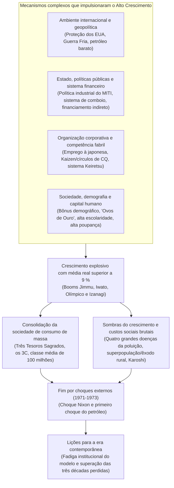
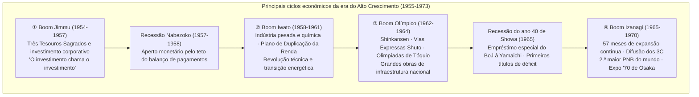
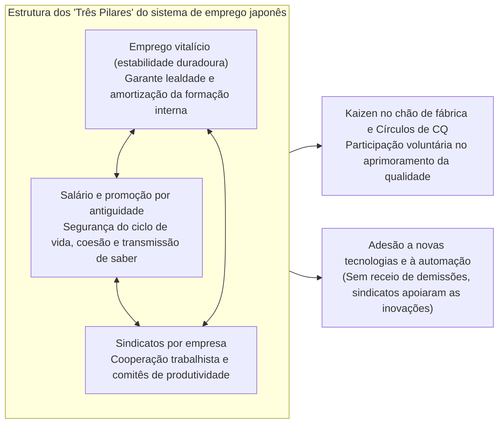
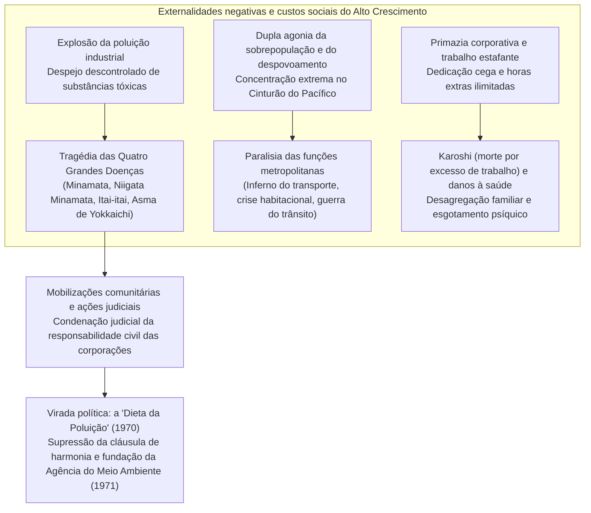

## Introdução: Um «milagre econômico» sem precedentes na história e sua verdadeira essência

Em 15 de agosto de 1945, quando o Império do Japão capitulou incondicionalmente pondo fim à Guerra do Pacífico, o arquipélago nipônico encontrava-se literalmente reduzido a cinzas. Cerca de 40 % da área urbana das principais metrópoles havia sido aniquilada por bombardeios aéreos sistemáticos, e aproximadamente um quarto de toda a riqueza nacional (cerca de 36 % dos ativos não militares) havia sido consumido pelo fogo. Tendo perdido a totalidade de suas possessões coloniais ultramarinas, mais de seis milhões de soldados desmobilizados e civis repatriados superlotavam o país, sem teto e sem emprego. A esmagadora maioria da população enfrentava a escassez cotidiana de rações alimentares, o espectro da fome extrema e o pânico de uma hiperinflação galopante. Correspondentes estrangeiros e altos oficiais do Comando Supremo das Potências Aliadas (GHQ) que visitaram o arquipélago à época foram unânimes em um prognóstico sombrio: «O Japão levará pelo menos meio século para restabelecer os padrões econômicos autônomos de uma nação moderna».

No entanto, essa previsão desoladora foi desmentida de modo espetacular, transformando para sempre a história econômica global.

Apenas uma década após o término do conflito bélico, entre 1955 e 1973 — ano em que eclodiu o primeiro choque do petróleo —, a economia japonesa realizou um avanço fulgurante, registrando uma **taxa média anual de crescimento real de aproximadamente 9,3 %**, uma trajetória quase sem paralelo nos anais da humanidade. O Produto Nacional Bruto (PNB) saltou de cerca de 8 trilhões de ienes em 1955 para cerca de 112 trilhões de ienes em 1973, multiplicando-se por quatorze. Já em 1968, coroando o objetivo secular perseguido desde a Restauração Meiji, o Japão ultrapassou a Alemanha Ocidental — potência industrial da Europa ocidental — para se firmar como a **segunda maior potência econômica do mundo capitalista**, situando-se unicamente atrás dos Estados Unidos.



Esse salto produtivo assombroso foi celebrado em todo o mundo sob a denominação de **«Milagre Econômico Oriental» (Economic Miracle)**. Os eletrodomésticos, consagrados na célebre tríade dos «Três Tesouros Sagrados» (a televisão em preto e branco, a máquina de lavar roupas elétrica e a geladeira elétrica), alcançaram os lares até os recantos mais remotos do território, cedendo lugar posteriormente ao consumo mais refinado dos «3C»: o televisor a cores (*Color TV*), o condicionador de ar (*Cooler*) e o automóvel de passeio (*Car*). O cotidiano dos cidadãos migrou de forma irreversível das comunidades rurais patriarcais para a família nuclear urbana, desfrutando de uma fartura material inédita viabilizada pela produção e consumo de massa. Emergiu uma estrutura social na qual cerca de 90 % da população se autodeclarava pertencente à classe média («sociedade de 100 milhões de classe média»), erguendo uma nação industrial caracterizada por notável segurança pública e elevados índices educacionais.

Contudo, semelhante «milagre» não resultou de mero capricho do destino nem constituiu uma dádiva caída dos céus. Foi o fruto de uma engrenagem histórica finamente articulada: a sólida base tecnológica da indústria pesada e química e os instrumentos de dirigismo burocrático herdados do pré-guerra e do período bélico; o reposicionamento geopolítico precipitado pela Guerra Fria e a virada estratégica de Washington em relação a Tóquio; a rigorosa coordenação industrial do Ministério do Comércio Internacional e Indústria (MITI) e o sistema de comboio financeiro gerido pelo Ministério das Finanças; os acordos trabalhistas centrados no emprego vitalício e na remuneração por antiguidade; e a abnegada ética de trabalho e elevadíssima propensão à poupança de uma jovem massa laboral batizada de «os ovos de ouro».

Simultaneamente, sob o fulgor desse progresso resplandecente, projetou-se uma sombra espessa, trágica e lancinante. O despejo criminoso de efluentes químicos sem tratamento e a emissão desenfreada de fumaça tóxica geraram as «Quatro Grandes Doenças da Poluição» — entre elas a doença de Minamata e a asma de Yokkaichi —, ceifando vidas e lesando de forma irreparável a saúde de populações inocentes. O êxodo desmedido do campo para as metrópoles provocou uma congestão asfixiante, precariedade habitacional e a chamada «guerra do trânsito» no Cinturão do Pacífico, ao passo que condenou o interior ao esvaziamento populacional e ao definhamento da agricultura. A classe trabalhadora, retratada nas figuras dos «assalariados ferozes» (*mōretsu shain*) ou «soldados corporativos», foi submetida a jornadas de trabalho extenuantes e a uma lealdade servil às empresas, semeando uma patologia que mais tarde ganharia repercussão global sob o termo **Karoshi** (morte por excesso de trabalho).

O presente estudo examina de maneira abrangente e multifacetada o Alto Crescimento Econômico japonês do pós-guerra (1955-1973). Indo muito além da mera crônica dos ciclos de mercado, a análise articula as dimensões macroeconômica, de política industrial, do sistema bancário, de governança corporativa, de estrutura social, da geopolítica mundial e da degradação socioambiental. Por fim, extrai ensinamentos históricos cruciais para o século XXI, desvendando por que os próprios pilares que conduziram ao triunfo de outrora se transformaram na «fadiga institucional» que paralisou a economia japonesa, arrastando-a para as «três décadas perdidas» a partir dos anos 1990.

---

## Capítulo 1: O pulsar em meio às cinzas —— A pré-história do Alto Crescimento (1945-1954)

Considerando-se o ano de 1955 como o marco inaugural do Alto Crescimento Econômico, o decênio precedente (1945-1954) constituiu um período preparatório essencial. Durante esses dez anos, removeu-se o entulho de um sistema produtivo destroçado, refundou-se o arcabouço institucional da economia de mercado e construiu-se a rampa de lançamento indispensável ao formidável salto econômico subsequente.

### 1.1 Derrota catastrófica e hiperinflação

Com a rendição incondicional de agosto de 1945, a economia do país viu-se à beira da paralisia absoluta. Em virtude do colapso imediato da produção de guerra e da interrupção total do fornecimento de matérias-primas ultramarinas, o índice de produção mineral e manufatureira em 1946 despencou para **cerca de 30 % do patamar de pré-guerra** (média de 1934-1936). O arroz, sustento elementar do povo, sofria atrasos crônicos de distribuição, forçando os moradores das cidades à «vida de broto de bambu» (*takenoko seikatsu*), na qual desfaziam-se de vestimentas e objetos domésticos para trocá-los por comida no campo.

Essa carência extrema de oferta foi agravada por uma hiperinflação descontrolada. As liquidações de despesas militares emergenciais autorizadas sem critério pelo exército nos momentos derradeiros da guerra, o pagamento de vultosas indenizações a fornecedores militares logo após o armistício e as compensações de desmobilização inflaram a emissão de papel-moeda pelo Banco do Japão a patamares vertiginosos. Entre o outono de 1945 e 1949, o índice de preços no atacado multiplicou-se por **cerca de setenta vezes**.

Diante do colapso da moeda, o governo editou em fevereiro de 1946 a «Ordem de Medidas Financeiras de Emergência». O decreto impôs o congelamento de todos os depósitos bancários, vetou saques e extinguiu a validade das cédulas em circulação, obrigando à troca forçada pelo chamado «novo iene». No entanto, enquanto a capacidade produtiva permanecesse destroçada, revelava-se inviável conter a espiral inflacionária.

```
【Evolução dos principais indicadores econômicos no início do pós-guerra】
・Nível de produção mineral e industrial (1946): 30,7 % em relação à base pré-bélica (1934-36 = 100)
・Taxa de inflação no atacado em Tóquio (1946): +364,5 % na comparação anual
・Ração oficial diária de arroz (fim de 1945): reduzida a 2 gō e 1 shaku (aprox. 297 g) por adulto, com quebras frequentes
・Total de repatriados do ultramar (1945-1950): aproximadamente 6,25 milhões de indivíduos
```

Para debelar essa estagnação produtiva, o governo aprovou no final de 1946 — implementando a partir de 1947 — o **«Sistema de Produção Prioritária» (Priority Production System)**, concebido pelo professor Hiromi Arisawa, da Universidade de Tóquio. A tese central do programa postulava que os escassos recursos do país (capital, insumos, moeda forte e mão de obra) não deveriam ser dispersos pelas forças de mercado, mas sim canalizados com exclusividade para dois setores basilares: o **carvão** e o **aço**, de modo que sua dinamização recíproca alavancasse a recuperação industrial geral.

Na prática, o carvão extraído nas jazidas nacionais era remetido com máxima prioridade às usinas para a fundição do aço; o aço produzido, por seu turno, era destinado com prioridade às minas de carvão para a sustentação de galerias e a confecção de maquinário de lavra, impulsionando a produção carbonífera. Esse círculo virtuoso entre ferro e carvão gerou excedentes que abasteceram progressivamente outros ramos indispensáveis, como a eletricidade, os fertilizantes químicos e as ferrovias de carga.

O suporte creditício dessa estratégia veio com a fundação, em janeiro de 1947, do **Banco Financeiro de Reconstrução (Fukkō Kin'yū Kinko, vulgarmente conhecido como Fukkin)**. A instituição captava recursos por meio da emissão de bônus garantidos pelo Estado, subscritos em grande parte diretamente pelo Banco do Japão, despejando crédito de longo prazo a juros favorecidos nas indústrias de base. Ao término de 1948, os financiamentos do Fukkin representavam cerca de 70 % de todos os investimentos em instalações dos principais setores industriais.

O Sistema de Produção Prioritária obteve êxito notável ao restabelecer a produção básica. Entretanto, a subscrição direta dos títulos pelo banco central injetou liquidez excessiva na praça, alimentando uma grave ressaca inflacionária apelidada de **«inflação Fukkin»**.

### 1.2 A Linha Dodge e as Recomendações Shoup: Estabelecendo os alicerces da economia de mercado

Perante a ameaça da inflação Fukkin, a liderança norte-americana alterou frontalmente suas diretrizes de ocupação. Sob a pressão do acirramento da Guerra Fria (a vitória da revolução comunista chinesa em 1949 e a divisão do planeta em dois blocos rivais), os EUA deixaram de ver o Japão como uma «potência inimiga derrotada a ser desarmada» e passaram a tratá-lo como o «bastião anticomunista e baluarte do capitalismo no Extremo Oriente». Para consolidar tal posição, era imperativo que a economia japonesa cessasse sua dependência dos volumosos fundos de assistência norte-americanos (GARIOA e EROA) e se sustentasse com vigor no comércio mundial.

Em fevereiro de 1949, aportou em Tóquio como emissário plenipotenciário **Joseph M. Dodge**, presidente do Detroit Bank, aplicando um rigoroso tratamento de choque à economia: a célebre **«Linha Dodge» (Dodge Line)**. Suas determinações centrais organizavam-se em três eixos:

1. **Adoção de um orçamento estritamente superavitário**: Proibição taxativa de emissão de dívida pública, extinção célere de déficits orçamentários e exigência não apenas de equilibrar receitas e despesas, mas de gerar superávits reais para amortizar passivos passados.
2. **Cessação de novos empréstimos do Fukkin e abolição das subvenções**: Suspensão integral dos subsídios de equalização de preços (vultosas verbas públicas que cobriam a diferença entre o custo real de produção e os preços oficiais fixados pelo Estado).
3. **Fixação de uma taxa cambial única**: Em 25 de abril de 1949, foi estabelecida a paridade cambial fixa de **1 dólar = 360 ienes**.

A eliminação da intrincada teia de taxas cambiais múltiplas, que fixava cotações diferenciadas para dezenas de itens, e a conexão imediata com o mercado global por meio da janela única de 360 ienes expuseram compulsoriamente os produtores japoneses à competição internacional. Pela ótica da paridade do poder de compra daquela época, essa taxa de 360 ienes representava uma desvalorização da moeda japonesa, o que a longo prazo se converteria em uma poderosa alavanca de competitividade para a indústria exportadora nacional.

No curto prazo, todavia, o impacto da Linha Dodge foi impiedoso. O corte das despesas do governo e uma severa restrição monetária afundaram o Japão numa aguda deflação. Companhias de médio e pequeno porte quebraram em série, enquanto os grandes grupos corporativos promoveram demissões em massa para manterem-se solventes: era a chegada da «recessão Dodge». Centenas de milhares de operários e funcionários foram para a rua, tanto nas empresas privadas quanto nas estatais (Ferrovias Nacionais, Monopólio do Tabaco), espalhando um clima de tensão social turbulenta, ilustrado pelos três misteriosos incidentes ferroviários não desvendados (Shimoyama, Mitaka e Matsukawa).

Em conjunto com a Linha Dodge, a espinha dorsal institucional do país foi consolidada pelas **«Recomendações Shoup»**, formuladas pela comissão tributária liderada pelo professor **Carl S. Shoup**, da Universidade de Columbia, que chegou ao país em maio de 1949. O relatório Shoup extinguiu a confusa e regressiva teia de impostos indiretos para erigir um **sistema tributário moderno centrado em tributos diretos, tendo o imposto de renda como eixo condutor**.

A reforma Shoup criou a «declaração azul» (*aoiro shinkoku*), institucionalizando a contabilidade padronizada nos negócios; assegurou a solidez das finanças municipais e provinciais (matriz do Fundo de Participação dos Municípios); e disciplinou o imposto de renda sobre as pessoas jurídicas, construindo um ambiente fiscal transparente e confiável. Graças à disciplina orçamentária imposta por Dodge e à modernização microinstitucional trazida por Shoup, o Japão adquiriu a base institucional indispensável para a operação de uma economia de mercado capitalista.

### 1.3 A Guerra da Coreia e o impacto das «encomendas especiais»: O estopim da acumulação de capital

Quando a economia japonesa se encontrava quase sufocada pela deflação provocada pela Linha Dodge, em 25 de junho de 1950 teve início a **Guerra da Coreia** na península contígua. A despeito do horror humano e da comoção geopolítica que o conflito representou, a guerra operou como um autêntico milagre salvador para a debilitada economia nipônica, ensejando a célebre declaração reservada do primeiro-ministro Shigeru Yoshida, que a definiu como uma «graça divina» (*ten'yu*).

Com a intervenção militar das forças das Nações Unidas (compostas em sua imensa maioria por divisões norte-americanas), o Japão, na condição de polo fabril mais próximo do teatro de operações, converteu-se de imediato na principal base de suprimentos e serviços: iniciou-se o ciclo das **«encomendas especiais da Guerra da Coreia» (Tokuju)**.

Os itens encomendados pelas forças norte-americanas abrangeram uma ampla diversidade de manufaturas:
- **Material bélico e siderurgia**: Caminhões, jipes militares, tambores de combustível, rolos de arame farpado, peças sobressalentes para armamentos e caixas de munição.
- **Têxteis e fardamento**: Tecidos de uniformes, sacos de aniagem, cobertores, lonas para tendas e coturnos.
- **Serviços gerais**: Reparo, revisão e reconstrução de blindados e aeronaves danificados em combate, logística de transporte e telecomunicações.

Entre 1950 e o armistício assinado em 1953, o faturamento gerado por essas compras totalizou **cerca de 2,4 bilhões de dólares** (valor correspondente a aproximadamente 60 % de todas as receitas de exportação do Japão naquele quadriênio). Esse colossal fluxo de moeda forte eliminou instantaneamente a escassez de divisas que asfixiava a nação desde o pós-guerra.

```
【Impacto quantitativo das encomendas especiais da Coreia na economia japonesa (1950-1953)】
・Valor total dos contratos de suprimento militar: aprox. 2,4 bilhões de dólares (compras diretas + gastos das tropas)
・Taxa de crescimento real do PIB: ano fiscal de 1950: +10,8 %; 1951: +12,3 %; 1952: +10,0 %; 1953: +7,3 %
・Índice da produção industrial: cresceu cerca de 70 % em apenas um ano (1950), retomando em 1951 os níveis pré-bélicos
・Excepcional recuperação dos lucros: a margem líquida da indústria atingiu recordes históricos do pós-guerra no final de 1950
```

A importância dessas encomendas ultrapassou com folga o escoamento de estoques retidos.
Em primeiro lugar, ao reparar e produzir caminhões militares em massa, os fabricantes automotivos (como Toyota, Nissan e Isuzu) assimilaram as rígidas normas de controle de qualidade das forças armadas americanas (normas mil-spec), aprimorando substancialmente a intercambialidade de peças e a engenharia de montagem em série. Em segundo lugar, os extraordinários lucros retidos nos balanços corporativos formaram as reservas financeiras próprias que custeariam os fabulosos investimentos em bens de capital do período seguinte (modernização de aciarias, aquisição de maquinário importado de ponta).

### 1.4 O Tratado de São Francisco e a proclamação de que «o pós-guerra acabou»

Em setembro de 1951, o Japão firmou o Tratado de Paz de São Francisco e o Tratado de Segurança Bilateral com os Estados Unidos. Com sua entrada em vigor a 28 de abril de 1952, expiraram os sete anos de ocupação militar pelas tropas aliadas, restaurando formalmente a plena soberania nacional.

Reintegrado à comunidade internacional, o país alinhou-se decididamente ao bloco ocidental liderado pelos Estados Unidos. A linha diplomática e de segurança concebida por Shigeru Yoshida, a **«Doutrina Yoshida»**, condensou a prioridade nacional com extrema racionalidade: transferir a defesa territorial para o escudo do tratado de segurança com os EUA, limitar os gastos militares a um teto inferior a 1 % do PNB e direcionar todas as energias, talentos e capitais para a recuperação econômica e a expansão mercantil externa. Essa postura legou às companhias nacionais um contexto de negócios formidável, desonerado dos pesados tributos da corrida armamentista.

A despeito de uma breve desaceleração cíclica decorrente do fim das hostilidades na Coreia em 1953, nas entranhas da estrutura produtiva já operava um ciclo expansivo autônomo, liderado pelos investimentos em instalações. Em 1955, sob o influxo de colheitas agrícolas excepcionais propiciadas pelo clima e pela expansão do comércio internacional, inaugurou-se uma fase de crescimento com estabilidade de preços, consagrada como o «boom quantitativo» (*sūryō keiki*).

Esse salto qualitativo foi solemnemente atestado no celebrado *Livro Branco da Economia* do ano fiscal de 1956 (ano 31 da Era Showa), elaborado sob a batuta de **Yonosuke Gotō**, economista da Agência de Planejamento Econômico. A passagem de encerramento do relatório consagrou-se para sempre na história contemporânea japonesa:

> **«Já não estamos no "pós-guerra". Encontramo-nos perante uma conjuntura inteiramente nova. O crescimento decorrente da mera recuperação terminou. O crescimento que se avizinha será sustentado pela modernização.»**

Essa advertência pretendia ser muito mais que uma celebração triunfalista. Indicava que a etapa de reocupação dos índices de produção anteriores à guerra estava finda. A partir daquele momento, a nação não poderia mais escorar-se em doações externas, empréstimos ou bonanças bélicas alheias. Era um chamamento vigoroso: caso o país não incorporasse com celeridade as vanguardas da tecnologia moderna (automação, química de polímeros, semicondutores, usinas termelétricas de grande escala) e não reconvertesse seu perfil manufatureiro da indústria leve tradicional para as indústrias pesada e química avançadas, sucumbiria de modo inapelável na arena competitiva global.

Com uma pujança que desbordaria os prognósticos mais ousados daquele documento, a economia japonesa ingressou na maior aventura de modernização e industrialização da história recente.

---

## Capítulo 2: Crônica dos ciclos econômicos e do Alto Crescimento (1955-1973)

Nos dezoito anos compreendidos entre 1955 e 1973, o trajeto econômico do Japão não consistiu em uma marcha contínua e linear. Na realidade, avançou aos saltos, galgando patamares de riqueza através de intensos ciclos econômicos que alternavam momentos de euforia de investimentos e consumo com fases de ajuste restritivo, desencadeadas pela queima de reservas externas decorrente do disparo nas importações.

Preso à paridade cambial fixa e inabalável de 1 dólar = 360 ienes, o montante de divisas em poder da autoridade monetária atuava como um limite incontornável. Quando a atividade econômica aquecia em demasia, as compras de insumos e maquinários importados explodiam, deteriorando a balança de pagamentos; tão logo as reservas monetárias caíam a níveis de risco, o Banco do Japão elevava a taxa básica de redesconto para desaquecer a demanda interna. Essa oscilação recorrente foi rotulada como o **«teto do balanço de pagamentos»** (*kokusai shūshi no tenjō*), constituindo o principal condicionante macroeconômico daquele período.

A cronologia a seguir detalha as cinco grandes fases de expansão que assinalaram essa era excepcional.



### 2.1 O Boom Jimmu (1954-1957) e a recessão Nabezoko: A reação em cadeia dos investimentos

A escalada que teve início em novembro de 1954 foi batizada de **«Boom Jimmu»**, sugerindo com ufania que se tratava de uma bonança jamais vista desde a coroação do legendário imperador inaugural do Japão, Jimmu.

O grande motor propulsor dessa etapa foi a torrente de **investimentos privados em bens de capital**. As corporações de ramos como siderurgia, construção naval, tecidos sintéticos, petroquímica e maquinário elétrico competiram ferozmente na incorporação de equipamentos ultramodernos e na montagem de plantas fabris de grande envergadura. Esse fenômeno foi sintetizado no *Livro Branco da Economia* de 1957 pela fórmula antológica: **«o investimento chama o investimento»** (*tōshi ga tōshi o yobu*).

Quando as companhias de aço ampliavam sua capacidade instalada, faziam vultosas encomendas aos fabricantes de maquinário pesado; para atender a esses pedidos, os produtores de bens de capital precisavam erguer novos galpões industriais, o que, por sua vez, reaquecia a procura por vigas de aço, cimento e energia. Esse dinamismo intersetorial autossustentado impulsionou poderosamente a renda nacional.

Paralelamente, a revolução do conforto doméstico alcançava o povo. Os **«Três Tesouros Sagrados»** (a televisão preto e branco, a lavadora elétrica e o refrigerador) tornaram-se acessíveis às classes médias urbanas, minorando as tarefas domésticas e inaugurando novas formas de lazer em família.

Porém, com a chegada de 1957, vieram à tona os custos da aceleração excessiva. O salto nas importações de matérias-primas desequilibrou as contas externas e drenou as reservas de dólares para patamares alarmantes: o país colidia frontalmente contra o «teto do balanço de pagamentos». O Banco do Japão respondeu de pronto elevando as taxas de juros e contraindo o crédito. A atividade econômica sofreu uma freada abrupta, os preços de mercadorias básicas desabaram e o país amargou, do fim de 1957 a 1958, a pasmaceira conhecida como a **«recessão Nabezoko»** (fundo de frigideira). Contudo, o ímpeto modernizador das empresas não arrefeceu, e a reversão do quadro deu-se com notável presteza.

### 2.2 O Boom Iwato (1958-1961) e o Plano de Duplicação da Renda Nacional: A arrancada da indústria pesada e química

Superado o marasmo da recessão Nabezoko em julho de 1958, sobreveio um ciclo ainda mais vigoroso. Remontando ao relato mitológico da deusa do sol Amaterasu emergindo de sua caverna celestial, a expansão foi consagrada como o **«Boom Iwato»**. Ao longo dessa fase, o Japão exibiu um ritmo médio de expansão real de impressionantes **11,3 % ao ano**.

O traço definidor do Boom Iwato consistiu na transição categórica do núcleo produtivo da nação: as manufaturas leves perderam o papel principal para a **indústria pesada e química (siderurgia, petroquímica, montadoras de automóveis e fabricantes de turbinas elétricas)**. A matriz energética sofreu uma guinada vertiginosa: o carvão nacional foi paulatinamente preterido pelo petróleo barato, farto e limpo originário do Oriente Médio. Nas enseadas das baías de Tóquio, Ise e no Mar Interior de Seto, foram aterradas vastas áreas costeiras para a instalação de gigantescos complexos siderúrgicos e petroquímicos (*kombinats*).

No tabuleiro político, deu-se uma guinada histórica. Em 1960, a renovação parlamentar do Tratado de Segurança com os Estados Unidos provocou as violentas revoltas de Anpo, a maior convulsão sociopolítica do pós-guerra, que cercou a Dieta com centenas de milhares de manifestantes indignados. Com a renúncia do primeiro-ministro Nobusuke Kishi para distensionar o ambiente público, seu sucessor, **Hayato Ikeda**, direcionou habilmente o foco popular das disputas ideológicas para a ascensão do padrão de vida ao lançar o **«Plano de Duplicação da Renda Nacional»** (*Kokumin Shotoku Baizō Keikaku*), em dezembro de 1960.

Amparado nos alicerces teóricos formulados pelo economista Osamu Shimomura, o plano estabelecia a meta de **dobrar o Produto Nacional Bruto real no prazo de dez anos (1961-1970), assegurando o pleno emprego e alçando o bem-estar material da população aos padrões das nações industriais da Europa ocidental**. Isso pressupunha crescer a 7,2 % ao ano, meta acolhida com descrédito pela oposição e por grande número de acadêmicos.

Os acontecimentos, todavia, superaram os prognósticos mais confiantes. A iniciativa empresarial multiplicou-se e a meta de dobrar o rendimento real foi atingida em pouco mais de quatro anos. O lema conciliador de Ikeda, sintetizado em «tolerância e paciência» e na promessa tangível de «salários em dobro», infundiu numa sociedade marcada pelas privações da guerra uma inabalável segurança no desenvolvimento econômico.

### 2.3 O Boom Olímpico (1962-1964) e a revolução das infraestruturas

Após o ciclo Iwato e mais um breve intervalo de desaceleração ditado pela balança de pagamentos, a expansão recuperou força no final de 1962 com o **«Boom Olímpico»**. O Estado mobilizou todos os seus recursos para garantir o brilho dos XVIII Jogos Olímpicos de Verão de Tóquio (outubro de 1964), os primeiros organizados em território asiático, concebidos como o atestado perante o mundo da ressurreição nacional.

O volume de investimentos alocado em obras de saneamento, transportes e arquitetura urbana aproximou-se de um trilhão de ienes, montante equivalente a todo o orçamento governamental daquele período:
- **Tokaido Shinkansen**: Entregue à população em 1.º de outubro de 1964, o trem de alta velocidade pioneiro no mundo uniu Tóquio e Shin-Osaka a 210 km/h em somente quatro horas (reduzidas a 3 horas e 10 minutos no ano seguinte), redesenhando por completo a espinha dorsal de transportes do arquipélago.
- **Vias Expressas Meishin e Malha Shuto**: A inauguração da rodovia interestadual Meishin e os viadutos da malha viária expressa de Tóquio trouxeram desafogo ao tráfego metropolitano.
- **Transformação do espaço urbano**: O monotrilho ligando o aeroporto de Haneda ao centro de Tóquio, a conclusão da linha de metrô Hibiya, a edificação de suntuosos complexos hoteleiros como o Hotel New Otani, bem como a extensão da rede de esgotos repaginaram o perfil da capital.

No setor televisivo, a transmissão ao vivo dos eventos desencadeou a aquisição em massa de aparelhos de TV em cores, enquanto o sucesso da primeira transmissão transoceânica via satélite (pelo Syncom 3) demonstrou à comunidade das nações o nível tecnológico atingido pelo Japão.

### 2.4 A crise dos títulos mobiliários (1965 / Recessão do ano 40 de Showa) e a guinada na política fiscal

Logo após o encerramento das competições olímpicas, contudo, a economia nipônica deparou-se com seu mais árduo desafio do pós-guerra: a **«recessão do ano 40 de Showa»** (1965).

A fabulosa capacidade produtiva erguida para suprir a demanda dos Jogos transformou-se subitamente em ociosidade após a entrega das obras, arremessando o número de falências empresariais a patamares nunca vistos. O mercado de capitais sofreu pesadas perdas, e uma das quatro gigantescas corretoras de valores do país, a **Yamaichi Securities**, viu-se assolada por rombos monumentais, ficando às portas da falência técnica.

Para evitar um pânico sistêmico e a corrida aos balcões bancários, o ministro das Finanças, **Kakuei Tanaka**, atuando em uníssono com o presidente do Banco do Japão, Makoto Usami, tomou uma decisão excepcional: autorizou, com respaldo no artigo 25 da Lei do Banco do Japão, o fornecimento de **créditos especiais ilimitados e desprovidos de garantia real (empréstimos emergenciais do BoJ ou *Nichigin tokuyū*)** à Yamaichi Securities, estancando prontamente a histeria dos investidores.

Paralelamente, o governo rompeu o tabú sagrado herdado da Linha Dodge e inscrito no artigo 4.º da Lei de Finanças Públicas: o dogma do equilíbrio orçamentário estrito. No orçamento suplementar de 1965, o parlamento autorizou pela primeira vez a emissão de **«títulos públicos especiais de déficit» (bônus da dívida pública)**. Essa atuação anticíclica de inspiração keynesiana — combinando gasto suplementar em obras públicas e desagravos tributários — reaqueceu a demanda e encurtou a depressão. Esse sucesso pavimentou o caminho para a mais duradoura época de ouro da nação.

### 2.5 O Boom Izanagi (1965-1970): Os 57 meses de ouro e a ascensão ao segundo lugar global

Partindo do vale de novembro de 1965 e prolongando-se até julho de 1970, a economia desfrutou de um período de prosperidade excepcional que durou quase cinco anos: o **«Boom Izanagi»**, denominado em homenagem à divindade primordial Izanagi, remontando às narrativas míticas de criação do Japão. O ciclo encadeou impressionantes **57 meses ininterruptos de crescimento**, obliterando todos os marcos precedentes.

Esse longo fôlego resultou de uma extraordinária competitividade exportadora combinada à elevação dos padrões de consumo doméstico. A busca por bens de prestígio migrou dos primitivos Três Tesouros para as afamadas **«3C»**:
- **Color TV (Televisor em cores)**
- **Cooler (Aparelho de ar-condicionado residencial)**
- **Car (Automóvel particular de passageiros)**

A chegada ao mercado, em 1966, de modelos familiares como o Toyota Corolla e o Nissan Sunny deu partida ao «ano inaugural da motorização pessoal» (*my car*). A indústria de transformação, mediante meticuloso controle de processos e obsessão pelo acabamento, superou o estigma do pré-guerra de confeccionar produtos descartáveis. A etiqueta *Made in Japan* transformou-se em selo mundial de durabilidade, baixa manutenção e eficiência mecânica.

Em 1968, um marco monumental inscreveu-se na história da nação: com um PNB nominal de **aproximadamente 141,9 bilhões de dólares**, o Japão ultrapassou a Alemanha Ocidental para se posicionar como a **segunda maior potência econômica do mundo capitalista**, imediatamente atrás dos Estados Unidos. Um século exato após a Restauração Meiji de 1868, o arquipélago que emergira desolado da guerra emparelhava-se com as potências ocidentais no topo da riqueza industrial.

A celebração simbólica desse ápice ocorreu em 1970 com a **Exposição Universal de Osaka (Expo '70)**, a pioneira no continente asiático, consagrada ao lema «Progresso e harmonia para a humanidade». Sob a guarda da Torre do Sol, erguida por Tarō Okamoto no parque de Senri, o evento recebeu em meio ano a portentosa marca de **64,21 milhões de visitantes**. A rocha lunar abrigada no pavilhão dos EUA, as esteiras rolantes e os pavilhões de estética futurista ficaram marcados na alma da nação como o símbolo do ressurgimento vitorioso de um povo que superara a desolação bélica.

```
【Evolução dos principais agregados macroeconômicos do Alto Crescimento (exercícios 1955-1974)】
```

| Exercício | Crescimento real do PIB (%) | PNB nominal (cem milhões de ienes) | Fase cíclica / Marcos históricos relevantes |
| :---: | :---: | :---: | :--- |
| **1955** | **+10,8** | 88.646 | Início do Boom Jimmu; popularização dos Três Tesouros Sagrados |
| **1956** | **+6,2** | 98.719 | Livro Branco: «O pós-guerra acabou»; adesão à ONU |
| **1957** | **+7,8** | 111.280 | Recessão Nabezoko; esbarro no teto do balanço de pagamentos |
| **1958** | **+5,6** | 118.527 | Início do Boom Iwato; conclusão da Torre de Tóquio |
| **1959** | **+11,2** | 134.228 | Casamento do príncipe Akihito; difusão maciça do televisor |
| **1960** | **+12,5** | 160.332 | Distúrbios de Anpo; gabinete Ikeda aprova o Plano de Duplicação da Renda |
| **1961** | **+12,0** | 196.442 | Consolidação da petroquímica e siderurgia; transição energética para o petróleo |
| **1962** | **+8,9** | 220.119 | Início do Boom Olímpico; inauguração de Senri New Town |
| **1963** | **+10,7** | 256.419 | Inauguração da rodovia Meishin (trecho Ritto-Amagasaki) |
| **1964** | **+13,1** | 295.444 | Olimpíadas de Tóquio; estreia do Shinkansen; ingresso na OCDE |
| **1965** | **+5,8** | 328.217 | Recessão de 1965; socorro à Yamaichi; primeiros bônus da dívida pública |
| **1966** | **+10,6** | 382.900 | Consolidação do Boom Izanagi; ano do carro popular (Corolla e Sunny) |
| **1967** | **+11,1** | 446.953 | Adoção veloz dos 3C; edição da Lei Básica contra a Poluição |
| **1968** | **+12,2** | 528.781 | **O PNB do Japão supera o da Alemanha Ocidental (2.º lugar no mundo livre)** |
| **1969** | **+12,5** | 622.464 | Conclusão da rodovia Tomei; arrancada da televisão em cores |
| **1970** | **+10,7** | 733.449 | Expo '70 de Osaka (64,21 milhões de pessoas); «Dieta da Poluição» |
| **1971** | **+5,0** | 809.726 | Choque Nixon; Acordo Smithsoniano (adoção de 1 dólar = 308 ienes) |
| **1972** | **+9,1** | 954.646 | Gabinete Tanaka: «Remodelação do Arquipélago»; laços com a China |
| **1973** | **+5,1** | 1.125.487 | Câmbio flutuante; 1.º choque do petróleo; «preços ensandecidos» |
| **1974** | **-1,2** | 1.348.229 | **Primeira retração do PIB no pós-guerra; fim formal do Alto Crescimento** |

---

## Capítulo 3: Por que ocorreu o «milagre»? —— Anatomia dos mecanismos multidimensionais

O Alto Crescimento Econômico japonês não foi uma obra espontânea do livre mercado irrestrito (*laissez-faire*), tampouco pode ser esclarecido por lugares-comuns sobre a suposta inclinação natural do trabalhador nipônico ao labor desmedido. Ele nasceu do desenvolvimento planejado de um refinado **«capitalismo corporativo à japonesa»**, no qual se conjugaram em perfeita harmonia a coordenação do Estado, um sistema financeiro protetor, relações trabalhistas conciliadoras, rotinas de garantia de qualidade na fábrica, uma excepcional janela demográfica e uma vantajosa posição internacional moldada pela Guerra Fria.

A seguir, dissecam-se os seis alicerces estruturais que viabilizaram essa engrenagem.



### 3.1 Política industrial e tutela estatal: A estratégia setorial orientada do MITI

Em sua obra clássica *MITI and the Japanese Miracle*, o cientista político norte-americano Chalmers Johnson introduziu a categoria do **«Estado Desenvolvimentista» (Developmental State)** para diferenciar a experiência japonesa dos «Estados reguladores» anglo-saxões. Enquanto o Estado regulador limita-se a policiar os regulamentos da concorrência leal, o Estado desenvolvimentista nipônico delimitou metas de produção estratégicas e mobilizou os recursos da nação para alcançá-las, tendo no Ministério do Comércio Internacional e Indústria (MITI) seu braço condutor.

A genialidade da condução do MITI consistiu em ignorar deliberadamente o postulado liberal das vantagens comparativas estáticas (que condenaria o Japão do pós-guerra a ser para sempre um exportador de sedas, produtos têxteis ou quinquilharias de mão de obra barata). Em contrapartida, os burocratas do MITI vislumbraram as vantagens comparativas dinâmicas: identificar setores industriais que experimentariam enorme demanda mundial futura e elevado poder de indução em outras cadeias produtivas. Foram selecionados e protegidos ramos industriais de alta densidade de capital e conhecimento: **aço, estaleiros navais, petroquímica, automóveis, maquinário-ferramenta e eletroeletrônicos**.

Para efetivar essas metas, o MITI usou três mecanismos de intervenção:

1. **Gestão do orçamento de moeda estrangeira (Lei de Controle Cambial e de Comércio Exterior)**:
   Em tempos de crônica falta de divisas, o Estado centralizava todos os dólares. O MITI contemplava com máxima preferência as fábricas dos segmentos selecionados, viabilizando a importação de patentes, laminadores a quente e processos petroquímicos sofisticados da Europa e dos EUA. Por outro lado, bloqueava as divisas para a compra de produtos supérfluos ou mercadorias estrangeiras concorrentes, erguendo um escudo protetor intransponível sobre o mercado consumidor doméstico.
2. **Efeito indutor do crédito do Banco de Desenvolvimento do Japão (JDB / Kaigin)**:
   Quando essa instituição bancária pública aprovava um crédito privilegiado para uma grande planta (como um porto siderúrgico ou usina química), as instituições financeiras privadas deduziam que a operação possuía o aval irrestrito do Estado. Esse efeito de atração (*pump-priming*) gerava uma enxurrada de aportes sindicados da rede privada em direção aos ramos industriais protegidos.
3. **Pactuação público-privada e moderação de novos empreendimentos**:
   Para evitar que a rivalidade predatória entre os conglomerados industriais desencadeasse excessos de capacidade de produção, o MITI promovia comissões mistas reunindo os líderes corporativos. Nesses encontros, eram acertados os cronogramas de entrada em operação de novos altos-fornos e cotas de refino por meio de cartéis de racionalização supervisionados, blindando as companhias contra riscos desmedidos em megainvestimentos.

### 3.2 A alquimia do sistema financeiro: Hegemonia do financiamento indireto e o sistema de comboio

A descomunal taxa de investimentos em instalações industriais (que frequentemente superava a marca de 30 % do PIB) foi alimentada por uma arquitetura bancária de características singulares.

No modelo anglo-saxão de mercado livre, as empresas auferem capital primordialmente pela emissão direta de ações ou títulos de dívida nas bolsas de valores ou através de reservas próprias. No Japão do pós-guerra, com o capital social consumido pela catástrofe bélica, as empresas sobreviviam com fundos próprios insignificantes. A engrenagem escolhida foi a **«intermediação financeira indireta»**, ancorada nos empréstimos dos bancos comerciais.

Essa estrutura operacional apoiava-se em três peculiaridades:

- **O modelo do «banco principal» (*main bank*)**:
  Toda grande empresa formava um laço simbiótico com uma instituição financeira urbana central (Mitsui, Mitsubishi, Sumitomo, Fuji, Dai-Ichi Kangyō, Sanwa ou bancos de crédito a longo prazo como o IBJ). O banco principal ia muito além do suprimento rotineiro de empréstimos: subscrevia participações acionárias cruzadas para blindar a diretoria contra investidores oportunistas, indicava conselheiros e escrutinava as contas sociais. Essa estreita união livrou os executivos da pressão imediatista por rentabilidade trimestral nas bolsas, permitindo-lhes arriscar apostas técnicas com retornos esperados para cinco ou dez anos adiante.
- **Endividamento corporativo agudo (*over-borrowing*) e sobreempréstimo bancário (*over-loan*)**:
  As companhias alavancavam-se em patamares que seriam considerados perigosos no Ocidente. Os bancos comerciais, por sua vez, emprestavam à indústria acima do volume total de depósitos que captavam dos poupadores, preenchendo esse gap estrutural por meio de redesconto contínuo no Banco do Japão. A autoridade monetária regulava com precisão a torneira do crédito por meio da taxa básica e das recomendações verbais reservadas («orientação de guichê» ou *madoguchi shidō*).
- **O «sistema de comboio» (*gosō sendan hōshiki*) e o tabelamento de juros**:
  O Ministério das Finanças impunha juros subsidiados por via da Lei Provisória de Ajuste de Taxas de Juros, rebaixando os custos de captação da indústria. Simultaneamente, administrava o setor bancário de forma detalhista: o estabelecimento de agências, os produtos e a remuneração de depósitos eram tabelados para evitar que mesmo o banco mais fragilizado viesse à bancarrota. Inspirado na formação naval militar em que o ritmo de toda a frota se amolda à velocidade da embarcação mais lenta, o modelo expurgou o risco de corridas bancárias e incutiu nos cidadãos uma fé inabalável nas instituições financeiras.

Completando essa estrutura, sobressaía o colossal **Programa de Investimentos e Empréstimos Fiscais (FILP / *Zaisei Tōyūshi*)**, rotulado de «o segundo orçamento nacional». As economias depositadas pelas famílias nas agências da Caixa Econômica Postal e as contribuições previdenciárias eram acolhidas pelo Fundo de Depósitos do Tesouro. Sem sobrecarregar o contribuinte de impostos, essa montanha de recursos financiava o traçado do Shinkansen, a malha de autopistas, a construção de conjuntos habitacionais e obras portuárias de ponta.

### 3.3 A consolidação do modelo de emprego japonês: Os «Três Pilares» das relações de trabalho

No cotidiano das fábricas e escritórios, o dinamismo do crescimento foi garantido pelo **«sistema de emprego japonês»**, instituído após a contenção e refluxo das rudes greves do início dos anos cinquenta (como o levante operário da Nissan em 1953 e o conflito da mina de Miike em 1960). Analisado pelo sociólogo James Abegglen em seu tratado *The Japanese Factory*, esse arranjo apoiava-se em três pilares interligados:

1. **Emprego vitalício (*shūshin koyō*)**:
   As empresas contratavam formalmente turmas de jovens recém-formados com o compromisso tácito de resguardar seus postos até a aposentadoria regulamentar. Isso proporcionava à empresa a segurança de amortizar os pesados investimentos despendidos no treinamento prático no próprio local de trabalho (*On-the-Job Training* - OJT) e concedia ao trabalhador uma estabilidade existencial ímpar.
2. **Remuneração e promoção por antiguidade (*nenkō joretsu*)**:
   As faixas de remuneração e a graduação hierárquica avançavam em sincronia com o avanço da idade e dos anos de dedicação ininterrupta ao estabelecimento. Nos primeiros anos profissionais, o salário permanecia aquém da produtividade entregue, reforçando os fundos de reinvestimento das firmas; com a maturidade, ao chegarem as despesas com matrimônio, colégio dos filhos e compra do imóvel, o contracheque crescia, atendendo precisamente às exigências do ciclo de vida familiar.
3. **Sindicatos por empresa (*kigyōbetsu rōdō kumiai*)**:
   Diferentemente do sindicalismo por ofício ou ramo de atividade comum no Ocidente, no Japão as entidades sindicais organizavam-se estritamente no âmbito interno de cada corporação, acolhendo todos os empregados regulares. Como as lideranças sindicais pertenciam ao quadro funcional com perspectivas de carreira, cultivou-se um arraigado senso de destino compartilhado: compreendia-se que a valorização dos proventos e a elevação dos bônus anuais dependiam da solidez competitiva e da lucratividade da própria firma.

Essa estrutura produziu consequências cruciais na assimilação do progresso técnico.

Nas oficinas ocidentais, a introdução de esteiras robotizadas esbarrava rotineiramente na resistência combativa dos sindicatos de ofício, temerosos da extinção de postos e da perda de seus papéis funcionais. Nas usinas japonesas, ao contrário, protegidos pelo emprego vitalício, os trabalhadores sabiam que a automação de uma linha de produção nunca resultaria em demissão; implicava unicamente remanejamento interno (*haiten*) e capacitação para operar maquinários mais avançados.

Em razão disso, **operários e sindicatos acolheram com entusiasmo as novas tecnologias e a robotização industrial**, confiantes de que a ampliação dos lucros operacionais se desdobraria em bônus semestrais mais polpudos.

Acrescente-se a isso o advento, a partir de 1955, da prática do **«Shuntō» (Ofensiva Trabalhista da Primavera)**. Anualmente, na primavera, as confederações sindicais dos setores pioneiros (aço, montadoras, estaleiros, química) alinhavam conjuntamente suas reivindicações salariais perante a classe empresarial. O índice negociado no setor siderúrgico balizava os reajustes para toda a economia, incluindo as firmas médias e pequenas. Graças a esse método de negociação coletiva, os salários reais cresceram a uma média de 10 % anuais ao longo de quase duas décadas, oxigenando o poder aquisitivo do mercado interno e fechando um ciclo virtuoso de expansão sustentada.

Não se deve olvidar, todavia, a outra face da moeda: a tranquilidade da aristocracia operária com estabilidade funcional apoiava-se sobre uma gigantesca rede de amortecimento, composta por **oficinas subcontratadas de segunda e terceira camada, mão de obra avulsa temporária (*rinjikō*) e funcionárias auxiliares sem plano de carreira**, sujeitas a salários irrisórios e desproteção legal (a notória «estrutura dual» da economia japonesa).

### 3.4 Competência no chão de fábrica e inovação: Círculos de Controle de Qualidade e o movimento Kaizen

O salto que transformou a manufatura japonesa de imitadora de artigos descartáveis na líder absoluta de mercado em precisão, durabilidade e produtividade foi gerado por uma **revolução do controle de qualidade no próprio chão de fábrica**.

Antes da conflagração bélica, os artigos japoneses eram menosprezados no exterior como artefatos «baratos e de má qualidade» (*cheap and nasty*). Em 1950, a União Japonesa de Cientistas e Engenheiros (JUSE) convidou o prestigiado especialista norte-americano em controle estatístico de processos, Dr. **W. Edwards Deming**, para uma série de conferências em Tóquio. Suas exposições sobre o ciclo PDCA (Planejar-Fazer-Verificar-Agir) causaram forte impressão na comunidade técnica do país. Os direitos autorais generosamente doados por Deming serviram para instituir o influente **Prêmio Deming**, gerando uma intensa corrida pela excelência gerencial entre os grandes grupos fabris.

A virada autenticamente japonesa, contudo, residiu em converter o controle de qualidade — que no Ocidente era prerrogativa isolada de equipes técnicas e auditores de laboratório — em um compromisso diário e voluntário dos próprios operadores fabris. Por volta de 1962, nasceram no chão de fábrica os primeiros **«Círculos de Controle de Qualidade» (Círculos de CQ)**.

Equipes autogeridas de cinco a dez operários da linha reuniam-se habitualmente após o expediente ou nos descansos para examinar as origens dos defeitos mecânicos com o uso de diagramas de espinha de peixe (Ishikawa) e diagramas de Pareto, propondo melhorias práticas nos postos de trabalho (**Kaizen**). Os aprimoramentos acolhidos eram prontamente executados, e os grupos que alcançavam os melhores desempenhos eram festejados e condecorados em cerimônias de alcance nacional. Por meio dessa metodologia, até o mais modesto auxiliar de bancada sentia-se pessoalmente responsável pela perfeição final da manufatura que ajudava a produzir.

O ponto mais alto dessa conduta corporativa cristalizou-se no **«Sistema Toyota de Produção» (TPS)**, arquitetado pelo vice-presidente do grupo, Taiichi Ōno:
- **Just-in-Time (JIT)**: Princípio de fabricar apenas «o que é necessário, no momento em que é demandado e na quantidade precisa», eliminando praticamente estoques intermediários e almoxarifados ociosos.
- **Sistema Kanban**: Uso de cartões e ordens operacionais que circulam em regime reverso (*pull*), exigindo da etapa anterior tão somente as peças consumidas pela fase seguinte da linha de produção.
- **Jidoka (Automação com inteligência humana)**: Adaptação das máquinas para que se paralisem de modo automático e autônomo ao detectarem qualquer anomalia física, impedindo o envio de peças danificadas ao passo seguinte.
- **Erradicação absoluta dos desperdícios (*Muda*)**: Supressão implacável das sete fontes de desperdício: sobreprodução, tempo de espera ocioso, transporte prescindível, processamento redundante, excesso de estoques, movimentos corporais ineficazes e retrabalho de defeitos.

Essas inovações levaram a indústria japonesa a transcender o velho paradigma fordista de produção maciça e inflexível (que despejava milhões de itens idênticos sustentados por estoques monumentais), estabelecendo a vanguarda do modelo produtivo de alta variedade, flexibilidade e confiabilidade com custos mínimos.

### 3.5 Dinâmica demográfica e capital humano: O bônus demográfico e a migração dos «Ovos de Ouro»

A fonte física de energia que irrigou a pujança do crescimento proveio de uma excepcional **conjuntura demográfica** e do admirável nível do **capital humano** nacional.

Logo após a derrota na guerra, entre 1947 e 1949, o arquipélago vivenciou um portentoso primeiro baby-boom, durante o qual nasceram cerca de **oito milhões de crianças** — os chamados **Dankai no Sedai**. A partir de meados da década de 1950, a estrutura populacional mergulhou em seu **«bônus demográfico»**: a proporção de cidadãos aptos ao trabalho (15-64 anos) avançou vigorosamente, enquanto a fração dependente formada por idosos e infantes mantinha-se comparativamente pequena.

```
【Evolução da proporção de pessoas em idade de trabalhar no Japão】
・1950: 59,7 %
・1960: 64,2 %
・1970: 68,9 % (Pico histórico da janela demográfica favorável)
```

Essa formidável massa laboral jovem não se destacava apenas pelo volume: promoveu uma colossal **migração interna das áreas agrícolas em direção aos grandes centros urbanos**.

Com a reforma agrária dos tempos de ocupação, milhões de arrendatários conquistaram a posse da terra, mas, por força dos costumes sucessórios, apenas o primogênito assumia a propriedade rural. Filhos e filhas não contemplados, ao concluírem o ensino fundamental ou o ensino médio, deslocavam-se aos magotes para os galpões fabris e oficinas das metrópoles (Tóquio, Osaka, Nagoya). Por seu preparo, diligência e docilidade, esses rapazes e moças foram apelidados com apreço de os **«ovos de ouro»** (*kin no tamago*).

As plataformas ferroviárias de Ueno e de Osaka recebiam sucessivas composições dos chamados **«trens de emprego coletivo»** (*shūdan shūshoku ressha*), apinhados de jovens egressos do campo de Tōhoku ou de Kyūshū. Entre 1955 e 1970, nada menos que **dez milhões de indivíduos líquidos** migraram para as três maiores áreas metropolitanas. O quadro ocupacional virou de cabeça para baixo: enquanto em 1950 a agropecuária, a silvicultura e a pesca detinham **48,3 %** de toda a força ativa do país, em 1970 essa participação havia encolhido para meros **17,4 %**, liberando um enorme contingente humano para as indústrias, canteiros de obras e serviços metropolitanos.

A isso somavam-se duas características qualitativas decisivas:
- **Universalização educacional e alfabetização irrestrita**: O sistema educacional público japonês assegurava uma taxa de alfabetização de quase 100 %. A taxa de acesso ao ensino médio saltou de 42,5 % em 1950 para 82,1 % em 1970. As fábricas contavam, assim, com operários aptos a interpretar projetos detalhados, manusear equipamentos complexos e assimilar comandos numéricos sem a necessidade de supervisão estrangeira.
- **Recorde mundial na taxa de poupança das famílias**: Enquanto na Europa ou nos Estados Unidos a taxa de poupança sobre o rendimento disponível situava-se em torno de 10 %, no Japão ela manteve-se firme entre **15 % e mais de 20 %**. O aumento acelerado dos salários, a necessidade de previdência individual pela imaturidade transitória do Estado de bem-estar social, as gratificações anuais e a isenção de impostos sobre as cadernetas da poupança postal (sistema *Maru-yū*) fizeram as contas bancárias transbordar. Repassados pelas instituições de crédito à indústria na forma de empréstimos produtivos, esses fundos asseguraram uma expansão autossuficiente, imune à dívida externa.

### 3.6 Geopolítica da Guerra Fria e ambiente internacional: Os ventos favoráveis da história

Por fim, o Alto Crescimento não pode ser dissociado do arcabouço internacional emanado do pós-guerra (a ordem de Bretton Woods e a rivalidade entre as superpotências), que favoreceu o Japão com uma extraordinária conjunção histórica.

Em primeiro lugar, ancorado na referida **Doutrina Yoshida**, o Japão manteve as despesas orçamentárias de defesa sob o limite de 1 % do PNB. Ao passo que as nações ocidentais e os países de vanguarda no confronto de blocos (EUA, União Soviética, Grã-Bretanha, Alemanha Ocidental, Coreia do Sul e Taiwan) gastavam entre 5 % e mais de 10 % de suas riquezas em armas e conscrições militares, o Japão repassou sua segurança externa ao escudo bélico dos Estados Unidos, concentrando seus intelectuais mais brilhantes e suas receitas tributárias na infraestrutura econômica e na produção civil.

Em segundo lugar, a economia nipônica usufruiu plenamente das facilidades do **sistema multilateral de comércio livre (GATT / FMI)** regido por Washington. Após a entrada no GATT em 1955, o acesso ao estatuto do Artigo 8.º do FMI e o ingresso na OCDE em 1964, o país garantiu um assento no seleto clube das nações adiantadas. Enquanto os amplos mercados dos Estados Unidos e da Europa permaneciam abertos às cargas manufaturadas japonesas, as autoridades de Tóquio mantinham o mercado interno resguardado por barreiras alfandegárias e barreiras ao investimento estrangeiro direto, protegendo suas indústrias em consolidação.

Em terceiro lugar, o prolongamento do **câmbio fixo em 1 dólar = 360 ienes** exerceu um papel crucial. Conforme os avanços de produtividade e a qualidade das fábricas japonesas se agigantavam, a paridade nominal permanecia inerte, o que acarretou uma substancial desvalorização real do iene. Chapas de aço, receptores de rádio, televisores, carros, relógios e máquinas fotográficas ostentavam preços imbatíveis nas praças estrangeiras.

Em quarto lugar, o arquipélago gozou da **abundância ininterrupta de petróleo do Golfo Pérsico**. Se outrora a carência de combustível impelira o Japão militarista à guerra, no pós-guerra os campos petrolíferos explorados pelas grandes companhias internacionais («As Sete Irmãs») abasteciam os portos japoneses por um preço irrisório de **cerca de dois dólares o barril**. Esse combustível líquido barato alimentou as imensas usinas termelétricas do litoral, serviu de matéria-prima aos complexos petroquímicos e proveu o combustível indispensável à vertiginosa motorização do país.

---

## Capítulo 4: O triunfo da sociedade de consumo de massa e a revolução dos costumes

O Alto Crescimento Econômico foi muito além da rigidez dos indicadores estatísticos, das emanações fabris ou das toneladas de lingotes derramados nos fornos industriais: corporificou-se como uma autêntica **«revolução do cotidiano»**, que subverteu por completo os hábitos alimentares, o vestuário, os padrões habitacionais, os arranjos familiares e a própria mundividência da sociedade japonesa.

Antes do advento da Segunda Guerra Mundial, à parte uma diminuta aristocracia de linhagem e grandes proprietários rurais, a expressiva maioria dos japoneses levava uma existência frugal, restrita aos estreitos limites de economias agrárias familiares. Todavia, no breve e intenso intervalo de quinze anos situado entre meados da década de cinquenta e o início dos anos setenta, a nação converteu-se em uma das **sociedades de consumo de massa** mais ricas, homogêneas e igualitárias do globo.

### 4.1 Dos «Três Tesouros Sagrados» aos «3C»: A metamorfose do consumo doméstico

A modernização do domicílio japonês deu-se no compasso da penetração sequencial de bens duráveis de alto prestígio.

A primeira vaga avassaladora manifestou-se no fim dos anos cinquenta (ao longo dos booms Jimmu e Iwato), batizada sob a mística dos **«Três Tesouros Sagrados»** (*sanshu no jingi*). Numa associação simbólica direta aos amuletos milenares da monarquia imperial (o espelho de bronze, a joia curva e a espada), os fetiches da vida moderna foram **o televisor em preto e branco, a lavadora de roupas elétrica e o refrigerador elétrico**.
- **A lavadora de roupas elétrica**: Salvou as mulheres do estafante esforço braçal de esfregar peças de roupa com água gelada sobre tábuas rústicas, reduzindo a lavagem à pressão de um interruptor mecânico.
- **O refrigerador elétrico**: Eliminou a dependência das antigas caixas resfriadas com blocos de gelo e as idas diárias aos mercados, facultando a conservação de mantimentos perecíveis e elevando notavelmente os parâmetros de saúde e nutrição.
- **O televisor em preto e branco**: Reformulou radicalmente o espaço lúdico da família, substituindo os aparelhos de rádio e as páginas impressas pela força imagética da radiodifusão. O matrimônio do príncipe herdeiro Akihito com Michiko Shōda, em abril de 1959, serviu de centelha fundamental: o cortejo nupcial ao vivo despertou uma febre de aquisição sem precedentes, incitando milhões de lares a comprar seu primeiro receptor para testemunhar o acontecimento.

Ao alcançar a segunda metade dos anos sessenta (em meio ao boom Izanagi), com o orçamento doméstico em franca ascensão, a aspiração das famílias elevou-se em direção a bens de consumo de maior sofisticação, congregados sob a sigla das **«3C» (ou Novos Três Tesouros Sagrados)**:
- **Color TV (Televisor a cores)**: Projetou nas salas de estar os momentos inesquecíveis dos Jogos Olímpicos de Tóquio (1964) e a grandiosidade da Expo '70 de Osaka.
- **Cooler (Aparelho de ar-condicionado)**: Tornou agradáveis os verões abafados e midos do clima insular.
- **Car (Automóvel particular de passeio)**: O lançamento conjunto do Toyota Corolla e do Nissan Sunny em 1966 abriu o «ano inaugural do carro particular» (*my car*), desmistificando o automóvel como luxo privativo das classes abastadas e transformando-o no veículo padrão de lazer das famílias nos fins de semana.

```
【Evolução das taxas de posse de bens duráveis nos lares do Japão (1955-1975 / Dados da EPA)】
```

| Ano | Lavadora de roupas (%) | Geladeira (%) | TV preto e branco (%) | TV a cores (%) | Automóvel particular (%) | Ar-condicionado (%) |
| :---: | :---: | :---: | :---: | :---: | :---: | :---: |
| **1955** | 4,6 | 1,1 | 0,9 | — | — | — |
| **1958** | 29,3 | 5,5 | 10,4 | — | — | — |
| **1960** | 45,4 | 15,7 | 44,7 | — | — | — |
| **1962** | 62,7 | 28,0 | 79,4 | — | — | — |
| **1965** | 73,6 | 51,4 | 90,3 | 0,2 | 3,5 | 2,1 |
| **1967** | 80,7 | 70,8 | 96,0 | 1,6 | 7,7 | 3,0 |
| **1970** | 91,4 | 89,1 | 90,2 | **26,3** | **22,1** | **5,9** |
| **1973** | 96,1 | 95,8 | 60,1 | **75,8** | **36,8** | **13,3** |
| **1975** | 97,6 | 96,7 | 40,5 | **90,3** | **41,2** | **17,2** |

Como atestam com clareza esses registros históricos, eletrodomésticos que eram quase inexistentes em 1955 alcançaram, em meados da década de setenta, **índices superiores a 90 % em todos os domicílios**, evidenciando uma homogeneização material extraordinariamente acelerada no cenário mundial.

### 4.2 Os conjuntos Danchi, as New Towns e a nuclearização familiar

O transbordamento humano sobre os polos urbanos fragmentou de forma irremediável os velhos esquemas habitacionais herdados do mundo agrário.

A **Corporação Pública de Habitação do Japão**, estabelecida em 1955, empreendeu a edificação em escala industrial de condomínios residenciais padronizados em concreto armado — os celebrados **Danchi** —, instalados nas franjas das grandes cidades para acomodar os novos casais de assalariados. Na década de sessenta foram fundadas gigantescas cidades-dormitório nas colinas desmatadas, como Senri New Town, em Osaka (ocupada a partir de 1962), ou Tama New Town, em Tóquio (inaugurada em 1971), projetadas para abrigar centenas de milhares de habitantes.

A tipologia dos Danchi precipitou uma verdadeira ruptura civilizatória:
- **A invenção da Dining Kitchen (DK)**: Nas casas de madeira tradicionais, a cozinha ocupava um chão de terra batida (*doma*) escuro e frio, e as refeições davam-se sobre tatamis em torno de mesas baixas. Os apartamentos dos Danchi conceberam uma sala de jantar conjugada à cozinha, dotada de pia de aço inoxidável, selando a «dissociação espacial entre o ato de comer e o ato de dormir» (*shoku-shin bunri*) e valorizando a condição da dona de casa.
- **A fechadura cilíndrica e o surgimento da privacidade individual**: Portas externas de aço munidas de chaves individuais, vasos sanitários com descarga e banheiros com aquecedores a gás garantiram à unidade familiar um ambiente inviolável, resguardado das intromissões da parentela patriarcal e da vizinhança aldeã.

Essa remodelação física sedimentou a **nuclearização da família**. O arranjo multigeracional clássico (*ie*), que reunia avós, pais e netos sob o poder patriarcal, desintegrou-se rapidamente. Em seu lugar, ascendeu o padrão da família nuclear contemporânea: o homem como empregado corporativo (*salaryman*), a mulher como administradora doméstica exclusiva (*shufu*) e duas crianças no colégio. Residir num Danchi tornou-se o grande ideal dos jovens, uniformizando os hábitos de vida de norte a sul do arquipélago.

### 4.3 A formação da consciência de «100 milhões de classe média»

O desdobramento psicossocial mais marcante forjado pelo Alto Crescimento foi a mitigação da hostilidade de classes e a consolidação do sentimento unânime de pertencimento a uma **«sociedade de 100 milhões de classe média»** (*ichioku sō-chūryū*).

Nos levantamentos regulares de opinião pública do Gabinete do Primeiro-Ministro, ao responderem à questão «Como classifica seu padrão material de vida em relação ao conjunto da nação?», os cidadãos que selecionavam as categorias medianas («médio-alto», «médio-médio» ou «médio-baixo») saltaram de cerca de 70 % ao término dos anos cinquenta para mais de 80 % em meados dos anos sessenta, roçando os **90 % por volta de 1970**. Independentemente da ocupação exercida, praticamente toda a população japonesa partilhava a crença íntima de estar integrada a um robusto extrato intermediário.

Essa autopercepção não constituía mero engodo discursivo: possuía alicerces materiais sólidos:
1. **Redução acentuada das distâncias de renda**:
   O coeficiente de Gini para a distribuição de renda declinou expressivamente ao longo das décadas de cinquenta e sessenta, alçando o Japão à posição de um dos países mais equitativos entre as nações industrializadas, em pé de igualdade com os regimes do norte europeu. Os aumentos de salário equitativos do Shuntō, o salário mínimo nacional, uma tabela de imposto de renda intensamente progressiva (com alíquota marginal máxima de até 75 %) e o repasse de verbas federais compensatórias das capitais abastadas para os estados periféricos diminuíram dramaticamente as clivagens sociais e regionais.
2. **Pressão mimética pelo consumo padronizado**:
   O zelo social de manter o mesmo nível que os vizinhos («se a família ao lado comprou uma TV a cores, não podemos ficar atrás; se eles compraram um Corolla, nós compraremos um Sunny») dinamizou as compras de bens sem cessar, impondo um consumo intensamente compartilhado.

A nação vivia embebida numa convicta esperança coletiva: desfeitas as barreiras de castas ou linhagens de berço, quem estudasse com afinco e se entregasse com lealdade à empresa desfrutaria de uma vida em contínua ascensão material, com o amanhã infalivelmente superior ao ontem.

### 4.4 A revolução da distribuição e a cultura de massas

O amadurecimento do mercado consumidor remodelou com igual intensidade o comércio de varejo e os entretenimentos coletivos.

A frente pioneira dessa transformação coube à consolidação dos **grandes hipermercados e redes de varejo de autosserviço (GMS)**, tendo na liderança a rede Daiei, fundada por Isao Nakauchi. Essa reviravolta foi rotulada como a **«revolução da distribuição»**.

Em confronto com o comércio tradicional de bairros e o rígido controle de «manutenção de preços de revenda tabelados», por meio do qual os cartéis fabris ditavam os preços finais nas prateleiras, as novas redes empunharam lemas como: «Vender artigos superiores a preços cada vez menores» e «A loja das donas de casa». Comprando volumes monumentais direto da produção, adotando o autosserviço e diminuindo ao mínimo as margens de intermediação, desencadearam uma profunda **«democratização dos preços»**.

Tornou-se célebre o combate comercial de três décadas travado entre Isao Nakauchi e Konosuke Matsushita, pioneiro da Matsushita Electric (atual Panasonic). Quando a Daiei comercializou eletrodomésticos Matsushita com descontos imediatos de 20 %, a montadora bloqueou de imediato o envio das mercadorias. No entanto, secundada pelo apoio irrestrito dos consumidores, a rede varejista acabou subjugando o poder dos fabricantes, consagrando o primado dos interesses do consumidor por preços acessíveis.

Na arena cultural, desabrochou a **época de ouro dos meios de comunicação de massa audiovisuais**. O aparelho de TV unificou a sensibilidade popular: o concurso musical de réveillon da emissora pública NHK (*Kōhaku Uta Gassen*) atingia costumeiramente picos de audiência superiores a 80 %; os duelos de luta livre de Rikidōzan mobilizavam as praças; o time de beisebol Yomiuri Giants impôs sua lendária série de nove campeonatos nacionais seguidos (a dinastia V9) guiado pelos ídolos Shigeo Nagashima e Sadaharu Oh; e os quadros humorísticos do grupo The Drifters paravam os lares nos sábados à noite. A enxurrada de revistas semanais ilustradas, a febre do boliche, o turismo de praia e as temporadas de esqui consolidaram o tempo livre como patrimônio definitivo da sociedade salarial.

---

## Capítulo 5: O preço do crescimento —— Desequilíbrios, poluição e exacerbação dos males sociais

Contudo, quanto mais esplendoroso era o brilho dessa riqueza ostensiva, mais tenebrosa, impiedosa e desumana tornava-se a penumbra projetada sobre as suas bases. O Alto Crescimento Econômico trouxe consigo uma dimensão trágica indelével: o estigma de ter sido viabilizado pelo sacrifício premeditado dos ecossistemas naturais, pela ruína da integridade biológica de cidadãos indefesos e pelo ultraje à própria dignidade dos trabalhadores.

Sob o dogma implacável da «prioridade absoluta à produtividade» e da «supremacia dos interesses patronais», as salvaguardas ecológicas e a qualidade de vida das pessoas foram solenemente renegadas a segundo plano, degradando o território japonês em uma das geografias mais duramente atingidas por devastações ambientais do mundo desenvolvido.



### 5.1 A face oculta da supremacia industrial: A tragédia das Quatro Grandes Doenças e seus mecanismos científicos

A manifestação humana mais dolorosa e inaceitável desse ciclo consistiu na eclosão das **«Quatro Grandes Doenças da Poluição»**, causadas pela dispersão clandestina de contaminantes pesados por indústrias decididas a suprimir despesas com depuração de efluentes.

```
【Quadro comparativo e sistemático das Quatro Grandes Doenças da Poluição】
```

| Denominação | Bacia hidrográfica e região | Corporação e unidade causadora | Composto tóxico e rota de transmissão | Quadro clínico e manifestações biológicas | Sentença judicial transitada em julgado |
| :--- | :--- | :--- | :--- | :--- | :--- |
| **Doença de Minamata** | Baía de Minamata e Mar de Shiranui (Kumamoto) | Fábrica de Minamata da Shin Nihon Chisso Hiryō (Chisso) | Lançamento desimpedido de resíduos com **metilmercúrio (mercúrio orgânico)**, gerado como resíduo catalítico na fabricação de acetaldeído. Biomagnificação na teia alimentar marinha (peixes e crustáceos). | Ataxia locomotora, perda da sensibilidade periférica, estreitamento concêntrico do campo de visão, danos auditivos e destruição do sistema nervoso central. Nascimento de crianças com graves lesões encefálicas transmitidas pela placenta materna (**doença de Minamata congênita**). | 1973 (Tribunal de Distrito de Kumamoto): Reconhecimento de culpa grave da Chisso, com a fixação de indenizações financeiras históricas. |
| **Doença de Niigata Minamata (Segunda Minamata)** | Foz do Rio Agano (Niigata) | Planta de Kase da corporação Shōwa Denkō | Descarte direto no leito do rio Agano de efluentes contendo **metilmercúrio** gerados na síntese de acetaldeído. Ingestão contínua de peixes fluviais envenenados. | Sintomas neurotóxicos idênticos aos de Minamata: espasmos motores involuntários, dormência generalizada, paralisia das funções corporais e degradação mental progressiva. | 1971 (Tribunal de Distrito de Niigata): Primeira decisão histórica favorável às vítimas nos litígios da poluição. |
| **Doença Itai-itai** | Bacia do Rio Jinzū (Toyama) | Complexo de mineração de Kamioka da Mitsui Mining & Smelting (Gifu) | Lixiviação de escórias e lamas minerais ricas em **cádmio** no leito do rio Jinzū, contaminando reservatórios de água e irrigando plantações de arroz jusante. | Disfunção nos túbulos renais que bloqueia a reabsorção do cálcio, originando osteomalacia aguda e fragilidade esquelética crônica. Fraturas ósseas espontâneas motivadas por meros acessos de tosse. Falecimento em agonia atroz sob o berro desesperado: «Itai, itai!» («Dói, dói!»). | 1972 (Tribunal Superior de Nagoia, vara de Kanazawa): Estabelecimento definitivo da responsabilidade civil objetiva da Mitsui Mining. |
| **Asma de Yokkaichi** | Orla industrial de Yokkaichi (Mie) | Polo petroquímico de Yokkaichi (consórcio reunindo Mitsubishi Yuka, Chūbu Electric e outras) | Lançamento em larga escala de **óxidos de enxofre (dióxido de enxofre: SOx)** e fuligens gerados pela queima contínua de óleos combustíveis pesados em refinarias e caldeiras. | Crises recorrentes de insuficiência respiratória, asma brônquica crônica, enfisema pulmonar fulminante. Vítimas desesperadas recorrem ao suicídio para escapar ao sufocamento perpétuo. | 1972 (Tribunal de Distrito de Tsu, vara de Yokkaichi): Reconhecimento de culpa solidária por ato ilícito coletivo das indústrias consorciadas. |

Em todos esses casos hediondos sobressaiu uma constante odiosa: **o engavetamento doloso pelas diretorias das empresas e a leniência da burocracia governamental**. Em Minamata, o médico Hajime Hosokawa, superintendente do próprio ambulatório da Chisso, havia verificado em ensaios laboratoriais com gatos, ainda em 1959, que as águas do polo causavam os distúrbios; contudo, a diretoria confiscou as pesquisas e continuou lançando os resíduos no mar. O MITI, obstinado em resguardar o faturamento das plantas petroquímicas, postergou ordens de fechamento temporário por longos anos.

Suportando sofrimentos lancinantes, combatendo preconceitos sociais e a hostilidade de comunidades dependentes dos salários das fábricas, as vítimas e seus advogados travaram disputas memoráveis nos tribunais. Os veredictos vitoriosos proclamados nos primeiros anos da década de setenta marcaram um ponto de virada definitivo no ordenamento jurídico japonês, assentando que nenhum balanço financeiro pode atropelar o valor inegociável da vida e da integridade física dos cidadãos.

### 5.2 Poluição do ar, smog fotoquímico e lodo tóxico: O arquipélago poluído e a virada política

O rastro de agressão ecológica extravasou os pontos de contaminação isolados para tomar de assalto o ar, as águas fluviais e o mar em todo o território nacional.

- **A lama tóxica do porto de Tagonoura (Fuji, província de Shizuoka)**:
  Fábricas de papel estabelecidas no sopé do monte Fuji lançaram sem decantação milhões de toneladas de resíduos de celulose com bissulfito nas águas da baía de Suruga. O leito portuário transformou-se num lamaçal borbulhante e pestilento de lodo sulfídrico (*hedoro*), entravando a movimentação marítima e provocando infecções oftalmológicas e respiratórias constantes na população das cercanias.
- **O caso do smog fotoquímico em Tóquio (1970)**:
  Em 18 de julho de 1970, nas quadras esportivas do Colégio Risshō, no distrito de Suginami, mais de quarenta alunas que se exercitavam desmaiaram em sequência, atingidas por sufocamento e ardência severa nos olhos e nas mucosas, sendo removidas em ambulâncias para hospitais da capital. O coração de Tóquio compreendia o perigo da camada de oxidantes fotoquímicos originada pela reação da radiação solar sobre os gases de escape dos veículos e chaminés.

A revolta pública contra essas ameaças alcançou uma voltagem tão alta que abalou as bases eleitorais do Partido Liberal Democrata (PLD). A conquista do poder nas capitais por políticos do campo progressista — como Ryōkichi Minobe, em Tóquio, e Ryōichi Kuroda, em Osaka —, que abraçaram o bem-estar cívico e a saúde ambiental em suas campanhas, fez soarem alarmes no gabinete ministerial de Eisaku Satō.

Como desfecho dessa comoção, convocou-se ao final de 1970 a 64.ª assembleia legislativa extraordinária da Dieta, batizada historicamente de a **«Dieta da Poluição»** (*Kōgai Kokkai*). Nesse conclave memorável, o parlamento **aprovou em bloco quatorze projetos de lei de salvaguarda ambiental**.

O grande divisor de águas desse pacote foi a **exclusão terminante da chamada «cláusula de harmonia com a economia»**, que constava no artigo 1.º da Lei Básica contra a Poluição de 1967 e estipulava que a preservação da natureza deveria transcorrer «em harmonia com o sadio desenvolvimento econômico». Essa redação operara por anos como salvo-conduto para as corporações declinarem de investimentos em filtros que reduzissem sua margem de lucro. Sua revogação determinou formalmente que a vida humana e o meio ambiente gozam de precedência absoluta e inegociável sobre os objetivos de rentabilidade.

Em julho de 1971, nasceu a **Agência do Meio Ambiente** (atual Ministério do Meio Ambiente). Limites severos de emissão gasosa e líquida foram instituídos, forçando a implementação obrigatória de estações de dessulfurização de gases e tanques de purificação de efluentes. Essa exigência legal estimulou a engenharia do país a inventar tecnologias antipoluição de vanguarda (como catalisadores automotivos inovadores e filtros industriais avançados), transformando o Japão em referência mundial na matéria.

### 5.3 O duplo dilema da superlotação e da desertificação: A fratura territorial

O ritmo impetuoso do Alto Crescimento cindiu o relevo do arquipélago em dois extremos patológicos: o congestionamento urbano intolerável (*kōmitsu*) e a desertificação interiorana (*kaso*).

A fixação desordenada de plantas produtivas e de migrantes ao longo do **Cinturão do Pacífico** levou as infraestruturas das capitais ao colapso operacional:
- **O inferno dos deslocamentos pendulares (*tsūkin jigoku*)**:
  Nos vagões ferroviários suburbanos de Tóquio e de Osaka, o coeficiente de passageiros nas horas de pico alcançava corriqueiramente **300 % da capacidade projetada**. Estudantes universitários eram admitidos pelas companhias como «empurradores» de plataforma (*oshiya*), comprimindo com as mãos os corpos dos viajantes para conseguir travar as portas, enquanto vidros estouravam sob a pressão.
- **A disparada imobiliária e o desterro suburbano**:
  O preço da terra urbana multiplicou-se em progressão desmedida, frustrando o anseio dos assalariados de comprar imóveis próximos ao trabalho. Obrigados a morar em loteamentos remotos, gastavam entre três e quatro horas diárias no trânsito, dilapidando horas de descanso e o convívio com os filhos.
- **A «guerra do trânsito» (*kōtsū sensō*)**:
  O incremento do número de automóveis excedeu amplamente as condições de rodovias urbanas estreitas e privadas de passeios públicos. A curva de vítimas fatais em desastres viários disparou sem trégua, atingindo em 1970 o espantoso pico de **16.765 óbitos por ano**. Observando que essa contabilidade anual de baixas superava o total de mortes militares do país em toda a Primeira Guerra Sino-Japonesa de 1894-1895 (cerca de 13 mil combatentes), a opinião pública designou o massacre nas ruas como a «guerra do trânsito».

Em contrapartida, as paragens agrícolas e aldeias pesqueiras padeceram com a erosão de sua base humana. Com a debandada generalizada da juventude, os campos não dispunham de trabalhadores para lavrar os arrozais, limpar as encostas ou manter os rituais das comunidades. No fim dos anos sessenta, popularizou-se o vocábulo **Kaso** (despovoamento extremo), estabelecendo as matrizes dos modernos «povoados limítrofes» (*genkai shūraku*), envelhecidos e ameaçados pelo desaparecimento territorial.

### 5.4 Condições laborais impiedosas e os «guerreiros corporativos»: A raiz do Karoshi

O formidável desempenho fabril e administrativo foi viabilizado pelo esforço contínuo dos trabalhadores de linha e assalariados urbanos, retratados como os **«funcionários arrojados» (*mōretsu shain*)** ou «guerreiros corporativos».

Sob a influência da retórica patriarcal que retratava o «estabelecimento de trabalho como uma grande família», a firma não era um mero ente de vínculo contratual: corporificava uma comunidade moral e existencial. O empregado assumia as metas de faturamento da companhia como obrigação de honra individual, encarando com orgulho jornadas exaustivas e o sacrifício de feriados para superar a concorrência.

O ônus pessoal desse regime revelou-se estarrecedor:
- **Horas extras camufladas e renúncia às férias de direito**: Reivindicar dias de descanso era estigmatizado como indolência e deserção perante o grupo, o que fez o gozo de férias no Japão cair para as menores cifras das economias maduras.
- **A dissolução do papel paterno no lar**: Saindo de casa antes do amanhecer em composições abarrotadas e retornando de madrugada no último trem suburbano, após confraternizações obrigatórias com chefias em bares, o chefe de família tornava-se quase um espectro em casa. As exigências da gestão da casa e do rendimento escolar das crianças recaíam integralmente nas mãos das esposas, criando o quadro do «pai ausente» que geraria sérios distúrbios na sociabilidade dos jovens.
- **A gênese do Karoshi (morte por excesso de trabalho)**: A supressão severa do sono, as tensões nervosas continuadas e as metas comerciais sufocantes provocaram a morte fulminante de incontáveis homens em pleno vigor físico (entre trinta e cinquenta anos), fulminados por hemorragias subaracnóideas, acidentes vasculares cerebrais ou infartos agudos do miocárdio. Esse drama sanitário, inexistente com tamanha intensidade em outras paragens desenvolvidas, terminaria sendo recepcionado sob sua grafia original, **Karoshi**, nas páginas do insuspeito *Oxford English Dictionary*.

A riqueza e o bem-estar conquistados pelo Japão foram pagos mediante a queima biológica e a imolação calada de toda uma geração trabalhadora.

---

## Capítulo 6: Os golpes finais —— O Choque Nixon e os choques do petróleo (1971-1973)

O ciclo glorioso do Alto Crescimento Econômico, que parecia dotado de um vigor perene, foi subitamente interrompido nos primeiros anos da década de 1970 sob o impacto demolidor de duas grandes tempestades geopolíticas e macroeconômicas exógenas.

Essas duas rupturas aniquilaram as condições internacionais que haviam alicerçado as vantagens comparativas japonesas: a estabilidade das paridades fixas de Bretton Woods (1 dólar = 360 ienes) e a oferta irrestrita de petróleo do Golfo a preços irrisórios.

### 6.1 O Choque Nixon (1971): A derrocada da ordem de Bretton Woods

Em 15 de agosto de 1971, o presidente dos Estados Unidos, Richard Nixon, ocupou as redes de televisão para divulgar um pronunciamento com medidas de emergência que causou verdadeiro abalo nos mercados cambiais do globo: o chamado **«Choque Nixon» (ou Choque do Dólar)**.

O núcleo daquele pacote articulava-se em duas determinações de peso:
1. **Suspensão imediata da conversibilidade do dólar em ouro**: Os Estados Unidos revogavam monocraticamente o pacto firmado em 1944 de converter haveres de bancos centrais estrangeiros à taxa firme de 35 dólares por onça troy de ouro, quebrando o pilar basilar da arquitetura monetária do pós-guerra.
2. **Imposição de uma sobretaxa aduaneira emergencial de 10 % sobre as importações**: Um muro protecionista erguido para conter a invasão maciça de manufaturados provindos do Japão e da Alemanha Ocidental.

Essa reviravolta americana foi ditada pelo monumental dreno financeiro provocado pela Guerra do Vietnã e pelo surgimento do primeiro saldo negativo na balança comercial americana do século XX — fruto das remessas incontíveis de automóveis, televisores e aço japoneses —, o que ameaçava esgotar as barras de ouro custodiadas em Fort Knox.

Para as autoridades em Tóquio, o pronunciamento soou como um cataclismo. As cotações na Bolsa de Valores de Tóquio despencaram e os círculos empresariais temeram a ruína dos embarques para o exterior provocada pela revalorização do iene.

Em dezembro daquele ano, representantes do Grupo dos Dez (G10) ajustaram no Smithsonian Institute, em Washington, um realinhamento cambial multilateral (o **Acordo Smithsoniano**). Nessa oportunidade, o iene sofreu uma expressiva valorização de **16,88 %**, trocando o patamar de 360 ienes pela nova paridade regulamentar de **1 dólar = 308 ienes**.

O ajuste, todavia, não estancou a crise de confiança na moeda norte-americana, forçando os países industrializados, entre fevereiro e março de 1973, a abdicar das taxas administradas e migrar para o **regime de câmbio flutuante**. A divisa japonesa fortaleceu-se até a faixa dos 260 ienes por dólar. O valioso escudo do câmbio fixo de 360 ienes, que impulsionara a produção exportadora nacional por cerca de vinte e cinco anos, evaporara para todo o sempre.

### 6.2 Kakuei Tanaka e a «Remodelação do Arquipélago Japonês»: Especulação imobiliária e inflação antecipada

Nesse atribulado cenário monetário assumiu o poder, em julho de 1972, o primeiro-ministro **Kakuei Tanaka**. Personalidade singular na política japonesa, homem prático vindo das províncias sem passagem pelos bancos universitários, Tanaka despertou um carisma incomum sob o epíteto de «trator com cérebro eletrônico» (*konpyūta tsuki burudōzā*).

A base doutrinária de seu governo condensou-se em seu tratado programático que alcançou o topo das vendas: a **«Tese da Remodelação do Arquipélago Japonês»** (*Nihon Rettō Kaizōron*). O empreendimento concebido por Tanaka pretendia cobrir a geografia das ilhas com 7.200 quilômetros de ferrovias Shinkansen e 10.000 quilômetros de rodovias expressas, unindo o litoral empobrecido às capitais de consumo, descentralizando parques fabris e moradores para solucionar a sobrepopulação das metrópoles e a esterilidade demográfica do campo.

Esse projeto grandioso gerou, no entanto, efeitos colaterais caóticos.
Tão logo os traçados das rodovias e das estações foram conhecidos, grupos comerciais (*sōgō shōsha*), fundos de investimento e incorporadoras imobiliárias arremataram sofregamente terrenos rurais e florestais no entorno das futuras saídas de tráfego. Entre 1972 e 1973, a cotação média da terra urbana e rural no país aumentou **mais de 30 % em bases anuais**.

A par disso, apavorados com o risco de que a alta do iene desencadeasse uma paralisia produtiva, o Ministério das Finanças e o Banco do Japão insistiram numa diretriz de crédito subsidiado e expandiram a oferta de moeda. Gerou-se uma onda de **superliquidez monetária** que impulsionou apostas especulativas na terra e nos pregões de ações, preparando o estopim de uma perigosa inflação primária antes que a tormenta definitiva desabasse.

### 6.3 O primeiro choque do petróleo (1973): A tempestade dos «preços ensandecidos»

Sobre esse terreno sobreaquecido desabou em outubro de 1973 o golpe de misericórdia: a eclosão da **Quarta Guerra Árabe-Israelense (Guerra do Yom Kippur)**, que deu início ao **primeiro choque do petróleo**.

Perante as operações militares, os seis países do Golfo Pérsico filiados à OPEP ativaram o petróleo como arma de pressão política:
1. **Reajuste abrupto dos preços oficiais de balcão**: O barril de óleo cru saltou em questão de meses de cerca de 3 dólares para **quase 11,65 dólares, multiplicando-se por quatro**.
2. **Restrição programada da extração e embargo seletivo**: Interrupção total de despachos aos governos solidários com Israel e decréscimo parcelado para países considerados neutros, enquadramento no qual constava o Japão.

Para uma economia cujo arranjo energético dependia do petróleo em cerca de 80 %, e que comprava do exterior mais de 99 % desse insumo (com a quase totalidade provindo do Oriente Médio), o embargo e a quadruplicação de preços soaram como um decreto de paralisia geral. Um temor desesperado abateu-se sobre as ilhas: imaginou-se que as termelétricas parariam, os altos-fornos congelariam e a sobrevivência do país ruiria em semanas.

As autoridades lançaram planos de emergência: desativação de letreiros comerciais luminosos, limites de velocidade reduzidos, fechamento dos postos aos domingos e suspensão de transmissões de televisão na madrugada.

Nas ruas, explodiram cenas de pânico incontrolável. No fim de outubro de 1973, sob o influxo de rumores infundados sobre o sumiço do papel em um supermercado em Osaka, desencadeou-se uma corrida desvairada às prateleiras para a **compra compulsiva de papel higiênico, guardanapos, sabão em pó e açúcar**. As gôndolas esvaziavam-se em instantes perante filas quilométricas de donas de casa, com correrias desordenadas que geraram dezenas de feridos.

O petróleo caríssimo, as manobras especulativas do atacado e a montanha de liquidez confluíram para detonar uma espiral descontrolada de reajustes, consagrada na história como a fase dos **«preços ensandecidos»** (*kyōran bukka*). Em 1974, o **Índice de Preços ao Consumidor avançou 24,5 % na comparação anual**, enquanto o **Índice de Preços no Atacado disparou estarrecedores 31,6 %**, patamares desastrosos que não se presenciavam desde o pós-guerra imediato de 1945.

### 6.4 1974: O primeiro crescimento negativo do pós-guerra – As cortinas se fecham para o Alto Crescimento

Com o propósito de frear a escalada inflacionária, o Banco do Japão puxou a taxa básica de redesconto para o ápice do pós-guerra de 9,0 %, ao mesmo tempo que o governo desidratou o cronograma de contratações públicas para desaquecer a demanda geral.

Essa terapêutica de choque domou a fúria inflacionária, mas ao preço de desferir um impacto devastador na engrenagem produtiva. A formação bruta de capital fixo e as compras dos consumidores esfriaram repentinamente, forçando as companhias a suspender turnos e a congelar a admissão de novos quadros.

No exercício fiscal de 1974, a evolução real do Produto Interno Bruto do Japão tombou para **-1,2 %**. Pela primeira oportunidade nos vinte e nove anos transcorridos desde a tragédia de 1945, o país vivenciava uma retração real da sua economia.

Com essa contração encerrou-se, de forma solene e terminante, a memorável época do Alto Crescimento Econômico (1955-1973), assinalada pelo avanço a taxas de dois dígitos. A economia nacional transitava de modo sem retorno para o período do **«Crescimento Estável» (1974-1985)**, caracterizado por índices anuais de 4 % a 5 %, no qual as palavras de ordem deixavam de ser a dilatação de tonelagens para privilegiar a conservação de calorias fósseis, a reestruturação enxuta de custos e o advento da mecatrônica.

```
【Transformação profunda da pauta exportadora japonesa (1955 vs. 1975)】
```

| Classificação | Principais produtos exportados em 1955 (Fatia em %) | Principais produtos exportados em 1975 (Fatia em %) |
| :---: | :--- | :--- |
| **1.º** | **Fios e tecidos de algodão · Fibras têxteis** (37,3 %) | **Siderurgia e produtos metálicos transformados** (22,5 %) |
| **2.º** | **Ferro fundido e derivados de aço** (13,6 %) | **Automóveis de passageiros e autopeças** (16,2 %) |
| **3.º** | **Pescados marinhos e gêneros alimentícios** (6,8 %) | **Embarcações comerciais (petroleiros e graneleiros)** (10,9 %) |
| **4.º** | **Brinquedos, artigos de cerâmica e miudezas** (6,2 %) | **Equipamentos eletrônicos (TV, áudio, chips)** (10,5 %) |
| **5.º** | **Madeira beneficiada e chapas compensadas** (4,1 %) | **Máquinas de uso geral e maquinário fabril** (9,8 %) |

Como confirma de forma cabal esse quadro comparativo, a trajetória do Alto Crescimento não representou mera ampliação de receitas: significou a reconfiguração ontológica da estrutura do país, que trocou a manufatura têxtil barata para prover os mercados mundiais com os mais sofisticados automóveis, superpetroleiros, chapas de aço e semicondutores da contemporaneidade.

---

## Capítulo 7: Lições para a era contemporânea —— A armadilha do sucesso do passado e a transição para as «três décadas perdidas»

Ao lançar um olhar panorâmico sobre essa epopeia histórica, a mais amarga e paradoxal das constatações revela que **os mesmos instrumentos de coordenação social e produtiva que guindaram o Japão ao ápice da supremacia industrial transformaram-se, quando o contexto histórico mudou, nos mais pesados grilhões a asfixiar a sua vitalidade**.

O desenho do capitalismo corporativo aperfeiçoado entre 1955 e 1973 exibiu tamanha exatidão de funcionamento e produziu triunfos tão retumbantes que a sociedade japonesa permaneceu paralisada pela veneração das glórias passadas. Avaliar as claridades e as sombras daquele tempo constitui a via mestra para desvendar as raízes da letargia secular — as «três décadas perdidas» — que acorrenta a economia japonesa desde o alvorecer dos anos noventa.

### 7.1 Êxito e limites do modelo de alcance: A «armadilha do corredor da frente»

A descomunal eficácia exibida pelo Japão ao longo do Alto Crescimento expressou a apoteose perfeita do chamado **«modelo de alcance ou convergência» (Catch-up Model)**.

Naquele período histórico, a nação desfrutava de uma singular vantagem competitiva: a Europa e os Estados Unidos operavam como balizas claras, fornecendo metas de produto consagradas e caminhos de desenvolvimento plenamente testados. Não havia incerteza sobre o que deveria ser confeccionado em série (chapas siderúrgicas, motores fiáveis, eletrodomésticos duráveis), nem sobre quais métodos técnicos maximizavam a produtividade. O desafio das corporações nipônicas não consistia em formular conceitos conceituais revolucionários a partir do zero, mas em submeter as tecnologias estrangeiras à desmontagem analítica por engenharia reversa e mobilizar a engenhosidade do chão de fábrica no **aprimoramento contínuo de métodos (Kaizen)**: produzir com maior compacidade, tolerâncias infinitesimais, economia de energia e índice zero de retrabalho.

Para tais regras do jogo, trabalhadores homogêneos e fiéis, uma constelação financeira de comboio tutelada por tecnocratas e carreiras baseadas na senioridade formavam a mais mortífera arma fabril da terra.

No entanto, no final da década de 1980, ao completar sua convergência produtiva e com seu PIB nominal rivalizando com cerca de 70 % da economia norte-americana, o Japão viu-se catapultado à inédita posição de **«corredor da frente» (Front-runner)**. E, nesse instante preciso, os paradigmas da competição mundial subverteram-se integralmente.

Para quem lidera o pelotão, não restam trilhas balizadas nem manuais a copiar. Atuar na vanguarda do conhecimento não demanda o refinamento cumulativo de linhas industriais clássicas: reclama personalidades transgressoras, capital de risco audaz (*Venture Capital*) conformado à perda de apostas falidas e episódios de «destruição criativa» que desafiem os mercados consolidados.

Seduzida pelo repouso de suas glórias industriais pretéritas, a sociedade japonesa perdeu tragicamente os três grandes movimentos que remodelaram o capitalismo no encerramento do século XX: **a revolução global da Internet, o império do software e das tecnologias de informação, e a hiperfinanceirização global**. A ausência de conglomerados globais pioneiros no Japão, equivalentes aos gigantes da era digital (como Google, Apple, Facebook ou Amazon), decorre da hipertrofia adaptativa aos padrões do modelo fabril de convergência do século XX.

### 7.2 A esclerose das instituições e a «fadiga sistêmica»: Virtudes de ontem convertidas em amarras

O arcabouço corporativo e governamental que garantiu o triunfo na posguerra começou a dar mostras de uma incurável **«fadiga institucional»**:

- **O custo estrutural do emprego vitalício e da antiguidade**:
  Enquanto a economia avançava a dois dígitos, contemplar a maturidade dos veteranos com remunerações generosas mantinha-se equilibrado graças à contínua admissão de legiões de jovens assalariados modestos. Todavia, num horizonte de expansão anêmica somado ao rápido envelhecimento demográfico, o salário dos quadros sêniores tornou-se um custo fixo asfixiante para as companhias. Para desvencilharem-se dessa despesa, os conglomerados descarregaram o ajuste estrutural sobre as turmas egressas das universidades nos anos noventa e dois mil (a funesta «geração da era do gelo profissional»), alastrando os contratos temporários e precarizados, ceifando a mobilidade do talento para setores promissores e sepultando os ganhos de produtividade.
- **A incapacidade da intermediação bancária e do banco principal**:
  O sistema financeiro indireto funcionava perfeitamente para financiar ativos tangíveis com colaterais palpáveis (terrenos, altos-fornos, silos industriais). Revelou-se, contudo, absolutamente incompetente para avaliar e irrigar com fundos empresas de software, algoritmos ou inovação biotecnológica, cujo patrimônio baseia-se em propriedades imateriais. Com a implosão da bolha especulativa de 1990, os bancos concentraram-se em manter artificiosamente «firmas zumbis» deficitárias para postergar a confissão de prejuízos, esterilizando a alocação de poupança por mais de uma década.
- **As barreiras do consenso burocrático e do sistema de comboio**:
  A concertação setorial tutelada pelos ministérios, ideal para suprimir a concorrência predatória na indústria de base, converteu-se em cartório regulatório que salvaguardou cartéis corporativos protegidos, emperrando as privatizações e adaptações necessárias na era da globalização.

### 7.3 Do bônus demográfico ao ônus demográfico: A engrenagem que gira ao contrário

A força vital indispensável que impulsionou o milagre da expansão — a abundância da juventude trabalhadora — inverteu-se de modo inapelável, convertendo-se num pesado **«ônus demográfico» (Demographic Onus)**.

A coorte do baby-boom de pós-guerra (os Dankai), cujos braços juvenis edificaram os complexos industriais, ultrapassou o marco dos 75 anos de idade, instalando o país numa sociedade superenvelhecida sem precedentes no mundo. Ao mesmo tempo, o mergulho contínuo da fecundidade faz declinar a passos largos a população em idade ativa (15-64 anos), em queda desde a marca recorde de 87,16 milhões de pessoas registrada em 1995.

A estrutura de proteção social erigida nas décadas de sessenta e setenta — seguridade médica integral e fundos de aposentadoria pública estruturados no regime financeiro de repartição simples (onde uma multidão ativa de contribuintes sustenta um contingente reduzido de aposentados) — encara um dilema de sustentabilidade atuarial sem solução mágica.

Além do mais, a extrema hipertrofia urbana em Tóquio funciona contemporaneamente como uma armadilha reprodutiva fatal: forçando as novas famílias a sobreviver em quitinetes minúsculas, sob aluguéis extorsivos e rotinas de transporte esgotantes, reduz a níveis mínimos a taxa de natalidade da metrópole, ao passo que agrava o despovoamento e o sepultamento dos municípios do interior.

### 7.4 Epílogo: Qual «verdadeira vitalidade» o Japão do século XXI precisa reencontrar?

Tratar o Alto Crescimento Econômico da Era Showa sob os tons idílicos de uma saudade ingênua constitui um equívoco perigoso. Aquela etapa exigiu o martírio de milhares de vítimas da degradação industrial, o desenraizamento das populações campesinas, os lares arruinados pelo Karoshi e agressões profundas na paisagem geográfica do território.

Todavia, despida de suas lendas, a façanha épica de um povo que emergiu do desespero e da fome em 1945 para edificar em vinte e cinco anos a segunda maior economia industrial do planeta encerra uma lição de coragem coletiva inestimável.

A energia que impulsionava os agentes daquele tempo não repousava nas diretrizes ministeriais dos gabinetes nem unicamente nas formulações de gestão. Era uma **inabalável determinação de futuro abraçada por toda uma sociedade**, juramentada após a tragédia militar a não mais permitir que suas crianças passassem fome e a resgatar o prestígio da nação no concerto mundial, amparada em autênticos «espíritos animais» (*animal spirits*) dispostos ao risco. Foi o pioneirismo de Masaru Ibuka e Akio Morita estruturando a Sony nos fundos de um barracão improvisado numa Tóquio arrasada, ou a obstinação rebelde de Sōichirō Honda acoplando pequenos motores em bicicletas para afrontar os cartéis estabelecidos.

O que o Japão do século XXI carece não é apegar-se com nostalgia aos fósseis corporativos da estabilidade vitalícia ou à dependência de subsídios estatais protetores. É ter a coragem de romper essas armaduras obsoletas para refundar uma ambiência social aberta na qual a audácia seja aplaudida, a multiplicidade de talentos seja acolhida e o fracasso seja compreendido como o pedágio legítimo da inovação transformadora.

Contemplar com lucidez desassombrada as gloriosas luzes e as terríveis sombras do Alto Crescimento Econômico, metabolizando os segredos de seu êxito e os desvios de seus erros: eis o rumo verdadeiro e insubstituível para que o Japão desperte de sua prolongada letargia e reencontre a plenitude de sua vocação criadora no século XXI.
