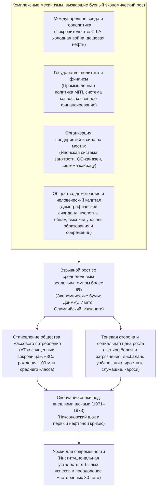
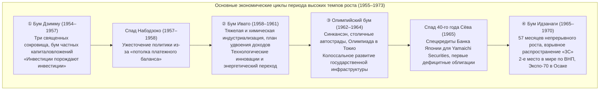
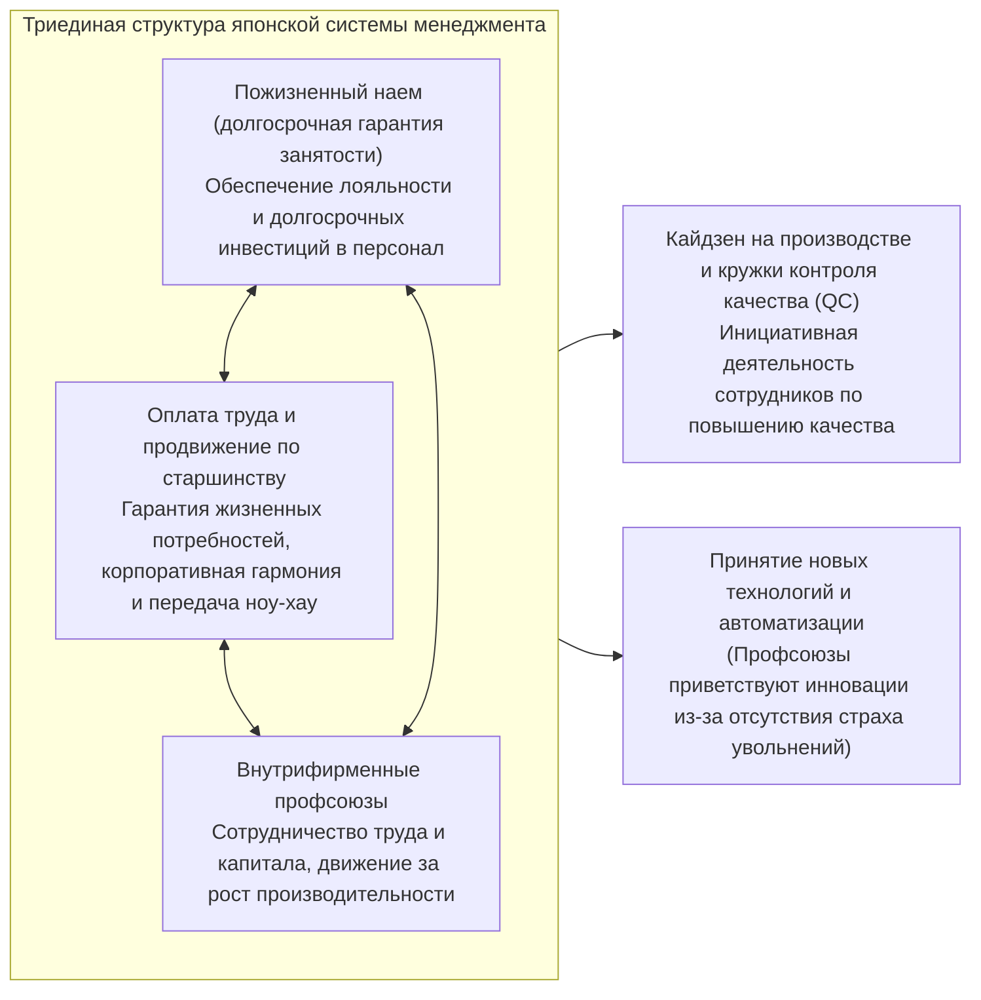
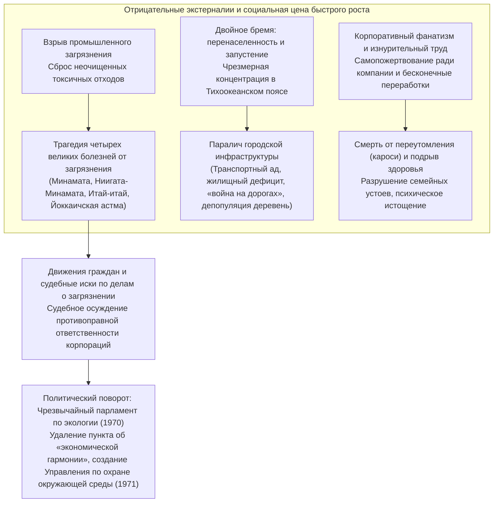

## Введение: Беспрецедентное в истории «экономическое чудо» и его глубинная сущность

15 августа 1945 года, когда безоговорочная капитуляция Японской империи положила конец Тихоокеанской войне, Японский архипелаг представлял собой буквально выжженную пустыню. Около 40% территории крупнейших городов лежало в руинах в результате воздушных налетов союзной авиации, а около четверти национального богатства (приблизительно 36% всех невоенных активов) обратилось в пепел. Страна лишилась всех заморских территорий, и более 6 миллионов репатриантов — военных и гражданских лиц — хлынули на родину, оставшись без крова и средств к существованию. Подавляющее большинство населения страдало от крайней нехватки продовольствия, когда срывались даже скудные нормы продуктового пайка, и жило в постоянном страхе перед безудержной гиперинфляцией. Иностранные журналисты и высокопоставленные чиновники штаба Верховного главнокомандующего союзными оккупационными войсками (GHQ), посещавшие Японию в те дни, в один голос предрекали: «Японии потребуется как минимум полвека, чтобы вернуть себе уровень самостоятельной экономической дееспособности современного государства».

Однако этому прогнозу суждено было быть опровергнутым самым ошеломляющим образом.

Всего через десять лет после окончания войны, начиная с 1955 года и вплоть до вспышки первого нефтяного кризиса в 1973 году, на протяжении почти двух десятилетий японская экономика демонстрировала **среднегодовой реальный рост на уровне около 9,3%** — феномен сверхбыстрой экономической экспансии, практически не имеющий аналогов в мировой истории. Валовой национальный продукт (ВНП) Японии стремительно вырос с примерно 8 триллионов иен в 1955 году до 112 триллионов иен в 1973 году — более чем в 14 раз. А в 1968 году Япония опередила Федеративную Республику Германия — индустриального флагмана Западной Европы, догнать которого было заветной целью со времен революции Мэйдзи, — и стала **второй по величине экономической державой капиталистического мира** после Соединенных Штатов Америки.



Этот колоссальный скачок был восторженно окрещен мировым сообществом «**Восточным экономическим чудом (Economic Miracle)**». Бытовая техника, символизируемая «тремя священными сокровищами» — черно-белым телевизором, электрической стиральной машиной и электрическим холодильником, — проникла буквально в каждый японский дом. Вскоре потребительские запросы выросли до уровня «3C» — цветного телевизора (Color TV), кондиционера (Cooler) и личного автомобиля (Car). Образ жизни населения претерпел необратимую трансформацию: традиционная сельская община уступила место городской нуклеарной семье, наслаждавшейся невиданным прежде изобилием эпохи массового производства и массового потребления. Сформировалось уникальное общество «ста миллионов среднего класса» (итиоку со-тюрю), где около 90% граждан считали себя представителями среднего достатка, создав одну из самых стабильных, образованных и безопасных индустриальных систем на планете.

Вместе с тем это «чудо» вовсе не являлось случайным даром небес. Оно стало результатом поразительно точного сопряжения исторических и структурных шестеренок: научно-технической базы тяжелой и химической промышленности и командно-административного опыта бюрократии, накопленных в довоенные и военные годы; резкого геополитического поворота в условиях холодной войны и смены оккупационной стратегии США; изощренной промышленной политики Министерства внешней торговли и промышленности (MITI) и финансовой системы «сопровождения конвоем» под эгидой Министерства финансов; японской модели корпоративного управления с пожизненным наймом и оплатой по старшинству; а также исключительного трудолюбия и высокой нормы сбережений молодых рабочих, прозванных «золотыми яйцами».

Однако за этим триумфальным шествием неотступно следовала глубокая и мрачная тень. Неочищенные сточные воды и токсичные заводские выбросы породили «четыре великие болезни от загрязнения окружающей среды», включая болезнь Минамата и астму Йоккаити, нанеся непоправимый вред жизни и здоровью ни в чем не повинных людей. Стремительный отток населения из сельской местности в Тихоокеанский промышленный пояс обернулся острой «перенаселенностью», транспортным адом и деградацией городской среды, тогда как провинция столкнулась с катастрофическим «запустением» и упадком первичного сектора. Труженики, которых называли «яростными служащими» (морэцу сяин) или «корпоративными воинами», принуждались к безоговорочной преданности компании и бесконечным сверхурочным часам, что заложило корни тяжелейшей социальной патологии, позже признанной во всем мире под японским названием «кароси» (смерть от переутомления на рабочем месте).

В настоящем исследовании предпринята попытка комплексно и объемно раскрыть всю панораму послевоенного экономического бума в Японии (1955–1973 гг.) не просто как череду фаз делового цикла, а через призму макроэкономики, промышленной политики, финансовой архитектуры, корпоративного управления, социальной структуры, геополитики и экологических потрясений. Мы также проанализируем, почему ошеломляющий триумф этой эпохи впоследствии обернулся институциональной закостенелостью («усталостью институтов»), сковавшей японское общество и приведшей к затяжным «потерянным десятилетиям» с 1990-х годов, и извлечем важнейшие исторические уроки для возрождения экономики в XXI веке.

---

## Глава 1: Пробуждение на пепелище — Предыстория высокого роста (1945–1954 гг.)

Если точкой отсчета эпохи высоких темпов роста считать 1955 год, то предшествующее десятилетие (1945–1954 гг.) представляло собой критически важный этап разбега: период расчистки завалов разрушенной национальной экономики, восстановления базовой рыночной инфраструктуры и сооружения пусковой площадки для будущего ракетного взлета.

### 1.1 Катастрофическое поражение и гиперинфляция

Непосредственно после капитуляции в августе 1945 года японская экономика оказалась в состоянии полнейшего паралича. Вследствие прекращения военного производства и разрыва внешнеторговых цепочек поставок сырья уровень горнодобывающего и промышленного производства в 1946 году рухнул до **примерно 30%** от довоенного уровня (базис 1934–1936 гг.). Государственное распределение риса страдало постоянными задержками и срывами, вынуждая городских жителей везти в деревни одежду и домашнюю утварь, чтобы выменять хоть немного еды, ведя унизительную жизнь «бамбукового побега» (такэноко сэйкацу — постепенное сдирание слоев имущества ради выживания).

Этот производственный коллапс усугублялся свирепой гиперинфляцией. Выплаты военных расходов, бесконтрольно эмитированных военными властями в последние месяцы войны, колоссальные компенсации предприятиям ВПК сразу после ее завершения, а также единовременные выходные пособия демобилизованным военнослужащим привели к астрономическому раздуванию объема банкнот Банка Японии. С осени 1945 по 1949 год индекс оптовых цен взлетел почти в **70 раз**.

Пытаясь справиться с кризисом, правительство в феврале 1946 года издало «Указ о чрезвычайных финансовых мерах». Была предпринята отчаянная попытка заблокировать все банковские депозиты («замораживание вкладов»), аннулировать старые банкноты и принудительно обменять их на новые иены с жестким лимитом выдачи наличных. Однако до тех пор, пока фундаментальный дефицит производственных мощностей не был устранен, остановить инфляционную спираль не удавалось.

```
【Резкие изменения ключевых экономических показателей раннего послевоенного периода】
・Уровень промышленного производства (1946 г.): 30,7% от довоенного уровня (1934–1936 гг. = 100)
・Темп роста индекса оптовых цен в Токио (1946 г.): +364,5% к предыдущему году
・Официальная норма распределения риса (конец 1945 г.): снижена до 2 го 1 сяку (около 297 г) на взрослого в день при частых задержках
・Общее число репатриантов из-за рубежа (1945–1950 гг.): около 6,25 млн человек
```

Чтобы прорвать блокаду производственного паралича, правительство прибегло к так называемой **«системе приоритетного производства» (Keisha Seisan Hoshiki / Priority Production System)**, разработанной профессором Токийского университета Хироми Арисавой и его коллегами (одобрена кабинетом министров в конце 1946 года, введена в действие в 1947 году). Суть системы заключалась в отказе от стихийного рыночного механизма распределения крайне скудных внутренних ресурсов (капитала, сырья, валюты и рабочей силы) и их жесткой концентрации на двух базовых отраслях — **«угольной промышленности»** и **«черной металлургии»**, дабы их взаимная сцепка вытянула всю экономику.

На практике это выглядело так: весь добываемый в стране уголь первоочередным порядком направлялся на металлургические заводы для выплавки стали; выплавленная сталь в приоритетном порядке возвращалась на угольные шахты в виде крепей для штреков и врубовых машин, что позволяло нарастить добычу угля. Излишки продукции, рожденные этой «благотворной спиралью стали и угля», затем последовательно направлялись в электроэнергетику, производство химических удобрений, железнодорожный транспорт и другие ключевые сегменты.

Финансовой опорой плана стал созданный в январе 1947 года **«Банк финансового восстановления» (Фукраку Кинко / Фуккин)**. Банк выпускал гарантированные государством облигации восстановления, основную часть которых напрямую выкупал Банк Японии, и направлял колоссальные объемы долгосрочных льготных займов в угольную отрасль, металлургию и энергетику. К концу 1948 года на кредиты Фуккина приходилось около 70% всех инвестиций в оборудование базовых отраслей.

Система приоритетного производства принесла блестящий успех в части скорейшего восстановления парализованных отраслей. Однако прямое рефинансирование облигаций Фуккина эмиссией Банка Японии вызвало лавинообразное увеличение денежной массы, породив вторую волну инфляции, получившую название **«инфляция Фуккина»**.

### 1.2 Линия Доджа и рекомендации Шоупа: закладка рыночного фундамента

Столкнувшись с разгулом инфляции Фуккина, правительство США приняло решение о коренном пересмотре оккупационной политики. На фоне обострения холодной войны (образование КНР в 1949 году, противостояние восточного и западного блоков) Вашингтон перестал рассматривать Японию как «побежденного врага, подлежащего демилитаризации», превратив ее в «главный бастион антикоммунизма и оплот капитализма на Дальнем Востоке». А для этого японская экономика должна была прекратить опираться на колоссальную американскую помощь (фонды GARIOA и EROA) и встать на ноги в качестве самостоятельной рыночной системы.

В феврале 1949 года в Токио в ранге посланника прибыл президент Детройтского банка **Джозеф М. Додж (Joseph M. Dodge)**, прописавший японской экономике жесточайшую шоковую терапию, вошедшую в историю как **«Линия Доджа» (Dodge Line)**. Ее краеугольными камнями стали три принципа:

1. **Формирование сверхраспределенного строго сбалансированного бюджета**: полный запрет на выпуск государственных облигаций, ликвидация дефицита, требование не просто точного баланса доходов и расходов, а обеспечение профицита бюджета, направляемого на погашение прежних долгов.
2. **Прекращение выдачи новых займов Банком финансового восстановления и ликвидация субсидий**: полная отмена компенсационных субсидий по разнице в ценах, с помощью которых государство искусственно покрывало разрыв между себестоимостью и твердыми ценами.
3. **Установление единого обменного курса**: 25 апреля 1949 года был официально зафиксирован единый курс национальной валюты — **1 доллар США = 360 иен**.

Ликвидация множественных валютных курсов (их насчитывалось от нескольких десятков до сотен для разных товарных групп) и прямое подключение экономики к мировому рынку через курс 360 иен означали мгновенное погружение японских предприятий в горнило международной конкуренции. В долгосрочной перспективе курс 360 иен, заниженный относительно покупательной способности иены того времени, превратился в мощнейшее конкурентное оружие японского экспорта.

Однако краткосрочный удар Линии Доджа оказался шоковым. Изъятие государственных вливаний и тотальное кредитное сжатие погрузили Японию в жесточайшую дефляцию. Прокатилась волна банкротств малых и средних предприятий; гиганты индустрии ради выживания начали массовые увольнения персонала («рационализация»). Наступила «дефляция Доджа» (спад Доджа). Сотни тысяч безработных из государственных железных дорог, табачной монополии и частных фабрик оказались на улице, а страну охватила волна тревоги и социальной нестабильности, кульминацией которой стала череда нераскрытых инцидентов на железных дорогах (дела Симоямы, Митаки и Мацукавы).

Параллельно с Линией Доджа контуры налоговой системы послевоенной Японии определила миссия профессора Колумбийского университета **Карла С. Шоупа (Carl S. Shoup)**, прибывшая в мае 1949 года. **«Рекомендации Шоупа»** разрушили хаотичную систему непрямых налогов и осуществили переход к **системе прямого налогообложения с упором на подоходный налог**.

Налоговая реформа Шоупа внедрила систему «синей налоговой декларации», приучившую японский бизнес к современной бухгалтерии и аудиту, сформировала систему местных налогов и трансфертов (прообраз местных распределительных налогов) и оптимизировала налог на прибыль корпораций. Тем самым Линия Доджа обеспечила строгую макроэкономическую дисциплину, а реформа Шоупа — микроинституциональную модернизацию, создав прочный каркас современного капиталистического хозяйства.

### 1.3 Корейская война и взрыв «спецзаказов»: детонатор накопления капитала

Когда под гнетом дефляции Доджа экономика буквально задыхалась, 25 июня 1950 года на соседнем Корейском полуострове вспыхнула **Корейская война**. Для азиатского региона это стало страшной геополитической трагедией, но для находившейся при смерти японской экономики война оказалась спасительным кругом. Премьер-министр Сигэру Ёсида позже назвал эти события невольным выражением «дар небес» (камикадзэ).

Вступление в войну сил ООН (де-факто вооруженных сил США) вызвало лавину заказов на закупку материально-технических средств и оказание услуг, направленных в адрес Японии как ближайшей к театру боевых действий промышленно развитой державы. Возник феномен **«корейских спецзаказов» (токдзю)**.

Номенклатура американских военных закупок была чрезвычайно обширной:
- **Военное имущество и продукция металлургии**: грузовики, джипы, металлические бочки, колючая проволока, детали вооружения, ящики для боеприпасов.
- **Текстиль и предметы быта**: армейское обмундирование, джутовые мешки, одеяла, палаточный брезент, солдатские ботинки.
- **Услуги (сервис)**: ремонт и капитальное обслуживание поврежденных армейских автомобилей и самолетов, транспортно-логистические операции, телекоммуникационная поддержка.

Совокупные валютные поступления от спецзаказов за 4 года (с 1950 года до заключения перемирия в 1953 году) составили **около 2,4 миллиарда долларов США**, что равнялось примерно 60% всего японского экспорта за этот период. Этот гигантский приток долларов в одночасье ликвидировал хронический дефицит иностранной валюты, мучивший страну долгие годы.

```
【Количественное воздействие корейских спецзаказов на экономику Японии (1950–1953 гг.)】
・Общая сумма контрактов спецзаказов: около 2,4 млрд долларов (прямые военные поставки + личные расходы военнослужащих)
・Реальный рост ВВП: 1950 фин. г. +10,8%, 1951 фин. г. +12,3%, 1952 фин. г. +10,0%, 1953 фин. г. +7,3%
・Индекс промышленного производства: подскочил почти на 70% всего за год с небольшим и в 1951 г. превысил довоенный уровень (1934–1936 гг.)
・Резкое оздоровление корпоративных финансов: рентабельность продаж ведущих производственных корпораций во второй половине 1950 г. достигла исторического максимума
```

Историческое значение спецзаказов выходило далеко за рамки простой распродажи залежалых складских запасов:
Во-первых, выполняя массовый ремонт и сборку военных грузовиков, японские автопроизводители (Toyota, Nissan, Isuzu) на практике освоили жесткие военные стандарты качества США (MIL-SPEC), совершив качественный скачок в точности допусков, взаимозаменяемости узлов и технологиях конвейерного производства. Во-вторых, колоссальные прибыли осели на счетах корпораций в виде нераспределенной прибыли, которая послужила первоначальным капиталом для масштабной модернизации фондов (строительства новых металлургических комбинатов, закупки новейших американских станков) в наступавшую эпоху высокого роста.

### 1.4 Сан-Францисская система и манифест «Послевоенный период закончился»

В сентябре 1951 года Япония подписала Сан-Францисский мирный договор и Договор безопасности с США. 28 апреля 1952 года соглашения вступили в силу, положив конец семилетнему оккупационному режиму союзников и восстановив государственный суверенитет страны.

Обретя независимость, Япония однозначно вошла в орбиту возглавляемого США западного блока в холодной войне. Внешнеполитический курс премьер-министра Сигэру Ёсиды, известный как **«доктрина Ёсиды»**, предельно рационализировал национальную стратегию: возложить обеспечение военной безопасности государства на Договор безопасности и военную мощь США, ограничить собственные оборонные расходы символическим минимумом (менее 1% от ВНП), а всю энергию нации, финансовые средства и кадры сфокусировать на экономическом строительстве и расширении внешней торговли. Этот выбор создал для японских корпораций идеальную среду, освобожденную от тяжелого бремени военных расходов.

Хотя после перемирия в Корее в 1953 году исчезновение спецзаказов вызвало краткосрочный спад, в недрах японской экономики уже закручивался мощный автономный маховик инвестиций в основные фонды. В 1955 году, благодаря небывалому урожаю в сельском хозяйстве и подъему мировой торговли, стартовал «количественный бум» без инфляционного перегрева.

Этот исторический рубеж был зафиксирован в знаменитом правительственном документе — «Экономической белой книге» за 1956 финансовый год (31-й год Сёва), подготовленной Агентством экономического планирования. Фраза из заключения, написанная руководителем аналитического отдела **Ёносукэ Гото**, стала крылатым девизом всей послевоенной эпохи:

> **«Послевоенный период закончился. Мы стоим перед лицом совершенно новой ситуации. Восстановительный рост завершен. Отныне рост будет обеспечиваться модернизацией».**

Смысл этих слов заключался не в праздном торжестве по поводу восстановления. Фаза догоняющего восстановления довоенных позиций была исчерпана. Больше нельзя было уповать на внешние костыли — иностранную помощь или военные заказы. Это было предостережением: если страна не начнет форсированное внедрение научно-технических инноваций (автоматизации, химии полимеров, транзисторов, мощной теплоэнергетики) и не перестроит структуру экономики с архаичной легкой промышленности на высокотехнологичную тяжелую и химическую индустрию, она неизбежно потерпит крах в глобальной конкурентной борьбе.

И японская экономика с невиданным энтузиазмом ринулась в грандиознейший в мировой истории эксперимент по индустриальной модернизации.

---

## Глава 2: Хроника деловых циклов и этапы высокого роста (1955–1973 гг.)

На протяжении восемнадцати лет с 1955 по 1973 год развитие японской экономики отнюдь не представляло собой гладкую восходящую прямую. В действительности это было волнообразное движение, в котором бурные фазы подъема, подогреваемые взрывом капиталовложений и потребительской лихорадкой, сменялись фазами торможения и спада, когда стремительный рост импорта исчерпывал валютные резервы и заставлял монетарные власти резко охлаждать рынок.

В условиях фиксированного курса «1 доллар = 360 иен» золотовалютные резервы центрального банка имели строгий предел. При перегреве конъюнктуры импорт сырья и машин зашкаливал, платежный баланс уходил в глубокий минус, и, когда запасы долларов таяли, Банк Японии был вынужден повышать учетную ставку. Этот барьер именовался **«потолком платежного баланса» (Balance of Payments Ceiling)** и являлся главным макроэкономическим ограничителем роста.

Ниже подробно рассмотрены пять ключевых экономических циклов эпохи японского чуда.



### 2.1 Бум Дзимму (1954–1957 гг.) и спад Набэдзоко: цепная реакция инвестиций

Экономический подъем, начавшийся в ноябре 1954 года, получил громкое имя **«Бум Дзимму»** — в честь первого мифического императора Дзимму, ознаменовав процветание, невиданное со времен основания японского государства.

Главным локомотивом подъема стали колоссальные **капиталовложения частного сектора в оборудование**. Металлургия, судостроение, производство синтетических волокон, нефтехимия и электромашиностроение одновременно приступили к монтажу новейших зарубежных прокатных станов, крекинг-установок и агрегатов. Суть этого процесса выразила «Экономическая белая книга» 1957 года бессмертным афоризмом: **«Инвестиции порождают инвестиции»**.

Когда металлурги строили новые домны, машиностроители получали шквал заказов на станки; чтобы удовлетворить спрос на станки, машиностроители расширяли свои цеха, вызывая новый взрыв спроса на прокат и цемент. Этот механизм межотраслевого мультипликатора подталкивал всю экономическую систему вперед.

Одновременно в быту разворачивалась потребительская революция. В семьях городских служащих стали появляться **«три священных сокровища»** — черно-белый телевизор, электрическая стиральная машина и электрический холодильник. Облегчение домашнего труда и появление новых форм досуга навсегда изменили уклад жизни.

Однако к 1957 году проявилась оборотная сторона бума. Массированный ввоз сырья привел к глубокому дефициту торгового баланса, и валютные резервы упали до опасного минимума. Экономика врезалась в «потолок платежного баланса». Банк Японии резко поднял учетную ставку, включив механизм экстренного торможения. Конъюнктура пошла на спад, цены на сталь и текстиль рухнули, и во второй половине 1957–1958 гг. наступил период застоя, прозванный **«спадом Набэдзоко»** (спад «подобный плоскому дну котла»). Впрочем, инвестиционный импульс не угас окончательно, и дно было пройдено относительно быстро.

### 2.2 Бум Ивато (1958–1961 гг.) и План удвоения национального дохода: триумф тяжелой индустрии

Очередная фаза экспансии, начавшаяся в июле 1958 года, получила имя **«Бум Ивато»** — с намеком на события еще более древние, чем правление Дзимму, когда богиня солнца Аматэрасу покинула Небесный грот (Ивато). Среднегодовой реальный рост ВВП в этот период достиг феноменальных **11,3%**.

Главным содержанием бума Ивато стало завершение структурной перестройки: центр тяжести национальной экономики окончательно сместился из легкой индустрии в **тяжелую и химическую промышленность (металлургию, нефтехимию, автомобилестроение, тяжелое электромашиностроение)**. Развернулась энергетическая революция: основным топливом взамен отечественного угля стала дешевая и качественная импортная нефть с Ближнего Востока. На побережьях Тихоокеанского пояса (Токийский залив, залив Исэ, Внутреннее Японское море) на намывных территориях вырастали исполинские металлургические заводы-комбинаты и нефтехимические кластеры.

На политической арене произошел фундаментальный сдвиг. В 1960 году страна пережила острейший политический кризис вокруг продления Договора безопасности с США («борьба против Анпо»), когда сотни тысяч манифестантов осаждали здание Парламента. После отставки одиозного кабинета Нобусукэ Киси новый премьер-министр **Хаято Икэда** предложил грандиозную общенациональную объединяющую программу, призванную переключить внимание общества с идеологических баррикад на созидание богатства. Этой программой стал **«План удвоения национального дохода»** (утвержден в декабре 1960 года).

План, опиравшийся на расчеты блестящего экономиста Осаму Симомуры, провозгласил амбициозную цель: **«Удвоить реальный валовой национальный продукт за 10 лет (1961–1970 гг.), достичь полной занятости и поднять уровень жизни населения до стандартов передовых стран Западной Европы»**. Для этого требовался среднегодовой рост в 7,2%, что критики из оппозиции сочли «популистской утопией».

Реальность превзошла самые дерзкие ожидания. Азарт частного бизнеса оказался столь высок, что планка удвоения дохода была взята досрочно — всего за четыре с небольшим года. Лозунги Икэды «Терпение и терпимость» и обещание «удвоения зарплаты» вселили в переживший военную катастрофу народ несокрушимый оптимизм и веру в безграничные перспективы роста.

### 2.3 Олимпийский бум (1962–1964 гг.) и инфраструктурная революция

После короткой паузы, вызванной очередным ухудшением платежного баланса, во второй половине 1962 года начался **«Олимпийский бум»**. Япония мобилизовала все ресурсы на подготовку к XVIII летним Олимпийским играм в Токио (октябрь 1964 года) — первым Олимпийским играм на азиатском континенте.

Суммарный объем инвестиций в транспортную и городскую инфраструктуру достиг астрономического 1 триллиона иен, что было сопоставимо со всем годовым бюджетом страны:
- **Линия Токайдо-синкансэн**: открыта 1 октября 1964 года. Первый в мире высокоскоростной поезд связал Токио и Осаку на скорости 210 км/ч всего за 4 часа (в следующем году — за 3 часа 10 минут), кардинально изменив пространственную ось страны.
- **Скоростные автомагистрали Мэйсин и Сюто**: была построена первая междугородная трасса Мэйсин (открыта в 1963–1965 гг.) и возведена сеть эстакадных столичных магистралей Сюто, прорезавших перегруженный мегаполис Токио.
- **Обновление городской среды**: скоростная монорельсовая дорога Токио Монорейл связала аэропорт Ханэда с центром столицы, вступила в строй линия метро Хибия, были возведены современные отели мирового уровня, такие как «Отель Нью Отани», реконструированы городские очистные сооружения.

С телевизионных экранов Олимпиада транслировалась в цвете, а первая в истории прямая трансляция через Тихий океан с помощью американского спутника связи Syncom 3 продемонстрировала изумленному миру технологическое перерождение новой Японии.

### 2.4 Спад на рынке ценных бумаг (кризис 1965 года / 40-го года Сёва) и смена экономической политики

Однако праздничный угар Олимпиады сменился тяжелым похмельем. В 1965 году грянул так называемый **«спад 40-го года Сёва» (кризис рынка ценных бумаг)** — самый суровый кризис за всю эпоху подъема.

Производственные мощности, лихорадочно вводившиеся под олимпийский спрос, в одночасье оказались избыточными. Волна банкротств прокатилась по стране, побив все послевоенные рекорды. Тяжелейший удар пришелся по фондовому рынку: падение котировок поставило на грань банкротства **Yamaichi Securities** — одну из четырех крупнейших инвестиционных компаний Японии.

Чтобы предотвратить эффект домино и паралич финансовой системы, министр финансов **Какуэй Танака** и глава Банка Японии Макото Усами пошли на беспрецедентный шаг. На основании статьи 25 Закона о Банке Японии компании Yamaichi Securities были открыты **«специальные неограниченные и необеспеченные кредиты Банка Японии» (Никгин токую)**, что остановило панику вкладчиков и клиентов у касс.

Более того, правительство нарушило фундаментальное табу Линии Доджа — статью 4 Закона о государственных финансах, категорически запрещавшую выпуск дефицитных госбумаг, — и в дополнительном бюджете 1965 года впервые в послевоенной истории утвердило выпуск **«специальных государственных долговых обязательств (дефицитных облигаций)»**. Это мощное кейнсианское стимулирование спроса (масштабные вливания в общественные работы и снижение налогов) позволило в кратчайшие сроки вытащить экономику из рецессии и открыло дорогу самому продолжительному золотому веку.

### 2.5 Бум Идзанаги (1965–1970 гг.): золотые 57 месяцев и второе место в мире

Преодолев спад конца 1965 года, экономика вступила в фазу беспримерного процветания, длившуюся с ноября 1965 по июль 1970 года — **«Бум Идзанаги»**. Названный в честь бога-прародителя Идзанаги, этот подъем продолжался рекордные **57 месяцев подряд**, побив все исторические рекорды.

Двигателями бума Идзанаги стали фантастическая конкурентоспособность японского экспорта и качественное усложнение потребительских запросов граждан. Потребительский культ сменился погоней за **«3C»**:
- **Цветной телевизор (Color TV)**
- **Кондиционер (Cooler)**
- **Автомобиль (Car)**

Выход на рынок народных моделей — Toyota Corolla и Nissan Sunny — ознаменовал начало эры всеобщей автомобилизации. Благодаря внедрению тотального контроля качества клеймо «дешевки» навсегда исчезло с японских товаров; продукция с маркой «Made in Japan» завоевала репутацию самой надежной, долговечной и передовой в мире.

В 1968 году произошло событие колоссального исторического масштаба: номинальный ВНП Японии достиг **примерно 141,9 миллиарда долларов США**, превзошел показатели Западной Германии и вывел страну на **второе место в капиталистическом мире** после США. Ровно через сто лет после революции Мэйдзи азиатская страна, начавшая с нуля после сокрушительного военного поражения, обошла старые европейские державы.

Кульминацией эпохи стала первая в Азии Всемирная выставка — **Экспо-70 в Осаке**, проходившая под девизом «Прогресс и гармония для человечества». Над футуристическим комплексом в холмах Сэнри высилась циклопическая «Башня Солнца» художника Таро Окамото, а выставку посетили фантастические **64,21 миллиона человек**. Лунный камень в павильоне США, движущиеся тротуары и капсульные павильоны будущего стали зримым триумфом нации, добившейся процветания трудом и интеллектом.

```
【Динамика основных макроэкономических показателей эпохи высокого роста (1955–1974 фин. гг.)】
```

| Фин. год | Реальный рост ВВП (%) | Номинальный ВНП (100 млн иен) | Фаза цикла / Исторические вехи |
| :---: | :---: | :---: | :--- |
| **1955** | **+10,8** | 88 646 | Начало бума Дзимму, распространение «трех священных сокровищ» |
| **1956** | **+6,2** | 98 719 | Белая книга: «Послевоенный период закончился», вступление в ООН |
| **1957** | **+7,8** | 111 280 | Спад Набэдзоко, столкновение с потолком платежного баланса |
| **1958** | **+5,6** | 118 527 | Начало бума Ивато, открытие Токийской телебашни |
| **1959** | **+11,2** | 134 228 | Свадебный кортеж наследного принца, взрыв телевещания |
| **1960** | **+12,5** | 160 332 | Протесты Анпо, кабинет Икэды утверждает План удвоения дохода |
| **1961** | **+12,0** | 196 442 | Бум тяжелой и химической индустрии, энергетический переход |
| **1962** | **+8,9** | 220 119 | Начало Олимпийского бума, открытие города-спутника Сэнри Нью-Таун |
| **1963** | **+10,7** | 256 419 | Открытие скоростной дороги Мэйсин (Ритто — Амагасаки) |
| **1964** | **+13,1** | 295 444 | Олимпиада в Токио, запуск Синкансэн, вступление в ОЭСР |
| **1965** | **+5,8** | 328 217 | Спад 40-го года Сёва, спецзаймы Yamaichi, первые дефицитные гособлигации |
| **1966** | **+10,6** | 382 900 | Развертывание бума Идзанаги, старт эры массовой автомобилизации (Corolla, Sunny) |
| **1967** | **+11,1** | 446 953 | Бум предметов «3C», принятие Базового закона о борьбе с загрязнением |
| **1968** | **+12,2** | 528 781 | **ВНП Японии обходит ФРГ: 2-е место в капиталистическом мире** |
| **1969** | **+12,5** | 622 464 | Открытие магистрали Томэй, взрывной рост продаж цветных ТВ |
| **1970** | **+10,7** | 733 449 | Экспо-70 в Осаке (64,2 млн гостей), Чрезвычайный парламент по экологии |
| **1971** | **+5,0** | 809 726 | Никсоновский шок, Смитсоновское соглашение (1 доллар = 308 иен) |
| **1972** | **+9,1** | 954 646 | Кабинет Танаки: «Преобразование Японских островов», нормализация отношений с КНР |
| **1973** | **+5,1** | 1 125 487 | Переход к плавающему курсу, 1-й нефтяной кризис, «бешеные цены» |
| **1974** | **-1,2** | 1 348 229 | **Первый отрицательный рост после войны: окончание эпохи высокого роста** |

---

## Глава 3: Анатомия японского феномена — Анализ многоаспектного механизма

Экономический взлет Японии не был продуктом свободной стихии laissez-faire, равно как его нельзя свести к банальному идеализму «врожденного национального трудолюбия». В основе чуда лежала предельно выверенная, синхронизированная **«японская модель капитализма»**, объединившая селективное государственное регулирование, уникальную банковскую систему, систему пожизненного партнерства труда и капитала, низовые инновации в контроле качества, демографический дивиденд и геополитическое покровительство в годы холодной войны.

В данной главе детально анализируются шесть несущих опор этого механизма.



### 3.1 Промышленная политика и государственное дирижирование: стратегия MITI по взращиванию отраслей

Американский политолог Чалмерс Джонсон (Chalmers Johnson) в своей классической монографии «MITI и японское чудо» выделил особую типологию государств: в отличие от западных «государств регуляторного типа» (Regulatory State, как в США), Япония явила миру образец **«государства развития» (Developmental State)**, где стратегические приоритеты формулируются государством, направляющим частный бизнес к общенациональным целям.

Фундаментом политики Министерства внешней торговли и промышленности (MITI) стал сознательный отказ от классической теории сравнительных преимуществ Давида Рикардо (гласившей, что страна должна специализироваться на отраслях, выгодных в данный момент). Следуй Япония этой догме, она навсегда осталась бы экспортером дешевого текстиля и керамики. Однако стратеги MITI сделали ставку на **«политику целевых отраслей» (Target Industry Policy)**, бросив национальные ресурсы на развитие капитало- и наукоемких отраслей будущего: **металлургии, судостроения, нефтехимии, автомобилестроения, тяжелого станкостроения и электроники**.

В арсенале MITI были три мощнейших инструмента:

1. **Монопольное распределение валютного бюджета (Закон о валютном контроле и внешней торговле)**:
   Вся иностранная валюта (доллары США) подлежала сдаче государству. MITI выделяло валюту только предприятиям назначенных приоритетных отраслей, открывая им зеленый свет на закупку передовых американских технологий, лицензий и прокатных станов. Импорт конкурирующей готовой продукции из-за рубежа беспощадно блокировался запретительными квотами и пошлинами.
2. **Сигнальный эффект льготных кредитов Японского банка развития (JDB)**:
   Когда Японский банк развития принимал решение о софинансировании масштабного проекта (строительства комбината или верфи), частные коммерческие банки расценивали это как «высшую государственную гарантию надежности» и открывали неограниченное кредитование. Возникал мощный эффект привлечения частного капитала (сигнальный эффект).
3. **Государственно-частное согласование инвестиций и картелирование**:
   Чтобы не допустить хаотичного перепроизводства при одновременном строительстве заводов конкурентами, чиновники MITI организовывали регулярные координационные советы лидеров отраслей. Они устанавливали очередность ввода доменных печей и квоты на выпуск продукции, сводя к минимуму инвестиционные риски бизнеса и обеспечивая ввод в строй гигантских заводов с минимальными издержками на масштабе.

### 3.2 Алхимия финансовой системы: косвенное финансирование и система конвоя

Финансовым фундаментом гигантских инвестиций послужила совершенно нетипичная для англосаксонского мира конфигурация капитала.

В западных экономиках компании привлекают долгосрочные инвестиционные ресурсы через фондовый рынок — выпуск акций и облигаций (прямое финансирование), либо за счет накопленной нераспределенной прибыли. В разоренной послевоенной Японии собственный капитал предприятий был мизерным. Спасением стала модель **«косвенного финансирования»** через банковские займы.

Эта система держалась на трех китах:

- **Институт главного банка (Main Bank System)**:
  Каждая крупная промышленная корпорация была неразрывно связана со «своим» головным банком (городскими банками Mitsui, Mitsubishi, Sumitomo, Fuji, Dai-Ichi Kangyo, Sanwa или специализированным Банком долгосрочного кредитования IBJ). Главный банк был не просто кредитором: он держал крупный пакет акций предприятия в рамках перекрестного владения (защищая его от враждебных поглощений), направлял своих представителей в совет директоров и вел постоянный мониторинг бизнеса. Это освобождало директоров предприятий от диктата сиюминутных котировок акций и квартальных отчетов, позволяя планировать смелые инвестиции на 5–10 лет вперед.
- **Оверборроуинг (сверхзаимствование корпораций) и оверлоан (сверхкредитование банков)**:
  Доля заемного капитала у японских корпораций достигала астрономических 70–80%. Коммерческие банки выдавали кредитов больше, чем аккумулировали депозитов (оверлоан), черпая недостающую ликвидность напрямую в кредитном окне Банка Японии. Центробанк через механизм «оконного руководства» (Window Guidance — негласные количественные квоты на прирост ссуд для каждого банка) полностью контролировал финансовый пульс страны.
- **«Система конвоя» (Convoy System) и регулирование процентных ставок**:
  Министерство финансов жестко держало депозитные и кредитные ставки ниже рыночного уровня (на основе Закона о временном регулировании процентных ставок), искусственно удешевляя стоимость заемных денег для индустрии. Одновременно регулятор выстроил жесткую административную опеку над банками: процентные ставки, открытие новых отделений и перечень услуг регламентировались так, чтобы на плаву оставался даже самый слабый банк. Названная по аналогии с морским караваном, скорость которого определяется самым тихоходным судном, «система конвоя» исключила возможность банкротств банков и вселила в население непоколебимую веру в надежность сбережений.

Особое место занимала **«Программа фискальных инвестиций и займов» (FILP / Дзайто)**, называемая «вторым государственным бюджетом». Сбережения сотен миллионов граждан в государственных почтовых сберегательных кассах и фондах пенсионного страхования аккумулировались в Бюро доверительных фондов Минфина и направлялись в инфраструктурные мегапроекты — строительство Синкансэн, автомагистралей, электростанций и портов — без необходимости повышения налогов.

### 3.3 Японская модель занятости: «три священных сокровища» трудовых отношений

На заводах и в офисах материальной основой роста стала **«японская система управления»**, окончательно оформившаяся после ожесточенных забастовок начала 1950-х годов (забастовки на Nissan в 1953 г., стачки на шахтах Миикэ в 1960 г.). Американский социолог Джеймс Абэгглен (James Abegglen) в книге «Японский менеджмент» охарактеризовал эту модель как союз трех фундаментальных институтов:

1. **Система пожизненного найма (дзюсин коё)**:
   Предприятия нанимали молодежь сразу после окончания учебных заведений с негласным обязательством сохранять за ними рабочее место вплоть до наступления пенсионного возраста. Для корпорации это создавало стимул вкладывать огромные средства в обучение и переподготовку кадров на рабочих местах (OJT), не опасаясь их переманивания конкурентами. Для работника это означало абсолютную жизненную стабильность.
2. **Оплата труда и карьерное продвижение по старшинству (нэнко дзёрэцу)**:
   Размер заработной платы и должность зависели не от узкой текущей выработки, а от возраста и стажа работы в компании. На начальном этапе молодой сотрудник получал меньше реального трудового вклада, что удешевляло расширение производства для корпорации. Однако к 35–50 годам, когда работник обзаводился семьей, оплачивал обучение детей и покупал жилье, его оклад многократно возрастал, идеально соответствуя жизненному циклу семейных расходов.
3. **Внутрифирменные профсоюзы (кигёбэцу родо кумиай)**:
   Профсоюзы объединяли всех постоянных работников конкретной компании независимо от их специальности. Лидеры профсоюза были штатными сотрудниками, понимавшими, что увеличение пирога (рост зарплат и премий) напрямую зависит от победы компании над конкурентами. Это минимизировало классовую конфронтацию и превращало профсоюз в союзника модернизации.

Этот триединый институт произвел революцию в отношении к научно-техническому прогрессу.

На Западе отраслевые профсоюзы ожесточенно сопротивлялись внедрению автоматики и конвейеров, поскольку новая техника вела к сокращению узких специалистов. В японских корпорациях с пожизненной занятостью автоматизация цеха никогда не влекла увольнений: высвобождаемых работников просто переводили на другие участки или во вновь открываемые подразделения, обучая новым навыкам.

В результате японские рабочие и профсоюзы не просто не саботировали инновации, а **с неподдельным энтузиазмом приветствовали внедрение автоматических линий и роботов**, видя в них залог процветания родной компании и роста полугодовых премий (бонусов).

С 1955 года институционализировалась система **«Сюто» («весенних наступлений трудящихся»)**: каждую весну профсоюзы ведущих отраслей синхронно выдвигали требования о повышении зарплат. Стандарты, заданные металлургами и машиностроителями, немедленно распространялись на все отрасли и средний бизнес. Ежегодный рост доходов населения на 10% формировал колоссальный платежеспособный внутренний спрос, создавая замкнутый виток: инвестиции стимулировали рост зарплат, а растущие зарплаты окупали инвестиции.

Оборотной стороной медали было то, что привилегии ядра постоянных работников крупных фирм обеспечивались наличием широкой прослойки временных рабочих, субподрядчиков и мелких поставщиков (система двойственной структуры экономики), принимавших на себя удары кризисов.

### 3.4 Сила производственных площадок и инновации: QC-кружки и философия «Кайдзен»

Превращение японских товаров из синонима низкосортного ширпотреба в эталон безупречного мирового качества было достигнуто благодаря низовой революции в организации труда на заводах.

До войны японские изделия несли клеймо «дешево и некачественно» (Cheap and Nasty). В первые послевоенные годы оккупационные власти США поручили пригласить в Токио выдающегося специалиста по статистическому контролю качества — доктора **У. Эдвардса Деминга (W. Edwards Deming)**. В 1950 году по приглашению Японского союза ученых и инженеров (JUSE) Деминг провел серию легендарных лекций по статистическим методам и циклу PDCA.

В знак признания заслуг ученого JUSE учредил престижнейшую премию Деминга. За право обладания ею началась неистовая борьба между ведущими корпорациями.

Однако подлинный триумф Японии заключался в том, что американская авторитарная модель статистического контроля сверху вниз была трансформирована в массовое низовое движение рабочих — **«кружки контроля качества» (QC Circles)**, зародившиеся в 1962 году.

Бригады рабочих по 5–10 человек собирались во внеурочное время или во время перерывов, анализировали дефекты с помощью причинно-следственных диаграмм Исикавы («рыбий скелет») и диаграмм Парето, после чего вырабатывали предложения по улучшению технологии — **«кайдзен» (непрерывное совершенствование)**. Каждый рабочий чувствовал себя творцом технологического процесса.

Вершиной этой производственной философии стала **«Производственная система Тойоты» (Toyota Production System / TPS)**, созданная гением вице-президента Таити Оно:
- **«Точно в срок» (Just-In-Time)**: производство только необходимых деталей, в необходимом количестве и точно в назначенное время, сводящее запасы сырья и незавершенного производства к нулю.
- **Система «канбан»**: децентрализованное управление материальными потоками с помощью карточек-заказов, когда последующий цех «вытягивает» продукцию из предыдущего.
- **Дзидока (автономизация / «автоматизация с человеческим лицом»)**: оснащение станков механизмами автоматической аварийной остановки при малейшем сбое, гарантирующее нераспространение брака на последующие этапы сборки.
- **Искоренение семи видов потерь (муда)**: беспощадная ликвидация потерь от перепроизводства, ожидания, лишней транспортировки, избыточной обработки, складских запасов, лишних движений и исправления брака.

Эти находки позволили наладить массовый выпуск широчайшего ассортимента сложнейших изделий с непревзойденной гибкостью, превзойдя классическую фордовскую систему конвейерного выпуска стандартизированных партий.

### 3.5 Демографическая динамика и человеческий капитал: демографический дивиденд и «золотые яйца»

Фундаментальным топливом рывка послужила уникальная **демографическая ситуация** в сочетании с высочайшим качеством **человеческого капитала**.

В 1947–1949 годах Япония пережила мощнейший бэби-бум: на свет появилось около **8 миллионов детей**, составивших поколение **«данкай но сэдай»**. С середины 1950-х годов страна вошла в фазу идеального **«демографического дивиденда» (демографического бонуса)**, когда доля трудоспособного населения (15–64 года) стремительно увеличивалась, а нагрузка в виде стариков и малолетних детей оставалась минимальной.

```
【Динамика доли трудоспособного населения Японии (15–64 года)】
・1950 г.: 59,7%
・1960 г.: 64,2%
・1970 г.: 68,9% (пик демографического дивиденда)
```

Это была не просто сухая масса рабочей силы — происходило колоссальное внутреннее переселение.

В японской деревне после послевоенной земельной реформы земля закрепилась за крестьянами, но наделы наследовались исключительно старшими сыновьями. Младшие сыновья и дочери массово устремлялись в мегаполисы. Дисциплинированных, грамотных и трудолюбивых выпускников сельских средних школ бизнес окрестил **«золотыми яйцами» (кин но тамаго)**.

Весной вокзалы Уэно в Токио и Осака принимали специальные составы — **«поезда коллективного трудоустройства» (сюдан сюсёку рэсся)**, битком набитые выпускниками из Тохоку и Кюсю. Всего за пятнадцать лет (1955–1970 гг.) в три главных мегаполиса прибыло более **10 миллионов человек**. Доля занятых в первичном секторе (сельское, лесное хозяйство, рыболовство) рухнула с **48,3%** в 1950 году до **17,4%** в 1970 году, обеспечив промышленность и сектор услуг неиссякаемым притоком рабочих рук.

Двумя другими критическими факторами стали исключительная **образованность** и **норма сбережений**:
- **Высочайшая однородная грамотность**: система образования гарантировала 100-процентную грамотность. Доля поступающих в старшую школу выросла с 42,5% в 1950 г. до 82,1% в 1970 г., снабжая заводы рабочими, способными мгновенно читать сложные чертежи и осваивать прецизионное оборудование.
- **Рекордная норма сбережений**: доля сбережений в располагаемом доходе домохозяйств составляла **от 15% до более чем 20%** (против 8–10% на Западе). Высокие сбережения аккумулировались в банках и почтово-сберегательной системе, превращаясь в дешевые кредиты для промышленных гигантов без потребности во внешних займах.

### 3.6 Геополитика холодной войны и международная среда: попутный ветер истории

Наконец, экономическое чудо было продуктом исключительно благоприятной для Японии конфигурации послевоенного миропорядка (Бреттон-Вудская система и холодная война).

Во-первых, в рамках **доктрины Ёсиды** оборонные расходы держались на уровне около 1% ВНП. Пока США, СССР, Великобритания, ФРГ, Южная Корея и Тайвань тратили от 5% до 10% и более национального богатства на содержание колоссальных армий и разработку вооружений, Япония передала вопросы своей безопасности ядерному зонтику США, вложив интеллектуальные и финансовые ресурсы нации в гражданский сектор.

Во-вторых, страна пользовалась всеми выгодами режима **свободной торговли под эгидой ГАТТ и МВФ** (вступление в ГАТТ в 1955 г., принятие обязательств 8-й статьи МВФ и вступление в ОЭСР в 1964 г.). Американский гигантский рынок оставался открытым для японского экспорта, тогда как Токио десятилетиями удерживал жесткие барьеры для защиты своих неокрепших отраслей.

В-третьих, существовал спасительный фиксированный курс **«1 доллар = 360 иен»**. По мере роста производительности труда реальная себестоимость японской продукции стремительно падала, но курс оставался неизменным, создавая скрытую колоссальную девальвационную премию, разносившую в пух и прах конкурентов на рынках стали, оптики, бытовой техники и автомобилей.

В-четвертых, мир снабжал Японию **неисчерпаемой дешевой ближневосточной нефтью**. Международные нефтяные картели продавали «черное золото» по символической цене менее 2 долларов за баррель. Дешевая нефть крутила турбины электростанций, кормила нефтехимические гиганты и питала автомобильный бум.

---

## Глава 4: Наступление общества массового потребления и революция повседневности

Высокий рост измерялся не только тоннами выплавленной стали и мегаваттами электроэнергии: он стал **«революцией повседневности»**, до неузнаваемости преобразившей жизнь простого человека, его дом, семью и мироощущение.

Еще в начале 1950-х годов абсолютное большинство населения вело скромную, почти патриархальную жизнь, мало чем отличавшуюся от довоенной. Однако за полтора десятилетия Япония превратилась в одно из самых зажиточных и социально однородных **обществ массового потребления** в мире.

### 4.1 От «трех священных сокровищ» к «3C»: преображение быта

Модернизация быта японцев разворачивалась в два отчетливых этапа.

Первая волна накатила во второй половине 1950-х годов с появлением **«трех священных сокровищ»** — черно-белого телевизора, электрической стиральной машины и холодильника:
- **Электрическая стиральная машина**: избавила женщин от тяжелейшего изнурительного труда со стиральной доской и ледяной водой, сведя многочасовую стирку к нажатию кнопки.
- **Холодильник**: положил конец ежедневным закупкам скоропортящихся продуктов и использованию тающих глыб льда, качественно подняв уровень гигиены и структуру питания.
- **Черно-белый телевизор**: радикально преобразил досуг и информационное пространство. Свадьба наследного принца Акихито и Митико Сёда в апреле 1959 года спровоцировала телевизионный бум: люди массово раскупали приемники, чтобы воочию увидеть сказочный кортеж.

Вторая волна пришлась на конец 1960-х годов, ознаменовавшись триумфом статусных товаров группы **«3C»**:
- **Цветной телевизор (Color TV)**: транслировал Олимпиаду в Токио и Экспо-70 в Осаке прямо в уютные гостиные.
- **Кондиционер (Cooler)**: превратил удушливое субтропическое японское лето в пору прохладного комфорта.
- **Личный автомобиль (Car)**: выпуск в 1966 году народных машин Corolla и Sunny сделал автомобиль доступным среднему классу, породив культуру семейных загородных поездок на выходные.

```
【Динамика доли домохозяйств, владеющих основными потребительскими товарами длительного пользования (1955–1975 гг.)】
```

| Год | Эл. стиральная машина (%) | Эл. холодильник (%) | Ч/б телевизор (%) | Цветной телевизор (%) | Легковой автомобиль (%) | Кондиционер (%) |
| :---: | :---: | :---: | :---: | :---: | :---: | :---: |
| **1955** | 4,6 | 1,1 | 0,9 | — | — | — |
| **1958** | 29,3 | 5,5 | 10,4 | — | — | — |
| **1960** | 45,4 | 15,7 | 44,7 | — | — | — |
| **1962** | 62,7 | 28,0 | 79,4 | — | — | — |
| **1965** | 73,6 | 51,4 | 90,3 | 0,2 | 3,5 | 2,1 |
| **1967** | 80,7 | 70,8 | 96,0 | 1,6 | 7,7 | 3,0 |
| **1970** | 91,4 | 89,1 | 90,2 | **26,3** | **22,1** | **5,9** |
| **1973** | 96,1 | 95,8 | 60,1 | **75,8** | **36,8** | **13,3** |
| **1975** | 97,6 | 96,7 | 40,5 | **90,3** | **41,2** | **17,2** |

Статистика неопровержимо доказывает: бытовая техника, практически отсутствовавшая в 1955 году, к середине 1970-х годов проникла более чем в **90% всех семей страны**, ознаменовав собой феноменальную по историческим меркам скорость модернизации быта.

### 4.2 Жилые массивы «данчи», нью-тауны и нуклеарная семья: пространственный слом

Лавинообразная урбанизация разрушила традиционное японское жилое пространство и многопоколенную семью.

Созданная в 1955 году **Японская жилищная корпорация (JHC)** развернула по окраинам мегаполисов строительство многоквартирных типовых железобетонных микрорайонов — **«данчи»**. В 1960-х годах на пустующих холмах выросли гигантские города-спутники («нью-тауны»): Сэнри Нью-Таун под Осакой (1962 г.) и Тама Нью-Таун под Токио (1971 г.).

Жизнь в «данчи» несла с собой тектонический слом вековых привычек:
- **Появление кухни-столовой (Dining Kitchen / DK)**: в традиционном японском доме кухня представляла собой холодный земляной пол (дома), а трапезы проходили на татами за низким столиком тябудай. Корпорация внедрила светлую кухню со стальной мойкой и обеденным столом, разделив пространство приема пищи и сна («разделение сна и еды»), что принципиально повысило статус женщины в доме.
- **Цилиндрический английский замок и приватность**: железная дверь с персональным замком, индивидуальный санузел с унитазом и собственная ванна изолировали семью от назойливого контроля соседей и родни, заложив основы современного понимания частной жизни (прайваси).

Этот бытовой переворот оформил переход к **нуклеарной семье**. Традиционные крестьянские кланы, где под одной крышей ютились три поколения, ушли в прошлое. Стандартом японского общества стала «семья из четырех человек: работающий муж-служащий (сарариман), жена-домохозяйка и двое детей». Жизнь в благоустроенной квартире «данчи» стала заветной мечтой молодежи, унифицировав бытовые идеалы по всей стране.

### 4.3 Формирование сознания «ста миллионов среднего класса»: рождение эгалитарного общества

Главным социологическим итогом эпохи стало исчезновение кастово-классовых комплексов и триумф идеологии **«ста миллионов среднего класса» (итиоку со-тюрю)**.

В ежегодных социологических опросах канцелярии премьер-министра «Об образе жизни населения» на вопрос: «К какому слою общества по уровню жизни вы себя относите?» — вариант «К среднему классу» во второй половине 1950-х годов выбирали около 70% респондентов, к середине 1960-х — более 80%, а к 1970 году — фантастические **около 90% населения**. Практически каждый японец искренне считал себя «крепким середняком».

Это самоощущение опиралось на объективную экономическую реальность:
1. **Колоссальное сокращение неравенства в доходах**:
   Коэффициент Джини на протяжении всего периода высокого роста неуклонно снижался, достигнув показателей скандинавских стран — самых эгалитарных обществ мира. Ежегодный рост базовой ставки на «весенних наступлениях», внедрение единого МРОТ, сверхпрогрессивная шкала подоходного налога (с верхней ставкой до 75%) и финансовые трансферты из богатых мегаполисов в бедные регионы стерли пропасть между богатыми и бедными.
2. **Консьюмеристский стадный инстинкт**:
   «Раз сосед купил цветной телевизор, я тоже обязан его купить», «У соседа Corolla — я куплю Sunny». Это мощнейшее потребительское давление социального соответствия подхлестывало емкость внутреннего рынка до бесконечности.

Уничтожение сословных барьеров и глубокая убежденность в том, что любой человек благодаря усердной учебе и честному труду в корпорации завтра будет жить лучше, чем сегодня, наполняли японское общество поразительной пассионарной энергией.

### 4.4 Революция в дистрибуции и расцвет массовой культуры

Вслед за взрывом потребления преобразились торговля и культура.

Флагманом преобразований в торговле стала сеть «Daiei» под руководством Исао Накаути, давшая старт экспансии **сетевых супермаркетов (GMS)**. Это явление окрестили **«революцией в дистрибуции»**.
До тех пор на рынке безраздельно господствовала мелкорозничная торговля и картельная система производителей, диктовавших фиксированные розничные цены («система поддержания перепродажных цен»). Накаути бросил вызов этой монополии, провозгласив лозунг: «Продавать качественные товары по все более низким ценам ради блага потребителя».

Легендарным эпизодом стала «Тридцатилетняя война» между Накаути и патриархом японского бизнеса Коносукэ Мацуситой (основателем Matsushita Electric / Panasonic). Когда Daiei начал продавать технику Matsushita со скидкой 20%, завод объявил супермаркету блокаду и прекратил поставки. Однако Daiei, опираясь на горячую поддержку миллионов домохозяек, выиграл эту битву. Производители утратили право диктовать цены, а граждане получили доступ к изобилию дешевых товаров.

В сфере культуры наступил **золотой век массмедиа**. С переходом телевидения в центр семейного досуга новогоднее шоу NHK «Кохаку ута гассэн» собирало у экранов более 80% населения страны. Народными кумирами стали борец Рикидодзан, бейсбольные звезды клуба Yomiuri Giants Сигэо Нагасима и Садахару О (эра «V9»), комик-труппа The Drifters. Страну захлестнул бум иллюстрированных еженедельников, повальное увлечение боулингом, массовый пляжный и горнолыжный туризм.

---

## Глава 5: Цена процветания — Искажения, экологический ад и обострение социальных язв

Чем ярче сияло солнце японского экономического величия, тем длиннее и страшнее становилась тень, падавшая от промышленных гигантов. Эпоха высокого роста оплачивалась чудовищной ценой: принесением в жертву природы Японских островов, здоровья и жизней десятков тысяч беззащитных граждан и человеческого достоинства наемных работников.

Под лозунгами «Интересы предприятий превыше всего» и «Производство на первом месте» охрана природы и здоровье людей цинично игнорировались. Страна стремительно превращалась в «архипелаг экологического бедствия».



### 5.1 Темная изнанка промышленного культа: трагедия четырех великих болезней от загрязнения

Самой трагической страницей стали **«четыре великие болезни от загрязнения окружающей среды»**, вызванные алчностью промышленников и бесконтрольным сливом ядовитых химикатов.

```
【Панорама и сравнительный анализ четырех великих болезней от загрязнения】
```

| Название болезни | Регион / Бассейн | Виновное предприятие | Вещество / Путь заражения | Симптомы и вред здоровью | Вердикт суда |
| :--- | :--- | :--- | :--- | :--- | :--- |
| **Болезнь Минамата** | Побережье залива Минамата и моря Сирануи (преф. Кумамото) | Завод химической корпорации Chisso в Минамате | Сброс неочищенных стоков с **метилртутью**, образовывавшейся при синтезе ацетальдегида. Биоаккумуляция по пищевой цепочке в рыбе и моллюсках. | Сенсорная атаксия, сужение полей зрения, паралич, конвульсии, поражение ЦНС. Трагедия **«врожденной болезни Минамата»**, когда дети рождались с тяжелейшим церебральным параличом из-за поражения через плаценту матери. | Окружной суд Кумамото (1973 г.): признание полной вины Chisso, предписание выплатить колоссальные компенсации. |
| **Ниигатская болезнь Минамата (2-я Минамата)** | Нижнее течение реки Агано (преф. Ниигата) | Завод Каносэ корпорации Showa Denko | Прямой сброс сточных вод синтеза ацетальдегида с **метилртутью** в реку Агано. Употребление речной рыбы. | Тяжелые поражения ЦНС, онемение конечностей, конвульсии, деградация интеллекта. | Окружной суд Ниигаты (1971 г.): первая историческая победа жертв в процессах по چهار болезням. |
| **Болезнь Итай-итай** | Бассейн реки Дзиндзу (преф. Тояма) | Рудник Камиока компании Mitsui Mining and Smelting (преф. Гифу) | Сброс рудничных вод с тяжелым металлом **кадмием** при добыче свинца и цинка в реку. Заражение поливной рисовой и питьевой воды. | Поражение почек (дисфункция почечных канальцев), вымывание кальция, тяжелейший остеомаляция и остеопороз. Множественные переломы костей при чихании или попытке повернуться. Мучительная гибель под крики «Больно! Больно!» (Итай! Итай!). | Высокий суд Нагои (отделение в Канадзаве, 1972 г.): признание строгой (безвиновной) ответственности корпорации Mitsui. |
| **Йоккаичская астма** | Прибрежная зона г. Йоккаити (преф. Миэ) | Нефтехимический комплекс Йоккаити (Mitsubishi Yuka, Chubu Electric Power и др.) | Массированные выбросы в атмосферу **оксидов серы (SOx, сернистого газа)** при сжигании неочищенного мазута. | Тяжелые приступы удушья, хронический бронхит, бронхиальная астма, эмфизема легких. Волна самоубийств больных, не выдерживавших мучений удушья. | Окружной суд Цу (отделение в Йоккаити, 1972 г.): признание солидарной ответственности предприятий-загрязнителей. |

Общим знаменателем этих трагедий стали **«корпоративное сокрытие фактов»** и **«преступное бездействие властей»**. Директор ведомственного госпиталя Chisso Хадзимэ Хосокава в опытах на кошках еще в 1959 году доказал виновность стоков завода, однако руководство засекретило отчет и продолжило сброс яда. Министерство внешней торговли и промышленности годами блокировало введение ограничений на стоки, защищая химическую отрасль.

Жертвам и их семьям пришлось пережить не только физические муки, но и травлю соседей по «заводским городкам», боявшихся остановки градообразующих предприятий. Победы жертв в судах в начале 1970-х годов впервые в японском праве утвердили приоритет жизни над корпоративной наживой.

### 5.2 Смог, шламы и Чрезвычайный парламент по экологии: поворот 1970 года

Экологическая катастрофа вышла далеко за пределы отдельных заводских поселков, охватив небеса, реки и моря всей Японии:
- **Шламовое бедствие в порту Тагоноура (г. Фудзи, преф. Сидзуока)**: целлюлозно-бумажные фабрики у подножия Фудзи годами сливали густые токсичные сульфитные стоки в море. На дне порта скопились миллионы тонн зловонного ядовитого шлама, парализовавшего судоходство и отравлявшего воздух сероводородом.
- **Токийский фотохимический смог (1970 г.)**: 18 июля 1970 года на спортплощадке школы Риссё в районе Сугинами прямо во время урока физкультуры более сорока учениц упали в обморок от резкой рези в глазах, удушья и боли в горле. Автомобильные выхлопы под палящим солнцем породили облако фотохимических оксидантов, накрывшее столицу средь бела дня.

Волна возмущения населения достигла апогея. На выборах мэров Токио (Рёкити Минобэ) и Осаки (Рёити Курода) победили кандидаты от левой оппозиции, шедшие с экологическими программами. Кабинет премьер-министра Эйсаку Сато был вынужден пойти на безоговорочную капитуляцию перед лицом экологических требований.

В конце 1970 года была созвана 64-я внеочередная сессия Парламента, вошедшая в историю как **«Парламент по борьбе с загрязнением» (Когай коккай)**. На ней были приняты рекордные **14 природоохранных законов подряд**.

Ключевым решением стало **полное исключение так называемой «статьи о гармонии»** из Базового закона о мерах по борьбе с загрязнением окружающей среды. Прежняя норма гласила: «Охрана окружающей среды должна осуществляться в гармонии со здоровым развитием экономики», служа удобной лазейкой для бизнеса. Ее ликвидация юридически закрепила абсолютный приоритет здоровья нации над экономическим ростом.

В июле 1971 года было учреждено профильное **Управление по охране окружающей среды (ныне Министерство окружающей среды)**. Были введены жесточайшие лимиты выбросов, обязавшие предприятия монтировать сероочистные и денитрификационные установки. Парадоксальным образом эти драконовские меры заставили японскую индустрию разработать самые передовые в мире технологии экологической фильтрации, создав задел для ее глобального лидерства в зеленой энергетике.

### 5.3 Бедствия перенаселенности и запустения: пространственный перекос территории

Бурный рост разорвал пространство страны на два полюса: задыхающийся от тесноты «перенаселенный мегаполис» и вымирающую «заброшенную деревню».

Концентрация населения в **Тихоокеанском промышленном поясе** вызвала транспортный и инфраструктурный коллапс:
- **«Транспортный ад» пригородных электричек**: в часы пик поезда Токио и Осаки заполнялись на **300%** от нормы (втрое выше предела). Стекла вагонов трескались под давлением тел, а на платформах появились специальные студенты-трамбовщики («осия»), буквально заталкивавшие пассажиров в вагоны силой.
- **Взлет цен на землю и дефицит жилья**: стоимость сотки земли в городах стала недосягаемой. Семьи вытеснялись в далекие пригороды, тратя на дорогу в один конец по полтора-два часа, расплачиваясь за жилье хроническим недосыпанием.
- **«Война на дорогах» (взрывной рост ДТП)**: темпы автомобилизации опережали строительство тротуаров. В 1970 году число жертв ДТП достигло пика — **16 765 погибших за один год**, что превысило боевые потери японской армии за всю Японо-китайскую войну 1894–1895 гг. (около 13 тыс. человек). Это национальное бедствие назвали «войной на дорогах».

На противоположном полюсе сельская глубинка погрузилась в запустение. Деревни лишились молодежи; остановились традиционные лесные и сельскохозяйственные промыслы; разрушались общинные праздники и системы ирригации. В конце 1960-х годов возник мрачный термин **«касо» (запустение, депопуляция)**, заложивший прообраз современных вымирающих деревенских анклавов («гэнкай сюраку»).

### 5.4 Прессинг корпоративного фанатизма: истоки феномена «Кароси»

Человеческим винтиком, тащившим на своих плечах гигантскую махину чуда, был японский клерк или заводской рабочий — **«корпоративный воин» (кигё сэнси)** или «яростный служащий» (морэцу сяин).

Корпорация стала для японца «эрзац-семьей», претендовавшей на всю его жизнь. Работники добровольно растворяли свою личность в интересах фирмы, считая нормой ночевать на работе ради выполнения плана и победы над конкурентами.

Однако этот энтузиазм оборачивался трагедией:
- **Бесплатные переработки (сабису дзанге) и отказ от отпусков**: существовало негласное табу на использование законного отпуска, расценивавшееся как «предательство коллектива».
- **Разрушение семейного очага**: мужья уходили из дома затемно и возвращались на последних поездах за полночь в полубессознательном состоянии. Вся тяжесть воспитания детей ложилась на плечи женщин, породив синдром «отсутствующего отца» и волну подростковых девиаций.
- **Рождение феномена «Кароси» (Karoshi)**: дикое переутомление, стресс и недосыпание привели к тому, что цветущие мужчины в возрасте 30–50 лет стали массово умирать прямо на рабочих местах от инсультов, разрывов аневризм и инфарктов. Это специфическое явление внезапной смерти от трудового истощения вошло в мировую социологию под японским термином **«Кароси»**, пополнив Оксфордский словарь английского языка.

Материальное изобилие было оплачено здоровьем, кровью и жизнями поколения первопроходцев.

---

## Глава 6: Финал эпохи — Никсоновский шок и первый нефтяной кризис (1971–1973 гг.)

Эпоха бурного роста, длившаяся около двух десятилетий, оборвалась в начале 1970-х годов под ударами двух сокрушительных внешних шоков.

Фундамент японского чуда — стабильная Бреттон-Вудская система с курсом «1 доллар = 360 иен» и неограниченный доступ к копеечной нефти Ближнего Востока — рухнул практически в одночасье.

### 6.1 Никсоновский шок (1971 г.): крушение Бреттон-Вудской системы

15 августа 1971 года президент США Ричард Никсон в чрезвычайном телеобращении объявил о новой экономической политике, вызвавшей панику на мировых биржах. Событие вошло в историю как **«Никсоновский шок» (долларовый шок)**.

Никсон огласил два судьбоносных решения:
1. **Прекращение конвертируемости доллара в золото**: односторонний отказ США обменивать доллары иностранных центробанков на золото по твердой ставке 35 долларов за унцию, что разрушило послевоенную мировую валютную систему.
2. **Введение 10-процентного дополнительного импортного сбора**: экстренный заградительный тариф против японских и немецких товаров.

Причинами демарша стали астрономический военный дефицит бюджета США из-за войны во Вьетнаме и первый в XX веке торговый дефицит Америки, спровоцированный лавиной качественных японских телевизоров, автомобилей и стали, истощившей золотой запас Форт-Нокса.

Для Токио это был гром среди ясного неба. Токийская биржа падала рекордными темпами; промышленники предрекали смерть японского экспорта.

В декабре 1971 года на совещании министров финансов «Группы десяти» в Смитсоновском институте в Вашингтоне было подписано **Смитсоновское соглашение**. Курс иены был директивно ревальвирован с 360 иен сразу до **308 иен за доллар (укрепление на 16,88%)**.

Но эта заплатка не спасла систему. Спекулятивный сброс долларов продолжился, и весной 1973 года ведущие державы окончательно перешли на **режим плавающих валютных курсов**. Иена устремилась к отметке 260 иен за доллар. Золотой зонтик курса 360 иен, четверть века оберегавший японскую индустрию, навсегда исчез.

### 6.2 Какуэй Танака и «Преобразование Японских островов»: спекулятивная горячка

На гребне валютного шторма в июле 1972 года премьер-министром стал легендарный политик-самородок **Какуэй Танака**, не имевший даже высшего образования и прозванный народом «компьютеризированным бульдозером».

Политической платформой Танаки стал его грандиозный бестселлер **«План преобразования Японских островов» (Нихон рэтто кайдзорон)**. Замысел состоял в том, чтобы опутать всю страну сетью скоростных дорог (10 тыс. км) и линий синкансэн (7,2 тыс. км), соединив мегаполисы с глубинкой, рассредоточить промышленные мощности из перегруженных городов в провинцию и решить разом проблемы перенаселенности и запустения.

Но благородный замысел вызвал катастрофический спекулятивный взрыв.
Едва план был обнародован, как строительные тресты, торговые дома и риелторы бросились скупать землю вдоль предполагаемых трасс синкансэн и дорожных развязок. В 1972–1973 годах цены на землю в масштабах всей страны взлетели более чем на 30% за год.

Опасаясь дефляции от укрепления иены, Минфин и Банк Японии закачивали в систему дешевую ликвидность, удерживая рекордно низкие ставки. Рынок захлебнулся в **«избыточной ликвидности»**. Началась бешеная биржевая и земельная лихорадка, взвинтившая оптовые цены еще до начала нефтяного кризиса.

### 6.3 Первый нефтяной кризис (1973 г.): приход эпохи «бешеных цен»

В этот раскаленный котел японской инфляции в октябре 1973 года ударила молния **Четвертой арабо-израильской войны (войны Судного дня)**, породившая **Первый нефтяной кризис**.

Арабские страны — члены ОПЕК применили «нефтяное оружие»:
1. **Взрывной рост цен на сырую нефть**: цена барреля была поднята почти в четыре раза — с 3 до **11,65 доллара**.
2. **Эмбарго и сокращение поставок**: введение эмбарго на экспорт нефти в страны, поддерживавшие Израиль, и ежемесячное урезание поставок нейтральным странам, включая Японию.

Для страны, получавшей 80% первичной энергии от нефти и ввозившей 99% этой нефти из-за рубежа, нефтяной ультиматум звучал как смертный приговор. В обществе вспыхнула паника: казалось, фабрики встанут, электростанции погаснут, а страна погрузится в первобытный голод.

Правительство призвало к режиму жесткой экономии: погасли неоновые вывески на Гиндзе, закрылись автозаправки по воскресеньям, сократилось ночное телевещание.

На улицах разразился исторический потребительский психоз. В конце октября 1973 года в супермаркете в пригороде Осаки прошел ложный слух о «дефиците бумаги». Толпы перепуганных домохозяек бросились сметать с полок **туалетную бумагу, салфетки, сахар и стиральный порошок**. В давках у касс люди получали травмы.

Взлет тарифов на нефть в сочетании с паникой и избыточной денежной массой породил феномен **«бешеных цен» (кёран букка)**:
В 1974 году **индекс потребительских цен подскочил на 24,5%**, а **индекс оптовых цен — на 31,6%**, вернув страну в кошмар ранних послевоенных лет.

### 6.4 Первый отрицательный рост 1974 года: занавес опускается

Чтобы задушить инфляционное пламя, Банк Японии взвинтил учетную ставку до рекордных 9,0%, а правительство заморозило финансирование общественных работ.

Ценой обуздания цен стало жестокое охлаждение рынка. Частные инвестиции замерли, найм новых сотрудников был заморожен.

В 1974 финансовом году реальный рост ВВП Японии составил **минус 1,2%**. Впервые за 29 послевоенных лет нация испытала шок абсолютного падения национального производства.

В этот исторический момент 18-летняя эпоха сверхвысоких темпов роста (1955–1973 гг.) со средней динамикой под 10% в год окончательно завершилась. Япония была вынуждена перестроиться на рельсы **«эпохи стабильного роста» (1974–1985 гг.)** со скромными, но устойчивыми темпами в 4–5% годовых, опираясь на технологии энергосбережения, микроэлектронику и сокращение издержек («менеджмент похудения»).

```
【Радикальная трансформация структуры экспорта Японии (1955 г. против 1975 г.)】
```

| Место | Товарные группы экспорта 1955 г. (доля %) | Товарные группы экспорта 1975 г. (доля %) |
| :---: | :--- | :--- |
| **1-е** | **Хлопчатобумажные ткани и текстиль** (37,3%) | **Черные металлы и металлоизделия** (22,5%) |
| **2-е** | **Черные металлы и металлоизделия** (13,6%) | **Автомобили и транспортное машиностроение** (16,2%) |
| **3-е** | **Морепродукты и продовольствие** (6,8%) | **Судостроение (танкеры и сухогрузы)** (10,9%) |
| **4-е** | **Игрушки, керамика и галантерея** (6,2%) | **Электроника (телевизоры, аудио, полупроводники)** (10,5%) |
| **5-е** | **Лесоматериалы и фанера** (4,1%) | **Промышленное оборудование и станки** (9,8%) |

Таблица наглядно демонстрирует: за двадцать лет эпохи чуда Япония превратилась из поставщика дешевых тканей и безделушек в мирового технологического колосса, доминирующего в металлургии, автомобилестроении и микроэлектронике.

---

## Глава 7: Уроки для современности — Бремя прошлых триумфов и мост к «потерянным десятилетиям»

При взгляде на историю сквозь призму десятилетий открывается горькая ирония: **«Та самая институциональная система, которая привела Японию к вершине мирового триумфа, после смены исторической эпохи превратилась в главный тормоз ее развития»**.

Японская модель капитализма 1955–1973 годов оказалась настолько гармоничной, цельной и успешной, что общество оказалось неспособно вырваться из плена ее догм. Анализ взлета и падения этой эпохи дает ключ к пониманию причин затяжного кризиса — «потерянных 30 лет» современной Японии.

### 7.1 Триумф и тупик догоняющей модели: «ловушка лидера»

Фундаментальная сила эпохи чуда заключалась в абсолютном совершенстве **«догоняющей модели» (Catch-up Model)**.

Перед глазами разрушенной войной страны стоял готовый образец для подражания — Соединенные Штаты и Западная Европа. Было ясно, какие товары нужны миру (сталь, автомобили, телевизоры), какие технологии доказали эффективность. Задача японского бизнеса состояла не в изобретении принципиально новых продуктов с нуля, а в кропотливом изучении, разборке (реверс-инжиниринге), доведении до совершенства, микроминиатюризации и удешевлении производства через метод «кайдзен».

В этих правилах игры дисциплинированная масса рабочих, система конвоя министерств и гармония пожизненной корпоративной верности давали абсолютное превосходство.

Однако к концу 1980-х годов, когда ВВП Японии приблизился к 70% от уровня США, страна оказалась в положении **«лидера забега» (фронтраннера)**. И правила игры мгновенно изменились.

У лидера нет шпаргалок и образцов. В неизведанном пространстве будущего побеждают не послушные исполнители, а яркие индивидуалисты, готовые рисковать венчурные инвесторы и дерзкие разрушители устоев, создающие новые рынки через «созидательное разрушение».

Япония же продолжала шлифовать старую модель улучшения физических товаров, проспав грандиозные революции рубежа веков: **интернет-революцию, переход к программному обеспечению и доминирование глобального платформизма**. Неспособность взрастить собственных лидеров калибра Google, Apple, Amazon или Meta стала прямым следствием чрезмерной приспособленности к догоняющему укладу индустриальной эпохи.

### 7.2 Окостенение структур и «институциональная усталость»: когда достоинства становятся пороками

Институты, ковавшие победу, после 1990 года поразила глубокая **«институциональная усталость»**:

- **Оборотная сторона пожизненного найма и оплаты по старшинству**:
  В эпоху бурного роста низкая оплата молодежи и высокие оклады ветеранов гармонировали с пирамидальной структурой персонала. В пору стагнации пожилые дорогостоящие сотрудники стали неподъемным бременем для фирм, а удар пришелся по молодежи: родилось «поколение ледникового периода», выброшенное во временную и нестабильную занятость. Полное отсутствие мобильности кадров заблокировало переток талантов в растущие сектора IT, зацементировав падение производительности труда.
- **Пороки банковского косвенного финансирования**:
  Банковская система умела щедро кредитовать тяжелую промышленность под залог заводов и земли, но оказалась бессильной при оценке стартапов, чьим активом являлись неосязаемые идеи, софт и патенты. После схлопывания пузыря это породило триллионы «плохих долгов», законсервировав неэффективные предприятия-зомби на десятилетия.
- **Крах системы конвоя**:
  Административная опека чиновников, некогда защищавшая бизнес, в эпоху динамичной глобализации превратилась в паутину бюрократических запретов и барьеров, парализовавших смелые предпринимательские инициативы.

### 7.3 От демографического дивиденда к демографическому бремени: обратный ход маховика

Демографический мотор, вынесший страну на вершину мира, сегодня необратимо раскручивается в противоположную сторону — эпоху **«демографического бремени» (демографического онуса)**.

Поколение бэби-бумеров («данкай но сэдай») перешагнуло 75-летний рубеж в категорию глубоких стариков, а рождаемость падает до исторических антирекордов. Численность трудоспособного населения (15–64 года) непрерывно сокращается после пика в 1995 году (около 87 млн человек).
Социальная система пенсий, медицины и ухода, построенная в расчете на множество работающих и горстку пенсионеров, оказалась на грани финансового банкротства.

А гиперконцентрация в Токио, ставшая плодом стягивания молодежи со всей страны в 1960-е годы, обернулась ловушкой: заоблачные цены на столичное жилье и дикие переработки привели к катастрофическому падению рождаемости в мегаполисе, ускоряя депопуляцию всей нации.

### 7.4 Заключение: в поисках подлинной жизненной силы для XXI века

Было бы наивным легкомыслием идеализировать японское экономическое чудо как «ностальгическую сказку о золотых шестидесятых». Это величие было омыто слезами искалеченных жертв экологических катастроф, кровью безвременно ушедших от переутомления «корпоративных воинов» и гибелью девственной природы.

Но нельзя отрицать и другое: урок того, как народ, лишенный ресурсов, потерявший все на дымящихся руинах поражения, всего за четверть века упорным созидательным трудом построил вторую экономику свободного мира, несет в себе непреходящий исторический оптимизм.

Двигателем японцев тех лет были не мудрые циркуляры министров и не параграфы трудовых договоров. Это была несокрушимая **воля к будущему** — страстное желание вырвать детей из нищеты, доказать миру свое достоинство и построить передовую страну своими руками, помноженное на бунтарский предпринимательский дух (Animal Spirits). Тот самый дух, с которым Масару Ибука и Акио Морита создавали Sony в полуразрушенном бараке, а Соитиро Хонда начинал империю Honda с моторчика для велосипеда.

Сегодня Японии нужно не цепляться за обветшалую шелуху системы пожизненного найма или министерского патернализма. Ее долг — решительно сломать окостеневшие институты и создать открытое, мобильное общество, вознаграждающее риск, талант и дерзость нового поколения.

Только взглянув правде в глаза, осознав уроки как великих побед, так и трагических ошибок японского чуда, нация сможет обрести компас для выхода из затянувшихся сумерек и смело шагнуть в будущее XXI века.
