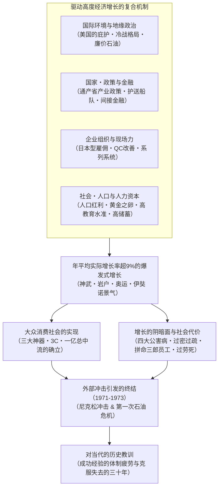
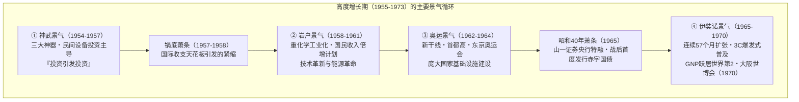
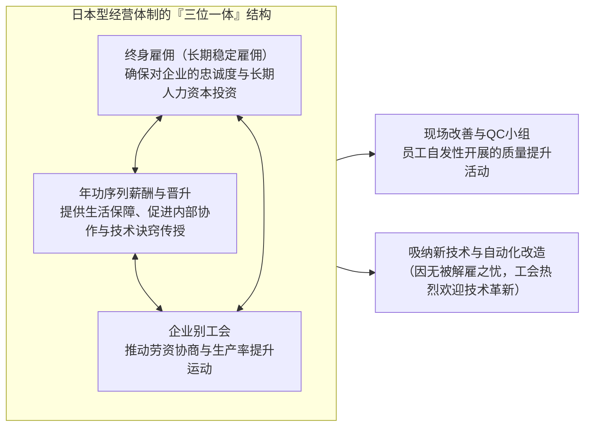
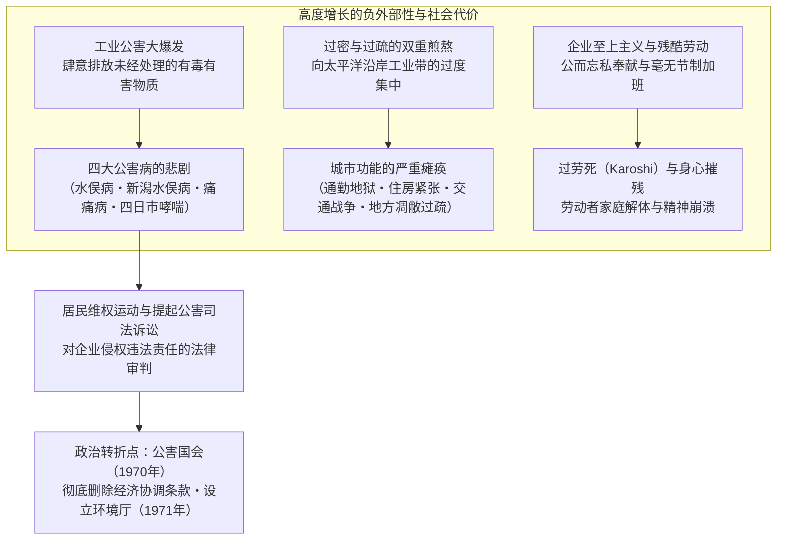

## 序论：历史上罕见的“经济奇迹”及其本质

1945年8月15日，随着大日本帝国的无条件投降与太平洋战争的终结，日本列岛沦为名副其实的一片焦土。主要城市约有四成在空袭中化为废墟，国家财富的约四分之一（非军事资产的约36%）化为灰烬。海外领地悉数丧失，超过600万名军人与海外平民遣返回国，在无家可归、无工可做的绝境中涌入本土。广大国民在粮食配给频遭延误与断供的极度饥荒中苦苦挣扎，时刻笼罩在恶性通货膨胀的恐惧之中。当时访日的外国记者以及驻日盟军总司令部（GHQ）的高级官员们异口同声地预言：“日本若要恢复作为一个近代国家所应具备的自立经济水平，至少需要半个世纪以上的漫长岁月。”

然而，这一悲观预言却以极其戏剧性的方式被彻底颠覆。

从战后仅仅十年后的1955年算起，直至第一次石油危机爆发的1973年，在这长达约二十年的时间里，日本经济实现了 **年平均实际增长率约9.3%** 这一人类历史上罕见的高速经济增长。国民生产总值（GNP）从1955年的约8万亿日元急剧膨胀至1973年的约112万亿日元，激增达14倍之巨。1968年，日本一举超越自明治维新以来梦寐以求追赶的西欧工业巨头西德，跃升为仅次于美国的 **资本主义阵营世界第二经济大国** 。



这一爆发式的飞跃，被全世界赞誉为 **“东洋奇迹（Economic Miracle）”** 。以黑白电视机、洗衣机、电冰箱为代表的家用电器“三大神器”走入了千家万户，随后消费结构进一步向彩色电视机、空调、汽车组成的“3C”升级。国民的生活方式经历了从传统农村共同体向城市型核心家庭的不可逆转的巨变，享受到了前所未有的海量生产与大众消费所带来的富足。全日本约九成国民自视为中产阶层的“一亿总中流”社会由此诞生，一个治安良好、教育水准世界名列前茅的现代化工业社会宣告建成。

然而，这场“奇迹”绝非凭空降临的历史偶然。在其背后，战前与战时积累的重化学工业技术底蕴与官僚机构的统制手段、冷战加剧带来的国际地缘政治剧变与美国对日战略的大转折、通商产业省（MITI）精密周详的产业扶持与大藏省主导的金融护送船队机制、以终身雇佣与年功序列为支柱的日本型劳资惯例，以及被称为“黄金之卵”的年轻劳动力所付出的艰苦勤勉与超高储蓄倾向，犹如精密咬合的齿轮，奇迹般地协同运转。

与此同时，在这辉煌征程的背面，始终伴随着幽深残酷的阴影。工厂肆意排放未经处理的废水和废气，引发了以水俣病、四日市哮喘为代表的“四大公害病”，给无辜市民的生命与健康带来了不可逆转的摧残。人口由农村向城市的狂暴涌流，在太平洋沿岸工业带造成了严重的“过密”、交通战争与居住环境恶化，而在广大地方则引发了急剧的“过疏”与第一产业的萧条凋敝。被称为“拼命三郎员工”或“企业战士”的劳动者们，被迫向企业献出一切、进行毫无节制的长时间加班，为日后演变为国际性社会问题的“过劳死（Karoshi）”埋下了制度性病根。

本文旨在全面剖析日本战后高度经济增长（1955〜1973年）这一宏大的历史现象。我们不仅追溯其景气周期的起伏演进，更从宏观经济学、产业政策、金融体制、公司治理、社会结构、国际地缘政治，以及环境破坏与公害问题等多维视角展开立体透视。进而深刻反思：为何这一时代的成功经验最终演变为束缚日后日本社会的“体制疲劳”枷锁，并一路导向1990年代以来的“失去的三十年”？以此为21世纪日本乃至世界经济的发展提炼出具有深远价值的历史教训。

---

## 第1章：焦土中的胎动 —— 高度增长的前史（1945〜1954年）

若将高度经济增长的起点定在1955年，那么此前战后的整整十年（1945〜1954年），则是清除崩溃国民经济废墟、重构市场经济基础设施、并为随后的火箭式腾飞搭建发射台的关键助跑期。

### 1.1 毁灭性战败与恶性通货膨胀

1945年8月战败伊始，日本经济已处于全面停摆的崩溃边缘。由于军需生产骤停以及海外原材料供应链彻底切断，1946年的采矿与工业生产水平已惨跌至战前（1934〜1936年平均）的 **约30%** 。作为主粮的大米配给延期与缺配成为常态，城市居民不得不将和服与家具运往农村换取粮食，过着所谓搜刮家当度日的“竹笋生活”。

给生产崩溃火上浇油的，是铺天盖地的恶性通货膨胀。由于日本军方在战争末期滥发临时军费、战败后立即向军需企业支付的巨额军需补偿债务，以及遣散旧日军官兵发放的退役津贴等，日本银行券的发行余额膨胀到了天文数字。从1945年秋到1949年，批发物价指数狂飙了 **约70倍** 之巨。

为了遏制这一致命危机，日本政府于1946年2月公布了《金融紧急措施令》，断然实行禁止提取所有存款的“存款封锁”，并强制废止流通中的旧纸币、改换为“新圆”。然而，只要从根本上缺乏生产能力的问题未得解决，物价狂飙的链条就无法真正斩断。

```
【战后初期主要经济指标的剧变】
・矿工业生产水平（1946年）：较战前基准（1934-36年=100）仅为 30.7
・东京批发物价指数上涨率（1946年）：同比飙升 +364.5%
・大米正规配给量（1945年底）：成年人每日削减至2合1勺（约297克），频繁迟配缺配
・海外遣返人员总数（1945〜1950年）：约625万人
```

为了打破这一生产瘫痪局面，东京大学教授有泽广巳等人提出了著名的 **“倾斜生产方式（Priority Production System）”** （1946年底内阁决议通过，1947年正式实施）。倾斜生产方式的核心要义在于：面对极度匮乏的国内资源（资金、物资、外汇、劳动力），不再任由市场原则自由配置，而是集中全力注入 **“煤炭”** 与 **“钢铁”** 两大支柱基础部门，凭借二者的相互循环拉动全产业的复苏。

具体而言，就是将国内有限的煤炭优先供应给钢铁业以炼铁，再将增产出来的钢铁优先调配给煤矿用作坑道支护和采煤机械，从而推动煤炭进一步增产。这一“钢铁与煤炭良性循环”所产生的剩余产出，再依次波及并反哺电力、化肥、铁路运输等相关基础工业，是一项宏伟的产业重构蓝图。

在金融层面上为该计划提供后盾的，是1947年1月设立的 **“复兴金融金库（复金）”** 。复金通过发行政府担保的复兴金融债券，大部分由日本银行直接认购，向煤炭、钢铁、电力等基础产业大规模注入低息长期资金。到1948年底，主要产业设备资金的约七成均来自复金贷款。

倾斜生产方式取得了立竿见影的戏剧性成果，使濒临死灭的基础工业生产水平迅速回升。但与此同时，日本银行直接认购复金债券导致货币供应量极度膨胀，进而点燃了被称为 **“复金通胀”** 的新一轮通货膨胀烈焰，带来了严重的负面副作用。

### 1.2 道奇路线与夏普建议：确立市场经济的基础

面对复金通胀的狂澜，美国政府决心对对日占领政策进行根本性调整。随着冷战的全面加剧（1949年中华人民共和国成立、东西方阵营对抗升级），美国将日本的角色从“应予解除武装的战败国”重新定位为“远东反共防波堤与资本主义堡垒”。为此，日本经济必须戒除对美国巨额援助（GARIOA/EROA基金）的依赖，成长为能够自立自强的市场经济体。

1949年2月，底特律银行行长 **约瑟夫·道奇（Joseph M. Dodge）** 作为特使公使抵日，给日本经济开出了一剂极其苛刻的猛药。这便是著名的 **“道奇路线（Dodge Line）”** 。道奇路线的三大核心原则如下：

1. **编制超均衡预算** : 全面禁止发行国债，立即纠正赤字财政，不仅要求岁入与岁出严格平衡，更强制要求计入过去的债务偿还，编制“真正的盈余预算”。
2. **停止复兴金融金库的新增贷款并全面废除补贴** : 取消巨额的物价差额补贴（原由政府用于弥补生产成本与官定价格之间的差价）。
3. **设定单一汇率** : 1949年4月25日，正式确立 **1美元＝360日元** 的统一步调单一汇率。

此前，针对不同商品品类存在数十种乃至数百种复杂的复数汇率。取消这些多重汇率、以1美元＝360日元的唯一定价与世界市场直接连通，意味着将日本的进出口企业彻底推向残酷的国际竞争环境。而从当时日本的购买力平价来看，“1美元＝360日元”实际上处于偏向日元贬值的水平，长远来看，这反倒成为了日本出口产业极其有利的竞争利器。

然而，道奇路线带来的短期震荡极为惨烈。财政资金的抽离和彻底的货币紧缩，使日本经济瞬间跌入深不见底的严重通货紧缩之中。中小企业接连倒闭，大企业为了自保也纷纷采取大规模裁员措施。“道奇萧条”全面降临。日本国有铁道、日本专卖公社等公共企业和民营企业数十万失业大军流落街头，以国铁三大谜案（下山事件、三鹰事件、松川事件）为代表的动荡社会不安笼罩了整个列岛。

与道奇路线并驾齐驱、奠定战后日本制度骨骼的，是1949年5月由哥伦比亚大学教授 **卡尔·夏普（Carl S. Shoup）** 率领的税制使节团所提交的 **“夏普建议”** 。夏普建议彻底废除了以往光怪陆离、以间接税为主的税制，果断转向了 **以个人所得税为核心的直接税中心主义** 。

夏普税制通过创设“蓝色申报”制度推动了现代记账与会计惯例的普及，确立了地方税收财政体制（地方交付税制度的原型），规范了企业法人税，使公平且高度透明的税收基础设施在日本社会扎下深根。道奇路线建立的宏观经济纪律，与夏普建议奠定的微观制度现代化，犹如两根坚固的支柱，赋予了日本驾驭现代资本主义经济不可或缺的制度基石。

### 1.3 朝鲜战争与“特需”冲击：资本积累的催化剂

正当日本经济在道奇萧条的扼喉之痛中奄奄一息之际，1950年6月25日，邻近的朝鲜半岛爆发了 **朝鲜战争** 。这场战争在地缘政治上是一场人间惨剧，但对于濒死的日本经济而言，却成了带来绝处逢生的戏剧性转机的救星。这正是时任首相吉田茂情不自禁脱口而出所谓“天佑（神风）”的渊源。

随着联合国军（实质上为美军）的出动，由于日本是距离战场最近的工业先进国，潮水般的军需物资采购与劳务提供订单汹涌而至。这便是著名的 **“朝鲜特需（特需景气）”** 。

美军下达特需采购的品类极其繁杂：
- **军事物资・钢铁制品** : 卡车、吉普车、铁桶、铁丝网、带刺铁丝、武器零部件、弹药箱
- **纺织品・日用品** : 军服、麻袋、毛毯、帐篷帆布、军靴
- **劳务服务（Service）** : 受损军用车辆与飞机的维修与大修、后勤补给运输、通信支援保障

在1950年至停战协定签署的1953年这四年间，特需带来的外汇收入 **累计达约24亿美元** （相当于当时日本全年出口总额的约六成）。这笔巨额美元资金的狂涌而入，使得长期困扰日本的外汇极度匮乏问题被一举荡平。

```
【朝鲜特需对日本经济的定量影响（1950-1953年）】
・特需合同总额：约24亿美元（直接特需＋驻军官兵私人消费）
・实际GDP增长率：1950年度 +10.8%、1951年度 +12.3%、1952年度 +10.0%、1953年度 +7.3%
・矿工业生产指数：在1950年短短一年多的时间里暴涨约70%，1951年完全恢复至战前水平（1934-36年基准）
・企业收益戏剧性改善：主要制造业的销售额利润率在1950年下半年创下战后历史最高纪录
```

特需的重大意义，绝不仅仅局限于去库存式的短期投机泡沫。
首先，通过军用卡车的大规模维修与制造，日本汽车工业（丰田汽车、日产汽车、五十铃汽车等）系统吸收了美军严苛的质量管理规范（美军标 MIL-SPEC），使零部件通用化与流水线量产管理技术实现了飞跃性跨越。其次，通过特需获取的巨额利润转化为企业丰厚的内部留保资本，为随后高度增长期兴起的大规模设备投资（新建现代化钢铁厂、引进最先进工作母机）提供了充足的自有资金保障。

### 1.4 旧金山体制与“不再是‘战后’”

1951年9月，日本签署了《旧金山和约》与《日美安全保障条约》；次年1952年4月28日条约正式生效，长达七年的盟军占领统治由此画上句号，日本恢复了国家主权。

重获独立的日本，在冷战大格局下明确归属于以美国为首的西方自由主义阵营。吉田茂首相主导的外交与安保路线，即所谓的 **“吉田路线”** ，将国家战略目标淬炼得极为务实而纯粹：即“国家安全保障完全依托日美安全保障条约与美军军事保护伞，本国防卫开支严格控制在国民生产总值1%以内的最低限度，将国家的全部精力、智力与资金全神贯注地投入到经济复兴与外贸扩张之中”。这一抉择为日本企业免除了庞大军费的沉重财政负担，构建了近乎理想的营商与发展环境。

随着1953年朝鲜战争停火，尽管特需订单退潮曾引发短暂的景气回落，但在日本经济深层，以设备投资为核心的内生性良性循环已然开始高速运转。1955年，在风调雨顺的农业大丰收与世界贸易蓬勃扩张的背景下，物价稳定、生产扩张的“数量景气”拉开了宏大序幕。

鲜明宣告这一历史转折点的，是昭和31年（1956年）由经济企划厅编纂的《经济白皮书》。由内阁府经济企划厅调查局内国调查课长 **后藤誉之助** 等人执笔的结语段落，成为了象征战后日本的不朽名篇：

> **“现在已经不再是‘战后’。我们现在正面临着不同的局面。通过恢复实现的增长已经结束。今后的增长将依靠现代化来支撑。”**

这番话语绝非陶醉于复兴功绩的赞歌，而是一份清醒的时代判词。恢复至战前水平的追赶阶段已经告终。自此以后，不能再沉湎于依赖外国借款、援助或战争特需等外部红利。必须主动且大规模引进最新技术革新（自动化控制、高分子化学、晶体管、大容量火力发电），将整个产业结构从前近代式的轻工业毅然转向现代化的重化学工业，否则就必将在国际市场的无情竞争中败北——这是一种强烈的危机意识宣言。

而日本经济，正以远远超越这篇白皮书预警的惊人内生动力，轰轰烈烈地跨入了世界历史上规模最空前的“现代化伟大试验”之中。

## 第2章：景气循环与高度增长的编年史（1955〜1973年）

在1955年至1973年这长达约18年的岁月里，日本经济并非始终如一地沿直线平稳扩张。事实上，它是伴随着设备投资爆发与消费热潮交织的“繁荣期”，以及随之而来的进口激增导致外汇储备枯竭、被迫实施紧缩政策的“萧条期（紧缩期）”，在这样波澜壮阔的动态景气循环中，如同拾级而上般不断翻倍扩张其整体经济体量。

当时日本实行的是“1美元＝360日元”的固定汇率制，中央银行持有的黄金和外汇储备规模始终存在严格上限。一旦景气过热，原材料和机械设备进口便会急剧攀升，导致国际收支陷入逆差；当外汇储备濒临见底时，日本银行不得不提高法定贴现率来为过热的经济强制降温。这一循环往复的制约机制，在当时被称为 **“国际收支的天花板”** ，是日本宏观经济运行中最为核心的硬性约束条件。

以下我们将详细梳理主导高度经济增长全过程的五大主要景气循环轨迹。



### 2.1 神武景气（1954〜1957年）与锅底萧条：设备投资的连锁反应

始于1954年11月的经济扩张，被冠以日本首任天皇神武天皇即位以来前所未有的繁荣之意，命名为 **“神武景气”** 。

驱动这场繁荣的最强劲引擎，是民营企业爆发式的 **设备投资** 。钢铁、造船、合成纤维、石油化工、电气机械等主要支柱行业齐头并进，纷纷大手笔引进最先进的成套工厂与重型机械。昭和32年（1957年）度《经济白皮书》中提出的著名论断—— **“投资引发投资”** ，精准提炼了这一现象。

钢铁企业扩建厂房设备，机械制造商便会接获大量机床订单；而机械企业为了扩大产能新建厂房，又会反过来激增对钢铁和水泥的采购需求。这种源于产业关联的内生需求滚雪球效应，将整个国民经济以惊人的速度向上推升。

与此同时，在消费终端掀起了一场前所未有的“生活革命”。以黑白电视机、洗衣机、电冰箱为代表的 **“三大神器”** 开始在城市工薪阶层中迅速普及。家务劳动负担的大幅减轻与大众文娱享受的飞跃，彻底颠覆并重塑了普通家庭的生活面貌。

然而，步入1957年后，过度繁荣的代价骤然显现。由于原材料进口过猛，贸易收支急剧恶化，外汇储备萎缩至危险警界线。日本经济狠狠撞上了“国际收支的天花板”。日本银行旋即接连大幅上调法定贴现率，发动了强力货币紧缩。经济因此骤然失速，钢铁与纺织品市况大跌，在1957年下半年至1958年间陷入了被称为 **“锅底萧条”** 的低谷停滞期。不过，设备投资的基本动能并未彻底涣散，经济见底回升的节奏相对迅捷。

### 2.2 岩户景气（1958〜1961年）与国民收入倍增计划：重化学工业化的爆发

走出锅底萧条后，从1958年7月拉开帷幕的新一轮繁荣期，被赋予了甚至超越神武天皇、追溯至天照大神隐于天岩户以来最佳景气之意的 **“岩户景气”** 。在此期间，日本的实际GDP增长率创下了 **年均11.3%** 的惊世奇迹。

岩户景气的灵魂内核，在于日本产业结构完成了从轻工业（纺织、杂货等）向全面 **重化学工业（钢铁・石油化工・汽车・重型电气机械）** 的历史性主角交接。能源革命深入推进，工业运转的核心燃料与原料由“煤炭”急剧转向来自中东质优价廉的“石油”。在太平洋沿岸（东京湾、伊势湾、濑户内海等）临海地带，依托广阔的填海造地工程，一座座庞大的现代化钢铁厂与石油化工联合企业（工业联合体）如雨后春笋般崛起。

政治领域同样迎来了重大转折。1960年，围绕日美安保条约修订问题，数十万示威群众包围国会议事堂，爆发了战后规模最大的政治风暴“安保斗争”。在承担严重社会动荡责任导致岸信介内阁总辞职后，继任的 **池田勇人** 首相推出了一项旨在将全体国民的注意力从意识形态争斗迅速转移至经济建设的宏大施政纲领——这就是 **“国民收入倍增计划”** （1960年12月内阁决议通过）。

该计划以大藏省官僚兼经济学家下村治等人的理论为坚实支柱，确立了宏伟的目标：“ **在未来十年内（1961〜1970年）使实际国民生产总值（GNP）翻一番，实现充分就业，并将国民生活水平提升至西欧先进国家水平** ”。据测算，实现该目标需要年平均7.2%的复合增长率，最初在野党和诸多主流经济学者纷纷斥其为“脱离现实的吹牛空谈”。

然而最终的结果，却是一场远远超越所有人想象的辉煌大捷。企业的投资欲望被进一步彻底引燃，仅用了短短四年多时间，国民收入翻番的目标便被提前超额兑现。池田内阁提出的“宽容与忍耐”、“工资翻倍”等极具号召力的积极口号，成为了帮助背负战败创伤的日本国民重塑坚定自信与成长信心的巨大心理助推器。

### 2.3 奥运景气（1962〜1964年）与基础设施革命

经历岩户景气之后，经济因国际收支再度恶化而经历短暂调整，自1962年下半年起，正式步入了 **“奥运景气”** 。为了确保亚洲首度举办的第18届奥林匹克运动会（1964年10月东京奥运会）圆满成功，日本举国体制推进了一系列庞大的国家级基础设施建设项目。

在此期间注入的基础设施建设预算，涵盖公路、铁路与城市综合整治，总规模高达近1万亿日元，几乎相当于当时日本一整年的国家财政预算。
- **东海道新干线** : 1964年10月1日正式通车。将东京与新大阪之间的通行时间以最高210公里的时速缩短至仅需4小时（次年进一步提速至3小时10分），世界首条高速铁路横空出世，从根本上重塑了日本的国土经济主干轴。
- **名神高速公路・首都高速公路** : 日本第一条城际城际高速公路——名神高速公路（1963年部分通车，1965年全线贯通），以及在高密度超大城市东京上空纵横穿梭的首都高速公路网络飞速建成。
- **城市环境全面换代** : 连通羽田机场与市中心的东京单轨电车、全线贯通的地铁日比谷线、以新大谷饭店为代表的一大批大型现代化涉外酒店纷纷落成，下水道设施的大规模铺设与市容市貌的美化改造亦大踏步推进。

在电视广播领域，为了实时收看奥运开幕式与精彩赛事，彩色电视机开始加速走进大众家庭；利用通信卫星（辛康3号）成功的日美间跨太平洋卫星跨洋实况转播，更向全球生动展现了日本作为现代科技立国强国的崭新姿态。

### 2.4 证券萧条（1965年・昭和40年萧条）的冲击与政策大转折

然而，当奥运盛会的狂欢热潮退去，日本经济立刻直面了整个高度增长期内最为严酷冰冷的严峻考验——1965年，即所谓的 **“昭和40年萧条（证券萧条）”** 。

此前为迎合奥运需求而一哄而上扩建的生产设施，随着短期需求退潮骤然沦为庞大的过剩产能，企业破产倒闭数量创下战后历史新高。尤其是战后急速膨胀的证券市场遭受沉重打击，股票价格一泻千里，位列四大证券公司之一的 **山一证券** 因背负天文数字的巨额亏损而濒临实质性破产的边缘。

为阻止连锁倒闭狂潮可能引发的信用崩塌与系统性金融海啸，时任大藏大臣 **田中角荣** 与日本银行总裁宇佐美洵断然作出了极其罕见的非常规超法规决断：依据《日本银行法》第25条，对山一证券实施 **“无限制・免担保的特别紧急贷款（日银特融）”** ，从而彻底平息了挤兑柜台的投资者与储户恐慌情绪。

更具划时代意义的是，日本政府打破了自道奇路线以来奉为圭臬的《财政法》第4条“均衡财政主义（严禁发行国债）”的禁忌，在1965年度的财政补充预算中，破天荒地发行了战后首笔 **“特例国债（赤字国债）”** 。这一鲜明的凯恩斯主义财政扩张政策（追加公共工程投资与全面减税），强力托底了极度冰冻的民间总需求，成为日本在最短时间内摆脱萧条低谷的决定性法宝。而这次成功化解危机的经验，也为接下来战后持续时间最长的一段黄金鼎盛期铺平了道路。

### 2.5 伊奘诺景气（1965〜1970年）：黄金57个月与跨入世界第二

自昭和40年萧条触底的1965年11月算起，直至1970年7月，这场持续长达五年之久的空前大繁荣被称为 **“伊奘诺景气”** 。以日本神话中的开国始祖神伊奘诺尊命名的这场大繁荣，连续扩张长达 **57个月** ，大幅刷新了当时战后最长景气纪录。

主导伊奘诺景气的核心支柱，是澎湃昂扬的出口竞争力和全方位升级的大众消费。消费的主角从三大神器全面升级为英文首字母均为“C”的 **“3C（新三大神器）”** ：
- **彩色电视机（Color TV）**
- **空调（Cooler / 房间冷气）**
- **私家轿车（Car）**

丰田的卡罗拉（Corolla）与日产的阳光（Sunny）等亲民国民车接连面世，汽车大众化（普及化）浪潮席卷整个日本列岛。日本制造业依托彻底的工序管理与质量改善，彻底洗刷了以往“廉价劣质”的污名，性能卓越、经久耐用、极少出故障的“Made in Japan”优质工业品开始横扫全球各大市场。

1968年，日本近现代史上树立起了一座里程碑式的决定性丰碑：日本的名义GNP（国民生产总值）达到 **约1,419亿美元** ，正式超越西德，一举跃升为仅次于美国的 **资本主义世界第二经济大国** 。恰逢明治维新一百周年之际，这个曾经饱受战火蹂躏的亚洲战败国，终于超越了老牌欧美列强，跻身世界经济巅峰阵营。

1970年，亚洲首届世界博览会—— **“日本万国博览会（大阪世博会）”** 在千里丘陵隆重举行，其主题为“人类的进步与和谐”。在冈本太郎设计的巨型雕塑“太阳之塔”巍然耸立的会场内，短短半年间累计迎来了惊人的 **6,421万人次** 庞大海内外游客。美国馆展出的“阿波罗月球岩石”、自动人行步道以及各大展馆所呈现的未来都市蓝图，深深铭刻在全体国民心中，成为战后复兴圆满功成与日本迈向富裕繁荣极盛时代的巅峰象征。

```
【高度经济增长期主要宏观经济指标推移（1955-1973年度）】
```

| 年度 | 实际GDP增长率 (%) | 名义GNP (亿日元) | 景气阶段 / 主要历史里程碑 |
| :---: | :---: | :---: | :--- |
| **1955** | **+10.8** | 88,646 | 神武景气启动，三大神器开始普及 |
| **1956** | **+6.2** | 98,719 | 经济白皮书宣告“不再是战后”，加入联合国 |
| **1957** | **+7.8** | 111,280 | 锅底萧条，撞上国际收支天花板 |
| **1958** | **+5.6** | 118,527 | 岩户景气启动，东京铁塔竣工 |
| **1959** | **+11.2** | 134,228 | 皇太子（今上皇陛下）大婚游行，电视机加速普及 |
| **1960** | **+12.5** | 160,332 | 安保斗争，池田内阁制定“国民收入倍增计划” |
| **1961** | **+12.0** | 196,442 | 重化学工业化纵深推进，能源革命展开 |
| **1962** | **+8.9** | 220,119 | 奥运景气启动，千里新城开城入驻 |
| **1963** | **+10.7** | 256,419 | 名神高速公路开通（栗东〜尼崎） |
| **1964** | **+13.1** | 295,444 | 举办东京奥运会，东海道新干线通车，加入OECD |
| **1965** | **+5.8** | 328,217 | 昭和40年萧条（证券萧条），山一证券特融，首度发行赤字国债 |
| **1966** | **+10.6** | 382,900 | 伊奘诺景气全面展开，私家车普及元年（卡罗拉・阳光上市） |
| **1967** | **+11.1** | 446,953 | 3C快速普及，《公害对策基本法》公布 |
| **1968** | **+12.2** | 528,781 | **日本GNP超越西德跃居资本主义世界第2位** |
| **1969** | **+12.5** | 622,464 | 东名高速公路全线通车，彩色电视机普及率井喷 |
| **1970** | **+10.7** | 733,449 | 举办大阪世博会（入场达6,421万人次），召开“公害国会” |
| **1971** | **+5.0** | 809,726 | 尼克松冲击，史密森协定（1美元=308日元） |
| **1972** | **+9.1** | 954,646 | 田中角荣内阁提出“日本列岛改造论”，中日邦交正常化 |
| **1973** | **+5.1** | 1,125,487 | 转向浮动汇率制，第一次石油危机爆发，陷入“狂乱物价” |
| **1974** | **-1.2** | 1,348,229 | **战后首次出现负增长，高度经济增长期彻底落下帷幕** |

## 第3章：为何“奇迹”能够发生 —— 多维度机制的深度解剖

日本战后的高度经济增长，绝非单纯依靠自由放任（Laissez-faire）的市场调节便能自发实现，也无法仅仅用所谓“日本人天性勤劳”这一精神胜利法式的空泛说辞予以解释。在其核心，存在着由国家精密的产业诱导、独特的金融结构、稳固的劳资互信惯例、生产现场的质量管理革新、极其充沛的人口红利，以及冷战格局所赋予的外部红利交织而成的精巧机制。它们彼此产生了令人叹为观止的协同共振，共同造就了独树一帜且运作精密的 **“日本型资本主义体系”** 。

本章将从六个核心维度深入解构驱动高度经济增长的结构性深层机制。



### 3.1 产业政策与国家领航：通产省（MITI）的目标产业策略

美国著名政治学者查尔默斯·约翰逊（Chalmers Johnson）在其经典名著《通产省与日本奇迹》中，提出了一个划分现代国家形态的深刻理论框架：与美国式的“规制指向型国家（Regulatory State）”形成鲜明对比，日本属于由国家设立前瞻性战略目标、强力引领产业经济升级的 **“发展指向型国家（Developmental State）”** ，而日本通商产业省（MITI）便是这一模式的终极典范。

通产省推行的产业政策的核心，在于蓄意摒弃了传统的静态比较优势原则（即仅仅专注于自身当前具备成本优势的产业理论）。如果战后初期的日本盲从静态比较优势理论，它将永远只能停留在依赖低工资出口纺织品和日用杂货的边缘地位。然而，通产省官僚们独具慧眼，主动在政策上遴选具有高资本密集度、技术集约度且未来全球市场需求空间不可限量的战略支柱行业——集中全力扶持 **钢铁、造船、石油化工、汽车、机械与电子工业** ，确立了所谓的 **“目标产业政策（重点产业扶持策略）”** 。

支撑这一宏大产业引导蓝图落地的核心工具包括：

1. **外汇配额预算权（基于《外汇及外国贸易管理法》）** :
   在当时，宝贵的外汇（美元）受到国家极其严厉的集中管制。通产省对自己钦定培育的战略重点行业大开绿灯，享有最高优先级的外汇配额，强力支持其引进欧美最尖端的现代化成套工厂与核心专利技术（如连轧薄板技术、高分子合成化学专利、高端机床等）。反之，对于非重点产业及大众消费品的进口，则实施严苛的外汇限制，严密筑起保护本国幼稚产业免受海外跨国巨头冲击的防火墙。
2. **日本开发银行（开银）政策金融的“引导效应（信贷先导作用）”** :
   作为官方政策性金融机构，一旦日本开发银行决定对某一大型战略项目（如新建大型现代化临海钢铁厂、筹建大型石油化工基地）提供低息联合贷款，民营城市银行便会认定该项目获得了“国家最高信用的权威背书”，从而信心百倍地争相注入巨额民营资本。开银资金这种四两拨千斤的“引导信号效应”，将滚滚民间资本精准导入了重化学工业领域。
3. **官民协调机制与设备投资统一协调** :
   若任由市场自由竞争，各企业必然盲目扩张产能，导致严重的恶性过度竞争与产能过剩。通产省牵头成立了汇集钢铁、石化等行业龙头企业首脑的“官民协调恳谈会”，通过行政指导，在业内类似合法卡特尔机制下，有条不紊地理顺并协调各家企业新建高炉的开工顺序与产能配额。这大幅降低了企业进行超大规模固定资产投资所面临的市场风险，使其得以从容建成具备世界最大规模效益的现代化超大型工厂。

### 3.2 金融体制的点金之术：间接金融主导与护送船队体制

支撑高度经济增长期内那股近乎狂暴的固定资产投资洪流的，是日本极其特异的金融组织体系。

在欧美发达国家，企业扩大投资所需的资金主要依托股票与公司债的发行（直接金融）或是自身积累的利润留存。然而战后的日本企业，由于战火摧残导致资本积累几乎归零，加上投资扩张速度过快，企业自有资本比率低得异乎寻常。在此背景下应运而生的，便是以银行信贷为绝对中枢的 **“间接金融模式”** 。

这一独特的金融传导机制由三大基石构筑而成：

- **主力银行制度（Main Bank System）** :
   每一家大型工业企业都与某一家特定的核心都市银行（如三井、三菱、住友、富士、第一劝业、三和，以及日本兴业银行等长期信用银行）结成深度绑定休戚与共的共生关系。主力银行不仅源源不断提供巨额信贷，还通过相互交叉持股成为企业的长期稳定股东，向企业派驻董事监事，常态化密切监控企业的经营与财务状况。这使得日本企业无需迎合短期股价波动或季度财报数字，能够毫不犹豫地放手推进着眼于5年乃至10年后的超前大型设备投资。
- **过度借贷（企业的超额负债）与过度放款（银行的超额信贷）** :
   企业依靠远远超越自身资本实力的超高杠杆向商业银行借款（过度借贷），都市银行向企业发放的贷款总额甚至超过了其吸纳的社会存款总量，所形成的资金缺口则通过直接向日本银行借款（央行再贷款）来填补（过度放款）。日本银行通过灵活升降法定贴现率以及实施定额管控的 **“窗口指导（直接硬性限制各家银行贷款新增额度）”** ，牢牢掌控着宏观经济资金供应的总阀门。
- **护送船队体制与人为低利率政策** :
   大藏省（现财务省与金融厅）通过《临时利率调整法》，人为将存贷款利率压制在显著低于纯粹自由市场均衡的水平，从而在全系统层面大幅削减了企业的融资成本。与此同时，大藏省运用强大的行政指导权力，对所有银行的存款利率、分支机构网点开设、业务经营范围推行整齐划一的步调管治，确保哪怕实力最孱弱的金融机构也绝对不会倒闭破产。这种效仿海军舰队航速必须迁就最慢航船的防御阵型，被形象地称为 **“护送船队体制”** 。它为国民大众注入了对银行系统的绝对安全信仰，彻底将系统性金融危机的爆发概率扼杀在萌芽之中。

在此机制中，绝不能忽略的是 **“财政投融资计划（FILP）”** 的不可替代之功。千家万户存入邮局的邮政储蓄，以及国民年金与厚生年金的巨额社保沉淀资金，被全额归集至大藏省资金运用部，化作被誉为“第二国家预算”的充沛政策性母基金，持续定向灌溉给日本开发银行、日本道路公团、住宅金融公库、日本国有铁道等机构。这一完全摆脱税收依赖的宏大国家资金池，以澎湃动能强力支撑了东海道新干线、名神高速公路、现代化海运船队与钢铁能源基地的飞跃式建设。

### 3.3 日本型雇佣惯例的奠定：“三大支柱”式劳资关系的制度功能

在生产一线支撑高度经济增长奇迹的，是日本社会在经历了战后初期惨烈的阶级对立与工人罢工（如1953年日产汽车大罢工、1960年三池煤矿激烈工潮）的创痛与妥协之后，逐步摸索并稳固确立下来的 **“日本型雇佣惯例（日本式经营模式）”** 。正如美国社会学家詹姆斯·阿贝格伦（James Abegglen）在其奠基性著作《日本的管理》中所深刻指出的，该体制牢固矗立于以下三大制度支柱之上：

1. **终身雇佣制度（长期稳定雇佣保障）** :
   企业原则上统一成批招募应届毕业生，并在无严重违纪或特殊变故的前提下，承诺保障其工作岗位直至法定退休年龄。对于资方而言，这意味着长期投入在员工身上的巨额岗前与在岗技能培训（OJT）成本能够被长期完全回收；对于劳动者而言，则获得了个人生活与家庭生计的坚固后盾。
2. **年功序列型薪酬与晋升体系** :
   薪资待遇与公司职级随着员工年龄与在职司龄的增长而呈阶梯式自然递增。在青年阶段，员工的薪酬水平被相对压低至低于其实际产出贡献，但随着步入成家立业、子女教育与购房养老的高开销中老年阶段，企业将发放极为丰厚优裕的薪资与津贴福利。这种设计与劳动者一生的家庭生命周期支出节奏完美贴合；而青年员工被适度压低的初期工资，则为企业进行资本积累提供了充裕的流动资金。
3. **企业别工会（Enterprise Union）** :
   区别于欧美按工种、按全行业横向跨企业组建的对抗性工会，日本的工会是由同一家企业内的全体正式员工纵向独立组成。工会核心骨干本身就是企业正式员工，这促使劳资双方牢固树立了“唯有公司经营不断壮大繁荣，员工的切身利益（涨薪、奖金与岗位稳定）才能水涨船高”的紧密命运共同体共识。

这套“三位一体”的雇佣机制，在吸收并推广技术创新方面迸发出了惊人的系统性优势。

在欧美工种制工会体系下，一旦资方引入新型自动化设备或省力化工艺，往往直接导致现有岗位被取缔、工人遭无情解雇，因此欧美工会往往对技术革新报以强烈的仇视与破坏性抵制（如消极怠工或持久罢工）。然而，在享有绝对终身雇佣承诺的日本大企业内部，即便某一流水线因技术革新全面实现自动化，工人们也绝无失业下岗之虞，而只会被妥善转调至公司内部其他部门或新设立的先进产线，并接受免费的技术再培训。

因此，日本劳动者与工会非但对先进技术的引入毫无抵触，反而全心全意地将技术革新视为“增强企业全球竞争力、分享更多年终分红”的利好契机，从而 **以极高的热情狂热拥抱自动化与工业机器人的入驻** 。

不仅如此，自1955年起制度化的 **“春斗（春季争取提高工资斗争）”** ，由钢铁、机电、造船、汽车等龙头骨干产业的工会联合行动，在每年春季协同向管理层提出统一标准的加薪诉求。由实力雄厚的大企业最终敲定的工资涨幅指标，迅速成为全社会公认的基准参考线，并如同涟漪般迅速传导至所有行业和中小企业。春斗机制确保了全日本劳动者的实际收入能够以年均10%左右的幅度稳步水涨船高，进而强有力地持续做大国内消费品市场，确保企业天量设备投资的产出能够被旺盛的内需顺利消化，形成了无懈可击的宏观内需良性大循环。

不过必须清醒指出的是，在这一劳资和谐的华美乐章背后，同样存在着残酷冰冷的“二重结构”现实：大企业正式员工优厚福利的底层，是以数以万计承担风险减震阀职能、被迫接受严苛微薄薪酬与朝不保夕待遇的 **“外包加工的中小转包微型企业”** ，以及无权享受终身保障的 **“临时工与外包派遣工”** 作为无声基石的。

### 3.4 现场力与微观创新：QC小组与改善（Kaizen）运动

日本制造业彻底告别对欧美工业的技术跟风与粗制滥造，进而夺取全球首屈一指的顶级品质与压倒性成本竞争优势的终极秘诀，根植于在生产制造一线爆发开来的 **“质量管理革命”** 。

在二战前，日本工业制造品在海外市场上长期背负着“廉价劣质货（Cheap and Nasty）”的奇耻大辱。战后初期，为了从根本上改变日本工业品质量极度低下的顽疾，盟军总司令部（GHQ）特意从美国引进了统计质量控制领域的泰斗 **W·爱德华兹·戴明（W. Edwards Deming）** 博士。1950年，应日本科学技术联盟（日科技联）的盛情邀请，戴明博士亲赴日本，向日本各大企业的经营层与工程技术人员深入系统地传授了生产全流程的统计学方法（即PDCA循环的雏形）与质量管控的不可替代性。

日本工商业界深受震动，日科技联随即以戴明博士捐赠的讲学版税为母基金，正式设立了享誉后世的 **“戴明奖”** 。各大日本企业掀起了竞相角逐戴明奖、全面推行全员质量管理（TQC）的浩荡浪潮。

然而，日本企业最为天才的独创之举，在于将这种原本在欧美属于精英工程师自上而下施行的冰冷统计工具，成功改造成为了基层蓝领工人全员主动参与、自下而上生生不息的群众性草根运动——这就是自1962年起席卷全日本各大现代化工厂的 **“QC小组（质量控制小组 / Quality Control Circle）”** 。

车间一线的普通工人自发组成5至10人的微型学习与攻坚小组，充分利用业余时间或工歇碎片时间自主集会。他们熟练运用因果图（鱼骨图）、排列图（帕累托图）等简单易行的分析工具，层层深挖生产环节中不良品发生的根本症结，集思广益提出流程优化提案（即著名的“改善 / Kaizen”）。一旦被证明行之有效，这些来自一线的微创新会立刻被固化到标准作业指导书中，并在全厂范围内乃至全国交流大会上受到极高规格的表彰。通过这项运动，甚至是最基层的普通一线工人，也被赋予了“我们亲手铸就产品卓越品质”的高尚职业自豪感与强大的自主问题解决素养。

将这种以制造现场为灵魂的哲学演绎到极致的集大成者，当属由丰田汽车副社长大野耐一等人一手缔造的 **“丰田生产方式（TPS / Toyota Production System）”** ：
- **准时制生产（Just In Time）** : 坚定践行“只在必要的时间，生产必要数量的必要零部件”，将车间内的在制品堆积与仓储库存压缩至趋近于绝对零。
- **看板管理（Kanban）** : 坚决打破传统的前道工序向后硬性推流模式，推行由后道工序根据实际装配消耗、向前道工序反向拉动领取的物理凭证（看板）管理，实现了精准高效的自律去中心化调度。
- **自働化（融入人类智慧的带人字旁自动化）** : 赋予机械设备以灵敏的人性智慧，一旦产线检测到任何细微异常或瑕疵，设备便会瞬间自主自动紧急停机，决不允许任何一件不合格品流入下一道工序。
- **对“浪费”的无情绞杀** : 将过度生产、等待怠工、徒劳搬运、过度加工、多余库存、无效动作以及制造不良品这“七大浪费”视为不可饶恕的大敌，展开彻底铲除。

正是凭借这一系列叹为观止的底层制度创新，日本制造业完成了从僵化的欧美福特制大批量单一大规模生产模式，向“能够以极低边际成本与极致敏捷的交货周期，大规模高质量生产多品种、小批量高附加值产品”的全新生产范式的革命性跃迁。

### 3.5 人口结构与人力资本：人口红利与“黄金之卵”的迁徙

使高度经济增长奇迹从图纸变为现实的深层物理基石，当属战后日本那极为磅礴丰沛的 **人口红利（Demographics）** ，以及综合素质卓越的 **人力资本（Human Capital）** 宝库。

1947年至1949年战后初期，日本迎来了历史上规模空前的第一次生育高峰。在这短暂的三年间，降生了多达 **约800万** 庞大新生人口，这批人被统称为 **“团块世代”** 。自1950年代中期起，日本的人口金字塔步入了一个绝佳的黄金结构：15至64岁的劳动年龄人口急剧膨胀，而需要被赡养的少儿与老年人口比重相对较低，全面跨入了经典的 **“人口红利黄金期”** 。

```
【日本劳动年龄人口比重的历史性跃迁】
・1950年：59.7%
・1960年：64.2%
・1970年：68.9%（人口红利达历史最高峰值）
```

这支庞大的生力军不仅在数量上源源不竭，更在空间布局上掀起了一场席卷全日本列岛的城乡人口大迁移。

在战后初期的大规模农地改革中，广大佃农虽然获得了土地成为了自耕农，但在有限的耕地束缚下，除长子能够继承祖业外，广大农村家庭中的次子、三子以及待嫁姑娘们缺乏发展空间。当这些青年初中或高中毕业时，他们满怀憧憬地成群奔赴东京、大阪、名古屋等大工业都市，汇入大企业与中小配套厂的现代化流水线。他们品性温和顺从、组织纪律性极强、刻苦耐劳且学习能力惊人，被全社会由衷赞誉为 **“黄金之卵”** ，在企业间引发了极其火爆的招募争夺战。

每年春天，满载着来自东北和九州偏远乡村中学毕业生的 **“集体就业专运列车”** ，络绎不绝地驶入东京上野车站或大阪火车站。在1955年至1970年短短十五年间，向日本三大都市圈净流入的人口总数 **超过了惊人的1,000万人** 。从就业结构来看，1950年曾占据全国就业总人数 **48.3%** 的第一产业（农业、林业、渔业）劳动力，到1970年骤降至仅剩 **17.4%** ；这批被从土地上彻底解放出来的数以千万计的优质青年劳动力，全面注入到了第二产业（制造业、建筑业）与现代第三产业的肌体之中。

更令人惊叹的，是全体国民展现出的卓越 **教育水平** 与 **惊人的高储蓄率** ：
- **高度均质化的全民优质教育** : 依托明治维新以降确立的全民义务教育以及深厚的文化积淀，日本初等与中等教育实现了近乎100%的完全扫盲率。全社会高中升学率从1950年的42.5%一路飙升至1970年的82.1%。这确保了全国工业企业能够随时获得数百万名能够精准看懂复杂工程图纸、严格遵守精密工艺纪律、在短时间内熟练驾驭复杂数控机械的高素质产业大军。
- **冠绝全球的超高储蓄倾向** : 相较于欧美发达国家居民储蓄率长期在10%上下徘徊，日本家庭可支配收入的储蓄率始终坚挺在 **15%至20%以上** 的极高位。收入的连年大幅增长、为预防未来生活不确定性而积累储备的强烈动机（当时社会保障网尚在建立之中）、年终巨额奖金与退休金的发放惯例，加之面向大众的小额邮政储蓄免税制度（“丸优”制度），共同促成了这一储蓄奇迹。全社会储蓄通过银行与邮政网络，源源不断、成本极低地转化为支撑工业企业疯狂扩张的高效长期投资，实现了在极少依赖外债与外国直接投资的纯内生性资本扩张。

### 3.6 冷战地缘政治与国际环境：历史的宏大顺风

必须铭记的是，日本战后高度经济增长不仅是国内奋斗的果实，更是第二次世界大战后所重构的全球政治经济秩序（布雷顿森林体系与东西方冷战对抗）以极度慷慨的方式倾斜于日本的“地缘历史超级奇迹”。

第一，在上述 **“吉田路线”** 的战略荫庇下，日本将国防军费支出长年压制在仅占GNP约1%的极低水准。相比之下，处于冷战对抗最前沿的同代大国（美国、苏联、英国、西德、韩国、中国台湾等）普遍将自身GNP的5%至10%以上耗费在庞大的常规军费、战略核武库与普遍征兵制之中。日本则以极低的防务成本，将国防安保全面外包给美国的核保护伞和驻日美军基地，从而得以将全民族最拔尖的工程头脑、全部行政资源与财政收入，心无旁骛地全额投向民用现代工业体系的构筑与公共基础设施建设。

第二，日本全面享受了由美国一手搭建并捍卫的 **全球自由贸易体系（GATT / IMF体制）** 的丰厚历史红利。随着1955年加入关税与贸易总协定（GATT）、1964年迈入国际货币基金组织（IMF）第8条款国（实现外汇自由兑换）并加入经合组织（OECD），日本正式昂首跨入“西方富国俱乐部”。当美国主导下的全球庞大消费市场毫无保留地向日本产的高品质工业制成品敞开大门的同时，日本自身却长期依靠隐性外汇管制与高关税等贸易壁垒，严密庇护本土尚未具备完全抗衡能力的稚嫩工业部门，享受着长达十余年宝贵的非对称非互惠式发展特权。

第三， **“1美元＝360日元”固定汇率制度** 赋予的巨大价格护城河。伴随着日本制造业生产率在技术革命洗礼下的飞速跃升，其真实的工业竞争力已不可同日而语；但由于汇率在长达22年的时间里被死死锚定在1美元兑360日元的低谷，日元在实质上处于被严重低估的极其划算状态。这一巨大的汇率不对称杠杆，使得日本出产的优质钢铁、家用电器、小轿车、高精相机与石英手表，在欧美市场上具备了摧枯拉朽般的毁灭性价格竞争优势。

第四， **中东原油无限量且极其低廉稳定的供应保障** 。二战前日本铤而走险发动太平洋战争的最直接致命诱因正是石油资源的匮乏。然而二战之后，在西方“石油七姐妹”（国际跨国石油巨头）所完全掌控的中东超级大油田的全力供应下，几乎取之不尽的优质原油以每桶仅2美元上下的低廉价格，不分昼夜地通过庞大的跨洋油轮船队运抵日本。正是这股几乎近乎白送的廉价石化能源洪流，驱动着日本庞大的沿海火力发电厂轰鸣运转，为巨型石油化工基地输送着基础化工原料，并在神州大地上点燃了汽车全面普及的烈烈火焰。

## 第4章：大众消费社会的降临与生活革命

战后日本的高度经济增长，绝不仅仅体现在工厂烟囱中升腾而起的滚滚白烟，或是钢铁厂高炉里粗钢产量的冰冷统计报表上；它更是一场从最深处彻底重构普通老百姓衣食住行、居住形态、家庭观念乃至国民精神风貌的宏大 **“生活革命”** 。

在二战前的日本社会，除极少数享有特权的权贵阶层与地主富豪外，占人口绝大多数的平民阶层长期在自给自足、极其贫困朴素的前近代生活轨道上勉强糊口。然而，在自1950年代中期至1970年代初短短十余年的弹指一瞬之间，日本却以令全球侧目的速度，脱胎换骨为一个在全世界范围内均质度极高且极其富裕的 **“大众消费社会”** 。

### 4.1 从“三大神器”到“3C”：消费生活的剧烈嬗变

日本普通工薪家庭生活的现代化进程，伴随着一系列标志性耐用消费品的飞速普及，呈现出清晰的阶梯式飞跃。

第一波浪潮，是席卷于1950年代后半叶（神武景气至岩户景气时期）的 **“三大神器”** 抢购狂潮。这一借用自日本历代天皇代代相传的三大信物（神镜・宝玉・神剑）的戏谑俗称，指代的是 **“黑白电视机”、“洗衣机”** 与 **“电冰箱”** 这三件划时代的家用电器：
- **洗衣机** : 彻底将广大女性从长年浸泡在刺骨冰水中、用木盆和洗衣板苦战数小时的沉重体力劳动中彻底解放出来，只需轻轻按下一个开关即可全自动完成。
- **电冰箱** : 彻底淘汰了需要频繁填塞天然冰块保鲜的土制冰箱，免去了家庭主妇必须每日顶风冒雨采购食材的繁琐负担，实现了生鲜食品的长期低温保鲜，带来了现代公共卫生水平的飞跃。
- **黑白电视机** : 将此前完全依赖于收音机广播和黑白报纸的封闭家庭精神娱乐空间，一举升级为生动形象的视频视听空间。特别是1959年4月皇太子明仁亲王（今上皇陛下）与正田美智子女士举行的“世纪皇室大婚盛典车队游行”，成为了电视机在全日本爆发式普及的超级引爆点，使原先聚集在街头公共电视机前围观的城市大众，争先恐后地将这件神奇电器请入自家庭院。

步入1960年代后半期（伊奘诺景气时期），随着国民收入水平再度实现跨越式升级，大众消费的胃口随即转向了英文首字母均为“C”的高档耐用消费品新阵列—— **“3C（新三大神器）”** ：
- **彩色电视机（Color TV）** : 将1964年东京奥运会的赛场烽烟与1970年大阪世博会的绚丽盛景，以全彩色高清画面实时带入普通大众的客厅之中。
- **空调（Cooler / 房间冷气）** : 彻底改变了日本传统长夏潮湿闷热的居住折磨，营造出恒温舒适的现代居住物理空间。
- **私家轿车（Car）** : 1966年，丰田重磅推出“卡罗拉（Corolla）”，日产针锋相对推出“阳光（Sunny）”，拉开了名垂青史的“私家车普及元年”序幕。私家汽车从少数富豪才能问津的顶级奢侈玩物，一跃飞入寻常百姓家，成为了普通家庭周末自驾出游与休闲代步的标配工具。

```
【主要耐用消费品家庭普及率推移（1955-1975年・经济企划厅统计）】
```

| 年份 | 洗衣机 (%) | 电冰箱 (%) | 黑白电视机 (%) | 彩色电视机 (%) | 私家乘用车 (%) | 空调 (%) |
| :---: | :---: | :---: | :---: | :---: | :---: | :---: |
| **1955** | 4.6 | 1.1 | 0.9 | - | - | - |
| **1958** | 29.3 | 5.5 | 10.4 | - | - | - |
| **1960** | 45.4 | 15.7 | 44.7 | - | - | - |
| **1962** | 62.7 | 28.0 | 79.4 | - | - | - |
| **1965** | 73.6 | 51.4 | 90.3 | 0.2 | 3.5 | 2.1 |
| **1967** | 80.7 | 70.8 | 96.0 | 1.6 | 7.7 | 3.0 |
| **1970** | 91.4 | 89.1 | 90.2 | **26.3** | **22.1** | **5.9** |
| **1973** | 96.1 | 95.8 | 60.1 | **75.8** | **36.8** | **13.3** |
| **1975** | 97.6 | 96.7 | 40.5 | **90.3** | **41.2** | **17.2** |

正如上述铁一般详实的统计数据所雄辩展示的那样：在1955年拥有率几乎接近于零的家用现代化电器，在短短不到二十年的光阴里，普及率全面跨越并 **覆盖了全日本超过九成以上的家庭** 。这种全方位的民生现代化速度，在整个人类近代文明史上绝无仅有。

### 4.2 公团住宅、新城与核心家庭化：居住空间与家庭形态的历史重构

人口向特大工业都市的疯狂涌入，以狂风扫落叶之势将日本人延续千百年的传统居住空间与宗族家庭伦理彻底粉碎重组。

面对城市工薪阶层面临的尖锐住房危机，于1955年正式设立的 **“日本住宅公团”** ，在大都市郊区规划建造并集中投放了海量钢筋混凝土多层成片集合住宅——也就是后来妇孺皆知的 **“公团住宅（团地）”** 。步入1960年代后，诸如大阪的“千里新城（1962年迎客入驻）”与东京的“多摩新城（1971年迎客入驻）”等，一系列直接在近郊山林丘陵推平建造、容纳数十万常住人口的超大型人造卫星城（寝城）拔地而起。

团地模式给日本社会带来的最大精神与物质震撼，在于彻底重塑了居住空间的现代性逻辑：
- **餐厨合一（DK / Dining Kitchen）理念的划时代确立** : 在传统和式民居结构中，厨房始终被边缘化在阴暗潮湿的土地房（土间）一隅，一家老小用餐时只能临时在铺满榻榻米的房内支起矮腿圆桌（茶袱台）。而公团住宅率先大胆推行配备现代不锈钢整体水槽与明亮通风空间的“餐厨合一（DK）”，首次实现了在物理空间上把就餐（食）与休息睡眠（寝）彻底区隔开来的“食寝分离”，给家庭主妇带来了革命性的家务尊严与起居便利。
- **弹子锁与独立私密空间的诞生** : 配备只需一把金属钥匙即可将外部喧嚣完全隔绝的钢制防盗门、现代抽水马桶、自带独立热水淋浴器的室内浴室，将个人和微型家庭从传统左邻右舍的繁冗市井纠葛与宗族亲友的无度干预中彻底抽离出来，宣告了“个人现代隐私”与“高度自主的私家庭院”的诞生。

居住革命的必然归宿，是不可逆转的 **“核心家庭化（Nuclear Family）”** 浪潮。祖孙三代乃至四代同堂的传统农村宗族大家庭（即战前残余的“家制度”）迅速解体。取而代之的，是“工薪族丈夫外出挣钱、全职主妇料理后方、育有一男半女”这一标准化现代核心家庭形态，成为战后日本社会的“国家标准户型”。入住设施齐备的现代化团地成为了全社会年轻情侣争相追逐的时尚标杆，极其均质规范的“工薪阶层日常生活方式”由此在全日本每一寸土地上复制蔓延。

### 4.3 “一亿总中流”意识的形成：均质化社会的诞生

高度经济增长为日本社会带来的最为深远的政治与社会心理产物，无疑是阶层固化对立感的彻底冰消瓦解，以及 **“一亿总中流（全员中产）”社会心理的固化确立** 。

在日本内阁府（当时为总理府）历年定期举行的“关于国民生活的舆论调查”中，当面对“若与全社会普遍水平相比，您认为自家的生活境遇处于哪个档次？”这一经典提问时，选择回答“中等（涵盖中上、中中、中下）”的民众比例，从1950年代后期的约七成左右，在1960年代中期迅速攀升至八成以上，并在1970年达到了惊人的 **约90%** 。无论真实的财富储蓄多寡，全日本几乎十之八九的国民，在内心深处无比坚定地确信自己属于整个社会最平均、最主流的“中产阶级阶层”。

这种普遍的中产认同，绝非统治精英精心炮制的政治幻觉或宣传麻药，而是拥有极其坚实客观的经济现实作为后盾：
1. **全社会财富分配差距的奇迹般收窄** :
   作为衡量全社会贫富悬殊程度的核心指标——基尼系数（Gini Coefficient），在整个高度增长期内呈现出持续显著的良性收敛趋势，一度达到与北欧高福利国家并驾齐驱的全球最均质平等区间。每年借助“春斗”达成的全行业普惠式加薪、全国统一法定最低工资制度的推行、针对高收入阶层极其严苛的累进税率体制（当年最高档边际税率曾高达75%），加上通过中央“地方交付税”转移支付体制把东京等核心都市的巨额税收全额反哺贫困乡村的巨大二次分配机制，强有力地抚平了地区间与阶层间的鸿沟。
2. **国民消费生活中的“跟风竞逐压力”** :
   “既然隔壁老王家购置了彩色电视机，我们家咬紧牙关也必须买一台！”“邻居家开上了卡罗拉，我们家就绝不能输，哪怕分期付款也要提一辆阳光！”这种追求步调整齐划一的强烈同调从众心理（Peer Pressure），成为了一股不知疲倦地全方位拉动大众消费的强劲内需永动机。

基于血统、家世或身份门第的传统社会阶级界限彻底解体。全社会普遍坚信：只要一个人接受良好教育、在企业里埋头苦干，明天的生活就必定比今天更加殷实富足。“永不停歇向上攀升的美好未来”，这种确定性预期如同一剂强力兴奋剂，使整个日本社会时刻充盈着近乎沸腾的热情与对未来的绝对信任。

### 4.4 流通革命与大众文化的爆发式繁荣

大众消费社会的瓜熟蒂落，以不可阻挡之势重构了全日本的商贸流通与大众文娱版图。

在这场商海狂飙中冲在最前列的，是以中内㓛创办的“大荣超市（Daiei）”为绝对先锋的 **超级市场连锁集团（综合性超级市场 / GMS）** 的全面崛起。这一商业领域的颠覆性巨变，被史学家确立为 **“流通革命”** 。
在传统体制下，商业零售完全由各地琐碎封闭的传统商业街夫妻店主导，商品出厂批发价与终端零售指导价被各大制造企业以“转售价格维持制度（统一官定零售价）”牢牢霸权把控。然而以大荣为代表的新型连锁巨头，高擎“把优质好物以更低廉的价格卖给消费者”、“主妇的忠实后盾”之旗帜，凭借海量集中直采、开架自选与极致压缩毛利的现代化零售战法，向传统的商业流通霸权发动了波澜壮阔的 **“价格破坏战”** 。

在这其中最为传奇的，当属松下电器产业（现松下控股）创始人、被尊为“经营之神”的松下幸之助与大荣掌门人中内㓛之间长达三十年的“松荣商战”。面对公然违抗松下指导价、对全线家电产品擅自打八折让利倾销的大荣，松下甚至不惜发动全线断货制裁相威胁；然而在数以千万计工薪大众用真金白银投票的铁血支持下，流通渠道最终彻底击碎了制造厂商长年垄断的定价霸权。全日本普通老百姓由此赢得了以低廉成本享用现代化高阶工业文明成果的历史性权利。

在文化娱乐领域，以电视机为绝对王牌中枢的 **“大众媒介黄金时代”** 全面统治了国民的闲暇时光。从早年街头巷尾的万头攒动，到晚间全家老小围聚客厅荧屏前，NHK电视台每岁末播出的《红白歌会》创下了超过80%的逆天收视神话；日本摔角之父力道山的跨国搏击直播、坐拥长岛茂雄与王贞治（ON黄金炮）的读卖巨人棒球队开启的九连冠（V9）无敌霸业、漂流者剧团倾情奉献的滑稽搞笑综艺《八点全员集合啦！》等，成为全民每周共同呼吸的心灵仪式。通俗周刊杂志竞相创刊、保龄球运动风靡全民、海滨度假与冬日滑雪等一系列伴随着闲暇时间激增而诞生的“大众休闲新浪潮”，如群芳竞艳般在大江南北绚丽绽放。

## 第5章：增长的代价 —— 扭曲、公害与社会问题的激化

然而，这一连串令人眼花缭乱的经济繁荣光芒越是耀眼夺目，投射在其脚下的阴影便越发浓稠、幽暗且残酷。战后日本的高度经济增长，从本质上而言，绝无法洗脱其作为一场“以日本列岛的自然生态环境、普通民众的肉体生命与健康，以及劳动者的做人尊严为惨烈祭品，硬生生置换而来的带血繁荣”的沉痛定性。

在“企业效益至上”、“生产效率第一”的狭隘国家狂热旗帜下，生态环境保护与个体的生活福祉被肆无忌惮地彻底抛诸脑后，终使整个日本列岛在短时间内急剧沦陷为令全世界闻之色变的“公害列岛”。



### 5.1 产业优先的阴暗面：四大公害病的悲剧及其科学机制

高度经济增长期最为痛心疾首的人间惨剧，莫过于各大企业为了追逐利润最大化而毫无顾忌地直排剧毒废料，导致无辜市民被夺走宝贵生命、幸存者终身承受不可逆肢体残疾摧残的 **“四大公害病”** 。

```
【四大公害病全貌与对比】
```

| 公害病名称 | 发生地域・水系 | 肇事企业・工厂 | 致病源物质・排污途径 | 主要健康危害与典型症状 | 司法最终裁决（判决确定） |
| :--- | :--- | :--- | :--- | :--- | :--- |
| **水俣病** | 熊本县水俣湾・不知火海沿岸 | 新日本窒素肥料（智索 / Chisso）水俣工厂 | 乙醛生产工艺中使用的无机汞催化剂发生甲基化反应，生成剧毒 **甲基汞（有机汞）** ，工厂将未经处理的废水直排入海。经由食物链（鱼贝类）成千上万倍高度富集。 | 感觉障碍、运动失调、向心性视野缩小、听力障碍、语言功能丧失、中枢神经系统彻底摧毁。孕妇摄入毒素后经由胎盘侵袭胎儿，导致新生儿直接罹患先天脑瘫的 **“胎儿性水俣病”** 惨剧。 | 1973年熊本地方法院：全额认定智索公司具有不可推卸的全面过失责任，下达巨额赔偿判令。 |
| **新潟水俣病（第二水俣病）** | 新潟县阿贺野川下游流域 | 昭和电工鹿濑工厂 | 将乙醛合成过程中副产的剧毒高浓度废水（ **甲基汞** ）直接排入阿贺野川。沿岸居民因食用受污染淡水鱼而导致严重中毒。 | 与熊本水俣病一致的毁灭性中枢神经系统损伤、四肢顽固性剧痛与麻木、暴发性全身痉挛震颤、智力严重退化。 | 1971年新潟地方法院：在四大公害诉讼中首开先河，率先判处原告（受害受难灾民）完全胜诉。 |
| **痛痛病** | 富山县神通川流域 | 三井金属矿业神冈矿业所（位于岐阜县） | 在开采与浮选锌矿、铅矿过程中产生的含有剧毒 **镉** 的洗矿废水直接偷排至神通川。严重污染了下游农田灌溉与居民日常饮用水源。 | 肾脏功能遭受毁灭性器质损伤（肾小管功能衰竭），钙质重吸收受阻，并发严重骨质疏松症与骨软化症。患者哪怕仅仅打个喷嚏或翻个身都会引发全身多发性病理性骨折。整日整夜在“痛死了！痛死了！”的惨叫声中衰竭毙命。 | 1972年名古屋高等法院金泽分院：彻底认定三井金属矿业的无过失赔偿责任，原告灾民大获全胜。 |
| **四日市哮喘** | 三重县四日市市临海重工业区 | 四日市石油化工联合企业群（三菱油化、中部电力等入驻超大型企业群） | 工业锅炉常年燃烧高硫重油，肆无忌惮地向空中直排含有超高浓度 **硫氧化物（二氧化硫气体: SOx）** 的有害大气污染物。 | 严重突发性呼吸困难、慢性支气管炎、支气管哮喘、不可逆肺气肿。由于长期承受无法呼吸的濒死窒息剧痛，绝望中选择自缢身亡（公害自杀）的患者接连不断。 | 1972年津地方法院四日市分院：首次认定入驻企业群构成共同侵权民事责任。 |

四大公害病背后呈现出惊人一致的丑恶逻辑：那便是 **“涉事企业的丧心病狂隐匿真相”** 与 **“国家行政监管机构的失职纵容”** 。智索公司早在1959年，其附属医院院长细川一通过用猫做排污投喂实验，就早已在内部确凿证明了工厂排出的工业废水正是致病的元凶；然而智索管理层为了保全利润，强行将该核心机密证据永久封存封杀，继续若无其事地向海湾排放致命剧毒废水。而主管经济发展的通产省官僚为了确保“重点产业不拖后腿”，多年间百般推诿阻挠，拒不下达强行关停或强制治污的行政命令。

饱受剧痛摧残的受害者及其亲属，不仅日夜与病魔惨烈搏斗，更遭受到来自工厂小镇（单一企业寄生型城镇）因担心利益受损而爆发的残酷地域霸凌、歧视与排挤。在生不如死的漫长绝境中，受害者们泣血奋起，打响了载入史册的“四大公害司法诉讼大决战”。在1970年代初接连迎来的原告全面胜诉终审判决，在日本司法与社会史上破天荒地确立了“绝不允许任何企业以牺牲人民健康与生态环境为代价谋取血腥利润”的法律红线。

### 5.2 大气污染、光化学烟雾与毒淤泥：公害列岛与政治大转折

公害带来的灾难毒浪，迅速从局部典型区域蔓延开来，如巨兽般吞噬了整个日本列岛的大气、江河与海洋。

- **田子之浦港有毒淤泥公害事件（静冈县富士市）** :
   背靠富士山清冽丰富地下水源而蓬勃兴起的造纸造浆企业群，常年将含有高浓度亚硫酸盐的未经沉淀造纸废水，直接倾泻入骏河湾的田子之浦港。港湾底部沉积了数百万吨散发着刺鼻恶臭的剧毒淤泥，不仅彻底瘫痪了港口的通航功能，更散发出浓烈的有毒硫化氢气体，令周边数万名无辜市民遭受长年的剧烈眼痛与呼吸道灼伤折磨。
- **东京光化学烟雾事件（1970年）** :
   1970年7月18日午后，在东京都杉并区的立正高校操场上，正在上体育课的40多名女高中生突然毫无预警地接连捂胸倒地，剧烈咳嗽、眼球刺痛并陷入深度呼吸困难，被多辆救护车火速送往急救。机动车尾气与重工企业排出的氮氧化物（NOx）及碳氢化合物，在盛夏强烈紫外线照射下发生光化学反应生成剧毒光化学烟雾的现实威胁，在大白天直挺挺地降临在了日本首都的心脏地带。

环境遭受空前污染引发的滔天民怨，最终演变为一场动摇自民党保守政权执政根基的巨大政治海啸。随着美浓部亮吉（东京都知事）与黑田了一（大阪府知事）等一系列由在野党支持的“革新派地方首长”在核心大都市相继高票胜选，深感政权危机四伏的佐藤荣作内阁被迫痛定思痛，断然启动治国方略的重大战略调头。

1970年底正式召集的第64届临时国会，因全日程无休止地集中审议环境公害立法，被史学家定格为著名的 **“公害国会”** 。在这届国会上，包含了对《公害对策基本法》进行脱胎换骨式大修改在内的 **14部公害与环保核心法案被以风卷残云之势全票审议通过** 。

其中引发最激烈博弈的核心焦点，是将原法第1条第2款中白纸黑字写明的 **“关于生活环境的保全，应谋求与经济的健全发展相协调”这一所谓的“经济协调条款”予以彻底永久删除** 。长期以来，“经济协调条款”被无数作恶企业当成了“只要妨碍了经济赚钱，就可以拒绝环保投入”的万能免死金牌与挡箭牌。随着该条款被彻底扫入历史垃圾堆，日本在法律层面上以最高国家意志明确确立了：保护生命健康与自然生态，必须享有绝对凌驾于经济发展之上的最高优先权！

次年1971年7月，全面统筹国家环境保护行政权力的 **“环境厅（现环境省）”** 宣告成立。基于《大气污染防治法》与《水质污染防治法》，日本开始对工业企业下达全球最严苛的排放硬指标，大力强化工厂准入审批门槛，强制全行业必须普遍安装排烟脱硫脱硝装置与工业污水无害化处理系统。这一被逼上绝路的制度倒逼，反而极大地刺激了日本环保技术的弯道超车，使其在极短时间内跃居全球最先进环保减排技术强国之列。

### 5.3 过密与过疏的双重煎熬：扭曲的国土结构

高度经济增长犹如一把双刃利剪，以“过度拥挤（过密）”与“凋敝空心（过疏）”这两种极端分裂的病理状态，将整个日本的国土空间生生撕裂。

在连接东京湾、伊势湾、大阪湾至濑户内海沿岸的 **“太平洋沿岸工业带”** 上，产业资本与庞大人口的非理性狂暴集聚，彻底压垮了大城市的基础设施承载极限：
- **通勤地狱（痛勤地狱）** :
   东京与大阪市中心的通勤电车，在早晚高峰时段的拥挤率狂飙至额定载客量的 **300%** （超载3倍）。巨大的人流挤压力甚至多次将车窗玻璃当场挤爆，赶车乘客鞋帽雨伞被挤落踩碎更是司空见惯。为了把车门外密密麻麻的人群强行塞入车厢，车站月台上常态化雇佣了大量被称为“推手（乘车整理员）”的青年大学生打工者，在车门即将关闭的一瞬合力用身体硬生生将乘客推进车内。
- **地价狂飙与住房危机** :
   各大核心都市的商业与住宅地价如同脱缰野马般疯狂暴涨，普通工薪族想要在距离工作单位适度距离之内安家落户化为了彻底的泡影。千百万人被迫搬迁到单程通勤时间长达1.5至2小时以上的超远郊人造新城，每天近4个小时的舟车劳顿严重剥夺了劳动者最起码的体面休息时间。
- **交通战争（交通事故伤亡人数的惨烈飙升）** :
   汽车保有量的暴涨远远将城市道路规划甩在身后，缺乏人行便道的逼仄街巷里挤满了疾驰的大货车和小轿车。全国因交通事故死亡的人数狂飙突进，在1970年达到了每年 **1万6,765人** 的战后最高历史峰值。因为这一年死于车轮下的日本国民人数，竟然超过了甲午中日战争中日军阵亡官兵总数（约1.3万人），这种人间惨剧被社会舆论极其悲愤地统称为 **“交通战争”** 。

而在天平的另一端，被大都市无情抽干了新鲜血液与青年劳动力的边远农林渔村，则迎来了空前的生存危机与乡村共同体大崩溃。随着适龄青壮年人口的彻底绝迹，大片林地与农田彻底荒芜，世代相传的传统祭典、红白喜事互助与山林水利修缮（公社劳役）陷入彻底停摆。自1960年代后半叶起， **“过疏（空心化）”** 这一充满伤痛的新词被正式收入日本现代辞典，日后令日本政府束手无策的“极限村落（仅剩老人的行将消失村庄）”的悲凉雏形，正是在这一时期被彻底定型的。

### 5.4 恶劣劳动环境与“企业战士”：过劳死的制度性源头

在生产第一线用血肉之躯拉动高度增长巨轮高速狂奔的日本工薪族与产业工人们，被社会大众贴上了既带有几分敬畏、又充满悲凉自嘲的标签—— **“拼命三郎员工”** 与 **“企业战士”** 。

正如出光兴产所奉行的“大家族主义”理念以及松下电器的“产业报国”训条所典型昭示的那样，当时的日本公司绝非单纯出售劳动力以换取报酬的契约场所，而是一个将员工个人一切私生活与精神信仰全盘吞噬的“拟态命运共同体”。员工们将自己的人生尊严与对公司的无限忠诚牢牢绑定，为了赶工期、为了彻底击溃商业竞争对手，心甘情愿、毫无怨言地吞下无底线的加班与节假日无休连轴转。

然而，剥开这层温情脉脉的面纱，其底色是极其残酷的制度性剥削：
- **无偿加班（免费打工）常态化与带薪年假彻底沦为空文** : “胆敢在公司申请休带薪年假，就是对全体同仁的无耻背叛”这种令人窒息的无形隐性道德绑架统治着职场，日本员工的实际带薪年假休假率长年死死钉在西方发达国家的最低谷。
- **公而忘私奉献与家庭生活的彻底缺位** : 男人们清晨天不亮就挤上沙丁鱼罐头般的电车出征，深夜搭乘最后一班末班电车疲惫不堪地返回家中，沦为仅仅在家里睡觉过夜的“半夜归家汉”。抚育子女与孝敬长辈的全部重担，被彻头彻尾地甩给了全职家庭主妇柔弱的肩膀。“丧偶式育儿”与“父亲在家庭内部的隐形消失”，开始作为恶劣的社会公害与青少年犯罪诱因，引发了全社会关于家庭伦理崩溃的深度大辩论。
- **过劳死（Karoshi）的血腥萌芽** : 在长期严重睡眠匮乏、毫无喘息的超负荷劳动强度与严苛销售业绩指标的高压碾压下，本应年富力强的30至50岁职场骨干男性，因突发脑溢血、急性心肌梗死、蛛网膜下腔出血而在工作岗位上猝然倒地暴毙的事件频频爆发。这种因“过度操劳导致的猝死”现象，在欧美主流语言中原本连对应的词汇都从未存在，最终却以日文发音原貌的专用专有名词 **“Karoshi”** ，被正式收录进入了权威的《牛津英语词典》之中，给日本所谓文明富裕的经济神话涂抹上了一层洗刷不掉的制度性耻辱。

日本国民所换取到的那份沉甸甸的物质富足，其背后支付的，是一整代人用自己的身心健康乃至宝贵生命作为抵押品的不可承受之重。

## 第6章：终结的扳机 —— 尼克松冲击与石油危机（1971〜1973年）

持续了近二十年之久的“奇迹般高度经济增长”，在1970年代初，被突如其来的两记沉重外生冲击以极其戏剧性的方式彻底画上了休止符。

扣动历史终结扳机的，正是此前支撑高度增长得以成立的外部核心支柱的轰然瓦解：那便是作为国际货币基石的“布雷顿森林体系（1美元＝360日元固定汇率制）”与“廉价中东石油的无限制稳定供给”。

### 6.1 尼克松冲击（1971年）：布雷顿森林体系的崩塌

1971年8月15日，美国总统理查德·尼克松通过全美电视直播发表的紧急经济新政策，如同一枚金融核弹，瞬间引爆了全球外汇与资本市场。这便是著名的 **“尼克松冲击（美元冲击）”** 。

尼克松政策的核心干货主要包括：
1. **停止美元与黄金的官价兑换** : 单方面撕毁了二战后布雷顿森林体系确立的“各国央行得以按1盎司兑换35美元固定价格向美国兑换黄金”的最神圣基石。
2. **对所有进入美国的外国商品加征10%的临时进口附加税** : 实质上是针对日本与西德具有压倒性竞争力的工业品量身定制的惩罚性紧急关税。

这一铁腕举措出台的背后，是美军深陷越南战争泥潭引发的庞大军费财政赤字，加上日本汽车、家用电器以及西德制造的疯狂对美出口狂潮，导致美国的对外贸易收支在战后首度沦为逆差，埋藏在诺克斯堡金库中的美国国家黄金储备濒临彻底耗尽的深渊。

对于高度依赖对美出口的日本经济而言，尼克松冲击无异于晴天霹雳。东京股票市场接连数日出现断崖式暴跌，通产省与日本工商界陷入了“日元大幅升值必将使日本出口工业彻底毁灭”的极度恐慌状态。

同年12月，在美国华盛顿史密森学会博物馆召开的十国集团（G10）财长会议上，艰难达成了战后多边货币重新定价的 **《史密森协定》** 。在此协定中，日元汇率被从维持了22年之久的1美元＝360日元，一口气大幅升值至 **1美元＝308日元（升值幅度高达16.88%）** 。

然而，即便实施了如此巨幅的官方重估，国际游资对美元信用的抛售狂潮依旧未见平息。在难以遏制的投机性抛售狂澜下，自1973年2月至3月间，西方主要发达经济体被迫彻底放弃了战后坚守的固定汇率制度，全面迈入 **“全面浮动汇率制”** 的全新历史阶段。日元汇率随即如离弦之箭般迅速攀升至1美元兑换260多日元的高位。自战后复兴以来，在背后庇护日本出口产业野蛮生长长达四分之一世纪的“1美元＝360日元”黄金保护伞，至此彻底灰飞烟灭。

### 6.2 田中角荣与《日本列岛改造论》：过热的土地投机与先行通胀

正是在外汇汇率剧烈震荡的逆风呼啸声中，1972年7月， **田中角荣** 内阁横空出世。这位仅凭高等小学校（初中文化）学历、从最底层建筑工人一路摸爬滚打攀上首相宝座的传奇政治家，被全社会狂热地崇拜为“今太阁（现代丰臣秀吉）”与“带电脑的推土机”，赢得了全体国民排山倒海般的崇拜与拥戴。

田中首相执政纲领的灵魂核心，正是其亲笔撰写并狂销数百万册的超级畅销书—— **《日本列岛改造论》** 。田中的宏大构想是：在全日本铺设总长达7,200公里的全国新干线高铁网，以及总长达1万公里的全国高速公路干线网，以高速立体交通大动脉将边远地方与特大都市紧密相连；进而将高度堆积在三大都市圈的工业企业与过剩人口成规模疏解搬迁至广阔的乡村腹地，力图一箭双雕地同时斩断“城市过密”与“乡村过疏”这两大国家顽疾。

然而，这一宏伟至极的国家规划，却在极短时间内诱发了最致命的灾难性副作用。

在规划刚刚公之于众的刹那间，日本各大综合商社、大型地产开发商与建筑寡头闻风而动，携巨资疯狂奔赴新干线规划设站地与高速公路互通立交周边的山林和农田，掀起了席卷全日本列岛的 **“列岛改造囤地狂潮（土地投机狂欢）”** 。在1972年至1973年间，全日本地价录得了同比飙升超过30%的骇人听闻的暴涨神话。

雪上加霜的是，日本大藏省与日本银行由于极度恐惧尼克松冲击引发所谓“日元升值引发的严重萧条”，在宏观上始终坚持推行超低利率宽松货币政策与大水漫灌式的积极财政扩张。其最终恶果，是市场上充斥着如同洪水泛滥般的巨额 **“过剩流动性”** 。投机烈火迅速从地产蔓延至股票与一切大宗现货，全社会批发物价率先开始狂飙突进，为随后即将爆发的恶性超级通胀悄然埋设好了威力巨大的火药引信。

### 6.3 第一次石油危机（1973年）：“狂乱物价”的袭来

在已然处于严重过热与通胀高烧状态下的日本经济肌体之上，最终引爆致命一击的，是1973年10月爆发的 **第四次中东战争（第一次石油危机 / 石油冲击）** 。

随着叙利亚、埃及联军与以色列之间的大规模战争骤然爆发，波斯湾沿岸的石油输出国组织（OPEC）六大阿拉伯成员国，首次将沉睡在沙漠底下的石油化作锋利的政治制裁武器全面祭出：
1. **原油官方标价大幅飙升** : 每桶原油售价在短短数月内，从以往的约3美元猛烈暴涨至 **约11.65美元，价格瞬间暴涨近四倍** 之多。
2. **对日石油禁运与强制减产通告** : 对支持以色列的国家实行严厉禁运，对所谓的非友好“中立国”实施按月递增的惩罚性配额削减。

对于一次能源消费约八成高度依赖石油，且这其中超过99%的石油供给完全依赖海外远洋运输（尤其是中东地区）进口的日本而言，石油被突然卡断与价格暴涨四倍，无异于直接对整个国家经济判处了死刑缓期执行。“一旦油轮停航，全日本的电灯将全熄，所有工厂将停工，全体国民将陷入经济冻毙”的滔天恐慌瞬间席卷了日本列岛。

日本政府火速出台“紧急石油应对纲要”，严令加油站周日全线停业、限制高速公路最高行驶车速、各大商圈霓虹灯广告牌必须提前熄灭、深夜电视广播节目强制全面停播。

在市井街头，更爆发了足以载入社会学史册的群体性失控奇观：1973年10月下旬，以大阪某家超级市场内突然讹传出“卫生纸马上就要断货了”的虚假谣言为导火索，无数全职主妇如潮水般涌入各大商场，爆发了 **全日本范围内抢购洗洁精、白糖以及疯狂争夺卫生纸和抽纸的非理性抢购踩踏狂潮** 。所有商铺货架在几分钟内被洗劫一空，在一眼望不到头的抢购长龙中，甚至频频出现因排队拥挤踩踏而受伤送医的荒唐社会乱象。

进口原油成本的暴涨、各大商家的投机性囤积居奇与哄抬物价，加之早已泛滥成灾的过剩流动性三者迎头撞击，将日本经济彻底推入了被称为 **“狂乱物价（恶性飞奔型通胀）”** 的人间炼狱。
在1974年，全日本 **居民消费价格指数（CPI）同比暴涨24.5%** ， **工业品批发物价指数（PPI）更是疯狂飙升了31.6%** ，创下了自二战战败初期混乱年代以来绝无仅有的恶性通胀历史巅峰。

### 6.4 1974年战后首次负增长：高度增长期的彻底谢幕

为了以雷霆万钧之势扑灭这场几乎烧毁国家根基的狂乱物价大火，日本银行断然将法定贴现率直接拉升到了战后历史最高点的9.0%，日本政府也同步强力启动了诸如大规模冻结和推迟全部公共工程在内的极致总需求强力紧缩政策。

尽管这剂力拔山兮的猛药最终成功扼住了恶性通胀的咽喉，但日本经济为此付出的代价同样惨烈至极：国内固定资产设备投资与民间日常消费如同坠入万丈冰窟，各大工业企业纷纷被迫大幅减产、冻结招工甚至关闭流水线。

最终在1974年度，日本实际GDP增长率惨跌至 **负1.2%（-1.2%）** 。这是自1945年战败废墟中奇迹般拔地而起、整整风雨狂奔了29年之久的日本经济，在二战后历史上所品尝到的第一次“负增长（经济衰退）”。

就在这一历史瞬间，曾经以年均近10%的超高速复合增长率独步全球、傲视群雄的“日本高度经济增长时代（1955〜1973年）”，正式轰然落下了其辉煌而又沉重的历史帷幕。日本经济自此被迫迈入了以节能降耗技术研发与精简企业规模为中枢、年均实际增长率维持在4%至5%左右的 **“稳定增长期（1974〜1985年）”** ，展开了全新的艰难探索。

```
【日本主要出口商品品类的历史性巨变（1955年 vs 1975年）】
```

| 排名 | 1955年主要出口商品品类（出口份额占比 %） | 1975年主要出口商品品类（出口份额占比 %） |
| :---: | :--- | :--- |
| **第1名** | **棉织物与纺织品** (37.3%) | **钢铁与金属制品** (22.5%) |
| **第2名** | **钢铁与金属制品** (13.6%) | **汽车与运输装备** (16.2%) |
| **第3名** | **水产品与农副食品** (6.8%) | **船舶制造（大型油轮・货轮）** (10.9%) |
| **第4名** | **儿童玩具・陶瓷器与轻工杂货** (6.2%) | **电子与电气设备（电视・音响・半导体）** (10.5%) |
| **第5名** | **木材与胶合板制品** (4.1%) | **通用机械装备（精密机床・工业母机）** (9.8%) |

正如上述对比鲜明的数据所展示的宏伟变迁轨迹，所谓高度经济增长的二十年，正是日本的对外出口产品从“低廉脆弱的棉纺织品与廉价轻工日用小百货”，彻底脱胎换骨为“傲视全球最高工艺水平的现代钢铁、汽车与尖端微电子工业制成品”的伟大脱皮期。

---

## 第7章：对当代的历史教训 —— 成功经验的桎梏与通往“失去的三十年”

当我们以冷峻理性的目光重新审视这段波澜壮阔的历史时，最为刻骨铭心的历史讽刺莫过于： **“昔日曾将日本推向全球巅峰的无上成功体制本身，在时代巨轮发生转轨之后，却反噬演变成为了将整个国家牢牢死死束缚在原地、动弹不得的最大制度枷锁。”**

在1955年至1973年间千锤百炼确立起来的日本型资本主义制度，因其构造过于精巧绝伦、创造的经济奇迹过于空前绝后，以至于整个日本社会在此后数十年间，始终沉溺并深陷在这一“成功经验的精神咒缚”之中难以自拔。对高度经济增长的光与影进行全方位清算与深层复盘，其本质正是为了精准剖析导致当代日本深陷“失去的三十年（长期通缩与经济停滞）”的根本病根所在。

### 7.1 追赶型模式的辉煌与宿命：“领跑者陷阱”

高度经济增长期日本工业体制所爆发出来的无敌战力，一言以蔽之，乃是人类文明史上将 **“后发追赶型（Catch-up）模式”** 演绎到登峰造极境地的产物。

在那段激情燃烧的岁月里，横亘在日本眼前的，是美国与西欧列强那套“早已在前方探索成熟、具备清晰标准答案与设计蓝图的现成参照物”。世界上到底需要什么样的拳头产品（高标号钢材、省油轿车、彩色电视、无氟冰箱）、引进何种制造工艺才能大幅提升全要素生产率，欧美先驱们早已为日本趟平了道路。日本企业所肩负的历史使命，绝非闭门造车从零开始去冥想未知的全新概念，而是将欧美的现成工业品拆解得粉碎、施展无与伦比的“逆向工程（Reverse Engineering）”，倾注全民族的聪明才智于“如何把产品做得更小巧、更节油、更结实、零故障且成本极其低廉地大规模量产”，即全力以赴搞好“工序改善（Kaizen）”。

在这一特定的竞争游戏规则下，高度均质且服从纪律的庞大产业大军、在官僚统一指挥下步调一致的护送船队、以及以牺牲个性换取内部和谐的年功序列终身制，构成了全世界最致命的降维打击力量。

然而，当历史的指针悄然滑入1980年代后半期，伴随着日本名义GDP一度狂飙至接近美国的七成，并在诸多工业制造领域将昔日的欧美老师们纷纷拉下马、自身不得不被迫站上没有任何领跑者的“第一领跑者（Front-runner）”孤独位置时，整个时代的游戏规则已然发生了颠覆性突变。

站在无人之境的领跑者眼前，既没有可以抄袭模仿的成熟图纸，也没有现成的参考答案。要想开拓未知的全新文明疆域，就必须仰赖敢于打破一切既定教条的异端狂人、不畏惧九死一生的风险投资机制（Risk Capital），以及敢于将自身旧有盈利模式粉身碎骨的“创造性破坏（Creative Destruction）”。

悲剧的是，由于整个日本社会对以往那种依靠微观改善取得巨大成功的路径依赖过于根深蒂固，面对1990年代以降爆发的 **“互联网技术革命”、“软件与信息通信革命”** 以及 **“全球现代金融资本主义浪潮”** ，日本表现出了灾难性的迟钝与全面缺席。类似GAFA（谷歌、苹果、Meta、亚马逊）这种从零开始定义全新商业平台并掌控全球数字生态的超级跨国巨头之所以无法孕育在日本的土壤之上，其最根本的病灶，正是源于日本整个社会体系对昔日追赶型制造业成功经验的“恶性过度适应”。

### 7.2 制度僵化与“制度疲劳”：昨日美德沦为今日枷锁

曾经充当高度经济增长坚实承重墙的各大核心社会制度，在迈入1990年代之后，以令人惊骇的速度全面爆发了不可挽回的 **“制度疲劳（Systemic Fatigue）”** 。

- **终身雇佣与年功序列的沉重负资产化** :
   在经济高歌猛进的年代，青年员工微薄的薪资与对未来加薪晋升的确定性预期，与企业的迅猛扩张实现了天衣无缝的利益互锁。然而一旦经济跌入长期低速增长阶段，这套体制便迅速变质为必须按月供养海量高薪低效中老年员工的沉重刚性固定成本包袱。而企业为了在寒冬中保全这些核心正式员工，只能将全部残酷的削减成本代价，变本加厉地转嫁到了刚迈出大学校门的年轻一代头上，酿成了令人扼腕的“就业冰河期世代”社会惨剧，并催生了毫无前途的庞大“非正规雇佣（派遣工与临时工）”底层受剥削阶层。全社会劳动力流动性的极度僵死，彻底锁死了优秀人才向新兴朝阳行业自由迁移的通道，将整个国家的全要素生产率永久性钉死在冰冷的地板上。
- **间接金融与主力银行依附症的致命恶果** :
   以银行贷款为绝对中枢的间接金融体系，在面对拥有土地、厂房等“看得见摸得着的重资产有形抵押物”的传统重化学工业时游刃有余；然而在面对以软件代码、底层算法、数据要素与知识产权等无形资产为核心武器的现代轻资产科技创业企业时，却表现得如同盲人摸象般束手无策。这直接导致了在泡沫经济破裂后，日本金融系统深陷天文数字的不良资产泥潭难以自拔，长年动用宝贵的信贷血液向早已脑死亡的“僵尸企业”违规输血苟延残喘，使整个国家的金融资源再配置功能陷入了长达数十年的全面瘫痪。
- **官民勾结与护送船队的极度落伍** :
   在全行业必须在官僚的行政指挥棒下步调一致行动的陈旧潜规则，在讲求以闪电般的敏捷速度和野蛮颠覆打破垄断的当代全球化数字博弈中，彻底蜕变为了扼杀创新效率、延误决策时机，并全力维系既得利益集团狭隘地盘的“坚固行政铁板与准入管壁垒”。

### 7.3 从人口红利到人口负债：不可逆转的逆向飞轮

曾几何时，作为支撑高度经济增长得以爆发的最根本物理学推手——人口结构，在如今已然彻底滑入了方向完全相反的绝望深渊，沦为反噬全社会的 **“人口负债（Demographic Onus / 人口包袱）”** 。

随着当年亲手拉动高度增长奇迹的数百万“团块世代”大军，全面迈过75岁门槛步入超高龄晚年，日本不仅少子化趋势如断崖般无法逆转，其15至64岁的劳动年龄人口更是从1995年约8,716万人的历史巅峰一路呈现自由落体式持续缩水。
高度经济增长时期所精心构筑的、建立在“年轻劳动力占绝对多数、领养老金的老年人仅占极少数”这一不可持续的人口红利假定之上的现收现付制公共养老金、全民医保与介护保险等现代社会保障大厦，正全面滑向不可逆转的崩塌边缘。

而在当年为了追求极致经济效率、由国家意志强力推进的乡村人口大抽水，其最终沉淀下来的“东京一极绝对过度集中”畸形格局，非但加速了日本广大地方乡村走向成片消亡的灭顶之灾，更通过首都圈令人窒息的高昂居住房价、逼仄的生存空间与全天候职场高压，极其残酷地进一步彻底摧毁了年轻都市育龄家庭的生育欲望，构成了当代日本无论如何也挣脱不开的“国家级少子化慢性自杀陷阱”。

### 7.4 结语：21世纪的日本应当汲取的“真正活力”

将昭和时代的高度经济增长简单粉饰为某种“唯美温情的旧日怀旧梦境”，无疑是一种极其轻佻而危险的智力怠惰。在那段岁月里，流淌着数以万计公害病受难者刻骨铭心的鲜血与泪水，充斥着无数普通劳动者在过劳死阴影下被无情碾碎的无声悲鸣，更透支了日本列岛原本秀美壮丽的山河生态作为不可追回的惨痛代价。

然而，抛开这一切沉重的代价，那一历史事实本身所迸发出的磅礴生命力，至今依旧闪烁着历久弥新的深邃启示：那便是一个国土尽化焦土、全民族挣扎在饥荒边缘的绝望战败国，仅仅用了短短四分之一世纪的光阴，便凭空崛起为了雄踞全球第二位的工业文明巨人！

真正促使当年日本国民创造这一奇迹的，绝非官僚有多么算无遗策，也非某套现成制度有多么无懈可击。其真正的灵魂内核，是在饱尝了战败亡国的奇耻大辱之后，为了“绝不再让下一代挨饿受冻”、为了“必须用我们自己的双手把祖国建设成令世界敬重的一流文明强国”， **全体国民所共同熔铸出的对美好未来的绝对信念，以及那股不惧一切失败的野性创业拼搏狂澜（Animal Spirits）** ！正如井深大与盛田昭夫仅凭几台废弃电饭锅在防空洞残骸中创立起索尼帝国，本田宗一郎仅凭在一间破旧作坊内给自行车加装微型割草机马达便毅然向全球汽车霸权发起冲击一样，那种敢于将一切陈腐教条踩在脚下、肆无忌惮颠覆一切既得秩序的狂野热血，才是当年真正点燃全社会的灵魂烈焰。

对于当代深陷迷茫与焦虑的日本而言，真正急迫需要的，绝不是削足适履地去死守那些早已沦为时代化石的终身雇佣或护送船队等“冰冷的制度旧壳”；而是应当以无畏的勇气断然砸碎并彻底重塑这些僵化的制度躯壳，全方位构筑起一个宽容失败、颂扬个性、激励年轻一代敢于向未知世界放手冒险与挑战的开放式创新沃土。

唯有彻底直面战后高度经济增长这面历史明镜中完整投射出的光芒与深渊，在灵魂深处真正融会贯通其崛起与跌落的内在规律，才能化作当代日本乃至所有面临转型阵痛的现代国家，穿越长期停滞的重重迷雾、再度找回澎湃生命力量的唯一真理罗盘。
