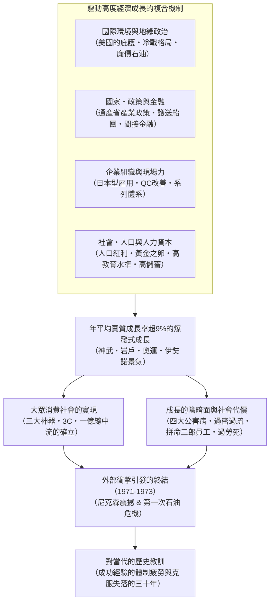
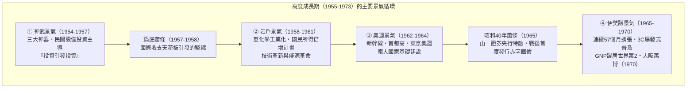
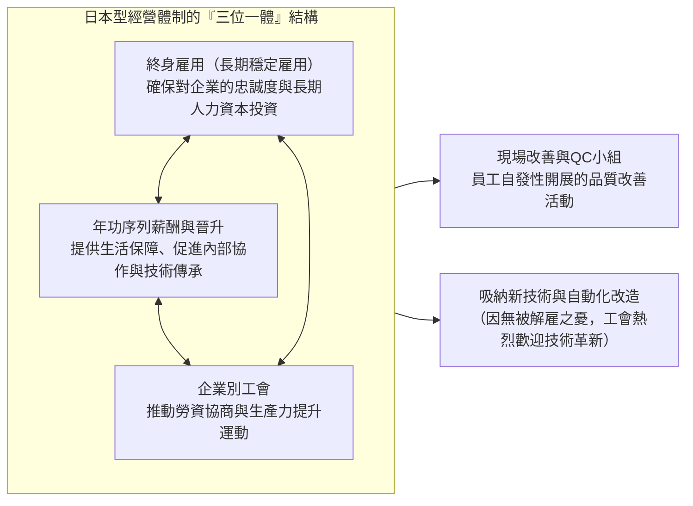
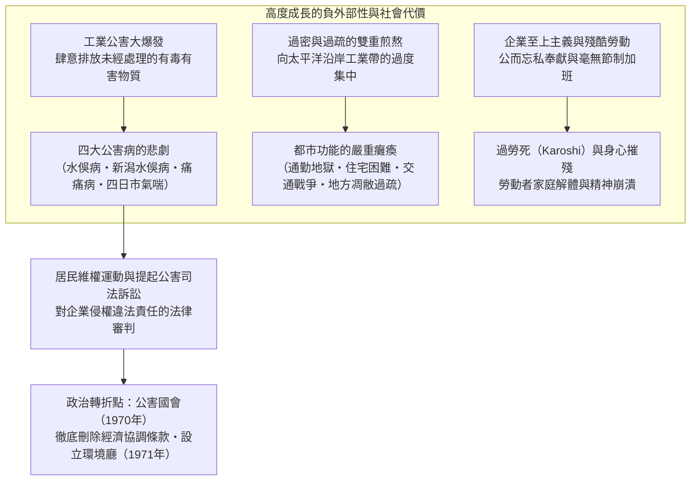

## 序論：歷史上罕見的「經濟奇蹟」及其本質

1945年8月15日，隨著大日本帝國的無條件投降與太平洋戰爭的終結，日本列島淪為名副其實的一片焦土。主要城市約有四成在空襲中化為廢墟，國家財富的約四分之一（非軍事資產的約36%）化為灰燼。海外領土悉數喪失，超過600萬名軍人與海外僑民遣返回國，在無家可歸、無工可做的絕境中湧入本土。廣大國民在糧食配給頻遭延誤與斷供的極度飢荒中苦苦掙扎，時刻籠罩在惡性通貨膨脹的恐懼之中。當時訪日的國際記者以及駐日盟軍總司令部（GHQ）的高級官員們異口同聲地預測：「日本若要恢復作為一個近代國家所應具備的自立經濟水準，至少需要半個世紀以上的漫長歲月。」

然而，這一悲觀預測卻以極具戲劇性的方式被徹底顛覆。

從戰後僅僅十年後的1955年算起，直至第一次石油危機爆發的1973年，在這長達約二十年的時間裡，日本經濟實現了 **年平均實質成長率約9.3%** 這一全人類歷史上罕見的高速經濟成長。國民生產毛額（GNP）從1955年的約8兆日圓急劇膨脹至1973年的約112兆日圓，激增達14倍之巨。1968年，日本一舉超越自明治維新以來夢寐以求追趕的西歐工業巨擘西德，躍升為僅次於美國的 **資本主義陣營世界第二經濟大國** 。



這一爆發式的飛躍，被全世界譽為 **「東洋奇蹟（Economic Miracle）」** 。以黑白電視機、洗衣機、電冰箱為代表的家用電器「三大神器」走入了千家萬戶，隨後消費結構進一步向彩色電視機、冷氣空調、汽車組成的「3C」升級。國民的生活方式經歷了從傳統農村共同體向都市型核心家庭的不可逆轉的巨變，享受到了前所未有的大量生產與大眾消費所帶來的富足。全日本約九成國民自視為中產階級的「一億總中流」社會由此誕生，一個治安良好、教育水準世界名列前茅的現代化工業社會宣告建成。

然而，這場「奇蹟」絕非憑空降臨的歷史偶然。在其背後，戰前與戰時累積的重化學工業技術底蘊與官僚機構的統制手段、冷戰加劇帶來的國際地緣政治劇變與美國對日戰略的大轉折、通商產業省（MITI）精密周詳的產業扶持與大藏省主導的金融護送船團機制、以終身雇用與年功序列為支柱的日本型勞資慣例，以及被稱為「黃金之卵」的年輕勞動力所付出的艱苦勤勉與超高儲蓄傾向，猶如精密咬合的齒輪，奇蹟般地協同運轉。

與此同時，在這輝煌征程的背面，始終伴隨著幽深殘酷的陰影。工廠肆意排放未經處理的廢水和廢氣，引發了以水俁病、四日市氣喘為代表的「四大公害病」，給無辜市民的生命與健康帶來了不可逆轉的摧殘。人口由農村向都市的瘋狂湧流，在太平洋沿岸工業帶造成了嚴重的「過密」、交通戰爭與居住環境惡化，而在廣大地方則引發了急劇的「過疏」與第一級產業的蕭條凋敝。被稱為「拼命三郎員工」或「企業戰士」的勞動者們，被迫向企業獻出一切、進行毫無節制的長時間加班，為日後演變為國際性社會問題的「過勞死（Karoshi）」埋下了體制性病根。

本文旨在全面剖析日本戰後高度經濟成長（1955〜1973年）這一宏大的歷史現象。我們不僅追溯其景氣循環的起伏演進，更從總體經濟學、產業政策、金融體系、公司治理、社會結構、國際地緣政治，以及環境破壞與公害問題等多維視角展開立體透視。進而深刻反思：為何這一時代的成功經驗最終演變為束縛日後日本社會的「體制疲勞」枷鎖，並一路導向1990年代以來的「失落的三十年」？以此為21世紀日本乃至全球經濟的永續發展提煉出具深遠價值的歷史教訓。

---

## 第1章：焦土中的胎動 —— 高度成長的前史（1945〜1954年）

若將高度經濟成長的起點定在1955年，那麼此前戰後的整整十年（1945〜1954年），則是清除崩潰國民經濟廢墟、重構市場經濟基礎設施、並為隨後的火箭式騰飛搭建發射台的關鍵助跑期。

### 1.1 毀滅性戰敗與惡性通貨膨脹

1945年8月戰敗伊始，日本經濟已處於全面停擺的崩潰邊緣。由於軍需生產驟停以及海外原物料供應鏈徹底切斷，1946年的採礦與工業生產水準已慘跌至戰前（1934〜1936年平均）的 **約30%** 。作為主糧的稻米配給延期與缺配成為常態，都市居民不得不將和服與家具運往農村換取糧食，過著搜刮家當度日的「竹筍生活」。

給生產崩潰火上加油的，是鋪天蓋地的惡性通貨膨脹。由於日本軍方在戰爭末期濫發臨時軍費、戰敗後立即向軍需企業支付的巨額軍需補償債務，以及遣散舊日軍官兵發放的退役津貼等，日本銀行券的發行餘額膨脹到了天文數字。從1945年秋到1949年，躉售物價指數狂飆了 **約70倍** 之巨。

為了遏制這一致命危機，日本政府於1946年2月公布了《金融緊急措施令》，斷然實行禁止提取所有存款的「存款封鎖」，並強制廢止流通中的舊紙幣、改換為「新圓」。然而，只要從根本上缺乏生產能力的問題未獲解決，物價狂飆的連鎖反應就無法真正斬斷。

```
【戰後初期主要經濟指標的劇變】
・礦工業生產水準（1946年）：較戰前基準（1934-36年=100）僅為 30.7
・東京躉售物價指數上漲率（1946年）：年增率 +364.5%
・稻米正規配給量（1945年底）：成年人每日削減至2合1勺（約297公克），頻繁遲配缺配
・海外遣返人員總數（1945〜1950年）：約625萬人
```

為了打破這一生產癱瘓局面，東京大學教授有澤廣巳等人提出了著名的 **「傾斜生產方式（Priority Production System）」** （1946年底內閣決議通過，1947年正式實施）。傾斜生產方式的核心要義在於：面對極度匱乏的國內資源（資金、物資、外匯、勞動力），不再任由市場原則自由配置，而是集中全力注入 **「煤炭」** 與 **「鋼鐵」** 兩大支柱基礎部門，憑藉兩者的相互循環拉動全產業的復甦。

具體而言，就是將國內有限的煤炭優先供應給鋼鐵業以煉鐵，再將增產出來的鋼鐵優先調配給煤礦用作坑道支護和採煤機械，從而推動煤炭進一步增產。這一「鋼鐵與煤炭良性循環」所產生的剩餘產出，再依次波及並反哺電力、化肥、鐵路運輸等相關基礎工業，是一項宏偉的產業重構藍圖。

在金融層面上為該計畫提供後盾的，是1947年1月設立的 **「復興金融金庫（復金）」** 。復金透過發行政府保證的復興金融債券，大部分由日本銀行直接認購，向煤炭、鋼鐵、電力等基礎產業大規模注入低利長期資金。到1948年底，主要產業設備資金的約七成均來自復金貸款。

傾斜生產方式取得了立竿見影的戲劇性成果，使瀕臨瓦解的基礎工業生產水準迅速回升。但與此同時，日本銀行直接認購復金債券導致貨幣供應量極度膨脹，進而點燃了被稱為 **「復金通膨」** 的新一輪通貨膨脹烈焰，帶來了嚴重的負面副作用。

### 1.2 道奇路線與夏普建議：確立市場經濟的基礎

面對復金通膨的狂瀾，美國政府決心對對日占領政策進行根本性調整。隨著冷戰的全面加劇（1949年中華人民共和國成立、東西方陣營對抗升級），美國將日本的角色從「應予解除武裝的戰敗國」重新定位為「遠東反共防波堤與資本主義堡壘」。為此，日本經濟必須戒除對美國巨額援助（GARIOA/EROA基金）的依賴，成長為能夠自立自強的市場經濟體。

1949年2月，底特律銀行總裁 **約瑟夫·道奇（Joseph M. Dodge）** 作為特使公使抵日，給日本經濟開出了一劑極其苛刻的猛藥。這便是著名的 **「道奇路線（Dodge Line）」** 。道奇路線的三大核心原則如下：

1. **編列超均衡預算** : 全面禁止發行公債，立即糾正赤字財政，不僅要求歲入與歲出嚴格平衡，更強制要求計入過去的債務償還，編列「真正的盈餘預算」。
2. **停止復興金融金庫的新增貸款並全面廢除補貼** : 取消巨額的物價差額補貼（原由政府用於彌補生產成本與官定價格之間的差價）。
3. **設定單一匯率** : 1949年4月25日，正式確立 **1美元＝360日圓** 的統一步調單一匯率。

此前，針對不同商品品項存在數十種乃至數百種複雜的複數匯率。取消這些多重匯率、以1美元＝360日圓的唯一定價與世界市場直接連通，意味著將日本的進出口企業徹底推向殘酷的國際競爭環境。而從當時日本的購買力平價來看，「1美元＝360日圓」實際上處於偏向日圓貶值的水準，長遠來看，這反倒成為了日本出口產業極其有利的競爭利器。

然而，道奇路線帶來的短期震盪極為慘烈。財政資金的抽離和徹底的貨幣緊縮，使日本經濟瞬間跌入深不見底的嚴重通貨緊縮之中。中小企業接連倒閉，大企業為了自保也紛紛採取大規模裁員措施。「道奇蕭條」全面降臨。日本國有鐵道、日本專賣公社等公共企業和民間企業數十萬失業大軍流落街頭，以國鐵三大謎案（下山事件、三鷹事件、松川事件）為代表的動盪社會不安籠罩了整個列島。

與道奇路線並駕齊驅、奠定戰後日本制度骨骼的，是1949年5月由哥倫比亞大學教授 **卡爾·夏普（Carl S. Shoup）** 率領的稅制使節團所提交的 **「夏普建議」** 。夏普建議徹底廢除了以往雜亂無章、以間接稅為主的稅制，果斷轉向了 **以個人所得稅為核心的直接稅中心主義** 。

夏普稅制透過創設「藍色申報」制度推動了現代記帳與會計慣例的普及，確立了地方稅收財政體制（地方交付稅制度的原型），規範了企業法人稅，使公平且高度透明的稅務基礎設施在日本社會扎下深根。道奇路線建立的總體經濟紀律，與夏普建議奠定的個體制度現代化，猶如兩根堅固的支柱，賦予了日本駕馭現代資本主義經濟不可或缺的制度基石。

### 1.3 朝鮮戰爭與「特需」衝擊：資本累積的催化劑

正當日本經濟在道奇蕭條的扼喉之痛中奄奄一息之際，1950年6月25日，鄰近的朝鮮半島爆發了 **韓戰（朝鮮戰爭）** 。這場戰爭在地緣政治上是一場人間慘劇，但對於瀕死的日本經濟而言，卻成了帶來絕處逢生的戲劇性轉機的救星。這正是時任首相吉田茂情不自禁脫口而出所謂「天佑（神風）」的淵源。

隨著聯合國軍（實質上為美軍）的出動，由於日本是距離戰場最近的工業先進國，潮水般的軍需物資採購與勞務提供訂單洶湧而至。這便是著名的 **「朝鮮特需（特需景氣）」** 。

美軍下達特需採購的品項極其繁雜：
- **軍事物資・鋼鐵製品** : 卡車、吉普車、鐵桶、刺絲網、帶刺鐵絲、武器零組件、彈藥箱
- **紡織品・日用品** : 軍服、麻袋、毛毯、帳篷帆布、軍靴
- **勞務服務（Service）** : 受損軍用車輛與飛機的維修與翻修、後勤補給運輸、通訊支援保障

在1950年至停戰協定簽署的1953年這四年裡，特需帶來的外匯收入 **累計達約24億美元** （相當於當時日本全年出口總額的約六成）。這筆巨額美元資金的狂湧而入，使得長期困擾日本的外匯極度匱乏問題被一舉蕩平。

```
【朝鮮特需對日本經濟的定量影響（1950-1953年）】
・特需契約總額：約24億美元（直接特需＋駐軍官兵個人消費）
・實質GDP成長率：1950年度 +10.8%、1951年度 +12.3%、1952年度 +10.0%、1953年度 +7.3%
・礦工業生產指數：在1950年短短一年多的時間裡暴漲約70%，1951年完全恢復至戰前水準（1934-36年基準）
・企業收益戲劇性改善：主要製造業的營業額利潤率在1950年下半年創下戰後歷史最高紀錄
```

特需的重大意義，絕不僅僅局限於去庫存式的短期投機泡沫。
首先，透過軍用卡車的大規模維修與製造，日本汽車工業（豐田汽車、日產汽車、五十鈴汽車等）系統吸收了美軍嚴苛的品質管理規範（美軍標 MIL-SPEC），使零組件通用化與生產線量產管理技術實現了飛躍性跨越。其次，透過特需獲取的巨額利潤轉化為企業豐厚的內部保留盈餘，為隨後高度成長期興起的大規模設備投資（新建現代化鋼鐵廠、引進最先進工作母機）提供了充足的自有資金保障。

### 1.4 舊金山體制與「不再是『戰後』」

1951年9月，日本簽署了《舊金山和約》與《美日安全保障條約》；次年1952年4月28日條約正式生效，長達七年的盟軍占領統治由此畫上句點，日本恢復了國家主權。

重獲獨立的日本，在冷戰大格局下明確歸屬於以美國為首的西方自由主義陣營。吉田茂首相主導的外交與安保方針，即所謂的 **「吉田主義（吉田路線）」** ，將國家戰略目標淬鍊得極為務實而純粹：即「國家安全保障完全依託美日安保條約與美軍軍事保護傘，本國防衛支出嚴格控制在國民生產毛額1%以內的最低限度，將國家的全部精力、人才與資金全神貫注地投入到經濟復興與對外貿易擴張之中」。這一抉擇為日本企業免除了龐大軍費的沉重財政負擔，建構了近乎理想的經商與發展環境。

隨著1953年韓戰停火，儘管特需訂單退潮曾引發短暫的景氣回落，但在日本經濟深層，以設備投資為核心的內生性良性循環已然開始高速運轉。1955年，在風調雨順的農業大豐收與全球貿易蓬勃擴張的背景下，物價穩定、生產擴張的「數量景氣」拉開了宏大序幕。

鮮明宣告這一歷史轉折點的，是昭和31年（1956年）由經濟企劃廳編纂的《經濟白皮書》。由內閣府經濟企劃廳調查局內國調查課長 **後藤譽之助** 等人執筆的結語段落，成為了象徵戰後日本的不朽名篇：

> **「現在已經不再是『戰後』。我們現在正面臨著不同的局面。透過恢復實現的成長已經結束。今後的成長將依靠現代化來支撐。」**

這番話語絕非陶醉於復興功績的讚歌，而是一份清醒的時代判詞。恢復至戰前水準的追趕階段已經告終。自此以後，不能再沉湎於依賴外國借款、援助或戰爭特需等外部紅利。必須主動且大規模引進最新技術革新（自動化控制、高分子化學、電晶體、大容量火力發電），將整個產業結構從前近代式的輕工業毅然轉向現代化的重化學工業，否則就必將在國際市場的無情競爭中敗北——這是一種強烈的危機意識宣言。

而日本經濟，正以遠遠超越這篇白皮書預警的驚人內生動力，轟轟烈烈地跨入了世界歷史上規模最空前的「現代化偉大試驗」之中。

## 第2章：景氣循環與高度成長的編年史（1955〜1973年）

在1955年至1973年這長達約18年的歲月裡，日本經濟並非始終如一地沿直線平穩擴張。事實上，它是伴隨著設備投資爆發與消費熱潮交織的「繁榮期」，以及隨之而來的進口激增導致外匯存底枯竭、被迫實施緊縮政策的「蕭條期（緊縮期）」，在這樣波瀾壯闊的動態景氣循環中，如同拾級而上般不斷翻倍擴張其整體經濟體量。

當時日本實行的是「1美元＝360日圓」的固定匯率制，中央銀行持有的黃金和外匯存底規模始終存在嚴格上限。一旦景氣過熱，原物料和機械設備進口便會急劇攀升，導致國際收支陷入逆差；當外匯存底瀕臨見底時，日本銀行不得不提高重貼現率來為過熱的經濟強制降溫。這一循環往復的制約機制，在當時被稱為 **「國際收支的天花板」** ，是日本總體經濟運行中最為核心的硬性約束條件。

以下我們將詳細梳理主導高度經濟成長全過程的五大主要景氣循環軌跡。



### 2.1 神武景氣（1954〜1957年）與鍋底蕭條：設備投資的連鎖反應

始於1954年11月的經濟擴張，被冠以日本首任天皇神武天皇即位以來前所未有的繁榮之意，命名為 **「神武景氣」** 。

驅動這場繁榮的最強勁引擎，是民間企業爆發式的 **設備投資** 。鋼鐵、造船、合成纖維、石油化學、電機機械等主要支柱行業齊頭並進，紛紛大手筆引進最先進的整廠設備與重型機械。昭和32年（1957年）度《經濟白皮書》中提出的著名論斷—— **「投資引發投資」** ，精準提煉了這一現象。

鋼鐵企業擴建廠房設備，機械製造商便會接獲大量工具機訂單；而機械企業為了擴大產能新建廠房，又會反過來激增對鋼鐵和水泥的採購需求。這種源於產業關聯的內生需求滾雪球效應，將整個國民經濟以驚人的速度向上推升。

與此同時，在消費端掀起了一場前所未有的「生活革命」。以黑白電視機、洗衣機、電冰箱為代表的 **「三大神器」** 開始在都市受薪階級中迅速普及。家事勞動負擔的大幅減輕與大眾育樂享受的飛躍，徹底顛覆並重塑了普通家庭的生活面貌。

然而，步入1957年後，過度繁榮的代價驟然顯現。由於原物料進口過猛，貿易收支急劇惡化，外匯存底萎縮至危險警戒線。日本經濟狠狠撞上了「國際收支的天花板」。日本銀行旋即接連大幅調升重貼現率，發動了強力貨幣緊縮。經濟因此驟然失速，鋼鐵與紡織品市況大跌，在1957年下半年至1958年間陷入了被稱為 **「鍋底蕭條」** 的低谷停滯期。不過，設備投資的基本動能並未徹底渙散，經濟落底回升的節奏相對迅捷。

### 2.2 岩戶景氣（1958〜1961年）與國民所得倍增計畫：重化學工業化的爆發

走出鍋底蕭條後，從1958年7月拉開序幕的新一輪繁榮期，被賦予了甚至超越神武天皇、追溯至天照大神隱於天岩戶以來最佳景氣之意的 **「岩戶景氣」** 。在此期間，日本的實質GDP成長率創下了 **年均11.3%** 的驚世紀錄。

岩戶景氣的靈魂核心，在於日本產業結構完成了從輕工業（紡織、雜貨等）向全面 **重化學工業（鋼鐵・石油化學・汽車・重型電機）** 的歷史性主角交接。能源革命深入推進，工業運轉的核心燃料與原料由「煤炭」急劇轉向來自中東質優價廉的「石油」。在太平洋沿岸（東京灣、伊勢灣、瀨戶內海等）臨海地帶，依託廣闊的填海造陸工程，一座座龐大的現代化鋼鐵廠與石化專區如雨後春筍般崛起。

政治領域同樣迎來了重大轉折。1960年，圍繞美日安保條約修訂問題，數十萬示威群眾包圍國會議事堂，爆發了戰後規模最大的政治風暴「安保鬥爭」。在承擔嚴重社會動盪責任導致岸信介內閣總辭後，繼任的 **池田勇人** 首相推出了一項旨在將全體國民的注意力從意識形態爭鬥迅速轉移至經濟建設的宏大施政綱領——這就是 **「國民所得倍增計畫」** （1960年12月內閣決議通過）。

該計畫以大藏省官僚兼經濟學家下村治等人的理論為堅實支柱，確立了宏偉的目標：「 **在未來十年內（1961〜1970年）使實質國民生產毛額（GNP）翻一番，實現完全就業，並將國民生活水準提升至西歐先進國家水準** 」。據試算，實現該目標需要年平均7.2%的複合成長率，最初在野黨和諸多主流經濟學者紛紛斥其為「脫離現實的吹牛空談」。

然而最終的結果，卻是一場遠遠超越所有人想像的輝煌大捷。企業的投資欲望被進一步徹底點燃，僅用了短短四年多時間，國民所得翻倍的目標便被提前超額達成。池田內閣提出的「寬容與忍耐」、「薪水翻倍」等極具號召力的正面口號，成為了幫助背負戰敗創傷的日本國民重塑堅定自信與成長信心的巨大心理助推器。

### 2.3 奧運景氣（1962〜1964年）與基礎設施革命

經歷岩戶景氣之後，經濟因國際收支再度惡化而經歷短暫調整，自1962年下半年起，正式步入了 **「奧運景氣」** 。為了確保亞洲首度舉辦的第18屆奧林匹克運動會（1964年10月東京奧運）圓滿成功，日本傾舉國體制推進了一系列龐大的國家級基礎建設專案。

在此期間注入的基礎建設預算，涵蓋公路、鐵路與都市綜合整建，總規模高達近1兆日圓，幾乎相當於當時日本一整年的國家財政預算。
- **東海道新幹線** : 1964年10月1日正式通車。將東京與新大阪之間的通車時間以最高210公里的時速縮短至僅需4小時（次年進一步提速至3小時10分），世界首條高速鐵路橫空出世，從根本上重塑了日本的國土經濟軸心。
- **名神高速公路・首都高速公路** : 日本第一條城際高速公路——名神高速公路（1963年部分通車，1965年全線貫通），以及在高密度超大都市東京上空縱橫穿梭的首都高速公路網絡飛速建成。
- **都市環境全面換代** : 連通羽田機場與市中心的東京單軌電車、全線貫通的捷運日比谷線、以新大谷飯店為代表的一大批大型現代化涉外飯店紛紛落成，下水道設施的大規模鋪設與市容市貌的美化改造亦大步推進。

在電視廣播領域，為了即時收看奧運開幕式與各項賽事，彩色電視機開始加速走進大眾家庭；利用通訊衛星（辛康3號）成功的日美間跨太平洋衛星跨洋實況轉播，更向全球生動展現了日本作為現代科技立國強國的嶄新姿態。

### 2.4 證券蕭條（1965年・昭和40年蕭條）的衝擊與政策大轉折

然而，當奧運盛會的狂歡熱潮退去，日本經濟立刻直面了整個高度成長期內最為嚴酷冰冷的嚴峻考驗——1965年，即所謂的 **「昭和40年蕭條（證券蕭條）」** 。

此前為迎合奧運需求而蜂擁擴建的生產設施，隨著短期需求退潮驟然淪為龐大的過剩產能，企業破產倒閉數量創下戰後歷史新高。尤其是戰後急速膨脹的證券市場遭受沉重打擊，股票價格一瀉千里，位列四大證券公司之一的 **山一證券** 因背負天文數字的巨額虧損而瀕臨實質性破產的邊緣。

為阻止連鎖倒閉狂潮可能引發的信用崩塌與系統性金融海嘯，時任大藏大臣 **田中角榮** 與日本銀行總裁宇佐美洵斷然作出了極其罕見的非常規超法規決斷：依據《日本銀行法》第25條，對山一證券實施 **「無限制・免擔保的特別緊急融資（日銀特融）」** ，從而徹底平息了擠兌櫃台的投資人與存戶恐慌情緒。

更具劃時代意義的是，日本政府打破了自道奇路線以來奉為圭臬的《財政法》第4條「健全財政主義（嚴禁發行公債）」的禁忌，在1965年度的財政追加預算中，破天荒地發行了戰後首批 **「特例國債（赤字國債）」** 。這一鮮明的凱因斯主義財政擴張政策（追加公共工程投資與全面減稅），強力支撐了極度冰凍的民間總需求，成為日本在最短時間內擺脫蕭條低谷的決定性法寶。而這次成功化解危機的經驗，也為接下來戰後持續時間最長的一段黃金鼎盛期鋪平了道路。

### 2.5 伊奘諾景氣（1965〜1970年）：黃金57個月與躍居世界第二

自昭和40年蕭條落底的1965年11月算起，直至1970年7月，這場持續長達五年之久的空前大繁榮被稱為 **「伊奘諾景氣」** 。以日本神話中的創世始祖神伊奘諾尊命名的這場大繁榮，連續擴張長達 **57個月** ，大幅刷新了當時戰後最長景氣紀錄。

主導伊奘諾景氣的核心支柱，是澎湃昂揚的出口競爭力和全方位升級的大眾消費。消費的主角從三大神器全面升級為英文首字母均為「C」的 **「3C（新三大神器）」** ：
- **彩色電視機（Color TV）**
- **冷氣空調（Cooler / 房間空調）**
- **自用小轎車（Car）**

豐田的卡羅拉（Corolla）與日產的陽光（Sunny）等親民國民車接連問世，汽車大眾化普及浪潮席捲整個日本列島。日本製造業依託徹底的製程管理與品質改善，徹底洗刷了以往「粗製濫造」的污名，性能卓越、經久耐用、極少故障的「Made in Japan」優質工業品開始橫掃全球各大市場。

1968年，日本近現代史上樹立起了一座里程碑式的決定性豐碑：日本的名目GNP（國民生產毛額）達到 **約1,419億美元** ，正式超越西德，一舉躍升為僅次於美國的 **資本主義世界第二經濟大國** 。適逢明治維新一百週年之際，這個曾經飽受戰火蹂躪的亞洲戰敗國，終於超越了老牌歐美列強，躋身世界經濟巔峰陣營。

1970年，亞洲首屆世界博覽會—— **「日本萬國博覽會（大阪萬博）」** 在千里丘陵隆重舉行，其主題為「人類的進步與和諧」。在岡本太郎設計的巨型雕塑「太陽之塔」巍然聳立的會場內，短短半年間累計迎來了驚人的 **6,421萬人次** 龐大海內外遊客。美國館展出的「阿波羅月球岩石」、自動電動步道以及各大展館所呈現的未來都市藍圖，深深銘刻在全體國民心中，成為戰後復興圓滿功成與日本邁向富裕繁榮極盛時代的巔峰象徵。

```
【高度經濟成長期主要總體經濟指標推移（1955-1973年度）】
```

| 年度 | 實質GDP成長率 (%) | 名目GNP (億日圓) | 景氣階段 / 主要歷史里程碑 |
| :---: | :---: | :---: | :--- |
| **1955** | **+10.8** | 88,646 | 神武景氣啟動，三大神器開始普及 |
| **1956** | **+6.2** | 98,719 | 經濟白皮書宣告「不再是戰後」，加入聯合國 |
| **1957** | **+7.8** | 111,280 | 鍋底蕭條，撞上國際收支天花板 |
| **1958** | **+5.6** | 118,527 | 岩戶景氣啟動，東京鐵塔竣工 |
| **1959** | **+11.2** | 134,228 | 皇太子（今上皇陛下）大婚遊行，電視機加速普及 |
| **1960** | **+12.5** | 160,332 | 安保鬥爭，池田內閣制定「國民所得倍增計畫」 |
| **1961** | **+12.0** | 196,442 | 重化學工業化縱深推進，能源革命展開 |
| **1962** | **+8.9** | 220,119 | 奧運景氣啟動，千里新市鎮開放入住 |
| **1963** | **+10.7** | 256,419 | 名神高速公路開通（栗東〜尼崎） |
| **1964** | **+13.1** | 295,444 | 舉辦東京奧運，東海道新幹線通車，加入OECD |
| **1965** | **+5.8** | 328,217 | 昭和40年蕭條（證券蕭條），山一證券特融，首度發行赤字國債 |
| **1966** | **+10.6** | 382,900 | 伊奘諾景氣全面展開，自用車普及元年（卡羅拉・陽光上市） |
| **1967** | **+11.1** | 446,953 | 3C快速普及，《公害對策基本法》公布 |
| **1968** | **+12.2** | 528,781 | **日本GNP超越西德躍居資本主義世界第2位** |
| **1969** | **+12.5** | 622,464 | 東名高速公路全線通車，彩色電視機普及率爆發 |
| **1970** | **+10.7** | 733,449 | 舉辦大阪萬博（入場達6,421萬人次），召開「公害國會」 |
| **1971** | **+5.0** | 809,726 | 尼克森震撼，史密森協定（1美元=308日圓） |
| **1972** | **+9.1** | 954,646 | 田中角榮內閣提出「日本列島改造論」，日中邦交正常化 |
| **1973** | **+5.1** | 1,125,487 | 轉向浮動匯率制，第一次石油危機爆發，陷入「狂亂物價」 |
| **1974** | **-1.2** | 1,348,229 | **戰後首次出現負成長，高度經濟成長期徹底落下帷幕** |

## 第3章：為何「奇蹟」能夠發生 —— 多維度機制的深度解剖

日本戰後的高度經濟成長，絕非單純依靠自由放任（Laissez-faire）的市場調節便能自發實現，也無法僅僅用所謂「日本人天性勤勉」這一精神勝利法式的空泛說詞予以解釋。在其核心，存在著由國家精密的產業誘導、獨特的金融結構、穩固的勞資互信慣例、生產現場的品質管制革新、極其充沛的人口紅利，以及冷戰格局所賦予的外部紅利交織而成的精巧機制。它們彼此產生了令人嘆為觀止的協同共振，共同造就了獨樹一幟且運作精密的 **「日本型資本主義體系」** 。

本章將從六個核心維度深入解構驅動高度經濟成長的結構性深層機制。



### 3.1 產業政策與國家領航：通產省（MITI）的目標產業策略

美國著名政治學者查爾默斯·詹森（Chalmers Johnson）在其經典名著《通產省與日本奇蹟》中，提出了一個劃分現代國家型態的深刻理論框架：與美國式的「規制指向型國家（Regulatory State）」形成鮮明對比，日本屬於由國家設立前瞻性戰略目標、強力引領產業經濟升級的 **「發展指向型國家（Developmental State）」** ，而日本通商產業省（MITI）便是這一模式的極致典範。

通產省推行的產業政策的核心，在於蓄意摒棄了傳統的靜態比較優勢原則（即僅僅專注於自身當前具備成本優勢的產業理論）。如果戰後初期的日本盲從靜態比較優勢理論，它將永遠只能停留在依賴低工資出口紡織品和日用雜貨的邊緣地位。然而，通產省官僚們獨具慧眼，主動在政策上遴選具有高資本密集度、技術密集度且未來全球市場需求空間不可限量的戰略支柱行業——集中全力扶持 **鋼鐵、造船、石油化學、汽車、機械與電子工業** ，確立了所謂的 **「目標產業政策（重點產業扶持策略）」** 。

支撐這一宏大產業引導藍圖落地的核心工具包括：

1. **外匯配額預算權（基於《外匯及外國貿易管理法》）** :
   在當時，寶貴的外匯（美元）受到國家極其嚴厲的集中管制。通產省對自己欽定培育的戰略重點行業大開綠燈，享有最高優先級的外匯配額，強力支持其引進歐美最尖端的現代化整廠設備與核心專利技術（如連軋薄板技術、高分子合成化學專利、高階工具機等）。反之，對於非重點產業及大眾消費品的進口，則實施嚴苛的外匯限制，嚴密築起保護本國幼稚產業免受海外跨國巨頭衝擊的防火牆。
2. **日本開發銀行（開銀）政策金融的「引導效應（信貸先導作用）」** :
   作為官方政策性金融機構，一旦日本開發銀行決定對某一大型戰略專案（如新建大型現代化臨海鋼鐵廠、籌建大型石化專區）提供低利聯貸，民間城市銀行便會認定該專案獲得了「國家最高信用的權威背書」，從而信心百倍地爭相注入巨額民間資本。開銀資金這種四兩撥千斤的「引導訊號效應」，將滾滾民間資本精準導入了重化學工業領域。
3. **官民協調機制與設備投資統一協調** :
   若任由市場自由競爭，各企業必然盲目擴張產能，導致嚴重的惡性過度競爭與產能過剩。通產省牽頭成立了匯集鋼鐵、石化等行業龍頭企業首腦的「官民協調懇談會」，透過行政指導，在業內類似合法卡特爾機制下，有條不紊地理順並協調各家企業新建高爐的動工順序與產能配額。這大幅降低了企業進行超大規模固定資產投資所面臨的市場風險，使其得以從容建成具備世界最大規模效益的現代化超大型工廠。

### 3.2 金融體制的點金之術：間接金融主導與護送船團體制

支撐高度經濟成長期內那股近乎狂暴的固定資產投資洪流的，是日本極其特異的金融組織體系。

在歐美先進國家，企業擴大投資所需的資金主要依託股票與公司債的發行（直接金融）或是自身累積的利潤留存。然而戰後的日本企業，由於戰火摧殘導致資本累積幾乎歸零，加上投資擴張速度過快，企業自有資本比率低得異乎尋常。在此背景下應運而生的，便是以銀行融資為絕對中樞的 **「間接金融模式」** 。

這一獨特的金融傳導機制由三大基石構築而成：

- **主力銀行制度（Main Bank System）** :
   每一家大型工業企業都與某一家特定的核心都市銀行（如三井、三菱、住友、富士、第一勸業、三和，以及日本興業銀行等長期信用銀行）結成深度綁定休戚與共的共生關係。主力銀行不僅源源不絕提供巨額融資，還透過相互交叉持股成為企業的長期穩定股東，向企業派駐董事監察人，常態化密切監控企業的經營與財務狀況。這使得日本企業無需迎合短期股價波動或季度財報數字，能夠毫不猶豫地放手推進著眼於5年乃至10年後的超前大型設備投資。
- **過度借貸（企業的超額負債）與過度放款（銀行的超額信貸）** :
   企業依靠遠遠超越自身資本實力的超高槓桿向商業銀行借款（過度借貸），都市銀行向企業發放的貸款總額甚至超過了其吸納的社會存款總量，所形成的資金缺口則透過直接向日本銀行借款（央行融通）來填補（過度放款）。日本銀行透過靈活升降重貼現率以及實施定額管控的 **「窗口指導（直接硬性限制各家銀行貸款新增額度）」** ，牢牢掌控著總體經濟資金供應的總閥門。
- **護送船團體制與人為低利率政策** :
   大藏省（現財務省與金融廳）透過《臨時利率調整法》，人為將存貸款利率壓制在顯著低於純粹自由市場均衡的水準，從而在全系統層面大幅削減了企業的融資成本。與此同時，大藏省運用強大的行政指導權力，對所有銀行的存款利率、分行據點設立、業務經營範圍推行整齊劃一的步調管制，確保哪怕實力最孱弱的金融機構也絕對不會倒閉破產。這種效仿海軍艦隊航速必須遷就最慢航船的防禦陣型，被形象地稱為 **「護送船團體制」** 。它為國民大眾注入了對銀行系統的絕對安全信仰，徹底將系統性金融危機的爆發機率扼殺在萌芽之中。

在此機制中，絕不能忽略的是 **「財政投融資計畫（FILP）」** 的不可替代之功。千家萬戶存入郵局的郵政儲金，以及國民年金與厚生年金的巨額勞保基金沉澱資金，被全額歸集至大藏省資金運用部，化作被譽為「第二國家預算」的充沛政策性母基金，持續定向挹注給日本開發銀行、日本道路公團、住宅金融公庫、日本國有鐵道等機構。這一完全擺脫稅收依賴的宏大國家資金池，以澎湃動能強力支撐了東海道新幹線、名神高速公路、現代化海運船隊與鋼鐵能源基地的飛躍式建設。

### 3.3 日本型雇用慣例的奠定：「三大支柱」式勞資關係的制度功能

在生產第一線支撐高度經濟成長奇蹟的，是日本社會在經歷了戰後初期慘烈的階級對立與工人罷工（如1953年日產汽車大罷工、1960年三池煤礦激烈工潮）的創痛與妥協之後，逐步摸索並穩固確立下來的 **「日本型雇用慣例（日本式經營模式）」** 。正如美國社會學家詹姆斯·阿貝格倫（James Abegglen）在其奠基性著作《日本的管理》中所深刻指出的，該體系牢固矗立於以下三大制度支柱之上：

1. **終身雇用制度（長期穩定雇用保障）** :
   企業原則上統一生產批次招募應屆畢業生，並在無嚴重違紀或特殊變故的前提下，承諾保障其工作職位直至法定退休年齡。對於資方而言，這意味著長期投入在員工身上的巨額在職教育訓練（OJT）成本能夠被長期完全回收；對於勞動者而言，則獲得了個人生活與家庭生計的堅實後盾。
2. **年功序列型薪酬與晉升體系** :
   薪資待遇與公司職級隨著員工年齡與在職資歷的增長而呈階梯式自然遞增。在青年階段，員工的薪酬水準被相對壓低至低於其實際產出貢獻，但隨著步入成家立業、子女教育與購屋養老的高開銷中老年階段，企業將發放極為優渥的薪資與津貼福利。這種設計與勞動者一生的家庭生命週期支出節奏完美貼合；而青年員工被適度壓低的初期工資，則為企業進行資本累積提供了充裕的流動資金。
3. **企業別工會（Enterprise Union）** :
   區別於歐美按工種、按全行業橫向跨企業組建的對抗性工會，日本的工會是由同一家企業內的全體正式員工縱向獨立組成。工會核心幹部本身就是企業正式員工，這促使勞資雙方牢固樹立了「唯有公司經營不斷壯大繁榮，員工的切身利益（調薪、獎金與職位穩定）才能水漲船高」的緊密命運共同體共識。

這套「三位一體」的雇用機制，在吸收並推廣技術創新方面迸發出了驚人的系統性優勢。

在歐美工種制工會體系下，一旦資方引進新型自動化設備或省力化製程，往往直接導致現有職位被取消、工人遭無情解雇，因此歐美工會往往對技術革新報以強烈的敵視與破壞性抵制（如消極怠工或持久罷工）。然而，在享有絕對終身雇用承諾的日本大企業內部，即便某一產線因技術革新全面實現自動化，工人們也絕無失業下崗之憂，而只會被妥善轉調至公司內部其他部門或新設立的先進產線，並接受免費的技術再培訓。

因此，日本勞動者與工會非但對先進技術的引進毫無抵觸，反而全心全意地將技術革新視為「增強企業全球競爭力、分享更多年終獎金」的利多契機，從而 **以極高的熱情狂熱擁抱自動化與工業機器人的入駐** 。

不僅如此，自1955年起制度化的 **「春鬥（春季爭取提高工資鬥爭）」** ，由鋼鐵、電機、造船、汽車等龍頭骨幹產業的工會聯合行動，在每年春季協同向管理層提出統一標準的加薪訴求。由實力雄厚的大企業最終敲定的工資調幅指標，迅速成為全社會公認的基準參考線，並如同漣漪般迅速傳導至所有行業和中小企業。春鬥機制確保了全日本勞動者的實質所得能夠以年均10%左右的幅度穩步水漲船高，進而強而有力地持續做大國內消費品市場，確保企業天量設備投資的產出能夠被旺盛的內需順利消化，形成了無懈可擊的總體內需良性大循環。

不過必須清醒指出的是，在這一勞資和諧的華美樂章背後，同樣存在著殘酷冰冷的「雙重結構」現實：大企業正式員工優厚福利的底層，是以數以萬計承擔風險緩衝閥職能、被迫接受嚴苛微薄薪酬與朝不保夕待遇的 **「協力外包中小微型企業」** ，以及無權享受終身保障的 **「臨時工與外包約聘人員」** 作為無聲基石的。

### 3.4 現場力與微觀創新：QC小組與改善（Kaizen）運動

日本製造業徹底告別對歐美工業的技術抄襲與粗製濫造，進而奪取全球首屈一指的頂級品質與壓倒性成本競爭優勢的終極秘訣，根植於在生產製造第一線爆發開來的 **「品質管理革命」** 。

在二次大戰前，日本工業製造品在海外市場上長期背負著「廉價劣質品（Cheap and Nasty）」的奇恥大辱。戰後初期，為了從根本上改變日本工業品品質極度低落的頑疾，盟軍總司令部（GHQ）特意從美國引進了統計品質控制領域的泰斗 **W·愛德華茲·戴明（W. Edwards Deming）** 博士。1950年，應日本科學技術連盟（日科技連）的盛情邀請，戴明博士親赴日本，向日本各大企業的經營層與工程技術人員深入系統地傳授了生產全流程的統計學方法（即PDCA循環的雛形）與品質管控的不可替代性。

日本工商業界深受震動，日科技連隨即以戴明博士捐贈的講學版稅為母基金，正式設立了享譽後世的 **「戴明獎」** 。各大日本企業掀起了競相角逐戴明獎、全面推行全面品質管理（TQC）的浩蕩浪潮。

然而，日本企業最為天才的獨創之舉，在於將這種原本在歐美屬於精英工程師自上而下施行的冰冷統計工具，成功改造成為了基層藍領工人全員主動參與、自下而上生生不息的群眾性草根運動——這就是自1962年起席捲全日本各大現代化工廠的 **「QC小組（品質管制小組 / Quality Control Circle）」** 。

車間第一線的普通工人自發組成5至10人的微型學習與攻堅小組，充分利用業餘時間或工歇碎片時間自主集會。他們熟練運用因果圖（魚骨圖）、柏拉圖（帕累托圖）等簡單易行的分析工具，層層深挖生產環節中不良品發生的根本癥結，集思廣益提出製程優化提案（即著名的「改善 / Kaizen」）。一旦被證明行之有效，這些來自第一線的微創新會立刻被固化到標準作業程序（SOP）中，並在全廠範圍內乃至全國交流大會上受到極高規格的表彰。透過這項運動，甚至是最基層的普通第一線工人，也被賦予了「我們親手鑄就產品卓越品質」的高尚職業自豪感與強大的自主問題解決素養。

將這種以製造現場為靈魂的哲學演繹到極致的集大成者，當屬由豐田汽車副社長大野耐一等人一手締造的 **「豐田生產方式（TPS / Toyota Production System）」** ：
- **及時生產（Just In Time）** : 堅定實踐「只在必要的時間，生產必要數量的必要零件」，將車間內的在製品堆積與倉儲庫存壓縮至趨近於絕對零。
- **看板管理（Kanban）** : 堅決打破傳統的前道製程向後硬性推流模式，推行由後道製程根據實際裝配消耗、向前道製程反向拉動領取的實體傳票（看板）管理，實現了精準高效的自律去中心化調度。
- **自働化（融入人類智慧的帶人字旁自動化）** : 賦予機械設備以靈敏的人性智慧，一旦產線檢測到任何細微異常或瑕疵，設備便會瞬間自主自動緊急停機，絕不允許任何一件不合格品流入下一道製程。
- **對「浪費」的無情絞殺** : 將過度生產、等待閒置、徒勞搬運、多餘加工、多餘庫存、無效動作以及製造不良品這「七大浪費」視為不可饒恕的大敵，展開徹底鏟除。

正是憑藉這一系列嘆為觀止的底層制度創新，日本製造業完成了從僵化的歐美福特制大規模單一生產模式，向「能夠以極低邊際成本與極致敏捷的交貨週期，大規模高品質生產多品種、小批量高附加價值產品」的全新生產範式的革命性躍遷。

### 3.5 人口結構與人力資本：人口紅利與「黃金之卵」的遷徙

使高度經濟成長奇蹟從藍圖變為現實的深層物理基石，當屬戰後日本那極為磅礴豐沛的 **人口紅利（Demographics）** ，以及綜合素質卓越的 **人力資本（Human Capital）** 寶庫。

1947年至1949年戰後初期，日本迎來了歷史上規模空前的第一次嬰兒潮。在這短暫的三年裡，降生了多達 **約800萬** 龐大新生人口，這批人被統稱為 **「團塊世代」** 。自1950年代中期起，日本的人口結構步入了一個絕佳的黃金結構：15至64歲的勞動年齡人口急劇膨脹，而需要被撫養的少兒與老年人口比重相對較低，全面跨入了經典的 **「人口紅利黃金期」** 。

```
【日本勞動年齡人口比重的歷史性躍遷】
・1950年：59.7%
・1960年：64.2%
・1970年：68.9%（人口紅利達歷史最高峰值）
```

這支龐大的生力軍不僅在數量上源源不絕，更在空間布局上掀起了一場席捲全日本列島的城鄉人口大遷移。

在戰後初期的大規模農地改革中，廣大佃農雖然獲得了土地成為了自耕農，但在有限的耕地束縛下，除長子能夠繼承祖業外，廣大農村家庭中的次子、三子以及待嫁女兒們缺乏發展空間。當這些青年國中或高中畢業時，他們滿懷憧憬地成群奔赴東京、大阪、名古屋等大工業都市，匯入大企業與中小配套廠的現代化產線。他們品性溫和順從、組織紀律性極強、刻苦耐勞且學習能力驚人，被全社會由衷讚譽為 **「黃金之卵」** ，在企業間引發了極其火爆的招募爭奪戰。

每年春天，滿載著來自東北和九州偏遠鄉村國中畢業生的 **「集體就業專用列車」** ，絡繹不絕地駛入東京上野車站或大阪火車站。在1955年至1970年短短十五年間，向日本三大都市圈淨流入的人口總數 **超過了驚人的1,000萬人** 。從就業結構來看，1950年曾佔據全國就業總人數 **48.3%** 的第一級產業（農業、林業、水產業）勞動力，到1970年驟降至僅剩 **17.4%** ；這批被從土地上徹底解放出來的數以千萬計的優質青年勞動力，全面注入到了第二級產業（製造業、營造業）與現代第三級產業的肌體之中。

更令人驚嘆的，是全體國民展現出的卓越 **教育水準** 與 **驚人的高儲蓄率** ：
- **高度均質化的全民優質教育** : 依託明治維新以降確立的全民義務教育以及深厚的文化積澱，日本初等與中等教育實現了近乎100%的完全識字率。全社會高中升學率從1950年的42.5%一路飆升至1970年的82.1%。這確保了全國工業企業能夠隨時獲得數百萬名能夠精準看懂複雜工程圖紙、嚴格遵守精密製程紀律、在短時間內熟練駕馭複雜工具機的高素質產業大軍。
- **冠絕全球的超高儲蓄傾向** : 相較於歐美先進國家居民儲蓄率長期在10%上下徘徊，日本家庭可支配所得的儲蓄率始終堅挺在 **15%至20%以上** 的極高位。收入的連年大幅增長、為預防未來生活不確定性而累積儲備的強烈動機（當時社會保障網尚在建立之中）、年終巨額獎金與退休金的發放慣例，加之面向大眾的小額郵政儲金免稅制度（「丸優」制度），共同促成了這一儲蓄奇蹟。全社會儲蓄透過銀行與郵政網絡，源源不絕、成本極低地轉化為支撐工業企業瘋狂擴張的高效長期投資，實現了在極少依賴外債與外國直接投資的純內生性資本擴張。

### 3.6 冷戰地緣政治與國際環境：歷史的宏大順風

必須銘記的是，日本戰後高度經濟成長不僅是國內奮鬥的果實，更是第二次世界大戰後所重構的全球政治經濟秩序（布雷頓森林體系與東西方冷戰對抗）以極度慷慨的方式傾斜於日本的「地緣歷史超級奇蹟」。

第一，在上述 **「吉田主義」** 的戰略蔭庇下，日本將國防防衛支出長年壓制在僅占GNP約1%的極低水準。相比之下，處於冷戰對抗最前線的同代大國（美國、蘇聯、英國、西德、韓國、台灣等）普遍將自身GNP的5%至10%以上耗費在龐大的常規軍費、戰略核武庫與徵兵制度之中。日本則以極低的防務成本，將國防安保全面外包給美國的核保護傘和駐日美軍基地，從而得以將全民族最拔尖的工程頭腦、全部行政資源與財政收入，心無旁騖地全額投向民間現代工業體系的構築與公共基礎設施建設。

第二，日本全面享受了由美國一手搭建並捍衛的 **全球自由貿易體系（GATT / IMF體制）** 的豐厚歷史紅利。隨著1955年加入關稅暨貿易總協定（GATT）、1964年邁入國際貨幣基金組織（IMF）第8條款國（實現外匯自由兌換）並加入經合組織（OECD），日本正式昂首跨入「西方富國俱樂部」。當美國主導下的全球龐大消費市場毫無保留地向日本產的高品質工業產品敞開大門的同時，日本自身卻長期依靠隱性外匯管制與高關稅等貿易壁壘，嚴密庇護本土尚未具備完全抗衡能力的稚嫩工業部門，享受著長達十餘年寶貴的非對稱非互惠式發展特權。

第三， **「1美元＝360日圓」固定匯率制度** 賦予的巨大價格護城河。伴隨著日本製造業生產力在技術革命洗禮下的飛速躍升，其真實的工業競爭力已不可同日而語；但由於匯率在長達22年的時間裡被死死錨定在1美元兌360日圓的低谷，日圓在實質上處於被嚴重低估的極其划算狀態。這一巨大的匯率不對稱槓桿，使得日本出產的優質鋼鐵、家用電器、小轎車、高精相機與石英手錶，在歐美市場上具備了摧枯拉朽般的毀滅性價格競爭優勢。

第四， **中東原油無限量且極其低廉穩定的供應保障** 。二戰前日本鋌而走險發動太平洋戰爭的最直接致命誘因正是石油資源的匱乏。然而二戰之後，在西方「石油七姐妹」（國際跨國石油巨擘）所完全掌控的中東超級大油田的全力供應下，幾乎取之不盡的優質原油以每桶僅2美元上下的低廉價格，不分晝夜地透過龐大的跨洋油輪船隊運抵日本。正是這股幾乎近乎白送的廉價石化能源洪流，驅動著日本龐大的沿海火力發電廠轟鳴運轉，為巨型石化專區輸送著基礎化工原料，並在日本列島點燃了汽車全面普及的烈烈火焰。

## 第4章：大眾消費社會的降臨與生活革命

戰後日本的高度經濟成長，絕不僅僅體現在工廠煙囪中升騰而起的滾滾白煙，或是鋼鐵廠高爐裡粗鋼產量的冰冷統計報表上；它更是一場從最深處徹底重構普通老百姓食衣住行、居住型態、家庭觀念乃至國民精神風貌的宏大 **「生活革命」** 。

在二次大戰前的日本社會，除極少數享有特權的統治階級與地主富豪外，占人口絕大多數的平民階層長期在自給自足、極其貧困樸素的前近代生活軌道上勉強餬口。然而，在自1950年代中期至1970年代初短短十餘年的彈指一瞬之間，日本卻以令全球側目的速度，脫胎換骨為一個在全世界範圍內均質度極高且極其富裕的 **「大眾消費社會」** 。

### 4.1 從「三大神器」到「3C」：消費生活的劇烈嬗變

日本普通受薪家庭生活的現代化進程，伴隨著一系列具代表性耐久消費財的飛速普及，呈現出清晰的階梯式飛躍。

第一波浪潮，是席捲於1950年代後半期（神武景氣至岩戶景氣時期）的 **「三大神器」** 採購熱潮。這一借用自日本歷代天皇代代相傳的三大神物（八咫鏡・八尺瓊勾玉・天叢雲劍）的俗稱，指代的是 **「黑白電視機」、「洗衣機」** 與 **「電冰箱」** 這三件具劃時代意義的家用電器：
- **洗衣機** : 徹底將廣大女性從長年浸泡在刺骨冰水中、用木盆和洗衣板苦戰數小時的沉重體力勞動中徹底解放出來，只需輕輕按下一鍵即可全自動完成。
- **電冰箱** : 徹底淘汰了需要頻繁填塞天然冰塊保鮮的土製冰箱，免去了家庭主婦必須每日頂風冒雨採買食材的繁瑣負擔，實現了生鮮食品的長期低溫保鮮，帶來了現代公共衛生水準的飛躍。
- **黑白電視機** : 將此前完全依賴於收音機廣播和黑白報紙的封閉家庭精神娛樂空間，一舉升級為生動形象的視訊影音空間。特別是1959年4月皇太子明仁親王（今上皇陛下）與正田美智子女士舉行的「世紀皇室大婚盛典車隊遊行」，成為了電視機在全日本爆發式普及的超級引爆點，使原先聚集在街頭公共電視機前圍觀的都會大眾，爭先恐後地將這件神奇家電迎入自家庭院。

步入1960年代後半期（伊奘諾景氣時期），隨著國民所得水準再度實現跨越式升級，大眾消費的胃口隨即轉向了英文首字母均為「C」的高檔耐久消費財新陣容—— **「3C（新三大神器）」** ：
- **彩色電視機（Color TV）** : 將1964年東京奧運的賽場風雲與1970年大阪萬博的絢麗盛景，以全彩高畫質畫面即時帶入普通大眾的客廳之中。
- **冷氣空調（Cooler / 房間空調）** : 徹底改變了日本傳統長夏潮濕悶熱的居住折磨，營造出恆溫舒適的現代居住實體空間。
- **自用小轎車（Car）** : 1966年，豐田重磅推出「卡羅拉（Corolla）」，日產針鋒相對推出「陽光（Sunny）」，拉開了名垂青史的「自用車普及元年」序幕。自用轎車從少數富豪才能問津的頂級奢侈玩物，一躍飛入尋常百姓家，成為了普通家庭週末自駕出遊與休閒代步的標準配備。

```
【主要耐久消費財家庭普及率推移（1955-1975年・經濟企劃廳統計）】
```

| 年份 | 洗衣機 (%) | 電冰箱 (%) | 黑白電視機 (%) | 彩色電視機 (%) | 自用乘用車 (%) | 冷氣空調 (%) |
| :---: | :---: | :---: | :---: | :---: | :---: | :---: |
| **1955** | 4.6 | 1.1 | 0.9 | - | - | - |
| **1958** | 29.3 | 5.5 | 10.4 | - | - | - |
| **1960** | 45.4 | 15.7 | 44.7 | - | - | - |
| **1962** | 62.7 | 28.0 | 79.4 | - | - | - |
| **1965** | 73.6 | 51.4 | 90.3 | 0.2 | 3.5 | 2.1 |
| **1967** | 80.7 | 70.8 | 96.0 | 1.6 | 7.7 | 3.0 |
| **1970** | 91.4 | 89.1 | 90.2 | **26.3** | **22.1** | **5.9** |
| **1973** | 96.1 | 95.8 | 60.1 | **75.8** | **36.8** | **13.3** |
| **1975** | 97.6 | 96.7 | 40.5 | **90.3** | **41.2** | **17.2** |

正如上述詳實的統計數據所雄辯展示的那樣：在1955年擁有率幾乎接近於零的家用現代化電器，在短短不到二十年的光陰裡，普及率全面跨越並 **涵蓋了全日本超過九成以上的家庭** 。這種全方位的民生現代化速度，在整個人類近代文明史上絕無僅有。

### 4.2 公團住宅、新市鎮與核心家庭化：居住空間與家庭型態的歷史重構

人口向特大工業都市的瘋狂湧入，以狂風掃落葉之勢將日本人延續千百年的傳統居住空間與宗族家庭倫理徹底粉碎重組。

面對都會受薪階層面臨的尖銳住宅危機，於1955年正式設立的 **「日本住宅公團」** ，在大都會郊區規劃建造並集中投放了海量鋼筋混凝土多層集合住宅——也就是後來婦孺皆知的 **「公團住宅（團地）」** 。步入1960年代後，諸如大阪的「千里新市鎮（1962年開放入住）」與東京的「多摩新市鎮（1971年開放入住）」等，一系列直接在近郊山林丘陵推平建造、容納數十萬常住人口的超大型人造衛星城（臥榻城）拔地而起。

團地模式給日本社會帶來的最大精神與實質震撼，在於徹底重塑了居住空間的現代性邏輯：
- **餐廚合一（DK / Dining Kitchen）理念的劃時代確立** : 在傳統和式民居結構中，廚房始終被邊緣化在陰暗潮濕的土地房（土間）一隅，一家老小用餐時只能臨時在鋪滿榻榻米的房內支起矮腿圓桌（茶袱台）。而公團住宅率先大膽推行配備現代不鏽鋼整體流理台與明亮通風空間的「餐廚合一（DK）」，首次實現了在空間上把就餐（食）與休息睡眠（寢）徹底區隔開來的「食寢分離」，給家庭主婦帶來了革命性的家務尊嚴與起居便利。
- **彈子鎖與獨立私密空間的誕生** : 配備只需一把金屬鑰匙即可將外部喧囂完全隔絕的鋼製防盜門、現代抽水馬桶、自帶獨立熱水淋浴器的室內浴室，將個人和微型家庭從傳統左鄰右舍的繁冗市井糾葛與宗族親友的過度干涉中徹底抽離出來，宣告了「個人現代隱私」與「高度自主的私家庭園」的誕生。

居住革命的必然歸宿，是不可逆轉的 **「核心家庭化（Nuclear Family）」** 浪潮。祖孫三代乃至四代同堂的傳統農村宗族大家庭（即戰前殘餘的「家制度」）迅速解體。取而代之的，是「受薪族丈夫外出掙錢、全職主婦操持家務、育有兩名子女」這一標準化現代核心家庭型態，成為戰後日本社會的「國家標準家庭規格」。入住設施齊備的現代化團地成為了全社會年輕伴侶爭相追逐的時尚指標，極其均質規範的「都會受薪階級日常生活風格」由此在全日本每一寸土地上複製蔓延。

### 4.3 「一億總中流」意識的形成：均質化社會的誕生

高度經濟成長為日本社會帶來的最為深遠的政治與社會心理產物，無疑是階級固化對立感的徹底消融，以及 **「一億總中流（全員中產）」社會心理的深植人心** 。

在日本內閣府（當時為總理府）歷年定期舉行的「關於國民生活的輿論調查」中，當面對「若與全社會普遍水準相比，您認為自家的生活境遇處於哪個檔次？」這一經典提問時，選擇回答「中等（涵蓋中上、中中、中下）」的民眾比例，從1950年代後期的約七成左右，在1960年代中期迅速攀升至八成以上，並在1970年達到了驚人的 **約90%** 。無論實質的財富儲蓄多寡，全日本幾乎十之八九的國民，在內心深處無比堅定地確信自己屬於整個社會最平均、最主流的「中產階級階層」。

這種普遍的中產認同，絕非統治菁英精心炮製的政治幻覺或宣傳麻藥，而是擁有極其堅實客觀的經濟現實作為後盾：
1. **全社會財富分配差距的奇蹟般縮小** :
   作為衡量全社會貧富懸殊程度的核心指標——吉尼係數（Gini Coefficient），在整個高度成長期內呈現出持續顯著的良性收斂趨勢，一度達到與北歐高福利國家並駕齊驅的全球最均質平等區間。每年藉由「春鬥」達成的全行業普惠式調薪、全國統一法定最低工資制度的推行、針對高所得階層極其嚴苛的累進稅率體系（當年最高級距邊際稅率曾高達75%），加上透過中央「地方交付稅」移轉支付機制把東京等核心大都會的巨額稅收全額反哺貧困鄉村的巨大二次分配機制，強而有力地弭平了地區間與階層間的鴻溝。
2. **國民消費生活中的「跟風競逐同儕壓力」** :
   「既然隔壁鄰居家購置了彩色電視機，我們家咬緊牙關也必須買一台！」「鄰居家開上了卡羅拉，我們家就絕不能輸，哪怕分期付款也要牽一輛陽光！」這種追求步調整齊劃一的強烈同調從眾心理（Peer Pressure），成為了一股不知疲倦地全方位拉動大眾消費的強勁內需永動機。

基於血統、家世或身分門第的傳統社會階級界限徹底解體。全社會普遍深信：只要一個人接受良好教育、在企業裡埋首苦幹，明天的生活就必定比今天更加殷實富足。「永不停歇向上攀升的美好未來」，這種確定性預期如同一劑強力強心針，使整個日本社會時刻充盈著近乎沸騰的熱情與對未來的絕對信任。

### 4.4 流通革命與大眾文化的爆發式繁榮

大眾消費社會的水到渠成，以不可阻擋之勢重構了全日本的商貿流通與大眾娛樂版圖。

在這場商業狂飆中衝在最前列的，是以中內㓛創辦的「大榮超市（Daiei）」為絕對先鋒的 **超級市場連鎖集團（綜合型超級市場 / GMS）** 的全面崛起。這一商業領域的顛覆性巨變，被史學家確立為 **「流通革命」** 。
在傳統體制下，商業零售完全由各地零散封閉的傳統商店街夫妻店主導，商品出廠批發價與終端零售指導價被各大製造企業以「轉售價格維持制度（統一官定零售價）」牢牢壟斷把控。然而以大榮為代表的新型連鎖巨頭，高擎「把優質好物以更低廉的價格賣給消費者」、「主婦的忠實後盾」之旗幟，憑藉大量集中直採、開架自選與極致壓縮毛利的現代化零售戰法，向傳統的商業流通霸權發動了波瀾壯闊的 **「價格破壞戰」** 。

在這其中最為傳奇的，當屬松下電器產業（現松下控股）創辦人、被尊為「經營之神」的松下幸之助與大榮掌門人中内㓛之間長達三十年的「松榮商戰」。面對公然違抗松下指導價、對全線家電產品擅自打八折讓利傾銷的大榮，松下甚至不惜發動全線斷貨制裁相威脅；然而在數以千萬計受薪大眾用真金白銀投票的鐵血支持下，流通通路最終徹底擊碎了製造廠商長年壟斷的定價霸權。全日本普通老百姓由此贏得了以低廉成本享用現代化高階工業文明成果的歷史性權利。

在文化娛樂領域，以電視機為絕對王牌核心的 **「大眾傳媒黃金時代」** 全面統治了國民的閒暇時光。從早年街頭巷尾的萬頭攢動，到晚間全家老小圍聚客廳螢幕前，NHK電視台每歲末播出的《紅白歌合戰》創下了超過80%的驚人收視神話；日本摔角之父力道山的跨國搏擊直播、坐擁長島茂雄與王貞治（ON黃金砲）的讀賣巨人棒球隊開啟的九連霸（V9）無敵王朝、漂流者劇團傾情奉獻的滑稽搞笑綜藝《八點全員集合啦！》等，成為全民每週共同呼吸的精神盛宴。通俗週刊雜誌競相創刊、保齡球運動風靡全民、海濱度假與冬日滑雪等一系列伴隨著閒暇時間激增而誕生的「大眾休閒新浪潮」，如繁花似錦般在全日本絢麗綻放。

## 第5章：成長的代價 —— 扭曲、公害與社會問題的激化

然而，這一連串令人眼花繚亂的經濟繁榮光芒越是耀眼奪目，投射在其腳下的陰影便越發濃稠、幽暗且殘酷。戰後日本的高度經濟成長，從本質上而言，絕無法洗脫其作為一場「以日本列島的自然生態環境、普通民眾的肉體生命與健康，以及勞動者的做人尊嚴為慘烈祭品，硬生生置換而來的帶血繁榮」的沉痛定性。

在「企業效益至上」、「生產效率第一」的狹隘國家狂熱旗幟下，生態環境保護與個體的生命福祉被肆無忌憚地徹底拋諸腦後，終使整個日本列島在短時間內急劇淪陷為令全世界聞之色變的「公害列島」。



### 5.1 產業優先的陰暗面：四大公害病的悲劇及其科學機制

高度經濟成長期最為痛心疾首的人間慘劇，莫過於各大企業為了追逐利潤最大化而毫無顧忌地直排劇毒廢料，導致無辜市民被奪走寶貴生命、倖存者終身承受不可逆肢體殘疾摧殘的 **「四大公害病」** 。

```
【四大公害病全貌與對比】
```

| 公害病名稱 | 發生地域・水系 | 肇事企業・工廠 | 致病源物質・排污途徑 | 主要健康危害與典型症狀 | 司法最終裁決（判決確定） |
| :--- | :--- | :--- | :--- | :--- | :--- |
| **水俁病** | 熊本縣水俁灣・不知火海沿岸 | 新日本窒素肥料（智索 / Chisso）水俁工廠 | 乙醛生產製程中使用的無機汞催化劑發生甲基化反應，生成劇毒 **甲基汞（有機汞）** ，工廠將未經處理的廢水直排入海。經由食物鏈（魚貝類）成千上萬倍高度累積濃縮。 | 感覺障礙、運動失調、向心性視野縮小、聽力障礙、語言功能喪失、中樞神經系統徹底摧毀。孕婦攝入毒素後經由胎盤侵襲胎兒，導致新生兒直接罹患先天腦性麻痺的 **「胎兒性水俁病」** 慘劇。 | 1973年熊本地方法院：全額認定智索公司具有不可推卸的全面過失責任，下達巨額賠償判令。 |
| **新潟水俁病（第二水俁病）** | 新潟縣阿賀野川下游流域 | 昭和電工鹿瀨工廠 | 將乙醛合成過程中副產的劇毒高濃度廢水（ **甲基汞** ）直接排入阿賀野川。沿岸居民因食用受污染淡水魚而導致嚴重中毒。 | 與熊本水俁病一致的毀滅性中樞神經系統損傷、四肢頑固性劇痛與麻木、暴發性全身痙攣震顫、智力嚴重退化。 | 1971年新潟地方法院：在四大公害訴訟中首開先河，率先判決原告（受害災民）完全勝訴。 |
| **痛痛病** | 富山縣神通川流域 | 三井金屬礦業神岡礦業所（位於岐阜縣） | 在開採與浮選鋅礦、鉛礦過程中產生的含有劇毒 **鎘** 的洗礦廢水直接偷排至神通川。嚴重污染了下游農田灌溉與居民日常飲用水源。 | 腎臟功能遭受毀滅性器質損傷（腎小管功能衰竭），鈣質重吸收受阻，併發嚴重骨質疏鬆症與骨軟化症。患者哪怕僅僅打個噴嚏或翻個身都會引發全身多發性病理性骨折。整日整夜在「痛死了！痛死了！」的慘叫聲中衰竭身亡。 | 1972年名古屋高等法院金澤分院：徹底認定三井金屬礦業的無過失賠償責任，原告災民大獲全勝。 |
| **四日市氣喘** | 三重縣四日市市臨海重工業區 | 四日市石化專區企業群（三菱油化、中部電力等進駐超大型企業群） | 工業鍋爐常年燃燒高硫重油，肆無忌憚地向空中直排含有超高濃度 **硫氧化物（二氧化硫氣體: SOx）** 的有害大氣污染物。 | 嚴重突發性呼吸困難、慢性支氣管炎、支氣管氣喘、不可逆肺氣腫。由於長期承受無法呼吸的瀕死窒息劇痛，絕望中選擇自縊身亡（公害自殺）的受害者接連不斷。 | 1972年津地方法院四日市分院：首次認定進駐企業群構成共同侵權民事責任。 |

四大公害病背後呈現出驚人一致的醜惡邏輯：那便是 **「涉事企業的喪心病狂隱匿真相」** 與 **「國家行政監管機構的失職縱容」** 。智索公司早在1959年，其附屬醫院院長細川一透過用貓做排污餵食實驗，就早已在內部確鑿證明了工廠排出的工業廢水正是致病的元兇；然而智索管理層為了保全利潤，強行將該核心機密證據永久封殺，繼續若無其事地向海灣排放致命劇毒廢水。而主管經濟發展的通產省官僚為了確保「重點產業不拖後腿」，多年間百般推諉阻撓，拒不下達強行勒令停工或強制整治的行政處分。

飽受劇痛摧殘的受害者及其親屬，不僅日夜與病魔慘烈搏斗，更遭受到來自工廠城下町（單一企業寄生型城鎮）因擔心自身利益受損而爆發的殘酷地域霸凌、歧視與排擠。在生不如死的漫長絕境中，受害者們泣血奮起，打響了載入史冊的「四大公害司法訴訟大決戰」。在1970年代初接連迎來的原告全面勝訴終審判決，在日本司法與社會史上破天荒地確立了「絕不允許任何企業以犧牲人民健康與生態環境為代價謀取血腥利潤」的法律紅線。

### 5.2 大氣污染、光化學煙霧與毒淤泥：公害列島與政治大轉折

公害帶來的災難毒浪，迅速從局部典型區域蔓延開來，如巨獸般吞噬了整個日本列島的大氣、江河與海洋。

- **田子之浦港有毒淤泥公害事件（靜岡縣富士市）** :
   背靠富士山清冽豐富地下水源而蓬勃興起的造紙紙漿企業群，常年將含有高濃度亞硫酸鹽的未經處理造紙廢水，直接傾瀉入駿河灣的田子之浦港。港灣底部沉積了數百萬噸散發著刺鼻惡臭的劇毒淤泥，不僅徹底癱瘓了港口的通航功能，更散發出濃烈的有毒硫化氫氣體，令周邊數萬名無辜市民遭受長年的劇烈眼痛與呼吸道灼傷折磨。
- **東京光化學煙霧事件（1970年）** :
   1970年7月18日午後，在東京都杉並區的立正高校操場上，正在上體育課的40多名女高中生突然毫無預警地接連摀胸倒地，劇烈咳嗽、眼球刺痛並陷入深度呼吸困難，被多輛救護車火速送往急救。車輛廢氣與重工企業排出的氮氧化物（NOx）及碳氫化合物，在盛夏強烈紫外線照射下發生光化學反應生成劇毒光化學煙霧的現實威脅，在大白天直挺挺地降臨在了日本首都的心臟地帶。

環境遭受空前污染引發的滔天民怨，最終演變為一場動搖自民黨保守政權執政根基的巨大政治海嘯。隨著美濃部亮吉（東京都知事）與黑田了一（大阪府知事）等一系列由在野黨支持的「革新派地方首長」在核心大都市相繼高票當選，深感政權危機四伏的佐藤榮作內閣被迫痛定思痛，斷然啟動治國方略的重大戰略調頭。

1970年底正式召集的第64屆臨時國會，因全日程無休止地集中審議環境公害立法，被史學家定格為著名的 **「公害國會」** 。在這屆國會上，包含了對《公害對策基本法》進行脫胎換骨式大修改在內的 **14部公害與環保核心法案被以風捲殘雲之勢全票審議通過** 。

其中引發最激烈攻防的核心焦點，是將原法第1條第2款中白紙黑字寫明的 **「關於生活環境的保全，應謀求與經濟的健全發展相協調」這一所謂的「經濟協調條款」予以徹底永久刪除** 。長期以來，「經濟協調條款」被無數作惡企業當成了「只要妨礙了經濟賺錢，就可以拒絕環保投入」的萬能免死金牌與擋箭牌。隨著該條款被徹底掃入歷史垃圾堆，日本在法律層面上以最高國家意志明確確立了：保護生命健康與自然生態，必須享有絕對凌駕於經濟發展之上的最高優先權！

次年1971年7月，全面統籌國家環境保護行政權力的 **「環境廳（現環境省）」** 宣告成立。基於《大氣污染防制法》與《水質污濁防止法》，日本開始對工業企業下達全球最嚴苛的排放硬指標，大力強化工廠設立審查門檻，強制全行業必須普遍安裝排煙脫硫脫硝裝置與工業廢水無害化處理系統。這一被逼上絕路的體制倒逼，反而極大地刺激了日本環保技術的彎道超車，使其在極短時間內躍居全球最先進環保減排技術強國之列。

### 5.3 過密與過疏的雙重煎熬：扭曲的國土結構

高度經濟成長猶如一把雙面利剪，以「過度擁擠（過密）」與「凋敝空心（過疏）」這兩種極端分裂的病理狀態，將整個日本的國土空間生生撕裂。

在連接東京灣、伊勢灣、大阪灣至瀨戶內海沿岸的 **「太平洋沿岸工業帶」** 上，產業資本與龐大人口的非理性狂暴集聚，徹底壓垮了大城市的基礎設施承載極限：
- **通勤地獄（痛勤地獄）** :
   東京與大阪市中心的通勤電車，在早晚尖峰時段的擁擠率狂飆至額定載客人數的 **300%** （超載3倍）。巨大的人流擠壓力甚至多次將車窗玻璃當場擠破，趕車乘客鞋帽雨傘被擠落踩碎更是司空見慣。為了把車門外密密麻麻的人群強行塞入車廂，車站月台上常態化雇用了大量被稱為「推手（乘車整理員）」的青年大學生打工者，在車門即將關閉的一瞬合力用身體硬生生將乘客推進車內。
- **地價狂飆與住宅困難** :
   各大核心都市的商業與住宅地價如同脫韁野馬般瘋狂暴漲，普通受薪階級想要在距離工作單位適度距離之內安家落戶化為了徹底的泡影。千百萬人被迫搬遷到單程通勤時間長達1.5至2小時以上的超遠郊人造新市鎮，每天近4個小時的舟車勞頓嚴重剝奪了勞動者最起碼的體面休息時間。
- **交通戰爭（交通事故傷亡人數的慘烈飆升）** :
   汽車保有量的暴漲遠遠將城市道路規劃甩在身後，缺乏人行道設施的狹窄街巷裡擠滿了疾馳的大貨車和小轎車。全國因交通事故死亡的人數狂飆突進，在1970年達到了每年 **1萬6,765人** 的戰後最高歷史峰值。因為這一年死於車輪下的日本國民人數，竟然超過了甲午戰爭中日軍陣亡官兵總數（約1.3萬人），這種人間慘劇被社會輿論極其悲憤地統稱為 **「交通戰爭」** 。

而在天平的另一端，被大都市無情抽乾了新鮮血液與青年勞動力的邊遠農林漁村，則迎來了空前的生存危機與鄉村共同體大崩潰。隨著適齡青壯年人口的徹底絕跡，大片林地與農田徹底荒蕪，世代相傳的傳統祭典、紅白喜事互助與山林水利修繕（公社勞役）陷入徹底停擺。自1960年代後半期起， **「過疏（空心化）」** 這一充滿傷痛的新詞被正式收入日本現代辭典，日後令日本政府束手無策的「極限村落（僅剩老人的行將消失村莊）」的悲涼雛形，正是在這一時期被徹底定型的。

### 5.4 惡劣勞動環境與「企業戰士」：過勞死的體制性源頭

在生產第一線用血肉之軀拉動高度成長巨輪高速狂奔的日本受薪階級與產業工人們，被社會大眾貼上了既帶有幾分敬畏、又充滿悲涼自嘲的標籤—— **「拼命三郎員工」** 與 **「企業戰士」** 。

正如出光興產所奉行的「大家族主義」理念以及松下電器的「產業報國」訓條所典型昭示的那樣，當時的日本公司絕非單純出售勞動力以換取報酬的契約場所，而是一個將員工個人一切私生活與精神信仰全盤吞噬的「擬態命運共同體」。員工們將自己的人生尊嚴與對公司的無限忠誠牢牢綁定，為了趕工期、為了徹底擊潰商業競爭對手，心甘情願、毫無怨言地吞下無底線的加班與例假日無休連軸轉。

然而，剝開這層溫情脈脈的面紗，其底色是極其殘酷的體制性剝削：
- **無償加班（不給加班費的責任制）常態化與特休假名存實亡** : 「膽敢在公司申請休特休假，就是對全體同仁的無恥背叛」這種令人窒息的無形隱性道德綁架統治著職場，日本員工的實際特休假休假率長年死死釘在西方已開發國家的最低谷。
- **公而忘私奉獻與家庭生活的徹底缺位** : 男人們清晨天不亮就擠上沙丁魚罐頭般的電車出征，深夜搭乘最後一班末班電車疲憊不堪地返回家中，淪為僅僅在家裡睡覺過夜的「半夜歸家漢」。撫育子女與孝敬長輩的全部重擔，被徹頭徹尾地甩給了全職家庭主婦柔弱的肩膀。「偽單親育兒」與「父親在家庭內部的隱形消失」，開始作為惡劣的社會公害與青少年犯罪誘因，引發了全社會關於家庭倫理崩潰的深度大辯論。
- **過勞死（Karoshi）的血腥萌芽** : 在長期嚴重睡眠匱乏、毫無喘息的超負荷勞動強度與嚴苛業績指標的高壓輾壓下，本應年富力強的30至50歲職場骨幹男性，因突發腦出血、急性心肌梗塞、蜘蛛膜下腔出血而在工作職位上猝然倒地暴斃的事件頻頻爆發。這種因「過度操勞導致的猝死」現象，在歐美主流語言中原本連對應的詞彙都從未存在，最終卻以日文發音原貌的專有名詞 **「Karoshi」** ，被正式收錄進入了權威的《牛津英語詞典》之中，給日本所謂文明富裕的經濟神話塗抹上了一層洗刷不掉的制度性恥辱。

日本國民所換取到的那份沉甸甸的物質富足，其背後支付的，是一整代人用自己的身心健康乃至寶貴生命作為抵押品的不可承受之重。

## 第6章：終結的扳機 —— 尼克森震撼與石油危機（1971〜1973年）

持續了近二十年之久的「奇蹟般高度經濟成長」，在1970年代初，被突如其來的兩記沉重外部衝擊以極其戲劇性的方式徹底畫上了休止符。

扣動歷史終結扳機的，正是此前支撐高度成長得以成立的外部核心支柱的轟然瓦解：那便是作為國際貨幣基石的「布雷頓森林體系（1美元＝360日圓固定匯率制）」與「廉價中東石油的無限制穩定供給」。

### 6.1 尼克森震撼（1971年）：布雷頓森林體系的崩塌

1971年8月15日，美國總統理查·尼克森透過全美電視直播發表的緊急經濟新政策，如同一枚金融核彈，瞬間引爆了全球外匯與資本市場。這便是著名的 **「尼克森震撼（美元震撼）」** 。

尼克森政策的核心內容主要包括：
1. **停止美元與黃金的官價兌換** : 單方面撕毀了二戰後布雷頓森林體系確立的「各國央行得以按1盎司兌換35美元固定價格向美國兌換黃金」的最神聖基石。
2. **對所有進入美國的外國商品加徵10%的臨時進口附加稅** : 實質上是針對日本與西德具有壓倒性競爭力的工業品量身定制的懲罰性緊急關稅。

這一鐵腕舉措出台的背後，是美軍深陷越戰泥潭引發的龐大軍費財政赤字，加上日本汽車、家用電器以及西德製造的瘋狂對美出口狂潮，導致美國的對外貿易收支在戰後首度淪為逆差，埋藏在諾克斯堡金庫中的美國國家黃金儲備瀕臨徹底耗盡的深淵。

對於高度依賴對美出口的日本經濟而言，尼克森震撼無異於晴天霹靂。東京股票市場接連數日出現斷崖式暴跌，通產省與日本工商界陷入了「日圓大幅升值必將使日本出口工業徹底毀滅」的極度恐慌狀態。

同年12月，在美國華盛頓史密森學會博物館召開的十國集團（G10）財長會議上，艱難達成了戰後多邊貨幣重新定價的 **《史密森協定》** 。在此協定中，日圓匯率被從維持了22年之久的1美元＝360日圓，一口氣大幅升值至 **1美元＝308日圓（升值幅度高達16.88%）** 。

然而，即便實施了如此巨幅的官方重估，國際游資對美元信用的拋售狂潮依舊未見平息。在難以遏制的投機性拋售狂瀾下，自1973年2月至3月間，西方主要先進經濟體被迫徹底放棄了戰後堅守的固定匯率制度，全面邁入 **「全面浮動匯率制」** 的全新歷史階段。日圓匯率隨即如離弦之箭般迅速攀升至1美元兌換260多日圓的高位。自戰後復興以來，在背後庇護日本出口產業野蠻生長長達四分之一世紀的「1美元＝360日圓」黃金保護傘，至此徹底灰飛煙滅。

### 6.2 田中角榮與《日本列島改造論》：過熱的土地投機與先行通膨

正是在外匯匯率劇烈震盪的逆風呼嘯聲中，1972年7月， **田中角榮** 內閣橫空出世。這位僅憑高等小學校（國中文化）學歷、從最底層建築工人一路摸爬滾打攀上首相寶座的傳奇政治家，被全社會狂熱地崇拜為「今太閣（現代豐臣秀吉）」與「帶電腦的推土機」，贏得了全體國民排山倒海般的崇拜與擁戴。

田中首相執政綱領的靈魂核心，正是其親筆撰寫並狂銷數百萬冊的超級暢銷書—— **《日本列島改造論》** 。田中的宏大構想是：在全日本鋪設總長達7,200公里的全國新幹線高鐵網，以及總長達1萬公里的全國高速公路幹線網，以高速立體交通大動脈將邊遠地方與特大都會緊密相連；進而將高度堆積在三大都市圈的工業企業與過剩人口成規模疏解搬遷至廣闊的鄉村腹地，力圖一箭雙雕地同時斬斷「都市過密」與「鄉村過疏」這兩大國家頑疾。

然而，這一宏偉至極的國家規劃，卻在極短時間內誘發了最致命的災難性副作用。

在規劃剛剛公之於世的剎那間，日本各大綜合商社、大型不動產開發商與營造巨頭聞風而動，攜巨資瘋狂奔赴新幹線規劃設站地與高速公路交流道周邊的山林和農地，掀起了席捲全日本列島的 **「列島改造囤地狂潮（土地投機狂歡）」** 。在1972年至1973年間，全日本地價錄得了年增率飆升超過30%的駭人聽聞的暴漲神話。

雪上加霜的是，日本大藏省與日本銀行由於極度恐懼尼克森震撼引發所謂「日圓升值引發的嚴重蕭條」，在總體上始終堅持推行超低利率寬鬆貨幣政策與大水漫灌式的積極財政擴張。其最終惡果，是市場上充斥著如同洪水氾濫般的巨額 **「過剩流動性」** 。投機烈火迅速從地產蔓延至股票與一切大宗現貨，全社會躉售物價率先開始狂飆突進，為隨後即將爆發的惡性超級通膨悄然埋設好了威力巨大的火藥引信。

### 6.3 第一次石油危機（1973年）：「狂亂物價」的襲來

在已然處於嚴重過熱與通膨高燒狀態下的日本經濟肌體之上，最終引爆致命一擊的，是1973年10月爆發的 **第四次以阿戰爭（第一次石油危機 / 石油震撼）** 。

隨著敘利亞、埃及聯軍與以色列之間的大規模戰爭驟然爆發，波斯灣沿岸的石油輸出國組織（OPEC）六大阿拉伯成員國，首次將沉睡在沙漠地底下的石油化作鋒利的政治制裁武器全面祭出：
1. **原油官方標價大幅飆升** : 每桶原油售價在短短數月內，從以往的約3美元猛烈暴漲至 **約11.65美元，價格瞬間暴漲近四倍** 之多。
2. **對日石油禁運與強制減產通告** : 對支持以色列的國家實行嚴厲禁運，對所謂的非友好「中立國」實施按月遞增的懲罰性配額削減。

對於第一級能源消費約八成高度依賴石油，且這其中超過99%的石油供給完全依賴海外遠洋運輸（尤其是中東地區）進口的日本而言，石油被突然卡斷與價格暴漲四倍，無異於直接對整個國家經濟判處了死刑緩期執行。「一旦油輪停航，全日本的電燈將全熄，所有工廠將停工，全體國民將陷入經濟凍斃」的滔天恐慌瞬間席捲了日本列島。

日本政府火速出台「緊急石油因應綱要」，嚴令加油站週日全線停業、限制高速公路最高行駛車速、各大商圈霓虹燈廣告牌必須提前熄滅、深夜電視廣播節目強制全面停播。

在市井街頭，更爆發了足以載入社會學史冊的群體性失控奇觀：1973年10月下旬，以大阪某家超級市場內突然訛傳出「衛生紙馬上就要斷貨了」的虛假謠言為導火線，無數全職家庭主婦如潮水般湧入各大商場，爆發了 **全日本範圍內搶購洗碗精、砂糖以及瘋狂爭奪衛生紙和抽取式面紙的非理性搶購推擠狂潮** 。所有商鋪貨架在幾分鐘內被搶購一空，在一眼望不到頭的搶購長龍中，甚至頻頻出現因排隊擁擠推擠而受傷送醫的荒唐社會亂象。

進口原油成本的暴漲、各大商家的投機性囤積居奇與哄抬物價，加之早已氾濫成災的過剩流動性三者迎頭撞擊，將日本經濟徹底推入了被稱為 **「狂亂物價（惡性奔馳型通膨）」** 的人間煉獄。
在1974年，全日本 **消費者物價指數（CPI）年增率暴漲24.5%** ， **工業品躉售物價指數（PPI）更是瘋狂飆升了31.6%** ，創下了自二戰戰敗初期混亂年代以來絕無僅有的惡性通膨歷史巔峰。

### 6.4 1974年戰後首次負成長：高度成長期的徹底謝幕

為了以雷霆萬鈞之勢撲滅這場幾乎燒毀國家根基的狂亂物價大火，日本銀行斷然將重貼現率直接拉升到了戰後歷史最高點的9.0%，日本政府也同步強力啟動了諸如大規模凍結和延後全部公共工程在內的極致總需求強力緊縮政策。

儘管這劑力拔山兮的猛藥最終成功扼住了惡性通膨的咽喉，但日本經濟為此付出的代價同樣慘烈至極：國內固定資產設備投資與民間日常消費如同墜入萬丈冰窟，各大工業企業紛紛被迫大幅減產、凍結招工甚至關閉產線。

最終在1974年度，日本實質GDP成長率慘跌至 **負1.2%（-1.2%）** 。這是自1945年戰敗廢墟中奇蹟般拔地而起、整整風雨狂奔了29年之久的日本經濟，在二戰後歷史上所品嘗到的第一次「負成長（經濟衰退）」。

就在這一歷史瞬間，曾經以年均近10%的超高速複合成長率獨步全球、傲視群雄的「日本高度經濟成長時代（1955〜1973年）」，正式轟然落下了其輝煌而又沉重的歷史帷幕。日本經濟自此被迫邁入了以節能降耗技術研發與精簡企業規模為核心、年均實質成長率維持在4%至5%左右的 **「穩定成長期（1974〜1985年）」** ，展開了全新的艱難探索。

```
【日本主要出口商品品項的歷史性巨變（1955年 vs 1975年）】
```

| 排名 | 1955年主要出口商品品項（出口佔比 %） | 1975年主要出口商品品項（出口佔比 %） |
| :---: | :--- | :--- |
| **第1名** | **棉織物與紡織品** (37.3%) | **鋼鐵與金屬製品** (22.5%) |
| **第2名** | **鋼鐵與金屬製品** (13.6%) | **汽車與運輸工具** (16.2%) |
| **第3名** | **水產品與農產食品** (6.8%) | **造船（大型油輪・貨輪）** (10.9%) |
| **第4名** | **兒童玩具・陶瓷器與生活雜貨** (6.2%) | **電子與電機設備（電視・音響・半導體）** (10.5%) |
| **第5名** | **木材與合板製品** (4.1%) | **一般機械設備（精密工具機・產業機械）** (9.8%) |

正如上述對比鮮明的數據所展示的宏偉變遷軌跡，所謂高度經濟成長的二十年，正是日本的對外出口產品從「低廉脆弱的棉紡織品與廉價輕工日用雜貨」，徹底脫胎換骨為「傲視全球最高工藝水準的現代鋼鐵、汽車與尖端微電子工業產品」的偉大蛻變期。

---

## 第7章：對當代的歷史教訓 —— 成功經驗的桎梏與通往「失落的三十年」

當我們以冷峻理性的目光重新審視這段波瀾壯闊的歷史時，最為刻骨銘心的歷史諷刺莫過於： **「昔日曾將日本推向全球巔峰的無上成功體制本身，在時代巨輪發生轉軌之後，卻反噬演變成為了將整個國家死死束縛在原地、動彈不得的最大制度枷鎖。」**

在1955年至1973年間千錘百鍊確立起來的日本型資本主義制度，因其構造過於精巧絕倫、創造的經濟奇蹟過於空前絕後，以至於整個日本社會在此後數十年間，始終沉溺並深陷在這一「成功經驗的精神咒縛」之中難以自拔。對高度經濟成長的光與影進行全方位清算與深層檢討，其本質正是為了精準剖析導致當代日本深陷「失落的三十年（長期通縮與經濟停滯）」的根本病根所在。

### 7.1 追趕型模式的輝煌與宿命：「領跑者陷阱」

高度經濟成長期日本工業體制所爆發出來的強大戰力，一言以蔽之，乃是人類文明史上將 **「後發追趕型（Catch-up）模式」** 演繹到登峰造極境界的產物。

在那段激情燃燒的歲月裡，橫亙在日本眼前的，是美國與西歐列強那套「早已在前方探索成熟、具備清晰標準答案與設計藍圖的現成參照物」。世界上到底需要什麼樣的拳頭產品（高標號鋼材、省油轎車、彩色電視、無氟冰箱）、引進何種製造工藝才能大幅提升全要素生產力，歐美先驅們早已為日本探明了道路。日本企業所肩負的歷史使命，絕非閉門造車從零開始去冥想未知的全新概念，而是將歐美的現成工業品拆解得粉碎、施展無與倫比的「逆向工程（Reverse Engineering）」，傾注全民族的聰明才智於「如何把產品做得更小巧、更節油、更堅固、零故障且成本極其低廉地大規模量產」，即全力以赴做好「製程改善（Kaizen）」。

在這一特定的競爭遊戲規則下，高度均質且服從紀律的龐大產業大軍、在官僚統一指揮下步調一致的護送船團、以及以犧牲個性換取內部和諧的年功序列終身制，構成了全世界最致命的降維打擊力量。

然而，當歷史的指針悄然滑入1980年代後半期，伴隨著日本名目GDP一度狂飆至接近美國的七成，並在諸多工業製造領域將昔日的歐美老師們紛紛拉下馬、自身不得不被迫站上沒有任何領跑者的「第一領跑者（Front-runner）」孤獨位置時，整個時代的遊戲規則已然發生了顛覆性突變。

站在無人之境的領跑者眼前，既沒有可以抄襲模仿的成熟圖紙，也沒有現成的參考答案。要想開拓未知的全新文明疆域，就必須仰賴敢於打破一切既定教條的異端狂人、不畏懼九死一生的創投資本機制（Risk Capital），以及敢於將自身舊有獲利模式粉身碎骨的「破壞性創新（Creative Destruction）」。

悲劇的是，由於整個日本社會對以往那種依靠微觀改善取得巨大成功的路徑依賴過於根深蒂固，面對1990年代以降爆發的 **「網際網路技術革命」、「軟體與資訊通訊革命」** 以及 **「全球現代金融資本主義浪潮」** ，日本表現出了災難性的遲鈍與全面缺席。類似GAFA（Google、Apple、Meta、Amazon）這種從零開始定義全新商業平台並掌控全球數位生態的超級跨國巨頭之所以無法孕育在日本的土壤之上，其最根本的病灶，正是源於日本整個社會體系對昔日追趕型製造業成功經驗的「惡性過度適應」。

### 7.2 體制僵化與「體制疲勞」：昨日美德淪為今日枷鎖

曾經充當高度經濟成長堅實承重牆的各大核心社會制度，在邁入1990年代之後，以令人驚駭的速度全面爆發了不可挽回的 **「體制疲勞（Systemic Fatigue）」** 。

- **終身雇用與年功序列的沉重負資產化** :
   在經濟高歌猛進的年代，青年員工微薄的薪資與對未來加薪晉升的確定性預期，與企業的迅猛擴張實現了天衣無縫的利益互鎖。然而一旦經濟跌入長期低速成長階段，這套體系便迅速變質為必須按月供養海量高薪低效中老年員工的沉重剛性固定成本包袱。而企業為了在寒冬中保全這些核心正式員工，只能將全部殘酷的削減成本代價，變本加厲地轉嫁到了剛邁出大學校門的年輕一代頭上，釀成了令人扼腕的「就業冰河期世代」社會慘劇，並催生了毫無前途的龐大「非典型雇用（派遣工與臨時工）」底層受剝削階層。全社會勞動力流動性的極度僵死，徹底鎖死了優秀人才向新興朝陽產業自由遷移的通道，將整個國家的人均生產力永久性釘死在冰冷的地板上。
- **間接金融與主力銀行依賴症的致命惡果** :
   以銀行貸款為絕對中樞的間接金融體系，在面對擁有土地、廠房等「看得見摸得著的重資產有形抵押物」的傳統重化學工業時游刃有餘；然而在面對以軟體代碼、底層演算法、數據要素與智慧財產權等無形資產為核心武器的現代輕資產科技創業企業時，卻表現得如同盲人摸象般束手無策。這直接導致了在泡沫經濟破裂後，日本金融系統深陷天文數字的不良債權泥沼難以自拔，長年動用寶貴的信貸血液向早已腦死無救的「殭屍企業」違規輸血苟延殘喘，使整個國家的金融資源再配置功能陷入了長達數十年的全面癱瘓。
- **官商勾結與護送船團的極度落伍** :
   在全行業必須在官僚的行政指揮棒下步調一致行動的陳舊潛規則，在講求以閃電般的敏捷速度和野蠻顛覆打破壟斷的當代全球化數位博弈中，徹底蛻變為了扼殺創新效率、延誤決策時機，並全力維繫既得利益集團狹隘地盤的「堅固行政鐵板與法規管制壁壘」。

### 7.3 從人口紅利到人口負債：不可逆轉的逆向飛輪

曾幾何時，作為支撐高度經濟成長得以爆發的最根本物理推手——人口結構，在如今已然徹底滑入了方向完全相反的絕望深淵，淪為反噬全社會的 **「人口負債（Demographic Onus / 人口包袱）」** 。

隨著當年親手拉動高度成長奇蹟的數百萬「團塊世代」大軍，全面邁過75歲門檻步入超高齡晚年，日本不僅少子化趨勢如斷崖般無法逆轉，其15至64歲的勞動年齡人口更是從1995年約8,716萬人的歷史巔峰一路呈現自由落體式持續縮水。
高度經濟成長時期所精心構築的、建立在「年輕勞動力占絕對多數、領退休金的老年人僅占極少數」這一不可持續的人口紅利假定之上的隨收隨付制公共年金、全民健保與長照保險等現代社會安全體系大廈，正全面滑向不可逆轉的崩塌邊緣。

而在當年為了追求極致經濟效率、由國家意志強力推進的鄉村人口大抽水，其最終沉澱下來的「東京一極絕對過度集中」畸形格局，非但加速了日本廣大地方鄉村走向成片消亡的滅頂之災，更透過首都圈令人窒息的高昂居住房價、狹隘的生存空間與全天候職場高壓，極其殘酷地進一步徹底摧毀了年輕都會育齡家庭的生育意願，構成了當代日本無論如何也掙脫不開的「國家級少子化慢性自殘陷阱」。

### 7.4 結語：21世紀的日本應當汲取的「真正活力」

將昭和時代的高度經濟成長簡單粉飾為某種「唯美溫情的舊日懷舊夢境」，無疑是一種極其輕佻而危險的智力怠惰。在那段歲月裡，流淌著數以萬計公害病受難者刻骨銘心的鮮血與淚水，充斥著無數普通勞動者在過勞死陰影下被無情碾碎的無聲悲鳴，更透支了日本列島原本秀美壯麗的山河生態作為不可追回的慘痛代價。

然而，拋開這一切沉重的代價，那一歷史事實本身所迸發出的磅礴生命力，至今依舊閃爍著歷久彌新的深邃啟示：那便是一個國土盡化焦土、全民族掙扎在飢荒邊緣的絕望戰敗國，僅僅用了短短四分之一世紀的光陰，便憑空崛起為了雄踞全球第二位的工業文明巨人！

真正促使當年日本國民創造這一奇蹟的，絕非官僚有多麼算無遺策，也非某套現成制度有多麼無懈可擊。其真正的靈魂核心，是在飽嘗了戰敗亡國的奇恥大辱之後，為了「絕不再讓下一代挨餓受凍」、為了「必須用我們自己的雙手把祖國建設成令世界敬重的一流文明強國」， **全體國民所共同熔鑄出的對美好未來的絕對信念，以及那股不懼一切失敗的野性創業拼搏狂瀾（Animal Spirits）** ！正如井深大與盛田昭夫僅憑幾台廢棄電鍋在防空洞殘骸中創立起索尼帝國，本田宗一郎僅憑在一間破舊作坊內給自行車加裝微型割草機馬達便毅然向全球汽車霸權發起衝擊一樣，那種敢於將一切陳腐教條踩在腳下、肆無忌憚顛覆一切既得秩序的狂野熱血，才是當年真正點燃全社會的靈魂烈焰。

對於當代深陷迷惘與焦慮的日本而言，真正急迫需要的，絕不是削足適履地去死守那些早已淪為時代化石的終身雇用或護送船團等「冰冷的制度舊殼」；而是應當以無畏的勇氣斷然砸碎並徹底重塑這些僵化的制度軀殼，全方位構築起一個寬容失敗、頌揚個性、激勵年輕一代敢於向未知世界放手冒險與挑戰的開放式創新沃土。

唯有徹底直面戰後高度經濟成長這面歷史明鏡中完整投射出的光芒與深淵，在靈魂深處真正融會貫通其崛起與跌落的內在規律，才能化作當代日本乃至所有面臨轉型陣痛的現代國家，穿越長期停滯的重重迷霧、再度找回澎湃生命力量的唯一真理羅盤。
