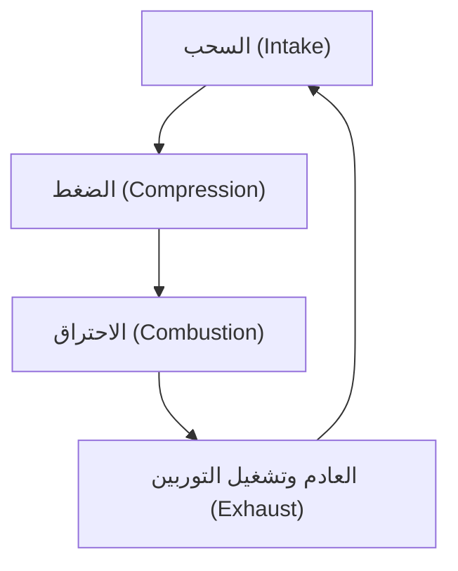
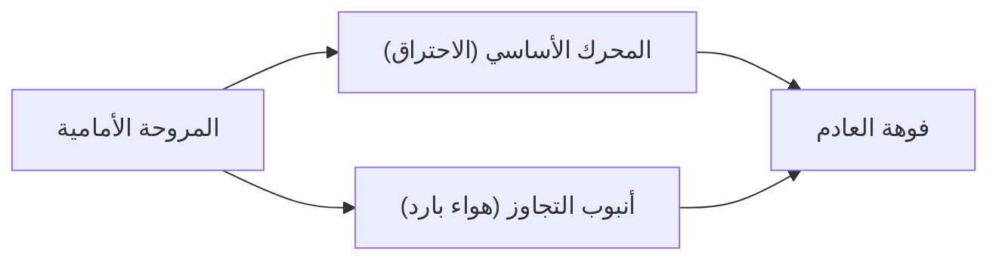

## مقدمة: مصدر الطاقة الذي أحدث ثورة في السفر الجوي

يعد تطوير المحرك المروحي التوربيني (Turbofan Engine) أحد أهم الاختراقات التقنية التي تدعم النقل الجوي الحديث. إن طائرات الركاب التي نستخدمها بشكل اعتيادي تحلق في بيئة قاسية على ارتفاع 10,000 متر بسرعة تقارب سرعة الصوت، وبشكل آمن واقتصادي. وما يجعل ذلك ممكناً هو المحرك المروحي التوربيني الذي يجمع بين قوة الدفع الهائلة وكفاءة استهلاك الوقود المذهلة.

في هذا المقال، سننطلق من الدورة الديناميكية الحرارية الأساسية للمحرك النفاث المتمثلة في "السحب، والضغط، والاحتراق، والعادم"، لنشرح بتعمق كيف تطورت المحركات النفاثة التوربينية (Turbojet) في بداياتها إلى المحركات المروحية التوربينية الحديثة، وسر "نسبة التجاوز" (Bypass Ratio) التي تمثل جوهر هذا التطور. وعلاوة على ذلك، سنسلط الضوء على الصورة الكاملة للمحرك النفاث الذي يجمع بين أفضل ما توصلت إليه الهندسة، بدءاً من تقنيات تبريد شفرات التوربينات القادرة على تحمل بيئات درجات الحرارة الفائقة التي تصل إلى آلاف الدرجات، وصولاً إلى هندسة المواد المتطورة مثل السبائك أحادية البلورة.

---

## المبدأ الأساسي للمحرك النفاث: دورة برايتون

يُصمم مبدأ عمل المحرك النفاث على أساس "دورة برايتون" (Brayton cycle) في الديناميكا الحرارية. وهي دورة محرك حراري تفترض تدفقاً مستمراً للمائع، وتتكون من العمليات الأربع التالية:

1. **السحب (Intake)**: سحب الهواء من المقدمة.
2. **الضغط (Compression)**: تحويل الهواء المسحوب إلى ضغط عالٍ باستخدام الضاغط (الكمبريسور).
3. **الاحتراق (Combustion)**: حقن الوقود في الهواء المضغوط وإشعاله لتوليد غاز عالي الحرارة والضغط.
4. **العادم (Exhaust)**: طرد الغاز المتمدد إلى الخلف للحصول على قوة دفع كرد فعل (وفي الوقت نفسه تدوير التوربين لتشغيل الضاغط).

تتشابه هذه السلسلة من العمليات مع المحرك الترددي (المحرك المكبسي) المستخدم في السيارات وغيرها، ولكن السمة الأبرز للمحرك النفاث تكمن في أن هذه العمليات تتم بشكل "مستمر". فبينما يحصل المحرك الترددي على طاقته من خلال انفجارات متقطعة، يستمر المحرك النفاث في سحب الهواء، وحرقه، وطرده دون توقف. وبفضل ذلك، يحقق كثافة طاقة عالية جداً وحركة دورانية سلسة.

### أهمية الضغط
لماذا نحتاج إلى ضغط الهواء؟ السبب هو أن رفع ضغط الهواء يحسن كفاءة الاحتراق بشكل جذري، مما يتيح استخراج المزيد من الطاقة. في الجزء الأمامي من المحرك النفاث، توجد مراحل متعددة ومتراصة من شفرات الضاغط (مزيج من الشفرات الثابتة والمتحركة) التي تقوم بضغط الهواء تدريجياً. في المحركات الحديثة، يُضغط حجم الهواء المسحوب إلى جزء صغير من العشرات، ويمكن أن يصل الضغط إلى أكثر من 40 ضعفاً من ضغط الهواء الخارجي.

---

## التطور من المحرك النفاث التوربيني إلى المحرك المروحي التوربيني

كانت المحركات النفاثة في بداياتها تتخذ شكلاً يُعرف باسم "المحرك النفاث التوربيني" (Turbojet engine). يتميز المحرك النفاث التوربيني ببنية بسيطة حيث يُرسل كل الهواء المسحوب إلى غرفة الاحتراق، ويحصل على قوة الدفع فقط من قوة غازات العادم عالية الحرارة والضغط الناتجة من هناك.

### حدود المحرك النفاث التوربيني
على الرغم من أن المحرك النفاث التوربيني مناسب للطيران عالي السرعة (خاصة الطيران الأسرع من الصوت)، إلا أنه كان يعاني من بعض العيوب الخطيرة في نطاق السرعات دون الصوتية (حوالي 0.8 إلى 0.9 ماخ) التي تطير بها طائرات الركاب المدنية.

1. **انخفاض كفاءة الدفع**: نظراً لأن سرعة غاز العادم أسرع بكثير من سرعة الطيران، فإن جزءاً كبيراً من الطاقة الحركية يضيع هباءً. لزيادة كفاءة الدفع، من الضروري جعل سرعة العادم قريبة من سرعة الطيران، مع دفع كمية أكبر من الهواء إلى الخلف.
2. **سوء استهلاك الوقود**: نظراً لارتفاع نسبة الدفع المعتمدة على الاحتراق، فإن استهلاك الوقود يكون كثيفاً للغاية.
3. **مشكلة الضوضاء**: يؤدي الاصطدام العنيف لغازات العادم عالية السرعة مع الهواء الساكن المحيط إلى إحداث ضوضاء نفاثة هائلة (ضوضاء القص).

### ولادة المحرك المروحي التوربيني وسحر "نسبة التجاوز"
لحل هذه التحديات، تم تطوير "المحرك المروحي التوربيني" (Turbofan engine). السمة الأبرز للمحرك المروحي التوربيني هي وجود "مروحة" تشبه مروحة التهوية العملاقة في أقصى الجزء الأمامي من المحرك.

لا يدخل كل الهواء الذي تسحبه المروحة إلى اللب (الضاغط، وغرفة الاحتراق، والتوربين) في وسط المحرك. بل ينقسم تدفق الهواء إلى قسمين:
- **التدفق الأساسي (Core flow)**: الهواء الذي يدخل وسط المحرك ويُستخدم في الاحتراق.
- **تدفق التجاوز (Bypass flow)**: الهواء الذي يمر خارج اللب ويُطرد مباشرة إلى الخلف.

يُطلق على النسبة بين "كمية الهواء التي لا تمر عبر اللب" و"كمية الهواء التي تمر عبر اللب" اسم **نسبة التجاوز (Bypass Ratio)**.

#### لماذا يعد رفع نسبة التجاوز أمراً جيداً؟
المحركات الحديثة المستخدمة في طائرات الركاب هي في الغالب "محركات مروحية توربينية ذات نسبة تجاوز عالية" تتجاوز فيها نسبة التجاوز 10:1. وهذا يعني أن أكثر من 90% من الهواء المسحوب لا يُستخدم في الاحتراق، بل يُستغل مباشرة كقوة دفع.

تتمتع نسبة التجاوز العالية بالفوائد الهائلة التالية:
1. **تحسين هائل في استهلاك الوقود**: بدلاً من حرق الوقود ونفث كمية صغيرة من الغاز بسرعة عالية، فإن دفع كمية كبيرة من الهواء ببطء نسبياً باستخدام المروحة يوفر قوة دفع أكثر كفاءة بناءً على قانون حفظ الزخم. وقد أدى ذلك إلى تحسين مذهل في استهلاك الوقود، مما جعل النقل الجماعي لمسافات طويلة ممكناً.
2. **تقليل جذري للضوضاء**: يتدفق تيار التجاوز ذو درجة الحرارة المنخفضة والسرعة البطيئة المنبعث من المروحة ليغلف غازات العادم عالية الحرارة والسرعة المنبعثة من اللب. ويخفف هذا من فرق السرعة بين غاز العادم والهواء الخارجي، مما يقلل بشكل كبير من قص الهواء الذي يسبب الضوضاء. إن السبب وراء هدوء المناطق المحيطة بالمطارات الحديثة مقارنة بالماضي يعود إلى "تأثير عزل الصوت" لتدفق التجاوز هذا.

---

## تحدي الحدود: درجات الحرارة الفائقة وتقنيات التبريد

لتعزيز أداء المحرك النفاث (وخاصة الكفاءة الحرارية)، من الضروري رفع درجة حرارة غرفة الاحتراق (درجة حرارة مدخل التوربين: TIT) قدر الإمكان. وفقاً لمبدأ دورة كارنو، كلما ارتفعت درجة حرارة المصدر الحراري، زادت كفاءة المحرك.

تصل درجة حرارة مدخل التوربين في المحركات المروحية التوربينية الحديثة عالية الأداء إلى ما يذهل العقول؛ **1,500°C إلى 1,700°C**.
ولكن هنا تنشأ مشكلة خطيرة. فنقطة انصهار (درجة ذوبان) السبائك الفائقة القائمة على النيكل المستخدمة في شفرات (ريش) التوربينات تتراوح بين **1,300°C إلى 1,400°C** تقريباً. أي أن الشفرات **تتعرض لغازات درجة حرارتها أعلى من نقطة انصهارها**. منطقياً، ينبغي أن تذوب في لمح البصر، ولكن بفضل تقنيات التبريد والمواد المتقدمة، لا يحدث ذلك.

### تقنية التبريد الغشائي (Film Cooling)
تكون شفرات التوربين مجوفة من الداخل، ويُضخ فيها هواء بارد نسبياً مستنزف من الضاغط (قبل الاحتراق). يمر هذا الهواء عبر داخل الشفرة ليبردها، ثم يتسرب إلى الخارج عبر عدد لا يحصى من الثقوب الليزرية الدقيقة المحفورة على سطح الشفرة.
يشكل الهواء المتسرب طبقة رقيقة (غشاء) تغطي سطح الشفرة، مما يمنع الغازات عالية الحرارة التي تصل إلى آلاف الدرجات من ملامسة السطح المعدني للشفرة مباشرة. يُعرف هذا بـ "التبريد الغشائي".

### السبائك أحادية البلورة (Single Crystal Superalloys)
بالإضافة إلى تقنيات التبريد، يعد تطور المعدن بحد ذاته أمراً لا غنى عنه. عادة ما تتكون المعادن من بنية "متعددة البلورات" حيث تتجمع العديد من البلورات الدقيقة. ولكن في بيئة التوربين التي تشهد درجات حرارة عالية وقوى طرد مركزي قوية، يسهل حدوث "ظاهرة الزحف" (Creep) حيث يتشوه المعدن ويتمزق بدءاً من الحدود الفاصلة بين البلورات (حدود الحبيبات).

لمنع ذلك، طور المهندسون تقنية لصب الشفرة بالكامل كـ "بلورة واحدة فقط". وهذا ما يُعرف بـ "السبيكة أحادية البلورة" (SC). نظراً لعدم وجود حدود للبلورات، يمكنها الحفاظ على قوة مذهلة حتى تحت ضغوط درجات الحرارة العالية القصوى. وفي الوقت الحاضر، ومع إضافة المعادن النادرة مثل الرينيوم والروثينيوم، يتم تطوير الجيل الخامس والسادس من السبائك أحادية البلورة التي تتمتع بمقاومة حرارية أكبر.

---

## مستقبل محركات الطائرات والاستدامة

لا تزال المحركات المروحية التوربينية تواصل تطورها حتى اليوم. في الجيل القادم من المحركات، يُطلب زيادة نسبة التجاوز بشكل أكبر، وقد تم إدخال تقنيات مثل "المحرك المروحي التوربيني المجهز بتروس" (Geared Turbofan - GTF) لتدوير المروحة بسرعة مثالية تختلف عن سرعة اللب. وبفضل ذلك، أصبحت المروحة قادرة على الدوران ببطء أكبر (لكبح الضوضاء وزيادة الكفاءة)، بينما يدور توربين اللب بسرعة أكبر (بكفاءة عالية).

علاوة على ذلك، واستجابة للمشاكل البيئية العالمية، يجري العمل بوتيرة متسارعة لإدخال "وقود الطيران المستدام" (SAF)، وتطوير محركات الاحتراق الهيدروجيني، وحتى أنظمة الدفع الهجينة التي تدمج المحركات الكهربائية.

إن تاريخ المحرك النفاث هو تاريخ تحديات البشرية التي دفعت حدود الديناميكا الحرارية، وديناميكا الموائع، وهندسة المواد. عندما نحلق في السماء، فإن تحت تلك الأجنحة، تنبض نيران تصل حرارتها إلى آلاف الدرجات وخلاصة الهندسة فائقة الدقة بهدوء، ولكن بقوة جبارة.
