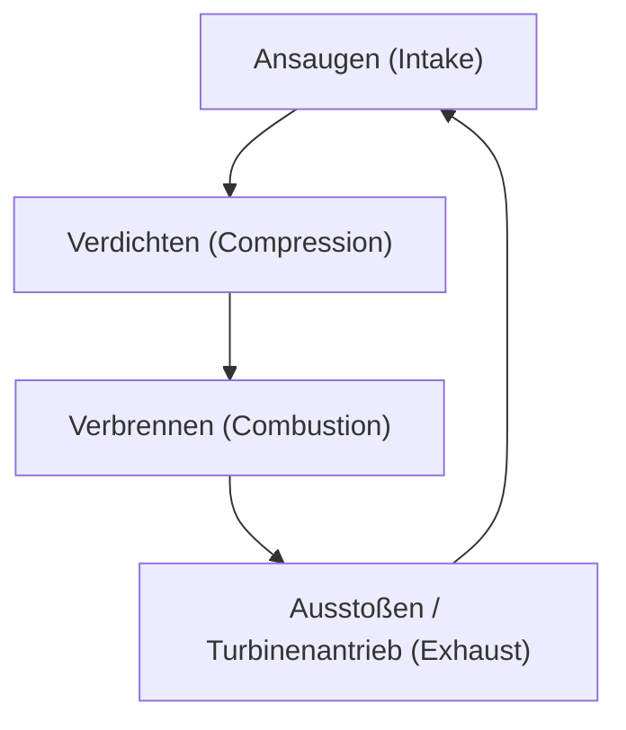
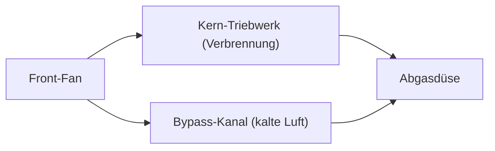

## Einleitung: Die Antriebsquelle, die den Flugverkehr revolutionierte

Einer der wichtigsten technologischen Durchbrüche, der den modernen Lufttransport stützt, ist die Entwicklung des Turbofan-Triebwerks. Die Verkehrsflugzeuge, die wir ganz selbstverständlich nutzen, fliegen in einer rauen Umgebung in 10.000 Metern Höhe nahe der Schallgeschwindigkeit, und das sicher sowie wirtschaftlich. Ermöglicht wird dies durch das Turbofan-Triebwerk, das eine enorme Schubkraft mit einer erstaunlichen Kraftstoffeffizienz vereint.

In diesem Artikel beginnen wir mit dem thermodynamischen Zyklus des Jet-Triebwerks – Ansaugen, Verdichten, Verbrennen und Ausstoßen –, beleuchten die Evolution vom frühen Turbojet-Triebwerk zum modernen Turbofan-Triebwerk und gehen detailliert auf die Magie des „Nebenstromverhältnisses“ ein, das den Kern dieser Entwicklung bildet. Darüber hinaus betrachten wir das gesamte Spektrum dieser Ingenieurskunst, bis hin zu den Kühltechniken der Turbinenschaufeln, die extremen Temperaturen von mehreren Tausend Grad standhalten müssen, und zu modernster Materialwissenschaft wie einkristallinen Legierungen.

---

## Die Grundprinzipien des Jet-Triebwerks: Der Joule-Kreisprozess (Brayton-Zyklus)

Das Funktionsprinzip eines Jet-Triebwerks wird thermodynamisch als „Brayton-Kreisprozess“ (Joule-Kreisprozess) modelliert. Es handelt sich um einen Wärmekraftmaschinenzyklus, der einen kontinuierlichen Fluidstrom voraussetzt und aus den folgenden vier Prozessen besteht:

1. **Ansaugen (Intake)**: Luft wird von vorne angesaugt.
2. **Verdichten (Compression)**: Die angesaugte Luft wird durch den Kompressor (Verdichter) unter hohen Druck gesetzt.
3. **Verbrennen (Combustion)**: In die unter Hochdruck stehende Luft wird Treibstoff eingespritzt und verbrannt, wodurch ein Hochtemperatur- und Hochdruckgas entsteht.
4. **Ausstoßen (Exhaust)**: Das expandierende Gas wird nach hinten ausgestoßen; die daraus resultierende Reaktionskraft erzeugt den Schub (gleichzeitig treibt es die Turbine an, welche wiederum den Kompressor antreibt).

Diese Prozesskette ähnelt einem Hubkolbenmotor (Ottomotor), wie er in Automobilen verwendet wird. Das Hauptmerkmal des Jet-Triebwerks ist jedoch, dass diese Prozesse „kontinuierlich“ ablaufen. Während ein Hubkolbenmotor seine Energie durch diskontinuierliche Explosionen gewinnt, saugt ein Jet-Triebwerk ununterbrochen Luft an, verbrennt diese und stößt sie wieder aus. Dies führt zu einer extrem hohen Leistungsdichte und einer sehr gleichmäßigen Rotationsbewegung.

### Die Bedeutung der Verdichtung
Warum muss die Luft verdichtet werden? Der Grund dafür ist, dass durch den hohen Druck die Verbrennungseffizienz drastisch steigt und so mehr Energie freigesetzt werden kann. Im vorderen Teil des Jet-Triebwerks befinden sich mehrstufige Kompressorschaufeln (eine Kombination aus Leit- und Laufschaufeln), die die Luft schrittweise verdichten. Bei modernen Triebwerken wird das Volumen der angesaugten Luft auf einen Bruchteil verdichtet, und der Druck kann das 40-fache des Außendrucks oder mehr erreichen.

---

## Die Evolution vom Turbojet zum Turbofan

Die frühen Jet-Triebwerke hatten die Form des sogenannten „Turbojet-Triebwerks“. Der Turbojet hat eine einfache Konstruktion, bei der die gesamte angesaugte Luft in die Brennkammer geleitet wird und der Schub ausschließlich durch die Energie der dort erzeugten Hochtemperatur- und Hochdruck-Abgase entsteht.

### Die Grenzen des Turbojets
Turbojet-Triebwerke eignen sich gut für schnelle Flüge (insbesondere Überschallflüge), weisen jedoch im Unterschallbereich (ca. Mach 0,8 bis 0,9), in dem Zivilflugzeuge operieren, einige gravierende Nachteile auf.

1. **Geringe Antriebseffizienz**: Da die Geschwindigkeit der Abgase im Vergleich zur Fluggeschwindigkeit viel zu hoch ist, geht ein Großteil der kinetischen Energie verloren. Um die Antriebseffizienz zu steigern, muss die Abgasgeschwindigkeit der Fluggeschwindigkeit angenähert und gleichzeitig eine größere Luftmenge nach hinten ausgestoßen werden.
2. **Schlechte Kraftstoffeffizienz**: Da der Anteil des durch Verbrennung erzeugten Schubs sehr hoch ist, ist der Kraftstoffverbrauch enorm.
3. **Lärmproblematik**: Wenn die Hochgeschwindigkeitsabgase heftig mit der ruhenden Umgebungsluft kollidieren, entsteht ein gewaltiger Strahllärm (Scherlärm).

### Die Geburt des Turbofans und die Magie des „Nebenstromverhältnisses“
Um diese Probleme zu lösen, wurde das „Turbofan-Triebwerk“ entwickelt. Das wichtigste Merkmal des Turbofan-Triebwerks ist ein gigantischer, ventilatorähnlicher „Fan“ (Bläser) ganz vorne am Triebwerk.

Die vom Fan angesaugte Luft strömt nicht vollständig in den Kern (Verdichter, Brennkammer, Turbine) im Zentrum des Triebwerks. Der Luftstrom wird in zwei Teile aufgeteilt:
- **Kernstrom (Core Flow)**: Die Luft, die in das Zentrum des Triebwerks strömt und für die Verbrennung verwendet wird.
- **Nebenstrom (Bypass Flow)**: Die Luft, die außen am Kern vorbeiströmt und direkt nach hinten ausgestoßen wird.

Das Verhältnis von „Luftmenge, die nicht durch den Kern strömt“ zu „Luftmenge, die durch den Kern strömt“ wird als **Nebenstromverhältnis (Bypass Ratio)** bezeichnet.

#### Warum ist ein hohes Nebenstromverhältnis vorteilhaft?
Bei modernen Triebwerken für Verkehrsflugzeuge dominieren „Turbofan-Triebwerke mit hohem Nebenstromverhältnis“ von über 10:1. Das bedeutet, dass mehr als 90 % der angesaugten Luft nicht für die Verbrennung genutzt, sondern direkt als Schub verwendet werden.

Ein hohes Nebenstromverhältnis bietet die folgenden enormen Vorteile:
1. **Überragende Verbesserung der Kraftstoffeffizienz**: Nach dem Prinzip der Impulserhaltung ist es effizienter, mithilfe eines Fans eine große Luftmenge relativ langsam nach hinten zu schieben, anstatt Kraftstoff zu verbrennen und eine kleine Gasmenge mit hoher Geschwindigkeit auszustoßen. Dadurch wurde die Kraftstoffeffizienz drastisch verbessert und der Massentransport über weite Strecken ermöglicht.
2. **Drastische Lärmreduzierung**: Der vom Kern ausgestoßene Hochtemperatur- und Hochgeschwindigkeits-Abgasstrom wird vom kalten und langsamen Nebenstrom aus dem Fan umhüllt. Dadurch wird die Geschwindigkeitsdifferenz zwischen den Abgasen und der Außenluft gemildert und die Luftscherung, die den Lärm verursacht, stark reduziert. Dass moderne Flughäfen heute viel leiser sind als früher, ist dem „Schallschutzeffekt“ dieses Nebenstroms zu verdanken.

---

## Die Grenzen verschieben: Extreme Hitze und Kühltechnologien

Um die Leistung (insbesondere den thermischen Wirkungsgrad) eines Jet-Triebwerks zu erhöhen, muss die Temperatur in der Brennkammer (Turbineneintrittstemperatur, TIT) so hoch wie möglich sein. Gemäß dem Prinzip des Carnot-Kreisprozesses steigt der Wirkungsgrad des Triebwerks mit der Temperatur der Wärmequelle.

Die Turbineneintrittstemperatur moderner Hochleistungs-Turbofan-Triebwerke erreicht erstaunliche **1.500 °C bis 1.700 °C**.
Hierbei entsteht jedoch ein gravierendes Problem: Der Schmelzpunkt der für die Turbinenschaufeln verwendeten Nickelbasis-Superlegierungen liegt bei nur etwa **1.300 °C bis 1.400 °C**. Das bedeutet, dass die Schaufeln **Gasen ausgesetzt sind, deren Temperatur über ihrem eigenen Schmelzpunkt liegt**. Normalerweise würden sie sofort schmelzen, aber hoch entwickelte Kühl- und Materialtechnologien verhindern dies.

### Filmkühlungstechnik
Das Innere der Turbinenschaufeln ist hohl, und dorthin wird vergleichsweise kühle (unverbrannte) Zapfluft aus dem Kompressor geleitet. Diese Luft strömt durch das Innere der Schaufel, kühlt sie und tritt dann durch unzählige winzige, lasergebohrte Löcher an der Oberfläche nach außen.
Die austretende Luft bildet eine dünne Schicht (Film), die die Oberfläche der Schaufel bedeckt und verhindert, dass das mehrere Tausend Grad heiße Gas direkt mit der Metalloberfläche in Kontakt kommt. Dies wird als „Filmkühlung“ bezeichnet.

### Einkristalline Legierungen (Single Crystal Superalloys)
Neben den Kühltechniken ist auch die Weiterentwicklung des Metalls selbst unverzichtbar. Metalle haben normalerweise eine „polykristalline“ Struktur, bei der sich viele winzige Kristalle zusammenfügen. In der Turbinenumgebung, in der hohe Temperaturen und starke Zentrifugalkräfte herrschen, neigt das Metall jedoch dazu, sich an den Grenzen zwischen den Kristallen (Korngrenzen) zu verformen und zu reißen, ein Phänomen, das als „Kriechen“ (Creep) bezeichnet wird.

Um dies zu verhindern, haben Ingenieure eine Technologie entwickelt, um die gesamte Schaufel als „einen einzigen Kristall“ zu gießen. Dies ist die sogenannte „einkristalline Legierung“ (Single Crystal, SC). Da es keine Korngrenzen gibt, behält sie selbst unter extremen Hochtemperatur-Spannungsbedingungen eine erstaunliche Festigkeit. Heutzutage werden durch die Zugabe von seltenen Metallen wie Rhenium oder Ruthenium einkristalline Legierungen der fünften und sechsten Generation entwickelt, die noch temperaturbeständiger sind.

---

## Die Zukunft und Nachhaltigkeit von Flugzeugtriebwerken

Das Turbofan-Triebwerk entwickelt sich auch heute noch stetig weiter. Bei Triebwerken der nächsten Generation ist eine weitere Erhöhung des Nebenstromverhältnisses gefordert. Dafür wurden Technologien wie der „Geared Turbofan“ (GTF) zur Praxisreife gebracht, durch den der Fan mit einer anderen, optimaleren Drehzahl als der Triebwerkskern rotieren kann. Dadurch kann der Fan langsamer (effizienter und geräuschärmer) und die Turbine im Kern schneller (hocheffizient) rotieren.

Darüber hinaus wird als Reaktion auf globale Umweltprobleme die Einführung von nachhaltigem Flugkraftstoff (SAF: Sustainable Aviation Fuel) sowie die Entwicklung von Wasserstoffverbrennungsmotoren und Hybridantriebssystemen in Kombination mit Elektromotoren rasch vorangetrieben.

Die Geschichte des Jet-Triebwerks ist die Geschichte menschlicher Herausforderungen, welche die Grenzen der Thermodynamik, Strömungsmechanik und Materialwissenschaft immer weiter hinausgeschoben haben. Wenn wir am Himmel fliegen, pulsiert unter unseren Flügeln – leise, aber kraftvoll – ein Zusammenspiel aus mehreren Tausend Grad heißen Flammen und hochpräziser Ingenieurskunst.
