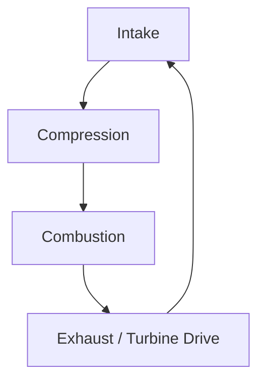
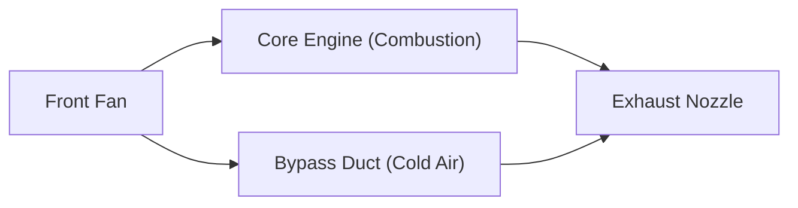

## Introduction: The Power Source That Revolutionized Air Travel

One of the most important technological breakthroughs supporting modern air transportation is the development of the turbofan engine. The passenger planes we casually use fly safely and economically at speeds close to the speed of sound in the harsh environment of 10,000 meters altitude. What makes this possible is the turbofan engine, which combines massive thrust with phenomenal fuel efficiency.

This article starts from the basic principles of jet engines—the thermodynamic cycle of 'intake, compression, combustion, and exhaust'—and deeply explores how early turbojet engines evolved into modern turbofan engines, focusing on the magic of the 'bypass ratio' at the core of this evolution. Furthermore, we will delve into the entire picture of the jet engine, a culmination of engineering excellence, ranging from cooling technologies for turbine blades that can withstand ultra-high temperatures of thousands of degrees to cutting-edge materials engineering such as single-crystal superalloys.

---

## Basic Principles of Jet Engines: The Brayton Cycle

The operating principle of a jet engine is modeled as the "Brayton cycle" in thermodynamics. This is a thermodynamic cycle of a heat engine based on the premise of a continuous fluid flow, and consists of the following four processes:

1. **Intake**: Draws in air from the front.
2. **Compression**: Compresses the drawn-in air to high pressure using a compressor.
3. **Combustion**: Injects fuel into the high-pressure air and burns it to generate high-temperature, high-pressure gas.
4. **Exhaust**: Expels the expanding gas backwards, gaining thrust from the reaction (while simultaneously spinning the turbine to drive the compressor).

This series of processes is similar to the reciprocating engine (piston engine) used in cars, but the most significant feature of a jet engine is that these occur "continuously." While a reciprocating engine obtains power through intermittent explosions, a jet engine continuously draws in, burns, and expels air. This achieves an extremely high power density and smooth rotational motion.

### The Importance of Compression
Why is it necessary to compress the air? This is because pressurizing the air dramatically improves combustion efficiency, allowing more energy to be extracted. Multiple stages of compressor blades (a combination of stators and rotors) are arranged at the front of a jet engine to gradually compress the air. In modern engines, the volume of the intake air is compressed to a fraction of its original size, and the pressure can reach over 40 times that of the outside air.

---

## Evolution from Turbojets to Turbofans

Early jet engines were in a form called "turbojet engines." A turbojet has a simple structure where all the drawn-in air is sent into the combustion chamber, and thrust is obtained solely from the momentum of the high-temperature, high-pressure exhaust gas generated there.

### Limitations of Turbojets
While turbojet engines are suitable for high-speed flight (especially supersonic flight), they had several serious drawbacks in the subsonic regime (around Mach 0.8 to 0.9) where commercial airliners operate.

1. **Low Propulsive Efficiency**: Because the exhaust gas velocity is too fast compared to the flight speed, much of the kinetic energy is wasted. To increase propulsive efficiency, it is necessary to push a larger mass of air backward while bringing the exhaust velocity closer to the flight speed.
2. **Poor Fuel Economy**: Because the proportion of thrust relying on combustion is high, fuel consumption is extremely intense.
3. **Noise Issues**: The high-speed exhaust gas violently colliding with the surrounding stationary air causes tremendous jet noise (shear noise).

### The Birth of Turbofans and the Magic of "Bypass Ratio"
The "turbofan engine" was developed to solve these challenges. The most prominent feature of a turbofan engine is that it is equipped with a giant fan, like a windmill, at the very front of the engine.

Not all the air drawn in by the fan enters the core (compressor, combustion chamber, turbine) at the center of the engine. The airflow is divided into two:
- **Core Flow**: The air that enters the center of the engine and is used for combustion.
- **Bypass Flow**: The air that passes around the outside of the core and is expelled directly backward.

The ratio of this "amount of air that does not pass through the core" to the "amount of air that passes through the core" is called the **Bypass Ratio**.

#### Why is a Higher Bypass Ratio Better?
Modern engines for passenger aircraft are predominantly "high-bypass turbofan engines" with a bypass ratio exceeding 10:1. This means that more than 90% of the drawn-in air is not used for combustion but is directly utilized as thrust.

A high bypass ratio offers the following immense benefits:
1. **Overwhelming Improvement in Fuel Economy**: Rather than burning fuel to blow out a small amount of gas at high speed, using a fan to push out a large amount of air relatively slowly is a more efficient way to obtain thrust based on the law of conservation of momentum. This has dramatically improved fuel efficiency and enabled long-distance mass transportation.
2. **Dramatic Noise Reduction**: The low-temperature, low-speed bypass airflow expelled from the fan wraps around the high-temperature, high-speed exhaust gas expelled from the core. This mitigates the velocity difference between the exhaust gas and the outside air, significantly reducing the air shear that causes noise. The fact that areas around modern airports are quieter than in the past is thanks to this "soundproofing effect" of the bypass flow.

---

## Challenging the Limits: Ultra-High Temperatures and Cooling Technologies

To improve the performance (especially thermal efficiency) of a jet engine, the temperature in the combustion chamber (Turbine Inlet Temperature: TIT) must be made as high as possible. According to the principles of the Carnot cycle, the higher the temperature of the heat source, the higher the efficiency of the engine.

The turbine inlet temperature of modern high-performance turbofan engines reaches an astonishing **1,500°C to 1,700°C**.
However, a major problem arises here. The melting point of the nickel-based superalloys used for the turbine blades is only about **1,300°C to 1,400°C**. In other words, the blades are **exposed to gas temperatures higher than their own melting point**. Normally, one would expect them to melt away instantly, but advanced cooling and materials technologies exist to prevent this from happening.

### Film Cooling Technology
The inside of a turbine blade is hollow, and relatively cool air (before combustion) extracted from the compressor is fed into it. This air cools the blade from the inside and then seeps out through countless microscopic laser-drilled holes on the blade surface.
The seeping air forms a thin film covering the surface of the blade, preventing the ultra-high-temperature gas of several thousand degrees from directly touching the metal surface of the blade. This is called "film cooling."

### Single Crystal Superalloys
In addition to cooling technologies, the evolution of the metals themselves is essential. Metals usually have a "polycrystalline" structure consisting of many tiny crystals. However, in the turbine environment subject to high temperatures and powerful centrifugal forces, a phenomenon known as "creep" is likely to occur, where the metal deforms and tears apart from the boundaries between crystals (grain boundaries).

To prevent this, engineers developed a technology to cast the entire blade as "just a single crystal." This is a "Single Crystal (SC) superalloy." Because there are no crystal boundaries, it can maintain astonishing strength even under extreme high-temperature stress environments. Today, 5th and 6th generation single-crystal superalloys with even higher heat resistance have been developed by adding rare metals such as rhenium and ruthenium.

---

## The Future and Sustainability of Aircraft Engines

Turbofan engines continue to evolve today. Next-generation engines require even higher bypass ratios, and technologies such as the "Geared Turbofan (GTF)," which rotates the fan at an optimal speed different from that of the engine core, have been put into practical use. This allows the fan to rotate slower (efficiently and with less noise) while the core turbine rotates faster (with high efficiency).

Furthermore, in response to global environmental issues, the introduction of Sustainable Aviation Fuel (SAF) and the rapid development of hydrogen combustion engines, as well as hybrid propulsion systems combined with electric motors, are underway.

The history of jet engines is a history of human challenge, pushing the boundaries of thermodynamics, fluid dynamics, and materials engineering. When we fly in the sky, beneath those wings, flames of thousands of degrees and the culmination of ultra-precise engineering are quietly but powerfully pulsating.
