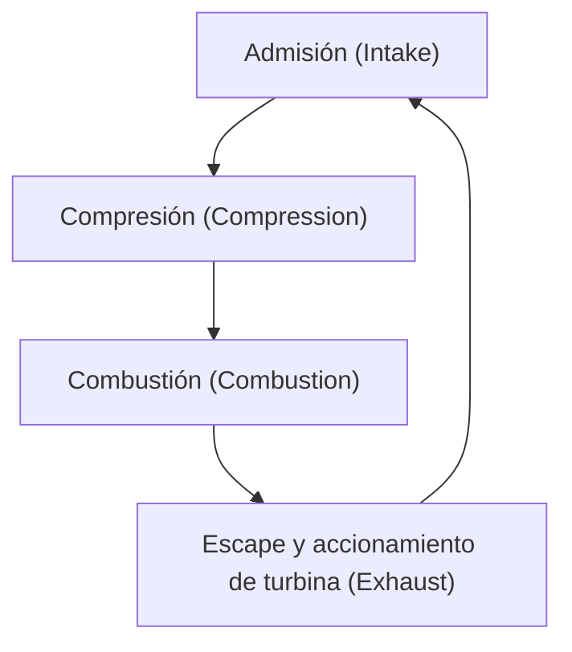
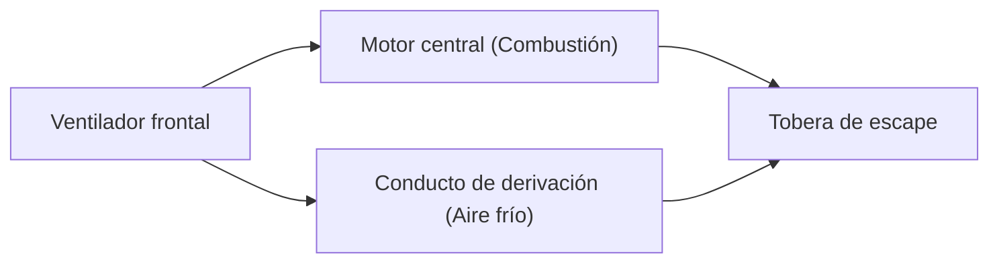

## Introducción: La fuente de energía que transformó los viajes aéreos

Uno de los avances tecnológicos más importantes que sustentan el transporte aéreo moderno es el desarrollo del motor turbofán. Los aviones comerciales que utilizamos habitualmente vuelan de forma segura y económica a velocidades cercanas a la del sonido en el duro entorno de los 10.000 metros de altitud. Lo que hace esto posible es el motor turbofán, que combina un empuje masivo con un rendimiento de combustible asombroso.

En este artículo, partiendo del ciclo termodinámico de "admisión, compresión, combustión y escape" que es el principio básico de los motores a reacción, profundizaremos en cómo los primeros turborreactores evolucionaron hasta convertirse en los modernos motores turbofán, y en la magia de la "relación de derivación" que es el núcleo de esta evolución. Además, exploraremos el panorama completo de los motores a reacción que reúnen lo mejor de la ingeniería, abarcando desde las tecnologías de refrigeración de los álabes de las turbinas, capaces de soportar entornos de temperaturas extremas de varios miles de grados, hasta la ingeniería de materiales de vanguardia como las aleaciones monocristalinas.

---

## Principio básico del motor a reacción: El ciclo Brayton

El principio de funcionamiento de un motor a reacción se modeliza en termodinámica como el "ciclo Brayton". Se trata de un ciclo de motor térmico que presupone un flujo continuo de fluido, y consta de los cuatro procesos siguientes:

1. **Admisión (Intake)**: Aspira aire desde la parte frontal.
2. **Compresión (Compression)**: Comprime el aire aspirado a alta presión utilizando un compresor.
3. **Combustión (Combustion)**: Inyecta combustible en el aire a alta presión y lo quema para generar gas a alta temperatura y alta presión.
4. **Escape (Exhaust)**: Expulsa el gas en expansión hacia atrás y obtiene empuje a través de la reacción (al mismo tiempo, hace girar la turbina para accionar el compresor).

Esta serie de procesos es similar a la de los motores alternativos (motores de pistón) utilizados en automóviles, pero la principal característica de los motores a reacción es que se realizan de forma "continua". Mientras que un motor alternativo obtiene energía a través de explosiones intermitentes, un motor a reacción aspira aire, lo quema y lo expulsa incesantemente. Esto logra una densidad de potencia extremadamente alta y un movimiento rotacional suave.

### La importancia de la compresión
¿Por qué es necesario comprimir el aire? Esto se debe a que, al someter el aire a alta presión, la eficiencia de la combustión mejora drásticamente, lo que permite extraer mucha más energía. En la etapa delantera del motor a reacción, hay múltiples etapas superpuestas de álabes del compresor (una combinación de estatores y rotores) que comprimen gradualmente el aire. En los motores modernos, el volumen del aire aspirado se comprime a una fracción de su tamaño original, y la presión puede superar en más de 40 veces la presión atmosférica exterior.

---

## Evolución del turborreactor al turbofán

Los primeros motores a reacción tenían una configuración conocida como "motor turborreactor". El turborreactor tiene una estructura simple en la que todo el aire aspirado se envía a la cámara de combustión, y el empuje se obtiene únicamente de la fuerza de los gases de escape a alta temperatura y presión que se generan allí.

### Limitaciones del turborreactor
Aunque los turborreactores son adecuados para vuelos a alta velocidad (especialmente vuelos supersónicos), presentaban varios inconvenientes graves en el régimen subsónico (alrededor de Mach 0.8 a 0.9) en el que vuelan los aviones comerciales.

1. **Baja eficiencia de propulsión**: Debido a que la velocidad de los gases de escape es demasiado rápida en comparación con la velocidad de vuelo, gran parte de la energía cinética se desperdicia. Para aumentar la eficiencia de propulsión, es necesario acercar la velocidad del escape a la velocidad de vuelo, al mismo tiempo que se empuja una mayor cantidad de aire hacia atrás.
2. **Consumo de combustible deficiente**: Como la proporción de empuje que depende de la combustión es alta, el consumo de combustible es extremadamente elevado.
3. **Problema de ruido**: La violenta colisión de los gases de escape a alta velocidad con el aire estático circundante provoca un tremendo ruido de reacción (ruido de cizalladura).

### El nacimiento del turbofán y la magia de la "relación de derivación"
Para resolver estos problemas se desarrolló el "motor turbofán". La principal característica del motor turbofán es que está equipado con un "ventilador" similar a un gran ventilador en la parte más frontal del motor.

El aire aspirado por el ventilador no entra en su totalidad al núcleo central del motor (compresor, cámara de combustión, turbina). El flujo de aire se divide en dos:
- **Flujo del núcleo**: El aire que entra en el centro del motor y se utiliza para la combustión.
- **Flujo de derivación**: El aire que pasa por el exterior del núcleo y se expulsa directamente hacia atrás.

La proporción entre la "cantidad de aire que no pasa por el núcleo" y la "cantidad de aire que pasa por el núcleo" se denomina **relación de derivación (Bypass Ratio)**.

#### ¿Por qué es bueno aumentar la relación de derivación?
La corriente principal en los motores de los aviones comerciales modernos es el "motor turbofán de alta relación de derivación", que supera una relación de 10:1. Esto significa que más del 90% del aire aspirado no se utiliza para la combustión, sino que se emplea directamente como empuje.

Una alta relación de derivación tiene las siguientes ventajas enormes:
1. **Mejora abrumadora del consumo de combustible**: En lugar de quemar combustible y expulsar una pequeña cantidad de gas a alta velocidad, es más eficiente, según la ley de conservación del momento, usar un ventilador para empujar una gran cantidad de aire con relativa lentitud. Esto mejoró drásticamente el consumo de combustible y posibilitó el transporte masivo a larga distancia.
2. **Reducción drástica del ruido**: El flujo de aire de derivación a baja temperatura y baja velocidad que expulsa el ventilador envuelve los gases de escape a alta temperatura y alta velocidad emitidos por el núcleo. Esto reduce la diferencia de velocidad entre los gases de escape y el aire exterior, disminuyendo significativamente la cizalladura del aire que causa el ruido. El hecho de que los alrededores de los aeropuertos modernos sean más silenciosos que en el pasado se debe a este "efecto de insonorización" del flujo de derivación.

---

## Desafiando los límites: Temperaturas extremas y tecnología de refrigeración

Para mejorar el rendimiento (especialmente la eficiencia térmica) de los motores a reacción, es necesario elevar la temperatura de la cámara de combustión (Temperatura de Entrada a la Turbina: TIT) lo máximo posible. Según el principio del ciclo de Carnot, cuanto mayor sea la temperatura de la fuente de calor, mayor será la eficiencia del motor.

La temperatura de entrada a la turbina en los motores turbofán modernos de alto rendimiento alcanza los asombrosos **1.500 °C a 1.700 °C**.
Sin embargo, aquí surge un problema grave. El punto de fusión (la temperatura a la que se derrite) de las superaleaciones de base níquel utilizadas para los álabes (palas) de las turbinas es de aproximadamente **1.300 °C a 1.400 °C**. En otras palabras, los álabes están **expuestos a un gas con una temperatura superior a su propio punto de fusión**. Lógicamente, se derretirían al instante, pero existen tecnologías avanzadas de refrigeración y de materiales para evitar que esto ocurra.

### Tecnología de refrigeración por película
El interior de los álabes de la turbina es hueco, y allí se bombea aire relativamente frío (antes de la combustión) extraído del compresor. Este aire pasa por el interior del álabe para enfriarlo, y luego se filtra hacia el exterior a través de innumerables orificios microscópicos perforados por láser en la superficie del álabe.
El aire filtrado forma una fina capa (película) que cubre la superficie del álabe, evitando que los gases a varios miles de grados entren en contacto directo con la superficie metálica del mismo. A esto se le llama "refrigeración por película".

### Aleaciones monocristalinas (Single Crystal Superalloys)
Además de las tecnologías de refrigeración, la evolución de los propios metales es indispensable. Normalmente, los metales tienen una estructura "policristalina" en la que se agrupan numerosos cristales diminutos. Sin embargo, en el entorno de la turbina, donde se aplican altas temperaturas y potentes fuerzas centrífugas, el metal es propenso a deformarse y desgarrarse en los límites entre los cristales (límites de grano), un fenómeno conocido como "fluencia" (creep).

Para evitar esto, los ingenieros desarrollaron una tecnología para fundir todo el álabe como "un solo cristal". Esto se conoce como "aleación monocristalina" (SC, por sus siglas en inglés). Dado que no existen límites de grano, puede mantener una resistencia asombrosa incluso en entornos de extrema tensión térmica. En la actualidad, se están desarrollando aleaciones monocristalinas de 5ª y 6ª generación con una resistencia térmica aún mayor mediante la adición de metales raros como el renio y el rutenio.

---

## El futuro de los motores de aviación y la sostenibilidad

Los motores turbofán siguen evolucionando en la actualidad. Los motores de próxima generación exigen mejoras aún mayores en la relación de derivación, y se han comercializado tecnologías como el "turbofán engranado" (Geared Turbofan, GTF), que permite que el ventilador gire a una velocidad óptima diferente a la del núcleo del motor. Gracias a esto, el ventilador puede girar más despacio (con menos ruido y mayor eficiencia) y la turbina del núcleo más rápido (con mayor eficiencia).

Además, en respuesta a los problemas ambientales globales, avanza a un ritmo acelerado la introducción de combustibles de aviación sostenibles (SAF: Sustainable Aviation Fuel), el desarrollo de motores de combustión de hidrógeno e incluso sistemas de propulsión híbridos combinados con motores eléctricos.

La historia de los motores a reacción es la historia del desafío de la humanidad por ampliar los límites de la termodinámica, la mecánica de fluidos y la ingeniería de materiales. Cuando volamos, debajo de nuestras alas, llamas de miles de grados y la culminación de la ingeniería de ultraprecisión palpitan de manera silenciosa, pero poderosa.
