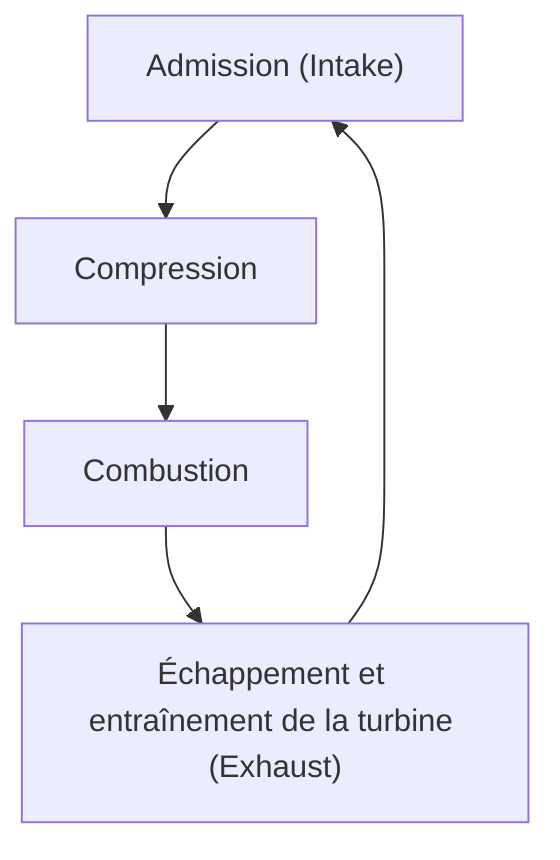
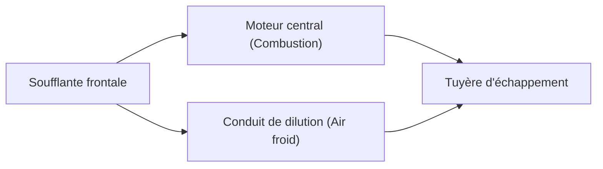

## Introduction : La source d'énergie qui a révolutionné le transport aérien

L'une des percées technologiques les plus importantes soutenant le transport aérien moderne est le développement du moteur à double flux (turbosoufflante ou turbofan). Les avions de ligne que nous utilisons si naturellement volent de manière sûre et économique dans l'environnement hostile d'une altitude de 10 000 mètres, à des vitesses proches de celle du son. Ce qui rend cela possible, c'est le moteur turbofan, qui combine une poussée colossale à un rendement énergétique extraordinaire.

Dans cet article, nous partirons du principe de base du moteur à réaction, le cycle thermodynamique d'"admission, compression, combustion et échappement", pour explorer en profondeur la façon dont les premiers turboréacteurs ont évolué vers les moteurs turbofan modernes, et la magie du "taux de dilution" (bypass ratio) qui est au cœur de cette évolution. De plus, nous examinerons la vue d'ensemble du moteur à réaction, qui rassemble le meilleur de l'ingénierie, allant de la technologie de refroidissement des aubes de turbine capables de résister à des environnements ultra-chauds de plusieurs milliers de degrés, jusqu'à l'ingénierie des matériaux de pointe comme les alliages monocristallins.

---

## Le principe de base du moteur à réaction : Le cycle de Brayton

Le principe de fonctionnement d'un moteur à réaction est modélisé par le "cycle de Brayton" en thermodynamique. Il s'agit du cycle d'un moteur thermique supposant un flux continu de fluide, et il est composé des quatre processus suivants :

1. **Admission (Intake)** : Aspire l'air par l'avant.
2. **Compression** : Comprime l'air aspiré à haute pression à l'aide d'un compresseur.
3. **Combustion** : Injecte du carburant dans l'air à haute pression et le brûle pour générer un gaz à haute température et haute pression.
4. **Échappement (Exhaust)** : Éjecte le gaz en expansion vers l'arrière, obtenant une poussée par réaction (tout en faisant tourner la turbine pour entraîner le compresseur).

Cette série de processus est similaire à celle des moteurs alternatifs (moteurs à pistons) utilisés dans les automobiles, mais la plus grande caractéristique des moteurs à réaction est que ces processus s'effectuent de manière "continue". Alors qu'un moteur alternatif obtient sa puissance par des explosions intermittentes, un moteur à réaction aspire, brûle et rejette de l'air de manière ininterrompue. Cela permet d'obtenir une densité de puissance extrêmement élevée et un mouvement rotatif fluide.

### L'importance de la compression
Pourquoi faut-il comprimer l'air ? C'est parce que la mise sous haute pression de l'air améliore considérablement l'efficacité de la combustion et permet d'en extraire beaucoup plus d'énergie. À l'avant du moteur à réaction, plusieurs étages d'aubes de compresseur (une combinaison d'aubes statoriques et rotoriques) sont empilés pour comprimer progressivement l'air. Dans les moteurs modernes, le volume de l'air aspiré est comprimé à un dixième ou moins, et la pression peut atteindre plus de 40 fois celle de l'air extérieur.

---

## L'évolution du turboréacteur au moteur turbofan

Les premiers moteurs à réaction étaient d'une configuration appelée "turboréacteur" (turbojet). Le turboréacteur est une structure simple qui envoie tout l'air aspiré dans la chambre de combustion et tire sa poussée uniquement de la force des gaz d'échappement à haute température et haute pression qui en résultent.

### Les limites du turboréacteur
Bien que les turboréacteurs soient adaptés au vol à grande vitesse (en particulier au vol supersonique), ils présentaient plusieurs inconvénients majeurs dans le domaine des vitesses subsoniques (environ Mach 0,8 à 0,9) auxquelles volent les avions de ligne commerciaux.

1. **Faible efficacité propulsive** : Comme la vitesse des gaz d'échappement est trop élevée par rapport à la vitesse de vol, une grande partie de l'énergie cinétique est gaspillée. Pour augmenter l'efficacité propulsive, il est nécessaire de pousser une plus grande quantité d'air vers l'arrière tout en rapprochant la vitesse d'échappement de la vitesse de vol.
2. **Mauvais rendement énergétique** : Comme la proportion de poussée dépendant de la combustion est élevée, la consommation de carburant est extrêmement forte.
3. **Problèmes de bruit** : Les gaz d'échappement à grande vitesse heurtent violemment l'air ambiant au repos, provoquant un bruit de jet (bruit de cisaillement) assourdissant.

### La naissance du turbofan et la magie du "taux de dilution"
Le "moteur turbofan" a été développé pour résoudre ces problèmes. La plus grande caractéristique du moteur turbofan est qu'il est équipé d'une "soufflante" (fan) ressemblant à un ventilateur géant tout à l'avant du moteur.

Tout l'air aspiré par la soufflante n'entre pas dans le cœur (compresseur, chambre de combustion, turbine) au centre du moteur. Le flux d'air est divisé en deux :
- **Flux primaire (Core flow)** : L'air qui entre au centre du moteur et est utilisé pour la combustion.
- **Flux secondaire (Bypass flow)** : L'air qui contourne l'extérieur du cœur et est expulsé tel quel vers l'arrière.

Le rapport entre cette "quantité d'air qui ne passe pas par le cœur" et la "quantité d'air qui passe par le cœur" est appelé **taux de dilution (Bypass Ratio)**.

#### Pourquoi est-il bon d'augmenter le taux de dilution ?
Les moteurs des avions de ligne modernes sont principalement des "moteurs turbofan à haut taux de dilution" dépassant un rapport de 10:1. Cela signifie que plus de 90 % de l'air aspiré n'est pas utilisé pour la combustion, mais directement utilisé comme poussée.

Un taux de dilution élevé présente les avantages considérables suivants :
1. **Amélioration spectaculaire du rendement énergétique** : En raison de la loi de la conservation de la quantité de mouvement, il est plus efficace d'utiliser une soufflante pour pousser une grande quantité d'air relativement lentement, que de brûler du carburant pour éjecter une petite quantité de gaz à grande vitesse. Cela a considérablement amélioré le rendement énergétique et rendu possible le transport de masse sur de longues distances.
2. **Réduction drastique du bruit** : Le flux d'air secondaire à basse température et à basse vitesse expulsé par la soufflante s'écoule de manière à envelopper les gaz d'échappement à haute température et à grande vitesse expulsés par le cœur. Cela atténue la différence de vitesse entre les gaz d'échappement et l'air extérieur, réduisant considérablement le cisaillement de l'air qui cause le bruit. Si les alentours des aéroports modernes sont plus calmes qu'autrefois, c'est grâce à cet "effet d'insonorisation" du flux secondaire.

---

## Le défi des limites : températures ultra-hautes et technologies de refroidissement

Pour améliorer les performances (en particulier le rendement thermique) des moteurs à réaction, il est nécessaire d'élever autant que possible la température de la chambre de combustion (température d'entrée de la turbine : TIT). Selon le principe du cycle de Carnot, plus la température de la source chaude est élevée, plus le rendement du moteur augmente.

La température d'entrée de la turbine des moteurs turbofan modernes à haute performance atteint **1 500 °C à 1 700 °C**.
Cependant, un problème majeur se pose ici. Le point de fusion (température de fonte) des superalliages à base de nickel utilisés pour les aubes (pales) de turbine est d'environ **1 300 °C à 1 400 °C**. En d'autres termes, les aubes sont **exposées à des gaz dont la température est supérieure à leur propre point de fusion**. Normalement, elles fondraient instantanément, mais il existe des technologies de refroidissement et des matériaux avancés pour éviter cela.

### Technologie de refroidissement par film (Film cooling)
L'intérieur des aubes de turbine est creux, et de l'air relativement froid (avant combustion) prélevé du compresseur y est insufflé. Cet air passe à l'intérieur de l'aube pour la refroidir, puis suinte vers l'extérieur par d'innombrables trous microscopiques percés au laser sur la surface de l'aube.
L'air qui a suinté forme une fine pellicule (film) recouvrant la surface de l'aube, empêchant les gaz à plusieurs milliers de degrés d'entrer en contact direct avec la surface métallique de l'aube. C'est ce qu'on appelle le "refroidissement par film".

### Alliages monocristallins (Single Crystal Superalloys)
En plus des technologies de refroidissement, l'évolution du métal lui-même est indispensable. Les métaux ont généralement une structure "polycristalline" composée d'une multitude de cristaux microscopiques assemblés. Cependant, dans l'environnement de la turbine soumis à des températures élevées et à de puissantes forces centrifuges, un phénomène de "fluage" (creep) se produit facilement, où le métal se déforme et se déchire à partir des limites entre les cristaux (joints de grains).

Pour éviter cela, les ingénieurs ont développé une technologie permettant de couler l'aube entière sous la forme d'un "cristal unique". Il s'agit de l'"alliage monocristallin" (SC). Comme il n'y a pas de limites cristallines, il peut conserver une résistance extraordinaire même dans des environnements de contraintes thermiques extrêmes. Aujourd'hui, des alliages monocristallins de 5e et 6e génération, dont la résistance à la chaleur est encore renforcée par l'ajout de métaux rares comme le rhénium ou le ruthénium, ont été développés.

---

## L'avenir des moteurs d'avion et la durabilité

Les moteurs turbofan continuent d'évoluer. Pour les moteurs de la prochaine génération, on recherche une amélioration encore plus poussée du taux de dilution, et des technologies telles que le "turbofan à engrenages" (Geared Turbofan - GTF), qui permet à la soufflante de tourner à une vitesse de rotation optimale différente de celle du cœur du moteur, ont été mises en pratique. Grâce à cela, la soufflante peut tourner plus lentement (réduisant le bruit et augmentant l'efficacité) et la turbine du cœur plus rapidement (avec un rendement élevé).

De plus, en réponse aux problèmes environnementaux mondiaux, l'introduction de carburant d'aviation durable (SAF : Sustainable Aviation Fuel), ainsi que le développement de moteurs à combustion d'hydrogène, et même de systèmes de propulsion hybrides combinant des moteurs électriques, progressent à un rythme soutenu.

L'histoire des moteurs à réaction est celle du défi de l'humanité qui a repoussé les limites de la thermodynamique, de la mécanique des fluides et de la science des matériaux. Lorsque nous volons, sous nos ailes, des flammes de plusieurs milliers de degrés et l'aboutissement d'une ingénierie de très haute précision palpitent silencieusement, mais avec puissance.
