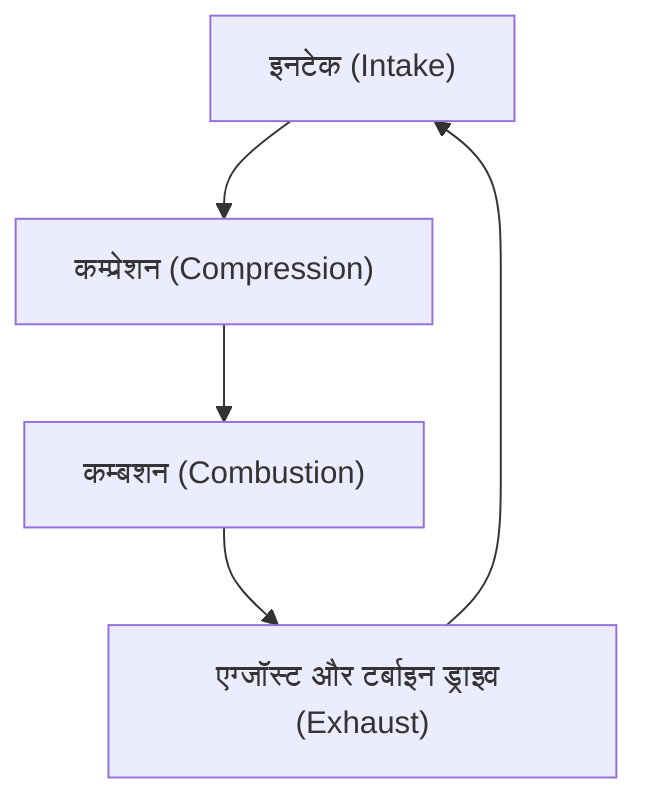
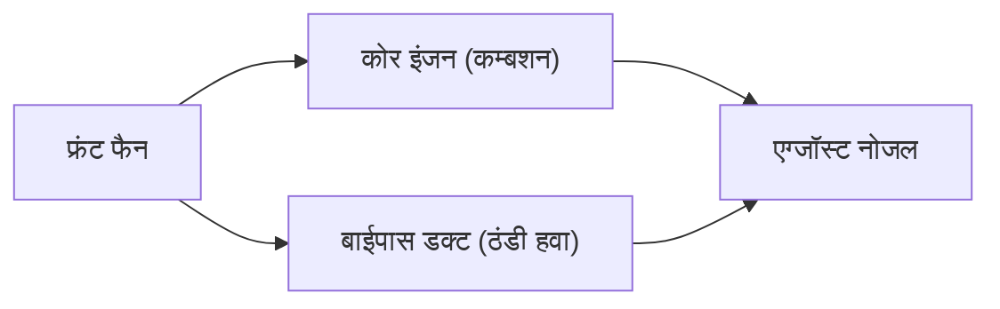

## प्रस्तावना: हवाई यात्रा को बदलने वाला पावरसोर्स

आधुनिक हवाई परिवहन का समर्थन करने वाली सबसे महत्वपूर्ण तकनीकी सफलताओं में से एक टर्बोफैन इंजन का विकास है। यात्री विमान जिनका हम लापरवाही से उपयोग करते हैं, सुरक्षित और किफायती रूप से ध्वनि की गति के करीब, 10,000 मीटर की ऊंचाई के कठोर वातावरण में उड़ते हैं। इसे संभव बनाने वाला टर्बोफैन इंजन है, जो विशाल थ्रस्ट (thrust) और अद्भुत ईंधन दक्षता दोनों प्रदान करता है।

इस लेख में, हम जेट इंजन के मूल सिद्धांत "इनटेक, कम्प्रेशन, कम्बशन, और एग्जॉस्ट" के थर्मोडायनामिक साइकिल से शुरू करेंगे, और गहराई से जानेंगे कि कैसे शुरुआती टर्बोजेट इंजन आधुनिक टर्बोफैन इंजनों में विकसित हुए, और इसके विकास के मूल में "बाईपास रेश्यो" का जादू क्या है। इसके अलावा, हम जेट इंजन की पूरी तस्वीर देखेंगे जो इंजीनियरिंग का एक चमत्कार है, जिसमें हजारों डिग्री के अति-उच्च तापमान को सहन करने वाली टर्बाइन ब्लेड कूलिंग तकनीक और सिंगल क्रिस्टल अलॉय जैसी अत्याधुनिक सामग्री इंजीनियरिंग शामिल है।

---

## जेट इंजन का मूल सिद्धांत: ब्रेटन साइकिल (Brayton cycle)

जेट इंजन के काम करने का सिद्धांत थर्मोडायनामिक्स में "ब्रेटन साइकिल (Brayton cycle)" के रूप में मॉडल किया गया है। यह निरंतर द्रव प्रवाह पर आधारित एक हीट इंजन (heat engine) साइकिल है, और इसमें निम्नलिखित चार प्रक्रियाएं शामिल हैं:

1. **इनटेक (Intake)**: सामने से हवा अंदर खींचना।
2. **कम्प्रेशन (Compression)**: खींची गई हवा को कंप्रेसर द्वारा उच्च दबाव में संपीड़ित करना।
3. **कम्बशन (Combustion)**: उच्च दबाव वाली हवा में ईंधन इंजेक्ट करना और इसे जलाकर उच्च तापमान और उच्च दबाव वाली गैस उत्पन्न करना।
4. **एग्जॉस्ट (Exhaust)**: फैलती हुई गैस को पीछे की ओर बाहर निकालना, और इसके रिएक्शन से थ्रस्ट प्राप्त करना (साथ ही कंप्रेसर को चलाने के लिए टर्बाइन को घुमाना)।

प्रक्रियाओं की यह श्रृंखला ऑटोमोबाइल में प्रयुक्त रेसिप्रोकेटिंग इंजन (पिस्टन इंजन) के समान है, लेकिन जेट इंजनों की सबसे बड़ी विशेषता यह है कि ये प्रक्रियाएं "निरंतर" होती हैं। जबकि एक रेसिप्रोकेटिंग इंजन रुक-रुक कर होने वाले विस्फोटों से शक्ति प्राप्त करता है, जेट इंजन लगातार हवा खींचता है, जलाता है, और लगातार बाहर निकालता रहता है। इसके परिणामस्वरूप, यह अत्यंत उच्च पावर डेंसिटी (power density) और सुचारू घूर्णी गति प्राप्त करता है।

### कम्प्रेशन का महत्व
हवा को संपीड़ित करना क्यों आवश्यक है? इसका कारण यह है कि हवा को उच्च दबाव में लाने से दहन दक्षता में नाटकीय रूप से सुधार होता है और अधिक ऊर्जा निकाली जा सकती है। जेट इंजन के सामने के हिस्से में कंप्रेसर ब्लेड (स्टेटर और रोटर का संयोजन) की कई पंक्तियाँ होती हैं, जो धीरे-धीरे हवा को संपीड़ित करती हैं। आधुनिक इंजनों में, खींची गई हवा का आयतन उसके मूल आकार के एक अंश तक संपीड़ित हो जाता है, और दबाव बाहरी हवा के 40 गुना से अधिक तक पहुंच सकता है।

---

## टर्बोजेट से टर्बोफैन का विकास

शुरुआती जेट इंजन का रूप "टर्बोजेट इंजन" कहलाता था। टर्बोजेट एक सरल संरचना है जो खींची गई सभी हवा को कम्बशन चैम्बर में भेजता है, और वहां उत्पन्न होने वाली उच्च तापमान और उच्च दबाव वाली निकास गैस के बल से थ्रस्ट प्राप्त करता है।

### टर्बोजेट की सीमाएँ
टर्बोजेट इंजन उच्च गति की उड़ान (विशेष रूप से सुपरसोनिक उड़ान) के लिए उपयुक्त है, लेकिन सबसोनिक (लगभग मैक 0.8 से 0.9) क्षेत्र में, जहां वाणिज्यिक विमान उड़ते हैं, इसमें कई गंभीर कमियां थीं।

1. **कम प्रोपल्शन एफिशिएंसी**: उड़ान की गति की तुलना में निकास गैस की गति बहुत अधिक होती है, इसलिए बहुत सी गतिज ऊर्जा बर्बाद हो जाती है। प्रणोदन दक्षता बढ़ाने के लिए, निकास गति को उड़ान की गति के करीब लाना और अधिक हवा को पीछे की ओर धकेलना आवश्यक है।
2. **खराब ईंधन दक्षता**: थ्रस्ट का एक उच्च अनुपात दहन पर निर्भर करता है, जिसके कारण ईंधन की खपत बहुत अधिक होती है।
3. **शोर की समस्या**: उच्च गति वाली निकास गैस का आसपास की स्थिर हवा के साथ तीव्र टकराव भयंकर जेट शोर (shear noise) पैदा करता है।

### टर्बोफैन का जन्म और "बाईपास रेश्यो" का जादू
इन समस्याओं को हल करने के लिए "टर्बोफैन इंजन" विकसित किया गया था। टर्बोफैन इंजन की सबसे बड़ी विशेषता यह है कि इसके सबसे सामने वाले हिस्से में एक विशाल पंखे जैसा "फैन (Fan)" होता है।

फैन द्वारा खींची गई पूरी हवा इंजन के मुख्य हिस्से (कोर: कंप्रेसर, कम्बशन चैम्बर, और टर्बाइन) में प्रवेश नहीं करती है। वायु प्रवाह दो भागों में विभाजित होता है:
- **कोर फ्लो**: हवा जो इंजन के केंद्र में प्रवेश करती है और दहन के लिए उपयोग की जाती है।
- **बाईपास फ्लो**: हवा जो कोर के बाहर से गुजरती है और सीधे पीछे की ओर निकल जाती है।

"कोर से नहीं गुजरने वाली हवा की मात्रा" और "कोर से गुजरने वाली हवा की मात्रा" के इस अनुपात को **बाईपास रेश्यो (Bypass Ratio)** कहा जाता है।

#### बाईपास रेश्यो बढ़ाना क्यों अच्छा है?
आधुनिक यात्री विमानों के इंजन मुख्य रूप से "हाई-बाईपास रेश्यो टर्बोफैन इंजन" हैं, जिनका बाईपास अनुपात 10:1 से अधिक होता है। इसका मतलब है कि खींची गई हवा का 90% से अधिक दहन के लिए उपयोग नहीं किया जाता है, बल्कि इसका उपयोग सीधे थ्रस्ट के रूप में किया जाता है।

उच्च बाईपास अनुपात के निम्नलिखित बड़े लाभ हैं:
1. **ईंधन दक्षता में अत्यधिक सुधार**: ईंधन जलाकर थोड़ी मात्रा में गैस को तेज गति से बाहर निकालने की तुलना में, पंखे का उपयोग करके बड़ी मात्रा में हवा को अपेक्षाकृत धीरे-धीरे धकेलना संवेग संरक्षण के नियम के अनुसार अधिक कुशलता से थ्रस्ट उत्पन्न करता है। इससे ईंधन दक्षता में नाटकीय रूप से सुधार हुआ और लंबी दूरी का बड़े पैमाने पर परिवहन संभव हो गया।
2. **शोर में नाटकीय कमी**: कोर से निकलने वाली उच्च तापमान और उच्च गति की निकास गैस, फैन से निकलने वाली कम तापमान और कम गति वाली बाईपास वायुप्रवाह से घिर जाती है। यह निकास गैस और बाहरी हवा के बीच गति के अंतर को कम करता है, जिससे हवा का कतरन (shear) काफी कम हो जाता है, जो शोर का मुख्य कारण है। तथ्य यह है कि आधुनिक हवाई अड्डों के आसपास का क्षेत्र अतीत की तुलना में शांत हो गया है, इसी बाईपास प्रवाह के "ध्वनिरोधी प्रभाव" के कारण है।

---

## सीमाओं को चुनौती: अति-उच्च तापमान और कूलिंग टेक्नोलॉजी

जेट इंजन के प्रदर्शन (विशेषकर थर्मल एफिशिएंसी) को बेहतर बनाने के लिए, दहन कक्ष के तापमान (टर्बाइन इनलेट तापमान: TIT) को यथासंभव उच्च रखना आवश्यक है। कार्नोट साइकिल के सिद्धांत के अनुसार, ऊष्मा स्रोत का तापमान जितना अधिक होगा, इंजन की दक्षता उतनी ही अधिक होगी।

आधुनिक उच्च-प्रदर्शन टर्बोफैन इंजनों का टर्बाइन इनलेट तापमान आश्चर्यजनक रूप से **1,500℃ से 1,700℃** तक पहुँच जाता है।
लेकिन यहाँ एक गंभीर समस्या उत्पन्न होती है। टर्बाइन ब्लेड (पंखों) के लिए उपयोग किए जाने वाले निकल-आधारित सुपरअलॉय का गलनांक लगभग **1,300℃ से 1,400℃** है। दूसरे शब्दों में, ब्लेड **अपने गलनांक से अधिक तापमान वाली गैस के संपर्क में** होते हैं। सामान्य तौर पर सोचा जाए तो यह तुरंत पिघल जाएगा, लेकिन इसे रोकने के लिए उन्नत कूलिंग और सामग्री प्रौद्योगिकियां मौजूद हैं।

### फिल्म कूलिंग तकनीक
टर्बाइन ब्लेड का आंतरिक भाग खोखला होता है, और कंप्रेसर से निकाली गई (दहन से पहले की) अपेक्षाकृत ठंडी हवा इसमें भेजी जाती है। यह हवा ब्लेड के अंदर से गुजरती है और उसे ठंडा करती है, और फिर ब्लेड की सतह पर बने अनगिनत छोटे लेजर छेदों के माध्यम से बाहर निकलती है।
यह बाहर निकली हुई हवा ब्लेड की सतह पर एक पतली फिल्म (झिल्ली) बनाती है, जो हजारों डिग्री की उच्च तापमान वाली गैस को ब्लेड की धातु की सतह के सीधे संपर्क में आने से रोकती है। इसे "फिल्म कूलिंग" कहा जाता है।

### सिंगल क्रिस्टल सुपरअलॉय (Single Crystal Superalloys)
कूलिंग तकनीक के अलावा, स्वयं धातु का विकास भी अपरिहार्य है। धातु में आमतौर पर एक "पॉलीक्रिस्टलाइन" संरचना होती है जिसमें कई छोटे क्रिस्टल एक साथ समूहित होते हैं। हालाँकि, टर्बाइन के वातावरण में, जहाँ उच्च तापमान और मजबूत केन्द्रापसारक बल लगाया जाता है, "क्रीप (creep)" नामक घटना आसानी से होती है, जिसमें धातु क्रिस्टल की सीमाओं से विकृत होकर फट जाती है।

इसे रोकने के लिए, इंजीनियरों ने पूरे ब्लेड को "सिर्फ एक क्रिस्टल" के रूप में ढालने की तकनीक विकसित की। इसे "सिंगल क्रिस्टल अलॉय (SC)" कहा जाता है। क्योंकि इसमें कोई क्रिस्टल सीमाएं नहीं होती हैं, यह चरम उच्च तापमान वाले तनाव के वातावरण में भी अद्भुत ताकत बनाए रख सकता है। वर्तमान में, रेनियम और रूथेनियम जैसी दुर्लभ धातुओं को मिलाकर 5वीं और 6वीं पीढ़ी के सिंगल क्रिस्टल मिश्र धातु विकसित किए जा रहे हैं, जो गर्मी प्रतिरोध को और बढ़ाते हैं।

---

## विमान इंजन का भविष्य और स्थिरता

टर्बोफैन इंजन आज भी विकसित हो रहे हैं। अगली पीढ़ी के इंजनों के लिए, उच्च बाईपास अनुपात की मांग की जा रही है, और "गियर्ड टर्बोफैन (GTF)" तकनीक जैसी प्रौद्योगिकियां, जो फैन को इंजन कोर से अलग एक इष्टतम घूर्णी गति पर घुमाती हैं, व्यावहारिक उपयोग में लाई गई हैं। इसने फैन को धीमी गति से (शोर को कम करके और कुशलता से) घूमने और कोर टर्बाइन को तेज़ी से (उच्च दक्षता पर) घूमने की अनुमति दी है।

इसके अलावा, वैश्विक पर्यावरणीय समस्याओं की प्रतिक्रिया के रूप में, सस्टेनेबल एविएशन फ्यूल (SAF) की शुरुआत, हाइड्रोजन कम्बशन इंजन, और यहां तक कि इलेक्ट्रिक मोटर्स के संयोजन वाले हाइब्रिड प्रोपल्शन सिस्टम के विकास को भी तेजी से आगे बढ़ाया जा रहा है।

जेट इंजन का इतिहास मानव चुनौती का इतिहास है जिसने थर्मोडायनामिक्स, द्रव गतिकी और सामग्री इंजीनियरिंग की सीमाओं को आगे बढ़ाया है। जब हम उड़ान भरते हैं, तो उन पंखों के नीचे, हजारों डिग्री की लपटें और अति-सटीक इंजीनियरिंग के क्रिस्टल चुपचाप, लेकिन शक्तिशाली रूप से धड़क रहे होते हैं。
