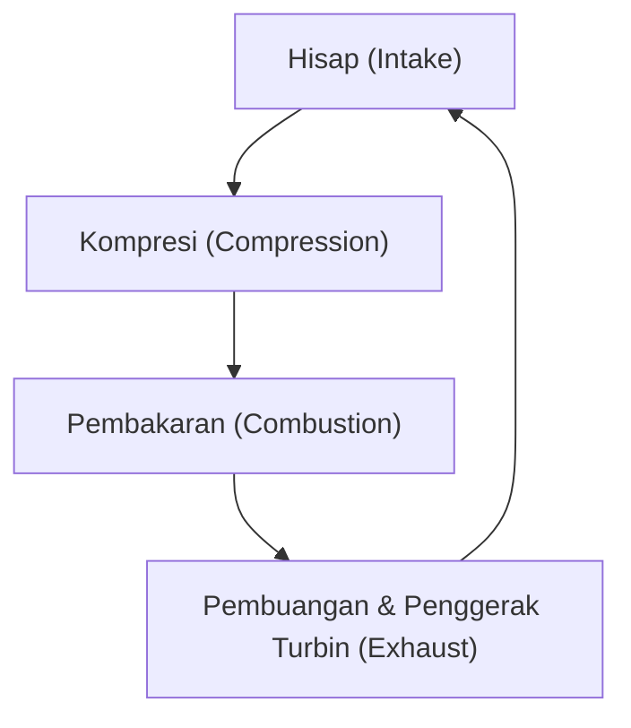
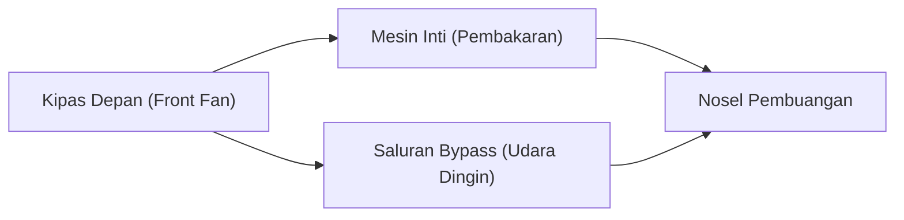

## Pendahuluan: Sumber Tenaga yang Mengubah Perjalanan Udara

Salah satu terobosan teknologi paling penting yang mendukung transportasi udara modern adalah pengembangan mesin turbofan. Pesawat penumpang yang biasa kita gunakan terbang dengan aman dan ekonomis di lingkungan ekstrem pada ketinggian 10.000 meter dengan kecepatan mendekati kecepatan suara. Hal ini dimungkinkan oleh mesin turbofan, yang menggabungkan daya dorong masif dan efisiensi bahan bakar yang luar biasa.

Dalam artikel ini, kita akan mulai dengan prinsip dasar mesin jet, yaitu siklus termodinamika "hisap, kompresi, pembakaran, dan pembuangan," lalu menelusuri bagaimana mesin turbojet di masa awal berevolusi menjadi mesin turbofan modern. Kita juga akan membahas secara mendalam tentang keajaiban "rasio bypass" yang menjadi inti dari evolusi ini. Selanjutnya, kita akan melihat keseluruhan rekayasa teknik tingkat tinggi pada mesin jet, mulai dari teknologi pendinginan bilah turbin yang harus bertahan di lingkungan bersuhu super tinggi hingga ribuan derajat, hingga teknik rekayasa material mutakhir seperti paduan kristal tunggal (single-crystal alloys).

---

## Prinsip Dasar Mesin Jet: Siklus Brayton

Prinsip kerja mesin jet dimodelkan sebagai "Siklus Brayton" (Brayton cycle) dalam termodinamika. Ini adalah siklus mesin kalor yang didasarkan pada aliran fluida kontinu dan terdiri dari empat proses berikut:

1. **Hisap (Intake)**: Menghisap udara dari depan.
2. **Kompresi (Compression)**: Mengompresi udara yang dihisap menggunakan kompresor menjadi bertekanan tinggi.
3. **Pembakaran (Combustion)**: Menyemprotkan bahan bakar ke udara bertekanan tinggi dan membakarnya untuk menghasilkan gas bersuhu dan bertekanan tinggi.
4. **Pembuangan (Exhaust)**: Menyemburkan gas yang mengembang ke arah belakang, dan gaya reaksinya menghasilkan daya dorong (sambil secara bersamaan memutar turbin untuk menggerakkan kompresor).

Serangkaian proses ini mirip dengan mesin bolak-balik (mesin piston) yang digunakan pada mobil, tetapi ciri terbesar mesin jet adalah proses-proses tersebut dilakukan secara "kontinu". Jika mesin piston memperoleh tenaga melalui ledakan yang terputus-putus, mesin jet terus-menerus menghisap, membakar, dan membuang udara tanpa henti. Hal ini menghasilkan kepadatan daya yang sangat tinggi dan gerak putar yang halus.

### Pentingnya Kompresi
Mengapa udara perlu dikompresi? Karena dengan membuat udara bertekanan tinggi, efisiensi pembakaran akan meningkat secara drastis, sehingga lebih banyak energi yang dapat diekstraksi. Di bagian depan mesin jet terdapat beberapa tingkat bilah kompresor (kombinasi stator dan rotor) yang secara bertahap mengompresi udara. Pada mesin modern, volume udara yang dihisap dikompresi hingga menjadi sepersekian puluh dari volume awalnya, dan tekanannya bisa mencapai lebih dari 40 kali tekanan udara luar.

---

## Evolusi dari Turbojet ke Turbofan

Mesin jet awal memiliki bentuk yang disebut "mesin turbojet". Turbojet adalah struktur sederhana di mana seluruh udara yang dihisap dikirim ke ruang bakar, dan daya dorong diperoleh hanya dari kekuatan gas buang bersuhu dan bertekanan tinggi yang dihasilkan dari sana.

### Keterbatasan Turbojet
Meskipun mesin turbojet cocok untuk penerbangan berkecepatan tinggi (terutama penerbangan supersonik), mesin ini memiliki beberapa kelemahan serius saat berada di rentang kecepatan subsonik (sekitar Mach 0.8 hingga 0.9) di mana pesawat penumpang sipil beroperasi.

1. **Efisiensi Propulsi yang Rendah**: Karena kecepatan gas buang terlalu tinggi dibandingkan dengan kecepatan terbang, sebagian besar energi kinetik terbuang sia-sia. Untuk meningkatkan efisiensi propulsi, kecepatan pembuangan perlu didekatkan ke kecepatan terbang, sambil mendorong jumlah udara yang lebih besar ke belakang.
2. **Efisiensi Bahan Bakar yang Buruk**: Karena proporsi daya dorong yang bergantung pada pembakaran sangat tinggi, konsumsi bahan bakarnya menjadi sangat boros.
3. **Masalah Kebisingan**: Gas buang berkecepatan tinggi berbenturan hebat dengan udara diam di sekitarnya, menimbulkan kebisingan jet yang luar biasa (kebisingan geser/shear noise).

### Lahirnya Turbofan dan Keajaiban "Rasio Bypass"
Untuk mengatasi berbagai masalah ini, "mesin turbofan" dikembangkan. Ciri khas utama mesin turbofan adalah adanya "kipas" (fan) raksasa yang menyerupai kipas angin di bagian paling depan mesin.

Udara yang dihisap oleh kipas tidak semuanya masuk ke inti pusat mesin (kompresor, ruang bakar, dan turbin). Aliran udara dibagi menjadi dua:
- **Aliran Inti (Core flow)**: Udara yang masuk ke pusat mesin dan digunakan untuk pembakaran.
- **Aliran Bypass (Bypass flow)**: Udara yang melewati bagian luar inti dan langsung dibuang ke belakang.

Rasio antara "jumlah udara yang tidak melewati inti" dan "jumlah udara yang melewati inti" disebut sebagai **Rasio Bypass (Bypass Ratio)**.

#### Mengapa Meningkatkan Rasio Bypass Itu Baik?
Mesin pesawat penumpang modern didominasi oleh "mesin turbofan rasio bypass tinggi" dengan rasio bypass melebihi 10:1. Ini berarti lebih dari 90% udara yang dihisap tidak digunakan untuk pembakaran, melainkan langsung dimanfaatkan sebagai daya dorong.

Rasio bypass yang tinggi memiliki keuntungan yang sangat besar:
1. **Peningkatan Efisiensi Bahan Bakar yang Luar Biasa**: Daripada membakar bahan bakar untuk menyemburkan sejumlah kecil gas dengan kecepatan tinggi, menggunakan kipas untuk mendorong udara dalam jumlah besar secara relatif perlahan jauh lebih efisien untuk memperoleh daya dorong berdasarkan hukum kekekalan momentum. Hal ini secara drastis meningkatkan efisiensi bahan bakar dan memungkinkan transportasi massal jarak jauh.
2. **Pengurangan Kebisingan yang Signifikan**: Gas buang bersuhu dan berkecepatan tinggi yang dikeluarkan dari inti diselimuti oleh aliran udara bypass bersuhu rendah dan berkecepatan rendah yang dikeluarkan oleh kipas. Hal ini mengurangi perbedaan kecepatan antara gas buang dan udara luar, sehingga gesekan udara yang menjadi penyebab kebisingan berkurang drastis. Area di sekitar bandara modern menjadi lebih tenang dibandingkan masa lalu berkat "efek peredam suara" dari aliran bypass ini.

---

## Menantang Batas: Suhu Ultra-Tinggi dan Teknologi Pendinginan

Untuk meningkatkan performa (terutama efisiensi termal) mesin jet, suhu ruang bakar (Suhu Masuk Turbin / Turbine Inlet Temperature: TIT) harus setinggi mungkin. Menurut prinsip siklus Carnot, semakin tinggi suhu sumber panas, semakin tinggi efisiensi mesin.

Suhu masuk turbin pada mesin turbofan berkinerja tinggi modern bisa mencapai **1.500°C hingga 1.700°C**.
Namun, masalah besar muncul di sini. Titik lebur (suhu di mana logam mencair) dari paduan super berbasis nikel yang digunakan untuk bilah turbin (blade) hanya sekitar **1.300°C hingga 1.400°C**. Dengan kata lain, bilah tersebut terpapar pada **gas bersuhu lebih tinggi daripada titik lebur bilah itu sendiri**. Secara logika, bilah itu akan meleleh seketika, tetapi ada teknologi pendinginan dan teknik material canggih untuk mencegah hal itu terjadi.

### Teknologi Pendinginan Film (Film Cooling)
Bagian dalam bilah turbin berongga, dan udara yang relatif dingin (sebelum pembakaran) yang diekstraksi dari kompresor dialirkan ke sana. Udara ini melewati bagian dalam bilah untuk mendinginkannya, lalu merembes keluar melalui lubang laser mikroskopis yang tak terhitung jumlahnya di permukaan bilah.
Udara yang merembes ini membentuk lapisan tipis (film) yang menutupi permukaan bilah, mencegah gas bersuhu ribuan derajat menyentuh langsung permukaan logam bilah. Ini disebut "pendinginan film" (film cooling).

### Paduan Kristal Tunggal (Single Crystal Superalloys)
Selain teknologi pendinginan, evolusi logam itu sendiri juga sangat penting. Logam biasanya memiliki struktur "polikristalin", yaitu kumpulan banyak kristal kecil. Namun, di lingkungan turbin dengan suhu tinggi dan gaya sentrifugal yang kuat, "fenomena mulur" (creep) di mana logam berubah bentuk dan sobek dari batas antar kristal (batas butir kristal) mudah terjadi.

Untuk mencegah hal ini, para insinyur mengembangkan teknologi untuk mengecor seluruh bilah sebagai "satu kristal tunggal". Inilah yang disebut "Paduan Kristal Tunggal" (Single Crystal / SC). Karena tidak ada batas kristal, paduan ini dapat mempertahankan kekuatan yang luar biasa bahkan di bawah tekanan suhu yang ekstrem. Saat ini, dengan menambahkan logam tanah jarang (rare metal) seperti renium dan rutenium, paduan kristal tunggal generasi kelima dan keenam dengan ketahanan panas yang jauh lebih tinggi sedang dikembangkan.

---

## Masa Depan Mesin Pesawat dan Keberlanjutan

Mesin turbofan terus berevolusi hingga hari ini. Untuk mesin generasi berikutnya, peningkatan rasio bypass lebih lanjut dituntut, dan teknologi seperti "Geared Turbofan (GTF)" yang memutar kipas pada kecepatan putar optimal yang berbeda dari inti mesin telah dipraktikkan. Dengan teknologi ini, kipas dapat berputar lebih lambat (meredam kebisingan dan meningkatkan efisiensi), sementara turbin inti dapat berputar lebih cepat (dengan efisiensi tinggi).

Selain itu, sebagai respons terhadap masalah lingkungan global, adopsi Bahan Bakar Penerbangan Berkelanjutan (SAF: Sustainable Aviation Fuel), mesin pembakaran hidrogen, dan pengembangan sistem propulsi hibrida yang menggabungkan motor listrik terus dipercepat.

Sejarah mesin jet adalah sejarah tantangan umat manusia yang telah memperluas batas-batas termodinamika, mekanika fluida, dan teknik material. Saat kita terbang melintasi langit, di bawah sayap itu, nyala api bersuhu ribuan derajat dan kristalisasi teknik ultra-presisi bekerja dengan tenang namun bertenaga.
