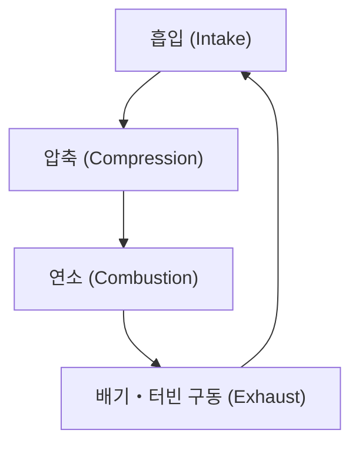
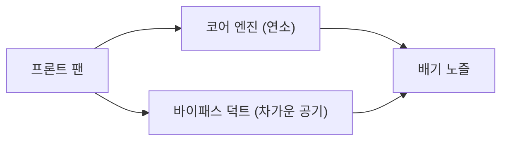

## 서론: 항공 여행을 혁신한 동력원

현대 항공 수송을 지탱하는 가장 중요한 기술적 혁신 중 하나가 터보팬 엔진의 개발입니다. 우리가 무심코 이용하는 여객기는 고도 1만 미터라는 가혹한 환경을 음속에 가까운 속도로 안전하고 경제적으로 비행하고 있습니다. 이를 가능하게 하는 것이 거대한 추력과 경이로운 연비 성능을 양립시킨 터보팬 엔진입니다.

본 기사에서는 제트 엔진의 기본 원리인 '흡입・압축・연소・배기'의 열역학 사이클에서 출발하여, 초창기 터보제트 엔진이 어떻게 현대의 터보팬 엔진으로 진화했는지, 그리고 그 진화의 핵심인 '바이패스비'의 마법에 대해 깊이 있게 파헤쳐 해설합니다. 나아가 수천 도라는 초고온 환경을 견딜 수 있는 터빈 블레이드의 냉각 기술과 단결정 합금과 같은 최첨단 재료 공학에 이르기까지, 엔지니어링의 정수를 모은 제트 엔진의 전모를 살펴봅니다.

---

## 제트 엔진의 기본 원리: 브레이턴 사이클

제트 엔진의 작동 원리는 열역학의 '브레이턴 사이클(Brayton cycle)'로 모델링됩니다. 이는 연속적인 유체의 흐름을 전제로 한 열기관의 사이클이며, 다음의 4가지 과정으로 구성됩니다.

1. **흡입(Intake)**: 전방에서 공기를 흡입한다.
2. **압축(Compression)**: 흡입한 공기를 압축기(컴프레서)로 고압으로 만든다.
3. **연소(Combustion)**: 고압 공기에 연료를 분사하고, 연소시켜 고온 고압의 가스를 생성한다.
4. **배기(Exhaust)**: 팽창하는 가스를 후방으로 분출하고, 그 반작용으로 추력을 얻는다(동시에 터빈을 돌려 압축기를 구동한다).

이 일련의 과정은 자동차 등에 사용되는 왕복 엔진(피스톤 엔진)과 비슷하지만, 제트 엔진의 가장 큰 특징은 이들이 '연속적'으로 이루어진다는 점에 있습니다. 왕복 엔진이 단속적인 폭발에 의해 동력을 얻는 반면, 제트 엔진은 끊임없이 공기를 흡입하고 연소시키며 배출을 계속합니다. 이를 통해 극히 높은 출력 밀도와 부드러운 회전 운동을 실현하고 있습니다.

### 압축의 중요성
왜 공기를 압축해야 할까요? 그것은 공기를 고압으로 만들면 연소 효율이 극적으로 향상되어 더 많은 에너지를 끌어낼 수 있기 때문입니다. 제트 엔진의 전단에는 여러 단으로 겹쳐진 컴프레서 블레이드(정익과 동익의 조합)가 배치되어 있어, 공기를 점진적으로 압축해 나갑니다. 현대의 엔진에서는 흡입된 공기의 부피가 수십 분의 일로 압축되며, 압력은 외부 공기의 40배 이상에 달하기도 합니다.

---

## 터보제트에서 터보팬으로의 진화

초기의 제트 엔진은 '터보제트 엔진'이라고 불리는 형태였습니다. 터보제트는 흡입한 공기를 모두 연소실로 보내고, 거기서 생성되는 고온 고압의 배기가스의 기세만으로 추력을 얻는 단순한 구조입니다.

### 터보제트의 한계
터보제트 엔진은 고속 비행(특히 초음속 비행)에는 적합하지만, 민간 여객기가 비행하는 아음속(마하 0.8~0.9 정도) 영역에서는 몇 가지 중대한 단점이 있었습니다.

1. **낮은 추진 효율**: 배기가스의 속도가 비행 속도에 비해 너무 빠르기 때문에 운동 에너지의 많은 부분이 낭비되고 맙니다. 추진 효율을 높이려면 배기의 속도를 비행 속도에 가깝게 하면서 더 많은 양의 공기를 후방으로 밀어내야 합니다.
2. **열악한 연비**: 연소에 의존하는 추력의 비율이 높기 때문에 연료 소비가 매우 극심해집니다.
3. **소음 문제**: 고속의 배기가스가 주변의 정지된 공기와 격렬하게 충돌함으로써 엄청난 제트 소음(전단 소음)을 일으킵니다.

### 터보팬의 탄생과 '바이패스비'의 마법
이러한 과제들을 해결하기 위해 개발된 것이 '터보팬 엔진'입니다. 터보팬 엔진의 가장 큰 특징은 엔진의 최전방에 거대한 선풍기 같은 '팬'을 갖추고 있다는 점입니다.

팬에 의해 흡입된 공기가 모두 엔진 중심부의 코어(압축기・연소실・터빈)로 들어가는 것은 아닙니다. 공기 흐름은 두 가지로 나뉩니다.
- **코어 흐름**: 엔진 중심부로 들어가 연소에 사용되는 공기.
- **바이패스 흐름**: 코어의 바깥쪽을 통과하여 그대로 후방으로 배출되는 공기.

이 '코어를 통과하지 않는 공기의 양'과 '코어를 통과하는 공기의 양'의 비율을 **바이패스비(Bypass Ratio)**라고 부릅니다.

#### 왜 바이패스비를 높이는 것이 좋을까?
현대의 여객기용 엔진은 바이패스비가 10:1을 넘는 '고바이패스비 터보팬 엔진'이 주류를 이룹니다. 이는 흡입한 공기의 90% 이상이 연소에 사용되지 않고, 그대로 추력으로 이용되고 있음을 의미합니다.

고바이패스비에는 다음과 같은 절대적인 장점이 있습니다.
1. **압도적인 연비 향상**: 연료를 태워 소량의 가스를 고속으로 뿜어내는 것보다, 팬을 사용하여 대량의 공기를 비교적 천천히 밀어내는 편이 운동량 보존의 법칙에 따라 효율적으로 추력을 얻을 수 있습니다. 이에 따라 연비가 극적으로 개선되어 장거리 대량 수송이 가능해졌습니다.
2. **소음의 극적인 감소**: 코어에서 배출되는 고온・고속의 배기가스를, 팬에서 배출되는 저온・저속의 바이패스 기류가 감싸듯이 흐릅니다. 이에 따라 배기가스와 외부 공기 사이의 속도 차이가 완화되어 소음의 원인이 되는 공기의 전단이 대폭 감소합니다. 현대의 공항 주변이 과거에 비해 조용해진 것은 이 바이패스 흐름의 '방음 효과' 덕분입니다.

---

## 한계에 대한 도전: 초고온과 냉각 기술

제트 엔진의 성능(특히 열효율)을 높이기 위해서는 연소실의 온도(터빈 입구 온도: TIT)를 가능한 한 높여야 합니다. 카르노 사이클의 원리에 따르면, 열원의 온도가 높을수록 엔진의 효율은 올라갑니다.

현대 고성능 터보팬 엔진의 터빈 입구 온도는 무려 **1,500℃~1,700℃**에 달합니다.
하지만 여기서 중대한 문제가 발생합니다. 터빈 블레이드(날개)에 사용되는 니켈 기반 초합금의 녹는점(용융점)은 약 **1,300℃~1,400℃** 정도입니다. 즉, 블레이드는 **자신의 녹는점보다 높은 온도의 가스 속에 노출되어 있다**는 것입니다. 상식적으로 생각하면 순식간에 녹아내리겠지만, 그렇게 되지 않기 위한 고도의 냉각 기술과 재료 기술이 존재합니다.

### 필름 냉각 기술
터빈 블레이드의 내부는 비어 있으며, 그곳으로는 컴프레서에서 추출된(연소 전의) 비교적 차가운 공기가 유입됩니다. 이 공기가 블레이드 내부를 통과하며 냉각시키고, 나아가 블레이드 표면에 뚫린 무수히 많은 미세한 레이저 구멍을 통해 외부로 스며 나옵니다.
스며 나온 공기는 블레이드의 표면을 덮는 얇은 막(필름)을 형성하여, 수천 도의 고온 가스가 직접 블레이드의 금속 표면에 닿는 것을 방지합니다. 이를 '필름 냉각'이라고 부릅니다.

### 단결정 합금(Single Crystal Superalloys)
냉각 기술에 더해, 금속 자체의 진화도 빼놓을 수 없습니다. 금속은 일반적으로 다수의 미세한 결정이 모인 '다결정' 구조를 띠고 있습니다. 하지만 고온과 강력한 원심력이 가해지는 터빈 환경에서는 결정과 결정의 경계(결정립계)에서 금속이 변형되어 찢어지는 '크리프 현상'이 발생하기 쉽습니다.

이를 방지하기 위해 엔지니어들은 블레이드 전체를 '단 하나의 결정'으로 주조하는 기술을 개발했습니다. 이것이 '단결정 합금(SC)'입니다. 결정의 경계가 존재하지 않기 때문에, 극한의 고온 응력 환경 하에서도 경이적인 강도를 유지할 수 있습니다. 현재는 레늄이나 루테늄 같은 희소 금속을 첨가함으로써 내열성을 더욱 높인 제5세대, 제6세대 단결정 합금이 개발되고 있습니다.

---

## 항공기 엔진의 미래와 지속 가능성

터보팬 엔진은 지금도 진화를 계속하고 있습니다. 차세대 엔진에서는 더 높은 바이패스비 향상이 요구되고 있으며, 팬을 엔진 코어와는 다른 최적의 회전수로 돌리기 위한 '기어드 터보팬(GTF)' 기술 등이 실용화되고 있습니다. 이를 통해 팬은 더 느리게(소음을 억제하고 효율적으로), 코어의 터빈은 더 빠르게(고효율로) 회전할 수 있게 되었습니다.

또한, 지구 환경 문제에 대응하기 위해 지속 가능한 항공 연료(SAF: Sustainable Aviation Fuel)의 도입이나 수소 연소 엔진, 나아가 전기 모터를 조합한 하이브리드 추진 시스템의 개발도 급피치로 진행되고 있습니다.

제트 엔진의 역사는 열역학, 유체 역학, 재료 공학의 한계를 넓혀온 인류의 도전의 역사입니다. 우리가 하늘을 날 때, 그 날개 아래에서는 수천 도의 불꽃과 초정밀 공학의 결정체가 조용하지만 강력하게 역동하고 있는 것입니다.
