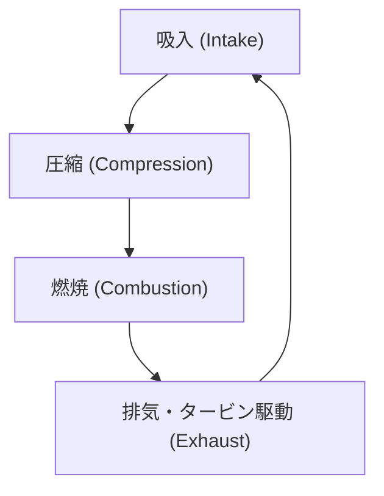
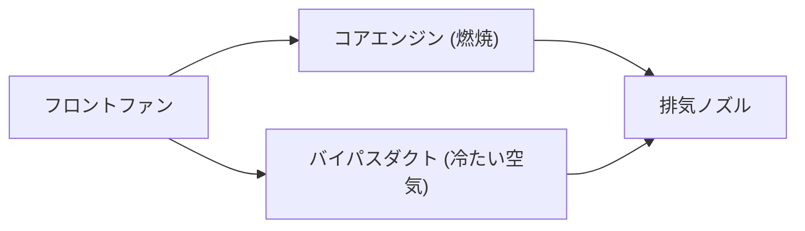

## はじめに：空の旅を変革した動力源

現代の航空輸送を支える最も重要な技術的ブレイクスルーの一つが、ターボファンエンジンの開発です。私たちが何気なく利用している旅客機は、高度1万メートルという過酷な環境を、音速に近い速度で安全かつ経済的に飛行しています。これを可能にしているのが、巨大な推力と驚異的な燃費性能を両立させたターボファンエンジンです。

本記事では、ジェットエンジンの基本原理である「吸入・圧縮・燃焼・排気」の熱力学サイクルから出発し、黎明期のターボジェットエンジンがどのようにして現代のターボファンエンジンへと進化したのか、そしてその進化の核となる「バイパス比」の魔法について、深く掘り下げて解説します。さらに、数千度という超高温環境に耐えうるタービンブレードの冷却技術や、単結晶合金といった最先端の材料工学に至るまで、エンジニアリングの粋を集めたジェットエンジンの全貌に迫ります。

---

## ジェットエンジンの基本原理：ブレイトンサイクル

ジェットエンジンの作動原理は、熱力学における「ブレイトンサイクル（Brayton cycle）」としてモデル化されます。これは連続的な流体の流れを前提とした熱機関のサイクルであり、以下の4つのプロセスから構成されます。

1. **吸入（Intake）**: 前方から空気を吸い込む。
2. **圧縮（Compression）**: 吸い込んだ空気を圧縮機（コンプレッサー）で高圧にする。
3. **燃焼（Combustion）**: 高圧空気に燃料を噴射し、燃焼させて高温高圧のガスを生成する。
4. **排気（Exhaust）**: 膨張するガスを後方へ噴出し、その反作用で推力を得る（同時にタービンを回して圧縮機を駆動する）。

この一連のプロセスは、自動車などに使われるレシプロエンジン（ピストンエンジン）と似ていますが、ジェットエンジンの最大の特徴は、これらが「連続的」に行われる点にあります。レシプロエンジンが断続的な爆発によって動力を得るのに対し、ジェットエンジンは絶え間なく空気を吸い込み、燃やし、排出し続けます。これにより、極めて高い出力密度と滑らかな回転運動を実現しています。

### 圧縮の重要性
なぜ空気を圧縮する必要があるのでしょうか？それは、空気を高圧にすることで燃焼効率が劇的に向上し、より多くのエネルギーを引き出すことができるからです。ジェットエンジンの前段には何段にも重なったコンプレッサーブレード（静翼と動翼の組み合わせ）が配置されており、空気を徐々に圧縮していきます。現代のエンジンでは、吸入された空気の体積は数十分の一にまで圧縮され、圧力は外気の40倍以上に達することもあります。

---

## ターボジェットからターボファンへの進化

初期のジェットエンジンは、「ターボジェットエンジン」と呼ばれる形態でした。ターボジェットは、吸い込んだ空気をすべて燃焼室に送り込み、そこから生み出される高温高圧の排気ガスの勢いだけで推力を得るシンプルな構造です。

### ターボジェットの限界
ターボジェットエンジンは高速飛行（特に超音速飛行）には適していますが、民間旅客機が飛行する亜音速（マッハ0.8〜0.9程度）の領域では、いくつかの重大な欠点がありました。

1. **低い推進効率**: 排気ガスの速度が飛行速度に比べて速すぎるため、運動エネルギーの多くが無駄になってしまいます。推進効率を上げるには、排気の速度を飛行速度に近づけつつ、より大量の空気を後方に押し出す必要があります。
2. **劣悪な燃費**: 燃焼に依存する推力の割合が高いため、燃料消費が非常に激しくなります。
3. **騒音問題**: 高速の排気ガスが周囲の静止した空気と激しく衝突することで、すさまじいジェット騒音（せん断騒音）を引き起こします。

### ターボファンの誕生と「バイパス比」の魔法
これらの課題を解決するために開発されたのが「ターボファンエンジン」です。ターボファンエンジンの最大の特徴は、エンジンの最前部に巨大な扇風機のような「ファン」を備えている点です。

ファンによって吸い込まれた空気は、すべてがエンジン中心部のコア（圧縮機・燃焼室・タービン）に入るわけではありません。空気流は2つに分けられます。
- **コア流**: エンジン中心部に入り、燃焼に使われる空気。
- **バイパス流**: コアの外側を通り、そのまま後方に排出される空気。

この「コアを通らない空気の量」と「コアを通る空気の量」の比率を**バイパス比（Bypass Ratio）**と呼びます。

#### なぜバイパス比を高めると良いのか？
現代の旅客機用エンジンは、バイパス比が10:1を超える「高バイパス比ターボファンエンジン」が主流です。これは、吸い込んだ空気の90%以上が燃焼に使われず、そのまま推力として利用されていることを意味します。

高バイパス比には以下の絶大なメリットがあります。
1. **圧倒的な燃費向上**: 燃料を燃やして少量のガスを高速で吹き出すより、ファンを使って大量の空気を比較的ゆっくりと押し出す方が、運動量保存の法則から効率的に推力を得られます。これにより、燃費が劇的に改善され、長距離の大量輸送が可能になりました。
2. **騒音の劇的な低減**: コアから排出される高温・高速の排気ガスを、ファンから排出される低温・低速のバイパス気流が包み込むように流れます。これにより、排気ガスと外気との速度差が緩和され、騒音の原因となる空気のせん断が大幅に減少します。現代の空港周辺が昔に比べて静かになったのは、このバイパス流の「防音効果」のおかげなのです。

---

## 限界への挑戦：超高温と冷却技術

ジェットエンジンの性能（特に熱効率）を高めるためには、燃焼室の温度（タービン入口温度：TIT）をできるだけ高くする必要があります。カルノーサイクルの原理に従えば、熱源の温度が高いほどエンジンの効率は上がります。

現代の高性能ターボファンエンジンのタービン入口温度は、なんと **1,500℃〜1,700℃** に達します。
しかし、ここで重大な問題が生じます。タービンブレード（羽）に使用されるニッケル基超合金の融点（溶ける温度）は、およそ **1,300℃〜1,400℃** 程度なのです。つまり、ブレードは**自身の融点よりも高い温度のガスの中に晒されている**ことになります。普通に考えれば瞬時に溶け落ちてしまいますが、そうならないための高度な冷却技術と材料技術が存在します。

### フィルム冷却技術
タービンブレードの内部は空洞になっており、そこにはコンプレッサーから抽気された（燃焼前の）比較的冷たい空気が送り込まれます。この空気がブレード内部を通って冷却し、さらにブレード表面に開けられた無数の微小なレーザー孔から外へと染み出します。
染み出した空気はブレードの表面を覆う薄い膜（フィルム）を形成し、数千度の高温ガスが直接ブレードの金属表面に触れるのを防ぎます。これを「フィルム冷却」と呼びます。

### 単結晶合金（Single Crystal Superalloys）
冷却技術に加えて、金属そのものの進化も欠かせません。金属は通常、多数の微小な結晶が集まった「多結晶」構造をしています。しかし、高温かつ強力な遠心力がかかるタービンの環境では、結晶と結晶の境界（結晶粒界）から金属が変形して引きちぎられる「クリープ現象」が発生しやすくなります。

これを防ぐため、エンジニアたちはブレード全体を「たった一つの結晶」で鋳造する技術を開発しました。これが「単結晶合金（SC）」です。結晶の境界が存在しないため、極限の高温応力環境下でも驚異的な強度を保つことができます。現在では、レニウムやルテニウムといったレアメタルを添加することで、さらに耐熱性を高めた第5世代、第6世代の単結晶合金が開発されています。

---

## 航空機エンジンの未来と持続可能性

ターボファンエンジンは、現在も進化を続けています。次世代のエンジンでは、さらなるバイパス比の向上が求められており、ファンをエンジンコアとは異なる最適な回転数で回すための「ギヤード・ターボファン（GTF）」技術などが実用化されています。これにより、ファンはより遅く（騒音を抑えて効率よく）、コアのタービンはより速く（高効率で）回転できるようになりました。

また、地球環境問題への対応として、持続可能な航空燃料（SAF: Sustainable Aviation Fuel）の導入や、水素燃焼エンジン、さらには電動モーターを組み合わせたハイブリッド推進システムの開発も急ピッチで進められています。

ジェットエンジンの歴史は、熱力学、流体力学、材料工学の限界を押し広げてきた人類の挑戦の歴史です。私たちが空を飛ぶとき、その翼の下では、数千度の炎と超精密な工学の結晶が、静かに、しかし力強く躍動しているのです。
