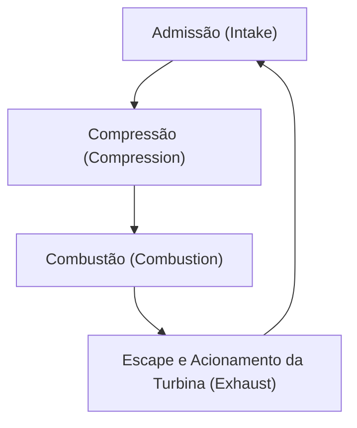
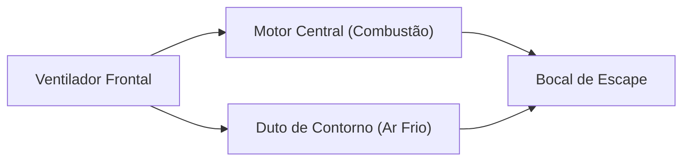

## Introdução: A Fonte de Energia que Transformou as Viagens Aéreas

Um dos avanços tecnológicos mais importantes que sustentam o transporte aéreo moderno é o desenvolvimento do motor turbofan. Os aviões comerciais, que utilizamos tão casualmente, voam num ambiente hostil a 10.000 metros de altitude, a velocidades próximas da do som, de forma segura e económica. O que torna isto possível é o motor turbofan, que alia um empuxo massivo a uma impressionante eficiência de combustível.

Neste artigo, partimos do ciclo termodinâmico de "admissão, compressão, combustão e escape", que é o princípio básico dos motores a jato, para explicar profundamente como os primeiros motores turbojato evoluíram para os modernos motores turbofan e a magia da "razão de contorno" (bypass ratio) que está no cerne desta evolução. Além disso, exploraremos a totalidade do motor a jato, que reúne o melhor da engenharia, desde a tecnologia de refrigeração das palhetas da turbina, que conseguem suportar ambientes de temperaturas ultra-elevadas de milhares de graus, até à engenharia de materiais de ponta, como as superligas monocristalinas.

---

## Princípios Básicos dos Motores a Jato: O Ciclo de Brayton

O princípio de funcionamento de um motor a jato é modelado na termodinâmica como o "ciclo de Brayton". Trata-se de um ciclo de motor térmico que pressupõe um fluxo contínuo de fluido e é composto pelos seguintes quatro processos:

1. **Admissão (Intake)**: O ar é aspirado pela parte frontal.
2. **Compressão (Compression)**: O ar aspirado é pressurizado por um compressor.
3. **Combustão (Combustion)**: O combustível é injetado no ar a alta pressão e inflamado para produzir um gás a alta temperatura e pressão.
4. **Escape (Exhaust)**: O gás em expansão é ejetado para trás, obtendo empuxo através da sua reação (acionando simultaneamente a turbina, que por sua vez aciona o compressor).

Esta série de processos é semelhante aos motores alternativos (motores de pistão) usados nos automóveis, mas a grande diferença do motor a jato é que estes ocorrem de forma "contínua". Enquanto um motor alternativo obtém energia através de explosões intermitentes, o motor a jato aspira, queima e expulsa o ar continuamente. Isto resulta numa densidade de potência extremamente alta e num movimento de rotação suave.

### A Importância da Compressão
Por que é necessário comprimir o ar? Porque a alta pressão do ar melhora drasticamente a eficiência da combustão, permitindo extrair muito mais energia. Na seção frontal do motor a jato estão dispostas várias etapas de palhetas de compressor (uma combinação de estatores e rotores) que comprimem gradualmente o ar. Nos motores modernos, o volume de ar admitido é reduzido para uma fração do seu tamanho original e a pressão pode atingir mais de 40 vezes a da pressão atmosférica.

---

## A Evolução do Turbojato para o Turbofan

Os primeiros motores a jato apresentavam uma configuração designada por "motor turbojato". O turbojato tem uma estrutura simples, em que todo o ar admitido é direcionado para a câmara de combustão, e o empuxo é gerado unicamente pela força dos gases de escape a alta temperatura e pressão ali produzidos.

### As Limitações do Turbojato
Os motores turbojato são adequados para voos a alta velocidade (especialmente voos supersónicos), mas no domínio subsónico (cerca de Mach 0.8 a 0.9) onde voam os aviões comerciais, apresentavam várias falhas significativas:

1. **Baixa Eficiência Propulsiva**: Como a velocidade dos gases de escape é demasiado alta em comparação com a velocidade de voo, perde-se muita da energia cinética. Para aumentar a eficiência propulsiva, é necessário que a velocidade de escape se aproxime da velocidade de voo, ao mesmo tempo que se empurra uma maior quantidade de ar para trás.
2. **Péssima Eficiência de Combustível**: Devido à elevada proporção de empuxo dependente da combustão, o consumo de combustível é extremamente alto.
3. **Problemas de Ruído**: A colisão violenta dos gases de escape a alta velocidade com o ar estático em redor gera um estrondoso ruído de jato (ruído de cisalhamento).

### O Nascimento do Turbofan e a Magia da "Razão de Contorno"
O "motor turbofan" foi desenvolvido para resolver estes problemas. A principal característica do motor turbofan é que possui um enorme "ventilador" (fan) semelhante a uma ventoinha na parte frontal do motor.

Nem todo o ar aspirado pelo ventilador entra no núcleo central do motor (compressor, câmara de combustão, turbina). O fluxo de ar é dividido em dois:
- **Fluxo do Núcleo (Core Flow)**: O ar que entra no centro do motor e é utilizado para a combustão.
- **Fluxo de Contorno (Bypass Flow)**: O ar que passa pelo exterior do núcleo e é expelido diretamente para trás.

A razão entre a "quantidade de ar que não passa pelo núcleo" e a "quantidade de ar que passa pelo núcleo" é designada por **razão de contorno (Bypass Ratio)**.

#### Porque é Bom Aumentar a Razão de Contorno?
Os motores modernos para aviões de passageiros são predominantemente "motores turbofan de alta razão de contorno", excedendo um rácio de 10:1. Isto significa que mais de 90% do ar aspirado não é usado para a combustão, sendo diretamente aproveitado como empuxo.

Uma alta razão de contorno apresenta os seguintes benefícios extraordinários:
1. **Melhoria Excecional na Eficiência de Combustível**: De acordo com a lei da conservação da quantidade de movimento, é mais eficiente empurrar uma grande massa de ar de forma relativamente lenta usando um ventilador do que queimar combustível para ejetar uma pequena quantidade de gás a alta velocidade. Isto melhorou drasticamente a eficiência de combustível e tornou possível o transporte em massa a longas distâncias.
2. **Redução Drástica do Ruído**: O fluxo de contorno, que é frio e lento, envolve os gases de escape quentes e rápidos que saem do núcleo. Isto atenua a diferença de velocidade entre os gases de escape e o ar exterior, reduzindo significativamente o cisalhamento do ar, que é a causa do ruído. As imediações dos aeroportos modernos são muito mais silenciosas do que no passado graças a este "efeito de isolamento acústico" do fluxo de contorno.

---

## Desafiando os Limites: Temperaturas Ultra-elevadas e Tecnologias de Refrigeração

Para melhorar o desempenho de um motor a jato (especialmente a sua eficiência térmica), é necessário aumentar ao máximo a temperatura da câmara de combustão (Temperatura de Entrada da Turbina - TIT). De acordo com o princípio do ciclo de Carnot, quanto mais alta for a temperatura da fonte de calor, maior será a eficiência do motor.

A temperatura de entrada da turbina nos modernos motores turbofan de alto desempenho atinge a impressionante marca de **1.500°C a 1.700°C**.
No entanto, surge aqui um problema grave. O ponto de fusão da superliga à base de níquel utilizada nas palhetas da turbina ronda os **1.300°C a 1.400°C**. Por outras palavras, as palhetas estão **expostas a um gás cuja temperatura é superior ao seu próprio ponto de fusão**. Logicamente, derreteriam instantaneamente, mas existem tecnologias avançadas de refrigeração e de materiais que evitam que isto aconteça.

### Tecnologia de Refrigeração por Película (Film Cooling)
O interior das palhetas da turbina é oco e recebe ar relativamente frio que foi sangrado do compressor (antes da combustão). Este ar arrefece a palheta por dentro e depois vaza para o exterior através de inúmeros microfuros a laser na superfície da palheta.
O ar que vaza forma uma fina película (film) que cobre a superfície da palheta, impedindo que os gases a alta temperatura de milhares de graus toquem diretamente na superfície metálica da palheta. A isto chama-se "refrigeração por película".

### Superligas Monocristalinas (Single Crystal Superalloys)
Para além da tecnologia de refrigeração, a evolução do próprio metal é indispensável. Normalmente, os metais têm uma estrutura "policristalina", composta por inúmeros cristais microscópicos. Contudo, no ambiente da turbina, onde existem altas temperaturas e fortes forças centrífugas, o metal tem tendência a sofrer de "fluência" (creep), deformando-se e rasgando-se ao longo das fronteiras entre os cristais (limites de grão).

Para evitar isto, os engenheiros desenvolveram uma tecnologia que permite fundir a palheta inteira como "um único cristal". Esta é a "superliga monocristalina (SC)". Sem os limites dos cristais, a palheta consegue manter uma resistência espantosa mesmo num ambiente de tensão a temperaturas extremas. Atualmente, foram desenvolvidas superligas monocristalinas de 5ª e 6ª geração, adicionando metais raros como o rênio e o ruténio para melhorar ainda mais a resistência térmica.

---

## O Futuro e a Sustentabilidade dos Motores de Aviação

O motor turbofan continua a evoluir até aos dias de hoje. Para os motores da próxima geração, é exigido um aumento ainda maior da razão de contorno. Tecnologias como o "Turbofan Engrenado" (Geared Turbofan - GTF), que permite ao ventilador rodar na sua velocidade ótima independente do núcleo do motor, já se tornaram práticas. Com isto, o ventilador pode rodar mais devagar (sendo mais eficiente e com menos ruído) e a turbina do núcleo pode rodar mais depressa (com maior eficiência).

Além disso, em resposta aos problemas ambientais globais, a adoção de Combustível de Aviação Sustentável (SAF: Sustainable Aviation Fuel) e o desenvolvimento de motores de combustão a hidrogénio, bem como de sistemas de propulsão híbridos combinados com motores elétricos, avançam rapidamente.

A história dos motores a jato é a história do desafio humano de ultrapassar os limites da termodinâmica, da dinâmica de fluidos e da engenharia de materiais. Quando voamos, por baixo das asas, chamas a milhares de graus e o expoente máximo da engenharia de ultra-precisão pulsam de forma silenciosa, mas poderosa.
